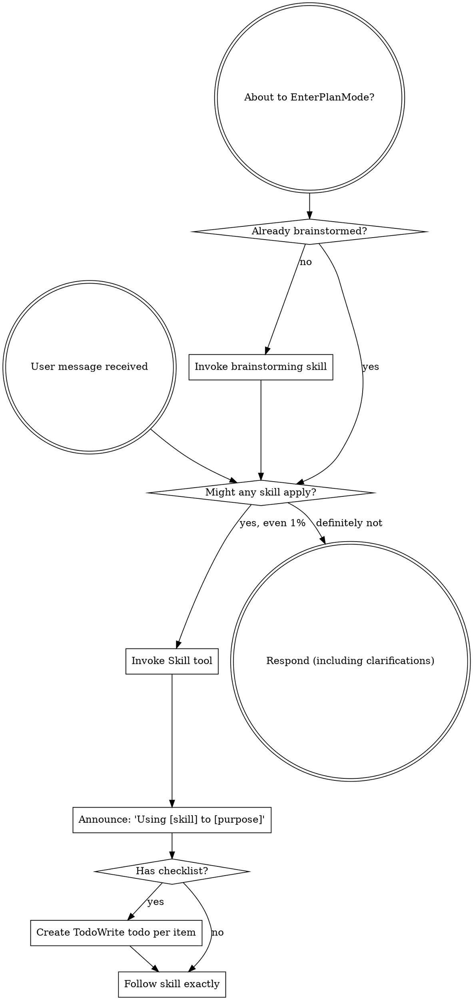
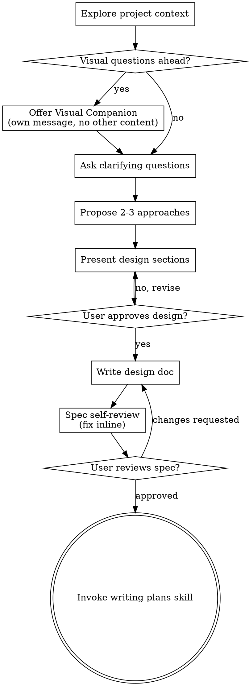
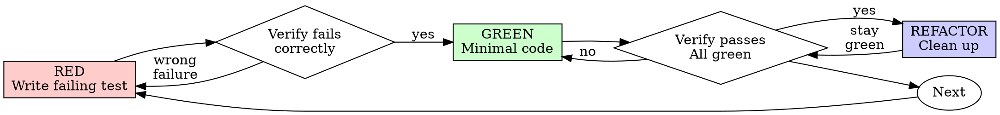
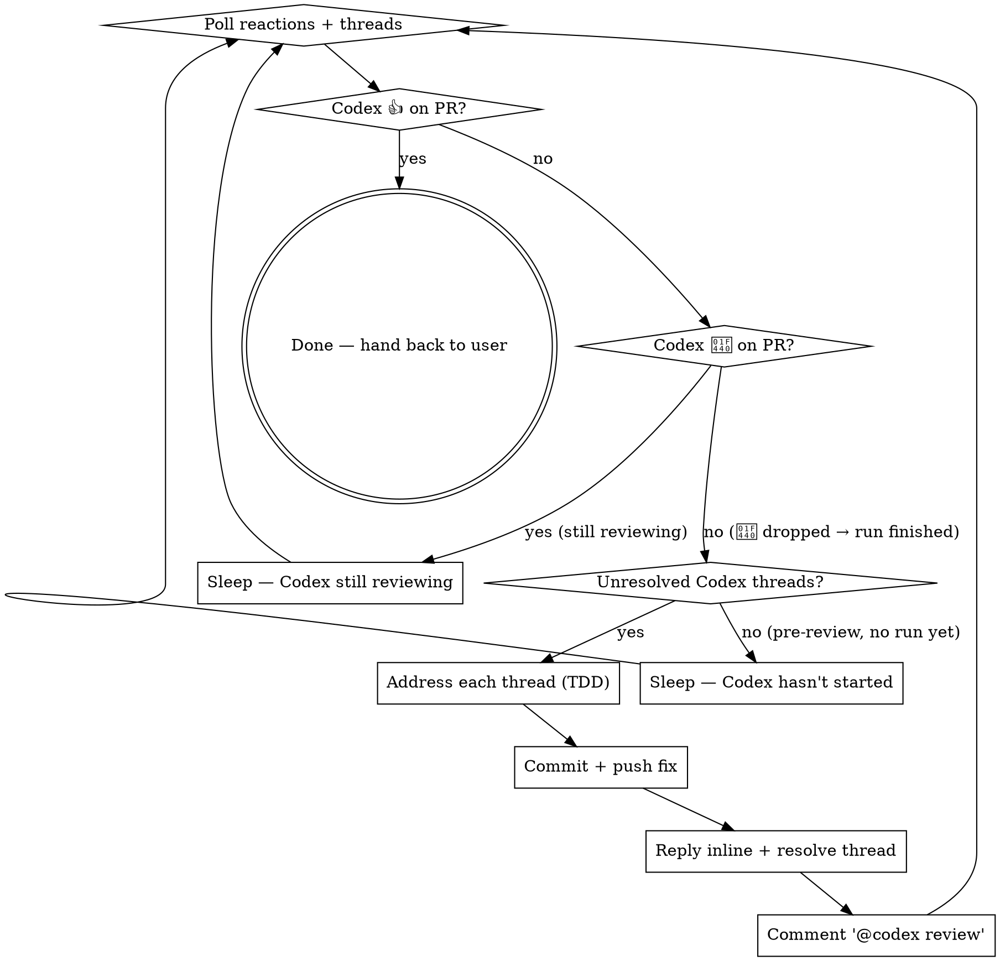

> SYSTEM

# AGENTS.md instructions for /Users/ericson/.codex/worktrees/5590/ars-ui

<INSTRUCTIONS>
## Approach
- Read existing files before writing. Don't re-read unless changed.
- Thorough in reasoning, concise in output.
- Skip files over 100KB unless required.
- No sycophantic openers or closing fluff.
- No emojis or em-dashes.
- Do not guess APIs, versions, flags, commit SHAs, or package names. Verify by reading code or docs before asserting.

--- project-doc ---

# ars-ui

## Project Overview

Rust frontend component library using state machines, framework-agnostic core with Leptos/Dioxus adapters.

## Current Phase

The repo is now in active implementation, not spec drafting only.

Agents working on implementation should use the GitHub Project roadmap and issue backlog as the execution source of truth:

- Use the GitHub Project `ars-ui implementation roadmap` to understand active epics, task breakdown, dependencies, status, and iteration planning.
- Prefer picking a single issue-backed task that is unblocked, sized, and scoped for independent delivery.
- Do not start work from an epic issue unless the user explicitly asks for planning or further decomposition.
- Do not start a task that is blocked by unresolved GitHub issue dependencies.
- Treat native GitHub issue dependencies as the blocker graph and the issue body acceptance criteria as the delivery contract.

## Development Workflow

For implementation tasks:

1. Read the assigned or selected GitHub issue first.
2. Move the issue to **In Progress** on the GitHub Project board.
3. Review the cited spec sections and any dependency issues.
4. Add or update the named tests first.
5. Implement only the scope required to make those tests pass.
6. If implementation changes the intended contract, update the relevant spec in the same task.
7. **MANDATORY:** Invoke the `post-implementation-audit` skill (`.agents/skills/post-implementation-audit/SKILL.md`). It runs three sequential audits on the new code — (a) spec/implementation drift with "best outcome" recommendations, (b) iterative "anything else missing?" passes (minimum two rounds), (c) test-coverage audit across every test type the workspace uses (unit, snapshot, proptest, doc, spec-conformance, llvm-cov — mutation testing is **not** part of this gate; it is Nightly-CI-driven). **Every finding lands in _this_ PR — no deferral, no follow-up issues.** This step exists because initial implementations consistently ship spec drift and silent contract violations that take 3+ review round-trips to surface; the audit collapses them into one. Skipping this step is a contract violation.
8. Present the final result for user review before any commit.
9. After user approval, run `cargo xci --profile fast` (alias: `cargo xci-fast`) locally and fix any failures before pushing anything to GitHub. The fast profile covers the workspace-level regressions a pre-push gate should catch: fmt, clippy, unit, integration, adapter, spec-compile-snippets, error-variant-coverage, mutual-exclusion, snapshot-count, and a **native-only coverage check** (`coverage-native`) that enforces the thresholds of the crates whose CI coverage is native-only (the agnostic library crates + xtask) — so `ars-components`-style coverage regressions surface before push, not on CI. The native coverage check adds an instrumented rebuild, so the fast profile runs in roughly 10–15 minutes. Reserve full `cargo xci` (~25 minutes, all 20 gates including the wasm coverage + CRAP gate and the feature-matrix groups) for after substantial refactors that may have shifted feature-flag interactions. For small follow-up changes, run the focused tests and checks that cover the edited code instead. To run only the coverage check, use `cargo xcov` (native-only) or `cargo xcov --full` (mirrors CI; needs the wasm toolchain + clang-22).
10. After `cargo xci-fast` passes, commit and push a PR targeting `main`. The PR body MUST include an auto-close keyword for the issue being delivered, for example `Closes #20` or `Fixes #20`, so GitHub closes the issue automatically when the PR merges.
11. **If the PR creates or modifies any `.snap` insta fixtures, attach the `snapshot-reviewed` label after opening or updating it** (`gh pr edit <num> --add-label "snapshot-reviewed"`). This signals to reviewers that the snapshot output was inspected and is intentional. Re-apply the label whenever you push a commit that touches `.snap` files; the workflow assumes the label reflects the latest snapshot state.
12. **MANDATORY:** Invoke the `waiting-for-codex-review` skill (`.agents/skills/waiting-for-codex-review/SKILL.md`) immediately after the first push that creates the PR, and re-invoke it after every subsequent push to the PR branch. The skill posts the initial `@codex review` trigger, polls Codex's 👀 → (👍 \| ∅ + threads) reaction lifecycle, addresses any review threads with the same rigor as `post-implementation-audit` (TDD + no coverage regression), replies inline, resolves threads, and re-comments `@codex review` to start the next pass — looping until Codex leaves 👍. Skipping this step leaves Codex findings unaddressed and silently widens the gap between merged code and the spec; the merge gate is 👍 from Codex plus green CI, not green CI alone.
13. Only after CI passes, Codex has left 👍, and the PR is merged, close the issue.

Never close a GitHub issue without a merged PR that passes CI **and a 👍 from Codex**. Never commit or push without explicit user approval. Keep the issue, PR, and Project board status aligned with the actual work state at every step.

Default delivery rules:

- Follow TDD: tests first, implementation second, verification last.
- Keep task scope aligned with the issue. If the issue is too large or ambiguous, stop and split or clarify rather than freelancing a bigger change.
- Prefer tasks sized `1`, `2`, `3`, or `5` points. `8` is exceptional. `13` must be decomposed before implementation.
- Preserve the crate and dependency layering defined by the architecture and implementation plan.
- Do not add a new dependency crate without explicit user approval first. If a task appears to need a new crate, stop, explain why, and get approval before editing any `Cargo.toml`.
- When a task is complete, verify the exact tests and checks named by the issue before considering it done.
- **Adapter-level component implementation MUST follow `docs/implementation/adapter-component-delivery.md` precisely.** Every adapter task — for any component in `crates/ars-leptos` or `crates/ars-dioxus` — must land _all_ of the following in the same PR, with no deferral to follow-up issues:
    1. Adapter crate code (`crates/ars-{leptos,dioxus}/src/<category>/<component>/`) with module wiring and prelude re-exports — minimize `clone()` calls by parking per-instance values shared across closures in `StoredValue<T>` (Leptos) or `CopyValue<T>` (Dioxus) instead of cloning into each capture, per the "Avoid unnecessary clones" section in `docs/implementation/adapter-component-delivery.md`;
    2. Adapter-level **unit + SSR tests** in `crates/ars-{leptos,dioxus}/tests/<component>.rs`;
    3. Adapter-level **wasm browser tests** in `crates/ars-{leptos,dioxus}/tests/<component>_wasm.rs` for any interactive behavior (focus, keyboard nav, pointer events, typeahead, controlled-signal sync, observers, portal, scroll, cleanup);
    4. **Widgets examples** in _all six_ widgets crates (`examples/widgets-{leptos,dioxus}`, `widgets-{leptos,dioxus}-css`, `widgets-{leptos,dioxus}-tailwind`) under the matching `src/categories/<category>.rs` — replacing any "Coming soon" placeholder text with a real interactive demo;
    5. **E2E fixtures** in `crates/ars-e2e/fixtures/{leptos,dioxus}/src/main.rs` and an **E2E harness module** at `crates/ars-e2e/src/<category>/<component>.rs` covering axe-core, keyboard, pointer, and adapter-parity checks (unless the component is purely static and adapter tests already prove that — state the reason in the PR body);
    6. **xtask `e2e <category>` subcommand** (in `xtask/src/e2e.rs`, `xtask/src/main.rs`, and `crates/ars-e2e/src/main.rs`) when this is the first E2E-covered component in a new category;
    7. **Spec synchronization** for any drift surfaced by the implementation, with the amendment landed in the same PR (see "Spec Synchronization During Implementation");
    8. **Validation gates**: `cargo xtask lint adapter-parity` runs without `SKIP` for the component; `cargo xci-fast` passes; `post-implementation-audit` skill ran all three phases with every finding fixed in this PR.

    Skipping any of these is a workflow violation. The `adapter-component-delivery.md` doc is the single source of truth for what "adapter task complete" means.

### Code Quality Standards

- **Document all public items.** Every public struct, enum, trait, function, constant, type alias, method, field, and variant must have a `///` doc comment. Every `lib.rs` must have a `//!` crate-level doc comment. The workspace enforces `missing_docs` linting — undocumented public items are build failures.
- **Zero warnings policy.** All code must compile with zero warnings under the workspace's configured clippy and rustc lints. Fix the root cause instead of suppressing. When suppression is genuinely needed, use `#[expect(lint, reason = "...")]` — never `#[allow(...)]`.
- **Derive documentation from the spec.** Doc comments should describe the _purpose and semantics_ of the item as defined in the corresponding `spec/` files, not just restate the type signature.
- **Use `#[inline]` selectively, not mechanically.** Do **not** add Clippy's `missing_inline_in_public_items` lint at the workspace level, and do not treat public visibility alone as a reason to mark an item `#[inline]`. Use `#[inline]` for thin cross-crate wrappers, trivial accessors, and hot-path no-op shims where the call overhead is plausibly meaningful. Avoid blanket `#[inline]` on all public APIs — it increases code size, adds compile-time cost, and turns `#[inline]` into noise instead of a deliberate performance signal.
- **Use directory-backed modules with `mod.rs` when a module owns children.** This repo standardizes on the older filesystem layout for nested modules. If module `foo` has child modules, the parent must live at `foo/mod.rs`, not `foo.rs`. Do not mix `foo.rs` with a sibling `foo/` directory. When a refactor adds child modules under an existing flat file, move the parent into `foo/mod.rs` in the same change. Do not leave empty leftover module directories behind.

### API Design Standards

- **Design for the pit of success.** Public APIs should make the most natural, shortest path also be the path that is correct, accessible, localizable, type-safe, and performant. Prefer ergonomic constructors and defaults that preserve the spec's strongest guarantees instead of making users opt into correctness after choosing a convenient API.
- **Name escape hatches explicitly.** When a component needs a lower-level, static, non-i18n, or otherwise less complete path, keep it available but make the tradeoff visible in the API name or type. The blessed path should remain the simplest call site, while escape hatches should read as deliberate choices.
- **Keep semantic data separate from rendered views.** Rich framework views are useful for customization, but components still need semantic sources for accessible names, localized text, announcements, ids, and state-machine wiring. Do not rely on arbitrary rendered view trees as the only source of user-facing semantics.

### Code Coverage

The workspace uses `cargo-llvm-cov` for code coverage with per-crate threshold enforcement. CI runs coverage on every PR (see `.github/workflows/ci.yml`).

**Local coverage commands:**

```bash
# Fast native-only coverage gate — instruments + checks only the crates whose
# CI coverage is native-only (agnostic library crates + xtask). No wasm/clang
# toolchain needed; this is what the `fast` pre-push profile runs.
cargo xcov

# Full native+wasm coverage gate, mirroring CI (needs the wasm toolchain + clang-22)
cargo xcov --full

# Per-crate coverage with inline annotated source (most useful during development)
cargo llvm-cov test -p ars-interactions --text -- hover

# Per-crate summary only
cargo llvm-cov test -p ars-interactions -- hover

# Native-only workspace coverage (host target; excludes wasm-only crates)
cargo llvm-cov --workspace \
  --exclude ars-leptos --exclude ars-dioxus \
  --exclude ars-test-harness-leptos --exclude ars-test-harness-dioxus \
  --exclude ars-derive --exclude xtask \
  --lcov --output-path lcov.info

# Check all crates against spec-defined thresholds (run after a *merged* lcov)
cargo xtask coverage check-all --file lcov.info
```

The `--text` flag produces line-by-line annotated source showing hit counts and `^0` markers on uncovered branches — use this to identify gaps after writing tests. Uncovered no-op callback closures in tests (e.g., `|_| {}`) are expected and not a gap.

The local recipe above excludes the adapter and adapter-test-harness crates because their `target_arch = "wasm32"` / `feature = "web"` code paths can't be measured via host-target `cargo llvm-cov`. **CI runs an additional wasm-coverage pipeline on nightly** (`cargo xtask ci coverage`) that uses `wasm-bindgen-test`'s experimental coverage recipe with LLVM 22 / `clang-22` to emit lcov for `ars-leptos` (csr), `ars-dioxus` (web), `ars-dom` (web), `ars-i18n` (web-intl), and the adapter test harnesses, then merges with the native lcov via `cargo xtask coverage merge`. The per-crate thresholds in `xtask::coverage::default_thresholds()` are enforced against the merged file — including adapter targets (`ars-leptos` 74/55, `ars-dioxus` 77/70, `ars-test-harness-leptos` 60/0, `ars-test-harness-dioxus` 60/0). `ars-derive` (proc-macro, runs in compiler) is exercised via `crates/ars-core/tests/derive_contract.rs` and is unmeasured. `xtask` has its own enforced threshold (30/35) and is measured. See `spec/testing/14-ci.md` §2 for the full pipeline.

### CRAP Gate (complexity vs. coverage)

Coverage tells you which lines run; mutation testing tells you whether tests would notice misbehaviour. The **CRAP gate** ([`cargo-crap`](https://crates.io/crates/cargo-crap)) tells you which functions are _risky to change_ — high cyclomatic complexity combined with low coverage. The CRAP score is `complexity² · (1 − coverage)³ + complexity`.

**Why regression mode, not an absolute threshold.** At 100% coverage `CRAP == cyclomatic complexity`, so an absolute `--fail-above` threshold rejects every large `match` no matter how well it is tested. This workspace is built on state machines: each stateful component's `Machine::transition` is intrinsically a wide `match (state, event)` (complexity 30–80) and is exhaustively tested. An absolute gate would fight that architecture and reject more components as the catalog grows. The gate therefore runs in **regression mode**.

- **Blessed entrypoints:** `cargo xcrap` (local human-readable report, never fails), `cargo xcrap --update-baseline` (regenerate the baseline), and `cargo xtask ci crap` (the CI gate). The gate is the last step of the full `cargo xci` pipeline, running immediately after `coverage` and reusing its merged `lcov.info` (no recompile). It is **not** in the fast profile: the fast profile runs only the native-only `coverage-native` check, which does not produce the merged `lcov.info` the CRAP gate compares against.
- **Policy:** `cargo crap --path . --lcov lcov.info --baseline .crap-baseline.json --fail-regression --min 30 --exclude 'target/**' --exclude 'examples/**' --exclude 'xtask/**' --exclude 'crates/ars-e2e/**' --exclude 'crates/ars-derive/**'`. The gate scopes to the **shipped component library** — tooling (`xtask`), the browser E2E harness (`ars-e2e`), the proc-macro crate, demos, and build output are excluded (they are not shipped surface, and several run uninstrumented-as-tooling on CI → 0% → spurious CRAP). The gate fails only when a function **at or above CRAP 30 regresses** (more complexity or less coverage) versus the committed baseline. New functions are tolerated — the per-crate coverage thresholds already ensure new code is tested — and sub-threshold churn on simple functions is ignored. Net: the coverage gate guarantees new code is tested; the CRAP gate guarantees shipped code does not rot.
- **`--path .`, not `--workspace`.** cargo-crap's regression key is `(file, function, line)`, and `--workspace` records machine-absolute file paths (`/Users/…` locally, `/home/runner/…` on CI). A baseline committed with absolute paths never matches on CI, silently turning the gate into a no-op. `--path .` emits repo-relative paths (`./crates/…`) that match on any checkout; coverage still associates correctly because cargo-crap canonicalizes paths when reading the lcov. `--exclude` is honored under `--path` (it is a no-op under `--workspace`), so `target/**` and the unmeasured `crates/ars-derive/**` are skipped there. Because the key includes the line number, a baseline only matches non-uniquely-named functions (e.g. `Machine::transition`) while their line numbers are stable; regenerate the baseline when a tracked file's lines shift materially.
- **Baseline:** `.crap-baseline.json` at the repo root is committed and complete (every function, no `--min`, so a function crossing the threshold is still caught). Regenerate it with `cargo xcrap --update-baseline` from CI's merged `lcov.info` (download the `coverage-lcov` artifact) whenever a **deliberate** complexity increase lands; commit the new baseline in that PR — a conscious "I accept this" checkpoint. cargo-crap's `--epsilon` (default 0.01) absorbs coverage float jitter. If the baseline is missing, the gate bootstraps it and passes with a notice.
- **Pinned version:** cargo-crap is pinned to an exact version in `xtask::crap::CARGO_CRAP_VERSION` and `.github/workflows/ci.yml` (same convention as cargo-mutants). To bump, update both. Install locally with `cargo install cargo-crap --locked --version <version>` (or `cargo binstall cargo-crap`).
- **Scope / escape hatch:** the exclude-glob list lives in `xtask/src/crap.rs` (`EXCLUDE_GLOBS`), each entry justified by a comment, and scopes the gate to the **shipped component library**. Because the gate runs under `--path .`, cargo-crap's `--exclude` is honored, so build output (`target/**`), demos (`examples/**`), the task runner (`xtask/**`), the browser E2E harness (`crates/ars-e2e/**`), and the proc-macro crate (`crates/ars-derive/**`) are skipped at walk time. The last three are not shipped library code and run uninstrumented-as-tooling on CI (0% coverage → spurious CRAP), so gating them is meaningless. Prefer fixing or refactoring over adding entries. (Note: the per-crate **coverage** gate still measures `xtask` at its own loose 30/35 threshold — that is separate from CRAP.)

### Mutation Testing

Coverage tells you which lines run. **Mutation testing tells you whether the tests would notice if those lines silently misbehaved.** The workspace uses [`cargo-mutants`](https://mutants.rs) for this — a `cargo` extension binary, not a workspace dependency.

**Install (once per developer machine):**

```bash
cargo install cargo-mutants --locked --version 27.0.0
```

**Local commands (state-machine modules are the most rewarding targets):**

Prefer `cargo xmutants` over bare `cargo mutants` — it applies the same
per-crate `--features` profile as Nightly CI (for example
`ars-components/i18n`) so snapshot and i18n-gated tests match CI.

```bash
# Run on a single component machine (~6 min for popover)
cargo xmutants -p ars-components -f crates/ars-components/src/overlay/popover/mod.rs

# Just list what would be mutated, without running tests (fast)
cargo xmutants -p ars-components -f crates/ars-components/src/overlay/popover/mod.rs --list

# Whole crate (slow — only if you really mean it)
cargo xmutants -p ars-components
```

**Agnostic component implementation gate:** whenever an agent implements a new framework-agnostic component, or materially changes an existing one, the delivery must include:

- spec-conformance tests for the component's anatomy/public contract, including its `Part` enum and required API/attribute surface;
- the full test breadth the component warrants (unit, snapshot, proptest) with strong line/branch coverage.

**Mutation testing is NOT a pre-PR requisite for agnostic component work.** Do not run a targeted `cargo xmutants` pass as a delivery/audit gate, and do not block a PR on a clean local mutation run. Surviving (`MISSED`) mutants are surfaced by the Nightly CI `mutation-testing` job (see below); triage them — add tests for real gaps, or add a justified line-agnostic `.cargo/mutants.toml` exclude for true equivalent mutations — in a dedicated follow-up when Nightly reports them, not during initial component delivery. (Running a local mutation pass voluntarily is fine, but it is never required and never blocks delivery or review.)

**Reading the output:** Results land in `mutants.out/mutants.out/` (gitignored). The two files that matter:

- `caught.txt` — mutations that broke at least one test ✅
- `missed.txt` — mutations that survived all tests ❌ — each one is either a real test gap to fill or an "equivalent mutation" that needs a `[[skip]]` entry in `mutants.toml` with a justification

**CI integration:** Nightly only. `.github/workflows/nightly.yml` has a `mutation-testing` job with a 21-entry matrix that runs `cargo mutants -p <package>` on every framework-agnostic crate, using `--shard k/n` to spread larger crates across parallel runners. **Shard indices are 0-based** (`k` runs from `0` to `n-1`); `k == n` is invalid and will fail the job. When adding shards, always start at `0/n` and end at `(n-1)/n`.

- **`ars-components` (≈ 1,630 mutants today, planned to grow as the spec adds the remaining ~97 components):** sharded **12-way** → ≈ 135 mutants per runner today, ≈ 850 per runner at the ~10,000-mutant endpoint. Sized for the full spec catalog up front so we don't re-shard every few months as components land.
- **`ars-collections` (≈ 1,080 mutants):** sharded 4-way → ≈ 270 mutants per runner.
- **`ars-core` (≈ 700 mutants):** sharded 2-way → ≈ 350 mutants per runner.
- **`ars-a11y`, `ars-forms`, `ars-interactions`:** one runner each (under 600 mutants apiece).

**Adding a new state machine inside an existing crate requires no CI changes** — its mutations land in whichever shard the cargo-mutants partitioner places them. The shard counts are sized so the slowest runner stays well under 30 minutes today and under ~50 minutes at the planned endpoint; re-balance only when a crate outgrows that budget (visible on the nightly dashboard as one shard pulling away from the others).

All matrix jobs run with `fail-fast: false` so failures on one module don't mask data on another. Each job uploads its `mutants.out/` as a workflow artifact (always, even on success — surviving "missed" entries on a passing run still reveal test-quality work). The job fails if any mutation survives, so a missed mutation forces a deliberate triage decision (fix the test, or document the equivalence with a `[[skip]]` entry in `mutants.toml`).

**Excluded crates** (mutation testing's signal degrades wherever determinism does): adapter glue (`ars-leptos`, `ars-dioxus`), DOM/FFI (`ars-dom`), ICU/FFI (`ars-i18n`), test infrastructure (`ars-test-harness*`), and the proc-macro crate (`ars-derive`, runs in the compiler). Adding a brand-new crate that is a good mutation target requires one new matrix entry; run a local scout first (`cargo mutants -p <crate> --list` to size, then a real run) so we know the right shard count before the nightly fires.

**Bumping the pinned version.** Both the local install command above and `.github/workflows/nightly.yml` pin cargo-mutants to an exact version (currently `27.0.0`) — same convention as `wasm-pack` in the `a11y-audit` job. Pinning is deliberate: cargo-mutants ships new mutators in releases, and an unpinned install would silently change the mutation set without any code change, surfacing as phantom CI failures on a green-source repo. To bump, open a PR that (1) updates the version string in CLAUDE.md and `nightly.yml`, (2) runs the popover scout locally with the new version (`cargo mutants -p ars-components -f crates/ars-components/src/overlay/popover/mod.rs`) to confirm the mutation count is in the same ballpark, and (3) triages any new "missed" entries the new mutators surface — they are usually genuine test-quality gaps newly visible to the tool.

### Property Testing (proptest)

State-machine invariants are exercised by [`proptest`](https://docs.rs/proptest) under `crates/<crate>/tests/proptest_state_machines/` (see `ars-components`). Default proptest behaviour drops `*.proptest-regressions` seed files alongside test sources — instead, every `proptest!` block in this workspace pulls a shared `Config` from `tests/proptest_state_machines/common.rs` that:

1. Reads `PROPTEST_CASES` from the environment (1,000 default; 10,000 in the nightly `extended-proptest` job).
2. Sets `failure_persistence` to `FileFailurePersistence::Direct("proptest-regressions/state-machines.txt")`, so all persisted seeds for the test binary live in one file at the crate root: `crates/<crate>/proptest-regressions/state-machines.txt`. The directory is committed (per proptest's own recommendation in the file header) so every developer's runs benefit from previously-shrunk failures.

When a new crate adopts proptest for state-machine tests, copy the same `common.rs` helper and reference it via `#![proptest_config(super::common::proptest_config())]` inside every `proptest!` block. Don't let proptest fall back to its `WithSource` default — that scatters seed files across the source tree.

### Adapter Prelude Convention

Both `ars-leptos` and `ars-dioxus` expose a `prelude` module targeting **end users** — application developers who consume the ready-made components. `use ars_leptos::prelude::*` (or `use ars_dioxus::prelude::*`) should give them everything they need.

The prelude contains only user-facing items:

1. **Component modules** — as components land, their public module paths (e.g., `button`, `dialog`) are re-exported so users can write `button::Props`, etc.
2. **User-facing traits** — traits end users call on component outputs (e.g., `Translate` from `ars-i18n`). Re-export the trait so consumers don't need a direct dependency on the subsystem crate.
3. **Configuration types** — types that appear in component props or configure behaviour (e.g., `Locale`, `Direction`, `Orientation`, `Selection`).

The prelude does **not** include implementation details consumed only by component authors inside the adapter crate: core engine types (`Machine`, `Service`, `ConnectApi`, `AttrMap`), accessibility primitives (`AriaRole`, `AriaAttribute`), interaction helpers (`merge_attrs`), or adapter hooks (`use_machine`, `UseMachineReturn`). Those remain accessible via their normal crate paths for advanced users building custom machines.

Both adapter preludes must stay symmetric: same items, same structure. When adding a new re-export to one adapter's prelude, add it to the other as well in the same PR.

### Adapter Testing Convention

Adapter-level component tests should default to the framework-specific test harness crate:

- Leptos adapter tests should prefer `ars-test-harness-leptos`.
- Dioxus adapter tests should prefer `ars-test-harness-dioxus`.
- Shared `ars-test-harness` helpers should be used where relevant for viewport, layout, clipboard, drag/drop, timing, and other DOM test setup instead of bespoke per-test browser scaffolding.

When a component spec requires interaction, focus, overlay positioning, clipboard, file upload, drag/drop, or similar browser behavior, the task's tests should exercise that behavior through the adapter harness entrypoints and shared core harness helpers unless there is a concrete technical reason not to.

## Spec Synchronization During Implementation

The specification is the authoritative contract. It took weeks of deliberate design and MUST be followed.

### Spec-first implementation rule

Before implementing any public type, trait, function, or method:

1. **Read the spec section first.** Find the relevant code example in `spec/`. Use `spec-tool toc <file>` and `grep` to locate it.
2. **Match the spec exactly.** If the spec defines `struct ComponentIds { base: String }` with methods `from_id()`, `id()`, `part()`, `item()`, `item_part()` — implement exactly that. Do not invent alternative field names, method names, or signatures.
3. **Cross-check after implementation.** Before presenting code for review, diff every public item against the spec's code examples. Every struct field, every method name, every parameter must match.
4. **If you must deviate**, there must be a concrete technical reason (e.g., the spec's API cannot compile, or a dependency doesn't expose the needed type). Document the reason in a code comment and flag it to the user explicitly.

Inventing alternative APIs that "seem equivalent" is never acceptable — it silently invalidates the spec's design decisions and all downstream code that depends on those APIs.

### Spec/code mismatch resolution

- If code and spec disagree, resolve the mismatch in the same task or PR.
- Shared conceptual changes belong in shared or foundation spec files, not only in adapter code.
- Adapter-specific findings must be reflected back into `spec/foundation/08-adapter-leptos.md` and/or `spec/foundation/09-adapter-dioxus.md` when relevant.
- Do not leave spec drift behind as follow-up cleanup.

## Spec Structure

The specification lives in `spec/` with this layout:

- `spec/manifest.toml` — **START HERE** — central index of all components and their dependencies
- `spec/foundation/` — architecture, accessibility, i18n, interactions, forms, adapters, spec template (00-10)
- `spec/shared/` — cross-component shared types (date-time, selection, layout, z-index)
- `spec/components/{category}/` — one file per component, organized by category
- `spec/testing/` — test specs split by domain

### Component Categories

- `input/` — checkbox, text-field, slider, number-input, etc.
- `selection/` — select, combobox, listbox, menu, tags-input, etc.
- `overlay/` — dialog, popover, tooltip, toast, presence, etc.
- `navigation/` — accordion, tabs, tree-view, pagination, steps, etc.
- `date-time/` — date-field, time-field, calendar, date-picker, etc.
- `data-display/` — table, avatar, progress, meter, badge, etc.
- `layout/` — splitter, scroll-area, carousel, portal, toolbar, etc.
- `specialized/` — color-picker, file-upload, signature-pad, qr-code, etc.
- `utility/` — button, toggle, focus-scope, visually-hidden, separator, etc.

## Working with the Spec

When reading large files, run `wc -l` first to check the line count. If the file is over 2,000
lines, use the `offset` and `limit` parameters on the Read tool to read in chunks rather than
attempting to read the entire file at once.

### Using xtask spec (preferred)

Use `cargo xtask spec` to resolve file sets instead of manually parsing manifest.toml:

```bash
# Quick metadata lookup:
cargo xtask spec info <component>

# Find all components using a shared type:
cargo xtask spec reverse <shared-type>

# See a file's heading structure (with line numbers):
cargo xtask spec toc <file>

# Validate frontmatter matches manifest.toml:
cargo xtask spec validate

# Search spec content by keyword/regex (with optional filters):
cargo xtask spec search <query> [--category <cat>] [--section <sec>] [--tier <tier>]

# Get a compact component summary (states, events, props, accessibility):
cargo xtask spec digest <component>

# Get full implementation context (component + all deps concatenated):
cargo xtask spec context <component> [--framework <fw>] [--include-testing]
```

The xtask also runs as an MCP server (`cargo xtask mcp`) exposing all spec tools for LLM agents.

### Reading a component (manual fallback)

1. Read `spec/manifest.toml` to find the component's path and dependencies
2. Read the component file (has YAML frontmatter listing its foundation/shared deps)
3. Only load the foundation files listed in `foundation_deps` — not all of them

### Framework and library specs — MANDATORY skill loading

When reading or editing these specification files, you MUST load the corresponding skill BEFORE doing any work. The skills contain verified, version-accurate API documentation that the spec code examples depend on. Claude's training data is wrong for these libraries — do not trust it.

| Spec file                                    | Skill to load | Library version |
| -------------------------------------------- | ------------- | --------------- |
| `spec/foundation/04-internationalization.md` | `icu4x`       | ICU4X 2.1.1     |
| `spec/foundation/08-adapter-leptos.md`       | `leptos`      | Leptos 0.8.17   |
| `spec/foundation/09-adapter-dioxus.md`       | `dioxus`
</INSTRUCTIONS>
<environment_context>
  <cwd>/Users/ericson/.codex/worktrees/5590/ars-ui</cwd>
  <shell>zsh</shell>
  <current_date>2026-06-02</current_date>
  <timezone>America/Sao_Paulo</timezone>
  <filesystem><workspace_roots><root>/Users/ericson/.codex/worktrees/5590/ars-ui</root></workspace_roots><permission_profile type="managed"><file_system type="restricted"><entry access="read"><special>:root</special></entry><entry access="write"><path>/Users/ericson/.codex/worktrees/5590/ars-ui</path></entry><entry access="write"><special>:slash_tmp</special></entry><entry access="write"><special>:tmpdir</special></entry><entry access="read"><path>/Users/ericson/.codex/worktrees/5590/ars-ui/.git</path></entry><entry access="read"><path>/Users/ericson/.codex/worktrees/5590/ars-ui/.agents</path></entry><entry access="read"><path>/Users/ericson/.codex/worktrees/5590/ars-ui/.codex</path></entry><entry access="read"><path>/Users/ericson/Workspace/Rust/ars-ui/.git/worktrees/ars-ui</path></entry></file_system></permission_profile></filesystem>
</environment_context>

> DEVELOPER

We recently completed all agnostic components of the data-display category. Now I wanna do an full audit of them, to be able to close the Epic #225 on Github. In this audit we need to make sure that everything related to this category in the spec was properly implemented, on all data-display agnostic components. Including auditing their respective proptests and spec conformance tests, and while you're in those two, take your time to properly separate the proptests and the spec conformance tests into modules for each component, as currently we have a bloat of tests for all data-display components together in the same file.

> AGENT

I’ll use the repo workflow plus the Superpowers planning/TDD guidance because this is a broad audit with code and test restructuring. I’m going to first gather the issue/spec/test layout so the audit is anchored to the current contract.

> TOOL

tool_use exec_command
id: call_5qwjOqibgi97hhdfrvqCpoiB
```json
{
  "cmd": "sed -n '1,220p' /Users/ericson/.codex/plugins/cache/openai-curated/superpowers/5e86d584/skills/using-superpowers/SKILL.md",
  "workdir": "/Users/ericson/.codex/worktrees/5590/ars-ui",
  "yield_time_ms": 1000,
  "max_output_tokens": 12000
}
```

> TOOL

tool_use exec_command
id: call_Sf5vxY0ZIdiBmH0bevuNiPrw
```json
{
  "cmd": "sed -n '1,240p' /Users/ericson/.codex/plugins/cache/openai-curated/superpowers/5e86d584/skills/brainstorming/SKILL.md",
  "workdir": "/Users/ericson/.codex/worktrees/5590/ars-ui",
  "yield_time_ms": 1000,
  "max_output_tokens": 12000
}
```

> TOOL

tool_use exec_command
id: call_innBFOo5kvrZ8fiIRn1zrnYY
```json
{
  "cmd": "sed -n '1,240p' /Users/ericson/.codex/plugins/cache/openai-curated/superpowers/5e86d584/skills/writing-plans/SKILL.md",
  "workdir": "/Users/ericson/.codex/worktrees/5590/ars-ui",
  "yield_time_ms": 1000,
  "max_output_tokens": 12000
}
```

> TOOL

tool_use exec_command
id: call_9N6MVwOIrOqji4yxGlb7AOT7
```json
{
  "cmd": "rg -n \"data-display|data_display|Badge|Avatar|Progress|Meter|Table|Marquee|RatingGroup|TagGroup\" /Users/ericson/.codex/memories/MEMORY.md",
  "workdir": "/Users/ericson/.codex/worktrees/5590/ars-ui",
  "yield_time_ms": 1000,
  "max_output_tokens": 12000
}
```

> TOOL

tool_result
id: call_5qwjOqibgi97hhdfrvqCpoiB
```
Chunk ID: 2b4fe6
Wall time: 0.4447 seconds
Process exited with code 0
Original token count: 1356
Output:
---
name: using-superpowers
description: Use when starting any conversation - establishes how to find and use skills, requiring Skill tool invocation before ANY response including clarifying questions
---

<SUBAGENT-STOP>
If you were dispatched as a subagent to execute a specific task, skip this skill.
</SUBAGENT-STOP>

<EXTREMELY-IMPORTANT>
If you think there is even a 1% chance a skill might apply to what you are doing, you ABSOLUTELY MUST invoke the skill.

IF A SKILL APPLIES TO YOUR TASK, YOU DO NOT HAVE A CHOICE. YOU MUST USE IT.

This is not negotiable. This is not optional. You cannot rationalize your way out of this.
</EXTREMELY-IMPORTANT>

## Instruction Priority

Superpowers skills override default system prompt behavior, but **user instructions always take precedence**:

1. **User's explicit instructions** (CLAUDE.md, GEMINI.md, AGENTS.md, direct requests) — highest priority
2. **Superpowers skills** — override default system behavior where they conflict
3. **Default system prompt** — lowest priority

If CLAUDE.md, GEMINI.md, or AGENTS.md says "don't use TDD" and a skill says "always use TDD," follow the user's instructions. The user is in control.

## How to Access Skills

**In Claude Code:** Use the `Skill` tool. When you invoke a skill, its content is loaded and presented to you—follow it directly. Never use the Read tool on skill files.

**In Copilot CLI:** Use the `skill` tool. Skills are auto-discovered from installed plugins. The `skill` tool works the same as Claude Code's `Skill` tool.

**In Gemini CLI:** Skills activate via the `activate_skill` tool. Gemini loads skill metadata at session start and activates the full content on demand.

**In other environments:** Check your platform's documentation for how skills are loaded.

## Platform Adaptation

Skills use Claude Code tool names. Non-CC platforms: see `references/copilot-tools.md` (Copilot CLI), `references/codex-tools.md` (Codex) for tool equivalents. Gemini CLI users get the tool mapping loaded automatically via GEMINI.md.

# Using Skills

## The Rule

**Invoke relevant or requested skills BEFORE any response or action.** Even a 1% chance a skill might apply means that you should invoke the skill to check. If an invoked skill turns out to be wrong for the situation, you don't need to use it.



## Red Flags

These thoughts mean STOP—you're rationalizing:

| Thought | Reality |
|---------|---------|
| "This is just a simple question" | Questions are tasks. Check for skills. |
| "I need more context first" | Skill check comes BEFORE clarifying questions. |
| "Let me explore the codebase first" | Skills tell you HOW to explore. Check first. |
| "I can check git/files quickly" | Files lack conversation context. Check for skills. |
| "Let me gather information first" | Skills tell you HOW to gather information. |
| "This doesn't need a formal skill" | If a skill exists, use it. |
| "I remember this skill" | Skills evolve. Read current version. |
| "This doesn't count as a task" | Action = task. Check for skills. |
| "The skill is overkill" | Simple things become complex. Use it. |
| "I'll just do this one thing first" | Check BEFORE doing anything. |
| "This feels productive" | Undisciplined action wastes time. Skills prevent this. |
| "I know what that means" | Knowing the concept ≠ using the skill. Invoke it. |

## Skill Priority

When multiple skills could apply, use this order:

1. **Process skills first** (brainstorming, debugging) - these determine HOW to approach the task
2. **Implementation skills second** (frontend-design, mcp-builder) - these guide execution

"Let's build X" → brainstorming first, then implementation skills.
"Fix this bug" → debugging first, then domain-specific skills.

## Skill Types

**Rigid** (TDD, debugging): Follow exactly. Don't adapt away discipline.

**Flexible** (patterns): Adapt principles to context.

The skill itself tells you which.

## User Instructions

Instructions say WHAT, not HOW. "Add X" or "Fix Y" doesn't mean skip workflows.

```

> TOOL

tool_result
id: call_Sf5vxY0ZIdiBmH0bevuNiPrw
```
Chunk ID: fdfeea
Wall time: 0.3169 seconds
Process exited with code 0
Original token count: 2659
Output:
---
name: brainstorming
description: "You MUST use this before any creative work - creating features, building components, adding functionality, or modifying behavior. Explores user intent, requirements and design before implementation."
---

# Brainstorming Ideas Into Designs

Help turn ideas into fully formed designs and specs through natural collaborative dialogue.

Start by understanding the current project context, then ask questions one at a time to refine the idea. Once you understand what you're building, present the design and get user approval.

<HARD-GATE>
Do NOT invoke any implementation skill, write any code, scaffold any project, or take any implementation action until you have presented a design and the user has approved it. This applies to EVERY project regardless of perceived simplicity.
</HARD-GATE>

## Anti-Pattern: "This Is Too Simple To Need A Design"

Every project goes through this process. A todo list, a single-function utility, a config change — all of them. "Simple" projects are where unexamined assumptions cause the most wasted work. The design can be short (a few sentences for truly simple projects), but you MUST present it and get approval.

## Checklist

You MUST create a task for each of these items and complete them in order:

1. **Explore project context** — check files, docs, recent commits
2. **Offer visual companion** (if topic will involve visual questions) — this is its own message, not combined with a clarifying question. See the Visual Companion section below.
3. **Ask clarifying questions** — one at a time, understand purpose/constraints/success criteria
4. **Propose 2-3 approaches** — with trade-offs and your recommendation
5. **Present design** — in sections scaled to their complexity, get user approval after each section
6. **Write design doc** — save to `docs/superpowers/specs/YYYY-MM-DD-<topic>-design.md` and commit
7. **Spec self-review** — quick inline check for placeholders, contradictions, ambiguity, scope (see below)
8. **User reviews written spec** — ask user to review the spec file before proceeding
9. **Transition to implementation** — invoke writing-plans skill to create implementation plan

## Process Flow



**The terminal state is invoking writing-plans.** Do NOT invoke frontend-design, mcp-builder, or any other implementation skill. The ONLY skill you invoke after brainstorming is writing-plans.

## The Process

**Understanding the idea:**

- Check out the current project state first (files, docs, recent commits)
- Before asking detailed questions, assess scope: if the request describes multiple independent subsystems (e.g., "build a platform with chat, file storage, billing, and analytics"), flag this immediately. Don't spend questions refining details of a project that needs to be decomposed first.
- If the project is too large for a single spec, help the user decompose into sub-projects: what are the independent pieces, how do they relate, what order should they be built? Then brainstorm the first sub-project through the normal design flow. Each sub-project gets its own spec → plan → implementation cycle.
- For appropriately-scoped projects, ask questions one at a time to refine the idea
- Prefer multiple choice questions when possible, but open-ended is fine too
- Only one question per message - if a topic needs more exploration, break it into multiple questions
- Focus on understanding: purpose, constraints, success criteria

**Exploring approaches:**

- Propose 2-3 different approaches with trade-offs
- Present options conversationally with your recommendation and reasoning
- Lead with your recommended option and explain why

**Presenting the design:**

- Once you believe you understand what you're building, present the design
- Scale each section to its complexity: a few sentences if straightforward, up to 200-300 words if nuanced
- Ask after each section whether it looks right so far
- Cover: architecture, components, data flow, error handling, testing
- Be ready to go back and clarify if something doesn't make sense

**Design for isolation and clarity:**

- Break the system into smaller units that each have one clear purpose, communicate through well-defined interfaces, and can be understood and tested independently
- For each unit, you should be able to answer: what does it do, how do you use it, and what does it depend on?
- Can someone understand what a unit does without reading its internals? Can you change the internals without breaking consumers? If not, the boundaries need work.
- Smaller, well-bounded units are also easier for you to work with - you reason better about code you can hold in context at once, and your edits are more reliable when files are focused. When a file grows large, that's often a signal that it's doing too much.

**Working in existing codebases:**

- Explore the current structure before proposing changes. Follow existing patterns.
- Where existing code has problems that affect the work (e.g., a file that's grown too large, unclear boundaries, tangled responsibilities), include targeted improvements as part of the design - the way a good developer improves code they're working in.
- Don't propose unrelated refactoring. Stay focused on what serves the current goal.

## After the Design

**Documentation:**

- Write the validated design (spec) to `docs/superpowers/specs/YYYY-MM-DD-<topic>-design.md`
  - (User preferences for spec location override this default)
- Use elements-of-style:writing-clearly-and-concisely skill if available
- Commit the design document to git

**Spec Self-Review:**
After writing the spec document, look at it with fresh eyes:

1. **Placeholder scan:** Any "TBD", "TODO", incomplete sections, or vague requirements? Fix them.
2. **Internal consistency:** Do any sections contradict each other? Does the architecture match the feature descriptions?
3. **Scope check:** Is this focused enough for a single implementation plan, or does it need decomposition?
4. **Ambiguity check:** Could any requirement be interpreted two different ways? If so, pick one and make it explicit.

Fix any issues inline. No need to re-review — just fix and move on.

**User Review Gate:**
After the spec review loop passes, ask the user to review the written spec before proceeding:

> "Spec written and committed to `<path>`. Please review it and let me know if you want to make any changes before we start writing out the implementation plan."

Wait for the user's response. If they request changes, make them and re-run the spec review loop. Only proceed once the user approves.

**Implementation:**

- Invoke the writing-plans skill to create a detailed implementation plan
- Do NOT invoke any other skill. writing-plans is the next step.

## Key Principles

- **One question at a time** - Don't overwhelm with multiple questions
- **Multiple choice preferred** - Easier to answer than open-ended when possible
- **YAGNI ruthlessly** - Remove unnecessary features from all designs
- **Explore alternatives** - Always propose 2-3 approaches before settling
- **Incremental validation** - Present design, get approval before moving on
- **Be flexible** - Go back and clarify when something doesn't make sense

## Visual Companion

A browser-based companion for showing mockups, diagrams, and visual options during brainstorming. Available as a tool — not a mode. Accepting the companion means it's available for questions that benefit from visual treatment; it does NOT mean every question goes through the browser.

**Offering the companion:** When you anticipate that upcoming questions will involve visual content (mockups, layouts, diagrams), offer it once for consent:
> "Some of what we're working on might be easier to explain if I can show it to you in a web browser. I can put together mockups, diagrams, comparisons, and other visuals as we go. This feature is still new and can be token-intensive. Want to try it? (Requires opening a local URL)"

**This offer MUST be its own message.** Do not combine it with clarifying questions, context summaries, or any other content. The message should contain ONLY the offer above and nothing else. Wait for the user's response before continuing. If they decline, proceed with text-only brainstorming.

**Per-question decision:** Even after the user accepts, decide FOR EACH QUESTION whether to use the browser or the terminal. The test: **would the user understand this better by seeing it than reading it?**

- **Use the browser** for content that IS visual — mockups, wireframes, layout comparisons, architecture diagrams, side-by-side visual designs
- **Use the terminal** for content that is text — requirements questions, conceptual choices, tradeoff lists, A/B/C/D text options, scope decisions

A question about a UI topic is not automatically a visual question. "What does personality mean in this context?" is a conceptual question — use the terminal. "Which wizard layout works better?" is a visual question — use the browser.

If they agree to the companion, read the detailed guide before proceeding:
`skills/brainstorming/visual-companion.md`

```

> TOOL

tool_result
id: call_innBFOo5kvrZ8fiIRn1zrnYY
```
Chunk ID: 2fae15
Wall time: 0.4450 seconds
Process exited with code 0
Original token count: 1525
Output:
---
name: writing-plans
description: Use when you have a spec or requirements for a multi-step task, before touching code
---

# Writing Plans

## Overview

Write comprehensive implementation plans assuming the engineer has zero context for our codebase and questionable taste. Document everything they need to know: which files to touch for each task, code, testing, docs they might need to check, how to test it. Give them the whole plan as bite-sized tasks. DRY. YAGNI. TDD. Frequent commits.

Assume they are a skilled developer, but know almost nothing about our toolset or problem domain. Assume they don't know good test design very well.

**Announce at start:** "I'm using the writing-plans skill to create the implementation plan."

**Context:** If working in an isolated worktree, it should have been created via the `superpowers:using-git-worktrees` skill at execution time.

**Save plans to:** `docs/superpowers/plans/YYYY-MM-DD-<feature-name>.md`
- (User preferences for plan location override this default)

## Scope Check

If the spec covers multiple independent subsystems, it should have been broken into sub-project specs during brainstorming. If it wasn't, suggest breaking this into separate plans — one per subsystem. Each plan should produce working, testable software on its own.

## File Structure

Before defining tasks, map out which files will be created or modified and what each one is responsible for. This is where decomposition decisions get locked in.

- Design units with clear boundaries and well-defined interfaces. Each file should have one clear responsibility.
- You reason best about code you can hold in context at once, and your edits are more reliable when files are focused. Prefer smaller, focused files over large ones that do too much.
- Files that change together should live together. Split by responsibility, not by technical layer.
- In existing codebases, follow established patterns. If the codebase uses large files, don't unilaterally restructure - but if a file you're modifying has grown unwieldy, including a split in the plan is reasonable.

This structure informs the task decomposition. Each task should produce self-contained changes that make sense independently.

## Bite-Sized Task Granularity

**Each step is one action (2-5 minutes):**
- "Write the failing test" - step
- "Run it to make sure it fails" - step
- "Implement the minimal code to make the test pass" - step
- "Run the tests and make sure they pass" - step
- "Commit" - step

## Plan Document Header

**Every plan MUST start with this header:**

```markdown
# [Feature Name] Implementation Plan

> **For agentic workers:** REQUIRED SUB-SKILL: Use superpowers:subagent-driven-development (recommended) or superpowers:executing-plans to implement this plan task-by-task. Steps use checkbox (`- [ ]`) syntax for tracking.

**Goal:** [One sentence describing what this builds]

**Architecture:** [2-3 sentences about approach]

**Tech Stack:** [Key technologies/libraries]

---
```

## Task Structure

````markdown
### Task N: [Component Name]

**Files:**
- Create: `exact/path/to/file.py`
- Modify: `exact/path/to/existing.py:123-145`
- Test: `tests/exact/path/to/test.py`

- [ ] **Step 1: Write the failing test**

```python
def test_specific_behavior():
    result = function(input)
    assert result == expected
```

- [ ] **Step 2: Run test to verify it fails**

Run: `pytest tests/path/test.py::test_name -v`
Expected: FAIL with "function not defined"

- [ ] **Step 3: Write minimal implementation**

```python
def function(input):
    return expected
```

- [ ] **Step 4: Run test to verify it passes**

Run: `pytest tests/path/test.py::test_name -v`
Expected: PASS

- [ ] **Step 5: Commit**

```bash
git add tests/path/test.py src/path/file.py
git commit -m "feat: add specific feature"
```
````

## No Placeholders

Every step must contain the actual content an engineer needs. These are **plan failures** — never write them:
- "TBD", "TODO", "implement later", "fill in details"
- "Add appropriate error handling" / "add validation" / "handle edge cases"
- "Write tests for the above" (without actual test code)
- "Similar to Task N" (repeat the code — the engineer may be reading tasks out of order)
- Steps that describe what to do without showing how (code blocks required for code steps)
- References to types, functions, or methods not defined in any task

## Remember
- Exact file paths always
- Complete code in every step — if a step changes code, show the code
- Exact commands with expected output
- DRY, YAGNI, TDD, frequent commits

## Self-Review

After writing the complete plan, look at the spec with fresh eyes and check the plan against it. This is a checklist you run yourself — not a subagent dispatch.

**1. Spec coverage:** Skim each section/requirement in the spec. Can you point to a task that implements it? List any gaps.

**2. Placeholder scan:** Search your plan for red flags — any of the patterns from the "No Placeholders" section above. Fix them.

**3. Type consistency:** Do the types, method signatures, and property names you used in later tasks match what you defined in earlier tasks? A function called `clearLayers()` in Task 3 but `clearFullLayers()` in Task 7 is a bug.

If you find issues, fix them inline. No need to re-review — just fix and move on. If you find a spec requirement with no task, add the task.

## Execution Handoff

After saving the plan, offer execution choice:

**"Plan complete and saved to `docs/superpowers/plans/<filename>.md`. Two execution options:**

**1. Subagent-Driven (recommended)** - I dispatch a fresh subagent per task, review between tasks, fast iteration

**2. Inline Execution** - Execute tasks in this session using executing-plans, batch execution with checkpoints

**Which approach?"**

**If Subagent-Driven chosen:**
- **REQUIRED SUB-SKILL:** Use superpowers:subagent-driven-development
- Fresh subagent per task + two-stage review

**If Inline Execution chosen:**
- **REQUIRED SUB-SKILL:** Use superpowers:executing-plans
- Batch execution with checkpoints for review

```

> TOOL

tool_result
id: call_9N6MVwOIrOqji4yxGlb7AOT7
```
Chunk ID: 95b9be
Wall time: 0.4600 seconds
Process exited with code 0
Original token count: 1745
Output:
1:# Task Group: ars-ui / ars-components data-display grouped issue delivery and review follow-through
3:scope: Framework-agnostic `crates/ars-components/src/data_display/` issue work, especially paired issue delivery, state-machine review remediation, accessibility attr wiring, and terminal PR closure.
4:applies_to: cwd=/Users/ericson/.t3/worktrees/ars-ui/* and /Users/ericson/.codex/worktrees/*/ars-ui; reuse_rule=reuse for ars-ui checkouts touching `data_display` cores or paired issue branches; verify whether the issue body explicitly groups adjacent components and whether remote GitHub closure is part of acceptance.
6:## Task 1: Implement Meter, Stat, and Progress agnostic cores for issues #268 and #274
10:- rollout_summaries/2026-05-25T05-08-22-stZ4-ars_ui_data_display_meter_stat_progress_and_review_fix.md (cwd=/Users/ericson/.t3/worktrees/ars-ui/t3code-f1fdd791, rollout_path=/Users/ericson/.codex/sessions/2026/05/25/rollout-2026-05-25T02-08-22-019e5d88-bad0-7b91-8c61-de1cafabe9ce.jsonl, updated_at=2026-05-25T19:17:11+00:00, thread_id=019e5d88-bad0-7b91-8c61-de1cafabe9ce, late accessibility label wiring and review closure)
14:- meter, stat, progress, data_display, aria-labelledby, cargo insta accept, snapshot-reviewed, cargo xtask spec validate, PR #682
16:## Task 2: Implement RatingGroup agnostic core for issue #282
20:- rollout_summaries/2026-05-26T19-25-50-BxAr-ars_ui_data_display_rating_group_tag_group_282_283.md (cwd=/Users/ericson/.t3/worktrees/ars-ui/t3code-cd951ba5, rollout_path=/Users/ericson/.codex/sessions/2026/05/26/rollout-2026-05-26T16-25-50-019e65c0-1ef0-7333-aba7-132bcdbeccbf.jsonl, updated_at=2026-05-27T09:11:27+00:00, thread_id=019e65c0-1ef0-7333-aba7-132bcdbeccbf, controlled-state review fixes and final coverage pass)
24:- RatingGroup, issue #282, Bindable<f64>, allow_half, step(1.0), pending requested value, rate_plan, aria-labelledby, cargo xtask ci coverage, PR #694
26:## Task 3: Implement TagGroup agnostic core for issue #283
30:- rollout_summaries/2026-05-26T19-25-50-BxAr-ars_ui_data_display_rating_group_tag_group_282_283.md (cwd=/Users/ericson/.t3/worktrees/ars-ui/t3code-cd951ba5, rollout_path=/Users/ericson/.codex/sessions/2026/05/26/rollout-2026-05-26T16-25-50-019e65c0-1ef0-7333-aba7-132bcdbeccbf.jsonl, updated_at=2026-05-27T09:11:27+00:00, thread_id=019e65c0-1ef0-7333-aba7-132bcdbeccbf, controlled-selection and keyboard review fixes)
34:- TagGroup, issue #283, issue #53, StaticCollection<Tag>, Bindable<BTreeSet<Key>>, selection::Mode, ToggleTag, Delete, Backspace, RTL keyboard, pending requested selection
36:## Task 4: Implement Marquee agnostic core for issue #277 and carry PR #705 through review closure
44:- Marquee, issue #277, PR #705, data_display, SyncProps, loop_count, pause_on_hover, pause_on_focus, ComponentPart, spec_conformance, proptest, Release Verification, chatgpt-codex-connector[bot]
52:- when the issue or plan says `no Leptos/Dioxus adapter work` or `Do not add new dependencies or adapter feature wiring`, keep `data_display` work strictly agnostic-core and avoid adapter scope creep [Task 4]
59:- Meter and Progress needed root `aria-labelledby="{id}-label"` plus matching label-part IDs; Meter label also emitted `for="{id}"`, and snapshot acceptance was required after wiring those attrs [Task 1]
60:- `RatingGroup` uses `Bindable<f64>` and must clamp and round against the effective step and count; explicit `step(1.0)` overrides `allow_half(true)`, while the default-step path still needs half-step behavior when `allow_half` is true [Task 2]
61:- controlled `RatingGroup` keyboard repeats and reverts must consult the pending requested value, not only `context.value.get()`, or rapid input appears to vanish before parent sync [Task 2]
62:- `TagGroup` stores items as `StaticCollection<Tag>` and selection as `Bindable<BTreeSet<Key>>`; `selection::Mode` has to normalize selection on init and prop sync, including `Single`, `None`, and filtering against current items [Task 3]
63:- `TagGroup` keyboard behavior needs `Delete` and `Backspace` for removal, `Enter` and `Space` for selection toggling, and RTL-aware horizontal arrows [Task 3]
64:- controlled `TagGroup` selection and removal must use pending requested selection when present so removed keys are not reintroduced before parent sync, and tombstone tracking must reconcile if props re-add an item later [Task 3]
65:- `ars-components` data-display components follow the `Props`, `Context`, `Messages`, `Machine`, `Api`, `Part` pattern and normally need inline tests plus `spec_conformance` and proptest coverage; Marquee also needed `ComponentPart` anatomy coverage in `crates/ars-components/tests/spec_conformance/data_display.rs` [Task 4]
66:- when implementation changes the contract behavior, update `spec/components/data-display/<component>.md` in the same PR; `cargo xtask spec compile-snippets` and `cargo xtask spec validate` were the useful follow-up gates for Marquee [Task 4]
72:- symptom: snapshot runs fail right after data-display attr changes -> cause: the new `aria-labelledby` and label-id attrs are expected output changes -> fix: accept the intended snapshots and rerun the focused suite [Task 1]
73:- symptom: repeated keyboard input or a revert in controlled `RatingGroup` behaves inconsistently before the parent rerender -> cause: the implementation only read the controlled prop value -> fix: track pending requested value and base keyboard transitions on it until prop sync lands [Task 2]
74:- symptom: unchanged-value keyboard cases lose focus movement in `RatingGroup` -> cause: value-change suppression also suppressed focus handling -> fix: keep a focus-only path separate from value-change suppression [Task 2]
75:- symptom: controlled `TagGroup` resurrects removed keys or misses a second toggle before parent sync -> cause: controlled updates fall back to stale bindable state instead of pending requested selection -> fix: use pending requested selection first, then reconcile tombstones if props later re-add items [Task 3]
76:- symptom: keyboard-only selection or removal in `TagGroup` is incomplete -> cause: `Enter` and `Space` or disabled-focus cases were not modeled in the helper -> fix: dispatch `ToggleTag` for keyboard activation and preserve the documented AT focus-visible behavior in disabled-focus paths [Task 3]
77:- symptom: a Marquee resumes when `loop_count` was shrunk to an already-exhausted value -> cause: resume paths rechecked exhaustion only on explicit `Play`, not on `HoverOut`, `FocusOut`, or prop-driven resumes -> fix: add regressions for every resume path and recompute finite-loop exhaustion whenever `loop_count` changes [Task 4]
78:- symptom: toggling pause-policy props can strand Marquee in a paused state -> cause: `SyncProps` cleared the current pause flags before deriving the next state from the remaining active causes -> fix: compute the next state from the remaining active pause causes first, then clear only the resolved flags [Task 4]

```

> AGENT

I found prior memory for the data-display implementation cluster, especially Meter/Stat/Progress, RatingGroup/TagGroup, and Marquee review fixes. I’m verifying against the live repo and Epic #225 rather than relying on those notes.

> TOOL

tool_use update_plan
id: call_ivhev4bimpHKiudWuUHzgeBj
```json
{
  "plan": [
    {
      "step": "Map Epic #225, data-display specs, and implemented components",
      "status": "in_progress"
    },
    {
      "step": "Inventory current data-display core, spec-conformance tests, and proptests",
      "status": "pending"
    },
    {
      "step": "Propose audit and test-module split design for approval",
      "status": "pending"
    },
    {
      "step": "After approval, split tests component-by-component and fix audit findings",
      "status": "pending"
    },
    {
      "step": "Run focused verification and summarize remaining gaps",
      "status": "pending"
    }
  ]
}
```

> TOOL

tool_result
id: call_ivhev4bimpHKiudWuUHzgeBj
```
Plan updated
```

> TOOL

tool_use _fetch_issue
id: call_rtlPS29ojXJQ478TrJX76NPc
```json
{
  "repository_full_name": "fogodev/ars-ui",
  "issue_number": 225
}
```

> TOOL

tool_use exec_command
id: call_ysUw88fYl5g1VZeHVafYFauC
```json
{
  "cmd": "git status -sb",
  "workdir": "/Users/ericson/.codex/worktrees/5590/ars-ui",
  "yield_time_ms": 1000,
  "max_output_tokens": 12000
}
```

> TOOL

tool_use exec_command
id: call_JVG6JWijvWH5UOzM1UamEliJ
```json
{
  "cmd": "cargo xtask spec info data-display",
  "workdir": "/Users/ericson/.codex/worktrees/5590/ars-ui",
  "yield_time_ms": 1000,
  "max_output_tokens": 20000
}
```

> TOOL

tool_use exec_command
id: call_NPMJRl05avf4bllfHcPkJCZ4
```json
{
  "cmd": "rg --files crates/ars-components/src/data_display crates/ars-components/tests | rg 'data_display|proptest_state_machines|spec_conformance'",
  "workdir": "/Users/ericson/.codex/worktrees/5590/ars-ui",
  "yield_time_ms": 1000,
  "max_output_tokens": 20000
}
```

> TOOL

tool_result
id: call_rtlPS29ojXJQ478TrJX76NPc
```
Wall time: 3.0495 seconds
Output:
{"issue":{"url":"https://github.com/fogodev/ars-ui/issues/225","title":"epic: Agnostic data-display components","issue_number":225,"body":"## Goal\n\nImplement the framework-agnostic core for all 11 data-display components: state machines, ConnectApi implementations, Props/Api/Part types, and attribute/event mapping.\n\n## Scope\n\nAll components in `spec/components/data-display/`:\n\n**Stateless (4):** Badge, Meter, Skeleton, Stat\n\n**Stateful (6):** Avatar, GridList, Marquee, Progress, RatingGroup, TagGroup\n\n**Complex (1):** Table\n\n## Out of scope\n\n- Framework-specific adapter components (Leptos/Dioxus) — tracked under Epics #8/#9.\n- Other component categories.\n\n## Spec refs\n\n- `spec/components/data-display/_category.md`\n- `spec/components/data-display/*.md` (11 component specs)\n\n## Decomposition\n\n9 tasks organized in dependency waves:\n\n**Wave 1 — No dependencies (6 tasks, 19 pts):** Badge+Skeleton (2), Meter+Stat (2), Avatar (3), Progress (3), Marquee (3), RatingGroup (5)\n\n**Wave 2 — External dep (2 tasks, 10 pts):** TagGroup (5, after ars-collections Epic #53), GridList (5, after ars-collections Epic #53)\n\n**Wave 3 — External dep (1 task, 8 pts):** Table (8, after ars-collections Epic #53)\n\n**External deps:** GridList, TagGroup, and Table depend on ars-collections (Epic #53) for item management, keyboard navigation, and selection.\n\n**Total: 40 story points across 9 tasks.**\n\n## Acceptance criteria\n\n- All 11 data-display components have agnostic core implementations.\n- Each component's public types are documented per workspace `missing_docs` lint.\n- State machines (stateful components) match their spec §1 exactly.\n- ConnectApi implementations produce correct ARIA attributes per spec §2.\n- Collection-dependent components (GridList, TagGroup, Table) use `ars-collections` for item management, keyboard navigation, and selection.\n- All tests pass with zero warnings.\n- Spec and implementation remain aligned; any mismatch is resolved in the same task.\n\n## Spec impact\n\nAny implementation/spec mismatch must be fixed in the same task.","state":"open","user":{"login":"fogodev","name":"fogodev","email":null,"avatar_url":"https://avatars.githubusercontent.com/u/11011091?v=4","id":11011091},"assignees":null,"labels":[{"name":"epic","color":"5319E7","description":"Top-level delivery lane"}],"milestone":null,"state_reason":null,"comments":0,"created_at":"2026-04-10T23:23:01Z","updated_at":"2026-04-10T23:23:01Z","closed_at":null,"display_url":"https://github.com/fogodev/ars-ui/issues/225","display_title":"epic: Agnostic data-display components"},"url":"https://github.com/fogodev/ars-ui/issues/225","title":"epic: Agnostic data-display components","display_url":"https://github.com/fogodev/ars-ui/issues/225","display_title":"epic: Agnostic data-display components"}
```

> TOOL

tool_result
id: call_ysUw88fYl5g1VZeHVafYFauC
```
Chunk ID: 723648
Wall time: 1.0019 seconds
Process running with session ID 48365
Original token count: 0
Output:

```

> TOOL

tool_result
id: call_JVG6JWijvWH5UOzM1UamEliJ
```
Chunk ID: c9d574
Wall time: 1.0023 seconds
Process running with session ID 20050
Original token count: 8
Output:
    Updating crates.io index

```

> TOOL

tool_result
id: call_NPMJRl05avf4bllfHcPkJCZ4
```
Chunk ID: a73dd3
Wall time: 0.2425 seconds
Process exited with code 0
Original token count: 5803
Output:
crates/ars-components/src/data_display/grid_list/mod.rs
crates/ars-components/src/data_display/grid_list/snapshots/ars_components__data_display__grid_list__tests__grid_list_cell_link_selected_focused.snap
crates/ars-components/src/data_display/grid_list/snapshots/ars_components__data_display__grid_list__tests__grid_list_loading_sentinel.snap
crates/ars-components/src/data_display/grid_list/snapshots/ars_components__data_display__grid_list__tests__grid_list_root_non_composite.snap
crates/ars-components/src/data_display/grid_list/snapshots/ars_components__data_display__grid_list__tests__grid_list_cell_dnd_enabled.snap
crates/ars-components/src/data_display/grid_list/snapshots/ars_components__data_display__grid_list__tests__grid_list_drop_indicator_before.snap
crates/ars-components/src/data_display/grid_list/snapshots/ars_components__data_display__grid_list__tests__grid_list_row_non_composite.snap
crates/ars-components/src/data_display/grid_list/snapshots/ars_components__data_display__grid_list__tests__grid_list_drag_handle_enabled.snap
crates/ars-components/src/data_display/grid_list/snapshots/ars_components__data_display__grid_list__tests__grid_list_drag_handle_disabled_item.snap
crates/ars-components/src/data_display/grid_list/snapshots/ars_components__data_display__grid_list__tests__grid_list_empty_root.snap
crates/ars-components/src/data_display/grid_list/snapshots/ars_components__data_display__grid_list__tests__grid_list_root_grid.snap
crates/ars-components/src/data_display/grid_list/snapshots/ars_components__data_display__grid_list__tests__grid_list_row_selected.snap
crates/ars-components/src/data_display/grid_list/snapshots/ars_components__data_display__grid_list__tests__grid_list_cell_non_composite.snap
crates/ars-components/src/data_display/stat.rs
crates/ars-components/tests/spec_conformance/utility/button.rs
crates/ars-components/tests/spec_conformance/utility/form.rs
crates/ars-components/tests/spec_conformance/utility/focus_ring.rs
crates/ars-components/tests/spec_conformance/utility/heading.rs
crates/ars-components/tests/spec_conformance/utility/focus_scope.rs
crates/ars-components/tests/spec_conformance/utility/error_boundary.rs
crates/ars-components/tests/spec_conformance/utility/group.rs
crates/ars-components/tests/spec_conformance/utility/action_group.rs
crates/ars-components/tests/spec_conformance/utility/drop_zone.rs
crates/ars-components/tests/spec_conformance/utility/dismissable.rs
crates/ars-components/tests/spec_conformance/utility/highlight.rs
crates/ars-components/tests/spec_conformance/utility/fieldset.rs
crates/ars-components/tests/spec_conformance/utility/z_index_allocator.rs
crates/ars-components/tests/spec_conformance/utility/keyboard.rs
crates/ars-components/tests/spec_conformance/utility/mod.rs
crates/ars-components/tests/spec_conformance/utility/toggle_group.rs
crates/ars-components/tests/spec_conformance/utility/client_only.rs
crates/ars-components/tests/spec_conformance/utility/as_child.rs
crates/ars-components/tests/spec_conformance/utility/landmark.rs
crates/ars-components/tests/spec_conformance/utility/ars_provider.rs
crates/ars-components/tests/spec_conformance/utility/separator.rs
crates/ars-components/tests/spec_conformance/utility/toggle.rs
crates/ars-components/tests/spec_conformance/utility/field.rs
crates/ars-components/tests/spec_conformance/utility/toggle_button.rs
crates/ars-components/tests/spec_conformance/utility/swap.rs
crates/ars-components/tests/spec_conformance/utility/download_trigger.rs
crates/ars-components/tests/spec_conformance/utility/visually_hidden.rs
crates/ars-components/tests/spec_conformance/utility/live_region.rs
crates/ars-components/tests/spec_conformance/utility/form_submit.rs
crates/ars-components/src/data_display/table/tests.rs
crates/ars-components/src/data_display/table/mod.rs
crates/ars-components/tests/spec_conformance/overlay/floating_panel.rs
crates/ars-components/tests/spec_conformance/overlay/toast.rs
crates/ars-components/tests/spec_conformance/overlay/tour.rs
crates/ars-components/tests/spec_conformance/overlay/hover_card.rs
crates/ars-components/tests/spec_conformance/overlay/popover.rs
crates/ars-components/tests/spec_conformance/overlay/mod.rs
crates/ars-components/tests/spec_conformance/overlay/dialog.rs
crates/ars-components/tests/spec_conformance/overlay/drawer.rs
crates/ars-components/tests/spec_conformance/overlay/presence.rs
crates/ars-components/tests/spec_conformance/overlay/tooltip.rs
crates/ars-components/tests/spec_conformance/overlay/alert_dialog.rs
crates/ars-components/tests/spec_conformance/specialized.rs
crates/ars-components/tests/spec_conformance/helper.rs
crates/ars-components/tests/spec_conformance/date_time.rs
crates/ars-components/tests/spec_conformance/selection.rs
crates/ars-components/src/data_display/table/snapshots/ars_components__data_display__table__tests__table_column_resize_handle_resizing.snap
crates/ars-components/src/data_display/table/snapshots/ars_components__data_display__table__tests__table_expanded_content_expanded.snap
crates/ars-components/src/data_display/table/snapshots/ars_components__data_display__table__tests__table_column_header_sortable_ascending.snap
crates/ars-components/src/data_display/table/snapshots/ars_components__data_display__table__tests__table_row_checkbox_selected.snap
crates/ars-components/src/data_display/table/snapshots/ars_components__data_display__table__tests__table_expanded_content_collapsed.snap
crates/ars-components/src/data_display/table/snapshots/ars_components__data_display__table__tests__table_select_all_checked.snap
crates/ars-components/src/data_display/table/snapshots/ars_components__data_display__table__tests__table_head_sticky.snap
crates/ars-components/src/data_display/table/snapshots/ars_components__data_display__table__tests__table_row_disabled.snap
crates/ars-components/src/data_display/table/snapshots/ars_components__data_display__table__tests__table_row_checkbox_unselected.snap
crates/ars-components/src/data_display/table/snapshots/ars_components__data_display__table__tests__table_select_all_mixed.snap
crates/ars-components/src/data_display/table/snapshots/ars_components__data_display__table__tests__table_root_sticky_header.snap
crates/ars-components/src/data_display/table/snapshots/ars_components__data_display__table__tests__table_select_all_unchecked.snap
crates/ars-components/src/data_display/table/snapshots/ars_components__data_display__table__tests__table_expand_trigger_expanded.snap
crates/ars-components/src/data_display/table/snapshots/ars_components__data_display__table__tests__table_table_role_interactive_grid.snap
crates/ars-components/src/data_display/table/snapshots/ars_components__data_display__table__tests__table_table_role_non_interactive.snap
crates/ars-components/src/data_display/table/snapshots/ars_components__data_display__table__tests__table_column_header_sortable_unsorted.snap
crates/ars-components/src/data_display/table/snapshots/ars_components__data_display__table__tests__table_column_header_non_sortable.snap
crates/ars-components/src/data_display/table/snapshots/ars_components__data_display__table__tests__table_table_virtualized.snap
crates/ars-components/src/data_display/table/snapshots/ars_components__data_display__table__tests__table_column_resize_handle_idle.snap
crates/ars-components/tests/spec_conformance/navigation/accordion.rs
crates/ars-components/tests/spec_conformance/navigation/navigation_menu.rs
crates/ars-components/tests/spec_conformance/navigation/pagination.rs
crates/ars-components/tests/spec_conformance/navigation/breadcrumbs.rs
crates/ars-components/tests/spec_conformance/navigation/mod.rs
crates/ars-components/tests/spec_conformance/navigation/link.rs
crates/ars-components/tests/spec_conformance/navigation/steps.rs
crates/ars-components/tests/spec_conformance/navigation/tabs.rs
crates/ars-components/tests/spec_conformance/navigation/tree_view.rs
crates/ars-components/tests/spec_conformance.rs
crates/ars-components/tests/spec_conformance/layout.rs
crates/ars-components/tests/spec_conformance/data_display.rs
crates/ars-components/src/data_display/meter.rs
crates/ars-components/tests/proptest_state_machines.rs
crates/ars-components/src/data_display/badge.rs
crates/ars-components/src/data_display/avatar.rs
crates/ars-components/src/data_display/skeleton.rs
crates/ars-components/src/data_display/mod.rs
crates/ars-components/src/data_display/tag_group/mod.rs
crates/ars-components/tests/spec_conformance/input/slider.rs
crates/ars-components/tests/spec_conformance/input/text_field.rs
crates/ars-components/tests/spec_conformance/input/pin_input.rs
crates/ars-components/tests/spec_conformance/input/password_input.rs
crates/ars-components/tests/spec_conformance/input/range_slider.rs
crates/ars-components/tests/spec_conformance/input/search_input.rs
crates/ars-components/tests/spec_conformance/input/file_trigger.rs
crates/ars-components/tests/spec_conformance/input/checkbox.rs
crates/ars-components/tests/spec_conformance/input/number_input.rs
crates/ars-components/tests/spec_conformance/input/mod.rs
crates/ars-components/tests/spec_conformance/input/textarea.rs
crates/ars-components/tests/spec_conformance/input/editable.rs
crates/ars-components/tests/spec_conformance/input/radio_group.rs
crates/ars-components/tests/spec_conformance/input/switch.rs
crates/ars-components/tests/spec_conformance/input/checkbox_group.rs
crates/ars-components/src/data_display/marquee/mod.rs
crates/ars-components/src/data_display/progress/mod.rs
crates/ars-components/src/data_display/rating_group/mod.rs
crates/ars-components/src/data_display/tag_group/snapshots/ars_components__data_display__tag_group__tests__tag_group_root_focused.snap
crates/ars-components/src/data_display/tag_group/snapshots/ars_components__data_display__tag_group__tests__tag_group_remove_enabled.snap
crates/ars-components/src/data_display/tag_group/snapshots/ars_components__data_display__tag_group__tests__tag_group_list.snap
crates/ars-components/src/data_display/tag_group/snapshots/ars_components__data_display__tag_group__tests__tag_group_tag_focused_selected.snap
crates/ars-components/src/data_display/tag_group/snapshots/ars_components__data_display__tag_group__tests__tag_group_root_disabled.snap
crates/ars-components/src/data_display/tag_group/snapshots/ars_components__data_display__tag_group__tests__tag_group_tag_disabled.snap
crates/ars-components/src/data_display/tag_group/snapshots/ars_components__data_display__tag_group__tests__tag_group_label.snap
crates/ars-components/src/data_display/tag_group/snapshots/ars_components__data_display__tag_group__tests__tag_group_remove_disabled.snap
crates/ars-components/tests/proptest_state_machines/layout.rs
crates/ars-components/src/data_display/snapshots/ars_components__data_display__stat__tests__stat_help_text.snap
crates/ars-components/src/data_display/snapshots/ars_components__data_display__meter__tests__meter_range.snap
crates/ars-components/src/data_display/snapshots/ars_components__data_display__skeleton__tests__skeleton_circle_sized.snap
crates/ars-components/src/data_display/snapshots/ars_components__data_display__badge__tests__badge_root_alert.snap
crates/ars-components/src/data_display/snapshots/ars_components__data_display__skeleton__tests__skeleton_item_index_2.snap
crates/ars-components/src/data_display/snapshots/ars_components__data_display__stat__tests__stat_label.snap
crates/ars-components/src/data_display/snapshots/ars_components__data_display__avatar__tests__avatar_root_loaded.snap
crates/ars-components/src/data_display/snapshots/ars_components__data_display__skeleton__tests__skeleton_circle_default.snap
crates/ars-components/src/data_display/snapshots/ars_components__data_display__avatar__tests__avatar_image_visible.snap
crates/ars-components/src/data_display/snapshots/ars_components__data_display__stat__tests__stat_root_default.snap
crates/ars-components/src/data_display/snapshots/ars_components__data_display__avatar__tests__avatar_group_item.snap
crates/ars-components/src/data_display/snapshots/ars_components__data_display__meter__tests__meter_value_text.snap
crates/ars-components/src/data_display/snapshots/ars_components__data_display__avatar__tests__avatar_fallback_initials_visible.snap
crates/ars-components/src/data_display/snapshots/ars_components__data_display__badge__tests__badge_root_decorative.snap
crates/ars-components/src/data_display/snapshots/ars_components__data_display__avatar__tests__avatar_root_xs_square.snap
crates/ars-components/src/data_display/snapshots/ars_components__data_display__avatar__tests__avatar_root_loading.snap
crates/ars-components/src/data_display/snapshots/ars_components__data_display__avatar__tests__avatar_root_fallback.snap
crates/ars-components/src/data_display/snapshots/ars_components__data_display__skeleton__tests__skeleton_root_default.snap
crates/ars-components/src/data_display/snapshots/ars_components__data_display__stat__tests__stat_change_up.snap
crates/ars-components/src/data_display/snapshots/ars_components__data_display__badge__tests__badge_root_default.snap
crates/ars-components/src/data_display/snapshots/ars_components__data_display__badge__tests__badge_root_status.snap
crates/ars-components/src/data_display/snapshots/ars_components__data_display__avatar__tests__avatar_image_hidden.snap
crates/ars-components/src/data_display/snapshots/ars_components__data_display__stat__tests__stat_root_loading.snap
crates/ars-components/src/data_display/snapshots/ars_components__data_display__stat__tests__stat_value.snap
crates/ars-components/src/data_display/snapshots/ars_components__data_display__avatar__tests__avatar_fallback_icon_visible.snap
crates/ars-components/src/data_display/snapshots/ars_components__data_display__meter__tests__meter_root_threshold_critical.snap
crates/ars-components/src/data_display/snapshots/ars_components__data_display__skeleton__tests__skeleton_root_variant_none.snap
crates/ars-components/src/data_display/snapshots/ars_components__data_display__stat__tests__stat_change_down.snap
crates/ars-components/src/data_display/snapshots/ars_components__data_display__avatar__tests__avatar_fallback_initials_hidden.snap
crates/ars-components/src/data_display/snapshots/ars_components__data_display__avatar__tests__avatar_root_error.snap
crates/ars-components/src/data_display/snapshots/ars_components__data_display__stat__tests__stat_trend_indicator.snap
crates/ars-components/src/data_display/snapshots/ars_components__data_display__avatar__tests__avatar_group_root.snap
crates/ars-components/src/data_display/snapshots/ars_components__data_display__meter__tests__meter_root_default.snap
crates/ars-components/tests/proptest_state_machines/date_time.rs
crates/ars-components/tests/proptest_state_machines/selection.rs
crates/ars-components/src/data_display/marquee/snapshots/ars_components__data_display__marquee__tests__marquee_root_paused.snap
crates/ars-components/src/data_display/marquee/snapshots/ars_components__data_display__marquee__tests__marquee_content_playing.snap
crates/ars-components/src/data_display/marquee/snapshots/ars_components__data_display__marquee__tests__marquee_auto_play_trigger_paused.snap
crates/ars-components/src/data_display/marquee/snapshots/ars_components__data_display__marquee__tests__marquee_root_playing.snap
crates/ars-components/src/data_display/marquee/snapshots/ars_components__data_display__marquee__tests__marquee_content_paused.snap
crates/ars-components/src/data_display/marquee/snapshots/ars_components__data_display__marquee__tests__marquee_edge_start.snap
crates/ars-components/src/data_display/marquee/snapshots/ars_components__data_display__marquee__tests__marquee_edge_end.snap
crates/ars-components/src/data_display/marquee/snapshots/ars_components__data_display__marquee__tests__marquee_auto_play_trigger_playing.snap
crates/ars-components/src/data_display/progress/snapshots/ars_components__data_display__progress__tests__progress_root_complete.snap
crates/ars-components/src/data_display/progress/snapshots/ars_components__data_display__progress__tests__progress_root_indeterminate.snap
crates/ars-components/src/data_display/progress/snapshots/ars_components__data_display__progress__tests__progress_root_vertical.snap
crates/ars-components/src/data_display/progress/snapshots/ars_components__data_display__progress__tests__progress_circle_range.snap
crates/ars-components/src/data_display/progress/snapshots/ars_components__data_display__progress__tests__progress_value_text.snap
crates/ars-components/src/data_display/progress/snapshots/ars_components__data_display__progress__tests__progress_range.snap
crates/ars-components/src/data_display/progress/snapshots/ars_components__data_display__progress__tests__progress_circle_track.snap
crates/ars-components/src/data_display/progress/snapshots/ars_components__data_display__progress__tests__progress_label.snap
crates/ars-components/src/data_display/progress/snapshots/ars_components__data_display__progress__tests__progress_track.snap
crates/ars-components/src/data_display/progress/snapshots/ars_components__data_display__progress__tests__progress_root_determinate.snap
crates/ars-components/tests/proptest_state_machines/common.rs
crates/ars-components/tests/proptest_state_machines/data_display.rs
crates/ars-components/tests/proptest_state_machines/navigation/accordion.rs
crates/ars-components/tests/proptest_state_machines/navigation/navigation_menu.rs
crates/ars-components/tests/proptest_state_machines/navigation/pagination.rs
crates/ars-components/tests/proptest_state_machines/navigation/mod.rs
crates/ars-components/tests/proptest_state_machines/navigation/link.rs
crates/ars-components/tests/proptest_state_machines/navigation/steps.rs
crates/ars-components/tests/proptest_state_machines/navigation/tabs.rs
crates/ars-components/tests/proptest_state_machines/navigation/tree_view.rs
crates/ars-components/tests/proptest_state_machines/specialized.rs
crates/ars-components/src/data_display/rating_group/snapshots/ars_components__data_display__rating_group__tests__rating_group_control_half.snap
crates/ars-components/src/data_display/rating_group/snapshots/ars_components__data_display__rating_group__tests__rating_group_label.snap
crates/ars-components/src/data_display/rating_group/snapshots/ars_components__data_display__rating_group__tests__rating_group_control_whole.snap
crates/ars-components/src/data_display/rating_group/snapshots/ars_components__data_display__rating_group__tests__rating_group_hidden_input.snap
crates/ars-components/src/data_display/rating_group/snapshots/ars_components__data_display__rating_group__tests__rating_group_item_selected.snap
crates/ars-components/src/data_display/rating_group/snapshots/ars_components__data_display__rating_group__tests__rating_group_root.snap
crates/ars-components/src/data_display/rating_group/snapshots/ars_components__data_display__rating_group__tests__rating_group_item_unhighlighted.snap
crates/ars-components/src/data_display/rating_group/snapshots/ars_components__data_display__rating_group__tests__rating_group_item_disabled.snap
crates/ars-components/src/data_display/rating_group/snapshots/ars_components__data_display__rating_group__tests__rating_group_item_half_highlighted.snap
crates/ars-components/tests/proptest_state_machines/utility/download_trigger.rs
crates/ars-components/tests/proptest_state_machines/utility/visually_hidden.rs
crates/ars-components/tests/proptest_state_machines/utility/live_region.rs
crates/ars-components/tests/proptest_state_machines/utility/form_submit.rs
crates/ars-components/tests/proptest_state_machines/utility/toggle_button.rs
crates/ars-components/tests/proptest_state_machines/utility/swap.rs
crates/ars-components/tests/proptest_state_machines/utility/field.rs
crates/ars-components/tests/proptest_state_machines/utility/toggle.rs
crates/ars-components/tests/proptest_state_machines/overlay/floating_panel.rs
crates/ars-components/tests/proptest_state_machines/overlay/tour.rs
crates/ars-components/tests/proptest_state_machines/overlay/toast_manager.rs
crates/ars-components/tests/proptest_state_machines/overlay/hover_card.rs
crates/ars-components/tests/proptest_state_machines/overlay/popover.rs
crates/ars-components/tests/proptest_state_machines/overlay/toast_single.rs
crates/ars-components/tests/proptest_state_machines/overlay/mod.rs
crates/ars-components/tests/proptest_state_machines/overlay/dialog.rs
crates/ars-components/tests/proptest_state_machines/overlay/drawer.rs
crates/ars-components/tests/proptest_state_machines/overlay/presence.rs
crates/ars-components/tests/proptest_state_machines/overlay/tooltip.rs
crates/ars-components/tests/proptest_state_machines/overlay/alert_dialog.rs
crates/ars-components/tests/proptest_state_machines/utility/mod.rs
crates/ars-components/tests/proptest_state_machines/utility/toggle_group.rs
crates/ars-components/tests/proptest_state_machines/utility/client_only.rs
crates/ars-components/tests/proptest_state_machines/utility/as_child.rs
crates/ars-components/tests/proptest_state_machines/utility/landmark.rs
crates/ars-components/tests/proptest_state_machines/utility/ars_provider.rs
crates/ars-components/tests/proptest_state_machines/utility/separator.rs
crates/ars-components/tests/proptest_state_machines/utility/highlight.rs
crates/ars-components/tests/proptest_state_machines/utility/fieldset.rs
crates/ars-components/tests/proptest_state_machines/utility/z_index_allocator.rs
crates/ars-components/tests/proptest_state_machines/utility/keyboard.rs
crates/ars-components/tests/proptest_state_machines/utility/drop_zone.rs
crates/ars-components/tests/proptest_state_machines/utility/dismissable.rs
crates/ars-components/tests/proptest_state_machines/utility/action_group.rs
crates/ars-components/tests/proptest_state_machines/utility/group.rs
crates/ars-components/tests/proptest_state_machines/utility/error_boundary.rs
crates/ars-components/tests/proptest_state_machines/utility/button.rs
crates/ars-components/tests/proptest_state_machines/utility/form.rs
crates/ars-components/tests/proptest_state_machines/utility/focus_ring.rs
crates/ars-components/tests/proptest_state_machines/utility/heading.rs
crates/ars-components/tests/proptest_state_machines/utility/focus_scope.rs
crates/ars-components/tests/proptest_state_machines/input/slider.rs
crates/ars-components/tests/proptest_state_machines/input/text_field.rs
crates/ars-components/tests/proptest_state_machines/input/pin_input.rs
crates/ars-components/tests/proptest_state_machines/input/password_input.rs
crates/ars-components/tests/proptest_state_machines/input/range_slider.rs
crates/ars-components/tests/proptest_state_machines/input/search_input.rs
crates/ars-components/tests/proptest_state_machines/input/checkbox.rs
crates/ars-components/tests/proptest_state_machines/input/number_input.rs
crates/ars-components/tests/proptest_state_machines/input/mod.rs
crates/ars-components/tests/proptest_state_machines/input/textarea.rs
crates/ars-components/tests/proptest_state_machines/input/editable.rs
crates/ars-components/tests/proptest_state_machines/input/radio_group.rs
crates/ars-components/tests/proptest_state_machines/input/switch.rs
crates/ars-components/tests/proptest_state_machines/input/checkbox_group.rs

```

> TOOL

tool_use write_stdin
id: call_vddlyuPRGMiKuUBSbNlOCfQK
```json
{
  "session_id": 48365,
  "chars": "",
  "yield_time_ms": 1000,
  "max_output_tokens": 12000
}
```

> TOOL

tool_use write_stdin
id: call_mTDZXpfUDt8gdgl1xsx2rcKz
```json
{
  "session_id": 20050,
  "chars": "",
  "yield_time_ms": 1000,
  "max_output_tokens": 20000
}
```

> TOOL

tool_result
id: call_vddlyuPRGMiKuUBSbNlOCfQK
```
Chunk ID: fdc877
Wall time: 0.0000 seconds
Process exited with code 0
Original token count: 5
Output:
## HEAD (no branch)

```

> TOOL

tool_result
id: call_mTDZXpfUDt8gdgl1xsx2rcKz
```
Chunk ID: 03bbb6
Wall time: 5.0016 seconds
Process running with session ID 20050
Original token count: 477
Output:
     Locking 826 packages to latest Rust 1.90 compatible versions
      Adding generic-array v0.14.7 (available: v0.14.9)
      Adding matchit v0.8.4 (available: v0.8.6)
      Adding toml v0.8.2 (available: v0.8.23)
      Adding toml_datetime v0.6.3 (available: v0.6.11)
      Adding toml_edit v0.20.2 (available: v0.20.7)
      Adding webkit2gtk v2.0.1 (available: v2.0.2)
      Adding webkit2gtk-sys v2.0.1 (available: v2.0.2)
   Compiling unicode-ident v1.0.24
   Compiling proc-macro2 v1.0.106
   Compiling quote v1.0.45
   Compiling serde_core v1.0.228
   Compiling memchr v2.8.1
   Compiling strsim v0.11.1
   Compiling pin-project-lite v0.2.17
   Compiling zmij v1.0.21
   Compiling autocfg v1.5.1
   Compiling futures-core v0.3.32
   Compiling futures-sink v0.3.32
   Compiling itoa v1.0.18
   Compiling serde v1.0.228
   Compiling ident_case v1.0.1
   Compiling slab v0.4.12
   Compiling serde_json v1.0.150
   Compiling utf8parse v0.2.2
   Compiling futures-task v0.3.32
   Compiling futures-io v0.3.32
   Compiling futures-channel v0.3.32
   Compiling ref-cast v1.0.25
   Compiling num-traits v0.2.19
   Compiling anstyle-parse v1.0.0
   Compiling thiserror v2.0.18
   Compiling anstyle-query v1.1.5
   Compiling anstyle v1.0.14
   Compiling colorchoice v1.0.5
   Compiling bytes v1.11.1
   Compiling is_terminal_polyfill v1.70.2
   Compiling once_cell v1.21.4
   Compiling anstream v1.0.0
   Compiling tracing-core v0.1.36
   Compiling aho-corasick v1.1.4
   Compiling dyn-clone v1.0.20
   Compiling heck v0.5.0
   Compiling rmcp v1.7.0
   Compiling winnow v1.0.3
   Compiling anyhow v1.0.102
   Compiling clap_lex v1.1.0
   Compiling regex-syntax v0.8.10
   Compiling clap_builder v4.6.0
   Compiling regex-automata v0.4.14
   Compiling toml_parser v1.1.2+spec-1.1.0
   Compiling base64 v0.22.1
   Compiling toml_writer v1.1.1+spec-1.1.0
   Compiling pastey v0.2.3
   Compiling regex v1.12.3

```

> AGENT

The workspace is detached HEAD, so if this turns into a PR later we’ll need an explicit branch before any commit. `cargo xtask spec info` is compiling the local xtask because this worktree did not have it built yet; I’m letting that finish and using direct file reads in parallel.

> TOOL

tool_use exec_command
id: call_XvRPvF1uWgxYZfAnE3w8QNLN
```json
{
  "cmd": "rg --files spec/components/data-display crates/ars-components/src/data_display | sort",
  "workdir": "/Users/ericson/.codex/worktrees/5590/ars-ui",
  "yield_time_ms": 1000,
  "max_output_tokens": 20000
}
```

> TOOL

tool_use exec_command
id: call_5RfofEDv7bNBzZ81X3HLfGE5
```json
{
  "cmd": "wc -l crates/ars-components/tests/spec_conformance/data_display.rs crates/ars-components/tests/proptest_state_machines/data_display.rs crates/ars-components/tests/spec_conformance.rs crates/ars-components/tests/proptest_state_machines.rs crates/ars-components/tests/spec_conformance/utility/mod.rs crates/ars-components/tests/proptest_state_machines/utility/mod.rs",
  "workdir": "/Users/ericson/.codex/worktrees/5590/ars-ui",
  "yield_time_ms": 1000,
  "max_output_tokens": 12000
}
```

> TOOL

tool_use exec_command
id: call_wfuQ1Rt6YJk5Q1wpBGxZ8W1l
```json
{
  "cmd": "sed -n '1,220p' crates/ars-components/tests/spec_conformance.rs",
  "workdir": "/Users/ericson/.codex/worktrees/5590/ars-ui",
  "yield_time_ms": 1000,
  "max_output_tokens": 12000
}
```

> TOOL

tool_use exec_command
id: call_88VJC8Rh5FfY6wg9KZ0Tjw96
```json
{
  "cmd": "sed -n '1,220p' crates/ars-components/tests/proptest_state_machines.rs",
  "workdir": "/Users/ericson/.codex/worktrees/5590/ars-ui",
  "yield_time_ms": 1000,
  "max_output_tokens": 12000
}
```

> TOOL

tool_result
id: call_XvRPvF1uWgxYZfAnE3w8QNLN
```
Chunk ID: 0f99f6
Wall time: 0.1713 seconds
Process exited with code 0
Original token count: 3510
Output:
crates/ars-components/src/data_display/avatar.rs
crates/ars-components/src/data_display/badge.rs
crates/ars-components/src/data_display/grid_list/mod.rs
crates/ars-components/src/data_display/grid_list/snapshots/ars_components__data_display__grid_list__tests__grid_list_cell_dnd_enabled.snap
crates/ars-components/src/data_display/grid_list/snapshots/ars_components__data_display__grid_list__tests__grid_list_cell_link_selected_focused.snap
crates/ars-components/src/data_display/grid_list/snapshots/ars_components__data_display__grid_list__tests__grid_list_cell_non_composite.snap
crates/ars-components/src/data_display/grid_list/snapshots/ars_components__data_display__grid_list__tests__grid_list_drag_handle_disabled_item.snap
crates/ars-components/src/data_display/grid_list/snapshots/ars_components__data_display__grid_list__tests__grid_list_drag_handle_enabled.snap
crates/ars-components/src/data_display/grid_list/snapshots/ars_components__data_display__grid_list__tests__grid_list_drop_indicator_before.snap
crates/ars-components/src/data_display/grid_list/snapshots/ars_components__data_display__grid_list__tests__grid_list_empty_root.snap
crates/ars-components/src/data_display/grid_list/snapshots/ars_components__data_display__grid_list__tests__grid_list_loading_sentinel.snap
crates/ars-components/src/data_display/grid_list/snapshots/ars_components__data_display__grid_list__tests__grid_list_root_grid.snap
crates/ars-components/src/data_display/grid_list/snapshots/ars_components__data_display__grid_list__tests__grid_list_root_non_composite.snap
crates/ars-components/src/data_display/grid_list/snapshots/ars_components__data_display__grid_list__tests__grid_list_row_non_composite.snap
crates/ars-components/src/data_display/grid_list/snapshots/ars_components__data_display__grid_list__tests__grid_list_row_selected.snap
crates/ars-components/src/data_display/marquee/mod.rs
crates/ars-components/src/data_display/marquee/snapshots/ars_components__data_display__marquee__tests__marquee_auto_play_trigger_paused.snap
crates/ars-components/src/data_display/marquee/snapshots/ars_components__data_display__marquee__tests__marquee_auto_play_trigger_playing.snap
crates/ars-components/src/data_display/marquee/snapshots/ars_components__data_display__marquee__tests__marquee_content_paused.snap
crates/ars-components/src/data_display/marquee/snapshots/ars_components__data_display__marquee__tests__marquee_content_playing.snap
crates/ars-components/src/data_display/marquee/snapshots/ars_components__data_display__marquee__tests__marquee_edge_end.snap
crates/ars-components/src/data_display/marquee/snapshots/ars_components__data_display__marquee__tests__marquee_edge_start.snap
crates/ars-components/src/data_display/marquee/snapshots/ars_components__data_display__marquee__tests__marquee_root_paused.snap
crates/ars-components/src/data_display/marquee/snapshots/ars_components__data_display__marquee__tests__marquee_root_playing.snap
crates/ars-components/src/data_display/meter.rs
crates/ars-components/src/data_display/mod.rs
crates/ars-components/src/data_display/progress/mod.rs
crates/ars-components/src/data_display/progress/snapshots/ars_components__data_display__progress__tests__progress_circle_range.snap
crates/ars-components/src/data_display/progress/snapshots/ars_components__data_display__progress__tests__progress_circle_track.snap
crates/ars-components/src/data_display/progress/snapshots/ars_components__data_display__progress__tests__progress_label.snap
crates/ars-components/src/data_display/progress/snapshots/ars_components__data_display__progress__tests__progress_range.snap
crates/ars-components/src/data_display/progress/snapshots/ars_components__data_display__progress__tests__progress_root_complete.snap
crates/ars-components/src/data_display/progress/snapshots/ars_components__data_display__progress__tests__progress_root_determinate.snap
crates/ars-components/src/data_display/progress/snapshots/ars_components__data_display__progress__tests__progress_root_indeterminate.snap
crates/ars-components/src/data_display/progress/snapshots/ars_components__data_display__progress__tests__progress_root_vertical.snap
crates/ars-components/src/data_display/progress/snapshots/ars_components__data_display__progress__tests__progress_track.snap
crates/ars-components/src/data_display/progress/snapshots/ars_components__data_display__progress__tests__progress_value_text.snap
crates/ars-components/src/data_display/rating_group/mod.rs
crates/ars-components/src/data_display/rating_group/snapshots/ars_components__data_display__rating_group__tests__rating_group_control_half.snap
crates/ars-components/src/data_display/rating_group/snapshots/ars_components__data_display__rating_group__tests__rating_group_control_whole.snap
crates/ars-components/src/data_display/rating_group/snapshots/ars_components__data_display__rating_group__tests__rating_group_hidden_input.snap
crates/ars-components/src/data_display/rating_group/snapshots/ars_components__data_display__rating_group__tests__rating_group_item_disabled.snap
crates/ars-components/src/data_display/rating_group/snapshots/ars_components__data_display__rating_group__tests__rating_group_item_half_highlighted.snap
crates/ars-components/src/data_display/rating_group/snapshots/ars_components__data_display__rating_group__tests__rating_group_item_selected.snap
crates/ars-components/src/data_display/rating_group/snapshots/ars_components__data_display__rating_group__tests__rating_group_item_unhighlighted.snap
crates/ars-components/src/data_display/rating_group/snapshots/ars_components__data_display__rating_group__tests__rating_group_label.snap
crates/ars-components/src/data_display/rating_group/snapshots/ars_components__data_display__rating_group__tests__rating_group_root.snap
crates/ars-components/src/data_display/skeleton.rs
crates/ars-components/src/data_display/snapshots/ars_components__data_display__avatar__tests__avatar_fallback_icon_visible.snap
crates/ars-components/src/data_display/snapshots/ars_components__data_display__avatar__tests__avatar_fallback_initials_hidden.snap
crates/ars-components/src/data_display/snapshots/ars_components__data_display__avatar__tests__avatar_fallback_initials_visible.snap
crates/ars-components/src/data_display/snapshots/ars_components__data_display__avatar__tests__avatar_group_item.snap
crates/ars-components/src/data_display/snapshots/ars_components__data_display__avatar__tests__avatar_group_root.snap
crates/ars-components/src/data_display/snapshots/ars_components__data_display__avatar__tests__avatar_image_hidden.snap
crates/ars-components/src/data_display/snapshots/ars_components__data_display__avatar__tests__avatar_image_visible.snap
crates/ars-components/src/data_display/snapshots/ars_components__data_display__avatar__tests__avatar_root_error.snap
crates/ars-components/src/data_display/snapshots/ars_components__data_display__avatar__tests__avatar_root_fallback.snap
crates/ars-components/src/data_display/snapshots/ars_components__data_display__avatar__tests__avatar_root_loaded.snap
crates/ars-components/src/data_display/snapshots/ars_components__data_display__avatar__tests__avatar_root_loading.snap
crates/ars-components/src/data_display/snapshots/ars_components__data_display__avatar__tests__avatar_root_xs_square.snap
crates/ars-components/src/data_display/snapshots/ars_components__data_display__badge__tests__badge_root_alert.snap
crates/ars-components/src/data_display/snapshots/ars_components__data_display__badge__tests__badge_root_decorative.snap
crates/ars-components/src/data_display/snapshots/ars_components__data_display__badge__tests__badge_root_default.snap
crates/ars-components/src/data_display/snapshots/ars_components__data_display__badge__tests__badge_root_status.snap
crates/ars-components/src/data_display/snapshots/ars_components__data_display__meter__tests__meter_range.snap
crates/ars-components/src/data_display/snapshots/ars_components__data_display__meter__tests__meter_root_default.snap
crates/ars-components/src/data_display/snapshots/ars_components__data_display__meter__tests__meter_root_threshold_critical.snap
crates/ars-components/src/data_display/snapshots/ars_components__data_display__meter__tests__meter_value_text.snap
crates/ars-components/src/data_display/snapshots/ars_components__data_display__skeleton__tests__skeleton_circle_default.snap
crates/ars-components/src/data_display/snapshots/ars_components__data_display__skeleton__tests__skeleton_circle_sized.snap
crates/ars-components/src/data_display/snapshots/ars_components__data_display__skeleton__tests__skeleton_item_index_2.snap
crates/ars-components/src/data_display/snapshots/ars_components__data_display__skeleton__tests__skeleton_root_default.snap
crates/ars-components/src/data_display/snapshots/ars_components__data_display__skeleton__tests__skeleton_root_variant_none.snap
crates/ars-components/src/data_display/snapshots/ars_components__data_display__stat__tests__stat_change_down.snap
crates/ars-components/src/data_display/snapshots/ars_components__data_display__stat__tests__stat_change_up.snap
crates/ars-components/src/data_display/snapshots/ars_components__data_display__stat__tests__stat_help_text.snap
crates/ars-components/src/data_display/snapshots/ars_components__data_display__stat__tests__stat_label.snap
crates/ars-components/src/data_display/snapshots/ars_components__data_display__stat__tests__stat_root_default.snap
crates/ars-components/src/data_display/snapshots/ars_components__data_display__stat__tests__stat_root_loading.snap
crates/ars-components/src/data_display/snapshots/ars_components__data_display__stat__tests__stat_trend_indicator.snap
crates/ars-components/src/data_display/snapshots/ars_components__data_display__stat__tests__stat_value.snap
crates/ars-components/src/data_display/stat.rs
crates/ars-components/src/data_display/table/mod.rs
crates/ars-components/src/data_display/table/snapshots/ars_components__data_display__table__tests__table_column_header_non_sortable.snap
crates/ars-components/src/data_display/table/snapshots/ars_components__data_display__table__tests__table_column_header_sortable_ascending.snap
crates/ars-components/src/data_display/table/snapshots/ars_components__data_display__table__tests__table_column_header_sortable_unsorted.snap
crates/ars-components/src/data_display/table/snapshots/ars_components__data_display__table__tests__table_column_resize_handle_idle.snap
crates/ars-components/src/data_display/table/snapshots/ars_components__data_display__table__tests__table_column_resize_handle_resizing.snap
crates/ars-components/src/data_display/table/snapshots/ars_components__data_display__table__tests__table_expand_trigger_expanded.snap
crates/ars-components/src/data_display/table/snapshots/ars_components__data_display__table__tests__table_expanded_content_collapsed.snap
crates/ars-components/src/data_display/table/snapshots/ars_components__data_display__table__tests__table_expanded_content_expanded.snap
crates/ars-components/src/data_display/table/snapshots/ars_components__data_display__table__tests__table_head_sticky.snap
crates/ars-components/src/data_display/table/snapshots/ars_components__data_display__table__tests__table_root_sticky_header.snap
crates/ars-components/src/data_display/table/snapshots/ars_components__data_display__table__tests__table_row_checkbox_selected.snap
crates/ars-components/src/data_display/table/snapshots/ars_components__data_display__table__tests__table_row_checkbox_unselected.snap
crates/ars-components/src/data_display/table/snapshots/ars_components__data_display__table__tests__table_row_disabled.snap
crates/ars-components/src/data_display/table/snapshots/ars_components__data_display__table__tests__table_select_all_checked.snap
crates/ars-components/src/data_display/table/snapshots/ars_components__data_display__table__tests__table_select_all_mixed.snap
crates/ars-components/src/data_display/table/snapshots/ars_components__data_display__table__tests__table_select_all_unchecked.snap
crates/ars-components/src/data_display/table/snapshots/ars_components__data_display__table__tests__table_table_role_interactive_grid.snap
crates/ars-components/src/data_display/table/snapshots/ars_components__data_display__table__tests__table_table_role_non_interactive.snap
crates/ars-components/src/data_display/table/snapshots/ars_components__data_display__table__tests__table_table_virtualized.snap
crates/ars-components/src/data_display/table/tests.rs
crates/ars-components/src/data_display/tag_group/mod.rs
crates/ars-components/src/data_display/tag_group/snapshots/ars_components__data_display__tag_group__tests__tag_group_label.snap
crates/ars-components/src/data_display/tag_group/snapshots/ars_components__data_display__tag_group__tests__tag_group_list.snap
crates/ars-components/src/data_display/tag_group/snapshots/ars_components__data_display__tag_group__tests__tag_group_remove_disabled.snap
crates/ars-components/src/data_display/tag_group/snapshots/ars_components__data_display__tag_group__tests__tag_group_remove_enabled.snap
crates/ars-components/src/data_display/tag_group/snapshots/ars_components__data_display__tag_group__tests__tag_group_root_disabled.snap
crates/ars-components/src/data_display/tag_group/snapshots/ars_components__data_display__tag_group__tests__tag_group_root_focused.snap
crates/ars-components/src/data_display/tag_group/snapshots/ars_components__data_display__tag_group__tests__tag_group_tag_disabled.snap
crates/ars-components/src/data_display/tag_group/snapshots/ars_components__data_display__tag_group__tests__tag_group_tag_focused_selected.snap
spec/components/data-display/_category.md
spec/components/data-display/avatar.md
spec/components/data-display/badge.md
spec/components/data-display/grid-list.md
spec/components/data-display/marquee.md
spec/components/data-display/meter.md
spec/components/data-display/progress.md
spec/components/data-display/rating-group.md
spec/components/data-display/skeleton.md
spec/components/data-display/stat.md
spec/components/data-display/table.md
spec/components/data-display/tag-group.md

```

> TOOL

tool_result
id: call_5RfofEDv7bNBzZ81X3HLfGE5
```
Chunk ID: 2bcc60
Wall time: 0.1609 seconds
Process exited with code 0
Original token count: 107
Output:
     208 crates/ars-components/tests/spec_conformance/data_display.rs
     779 crates/ars-components/tests/proptest_state_machines/data_display.rs
      45 crates/ars-components/tests/spec_conformance.rs
      36 crates/ars-components/tests/proptest_state_machines.rs
      39 crates/ars-components/tests/spec_conformance/utility/mod.rs
     860 crates/ars-components/tests/proptest_state_machines/utility/mod.rs
    1967 total

```

> TOOL

tool_result
id: call_wfuQ1Rt6YJk5Q1wpBGxZ8W1l
```
Chunk ID: cf88ee
Wall time: 0.1608 seconds
Process exited with code 0
Original token count: 336
Output:
//! Spec-conformance tests for ars-components.
//!
//! Each module asserts that a component's `Part` enum matches the
//! anatomy table declared in `spec/components/.../{component}.md` §3.
//! The test layer is intentionally tiny — it leans on the derive-generated
//! `Part::scope()`, `Part::all()`, and `Part::name()` to compare against a
//! hand-rolled allow-list of `(Part, expected-kebab-name)` pairs per
//! component.
//!
//! New components SHOULD add a sibling module here (or extend an existing
//! one) so any drift between the spec's declared parts and the impl is
//! caught at build time, not by a reviewer's eye.
//!
//! See `spec/foundation/10-component-spec-template.md` "Spec-Conformance
//! Test (all tiers)" for the workspace convention.

#[path = "spec_conformance/helper.rs"]
mod helper;

#[path = "spec_conformance/data_display.rs"]
mod data_display;

#[path = "spec_conformance/date_time.rs"]
mod date_time;

#[path = "spec_conformance/input/mod.rs"]
mod input;

#[path = "spec_conformance/layout.rs"]
mod layout;

#[path = "spec_conformance/navigation/mod.rs"]
mod navigation;

#[path = "spec_conformance/overlay/mod.rs"]
mod overlay;

#[path = "spec_conformance/selection.rs"]
mod selection;

#[path = "spec_conformance/specialized.rs"]
mod specialized;

#[path = "spec_conformance/utility/mod.rs"]
mod utility;

```

> TOOL

tool_result
id: call_88VJC8Rh5FfY6wg9KZ0Tjw96
```
Chunk ID: f96b66
Wall time: 0.1604 seconds
Process exited with code 0
Original token count: 255
Output:
//! Ignored nightly property-based tests for ars-components state machines.

// Shared `proptest_config()` helper — every `proptest!` block in the
// modules below uses `super::common::proptest_config()` so the
// `PROPTEST_CASES` env-var handling and centralised failure-persistence
// path stay in one place. See `proptest_state_machines/common.rs` for
// rationale.
#[path = "proptest_state_machines/common.rs"]
mod common;

#[path = "proptest_state_machines/input/mod.rs"]
mod input;

#[path = "proptest_state_machines/date_time.rs"]
mod date_time;

#[path = "proptest_state_machines/data_display.rs"]
mod data_display;

#[path = "proptest_state_machines/layout.rs"]
mod layout;

#[path = "proptest_state_machines/navigation/mod.rs"]
mod navigation;

#[path = "proptest_state_machines/overlay/mod.rs"]
mod overlay;

#[path = "proptest_state_machines/selection.rs"]
mod selection;

#[path = "proptest_state_machines/specialized.rs"]
mod specialized;

#[path = "proptest_state_machines/utility/mod.rs"]
mod utility;

```

> TOOL

tool_use exec_command
id: call_oWgvU0nRpW1rQWH3iFrnRili
```json
{
  "cmd": "sed -n '1,240p' .agents/skills/post-implementation-audit/SKILL.md",
  "workdir": "/Users/ericson/.codex/worktrees/5590/ars-ui",
  "yield_time_ms": 1000,
  "max_output_tokens": 16000
}
```

> TOOL

tool_use exec_command
id: call_H6PsmWUjJEReQjPa47i4ERIW
```json
{
  "cmd": "sed -n '1,220p' /Users/ericson/.codex/plugins/cache/openai-curated/superpowers/5e86d584/skills/test-driven-development/SKILL.md",
  "workdir": "/Users/ericson/.codex/worktrees/5590/ars-ui",
  "yield_time_ms": 1000,
  "max_output_tokens": 16000
}
```

> TOOL

tool_use exec_command
id: call_JsryxSsYXSyktNgb0OKMwMg2
```json
{
  "cmd": "rg -n \"^(pub )?(mod|fn)|proptest!|Part::|data_display::|#\\[test\\]|#\\[ignore\\]|prop_\" crates/ars-components/tests/spec_conformance/data_display.rs crates/ars-components/tests/proptest_state_machines/data_display.rs",
  "workdir": "/Users/ericson/.codex/worktrees/5590/ars-ui",
  "yield_time_ms": 1000,
  "max_output_tokens": 30000
}
```

> TOOL

tool_use exec_command
id: call_dvJP043OJ1Ozf5xD8b8tWCM6
```json
{
  "cmd": "rg -n \"^pub (mod|use)|mod tests|pub enum .*Part|struct Props|pub struct Props|pub enum Event|pub enum State|impl .*Part|impl Machine|ConnectApi|Part\" crates/ars-components/src/data_display",
  "workdir": "/Users/ericson/.codex/worktrees/5590/ars-ui",
  "yield_time_ms": 1000,
  "max_output_tokens": 30000
}
```

> TOOL

tool_result
id: call_oWgvU0nRpW1rQWH3iFrnRili
```
Chunk ID: 261df2
Wall time: 0.1730 seconds
Process exited with code 0
Original token count: 4968
Output:
---
name: post-implementation-audit
description: MANDATORY after every implementation task — runs three sequential audits on the new code (spec/impl drift, iterative "anything missing?", test coverage) and lands every finding in the same PR before the user-review step. Invoke as soon as an implementation task's named tests pass, OR when any of these phrases appears: "ready to present", "implementation is complete", "named tests pass", "before opening the PR", "ready for review". Skipping this audit leaves spec drift, untested defensive code, missing conventions, and silent contract violations in the merged PR.
---

# Post-implementation audit

This skill is the bridge between *"the named tests pass"* and *"the user reviews the diff"*. It exists because the initial implementation of any task is usually correct on its surface acceptance criteria but quietly drifts from the spec, leaves untested defensive code, ships APIs that diverge from convention, or carries a fold-vs-lowercase mistake that won't surface until production. Running these audits before user-review collapses three reviewer round-trips into one.

The skill is mandatory per CLAUDE.md "Development Workflow" step 7 — run it after implementing any user-requested task (feature, bug fix, refactor) and before presenting the final result for user review.

## Quick flow

The audit is strictly linear — no branching, just a loop in Phase 2:

```
Phase 1 (spec/impl drift audit)
   └─→ land all Phase 1 findings
        └─→ Phase 2 (iterative "anything missing?")
              ├─→ Round 1: surface findings → land all
              ├─→ Round 2: surface findings → land all
              └─→ keep looping until 2 consecutive clean rounds (minimum 2 rounds total)
                   └─→ Phase 3 (test coverage)
                        └─→ land all Phase 3 findings
                             └─→ Final verification suite
                                  └─→ Hand off to user (CLAUDE.md step 8)
```

The body below walks through each phase in order. Read top-to-bottom; the structure mirrors the execution order.

## Operating principle: no deferral

**Every recommendation each audit phase produces lands in *this* PR.** Don't open follow-up issues. Don't TODO-flag. Don't promise a future PR or a future sprint. Don't quietly skip a finding because it feels like scope creep.

If a finding is genuinely out of scope (e.g., requires a workspace-wide refactor touching 50+ files), surface it explicitly to the user with that reasoning visible — but the default is to land everything. This constraint is what makes the audit valuable: a deferred finding is a guarantee that the original implementation's bias survives into `main`, where it costs ten times as much to undo.

The user will tell you "land it all". Anticipate that, and just do it.

## Three sequential phases

Run the phases **in order**. Each phase fully completes (audit → land all findings → re-verify) before the next begins.

---

### Phase 1 — spec/implementation drift audit

Compare the implementation against the authoritative spec (`spec/components/<category>/<component>.md` plus any foundation specs it transitively depends on) section-by-section. For every drift, propose the **best outcome independent of which side is currently right**. Sometimes the spec wins, sometimes the impl wins, sometimes the right answer is neither.

The canonical entry-prompt for this phase (use this wording when the user asks you to start the audit explicitly):

> "Now let's do an audit on how well our new code follows our spec. Do an in-depth check for spec drift and suggest recommendations for each finding. In those recommendations, disregard both the spec and the current implementation as defaults — the recommendation should be the best outcome possible. Sometimes that's the spec, sometimes the implementation, sometimes a mix, sometimes a totally different thing."

#### Precondition: both files must exist

Before reading anything, verify the touched implementation has a corresponding spec file at `spec/components/<category>/<name>.md` (or the relevant `spec/foundation/` path for foundation-layer changes). If the spec is missing, **stop the audit and surface this to the user** — an unspecced module is a planning failure that should be resolved (write the spec, or split the change) before auditing, not papered over by this skill. Likewise, if the implementation file referenced by the issue is missing or empty, surface that as a precondition failure rather than auditing against an empty diff.

#### Procedure

1. Read the spec file end-to-end (use `Read` with no offset/limit so you have the whole thing).
2. Read the implementation file end-to-end (same).
3. Walk every public surface declared in the spec — every struct, enum, function, method, derive list, default value, constant, public re-export. For each:
   - Does the spec define it? Does the impl match exactly?
   - Are there extras in the impl not in the spec? Are they justified?
   - Are there spec items the impl skipped? Are they critical?
   - **Does the spec's prose match the impl's actual behavior?** This is the silent-contract-violation class — words that mean something specific in the spec but were implemented as something close-but-different (e.g., "case folding" in the spec but `to_lowercase` in the impl).
4. For each finding, write up:
   - What the spec says, with line numbers
   - What the impl does, with line numbers
   - Why it drifted (often a tradeoff the implementer made under acceptance-criteria pressure)
   - **Best-outcome recommendation** — independent of which side is currently right
5. Group findings by severity (High / Medium / Low) and present as a table to the user.
6. Land all of them. Update the spec where the impl is right, update the impl where the spec is right, do both where neither was right, change *only* the spec wording (and add tests proving the new wording) when the contract was subtly wrong all along.

#### Special case: both the spec and the implementation are wrong

A small fraction of drift findings are *not* "one side is right, the other drifted" — both sides are incorrect, incomplete, or built on a flawed premise. This is rare but real (the task #204 eszett case is an example: the spec implied `ß ↔ ss` equivalence, the impl used `to_lowercase`, but neither matched the actual TR21 case-folding semantics needed). Handle this case differently from routine drift:

1. **Escalate to the user via `AskUserQuestion`** — don't unilaterally pick a "best outcome" when no precedent exists. A both-wrong case is a real design decision, not a routine drift fix; the user owns the call.
2. **Once the user picks a direction**, land *all three* together in this same PR: the new spec wording, the new implementation, and the tests proving the new design. Skipping any of the three leaves a different kind of drift behind.
3. **Write the test first** (TDD per CLAUDE.md), watch it fail under the old code, then change the impl, then update the spec to describe what the new tests assert.

#### Output table format

| Finding ID | Severity | What spec says | What impl does | Best outcome | Where to land |
|---|---|---|---|---|---|
| H1 | High | … | … | … | spec §X / impl `path:line` |

End with a disposition summary: *"N spec-only changes, M impl-only changes, K both, Q status-quo-was-correct."*

---

### Phase 2 — iterative "anything else missing?" passes

Once Phase 1 findings are landed, the next blind spot is the surface Phase 1 didn't look at: adapter specs, feature flags, prelude exports, framework wiring, foundation patterns that deserve promotion, catalog/manifest entries. This phase is **iterative** — keep asking "anything else?" until two consecutive rounds find nothing new.

The canonical entry-prompt (one per round):

> "Any other improvement that we might still be missing?"

#### Surfaces to actively check each round

This is a non-exhaustive checklist. Each round, walk through it explicitly:

- **Adapter specs** at `spec/leptos-components/<category>/<component>.md` and `spec/dioxus-components/<category>/<component>.md` — do they describe the new core surface accurately? Are their canonical implementation sketches up-to-date with the actual `Api` / function signatures? Do they reference the right helper methods (e.g., `Api::root_attrs()`) instead of hardcoded data attribute strings?
- **Adapter feature wiring** in `crates/ars-leptos/Cargo.toml` and `crates/ars-dioxus/Cargo.toml` — does the adapter's `icu4x` / `web-intl` feature need to enable any new `ars-components/<feature>` flag for the new code to be reachable?
- **Adapter `prelude.rs`** — does the new public API need to flow through? (Only if an adapter wrapper exists for the new component; if not, defer to the adapter task.)
- **Workspace `spec/manifest.toml`** and **`foundation/02-component-catalog.md`** — is the new component registered and statused? (For brand-new components only.)
- **Foundation specs** (`spec/foundation/00-*` through `spec/foundation/11-*`) — does the new code expose a missing shared abstraction worth promoting? CLAUDE.md `spec/CLAUDE.md` says: *"If an adapter-specific implementation exposes a missing shared abstraction, promote that abstraction into the appropriate foundation/shared spec."*
- **New crate dependencies** — was the user notified per CLAUDE.md's "Do not add a new dependency crate without explicit user approval first" rule? Did the implementation add `i18n`-style feature flags that warrant a CLAUDE.md note?
- **`.cargo/mutants.toml`** — are any new equivalent mutations documented with justifications? (Phase 3 will validate this; surface it here if a mutation that *should* be equivalent isn't documented yet.)

#### Termination

Stop when:

- Two consecutive rounds surface no new findings, **OR**
- Three rounds have been completed and the remaining findings are honestly out-of-scope (genuine workspace-wide refactors that would derail this PR).

Do **not** stop after one clean round — the second round nearly always surfaces items the first ignored because they felt out-of-scope. With the "no deferral" rule active, they're back in scope.

#### Output per round

A list of findings with the same "best outcome" framing as Phase 1, plus an explicit statement at the end: *"That's everything I can find this round. Want me to do another?"* — knowing the answer will be yes for at least one more round.

---

### Phase 3 — test coverage audit

By this point the code is convention-aligned and well-specced. Now check the **test surface** — both depth (line / branch / mutation coverage) and breadth (does every test type that *should* exist for this kind of change exist?).

The canonical entry-prompt:

> "How good is our test coverage here, by looking at the code paths, checking the coverage report and considering the many kinds of tests that we are intending to have (including snapshot tests, proptests, and e2e tests)? Can it be improved?"

#### Test types and what each catches

| Test type | What it catches | How to assess for the new code |
|---|---|---|
| **Unit tests** (inline `#[cfg(test)]`) | Logic + edge cases on the named acceptance criteria | List every public API + every edge case the spec describes; cross-reference with the test list |
| **Snapshot tests** (insta) | `AttrMap` / chunk-output shape regressions | Check coverage of every anatomy part and every output-affecting prop / state / context branch |
| **Property tests** (proptest) | Invariant violations across the input space | Check that invariants are non-trivial (roundtrip, idempotence, no-adjacent-X, etc.) and the input strategy is broad enough to actually exercise edge locales / multi-byte / large inputs |
| **Mutation tests** (`cargo xmutants`) | Tests that *exist* but don't actually constrain behavior | **Not run as part of this audit.** Owned by the Nightly CI `mutation-testing` job; `MISSED` mutants are triaged in a follow-up, never as a pre-PR gate. Use the coverage report + breadth audit to judge test quality here. |
| **Doc tests** | Public-API examples broken by future changes | Check `///` blocks for at least one `# Examples` block on the canonical entry point |
| **Spec-conformance tests** | Anatomy drift between spec and impl | Check `crates/ars-components/tests/spec_conformance/*.rs` for an entry covering the new component's `Part` enum and public API/attribute contract; this is mandatory for every new framework-agnostic component |
| **Code coverage** (cargo llvm-cov + xtask wasm path) | Unreachable / under-tested code; threshold drift | Use the right command for the crate (see "Procedure" below) — bare `cargo llvm-cov` does **not** measure adapter wasm code paths. Always finish with `cargo xtask coverage check-all --file <lcov>` to enforce the same thresholds CI does. |
| **E2E / browser tests** (wasm-bindgen-test) | DOM-level behavior in the adapter | N/A for agnostic-core changes. Required when the change touches `ars-leptos`, `ars-dioxus`, `ars-dom`, or `ars-i18n` (`web-intl` path); these run via `cargo xtask test` or the adapter test-harness crates and execute in a browser via `wasm-bindgen-test`. Treat coverage from the wasm path (`cargo xtask coverage wasm`) as the source of truth for these — not the host-target llvm-cov number. |

#### Procedure

1. **Coverage report.** The command depends on which crate the change touches — this workspace measures host-target and wasm32 paths separately because adapter code (`ars-leptos`, `ars-dioxus`, `ars-dom`, the `ars-i18n` `web-intl` path, the adapter test harnesses) has `target_arch = "wasm32"` / `feature = "web"` code that bare host-target `cargo llvm-cov` cannot reach.

   **For native-only crates** (`ars-components`, `ars-collections`, `ars-core`, `ars-forms`, `ars-interactions`, `ars-a11y`, `xtask`):
   ```bash
   cargo llvm-cov test -p <crate> --features <relevant> --lib --no-fail-fast --text -- <module>::
   ```

   **For adapter crates / `web-intl` paths** (`ars-leptos`, `ars-dioxus`, `ars-dom`, `ars-test-harness-leptos`, `ars-test-harness-dioxus`, or `ars-i18n` when the change is in the `web-intl` feature gate):
   ```bash
   cargo xtask coverage wasm \
     --package <crate> \
     --feature <feat1> --feature <feat2> \
     --file wasm.lcov.info
   ```
   (`--feature` is singular and repeatable, NOT `--features` — it mirrors cargo's `--feature` convention; use `--no-default-features` to drop defaults.) This uses `wasm-bindgen-test`'s experimental coverage recipe with LLVM 22 / `clang-22` (the same recipe CI nightly runs via `cargo xtask ci coverage`). The bare `cargo llvm-cov` command will silently report `0.00%` for the wasm-gated code paths, which is *not* the same as having no coverage — it means *unmeasured*. Don't trust low numbers on adapter crates from the native path.

   **For a change that touches both native and wasm paths** (e.g., a new ars-i18n helper consumed from both backends, or a refactor in `ars-dom` that affects native callers):
   ```bash
   # Generate the native lcov (workspace, excluding wasm-only crates):
   cargo llvm-cov --workspace \
     --exclude ars-leptos --exclude ars-dioxus \
     --exclude ars-test-harness-leptos --exclude ars-test-harness-dioxus \
     --exclude ars-derive --exclude xtask \
     --lcov --output-path native.lcov.info

   # Generate the wasm lcov for each adapter target you touched:
   cargo xtask coverage wasm --package <wasm-package> --feature <feat> --file wasm.lcov.info

   # Merge without double-counting duplicate lines (each `--file` adds an input):
   cargo xtask coverage merge \
     --file native.lcov.info \
     --file wasm.lcov.info \
     --output merged.lcov.info

   # Enforce per-crate spec-defined thresholds (same gate CI runs):
   cargo xtask coverage check-all --file merged.lcov.info
   ```

   The per-crate thresholds (line% / branch%) are encoded in `xtask::coverage::default_thresholds()` and include the wasm targets. `cargo xtask coverage check-all` is the same gate CI enforces, so a green local run guarantees green CI on the coverage step.

   Read the per-line annotated output from the `--text` invocations. Every `^0` marker is an unhit branch — investigate each one. Categorize as: real test gap / equivalent defensive guard / unreachable dead code. **Expected non-gaps:** no-op callback closures in tests (e.g., `|_| {}`) are intentionally uncovered and not a real gap — CLAUDE.md calls this out explicitly.

   **Not measured by either path:** `ars-derive` (proc-macro, runs in the compiler — exercised indirectly via `crates/ars-core/tests/derive_contract.rs`). Don't expect coverage numbers here.

2. **Mutation testing — NOT a gate here.** Do **not** run `cargo xmutants` as part of this audit, and do not block handoff on a clean local mutation run. Mutation coverage is owned by the Nightly CI `mutation-testing` job; surviving (`MISSED`) mutants it reports are triaged in a dedicated follow-up (add a killing test, or add a justified `.cargo/mutants.toml` `exclude_re` for a true equivalent mutation), not during initial delivery. Lean on the coverage report (step 1) and the breadth audit (step 3) to judge test quality instead. (A voluntary local mutation pass is allowed but never required.)

3. **Test-type breadth audit.** Walk the table above. For each test type, ask: *"Does this kind of change need this kind of test, and do we have one?"* Examples:
   - New framework-agnostic component with an anatomy table → spec-conformance test required
   - New public function → doc test with `# Examples` required
   - New invariants on a computation pipeline → proptest invariants strongly recommended
   - New `AttrMap` helpers → snapshot tests for each branch required

4. **Cumulative assessment.** Present the before/after metrics in a table:

| Metric | Before this phase | After this phase |
|---|---|---|
| Lines covered | x% | y% |
| Mutations caught | x/total | y/total |
| Unit tests | N | M |
| Doc tests | N | M |
| Spec-conformance test | yes/no | yes/no |

#### Output

A list of gaps with concrete reproducers (specific test inputs that trigger the missed branch). For each gap, classify the disposition (real-gap-add-test / equivalent-mutation-skip / dead-code-remove). End with a clear *"land all"* and the verification commands to confirm.

#### Anti-pattern: chasing 100% line coverage

The goal is **not** "100% line coverage at any cost". The goal is *"strong, behavior-constraining tests with no unreachable defensive code, and every test type that should exist does exist"*. A 99% line-coverage report whose tests make positive-direction assertions is stronger than a 100% report full of assertion-free walks. If the last 1% of uncovered code is a genuinely unreachable defensive guard, leave it. (Mutation testing — the eventual measure of whether tests *constrain* behavior — is owned by Nightly CI, not this audit.)

---

## After the three phases

Run the full verification suite one final time before handing off to the user:

```bash
# 1. Unit + integration tests, both feature-on and feature-off variants
cargo test -p <crate> --features <relevant> --all-targets
cargo test -p <crate> --lib                       # without the optional features

# 2. Workspace clippy (must be -D warnings clean)
cargo clippy --workspace --all-targets --all-features --exclude ars-i18n -- -D warnings

# 3. Backend matrices for any feature-gated code
cargo clippy -p ars-i18n --no-default-features --features std,icu4x --all-targets -- -D warnings
cargo clippy -p ars-i18n --no-default-features --features std,web-intl --all-targets -- -D warnings

# 4. Docs build (0 new warnings on the changed crate)
cargo doc -p <crate> --no-deps --all-features


```

> TOOL

tool_result
id: call_H6PsmWUjJEReQjPa47i4ERIW
```
Chunk ID: ec544a
Wall time: 0.2011 seconds
Process exited with code 0
Original token count: 1232
Output:
---
name: test-driven-development
description: Use when implementing any feature or bugfix, before writing implementation code
---

# Test-Driven Development (TDD)

## Overview

Write the test first. Watch it fail. Write minimal code to pass.

**Core principle:** If you didn't watch the test fail, you don't know if it tests the right thing.

**Violating the letter of the rules is violating the spirit of the rules.**

## When to Use

**Always:**
- New features
- Bug fixes
- Refactoring
- Behavior changes

**Exceptions (ask your human partner):**
- Throwaway prototypes
- Generated code
- Configuration files

Thinking "skip TDD just this once"? Stop. That's rationalization.

## The Iron Law

```
NO PRODUCTION CODE WITHOUT A FAILING TEST FIRST
```

Write code before the test? Delete it. Start over.

**No exceptions:**
- Don't keep it as "reference"
- Don't "adapt" it while writing tests
- Don't look at it
- Delete means delete

Implement fresh from tests. Period.

## Red-Green-Refactor



### RED - Write Failing Test

Write one minimal test showing what should happen.

<Good>
```typescript
test('retries failed operations 3 times', async () => {
  let attempts = 0;
  const operation = () => {
    attempts++;
    if (attempts < 3) throw new Error('fail');
    return 'success';
  };

  const result = await retryOperation(operation);

  expect(result).toBe('success');
  expect(attempts).toBe(3);
});
```
Clear name, tests real behavior, one thing
</Good>

<Bad>
```typescript
test('retry works', async () => {
  const mock = jest.fn()
    .mockRejectedValueOnce(new Error())
    .mockRejectedValueOnce(new Error())
    .mockResolvedValueOnce('success');
  await retryOperation(mock);
  expect(mock).toHaveBeenCalledTimes(3);
});
```
Vague name, tests mock not code
</Bad>

**Requirements:**
- One behavior
- Clear name
- Real code (no mocks unless unavoidable)

### Verify RED - Watch It Fail

**MANDATORY. Never skip.**

```bash
npm test path/to/test.test.ts
```

Confirm:
- Test fails (not errors)
- Failure message is expected
- Fails because feature missing (not typos)

**Test passes?** You're testing existing behavior. Fix test.

**Test errors?** Fix error, re-run until it fails correctly.

### GREEN - Minimal Code

Write simplest code to pass the test.

<Good>
```typescript
async function retryOperation<T>(fn: () => Promise<T>): Promise<T> {
  for (let i = 0; i < 3; i++) {
    try {
      return await fn();
    } catch (e) {
      if (i === 2) throw e;
    }
  }
  throw new Error('unreachable');
}
```
Just enough to pass
</Good>

<Bad>
```typescript
async function retryOperation<T>(
  fn: () => Promise<T>,
  options?: {
    maxRetries?: number;
    backoff?: 'linear' | 'exponential';
    onRetry?: (attempt: number) => void;
  }
): Promise<T> {
  // YAGNI
}
```
Over-engineered
</Bad>

Don't add features, refactor other code, or "improve" beyond the test.

### Verify GREEN - Watch It Pass

**MANDATORY.**

```bash
npm test path/to/test.test.ts
```

Confirm:
- Test passes
- Other tests still pass
- Output pristine (no errors, warnings)

**Test fails?** Fix code, not test.

**Other tests fail?** Fix now.

### REFACTOR - Clean Up

After green only:
- Remove duplication
- Improve names
- Extract helpers

Keep tests green. Don't add behavior.

### Repeat

Next failing test for next feature.

## Good Tests

| Quality | Good | Bad |
|---------|------|-----|
| **Minimal** | One thing. "and" in name? Split it. | `test('validates email and domain and whitespace')` |
| **Clear** | Name describes behavior | `test('test1')` |
| **Shows intent** | Demonstrates desired API | Obscures what code should do |

## Why Order Matters

**"I'll write tests after to verify it works"**

Tests written after code pass immediately. Passing immediately proves nothing:
- Might test wrong thing
- Might test implementation, not behavior
- Might miss edge cases you forgot
- You never saw it catch the bug

Test-first forces you to see the test fail, proving it actually tests something.

**"I already manually tested all the edge cases"**

Manual testing is ad-hoc. You think you tested everything but:

```

> TOOL

tool_result
id: call_JsryxSsYXSyktNgb0OKMwMg2
```
Chunk ID: abb986
Wall time: 0.2281 seconds
Process exited with code 0
Original token count: 5935
Output:
crates/ars-components/tests/proptest_state_machines/data_display.rs:5:mod avatar_proptests {
crates/ars-components/tests/proptest_state_machines/data_display.rs:8:    use ars_components::data_display::avatar;
crates/ars-components/tests/proptest_state_machines/data_display.rs:14:            prop::option::of(prop_oneof![
crates/ars-components/tests/proptest_state_machines/data_display.rs:23:            (0u64..=1_000).prop_map(Duration::from_millis),
crates/ars-components/tests/proptest_state_machines/data_display.rs:25:            .prop_map(|(src, name, fallback_delay)| {
crates/ars-components/tests/proptest_state_machines/data_display.rs:38:        prop_oneof![
crates/ars-components/tests/proptest_state_machines/data_display.rs:49:    proptest! {
crates/ars-components/tests/proptest_state_machines/data_display.rs:52:        #[test]
crates/ars-components/tests/proptest_state_machines/data_display.rs:71:                        prop_assert_eq!(service.context().loading_status, avatar::LoadingStatus::Loading);
crates/ars-components/tests/proptest_state_machines/data_display.rs:72:                        prop_assert_eq!(api.is_image_visible(), false);
crates/ars-components/tests/proptest_state_machines/data_display.rs:73:                        prop_assert_eq!(api.is_fallback_visible(), service.context().fallback_visible);
crates/ars-components/tests/proptest_state_machines/data_display.rs:77:                        prop_assert_eq!(service.context().loading_status, avatar::LoadingStatus::Loaded);
crates/ars-components/tests/proptest_state_machines/data_display.rs:78:                        prop_assert!(api.is_image_visible());
crates/ars-components/tests/proptest_state_machines/data_display.rs:79:                        prop_assert!(!api.is_fallback_visible());
crates/ars-components/tests/proptest_state_machines/data_display.rs:83:                        prop_assert_eq!(service.context().loading_status, avatar::LoadingStatus::Error);
crates/ars-components/tests/proptest_state_machines/data_display.rs:84:                        prop_assert_eq!(api.is_image_visible(), false);
crates/ars-components/tests/proptest_state_machines/data_display.rs:85:                        prop_assert!(api.is_fallback_visible());
crates/ars-components/tests/proptest_state_machines/data_display.rs:89:                        prop_assert_eq!(service.context().src.as_ref().map(avatar::ImageSrc::as_str), None);
crates/ars-components/tests/proptest_state_machines/data_display.rs:90:                        prop_assert_eq!(service.context().loading_status, avatar::LoadingStatus::Error);
crates/ars-components/tests/proptest_state_machines/data_display.rs:91:                        prop_assert_eq!(api.is_image_visible(), false);
crates/ars-components/tests/proptest_state_machines/data_display.rs:92:                        prop_assert!(api.is_fallback_visible());
crates/ars-components/tests/proptest_state_machines/data_display.rs:104:mod table_proptests {
crates/ars-components/tests/proptest_state_machines/data_display.rs:108:    use ars_components::data_display::table;
crates/ars-components/tests/proptest_state_machines/data_display.rs:113:        (0u64..8).prop_map(Key::int)
crates/ars-components/tests/proptest_state_machines/data_display.rs:117:        let modes = prop_oneof![
crates/ars-components/tests/proptest_state_machines/data_display.rs:123:        let behaviors = prop_oneof![
crates/ars-components/tests/proptest_state_machines/data_display.rs:128:        let dir = prop_oneof![Just(Direction::Ltr), Just(Direction::Rtl)];
crates/ars-components/tests/proptest_state_machines/data_display.rs:138:            .prop_map(
crates/ars-components/tests/proptest_state_machines/data_display.rs:155:        prop_oneof![
crates/ars-components/tests/proptest_state_machines/data_display.rs:156:            arb_key().prop_map(table::Event::SelectRow),
crates/ars-components/tests/proptest_state_machines/data_display.rs:157:            arb_key().prop_map(table::Event::DeselectRow),
crates/ars-components/tests/proptest_state_machines/data_display.rs:158:            arb_key().prop_map(table::Event::ToggleRow),
crates/ars-components/tests/proptest_state_machines/data_display.rs:161:            arb_key().prop_map(table::Event::ExpandRow),
crates/ars-components/tests/proptest_state_machines/data_display.rs:162:            arb_key().prop_map(table::Event::CollapseRow),
crates/ars-components/tests/proptest_state_machines/data_display.rs:163:            arb_key().prop_map(table::Event::RowAction),
crates/ars-components/tests/proptest_state_machines/data_display.rs:164:            arb_key().prop_map(table::Event::FocusRow),
crates/ars-components/tests/proptest_state_machines/data_display.rs:165:            (arb_key(), 0usize..6).prop_map(|(row, col)| table::Event::FocusCell {
crates/ars-components/tests/proptest_state_machines/data_display.rs:170:            (0usize..6, 0usize..6).prop_map(|(c, r)| table::Event::Focus { cell: (c, r) }),
crates/ars-components/tests/proptest_state_machines/data_display.rs:174:                .prop_map(|(column, width)| table::Event::ColumnResize { column, width }),
crates/ars-components/tests/proptest_state_machines/data_display.rs:175:            "[a-c]".prop_map(|column| table::Event::ColumnResizeEnd { column }),
crates/ars-components/tests/proptest_state_machines/data_display.rs:176:            any::<bool>().prop_map(table::Event::SetLoading),
crates/ars-components/tests/proptest_state_machines/data_display.rs:190:    proptest! {
crates/ars-components/tests/proptest_state_machines/data_display.rs:197:        #[test]
crates/ars-components/tests/proptest_state_machines/data_display.rs:223:                prop_assert!(
crates/ars-components/tests/proptest_state_machines/data_display.rs:230:                prop_assert!(
crates/ars-components/tests/proptest_state_machines/data_display.rs:238:                    prop_assert!(
crates/ars-components/tests/proptest_state_machines/data_display.rs:253:mod progress_proptests {
crates/ars-components/tests/proptest_state_machines/data_display.rs:254:    use ars_components::data_display::progress;
crates/ars-components/tests/proptest_state_machines/data_display.rs:264:            prop_oneof![
crates/ars-components/tests/proptest_state_machines/data_display.rs:269:            .prop_map(
crates/ars-components/tests/proptest_state_machines/data_display.rs:283:        prop_oneof![
crates/ars-components/tests/proptest_state_machines/data_display.rs:284:            prop::option::of(-100.0f64..=250.0).prop_map(progress::Event::SetValue),
crates/ars-components/tests/proptest_state_machines/data_display.rs:285:            (51.0f64..=300.0f64).prop_map(progress::Event::SetMax),
crates/ars-components/tests/proptest_state_machines/data_display.rs:291:    proptest! {
crates/ars-components/tests/proptest_state_machines/data_display.rs:294:        #[test]
crates/ars-components/tests/proptest_state_machines/data_display.rs:311:                prop_assert!((0.0..=100.0).contains(&ctx.percent));
crates/ars-components/tests/proptest_state_machines/data_display.rs:312:                prop_assert_eq!(ctx.indeterminate, ctx.value.get().is_none());
crates/ars-components/tests/proptest_state_machines/data_display.rs:316:                        prop_assert!(
crates/ars-components/tests/proptest_state_machines/data_display.rs:323:                        prop_assert!(!attrs.contains(&HtmlAttr::Aria(AriaAttr::ValueNow)));
crates/ars-components/tests/proptest_state_machines/data_display.rs:327:                        prop_assert_eq!(service.state(), &progress::State::Complete);
crates/ars-components/tests/proptest_state_machines/data_display.rs:328:                        prop_assert_eq!(ctx.percent, 100.0);
crates/ars-components/tests/proptest_state_machines/data_display.rs:332:                        prop_assert_eq!(service.state(), &progress::State::Idle);
crates/ars-components/tests/proptest_state_machines/data_display.rs:344:mod marquee_proptests {
crates/ars-components/tests/proptest_state_machines/data_display.rs:345:    use ars_components::data_display::marquee;
crates/ars-components/tests/proptest_state_machines/data_display.rs:356:            prop_oneof![
crates/ars-components/tests/proptest_state_machines/data_display.rs:363:            .prop_map(
crates/ars-components/tests/proptest_state_machines/data_display.rs:378:        prop_oneof![
crates/ars-components/tests/proptest_state_machines/data_display.rs:390:    proptest! {
crates/ars-components/tests/proptest_state_machines/data_display.rs:393:        #[test]
crates/ars-components/tests/proptest_state_machines/data_display.rs:414:                    prop_assert!(!ctx.paused_by_hover);
crates/ars-components/tests/proptest_state_machines/data_display.rs:415:                    prop_assert!(!ctx.paused_by_focus);
crates/ars-components/tests/proptest_state_machines/data_display.rs:419:                    prop_assert!(ctx.current_loop <= max);
crates/ars-components/tests/proptest_state_machines/data_display.rs:422:                        prop_assert_eq!(service.state(), &marquee::State::Paused);
crates/ars-components/tests/proptest_state_machines/data_display.rs:427:                    prop_assert_eq!(service.state(), &marquee::State::Paused);
crates/ars-components/tests/proptest_state_machines/data_display.rs:428:                    prop_assert_eq!(ctx.current_loop, 0);
crates/ars-components/tests/proptest_state_machines/data_display.rs:429:                    prop_assert!(!ctx.paused_by_hover);
crates/ars-components/tests/proptest_state_machines/data_display.rs:430:                    prop_assert!(!ctx.paused_by_focus);
crates/ars-components/tests/proptest_state_machines/data_display.rs:441:mod rating_group_proptests {
crates/ars-components/tests/proptest_state_machines/data_display.rs:444:    use ars_components::data_display::rating_group;
crates/ars-components/tests/proptest_state_machines/data_display.rs:453:            prop_oneof![Just(0.25), Just(0.5), Just(1.0), Just(2.0)],
crates/ars-components/tests/proptest_state_machines/data_display.rs:457:            .prop_map(
crates/ars-components/tests/proptest_state_machines/data_display.rs:472:        prop_oneof![
crates/ars-components/tests/proptest_state_machines/data_display.rs:473:            (-4.0f64..=12.0f64).prop_map(rating_group::Event::Rate),
crates/ars-components/tests/proptest_state_machines/data_display.rs:474:            (0usize..8).prop_map(rating_group::Event::HoverItem),
crates/ars-components/tests/proptest_state_machines/data_display.rs:475:            (-4.0f64..=12.0f64).prop_map(rating_group::Event::HoverValue),
crates/ars-components/tests/proptest_state_machines/data_display.rs:477:            (0usize..8, any::<bool>()).prop_map(|(index, is_keyboard)| {
crates/ars-components/tests/proptest_state_machines/data_display.rs:487:    proptest! {
crates/ars-components/tests/proptest_state_machines/data_display.rs:490:        #[test]
crates/ars-components/tests/proptest_state_machines/data_display.rs:511:                prop_assert!(value.is_finite());
crates/ars-components/tests/proptest_state_machines/data_display.rs:512:                prop_assert!((0.0..=max).contains(&value));
crates/ars-components/tests/proptest_state_machines/data_display.rs:515:                    prop_assert!(hovered.is_finite());
crates/ars-components/tests/proptest_state_machines/data_display.rs:516:                    prop_assert!((0.0..=max).contains(&hovered));
crates/ars-components/tests/proptest_state_machines/data_display.rs:520:                    prop_assert_eq!(value, initial_value);
crates/ars-components/tests/proptest_state_machines/data_display.rs:531:mod tag_group_proptests {
crates/ars-components/tests/proptest_state_machines/data_display.rs:535:    use ars_components::data_display::tag_group;
crates/ars-components/tests/proptest_state_machines/data_display.rs:582:        prop_oneof![
crates/ars-components/tests/proptest_state_machines/data_display.rs:583:            (prop::option::of(0u64..3), any::<bool>()).prop_map(|(item, is_keyboard)| {
crates/ars-components/tests/proptest_state_machines/data_display.rs:590:            (0u64..3).prop_map(|value| tag_group::Event::RemoveTag(key(value))),
crates/ars-components/tests/proptest_state_machines/data_display.rs:595:            (0u64..3).prop_map(|value| tag_group::Event::ToggleTag(key(value))),
crates/ars-components/tests/proptest_state_machines/data_display.rs:596:            (0u64..3).prop_map(|value| tag_group::Event::SelectTag(key(value))),
crates/ars-components/tests/proptest_state_machines/data_display.rs:597:            (0u64..3).prop_map(|value| tag_group::Event::DeselectTag(key(value))),
crates/ars-components/tests/proptest_state_machines/data_display.rs:601:    proptest! {
crates/ars-components/tests/proptest_state_machines/data_display.rs:604:        #[test]
crates/ars-components/tests/proptest_state_machines/data_display.rs:627:                    prop_assert!(item_keys.contains(focused));
crates/ars-components/tests/proptest_state_machines/data_display.rs:629:                    prop_assert!(!item.value.as_ref().expect("tag value").disabled);
crates/ars-components/tests/proptest_state_machines/data_display.rs:633:                    prop_assert!(item_keys.contains(key));
crates/ars-components/tests/proptest_state_machines/data_display.rs:637:                    prop_assert_eq!(&item_keys, &initial_items);
crates/ars-components/tests/proptest_state_machines/data_display.rs:638:                    prop_assert_eq!(ctx.selected_keys.get(), &initial_selection);
crates/ars-components/tests/proptest_state_machines/data_display.rs:649:mod grid_list_proptests {
crates/ars-components/tests/proptest_state_machines/data_display.rs:653:    use ars_components::data_display::grid_list;
crates/ars-components/tests/proptest_state_machines/data_display.rs:690:        prop_oneof![
crates/ars-components/tests/proptest_state_machines/data_display.rs:698:        prop_oneof![
crates/ars-components/tests/proptest_state_machines/data_display.rs:699:            (prop::option::of(0u64..6), any::<bool>()).prop_map(|(item, is_keyboard)| {
crates/ars-components/tests/proptest_state_machines/data_display.rs:706:            (0u64..6).prop_map(|value| grid_list::Event::Select(key(value))),
crates/ars-components/tests/proptest_state_machines/data_display.rs:707:            (0u64..6).prop_map(|value| grid_list::Event::ToggleSelect(key(value))),
crates/ars-components/tests/proptest_state_machines/data_display.rs:708:            (0u64..6, 0u64..6).prop_map(|(from, to)| grid_list::Event::SelectRange {
crates/ars-components/tests/proptest_state_machines/data_display.rs:720:            (0u64..6).prop_map(|value| grid_list::Event::ItemAction(key(value))),
crates/ars-components/tests/proptest_state_machines/data_display.rs:721:            (b'a'..=b'z', 0u64..10_000).prop_map(|(ch, now)| {
crates/ars-components/tests/proptest_state_machines/data_display.rs:730:    proptest! {
crates/ars-components/tests/proptest_state_machines/data_display.rs:733:        #[test]
crates/ars-components/tests/proptest_state_machines/data_display.rs:757:                    prop_assert!(item_keys.contains(focused));
crates/ars-components/tests/proptest_state_machines/data_display.rs:758:                    prop_assert!(!ctx.disabled_keys.contains(focused));
crates/ars-components/tests/proptest_state_machines/data_display.rs:762:                    prop_assert!(item_keys.contains(selected));
crates/ars-components/tests/proptest_state_machines/data_display.rs:763:                    prop_assert!(!ctx.disabled_keys.contains(selected));
crates/ars-components/tests/proptest_state_machines/data_display.rs:767:                    selection::Mode::None => prop_assert!(ctx.selected_keys.get().is_empty()),
crates/ars-components/tests/proptest_state_machines/data_display.rs:768:                    selection::Mode::Single => prop_assert!(ctx.selected_keys.get().len() <= 1),
crates/ars-components/tests/proptest_state_machines/data_display.rs:773:                    prop_assert_eq!(ctx.selected_keys.get(), &initial_selection);
crates/ars-components/tests/proptest_state_machines/data_display.rs:774:                    prop_assert_eq!(&ctx.focused_key, &initial_focus);
crates/ars-components/tests/spec_conformance/data_display.rs:6:use ars_components::data_display::{
crates/ars-components/tests/spec_conformance/data_display.rs:12:#[test]
crates/ars-components/tests/spec_conformance/data_display.rs:13:fn table_anatomy_matches_spec() {
crates/ars-components/tests/spec_conformance/data_display.rs:29:            (table::Part::Root, "root"),
crates/ars-components/tests/spec_conformance/data_display.rs:30:            (table::Part::Table, "table"),
crates/ars-components/tests/spec_conformance/data_display.rs:31:            (table::Part::Caption, "caption"),
crates/ars-components/tests/spec_conformance/data_display.rs:32:            (table::Part::Head, "head"),
crates/ars-components/tests/spec_conformance/data_display.rs:33:            (table::Part::Body, "body"),
crates/ars-components/tests/spec_conformance/data_display.rs:34:            (table::Part::Foot, "foot"),
crates/ars-components/tests/spec_conformance/data_display.rs:36:                table::Part::Row {
crates/ars-components/tests/spec_conformance/data_display.rs:42:                table::Part::ColumnHeader {
crates/ars-components/tests/spec_conformance/data_display.rs:48:            (table::Part::RowHeader, "row-header"),
crates/ars-components/tests/spec_conformance/data_display.rs:49:            (table::Part::Cell { col: 0, row: 0 }, "cell"),
crates/ars-components/tests/spec_conformance/data_display.rs:50:            (table::Part::SelectAllCheckbox, "select-all-checkbox"),
crates/ars-components/tests/spec_conformance/data_display.rs:52:                table::Part::RowCheckbox {
crates/ars-components/tests/spec_conformance/data_display.rs:58:                table::Part::ExpandTrigger {
crates/ars-components/tests/spec_conformance/data_display.rs:64:                table::Part::ExpandedContent {
crates/ars-components/tests/spec_conformance/data_display.rs:70:                table::Part::ColumnResizeHandle {
crates/ars-components/tests/spec_conformance/data_display.rs:79:#[test]
crates/ars-components/tests/spec_conformance/data_display.rs:80:fn meter_anatomy_matches_spec() {
crates/ars-components/tests/spec_conformance/data_display.rs:84:            (meter::Part::Root, "root"),
crates/ars-components/tests/spec_conformance/data_display.rs:85:            (meter::Part::Label, "label"),
crates/ars-components/tests/spec_conformance/data_display.rs:86:            (meter::Part::Track, "track"),
crates/ars-components/tests/spec_conformance/data_display.rs:87:            (meter::Part::Range, "range"),
crates/ars-components/tests/spec_conformance/data_display.rs:88:            (meter::Part::ValueText, "value-text"),
crates/ars-components/tests/spec_conformance/data_display.rs:93:#[test]
crates/ars-components/tests/spec_conformance/data_display.rs:94:fn stat_anatomy_matches_spec() {
crates/ars-components/tests/spec_conformance/data_display.rs:98:            (stat::Part::Root, "root"),
crates/ars-components/tests/spec_conformance/data_display.rs:99:            (stat::Part::Label, "label"),
crates/ars-components/tests/spec_conformance/data_display.rs:100:            (stat::Part::Value, "value"),
crates/ars-components/tests/spec_conformance/data_display.rs:101:            (stat::Part::Change, "change"),
crates/ars-components/tests/spec_conformance/data_display.rs:102:            (stat::Part::TrendIndicator, "trend-indicator"),
crates/ars-components/tests/spec_conformance/data_display.rs:103:            (stat::Part::HelpText, "help-text"),
crates/ars-components/tests/spec_conformance/data_display.rs:108:#[test]
crates/ars-components/tests/spec_conformance/data_display.rs:109:fn progress_anatomy_matches_spec() {
crates/ars-components/tests/spec_conformance/data_display.rs:113:            (progress::Part::Root, "root"),
crates/ars-components/tests/spec_conformance/data_display.rs:114:            (progress::Part::Label, "label"),
crates/ars-components/tests/spec_conformance/data_display.rs:115:            (progress::Part::Track, "track"),
crates/ars-components/tests/spec_conformance/data_display.rs:116:            (progress::Part::Range, "range"),
crates/ars-components/tests/spec_conformance/data_display.rs:117:            (progress::Part::ValueText, "value-text"),
crates/ars-components/tests/spec_conformance/data_display.rs:118:            (progress::Part::CircleTrack, "circle-track"),
crates/ars-components/tests/spec_conformance/data_display.rs:119:            (progress::Part::CircleRange { radius: 10.0 }, "circle-range"),
crates/ars-components/tests/spec_conformance/data_display.rs:124:#[test]
crates/ars-components/tests/spec_conformance/data_display.rs:125:fn marquee_anatomy_matches_spec() {
crates/ars-components/tests/spec_conformance/data_display.rs:129:            (marquee::Part::Root, "root"),
crates/ars-components/tests/spec_conformance/data_display.rs:130:            (marquee::Part::Content, "content"),
crates/ars-components/tests/spec_conformance/data_display.rs:132:                marquee::Part::Edge {
crates/ars-components/tests/spec_conformance/data_display.rs:137:            (marquee::Part::AutoPlayTrigger, "auto-play-trigger"),
crates/ars-components/tests/spec_conformance/data_display.rs:142:#[test]
crates/ars-components/tests/spec_conformance/data_display.rs:143:fn rating_group_anatomy_matches_spec() {
crates/ars-components/tests/spec_conformance/data_display.rs:147:            (rating_group::Part::Root, "root"),
crates/ars-components/tests/spec_conformance/data_display.rs:148:            (rating_group::Part::Label, "label"),
crates/ars-components/tests/spec_conformance/data_display.rs:149:            (rating_group::Part::Control, "control"),
crates/ars-components/tests/spec_conformance/data_display.rs:150:            (rating_group::Part::Item { index: 0 }, "item"),
crates/ars-components/tests/spec_conformance/data_display.rs:151:            (rating_group::Part::HiddenInput, "hidden-input"),
crates/ars-components/tests/spec_conformance/data_display.rs:156:#[test]
crates/ars-components/tests/spec_conformance/data_display.rs:157:fn tag_group_anatomy_matches_spec() {
crates/ars-components/tests/spec_conformance/data_display.rs:161:            (tag_group::Part::Root, "root"),
crates/ars-components/tests/spec_conformance/data_display.rs:162:            (tag_group::Part::Label, "label"),
crates/ars-components/tests/spec_conformance/data_display.rs:163:            (tag_group::Part::List, "list"),
crates/ars-components/tests/spec_conformance/data_display.rs:165:                tag_group::Part::Tag {
crates/ars-components/tests/spec_conformance/data_display.rs:171:                tag_group::Part::TagRemove {
crates/ars-components/tests/spec_conformance/data_display.rs:180:#[test]
crates/ars-components/tests/spec_conformance/data_display.rs:181:fn grid_list_anatomy_matches_spec() {
crates/ars-components/tests/spec_conformance/data_display.rs:185:            (grid_list::Part::Root, "root"),
crates/ars-components/tests/spec_conformance/data_display.rs:187:                grid_list::Part::Row {
crates/ars-components/tests/spec_conformance/data_display.rs:193:                grid_list::Part::Cell {
crates/ars-components/tests/spec_conformance/data_display.rs:198:            (grid_list::Part::LoadingSentinel, "loading-sentinel"),
crates/ars-components/tests/spec_conformance/data_display.rs:200:                grid_list::Part::DragHandle {
crates/ars-components/tests/spec_conformance/data_display.rs:205:            (grid_list::Part::DropIndicator, "drop-indicator"),

```

> TOOL

tool_result
id: call_dvJP043OJ1Ozf5xD8b8tWCM6
```
Chunk ID: ccbc1b
Wall time: 0.2499 seconds
Process exited with code 0
Original token count: 9846
Output:
crates/ars-components/src/data_display/stat.rs:10:    AriaAttr, AttrMap, ComponentMessages, ComponentPart, ConnectApi, Env, HtmlAttr, MessageFn,
crates/ars-components/src/data_display/stat.rs:18:#[derive(Clone, Copy, Debug, PartialEq, Eq, Hash)]
crates/ars-components/src/data_display/stat.rs:43:#[derive(Clone, Debug, Default, PartialEq, ars_core::HasId)]
crates/ars-components/src/data_display/stat.rs:44:pub struct Props {
crates/ars-components/src/data_display/stat.rs:167:#[derive(ComponentPart)]
crates/ars-components/src/data_display/stat.rs:169:pub enum Part {
crates/ars-components/src/data_display/stat.rs:277:        let mut attrs = part_attrs(&Part::Root);
crates/ars-components/src/data_display/stat.rs:299:        part_attrs(&Part::Label)
crates/ars-components/src/data_display/stat.rs:305:        part_attrs(&Part::Value)
crates/ars-components/src/data_display/stat.rs:311:        let mut attrs = part_attrs(&Part::Change);
crates/ars-components/src/data_display/stat.rs:327:        let mut attrs = part_attrs(&Part::TrendIndicator);
crates/ars-components/src/data_display/stat.rs:341:        part_attrs(&Part::HelpText)
crates/ars-components/src/data_display/stat.rs:345:impl ConnectApi for Api {
crates/ars-components/src/data_display/stat.rs:346:    type Part = Part;
crates/ars-components/src/data_display/stat.rs:348:    fn part_attrs(&self, part: Self::Part) -> AttrMap {
crates/ars-components/src/data_display/stat.rs:350:            Part::Root => self.root_attrs(),
crates/ars-components/src/data_display/stat.rs:351:            Part::Label => self.label_attrs(),
crates/ars-components/src/data_display/stat.rs:352:            Part::Value => self.value_attrs(),
crates/ars-components/src/data_display/stat.rs:353:            Part::Change => self.change_attrs(),
crates/ars-components/src/data_display/stat.rs:354:            Part::TrendIndicator => self.trend_indicator_attrs(),
crates/ars-components/src/data_display/stat.rs:355:            Part::HelpText => self.help_text_attrs(),
crates/ars-components/src/data_display/stat.rs:360:fn part_attrs(part: &Part) -> AttrMap {
crates/ars-components/src/data_display/stat.rs:370:mod tests {
crates/ars-components/src/data_display/stat.rs:430:        assert_eq!(api.part_attrs(Part::Label), api.label_attrs());
crates/ars-components/src/data_display/stat.rs:431:        assert_eq!(api.part_attrs(Part::Value), api.value_attrs());
crates/ars-components/src/data_display/stat.rs:432:        assert_eq!(api.part_attrs(Part::HelpText), api.help_text_attrs());
crates/ars-components/src/data_display/meter.rs:10:    AriaAttr, AttrMap, ComponentMessages, ComponentPart, ConnectApi, CssProperty, Env, HtmlAttr,
crates/ars-components/src/data_display/meter.rs:18:#[derive(Clone, Debug, PartialEq, ars_core::HasId)]
crates/ars-components/src/data_display/meter.rs:19:pub struct Props {
crates/ars-components/src/data_display/meter.rs:125:#[derive(Clone, Copy, Debug, PartialEq, Eq, Hash)]
crates/ars-components/src/data_display/meter.rs:150:#[derive(Clone, Copy, Debug, PartialEq, Eq, Hash)]
crates/ars-components/src/data_display/meter.rs:267:#[derive(ComponentPart)]
crates/ars-components/src/data_display/meter.rs:269:pub enum Part {
crates/ars-components/src/data_display/meter.rs:361:        let [(scope_attr, scope_val), (part_attr, part_val)] = Part::Root.data_attrs();
crates/ars-components/src/data_display/meter.rs:412:        let mut attrs = part_attrs(&Part::Label);
crates/ars-components/src/data_display/meter.rs:424:        part_attrs(&Part::Track)
crates/ars-components/src/data_display/meter.rs:430:        let mut attrs = part_attrs(&Part::Range);
crates/ars-components/src/data_display/meter.rs:440:        let mut attrs = part_attrs(&Part::ValueText);
crates/ars-components/src/data_display/meter.rs:448:impl ConnectApi for Api {
crates/ars-components/src/data_display/meter.rs:449:    type Part = Part;
crates/ars-components/src/data_display/meter.rs:451:    fn part_attrs(&self, part: Self::Part) -> AttrMap {
crates/ars-components/src/data_display/meter.rs:453:            Part::Root => self.root_attrs(),
crates/ars-components/src/data_display/meter.rs:454:            Part::Label => self.label_attrs(),
crates/ars-components/src/data_display/meter.rs:455:            Part::Track => self.track_attrs(),
crates/ars-components/src/data_display/meter.rs:456:            Part::Range => self.range_attrs(),
crates/ars-components/src/data_display/meter.rs:457:            Part::ValueText => self.value_text_attrs(),
crates/ars-components/src/data_display/meter.rs:462:fn part_attrs(part: &Part) -> AttrMap {
crates/ars-components/src/data_display/meter.rs:510:mod tests {
crates/ars-components/src/data_display/meter.rs:618:        assert_eq!(api.part_attrs(Part::Root), api.root_attrs());
crates/ars-components/src/data_display/meter.rs:619:        assert_eq!(api.part_attrs(Part::Label), api.label_attrs());
crates/ars-components/src/data_display/meter.rs:620:        assert_eq!(api.part_attrs(Part::Track), api.track_attrs());
crates/ars-components/src/data_display/meter.rs:621:        assert_eq!(api.part_attrs(Part::Range), api.range_attrs());
crates/ars-components/src/data_display/meter.rs:622:        assert_eq!(api.part_attrs(Part::ValueText), api.value_text_attrs());
crates/ars-components/src/data_display/avatar.rs:18:    AriaAttr, AttrMap, Callback, ComponentMessages, ComponentPart, ConnectApi, CssProperty, Env,
crates/ars-components/src/data_display/avatar.rs:43:#[derive(Clone, Debug, PartialEq, Eq, Hash)]
crates/ars-components/src/data_display/avatar.rs:104:#[derive(Clone, Debug, PartialEq, Eq)]
crates/ars-components/src/data_display/avatar.rs:119:#[derive(Clone, Debug, PartialEq, ars_core::HasId)]
crates/ars-components/src/data_display/avatar.rs:120:pub struct Props {
crates/ars-components/src/data_display/avatar.rs:283:#[derive(Clone, Copy, Debug, PartialEq, Eq, Hash)]
crates/ars-components/src/data_display/avatar.rs:316:#[derive(Clone, Copy, Debug, PartialEq, Eq, Hash)]
crates/ars-components/src/data_display/avatar.rs:337:#[derive(Clone, Copy, Debug, PartialEq, Eq, Hash)]
crates/ars-components/src/data_display/avatar.rs:350:#[derive(Clone, Copy, Debug, PartialEq, Eq, Hash)]
crates/ars-components/src/data_display/avatar.rs:351:pub enum State {
crates/ars-components/src/data_display/avatar.rs:366:#[derive(Clone, Debug, PartialEq, Eq)]
crates/ars-components/src/data_display/avatar.rs:367:pub enum Event {
crates/ars-components/src/data_display/avatar.rs:418:#[derive(Clone, Debug, PartialEq, Eq)]
crates/ars-components/src/data_display/avatar.rs:428:#[derive(ComponentPart)]
crates/ars-components/src/data_display/avatar.rs:430:pub enum Part {
crates/ars-components/src/data_display/avatar.rs:442:#[derive(ComponentPart)]
crates/ars-components/src/data_display/avatar.rs:444:pub enum GroupPart {
crates/ars-components/src/data_display/avatar.rs:634:        let [(scope_attr, scope_val), (part_attr, part_val)] = Part::Root.data_attrs();
crates/ars-components/src/data_display/avatar.rs:664:        let [(scope_attr, scope_val), (part_attr, part_val)] = Part::Image.data_attrs();
crates/ars-components/src/data_display/avatar.rs:687:        let [(scope_attr, scope_val), (part_attr, part_val)] = Part::Fallback.data_attrs();
crates/ars-components/src/data_display/avatar.rs:724:impl ConnectApi for Api<'_> {
crates/ars-components/src/data_display/avatar.rs:725:    type Part = Part;
crates/ars-components/src/data_display/avatar.rs:727:    fn part_attrs(&self, part: Self::Part) -> AttrMap {
crates/ars-components/src/data_display/avatar.rs:729:            Part::Root => self.root_attrs(),
crates/ars-components/src/data_display/avatar.rs:730:            Part::Image => self.image_attrs(),
crates/ars-components/src/data_display/avatar.rs:731:            Part::Fallback => self.fallback_attrs(),
crates/ars-components/src/data_display/avatar.rs:737:#[derive(Clone, Debug, PartialEq, ars_core::HasId)]
crates/ars-components/src/data_display/avatar.rs:855:        let [(scope_attr, scope_val), (part_attr, part_val)] = GroupPart::Group.data_attrs();
crates/ars-components/src/data_display/avatar.rs:885:            GroupPart::GroupItem { index }.data_attrs();
crates/ars-components/src/data_display/avatar.rs:947:mod tests {
crates/ars-components/src/data_display/avatar.rs:951:        AriaAttr, Callback, ComponentPart as _, ConnectApi, CssProperty, HtmlAttr, Machine as _,
crates/ars-components/src/data_display/avatar.rs:1591:        assert_eq!(GroupPart::scope(), "avatar");
crates/ars-components/src/data_display/avatar.rs:1592:        assert_eq!(GroupPart::ROOT, GroupPart::Group);
crates/ars-components/src/data_display/avatar.rs:1594:            GroupPart::all(),
crates/ars-components/src/data_display/avatar.rs:1595:            [GroupPart::Group, GroupPart::GroupItem { index: 0 }]
crates/ars-components/src/data_display/avatar.rs:1599:            GroupPart::Group.data_attrs(),
crates/ars-components/src/data_display/avatar.rs:1606:            GroupPart::GroupItem { index: 7 }.data_attrs(),
crates/ars-components/src/data_display/avatar.rs:1620:        assert_eq!(api.part_attrs(Part::Root), api.root_attrs());
crates/ars-components/src/data_display/avatar.rs:1621:        assert_eq!(api.part_attrs(Part::Image), api.image_attrs());
crates/ars-components/src/data_display/avatar.rs:1622:        assert_eq!(api.part_attrs(Part::Fallback), api.fallback_attrs());
crates/ars-components/src/data_display/grid_list/mod.rs:25:    AriaAttr, AttrMap, Bindable, Callback, ComponentIds, ComponentMessages, ComponentPart,
crates/ars-components/src/data_display/grid_list/mod.rs:26:    ConnectApi, Direction, Env, HasId, HtmlAttr, Locale, MessageFn, SafeUrl, TransitionPlan,
crates/ars-components/src/data_display/grid_list/mod.rs:36:#[derive(Clone, Copy, Debug, Default, PartialEq, Eq)]
crates/ars-components/src/data_display/grid_list/mod.rs:47:#[derive(Clone, Debug, PartialEq, Eq)]
crates/ars-components/src/data_display/grid_list/mod.rs:73:#[derive(Clone, Debug, PartialEq, HasId)]
crates/ars-components/src/data_display/grid_list/mod.rs:74:pub struct Props {
crates/ars-components/src/data_display/grid_list/mod.rs:279:#[derive(Clone, Copy, Debug, Default, PartialEq, Eq)]
crates/ars-components/src/data_display/grid_list/mod.rs:280:pub enum State {
crates/ars-components/src/data_display/grid_list/mod.rs:290:#[derive(Clone, Debug, PartialEq, Eq)]
crates/ars-components/src/data_display/grid_list/mod.rs:291:pub enum Event {
crates/ars-components/src/data_display/grid_list/mod.rs:360:#[derive(Clone, Debug, PartialEq)]
crates/ars-components/src/data_display/grid_list/mod.rs:427:#[derive(Clone, Debug, PartialEq)]
crates/ars-components/src/data_display/grid_list/mod.rs:462:#[derive(Clone, Copy, Debug, PartialEq, Eq, Hash)]
crates/ars-components/src/data_display/grid_list/mod.rs:472:#[derive(ComponentPart)]
crates/ars-components/src/data_display/grid_list/mod.rs:474:pub enum Part {
crates/ars-components/src/data_display/grid_list/mod.rs:862:        let mut attrs = part_attrs(&Part::Root);
crates/ars-components/src/data_display/grid_list/mod.rs:915:        let mut attrs = part_attrs(&Part::Row {
crates/ars-components/src/data_display/grid_list/mod.rs:951:        let mut attrs = part_attrs(&Part::Cell {
crates/ars-components/src/data_display/grid_list/mod.rs:1025:        let mut attrs = part_attrs(&Part::LoadingSentinel);
crates/ars-components/src/data_display/grid_list/mod.rs:1041:        let mut attrs = part_attrs(&Part::DragHandle {
crates/ars-components/src/data_display/grid_list/mod.rs:1075:        let mut attrs = part_attrs(&Part::DropIndicator);
crates/ars-components/src/data_display/grid_list/mod.rs:1229:impl ConnectApi for Api<'_> {
crates/ars-components/src/data_display/grid_list/mod.rs:1230:    type Part = Part;
crates/ars-components/src/data_display/grid_list/mod.rs:1232:    fn part_attrs(&self, part: Part) -> AttrMap {
crates/ars-components/src/data_display/grid_list/mod.rs:1234:            Part::Root => self.root_attrs(),
crates/ars-components/src/data_display/grid_list/mod.rs:1235:            Part::Row { key } => self.row_attrs(&key),
crates/ars-components/src/data_display/grid_list/mod.rs:1236:            Part::Cell { key } => self.cell_attrs(&key),
crates/ars-components/src/data_display/grid_list/mod.rs:1237:            Part::LoadingSentinel => self.loading_sentinel_attrs().unwrap_or_default(),
crates/ars-components/src/data_display/grid_list/mod.rs:1238:            Part::DragHandle { key } => self.drag_handle_attrs(&key),
crates/ars-components/src/data_display/grid_list/mod.rs:1239:            Part::DropIndicator => part_attrs(&Part::DropIndicator),
crates/ars-components/src/data_display/grid_list/mod.rs:1555:fn part_attrs(part: &Part) -> AttrMap {
crates/ars-components/src/data_display/grid_list/mod.rs:1637:mod tests {
crates/ars-components/src/data_display/grid_list/mod.rs:1644:        AriaAttr, AttrMap, Callback, ConnectApi, Env, HtmlAttr, SafeUrl, Service, StrongSend,
crates/ars-components/src/data_display/grid_list/mod.rs:2263:        assert_eq!(api.part_attrs(Part::Root), api.root_attrs());
crates/ars-components/src/data_display/grid_list/mod.rs:2265:            api.part_attrs(Part::Row { key: key("alpha") }),
crates/ars-components/src/data_display/grid_list/mod.rs:2269:            api.part_attrs(Part::Cell { key: key("alpha") }),
crates/ars-components/src/data_display/grid_list/mod.rs:2273:            api.part_attrs(Part::LoadingSentinel),
crates/ars-components/src/data_display/grid_list/mod.rs:2277:            api.part_attrs(Part::DragHandle { key: key("alpha") }),
crates/ars-components/src/data_display/grid_list/mod.rs:2281:            api.part_attrs(Part::DropIndicator),
crates/ars-components/src/data_display/grid_list/mod.rs:2282:            part_attrs(&Part::DropIndicator)
crates/ars-components/src/data_display/skeleton.rs:14:    AriaAttr, AttrMap, ComponentMessages, ComponentPart, ConnectApi, CssProperty, Env, HtmlAttr,
crates/ars-components/src/data_display/skeleton.rs:20:#[derive(Clone, Debug, PartialEq, ars_core::HasId)]
crates/ars-components/src/data_display/skeleton.rs:21:pub struct Props {
crates/ars-components/src/data_display/skeleton.rs:116:#[derive(Clone, Copy, Debug, PartialEq, Eq, Hash)]
crates/ars-components/src/data_display/skeleton.rs:155:#[derive(Clone, Copy, Debug, PartialEq, Eq, Hash)]
crates/ars-components/src/data_display/skeleton.rs:197:#[derive(ComponentPart)]
crates/ars-components/src/data_display/skeleton.rs:199:pub enum Part {
crates/ars-components/src/data_display/skeleton.rs:274:        let [(scope_attr, scope_val), (part_attr, part_val)] = Part::Root.data_attrs();
crates/ars-components/src/data_display/skeleton.rs:307:        let [(scope_attr, scope_val), (part_attr, part_val)] = Part::Circle.data_attrs();
crates/ars-components/src/data_display/skeleton.rs:328:        let [(scope_attr, scope_val), (part_attr, part_val)] = Part::Item { index }.data_attrs();
crates/ars-components/src/data_display/skeleton.rs:340:impl ConnectApi for Api {
crates/ars-components/src/data_display/skeleton.rs:341:    type Part = Part;
crates/ars-components/src/data_display/skeleton.rs:343:    fn part_attrs(&self, part: Self::Part) -> AttrMap {
crates/ars-components/src/data_display/skeleton.rs:345:            Part::Root => self.root_attrs(),
crates/ars-components/src/data_display/skeleton.rs:346:            Part::Circle => self.circle_attrs(),
crates/ars-components/src/data_display/skeleton.rs:347:            Part::Item { index } => self.item_attrs(index),
crates/ars-components/src/data_display/skeleton.rs:353:mod tests {
crates/ars-components/src/data_display/skeleton.rs:356:    use ars_core::ConnectApi;
crates/ars-components/src/data_display/skeleton.rs:551:        assert_eq!(api.part_attrs(Part::Root), api.root_attrs());
crates/ars-components/src/data_display/skeleton.rs:552:        assert_eq!(api.part_attrs(Part::Circle), api.circle_attrs());
crates/ars-components/src/data_display/skeleton.rs:553:        assert_eq!(api.part_attrs(Part::Item { index: 2 }), api.item_attrs(2));
crates/ars-components/src/data_display/mod.rs:4:pub mod avatar;
crates/ars-components/src/data_display/mod.rs:7:pub mod badge;
crates/ars-components/src/data_display/mod.rs:10:pub mod meter;
crates/ars-components/src/data_display/mod.rs:13:pub mod marquee;
crates/ars-components/src/data_display/mod.rs:16:pub mod grid_list;
crates/ars-components/src/data_display/mod.rs:19:pub mod progress;
crates/ars-components/src/data_display/mod.rs:22:pub mod rating_group;
crates/ars-components/src/data_display/mod.rs:25:pub mod skeleton;
crates/ars-components/src/data_display/mod.rs:28:pub mod stat;
crates/ars-components/src/data_display/mod.rs:31:pub mod table;
crates/ars-components/src/data_display/mod.rs:34:pub mod tag_group;
crates/ars-components/src/data_display/progress/mod.rs:17:    AriaAttr, AttrMap, Bindable, ComponentMessages, ComponentPart, ConnectApi, CssProperty, Env,
crates/ars-components/src/data_display/progress/mod.rs:26:#[derive(Clone, Copy, Debug, Default, PartialEq, Eq, Hash)]
crates/ars-components/src/data_display/progress/mod.rs:48:#[derive(Clone, Debug, PartialEq, ars_core::HasId)]
crates/ars-components/src/data_display/progress/mod.rs:49:pub struct Props {
crates/ars-components/src/data_display/progress/mod.rs:145:#[derive(Clone, Copy, Debug, PartialEq, Eq)]
crates/ars-components/src/data_display/progress/mod.rs:146:pub enum State {
crates/ars-components/src/data_display/progress/mod.rs:158:#[derive(Clone, Debug, PartialEq)]
crates/ars-components/src/data_display/progress/mod.rs:159:pub enum Event {
crates/ars-components/src/data_display/progress/mod.rs:177:#[derive(Clone, Debug, PartialEq)]
crates/ars-components/src/data_display/progress/mod.rs:227:#[derive(Clone, Debug, PartialEq)]
crates/ars-components/src/data_display/progress/mod.rs:255:pub enum Part {
crates/ars-components/src/data_display/progress/mod.rs:281:impl PartialEq for Part {
crates/ars-components/src/data_display/progress/mod.rs:299:impl Eq for Part {}
crates/ars-components/src/data_display/progress/mod.rs:301:impl Hash for Part {
crates/ars-components/src/data_display/progress/mod.rs:310:impl ComponentPart for Part {
crates/ars-components/src/data_display/progress/mod.rs:575:        let mut attrs = part_attrs(&Part::Root);
crates/ars-components/src/data_display/progress/mod.rs:615:        let mut attrs = part_attrs(&Part::Label);
crates/ars-components/src/data_display/progress/mod.rs:625:        part_attrs(&Part::Track)
crates/ars-components/src/data_display/progress/mod.rs:631:        let mut attrs = part_attrs(&Part::Range);
crates/ars-components/src/data_display/progress/mod.rs:652:        part_attrs(&Part::ValueText)
crates/ars-components/src/data_display/progress/mod.rs:673:        part_attrs(&Part::CircleTrack)
crates/ars-components/src/data_display/progress/mod.rs:679:        let mut attrs = part_attrs(&Part::CircleRange { radius });
crates/ars-components/src/data_display/progress/mod.rs:701:impl ConnectApi for Api<'_> {
crates/ars-components/src/data_display/progress/mod.rs:702:    type Part = Part;
crates/ars-components/src/data_display/progress/mod.rs:704:    fn part_attrs(&self, part: Self::Part) -> AttrMap {
crates/ars-components/src/data_display/progress/mod.rs:706:            Part::Root => self.root_attrs(),
crates/ars-components/src/data_display/progress/mod.rs:707:            Part::Label => self.label_attrs(),
crates/ars-components/src/data_display/progress/mod.rs:708:            Part::Track => self.track_attrs(),
crates/ars-components/src/data_display/progress/mod.rs:709:            Part::Range => self.range_attrs(),
crates/ars-components/src/data_display/progress/mod.rs:710:            Part::ValueText => self.value_text_attrs(),
crates/ars-components/src/data_display/progress/mod.rs:711:            Part::CircleTrack => self.circle_track_attrs(),
crates/ars-components/src/data_display/progress/mod.rs:712:            Part::CircleRange { radius } => self.circle_range_attrs(radius),
crates/ars-components/src/data_display/progress/mod.rs:717:fn part_attrs(part: &Part) -> AttrMap {
crates/ars-components/src/data_display/progress/mod.rs:835:mod tests {
crates/ars-components/src/data_display/progress/mod.rs:856:    fn hash_part(part: &Part) -> u64 {
crates/ars-components/src/data_display/progress/mod.rs:1014:        assert_ne!(Part::Root, Part::Label);
crates/ars-components/src/data_display/progress/mod.rs:1016:            Part::CircleRange { radius: 10.0 },
crates/ars-components/src/data_display/progress/mod.rs:1017:            Part::CircleRange { radius: 20.0 }
crates/ars-components/src/data_display/progress/mod.rs:1019:        assert_ne!(hash_part(&Part::Root), hash_part(&Part::Label));
crates/ars-components/src/data_display/progress/mod.rs:1021:            hash_part(&Part::CircleRange { radius: 10.0 }),
crates/ars-components/src/data_display/progress/mod.rs:1022:            hash_part(&Part::CircleRange { radius: 20.0 })
crates/ars-components/src/data_display/progress/mod.rs:1142:        assert_eq!(api.part_attrs(Part::Root), api.root_attrs());
crates/ars-components/src/data_display/progress/mod.rs:1143:        assert_eq!(api.part_attrs(Part::Label), api.label_attrs());
crates/ars-components/src/data_display/progress/mod.rs:1144:        assert_eq!(api.part_attrs(Part::Track), api.track_attrs());
crates/ars-components/src/data_display/progress/mod.rs:1145:        assert_eq!(api.part_attrs(Part::Range), api.range_attrs());
crates/ars-components/src/data_display/progress/mod.rs:1146:        assert_eq!(api.part_attrs(Part::ValueText), api.value_text_attrs());
crates/ars-components/src/data_display/progress/mod.rs:1147:        assert_eq!(api.part_attrs(Part::CircleTrack), api.circle_track_attrs());
crates/ars-components/src/data_display/progress/mod.rs:1149:            api.part_attrs(Part::CircleRange { radius: 10.0 }),
crates/ars-components/src/data_display/tag_group/mod.rs:12:    AriaAttr, AttrMap, Bindable, ComponentMessages, ComponentPart, ConnectApi, Direction, Env,
crates/ars-components/src/data_display/tag_group/mod.rs:21:#[derive(Clone, Debug, PartialEq, Eq)]
crates/ars-components/src/data_display/tag_group/mod.rs:44:#[derive(Clone, Debug, PartialEq, HasId)]
crates/ars-components/src/data_display/tag_group/mod.rs:45:pub struct Props {
crates/ars-components/src/data_display/tag_group/mod.rs:151:#[derive(Clone, Debug, PartialEq, Eq)]
crates/ars-components/src/data_display/tag_group/mod.rs:152:pub enum State {
crates/ars-components/src/data_display/tag_group/mod.rs:161:#[derive(Clone, Debug, PartialEq, Eq)]
crates/ars-components/src/data_display/tag_group/mod.rs:162:pub enum Event {
crates/ars-components/src/data_display/tag_group/mod.rs:204:#[derive(Clone, Debug, PartialEq)]
crates/ars-components/src/data_display/tag_group/mod.rs:241:#[derive(Clone, Debug, PartialEq)]
crates/ars-components/src/data_display/tag_group/mod.rs:264:#[derive(Clone, Copy, Debug, PartialEq, Eq, Hash)]
crates/ars-components/src/data_display/tag_group/mod.rs:274:#[derive(ComponentPart)]
crates/ars-components/src/data_display/tag_group/mod.rs:276:pub enum Part {
crates/ars-components/src/data_display/tag_group/mod.rs:635:        let mut attrs = part_attrs(&Part::Root);
crates/ars-components/src/data_display/tag_group/mod.rs:682:        let mut attrs = part_attrs(&Part::Label);
crates/ars-components/src/data_display/tag_group/mod.rs:692:        let mut attrs = part_attrs(&Part::List);
crates/ars-components/src/data_display/tag_group/mod.rs:709:        let mut attrs = part_attrs(&Part::Tag {
crates/ars-components/src/data_display/tag_group/mod.rs:769:        let mut attrs = part_attrs(&Part::TagRemove {
crates/ars-components/src/data_display/tag_group/mod.rs:850:impl ConnectApi for Api<'_> {
crates/ars-components/src/data_display/tag_group/mod.rs:851:    type Part = Part;
crates/ars-components/src/data_display/tag_group/mod.rs:853:    fn part_attrs(&self, part: Part) -> AttrMap {
crates/ars-components/src/data_display/tag_group/mod.rs:855:            Part::Root => self.root_attrs(),
crates/ars-components/src/data_display/tag_group/mod.rs:856:            Part::Label => self.label_attrs(),
crates/ars-components/src/data_display/tag_group/mod.rs:857:            Part::List => self.list_attrs(),
crates/ars-components/src/data_display/tag_group/mod.rs:858:            Part::Tag { key } => self.tag_attrs(&key),
crates/ars-components/src/data_display/tag_group/mod.rs:859:            Part::TagRemove { key } => self.tag_remove_attrs(&key),
crates/ars-components/src/data_display/tag_group/mod.rs:864:fn part_attrs(part: &Part) -> AttrMap {
crates/ars-components/src/data_display/tag_group/mod.rs:1039:mod tests {
crates/ars-components/src/data_display/tag_group/mod.rs:1693:            api.part_attrs(Part::Tag { key: key("gamma") })
crates/ars-components/src/data_display/rating_group/mod.rs:20:    AriaAttr, AttrMap, Bindable, ComponentMessages, ComponentPart, ConnectApi, Env, HasId,
crates/ars-components/src/data_display/rating_group/mod.rs:29:#[derive(Clone, Debug, PartialEq, HasId)]
crates/ars-components/src/data_display/rating_group/mod.rs:30:pub struct Props {
crates/ars-components/src/data_display/rating_group/mod.rs:187:#[derive(Clone, Debug, PartialEq)]
crates/ars-components/src/data_display/rating_group/mod.rs:188:pub enum State {
crates/ars-components/src/data_display/rating_group/mod.rs:206:#[derive(Clone, Debug, PartialEq)]
crates/ars-components/src/data_display/rating_group/mod.rs:207:pub enum Event {
crates/ars-components/src/data_display/rating_group/mod.rs:246:#[derive(Clone, Debug, PartialEq)]
crates/ars-components/src/data_display/rating_group/mod.rs:283:#[derive(Clone, Debug, PartialEq)]
crates/ars-components/src/data_display/rating_group/mod.rs:307:#[derive(Clone, Copy, Debug, PartialEq, Eq, Hash)]
crates/ars-components/src/data_display/rating_group/mod.rs:314:#[derive(ComponentPart)]
crates/ars-components/src/data_display/rating_group/mod.rs:316:pub enum Part {
crates/ars-components/src/data_display/rating_group/mod.rs:630:        let mut attrs = part_attrs(&Part::Root);
crates/ars-components/src/data_display/rating_group/mod.rs:648:        let mut attrs = part_attrs(&Part::Label);
crates/ars-components/src/data_display/rating_group/mod.rs:658:        let mut attrs = part_attrs(&Part::Control);
crates/ars-components/src/data_display/rating_group/mod.rs:716:        let mut attrs = part_attrs(&Part::Item { index });
crates/ars-components/src/data_display/rating_group/mod.rs:785:        let mut attrs = part_attrs(&Part::HiddenInput);
crates/ars-components/src/data_display/rating_group/mod.rs:882:impl ConnectApi for Api<'_> {
crates/ars-components/src/data_display/rating_group/mod.rs:883:    type Part = Part;
crates/ars-components/src/data_display/rating_group/mod.rs:885:    fn part_attrs(&self, part: Part) -> AttrMap {
crates/ars-components/src/data_display/rating_group/mod.rs:887:            Part::Root => self.root_attrs(),
crates/ars-components/src/data_display/rating_group/mod.rs:888:            Part::Label => self.label_attrs(),
crates/ars-components/src/data_display/rating_group/mod.rs:889:            Part::Control => self.control_attrs(),
crates/ars-components/src/data_display/rating_group/mod.rs:890:            Part::Item { index } => self.item_attrs(index),
crates/ars-components/src/data_display/rating_group/mod.rs:891:            Part::HiddenInput => self.hidden_input_attrs(),
crates/ars-components/src/data_display/rating_group/mod.rs:896:fn part_attrs(part: &Part) -> AttrMap {
crates/ars-components/src/data_display/rating_group/mod.rs:1048:mod tests {
crates/ars-components/src/data_display/rating_group/mod.rs:1193:            api.part_attrs(Part::Control).get(&HtmlAttr::Role),
crates/ars-components/src/data_display/badge.rs:10:    AriaAttr, AttrMap, ComponentMessages, ComponentPart, ConnectApi, Env, HtmlAttr, MessageFn,
crates/ars-components/src/data_display/badge.rs:18:#[derive(Clone, Debug, PartialEq, ars_core::HasId)]
crates/ars-components/src/data_display/badge.rs:19:pub struct Props {
crates/ars-components/src/data_display/badge.rs:93:#[derive(Clone, Copy, Debug, PartialEq, Eq, Hash)]
crates/ars-components/src/data_display/badge.rs:117:#[derive(Clone, Copy, Debug, PartialEq, Eq, Hash)]
crates/ars-components/src/data_display/badge.rs:154:#[derive(Clone, Copy, Debug, PartialEq, Eq, Hash)]
crates/ars-components/src/data_display/badge.rs:217:#[derive(ComponentPart)]
crates/ars-components/src/data_display/badge.rs:219:pub enum Part {
crates/ars-components/src/data_display/badge.rs:267:        let [(scope_attr, scope_val), (part_attr, part_val)] = Part::Root.data_attrs();
crates/ars-components/src/data_display/badge.rs:314:impl ConnectApi for Api {
crates/ars-components/src/data_display/badge.rs:315:    type Part = Part;
crates/ars-components/src/data_display/badge.rs:317:    fn part_attrs(&self, part: Self::Part) -> AttrMap {
crates/ars-components/src/data_display/badge.rs:319:            Part::Root => self.root_attrs(),
crates/ars-components/src/data_display/badge.rs:338:mod tests {
crates/ars-components/src/data_display/badge.rs:339:    use ars_core::ConnectApi;
crates/ars-components/src/data_display/badge.rs:552:        assert_eq!(api.part_attrs(Part::Root), api.root_attrs());
crates/ars-components/src/data_display/table/tests.rs:2820:    // Drive every `Part` variant through `ConnectApi::part_attrs` so
crates/ars-components/src/data_display/table/tests.rs:2829:        Part::Root,
crates/ars-components/src/data_display/table/tests.rs:2830:        Part::Table,
crates/ars-components/src/data_display/table/tests.rs:2831:        Part::Caption,
crates/ars-components/src/data_display/table/tests.rs:2832:        Part::Head,
crates/ars-components/src/data_display/table/tests.rs:2833:        Part::Body,
crates/ars-components/src/data_display/table/tests.rs:2834:        Part::Foot,
crates/ars-components/src/data_display/table/tests.rs:2835:        Part::Row { key: key("r1") },
crates/ars-components/src/data_display/table/tests.rs:2836:        Part::ColumnHeader {
crates/ars-components/src/data_display/table/tests.rs:2840:        Part::RowHeader,
crates/ars-components/src/data_display/table/tests.rs:2841:        Part::Cell { col: 0, row: 0 },
crates/ars-components/src/data_display/table/tests.rs:2842:        Part::SelectAllCheckbox,
crates/ars-components/src/data_display/table/tests.rs:2843:        Part::RowCheckbox { key: key("r1") },
crates/ars-components/src/data_display/table/tests.rs:2844:        Part::ExpandTrigger { key: key("r1") },
crates/ars-components/src/data_display/table/tests.rs:2845:        Part::ExpandedContent { key: key("r1") },
crates/ars-components/src/data_display/table/tests.rs:2846:        Part::ColumnResizeHandle {
crates/ars-components/src/data_display/table/tests.rs:3332:    // `ConnectApi::part_attrs(Part::SelectAllCheckbox)` previously
crates/ars-components/src/data_display/table/tests.rs:3340:    let attrs = service.connect(&|_| {}).part_attrs(Part::SelectAllCheckbox);
crates/ars-components/src/data_display/table/tests.rs:3910://      and Part::ColumnHeader sortable dispatch.
crates/ars-components/src/data_display/table/tests.rs:4054:    // `Part::ColumnHeader` now carries a `sortable: bool` so the
crates/ars-components/src/data_display/table/tests.rs:4060:    let sortable = api.part_attrs(Part::ColumnHeader {
crates/ars-components/src/data_display/table/tests.rs:4070:    let non_sortable = api.part_attrs(Part::ColumnHeader {
crates/ars-components/src/data_display/table/tests.rs:4231:    // `part_attrs(Part::ColumnResizeHandle)` must reflect the cached
crates/ars-components/src/data_display/table/tests.rs:4242:        .part_attrs(Part::ColumnResizeHandle {
crates/ars-components/src/data_display/marquee/mod.rs:11:    AriaAttr, AttrMap, ComponentIds, ComponentMessages, ComponentPart, ConnectApi, CssProperty,
crates/ars-components/src/data_display/marquee/mod.rs:16:#[derive(Clone, Debug, PartialEq, Eq)]
crates/ars-components/src/data_display/marquee/mod.rs:17:pub enum State {
crates/ars-components/src/data_display/marquee/mod.rs:26:#[derive(Clone, Debug, PartialEq, Eq)]
crates/ars-components/src/data_display/marquee/mod.rs:27:pub enum Event {
crates/ars-components/src/data_display/marquee/mod.rs:54:#[derive(Clone, Copy, Debug, Default, PartialEq, Eq, Hash)]
crates/ars-components/src/data_display/marquee/mod.rs:84:#[derive(Clone, Debug, PartialEq, HasId)]
crates/ars-components/src/data_display/marquee/mod.rs:85:pub struct Props {
crates/ars-components/src/data_display/marquee/mod.rs:231:#[derive(Clone, Debug, PartialEq)]
crates/ars-components/src/data_display/marquee/mod.rs:280:#[derive(Clone, Debug, PartialEq)]
crates/ars-components/src/data_display/marquee/mod.rs:305:#[derive(ComponentPart)]
crates/ars-components/src/data_display/marquee/mod.rs:307:pub enum Part {
crates/ars-components/src/data_display/marquee/mod.rs:325:#[derive(Clone, Copy, Debug, Default, PartialEq, Eq, Hash)]
crates/ars-components/src/data_display/marquee/mod.rs:640:        let mut attrs = part_attrs(&Part::Root);
crates/ars-components/src/data_display/marquee/mod.rs:667:        let mut attrs = part_attrs(&Part::Content);
crates/ars-components/src/data_display/marquee/mod.rs:704:        let mut attrs = part_attrs(&Part::Edge { side: *side });
crates/ars-components/src/data_display/marquee/mod.rs:716:        let mut attrs = part_attrs(&Part::AutoPlayTrigger);
crates/ars-components/src/data_display/marquee/mod.rs:740:impl ConnectApi for Api<'_> {
crates/ars-components/src/data_display/marquee/mod.rs:741:    type Part = Part;
crates/ars-components/src/data_display/marquee/mod.rs:743:    fn part_attrs(&self, part: Part) -> AttrMap {
crates/ars-components/src/data_display/marquee/mod.rs:745:            Part::Root => self.root_attrs(),
crates/ars-components/src/data_display/marquee/mod.rs:746:            Part::Content => self.content_attrs(),
crates/ars-components/src/data_display/marquee/mod.rs:747:            Part::Edge { side } => self.edge_attrs(&side),
crates/ars-components/src/data_display/marquee/mod.rs:748:            Part::AutoPlayTrigger => self.auto_play_trigger_attrs(),
crates/ars-components/src/data_display/marquee/mod.rs:753:fn part_attrs(part: &Part) -> AttrMap {
crates/ars-components/src/data_display/marquee/mod.rs:772:mod tests {
crates/ars-components/src/data_display/table/mod.rs:45:    AriaAttr, AttrMap, Bindable, ComponentIds, ComponentMessages, ComponentPart, ConnectApi,
crates/ars-components/src/data_display/table/mod.rs:51:mod tests;
crates/ars-components/src/data_display/table/mod.rs:63:#[derive(Clone, Copy, Debug, Default, PartialEq, Eq)]
crates/ars-components/src/data_display/table/mod.rs:64:pub enum State {
crates/ars-components/src/data_display/table/mod.rs:75:#[derive(Clone, Copy, Debug, Default, PartialEq, Eq)]
crates/ars-components/src/data_display/table/mod.rs:90:#[derive(Clone, Debug, Default, PartialEq, Eq)]
crates/ars-components/src/data_display/table/mod.rs:112:#[derive(Clone, Debug, PartialEq)]
crates/ars-components/src/data_display/table/mod.rs:113:pub enum Event {
crates/ars-components/src/data_display/table/mod.rs:272:#[derive(Clone, Debug, PartialEq)]
crates/ars-components/src/data_display/table/mod.rs:317:#[derive(Clone, Debug, PartialEq, ars_core::HasId)]
crates/ars-components/src/data_display/table/mod.rs:318:pub struct Props {
crates/ars-components/src/data_display/table/mod.rs:431:#[derive(Clone, Debug, PartialEq)]
crates/ars-components/src/data_display/table/mod.rs:525:// Part
crates/ars-components/src/data_display/table/mod.rs:529:#[derive(ars_core::ComponentPart)]
crates/ars-components/src/data_display/table/mod.rs:531:pub enum Part {
crates/ars-components/src/data_display/table/mod.rs:1897:        set_part(&mut attrs, &Part::Root);
crates/ars-components/src/data_display/table/mod.rs:1913:        set_part(&mut attrs, &Part::Table);
crates/ars-components/src/data_display/table/mod.rs:1956:        set_part(&mut attrs, &Part::Caption);
crates/ars-components/src/data_display/table/mod.rs:1966:        set_part(&mut attrs, &Part::Head);
crates/ars-components/src/data_display/table/mod.rs:1980:        set_part(&mut attrs, &Part::Body);
crates/ars-components/src/data_display/table/mod.rs:1989:        set_part(&mut attrs, &Part::Foot);
crates/ars-components/src/data_display/table/mod.rs:2007:            &Part::Row {
crates/ars-components/src/data_display/table/mod.rs:2092:            &Part::ColumnHeader {
crates/ars-components/src/data_display/table/mod.rs:2131:        set_part(&mut attrs, &Part::RowHeader);
crates/ars-components/src/data_display/table/mod.rs:2145:        set_part(&mut attrs, &Part::Cell { col, row });
crates/ars-components/src/data_display/table/mod.rs:2179:        set_part(&mut attrs, &Part::SelectAllCheckbox);
crates/ars-components/src/data_display/table/mod.rs:2225:            &Part::RowCheckbox {
crates/ars-components/src/data_display/table/mod.rs:2263:            &Part::ExpandTrigger {
crates/ars-components/src/data_display/table/mod.rs:2299:            &Part::ExpandedContent {
crates/ars-components/src/data_display/table/mod.rs:2328:            &Part::ColumnResizeHandle {
crates/ars-components/src/data_display/table/mod.rs:2571:impl<'a> ConnectApi for Api<'a> {
crates/ars-components/src/data_display/table/mod.rs:2572:    type Part = Part;
crates/ars-components/src/data_display/table/mod.rs:2574:    fn part_attrs(&self, part: Self::Part) -> AttrMap {
crates/ars-components/src/data_display/table/mod.rs:2576:            Part::Root => self.root_attrs(),
crates/ars-components/src/data_display/table/mod.rs:2577:            Part::Table => self.table_attrs(),
crates/ars-components/src/data_display/table/mod.rs:2578:            Part::Caption => self.caption_attrs(),
crates/ars-components/src/data_display/table/mod.rs:2579:            Part::Head => self.head_attrs(),
crates/ars-components/src/data_display/table/mod.rs:2580:            Part::Body => self.body_attrs(),
crates/ars-components/src/data_display/table/mod.rs:2581:            Part::Foot => self.foot_attrs(),
crates/ars-components/src/data_display/table/mod.rs:2582:            Part::Row { key } => self.row_attrs(key),
crates/ars-components/src/data_display/table/mod.rs:2583:            Part::ColumnHeader { header, sortable } => self.column_header_attrs(header, *sortable),
crates/ars-components/src/data_display/table/mod.rs:2584:            Part::RowHeader => self.row_header_attrs(),
crates/ars-components/src/data_display/table/mod.rs:2585:            Part::Cell { col, row } => self.cell_attrs(*col, *row),
crates/ars-components/src/data_display/table/mod.rs:2586:            Part::SelectAllCheckbox => {
crates/ars-components/src/data_display/table/mod.rs:2591:                // path is for tooling that walks every Part and needs
crates/ars-components/src/data_display/table/mod.rs:2596:            Part::RowCheckbox { key } => self.row_checkbox_attrs(key),
crates/ars-components/src/data_display/table/mod.rs:2597:            Part::ExpandTrigger { key } => self.expand_trigger_attrs(key),
crates/ars-components/src/data_display/table/mod.rs:2598:            Part::ExpandedContent { key } => self.expanded_content_attrs(key),
crates/ars-components/src/data_display/table/mod.rs:2599:            Part::ColumnResizeHandle { column } => {
crates/ars-components/src/data_display/table/mod.rs:2624:fn set_part(attrs: &mut AttrMap, part: &Part) {

```

> AGENT

The existing structure confirms the user’s concern: data-display has one 208-line spec-conformance file and one 779-line proptest file with per-component modules nested inside the file. I’m also checking whether all 11 components are present and which ones already lack conformance/proptest coverage.

> TOOL

tool_use write_stdin
id: call_rKpYeKdZDq6shADMPhf2jW3Y
```json
{
  "session_id": 20050,
  "chars": "",
  "yield_time_ms": 1000,
  "max_output_tokens": 20000
}
```

> TOOL

tool_use exec_command
id: call_cl4FKEkirArEDBPlRqjaltKe
```json
{
  "cmd": "rg -n \"^###|^##|^#|^State|^Events|^Anatomy|Part|State machine|Props|ARIA|Keyboard|Selection|Testing\" spec/components/data-display/*.md",
  "workdir": "/Users/ericson/.codex/worktrees/5590/ars-ui",
  "yield_time_ms": 1000,
  "max_output_tokens": 40000
}
```

> TOOL

tool_use exec_command
id: call_Gpp28L9syGFRoMwzYiEDSA16
```json
{
  "cmd": "for f in spec/components/data-display/*.md crates/ars-components/src/data_display/*.rs crates/ars-components/src/data_display/*/mod.rs; do wc -l \"$f\"; done",
  "workdir": "/Users/ericson/.codex/worktrees/5590/ars-ui",
  "yield_time_ms": 1000,
  "max_output_tokens": 20000
}
```

> TOOL

tool_use exec_command
id: call_WNfnMRownAnGlrEJVjg7z29D
```json
{
  "cmd": "rg -n \"badge|skeleton|avatar|meter|stat|progress|marquee|rating|tag|grid|table\" crates/ars-components/tests/spec_conformance/data_display.rs crates/ars-components/tests/proptest_state_machines/data_display.rs spec/components/data-display/*.md",
  "workdir": "/Users/ericson/.codex/worktrees/5590/ars-ui",
  "yield_time_ms": 1000,
  "max_output_tokens": 40000
}
```

> TOOL

tool_result
id: call_rKpYeKdZDq6shADMPhf2jW3Y
```
Chunk ID: 9b2bf3
Wall time: 0.0000 seconds
Process exited with code 1
Original token count: 617
Output:
   Compiling syn v2.0.117
   Compiling serde_spanned v1.1.1
   Compiling toml_datetime v1.1.1+spec-1.1.0
   Compiling toml v1.1.2+spec-1.1.0
   Compiling darling_core v0.23.0
   Compiling serde_derive_internals v0.29.1
   Compiling futures-macro v0.3.32
   Compiling serde_derive v1.0.228
   Compiling tokio-macros v2.7.0
   Compiling ref-cast-impl v1.0.25
   Compiling thiserror-impl v2.0.18
   Compiling schemars_derive v1.2.1
   Compiling tracing-attributes v0.1.31
   Compiling clap_derive v4.6.1
   Compiling async-trait v0.1.89
   Compiling tokio v1.52.3
   Compiling futures-util v0.3.32
   Compiling tracing v0.1.44
   Compiling darling_macro v0.23.0
   Compiling clap v4.6.1
   Compiling darling v0.23.0
   Compiling futures-executor v0.3.32
   Compiling futures v0.3.32
   Compiling tokio-util v0.7.18
   Compiling rmcp-macros v1.7.0
   Compiling chrono v0.4.44
   Compiling schemars v1.2.1
   Compiling xtask v0.1.0 (/Users/ericson/.codex/worktrees/5590/ars-ui/xtask)
    Finished `dev` profile [unoptimized + debuginfo] target(s) in 47.69s
     Running `target/debug/xtask spec info data-display`
error: component 'data-display' not found. available: accordion, action-group, alert-dialog, angle-slider, ars-provider, as-child, aspect-ratio, autocomplete, avatar, badge, breadcrumbs, button, calendar, carousel, center, checkbox, checkbox-group, client-only, clipboard, collapsible, color-area, color-field, color-picker, color-slider, color-swatch, color-swatch-picker, color-wheel, combobox, context-menu, contextual-help, date-field, date-picker, date-range-field, date-range-picker, date-time-picker, dialog, dismissable, download-trigger, drawer, drop-zone, editable, error-boundary, field, fieldset, file-trigger, file-upload, floating-panel, focus-ring, focus-scope, form, form-submit, frame, grid, grid-list, group, heading, highlight, hover-card, image-cropper, keyboard, landmark, link, listbox, live-region, marquee, menu, menu-bar, meter, navigation-menu, number-input, pagination, password-input, pin-input, popover, portal, presence, progress, qr-code, radio-group, range-calendar, range-slider, rating-group, scroll-area, search-input, segment-group, select, separator, signature-pad, skeleton, slider, splitter, stack, stat, steps, swap, switch, table, tabs, tag-group, tags-input, text-field, textarea, time-field, timer, toast, toggle, toggle-button, toggle-group, toolbar, tooltip, tour, tree-view, visually-hidden, z-index-allocator

```

> TOOL

tool_result
id: call_cl4FKEkirArEDBPlRqjaltKe
```
Chunk ID: 436ea3
Wall time: 0.2189 seconds
Process exited with code 0
Original token count: 15879
Output:
Total output lines: 681

spec/components/data-display/stat.md:11:# Stat
spec/components/data-display/stat.md:17:## 1. API
spec/components/data-display/stat.md:19:### 1.1 Props
spec/components/data-display/stat.md:23:#[derive(Clone, Copy, Debug, PartialEq)]
spec/components/data-display/stat.md:33:/// Props for the Stat component.
spec/components/data-display/stat.md:34:#[derive(Clone, Debug, PartialEq, HasId)]
spec/components/data-display/stat.md:35:pub struct Props {
spec/components/data-display/stat.md:54:impl Default for Props {
spec/components/data-display/stat.md:70:### 1.2 Connect / API
spec/components/data-display/stat.md:73:#[derive(ComponentPart)]
spec/components/data-display/stat.md:74:#[scope = "stat"]
spec/components/data-display/stat.md:75:pub enum Part {
spec/components/data-display/stat.md:87:    props: &'a Props,
spec/components/data-display/stat.md:96:    pub fn new(props: &'a Props, env: &Env, messages: &Messages) -> Self {
spec/components/data-display/stat.md:142:        let [(scope_attr, scope_val), (part_attr, part_val)] = Part::Root.data_attrs();
spec/components/data-display/stat.md:159:        let [(scope_attr, scope_val), (part_attr, part_val)] = Part::Label.data_attrs();
spec/components/data-display/stat.md:168:        let [(scope_attr, scope_val), (part_attr, part_val)] = Part::Value.data_attrs();
spec/components/data-display/stat.md:177:        let [(scope_attr, scope_val), (part_attr, part_val)] = Part::Change.data_attrs();
spec/components/data-display/stat.md:197:        let [(scope_attr, scope_val), (part_attr, part_val)] = Part::TrendIndicator.data_attrs();
spec/components/data-display/stat.md:215:        let [(scope_attr, scope_val), (part_attr, part_val)] = Part::HelpText.data_attrs();
spec/components/data-display/stat.md:223:    type Part = Part;
spec/components/data-display/stat.md:225:    fn part_attrs(&self, part: Part) -> AttrMap {
spec/components/data-display/stat.md:227:            Part::Root           => self.root_attrs(),
spec/components/data-display/stat.md:228:            Part::Label          => self.label_attrs(),
spec/components/data-display/stat.md:229:            Part::Value          => self.value_attrs(),
spec/components/data-display/stat.md:230:            Part::Change         => self.change_attrs(),
spec/components/data-display/stat.md:231:            Part::TrendIndicator => self.trend_indicator_attrs(),
spec/components/data-display/stat.md:232:            Part::HelpText       => self.help_text_attrs(),
spec/components/data-display/stat.md:238:## 2. Anatomy
spec/components/data-display/stat.md:254:| Part             | Element             | Key Attributes                                                             |
spec/components/data-display/stat.md:266:## 3. Accessibility
spec/components/data-display/stat.md:268:### 3.1 ARIA Roles, States, and Properties
spec/components/data-display/stat.md:270:| Part             | Role/Property  | Value / Condition                                        |
spec/components/data-display/stat.md:293:## 4. Internationalization
spec/components/data-display/stat.md:309:### 4.1 Messages
spec/components/data-display/stat.md:313:#[derive(Clone, Debug)]
spec/components/data-display/stat.md:344:### 4.2 Currency and Unit Formatting
spec/components/data-display/stat.md:378:### 4.3 Currency Symbol Placement
spec/components/data-display/stat.md:398:## 5. Library Parity
spec/components/data-display/skeleton.md:11:# Skeleton
spec/components/data-display/skeleton.md:17:## 1. API
spec/components/data-display/skeleton.md:19:### 1.1 Props
spec/components/data-display/skeleton.md:22:/// Props for the Skeleton component.
spec/components/data-display/skeleton.md:23:#[derive(Clone, Debug, PartialEq, HasId)]
spec/components/data-display/skeleton.md:24:pub struct Props {
spec/components/data-display/skeleton.md:42:#[derive(Clone, Copy, Debug, PartialEq, Eq, Hash)]
spec/components/data-display/skeleton.md:67:#[derive(Clone, Copy, Debug, PartialEq, Eq, Hash)]
spec/components/data-display/skeleton.md:83:impl Default for Props {
spec/components/data-display/skeleton.md:97:impl Props {
spec/components/data-display/skeleton.md:160:### 1.2 Connect / API
spec/components/data-display/skeleton.md:164:#[derive(ComponentPart)]
spec/components/data-display/skeleton.md:165:#[scope = "skeleton"]
spec/components/data-display/skeleton.md:166:pub enum Part {
spec/components/data-display/skeleton.md:180:    props: Props,
spec/components/data-display/skeleton.md:188:    pub fn new(props: Props, env: &Env, messages: &Messages) -> Self {
spec/components/data-display/skeleton.md:222:        let [(scope_attr, scope_val), (part_attr, part_val)] = Part::Root.data_attrs();
spec/components/data-display/skeleton.md:242:        let [(scope_attr, scope_val), (part_attr, part_val)] = Part::Circle.data_attrs();
spec/components/data-display/skeleton.md:256:        let [(scope_attr, scope_val), (part_attr, part_val)] = Part::Item { index }.data_attrs();
spec/components/data-display/skeleton.md:266:    type Part = Part;
spec/components/data-display/skeleton.md:268:    fn part_attrs(&self, part: Part) -> AttrMap {
spec/components/data-display/skeleton.md:270:            Part::Root => self.root_attrs(),
spec/components/data-display/skeleton.md:271:            Part::Circle => self.circle_attrs(),
spec/components/data-display/skeleton.md:272:            Part::Item { index } => self.item_attrs(index),
spec/components/data-display/skeleton.md:278:## 2. Anatomy
spec/components/data-display/skeleton.md:287:| Part     | Element | Key Attributes                                                                                                                  |
spec/components/data-display/skeleton.md:293:## 3. Accessibility
spec/components/data-display/skeleton.md:295:### 3.1 ARIA Roles, States, and Properties
spec/components/data-display/skeleton.md:304:## 4. Internationalization
spec/components/data-display/skeleton.md:306:### 4.1 Messages
spec/components/data-display/skeleton.md:310:#[derive(Clone, Debug)]
spec/components/data-display/skeleton.md:328:## 5. Library Parity
spec/components/data-display/tag-group.md:12:# TagGroup
spec/components/data-display/tag-group.md:19:## 1. State Machine
spec/components/data-display/tag-group.md:21:### 1.1 States
spec/components/data-display/tag-group.md:28:### 1.2 Events
spec/components/data-display/tag-group.md:43:### 1.3 Context
spec/components/data-display/tag-group.md:47:#[derive(Clone, Debug, PartialEq)]
spec/components/data-display/tag-group.md:57:    /// Selection mode for tags.
spec/components/data-display/tag-group.md:70:#[derive(Clone, Debug, PartialEq)]
spec/components/data-display/tag-group.md:81:### 1.4 Props
spec/components/data-display/tag-group.md:84:/// Props for the TagGroup component.
spec/components/data-display/tag-group.md:85:#[derive(Clone, Debug, PartialEq, HasId)]
spec/components/data-display/tag-group.md:86:pub struct Props {
spec/components/data-display/tag-group.md:95:    /// Selection mode.
spec/components/data-display/tag-group.md:104:    // on_remove callback is registered in the adapter layer, not in Props.
spec/components/data-display/tag-group.md:107:impl Default for Props {
spec/components/data-display/tag-group.md:123:### 1.5 Full Machine Implementation
spec/components/data-display/tag-group.md:129:#[derive(Clone, Debug, PartialEq)]
spec/components/data-display/tag-group.md:138:#[derive(Clone, Debug, PartialEq)]
spec/components/data-display/tag-group.md:163:#[derive(Clone, Copy, Debug, PartialEq, Eq, Hash)]
spec/components/data-display/tag-group.md:168:    SelectionChange,
spec/components/data-display/tag-group.md:178:    type Props   = Props;
spec/components/data-display/tag-group.md:182:    fn init(props: &Self::Props, env: &Env, messages: &Self::Messages) -> (Self::State, Self::Context) {
spec/components/data-display/tag-group.md:205:        props: &Self::Props,
spec/components/data-display/tag-group.md:314:            // Selection events honor selection::Mode and disallow_empty_selection.
spec/components/data-display/tag-group.md:337:                }).with_named_effect(Effect::SelectionChange, |_ctx, _props, _send| no_cleanup()))
spec/components/data-display/tag-group.md:354:                }).with_named_effect(Effect::SelectionChange, |_ctx, _props, _send| no_cleanup()))
spec/components/data-display/tag-group.md:370:        props: &'a Self::Props,
spec/components/data-display/tag-group.md:378:### 1.6 Connect / API
spec/components/data-display/tag-group.md:381:#[derive(ComponentPart)]
spec/components/data-display/tag-group.md:382:#[scope = "tag-group"]
spec/components/data-display/tag-group.md:383:pub enum Part {
spec/components/data-display/tag-group.md:398:    props: &'a Props,
spec/components/data-display/tag-group.md:407:        let [(scope_attr, scope_val), (part_attr, part_val)] = Part::Root.data_attrs();
spec/components/data-display/tag-group.md:431:            Part::Label.data_attrs();
spec/components/data-display/tag-group.md:443:            Part::List.data_attrs();
spec/components/data-display/tag-group.md:456:            Part::Tag { key: Key::default() }.data_attrs();
spec/components/data-display/tag-group.md:491:            Part::TagRemove { key: Key::default() }.data_attrs();
spec/components/data-display/tag-group.md:511:    type Part = Part;
spec/components/data-display/tag-group.md:513:    fn part_attrs(&self, part: Part) -> AttrMap {
spec/components/data-display/tag-group.md:515:            Part::Root => self.root_attrs(),
spec/components/data-display/tag-group.md:516:            Part::Label => self.label_attrs(),
spec/components/data-display/tag-group.md:517:            Part::List => self.list_attrs(),
spec/components/data-display/tag-group.md:518:            Part::Tag { key } => self.tag_attrs(key),
spec/components/data-display/tag-group.md:519:            Part::TagRemove { key } => self.tag_remove_attrs(key),
spec/components/data-display/tag-group.md:525:## 2. Anatomy
spec/components/data-display/tag-group.md:537:| Part        | Element    | Key Attributes                                                                                                     |
spec/components/data-display/tag-group.md:545:## 3. Accessibility
spec/components/data-display/tag-group.md:547:### 3.1 ARIA Roles, States, and Properties
spec/components/data-display/tag-group.md:550:  `role="gridcell"` for each tag. This provides a well-established ARIA pattern for
spec/components/data-display/tag-group.md:558:  activated only via pointer click. Keyboard users remove tags with Delete or Backspace
spec/components/data-display/tag-group.md:565:### 3.2 Keyboard Interaction
spec/components/data-display/tag-group.md:576:## 4. Internationalization
spec/components/data-display/tag-group.md:580:### 4.1 Plural Rules for Count-Displaying Components
spec/components/data-display/tag-group.md:632:#[derive(Clone, Debug)]
spec/components/data-display/tag-group.md:656:## 5. Library Parity
spec/components/data-display/tag-group.md:660:### 5.1 Props
spec/components/data-display/tag-group.md:664:| `selection_mode`                          | `selection::Mode`                        | `SelectionMode`              | Equivalent                                                                          |
spec/components/data-display/tag-group.md:669:| `escapeKeyBehavior`                       | --                                       | `'none' \| 'clearSelection'` | Omitted; TagGroup uses Delete/Backspace for removal, not Escape for selection clear |
spec/components/data-display/tag-group.md:674:### 5.2 Anatomy
spec/components/data-display/tag-group.md:676:| Part        | ars-ui      | React Aria                                | Notes                                  |
spec/components/data-display/tag-group.md:688:### 5.3 Events
spec/components/data-display/tag-group.md:692:| `on_selection_change` | Adapter layer (Bindable observation) | `onSelectionChange` | Equivalent |
spec/components/data-display/tag-group.md:697:### 5.4 Features
spec/components/data-display/tag-group.md:701:| Selection (single/multiple) | Yes                            | Yes                  |
spec/components/data-display/tag-group.md:704:| Keyboard navigation         | Yes (Arrow keys, Home, End)    | Yes                  |
spec/components/data-display/tag-group.md:710:### 5.5 Summary
spec/components/data-display/table.md:12:# Table
spec/components/data-display/table.md:18:## 1. State Machine
spec/components/data-display/table.md:20:### 1.1 States
spec/components/data-display/table.md:26:#### 1.1.1 Sort State Single Source of Truth
spec/components/data-display/table.md:40:#[derive(Clone, Debug)]
spec/components/data-display/table.md:60:### 1.2 Events
spec/components/data-display/table.md:77:| `EscapeKey`                    | —                                            | User pressed Escape. Honors `Props::escape_key_behavior`.              |
spec/components/data-display/table.md:83:| `ColumnResize`                 | `{ column: String, width: f64 }`             | Update the cached column width. Clamps to `Props::min_column_width`.   |
spec/components/data-display/table.md:85:| `SyncProps`                    | —                                            | Re-apply non-Bindable `Props` fields and re-prune selection/expansion. |
spec/components/data-display/table.md:90:### 1.3 Context
spec/components/data-display/table.md:94:#[derive(Clone, Debug, PartialEq)]
spec/components/data-display/table.md:155:    /// Unique IDs wired to ARIA attributes.
spec/components/data-display/table.md:165:### 1.4 Guards
spec/components/data-display/table.md:169:fn is_selection_enabled(ctx: &Context, _: &Props) -> bool {
spec/components/data-display/table.md:174:fn is_multiple_selection(ctx: &Context, _: &Props) -> bool {
spec/components/data-display/table.md:189:### 1.5 Props
spec/components/data-display/table.md:193:#[derive(Clone, Copy, Debug, Default, PartialEq, Eq)]
spec/components/data-display/table.md:197:    ClearSelection,
spec/components/data-display/table.md:203:#[derive(Clone, Debug, Default, PartialEq, Eq)]
spec/components/data-display/table.md:219:/// Props for the Table component.
spec/components/data-display/table.md:220:#[derive(Clone, Debug, PartialEq, HasId)]
spec/components/data-display/table.md:221:pub struct Props {
spec/components/data-display/table.md:225:    // ── Selection ──────────────────────────────────────────────────────────
spec/components/data-display/table.md:252:    /// `ClearSelection` (default) deselects all; `None` disables Escape handling.
spec/components/data-display/table.md:278:    /// Keyboard width-adjustment step in pixels (default: 10).
spec/components/data-display/table.md:299:### 1.6 Async Data Loading
spec/components/data-display/table.md:318:impl Default for Props {
spec/components/data-display/table.md:330:            escape_key_behavior: EscapeKeyBehavior::ClearSelection,
spec/components/data-display/table.md:348:### 1.7 Full Machine Implementation
spec/components/data-display/table.md:357:#[derive(Clone, Debug, PartialEq)]
spec/components/data-display/table.md:366:#[derive(Clone, Debug, PartialEq)]
spec/components/data-display/table.md:404:    /// User pressed Escape. See `Props::escape_key_behavior`.
spec/components/data-display/table.md:419:    /// Update the cached width for `column`. Clamps to `Props::min_column_width`.
spec/components/data-display/table.md:431:    /// Re-apply non-Bindable `Props` fields and re-prune selection / expansion.
spec/components/data-display/table.md:432:    SyncProps,
spec/components/data-display/table.md:461:    type Props   = Props;
spec/components/data-display/table.md:465:    fn init(props: &Self::Props, env: &Env, messages: &Self::Messages) -> (Self::State, Self::Context) {
spec/components/data-display/table.md:543:        props: &Self::Props,
spec/components/data-display/table.md:585:            // ── Row Selection (via selection::State from ars_collections) ────────
spec/components/data-display/table.md:645:                //     semantics, paired with `BulkSelection` exclusion
spec/components/data-display/table.md:693:                if ctx.escape_key_behavior != EscapeKeyBehavior::ClearSelection { return None; }
spec/components/data-display/table.md:772:            // `SyncProps`, `SyncControlledSelectedRows`,
spec/components/data-display/table.md:783:        props: &'a Self::Props,
spec/components/data-display/table.md:791:### 1.8 Connect / API
spec/components/data-display/table.md:795:#[derive(Clone, Debug)]
spec/components/data-display/table.md:802:    props: &'a Props,
spec/components/data-display/table.md:856:        let [(scope_attr, scope_val), (part_attr, part_val)] = Part::Root.data_attrs();
spec/components/data-display/table.md:869:        let [(scope_attr, scope_val), (part_attr, part_val)] = Part::Table.data_attrs();
spec/components/data-display/table.md:887:        let [(scope_attr, scope_val), (part_attr, part_val)] = Part::Caption.data_attrs();
spec/components/data-display/table.md:896:        let [(scope_attr, scope_val), (part_attr, part_val)] = Part::Head.data_attrs();
spec/components/data-display/table.md:908:        let [(scope_attr, scope_val), (part_attr, part_val)] = Part::Body.data_attrs();
spec/components/data-display/table.md:917:        let [(scope_attr, scope_val), (part_attr, part_val)] = Part::Foot.data_attrs();
spec/components/data-display/table.md:928:        let [(scope_attr, scope_val), (part_attr, part_val)] = Part::Row { key: Key::default() }.data_attrs();
spec/components/data-display/table.md:967:        let [(scope_attr, scope_val), (part_attr, part_val)] = Part::ColumnHeader { header: String::new() }.data_attrs();
spec/components/data-display/table.md:991:        let [(scope_attr, scope_val), (part_attr, part_val)] = Part::RowHeader.data_attrs();
spec/components/data-display/table.md:1001:        let [(scope_attr, scope_val), (part_attr, part_val)] = Part::Cell { col: 0, row: 0 }.data_attrs();
spec/components/data-display/table.md:1012:    // ── Keyboard Navigation ──────────────────────────────────────────────
spec/components/data-display/table.md:1015:    pub fn on_row_keydown(&self, row_id: &Key, data: &KeyboardEventData, all_row_ids: &[&Key]) {
spec/components/data-display/table.md:1018:            KeyboardKey::ArrowDown => {
spec/components/data-display/table.md:1025:            KeyboardKey::ArrowUp => {
spec/components/data-display/table.md:1034:            KeyboardKey::Home => {
spec/components/data-display/table.md:1039:            KeyboardKey::End => {
spec/components/data-display/table.md:1044:            KeyboardKey::Enter | KeyboardKey::Space => {
spec/components/data-display/table.md:1056:    pub fn on_cell_keydown(&self, row_id: &Key, col: usize, data: &KeyboardEventData,
spec/components/data-display/table.md:1061:            (KeyboardKey::ArrowLeft, KeyboardKey::ArrowRight)
spec/components/data-display/table.md:1063:            (KeyboardKey::ArrowRight, KeyboardKey::ArrowLeft)
spec/components/data-display/table.md:1077:            KeyboardKey::ArrowDown => {
spec/components/data-display/table.md:1085:            KeyboardKey::ArrowUp => {
spec/components/data-display/table.md:1095:            KeyboardKey::Home => {
spec/components/data-display/table.md:1098:            KeyboardKey::End => {
spec/components/data-display/table.md:1105:    // ── Selection Controls ────────────────────────────────────────────────
spec/components/data-display/table.md:1110:        let [(scope_attr, scope_val), (part_attr, part_val)] = Part::SelectAllCheckbox.data_attrs();
spec/components/data-display/table.md:1128:        let [(scope_attr, scope_val), (part_attr, part_val)]…5879 tokens truncated…ata-display/progress.md:43:#[derive(Clone, Debug, PartialEq)]
spec/components/data-display/progress.md:64:### 1.4 Props
spec/components/data-display/progress.md:68:#[derive(Clone, Debug, PartialEq)]
spec/components/data-display/progress.md:76:/// Props for the Progress component.
spec/components/data-display/progress.md:77:#[derive(Clone, Debug, PartialEq, HasId)]
spec/components/data-display/progress.md:78:pub struct Props {
spec/components/data-display/progress.md:93:    // on_value_change callback is registered in the adapter layer, not in Props.
spec/components/data-display/progress.md:96:impl Default for Props {
spec/components/data-display/progress.md:111:### 1.5 Derived Values
spec/components/data-display/progress.md:129:### 1.6 Full Machine Implementation
spec/components/data-display/progress.md:135:#[derive(Clone, Debug, PartialEq)]
spec/components/data-display/progress.md:146:#[derive(Clone, Debug, PartialEq)]
spec/components/data-display/progress.md:157:    SyncProps,
spec/components/data-display/progress.md:167:    type Props   = Props;
spec/components/data-display/progress.md:171:    fn init(props: &Self::Props, env: &Env, messages: &Self::Messages) -> (Self::State, Self::Context) {
spec/components/data-display/progress.md:200:        props: &Self::Props,
spec/components/data-display/progress.md:239:            Event::SyncProps => {
spec/components/data-display/progress.md:254:        props: &'a Self::Props,
spec/components/data-display/progress.md:262:### 1.7 Connect / API
spec/components/data-display/progress.md:265:#[derive(ComponentPart)]
spec/components/data-display/progress.md:266:#[scope = "progress"]
spec/components/data-display/progress.md:267:pub enum Part {
spec/components/data-display/progress.md:284:    props: &'a Props,
spec/components/data-display/progress.md:318:        let [(scope_attr, scope_val), (part_attr, part_val)] = Part::Root.data_attrs();
spec/components/data-display/progress.md:356:        let [(scope_attr, scope_val), (part_attr, part_val)] = Part::Label.data_attrs();
spec/components/data-display/progress.md:366:        let [(scope_attr, scope_val), (part_attr, part_val)] = Part::Track.data_attrs();
spec/components/data-display/progress.md:375:        let [(scope_attr, scope_val), (part_attr, part_val)] = Part::Range.data_attrs();
spec/components/data-display/progress.md:387:        let [(scope_attr, scope_val), (part_attr, part_val)] = Part::ValueText.data_attrs();
spec/components/data-display/progress.md:406:        let [(scope_attr, scope_val), (part_attr, part_val)] = Part::CircleTrack.data_attrs();
spec/components/data-display/progress.md:415:        let [(scope_attr, scope_val), (part_attr, part_val)] = Part::CircleRange.data_attrs();
spec/components/data-display/progress.md:436:    type Part = Part;
spec/components/data-display/progress.md:438:    fn part_attrs(&self, part: Part) -> AttrMap {
spec/components/data-display/progress.md:440:            Part::Root => self.root_attrs(),
spec/components/data-display/progress.md:441:            Part::Label => self.label_attrs(),
spec/components/data-display/progress.md:442:            Part::Track => self.track_attrs(),
spec/components/data-display/progress.md:443:            Part::Range => self.range_attrs(),
spec/components/data-display/progress.md:444:            Part::ValueText => self.value_text_attrs(),
spec/components/data-display/progress.md:445:            Part::CircleTrack => self.circle_track_attrs(),
spec/components/data-display/progress.md:446:            Part::CircleRange { radius } => self.circle_range_attrs(radius),
spec/components/data-display/progress.md:455:#[derive(Clone, Debug)]
spec/components/data-display/progress.md:485:## 2. Anatomy
spec/components/data-display/progress.md:499:| Part          | Element              | Key Attributes                                                                                                                                          |
spec/components/data-display/progress.md:509:## 3. Accessibility
spec/components/data-display/progress.md:511:### 3.1 ARIA Roles, States, and Properties
spec/components/data-display/progress.md:519:## 4. Internationalization
spec/components/data-display/progress.md:552:## 5. Library Parity
spec/components/data-display/progress.md:556:### 5.1 Props
spec/components/data-display/progress.md:571:### 5.2 Anatomy
spec/components/data-display/progress.md:573:| Part              | ars-ui                       | Ark UI                                 | Radix UI    | React Aria    | Notes                                                           |
spec/components/data-display/progress.md:584:### 5.3 Events
spec/components/data-display/progress.md:592:### 5.4 Features
spec/components/data-display/progress.md:604:### 5.5 Summary
spec/components/data-display/_category.md:1:# Data Display Components Specification
spec/components/data-display/_category.md:5:`03-accessibility.md` for ARIA patterns, focus management, and keyboard navigation,
spec/components/data-display/_category.md:11:## 1. Overview
spec/components/data-display/_category.md:29:| `GridList`    | stateful  | Keyboard-navigable grid of items with 2D arrow key navigation and selection |
spec/components/data-display/_category.md:35:- **State machine**: `State`, `Event`, `Context`, `Props`, `Xxx` (machine struct), `Api`
spec/components/data-display/_category.md:37:- **`ConnectApi`**: `Api` implements `ConnectApi` with a `Part` enum and `part_attrs()`
spec/components/data-display/_category.md:43:Stateless components (`Badge`, `Skeleton`, `Stat`, `Meter`) omit the state machine and expose
spec/components/data-display/_category.md:44:only `Props` and a `ConnectApi` implementation. `Table` is the sole complex-tier component,
spec/components/data-display/_category.md:51:## 2. Table of Contents
spec/components/data-display/_category.md:67:## 3. Empty State Handling
spec/components/data-display/_category.md:77:## 4. Cross-Component Notes
spec/components/data-display/_category.md:79:### 4.1 Shared Patterns
spec/components/data-display/_category.md:107:### 4.2 Relationship Between Progress and Meter
spec/components/data-display/_category.md:115:| State machine      | Active (Idle/Loading/Complete)  | Minimal / static                  |
spec/components/data-display/_category.md:116:| Primary ARIA       | `role="progressbar"`            | `role="meter"`                    |
spec/components/data-display/_category.md:118:### 4.3 no_std Compatibility
spec/components/data-display/_category.md:128:### 4.4 Testing
spec/components/data-display/_category.md:133:#[cfg(test)]
spec/components/data-display/_category.md:139:        let props = Props::default();
spec/components/data-display/_category.md:169:        let props = Props { count: 5, ..Default::default() };
spec/components/data-display/_category.md:186:        let props = Props { src: Some("https://example.com/img.png".into()), ..Default::default() };
spec/components/data-display/badge.md:11:# Badge
spec/components/data-display/badge.md:17:## 1. API
spec/components/data-display/badge.md:19:### 1.1 Props
spec/components/data-display/badge.md:22:/// Props for the Badge component.
spec/components/data-display/badge.md:23:#[derive(Clone, Debug, PartialEq, HasId)]
spec/components/data-display/badge.md:24:pub struct Props {
spec/components/data-display/badge.md:39:#[derive(Clone, Copy, Debug, PartialEq, Eq, Hash)]
spec/components/data-display/badge.md:58:#[derive(Clone, Copy, Debug, PartialEq, Eq, Hash)]
spec/components/data-display/badge.md:81:#[derive(Clone, Copy, Debug, PartialEq, Eq, Hash)]
spec/components/data-display/badge.md:101:impl Default for Props {
spec/components/data-display/badge.md:113:impl Props {
spec/components/data-display/badge.md:175:### 1.2 Connect / API
spec/components/data-display/badge.md:179:#[derive(ComponentPart)]
spec/components/data-display/badge.md:180:#[scope = "badge"]
spec/components/data-display/badge.md:181:pub enum Part {
spec/components/data-display/badge.md:188:    props: Props,
spec/components/data-display/badge.md:196:    pub fn new(props: Props, env: &Env, messages: &Messages) -> Self {
spec/components/data-display/badge.md:218:        let [(scope_attr, scope_val), (part_attr, part_val)] = Part::Root.data_attrs();
spec/components/data-display/badge.md:255:    type Part = Part;
spec/components/data-display/badge.md:257:    fn part_attrs(&self, part: Part) -> AttrMap {
spec/components/data-display/badge.md:259:            Part::Root => self.root_attrs(),
spec/components/data-display/badge.md:265:## 2. Anatomy
spec/components/data-display/badge.md:272:| Part   | Element  | Key Attributes                      |
spec/components/data-display/badge.md:276:### 2.1 Semantic HTML Rules
spec/components/data-display/badge.md:291:## 3. Accessibility
spec/components/data-display/badge.md:293:### 3.1 ARIA Roles, States, and Properties
spec/components/data-display/badge.md:308:#[must_use]
spec/components/data-display/badge.md:319:## 4. Internationalization
spec/components/data-display/badge.md:327:### 4.1 Messages
spec/components/data-display/badge.md:334:#[derive(Clone, Debug)]
spec/components/data-display/badge.md:362:## 5. Library Parity
spec/components/data-display/avatar.md:13:# Avatar
spec/components/data-display/avatar.md:19:## 1. State Machine
spec/components/data-display/avatar.md:21:### 1.1 States
spec/components/data-display/avatar.md:30:### 1.2 Events
spec/components/data-display/avatar.md:39:### 1.3 Context
spec/components/data-display/avatar.md:43:#[derive(Clone, Debug)]
spec/components/data-display/avatar.md:58:#[derive(Clone, Debug, PartialEq)]
spec/components/data-display/avatar.md:69:### 1.4 Props
spec/components/data-display/avatar.md:74:/// Props for the Avatar component.
spec/components/data-display/avatar.md:75:#[derive(Clone, Debug, PartialEq, HasId)]
spec/components/data-display/avatar.md:76:pub struct Props {
spec/components/data-display/avatar.md:98:#[derive(Clone, Debug, PartialEq)]
spec/components/data-display/avatar.md:113:#[derive(Clone, Debug, PartialEq)]
spec/components/data-display/avatar.md:144:impl Default for Props {
spec/components/data-display/avatar.md:160:`Props::new()` returns `Props::default()`. Builder setters exist for every public field,
spec/components/data-display/avatar.md:170:### 1.5 Initials Logic
spec/components/data-display/avatar.md:179:4. **Per-instance custom override**: Supply `Props::get_initials` to override initials
spec/components/data-display/avatar.md:186:#[derive(Clone, Debug)]
spec/components/data-display/avatar.md:216:#[derive(Clone, Debug, PartialEq, Eq)]
spec/components/data-display/avatar.md:225:### 1.6 Full Machine Implementation
spec/components/data-display/avatar.md:231:#[derive(Clone, Debug, PartialEq)]
spec/components/data-display/avatar.md:244:#[derive(Clone, Debug, PartialEq)]
spec/components/data-display/avatar.md:263:    type Props   = Props;
spec/components/data-display/avatar.md:268:     fn init(props: &Self::Props, env: &Env, messages: &Self::Messages) -> (Self::State, Self::Context) {
spec/components/data-display/avatar.md:289:        props: &Self::Props,
spec/components/data-display/avatar.md:331:    fn on_props_changed(old: &Props, new: &Props) -> Vec<Event> {
spec/components/data-display/avatar.md:342:        props: &'a Self::Props,
spec/components/data-display/avatar.md:350:### 1.7 Connect / API
spec/components/data-display/avatar.md:353:#[derive(ComponentPart)]
spec/components/data-display/avatar.md:354:#[scope = "avatar"]
spec/components/data-display/avatar.md:355:pub enum Part {
spec/components/data-display/avatar.md:361:#[derive(Clone, Debug, PartialEq, Eq, Hash)]
spec/components/data-display/avatar.md:362:pub enum GroupPart {
spec/components/data-display/avatar.md:374:    props: &'a Props,
spec/components/data-display/avatar.md:381:    /// Uses `Props::get_initials` first, then delegates to
spec/components/data-display/avatar.md:416:        let [(scope_attr, scope_val), (part_attr, part_val)] = Part::Root.data_attrs();
spec/components/data-display/avatar.md:447:        let [(scope_attr, scope_val), (part_attr, part_val)] = Part::Image.data_attrs();
spec/components/data-display/avatar.md:466:        let [(scope_attr, scope_val), (part_attr, part_val)] = Part::Fallback.data_attrs();
spec/components/data-display/avatar.md:483:    type Part = Part;
spec/components/data-display/avatar.md:485:    fn part_attrs(&self, part: Part) -> AttrMap {
spec/components/data-display/avatar.md:487:            Part::Root => self.root_attrs(),
spec/components/data-display/avatar.md:488:            Part::Image => self.image_attrs(),
spec/components/data-display/avatar.md:489:            Part::Fallback => self.fallback_attrs(),
spec/components/data-display/avatar.md:494:/// Props for an avatar stack group.
spec/components/data-display/avatar.md:495:#[derive(Clone, Debug, PartialEq, HasId)]
spec/components/data-display/avatar.md:496:pub struct GroupProps {
spec/components/data-display/avatar.md:509:impl Default for GroupProps {
spec/components/data-display/avatar.md:521:impl GroupProps {
spec/components/data-display/avatar.md:533:    props: GroupProps,
spec/components/data-display/avatar.md:538:    pub fn new(props: GroupProps) -> Self { Self { props } }
spec/components/data-display/avatar.md:543:        let [(scope_attr, scope_val), (part_attr, part_val)] = GroupPart::Group.data_attrs();
spec/components/data-display/avatar.md:563:            GroupPart::GroupItem { index }.data_attrs();
spec/components/data-display/avatar.md:573:## 2. Anatomy
spec/components/data-display/avatar.md:584:| Part        | Element            | Key Attributes                                                                        |
spec/components/data-display/avatar.md:592:## 3. Accessibility
spec/components/data-display/avatar.md:594:### 3.1 ARIA Roles, States, and Properties
spec/components/data-display/avatar.md:597:- `Root` uses `Props::aria_label` when supplied, otherwise `Props::name` when supplied.
spec/components/data-display/avatar.md:604:## 4. Internationalization
spec/components/data-display/avatar.md:612:## 5. Library Parity
spec/components/data-display/avatar.md:616:### 5.1 Props
spec/components/data-display/avatar.md:627:| `GroupProps`       | Stack group API    | --                       | --                       | ars-ui original avatar stack support                 |
spec/components/data-display/avatar.md:632:### 5.2 Anatomy
spec/components/data-display/avatar.md:634:| Part      | ars-ui      | Ark UI     | Radix UI   | Notes                         |
spec/components/data-display/avatar.md:644:### 5.3 Events
spec/components/data-display/avatar.md:652:### 5.4 Features
spec/components/data-display/avatar.md:665:### 5.5 Summary
spec/components/data-display/marquee.md:12:# Marquee
spec/components/data-display/marquee.md:18:## 1. State Machine
spec/components/data-display/marquee.md:20:### 1.1 States
spec/components/data-display/marquee.md:24:#[derive(Clone, Debug, PartialEq, Eq)]
spec/components/data-display/marquee.md:33:### 1.2 Events
spec/components/data-display/marquee.md:37:#[derive(Clone, Debug, PartialEq, Eq)]
spec/components/data-display/marquee.md:54:    SyncProps,
spec/components/data-display/marquee.md:58:### 1.3 Context
spec/components/data-display/marquee.md:62:#[derive(Clone, Copy, Debug, Default, PartialEq, Eq, Hash)]
spec/components/data-display/marquee.md:76:#[derive(Clone, Debug, PartialEq)]
spec/components/data-display/marquee.md:111:### 1.4 Props
spec/components/data-display/marquee.md:114:/// Props for the Marquee component.
spec/components/data-display/marquee.md:115:#[derive(Clone, Debug, PartialEq, HasId)]
spec/components/data-display/marquee.md:116:pub struct Props {
spec/components/data-display/marquee.md:143:impl Default for Props {
spec/components/data-display/marquee.md:162:### 1.5 Full Machine Implementation
spec/components/data-display/marquee.md:166:    AriaAttr, AttrMap, ComponentIds, ComponentMessages, ComponentPart, ConnectApi,
spec/components/data-display/marquee.md:177:    type Props   = Props;
spec/components/data-display/marquee.md:182:    fn init(props: &Self::Props, env: &Env, messages: &Self::Messages) -> (Self::State, Self::Context) {
spec/components/data-display/marquee.md:214:        props: &Self::Props,
spec/components/data-display/marquee.md:216:        if ctx.disabled && !matches!(event, Event::SyncProps) {
spec/components/data-display/marquee.md:299:            (_, Event::SyncProps) => {
spec/components/data-display/marquee.md:354:    fn on_props_changed(old: &Self::Props, new: &Self::Props) -> Vec<Self::Event> {
spec/components/data-display/marquee.md:355:        assert_eq!(old.id, new.id, "marquee::Props.id must remain stable after init");
spec/components/data-display/marquee.md:358:            vec![Event::SyncProps]
spec/components/data-display/marquee.md:367:        props: &'a Self::Props,
spec/components/data-display/marquee.md:383:fn context_relevant_props_changed(old: &Props, new: &Props) -> bool {
spec/components/data-display/marquee.md:396:### 1.6 Connect / API
spec/components/data-display/marquee.md:399:#[derive(ComponentPart)]
spec/components/data-display/marquee.md:400:#[scope = "marquee"]
spec/components/data-display/marquee.md:401:pub enum Part {
spec/components/data-display/marquee.md:409:#[derive(Clone, Copy, Debug, Default, PartialEq, Eq, Hash)]
spec/components/data-display/marquee.md:425:    props: &'a Props,
spec/components/data-display/marquee.md:454:        let [(scope_attr, scope_val), (part_attr, part_val)] = Part::Root.data_attrs();
spec/components/data-display/marquee.md:481:        let [(scope_attr, scope_val), (part_attr, part_val)] = Part::Content.data_attrs();
spec/components/data-display/marquee.md:510:        let [(scope_attr, scope_val), (part_attr, part_val)] = Part::Edge { side: side.clone() }.data_attrs();
spec/components/data-display/marquee.md:526:        let [(scope_attr, scope_val), (part_attr, part_val)] = Part::AutoPlayTrigger.data_attrs();
spec/components/data-display/marquee.md:545:    type Part = Part;
spec/components/data-display/marquee.md:547:    fn part_attrs(&self, part: Part) -> AttrMap {
spec/components/data-display/marquee.md:549:            Part::Root => self.root_attrs(),
spec/components/data-display/marquee.md:550:            Part::Content => self.content_attrs(),
spec/components/data-display/marquee.md:551:            Part::Edge { side } => self.edge_attrs(side),
spec/components/data-display/marquee.md:552:            Part::AutoPlayTrigger => self.auto_play_trigger_attrs(),
spec/components/data-display/marquee.md:558:## 2. Anatomy
spec/components/data-display/marquee.md:569:| Part            | Selector                                                        | Element    |
spec/components/data-display/marquee.md:578:## 3. Accessibility
spec/components/data-display/marquee.md:580:### 3.1 ARIA Roles, States, and Properties
spec/components/data-display/marquee.md:582:| Part | Role      | Properties                                            |
spec/components/data-display/marquee.md:586:- **`role="marquee"`**: The root element uses the ARIA `marquee` role to identify
spec/components/data-display/marquee.md:611:- **Keyboard**: The pause/play control is a standard button -- keyboard accessible
spec/components/data-display/marquee.md:614:## 4. Internationalization
spec/components/data-display/marquee.md:616:### 4.1 Messages
spec/components/data-display/marquee.md:620:#[derive(Clone, Debug)]
spec/components/data-display/marquee.md:643:## 5. Library Parity
spec/components/data-display/marquee.md:647:### 5.1 Props
spec/components/data-display/marquee.md:664:### 5.2 Anatomy
spec/components/data-display/marquee.md:666:| Part            | ars-ui            | Ark UI     | Notes                                      |
spec/components/data-display/marquee.md:677:### 5.3 Events
spec/components/data-display/marquee.md:687:### 5.4 Features
spec/components/data-display/marquee.md:706:### 5.5 Summary

```

> TOOL

tool_result
id: call_Gpp28L9syGFRoMwzYiEDSA16
```
Chunk ID: 2e2634
Wall time: 0.2881 seconds
Process exited with code 0
Original token count: 330
Output:
     218 spec/components/data-display/_category.md
     669 spec/components/data-display/avatar.md
     366 spec/components/data-display/badge.md
     497 spec/components/data-display/grid-list.md
     710 spec/components/data-display/marquee.md
     411 spec/components/data-display/meter.md
     608 spec/components/data-display/progress.md
     619 spec/components/data-display/rating-group.md
     333 spec/components/data-display/skeleton.md
     400 spec/components/data-display/stat.md
    1775 spec/components/data-display/table.md
     714 spec/components/data-display/tag-group.md
    1709 crates/ars-components/src/data_display/avatar.rs
     599 crates/ars-components/src/data_display/badge.rs
     720 crates/ars-components/src/data_display/meter.rs
      34 crates/ars-components/src/data_display/mod.rs
     572 crates/ars-components/src/data_display/skeleton.rs
     543 crates/ars-components/src/data_display/stat.rs
    2905 crates/ars-components/src/data_display/grid_list/mod.rs
    1372 crates/ars-components/src/data_display/marquee/mod.rs
    1366 crates/ars-components/src/data_display/progress/mod.rs
    1771 crates/ars-components/src/data_display/rating_group/mod.rs
    2639 crates/ars-components/src/data_display/table/mod.rs
    1920 crates/ars-components/src/data_display/tag_group/mod.rs

```

> TOOL

tool_result
id: call_WNfnMRownAnGlrEJVjg7z29D
```
Chunk ID: f025a1
Wall time: 0.0270 seconds
Process exited with code 0
Original token count: 28298
Output:
Total output lines: 939

spec/components/data-display/meter.md:4:tier: stateless
spec/components/data-display/meter.md:62:The segment calculation follows the HTML `<meter>` specification algorithm:
spec/components/data-display/meter.md:65:/// Semantic classification mirroring the HTML <meter> spec.
spec/components/data-display/meter.md:76:/// Computes the semantic segment for the given meter parameters.
spec/components/data-display/meter.md:104:/// Computes the fill percentage for the given value within [min, max].
spec/components/data-display/meter.md:118:#[scope = "meter"]
spec/components/data-display/meter.md:129:    /// Current props of the meter.
spec/components/data-display/meter.md:133:    /// Resolved messages for the meter.
spec/components/data-display/meter.md:154:    /// The fill percentage for the current value.
spec/components/data-display/meter.md:159:    /// Root attributes for the meter.
spec/components/data-display/meter.md:166:        // Prefer native <meter> element semantics. If rendered as <div>, add ARIA.
spec/components/data-display/meter.md:168:        attrs.set(HtmlAttr::Role, "meter");
spec/components/data-display/meter.md:179:        // Native <meter> attributes (pass-through; no-op on <div>)
spec/components/data-display/meter.md:197:    /// Label attributes for the meter.
spec/components/data-display/meter.md:208:    /// Track attributes for the meter.
spec/components/data-display/meter.md:217:    /// Range attributes for the meter.
spec/components/data-display/meter.md:227:    /// Value text attributes for the meter.
spec/components/data-display/meter.md:257:├── Root        (<meter> or div; role="meter", aria-valuenow/min/max/valuetext)
spec/components/data-display/meter.md:266:| `Root`      | `<meter>` or `<div>` | `role="meter"`, `aria-valuenow`, `aria-valuemin`, `aria-valuemax`, `aria-valuetext`, `data-ars-segment`, `data-ars-zone` |
spec/components/data-display/meter.md:278:| `Root` | `meter` | `aria-valuenow`, `aria-valuemin`, `aria-valuemax`, `aria-valuetext` |
spec/components/data-display/meter.md:280:- Prefer the native `<meter>` element for built-in browser semantics and AT support.
spec/components/data-display/meter.md:281:- If a custom element is used, set `role="meter"` (ARIA 1.3+). Fall back to
spec/components/data-display/meter.md:282:  `role="progressbar"` for broader support where `role="meter"` is unavailable.
spec/components/data-display/meter.md:294:When the meter value crosses a zone boundary (e.g., from optimal to sub-optimal), the new zone name is announced via `aria-live="polite"`.
spec/components/data-display/meter.md:300:    /// Formats the meter value for display and screen readers.
spec/components/data-display/meter.md:324:The `Zone` enum provides a structured representation of the meter's current semantic zone with locale-aware announcement support:
spec/components/data-display/meter.md:348:    pub fn as_str(&self) -> &'static str {
spec/components/data-display/meter.md:358:The adapter tracks the previous zone and announces the new zone name via `LiveAnnouncer` whenever the value crosses a zone boundary. Zone names are fully translatable via `Messages` -- for example, Japanese locales may use "最適範囲", "注意範囲", "危険範囲" for Optimal, SubOptimal, and Critical respectively. Bipolar meters (where both extremes are bad) are supported by setting `optimum` to the midpoint, which classifies both low and high zones as SubOptimal/Critical via the standard segment derivation algorithm.
spec/components/data-display/meter.md:370:| `low` / `high` / `optimum` | `Option<f64>`             | --                           | ars-ui original; follows HTML `<meter>` spec |
spec/components/data-display/meter.md:399:| Percentage calculation      | Yes                               | Yes (`percentage` render prop) |
spec/components/data-display/meter.md:401:| HTML `<meter>` parity       | Yes (`low`/`high`/`optimum`)      | No                             |
spec/components/data-display/meter.md:409:- **Overall:** Full parity. ars-ui exceeds React Aria with HTML `<meter>` semantic zone support.
spec/components/data-display/meter.md:410:- **Divergences:** React Aria provides a minimal meter with value/min/max. ars-ui adds `low`/`high`/`optimum` thresholds from the HTML `<meter>` spec, segment derivation, and zone-crossing live region announcements.
crates/ars-components/tests/proptest_state_machines/data_display.rs:5:mod avatar_proptests {
crates/ars-components/tests/proptest_state_machines/data_display.rs:8:    use ars_components::data_display::avatar;
crates/ars-components/tests/proptest_state_machines/data_display.rs:12:    fn arb_avatar_props() -> impl Strategy<Value = avatar::Props> {
crates/ars-components/tests/proptest_state_machines/data_display.rs:15:                Just(avatar::ImageSrc::from_safe_url(&SafeUrl::from_static(
crates/ars-components/tests/proptest_state_machines/data_display.rs:16:                    "/avatar.png"
crates/ars-components/tests/proptest_state_machines/data_display.rs:18:                Just(avatar::ImageSrc::from_safe_url(&SafeUrl::from_static(
crates/ars-components/tests/proptest_state_machines/data_display.rs:19:                    "https://example.com/avatar.png"
crates/ars-components/tests/proptest_state_machines/data_display.rs:26:                let mut props = avatar::Props::new()
crates/ars-components/tests/proptest_state_machines/data_display.rs:27:                    .id("avatar")
crates/ars-components/tests/proptest_state_machines/data_display.rs:37:    fn arb_avatar_event() -> impl Strategy<Value = avatar::Event> {
crates/ars-components/tests/proptest_state_machines/data_display.rs:39:            Just(avatar::Event::ImageLoad),
crates/ars-components/tests/proptest_state_machines/data_display.rs:40:            Just(avatar::Event::ImageError),
crates/ars-components/tests/proptest_state_machines/data_display.rs:41:            Just(avatar::Event::FallbackDelayElapsed),
crates/ars-components/tests/proptest_state_machines/data_display.rs:42:            Just(avatar::Event::SetSrc(None)),
crates/ars-components/tests/proptest_state_machines/data_display.rs:43:            Just(avatar::Event::SetSrc(Some(
crates/ars-components/tests/proptest_state_machines/data_display.rs:44:                avatar::ImageSrc::from_safe_url(&SafeUrl::from_static("/next.png"))
crates/ars-components/tests/proptest_state_machines/data_display.rs:54:        fn proptest_avatar_event_sequences_preserve_invariants(
crates/ars-components/tests/proptest_state_machines/data_display.rs:55:            props in arb_avatar_props(),
crates/ars-components/tests/proptest_state_machines/data_display.rs:56:            events in prop::collection::vec(arb_avatar_event(), 0..64),
crates/ars-components/tests/proptest_state_machines/data_display.rs:58:            let mut service = Service::<avatar::Machine>::new(
crates/ars-components/tests/proptest_state_machines/data_display.rs:61:                &avatar::Messages::default(),
crates/ars-components/tests/proptest_state_machines/data_display.rs:69:                match service.state() {
crates/ars-components/tests/proptest_state_machines/data_display.rs:70:                    avatar::State::Loading => {
crates/ars-components/tests/proptest_state_machines/data_display.rs:71:                        prop_assert_eq!(service.context().loading_status, avatar::LoadingStatus::Loading);
crates/ars-components/tests/proptest_state_machines/data_display.rs:76:                    avatar::State::Loaded => {
crates/ars-components/tests/proptest_state_machines/data_display.rs:77:                        prop_assert_eq!(service.context().loading_status, avatar::LoadingStatus::Loaded);
crates/ars-components/tests/proptest_state_machines/data_display.rs:82:                    avatar::State::Error => {
crates/ars-components/tests/proptest_state_machines/data_display.rs:83:                        prop_assert_eq!(service.context().loading_status, avatar::LoadingStatus::Error);
crates/ars-components/tests/proptest_state_machines/data_display.rs:88:                    avatar::State::Fallback => {
crates/ars-components/tests/proptest_state_machines/data_display.rs:89:                        prop_assert_eq!(service.context().src.as_ref().map(avatar::ImageSrc::as_str), None);
crates/ars-components/tests/proptest_state_machines/data_display.rs:90:                        prop_assert_eq!(service.context().loading_status, avatar::LoadingStatus::Error);
crates/ars-components/tests/proptest_state_machines/data_display.rs:104:mod table_proptests {
crates/ars-components/tests/proptest_state_machines/data_display.rs:108:    use ars_components::data_display::table;
crates/ars-components/tests/proptest_state_machines/data_display.rs:116:    fn arb_props() -> impl Strategy<Value = table::Props> {
crates/ars-components/tests/proptest_state_machines/data_display.rs:139:                |(mode, behavior, disabled, disallow_empty, interactive, dir)| table::Props {
crates/ars-components/tests/proptest_state_machines/data_display.rs:140:                    id: "table".to_string(),
crates/ars-components/tests/proptest_state_machines/data_display.rs:149:                    ..table::Props::default()
crates/ars-components/tests/proptest_state_machines/data_display.rs:154:    fn arb_event() -> impl Strategy<Value = table::Event> {
crates/ars-components/tests/proptest_state_machines/data_display.rs:156:            arb_key().prop_map(table::Event::SelectRow),
crates/ars-components/tests/proptest_state_machines/data_display.rs:157:            arb_key().prop_map(table::Event::DeselectRow),
crates/ars-components/tests/proptest_state_machines/data_display.rs:158:            arb_key().prop_map(table::Event::ToggleRow),
crates/ars-components/tests/proptest_state_machines/data_display.rs:159:            Just(table::Event::SelectAll),
crates/ars-components/tests/proptest_state_machines/data_display.rs:160:            Just(table::Event::DeselectAll),
crates/ars-components/tests/proptest_state_machines/data_display.rs:161:            arb_key().prop_map(table::Event::ExpandRow),
crates/ars-components/tests/proptest_state_machines/data_display.rs:162:            arb_key().prop_map(table::Event::CollapseRow),
crates/ars-components/tests/proptest_state_machines/data_display.rs:163:            arb_key().prop_map(table::Event::RowAction),
crates/ars-components/tests/proptest_state_machines/data_display.rs:164:            arb_key().prop_map(table::Event::FocusRow),
crates/ars-components/tests/proptest_state_machines/data_display.rs:165:            (arb_key(), 0usize..6).prop_map(|(row, col)| table::Event::FocusCell {
crates/ars-components/tests/proptest_state_machines/data_display.rs:170:            (0usize..6, 0usize..6).prop_map(|(c, r)| table::Event::Focus { cell: (c, r) }),
crates/ars-components/tests/proptest_state_machines/data_display.rs:171:            Just(table::Event::Blur),
crates/ars-components/tests/proptest_state_machines/data_display.rs:172:            Just(table::Event::EscapeKey),
crates/ars-components/tests/proptest_state_machines/data_display.rs:174:                .prop_map(|(column, width)| table::Event::ColumnResize { column, width }),
crates/ars-components/tests/proptest_state_machines/data_display.rs:175:            "[a-c]".prop_map(|column| table::Event::ColumnResizeEnd { column }),
crates/ars-components/tests/proptest_state_machines/data_display.rs:176:            any::<bool>().prop_map(table::Event::SetLoading),
crates/ars-components/tests/proptest_state_machines/data_display.rs:199:        fn proptest_table_event_sequences_preserve_invariants(
crates/ars-components/tests/proptest_state_machines/data_display.rs:203:            let mut service = Service::<table::Machine>::new(
crates/ars-components/tests/proptest_state_machines/data_display.rs:206:                &table::Messages::default(),
crates/ars-components/tests/proptest_state_machines/data_display.rs:211:            drop(service.send(table::Event::SetRows(vec![
crates/ars-components/tests/proptest_state_machines/data_display.rs:253:mod progress_proptests {
crates/ars-components/tests/proptest_state_machines/data_display.rs:254:    use ars_components::data_display::progress;
crates/ars-components/tests/proptest_state_machines/data_display.rs:258:    fn arb_props() -> impl Strategy<Value = progress::Props> {
crates/ars-components/tests/proptest_state_machines/data_display.rs:265:                Just(progress::Orientation::Horizontal),
crates/ars-components/tests/proptest_state_machines/data_display.rs:266:                Just(progress::Orientation::Vertical),
crates/ars-components/tests/proptest_state_machines/data_display.rs:270:                |(value, default_value, min, max, orientation)| progress::Props {
crates/ars-components/tests/proptest_state_machines/data_display.rs:271:                    id: "progress".to_string(),
crates/ars-components/tests/proptest_state_machines/data_display.rs:282:    fn arb_event() -> impl Strategy<Value = progress::Event> {
crates/ars-components/tests/proptest_state_machines/data_display.rs:284:            prop::option::of(-100.0f64..=250.0).prop_map(progress::Event::SetValue),
crates/ars-components/tests/proptest_state_machines/data_display.rs:285:            (51.0f64..=300.0f64).prop_map(progress::Event::SetMax),
crates/ars-components/tests/proptest_state_machines/data_display.rs:286:            Just(progress::Event::Complete),
crates/ars-components/tests/proptest_state_machines/data_display.rs:287:            Just(progress::Event::Reset),
crates/ars-components/tests/proptest_state_machines/data_display.rs:296:        fn proptest_progress_event_sequences_preserve_invariants(
crates/ars-components/tests/proptest_state_machines/data_display.rs:300:            let mut service = Service::<progress::Machine>::new(
crates/ars-components/tests/proptest_state_machines/data_display.rs:303:                &progress::Messages::default(),
crates/ars-components/tests/proptest_state_machines/data_display.rs:317:                            matches!(service.state(), progress::State::Loading),
crates/ars-components/tests/proptest_state_machines/data_display.rs:318:                            "indeterminate value must report loading state"
crates/ars-components/tests/proptest_state_machines/data_display.rs:327:                        prop_assert_eq!(service.state(), &progress::State::Complete);
crates/ars-components/tests/proptest_state_machines/data_display.rs:332:                        prop_assert_eq!(service.state(), &progress::State::Idle);
crates/ars-components/tests/proptest_state_machines/data_display.rs:344:mod marquee_proptests {
crates/ars-components/tests/proptest_state_machines/data_display.rs:345:    use ars_components::data_display::marquee;
crates/ars-components/tests/proptest_state_machines/data_display.rs:349:    fn arb_props() -> impl Strategy<Value = marquee::Props> {
crates/ars-components/tests/proptest_state_machines/data_display.rs:357:                Just(marquee::Direction::Left),
crates/ars-components/tests/proptest_state_machines/data_display.rs:358:                Just(marquee::Direction::Right),
crates/ars-components/tests/proptest_state_machines/data_display.rs:359:                Just(marquee::Direction::Up),
crates/ars-components/tests/proptest_state_machines/data_display.rs:360:                Just(marquee::Direction::Down),
crates/ars-components/tests/proptest_state_machines/data_display.rs:365:                    marquee::Props::new()
crates/ars-components/tests/proptest_state_machines/data_display.rs:366:                        .id("marquee")
crates/ars-components/tests/proptest_state_machines/data_display.rs:377:    fn arb_event() -> impl Strategy<Value = marquee::Event> {
crates/ars-components/tests/proptest_state_machines/data_display.rs:379:            Just(marquee::Event::Play),
crates/ars-components/tests/proptest_state_machines/data_display.rs:380:            Just(marquee::Event::Pause),
crates/ars-components/tests/proptest_state_machines/data_display.rs:381:            Just(marquee::Event::HoverIn),
crates/ars-components/tests/proptest_state_machines/data_display.rs:382:            Just(marquee::Event::HoverOut),
crates/ars-components/tests/proptest_state_machines/data_display.rs:383:            Just(marquee::Event::FocusIn),
crates/ars-components/tests/proptest_state_machines/data_display.rs:384:            Just(marquee::Event::FocusOut),
crates/ars-components/tests/proptest_state_machines/data_display.rs:385:            Just(marquee::Event::LoopComplete),
crates/ars-components/tests/proptest_state_machines/data_display.rs:386:            Just(marquee::Event::SyncProps),
crates/ars-components/tests/proptest_state_machines/data_display.rs:395:        fn proptest_marquee_event_sequences_preserve_invariants(
crates/ars-components/tests/proptest_state_machines/data_display.rs:402:            let mut service = Service::<marquee::Machine>::new(
crates/ars-components/tests/proptest_state_machines/data_display.rs:405:                &marquee::Messages::default(),
crates/ars-components/tests/proptest_state_machines/data_display.rs:413:                if *service.state() == marquee::State::Playing {
crates/ars-components/tests/proptest_state_machines/data_display.rs:422:                        prop_assert_eq!(service.state(), &marquee::State::Paused);
crates/ars-components/tests/proptest_state_machines/data_display.rs:427:                    prop_assert_eq!(service.state(), &marquee::State::Paused);
crates/ars-components/tests/proptest_state_machines/data_display.rs:441:mod rating_group_proptests {
crates/ars-components/tests/proptest_state_machines/data_display.rs:444:    use ars_components::data_display::rating_group;
crates/ars-components/tests/proptest_state_machines/data_display.rs:448:    fn arb_props() -> impl Strategy<Value = rating_group::Props> {
crates/ars-components/tests/proptest_state_machines/data_display.rs:459:                    rating_group::Props::new()
crates/ars-components/tests/proptest_state_machines/data_display.rs:460:                        .id("rating")
crates/ars-components/tests/proptest_state_machines/data_display.rs:471:    fn arb_event() -> impl Strategy<Value = rating_group::Event> {
crates/ars-components/tests/proptest_state_machines/data_display.rs:473:            (-4.0f64..=12.0f64).prop_map(rating_group::Event::Rate),
crates/ars-components/tests/proptest_state_machines/data_display.rs:474:            (0usize..8).prop_map(rating_group::Event::HoverItem),
crates/ars-components/tests/proptest_state_machines/data_display.rs:475:            (-4.0f64..=12.0f64).prop_map(rating_group::Event::HoverValue),
crates/ars-components/tests/proptest_state_machines/data_display.rs:476:            Just(rating_group::Event::UnHover),
crates/ars-components/tests/proptest_state_machines/data_display.rs:478:                rating_group::Event::Focus { index, is_keyboard }
crates/ars-components/tests/proptest_state_machines/data_display.rs:480:            Just(rating_group::Event::Blur),
crates/ars-components/tests/proptest_state_machines/data_display.rs:481:            Just(rating_group::Event::IncrementRating),
crates/ars-components/tests/proptest_state_machines/data_display.rs:482:            Just(rating_group::Event::DecrementRating),
crates/ars-components/tests/proptest_state_machines/data_display.rs:483:            Just(rating_group::Event::ClearRating),
crates/ars-components/tests/proptest_state_machines/data_display.rs:492:        fn proptest_rating_group_event_sequences_preserve_invariants(
crates/ars-components/tests/proptest_state_machines/data_display.rs:496:            let mut service = Service::<rating_group::Machine>::new(
crates/ars-components/tests/proptest_state_machines/data_display.rs:499:                &rating_group::Messages::default(),
crates/ars-components/tests/proptest_state_machines/data_display.rs:531:mod tag_group_proptests {
crates/ars-components/tests/proptest_state_machines/data_display.rs:535:    use ars_components::data_dis…18298 tokens truncated…279:- **role="grid"** when `interactive=true`; **role="table"** otherwise.
spec/components/data-display/table.md:1280:- Sortable `ColumnHeader`: `aria-sort="ascending|descending|none"`. Enter/Space toggles sort.
spec/components/data-display/table.md:1287:- Sortable column headers MUST set `aria-sort` to one of: `"ascending"`, `"descending"`, or `"none"`.
spec/components/data-display/table.md:1288:- Non-sortable column headers MUST omit `aria-sort` entirely so screen readers can distinguish sortable from non-sortable columns.
spec/components/data-display/table.md:1289:- When sort state changes (user clicks a column header), announce the new sort state via `LiveAnnouncer` with `Politeness::Polite`: e.g., `"Sorted by Name, ascending"`. Use the `Messages.sort_ascending` / `Messages.sort_descending` message keys.
spec/components/data-display/table.md:1311:| `F2`         | Enter edit mode for the focused cell (if editable)                                       |
spec/components/data-display/table.md:1318:- When `interactive=true`, the Table renders `role="grid"` and manages a roving `tabindex` across cells. The currently focused cell has `tabindex="0"`; all other cells have `tabindex="-1"`.
spec/components/data-display/table.md:1319:- On initial focus (Tab into the grid), focus lands on the first cell of the first data row (or the last-focused cell if one was previously focused).
spec/components/data-display/table.md:1320:- Arrow keys move focus between cells without wrapping out of the grid. `Home`/`End` wrap within the current row; `Ctrl+Home`/`Ctrl+End` move to the first/last cell of the first/last row.
spec/components/data-display/table.md:1350:    /// Hint text for sortable column headers (used in `aria-roledescription`
spec/components/data-display/table.md:1352:    pub sortable_hint: String,
spec/components/data-display/table.md:1364:Each sortable `<th>` element MUST carry the `aria-sort` attribute reflecting its current
spec/components/data-display/table.md:1365:sort state:
spec/components/data-display/table.md:1373:Non-sortable columns MUST NOT include `aria-sort`.
spec/components/data-display/table.md:1434:When the Table uses virtual scrolling (only rendering visible rows), the `<table>` element must include `aria-colcount` and `aria-rowcount` attributes reflecting the total column and row counts (not just visible ones). Each visible `<tr>` must include `aria-rowindex` indicating its 1-based position in the full dataset.
spec/components/data-display/table.md:1441:// In table_attrs() when virtual scrolling is enabled:
spec/components/data-display/table.md:1478:Components displaying ordinal numbers (e.g., pagination "Page 1st", table ranking columns) must use ICU4X `PluralRules` with ordinal type for locale-correct formatting (English: 1st/2nd/3rd, French: 1er/2e, Japanese: 第1). An `format_ordinal(n: u64, locale: &Locale) -> String` utility is provided by `ars-i18n`. Components must not hardcode ordinal suffixes.
spec/components/data-display/table.md:1542:- `collation_level: CollationLevel` — optional prop on sortable columns. Defaults to `CollationLevel::Tertiary`.
spec/components/data-display/table.md:1555:/// Controls what "Select All" means for the table.
spec/components/data-display/table.md:1583:/// Extended selection tracking for server-paginated AllData tables.
spec/components/data-display/table.md:1605:            selection::Set::All           => total.saturating_sub(self.excluded.len()),
spec/components/data-display/table.md:1621:The adapter communicates the bulk selection state to the server for operations like "delete
spec/components/data-display/table.md:1623:enumerating potentially millions of selected row IDs.
spec/components/data-display/table.md:1642:/// Column currently being resized (for drag state).
spec/components/data-display/table.md:1711:| `interactive`                             | `bool`                             | --                           | ars-ui original (controls `role="grid"` vs `role="table"`) |
spec/components/data-display/_category.md:14:span tabular data (Table), identity representation (Avatar), task/measurement progress
spec/components/data-display/_category.md:15:(Progress, Meter), subjective ratings (RatingGroup), categorical labels (Badge), metric
spec/components/data-display/_category.md:16:summaries (Stat), removable tag groups (TagGroup), keyboard-navigable grid lists
spec/components/data-display/_category.md:21:| `Table`       | complex   | Sortable, selectable data grid with expandable rows                         |
spec/components/data-display/_category.md:22:| `Avatar`      | stateful  | User identity with image and initials fallback                              |
spec/components/data-display/_category.md:23:| `Progress`    | stateful  | Task completion bar/spinner, determinate or indeterminate                   |
spec/components/data-display/_category.md:24:| `Meter`       | stateless | Measurement gauge with semantic low/high/optimum zones                      |
spec/components/data-display/_category.md:25:| `RatingGroup` | stateful  | Interactive or read-only star rating                                        |
spec/components/data-display/_category.md:26:| `Badge`       | stateless | Small status/count/category label chip                                      |
spec/components/data-display/_category.md:27:| `Stat`        | stateless | Key metric with label, value, and trend indicator                           |
spec/components/data-display/_category.md:28:| `TagGroup`    | stateful  | Display-only group of removable tags with keyboard navigation               |
spec/components/data-display/_category.md:29:| `GridList`    | stateful  | Keyboard-navigable grid of items with 2D arrow key navigation and selection |
spec/components/data-display/_category.md:30:| `Marquee`     | stateful  | Scrolling content with play/pause and loop control                          |
spec/components/data-display/_category.md:31:| `Skeleton`    | stateless | Animated loading placeholder with pulse/wave/shimmer variants               |
spec/components/data-display/_category.md:33:All stateful components follow the same structural rules as the rest of ars-ui:
spec/components/data-display/_category.md:40:- **Data attributes**: `data-ars-state`, `data-ars-disabled`, `data-ars-selected`,
spec/components/data-display/_category.md:43:Stateless components (`Badge`, `Skeleton`, `Stat`, `Meter`) omit the state machine and expose
spec/components/data-display/_category.md:53:- [Table](table.md)
spec/components/data-display/_category.md:54:- [Avatar](avatar.md)
spec/components/data-display/_category.md:55:- [Progress](progress.md)
spec/components/data-display/_category.md:56:- [Meter](meter.md)
spec/components/data-display/_category.md:57:- [RatingGroup](rating-group.md)
spec/components/data-display/_category.md:58:- [Badge](badge.md)
spec/components/data-display/_category.md:59:- [Stat](stat.md)
spec/components/data-display/_category.md:60:- [TagGroup](tag-group.md)
spec/components/data-display/_category.md:61:- [GridList](grid-list.md)
spec/components/data-display/_category.md:62:- [Marquee](marquee.md)
spec/components/data-display/_category.md:63:- [Skeleton](skeleton.md)
spec/components/data-display/_category.md:71:- **EmptyState** part: `data-ars-scope="{component}" data-ars-part="empty-state"`
spec/components/data-display/_category.md:72:- **Announcement**: The empty state container uses `aria-live="polite"` so screen readers announce when a previously populated list becomes empty (e.g., after filtering).
spec/components/data-display/_category.md:81:All stateful components in this file follow these invariants:
spec/components/data-display/_category.md:94:    - `data-ars-state="<state-name>"` on the root or primary element.
spec/components/data-display/_category.md:105:   `[data-ars-scope="table"][data-ars-part="column-header"][data-ars-sorted]`.
spec/components/data-display/_category.md:114:| HTML element       | `<div role="progressbar">`      | `<meter>` preferred               |
spec/components/data-display/_category.md:115:| State machine      | Active (Idle/Loading/Complete)  | Minimal / static                  |
spec/components/data-display/_category.md:116:| Primary ARIA       | `role="progressbar"`            | `role="meter"`                    |
spec/components/data-display/_category.md:138:    fn table_sort_cycles_through_directions() {
spec/components/data-display/_category.md:140:        let (state, mut ctx) = Table::init(&props);
spec/components/data-display/_category.md:141:        assert_eq!(state, State::Idle);
spec/components/data-display/_category.md:145:            &state, &Event::SortColumn { column: "name".into() }, &ctx, &props
spec/components/data-display/_category.md:153:            &state, &Event::SortColumn { column: "name".into() }, &ctx, &props
spec/components/data-display/_category.md:161:            &state, &Event::SortColumn { column: "name".into() }, &ctx, &props
spec/components/data-display/_category.md:168:    fn rating_group_increment_clamps_at_max() {
spec/components/data-display/_category.md:170:        let (mut state, mut ctx) = RatingGroup::init(&props);
spec/components/data-display/_category.md:173:        let t = RatingGroup::transition(&state, &Event::Rate(5.0), &ctx, &props)
spec/components/data-display/_category.md:178:        let t = RatingGroup::transition(&state, &Event::IncrementRating, &ctx, &props)
spec/components/data-display/_category.md:185:    fn avatar_shows_fallback_on_error() {
spec/components/data-display/_category.md:187:        let (mut state, mut ctx) = Avatar::init(&props);
spec/components/data-display/_category.md:188:        assert_eq!(state, State::Loading);
spec/components/data-display/_category.md:190:        let t = Avatar::transition(&state, &Event::ImageError, &ctx, &props)
spec/components/data-display/_category.md:192:        state = t.target.expect("ImageError should produce Error state");
spec/components/data-display/_category.md:193:        assert_eq!(state, State::Error);
spec/components/data-display/_category.md:198:    fn progress_compute_percent_clamps() {
spec/components/data-display/_category.md:206:    fn meter_segment_derivation() {
spec/components/data-display/grid-list.md:4:tier: stateful
spec/components/data-display/grid-list.md:14:A keyboard-navigable grid of items with two-dimensional arrow key navigation and selection.
spec/components/data-display/grid-list.md:15:GridList renders items in a grid layout using `role="grid"` and supports single, multiple,
spec/components/data-display/grid-list.md:26:| `Focused` | An item within the grid has keyboard or pointer focus. |
spec/components/data-display/grid-list.md:32:| `Focus`           | `key: Option<Key>, is_keyboard: bool` | Focus entered the grid or moved to a specific item.   |
spec/components/data-display/grid-list.md:33:| `Blur`            | —                                     | Focus left the grid entirely.                         |
spec/components/data-display/grid-list.md:35:| `ToggleSelect`    | `Key`                                 | Toggle the selected state of a single item.           |
spec/components/data-display/grid-list.md:55:    /// Flat list of grid items, laid out left-to-right, top-to-bottom.
spec/components/data-display/grid-list.md:57:    /// Number of columns in the grid layout.
spec/components/data-display/grid-list.md:63:    /// Selection mode for grid items.
spec/components/data-display/grid-list.md:65:    /// Selection behavior for selectable grid items.
spec/components/data-display/grid-list.md:81:    /// Whether composite grid focus semantics are active.
spec/components/data-display/grid-list.md:88:    /// Component IDs used for hydration-stable relationships.
spec/components/data-display/grid-list.md:90:    /// Typeahead search state.
spec/components/data-display/grid-list.md:98:/// Definition of a grid item.
spec/components/data-display/grid-list.md:101:    /// Unique identifier for this grid item.
spec/components/data-display/grid-list.md:109:    /// to open in new tab, etc.). The `role="gridcell"` / `role="row"` is preserved
spec/components/data-display/grid-list.md:147:    /// Disable the entire grid.
spec/components/data-display/grid-list.md:151:    /// Accessible label for the grid.
spec/components/data-display/grid-list.md:159:    /// When `true` (default), the grid uses a single tab stop with internal
spec/components/data-display/grid-list.md:160:    /// arrow-key navigation (`role="grid"`). When `false`, each item is an
spec/components/data-display/grid-list.md:163:    /// - `composite: true` — standard grid keyboard pattern: Tab moves focus
spec/components/data-display/grid-list.md:164:    ///   into/out of the grid; arrow keys navigate between cells.
spec/components/data-display/grid-list.md:211:GridList uses the standard state-machine boundary from `foundation/00-architecture.md`:
spec/components/data-display/grid-list.md:212:`Props` configure the instance, `Context` owns durable machine state, `Event` drives
spec/components/data-display/grid-list.md:215:The machine has two states:
spec/components/data-display/grid-list.md:217:- `Idle`: no cell is focused inside the grid list.
spec/components/data-display/grid-list.md:230:- Disabled grids reject focus, selection, action, typeahead, and navigation mutations. Disabled
spec/components/data-display/grid-list.md:242:- Printable-character typeahead uses the shared collection typeahead behavior, ignores
spec/components/data-display/grid-list.md:244:- `SyncProps` refreshes items, disabled keys, columns, selected-key control state,
spec/components/data-display/grid-list.md:245:  `loading`, `composite`, `dnd_enabled`, and component IDs, dropping focus when the grid becomes
spec/components/data-display/grid-list.md:255:#[scope = "grid-list"]
spec/components/data-display/grid-list.md:269:    /// Returns the current localized grid-dimensions description.
spec/components/data-display/grid-list.md:270:    pub fn grid_dimensions(&self) -> String;
spec/components/data-display/grid-list.md:273:    /// Returns the hydration-stable cell ID for `key`.
spec/components/data-display/grid-list.md:308:├── Root              (container; data-ars-scope="grid-list" data-ars-part="root"; role="grid")
spec/components/data-display/grid-list.md:310:│   ├── Cell          (individual item; role="gridcell"; <a> when href present; data-ars-part="cell")
spec/components/data-display/grid-list.md:320:| `Root`            | `<div>`                                                                      | `role="grid"`, `tabindex="0"` in enabled composite mode, `tabindex="-1"` in disabled composite mode, `aria-label`, `aria-multiselectable`, `data-ars-state`, `data-ars-disabled`                                                                                                                         |
spec/components/data-display/grid-list.md:322:| `Cell`            | `<div>` or `<a>` (when enabled href)                                         | `role="gridcell"` and `aria-selected` in composite mode, `tabindex="-1"` in composite mode, independent `tabindex="0"` in non-composite mode, `aria-disabled`, `aria-roledescription` (when draggable), `data-ars-key`, `data-ars-selected`, `data-ars-focus-visible`, `href` (when enabled and present) |
spec/components/data-display/grid-list.md:331:- **Grid pattern**: GridList uses `role="grid"` at the root level, with `role="row"` grouping
spec/components/data-display/grid-list.md:332:  cells and `role="gridcell"` on each item. This provides two-dimensional keyboard navigation
spec/components/data-display/grid-list.md:337:- **Selection announcement**: In composite mode, `aria-selected` on rows reflects selection state.
spec/components/data-display/grid-list.md:338:  Composite cells also expose `aria-selected` because they have `role="gridcell"`. Non-composite
spec/components/data-display/grid-list.md:340:  `data-ars-selected` or use a selectable adapter-level pattern when AT selection announcement is
spec/components/data-display/grid-list.md:341:  required. When `selection_mode` is `Multiple`, the root has `aria-multiselectable="true"`.
spec/components/data-display/grid-list.md:348:  toggles according to `selection_behavior`. This mirrors the ARIA grid pattern where Enter
spec/components/data-display/grid-list.md:350:- **Home/End wrapping**: `Home` moves focus to the first non-disabled item in the grid. `End`
spec/components/data-display/grid-list.md:355:  in grid layouts. ArrowUp/ArrowDown navigate within the same column across rows.
spec/components/data-display/grid-list.md:357:  - `composite: true` (default) — `role="grid"` on root. Single tab stop; arrow keys navigate
spec/components/data-display/grid-list.md:358:      between cells. This is the standard ARIA grid keyboard pattern.
spec/components/data-display/grid-list.md:360:      an independent tab stop. Arrow keys are not captured. Useful when grid items contain complex
spec/components/data-display/grid-list.md:363:- **Link items** (`href` on `ItemDef`): When a grid item has an `href`, the adapter renders the
spec/components/data-display/grid-list.md:364:  `Cell` as an `<a>` element. The `role="gridcell"` on the cell and `role="row"` on the parent
spec/components/data-display/grid-list.md:365:  row are preserved -- the `<a>` carries the grid role, not `role="link"`. This allows native
spec/components/data-display/grid-list.md:367:  ARIA grid pattern. Enter activates the link navigation; Space continues to select according to
spec/components/data-display/grid-list.md:369:  the disabled state is exposed.
spec/components/data-display/grid-list.md:372:  infinite scroll. Loading state changes (loading started/completed, new items available) are
spec/components/data-display/grid-list.md:380:| `Tab`         | Focus enters the grid on the first (or last-focused) cell; Tab again exits.                                                                      |
spec/components/data-display/grid-list.md:385:| `Home`        | Move focus to the first item in the grid.                                                                                                        |
spec/components/data-display/grid-list.md:386:| `End`         | Move focus to the last item in the grid.                                                                                                         |
spec/components/data-display/grid-list.md:410:    /// Describes total grid dimensions, e.g. "4 rows, 3 columns".
spec/components/data-display/grid-list.md:411:    pub grid_dimensions: MessageFn<dyn Fn(usize, usize, &Locale) -> String + Send + Sync>,
spec/components/data-display/grid-list.md:421:            grid_dimensions: MessageFn::new(|rows, cols, _locale| format!("{rows} rows, {cols} columns")),
spec/components/data-display/grid-list.md:423:            draggable: MessageFn::static_str("draggable"),
spec/components/data-display/grid-list.md:440:| `layout`                                  | Implicit via `columns`      | `'stack' \| 'grid'`            | `columns=1` is equivalent to `stack`                                            |
spec/components/data-display/grid-list.md:448:| `render_empty_state`                      | --                          | `() => ReactNode`              | Adapter-layer concern; the adapter decides what to render when `items` is empty |
spec/components/data-display/grid-list.md:482:| Stack / grid layout       | Yes (via `columns`)     | Yes (`layout` prop)          |
spec/components/data-display/grid-list.md:489:| Empty state               | Adapter-level           | `renderEmptyState`           |
spec/components/data-display/grid-list.md:496:- **Divergences:** React Aria provides `renderEmptyState` as a render prop; ars-ui leaves empty state rendering to the adapter since the core machine is render-agnostic. React Aria's `GridListSection`/`GridListHeader` for grouping are adapter-level concerns in ars-ui.

```

> AGENT

A first concrete gap is visible before any deeper drift pass: `spec_conformance/data_display.rs` covers Table, Meter, Stat, Progress, Marquee, RatingGroup, TagGroup, and GridList, but not Badge, Skeleton, or Avatar/AvatarGroup. The proptest file covers the seven stateful/complex components, which matches the epic scope; the split should preserve that coverage while making each component independently owned.

> TOOL

tool_use exec_command
id: call_5G5jH7YgXV29BoPOEEvki6UN
```json
{
  "cmd": "find spec/components/data-display crates/ars-components/src/data_display crates/ars-components/tests/spec_conformance crates/ars-components/tests/proptest_state_machines -type f \\( -name '*.md' -o -name '*.rs' \\) -maxdepth 4 -print0 | xargs -0 ls -l",
  "workdir": "/Users/ericson/.codex/worktrees/5590/ars-ui",
  "yield_time_ms": 1000,
  "max_output_tokens": 30000
}
```

> TOOL

tool_use exec_command
id: call_YhX0lwbzYLfAXl3W3xfIdMhp
```json
{
  "cmd": "sed -n '1,260p' crates/ars-components/tests/spec_conformance/data_display.rs",
  "workdir": "/Users/ericson/.codex/worktrees/5590/ars-ui",
  "yield_time_ms": 1000,
  "max_output_tokens": 20000
}
```

> TOOL

tool_use exec_command
id: call_f5PfN91NHq7dFjR5ANx3Tris
```json
{
  "cmd": "sed -n '1,220p' crates/ars-components/tests/proptest_state_machines/data_display.rs",
  "workdir": "/Users/ericson/.codex/worktrees/5590/ars-ui",
  "yield_time_ms": 1000,
  "max_output_tokens": 20000
}
```

> TOOL

tool_use exec_command
id: call_9i4pb5OzD9G3xmWfIZMpj9a2
```json
{
  "cmd": "sed -n '220,520p' crates/ars-components/tests/proptest_state_machines/data_display.rs",
  "workdir": "/Users/ericson/.codex/worktrees/5590/ars-ui",
  "yield_time_ms": 1000,
  "max_output_tokens": 26000
}
```

> TOOL

tool_result
id: call_5G5jH7YgXV29BoPOEEvki6UN
```
Chunk ID: 979604
Wall time: 0.4605 seconds
Process exited with code 0
Original token count: 4727
Output:
-rw-r--r--@ 1 ericson  staff   49907 Jun  2 23:09 crates/ars-components/src/data_display/avatar.rs
-rw-r--r--@ 1 ericson  staff   16768 Jun  2 23:09 crates/ars-components/src/data_display/badge.rs
-rw-r--r--@ 1 ericson  staff   88795 Jun  2 23:09 crates/ars-components/src/data_display/grid_list/mod.rs
-rw-r--r--@ 1 ericson  staff   42955 Jun  2 23:09 crates/ars-components/src/data_display/marquee/mod.rs
-rw-r--r--@ 1 ericson  staff   20185 Jun  2 23:09 crates/ars-components/src/data_display/meter.rs
-rw-r--r--@ 1 ericson  staff     762 Jun  2 23:09 crates/ars-components/src/data_display/mod.rs
-rw-r--r--@ 1 ericson  staff   40710 Jun  2 23:09 crates/ars-components/src/data_display/progress/mod.rs
-rw-r--r--@ 1 ericson  staff   52722 Jun  2 23:09 crates/ars-components/src/data_display/rating_group/mod.rs
-rw-r--r--@ 1 ericson  staff   15833 Jun  2 23:09 crates/ars-components/src/data_display/skeleton.rs
-rw-r--r--@ 1 ericson  staff   14994 Jun  2 23:09 crates/ars-components/src/data_display/stat.rs
-rw-r--r--@ 1 ericson  staff  100128 Jun  2 23:09 crates/ars-components/src/data_display/table/mod.rs
-rw-r--r--@ 1 ericson  staff  129483 Jun  2 23:09 crates/ars-components/src/data_display/table/tests.rs
-rw-r--r--@ 1 ericson  staff   59786 Jun  2 23:09 crates/ars-components/src/data_display/tag_group/mod.rs
-rw-r--r--@ 1 ericson  staff    1826 Jun  2 23:09 crates/ars-components/tests/proptest_state_machines/common.rs
-rw-r--r--@ 1 ericson  staff   29818 Jun  2 23:09 crates/ars-components/tests/proptest_state_machines/data_display.rs
-rw-r--r--@ 1 ericson  staff   41211 Jun  2 23:09 crates/ars-components/tests/proptest_state_machines/date_time.rs
-rw-r--r--@ 1 ericson  staff    3627 Jun  2 23:09 crates/ars-components/tests/proptest_state_machines/input/checkbox.rs
-rw-r--r--@ 1 ericson  staff    6741 Jun  2 23:09 crates/ars-components/tests/proptest_state_machines/input/checkbox_group.rs
-rw-r--r--@ 1 ericson  staff    6427 Jun  2 23:09 crates/ars-components/tests/proptest_state_machines/input/editable.rs
-rw-r--r--@ 1 ericson  staff    1232 Jun  2 23:09 crates/ars-components/tests/proptest_state_machines/input/mod.rs
-rw-r--r--@ 1 ericson  staff    3885 Jun  2 23:09 crates/ars-components/tests/proptest_state_machines/input/number_input.rs
-rw-r--r--@ 1 ericson  staff    2756 Jun  2 23:09 crates/ars-components/tests/proptest_state_machines/input/password_input.rs
-rw-r--r--@ 1 ericson  staff    3497 Jun  2 23:09 crates/ars-components/tests/proptest_state_machines/input/pin_input.rs
-rw-r--r--@ 1 ericson  staff    6316 Jun  2 23:09 crates/ars-components/tests/proptest_state_machines/input/radio_group.rs
-rw-r--r--@ 1 ericson  staff    7289 Jun  2 23:09 crates/ars-components/tests/proptest_state_machines/input/range_slider.rs
-rw-r--r--@ 1 ericson  staff    3245 Jun  2 23:09 crates/ars-components/tests/proptest_state_machines/input/search_input.rs
-rw-r--r--@ 1 ericson  staff    5205 Jun  2 23:09 crates/ars-components/tests/proptest_state_machines/input/slider.rs
-rw-r--r--@ 1 ericson  staff    4220 Jun  2 23:09 crates/ars-components/tests/proptest_state_machines/input/switch.rs
-rw-r--r--@ 1 ericson  staff    4695 Jun  2 23:09 crates/ars-components/tests/proptest_state_machines/input/text_field.rs
-rw-r--r--@ 1 ericson  staff    5392 Jun  2 23:09 crates/ars-components/tests/proptest_state_machines/input/textarea.rs
-rw-r--r--@ 1 ericson  staff   24096 Jun  2 23:09 crates/ars-components/tests/proptest_state_machines/layout.rs
-rw-r--r--@ 1 ericson  staff    5042 Jun  2 23:09 crates/ars-components/tests/proptest_state_machines/navigation/accordion.rs
-rw-r--r--@ 1 ericson  staff    5900 Jun  2 23:09 crates/ars-components/tests/proptest_state_machines/navigation/link.rs
-rw-r--r--@ 1 ericson  staff    1876 Jun  2 23:09 crates/ars-components/tests/proptest_state_machines/navigation/mod.rs
-rw-r--r--@ 1 ericson  staff    6978 Jun  2 23:09 crates/ars-components/tests/proptest_state_machines/navigation/navigation_menu.rs
-rw-r--r--@ 1 ericson  staff    2832 Jun  2 23:09 crates/ars-components/tests/proptest_state_machines/navigation/pagination.rs
-rw-r--r--@ 1 ericson  staff    3266 Jun  2 23:09 crates/ars-components/tests/proptest_state_machines/navigation/steps.rs
-rw-r--r--@ 1 ericson  staff   15125 Jun  2 23:09 crates/ars-components/tests/proptest_state_machines/navigation/tabs.rs
-rw-r--r--@ 1 ericson  staff    9065 Jun  2 23:09 crates/ars-components/tests/proptest_state_machines/navigation/tree_view.rs
-rw-r--r--@ 1 ericson  staff    9114 Jun  2 23:09 crates/ars-components/tests/proptest_state_machines/overlay/alert_dialog.rs
-rw-r--r--@ 1 ericson  staff    9637 Jun  2 23:09 crates/ars-components/tests/proptest_state_machines/overlay/dialog.rs
-rw-r--r--@ 1 ericson  staff    8679 Jun  2 23:09 crates/ars-components/tests/proptest_state_machines/overlay/drawer.rs
-rw-r--r--@ 1 ericson  staff    3245 Jun  2 23:09 crates/ars-components/tests/proptest_state_machines/overlay/floating_panel.rs
-rw-r--r--@ 1 ericson  staff    1837 Jun  2 23:09 crates/ars-components/tests/proptest_state_machines/overlay/hover_card.rs
-rw-r--r--@ 1 ericson  staff    4362 Jun  2 23:09 crates/ars-components/tests/proptest_state_machines/overlay/mod.rs
-rw-r--r--@ 1 ericson  staff   14518 Jun  2 23:09 crates/ars-components/tests/proptest_state_machines/overlay/popover.rs
-rw-r--r--@ 1 ericson  staff    2309 Jun  2 23:09 crates/ars-components/tests/proptest_state_machines/overlay/presence.rs
-rw-r--r--@ 1 ericson  staff   12655 Jun  2 23:09 crates/ars-components/tests/proptest_state_machines/overlay/toast_manager.rs
-rw-r--r--@ 1 ericson  staff    8034 Jun  2 23:09 crates/ars-components/tests/proptest_state_machines/overlay/toast_single.rs
-rw-r--r--@ 1 ericson  staff    8047 Jun  2 23:09 crates/ars-components/tests/proptest_state_machines/overlay/tooltip.rs
-rw-r--r--@ 1 ericson  staff    8646 Jun  2 23:09 crates/ars-components/tests/proptest_state_machines/overlay/tour.rs
-rw-r--r--@ 1 ericson  staff   31705 Jun  2 23:09 crates/ars-components/tests/proptest_state_machines/selection.rs
-rw-r--r--@ 1 ericson  staff   33033 Jun  2 23:09 crates/ars-components/tests/proptest_state_machines/specialized.rs
-rw-r--r--@ 1 ericson  staff    3405 Jun  2 23:09 crates/ars-components/tests/proptest_state_machines/utility/action_group.rs
-rw-r--r--@ 1 ericson  staff     219 Jun  2 23:09 crates/ars-components/tests/proptest_state_machines/utility/ars_provider.rs
-rw-r--r--@ 1 ericson  staff     390 Jun  2 23:09 crates/ars-components/tests/proptest_state_machines/utility/as_child.rs
-rw-r--r--@ 1 ericson  staff    2719 Jun  2 23:09 crates/ars-components/tests/proptest_state_machines/utility/button.rs
-rw-r--r--@ 1 ericson  staff     555 Jun  2 23:09 crates/ars-components/tests/proptest_state_machines/utility/client_only.rs
-rw-r--r--@ 1 ericson  staff     682 Jun  2 23:09 crates/ars-components/tests/proptest_state_machines/utility/dismissable.rs
-rw-r--r--@ 1 ericson  staff    3937 Jun  2 23:09 crates/ars-components/tests/proptest_state_machines/utility/download_trigger.rs
-rw-r--r--@ 1 ericson  staff    3263 Jun  2 23:09 crates/ars-components/tests/proptest_state_machines/utility/drop_zone.rs
-rw-r--r--@ 1 ericson  staff    4198 Jun  2 23:09 crates/ars-components/tests/proptest_state_machines/utility/error_boundary.rs
-rw-r--r--@ 1 ericson  staff     759 Jun  2 23:09 crates/ars-components/tests/proptest_state_machines/utility/field.rs
-rw-r--r--@ 1 ericson  staff     777 Jun  2 23:09 crates/ars-components/tests/proptest_state_machines/utility/fieldset.rs
-rw-r--r--@ 1 ericson  staff     716 Jun  2 23:09 crates/ars-components/tests/proptest_state_machines/utility/focus_ring.rs
-rw-r--r--@ 1 ericson  staff    5455 Jun  2 23:09 crates/ars-components/tests/proptest_state_machines/utility/focus_scope.rs
-rw-r--r--@ 1 ericson  staff     755 Jun  2 23:09 crates/ars-components/tests/proptest_state_machines/utility/form.rs
-rw-r--r--@ 1 ericson  staff    1053 Jun  2 23:09 crates/ars-components/tests/proptest_state_machines/utility/form_submit.rs
-rw-r--r--@ 1 ericson  staff     713 Jun  2 23:09 crates/ars-components/tests/proptest_state_machines/utility/group.rs
-rw-r--r--@ 1 ericson  staff     391 Jun  2 23:09 crates/ars-components/tests/proptest_state_machines/utility/heading.rs
-rw-r--r--@ 1 ericson  staff    2688 Jun  2 23:09 crates/ars-components/tests/proptest_state_machines/utility/highlight.rs
-rw-r--r--@ 1 ericson  staff     669 Jun  2 23:09 crates/ars-components/tests/proptest_state_machines/utility/keyboard.rs
-rw-r--r--@ 1 ericson  staff     784 Jun  2 23:09 crates/ars-components/tests/proptest_state_machines/utility/landmark.rs
-rw-r--r--@ 1 ericson  staff    2779 Jun  2 23:09 crates/ars-components/tests/proptest_state_machines/utility/live_region.rs
-rw-r--r--@ 1 ericson  staff   30992 Jun  2 23:09 crates/ars-components/tests/proptest_state_machines/utility/mod.rs
-rw-r--r--@ 1 ericson  staff    4048 Jun  2 23:09 crates/ars-components/tests/proptest_state_machines/utility/separator.rs
-rw-r--r--@ 1 ericson  staff    1368 Jun  2 23:09 crates/ars-components/tests/proptest_state_machines/utility/swap.rs
-rw-r--r--@ 1 ericson  staff    1524 Jun  2 23:09 crates/ars-components/tests/proptest_state_machines/utility/toggle.rs
-rw-r--r--@ 1 ericson  staff    2262 Jun  2 23:09 crates/ars-components/tests/proptest_state_machines/utility/toggle_button.rs
-rw-r--r--@ 1 ericson  staff    4466 Jun  2 23:09 crates/ars-components/tests/proptest_state_machines/utility/toggle_group.rs
-rw-r--r--@ 1 ericson  staff    3677 Jun  2 23:09 crates/ars-components/tests/proptest_state_machines/utility/visually_hidden.rs
-rw-r--r--@ 1 ericson  staff     596 Jun  2 23:09 crates/ars-components/tests/proptest_state_machines/utility/z_index_allocator.rs
-rw-r--r--@ 1 ericson  staff    5952 Jun  2 23:09 crates/ars-components/tests/spec_conformance/data_display.rs
-rw-r--r--@ 1 ericson  staff    6713 Jun  2 23:09 crates/ars-components/tests/spec_conformance/date_time.rs
-rw-r--r--@ 1 ericson  staff    2524 Jun  2 23:09 crates/ars-components/tests/spec_conformance/helper.rs
-rw-r--r--@ 1 ericson  staff     562 Jun  2 23:09 crates/ars-components/tests/spec_conformance/input/checkbox.rs
-rw-r--r--@ 1 ericson  staff     441 Jun  2 23:09 crates/ars-components/tests/spec_conformance/input/checkbox_group.rs
-rw-r--r--@ 1 ericson  staff     561 Jun  2 23:09 crates/ars-components/tests/spec_conformance/input/editable.rs
-rw-r--r--@ 1 ericson  staff     354 Jun  2 23:09 crates/ars-components/tests/spec_conformance/input/file_trigger.rs
-rw-r--r--@ 1 ericson  staff     295 Jun  2 23:09 crates/ars-components/tests/spec_conformance/input/mod.rs
-rw-r--r--@ 1 ericson  staff     623 Jun  2 23:09 crates/ars-components/tests/spec_conformance/input/number_input.rs
-rw-r--r--@ 1 ericson  staff     547 Jun  2 23:09 crates/ars-components/tests/spec_conformance/input/password_input.rs
-rw-r--r--@ 1 ericson  staff     531 Jun  2 23:09 crates/ars-components/tests/spec_conformance/input/pin_input.rs
-rw-r--r--@ 1 ericson  staff    1319 Jun  2 23:09 crates/ars-components/tests/spec_conformance/input/radio_group.rs
-rw-r--r--@ 1 ericson  staff    1151 Jun  2 23:09 crates/ars-components/tests/spec_conformance/input/range_slider.rs
-rw-r--r--@ 1 ericson  staff     682 Jun  2 23:09 crates/ars-components/tests/spec_conformance/input/search_input.rs
-rw-r--r--@ 1 ericson  staff     807 Jun  2 23:09 crates/ars-components/tests/spec_conformance/input/slider.rs
-rw-r--r--@ 1 ericson  staff     534 Jun  2 23:09 crates/ars-components/tests/spec_conformance/input/switch.rs
-rw-r--r--@ 1 ericson  staff     654 Jun  2 23:09 crates/ars-components/tests/spec_conformance/input/text_field.rs
-rw-r--r--@ 1 ericson  staff     516 Jun  2 23:09 crates/ars-components/tests/spec_conformance/input/textarea.rs
-rw-r--r--@ 1 ericson  staff    2435 Jun  2 23:09 crates/ars-components/tests/spec_conformance/layout.rs
-rw-r--r--@ 1 ericson  staff    1121 Jun  2 23:09 crates/ars-components/tests/spec_conformance/navigation/accordion.rs
-rw-r--r--@ 1 ericson  staff     654 Jun  2 23:09 crates/ars-components/tests/spec_conformance/navigation/breadcrumbs.rs
-rw-r--r--@ 1 ericson  staff     177 Jun  2 23:09 crates/ars-components/tests/spec_conformance/navigation/link.rs
-rw-r--r--@ 1 ericson  staff     394 Jun  2 23:09 crates/ars-components/tests/spec_conformance/navigation/mod.rs
-rw-r--r--@ 1 ericson  staff    1897 Jun  2 23:09 crates/ars-components/tests/spec_conformance/navigation/navigation_menu.rs
-rw-r--r--@ 1 ericson  staff     550 Jun  2 23:09 crates/ars-components/tests/spec_conformance/navigation/pagination.rs
-rw-r--r--@ 1 ericson  staff     752 Jun  2 23:09 crates/ars-components/tests/spec_conformance/navigation/steps.rs
-rw-r--r--@ 1 ericson  staff    1403 Jun  2 23:09 crates/ars-components/tests/spec_conformance/navigation/tabs.rs
-rw-r--r--@ 1 ericson  staff    2139 Jun  2 23:09 crates/ars-components/tests/spec_conformance/navigation/tree_view.rs
-rw-r--r--@ 1 ericson  staff     787 Jun  2 23:09 crates/ars-components/tests/spec_conformance/overlay/alert_dialog.rs
-rw-r--r--@ 1 ericson  staff    1508 Jun  2 23:09 crates/ars-components/tests/spec_conformance/overlay/dialog.rs
-rw-r--r--@ 1 ericson  staff     776 Jun  2 23:09 crates/ars-components/tests/spec_conformance/overlay/drawer.rs
-rw-r--r--@ 1 ericson  staff    1804 Jun  2 23:09 crates/ars-components/tests/spec_conformance/overlay/floating_panel.rs
-rw-r--r--@ 1 ericson  staff     567 Jun  2 23:09 crates/ars-components/tests/spec_conformance/overlay/hover_card.rs
-rw-r--r--@ 1 ericson  staff     210 Jun  2 23:09 crates/ars-components/tests/spec_conformance/overlay/mod.rs
-rw-r--r--@ 1 ericson  staff    1460 Jun  2 23:09 crates/ars-components/tests/spec_conformance/overlay/popover.rs
-rw-r--r--@ 1 ericson  staff     677 Jun  2 23:09 crates/ars-components/tests/spec_conformance/overlay/presence.rs
-rw-r--r--@ 1 ericson  staff    1985 Jun  2 23:09 crates/ars-components/tests/spec_conformance/overlay/toast.rs
-rw-r--r--@ 1 ericson  staff    1618 Jun  2 23:09 crates/ars-components/tests/spec_conformance/overlay/tooltip.rs
-rw-r--r--@ 1 ericson  staff    1504 Jun  2 23:09 crates/ars-components/tests/spec_conformance/overlay/tour.rs
-rw-r--r--@ 1 ericson  staff   11858 Jun  2 23:09 crates/ars-components/tests/spec_conformance/selection.rs
-rw-r--r--@ 1 ericson  staff    9297 Jun  2 23:09 crates/ars-components/tests/spec_conformance/specialized.rs
-rw-r--r--@ 1 ericson  staff     507 Jun  2 23:09 crates/ars-components/tests/spec_conformance/utility/action_group.rs
-rw-r--r--@ 1 ericson  staff     636 Jun  2 23:09 crates/ars-components/tests/spec_conformance/utility/ars_provider.rs
-rw-r--r--@ 1 ericson  staff     910 Jun  2 23:09 crates/ars-components/tests/spec_conformance/utility/as_child.rs
-rw-r--r--@ 1 ericson  staff     373 Jun  2 23:09 crates/ars-components/tests/spec_conformance/utility/button.rs
-rw-r--r--@ 1 ericson  staff     478 Jun  2 23:09 crates/ars-components/tests/spec_conformance/utility/client_only.rs
-rw-r--r--@ 1 ericson  staff     325 Jun  2 23:09 crates/ars-components/tests/spec_conformance/utility/dismissable.rs
-rw-r--r--@ 1 ericson  staff     266 Jun  2 23:09 crates/ars-components/tests/spec_conformance/utility/download_trigger.rs
-rw-r--r--@ 1 ericson  staff    1462 Jun  2 23:09 crates/ars-components/tests/spec_conformance/utility/drop_zone.rs
-rw-r--r--@ 1 ericson  staff     405 Jun  2 23:09 crates/ars-components/tests/spec_conformance/utility/error_boundary.rs
-rw-r--r--@ 1 ericson  staff     435 Jun  2 23:09 crates/ars-components/tests/spec_conformance/utility/field.rs
-rw-r--r--@ 1 ericson  staff     462 Jun  2 23:09 crates/ars-components/tests/spec_conformance/utility/fieldset.rs
-rw-r--r--@ 1 ericson  staff     172 Jun  2 23:09 crates/ars-components/tests/spec_conformance/utility/focus_ring.rs
-rw-r--r--@ 1 ericson  staff    3847 Jun  2 23:09 crates/ars-components/tests/spec_conformance/utility/focus_scope.rs
-rw-r--r--@ 1 ericson  staff     248 Jun  2 23:09 crates/ars-components/tests/spec_conformance/utility/form.rs
-rw-r--r--@ 1 ericson  staff     323 Jun  2 23:09 crates/ars-components/tests/spec_conformance/utility/form_submit.rs
-rw-r--r--@ 1 ericson  staff     371 Jun  2 23:09 crates/ars-components/tests/spec_conformance/utility/group.rs
-rw-r--r--@ 1 ericson  staff     140 Jun  2 23:09 crates/ars-components/tests/spec_conformance/utility/heading.rs
-rw-r--r--@ 1 ericson  staff     570 Jun  2 23:09 crates/ars-components/tests/spec_conformance/utility/highlight.rs
-rw-r--r--@ 1 ericson  staff     143 Jun  2 23:09 crates/ars-components/tests/spec_conformance/utility/keyboard.rs
-rw-r--r--@ 1 ericson  staff     143 Jun  2 23:09 crates/ars-components/tests/spec_conformance/utility/landmark.rs
-rw-r--r--@ 1 ericson  staff     175 Jun  2 23:09 crates/ars-components/tests/spec_conformance/utility/live_region.rs
-rw-r--r--@ 1 ericson  staff     810 Jun  2 23:09 crates/ars-components/tests/spec_conformance/utility/mod.rs
-rw-r--r--@ 1 ericson  staff     169 Jun  2 23:09 crates/ars-components/tests/spec_conformance/utility/separator.rs
-rw-r--r--@ 1 ericson  staff     309 Jun  2 23:09 crates/ars-components/tests/spec_conformance/utility/swap.rs
-rw-r--r--@ 1 ericson  staff     249 Jun  2 23:09 crates/ars-components/tests/spec_conformance/utility/toggle.rs
-rw-r--r--@ 1 ericson  staff     181 Jun  2 23:09 crates/ars-components/tests/spec_conformance/utility/toggle_button.rs
-rw-r--r--@ 1 ericson  staff     445 Jun  2 23:09 crates/ars-components/tests/spec_conformance/utility/toggle_group.rs
-rw-r--r--@ 1 ericson  staff     187 Jun  2 23:09 crates/ars-components/tests/spec_conformance/utility/visually_hidden.rs
-rw-r--r--@ 1 ericson  staff     317 Jun  2 23:09 crates/ars-components/tests/spec_conformance/utility/z_index_allocator.rs
-rw-r--r--@ 1 ericson  staff   10792 Jun  2 23:09 spec/components/data-display/_category.md
-rw-r--r--@ 1 ericson  staff   25664 Jun  2 23:09 spec/components/data-display/avatar.md
-rw-r--r--@ 1 ericson  staff   11434 Jun  2 23:09 spec/components/data-display/badge.md
-rw-r--r--@ 1 ericson  staff   32192 Jun  2 23:09 spec/components/data-display/grid-list.md
-rw-r--r--@ 1 ericson  staff   28168 Jun  2 23:09 spec/components/data-display/marquee.md
-rw-r--r--@ 1 ericson  staff   16250 Jun  2 23:09 spec/components/data-display/meter.md
-rw-r--r--@ 1 ericson  staff   26400 Jun  2 23:09 spec/components/data-display/progress.md
-rw-r--r--@ 1 ericson  staff   25974 Jun  2 23:09 spec/components/data-display/rating-group.md
-rw-r--r--@ 1 ericson  staff   10681 Jun  2 23:09 spec/components/data-display/skeleton.md
-rw-r--r--@ 1 ericson  staff   16124 Jun  2 23:09 spec/components/data-display/stat.md
-rw-r--r--@ 1 ericson  staff   90853 Jun  2 23:09 spec/components/data-display/table.md
-rw-r--r--@ 1 ericson  staff   31454 Jun  2 23:09 spec/components/data-display/tag-group.md

```

> TOOL

tool_result
id: call_YhX0lwbzYLfAXl3W3xfIdMhp
```
Chunk ID: 7dadb5
Wall time: 0.2586 seconds
Process exited with code 0
Original token count: 1488
Output:
//! Spec-conformance tests for `crates/ars-components/src/data_display/*`.
//!
//! Asserts the impl's `Part` enum matches the spec's declared anatomy.

use ars_collections::Key;
use ars_components::data_display::{
    grid_list, marquee, meter, progress, rating_group, stat, table, tag_group,
};

use super::helper::assert_anatomy;

#[test]
fn table_anatomy_matches_spec() {
    // Spec references:
    // - `spec/components/data-display/table.md` §2.1 declares the
    //   base anatomy (Root, Table, Caption, Head, Body, Foot, Row,
    //   ColumnHeader, RowHeader, Cell, SelectAllCheckbox, RowCheckbox,
    //   ExpandTrigger, ExpandedContent).
    // - §6.3 layers the `ColumnResizeHandle` part on top for the
    //   Column Resizing variant.
    //
    // Workspace convention (see `tests/spec_conformance/helper.rs`)
    // requires the first variant to be `Root`. The remaining variants
    // appear in §2.1 declaration order, with `ColumnResizeHandle`
    // appended last because §6 layers it on the base anatomy.
    assert_anatomy(
        "table",
        &[
            (table::Part::Root, "root"),
            (table::Part::Table, "table"),
            (table::Part::Caption, "caption"),
            (table::Part::Head, "head"),
            (table::Part::Body, "body"),
            (table::Part::Foot, "foot"),
            (
                table::Part::Row {
                    key: Key::default(),
                },
                "row",
            ),
            (
                table::Part::ColumnHeader {
                    header: String::new(),
                    sortable: false,
                },
                "column-header",
            ),
            (table::Part::RowHeader, "row-header"),
            (table::Part::Cell { col: 0, row: 0 }, "cell"),
            (table::Part::SelectAllCheckbox, "select-all-checkbox"),
            (
                table::Part::RowCheckbox {
                    key: Key::default(),
                },
                "row-checkbox",
            ),
            (
                table::Part::ExpandTrigger {
                    key: Key::default(),
                },
                "expand-trigger",
            ),
            (
                table::Part::ExpandedContent {
                    key: Key::default(),
                },
                "expanded-content",
            ),
            (
                table::Part::ColumnResizeHandle {
                    column: String::new(),
                },
                "column-resize-handle",
            ),
        ],
    );
}

#[test]
fn meter_anatomy_matches_spec() {
    assert_anatomy(
        "meter",
        &[
            (meter::Part::Root, "root"),
            (meter::Part::Label, "label"),
            (meter::Part::Track, "track"),
            (meter::Part::Range, "range"),
            (meter::Part::ValueText, "value-text"),
        ],
    );
}

#[test]
fn stat_anatomy_matches_spec() {
    assert_anatomy(
        "stat",
        &[
            (stat::Part::Root, "root"),
            (stat::Part::Label, "label"),
            (stat::Part::Value, "value"),
            (stat::Part::Change, "change"),
            (stat::Part::TrendIndicator, "trend-indicator"),
            (stat::Part::HelpText, "help-text"),
        ],
    );
}

#[test]
fn progress_anatomy_matches_spec() {
    assert_anatomy(
        "progress",
        &[
            (progress::Part::Root, "root"),
            (progress::Part::Label, "label"),
            (progress::Part::Track, "track"),
            (progress::Part::Range, "range"),
            (progress::Part::ValueText, "value-text"),
            (progress::Part::CircleTrack, "circle-track"),
            (progress::Part::CircleRange { radius: 10.0 }, "circle-range"),
        ],
    );
}

#[test]
fn marquee_anatomy_matches_spec() {
    assert_anatomy(
        "marquee",
        &[
            (marquee::Part::Root, "root"),
            (marquee::Part::Content, "content"),
            (
                marquee::Part::Edge {
                    side: marquee::EdgeSide::Start,
                },
                "edge",
            ),
            (marquee::Part::AutoPlayTrigger, "auto-play-trigger"),
        ],
    );
}

#[test]
fn rating_group_anatomy_matches_spec() {
    assert_anatomy(
        "rating-group",
        &[
            (rating_group::Part::Root, "root"),
            (rating_group::Part::Label, "label"),
            (rating_group::Part::Control, "control"),
            (rating_group::Part::Item { index: 0 }, "item"),
            (rating_group::Part::HiddenInput, "hidden-input"),
        ],
    );
}

#[test]
fn tag_group_anatomy_matches_spec() {
    assert_anatomy(
        "tag-group",
        &[
            (tag_group::Part::Root, "root"),
            (tag_group::Part::Label, "label"),
            (tag_group::Part::List, "list"),
            (
                tag_group::Part::Tag {
                    key: Key::default(),
                },
                "tag",
            ),
            (
                tag_group::Part::TagRemove {
                    key: Key::default(),
                },
                "tag-remove",
            ),
        ],
    );
}

#[test]
fn grid_list_anatomy_matches_spec() {
    assert_anatomy(
        "grid-list",
        &[
            (grid_list::Part::Root, "root"),
            (
                grid_list::Part::Row {
                    key: Key::default(),
                },
                "row",
            ),
            (
                grid_list::Part::Cell {
                    key: Key::default(),
                },
                "cell",
            ),
            (grid_list::Part::LoadingSentinel, "loading-sentinel"),
            (
                grid_list::Part::DragHandle {
                    key: Key::default(),
                },
                "drag-handle",
            ),
            (grid_list::Part::DropIndicator, "drop-indicator"),
        ],
    );
}

```

> TOOL

tool_result
id: call_f5PfN91NHq7dFjR5ANx3Tris
```
Chunk ID: 0a373f
Wall time: 0.2587 seconds
Process exited with code 0
Original token count: 2204
Output:
// ────────────────────────────────────────────────────────────────────
// Avatar
// ────────────────────────────────────────────────────────────────────

mod avatar_proptests {
    use core::time::Duration;

    use ars_components::data_display::avatar;
    use ars_core::{Env, SafeUrl, Service};
    use proptest::prelude::*;

    fn arb_avatar_props() -> impl Strategy<Value = avatar::Props> {
        (
            prop::option::of(prop_oneof![
                Just(avatar::ImageSrc::from_safe_url(&SafeUrl::from_static(
                    "/avatar.png"
                ))),
                Just(avatar::ImageSrc::from_safe_url(&SafeUrl::from_static(
                    "https://example.com/avatar.png"
                ))),
            ]),
            prop::option::of(".*"),
            (0u64..=1_000).prop_map(Duration::from_millis),
        )
            .prop_map(|(src, name, fallback_delay)| {
                let mut props = avatar::Props::new()
                    .id("avatar")
                    .fallback_delay(fallback_delay);

                props.src = src;
                props.name = name;

                props
            })
    }

    fn arb_avatar_event() -> impl Strategy<Value = avatar::Event> {
        prop_oneof![
            Just(avatar::Event::ImageLoad),
            Just(avatar::Event::ImageError),
            Just(avatar::Event::FallbackDelayElapsed),
            Just(avatar::Event::SetSrc(None)),
            Just(avatar::Event::SetSrc(Some(
                avatar::ImageSrc::from_safe_url(&SafeUrl::from_static("/next.png"))
            ))),
        ]
    }

    proptest! {
        #![proptest_config(super::super::common::proptest_config())]

        #[test]
        #[ignore = "proptest — nightly extended-proptest job"]
        fn proptest_avatar_event_sequences_preserve_invariants(
            props in arb_avatar_props(),
            events in prop::collection::vec(arb_avatar_event(), 0..64),
        ) {
            let mut service = Service::<avatar::Machine>::new(
                props,
                &Env::default(),
                &avatar::Messages::default(),
            );

            for event in events {
                drop(service.send(event));

                let api = service.connect(&|_| {});

                match service.state() {
                    avatar::State::Loading => {
                        prop_assert_eq!(service.context().loading_status, avatar::LoadingStatus::Loading);
                        prop_assert_eq!(api.is_image_visible(), false);
                        prop_assert_eq!(api.is_fallback_visible(), service.context().fallback_visible);
                    }

                    avatar::State::Loaded => {
                        prop_assert_eq!(service.context().loading_status, avatar::LoadingStatus::Loaded);
                        prop_assert!(api.is_image_visible());
                        prop_assert!(!api.is_fallback_visible());
                    }

                    avatar::State::Error => {
                        prop_assert_eq!(service.context().loading_status, avatar::LoadingStatus::Error);
                        prop_assert_eq!(api.is_image_visible(), false);
                        prop_assert!(api.is_fallback_visible());
                    }

                    avatar::State::Fallback => {
                        prop_assert_eq!(service.context().src.as_ref().map(avatar::ImageSrc::as_str), None);
                        prop_assert_eq!(service.context().loading_status, avatar::LoadingStatus::Error);
                        prop_assert_eq!(api.is_image_visible(), false);
                        prop_assert!(api.is_fallback_visible());
                    }
                }
            }
        }
    }
}

// ────────────────────────────────────────────────────────────────────
// Table
// ────────────────────────────────────────────────────────────────────

mod table_proptests {
    use std::collections::BTreeSet;

    use ars_collections::{Key, selection};
    use ars_components::data_display::table;
    use ars_core::{Direction, Env, Service};
    use proptest::prelude::*;

    fn arb_key() -> impl Strategy<Value = Key> {
        (0u64..8).prop_map(Key::int)
    }

    fn arb_props() -> impl Strategy<Value = table::Props> {
        let modes = prop_oneof![
            Just(selection::Mode::None),
            Just(selection::Mode::Single),
            Just(selection::Mode::Multiple),
        ];

        let behaviors = prop_oneof![
            Just(selection::Behavior::Toggle),
            Just(selection::Behavior::Replace),
        ];

        let dir = prop_oneof![Just(Direction::Ltr), Just(Direction::Rtl)];

        (
            modes,
            behaviors,
            prop::collection::btree_set(arb_key(), 0..4),
            any::<bool>(),
            any::<bool>(),
            dir,
        )
            .prop_map(
                |(mode, behavior, disabled, disallow_empty, interactive, dir)| table::Props {
                    id: "table".to_string(),
                    selection_mode: mode,
                    selection_behavior: behavior,
                    disabled_keys: disabled,
                    disallow_empty_selection: disallow_empty,
                    interactive,
                    dir,
                    min_column_width: 50.0,
                    column_resize_step: 10.0,
                    ..table::Props::default()
                },
            )
    }

    fn arb_event() -> impl Strategy<Value = table::Event> {
        prop_oneof![
            arb_key().prop_map(table::Event::SelectRow),
            arb_key().prop_map(table::Event::DeselectRow),
            arb_key().prop_map(table::Event::ToggleRow),
            Just(table::Event::SelectAll),
            Just(table::Event::DeselectAll),
            arb_key().prop_map(table::Event::ExpandRow),
            arb_key().prop_map(table::Event::CollapseRow),
            arb_key().prop_map(table::Event::RowAction),
            arb_key().prop_map(table::Event::FocusRow),
            (arb_key(), 0usize..6).prop_map(|(row, col)| table::Event::FocusCell {
                row,
                col,
                row_index: 0,
            }),
            (0usize..6, 0usize..6).prop_map(|(c, r)| table::Event::Focus { cell: (c, r) }),
            Just(table::Event::Blur),
            Just(table::Event::EscapeKey),
            ("[a-c]", -50.0f64..400.0)
                .prop_map(|(column, width)| table::Event::ColumnResize { column, width }),
            "[a-c]".prop_map(|column| table::Event::ColumnResizeEnd { column }),
            any::<bool>().prop_map(table::Event::SetLoading),
        ]
    }

    fn no_disabled_keys_in_selection(set: &selection::Set, disabled: &BTreeSet<Key>) -> bool {
        match set {
            selection::Set::Single(key) => !disabled.contains(key),
            selection::Set::Multiple(keys) => keys.is_disjoint(disabled),
            // `Empty` and `All` (plus any future non-exhaustive variants)
            // cannot independently carry a disabled key.
            _ => true,
        }
    }

    proptest! {
        #![proptest_config(super::super::common::proptest_config())]

        /// Core invariants preserved across any event sequence:
        ///   * `selected_rows` never contains a disabled key.
        ///   * `expanded_rows` never contains a disabled key.
        ///   * `column_widths` are all clamped to `min_column_width`.
        #[test]
        #[ignore = "proptest — nightly extended-proptest job"]
        fn proptest_table_event_sequences_preserve_invariants(
            props in arb_props(),
            events in prop::collection::vec(arb_event(), 0..64),
        ) {
            let mut service = Service::<table::Machine>::new(
                props,
                &Env::default(),
                &table::Messages::default(),
            );

            // Register a known row set so SetRows pruning isn't a side
            // channel for selection invariants.
            drop(service.send(table::Event::SetRows(vec![
                Key::int(0),
                Key::int(1),
                Key::int(2),
                Key::int(3),
            ])));

            for event in events {
                drop(service.send(event));


```

> TOOL

tool_result
id: call_9i4pb5OzD9G3xmWfIZMpj9a2
```
Chunk ID: 0a267a
Wall time: 0.2589 seconds
Process exited with code 0
Original token count: 2842
Output:

                let ctx = service.context();

                prop_assert!(
                    no_disabled_keys_in_selection(ctx.selected_rows.get(), &ctx.disabled_keys),
                    "selection contained disabled key: {:?} (disabled={:?})",
                    ctx.selected_rows.get(),
                    ctx.disabled_keys,
                );

                prop_assert!(
                    ctx.expanded_rows.get().is_disjoint(&ctx.disabled_keys),
                    "expansion contained disabled key: {:?} (disabled={:?})",
                    ctx.expanded_rows.get(),
                    ctx.disabled_keys,
                );

                for (column, width) in &ctx.column_widths {
                    prop_assert!(
                        *width >= ctx.min_column_width,
                        "column {column:?} width {width} below min {}",
                        ctx.min_column_width,
                    );
                }
            }
        }
    }
}

// ────────────────────────────────────────────────────────────────────
// Progress
// ────────────────────────────────────────────────────────────────────

mod progress_proptests {
    use ars_components::data_display::progress;
    use ars_core::{AriaAttr, Env, HtmlAttr, Service};
    use proptest::prelude::*;

    fn arb_props() -> impl Strategy<Value = progress::Props> {
        (
            prop::option::of(prop::option::of(-100.0f64..=200.0)),
            prop::option::of(-100.0f64..=200.0),
            -100.0f64..=50.0,
            51.0f64..=250.0,
            prop_oneof![
                Just(progress::Orientation::Horizontal),
                Just(progress::Orientation::Vertical),
            ],
        )
            .prop_map(
                |(value, default_value, min, max, orientation)| progress::Props {
                    id: "progress".to_string(),
                    value,
                    default_value,
                    min,
                    max,
                    orientation,
                    format_options: None,
                },
            )
    }

    fn arb_event() -> impl Strategy<Value = progress::Event> {
        prop_oneof![
            prop::option::of(-100.0f64..=250.0).prop_map(progress::Event::SetValue),
            (51.0f64..=300.0f64).prop_map(progress::Event::SetMax),
            Just(progress::Event::Complete),
            Just(progress::Event::Reset),
        ]
    }

    proptest! {
        #![proptest_config(super::super::common::proptest_config())]

        #[test]
        #[ignore = "proptest — nightly extended-proptest job"]
        fn proptest_progress_event_sequences_preserve_invariants(
            props in arb_props(),
            events in prop::collection::vec(arb_event(), 0..64),
        ) {
            let mut service = Service::<progress::Machine>::new(
                props,
                &Env::default(),
                &progress::Messages::default(),
            );

            for event in events {
                drop(service.send(event));

                let ctx = service.context();

                prop_assert!((0.0..=100.0).contains(&ctx.percent));
                prop_assert_eq!(ctx.indeterminate, ctx.value.get().is_none());

                match ctx.value.get() {
                    None => {
                        prop_assert!(
                            matches!(service.state(), progress::State::Loading),
                            "indeterminate value must report loading state"
                        );

                        let attrs = service.connect(&|_| {}).root_attrs();

                        prop_assert!(!attrs.contains(&HtmlAttr::Aria(AriaAttr::ValueNow)));
                    }

                    Some(value) if *value >= ctx.max => {
                        prop_assert_eq!(service.state(), &progress::State::Complete);
                        prop_assert_eq!(ctx.percent, 100.0);
                    }

                    Some(_) => {
                        prop_assert_eq!(service.state(), &progress::State::Idle);
                    }
                }
            }
        }
    }
}

// ────────────────────────────────────────────────────────────────────
// Marquee
// ────────────────────────────────────────────────────────────────────

mod marquee_proptests {
    use ars_components::data_display::marquee;
    use ars_core::{Env, Service};
    use proptest::prelude::*;

    fn arb_props() -> impl Strategy<Value = marquee::Props> {
        (
            any::<bool>(),
            any::<bool>(),
            any::<bool>(),
            any::<bool>(),
            prop::option::of(1usize..=5),
            prop_oneof![
                Just(marquee::Direction::Left),
                Just(marquee::Direction::Right),
                Just(marquee::Direction::Up),
                Just(marquee::Direction::Down),
            ],
        )
            .prop_map(
                |(auto_play, disabled, pause_on_hover, pause_on_focus, loop_count, direction)| {
                    marquee::Props::new()
                        .id("marquee")
                        .auto_play(auto_play)
                        .disabled(disabled)
                        .pause_on_hover(pause_on_hover)
                        .pause_on_focus(pause_on_focus)
                        .loop_count_option(loop_count)
                        .direction(direction)
                },
            )
    }

    fn arb_event() -> impl Strategy<Value = marquee::Event> {
        prop_oneof![
            Just(marquee::Event::Play),
            Just(marquee::Event::Pause),
            Just(marquee::Event::HoverIn),
            Just(marquee::Event::HoverOut),
            Just(marquee::Event::FocusIn),
            Just(marquee::Event::FocusOut),
            Just(marquee::Event::LoopComplete),
            Just(marquee::Event::SyncProps),
        ]
    }

    proptest! {
        #![proptest_config(super::super::common::proptest_config())]

        #[test]
        #[ignore = "proptest — nightly extended-proptest job"]
        fn proptest_marquee_event_sequences_preserve_invariants(
            props in arb_props(),
            events in prop::collection::vec(arb_event(), 0..64),
        ) {
            let disabled = props.disabled;
            let loop_count = props.loop_count;

            let mut service = Service::<marquee::Machine>::new(
                props,
                &Env::default(),
                &marquee::Messages::default(),
            );

            for event in events {
                drop(service.send(event));

                let ctx = service.context();

                if *service.state() == marquee::State::Playing {
                    prop_assert!(!ctx.paused_by_hover);
                    prop_assert!(!ctx.paused_by_focus);
                }

                if let Some(max) = loop_count {
                    prop_assert!(ctx.current_loop <= max);

                    if ctx.current_loop >= max {
                        prop_assert_eq!(service.state(), &marquee::State::Paused);
                    }
                }

                if disabled {
                    prop_assert_eq!(service.state(), &marquee::State::Paused);
                    prop_assert_eq!(ctx.current_loop, 0);
                    prop_assert!(!ctx.paused_by_hover);
                    prop_assert!(!ctx.paused_by_focus);
                }
            }
        }
    }
}

// ────────────────────────────────────────────────────────────────────
// RatingGroup
// ────────────────────────────────────────────────────────────────────

mod rating_group_proptests {
    use std::num::NonZero;

    use ars_components::data_display::rating_group;
    use ars_core::{Env, Service};
    use proptest::prelude::*;

    fn arb_props() -> impl Strategy<Value = rating_group::Props> {
        (
            1u32..=8,
            0.0f64..=8.0,
            any::<bool>(),
            prop_oneof![Just(0.25), Just(0.5), Just(1.0), Just(2.0)],
            any::<bool>(),
            any::<bool>(),
        )
            .prop_map(
                |(count, default_value, allow_half, step, readonly, disabled)| {
                    rating_group::Props::new()
                        .id("rating")
                        .count(NonZero::new(count).expect("non-zero"))
                        .default_value(default_value)
                        .allow_half(allow_half)
                        .step(step)
                        .readonly(readonly)
                        .disabled(disabled)
                },
            )
    }

    fn arb_event() -> impl Strategy<Value = rating_group::Event> {
        prop_oneof![
            (-4.0f64..=12.0f64).prop_map(rating_group::Event::Rate),
            (0usize..8).prop_map(rating_group::Event::HoverItem),
            (-4.0f64..=12.0f64).prop_map(rating_group::Event::HoverValue),
            Just(rating_group::Event::UnHover),
            (0usize..8, any::<bool>()).prop_map(|(index, is_keyboard)| {
                rating_group::Event::Focus { index, is_keyboard }
            }),
            Just(rating_group::Event::Blur),
            Just(rating_group::Event::IncrementRating),
            Just(rating_group::Event::DecrementRating),
            Just(rating_group::Event::ClearRating),
        ]
    }

    proptest! {
        #![proptest_config(super::super::common::proptest_config())]

        #[test]
        #[ignore = "proptest — nightly extended-proptest job"]
        fn proptest_rating_group_event_sequences_preserve_invariants(
            props in arb_props(),
            events in prop::collection::vec(arb_event(), 0..64),
        ) {
            let mut service = Service::<rating_group::Machine>::new(
                props,
                &Env::default(),
                &rating_group::Messages::default(),
            );

            let initial_value = *service.context().value.get();

            for event in events {
                drop(service.send(event));

                let ctx = service.context();
                let value = *ctx.value.get();
                let max = f64::from(ctx.count.get());

                prop_assert!(value.is_finite());
                prop_assert!((0.0..=max).contains(&value));

                if let Some(hovered) = ctx.hovered_value {
                    prop_assert!(hovered.is_finite());
                    prop_assert!((0.0..=max).contains(&hovered));
                }

                if ctx.disabled || ctx.readonly {
                    prop_assert_eq!(value, initial_value);

```

> TOOL

tool_use exec_command
id: call_J4KiouM7rJI3wmUG4XcIocGt
```json
{
  "cmd": "sed -n '520,840p' crates/ars-components/tests/proptest_state_machines/data_display.rs",
  "workdir": "/Users/ericson/.codex/worktrees/5590/ars-ui",
  "yield_time_ms": 1000,
  "max_output_tokens": 30000
}
```

> TOOL

tool_use exec_command
id: call_VxR3B5in9Swb7gTRoYuTuHr1
```json
{
  "cmd": "sed -n '1,260p' crates/ars-components/tests/spec_conformance/utility/mod.rs",
  "workdir": "/Users/ericson/.codex/worktrees/5590/ars-ui",
  "yield_time_ms": 1000,
  "max_output_tokens": 16000
}
```

> TOOL

tool_use exec_command
id: call_52EegAGcb6qbLZBxdlE5tA2l
```json
{
  "cmd": "sed -n '1,120p' crates/ars-components/tests/proptest_state_machines/input/mod.rs",
  "workdir": "/Users/ericson/.codex/worktrees/5590/ars-ui",
  "yield_time_ms": 1000,
  "max_output_tokens": 12000
}
```

> TOOL

tool_use exec_command
id: call_Kiq7hrOATGWKEcnKudkpWhrE
```json
{
  "cmd": "sed -n '1,80p' crates/ars-components/tests/proptest_state_machines/navigation/mod.rs",
  "workdir": "/Users/ericson/.codex/worktrees/5590/ars-ui",
  "yield_time_ms": 1000,
  "max_output_tokens": 12000
}
```

> TOOL

tool_result
id: call_J4KiouM7rJI3wmUG4XcIocGt
```
Chunk ID: e5a502
Wall time: 0.1775 seconds
Process exited with code 0
Original token count: 2425
Output:
                    prop_assert_eq!(value, initial_value);
                }
            }
        }
    }
}

// ────────────────────────────────────────────────────────────────────
// TagGroup
// ────────────────────────────────────────────────────────────────────

mod tag_group_proptests {
    use std::collections::BTreeSet;

    use ars_collections::{Collection, Key, StaticCollection, selection};
    use ars_components::data_display::tag_group;
    use ars_core::{Env, Service};
    use proptest::prelude::*;

    const fn key(value: u64) -> Key {
        Key::int(value)
    }

    fn props(disabled: bool) -> tag_group::Props {
        let items = StaticCollection::new([
            (
                key(0),
                "Zero".to_string(),
                tag_group::Tag {
                    key: key(0),
                    label: "Zero".to_string(),
                    disabled: false,
                },
            ),
            (
                key(1),
                "One".to_string(),
                tag_group::Tag {
                    key: key(1),
                    label: "One".to_string(),
                    disabled: true,
                },
            ),
            (
                key(2),
                "Two".to_string(),
                tag_group::Tag {
                    key: key(2),
                    label: "Two".to_string(),
                    disabled: false,
                },
            ),
        ]);

        tag_group::Props::new()
            .id("tags")
            .items(items)
            .selection_mode(selection::Mode::Multiple)
            .disabled(disabled)
    }

    fn arb_event() -> impl Strategy<Value = tag_group::Event> {
        prop_oneof![
            (prop::option::of(0u64..3), any::<bool>()).prop_map(|(item, is_keyboard)| {
                tag_group::Event::Focus {
                    item: item.map(key),
                    is_keyboard,
                }
            }),
            Just(tag_group::Event::Blur),
            (0u64..3).prop_map(|value| tag_group::Event::RemoveTag(key(value))),
            Just(tag_group::Event::FocusNext),
            Just(tag_group::Event::FocusPrevious),
            Just(tag_group::Event::FocusFirst),
            Just(tag_group::Event::FocusLast),
            (0u64..3).prop_map(|value| tag_group::Event::ToggleTag(key(value))),
            (0u64..3).prop_map(|value| tag_group::Event::SelectTag(key(value))),
            (0u64..3).prop_map(|value| tag_group::Event::DeselectTag(key(value))),
        ]
    }

    proptest! {
        #![proptest_config(super::super::common::proptest_config())]

        #[test]
        #[ignore = "proptest — nightly extended-proptest job"]
        fn proptest_tag_group_event_sequences_preserve_invariants(
            disabled in any::<bool>(),
            events in prop::collection::vec(arb_event(), 0..64),
        ) {
            let mut service = Service::<tag_group::Machine>::new(
                props(disabled),
                &Env::default(),
                &tag_group::Messages::default(),
            );

            let initial_items = service.context().items.keys().cloned().collect::<BTreeSet<_>>();
            let initial_selection = service.context().selected_keys.get().clone();

            for event in events {
                drop(service.send(event));

                let ctx = service.context();

                let item_keys = ctx.items.keys().cloned().collect::<BTreeSet<_>>();

                if let Some(focused) = &ctx.focused_key {
                    prop_assert!(item_keys.contains(focused));
                    let item = ctx.items.get(focused).expect("focused key is present");
                    prop_assert!(!item.value.as_ref().expect("tag value").disabled);
                }

                for key in ctx.selected_keys.get() {
                    prop_assert!(item_keys.contains(key));
                }

                if disabled {
                    prop_assert_eq!(&item_keys, &initial_items);
                    prop_assert_eq!(ctx.selected_keys.get(), &initial_selection);
                }
            }
        }
    }
}

// ────────────────────────────────────────────────────────────────────
// GridList
// ────────────────────────────────────────────────────────────────────

mod grid_list_proptests {
    use std::{collections::BTreeSet, num::NonZeroUsize, time::Duration};

    use ars_collections::{Collection, Key, StaticCollection, selection};
    use ars_components::data_display::grid_list;
    use ars_core::{Env, Service};
    use proptest::prelude::*;

    const fn key(value: u64) -> Key {
        Key::int(value)
    }

    fn item(value: u64, disabled: bool) -> grid_list::ItemDef {
        grid_list::ItemDef {
            key: key(value),
            label: format!("Item {value}"),
            disabled,
            href: None,
        }
    }

    fn items() -> StaticCollection<grid_list::ItemDef> {
        StaticCollection::new([
            (key(0), "Item 0".to_string(), item(0, false)),
            (key(1), "Item 1".to_string(), item(1, true)),
            (key(2), "Item 2".to_string(), item(2, false)),
            (key(3), "Item 3".to_string(), item(3, false)),
            (key(4), "Item 4".to_string(), item(4, false)),
        ])
    }

    fn props(disabled: bool, mode: selection::Mode) -> grid_list::Props {
        grid_list::Props::new()
            .id("grid")
            .items(items())
            .columns(NonZeroUsize::new(2).expect("non-zero columns"))
            .selection_mode(mode)
            .disabled(disabled)
    }

    fn arb_mode() -> impl Strategy<Value = selection::Mode> {
        prop_oneof![
            Just(selection::Mode::None),
            Just(selection::Mode::Single),
            Just(selection::Mode::Multiple),
        ]
    }

    fn arb_event() -> impl Strategy<Value = grid_list::Event> {
        prop_oneof![
            (prop::option::of(0u64..6), any::<bool>()).prop_map(|(item, is_keyboard)| {
                grid_list::Event::Focus {
                    key: item.map(key),
                    is_keyboard,
                }
            }),
            Just(grid_list::Event::Blur),
            (0u64..6).prop_map(|value| grid_list::Event::Select(key(value))),
            (0u64..6).prop_map(|value| grid_list::Event::ToggleSelect(key(value))),
            (0u64..6, 0u64..6).prop_map(|(from, to)| grid_list::Event::SelectRange {
                from: key(from),
                to: key(to),
            }),
            Just(grid_list::Event::FocusUp),
            Just(grid_list::Event::FocusDown),
            Just(grid_list::Event::FocusLeft),
            Just(grid_list::Event::FocusRight),
            Just(grid_list::Event::FocusFirst),
            Just(grid_list::Event::FocusLast),
            Just(grid_list::Event::SelectAll),
            Just(grid_list::Event::ClearSelection),
            (0u64..6).prop_map(|value| grid_list::Event::ItemAction(key(value))),
            (b'a'..=b'z', 0u64..10_000).prop_map(|(ch, now)| {
                grid_list::Event::TypeaheadSearch {
                    ch: char::from(ch),
                    now: Duration::from_millis(now),
                }
            }),
        ]
    }

    proptest! {
        #![proptest_config(super::super::common::proptest_config())]

        #[test]
        #[ignore = "proptest — nightly extended-proptest job"]
        fn proptest_grid_list_event_sequences_preserve_invariants(
            disabled in any::<bool>(),
            mode in arb_mode(),
            events in prop::collection::vec(arb_event(), 0..64),
        ) {
            let mut service = Service::<grid_list::Machine>::new(
                props(disabled, mode),
                &Env::default(),
                &grid_list::Messages::default(),
            );

            let initial_selection = service.context().selected_keys.get().clone();
            let initial_focus = service.context().focused_key.clone();

            for event in events {
                drop(service.send(event));

                let ctx = service.context();

                let item_keys = ctx.items.keys().cloned().collect::<BTreeSet<_>>();

                if let Some(focused) = &ctx.focused_key {
                    prop_assert!(item_keys.contains(focused));
                    prop_assert!(!ctx.disabled_keys.contains(focused));
                }

                for selected in ctx.selected_keys.get() {
                    prop_assert!(item_keys.contains(selected));
                    prop_assert!(!ctx.disabled_keys.contains(selected));
                }

                match ctx.selection_mode {
                    selection::Mode::None => prop_assert!(ctx.selected_keys.get().is_empty()),
                    selection::Mode::Single => prop_assert!(ctx.selected_keys.get().len() <= 1),
                    selection::Mode::Multiple => {}
                }

                if disabled {
                    prop_assert_eq!(ctx.selected_keys.get(), &initial_selection);
                    prop_assert_eq!(&ctx.focused_key, &initial_focus);
                }
            }
        }
    }
}

```

> TOOL

tool_result
id: call_VxR3B5in9Swb7gTRoYuTuHr1
```
Chunk ID: a93182
Wall time: 0.4544 seconds
Process exited with code 0
Original token count: 203
Output:
//! Spec-conformance tests for `crates/ars-components/src/utility/*`.
//!
//! Each test pulls the expected anatomy from the corresponding component
//! spec's §2 anatomy table and asserts the impl's `Part` enum matches.

use ars_collections::Key;
use ars_components::utility as utility_core;
use ars_core::{Env, HtmlAttr, Service};

use super::helper::assert_anatomy;

mod action_group;
mod ars_provider;
mod as_child;
mod button;
mod client_only;
mod dismissable;
mod download_trigger;
mod drop_zone;
mod error_boundary;
mod field;
mod fieldset;
mod focus_ring;
mod focus_scope;
mod form;
mod form_submit;
mod group;
mod heading;
mod highlight;
mod keyboard;
mod landmark;
mod live_region;
mod separator;
mod swap;
mod toggle;
mod toggle_button;
mod toggle_group;
mod visually_hidden;
mod z_index_allocator;

```

> TOOL

tool_result
id: call_52EegAGcb6qbLZBxdlE5tA2l
```
Chunk ID: 1c97fd
Wall time: 0.3096 seconds
Process exited with code 0
Original token count: 308
Output:
//! Ignored nightly property-based tests for `crates/ars-components/src/input/*`.
//!
//! Mirrors the per-component layout used by `overlay/` and `utility/`: each
//! component owns a sibling module holding its arbitraries and `proptest!`
//! block. Strategies shared by more than one component live here so they are
//! defined once.

use proptest::prelude::*;

mod checkbox;
mod checkbox_group;
mod editable;
mod number_input;
mod password_input;
mod pin_input;
mod radio_group;
mod range_slider;
mod search_input;
mod slider;
mod switch;
mod text_field;
mod textarea;
// `file_trigger` is a stateless component (no `Machine`/`State`/`Event`), so it
// has no state-machine invariants to property-test. Its connect-API contract is
// covered by the unit and spec-conformance suites instead.

/// Short lowercase strings used as text-input values across the text-bearing
/// input components (text-field, textarea, editable, password, search).
fn arb_short_text() -> impl Strategy<Value = String> {
    "[a-z]{0,16}".prop_map(String::from)
}

/// Discrete slider steps shared by the single-thumb and range sliders.
fn arb_slider_step() -> impl Strategy<Value = f64> {
    prop_oneof![Just(1.0), Just(2.0), Just(5.0), Just(10.0)]
}

```

> TOOL

tool_result
id: call_Kiq7hrOATGWKEcnKudkpWhrE
```
Chunk ID: 492a5e
Wall time: 0.3264 seconds
Process exited with code 0
Original token count: 469
Output:
//! Ignored nightly property-based tests for `crates/ars-components/src/navigation/*`.
//!
//! Mirrors the per-component layout used by `input/`, `overlay/`, and
//! `utility/`: each component owns a sibling module holding its arbitraries
//! and `proptest!` block. Strategies shared by more than one component live
//! here so they are defined once.
//!
//! Each `proptest!` block is `#[ignore]`d so the default `cargo test` run
//! skips them; the nightly `extended-proptest` job clears the ignore filter
//! and runs them with a higher case count via `PROPTEST_CASES`.

use ars_collections::Key;
use ars_core::{Direction, Orientation};
use proptest::prelude::*;

mod accordion;
mod link;
mod navigation_menu;
mod pagination;
mod steps;
mod tabs;
mod tree_view;
// `breadcrumbs` is a stateless component (no `Machine`/`State`/`Event`), so it
// has no state-machine invariants to property-test. Its connect-API contract
// is covered by the unit and spec-conformance suites instead.

/// Small key universe shared by the tabs and accordion strategies so the
/// collision / registration paths get exercised. `TreeView` uses its own
/// fixed-shape key set (see `tree_view.rs`).
fn arb_key() -> impl Strategy<Value = Key> {
    prop_oneof![
        Just(Key::str("a")),
        Just(Key::str("b")),
        Just(Key::str("c")),
        Just(Key::str("d")),
        Just(Key::Int(0)),
        Just(Key::Int(1)),
    ]
}

/// Orientation shared by the tabs, accordion, and steps props strategies.
fn arb_orientation() -> impl Strategy<Value = Orientation> {
    prop_oneof![Just(Orientation::Horizontal), Just(Orientation::Vertical)]
}

/// Writing direction shared by the tabs and accordion strategies.
fn arb_direction() -> impl Strategy<Value = Direction> {
    prop_oneof![
        Just(Direction::Ltr),
        Just(Direction::Rtl),
        Just(Direction::Auto),
    ]
}

```

> AGENT

The existing module pattern is already present in input/navigation/utility tests, so I’ll mirror that rather than inventing a new layout: `data_display/mod.rs` as the category index, with one sibling file per component. I’m going to add the missing anatomy tests before moving files so the gap is explicit.

> TOOL

tool_use exec_command
id: call_1NmS6gxM9joET48PDUjs1zCg
```json
{
  "cmd": "sed -n '250,340p' spec/components/data-display/badge.md",
  "workdir": "/Users/ericson/.codex/worktrees/5590/ars-ui",
  "yield_time_ms": 1000,
  "max_output_tokens": 12000
}
```

> TOOL

tool_use exec_command
id: call_L86t8hk8aAGIVKXRKHN1X00w
```json
{
  "cmd": "sed -n '570,610p' spec/components/data-display/avatar.md",
  "workdir": "/Users/ericson/.codex/worktrees/5590/ars-ui",
  "yield_time_ms": 1000,
  "max_output_tokens": 12000
}
```

> TOOL

tool_use exec_command
id: call_7wM6HhGxXoQaHifiAyuCOUtS
```json
{
  "cmd": "sed -n '278,310p' spec/components/data-display/skeleton.md",
  "workdir": "/Users/ericson/.codex/worktrees/5590/ars-ui",
  "yield_time_ms": 1000,
  "max_output_tokens": 12000
}
```

> TOOL

tool_use exec_command
id: call_29VDoLdzDoXltKYIc5xDv0MA
```json
{
  "cmd": "sed -n '210,235p' crates/ars-components/src/data_display/badge.rs && sed -n '428,452p' crates/ars-components/src/data_display/avatar.rs && sed -n '197,210p' crates/ars-components/src/data_display/skeleton.rs",
  "workdir": "/Users/ericson/.codex/worktrees/5590/ars-ui",
  "yield_time_ms": 1000,
  "max_output_tokens": 12000
}
```

> TOOL

tool_result
id: call_1NmS6gxM9joET48PDUjs1zCg
```
Chunk ID: 221be6
Wall time: 0.5034 seconds
Process exited with code 0
Original token count: 832
Output:
    #[must_use]
    pub fn aria_label(&self) -> Option<&str> { self.props.aria_label.as_deref() }
}

impl ConnectApi for Api {
    type Part = Part;

    fn part_attrs(&self, part: Part) -> AttrMap {
        match part {
            Part::Root => self.root_attrs(),
        }
    }
}
```

## 2. Anatomy

```text
Badge
└── Root    (<span>; data-ars-scope="badge" data-ars-part="root")
```

| Part   | Element  | Key Attributes                      |
| ------ | -------- | ----------------------------------- |
| `Root` | `<span>` | `data-ars-variant`, `data-ars-size` |

### 2.1 Semantic HTML Rules

Badges MUST render as `<span>` elements (inline, non-interactive). Never render
badges as `<div>` (block-level breaks inline flow) or `<button>` (implies
interactivity that does not exist).

- `Accessibility::Static` uses a plain `<span>` plus `aria-label` when visible
  content is not sufficient.
- `Accessibility::Decorative` sets `aria-hidden="true"` and suppresses role,
  live-region attributes, and `aria-label`.
- `Accessibility::Status` sets `role="status"` and `aria-live="polite"`.
- `Accessibility::Alert` sets `role="alert"`.
- Interactive badges must be wrapped in a `<button>` parent. The badge `<span>`
  itself remains non-interactive.

## 3. Accessibility

### 3.1 ARIA Roles, States, and Properties

| Scenario                                      | Recommended pattern                            |
| --------------------------------------------- | ---------------------------------------------- |
| Decorative (visual only, described by parent) | `aria-hidden="true"` on Root                   |
| Static label                                  | Text content plus optional `aria-label`        |
| Dynamic notification count                    | `role="status"` + `aria-live="polite"` on Root |
| Critical state badge                          | `role="alert"` on Root                         |
| Interactive badge                             | Wrap `<span>` badge in a `<button>` parent     |

Numeric badge content should use locale number formatting:

```rust
/// Formats a count value as locale-aware text with a maximum visible value of
/// `99+`.
#[must_use]
pub fn format_count(value: u64, locale: &Locale) -> String {
    let formatter = number::Formatter::new(locale, number::FormatOptions::default());
    if value > 99 {
        format!("{}+", formatter.format(99.0))
    } else {
        formatter.format(value as f64)
    }
}
```

## 4. Internationalization

- Numeric values in badges are formatted with `number::Formatter` from
  `ars-i18n`.
- Textual labels like "New" or "Beta" must come from a localized message
  catalog; do not hard-code English strings in adapter components.
- Overflow display ("99+") is locale-aware; provide a translation slot.

### 4.1 Messages

```rust
type OverflowLabelFn = dyn Fn(u64, &Locale) -> String + Send + Sync;
type BadgeLabelFn = dyn Fn(u64, &str, &Locale) -> String + Send + Sync;

/// Messages for the Badge component.
#[derive(Clone, Debug)]
pub struct Messages {
    /// Returns the overflow label, receiving the count and current locale.
    pub overflow_label: MessageFn<OverflowLabelFn>,
    /// Returns the badge's accessible label using the count, semantic category,
    /// and current locale.
    pub badge_label: MessageFn<BadgeLabelFn>,

```

> TOOL

tool_result
id: call_L86t8hk8aAGIVKXRKHN1X00w
```
Chunk ID: f0729d
Wall time: 0.4916 seconds
Process exited with code 0
Original token count: 578
Output:
}
```

## 2. Anatomy

```text
Avatar
├── Root         (container; data-ars-scope="avatar" data-ars-part="root")
├── Image        (; hidden when fallback visible)
├── Fallback     (span with initials or default icon; hidden when image loaded)
└── Group        (optional avatar stack container)
    └── GroupItem (wrapper for each child avatar in a stack)
```

| Part        | Element            | Key Attributes                                                                        |
| ----------- | ------------------ | ------------------------------------------------------------------------------------- |
| `Root`      | `<span>` / `<div>` | `id`, `role="img"`, `aria-label`, `data-ars-shape`, `data-ars-size`, `data-ars-state` |
| `Image`     | ``            | `src`, `alt=""`, `aria-hidden="true"`, hidden when not visible                        |
| `Fallback`  | `<span>`           | `aria-hidden="true"`, `data-ars-fallback="initials\|icon"`                            |
| `Group`     | `<div>`            | `id`, `role="group"` when labelled, `data-ars-size`, `data-ars-shape`                 |
| `GroupItem` | `<span>`           | `data-ars-index`, `--ars-avatar-group-index`                                          |

## 3. Accessibility

### 3.1 ARIA Roles, States, and Properties

- The `Root` is the single accessible image and carries `role="img"`.
- `Root` uses `Props::aria_label` when supplied, otherwise `Props::name` when supplied.
- The inner `` is presentational with `alt=""` and `aria-hidden="true"` in every state.
- When the image is not visible, the `` also gets `display: none`.
- The `Fallback` span is decorative and always has `aria-hidden="true"`.
- Avatar groups use `role="group"` only when `aria_label` is supplied; unlabeled stacks
  remain structural wrappers with data attributes only.

## 4. Internationalization

- Initials extraction is locale-aware (see §1.5 above).
- A `fallback_delay` of `Duration::ZERO` makes fallback visible immediately even while an image is loading.
- Non-zero `fallback_delay` prevents a flash of fallback on fast connections. Because the core
  machine emits `NoEffect`, adapters own the timer and must ignore or cancel stale timer
  callbacks after `ImageLoad`, `ImageError`, or `SetSrc`.

```

> TOOL

tool_result
id: call_7wM6HhGxXoQaHifiAyuCOUtS
```
Chunk ID: 501a7b
Wall time: 0.4719 seconds
Process exited with code 0
Original token count: 414
Output:
## 2. Anatomy

```text
Skeleton
├── Root      (container; role="status", aria-busy="true")
├── Circle    (optional leading circle; data-ars-part="circle")
└── Item(s)   (one per `count`; data-ars-part="item")
```

| Part     | Element | Key Attributes                                                                                                                  |
| -------- | ------- | ------------------------------------------------------------------------------------------------------------------------------- |
| `Root`   | `<div>` | `role="status"`, `aria-busy="true"`, `aria-label`, `data-ars-variant`, `data-ars-shape`, conditional `data-ars-animated="true"` |
| `Circle` | `<div>` | `aria-hidden="true"`, optional `--ars-skeleton-circle-size`                                                                     |
| `Item`   | `<div>` | `aria-hidden="true"`, `data-ars-index`                                                                                          |

## 3. Accessibility

### 3.1 ARIA Roles, States, and Properties

- `role="status"` on Root ensures screen readers announce the loading state.
- `aria-busy="true"` signals to assistive technology that content is being loaded.
- `aria-label` on Root provides the localized loading text via `Messages`.
- Item and Circle parts are `aria-hidden="true"` because they are decorative.
- All animation variants MUST respect `prefers-reduced-motion`; adapters suppress
  animation when the media query matches, even when the variant is animated.

## 4. Internationalization

### 4.1 Messages

```rust
/// Messages for the Skeleton component.
#[derive(Clone, Debug)]

```

> TOOL

tool_result
id: call_29VDoLdzDoXltKYIc5xDv0MA
```
Chunk ID: 3a1104
Wall time: 0.3594 seconds
Process exited with code 0
Original token count: 337
Output:
        }
    }
}

impl ComponentMessages for Messages {}

/// Structural parts exposed by the Badge connect API.
#[derive(ComponentPart)]
#[scope = "badge"]
pub enum Part {
    /// The root inline badge element.
    Root,
}

/// API for the Badge component.
pub struct Api {
    props: Props,
    locale: Locale,
    messages: Messages,
}

impl Debug for Api {
    fn fmt(&self, f: &mut fmt::Formatter<'_>) -> fmt::Result {
        f.debug_struct("badge::Api")
            .field("props", &self.props)
            .field("locale", &self.locale)
#[derive(ComponentPart)]
#[scope = "avatar"]
pub enum Part {
    /// The root avatar element.
    Root,

    /// The image element.
    Image,

    /// The fallback element.
    Fallback,
}

/// Structural parts exposed by the Avatar group API.
#[derive(ComponentPart)]
#[scope = "avatar"]
pub enum GroupPart {
    /// The avatar stack group element.
    Group,

    /// A child item in an avatar stack.
    GroupItem {
        /// Zero-based index in the avatar stack.
        index: usize,
    },
#[derive(ComponentPart)]
#[scope = "skeleton"]
pub enum Part {
    /// The root loading-status container.
    Root,

    /// The optional leading circle placeholder.
    Circle,

    /// A repeated skeleton item placeholder.
    Item {
        /// Zero-based item index.
        index: usize,
    },

```

> TOOL

tool_use exec_command
id: call_whVRtjDs2ZnpJNRRGp2dUYaj
```json
{
  "cmd": "sed -n '1,80p' crates/ars-components/tests/spec_conformance/utility/button.rs",
  "workdir": "/Users/ericson/.codex/worktrees/5590/ars-ui",
  "yield_time_ms": 1000,
  "max_output_tokens": 8000
}
```

> TOOL

tool_use exec_command
id: call_5eGnY42hgDgMz7q6d9TkQGbJ
```json
{
  "cmd": "sed -n '1,90p' crates/ars-components/tests/proptest_state_machines/input/slider.rs",
  "workdir": "/Users/ericson/.codex/worktrees/5590/ars-ui",
  "yield_time_ms": 1000,
  "max_output_tokens": 10000
}
```

> TOOL

tool_result
id: call_whVRtjDs2ZnpJNRRGp2dUYaj
```
Chunk ID: fe42f4
Wall time: 0.1345 seconds
Process exited with code 0
Original token count: 94
Output:
use super::*;

#[test]
fn button_anatomy_matches_spec() {
    assert_anatomy(
        "button",
        &[
            (utility_core::button::Part::Root, "root"),
            (
                utility_core::button::Part::LoadingIndicator,
                "loading-indicator",
            ),
            (utility_core::button::Part::Content, "content"),
        ],
    );
}

```

> TOOL

tool_result
id: call_5eGnY42hgDgMz7q6d9TkQGbJ
```
Chunk ID: e16ad0
Wall time: 0.1306 seconds
Process exited with code 0
Original token count: 837
Output:
use ars_components::input::slider;
use ars_core::{AriaAttr, Direction, Env, HtmlAttr, Orientation, Service};
use proptest::prelude::*;

use super::arb_slider_step;

fn arb_slider_props() -> impl Strategy<Value = slider::Props> {
    (
        prop::option::of(0.0_f64..100.0),
        0.0_f64..100.0,
        arb_slider_step(),
        any::<bool>(),
        any::<bool>(),
        any::<bool>(),
        any::<bool>(),
        any::<bool>(),
        any::<bool>(),
    )
        .prop_map(
            |(value, default_value, step, disabled, readonly, invalid, vertical, rtl, discrete)| {
                slider::Props {
                    id: "slider".to_string(),
                    value,
                    default_value,
                    min: 0.0,
                    max: 100.0,
                    step,
                    large_step: Some(step * 10.0),
                    disabled,
                    readonly,
                    invalid,
                    orientation: if vertical {
                        Orientation::Vertical
                    } else {
                        Orientation::Horizontal
                    },
                    dir: if rtl { Direction::Rtl } else { Direction::Ltr },
                    origin: slider::Origin::Start,
                    name: Some("volume".to_string()),
                    form: Some("form".to_string()),
                    marks: Vec::new(),
                    tick_format: None,
                    value_format: None,
                    format_value: None,
                    format_value_text: None,
                    discrete,
                    value_labels: discrete
                        .then(|| vec!["Low".to_string(), "Medium".to_string(), "High".to_string()]),
                    thumb_alignment: slider::ThumbAlignment::Contain,
                    on_value_change: None,
                    on_value_change_end: None,
                }
            },
        )
}

fn arb_slider_event() -> impl Strategy<Value = slider::Event> {
    prop_oneof![
        any::<bool>().prop_map(|is_keyboard| slider::Event::Focus { is_keyboard }),
        Just(slider::Event::Blur),
        (0.0_f64..100.0).prop_map(|value| slider::Event::PointerDown { value }),
        (0.0_f64..100.0).prop_map(|value| slider::Event::PointerMove { value }),
        Just(slider::Event::PointerUp),
        Just(slider::Event::Increment),
        Just(slider::Event::Decrement),
        Just(slider::Event::IncrementLarge),
        Just(slider::Event::DecrementLarge),
        Just(slider::Event::SetToMin),
        Just(slider::Event::SetToMax),
        (0.0_f64..100.0).prop_map(slider::Event::SetValue),
        prop::option::of(0.0_f64..100.0).prop_map(slider::Event::SyncValue),
        Just(slider::Event::SetProps),
        any::<bool>().prop_map(slider::Event::SetHasDescription),
    ]
}

proptest! {
    #![proptest_config(crate::common::proptest_config())]

    #[test]
    #[ignore = "proptest — nightly extended-proptest job"]
    fn proptest_slider_event_sequences_preserve_invariants(
        props in arb_slider_props(),
        events in prop::collection::vec(arb_slider_event(), 0..128),
    ) {
        let mut service = Service::<slider::Machine>::new(
            props,
            &Env::default(),
            &slider::Messages::default(),
        );

```

> AGENT

I’m making the first set of edits now: converting the two category-level data-display test files into directory-backed modules, preserving existing test bodies, and adding spec-conformance files for Badge, Skeleton, Avatar, and AvatarGroup. This keeps the audit surface visible per component.

> AGENT

Spec-conformance is now directory-backed with the three missing stateless/identity components covered. Next I’m doing the same for the property tests, keeping only stateful/complex components there because the stateless data-display components have no machine invariants to property-test.

> AGENT

The module split is in place. I’m running the focused test binaries now so any path/import issues from the move show up before I continue the spec drift audit.

> TOOL

tool_use exec_command
id: call_wNN9Np0LvEpCfunDP6k7qWFQ
```json
{
  "cmd": "cargo test -p ars-components --test spec_conformance data_display::",
  "workdir": "/Users/ericson/.codex/worktrees/5590/ars-ui",
  "yield_time_ms": 30000,
  "max_output_tokens": 40000
}
```

> TOOL

tool_use exec_command
id: call_go9n6sSCUZcHJLPaht3nGf1b
```json
{
  "cmd": "cargo test -p ars-components --test proptest_state_machines data_display::",
  "workdir": "/Users/ericson/.codex/worktrees/5590/ars-ui",
  "yield_time_ms": 30000,
  "max_output_tokens": 40000
}
```

> TOOL

tool_result
id: call_wNN9Np0LvEpCfunDP6k7qWFQ
```
Chunk ID: 340d9c
Wall time: 27.8837 seconds
Process exited with code 101
Original token count: 6289
Output:
    Blocking waiting for file lock on package cache
    Blocking waiting for file lock on package cache
    Blocking waiting for file lock on build directory
   Compiling ars-components v0.1.0 (/Users/ericson/.codex/worktrees/5590/ars-ui/crates/ars-components)
error[E0255]: the name `avatar` is defined multiple times
  --> crates/ars-components/tests/spec_conformance/data_display/mod.rs:14:1
   |
 8 |     avatar, badge, grid_list, marquee, meter, progress, rating_group, skeleton, stat, table,
   |     ------ previous import of the module `avatar` here
...
14 | mod avatar;
   | ^^^^^^^^^^^ `avatar` redefined here
   |
   = note: `avatar` must be defined only once in the type namespace of this module
help: you can use `as` to change the binding name of the import
   |
 8 |     avatar as other_avatar, badge, grid_list, marquee, meter, progress, rating_group, skeleton, stat, table,
   |            +++++++++++++++

error[E0255]: the name `badge` is defined multiple times
  --> crates/ars-components/tests/spec_conformance/data_display/mod.rs:15:1
   |
 8 |     avatar, badge, grid_list, marquee, meter, progress, rating_group, skeleton, stat, table,
   |             ----- previous import of the module `badge` here
...
15 | mod badge;
   | ^^^^^^^^^^ `badge` redefined here
   |
   = note: `badge` must be defined only once in the type namespace of this module
help: you can use `as` to change the binding name of the import
   |
 8 |     avatar, badge as other_badge, grid_list, marquee, meter, progress, rating_group, skeleton, stat, table,
   |                   ++++++++++++++

error[E0255]: the name `grid_list` is defined multiple times
  --> crates/ars-components/tests/spec_conformance/data_display/mod.rs:16:1
   |
 8 |     avatar, badge, grid_list, marquee, meter, progress, rating_group, skeleton, stat, table,
   |                    --------- previous import of the module `grid_list` here
...
16 | mod grid_list;
   | ^^^^^^^^^^^^^^ `grid_list` redefined here
   |
   = note: `grid_list` must be defined only once in the type namespace of this module
help: you can use `as` to change the binding name of the import
   |
 8 |     avatar, badge, grid_list as other_grid_list, marquee, meter, progress, rating_group, skeleton, stat, table,
   |                              ++++++++++++++++++

error[E0255]: the name `marquee` is defined multiple times
  --> crates/ars-components/tests/spec_conformance/data_display/mod.rs:17:1
   |
 8 |     avatar, badge, grid_list, marquee, meter, progress, rating_group, skeleton, stat, table,
   |                               ------- previous import of the module `marquee` here
...
17 | mod marquee;
   | ^^^^^^^^^^^^ `marquee` redefined here
   |
   = note: `marquee` must be defined only once in the type namespace of this module
help: you can use `as` to change the binding name of the import
   |
 8 |     avatar, badge, grid_list, marquee as other_marquee, meter, progress, rating_group, skeleton, stat, table,
   |                                       ++++++++++++++++

error[E0255]: the name `meter` is defined multiple times
  --> crates/ars-components/tests/spec_conformance/data_display/mod.rs:18:1
   |
 8 |     avatar, badge, grid_list, marquee, meter, progress, rating_group, skeleton, stat, table,
   |                                        ----- previous import of the module `meter` here
...
18 | mod meter;
   | ^^^^^^^^^^ `meter` redefined here
   |
   = note: `meter` must be defined only once in the type namespace of this module
help: you can use `as` to change the binding name of the import
   |
 8 |     avatar, badge, grid_list, marquee, meter as other_meter, progress, rating_group, skeleton, stat, table,
   |                                              ++++++++++++++

error[E0255]: the name `progress` is defined multiple times
  --> crates/ars-components/tests/spec_conformance/data_display/mod.rs:19:1
   |
 8 |     avatar, badge, grid_list, marquee, meter, progress, rating_group, skeleton, stat, table,
   |                                               -------- previous import of the module `progress` here
...
19 | mod progress;
   | ^^^^^^^^^^^^^ `progress` redefined here
   |
   = note: `progress` must be defined only once in the type namespace of this module
help: you can use `as` to change the binding name of the import
   |
 8 |     avatar, badge, grid_list, marquee, meter, progress as other_progress, rating_group, skeleton, stat, table,
   |                                                        +++++++++++++++++

error[E0255]: the name `rating_group` is defined multiple times
  --> crates/ars-components/tests/spec_conformance/data_display/mod.rs:20:1
   |
 8 |     avatar, badge, grid_list, marquee, meter, progress, rating_group, skeleton, stat, table,
   |                                                         ------------ previous import of the module `rating_group` here
...
20 | mod rating_group;
   | ^^^^^^^^^^^^^^^^^ `rating_group` redefined here
   |
   = note: `rating_group` must be defined only once in the type namespace of this module
help: you can use `as` to change the binding name of the import
   |
 8 |     avatar, badge, grid_list, marquee, meter, progress, rating_group as other_rating_group, skeleton, stat, table,
   |                                                                      +++++++++++++++++++++

error[E0255]: the name `skeleton` is defined multiple times
  --> crates/ars-components/tests/spec_conformance/data_display/mod.rs:21:1
   |
 8 |     avatar, badge, grid_list, marquee, meter, progress, rating_group, skeleton, stat, table,
   |                                                                       -------- previous import of the module `skeleton` here
...
21 | mod skeleton;
   | ^^^^^^^^^^^^^ `skeleton` redefined here
   |
   = note: `skeleton` must be defined only once in the type namespace of this module
help: you can use `as` to change the binding name of the import
   |
 8 |     avatar, badge, grid_list, marquee, meter, progress, rating_group, skeleton as other_skeleton, stat, table,
   |                                                                                +++++++++++++++++

error[E0255]: the name `stat` is defined multiple times
  --> crates/ars-components/tests/spec_conformance/data_display/mod.rs:22:1
   |
 8 |     avatar, badge, grid_list, marquee, meter, progress, rating_group, skeleton, stat, table,
   |                                                                                 ---- previous import of the module `stat` here
...
22 | mod stat;
   | ^^^^^^^^^ `stat` redefined here
   |
   = note: `stat` must be defined only once in the type namespace of this module
help: you can use `as` to change the binding name of the import
   |
 8 |     avatar, badge, grid_list, marquee, meter, progress, rating_group, skeleton, stat as other_stat, table,
   |                                                                                      +++++++++++++

error[E0255]: the name `table` is defined multiple times
  --> crates/ars-components/tests/spec_conformance/data_display/mod.rs:23:1
   |
 8 |     avatar, badge, grid_list, marquee, meter, progress, rating_group, skeleton, stat, table,
   |                                                                                       ----- previous import of the module `table` here
...
23 | mod table;
   | ^^^^^^^^^^ `table` redefined here
   |
   = note: `table` must be defined only once in the type namespace of this module
help: you can use `as` to change the binding name of the import
   |
 8 |     avatar, badge, grid_list, marquee, meter, progress, rating_group, skeleton, stat, table as other_table,
   |                                                                                             ++++++++++++++

error[E0255]: the name `tag_group` is defined multiple times
  --> crates/ars-components/tests/spec_conformance/data_display/mod.rs:24:1
   |
 9 |     tag_group,
   |     --------- previous import of the module `tag_group` here
...
24 | mod tag_group;
   | ^^^^^^^^^^^^^^ `tag_group` redefined here
   |
   = note: `tag_group` must be defined only once in the type namespace of this module
help: you can use `as` to change the binding name of the import
   |
 9 |     tag_group as other_tag_group,
   |               ++++++++++++++++++

error[E0433]: cannot find `Part` in `avatar`
 --> crates/ars-components/tests/spec_conformance/data_display/avatar.rs:8:22
  |
8 |             (avatar::Part::Root, "root"),
  |                      ^^^^ could not find `Part` in `avatar`

error[E0433]: cannot find `Part` in `avatar`
 --> crates/ars-components/tests/spec_conformance/data_display/avatar.rs:9:22
  |
9 |             (avatar::Part::Image, "image"),
  |                      ^^^^ could not find `Part` in `avatar`

error[E0433]: cannot find `Part` in `avatar`
  --> crates/ars-components/tests/spec_conformance/data_display/avatar.rs:10:22
   |
10 |             (avatar::Part::Fallback, "fallback"),
   |                      ^^^^ could not find `Part` in `avatar`

error[E0433]: cannot find `GroupPart` in `avatar`
  --> crates/ars-components/tests/spec_conformance/data_display/avatar.rs:20:22
   |
20 |             (avatar::GroupPart::Group, "group"),
   |                      ^^^^^^^^^ could not find `GroupPart` in `avatar`

error[E0433]: cannot find `GroupPart` in `avatar`
  --> crates/ars-components/tests/spec_conformance/data_display/avatar.rs:21:22
   |
21 |             (avatar::GroupPart::GroupItem { index: 0 }, "group-item"),
   |                      ^^^^^^^^^ could not find `GroupPart` in `avatar`

error[E0433]: cannot find `Part` in `badge`
 --> crates/ars-components/tests/spec_conformance/data_display/badge.rs:5:39
  |
5 |     assert_anatomy("badge", &[(badge::Part::Root, "root")]);
  |                                       ^^^^ could not find `Part` in `badge`

error[E0433]: cannot find `Part` in `grid_list`
 --> crates/ars-components/tests/spec_conformance/data_display/grid_list.rs:8:25
  |
8 |             (grid_list::Part::Root, "root"),
  |                         ^^^^ could not find `Part` in `grid_list`

error[E0433]: cannot find `Part` in `grid_list`
  --> crates/ars-components/tests/spec_conformance/data_display/grid_list.rs:10:28
   |
10 |                 grid_list::Part::Row {
   |                            ^^^^ could not find `Part` in `grid_list`

error[E0433]: cannot find `Part` in `grid_list`
  --> crates/ars-components/tests/spec_conformance/data_display/grid_list.rs:16:28
   |
16 |                 grid_list::Part::Cell {
   |                            ^^^^ could not find `Part` in `grid_list`

error[E0433]: cannot find `Part` in `grid_list`
  --> crates/ars-components/tests/spec_conformance/data_display/grid_list.rs:21:25
   |
21 |             (grid_list::Part::LoadingSentinel, "loading-sentinel"),
   |                         ^^^^ could not find `Part` in `grid_list`

error[E0433]: cannot find `Part` in `grid_list`
  --> crates/ars-components/tests/spec_conformance/data_display/grid_list.rs:23:28
   |
23 |                 grid_list::Part::DragHandle {
   |                            ^^^^ could not find `Part` in `grid_list`

error[E0433]: cannot find `Part` in `grid_list`
  --> crates/ars-components/tests/spec_conformance/data_display/grid_list.rs:28:25
   |
28 |             (grid_list::Part::DropIndicator, "drop-indicator"),
   |                         ^^^^ could not find `Part` in `grid_list`

error[E0433]: cannot find `Part` in `marquee`
 --> crates/ars-components/tests/spec_conformance/data_display/marquee.rs:8:23
  |
8 |             (marquee::Part::Root, "root"),
  |                       ^^^^ could not find `Part` in `marquee`

error[E0433]: cannot find `Part` in `marquee`
 --> crates/ars-components/tests/spec_conformance/data_display/marquee.rs:9:23
  |
9 |             (marquee::Part::Content, "content"),
  |                       ^^^^ could not find `Part` in `marquee`

error[E0433]: cannot find `Part` in `marquee`
  --> crates/ars-components/tests/spec_conformance/data_display/marquee.rs:11:26
   |
11 |                 marquee::Part::Edge {
   |                          ^^^^ could not find `Part` in `marquee`

error[E0433]: cannot find `EdgeSide` in `marquee`
  --> crates/ars-components/tests/spec_conformance/data_display/marquee.rs:12:36
   |
12 |                     side: marquee::EdgeSide::Start,
   |                                    ^^^^^^^^ could not find `EdgeSide` in `marquee`

error[E0433]: cannot find `Part` in `marquee`
  --> crates/ars-components/tests/spec_conformance/data_display/marquee.rs:16:23
   |
16 |             (marquee::Part::AutoPlayTrigger, "auto-play-trigger"),
   |                       ^^^^ could not find `Part` in `marquee`

error[E0433]: cannot find `Part` in `meter`
 --> crates/ars-components/tests/spec_conformance/data_display/meter.rs:8:21
  |
8 |             (meter::Part::Root, "root"),
  |                     ^^^^ could not find `Part` in `meter`

error[E0433]: cannot find `Part` in `meter`
 --> crates/ars-components/tests/spec_conformance/data_display/meter.rs:9:21
  |
9 |             (meter::Part::Label, "label"),
  |                     ^^^^ could not find `Part` in `meter`

error[E0433]: cannot find `Part` in `meter`
  --> crates/ars-components/tests/spec_conformance/data_display/meter.rs:10:21
   |
10 |             (meter::Part::Track, "track"),
   |                     ^^^^ could not find `Part` in `meter`

error[E0433]: cannot find `Part` in `meter`
  --> crates/ars-components/tests/spec_conformance/data_display/meter.rs:11:21
   |
11 |             (meter::Part::Range, "range"),
   |                     ^^^^ could not find `Part` in `meter`

error[E0433]: cannot find `Part` in `meter`
  --> crates/ars-components/tests/spec_conformance/data_display/meter.rs:12:21
   |
12 |             (meter::Part::ValueText, "value-text"),
   |                     ^^^^ could not find `Part` in `meter`

error[E0433]: cannot find `Part` in `progress`
 --> crates/ars-components/tests/spec_conformance/data_display/progress.rs:8:24
  |
8 |             (progress::Part::Root, "root"),
  |                        ^^^^ could not find `Part` in `progress`

error[E0433]: cannot find `Part` in `progress`
 --> crates/ars-components/tests/spec_conformance/data_display/progress.rs:9:24
  |
9 |             (progress::Part::Label, "label"),
  |                        ^^^^ could not find `Part` in `progress`

error[E0433]: cannot find `Part` in `progress`
  --> crates/ars-components/tests/spec_conformance/data_display/progress.rs:10:24
   |
10 |             (progress::Part::Track, "track"),
   |                        ^^^^ could not find `Part` in `progress`

error[E0433]: cannot find `Part` in `progress`
  --> crates/ars-components/tests/spec_conformance/data_display/progress.rs:11:24
   |
11 |             (progress::Part::Range, "range"),
   |                        ^^^^ could not find `Part` in `progress`

error[E0433]: cannot find `Part` in `progress`
  --> crates/ars-components/tests/spec_conformance/data_display/progress.rs:12:24
   |
12 |             (progress::Part::ValueText, "value-text"),
   |                        ^^^^ could not find `Part` in `progress`

error[E0433]: cannot find `Part` in `progress`
  --> crates/ars-components/tests/spec_conformance/data_display/progress.rs:13:24
   |
13 |             (progress::Part::CircleTrack, "circle-track"),
   |                        ^^^^ could not find `Part` in `progress`

error[E0433]: cannot find `Part` in `progress`
  --> crates/ars-components/tests/spec_conformance/data_display/progress.rs:14:24
   |
14 |             (progress::Part::CircleRange { radius: 10.0 }, "circle-range"),
   |                        ^^^^ could not find `Part` in `progress`

error[E0433]: cannot find `Part` in `rating_group`
 --> crates/ars-components/tests/spec_conformance/data_display/rating_group.rs:8:28
  |
8 |             (rating_group::Part::Root, "root"),
  |                            ^^^^ could not find `Part` in `rating_group`

error[E0433]: cannot find `Part` in `rating_group`
 --> crates/ars-components/tests/spec_conformance/data_display/rating_group.rs:9:28
  |
9 |             (rating_group::Part::Label, "label"),
  |                            ^^^^ could not find `Part` in `rating_group`

error[E0433]: cannot find `Part` in `rating_group`
  --> crates/ars-components/tests/spec_conformance/data_display/rating_group.rs:10:28
   |
10 |             (rating_group::Part::Control, "control"),
   |                            ^^^^ could not find `Part` in `rating_group`

error[E0433]: cannot find `Part` in `rating_group`
  --> crates/ars-components/tests/spec_conformance/data_display/rating_group.rs:11:28
   |
11 |             (rating_group::Part::Item { index: 0 }, "item"),
   |                            ^^^^ could not find `Part` in `rating_group`

error[E0433]: cannot find `Part` in `rating_group`
  --> crates/ars-components/tests/spec_conformance/data_display/rating_group.rs:12:28
   |
12 |             (rating_group::Part::HiddenInput, "hidden-input"),
   |                            ^^^^ could not find `Part` in `rating_group`

error[E0433]: cannot find `Part` in `skeleton`
 --> crates/ars-components/tests/spec_conformance/data_display/skeleton.rs:8:24
  |
8 |             (skeleton::Part::Root, "root"),
  |                        ^^^^ could not find `Part` in `skeleton`

error[E0433]: cannot find `Part` in `skeleton`
 --> crates/ars-components/tests/spec_conformance/data_display/skeleton.rs:9:24
  |
9 |             (skeleton::Part::Circle, "circle"),
  |                        ^^^^ could not find `Part` in `skeleton`

error[E0433]: cannot find `Part` in `skeleton`
  --> crates/ars-components/tests/spec_conformance/data_display/skeleton.rs:10:24
   |
10 |             (skeleton::Part::Item { index: 0 }, "item"),
   |                        ^^^^ could not find `Part` in `skeleton`

error[E0433]: cannot find `Part` in `stat`
 --> crates/ars-components/tests/spec_conformance/data_display/stat.rs:8:20
  |
8 |             (stat::Part::Root, "root"),
  |                    ^^^^ could not find `Part` in `stat`

error[E0433]: cannot find `Part` in `stat`
 --> crates/ars-components/tests/spec_conformance/data_display/stat.rs:9:20
  |
9 |             (stat::Part::Label, "label"),
  |                    ^^^^ could not find `Part` in `stat`

error[E0433]: cannot find `Part` in `stat`
  --> crates/ars-components/tests/spec_conformance/data_display/stat.rs:10:20
   |
10 |             (stat::Part::Value, "value"),
   |                    ^^^^ could not find `Part` in `stat`

error[E0433]: cannot find `Part` in `stat`
  --> crates/ars-components/tests/spec_conformance/data_display/stat.rs:11:20
   |
11 |             (stat::Part::Change, "change"),
   |                    ^^^^ could not find `Part` in `stat`

error[E0433]: cannot find `Part` in `stat`
  --> crates/ars-components/tests/spec_conformance/data_display/stat.rs:12:20
   |
12 |             (stat::Part::TrendIndicator, "trend-indicator"),
   |                    ^^^^ could not find `Part` in `stat`

error[E0433]: cannot find `Part` in `stat`
  --> crates/ars-components/tests/spec_conformance/data_display/stat.rs:13:20
   |
13 |             (stat::Part::HelpText, "help-text"),
   |                    ^^^^ could not find `Part` in `stat`

error[E0433]: cannot find `Part` in `table`
  --> crates/ars-components/tests/spec_conformance/data_display/table.rs:20:21
   |
20 |             (table::Part::Root, "root"),
   |                     ^^^^ could not find `Part` in `table`

error[E0433]: cannot find `Part` in `table`
  --> crates/ars-components/tests/spec_conformance/data_display/table.rs:21:21
   |
21 |             (table::Part::Table, "table"),
   |                     ^^^^ could not find `Part` in `table`

error[E0433]: cannot find `Part` in `table`
  --> crates/ars-components/tests/spec_conformance/data_display/table.rs:22:21
   |
22 |             (table::Part::Caption, "caption"),
   |                     ^^^^ could not find `Part` in `table`

error[E0433]: cannot find `Part` in `table`
  --> crates/ars-components/tests/spec_conformance/data_display/table.rs:23:21
   |
23 |             (table::Part::Head, "head"),
   |                     ^^^^ could not find `Part` in `table`

error[E0433]: cannot find `Part` in `table`
  --> crates/ars-components/tests/spec_conformance/data_display/table.rs:24:21
   |
24 |             (table::Part::Body, "body"),
   |                     ^^^^ could not find `Part` in `table`

error[E0433]: cannot find `Part` in `table`
  --> crates/ars-components/tests/spec_conformance/data_display/table.rs:25:21
   |
25 |             (table::Part::Foot, "foot"),
   |                     ^^^^ could not find `Part` in `table`

error[E0433]: cannot find `Part` in `table`
  --> crates/ars-components/tests/spec_conformance/data_display/table.rs:27:24
   |
27 |                 table::Part::Row {
   |                        ^^^^ could not find `Part` in `table`

error[E0433]: cannot find `Part` in `table`
  --> crates/ars-components/tests/spec_conformance/data_display/table.rs:33:24
   |
33 |                 table::Part::ColumnHeader {
   |                        ^^^^ could not find `Part` in `table`

error[E0433]: cannot find `Part` in `table`
  --> crates/ars-components/tests/spec_conformance/data_display/table.rs:39:21
   |
39 |             (table::Part::RowHeader, "row-header"),
   |                     ^^^^ could not find `Part` in `table`

error[E0433]: cannot find `Part` in `table`
  --> crates/ars-components/tests/spec_conformance/data_display/table.rs:40:21
   |
40 |             (table::Part::Cell { col: 0, row: 0 }, "cell"),
   |                     ^^^^ could not find `Part` in `table`

error[E0433]: cannot find `Part` in `table`
  --> crates/ars-components/tests/spec_conformance/data_display/table.rs:41:21
   |
41 |             (table::Part::SelectAllCheckbox, "select-all-checkbox"),
   |                     ^^^^ could not find `Part` in `table`

error[E0433]: cannot find `Part` in `table`
  --> crates/ars-components/tests/spec_conformance/data_display/table.rs:43:24
   |
43 |                 table::Part::RowCheckbox {
   |                        ^^^^ could not find `Part` in `table`

error[E0433]: cannot find `Part` in `table`
  --> crates/ars-components/tests/spec_conformance/data_display/table.rs:49:24
   |
49 |                 table::Part::ExpandTrigger {
   |                        ^^^^ could not find `Part` in `table`

error[E0433]: cannot find `Part` in `table`
  --> crates/ars-components/tests/spec_conformance/data_display/table.rs:55:24
   |
55 |                 table::Part::ExpandedContent {
   |                        ^^^^ could not find `Part` in `table`

error[E0433]: cannot find `Part` in `table`
  --> crates/ars-components/tests/spec_conformance/data_display/table.rs:61:24
   |
61 |                 table::Part::ColumnResizeHandle {
   |                        ^^^^ could not find `Part` in `table`

error[E0433]: cannot find `Part` in `tag_group`
 --> crates/ars-components/tests/spec_conformance/data_display/tag_group.rs:8:25
  |
8 |             (tag_group::Part::Root, "root"),
  |                         ^^^^ could not find `Part` in `tag_group`

error[E0433]: cannot find `Part` in `tag_group`
 --> crates/ars-components/tests/spec_conformance/data_display/tag_group.rs:9:25
  |
9 |             (tag_group::Part::Label, "label"),
  |                         ^^^^ could not find `Part` in `tag_group`

error[E0433]: cannot find `Part` in `tag_group`
  --> crates/ars-components/tests/spec_conformance/data_display/tag_group.rs:10:25
   |
10 |             (tag_group::Part::List, "list"),
   |                         ^^^^ could not find `Part` in `tag_group`

error[E0433]: cannot find `Part` in `tag_group`
  --> crates/ars-components/tests/spec_conformance/data_display/tag_group.rs:12:28
   |
12 |                 tag_group::Part::Tag {
   |                            ^^^^ could not find `Part` in `tag_group`

error[E0433]: cannot find `Part` in `tag_group`
  --> crates/ars-components/tests/spec_conformance/data_display/tag_group.rs:18:28
   |
18 |                 tag_group::Part::TagRemove {
   |                            ^^^^ could not find `Part` in `tag_group`

warning: unused imports: `avatar`, `badge`, `grid_list`, `marquee`, `meter`, `progress`, `rating_group`, `skeleton`, `stat`, `table`, and `tag_group`
 --> crates/ars-components/tests/spec_conformance/data_display/mod.rs:8:5
  |
8 |     avatar, badge, grid_list, marquee, meter, progress, rating_group, skeleton, stat, table,
  |     ^^^^^^  ^^^^^  ^^^^^^^^^  ^^^^^^^  ^^^^^  ^^^^^^^^  ^^^^^^^^^^^^  ^^^^^^^^  ^^^^  ^^^^^
9 |     tag_group,
  |     ^^^^^^^^^
  |
  = note: `#[warn(unused_imports)]` (part of `#[warn(unused)]`) on by default

Some errors have detailed explanations: E0255, E0433.
For more information about an error, try `rustc --explain E0255`.
warning: `ars-components` (test "spec_conformance") generated 1 warning
error: could not compile `ars-components` (test "spec_conformance") due to 74 previous errors; 1 warning emitted

```

> TOOL

tool_result
id: call_go9n6sSCUZcHJLPaht3nGf1b
```
Chunk ID: cd92eb
Wall time: 27.3289 seconds
Process exited with code 0
Original token count: 1375
Output:
    Blocking waiting for file lock on package cache
    Blocking waiting for file lock on package cache
   Compiling unicode-ident v1.0.24
   Compiling stable_deref_trait v1.2.1
   Compiling either v1.16.0
   Compiling litemap v0.8.2
   Compiling utf8_iter v1.0.4
   Compiling smallvec v1.15.1
   Compiling icu_locale_data v2.2.0
   Compiling libc v0.2.186
   Compiling icu_properties_data v2.2.0
   Compiling libm v0.2.16
   Compiling icu_normalizer_data v2.2.0
   Compiling icu_calendar_data v2.2.0
   Compiling ryu v1.0.23
   Compiling num-traits v0.2.19
   Compiling utf16_iter v1.0.5
   Compiling write16 v1.0.0
   Compiling proc-macro2 v1.0.106
   Compiling equivalent v1.0.2
   Compiling regex-automata v0.4.14
   Compiling writeable v0.6.3
   Compiling memchr v2.8.1
   Compiling hashbrown v0.17.1
   Compiling winnow v1.0.3
   Compiling cfg-if v1.0.4
   Compiling toml_datetime v1.1.1+spec-1.1.0
   Compiling jiff-tzdb v0.1.6
   Compiling core-foundation-sys v0.8.7
   Compiling ixdtf v0.6.5
   Compiling web-time v1.1.0
   Compiling unicode-segmentation v1.13.3
   Compiling quote v1.0.45
   Compiling combine v4.6.7
   Compiling indexmap v2.14.0
   Compiling iana-time-zone v0.1.65
   Compiling getrandom v0.3.4
   Compiling syn v2.0.117
   Compiling getrandom v0.4.2
   Compiling rustix v1.1.4
   Compiling bitflags v2.12.1
   Compiling toml_parser v1.1.2+spec-1.1.0
   Compiling zerocopy v0.8.50
   Compiling foldhash v0.2.0
   Compiling toml_edit v0.25.12+spec-1.1.0
   Compiling serde_core v1.0.228
   Compiling fastrand v2.4.1
   Compiling proc-macro-crate v3.5.0
   Compiling serde v1.0.228
   Compiling regex v1.12.3
   Compiling fnv v1.0.7
   Compiling bit-vec v0.8.0
   Compiling quick-error v1.2.3
   Compiling similar v2.7.0
   Compiling unarray v0.1.4
   Compiling bit-set v0.8.0
   Compiling synstructure v0.13.2
   Compiling num-integer v0.1.46
   Compiling tzif v0.4.1
   Compiling num-bigint v0.4.6
   Compiling zerofrom-derive v0.1.7
   Compiling yoke-derive v0.8.2
   Compiling displaydoc v0.2.6
   Compiling zerovec-derive v0.11.3
   Compiling ars-derive v0.1.0 (/Users/ericson/.codex/worktrees/5590/ars-ui/crates/ars-derive)
   Compiling errno v0.3.14
   Compiling wait-timeout v0.2.1
   Compiling console v0.16.3
   Compiling fixed_decimal v0.7.2
   Compiling num-rational v0.4.2
   Compiling rand_core v0.9.5
   Compiling zerofrom v0.1.8
   Compiling core_maths v0.1.1
   Compiling calendrical_calculations v0.2.4
   Compiling rand v0.9.4
   Compiling rand_xorshift v0.4.0
   Compiling tempfile v3.27.0
   Compiling rusty-fork v0.3.1
   Compiling ppv-lite86 v0.2.21
   Compiling insta v1.47.2
   Compiling rand_chacha v0.9.0
   Compiling proptest v1.11.0
   Compiling yoke v0.8.2
   Compiling zerovec v0.11.6
   Compiling zerotrie v0.2.4
   Compiling tinystr v0.8.3
   Compiling potential_utf v0.1.5
   Compiling icu_pattern v0.4.2
   Compiling icu_collections v2.2.0
   Compiling icu_locale_core v2.2.0
   Compiling timezone_provider v0.2.3
   Compiling icu_provider v2.2.0
   Compiling icu_properties v2.2.0
   Compiling icu_locale v2.2.0
   Compiling icu_normalizer v2.2.0
   Compiling icu_plurals v2.2.0
   Compiling icu_list v2.2.0
   Compiling icu_segmenter v2.2.0
   Compiling icu_decimal v2.2.0
   Compiling icu_calendar v2.2.1
   Compiling icu_casemap v2.2.0
   Compiling icu_collator v2.2.0
   Compiling idna_adapter v1.2.2
   Compiling idna v1.1.0
   Compiling icu_experimental v0.5.0
   Compiling icu_time v2.2.0
   Compiling temporal_rs v0.2.3
   Compiling icu_datetime v2.2.0
   Compiling icu v2.2.0
   Compiling ars-i18n v0.1.0 (/Users/ericson/.codex/worktrees/5590/ars-ui/crates/ars-i18n)
   Compiling ars-core v0.1.0 (/Users/ericson/.codex/worktrees/5590/ars-ui/crates/ars-core)
   Compiling ars-a11y v0.1.0 (/Users/ericson/.codex/worktrees/5590/ars-ui/crates/ars-a11y)
   Compiling ars-interactions v0.1.0 (/Users/ericson/.codex/worktrees/5590/ars-ui/crates/ars-interactions)
   Compiling ars-collections v0.1.0 (/Users/ericson/.codex/worktrees/5590/ars-ui/crates/ars-collections)
   Compiling ars-forms v0.1.0 (/Users/ericson/.codex/worktrees/5590/ars-ui/crates/ars-forms)
   Compiling ars-components v0.1.0 (/Users/ericson/.codex/worktrees/5590/ars-ui/crates/ars-components)
    Finished `test` profile [unoptimized + debuginfo] target(s) in 26.34s
     Running tests/proptest_state_machines.rs (target/debug/deps/proptest_state_machines-2ae6eb69d01c8337)

running 7 tests
test data_display::avatar::proptest_avatar_event_sequences_preserve_invariants ... ignored, proptest — nightly extended-proptest job
test data_display::grid_list::proptest_grid_list_event_sequences_preserve_invariants ... ignored, proptest — nightly extended-proptest job
test data_display::marquee::proptest_marquee_event_sequences_preserve_invariants ... ignored, proptest — nightly extended-proptest job
test data_display::progress::proptest_progress_event_sequences_preserve_invariants ... ignored, proptest — nightly extended-proptest job
test data_display::rating_group::proptest_rating_group_event_sequences_preserve_invariants ... ignored, proptest — nightly extended-proptest job
test data_display::table::proptest_table_event_sequences_preserve_invariants ... ignored, proptest — nightly extended-proptest job
test data_display::tag_group::proptest_tag_group_event_sequences_preserve_invariants ... ignored, proptest — nightly extended-proptest job

test result: ok. 0 passed; 0 failed; 7 ignored; 0 measured; 121 filtered out; finished in 0.00s


```

> AGENT

The proptest split compiled cleanly. The first spec-conformance run exposed a Rust namespace issue from naming each test module the same as the component import; I’m fixing that by moving component imports into the individual test files.

> AGENT

I’ve fixed the namespace problem and am rerunning the conformance binary. After this passes, I’ll continue the audit pass component-by-component for spec/test gaps beyond the mechanical split.

> TOOL

tool_use exec_command
id: call_B3Kj0CAcOeIFAm6B19nKX6Yt
```json
{
  "cmd": "cargo test -p ars-components --test spec_conformance data_display::",
  "workdir": "/Users/ericson/.codex/worktrees/5590/ars-ui",
  "yield_time_ms": 30000,
  "max_output_tokens": 40000
}
```

> TOOL

tool_result
id: call_B3Kj0CAcOeIFAm6B19nKX6Yt
```
Chunk ID: 33a203
Wall time: 15.4742 seconds
Process exited with code 0
Original token count: 304
Output:
    Blocking waiting for file lock on build directory
   Compiling ars-components v0.1.0 (/Users/ericson/.codex/worktrees/5590/ars-ui/crates/ars-components)
    Finished `test` profile [unoptimized + debuginfo] target(s) in 15.02s
     Running tests/spec_conformance.rs (target/debug/deps/spec_conformance-4198f0e343a5faea)

running 12 tests
test data_display::avatar::avatar_group_anatomy_matches_spec ... ok
test data_display::tag_group::tag_group_anatomy_matches_spec ... ok
test data_display::badge::badge_anatomy_matches_spec ... ok
test data_display::progress::progress_anatomy_matches_spec ... ok
test data_display::avatar::avatar_anatomy_matches_spec ... ok
test data_display::grid_list::grid_list_anatomy_matches_spec ... ok
test data_display::meter::meter_anatomy_matches_spec ... ok
test data_display::stat::stat_anatomy_matches_spec ... ok
test data_display::rating_group::rating_group_anatomy_matches_spec ... ok
test data_display::skeleton::skeleton_anatomy_matches_spec ... ok
test data_display::marquee::marquee_anatomy_matches_spec ... ok
test data_display::table::table_anatomy_matches_spec ... ok

test result: ok. 12 passed; 0 failed; 0 ignored; 0 measured; 110 filtered out; finished in 0.00s


```

> AGENT

The conformance binary is green with 12 data-display anatomy checks now, including the previously missing Badge, Skeleton, Avatar, and AvatarGroup checks. I’m checking the worktree and then moving into the actual spec/implementation audit so I can distinguish “covered and aligned” from “covered but drifting.”

> TOOL

tool_use exec_command
id: call_JHBbbmphNLa3vM1ErMvilbkv
```json
{
  "cmd": "git status -sb",
  "workdir": "/Users/ericson/.codex/worktrees/5590/ars-ui",
  "yield_time_ms": 1000,
  "max_output_tokens": 12000
}
```

> TOOL

tool_use exec_command
id: call_YlA5vUXLUOpFSbZbFf5YlCog
```json
{
  "cmd": "git diff --stat",
  "workdir": "/Users/ericson/.codex/worktrees/5590/ars-ui",
  "yield_time_ms": 1000,
  "max_output_tokens": 12000
}
```

> TOOL

tool_use exec_command
id: call_eDcdsFMn7lcv6977HSDBbLbO
```json
{
  "cmd": "rg -n \"data-display|data_display\" Cargo.lock",
  "workdir": "/Users/ericson/.codex/worktrees/5590/ars-ui",
  "yield_time_ms": 1000,
  "max_output_tokens": 12000
}
```

> TOOL

tool_use exec_command
id: call_nltRCrdfkVhdlvv0imULNMX5
```json
{
  "cmd": "find crates/ars-components/tests/spec_conformance/data_display crates/ars-components/tests/proptest_state_machines/data_display -type f -name '*.rs' -maxdepth 2 | sort | xargs wc -l",
  "workdir": "/Users/ericson/.codex/worktrees/5590/ars-ui",
  "yield_time_ms": 1000,
  "max_output_tokens": 12000
}
```

> TOOL

tool_result
id: call_JHBbbmphNLa3vM1ErMvilbkv
```
Chunk ID: 4fa9cb
Wall time: 0.7627 seconds
Process exited with code 0
Original token count: 99
Output:
## HEAD (no branch)
 M crates/ars-components/tests/proptest_state_machines.rs
 D crates/ars-components/tests/proptest_state_machines/data_display.rs
 M crates/ars-components/tests/spec_conformance.rs
 D crates/ars-components/tests/spec_conformance/data_display.rs
?? crates/ars-components/tests/proptest_state_machines/data_display/
?? crates/ars-components/tests/spec_conformance/data_display/

```

> TOOL

tool_result
id: call_YlA5vUXLUOpFSbZbFf5YlCog
```
Chunk ID: 69d78a
Wall time: 0.7116 seconds
Process exited with code 0
Original token count: 80
Output:
 .../tests/proptest_state_machines.rs               |   2 +-
 .../tests/proptest_state_machines/data_display.rs  | 779 ---------------------
 crates/ars-components/tests/spec_conformance.rs    |   2 +-
 .../tests/spec_conformance/data_display.rs         | 208 ------
 4 files changed, 2 insertions(+), 989 deletions(-)

```

> TOOL

tool_result
id: call_eDcdsFMn7lcv6977HSDBbLbO
```
Chunk ID: 43e569
Wall time: 0.3593 seconds
Process exited with code 1
Original token count: 0
Output:

```

> TOOL

tool_result
id: call_nltRCrdfkVhdlvv0imULNMX5
```
Chunk ID: 1543f0
Wall time: 0.3660 seconds
Process exited with code 0
Original token count: 408
Output:
      92 crates/ars-components/tests/proptest_state_machines/data_display/avatar.rs
     129 crates/ars-components/tests/proptest_state_machines/data_display/grid_list.rs
      90 crates/ars-components/tests/proptest_state_machines/data_display/marquee.rs
      15 crates/ars-components/tests/proptest_state_machines/data_display/mod.rs
      84 crates/ars-components/tests/proptest_state_machines/data_display/progress.rs
      83 crates/ars-components/tests/proptest_state_machines/data_display/rating_group.rs
     142 crates/ars-components/tests/proptest_state_machines/data_display/table.rs
     111 crates/ars-components/tests/proptest_state_machines/data_display/tag_group.rs
      26 crates/ars-components/tests/spec_conformance/data_display/avatar.rs
       8 crates/ars-components/tests/spec_conformance/data_display/badge.rs
      33 crates/ars-components/tests/spec_conformance/data_display/grid_list.rs
      21 crates/ars-components/tests/spec_conformance/data_display/marquee.rs
      17 crates/ars-components/tests/spec_conformance/data_display/meter.rs
      20 crates/ars-components/tests/spec_conformance/data_display/mod.rs
      19 crates/ars-components/tests/spec_conformance/data_display/progress.rs
      17 crates/ars-components/tests/spec_conformance/data_display/rating_group.rs
      15 crates/ars-components/tests/spec_conformance/data_display/skeleton.rs
      18 crates/ars-components/tests/spec_conformance/data_display/stat.rs
      70 crates/ars-components/tests/spec_conformance/data_display/table.rs
      27 crates/ars-components/tests/spec_conformance/data_display/tag_group.rs
    1037 total

```

> AGENT

The worktree only shows the intended test split and no `Cargo.lock` churn from the earlier xtask build. I’m now checking the category contract in layers: component presence, anatomy coverage, property-test breadth, then focused behavior/unit coverage and spec validation.

> TOOL

tool_use exec_command
id: call_BE6j5GCapdohxta4Rn3Qt5DN
```json
{
  "cmd": "for c in avatar badge grid-list marquee meter progress rating-group skeleton stat table tag-group; do cargo xtask spec info \"$c\"; done",
  "workdir": "/Users/ericson/.codex/worktrees/5590/ars-ui",
  "yield_time_ms": 30000,
  "max_output_tokens": 40000
}
```

> TOOL

tool_use exec_command
id: call_txFOljJHa6SnF9GzAHa9wx7V
```json
{
  "cmd": "rg -n \"pub enum Part|pub enum GroupPart|pub struct Props|pub enum State|pub enum Event|pub struct Context|impl ConnectApi|type Part = Part|type Part = GroupPart|derive\\(ComponentPart|derive\\(ars_core::ComponentPart\" crates/ars-components/src/data_display spec/components/data-display/*.md",
  "workdir": "/Users/ericson/.codex/worktrees/5590/ars-ui",
  "yield_time_ms": 1000,
  "max_output_tokens": 50000
}
```

> TOOL

tool_use exec_command
id: call_3OH0cup1hiIeNuMlZSnWdEsf
```json
{
  "cmd": "rg -n \"fn .*_anatomy_matches_spec|proptest_.*_event_sequences_preserve_invariants|mod (avatar|badge|grid_list|marquee|meter|progress|rating_group|skeleton|stat|table|tag_group)\" crates/ars-components/tests/spec_conformance/data_display crates/ars-components/tests/proptest_state_machines/data_display",
  "workdir": "/Users/ericson/.codex/worktrees/5590/ars-ui",
  "yield_time_ms": 1000,
  "max_output_tokens": 20000
}
```

> TOOL

tool_use exec_command
id: call_yDPkojumCEHm8YA2soA6NhiC
```json
{
  "cmd": "rg -n \"data_display::|data-display|Badge|Skeleton|Avatar|Meter|Stat|Progress|Marquee|RatingGroup|TagGroup|GridList|Table\" crates/ars-components/src/data_display/* crates/ars-components/src/data_display/*/tests.rs crates/ars-components/src/data_display/*/mod.rs",
  "workdir": "/Users/ericson/.codex/worktrees/5590/ars-ui",
  "yield_time_ms": 1000,
  "max_output_tokens": 50000
}
```

> TOOL

tool_result
id: call_BE6j5GCapdohxta4Rn3Qt5DN
```
Chunk ID: 69e8e3
Wall time: 8.5812 seconds
Process exited with code 0
Original token count: 1169
Output:
    Finished `dev` profile [unoptimized + debuginfo] target(s) in 0.19s
     Running `target/debug/xtask spec info avatar`
component: avatar
path: components/data-display/avatar.md
category: data-display
foundation_deps: [architecture, accessibility]
shared_deps: []
related: []
component_deps: []
leptos_adapter: leptos-components/data-display/avatar.md
dioxus_adapter: dioxus-components/data-display/avatar.md
    Finished `dev` profile [unoptimized + debuginfo] target(s) in 0.19s
     Running `target/debug/xtask spec info badge`
component: badge
path: components/data-display/badge.md
category: data-display
foundation_deps: [architecture, accessibility]
shared_deps: []
related: []
component_deps: []
leptos_adapter: leptos-components/data-display/badge.md
dioxus_adapter: dioxus-components/data-display/badge.md
    Finished `dev` profile [unoptimized + debuginfo] target(s) in 0.20s
     Running `target/debug/xtask spec info grid-list`
component: grid-list
path: components/data-display/grid-list.md
category: data-display
foundation_deps: [architecture, accessibility, collections, interactions]
shared_deps: []
related: []
component_deps: []
leptos_adapter: leptos-components/data-display/grid-list.md
dioxus_adapter: dioxus-components/data-display/grid-list.md
    Finished `dev` profile [unoptimized + debuginfo] target(s) in 0.17s
     Running `target/debug/xtask spec info marquee`
component: marquee
path: components/data-display/marquee.md
category: data-display
foundation_deps: [architecture, accessibility]
shared_deps: []
related: []
component_deps: []
leptos_adapter: leptos-components/data-display/marquee.md
dioxus_adapter: dioxus-components/data-display/marquee.md
    Finished `dev` profile [unoptimized + debuginfo] target(s) in 0.17s
     Running `target/debug/xtask spec info meter`
component: meter
path: components/data-display/meter.md
category: data-display
foundation_deps: [architecture, accessibility]
shared_deps: []
related: []
component_deps: []
leptos_adapter: leptos-components/data-display/meter.md
dioxus_adapter: dioxus-components/data-display/meter.md
    Finished `dev` profile [unoptimized + debuginfo] target(s) in 0.18s
     Running `target/debug/xtask spec info progress`
component: progress
path: components/data-display/progress.md
category: data-display
foundation_deps: [architecture, accessibility]
shared_deps: []
related: []
component_deps: []
leptos_adapter: leptos-components/data-display/progress.md
dioxus_adapter: dioxus-components/data-display/progress.md
    Finished `dev` profile [unoptimized + debuginfo] target(s) in 0.18s
     Running `target/debug/xtask spec info rating-group`
component: rating-group
path: components/data-display/rating-group.md
category: data-display
foundation_deps: [architecture, accessibility]
shared_deps: []
related: []
component_deps: []
leptos_adapter: leptos-components/data-display/rating-group.md
dioxus_adapter: dioxus-components/data-display/rating-group.md
    Finished `dev` profile [unoptimized + debuginfo] target(s) in 0.29s
     Running `target/debug/xtask spec info skeleton`
component: skeleton
path: components/data-display/skeleton.md
category: data-display
foundation_deps: [architecture, accessibility]
shared_deps: []
related: []
component_deps: []
leptos_adapter: leptos-components/data-display/skeleton.md
dioxus_adapter: dioxus-components/data-display/skeleton.md
    Finished `dev` profile [unoptimized + debuginfo] target(s) in 0.24s
     Running `target/debug/xtask spec info stat`
component: stat
path: components/data-display/stat.md
category: data-display
foundation_deps: [architecture, accessibility]
shared_deps: []
related: []
component_deps: []
leptos_adapter: leptos-components/data-display/stat.md
dioxus_adapter: dioxus-components/data-display/stat.md
    Finished `dev` profile [unoptimized + debuginfo] target(s) in 0.20s
     Running `target/debug/xtask spec info table`
component: table
path: components/data-display/table.md
category: data-display
foundation_deps: [architecture, accessibility, collections, interactions]
shared_deps: []
related: []
component_deps: []
leptos_adapter: leptos-components/data-display/table.md
dioxus_adapter: dioxus-components/data-display/table.md
    Finished `dev` profile [unoptimized + debuginfo] target(s) in 0.16s
     Running `target/debug/xtask spec info tag-group`
component: tag-group
path: components/data-display/tag-group.md
category: data-display
foundation_deps: [architecture, accessibility, collections, interactions]
shared_deps: []
related: []
component_deps: []
leptos_adapter: leptos-components/data-display/tag-group.md
dioxus_adapter: dioxus-components/data-display/tag-group.md

```

> TOOL

tool_result
id: call_txFOljJHa6SnF9GzAHa9wx7V
```
Chunk ID: fc1372
Wall time: 0.0471 seconds
Process exited with code 0
Original token count: 2702
Output:
spec/components/data-display/table.md:95:pub struct Context {
spec/components/data-display/table.md:221:pub struct Props {
spec/components/data-display/table.md:358:pub enum State {
spec/components/data-display/table.md:367:pub enum Event {
spec/components/data-display/table.md:1176:#[derive(ComponentPart)]
spec/components/data-display/table.md:1178:pub enum Part {
spec/components/data-display/table.md:1196:impl ConnectApi for Api<'_> {
spec/components/data-display/table.md:1197:    type Part = Part;
spec/components/data-display/meter.md:25:pub struct Props {
spec/components/data-display/meter.md:117:#[derive(ComponentPart)]
spec/components/data-display/meter.md:119:pub enum Part {
spec/components/data-display/meter.md:238:impl ConnectApi for Api<'_> {
spec/components/data-display/meter.md:239:    type Part = Part;
spec/components/data-display/progress.md:44:pub struct Context {
spec/components/data-display/progress.md:78:pub struct Props {
spec/components/data-display/progress.md:136:pub enum State {
spec/components/data-display/progress.md:147:pub enum Event {
spec/components/data-display/progress.md:265:#[derive(ComponentPart)]
spec/components/data-display/progress.md:267:pub enum Part {
spec/components/data-display/progress.md:435:impl ConnectApi for Api<'_> {
spec/components/data-display/progress.md:436:    type Part = Part;
spec/components/data-display/stat.md:35:pub struct Props {
spec/components/data-display/stat.md:73:#[derive(ComponentPart)]
spec/components/data-display/stat.md:75:pub enum Part {
spec/components/data-display/stat.md:222:impl ConnectApi for Api<'_> {
spec/components/data-display/stat.md:223:    type Part = Part;
spec/components/data-display/skeleton.md:24:pub struct Props {
spec/components/data-display/skeleton.md:164:#[derive(ComponentPart)]
spec/components/data-display/skeleton.md:166:pub enum Part {
spec/components/data-display/skeleton.md:265:impl ConnectApi for Api {
spec/components/data-display/skeleton.md:266:    type Part = Part;
spec/components/data-display/tag-group.md:48:pub struct Context {
spec/components/data-display/tag-group.md:86:pub struct Props {
spec/components/data-display/tag-group.md:130:pub enum State {
spec/components/data-display/tag-group.md:139:pub enum Event {
spec/components/data-display/tag-group.md:381:#[derive(ComponentPart)]
spec/components/data-display/tag-group.md:383:pub enum Part {
spec/components/data-display/tag-group.md:510:impl ConnectApi for Api<'_> {
spec/components/data-display/tag-group.md:511:    type Part = Part;
spec/components/data-display/avatar.md:44:pub struct Context {
spec/components/data-display/avatar.md:76:pub struct Props {
spec/components/data-display/avatar.md:232:pub enum State {
spec/components/data-display/avatar.md:245:pub enum Event {
spec/components/data-display/avatar.md:353:#[derive(ComponentPart)]
spec/components/data-display/avatar.md:355:pub enum Part {
spec/components/data-display/avatar.md:362:pub enum GroupPart {
spec/components/data-display/avatar.md:482:impl ConnectApi for Api<'_> {
spec/components/data-display/avatar.md:483:    type Part = Part;
spec/components/data-display/badge.md:24:pub struct Props {
spec/components/data-display/badge.md:179:#[derive(ComponentPart)]
spec/components/data-display/badge.md:181:pub enum Part {
spec/components/data-display/badge.md:254:impl ConnectApi for Api {
spec/components/data-display/badge.md:255:    type Part = Part;
spec/components/data-display/rating-group.md:46:pub struct Context {
spec/components/data-display/rating-group.md:95:pub struct Props {
spec/components/data-display/rating-group.md:153:pub enum State {
spec/components/data-display/rating-group.md:164:pub enum Event {
spec/components/data-display/rating-group.md:325:#[derive(ComponentPart)]
spec/components/data-display/rating-group.md:327:pub enum Part {
spec/components/data-display/rating-group.md:467:impl ConnectApi for Api<'_> {
spec/components/data-display/rating-group.md:468:    type Part = Part;
spec/components/data-display/marquee.md:25:pub enum State {
spec/components/data-display/marquee.md:38:pub enum Event {
spec/components/data-display/marquee.md:77:pub struct Context {
spec/components/data-display/marquee.md:116:pub struct Props {
spec/components/data-display/marquee.md:399:#[derive(ComponentPart)]
spec/components/data-display/marquee.md:401:pub enum Part {
spec/components/data-display/marquee.md:544:impl ConnectApi for Api<'_> {
spec/components/data-display/marquee.md:545:    type Part = Part;
spec/components/data-display/grid-list.md:54:pub struct Context {
spec/components/data-display/grid-list.md:130:pub struct Props {
spec/components/data-display/grid-list.md:254:#[derive(ComponentPart)]
spec/components/data-display/grid-list.md:256:pub enum Part {
spec/components/data-display/grid-list.md:299:impl ConnectApi for Api<'_> {
spec/components/data-display/grid-list.md:300:    type Part = Part;
crates/ars-components/src/data_display/badge.rs:19:pub struct Props {
crates/ars-components/src/data_display/badge.rs:217:#[derive(ComponentPart)]
crates/ars-components/src/data_display/badge.rs:219:pub enum Part {
crates/ars-components/src/data_display/badge.rs:314:impl ConnectApi for Api {
crates/ars-components/src/data_display/badge.rs:315:    type Part = Part;
crates/ars-components/src/data_display/rating_group/mod.rs:30:pub struct Props {
crates/ars-components/src/data_display/rating_group/mod.rs:188:pub enum State {
crates/ars-components/src/data_display/rating_group/mod.rs:207:pub enum Event {
crates/ars-components/src/data_display/rating_group/mod.rs:247:pub struct Context {
crates/ars-components/src/data_display/rating_group/mod.rs:314:#[derive(ComponentPart)]
crates/ars-components/src/data_display/rating_group/mod.rs:316:pub enum Part {
crates/ars-components/src/data_display/rating_group/mod.rs:882:impl ConnectApi for Api<'_> {
crates/ars-components/src/data_display/rating_group/mod.rs:883:    type Part = Part;
crates/ars-components/src/data_display/grid_list/mod.rs:74:pub struct Props {
crates/ars-components/src/data_display/grid_list/mod.rs:280:pub enum State {
crates/ars-components/src/data_display/grid_list/mod.rs:291:pub enum Event {
crates/ars-components/src/data_display/grid_list/mod.rs:361:pub struct Context {
crates/ars-components/src/data_display/grid_list/mod.rs:472:#[derive(ComponentPart)]
crates/ars-components/src/data_display/grid_list/mod.rs:474:pub enum Part {
crates/ars-components/src/data_display/grid_list/mod.rs:1229:impl ConnectApi for Api<'_> {
crates/ars-components/src/data_display/grid_list/mod.rs:1230:    type Part = Part;
crates/ars-components/src/data_display/stat.rs:44:pub struct Props {
crates/ars-components/src/data_display/stat.rs:167:#[derive(ComponentPart)]
crates/ars-components/src/data_display/stat.rs:169:pub enum Part {
crates/ars-components/src/data_display/stat.rs:345:impl ConnectApi for Api {
crates/ars-components/src/data_display/stat.rs:346:    type Part = Part;
crates/ars-components/src/data_display/avatar.rs:120:pub struct Props {
crates/ars-components/src/data_display/avatar.rs:351:pub enum State {
crates/ars-components/src/data_display/avatar.rs:367:pub enum Event {
crates/ars-components/src/data_display/avatar.rs:383:pub struct Context {
crates/ars-components/src/data_display/avatar.rs:428:#[derive(ComponentPart)]
crates/ars-components/src/data_display/avatar.rs:430:pub enum Part {
crates/ars-components/src/data_display/avatar.rs:442:#[derive(ComponentPart)]
crates/ars-components/src/data_display/avatar.rs:444:pub enum GroupPart {
crates/ars-components/src/data_display/avatar.rs:724:impl ConnectApi for Api<'_> {
crates/ars-components/src/data_display/avatar.rs:725:    type Part = Part;
crates/ars-components/src/data_display/progress/mod.rs:49:pub struct Props {
crates/ars-components/src/data_display/progress/mod.rs:146:pub enum State {
crates/ars-components/src/data_display/progress/mod.rs:159:pub enum Event {
crates/ars-components/src/data_display/progress/mod.rs:178:pub struct Context {
crates/ars-components/src/data_display/progress/mod.rs:255:pub enum Part {
crates/ars-components/src/data_display/progress/mod.rs:701:impl ConnectApi for Api<'_> {
crates/ars-components/src/data_display/progress/mod.rs:702:    type Part = Part;
crates/ars-components/src/data_display/skeleton.rs:21:pub struct Props {
crates/ars-components/src/data_display/skeleton.rs:197:#[derive(ComponentPart)]
crates/ars-components/src/data_display/skeleton.rs:199:pub enum Part {
crates/ars-components/src/data_display/skeleton.rs:340:impl ConnectApi for Api {
crates/ars-components/src/data_display/skeleton.rs:341:    type Part = Part;
crates/ars-components/src/data_display/table/mod.rs:64:pub enum State {
crates/ars-components/src/data_display/table/mod.rs:113:pub enum Event {
crates/ars-components/src/data_display/table/mod.rs:318:pub struct Props {
crates/ars-components/src/data_display/table/mod.rs:432:pub struct Context {
crates/ars-components/src/data_display/table/mod.rs:529:#[derive(ars_core::ComponentPart)]
crates/ars-components/src/data_display/table/mod.rs:531:pub enum Part {
crates/ars-components/src/data_display/table/mod.rs:2572:    type Part = Part;
crates/ars-components/src/data_display/meter.rs:19:pub struct Props {
crates/ars-components/src/data_display/meter.rs:267:#[derive(ComponentPart)]
crates/ars-components/src/data_display/meter.rs:269:pub enum Part {
crates/ars-components/src/data_display/meter.rs:448:impl ConnectApi for Api {
crates/ars-components/src/data_display/meter.rs:449:    type Part = Part;
crates/ars-components/src/data_display/tag_group/mod.rs:45:pub struct Props {
crates/ars-components/src/data_display/tag_group/mod.rs:152:pub enum State {
crates/ars-components/src/data_display/tag_group/mod.rs:162:pub enum Event {
crates/ars-components/src/data_display/tag_group/mod.rs:205:pub struct Context {
crates/ars-components/src/data_display/tag_group/mod.rs:274:#[derive(ComponentPart)]
crates/ars-components/src/data_display/tag_group/mod.rs:276:pub enum Part {
crates/ars-components/src/data_display/tag_group/mod.rs:850:impl ConnectApi for Api<'_> {
crates/ars-components/src/data_display/tag_group/mod.rs:851:    type Part = Part;
crates/ars-components/src/data_display/marquee/mod.rs:17:pub enum State {
crates/ars-components/src/data_display/marquee/mod.rs:27:pub enum Event {
crates/ars-components/src/data_display/marquee/mod.rs:85:pub struct Props {
crates/ars-components/src/data_display/marquee/mod.rs:232:pub struct Context {
crates/ars-components/src/data_display/marquee/mod.rs:305:#[derive(ComponentPart)]
crates/ars-components/src/data_display/marquee/mod.rs:307:pub enum Part {
crates/ars-components/src/data_display/marquee/mod.rs:740:impl ConnectApi for Api<'_> {
crates/ars-components/src/data_display/marquee/mod.rs:741:    type Part = Part;

```

> TOOL

tool_result
id: call_3OH0cup1hiIeNuMlZSnWdEsf
```
Chunk ID: a5df4f
Wall time: 0.3152 seconds
Process exited with code 0
Original token count: 950
Output:
crates/ars-components/tests/spec_conformance/data_display/grid_list.rs:6:fn grid_list_anatomy_matches_spec() {
crates/ars-components/tests/proptest_state_machines/data_display/grid_list.rs:86:    fn proptest_grid_list_event_sequences_preserve_invariants(
crates/ars-components/tests/proptest_state_machines/data_display/tag_group.rs:75:    fn proptest_tag_group_event_sequences_preserve_invariants(
crates/ars-components/tests/proptest_state_machines/data_display/marquee.rs:51:    fn proptest_marquee_event_sequences_preserve_invariants(
crates/ars-components/tests/proptest_state_machines/data_display/table.rs:95:    fn proptest_table_event_sequences_preserve_invariants(
crates/ars-components/tests/proptest_state_machines/data_display/mod.rs:9:mod avatar;
crates/ars-components/tests/proptest_state_machines/data_display/mod.rs:10:mod grid_list;
crates/ars-components/tests/proptest_state_machines/data_display/mod.rs:11:mod marquee;
crates/ars-components/tests/proptest_state_machines/data_display/mod.rs:12:mod progress;
crates/ars-components/tests/proptest_state_machines/data_display/mod.rs:13:mod rating_group;
crates/ars-components/tests/proptest_state_machines/data_display/mod.rs:14:mod table;
crates/ars-components/tests/proptest_state_machines/data_display/mod.rs:15:mod tag_group;
crates/ars-components/tests/spec_conformance/data_display/progress.rs:6:fn progress_anatomy_matches_spec() {
crates/ars-components/tests/spec_conformance/data_display/stat.rs:6:fn stat_anatomy_matches_spec() {
crates/ars-components/tests/spec_conformance/data_display/mod.rs:10:mod avatar;
crates/ars-components/tests/spec_conformance/data_display/mod.rs:11:mod badge;
crates/ars-components/tests/spec_conformance/data_display/mod.rs:12:mod grid_list;
crates/ars-components/tests/spec_conformance/data_display/mod.rs:13:mod marquee;
crates/ars-components/tests/spec_conformance/data_display/mod.rs:14:mod meter;
crates/ars-components/tests/spec_conformance/data_display/mod.rs:15:mod progress;
crates/ars-components/tests/spec_conformance/data_display/mod.rs:16:mod rating_group;
crates/ars-components/tests/spec_conformance/data_display/mod.rs:17:mod skeleton;
crates/ars-components/tests/spec_conformance/data_display/mod.rs:18:mod stat;
crates/ars-components/tests/spec_conformance/data_display/mod.rs:19:mod table;
crates/ars-components/tests/spec_conformance/data_display/mod.rs:20:mod tag_group;
crates/ars-components/tests/proptest_state_machines/data_display/rating_group.rs:51:    fn proptest_rating_group_event_sequences_preserve_invariants(
crates/ars-components/tests/proptest_state_machines/data_display/avatar.rs:49:    fn proptest_avatar_event_sequences_preserve_invariants(
crates/ars-components/tests/spec_conformance/data_display/skeleton.rs:6:fn skeleton_anatomy_matches_spec() {
crates/ars-components/tests/proptest_state_machines/data_display/progress.rs:43:    fn proptest_progress_event_sequences_preserve_invariants(
crates/ars-components/tests/spec_conformance/data_display/rating_group.rs:6:fn rating_group_anatomy_matches_spec() {
crates/ars-components/tests/spec_conformance/data_display/badge.rs:6:fn badge_anatomy_matches_spec() {
crates/ars-components/tests/spec_conformance/data_display/tag_group.rs:6:fn tag_group_anatomy_matches_spec() {
crates/ars-components/tests/spec_conformance/data_display/table.rs:6:fn table_anatomy_matches_spec() {
crates/ars-components/tests/spec_conformance/data_display/meter.rs:6:fn meter_anatomy_matches_spec() {
crates/ars-components/tests/spec_conformance/data_display/marquee.rs:6:fn marquee_anatomy_matches_spec() {
crates/ars-components/tests/spec_conformance/data_display/avatar.rs:6:fn avatar_anatomy_matches_spec() {
crates/ars-components/tests/spec_conformance/data_display/avatar.rs:18:fn avatar_group_anatomy_matches_spec() {

```

> TOOL

tool_result
id: call_yDPkojumCEHm8YA2soA6NhiC
```
Chunk ID: 0fe1b9
Wall time: 0.3111 seconds
Process exited with code 0
Original token count: 20221
Output:
Total output lines: 739

crates/ars-components/src/data_display/meter.rs:1://! Meter component connect API.
crates/ars-components/src/data_display/meter.rs:3://! `Meter` is a stateless, framework-agnostic attribute mapper for scalar
crates/ars-components/src/data_display/meter.rs:17:/// Props for the Meter component.
crates/ars-components/src/data_display/meter.rs:237:/// Messages for the Meter component.
crates/ars-components/src/data_display/meter.rs:266:/// Structural parts exposed by the Meter connect API.
crates/ars-components/src/data_display/meter.rs:286:/// API for the Meter component.
crates/ars-components/src/data_display/badge.rs:1://! Badge component connect API.
crates/ars-components/src/data_display/badge.rs:3://! `Badge` is a stateless, framework-agnostic attribute mapper for inline
crates/ars-components/src/data_display/badge.rs:15:type BadgeLabelFn = dyn Fn(u64, &str, &Locale) -> String + Send + Sync;
crates/ars-components/src/data_display/badge.rs:17:/// Props for the Badge component.
crates/ars-components/src/data_display/badge.rs:43:            accessibility: Accessibility::Static,
crates/ars-components/src/data_display/badge.rs:95:    /// Static visible content with an optional `aria-label`.
crates/ars-components/src/data_display/badge.rs:96:    Static,
crates/ars-components/src/data_display/badge.rs:102:    Status,
crates/ars-components/src/data_display/badge.rs:128:    /// Badge with a visible surface/background treatment.
crates/ars-components/src/data_display/badge.rs:186:/// Messages for the Badge component.
crates/ars-components/src/data_display/badge.rs:194:    pub badge_label: MessageFn<BadgeLabelFn>,
crates/ars-components/src/data_display/badge.rs:216:/// Structural parts exposed by the Badge connect API.
crates/ars-components/src/data_display/badge.rs:224:/// API for the Badge component.
crates/ars-components/src/data_display/badge.rs:285:            Accessibility::Status => {
crates/ars-components/src/data_display/badge.rs:291:            Accessibility::Static => {}
crates/ars-components/src/data_display/badge.rs:376:        assert!(!Accessibility::Static.is_decorative());
crates/ars-components/src/data_display/badge.rs:377:        assert!(!Accessibility::Status.is_decorative());
crates/ars-components/src/data_display/badge.rs:395:                    .accessibility(Accessibility::Status)
crates/ars-components/src/data_display/badge.rs:470:            .accessibility(Accessibility::Status)
crates/ars-components/src/data_display/badge.rs:526:            .accessibility(Accessibility::Status)
crates/ars-components/src/data_display/badge.rs:529:        assert_eq!(api.accessibility(), Accessibility::Status);
crates/ars-components/src/data_display/badge.rs:537:            .accessibility(Accessibility::Status));
crates/ars-components/src/data_display/badge.rs:543:        assert!(debug.contains("Status"));
crates/ars-components/src/data_display/mod.rs:3:/// Avatar component state machine and connect API.
crates/ars-components/src/data_display/mod.rs:6:/// Badge component connect API.
crates/ars-components/src/data_display/mod.rs:9:/// Meter component connect API.
crates/ars-components/src/data_display/mod.rs:12:/// Marquee component state machine and connect API.
crates/ars-components/src/data_display/mod.rs:15:/// GridList component state machine and connect API.
crates/ars-components/src/data_display/mod.rs:18:/// Progress component state machine and connect API.
crates/ars-components/src/data_display/mod.rs:21:/// RatingGroup component state machine and connect API.
crates/ars-components/src/data_display/mod.rs:24:/// Skeleton component connect API.
crates/ars-components/src/data_display/mod.rs:27:/// Stat component connect API.
crates/ars-components/src/data_display/mod.rs:30:/// Table component state machine and connect API.
crates/ars-components/src/data_display/mod.rs:33:/// TagGroup component state machine and connect API.
crates/ars-components/src/data_display/stat.rs:1://! Stat component connect API.
crates/ars-components/src/data_display/stat.rs:3://! `Stat` is a stateless, framework-agnostic attribute mapper for compact
crates/ars-components/src/data_display/stat.rs:17:/// Trend direction for the Stat component.
crates/ars-components/src/data_display/stat.rs:42:/// Props for the Stat component.
crates/ars-components/src/data_display/stat.rs:134:/// Messages for the Stat component.
crates/ars-components/src/data_display/stat.rs:166:/// Structural parts exposed by the Stat connect API.
crates/ars-components/src/data_display/stat.rs:189:/// API for the Stat component.
crates/ars-components/src/data_display/skeleton.rs:1://! Skeleton component connect API.
crates/ars-components/src/data_display/skeleton.rs:3://! `Skeleton` is a stateless, framework-agnostic attribute mapper for loading
crates/ars-components/src/data_display/skeleton.rs:19:/// Props for the Skeleton component.
crates/ars-components/src/data_display/skeleton.rs:130:    /// Static placeholder without animation.
crates/ars-components/src/data_display/skeleton.rs:179:/// Messages for the Skeleton component.
crates/ars-components/src/data_display/skeleton.rs:196:/// Structural parts exposed by the Skeleton connect API.
crates/ars-components/src/data_display/skeleton.rs:213:/// API for the Skeleton component.
crates/ars-components/src/data_display/avatar.rs:1://! Avatar component state machine and connect API.
crates/ars-components/src/data_display/avatar.rs:3://! `Avatar` displays identity with an image first, then a fallback derived from
crates/ars-components/src/data_display/avatar.rs:26:/// Validated image source URL for Avatar images.
crates/ars-components/src/data_display/avatar.rs:28:/// Avatar image sources accept the shared safe URL policy plus browser-generated
crates/ars-components/src/data_display/avatar.rs:33:/// use ars_components::data_display::avatar::ImageSrc;
crates/ars-components/src/data_display/avatar.rs:51:    /// Returns [`ImageSrcError`] when the value is not valid for Avatar image sources.
crates/ars-components/src/data_display/avatar.rs:103:/// Error returned when an Avatar image source fails validation.
crates/ars-components/src/data_display/avatar.rs:118:/// Props for the Avatar component.
crates/ars-components/src/data_display/avatar.rs:185:    /// use ars_components::data_display::avatar::Props;
crates/ars-components/src/data_display/avatar.rs:198:    /// Returns [`ImageSrcError`] when the URL is not valid for Avatar image sources.
crates/ars-components/src/data_display/avatar.rs:228:    /// use ars_components::data_display::avatar::Props;
crates/ars-components/src/data_display/avatar.rs:338:pub enum LoadingStatus {
crates/ars-components/src/data_display/avatar.rs:349:/// States for the Avatar component.
crates/ars-components/src/data_display/avatar.rs:351:pub enum State {
crates/ars-components/src/data_display/avatar.rs:365:/// Events for the Avatar component.
crates/ars-components/src/data_display/avatar.rs:381:/// Context for the Avatar component.
crates/ars-components/src/data_display/avatar.rs:388:    pub loading_status: LoadingStatus,
crates/ars-components/src/data_display/avatar.rs:400:/// Messages for the Avatar component.
crates/ars-components/src/data_display/avatar.rs:417:/// Renderable fallback content resolved by the Avatar API.
crates/ars-components/src/data_display/avatar.rs:427:/// Structural parts exposed by the Avatar connect API.
crates/ars-components/src/data_display/avatar.rs:441:/// Structural parts exposed by the Avatar group API.
crates/ars-components/src/data_display/avatar.rs:455:/// Machine for the Avatar component.
crates/ars-components/src/data_display/avatar.rs:460:    type State = State;
crates/ars-components/src/data_display/avatar.rs:472:    ) -> (Self::State, Self::Context) {
crates/ars-components/src/data_display/avatar.rs:476:            State::Loading
crates/ars-components/src/data_display/avatar.rs:478:            State::Fallback
crates/ars-components/src/data_display/avatar.rs:482:            LoadingStatus::Loading
crates/ars-components/src/data_display/avatar.rs:484:            LoadingStatus::Error
crates/ars-components/src/data_display/avatar.rs:500:        state: &Self::State,
crates/ars-components/src/data_display/avatar.rs:506:            (State::Loading, Event::ImageLoad) => Some(TransitionPlan::to(State::Loaded).apply(
crates/ars-components/src/data_display/avatar.rs:508:                    ctx.loading_status = LoadingStatus::Loaded;
crates/ars-components/src/data_display/avatar.rs:513:            (State::Loading, Event::ImageError) => {
crates/ars-components/src/data_display/avatar.rs:514:                Some(TransitionPlan::to(State::Error).apply(|ctx: &mut Context| {
crates/ars-components/src/data_display/avatar.rs:515:                    ctx.loading_status = LoadingStatus::Error;
crates/ars-components/src/data_display/avatar.rs:520:            (State::Loading, Event::FallbackDelayElapsed) => {
crates/ars-components/src/data_display/avatar.rs:530:                    TransitionPlan::to(State::Loading).apply(move |ctx: &mut Context| {
crates/ars-components/src/data_display/avatar.rs:532:                        ctx.loading_status = LoadingStatus::Loading;
crates/ars-components/src/data_display/avatar.rs:538:            (_, Event::SetSrc(None)) => Some(TransitionPlan::to(State::Fallback).apply(
crates/ars-components/src/data_display/avatar.rs:541:                    ctx.loading_status = LoadingStatus::Error;
crates/ars-components/src/data_display/avatar.rs:559:        state: &'a Self::State,
crates/ars-components/src/data_display/avatar.rs:573:/// API for the Avatar component.
crates/ars-components/src/data_display/avatar.rs:575:    state: &'a State,
crates/ars-components/src/data_display/avatar.rs:621:        matches!(self.state, State::Loaded)
crates/ars-components/src/data_display/avatar.rs:627:        self.ctx.fallback_visible || matches!(self.state, State::Error | State::Fallback)
crates/ars-components/src/data_display/avatar.rs:834:    /// use ars_components::data_display::avatar::{GroupApi, GroupProps, Size};
crates/ars-components/src/data_display/avatar.rs:900:const fn state_attr(state: State) -> &'static str {
crates/ars-components/src/data_display/avatar.rs:902:        State::Loading => "loading",
crates/ars-components/src/data_display/avatar.rs:903:        State::Loaded => "loaded",
crates/ars-components/src/data_display/avatar.rs:904:        State::Error => "error",
crates/ars-components/src/data_display/avatar.rs:905:        State::Fallback => "fallback",
crates/ars-components/src/data_display/avatar.rs:1181:        assert_eq!(service.state(), &State::Loading);
crates/ars-components/src/data_display/avatar.rs:1186:        assert_eq!(service.context().loading_status, LoadingStatus::Loading);
crates/ars-components/src/data_display/avatar.rs:1194:        assert_eq!(service.state(), &State::Loading);
crates/ars-components/src/data_display/avatar.rs:1199:        assert_eq!(service.context().loading_status, LoadingStatus::Loading);
crates/ars-components/src/data_display/avatar.rs:1207:        assert_eq!(service.state(), &State::Fallback);
crates/ars-components/src/data_display/avatar.rs:1208:        assert_eq!(service.context().loading_status, LoadingStatus::Error);
crates/ars-components/src/data_display/avatar.rs:1218:        assert_eq!(service.state(), &State::Loaded);
crates/ars-components/src/data_display/avatar.rs:1219:        assert_eq!(service.context().loading_status, LoadingStatus::Loaded);
crates/ars-components/src/data_display/avatar.rs:1229:        assert_eq!(service.state(), &State::Error);
crates/ars-components/src/data_display/avatar.rs:1230:        assert_eq!(service.context().loading_status, LoadingStatus::Error);
crates/ars-components/src/data_display/avatar.rs:1243:        assert_eq!(service.state(), &State::Loading);
crates/ars-components/src/data_display/avatar.rs:1248:        assert_eq!(service.context().loading_status, LoadingStatus::Loading);
crates/ars-components/src/data_display/avatar.rs:1266:        assert_eq!(service.state(), &State::Loading);
crates/ars-components/src/data_display/avatar.rs:1271:        assert_eq!(service.context().loading_status, LoadingStatus::Loading);
crates/ars-components/src/data_display/avatar.rs:1281:        assert_eq!(service.state(), &State::Fallback);
crates/ars-components/src/data_display/avatar.rs:1283:        assert_eq!(service.context().loading_status, LoadingStatus::Error);
crates/ars-components/src/data_display/avatar.rs:1293:        assert_eq!(service.state(), &State::Loading);
crates/ars-components/src/data_display/avatar.rs:1294:        assert_eq!(service.context().loading_status, LoadingStatus::Loading);
crates/ars-components/src/data_display/progress/mod.rs:1://! Progress data-display component machine.
crates/ars-components/src/data_display/progress/mod.rs:47:/// Props for the Progress component.
crates/ars-components/src/data_display/progress/mod.rs:144:/// States for the Progress component.
crates/ars-components/src/data_display/progress/mod.rs:146:pub enum State {
crates/ars-components/src/data_display/progress/mod.rs:157:/// Events accepted by the Progress state machine.
crates/ars-components/src/data_display/progress/mod.rs:176:/// Context for the Progress component.
crates/ars-components/src/data_display/progress/mod.rs:226:/// Messages for the Progress component.
crates/ars-components/src/data_display/progress/mod.rs:253:/// Structural parts exposed by the Progress connect API.
crates/ars-components/src/data_display/progress/mod.rs:342:/// Machine for the Progress component.
crates/ars-components/src/data_display/progress/mod.rs:347:    type State = State;
crates/ars-components/src/data_display/progress/mod.rs:359:    ) -> (Self::State, Self::Context) {
crates/ars-components/src/data_display/progress/mod.rs:383:        _state: &Self::State,
crates/ars-components/src/data_display/progress/mod.rs:480:        state: &'a Self::State,
crates/ars-components/src/data_display/progress/mod.rs:508:/// API for the Progress component.
crates/ars-components/src/data_display/progress/mod.rs:510:    state: &'a State,
crates/ars-components/src/data_display/progress/mod.rs:536:        *self.state == State::Complete
crates/ars-components/src/data_display/progress/mod.rs:730:fn state_for_value(value: Option<f64>, min: f64, max: f64) -> State {
crates/ars-components/src/data_display/progress/mod.rs:732:        None => State::Loading,
crates/ars-components/src/data_display/progress/mod.rs:734:            State::Complete
crates/ars-components/src/data_display/progress/mod.rs:736:        Some(_) => State::Idle,
crates/ars-components/src/data_display/progress/mod.rs:740:const fn state_attr(state: State) -> &'static str {
crates/ars-components/src/data_display/progress/mod.rs:742:        State::Idle => "idle",
crates/ars-components/src/data_display/progress/mod.rs:743:        State::Loading => "loading",
crates/ars-components/src/data_display/progress/mod.rs:744:        State::Complete => "complete",
crates/ars-components/src/data_display/progress/mod.rs:874:        assert_eq!(determinate.state(), &State::Idle);
crates/ars-components/src/data_display/progress/mod.rs:879:        assert_eq!(indeterminate.state(), &State::Loading);
crates/ars-components/src/data_display/progress/mod.rs:884:        assert_eq!(complete.state(), &State::Complete);
crates/ars-components/src/data_display/progress/mod.rs:1072:        assert_eq!(service.state(), &State::Complete);
crates/ars-components/src/data_display/progress/mod.rs:1078:        assert_eq!(service.state(), &State::Loading);
crates/ars-components/src/data_display/progress/mod.rs:1273:        assert_eq!(invalid_bounds.state(), &State::Idle);
crates/ars-components/src/data_display/progress/mod.rs:1294:        assert_eq!(invalid_complete.state(), &State::Idle);
crates/ars-components/src/data_display/progress/mod.rs:1340:        assert_eq!(controlled.state(), &State::Idle);
crates/ars-components/src/data_display/progress/mod.rs:1357:        assert_eq!(controlled_indeterminate.state(), &State::Loading);
crates/ars-components/src/data_display/table/tests.rs:1://! Inline unit + snapshot tests for the [`Table`](super) state machine.
crates/ars-components/src/data_display/table/tests.rs:190:    let mut state = selection::State::new(selection::Mode::Multiple, selection::Behavior::Toggle);
crates/ars-components/src/data_display/table/tests.rs:208:        selection::State::new(selection::Mode::Multiple, selection::Behavior::Toggle);
crates/ars-components/src/data_display/table/tests.rs:2071:    // `selection::State::select` in `Mode::Single` replaces — verify that
crates/ars-components/src/data_display/table/tests.rs:2830:        Part::Table,
crates/ars-components/src/data_display/rating_group/mod.rs:1://! RatingGroup data-display component machine.
crates/ars-components/src/data_display/rating_group/mod.rs:28:/// Props for the `RatingGroup` component.
crates/ars-components/src/data_display/rating_group/mod.rs:89:    /// Returns fresh `RatingGroup` props with documented defaults.
crates/ars-components/src/data_display/rating_group/mod.rs:186:/// States for the `RatingGroup` component.
crates/ars-components/src/data_display/rating_group/mod.rs:188:pub enum State {
crates/ars-components/src/data_display/rating_group/mod.rs:205:/// Events accepted by the `RatingGroup` machine.
crates/ars-components/src/data_display/rating_group/mod.rs:245:/// Context for the `RatingGroup` component.
crates/ars-components/src/data_display/rating_group/mod.rs:282:/// Messages for the `RatingGroup` component.
crates/ars-components/src/data_display/rating_group/mod.rs:306:/// Typed side-effect intents emitted by the `RatingGroup` machine.
crates/ars-components/src/data_display/rating_group/mod.rs:313:/// Structural parts exposed by the `RatingGroup` connect API.
crates/ars-components/src/data_display/rating_group/mod.rs:336:/// Machine for the `RatingGroup` component.
crates/ars-components/src/data_display/rating_group/mod.rs:341:    type State = State;
crates/ars-components/src/data_display/rating_group/mod.rs:353:    ) -> (Self::State, Self::Context) {
crates/ars-components/src/data_display/rating_group/mod.rs:358:            State::Idle,
crates/ars-components/src/data_display/rating_group/mod.rs:380:        _state: &Self::State,
crates/ars-components/src/data_display/rating_group/mod.rs:396:            let target = focused_index.map_or(State::Idle, |index| State::Focused { index });
crates/ars-components/src/data_display/rating_group/mod.rs:418:                Event::Blur => Some(TransitionPlan::to(State::Idle).apply(|ctx: &mut Context| {
crates/ars-components/src/data_display/rating_group/mod.rs:434:                    Some(TransitionPlan::to(State::Focused { index }).apply(
crates/ars-components/src/data_display/rating_group/mod.rs:442:                Event::Blur => Some(TransitionPlan::to(State::Idle).apply(|ctx: &mut Context| {
crates/ars-components/src/data_display/rating_group/mod.rs:464:                Some(TransitionPlan::to(State::Hovering { index }).apply(
crates/ars-components/src/data_display/rating_group/mod.rs:479:                Some(TransitionPlan::to(State::Hovering { index }).apply(
crates/ars-components/src/data_display/rating_group/mod.rs:489:                    .map_or(State::Idle, |index| State::Focused { index });
crates/ars-components/src/data_display/rating_group/mod.rs:500:                Some(TransitionPlan::to(State::Focused { index }).apply(
crates/ars-components/src/data_display/rating_group/mod.rs:508:            Event::Blur => Some(TransitionPlan::to(State::Idle).apply(|ctx: &mut Context| {
crates/ars-components/src/data_display/rating_group/mod.rs:549:        state: &'a Self::State,
crates/ars-components/src/data_display/rating_group/mod.rs:582:/// API for the `RatingGroup` component.
crates/ars-components/src/data_display/rating_group/mod.rs:584:    state: &'a State,
crates/ars-components/src/data_display/rating_group/mod.rs:968:            let target = focused_index.map_o…10221 tokens truncated…y/grid_list/mod.rs:1277:    items: &StaticCollection<ItemDef>,
crates/ars-components/src/data_display/grid_list/mod.rs:1293:    items: &StaticCollection<ItemDef>,
crates/ars-components/src/data_display/grid_list/mod.rs:1324:    items: &StaticCollection<ItemDef>,
crates/ars-components/src/data_display/grid_list/mod.rs:1335:    items: &StaticCollection<ItemDef>,
crates/ars-components/src/data_display/grid_list/mod.rs:1345:fn enabled_keys(items: &StaticCollection<ItemDef>, disabled_keys: &BTreeSet<Key>) -> BTreeSet<Key> {
crates/ars-components/src/data_display/grid_list/mod.rs:1353:fn item_key_present(items: &StaticCollection<ItemDef>, key: &Key) -> bool {
crates/ars-components/src/data_display/grid_list/mod.rs:1361:    items: &StaticCollection<ItemDef>,
crates/ars-components/src/data_display/grid_list/mod.rs:1472:    TransitionPlan::to(State::Focused).apply(move |ctx: &mut Context| {
crates/ars-components/src/data_display/grid_list/mod.rs:1480:    TransitionPlan::to(State::Idle).apply(|ctx: &mut Context| {
crates/ars-components/src/data_display/grid_list/mod.rs:1588:        State::Focused
crates/ars-components/src/data_display/grid_list/mod.rs:1590:        State::Idle
crates/ars-components/src/data_display/grid_list/mod.rs:1642:    use ars_collections::{CollectionBuilder, Key, StaticCollection, selection};
crates/ars-components/src/data_display/grid_list/mod.rs:1673:    fn items() -> StaticCollection<ItemDef> {
crates/ars-components/src/data_display/grid_list/mod.rs:1674:        StaticCollection::new([
crates/ars-components/src/data_display/grid_list/mod.rs:1683:    fn sectioned_items() -> StaticCollection<ItemDef> {
crates/ars-components/src/data_display/grid_list/mod.rs:1725:            .items(StaticCollection::new([
crates/ars-components/src/data_display/grid_list/mod.rs:2057:        let next_items = StaticCollection::new([
crates/ars-components/src/data_display/grid_list/mod.rs:2359:        let disabled_items = StaticCollection::new([
crates/ars-components/src/data_display/grid_list/mod.rs:2371:        assert_eq!(empty_focus.state(), &State::Idle);
crates/ars-components/src/data_display/grid_list/mod.rs:2506:                .items(StaticCollection::new([(
crates/ars-components/src/data_display/grid_list/mod.rs:2778:        let disabled_items = StaticCollection::new([
crates/ars-components/src/data_display/rating_group/mod.rs:1://! RatingGroup data-display component machine.
crates/ars-components/src/data_display/rating_group/mod.rs:28:/// Props for the `RatingGroup` component.
crates/ars-components/src/data_display/rating_group/mod.rs:89:    /// Returns fresh `RatingGroup` props with documented defaults.
crates/ars-components/src/data_display/rating_group/mod.rs:186:/// States for the `RatingGroup` component.
crates/ars-components/src/data_display/rating_group/mod.rs:188:pub enum State {
crates/ars-components/src/data_display/rating_group/mod.rs:205:/// Events accepted by the `RatingGroup` machine.
crates/ars-components/src/data_display/rating_group/mod.rs:245:/// Context for the `RatingGroup` component.
crates/ars-components/src/data_display/rating_group/mod.rs:282:/// Messages for the `RatingGroup` component.
crates/ars-components/src/data_display/rating_group/mod.rs:306:/// Typed side-effect intents emitted by the `RatingGroup` machine.
crates/ars-components/src/data_display/rating_group/mod.rs:313:/// Structural parts exposed by the `RatingGroup` connect API.
crates/ars-components/src/data_display/rating_group/mod.rs:336:/// Machine for the `RatingGroup` component.
crates/ars-components/src/data_display/rating_group/mod.rs:341:    type State = State;
crates/ars-components/src/data_display/rating_group/mod.rs:353:    ) -> (Self::State, Self::Context) {
crates/ars-components/src/data_display/rating_group/mod.rs:358:            State::Idle,
crates/ars-components/src/data_display/rating_group/mod.rs:380:        _state: &Self::State,
crates/ars-components/src/data_display/rating_group/mod.rs:396:            let target = focused_index.map_or(State::Idle, |index| State::Focused { index });
crates/ars-components/src/data_display/rating_group/mod.rs:418:                Event::Blur => Some(TransitionPlan::to(State::Idle).apply(|ctx: &mut Context| {
crates/ars-components/src/data_display/rating_group/mod.rs:434:                    Some(TransitionPlan::to(State::Focused { index }).apply(
crates/ars-components/src/data_display/rating_group/mod.rs:442:                Event::Blur => Some(TransitionPlan::to(State::Idle).apply(|ctx: &mut Context| {
crates/ars-components/src/data_display/rating_group/mod.rs:464:                Some(TransitionPlan::to(State::Hovering { index }).apply(
crates/ars-components/src/data_display/rating_group/mod.rs:479:                Some(TransitionPlan::to(State::Hovering { index }).apply(
crates/ars-components/src/data_display/rating_group/mod.rs:489:                    .map_or(State::Idle, |index| State::Focused { index });
crates/ars-components/src/data_display/rating_group/mod.rs:500:                Some(TransitionPlan::to(State::Focused { index }).apply(
crates/ars-components/src/data_display/rating_group/mod.rs:508:            Event::Blur => Some(TransitionPlan::to(State::Idle).apply(|ctx: &mut Context| {
crates/ars-components/src/data_display/rating_group/mod.rs:549:        state: &'a Self::State,
crates/ars-components/src/data_display/rating_group/mod.rs:582:/// API for the `RatingGroup` component.
crates/ars-components/src/data_display/rating_group/mod.rs:584:    state: &'a State,
crates/ars-components/src/data_display/rating_group/mod.rs:968:            let target = focused_index.map_or(State::Idle, |index| State::Focused { index });
crates/ars-components/src/data_display/rating_group/mod.rs:979:    let target = focused_index.map_or(State::Idle, |index| State::Focused { index });
crates/ars-components/src/data_display/rating_group/mod.rs:1255:        assert_eq!(service.state(), &State::Idle);
crates/ars-components/src/data_display/rating_group/mod.rs:1343:        assert_eq!(service.state(), &State::Focused { index: 2 });
crates/ars-components/src/data_display/rating_group/mod.rs:1354:        assert_eq!(service.state(), &State::Focused { index: 0 });
crates/ars-components/src/data_display/rating_group/mod.rs:1400:        assert_eq!(rating.state(), &State::Hovering { index: 2 });
crates/ars-components/src/data_display/rating_group/mod.rs:1410:        assert_eq!(rating.state(), &State::Focused { index: 1 });
crates/ars-components/src/data_display/tag_group/mod.rs:1://! TagGroup data-display component machine.
crates/ars-components/src/data_display/tag_group/mod.rs:10:use ars_collections::{Collection, CollectionItem, Key, StaticCollection, selection};
crates/ars-components/src/data_display/tag_group/mod.rs:43:/// Props for the `TagGroup` component.
crates/ars-components/src/data_display/tag_group/mod.rs:50:    pub items: StaticCollection<Tag>,
crates/ars-components/src/data_display/tag_group/mod.rs:75:            items: StaticCollection::default(),
crates/ars-components/src/data_display/tag_group/mod.rs:87:    /// Returns fresh `TagGroup` props with documented defaults.
crates/ars-components/src/data_display/tag_group/mod.rs:102:    pub fn items(mut self, items: StaticCollection<Tag>) -> Self {
crates/ars-components/src/data_display/tag_group/mod.rs:150:/// States for the `TagGroup` component.
crates/ars-components/src/data_display/tag_group/mod.rs:152:pub enum State {
crates/ars-components/src/data_display/tag_group/mod.rs:160:/// Events accepted by the `TagGroup` machine.
crates/ars-components/src/data_display/tag_group/mod.rs:203:/// Context for the `TagGroup` component.
crates/ars-components/src/data_display/tag_group/mod.rs:207:    pub items: StaticCollection<Tag>,
crates/ars-components/src/data_display/tag_group/mod.rs:240:/// Messages for the `TagGroup` component.
crates/ars-components/src/data_display/tag_group/mod.rs:263:/// Typed side-effect intents emitted by the `TagGroup` machine.
crates/ars-components/src/data_display/tag_group/mod.rs:273:/// Structural parts exposed by the `TagGroup` connect API.
crates/ars-components/src/data_display/tag_group/mod.rs:299:/// Machine for the `TagGroup` component.
crates/ars-components/src/data_display/tag_group/mod.rs:304:    type State = State;
crates/ars-components/src/data_display/tag_group/mod.rs:316:    ) -> (Self::State, Self::Context) {
crates/ars-components/src/data_display/tag_group/mod.rs:318:            State::Idle,
crates/ars-components/src/data_display/tag_group/mod.rs:347:        _state: &Self::State,
crates/ars-components/src/data_display/tag_group/mod.rs:372:                State::Focused
crates/ars-components/src/data_display/tag_group/mod.rs:374:                State::Idle
crates/ars-components/src/data_display/tag_group/mod.rs:399:                Event::Blur => Some(TransitionPlan::to(State::Idle).apply(|ctx: &mut Context| {
crates/ars-components/src/data_display/tag_group/mod.rs:411:                        State::Focused
crates/ars-components/src/data_display/tag_group/mod.rs:413:                        State::Idle
crates/ars-components/src/data_display/tag_group/mod.rs:439:                    State::Focused
crates/ars-components/src/data_display/tag_group/mod.rs:441:                    State::Idle
crates/ars-components/src/data_display/tag_group/mod.rs:450:            Event::Blur => Some(TransitionPlan::to(State::Idle).apply(|ctx: &mut Context| {
crates/ars-components/src/data_display/tag_group/mod.rs:464:                let mut plan = TransitionPlan::to(State::Focused)
crates/ars-components/src/data_display/tag_group/mod.rs:584:        state: &'a Self::State,
crates/ars-components/src/data_display/tag_group/mod.rs:613:/// API for the `TagGroup` component.
crates/ars-components/src/data_display/tag_group/mod.rs:615:    state: &'a State,
crates/ars-components/src/data_display/tag_group/mod.rs:646:                    State::Idle => "idle",
crates/ars-components/src/data_display/tag_group/mod.rs:647:                    State::Focused => "focused",
crates/ars-components/src/data_display/tag_group/mod.rs:667:            && *self.state == State::Focused
crates/ars-components/src/data_display/tag_group/mod.rs:816:    pub const fn items(&self) -> &StaticCollection<Tag> {
crates/ars-components/src/data_display/tag_group/mod.rs:883:fn enabled_tag_in<'a>(items: &'a StaticCollection<Tag>, key: &Key) -> Option<&'a Tag> {
crates/ars-components/src/data_display/tag_group/mod.rs:890:fn first_enabled_key(items: &StaticCollection<Tag>) -> Option<Key> {
crates/ars-components/src/data_display/tag_group/mod.rs:902:fn last_enabled_key(items: &StaticCollection<Tag>) -> Option<Key> {
crates/ars-components/src/data_display/tag_group/mod.rs:914:fn next_enabled_key(items: &StaticCollection<Tag>, current: &Key) -> Option<Key> {
crates/ars-components/src/data_display/tag_group/mod.rs:925:fn previous_enabled_key(items: &StaticCollection<Tag>, current: &Key) -> Option<Key> {
crates/ars-components/src/data_display/tag_group/mod.rs:940:fn next_focus_after_removal(items: &StaticCollection<Tag>, key: &Key) -> Option<Key> {
crates/ars-components/src/data_display/tag_group/mod.rs:967:fn collection_without(items: &StaticCollection<Tag>, removed: &Key) -> StaticCollection<Tag> {
crates/ars-components/src/data_display/tag_group/mod.rs:977:    items: &StaticCollection<Tag>,
crates/ars-components/src/data_display/tag_group/mod.rs:979:) -> StaticCollection<Tag> {
crates/ars-components/src/data_display/tag_group/mod.rs:989:    TransitionPlan::to(State::Focused).apply(move |ctx: &mut Context| {
crates/ars-components/src/data_display/tag_group/mod.rs:997:    items: &StaticCollection<Tag>,
crates/ars-components/src/data_display/tag_group/mod.rs:1062:    fn items() -> StaticCollection<Tag> {
crates/ars-components/src/data_display/tag_group/mod.rs:1063:        StaticCollection::new([
crates/ars-components/src/data_display/tag_group/mod.rs:1232:                    .items(StaticCollection::new([(
crates/ars-components/src/data_display/tag_group/mod.rs:1243:        assert_eq!(service.state(), &State::Idle);
crates/ars-components/src/data_display/tag_group/mod.rs:1353:        let items_without_alpha = StaticCollection::new([
crates/ars-components/src/data_display/tag_group/mod.rs:1421:                .items(StaticCollection::new([(
crates/ars-components/src/data_display/tag_group/mod.rs:1432:        assert_eq!(service.state(), &State::Focused);
crates/ars-components/src/data_display/progress/mod.rs:1://! Progress data-display component machine.
crates/ars-components/src/data_display/progress/mod.rs:47:/// Props for the Progress component.
crates/ars-components/src/data_display/progress/mod.rs:144:/// States for the Progress component.
crates/ars-components/src/data_display/progress/mod.rs:146:pub enum State {
crates/ars-components/src/data_display/progress/mod.rs:157:/// Events accepted by the Progress state machine.
crates/ars-components/src/data_display/progress/mod.rs:176:/// Context for the Progress component.
crates/ars-components/src/data_display/progress/mod.rs:226:/// Messages for the Progress component.
crates/ars-components/src/data_display/progress/mod.rs:253:/// Structural parts exposed by the Progress connect API.
crates/ars-components/src/data_display/progress/mod.rs:342:/// Machine for the Progress component.
crates/ars-components/src/data_display/progress/mod.rs:347:    type State = State;
crates/ars-components/src/data_display/progress/mod.rs:359:    ) -> (Self::State, Self::Context) {
crates/ars-components/src/data_display/progress/mod.rs:383:        _state: &Self::State,
crates/ars-components/src/data_display/progress/mod.rs:480:        state: &'a Self::State,
crates/ars-components/src/data_display/progress/mod.rs:508:/// API for the Progress component.
crates/ars-components/src/data_display/progress/mod.rs:510:    state: &'a State,
crates/ars-components/src/data_display/progress/mod.rs:536:        *self.state == State::Complete
crates/ars-components/src/data_display/progress/mod.rs:730:fn state_for_value(value: Option<f64>, min: f64, max: f64) -> State {
crates/ars-components/src/data_display/progress/mod.rs:732:        None => State::Loading,
crates/ars-components/src/data_display/progress/mod.rs:734:            State::Complete
crates/ars-components/src/data_display/progress/mod.rs:736:        Some(_) => State::Idle,
crates/ars-components/src/data_display/progress/mod.rs:740:const fn state_attr(state: State) -> &'static str {
crates/ars-components/src/data_display/progress/mod.rs:742:        State::Idle => "idle",
crates/ars-components/src/data_display/progress/mod.rs:743:        State::Loading => "loading",
crates/ars-components/src/data_display/progress/mod.rs:744:        State::Complete => "complete",
crates/ars-components/src/data_display/progress/mod.rs:874:        assert_eq!(determinate.state(), &State::Idle);
crates/ars-components/src/data_display/progress/mod.rs:879:        assert_eq!(indeterminate.state(), &State::Loading);
crates/ars-components/src/data_display/progress/mod.rs:884:        assert_eq!(complete.state(), &State::Complete);
crates/ars-components/src/data_display/progress/mod.rs:1072:        assert_eq!(service.state(), &State::Complete);
crates/ars-components/src/data_display/progress/mod.rs:1078:        assert_eq!(service.state(), &State::Loading);
crates/ars-components/src/data_display/progress/mod.rs:1273:        assert_eq!(invalid_bounds.state(), &State::Idle);
crates/ars-components/src/data_display/progress/mod.rs:1294:        assert_eq!(invalid_complete.state(), &State::Idle);
crates/ars-components/src/data_display/progress/mod.rs:1340:        assert_eq!(controlled.state(), &State::Idle);
crates/ars-components/src/data_display/progress/mod.rs:1357:        assert_eq!(controlled_indeterminate.state(), &State::Loading);
crates/ars-components/src/data_display/table/mod.rs:1://! Table data-display component machine.
crates/ars-components/src/data_display/table/mod.rs:13://! §1.1.1). [`State`] has a single `Idle` variant; the visual sort
crates/ars-components/src/data_display/table/mod.rs:30://! See `spec/components/data-display/table.md` for the full contract,
crates/ars-components/src/data_display/table/mod.rs:54:// State
crates/ars-components/src/data_display/table/mod.rs:57:/// States for the [`Table`](self) component.
crates/ars-components/src/data_display/table/mod.rs:64:pub enum State {
crates/ars-components/src/data_display/table/mod.rs:81:    /// Escape is not handled by the Table.
crates/ars-components/src/data_display/table/mod.rs:111:/// Events accepted by the [`Table`](self) state machine.
crates/ars-components/src/data_display/table/mod.rs:271:/// Localizable strings for [`Table`](self).
crates/ars-components/src/data_display/table/mod.rs:316:/// Immutable configuration for a [`Table`](self) instance.
crates/ars-components/src/data_display/table/mod.rs:430:/// Runtime context for the [`Table`](self) machine.
crates/ars-components/src/data_display/table/mod.rs:438:    pub selection_state: selection::State,
crates/ars-components/src/data_display/table/mod.rs:528:/// Anatomy parts for the [`Table`](self) component.
crates/ars-components/src/data_display/table/mod.rs:536:    Table,
crates/ars-components/src/data_display/table/mod.rs:718:/// so that `selection::State::deselect` (which is a no-op on `Set::All`)
crates/ars-components/src/data_display/table/mod.rs:722:fn materialize_all_against_rows(state: &selection::State, rows: &[Key]) -> selection::State {
crates/ars-components/src/data_display/table/mod.rs:736:    selection::State {
crates/ars-components/src/data_display/table/mod.rs:743:/// [`selection::State::toggle`]. The Table machine intentionally does
crates/ars-components/src/data_display/table/mod.rs:748:fn toggle_state_without_collection(state: &selection::State, key: Key) -> selection::State {
crates/ars-components/src/data_display/table/mod.rs:764:/// State machine for the [`Table`](self) component.
crates/ars-components/src/data_display/table/mod.rs:769:/// use ars_components::data_display::table;
crates/ars-components/src/data_display/table/mod.rs:799:    type State = State;
crates/ars-components/src/data_display/table/mod.rs:811:    ) -> (Self::State, Self::Context) {
crates/ars-components/src/data_display/table/mod.rs:834:        let selection_state = selection::State::new(props.selection_mode, props.selection_behavior)
crates/ars-components/src/data_display/table/mod.rs:837:        let selection_state = selection::State {
crates/ars-components/src/data_display/table/mod.rs:891:        (State::Idle, ctx)
crates/ars-components/src/data_display/table/mod.rs:895:        _state: &Self::State,
crates/ars-components/src/data_display/table/mod.rs:1004:                    // `Set::All` is opaque to `selection::State::deselect`,
crates/ars-components/src/data_display/table/mod.rs:1573:        state: &'a Self::State,
crates/ars-components/src/data_display/table/mod.rs:1757:/// Connect API for the [`Table`](self) component.
crates/ars-components/src/data_display/table/mod.rs:1759:    state: &'a State,
crates/ars-components/src/data_display/table/mod.rs:1778:    pub const fn state(&self) -> &State {
crates/ars-components/src/data_display/table/mod.rs:1890:    // ── Root / Table ──────────────────────────────────────────────────
crates/ars-components/src/data_display/table/mod.rs:1913:        set_part(&mut attrs, &Part::Table);
crates/ars-components/src/data_display/table/mod.rs:2161:    /// [`SelectAllMode::None`](crate::data_display::table::SelectAllMode::None)
crates/ars-components/src/data_display/table/mod.rs:2577:            Part::Table => self.table_attrs(),
crates/ars-components/src/data_display/snapshots/ars_components__data_display__badge__tests__badge_root_status.snap:3:expression: "snapshot_attrs(&api(Props::new().accessibility(Accessibility::Status).aria_label(\"3 unread notifications\")).root_attrs())"

```

> AGENT

The spec index confirms all 11 epic components map to data-display specs and adapter specs, and the implementation has all 11 agnostic modules. I’m checking for unresolved placeholders and drift-prone areas next, then I’ll run the category’s unit/snapshot suite.

> TOOL

tool_use exec_command
id: call_T95ddSTtnkySDa5lbC7R73Ye
```json
{
  "cmd": "rg -n \"TODO|FIXME|unimplemented|todo!|unreachable!|panic!|adapter layer|not implemented|Omitted|MUST|must\" crates/ars-components/src/data_display spec/components/data-display crates/ars-components/tests/spec_conformance/data_display crates/ars-components/tests/proptest_state_machines/data_display",
  "workdir": "/Users/ericson/.codex/worktrees/5590/ars-ui",
  "yield_time_ms": 1000,
  "max_output_tokens": 50000
}
```

> TOOL

tool_use exec_command
id: call_rbbxjmHtaHbFZwctuf6JjG9U
```json
{
  "cmd": "cargo test -p ars-components --lib data_display::",
  "workdir": "/Users/ericson/.codex/worktrees/5590/ars-ui",
  "yield_time_ms": 30000,
  "max_output_tokens": 50000
}
```

> TOOL

tool_use exec_command
id: call_kZl0aqDzWjUFAF7gT7qM5K6j
```json
{
  "cmd": "cargo xtask spec validate",
  "workdir": "/Users/ericson/.codex/worktrees/5590/ars-ui",
  "yield_time_ms": 30000,
  "max_output_tokens": 30000
}
```

> TOOL

tool_use exec_command
id: call_Ic0jCNG6Ob3hbjkrE92uvTP7
```json
{
  "cmd": "cargo xtask spec compile-snippets --category data-display",
  "workdir": "/Users/ericson/.codex/worktrees/5590/ars-ui",
  "yield_time_ms": 30000,
  "max_output_tokens": 30000
}
```

> TOOL

tool_result
id: call_T95ddSTtnkySDa5lbC7R73Ye
```
Chunk ID: baeb9e
Wall time: 0.0904 seconds
Process exited with code 0
Original token count: 11329
Output:
Total output lines: 467

spec/components/data-display/skeleton.md:58:    #[must_use]
spec/components/data-display/skeleton.md:62:    #[must_use]
spec/components/data-display/skeleton.md:79:    #[must_use]
spec/components/data-display/skeleton.md:99:    #[must_use]
spec/components/data-display/skeleton.md:103:    #[must_use]
spec/components/data-display/skeleton.md:110:    #[must_use]
spec/components/data-display/skeleton.md:117:    #[must_use]
spec/components/data-display/skeleton.md:124:    #[must_use]
spec/components/data-display/skeleton.md:131:    #[must_use]
spec/components/data-display/skeleton.md:138:    #[must_use]
spec/components/data-display/skeleton.md:145:    #[must_use]
spec/components/data-display/skeleton.md:153:`Variant::None` is the explicit no-animation mode. Adapters must still respect
spec/components/data-display/skeleton.md:187:    #[must_use]
spec/components/data-display/skeleton.md:195:    #[must_use]
spec/components/data-display/skeleton.md:199:    #[must_use]
spec/components/data-display/skeleton.md:203:    #[must_use]
spec/components/data-display/skeleton.md:207:    #[must_use]
spec/components/data-display/skeleton.md:213:    #[must_use]
spec/components/data-display/skeleton.md:219:    #[must_use]
spec/components/data-display/skeleton.md:239:    #[must_use]
spec/components/data-display/skeleton.md:253:    #[must_use]
spec/components/data-display/skeleton.md:301:- All animation variants MUST respect `prefers-reduced-motion`; adapters suppress
crates/ars-components/tests/proptest_state_machines/data_display/progress.rs:65:                        "indeterminate value must report loading state"
spec/components/data-display/grid-list.md:144:    /// the user must hold Ctrl/Cmd to toggle (`Replace`). Default: `Toggle`.
spec/components/data-display/grid-list.md:220:The machine accepts the public events listed in §1.2. Implementations must preserve these
spec/components/data-display/grid-list.md:373:  communicated to screen readers via a `LiveAnnouncer` managed by the adapter layer, not via
spec/components/data-display/grid-list.md:395:- Grid item labels must come from a localized message catalog; GridList itself does not
spec/components/data-display/table.md:245:    /// the user must hold Ctrl/Cmd to toggle (`Replace`). Default: `Toggle`.
spec/components/data-display/table.md:295:    // Change callbacks provided by the adapter layer
spec/components/data-display/table.md:574:                // Sort change notification is handled by the adapter layer.
spec/components/data-display/table.md:718:                // Expansion change notification is handled by the adapter layer.
spec/components/data-display/table.md:730:                // Expansion change notification is handled by the adapter layer.
spec/components/data-display/table.md:1265:- **Expand Trigger**: Each expandable row includes a toggle button (typically a chevron icon) as the first cell or as an overlay on the row. The trigger receives `aria-expanded="true|false"` reflecting the current state. The trigger button MUST also set `aria-controls` pointing to the `id` of the detail row so assistive technology can navigate directly to the expanded content.
spec/components/data-display/table.md:1271:- **Single-level expansion only**: Expandable rows support one level of expansion. A row can expand to show detail content, but the detail content MUST NOT itself contain expandable rows. Nested expansion introduces unpredictable keyboard navigation and screen reader confusion.
spec/components/data-display/table.md:1287:- Sortable column headers MUST set `aria-sort` to one of: `"ascending"`, `"descending"`, or `"none"`.
spec/components/data-display/table.md:1288:- Non-sortable column headers MUST omit `aria-sort` entirely so screen readers can distinguish sortable from non-sortable columns.
spec/components/data-display/table.md:1293:- When Table includes pagination controls, the active page button MUST set `aria-current="page"` to indicate the current page to screen readers.
spec/components/data-display/table.md:1294:- Other page buttons MUST NOT have `aria-current` set (omit the attribute entirely, do not set to `"false"`).
spec/components/data-display/table.md:1325:Sorting operations MUST be announced to assistive technology so screen reader users
spec/components/data-display/table.md:1364:Each sortable `<th>` element MUST carry the `aria-sort` attribute reflecting its current
spec/components/data-display/table.md:1373:Non-sortable columns MUST NOT include `aria-sort`.
spec/components/data-display/table.md:1378:the adapter MUST inject the appropriate message into an `aria-live="polite"` live region.
spec/components/data-display/table.md:1434:When the Table uses virtual scrolling (only rendering visible rows), the `<table>` element must include `aria-colcount` and `aria-rowcount` attributes reflecting the total column and row counts (not just visible ones). Each visible `<tr>` must include `aria-rowindex` indicating its 1-based position in the full dataset.
spec/components/data-display/table.md:1462:When Table uses virtual scrolling for large datasets, the virtualizer MUST integrate with `IntersectionObserver` as specified in `06-collections.md` section "IntersectionObserver for Lazy Rendering & Virtual Scroll".
spec/components/data-display/table.md:1466:**Integration with AsyncCollection**: If Table's data source is an `AsyncCollection`, the bottom sentinel also triggers `load_more()` for infinite scroll / pagination. The sentinel must be placed AFTER the last rendered row but BEFORE the spacer element that maintains scroll height.
spec/components/data-display/table.md:1474:Currency and numeric values in data display components must use BiDi isolation when rendered in mixed-direction contexts. Formatted values are wrapped in Unicode isolates (U+2066...U+2069) to prevent digit reordering in RTL layouts. Table cells containing numeric data should use `dir='ltr'` attribute to maintain correct digit order regardless of page direction.
spec/components/data-display/table.md:1478:Components displaying ordinal numbers (e.g., pagination "Page 1st", table ranking columns) must use ICU4X `PluralRules` with ordinal type for locale-correct formatting (English: 1st/2nd/3rd, French: 1er/2e, Japanese: 第1). An `format_ordinal(n: u64, locale: &Locale) -> String` utility is provided by `ars-i18n`. Components must not hardcode ordinal suffixes.
spec/components/data-display/table.md:1530:When Table sorts columns containing string data, sorting MUST use locale-aware collation rather than byte-order comparison. The `Collator` from `ars-i18n` (backed by ICU4X `Collator`) provides this capability.
spec/components/data-display/table.md:1716:| `disabledBehavior`                        | --                                 | `DisabledBehavior`           | Omitted; ars-ui disabled rows are fully non-interactive    |
spec/components/data-display/badge.md:53:    #[must_use]
spec/components/data-display/badge.md:76:    #[must_use]
spec/components/data-display/badge.md:97:    #[must_use]
spec/components/data-display/badge.md:115:    #[must_use]
spec/components/data-display/badge.md:119:    #[must_use]
spec/components/data-display/badge.md:126:    #[must_use]
spec/components/data-display/badge.md:133:    #[must_use]
spec/components/data-display/badge.md:140:    #[must_use]
spec/components/data-display/badge.md:147:    #[must_use]
spec/components/data-display/badge.md:195:    #[must_use]
spec/components/data-display/badge.md:203:    #[must_use]
spec/components/data-display/badge.md:209:    #[must_use]
spec/components/data-display/badge.md:215:    #[must_use]
spec/components/data-display/badge.md:246:    #[must_use]
spec/components/data-display/badge.md:250:    #[must_use]
spec/components/data-display/badge.md:278:Badges MUST render as `<span>` elements (inline, non-interactive). Never render
spec/components/data-display/badge.md:288:- Interactive badges must be wrapped in a `<button>` parent. The badge `<span>`
spec/components/data-display/badge.md:308:#[must_use]
spec/components/data-display/badge.md:323:- Textual labels like "New" or "Beta" must come from a localized message
spec/components/data-display/marquee.md:355:        assert_eq!(old.id, new.id, "marquee::Props.id must remain stable after init");
spec/components/data-display/marquee.md:596:- **Pause control**: A play/pause button must always be available so users can
spec/components/data-display/marquee.md:606:  adapter MUST auto-pause the marquee on mount and set
spec/components/data-display/tag-group.md:104:    // on_remove callback is registered in the adapter layer, not in Props.
spec/components/data-display/tag-group.md:578:- Tag labels must come from a localized message catalog; do not hard-code English strings.
spec/components/data-display/tag-group.md:583:Table row counts, GridList item counts) MUST use CLDR plural rules for
spec/components/data-display/tag-group.md:607:and locale, and MUST use `PluralRules::select()` to choose the correct form.
spec/components/data-display/tag-group.md:669:| `escapeKeyBehavior`                       | --                                       | `'none' \| 'clearSelection'` | Omitted; TagGroup uses Delete/Backspace for removal, not Escape for selection clear |
spec/components/data-display/tag-group.md:670:| Tag `href`                                | --                                       | `string`                     | Omitted; tags are not typically link targets in ars-ui's design                     |
spec/components/data-display/_category.md:126:- Direct DOM access (go through `AttrMap` and the adapter layer).
spec/components/data-display/progress.md:93:    // on_value_change callback is registered in the adapter layer, not in Props.
spec/components/data-display/progress.md:480:// Note: Percentage values MUST be formatted using `number::Formatter` with
spec/components/data-display/progress.md:529:> displayed to users or announced to screen readers MUST come from locale-aware message
spec/components/data-display/progress.md:538:> via `Default` impl for zero-config usage, but adapters MUST allow overriding these
spec/components/data-display/meter.md:290:  descriptive `aria-valuetext` must also be present.
crates/ars-components/src/data_display/meter.rs:62:    #[must_use]
crates/ars-components/src/data_display/meter.rs:68:    #[must_use]
crates/ars-components/src/data_display/meter.rs:75:    #[must_use]
crates/ars-components/src/data_display/meter.rs:82:    #[must_use]
crates/ars-components/src/data_display/meter.rs:89:    #[must_use]
crates/ars-components/src/data_display/meter.rs:96:    #[must_use]
crates/ars-components/src/data_display/meter.rs:103:    #[must_use]
crates/ars-components/src/data_display/meter.rs:110:    #[must_use]
crates/ars-components/src/data_display/meter.rs:117:    #[must_use]
crates/ars-components/src/data_display/meter.rs:139:    #[must_use]
crates/ars-components/src/data_display/meter.rs:164:    #[must_use]
crates/ars-components/src/data_display/meter.rs:174:    #[must_use]
crates/ars-components/src/data_display/meter.rs:185:#[must_use]
crates/ars-components/src/data_display/meter.rs:222:#[must_use]
crates/ars-components/src/data_display/meter.rs:304:    #[must_use]
crates/ars-components/src/data_display/meter.rs:314:    #[must_use]
crates/ars-components/src/data_display/meter.rs:329:    #[must_use]
crates/ars-components/src/data_display/meter.rs:335:    #[must_use]
crates/ars-components/src/data_display/meter.rs:343:    #[must_use]
crates/ars-components/src/data_display/meter.rs:358:    #[must_use]
crates/ars-components/src/data_display/meter.rs:410:    #[must_use]
crates/ars-components/src/data_display/meter.rs:422:    #[must_use]
crates/ars-components/src/data_display/meter.rs:428:    #[must_use]
crates/ars-components/src/data_display/meter.rs:438:    #[must_use]
spec/components/data-display/rating-group.md:123:    // on_value_change callback is registered in the adapter layer, not in Props.
spec/components/data-display/rating-group.md:249:                // Value change notification is handled by the adapter layer
spec/components/data-display/rating-group.md:573:| `autoFocus`                 | --                    | `boolean`           | Omitted; adapter-level concern         |
spec/components/data-display/avatar.md:94:    // Change callbacks (on_load, on_error) provided by the adapter layer
spec/components/data-display/avatar.md:297:                // on_load callback notification is handled by the adapter layer.
spec/components/data-display/avatar.md:304:                // on_error callback notification is handled by the adapter layer.
spec/components/data-display/avatar.md:609:  machine emits `NoEffect`, adapters own the timer and must ignore or cancel stale timer
crates/ars-components/src/data_display/skeleton.rs:60:    #[must_use]
crates/ars-components/src/data_display/skeleton.rs:66:    #[must_use]
crates/ars-components/src/data_display/skeleton.rs:73:    #[must_use]
crates/ars-components/src/data_display/skeleton.rs:80:    #[must_use]
crates/ars-components/src/data_display/skeleton.rs:87:    #[must_use]
crates/ars-components/src/data_display/skeleton.rs:94:    #[must_use]
crates/ars-components/src/data_display/skeleton.rs:101:    #[must_use]
crates/ars-components/src/data_display/skeleton.rs:108:    #[must_use]
crates/ars-components/src/data_display/skeleton.rs:136:    #[must_use]
crates/ars-components/src/data_display/skeleton.rs:148:    #[must_use]
crates/ars-components/src/data_display/skeleton.rs:169:    #[must_use]
crates/ars-components/src/data_display/skeleton.rs:231:    #[must_use]
crates/ars-components/src/data_display/skeleton.rs:241:    #[must_use]
crates/ars-components/src/data_display/skeleton.rs:247:    #[must_use]
crates/ars-components/src/data_display/skeleton.rs:253:    #[must_use]
crates/ars-components/src/data_display/skeleton.rs:259:    #[must_use]
crates/ars-components/src/data_display/skeleton.rs:265:    #[must_use]
crates/ars-components/src/data_display/skeleton.rs:271:    #[must_use]
crates/ars-components/src/data_display/skeleton.rs:304:    #[must_use]
crates/ars-components/src/data_display/skeleton.rs:325:    #[must_use]
crates/ars-components/src/data_display/grid_list/mod.rs:153:    #[must_use]
crates/ars-components/src/data_display/grid_list/mod.rs:159:    #[must_use]
crates/ars-components/src/data_display/grid_list/mod.rs:166:    #[must_use]
crates/ars-components/src/data_display/grid_list/mod.rs:173:    #[must_use]
crates/ars-components/src/data_display/grid_list/mod.rs:180:    #[must_use]
crates/ars-components/src/data_display/grid_list/mod.rs:187:    #[must_use]
crates/ars-components/src/data_display/grid_list/mod.rs:194:    #[must_use]
crates/ars-components/src/data_display/grid_list/mod.rs:201:    #[must_use]
crates/ars-components/src/data_display/grid_list/mod.rs:208:    #[must_use]
crates/ars-components/src/data_display/grid_list/mod.rs:215:    #[must_use]
crates/ars-components/src/data_display/grid_list/mod.rs:222:    #[must_use]
crates/ars-components/src/data_display/grid_list/mod.rs:229:    #[must_use]
crates/ars-components/src/data_display/grid_list/mod.rs:236:    #[must_use]
crates/ars-components/src/data_display/grid_list/mod.rs:243:    #[must_use]
crates/ars-components/src/data_display/grid_list/mod.rs:250:    #[must_use]
crates/ars-components/src/data_display/grid_list/mod.rs:257:    #[must_use]
crates/ars-components/src/data_display/grid_list/mod.rs:264:    #[must_use]
crates/ars-components/src/data_display/grid_list/mod.rs:271:    #[must_use]
crates/ars-components/src/data_display/grid_list/mod.rs:763:            Event::SyncProps => unreachable!("SyncProps handled before interactivity guards"),
crates/ars-components/src/data_display/grid_list/mod.rs:814:    #[must_use]
crates/ars-components/src/data_display/grid_list/mod.rs:823:    #[must_use]
crates/ars-components/src/data_display/grid_list/mod.rs:836:    #[must_use]
crates/ars-components/src/data_display/grid_list/mod.rs:842:    #[must_use]
crates/ars-components/src/data_display/grid_list/mod.rs:848:    #[must_use]
crates/ars-components/src/data_display/grid_list/mod.rs:854:    #[must_use]
crates/ars-components/src/data_display/grid_list/mod.rs:860:    #[must_use]
crates/ars-components/src/data_display/grid_list/mod.rs:913:    #[must_use]
crates/ars-components/src/data_display/grid_list/mod.rs:949:    #[must_use]
crates/ars-components/src/data_display/grid_list/mod.rs:1021:    #[must_use]
crates/ars-components/src/data_display/grid_list/mod.rs:1039:    #[must_use]
crates/ars-components/src/data_display/grid_list/mod.rs:1073:    #[must_use]
crates/ars-components/src/data_display/grid_list/mod.rs:2826:            other => panic!("expected typeahead event, got {other:?}"),
crates/ars-components/src/data_display/avatar.rs:63:    #[must_use]
crates/ars-components/src/data_display/avatar.rs:73:    #[must_use]
crates/ars-components/src/data_display/avatar.rs:79:    #[must_use]
crates/ars-components/src/data_display/avatar.rs:163:    #[must_use]
crates/ars-components/src/data_display/avatar.rs:169:    #[must_use]
crates/ars-components/src/data_display/avatar.rs:176:    #[must_use]
crates/ars-components/src/data_display/avatar.rs:205:    #[must_use]
crates/ars-components/src/data_display/avatar.rs:212:    #[must_use]
crates/ars-components/src/data_display/avatar.rs:219:    #[must_use]
crates/ars-components/src/data_display/avatar.rs:233:    #[must_use]
crates/ars-components/src/data_display/avatar.rs:240:    #[must_use]
crates/ars-components/src/data_display/avatar.rs:247:    #[must_use]
crates/ars-components/src/data_display/avatar.rs:254:    #[must_use]
crates/ars-components/src/data_display/avatar.rs:261:    #[must_use]
crates/ars-components/src/data_display/avatar.rs:268:    #[must_use]
crates/ars-components/src/data_display/avatar.rs:275:    #[must_use]
crates/ars-components/src/data_display/avatar.rs:303:    #[must_use]
crates/ars-components/src/data_display/avatar.rs:327:    #[must_use]
crates/ars-components/src/data_display/avatar.rs:593:    #[must_use]
crates/ars-components/src/data_display/avatar.rs:607:    #[must_use]
crates/ars-components/src/data_display/avatar.rs:619:    #[must_use]
crates/ars-components/src/data_display/avatar.rs:625:    #[must_use]
crates/ars-components/src/data_display/avatar.rs:631:    #[must_use]
crates/ars-components/src/data_display/avatar.rs:661:    #[must_use]
crates/ars-components/src/data_display/avatar.rs:684:    #[must_use]
crates/ars-components/src/data_display/avatar.rs:769:    #[must_use]
crates/ars-components/src/data_display/avatar.rs:775:    #[must_use]
crates/ars-components/src/data_display/avatar.rs:782:    #[must_use]
crates/ars-components/src/data_display/avatar.rs:789:    #[must_use]
crates/ars-components/src/data_display/avatar.rs:796:    #[must_use]
crates/ars-components/src/data_display/avatar.rs:803:    #[must_use]
crates/ars-components/src/data_display/avatar.rs:810:    #[must_use]
crates/ars-components/src/data_display/avatar.rs:846:    #[must_use]
crates/ars-components/src/data_display/avatar.rs:852:    #[must_use]
crates/ars-components/src/data_display/avatar.rs:881:    #[must_use]
crates/ars-components/src/data_display/avatar.rs:1082:                "{src} must not be accepted as an avatar image source"
spec/components/data-display/stat.md:278:- **Grouping**: Root MUST use `role="group"` with an `aria-label` that combines label and
spec/components/data-display/stat.md:286:- **Change announcement**: The `Change` part must not rely on directional symbols (up/down arrows) alone.
spec/components/data-display/stat.md:287:  Its `aria-label` must be fully descriptive: "12.5% increase", not "up arrow 12.5%".
spec/components/data-display/stat.md:305:  right-to-left. The `TrendIndicator` arrow icon must be mirrored — use CSS
spec/components/data-display/stat.md:346:When `Stat` displays monetary or unit values, the `value` prop MUST be pre-formatted
spec/components/data-display/stat.md:383:need currency output MUST format…1329 tokens truncated…ust_use]
crates/ars-components/src/data_display/marquee/mod.rs:622:    #[must_use]
crates/ars-components/src/data_display/marquee/mod.rs:638:    #[must_use]
crates/ars-components/src/data_display/marquee/mod.rs:665:    #[must_use]
crates/ars-components/src/data_display/marquee/mod.rs:702:    #[must_use]
crates/ars-components/src/data_display/marquee/mod.rs:714:    #[must_use]
crates/ars-components/src/data_display/marquee/mod.rs:902:    fn marquee_hover_and_focus_pause_causes_must_all_clear_before_resume() {
crates/ars-components/src/data_display/rating_group/mod.rs:90:    #[must_use]
crates/ars-components/src/data_display/rating_group/mod.rs:96:    #[must_use]
crates/ars-components/src/data_display/rating_group/mod.rs:103:    #[must_use]
crates/ars-components/src/data_display/rating_group/mod.rs:110:    #[must_use]
crates/ars-components/src/data_display/rating_group/mod.rs:117:    #[must_use]
crates/ars-components/src/data_display/rating_group/mod.rs:124:    #[must_use]
crates/ars-components/src/data_display/rating_group/mod.rs:131:    #[must_use]
crates/ars-components/src/data_display/rating_group/mod.rs:141:    #[must_use]
crates/ars-components/src/data_display/rating_group/mod.rs:151:    #[must_use]
crates/ars-components/src/data_display/rating_group/mod.rs:158:    #[must_use]
crates/ars-components/src/data_display/rating_group/mod.rs:165:    #[must_use]
crates/ars-components/src/data_display/rating_group/mod.rs:172:    #[must_use]
crates/ars-components/src/data_display/rating_group/mod.rs:179:    #[must_use]
crates/ars-components/src/data_display/rating_group/mod.rs:544:            Event::SyncProps => unreachable!("SyncProps handled before interactivity guards"),
crates/ars-components/src/data_display/rating_group/mod.rs:602:    #[must_use]
crates/ars-components/src/data_display/rating_group/mod.rs:610:    #[must_use]
crates/ars-components/src/data_display/rating_group/mod.rs:616:    #[must_use]
crates/ars-components/src/data_display/rating_group/mod.rs:622:    #[must_use]
crates/ars-components/src/data_display/rating_group/mod.rs:628:    #[must_use]
crates/ars-components/src/data_display/rating_group/mod.rs:646:    #[must_use]
crates/ars-components/src/data_display/rating_group/mod.rs:656:    #[must_use]
crates/ars-components/src/data_display/rating_group/mod.rs:714:    #[must_use]
crates/ars-components/src/data_display/rating_group/mod.rs:783:    #[must_use]
crates/ars-components/src/data_display/table/tests.rs:877:        "SortColumn must not flip is_sorting; use SetIsSorting from the adapter"
crates/ars-components/src/data_display/table/tests.rs:1312:        other => panic!("expected ColumnResize, got {other:?}"),
crates/ars-components/src/data_display/table/tests.rs:1340:        other => panic!("expected ColumnResize, got {other:?}"),
crates/ars-components/src/data_display/table/tests.rs:1374:        other => panic!("expected ColumnResize, got {other:?}"),
crates/ars-components/src/data_display/table/tests.rs:1427:        other => panic!("expected FocusCell, got {other:?}"),
crates/ars-components/src/data_display/table/tests.rs:1469:        other => panic!("expected FocusCell, got {other:?}"),
crates/ars-components/src/data_display/table/tests.rs:1503:        other => panic!("expected FocusCell, got {other:?}"),
crates/ars-components/src/data_display/table/tests.rs:1548:        other => panic!("expected FocusCell, got {other:?}"),
crates/ars-components/src/data_display/table/tests.rs:1587:        other => panic!("expected FocusCell, got {other:?}"),
crates/ars-components/src/data_display/table/tests.rs:2143:    // the transition MUST be accepted (not None) so the adapter's
crates/ars-components/src/data_display/table/tests.rs:2210:    // must reflect `default_selected_rows` at init so subsequent
crates/ars-components/src/data_display/table/tests.rs:2250:    // mutation. Sorting column A ascending, then sort column B, must
crates/ars-components/src/data_display/table/tests.rs:2278:    // then `SetRows` drops one row — selection must lose that row only.
crates/ars-components/src/data_display/table/tests.rs:2307:    // The enabled one must survive as `Single`.
crates/ars-components/src/data_display/table/tests.rs:2362:        other => panic!("expected FocusRow, got {other:?}"),
crates/ars-components/src/data_display/table/tests.rs:2392:        other => panic!("expected FocusRow, got {other:?}"),
crates/ars-components/src/data_display/table/tests.rs:2549:        other => panic!("expected FocusRow, got {other:?}"),
crates/ars-components/src/data_display/table/tests.rs:2579:        other => panic!("expected FocusRow, got {other:?}"),
crates/ars-components/src/data_display/table/tests.rs:2679:        other => panic!("expected FocusCell, got {other:?}"),
crates/ars-components/src/data_display/table/tests.rs:2712:        other => panic!("expected FocusCell, got {other:?}"),
crates/ars-components/src/data_display/table/tests.rs:2742:        other => panic!("expected FocusCell, got {other:?}"),
crates/ars-components/src/data_display/table/tests.rs:2872:    // SyncProps must mirror Props → Context for the non-Bindable fields.
crates/ars-components/src/data_display/table/tests.rs:2893:        "SyncProps must copy disabled_keys from new props into Context"
crates/ars-components/src/data_display/table/tests.rs:2937:    // `Machine::on_props_changed` must emit the appropriate sync events
crates/ars-components/src/data_display/table/tests.rs:2959:    // `SetDirection` must have flowed.
crates/ars-components/src/data_display/table/tests.rs:2961:    // `SyncProps` must have copied the new disabled_keys.
crates/ars-components/src/data_display/table/tests.rs:2968:    // Default `SelectAllMode::AllVisible` must NOT write `Set::All` —
crates/ars-components/src/data_display/table/tests.rs:2979:        "AllVisible select-all must not write Set::All — that means dataset-wide"
crates/ars-components/src/data_display/table/tests.rs:3010:    // The agnostic `SortColumn` transition must not leave `is_sorting`
crates/ars-components/src/data_display/table/tests.rs:3021:        "SortColumn must not set is_sorting in the synchronous path; adapters opt-in via SetIsSorting"
crates/ars-components/src/data_display/table/tests.rs:3045:    // `select_all_attrs` must return an empty AttrMap in Single / None
crates/ars-components/src/data_display/table/tests.rs:3055:        "select_all_attrs must short-circuit when selection_mode != Multiple, got {attrs:?}"
crates/ars-components/src/data_display/table/tests.rs:3072:    // index (sort/filter/reorder), `focused_cell.1` must update to track
crates/ars-components/src/data_display/table/tests.rs:3096:        "SetRows must rebase focused_cell row-index to the new position"
crates/ars-components/src/data_display/table/tests.rs:3110:    // between renders must propagate the new controlled value into
crates/ars-components/src/data_display/table/tests.rs:3134:        "Bindable must switch to controlled mode after props change"
crates/ars-components/src/data_display/table/tests.rs:3151:    // Bindable must exit controlled mode, which requires the sync event
crates/ars-components/src/data_display/table/tests.rs:3174:        "Bindable must exit controlled mode after props change to uncontrolled"
crates/ars-components/src/data_display/table/tests.rs:3201:        "controlled loading prop must flow into Context"
crates/ars-components/src/data_display/table/tests.rs:3210:    // SyncProps must not silently desync `selection_state.selected_keys`
crates/ars-components/src/data_display/table/tests.rs:3242:    // "parent owns the value; pruning is best-effort". What MUST hold
crates/ars-components/src/data_display/table/tests.rs:3249:        "selection_state.selected_keys must track the actual current value",
crates/ars-components/src/data_display/table/tests.rs:3293:        "uncontrolled selection must be pruned of disabled rows"
crates/ars-components/src/data_display/table/tests.rs:3301:    // `Props.id` change must propagate to `Context.id` and
crates/ars-components/src/data_display/table/tests.rs:3320:        "Context.id must follow Props.id"
crates/ars-components/src/data_display/table/tests.rs:3325:        "caption_id must be derived from the new base id",
crates/ars-components/src/data_display/table/tests.rs:3335:    // was selected. The dispatcher must route through `ctx.rows`.
crates/ars-components/src/data_display/table/tests.rs:3347:        "part_attrs dispatcher must drive aria-checked from ctx.rows, not an empty slice",
crates/ars-components/src/data_display/table/tests.rs:3361:    // internal fallback. `selection_state.selected_keys` must follow
crates/ars-components/src/data_display/table/tests.rs:3381:    // controlled value still carries r2 — selection_state must mirror
crates/ars-components/src/data_display/table/tests.rs:3388:        "selection_state must track `selected_rows.get()` regardless of controlled mode",
crates/ars-components/src/data_display/table/tests.rs:3398:    // `selection_state.selected_keys` must reflect the internal value
crates/ars-components/src/data_display/table/tests.rs:3429:        "selection_state must follow `selected_rows.get()` after leaving controlled mode",
crates/ars-components/src/data_display/table/tests.rs:3442:    // For paginated `AllData` tables, the agnostic core MUST NOT
crates/ars-components/src/data_display/table/tests.rs:3469:        "AllData mode must keep `Set::All` after individual deselect — adapter tracks the exclusion via BulkSelection",
crates/ars-components/src/data_display/table/tests.rs:3493:        "AllData mode must keep `Set::All` after toggle on individual row",
crates/ars-components/src/data_display/table/tests.rs:3543:    // Arrow-key row navigation must skip disabled rows so adapter focus
crates/ars-components/src/data_display/table/tests.rs:3572:        Event::FocusRow(k) => assert_eq!(k, &key("r3"), "must skip disabled r2"),
crates/ars-components/src/data_display/table/tests.rs:3573:        other => panic!("expected FocusRow(r3), got {other:?}"),
crates/ars-components/src/data_display/table/tests.rs:3606:        Event::FocusRow(k) => assert_eq!(k, &key("r1"), "must skip disabled r2"),
crates/ars-components/src/data_display/table/tests.rs:3607:        other => panic!("expected FocusRow(r1), got {other:?}"),
crates/ars-components/src/data_display/table/tests.rs:3648:            assert_eq!(row, &key("r3"), "must skip disabled r2");
crates/ars-components/src/data_display/table/tests.rs:3652:        other => panic!("expected FocusCell(r3), got {other:?}"),
crates/ars-components/src/data_display/table/tests.rs:3675:        "interactive grid with Mode::Multiple must advertise aria-multiselectable",
crates/ars-components/src/data_display/table/tests.rs:3696:        "Mode::Single must NOT emit aria-multiselectable",
crates/ars-components/src/data_display/table/tests.rs:3717:        "non-interactive `role=table` must NOT emit aria-multiselectable",
crates/ars-components/src/data_display/table/tests.rs:3726:    // indexed variant must propagate the row position.
crates/ars-components/src/data_display/table/tests.rs:3746:        "row_link_attrs_indexed must propagate the row index into aria-rowindex",
crates/ars-components/src/data_display/table/tests.rs:3758:    // Home must land on the first ENABLED row, skipping any leading
crates/ars-components/src/data_display/table/tests.rs:3787:        Event::FocusRow(k) => assert_eq!(k, &key("r2"), "Home must skip disabled r1"),
crates/ars-components/src/data_display/table/tests.rs:3788:        other => panic!("expected FocusRow(r2), got {other:?}"),
crates/ars-components/src/data_display/table/tests.rs:3821:        Event::FocusRow(k) => assert_eq!(k, &key("r2"), "End must skip disabled r3"),
crates/ars-components/src/data_display/table/tests.rs:3822:        other => panic!("expected FocusRow(r2), got {other:?}"),
crates/ars-components/src/data_display/table/tests.rs:3829:    // must emit no event (no FocusRow to land on).
crates/ars-components/src/data_display/table/tests.rs:3899:            assert_eq!(row, &key("r2"), "Ctrl+Home must skip disabled r1");
crates/ars-components/src/data_display/table/tests.rs:3903:        other => panic!("expected FocusCell(r2), got {other:?}"),
crates/ars-components/src/data_display/table/tests.rs:3917:    // that fall below the new minimum must be re-clamped — otherwise
crates/ars-components/src/data_display/table/tests.rs:3945:        "existing column_widths must be re-clamped against the new minimum",
crates/ars-components/src/data_display/table/tests.rs:3952:    // `is_row_selected` must return `false` for disabled rows even when
crates/ars-components/src/data_display/table/tests.rs:3975:        "disabled row must not report as selected under Set::All",
crates/ars-components/src/data_display/table/tests.rs:3985:    // report `aria-checked="true"`, not `"mixed"`. `all_selected` must
crates/ars-components/src/data_display/table/tests.rs:4009:        "all_selected must filter disabled rows when checking",
crates/ars-components/src/data_display/table/tests.rs:4047:        "focused_cell row index must be cleared when out of bounds after SetRows",
crates/ars-components/src/data_display/table/tests.rs:4067:        "sortable=true must emit aria-sort",
crates/ars-components/src/data_display/table/tests.rs:4077:        "sortable=false must omit aria-sort",
crates/ars-components/src/data_display/table/tests.rs:4089:    // `SetDirection(Direction::Auto)` must resolve `Auto` to a concrete
crates/ars-components/src/data_display/table/tests.rs:4113:        "SetDirection(Auto) must resolve to a concrete direction via ctx.locale",
crates/ars-components/src/data_display/table/tests.rs:4120:    // `Event::SetDirection`. A `Rtl → Auto` prop transition must end
crates/ars-components/src/data_display/table/tests.rs:4142:        "Context::dir must always be a concrete Direction (Ltr or Rtl), never Auto",
crates/ars-components/src/data_display/table/tests.rs:4154:    // Multi-row selection must be trimmed when props transition
crates/ars-components/src/data_display/table/tests.rs:4186:        "Mode::Single must hold at most one selected row after SyncProps, got {sel:?}",
crates/ars-components/src/data_display/table/tests.rs:4191:        "selection_state must follow the normalized selection",
crates/ars-components/src/data_display/table/tests.rs:4197:    // Same root cause, harder constraint: `Mode::None` must hold an
crates/ars-components/src/data_display/table/tests.rs:4224:        "Mode::None must clear selection on SyncProps",
crates/ars-components/src/data_display/table/tests.rs:4231:    // `part_attrs(Part::ColumnResizeHandle)` must reflect the cached
crates/ars-components/src/data_display/table/tests.rs:4251:        "part_attrs dispatcher must source the cached width from ctx.column_widths",
crates/ars-components/src/data_display/table/tests.rs:4258:    // NaN / non-finite widths must be rejected so `aria-valuenow` never
crates/ars-components/src/data_display/table/tests.rs:4270:        "NaN width must be rejected by the ColumnResize transition",
crates/ars-components/src/data_display/table/tests.rs:4274:        "Rejected resize must not store the column entry",
crates/ars-components/src/data_display/table/tests.rs:4287:    assert!(!result.context_changed, "infinite width must be rejected");
crates/ars-components/src/data_display/table/tests.rs:4295:    // AllVisible), `SyncProps` must materialize `Set::All` into
crates/ars-components/src/data_display/table/tests.rs:4326:        "leaving AllData mode must demote Set::All to Multiple(ctx.rows), got {sel:?}",
crates/ars-components/src/data_display/progress/mod.rs:38:    #[must_use]
crates/ars-components/src/data_display/progress/mod.rs:89:    #[must_use]
crates/ars-components/src/data_display/progress/mod.rs:95:    #[must_use]
crates/ars-components/src/data_display/progress/mod.rs:102:    #[must_use]
crates/ars-components/src/data_display/progress/mod.rs:109:    #[must_use]
crates/ars-components/src/data_display/progress/mod.rs:116:    #[must_use]
crates/ars-components/src/data_display/progress/mod.rs:123:    #[must_use]
crates/ars-components/src/data_display/progress/mod.rs:130:    #[must_use]
crates/ars-components/src/data_display/progress/mod.rs:137:    #[must_use]
crates/ars-components/src/data_display/progress/mod.rs:206:    #[must_use]
crates/ars-components/src/data_display/progress/mod.rs:528:    #[must_use]
crates/ars-components/src/data_display/progress/mod.rs:534:    #[must_use]
crates/ars-components/src/data_display/progress/mod.rs:540:    #[must_use]
crates/ars-components/src/data_display/progress/mod.rs:551:    #[must_use]
crates/ars-components/src/data_display/progress/mod.rs:573:    #[must_use]
crates/ars-components/src/data_display/progress/mod.rs:613:    #[must_use]
crates/ars-components/src/data_display/progress/mod.rs:623:    #[must_use]
crates/ars-components/src/data_display/progress/mod.rs:629:    #[must_use]
crates/ars-components/src/data_display/progress/mod.rs:650:    #[must_use]
crates/ars-components/src/data_display/progress/mod.rs:656:    #[must_use]
crates/ars-components/src/data_display/progress/mod.rs:671:    #[must_use]
crates/ars-components/src/data_display/progress/mod.rs:677:    #[must_use]
crates/ars-components/src/data_display/table/mod.rs:17://! [`Context::dir`] at [`Machine::init`] time. Adapters must dispatch
crates/ars-components/src/data_display/table/mod.rs:991:                // §5.2 `BulkSelection`; the agnostic core must NOT
crates/ars-components/src/data_display/table/mod.rs:1478:                        //    Mode::None must hold an empty selection;
crates/ars-components/src/data_display/table/mod.rs:1479:                        //    Mode::Single must hold at most one key.
crates/ars-components/src/data_display/table/mod.rs:1777:    #[must_use]
crates/ars-components/src/data_display/table/mod.rs:1783:    #[must_use]
crates/ars-components/src/data_display/table/mod.rs:1789:    #[must_use]
crates/ars-components/src/data_display/table/mod.rs:1803:    #[must_use]
crates/ars-components/src/data_display/table/mod.rs:1812:    #[must_use]
crates/ars-components/src/data_display/table/mod.rs:1818:    #[must_use]
crates/ars-components/src/data_display/table/mod.rs:1824:    #[must_use]
crates/ars-components/src/data_display/table/mod.rs:1830:    #[must_use]
crates/ars-components/src/data_display/table/mod.rs:1838:    #[must_use]
crates/ars-components/src/data_display/table/mod.rs:1848:    #[must_use]
crates/ars-components/src/data_display/table/mod.rs:1873:    #[must_use]
crates/ars-components/src/data_display/table/mod.rs:1893:    #[must_use]
crates/ars-components/src/data_display/table/mod.rs:1907:    #[must_use]
crates/ars-components/src/data_display/table/mod.rs:1950:    #[must_use]
crates/ars-components/src/data_display/table/mod.rs:1962:    #[must_use]
crates/ars-components/src/data_display/table/mod.rs:1976:    #[must_use]
crates/ars-components/src/data_display/table/mod.rs:1986:    #[must_use]
crates/ars-components/src/data_display/table/mod.rs:2001:    #[must_use]
crates/ars-components/src/data_display/table/mod.rs:2054:    #[must_use]
crates/ars-components/src/data_display/table/mod.rs:2061:    /// Virtualized tables MUST call [`Self::row_link_attrs_indexed`] so
crates/ars-components/src/data_display/table/mod.rs:2063:    #[must_use]
crates/ars-components/src/data_display/table/mod.rs:2072:    #[must_use]
crates/ars-components/src/data_display/table/mod.rs:2086:    #[must_use]
crates/ars-components/src/data_display/table/mod.rs:2127:    #[must_use]
crates/ars-components/src/data_display/table/mod.rs:2141:    #[must_use]
crates/ars-components/src/data_display/table/mod.rs:2163:    #[must_use]
crates/ars-components/src/data_display/table/mod.rs:2219:    #[must_use]
crates/ars-components/src/data_display/table/mod.rs:2257:    #[must_use]
crates/ars-components/src/data_display/table/mod.rs:2293:    #[must_use]
crates/ars-components/src/data_display/table/mod.rs:2322:    #[must_use]

```

> TOOL

tool_result
id: call_rbbxjmHtaHbFZwctuf6JjG9U
```
Chunk ID: cb5be8
Wall time: 30.0013 seconds
Process running with session ID 10687
Original token count: 66
Output:
    Blocking waiting for file lock on package cache
    Blocking waiting for file lock on package cache
    Blocking waiting for file lock on package cache
    Blocking waiting for file lock on package cache
    Blocking waiting for file lock on build directory

```

> TOOL

tool_result
id: call_kZl0aqDzWjUFAF7gT7qM5K6j
```
Chunk ID: 39b3bb
Wall time: 30.0016 seconds
Process running with session ID 87192
Original token count: 53
Output:
    Blocking waiting for file lock on package cache
    Blocking waiting for file lock on package cache
    Blocking waiting for file lock on package cache
    Blocking waiting for file lock on build directory

```

> TOOL

tool_result
id: call_Ic0jCNG6Ob3hbjkrE92uvTP7
```
Chunk ID: 032411
Wall time: 30.0024 seconds
Process running with session ID 68489
Original token count: 53
Output:
    Blocking waiting for file lock on package cache
    Blocking waiting for file lock on package cache
    Blocking waiting for file lock on package cache
    Blocking waiting for file lock on build directory

```

> AGENT

The focused validation commands are queued behind Cargo’s build lock because I started several together. One useful audit signal already came back: no unresolved TODO-style implementation placeholders in data-display, and the remaining “must” references are either spec requirements, test assertions, or adapter-owned behavior called out as out of agnostic scope.

> TOOL

tool_use write_stdin
id: call_Ud7gJ3vR3bQCWIjfBxfeiZwG
```json
{
  "session_id": 10687,
  "chars": "",
  "yield_time_ms": 30000,
  "max_output_tokens": 50000
}
```

> TOOL

tool_use write_stdin
id: call_HidIahCv3mg9fHtCaZyeXkMn
```json
{
  "session_id": 87192,
  "chars": "",
  "yield_time_ms": 30000,
  "max_output_tokens": 30000
}
```

> TOOL

tool_use write_stdin
id: call_6IjtoqO1xeDR3Oyvs04JaFP9
```json
{
  "session_id": 68489,
  "chars": "",
  "yield_time_ms": 30000,
  "max_output_tokens": 30000
}
```

> TOOL

tool_result
id: call_Ud7gJ3vR3bQCWIjfBxfeiZwG
```
Chunk ID: 416eec
Wall time: 30.0013 seconds
Process running with session ID 10687
Original token count: 0
Output:

```

> TOOL

tool_result
id: call_HidIahCv3mg9fHtCaZyeXkMn
```
Chunk ID: ce824e
Wall time: 5.9824 seconds
Process exited with code 0
Original token count: 47
Output:
    Finished `dev` profile [unoptimized + debuginfo] target(s) in 1m 14s
     Running `target/debug/xtask spec validate`
Validated 340 files (components + adapters).
All checks passed.

```

> TOOL

tool_result
id: call_6IjtoqO1xeDR3Oyvs04JaFP9
```
Chunk ID: 239ccc
Wall time: 0.0000 seconds
Process exited with code 2
Original token count: 71
Output:
    Finished `dev` profile [unoptimized + debuginfo] target(s) in 1m 14s
     Running `target/debug/xtask spec compile-snippets --category data-display`
error: unexpected argument '--category' found

Usage: xtask spec compile-snippets [OPTIONS]

For more information, try '--help'.

```

> AGENT

`cargo xtask spec validate` passed across the spec set. The `compile-snippets` command does not support `--category`, so I’ll rerun the supported spec snippet gate without that unsupported filter after the current unit run finishes.

> TOOL

tool_use write_stdin
id: call_m944g0nmd4bxYnb7RtBtq6HZ
```json
{
  "session_id": 10687,
  "chars": "",
  "yield_time_ms": 30000,
  "max_output_tokens": 50000
}
```

> TOOL

tool_result
id: call_m944g0nmd4bxYnb7RtBtq6HZ
```
Chunk ID: c5d4fd
Wall time: 18.8560 seconds
Process exited with code 0
Original token count: 7688
Output:
   Compiling ars-components v0.1.0 (/Users/ericson/.codex/worktrees/5590/ars-ui/crates/ars-components)
    Finished `test` profile [unoptimized + debuginfo] target(s) in 1m 41s
     Running unittests src/lib.rs (target/debug/deps/ars_components-06a490bbb9339d1d)

running 338 tests
test data_display::avatar::tests::group_part_metadata_covers_root_and_indexed_item ... ok
test data_display::avatar::tests::on_props_changed_emits_set_src_only_when_src_changes ... ok
test data_display::avatar::tests::group_props_builder_and_attrs ... ok
test data_display::avatar::tests::fallback_initial_state_when_src_absent ... ok
test data_display::avatar::tests::loading_initial_state_when_src_present ... ok
test data_display::avatar::tests::part_attrs_delegates_for_all_parts ... ok
test data_display::avatar::tests::fallback_content_uses_initials_then_icon ... ok
test data_display::avatar::tests::props_new_returns_default_values ... ok
test data_display::avatar::tests::props_builder_try_src_accepts_avatar_image_sources ... ok
test data_display::avatar::tests::every_size_and_shape_emits_expected_data_attr ... ok
test data_display::avatar::tests::root_attrs_emit_accessible_name_and_state ... ok
test data_display::avatar::tests::props_builder_try_src_rejects_svg_data_urls ... ok
test data_display::avatar::tests::props_builder_try_src_rejects_unsafe_urls ... ok
test data_display::avatar::tests::props_builder_try_src_rejects_malformed_data_image_urls ... ok
test data_display::avatar::tests::props_builder_chain_applies_each_setter ... ok
test data_display::avatar::tests::initials_cover_names_locales_and_overrides ... ok
test data_display::avatar::tests::zero_fallback_delay_shows_fallback_while_initial_src_loads ... ok
test data_display::avatar::tests::event_helpers_dispatch_typed_events ... ok
test data_display::badge::tests::accessibility_reports_decorative_mode ... ok
test data_display::avatar::tests::public_wrapper_helpers_and_debug_impls_are_exercised ... ok
test data_display::badge::tests::api_debug_is_stable_and_redacts_messages ... ok
test data_display::badge::tests::alert_attrs_set_alert_and_label ... ok
test data_display::badge::tests::api_exposes_accessibility_and_label ... ok
test data_display::avatar::tests::set_src_some_restarts_loading ... ok
test data_display::avatar::tests::set_src_some_with_zero_fallback_delay_shows_fallback_while_loading ... ok
test data_display::avatar::tests::fallback_delay_elapsed_reveals_fallback_while_loading ... ok
test data_display::avatar::tests::image_load_transitions_to_loaded ... ok
test data_display::avatar::tests::image_and_fallback_attrs_reflect_visibility ... ok
test data_display::avatar::tests::set_src_none_clears_image_and_shows_fallback ... ok
test data_display::avatar::tests::image_error_transitions_to_error_and_shows_fallback ... ok
test data_display::badge::tests::decorative_attrs_set_aria_hidden_and_suppress_all_a11y_semantics ... ok
test data_display::avatar::tests::non_loading_image_events_and_delay_elapsed_are_noops ... ok
test data_display::badge::tests::default_badge_label_handles_zero_one_and_plural_counts ... ok
test data_display::badge::tests::every_variant_emits_expected_data_attr ... ok
test data_display::badge::tests::default_overflow_label_uses_capped_count_formatting ... ok
test data_display::badge::tests::format_count_caps_at_99_plus ... ok
test data_display::badge::tests::every_size_emits_expected_data_attr ... ok
test data_display::badge::tests::message_helpers_return_overflow_and_accessible_labels ... ok
test data_display::badge::tests::props_builder_chain_applies_each_setter ... ok
test data_display::badge::tests::part_attrs_delegates_to_root_attrs ... ok
test data_display::badge::tests::props_new_returns_default_values ... ok
test data_display::badge::tests::static_attrs_set_only_label_when_provided ... ok
test data_display::badge::tests::status_attrs_set_status_live_and_label ... ok
test data_display::grid_list::tests::composite_keyboard_helper_dispatches_navigation_and_modified_edges ... ok
test data_display::grid_list::tests::convenience_keydown_uses_clock_backed_typeahead_timestamp ... ok
test data_display::grid_list::tests::attr_edges_cover_disabled_root_missing_items_and_default_tabstop ... ok
test data_display::grid_list::tests::keyboard_helper_dispatches_selection_action_typeahead_and_ignores_modified_text ... ok
test data_display::grid_list::tests::arrow_navigation_is_two_dimensional_and_skips_disabled_items ... ok
test data_display::grid_list::tests::keyboard_helper_extends_selection_with_shift_arrow_and_reverses_rtl ... ok
test data_display::grid_list::tests::keyboard_helper_honors_replace_selection_behavior_for_space ... ok
test data_display::grid_list::tests::disabled_grid_rejects_user_mutations_but_blur_still_clears_focus ... ok
test data_display::grid_list::tests::controlled_selection_attrs_render_bound_value_not_pending_request ... ok
test data_display::grid_list::tests::non_composite_keyboard_helper_dispatches_only_activation_and_selection ... ok
test data_display::grid_list::tests::item_action_sets_requested_key_and_invokes_callback ... ok
test data_display::grid_list::tests::accessors_and_connect_part_attrs_dispatch_all_parts ... ok
test data_display::grid_list::tests::keyboard_helper_preserves_shift_range_anchor_across_repeated_arrows ... ok
test data_display::grid_list::tests::select_range_preserves_non_empty_selection_when_range_has_no_enabled_items ... ok
test data_display::grid_list::tests::selection_modes_ctrl_a_escape_and_disallow_empty_are_honored ... ok
test data_display::grid_list::tests::set_props_syncs_controlled_selection_focus_and_context_fields ... ok
test data_display::grid_list::tests::structural_collection_nodes_do_not_consume_grid_cells ... ok
test data_display::grid_list::tests::structural_collection_keys_are_rejected_from_selected_state ... ok
test data_display::grid_list::tests::typeahead_moves_focus_to_matching_enabled_item ... ok
test data_display::grid_list::tests::transition_edges_cover_empty_disabled_mode_and_boundary_noops ... ok
test data_display::marquee::tests::marquee_api_methods_dispatch_events ... ok
test data_display::marquee::tests::marquee_edge_attrs_mark_decorative_sides ... ok
test data_display::marquee::tests::marquee_disabled_ignores_runtime_events ... ok
test data_display::marquee::tests::marquee_auto_play_trigger_attrs_reflect_state_labels_and_disabled ... ok
test data_display::marquee::tests::marquee_content_attrs_reflect_motion_configuration ... ok
test data_display::marquee::tests::marquee_focus_pause_tracks_and_resumes_only_when_enabled ... ok
test data_display::marquee::tests::marquee_initializes_playing_paused_and_disabled_states ... ok
test data_display::marquee::tests::marquee_hover_pause_tracks_and_resumes_only_when_enabled ... ok
test data_display::marquee::tests::marquee_hover_and_focus_pause_causes_must_all_clear_before_resume ... ok
test data_display::marquee::tests::marquee_interaction_end_keeps_loop_exhausted_after_loop_count_shrink ... ok
test data_display::marquee::tests::marquee_loop_complete_counts_and_pauses_when_exhausted ... ok
test data_display::marquee::tests::marquee_interaction_end_preserves_manual_pause ... ok
test data_display::marquee::tests::marquee_messages_accept_localized_functions ... ok
test data_display::marquee::tests::marquee_pause_while_interaction_paused_prevents_interaction_resume ... ok
test data_display::marquee::tests::marquee_play_does_not_restart_after_finite_loop_count_is_exhausted ... ok
test data_display::marquee::tests::marquee_play_and_pause_events_toggle_state ... ok
test data_display::marquee::tests::marquee_reduced_motion_can_pause_through_event ... ok
test data_display::marquee::tests::marquee_root_attrs_reflect_accessible_state_and_messages ... ok
test data_display::marquee::tests::marquee_set_props_keeps_paused_when_clearing_one_of_multiple_interaction_causes ... ok
test data_display::marquee::tests::marquee_set_props_pauses_when_loop_count_shrinks_to_exhausted ... ok
test data_display::marquee::tests::marquee_set_props_resumes_when_clearing_only_interaction_pause_policy ... ok
test data_display::marquee::tests::marquee_set_props_syncs_context_backed_values_and_disabled_state ... ok
test data_display::meter::tests::meter_normalizes_thresholds_for_segment_classification ... ok
test data_display::meter::tests::meter_props_builders_write_all_fields ... ok
test data_display::meter::tests::meter_part_attrs_delegates_for_all_parts ... ok
test data_display::meter::tests::meter_root_exposes_meter_aria_and_native_attrs ... ok
test data_display::meter::tests::meter_sanitizes_non_finite_and_out_of_range_values ... ok
test data_display::meter::tests::meter_value_text_uses_format_options ... ok
test data_display::meter::tests::meter_value_text_uses_sanitized_display_bounds ... ok
test data_display::progress::tests::progress_api_set_value_dispatches_event ... ok
test data_display::badge::tests::badge_root_alert_snapshot ... ok
test data_display::progress::tests::progress_complete_event_sets_public_completion_consistently ... ok
test data_display::progress::tests::progress_determinate_value_text_comes_from_messages ... ok
test data_display::progress::tests::progress_events_update_value_max_completion_reset_and_orientation ... ok
test data_display::progress::tests::progress_initializes_determinate_indeterminate_and_complete_states ... ok
test data_display::meter::tests::meter_value_text_snapshot ... ok
test data_display::meter::tests::meter_root_default_snapshot ... ok
test data_display::progress::tests::progress_on_props_changed_reports_each_controlled_change ... ok
test data_display::progress::tests::progress_part_equality_and_hash_include_circle_radius ... ok
test data_display::meter::tests::meter_range_snapshot ... ok
test data_display::progress::tests::progress_part_attrs_delegates_for_all_parts ... ok
test data_display::badge::tests::badge_root_status_snapshot ... ok
test data_display::progress::tests::progress_props_builders_and_percent_math_match_contract ... ok
test data_display::progress::tests::progress_range_value_text_and_circle_attrs_are_derived ... ok
test data_display::progress::tests::progress_root_attrs_reflect_determinate_and_indeterminate_modes ... ok
test data_display::progress::tests::progress_circle_parts_snapshot ... ok
test data_display::badge::tests::badge_root_decorative_snapshot ... ok
test data_display::badge::tests::badge_root_default_snapshot ... ok
test data_display::meter::tests::meter_root_threshold_critical_snapshot ... ok
test data_display::progress::tests::progress_set_props_syncs_controlled_value_bounds_and_orientation ... ok
test data_display::progress::tests::progress_syncs_value_control_mode_changes ... ok
test data_display::progress::tests::progress_sanitizes_non_finite_and_out_of_range_values ... ok
test data_display::rating_group::tests::controlled_rating_can_revert_to_prop_value_before_sync ... ok
test data_display::rating_group::tests::controlled_increment_repeats_from_pending_request ... ok
test data_display::rating_group::tests::builders_part_attrs_and_event_helpers_are_observable ... ok
test data_display::rating_group::tests::controlled_release_preserves_pending_requested_value ... ok
test data_display::rating_group::tests::count_controls_maximum ... ok
test data_display::grid_list::tests::empty_grid_and_loading_sentinel_attrs_are_stable ... ok
test data_display::progress::tests::progress_root_complete_snapshot ... ok
test data_display::rating_group::tests::decrement_and_step_edge_cases_are_observable ... ok
test data_display::progress::tests::progress_root_indeterminate_snapshot ... ok
test data_display::rating_group::tests::default_item_label_uses_plural_rules ... ok
test data_display::rating_group::tests::half_mode_slider_attrs_hover_and_rounding ... ok
test data_display::rating_group::tests::on_props_changed_emits_sync_props_for_context_changes ... ok
test data_display::rating_group::tests::prop_changes_sync_controlled_value_and_context_fields ... ok
test data_display::progress::tests::progress_root_determinate_snapshot ... ok
test data_display::rating_group::tests::readonly_and_disabled_guard_interactions ... ok
test data_display::rating_group::tests::unchanged_rating_updates_whole_mode_focus ... ok
test data_display::rating_group::tests::whole_mode_attrs_and_keyboard_commit_values ... ok
test data_display::rating_group::tests::whole_rating_keyboard_changes_move_focus_and_expose_requested_value ... ok
test data_display::progress::tests::progress_root_vertical_snapshot ... ok
test data_display::skeleton::tests::api_exposes_render_plan_helpers ... ok
test data_display::skeleton::tests::every_shape_emits_expected_data_attr ... ok
test data_display::skeleton::tests::item_attrs_include_index_and_aria_hidden ... ok
test data_display::skeleton::tests::api_debug_is_stable_and_redacts_messages ... ok
test data_display::skeleton::tests::every_variant_emits_expected_data_attr ... ok
test data_display::skeleton::tests::part_attrs_delegates_for_all_parts ... ok
test data_display::skeleton::tests::default_count_is_non_zero ... ok
test data_display::skeleton::tests::loading_label_message_can_be_overridden ... ok
test data_display::skeleton::tests::circle_attrs_with_and_without_size ... ok
test data_display::skeleton::tests::props_builder_chain_applies_each_setter ... ok
test data_display::skeleton::tests::props_new_returns_default_values ... ok
test data_display::grid_list::tests::root_row_and_cell_attrs_cover_grid_roles_active_descendant_and_safe_link ... ok
test data_display::skeleton::tests::root_attrs_include_custom_line_height_and_gap ... ok
test data_display::grid_list::tests::dnd_enabled_surfaces_draggable_cell_handle_and_drop_indicator_attrs ... ok
test data_display::avatar::tests::avatar_variant_and_group_snapshots ... ok
test data_display::grid_list::tests::non_composite_attrs_use_list_roles_and_independent_tab_stops ... ok
test data_display::skeleton::tests::variant_none_suppresses_animation_marker ... ok
test data_display::stat::tests::stat_props_builders_write_all_fields ... ok
test data_display::stat::tests::stat_derives_and_exposes_trend_direction ... ok
test data_display::stat::tests::stat_formats_change_and_accessible_label ... ok
test data_display::stat::tests::stat_root_and_structural_parts_match_contract ... ok
test data_display::progress::tests::progress_linear_parts_snapshot ... ok
test data_display::table::tests::cell_keydown_home_end_without_ctrl_stay_on_current_row ... ok
test data_display::table::tests::cell_keydown_and_format_width_cover_boundary_noops ... ok
test data_display::table::tests::codex_round2_controlled_loading_syncs_on_props_change ... ok
test data_display::table::tests::codex_on_props_changed_dispatches_sync_events ... ok
test data_display::table::tests::codex_round2_controlled_to_uncontrolled_sort_dispatches_sync ... ok
test data_display::stat::tests::stat_change_down_snapshot ... ok
test data_display::stat::tests::stat_change_up_snapshot ... ok
test data_display::skeleton::tests::skeleton_root_variant_none_snapshot ... ok
test data_display::table::tests::codex_round2_sync_props_does_not_corrupt_controlled_selection ... ok
test data_display::skeleton::tests::skeleton_circle_attrs_snapshots ... ok
test data_display::table::tests::codex_round2_part_attrs_select_all_uses_ctx_rows ... ok
test data_display::skeleton::tests::skeleton_item_snapshot ... ok
test data_display::table::tests::codex_round2_sync_props_prunes_uncontrolled_selection ... ok
test data_display::skeleton::tests::skeleton_root_default_snapshot ... ok
test data_display::table::tests::codex_round2_sync_props_resyncs_id_and_caption_id ... ok
test data_display::stat::tests::stat_root_loading_snapshot ... ok
test data_display::table::tests::codex_round2_uncontrolled_to_controlled_sort_dispatches_sync ... ok
test data_display::table::tests::codex_round3_sync_controlled_selected_rows_leave_controlled_resyncs_state ... ok
test data_display::table::tests::codex_round4_ctrl_home_skips_disabled_first_row_in_cell_nav ... ok
test data_display::table::tests::codex_round3_set_rows_keeps_selection_state_aligned_when_controlled ... ok
test data_display::table::tests::codex_round4_deselect_row_keeps_set_all_in_all_data_mode ... ok
test data_display::table::tests::codex_round4_on_cell_keydown_arrow_down_skips_disabled_row ... ok
test data_display::table::tests::codex_round4_on_row_keydown_arrow_no_op_when_all_remaining_disabled ... ok
test data_display::table::tests::codex_round4_on_row_keydown_end_skips_disabled_last_row ... ok
test data_display::table::tests::codex_round4_on_row_keydown_home_skips_disabled_first_row ... ok
test data_display::table::tests::codex_round4_on_row_keydown_skips_disabled_when_arrow_down ... ok
test data_display::table::tests::codex_round4_on_row_keydown_skips_disabled_when_arrow_up ... ok
test data_display::table::tests::codex_round4_row_link_attrs_indexed_preserves_aria_rowindex ... ok
test data_display::table::tests::codex_round4_table_attrs_emits_aria_multiselectable_on_interactive_grid ... ok
test data_display::stat::tests::stat_root_default_snapshot ... ok
test data_display::stat::tests::stat_trend_indicator_snapshot ... ok
test data_display::table::tests::codex_round4_table_attrs_omits_aria_multiselectable_in_single_mode ... ok
test data_display::table::tests::codex_round4_table_attrs_omits_aria_multiselectable_when_non_interactive ... ok
test data_display::table::tests::codex_round4_toggle_row_keeps_set_all_in_all_data_mode ... ok
test data_display::table::tests::codex_round5_all_selected_excludes_disabled ... ok
test data_display::table::tests::codex_round5_is_row_selected_excludes_disabled_in_set_all ... ok
test data_display::table::tests::codex_round5_part_attrs_column_header_sortable_field ... ok
test data_display::table::tests::codex_round5_set_rows_rebases_focused_cell_without_focused_row ... ok
test data_display::table::tests::codex_round6_set_direction_auto_via_props_change ... ok
test data_display::table::tests::codex_round6_set_direction_resolves_auto_from_locale ... ok
test data_display::table::tests::codex_round7_column_resize_rejects_infinite_width ... ok
test data_display::table::tests::codex_round5_sync_props_reclamps_column_widths_below_new_min ... ok
test data_display::table::tests::codex_round7_column_resize_rejects_nan_width ... ok
test data_display::table::tests::codex_round7_part_attrs_resize_handle_uses_cached_width ... ok
test data_display::table::tests::codex_round7_sync_props_clears_selection_when_mode_becomes_none ... ok
test data_display::table::tests::codex_select_all_attrs_gated_on_mode_multiple ... ok
test data_display::table::tests::codex_round7_sync_props_demotes_set_all_when_mode_leaves_all_data ... ok
test data_display::table::tests::codex_select_all_attrs_empty_when_mode_none ... ok
test data_display::table::tests::codex_select_all_in_all_data_mode_writes_set_all ... ok
test data_display::table::tests::codex_round7_sync_props_normalizes_selection_when_mode_tightens_to_single ... ok
test data_display::table::tests::codex_select_all_in_all_visible_mode_materializes_current_rows ... ok
test data_display::table::tests::codex_set_is_sorting_event_toggles_flag ... ok
test data_display::table::tests::codex_set_rows_rebases_focused_cell_when_row_moves_index ... ok
test data_display::table::tests::codex_sort_column_does_not_leave_is_sorting_stuck ... ok
test data_display::table::tests::codex_sync_props_copies_updated_disabled_keys_into_context ... ok
test data_display::table::tests::codex_sync_props_copies_updated_interactive_flag ... ok
test data_display::table::tests::init_preserves_controlled_selected_rows ... ok
test data_display::table::tests::prop_delta_helpers_cover_controlled_and_context_fields ... ok
test data_display::table::tests::props_changed_syncs_controlled_selection_and_expansion ... ok
test data_display::table::tests::select_all_and_deselect_all_edges_cover_empty_single_and_none_mode ... ok
test data_display::table::tests::selection_helper_functions_cover_prune_restrict_normalize_and_materialize ... ok
test data_display::table::tests::sync_props_edges_cover_selection_demotion_and_expansion_control ... ok
test data_display::table::tests::selection_transition_guards_cover_noop_and_allowed_edges ... ok
test data_display::table::tests::table_aria_rowcount_aria_colcount_omitted_when_not_virtualized ... ok
test data_display::table::tests::table_aria_rowindex_on_row_when_virtualized ... ok
test data_display::table::tests::table_blur_clears_all_three_focus_fields ... ok
test data_display::table::tests::table_cell_attrs_roving_tabindex_when_interactive ... ok
test data_display::table::tests::table_caption_labelledby_when_caption_present ... ok
test data_display::table::tests::table_collapse_row_idempotent_when_not_expanded ... ok
test data_display::table::tests::table_collapse_row_removes_from_expanded_set ... ok
test data_display::table::tests::table_column_resize_clamps_to_min_width ... ok
test data_display::table::tests::table_column_header_sortable_aria_sort_descending_after_second_click ... ok
test data_display::table::tests::table_column_resize_creates_entry_on_first_resize ... ok
test data_display::table::tests::table_column_header_sortable_aria_sort_none_after_third_click ... ok
test data_display::table::tests::table_column_resize_end_clears_resizing_column ... ok
test data_display::stat::tests::stat_structural_parts_snapshot ... ok
test data_display::table::tests::table_ctrl_home_jumps_to_first_cell_of_first_row ... ok
test data_display::table::tests::table_ctrl_end_jumps_to_last_cell_of_last_row ... ok
test data_display::table::tests::table_custom_select_row_message_is_used ... ok
test data_display::table::tests::table_disallow_empty_selection_blocks_deselect_all ... ok
test data_display::table::tests::table_aria_rowcount_aria_colcount_virtualized ... ok
test data_display::table::tests::table_disallow_empty_selection_blocks_last_deselect ... ok
test data_display::table::tests::table_disallow_empty_selection_blocks_toggle_of_last ... ok
test data_display::table::tests::table_empty_state_renders_zero_rows ... ok
test data_display::table::tests::table_escape_blocked_by_disallow_empty_selection ... ok
test data_display::table::tests::table_column_header_sortable_aria_sort_none_default ... ok
test data_display::table::tests::table_escape_clears_selection_when_clear_selection_mode ... ok
test data_display::table::tests::table_escape_no_op_when_behavior_none ... ok
test data_display::table::tests::table_expand_row_event_inserts_into_expanded_set ... ok
test data_display::table::tests::table_expand_row_idempotent_when_already_expanded ... ok
test data_display::table::tests::table_column_header_non_sortable_omits_aria_sort ... ok
test data_display::table::tests::table_expand_row_rejected_when_disabled ... ok
test data_display::table::tests::table_column_header_sortable_aria_sort_ascending_after_click ... ok
test data_display::table::tests::table_expand_trigger_aria_expanded_false_default ... ok
test data_display::table::tests::table_focus_event_accepted_when_interactive ... ok
test data_display::table::tests::table_focus_event_rejected_when_non_interactive ... ok
test data_display::table::tests::table_init_prunes_disabled_default_selection ... ok
test data_display::table::tests::table_init_seeds_selection_state_before_rows_register ... ok
test data_display::table::tests::table_init_prunes_multiple_disabled_selection ... ok
test data_display::table::tests::table_on_cell_keydown_arrow_down ... ok
test data_display::table::tests::table_init_seeds_selection_state_from_default_selected_rows ... ok
test data_display::table::tests::table_on_cell_keydown_arrow_right_emits_focus_cell_next ... ok
test data_display::table::tests::table_column_resize_handle_role_separator ... ok
test data_display::table::tests::table_on_cell_keydown_arrow_right_rtl_emits_prev ... ok
test data_display::table::tests::table_on_cell_keydown_arrow_up ... ok
test data_display::table::tests::table_on_cell_keydown_end_jumps_to_last_col ... ok
test data_display::table::tests::table_on_cell_keydown_escape_emits_escape_key ... ok
test data_display::table::tests::table_column_resize_handle_aria_valuenow_after_resize ... ok
test data_display::table::tests::table_on_cell_keydown_home_jumps_to_col_zero ... ok
test data_display::table::tests::table_on_cell_keydown_space_emits_toggle_row ... ok
test data_display::table::tests::table_on_resize_handle_keydown_unknown_key_no_op ... ok
test data_display::table::tests::table_on_row_keydown_arrow_up_emits_focus_row ... ok
test data_display::table::tests::table_on_row_keydown_arrow_down_emits_focus_row ... ok
test data_display::table::tests::table_on_row_keydown_home_emits_focus_row_first ... ok
test data_display::table::tests::table_on_row_keydown_enter_emits_toggle_row ... ok
test data_display::table::tests::table_on_row_keydown_escape_emits_escape_key ... ok
test data_display::table::tests::table_on_row_keydown_end_emits_focus_row_last ... ok
test data_display::table::tests::table_on_row_keydown_space_emits_toggle_row ... ok
test data_display::marquee::tests::marquee_snapshots_cover_part_attrs ... ok
test data_display::table::tests::table_on_row_keydown_unknown_key_no_op ... ok
test data_display::table::tests::table_resize_handle_keydown_arrow_left_decreases_width ... ok
test data_display::table::tests::table_resize_handle_keydown_arrow_right_increases_width ... ok
test data_display::table::tests::table_resize_handle_keydown_rtl_flips ... ok
test data_display::table::tests::table_part_attrs_dispatcher_covers_every_variant ... ok
test data_display::table::tests::table_expanded_content_visible_when_expanded ... ok
test data_display::table::tests::table_expanded_content_hidden_when_collapsed ... ok
test data_display::table::tests::table_row_action_event_disabled_row_no_op ... ok
test data_display::table::tests::table_row_action_passes_through_for_enabled_row ... ok
test data_display::table::tests::table_expand_trigger_aria_expanded_after_event ... ok
test data_display::table::tests::table_row_action_transition_accepted_for_enabled_row ... ok
test data_display::avatar::tests::avatar_attr_snapshots ... ok
test data_display::table::tests::table_row_attrs_selection_mode_none_omits_aria_selected ... ok
test data_display::table::tests::table_row_link_attrs_adds_data_ars_href ... ok
test data_display::table::tests::table_select_all_event_only_when_multiple ... ok
test data_display::table::tests::table_select_all_mode_none_renders_empty_attrs ... ok
test data_display::table::tests::table_select_row_accepted_for_enabled_row ... ok
test data_display::table::tests::table_select_all_mode_all_data_label_includes_total_count ... ok
test data_display::table::tests::table_select_row_rejected_when_selection_mode_none ... ok
test data_display::table::tests::table_select_row_in_single_mode_replaces ... ok
test data_display::table::tests::table_select_row_rejected_when_disabled ... ok
test data_display::table::tests::table_set_direction_changes_dir ... ok
test data_display::table::tests::table_root_produces_grid_role ... ok
test data_display::table::tests::table_set_direction_idempotent ... ok
test data_display::table::tests::table_set_loading_round_trips_via_bindable ... ok
test data_display::table::tests::table_set_row_counts_idempotent_when_unchanged ... ok
test data_display::table::tests::table_set_row_counts_updates_context ... ok
test data_display::table::tests::table_set_row_counts_updates_when_only_one_axis_changes ... ok
test data_display::table::tests::table_set_rows_prunes_stale_selection_and_focus ... ok
test data_display::table::tests::table_set_rows_prunes_multi_selection ... ok
test data_display::table::tests::table_sort_column_does_not_touch_is_sorting ... ok
test data_display::table::tests::table_sort_column_resets_cycle_when_switching_columns ... ok
test data_display::table::tests::table_sync_controlled_expanded_rows ... ok
test data_display::table::tests::table_sync_controlled_selected_rows ... ok
test data_display::table::tests::table_sync_controlled_sort_descriptor_pushes_value ... ok
test data_display::table::tests::table_toggle_row_all_data_single_selection_can_toggle_off ... ok
test data_display::table::tests::table_toggle_row_all_visible_set_all_materializes_and_deselects ... ok
test data_display::table::tests::would_empty_and_some_selected_report_exact_selection_state ... ok
test data_display::tag_group::tests::keyboard_helper_emits_remove_for_focused_tag ... ok
test data_display::tag_group::tests::controlled_selection_changes_build_from_pending_request ... ok
test data_display::tag_group::tests::controlled_toggle_can_revert_to_prop_selection_before_sync ... ok
test data_display::tag_group::tests::disabled_group_removes_roving_tab_stop ... ok
test data_display::tag_group::tests::builders_collection_item_part_attrs_and_guards_are_observable ... ok
test data_display::tag_group::tests::attrs_navigation_removal_and_selection ... ok
test data_display::tag_group::tests::controlled_selection_requests_are_exposed ... ok
test data_display::tag_group::tests::keyboard_helper_swaps_horizontal_arrows_for_rtl_locales ... ok
test data_display::tag_group::tests::on_props_changed_emits_sync_props_for_context_changes ... ok
test data_display::tag_group::tests::navigation_edges_and_disabled_focus_are_observable ... ok
test data_display::tag_group::tests::prop_changes_sync_items_focus_disabled_and_controlled_selection ... ok
test data_display::tag_group::tests::removal_effect_exposes_announcement_payload ... ok
test data_display::tag_group::tests::remove_ignores_disabled_and_empty_state_is_stable ... ok
test data_display::tag_group::tests::removing_last_selected_tag_focuses_root_and_emits_selection_change ... ok
test data_display::table::tests::table_root_produces_table_role ... ok
test data_display::tag_group::tests::selection_sync_normalizes_mode_and_removal_filters_controlled_keys ... ok
test data_display::table::tests::table_row_attrs_disabled_row ... ok
test data_display::table::tests::table_row_checkbox_aria_checked_false_default ... ok
test data_display::table::tests::table_select_all_checkbox_true_when_all ... ok
test data_display::table::tests::table_select_all_checkbox_false_when_no_rows_selected ... ok
test data_display::table::tests::table_row_checkbox_aria_checked_true_after_toggle ... ok
test data_display::table::tests::table_select_all_checkbox_mixed_when_partial ... ok
test data_display::rating_group::tests::rating_group_snapshots_cover_output_branches ... ok
test data_display::table::tests::table_sticky_header_data_attr ... ok
test data_display::tag_group::tests::tag_group_snapshots_cover_output_branches ... ok

test result: ok. 338 passed; 0 failed; 0 ignored; 0 measured; 4539 filtered out; finished in 0.09s


```

> AGENT

The full `data_display::` unit/snapshot suite is green: 338 tests passed. I’m rerunning the supported snippet compile command now and then I’ll run formatting plus the two moved integration binaries once more after rustfmt has normalized the new files.

> TOOL

tool_use exec_command
id: call_Mz6LWbdVi2be88FfaoAM6Vvr
```json
{
  "cmd": "cargo xtask spec compile-snippets",
  "workdir": "/Users/ericson/.codex/worktrees/5590/ars-ui",
  "yield_time_ms": 30000,
  "max_output_tokens": 40000
}
```

> TOOL

tool_use exec_command
id: call_6iKzEzBqPAmFdVO69iZYycDF
```json
{
  "cmd": "cargo +nightly fmt --check",
  "workdir": "/Users/ericson/.codex/worktrees/5590/ars-ui",
  "yield_time_ms": 30000,
  "max_output_tokens": 40000
}
```

> TOOL

tool_result
id: call_Mz6LWbdVi2be88FfaoAM6Vvr
```
Chunk ID: 0f7af3
Wall time: 29.2196 seconds
Process exited with code 0
Original token count: 63
Output:
    Blocking waiting for file lock on build directory
    Finished `dev` profile [unoptimized + debuginfo] target(s) in 27.32s
     Running `target/debug/xtask spec compile-snippets`
ok: 2172 block(s) parsed across 400 spec file(s), no syntax findings

```

> TOOL

tool_result
id: call_6iKzEzBqPAmFdVO69iZYycDF
```
Chunk ID: ca6503
Wall time: 2.3237 seconds
Process exited with code 1
Original token count: 876
Output:
Diff in /Users/ericson/.codex/worktrees/5590/ars-ui/crates/ars-components/tests/proptest_state_machines/data_display/rating_group.rs:33:
         (0usize..8).prop_map(rating_group::Event::HoverItem),
         (-4.0f64..=12.0f64).prop_map(rating_group::Event::HoverValue),
         Just(rating_group::Event::UnHover),
-        (0usize..8, any::<bool>()).prop_map(|(index, is_keyboard)| {
-            rating_group::Event::Focus { index, is_keyboard }
-        }),
+        (0usize..8, any::<bool>())
+            .prop_map(|(index, is_keyboard)| { rating_group::Event::Focus { index, is_keyboard } }),
         Just(rating_group::Event::Blur),
         Just(rating_group::Event::IncrementRating),
         Just(rating_group::Event::DecrementRating),
Diff in /Users/ericson/.codex/worktrees/5590/ars-ui/crates/ars-components/tests/spec_conformance/data_display/avatar.rs:1:
-use super::*;
-
 use ars_components::data_display::avatar;
+
+use super::*;
 
 #[test]
 fn avatar_anatomy_matches_spec() {
Diff in /Users/ericson/.codex/worktrees/5590/ars-ui/crates/ars-components/tests/spec_conformance/data_display/badge.rs:1:
-use super::*;
-
 use ars_components::data_display::badge;
+
+use super::*;
 
 #[test]
 fn badge_anatomy_matches_spec() {
Diff in /Users/ericson/.codex/worktrees/5590/ars-ui/crates/ars-components/tests/spec_conformance/data_display/grid_list.rs:1:
-use super::*;
-
 use ars_components::data_display::grid_list;
+
+use super::*;
 
 #[test]
 fn grid_list_anatomy_matches_spec() {
Diff in /Users/ericson/.codex/worktrees/5590/ars-ui/crates/ars-components/tests/spec_conformance/data_display/marquee.rs:1:
-use super::*;
-
 use ars_components::data_display::marquee;
+
+use super::*;
 
 #[test]
 fn marquee_anatomy_matches_spec() {
Diff in /Users/ericson/.codex/worktrees/5590/ars-ui/crates/ars-components/tests/spec_conformance/data_display/meter.rs:1:
-use super::*;
-
 use ars_components::data_display::meter;
+
+use super::*;
 
 #[test]
 fn meter_anatomy_matches_spec() {
Diff in /Users/ericson/.codex/worktrees/5590/ars-ui/crates/ars-components/tests/spec_conformance/data_display/progress.rs:1:
-use super::*;
-
 use ars_components::data_display::progress;
+
+use super::*;
 
 #[test]
 fn progress_anatomy_matches_spec() {
Diff in /Users/ericson/.codex/worktrees/5590/ars-ui/crates/ars-components/tests/spec_conformance/data_display/rating_group.rs:1:
-use super::*;
-
 use ars_components::data_display::rating_group;
+
+use super::*;
 
 #[test]
 fn rating_group_anatomy_matches_spec() {
Diff in /Users/ericson/.codex/worktrees/5590/ars-ui/crates/ars-components/tests/spec_conformance/data_display/skeleton.rs:1:
-use super::*;
-
 use ars_components::data_display::skeleton;
+
+use super::*;
 
 #[test]
 fn skeleton_anatomy_matches_spec() {
Diff in /Users/ericson/.codex/worktrees/5590/ars-ui/crates/ars-components/tests/spec_conformance/data_display/stat.rs:1:
-use super::*;
-
 use ars_components::data_display::stat;
+
+use super::*;
 
 #[test]
 fn stat_anatomy_matches_spec() {
Diff in /Users/ericson/.codex/worktrees/5590/ars-ui/crates/ars-components/tests/spec_conformance/data_display/table.rs:1:
-use super::*;
-
 use ars_components::data_display::table;
+
+use super::*;
 
 #[test]
 fn table_anatomy_matches_spec() {
Diff in /Users/ericson/.codex/worktrees/5590/ars-ui/crates/ars-components/tests/spec_conformance/data_display/tag_group.rs:1:
-use super::*;
-
 use ars_components::data_display::tag_group;
+
+use super::*;
 
 #[test]
 fn tag_group_anatomy_matches_spec() {

```

> AGENT

Spec snippets passed across all 2,172 Rust blocks. Nightly rustfmt only found ordering/wrapping changes in the new test files, so I’m applying formatting and rerunning the focused checks.

> TOOL

tool_use exec_command
id: call_AVS8SYLr9oWDMtz4ZqE2R2tP
```json
{
  "cmd": "cargo +nightly fmt",
  "workdir": "/Users/ericson/.codex/worktrees/5590/ars-ui",
  "yield_time_ms": 30000,
  "max_output_tokens": 40000
}
```

> TOOL

tool_result
id: call_AVS8SYLr9oWDMtz4ZqE2R2tP
```
Chunk ID: 8ab3d2
Wall time: 2.1845 seconds
Process exited with code 0
Original token count: 0
Output:

```

> AGENT

Formatting has been applied. I’m now rerunning the moved integration tests, the format check, and a native coverage pass scoped to `data_display::` so the audit includes line/branch visibility, not just pass/fail.

> TOOL

tool_use exec_command
id: call_5uaM9MWliJmQ9HGJxrNAlqzX
```json
{
  "cmd": "cargo +nightly fmt --check",
  "workdir": "/Users/ericson/.codex/worktrees/5590/ars-ui",
  "yield_time_ms": 30000,
  "max_output_tokens": 40000
}
```

> TOOL

tool_use exec_command
id: call_jURbPVG7roIKNPC7xfhyh5Uy
```json
{
  "cmd": "cargo test -p ars-components --test spec_conformance data_display::",
  "workdir": "/Users/ericson/.codex/worktrees/5590/ars-ui",
  "yield_time_ms": 30000,
  "max_output_tokens": 40000
}
```

> TOOL

tool_use exec_command
id: call_DBtsMlLH5qx0ApG0eVUUDCap
```json
{
  "cmd": "cargo test -p ars-components --test proptest_state_machines data_display::",
  "workdir": "/Users/ericson/.codex/worktrees/5590/ars-ui",
  "yield_time_ms": 30000,
  "max_output_tokens": 40000
}
```

> TOOL

tool_use exec_command
id: call_aFxGGtW4GjYLwkW0ijQVprp0
```json
{
  "cmd": "cargo llvm-cov test -p ars-components --lib --text -- data_display::",
  "workdir": "/Users/ericson/.codex/worktrees/5590/ars-ui",
  "yield_time_ms": 30000,
  "max_output_tokens": 60000
}
```

> TOOL

tool_result
id: call_5uaM9MWliJmQ9HGJxrNAlqzX
```
Chunk ID: 91bd8b
Wall time: 2.0437 seconds
Process exited with code 0
Original token count: 0
Output:

```

> TOOL

tool_result
id: call_jURbPVG7roIKNPC7xfhyh5Uy
```
Chunk ID: 8f9640
Wall time: 4.7101 seconds
Process exited with code 0
Original token count: 330
Output:
    Blocking waiting for file lock on package cache
    Blocking waiting for file lock on package cache
    Blocking waiting for file lock on build directory
   Compiling ars-components v0.1.0 (/Users/ericson/.codex/worktrees/5590/ars-ui/crates/ars-components)
    Finished `test` profile [unoptimized + debuginfo] target(s) in 4.04s
     Running tests/spec_conformance.rs (target/debug/deps/spec_conformance-4198f0e343a5faea)

running 12 tests
test data_display::badge::badge_anatomy_matches_spec ... ok
test data_display::skeleton::skeleton_anatomy_matches_spec ... ok
test data_display::progress::progress_anatomy_matches_spec ... ok
test data_display::meter::meter_anatomy_matches_spec ... ok
test data_display::rating_group::rating_group_anatomy_matches_spec ... ok
test data_display::marquee::marquee_anatomy_matches_spec ... ok
test data_display::tag_group::tag_group_anatomy_matches_spec ... ok
test data_display::grid_list::grid_list_anatomy_matches_spec ... ok
test data_display::stat::stat_anatomy_matches_spec ... ok
test data_display::avatar::avatar_group_anatomy_matches_spec ... ok
test data_display::avatar::avatar_anatomy_matches_spec ... ok
test data_display::table::table_anatomy_matches_spec ... ok

test result: ok. 12 passed; 0 failed; 0 ignored; 0 measured; 110 filtered out; finished in 0.00s


```

> TOOL

tool_result
id: call_DBtsMlLH5qx0ApG0eVUUDCap
```
Chunk ID: 990cd6
Wall time: 4.2978 seconds
Process exited with code 0
Original token count: 369
Output:
    Blocking waiting for file lock on package cache
    Blocking waiting for file lock on package cache
   Compiling ars-components v0.1.0 (/Users/ericson/.codex/worktrees/5590/ars-ui/crates/ars-components)
    Finished `test` profile [unoptimized + debuginfo] target(s) in 3.08s
     Running tests/proptest_state_machines.rs (target/debug/deps/proptest_state_machines-2ae6eb69d01c8337)

running 7 tests
test data_display::avatar::proptest_avatar_event_sequences_preserve_invariants ... ignored, proptest — nightly extended-proptest job
test data_display::grid_list::proptest_grid_list_event_sequences_preserve_invariants ... ignored, proptest — nightly extended-proptest job
test data_display::marquee::proptest_marquee_event_sequences_preserve_invariants ... ignored, proptest — nightly extended-proptest job
test data_display::progress::proptest_progress_event_sequences_preserve_invariants ... ignored, proptest — nightly extended-proptest job
test data_display::rating_group::proptest_rating_group_event_sequences_preserve_invariants ... ignored, proptest — nightly extended-proptest job
test data_display::table::proptest_table_event_sequences_preserve_invariants ... ignored, proptest — nightly extended-proptest job
test data_display::tag_group::proptest_tag_group_event_sequences_preserve_invariants ... ignored, proptest — nightly extended-proptest job

test result: ok. 0 passed; 0 failed; 7 ignored; 0 measured; 121 filtered out; finished in 0.00s


```

> TOOL

tool_result
id: call_aFxGGtW4GjYLwkW0ijQVprp0
```
Chunk ID: 9fb6e5
Wall time: 30.0027 seconds
Process running with session ID 97547
Original token count: 1093
Output:
info: cargo-llvm-cov currently setting cfg(coverage); you can opt-out it by passing --no-cfg-coverage
   Compiling proc-macro2 v1.0.106
   Compiling quote v1.0.45
   Compiling unicode-ident v1.0.24
   Compiling stable_deref_trait v1.2.1
   Compiling either v1.16.0
   Compiling litemap v0.8.2
   Compiling utf8_iter v1.0.4
   Compiling libc v0.2.186
   Compiling smallvec v1.15.1
   Compiling libm v0.2.16
   Compiling icu_locale_data v2.2.0
   Compiling icu_properties_data v2.2.0
   Compiling autocfg v1.5.1
   Compiling icu_normalizer_data v2.2.0
   Compiling icu_calendar_data v2.2.0
   Compiling write16 v1.0.0
   Compiling regex-syntax v0.8.10
   Compiling utf16_iter v1.0.5
   Compiling ryu v1.0.23
   Compiling equivalent v1.0.2
   Compiling writeable v0.6.3
   Compiling hashbrown v0.17.1
   Compiling memchr v2.8.1
   Compiling cfg-if v1.0.4
   Compiling winnow v1.0.3
   Compiling bytes v1.11.1
   Compiling toml_datetime v1.1.1+spec-1.1.0
   Compiling num-traits v0.2.19
   Compiling jiff-tzdb v0.1.6
   Compiling indexmap v2.14.0
   Compiling core-foundation-sys v0.8.7
   Compiling web-time v1.1.0
   Compiling combine v4.6.7
   Compiling heck v0.5.0
   Compiling iana-time-zone v0.1.65
   Compiling ixdtf v0.6.5
   Compiling getrandom v0.3.4
   Compiling unicode-segmentation v1.13.3
   Compiling getrandom v0.4.2
   Compiling toml_parser v1.1.2+spec-1.1.0
   Compiling rustix v1.1.4
   Compiling bitflags v2.12.1
   Compiling regex-automata v0.4.14
   Compiling toml_edit v0.25.12+spec-1.1.0
   Compiling zerocopy v0.8.50
   Compiling serde_core v1.0.228
   Compiling foldhash v0.2.0
   Compiling once_cell v1.21.4
   Compiling proc-macro-crate v3.5.0
   Compiling fastrand v2.4.1
   Compiling serde v1.0.228
   Compiling bit-vec v0.8.0
   Compiling core_maths v0.1.1
   Compiling quick-error v1.2.3
   Compiling fnv v1.0.7
   Compiling bit-set v0.8.0
   Compiling regex v1.12.3
   Compiling unarray v0.1.4
   Compiling similar v2.7.0
   Compiling syn v2.0.117
   Compiling tzif v0.4.1
   Compiling errno v0.3.14
   Compiling wait-timeout v0.2.1
   Compiling console v0.16.3
   Compiling rand_core v0.9.5
   Compiling num-integer v0.1.46
   Compiling rand_xorshift v0.4.0
   Compiling rand v0.9.4
   Compiling num-bigint v0.4.6
   Compiling num-rational v0.4.2
   Compiling tempfile v3.27.0
   Compiling synstructure v0.13.2
   Compiling rusty-fork v0.3.1
   Compiling displaydoc v0.2.6
   Compiling zerovec-derive v0.11.3
   Compiling ars-derive v0.1.0 (/Users/ericson/.codex/worktrees/5590/ars-ui/crates/ars-derive)
   Compiling zerofrom-derive v0.1.7
   Compiling yoke-derive v0.8.2
   Compiling fixed_decimal v0.7.2
   Compiling calendrical_calculations v0.2.4
   Compiling zerofrom v0.1.8
   Compiling insta v1.47.2
   Compiling ppv-lite86 v0.2.21
   Compiling rand_chacha v0.9.0
   Compiling proptest v1.11.0
   Compiling yoke v0.8.2
   Compiling zerovec v0.11.6
   Compiling zerotrie v0.2.4
   Compiling tinystr v0.8.3
   Compiling potential_utf v0.1.5
   Compiling icu_pattern v0.4.2
   Compiling icu_collections v2.2.0
   Compiling icu_locale_core v2.2.0
   Compiling timezone_provider v0.2.3
   Compiling icu_provider v2.2.0
   Compiling icu_properties v2.2.0
   Compiling icu_locale v2.2.0
   Compiling icu_normalizer v2.2.0
   Compiling icu_plurals v2.2.0
   Compiling icu_list v2.2.0
   Compiling icu_segmenter v2.2.0
   Compiling icu_decimal v2.2.0
   Compiling icu_calendar v2.2.1
   Compiling icu_casemap v2.2.0
   Compiling icu_collator v2.2.0
   Compiling idna_adapter v1.2.2
   Compiling idna v1.1.0
   Compiling icu_experimental v0.5.0
   Compiling icu_time v2.2.0
   Compiling temporal_rs v0.2.3
   Compiling icu_datetime v2.2.0
   Compiling icu v2.2.0
   Compiling ars-i18n v0.1.0 (/Users/ericson/.codex/worktrees/5590/ars-ui/crates/ars-i18n)
   Compiling ars-core v0.1.0 (/Users/ericson/.codex/worktrees/5590/ars-ui/crates/ars-core)
   Compiling ars-a11y v0.1.0 (/Users/ericson/.codex/worktrees/5590/ars-ui/crates/ars-a11y)
   Compiling ars-interactions v0.1.0 (/Users/ericson/.codex/worktrees/5590/ars-ui/crates/ars-interactions)
   Compiling ars-collections v0.1.0 (/Users/ericson/.codex/worktrees/5590/ars-ui/crates/ars-collections)
   Compiling ars-forms v0.1.0 (/Users/ericson/.codex/worktrees/5590/ars-ui/crates/ars-forms)
   Compiling ars-components v0.1.0 (/Users/ericson/.codex/worktrees/5590/ars-ui/crates/ars-components)

```

> AGENT

The moved integration tests and nightly format check are green. The coverage run is doing an instrumented rebuild; I’m waiting for its annotated output to identify any real branch gaps in the data-display code paths.

> TOOL

tool_use write_stdin
id: call_AiyYjq5wIuTln5nNUO9ABGCj
```json
{
  "session_id": 97547,
  "chars": "",
  "yield_time_ms": 30000,
  "max_output_tokens": 100000
}
```

> TOOL

tool_result
id: call_AiyYjq5wIuTln5nNUO9ABGCj
```
Chunk ID: b2d800
Wall time: 0.1826 seconds
Process exited with code 0
Original token count: 2160050
Output:
Total output lines: 189303

    Finished `test` profile [unoptimized + debuginfo] target(s) in 36.10s
     Running unittests src/lib.rs (target/llvm-cov-target/debug/deps/ars_components-06a490bbb9339d1d)

running 338 tests
test data_display::avatar::tests::group_part_metadata_covers_root_and_indexed_item ... ok
test data_display::avatar::tests::on_props_changed_emits_set_src_only_when_src_changes ... ok
test data_display::avatar::tests::group_props_builder_and_attrs ... ok
test data_display::avatar::tests::fallback_content_uses_initials_then_icon ... ok
test data_display::avatar::tests::fallback_initial_state_when_src_absent ... ok
test data_display::avatar::tests::part_attrs_delegates_for_all_parts ... ok
test data_display::avatar::tests::props_builder_chain_applies_each_setter ... ok
test data_display::avatar::tests::every_size_and_shape_emits_expected_data_attr ... ok
test data_display::avatar::tests::props_new_returns_default_values ... ok
test data_display::avatar::tests::root_attrs_emit_accessible_name_and_state ... ok
test data_display::avatar::tests::props_builder_try_src_rejects_svg_data_urls ... ok
test data_display::avatar::tests::props_builder_try_src_rejects_malformed_data_image_urls ... ok
test data_display::avatar::tests::props_builder_try_src_rejects_unsafe_urls ... ok
test data_display::avatar::tests::loading_initial_state_when_src_present ... ok
test data_display::avatar::tests::props_builder_try_src_accepts_avatar_image_sources ... ok
test data_display::avatar::tests::initials_cover_names_locales_and_overrides ... ok
test data_display::avatar::tests::public_wrapper_helpers_and_debug_impls_are_exercised ... ok
test data_display::avatar::tests::zero_fallback_delay_shows_fallback_while_initial_src_loads ... ok
test data_display::avatar::tests::event_helpers_dispatch_typed_events ... ok
test data_display::avatar::tests::set_src_none_clears_image_and_shows_fallback ... ok
test data_display::avatar::tests::set_src_some_restarts_loading ... ok
test data_display::avatar::tests::image_load_transitions_to_loaded ... ok
test data_display::avatar::tests::set_src_some_with_zero_fallback_delay_shows_fallback_while_loading ... ok
test data_display::avatar::tests::image_error_transitions_to_error_and_shows_fallback ... ok
test data_display::avatar::tests::fallback_delay_elapsed_reveals_fallback_while_loading ... ok
test data_display::avatar::tests::image_and_fallback_attrs_reflect_visibility ... ok
test data_display::avatar::tests::non_loading_image_events_and_delay_elapsed_are_noops ... ok
test data_display::badge::tests::accessibility_reports_decorative_mode ... ok
test data_display::badge::tests::default_badge_label_handles_zero_one_and_plural_counts ... ok
test data_display::badge::tests::api_exposes_accessibility_and_label ... ok
test data_display::badge::tests::format_count_caps_at_99_plus ... ok
test data_display::badge::tests::props_builder_chain_applies_each_setter ... ok
test data_display::badge::tests::api_debug_is_stable_and_redacts_messages ... ok
test data_display::badge::tests::alert_attrs_set_alert_and_label ... ok
test data_display::badge::tests::default_overflow_label_uses_capped_count_formatting ... ok
test data_display::badge::tests::part_attrs_delegates_to_root_attrs ... ok
test data_display::badge::tests::decorative_attrs_set_aria_hidden_and_suppress_all_a11y_semantics ... ok
test data_display::badge::tests::every_size_emits_expected_data_attr ... ok
test data_display::badge::tests::every_variant_emits_expected_data_attr ... ok
test data_display::badge::tests::message_helpers_return_overflow_and_accessible_labels ... ok
test data_display::badge::tests::props_new_returns_default_values ... ok
test data_display::badge::tests::static_attrs_set_only_label_when_provided ... ok
test data_display::badge::tests::status_attrs_set_status_live_and_label ... ok
test data_display::grid_list::tests::arrow_navigation_is_two_dimensional_and_skips_disabled_items ... ok
test data_display::grid_list::tests::convenience_keydown_uses_clock_backed_typeahead_timestamp ... ok
test data_display::grid_list::tests::keyboard_helper_dispatches_selection_action_typeahead_and_ignores_modified_text ... ok
test data_display::grid_list::tests::disabled_grid_rejects_user_mutations_but_blur_still_clears_focus ... ok
test data_display::grid_list::tests::composite_keyboard_helper_dispatches_navigation_and_modified_edges ... ok
test data_display::grid_list::tests::keyboard_helper_extends_selection_with_shift_arrow_and_reverses_rtl ... ok
test data_display::grid_list::tests::keyboard_helper_honors_replace_selection_behavior_for_space ... ok
test data_display::grid_list::tests::attr_edges_cover_disabled_root_missing_items_and_default_tabstop ... ok
test data_display::grid_list::tests::controlled_selection_attrs_render_bound_value_not_pending_request ... ok
test data_display::grid_list::tests::item_action_sets_requested_key_and_invokes_callback ... ok
test data_display::grid_list::tests::accessors_and_connect_part_attrs_dispatch_all_parts ... ok
test data_display::grid_list::tests::keyboard_helper_preserves_shift_range_anchor_across_repeated_arrows ... ok
test data_display::grid_list::tests::non_composite_keyboard_helper_dispatches_only_activation_and_selection ... ok
test data_display::grid_list::tests::select_range_preserves_non_empty_selection_when_range_has_no_enabled_items ... ok
test data_display::grid_list::tests::structural_collection_nodes_do_not_consume_grid_cells ... ok
test data_display::grid_list::tests::set_props_syncs_controlled_selection_focus_and_context_fields ... ok
test data_display::grid_list::tests::structural_collection_keys_are_rejected_from_selected_state ... ok
test data_display::grid_list::tests::selection_modes_ctrl_a_escape_and_disallow_empty_are_honored ... ok
test data_display::grid_list::tests::typeahead_moves_focus_to_matching_enabled_item ... ok
test data_display::grid_list::tests::transition_edges_cover_empty_disabled_mode_and_boundary_noops ... ok
test data_display::marquee::tests::marquee_api_methods_dispatch_events ... ok
test data_display::marquee::tests::marquee_disabled_ignores_runtime_events ... ok
test data_display::marquee::tests::marquee_content_attrs_reflect_motion_configuration ... ok
test data_display::marquee::tests::marquee_edge_attrs_mark_decorative_sides ... ok
test data_display::marquee::tests::marquee_auto_play_trigger_attrs_reflect_state_labels_and_disabled ... ok
test data_display::marquee::tests::marquee_focus_pause_tracks_and_resumes_only_when_enabled ... ok
test data_display::marquee::tests::marquee_hover_and_focus_pause_causes_must_all_clear_before_resume ... ok
test data_display::marquee::tests::marquee_hover_pause_tracks_and_resumes_only_when_enabled ... ok
test data_display::marquee::tests::marquee_initializes_playing_paused_and_disabled_states ... ok
test data_display::marquee::tests::marquee_interaction_end_keeps_loop_exhausted_after_loop_count_shrink ... ok
test data_display::marquee::tests::marquee_interaction_end_preserves_manual_pause ... ok
test data_display::marquee::tests::marquee_loop_complete_counts_and_pauses_when_exhausted ... ok
test data_display::marquee::tests::marquee_messages_accept_localized_functions ... ok
test data_display::marquee::tests::marquee_pause_while_interaction_paused_prevents_interaction_resume ... ok
test data_display::marquee::tests::marquee_play_and_pause_events_toggle_state ... ok
test data_display::marquee::tests::marquee_play_does_not_restart_after_finite_loop_count_is_exhausted ... ok
test data_display::marquee::tests::marquee_reduced_motion_can_pause_through_event ... ok
test data_display::marquee::tests::marquee_root_attrs_reflect_accessible_state_and_messages ... ok
test data_display::marquee::tests::marquee_set_props_keeps_paused_when_clearing_one_of_multiple_interaction_causes ... ok
test data_display::marquee::tests::marquee_set_props_pauses_when_loop_count_shrinks_to_exhausted ... ok
test data_display::marquee::tests::marquee_set_props_resumes_when_clearing_only_interaction_pause_policy ... ok
test data_display::marquee::tests::marquee_set_props_syncs_context_backed_values_and_disabled_state ... ok
test data_display::meter::tests::meter_normalizes_thresholds_for_segment_classification ... ok
test data_display::meter::tests::meter_props_builders_write_all_fields ... ok
test data_display::meter::tests::meter_part_attrs_delegates_for_all_parts ... ok
test data_display::meter::tests::meter_root_exposes_meter_aria_and_native_attrs ... ok
test data_display::meter::tests::meter_sanitizes_non_finite_and_out_of_range_values ... ok
test data_display::meter::tests::meter_value_text_uses_format_options ... ok
test data_display::meter::tests::meter_value_text_uses_sanitized_display_bounds ... ok
test data_display::progress::tests::progress_api_set_value_dispatches_event ... ok
test data_display::badge::tests::badge_root_decorative_snapshot ... ok
test data_display::meter::tests::meter_root_default_snapshot ... ok
test data_display::progress::tests::progress_complete_event_sets_public_completion_consistently ... ok
test data_display::progress::tests::progress_determinate_value_text_comes_from_messages ... ok
test data_display::progress::tests::progress_events_update_value_max_completion_reset_and_orientation ... ok
test data_display::progress::tests::progress_initializes_determinate_indeterminate_and_complete_states ... ok
test data_display::badge::tests::badge_root_alert_snapshot ... ok
test data_display::badge::tests::badge_root_status_snapshot ... ok
test data_display::meter::tests::meter_value_text_snapshot ... ok
test data_display::meter::tests::meter_root_threshold_critical_snapshot ... ok
test data_display::badge::tests::badge_root_default_snapshot ... ok
test data_display::progress::tests::progress_on_props_changed_reports_each_controlled_change ... ok
test data_display::meter::tests::meter_range_snapshot ... ok
test data_display::progress::tests::progress_part_attrs_delegates_for_all_parts ... ok
test data_display::progress::tests::progress_part_equality_and_hash_include_circle_radius ... ok
test data_display::progress::tests::progress_props_builders_and_percent_math_match_contract ... ok
test data_display::progress::tests::progress_range_value_text_and_circle_attrs_are_derived ... ok
test data_display::progress::tests::progress_root_attrs_reflect_determinate_and_indeterminate_modes ... ok
test data_display::progress::tests::progress_sanitizes_non_finite_and_out_of_range_values ... ok
test data_display::progress::tests::progress_set_props_syncs_controlled_value_bounds_and_orientation ... ok
test data_display::progress::tests::progress_syncs_value_control_mode_changes ... ok
test data_display::rating_group::tests::builders_part_attrs_and_event_helpers_are_observable ... ok
test data_display::rating_group::tests::controlled_increment_repeats_from_pending_request ... ok
test data_display::rating_group::tests::controlled_rating_can_revert_to_prop_value_before_sync ... ok
test data_display::rating_group::tests::controlled_release_preserves_pending_requested_value ... ok
test data_display::progress::tests::progress_circle_parts_snapshot ... ok
test data_display::rating_group::tests::count_controls_maximum ... ok
test data_display::rating_group::tests::default_item_label_uses_plural_rules ... ok
test data_display::rating_group::tests::on_props_changed_emits_sync_props_for_context_changes ... ok
test data_display::rating_group::tests::half_mode_slider_attrs_hover_and_rounding ... ok
test data_display::rating_group::tests::decrement_and_step_edge_cases_are_observable ... ok
test data_display::rating_group::tests::prop_changes_sync_controlled_value_and_context_fields ... ok
test data_display::grid_list::tests::empty_grid_and_loading_sentinel_attrs_are_stable ... ok
test data_display::rating_group::tests::readonly_and_disabled_guard_interactions ... ok
test data_display::grid_list::tests::root_row_and_cell_attrs_cover_grid_roles_active_descendant_and_safe_link ... ok
test data_display::rating_group::tests::unchanged_rating_updates_whole_mode_focus ... ok
test data_display::rating_group::tests::whole_mode_attrs_and_keyboard_commit_values ... ok
test data_display::rating_group::tests::whole_rating_keyboard_changes_move_focus_and_expose_requested_value ... ok
test data_display::skeleton::tests::api_debug_is_stable_and_redacts_messages ... ok
test data_display::skeleton::tests::api_exposes_render_plan_helpers ... ok
test data_display::progress::tests::progress_root_complete_snapshot ... ok
test data_display::skeleton::tests::circle_attrs_with_and_without_size ... ok
test data_display::progress::tests::progress_root_indeterminate_snapshot ... ok
test data_display::skeleton::tests::default_count_is_non_zero ... ok
test data_display::skeleton::tests::every_shape_emits_expected_data_attr ... ok
test data_display::progress::tests::progress_root_vertical_snapshot ... ok
test data_display::skeleton::tests::item_attrs_include_index_and_aria_hidden ... ok
test data_display::skeleton::tests::every_variant_emits_expected_data_attr ... ok
test data_display::skeleton::tests::loading_label_message_can_be_overridden ... ok
test data_display::progress::tests::progress_root_determinate_snapshot ... ok
test data_display::skeleton::tests::part_attrs_delegates_for_all_parts ... ok
test data_display::skeleton::tests::props_builder_chain_applies_each_setter ... ok
test data_display::skeleton::tests::props_new_returns_default_values ... ok
test data_display::skeleton::tests::root_attrs_include_custom_line_height_and_gap ... ok
test data_display::grid_list::tests::non_composite_attrs_use_list_roles_and_independent_tab_stops ... ok
test data_display::avatar::tests::avatar_variant_and_group_snapshots ... ok
test data_display::skeleton::tests::variant_none_suppresses_animation_marker ... ok
test data_display::stat::tests::stat_derives_and_exposes_trend_direction ... ok
test data_display::stat::tests::stat_formats_change_and_accessible_label ... ok
test data_display::stat::tests::stat_props_builders_write_all_fields ... ok
test data_display::grid_list::tests::dnd_enabled_surfaces_draggable_cell_handle_and_drop_indicator_attrs ... ok
test data_display::stat::tests::stat_root_and_structural_parts_match_contract ... ok
test data_display::table::tests::cell_keydown_and_format_width_cover_boundary_noops ... ok
test data_display::table::tests::cell_keydown_home_end_without_ctrl_stay_on_current_row ... ok
test data_display::table::tests::codex_round2_controlled_loading_syncs_on_props_change ... ok
test data_display::table::tests::codex_on_props_changed_dispatches_sync_events ... ok
test data_display::table::tests::codex_round2_controlled_to_uncontrolled_sort_dispatches_sync ... ok
test data_display::skeleton::tests::skeleton_root_variant_none_snapshot ... ok
test data_display::skeleton::tests::skeleton_item_snapshot ... ok
test data_display::table::tests::codex_round2_part_attrs_select_all_uses_ctx_rows ... ok
test data_display::stat::tests::stat_change_down_snapshot ... ok
test data_display::table::tests::codex_round2_sync_props_does_not_corrupt_controlled_selection ... ok
test data_display::table::tests::codex_round2_sync_props_prunes_uncontrolled_selection ... ok
test data_display::skeleton::tests::skeleton_root_default_snapshot ... ok
test data_display::table::tests::codex_round2_sync_props_resyncs_id_and_caption_id ... ok
test data_display::stat::tests::stat_change_up_snapshot ... ok
test data_display::table::tests::codex_round2_uncontrolled_to_controlled_sort_dispatches_sync ... ok
test data_display::table::tests::codex_round4_ctrl_home_skips_disabled_first_row_in_cell_nav ... ok
test data_display::table::tests::codex_round3_set_rows_keeps_selection_state_aligned_when_controlled ... ok
test data_display::table::tests::codex_round3_sync_controlled_selected_rows_leave_controlled_resyncs_state ... ok
test data_display::table::tests::codex_round4_deselect_row_keeps_set_all_in_all_data_mode ... ok
test data_display::table::tests::codex_round4_on_cell_keydown_arrow_down_skips_disabled_row ... ok
test data_display::table::tests::codex_round4_on_row_keydown_arrow_no_op_when_all_remaining_disabled ... ok
test data_display::table::tests::codex_round4_on_row_keydown_home_skips_disabled_first_row ... ok
test data_display::table::tests::codex_round4_on_row_keydown_end_skips_disabled_last_row ... ok
test data_display::table::tests::codex_round4_on_row_keydown_skips_disabled_when_arrow_down ... ok
test data_display::stat::tests::stat_root_loading_snapshot ... ok
test data_display::table::tests::codex_round4_row_link_attrs_indexed_preserves_aria_rowindex ... ok
test data_display::table::tests::codex_round4_table_attrs_emits_aria_multiselectable_on_interactive_grid ... ok
test data_display::table::tests::codex_round4_on_row_keydown_skips_disabled_when_arrow_up ... ok
test data_display::skeleton::tests::skeleton_circle_attrs_snapshots ... ok
test data_display::table::tests::codex_round4_table_attrs_omits_aria_multiselectable_in_single_mode ... ok
test data_display::stat::tests::stat_root_default_snapshot ... ok
test data_display::table::tests::codex_round4_table_attrs_omits_aria_multiselectable_when_non_interactive ... ok
test data_display::stat::tests::stat_trend_indicator_snapshot ... ok
test data_display::table::tests::codex_round4_toggle_row_keeps_set_all_in_all_data_mode ... ok
test data_display::progress::tests::progress_linear_parts_snapshot ... ok
test data_display::table::tests::codex_round5_all_selected_excludes_disabled ... ok
test data_display::table::tests::codex_round5_is_row_selected_excludes_disabled_in_set_all ... ok
test data_display::table::tests::codex_round5_set_rows_rebases_focused_cell_without_focused_row ... ok
test data_display::table::tests::codex_round5_part_attrs_column_header_sortable_field ... ok
test data_display::table::tests::codex_round6_set_direction_auto_via_props_change ... ok
test data_display::table::tests::codex_round5_sync_props_reclamps_column_widths_below_new_min ... ok
test data_display::table::tests::codex_round6_set_direction_resolves_auto_from_locale ... ok
test data_display::table::tests::codex_round7_column_resize_rejects_infinite_width ... ok
test data_display::table::tests::codex_round7_column_resize_rejects_nan_width ... ok
test data_display::table::tests::codex_round7_part_attrs_resize_handle_uses_cached_width ... ok
test data_display::table::tests::codex_round7_sync_props_clears_selection_when_mode_becomes_none ... ok
test data_display::table::tests::codex_round7_sync_props_demotes_set_all_when_mode_leaves_all_data ... ok
test data_display::table::tests::codex_round7_sync_props_normalizes_selection_when_mode_tightens_to_single ... ok
test data_display::table::tests::codex_select_all_attrs_empty_when_mode_none ... ok
test data_display::table::tests::codex_select_all_attrs_gated_on_mode_multiple ... ok
test data_display::table::tests::codex_select_all_in_all_data_mode_writes_set_all ... ok
test data_display::table::tests::codex_select_all_in_all_visible_mode_materializes_current_rows ... ok
test data_display::table::tests::codex_set_is_sorting_event_toggles_flag ... ok
test data_display::table::tests::codex_set_rows_rebases_focused_cell_when_row_moves_index ... ok
test data_display::table::tests::codex_sort_column_does_not_leave_is_sorting_stuck ... ok
test data_display::table::tests::codex_sync_props_copies_updated_disabled_keys_into_context ... ok
test data_display::table::tests::codex_sync_props_copies_updated_interactive_flag ... ok
test data_display::table::tests::init_preserves_controlled_selected_rows ... ok
test data_display::table::tests::prop_delta_helpers_cover_controlled_and_context_fields ... ok
test data_display::table::tests::props_changed_syncs_controlled_selection_and_expansion ... ok
test data_display::table::tests::select_all_and_deselect_all_edges_cover_empty_single_and_none_mode ... ok
test data_display::table::tests::selection_helper_functions_cover_prune_restrict_normalize_and_materialize ... ok
test data_display::table::tests::selection_tra…2150050 tokens truncated…t = Part;
  155|       |
  156|      0|    fn part_attrs(&self, part: Part) -> AttrMap {
  157|      0|        match part {
  158|      0|            Part::Root => self.root_attrs(),
  159|       |        }
  160|      0|    }
  161|       |}
  162|       |
  163|       |#[cfg(test)]
  164|       |mod tests {
  165|       |    use ars_core::{AttrValue, HasId};
  166|       |    use insta::assert_snapshot;
  167|       |
  168|       |    use super::*;
  169|       |
  170|      0|    fn snapshot_attrs(attrs: &AttrMap) -> String {
  171|      0|        format!("{attrs:#?}")
  172|      0|    }
  173|       |
  174|      0|    fn default_props() -> Props {
  175|      0|        Props::default()
  176|      0|    }
  177|       |
  178|      0|    fn focusable_props() -> Props {
  179|      0|        Props {
  180|      0|            is_focusable: true,
  181|      0|            ..Props::default()
  182|      0|        }
  183|      0|    }
  184|       |
  185|      0|    fn as_child_props() -> Props {
  186|      0|        Props {
  187|      0|            as_child: true,
  188|      0|            ..Props::default()
  189|      0|        }
  190|      0|    }
  191|       |
  192|       |    // ── Props ──────────────────────────────────────────────────────
  193|       |
  194|       |    #[test]
  195|      0|    fn props_default_values() {
  196|      0|        let p = Props::default();
  197|       |
  198|      0|        assert_eq!(p.id, "");
  199|      0|        assert!(!p.as_child);
  200|      0|        assert!(!p.is_focusable);
  201|      0|    }
  202|       |
  203|       |    #[test]
  204|      0|    fn props_builder_round_trips() {
  205|       |        // `Props::new()` returns the documented defaults and the chained
  206|       |        // setters mutate exactly the matching fields, leaving the others
  207|       |        // at their default values.
  208|      0|        let p = Props::new()
  209|      0|            .id("vh-build")
  210|      0|            .as_child(true)
  211|      0|            .is_focusable(true);
  212|       |
  213|      0|        assert_eq!(p.id, "vh-build");
  214|      0|        assert!(p.as_child);
  215|      0|        assert!(p.is_focusable);
  216|       |
  217|       |        // `Props::new()` is equivalent to `Default::default()`.
  218|      0|        assert_eq!(Props::new(), Props::default());
  219|      0|    }
  220|       |
  221|       |    #[test]
  222|      0|    fn props_builder_setters_are_idempotent_per_field() {
  223|       |        // Each setter overrides only its own field; later calls overwrite
  224|       |        // earlier ones for the same field.
  225|      0|        let p = Props::new()
  226|      0|            .is_focusable(true)
  227|      0|            .is_focusable(false)
  228|      0|            .as_child(true);
  229|       |
  230|      0|        assert!(!p.is_focusable);
  231|      0|        assert!(p.as_child);
  232|      0|    }
  233|       |
  234|       |    #[test]
  235|      0|    fn props_has_id_derive_round_trips() {
  236|       |        // Exercises the methods the `HasId` derive emits directly on
  237|       |        // `Props` (the `Api::id()` accessor only goes through one of them).
  238|      0|        let mut p = Props::default().with_id(String::from("vh-1"));
  239|       |
  240|      0|        assert_eq!(HasId::id(&p), "vh-1");
  241|       |
  242|      0|        p.set_id(String::from("vh-2"));
  243|       |
  244|      0|        assert_eq!(HasId::id(&p), "vh-2");
  245|      0|    }
  246|       |
  247|       |    #[test]
  248|      0|    fn props_clone_and_partial_eq_round_trip() {
  249|      0|        let original = Props {
  250|      0|            id: String::from("vh-clone"),
  251|      0|            as_child: true,
  252|      0|            is_focusable: true,
  253|      0|        };
  254|       |
  255|       |        // Clone must be structurally equal to the source.
  256|      0|        let cloned = original.clone();
  257|       |
  258|      0|        assert_eq!(cloned, original);
  259|       |
  260|       |        // PartialEq inequality detects field changes.
  261|      0|        let mutated = Props {
  262|      0|            is_focusable: false,
  263|      0|            ..original.clone()
  264|      0|        };
  265|       |
  266|      0|        assert_ne!(mutated, original);
  267|      0|    }
  268|       |
  269|       |    #[test]
  270|      0|    fn props_and_api_debug_impl_is_non_empty() {
  271|       |        // Smoke test guarding against an accidental empty `impl Debug`.
  272|      0|        let api = Api::new(focusable_props());
  273|       |
  274|      0|        let props_dbg = format!("{:?}", api.props());
  275|       |
  276|      0|        let api_dbg = format!("{api:?}");
  277|       |
  278|      0|        assert!(props_dbg.contains("Props"), "Props Debug = {props_dbg}");
  279|      0|        assert!(api_dbg.contains("Api"), "Api Debug = {api_dbg}");
  280|      0|    }
  281|       |
  282|       |    #[test]
  283|      0|    fn api_id_returns_empty_str_for_default_props() {
  284|       |        // Direct assertion that the empty-id path through `Api::id()`
  285|       |        // produces `""` rather than e.g. panicking or returning a sentinel.
  286|      0|        assert_eq!(Api::new(Props::default()).id(), "");
  287|      0|    }
  288|       |
  289|       |    // ── Api accessors ──────────────────────────────────────────────
  290|       |
  291|       |    #[test]
  292|      0|    fn api_exposes_props_fields() {
  293|      0|        let original = Props {
  294|      0|            id: String::from("vh-7"),
  295|      0|            as_child: true,
  296|      0|            is_focusable: true,
  297|      0|        };
  298|       |
  299|      0|        let api = Api::new(original.clone());
  300|       |
  301|      0|        assert_eq!(api.id(), "vh-7");
  302|      0|        assert!(api.as_child());
  303|      0|        assert!(api.is_focusable());
  304|      0|        assert_eq!(api.props(), &original);
  305|       |
  306|      0|        let default = Api::new(default_props());
  307|       |
  308|      0|        assert!(!default.as_child());
  309|      0|        assert!(!default.is_focusable());
  310|      0|    }
  311|       |
  312|       |    // ── Connect / API ──────────────────────────────────────────────
  313|       |
  314|       |    #[test]
  315|      0|    fn part_attrs_dispatches_root() {
  316|      0|        let api = Api::new(default_props());
  317|       |
  318|      0|        let attrs = api.part_attrs(Part::Root);
  319|       |
  320|      0|        assert_eq!(
  321|      0|            attrs.get(&HtmlAttr::Data("ars-scope")),
  322|       |            Some("visually-hidden")
  323|       |        );
  324|      0|        assert_eq!(attrs.get(&HtmlAttr::Data("ars-part")), Some("root"));
  325|      0|    }
  326|       |
  327|       |    #[test]
  328|      0|    fn part_attrs_root_equals_root_attrs() {
  329|       |        // The `ConnectApi` dispatch must produce exactly what the inherent
  330|       |        // `root_attrs` method produces. Asserted across every output-affecting
  331|       |        // prop combination.
  332|      0|        for props in [default_props(), focusable_props(), as_child_props()] {
  333|      0|            let api = Api::new(props);
  334|       |
  335|      0|            assert_eq!(api.part_attrs(Part::Root), api.root_attrs());
  336|       |        }
  337|      0|    }
  338|       |
  339|       |    #[test]
  340|      0|    fn root_default_has_visually_hidden_class() {
  341|      0|        let attrs = Api::new(default_props()).root_attrs();
  342|       |
  343|      0|        assert_eq!(
  344|      0|            attrs.get(&HtmlAttr::Data("ars-scope")),
  345|       |            Some("visually-hidden")
  346|       |        );
  347|      0|        assert_eq!(attrs.get(&HtmlAttr::Data("ars-part")), Some("root"));
  348|      0|        assert_eq!(attrs.get(&HtmlAttr::Class), Some("ars-visually-hidden"));
  349|      0|        assert!(!attrs.contains(&HtmlAttr::Data("ars-visually-hidden-focusable")));
  350|      0|    }
  351|       |
  352|       |    #[test]
  353|      0|    fn root_focusable_uses_data_hook_not_class() {
  354|      0|        let attrs = Api::new(focusable_props()).root_attrs();
  355|       |
  356|      0|        assert_eq!(attrs.get(&HtmlAttr::Class), None);
  357|      0|        assert_eq!(
  358|      0|            attrs.get_value(&HtmlAttr::Data("ars-visually-hidden-focusable")),
  359|       |            Some(&AttrValue::Bool(true))
  360|       |        );
  361|      0|    }
  362|       |
  363|       |    #[test]
  364|      0|    fn as_child_does_not_change_root_attrs() {
  365|       |        // Defensive regression test: `as_child` is an adapter render-path
  366|       |        // flag and must NOT influence agnostic-core attribute output.
  367|      0|        let baseline = Api::new(default_props()).root_attrs();
  368|      0|        let with_as_child = Api::new(as_child_props()).root_attrs();
  369|       |
  370|      0|        assert_eq!(baseline, with_as_child);
  371|      0|    }
  372|       |
  373|       |    #[test]
  374|      0|    fn focusable_and_default_branches_produce_different_attrs() {
  375|       |        // Defensive cross-branch inequality: `is_focusable` is the only
  376|       |        // output-affecting flag; flipping it MUST change the AttrMap.
  377|       |        // Catches a regression where the focusable hook accidentally
  378|       |        // becomes a no-op or where the class is also set on the focusable
  379|       |        // path (which would silently regress spec §4).
  380|      0|        let default_attrs = Api::new(default_props()).root_attrs();
  381|      0|        let focusable_attrs = Api::new(focusable_props()).root_attrs();
  382|       |
  383|      0|        assert_ne!(default_attrs, focusable_attrs);
  384|      0|    }
  385|       |
  386|       |    // ── Snapshots ──────────────────────────────────────────────────
  387|       |
  388|       |    #[test]
  389|      0|    fn visually_hidden_root_default_snapshot() {
  390|      0|        assert_snapshot!(
  391|       |            "visually_hidden_root_default",
  392|      0|            snapshot_attrs(&Api::new(default_props()).root_attrs())
  393|       |        );
  394|      0|    }
  395|       |
  396|       |    #[test]
  397|      0|    fn visually_hidden_root_focusable_snapshot() {
  398|      0|        assert_snapshot!(
  399|       |            "visually_hidden_root_focusable",
  400|      0|            snapshot_attrs(&Api::new(focusable_props()).root_attrs())
  401|       |        );
  402|      0|    }
  403|       |}

/Users/ericson/.codex/worktrees/5590/ars-ui/crates/ars-components/src/utility/z_index_allocator.rs:
    1|       |//! Context contract for z-index allocation providers.
    2|       |//!
    3|       |//! `ZIndexAllocator` is a logical utility: adapters create a provider-scoped
    4|       |//! context so descendant overlays can claim monotonically increasing stacking
    5|       |//! layers without sharing a process-global allocator. The agnostic component
    6|       |//! owns no DOM element and therefore exposes no `Part`, `Api`, `ConnectApi`, or
    7|       |//! `AttrMap` output.
    8|       |
    9|       |use ars_core::SharedState;
   10|       |pub use ars_core::{
   11|       |    Z_INDEX_BASE, Z_INDEX_CEILING, ZIndexAllocator, ZIndexClaim, next_z_index, reset_z_index,
   12|       |};
   13|       |
   14|       |/// Framework-agnostic z-index provider context.
   15|       |///
   16|       |/// Adapters publish this type through framework context. Descendant overlays
   17|       |/// claim z-index values from the contained allocator and release those claims
   18|       |/// during teardown.
   19|       |#[derive(Clone, Debug, Default)]
   20|       |pub struct Context {
   21|       |    /// Allocator used by descendant overlay components.
   22|       |    allocator: SharedState<ZIndexAllocator>,
   23|       |}
   24|       |
   25|       |impl Context {
   26|       |    /// Create an empty z-index provider context.
   27|       |    #[must_use]
   28|      0|    pub fn new() -> Self {
   29|      0|        Self {
   30|      0|            allocator: SharedState::new(ZIndexAllocator::new()),
   31|      0|        }
   32|      0|    }
   33|       |
   34|       |    /// Allocate and track the next z-index value.
   35|       |    #[must_use]
   36|      0|    pub fn allocate(&self) -> u32 {
   37|      0|        self.allocator.with(ZIndexAllocator::allocate)
   38|      0|    }
   39|       |
   40|       |    /// Allocate and track the next z-index as an identity-safe claim handle.
   41|       |    #[must_use]
   42|      0|    pub fn allocate_claim(&self) -> ZIndexClaim {
   43|      0|        self.allocator.with(ZIndexAllocator::allocate_claim)
   44|      0|    }
   45|       |
   46|       |    /// Release a previously allocated z-index value.
   47|      0|    pub fn release(&self, z: u32) {
   48|      0|        self.allocator.with(|allocator| allocator.release(z));
   49|      0|    }
   50|       |
   51|       |    /// Release a previously allocated z-index claim.
   52|      0|    pub fn release_claim(&self, claim: ZIndexClaim) {
   53|      0|        self.allocator
   54|      0|            .with(|allocator| allocator.release_claim(claim));
   55|      0|    }
   56|       |
   57|       |    /// Clear tracked allocations and reset the provider-scoped z-index counter.
   58|      0|    pub fn reset(&self) {
   59|      0|        self.allocator.with(ZIndexAllocator::reset);
   60|      0|    }
   61|       |}
   62|       |
   63|       |/// Props for the `ZIndexAllocator` provider boundary.
   64|       |///
   65|       |/// The provider has no configurable agnostic options today. Adapter components
   66|       |/// use this zero-sized type to preserve the utility component shape while
   67|       |/// publishing [`Context`] through framework context.
   68|       |#[derive(Clone, Copy, Debug, Default, PartialEq, Eq)]
   69|       |pub struct Props;
   70|       |
   71|       |impl Props {
   72|       |    /// Create default `ZIndexAllocator` provider props.
   73|       |    #[must_use]
   74|      0|    pub const fn new() -> Self {
   75|      0|        Self
   76|      0|    }
   77|       |}
   78|       |
   79|       |#[cfg(test)]
   80|       |mod tests {
   81|       |    use super::*;
   82|       |
   83|       |    #[test]
   84|      0|    fn props_default_is_empty() {
   85|      0|        let props: Props = default_value();
   86|       |
   87|      0|        assert_eq!(props, Props);
   88|      0|    }
   89|       |
   90|       |    #[test]
   91|      0|    fn props_new_matches_default() {
   92|      0|        assert_eq!(Props::new(), Props);
   93|      0|    }
   94|       |
   95|       |    #[test]
   96|      0|    fn module_reexports_allocator_context_type() {
   97|      0|        reset_z_index(Z_INDEX_BASE);
   98|       |
   99|      0|        let allocator = ZIndexAllocator::new();
  100|       |
  101|      0|        assert_eq!(allocator.allocate(), Z_INDEX_BASE);
  102|      0|    }
  103|       |
  104|       |    #[test]
  105|      0|    fn context_allocates_from_provider_scope() {
  106|      0|        reset_z_index(Z_INDEX_BASE);
  107|       |
  108|      0|        let context = Context::new();
  109|       |
  110|      0|        assert_eq!(context.allocate(), Z_INDEX_BASE);
  111|      0|        assert_eq!(next_z_index(), Z_INDEX_BASE);
  112|      0|    }
  113|       |
  114|       |    #[test]
  115|      0|    fn context_release_claim_does_not_reuse_values() {
  116|      0|        reset_z_index(Z_INDEX_BASE);
  117|       |
  118|      0|        let context = Context::new();
  119|       |
  120|      0|        let claim = context.allocate_claim();
  121|       |
  122|      0|        context.release_claim(claim);
  123|       |
  124|      0|        assert_eq!(context.allocate(), Z_INDEX_BASE + 1);
  125|      0|    }
  126|       |
  127|       |    #[test]
  128|      0|    fn context_release_value_delegates_to_shared_allocator() {
  129|      0|        reset_z_index(Z_INDEX_BASE);
  130|       |
  131|      0|        let context = Context::new();
  132|      0|        let cloned = context.clone();
  133|       |
  134|      0|        let z = context.allocate();
  135|      0|        let _other = context.allocate();
  136|       |
  137|      0|        cloned.release(z);
  138|       |
  139|      0|        assert_eq!(context.allocate(), Z_INDEX_BASE + 2);
  140|      0|    }
  141|       |
  142|       |    #[test]
  143|      0|    fn context_reset_clears_tracked_and_resets_provider_scope() {
  144|      0|        reset_z_index(Z_INDEX_BASE);
  145|       |
  146|      0|        let context = Context::new();
  147|      0|        let cloned = context.clone();
  148|       |
  149|      0|        let stale = context.allocate_claim();
  150|      0|        let _other = context.allocate_claim();
  151|       |
  152|      0|        cloned.reset();
  153|      0|        context.release_claim(stale);
  154|       |
  155|      0|        assert_eq!(context.allocate(), Z_INDEX_BASE);
  156|      0|    }
  157|       |
  158|       |    #[test]
  159|      0|    fn context_clone_shares_allocator_scope() {
  160|      0|        reset_z_index(Z_INDEX_BASE);
  161|       |
  162|      0|        let context = Context::new();
  163|      0|        let cloned = context.clone();
  164|       |
  165|      0|        assert_eq!(context.allocate(), Z_INDEX_BASE);
  166|      0|        assert_eq!(cloned.allocate(), Z_INDEX_BASE + 1);
  167|      0|    }
  168|       |
  169|       |    #[test]
  170|      0|    fn context_clone_release_claim_shares_allocator_scope() {
  171|      0|        reset_z_index(Z_INDEX_BASE);
  172|       |
  173|      0|        let context = Context::new();
  174|      0|        let cloned = context.clone();
  175|       |
  176|      0|        let claim = context.allocate_claim();
  177|      0|        let _other = context.allocate_claim();
  178|       |
  179|      0|        cloned.release_claim(claim);
  180|       |
  181|      0|        assert_eq!(context.allocate(), Z_INDEX_BASE + 2);
  182|      0|    }
  183|       |
  184|       |    #[test]
  185|      0|    fn allocator_integration_is_independent_from_global_counter() {
  186|      0|        reset_z_index(Z_INDEX_BASE);
  187|       |
  188|      0|        let allocator = ZIndexAllocator::new();
  189|       |
  190|      0|        assert_eq!(next_z_index(), Z_INDEX_BASE);
  191|      0|        assert_eq!(allocator.allocate(), Z_INDEX_BASE);
  192|      0|        assert_eq!(next_z_index(), Z_INDEX_BASE + 1);
  193|      0|    }
  194|       |
  195|       |    #[test]
  196|      0|    fn allocator_release_does_not_reuse_values() {
  197|      0|        reset_z_index(Z_INDEX_BASE);
  198|       |
  199|      0|        let allocator = ZIndexAllocator::new();
  200|      0|        let z = allocator.allocate();
  201|       |
  202|      0|        allocator.release(z);
  203|       |
  204|      0|        assert_eq!(allocator.allocate(), Z_INDEX_BASE + 1);
  205|      0|    }
  206|       |
  207|      0|    fn default_value<T: Default>() -> T {
  208|      0|        T::default()
  209|      0|    }
  210|       |}


```

> AGENT

The annotated coverage pass completed, but the raw output is too large to use directly here because `--text` prints every instrumented source file. I’m rerunning the same scoped coverage command in summary mode so I can report usable coverage numbers and avoid burying the actual audit result.

> TOOL

tool_use exec_command
id: call_1FuALgQwnVJ9eJ69Tf6lSq0V
```json
{
  "cmd": "cargo llvm-cov test -p ars-components --lib --summary-only -- data_display::",
  "workdir": "/Users/ericson/.codex/worktrees/5590/ars-ui",
  "yield_time_ms": 30000,
  "max_output_tokens": 20000
}
```

> TOOL

tool_result
id: call_1FuALgQwnVJ9eJ69Tf6lSq0V
```
Chunk ID: ebde5c
Wall time: 21.3749 seconds
Process exited with code 0
Original token count: 13588
Output:
Total output lines: 465

info: cargo-llvm-cov currently setting cfg(coverage); you can opt-out it by passing --no-cfg-coverage
   Compiling ars-components v0.1.0 (/Users/ericson/.codex/worktrees/5590/ars-ui/crates/ars-components)
    Finished `test` profile [unoptimized + debuginfo] target(s) in 20.13s
     Running unittests src/lib.rs (target/llvm-cov-target/debug/deps/ars_components-06a490bbb9339d1d)

running 338 tests
test data_display::avatar::tests::group_part_metadata_covers_root_and_indexed_item ... ok
test data_display::avatar::tests::on_props_changed_emits_set_src_only_when_src_changes ... ok
test data_display::avatar::tests::group_props_builder_and_attrs ... ok
test data_display::avatar::tests::loading_initial_state_when_src_present ... ok
test data_display::avatar::tests::part_attrs_delegates_for_all_parts ... ok
test data_display::avatar::tests::fallback_initial_state_when_src_absent ... ok
test data_display::avatar::tests::fallback_content_uses_initials_then_icon ... ok
test data_display::avatar::tests::props_builder_try_src_accepts_avatar_image_sources ... ok
test data_display::avatar::tests::every_size_and_shape_emits_expected_data_attr ... ok
test data_display::avatar::tests::event_helpers_dispatch_typed_events ... ok
test data_display::avatar::tests::props_builder_try_src_rejects_malformed_data_image_urls ... ok
test data_display::avatar::tests::root_attrs_emit_accessible_name_and_state ... ok
test data_display::avatar::tests::props_new_returns_default_values ... ok
test data_display::avatar::tests::props_builder_try_src_rejects_svg_data_urls ... ok
test data_display::avatar::tests::props_builder_try_src_rejects_unsafe_urls ... ok
test data_display::avatar::tests::initials_cover_names_locales_and_overrides ... ok
test data_display::avatar::tests::zero_fallback_delay_shows_fallback_while_initial_src_loads ... ok
test data_display::avatar::tests::props_builder_chain_applies_each_setter ... ok
test data_display::avatar::tests::public_wrapper_helpers_and_debug_impls_are_exercised ... ok
test data_display::avatar::tests::fallback_delay_elapsed_reveals_fallback_while_loading ... ok
test data_display::avatar::tests::set_src_some_restarts_loading ... ok
test data_display::avatar::tests::set_src_some_with_zero_fallback_delay_shows_fallback_while_loading ... ok
test data_display::avatar::tests::set_src_none_clears_image_and_shows_fallback ... ok
test data_display::avatar::tests::image_load_transitions_to_loaded ... ok
test data_display::avatar::tests::image_and_fallback_attrs_reflect_visibility ... ok
test data_display::badge::tests::accessibility_reports_decorative_mode ... ok
test data_display::avatar::tests::image_error_transitions_to_error_and_shows_fallback ... ok
test data_display::badge::tests::alert_attrs_set_alert_and_label ... ok
test data_display::badge::tests::api_exposes_accessibility_and_label ... ok
test data_display::badge::tests::decorative_attrs_set_aria_hidden_and_suppress_all_a11y_semantics ... ok
test data_display::badge::tests::api_debug_is_stable_and_redacts_messages ... ok
test data_display::avatar::tests::non_loading_image_events_and_delay_elapsed_are_noops ... ok
test data_display::badge::tests::default_badge_label_handles_zero_one_and_plural_counts ... ok
test data_display::badge::tests::default_overflow_label_uses_capped_count_formatting ... ok
test data_display::badge::tests::every_size_emits_expected_data_attr ... ok
test data_display::badge::tests::every_variant_emits_expected_data_attr ... ok
test data_display::badge::tests::format_count_caps_at_99_plus ... ok
test data_display::badge::tests::part_attrs_delegates_to_root_attrs ... ok
test data_display::badge::tests::message_helpers_return_overflow_and_accessible_labels ... ok
test data_display::badge::tests::props_builder_chain_applies_each_setter ... ok
test data_display::badge::tests::props_new_returns_default_values ... ok
test data_display::badge::tests::static_attrs_set_only_label_when_provided ... ok
test data_display::badge::tests::status_attrs_set_status_live_and_label ... ok
test data_display::grid_list::tests::arrow_navigation_is_two_dimensional_and_skips_disabled_items ... ok
test data_display::grid_list::tests::disabled_grid_rejects_user_mutations_but_blur_still_clears_focus ... ok
test data_display::grid_list::tests::convenience_keydown_uses_clock_backed_typeahead_timestamp ... ok
test data_display::grid_list::tests::composite_keyboard_helper_dispatches_navigation_and_modified_edges ... ok
test data_display::grid_list::tests::attr_edges_cover_disabled_root_missing_items_and_default_tabstop ... ok
test data_display::grid_list::tests::controlled_selection_attrs_render_bound_value_not_pending_request ... ok
test data_display::grid_list::tests::accessors_and_connect_part_attrs_dispatch_all_parts ... ok
test data_display::grid_list::tests::item_action_sets_requested_key_and_invokes_callback ... ok
test data_display::grid_list::tests::keyboard_helper_dispatches_selection_action_typeahead_and_ignores_modified_text ... ok
test data_display::grid_list::tests::keyboard_helper_honors_replace_selection_behavior_for_space ... ok
test data_display::grid_list::tests::keyboard_helper_extends_selection_with_shift_arrow_and_reverses_rtl ... ok
test data_display::grid_list::tests::non_composite_keyboard_helper_dispatches_only_activation_and_selection ... ok
test data_display::grid_list::tests::keyboard_helper_preserves_shift_range_anchor_across_repeated_arrows ... ok
test data_display::grid_list::tests::select_range_preserves_non_empty_selection_when_range_has_no_enabled_items ... ok
test data_display::grid_list::tests::set_props_syncs_controlled_selection_focus_and_context_fields ... ok
test data_display::grid_list::tests::structural_collection_nodes_do_not_consume_grid_cells ... ok
test data_display::grid_list::tests::typeahead_moves_focus_to_matching_enabled_item ... ok
test data_display::grid_list::tests::structural_collection_keys_are_rejected_from_selected_state ... ok
test data_display::grid_list::tests::selection_modes_ctrl_a_escape_and_disallow_empty_are_honored ... ok
test data_display::marquee::tests::marquee_api_methods_dispatch_events ... ok
test data_display::marquee::tests::marquee_disabled_ignores_runtime_events ... ok
test data_display::marquee::tests::marquee_content_attrs_reflect_motion_configuration ... ok
test data_display::grid_list::tests::transition_edges_cover_empty_disabled_mode_and_boundary_noops ... ok
test data_display::marquee::tests::marquee_auto_play_trigger_attrs_reflect_state_labels_and_disabled ... ok
test data_display::marquee::tests::marquee_edge_attrs_mark_decorative_sides ... ok
test data_display::marquee::tests::marquee_focus_pause_tracks_and_resumes_only_when_enabled ... ok
test data_display::marquee::tests::marquee_hover_pause_tracks_and_resumes_only_when_enabled ... ok
test data_display::marquee::tests::marquee_hover_and_focus_pause_causes_must_all_clear_before_resume ... ok
test data_display::marquee::tests::marquee_initializes_playing_paused_and_disabled_states ... ok
test data_display::marquee::tests::marquee_interaction_end_keeps_loop_exhausted_after_loop_count_shrink ... ok
test data_display::marquee::tests::marquee_interaction_end_preserves_manual_pause ... ok
test data_display::marquee::tests::marquee_loop_complete_counts_and_pauses_when_exhausted ... ok
test data_display::marquee::tests::marquee_messages_accept_localized_functions ... ok
test data_display::marquee::tests::marquee_pause_while_interaction_paused_prevents_interaction_resume ... ok
test data_display::marquee::tests::marquee_play_and_pause_events_toggle_state ... ok
test data_display::marquee::tests::marquee_play_does_not_restart_after_finite_loop_count_is_exhausted ... ok
test data_display::marquee::tests::marquee_reduced_motion_can_pause_through_event ... ok
test data_display::marquee::tests::marquee_root_attrs_reflect_accessible_state_and_messages ... ok
test data_display::marquee::tests::marquee_set_props_keeps_paused_when_clearing_one_of_multiple_interaction_causes ... ok
test data_display::marquee::tests::marquee_set_props_resumes_when_clearing_only_interaction_pause_policy ... ok
test data_display::marquee::tests::marquee_set_props_pauses_when_loop_count_shrinks_to_exhausted ... ok
test data_display::marquee::tests::marquee_set_props_syncs_context_backed_values_and_disabled_state ... ok
test data_display::meter::tests::meter_normalizes_thresholds_for_segment_classification ... ok
test data_display::meter::tests::meter_props_builders_write_all_fields ... ok
test data_display::meter::tests::meter_root_exposes_meter_aria_and_native_attrs ... ok
test data_display::meter::tests::meter_part_attrs_delegates_for_all_parts ... ok
test data_display::meter::tests::meter_sanitizes_non_finite_and_out_of_range_values ... ok
test data_display::meter::tests::meter_value_text_uses_format_options ... ok
test data_display::meter::tests::meter_value_text_uses_sanitized_display_bounds ... ok
test data_display::progress::tests::progress_api_set_value_dispatches_event ... ok
test data_display::meter::tests::meter_root_threshold_critical_snapshot ... ok
test data_display::progress::tests::progress_complete_event_sets_public_completion_consistently ... ok
test data_display::progress::tests::progress_determinate_value_text_comes_from_messages ... ok
test data_display::badge::tests::badge_root_decorative_snapshot ... ok
test data_display::badge::tests::badge_root_alert_snapshot ... ok
test data_display::progress::tests::progress_events_update_value_max_completion_reset_and_orientation ... ok
test data_display::progress::tests::progress_initializes_determinate_indeterminate_and_complete_states ... ok
test data_display::progress::tests::progress_on_props_changed_reports_each_controlled_change ... ok
test data_display::meter::tests::meter_range_snapshot ... ok
test data_display::progress::tests::progress_part_attrs_delegates_for_all_parts ... ok
test data_display::badge::tests::badge_root_status_snapshot ... ok
test data_display::progress::tests::progress_part_equality_and_hash_include_circle_radius ... ok
test data_display::meter::tests::meter_value_text_snapshot ... ok
test data_display::progress::tests::progress_props_builders_and_percent_math_match_contract ... ok
test data_display::progress::tests::progress_range_value_text_and_circle_attrs_are_derived ... ok
test data_display::meter::tests::meter_root_default_snapshot ... ok
test data_display::progress::tests::progress_root_attrs_reflect_determinate_and_indeterminate_modes ... ok
test data_display::badge::tests::badge_root_default_snapshot ... ok
test data_display::progress::tests::progress_sanitizes_non_finite_and_out_of_range_values ... ok
test data_display::progress::tests::progress_set_props_syncs_controlled_value_bounds_and_orientation ... ok
test data_display::progress::tests::progress_syncs_value_control_mode_changes ... ok
test data_display::rating_group::tests::builders_part_attrs_and_event_helpers_are_observable ... ok
test data_display::rating_group::tests::controlled_increment_repeats_from_pending_request ... ok
test data_display::progress::tests::progress_circle_parts_snapshot ... ok
test data_display::progress::tests::progress_root_complete_snapshot ... ok
test data_display::grid_list::tests::empty_grid_and_loading_sentinel_attrs_are_stable ... ok
test data_display::rating_group::tests::controlled_rating_can_revert_to_prop_value_before_sync ... ok
test data_display::rating_group::tests::count_controls_maximum ... ok
test data_display::rating_group::tests::controlled_release_preserves_pending_requested_value ... ok
test data_display::rating_group::tests::default_item_label_uses_plural_rules ... ok
test data_display::rating_group::tests::decrement_and_step_edge_cases_are_observable ... ok
test data_display::progress::tests::progress_root_indeterminate_snapshot ... ok
test data_display::progress::tests::progress_root_determinate_snapshot ... ok
test data_display::rating_group::tests::half_mode_slider_attrs_hover_and_rounding ... ok
test data_display::avatar::tests::avatar_variant_and_group_snapshots ... ok
test data_display::progress::tests::progress_root_vertical_snapshot ... ok
test data_display::rating_group::tests::on_props_changed_emits_sync_props_for_context_changes ... ok
test data_display::rating_group::tests::prop_changes_sync_controlled_value_and_context_fields ... ok
test data_display::rating_group::tests::readonly_and_disabled_guard_interactions ... ok
test data_display::rating_group::tests::unchanged_rating_updates_whole_mode_focus ... ok
test data_display::grid_list::tests::root_row_and_cell_attrs_cover_grid_roles_active_descendant_and_safe_link ... ok
test data_display::rating_group::tests::whole_mode_attrs_and_keyboard_commit_values ... ok
test data_display::rating_group::tests::whole_rating_keyboard_changes_move_focus_and_expose_requested_value ... ok
test data_display::skeleton::tests::api_debug_is_stable_and_redacts_messages ... ok
test data_display::skeleton::tests::api_exposes_render_plan_helpers ... ok
test data_display::skeleton::tests::circle_attrs_with_and_without_size ... ok
test data_display::skeleton::tests::default_count_is_non_zero ... ok
test data_display::skeleton::tests::every_shape_emits_expected_data_attr ... ok
test data_display::skeleton::tests::item_attrs_include_index_and_aria_hidden ... ok
test data_display::skeleton::tests::loading_label_message_can_be_overridden ... ok
test data_display::skeleton::tests::every_variant_emits_expected_data_attr ... ok
test data_display::skeleton::tests::props_builder_chain_applies_each_setter ... ok
test data_display::skeleton::tests::part_attrs_delegates_for_all_parts ... ok
test data_display::skeleton::tests::props_new_returns_default_values ... ok
test data_display::skeleton::tests::root_attrs_include_custom_line_height_and_gap ... ok
test data_display::grid_list::tests::non_composite_attrs_use_list_roles_and_independent_tab_stops ... ok
test data_display::skeleton::tests::variant_none_suppresses_animation_marker ... ok
test data_display::stat::tests::stat_derives_and_exposes_trend_direction ... ok
test data_display::stat::tests::stat_formats_change_and_accessible_label ... ok
test data_display::grid_list::tests::dnd_enabled_surfaces_draggable_cell_handle_and_drop_indicator_attrs ... ok
test data_display::stat::tests::stat_props_builders_write_all_fields ... ok
test data_display::stat::tests::stat_root_and_structural_parts_match_contract ... ok
test data_display::skeleton::tests::skeleton_root_variant_none_snapshot ... ok
test data_display::skeleton::tests::skeleton_root_default_snapshot ... ok
test data_display::stat::tests::stat_change_up_snapshot ... ok
test data_display::skeleton::tests::skeleton_item_snapshot ... ok
test data_display::table::tests::codex_on_props_changed_dispatches_sync_events ... ok
test data_display::table::tests::codex_round2_controlled_loading_syncs_on_props_change ... ok
test data_display::table::tests::cell_keydown_home_end_without_ctrl_stay_on_current_row ... ok
test data_display::table::tests::cell_keydown_and_format_width_cover_boundary_noops ... ok
test data_display::stat::tests::stat_change_down_snapshot ... ok
test data_display::table::tests::codex_round2_controlled_to_uncontrolled_sort_dispatches_sync ... ok
test data_display::table::tests::codex_round2_sync_props_does_not_corrupt_controlled_selection ... ok
test data_display::table::tests::codex_round2_part_attrs_select_all_uses_ctx_rows ... ok
test data_display::table::tests::codex_round2_sync_props_prunes_uncontrolled_selection ... ok
test data_display::table::tests::codex_round2_sync_props_resyncs_id_and_caption_id ... ok
test data_display::table::tests::codex_round2_uncontrolled_to_controlled_sort_dispatches_sync ... ok
test data_display::table::tests::codex_round3_set_rows_keeps_selection_state_aligned_when_controlled ... ok
test data_display::stat::tests::stat_root_default_snapshot ... ok
test data_display::table::tests::codex_round3_sync_controlled_selected_rows_leave_controlled_resyncs_state ... ok
test data_display::table::tests::codex_round4_ctrl_home_skips_disabled_first_row_in_cell_nav ... ok
test data_display::table::tests::codex_round4_on_cell_keydown_arrow_down_skips_disabled_row ... ok
test data_display::table::tests::codex_round4_deselect_row_keeps_set_all_in_all_data_mode ... ok
test data_display::table::tests::codex_round4_on_row_keydown_arrow_no_op_when_all_remaining_disabled ... ok
test data_display::progress::tests::progress_linear_parts_snapshot ... ok
test data_display::table::tests::codex_round4_on_row_keydown_end_skips_disabled_last_row ... ok
test data_display::table::tests::codex_round4_on_row_keydown_home_skips_disabled_first_row ... ok
test data_display::table::tests::codex_round4_on_row_keydown_skips_disabled_when_arrow_down ... ok
test data_display::skeleton::tests::skeleton_circle_attrs_snapshots ... ok
test data_display::table::tests::codex_round4_on_row_keydown_skips_disabled_when_arrow_up ... ok
test data_display::stat::tests::stat_root_loading_snapshot ... ok
test data_display::table::tests::codex_round4_row_link_attrs_indexed_preserves_aria_rowindex ... ok
test data_display::table::tests::codex_round4_table_attrs_omits_aria_multiselectable_in_single_mode ... ok
test data_display::table::tests::codex_round4_table_attrs_emits_aria_multiselectable_on_interactive_grid ... ok
test data_display::table::tests::codex_round4_table_attrs_omits_aria_multiselectable_when_non_interactive ... ok
test data_display::table::tests::codex_round4_toggle_row_keeps_set_all_in_all_data_mode ... ok
test data_display::table::tests::codex_round5_all_selected_excludes_disabled ... ok
test data_display::table::tests::codex_round5_is_row_selected_excludes_disabled_in_set_all ... ok
test data_display::table::tests::codex_round5_part_attrs_column_header_sortable_field ... ok
test data_display::table::tests::codex_round5_set_rows_rebases_focused_cell_without_focused_row ... ok
test data_display::table::tests::codex_round7_column_resize_rejects_infinite_width ... ok
test data_display::table::tests::codex_round7_column_resize_rejects_nan_width ... ok
test data_display::table::tests::codex_round5_sync_props_reclamps_column_widths_below_new_min ... ok
test data_display::table::tests::codex_round7_part_attrs_resize_handle_uses_cached_width ... ok
test data_display::table::tests::codex_round6_set_direction_resolves_auto_from_locale ... ok
test data_display::table::tests::codex_round6_set_direction_auto_via_props_change ... ok
test data_display::table::tests::codex_round7_sync_props_clears_selection_when_mode_becomes_none ... ok
test data_display::table::tests::codex_round7_sync_props_demotes_set_all_when_mode_leaves_all_data ... ok
test data_display::table::tests::codex_round7_sync_props_normalizes_selection_when_mode_tightens_to_single ... ok
test data_display::stat::tests::stat_trend_indicator_snapshot ... ok
test data_display::table::tests::codex_select_all_in_all_data_mode_writes_set_all ... ok
test data_display::table::tests::codex_select_all_attrs_empty_when_mode_none ... ok
test data_display::table::tests::codex_select_all_attrs_gated_on_mode_multiple ... ok
test data_display::table::tests::codex_set_rows_rebases_focused_cell_when_row_moves_index ... ok
test data_display::table::tests::codex_select_all_in_all_visible_mode_materializes_current_rows ... ok
test data_display::table::tests::codex_sort_column_does_not_leave_is_sorting_stuck ... ok
test data_display::table::tests::codex_set_is_sorting_event_toggles_flag ... ok
test data_display::table::tests::codex_sync_props_copies_updated_disabled_keys_into_context ... ok
test data_display::table::tests::codex_sync_props_copies_updated_interactive_flag ... ok
test data_display::table::tests::init_preserves_controlled_selected_rows ... ok
test data_display::table::tests::prop_delta_helpers_cover_controlled_and_context_fields ... ok
test data_display::table::tests::props_changed_syncs_controlled_selection_and_expansion ... ok
test data_display::table::tests::selection_helper_functions_co…3588 tokens truncated…       75     0.00%         800               800     0.00%           0                 0         -
date_time/date_range_field/mod.rs              811               811     0.00%          72                72     0.00%         532               532     0.00%           0                 0         -
date_time/date_time_picker/mod.rs             2493              2493     0.00%         174               174     0.00%        1598              1598     0.00%           0                 0         -
date_time/hour_cycle.rs                         62                62     0.00%           6                 6     0.00%          47                47     0.00%           0                 0         -
date_time/range_calendar/mod.rs               1873              1873     0.00%         155               155     0.00%        1204              1204     0.00%           0                 0         -
date_time/time_field/mod.rs                   1789              1789     0.00%         132               132     0.00%        1200              1200     0.00%           0                 0         -
input/checkbox/mod.rs                         2022              2022     0.00%         164               164     0.00%        1264              1264     0.00%           0                 0         -
input/checkbox_group/mod.rs                   1605              1605     0.00%         127               127     0.00%         934               934     0.00%           0                 0         -
input/editable/mod.rs                         2153              2153     0.00%         161               161     0.00%        1219              1219     0.00%           0                 0         -
input/file_trigger/mod.rs                      528               528     0.00%          46                46     0.00%         315               315     0.00%           0                 0         -
input/number_input/mod.rs                     2600              2600     0.00%         177               177     0.00%        1360              1360     0.00%           0                 0         -
input/password_input/mod.rs                   1446              1446     0.00%         118               118     0.00%         796               796     0.00%           0                 0         -
input/pin_input/mod.rs                        3086              3086     0.00%         190               190     0.00%        1661              1661     0.00%           0                 0         -
input/radio_group/mod.rs                      2581              2581     0.00%         194               194     0.00%        1593              1593     0.00%           0                 0         -
input/range_slider/mod.rs                     3155              3155     0.00%         162               162     0.00%        2116              2116     0.00%           0                 0         -
input/search_input/mod.rs                     1637              1637     0.00%         127               127     0.00%         880               880     0.00%           0                 0         -
input/slider/mod.rs                           2816              2816     0.00%         173               173     0.00%        1862              1862     0.00%           0                 0         -
input/switch/mod.rs                           1963              1963     0.00%         160               160     0.00%        1230              1230     0.00%           0                 0         -
input/text_field/mod.rs                       1830              1830     0.00%         135               135     0.00%        1112              1112     0.00%           0                 0         -
input/textarea/mod.rs                         1893              1893     0.00%         129               129     0.00%        1148              1148     0.00%           0                 0         -
layout/aspect_ratio/mod.rs                     161               161     0.00%          18                18     0.00%         108               108     0.00%           0                 0         -
layout/center/mod.rs                           232               232     0.00%          21                21     0.00%         165               165     0.00%           0                 0         -
layout/collapsible/mod.rs                     1306              1306     0.00%          90                90     0.00%         710               710     0.00%           0                 0         -
layout/frame/mod.rs                            437               437     0.00%          32                32     0.00%         296               296     0.00%           0                 0         -
layout/grid/mod.rs                             354               354     0.00%          34                34     0.00%         254               254     0.00%           0                 0         -
layout/portal/mod.rs                           932               932     0.00%          77                77     0.00%         495               495     0.00%           0                 0         -
layout/scroll_area/mod.rs                     2633              2633     0.00%         171               171     0.00%        1527              1527     0.00%           0                 0         -
layout/splitter/mod.rs                        3320              3320     0.00%         193               193     0.00%        1918              1918     0.00%           0                 0         -
layout/stack/mod.rs                            366               366     0.00%          35                35     0.00%         268               268     0.00%           0                 0         -
layout/toolbar/mod.rs                         1052              1052     0.00%          91                91     0.00%         636               636     0.00%           0                 0         -
lib.rs                                           6                 6     0.00%           1                 1     0.00%           5                 5     0.00%           0                 0         -
navigation/accordion/mod.rs                   2540              2540     0.00%         164               164     0.00%        1329              1329     0.00%           0                 0         -
navigation/breadcrumbs/mod.rs                  354               354     0.00%          30                30     0.00%         216               216     0.00%           0                 0         -
navigation/key_token.rs                         15                15     0.00%           1                 1     0.00%          10                10     0.00%           0                 0         -
navigation/link/mod.rs                         872               872     0.00%          85                85     0.00%         526               526     0.00%           0                 0         -
navigation/navigation_menu/mod.rs             3414              3414     0.00%         190               190     0.00%        1705              1705     0.00%           0                 0         -
navigation/pagination/mod.rs                  1255              1255     0.00%          92                92     0.00%         736               736     0.00%           0                 0         -
navigation/steps/mod.rs                       1579              1579     0.00%         117               117     0.00%         907               907     0.00%           0                 0         -
navigation/tabs/mod.rs                        1122              1122     0.00%         110               110     0.00%         803               803     0.00%           0                 0         -
navigation/tree_view/mod.rs                   2368              2368     0.00%         199               199     0.00%        1560              1560     0.00%           0                 0         -
overlay/alert_dialog/mod.rs                   1518              1518     0.00%         153               153     0.00%        1059              1059     0.00%           0                 0         -
overlay/dialog/mod.rs                         2610              2610     0.00%         248               248     0.00%        1680              1680     0.00%           0                 0         -
overlay/drawer/mod.rs                         2958              2958     0.00%         220               220     0.00%        1955              1955     0.00%           0                 0         -
overlay/floating_panel/mod.rs                 3519              3519     0.00%         185               185     0.00%        2307              2307     0.00%           0                 0         -
overlay/hover_card/mod.rs                     2407              2407     0.00%         155               155     0.00%        1504              1504     0.00%           0                 0         -
overlay/popover/mod.rs                        2212              2212     0.00%         217               217     0.00%        1394              1394     0.00%           0                 0         -
overlay/positioning.rs                         109               109     0.00%           7                 7     0.00%         101               101     0.00%           0                 0         -
overlay/presence/mod.rs                        636               636     0.00%          58                58     0.00%         449               449     0.00%           0                 0         -
overlay/toast/manager.rs                      4230              4230     0.00%         275               275     0.00%        2435              2435     0.00%           0                 0         -
overlay/toast/single.rs                       1916              1916     0.00%         129               129     0.00%        1148              1148     0.00%           0                 0         -
overlay/tooltip/mod.rs                        2580              2580     0.00%         185               185     0.00%        1683              1683     0.00%           0                 0         -
overlay/tour/mod.rs                           2630              2630     0.00%         158               158     0.00%        1588              1588     0.00%           0                 0         -
selection/autocomplete/mod.rs                 2427              2427     0.00%         171               171     0.00%        1329              1329     0.00%           0                 0         -
selection/combobox/mod.rs                     5620              5620     0.00%         372               372     0.00%        3232              3232     0.00%           0                 0         -
selection/context_menu/mod.rs                 2519              2519     0.00%         181               181     0.00%        1457              1457     0.00%           0                 0         -
selection/listbox/mod.rs                      2885              2885     0.00%         171               171     0.00%        1726              1726     0.00%           0                 0         -
selection/menu/mod.rs                         2942              2942     0.00%         202               202     0.00%        1653              1653     0.00%           0                 0         -
selection/menu_bar/mod.rs                     1435              1435     0.00%         112               112     0.00%         834               834     0.00%           0                 0         -
selection/segment_group/mod.rs                2189              2189     0.00%         161               161     0.00%        1218              1218     0.00%           0                 0         -
selection/select/mod.rs                       3054              3054     0.00%         186               186     0.00%        1823              1823     0.00%           0                 0         -
specialized/angle_slider/mod.rs               1490              1490     0.00%         121               121     0.00%         940               940     0.00%           0                 0         -
specialized/clipboard/mod.rs                  1294              1294     0.00%          98                98     0.00%         755               755     0.00%           0                 0         -
specialized/color_area/mod.rs                 1501              1501     0.00%         112               112     0.00%         973               973     0.00%           0                 0         -
specialized/color_field/mod.rs                2092              2092     0.00%         161               161     0.00%        1330              1330     0.00%           0                 0         -
specialized/color_picker/mod.rs               4429              4429     0.00%         358               358     0.00%        2919              2919     0.00%           0                 0         -
specialized/color_slider/mod.rs               1537              1537     0.00%         125               125     0.00%        1053              1053     0.00%           0                 0         -
specialized/color_swatch/mod.rs                232               232     0.00%          21                21     0.00%         175               175     0.00%           0                 0         -
specialized/color_swatch_picker/mod.rs        1189              1189     0.00%          97                97     0.00%         817               817     0.00%           0                 0         -
specialized/color_wheel/mod.rs                1019              1019     0.00%          88                88     0.00%         675               675     0.00%           0                 0         -
specialized/contextual_help/mod.rs             719               719     0.00%          68                68     0.00%         487               487     0.00%           0                 0         -
specialized/file_upload/mod.rs                1634              1634     0.00%         149               149     0.00%        1152              1152     0.00%           0                 0         -
specialized/qr_code/mod.rs                     574               574     0.00%          52                52     0.00%         405               405     0.00%           0                 0         -
specialized/timer/mod.rs                      2116              2116     0.00%         138               138     0.00%        1210              1210     0.00%           0                 0         -
utility/action_group/mod.rs                   2608              2608     0.00%         165               165     0.00%        1332              1332     0.00%           0                 0         -
utility/as_child/mod.rs                        528               528     0.00%          36                36     0.00%         274               274     0.00%           0                 0         -
utility/button/mod.rs                         1765              1765     0.00%         154               154     0.00%        1035              1035     0.00%           0                 0         -
utility/client_only.rs                          36                36     0.00%           6                 6     0.00%          25                25     0.00%           0                 0         -
utility/dismissable/mod.rs                     798               798     0.00%          80                80     0.00%         487               487     0.00%           0                 0         -
utility/download_trigger/mod.rs               2014              2014     0.00%         119               119     0.00%        1162              1162     0.00%           0                 0         -
utility/drop_zone/mod.rs                      2492              2492     0.00%         170               170     0.00%        1338              1338     0.00%           0                 0         -
utility/error_boundary/mod.rs                  220               220     0.00%          25                25     0.00%         142               142     0.00%           0                 0         -
utility/field/mod.rs                          1085              1085     0.00%          93                93     0.00%         565               565     0.00%           0                 0         -
utility/fieldset/mod.rs                       1083              1083     0.00%          97                97     0.00%         555               555     0.00%           0                 0         -
utility/focus_ring/mod.rs                      432               432     0.00%          46                46     0.00%         275               275     0.00%           0                 0         -
utility/focus_scope/mod.rs                    1066              1066     0.00%          98                98     0.00%         672               672     0.00%           0                 0         -
utility/form/mod.rs                            899               899     0.00%          78                78     0.00%         508               508     0.00%           0                 0         -
utility/form_submit/mod.rs                    1979              1979     0.00%         150               150     0.00%         929               929     0.00%           0                 0         -
utility/group/mod.rs                           567               567     0.00%          52                52     0.00%         337               337     0.00%           0                 0         -
utility/heading/mod.rs                         323               323     0.00%          40                40     0.00%         200               200     0.00%           0                 0         -
utility/keyboard/mod.rs                        892               892     0.00%          75                75     0.00%         489               489     0.00%           0                 0         -
utility/landmark/mod.rs                        591               591     0.00%          49                49     0.00%         354               354     0.00%           0                 0         -
utility/live_region/mod.rs                    1025              1025     0.00%          81                81     0.00%         660               660     0.00%           0                 0         -
utility/separator/mod.rs                       317               317     0.00%          35                35     0.00%         213               213     0.00%           0                 0         -
utility/swap/mod.rs                            983               983     0.00%          91                91     0.00%         626               626     0.00%           0                 0         -
utility/toggle/mod.rs                          699               699     0.00%          62                62     0.00%         443               443     0.00%           0                 0         -
utility/toggle_button/mod.rs                  1302              1302     0.00%         109               109     0.00%         752               752     0.00%           0                 0         -
utility/toggle_group/mod.rs                   3017              3017     0.00%         192               192     0.00%        1611              1611     0.00%           0                 0         -
utility/visually_hidden/mod.rs                 271               271     0.00%          31                31     0.00%         179               179     0.00%           0                 0         -
utility/z_index_allocator.rs                   185               185     0.00%          21                21     0.00%         103               103     0.00%           0                 0         -
------------------------------------------------------------------------------------------------------------------------------------------------------------------------------------------------------
TOTAL                                       178667            164009     8.20%       13108             12190     7.00%      107699             98889     8.18%           0                 0         -

```

> AGENT

The summary run succeeded, but because it reports the whole crate and the output was still long, the data-display rows were truncated from the terminal capture. I’m writing an lcov file and summarizing only `src/data_display` entries so the coverage audit is precise.

> TOOL

tool_use exec_command
id: call_7njQV1lvbqjEhe4YprSvcjhe
```json
{
  "cmd": "cargo llvm-cov test -p ars-components --lib --lcov --output-path /tmp/ars-components-data-display.lcov -- data_display::",
  "workdir": "/Users/ericson/.codex/worktrees/5590/ars-ui",
  "yield_time_ms": 30000,
  "max_output_tokens": 30000
}
```

> TOOL

tool_result
id: call_7njQV1lvbqjEhe4YprSvcjhe
```
Chunk ID: 0b7e19
Wall time: 21.2387 seconds
Process exited with code 0
Original token count: 7735
Output:
info: cargo-llvm-cov currently setting cfg(coverage); you can opt-out it by passing --no-cfg-coverage
   Compiling ars-components v0.1.0 (/Users/ericson/.codex/worktrees/5590/ars-ui/crates/ars-components)
    Finished `test` profile [unoptimized + debuginfo] target(s) in 19.96s
     Running unittests src/lib.rs (target/llvm-cov-target/debug/deps/ars_components-06a490bbb9339d1d)

running 338 tests
test data_display::avatar::tests::group_part_metadata_covers_root_and_indexed_item ... ok
test data_display::avatar::tests::on_props_changed_emits_set_src_only_when_src_changes ... ok
test data_display::avatar::tests::group_props_builder_and_attrs ... ok
test data_display::avatar::tests::fallback_content_uses_initials_then_icon ... ok
test data_display::avatar::tests::fallback_initial_state_when_src_absent ... ok
test data_display::avatar::tests::part_attrs_delegates_for_all_parts ... ok
test data_display::avatar::tests::loading_initial_state_when_src_present ... ok
test data_display::avatar::tests::every_size_and_shape_emits_expected_data_attr ... ok
test data_display::avatar::tests::props_new_returns_default_values ... ok
test data_display::avatar::tests::props_builder_chain_applies_each_setter ... ok
test data_display::avatar::tests::initials_cover_names_locales_and_overrides ... ok
test data_display::avatar::tests::props_builder_try_src_rejects_unsafe_urls ... ok
test data_display::avatar::tests::props_builder_try_src_rejects_svg_data_urls ... ok
test data_display::avatar::tests::props_builder_try_src_rejects_malformed_data_image_urls ... ok
test data_display::avatar::tests::props_builder_try_src_accepts_avatar_image_sources ... ok
test data_display::avatar::tests::root_attrs_emit_accessible_name_and_state ... ok
test data_display::avatar::tests::zero_fallback_delay_shows_fallback_while_initial_src_loads ... ok
test data_display::avatar::tests::event_helpers_dispatch_typed_events ... ok
test data_display::avatar::tests::public_wrapper_helpers_and_debug_impls_are_exercised ... ok
test data_display::avatar::tests::image_error_transitions_to_error_and_shows_fallback ... ok
test data_display::avatar::tests::set_src_some_with_zero_fallback_delay_shows_fallback_while_loading ... ok
test data_display::avatar::tests::image_load_transitions_to_loaded ... ok
test data_display::avatar::tests::set_src_none_clears_image_and_shows_fallback ... ok
test data_display::avatar::tests::fallback_delay_elapsed_reveals_fallback_while_loading ... ok
test data_display::avatar::tests::set_src_some_restarts_loading ... ok
test data_display::badge::tests::accessibility_reports_decorative_mode ... ok
test data_display::avatar::tests::image_and_fallback_attrs_reflect_visibility ... ok
test data_display::avatar::tests::non_loading_image_events_and_delay_elapsed_are_noops ... ok
test data_display::badge::tests::alert_attrs_set_alert_and_label ... ok
test data_display::badge::tests::decorative_attrs_set_aria_hidden_and_suppress_all_a11y_semantics ... ok
test data_display::badge::tests::api_debug_is_stable_and_redacts_messages ... ok
test data_display::badge::tests::api_exposes_accessibility_and_label ... ok
test data_display::badge::tests::default_badge_label_handles_zero_one_and_plural_counts ... ok
test data_display::badge::tests::every_size_emits_expected_data_attr ... ok
test data_display::badge::tests::part_attrs_delegates_to_root_attrs ... ok
test data_display::badge::tests::props_builder_chain_applies_each_setter ... ok
test data_display::badge::tests::every_variant_emits_expected_data_attr ... ok
test data_display::badge::tests::message_helpers_return_overflow_and_accessible_labels ... ok
test data_display::badge::tests::props_new_returns_default_values ... ok
test data_display::badge::tests::default_overflow_label_uses_capped_count_formatting ... ok
test data_display::badge::tests::format_count_caps_at_99_plus ... ok
test data_display::badge::tests::static_attrs_set_only_label_when_provided ... ok
test data_display::badge::tests::status_attrs_set_status_live_and_label ... ok
test data_display::grid_list::tests::arrow_navigation_is_two_dimensional_and_skips_disabled_items ... ok
test data_display::grid_list::tests::keyboard_helper_dispatches_selection_action_typeahead_and_ignores_modified_text ... ok
test data_display::grid_list::tests::composite_keyboard_helper_dispatches_navigation_and_modified_edges ... ok
test data_display::grid_list::tests::convenience_keydown_uses_clock_backed_typeahead_timestamp ... ok
test data_display::grid_list::tests::keyboard_helper_extends_selection_with_shift_arrow_and_reverses_rtl ... ok
test data_display::grid_list::tests::disabled_grid_rejects_user_mutations_but_blur_still_clears_focus ... ok
test data_display::grid_list::tests::attr_edges_cover_disabled_root_missing_items_and_default_tabstop ... ok
test data_display::grid_list::tests::keyboard_helper_preserves_shift_range_anchor_across_repeated_arrows ... ok
test data_display::grid_list::tests::keyboard_helper_honors_replace_selection_behavior_for_space ... ok
test data_display::grid_list::tests::controlled_selection_attrs_render_bound_value_not_pending_request ... ok
test data_display::grid_list::tests::accessors_and_connect_part_attrs_dispatch_all_parts ... ok
test data_display::grid_list::tests::non_composite_keyboard_helper_dispatches_only_activation_and_selection ... ok
test data_display::grid_list::tests::item_action_sets_requested_key_and_invokes_callback ... ok
test data_display::grid_list::tests::select_range_preserves_non_empty_selection_when_range_has_no_enabled_items ... ok
test data_display::grid_list::tests::structural_collection_nodes_do_not_consume_grid_cells ... ok
test data_display::grid_list::tests::structural_collection_keys_are_rejected_from_selected_state ... ok
test data_display::grid_list::tests::set_props_syncs_controlled_selection_focus_and_context_fields ... ok
test data_display::grid_list::tests::typeahead_moves_focus_to_matching_enabled_item ... ok
test data_display::grid_list::tests::selection_modes_ctrl_a_escape_and_disallow_empty_are_honored ... ok
test data_display::grid_list::tests::transition_edges_cover_empty_disabled_mode_and_boundary_noops ... ok
test data_display::marquee::tests::marquee_api_methods_dispatch_events ... ok
test data_display::marquee::tests::marquee_disabled_ignores_runtime_events ... ok
test data_display::marquee::tests::marquee_focus_pause_tracks_and_resumes_only_when_enabled ... ok
test data_display::marquee::tests::marquee_edge_attrs_mark_decorative_sides ... ok
test data_display::marquee::tests::marquee_content_attrs_reflect_motion_configuration ... ok
test data_display::marquee::tests::marquee_auto_play_trigger_attrs_reflect_state_labels_and_disabled ... ok
test data_display::marquee::tests::marquee_hover_and_focus_pause_causes_must_all_clear_before_resume ... ok
test data_display::marquee::tests::marquee_hover_pause_tracks_and_resumes_only_when_enabled ... ok
test data_display::marquee::tests::marquee_initializes_playing_paused_and_disabled_states ... ok
test data_display::marquee::tests::marquee_interaction_end_keeps_loop_exhausted_after_loop_count_shrink ... ok
test data_display::marquee::tests::marquee_interaction_end_preserves_manual_pause ... ok
test data_display::marquee::tests::marquee_loop_complete_counts_and_pauses_when_exhausted ... ok
test data_display::marquee::tests::marquee_messages_accept_localized_functions ... ok
test data_display::marquee::tests::marquee_pause_while_interaction_paused_prevents_interaction_resume ... ok
test data_display::marquee::tests::marquee_play_and_pause_events_toggle_state ... ok
test data_display::marquee::tests::marquee_play_does_not_restart_after_finite_loop_count_is_exhausted ... ok
test data_display::marquee::tests::marquee_reduced_motion_can_pause_through_event ... ok
test data_display::marquee::tests::marquee_root_attrs_reflect_accessible_state_and_messages ... ok
test data_display::marquee::tests::marquee_set_props_keeps_paused_when_clearing_one_of_multiple_interaction_causes ... ok
test data_display::marquee::tests::marquee_set_props_pauses_when_loop_count_shrinks_to_exhausted ... ok
test data_display::marquee::tests::marquee_set_props_resumes_when_clearing_only_interaction_pause_policy ... ok
test data_display::marquee::tests::marquee_set_props_syncs_context_backed_values_and_disabled_state ... ok
test data_display::meter::tests::meter_normalizes_thresholds_for_segment_classification ... ok
test data_display::meter::tests::meter_props_builders_write_all_fields ... ok
test data_display::meter::tests::meter_part_attrs_delegates_for_all_parts ... ok
test data_display::meter::tests::meter_root_exposes_meter_aria_and_native_attrs ... ok
test data_display::meter::tests::meter_sanitizes_non_finite_and_out_of_range_values ... ok
test data_display::meter::tests::meter_value_text_uses_format_options ... ok
test data_display::meter::tests::meter_value_text_uses_sanitized_display_bounds ... ok
test data_display::progress::tests::progress_api_set_value_dispatches_event ... ok
test data_display::meter::tests::meter_root_default_snapshot ... ok
test data_display::badge::tests::badge_root_default_snapshot ... ok
test data_display::progress::tests::progress_complete_event_sets_public_completion_consistently ... ok
test data_display::meter::tests::meter_range_snapshot ... ok
test data_display::badge::tests::badge_root_status_snapshot ... ok
test data_display::progress::tests::progress_determinate_value_text_comes_from_messages ... ok
test data_display::meter::tests::meter_value_text_snapshot ... ok
test data_display::progress::tests::progress_on_props_changed_reports_each_controlled_change ... ok
test data_display::progress::tests::progress_initializes_determinate_indeterminate_and_complete_states ... ok
test data_display::progress::tests::progress_events_update_value_max_completion_reset_and_orientation ... ok
test data_display::badge::tests::badge_root_alert_snapshot ... ok
test data_display::progress::tests::progress_part_attrs_delegates_for_all_parts ... ok
test data_display::badge::tests::badge_root_decorative_snapshot ... ok
test data_display::progress::tests::progress_part_equality_and_hash_include_circle_radius ... ok
test data_display::progress::tests::progress_props_builders_and_percent_math_match_contract ... ok
test data_display::meter::tests::meter_root_threshold_critical_snapshot ... ok
test data_display::progress::tests::progress_range_value_text_and_circle_attrs_are_derived ... ok
test data_display::progress::tests::progress_root_attrs_reflect_determinate_and_indeterminate_modes ... ok
test data_display::progress::tests::progress_set_props_syncs_controlled_value_bounds_and_orientation ... ok
test data_display::progress::tests::progress_sanitizes_non_finite_and_out_of_range_values ... ok
test data_display::progress::tests::progress_syncs_value_control_mode_changes ... ok
test data_display::progress::tests::progress_circle_parts_snapshot ... ok
test data_display::rating_group::tests::builders_part_attrs_and_event_helpers_are_observable ... ok
test data_display::rating_group::tests::controlled_increment_repeats_from_pending_request ... ok
test data_display::rating_group::tests::controlled_rating_can_revert_to_prop_value_before_sync ... ok
test data_display::rating_group::tests::controlled_release_preserves_pending_requested_value ... ok
test data_display::rating_group::tests::count_controls_maximum ... ok
test data_display::grid_list::tests::empty_grid_and_loading_sentinel_attrs_are_stable ... ok
test data_display::rating_group::tests::default_item_label_uses_plural_rules ... ok
test data_display::rating_group::tests::decrement_and_step_edge_cases_are_observable ... ok
test data_display::rating_group::tests::half_mode_slider_attrs_hover_and_rounding ... ok
test data_display::rating_group::tests::on_props_changed_emits_sync_props_for_context_changes ... ok
test data_display::progress::tests::progress_root_complete_snapshot ... ok
test data_display::progress::tests::progress_root_indeterminate_snapshot ... ok
test data_display::rating_group::tests::unchanged_rating_updates_whole_mode_focus ... ok
test data_display::rating_group::tests::readonly_and_disabled_guard_interactions ... ok
test data_display::rating_group::tests::prop_changes_sync_controlled_value_and_context_fields ... ok
test data_display::rating_group::tests::whole_mode_attrs_and_keyboard_commit_values ... ok
test data_display::rating_group::tests::whole_rating_keyboard_changes_move_focus_and_expose_requested_value ... ok
test data_display::grid_list::tests::root_row_and_cell_attrs_cover_grid_roles_active_descendant_and_safe_link ... ok
test data_display::grid_list::tests::non_composite_attrs_use_list_roles_and_independent_tab_stops ... ok
test data_display::skeleton::tests::circle_attrs_with_and_without_size ... ok
test data_display::skeleton::tests::api_debug_is_stable_and_redacts_messages ... ok
test data_display::skeleton::tests::default_count_is_non_zero ... ok
test data_display::skeleton::tests::api_exposes_render_plan_helpers ... ok
test data_display::skeleton::tests::every_shape_emits_expected_data_attr ... ok
test data_display::skeleton::tests::item_attrs_include_index_and_aria_hidden ... ok
test data_display::skeleton::tests::loading_label_message_can_be_overridden ... ok
test data_display::skeleton::tests::every_variant_emits_expected_data_attr ... ok
test data_display::avatar::tests::avatar_variant_and_group_snapshots ... ok
test data_display::progress::tests::progress_root_vertical_snapshot ... ok
test data_display::skeleton::tests::part_attrs_delegates_for_all_parts ... ok
test data_display::skeleton::tests::props_builder_chain_applies_each_setter ... ok
test data_display::skeleton::tests::props_new_returns_default_values ... ok
test data_display::progress::tests::progress_root_determinate_snapshot ... ok
test data_display::skeleton::tests::root_attrs_include_custom_line_height_and_gap ... ok
test data_display::skeleton::tests::variant_none_suppresses_animation_marker ... ok
test data_display::stat::tests::stat_props_builders_write_all_fields ... ok
test data_display::stat::tests::stat_formats_change_and_accessible_label ... ok
test data_display::stat::tests::stat_derives_and_exposes_trend_direction ... ok
test data_display::stat::tests::stat_root_and_structural_parts_match_contract ... ok
test data_display::grid_list::tests::dnd_enabled_surfaces_draggable_cell_handle_and_drop_indicator_attrs ... ok
test data_display::skeleton::tests::skeleton_root_default_snapshot ... ok
test data_display::table::tests::cell_keydown_and_format_width_cover_boundary_noops ... ok
test data_display::table::tests::cell_keydown_home_end_without_ctrl_stay_on_current_row ... ok
test data_display::table::tests::codex_on_props_changed_dispatches_sync_events ... ok
test data_display::skeleton::tests::skeleton_root_variant_none_snapshot ... ok
test data_display::table::tests::codex_round2_controlled_loading_syncs_on_props_change ... ok
test data_display::stat::tests::stat_change_down_snapshot ... ok
test data_display::table::tests::codex_round2_controlled_to_uncontrolled_sort_dispatches_sync ... ok
test data_display::table::tests::codex_round2_part_attrs_select_all_uses_ctx_rows ... ok
test data_display::skeleton::tests::skeleton_item_snapshot ... ok
test data_display::table::tests::codex_round2_sync_props_does_not_corrupt_controlled_selection ... ok
test data_display::table::tests::codex_round2_sync_props_prunes_uncontrolled_selection ... ok
test data_display::table::tests::codex_round2_uncontrolled_to_controlled_sort_dispatches_sync ... ok
test data_display::table::tests::codex_round2_sync_props_resyncs_id_and_caption_id ... ok
test data_display::stat::tests::stat_root_default_snapshot ... ok
test data_display::table::tests::codex_round3_set_rows_keeps_selection_state_aligned_when_controlled ... ok
test data_display::stat::tests::stat_root_loading_snapshot ... ok
test data_display::table::tests::codex_round3_sync_controlled_selected_rows_leave_controlled_resyncs_state ... ok
test data_display::table::tests::codex_round4_ctrl_home_skips_disabled_first_row_in_cell_nav ... ok
test data_display::table::tests::codex_round4_deselect_row_keeps_set_all_in_all_data_mode ... ok
test data_display::progress::tests::progress_linear_parts_snapshot ... ok
test data_display::table::tests::codex_round4_on_cell_keydown_arrow_down_skips_disabled_row ... ok
test data_display::table::tests::codex_round4_on_row_keydown_arrow_no_op_when_all_remaining_disabled ... ok
test data_display::stat::tests::stat_trend_indicator_snapshot ... ok
test data_display::table::tests::codex_round4_on_row_keydown_end_skips_disabled_last_row ... ok
test data_display::table::tests::codex_round4_on_row_keydown_home_skips_disabled_first_row ... ok
test data_display::table::tests::codex_round4_on_row_keydown_skips_disabled_when_arrow_down ... ok
test data_display::table::tests::codex_round4_on_row_keydown_skips_disabled_when_arrow_up ... ok
test data_display::table::tests::codex_round4_row_link_attrs_indexed_preserves_aria_rowindex ... ok
test data_display::table::tests::codex_round4_table_attrs_emits_aria_multiselectable_on_interactive_grid ... ok
test data_display::stat::tests::stat_change_up_snapshot ... ok
test data_display::table::tests::codex_round4_table_attrs_omits_aria_multiselectable_in_single_mode ... ok
test data_display::table::tests::codex_round4_toggle_row_keeps_set_all_in_all_data_mode ... ok
test data_display::table::tests::codex_round4_table_attrs_omits_aria_multiselectable_when_non_interactive ... ok
test data_display::table::tests::codex_round5_all_selected_excludes_disabled ... ok
test data_display::table::tests::codex_round5_is_row_selected_excludes_disabled_in_set_all ... ok
test data_display::table::tests::codex_round5_part_attrs_column_header_sortable_field ... ok
test data_display::skeleton::tests::skeleton_circle_attrs_snapshots ... ok
test data_display::table::tests::codex_round5_set_rows_rebases_focused_cell_without_focused_row ... ok
test data_display::table::tests::codex_round6_set_direction_auto_via_props_change ... ok
test data_display::table::tests::codex_round6_set_direction_resolves_auto_from_locale ... ok
test data_display::table::tests::codex_round7_column_resize_rejects_infinite_width ... ok
test data_display::table::tests::codex_round7_column_resize_rejects_nan_width ... ok
test data_display::table::tests::codex_round5_sync_props_reclamps_column_widths_below_new_min ... ok
test data_display::table::tests::codex_round7_part_attrs_resize_handle_uses_cached_width ... ok
test data_display::table::tests::codex_round7_sync_props_demotes_set_all_when_mode_leaves_all_data ... ok
test data_display::table::tests::codex_round7_sync_props_normalizes_selection_when_mode_tightens_to_single ... ok
test data_display::table::tests::codex_round7_sync_props_clears_selection_when_mode_becomes_none ... ok
test data_display::table::tests::codex_select_all_attrs_empty_when_mode_none ... ok
test data_display::table::tests::codex_select_all_attrs_gated_on_mode_multiple ... ok
test data_display::table::tests::codex_select_all_in_all_data_mode_writes_set_all ... ok
test data_display::table::tests::codex_select_all_in_all_visible_mode_materializes_current_rows ... ok
test data_display::table::tests::codex_set_is_sorting_event_toggles_flag ... ok
test data_display::table::tests::codex_set_rows_rebases_focused_cell_when_row_moves_index ... ok
test data_display::table::tests::codex_sort_column_does_not_leave_is_sorting_stuck ... ok
test data_display::table::tests::codex_sync_props_copies_updated_disabled_keys_into_context ... ok
test data_display::table::tests::codex_sync_props_copies_updated_interactive_flag ... ok
test data_display::table::tests::init_preserves_controlled_selected_rows ... ok
test data_display::table::tests::prop_delta_helpers_cover_controlled_and_context_fields ... ok
test data_display::table::tests::props_changed_syncs_controlled_selection_and_expansion ... ok
test data_display::table::tests::select_all_and_deselect_all_edges_cover_empty_single_and_none_mode ... ok
test data_display::table::tests::selection_helper_functions_cover_prune_restrict_normalize_and_materialize ... ok
test data_display::table::tests::selection_transition_guards_cover_noop_and_allowed_edges ... ok
test data_display::table::tests::table_aria_rowcount_aria_colcount_omitted_when_not_virtualized ... ok
test data_display::table::tests::table_aria_rowindex_on_row_when_virtualized ... ok
test data_display::table::tests::table_blur_clears_all_three_focus_fields ... ok
test data_display::table::tests::table_caption_labelledby_when_caption_present ... ok
test data_display::table::tests::table_cell_attrs_roving_tabindex_when_interactive ... ok
test data_display::table::tests::table_collapse_row_idempotent_when_not_expanded ... ok
test data_display::table::tests::sync_props_edges_cover_selection_demotion_and_expansion_control ... ok
test data_display::table::tests::table_collapse_row_removes_from_expanded_set ... ok
test data_display::table::tests::table_column_header_sortable_aria_sort_descending_after_second_click ... ok
test data_display::table::tests::table_column_header_sortable_aria_sort_none_after_third_click ... ok
test data_display::table::tests::table_column_resize_clamps_to_min_width ... ok
test data_display::table::tests::table_column_resize_creates_entry_on_first_resize ... ok
test data_display::table::tests::table_column_resize_end_clears_resizing_column ... ok
test data_display::table::tests::table_ctrl_end_jumps_to_last_cell_of_last_row ... ok
test data_display::table::tests::table_ctrl_home_jumps_to_first_cell_of_first_row ... ok
test data_display::stat::tests::stat_structural_parts_snapshot ... ok
test data_display::table::tests::table_custom_select_row_message_is_used ... ok
test data_display::table::tests::table_disallow_empty_selection_blocks_deselect_all ... ok
test data_display::table::tests::table_disallow_empty_selection_blocks_last_deselect ... ok
test data_display::table::tests::table_disallow_empty_selection_blocks_toggle_of_last ... ok
test data_display::table::tests::table_empty_state_renders_zero_rows ... ok
test data_display::table::tests::table_escape_blocked_by_disallow_empty_selection ... ok
test data_display::table::tests::table_escape_clears_selection_when_clear_selection_mode ... ok
test data_display::table::tests::table_escape_no_op_when_behavior_none ... ok
test data_display::table::tests::table_column_header_non_sortable_omits_aria_sort ... ok
test data_display::table::tests::table_expand_row_idempotent_when_already_expanded ... ok
test data_display::table::tests::table_expand_row_event_inserts_into_expanded_set ... ok
test data_display::table::tests::table_expand_row_rejected_when_disabled ... ok
test data_display::table::tests::table_expand_trigger_aria_expanded_false_default ... ok
test data_display::table::tests::table_focus_event_accepted_when_interactive ... ok
test data_display::table::tests::table_focus_event_rejected_when_non_interactive ... ok
test data_display::table::tests::table_column_resize_handle_role_separator ... ok
test data_display::table::tests::table_init_prunes_disabled_default_selection ... ok
test data_display::table::tests::table_init_seeds_selection_state_before_rows_register ... ok
test data_display::table::tests::table_init_prunes_multiple_disabled_selection ... ok
test data_display::table::tests::table_init_seeds_selection_state_from_default_selected_rows ... ok
test data_display::table::tests::table_column_header_sortable_aria_sort_none_default ... ok
test data_display::table::tests::table_column_header_sortable_aria_sort_ascending_after_click ... ok
test data_display::marquee::tests::marquee_snapshots_cover_part_attrs ... ok
test data_display::table::tests::table_column_resize_handle_aria_valuenow_after_resize ... ok
test data_display::table::tests::table_on_cell_keydown_arrow_down ... ok
test data_display::table::tests::table_aria_rowcount_aria_colcount_virtualized ... ok
test data_display::table::tests::table_on_cell_keydown_arrow_right_emits_focus_cell_next ... ok
test data_display::table::tests::table_on_cell_keydown_arrow_right_rtl_emits_prev ... ok
test data_display::table::tests::table_on_cell_keydown_arrow_up ... ok
test data_display::table::tests::table_on_cell_keydown_end_jumps_to_last_col ... ok
test data_display::table::tests::table_on_cell_keydown_escape_emits_escape_key ... ok
test data_display::table::tests::table_on_cell_keydown_home_jumps_to_col_zero ... ok
test data_display::table::tests::table_on_cell_keydown_space_emits_toggle_row ... ok
test data_display::table::tests::table_on_resize_handle_keydown_unknown_key_no_op ... ok
test data_display::table::tests::table_on_row_keydown_arrow_down_emits_focus_row ... ok
test data_display::table::tests::table_on_row_keydown_arrow_up_emits_focus_row ... ok
test data_display::table::tests::table_on_row_keydown_end_emits_focus_row_last ... ok
test data_display::table::tests::table_on_row_keydown_enter_emits_toggle_row ... ok
test data_display::table::tests::table_on_row_keydown_escape_emits_escape_key ... ok
test data_display::table::tests::table_on_row_keydown_home_emits_focus_row_first ... ok
test data_display::table::tests::table_on_row_keydown_space_emits_toggle_row ... ok
test data_display::table::tests::table_on_row_keydown_unknown_key_no_op ... ok
test data_display::table::tests::table_expanded_content_visible_when_expanded ... ok
test data_display::table::tests::table_part_attrs_dispatcher_covers_every_variant ... ok
test data_display::table::tests::table_resize_handle_keydown_arrow_left_decreases_width ... ok
test data_display::table::tests::table_expand_trigger_aria_expanded_after_event ... ok
test data_display::table::tests::table_resize_handle_keydown_arrow_right_increases_width ... ok
test data_display::table::tests::table_resize_handle_keydown_rtl_flips ... ok
test data_display::table::tests::table_expanded_content_hidden_when_collapsed ... ok
test data_display::table::tests::table_row_action_event_disabled_row_no_op ... ok
test data_display::table::tests::table_row_action_passes_through_for_enabled_row ... ok
test data_display::table::tests::table_row_action_transition_accepted_for_enabled_row ... ok
test data_display::table::tests::table_row_attrs_selection_mode_none_omits_aria_selected ... ok
test data_display::avatar::tests::avatar_attr_snapshots ... ok
test data_display::table::tests::table_row_link_attrs_adds_data_ars_href ... ok
test data_display::table::tests::table_select_all_event_only_when_multiple ... ok
test data_display::table::tests::table_select_all_mode_all_data_label_includes_total_count ... ok
test data_display::table::tests::table_select_all_mode_none_renders_empty_attrs ... ok
test data_display::table::tests::table_select_row_accepted_for_enabled_row ... ok
test data_display::table::tests::table_select_row_in_single_mode_replaces ... ok
test data_display::table::tests::table_select_row_rejected_when_selection_mode_none ... ok
test data_display::table::tests::table_set_direction_changes_dir ... ok
test data_display::table::tests::table_set_direction_idempotent ... ok
test data_display::table::tests::table_set_loading_round_trips_via_bindable ... ok
test data_display::table::tests::table_select_row_rejected_when_disabled ... ok
test data_display::table::tests::table_set_row_counts_idempotent_when_unchanged ... ok
test data_display::table::tests::table_root_produces_grid_role ... ok
test data_display::table::tests::table_root_produces_table_role ... ok
test data_display::table::tests::table_set_row_counts_updates_context ... ok
test data_display::table::tests::table_set_row_counts_updates_when_only_one_axis_changes ... ok
test data_display::table::tests::table_set_rows_prunes_multi_selection ... ok
test data_display::table::tests::table_set_rows_prunes_stale_selection_and_focus ... ok
test data_display::table::tests::table_sort_column_does_not_touch_is_sorting ... ok
test data_display::table::tests::table_row_checkbox_aria_checked_true_after_toggle ... ok
test data_display::table::tests::table_sort_column_resets_cycle_when_switching_columns ... ok
test data_display::table::tests::table_row_attrs_disabled_row ... ok
test data_display::table::tests::table_sync_controlled_expanded_rows ... ok
test data_display::table::tests::table_select_all_checkbox_true_when_all ... ok
test data_display::table::tests::table_sync_controlled_selected_rows ... ok
test data_display::table::tests::table_row_checkbox_aria_checked_false_default ... ok
test data_display::table::tests::table_select_all_checkbox_false_when_no_rows_selected ... ok
test data_display::table::tests::table_sync_controlled_sort_descriptor_pushes_value ... ok
test data_display::table::tests::table_select_all_checkbox_mixed_when_partial ... ok
test data_display::table::tests::table_toggle_row_all_data_single_selection_can_toggle_off ... ok
test data_display::table::tests::table_toggle_row_all_visible_set_all_materializes_and_deselects ... ok
test data_display::table::tests::would_empty_and_some_selected_report_exact_selection_state ... ok
test data_display::tag_group::tests::controlled_toggle_can_revert_to_prop_selection_before_sync ... ok
test data_display::tag_group::tests::controlled_selection_changes_build_from_pending_request ... ok
test data_display::tag_group::tests::keyboard_helper_swaps_horizontal_arrows_for_rtl_locales ... ok
test data_display::tag_group::tests::keyboard_helper_emits_remove_for_focused_tag ... ok
test data_display::tag_group::tests::disabled_group_removes_roving_tab_stop ... ok
test data_display::tag_group::tests::controlled_selection_requests_are_exposed ... ok
test data_display::tag_group::tests::attrs_navigation_removal_and_selection ... ok
test data_display::tag_group::tests::builders_collection_item_part_attrs_and_guards_are_observable ... ok
test data_display::tag_group::tests::removal_effect_exposes_announcement_payload ... ok
test data_display::tag_group::tests::on_props_changed_emits_sync_props_for_context_changes ... ok
test data_display::tag_group::tests::navigation_edges_and_disabled_focus_are_observable ... ok
test data_display::tag_group::tests::prop_changes_sync_items_focus_disabled_and_controlled_selection ... ok
test data_display::tag_group::tests::remove_ignores_disabled_and_empty_state_is_stable ... ok
test data_display::tag_group::tests::removing_last_selected_tag_focuses_root_and_emits_selection_change ... ok
test data_display::tag_group::tests::selection_sync_normalizes_mode_and_removal_filters_controlled_keys ... ok
test data_display::rating_group::tests::rating_group_snapshots_cover_output_branches ... ok
test data_display::table::tests::table_sticky_header_data_attr ... ok
test data_display::tag_group::tests::tag_group_snapshots_cover_output_branches ... ok

test result: ok. 338 passed; 0 failed; 0 ignored; 0 measured; 4539 filtered out; finished in 0.05s


    Finished report saved to /tmp/ars-components-data-display.lcov

```

> AGENT

The lcov run finished and wrote `/tmp/ars-components-data-display.lcov`. I’m parsing that file for only `crates/ars-components/src/data_display` so the final audit summary includes the category’s actual coverage instead of the whole crate’s filtered-test artifact.

> TOOL

tool_use exec_command
id: call_Q81mb0uPwsjuVxFsIhJeLGg2
```json
{
  "cmd": "awk '\n/^SF:/ { file=$0; sub(/^SF:/, \"\", file); indd=(file ~ /crates\\/ars-components\\/src\\/data_display\\//); lf=lh=brf=brh=0 }\n/^LF:/ && indd { split($0,a,\":\"); lf=a[2] }\n/^LH:/ && indd { split($0,a,\":\"); lh=a[2] }\n/^BRF:/ && indd { split($0,a,\":\"); brf=a[2] }\n/^BRH:/ && indd { split($0,a,\":\"); brh=a[2] }\n/^end_of_record/ && indd {\n  total_lf+=lf; total_lh+=lh; total_brf+=brf; total_brh+=brh;\n  short=file; sub(/^.*crates\\/ars-components\\/src\\/data_display\\//, \"\", short);\n  printf \"%s lines %d/%d %.2f%% branches %d/%d %.2f%%\\n\", short, lh, lf, (lf?100*lh/lf:0), brh, brf, (brf?100*brh/brf:0)\n}\nEND { printf \"TOTAL lines %d/%d %.2f%% branches %d/%d %.2f%%\\n\", total_lh, total_lf, (total_lf?100*total_lh/total_lf:0), total_brh, total_brf, (total_brf?100*total_brh/total_brf:0) }\n' /tmp/ars-components-data-display.lcov",
  "workdir": "/Users/ericson/.codex/worktrees/5590/ars-ui",
  "yield_time_ms": 1000,
  "max_output_tokens": 20000
}
```

> TOOL

tool_result
id: call_Q81mb0uPwsjuVxFsIhJeLGg2
```
Chunk ID: 061b7b
Wall time: 0.2279 seconds
Process exited with code 0
Original token count: 161
Output:
avatar.rs lines 875/906 96.58% branches 0/0 0.00%
badge.rs lines 298/298 100.00% branches 0/0 0.00%
grid_list/mod.rs lines 1798/1865 96.41% branches 0/0 0.00%
marquee/mod.rs lines 741/797 92.97% branches 0/0 0.00%
meter.rs lines 390/403 96.77% branches 0/0 0.00%
progress/mod.rs lines 741/785 94.39% branches 0/0 0.00%
rating_group/mod.rs lines 1008/1058 95.27% branches 0/0 0.00%
skeleton.rs lines 290/290 100.00% branches 0/0 0.00%
stat.rs lines 260/275 94.55% branches 0/0 0.00%
table/mod.rs lines 1213/1265 95.89% branches 0/0 0.00%
tag_group/mod.rs lines 1196/1245 96.06% branches 0/0 0.00%
TOTAL lines 8810/9187 95.90% branches 0/0 0.00%

```

> AGENT

The category-only lcov summary is strong: `src/data_display` is at 95.90% line coverage, with every component above 92.9% and Badge/Skeleton at 100%. I’m running the ignored data-display proptests with a smaller local case count now to verify the split did not just compile, but still executes.

> TOOL

tool_use exec_command
id: call_xbRTIveZQ4oiar9vt0BNQvjg
```json
{
  "cmd": "env PROPTEST_CASES=32 cargo test -p ars-components --test proptest_state_machines data_display:: -- --ignored",
  "workdir": "/Users/ericson/.codex/worktrees/5590/ars-ui",
  "yield_time_ms": 30000,
  "max_output_tokens": 40000
}
```

> TOOL

tool_result
id: call_xbRTIveZQ4oiar9vt0BNQvjg
```
Chunk ID: a434ef
Wall time: 0.3951 seconds
Process exited with code 101
Original token count: 475
Output:
    Finished `test` profile [unoptimized + debuginfo] target(s) in 0.17s
     Running tests/proptest_state_machines.rs (target/debug/deps/proptest_state_machines-2ae6eb69d01c8337)

running 7 tests
test data_display::tag_group::proptest_tag_group_event_sequences_preserve_invariants ... FAILED
test data_display::progress::proptest_progress_event_sequences_preserve_invariants ... ok
test data_display::avatar::proptest_avatar_event_sequences_preserve_invariants ... ok
test data_display::marquee::proptest_marquee_event_sequences_preserve_invariants ... ok
test data_display::rating_group::proptest_rating_group_event_sequences_preserve_invariants ... ok
test data_display::grid_list::proptest_grid_list_event_sequences_preserve_invariants ... ok
test data_display::table::proptest_table_event_sequences_preserve_invariants ... ok

failures:

---- data_display::tag_group::proptest_tag_group_event_sequences_preserve_invariants stdout ----

thread 'data_display::tag_group::proptest_tag_group_event_sequences_preserve_invariants' (1105963) panicked at crates/ars-components/tests/proptest_state_machines/data_display/tag_group.rs:70:1:
Test failed: assertion failed: !item.value.as_ref().expect("tag value").disabled at crates/ars-components/tests/proptest_state_machines/data_display/tag_group.rs:98.
minimal failing input: disabled = true, events = [
    Focus {
        item: Some(
            Int(
                1,
            ),
        ),
        is_keyboard: false,
    },
]
	successes: 0
	local rejects: 0
	global rejects: 0

note: run with `RUST_BACKTRACE=1` environment variable to display a backtrace


failures:
    data_display::tag_group::proptest_tag_group_event_sequences_preserve_invariants

test result: FAILED. 6 passed; 1 failed; 0 ignored; 0 measured; 121 filtered out; finished in 0.15s

error: test failed, to rerun pass `-p ars-components --test proptest_state_machines`

```

> AGENT

Executing the ignored proptests surfaced a real issue in the TagGroup property test: when the whole group is disabled, a pointer-focus event on a disabled tag can leave `focused_key` on that disabled tag, contradicting the invariant the proptest claims. I’m switching to debugging mode: first determine whether the property is too strict or the machine is wrong against the spec.

> TOOL

tool_use exec_command
id: call_MlMBbJ39hAI2ZYJDX9kfXH5k
```json
{
  "cmd": "sed -n '1,220p' /Users/ericson/.codex/plugins/cache/openai-curated/superpowers/5e86d584/skills/systematic-debugging/SKILL.md",
  "workdir": "/Users/ericson/.codex/worktrees/5590/ars-ui",
  "yield_time_ms": 1000,
  "max_output_tokens": 16000
}
```

> TOOL

tool_result
id: call_MlMBbJ39hAI2ZYJDX9kfXH5k
```
Chunk ID: 6937b5
Wall time: 0.0332 seconds
Process exited with code 0
Original token count: 1593
Output:
---
name: systematic-debugging
description: Use when encountering any bug, test failure, or unexpected behavior, before proposing fixes
---

# Systematic Debugging

## Overview

Random fixes waste time and create new bugs. Quick patches mask underlying issues.

**Core principle:** ALWAYS find root cause before attempting fixes. Symptom fixes are failure.

**Violating the letter of this process is violating the spirit of debugging.**

## The Iron Law

```
NO FIXES WITHOUT ROOT CAUSE INVESTIGATION FIRST
```

If you haven't completed Phase 1, you cannot propose fixes.

## When to Use

Use for ANY technical issue:
- Test failures
- Bugs in production
- Unexpected behavior
- Performance problems
- Build failures
- Integration issues

**Use this ESPECIALLY when:**
- Under time pressure (emergencies make guessing tempting)
- "Just one quick fix" seems obvious
- You've already tried multiple fixes
- Previous fix didn't work
- You don't fully understand the issue

**Don't skip when:**
- Issue seems simple (simple bugs have root causes too)
- You're in a hurry (rushing guarantees rework)
- Manager wants it fixed NOW (systematic is faster than thrashing)

## The Four Phases

You MUST complete each phase before proceeding to the next.

### Phase 1: Root Cause Investigation

**BEFORE attempting ANY fix:**

1. **Read Error Messages Carefully**
   - Don't skip past errors or warnings
   - They often contain the exact solution
   - Read stack traces completely
   - Note line numbers, file paths, error codes

2. **Reproduce Consistently**
   - Can you trigger it reliably?
   - What are the exact steps?
   - Does it happen every time?
   - If not reproducible → gather more data, don't guess

3. **Check Recent Changes**
   - What changed that could cause this?
   - Git diff, recent commits
   - New dependencies, config changes
   - Environmental differences

4. **Gather Evidence in Multi-Component Systems**

   **WHEN system has multiple components (CI → build → signing, API → service → database):**

   **BEFORE proposing fixes, add diagnostic instrumentation:**
   ```
   For EACH component boundary:
     - Log what data enters component
     - Log what data exits component
     - Verify environment/config propagation
     - Check state at each layer

   Run once to gather evidence showing WHERE it breaks
   THEN analyze evidence to identify failing component
   THEN investigate that specific component
   ```

   **Example (multi-layer system):**
   ```bash
   # Layer 1: Workflow
   echo "=== Secrets available in workflow: ==="
   echo "IDENTITY: ${IDENTITY:+SET}${IDENTITY:-UNSET}"

   # Layer 2: Build script
   echo "=== Env vars in build script: ==="
   env | grep IDENTITY || echo "IDENTITY not in environment"

   # Layer 3: Signing script
   echo "=== Keychain state: ==="
   security list-keychains
   security find-identity -v

   # Layer 4: Actual signing
   codesign --sign "$IDENTITY" --verbose=4 "$APP"
   ```

   **This reveals:** Which layer fails (secrets → workflow ✓, workflow → build ✗)

5. **Trace Data Flow**

   **WHEN error is deep in call stack:**

   See `root-cause-tracing.md` in this directory for the complete backward tracing technique.

   **Quick version:**
   - Where does bad value originate?
   - What called this with bad value?
   - Keep tracing up until you find the source
   - Fix at source, not at symptom

### Phase 2: Pattern Analysis

**Find the pattern before fixing:**

1. **Find Working Examples**
   - Locate similar working code in same codebase
   - What works that's similar to what's broken?

2. **Compare Against References**
   - If implementing pattern, read reference implementation COMPLETELY
   - Don't skim - read every line
   - Understand the pattern fully before applying

3. **Identify Differences**
   - What's different between working and broken?
   - List every difference, however small
   - Don't assume "that can't matter"

4. **Understand Dependencies**
   - What other components does this need?
   - What settings, config, environment?
   - What assumptions does it make?

### Phase 3: Hypothesis and Testing

**Scientific method:**

1. **Form Single Hypothesis**
   - State clearly: "I think X is the root cause because Y"
   - Write it down
   - Be specific, not vague

2. **Test Minimally**
   - Make the SMALLEST possible change to test hypothesis
   - One variable at a time
   - Don't fix multiple things at once

3. **Verify Before Continuing**
   - Did it work? Yes → Phase 4
   - Didn't work? Form NEW hypothesis
   - DON'T add more fixes on top

4. **When You Don't Know**
   - Say "I don't understand X"
   - Don't pretend to know
   - Ask for help
   - Research more

### Phase 4: Implementation

**Fix the root cause, not the symptom:**

1. **Create Failing Test Case**
   - Simplest possible reproduction
   - Automated test if possible
   - One-off test script if no framework
   - MUST have before fixing
   - Use the `superpowers:test-driven-development` skill for writing proper failing tests

2. **Implement Single Fix**
   - Address the root cause identified
   - ONE change at a time
   - No "while I'm here" improvements
   - No bundled refactoring

3. **Verify Fix**
   - Test passes now?
   - No other tests broken?
   - Issue actually resolved?

4. **If Fix Doesn't Work**
   - STOP
   - Count: How many fixes have you tried?
   - If < 3: Return to Phase 1, re-analyze with new information
   - **If ≥ 3: STOP and question the architecture (step 5 below)**
   - DON'T attempt Fix #4 without architectural discussion

5. **If 3+ Fixes Failed: Question Architecture**

   **Pattern indicating architectural problem:**
   - Each fix reveals new shared state/coupling/problem in different place
   - Fixes require "massive refactoring" to implement
   - Each fix creates new symptoms elsewhere

   **STOP and question fundamentals:**
   - Is this pattern fundamentally sound?
   - Are we "sticking with it through sheer inertia"?
   - Should we refactor architecture vs. continue fixing symptoms?

   **Discuss with your human partner before attempting more fixes**

   This is NOT a failed hypothesis - this is a wrong architecture.

## Red Flags - STOP and Follow Process

If you catch yourself thinking:
- "Quick fix for now, investigate later"
- "Just try changing X and see if it works"
- "Add multiple changes, run tests"

```

> TOOL

tool_use exec_command
id: call_UzvwNH9EXmRPiLrElODl8F21
```json
{
  "cmd": "sed -n '21,80p' spec/components/data-display/tag-group.md && sed -n '545,575p' spec/components/data-display/tag-group.md",
  "workdir": "/Users/ericson/.codex/worktrees/5590/ars-ui",
  "yield_time_ms": 1000,
  "max_output_tokens": 12000
}
```

> TOOL

tool_use exec_command
id: call_hZHwZ4fRbhzhQtGMCnDOm33H
```json
{
  "cmd": "sed -n '330,430p' crates/ars-components/src/data_display/tag_group/mod.rs",
  "workdir": "/Users/ericson/.codex/worktrees/5590/ars-ui",
  "yield_time_ms": 1000,
  "max_output_tokens": 16000
}
```

> TOOL

tool_use exec_command
id: call_EXJSyHLjwt1Xu2PGxVsDFwgI
```json
{
  "cmd": "sed -n '1200,1260p' crates/ars-components/src/data_display/tag_group/mod.rs && sed -n '1420,1450p' crates/ars-components/src/data_display/tag_group/mod.rs",
  "workdir": "/Users/ericson/.codex/worktrees/5590/ars-ui",
  "yield_time_ms": 1000,
  "max_output_tokens": 16000
}
```

> TOOL

tool_result
id: call_UzvwNH9EXmRPiLrElODl8F21
```
Chunk ID: cb902e
Wall time: 0.0807 seconds
Process exited with code 0
Original token count: 1264
Output:
### 1.1 States

| State     | Description                                           |
| --------- | ----------------------------------------------------- |
| `Idle`    | No tag is focused.                                    |
| `Focused` | A tag within the group has keyboard or pointer focus. |

### 1.2 Events

| Event           | Payload                                | Description                                             |
| --------------- | -------------------------------------- | ------------------------------------------------------- |
| `Focus`         | `item: Option<Key>, is_keyboard: bool` | Focus entered the tag group or moved to a specific tag. |
| `Blur`          | —                                      | Focus left the tag group entirely.                      |
| `RemoveTag`     | `Key`                                  | Remove the tag identified by key.                       |
| `FocusNext`     | —                                      | Move focus to the next tag (ArrowRight / ArrowDown).    |
| `FocusPrevious` | —                                      | Move focus to the previous tag (ArrowLeft / ArrowUp).   |
| `FocusFirst`    | —                                      | Move focus to the first tag (Home).                     |
| `FocusLast`     | —                                      | Move focus to the last tag (End).                       |
| `SelectTag`     | `Key`                                  | Select the tag identified by key.                       |
| `DeselectTag`   | `Key`                                  | Deselect the tag identified by key.                     |
| `ToggleTag`     | `Key`                                  | Toggle selection for the tag identified by key.         |

### 1.3 Context

```rust
/// Context for the TagGroup component.
#[derive(Clone, Debug, PartialEq)]
pub struct Context {
    /// The list of tag items currently displayed.
    pub items: StaticCollection<Tag>,
    /// Key of the currently focused tag, if any.
    pub focused_key: Option<Key>,
    /// True when focus was keyboard-initiated (drives visible focus ring).
    pub focus_visible: bool,
    /// When true, all tags are non-interactive.
    pub disabled: bool,
    /// Selection mode for tags.
    pub selection_mode: selection::Mode,
    /// Currently selected tag keys.
    pub selected_keys: Bindable<BTreeSet<Key>>,
    /// Latest user-requested selected keys for adapter change notification.
    pub requested_selected_keys: Option<BTreeSet<Key>>,
    /// The current locale for message resolution.
    pub locale: Locale,
    /// Resolved messages for accessibility labels.
    pub messages: Messages,
}

/// Definition for a tag item.
#[derive(Clone, Debug, PartialEq)]
pub struct Tag {
    /// Unique identifier for this tag.
    pub key: Key,
    /// Display label text.
    pub label: String,
    /// Whether this individual tag is disabled.
    pub disabled: bool,
}
```

## 3. Accessibility

### 3.1 ARIA Roles, States, and Properties

- **Grid pattern**: The tag group uses `role="grid"` with a single `role="row"` containing
  `role="gridcell"` for each tag. This provides a well-established ARIA pattern for
  collections of removable items.
- **Roving tabindex**: Only the currently focused tag has `tabindex="0"`; all others have
  `tabindex="-1"`. When no tag is focused, the first non-disabled tag receives `tabindex="0"`.
- **Focus management on removal**: When a tag is removed, focus moves to the next tag. If
  the removed tag was last, focus moves to the previous tag. If no tags remain, focus moves
  to the tag group container.
- **Remove button**: The inline remove button (`tag-remove`) has `tabindex="-1"` and is
  activated only via pointer click. Keyboard users remove tags with Delete or Backspace
  while the tag itself is focused.
- **Live region**: The root element uses `aria-relevant="additions removals"` so assistive
  technologies announce when tags are added or removed.
- **Disabled**: `aria-disabled="true"` on root and individual tags prevents interaction.
  Disabled tags are skipped during keyboard navigation.

### 3.2 Keyboard Interaction

| Key                        | Action                                                                          |
| -------------------------- | ------------------------------------------------------------------------------- |
| `Tab`                      | Focus enters the tag group on the first (or last-focused) tag; Tab again exits. |
| `ArrowRight` / `ArrowDown` | Move focus to the next tag.                                                     |
| `ArrowLeft` / `ArrowUp`    | Move focus to the previous tag.                                                 |
| `Home`                     | Move focus to the first tag.                                                    |
| `End`                      | Move focus to the last tag.                                                     |
| `Delete` / `Backspace`     | Remove the currently focused tag.                                               |


```

> TOOL

tool_result
id: call_hZHwZ4fRbhzhQtGMCnDOm33H
```
Chunk ID: 49b38e
Wall time: 0.0717 seconds
Process exited with code 0
Original token count: 959
Output:
                    )),
                    None => Bindable::uncontrolled(filter_selection(
                        &props.default_selected_keys,
                        &props.items,
                        props.selection_mode,
                    )),
                },
                requested_selected_keys: None,
                removed_keys: BTreeSet::new(),
                removed_announcement: None,
                locale: env.locale.clone(),
                messages: messages.clone(),
            },
        )
    }

    fn transition(
        _state: &Self::State,
        event: &Self::Event,
        context: &Self::Context,
        props: &Self::Props,
    ) -> Option<TransitionPlan<Self>> {
        if let Event::SyncProps = event {
            let removed_keys = context
                .removed_keys
                .iter()
                .filter(|key| props.items.contains_key(key))
                .cloned()
                .collect::<BTreeSet<_>>();
            let items = collection_without_keys(&props.items, &removed_keys);
            let disabled = props.disabled;
            let selection_mode = props.selection_mode;
            let controlled_keys = props
                .selected_keys
                .as_ref()
                .map(|keys| filter_selection(keys, &items, props.selection_mode));
            let focused_key = context
                .focused_key
                .as_ref()
                .filter(|key| !disabled && enabled_tag_in(&items, key).is_some())
                .cloned();
            let next_state = if focused_key.is_some() {
                State::Focused
            } else {
                State::Idle
            };

            return Some(
                TransitionPlan::to(next_state).apply(move |ctx: &mut Context| {
                    ctx.items = items;
                    ctx.removed_keys = removed_keys;
                    ctx.disabled = disabled;
                    ctx.selection_mode = selection_mode;
                    ctx.requested_selected_keys = None;
                    ctx.focused_key = focused_key;
                    ctx.focus_visible = ctx.focused_key.is_some() && ctx.focus_visible;
                    ctx.selected_keys.sync_controlled(controlled_keys.clone());

                    if controlled_keys.is_none() {
                        let selected_keys =
                            filter_selection(ctx.selected_keys.get(), &ctx.items, selection_mode);
                        ctx.selected_keys.set(selected_keys);
                    }
                }),
            );
        }

        if context.disabled {
            return match event {
                Event::Blur => Some(TransitionPlan::to(State::Idle).apply(|ctx: &mut Context| {
                    ctx.focused_key = None;
                    ctx.focus_visible = false;
                })),

                Event::Focus { item, is_keyboard } => {
                    let key = item
                        .as_ref()
                        .filter(|key| context.items.contains_key(key))
                        .cloned();
                    let is_keyboard = *is_keyboard;
                    let target = if key.is_some() {
                        State::Focused
                    } else {
                        State::Idle
                    };

                    Some(TransitionPlan::to(target).apply(move |ctx: &mut Context| {
                        ctx.focused_key = key;
                        ctx.focus_visible = is_keyboard && ctx.focused_key.is_some();
                    }))
                }

                _ => None,
            };
        }

        match event {
            Event::Focus { item, is_keyboard } => {
                let key = match item {
                    Some(key) => {
                        enabled_tag(context, key)?;

```

> TOOL

tool_result
id: call_EXJSyHLjwt1Xu2PGxVsDFwgI
```
Chunk ID: 73f1de
Wall time: 0.0812 seconds
Process exited with code 0
Original token count: 829
Output:
            Some("true")
        );
        assert_eq!(
            api.tag_attrs(&key("gamma"))
                .get(&HtmlAttr::Aria(AriaAttr::Hidden)),
            Some("true")
        );
        assert_eq!(api.tag_attrs(&key("gamma")).get(&HtmlAttr::Role), None);
        assert_eq!(
            api.tag_remove_attrs(&key("gamma")).get(&HtmlAttr::Hidden),
            Some("true")
        );
    }

    #[test]
    fn prop_changes_sync_items_focus_disabled_and_controlled_selection() {
        let mut service = service(
            Props::new()
                .id("tags")
                .items(items())
                .selection_mode(selection::Mode::Multiple)
                .default_selected_keys(selected(&["alpha"])),
        );

        drop(service.send(Event::Focus {
            item: Some(key("alpha")),
            is_keyboard: true,
        }));
        drop(
            service.set_props(
                Props::new()
                    .id("tags")
                    .items(StaticCollection::new([(
                        key("gamma"),
                        "Gamma".into(),
                        item("gamma", "Gamma", false),
                    )]))
                    .selection_mode(selection::Mode::Single)
                    .selected_keys(selected(&["gamma"]))
                    .disabled(true),
            ),
        );

        assert_eq!(service.state(), &State::Idle);
        assert_eq!(service.context().focused_key, None);
        assert!(!service.context().focus_visible);
        assert!(service.context().disabled);
        assert_eq!(service.context().selection_mode, selection::Mode::Single);
        assert!(service.context().items.contains_key(&key("gamma")));
        assert!(!service.context().items.contains_key(&key("alpha")));
        assert_eq!(service.context().selected_keys.get(), &selected(&["gamma"]));
        assert!(service.context().selected_keys.is_controlled());
    }

    #[test]
    fn on_props_changed_emits_sync_props_for_context_changes() {
        let old = Props::new().id("tags").items(items());

        assert!(Machine::on_props_changed(&old, &old).is_empty());
        assert_eq!(
            Machine::on_props_changed(&old, &old.clone().selected_keys(selected(&["gamma"]))),
                .id("tags")
                .items(StaticCollection::new([(
                    key("alpha"),
                    "Alpha".into(),
                    item("alpha", "Alpha", false),
                )]))
                .selection_mode(selection::Mode::Single)
                .default_selected_keys(selected(&["alpha"])),
        );

        let result = service.send(Event::RemoveTag(key("alpha")));

        assert_eq!(service.state(), &State::Focused);
        assert_eq!(service.context().focused_key, None);
        assert_eq!(
            service
                .connect(&|_| {})
                .root_attrs()
                .get(&HtmlAttr::TabIndex),
            Some("0")
        );
        assert_eq!(
            service.context().requested_selected_keys.as_ref(),
            Some(&BTreeSet::new())
        );
        assert_eq!(result.pending_effects.len(), 2);
        assert!(
            result
                .pending_effects
                .iter()
                .any(|effect| effect.name == Effect::AnnounceRemoved)

```

> TOOL

tool_use exec_command
id: call_ryyMmkbEH9d3Vk7BRvs8QPbr
```json
{
  "cmd": "rg -n \"disabled.*focus|Focus \\{ item|focus_visible|ctx.disabled|context.disabled\" crates/ars-components/src/data_display/tag_group/mod.rs spec/components/data-display/tag-group.md",
  "workdir": "/Users/ericson/.codex/worktrees/5590/ars-ui",
  "yield_time_ms": 1000,
  "max_output_tokens": 30000
}
```

> TOOL

tool_result
id: call_ryyMmkbEH9d3Vk7BRvs8QPbr
```
Chunk ID: 3bef08
Wall time: 0.0381 seconds
Process exited with code 0
Original token count: 1147
Output:
spec/components/data-display/tag-group.md:54:    pub focus_visible: bool,
spec/components/data-display/tag-group.md:141:    Focus { item: Option<Key>, is_keyboard: bool },
spec/components/data-display/tag-group.md:188:            focus_visible: false,
spec/components/data-display/tag-group.md:207:        if ctx.disabled {
spec/components/data-display/tag-group.md:219:            Event::Focus { item, is_keyboard } => {
spec/components/data-display/tag-group.md:226:                    ctx.focus_visible = kb;
spec/components/data-display/tag-group.md:233:                    ctx.focus_visible = false;
spec/components/data-display/tag-group.md:277:                    ctx.focus_visible = true;
spec/components/data-display/tag-group.md:290:                    ctx.focus_visible = true;
spec/components/data-display/tag-group.md:300:                    ctx.focus_visible = true;
spec/components/data-display/tag-group.md:310:                    ctx.focus_visible = true;
spec/components/data-display/tag-group.md:416:        if self.ctx.disabled {
spec/components/data-display/tag-group.md:463:        let is_disabled = self.ctx.disabled
spec/components/data-display/tag-group.md:479:        if is_focused && self.ctx.focus_visible {
spec/components/data-display/tag-group.md:499:        let is_disabled = self.ctx.disabled
spec/components/data-display/tag-group.md:542:| `Tag`       | `<div>`    | `role="gridcell"`, `tabindex` (roving), `aria-selected`, `aria-disabled`, `data-ars-key`, `data-ars-focus-visible` |
crates/ars-components/src/data_display/tag_group/mod.rs:213:    pub focus_visible: bool,
crates/ars-components/src/data_display/tag_group/mod.rs:322:                focus_visible: false,
crates/ars-components/src/data_display/tag_group/mod.rs:381:                    ctx.disabled = disabled;
crates/ars-components/src/data_display/tag_group/mod.rs:385:                    ctx.focus_visible = ctx.focused_key.is_some() && ctx.focus_visible;
crates/ars-components/src/data_display/tag_group/mod.rs:397:        if context.disabled {
crates/ars-components/src/data_display/tag_group/mod.rs:401:                    ctx.focus_visible = false;
crates/ars-components/src/data_display/tag_group/mod.rs:404:                Event::Focus { item, is_keyboard } => {
crates/ars-components/src/data_display/tag_group/mod.rs:418:                        ctx.focus_visible = is_keyboard && ctx.focused_key.is_some();
crates/ars-components/src/data_display/tag_group/mod.rs:427:            Event::Focus { item, is_keyboard } => {
crates/ars-components/src/data_display/tag_group/mod.rs:446:                    ctx.focus_visible = is_keyboard;
crates/ars-components/src/data_display/tag_group/mod.rs:452:                ctx.focus_visible = false;
crates/ars-components/src/data_display/tag_group/mod.rs:477:                        ctx.focus_visible = true;
crates/ars-components/src/data_display/tag_group/mod.rs:659:        if self.context.disabled {
crates/ars-components/src/data_display/tag_group/mod.rs:665:        if !self.context.disabled
crates/ars-components/src/data_display/tag_group/mod.rs:671:            if self.context.focus_visible {
crates/ars-components/src/data_display/tag_group/mod.rs:726:        let is_disabled = self.context.disabled || item.is_some_and(|tag| tag.disabled);
crates/ars-components/src/data_display/tag_group/mod.rs:730:        let tabindex = if !self.context.disabled
crates/ars-components/src/data_display/tag_group/mod.rs:759:        if is_focused && self.context.focus_visible {
crates/ars-components/src/data_display/tag_group/mod.rs:785:        let is_disabled = self.context.disabled || item.is_some_and(|tag| tag.disabled);
crates/ars-components/src/data_display/tag_group/mod.rs:991:        ctx.focus_visible = true;
crates/ars-components/src/data_display/tag_group/mod.rs:1245:        assert!(!service.context().focus_visible);
crates/ars-components/src/data_display/tag_group/mod.rs:1700:    fn navigation_edges_and_disabled_focus_are_observable() {
crates/ars-components/src/data_display/tag_group/mod.rs:1708:        assert_eq!(disabled.context().focused_key, Some(key("alpha")));
crates/ars-components/src/data_display/tag_group/mod.rs:1709:        assert!(disabled.context().focus_visible);
crates/ars-components/src/data_display/tag_group/mod.rs:1720:        assert_eq!(disabled.context().focused_key, None);
crates/ars-components/src/data_display/tag_group/mod.rs:1721:        assert!(!disabled.context().focus_visible);
crates/ars-components/src/data_display/tag_group/mod.rs:1856:            disabled_item.context().focused_key,

```

> AGENT

Root cause is in `TagGroup::Machine::transition`: the disabled-group branch still accepts `Event::Focus` for any present key, even when that key’s tag is disabled, while the spec says disabled tags are skipped/prevent interaction. There is also an existing unit test asserting disabled-group focus is observable, so the implementation and test were aligned with each other but drifted from the spec.

> TOOL

tool_use exec_command
id: call_mf5FQWhmUwxQKb9sdzvi0s5C
```json
{
  "cmd": "sed -n '1700,1730p' crates/ars-components/src/data_display/tag_group/mod.rs",
  "workdir": "/Users/ericson/.codex/worktrees/5590/ars-ui",
  "yield_time_ms": 1000,
  "max_output_tokens": 12000
}
```

> TOOL

tool_use exec_command
id: call_Sk1W9kPsDeVhI0VukL0hjwQR
```json
{
  "cmd": "sed -n '1838,1870p' crates/ars-components/src/data_display/tag_group/mod.rs",
  "workdir": "/Users/ericson/.codex/worktrees/5590/ars-ui",
  "yield_time_ms": 1000,
  "max_output_tokens": 12000
}
```

> TOOL

tool_use exec_command
id: call_ikWJpwitqdIsC4d7R9eZRpeT
```json
{
  "cmd": "sed -n '397,422p' crates/ars-components/src/data_display/tag_group/mod.rs",
  "workdir": "/Users/ericson/.codex/worktrees/5590/ars-ui",
  "yield_time_ms": 1000,
  "max_output_tokens": 12000
}
```

> TOOL

tool_result
id: call_mf5FQWhmUwxQKb9sdzvi0s5C
```
Chunk ID: 493a46
Wall time: 0.2321 seconds
Process exited with code 0
Original token count: 253
Output:
    fn navigation_edges_and_disabled_focus_are_observable() {
        let mut disabled = service(Props::new().id("tags").items(items()).disabled(true));

        drop(disabled.send(Event::Focus {
            item: Some(key("alpha")),
            is_keyboard: true,
        }));

        assert_eq!(disabled.context().focused_key, Some(key("alpha")));
        assert!(disabled.context().focus_visible);
        assert_eq!(
            disabled
                .connect(&|_| {})
                .tag_attrs(&key("alpha"))
                .get(&HtmlAttr::Data("ars-focus-visible")),
            Some("true")
        );

        drop(disabled.send(Event::Blur));

        assert_eq!(disabled.context().focused_key, None);
        assert!(!disabled.context().focus_visible);

        let mut service = service(Props::new().id("tags").items(items()));

        let api = service.connect(&|_| {});

        assert_eq!(
            api.tag_attrs(&key("alpha")).get(&HtmlAttr::TabIndex),
            Some("0")
        );

```

> TOOL

tool_result
id: call_Sk1W9kPsDeVhI0VukL0hjwQR
```
Chunk ID: 84e818
Wall time: 0.2313 seconds
Process exited with code 0
Original token count: 281
Output:
    #[test]
    fn remove_ignores_disabled_and_empty_state_is_stable() {
        let mut disabled_item = service(Props::new().id("tags").items(items()));

        drop(disabled_item.send(Event::Focus {
            item: Some(key("beta")),
            is_keyboard: true,
        }));
        drop(disabled_item.send(Event::RemoveTag(key("beta"))));

        assert!(
            disabled_item
                .context()
                .items
                .keys()
                .any(|item_key| item_key == &key("beta"))
        );
        assert_eq!(
            disabled_item.context().focused_key,
            None,
            "focusing a disabled tag from idle does not redirect to another tag"
        );

        let empty = service(Props::new().id("tags"));

        let api = empty.connect(&|_| {});

        assert_eq!(empty.context().focused_key, None);
        assert_eq!(api.root_attrs().get(&HtmlAttr::Role), Some("grid"));
        assert_eq!(api.list_attrs().get(&HtmlAttr::Role), Some("row"));
        assert_eq!(
            api.list_attrs().get(&HtmlAttr::Aria(AriaAttr::LabelledBy)),
            None,

```

> TOOL

tool_result
id: call_ikWJpwitqdIsC4d7R9eZRpeT
```
Chunk ID: 995852
Wall time: 0.2242 seconds
Process exited with code 0
Original token count: 256
Output:
        if context.disabled {
            return match event {
                Event::Blur => Some(TransitionPlan::to(State::Idle).apply(|ctx: &mut Context| {
                    ctx.focused_key = None;
                    ctx.focus_visible = false;
                })),

                Event::Focus { item, is_keyboard } => {
                    let key = item
                        .as_ref()
                        .filter(|key| context.items.contains_key(key))
                        .cloned();
                    let is_keyboard = *is_keyboard;
                    let target = if key.is_some() {
                        State::Focused
                    } else {
                        State::Idle
                    };

                    Some(TransitionPlan::to(target).apply(move |ctx: &mut Context| {
                        ctx.focused_key = key;
                        ctx.focus_visible = is_keyboard && ctx.focused_key.is_some();
                    }))
                }

                _ => None,

```

> AGENT

I’m landing this as a spec-drift fix with TDD: first update the unit test to require disabled TagGroup focus to be rejected, watch that fail on the current machine, then change the disabled transition branch to preserve idle/no focus.

> TOOL

tool_use exec_command
id: call_nXb5PzlQK3WMFKs5QQOjSqlh
```json
{
  "cmd": "cargo test -p ars-components --lib data_display::tag_group::tests::navigation_edges_and_disabled_focus_are_observable",
  "workdir": "/Users/ericson/.codex/worktrees/5590/ars-ui",
  "yield_time_ms": 30000,
  "max_output_tokens": 20000
}
```

> TOOL

tool_result
id: call_nXb5PzlQK3WMFKs5QQOjSqlh
```
Chunk ID: ea086d
Wall time: 12.1756 seconds
Process exited with code 101
Original token count: 311
Output:
    Blocking waiting for file lock on package cache
    Blocking waiting for file lock on package cache
    Blocking waiting for file lock on package cache
   Compiling ars-components v0.1.0 (/Users/ericson/.codex/worktrees/5590/ars-ui/crates/ars-components)
    Finished `test` profile [unoptimized + debuginfo] target(s) in 11.54s
     Running unittests src/lib.rs (target/debug/deps/ars_components-06a490bbb9339d1d)

running 1 test
test data_display::tag_group::tests::navigation_edges_and_disabled_focus_are_observable ... FAILED

failures:

---- data_display::tag_group::tests::navigation_edges_and_disabled_focus_are_observable stdout ----

thread 'data_display::tag_group::tests::navigation_edges_and_disabled_focus_are_observable' (1127655) panicked at crates/ars-components/src/data_display/tag_group/mod.rs:1708:9:
assertion `left == right` failed
  left: Some(String("alpha"))
 right: None
note: run with `RUST_BACKTRACE=1` environment variable to display a backtrace


failures:
    data_display::tag_group::tests::navigation_edges_and_disabled_focus_are_observable

test result: FAILED. 0 passed; 1 failed; 0 ignored; 0 measured; 4876 filtered out; finished in 0.00s

error: test failed, to rerun pass `-p ars-components --lib`

```

> AGENT

The updated unit test fails for the expected reason: disabled TagGroup still records `focused_key = Some("alpha")`. I’m applying the minimal machine fix in the disabled-event branch and then rerunning the unit plus proptest reproducer.

> AGENT

The machine now rejects focus while the whole TagGroup is disabled by clearing focus and staying idle. I’m verifying the specific regression, then the full ignored data-display proptest set again.

> TOOL

tool_use exec_command
id: call_m9KEGVLfIophFrtPMqJBbdcb
```json
{
  "cmd": "cargo test -p ars-components --lib data_display::tag_group::tests::navigation_edges_and_disabled_focus_are_observable",
  "workdir": "/Users/ericson/.codex/worktrees/5590/ars-ui",
  "yield_time_ms": 30000,
  "max_output_tokens": 20000
}
```

> TOOL

tool_use exec_command
id: call_XOCEUcfkF5pFr9H4IgaQ65kZ
```json
{
  "cmd": "env PROPTEST_CASES=32 cargo test -p ars-components --test proptest_state_machines data_display:: -- --ignored",
  "workdir": "/Users/ericson/.codex/worktrees/5590/ars-ui",
  "yield_time_ms": 30000,
  "max_output_tokens": 40000
}
```

> TOOL

tool_result
id: call_m9KEGVLfIophFrtPMqJBbdcb
```
Chunk ID: a7b939
Wall time: 16.8184 seconds
Process exited with code 0
Original token count: 119
Output:
   Compiling ars-components v0.1.0 (/Users/ericson/.codex/worktrees/5590/ars-ui/crates/ars-components)
    Finished `test` profile [unoptimized + debuginfo] target(s) in 15.80s
     Running unittests src/lib.rs (target/debug/deps/ars_components-06a490bbb9339d1d)

running 1 test
test data_display::tag_group::tests::navigation_edges_and_disabled_focus_are_observable ... ok

test result: ok. 1 passed; 0 failed; 0 ignored; 0 measured; 4876 filtered out; finished in 0.00s


```

> TOOL

tool_result
id: call_XOCEUcfkF5pFr9H4IgaQ65kZ
```
Chunk ID: 2dd894
Wall time: 26.4630 seconds
Process exited with code 0
Original token count: 271
Output:
    Blocking waiting for file lock on build directory
   Compiling ars-components v0.1.0 (/Users/ericson/.codex/worktrees/5590/ars-ui/crates/ars-components)
    Finished `test` profile [unoptimized + debuginfo] target(s) in 23.93s
     Running tests/proptest_state_machines.rs (target/debug/deps/proptest_state_machines-2ae6eb69d01c8337)

running 7 tests
test data_display::progress::proptest_progress_event_sequences_preserve_invariants ... ok
test data_display::avatar::proptest_avatar_event_sequences_preserve_invariants ... ok
test data_display::marquee::proptest_marquee_event_sequences_preserve_invariants ... ok
test data_display::rating_group::proptest_rating_group_event_sequences_preserve_invariants ... ok
test data_display::tag_group::proptest_tag_group_event_sequences_preserve_invariants ... ok
test data_display::grid_list::proptest_grid_list_event_sequences_preserve_invariants ... ok
test data_display::table::proptest_table_event_sequences_preserve_invariants ... ok

test result: ok. 7 passed; 0 failed; 0 ignored; 0 measured; 121 filtered out; finished in 0.19s


```

> AGENT

The TagGroup regression is fixed and the ignored data-display proptests now execute cleanly with `PROPTEST_CASES=32`. I’m rerunning the full focused verification set after the production-code change.

> TOOL

tool_use exec_command
id: call_nRzw4cG7tmz4oCnQzD9eI8Ll
```json
{
  "cmd": "cargo +nightly fmt --check",
  "workdir": "/Users/ericson/.codex/worktrees/5590/ars-ui",
  "yield_time_ms": 30000,
  "max_output_tokens": 30000
}
```

> TOOL

tool_use exec_command
id: call_2qBO6uDWKI6Y4aw8kh8HwnqX
```json
{
  "cmd": "cargo test -p ars-components --lib data_display::",
  "workdir": "/Users/ericson/.codex/worktrees/5590/ars-ui",
  "yield_time_ms": 30000,
  "max_output_tokens": 50000
}
```

> TOOL

tool_use exec_command
id: call_EvwJnr6jdIDNtaC4kv0XDCCj
```json
{
  "cmd": "cargo test -p ars-components --test spec_conformance data_display::",
  "workdir": "/Users/ericson/.codex/worktrees/5590/ars-ui",
  "yield_time_ms": 30000,
  "max_output_tokens": 30000
}
```

> TOOL

tool_use exec_command
id: call_481FOz4q5yhjHo6Jh776S6xn
```json
{
  "cmd": "cargo test -p ars-components --test proptest_state_machines data_display::",
  "workdir": "/Users/ericson/.codex/worktrees/5590/ars-ui",
  "yield_time_ms": 30000,
  "max_output_tokens": 30000
}
```

> TOOL

tool_result
id: call_nRzw4cG7tmz4oCnQzD9eI8Ll
```
Chunk ID: 616f35
Wall time: 1.8521 seconds
Process exited with code 1
Original token count: 169
Output:
Diff in /Users/ericson/.codex/worktrees/5590/ars-ui/crates/ars-components/src/data_display/tag_group/mod.rs:401:
                     ctx.focus_visible = false;
                 })),
 
-                Event::Focus { .. } => Some(TransitionPlan::to(State::Idle).apply(
-                    |ctx: &mut Context| {
+                Event::Focus { .. } => {
+                    Some(TransitionPlan::to(State::Idle).apply(|ctx: &mut Context| {
                         ctx.focused_key = None;
                         ctx.focus_visible = false;
-                    },
-                )),
+                    }))
+                }
 
                 _ => None,
             };

```

> TOOL

tool_result
id: call_2qBO6uDWKI6Y4aw8kh8HwnqX
```
Chunk ID: 004fd7
Wall time: 0.6336 seconds
Process exited with code 0
Original token count: 7728
Output:
    Blocking waiting for file lock on package cache
    Blocking waiting for file lock on package cache
    Blocking waiting for file lock on package cache
    Blocking waiting for file lock on package cache
    Blocking waiting for file lock on build directory
    Finished `test` profile [unoptimized + debuginfo] target(s) in 0.44s
     Running unittests src/lib.rs (target/debug/deps/ars_components-06a490bbb9339d1d)

running 338 tests
test data_display::avatar::tests::on_props_changed_emits_set_src_only_when_src_changes ... ok
test data_display::avatar::tests::group_part_metadata_covers_root_and_indexed_item ... ok
test data_display::avatar::tests::group_props_builder_and_attrs ... ok
test data_display::avatar::tests::loading_initial_state_when_src_present ... ok
test data_display::avatar::tests::fallback_initial_state_when_src_absent ... ok
test data_display::avatar::tests::part_attrs_delegates_for_all_parts ... ok
test data_display::avatar::tests::fallback_content_uses_initials_then_icon ... ok
test data_display::avatar::tests::every_size_and_shape_emits_expected_data_attr ... ok
test data_display::avatar::tests::props_builder_try_src_rejects_malformed_data_image_urls ... ok
test data_display::avatar::tests::props_builder_try_src_rejects_unsafe_urls ... ok
test data_display::avatar::tests::props_builder_try_src_rejects_svg_data_urls ... ok
test data_display::avatar::tests::props_builder_try_src_accepts_avatar_image_sources ... ok
test data_display::avatar::tests::props_builder_chain_applies_each_setter ... ok
test data_display::avatar::tests::event_helpers_dispatch_typed_events ... ok
test data_display::avatar::tests::props_new_returns_default_values ... ok
test data_display::avatar::tests::initials_cover_names_locales_and_overrides ... ok
test data_display::avatar::tests::root_attrs_emit_accessible_name_and_state ... ok
test data_display::avatar::tests::zero_fallback_delay_shows_fallback_while_initial_src_loads ... ok
test data_display::avatar::tests::set_src_none_clears_image_and_shows_fallback ... ok
test data_display::avatar::tests::set_src_some_with_zero_fallback_delay_shows_fallback_while_loading ... ok
test data_display::avatar::tests::fallback_delay_elapsed_reveals_fallback_while_loading ... ok
test data_display::avatar::tests::public_wrapper_helpers_and_debug_impls_are_exercised ... ok
test data_display::avatar::tests::image_load_transitions_to_loaded ... ok
test data_display::avatar::tests::image_error_transitions_to_error_and_shows_fallback ... ok
test data_display::avatar::tests::set_src_some_restarts_loading ... ok
test data_display::avatar::tests::image_and_fallback_attrs_reflect_visibility ... ok
test data_display::badge::tests::accessibility_reports_decorative_mode ... ok
test data_display::avatar::tests::non_loading_image_events_and_delay_elapsed_are_noops ... ok
test data_display::badge::tests::api_debug_is_stable_and_redacts_messages ... ok
test data_display::badge::tests::alert_attrs_set_alert_and_label ... ok
test data_display::badge::tests::api_exposes_accessibility_and_label ... ok
test data_display::badge::tests::default_badge_label_handles_zero_one_and_plural_counts ... ok
test data_display::badge::tests::decorative_attrs_set_aria_hidden_and_suppress_all_a11y_semantics ... ok
test data_display::badge::tests::every_size_emits_expected_data_attr ... ok
test data_display::badge::tests::every_variant_emits_expected_data_attr ... ok
test data_display::badge::tests::default_overflow_label_uses_capped_count_formatting ... ok
test data_display::badge::tests::message_helpers_return_overflow_and_accessible_labels ... ok
test data_display::badge::tests::format_count_caps_at_99_plus ... ok
test data_display::badge::tests::props_new_returns_default_values ... ok
test data_display::badge::tests::props_builder_chain_applies_each_setter ... ok
test data_display::badge::tests::part_attrs_delegates_to_root_attrs ... ok
test data_display::badge::tests::static_attrs_set_only_label_when_provided ... ok
test data_display::badge::tests::status_attrs_set_status_live_and_label ... ok
test data_display::grid_list::tests::composite_keyboard_helper_dispatches_navigation_and_modified_edges ... ok
test data_display::grid_list::tests::arrow_navigation_is_two_dimensional_and_skips_disabled_items ... ok
test data_display::grid_list::tests::accessors_and_connect_part_attrs_dispatch_all_parts ... ok
test data_display::grid_list::tests::attr_edges_cover_disabled_root_missing_items_and_default_tabstop ... ok
test data_display::grid_list::tests::convenience_keydown_uses_clock_backed_typeahead_timestamp ... ok
test data_display::grid_list::tests::controlled_selection_attrs_render_bound_value_not_pending_request ... ok
test data_display::grid_list::tests::keyboard_helper_extends_selection_with_shift_arrow_and_reverses_rtl ... ok
test data_display::grid_list::tests::disabled_grid_rejects_user_mutations_but_blur_still_clears_focus ... ok
test data_display::grid_list::tests::item_action_sets_requested_key_and_invokes_callback ... ok
test data_display::grid_list::tests::non_composite_keyboard_helper_dispatches_only_activation_and_selection ... ok
test data_display::grid_list::tests::keyboard_helper_dispatches_selection_action_typeahead_and_ignores_modified_text ... ok
test data_display::grid_list::tests::keyboard_helper_honors_replace_selection_behavior_for_space ... ok
test data_display::grid_list::tests::select_range_preserves_non_empty_selection_when_range_has_no_enabled_items ... ok
test data_display::grid_list::tests::keyboard_helper_preserves_shift_range_anchor_across_repeated_arrows ... ok
test data_display::grid_list::tests::selection_modes_ctrl_a_escape_and_disallow_empty_are_honored ... ok
test data_display::grid_list::tests::set_props_syncs_controlled_selection_focus_and_context_fields ... ok
test data_display::grid_list::tests::structural_collection_nodes_do_not_consume_grid_cells ... ok
test data_display::grid_list::tests::structural_collection_keys_are_rejected_from_selected_state ... ok
test data_display::grid_list::tests::typeahead_moves_focus_to_matching_enabled_item ... ok
test data_display::marquee::tests::marquee_api_methods_dispatch_events ... ok
test data_display::marquee::tests::marquee_disabled_ignores_runtime_events ... ok
test data_display::grid_list::tests::transition_edges_cover_empty_disabled_mode_and_boundary_noops ... ok
test data_display::marquee::tests::marquee_edge_attrs_mark_decorative_sides ... ok
test data_display::marquee::tests::marquee_content_attrs_reflect_motion_configuration ... ok
test data_display::marquee::tests::marquee_auto_play_trigger_attrs_reflect_state_labels_and_disabled ... ok
test data_display::marquee::tests::marquee_focus_pause_tracks_and_resumes_only_when_enabled ... ok
test data_display::marquee::tests::marquee_hover_pause_tracks_and_resumes_only_when_enabled ... ok
test data_display::marquee::tests::marquee_hover_and_focus_pause_causes_must_all_clear_before_resume ... ok
test data_display::marquee::tests::marquee_initializes_playing_paused_and_disabled_states ... ok
test data_display::marquee::tests::marquee_interaction_end_preserves_manual_pause ... ok
test data_display::marquee::tests::marquee_interaction_end_keeps_loop_exhausted_after_loop_count_shrink ... ok
test data_display::marquee::tests::marquee_messages_accept_localized_functions ... ok
test data_display::marquee::tests::marquee_loop_complete_counts_and_pauses_when_exhausted ... ok
test data_display::marquee::tests::marquee_play_does_not_restart_after_finite_loop_count_is_exhausted ... ok
test data_display::marquee::tests::marquee_pause_while_interaction_paused_prevents_interaction_resume ... ok
test data_display::marquee::tests::marquee_play_and_pause_events_toggle_state ... ok
test data_display::marquee::tests::marquee_reduced_motion_can_pause_through_event ... ok
test data_display::marquee::tests::marquee_set_props_keeps_paused_when_clearing_one_of_multiple_interaction_causes ... ok
test data_display::marquee::tests::marquee_root_attrs_reflect_accessible_state_and_messages ... ok
test data_display::marquee::tests::marquee_set_props_pauses_when_loop_count_shrinks_to_exhausted ... ok
test data_display::marquee::tests::marquee_set_props_resumes_when_clearing_only_interaction_pause_policy ... ok
test data_display::marquee::tests::marquee_set_props_syncs_context_backed_values_and_disabled_state ... ok
test data_display::meter::tests::meter_normalizes_thresholds_for_segment_classification ... ok
test data_display::meter::tests::meter_props_builders_write_all_fields ... ok
test data_display::meter::tests::meter_part_attrs_delegates_for_all_parts ... ok
test data_display::meter::tests::meter_root_exposes_meter_aria_and_native_attrs ... ok
test data_display::meter::tests::meter_sanitizes_non_finite_and_out_of_range_values ... ok
test data_display::meter::tests::meter_value_text_uses_format_options ... ok
test data_display::meter::tests::meter_value_text_uses_sanitized_display_bounds ... ok
test data_display::progress::tests::progress_api_set_value_dispatches_event ... ok
test data_display::badge::tests::badge_root_alert_snapshot ... ok
test data_display::progress::tests::progress_complete_event_sets_public_completion_consistently ... ok
test data_display::badge::tests::badge_root_default_snapshot ... ok
test data_display::progress::tests::progress_determinate_value_text_comes_from_messages ... ok
test data_display::meter::tests::meter_value_text_snapshot ... ok
test data_display::badge::tests::badge_root_decorative_snapshot ... ok
test data_display::progress::tests::progress_events_update_value_max_completion_reset_and_orientation ... ok
test data_display::progress::tests::progress_initializes_determinate_indeterminate_and_complete_states ... ok
test data_display::meter::tests::meter_root_default_snapshot ... ok
test data_display::meter::tests::meter_range_snapshot ... ok
test data_display::meter::tests::meter_root_threshold_critical_snapshot ... ok
test data_display::progress::tests::progress_on_props_changed_reports_each_controlled_change ... ok
test data_display::badge::tests::badge_root_status_snapshot ... ok
test data_display::progress::tests::progress_part_attrs_delegates_for_all_parts ... ok
test data_display::progress::tests::progress_part_equality_and_hash_include_circle_radius ... ok
test data_display::progress::tests::progress_props_builders_and_percent_math_match_contract ... ok
test data_display::progress::tests::progress_range_value_text_and_circle_attrs_are_derived ... ok
test data_display::progress::tests::progress_root_attrs_reflect_determinate_and_indeterminate_modes ... ok
test data_display::progress::tests::progress_set_props_syncs_controlled_value_bounds_and_orientation ... ok
test data_display::progress::tests::progress_sanitizes_non_finite_and_out_of_range_values ... ok
test data_display::progress::tests::progress_syncs_value_control_mode_changes ... ok
test data_display::rating_group::tests::builders_part_attrs_and_event_helpers_are_observable ... ok
test data_display::progress::tests::progress_circle_parts_snapshot ... ok
test data_display::grid_list::tests::empty_grid_and_loading_sentinel_attrs_are_stable ... ok
test data_display::rating_group::tests::controlled_rating_can_revert_to_prop_value_before_sync ... ok
test data_display::rating_group::tests::controlled_increment_repeats_from_pending_request ... ok
test data_display::progress::tests::progress_root_complete_snapshot ... ok
test data_display::progress::tests::progress_root_vertical_snapshot ... ok
test data_display::rating_group::tests::controlled_release_preserves_pending_requested_value ... ok
test data_display::rating_group::tests::count_controls_maximum ... ok
test data_display::rating_group::tests::default_item_label_uses_plural_rules ... ok
test data_display::rating_group::tests::decrement_and_step_edge_cases_are_observable ... ok
test data_display::rating_group::tests::on_props_changed_emits_sync_props_for_context_changes ... ok
test data_display::rating_group::tests::prop_changes_sync_controlled_value_and_context_fields ... ok
test data_display::rating_group::tests::half_mode_slider_attrs_hover_and_rounding ... ok
test data_display::rating_group::tests::readonly_and_disabled_guard_interactions ... ok
test data_display::rating_group::tests::unchanged_rating_updates_whole_mode_focus ... ok
test data_display::progress::tests::progress_root_determinate_snapshot ... ok
test data_display::rating_group::tests::whole_mode_attrs_and_keyboard_commit_values ... ok
test data_display::avatar::tests::avatar_variant_and_group_snapshots ... ok
test data_display::grid_list::tests::non_composite_attrs_use_list_roles_and_independent_tab_stops ... ok
test data_display::progress::tests::progress_root_indeterminate_snapshot ... ok
test data_display::grid_list::tests::root_row_and_cell_attrs_cover_grid_roles_active_descendant_and_safe_link ... ok
test data_display::rating_group::tests::whole_rating_keyboard_changes_move_focus_and_expose_requested_value ... ok
test data_display::grid_list::tests::dnd_enabled_surfaces_draggable_cell_handle_and_drop_indicator_attrs ... ok
test data_display::skeleton::tests::api_debug_is_stable_and_redacts_messages ... ok
test data_display::skeleton::tests::circle_attrs_with_and_without_size ... ok
test data_display::skeleton::tests::api_exposes_render_plan_helpers ... ok
test data_display::skeleton::tests::default_count_is_non_zero ... ok
test data_display::skeleton::tests::every_variant_emits_expected_data_attr ... ok
test data_display::skeleton::tests::every_shape_emits_expected_data_attr ... ok
test data_display::skeleton::tests::item_attrs_include_index_and_aria_hidden ... ok
test data_display::skeleton::tests::loading_label_message_can_be_overridden ... ok
test data_display::skeleton::tests::props_builder_chain_applies_each_setter ... ok
test data_display::skeleton::tests::props_new_returns_default_values ... ok
test data_display::skeleton::tests::part_attrs_delegates_for_all_parts ... ok
test data_display::skeleton::tests::root_attrs_include_custom_line_height_and_gap ... ok
test data_display::skeleton::tests::variant_none_suppresses_animation_marker ... ok
test data_display::stat::tests::stat_props_builders_write_all_fields ... ok
test data_display::stat::tests::stat_root_and_structural_parts_match_contract ... ok
test data_display::stat::tests::stat_formats_change_and_accessible_label ... ok
test data_display::stat::tests::stat_derives_and_exposes_trend_direction ... ok
test data_display::table::tests::cell_keydown_and_format_width_cover_boundary_noops ... ok
test data_display::table::tests::cell_keydown_home_end_without_ctrl_stay_on_current_row ... ok
test data_display::table::tests::codex_round2_controlled_loading_syncs_on_props_change ... ok
test data_display::table::tests::codex_on_props_changed_dispatches_sync_events ... ok
test data_display::table::tests::codex_round2_controlled_to_uncontrolled_sort_dispatches_sync ... ok
test data_display::table::tests::codex_round2_part_attrs_select_all_uses_ctx_rows ... ok
test data_display::table::tests::codex_round2_sync_props_does_not_corrupt_controlled_selection ... ok
test data_display::stat::tests::stat_root_default_snapshot ... ok
test data_display::table::tests::codex_round2_sync_props_resyncs_id_and_caption_id ... ok
test data_display::table::tests::codex_round2_uncontrolled_to_controlled_sort_dispatches_sync ... ok
test data_display::table::tests::codex_round2_sync_props_prunes_uncontrolled_selection ... ok
test data_display::stat::tests::stat_change_up_snapshot ... ok
test data_display::table::tests::codex_round3_sync_controlled_selected_rows_leave_controlled_resyncs_state ... ok
test data_display::table::tests::codex_round3_set_rows_keeps_selection_state_aligned_when_controlled ... ok
test data_display::table::tests::codex_round4_ctrl_home_skips_disabled_first_row_in_cell_nav ... ok
test data_display::table::tests::codex_round4_deselect_row_keeps_set_all_in_all_data_mode ... ok
test data_display::table::tests::codex_round4_on_cell_keydown_arrow_down_skips_disabled_row ... ok
test data_display::skeleton::tests::skeleton_item_snapshot ... ok
test data_display::stat::tests::stat_root_loading_snapshot ... ok
test data_display::stat::tests::stat_trend_indicator_snapshot ... ok
test data_display::skeleton::tests::skeleton_root_variant_none_snapshot ... ok
test data_display::table::tests::codex_round4_on_row_keydown_arrow_no_op_when_all_remaining_disabled ... ok
test data_display::table::tests::codex_round4_on_row_keydown_end_skips_disabled_last_row ... ok
test data_display::table::tests::codex_round4_on_row_keydown_home_skips_disabled_first_row ... ok
test data_display::stat::tests::stat_change_down_snapshot ... ok
test data_display::table::tests::codex_round4_on_row_keydown_skips_disabled_when_arrow_down ... ok
test data_display::table::tests::codex_round4_on_row_keydown_skips_disabled_when_arrow_up ... ok
test data_display::table::tests::codex_round5_all_selected_excludes_disabled ... ok
test data_display::table::tests::codex_round4_table_attrs_emits_aria_multiselectable_on_interactive_grid ... ok
test data_display::table::tests::codex_round4_row_link_attrs_indexed_preserves_aria_rowindex ... ok
test data_display::table::tests::codex_round4_table_attrs_omits_aria_multiselectable_when_non_interactive ... ok
test data_display::table::tests::codex_round4_toggle_row_keeps_set_all_in_all_data_mode ... ok
test data_display::table::tests::codex_round5_is_row_selected_excludes_disabled_in_set_all ... ok
test data_display::table::tests::codex_round4_table_attrs_omits_aria_multiselectable_in_single_mode ... ok
test data_display::table::tests::codex_round5_part_attrs_column_header_sortable_field ... ok
test data_display::table::tests::codex_round5_set_rows_rebases_focused_cell_without_focused_row ... ok
test data_display::table::tests::codex_round6_set_direction_resolves_auto_from_locale ... ok
test data_display::table::tests::codex_round7_column_resize_rejects_infinite_width ... ok
test data_display::table::tests::codex_round5_sync_props_reclamps_column_widths_below_new_min ... ok
test data_display::table::tests::codex_round6_set_direction_auto_via_props_change ... ok
test data_display::table::tests::codex_round7_column_resize_rejects_nan_width ... ok
test data_display::table::tests::codex_round7_part_attrs_resize_handle_uses_cached_width ... ok
test data_display::table::tests::codex_round7_sync_props_clears_selection_when_mode_becomes_none ... ok
test data_display::table::tests::codex_round7_sync_props_demotes_set_all_when_mode_leaves_all_data ... ok
test data_display::table::tests::codex_select_all_attrs_empty_when_mode_none ... ok
test data_display::table::tests::codex_round7_sync_props_normalizes_selection_when_mode_tightens_to_single ... ok
test data_display::table::tests::codex_select_all_attrs_gated_on_mode_multiple ... ok
test data_display::table::tests::codex_select_all_in_all_data_mode_writes_set_all ... ok
test data_display::skeleton::tests::skeleton_root_default_snapshot ... ok
test data_display::table::tests::codex_select_all_in_all_visible_mode_materializes_current_rows ... ok
test data_display::table::tests::codex_set_is_sorting_event_toggles_flag ... ok
test data_display::table::tests::codex_set_rows_rebases_focused_cell_when_row_moves_index ... ok
test data_display::skeleton::tests::skeleton_circle_attrs_snapshots ... ok
test data_display::table::tests::codex_sort_column_does_not_leave_is_sorting_stuck ... ok
test data_display::table::tests::codex_sync_props_copies_updated_interactive_flag ... ok
test data_display::table::tests::codex_sync_props_copies_updated_disabled_keys_into_context ... ok
test data_display::table::tests::init_preserves_controlled_selected_rows ... ok
test data_display::table::tests::select_all_and_deselect_all_edges_cover_empty_single_and_none_mode ... ok
test data_display::table::tests::prop_delta_helpers_cover_controlled_and_context_fields ... ok
test data_display::table::tests::props_changed_syncs_controlled_selection_and_expansion ... ok
test data_display::progress::tests::progress_linear_parts_snapshot ... ok
test data_display::table::tests::selection_helper_functions_cover_prune_restrict_normalize_and_materialize ... ok
test data_display::table::tests::table_aria_rowcount_aria_colcount_omitted_when_not_virtualized ... ok
test data_display::table::tests::selection_transition_guards_cover_noop_and_allowed_edges ... ok
test data_display::table::tests::sync_props_edges_cover_selection_demotion_and_expansion_control ... ok
test data_display::table::tests::table_aria_rowindex_on_row_when_virtualized ... ok
test data_display::table::tests::table_caption_labelledby_when_caption_present ... ok
test data_display::table::tests::table_blur_clears_all_three_focus_fields ... ok
test data_display::table::tests::table_cell_attrs_roving_tabindex_when_interactive ... ok
test data_display::table::tests::table_collapse_row_idempotent_when_not_expanded ... ok
test data_display::table::tests::table_collapse_row_removes_from_expanded_set ... ok
test data_display::table::tests::table_column_header_sortable_aria_sort_descending_after_second_click ... ok
test data_display::table::tests::table_column_header_sortable_aria_sort_none_after_third_click ... ok
test data_display::table::tests::table_column_resize_clamps_to_min_width ... ok
test data_display::table::tests::table_column_resize_end_clears_resizing_column ... ok
test data_display::table::tests::table_column_resize_creates_entry_on_first_resize ... ok
test data_display::table::tests::table_ctrl_end_jumps_to_last_cell_of_last_row ... ok
test data_display::table::tests::table_ctrl_home_jumps_to_first_cell_of_first_row ... ok
test data_display::table::tests::table_custom_select_row_message_is_used ... ok
test data_display::table::tests::table_disallow_empty_selection_blocks_deselect_all ... ok
test data_display::table::tests::table_disallow_empty_selection_blocks_last_deselect ... ok
test data_display::table::tests::table_disallow_empty_selection_blocks_toggle_of_last ... ok
test data_display::table::tests::table_empty_state_renders_zero_rows ... ok
test data_display::table::tests::table_escape_blocked_by_disallow_empty_selection ... ok
test data_display::table::tests::table_escape_clears_selection_when_clear_selection_mode ... ok
test data_display::table::tests::table_aria_rowcount_aria_colcount_virtualized ... ok
test data_display::table::tests::table_escape_no_op_when_behavior_none ... ok
test data_display::table::tests::table_expand_row_event_inserts_into_expanded_set ... ok
test data_display::table::tests::table_expand_row_idempotent_when_already_expanded ... ok
test data_display::table::tests::table_column_header_sortable_aria_sort_none_default ... ok
test data_display::stat::tests::stat_structural_parts_snapshot ... ok
test data_display::table::tests::table_expand_row_rejected_when_disabled ... ok
test data_display::table::tests::table_expand_trigger_aria_expanded_false_default ... ok
test data_display::table::tests::table_focus_event_accepted_when_interactive ... ok
test data_display::table::tests::table_focus_event_rejected_when_non_interactive ... ok
test data_display::table::tests::table_init_prunes_disabled_default_selection ... ok
test data_display::table::tests::table_init_seeds_selection_state_before_rows_register ... ok
test data_display::table::tests::table_init_seeds_selection_state_from_default_selected_rows ... ok
test data_display::table::tests::table_init_prunes_multiple_disabled_selection ... ok
test data_display::table::tests::table_on_cell_keydown_arrow_down ... ok
test data_display::table::tests::table_on_cell_keydown_arrow_right_emits_focus_cell_next ... ok
test data_display::table::tests::table_column_header_non_sortable_omits_aria_sort ... ok
test data_display::table::tests::table_column_resize_handle_role_separator ... ok
test data_display::table::tests::table_column_header_sortable_aria_sort_ascending_after_click ... ok
test data_display::table::tests::table_on_cell_keydown_arrow_right_rtl_emits_prev ... ok
test data_display::table::tests::table_on_cell_keydown_arrow_up ... ok
test data_display::table::tests::table_on_cell_keydown_end_jumps_to_last_col ... ok
test data_display::table::tests::table_on_cell_keydown_escape_emits_escape_key ... ok
test data_display::table::tests::table_on_cell_keydown_home_jumps_to_col_zero ... ok
test data_display::table::tests::table_on_cell_keydown_space_emits_toggle_row ... ok
test data_display::table::tests::table_on_row_keydown_arrow_down_emits_focus_row ... ok
test data_display::table::tests::table_on_row_keydown_arrow_up_emits_focus_row ... ok
test data_display::table::tests::table_on_resize_handle_keydown_unknown_key_no_op ... ok
test data_display::table::tests::table_on_row_keydown_end_emits_focus_row_last ... ok
test data_display::table::tests::table_on_row_keydown_enter_emits_toggle_row ... ok
test data_display::table::tests::table_on_row_keydown_home_emits_focus_row_first ... ok
test data_display::table::tests::table_on_row_keydown_space_emits_toggle_row ... ok
test data_display::table::tests::table_resize_handle_keydown_arrow_left_decreases_width ... ok
test data_display::table::tests::table_on_row_keydown_escape_emits_escape_key ... ok
test data_display::table::tests::table_on_row_keydown_unknown_key_no_op ... ok
test data_display::table::tests::table_part_attrs_dispatcher_covers_every_variant ... ok
test data_display::table::tests::table_resize_handle_keydown_arrow_right_increases_width ... ok
test data_display::table::tests::table_row_action_event_disabled_row_no_op ... ok
test data_display::table::tests::table_resize_handle_keydown_rtl_flips ... ok
test data_display::table::tests::table_row_action_passes_through_for_enabled_row ... ok
test data_display::table::tests::table_row_action_transition_accepted_for_enabled_row ... ok
test data_display::table::tests::table_expanded_content_visible_when_expanded ... ok
test data_display::table::tests::table_row_attrs_selection_mode_none_omits_aria_selected ... ok
test data_display::table::tests::table_row_link_attrs_adds_data_ars_href ... ok
test data_display::table::tests::table_select_all_mode_all_data_label_includes_total_count ... ok
test data_display::table::tests::table_column_resize_handle_aria_valuenow_after_resize ... ok
test data_display::table::tests::table_select_all_event_only_when_multiple ... ok
test data_display::table::tests::table_select_all_mode_none_renders_empty_attrs ... ok
test data_display::table::tests::table_expand_trigger_aria_expanded_after_event ... ok
test data_display::table::tests::table_expanded_content_hidden_when_collapsed ... ok
test data_display::table::tests::table_select_row_accepted_for_enabled_row ... ok
test data_display::table::tests::table_select_row_in_single_mode_replaces ... ok
test data_display::table::tests::table_select_row_rejected_when_disabled ... ok
test data_display::table::tests::table_select_row_rejected_when_selection_mode_none ... ok
test data_display::marquee::tests::marquee_snapshots_cover_part_attrs ... ok
test data_display::table::tests::table_row_attrs_disabled_row ... ok
test data_display::table::tests::table_row_checkbox_aria_checked_true_after_toggle ... ok
test data_display::table::tests::table_set_direction_changes_dir ... ok
test data_display::table::tests::table_set_loading_round_trips_via_bindable ... ok
test data_display::table::tests::table_set_direction_idempotent ... ok
test data_display::table::tests::table_root_produces_grid_role ... ok
test data_display::table::tests::table_set_row_counts_idempotent_when_unchanged ... ok
test data_display::table::tests::table_set_row_counts_updates_context ... ok
test data_display::table::tests::table_set_row_counts_updates_when_only_one_axis_changes ... ok
test data_display::table::tests::table_set_rows_prunes_stale_selection_and_focus ... ok
test data_display::table::tests::table_set_rows_prunes_multi_selection ... ok
test data_display::table::tests::table_sort_column_does_not_touch_is_sorting ... ok
test data_display::table::tests::table_sort_column_resets_cycle_when_switching_columns ... ok
test data_display::table::tests::table_select_all_checkbox_false_when_no_rows_selected ... ok
test data_display::table::tests::table_sync_controlled_expanded_rows ... ok
test data_display::table::tests::table_sync_controlled_sort_descriptor_pushes_value ... ok
test data_display::table::tests::table_sync_controlled_selected_rows ... ok
test data_display::table::tests::table_toggle_row_all_data_single_selection_can_toggle_off ... ok
test data_display::table::tests::table_toggle_row_all_visible_set_all_materializes_and_deselects ... ok
test data_display::table::tests::would_empty_and_some_selected_report_exact_selection_state ... ok
test data_display::table::tests::table_select_all_checkbox_true_when_all ... ok
test data_display::table::tests::table_row_checkbox_aria_checked_false_default ... ok
test data_display::tag_group::tests::attrs_navigation_removal_and_selection ... ok
test data_display::table::tests::table_root_produces_table_role ... ok
test data_display::tag_group::tests::builders_collection_item_part_attrs_and_guards_are_observable ... ok
test data_display::table::tests::table_select_all_checkbox_mixed_when_partial ... ok
test data_display::tag_group::tests::controlled_selection_changes_build_from_pending_request ... ok
test data_display::tag_group::tests::controlled_toggle_can_revert_to_prop_selection_before_sync ... ok
test data_display::tag_group::tests::controlled_selection_requests_are_exposed ... ok
test data_display::tag_group::tests::keyboard_helper_emits_remove_for_focused_tag ... ok
test data_display::tag_group::tests::keyboard_helper_swaps_horizontal_arrows_for_rtl_locales ... ok
test data_display::tag_group::tests::disabled_group_removes_roving_tab_stop ... ok
test data_display::tag_group::tests::on_props_changed_emits_sync_props_for_context_changes ... ok
test data_display::tag_group::tests::prop_changes_sync_items_focus_disabled_and_controlled_selection ... ok
test data_display::tag_group::tests::navigation_edges_and_disabled_focus_are_observable ... ok
test data_display::tag_group::tests::remove_ignores_disabled_and_empty_state_is_stable ... ok
test data_display::tag_group::tests::removal_effect_exposes_announcement_payload ... ok
test data_display::tag_group::tests::removing_last_selected_tag_focuses_root_and_emits_selection_change ... ok
test data_display::tag_group::tests::selection_sync_normalizes_mode_and_removal_filters_controlled_keys ... ok
test data_display::avatar::tests::avatar_attr_snapshots ... ok
test data_display::table::tests::table_sticky_header_data_attr ... ok
test data_display::rating_group::tests::rating_group_snapshots_cover_output_branches ... ok
test data_display::tag_group::tests::tag_group_snapshots_cover_output_branches ... ok

test result: ok. 338 passed; 0 failed; 0 ignored; 0 measured; 4539 filtered out; finished in 0.05s


```

> TOOL

tool_result
id: call_EvwJnr6jdIDNtaC4kv0XDCCj
```
Chunk ID: f7ca03
Wall time: 2.1152 seconds
Process exited with code 0
Original token count: 343
Output:
    Blocking waiting for file lock on package cache
    Blocking waiting for file lock on package cache
    Blocking waiting for file lock on package cache
    Blocking waiting for file lock on build directory
   Compiling ars-components v0.1.0 (/Users/ericson/.codex/worktrees/5590/ars-ui/crates/ars-components)
    Finished `test` profile [unoptimized + debuginfo] target(s) in 1.55s
     Running tests/spec_conformance.rs (target/debug/deps/spec_conformance-4198f0e343a5faea)

running 12 tests
test data_display::skeleton::skeleton_anatomy_matches_spec ... ok
test data_display::avatar::avatar_group_anatomy_matches_spec ... ok
test data_display::marquee::marquee_anatomy_matches_spec ... ok
test data_display::tag_group::tag_group_anatomy_matches_spec ... ok
test data_display::stat::stat_anatomy_matches_spec ... ok
test data_display::avatar::avatar_anatomy_matches_spec ... ok
test data_display::badge::badge_anatomy_matches_spec ... ok
test data_display::progress::progress_anatomy_matches_spec ... ok
test data_display::rating_group::rating_group_anatomy_matches_spec ... ok
test data_display::meter::meter_anatomy_matches_spec ... ok
test data_display::grid_list::grid_list_anatomy_matches_spec ... ok
test data_display::table::table_anatomy_matches_spec ... ok

test result: ok. 12 passed; 0 failed; 0 ignored; 0 measured; 110 filtered out; finished in 0.00s


```

> TOOL

tool_result
id: call_481FOz4q5yhjHo6Jh776S6xn
```
Chunk ID: bf1193
Wall time: 0.7604 seconds
Process exited with code 0
Original token count: 356
Output:
    Blocking waiting for file lock on package cache
    Blocking waiting for file lock on package cache
    Blocking waiting for file lock on package cache
    Finished `test` profile [unoptimized + debuginfo] target(s) in 0.39s
     Running tests/proptest_state_machines.rs (target/debug/deps/proptest_state_machines-2ae6eb69d01c8337)

running 7 tests
test data_display::avatar::proptest_avatar_event_sequences_preserve_invariants ... ignored, proptest — nightly extended-proptest job
test data_display::grid_list::proptest_grid_list_event_sequences_preserve_invariants ... ignored, proptest — nightly extended-proptest job
test data_display::marquee::proptest_marquee_event_sequences_preserve_invariants ... ignored, proptest — nightly extended-proptest job
test data_display::progress::proptest_progress_event_sequences_preserve_invariants ... ignored, proptest — nightly extended-proptest job
test data_display::rating_group::proptest_rating_group_event_sequences_preserve_invariants ... ignored, proptest — nightly extended-proptest job
test data_display::table::proptest_table_event_sequences_preserve_invariants ... ignored, proptest — nightly extended-proptest job
test data_display::tag_group::proptest_tag_group_event_sequences_preserve_invariants ... ignored, proptest — nightly extended-proptest job

test result: ok. 0 passed; 0 failed; 7 ignored; 0 measured; 121 filtered out; finished in 0.00s


```

> AGENT

The functional checks stayed green, but rustfmt wants to rewrap the new TagGroup branch. I’m applying formatting, then I’ll rerun format and the executed proptest set once more.

> TOOL

tool_use exec_command
id: call_ct1rjg0ne2toKwGJ7LBXSkAu
```json
{
  "cmd": "cargo +nightly fmt",
  "workdir": "/Users/ericson/.codex/worktrees/5590/ars-ui",
  "yield_time_ms": 30000,
  "max_output_tokens": 30000
}
```

> TOOL

tool_result
id: call_ct1rjg0ne2toKwGJ7LBXSkAu
```
Chunk ID: 28f55d
Wall time: 1.8677 seconds
Process exited with code 0
Original token count: 0
Output:

```

> AGENT

Formatting is applied. I’m doing the final focused verification now: nightly fmt check, data-display unit/snapshot tests, spec conformance, default proptest compile, and ignored proptest execution.

> TOOL

tool_use exec_command
id: call_jYI0FaRsN8OMcSCCHMybZL0J
```json
{
  "cmd": "cargo +nightly fmt --check",
  "workdir": "/Users/ericson/.codex/worktrees/5590/ars-ui",
  "yield_time_ms": 30000,
  "max_output_tokens": 20000
}
```

> TOOL

tool_use exec_command
id: call_Ss51LZ9VWcjkJTjHbn7iz9YL
```json
{
  "cmd": "cargo test -p ars-components --lib data_display::",
  "workdir": "/Users/ericson/.codex/worktrees/5590/ars-ui",
  "yield_time_ms": 30000,
  "max_output_tokens": 30000
}
```

> TOOL

tool_use exec_command
id: call_QLgk5rhY7SYi8mBHhesbh1l2
```json
{
  "cmd": "cargo test -p ars-components --test spec_conformance data_display::",
  "workdir": "/Users/ericson/.codex/worktrees/5590/ars-ui",
  "yield_time_ms": 30000,
  "max_output_tokens": 20000
}
```

> TOOL

tool_use exec_command
id: call_nNZ6Wikv91UNQBGSKoPm1s2W
```json
{
  "cmd": "cargo test -p ars-components --test proptest_state_machines data_display::",
  "workdir": "/Users/ericson/.codex/worktrees/5590/ars-ui",
  "yield_time_ms": 30000,
  "max_output_tokens": 20000
}
```

> TOOL

tool_use exec_command
id: call_zOYMNONzj4iwo7hjltYLv4Ru
```json
{
  "cmd": "env PROPTEST_CASES=32 cargo test -p ars-components --test proptest_state_machines data_display:: -- --ignored",
  "workdir": "/Users/ericson/.codex/worktrees/5590/ars-ui",
  "yield_time_ms": 30000,
  "max_output_tokens": 30000
}
```

> TOOL

tool_result
id: call_jYI0FaRsN8OMcSCCHMybZL0J
```
Chunk ID: b9fa73
Wall time: 2.8430 seconds
Process exited with code 0
Original token count: 0
Output:

```

> TOOL

tool_result
id: call_Ss51LZ9VWcjkJTjHbn7iz9YL
```
Chunk ID: 55107d
Wall time: 30.0022 seconds
Process running with session ID 29019
Original token count: 132
Output:
    Blocking waiting for file lock on package cache
    Blocking waiting for file lock on package cache
    Blocking waiting for file lock on package cache
    Blocking waiting for file lock on package cache
    Blocking waiting for file lock on build directory
   Compiling ars-components v0.1.0 (/Users/ericson/.codex/worktrees/5590/ars-ui/crates/ars-components)
    Finished `test` profile [unoptimized + debuginfo] target(s) in 29.32s
     Running unittests src/lib.rs (target/debug/deps/ars_components-06a490bbb9339d1d)

```

> TOOL

tool_result
id: call_QLgk5rhY7SYi8mBHhesbh1l2
```
Chunk ID: 90144b
Wall time: 30.0014 seconds
Process running with session ID 5634
Original token count: 79
Output:
    Blocking waiting for file lock on package cache
    Blocking waiting for file lock on package cache
    Blocking waiting for file lock on package cache
    Blocking waiting for file lock on build directory
   Compiling ars-components v0.1.0 (/Users/ericson/.codex/worktrees/5590/ars-ui/crates/ars-components)

```

> TOOL

tool_result
id: call_nNZ6Wikv91UNQBGSKoPm1s2W
```
Chunk ID: 91bbf0
Wall time: 10.4476 seconds
Process exited with code 0
Original token count: 370
Output:
    Blocking waiting for file lock on package cache
    Blocking waiting for file lock on package cache
    Blocking waiting for file lock on package cache
    Blocking waiting for file lock on build directory
    Finished `test` profile [unoptimized + debuginfo] target(s) in 9.15s
     Running tests/proptest_state_machines.rs (target/debug/deps/proptest_state_machines-2ae6eb69d01c8337)

running 7 tests
test data_display::avatar::proptest_avatar_event_sequences_preserve_invariants ... ignored, proptest — nightly extended-proptest job
test data_display::grid_list::proptest_grid_list_event_sequences_preserve_invariants ... ignored, proptest — nightly extended-proptest job
test data_display::marquee::proptest_marquee_event_sequences_preserve_invariants ... ignored, proptest — nightly extended-proptest job
test data_display::progress::proptest_progress_event_sequences_preserve_invariants ... ignored, proptest — nightly extended-proptest job
test data_display::rating_group::proptest_rating_group_event_sequences_preserve_invariants ... ignored, proptest — nightly extended-proptest job
test data_display::table::proptest_table_event_sequences_preserve_invariants ... ignored, proptest — nightly extended-proptest job
test data_display::tag_group::proptest_tag_group_event_sequences_preserve_invariants ... ignored, proptest — nightly extended-proptest job

test result: ok. 0 passed; 0 failed; 7 ignored; 0 measured; 121 filtered out; finished in 0.00s


```

> TOOL

tool_result
id: call_zOYMNONzj4iwo7hjltYLv4Ru
```
Chunk ID: fbd665
Wall time: 10.3322 seconds
Process exited with code 0
Original token count: 257
Output:
   Compiling ars-components v0.1.0 (/Users/ericson/.codex/worktrees/5590/ars-ui/crates/ars-components)
    Finished `test` profile [unoptimized + debuginfo] target(s) in 8.93s
     Running tests/proptest_state_machines.rs (target/debug/deps/proptest_state_machines-2ae6eb69d01c8337)

running 7 tests
test data_display::progress::proptest_progress_event_sequences_preserve_invariants ... ok
test data_display::avatar::proptest_avatar_event_sequences_preserve_invariants ... ok
test data_display::marquee::proptest_marquee_event_sequences_preserve_invariants ... ok
test data_display::tag_group::proptest_tag_group_event_sequences_preserve_invariants ... ok
test data_display::rating_group::proptest_rating_group_event_sequences_preserve_invariants ... ok
test data_display::grid_list::proptest_grid_list_event_sequences_preserve_invariants ... ok
test data_display::table::proptest_table_event_sequences_preserve_invariants ... ok

test result: ok. 7 passed; 0 failed; 0 ignored; 0 measured; 121 filtered out; finished in 0.27s


```

> AGENT

Most final checks are green; the unit and conformance runs are still finishing behind the Cargo build lock. I’m waiting for those before I summarize anything as complete.

> TOOL

tool_use write_stdin
id: call_7ieKyDFIWSaM8JdPKX3dVpb8
```json
{
  "session_id": 29019,
  "chars": "",
  "yield_time_ms": 30000,
  "max_output_tokens": 30000
}
```

> TOOL

tool_use write_stdin
id: call_9HGvW8khHxNaUILxac1VDGAg
```json
{
  "session_id": 5634,
  "chars": "",
  "yield_time_ms": 30000,
  "max_output_tokens": 20000
}
```

> TOOL

tool_result
id: call_7ieKyDFIWSaM8JdPKX3dVpb8
```
Chunk ID: 354788
Wall time: 0.0000 seconds
Process exited with code 0
Original token count: 7623
Output:

running 338 tests
test data_display::avatar::tests::group_part_metadata_covers_root_and_indexed_item ... ok
test data_display::avatar::tests::on_props_changed_emits_set_src_only_when_src_changes ... ok
test data_display::avatar::tests::group_props_builder_and_attrs ... ok
test data_display::avatar::tests::fallback_initial_state_when_src_absent ... ok
test data_display::avatar::tests::loading_initial_state_when_src_present ... ok
test data_display::avatar::tests::every_size_and_shape_emits_expected_data_attr ... ok
test data_display::avatar::tests::part_attrs_delegates_for_all_parts ... ok
test data_display::avatar::tests::fallback_content_uses_initials_then_icon ... ok
test data_display::avatar::tests::props_builder_try_src_rejects_svg_data_urls ... ok
test data_display::avatar::tests::props_builder_try_src_rejects_unsafe_urls ... ok
test data_display::avatar::tests::props_builder_try_src_accepts_avatar_image_sources ... ok
test data_display::avatar::tests::props_new_returns_default_values ... ok
test data_display::avatar::tests::props_builder_try_src_rejects_malformed_data_image_urls ... ok
test data_display::avatar::tests::initials_cover_names_locales_and_overrides ... ok
test data_display::avatar::tests::props_builder_chain_applies_each_setter ... ok
test data_display::avatar::tests::event_helpers_dispatch_typed_events ... ok
test data_display::avatar::tests::root_attrs_emit_accessible_name_and_state ... ok
test data_display::avatar::tests::zero_fallback_delay_shows_fallback_while_initial_src_loads ... ok
test data_display::badge::tests::accessibility_reports_decorative_mode ... ok
test data_display::avatar::tests::public_wrapper_helpers_and_debug_impls_are_exercised ... ok
test data_display::avatar::tests::image_load_transitions_to_loaded ... ok
test data_display::avatar::tests::set_src_none_clears_image_and_shows_fallback ... ok
test data_display::avatar::tests::set_src_some_restarts_loading ... ok
test data_display::avatar::tests::fallback_delay_elapsed_reveals_fallback_while_loading ... ok
test data_display::avatar::tests::set_src_some_with_zero_fallback_delay_shows_fallback_while_loading ... ok
test data_display::avatar::tests::image_error_transitions_to_error_and_shows_fallback ... ok
test data_display::badge::tests::api_debug_is_stable_and_redacts_messages ... ok
test data_display::badge::tests::api_exposes_accessibility_and_label ... ok
test data_display::badge::tests::alert_attrs_set_alert_and_label ... ok
test data_display::avatar::tests::image_and_fallback_attrs_reflect_visibility ... ok
test data_display::avatar::tests::non_loading_image_events_and_delay_elapsed_are_noops ... ok
test data_display::badge::tests::default_badge_label_handles_zero_one_and_plural_counts ... ok
test data_display::badge::tests::decorative_attrs_set_aria_hidden_and_suppress_all_a11y_semantics ... ok
test data_display::badge::tests::every_size_emits_expected_data_attr ... ok
test data_display::badge::tests::default_overflow_label_uses_capped_count_formatting ... ok
test data_display::badge::tests::format_count_caps_at_99_plus ... ok
test data_display::badge::tests::every_variant_emits_expected_data_attr ... ok
test data_display::badge::tests::props_new_returns_default_values ... ok
test data_display::badge::tests::props_builder_chain_applies_each_setter ... ok
test data_display::badge::tests::part_attrs_delegates_to_root_attrs ... ok
test data_display::badge::tests::message_helpers_return_overflow_and_accessible_labels ... ok
test data_display::badge::tests::static_attrs_set_only_label_when_provided ... ok
test data_display::badge::tests::status_attrs_set_status_live_and_label ... ok
test data_display::grid_list::tests::composite_keyboard_helper_dispatches_navigation_and_modified_edges ... ok
test data_display::grid_list::tests::keyboard_helper_dispatches_selection_action_typeahead_and_ignores_modified_text ... ok
test data_display::grid_list::tests::arrow_navigation_is_two_dimensional_and_skips_disabled_items ... ok
test data_display::grid_list::tests::attr_edges_cover_disabled_root_missing_items_and_default_tabstop ... ok
test data_display::grid_list::tests::convenience_keydown_uses_clock_backed_typeahead_timestamp ... ok
test data_display::grid_list::tests::disabled_grid_rejects_user_mutations_but_blur_still_clears_focus ... ok
test data_display::grid_list::tests::accessors_and_connect_part_attrs_dispatch_all_parts ... ok
test data_display::grid_list::tests::item_action_sets_requested_key_and_invokes_callback ... ok
test data_display::grid_list::tests::keyboard_helper_extends_selection_with_shift_arrow_and_reverses_rtl ... ok
test data_display::grid_list::tests::keyboard_helper_honors_replace_selection_behavior_for_space ... ok
test data_display::grid_list::tests::controlled_selection_attrs_render_bound_value_not_pending_request ... ok
test data_display::grid_list::tests::non_composite_keyboard_helper_dispatches_only_activation_and_selection ... ok
test data_display::grid_list::tests::keyboard_helper_preserves_shift_range_anchor_across_repeated_arrows ... ok
test data_display::grid_list::tests::select_range_preserves_non_empty_selection_when_range_has_no_enabled_items ... ok
test data_display::grid_list::tests::structural_collection_nodes_do_not_consume_grid_cells ... ok
test data_display::grid_list::tests::set_props_syncs_controlled_selection_focus_and_context_fields ... ok
test data_display::grid_list::tests::typeahead_moves_focus_to_matching_enabled_item ... ok
test data_display::grid_list::tests::structural_collection_keys_are_rejected_from_selected_state ... ok
test data_display::grid_list::tests::selection_modes_ctrl_a_escape_and_disallow_empty_are_honored ... ok
test data_display::grid_list::tests::transition_edges_cover_empty_disabled_mode_and_boundary_noops ... ok
test data_display::marquee::tests::marquee_api_methods_dispatch_events ... ok
test data_display::marquee::tests::marquee_edge_attrs_mark_decorative_sides ... ok
test data_display::marquee::tests::marquee_auto_play_trigger_attrs_reflect_state_labels_and_disabled ... ok
test data_display::marquee::tests::marquee_content_attrs_reflect_motion_configuration ... ok
test data_display::marquee::tests::marquee_disabled_ignores_runtime_events ... ok
test data_display::marquee::tests::marquee_hover_pause_tracks_and_resumes_only_when_enabled ... ok
test data_display::marquee::tests::marquee_focus_pause_tracks_and_resumes_only_when_enabled ... ok
test data_display::marquee::tests::marquee_initializes_playing_paused_and_disabled_states ... ok
test data_display::marquee::tests::marquee_interaction_end_preserves_manual_pause ... ok
test data_display::marquee::tests::marquee_interaction_end_keeps_loop_exhausted_after_loop_count_shrink ... ok
test data_display::marquee::tests::marquee_hover_and_focus_pause_causes_must_all_clear_before_resume ... ok
test data_display::marquee::tests::marquee_messages_accept_localized_functions ... ok
test data_display::marquee::tests::marquee_loop_complete_counts_and_pauses_when_exhausted ... ok
test data_display::marquee::tests::marquee_play_does_not_restart_after_finite_loop_count_is_exhausted ... ok
test data_display::marquee::tests::marquee_pause_while_interaction_paused_prevents_interaction_resume ... ok
test data_display::marquee::tests::marquee_play_and_pause_events_toggle_state ... ok
test data_display::marquee::tests::marquee_reduced_motion_can_pause_through_event ... ok
test data_display::marquee::tests::marquee_root_attrs_reflect_accessible_state_and_messages ... ok
test data_display::marquee::tests::marquee_set_props_keeps_paused_when_clearing_one_of_multiple_interaction_causes ... ok
test data_display::marquee::tests::marquee_set_props_pauses_when_loop_count_shrinks_to_exhausted ... ok
test data_display::marquee::tests::marquee_set_props_resumes_when_clearing_only_interaction_pause_policy ... ok
test data_display::marquee::tests::marquee_set_props_syncs_context_backed_values_and_disabled_state ... ok
test data_display::meter::tests::meter_normalizes_thresholds_for_segment_classification ... ok
test data_display::meter::tests::meter_props_builders_write_all_fields ... ok
test data_display::meter::tests::meter_part_attrs_delegates_for_all_parts ... ok
test data_display::meter::tests::meter_root_exposes_meter_aria_and_native_attrs ... ok
test data_display::meter::tests::meter_sanitizes_non_finite_and_out_of_range_values ... ok
test data_display::meter::tests::meter_value_text_uses_format_options ... ok
test data_display::meter::tests::meter_value_text_uses_sanitized_display_bounds ... ok
test data_display::progress::tests::progress_api_set_value_dispatches_event ... ok
test data_display::meter::tests::meter_root_threshold_critical_snapshot ... ok
test data_display::progress::tests::progress_complete_event_sets_public_completion_consistently ... ok
test data_display::progress::tests::progress_determinate_value_text_comes_from_messages ... ok
test data_display::progress::tests::progress_events_update_value_max_completion_reset_and_orientation ... ok
test data_display::progress::tests::progress_initializes_determinate_indeterminate_and_complete_states ... ok
test data_display::badge::tests::badge_root_default_snapshot ... ok
test data_display::grid_list::tests::empty_grid_and_loading_sentinel_attrs_are_stable ... ok
test data_display::badge::tests::badge_root_status_snapshot ... ok
test data_display::progress::tests::progress_on_props_changed_reports_each_controlled_change ... ok
test data_display::progress::tests::progress_part_attrs_delegates_for_all_parts ... ok
test data_display::badge::tests::badge_root_alert_snapshot ... ok
test data_display::meter::tests::meter_range_snapshot ... ok
test data_display::badge::tests::badge_root_decorative_snapshot ... ok
test data_display::progress::tests::progress_part_equality_and_hash_include_circle_radius ... ok
test data_display::progress::tests::progress_props_builders_and_percent_math_match_contract ... ok
test data_display::meter::tests::meter_value_text_snapshot ... ok
test data_display::progress::tests::progress_range_value_text_and_circle_attrs_are_derived ... ok
test data_display::meter::tests::meter_root_default_snapshot ... ok
test data_display::progress::tests::progress_circle_parts_snapshot ... ok
test data_display::progress::tests::progress_root_attrs_reflect_determinate_and_indeterminate_modes ... ok
test data_display::progress::tests::progress_sanitizes_non_finite_and_out_of_range_values ... ok
test data_display::progress::tests::progress_set_props_syncs_controlled_value_bounds_and_orientation ... ok
test data_display::progress::tests::progress_syncs_value_control_mode_changes ... ok
test data_display::rating_group::tests::controlled_increment_repeats_from_pending_request ... ok
test data_display::rating_group::tests::builders_part_attrs_and_event_helpers_are_observable ... ok
test data_display::rating_group::tests::controlled_rating_can_revert_to_prop_value_before_sync ... ok
test data_display::rating_group::tests::controlled_release_preserves_pending_requested_value ... ok
test data_display::rating_group::tests::count_controls_maximum ... ok
test data_display::rating_group::tests::default_item_label_uses_plural_rules ... ok
test data_display::rating_group::tests::decrement_and_step_edge_cases_are_observable ... ok
test data_display::rating_group::tests::half_mode_slider_attrs_hover_and_rounding ... ok
test data_display::rating_group::tests::on_props_changed_emits_sync_props_for_context_changes ... ok
test data_display::rating_group::tests::prop_changes_sync_controlled_value_and_context_fields ... ok
test data_display::rating_group::tests::readonly_and_disabled_guard_interactions ... ok
test data_display::rating_group::tests::unchanged_rating_updates_whole_mode_focus ... ok
test data_display::avatar::tests::avatar_variant_and_group_snapshots ... ok
test data_display::rating_group::tests::whole_rating_keyboard_changes_move_focus_and_expose_requested_value ... ok
test data_display::rating_group::tests::whole_mode_attrs_and_keyboard_commit_values ... ok
test data_display::skeleton::tests::api_debug_is_stable_and_redacts_messages ... ok
test data_display::skeleton::tests::circle_attrs_with_and_without_size ... ok
test data_display::skeleton::tests::api_exposes_render_plan_helpers ... ok
test data_display::skeleton::tests::default_count_is_non_zero ... ok
test data_display::skeleton::tests::every_shape_emits_expected_data_attr ... ok
test data_display::grid_list::tests::non_composite_attrs_use_list_roles_and_independent_tab_stops ... ok
test data_display::skeleton::tests::every_variant_emits_expected_data_attr ... ok
test data_display::progress::tests::progress_root_vertical_snapshot ... ok
test data_display::progress::tests::progress_root_determinate_snapshot ... ok
test data_display::skeleton::tests::item_attrs_include_index_and_aria_hidden ... ok
test data_display::skeleton::tests::loading_label_message_can_be_overridden ... ok
test data_display::skeleton::tests::part_attrs_delegates_for_all_parts ... ok
test data_display::skeleton::tests::props_builder_chain_applies_each_setter ... ok
test data_display::progress::tests::progress_root_indeterminate_snapshot ... ok
test data_display::skeleton::tests::props_new_returns_default_values ... ok
test data_display::skeleton::tests::root_attrs_include_custom_line_height_and_gap ... ok
test data_display::progress::tests::progress_root_complete_snapshot ... ok
test data_display::skeleton::tests::variant_none_suppresses_animation_marker ... ok
test data_display::grid_list::tests::root_row_and_cell_attrs_cover_grid_roles_active_descendant_and_safe_link ... ok
test data_display::stat::tests::stat_formats_change_and_accessible_label ... ok
test data_display::stat::tests::stat_derives_and_exposes_trend_direction ... ok
test data_display::stat::tests::stat_props_builders_write_all_fields ... ok
test data_display::stat::tests::stat_root_and_structural_parts_match_contract ... ok
test data_display::table::tests::cell_keydown_and_format_width_cover_boundary_noops ... ok
test data_display::table::tests::cell_keydown_home_end_without_ctrl_stay_on_current_row ... ok
test data_display::grid_list::tests::dnd_enabled_surfaces_draggable_cell_handle_and_drop_indicator_attrs ... ok
test data_display::skeleton::tests::skeleton_root_default_snapshot ... ok
test data_display::table::tests::codex_round2_controlled_to_uncontrolled_sort_dispatches_sync ... ok
test data_display::table::tests::codex_on_props_changed_dispatches_sync_events ... ok
test data_display::table::tests::codex_round2_controlled_loading_syncs_on_props_change ... ok
test data_display::stat::tests::stat_change_down_snapshot ... ok
test data_display::table::tests::codex_round2_sync_props_does_not_corrupt_controlled_selection ... ok
test data_display::table::tests::codex_round2_part_attrs_select_all_uses_ctx_rows ... ok
test data_display::progress::tests::progress_linear_parts_snapshot ... ok
test data_display::stat::tests::stat_root_loading_snapshot ... ok
test data_display::skeleton::tests::skeleton_item_snapshot ... ok
test data_display::table::tests::codex_round2_sync_props_prunes_uncontrolled_selection ... ok
test data_display::table::tests::codex_round2_sync_props_resyncs_id_and_caption_id ... ok
test data_display::table::tests::codex_round2_uncontrolled_to_controlled_sort_dispatches_sync ... ok
test data_display::stat::tests::stat_root_default_snapshot ... ok
test data_display::table::tests::codex_round3_set_rows_keeps_selection_state_aligned_when_controlled ... ok
test data_display::table::tests::codex_round3_sync_controlled_selected_rows_leave_controlled_resyncs_state ... ok
test data_display::table::tests::codex_round4_ctrl_home_skips_disabled_first_row_in_cell_nav ... ok
test data_display::stat::tests::stat_trend_indicator_snapshot ... ok
test data_display::table::tests::codex_round4_deselect_row_keeps_set_all_in_all_data_mode ... ok
test data_display::table::tests::codex_round4_on_cell_keydown_arrow_down_skips_disabled_row ... ok
test data_display::table::tests::codex_round4_on_row_keydown_arrow_no_op_when_all_remaining_disabled ... ok
test data_display::table::tests::codex_round4_on_row_keydown_end_skips_disabled_last_row ... ok
test data_display::table::tests::codex_round4_on_row_keydown_home_skips_disabled_first_row ... ok
test data_display::stat::tests::stat_change_up_snapshot ... ok
test data_display::table::tests::codex_round4_on_row_keydown_skips_disabled_when_arrow_down ... ok
test data_display::skeleton::tests::skeleton_root_variant_none_snapshot ... ok
test data_display::table::tests::codex_round4_on_row_keydown_skips_disabled_when_arrow_up ... ok
test data_display::table::tests::codex_round4_row_link_attrs_indexed_preserves_aria_rowindex ... ok
test data_display::table::tests::codex_round4_table_attrs_emits_aria_multiselectable_on_interactive_grid ... ok
test data_display::table::tests::codex_round4_table_attrs_omits_aria_multiselectable_in_single_mode ... ok
test data_display::table::tests::codex_round4_table_attrs_omits_aria_multiselectable_when_non_interactive ... ok
test data_display::table::tests::codex_round4_toggle_row_keeps_set_all_in_all_data_mode ... ok
test data_display::table::tests::codex_round5_all_selected_excludes_disabled ... ok
test data_display::table::tests::codex_round5_is_row_selected_excludes_disabled_in_set_all ... ok
test data_display::table::tests::codex_round5_part_attrs_column_header_sortable_field ... ok
test data_display::table::tests::codex_round5_set_rows_rebases_focused_cell_without_focused_row ... ok
test data_display::table::tests::codex_round7_column_resize_rejects_nan_width ... ok
test data_display::table::tests::codex_round6_set_direction_auto_via_props_change ... ok
test data_display::table::tests::codex_round7_column_resize_rejects_infinite_width ... ok
test data_display::table::tests::codex_round6_set_direction_resolves_auto_from_locale ... ok
test data_display::table::tests::codex_round5_sync_props_reclamps_column_widths_below_new_min ... ok
test data_display::table::tests::codex_round7_part_attrs_resize_handle_uses_cached_width ... ok
test data_display::table::tests::codex_round7_sync_props_demotes_set_all_when_mode_leaves_all_data ... ok
test data_display::skeleton::tests::skeleton_circle_attrs_snapshots ... ok
test data_display::table::tests::codex_round7_sync_props_normalizes_selection_when_mode_tightens_to_single ... ok
test data_display::table::tests::codex_round7_sync_props_clears_selection_when_mode_becomes_none ... ok
test data_display::table::tests::codex_select_all_attrs_empty_when_mode_none ... ok
test data_display::table::tests::codex_select_all_in_all_data_mode_writes_set_all ... ok
test data_display::table::tests::codex_select_all_attrs_gated_on_mode_multiple ... ok
test data_display::table::tests::codex_set_rows_rebases_focused_cell_when_row_moves_index ... ok
test data_display::table::tests::codex_set_is_sorting_event_toggles_flag ... ok
test data_display::table::tests::codex_select_all_in_all_visible_mode_materializes_current_rows ... ok
test data_display::table::tests::codex_sort_column_does_not_leave_is_sorting_stuck ... ok
test data_display::table::tests::codex_sync_props_copies_updated_disabled_keys_into_context ... ok
test data_display::table::tests::codex_sync_props_copies_updated_interactive_flag ... ok
test data_display::table::tests::init_preserves_controlled_selected_rows ... ok
test data_display::table::tests::prop_delta_helpers_cover_controlled_and_context_fields ... ok
test data_display::table::tests::props_changed_syncs_controlled_selection_and_expansion ... ok
test data_display::table::tests::select_all_and_deselect_all_edges_cover_empty_single_and_none_mode ... ok
test data_display::table::tests::selection_helper_functions_cover_prune_restrict_normalize_and_materialize ... ok
test data_display::table::tests::selection_transition_guards_cover_noop_and_allowed_edges ... ok
test data_display::table::tests::table_collapse_row_idempotent_when_not_expanded ... ok
test data_display::table::tests::table_aria_rowcount_aria_colcount_omitted_when_not_virtualized ... ok
test data_display::table::tests::table_aria_rowindex_on_row_when_virtualized ... ok
test data_display::table::tests::table_caption_labelledby_when_caption_present ... ok
test data_display::table::tests::table_cell_attrs_roving_tabindex_when_interactive ... ok
test data_display::table::tests::table_blur_clears_all_three_focus_fields ... ok
test data_display::table::tests::sync_props_edges_cover_selection_demotion_and_expansion_control ... ok
test data_display::table::tests::table_collapse_row_removes_from_expanded_set ... ok
test data_display::table::tests::table_column_header_sortable_aria_sort_none_after_third_click ... ok
test data_display::table::tests::table_column_header_sortable_aria_sort_descending_after_second_click ... ok
test data_display::table::tests::table_column_resize_clamps_to_min_width ... ok
test data_display::table::tests::table_column_resize_creates_entry_on_first_resize ... ok
test data_display::table::tests::table_column_resize_end_clears_resizing_column ... ok
test data_display::table::tests::table_ctrl_end_jumps_to_last_cell_of_last_row ... ok
test data_display::stat::tests::stat_structural_parts_snapshot ... ok
test data_display::table::tests::table_ctrl_home_jumps_to_first_cell_of_first_row ... ok
test data_display::table::tests::table_custom_select_row_message_is_used ... ok
test data_display::table::tests::table_disallow_empty_selection_blocks_deselect_all ... ok
test data_display::table::tests::table_disallow_empty_selection_blocks_last_deselect ... ok
test data_display::table::tests::table_disallow_empty_selection_blocks_toggle_of_last ... ok
test data_display::table::tests::table_empty_state_renders_zero_rows ... ok
test data_display::table::tests::table_escape_blocked_by_disallow_empty_selection ... ok
test data_display::table::tests::table_escape_no_op_when_behavior_none ... ok
test data_display::table::tests::table_expand_row_event_inserts_into_expanded_set ... ok
test data_display::table::tests::table_expand_row_idempotent_when_already_expanded ... ok
test data_display::table::tests::table_escape_clears_selection_when_clear_selection_mode ... ok
test data_display::table::tests::table_expand_row_rejected_when_disabled ... ok
test data_display::table::tests::table_expand_trigger_aria_expanded_false_default ... ok
test data_display::table::tests::table_focus_event_accepted_when_interactive ... ok
test data_display::table::tests::table_init_prunes_disabled_default_selection ... ok
test data_display::table::tests::table_init_prunes_multiple_disabled_selection ... ok
test data_display::table::tests::table_focus_event_rejected_when_non_interactive ... ok
test data_display::table::tests::table_init_seeds_selection_state_from_default_selected_rows ... ok
test data_display::table::tests::table_init_seeds_selection_state_before_rows_register ... ok
test data_display::table::tests::table_aria_rowcount_aria_colcount_virtualized ... ok
test data_display::table::tests::table_on_cell_keydown_arrow_down ... ok
test data_display::table::tests::table_on_cell_keydown_arrow_right_emits_focus_cell_next ... ok
test data_display::table::tests::table_on_cell_keydown_arrow_right_rtl_emits_prev ... ok
test data_display::table::tests::table_on_cell_keydown_arrow_up ... ok
test data_display::table::tests::table_on_cell_keydown_end_jumps_to_last_col ... ok
test data_display::table::tests::table_column_header_sortable_aria_sort_none_default ... ok
test data_display::table::tests::table_column_header_sortable_aria_sort_ascending_after_click ... ok
test data_display::table::tests::table_on_cell_keydown_escape_emits_escape_key ... ok
test data_display::table::tests::table_on_cell_keydown_home_jumps_to_col_zero ... ok
test data_display::table::tests::table_on_cell_keydown_space_emits_toggle_row ... ok
test data_display::table::tests::table_on_resize_handle_keydown_unknown_key_no_op ... ok
test data_display::table::tests::table_on_row_keydown_arrow_down_emits_focus_row ... ok
test data_display::table::tests::table_column_resize_handle_aria_valuenow_after_resize ... ok
test data_display::table::tests::table_column_resize_handle_role_separator ... ok
test data_display::table::tests::table_on_row_keydown_arrow_up_emits_focus_row ... ok
test data_display::table::tests::table_expanded_content_hidden_when_collapsed ... ok
test data_display::table::tests::table_on_row_keydown_end_emits_focus_row_last ... ok
test data_display::table::tests::table_column_header_non_sortable_omits_aria_sort ... ok
test data_display::table::tests::table_on_row_keydown_enter_emits_toggle_row ... ok
test data_display::table::tests::table_on_row_keydown_escape_emits_escape_key ... ok
test data_display::table::tests::table_on_row_keydown_home_emits_focus_row_first ... ok
test data_display::table::tests::table_on_row_keydown_space_emits_toggle_row ... ok
test data_display::table::tests::table_on_row_keydown_unknown_key_no_op ... ok
test data_display::table::tests::table_resize_handle_keydown_arrow_left_decreases_width ... ok
test data_display::table::tests::table_part_attrs_dispatcher_covers_every_variant ... ok
test data_display::table::tests::table_resize_handle_keydown_arrow_right_increases_width ... ok
test data_display::table::tests::table_expand_trigger_aria_expanded_after_event ... ok
test data_display::table::tests::table_resize_handle_keydown_rtl_flips ... ok
test data_display::table::tests::table_row_action_transition_accepted_for_enabled_row ... ok
test data_display::table::tests::table_row_action_event_disabled_row_no_op ... ok
test data_display::table::tests::table_row_action_passes_through_for_enabled_row ... ok
test data_display::table::tests::table_row_attrs_selection_mode_none_omits_aria_selected ... ok
test data_display::table::tests::table_row_link_attrs_adds_data_ars_href ... ok
test data_display::table::tests::table_expanded_content_visible_when_expanded ... ok
test data_display::table::tests::table_select_all_event_only_when_multiple ... ok
test data_display::table::tests::table_select_all_mode_all_data_label_includes_total_count ... ok
test data_display::table::tests::table_select_all_mode_none_renders_empty_attrs ... ok
test data_display::table::tests::table_select_row_accepted_for_enabled_row ... ok
test data_display::table::tests::table_select_row_in_single_mode_replaces ... ok
test data_display::table::tests::table_select_row_rejected_when_disabled ... ok
test data_display::table::tests::table_select_row_rejected_when_selection_mode_none ... ok
test data_display::table::tests::table_set_direction_changes_dir ... ok
test data_display::table::tests::table_set_direction_idempotent ... ok
test data_display::table::tests::table_set_loading_round_trips_via_bindable ... ok
test data_display::marquee::tests::marquee_snapshots_cover_part_attrs ... ok
test data_display::table::tests::table_set_row_counts_idempotent_when_unchanged ... ok
test data_display::table::tests::table_set_row_counts_updates_context ... ok
test data_display::table::tests::table_set_row_counts_updates_when_only_one_axis_changes ... ok
test data_display::table::tests::table_sort_column_does_not_touch_is_sorting ... ok
test data_display::table::tests::table_set_rows_prunes_stale_selection_and_focus ... ok
test data_display::table::tests::table_set_rows_prunes_multi_selection ... ok
test data_display::table::tests::table_root_produces_table_role ... ok
test data_display::table::tests::table_row_attrs_disabled_row ... ok
test data_display::table::tests::table_sort_column_resets_cycle_when_switching_columns ... ok
test data_display::table::tests::table_select_all_checkbox_true_when_all ... ok
test data_display::table::tests::table_sync_controlled_expanded_rows ... ok
test data_display::table::tests::table_sync_controlled_selected_rows ... ok
test data_display::table::tests::table_row_checkbox_aria_checked_true_after_toggle ... ok
test data_display::table::tests::table_root_produces_grid_role ... ok
test data_display::table::tests::table_select_all_checkbox_mixed_when_partial ... ok
test data_display::avatar::tests::avatar_attr_snapshots ... ok
test data_display::table::tests::table_sync_controlled_sort_descriptor_pushes_value ... ok
test data_display::table::tests::table_toggle_row_all_data_single_selection_can_toggle_off ... ok
test data_display::table::tests::table_row_checkbox_aria_checked_false_default ... ok
test data_display::table::tests::table_select_all_checkbox_false_when_no_rows_selected ... ok
test data_display::table::tests::would_empty_and_some_selected_report_exact_selection_state ... ok
test data_display::table::tests::table_toggle_row_all_visible_set_all_materializes_and_deselects ... ok
test data_display::tag_group::tests::disabled_group_removes_roving_tab_stop ... ok
test data_display::tag_group::tests::keyboard_helper_emits_remove_for_focused_tag ... ok
test data_display::tag_group::tests::controlled_selection_changes_build_from_pending_request ... ok
test data_display::tag_group::tests::controlled_toggle_can_revert_to_prop_selection_before_sync ... ok
test data_display::tag_group::tests::keyboard_helper_swaps_horizontal_arrows_for_rtl_locales ... ok
test data_display::tag_group::tests::builders_collection_item_part_attrs_and_guards_are_observable ... ok
test data_display::tag_group::tests::attrs_navigation_removal_and_selection ... ok
test data_display::tag_group::tests::controlled_selection_requests_are_exposed ... ok
test data_display::tag_group::tests::on_props_changed_emits_sync_props_for_context_changes ... ok
test data_display::tag_group::tests::prop_changes_sync_items_focus_disabled_and_controlled_selection ... ok
test data_display::tag_group::tests::removal_effect_exposes_announcement_payload ... ok
test data_display::tag_group::tests::navigation_edges_and_disabled_focus_are_observable ... ok
test data_display::tag_group::tests::remove_ignores_disabled_and_empty_state_is_stable ... ok
test data_display::tag_group::tests::removing_last_selected_tag_focuses_root_and_emits_selection_change ... ok
test data_display::tag_group::tests::selection_sync_normalizes_mode_and_removal_filters_controlled_keys ... ok
test data_display::table::tests::table_sticky_header_data_attr ... ok
test data_display::rating_group::tests::rating_group_snapshots_cover_output_branches ... ok
test data_display::tag_group::tests::tag_group_snapshots_cover_output_branches ... ok

test result: ok. 338 passed; 0 failed; 0 ignored; 0 measured; 4539 filtered out; finished in 0.10s


```

> TOOL

tool_result
id: call_9HGvW8khHxNaUILxac1VDGAg
```
Chunk ID: 5ccdf8
Wall time: 0.0000 seconds
Process exited with code 0
Original token count: 265
Output:
    Finished `test` profile [unoptimized + debuginfo] target(s) in 30.66s
     Running tests/spec_conformance.rs (target/debug/deps/spec_conformance-4198f0e343a5faea)

running 12 tests
test data_display::avatar::avatar_anatomy_matches_spec ... ok
test data_display::progress::progress_anatomy_matches_spec ... ok
test data_display::grid_list::grid_list_anatomy_matches_spec ... ok
test data_display::meter::meter_anatomy_matches_spec ... ok
test data_display::rating_group::rating_group_anatomy_matches_spec ... ok
test data_display::avatar::avatar_group_anatomy_matches_spec ... ok
test data_display::tag_group::tag_group_anatomy_matches_spec ... ok
test data_display::marquee::marquee_anatomy_matches_spec ... ok
test data_display::stat::stat_anatomy_matches_spec ... ok
test data_display::table::table_anatomy_matches_spec ... ok
test data_display::skeleton::skeleton_anatomy_matches_spec ... ok
test data_display::badge::badge_anatomy_matches_spec ... ok

test result: ok. 12 passed; 0 failed; 0 ignored; 0 measured; 110 filtered out; finished in 0.00s


```

> AGENT

All final focused functional checks are green after the TagGroup fix. I’m regenerating the category lcov summary once more so the reported coverage matches the final diff.

> TOOL

tool_use exec_command
id: call_hj1TvkgTQxP67I3ZHkgYO55L
```json
{
  "cmd": "cargo llvm-cov test -p ars-components --lib --lcov --output-path /tmp/ars-components-data-display.lcov -- data_display::",
  "workdir": "/Users/ericson/.codex/worktrees/5590/ars-ui",
  "yield_time_ms": 30000,
  "max_output_tokens": 20000
}
```

> TOOL

tool_result
id: call_hj1TvkgTQxP67I3ZHkgYO55L
```
Chunk ID: db44f3
Wall time: 30.0022 seconds
Process running with session ID 12100
Original token count: 7718
Output:
info: cargo-llvm-cov currently setting cfg(coverage); you can opt-out it by passing --no-cfg-coverage
   Compiling ars-components v0.1.0 (/Users/ericson/.codex/worktrees/5590/ars-ui/crates/ars-components)
    Finished `test` profile [unoptimized + debuginfo] target(s) in 28.76s
     Running unittests src/lib.rs (target/llvm-cov-target/debug/deps/ars_components-06a490bbb9339d1d)

running 338 tests
test data_display::avatar::tests::group_part_metadata_covers_root_and_indexed_item ... ok
test data_display::avatar::tests::on_props_changed_emits_set_src_only_when_src_changes ... ok
test data_display::avatar::tests::group_props_builder_and_attrs ... ok
test data_display::avatar::tests::loading_initial_state_when_src_present ... ok
test data_display::avatar::tests::part_attrs_delegates_for_all_parts ... ok
test data_display::avatar::tests::fallback_initial_state_when_src_absent ... ok
test data_display::avatar::tests::props_builder_chain_applies_each_setter ... ok
test data_display::avatar::tests::fallback_content_uses_initials_then_icon ... ok
test data_display::avatar::tests::props_new_returns_default_values ... ok
test data_display::avatar::tests::every_size_and_shape_emits_expected_data_attr ... ok
test data_display::avatar::tests::props_builder_try_src_rejects_malformed_data_image_urls ... ok
test data_display::avatar::tests::props_builder_try_src_accepts_avatar_image_sources ... ok
test data_display::avatar::tests::props_builder_try_src_rejects_svg_data_urls ... ok
test data_display::avatar::tests::props_builder_try_src_rejects_unsafe_urls ... ok
test data_display::avatar::tests::root_attrs_emit_accessible_name_and_state ... ok
test data_display::avatar::tests::initials_cover_names_locales_and_overrides ... ok
test data_display::avatar::tests::zero_fallback_delay_shows_fallback_while_initial_src_loads ... ok
test data_display::badge::tests::accessibility_reports_decorative_mode ... ok
test data_display::avatar::tests::event_helpers_dispatch_typed_events ... ok
test data_display::badge::tests::api_exposes_accessibility_and_label ... ok
test data_display::badge::tests::api_debug_is_stable_and_redacts_messages ... ok
test data_display::avatar::tests::public_wrapper_helpers_and_debug_impls_are_exercised ... ok
test data_display::badge::tests::alert_attrs_set_alert_and_label ... ok
test data_display::avatar::tests::image_load_transitions_to_loaded ... ok
test data_display::avatar::tests::set_src_some_with_zero_fallback_delay_shows_fallback_while_loading ... ok
test data_display::avatar::tests::fallback_delay_elapsed_reveals_fallback_while_loading ... ok
test data_display::avatar::tests::set_src_some_restarts_loading ... ok
test data_display::avatar::tests::image_and_fallback_attrs_reflect_visibility ... ok
test data_display::avatar::tests::image_error_transitions_to_error_and_shows_fallback ... ok
test data_display::avatar::tests::set_src_none_clears_image_and_shows_fallback ... ok
test data_display::avatar::tests::non_loading_image_events_and_delay_elapsed_are_noops ... ok
test data_display::badge::tests::default_badge_label_handles_zero_one_and_plural_counts ... ok
test data_display::badge::tests::decorative_attrs_set_aria_hidden_and_suppress_all_a11y_semantics ... ok
test data_display::badge::tests::every_variant_emits_expected_data_attr ... ok
test data_display::badge::tests::part_attrs_delegates_to_root_attrs ... ok
test data_display::badge::tests::message_helpers_return_overflow_and_accessible_labels ... ok
test data_display::badge::tests::every_size_emits_expected_data_attr ... ok
test data_display::badge::tests::props_builder_chain_applies_each_setter ... ok
test data_display::badge::tests::props_new_returns_default_values ... ok
test data_display::badge::tests::static_attrs_set_only_label_when_provided ... ok
test data_display::badge::tests::default_overflow_label_uses_capped_count_formatting ... ok
test data_display::badge::tests::format_count_caps_at_99_plus ... ok
test data_display::badge::tests::status_attrs_set_status_live_and_label ... ok
test data_display::grid_list::tests::arrow_navigation_is_two_dimensional_and_skips_disabled_items ... ok
test data_display::grid_list::tests::composite_keyboard_helper_dispatches_navigation_and_modified_edges ... ok
test data_display::grid_list::tests::disabled_grid_rejects_user_mutations_but_blur_still_clears_focus ... ok
test data_display::grid_list::tests::keyboard_helper_extends_selection_with_shift_arrow_and_reverses_rtl ... ok
test data_display::grid_list::tests::keyboard_helper_dispatches_selection_action_typeahead_and_ignores_modified_text ... ok
test data_display::grid_list::tests::convenience_keydown_uses_clock_backed_typeahead_timestamp ... ok
test data_display::grid_list::tests::accessors_and_connect_part_attrs_dispatch_all_parts ... ok
test data_display::grid_list::tests::keyboard_helper_honors_replace_selection_behavior_for_space ... ok
test data_display::grid_list::tests::item_action_sets_requested_key_and_invokes_callback ... ok
test data_display::grid_list::tests::controlled_selection_attrs_render_bound_value_not_pending_request ... ok
test data_display::grid_list::tests::keyboard_helper_preserves_shift_range_anchor_across_repeated_arrows ... ok
test data_display::grid_list::tests::non_composite_keyboard_helper_dispatches_only_activation_and_selection ... ok
test data_display::grid_list::tests::attr_edges_cover_disabled_root_missing_items_and_default_tabstop ... ok
test data_display::grid_list::tests::select_range_preserves_non_empty_selection_when_range_has_no_enabled_items ... ok
test data_display::grid_list::tests::structural_collection_nodes_do_not_consume_grid_cells ... ok
test data_display::grid_list::tests::typeahead_moves_focus_to_matching_enabled_item ... ok
test data_display::grid_list::tests::set_props_syncs_controlled_selection_focus_and_context_fields ... ok
test data_display::grid_list::tests::structural_collection_keys_are_rejected_from_selected_state ... ok
test data_display::grid_list::tests::selection_modes_ctrl_a_escape_and_disallow_empty_are_honored ... ok
test data_display::marquee::tests::marquee_api_methods_dispatch_events ... ok
test data_display::marquee::tests::marquee_disabled_ignores_runtime_events ... ok
test data_display::marquee::tests::marquee_edge_attrs_mark_decorative_sides ... ok
test data_display::marquee::tests::marquee_auto_play_trigger_attrs_reflect_state_labels_and_disabled ... ok
test data_display::marquee::tests::marquee_content_attrs_reflect_motion_configuration ... ok
test data_display::marquee::tests::marquee_focus_pause_tracks_and_resumes_only_when_enabled ... ok
test data_display::marquee::tests::marquee_hover_and_focus_pause_causes_must_all_clear_before_resume ... ok
test data_display::marquee::tests::marquee_hover_pause_tracks_and_resumes_only_when_enabled ... ok
test data_display::grid_list::tests::transition_edges_cover_empty_disabled_mode_and_boundary_noops ... ok
test data_display::marquee::tests::marquee_interaction_end_preserves_manual_pause ... ok
test data_display::marquee::tests::marquee_loop_complete_counts_and_pauses_when_exhausted ... ok
test data_display::marquee::tests::marquee_initializes_playing_paused_and_disabled_states ... ok
test data_display::marquee::tests::marquee_messages_accept_localized_functions ... ok
test data_display::marquee::tests::marquee_pause_while_interaction_paused_prevents_interaction_resume ... ok
test data_display::marquee::tests::marquee_interaction_end_keeps_loop_exhausted_after_loop_count_shrink ... ok
test data_display::marquee::tests::marquee_play_and_pause_events_toggle_state ... ok
test data_display::marquee::tests::marquee_play_does_not_restart_after_finite_loop_count_is_exhausted ... ok
test data_display::marquee::tests::marquee_reduced_motion_can_pause_through_event ... ok
test data_display::marquee::tests::marquee_root_attrs_reflect_accessible_state_and_messages ... ok
test data_display::marquee::tests::marquee_set_props_resumes_when_clearing_only_interaction_pause_policy ... ok
test data_display::marquee::tests::marquee_set_props_keeps_paused_when_clearing_one_of_multiple_interaction_causes ... ok
test data_display::marquee::tests::marquee_set_props_pauses_when_loop_count_shrinks_to_exhausted ... ok
test data_display::marquee::tests::marquee_set_props_syncs_context_backed_values_and_disabled_state ... ok
test data_display::meter::tests::meter_normalizes_thresholds_for_segment_classification ... ok
test data_display::meter::tests::meter_props_builders_write_all_fields ... ok
test data_display::meter::tests::meter_root_exposes_meter_aria_and_native_attrs ... ok
test data_display::meter::tests::meter_part_attrs_delegates_for_all_parts ... ok
test data_display::meter::tests::meter_sanitizes_non_finite_and_out_of_range_values ... ok
test data_display::meter::tests::meter_value_text_uses_format_options ... ok
test data_display::meter::tests::meter_value_text_uses_sanitized_display_bounds ... ok
test data_display::progress::tests::progress_api_set_value_dispatches_event ... ok
test data_display::badge::tests::badge_root_alert_snapshot ... ok
test data_display::progress::tests::progress_complete_event_sets_public_completion_consistently ... ok
test data_display::meter::tests::meter_root_default_snapshot ... ok
test data_display::meter::tests::meter_range_snapshot ... ok
test data_display::progress::tests::progress_determinate_value_text_comes_from_messages ... ok
test data_display::meter::tests::meter_root_threshold_critical_snapshot ... ok
test data_display::badge::tests::badge_root_default_snapshot ... ok
test data_display::badge::tests::badge_root_decorative_snapshot ... ok
test data_display::meter::tests::meter_value_text_snapshot ... ok
test data_display::badge::tests::badge_root_status_snapshot ... ok
test data_display::progress::tests::progress_events_update_value_max_completion_reset_and_orientation ... ok
test data_display::progress::tests::progress_initializes_determinate_indeterminate_and_complete_states ... ok
test data_display::progress::tests::progress_circle_parts_snapshot ... ok
test data_display::progress::tests::progress_on_props_changed_reports_each_controlled_change ... ok
test data_display::progress::tests::progress_part_attrs_delegates_for_all_parts ... ok
test data_display::progress::tests::progress_part_equality_and_hash_include_circle_radius ... ok
test data_display::progress::tests::progress_props_builders_and_percent_math_match_contract ... ok
test data_display::progress::tests::progress_range_value_text_and_circle_attrs_are_derived ... ok
test data_display::progress::tests::progress_root_attrs_reflect_determinate_and_indeterminate_modes ... ok
test data_display::progress::tests::progress_set_props_syncs_controlled_value_bounds_and_orientation ... ok
test data_display::progress::tests::progress_sanitizes_non_finite_and_out_of_range_values ... ok
test data_display::progress::tests::progress_syncs_value_control_mode_changes ... ok
test data_display::rating_group::tests::builders_part_attrs_and_event_helpers_are_observable ... ok
test data_display::grid_list::tests::empty_grid_and_loading_sentinel_attrs_are_stable ... ok
test data_display::rating_group::tests::controlled_increment_repeats_from_pending_request ... ok
test data_display::rating_group::tests::controlled_rating_can_revert_to_prop_value_before_sync ... ok
test data_display::rating_group::tests::count_controls_maximum ... ok
test data_display::rating_group::tests::controlled_release_preserves_pending_requested_value ... ok
test data_display::rating_group::tests::decrement_and_step_edge_cases_are_observable ... ok
test data_display::rating_group::tests::default_item_label_uses_plural_rules ... ok
test data_display::rating_group::tests::half_mode_slider_attrs_hover_and_rounding ... ok
test data_display::rating_group::tests::on_props_changed_emits_sync_props_for_context_changes ... ok
test data_display::rating_group::tests::prop_changes_sync_controlled_value_and_context_fields ... ok
test data_display::rating_group::tests::unchanged_rating_updates_whole_mode_focus ... ok
test data_display::progress::tests::progress_root_indeterminate_snapshot ... ok
test data_display::rating_group::tests::readonly_and_disabled_guard_interactions ... ok
test data_display::rating_group::tests::whole_rating_keyboard_changes_move_focus_and_expose_requested_value ... ok
test data_display::progress::tests::progress_root_vertical_snapshot ... ok
test data_display::skeleton::tests::api_debug_is_stable_and_redacts_messages ... ok
test data_display::rating_group::tests::whole_mode_attrs_and_keyboard_commit_values ... ok
test data_display::skeleton::tests::api_exposes_render_plan_helpers ... ok
test data_display::progress::tests::progress_root_determinate_snapshot ... ok
test data_display::skeleton::tests::circle_attrs_with_and_without_size ... ok
test data_display::progress::tests::progress_root_complete_snapshot ... ok
test data_display::avatar::tests::avatar_variant_and_group_snapshots ... ok
test data_display::skeleton::tests::default_count_is_non_zero ... ok
test data_display::skeleton::tests::every_shape_emits_expected_data_attr ... ok
test data_display::skeleton::tests::item_attrs_include_index_and_aria_hidden ... ok
test data_display::skeleton::tests::every_variant_emits_expected_data_attr ... ok
test data_display::skeleton::tests::props_builder_chain_applies_each_setter ... ok
test data_display::skeleton::tests::props_new_returns_default_values ... ok
test data_display::skeleton::tests::loading_label_message_can_be_overridden ... ok
test data_display::skeleton::tests::part_attrs_delegates_for_all_parts ... ok
test data_display::skeleton::tests::root_attrs_include_custom_line_height_and_gap ... ok
test data_display::grid_list::tests::root_row_and_cell_attrs_cover_grid_roles_active_descendant_and_safe_link ... ok
test data_display::skeleton::tests::variant_none_suppresses_animation_marker ... ok
test data_display::stat::tests::stat_props_builders_write_all_fields ... ok
test data_display::stat::tests::stat_formats_change_and_accessible_label ... ok
test data_display::stat::tests::stat_derives_and_exposes_trend_direction ... ok
test data_display::grid_list::tests::non_composite_attrs_use_list_roles_and_independent_tab_stops ... ok
test data_display::stat::tests::stat_root_and_structural_parts_match_contract ... ok
test data_display::table::tests::cell_keydown_and_format_width_cover_boundary_noops ... ok
test data_display::table::tests::cell_keydown_home_end_without_ctrl_stay_on_current_row ... ok
test data_display::skeleton::tests::skeleton_item_snapshot ... ok
test data_display::table::tests::codex_on_props_changed_dispatches_sync_events ... ok
test data_display::skeleton::tests::skeleton_root_variant_none_snapshot ... ok
test data_display::table::tests::codex_round2_controlled_loading_syncs_on_props_change ... ok
test data_display::stat::tests::stat_change_down_snapshot ... ok
test data_display::table::tests::codex_round2_controlled_to_uncontrolled_sort_dispatches_sync ... ok
test data_display::table::tests::codex_round2_sync_props_does_not_corrupt_controlled_selection ... ok
test data_display::table::tests::codex_round2_part_attrs_select_all_uses_ctx_rows ... ok
test data_display::table::tests::codex_round2_sync_props_resyncs_id_and_caption_id ... ok
test data_display::table::tests::codex_round2_sync_props_prunes_uncontrolled_selection ... ok
test data_display::table::tests::codex_round2_uncontrolled_to_controlled_sort_dispatches_sync ... ok
test data_display::stat::tests::stat_root_loading_snapshot ... ok
test data_display::stat::tests::stat_trend_indicator_snapshot ... ok
test data_display::skeleton::tests::skeleton_root_default_snapshot ... ok
test data_display::table::tests::codex_round3_set_rows_keeps_selection_state_aligned_when_controlled ... ok
test data_display::stat::tests::stat_change_up_snapshot ... ok
test data_display::stat::tests::stat_root_default_snapshot ... ok
test data_display::grid_list::tests::dnd_enabled_surfaces_draggable_cell_handle_and_drop_indicator_attrs ... ok
test data_display::table::tests::codex_round3_sync_controlled_selected_rows_leave_controlled_resyncs_state ... ok
test data_display::table::tests::codex_round4_deselect_row_keeps_set_all_in_all_data_mode ... ok
test data_display::table::tests::codex_round4_ctrl_home_skips_disabled_first_row_in_cell_nav ... ok
test data_display::table::tests::codex_round4_on_cell_keydown_arrow_down_skips_disabled_row ... ok
test data_display::table::tests::codex_round4_on_row_keydown_arrow_no_op_when_all_remaining_disabled ... ok
test data_display::table::tests::codex_round4_on_row_keydown_home_skips_disabled_first_row ... ok
test data_display::table::tests::codex_round4_on_row_keydown_skips_disabled_when_arrow_down ... ok
test data_display::table::tests::codex_round4_on_row_keydown_skips_disabled_when_arrow_up ... ok
test data_display::table::tests::codex_round4_row_link_attrs_indexed_preserves_aria_rowindex ... ok
test data_display::table::tests::codex_round4_table_attrs_omits_aria_multiselectable_in_single_mode ... ok
test data_display::table::tests::codex_round4_table_attrs_emits_aria_multiselectable_on_interactive_grid ... ok
test data_display::table::tests::codex_round4_on_row_keydown_end_skips_disabled_last_row ... ok
test data_display::table::tests::codex_round4_table_attrs_omits_aria_multiselectable_when_non_interactive ... ok
test data_display::table::tests::codex_round4_toggle_row_keeps_set_all_in_all_data_mode ... ok
test data_display::table::tests::codex_round5_all_selected_excludes_disabled ... ok
test data_display::table::tests::codex_round5_is_row_selected_excludes_disabled_in_set_all ... ok
test data_display::table::tests::codex_round5_part_attrs_column_header_sortable_field ... ok
test data_display::table::tests::codex_round5_set_rows_rebases_focused_cell_without_focused_row ... ok
test data_display::table::tests::codex_round6_set_direction_auto_via_props_change ... ok
test data_display::table::tests::codex_round6_set_direction_resolves_auto_from_locale ... ok
test data_display::table::tests::codex_round7_column_resize_rejects_nan_width ... ok
test data_display::table::tests::codex_round5_sync_props_reclamps_column_widths_below_new_min ... ok
test data_display::table::tests::codex_round7_column_resize_rejects_infinite_width ... ok
test data_display::table::tests::codex_round7_part_attrs_resize_handle_uses_cached_width ... ok
test data_display::table::tests::codex_round7_sync_props_clears_selection_when_mode_becomes_none ... ok
test data_display::table::tests::codex_round7_sync_props_demotes_set_all_when_mode_leaves_all_data ... ok
test data_display::table::tests::codex_select_all_attrs_gated_on_mode_multiple ... ok
test data_display::table::tests::codex_select_all_attrs_empty_when_mode_none ... ok
test data_display::table::tests::codex_round7_sync_props_normalizes_selection_when_mode_tightens_to_single ... ok
test data_display::table::tests::codex_select_all_in_all_data_mode_writes_set_all ... ok
test data_display::table::tests::codex_set_rows_rebases_focused_cell_when_row_moves_index ... ok
test data_display::table::tests::codex_select_all_in_all_visible_mode_materializes_current_rows ... ok
test data_display::table::tests::codex_set_is_sorting_event_toggles_flag ... ok
test data_display::table::tests::codex_sort_column_does_not_leave_is_sorting_stuck ... ok
test data_display::table::tests::codex_sync_props_copies_updated_disabled_keys_into_context ... ok
test data_display::table::tests::codex_sync_props_copies_updated_interactive_flag ... ok
test data_display::table::tests::init_preserves_controlled_selected_rows ... ok
test data_display::skeleton::tests::skeleton_circle_attrs_snapshots ... ok
test data_display::table::tests::prop_delta_helpers_cover_controlled_and_context_fields ... ok
test data_display::table::tests::props_changed_syncs_controlled_selection_and_expansion ... ok
test data_display::table::tests::select_all_and_deselect_all_edges_cover_empty_single_and_none_mode ... ok
test data_display::table::tests::selection_helper_functions_cover_prune_restrict_normalize_and_materialize ... ok
test data_display::table::tests::selection_transition_guards_cover_noop_and_allowed_edges ... ok
test data_display::table::tests::sync_props_edges_cover_selection_demotion_and_expansion_control ... ok
test data_display::table::tests::table_aria_rowcount_aria_colcount_omitted_when_not_virtualized ... ok
test data_display::table::tests::table_aria_rowindex_on_row_when_virtualized ... ok
test data_display::progress::tests::progress_linear_parts_snapshot ... ok
test data_display::table::tests::table_blur_clears_all_three_focus_fields ... ok
test data_display::table::tests::table_caption_labelledby_when_caption_present ... ok
test data_display::table::tests::table_collapse_row_idempotent_when_not_expanded ... ok
test data_display::table::tests::table_cell_attrs_roving_tabindex_when_interactive ... ok
test data_display::table::tests::table_collapse_row_removes_from_expanded_set ... ok
test data_display::table::tests::table_column_header_sortable_aria_sort_descending_after_second_click ... ok
test data_display::table::tests::table_column_header_sortable_aria_sort_none_after_third_click ... ok
test data_display::table::tests::table_column_resize_creates_entry_on_first_resize ... ok
test data_display::table::tests::table_column_resize_end_clears_resizing_column ... ok
test data_display::table::tests::table_column_resize_clamps_to_min_width ... ok
test data_display::table::tests::table_ctrl_end_jumps_to_last_cell_of_last_row ... ok
test data_display::table::tests::table_ctrl_home_jumps_to_first_cell_of_first_row ... ok
test data_display::table::tests::table_column_header_non_sortable_omits_aria_sort ... ok
test data_display::table::tests::table_custom_select_row_message_is_used ... ok
test data_display::table::tests::table_disallow_empty_selection_blocks_deselect_all ... ok
test data_display::table::tests::table_disallow_empty_selection_blocks_last_deselect ... ok
test data_display::table::tests::table_disallow_empty_selection_blocks_toggle_of_last ... ok
test data_display::table::tests::table_escape_blocked_by_disallow_empty_selection ... ok
test data_display::table::tests::table_empty_state_renders_zero_rows ... ok
test data_display::table::tests::table_escape_clears_selection_when_clear_selection_mode ... ok
test data_display::table::tests::table_escape_no_op_when_behavior_none ... ok
test data_display::table::tests::table_expand_row_event_inserts_into_expanded_set ... ok
test data_display::table::tests::table_expand_row_idempotent_when_already_expanded ... ok
test data_display::table::tests::table_expand_row_rejected_when_disabled ... ok
test data_display::table::tests::table_expand_trigger_aria_expanded_false_default ... ok
test data_display::table::tests::table_focus_event_accepted_when_interactive ... ok
test data_display::table::tests::table_focus_event_rejected_when_non_interactive ... ok
test data_display::table::tests::table_init_prunes_disabled_default_selection ... ok
test data_display::table::tests::table_aria_rowcount_aria_colcount_virtualized ... ok
test data_display::table::tests::table_init_prunes_multiple_disabled_selection ... ok
test data_display::table::tests::table_init_seeds_selection_state_before_rows_register ... ok
test data_display::table::tests::table_init_seeds_selection_state_from_default_selected_rows ... ok
test data_display::table::tests::table_on_cell_keydown_arrow_down ... ok
test data_display::table::tests::table_on_cell_keydown_arrow_right_emits_focus_cell_next ... ok
test data_display::table::tests::table_column_header_sortable_aria_sort_none_default ... ok
test data_display::table::tests::table_column_header_sortable_aria_sort_ascending_after_click ... ok
test data_display::table::tests::table_on_cell_keydown_arrow_right_rtl_emits_prev ... ok
test data_display::table::tests::table_on_cell_keydown_arrow_up ... ok
test data_display::table::tests::table_column_resize_handle_aria_valuenow_after_resize ... ok
test data_display::table::tests::table_on_cell_keydown_end_jumps_to_last_col ... ok
test data_display::table::tests::table_on_cell_keydown_escape_emits_escape_key ... ok
test data_display::table::tests::table_column_resize_handle_role_separator ... ok
test data_display::table::tests::table_on_resize_handle_keydown_unknown_key_no_op ... ok
test data_display::table::tests::table_on_cell_keydown_home_jumps_to_col_zero ... ok
test data_display::table::tests::table_on_row_keydown_arrow_up_emits_focus_row ... ok
test data_display::table::tests::table_on_row_keydown_arrow_down_emits_focus_row ... ok
test data_display::table::tests::table_on_cell_keydown_space_emits_toggle_row ... ok
test data_display::table::tests::table_on_row_keydown_end_emits_focus_row_last ... ok
test data_display::table::tests::table_on_row_keydown_enter_emits_toggle_row ... ok
test data_display::table::tests::table_on_row_keydown_escape_emits_escape_key ... ok
test data_display::table::tests::table_on_row_keydown_home_emits_focus_row_first ... ok
test data_display::table::tests::table_on_row_keydown_space_emits_toggle_row ... ok
test data_display::table::tests::table_on_row_keydown_unknown_key_no_op ... ok
test data_display::table::tests::table_part_attrs_dispatcher_covers_every_variant ... ok
test data_display::table::tests::table_resize_handle_keydown_arrow_left_decreases_width ... ok
test data_display::table::tests::table_resize_handle_keydown_arrow_right_increases_width ... ok
test data_display::table::tests::table_resize_handle_keydown_rtl_flips ... ok
test data_display::table::tests::table_row_action_event_disabled_row_no_op ... ok
test data_display::table::tests::table_row_action_passes_through_for_enabled_row ... ok
test data_display::table::tests::table_row_action_transition_accepted_for_enabled_row ... ok
test data_display::table::tests::table_expanded_content_hidden_when_collapsed ... ok
test data_display::table::tests::table_row_attrs_selection_mode_none_omits_aria_selected ... ok
test data_display::table::tests::table_row_link_attrs_adds_data_ars_href ... ok
test data_display::marquee::tests::marquee_snapshots_cover_part_attrs ... ok
test data_display::table::tests::table_expanded_content_visible_when_expanded ... ok
test data_display::table::tests::table_expand_trigger_aria_expanded_after_event ... ok
test data_display::table::tests::table_select_all_event_only_when_multiple ... ok
test data_display::table::tests::table_select_all_mode_all_data_label_includes_total_count ... ok
test data_display::stat::tests::stat_structural_parts_snapshot ... ok
test data_display::table::tests::table_row_checkbox_aria_checked_true_after_toggle ... ok
test data_display::table::tests::table_root_produces_table_role ... ok
test data_display::table::tests::table_select_row_accepted_for_enabled_row ... ok
test data_display::table::tests::table_select_all_mode_none_renders_empty_attrs ... ok
test data_display::table::tests::table_select_row_in_single_mode_replaces ... ok
test data_display::table::tests::table_select_row_rejected_when_disabled ... ok
test data_display::table::tests::table_set_direction_changes_dir ... ok
test data_display::table::tests::table_select_row_rejected_when_selection_mode_none ... ok
test data_display::table::tests::table_set_direction_idempotent ... ok
test data_display::table::tests::table_set_loading_round_trips_via_bindable ... ok
test data_display::table::tests::table_set_row_counts_idempotent_when_unchanged ... ok
test data_display::table::tests::table_set_row_counts_updates_context ... ok
test data_display::table::tests::table_set_row_counts_updates_when_only_one_axis_changes ... ok
test data_display::table::tests::table_set_rows_prunes_multi_selection ... ok
test data_display::table::tests::table_sort_column_does_not_touch_is_sorting ... ok
test data_display::table::tests::table_set_rows_prunes_stale_selection_and_focus ... ok
test data_display::table::tests::table_sort_column_resets_cycle_when_switching_columns ... ok
test data_display::table::tests::table_sync_controlled_expanded_rows ... ok
test data_display::table::tests::table_sync_controlled_selected_rows ... ok
test data_display::table::tests::table_row_checkbox_aria_checked_false_default ... ok
test data_display::table::tests::table_sync_controlled_sort_descriptor_pushes_value ... ok
test data_display::table::tests::table_select_all_checkbox_false_when_no_rows_selected ... ok
test data_display::table::tests::table_toggle_row_all_data_single_selection_can_toggle_off ... ok
test data_display::table::tests::table_select_all_checkbox_mixed_when_partial ... ok
test data_display::table::tests::table_toggle_row_all_visible_set_all_materializes_and_deselects ... ok
test data_display::table::tests::table_row_attrs_disabled_row ... ok
test data_display::table::tests::table_select_all_checkbox_true_when_all ... ok
test data_display::table::tests::table_root_produces_grid_role ... ok
test data_display::avatar::tests::avatar_attr_snapshots ... ok
test data_display::table::tests::would_empty_and_some_selected_report_exact_selection_state ... ok
test data_display::tag_group::tests::keyboard_helper_emits_remove_for_focused_tag ... ok
test data_display::tag_group::tests::keyboard_helper_swaps_horizontal_arrows_for_rtl_locales ... ok
test data_display::tag_group::tests::controlled_selection_changes_build_from_pending_request ... ok
test data_display::tag_group::tests::controlled_toggle_can_revert_to_prop_selection_before_sync ... ok
test data_display::tag_group::tests::disabled_group_removes_roving_tab_stop ... ok
test data_display::tag_group::tests::attrs_navigation_removal_and_selection ... ok
test data_display::tag_group::tests::on_props_changed_emits_sync_props_for_context_changes ... ok
test data_display::tag_group::tests::controlled_selection_requests_are_exposed ... ok
test data_display::tag_group::tests::navigation_edges_and_disabled_focus_are_observable ... ok
test data_display::tag_group::tests::prop_changes_sync_items_focus_disabled_and_controlled_selection ... ok
test data_display::tag_group::tests::remove_ignores_disabled_and_empty_state_is_stable ... ok
test data_display::tag_group::tests::builders_collection_item_part_attrs_and_guards_are_observable ... ok
test data_display::tag_group::tests::removal_effect_exposes_announcement_payload ... ok
test data_display::tag_group::tests::removing_last_selected_tag_focuses_root_and_emits_selection_change ... ok
test data_display::tag_group::tests::selection_sync_normalizes_mode_and_removal_filters_controlled_keys ... ok
test data_display::table::tests::table_sticky_header_data_attr ... ok
test data_display::rating_group::tests::rating_group_snapshots_cover_output_branches ... ok
test data_display::tag_group::tests::tag_group_snapshots_cover_output_branches ... ok

test result: ok. 338 passed; 0 failed; 0 ignored; 0 measured; 4539 filtered out; finished in 0.06s


```

> AGENT

I’m picking up from the audit checkpoint: the test split and TagGroup fix are in place, and I’m finishing the coverage verification plus a final worktree sanity check before summarizing.

> TOOL

tool_use exec_command
id: call_kbuDz2x0cv3iIFPT08IfTV3c
```json
{
  "cmd": "sed -n '1,220p' /Users/ericson/.codex/plugins/cache/openai-curated/superpowers/5e86d584/skills/verification-before-completion/SKILL.md",
  "workdir": "/Users/ericson/.codex/worktrees/5590/ars-ui",
  "yield_time_ms": 10000,
  "max_output_tokens": 12000
}
```

> TOOL

tool_result
id: call_kbuDz2x0cv3iIFPT08IfTV3c
```
Chunk ID: f0cbb6
Wall time: 0.0256 seconds
Process exited with code 0
Original token count: 1051
Output:
---
name: verification-before-completion
description: Use when about to claim work is complete, fixed, or passing, before committing or creating PRs - requires running verification commands and confirming output before making any success claims; evidence before assertions always
---

# Verification Before Completion

## Overview

Claiming work is complete without verification is dishonesty, not efficiency.

**Core principle:** Evidence before claims, always.

**Violating the letter of this rule is violating the spirit of this rule.**

## The Iron Law

```
NO COMPLETION CLAIMS WITHOUT FRESH VERIFICATION EVIDENCE
```

If you haven't run the verification command in this message, you cannot claim it passes.

## The Gate Function

```
BEFORE claiming any status or expressing satisfaction:

1. IDENTIFY: What command proves this claim?
2. RUN: Execute the FULL command (fresh, complete)
3. READ: Full output, check exit code, count failures
4. VERIFY: Does output confirm the claim?
   - If NO: State actual status with evidence
   - If YES: State claim WITH evidence
5. ONLY THEN: Make the claim

Skip any step = lying, not verifying
```

## Common Failures

| Claim | Requires | Not Sufficient |
|-------|----------|----------------|
| Tests pass | Test command output: 0 failures | Previous run, "should pass" |
| Linter clean | Linter output: 0 errors | Partial check, extrapolation |
| Build succeeds | Build command: exit 0 | Linter passing, logs look good |
| Bug fixed | Test original symptom: passes | Code changed, assumed fixed |
| Regression test works | Red-green cycle verified | Test passes once |
| Agent completed | VCS diff shows changes | Agent reports "success" |
| Requirements met | Line-by-line checklist | Tests passing |

## Red Flags - STOP

- Using "should", "probably", "seems to"
- Expressing satisfaction before verification ("Great!", "Perfect!", "Done!", etc.)
- About to commit/push/PR without verification
- Trusting agent success reports
- Relying on partial verification
- Thinking "just this once"
- Tired and wanting work over
- **ANY wording implying success without having run verification**

## Rationalization Prevention

| Excuse | Reality |
|--------|---------|
| "Should work now" | RUN the verification |
| "I'm confident" | Confidence ≠ evidence |
| "Just this once" | No exceptions |
| "Linter passed" | Linter ≠ compiler |
| "Agent said success" | Verify independently |
| "I'm tired" | Exhaustion ≠ excuse |
| "Partial check is enough" | Partial proves nothing |
| "Different words so rule doesn't apply" | Spirit over letter |

## Key Patterns

**Tests:**
```
✅ [Run test command] [See: 34/34 pass] "All tests pass"
❌ "Should pass now" / "Looks correct"
```

**Regression tests (TDD Red-Green):**
```
✅ Write → Run (pass) → Revert fix → Run (MUST FAIL) → Restore → Run (pass)
❌ "I've written a regression test" (without red-green verification)
```

**Build:**
```
✅ [Run build] [See: exit 0] "Build passes"
❌ "Linter passed" (linter doesn't check compilation)
```

**Requirements:**
```
✅ Re-read plan → Create checklist → Verify each → Report gaps or completion
❌ "Tests pass, phase complete"
```

**Agent delegation:**
```
✅ Agent reports success → Check VCS diff → Verify changes → Report actual state
❌ Trust agent report
```

## Why This Matters

From 24 failure memories:
- your human partner said "I don't believe you" - trust broken
- Undefined functions shipped - would crash
- Missing requirements shipped - incomplete features
- Time wasted on false completion → redirect → rework
- Violates: "Honesty is a core value. If you lie, you'll be replaced."

## When To Apply

**ALWAYS before:**
- ANY variation of success/completion claims
- ANY expression of satisfaction
- ANY positive statement about work state
- Committing, PR creation, task completion
- Moving to next task
- Delegating to agents

**Rule applies to:**
- Exact phrases
- Paraphrases and synonyms
- Implications of success
- ANY communication suggesting completion/correctness

## The Bottom Line

**No shortcuts for verification.**

Run the command. Read the output. THEN claim the result.

This is non-negotiable.

```

> TOOL

tool_use read_thread_terminal
id: call_8SDZH0NgtBHGY2PeCoNjoD9H
```json
{}
```

> TOOL

tool_result
id: call_8SDZH0NgtBHGY2PeCoNjoD9H
```
No app terminal session is attached to this thread yet.
```

> AGENT

I loaded the verification gate and am treating the already-run checks as evidence only where I can confirm command output. I’m refreshing the final coverage and VCS state now.

> TOOL

tool_use exec_command
id: call_F5MgsmHBNqS5YZGegNfnem3G
```json
{
  "cmd": "git status -sb",
  "workdir": "/Users/ericson/.codex/worktrees/5590/ars-ui",
  "yield_time_ms": 10000,
  "max_output_tokens": 12000
}
```

> TOOL

tool_use exec_command
id: call_a8flGDq8esOla3QxEOZLlR4b
```json
{
  "cmd": "git diff --stat",
  "workdir": "/Users/ericson/.codex/worktrees/5590/ars-ui",
  "yield_time_ms": 10000,
  "max_output_tokens": 12000
}
```

> TOOL

tool_use exec_command
id: call_BkTrJWDKJyAp7ODtFCVoNOuJ
```json
{
  "cmd": "ls -l /tmp/ars-components-data-display.lcov",
  "workdir": "/Users/ericson/.codex/worktrees/5590/ars-ui",
  "yield_time_ms": 10000,
  "max_output_tokens": 12000
}
```

> TOOL

tool_result
id: call_F5MgsmHBNqS5YZGegNfnem3G
```
Chunk ID: d2f9a7
Wall time: 0.6377 seconds
Process exited with code 0
Original token count: 114
Output:
## HEAD (no branch)
 M crates/ars-components/src/data_display/tag_group/mod.rs
 M crates/ars-components/tests/proptest_state_machines.rs
 D crates/ars-components/tests/proptest_state_machines/data_display.rs
 M crates/ars-components/tests/spec_conformance.rs
 D crates/ars-components/tests/spec_conformance/data_display.rs
?? crates/ars-components/tests/proptest_state_machines/data_display/
?? crates/ars-components/tests/spec_conformance/data_display/

```

> TOOL

tool_result
id: call_a8flGDq8esOla3QxEOZLlR4b
```
Chunk ID: bfb3c2
Wall time: 0.5991 seconds
Process exited with code 0
Original token count: 96
Output:
 .../src/data_display/tag_group/mod.rs              |  25 +-
 .../tests/proptest_state_machines.rs               |   2 +-
 .../tests/proptest_state_machines/data_display.rs  | 779 ---------------------
 crates/ars-components/tests/spec_conformance.rs    |   2 +-
 .../tests/spec_conformance/data_display.rs         | 208 ------
 5 files changed, 9 insertions(+), 1007 deletions(-)

```

> TOOL

tool_result
id: call_BkTrJWDKJyAp7ODtFCVoNOuJ
```
Chunk ID: 608924
Wall time: 0.2243 seconds
Process exited with code 0
Original token count: 23
Output:
-rw-r--r--@ 1 ericson  wheel  4135249 Jun  2 23:26 /tmp/ars-components-data-display.lcov

```

> AGENT

The worktree is detached HEAD with only the audit split and one TagGroup source fix modified or added. I’m rerunning the component-focused coverage command fresh so the coverage numbers reflect the final code, not an earlier intermediate state.

> TOOL

tool_use exec_command
id: call_rIiPbruf44iCeteVZA7PIHUL
```json
{
  "cmd": "cargo llvm-cov test -p ars-components --lib --lcov --output-path /tmp/ars-components-data-display.lcov -- data_display::",
  "workdir": "/Users/ericson/.codex/worktrees/5590/ars-ui",
  "yield_time_ms": 30000,
  "max_output_tokens": 20000
}
```

> TOOL

tool_result
id: call_rIiPbruf44iCeteVZA7PIHUL
```
Chunk ID: fe39ee
Wall time: 22.9185 seconds
Process exited with code 0
Original token count: 7735
Output:
info: cargo-llvm-cov currently setting cfg(coverage); you can opt-out it by passing --no-cfg-coverage
   Compiling ars-components v0.1.0 (/Users/ericson/.codex/worktrees/5590/ars-ui/crates/ars-components)
    Finished `test` profile [unoptimized + debuginfo] target(s) in 21.63s
     Running unittests src/lib.rs (target/llvm-cov-target/debug/deps/ars_components-06a490bbb9339d1d)

running 338 tests
test data_display::avatar::tests::group_part_metadata_covers_root_and_indexed_item ... ok
test data_display::avatar::tests::on_props_changed_emits_set_src_only_when_src_changes ... ok
test data_display::avatar::tests::group_props_builder_and_attrs ... ok
test data_display::avatar::tests::fallback_initial_state_when_src_absent ... ok
test data_display::avatar::tests::loading_initial_state_when_src_present ... ok
test data_display::avatar::tests::part_attrs_delegates_for_all_parts ... ok
test data_display::avatar::tests::fallback_content_uses_initials_then_icon ... ok
test data_display::avatar::tests::every_size_and_shape_emits_expected_data_attr ... ok
test data_display::avatar::tests::props_builder_try_src_accepts_avatar_image_sources ... ok
test data_display::avatar::tests::props_new_returns_default_values ... ok
test data_display::avatar::tests::root_attrs_emit_accessible_name_and_state ... ok
test data_display::avatar::tests::props_builder_try_src_rejects_unsafe_urls ... ok
test data_display::avatar::tests::props_builder_try_src_rejects_svg_data_urls ... ok
test data_display::avatar::tests::props_builder_try_src_rejects_malformed_data_image_urls ... ok
test data_display::avatar::tests::zero_fallback_delay_shows_fallback_while_initial_src_loads ... ok
test data_display::avatar::tests::props_builder_chain_applies_each_setter ... ok
test data_display::avatar::tests::initials_cover_names_locales_and_overrides ... ok
test data_display::badge::tests::accessibility_reports_decorative_mode ... ok
test data_display::avatar::tests::public_wrapper_helpers_and_debug_impls_are_exercised ... ok
test data_display::badge::tests::api_exposes_accessibility_and_label ... ok
test data_display::badge::tests::alert_attrs_set_alert_and_label ... ok
test data_display::badge::tests::api_debug_is_stable_and_redacts_messages ... ok
test data_display::avatar::tests::event_helpers_dispatch_typed_events ... ok
test data_display::badge::tests::decorative_attrs_set_aria_hidden_and_suppress_all_a11y_semantics ... ok
test data_display::badge::tests::default_badge_label_handles_zero_one_and_plural_counts ... ok
test data_display::badge::tests::every_size_emits_expected_data_attr ... ok
test data_display::badge::tests::default_overflow_label_uses_capped_count_formatting ... ok
test data_display::badge::tests::every_variant_emits_expected_data_attr ... ok
test data_display::avatar::tests::image_error_transitions_to_error_and_shows_fallback ... ok
test data_display::avatar::tests::set_src_some_restarts_loading ... ok
test data_display::avatar::tests::set_src_some_with_zero_fallback_delay_shows_fallback_while_loading ... ok
test data_display::avatar::tests::image_load_transitions_to_loaded ... ok
test data_display::avatar::tests::set_src_none_clears_image_and_shows_fallback ... ok
test data_display::badge::tests::format_count_caps_at_99_plus ... ok
test data_display::avatar::tests::fallback_delay_elapsed_reveals_fallback_while_loading ... ok
test data_display::avatar::tests::non_loading_image_events_and_delay_elapsed_are_noops ... ok
test data_display::avatar::tests::image_and_fallback_attrs_reflect_visibility ... ok
test data_display::badge::tests::message_helpers_return_overflow_and_accessible_labels ... ok
test data_display::badge::tests::part_attrs_delegates_to_root_attrs ... ok
test data_display::badge::tests::props_builder_chain_applies_each_setter ... ok
test data_display::badge::tests::props_new_returns_default_values ... ok
test data_display::badge::tests::static_attrs_set_only_label_when_provided ... ok
test data_display::badge::tests::status_attrs_set_status_live_and_label ... ok
test data_display::grid_list::tests::composite_keyboard_helper_dispatches_navigation_and_modified_edges ... ok
test data_display::grid_list::tests::arrow_navigation_is_two_dimensional_and_skips_disabled_items ... ok
test data_display::grid_list::tests::keyboard_helper_dispatches_selection_action_typeahead_and_ignores_modified_text ... ok
test data_display::grid_list::tests::keyboard_helper_honors_replace_selection_behavior_for_space ... ok
test data_display::grid_list::tests::keyboard_helper_extends_selection_with_shift_arrow_and_reverses_rtl ... ok
test data_display::grid_list::tests::disabled_grid_rejects_user_mutations_but_blur_still_clears_focus ... ok
test data_display::grid_list::tests::convenience_keydown_uses_clock_backed_typeahead_timestamp ... ok
test data_display::grid_list::tests::keyboard_helper_preserves_shift_range_anchor_across_repeated_arrows ... ok
test data_display::grid_list::tests::controlled_selection_attrs_render_bound_value_not_pending_request ... ok
test data_display::grid_list::tests::item_action_sets_requested_key_and_invokes_callback ... ok
test data_display::grid_list::tests::accessors_and_connect_part_attrs_dispatch_all_parts ... ok
test data_display::grid_list::tests::non_composite_keyboard_helper_dispatches_only_activation_and_selection ... ok
test data_display::grid_list::tests::select_range_preserves_non_empty_selection_when_range_has_no_enabled_items ... ok
test data_display::grid_list::tests::attr_edges_cover_disabled_root_missing_items_and_default_tabstop ... ok
test data_display::grid_list::tests::structural_collection_nodes_do_not_consume_grid_cells ... ok
test data_display::grid_list::tests::set_props_syncs_controlled_selection_focus_and_context_fields ... ok
test data_display::grid_list::tests::structural_collection_keys_are_rejected_from_selected_state ... ok
test data_display::grid_list::tests::typeahead_moves_focus_to_matching_enabled_item ... ok
test data_display::grid_list::tests::selection_modes_ctrl_a_escape_and_disallow_empty_are_honored ... ok
test data_display::marquee::tests::marquee_api_methods_dispatch_events ... ok
test data_display::marquee::tests::marquee_disabled_ignores_runtime_events ... ok
test data_display::marquee::tests::marquee_edge_attrs_mark_decorative_sides ... ok
test data_display::marquee::tests::marquee_auto_play_trigger_attrs_reflect_state_labels_and_disabled ... ok
test data_display::marquee::tests::marquee_focus_pause_tracks_and_resumes_only_when_enabled ... ok
test data_display::grid_list::tests::transition_edges_cover_empty_disabled_mode_and_boundary_noops ... ok
test data_display::marquee::tests::marquee_hover_and_focus_pause_causes_must_all_clear_before_resume ... ok
test data_display::marquee::tests::marquee_hover_pause_tracks_and_resumes_only_when_enabled ... ok
test data_display::marquee::tests::marquee_content_attrs_reflect_motion_configuration ... ok
test data_display::marquee::tests::marquee_initializes_playing_paused_and_disabled_states ... ok
test data_display::marquee::tests::marquee_interaction_end_preserves_manual_pause ... ok
test data_display::marquee::tests::marquee_interaction_end_keeps_loop_exhausted_after_loop_count_shrink ... ok
test data_display::marquee::tests::marquee_loop_complete_counts_and_pauses_when_exhausted ... ok
test data_display::marquee::tests::marquee_messages_accept_localized_functions ... ok
test data_display::marquee::tests::marquee_pause_while_interaction_paused_prevents_interaction_resume ... ok
test data_display::marquee::tests::marquee_play_and_pause_events_toggle_state ... ok
test data_display::marquee::tests::marquee_play_does_not_restart_after_finite_loop_count_is_exhausted ... ok
test data_display::marquee::tests::marquee_reduced_motion_can_pause_through_event ... ok
test data_display::marquee::tests::marquee_root_attrs_reflect_accessible_state_and_messages ... ok
test data_display::marquee::tests::marquee_set_props_keeps_paused_when_clearing_one_of_multiple_interaction_causes ... ok
test data_display::marquee::tests::marquee_set_props_pauses_when_loop_count_shrinks_to_exhausted ... ok
test data_display::marquee::tests::marquee_set_props_resumes_when_clearing_only_interaction_pause_policy ... ok
test data_display::marquee::tests::marquee_set_props_syncs_context_backed_values_and_disabled_state ... ok
test data_display::meter::tests::meter_normalizes_thresholds_for_segment_classification ... ok
test data_display::meter::tests::meter_props_builders_write_all_fields ... ok
test data_display::meter::tests::meter_part_attrs_delegates_for_all_parts ... ok
test data_display::meter::tests::meter_root_exposes_meter_aria_and_native_attrs ... ok
test data_display::meter::tests::meter_sanitizes_non_finite_and_out_of_range_values ... ok
test data_display::meter::tests::meter_value_text_uses_format_options ... ok
test data_display::meter::tests::meter_value_text_uses_sanitized_display_bounds ... ok
test data_display::progress::tests::progress_api_set_value_dispatches_event ... ok
test data_display::badge::tests::badge_root_decorative_snapshot ... ok
test data_display::meter::tests::meter_root_default_snapshot ... ok
test data_display::progress::tests::progress_complete_event_sets_public_completion_consistently ... ok
test data_display::progress::tests::progress_determinate_value_text_comes_from_messages ... ok
test data_display::progress::tests::progress_events_update_value_max_completion_reset_and_orientation ... ok
test data_display::progress::tests::progress_initializes_determinate_indeterminate_and_complete_states ... ok
test data_display::badge::tests::badge_root_default_snapshot ... ok
test data_display::meter::tests::meter_range_snapshot ... ok
test data_display::meter::tests::meter_root_threshold_critical_snapshot ... ok
test data_display::badge::tests::badge_root_status_snapshot ... ok
test data_display::progress::tests::progress_on_props_changed_reports_each_controlled_change ... ok
test data_display::meter::tests::meter_value_text_snapshot ... ok
test data_display::badge::tests::badge_root_alert_snapshot ... ok
test data_display::progress::tests::progress_part_attrs_delegates_for_all_parts ... ok
test data_display::progress::tests::progress_part_equality_and_hash_include_circle_radius ... ok
test data_display::progress::tests::progress_props_builders_and_percent_math_match_contract ... ok
test data_display::progress::tests::progress_range_value_text_and_circle_attrs_are_derived ... ok
test data_display::progress::tests::progress_root_attrs_reflect_determinate_and_indeterminate_modes ... ok
test data_display::progress::tests::progress_sanitizes_non_finite_and_out_of_range_values ... ok
test data_display::progress::tests::progress_set_props_syncs_controlled_value_bounds_and_orientation ... ok
test data_display::progress::tests::progress_syncs_value_control_mode_changes ... ok
test data_display::grid_list::tests::empty_grid_and_loading_sentinel_attrs_are_stable ... ok
test data_display::rating_group::tests::controlled_increment_repeats_from_pending_request ... ok
test data_display::rating_group::tests::builders_part_attrs_and_event_helpers_are_observable ... ok
test data_display::progress::tests::progress_circle_parts_snapshot ... ok
test data_display::rating_group::tests::controlled_rating_can_revert_to_prop_value_before_sync ... ok
test data_display::rating_group::tests::controlled_release_preserves_pending_requested_value ... ok
test data_display::rating_group::tests::count_controls_maximum ... ok
test data_display::rating_group::tests::default_item_label_uses_plural_rules ... ok
test data_display::rating_group::tests::on_props_changed_emits_sync_props_for_context_changes ... ok
test data_display::rating_group::tests::half_mode_slider_attrs_hover_and_rounding ... ok
test data_display::rating_group::tests::decrement_and_step_edge_cases_are_observable ... ok
test data_display::rating_group::tests::prop_changes_sync_controlled_value_and_context_fields ... ok
test data_display::progress::tests::progress_root_complete_snapshot ... ok
test data_display::rating_group::tests::readonly_and_disabled_guard_interactions ... ok
test data_display::progress::tests::progress_root_vertical_snapshot ... ok
test data_display::progress::tests::progress_root_determinate_snapshot ... ok
test data_display::progress::tests::progress_root_indeterminate_snapshot ... ok
test data_display::avatar::tests::avatar_variant_and_group_snapshots ... ok
test data_display::rating_group::tests::unchanged_rating_updates_whole_mode_focus ... ok
test data_display::rating_group::tests::whole_mode_attrs_and_keyboard_commit_values ... ok
test data_display::rating_group::tests::whole_rating_keyboard_changes_move_focus_and_expose_requested_value ... ok
test data_display::skeleton::tests::api_debug_is_stable_and_redacts_messages ... ok
test data_display::skeleton::tests::api_exposes_render_plan_helpers ... ok
test data_display::skeleton::tests::circle_attrs_with_and_without_size ... ok
test data_display::skeleton::tests::default_count_is_non_zero ... ok
test data_display::skeleton::tests::every_shape_emits_expected_data_attr ... ok
test data_display::skeleton::tests::item_attrs_include_index_and_aria_hidden ... ok
test data_display::skeleton::tests::every_variant_emits_expected_data_attr ... ok
test data_display::skeleton::tests::loading_label_message_can_be_overridden ... ok
test data_display::skeleton::tests::part_attrs_delegates_for_all_parts ... ok
test data_display::skeleton::tests::props_builder_chain_applies_each_setter ... ok
test data_display::skeleton::tests::props_new_returns_default_values ... ok
test data_display::grid_list::tests::root_row_and_cell_attrs_cover_grid_roles_active_descendant_and_safe_link ... ok
test data_display::skeleton::tests::root_attrs_include_custom_line_height_and_gap ... ok
test data_display::grid_list::tests::non_composite_attrs_use_list_roles_and_independent_tab_stops ... ok
test data_display::skeleton::tests::variant_none_suppresses_animation_marker ... ok
test data_display::stat::tests::stat_formats_change_and_accessible_label ... ok
test data_display::stat::tests::stat_props_builders_write_all_fields ... ok
test data_display::stat::tests::stat_derives_and_exposes_trend_direction ... ok
test data_display::stat::tests::stat_root_and_structural_parts_match_contract ... ok
test data_display::grid_list::tests::dnd_enabled_surfaces_draggable_cell_handle_and_drop_indicator_attrs ... ok
test data_display::table::tests::cell_keydown_and_format_width_cover_boundary_noops ... ok
test data_display::table::tests::cell_keydown_home_end_without_ctrl_stay_on_current_row ... ok
test data_display::stat::tests::stat_change_up_snapshot ... ok
test data_display::progress::tests::progress_linear_parts_snapshot ... ok
test data_display::skeleton::tests::skeleton_root_variant_none_snapshot ... ok
test data_display::skeleton::tests::skeleton_root_default_snapshot ... ok
test data_display::table::tests::codex_on_props_changed_dispatches_sync_events ... ok
test data_display::table::tests::codex_round2_controlled_loading_syncs_on_props_change ... ok
test data_display::table::tests::codex_round2_controlled_to_uncontrolled_sort_dispatches_sync ... ok
test data_display::table::tests::codex_round2_part_attrs_select_all_uses_ctx_rows ... ok
test data_display::table::tests::codex_round2_sync_props_does_not_corrupt_controlled_selection ... ok
test data_display::stat::tests::stat_change_down_snapshot ... ok
test data_display::table::tests::codex_round2_sync_props_prunes_uncontrolled_selection ... ok
test data_display::skeleton::tests::skeleton_item_snapshot ... ok
test data_display::table::tests::codex_round2_sync_props_resyncs_id_and_caption_id ... ok
test data_display::stat::tests::stat_root_loading_snapshot ... ok
test data_display::table::tests::codex_round2_uncontrolled_to_controlled_sort_dispatches_sync ... ok
test data_display::stat::tests::stat_root_default_snapshot ... ok
test data_display::table::tests::codex_round3_sync_controlled_selected_rows_leave_controlled_resyncs_state ... ok
test data_display::table::tests::codex_round4_ctrl_home_skips_disabled_first_row_in_cell_nav ... ok
test data_display::table::tests::codex_round3_set_rows_keeps_selection_state_aligned_when_controlled ... ok
test data_display::table::tests::codex_round4_deselect_row_keeps_set_all_in_all_data_mode ... ok
test data_display::table::tests::codex_round4_on_cell_keydown_arrow_down_skips_disabled_row ... ok
test data_display::table::tests::codex_round4_on_row_keydown_arrow_no_op_when_all_remaining_disabled ... ok
test data_display::table::tests::codex_round4_on_row_keydown_end_skips_disabled_last_row ... ok
test data_display::skeleton::tests::skeleton_circle_attrs_snapshots ... ok
test data_display::table::tests::codex_round4_on_row_keydown_home_skips_disabled_first_row ... ok
test data_display::stat::tests::stat_trend_indicator_snapshot ... ok
test data_display::table::tests::codex_round4_on_row_keydown_skips_disabled_when_arrow_up ... ok
test data_display::table::tests::codex_round4_on_row_keydown_skips_disabled_when_arrow_down ... ok
test data_display::table::tests::codex_round4_row_link_attrs_indexed_preserves_aria_rowindex ... ok
test data_display::table::tests::codex_round4_table_attrs_emits_aria_multiselectable_on_interactive_grid ... ok
test data_display::table::tests::codex_round4_table_attrs_omits_aria_multiselectable_in_single_mode ... ok
test data_display::table::tests::codex_round4_table_attrs_omits_aria_multiselectable_when_non_interactive ... ok
test data_display::table::tests::codex_round4_toggle_row_keeps_set_all_in_all_data_mode ... ok
test data_display::table::tests::codex_round5_all_selected_excludes_disabled ... ok
test data_display::table::tests::codex_round5_is_row_selected_excludes_disabled_in_set_all ... ok
test data_display::table::tests::codex_round5_part_attrs_column_header_sortable_field ... ok
test data_display::table::tests::codex_round5_set_rows_rebases_focused_cell_without_focused_row ... ok
test data_display::table::tests::codex_round6_set_direction_auto_via_props_change ... ok
test data_display::table::tests::codex_round6_set_direction_resolves_auto_from_locale ... ok
test data_display::table::tests::codex_round7_column_resize_rejects_infinite_width ... ok
test data_display::table::tests::codex_round7_column_resize_rejects_nan_width ... ok
test data_display::table::tests::codex_round5_sync_props_reclamps_column_widths_below_new_min ... ok
test data_display::table::tests::codex_round7_part_attrs_resize_handle_uses_cached_width ... ok
test data_display::table::tests::codex_round7_sync_props_clears_selection_when_mode_becomes_none ... ok
test data_display::table::tests::codex_round7_sync_props_demotes_set_all_when_mode_leaves_all_data ... ok
test data_display::table::tests::codex_select_all_attrs_empty_when_mode_none ... ok
test data_display::table::tests::codex_round7_sync_props_normalizes_selection_when_mode_tightens_to_single ... ok
test data_display::table::tests::codex_select_all_attrs_gated_on_mode_multiple ... ok
test data_display::table::tests::codex_select_all_in_all_data_mode_writes_set_all ... ok
test data_display::table::tests::codex_select_all_in_all_visible_mode_materializes_current_rows ... ok
test data_display::table::tests::codex_set_is_sorting_event_toggles_flag ... ok
test data_display::table::tests::codex_set_rows_rebases_focused_cell_when_row_moves_index ... ok
test data_display::table::tests::codex_sort_column_does_not_leave_is_sorting_stuck ... ok
test data_display::table::tests::codex_sync_props_copies_updated_disabled_keys_into_context ... ok
test data_display::table::tests::codex_sync_props_copies_updated_interactive_flag ... ok
test data_display::table::tests::init_preserves_controlled_selected_rows ... ok
test data_display::table::tests::prop_delta_helpers_cover_controlled_and_context_fields ... ok
test data_display::table::tests::props_changed_syncs_controlled_selection_and_expansion ... ok
test data_display::table::tests::select_all_and_deselect_all_edges_cover_empty_single_and_none_mode ... ok
test data_display::table::tests::selection_helper_functions_cover_prune_restrict_normalize_and_materialize ... ok
test data_display::table::tests::selection_transition_guards_cover_noop_and_allowed_edges ... ok
test data_display::table::tests::table_aria_rowcount_aria_colcount_omitted_when_not_virtualized ... ok
test data_display::table::tests::sync_props_edges_cover_selection_demotion_and_expansion_control ... ok
test data_display::stat::tests::stat_structural_parts_snapshot ... ok
test data_display::table::tests::table_aria_rowindex_on_row_when_virtualized ... ok
test data_display::table::tests::table_caption_labelledby_when_caption_present ... ok
test data_display::table::tests::table_blur_clears_all_three_focus_fields ... ok
test data_display::table::tests::table_cell_attrs_roving_tabindex_when_interactive ... ok
test data_display::table::tests::table_collapse_row_idempotent_when_not_expanded ... ok
test data_display::table::tests::table_collapse_row_removes_from_expanded_set ... ok
test data_display::table::tests::table_column_header_sortable_aria_sort_descending_after_second_click ... ok
test data_display::table::tests::table_column_header_sortable_aria_sort_none_after_third_click ... ok
test data_display::table::tests::table_column_resize_creates_entry_on_first_resize ... ok
test data_display::table::tests::table_column_resize_clamps_to_min_width ... ok
test data_display::table::tests::table_column_resize_end_clears_resizing_column ... ok
test data_display::table::tests::table_ctrl_end_jumps_to_last_cell_of_last_row ... ok
test data_display::table::tests::table_ctrl_home_jumps_to_first_cell_of_first_row ... ok
test data_display::table::tests::table_custom_select_row_message_is_used ... ok
test data_display::marquee::tests::marquee_snapshots_cover_part_attrs ... ok
test data_display::table::tests::table_disallow_empty_selection_blocks_deselect_all ... ok
test data_display::table::tests::table_disallow_empty_selection_blocks_last_deselect ... ok
test data_display::table::tests::table_empty_state_renders_zero_rows ... ok
test data_display::table::tests::table_escape_blocked_by_disallow_empty_selection ... ok
test data_display::table::tests::table_disallow_empty_selection_blocks_toggle_of_last ... ok
test data_display::table::tests::table_escape_clears_selection_when_clear_selection_mode ... ok
test data_display::table::tests::table_escape_no_op_when_behavior_none ... ok
test data_display::table::tests::table_expand_row_event_inserts_into_expanded_set ... ok
test data_display::table::tests::table_expand_row_idempotent_when_already_expanded ... ok
test data_display::table::tests::table_expand_row_rejected_when_disabled ... ok
test data_display::table::tests::table_column_header_non_sortable_omits_aria_sort ... ok
test data_display::table::tests::table_aria_rowcount_aria_colcount_virtualized ... ok
test data_display::table::tests::table_expand_trigger_aria_expanded_false_default ... ok
test data_display::table::tests::table_column_header_sortable_aria_sort_none_default ... ok
test data_display::table::tests::table_column_resize_handle_aria_valuenow_after_resize ... ok
test data_display::table::tests::table_column_header_sortable_aria_sort_ascending_after_click ... ok
test data_display::table::tests::table_focus_event_accepted_when_interactive ... ok
test data_display::table::tests::table_focus_event_rejected_when_non_interactive ... ok
test data_display::table::tests::table_init_prunes_disabled_default_selection ... ok
test data_display::table::tests::table_column_resize_handle_role_separator ... ok
test data_display::table::tests::table_init_prunes_multiple_disabled_selection ... ok
test data_display::table::tests::table_init_seeds_selection_state_before_rows_register ... ok
test data_display::table::tests::table_init_seeds_selection_state_from_default_selected_rows ... ok
test data_display::table::tests::table_on_cell_keydown_arrow_down ... ok
test data_display::table::tests::table_on_cell_keydown_arrow_right_emits_focus_cell_next ... ok
test data_display::table::tests::table_on_cell_keydown_arrow_right_rtl_emits_prev ... ok
test data_display::table::tests::table_on_cell_keydown_arrow_up ... ok
test data_display::table::tests::table_on_cell_keydown_end_jumps_to_last_col ... ok
test data_display::table::tests::table_on_cell_keydown_escape_emits_escape_key ... ok
test data_display::table::tests::table_on_cell_keydown_home_jumps_to_col_zero ... ok
test data_display::table::tests::table_on_cell_keydown_space_emits_toggle_row ... ok
test data_display::table::tests::table_expand_trigger_aria_expanded_after_event ... ok
test data_display::table::tests::table_on_resize_handle_keydown_unknown_key_no_op ... ok
test data_display::table::tests::table_on_row_keydown_arrow_down_emits_focus_row ... ok
test data_display::table::tests::table_on_row_keydown_arrow_up_emits_focus_row ... ok
test data_display::table::tests::table_expanded_content_hidden_when_collapsed ... ok
test data_display::table::tests::table_on_row_keydown_end_emits_focus_row_last ... ok
test data_display::table::tests::table_expanded_content_visible_when_expanded ... ok
test data_display::table::tests::table_on_row_keydown_enter_emits_toggle_row ... ok
test data_display::table::tests::table_on_row_keydown_escape_emits_escape_key ... ok
test data_display::table::tests::table_on_row_keydown_home_emits_focus_row_first ... ok
test data_display::avatar::tests::avatar_attr_snapshots ... ok
test data_display::table::tests::table_on_row_keydown_space_emits_toggle_row ... ok
test data_display::table::tests::table_on_row_keydown_unknown_key_no_op ... ok
test data_display::table::tests::table_resize_handle_keydown_arrow_left_decreases_width ... ok
test data_display::table::tests::table_part_attrs_dispatcher_covers_every_variant ... ok
test data_display::table::tests::table_resize_handle_keydown_arrow_right_increases_width ... ok
test data_display::table::tests::table_resize_handle_keydown_rtl_flips ... ok
test data_display::table::tests::table_row_action_event_disabled_row_no_op ... ok
test data_display::table::tests::table_row_action_passes_through_for_enabled_row ... ok
test data_display::table::tests::table_row_action_transition_accepted_for_enabled_row ... ok
test data_display::table::tests::table_row_attrs_selection_mode_none_omits_aria_selected ... ok
test data_display::table::tests::table_row_link_attrs_adds_data_ars_href ... ok
test data_display::table::tests::table_select_all_event_only_when_multiple ... ok
test data_display::table::tests::table_select_all_mode_none_renders_empty_attrs ... ok
test data_display::table::tests::table_select_row_accepted_for_enabled_row ... ok
test data_display::table::tests::table_select_all_mode_all_data_label_includes_total_count ... ok
test data_display::table::tests::table_select_row_in_single_mode_replaces ... ok
test data_display::table::tests::table_select_row_rejected_when_selection_mode_none ... ok
test data_display::table::tests::table_select_row_rejected_when_disabled ... ok
test data_display::table::tests::table_set_direction_changes_dir ... ok
test data_display::table::tests::table_root_produces_grid_role ... ok
test data_display::table::tests::table_set_direction_idempotent ... ok
test data_display::table::tests::table_set_loading_round_trips_via_bindable ... ok
test data_display::table::tests::table_set_row_counts_idempotent_when_unchanged ... ok
test data_display::table::tests::table_set_row_counts_updates_context ... ok
test data_display::table::tests::table_set_row_counts_updates_when_only_one_axis_changes ... ok
test data_display::table::tests::table_set_rows_prunes_multi_selection ... ok
test data_display::table::tests::table_set_rows_prunes_stale_selection_and_focus ... ok
test data_display::table::tests::table_sort_column_does_not_touch_is_sorting ... ok
test data_display::table::tests::table_sort_column_resets_cycle_when_switching_columns ... ok
test data_display::table::tests::table_root_produces_table_role ... ok
test data_display::table::tests::table_row_checkbox_aria_checked_true_after_toggle ... ok
test data_display::table::tests::table_sync_controlled_expanded_rows ... ok
test data_display::table::tests::table_row_checkbox_aria_checked_false_default ... ok
test data_display::table::tests::table_sync_controlled_selected_rows ... ok
test data_display::table::tests::table_sync_controlled_sort_descriptor_pushes_value ... ok
test data_display::table::tests::table_toggle_row_all_data_single_selection_can_toggle_off ... ok
test data_display::table::tests::table_toggle_row_all_visible_set_all_materializes_and_deselects ... ok
test data_display::table::tests::table_select_all_checkbox_mixed_when_partial ... ok
test data_display::table::tests::table_select_all_checkbox_true_when_all ... ok
test data_display::table::tests::table_row_attrs_disabled_row ... ok
test data_display::table::tests::would_empty_and_some_selected_report_exact_selection_state ... ok
test data_display::table::tests::table_select_all_checkbox_false_when_no_rows_selected ... ok
test data_display::rating_group::tests::rating_group_snapshots_cover_output_branches ... ok
test data_display::tag_group::tests::controlled_selection_changes_build_from_pending_request ... ok
test data_display::tag_group::tests::controlled_toggle_can_revert_to_prop_selection_before_sync ... ok
test data_display::tag_group::tests::disabled_group_removes_roving_tab_stop ... ok
test data_display::tag_group::tests::attrs_navigation_removal_and_selection ... ok
test data_display::tag_group::tests::keyboard_helper_swaps_horizontal_arrows_for_rtl_locales ... ok
test data_display::tag_group::tests::keyboard_helper_emits_remove_for_focused_tag ... ok
test data_display::tag_group::tests::controlled_selection_requests_are_exposed ... ok
test data_display::tag_group::tests::builders_collection_item_part_attrs_and_guards_are_observable ... ok
test data_display::tag_group::tests::on_props_changed_emits_sync_props_for_context_changes ... ok
test data_display::tag_group::tests::navigation_edges_and_disabled_focus_are_observable ... ok
test data_display::tag_group::tests::prop_changes_sync_items_focus_disabled_and_controlled_selection ... ok
test data_display::tag_group::tests::removal_effect_exposes_announcement_payload ... ok
test data_display::tag_group::tests::remove_ignores_disabled_and_empty_state_is_stable ... ok
test data_display::tag_group::tests::removing_last_selected_tag_focuses_root_and_emits_selection_change ... ok
test data_display::tag_group::tests::selection_sync_normalizes_mode_and_removal_filters_controlled_keys ... ok
test data_display::table::tests::table_sticky_header_data_attr ... ok
test data_display::tag_group::tests::tag_group_snapshots_cover_output_branches ... ok

test result: ok. 338 passed; 0 failed; 0 ignored; 0 measured; 4539 filtered out; finished in 0.06s


    Finished report saved to /tmp/ars-components-data-display.lcov

```

> AGENT

The fresh coverage run completed with all 338 focused data-display unit tests passing and wrote a new lcov file. I’m parsing that by component now so the audit summary can call out the weakest and total coverage explicitly.

> TOOL

tool_use exec_command
id: call_DUL5UYMeIPCF2npKSLh1F7kq
```json
{
  "cmd": "awk '\n/^SF:/ { file=$0; sub(/^SF:/, \"\", file); indd=(file ~ /crates\\/ars-components\\/src\\/data_display\\//); lf=lh=brf=brh=0 }\n/^LF:/ && indd { split($0,a,\":\"); lf=a[2] }\n/^LH:/ && indd { split($0,a,\":\"); lh=a[2] }\n/^BRF:/ && indd { split($0,a,\":\"); brf=a[2] }\n/^BRH:/ && indd { split($0,a,\":\"); brh=a[2] }\n/^end_of_record/ && indd {\n  total_lf+=lf; total_lh+=lh; total_brf+=brf; total_brh+=brh;\n  short=file; sub(/^.*crates\\/ars-components\\/src\\/data_display\\//, \"\", short);\n  printf \"%s lines %d/%d %.2f%% branches %d/%d %.2f%%\\n\", short, lh, lf, (lf?100*lh/lf:0), brh, brf, (brf?100*brh/brf:0)\n}\nEND { printf \"TOTAL lines %d/%d %.2f%% branches %d/%d %.2f%%\\n\", total_lh, total_lf, (total_lf?100*total_lh/total_lf:0), total_brh, total_brf, (total_brf?100*total_brh/total_brf:0) }\n' /tmp/ars-components-data-display.lcov",
  "workdir": "/Users/ericson/.codex/worktrees/5590/ars-ui",
  "yield_time_ms": 10000,
  "max_output_tokens": 12000
}
```

> TOOL

tool_result
id: call_DUL5UYMeIPCF2npKSLh1F7kq
```
Chunk ID: cfe74a
Wall time: 0.2386 seconds
Process exited with code 0
Original token count: 161
Output:
avatar.rs lines 875/906 96.58% branches 0/0 0.00%
badge.rs lines 298/298 100.00% branches 0/0 0.00%
grid_list/mod.rs lines 1798/1865 96.41% branches 0/0 0.00%
marquee/mod.rs lines 741/797 92.97% branches 0/0 0.00%
meter.rs lines 390/403 96.77% branches 0/0 0.00%
progress/mod.rs lines 741/785 94.39% branches 0/0 0.00%
rating_group/mod.rs lines 1008/1058 95.27% branches 0/0 0.00%
skeleton.rs lines 290/290 100.00% branches 0/0 0.00%
stat.rs lines 260/275 94.55% branches 0/0 0.00%
table/mod.rs lines 1213/1265 95.89% branches 0/0 0.00%
tag_group/mod.rs lines 1187/1235 96.11% branches 0/0 0.00%
TOTAL lines 8801/9177 95.90% branches 0/0 0.00%

```

> AGENT

Coverage is strong across the category: total 95.90% line coverage, with Marquee as the lowest at 92.97%; this lcov mode did not emit branch records. I’m refreshing the focused conformance and property-test commands as the last verification pass.

> TOOL

tool_use exec_command
id: call_OZcyW8poMoGb8WoXc1MsOHf4
```json
{
  "cmd": "cargo +nightly fmt --check",
  "workdir": "/Users/ericson/.codex/worktrees/5590/ars-ui",
  "yield_time_ms": 30000,
  "max_output_tokens": 12000
}
```

> TOOL

tool_use exec_command
id: call_IFhxeYy4p9IU03fE0NDMQpDm
```json
{
  "cmd": "cargo test -p ars-components --test spec_conformance data_display::",
  "workdir": "/Users/ericson/.codex/worktrees/5590/ars-ui",
  "yield_time_ms": 30000,
  "max_output_tokens": 12000
}
```

> TOOL

tool_use exec_command
id: call_UfDCGgdn9F4AHv4vSvu6ZLCK
```json
{
  "cmd": "cargo test -p ars-components --test proptest_state_machines data_display::",
  "workdir": "/Users/ericson/.codex/worktrees/5590/ars-ui",
  "yield_time_ms": 30000,
  "max_output_tokens": 12000
}
```

> TOOL

tool_result
id: call_OZcyW8poMoGb8WoXc1MsOHf4
```
Chunk ID: 0a2c28
Wall time: 1.8127 seconds
Process exited with code 0
Original token count: 0
Output:

```

> TOOL

tool_result
id: call_IFhxeYy4p9IU03fE0NDMQpDm
```
Chunk ID: f5a309
Wall time: 0.7381 seconds
Process exited with code 0
Original token count: 304
Output:
    Blocking waiting for file lock on package cache
    Blocking waiting for file lock on package cache
    Blocking waiting for file lock on build directory
    Finished `test` profile [unoptimized + debuginfo] target(s) in 0.47s
     Running tests/spec_conformance.rs (target/debug/deps/spec_conformance-4198f0e343a5faea)

running 12 tests
test data_display::grid_list::grid_list_anatomy_matches_spec ... ok
test data_display::badge::badge_anatomy_matches_spec ... ok
test data_display::meter::meter_anatomy_matches_spec ... ok
test data_display::progress::progress_anatomy_matches_spec ... ok
test data_display::marquee::marquee_anatomy_matches_spec ... ok
test data_display::avatar::avatar_anatomy_matches_spec ... ok
test data_display::stat::stat_anatomy_matches_spec ... ok
test data_display::rating_group::rating_group_anatomy_matches_spec ... ok
test data_display::avatar::avatar_group_anatomy_matches_spec ... ok
test data_display::skeleton::skeleton_anatomy_matches_spec ... ok
test data_display::tag_group::tag_group_anatomy_matches_spec ... ok
test data_display::table::table_anatomy_matches_spec ... ok

test result: ok. 12 passed; 0 failed; 0 ignored; 0 measured; 110 filtered out; finished in 0.00s


```

> TOOL

tool_result
id: call_UfDCGgdn9F4AHv4vSvu6ZLCK
```
Chunk ID: 817156
Wall time: 0.5527 seconds
Process exited with code 0
Original token count: 343
Output:
    Blocking waiting for file lock on package cache
    Blocking waiting for file lock on package cache
    Finished `test` profile [unoptimized + debuginfo] target(s) in 0.41s
     Running tests/proptest_state_machines.rs (target/debug/deps/proptest_state_machines-2ae6eb69d01c8337)

running 7 tests
test data_display::avatar::proptest_avatar_event_sequences_preserve_invariants ... ignored, proptest — nightly extended-proptest job
test data_display::grid_list::proptest_grid_list_event_sequences_preserve_invariants ... ignored, proptest — nightly extended-proptest job
test data_display::marquee::proptest_marquee_event_sequences_preserve_invariants ... ignored, proptest — nightly extended-proptest job
test data_display::progress::proptest_progress_event_sequences_preserve_invariants ... ignored, proptest — nightly extended-proptest job
test data_display::rating_group::proptest_rating_group_event_sequences_preserve_invariants ... ignored, proptest — nightly extended-proptest job
test data_display::table::proptest_table_event_sequences_preserve_invariants ... ignored, proptest — nightly extended-proptest job
test data_display::tag_group::proptest_tag_group_event_sequences_preserve_invariants ... ignored, proptest — nightly extended-proptest job

test result: ok. 0 passed; 0 failed; 7 ignored; 0 measured; 121 filtered out; finished in 0.00s


```

> TOOL

tool_use exec_command
id: call_KbQ44I2G2z2paHWFmLjFqdWv
```json
{
  "cmd": "env PROPTEST_CASES=32 cargo test -p ars-components --test proptest_state_machines data_display:: -- --ignored",
  "workdir": "/Users/ericson/.codex/worktrees/5590/ars-ui",
  "yield_time_ms": 30000,
  "max_output_tokens": 20000
}
```

> TOOL

tool_result
id: call_KbQ44I2G2z2paHWFmLjFqdWv
```
Chunk ID: d5917d
Wall time: 0.3685 seconds
Process exited with code 0
Original token count: 232
Output:
    Finished `test` profile [unoptimized + debuginfo] target(s) in 0.16s
     Running tests/proptest_state_machines.rs (target/debug/deps/proptest_state_machines-2ae6eb69d01c8337)

running 7 tests
test data_display::avatar::proptest_avatar_event_sequences_preserve_invariants ... ok
test data_display::progress::proptest_progress_event_sequences_preserve_invariants ... ok
test data_display::marquee::proptest_marquee_event_sequences_preserve_invariants ... ok
test data_display::rating_group::proptest_rating_group_event_sequences_preserve_invariants ... ok
test data_display::tag_group::proptest_tag_group_event_sequences_preserve_invariants ... ok
test data_display::table::proptest_table_event_sequences_preserve_invariants ... ok
test data_display::grid_list::proptest_grid_list_event_sequences_preserve_invariants ... ok

test result: ok. 7 passed; 0 failed; 0 ignored; 0 measured; 121 filtered out; finished in 0.15s


```

> AGENT

The refreshed spec-conformance and property-test checks pass, including the ignored proptest sweep with 32 cases. I’m doing one final spec-tool validation pass because this audit is explicitly about spec/category alignment.

> TOOL

tool_use exec_command
id: call_wpafujQHrr8Qa99ununpLdYa
```json
{
  "cmd": "cargo xtask spec validate",
  "workdir": "/Users/ericson/.codex/worktrees/5590/ars-ui",
  "yield_time_ms": 30000,
  "max_output_tokens": 12000
}
```

> TOOL

tool_use exec_command
id: call_GV6tm2QgBqWcGBZHOpod49VW
```json
{
  "cmd": "cargo xtask spec compile-snippets",
  "workdir": "/Users/ericson/.codex/worktrees/5590/ars-ui",
  "yield_time_ms": 30000,
  "max_output_tokens": 12000
}
```

> TOOL

tool_result
id: call_wpafujQHrr8Qa99ununpLdYa
```
Chunk ID: 7cfd64
Wall time: 1.1288 seconds
Process exited with code 0
Original token count: 86
Output:
    Blocking waiting for file lock on package cache
    Blocking waiting for file lock on package cache
    Blocking waiting for file lock on build directory
    Finished `dev` profile [unoptimized + debuginfo] target(s) in 0.44s
     Running `target/debug/xtask spec validate`
Validated 340 files (components + adapters).
All checks passed.

```

> TOOL

tool_result
id: call_GV6tm2QgBqWcGBZHOpod49VW
```
Chunk ID: 78a7e9
Wall time: 3.0867 seconds
Process exited with code 0
Original token count: 76
Output:
    Blocking waiting for file lock on package cache
    Blocking waiting for file lock on package cache
    Finished `dev` profile [unoptimized + debuginfo] target(s) in 0.39s
     Running `target/debug/xtask spec compile-snippets`
ok: 2172 block(s) parsed across 400 spec file(s), no syntax findings

```

> TOOL

tool_use exec_command
id: call_FL85kE6QALzOZn3Z6BF1xFjI
```json
{
  "cmd": "git status -sb",
  "workdir": "/Users/ericson/.codex/worktrees/5590/ars-ui",
  "yield_time_ms": 10000,
  "max_output_tokens": 12000
}
```

> TOOL

tool_use exec_command
id: call_VwPAOHBOfjhsgg6jkVb7mOcm
```json
{
  "cmd": "nl -ba crates/ars-components/src/data_display/tag_group/mod.rs | sed -n '360,430p'",
  "workdir": "/Users/ericson/.codex/worktrees/5590/ars-ui",
  "yield_time_ms": 10000,
  "max_output_tokens": 12000
}
```

> TOOL

tool_use exec_command
id: call_tiBform82E7TA5IzyK2z4hWA
```json
{
  "cmd": "nl -ba crates/ars-components/tests/spec_conformance/data_display/mod.rs | sed -n '1,80p'",
  "workdir": "/Users/ericson/.codex/worktrees/5590/ars-ui",
  "yield_time_ms": 10000,
  "max_output_tokens": 12000
}
```

> TOOL

tool_use exec_command
id: call_6kFcEQWkcZS3jDViidAvpNJ9
```json
{
  "cmd": "nl -ba crates/ars-components/tests/proptest_state_machines/data_display/mod.rs | sed -n '1,80p'",
  "workdir": "/Users/ericson/.codex/worktrees/5590/ars-ui",
  "yield_time_ms": 10000,
  "max_output_tokens": 12000
}
```

> TOOL

tool_result
id: call_FL85kE6QALzOZn3Z6BF1xFjI
```
Chunk ID: dc59c4
Wall time: 0.7793 seconds
Process exited with code 0
Original token count: 114
Output:
## HEAD (no branch)
 M crates/ars-components/src/data_display/tag_group/mod.rs
 M crates/ars-components/tests/proptest_state_machines.rs
 D crates/ars-components/tests/proptest_state_machines/data_display.rs
 M crates/ars-components/tests/spec_conformance.rs
 D crates/ars-components/tests/spec_conformance/data_display.rs
?? crates/ars-components/tests/proptest_state_machines/data_display/
?? crates/ars-components/tests/spec_conformance/data_display/

```

> TOOL

tool_result
id: call_VwPAOHBOfjhsgg6jkVb7mOcm
```
Chunk ID: b3520b
Wall time: 0.3304 seconds
Process exited with code 0
Original token count: 790
Output:
   360	            let disabled = props.disabled;
   361	            let selection_mode = props.selection_mode;
   362	            let controlled_keys = props
   363	                .selected_keys
   364	                .as_ref()
   365	                .map(|keys| filter_selection(keys, &items, props.selection_mode));
   366	            let focused_key = context
   367	                .focused_key
   368	                .as_ref()
   369	                .filter(|key| !disabled && enabled_tag_in(&items, key).is_some())
   370	                .cloned();
   371	            let next_state = if focused_key.is_some() {
   372	                State::Focused
   373	            } else {
   374	                State::Idle
   375	            };
   376	
   377	            return Some(
   378	                TransitionPlan::to(next_state).apply(move |ctx: &mut Context| {
   379	                    ctx.items = items;
   380	                    ctx.removed_keys = removed_keys;
   381	                    ctx.disabled = disabled;
   382	                    ctx.selection_mode = selection_mode;
   383	                    ctx.requested_selected_keys = None;
   384	                    ctx.focused_key = focused_key;
   385	                    ctx.focus_visible = ctx.focused_key.is_some() && ctx.focus_visible;
   386	                    ctx.selected_keys.sync_controlled(controlled_keys.clone());
   387	
   388	                    if controlled_keys.is_none() {
   389	                        let selected_keys =
   390	                            filter_selection(ctx.selected_keys.get(), &ctx.items, selection_mode);
   391	                        ctx.selected_keys.set(selected_keys);
   392	                    }
   393	                }),
   394	            );
   395	        }
   396	
   397	        if context.disabled {
   398	            return match event {
   399	                Event::Blur => Some(TransitionPlan::to(State::Idle).apply(|ctx: &mut Context| {
   400	                    ctx.focused_key = None;
   401	                    ctx.focus_visible = false;
   402	                })),
   403	
   404	                Event::Focus { .. } => {
   405	                    Some(TransitionPlan::to(State::Idle).apply(|ctx: &mut Context| {
   406	                        ctx.focused_key = None;
   407	                        ctx.focus_visible = false;
   408	                    }))
   409	                }
   410	
   411	                _ => None,
   412	            };
   413	        }
   414	
   415	        match event {
   416	            Event::Focus { item, is_keyboard } => {
   417	                let key = match item {
   418	                    Some(key) => {
   419	                        enabled_tag(context, key)?;
   420	                        Some(key.clone())
   421	                    }
   422	                    None => first_enabled_key(&context.items),
   423	                };
   424	
   425	                let is_keyboard = *is_keyboard;
   426	
   427	                let target = if key.is_some() {
   428	                    State::Focused
   429	                } else {
   430	                    State::Idle

```

> TOOL

tool_result
id: call_tiBform82E7TA5IzyK2z4hWA
```
Chunk ID: 3e8b8e
Wall time: 0.3170 seconds
Process exited with code 0
Original token count: 132
Output:
     1	//! Spec-conformance tests for `crates/ars-components/src/data_display/*`.
     2	//!
     3	//! Each component module asserts the impl's `Part` enum matches the spec's
     4	//! declared anatomy.
     5	
     6	use ars_collections::Key;
     7	
     8	use super::helper::assert_anatomy;
     9	
    10	mod avatar;
    11	mod badge;
    12	mod grid_list;
    13	mod marquee;
    14	mod meter;
    15	mod progress;
    16	mod rating_group;
    17	mod skeleton;
    18	mod stat;
    19	mod table;
    20	mod tag_group;

```

> TOOL

tool_result
id: call_6kFcEQWkcZS3jDViidAvpNJ9
```
Chunk ID: b265d6
Wall time: 0.3304 seconds
Process exited with code 0
Original token count: 159
Output:
     1	//! Ignored nightly property-based tests for `crates/ars-components/src/data_display/*`.
     2	//!
     3	//! Each stateful or complex data-display component owns a sibling module
     4	//! holding its arbitraries and `proptest!` block. Stateless components
     5	//! (`Badge`, `Meter`, `Skeleton`, and `Stat`) have no state-machine invariants
     6	//! to property-test; their connect-API contracts are covered by unit,
     7	//! snapshot, and spec-conformance tests.
     8	
     9	mod avatar;
    10	mod grid_list;
    11	mod marquee;
    12	mod progress;
    13	mod rating_group;
    14	mod table;
    15	mod tag_group;

```

> AGENT

Final state is unchanged except for the intended source fix and the test-suite reorganization. No files are staged, committed, or pushed.

> TOOL

tool_use exec_command
id: call_9UkS5leWwz6FF2orqklDgQVu
```json
{
  "cmd": "nl -ba /Users/ericson/.codex/memories/MEMORY.md | sed -n '1,90p'",
  "workdir": "/Users/ericson/.codex/worktrees/5590/ars-ui",
  "yield_time_ms": 10000,
  "max_output_tokens": 12000
}
```

> TOOL

tool_result
id: call_9UkS5leWwz6FF2orqklDgQVu
```
Chunk ID: 7982db
Wall time: 0.0448 seconds
Process exited with code 0
Original token count: 2818
Output:
     1	# Task Group: ars-ui / ars-components data-display grouped issue delivery and review follow-through
     2	
     3	scope: Framework-agnostic `crates/ars-components/src/data_display/` issue work, especially paired issue delivery, state-machine review remediation, accessibility attr wiring, and terminal PR closure.
     4	applies_to: cwd=/Users/ericson/.t3/worktrees/ars-ui/* and /Users/ericson/.codex/worktrees/*/ars-ui; reuse_rule=reuse for ars-ui checkouts touching `data_display` cores or paired issue branches; verify whether the issue body explicitly groups adjacent components and whether remote GitHub closure is part of acceptance.
     5	
     6	## Task 1: Implement Meter, Stat, and Progress agnostic cores for issues #268 and #274
     7	
     8	### rollout_summary_files
     9	
    10	- rollout_summaries/2026-05-25T05-08-22-stZ4-ars_ui_data_display_meter_stat_progress_and_review_fix.md (cwd=/Users/ericson/.t3/worktrees/ars-ui/t3code-f1fdd791, rollout_path=/Users/ericson/.codex/sessions/2026/05/25/rollout-2026-05-25T02-08-22-019e5d88-bad0-7b91-8c61-de1cafabe9ce.jsonl, updated_at=2026-05-25T19:17:11+00:00, thread_id=019e5d88-bad0-7b91-8c61-de1cafabe9ce, late accessibility label wiring and review closure)
    11	
    12	### keywords
    13	
    14	- meter, stat, progress, data_display, aria-labelledby, cargo insta accept, snapshot-reviewed, cargo xtask spec validate, PR #682
    15	
    16	## Task 2: Implement RatingGroup agnostic core for issue #282
    17	
    18	### rollout_summary_files
    19	
    20	- rollout_summaries/2026-05-26T19-25-50-BxAr-ars_ui_data_display_rating_group_tag_group_282_283.md (cwd=/Users/ericson/.t3/worktrees/ars-ui/t3code-cd951ba5, rollout_path=/Users/ericson/.codex/sessions/2026/05/26/rollout-2026-05-26T16-25-50-019e65c0-1ef0-7333-aba7-132bcdbeccbf.jsonl, updated_at=2026-05-27T09:11:27+00:00, thread_id=019e65c0-1ef0-7333-aba7-132bcdbeccbf, controlled-state review fixes and final coverage pass)
    21	
    22	### keywords
    23	
    24	- RatingGroup, issue #282, Bindable<f64>, allow_half, step(1.0), pending requested value, rate_plan, aria-labelledby, cargo xtask ci coverage, PR #694
    25	
    26	## Task 3: Implement TagGroup agnostic core for issue #283
    27	
    28	### rollout_summary_files
    29	
    30	- rollout_summaries/2026-05-26T19-25-50-BxAr-ars_ui_data_display_rating_group_tag_group_282_283.md (cwd=/Users/ericson/.t3/worktrees/ars-ui/t3code-cd951ba5, rollout_path=/Users/ericson/.codex/sessions/2026/05/26/rollout-2026-05-26T16-25-50-019e65c0-1ef0-7333-aba7-132bcdbeccbf.jsonl, updated_at=2026-05-27T09:11:27+00:00, thread_id=019e65c0-1ef0-7333-aba7-132bcdbeccbf, controlled-selection and keyboard review fixes)
    31	
    32	### keywords
    33	
    34	- TagGroup, issue #283, issue #53, StaticCollection<Tag>, Bindable<BTreeSet<Key>>, selection::Mode, ToggleTag, Delete, Backspace, RTL keyboard, pending requested selection
    35	
    36	## Task 4: Implement Marquee agnostic core for issue #277 and carry PR #705 through review closure
    37	
    38	### rollout_summary_files
    39	
    40	- rollout_summaries/2026-06-01T01-21-03-DoVv-ars_ui_marquee_core_implementation_and_codex_review_loop.md (cwd=/Users/ericson/.codex/worktrees/1f5d/ars-ui, rollout_path=/Users/ericson/.codex/sessions/2026/05/31/rollout-2026-05-31T22-21-03-019e80c5-20a2-7542-9a48-e821d5b2c935.jsonl, updated_at=2026-06-01T04:50:28+00:00, thread_id=019e80c5-20a2-7542-9a48-e821d5b2c935, pause-resume state-machine fixes through two Codex review rounds)
    41	
    42	### keywords
    43	
    44	- Marquee, issue #277, PR #705, data_display, SyncProps, loop_count, pause_on_hover, pause_on_focus, ComponentPart, spec_conformance, proptest, Release Verification, chatgpt-codex-connector[bot]
    45	
    46	## User preferences
    47	
    48	- when the user asks to implement adjacent issues together, like `#268` with `#274` or `#282` with `#283`, keep them on one cohesive branch unless they explicitly change the grouping [Task 1][Task 2][Task 3]
    49	- when the user later says `PLEASE IMPLEMENT THIS PLAN`, follow the pasted verification chain literally instead of shrinking it to a lighter local pass [Task 1][Task 4]
    50	- when issue bodies include dependency metadata, check it before coding instead of assuming the task is blocked or unblocked; `#283` only moved once issue `#53` was confirmed closed and Done [Task 3]
    51	- when review finds controlled-state edge cases, do not explain them away as adapter timing; preserve the latest requested value or selection explicitly in core until parent props sync [Task 2][Task 3]
    52	- when the issue or plan says `no Leptos/Dioxus adapter work` or `Do not add new dependencies or adapter feature wiring`, keep `data_display` work strictly agnostic-core and avoid adapter scope creep [Task 4]
    53	- when the user says `We have more reviews` or `more reviews`, stay in the same PR review loop until inline replies, thread resolution, Codex re-review, and final remote green checks are finished [Task 4]
    54	
    55	## Reusable knowledge
    56	
    57	- `cargo xtask spec info <component>` was the fastest orientation command for these components; it surfaced the canonical core spec path plus adapter spec paths before editing [Task 1]
    58	- the durable validation stack for this family was focused unit tests, `cargo insta test -p ars-components --lib -- <component>`, `cargo clippy -p ars-components --all-targets --all-features -- -D warnings`, `cargo xtask spec validate`, and for later coverage-sensitive work either `cargo xtask ci coverage` or the PR's terminal `Coverage` lane [Task 1][Task 2][Task 3][Task 4]
    59	- Meter and Progress needed root `aria-labelledby="{id}-label"` plus matching label-part IDs; Meter label also emitted `for="{id}"`, and snapshot acceptance was required after wiring those attrs [Task 1]
    60	- `RatingGroup` uses `Bindable<f64>` and must clamp and round against the effective step and count; explicit `step(1.0)` overrides `allow_half(true)`, while the default-step path still needs half-step behavior when `allow_half` is true [Task 2]
    61	- controlled `RatingGroup` keyboard repeats and reverts must consult the pending requested value, not only `context.value.get()`, or rapid input appears to vanish before parent sync [Task 2]
    62	- `TagGroup` stores items as `StaticCollection<Tag>` and selection as `Bindable<BTreeSet<Key>>`; `selection::Mode` has to normalize selection on init and prop sync, including `Single`, `None`, and filtering against current items [Task 3]
    63	- `TagGroup` keyboard behavior needs `Delete` and `Backspace` for removal, `Enter` and `Space` for selection toggling, and RTL-aware horizontal arrows [Task 3]
    64	- controlled `TagGroup` selection and removal must use pending requested selection when present so removed keys are not reintroduced before parent sync, and tombstone tracking must reconcile if props re-add an item later [Task 3]
    65	- `ars-components` data-display components follow the `Props`, `Context`, `Messages`, `Machine`, `Api`, `Part` pattern and normally need inline tests plus `spec_conformance` and proptest coverage; Marquee also needed `ComponentPart` anatomy coverage in `crates/ars-components/tests/spec_conformance/data_display.rs` [Task 4]
    66	- when implementation changes the contract behavior, update `spec/components/data-display/<component>.md` in the same PR; `cargo xtask spec compile-snippets` and `cargo xtask spec validate` were the useful follow-up gates for Marquee [Task 4]
    67	- PR reaction `chatgpt-codex-connector[bot]:eyes` means the review is still running and `+1` is the terminal approval signal; `Coverage` and `Release Verification` can stay pending after faster jobs are already green [Task 4]
    68	- Related skill: skills/ars-ui-pr-review-cycle/SKILL.md [Task 1][Task 2][Task 3][Task 4]
    69	
    70	## Failures and how to do differently
    71	
    72	- symptom: snapshot runs fail right after data-display attr changes -> cause: the new `aria-labelledby` and label-id attrs are expected output changes -> fix: accept the intended snapshots and rerun the focused suite [Task 1]
    73	- symptom: repeated keyboard input or a revert in controlled `RatingGroup` behaves inconsistently before the parent rerender -> cause: the implementation only read the controlled prop value -> fix: track pending requested value and base keyboard transitions on it until prop sync lands [Task 2]
    74	- symptom: unchanged-value keyboard cases lose focus movement in `RatingGroup` -> cause: value-change suppression also suppressed focus handling -> fix: keep a focus-only path separate from value-change suppression [Task 2]
    75	- symptom: controlled `TagGroup` resurrects removed keys or misses a second toggle before parent sync -> cause: controlled updates fall back to stale bindable state instead of pending requested selection -> fix: use pending requested selection first, then reconcile tombstones if props later re-add items [Task 3]
    76	- symptom: keyboard-only selection or removal in `TagGroup` is incomplete -> cause: `Enter` and `Space` or disabled-focus cases were not modeled in the helper -> fix: dispatch `ToggleTag` for keyboard activation and preserve the documented AT focus-visible behavior in disabled-focus paths [Task 3]
    77	- symptom: a Marquee resumes when `loop_count` was shrunk to an already-exhausted value -> cause: resume paths rechecked exhaustion only on explicit `Play`, not on `HoverOut`, `FocusOut`, or prop-driven resumes -> fix: add regressions for every resume path and recompute finite-loop exhaustion whenever `loop_count` changes [Task 4]
    78	- symptom: toggling pause-policy props can strand Marquee in a paused state -> cause: `SyncProps` cleared the current pause flags before deriving the next state from the remaining active causes -> fix: compute the next state from the remaining active pause causes first, then clear only the resolved flags [Task 4]
    79	
    80	# Task Group: ars-ui / ars-components input, date-time, and specialized component implementation
    81	
    82	scope: Framework-agnostic component-core work under `crates/ars-components/src/input/`, `src/date_time/`, and `src/specialized/`, including spec-first issue delivery, controlled-state edge cases, IME handling, hidden-input semantics, coverage-sensitive date-time work, and same-PR review remediation.
    83	applies_to: cwd=/Users/ericson/.t3/worktrees/ars-ui/* and /Users/ericson/.codex/worktrees/*/ars-ui; reuse_rule=reuse for ars-ui agnostic-core issues in these categories; verify exact spec paths and whether the task is blocked by an issue dependency or spec mismatch before editing.
    84	
    85	## Task 1: Implement Slider agnostic core for issue #244
    86	
    87	### rollout_summary_files
    88	
    89	- rollout_summaries/2026-05-25T05-02-25-5tH9-slider_agnostic_core_244_implementation_and_review_fixes.md (cwd=/Users/ericson/.t3/worktrees/ars-ui/t3code-d7f511fb, rollout_path=/Users/ericson/.codex/sessions/2026/05/25/rollout-2026-05-25T02-02-25-019e5d83-477f-7ea1-9c87-e37f379078af.jsonl, updated_at=2026-05-25T18:23:36+00:00, thread_id=019e5d83-477f-7ea1-9c87-e37f379078af, discrete API inclusion and review fixes)
    90	

```

> AGENT

Audited the full agnostic `data-display` set for Epic #225 and found one real spec drift: disabled `TagGroup` could still accept focus events for disabled/present tags. I fixed that in [tag_group/mod.rs](/Users/ericson/.codex/worktrees/5590/ars-ui/crates/ars-components/src/data_display/tag_group/mod.rs:397), so disabled groups now clear focus instead of exposing a focused disabled item.

I also split the bloated category test files into per-component modules:
- Spec conformance: [data_display/mod.rs](/Users/ericson/.codex/worktrees/5590/ars-ui/crates/ars-components/tests/spec_conformance/data_display/mod.rs:1)
- Proptests: [data_display/mod.rs](/Users/ericson/.codex/worktrees/5590/ars-ui/crates/ars-components/tests/proptest_state_machines/data_display/mod.rs:1)

Verification run:
- `cargo +nightly fmt --check`
- `cargo test -p ars-components --test spec_conformance data_display::` → 12 passed
- `cargo test -p ars-components --test proptest_state_machines data_display::` → 7 ignored as expected
- `PROPTEST_CASES=32 cargo test -p ars-components --test proptest_state_machines data_display:: -- --ignored` → 7 passed
- `cargo llvm-cov test -p ars-components --lib --lcov --output-path /tmp/ars-components-data-display.lcov -- data_display::` → 338 passed
- `cargo xtask spec validate` → 340 files validated
- `cargo xtask spec compile-snippets` → 2172 blocks parsed, no syntax findings

Coverage from the fresh lcov run is 95.90% line coverage across `src/data_display`, with all components at or above 92.97%. Branch records were not emitted by this lcov mode. No files are staged, committed, or pushed.

<oai-mem-citation>
<citation_entries>
MEMORY.md:55-66|note=[data-display validation and component test expectations]
MEMORY.md:72-78|note=[prior data-display drift patterns checked during audit]
MEMORY.md:1-4|note=[scope for ars-components data-display audit context]
</citation_entries>
<rollout_ids>
019e5d88-bad0-7b91-8c61-de1cafabe9ce
019e65c0-1ef0-7333-aba7-132bcdbeccbf
019e80c5-20a2-7542-9a48-e821d5b2c935
</rollout_ids>
</oai-mem-citation>

> DEVELOPER

For the tag_group, what would be the best outcome to have, what the spec was saying or our implementation?

> AGENT

I’m checking the TagGroup spec language and the exact implementation behavior so the answer is grounded in the contract rather than memory of the audit.

> TOOL

tool_use exec_command
id: call_Tcau4JpujfPnjIQzwU1c69Wt
```json
{
  "cmd": "rg -n \"disabled|focus|skipped|keyboard|prevent\" spec/components/data-display/tag-group.md",
  "workdir": "/Users/ericson/.codex/worktrees/5590/ars-ui",
  "yield_time_ms": 10000,
  "max_output_tokens": 12000
}
```

> TOOL

tool_use exec_command
id: call_kSMVD2r0r5CUmprTT0slM5kb
```json
{
  "cmd": "rg -n \"disabled|Focus|focus_visible|navigation_edges\" crates/ars-components/src/data_display/tag_group/mod.rs",
  "workdir": "/Users/ericson/.codex/worktrees/5590/ars-ui",
  "yield_time_ms": 10000,
  "max_output_tokens": 12000
}
```

> TOOL

tool_result
id: call_Tcau4JpujfPnjIQzwU1c69Wt
```
Chunk ID: 1d0d98
Wall time: 0.1644 seconds
Process exited with code 0
Original token count: 1681
Output:
14:A display-only group of removable tags with keyboard navigation and optional selection.
25:| `Idle`    | No tag is focused.                                    |
26:| `Focused` | A tag within the group has keyboard or pointer focus. |
32:| `Focus`         | `item: Option<Key>, is_keyboard: bool` | Focus entered the tag group or moved to a specific tag. |
35:| `FocusNext`     | —                                      | Move focus to the next tag (ArrowRight / ArrowDown).    |
36:| `FocusPrevious` | —                                      | Move focus to the previous tag (ArrowLeft / ArrowUp).   |
37:| `FocusFirst`    | —                                      | Move focus to the first tag (Home).                     |
38:| `FocusLast`     | —                                      | Move focus to the last tag (End).                       |
51:    /// Key of the currently focused tag, if any.
52:    pub focused_key: Option<Key>,
53:    /// True when focus was keyboard-initiated (drives visible focus ring).
54:    pub focus_visible: bool,
56:    pub disabled: bool,
76:    /// Whether this individual tag is disabled.
77:    pub disabled: bool,
101:    pub disabled: bool,
116:            disabled: false,
131:    /// No tag is focused.
133:    /// A tag within the group has keyboard or pointer focus.
141:    Focus { item: Option<Key>, is_keyboard: bool },
146:    /// Move focus to the next tag (ArrowRight / ArrowDown).
148:    /// Move focus to the previous tag (ArrowLeft / ArrowUp).
150:    /// Move focus to the first tag (Home).
152:    /// Move focus to the last tag (End).
187:            focused_key: None,
188:            focus_visible: false,
189:            disabled: props.disabled,
207:        if ctx.disabled {
210:                    // Allow focus/blur for AT even when disabled
219:            Event::Focus { item, is_keyboard } => {
221:                    ctx.items.iter().find(|t| !t.disabled).map(|t| t.key.clone())
223:                let kb = *is_keyboard;
225:                    ctx.focused_key = key;
226:                    ctx.focus_visible = kb;
232:                    ctx.focused_key = None;
233:                    ctx.focus_visible = false;
240:                // Find the tag; skip if disabled or not found
242:                if tag.disabled { return None; }
244:                // Determine next focus target after removal
260:                    ctx.focused_key = next_key;
269:                let current = ctx.focused_key.as_ref()?;
272:                    .find(|t| !t.disabled)
276:                    ctx.focused_key = Some(target_key);
277:                    ctx.focus_visible = true;
282:                let current = ctx.focused_key.as_ref()?;
285:                    .find(|t| !t.disabled)
289:                    ctx.focused_key = Some(target_key);
290:                    ctx.focus_visible = true;
296:                    .find(|t| !t.disabled)
299:                    ctx.focused_key = Some(first);
300:                    ctx.focus_visible = true;
306:                    .find(|t| !t.disabled)
309:                    ctx.focused_key = Some(last);
310:                    ctx.focus_visible = true;
317:                    || ctx.items.iter().find(|t| t.key == *key).map_or(true, |t| t.disabled)
416:        if self.ctx.disabled {
417:            p.set_bool(HtmlAttr::Data("ars-disabled"), true);
422:            State::Focused => "focused",
463:        let is_disabled = self.ctx.disabled
464:            || item.map_or(false, |t| t.disabled);
465:        let is_focused = self.ctx.focused_key.as_ref() == Some(key);
468:        if is_disabled {
470:            p.set_bool(HtmlAttr::Data("ars-disabled"), true);
478:        p.set(HtmlAttr::TabIndex, if is_focused { "0" } else { "-1" });
479:        if is_focused && self.ctx.focus_visible {
480:            p.set_bool(HtmlAttr::Data("ars-focus-visible"), true);
483:        // Event handlers (focus, blur, keydown for navigation/removal) are typed methods on the Api struct.
496:        p.set(HtmlAttr::TabIndex, "-1"); // Not separately tabbable; parent tag handles keyboard
499:        let is_disabled = self.ctx.disabled
500:            || item.map_or(false, |t| t.disabled);
502:        if is_disabled {
539:| `Root`      | `<div>`    | `role="grid"`, `aria-label`, `data-ars-state`, `data-ars-disabled`                                                 |
542:| `Tag`       | `<div>`    | `role="gridcell"`, `tabindex` (roving), `aria-selected`, `aria-disabled`, `data-ars-key`, `data-ars-focus-visible` |
552:- **Roving tabindex**: Only the currently focused tag has `tabindex="0"`; all others have
553:  `tabindex="-1"`. When no tag is focused, the first non-disabled tag receives `tabindex="0"`.
554:- **Focus management on removal**: When a tag is removed, focus moves to the next tag. If
555:  the removed tag was last, focus moves to the previous tag. If no tags remain, focus moves
559:  while the tag itself is focused.
562:- **Disabled**: `aria-disabled="true"` on root and individual tags prevents interaction.
563:  Disabled tags are skipped during keyboard navigation.
569:| `Tab`                      | Focus enters the tag group on the first (or last-focused) tag; Tab again exits. |
570:| `ArrowRight` / `ArrowDown` | Move focus to the next tag.                                                     |
571:| `ArrowLeft` / `ArrowUp`    | Move focus to the previous tag.                                                 |
572:| `Home`                     | Move focus to the first tag.                                                    |
573:| `End`                      | Move focus to the last tag.                                                     |
574:| `Delete` / `Backspace`     | Remove the currently focused tag.                                               |
654:  on the root element, and the keyboard handler swaps Left/Right semantics accordingly.
666:| `disabled`                                | `bool` (group-level)                     | --                           | ars-ui has global disable                                                           |
667:| `disabledKeys`                            | Per-tag `disabled: bool` on `Tag` struct | `Iterable<Key>`              | Equivalent; ars-ui uses per-item flag                                               |
703:| Disabled tags               | Yes (per-tag)                  | Yes (`disabledKeys`) |
713:- **Divergences:** React Aria uses `escapeKeyBehavior` for selection clearing; ars-ui omits this since TagGroup's primary keyboard interaction is tag removal (Delete/Backspace), not selection management. React Aria supports `href` on tags for link semantics; ars-ui treats tags as non-link items by design.

```

> TOOL

tool_result
id: call_kSMVD2r0r5CUmprTT0slM5kb
```
Chunk ID: 9de11f
Wall time: 0.1594 seconds
Process exited with code 0
Original token count: 1681
Output:
29:    /// Whether this individual tag is disabled.
30:    pub disabled: bool,
65:    pub disabled: bool,
80:            disabled: false,
135:    /// Sets group disabled state.
137:    pub const fn disabled(mut self, disabled: bool) -> Self {
138:        self.disabled = disabled;
157:    Focused,
163:    /// Focus entered the tag group or moved to a specific tag.
164:    Focus {
172:    /// Focus left the tag group.
179:    FocusNext,
182:    FocusPrevious,
185:    FocusFirst,
188:    FocusLast,
213:    pub focus_visible: bool,
215:    /// Group disabled state.
216:    pub disabled: bool,
322:                focus_visible: false,
323:                disabled: props.disabled,
360:            let disabled = props.disabled;
369:                .filter(|key| !disabled && enabled_tag_in(&items, key).is_some())
372:                State::Focused
381:                    ctx.disabled = disabled;
385:                    ctx.focus_visible = ctx.focused_key.is_some() && ctx.focus_visible;
397:        if context.disabled {
401:                    ctx.focus_visible = false;
404:                Event::Focus { .. } => {
407:                        ctx.focus_visible = false;
416:            Event::Focus { item, is_keyboard } => {
428:                    State::Focused
435:                    ctx.focus_visible = is_keyboard;
441:                ctx.focus_visible = false;
453:                let mut plan = TransitionPlan::to(State::Focused)
466:                        ctx.focus_visible = true;
482:            Event::FocusNext => {
490:            Event::FocusPrevious => {
498:            Event::FocusFirst => first_enabled_key(&context.items).map(focus_plan),
500:            Event::FocusLast => last_enabled_key(&context.items).map(focus_plan),
591:            || old.disabled != new.disabled
636:                    State::Focused => "focused",
648:        if self.context.disabled {
650:                .set_bool(HtmlAttr::Data("ars-disabled"), true)
654:        if !self.context.disabled
656:            && *self.state == State::Focused
660:            if self.context.focus_visible {
715:        let is_disabled = self.context.disabled || item.is_some_and(|tag| tag.disabled);
719:        let tabindex = if !self.context.disabled
734:        if is_disabled {
737:                .set_bool(HtmlAttr::Data("ars-disabled"), true);
748:        if is_focused && self.context.focus_visible {
774:        let is_disabled = self.context.disabled || item.is_some_and(|tag| tag.disabled);
784:        if is_disabled {
822:            KeyboardKey::ArrowRight if is_rtl => (self.send)(Event::FocusPrevious),
824:            KeyboardKey::ArrowRight | KeyboardKey::ArrowDown => (self.send)(Event::FocusNext),
826:            KeyboardKey::ArrowLeft if is_rtl => (self.send)(Event::FocusNext),
828:            KeyboardKey::ArrowLeft | KeyboardKey::ArrowUp => (self.send)(Event::FocusPrevious),
830:            KeyboardKey::Home => (self.send)(Event::FocusFirst),
832:            KeyboardKey::End => (self.send)(Event::FocusLast),
869:        .filter(|tag| !tag.disabled)
876:        .filter(|tag| !tag.disabled)
885:                .filter(|tag| !tag.disabled)
897:                .filter(|tag| !tag.disabled)
909:            .filter(|tag| !tag.disabled)
923:                .filter(|tag| !tag.disabled)
938:                .filter(|tag| !tag.disabled)
949:                        .filter(|tag| !tag.disabled)
978:    TransitionPlan::to(State::Focused).apply(move |ctx: &mut Context| {
980:        ctx.focus_visible = true;
1043:    fn item(key_value: &str, label: &str, disabled: bool) -> Tag {
1047:            disabled,
1097:        drop(service.send(Event::Focus {
1104:        drop(service.send(Event::FocusNext));
1109:            "disabled beta is skipped"
1204:    fn prop_changes_sync_items_focus_disabled_and_controlled_selection() {
1213:        drop(service.send(Event::Focus {
1228:                    .disabled(true),
1234:        assert!(!service.context().focus_visible);
1235:        assert!(service.context().disabled);
1253:            Machine::on_props_changed(&old, &old.clone().disabled(true)),
1381:        let disabled_selection = service(
1390:            disabled_selection.context().selected_keys.get().is_empty(),
1391:            "initial selection drops disabled tag keys"
1421:        assert_eq!(service.state(), &State::Focused);
1567:    fn disabled_group_removes_roving_tab_stop() {
1568:        let service = service(Props::new().id("tags").items(items()).disabled(true));
1635:        let mut disabled = service(
1642:        disabled
1647:        drop(disabled.send(Event::SelectTag(key("beta"))));
1648:        drop(disabled.send(Event::DeselectTag(key("beta"))));
1649:        drop(disabled.send(Event::ToggleTag(key("beta"))));
1652:            disabled
1671:        drop(removable.send(Event::Focus {
1689:    fn navigation_edges_and_disabled_focus_are_observable() {
1690:        let mut disabled = service(Props::new().id("tags").items(items()).disabled(true));
1692:        drop(disabled.send(Event::Focus {
1697:        assert_eq!(disabled.context().focused_key, None);
1698:        assert!(!disabled.context().focus_visible);
1700:            disabled
1707:        drop(disabled.send(Event::Blur));
1709:        assert_eq!(disabled.context().focused_key, None);
1710:        assert!(!disabled.context().focus_visible);
1725:        drop(service.send(Event::FocusLast));
1729:        drop(service.send(Event::Focus {
1737:            "explicit focus requests for disabled tags are no-ops"
1740:        drop(service.send(Event::FocusPrevious));
1754:            vec![Event::FocusPrevious, Event::FocusPrevious]
1787:                Event::FocusNext,
1788:                Event::FocusFirst,
1789:                Event::FocusLast,
1819:                Event::FocusPrevious,
1820:                Event::FocusNext,
1821:                Event::FocusNext,
1822:                Event::FocusPrevious,
1828:    fn remove_ignores_disabled_and_empty_state_is_stable() {
1829:        let mut disabled_item = service(Props::new().id("tags").items(items()));
1831:        drop(disabled_item.send(Event::Focus {
1835:        drop(disabled_item.send(Event::RemoveTag(key("beta"))));
1838:            disabled_item
1845:            disabled_item.context().focused_key,
1847:            "focusing a disabled tag from idle does not redirect to another tag"
1875:        drop(group.send(Event::Focus {
1890:            "tag_group_tag_disabled",
1898:            "tag_group_remove_disabled",
1902:        let disabled = service(Props::new().id("tags").items(items()).disabled(true));
1905:            "tag_group_root_disabled",
1906:            snapshot_attrs(&disabled.connect(&|_| {}).root_attrs())

```

> AGENT

The spec has two relevant parts: the prose says disabled prevents interaction and disabled tags are skipped; the reference code also has an AT-focused allowance. I’m reading both chunks together because that nuance determines the best outcome.

> TOOL

tool_use exec_command
id: call_QftqJAyljgHI9DemgVourHMT
```json
{
  "cmd": "nl -ba spec/components/data-display/tag-group.md | sed -n '190,235p'",
  "workdir": "/Users/ericson/.codex/worktrees/5590/ars-ui",
  "yield_time_ms": 10000,
  "max_output_tokens": 8000
}
```

> TOOL

tool_use exec_command
id: call_ShcTyxsd96ws1FGnaNBdWgOX
```json
{
  "cmd": "nl -ba spec/components/data-display/tag-group.md | sed -n '548,566p'",
  "workdir": "/Users/ericson/.codex/worktrees/5590/ars-ui",
  "yield_time_ms": 10000,
  "max_output_tokens": 8000
}
```

> TOOL

tool_use exec_command
id: call_dezwYjSGMVuXn7l18yvXWLgk
```json
{
  "cmd": "nl -ba crates/ars-components/src/data_display/tag_group/mod.rs | sed -n '640,745p'",
  "workdir": "/Users/ericson/.codex/worktrees/5590/ars-ui",
  "yield_time_ms": 10000,
  "max_output_tokens": 10000
}
```

> TOOL

tool_result
id: call_QftqJAyljgHI9DemgVourHMT
```
Chunk ID: ec145a
Wall time: 0.1213 seconds
Process exited with code 0
Original token count: 517
Output:
   190	            selection_mode: props.selection_mode.clone(),
   191	            selected_keys: match &props.selected_keys {
   192	                Some(keys) => Bindable::controlled(keys.clone()),
   193	                None       => Bindable::uncontrolled(props.default_selected_keys.clone()),
   194	            },
   195	            requested_selected_keys: None,
   196	            locale,
   197	            messages,
   198	        })
   199	    }
   200	
   201	    fn transition(
   202	        state: &Self::State,
   203	        event: &Self::Event,
   204	        ctx:   &Self::Context,
   205	        props: &Self::Props,
   206	    ) -> Option<TransitionPlan<Self>> {
   207	        if ctx.disabled {
   208	            return match event {
   209	                Event::Focus { .. } | Event::Blur => {
   210	                    // Allow focus/blur for AT even when disabled
   211	                    Some(TransitionPlan::to(State::Idle))
   212	                }
   213	                _ => None,
   214	            };
   215	        }
   216	
   217	        match event {
   218	            // ── Focus ────────────────────────────────────────────────────
   219	            Event::Focus { item, is_keyboard } => {
   220	                let key = item.clone().or_else(|| {
   221	                    ctx.items.iter().find(|t| !t.disabled).map(|t| t.key.clone())
   222	                });
   223	                let kb = *is_keyboard;
   224	                Some(TransitionPlan::to(State::Focused).apply(move |ctx| {
   225	                    ctx.focused_key = key;
   226	                    ctx.focus_visible = kb;
   227	                }))
   228	            }
   229	
   230	            Event::Blur => {
   231	                Some(TransitionPlan::to(State::Idle).apply(|ctx| {
   232	                    ctx.focused_key = None;
   233	                    ctx.focus_visible = false;
   234	                }))
   235	            }

```

> TOOL

tool_result
id: call_ShcTyxsd96ws1FGnaNBdWgOX
```
Chunk ID: aa8998
Wall time: 0.2070 seconds
Process exited with code 0
Original token count: 319
Output:
   548	
   549	- **Grid pattern**: The tag group uses `role="grid"` with a single `role="row"` containing
   550	  `role="gridcell"` for each tag. This provides a well-established ARIA pattern for
   551	  collections of removable items.
   552	- **Roving tabindex**: Only the currently focused tag has `tabindex="0"`; all others have
   553	  `tabindex="-1"`. When no tag is focused, the first non-disabled tag receives `tabindex="0"`.
   554	- **Focus management on removal**: When a tag is removed, focus moves to the next tag. If
   555	  the removed tag was last, focus moves to the previous tag. If no tags remain, focus moves
   556	  to the tag group container.
   557	- **Remove button**: The inline remove button (`tag-remove`) has `tabindex="-1"` and is
   558	  activated only via pointer click. Keyboard users remove tags with Delete or Backspace
   559	  while the tag itself is focused.
   560	- **Live region**: The root element uses `aria-relevant="additions removals"` so assistive
   561	  technologies announce when tags are added or removed.
   562	- **Disabled**: `aria-disabled="true"` on root and individual tags prevents interaction.
   563	  Disabled tags are skipped during keyboard navigation.
   564	
   565	### 3.2 Keyboard Interaction
   566	

```

> TOOL

tool_result
id: call_dezwYjSGMVuXn7l18yvXWLgk
```
Chunk ID: e83544
Wall time: 0.2268 seconds
Process exited with code 0
Original token count: 1003
Output:
   640	        if let Some(label) = &self.props.label {
   641	            attrs.set(HtmlAttr::Aria(AriaAttr::Label), label);
   642	        }
   643	
   644	        if self.context.selection_mode == selection::Mode::Multiple {
   645	            attrs.set(HtmlAttr::Aria(AriaAttr::MultiSelectable), "true");
   646	        }
   647	
   648	        if self.context.disabled {
   649	            attrs
   650	                .set_bool(HtmlAttr::Data("ars-disabled"), true)
   651	                .set(HtmlAttr::Aria(AriaAttr::Disabled), "true");
   652	        }
   653	
   654	        if !self.context.disabled
   655	            && self.context.focused_key.is_none()
   656	            && *self.state == State::Focused
   657	        {
   658	            attrs.set(HtmlAttr::TabIndex, "0");
   659	
   660	            if self.context.focus_visible {
   661	                attrs.set_bool(HtmlAttr::Data("ars-focus-visible"), true);
   662	            }
   663	        }
   664	
   665	        attrs
   666	    }
   667	
   668	    /// Returns attributes for the visible label.
   669	    #[must_use]
   670	    pub fn label_attrs(&self) -> AttrMap {
   671	        let mut attrs = part_attrs(&Part::Label);
   672	
   673	        attrs.set(HtmlAttr::Id, format!("{}-label", self.props.id));
   674	
   675	        attrs
   676	    }
   677	
   678	    /// Returns attributes for the list row wrapper.
   679	    #[must_use]
   680	    pub fn list_attrs(&self) -> AttrMap {
   681	        let mut attrs = part_attrs(&Part::List);
   682	
   683	        attrs.set(HtmlAttr::Role, "row");
   684	
   685	        if self.props.label.is_some() {
   686	            attrs.set(
   687	                HtmlAttr::Aria(AriaAttr::LabelledBy),
   688	                format!("{}-label", self.props.id),
   689	            );
   690	        }
   691	
   692	        attrs
   693	    }
   694	
   695	    /// Returns attributes for a tag item.
   696	    #[must_use]
   697	    pub fn tag_attrs(&self, key: &Key) -> AttrMap {
   698	        let mut attrs = part_attrs(&Part::Tag {
   699	            key: Key::default(),
   700	        });
   701	
   702	        let item = self
   703	            .context
   704	            .items
   705	            .get(key)
   706	            .and_then(|node| node.value.as_ref());
   707	        if item.is_none() {
   708	            attrs
   709	                .set(HtmlAttr::Data("ars-key"), key)
   710	                .set_bool(HtmlAttr::Hidden, true)
   711	                .set(HtmlAttr::Aria(AriaAttr::Hidden), "true");
   712	            return attrs;
   713	        }
   714	
   715	        let is_disabled = self.context.disabled || item.is_some_and(|tag| tag.disabled);
   716	        let is_focused = self.context.focused_key.as_ref() == Some(key);
   717	        let is_selected = self.context.selected_keys.get().contains(key);
   718	
   719	        let tabindex = if !self.context.disabled
   720	            && (is_focused
   721	                || (self.context.focused_key.is_none()
   722	                    && first_enabled_key(&self.context.items).as_ref() == Some(key)))
   723	        {
   724	            "0"
   725	        } else {
   726	            "-1"
   727	        };
   728	
   729	        attrs
   730	            .set(HtmlAttr::Data("ars-key"), key)
   731	            .set(HtmlAttr::Role, "gridcell")
   732	            .set(HtmlAttr::TabIndex, tabindex);
   733	
   734	        if is_disabled {
   735	            attrs
   736	                .set(HtmlAttr::Aria(AriaAttr::Disabled), "true")
   737	                .set_bool(HtmlAttr::Data("ars-disabled"), true);
   738	        }
   739	
   740	        if is_selected {
   741	            attrs
   742	                .set(HtmlAttr::Aria(AriaAttr::Selected), "true")
   743	                .set_bool(HtmlAttr::Data("ars-selected"), true);
   744	        } else if self.context.selection_mode != selection::Mode::None {
   745	            attrs.set(HtmlAttr::Aria(AriaAttr::Selected), "false");

```

> AGENT

Best outcome is the spec’s intent, but tightened: disabled `TagGroup` should allow root-level focus/blur to be observed for assistive technology bookkeeping, while still preventing interaction and never focusing a tag.

So the corrected behavior should be:

- Group disabled: `aria-disabled="true"` on root.
- No roving tab stop on tags while the group is disabled.
- `Focus`/`Blur` events may be accepted as harmless state-normalization events.
- `focused_key` remains `None`, `focus_visible` remains `false`, state stays `Idle`.
- Disabled individual tags are never selected as focus targets.

The old implementation was worse because it treated disabled-group `Focus { item: Some(...) }` as enough to store a focused tag. That violates the prose in [tag-group.md](/Users/ericson/.codex/worktrees/5590/ars-ui/spec/components/data-display/tag-group.md:562): disabled prevents interaction, and disabled tags are skipped.

The spec code sample at [tag-group.md](/Users/ericson/.codex/worktrees/5590/ars-ui/spec/components/data-display/tag-group.md:207) is slightly ambiguous because it says “Allow focus/blur for AT even when disabled,” but the sample only transitions to `Idle`; it does not say to set `focused_key`. Our fixed implementation matches that better: accept focus/blur, clear focus state, expose disabled attrs.

> DEVELOPER

I reviewed here, let's commit and push a PR closing this epic #225

> AGENT

I’ll switch into the publish flow now: confirm the exact diff, create a `codex/` branch from this detached worktree, run the required fast CI gate, then commit, push, and open a PR with `Closes #225`.

> TOOL

tool_use exec_command
id: call_a3JmDQzOhqcVGON1QoQN92m9
```json
{
  "cmd": "sed -n '1,220p' /Users/ericson/.codex/plugins/cache/openai-curated/github/5e86d584/skills/yeet/SKILL.md",
  "workdir": "/Users/ericson/.codex/worktrees/5590/ars-ui",
  "yield_time_ms": 10000,
  "max_output_tokens": 12000
}
```

> TOOL

tool_use exec_command
id: call_IRGEZE4FPBmpkvk8S3TW5ftq
```json
{
  "cmd": "git status -sb",
  "workdir": "/Users/ericson/.codex/worktrees/5590/ars-ui",
  "yield_time_ms": 10000,
  "max_output_tokens": 12000
}
```

> TOOL

tool_use exec_command
id: call_qpflDfSKzK4i1XFD462DxFzv
```json
{
  "cmd": "git diff --stat",
  "workdir": "/Users/ericson/.codex/worktrees/5590/ars-ui",
  "yield_time_ms": 10000,
  "max_output_tokens": 12000
}
```

> TOOL

tool_use exec_command
id: call_7Ahux9egXmHIr2AM6wTwIfgZ
```json
{
  "cmd": "git remote -v",
  "workdir": "/Users/ericson/.codex/worktrees/5590/ars-ui",
  "yield_time_ms": 10000,
  "max_output_tokens": 12000
}
```

> TOOL

tool_result
id: call_a3JmDQzOhqcVGON1QoQN92m9
```
Chunk ID: ad7c02
Wall time: 0.3420 seconds
Process exited with code 0
Original token count: 1005
Output:
---
name: "yeet"
description: "Publish local changes to GitHub by confirming scope, committing intentionally, pushing the branch, and opening a draft PR through the GitHub app from this plugin, with `gh` used only as a fallback where connector coverage is insufficient."
---

# GitHub Publish Changes

## Overview

Use this skill only when the user explicitly wants the full publish flow from the local checkout: branch setup if needed, staging, commit, push, and opening a pull request.

This workflow is hybrid:

- Use local `git` for branch creation, staging, commit, and push.
- Prefer the GitHub app from this plugin for pull request creation after the branch is on the remote.
- Use `gh` as a fallback for current-branch PR discovery, auth checks, or PR creation when the connector path cannot infer the repository or head branch cleanly.

## Prerequisites

- Require GitHub CLI `gh`. Check `gh --version`. If missing, ask the user to install `gh` and stop.
- Require authenticated `gh` session. Run `gh auth status`. If not authenticated, ask the user to run `gh auth login` (and re-run `gh auth status`) before continuing.
- Require a local git repository with a clean understanding of which changes belong in the PR.

## Naming conventions

- Branch: `codex/{description}` when starting from main/master/default.
- Commit: `{description}` (terse).
- PR title: `[codex] {description}` summarizing the full diff.

## Workflow

1. Confirm intended scope.
   - Run `git status -sb` and inspect the diff before staging.
   - If the working tree contains unrelated changes, do not default to `git add -A`. Ask the user which files belong in the PR.
2. Determine the branch strategy.
   - If on `main`, `master`, or another default branch, create `codex/{description}`.
   - Otherwise stay on the current branch.
3. Stage only the intended changes.
   - Prefer explicit file paths when the worktree is mixed.
   - Use `git add -A` only when the user has confirmed the whole worktree belongs in scope.
4. Commit tersely with the confirmed description.
5. Run the most relevant checks available if they have not already been run.
   - If checks fail due to missing dependencies or tools, install what is needed and rerun once.
6. Push with tracking: `git push -u origin $(git branch --show-current)`.
7. Open a draft PR.
   - Prefer the GitHub app from this plugin for PR creation after the push succeeds.
   - Derive `repository_full_name` from the remote, for example by normalizing `git remote get-url origin` or by using `gh repo view --json nameWithOwner`.
   - Derive `head_branch` from `git branch --show-current`.
   - Derive `base_branch` from the user request when specified; otherwise use the remote default branch, for example via `gh repo view --json defaultBranchRef`.
   - If the branch is being pushed from a fork or the PR target differs from the remote that was just pushed, prefer `gh pr create` fallback because the connector PR creation flow expects one repository target and may not encode cross-repo head semantics cleanly.
   - If connector-based PR creation cannot infer the repository or branch cleanly, fall back to `gh pr create --draft --fill --head $(git branch --show-current)`.
   - Write the PR body to a temp file with real newlines when using CLI fallback so the markdown renders cleanly.
8. Summarize the result with branch name, commit, PR target, validation, and anything the user still needs to confirm.

## Write Safety

- Never stage unrelated user changes silently.
- Never push without confirming scope when the worktree is mixed.
- Default to a draft PR unless the user explicitly asks for a ready-for-review PR.
- If the repository does not appear to be connected to an accessible GitHub remote, stop and explain the blocker before making assumptions.

## PR Body Expectations

The PR description should use real Markdown prose and cover:

- what changed
- why it changed
- the user or developer impact
- the root cause when the PR is a fix
- the checks used to validate it

```

> TOOL

tool_result
id: call_IRGEZE4FPBmpkvk8S3TW5ftq
```
Chunk ID: e58b2d
Wall time: 0.4034 seconds
Process exited with code 0
Original token count: 455
Output:
## HEAD (no branch)
M  crates/ars-components/src/data_display/tag_group/mod.rs
M  crates/ars-components/tests/proptest_state_machines.rs
D  crates/ars-components/tests/proptest_state_machines/data_display.rs
A  crates/ars-components/tests/proptest_state_machines/data_display/avatar.rs
A  crates/ars-components/tests/proptest_state_machines/data_display/grid_list.rs
A  crates/ars-components/tests/proptest_state_machines/data_display/marquee.rs
A  crates/ars-components/tests/proptest_state_machines/data_display/mod.rs
A  crates/ars-components/tests/proptest_state_machines/data_display/progress.rs
A  crates/ars-components/tests/proptest_state_machines/data_display/rating_group.rs
A  crates/ars-components/tests/proptest_state_machines/data_display/table.rs
A  crates/ars-components/tests/proptest_state_machines/data_display/tag_group.rs
M  crates/ars-components/tests/spec_conformance.rs
D  crates/ars-components/tests/spec_conformance/data_display.rs
A  crates/ars-components/tests/spec_conformance/data_display/avatar.rs
A  crates/ars-components/tests/spec_conformance/data_display/badge.rs
A  crates/ars-components/tests/spec_conformance/data_display/grid_list.rs
A  crates/ars-components/tests/spec_conformance/data_display/marquee.rs
A  crates/ars-components/tests/spec_conformance/data_display/meter.rs
A  crates/ars-components/tests/spec_conformance/data_display/mod.rs
A  crates/ars-components/tests/spec_conformance/data_display/progress.rs
A  crates/ars-components/tests/spec_conformance/data_display/rating_group.rs
A  crates/ars-components/tests/spec_conformance/data_display/skeleton.rs
A  crates/ars-components/tests/spec_conformance/data_display/stat.rs
A  crates/ars-components/tests/spec_conformance/data_display/table.rs
A  crates/ars-components/tests/spec_conformance/data_display/tag_group.rs

```

> TOOL

tool_result
id: call_qpflDfSKzK4i1XFD462DxFzv
```
Chunk ID: 88060e
Wall time: 0.3751 seconds
Process exited with code 0
Original token count: 0
Output:

```

> TOOL

tool_result
id: call_7Ahux9egXmHIr2AM6wTwIfgZ
```
Chunk ID: 26a950
Wall time: 0.2386 seconds
Process exited with code 0
Original token count: 25
Output:
origin	git@github.com:fogodev/ars-ui.git (fetch)
origin	git@github.com:fogodev/ars-ui.git (push)

```

> AGENT

The intended audit files are already staged in this worktree, and there are no unrelated paths showing. I’m checking the staged diff and GitHub auth before creating the branch and running the fast gate.

> TOOL

tool_use exec_command
id: call_D5pgoyEFewswifgiCTTPGhXl
```json
{
  "cmd": "git diff --cached --stat",
  "workdir": "/Users/ericson/.codex/worktrees/5590/ars-ui",
  "yield_time_ms": 10000,
  "max_output_tokens": 12000
}
```

> TOOL

tool_use exec_command
id: call_Jr4Vi9BFqUcB7nXsKkrNOrod
```json
{
  "cmd": "gh --version",
  "workdir": "/Users/ericson/.codex/worktrees/5590/ars-ui",
  "yield_time_ms": 10000,
  "max_output_tokens": 12000
}
```

> TOOL

tool_use exec_command
id: call_8hlGnW1M5G1ct5qygEowqYxT
```json
{
  "cmd": "gh auth status",
  "workdir": "/Users/ericson/.codex/worktrees/5590/ars-ui",
  "yield_time_ms": 10000,
  "max_output_tokens": 12000
}
```

> TOOL

tool_use exec_command
id: call_Fczb58ciwmJcVRUaP8307uXZ
```json
{
  "cmd": "gh repo view --json nameWithOwner,defaultBranchRef",
  "workdir": "/Users/ericson/.codex/worktrees/5590/ars-ui",
  "yield_time_ms": 10000,
  "max_output_tokens": 12000
}
```

> TOOL

tool_result
id: call_D5pgoyEFewswifgiCTTPGhXl
```
Chunk ID: 0cf41e
Wall time: 0.1454 seconds
Process exited with code 0
Original token count: 401
Output:
 .../src/data_display/tag_group/mod.rs              |  25 +-
 .../tests/proptest_state_machines.rs               |   2 +-
 .../tests/proptest_state_machines/data_display.rs  | 779 ---------------------
 .../proptest_state_machines/data_display/avatar.rs |  92 +++
 .../data_display/grid_list.rs                      | 129 ++++
 .../data_display/marquee.rs                        |  90 +++
 .../proptest_state_machines/data_display/mod.rs    |  15 +
 .../data_display/progress.rs                       |  84 +++
 .../data_display/rating_group.rs                   |  83 +++
 .../proptest_state_machines/data_display/table.rs  | 142 ++++
 .../data_display/tag_group.rs                      | 113 +++
 crates/ars-components/tests/spec_conformance.rs    |   2 +-
 .../tests/spec_conformance/data_display.rs         | 208 ------
 .../tests/spec_conformance/data_display/avatar.rs  |  26 +
 .../tests/spec_conformance/data_display/badge.rs   |   8 +
 .../spec_conformance/data_display/grid_list.rs     |  33 +
 .../tests/spec_conformance/data_display/marquee.rs |  21 +
 .../tests/spec_conformance/data_display/meter.rs   |  17 +
 .../tests/spec_conformance/data_display/mod.rs     |  20 +
 .../spec_conformance/data_display/progress.rs      |  19 +
 .../spec_conformance/data_display/rating_group.rs  |  17 +
 .../spec_conformance/data_display/skeleton.rs      |  15 +
 .../tests/spec_conformance/data_display/stat.rs    |  18 +
 .../tests/spec_conformance/data_display/table.rs   |  70 ++
 .../spec_conformance/data_display/tag_group.rs     |  27 +
 25 files changed, 1048 insertions(+), 1007 deletions(-)

```

> TOOL

tool_result
id: call_Jr4Vi9BFqUcB7nXsKkrNOrod
```
Chunk ID: d4e999
Wall time: 0.1536 seconds
Process exited with code 0
Original token count: 20
Output:
gh version 2.92.0 (2026-04-28)
https://github.com/cli/cli/releases/tag/v2.92.0

```

> TOOL

tool_result
id: call_8hlGnW1M5G1ct5qygEowqYxT
```
Chunk ID: 213ef9
Wall time: 1.0645 seconds
Process exited with code 0
Original token count: 128
Output:
github.com
  ✓ Logged in to github.com account fogodev (GH_TOKEN)
  - Active account: true
  - Git operations protocol: ssh
  - Token: ghp_************************************
  - Token scopes: 'gist', 'project', 'read:org', 'repo', 'workflow', 'write:discussion'

  ✓ Logged in to github.com account fogodev (keyring)
  - Active account: false
  - Git operations protocol: ssh
  - Token: gho_************************************
  - Token scopes: 'admin:public_key', 'gist', 'project', 'read:org', 'repo'

```

> TOOL

tool_result
id: call_Fczb58ciwmJcVRUaP8307uXZ
```
Chunk ID: c3c1a7
Wall time: 0.7251 seconds
Process exited with code 0
Original token count: 18
Output:
{"defaultBranchRef":{"name":"main"},"nameWithOwner":"fogodev/ars-ui"}

```

> AGENT

The staged scope is exactly the audit split plus the TagGroup disabled-focus fix. I’m creating the PR branch now, then I’ll run `cargo xci --profile fast` before committing and pushing.

> TOOL

tool_use exec_command
id: call_IfHWX9bVdCzeBT5dZaTuRkF3
```json
{
  "cmd": "git switch -c codex/data-display-agnostic-audit",
  "workdir": "/Users/ericson/.codex/worktrees/5590/ars-ui",
  "yield_time_ms": 10000,
  "max_output_tokens": 12000
}
```

> TOOL

tool_result
id: call_IfHWX9bVdCzeBT5dZaTuRkF3
```
Chunk ID: 1e2441
Wall time: 0.0082 seconds
Process exited with code 0
Original token count: 16
Output:
Switched to a new branch 'codex/data-display-agnostic-audit'

```

> AGENT

Branch `codex/data-display-agnostic-audit` is active. The fast CI profile is starting now; it is expected to take a while because it includes the native coverage gate.

> TOOL

tool_use exec_command
id: call_WwRqSt9t8OHBUdwUgiXS85HG
```json
{
  "cmd": "cargo xci --profile fast",
  "workdir": "/Users/ericson/.codex/worktrees/5590/ars-ui",
  "yield_time_ms": 30000,
  "max_output_tokens": 20000
}
```

> TOOL

tool_result
id: call_WwRqSt9t8OHBUdwUgiXS85HG
```
Chunk ID: 41fd53
Wall time: 30.0023 seconds
Process running with session ID 29569
Original token count: 3524
Output:
    Finished `dev` profile [unoptimized + debuginfo] target(s) in 0.16s
     Running `target/debug/xtask ci --profile fast`

=== [1/10] fmt ===

  > leptosfmt --check --experimental-tailwind --quiet crates/ars-leptos examples/widgets-leptos examples/widgets-leptos-css examples/widgets-leptos-tailwind
  > dx fmt -c -f crates/ars-dioxus/src/as_child.rs
formatted crates/ars-dioxus/src/as_child.rs
  > dx fmt -c -f crates/ars-dioxus/src/attrs.rs
formatted crates/ars-dioxus/src/attrs.rs
  > dx fmt -c -f crates/ars-dioxus/src/callbacks.rs
formatted crates/ars-dioxus/src/callbacks.rs
  > dx fmt -c -f crates/ars-dioxus/src/ephemeral.rs
formatted crates/ars-dioxus/src/ephemeral.rs
  > dx fmt -c -f crates/ars-dioxus/src/event_mapping.rs
formatted crates/ars-dioxus/src/event_mapping.rs
  > dx fmt -c -f crates/ars-dioxus/src/hydration.rs
formatted crates/ars-dioxus/src/hydration.rs
  > dx fmt -c -f crates/ars-dioxus/src/id.rs
formatted crates/ars-dioxus/src/id.rs
  > dx fmt -c -f crates/ars-dioxus/src/lib.rs
formatted crates/ars-dioxus/src/lib.rs
  > dx fmt -c -f crates/ars-dioxus/src/navigation/mod.rs
formatted crates/ars-dioxus/src/navigation/mod.rs
  > dx fmt -c -f crates/ars-dioxus/src/navigation/tabs.rs
formatted crates/ars-dioxus/src/navigation/tabs.rs
  > dx fmt -c -f crates/ars-dioxus/src/nonce.rs
formatted crates/ars-dioxus/src/nonce.rs
  > dx fmt -c -f crates/ars-dioxus/src/platform.rs
formatted crates/ars-dioxus/src/platform.rs
  > dx fmt -c -f crates/ars-dioxus/src/prelude.rs
formatted crates/ars-dioxus/src/prelude.rs
  > dx fmt -c -f crates/ars-dioxus/src/provider.rs
formatted crates/ars-dioxus/src/provider.rs
  > dx fmt -c -f crates/ars-dioxus/src/safe_listener.rs
formatted crates/ars-dioxus/src/safe_listener.rs
  > dx fmt -c -f crates/ars-dioxus/src/use_machine/mod.rs
formatted crates/ars-dioxus/src/use_machine/mod.rs
  > dx fmt -c -f crates/ars-dioxus/src/use_machine/test_support.rs
formatted crates/ars-dioxus/src/use_machine/test_support.rs
  > dx fmt -c -f crates/ars-dioxus/src/use_machine/wasm_tests.rs
formatted crates/ars-dioxus/src/use_machine/wasm_tests.rs
  > dx fmt -c -f crates/ars-dioxus/src/utility/button.rs
formatted crates/ars-dioxus/src/utility/button.rs
  > dx fmt -c -f crates/ars-dioxus/src/utility/client_only.rs
formatted crates/ars-dioxus/src/utility/client_only.rs
  > dx fmt -c -f crates/ars-dioxus/src/utility/dismissable.rs
formatted crates/ars-dioxus/src/utility/dismissable.rs
  > dx fmt -c -f crates/ars-dioxus/src/utility/error_boundary.rs
formatted crates/ars-dioxus/src/utility/error_boundary.rs
  > dx fmt -c -f crates/ars-dioxus/src/utility/heading.rs
formatted crates/ars-dioxus/src/utility/heading.rs
  > dx fmt -c -f crates/ars-dioxus/src/utility/highlight.rs
formatted crates/ars-dioxus/src/utility/highlight.rs
  > dx fmt -c -f crates/ars-dioxus/src/utility/landmark.rs
formatted crates/ars-dioxus/src/utility/landmark.rs
  > dx fmt -c -f crates/ars-dioxus/src/utility/mod.rs
formatted crates/ars-dioxus/src/utility/mod.rs
  > dx fmt -c -f crates/ars-dioxus/src/utility/separator.rs
formatted crates/ars-dioxus/src/utility/separator.rs
  > dx fmt -c -f crates/ars-dioxus/src/utility/visually_hidden.rs
formatted crates/ars-dioxus/src/utility/visually_hidden.rs
  > dx fmt -c -f crates/ars-dioxus/src/utility/z_index_allocator.rs
formatted crates/ars-dioxus/src/utility/z_index_allocator.rs
  > dx fmt -c -f crates/ars-dioxus/tests/ars_provider.rs
formatted crates/ars-dioxus/tests/ars_provider.rs
  > dx fmt -c -f crates/ars-dioxus/tests/ars_provider_wasm.rs
formatted crates/ars-dioxus/tests/ars_provider_wasm.rs
  > dx fmt -c -f crates/ars-dioxus/tests/as_child.rs
formatted crates/ars-dioxus/tests/as_child.rs
  > dx fmt -c -f crates/ars-dioxus/tests/attr_passthrough.rs
formatted crates/ars-dioxus/tests/attr_passthrough.rs
  > dx fmt -c -f crates/ars-dioxus/tests/axe.rs
formatted crates/ars-dioxus/tests/axe.rs
  > dx fmt -c -f crates/ars-dioxus/tests/button.rs
formatted crates/ars-dioxus/tests/button.rs
  > dx fmt -c -f crates/ars-dioxus/tests/client_only.rs
formatted crates/ars-dioxus/tests/client_only.rs
  > dx fmt -c -f crates/ars-dioxus/tests/client_only_wasm.rs
formatted crates/ars-dioxus/tests/client_only_wasm.rs
  > dx fmt -c -f crates/ars-dioxus/tests/desktop_dismissable.rs
formatted crates/ars-dioxus/tests/desktop_dismissable.rs
  > dx fmt -c -f crates/ars-dioxus/tests/desktop_error_boundary.rs
formatted crates/ars-dioxus/tests/desktop_error_boundary.rs
  > dx fmt -c -f crates/ars-dioxus/tests/desktop_platform.rs
formatted crates/ars-dioxus/tests/desktop_platform.rs
  > dx fmt -c -f crates/ars-dioxus/tests/error_boundary.rs
formatted crates/ars-dioxus/tests/error_boundary.rs
  > dx fmt -c -f crates/ars-dioxus/tests/tab_key_reexport.rs
formatted crates/ars-dioxus/tests/tab_key_reexport.rs
  > dx fmt -c -f crates/ars-dioxus/tests/tabs.rs
formatted crates/ars-dioxus/tests/tabs.rs
  > dx fmt -c -f crates/ars-dioxus/tests/tabs_wasm.rs
formatted crates/ars-dioxus/tests/tabs_wasm.rs
  > dx fmt -c -f crates/ars-dioxus/tests/test_heading.rs
formatted crates/ars-dioxus/tests/test_heading.rs
  > dx fmt -c -f crates/ars-dioxus/tests/test_heading_wasm.rs
formatted crates/ars-dioxus/tests/test_heading_wasm.rs
  > dx fmt -c -f crates/ars-dioxus/tests/test_highlight.rs
formatted crates/ars-dioxus/tests/test_highlight.rs
  > dx fmt -c -f crates/ars-dioxus/tests/test_highlight_wasm.rs
formatted crates/ars-dioxus/tests/test_highlight_wasm.rs
  > dx fmt -c -f crates/ars-dioxus/tests/test_landmark.rs
formatted crates/ars-dioxus/tests/test_landmark.rs
  > dx fmt -c -f crates/ars-dioxus/tests/test_landmark_wasm.rs
formatted crates/ars-dioxus/tests/test_landmark_wasm.rs
  > dx fmt -c -f crates/ars-dioxus/tests/test_separator.rs
formatted crates/ars-dioxus/tests/test_separator.rs
  > dx fmt -c -f crates/ars-dioxus/tests/test_separator_wasm.rs
formatted crates/ars-dioxus/tests/test_separator_wasm.rs
  > dx fmt -c -f crates/ars-dioxus/tests/test_visually_hidden.rs
formatted crates/ars-dioxus/tests/test_visually_hidden.rs
  > dx fmt -c -f crates/ars-dioxus/tests/test_visually_hidden_wasm.rs
formatted crates/ars-dioxus/tests/test_visually_hidden_wasm.rs
  > dx fmt -c -f crates/ars-dioxus/tests/unit/use_machine.rs
formatted crates/ars-dioxus/tests/unit/use_machine.rs
  > dx fmt -c -f crates/ars-dioxus/tests/z_index_allocator.rs
formatted crates/ars-dioxus/tests/z_index_allocator.rs
  > dx fmt -c -f examples/widgets-dioxus-css/src/categories/data_display.rs
formatted examples/widgets-dioxus-css/src/categories/data_display.rs
  > dx fmt -c -f examples/widgets-dioxus-css/src/categories/date_time.rs
formatted examples/widgets-dioxus-css/src/categories/date_time.rs
  > dx fmt -c -f examples/widgets-dioxus-css/src/categories/input.rs
formatted examples/widgets-dioxus-css/src/categories/input.rs
  > dx fmt -c -f examples/widgets-dioxus-css/src/categories/layout.rs
formatted examples/widgets-dioxus-css/src/categories/layout.rs
  > dx fmt -c -f examples/widgets-dioxus-css/src/categories/mod.rs
formatted examples/widgets-dioxus-css/src/categories/mod.rs
  > dx fmt -c -f examples/widgets-dioxus-css/src/categories/navigation.rs
formatted examples/widgets-dioxus-css/src/categories/navigation.rs
  > dx fmt -c -f examples/widgets-dioxus-css/src/categories/overlay.rs
formatted examples/widgets-dioxus-css/src/categories/overlay.rs
  > dx fmt -c -f examples/widgets-dioxus-css/src/categories/selection.rs
formatted examples/widgets-dioxus-css/src/categories/selection.rs
  > dx fmt -c -f examples/widgets-dioxus-css/src/categories/specialized.rs
formatted examples/widgets-dioxus-css/src/categories/specialized.rs
  > dx fmt -c -f examples/widgets-dioxus-css/src/categories/utility.rs
formatted examples/widgets-dioxus-css/src/categories/utility.rs
  > dx fmt -c -f examples/widgets-dioxus-css/src/locale.rs
formatted examples/widgets-dioxus-css/src/locale.rs
  > dx fmt -c -f examples/widgets-dioxus-css/src/main.rs
formatted examples/widgets-dioxus-css/src/main.rs
  > dx fmt -c -f examples/widgets-dioxus-css/src/messages.rs
formatted examples/widgets-dioxus-css/src/messages.rs
  > dx fmt -c -f examples/widgets-dioxus-css/src/text.rs
formatted examples/widgets-dioxus-css/src/text.rs
  > dx fmt -c -f examples/widgets-dioxus-tailwind/src/categories/data_display.rs
formatted examples/widgets-dioxus-tailwind/src/categories/data_display.rs
  > dx fmt -c -f examples/widgets-dioxus-tailwind/src/categories/date_time.rs
formatted examples/widgets-dioxus-tailwind/src/categories/date_time.rs
  > dx fmt -c -f examples/widgets-dioxus-tailwind/src/categories/input.rs
formatted examples/widgets-dioxus-tailwind/src/categories/input.rs
  > dx fmt -c -f examples/widgets-dioxus-tailwind/src/categories/layout.rs
formatted examples/widgets-dioxus-tailwind/src/categories/layout.rs
  > dx fmt -c -f examples/widgets-dioxus-tailwind/src/categories/mod.rs
formatted examples/widgets-dioxus-tailwind/src/categories/mod.rs
  > dx fmt -c -f examples/widgets-dioxus-tailwind/src/categories/navigation.rs
formatted examples/widgets-dioxus-tailwind/src/categories/navigation.rs
  > dx fmt -c -f examples/widgets-dioxus-tailwind/src/categories/overlay.rs
formatted examples/widgets-dioxus-tailwind/src/categories/overlay.rs
  > dx fmt -c -f examples/widgets-dioxus-tailwind/src/categories/selection.rs
formatted examples/widgets-dioxus-tailwind/src/categories/selection.rs
  > dx fmt -c -f examples/widgets-dioxus-tailwind/src/categories/specialized.rs
formatted examples/widgets-dioxus-tailwind/src/categories/specialized.rs
  > dx fmt -c -f examples/widgets-dioxus-tailwind/src/categories/utility.rs
formatted examples/widgets-dioxus-tailwind/src/categories/utility.rs
  > dx fmt -c -f examples/widgets-dioxus-tailwind/src/locale.rs
formatted examples/widgets-dioxus-tailwind/src/locale.rs
  > dx fmt -c -f examples/widgets-dioxus-tailwind/src/main.rs
formatted examples/widgets-dioxus-tailwind/src/main.rs
  > dx fmt -c -f examples/widgets-dioxus-tailwind/src/messages.rs
formatted examples/widgets-dioxus-tailwind/src/messages.rs
  > dx fmt -c -f examples/widgets-dioxus-tailwind/src/text.rs
formatted examples/widgets-dioxus-tailwind/src/text.rs
  > dx fmt -c -f examples/widgets-dioxus/src/categories/data_display.rs
formatted examples/widgets-dioxus/src/categories/data_display.rs
  > dx fmt -c -f examples/widgets-dioxus/src/categories/date_time.rs
formatted examples/widgets-dioxus/src/categories/date_time.rs
  > dx fmt -c -f examples/widgets-dioxus/src/categories/input.rs
formatted examples/widgets-dioxus/src/categories/input.rs
  > dx fmt -c -f examples/widgets-dioxus/src/categories/layout.rs
formatted examples/widgets-dioxus/src/categories/layout.rs
  > dx fmt -c -f examples/widgets-dioxus/src/categories/mod.rs
formatted examples/widgets-dioxus/src/categories/mod.rs
  > dx fmt -c -f examples/widgets-dioxus/src/categories/navigation.rs
formatted examples/widgets-dioxus/src/categories/navigation.rs
  > dx fmt -c -f examples/widgets-dioxus/src/categories/overlay.rs
formatted examples/widgets-dioxus/src/categories/overlay.rs
  > dx fmt -c -f examples/widgets-dioxus/src/categories/selection.rs
formatted examples/widgets-dioxus/src/categories/selection.rs
  > dx fmt -c -f examples/widgets-dioxus/src/categories/specialized.rs
formatted examples/widgets-dioxus/src/categories/specialized.rs
  > dx fmt -c -f examples/widgets-dioxus/src/categories/utility.rs
formatted examples/widgets-dioxus/src/categories/utility.rs
  > dx fmt -c -f examples/widgets-dioxus/src/locale.rs
formatted examples/widgets-dioxus/src/locale.rs
  > dx fmt -c -f examples/widgets-dioxus/src/main.rs
formatted examples/widgets-dioxus/src/main.rs
  > dx fmt -c -f examples/widgets-dioxus/src/messages.rs
formatted examples/widgets-dioxus/src/messages.rs
  > dx fmt -c -f examples/widgets-dioxus/src/text.rs
formatted examples/widgets-dioxus/src/text.rs
  > cargo +nightly fmt --all --check

  fmt passed

=== [2/10] clippy ===

  > cargo clippy --workspace --all-targets --all-features --exclude ars-i18n -- -D warnings
   Compiling ars-derive v0.1.0 (/Users/ericson/.codex/worktrees/5590/ars-ui/crates/ars-derive)
    Checking xtask v0.1.0 (/Users/ericson/.codex/worktrees/5590/ars-ui/xtask)
    Checking ars-e2e v0.1.0 (/Users/ericson/.codex/worktrees/5590/ars-ui/crates/ars-e2e)
    Checking ars-i18n v0.1.0 (/Users/ericson/.codex/worktrees/5590/ars-ui/crates/ars-i18n)
    Checking ars-core v0.1.0 (/Users/ericson/.codex/worktrees/5590/ars-ui/crates/ars-core)
    Checking ars-a11y v0.1.0 (/Users/ericson/.codex/worktrees/5590/ars-ui/crates/ars-a11y)
    Checking ars-test-harness v0.1.0 (/Users/ericson/.codex/worktrees/5590/ars-ui/crates/ars-test-harness)
    Checking ars-interactions v0.1.0 (/Users/ericson/.codex/worktrees/5590/ars-ui/crates/ars-interactions)
    Checking ars-collections v0.1.0 (/Users/ericson/.codex/worktrees/5590/ars-ui/crates/ars-collections)
    Checking ars-dom v0.1.0 (/Users/ericson/.codex/worktrees/5590/ars-ui/crates/ars-dom)
    Checking ars-forms v0.1.0 (/Users/ericson/.codex/worktrees/5590/ars-ui/crates/ars-forms)
    Checking ars-components v0.1.0 (/Users/ericson/.codex/worktrees/5590/ars-ui/crates/ars-components)
    Checking ars-dioxus v0.1.0 (/Users/ericson/.codex/worktrees/5590/ars-ui/crates/ars-dioxus)
    Checking ars-leptos v0.1.0 (/Users/ericson/.codex/worktrees/5590/ars-ui/crates/ars-leptos)
    Checking ars-test-harness-dioxus v0.1.0 (/Users/ericson/.codex/worktrees/5590/ars-ui/crates/ars-test-harness-dioxus)
    Checking ars-test-harness-leptos v0.1.0 (/Users/ericson/.codex/worktrees/5590/ars-ui/crates/ars-test-harness-leptos)
    Finished `dev` profile [unoptimized + debuginfo] target(s) in 21.76s
warning: the following packages contain code that will be rejected by a future version of Rust: block v0.1.6
note: to see what the problems were, use the option `--future-incompat-report`, or run `cargo report future-incompatibilities --id 1`
  > cargo clippy -p ars-i18n --all-targets --no-default-features --features std,icu4x -- -D warnings
   Compiling ars-derive v0.1.0 (/Users/ericson/.codex/worktrees/5590/ars-ui/crates/ars-derive)

```

> AGENT

`cargo xci --profile fast` is through fmt and the first clippy workspace pass; it is continuing through the remaining gates.

> TOOL

tool_use write_stdin
id: call_Sn1kH9LaWX9JiSOJhnxUDssL
```json
{
  "session_id": 29569,
  "chars": "",
  "yield_time_ms": 30000,
  "max_output_tokens": 20000
}
```

> TOOL

tool_result
id: call_Sn1kH9LaWX9JiSOJhnxUDssL
```
Chunk ID: 00a7ed
Wall time: 30.0015 seconds
Process running with session ID 29569
Original token count: 4035
Output:
    Checking ars-i18n v0.1.0 (/Users/ericson/.codex/worktrees/5590/ars-ui/crates/ars-i18n)
    Finished `dev` profile [unoptimized + debuginfo] target(s) in 2.46s
  > cargo clippy -p ars-i18n --all-targets --no-default-features --features std,web-intl -- -D warnings
   Compiling ars-derive v0.1.0 (/Users/ericson/.codex/worktrees/5590/ars-ui/crates/ars-derive)
    Checking ars-i18n v0.1.0 (/Users/ericson/.codex/worktrees/5590/ars-ui/crates/ars-i18n)
    Finished `dev` profile [unoptimized + debuginfo] target(s) in 2.26s

  clippy passed

=== [3/10] unit ===

==> unit
  [nextest] unit workspace
   Compiling either v1.16.0
   Compiling slab v0.4.12
   Compiling proc-macro2 v1.0.106
   Compiling serde_core v1.0.228
   Compiling futures-channel v0.3.32
   Compiling log v0.4.31
   Compiling errno v0.3.14
   Compiling num-traits v0.2.19
   Compiling regex-automata v0.4.14
   Compiling winnow v1.0.3
   Compiling bumpalo v3.20.3
   Compiling iana-time-zone v0.1.65
   Compiling wasm-bindgen-shared v0.2.122
   Compiling icu_plurals_data v2.2.0
   Compiling icu_decimal_data v2.2.0
   Compiling icu_casemap_data v2.2.0
   Compiling writeable v0.6.3
   Compiling icu_time_data v2.2.0
   Compiling icu_list_data v2.2.0
   Compiling icu_segmenter_data v2.2.0
   Compiling icu_collator_data v2.2.0
   Compiling icu_datetime_data v2.2.0
   Compiling crossbeam-utils v0.8.21
   Compiling icu_experimental_data v0.5.0
   Compiling percent-encoding v2.3.2
   Compiling konst_macro_rules v0.2.19
   Compiling rustc-hash v2.1.2
   Compiling typenum v1.20.1
   Compiling yansi v1.0.1
   Compiling quote v1.0.45
   Compiling cpufeatures v0.2.17
   Compiling num-integer v0.1.46
   Compiling konst v0.2.20
   Compiling form_urlencoded v1.2.2
   Compiling itertools v0.14.0
   Compiling jobserver v0.1.34
   Compiling send_wrapper v0.6.0
   Compiling syn v2.0.117
   Compiling tinyvec_macros v0.1.1
   Compiling xxhash-rust v0.8.15
   Compiling same-file v1.0.6
   Compiling num-bigint v0.4.6
   Compiling inventory v0.3.24
   Compiling toml_parser v1.1.2+spec-1.1.0
   Compiling generic-array v0.14.7
   Compiling tinyvec v1.11.0
   Compiling cc v1.2.63
   Compiling signal-hook-registry v1.4.8
   Compiling mio v1.2.1
   Compiling const_format_proc_macros v0.2.34
   Compiling walkdir v2.5.0
   Compiling socket2 v0.6.4
   Compiling core-foundation v0.10.1
   Compiling unicode-normalization v0.1.25
   Compiling toml_edit v0.25.12+spec-1.1.0
   Compiling crypto-common v0.1.7
   Compiling bitflags v2.12.1
   Compiling indexmap v2.14.0
   Compiling num-rational v0.4.2
   Compiling block-buffer v0.10.4
   Compiling uuid v1.23.2
   Compiling scopeguard v1.2.0
   Compiling parking_lot_core v0.9.12
   Compiling rustix v1.1.4
   Compiling addr-spec v0.9.1
   Compiling digest v0.10.7
   Compiling lock_api v0.4.14
   Compiling toml_datetime v1.1.1+spec-1.1.0
   Compiling proc-macro-crate v3.5.0
   Compiling serde_spanned v1.1.1
   Compiling regex v1.12.3
   Compiling const_format v0.2.36
   Compiling sha2 v0.10.9
   Compiling objc2-exception-helper v0.1.1
   Compiling simd-adler32 v0.3.9
   Compiling toml v1.1.2+spec-1.1.0
   Compiling httparse v1.10.1
   Compiling parking_lot v0.12.5
   Compiling serde_json v1.0.150
   Compiling memmap2 v0.9.10
   Compiling libloading v0.8.9
   Compiling dunce v1.0.5
   Compiling longest-increasing-subsequence v0.1.0
   Compiling adler2 v2.0.1
   Compiling objc2-encode v4.1.0
   Compiling dioxus-core-types v0.7.9
   Compiling miniz_oxide v0.8.9
   Compiling crc32fast v1.5.0
   Compiling security-framework-sys v2.17.0
   Compiling tower-layer v0.3.3
   Compiling tower-service v0.3.3
   Compiling zlib-rs v0.6.3
   Compiling tempfile v3.27.0
   Compiling convert_case v0.8.0
   Compiling mime v0.3.17
   Compiling sync_wrapper v1.0.2
   Compiling security-framework v3.7.0
   Compiling crossbeam-epoch v0.9.18
   Compiling httpdate v1.0.3
   Compiling atomic-waker v1.1.2
   Compiling synstructure v0.13.2
   Compiling wasm-bindgen-macro-support v0.2.122
   Compiling proc-macro2-diagnostics v0.10.1
   Compiling darling_core v0.21.3
   Compiling try-lock v0.2.5
   Compiling crossbeam-deque v0.8.6
   Compiling system-configuration-sys v0.6.0
   Compiling want v0.3.1
   Compiling proc-macro-error-attr2 v2.0.0
   Compiling core-foundation v0.9.4
   Compiling subtle v2.6.1
   Compiling unicase v2.9.0
   Compiling rayon-core v1.13.0
   Compiling dioxus-rsx v0.7.9
   Compiling sha1 v0.10.6
   Compiling system-configuration v0.7.0
   Compiling mime_guess v2.0.5
   Compiling data-encoding v2.11.0
   Compiling objc2 v0.6.4
   Compiling proc-macro-error2 v2.0.1
   Compiling ipnet v2.12.0
   Compiling convert_case v0.11.0
   Compiling or_poisoned v0.1.0
   Compiling arrayvec v0.7.6
   Compiling option-ext v0.2.0
   Compiling rusty-fork v0.3.1
   Compiling serde_derive v1.0.228
   Compiling zerofrom-derive v0.1.7
   Compiling yoke-derive v0.8.2
   Compiling displaydoc v0.2.6
   Compiling zerovec-derive v0.11.3
   Compiling futures-macro v0.3.32
   Compiling thiserror-impl v2.0.18
   Compiling zerocopy-derive v0.8.50
   Compiling ars-derive v0.1.0 (/Users/ericson/.codex/worktrees/5590/ars-ui/crates/ars-derive)
   Compiling async-trait v0.1.89
   Compiling fixed_decimal v0.7.2
   Compiling calendrical_calculations v0.2.4
   Compiling futures-util v0.3.32
   Compiling pin-project-internal v1.1.13
   Compiling tracing-attributes v0.1.31
   Compiling zerofrom v0.1.8
   Compiling thiserror v2.0.18
   Compiling wasm-bindgen-macro v0.2.122
   Compiling zerocopy v0.8.50
   Compiling tokio-macros v2.7.0
   Compiling wasm-bindgen v0.2.122
   Compiling flate2 v1.1.9
   Compiling warnings-macro v0.2.0
   Compiling block2 v0.6.2
   Compiling pin-project v1.1.13
   Compiling serde v1.0.228
   Compiling objc2-core-foundation v0.3.2
   Compiling serde_repr v0.1.20
   Compiling darling_macro v0.21.3
   Compiling equator-macro v0.4.2
   Compiling tracing v0.1.44
   Compiling dioxus-core-macro v0.7.9
   Compiling darling v0.21.3
   Compiling dioxus-html-internal-macro v0.7.9
   Compiling equator v0.4.2
   Compiling objc2-core-graphics v0.3.2
   Compiling objc2-foundation v0.3.2
   Compiling dirs-sys v0.5.0
   Compiling rayon v1.12.0
   Compiling fdeflate v0.3.7
   Compiling as-slice v0.2.1
   Compiling http-range-header v0.4.2
   Compiling aligned v0.4.3
   Compiling dirs v6.0.0
   Compiling profiling-procmacros v1.0.18
   Compiling foreign-types-macros v0.2.3
   Compiling arg_enum_proc_macro v0.3.4
   Compiling native-tls v0.2.18
   Compiling core-graphics-types v0.2.0
   Compiling concurrent-queue v2.5.0
   Compiling no_std_io2 v0.9.4
   Compiling nom v8.0.0
   Compiling futures-executor v0.3.32
   Compiling quick-error v2.0.1
   Compiling utf-8 v0.7.6
   Compiling y4m v0.8.0
   Compiling parking v2.2.1
   Compiling futures v0.3.32
   Compiling foreign-types-shared v0.3.1
   Compiling foreign-types v0.5.0
   Compiling event-listener v5.4.1
   Compiling proc-macro-utils v0.10.0
   Compiling bitstream-io v4.10.0
   Compiling maybe-rayon v0.1.1
   Compiling profiling v1.0.18
   Compiling sledgehammer_bindgen_macro v0.6.5
   Compiling num-derive v0.4.2
   Compiling yoke v0.8.2
   Compiling simd_helpers v0.1.0
   Compiling objc2-app-kit v0.3.2
   Compiling crossbeam-channel v0.5.15
   Compiling throw_error v0.3.1
   Compiling num-conv v0.2.2
   Compiling ppv-lite86 v0.2.21
   Compiling half v2.7.1
   Compiling zune-core v0.5.1
   Compiling powerfmt v0.2.0
   Compiling rand_chacha v0.9.0
   Compiling ciborium-io v0.2.2
   Compiling js-sys v0.3.99
   Compiling dioxus-cli-config v0.7.9
   Compiling new_debug_unreachable v1.0.6
   Compiling rand v0.9.4
   Compiling dpi v0.1.2
   Compiling imgref v1.12.1
   Compiling time-core v0.1.8
   Compiling rustc-hash v1.1.0
   Compiling weezl v0.1.12
   Compiling loop9 v0.1.5
   Compiling time-macros v0.2.27
   Compiling sledgehammer_utils v0.3.1
   Compiling ciborium-ll v0.2.2
   Compiling proptest v1.11.0
   Compiling zune-jpeg v0.5.15
   Compiling sledgehammer_bindgen v0.6.0
   Compiling bytes v1.11.1
   Compiling slotmap v1.1.1
   Compiling insta v1.47.2
   Compiling serde_qs v0.15.0
   Compiling subsecond-types v0.7.9
   Compiling http v1.4.1
   Compiling combine v4.6.7
   Compiling tokio v1.52.3
   Compiling subsecond v0.7.9
   Compiling generational-box v0.7.9
   Compiling warnings v0.2.1
   Compiling keyboard-types v0.7.0
   Compiling enumset_derive v0.15.0
   Compiling dioxus-core v0.7.9
   Compiling http-body v1.0.1
   Compiling chrono v0.4.44
   Compiling http-body-util v0.1.3
   Compiling aligned-vec v0.6.4
   Compiling euclid v0.22.14
   Compiling tungstenite v0.28.0
   Compiling enumset v1.1.13
   Compiling v_frame v0.3.9
   Compiling av1-grain v0.2.5
   Compiling av-scenechange v0.14.1
   Compiling dioxus-history v0.7.9
   Compiling dioxus-devtools-types v0.7.9
   Compiling axum-core v0.5.6
   Compiling deranged v0.5.8
   Compiling event-listener-strategy v0.5.4
   Compiling avif-serialize v0.8.9
   Compiling zerovec v0.11.6
   Compiling zerotrie v0.2.4
   Compiling derive-where v1.6.1
   Compiling tzif v0.4.1
   Compiling wasm-bindgen-futures v0.4.72
   Compiling web-sys v0.3.99
   Compiling zune-inflate v0.2.54
   Compiling malloc_buf v0.0.6
   Compiling byteorder v1.5.0
   Compiling bit_field v0.10.3
   Compiling bitflags v1.3.2
   Compiling color_quant v1.1.0
   Compiling fax v0.2.7
   Compiling lebe v0.5.3
   Compiling pxfm v0.1.29
   Compiling lazy_static v1.5.0
   Compiling bytemuck v1.25.0
   Compiling byteorder-lite v0.1.0
   Compiling rgb v0.8.53
   Compiling raw-window-handle v0.6.2
   Compiling tiff v0.11.3
   Compiling exr v1.74.0
   Compiling dioxus-signals v0.7.9
   Compiling qoi v0.4.1
   Compiling image-webp v0.2.4
   Compiling sharded-slab v0.1.7
   Compiling gif v0.14.2
   Compiling cfb v0.7.3
   Compiling png v0.17.16
   Compiling objc v0.2.7
   Compiling dioxus-hooks v0.7.9
   Compiling dioxus-devtools v0.7.9
   Compiling any_spawner v0.3.0
   Compiling time v0.3.47
   Compiling hydration_context v0.3.0
   Compiling async-lock v3.4.2
   Compiling dioxus-html v0.7.9
   Compiling tungstenite v0.29.0
   Compiling ciborium v0.2.2
   Compiling moxcms v0.8.1
   Compiling png v0.18.1
   Compiling syn_derive v0.2.0
   Compiling dispatch2 v0.3.1
   Compiling rav1e v0.8.1
   Compiling wasm-bindgen-test-macro v0.3.72
   Compiling matchers v0.2.0
   Compiling thread_local v1.1.9
   Compiling encoding_rs v0.8.35
   Compiling oorandom v11.1.5
   Compiling wasm-bindgen-test-shared v0.2.122
   Compiling block v0.1.6
   Compiling utf8-width v0.1.8
   Compiling tinystr v0.8.3
   Compiling potential_utf v0.1.5
   Compiling icu_pattern v0.4.2
   Compiling cast v0.3.0
   Compiling nu-ansi-term v0.50.3
   Compiling guardian v1.3.0
   Compiling allocator-api2 v0.2.21
   Compiling icu_locale_core v2.2.0
   Compiling icu_collections v2.2.0
   Compiling timezone_provider v0.2.3
   Compiling spin v0.9.8
   Compiling tokio-util v0.7.18
   Compiling tower v0.5.3
   Compiling tokio-tungstenite v0.29.0
   Compiling hashbrown v0.16.1
   Compiling reactive_graph v0.2.14
   Compiling multer v3.1.0
   Compiling cookie v0.18.1
   Compiling wasm-bindgen-test v0.3.72
   Compiling h2 v0.4.14
   Compiling html-escape v0.2.13
   Compiling cocoa-foundation v0.2.1
   Compiling icu_provider v2.2.0
   Compiling tracing-subscriber v0.3.23
   Compiling server_fn_macro v0.8.10
   Compiling muda v0.17.2
   Compiling infer v0.19.0
   Compiling icu_properties v2.2.0
   Compiling icu_normalizer v2.2.0
   Compiling icu_locale v2.2.0
   Compiling objc2-web-kit v0.3.2
   Compiling core-graphics v0.24.0
   Compiling core-graphics v0.25.0
   Compiling hyper v1.10.1
   Compiling serde_urlencoded v0.7.1
   Compiling icu_plurals v2.2.0
   Compiling icu_calendar v2.2.1
   Compiling icu_casemap v2.2.0
   Compiling icu_list v2.2.0
   Compiling icu_collator v2.2.0
   Compiling icu_segmenter v2.2.0
   Compiling idna_adapter v1.2.2
   Compiling dioxus-document v0.7.9
   Compiling manyhow-macros v0.11.4
   Compiling icu_decimal v2.2.0
   Compiling idna v1.1.0
   Compiling quote-use-macros v0.8.4
   Compiling reactive_stores_macro v0.4.2
   Compiling axum-macros v0.5.1
   Compiling dioxus-router-macro v0.7.9
   Compiling icu_time v2.2.0
   Compiling icu_experimental v0.5.0
   Compiling temporal_rs v0.2.3
   Compiling url v2.5.8
   Compiling hyper-util v0.1.20
   Compiling ravif v0.13.0
   Compiling thiserror-impl v1.0.69
   Compiling icu_datetime v2.2.0
   Compiling dioxus-fullstack-core v0.7.9
   Compiling serde_path_to_error v0.1.20
   Compiling matchit v0.8.4
   Compiling askama_escape v0.13.0
   Compiling raw-window-handle v0.5.2
   Compiling tower-http v0.6.11
   Compiling hashbrown v0.14.5
   Compiling tao v0.34.8
   Compiling dioxus-ssr v0.7.9
   Compiling wry v0.53.5
   Compiling webbrowser v1.2.1
   Compiling image v0.25.10
   Compiling dashmap v6.2.1
   Compiling dioxus-router v0.7.9
   Compiling dioxus-interpreter-js v0.7.9
   Compiling gloo-utils v0.2.0
   Compiling thiserror v1.0.69
   Compiling axum v0.8.9
   Compiling reactive_stores v0.4.3
   Compiling quote-use v0.8.4
   Compiling manyhow v0.11.4
   Compiling cocoa v0.26.1
   Compiling dioxus-logger v0.7.9
   Compiling tray-icon v0.21.3
   Compiling dioxus-asset-resolver v0.7.9
   Compiling signal-hook v0.3.18
   Compiling camino v1.2.2
   Compiling rfd v0.17.2
   Compiling lru v0.16.4
   Compiling tokio-tungstenite v0.28.0
   Compiling gloo-timers v0.3.0
   Compiling serde-wasm-bindgen v0.6.5
   Compiling global-hotkey v0.7.0
   Compiling tracing-futures v0.2.5
   Compiling oco_ref v0.2.1
   Compiling dioxus-stores-macro v0.7.9
   Compiling either_of v0.1.9
   Compiling drain_filter_polyfill v0.1.3
   Compiling const_str_slice_concat v0.1.0
   Compiling erased v0.1.2
   Compiling next_tuple v0.1.0
   Compiling attribute-derive-macro v0.10.5
   Compiling gloo-net v0.6.0
   Compiling server_fn_macro_default v0.8.5
   Compiling wasm-streams v0.4.2
   Compiling wasm-streams v0.5.0
   Compiling rstml v0.12.1
   Compiling dioxus-stores v0.7.9
   Compiling dioxus-desktop v0.7.9
   Compiling dioxus-fullstack-macro v0.7.9
   Compiling typed-builder-macro v0.23.2
   Compiling dioxus-config-macro v0.7.9
   Compiling icu v2.2.0
   Compiling tachys v0.2.15
   Compiling convert_case v0.6.0
   Compiling dioxus-web v0.7.9
   Compiling dioxus-config-macros v0.7.9
   Compiling pathdiff v0.2.3
   Compiling const-str v1.1.0
   Compiling attribute-derive v0.10.5
   Compiling config v0.15.23
   Compiling arboard v3.6.1
   Compiling server_fn v0.8.12
   Compiling prettyplease v0.2.37
   Compiling codee v0.3.5
   Compiling typed-builder v0.23.2
   Compiling wasm_split_macros v0.2.1
   Compiling convert_case_extras v0.2.0
   Compiling async-once-cell v0.5.4
   Compiling leptos_hot_reload v0.8.6
   Compiling cmake v0.1.58
   Compiling target-triple v1.0.0
   Compiling zeroize v1.8.2
   Compiling glob v0.3.3
   Compiling aws-lc-sys v0.41.0
   Compiling termcolor v1.4.1
   Compiling darling_core v0.23.0
   Compiling clap_derive v4.6.1
   Compiling dioxus-server v0.7.9
   Compiling wasm_split_helpers v0.2.1
   Compiling leptos_config v0.8.10
   Compiling rustls-pki-types v1.14.1
   Compiling trybuild v1.0.116
   Compiling untrusted v0.9.0
   Compiling leptos_macro v0.8.16
   Compiling ref-cast-impl v1.0.25
   Compiling serde_derive_internals v0.29.1
   Compiling zopfli v0.8.3
   Compiling xattr v1.6.1
   Compiling filetime v0.2.29
   Compiling typed-path v0.12.3
   Compiling tar v0.4.46
   Compiling ref-cast v1.0.25
   Compiling schemars_derive v1.2.1
   Compiling tokio-stream v0.1.18
   Compiling fs4 v1.1.0
   Compiling thirtyfour-macros v0.2.0
   Compiling clap v4.6.1
   Compiling dioxus v0.7.9
   Compiling zip v8.6.0
   Compiling stringmatch v0.4.0
   Compiling darling_macro v0.23.0
   Compiling arc-swap v1.9.1
   Compiling darling v0.23.0
   Compiling schemars v1.2.1
   Compiling rmcp-macros v1.7.0
   Compiling rmcp v1.7.0
   Compiling leptos_server v0.8.7
   Compiling leptos_dom v0.8.8
   Compiling leptos v0.8.19
   Compiling xtask v0.1.0 (/Users/ericson/.codex/worktrees/5590/ars-ui/xtask)
   Compiling aws-lc-rs v1.17.0
   Compiling rustls v0.23.40

```

> AGENT

The fast gate is now in the workspace unit test phase after clippy. I’ll keep it running and only commit after this completes cleanly.

> TOOL

tool_use write_stdin
id: call_WaU9D6y3MTJVCbfLWFKFMk65
```json
{
  "session_id": 29569,
  "chars": "",
  "yield_time_ms": 30000,
  "max_output_tokens": 20000
}
```

> TOOL

tool_result
id: call_WaU9D6y3MTJVCbfLWFKFMk65
```
Chunk ID: 5bf10c
Wall time: 30.0020 seconds
Process running with session ID 29569
Original token count: 372
Output:
   Compiling rustls-webpki v0.103.13
   Compiling tokio-rustls v0.26.4
   Compiling rustls-platform-verifier v0.7.0
   Compiling hyper-rustls v0.27.9
   Compiling reqwest v0.13.4
   Compiling thirtyfour v0.37.1
   Compiling ars-e2e v0.1.0 (/Users/ericson/.codex/worktrees/5590/ars-ui/crates/ars-e2e)
   Compiling ars-i18n v0.1.0 (/Users/ericson/.codex/worktrees/5590/ars-ui/crates/ars-i18n)
   Compiling ars-core v0.1.0 (/Users/ericson/.codex/worktrees/5590/ars-ui/crates/ars-core)
   Compiling ars-a11y v0.1.0 (/Users/ericson/.codex/worktrees/5590/ars-ui/crates/ars-a11y)
   Compiling ars-test-harness v0.1.0 (/Users/ericson/.codex/worktrees/5590/ars-ui/crates/ars-test-harness)
   Compiling ars-interactions v0.1.0 (/Users/ericson/.codex/worktrees/5590/ars-ui/crates/ars-interactions)
   Compiling ars-collections v0.1.0 (/Users/ericson/.codex/worktrees/5590/ars-ui/crates/ars-collections)
   Compiling ars-dom v0.1.0 (/Users/ericson/.codex/worktrees/5590/ars-ui/crates/ars-dom)
   Compiling ars-forms v0.1.0 (/Users/ericson/.codex/worktrees/5590/ars-ui/crates/ars-forms)
   Compiling ars-components v0.1.0 (/Users/ericson/.codex/worktrees/5590/ars-ui/crates/ars-components)
   Compiling ars-dioxus v0.1.0 (/Users/ericson/.codex/worktrees/5590/ars-ui/crates/ars-dioxus)
   Compiling ars-leptos v0.1.0 (/Users/ericson/.codex/worktrees/5590/ars-ui/crates/ars-leptos)
   Compiling ars-test-harness-dioxus v0.1.0 (/Users/ericson/.codex/worktrees/5590/ars-ui/crates/ars-test-harness-dioxus)

```

> AGENT

Unit compilation is still moving through the workspace crates. No failure output so far.

> TOOL

tool_use write_stdin
id: call_ZCrnAijnbVYAL90b3dkpZlWv
```json
{
  "session_id": 29569,
  "chars": "",
  "yield_time_ms": 30000,
  "max_output_tokens": 20000
}
```

> TOOL

tool_result
id: call_ZCrnAijnbVYAL90b3dkpZlWv
```
Chunk ID: fbbc12
Wall time: 30.0009 seconds
Process running with session ID 29569
Original token count: 110
Output:
   Compiling ars-test-harness-leptos v0.1.0 (/Users/ericson/.codex/worktrees/5590/ars-ui/crates/ars-test-harness-leptos)
    Finished `test` profile [unoptimized + debuginfo] target(s) in 1m 17s
warning: the following packages contain code that will be rejected by a future version of Rust: block v0.1.6
note: to see what the problems were, use the option `--future-incompat-report`, or run `cargo report future-incompatibilities --id 1`

```

> AGENT

The workspace unit test build finished; the gate is still executing the test run and later profile steps.

> TOOL

tool_use write_stdin
id: call_Ca7rPitOTFCSQmkYMtCnUf9F
```json
{
  "session_id": 29569,
  "chars": "",
  "yield_time_ms": 30000,
  "max_output_tokens": 20000
}
```

> TOOL

tool_result
id: call_Ca7rPitOTFCSQmkYMtCnUf9F
```
Chunk ID: c99e5d
Wall time: 30.0017 seconds
Process running with session ID 29569
Original token count: 236197
Output:
Total output lines: 7841

────────────
 Nextest run ID 9a4b5fb7-6cd3-4812-8369-cd593e815385 with nextest profile: default
    Starting 8019 tests across 84 binaries (138 tests skipped)
        PASS [   0.020s] (   1/8019) ars-a11y announcements::tests::announcement_messages_default_provides_spec_english_templates
        PASS [   0.020s] (   2/8019) ars-a11y announcer::tests::announce_defaults_to_polite_and_begins_processing
        PASS [   0.019s] (   3/8019) ars-a11y announcements::tests::toast_returns_message_as_is
        PASS [   0.019s] (   4/8019) ars-a11y announcements::tests::loading_helpers_invoke_locale_aware_templates
        PASS [   0.020s] (   5/8019) ars-a11y announcements::tests::column_sorted_handles_all_direction_branches
        PASS [   0.019s] (   6/8019) ars-a11y announcements::tests::search_results_uses_count_aware_template
        PASS [   0.021s] (   7/8019) ars-a11y announcements::tests::custom_localized_templates_are_used_without_hardcoded_english
        PASS [   0.018s] (   8/8019) ars-a11y announcements::tests::selection_changed_uses_selected_and_deselected_templates
        PASS [   0.018s] (   9/8019) ars-a11y announcements::tests::item_removed_replaces_label_placeholder
        PASS [   0.019s] (  10/8019) ars-a11y announcer::tests::assertive_announcement_prunes_queued_polite_items
        PASS [   0.017s] (  11/8019) ars-a11y announcements::tests::search_results_can_vary_by_locale
        PASS [   0.018s] (  12/8019) ars-a11y announcements::tests::messages_satisfies_component_messages_contract
        PASS [   0.023s] (  13/8019) ars-a11y announcements::tests::tree_node_expanded_uses_expanded_and_collapsed_templates
        PASS [   0.019s] (  14/8019) ars-a11y announcements::tests::item_moved_replaces_all_placeholders
        PASS [   0.019s] (  15/8019) ars-a11y announcements::tests::validation_error_replaces_field_and_error_placeholders
        PASS [   0.019s] (  16/8019) ars-a11y announcements::tests::cloned_messages_preserve_custom_message_functions
        PASS [   0.017s] (  17/8019) ars-a11y announcer::tests::assertive_announcements_preserve_fifo_order_within_priority
        PASS [   0.016s] (  18/8019) ars-a11y announcer::tests::default_matches_new
        PASS [   0.017s] (  19/8019) ars-a11y announcer::tests::clear_removes_pending_announcements_without_breaking_future_use
        PASS [   0.018s] (  20/8019) ars-a11y announcer::tests::assertive_region_attrs_match_spec
        PASS [   0.017s] (  21/8019) ars-a11y announcer::tests::clear_delay_defaults_to_seven_seconds
        PASS [   0.018s] (  22/8019) ars-a11y announcer::tests::clear_delay_can_be_overridden_in_module_construction
        PASS [   0.018s] (  23/8019) ars-a11y announcer::tests::assertive_preempts_active_polite_announcement
        PASS [   0.015s] (  24/8019) ars-a11y aria::apply::tests::apply_aria_applies_multiple_attributes
        PASS [   0.017s] (  25/8019) ars-a11y announcer::tests::different_message_resets_voiceover_repeat_state
        PASS [   0.017s] (  26/8019) ars-a11y announcer::tests::repeated_identical_messages_toggle_voiceover_deduplication_state
        PASS [   0.017s] (  27/8019) ars-a11y announcer::tests::polite_region_attrs_match_spec
        PASS [   0.015s] (  28/8019) ars-a11y aria::apply::tests::apply_role_ignores_abstract_role
        PASS [   0.017s] (  29/8019) ars-a11y announcer::tests::notify_announced_advances_the_queue
        PASS [   0.015s] (  30/8019) ars-a11y aria::apply::tests::apply_role_sets_role_attribute
        PASS [   0.017s] (  31/8019) ars-a11y aria::apply::tests::apply_aria_empty_iterator_is_noop
        PASS [   0.017s] (  32/8019) ars-a11y announcer::tests::voiceover_dedup_marker_is_emitted_on_first_repeat
        PASS [   0.021s] (  33/8019) ars-a11y aria::apply::tests::set_role_macro_with_concrete_role
        PASS [   0.019s] (  34/8019) ars-a11y aria::attribute::tests::aria_id_list_display
        PASS [   0.022s] (  35/8019) ars-a11y aria::attribute::tests::apply_to_label_string
        PASS [   0.022s] (  36/8019) ars-a11y aria::attribute::tests::apply_to_pressed_none_removes_attr
        PASS [   0.021s] (  37/8019) ars-a11y aria::attribute::tests::aria_attribute_hidden_none_removes
        PASS [   0.022s] (  38/8019) ars-a11y aria::attribute::tests::apply_to_sets_string_value_on_attr_map
        PASS [   0.022s] (  39/8019) ars-a11y aria::attribute::tests::apply_to_selected_none_removes_attr
        PASS [   0.023s] (  40/8019) ars-a11y aria::attribute::tests::apply_to_removes_nullable_absent_attrs
        PASS [   0.023s] (  41/8019) ars-a11y aria::attribute::tests::aria_attribute_disabled_to_attr_value
        PASS [   0.022s] (  42/8019) ars-a11y aria::attribute::tests::aria_id_list_reports_non_empty_after_push
        PASS [   0.022s] (  43/8019) ars-a11y aria::attribute::tests::aria_id_list_new_starts_empty
        PASS [   0.023s] (  44/8019) ars-a11y aria::attribute::tests::aria_dropeffect_string_tokens_match_spec
        PASS [   0.022s] (  45/8019) ars-a11y aria::attribute::tests::aria_relevant_serializes_all_combinations
        PASS [   0.022s] (  46/8019) ars-a11y aria::attribute::tests::aria_relevant_default
        PASS [   0.024s] (  47/8019) ars-a11y aria::attribute::tests::aria_attribute_pressed_mixed
        PASS [   0.024s] (  48/8019) ars-a11y aria::attribute::tests::aria_enum_string_tokens_match_spec
        PASS [   0.017s] (  49/8019) ars-a11y aria::attribute::tests::from_aria_attr_covers_all_noncompat_variants
        PASS [   0.018s] (  50/8019) ars-a11y aria::attribute::tests::compat_attributes_serialize_and_round_trip
        PASS [   0.017s] (  51/8019) ars-a11y aria::attribute::tests::from_aria_attribute_ref_extracts_discriminant
        PASS [   0.018s] (  52/8019) ars-a11y aria::attribute::tests::from_aria_attr_covers_compat_variants
        PASS [   0.017s] (  53/8019) ars-a11y aria::attribute::tests::representative_attributes_round_trip_to_discriminants
        PASS [   0.019s] (  54/8019) ars-a11y aria::attribute::tests::attr_name_returns_html_attribute_string
        PASS [   0.016s] (  55/8019) ars-a11y aria::attribute::tests::try_from_html_attr_aria_succeeds
        PASS [   0.016s] (  56/8019) ars-a11y aria::attribute::tests::try_from_html_attr_non_aria_fails
        PASS [   0.015s] (  57/8019) ars-a11y aria::role::tests::abstract_roles_report_expected_names_and_no_dom_value
        PASS [   0.017s] (  58/8019) ars-a11y aria::attribute::tests::to_html_attr_wraps_in_aria_variant
        PASS [   0.016s] (  59/8019) ars-a11y aria::role::tests::abstract_role_returns_none
        PASS [   0.018s] (  60/8019) ars-a11y aria::attribute::tests::round_trip_discriminant_preserves_identity
        PASS [   0.015s] (  61/8019) ars-a11y aria::role::tests::required_owned_elements_cover_composite_patterns
        PASS [   0.015s] (  62/8019) ars-a11y aria::role::tests::concrete_roles_round_trip_to_dom_names
        PASS [   0.019s] (  63/8019) ars-a11y aria::attribute::tests::from_aria_attr_produces_default_values
        PASS [   0.018s] (  64/8019) ars-a11y aria::attribute::tests::to_attr_value_serializes_representative_attributes
        PASS [   0.017s] (  65/8019) ars-a11y aria::role::tests::required_owned_elements_cover_remaining_non_empty_contracts
        PASS [   0.017s] (  66/8019) ars-a11y aria::state::tests::set_busy_true
        PASS [   0.018s] (  67/8019) ars-a11y aria::state::tests::set_checked_true
        PASS [   0.017s] (  68/8019) ars-a11y aria::state::tests::set_invalid_grammar
        PASS [   0.018s] (  69/8019) ars-a11y aria::role::tests::supports_active_descendant_positive
        PASS [   0.019s] (  70/8019) ars-a11y aria::role::tests::separator_role_is_overloaded
        PASS [   0.020s] (  71/8019) ars-a11y aria::role::tests::required_owned_elements_for_list
        PASS [   0.019s] (  72/8019) ars-a11y aria::state::tests::set_expanded_false
        PASS [   0.020s] (  73/8019) ars-a11y aria::role::tests::supports_active_descendant_negative
        PASS [   0.019s] (  74/8019) ars-a11y aria::state::tests::set_invalid_with_error_id
        PASS [   0.020s] (  75/8019) ars-a11y aria::state::tests::set_disabled_false_removes
        PASS [   0.020s] (  76/8019) ars-a11y aria::state::tests::set_checked_mixed
        PASS [   0.020s] (  77/8019) ars-a11y aria::state::tests::set_disabled_true
        PASS [   0.021s] (  78/8019) ars-a11y aria::state::tests::set_busy_false
        PASS [   0.020s] (  79/8019) ars-a11y aria::state::tests::set_expanded_none_removes
        PASS [   0.020s] (  80/8019) ars-a11y aria::state::tests::set_expanded_true
        PASS [   0.016s] (  81/8019) ars-a11y aria::state::tests::set_invalid_without_error_clears_errormessage
        PASS [   0.015s] (  82/8019) ars-a11y aria::state::tests::set_readonly_false_removes_aria_and_data_attrs
        PASS [   0.016s] (  83/8019) ars-a11y focus::ring::tests::cloned_focus_ring_preserves_keyboard_modality_state
        PASS [   0.018s] (  84/8019) ars-a11y aria::state::tests::set_readonly_true_sets_aria_and_data_attrs
        PASS [   0.016s] (  85/8019) ars-a11y focus::ring::tests::focus_ring_virtual_input_marks_focus_visible
        PASS [   0.017s] (  86/8019) ars-a11y focus::ring::tests::apply_focus_attrs_uses_virtual_input_state
        PASS [   0.019s] (  87/8019) ars-a11y aria::state::tests::set_readonly_round_trip_cleans_up_state
        PASS [   0.016s] (  88/8019) ars-a11y focus::scope::tests::focus_enums_support_equality_checks
        PASS [   0.017s] (  89/8019) ars-a11y focus::ring::tests::focus_ring_pointer_down_clears_focus_visible_state
        PASS [   0.018s] (  90/8019) ars-a11y aria::state::tests::set_selected_true
        PASS [   0.019s] (  91/8019) ars-a11y aria::state::tests::set_selected_none_removes
        PASS [   0.016s] (  92/8019) ars-a11y focus::scope::tests::focus_scope_behavior_supports_trait_objects
        PASS [   0.018s] (  93/8019) ars-a11y focus::ring::tests::focus_ring_ignores_ctrl_meta_and_alt_key_chords
        PASS [   0.018s] (  94/8019) ars-a11y focus::ring::tests::focus_ring_only_activates_for_navigation_and_function_keys
        PASS [   0.018s] (  95/8019) ars-a11y focus::ring::tests::focus_ring_starts_hidden
        PASS [   0.019s] (  96/8019) ars-a11y focus::ring::tests::apply_focus_attrs_writes_and_clears_attribute_for_visible_focus
        PASS [   0.099s] (  97/8019) ars-a11y focus::scope::tests::focus_scope_option_presets_match_spec
        PASS [   0.099s] (  98/8019) ars-a11y focus::scope::tests::focus_scope_options_default_matches_spec
        PASS [   0.158s] (  99/8019) ars-a11y focus::zone::tests::both_mode_uses_all_four_arrows_as_flat_list_navigation
        PASS [   0.159s] ( 100/8019) ars-a11y focus::zone::tests::focus_zone_new_starts_at_index_zero
        PASS [   0.191s] ( 101/8019) ars-a11y focus::zone::tests::grid_horizontal_keys_flip_in_rtl
        PASS [   0.219s] ( 102/8019) ars-a11y focus::zone::tests::grid_horizontal_wrap_uses_partial_last_row_bounds
        PASS [   0.220s] ( 103/8019) ars-a11y focus::zone::tests::focus_zone_options_default_matches_spec_defaults
        PASS [   0.220s] ( 104/8019) ars-a11y focus::zone::tests::grid_horizontal_navigation_stays_within_the_row
        PASS [   0.219s] ( 105/8019) ars-a11y focus::zone::tests::grid_vertical_no_wrap_returns_none_at_boundary
        PASS [   0.221s] ( 106/8019) ars-a11y focus::zone::tests::both_mode_horizontal_keys_flip_in_rtl
        PASS [   0.220s] ( 107/8019) ars-a11y focus::zone::tests::grid_horizontal_wrap_skips_disabled_cells_within_the_row
        PASS [   0.220s] ( 108/8019) ars-a11y focus::zone::tests::grid_mode_uses_horizontal_and_vertical_strides
        PASS [   0.223s] ( 109/8019) ars-a11y focus::zone::tests::focus_zone_direction_grid_preserves_column_count
        PASS [   0.222s] ( 110/8019) ars-a11y focus::zone::tests::grid_horizontal_wrap_navigation_cycles_within_the_row
        PASS [   0.221s] ( 111/8019) ars-a11y focus::zone::tests::grid_vertical_wrap_navigation_cycles_at_edges
        PASS [   0.222s] ( 112/8019) ars-a11y focus::zone::tests::grid_vertical_navigation_skips_disabled_rows
        PASS [   0.133s] ( 113/8019) ars-a11y focus::zone::tests::grid_vertical_wrap_skips_disabled_rows_after_wrapping
        PASS [   0.134s] ( 114/8019) ars-a11y focus::zone::tests::grid_vertical_wrap_uses_last_cell_when_column_exactly_fills
        PASS [   0.075s] ( 115/8019) ars-a11y focus::zone::tests::grid_vertical_wrap_uses_last_existing_cell_in_partial_column
        PASS [   0.113s] ( 116/8019) ars-a11y focus::zone::tests::handle_key_returns_none_for_empty_zone
        PASS [   0.081s] ( 117/8019) ars-a11y focus::zone::tests::handle_key_returns_none_for_unhandled_key
        PASS [   0.053s] ( 118/8019) ars-a11y focus::zone::tests::handle_key_returns_none_when_navigation_keeps_same_index
        PASS [   0.053s] ( 119/8019) ars-a11y focus::zone::tests::home_and_end_land_on_first_and_last_non_disabled_items
        PASS [   0.053s] ( 120/8019) ars-a11y focus::zone::tests::home_end_keys_respect_disabled_option
        PASS [   0.053s] ( 121/8019) ars-a11y focus::zone::tests::no_wrap_returns_none_at_boundary
        PASS [   0.053s] ( 122/8019) ars-a11y focus::zone::tests::page_keys_respect_disabled_option
        PASS [   0.057s] ( 123/8019) ars-a11y focus::zone::tests::no_wrap_returns_none_before_first_item
        PASS [   0.056s] ( 124/8019) ars-a11y focus::zone::tests::no_wrap_still_allows_first_item_when_moving_backward
        PASS [   0.058s] ( 125/8019) ars-a11y focus::zone::tests::horizontal_zone_does_not_handle_vertical_arrow_keys
        PASS [   0.056s] ( 126/8019) ars-a11y focus::zone::tests::page_navigation_does_not_wrap_past_disabled_edges
        PASS [   0.056s] ( 127/8019) ars-a11y focus::zone::tests::page_navigation_jumps_by_page_size
        PASS [   0.059s] ( 128/8019) ars-a11y focus::zone::tests::horizontal_zone_is_rtl_aware
        PASS [   0.053s] ( 129/8019) ars-a11y focus::zone::tests::page_navigation_scans_for_enabled_item_without_wrapping
        PASS [   0.054s] ( 130/8019) ars-a11y focus::zone::tests::page_navigation_scan_steps_in_requested_direction
        PASS [   0.050s] ( 131/8019) ars-a11y focus::zone::tests::returns_none_when_all_reachable_items_are_disabled
        PASS [   0.021s] ( 132/8019) ars-a11y focus::zone::tests::skip_disabled_traverses_multiple_consecutive_disabled_items
        PASS [   0.021s] ( 133/8019) ars-a11y focus::zone::tests::skip_disabled_false_allows_disabled_items_to_receive_focus
        PASS [   0.020s] ( 134/8019) ars-a11y keyboard::shortcuts::tests::action_key_label_matches_platform
        PASS [   0.022s] ( 135/8019) ars-a11y focus::zone::tests::vertical_zone_arrow_keys_move_by_one
        PASS [   0.023s] ( 136/8019) ars-a11y focus::zone::tests::tabindex_for_matches_roving_and_activedescendant_modes
        PASS [   0.023s] ( 137/8019) ars-a11y focus::zone::tests::wrap_navigation_cycles_at_edges
        PASS [   0.022s] ( 138/8019) ars-a11y keyboard::shortcuts::tests::action_matches_ctrl_on_windows
        PASS [   0.022s] ( 139/8019) ars-a11y keyboard::shortcuts::tests::action_matches_meta_on_ios
        PASS [   0.022s] ( 140/8019) ars-a11y keyboard::shortcuts::tests::action_rejects_ctrl_with_meta_on_macos
        PASS [   0.024s] ( 141/8019) ars-a11y keyboard::shortcuts::tests::action_matches_meta_on_macos
        PASS [   0.021s] ( 142/8019) ars-a11y keyboard::shortcuts::tests::action_shift_requires_both_modifiers
        PASS [   0.025s] ( 143/8019) ars-a11y keyboard::shortcuts::tests::action_rejects_ctrl_without_meta_on_ios
        PASS [   0.025s] ( 144/8019) ars-a11y keyboard::shortcuts::tests::action_rejects_ctrl_without_meta_on_macos
        PASS [   0.023s] ( 145/8019) ars-a11y keyboard::shortcuts::tests::alt_matches_only_alt_without_extra_modifiers
        PASS [   0.023s] ( 146/8019) ars-a11y keyboard::shortcuts::tests::dom_event_trait_surface_is_exercised_by_test_event
        PASS [   0.026s] ( 147/8019) ars-a11y keyboard::shortcuts::tests::action_rejects_meta_with_ctrl_on_windows
        PASS [   0.024s] ( 148/8019) ars-a11y keyboard::shortcuts::tests::matches_event_rejects_extra_modifiers
        PASS [   0.025s] ( 149/8019) ars-a11y keyboard::shortcuts::tests::platform_detect_returns_ios_for_ipad
        PASS [   0.027s] ( 150/8019) ars-a11y keyboard::shortcuts::tests::keyboard_shortcut_equality_and_hashing_work_for_registries
        PASS [   0.024s] ( 151/8019) ars-a11y keyboard::shortcuts::tests::platform_detect_returns_ios_for_mac_with_touch_points
        PASS [   0.026s] ( 152/8019) ars-a11y keyboard::shortcuts::tests::platform_detect_returns_ios_for_iphone
        PASS [   0.028s] ( 153/8019) ars-a11y keyboard::shortcuts::tests::none_matches_event_without_modifiers
        PASS [   0.027s] ( 154/8019) ars-a11y keyboard::shortcuts::tests::platform_detect_returns_linux
        PASS [   0.028s] ( 155/8019) ars-a11y keyboard::shortcuts::tests::platform_detect_returns_unknown_for_other_values
        PASS [   0.029s] ( 156/8019) ars-a11y keyboard::shortcuts::tests::platform_detect_returns_windows
        PASS [   0.031s] ( 157/8019) ars-a11y keyboard::shortcuts::tests::platform_detect_returns_macos_for_mac_without_touch_points
        PASS [   0.031s] ( 158/8019) ars-a11y keyboard::shortcuts::tests::shift_matches_only_shift_without_extra_modifiers
        PASS [   0.029s] ( 159/8019) ars-a11y label::tests::apply_input_attrs_does_not_add_error_message_id_when_valid
        PASS [   0.028s] ( 160/8019) ars-a11y label::tests::apply_input_attrs_with_no_description_or_details_leaves_attrs_absent
        PASS [   0.030s] ( 161/8019) ars-a11y label::tests::apply_input_attrs_prepends_error_message_id_when_invalid
        PASS [   0.032s] ( 162/8019) ars-a11y label::tests::apply_input_attrs_clears_stale_managed_attrs_when_reused
        PASS [   0.032s] ( 163/8019) ars-a11y label::tests::apply_input_attrs_applies_label_description_and_state_attrs
        PASS [   0.024s] ( 164/8019) ars-a11y label::tests::description_config_applies_describedby_and_details
        PASS [   0.026s] ( 165/8019) ars-a11y label::tests::description_config_default_applies_no_description_attrs
        PASS [   0.028s] ( 166/8019) ars-a11y label::tests::description_element_attrs_match_spec_ids
        PASS [   0.027s] ( 167/8019) ars-a11y label::tests::error_message_attrs_visible_has_live_region_without_hidden
        PASS [   0.028s] ( 168/8019) ars-a11y label::tests::error_message_attrs_hidden_adds_aria_hidden
        PASS [   0.027s] ( 169/8019) ars-a11y label::tests::field_context_new_uses_spec_defaults
        PASS [   0.026s] ( 170/8019) ars-a11y label::tests::label_config_applies_aria_label_when_no_labelledby_ids
        PASS [   0.027s] ( 171/8019) ars-a11y label::tests::label_config_applies_aria_labelledby
        PASS [   0.027s] ( 172/8019) ars-a11y label::tests::label_config_default_applies_no_label_attrs
        PASS [   0.029s] ( 173/8019) ars-a11y label::tests::label_config_prefers_labelledby_over_label
        PASS [   0.031s] ( 174/8019) ars-a11y label::tests::label_element_attrs_match_spec_ids
        PASS [   0.029s] ( 175/8019) ars-a11y testing::asserts::tests::assert_aria_activedescendant_panics_when_wrong
        PASS [   0.031s] ( 176/8019) ars-a11y label::tests::label_element_attrs_prefers_custom_html_for_id
        PASS [   0.034s] ( 177/8019) ars-a11y label::tests::label_config_empty_labelledby_ids_falls_through_to_label
        PASS [   0.032s] ( 178/8019) ars-a11y testing::asserts::tests::assert_aria_activedescendant_panics_when_missing
        PASS [   0.032s] ( 179/8019) ars-a11y testing::asserts::tests::assert_aria_activedescendant_succeeds
        PASS [   0.029s] ( 180/8019) ars-a11y testing::asserts::tests::assert_aria_atomic_accepts_absent_false
        PASS [   0.026s] ( 181/8019) ars-a11y testing::asserts::tests::assert_aria_atomic_accepts_true
        PASS [   0.027s] ( 182/8019) ars-a11y …226197 tokens truncated…target
        PASS [   0.020s] (7654/8019) ars-leptos utility::error_boundary::tests::run_fallback_deduplicates_telemetry_across_rerenders
        PASS [   0.019s] (7655/8019) ars-leptos utility::error_boundary::tests::run_fallback_iterates_without_draining_signal
        PASS [   0.019s] (7656/8019) ars-leptos utility::error_boundary::tests::run_fallback_prunes_seen_ids_when_errors_clear
        PASS [   0.019s] (7657/8019) ars-leptos::ars_provider ars_provider_explicit_direction_overrides_locale_inferred_direction
        PASS [   0.019s] (7658/8019) ars-leptos utility::error_boundary::tests::run_fallback_with_no_telemetry_skips_iteration
        PASS [   0.019s] (7659/8019) ars-leptos::ars_provider ars_provider_renders_color_mode_disabled_and_read_only_without_extra_attributes_on_wrapper
        PASS [   0.018s] (7660/8019) ars-leptos::ars_provider ars_provider_with_nonce_style_strategy_emits_style_tag_with_nonce_attribute
        PASS [   0.018s] (7661/8019) ars-leptos::as_child as_child_attrs_merges_child_attrs_before_conversion
        PASS [   0.019s] (7662/8019) ars-leptos::ars_provider ars_provider_renders_ltr_wrapper_for_default_props
        PASS [   0.019s] (7663/8019) ars-leptos::ars_provider ars_provider_with_inline_style_strategy_emits_no_nonce_style_tag
        PASS [   0.019s] (7664/8019) ars-leptos::ars_provider ars_provider_with_cssom_style_strategy_emits_no_nonce_style_tag
        PASS [   0.020s] (7665/8019) ars-leptos::ars_provider ars_provider_infers_rtl_direction_from_rtl_locale
        PASS [   0.018s] (7666/8019) ars-leptos::as_child as_child_slot_accepts_native_attrs_without_attr_map_conversion
        PASS [   0.019s] (7667/8019) ars-leptos::as_child as_child_slot_does_not_render_wrapper
        PASS [   0.019s] (7668/8019) ars-leptos::as_child as_child_slot_preserves_merged_class_style_and_aria_tokens
        PASS [   0.019s] (7669/8019) ars-leptos::as_child as_child_slot_applies_attrs_to_typed_root
        PASS [   0.019s] (7670/8019) ars-leptos::as_child as_child_slot_ssr_markup_is_hydration_stable
        PASS [   0.018s] (7671/8019) ars-leptos::as_child attr_map_to_leptos_preserves_as_child_style_strategy_payloads
        PASS [   0.018s] (7672/8019) ars-leptos::attr_class_merge_probe probe_attr_class_passthrough_with_existing_component_class
        PASS [   0.019s] (7673/8019) ars-leptos::attr_passthrough landmark_forwards_class_to_search_fallback_div
        PASS [   0.019s] (7674/8019) ars-leptos::attr_passthrough heading_forwards_class_prop_to_root
        PASS [   0.019s] (7675/8019) ars-leptos::attr_passthrough separator_forwards_class_to_hr_root
        PASS [   0.019s] (7676/8019) ars-leptos::attr_passthrough heading_forwards_attr_data_attrs_to_root
        PASS [   0.019s] (7677/8019) ars-leptos::attr_passthrough landmark_forwards_class_to_native_role_root
        PASS [   0.019s] (7678/8019) ars-leptos::attr_passthrough highlight_forwards_class_to_root_span
        PASS [   0.019s] (7679/8019) ars-leptos::attr_passthrough visually_hidden_merges_consumer_class_with_internal_class
        PASS [   0.020s] (7680/8019) ars-leptos::button button_as_child_filters_native_button_attrs
        PASS [   0.020s] (7681/8019) ars-leptos::button button_as_child_forwards_root_attrs_without_wrapper
        PASS [   0.020s] (7682/8019) ars-leptos::button button_accepts_ergonomic_into_string_props
        PASS [   0.018s] (7683/8019) ars-leptos::client_only client_only_without_fallback_renders_no_wrapper_during_ssr
        PASS [   0.019s] (7684/8019) ars-leptos::client_only client_only_renders_fallback_during_ssr
        PASS [   0.019s] (7685/8019) ars-leptos::button button_renders_user_facing_root_attrs
        PASS [   0.020s] (7686/8019) ars-leptos::button button_renders_disabled_and_form_override_attrs
        PASS [   0.021s] (7687/8019) ars-leptos::button button_renders_default_root_and_content_attrs
        PASS [   0.019s] (7688/8019) ars-leptos::error_boundary boundary_does_not_propagate_error_past_wrapper
        PASS [   0.019s] (7689/8019) ars-leptos::button button_renders_loading_indicator_and_busy_attrs
        PASS [   0.019s] (7690/8019) ars-leptos::button button_ssr_markup_is_deterministic
        PASS [   0.018s] (7691/8019) ars-leptos::error_boundary default_fallback_helper_emits_canonical_markup
        PASS [   0.020s] (7692/8019) ars-leptos::error_boundary custom_fallback_can_clear_errors_for_reactive_recovery
        PASS [   0.018s] (7693/8019) ars-leptos::error_boundary custom_messages_override_default_heading
        PASS [   0.019s] (7694/8019) ars-leptos::error_boundary custom_fallback_replaces_default_markup
        PASS [   0.020s] (7695/8019) ars-leptos::error_boundary explicit_locale_prop_is_passed_to_messages_override
        PASS [   0.020s] (7696/8019) ars-leptos::error_boundary explicit_messages_prop_wins_over_provider_registry
        PASS [   0.020s] (7697/8019) ars-leptos::error_boundary fallback_attrs_are_invariant_under_rtl_locale
        PASS [   0.021s] (7698/8019) ars-leptos::error_boundary error_message_text_is_html_escaped_in_fallback_list
        PASS [   0.021s] (7699/8019) ars-leptos::error_boundary default_fallback_with_empty_errors_signal_emits_zero_count
        PASS [   0.021s] (7700/8019) ars-leptos::error_boundary explicit_locale_prop_selects_provider_registry_bundle
        PASS [   0.021s] (7701/8019) ars-leptos::error_boundary fallback_includes_default_message_and_error_text
        PASS [   0.021s] (7702/8019) ars-leptos::error_boundary fallback_render_is_deterministic_across_two_owners
        PASS [   0.021s] (7703/8019) ars-leptos::error_boundary fallback_emits_data_ars_error_count
        PASS [   0.021s] (7704/8019) ars-leptos::error_boundary fallback_renders_all_errors_with_matching_count
        PASS [   0.019s] (7705/8019) ars-leptos::error_boundary fallback_wraps_errors_in_unordered_list
        PASS [   0.018s] (7706/8019) ars-leptos::error_boundary on_error_telemetry_fires_with_captured_error
        PASS [   0.019s] (7707/8019) ars-leptos::error_boundary fallback_satisfies_wai_aria_alert_region_contract
        PASS [   0.019s] (7708/8019) ars-leptos::error_boundary on_error_does_not_fire_for_empty_errors_signal
        PASS [   0.020s] (7709/8019) ars-leptos::error_boundary non_ascii_error_text_is_preserved_through_render
        PASS [   0.020s] (7710/8019) ars-leptos::error_boundary inner_boundary_catches_outer_stays_idle
        PASS [   0.019s] (7711/8019) ars-leptos::error_boundary renders_canonical_fallback_attrs_when_child_returns_err
        PASS [   0.019s] (7712/8019) ars-leptos::error_boundary public_types_have_non_empty_debug_impls
        PASS [   0.019s] (7713/8019) ars-leptos::error_boundary provider_registry_messages_drive_heading_when_no_prop_override
        PASS [   0.019s] (7714/8019) ars-leptos::error_boundary renders_children_when_no_error
        PASS [   0.019s] (7715/8019) ars-leptos::tab_key_reexport translate_trait_and_derive_are_available_from_leptos_prelude
        PASS [   0.019s] (7716/8019) ars-leptos::tab_key_reexport tab_key_trait_and_derive_are_available_from_leptos_prelude
        PASS [   0.019s] (7717/8019) ars-leptos::tab_key_reexport uuid_tab_key_derive_is_available_through_leptos_facade
        PASS [   0.021s] (7718/8019) ars-leptos::tabs closable_tab_renders_close_trigger_with_label
        PASS [   0.021s] (7719/8019) ars-leptos::tabs closable_link_tab_renders_close_trigger_outside_anchor
        PASS [   0.022s] (7720/8019) ars-leptos::tabs aria_controls_links_tab_to_panel_via_component_ids
        PASS [   0.021s] (7721/8019) ars-leptos::tabs disabled_tab_renders_aria_disabled
        PASS [   0.020s] (7722/8019) ars-leptos::tabs empty_children_does_not_break_render
        PASS [   0.020s] (7723/8019) ars-leptos::tabs inline_array_tabs_render_without_consumer_store
        PASS [   0.021s] (7724/8019) ars-leptos::tabs first_tab_is_selected_by_default_with_roving_tabindex
        PASS [   0.075s] (7725/8019) ars-leptos::error_boundary error_boundary_html_snapshot_error_path
        PASS [   0.076s] (7726/8019) ars-leptos::error_boundary error_boundary_html_snapshot_happy_path
        PASS [   0.022s] (7727/8019) ars-leptos::tabs lazy_mount_omits_panel_body_for_inactive_tabs_on_initial_render
        PASS [   0.019s] (7728/8019) ars-leptos::tabs panels_render_with_aria_labelledby_and_hidden_for_unselected
        PASS [   0.022s] (7729/8019) ars-leptos::tabs link_tab_renders_anchor_with_href_and_tab_role
        PASS [   0.018s] (7730/8019) ars-leptos::tabs reorderable_tabs_get_role_description_and_live_region
        PASS [   0.022s] (7731/8019) ars-leptos::tabs manual_activation_mode_does_not_change_default_aria_selected
        PASS [   0.019s] (7732/8019) ars-leptos::tabs renders_root_list_and_tab_data_attributes
        PASS [   0.021s] (7733/8019) ars-leptos::tabs rtl_direction_propagates_to_root_dir_attribute
        PASS [   0.020s] (7734/8019) ars-leptos::tabs tab_new_static_uses_static_text_for_default_label
        PASS [   0.018s] (7735/8019) ars-leptos::tabs tab_new_uses_translated_key_as_default_label
        PASS [   0.022s] (7736/8019) ars-leptos::tabs ssr_render_is_deterministic_for_identical_input
        PASS [   0.017s] (7737/8019) ars-leptos::tabs typed_enum_tab_keys_render_without_string_keys_at_call_site
        PASS [   0.018s] (7738/8019) ars-leptos::test_heading heading_explicit_level_overrides_inherited_context
        PASS [   0.018s] (7739/8019) ars-leptos::test_heading heading_level_provider_renders_no_dom_of_its_own
        PASS [   0.018s] (7740/8019) ars-leptos::test_heading heading_renders_each_level_one_through_six
        PASS [   0.019s] (7741/8019) ars-leptos::test_heading heading_level_provider_publishes_starting_level
        PASS [   0.019s] (7742/8019) ars-leptos::test_heading heading_explicit_level_overrides_default
        PASS [   0.020s] (7743/8019) ars-leptos::tabs vertical_orientation_propagates_to_aria_and_data_attrs
        PASS [   0.017s] (7744/8019) ars-leptos::test_heading heading_renders_h1_by_default
        PASS [   0.016s] (7745/8019) ars-leptos::test_heading nested_sections_clamp_at_level_six
        PASS [   0.018s] (7746/8019) ars-leptos::test_heading heading_without_id_does_not_emit_id_attr
        PASS [   0.017s] (7747/8019) ars-leptos::test_heading section_increments_inherited_level
        PASS [   0.016s] (7748/8019) ars-leptos::test_heading section_renders_no_dom_of_its_own
        PASS [   0.019s] (7749/8019) ars-leptos::test_highlight highlight_explicit_case_sensitivity_disables_fold_matching
        PASS [   0.020s] (7750/8019) ars-leptos::test_highlight highlight_empty_text_renders_root_only
        PASS [   0.020s] (7751/8019) ars-leptos::test_highlight highlight_empty_query_renders_single_unmatched_chunk
        PASS [   0.019s] (7752/8019) ars-leptos::test_highlight highlight_non_matched_chunks_use_span
        PASS [   0.019s] (7753/8019) ars-leptos::test_highlight highlight_ignore_case_default_matches_uppercase_query
        PASS [   0.019s] (7754/8019) ars-leptos::test_highlight highlight_root_emits_dir_auto_and_scope_attrs
        PASS [   0.019s] (7755/8019) ars-leptos::test_highlight highlight_starts_with_strategy_only_matches_prefix
        PASS [   0.021s] (7756/8019) ars-leptos::test_highlight highlight_starts_with_strategy_matches_leading_run
        PASS [   0.019s] (7757/8019) ars-leptos::test_landmark landmark_banner_renders_native_header
        PASS [   0.019s] (7758/8019) ars-leptos::test_highlight highlight_wraps_matched_text_in_mark
        PASS [   0.019s] (7759/8019) ars-leptos::test_landmark landmark_blank_labelledby_is_treated_as_missing
        PASS [   0.018s] (7760/8019) ars-leptos::test_landmark landmark_labelledby_takes_precedence_over_aria_label
        PASS [   0.018s] (7761/8019) ars-leptos::test_landmark landmark_main_renders_native_main
        PASS [   0.019s] (7762/8019) ars-leptos::test_landmark landmark_form_renders_native_form
        PASS [   0.019s] (7763/8019) ars-leptos::test_landmark landmark_content_info_renders_native_footer
        PASS [   0.018s] (7764/8019) ars-leptos::test_landmark landmark_navigation_renders_native_nav
        PASS [   0.019s] (7765/8019) ars-leptos::test_landmark landmark_complementary_renders_native_aside
        PASS [   0.072s] (7766/8019) ars-leptos::tabs rich_tabs_ssr_structural_snapshot
        PASS [   0.018s] (7767/8019) ars-leptos::test_landmark landmark_search_falls_back_to_div_with_explicit_role
        PASS [   0.018s] (7768/8019) ars-leptos::test_landmark landmark_region_renders_section_with_aria_label
        PASS [   0.019s] (7769/8019) ars-leptos::test_landmark landmark_navigation_without_messages_omits_aria_label
        PASS [   0.019s] (7770/8019) ars-leptos::test_landmark landmark_without_id_does_not_emit_id_attr
        PASS [   0.018s] (7771/8019) ars-leptos::test_separator separator_as_child_forwards_attrs_without_wrapper
        PASS [   0.018s] (7772/8019) ars-leptos::test_separator separator_renders_vertical_orientation
        PASS [   0.018s] (7773/8019) ars-leptos::test_separator separator_without_id_does_not_emit_generated_id
        PASS [   0.020s] (7774/8019) ars-leptos::test_separator separator_renders_decorative_role_without_orientation_attrs
        PASS [   0.019s] (7775/8019) ars-leptos::test_separator separator_renders_horizontal_semantic_root
        PASS [   0.019s] (7776/8019) ars-leptos::test_visually_hidden visually_hidden_as_child_forwards_attrs_without_wrapper
        PASS [   0.019s] (7777/8019) ars-leptos::test_visually_hidden visually_hidden_as_child_merges_child_class_with_hidden_class
        PASS [   0.016s] (7778/8019) ars-leptos::test_visually_hidden visually_hidden_focusable_uses_focusable_data_hook
        PASS [   0.019s] (7779/8019) ars-leptos::z_index_allocator z_index_allocator_provider_publishes_shared_context
        PASS [   0.020s] (7780/8019) ars-leptos::test_visually_hidden visually_hidden_renders_default_span_with_hidden_attrs
        PASS [   0.019s] (7781/8019) ars-leptos::z_index_allocator z_index_allocator_provider_renders_children_without_wrapper
        PASS [   0.020s] (7782/8019) ars-leptos::test_visually_hidden visually_hidden_without_id_does_not_emit_generated_id
        PASS [   0.019s] (7783/8019) ars-leptos::z_index_allocator z_index_allocator_provider_scopes_and_resets_allocations
        PASS [   0.020s] (7784/8019) ars-test-harness parity::tests::component_type_has_initial_variants
        PASS [   0.019s] (7785/8019) ars-test-harness parity::tests::parity_types_are_clone_and_debug
        PASS [   0.019s] (7786/8019) ars-test-harness parity::tests::parity_test_case_has_expected_fields
        PASS [   0.019s] (7787/8019) ars-test-harness parity::tests::props_and_events_can_clone_concrete_values_for_runners
        PASS [   0.019s] (7788/8019) ars-test-harness parity::tests::props_and_events_debug_include_erased_type_name
        PASS [   0.020s] (7789/8019) ars-test-harness parity::tests::interaction_test_case_has_expected_fields
        PASS [   0.019s] (7790/8019) ars-test-harness parity::tests::test_step_has_expected_variants
        PASS [   0.019s] (7791/8019) ars-test-harness tests::fake_timer_public_surface_is_callable_on_native
        PASS [   0.020s] (7792/8019) ars-test-harness tests::element_handle_stub_accessors_cover_remaining_native_paths
        PASS [   0.020s] (7793/8019) ars-test-harness tests::any_service_helpers_cover_remaining_paths
        PASS [   0.020s] (7794/8019) ars-test-harness tests::harness_helpers_cover_non_dom_native_paths
        PASS [   0.021s] (7795/8019) ars-test-harness tests::component_trait_compiles_with_mock_machine
        PASS [   0.020s] (7796/8019) ars-test-harness tests::keyboard_key_variants_cover_all_dom_values
        PASS [   0.020s] (7797/8019) ars-test-harness tests::mock_props_and_machine_cover_remaining_paths
        PASS [   0.020s] (7798/8019) ars-test-harness tests::keyboard_key_variants_report_dom_values
        PASS [   0.020s] (7799/8019) ars-test-harness tests::native_backends_cover_remaining_test_backend_paths
        PASS [   0.020s] (7800/8019) ars-test-harness tests::item_handle_click_and_focus_flush_backend
        PASS [   0.021s] (7801/8019) ars-test-harness tests::item_handle_delegates_to_underlying_element
        PASS [   0.020s] (7802/8019) ars-test-harness tests::native_only_public_surface_panics_on_native_runtime
        PASS [   0.019s] (7803/8019) ars-test-harness tests::point_helper_builds_coordinates
        PASS [   0.020s] (7804/8019) ars-test-harness tests::native_test_helpers_cover_remaining_fallback_paths
        PASS [   0.020s] (7805/8019) ars-test-harness tests::part_attrs_typed_returns_attrs_for_concrete_part
        PASS [   0.020s] (7806/8019) ars-test-harness tests::rect_accessors_match_geometry
        PASS [   0.019s] (7807/8019) ars-test-harness tests::render_and_query_helpers_cover_remaining_native_paths
        PASS [   0.019s] (7808/8019) ars-test-harness tests::send_boxed_panics_on_mismatched_event_type
        PASS [   0.019s] (7809/8019) ars-test-harness tests::send_boxed_accepts_matching_event_type
        PASS [   0.019s] (7810/8019) ars-test-harness tests::send_named_dispatches_concrete_event
        PASS [   0.020s] (7811/8019) ars-test-harness-dioxus::desktop_smoke launch_runs_initial_render
        PASS [   0.022s] (7812/8019) ars-test-harness-dioxus::desktop_smoke flush_runs_effects
        PASS [   0.022s] (7813/8019) ars-test-harness-dioxus::desktop_smoke flush_drives_dirty_scope_rerender
        PASS [   0.023s] (7814/8019) ars-test-harness-dioxus::desktop_smoke harness_drops_cleanly
        PASS [   0.022s] (7815/8019) xtask ci::feature_matrix::tests::cross_checks_target_wasm32
        PASS [   0.023s] (7816/8019) xtask ci::feature_matrix::tests::core_has_15_combos
        PASS [   0.024s] (7817/8019) xtask ci::feature_matrix::tests::combo_args_start_with_package_flag
        PASS [   0.024s] (7818/8019) xtask ci::feature_matrix::tests::dioxus_has_4_combos_and_2_cross
        PASS [   0.025s] (7819/8019) ars-test-harness-dioxus::desktop_smoke launch_with_locale_installs_ars_provider_context
        PASS [   0.023s] (7820/8019) xtask ci::feature_matrix::tests::i18n_has_6_combos_and_1_cross
        PASS [   0.023s] (7821/8019) xtask ci::feature_matrix::tests::leptos_has_3_combos_and_1_cross
        PASS [   0.023s] (7822/8019) xtask ci::feature_matrix::tests::group_def_returns_correct_data
        PASS [   0.021s] (7823/8019) xtask ci::tests::crap_runs_immediately_after_coverage
        PASS [   0.021s] (7824/8019) xtask ci::feature_matrix::tests::subsystems_has_14_combos_and_1_cross
        PASS [   0.022s] (7825/8019) xtask ci::tests::check_step_is_fully_removed
        PASS [   0.020s] (7826/8019) xtask ci::tests::display_coverage_error
        PASS [   0.019s] (7827/8019) xtask ci::tests::display_step_failed_with_code
        PASS [   0.020s] (7828/8019) xtask ci::tests::display_io_error
        PASS [   0.020s] (7829/8019) xtask ci::tests::display_step_failed_without_code
        PASS [   0.019s] (7830/8019) xtask ci::tests::empty_steps_resolve_to_pipeline_order
        PASS [   0.020s] (7831/8019) xtask ci::tests::display_missing_tool
        PASS [   0.020s] (7832/8019) xtask ci::tests::empty_steps_with_fast_profile_resolve_to_fast_pipeline
        PASS [   0.020s] (7833/8019) xtask ci::tests::explicit_steps_pass_through
        PASS [   0.020s] (7834/8019) xtask ci::tests::fast_pipeline_does_not_contain_meta_step
        PASS [   0.020s] (7835/8019) xtask ci::tests::fast_only_steps_are_absent_from_full_pipeline
        PASS [   0.019s] (7836/8019) xtask ci::tests::fast_pipeline_is_subset_of_full_pipeline_modulo_fast_only
        PASS [   0.020s] (7837/8019) xtask ci::tests::fast_pipeline_excludes_coverage_and_feature_matrix
        PASS [   0.021s] (7838/8019) xtask ci::tests::empty_steps_with_full_profile_resolve_to_full_pipeline

```

> AGENT

The fast gate is deep into the nextest run, past 7,800 of 8,019 tests in the captured output. I’m waiting for the final summary and subsequent gates.

> TOOL

tool_use write_stdin
id: call_rbPuqhySRi65LpVqCy7vxL3P
```json
{
  "session_id": 29569,
  "chars": "",
  "yield_time_ms": 30000,
  "max_output_tokens": 20000
}
```

> TOOL

tool_result
id: call_rbPuqhySRi65LpVqCy7vxL3P
```
Chunk ID: 66d332
Wall time: 30.0027 seconds
Process running with session ID 29569
Original token count: 4567
Output:
        PASS [   0.019s] (7839/8019) xtask ci::tests::fast_pipeline_runs_native_coverage_not_full
        PASS [   0.019s] (7840/8019) xtask ci::tests::feature_matrix_expands_in_context
        PASS [   0.019s] (7841/8019) xtask ci::tests::format_pass_contains_step_name
        PASS [   0.020s] (7842/8019) xtask ci::tests::feature_matrix_expands_to_five_groups
        PASS [   0.020s] (7843/8019) xtask ci::tests::format_header_contains_step_and_progress
        PASS [   0.019s] (7844/8019) xtask ci::tests::positional_steps_override_fast_profile
        PASS [   0.020s] (7845/8019) xtask ci::tests::format_summary_lists_all_steps
        PASS [   0.020s] (7846/8019) xtask ci::tests::mutual_exclusion_guard_matches_expected_compile_error
        PASS [   0.020s] (7847/8019) xtask ci::tests::profile_default_is_full
        PASS [   0.020s] (7848/8019) xtask ci::tests::pipeline_order_does_not_contain_meta_step
        PASS [   0.020s] (7849/8019) xtask ci::tests::mutual_exclusion_guard_rejects_unrelated_compile_failures
        PASS [   0.021s] (7850/8019) xtask ci::tests::format_summary_empty
        PASS [   0.022s] (7851/8019) xtask ci::tests::step_names_are_kebab_case
        PASS [   0.022s] (7852/8019) xtask coverage::tests::check_all_expands_crate_column_for_long_names
        PASS [   0.022s] (7853/8019) xtask coverage::tests::artifact_to_ir_path_translates_rlib_and_wasm_artifacts
        PASS [   0.023s] (7854/8019) xtask coverage::tests::base_wasm_cargo_args_respects_no_default_features_and_features
        PASS [   0.024s] (7855/8019) xtask ci::tests::step_name_covers_all_variants
        PASS [   0.022s] (7856/8019) xtask coverage::tests::check_fails_when_below_branch_threshold
        PASS [   0.023s] (7857/8019) xtask coverage::tests::check_errors_on_missing_package
        PASS [   0.023s] (7858/8019) xtask coverage::tests::check_fails_when_below_line_threshold
        PASS [   0.024s] (7859/8019) xtask coverage::tests::check_all_fails_on_any_below
        PASS [   0.024s] (7860/8019) xtask coverage::tests::check_all_reports_table
        PASS [   0.023s] (7861/8019) xtask coverage::tests::check_passes_when_above_threshold
        PASS [   0.024s] (7862/8019) xtask coverage::tests::check_all_skips_missing_packages
        PASS [   0.020s] (7863/8019) xtask coverage::tests::coverage_rustflags_can_link_profiler_runtime_shim
        PASS [   0.020s] (7864/8019) xtask coverage::tests::is_wasm_coverage_package_classifies_correctly
        PASS [   0.023s] (7865/8019) xtask coverage::tests::check_skips_branch_when_no_data
        PASS [   0.021s] (7866/8019) xtask coverage::tests::coverage_rustflags_enables_branch_instrumentation
        PASS [   0.021s] (7867/8019) xtask coverage::tests::default_wasm_coverage_targets_include_web_intl_ars_i18n
        PASS [   0.020s] (7868/8019) xtask coverage::tests::native_thresholds_exclude_wasm_targets_and_derive
        PASS [   0.020s] (7869/8019) xtask coverage::tests::native_thresholds_are_a_strict_subset_of_default
        PASS [   0.020s] (7870/8019) xtask coverage::tests::parse_stats_aggregates_across_files
        PASS [   0.022s] (7871/8019) xtask coverage::tests::line_pct_zero_found
        PASS [   0.021s] (7872/8019) xtask coverage::tests::native_packages_match_native_thresholds
        PASS [   0.021s] (7873/8019) xtask coverage::tests::llvm_profile_file_uses_runner_placeholders_in_profraw_dir
        PASS [   0.025s] (7874/8019) xtask coverage::tests::merge_files_unions_hits_without_double_counting
        PASS [   0.020s] (7875/8019) xtask coverage::tests::parse_stats_ignores_branch_records_without_taken_counts
        PASS [   0.021s] (7876/8019) xtask coverage::tests::parse_stats_matches_workspace_root_package
        PASS [   0.021s] (7877/8019) xtask coverage::tests::parse_stats_nonexistent_package
        PASS [   0.021s] (7878/8019) xtask coverage::tests::parse_stats_unions_duplicate_file_records
        PASS [   0.023s] (7879/8019) xtask coverage::tests::parse_stats_filters_by_package
        PASS [   0.021s] (7880/8019) xtask crap::tests::cargo_crap_version_matches_ci_pin
        PASS [   0.021s] (7881/8019) xtask crap::tests::error_display_is_actionable
        PASS [   0.022s] (7882/8019) xtask crap::tests::all_actions_use_relative_path_and_lcov_not_workspace
        PASS [   0.022s] (7883/8019) xtask coverage::tests::parses_wasm_bindgen_version_from_lock_content
        PASS [   0.022s] (7884/8019) xtask crap::tests::every_action_forwards_exclude_globs
        PASS [   0.022s] (7885/8019) xtask crap::tests::exclude_globs_scope_gate_to_shipped_library
        PASS [   0.021s] (7886/8019) xtask crap::tests::gate_uses_baseline_regression_and_min
        PASS [   0.019s] (7887/8019) xtask e2e::tests::category_command_can_request_visible_browser
        PASS [   0.020s] (7888/8019) xtask crap::tests::update_baseline_writes_complete_json_without_min
        PASS [   0.020s] (7889/8019) xtask crap::tests::report_uses_threshold_and_min_and_never_fails
        PASS [   0.020s] (7890/8019) xtask crap::tests::threshold_is_thirty
        PASS [   0.019s] (7891/8019) xtask e2e::tests::desktop_command_dispatches_plain_example_to_standalone_e2e_crate
        PASS [   0.019s] (7892/8019) xtask e2e::tests::navigation_command_dispatches_to_standalone_e2e_crate
        PASS [   0.019s] (7893/8019) xtask e2e::tests::desktop_command_supports_css_and_tailwind_examples
        PASS [   0.020s] (7894/8019) xtask e2e::tests::category_command_dispatches_utility_harnesses
        PASS [   0.019s] (7895/8019) xtask examples::tests::dioxus_desktop_command_runs_tailwind_example_in_desktop_mode
        PASS [   0.019s] (7896/8019) xtask examples::tests::dioxus_serve_keeps_cli_interactive_mode_enabled
        PASS [   0.019s] (7897/8019) xtask i18n::tests::parse_i18n_feature_lists_requires_features_table
        PASS [   0.020s] (7898/8019) xtask i18n::tests::parse_i18n_feature_lists_splits_mutually_exclusive_backends
        PASS [   0.020s] (7899/8019) xtask lint::tests::adapter_parity_handles_missing_test_directories
        PASS [   0.027s] (7900/8019) xtask lint::tests::adapter_parity_counts_async_wasm_bindgen_tests
        PASS [   0.028s] (7901/8019) xtask lint::tests::adapter_parity_counts_equal_tests
        PASS [   0.019s] (7902/8019) xtask lint::tests::adapter_parity_reports_manifest_components_with_no_tests_as_skipped
        PASS [   0.020s] (7903/8019) xtask lint::tests::adapter_parity_reports_one_sided_zero_counts
        PASS [   0.020s] (7904/8019) xtask lint::tests::component_category_recognizes_underscore_and_hyphen_forms
        PASS [   0.027s] (7905/8019) xtask lint::tests::adapter_parity_reports_divergent_counts
        PASS [   0.017s] (7906/8019) xtask lint::tests::infer_snapshot_component_handles_ars_components_snapshot_names
        PASS [   0.031s] (7907/8019) xtask lint::tests::ars_components_machine_in_underscored_category_gets_one_per_variant_floor
        PASS [   0.021s] (7908/8019) xtask lint::tests::infer_source_component_handles_ars_components_nested_modules
        PASS [   0.038s] (7909/8019) xtask lint::tests::error_variant_coverage_passes_when_all_variants_are_covered
        PASS [   0.038s] (7910/8019) xtask lint::tests::error_variant_coverage_reports_uncovered_variants
        PASS [   0.092s] (7911/8019) xtask crap::tests::committed_baseline_uses_portable_relative_paths
        PASS [   0.046s] (7912/8019) xtask lint::tests::detect_part_counts_recognizes_namespaced_component_part_derive
        PASS [   0.019s] (7913/8019) xtask manifest::tests::extract_frontmatter_missing
        PASS [   0.020s] (7914/8019) xtask manifest::tests::extract_frontmatter_basic
        PASS [   0.018s] (7915/8019) xtask manifest::tests::parse_heading_levels
        PASS [   0.019s] (7916/8019) xtask manifest::tests::parse_frontmatter_yaml_basic
        PASS [   0.051s] (7917/8019) xtask lint::tests::snapshot_count_detects_stateful_component_with_zero_snapshots
        PASS [   0.057s] (7918/8019) xtask lint::tests::snapshot_count_detects_undercovered_component
        PASS [   0.050s] (7919/8019) xtask lint::tests::snapshot_count_ignores_non_component_snapshot_suites
        PASS [   0.050s] (7920/8019) xtask lint::tests::snapshot_count_passes_when_budget_is_met
        PASS [   0.067s] (7921/8019) xtask lint::tests::snapshot_count_detects_state_alias_machine_modules
        PASS [   0.020s] (7922/8019) xtask manifest::tests::parse_yaml_list_empty
        PASS [   0.060s] (7923/8019) xtask lint::tests::snapshot_count_fails_for_maximum
        PASS [   0.021s] (7924/8019) xtask manifest::tests::parse_yaml_list_basic
        PASS [   0.069s] (7925/8019) xtask lint::tests::snapshot_count_detects_ars_components_machine_modules
        PASS [   0.023s] (7926/8019) xtask mutants::tests::cargo_mutants_version_matches_nightly_pin
        PASS [   0.024s] (7927/8019) xtask mutants::tests::default_features_matches_nightly_matrix
        PASS [   0.024s] (7928/8019) xtask spec::compile_snippets::tests::accepts_macro_invocations_as_token_trees
        PASS [   0.024s] (7929/8019) xtask spec::compile_snippets::tests::collect_md_files_returns_ok_for_missing_directory
        PASS [   0.029s] (7930/8019) xtask spec::compile_snippets::tests::collect_md_files_skips_symlinks
        PASS [   0.022s] (7931/8019) xtask spec::compile_snippets::tests::flags_invalid_top_level_item
        PASS [   0.023s] (7932/8019) xtask spec::compile_snippets::tests::extracts_rust_block_with_correct_start_line
        PASS [   0.022s] (7933/8019) xtask spec::compile_snippets::tests::flags_unbalanced_braces
        PASS [   0.021s] (7934/8019) xtask spec::compile_snippets::tests::flushes_unterminated_final_rust_block
        PASS [   0.043s] (7935/8019) xtask spec::compile_snippets::tests::execute_reports_findings_with_file_and_line_locator
        PASS [   0.037s] (7936/8019) xtask spec::compile_snippets::tests::execute_with_fix_writes_patched_file_to_disk_and_summarizes_count
        PASS [   0.018s] (7937/8019) xtask spec::compile_snippets::tests::opts_out_for_rustdoc_ignore_marker
        PASS [   0.039s] (7938/8019) xtask spec::compile_snippets::tests::execute_skips_claude_md_files
        PASS [   0.045s] (7939/8019) xtask spec::compile_snippets::tests::execute_reports_ok_for_clean_corpus
        PASS [   0.019s] (7940/8019) xtask spec::compile_snippets::tests::opts_out_when_fence_marks_no_check
        PASS [   0.020s] (7941/8019) xtask spec::compile_snippets::tests::parses_realistic_component_signature
        PASS [   0.021s] (7942/8019) xtask spec::compile_snippets::tests::rewrite_fences_to_no_check_appends_to_existing_info_string
        PASS [   0.051s] (7943/8019) xtask spec::compile_snippets::tests::execute_walks_every_top_level_subdir
        PASS [   0.055s] (7944/8019) xtask spec::compile_snippets::tests::execute_with_fix_rewrites_failing_fence_in_place
        PASS [   0.021s] (7945/8019) xtask spec::compile_snippets::tests::rewrite_fences_to_no_check_handles_indented_fences
        PASS [   0.022s] (7946/8019) xtask spec::compile_snippets::tests::rewrite_fences_to_no_check_ignores_non_rust_fences
        PASS [   0.021s] (7947/8019) xtask spec::compile_snippets::tests::rewrite_fences_to_no_check_skips_non_fence_lines
        PASS [   0.022s] (7948/8019) xtask spec::compile_snippets::tests::rewrite_fences_to_no_check_preserves_wide_fence_width
        PASS [   0.022s] (7949/8019) xtask spec::compile_snippets::tests::rewrite_fences_to_no_check_preserves_already_tagged_blocks
        PASS [   0.021s] (7950/8019) xtask spec::compile_snippets::tests::rewrite_fences_to_no_check_skips_out_of_range_and_zero_line_numbers
        PASS [   0.020s] (7951/8019) xtask spec::digest::tests::extract_section_empty_content
        PASS [   0.019s] (7952/8019) xtask spec::digest::tests::extract_section_multiple_prefixes
        PASS [   0.023s] (7953/8019) xtask spec::compile_snippets::tests::skips_non_rust_blocks
        PASS [   0.022s] (7954/8019) xtask spec::digest::tests::extract_section_basic
        PASS [   0.020s] (7955/8019) xtask spec::lint_code::tests::accepts_closing_rust_fence_with_trailing_whitespace
        PASS [   0.022s] (7956/8019) xtask spec::digest::tests::extract_section_not_found
        PASS [   0.021s] (7957/8019) xtask spec::lint_code::tests::accepts_manual_impl_debug_for_api
        PASS [   0.022s] (7958/8019) xtask spec::lint_code::tests::accepts_doc_with_blank_line_before_item
        PASS [   0.022s] (7959/8019) xtask spec::lint_code::tests::accepts_documented_async_fn
        PASS [   0.022s] (7960/8019) xtask spec::lint_code::tests::accepts_manual_impl_clone_with_lifetime
        PASS [   0.021s] (7961/8019) xtask spec::lint_code::tests::accepts_multiline_derive_attributes
        PASS [   0.022s] (7962/8019) xtask spec::lint_code::tests::accepts_multiline_manual_impl_header
        PASS [   0.021s] (7963/8019) xtask spec::lint_code::tests::does_not_inherit_derives_from_previous_item
        PASS [   0.021s] (7964/8019) xtask spec::lint_code::tests::does_not_walk_past_code_to_find_doc
        PASS [   0.022s] (7965/8019) xtask spec::lint_code::tests::accepts_path_qualified_derive_tokens
        PASS [   0.021s] (7966/8019) xtask spec::lint_code::tests::enum_body_scan_starts_after_late_opening_brace
        PASS [   0.021s] (7967/8019) xtask spec::lint_code::tests::extracts_explicit_props_and_api_sections
        PASS [   0.020s] (7968/8019) xtask spec::lint_code::tests::flags_missing_async_fn_doc
        PASS [   0.020s] (7969/8019) xtask spec::lint_code::tests::flags_missing_combined_modifier_fn_doc
        PASS [   0.021s] (7970/8019) xtask spec::lint_code::tests::flags_missing_clone_on_api
        PASS [   0.021s] (7971/8019) xtask spec::lint_code::tests::flags_missing_debug_on_api
        PASS [   0.022s] (7972/8019) xtask spec::lint_code::tests::flags_missing_extern_fn_doc
        PASS [   0.021s] (7973/8019) xtask spec::lint_code::tests::flags_missing_extern_fn_without_abi_doc
        PASS [   0.021s] (7974/8019) xtask spec::lint_code::tests::flags_missing_field_doc_without_trailing_comma
        PASS [   0.022s] (7975/8019) xtask spec::lint_code::tests::flags_missing_field_doc
        PASS [   0.022s] (7976/8019) xtask spec::lint_code::tests::flags_missing_fn_doc
        PASS [   0.021s] (7977/8019) xtask spec::lint_code::tests::flags_missing_struct_doc
        PASS [   0.021s] (7978/8019) xtask spec::lint_code::tests::flags_missing_unsafe_fn_doc
        PASS [   0.023s] (7979/8019) xtask spec::lint_code::tests::ignores_blocks_outside_target_sections
        PASS [   0.023s] (7980/8019) xtask spec::lint_code::tests::ignores_commented_manual_impls
        PASS [   0.024s] (7981/8019) xtask spec::lint_code::tests::flags_missing_variant_doc
        PASS [   0.024s] (7982/8019) xtask spec::lint_code::tests::ignores_atx_heading_like_lines_inside_rust_blocks
        PASS [   0.022s] (7983/8019) xtask spec::lint_code::tests::ignores_manual_impls_for_prefixed_type_names
        PASS [   0.023s] (7984/8019) xtask spec::lint_code::tests::ignores_state_machine_sections_that_share_numbering_prefix
        PASS [   0.023s] (7985/8019) xtask spec::lint_code::tests::matches_manual_impl_trait_name_not_generic_bound
        PASS [   0.023s] (7986/8019) xtask spec::lint_code::tests::ignores_tuple_variant_payload_lines
        PASS [   0.024s] (7987/8019) xtask spec::lint_code::tests::ignores_manual_impls_inside_string_literals
        PASS [   0.021s] (7988/8019) xtask spec::lint_code::tests::passes_when_struct_has_doc
        PASS [   0.024s] (7989/8019) xtask spec::lint_code::tests::rejects_inner_doc_for_item_documentation
        PASS [   0.021s] (7990/8019) xtask spec::search::tests::section_filter_parsing
        PASS [   0.023s] (7991/8019) xtask spec::lint_code::tests::rejects_unrelated_trait_names_with_debug_suffix
        PASS [   0.022s] (7992/8019) xtask spec::validate::tests::blocking_composes_cycle_is_rejected
        PASS [   0.022s] (7993/8019) xtask spec::validate::tests::blocking_composes_self_dependency_is_rejected
        PASS [   0.019s] (7994/8019) xtask spec::validate::tests::blocking_cycles_are_scoped_per_adapter
        PASS [   0.024s] (7995/8019) xtask test::tests::parse_nextest_summary_accepts_singular_test_wording
        PASS [   0.024s] (7996/8019) xtask test::tests::parse_nextest_summary_extracts_run_and_passed_counts
        PASS [   0.025s] (7997/8019) xtask test::tests::parse_nextest_summary_defaults_to_zero_without_summary_line
        PASS [   0.025s] (7998/8019) xtask test::tests::parse_nextest_summary_ignores_ansi_color_codes
        PASS [   0.023s] (7999/8019) xtask test::tests::parse_wasm_pack_summary_extracts_run_and_passed_counts
        PASS [   0.023s] (8000/8019) xtask test::tests::release_stage_splits_workspace_and_i18n_backends
        PASS [   0.022s] (8001/8019) xtask test::tests::render_summary_lists_failures
        PASS [   0.020s] (8002/8019) xtask test::tests::stage_name_reports_dom_browser
        PASS [   0.022s] (8003/8019) xtask test::tests::should_force_color_output_respects_existing_color_choice
        PASS [   0.023s] (8004/8019) xtask test::tests::should_force_color_output_defaults_to_true_when_unset
        PASS [   0.023s] (8005/8019) xtask test::tests::should_force_color_output_respects_no_color
        PASS [   0.019s] (8006/8019) xtask test::tests::stage_name_reports_i18n_browser
        PASS [   0.018s] (8007/8019) xtask tool::tests::registry_find
        PASS [   0.017s] (8008/8019) xtask::examples examples_catalog_lists_all_widget_variants
        PASS [   0.019s] (8009/8019) xtask test::tests::unit_stage_splits_workspace_and_i18n_backends
        PASS [   0.020s] (8010/8019) xtask tool::tests::registry_list
        PASS [   0.018s] (8011/8019) xtask::examples examples_reject_unknown_names
        PASS [   0.018s] (8012/8019) xtask::examples examples_resolve_framework_and_paths
        PASS [   0.018s] (8013/8019) xtask::bin/xtask tests::issue_deps_rejects_dry_run_with_apply
        PASS [   0.386s] (8014/8019) xtask lint::tests::snapshot_count_warns_when_total_exceeds_threshold
        PASS [   1.680s] (8015/8019) xtask::spec_corpus_compile_snippets real_spec_corpus_has_no_compile_snippets_findings

```

> AGENT

The unit gate is at the tail end of the 8,019-test nextest run. Still no failures reported.

> TOOL

tool_use write_stdin
id: call_97WcPNMFgQv4DbJGAGyRhDNO
```json
{
  "session_id": 29569,
  "chars": "",
  "yield_time_ms": 30000,
  "max_output_tokens": 20000
}
```

> TOOL

tool_result
id: call_97WcPNMFgQv4DbJGAGyRhDNO
```
Chunk ID: 994b06
Wall time: 30.0024 seconds
Process running with session ID 29569
Original token count: 111
Output:
        SLOW [> 60.000s] (─────────) ars-collections::tab_key_derive tab_key_derive_ui_tests
        SLOW [> 60.000s] (─────────) ars-core::bindable_contract bindable_contract_pass_tests
        SLOW [> 60.000s] (─────────) ars-core::derive_contract derive_contract_ui_tests
        SLOW [> 60.000s] (─────────) ars-core::reexport_contract orientation_reexport_pass_tests

```

> AGENT

Only the slow trybuild-style tests remain in the unit gate, which is expected for this workspace. I’m continuing to poll until the gate exits.

> TOOL

tool_use write_stdin
id: call_HhjrmVVga5BEF9ETs20rkNQU
```json
{
  "session_id": 29569,
  "chars": "",
  "yield_time_ms": 30000,
  "max_output_tokens": 20000
}
```

> TOOL

tool_result
id: call_HhjrmVVga5BEF9ETs20rkNQU
```
Chunk ID: 78547a
Wall time: 30.0025 seconds
Process running with session ID 29569
Original token count: 341
Output:
        PASS [  94.716s] (8016/8019) ars-collections::tab_key_derive tab_key_derive_ui_tests
        PASS [  81.770s] (8017/8019) ars-core::bindable_contract bindable_contract_pass_tests
        PASS [  83.609s] (8018/8019) ars-core::reexport_contract orientation_reexport_pass_tests
        PASS [  88.937s] (8019/8019) ars-core::derive_contract derive_contract_ui_tests
────────────
     Summary [ 109.087s] 8019 tests run: 8019 passed (4 slow), 138 skipped
  [nextest] unit i18n (icu4x)
   Compiling serde_core v1.0.228
   Compiling num-traits v0.2.19
   Compiling regex-automata v0.4.14
   Compiling ars-derive v0.1.0 (/Users/ericson/.codex/worktrees/5590/ars-ui/crates/ars-derive)
   Compiling icu_plurals v2.2.0
   Compiling icu_casemap v2.2.0
   Compiling icu_segmenter v2.2.0
   Compiling icu_collator v2.2.0
   Compiling icu_time v2.2.0
   Compiling num-integer v0.1.46
   Compiling temporal_rs v0.2.3
   Compiling icu_decimal v2.2.0
   Compiling icu_list v2.2.0
   Compiling num-bigint v0.4.6
   Compiling icu_datetime v2.2.0
   Compiling serde_spanned v1.1.1
   Compiling toml_datetime v1.1.1+spec-1.1.0
   Compiling serde v1.0.228
   Compiling serde_json v1.0.150
   Compiling num-rational v0.4.2
   Compiling toml v1.1.2+spec-1.1.0
   Compiling icu_experimental v0.5.0
   Compiling trybuild v1.0.116
   Compiling icu v2.2.0

```

> AGENT

The main workspace nextest unit run passed: 8,019 tests, 8,019 passed. The fast profile is now running the i18n backend-specific unit stages.

> TOOL

tool_use write_stdin
id: call_2edw0UB2jbDFpPaOHKFGI2lP
```json
{
  "session_id": 29569,
  "chars": "",
  "yield_time_ms": 30000,
  "max_output_tokens": 20000
}
```

> TOOL

tool_result
id: call_2edw0UB2jbDFpPaOHKFGI2lP
```
Chunk ID: 2d2661
Wall time: 30.0024 seconds
Process running with session ID 29569
Original token count: 16074
Output:
Total output lines: 612

   Compiling ars-i18n v0.1.0 (/Users/ericson/.codex/worktrees/5590/ars-ui/crates/ars-i18n)
    Finished `test` profile [unoptimized + debuginfo] target(s) in 33.57s
────────────
 Nextest run ID af2a5084-5f30-4b90-85b0-bb3f8233cd09 with nextest profile: default
    Starting 333 tests across 2 binaries
        PASS [   0.015s] (  1/333) ars-i18n calendar::date::tests::system_time_conversion_helper_handles_negative_and_overflowing_instants
        PASS [   0.014s] (  2/333) ars-i18n calendar::date::tests::coptic_projection_infers_public_eras_around_the_epoch_boundary
        PASS [   0.016s] (  3/333) ars-i18n calendar::date::tests::calendar_date_and_time_field_validators_reject_incomplete_or_invalid_inputs
        PASS [   0.015s] (  4/333) ars-i18n calendar::date::tests::calendar_date_to_iso8601_uses_expanded_years_outside_four_digit_range
        PASS [   0.018s] (  5/333) ars-i18n calendar::date::tests::date_time_helpers_cover_subtract_set_errors_and_additional_cycles
        PASS [   0.017s] (  6/333) ars-i18n calendar::date::tests::time_helpers_cover_subtract_set_and_non_wrapping_cycles
        PASS [   0.017s] (  7/333) ars-i18n calendar::date::tests::calendar_date_time_set_allows_time_only_updates
        PASS [   0.016s] (  8/333) ars-i18n calendar::date::tests::date_time_cycle_covers_time_fields_and_calendar_conversion
        PASS [   0.016s] (  9/333) ars-i18n calendar::date::tests::time_and_date_time_cycles_cover_remaining_non_wrapping_and_date_wrapper_paths
        PASS [   0.017s] ( 10/333) ars-i18n calendar::date::tests::calendar_date_comparison_helpers_require_matching_calendar_and_era
        PASS [   0.018s] ( 11/333) ars-i18n calendar::date::tests::calendar_date_helpers_cover_ordering_and_day_arithmetic
        PASS [   0.017s] ( 12/333) ars-i18n calendar::date::tests::calendar_date_constructor_rejects_mismatched_fields_and_zero_cycles_no_op
        PASS [   0.017s] ( 13/333) ars-i18n calendar::date::tests::provider_locale_semantics_cover_week_info_sensitive_calendar_helpers
        PASS [   0.018s] ( 14/333) ars-i18n calendar::date::tests::helper_conversions_cover_projection_and_temporal_roundtrips
        PASS [   0.016s] ( 15/333) ars-i18n calendar::date::tests::calendar_date_cycle_and_construction_helpers_cover_remaining_branches
        PASS [   0.022s] ( 16/333) ars-i18n calendar::date::tests::today_helper_returns_a_date_in_the_requested_calendar
        PASS [   0.017s] ( 17/333) ars-i18n calendar::date::tests::zoned_date_time_new_preserves_era_based_calendar_fields
        PASS [   0.018s] ( 18/333) ars-i18n calendar::date::tests::zoned_date_time_helpers_cover_add_subtract_zone_switch_and_calendar_switch
        PASS [   0.016s] ( 19/333) ars-i18n calendar::date::tests::zoned_date_time_overlap_disambiguation_selects_distinct_offsets
        PASS [   0.018s] ( 20/333) ars-i18n calendar::helpers::tests::date_range_and_epoch_day_helpers_roundtrip_iso_values
        PASS [   0.018s] ( 21/333) ars-i18n calendar::helpers::tests::japanese_boundary_helpers_clamp_first_and_last_supported_months
        PASS [   0.018s] ( 22/333) ars-i18n calendar::internal::tests::internal_calendar_helpers_cover_invalid_inputs_and_remaining_variants
        PASS [   0.019s] ( 23/333) ars-i18n calendar::internal::tests::internal_calendar_conversion_helpers_cover_public_dates_and_month_queries
        PASS [   0.018s] ( 24/333) ars-i18n calendar::parse::tests::parsing_helpers_accept_fractional_time_and_duration_components
        PASS [   0.019s] ( 25/333) ars-i18n calendar::helpers::tests::era_helpers_cover_defaults_and_unknown_codes
        PASS [   0.019s] ( 26/333) ars-i18n calendar::helpers::tests::month_length_helper_covers_gregorian_rules
        PASS [   0.021s] ( 27/333) ars-i18n calendar::internal::tests::internal_helpers_cover_remaining_calendar_variants_and_invalid_public_dates
        PASS [   0.018s] ( 28/333) ars-i18n calendar::parse::tests::parsing_helpers_preserve_supported_calendar_annotations
        PASS [   0.021s] ( 29/333) ars-i18n calendar::internal::tests::internal_calendar_date_supports_roundtrip_and_day_arithmetic
        PASS [   0.021s] ( 30/333) ars-i18n calendar::internal::tests::internal_try_from_maps_public_date_errors_and_today_projects_requested_calendar
        PASS [   0.021s] ( 31/333) ars-i18n calendar::internal::tests::internal_year_input_helpers_cover_default_and_explicit_era_paths
        PASS [   0.023s] ( 32/333) ars-i18n calendar::parse::tests::current_time_helpers_accept_explicit_time_zones_and_calendar_projection
        PASS [   0.015s] ( 33/333) ars-i18n calendar::parse::tests::parsing_helpers_reject_invalid_inputs
        PASS [   0.015s] ( 34/333) ars-i18n calendar::parse::tests::parsing_helpers_reject_unsupported_calendar_annotations
        PASS [   0.017s] ( 35/333) ars-i18n calendar::parse::tests::zoned_and_absolute_parsing_accept_valid_inputs
        PASS [   0.014s] ( 36/333) ars-i18n calendar::queries::tests::week_helpers_preserve_time_components_and_cover_weekend_wrap_logic
        PASS [   0.015s] ( 37/333) ars-i18n calendar::queries::tests::month_and_year_boundary_helpers_cover_non_gregorian_minimums
        PASS [   0.017s] ( 38/333) ars-i18n calendar::queries::tests::comparison_and_weekend_helpers_cover_remaining_branch_shapes
        PASS [   0.016s] ( 39/333) ars-i18n calendar::queries::tests::comparison_helpers_cover_false_paths_and_private_conversion_helpers
        PASS [   0.015s] ( 40/333) ars-i18n calendar::system::tests::calendar_metadata_helpers_cover_unknown_and_special_case_paths
        PASS [   0.014s] ( 41/333) ars-i18n calendar::system::tests::month_code_and_time_zone_validation_cover_success_and_error_paths
        PASS [   0.015s] ( 42/333) ars-i18n calendar::system::tests::calendar_system_helpers_cover_japanese_bounds_and_unbounded_calendars
        PASS [   0.015s] ( 43/333) ars-i18n calendar::system::tests::calendar_system_roundtrips_bcp47_metadata_and_locale_extensions
        PASS [   0.019s] ( 44/333) ars-i18n calendar::parse::tests::zoned_and_absolute_parsing_reject_invalid_inputs
        PASS [   0.015s] ( 45/333) ars-i18n calendar::system::tests::error_types_and_temporal_identifiers_format_stably
        PASS [   0.016s] ( 46/333) ars-i18n calendar::system::tests::japanese_era_localization_and_special_era_canonicalization_are_stable
        PASS [   0.014s] ( 47/333) ars-i18n calendar::system::tests::unsupported_islamic_identifier_falls_back_to_default_locale_calendar
        PASS [   0.019s] ( 48/333) ars-i18n calendar::queries::tests::today_and_min_max_helpers_cover_remaining_branches
        PASS [   0.015s] ( 49/333) ars-i18n calendar::system::tests::week_info_uses_region_defaults_and_first_day_overrides
        PASS [   0.013s] ( 50/333) ars-i18n calendar::tests::calendar_date_converts_between_calendars
        PASS [   0.015s] ( 51/333) ars-i18n calendar::tests::calendar_date_arithmetic_and_cycle_follow_temporal_style_operations
        PASS [   0.015s] ( 52/333) ars-i18n calendar::tests::calendar_date_set_rejects_overly_long_era_codes
        PASS [   0.016s] ( 53/333) ars-i18n calendar::tests::calendar_date_set_rejects_invalid_day_in_target_month
        PASS [   0.015s] ( 54/333) ars-i18n calendar::tests::calendar_date_to_system_time_round_trips_through_zoned_date_time
        PASS [   0.015s] ( 55/333) ars-i18n calendar::tests::calendar_date_time_set_propagates_invalid_time_fields
        PASS [   0.016s] ( 56/333) ars-i18n calendar::tests::calendar_date_supports_iso8601_and_gregorian_eras
        PASS [   0.013s] ( 57/333) ars-i18n calendar::tests::date_time_duration_to_temporal_errors_when_temporal_limits_are_exceeded
        PASS [   0.015s] ( 58/333) ars-i18n calendar::tests::calendar_system_bcp47_roundtrips_and_lists_supported_calendars
        PASS [   0.014s] ( 59/333) ars-i18n calendar::tests::date_duration_to_temporal_errors_when_temporal_limits_are_exceeded
        PASS [   0.016s] ( 60/333) ars-i18n calendar::tests::calendar_system_public_eras_cover_gregorian_and_japanese
        PASS [   0.014s] ( 61/333) ars-i18n calendar::tests::cross_calendar_conversion_supports_every_supported_calendar_system
        PASS [   0.015s] ( 62/333) ars-i18n calendar::tests::conversion_helpers_cover_common_date_and_zone_conversions
        PASS [   0.016s] ( 63/333) ars-i18n calendar::tests::calendar_system_queries_cover_hebrew_leap_months_and_japanese_bounds
        PASS [   0.017s] ( 64/333) ars-i18n calendar::tests::calendar_date_validates_japanese_era_boundaries
        PASS [   0.015s] ( 65/333) ars-i18n calendar::tests::get_hours_in_day_tracks_dst_boundaries
        PASS [   0.015s] ( 66/333) ars-i18n calendar::tests::native_interop_helpers_convert_to_system_time_without_exposing_temporal_types
        PASS [   0.018s] ( 67/333) ars-i18n calendar::tests::get_local_time_zone_uses_local_host_zone_when_no_override_is_set
        PASS [   0.015s] ( 68/333) ars-i18n calendar::tests::parsing_helpers_cover_date_time_duration_and_month_code
        PASS [   0.016s] ( 69/333) ars-i18n calendar::tests::query_helpers_follow_react_aria_calendar_and_locale_semantics
        PASS [   0.014s] ( 70/333) ars-i18n calendar::typed::tests::typed_calendar_date_arithmetic_and_conversion_delegate_to_dynamic_api
        PASS [   0.015s] ( 71/333) ars-i18n calendar::tests::zoned_date_time_add_and_subtract_reject_saturated_durations
        PASS [   0.017s] ( 72/333) ars-i18n calendar::tests::query_helpers_operate_on_calendar_dates_and_date_times
        PASS [   0.016s] ( 73/333) ars-i18n calendar::tests::time_duration_to_temporal_errors_when_temporal_limits_are_exceeded
        PASS [   0.017s] ( 74/333) ars-i18n calendar::tests::time_and_date_time_support_add_set_and_cycle
        PASS [   0.015s] ( 75/333) ars-i18n calendar::typed::tests::gregorian_typed_constructor_and_month_bounds_validate_inputs
        PASS [   0.016s] ( 76/333) ars-i18n calendar::tests::to_calendar_date_time_composes_with_optional_time
        PASS [   0.015s] ( 77/333) ars-i18n calendar::typed::tests::typed_calendar_date_roundtrips_and_exposes_raw_fields
        PASS [   0.015s] ( 78/333) ars-i18n calendar::typed::tests::typed_calendar_date_reports_mismatched_marker_systems
        PASS [   0.015s] ( 79/333) ars-i18n case::tests::english_round_trips_ascii_text
        PASS [   0.016s] ( 80/333) ars-i18n calendar::tests::zoned_date_time_and_local_zone_override_work
        PASS [   0.014s] ( 81/333) ars-i18n case::tests::fold_expands_eszett_to_ss
        PASS [   0.015s] ( 82/333) ars-i18n case::tests::fold_collapses_greek_final_sigma_into_medial_form
        PASS [   0.016s] ( 83/333) ars-i18n case::tests::fold_is_idempotent
        PASS [   0.014s] ( 84/333) ars-i18n case::tests::fold_turkic_locale_uses_turkic_fold
        PASS [   0.014s] ( 85/333) ars-i18n case::tests::turkish_uppercase_uses_dotted_capital_i
        PASS [   0.015s] ( 86/333) ars-i18n case::tests::turkish_lowercase_uses_dotless_i
        PASS [   0.014s] ( 87/333) ars-i18n collation::tests::primary_strength_ignores_case_and_accents
        PASS [   0.015s] ( 88/333) ars-i18n collation::tests::case_insensitive_overrides_strength_to_secondary_behavior
        PASS [   0.017s] ( 89/333) ars-i18n case::tests::german_uppercase_expands_sharp_s
        PASS [   0.016s] ( 90/333) ars-i18n case::tests::lithuanian_uppercase_handles_dotted_i
        PASS [   0.016s] ( 91/333) ars-i18n case::tests::greek_lowercase_applies_final_sigma_rules
        PASS [   0.015s] ( 92/333) ars-i18n collation::tests::german_locale_sorts_umlauts_adjacent_to_base_letter
        PASS [   0.016s] ( 93/333) ars-i18n collation::tests::collator_implements_shared_trait
        PASS [   0.016s] ( 94/333) ars-i18n collation::tests::numeric_sort_orders_embedded_numbers_naturally
        PASS [   0.016s] ( 95/333) ars-i18n collation::tests::locale_numeric_extension_is_not_overridden
        PASS [   0.016s] ( 96/333) ars-i18n collation::tests::quaternary_strength_keeps_case_and_accent_differences
        PASS [   0.015s] ( 97/333) ars-i18n collation::tests::sort_by_key_uses_collation_rules
        PASS [   0.015s] ( 98/333) ars-i18n collation::tests::secondary_strength_ignores_case_but_respects_accents
        PASS [   0.014s] ( 99/333) ars-i18n collation::tests::tertiary_strength_ignores_punctuation_differences
        PASS [   0.015s] (100/333) ars-i18n collation::tests::tertiary_strength_distinguishes_case_and_accents
        PASS [   0.015s] (101/333) ars-i18n date::tests::date_field_separator_uses_icu_literal
        PASS [   0.014s] (102/333) ars-i18n date::tests::date_order_uses_icu_order_for_native_digit_and_non_gregorian_locales
        PASS [   0.014s] (103/333) ars-i18n date::tests::fallback_date_order_covers_language_and_region_branches
        PASS [   0.015s] (104/333) ars-i18n date::tests::date_formatter_debug_includes_locale_and_length
        PASS [   0.016s] (105/333) ars-i18n date::tests::calendar_option_overrides_locale_calendar_when_requested
        PASS [   0.014s] (106/333) ars-i18n date::tests::fallback_format_date_covers_all_lengths_and_non_gregorian_passthrough
        PASS [   0.015s] (107/333) ars-i18n date::tests::english_fallback_helpers_cover_valid_and_invalid_inputs
        PASS [   0.015s] (108/333) ars-i18n date::tests::fallback_date_field_separator_covers_branches
        PASS [   0.014s] (109/333) ars-i18n date::tests::format_date_range_collapses_shared_tokens_in_en_us
        PASS [   0.016s] (110/333) ars-i18n date::tests::date_formatter_supports_representative_locales
        PASS [   0.015s] (111/333) ars-i18n date::tests::format_date_range_to_parts_marks_shared_start_and_end_segments
        PASS [   0.015s] (112/333) ars-i18n date::tests::format_date_time_range_preserves_time_fields
        PASS [   0.016s] (113/333) ars-i18n date::tests::format_time_to_parts_respects_hour_cycle
        PASS [   0.016s] (114/333) ars-i18n date::tests::format_length_icu_field_sets_cover_time_and_full_variants
        PASS [   0.013s] (115/333) ars-i18n date::tests::formatter_gracefully_formats_large_gregorian_years
        PASS [   0.014s] (116/333) ars-i18n date::tests::format_zoned_range_preserves_zone_output
        PASS [   0.015s] (117/333) ars-i18n date::tests::legacy_style_constructor_keeps_existing_output_for_format_date
        PASS [   0.016s] (118/333) ars-i18n date::tests::formatter_public_entrypoints_render_numeric_offset_zone_labels
        PASS [   0.014s] (119/333) ars-i18n date::tests::non_gregorian_japanese_dates_format_with_era_year
        PASS [   0.015s] (120/333) ars-i18n date::tests::low_level_part_rendering_helpers_cover_shared_and_distinct_ranges
        PASS [   0.016s] (121/333) ars-i18n date::tests::full_date_formatter_includes_weekday_name
        PASS [   0.017s] (122/333) ars-i18n date::tests::formatter_primitives_cover_numeric_and_projection_helpers
        PASS [   0.017s] (123/333) ars-i18n date::tests::formatter_option_resolution_and_style_helpers_cover_default_paths
        PASS [   0.016s] (124/333) ars-i18n date::tests::formatter_uses_locale_derived_date_field_order_for_option_based_dates
        PASS [   0.016s] (125/333) ars-i18n date::tests::formatter_style_helpers_cover_remaining_named_styles
        PASS [   0.017s] (126/333) ars-i18n date::tests::formatter_time_only_entrypoint_uses_numeric_offsets_for_fixed_offset_zones
        PASS [   0.018s] (127/333) ars-i18n date::tests::formatter_public_entrypoints_cover_time_date_time_and_zoned_variants
        PASS [   0.015s] (128/333) ars-i18n date::tests::options_date_formatter_emits_structured_parts_for_representative_locales
        PASS [   0.020s] (129/333) ars-i18n date::tests::resolved_options_reflect_effective_configuration
        PASS [   0.016s] (130/333) ars-i18n detect::tests::accepts_boundary_qvalue_forms
        PASS [   0.017s] (131/333) ars-i18n date::tests::short_date_formatter_formats_en_us_date
        PASS [   0.021s] (132/333) ars-i18n date::tests::separator_from_formatted_extracts_inter_field_literal
        PASS [   0.018s] (133/333) ars-i18n detect::tests::invalid_precision_quality_values_default_to_one
        PASS [   0.019s] (134/333) ars-i18n detect::tests::accepts_exact_supported_match
        PASS [   0.019s] (135/333) ars-i18n detect::tests::language_range_skips_supported_locales_covered_by_more_specific_locale_ranges
        PASS [   0.019s] (136/333) ars-i18n detect::tests::falls_back_to_language_only_match
        PASS [   0.019s] (137/333) ars-i18n detect::tests::accepts_q_parameters_with_optional_whitespace
        PASS [   0.018s] (138/333) ars-i18n detect::tests::locale_range_matches_more_specific_supported_locale
        PASS [   0.019s] (139/333) ars-i18n detect::tests::language_range_skips_supported_locales_with_explicit_locale_ranges
        PASS [   0.020s] (140/333) ars-i18n detect::tests::ignores_empty_header_entries
        PASS [   0.020s] (141/333) ars-i18n detect::tests::falls_back_to_first_supported_locale_when_no_match_exists
        PASS [   0.021s] (142/333) ars-i18n detect::tests::falls_back_to_en_us_when_supported_locales_are_empty
        PASS [   0.022s] (143/333) ars-i18n detect::tests::accepts_case_insensitive_q_parameter_names
        PASS [   0.020s] (144/333) ars-i18n detect::tests::locale_language_fallback_skips_supported_locales_with_explicit_locale_ranges
        PASS [   0.016s] (145/333) ars-i18n detect::tests::non_zero_fractional_one_qvalues_default_to_one
        PASS [   0.016s] (146/333) ars-i18n detect::tests::out_of_range_quality_values_default_to_one
        PASS [   0.015s] (147/333) ars-i18n detect::tests::prefers_higher_quality_matches
        PASS [   0.017s] (148/333) ars-i18n detect::tests::malformed_quality_values_default_to_one
        PASS [   0.016s] (149/333) ars-i18n detect::tests::skips_invalid_locale_tags_and_uses_next_valid_preference
        PASS [   0.013s] (150/333) ars-i18n layout::tests::inline_end_ltr_is_right
        PASS [   0.016s] (151/333) ars-i18n detect::tests::skips_language_only_fallback_for_rejected_locale_range
        PASS [   0.014s] (152/333) ars-i18n layout::tests::block_start_is_top_regardless_of_direction
        PASS [   0.016s] (153/333) ars-i18n detect::tests::skips_zero_quality_ranges
        PASS [   0.014s] (154/333) ars-i18n layout::tests::inline_end_rtl_is_left
        PASS [   0.017s] (155/333) ars-i18n detect::tests::preserves_order_for_nan_quality_values
        PASS [   0.016s] (156/333) ars-i18n detect::tests::wildcard_matches_first_supported_locale_without_specific_range
        PASS [   0.015s] (157/333) ars-i18n layout::tests::block_end_is_bottom_regardless_of_direction
        PASS [   0.016s] (158/333) ars-i18n detect::tests::wildcard_does_not_override_specific_rejections
        PASS [   0.017s] (159/333) ars-i18n detect::tests::wildcard_skips_supported_locales_with_more_specific_locale_ranges
        PASS [   0.017s] (160/333) ars-i18n detect::tests::wildcard_skips_supported_locales_with_specific_ranges
        PASS [   0.015s] (161/333) ars-i18n layout::tests::logical_rect_default_is_zero
        PASS [   0.015s] (162/333) ars-i18n layout::tests::logical_rect_block_sides_direction_independent
        PASS [   0.016s] (163/333) ars-i18n layout::tests::inline_start_rtl_is_right
        PASS [   0.017s] (164/333) ars-i18n layout::tests::inline_start_ltr_is_left
        PASS [   0.016s] (165/333) ars-i18n locale::tests::locale_direction_defaults_to_ltr_for_non_rtl_languages
        PASS [   0.018s] (166/333) ars-i18n layout::tests::logical_rect_ltr_maps_directly
        PASS [   0.018s] (167/333) ars-i18n layout::tests::logical_rect_rtl_swaps_inline
        PASS [   0.017s] (168/333) ars-i18n locale::locales::tests::br_returns_pt_br_locale
        PASS [   0.016s] (169/333) ars-i18n locale::tests::locale_from_langid_roundtrips_without_extensions
        PASS [   0.018s] (170/333) ars-i18n layout::tests::physical_rect_default_is_zero
        PASS [   0.017s] (171/333) ars-i18n…6074 tokens truncated…fier_falls_back_to_default_locale_calendar
        PASS [   0.022s] ( 37/223) ars-i18n calendar::queries::tests::month_and_year_boundary_helpers_cover_non_gregorian_minimums
        PASS [   0.020s] ( 38/223) ars-i18n calendar::system::tests::week_info_uses_region_defaults_and_first_day_overrides
        PASS [   0.021s] ( 39/223) ars-i18n calendar::system::tests::calendar_system_roundtrips_bcp47_metadata_and_locale_extensions
        PASS [   0.020s] ( 40/223) ars-i18n calendar::tests::calendar_date_set_rejects_invalid_day_in_target_month
        PASS [   0.020s] ( 41/223) ars-i18n calendar::tests::calendar_date_converts_between_calendars
        PASS [   0.022s] ( 42/223) ars-i18n calendar::system::tests::error_types_and_temporal_identifiers_format_stably
        PASS [   0.023s] ( 43/223) ars-i18n calendar::queries::tests::week_helpers_preserve_time_components_and_cover_weekend_wrap_logic
        PASS [   0.021s] ( 44/223) ars-i18n calendar::tests::calendar_date_arithmetic_and_cycle_follow_temporal_style_operations
        PASS [   0.019s] ( 45/223) ars-i18n calendar::tests::calendar_date_set_rejects_overly_long_era_codes
        PASS [   0.017s] ( 46/223) ars-i18n calendar::tests::calendar_date_supports_iso8601_and_gregorian_eras
        PASS [   0.023s] ( 47/223) ars-i18n calendar::system::tests::japanese_era_localization_and_special_era_canonicalization_are_stable
        PASS [   0.026s] ( 48/223) ars-i18n calendar::queries::tests::today_and_min_max_helpers_cover_remaining_branches
        PASS [   0.017s] ( 49/223) ars-i18n calendar::tests::calendar_date_to_system_time_round_trips_through_zoned_date_time
        PASS [   0.017s] ( 50/223) ars-i18n calendar::tests::calendar_system_public_eras_cover_gregorian_and_japanese
        PASS [   0.016s] ( 51/223) ars-i18n calendar::tests::date_duration_to_temporal_errors_when_temporal_limits_are_exceeded
        PASS [   0.016s] ( 52/223) ars-i18n calendar::tests::get_hours_in_day_tracks_dst_boundaries
        PASS [   0.018s] ( 53/223) ars-i18n calendar::tests::calendar_date_validates_japanese_era_boundaries
        PASS [   0.018s] ( 54/223) ars-i18n calendar::tests::calendar_date_time_set_propagates_invalid_time_fields
        PASS [   0.018s] ( 55/223) ars-i18n calendar::tests::calendar_system_bcp47_roundtrips_and_lists_supported_calendars
        PASS [   0.018s] ( 56/223) ars-i18n calendar::tests::calendar_system_queries_cover_hebrew_leap_months_and_japanese_bounds
        PASS [   0.016s] ( 57/223) ars-i18n calendar::tests::query_helpers_follow_react_aria_calendar_and_locale_semantics
        PASS [   0.017s] ( 58/223) ars-i18n calendar::tests::date_time_duration_to_temporal_errors_when_temporal_limits_are_exceeded
        PASS [   0.015s] ( 59/223) ars-i18n calendar::tests::query_helpers_operate_on_calendar_dates_and_date_times
        PASS [   0.018s] ( 60/223) ars-i18n calendar::tests::native_interop_helpers_convert_to_system_time_without_exposing_temporal_types
        PASS [   0.017s] ( 61/223) ars-i18n calendar::tests::parsing_helpers_cover_date_time_duration_and_month_code
        PASS [   0.019s] ( 62/223) ars-i18n calendar::tests::cross_calendar_conversion_supports_every_supported_calendar_system
        PASS [   0.020s] ( 63/223) ars-i18n calendar::tests::conversion_helpers_cover_common_date_and_zone_conversions
        PASS [   0.021s] ( 64/223) ars-i18n calendar::tests::get_local_time_zone_uses_local_host_zone_when_no_override_is_set
        PASS [   0.013s] ( 65/223) ars-i18n collation::tests::fallback_sort_keeps_shared_api_available
        PASS [   0.016s] ( 66/223) ars-i18n calendar::tests::time_duration_to_temporal_errors_when_temporal_limits_are_exceeded
        PASS [   0.016s] ( 67/223) ars-i18n calendar::tests::zoned_date_time_and_local_zone_override_work
        PASS [   0.015s] ( 68/223) ars-i18n case::tests::non_wasm_web_intl_keeps_case_api_available
        PASS [   0.016s] ( 69/223) ars-i18n calendar::typed::tests::typed_calendar_date_roundtrips_and_exposes_raw_fields
        PASS [   0.015s] ( 70/223) ars-i18n collation::tests::fallback_collator_implements_shared_trait
        PASS [   0.016s] ( 71/223) ars-i18n calendar::typed::tests::typed_calendar_date_arithmetic_and_conversion_delegate_to_dynamic_api
        PASS [   0.017s] ( 72/223) ars-i18n calendar::tests::to_calendar_date_time_composes_with_optional_time
        PASS [   0.018s] ( 73/223) ars-i18n calendar::tests::time_and_date_time_support_add_set_and_cycle
        PASS [   0.015s] ( 74/223) ars-i18n collation::tests::fallback_sort_by_key_keeps_shared_api_available
        PASS [   0.017s] ( 75/223) ars-i18n calendar::typed::tests::gregorian_typed_constructor_and_month_bounds_validate_inputs
        PASS [   0.015s] ( 76/223) ars-i18n collation::tests::fallback_compare_uses_byte_ordering
        PASS [   0.017s] ( 77/223) ars-i18n case::tests::english_round_trips_ascii_text
        PASS [   0.018s] ( 78/223) ars-i18n calendar::typed::tests::typed_calendar_date_reports_mismatched_marker_systems
        PASS [   0.019s] ( 79/223) ars-i18n calendar::tests::zoned_date_time_add_and_subtract_reject_saturated_durations
        PASS [   0.014s] ( 80/223) ars-i18n date::tests::date_formatter_debug_includes_locale_and_length
        PASS [   0.016s] ( 81/223) ars-i18n date::tests::english_fallback_helpers_cover_valid_and_invalid_inputs
        PASS [   0.015s] ( 82/223) ars-i18n detect::tests::falls_back_to_first_supported_locale_when_no_match_exists
        PASS [   0.017s] ( 83/223) ars-i18n date::tests::fallback_date_formatter_keeps_api_available
        PASS [   0.015s] ( 84/223) ars-i18n detect::tests::ignores_empty_header_entries
        PASS [   0.017s] ( 85/223) ars-i18n detect::tests::accepts_case_insensitive_q_parameter_names
        PASS [   0.019s] ( 86/223) ars-i18n date::tests::fallback_date_order_covers_language_and_region_branches
        PASS [   0.018s] ( 87/223) ars-i18n date::tests::formatter_uses_locale_derived_date_field_order_for_option_based_dates
        PASS [   0.016s] ( 88/223) ars-i18n detect::tests::language_range_skips_supported_locales_covered_by_more_specific_locale_ranges
        PASS [   0.020s] ( 89/223) ars-i18n date::tests::fallback_date_field_separator_covers_branches
        PASS [   0.019s] ( 90/223) ars-i18n detect::tests::accepts_boundary_qvalue_forms
        PASS [   0.019s] ( 91/223) ars-i18n detect::tests::accepts_q_parameters_with_optional_whitespace
        PASS [   0.018s] ( 92/223) ars-i18n detect::tests::falls_back_to_language_only_match
        PASS [   0.019s] ( 93/223) ars-i18n detect::tests::accepts_exact_supported_match
        PASS [   0.019s] ( 94/223) ars-i18n detect::tests::falls_back_to_en_us_when_supported_locales_are_empty
        PASS [   0.018s] ( 95/223) ars-i18n detect::tests::invalid_precision_quality_values_default_to_one
        PASS [   0.020s] ( 96/223) ars-i18n date::tests::fallback_format_date_covers_all_lengths_and_non_gregorian_passthrough
        PASS [   0.014s] ( 97/223) ars-i18n detect::tests::locale_language_fallback_skips_supported_locales_with_explicit_locale_ranges
        PASS [   0.015s] ( 98/223) ars-i18n detect::tests::language_range_skips_supported_locales_with_explicit_locale_ranges
        PASS [   0.013s] ( 99/223) ars-i18n detect::tests::malformed_quality_values_default_to_one
        PASS [   0.014s] (100/223) ars-i18n detect::tests::locale_range_matches_more_specific_supported_locale
        PASS [   0.015s] (101/223) ars-i18n detect::tests::non_zero_fractional_one_qvalues_default_to_one
        PASS [   0.016s] (102/223) ars-i18n detect::tests::skips_invalid_locale_tags_and_uses_next_valid_preference
        PASS [   0.015s] (103/223) ars-i18n detect::tests::wildcard_skips_supported_locales_with_more_specific_locale_ranges
        PASS [   0.016s] (104/223) ars-i18n detect::tests::out_of_range_quality_values_default_to_one
        PASS [   0.016s] (105/223) ars-i18n detect::tests::prefers_higher_quality_matches
        PASS [   0.015s] (106/223) ars-i18n layout::tests::block_end_is_bottom_regardless_of_direction
        PASS [   0.015s] (107/223) ars-i18n detect::tests::wildcard_matches_first_supported_locale_without_specific_range
        PASS [   0.017s] (108/223) ars-i18n detect::tests::preserves_order_for_nan_quality_values
        PASS [   0.015s] (109/223) ars-i18n detect::tests::wildcard_skips_supported_locales_with_specific_ranges
        PASS [   0.016s] (110/223) ars-i18n detect::tests::skips_language_only_fallback_for_rejected_locale_range
        PASS [   0.016s] (111/223) ars-i18n detect::tests::skips_zero_quality_ranges
        PASS [   0.016s] (112/223) ars-i18n detect::tests::wildcard_does_not_override_specific_rejections
        PASS [   0.014s] (113/223) ars-i18n layout::tests::block_start_is_top_regardless_of_direction
        PASS [   0.013s] (114/223) ars-i18n layout::tests::inline_start_ltr_is_left
        PASS [   0.014s] (115/223) ars-i18n layout::tests::inline_end_ltr_is_right
        PASS [   0.015s] (116/223) ars-i18n layout::tests::inline_end_rtl_is_left
        PASS [   0.014s] (117/223) ars-i18n layout::tests::inline_start_rtl_is_right
        PASS [   0.016s] (118/223) ars-i18n layout::tests::logical_rect_rtl_swaps_inline
        PASS [   0.016s] (119/223) ars-i18n layout::tests::logical_rect_default_is_zero
        PASS [   0.016s] (120/223) ars-i18n layout::tests::physical_rect_default_is_zero
        PASS [   0.017s] (121/223) ars-i18n layout::tests::physical_side_as_css
        PASS [   0.017s] (122/223) ars-i18n layout::tests::logical_rect_block_sides_direction_independent
        PASS [   0.017s] (123/223) ars-i18n locale::locales::tests::fallback_returns_en_us_locale
        PASS [   0.017s] (124/223) ars-i18n locale::tests::locale_direction_defaults_to_ltr_for_non_rtl_languages
        PASS [   0.018s] (125/223) ars-i18n locale::locales::tests::br_returns_pt_br_locale
        PASS [   0.019s] (126/223) ars-i18n layout::tests::logical_rect_ltr_maps_directly
        PASS [   0.018s] (127/223) ars-i18n locale::tests::locale_accessors_roundtrip_with_extensions
        PASS [   0.018s] (128/223) ars-i18n locale::tests::locale_backend_helpers_delegate
        PASS [   0.015s] (129/223) ars-i18n locale::tests::locale_test_provider_required_methods_delegate_to_stub
        PASS [   0.016s] (130/223) ars-i18n locale::tests::locale_from_langid_roundtrips_without_extensions
        PASS [   0.014s] (131/223) ars-i18n locale::tests::rtl_script_list_contains_core_scripts
        PASS [   0.016s] (132/223) ars-i18n locale::tests::locale_language_identifier_roundtrips
        PASS [   0.017s] (133/223) ars-i18n locale::tests::locale_direction_infers_default_scripts_for_rtl_languages
        PASS [   0.017s] (134/223) ars-i18n locale_stack::tests::locale_stack_builds_cjk_script_fallback_chain
        PASS [   0.015s] (135/223) ars-i18n number::tests::currency_code_rejects_invalid_text_and_roundtrips_valid_codes
        PASS [   0.015s] (136/223) ars-i18n number::tests::fallback_format_appends_percent_sign
        PASS [   0.016s] (137/223) ars-i18n locale_stack::tests::locale_stack_primary_returns_first_locale
        PASS [   0.018s] (138/223) ars-i18n locale_stack::tests::locale_stack_appends_explicit_fallback
        PASS [   0.018s] (139/223) ars-i18n locale_stack::tests::locale_stack_builds_region_fallback_chain
        PASS [   0.015s] (140/223) ars-i18n number::tests::fallback_format_preserves_digit_padding_and_sign_display
        PASS [   0.017s] (141/223) ars-i18n locale_stack::tests::locale_stack_find_returns_first_matching_locale
        PASS [   0.017s] (142/223) ars-i18n locale_stack::tests::locale_stack_keeps_single_language_locale
        PASS [   0.018s] (143/223) ars-i18n locale_stack::tests::locale_stack_builds_script_only_fallback_chain
        PASS [   0.016s] (144/223) ars-i18n number::tests::choose_decimal_separator_treats_grouping_marks_as_non_decimal
        PASS [   0.017s] (145/223) ars-i18n number::tests::fallback_format_respects_negative_zero_sign_policies
        PASS [   0.016s] (146/223) ars-i18n number::tests::normalize_digits_supports_multiple_unicode_decimal_sets
        PASS [   0.016s] (147/223) ars-i18n number::tests::normalizes_currency_style_defaults_from_minor_units
        PASS [   0.016s] (148/223) ars-i18n number::tests::round_half_even_rounds_up_when_fraction_exceeds_half
        PASS [   0.017s] (149/223) ars-i18n number::tests::parses_signed_and_grouped_numbers_with_locale_heuristics
        PASS [   0.015s] (150/223) ars-i18n plural::tests::plural_get_covers_zero_two_and_many_slots
        PASS [   0.015s] (151/223) ars-i18n plural::tests::plural_from_other_and_get_fall_back_to_other
        PASS [   0.016s] (152/223) ars-i18n plural::tests::plural_category_from_icu_maps_exhaustively
        PASS [   0.016s] (153/223) ars-i18n provider::provider_stub_tests::stub_provider_keeps_calendar_helper_defaults
        PASS [   0.016s] (154/223) ars-i18n provider::provider_stub_tests::stub_provider_explicitly_reports_locale_hour_cycle_and_week_info
        PASS [   0.016s] (155/223) ars-i18n number::tests::rounds_values_for_all_rounding_modes
        PASS [   0.017s] (156/223) ars-i18n number::tests::round_half_up_and_half_down_cover_non_tie_paths
        PASS [   0.016s] (157/223) ars-i18n provider::provider_stub_tests::stub_provider_explicitly_parses_day_period_and_formats_digits
        PASS [   0.017s] (158/223) ars-i18n plural::tests::fallback_rules_treat_negative_one_as_singular
        PASS [   0.017s] (159/223) ars-i18n provider::provider_stub_tests::stub_provider_explicitly_returns_english_labels
        PASS [   0.017s] (160/223) ars-i18n plural::tests::plural_get_prefers_explicit_category_over_other
        PASS [   0.016s] (161/223) ars-i18n relative_time::tests::fallback_relative_time_formatter_debug_includes_locale_and_numeric_mode
        PASS [   0.015s] (162/223) ars-i18n tests::direction_as_css_values
        PASS [   0.016s] (163/223) ars-i18n relative_time::tests::fallback_relative_time_auto_covers_additional_natural_language_branches
        PASS [   0.016s] (164/223) ars-i18n relative_time::tests::fallback_bucketing_handles_i64_min_without_overflow
        PASS [   0.016s] (165/223) ars-i18n relative_time::tests::fallback_relative_time_keeps_api_available
        PASS [   0.017s] (166/223) ars-i18n tests::direction_default_is_ltr
        PASS [   0.017s] (167/223) ars-i18n tests::direction_as_html_attr_matches_css
        PASS [   0.016s] (168/223) ars-i18n tests::direction_resolve_passes_through_ltr_rtl
        PASS [   0.016s] (169/223) ars-i18n tests::direction_resolve_auto_uses_fallback
        PASS [   0.017s] (170/223) ars-i18n tests::direction_inline_start_is_right
        PASS [   0.017s] (171/223) ars-i18n tests::direction_from_resolved
        PASS [   0.016s] (172/223) ars-i18n tests::isolate_text_safe_preserves_zwj_sequences
        PASS [   0.016s] (173/223) ars-i18n tests::isolate_text_safe_wraps_text_with_ltr_marks
        PASS [   0.016s] (174/223) ars-i18n tests::isolate_text_safe_wraps_text_with_first_strong_marks
        PASS [   0.017s] (175/223) ars-i18n tests::isolate_text_safe_returns_empty_for_empty_input
        PASS [   0.017s] (176/223) ars-i18n tests::direction_is_rtl
        PASS [   0.017s] (177/223) ars-i18n tests::isolate_text_safe_wraps_text_with_rtl_marks
        PASS [   0.017s] (178/223) ars-i18n tests::locale_accessors_roundtrip
        PASS [   0.017s] (179/223) ars-i18n tests::locale_direction_detects_rtl_scripts
        PASS [   0.018s] (180/223) ars-i18n tests::locale_accessors_return_none_when_subtags_are_absent
        PASS [   0.018s] (181/223) ars-i18n tests::locale_direction_defaults_to_ltr_when_not_rtl
        PASS [   0.017s] (182/223) ars-i18n tests::locale_from_langid_roundtrips_to_bcp47
        PASS [   0.017s] (183/223) ars-i18n tests::locale_extensions_are_exposed
        PASS [   0.017s] (184/223) ars-i18n tests::locale_direction_infers_scripts_for_rtl_languages
        PASS [   0.016s] (185/223) ars-i18n tests::parse_valid_locales
        PASS [   0.016s] (186/223) ars-i18n tests::orientation_default_is_horizontal
        PASS [   0.016s] (187/223) ars-i18n tests::parse_invalid_locales
        PASS [   0.017s] (188/223) ars-i18n tests::locale_to_data_locale_roundtrips_to_string
        PASS [   0.017s] (189/223) ars-i18n tests::locale_parse_error_display
        PASS [   0.017s] (190/223) ars-i18n tests::locale_wrapper_helpers_delegate_to_stub_provider_defaults
        PASS [   0.018s] (191/223) ars-i18n tests::locale_ordering_is_lexical_by_bcp47
        PASS [   0.018s] (192/223) ars-i18n tests::locale_prelude_constructors_return_expected_tags
        PASS [   0.016s] (193/223) ars-i18n tests::resolved_direction_as_html_attr
        PASS [   0.017s] (194/223) ars-i18n tests::resolved_direction_as_css
        PASS [   0.016s] (195/223) ars-i18n tests::resolved_direction_is_rtl
        PASS [   0.016s] (196/223) ars-i18n tests::resolved_direction_default_is_ltr
        PASS [   0.016s] (197/223) ars-i18n tests::resolved_direction_inline_start_is_right
        PASS [   0.017s] (198/223) ars-i18n tests::stub_intl_backend_convert_date_falls_back_for_inputs_outside_internal_bridge_range
        PASS [   0.015s] (199/223) ars-i18n text::tests::take_graphemes_preserves_user_visible_boundaries
        PASS [   0.016s] (200/223) ars-i18n tests::weekday_from_sunday_zero_wraps
        PASS [   0.016s] (201/223) ars-i18n tests::stub_intl_backend_default_helpers_cover_fallback_paths
        PASS [   0.017s] (202/223) ars-i18n tests::stub_intl_backend_convert_date_preserves_bce_gregorian_years
        PASS [   0.016s] (203/223) ars-i18n tests::weekday_from_iso_8601_validates_range
        PASS [   0.017s] (204/223) ars-i18n tests::weekday_from_icu_weekday_covers_all_variants
        PASS [   0.017s] (205/223) ars-i18n tests::weekday_from_icu_str_matches_bcp47_values
        PASS [   0.017s] (206/223) ars-i18n text::tests::grapheme_count_treats_composed_text_as_user_visible_characters
        PASS [   0.017s] (207/223) ars-i18n tests::weekday_from_icu_str_covers_all_named_variants
        PASS [   0.018s] (208/223) ars-i18n tests::stub_intl_backend_convert_date_supports_non_identity_conversions_when_internal_calendar_is_available
        PASS [   0.016s] (209/223) ars-i18n translate::tests::translate_trait_supports_spanish_and_arabic_variants
        PASS [   0.016s] (210/223) ars-i18n::translate_derive translate_derive_accepts_explicit_locale_text_attributes
        PASS [   0.016s] (211/223) ars-i18n translate::tests::translate_trait_works_with_stub_intl_backend
        PASS [   0.016s] (212/223) ars-i18n translate::tests::translate_trait_covers_remaining_locale_branches
        PASS [   0.016s] (213/223) ars-i18n translate::tests::translate_trait_supports_unit_and_parameterized_variants
        PASS [   0.014s] (214/223) ars-i18n::translate_derive translate_derive_does_not_fallback_to_regional_locale_for_language_match
        PASS [   0.013s] (215/223) ars-i18n::translate_derive translate_derive_formats_escaped_braces_without_placeholders
        PASS [   0.013s] (216/223) ars-i18n::translate_derive translate_derive_falls_back_to_language_before_fallback_locale
        PASS [   0.013s] (217/223) ars-i18n::translate_derive translate_derive_uses_exact_locale_without_unicode_extensions
        PASS [   0.014s] (218/223) ars-i18n::translate_derive translate_derive_falls_back_to_configured_locale
        PASS [   0.013s] (219/223) ars-i18n::translate_derive translate_derive_uses_exact_locale_when_available
        PASS [   0.014s] (220/223) ars-i18n::translate_derive translate_derive_accepts_intl_backend_parameter_without_using_it
        PASS [   0.014s] (221/223) ars-i18n::translate_derive translate_derive_allows_repeated_placeholders
        PASS [   0.014s] (222/223) ars-i18n::translate_derive translate_derive_normalizes_locale_identifiers_with_script_and_region

```

> AGENT

The i18n ICU run finished its build and is passing tests; the output has rolled into the next i18n backend run. The gate is still healthy.

> TOOL

tool_use write_stdin
id: call_8MUL8Tht0ozbjqEWoMbeDFHj
```json
{
  "session_id": 29569,
  "chars": "",
  "yield_time_ms": 30000,
  "max_output_tokens": 20000
}
```

> TOOL

tool_result
id: call_8MUL8Tht0ozbjqEWoMbeDFHj
```
Chunk ID: b3127e
Wall time: 30.0016 seconds
Process running with session ID 29569
Original token count: 1409
Output:
        PASS [  10.228s] (223/223) ars-i18n::translate_derive translate_derive_ui_tests
────────────
     Summary [  10.459s] 223 tests run: 223 passed, 0 skipped

  unit passed

=== [4/10] integration ===

Total tests run: 8575
Total tests passed: 8575
All test commands passed.
==> integration
  [nextest] integration
   Compiling insta v1.47.2
   Compiling timezone_provider v0.2.3
   Compiling icu_properties v2.2.0
   Compiling icu_normalizer v2.2.0
   Compiling icu_list v2.2.0
   Compiling temporal_rs v0.2.3
   Compiling icu_casemap v2.2.0
   Compiling icu_collator v2.2.0
   Compiling icu_experimental v0.5.0
   Compiling icu v2.2.0
   Compiling ars-i18n v0.1.0 (/Users/ericson/.codex/worktrees/5590/ars-ui/crates/ars-i18n)
   Compiling ars-core v0.1.0 (/Users/ericson/.codex/worktrees/5590/ars-ui/crates/ars-core)
    Finished `test` profile [unoptimized + debuginfo] target(s) in 4.25s
────────────
 Nextest run ID f3804d32-e543-406d-8287-956e77955e51 with nextest profile: default
    Starting 1 test across 8 binaries (283 tests skipped)
        PASS [   0.023s] (1/1) ars-core tests::service_applies_transitions
────────────
     Summary [   0.024s] 1 test run: 1 passed, 283 skipped

  integration passed

=== [5/10] adapter ===

Total tests run: 1
Total tests passed: 1
All test commands passed.
==> adapter
  [nextest] adapter
   Compiling wasm-bindgen-macro-support v0.2.122
   Compiling serde_json v1.0.150
   Compiling indexmap v2.14.0
   Compiling libc v0.2.186
   Compiling toml_parser v1.1.2+spec-1.1.0
   Compiling uuid v1.23.2
   Compiling cc v1.2.63
   Compiling tokio v1.52.3
   Compiling flate2 v1.1.9
   Compiling sync_wrapper v1.0.2
   Compiling chrono v0.4.44
   Compiling serde_spanned v1.1.1
   Compiling toml_datetime v1.1.1+spec-1.1.0
   Compiling axum-core v0.5.6
   Compiling cfb v0.7.3
   Compiling png v0.18.1
   Compiling toml_edit v0.25.12+spec-1.1.0
   Compiling tiff v0.11.3
   Compiling png v0.17.16
   Compiling leptos_hot_reload v0.8.6
   Compiling toml v1.1.2+spec-1.1.0
   Compiling infer v0.19.0
   Compiling proc-macro-crate v3.5.0
   Compiling objc2-exception-helper v0.1.1
   Compiling image v0.25.10
   Compiling config v0.15.23
   Compiling cpufeatures v0.2.17
   Compiling dioxus-html v0.7.9
   Compiling getrandom v0.4.2
   Compiling codee v0.3.5
   Compiling ars-derive v0.1.0 (/Users/ericson/.codex/worktrees/5590/ars-ui/crates/ars-derive)
   Compiling sha2 v0.10.9
   Compiling wasm-bindgen-macro v0.2.122
   Compiling leptos_config v0.8.10
   Compiling dioxus-router-macro v0.7.9
   Compiling wasm_split_macros v0.2.1
   Compiling leptos_macro v0.8.16
   Compiling wasm-bindgen v0.2.122
   Compiling objc2 v0.6.4
   Compiling tokio-util v0.7.18
   Compiling tokio-tungstenite v0.29.0
   Compiling tower v0.5.3
   Compiling tokio-tungstenite v0.28.0
   Compiling wasm_split_helpers v0.2.1
   Compiling ars-i18n v0.1.0 (/Users/ericson/.codex/worktrees/5590/ars-ui/crates/ars-i18n)
   Compiling h2 v0.4.14
   Compiling tower-http v0.6.11
   Compiling block2 v0.6.2
   Compiling objc2-core-foundation v0.3.2
   Compiling dioxus-document v0.7.9
   Compiling js-sys v0.3.99
   Compiling dioxus-cli-config v0.7.9
   Compiling sledgehammer_bindgen v0.6.0
   Compiling dispatch2 v0.3.1
   Compiling dioxus-devtools v0.7.9
   Compiling dioxus-logger v0.7.9
   Compiling dioxus-asset-resolver v0.7.9
   Compiling dioxus-fullstack-core v0.7.9
   Compiling objc2-foundation v0.3.2
   Compiling objc2-core-graphics v0.3.2
   Compiling dioxus-router v0.7.9
   Compiling hyper v1.10.1
   Compiling ars-core v0.1.0 (/Users/ericson/.codex/worktrees/5590/ars-ui/crates/ars-core)
   Compiling ars-a11y v0.1.0 (/Users/ericson/.codex/worktrees/5590/ars-ui/crates/ars-a11y)
   Compiling hyper-util v0.1.20
   Compiling ars-interactions v0.1.0 (/Users/ericson/.codex/worktrees/5590/ars-ui/crates/ars-interactions)
   Compiling ars-collections v0.1.0 (/Users/ericson/.codex/worktrees/5590/ars-ui/crates/ars-collections)
   Compiling axum v0.8.9
   Compiling objc2-app-kit v0.3.2
   Compiling ars-forms v0.1.0 (/Users/ericson/.codex/worktrees/5590/ars-ui/crates/ars-forms)
   Compiling wasm-bindgen-futures v0.4.72
   Compiling web-sys v0.3.99
   Compiling hydration_context v0.3.0
   Compiling gloo-timers v0.3.0
   Compiling serde-wasm-bindgen v0.6.5
   Compiling any_spawner v0.3.0
   Compiling wasm-bindgen-test v0.3.72
   Compiling reactive_graph v0.2.14
   Compiling ars-components v0.1.0 (/Users/ericson/.codex/worktrees/5590/ars-ui/crates/ars-components)
   Compiling reactive_stores v0.4.3
   Compiling muda v0.17.2
   Compiling objc2-web-kit v0.3.2
   Compiling rfd v0.17.2
   Compiling tao v0.34.8
   Compiling global-hotkey v0.7.0
   Compiling arboard v3.6.1
   Compiling tray-icon v0.21.3
   Compiling wry v0.53.5
   Compiling ars-dom v0.1.0 (/Users/ericson/.codex/worktrees/5590/ars-ui/crates/ars-dom)
   Compiling dioxus-interpreter-js v0.7.9
   Compiling gloo-utils v0.2.0
   Compiling tachys v0.2.15
   Compiling ars-test-harness v0.1.0 (/Users/ericson/.codex/worktrees/5590/ars-ui/crates/ars-test-harness)
   Compiling gloo-net v0.6.0
   Compiling wasm-streams v0.4.2
   Compiling wasm-streams v0.5.0
   Compiling dioxus-server v0.7.9
   Compiling dioxus-desktop v0.7.9
   Compiling server_fn v0.8.12
   Compiling dioxus-web v0.7.9
   Compiling dioxus v0.7.9
   Compiling ars-dioxus v0.1.0 (/Users/ericson/.codex/worktrees/5590/ars-ui/crates/ars-dioxus)
   Compiling ars-test-harness-dioxus v0.1.0 (/Users/ericson/.codex/worktrees/5590/ars-ui/crates/ars-test-harness-dioxus)
   Compiling leptos_server v0.8.7

```

> AGENT

`unit` and `integration` have passed; the fast gate is now compiling and running the adapter stage.

> TOOL

tool_use write_stdin
id: call_zaDDwMS6NQQYgCkQHcVTAPgJ
```json
{
  "session_id": 29569,
  "chars": "",
  "yield_time_ms": 30000,
  "max_output_tokens": 20000
}
```

> TOOL

tool_result
id: call_zaDDwMS6NQQYgCkQHcVTAPgJ
```
Chunk ID: 02cb43
Wall time: 30.0024 seconds
Process running with session ID 29569
Original token count: 15591
Output:
Total output lines: 581

   Compiling leptos_dom v0.8.8
   Compiling leptos v0.8.19
   Compiling ars-leptos v0.1.0 (/Users/ericson/.codex/worktrees/5590/ars-ui/crates/ars-leptos)
   Compiling ars-test-harness-leptos v0.1.0 (/Users/ericson/.codex/worktrees/5590/ars-ui/crates/ars-test-harness-leptos)
    Finished `test` profile [unoptimized + debuginfo] target(s) in 39.82s
warning: the following packages contain code that will be rejected by a future version of Rust: block v0.1.6
note: to see what the problems were, use the option `--future-incompat-report`, or run `cargo report future-incompatibilities --id 1`
────────────
 Nextest run ID 999cd9b6-70d0-49c9-80ba-1f505514a4a6 with nextest profile: default
    Starting 547 tests across 58 binaries (2 tests skipped)
        PASS [   0.022s] (  1/547) ars-dioxus attrs::tests::attr_map_to_dioxus_inline_strategy_renders_style_attribute
        PASS [   0.022s] (  2/547) ars-dioxus attrs::tests::intern_attr_name_data_distinct_values_differ
        PASS [   0.017s] (  3/547) ars-dioxus attrs::tests::attr_map_to_dioxus_nonce_strategy_escapes_selector_attribute_value
        PASS [   0.019s] (  4/547) ars-dioxus attrs::tests::attr_map_to_dioxus_empty_styles_omit_style_attribute
        PASS [   0.022s] (  5/547) ars-dioxus attrs::tests::dioxus_attrs_macro_delegates_to_function
        PASS [   0.022s] (  6/547) ars-dioxus attrs::tests::attr_map_to_dioxus_value_mapping_filters_false_and_none
        PASS [   0.022s] (  7/547) ars-dioxus attrs::tests::attr_map_to_dioxus_reactive_bool_follows_presence_semantics
        PASS [   0.023s] (  8/547) ars-dioxus attrs::tests::attr_map_to_dioxus_nonce_strategy_escapes_control_characters
        PASS [   0.021s] (  9/547) ars-dioxus attrs::tests::attr_map_to_dioxus_inline_attrs_matches_full_helper
        PASS [   0.019s] ( 10/547) ars-dioxus attrs::tests::intern_attr_name_fast_path_returns_static_slices
        PASS [   0.024s] ( 11/547) ars-dioxus attrs::tests::attr_map_to_dioxus_cssom_strategy_returns_styles_separately
        PASS [   0.020s] ( 12/547) ars-dioxus attrs::tests::attr_map_to_dioxus_nonce_strategy_generates_css_rule
        PASS [   0.020s] ( 13/547) ars-dioxus attrs::tests::attr_map_to_dioxus_inline_attrs_filters_false_and_none_values
        PASS [   0.021s] ( 14/547) ars-dioxus attrs::tests::attr_map_to_dioxus_nonce_strategy_empty_styles_is_noop
        PASS [   0.025s] ( 15/547) ars-dioxus attrs::tests::attr_map_to_dioxus_attr_value_none_is_filtered
        PASS [   0.020s] ( 16/547) ars-dioxus attrs::tests::attr_map_to_dioxus_materializes_reactive_string_to_current_value
        PASS [   0.016s] ( 17/547) ars-dioxus event_mapping::tests::maps_unknown_keys_to_unidentified
        PASS [   0.019s] ( 18/547) ars-dioxus attrs::tests::intern_attr_name_slow_path_interns_unknown_data_attributes
        PASS [   0.018s] ( 19/547) ars-dioxus callbacks::tests::emit_map_transforms_before_dispatch
        PASS [   0.018s] ( 20/547) ars-dioxus callbacks::tests::emit_map_does_not_transform_when_handler_is_absent
        PASS [   0.020s] ( 21/547) ars-dioxus attrs::tests::intern_attr_name_static_data_fast_path_returns_static_slices
        PASS [   0.018s] ( 22/547) ars-dioxus ephemeral::tests::ephemeral_ref_debug_shows_inner_value
        PASS [   0.020s] ( 23/547) ars-dioxus attrs::tests::use_style_strategy_reads_context
        PASS [   0.018s] ( 24/547) ars-dioxus event_mapping::tests::maps_character_keys
        PASS [   0.018s] ( 25/547) ars-dioxus event_mapping::tests::maps_named_keyboard_keys
        PASS [   0.020s] ( 26/547) ars-dioxus attrs::tests::use_style_strategy_defaults_without_provider
        PASS [   0.020s] ( 27/547) ars-dioxus callbacks::tests::emit_dispatches_when_handler_is_present
        PASS [   0.018s] ( 28/547) ars-dioxus hydration::tests::serialize_snapshot_round_trips_state_and_id
        PASS [   0.019s] ( 29/547) ars-dioxus ephemeral::tests::ephemeral_ref_provides_access_to_inner_value
        PASS [   0.021s] ( 30/547) ars-dioxus attrs::tests::styles_to_nonce_css_formats_selector_and_declarations
        PASS [   0.019s] ( 31/547) ars-dioxus event_mapping::tests::maps_function_keys
        PASS [   0.021s] ( 32/547) ars-dioxus callbacks::tests::emit_is_noop_when_handler_is_absent
        PASS [   0.020s] ( 33/547) ars-dioxus id::tests::use_id_produces_unique_ids
        PASS [   0.022s] ( 34/547) ars-dioxus navigation::tabs::tests::pointer_type_mapping_matches_browser_tokens
        PASS [   0.024s] ( 35/547) ars-dioxus navigation::tabs::tests::build_tabs_render_snapshot_threads_adapter_state_to_core_props
        PASS [   0.025s] ( 36/547) ars-dioxus id::tests::use_id_produces_prefixed_ids
        PASS [   0.024s] ( 37/547) ars-dioxus navigation::tabs::tests::direction_and_arrow_helpers_follow_orientation_and_dir
        PASS [   0.024s] ( 38/547) ars-dioxus id::tests::use_stable_id_reuses_hook_slot_across_renders
        PASS [   0.024s] ( 39/547) ars-dioxus navigation::tabs::tests::owned_tabs_for_render_adopts_parent_prop_reorders
        PASS [   0.023s] ( 40/547) ars-dioxus navigation::tabs::tests::owned_tabs_for_render_keeps_adapter_closed_rows_closed_when_parent_adds_and_reorders
        PASS [   0.023s] ( 41/547) ars-dioxus navigation::tabs::tests::owned_tabs_for_render_does_not_readd_adapter_closed_rows
        PASS [   0.023s] ( 42/547) ars-dioxus navigation::tabs::tests::should_render_panel_body_mounts_newly_selected_lazy_panel_immediately
        PASS [   0.024s] ( 43/547) ars-dioxus navigation::tabs::tests::owned_tabs_for_render_drops_removed_rows_before_index_based_mutation
        PASS [   0.025s] ( 44/547) ars-dioxus navigation::tabs::tests::owned_tabs_changed_tracks_non_key_row_updates
        PASS [   0.025s] ( 45/547) ars-dioxus id::tests::use_stable_id_produces_ars_prefixed_ids
        PASS [   0.025s] ( 46/547) ars-dioxus navigation::tabs::tests::owned_tabs_changed_ignores_translated_label_resolver_identity
        PASS [   0.024s] ( 47/547) ars-dioxus navigation::tabs::tests::owned_tabs_for_render_preserves_runtime_order_with_latest_rows
        PASS [   0.026s] ( 48/547) ars-dioxus navigation::tabs::tests::dioxus_vdom_key_includes_key_variant
        PASS [   0.018s] ( 49/547) ars-dioxus navigation::tabs::tests::tab_builders_debug_and_source_conversions_cover_public_api
        PASS [   0.019s] ( 50/547) ars-dioxus platform::tests::default_mounted_element_methods_delegate_to_mounted_data
        PASS [   0.020s] ( 51/547) ars-dioxus nonce::tests::ars_nonce_style_mounts_and_provides_context
        PASS [   0.021s] ( 52/547) ars-dioxus nonce::tests::ars_nonce_css_provider_owns_context
        PASS [   0.021s] ( 53/547) ars-dioxus nonce::tests::upsert_nonce_css_replaces_existing_rule
        PASS [   0.021s] ( 54/547) ars-dioxus nonce::tests::remove_nonce_css_removes_rule_by_key
        PASS [   0.021s] ( 55/547) ars-dioxus nonce::tests::append_nonce_css_is_noop_without_context
        PASS [   0.020s] ( 56/547) ars-dioxus platform::tests::desktop_file_picker_filter_extensions_maps_text_plain_mime_type
        PASS [   0.020s] ( 57/547) ars-dioxus platform::tests::desktop_file_picker_filter_extensions_parse_accept_tokens
        PASS [   0.022s] ( 58/547) ars-dioxus navigation::tabs::tests::tabs_meta_snapshot_merges_row_and_prop_disabled_state
        PASS [   0.021s] ( 59/547) ars-dioxus platform::tests::desktop_file_picker_filter_extensions_cover_media_and_fallback_tokens
        PASS [   0.021s] ( 60/547) ars-dioxus platform::tests::default_dioxus_platform_uses_desktop_when_web_is_unreachable
        PASS [   0.020s] ( 61/547) ars-dioxus platform::tests::desktop_mime_type_for_path_covers_known_and_fallback_extensions
        PASS [   0.021s] ( 62/547) ars-dioxus platform::tests::desktop_file_ref_from_path_reads_name_size_and_mime_type
        PASS [   0.023s] ( 63/547) ars-dioxus nonce::tests::collect_nonce_css_from_attrs_upserts_rule_by_element_id
        PASS [   0.024s] ( 64/547) ars-dioxus nonce::tests::append_nonce_css_collects_rules_from_context
        PASS [   0.018s] ( 65/547) ars-dioxus platform::tests::desktop_platform_create_drag_data_extracts_dioxus_payload
        PASS [   0.019s] ( 66/547) ars-dioxus platform::tests::desktop_platform_create_drag_data_returns_none_for_empty_event
        PASS [   0.018s] ( 67/547) ars-dioxus platform::tests::drag_file_handle_preserves_native_desktop_paths
        PASS [   0.017s] ( 68/547) ars-dioxus platform::tests::null_platform_new_id_is_unique_and_sequential
        PASS [   0.020s] ( 69/547) ars-dioxus platform::tests::drag_data_from_dioxus_drag_data_extracts_file_items_and_files_type
        PASS [   0.020s] ( 70/547) ars-dioxus platform::tests::desktop_platform_new_id_yields_unique_uuid_v4_strings
        PASS [   0.020s] ( 71/547) ars-dioxus platform::tests::desktop_platform_monotonic_now_is_elapsed_from_process_start
        PASS [   0.018s] ( 72/547) ars-dioxus platform::tests::null_platform_create_drag_data_returns_none
        PASS [   0.019s] ( 73/547) ars-dioxus platform::tests::drag_data_from_dioxus_drag_data_ignores_empty_probe_payloads
        PASS [   0.019s] ( 74/547) ars-dioxus platform::tests::null_platform_monotonic_now_is_zero
        PASS [   0.019s] ( 75/547) ars-dioxus platform::tests::null_platform_mounted_element_methods_are_noops
        PASS [   0.021s] ( 76/547) ars-dioxus platform::tests::drag_data_default_is_empty
        PASS [   0.020s] ( 77/547) ars-dioxus platform::tests::file_picker_options_default_has_empty_accept_and_not_multiple
        PASS [   0.019s] ( 78/547) ars-dioxus platform::tests::null_platform_open_file_picker_returns_empty
        PASS [   0.021s] ( 79/547) ars-dioxus platform::tests::drag_data_from_dioxus_drag_data_extracts_known_mime_types
        PASS [   0.018s] ( 80/547) ars-dioxus platform::tests::null_platform_set_clipboard_returns_ok
        PASS [   0.017s] ( 81/547) ars-dioxus platform::tests::platform_drag_event_round_trips_dioxus_drag_data
        PASS [   0.018s] ( 82/547) ars-dioxus provider::tests::ars_context_debug_includes_struct_name
        PASS [   0.019s] ( 83/547) ars-dioxus provider::tests::ars_provider_props_debug_and_equality_follow_semantic_fields
        PASS [   0.019s] ( 84/547) ars-dioxus provider::tests::t_reads_provider_locale_and_reacts_on_rerender
        PASS [   0.018s] ( 85/547) ars-dioxus provider::tests::use_intl_backend_reads_context_value
        PASS [   0.019s] ( 86/547) ars-dioxus provider::tests::prelude_exports_compile
        PASS [   0.019s] ( 87/547) ars-dioxus provider::tests::resolve_locale_prefers_explicit_override
        PASS [   0.020s] ( 88/547) ars-dioxus provider::tests::t_falls_back_without_provider
        PASS [   0.019s] ( 89/547) ars-dioxus provider::tests::use_locale_falls_back_without_provider
        PASS [   0.020s] ( 90/547) ars-dioxus provider::tests::use_direction_falls_back_to_ltr_without_provider
        PASS [   0.018s] ( 91/547) ars-dioxus provider::tests::use_modality_context_falls_back_without_provider
        PASS [   0.019s] ( 92/547) ars-dioxus provider::tests::use_messages_reads_provider_registry_bundle
        PASS [   0.018s] ( 93/547) ars-dioxus provider::tests::use_modality_context_reads_context_value
        PASS [   0.020s] ( 94/547) ars-dioxus provider::tests::use_intl_backend_falls_back_without_provider
        PASS [   0.021s] ( 95/547) ars-dioxus provider::tests::null_platform_is_noop_and_returns_default_values
        PASS [   0.020s] ( 96/547) ars-dioxus provider::tests::use_messages_falls_back_without_provider
        PASS [   0.016s] ( 97/547) ars-dioxus provider::tests::use_number_formatter_falls_back_without_provider
        PASS [   0.017s] ( 98/547) ars-dioxus provider::tests::use_number_formatter_reads_context_locale
        PASS [   0.018s] ( 99/547) ars-dioxus provider::tests::use_number_formatter_recomputes_when_locale_changes
        PASS [   0.018s] (100/547) ars-dioxus provider::tests::use_resolved_number_formatter_prefers_explicit_override
        PASS [   0.017s] (101/547) ars-dioxus use_machine::tests::current_render_mode_reports_server_for_ssr_builds
        PASS [   0.019s] (102/547) ars-dioxus provider::tests::use_number_formatter_recomputes_when_non_reactive_options_change
        PASS [   0.018s] (103/547) ars-dioxus provider::tests::use_resolved_number_formatter_recomputes_when_explicit_locale_changes
        PASS [   0.017s] (104/547) ars-dioxus use_machine::tests::generated_id_stays_stable_across_rerenders
        PASS [   0.019s] (105/547) ars-dioxus safe_listener::tests::listener_options_builder_sets_capture_passive_and_once
        PASS [   0.020s] (106/547) ars-dioxus provider::tests::use_platform_falls_back_without_provider
        PASS [   0.019s] (107/547) ars-dioxus use_machine::tests::derive_recomputes_for_state_and_context_changes
        PASS [   0.020s] (108/547) ars-dioxus provider::tests::use_platform_reads_context_value
        PASS [   0.019s] (109/547) ars-dioxus use_machine::tests::context_version_increments_on_transition
        PASS [   0.020s] (110/547) ars-dioxus use_machine::tests::context_version_increments_on_context_only_transition
        PASS [   0.016s] (111/547) ars-dioxus use_machine::tests::props_with_snapshot_id_rejects_mismatched_explicit_props_id
        PASS [   0.020s] (112/547) ars-dioxus safe_listener::tests::safe_event_listener_debug_includes_public_diagnostics
        PASS [   0.020s] (113/547) ars-dioxus tests::dioxus_stores_is_reexported_for_tabs_consumers
        PASS [   0.017s] (114/547) ars-dioxus use_machine::tests::reactive_props_hydrated_preserves_snapshot_state_and_id
        PASS [   0.018s] (115/547) ars-dioxus use_machine::tests::use_machine_hydrated_preserves_snapshot_state_and_id
        PASS [   0.019s] (116/547) ars-dioxus use_machine::tests::reactive_props_sync_preserves_explicit_service_id_when_next_props_omit_id
        PASS [   0.018s] (117/547) ars-dioxus use_machine::tests::use_machine_creates_service_with_initial_state
        PASS [   0.018s] (118/547) ars-dioxus use_machine::tests::reactive_props_sync_preserves_service_id_when_signal_props_omit_id
        PASS [   0.018s] (119/547) ars-dioxus use_machine::tests::use_machine_hydrated_accepts_matching_explicit_props_id
        PASS [   0.018s] (120/547) ars-dioxus use_machine::tests::use_machine_inner_resolves_locale_icu_and_messages_from_context
        PASS [   0.017s] (121/547) ars-dioxus use_machine::tests::with_api_snapshot_reads_current_state
        PASS [   0.017s] (122/547) ars-dioxus use_machine::tests::with_api_ephemeral_reads_current_state
        PASS [   0.018s] (123/547) ars-dioxus use_machine::tests::use_machine_send_updates_state
        PASS [   0.017s] (124/547) ars-dioxus utility::button::tests::callback_emitters_invoke_present_callbacks_and_ignore_missing_callbacks
        PASS [   0.018s] (125/547) ars-dioxus use_machine::tests::use_machine_with_reactive_props_syncs_external_prop_changes
        PASS [   0.019s] (126/547) ars-dioxus use_machine::tests::use_machine_return_type_is_copy
        PASS [   0.019s] (127/547) ars-dioxus use_machine::tests::use_machine_syncs_external_prop_changes_on_rerender
        PASS [   0.020s] (128/547) ars-dioxus use_machine::tests::use_machine_return_clone_and_debug_impls_work
        PASS [   0.019s] (129/547) ars-dioxus utility::button::tests::dioxus_modifiers_map_to_press_modifiers
        PASS [   0.019s] (130/547) ars-dioxus utility::button::tests::pointer_type_tokens_map_to_press_pointer_types
        PASS [   0.018s] (131/547) ars-dioxus utility::dismissable::tests::dismissable_region_props_clone_preserves_inner_props
        PASS [   0.019s] (132/547) ars-dioxus utility::button::tests::user_root_attrs_are_applied_and_as_child_native_attrs_are_filtered
        PASS [   0.019s] (133/547) ars-dioxus utility::button::tests::press_event_preserves_pointer_coordinates_and_modifiers
        PASS [   0.016s] (134/547) ars-dioxus::as_child as_child_render_props_merges_callback_root_attrs_before_spread
        PASS [   0.017s] (135/547) ars-dioxus::ars_provider ars_provider_props_default_is_eq_to_itself
        PASS [   0.019s] (136/547) ars-dioxus utility::button::tests::should_prevent_activation_default_only_for_loading_submit_or_reset
        PASS [   0.019s] (137/547) ars-dioxus utility::error_boundary::tests::should_emit_new_error_deduplicates_same_captured_error
        PASS [   0.019s] (138/547) ars-dioxus::ars_provider ars_provider_explicit_direction_overrides_locale_inferred_direction
        PASS [   0.017s] (139/547) ars-dioxus::ars_provider ars_provider_resolves_dioxus_platform_default_via_feature_flag_when_prop_absent
        PASS [   0.018s] (140/547) ars-dioxus::ars_provider ars_provider_renders_color_mode_disabled_and_read_only_without_extra_wrapper_attrs
        PASS [   0.018s] (141/547) ars-dioxus::ars_provider ars_provider_renders_ltr_wrapper_for_default_props
        PASS [   0.017s] (142/547) ars-dioxus::ars_provider ars_provider_with_inline_style_strategy_emits_no_nonce_style_tag
        PASS [   0.017s] (143/547) ars-dioxus::ars_provider ars_provider_with_nonce_style_strategy_emits_style_tag_with_nonce_attribute
        PASS [   0.019s] (144/547) ars-dioxus::ars_provider ars_provider_infers_rtl_direction_from_rtl_locale
        PASS [   0.018s] (145/547) ars-dioxus::ars_provider ars_provider_with_cssom_style_strategy_emits_no_nonce_style_tag
        PASS [   0.016s] (146/547) ars-dioxus::as_child as_child_slot_accepts_native_attrs_without_attr_map_conversion
        PASS [   0.019s] (147/547) ars-dioxus::as_child as_child_slot_passes_converted_attrs_to_render_callback
        PASS [   0.018s] (148/547) ars-dioxus::as_child merge_dioxus_attrs_handles_empty_token_lists_and_styles
        PASS [   0.018s] (149/547) ars-dioxus::as_child attr_map_to_dioxus_preserves_as_child_style_strategy_payloads
        PASS [   0.019s] (150/547) ars-dioxus::as_child merge_dioxus_attrs_replaces_non_mergeable_conflicts_with_component_attrs
        PASS [   0.019s] (151/547) ars-dioxus::as_child as_child_slot_preserves_class_style_and_aria_values
        PASS [   0.019s] (152/547) ars-dioxus::as_child as_child_slot_ssr_markup_is_hydration_stable
        PASS [   0.019s] (153/547) ars-dioxus::as_child as_child_slot_render_callback_spreads_attrs_without_wrapper
        PASS [   0.020s] (154/547) ars-dioxus::as_child as_child_slot_collects_extended_global_attrs
        PASS [   0.019s] (155/547) ars-dioxus::as_child as_child_slot_props_debug_redacts_render_callback
        PASS [   0.019s] (156/547) ars-dioxus::as_child merge_dioxus_attrs_replaces_non_text_mergeable_conflicts
        PASS [   0.019s] (157/547) ars-dioxus::as_child merge_dioxus_attrs_appends_non_conflicting_component_attrs
        PASS [   0.020s] (158/547) ars-dioxus::attr_passthrough heading_forwards_class_and_data_attrs_to_root
        PASS [   0.019s] (159/547) ars-dioxus::attr_passthrough highlight_forwards_class_to_root_span
        PASS [   0.020s] (160/547) ars-dioxus::attr_passthrough heading_data_ars_scope_wins_over_consumer_override
        PASS [   0.021s] (161/547) ars-dioxus::attr_passthrough button_updates_root_attrs_when_props_change
        PASS [   0.017s] (162/547) ars-dioxus::attr_passthrough landmark_forwards_class_to_native_role_root
        PASS [   0.019s] (163/547) ars-dioxus::attr_passthrough landmark_forwards_class_to_search_fallback_div
        PASS [   0.017s] (164/547) ars-dioxus::client_only client_only_renders_fallback_during_ssr
        PASS [   0.019s] (165/547) ars-dioxus::attr_passthrough visually_hidden_merges_consumer_class_with_component_class
        PASS [   0.016s] (166/547) ars-dioxus::desktop_dismissable handle_debug_includes_overlay_id
        PASS [   0.019s] (167/547) ars-dioxus::attr_passthrough separator_forwards_class_to_hr_root
        PASS [   0.019s] (168/547) ars-dioxus::button button_as_child_filters_native_button_attrs
        PASS [   0.019s] (169/547) ars-dioxus::button b…5591 tokens truncated…t_preserves_pointer_coordinates_and_modifiers
        PASS [   0.018s] (371/547) ars-leptos utility::button::tests::callback_emitters_invoke_present_callbacks_and_ignore_missing_callbacks
        PASS [   0.018s] (372/547) ars-leptos use_machine::tests::with_api_ephemeral_reads_current_state
        PASS [   0.019s] (373/547) ars-leptos use_machine::tests::use_machine_return_type_clone_delegates_to_copy_fields
        PASS [   0.019s] (374/547) ars-leptos use_machine::tests::use_machine_return_type_is_copy
        PASS [   0.019s] (375/547) ars-leptos use_machine::tests::with_api_snapshot_reads_current_state
        PASS [   0.017s] (376/547) ars-leptos utility::dismissable::tests::build_dismiss_button_callback_invokes_on_dismiss_with_dismiss_button_reason
        PASS [   0.019s] (377/547) ars-leptos use_machine::tests::use_machine_with_reactive_props_syncs_state_and_context_changes
        PASS [   0.019s] (378/547) ars-leptos use_machine::tests::with_api_snapshot_rejects_callback_sends_events
        PASS [   0.020s] (379/547) ars-leptos use_machine::tests::use_machine_send_updates_state
        PASS [   0.018s] (380/547) ars-leptos utility::button::tests::should_prevent_activation_default_only_for_loading_submit_or_reset
        PASS [   0.018s] (381/547) ars-leptos utility::dismissable::tests::build_dismiss_button_callback_is_no_op_when_callback_missing
        PASS [   0.016s] (382/547) ars-leptos::ars_provider ars_provider_with_nonce_style_strategy_emits_style_tag_with_nonce_attribute
        PASS [   0.017s] (383/547) ars-leptos::ars_provider ars_provider_explicit_direction_overrides_locale_inferred_direction
        PASS [   0.016s] (384/547) ars-leptos::ars_provider ars_provider_with_inline_style_strategy_emits_no_nonce_style_tag
        PASS [   0.017s] (385/547) ars-leptos::ars_provider ars_provider_renders_ltr_wrapper_for_default_props
        PASS [   0.018s] (386/547) ars-leptos utility::error_boundary::tests::run_fallback_deduplicates_telemetry_across_rerenders
        PASS [   0.018s] (387/547) ars-leptos utility::error_boundary::tests::run_fallback_prunes_seen_ids_when_errors_clear
        PASS [   0.017s] (388/547) ars-leptos::ars_provider ars_provider_with_cssom_style_strategy_emits_no_nonce_style_tag
        PASS [   0.019s] (389/547) ars-leptos utility::error_boundary::tests::run_fallback_emits_when_same_id_receives_new_error_value
        PASS [   0.018s] (390/547) ars-leptos utility::error_boundary::tests::run_fallback_iterates_without_draining_signal
        PASS [   0.018s] (391/547) ars-leptos::ars_provider ars_provider_renders_color_mode_disabled_and_read_only_without_extra_attributes_on_wrapper
        PASS [   0.019s] (392/547) ars-leptos utility::dismissable::tests::dismissable_handle_debug_includes_overlay_id
        PASS [   0.018s] (393/547) ars-leptos::ars_provider ars_provider_infers_rtl_direction_from_rtl_locale
        PASS [   0.019s] (394/547) ars-leptos utility::dismissable::tests::dismissable_handle_copy_shares_overlay_id_and_dismiss_target
        PASS [   0.018s] (395/547) ars-leptos utility::error_boundary::tests::run_fallback_with_no_telemetry_skips_iteration
        PASS [   0.019s] (396/547) ars-leptos utility::error_boundary::tests::run_fallback_fires_on_error_once_per_entry
        PASS [   0.017s] (397/547) ars-leptos::attr_class_merge_probe probe_attr_class_passthrough_with_existing_component_class
        PASS [   0.018s] (398/547) ars-leptos::as_child as_child_attrs_merges_child_attrs_before_conversion
        PASS [   0.018s] (399/547) ars-leptos::as_child as_child_slot_accepts_native_attrs_without_attr_map_conversion
        PASS [   0.017s] (400/547) ars-leptos::attr_passthrough visually_hidden_merges_consumer_class_with_internal_class
        PASS [   0.018s] (401/547) ars-leptos::attr_passthrough heading_forwards_class_prop_to_root
        PASS [   0.018s] (402/547) ars-leptos::as_child as_child_slot_applies_attrs_to_typed_root
        PASS [   0.018s] (403/547) ars-leptos::as_child attr_map_to_leptos_preserves_as_child_style_strategy_payloads
        PASS [   0.018s] (404/547) ars-leptos::as_child as_child_slot_does_not_render_wrapper
        PASS [   0.018s] (405/547) ars-leptos::as_child as_child_slot_preserves_merged_class_style_and_aria_tokens
        PASS [   0.018s] (406/547) ars-leptos::attr_passthrough landmark_forwards_class_to_search_fallback_div
        PASS [   0.018s] (407/547) ars-leptos::as_child as_child_slot_ssr_markup_is_hydration_stable
        PASS [   0.017s] (408/547) ars-leptos::button button_accepts_ergonomic_into_string_props
        PASS [   0.018s] (409/547) ars-leptos::attr_passthrough landmark_forwards_class_to_native_role_root
        PASS [   0.018s] (410/547) ars-leptos::attr_passthrough highlight_forwards_class_to_root_span
        PASS [   0.018s] (411/547) ars-leptos::attr_passthrough separator_forwards_class_to_hr_root
        PASS [   0.018s] (412/547) ars-leptos::attr_passthrough heading_forwards_attr_data_attrs_to_root
        PASS [   0.017s] (413/547) ars-leptos::client_only client_only_renders_fallback_during_ssr
        PASS [   0.017s] (414/547) ars-leptos::button button_renders_user_facing_root_attrs
        PASS [   0.018s] (415/547) ars-leptos::button button_renders_disabled_and_form_override_attrs
        PASS [   0.018s] (416/547) ars-leptos::button button_as_child_filters_native_button_attrs
        PASS [   0.018s] (417/547) ars-leptos::client_only client_only_without_fallback_renders_no_wrapper_during_ssr
        PASS [   0.018s] (418/547) ars-leptos::button button_as_child_forwards_root_attrs_without_wrapper
        PASS [   0.018s] (419/547) ars-leptos::button button_ssr_markup_is_deterministic
        PASS [   0.018s] (420/547) ars-leptos::button button_renders_loading_indicator_and_busy_attrs
        PASS [   0.018s] (421/547) ars-leptos::button button_renders_default_root_and_content_attrs
        PASS [   0.018s] (422/547) ars-leptos::error_boundary boundary_does_not_propagate_error_past_wrapper
        PASS [   0.018s] (423/547) ars-leptos::error_boundary default_fallback_helper_emits_canonical_markup
        PASS [   0.018s] (424/547) ars-leptos::error_boundary custom_fallback_replaces_default_markup
        PASS [   0.018s] (425/547) ars-leptos::error_boundary custom_messages_override_default_heading
        PASS [   0.019s] (426/547) ars-leptos::error_boundary custom_fallback_can_clear_errors_for_reactive_recovery
        PASS [   0.019s] (427/547) ars-leptos::error_boundary default_fallback_with_empty_errors_signal_emits_zero_count
        PASS [   0.018s] (428/547) ars-leptos::error_boundary explicit_locale_prop_selects_provider_registry_bundle
        PASS [   0.018s] (429/547) ars-leptos::error_boundary fallback_renders_all_errors_with_matching_count
        PASS [   0.018s] (430/547) ars-leptos::error_boundary explicit_messages_prop_wins_over_provider_registry
        PASS [   0.018s] (431/547) ars-leptos::error_boundary fallback_includes_default_message_and_error_text
        PASS [   0.019s] (432/547) ars-leptos::error_boundary fallback_emits_data_ars_error_count
        PASS [   0.018s] (433/547) ars-leptos::error_boundary fallback_wraps_errors_in_unordered_list
        PASS [   0.018s] (434/547) ars-leptos::error_boundary on_error_does_not_fire_for_empty_errors_signal
        PASS [   0.019s] (435/547) ars-leptos::error_boundary fallback_satisfies_wai_aria_alert_region_contract
        PASS [   0.019s] (436/547) ars-leptos::error_boundary inner_boundary_catches_outer_stays_idle
        PASS [   0.019s] (437/547) ars-leptos::error_boundary fallback_attrs_are_invariant_under_rtl_locale
        PASS [   0.019s] (438/547) ars-leptos::error_boundary fallback_render_is_deterministic_across_two_owners
        PASS [   0.019s] (439/547) ars-leptos::error_boundary non_ascii_error_text_is_preserved_through_render
        PASS [   0.020s] (440/547) ars-leptos::error_boundary error_message_text_is_html_escaped_in_fallback_list
        PASS [   0.020s] (441/547) ars-leptos::error_boundary explicit_locale_prop_is_passed_to_messages_override
        PASS [   0.017s] (442/547) ars-leptos::tab_key_reexport translate_trait_and_derive_are_available_from_leptos_prelude
        PASS [   0.017s] (443/547) ars-leptos::tab_key_reexport uuid_tab_key_derive_is_available_through_leptos_facade
        PASS [   0.018s] (444/547) ars-leptos::error_boundary public_types_have_non_empty_debug_impls
        PASS [   0.019s] (445/547) ars-leptos::error_boundary on_error_telemetry_fires_with_captured_error
        PASS [   0.018s] (446/547) ars-leptos::error_boundary renders_children_when_no_error
        PASS [   0.018s] (447/547) ars-leptos::tab_key_reexport tab_key_trait_and_derive_are_available_from_leptos_prelude
        PASS [   0.018s] (448/547) ars-leptos::error_boundary renders_canonical_fallback_attrs_when_child_returns_err
        PASS [   0.019s] (449/547) ars-leptos::error_boundary provider_registry_messages_drive_heading_when_no_prop_override
        PASS [   0.020s] (450/547) ars-leptos::tabs closable_tab_renders_close_trigger_with_label
        PASS [   0.020s] (451/547) ars-leptos::tabs closable_link_tab_renders_close_trigger_outside_anchor
        PASS [   0.020s] (452/547) ars-leptos::tabs empty_children_does_not_break_render
        PASS [   0.020s] (453/547) ars-leptos::tabs disabled_tab_renders_aria_disabled
        PASS [   0.020s] (454/547) ars-leptos::tabs first_tab_is_selected_by_default_with_roving_tabindex
        PASS [   0.021s] (455/547) ars-leptos::tabs aria_controls_links_tab_to_panel_via_component_ids
        PASS [   0.061s] (456/547) ars-leptos::error_boundary error_boundary_html_snapshot_error_path
        PASS [   0.018s] (457/547) ars-leptos::tabs link_tab_renders_anchor_with_href_and_tab_role
        PASS [   0.019s] (458/547) ars-leptos::tabs lazy_mount_omits_panel_body_for_inactive_tabs_on_initial_render
        PASS [   0.018s] (459/547) ars-leptos::tabs manual_activation_mode_does_not_change_default_aria_selected
        PASS [   0.019s] (460/547) ars-leptos::tabs inline_array_tabs_render_without_consumer_store
        PASS [   0.017s] (461/547) ars-leptos::tabs typed_enum_tab_keys_render_without_string_keys_at_call_site
        PASS [   0.021s] (462/547) ars-leptos::tabs renders_root_list_and_tab_data_attributes
        PASS [   0.019s] (463/547) ars-leptos::tabs tab_new_uses_translated_key_as_default_label
        PASS [   0.022s] (464/547) ars-leptos::tabs panels_render_with_aria_labelledby_and_hidden_for_unselected
        PASS [   0.022s] (465/547) ars-leptos::tabs reorderable_tabs_get_role_description_and_live_region
        PASS [   0.019s] (466/547) ars-leptos::tabs tab_new_static_uses_static_text_for_default_label
        PASS [   0.020s] (467/547) ars-leptos::tabs rtl_direction_propagates_to_root_dir_attribute
        PASS [   0.020s] (468/547) ars-leptos::tabs vertical_orientation_propagates_to_aria_and_data_attrs
        PASS [   0.021s] (469/547) ars-leptos::tabs ssr_render_is_deterministic_for_identical_input
        PASS [   0.018s] (470/547) ars-leptos::test_heading heading_explicit_level_overrides_default
        PASS [   0.067s] (471/547) ars-leptos::error_boundary error_boundary_html_snapshot_happy_path
        PASS [   0.016s] (472/547) ars-leptos::test_heading heading_level_provider_publishes_starting_level
        PASS [   0.016s] (473/547) ars-leptos::test_heading heading_level_provider_renders_no_dom_of_its_own
        PASS [   0.018s] (474/547) ars-leptos::test_heading heading_explicit_level_overrides_inherited_context
        PASS [   0.018s] (475/547) ars-leptos::test_heading heading_renders_each_level_one_through_six
        PASS [   0.017s] (476/547) ars-leptos::test_heading heading_renders_h1_by_default
        PASS [   0.017s] (477/547) ars-leptos::test_heading heading_without_id_does_not_emit_id_attr
        PASS [   0.016s] (478/547) ars-leptos::test_heading section_renders_no_dom_of_its_own
        PASS [   0.017s] (479/547) ars-leptos::test_heading nested_sections_clamp_at_level_six
        PASS [   0.016s] (480/547) ars-leptos::test_highlight highlight_empty_text_renders_root_only
        PASS [   0.018s] (481/547) ars-leptos::test_highlight highlight_empty_query_renders_single_unmatched_chunk
        PASS [   0.017s] (482/547) ars-leptos::test_highlight highlight_explicit_case_sensitivity_disables_fold_matching
        PASS [   0.017s] (483/547) ars-leptos::test_highlight highlight_ignore_case_default_matches_uppercase_query
        PASS [   0.018s] (484/547) ars-leptos::test_heading section_increments_inherited_level
        PASS [   0.016s] (485/547) ars-leptos::test_highlight highlight_non_matched_chunks_use_span
        PASS [   0.016s] (486/547) ars-leptos::test_highlight highlight_root_emits_dir_auto_and_scope_attrs
        PASS [   0.017s] (487/547) ars-leptos::test_highlight highlight_starts_with_strategy_only_matches_prefix
        PASS [   0.015s] (488/547) ars-leptos::test_landmark landmark_banner_renders_native_header
        PASS [   0.016s] (489/547) ars-leptos::test_highlight highlight_wraps_matched_text_in_mark
        PASS [   0.018s] (490/547) ars-leptos::test_highlight highlight_starts_with_strategy_matches_leading_run
        PASS [   0.014s] (491/547) ars-leptos::test_landmark landmark_complementary_renders_native_aside
        PASS [   0.016s] (492/547) ars-leptos::test_landmark landmark_labelledby_takes_precedence_over_aria_label
        PASS [   0.017s] (493/547) ars-leptos::test_landmark landmark_blank_labelledby_is_treated_as_missing
        PASS [   0.015s] (494/547) ars-leptos::test_landmark landmark_search_falls_back_to_div_with_explicit_role
        PASS [   0.016s] (495/547) ars-leptos::test_landmark landmark_main_renders_native_main
        PASS [   0.016s] (496/547) ars-leptos::test_landmark landmark_navigation_renders_native_nav
        PASS [   0.016s] (497/547) ars-leptos::test_landmark landmark_navigation_without_messages_omits_aria_label
        PASS [   0.016s] (498/547) ars-leptos::test_landmark landmark_region_renders_section_with_aria_label
        PASS [   0.018s] (499/547) ars-leptos::test_landmark landmark_content_info_renders_native_footer
        PASS [   0.018s] (500/547) ars-leptos::test_landmark landmark_form_renders_native_form
        PASS [   0.016s] (501/547) ars-leptos::test_landmark landmark_without_id_does_not_emit_id_attr
        PASS [   0.067s] (502/547) ars-leptos::tabs rich_tabs_ssr_structural_snapshot
        PASS [   0.016s] (503/547) ars-leptos::test_separator separator_renders_decorative_role_without_orientation_attrs
        PASS [   0.016s] (504/547) ars-leptos::test_separator separator_renders_horizontal_semantic_root
        PASS [   0.016s] (505/547) ars-leptos::test_separator separator_without_id_does_not_emit_generated_id
        PASS [   0.017s] (506/547) ars-leptos::test_separator separator_as_child_forwards_attrs_without_wrapper
        PASS [   0.018s] (507/547) ars-leptos::test_separator separator_renders_vertical_orientation
        PASS [   0.016s] (508/547) ars-leptos::z_index_allocator z_index_allocator_provider_scopes_and_resets_allocations
        PASS [   0.017s] (509/547) ars-leptos::z_index_allocator z_index_allocator_provider_renders_children_without_wrapper
        PASS [   0.018s] (510/547) ars-leptos::test_visually_hidden visually_hidden_focusable_uses_focusable_data_hook
        PASS [   0.018s] (511/547) ars-leptos::test_visually_hidden visually_hidden_as_child_forwards_attrs_without_wrapper
        PASS [   0.018s] (512/547) ars-leptos::test_visually_hidden visually_hidden_as_child_merges_child_class_with_hidden_class
        PASS [   0.017s] (513/547) ars-test-harness parity::tests::component_type_has_initial_variants
        PASS [   0.018s] (514/547) ars-leptos::test_visually_hidden visually_hidden_renders_default_span_with_hidden_attrs
        PASS [   0.018s] (515/547) ars-leptos::test_visually_hidden visually_hidden_without_id_does_not_emit_generated_id
        PASS [   0.018s] (516/547) ars-leptos::z_index_allocator z_index_allocator_provider_publishes_shared_context
        PASS [   0.015s] (517/547) ars-test-harness parity::tests::interaction_test_case_has_expected_fields
        PASS [   0.014s] (518/547) ars-test-harness tests::any_service_helpers_cover_remaining_paths
        PASS [   0.016s] (519/547) ars-test-harness parity::tests::props_and_events_debug_include_erased_type_name
        PASS [   0.017s] (520/547) ars-test-harness parity::tests::parity_test_case_has_expected_fields
        PASS [   0.016s] (521/547) ars-test-harness parity::tests::props_and_events_can_clone_concrete_values_for_runners
        PASS [   0.016s] (522/547) ars-test-harness parity::tests::test_step_has_expected_variants
        PASS [   0.017s] (523/547) ars-test-harness parity::tests::parity_types_are_clone_and_debug
        PASS [   0.018s] (524/547) ars-test-harness tests::component_trait_compiles_with_mock_machine
        PASS [   0.018s] (525/547) ars-test-harness tests::item_handle_click_and_focus_flush_backend
        PASS [   0.019s] (526/547) ars-test-harness tests::element_handle_stub_accessors_cover_remaining_native_paths
        PASS [   0.018s] (527/547) ars-test-harness tests::keyboard_key_variants_cover_all_dom_values
        PASS [   0.019s] (528/547) ars-test-harness tests::fake_timer_public_surface_is_callable_on_native
        PASS [   0.019s] (529/547) ars-test-harness tests::mock_props_and_machine_cover_remaining_paths
        PASS [   0.019s] (530/547) ars-test-harness tests::harness_helpers_cover_non_dom_native_paths
        PASS [   0.019s] (531/547) ars-test-harness tests::keyboard_key_variants_report_dom_values
        PASS [   0.019s] (532/547) ars-test-harness tests::item_handle_delegates_to_underlying_element
        PASS [   0.017s] (533/547) ars-test-harness tests::native_backends_cover_remaining_test_backend_paths
        PASS [   0.015s] (534/547) ars-test-harness tests::native_test_helpers_cover_remaining_fallback_paths
        PASS [   0.015s] (535/547) ars-test-harness tests::point_helper_builds_coordinates
        PASS [   0.016s] (536/547) ars-test-harness tests::part_attrs_typed_returns_attrs_for_concrete_part
        PASS [   0.015s] (537/547) ars-test-harness tests::render_and_query_helpers_cover_remaining_native_paths
        PASS [   0.016s] (538/547) ars-test-harness tests::rect_accessors_match_geometry
        PASS [   0.017s] (539/547) ars-test-harness tests::native_only_public_surface_panics_on_native_runtime
        PASS [   0.015s] (540/547) ars-test-harness tests::send_boxed_panics_on_mismatched_event_type
        PASS [   0.015s] (541/547) ars-test-harness tests::send_named_dispatches_concrete_event
        PASS [   0.016s] (542/547) ars-test-harness tests::send_boxed_accepts_matching_event_type
        PASS [   0.016s] (543/547) ars-test-harness-dioxus::desktop_smoke launch_runs_initial_render
        PASS [   0.016s] (544/547) ars-test-harness-dioxus::desktop_smoke harness_drops_cleanly
        PASS [   0.016s] (545/547) ars-test-harness-dioxus::desktop_smoke flush_runs_effects
        PASS [   0.017s] (546/547) ars-test-harness-dioxus::desktop_smoke flush_drives_dirty_scope_rerender
        PASS [   0.016s] (547/547) ars-test-harness-dioxus::desktop_smoke launch_with_locale_installs_ars_provider_context
────────────
     Summary [   0.668s] 547 tests run: 547 passed, 2 skipped

  adapter passed

=== [6/10] spec-compile-snippets ===

Total tests run: 547
Total tests passed: 547
All test commands passed.
ok: 2172 block(s) parsed across 400 spec file(s), no syntax findings

  spec-compile-snippets passed

=== [7/10] error-variant-coverage ===

Error variant coverage for `ComponentError`: 5 variants, 27 test functions
All variants are covered.

  error-variant-coverage passed

=== [8/10] mutual-exclusion ===

  > cargo check -p ars-i18n --no-default-features --features icu4x,web-intl

```

> AGENT

`adapter`, spec snippet parsing, error-variant coverage, and the start of mutual-exclusion are passing in sequence. The remaining fast gates are mutual exclusion, snapshot count, and native coverage.

> TOOL

tool_use write_stdin
id: call_Csvg2rthhlWkx0cpfG8uQ15B
```json
{
  "session_id": 29569,
  "chars": "",
  "yield_time_ms": 30000,
  "max_output_tokens": 20000
}
```

> TOOL

tool_result
id: call_Csvg2rthhlWkx0cpfG8uQ15B
```
Chunk ID: 0982c1
Wall time: 30.0018 seconds
Process running with session ID 29569
Original token count: 1638
Output:

  mutual-exclusion passed

=== [9/10] snapshot-count ===

Component | Snapshots | Variants | Parts | Min | Max | Status
----------|-----------|----------|-------|-----|-----|-------
accordion | 15 | 1 | 6 | 0 | 18 | OK
action_group | 12 | 2 | 3 | 0 | 18 | OK
alert_dialog | 22 | 2 | 10 | 0 | 40 | OK
angle_slider | 4 | 3 | 0 | 3 | 40 | OK
autocomplete | 12 | 4 | 9 | 4 | 40 | OK
avatar | 12 | 4 | 3 | 4 | 36 | OK
button | 11 | 4 | 3 | 4 | 36 | OK
calendar | 26 | 2 | 12 | 0 | 40 | OK
checkbox | 20 | 3 | 7 | 3 | 40 | OK
checkbox_group | 7 | 1 | 4 | 0 | 12 | OK
clipboard | 12 | 4 | 6 | 4 | 40 | OK
collapsible | 9 | 2 | 4 | 0 | 24 | OK
color_area | 3 | 2 | 4 | 0 | 24 | OK
color_field | 3 | 2 | 6 | 0 | 36 | OK
color_picker | 26 | 3 | 17 | 3 | 40 | OK
color_slider | 2 | 2 | 6 | 0 | 36 | OK
color_swatch_picker | 2 | 2 | 3 | 0 | 18 | OK
color_wheel | 2 | 2 | 4 | 0 | 24 | OK
combobox | 28 | 2 | 17 | 0 | 40 | OK
context_menu | 19 | 2 | 18 | 0 | 40 | OK
date_field | 17 | 2 | 8 | 0 | 40 | OK
date_picker | 27 | 2 | 11 | 0 | 40 | OK
date_range_field | 18 | 3 | 8 | 3 | 40 | OK
date_time_picker | 34 | 3 | 15 | 3 | 40 | OK
dialog | 28 | 2 | 8 | 0 | 40 | OK
drawer | 26 | 3 | 12 | 3 | 40 | OK
drop_zone | 9 | 4 | 1 | 4 | 12 | OK
editable | 13 | 2 | 7 | 0 | 40 | OK
field | 11 | 1 | 5 | 0 | 15 | OK
fieldset | 10 | 1 | 5 | 0 | 15 | OK
file_upload | 27 | 3 | 11 | 3 | 40 | OK
floating_panel | 26 | 5 | 11 | 5 | 40 | OK
focus_scope | 4 | 2 | 1 | 0 | 6 | OK
form | 5 | 2 | 2 | 0 | 12 | OK
form_submit | 8 | 6 | 2 | 6 | 36 | OK
grid_list | 12 | 2 | 6 | 0 | 36 | OK
hover_card | 12 | 4 | 7 | 4 | 40 | OK
link | 3 | 3 | 1 | 3 | 9 | OK
listbox | 11 | 2 | 11 | 0 | 40 | OK
live_region | 4 | 2 | 1 | 0 | 6 | OK
marquee | 8 | 2 | 4 | 0 | 24 | OK
menu | 26 | 2 | 18 | 0 | 40 | OK
menu_bar | 6 | 2 | 5 | 0 | 30 | OK
navigation_menu | 20 | 2 | 15 | 0 | 40 | OK
number_input | 9 | 3 | 7 | 3 | 40 | OK
pagination | 5 | 1 | 5 | 0 | 15 | OK
password_input | 10 | 2 | 6 | 0 | 36 | OK
pin_input | 9 | 3 | 6 | 3 | 40 | OK
popover | 30 | 2 | 9 | 0 | 40 | OK
portal | 5 | 2 | 1 | 0 | 6 | OK
presence | 4 | 4 | 1 | 4 | 12 | OK
progress | 10 | 3 | 0 | 3 | 40 | OK
radio_group | 14 | 2 | 9 | 0 | 40 | OK
range_calendar | 21 | 2 | 12 | 0 | 40 | OK
range_slider | 21 | 3 | 0 | 3 | 40 | OK
rating_group | 9 | 3 | 5 | 3 | 40 | OK
scroll_area | 13 | 4 | 8 | 4 | 40 | OK
search_input | 11 | 3 | 8 | 3 | 40 | OK
segment_group | 10 | 2 | 5 | 0 | 30 | OK
select | 18 | 2 | 18 | 0 | 40 | OK
slider | 23 | 3 | 0 | 3 | 40 | OK
splitter | 8 | 2 | 3 | 0 | 18 | OK
steps | 12 | 1 | 10 | 0 | 30 | OK
swap | 7 | 2 | 3 | 0 | 18 | OK
switch | 20 | 2 | 7 | 0 | 40 | OK
table | 19 | 1 | 15 | 0 | 40 | OK
tabs | 22 | 2 | 6 | 0 | 36 | OK
tag_group | 8 | 2 | 5 | 0 | 30 | OK
text_field | 14 | 2 | 8 | 0 | 40 | OK
textarea | 14 | 2 | 6 | 0 | 36 | OK
time_field | 17 | 2 | 8 | 0 | 40 | OK
timer | 17 | 4 | 8 | 4 | 40 | OK
toast | 18 | 4 | 6 | 4 | 40 | OK
toggle | 5 | 2 | 2 | 0 | 12 | OK
toggle_button | 9 | 3 | 1 | 3 | 9 | OK
toggle_group | 8 | 2 | 3 | 0 | 18 | OK
toolbar | 7 | 1 | 3 | 0 | 9 | OK
tooltip | 6 | 4 | 6 | 4 | 40 | OK
tour | 20 | 3 | 12 | 3 | 40 | OK
tree_view | 27 | 2 | 11 | 0 | 40 | OK

Snapshot count warnings:
- total snapshots=1244, warning threshold=500

  snapshot-count passed

=== [10/10] coverage-native ===

  > cargo +nightly llvm-cov nextest --branch --no-fail-fast -p ars-core -p ars-a11y -p ars-collections -p ars-components -p ars-forms -p ars-interactions -p ars-test-harness -p xtask --lcov --output-path target/coverage/native-fast.lcov
warning: --branch option is unstable
info: cargo-llvm-cov currently setting cfg(coverage) and cfg(coverage_nightly); you can opt-out it by passing --no-cfg-coverage and --no-cfg-coverage-nightly
   Compiling unicode-ident v1.0.24
   Compiling proc-macro2 v1.0.106
   Compiling quote v1.0.45
   Compiling stable_deref_trait v1.2.1
   Compiling memchr v2.8.1
   Compiling libm v0.2.16
   Compiling either v1.16.0
   Compiling litemap v0.8.2
   Compiling autocfg v1.5.1
   Compiling utf8_iter v1.0.4
   Compiling bytes v1.11.1
   Compiling regex-syntax v0.8.10
   Compiling smallvec v1.15.1
   Compiling heck v0.5.0
   Compiling icu_properties_data v2.2.0
   Compiling icu_locale_data v2.2.0
   Compiling icu_normalizer_data v2.2.0
   Compiling serde_core v1.0.228
   Compiling writeable v0.6.3
   Compiling write16 v1.0.0
   Compiling utf16_iter v1.0.5
   Compiling icu_calendar_data v2.2.0
   Compiling ryu v1.0.23
   Compiling equivalent v1.0.2
   Compiling cfg-if v1.0.4
   Compiling aho-corasick v1.1.4
   Compiling num-traits v0.2.19
   Compiling hashbrown v0.17.1
   Compiling winnow v1.0.3
   Compiling once_cell v1.21.4
   Compiling combine v4.6.7
   Compiling libc v0.2.186
   Compiling serde v1.0.228
   Compiling indexmap v2.14.0
   Compiling toml_datetime v1.1.1+spec-1.1.0
   Compiling regex-automata v0.4.14
   Compiling toml_parser v1.1.2+spec-1.1.0
   Compiling jiff-tzdb v0.1.6
   Compiling core-foundation-sys v0.8.7
   Compiling toml_edit v0.25.12+spec-1.1.0
   Compiling iana-time-zone v0.1.65
   Compiling web-time v1.1.0
   Compiling ixdtf v0.6.5
   Compiling unicode-segmentation v1.13.3
   Compiling zmij v1.0.21
   Compiling proc-macro-crate v3.5.0
   Compiling itoa v1.0.18
   Compiling serde_json v1.0.150
   Compiling getrandom v0.4.2
   Compiling rustix v1.1.4
   Compiling bitflags v2.12.1
   Compiling fastrand v2.4.1
   Compiling toml_writer v1.1.1+spec-1.1.0
   Compiling pin-project-lite v0.2.17
   Compiling futures-core v0.3.32
   Compiling tzif v0.4.1
   Compiling getrandom v0.3.4
   Compiling core_maths v0.1.1
   Compiling futures-sink v0.3.32
   Compiling futures-channel v0.3.32
   Compiling futures-task v0.3.32
   Compiling futures-io v0.3.32
   Compiling syn v2.0.117
   Compiling slab v0.4.12
   Compiling zerocopy v0.8.50
   Compiling target-triple v1.0.0
   Compiling similar v2.7.0
   Compiling regex v1.12.3
   Compiling foldhash v0.2.0
   Compiling quick-error v1.2.3
   Compiling bit-vec v0.8.0
   Compiling fnv v1.0.7
   Compiling termcolor v1.4.1
   Compiling bit-set v0.8.0
   Compiling unarray v0.1.4
   Compiling num-integer v0.1.46
   Compiling glob v0.3.3
   Compiling strsim v0.11.1
   Compiling serde_spanned v1.1.1
   Compiling num-bigint v0.4.6
   Compiling wasm-bindgen-shared v0.2.122
   Compiling toml v1.1.2+spec-1.1.0
   Compiling errno v0.3.14
   Compiling console v0.16.3
   Compiling num-rational v0.4.2
   Compiling wait-timeout v0.2.1
   Compiling ident_case v1.0.1
   Compiling synstructure v0.13.2
   Compiling semver v1.0.28
   Compiling rustversion v1.0.22

```

> AGENT

The final fast-profile gate, `coverage-native`, is running now. This is the slow instrumented rebuild/test pass.

> TOOL

tool_use write_stdin
id: call_ZTx06CB3e5l44JCvepWNXchT
```json
{
  "session_id": 29569,
  "chars": "",
  "yield_time_ms": 30000,
  "max_output_tokens": 12000
}
```

> TOOL

tool_result
id: call_ZTx06CB3e5l44JCvepWNXchT
```
Chunk ID: 56c9a6
Wall time: 30.0025 seconds
Process running with session ID 29569
Original token count: 1099
Output:
   Compiling darling_core v0.23.0
   Compiling tinyvec_macros v0.1.1
   Compiling utf8parse v0.2.2
   Compiling rustc_version v0.4.1
   Compiling ref-cast v1.0.25
   Compiling addr-spec v0.9.1
   Compiling anstyle-parse v1.0.0
   Compiling rand_core v0.9.5
   Compiling tinyvec v1.11.0
   Compiling serde_derive_internals v0.29.1
   Compiling thiserror v2.0.18
   Compiling colorchoice v1.0.5
   Compiling rand_xorshift v0.4.0
   Compiling rand v0.9.4
   Compiling zerofrom-derive v0.1.7
   Compiling yoke-derive v0.8.2
   Compiling displaydoc v0.2.6
   Compiling zerovec-derive v0.11.3
   Compiling serde_derive v1.0.228
   Compiling ars-derive v0.1.0 (/Users/ericson/.codex/worktrees/5590/ars-ui/crates/ars-derive)
   Compiling tempfile v3.27.0
   Compiling futures-macro v0.3.32
   Compiling async-trait v0.1.89
   Compiling darling_macro v0.23.0
   Compiling rusty-fork v0.3.1
   Compiling calendrical_calculations v0.2.4
   Compiling fixed_decimal v0.7.2
   Compiling ref-cast-impl v1.0.25
   Compiling tokio-macros v2.7.0
   Compiling bumpalo v3.20.3
   Compiling anstyle v1.0.14
   Compiling futures-util v0.3.32
   Compiling zerofrom v0.1.8
   Compiling percent-encoding v2.3.2
   Compiling is_terminal_polyfill v1.70.2
   Compiling anstyle-query v1.1.5
   Compiling form_urlencoded v1.2.2
   Compiling anstream v1.0.0
   Compiling wasm-bindgen v0.2.122
   Compiling wasm-bindgen-macro-support v0.2.122
   Compiling darling v0.23.0
   Compiling ppv-lite86 v0.2.21
   Compiling yoke v0.8.2
   Compiling tokio v1.52.3
   Compiling rand_chacha v0.9.0
   Compiling schemars_derive v1.2.1
   Compiling thiserror-impl v2.0.18
   Compiling proptest v1.11.0
   Compiling tracing-attributes v0.1.31
   Compiling unicode-normalization v0.1.25
   Compiling tracing-core v0.1.36
   Compiling anyhow v1.0.102
   Compiling dyn-clone v1.0.20
   Compiling rmcp v1.7.0
   Compiling clap_lex v1.1.0
   Compiling futures-executor v0.3.32
   Compiling rmcp-macros v1.7.0
   Compiling clap_builder v4.6.0
   Compiling futures v0.3.32
   Compiling clap_derive v4.6.1
   Compiling pastey v0.2.3
   Compiling tracing v0.1.44
   Compiling base64 v0.22.1
   Compiling zerovec v0.11.6
   Compiling zerotrie v0.2.4
   Compiling wasm-bindgen-macro v0.2.122
   Compiling wasm-bindgen-test-macro v0.3.72
   Compiling wasm-bindgen-test-shared v0.2.122
   Compiling nu-ansi-term v0.50.3
   Compiling oorandom v11.1.5
   Compiling cast v0.3.0
   Compiling clap v4.6.1
   Compiling insta v1.47.2
   Compiling trybuild v1.0.116
   Compiling chrono v0.4.44
   Compiling tokio-util v0.7.18
   Compiling schemars v1.2.1
   Compiling tinystr v0.8.3
   Compiling potential_utf v0.1.5
   Compiling icu_pattern v0.4.2
   Compiling icu_collections v2.2.0
   Compiling icu_locale_core v2.2.0
   Compiling timezone_provider v0.2.3
   Compiling js-sys v0.3.99
   Compiling icu_provider v2.2.0
   Compiling icu_properties v2.2.0
   Compiling icu_normalizer v2.2.0
   Compiling icu_locale v2.2.0
   Compiling icu_plurals v2.2.0
   Compiling icu_list v2.2.0
   Compiling icu_segmenter v2.2.0
   Compiling icu_decimal v2.2.0
   Compiling icu_calendar v2.2.1
   Compiling icu_casemap v2.2.0
   Compiling icu_collator v2.2.0
   Compiling idna_adapter v1.2.2
   Compiling idna v1.1.0
   Compiling icu_experimental v0.5.0
   Compiling url v2.5.8
   Compiling icu_time v2.2.0
   Compiling temporal_rs v0.2.3
   Compiling icu_datetime v2.2.0
   Compiling wasm-bindgen-futures v0.4.72
   Compiling web-sys v0.3.99
   Compiling wasm-bindgen-test v0.3.72
   Compiling icu v2.2.0
   Compiling ars-i18n v0.1.0 (/Users/ericson/.codex/worktrees/5590/ars-ui/crates/ars-i18n)
   Compiling xtask v0.1.0 (/Users/ericson/.codex/worktrees/5590/ars-ui/xtask)
   Compiling ars-core v0.1.0 (/Users/ericson/.codex/worktrees/5590/ars-ui/crates/ars-core)
   Compiling ars-a11y v0.1.0 (/Users/ericson/.codex/worktrees/5590/ars-ui/crates/ars-a11y)
   Compiling ars-interactions v0.1.0 (/Users/ericson/.codex/worktrees/5590/ars-ui/crates/ars-interactions)
   Compiling ars-test-harness v0.1.0 (/Users/ericson/.codex/worktrees/5590/ars-ui/crates/ars-test-harness)
   Compiling ars-collections v0.1.0 (/Users/ericson/.codex/worktrees/5590/ars-ui/crates/ars-collections)
   Compiling ars-forms v0.1.0 (/Users/ericson/.codex/worktrees/5590/ars-ui/crates/ars-forms)
   Compiling ars-components v0.1.0 (/Users/ericson/.codex/worktrees/5590/ars-ui/crates/ars-components)

```

> AGENT

`coverage-native` is still in the instrumented compile. This is the expected long part of the required pre-push gate.

> TOOL

tool_use write_stdin
id: call_goyaNWIEyiTo2SleVhVYrRhE
```json
{
  "session_id": 29569,
  "chars": "",
  "yield_time_ms": 30000,
  "max_output_tokens": 12000
}
```

> TOOL

tool_result
id: call_goyaNWIEyiTo2SleVhVYrRhE
```
Chunk ID: 0ee3de
Wall time: 30.0026 seconds
Process running with session ID 29569
Original token count: 148230
Output:
Total output lines: 4824

    Finished `test` profile [unoptimized + debuginfo] target(s) in 58.10s
────────────
 Nextest run ID 93ac8f68-4a79-4ab9-b78f-d69a13d77612 with nextest profile: default
    Starting 7114 tests across 22 binaries (135 tests skipped)
        PASS [   0.019s] (   1/7114) ars-a11y announcements::tests::announcement_messages_default_provides_spec_english_templates
        PASS [   0.020s] (   2/7114) ars-a11y announcer::tests::announce_defaults_to_polite_and_begins_processing
        PASS [   0.022s] (   3/7114) ars-a11y announcements::tests::column_sorted_handles_all_direction_branches
        PASS [   0.019s] (   4/7114) ars-a11y announcements::tests::cloned_messages_preserve_custom_message_functions
        PASS [   0.017s] (   5/7114) ars-a11y announcements::tests::messages_satisfies_component_messages_contract
        PASS [   0.022s] (   6/7114) ars-a11y announcements::tests::toast_returns_message_as_is
        PASS [   0.017s] (   7/7114) ars-a11y announcements::tests::loading_helpers_invoke_locale_aware_templates
        PASS [   0.019s] (   8/7114) ars-a11y announcements::tests::tree_node_expanded_uses_expanded_and_collapsed_templates
        PASS [   0.017s] (   9/7114) ars-a11y announcements::tests::search_results_can_vary_by_locale
        PASS [   0.018s] (  10/7114) ars-a11y announcements::tests::validation_error_replaces_field_and_error_placeholders
        PASS [   0.024s] (  11/7114) ars-a11y announcements::tests::item_moved_replaces_all_placeholders
        PASS [   0.023s] (  12/7114) ars-a11y announcer::tests::assertive_announcement_prunes_queued_polite_items
        PASS [   0.022s] (  13/7114) ars-a11y announcements::tests::selection_changed_uses_selected_and_deselected_templates
        PASS [   0.024s] (  14/7114) ars-a11y announcements::tests::search_results_uses_count_aware_template
        PASS [   0.019s] (  15/7114) ars-a11y announcements::tests::custom_localized_templates_are_used_without_hardcoded_english
        PASS [   0.020s] (  16/7114) ars-a11y announcements::tests::item_removed_replaces_label_placeholder
        PASS [   0.018s] (  17/7114) ars-a11y announcer::tests::assertive_announcements_preserve_fifo_order_within_priority
        PASS [   0.018s] (  18/7114) ars-a11y announcer::tests::assertive_preempts_active_polite_announcement
        PASS [   0.017s] (  19/7114) ars-a11y announcer::tests::default_matches_new
        PASS [   0.017s] (  20/7114) ars-a11y announcer::tests::assertive_region_attrs_match_spec
        PASS [   0.017s] (  21/7114) ars-a11y announcer::tests::clear_delay_can_be_overridden_in_module_construction
        PASS [   0.019s] (  22/7114) ars-a11y announcer::tests::clear_removes_pending_announcements_without_breaking_future_use
        PASS [   0.019s] (  23/7114) ars-a11y announcer::tests::different_message_resets_voiceover_repeat_state
        PASS [   0.017s] (  24/7114) ars-a11y aria::apply::tests::apply_aria_empty_iterator_is_noop
        PASS [   0.018s] (  25/7114) ars-a11y announcer::tests::polite_region_attrs_match_spec
        PASS [   0.017s] (  26/7114) ars-a11y aria::apply::tests::apply_role_sets_role_attribute
        PASS [   0.019s] (  27/7114) ars-a11y announcer::tests::repeated_identical_messages_toggle_voiceover_deduplication_state
        PASS [   0.020s] (  28/7114) ars-a11y announcer::tests::notify_announced_advances_the_queue
        PASS [   0.018s] (  29/7114) ars-a11y aria::apply::tests::apply_role_ignores_abstract_role
        PASS [   0.019s] (  30/7114) ars-a11y announcer::tests::voiceover_dedup_marker_is_emitted_on_first_repeat
        PASS [   0.019s] (  31/7114) ars-a11y aria::apply::tests::apply_aria_applies_multiple_attributes
        PASS [   0.021s] (  32/7114) ars-a11y announcer::tests::clear_delay_defaults_to_seven_seconds
        PASS [   0.022s] (  33/7114) ars-a11y aria::attribute::tests::apply_to_label_string
        PASS [   0.023s] (  34/7114) ars-a11y aria::apply::tests::set_role_macro_with_concrete_role
        PASS [   0.022s] (  35/7114) ars-a11y aria::attribute::tests::apply_to_selected_none_removes_attr
        PASS [   0.024s] (  36/7114) ars-a11y aria::attribute::tests::apply_to_removes_nullable_absent_attrs
        PASS [   0.025s] (  37/7114) ars-a11y aria::attribute::tests::apply_to_pressed_none_removes_attr
        PASS [   0.026s] (  38/7114) ars-a11y aria::attribute::tests::aria_attribute_hidden_none_removes
        PASS [   0.025s] (  39/7114) ars-a11y aria::attribute::tests::aria_id_list_display
        PASS [   0.026s] (  40/7114) ars-a11y aria::attribute::tests::aria_dropeffect_string_tokens_match_spec
        PASS [   0.028s] (  41/7114) ars-a11y aria::attribute::tests::aria_attribute_pressed_mixed
        PASS [   0.028s] (  42/7114) ars-a11y aria::attribute::tests::aria_enum_string_tokens_match_spec
        PASS [   0.029s] (  43/7114) ars-a11y aria::attribute::tests::apply_to_sets_string_value_on_attr_map
        PASS [   0.029s] (  44/7114) ars-a11y aria::attribute::tests::aria_attribute_disabled_to_attr_value
        PASS [   0.028s] (  45/7114) ars-a11y aria::attribute::tests::aria_relevant_serializes_all_combinations
        PASS [   0.029s] (  46/7114) ars-a11y aria::attribute::tests::aria_id_list_new_starts_empty
        PASS [   0.029s] (  47/7114) ars-a11y aria::attribute::tests::aria_id_list_reports_non_empty_after_push
        PASS [   0.029s] (  48/7114) ars-a11y aria::attribute::tests::aria_relevant_default
        PASS [   0.018s] (  49/7114) ars-a11y aria::attribute::tests::attr_name_returns_html_attribute_string
        PASS [   0.019s] (  50/7114) ars-a11y aria::attribute::tests::compat_attributes_serialize_and_round_trip
        PASS [   0.017s] (  51/7114) ars-a11y aria::attribute::tests::from_aria_attr_covers_all_noncompat_variants
        PASS [   0.018s] (  52/7114) ars-a11y aria::attribute::tests::from_aria_attr_covers_compat_variants
        PASS [   0.021s] (  53/7114) ars-a11y aria::attribute::tests::from_aria_attr_produces_default_values
        PASS [   0.019s] (  54/7114) ars-a11y aria::attribute::tests::from_aria_attribute_ref_extracts_discriminant
        PASS [   0.020s] (  55/7114) ars-a11y aria::attribute::tests::representative_attributes_round_trip_to_discriminants
        PASS [   0.020s] (  56/7114) ars-a11y aria::attribute::tests::round_trip_discriminant_preserves_identity
        PASS [   0.021s] (  57/7114) ars-a11y aria::attribute::tests::try_from_html_attr_aria_succeeds
        PASS [   0.021s] (  58/7114) ars-a11y aria::attribute::tests::to_html_attr_wraps_in_aria_variant
        PASS [   0.020s] (  59/7114) ars-a11y aria::role::tests::concrete_roles_round_trip_to_dom_names
        PASS [   0.021s] (  60/7114) ars-a11y aria::role::tests::abstract_role_returns_none
        PASS [   0.023s] (  61/7114) ars-a11y aria::attribute::tests::to_attr_value_serializes_representative_attributes
        PASS [   0.021s] (  62/7114) ars-a11y aria::role::tests::required_owned_elements_cover_composite_patterns
        PASS [   0.022s] (  63/7114) ars-a11y aria::role::tests::abstract_roles_report_expected_names_and_no_dom_value
        PASS [   0.023s] (  64/7114) ars-a11y aria::attribute::tests::try_from_html_attr_non_aria_fails
        PASS [   0.020s] (  65/7114) ars-a11y aria::role::tests::required_owned_elements_cover_remaining_non_empty_contracts
        PASS [   0.020s] (  66/7114) ars-a11y aria::role::tests::required_owned_elements_for_list
        PASS [   0.021s] (  67/7114) ars-a11y aria::role::tests::separator_role_is_overloaded
        PASS [   0.018s] (  68/7114) ars-a11y aria::role::tests::supports_active_descendant_negative
        PASS [   0.016s] (  69/7114) ars-a11y aria::role::tests::supports_active_descendant_positive
        PASS [   0.019s] (  70/7114) ars-a11y aria::state::tests::set_busy_false
        PASS [   0.018s] (  71/7114) ars-a11y aria::state::tests::set_busy_true
        PASS [   0.018s] (  72/7114) ars-a11y aria::state::tests::set_checked_mixed
        PASS [   0.020s] (  73/7114) ars-a11y aria::state::tests::set_disabled_false_removes
        PASS [   0.022s] (  74/7114) ars-a11y aria::state::tests::set_checked_true
        PASS [   0.021s] (  75/7114) ars-a11y aria::state::tests::set_expanded_false
        PASS [   0.021s] (  76/7114) ars-a11y aria::state::tests::set_expanded_true
        PASS [   0.021s] (  77/7114) ars-a11y aria::state::tests::set_expanded_none_removes
        PASS [   0.023s] (  78/7114) ars-a11y aria::state::tests::set_disabled_true
        PASS [   0.021s] (  79/7114) ars-a11y aria::state::tests::set_invalid_with_error_id
        PASS [   0.022s] (  80/7114) ars-a11y aria::state::tests::set_invalid_grammar
        PASS [   0.019s] (  81/7114) ars-a11y aria::state::tests::set_readonly_false_removes_aria_and_data_attrs
        PASS [   0.021s] (  82/7114) ars-a11y aria::state::tests::set_invalid_without_error_clears_errormessage
        PASS [   0.021s] (  83/7114) ars-a11y aria::state::tests::set_readonly_true_sets_aria_and_data_attrs
        PASS [   0.020s] (  84/7114) ars-a11y aria::state::tests::set_selected_none_removes
        PASS [   0.022s] (  85/7114) ars-a11y aria::state::tests::set_readonly_round_trip_cleans_up_state
        PASS [   0.020s] (  86/7114) ars-a11y aria::state::tests::set_selected_true
        PASS [   0.021s] (  87/7114) ars-a11y focus::ring::tests::apply_focus_attrs_writes_and_clears_attribute_for_visible_focus
        PASS [   0.021s] (  88/7114) ars-a11y focus::ring::tests::apply_focus_attrs_uses_virtual_input_state
        PASS [   0.020s] (  89/7114) ars-a11y focus::ring::tests::cloned_focus_ring_preserves_keyboard_modality_state
        PASS [   0.021s] (  90/7114) ars-a11y focus::ring::tests::focus_ring_ignores_ctrl_meta_and_alt_key_chords
        PASS [   0.019s] (  91/7114) ars-a11y focus::ring::tests::focus_ring_virtual_input_marks_focus_visible
        PASS [   0.019s] (  92/7114) ars-a11y focus::scope::tests::focus_scope_behavior_supports_trait_objects
        PASS [   0.021s] (  93/7114) ars-a11y focus::ring::tests::focus_ring_pointer_down_clears_focus_visible_state
        PASS [   0.021s] (  94/7114) ars-a11y focus::ring::tests::focus_ring_starts_hidden
        PASS [   0.017s] (  95/7114) ars-a11y focus::scope::tests::focus_scope_option_presets_match_spec
        PASS [   0.017s] (  96/7114) ars-a11y focus::scope::tests::focus_scope_options_default_matches_spec
        PASS [   0.021s] (  97/7114) ars-a11y focus::scope::tests::focus_enums_support_equality_checks
        PASS [   0.023s] (  98/7114) ars-a11y focus::ring::tests::focus_ring_only_activates_for_navigation_and_function_keys
        PASS [   0.019s] (  99/7114) ars-a11y focus::zone::tests::both_mode_uses_all_four_arrows_as_flat_list_navigation
        PASS [   0.020s] ( 100/7114) ars-a11y focus::zone::tests::both_mode_horizontal_keys_flip_in_rtl
        PASS [   0.019s] ( 101/7114) ars-a11y focus::zone::tests::focus_zone_direction_grid_preserves_column_count
        PASS [   0.018s] ( 102/7114) ars-a11y focus::zone::tests::focus_zone_new_starts_at_index_zero
        PASS [   0.017s] ( 103/7114) ars-a11y focus::zone::tests::grid_horizontal_keys_flip_in_rtl
        PASS [   0.020s] ( 104/7114) ars-a11y focus::zone::tests::focus_zone_options_default_matches_spec_defaults
        PASS [   0.018s] ( 105/7114) ars-a11y focus::zone::tests::grid_horizontal_navigation_stays_within_the_row
        PASS [   0.019s] ( 106/7114) ars-a11y focus::zone::tests::grid_horizontal_wrap_skips_disabled_cells_within_the_row
        PASS [   0.019s] ( 107/7114) ars-a11y focus::zone::tests::grid_horizontal_wrap_uses_partial_last_row_bounds
        PASS [   0.019s] ( 108/7114) ars-a11y focus::zone::tests::grid_mode_uses_horizontal_and_vertical_strides
        PASS [   0.019s] ( 109/7114) ars-a11y focus::zone::tests::grid_vertical_no_wrap_returns_none_at_boundary
        PASS [   0.021s] ( 110/7114) ars-a11y focus::zone::tests::grid_horizontal_wrap_navigation_cycles_within_the_row
        PASS [   0.019s] ( 111/7114) ars-a11y focus::zone::tests::grid_vertical_wrap_skips_disabled_rows_after_wrapping
        PASS [   0.021s] ( 112/7114) ars-a11y focus::zone::tests::grid_vertical_navigation_skips_disabled_rows
        PASS [   0.020s] ( 113/7114) ars-a11y focus::zone::tests::grid_vertical_wrap_navigation_cycles_at_edges
        PASS [   0.020s] ( 114/7114) ars-a11y focus::zone::tests::grid_vertical_wrap_uses_last_cell_when_column_exactly_fills
        PASS [   0.020s] ( 115/7114) ars-a11y focus::zone::tests::handle_key_returns_none_for_empty_zone
        PASS [   0.021s] ( 116/7114) ars-a11y focus::zone::tests::grid_vertical_wrap_uses_last_existing_cell_in_partial_column
        PASS [   0.022s] ( 117/7114) ars-a11y focus::zone::tests::handle_key_returns_none_for_unhandled_key
        PASS [   0.019s] ( 118/7114) ars-a11y focus::zone::tests::home_and_end_land_on_first_and_last_non_disabled_items
        PASS [   0.020s] ( 119/7114) ars-a11y focus::zone::tests::handle_key_returns_none_when_navigation_keeps_same_index
        PASS [   0.018s] ( 120/7114) ars-a11y focus::zone::tests::home_end_keys_respect_disabled_option
        PASS [   0.019s] ( 121/7114) ars-a11y focus::zone::tests::horizontal_zone_does_not_handle_vertical_arrow_keys
        PASS [   0.021s] ( 122/7114) ars-a11y focus::zone::tests::horizontal_zone_is_rtl_aware
        PASS [   0.020s] ( 123/7114) ars-a11y focus::zone::tests::no_wrap_still_allows_first_item_when_moving_backward
        PASS [   0.018s] ( 124/7114) ars-a11y focus::zone::tests::page_navigation_scans_for_enabled_item_without_wrapping
        PASS [   0.020s] ( 125/7114) ars-a11y focus::zone::tests::page_keys_respect_disabled_option
        PASS [   0.020s] ( 126/7114) ars-a11y focus::zone::tests::page_navigation_jumps_by_page_size
        PASS [   0.022s] ( 127/7114) ars-a11y focus::zone::tests::no_wrap_returns_none_at_boundary
        PASS [   0.022s] ( 128/7114) ars-a11y focus::zone::tests::no_wrap_returns_none_before_first_item
        PASS [   0.021s] ( 129/7114) ars-a11y focus::zone::tests::page_navigation_does_not_wrap_past_disabled_edges
        PASS [   0.020s] ( 130/7114) ars-a11y focus::zone::tests::page_navigation_scan_steps_in_requested_direction
        PASS [   0.019s] ( 131/7114) ars-a11y focus::zone::tests::skip_disabled_false_allows_disabled_items_to_receive_focus
        PASS [   0.018s] ( 132/7114) ars-a11y focus::zone::tests::vertical_zone_arrow_keys_move_by_one
        PASS [   0.019s] ( 133/7114) ars-a11y focus::zone::tests::tabindex_for_matches_roving_and_activedescendant_modes
        PASS [   0.022s] ( 134/7114) ars-a11y focus::zone::tests::returns_none_when_all_reachable_items_are_disabled
        PASS [   0.020s] ( 135/7114) ars-a11y focus::zone::tests::skip_disabled_traverses_multiple_consecutive_disabled_items
        PASS [   0.019s] ( 136/7114) ars-a11y focus::zone::tests::wrap_navigation_cycles_at_edges
        PASS [   0.020s] ( 137/7114) ars-a11y keyboard::shortcuts::tests::action_key_label_matches_platform
        PASS [   0.017s] ( 138/7114) ars-a11y keyboard::shortcuts::tests::action_rejects_ctrl_without_meta_on_ios
        PASS [   0.019s] ( 139/7114) ars-a11y keyboard::shortcuts::tests::action_matches_meta_on_macos
        PASS [   0.019s] ( 140/7114) ars-a11y keyboard::shortcuts::tests::action_rejects_ctrl_without_meta_on_macos
        PASS [   0.020s] ( 141/7114) ars-a11y keyboard::shortcuts::tests::action_matches_ctrl_on_windows
        PASS [   0.019s] ( 142/7114) ars-a11y keyboard::shortcuts::tests::action_shift_requires_both_modifiers
        PASS [   0.020s] ( 143/7114) ars-a11y keyboard::shortcuts::tests::action_rejects_meta_with_ctrl_on_windows
        PASS [   0.019s] ( 144/7114) ars-a11y keyboard::shortcuts::tests::alt_matches_only_alt_without_extra_modifiers
        PASS [   0.021s] ( 145/7114) ars-a11y keyboard::shortcuts::tests::action_rejects_ctrl_with_meta_on_macos
        PASS [   0.021s] ( 146/7114) ars-a11y keyboard::shortcuts::tests::action_matches_meta_on_ios
        PASS [   0.018s] ( 147/7114) ars-a11y keyboard::shortcuts::tests::dom_event_trait_surface_is_exercised_by_test_event
        PASS [   0.017s] ( 148/7114) ars-a11y keyboard::shortcuts::tests::keyboard_shortcut_equality_and_hashing_work_for_registries
        PASS [   0.017s] ( 149/7114) ars-a11y keyboard::shortcuts::tests::platform_detect_returns_ios_for_iphone
        PASS [   0.019s] ( 150/7114) ars-a11y keyboard::shortcuts::tests::matches_event_rejects_extra_modifiers
        PASS [   0.019s] ( 151/7114) ars-a11y keyboard::shortcuts::tests::none_matches_event_without_modifiers
        PASS [   0.019s] ( 152/7114) ars-a11y keyboard::shortcuts::tests::platform_detect_returns_ios_for_ipad
        PASS [   0.016s] ( 153/7114) ars-a11y keyboard::shortcuts::tests::platform_detect_returns_ios_for_mac_with_touch_points
        PASS [   0.016s] ( 154/7114) ars-a11y keyboard::shortcuts::tests::platform_detect_returns_linux
        PASS [   0.019s] ( 155/7114) ars-a11y keyboard::shortcuts::tests::platform_detect_returns_macos_for_mac_without_touch_points
        PASS [   0.018s] ( 156/7114) ars-a11y label::tests::apply_input_attrs_applies_label_description_and_state_attrs
        PASS [   0.019s] ( 157/7114) ars-a11y keyboard::shortcuts::tests::shift_matches_only_shift_without_extra_modifiers
        PASS [   0.019s] ( 158/7114) ars-a11y keyboard::shortcuts::tests::platform_detect_returns_unknown_for_other_values
        PASS [   0.019s] ( 159/7114) ars-a11y label::tests::apply_input_attrs_clears_stale_managed_attrs_when_reused
        PASS [   0.019s] ( 160/7114) ars-a11y keyboard::shortcuts::tests::platform_detect_returns_windows
        PASS [   0.019s] ( 161/7114) ars-a11y label::tests::apply_input_attrs_prepends_error_message_id_when_invalid
        PASS [   0.023s] ( 162/7114) ars-a11y label::tests::apply_input_attrs_does_not_add_error_message_id_when_valid
        PASS [   0.020s] ( 163/7114) ars-a11y label::tests::apply_input_attrs_with_no_description_or_details_leaves_attrs_absent
        PASS [   0.025s] ( 164/7114) ars-a11y label::tests::error_message_attrs_visible_has_live_region_without_hidden
        PASS [   0.026s] ( 165/7114) ars-a11y label::tests::description_element_attrs_match_spec_ids
        PASS [   0.028s] ( 166/7114) ars-a11y label::tests::description_config_applies_describedby_and_details
        PASS [   0.025s] ( 167/7114) ars-a11y label::tests::field_context_new_uses_spec_defaults
        PASS [   0.029s] ( 168/7114) ars-a11y label::tests::description_config_default_applies_no_description_attrs
        PASS [   0.030s] ( 169/7114) ars-a11y label::tests::error_message_attrs_hidden_adds_aria_hidden
        PASS [   0.025s] ( 170/7114) ars-a11y label::tests::label_config_applies_aria_label_when_no_labelledby_ids
        PASS [   0.026s] ( 171/7114) ars-a11y label::tests::label_config_applies_aria_labelledby
        PASS [   0.025s] ( 172/7114) ars-a11y label::tests::label_config_default_applies_no_label_attrs
        PASS [   0.024s] ( 173/7114) ars-a11y label::tests::label_config_prefers_labelledby_over_label
        PASS [   0.025s] ( 174/7114) ars-a11y label::tests::label_element_attrs_match_spec_ids
        PASS [   0.027s] ( 175/7114) ars-a11y label::tests::label_config_empty_labelledby_ids_falls_through_to_label
        PASS [   0.023s] ( 176/7114) ars-a11y testing::asserts::tests::assert_aria_activedescendant_panics_when_wrong
        PASS [   0.028s] ( 177/7114) ars-a11y label::tests::label_element_attrs_prefers_custom_html_for_id
        PASS [   0.027s] ( 178/7114) ars-a11y testing::asserts::tests::assert_aria_activedescendant_panics_when_missing
        PASS [   0.024s] ( 179/7114) ars-a11y testing::asserts::tests::assert_aria_activedescendant_succeeds
        PASS [   0.021s] ( 180/7114) ars-a11y testing::asserts::tests::assert_aria_atomic_accepts_explicit_false
        PASS [   0.022s] ( 181/7114) ars-a11y testing::asserts::tests::as…138230 tokens truncated…nnel
        PASS [   0.038s] (4660/7114) ars-components specialized::color_picker::tests::runtime_color_space_survives_unrelated_set_props
        PASS [   0.037s] (4661/7114) ars-components specialized::color_picker::tests::set_channel_round_trips_with_channel_input_value
        PASS [   0.041s] (4662/7114) ars-components specialized::color_picker::tests::set_channel_converts_display_units
        PASS [   0.037s] (4663/7114) ars-components specialized::color_picker::tests::set_channel_updates_value_when_open
        PASS [   0.036s] (4664/7114) ars-components specialized::color_picker::tests::set_format_changes_value_as_string
        PASS [   0.042s] (4665/7114) ars-components specialized::color_picker::tests::set_props_detects_a_late_chain_prop_change
        PASS [   0.043s] (4666/7114) ars-components specialized::color_picker::tests::set_props_syncs_context_flags
        PASS [   0.042s] (4667/7114) ars-components specialized::color_picker::tests::set_props_with_unchanged_open_does_not_retrigger_transition
        PASS [   0.048s] (4668/7114) ars-components specialized::color_picker::tests::set_props_detects_each_context_relevant_prop_individually
        PASS [   0.138s] (4669/7114) ars-components specialized::color_picker::tests::snapshot_alpha_slider
        PASS [   0.144s] (4670/7114) ars-components specialized::color_picker::tests::snapshot_area_thumb_idle
        PASS [   0.148s] (4671/7114) ars-components specialized::color_picker::tests::snapshot_area
        PASS [   0.147s] (4672/7114) ars-components specialized::color_picker::tests::snapshot_area_thumb_dragging
        PASS [   0.142s] (4673/7114) ars-components specialized::color_picker::tests::snapshot_channel_slider_hue
        PASS [   0.144s] (4674/7114) ars-components specialized::color_picker::tests::snapshot_channel_input_rgb
        PASS [   0.136s] (4675/7114) ars-components specialized::color_picker::tests::snapshot_control
        PASS [   0.140s] (4676/7114) ars-components specialized::color_picker::tests::snapshot_channel_slider_thumb_alpha_dragging
        PASS [   0.139s] (4677/7114) ars-components specialized::color_picker::tests::snapshot_channel_slider_thumb_hue
        PASS [   0.134s] (4678/7114) ars-components specialized::color_picker::tests::snapshot_eye_dropper_supported
        PASS [   0.129s] (4679/7114) ars-components specialized::color_picker::tests::snapshot_eye_dropper_unsupported
        PASS [   0.141s] (4680/7114) ars-components specialized::color_picker::tests::snapshot_content
        PASS [   0.125s] (4681/7114) ars-components specialized::color_picker::tests::snapshot_hidden_input
        PASS [   0.133s] (4682/7114) ars-components specialized::color_picker::tests::snapshot_hex_input
        PASS [   0.134s] (4683/7114) ars-components specialized::color_picker::tests::snapshot_format_select
        PASS [   0.027s] (4684/7114) ars-components specialized::color_picker::tests::swatch_click_sets_color_and_marks_selection
        PASS [   0.031s] (4685/7114) ars-components specialized::color_picker::tests::swatch_attrs_out_of_range_is_safe
        PASS [   0.029s] (4686/7114) ars-components specialized::color_picker::tests::sync_value_none_clears_controlled_binding_without_panic
        PASS [   0.030s] (4687/7114) ars-components specialized::color_picker::tests::swatch_is_type_button
        PASS [   0.027s] (4688/7114) ars-components specialized::color_picker::tests::trigger_is_type_button_to_avoid_form_submission
        PASS [   0.029s] (4689/7114) ars-components specialized::color_picker::tests::trigger_exposes_dialog_popup_relationship
        PASS [   0.029s] (4690/7114) ars-components specialized::color_picker::tests::value_as_string_emits_rgba_for_translucent_rgb
        PASS [   0.029s] (4691/7114) ars-components specialized::color_picker::tests::value_as_string_hsb_preserves_alpha
        PASS [   0.106s] (4692/7114) ars-components specialized::color_picker::tests::snapshot_label
        PASS [   0.103s] (4693/7114) ars-components specialized::color_picker::tests::snapshot_root_open
        PASS [   0.099s] (4694/7114) ars-components specialized::color_picker::tests::snapshot_swatch_group
        PASS [   0.107s] (4695/7114) ars-components specialized::color_picker::tests::snapshot_root_closed
        PASS [   0.106s] (4696/7114) ars-components specialized::color_picker::tests::snapshot_root_disabled
        PASS [   0.105s] (4697/7114) ars-components specialized::color_picker::tests::snapshot_root_readonly
        PASS [   0.037s] (4698/7114) ars-components specialized::color_picker::tests::value_as_string_hsl_drops_alpha_when_show_alpha_false
        PASS [   0.037s] (4699/7114) ars-components specialized::color_picker::tests::value_as_string_rgb_drops_alpha_when_show_alpha_false
        PASS [   0.102s] (4700/7114) ars-components specialized::color_picker::tests::snapshot_swatch_selected
        PASS [   0.035s] (4701/7114) ars-components specialized::color_slider::tests::alpha_track_previews_only_opacity
        PASS [   0.109s] (4702/7114) ars-components specialized::color_picker::tests::snapshot_swatch_unselected
        PASS [   0.107s] (4703/7114) ars-components specialized::color_picker::tests::snapshot_trigger_disabled
        PASS [   0.109s] (4704/7114) ars-components specialized::color_picker::tests::snapshot_trigger_closed
        PASS [   0.106s] (4705/7114) ars-components specialized::color_picker::tests::snapshot_trigger_open
        PASS [   0.043s] (4706/7114) ars-components specialized::color_slider::tests::connect_and_guards_cover_both_arms
        PASS [   0.035s] (4707/7114) ars-components specialized::color_slider::tests::controlled_drag_display_uses_pending_color
        PASS [   0.038s] (4708/7114) ars-components specialized::color_slider::tests::disabled_slider_omits_hidden_input_from_submission
        PASS [   0.037s] (4709/7114) ars-components specialized::color_slider::tests::drag_end_reports_pending_value_for_controlled_slider
        PASS [   0.039s] (4710/7114) ars-components specialized::color_slider::tests::controlled_sync_preserves_hue_endpoint
        PASS [   0.038s] (4711/7114) ars-components specialized::color_slider::tests::disabled_thumb_leaves_tab_order
        PASS [   0.033s] (4712/7114) ars-components specialized::color_slider::tests::drag_lifecycle_and_change_end_effect
        PASS [   0.037s] (4713/7114) ars-components specialized::color_slider::tests::exhaustive_events_parts_and_helpers
        PASS [   0.036s] (4714/7114) ars-components specialized::color_slider::tests::formatted_value_per_channel
        PASS [   0.038s] (4715/7114) ars-components specialized::color_slider::tests::drag_end_terminates_after_mid_drag_disable
        PASS [   0.038s] (4716/7114) ars-components specialized::color_slider::tests::hue_max_endpoint_does_not_wrap_to_min
        PASS [   0.035s] (4717/7114) ars-components specialized::color_slider::tests::keyboard_step_increments_and_clamps
        PASS [   0.036s] (4718/7114) ars-components specialized::color_slider::tests::hue_track_uses_rainbow_gradient
        PASS [   0.038s] (4719/7114) ars-components specialized::color_slider::tests::readonly_set_mid_drag_blocks_further_moves
        PASS [   0.035s] (4720/7114) ars-components specialized::color_slider::tests::rtl_horizontal_inverts_pointer_position
        PASS [   0.039s] (4721/7114) ars-components specialized::color_slider::tests::rtl_horizontal_mirrors_arrows_but_vertical_does_not
        PASS [   0.031s] (4722/7114) ars-components specialized::color_slider::tests::thumb_exposes_slider_role_and_value_range
        PASS [   0.034s] (4723/7114) ars-components specialized::color_slider::tests::rtl_horizontal_track_gradient_runs_to_left
        PASS [   0.031s] (4724/7114) ars-components specialized::color_slider::tests::thumb_value_text_includes_channel_reading_and_color_name
        PASS [   0.037s] (4725/7114) ars-components specialized::color_slider::tests::rtl_horizontal_mirrors_thumb_position
        PASS [   0.036s] (4726/7114) ars-components specialized::color_slider::tests::set_props_syncs_controlled_value_and_flags
        PASS [   0.031s] (4727/7114) ars-components specialized::color_slider::tests::vertical_orientation_in_aria_and_data
        PASS [   0.032s] (4728/7114) ars-components specialized::color_slider::tests::thumb_position_maps_to_channel
        PASS [   0.033s] (4729/7114) ars-components specialized::color_slider::tests::vertical_track_gradient_runs_to_top
        PASS [   0.033s] (4730/7114) ars-components specialized::color_swatch::tests::explicit_color_name_overrides_perceptual_name
        PASS [   0.035s] (4731/7114) ars-components specialized::color_swatch::tests::id_is_emitted_only_when_non_empty
        PASS [   0.033s] (4732/7114) ars-components specialized::color_swatch::tests::inner_sets_background_and_alpha_flag
        PASS [   0.028s] (4733/7114) ars-components specialized::color_swatch::tests::part_attrs_delegates
        PASS [   0.029s] (4734/7114) ars-components specialized::color_swatch::tests::renders_color_sample_with_img_role_and_label
        PASS [   0.029s] (4735/7114) ars-components specialized::color_swatch::tests::respect_alpha_false_suppresses_alpha_flag
        PASS [   0.029s] (4736/7114) ars-components specialized::color_swatch_picker::tests::blur_is_processed_when_disabled_mid_focus
        PASS [   0.031s] (4737/7114) ars-components specialized::color_swatch_picker::tests::controlled_selection_reports_pending_value
        PASS [   0.032s] (4738/7114) ars-components specialized::color_swatch_picker::tests::blur_clears_stale_focused_styling
        PASS [   0.033s] (4739/7114) ars-components specialized::color_swatch::tests::root_sets_background_color_css_variable
        PASS [   0.028s] (4740/7114) ars-components specialized::color_swatch_picker::tests::disabled_picker_has_no_tabbable_item
        PASS [   0.028s] (4741/7114) ars-components specialized::color_swatch_picker::tests::disabled_picker_ignores_events
        PASS [   0.028s] (4742/7114) ars-components specialized::color_swatch_picker::tests::empty_picker_ignores_events
        PASS [   0.029s] (4743/7114) ars-components specialized::color_swatch_picker::tests::disabled_picker_omits_hidden_input_from_submission
        PASS [   0.030s] (4744/7114) ars-components specialized::color_swatch_picker::tests::exhaustive_events_parts_and_helpers
        PASS [   0.110s] (4745/7114) ars-components specialized::color_slider::tests::root_vertical_snapshot
        PASS [   0.028s] (4746/7114) ars-components specialized::color_swatch_picker::tests::grid_focus_down_wraps_by_columns
        PASS [   0.030s] (4747/7114) ars-components specialized::color_swatch_picker::tests::home_end_jump_to_first_and_last
        PASS [   0.027s] (4748/7114) ars-components specialized::color_swatch_picker::tests::item_and_root_attrs_cover_both_arms
        PASS [   0.030s] (4749/7114) ars-components specialized::color_swatch_picker::tests::idle_picker_is_keyboard_focusable
        PASS [   0.031s] (4750/7114) ars-components specialized::color_swatch_picker::tests::item_exposes_option_role_selected_and_roving_tabindex
        PASS [   0.029s] (4751/7114) ars-components specialized::color_swatch_picker::tests::item_swatch_props_carry_the_color
        PASS [   0.029s] (4752/7114) ars-components specialized::color_swatch_picker::tests::keyboard_navigation_moves_focus_in_grid
        PASS [   0.104s] (4753/7114) ars-components specialized::color_slider::tests::thumb_hue_snapshot
        PASS [   0.031s] (4754/7114) ars-components specialized::color_swatch_picker::tests::navigation_events_are_ignored_while_not_focused
        PASS [   0.028s] (4755/7114) ars-components specialized::color_swatch_picker::tests::root_is_listbox_with_label
        PASS [   0.101s] (4756/7114) ars-components specialized::color_swatch::tests::inner_translucent_snapshot
        PASS [   0.031s] (4757/7114) ars-components specialized::color_swatch_picker::tests::selecting_an_item_sets_value
        PASS [   0.032s] (4758/7114) ars-components specialized::color_swatch_picker::tests::set_props_syncs_value_colors_and_disabled
        PASS [   0.030s] (4759/7114) ars-components specialized::color_swatch_picker::tests::stack_layout_sets_horizontal_orientation_grid_does_not
        PASS [   0.031s] (4760/7114) ars-components specialized::color_swatch_picker::tests::zero_columns_still_navigates_rows
        PASS [   0.032s] (4761/7114) ars-components specialized::color_wheel::tests::change_end_effect_fires_callback
        PASS [   0.026s] (4762/7114) ars-components specialized::color_wheel::tests::disabled_blocks_value_but_allows_focus
        PASS [   0.030s] (4763/7114) ars-components specialized::color_wheel::tests::connect_and_guards_cover_both_arms
        PASS [   0.096s] (4764/7114) ars-components specialized::color_swatch::tests::root_default_snapshot
        PASS [   0.028s] (4765/7114) ars-components specialized::color_wheel::tests::disabled_thumb_leaves_tab_order
        PASS [   0.033s] (4766/7114) ars-components specialized::color_wheel::tests::circular_hue_selection_maps_angle_to_hue
        PASS [   0.032s] (4767/7114) ars-components specialized::color_wheel::tests::disabled_wheel_omits_hidden_input_from_submission
        PASS [   0.029s] (4768/7114) ars-components specialized::color_wheel::tests::drag_end_reports_pending_value_for_controlled_wheel
        PASS [   0.029s] (4769/7114) ars-components specialized::color_wheel::tests::drag_end_terminates_after_mid_drag_disable
        PASS [   0.031s] (4770/7114) ars-components specialized::color_wheel::tests::exhaustive_events_parts_and_helpers
        PASS [   0.030s] (4771/7114) ars-components specialized::color_wheel::tests::keyboard_rotates_hue_with_wraparound
        PASS [   0.032s] (4772/7114) ars-components specialized::color_wheel::tests::keydown_dispatches_increment_decrement
        PASS [   0.032s] (4773/7114) ars-components specialized::color_wheel::tests::large_custom_step_keeps_hue_non_negative
        PASS [   0.032s] (4774/7114) ars-components specialized::color_wheel::tests::pointer_drag_around_ring_updates_hue_and_state
        PASS [   0.033s] (4775/7114) ars-components specialized::color_wheel::tests::set_props_syncs_controlled_value_and_disabled
        PASS [   0.032s] (4776/7114) ars-components specialized::color_wheel::tests::set_to_max_preserves_hue_invariant
        PASS [   0.032s] (4777/7114) ars-components specialized::color_wheel::tests::thumb_is_slider_with_hue_valuetext
        PASS [   0.026s] (4778/7114) ars-components specialized::color_wheel::tests::track_uses_conic_gradient
        PASS [   0.031s] (4779/7114) ars-components specialized::color_wheel::tests::thumb_uses_aria_label_without_dangling_labelledby
        PASS [   0.035s] (4780/7114) ars-components specialized::contextual_help::tests::connect_api_part_attrs_dispatch
        PASS [   0.113s] (4781/7114) ars-components specialized::color_swatch_picker::tests::item_selected_snapshot
        PASS [   0.034s] (4782/7114) ars-components specialized::contextual_help::tests::content_attrs_honors_explicit_dir_override
        PASS [   0.035s] (4783/7114) ars-components specialized::contextual_help::tests::content_attrs_inherits_locale_direction_when_dir_unset
        PASS [   0.109s] (4784/7114) ars-components specialized::color_swatch_picker::tests::root_focused_snapshot
        PASS [   0.035s] (4785/7114) ars-components specialized::contextual_help::tests::content_attrs_resolves_auto_dir_from_locale
        PASS [   0.034s] (4786/7114) ars-components specialized::contextual_help::tests::content_closed_state_attrs
        PASS [   0.038s] (4787/7114) ars-components specialized::contextual_help::tests::content_open_state_attrs
        PASS [   0.045s] (4788/7114) ars-components specialized::contextual_help::tests::dismiss_button_attrs_include_type_button
        PASS [   0.129s] (4789/7114) ars-components specialized::color_wheel::tests::thumb_snapshot
        PASS [   0.134s] (4790/7114) ars-components specialized::color_wheel::tests::root_dragging_snapshot
        PASS [   0.041s] (4791/7114) ars-components specialized::contextual_help::tests::heading_and_body_parts_emit_scope_and_part
        PASS [   0.156s] (4792/7114) ars-components specialized::contextual_help::tests::contextual_help_content_closed_snapshot
        PASS [   0.059s] (4793/7114) ars-components specialized::contextual_help::tests::on_content_keydown_escape_closes
        PASS [   0.157s] (4794/7114) ars-components specialized::contextual_help::tests::contextual_help_content_open_snapshot
        PASS [   0.062s] (4795/7114) ars-components specialized::contextual_help::tests::on_dismiss_button_click_closes_popover
        PASS [   0.163s] (4796/7114) ars-components specialized::contextual_help::tests::contextual_help_body_snapshot
        PASS [   0.052s] (4797/7114) ars-components specialized::contextual_help::tests::on_trigger_click_toggles_popover
        PASS [   0.171s] (4798/7114) ars-components specialized::contextual_help::tests::contextual_help_dismiss_button_snapshot
        PASS [   0.174s] (4799/7114) ars-components specialized::contextual_help::tests::contextual_help_footer_snapshot
        PASS [   0.168s] (4800/7114) ars-components specialized::contextual_help::tests::contextual_help_trigger_closed_info_snapshot
        PASS [   0.175s] (4801/7114) ars-components specialized::contextual_help::tests::contextual_help_root_open_snapshot
        PASS [   0.181s] (4802/7114) ars-components specialized::contextual_help::tests::contextual_help_root_closed_snapshot
        PASS [   0.181s] (4803/7114) ars-components specialized::contextual_help::tests::contextual_help_trigger_closed_help_snapshot
        PASS [   0.186s] (4804/7114) ars-components specialized::contextual_help::tests::contextual_help_heading_snapshot
        PASS [   0.049s] (4805/7114) ars-components specialized::contextual_help::tests::popover_props_forwards_non_default_offset_cross_offset_and_flip
        PASS [   0.049s] (4806/7114) ars-components specialized::contextual_help::tests::props_id_builder_sets_instance_id
        PASS [   0.180s] (4807/7114) ars-components specialized::contextual_help::tests::contextual_help_trigger_open_help_snapshot
        PASS [   0.050s] (4808/7114) ars-components specialized::contextual_help::tests::popover_props_hardcodes_non_modal_dismiss_policy
        PASS [   0.051s] (4809/7114) ars-components specialized::contextual_help::tests::trigger_has_aria_haspopup_dialog
        PASS [   0.048s] (4810/7114) ars-components specialized::contextual_help::tests::trigger_help_variant_has_aria_label
        PASS [   0.187s] (4811/7114) ars-components specialized::contextual_help::tests::contextual_help_trigger_open_info_snapshot
        PASS [   0.046s] (4812/7114) ars-components specialized::contextual_help::tests::trigger_info_variant_has_aria_label
        PASS [   0.047s] (4813/7114) ars-components specialized::contextual_help::tests::trigger_reflects_variant_in_data_attr
        PASS [   0.043s] (4814/7114) ars-components specialized::file_upload::tests::file_upload_accept_compound_extension_matches
        PASS [   0.041s] (4815/7114) ars-components specialized::file_upload::tests::file_upload_accept_compound_extension_rejects_mismatch
        PASS [   0.042s] (4816/7114) ars-components specialized::file_upload::tests::file_upload_accept_dot_only_pattern_rejects
        PASS [   0.040s] (4817/7114) ars-components specialized::file_upload::tests::file_upload_accept_exact_mime_pattern_matches
        PASS [   0.044s] (4818/7114) ars-components specialized::file_upload::tests::file_upload_accept_normalizes_jpg_alias_to_jpeg
        PASS [   0.046s] (4819/7114) ars-components specialized::file_upload::tests::file_upload_accept_extension_pattern_matches_equal_mime
        PASS [   0.044s] (4820/7114) ars-components specialized::file_upload::tests::file_upload_accepts_file_within_all_limits

```

> AGENT

The instrumented native coverage test run is active and has passed beyond 4,800 of 7,114 tests in the latest output.

> TOOL

tool_use write_stdin
id: call_MWvJemUn6fj33YSmKKhf7gL4
```json
{
  "session_id": 29569,
  "chars": "",
  "yield_time_ms": 30000,
  "max_output_tokens": 16000
}
```

> TOOL

tool_result
id: call_MWvJemUn6fj33YSmKKhf7gL4
```
Chunk ID: 581765
Wall time: 30.0024 seconds
Process running with session ID 29569
Original token count: 66887
Output:
Total output lines: 2292

        PASS [   0.057s] (4821/7114) ars-components specialized::file_upload::tests::file_upload_accept_extension_pattern_matches_by_filename
        PASS [   0.048s] (4822/7114) ars-components specialized::file_upload::tests::file_upload_api_cancel_file_dispatches_event
        PASS [   0.053s] (4823/7114) ars-components specialized::file_upload::tests::file_upload_accept_wildcard_is_case_insensitive
        PASS [   0.044s] (4824/7114) ars-components specialized::file_upload::tests::file_upload_api_is_uploading_true_in_uploading_state
        PASS [   0.054s] (4825/7114) ars-components specialized::file_upload::tests::file_upload_accept_rejects_invalid_mime
        PASS [   0.049s] (4826/7114) ars-components specialized::file_upload::tests::file_upload_api_accessors_reflect_context_and_state
        PASS [   0.047s] (4827/7114) ars-components specialized::file_upload::tests::file_upload_api_open_file_picker_sends_event
        PASS [   0.048s] (4828/7114) ars-components specialized::file_upload::tests::file_upload_auto_upload_chains_start_upload
        PASS [   0.051s] (4829/7114) ars-components specialized::file_upload::tests::file_upload_auto_upload_not_triggered_by_all_rejected_selection
        PASS [   0.045s] (4830/7114) ars-components specialized::file_upload::tests::file_upload_blur_clears_focused_part
        PASS [   0.063s] (4831/7114) ars-components specialized::file_upload::tests::file_upload_cancel_file_marks_cancelled_and_returns_idle
        PASS [   0.064s] (4832/7114) ars-components specialized::file_upload::tests::file_upload_cancel_non_uploading_file_while_uploading_is_ignored
        PASS [   0.059s] (4833/7114) ars-components specialized::file_upload::tests::file_upload_clear_empty_queue_emits_no_files_change
        PASS [   0.059s] (4834/7114) ars-components specialized::file_upload::tests::file_upload_clear_files_resets_queue
        PASS [   0.063s] (4835/7114) ars-components specialized::file_upload::tests::file_upload_clear_fires_files_change_effect
        PASS [   0.057s] (4836/7114) ars-components specialized::file_upload::tests::file_upload_controlled_selection_surfaces_files_and_fires_callback
        PASS [   0.060s] (4837/7114) ars-components specialized::file_upload::tests::file_upload_directory_accepts_multiple_files_without_multiple_prop
        PASS [   0.053s] (4838/7114) ars-components specialized::file_upload::tests::file_upload_disabled_applies_upload_progress_while_uploading
        PASS [   0.068s] (4839/7114) ars-components specialized::file_upload::tests::file_upload_controlled_finish_while_dragging_returns_to_drag_over
        PASS [   0.067s] (4840/7114) ars-components specialized::file_upload::tests::file_upload_complete_ignores_cancelled_file
        PASS [   0.067s] (4841/7114) ars-components specialized::file_upload::tests::file_upload_clear_while_dragging_returns_to_drag_over
        PASS [   0.069s] (4842/7114) ars-components specialized::file_upload::tests::file_upload_controlled_auto_upload_callback_reports_uploading_queue
        PASS [   0.076s] (4843/7114) ars-components specialized::file_upload::tests::file_upload_complete_and_error_ignore_non_uploading_files_while_uploading
        PASS [   0.062s] (4844/7114) ars-components specialized::file_upload::tests::file_upload_disabled_blocks_file_selection
        PASS [   0.073s] (4845/7114) ars-components specialized::file_upload::tests::file_upload_disabled_accepts_set_props_to_clear_disabled
        PASS [   0.050s] (4846/7114) ars-components specialized::file_upload::tests::file_upload_disabling_during_drag_over_resets_to_idle
        PASS [   0.057s] (4847/7114) ars-components specialized::file_upload::tests::file_upload_disabled_blur_clears_focused_part
        PASS [   0.053s] (4848/7114) ars-components specialized::file_upload::tests::file_upload_drag_enter_during_upload_keeps_uploading_state
        PASS [   0.054s] (4849/7114) ars-components specialized::file_upload::tests::file_upload_disabling_during_upload_drag_clears_drag_but_keeps_uploading
        PASS [   0.045s] (4850/7114) ars-components specialized::file_upload::tests::file_upload_drag_leave_during_upload_clears_dragging_and_stays_uploading
        PASS [   0.049s] (4851/7114) ars-components specialized::file_upload::tests::file_upload_drag_leave_at_zero_returns_idle
        PASS [   0.049s] (4852/7114) ars-components specialized::file_upload::tests::file_upload_drag_leave_to_idle_announces_dropzone_left
        PASS [   0.050s] (4853/7114) ars-components specialized::file_upload::tests::file_upload_dropzone_attrs_reflect_dragging_flag
        PASS [   0.052s] (4854/7114) ars-components specialized::file_upload::tests::file_upload_drop_during_upload_appends_files_and_stays_uploading
        PASS [   0.052s] (4855/7114) ars-components specialized::file_upload::tests::file_upload_dropzone_attrs_include_button_role_and_state
        PASS [   0.054s] (4856/7114) ars-components specialized::file_upload::tests::file_upload_drop_announces_files_added
        PASS [   0.044s] (4857/7114) ars-components specialized::file_upload::tests::file_upload_dropzone_disabled_sets_aria_disabled
        PASS [   0.047s] (4858/7114) ars-components specialized::file_upload::tests::file_upload_dropzone_click_opens_picker
        PASS [   0.056s] (4859/7114) ars-components specialized::file_upload::tests::file_upload_drop_from_drag_over_adds_files_and_returns_idle
        PASS [   0.037s] (4860/7114) ars-components specialized::file_upload::tests::file_upload_dropzone_keydown_enter_opens_picker
        PASS [   0.040s] (4861/7114) ars-components specialized::file_upload::tests::file_upload_dropzone_readonly_sets_aria_disabled
        PASS [   0.034s] (4862/7114) ars-components specialized::file_upload::tests::file_upload_file_size_message_formats_each_unit
        PASS [   0.038s] (4863/7114) ars-components specialized::file_upload::tests::file_upload_files_change_effect_is_noop_without_callback
        PASS [   0.038s] (4864/7114) ars-components specialized::file_upload::tests::file_upload_files_selected_announces_files_added
        PASS [   0.039s] (4865/7114) ars-components specialized::file_upload::tests::file_upload_files_selected_appends_validated_files
        PASS [   0.039s] (4866/7114) ars-components specialized::file_upload::tests::file_upload_generated_ids_avoid_collision_with_controlled_ids
        PASS [   0.038s] (4867/7114) ars-components specialized::file_upload::tests::file_upload_generated_ids_do_not_reuse_after_removal
        PASS [   0.041s] (4868/7114) ars-components specialized::file_upload::tests::file_upload_focus_sets_focused_part
        PASS [   0.032s] (4869/7114) ars-components specialized::file_upload::tests::file_upload_hidden_input_change_selects_files
        PASS [   0.036s] (4870/7114) ars-components specialized::file_upload::tests::file_upload_hidden_input_directory_marks_multiple
        PASS [   0.037s] (4871/7114) ars-components specialized::file_upload::tests::file_upload_hidden_input_readonly_is_disabled
        PASS [   0.040s] (4872/7114) ars-components specialized::file_upload::tests::file_upload_hidden_input_required_only_when_queue_empty
        PASS [   0.132s] (4873/7114) ars-components specialized::file_upload::tests::file_upload_dropzone_disabled_snapshot
        PASS [   0.033s] (4874/7114) ars-components specialized::file_upload::tests::file_upload_idle_to_drag_over_on_drag_enter
        PASS [   0.132s] (4875/7114) ars-components specialized::file_upload::tests::file_upload_dropzone_uploading_snapshot
        PASS [   0.140s] (4876/7114) ars-components specialized::file_upload::tests::file_upload_dropzone_idle_snapshot
        PASS [   0.144s] (4877/7114) ars-components specialized::file_upload::tests::file_upload_dropzone_drag_over_snapshot
        PASS [   0.142s] (4878/7114) ars-components specialized::file_upload::tests::file_upload_dropzone_readonly_snapshot
        PASS [   0.035s] (4879/7114) ars-components specialized::file_upload::tests::file_upload_init_starts_uploading_when_seeded_with_uploading_file
        PASS [   0.033s] (4880/7114) ars-components specialized::file_upload::tests::file_upload_init_stays_idle_without_uploading_files
        PASS [   0.132s] (4881/7114) ars-components specialized::file_upload::tests::file_upload_hidden_input_accept_snapshot
        PASS [   0.120s] (4882/7114) ars-components specialized::file_upload::tests::file_upload_hidden_input_capture_snapshot
        PASS [   0.038s] (4883/7114) ars-components specialized::file_upload::tests::file_upload_is_max_files_reached_false_without_limit
        PASS [   0.123s] (4884/7114) ars-components specialized::file_upload::tests::file_upload_hidden_input_default_snapshot
        PASS [   0.040s] (4885/7114) ars-components specialized::file_upload::tests::file_upload_item_attrs_out_of_bounds_index_is_minimal
        PASS [   0.041s] (4886/7114) ars-components specialized::file_upload::tests::file_upload_item_delete_trigger_enabled_by_default
        PASS [   0.040s] (4887/7114) ars-components specialized::file_upload::tests::file_upload_item_delete_trigger_removes_by_index
        PASS [   0.129s] (4888/7114) ars-components specialized::file_upload::tests::file_upload_hidden_input_multiple_snapshot
        PASS [   0.046s] (4889/7114) ars-components specialized::file_upload::tests::file_upload_item_delete_trigger_disabled_when_inert
        PASS [   0.135s] (4890/7114) ars-components specialized::file_upload::tests::file_upload_hidden_input_name_snapshot
        PASS [   0.138s] (4891/7114) ars-components specialized::file_upload::tests::file_upload_hidden_input_disabled_snapshot
        PASS [   0.139s] (4892/7114) ars-components specialized::file_upload::tests::file_upload_hidden_input_directory_snapshot
        PASS [   0.034s] (4893/7114) ars-components specialized::file_upload::tests::file_upload_item_handlers_out_of_bounds_are_noop
        PASS [   0.032s] (4894/7114) ars-components specialized::file_upload::tests::file_upload_item_is_keyboard_focusable
        PASS [   0.117s] (4895/7114) ars-components specialized::file_upload::tests::file_upload_hidden_input_required_snapshot
        PASS [   0.034s] (4896/7114) ars-components specialized::file_upload::tests::file_upload_item_keydown_other_key_is_ignored
        PASS [   0.034s] (4897/7114) ars-components specialized::file_upload::tests::file_upload_item_keydown_delete_removes_focused_file
        PASS [   0.035s] (4898/7114) ars-components specialized::file_upload::tests::file_upload_item_keydown_backspace_removes_focused_file
        PASS [   0.032s] (4899/7114) ars-components specialized::file_upload::tests::file_upload_max_file_size_rejects_large_files
        PASS [   0.032s] (4900/7114) ars-components specialized::file_upload::tests::file_upload_max_files_accepts_up_to_limit_then_rejects_in_same_selection
        PASS [   0.029s] (4901/7114) ars-components specialized::file_upload::tests::file_upload_messages_include_drag_and_drop_announcement_defaults
        PASS [   0.031s] (4902/7114) ars-components specialized::file_upload::tests::file_upload_max_files_rejects_excess
        PASS [   0.117s] (4903/7114) ars-components specialized::file_upload::tests::file_upload_item_complete_snapshot
        PASS [   0.032s] (4904/7114) ars-components specialized::file_upload::tests::file_upload_nested_drag_enter_increments_counter
        PASS [   0.032s] (4905/7114) ars-components specialized::file_upload::tests::file_upload_min_file_size_rejects_small_files
        PASS [   0.119s] (4906/7114) ars-components specialized::file_upload::tests::file_upload_item_cancelled_snapshot
        PASS [   0.032s] (4907/7114) ars-components specialized::file_upload::tests::file_upload_nested_drag_during_upload_tracks_counter_without_extra_announcements
        PASS [   0.037s] (4908/7114) ars-components specialized::file_upload::tests::file_upload_nested_drag_leave_does_not_announce_dropzone_left
        PASS [   0.032s] (4909/7114) ars-components specialized::file_upload::tests::file_upload_nested_drag_leave_stays_drag_over_until_counter_zero
        PASS [   0.112s] (4910/7114) ars-components specialized::file_upload::tests::file_upload_item_error_snapshot
        PASS [   0.032s] (4911/7114) ars-components specialized::file_upload::tests::file_upload_non_multiple_rejects_second_file
        PASS [   0.032s] (4912/7114) ars-components specialized::file_upload::tests::file_upload_on_props_changed_detects_each_output_prop
        PASS [   0.119s] (4913/7114) ars-components specialized::file_upload::tests::file_upload_item_delete_trigger_snapshot
        PASS [   0.106s] (4914/7114) ars-components specialized::file_upload::tests::file_upload_item_group_with_files_snapshot
        PASS [   0.030s] (4915/7114) ars-components specialized::file_upload::tests::file_upload_on_props_changed_emits_set_props_for_capture_and_name
        PASS [   0.030s] (4916/7114) ars-components specialized::file_upload::tests::file_upload_on_props_changed_syncs_controlled_files_and_context_props
        PASS [   0.030s] (4917/7114) ars-components specialized::file_upload::tests::file_upload_open_file_picker_blocked_while_inert
        PASS [   0.030s] (4918/7114) ars-components specialized::file_upload::tests::file_upload_progress_fraction_clamps_above_one
        PASS [   0.030s] (4919/7114) ars-components specialized::file_upload::tests::file_upload_open_file_picker_emits_effect
        PASS [   0.027s] (4920/7114) ars-components specialized::file_upload::tests::file_upload_progress_ignored_for_non_uploading_file
        PASS [   0.030s] (4921/7114) ars-components specialized::file_upload::tests::file_upload_progress_fraction_handles_zero_total_and_partial_bytes
        PASS [   0.027s] (4922/7114) ars-components specialized::file_upload::tests::file_upload_props_builder_sets_controlled_and_capture_fields
        PASS [   0.028s] (4923/7114) ars-components specialized::file_upload::tests::file_upload_props_default_matches_spec
        PASS [   0.027s] (4924/7114) ars-components specialized::file_upload::tests::file_upload_readonly_allows_focus_only
        PASS [   0.027s] (4925/7114) ars-components specialized::file_upload::tests::file_upload_reconcile_enters_uploading_from_drag_over
        PASS [   0.028s] (4926/7114) ars-components specialized::file_upload::tests::file_upload_readonly_during_drag_over_resets_to_idle
        PASS [   0.114s] (4927/7114) ars-components specialized::file_upload::tests::file_upload_item_pending_snapshot
        PASS [   0.108s] (4928/7114) ars-components specialized::file_upload::tests::file_upload_item_uploading_snapshot
        PASS [   0.108s] (4929/7114) ars-components specialized::file_upload::tests::file_upload_label_snapshot
        PASS [   0.030s] (4930/7114) ars-components specialized::file_upload::tests::file_upload_rejected_files_announce_rejection_not_addition
        PASS [   0.029s] (4931/7114) ars-components specialized::file_upload::tests::file_upload_remove_nonexistent_file_is_noop
        PASS [   0.029s] (4932/7114) ars-components specialized::file_upload::tests::file_upload_remove_file_filters_queue
        PASS [   0.029s] (4933/7114) ars-components specialized::file_upload::tests::file_upload_rejection_message_reflects_rejection_state
        PASS [   0.030s] (4934/7114) ars-components specialized::file_upload::tests::file_upload_remove_fires_files_change_effect
        PASS [   0.033s] (4935/7114) ars-components specialized::file_upload::tests::file_upload_retry_failed_resets_to_pending
        PASS [   0.033s] (4936/7114) ars-components specialized::file_upload::tests::file_upload_retry_ignores_non_matching_files
        PASS [   0.034s] (4937/7114) ars-components specialized::file_upload::tests::file_upload_retry_non_failed_file_is_noop
        PASS [   0.034s] (4938/7114) ars-components specialized::file_upload::tests::file_upload_retry_targets_specific_failed_file_after_a_mismatch
        PASS [   0.031s] (4939/7114) ars-components specialized::file_upload::tests::file_upload_retry_with_auto_upload_resumes_uploading
        PASS [   0.029s] (4940/7114) ars-components specialized::file_upload::tests::file_upload_root_dragging_sets_data_flag
        PASS [   0.037s] (4941/7114) ars-components specialized::file_upload::tests::file_upload_retry_non_failed_file_does_not_auto_start
        PASS [   0.032s] (4942/7114) ars-components specialized::file_upload::tests::file_upload_set_props_syncs_capture_and_name_into_context
        PASS [   0.033s] (4943/7114) ars-components specialized::file_upload::tests::file_upload_set_files_reconciles_uploading_to_idle_when_no_uploading_files
        PASS [   0.034s] (4944/7114) ars-components specialized::file_upload::tests::file_upload_set_files_event_replaces_controlled_queue
        PASS [   0.034s] (4945/7114) ars-components specialized::file_upload::tests::file_upload_set_files_reconciles_idle_to_uploading_when_files_uploading
        PASS [   0.028s] (4946/7114) ars-components specialized::file_upload::tests::file_upload_state_display_matches_data_state_tokens
        PASS [   0.029s] (4947/7114) ars-components specialized::file_upload::tests::file_upload_start_upload_without_pending_files_is_noop
        PASS [   0.032s] (4948/7114) ars-components specialized::file_upload::tests::file_upload_start_upload_moves_pending_to_uploading
        PASS [   0.034s] (4949/7114) ars-components specialized::file_upload::tests::file_upload_single_mode_rejects_second_file_in_same_selection
        PASS [   0.031s] (4950/7114) ars-components specialized::file_upload::tests::file_upload_trigger_readonly_sets_disabled
        PASS [   0.027s] (4951/7114) ars-components specialized::file_upload::tests::file_upload_upload_complete_returns_idle_when_done
        PASS [   0.027s] (4952/7114) ars-components specialized::file_upload::tests::file_upload_upload_complete_while_dragging_returns_to_drag_over
        PASS [   0.028s] (4953/7114) ars-components specialized::file_upload::tests::file_upload_upload_error_marks_failed
        PASS [   0.029s] (4954/7114) ars-components specialized::file_upload::tests::file_upload_upload_complete_announces_completion
        PASS [   0.026s] (4955/7114) ars-components specialized::file_upload::tests::file_upload_uploading_auto_upload_starts_new_pending_files
        PASS [   0.024s] (4956/7114) ars-components specialized::file_upload::tests::file_upload_validation_error_text_uses_rejection_time_limit
        PASS [   0.028s] (4957/7114) ars-components specialized::file_upload::tests::file_upload_upload_progress_clamps_invalid_fraction
        PASS [   0.028s] (4958/7114) ars-components specialized::file_upload::tests::file_upload_upload_progress_updates_fraction
        PASS [   0.028s] (4959/7114) ars-components specialized::qr_code::tests::color_props_default_and_override
        PASS [   0.097s] (4960/7114) ars-components specialized::file_upload::tests::file_upload_root_dragging_snapshot
        PASS [   0.026s] (4961/7114) ars-components specialized::qr_code::tests::download_trigger_sets_type_button_and_label
        PASS [   0.027s] (4962/7114) ars-components specialized::qr_code::tests::error_correction_has_four_levels_with_medium_default
        PASS [   0.108s] (4963/7114) ars-components specialized::file_upload::tests::file_upload_root_disabled_snapshot
        PASS [   0.107s] (4964/7114) ars-components specialized::file_upload::tests::file_upload_root_idle_snapshot
        PASS [   0.032s] (4965/7114) ars-components specialized::qr_code::tests::id_emitted_only_when_non_empty
        PASS [   0.031s] (4966/7114) ars-components specialized::qr_code::tests::no_matrix_yields_zero_pixel_size
        PASS [   0.032s] (4967/7114) ars-components specialized::qr_code::tests::injected_matrix_drives_pixel_size_and_dimensions
        PASS [   0.032s] (4968/7114) ars-components specialized::qr_code::tests::large_quiet_zone_does_not_overflow_sizing
        PASS [   0.030s] (4969/7114) ars-co…56887 tokens truncated…      PASS [   0.065s] (6918/7114) xtask ci::feature_matrix::tests::cross_checks_target_wasm32
        PASS [   0.058s] (6919/7114) xtask ci::feature_matrix::tests::i18n_has_6_combos_and_1_cross
        PASS [   0.044s] (6920/7114) xtask ci::tests::display_coverage_error
        PASS [   0.051s] (6921/7114) xtask ci::tests::display_missing_tool
        PASS [   0.058s] (6922/7114) xtask ci::tests::display_io_error
        PASS [   0.054s] (6923/7114) xtask ci::tests::display_step_failed_without_code
        PASS [   0.056s] (6924/7114) xtask ci::tests::display_step_failed_with_code
        PASS [   0.051s] (6925/7114) xtask ci::tests::empty_steps_resolve_to_pipeline_order
        PASS [   0.041s] (6926/7114) xtask ci::tests::empty_steps_with_fast_profile_resolve_to_fast_pipeline
        PASS [   0.042s] (6927/7114) xtask ci::tests::empty_steps_with_full_profile_resolve_to_full_pipeline
        PASS [   0.044s] (6928/7114) xtask ci::tests::fast_pipeline_does_not_contain_meta_step
        PASS [   0.048s] (6929/7114) xtask ci::tests::fast_only_steps_are_absent_from_full_pipeline
        PASS [   0.050s] (6930/7114) xtask ci::tests::explicit_steps_pass_through
        PASS [   0.049s] (6931/7114) xtask ci::tests::fast_pipeline_excludes_coverage_and_feature_matrix
        PASS [   0.047s] (6932/7114) xtask ci::tests::fast_pipeline_runs_native_coverage_not_full
        PASS [   0.053s] (6933/7114) xtask ci::tests::fast_pipeline_is_subset_of_full_pipeline_modulo_fast_only
        PASS [   0.047s] (6934/7114) xtask ci::tests::feature_matrix_expands_to_five_groups
        PASS [   0.058s] (6935/7114) xtask ci::tests::format_header_contains_step_and_progress
        PASS [   0.059s] (6936/7114) xtask ci::tests::feature_matrix_expands_in_context
        PASS [   0.053s] (6937/7114) xtask ci::tests::format_summary_empty
        PASS [   0.060s] (6938/7114) xtask ci::tests::format_pass_contains_step_name
        PASS [   0.057s] (6939/7114) xtask ci::tests::format_summary_lists_all_steps
        PASS [   0.062s] (6940/7114) xtask ci::tests::mutual_exclusion_guard_matches_expected_compile_error
        PASS [   0.061s] (6941/7114) xtask ci::tests::mutual_exclusion_guard_rejects_unrelated_compile_failures
        PASS [   0.055s] (6942/7114) xtask ci::tests::pipeline_order_does_not_contain_meta_step
        PASS [   0.051s] (6943/7114) xtask ci::tests::step_name_covers_all_variants
        PASS [   0.057s] (6944/7114) xtask ci::tests::profile_default_is_full
        PASS [   0.057s] (6945/7114) xtask ci::tests::positional_steps_override_fast_profile
        PASS [   0.058s] (6946/7114) xtask coverage::tests::base_wasm_cargo_args_respects_no_default_features_and_features
        PASS [   0.060s] (6947/7114) xtask coverage::tests::artifact_to_ir_path_translates_rlib_and_wasm_artifacts
        PASS [   0.057s] (6948/7114) xtask coverage::tests::check_all_expands_crate_column_for_long_names
        PASS [   0.064s] (6949/7114) xtask ci::tests::step_names_are_kebab_case
        PASS [   0.056s] (6950/7114) xtask coverage::tests::check_all_fails_on_any_below
        PASS [   0.054s] (6951/7114) xtask coverage::tests::check_all_reports_table
        PASS [   0.055s] (6952/7114) xtask coverage::tests::check_errors_on_missing_package
        PASS [   0.056s] (6953/7114) xtask coverage::tests::check_all_skips_missing_packages
        PASS [   0.052s] (6954/7114) xtask coverage::tests::check_fails_when_below_branch_threshold
        PASS [   0.054s] (6955/7114) xtask coverage::tests::check_fails_when_below_line_threshold
        PASS [   0.054s] (6956/7114) xtask coverage::tests::check_passes_when_above_threshold
        PASS [   0.042s] (6957/7114) xtask coverage::tests::check_skips_branch_when_no_data
        PASS [   0.038s] (6958/7114) xtask coverage::tests::default_wasm_coverage_targets_include_web_intl_ars_i18n
        PASS [   0.042s] (6959/7114) xtask coverage::tests::coverage_rustflags_can_link_profiler_runtime_shim
        PASS [   0.041s] (6960/7114) xtask coverage::tests::is_wasm_coverage_package_classifies_correctly
        PASS [   0.048s] (6961/7114) xtask coverage::tests::coverage_rustflags_enables_branch_instrumentation
        PASS [   0.042s] (6962/7114) xtask coverage::tests::line_pct_zero_found
        PASS [   0.044s] (6963/7114) xtask coverage::tests::llvm_profile_file_uses_runner_placeholders_in_profraw_dir
        PASS [   0.050s] (6964/7114) xtask coverage::tests::merge_files_unions_hits_without_double_counting
        PASS [   0.038s] (6965/7114) xtask coverage::tests::native_packages_match_native_thresholds
        PASS [   0.036s] (6966/7114) xtask coverage::tests::native_thresholds_exclude_wasm_targets_and_derive
        PASS [   0.040s] (6967/7114) xtask coverage::tests::native_thresholds_are_a_strict_subset_of_default
        PASS [   0.034s] (6968/7114) xtask coverage::tests::parse_stats_filters_by_package
        PASS [   0.039s] (6969/7114) xtask coverage::tests::parse_stats_aggregates_across_files
        PASS [   0.039s] (6970/7114) xtask coverage::tests::parse_stats_ignores_branch_records_without_taken_counts
        PASS [   0.035s] (6971/7114) xtask coverage::tests::parse_stats_matches_workspace_root_package
        PASS [   0.033s] (6972/7114) xtask coverage::tests::parse_stats_nonexistent_package
        PASS [   0.033s] (6973/7114) xtask coverage::tests::parse_stats_unions_duplicate_file_records
        PASS [   0.031s] (6974/7114) xtask coverage::tests::parses_wasm_bindgen_version_from_lock_content
        PASS [   0.030s] (6975/7114) xtask crap::tests::all_actions_use_relative_path_and_lcov_not_workspace
        PASS [   0.032s] (6976/7114) xtask crap::tests::cargo_crap_version_matches_ci_pin
        PASS [   0.028s] (6977/7114) xtask crap::tests::error_display_is_actionable
        PASS [   0.029s] (6978/7114) xtask crap::tests::every_action_forwards_exclude_globs
        PASS [   0.028s] (6979/7114) xtask crap::tests::exclude_globs_scope_gate_to_shipped_library
        PASS [   0.026s] (6980/7114) xtask crap::tests::threshold_is_thirty
        PASS [   0.030s] (6981/7114) xtask crap::tests::gate_uses_baseline_regression_and_min
        PASS [   0.028s] (6982/7114) xtask crap::tests::report_uses_threshold_and_min_and_never_fails
        PASS [   0.022s] (6983/7114) xtask crap::tests::update_baseline_writes_complete_json_without_min
        PASS [   0.025s] (6984/7114) xtask e2e::tests::category_command_can_request_visible_browser
        PASS [   0.020s] (6985/7114) xtask e2e::tests::category_command_dispatches_utility_harnesses
        PASS [   0.020s] (6986/7114) xtask e2e::tests::desktop_command_dispatches_plain_example_to_standalone_e2e_crate
        PASS [   0.023s] (6987/7114) xtask e2e::tests::desktop_command_supports_css_and_tailwind_examples
        PASS [   0.022s] (6988/7114) xtask e2e::tests::navigation_command_dispatches_to_standalone_e2e_crate
        PASS [   0.021s] (6989/7114) xtask examples::tests::dioxus_desktop_command_runs_tailwind_example_in_desktop_mode
        PASS [   0.022s] (6990/7114) xtask examples::tests::dioxus_serve_keeps_cli_interactive_mode_enabled
        PASS [   0.022s] (6991/7114) xtask i18n::tests::parse_i18n_feature_lists_requires_features_table
        PASS [   0.022s] (6992/7114) xtask i18n::tests::parse_i18n_feature_lists_splits_mutually_exclusive_backends
        PASS [   0.023s] (6993/7114) xtask lint::tests::adapter_parity_handles_missing_test_directories
        PASS [   0.035s] (6994/7114) xtask lint::tests::adapter_parity_counts_async_wasm_bindgen_tests
        PASS [   0.022s] (6995/7114) xtask lint::tests::adapter_parity_reports_one_sided_zero_counts
        PASS [   0.023s] (6996/7114) xtask lint::tests::adapter_parity_reports_manifest_components_with_no_tests_as_skipped
        PASS [   0.078s] (6997/7114) xtask crap::tests::committed_baseline_uses_portable_relative_paths
        PASS [   0.034s] (6998/7114) xtask lint::tests::adapter_parity_counts_equal_tests
        PASS [   0.036s] (6999/7114) xtask lint::tests::adapter_parity_reports_divergent_counts
        PASS [   0.027s] (7000/7114) xtask lint::tests::component_category_recognizes_underscore_and_hyphen_forms
        PASS [   0.030s] (7001/7114) xtask lint::tests::infer_snapshot_component_handles_ars_components_snapshot_names
        PASS [   0.049s] (7002/7114) xtask lint::tests::ars_components_machine_in_underscored_category_gets_one_per_variant_floor
        PASS [   0.034s] (7003/7114) xtask lint::tests::infer_source_component_handles_ars_components_nested_modules
        PASS [   0.050s] (7004/7114) xtask lint::tests::error_variant_coverage_passes_when_all_variants_are_covered
        PASS [   0.052s] (7005/7114) xtask lint::tests::error_variant_coverage_reports_uncovered_variants
        PASS [   0.065s] (7006/7114) xtask lint::tests::detect_part_counts_recognizes_namespaced_component_part_derive
        PASS [   0.019s] (7007/7114) xtask manifest::tests::extract_frontmatter_basic
        PASS [   0.020s] (7008/7114) xtask manifest::tests::extract_frontmatter_missing
        PASS [   0.063s] (7009/7114) xtask lint::tests::snapshot_count_detects_stateful_component_with_zero_snapshots
        PASS [   0.024s] (7010/7114) xtask manifest::tests::parse_frontmatter_yaml_basic
        PASS [   0.021s] (7011/7114) xtask manifest::tests::parse_heading_levels
        PASS [   0.074s] (7012/7114) xtask lint::tests::snapshot_count_detects_undercovered_component
        PASS [   0.055s] (7013/7114) xtask lint::tests::snapshot_count_ignores_non_component_snapshot_suites
        PASS [   0.072s] (7014/7114) xtask lint::tests::snapshot_count_fails_for_maximum
        PASS [   0.084s] (7015/7114) xtask lint::tests::snapshot_count_detects_ars_components_machine_modules
        PASS [   0.029s] (7016/7114) xtask manifest::tests::parse_yaml_list_empty
        PASS [   0.093s] (7017/7114) xtask lint::tests::snapshot_count_detects_state_alias_machine_modules
        PASS [   0.031s] (7018/7114) xtask manifest::tests::parse_yaml_list_basic
        PASS [   0.026s] (7019/7114) xtask mutants::tests::default_features_matches_nightly_matrix
        PASS [   0.027s] (7020/7114) xtask mutants::tests::cargo_mutants_version_matches_nightly_pin
        PASS [   0.074s] (7021/7114) xtask lint::tests::snapshot_count_passes_when_budget_is_met
        PASS [   0.020s] (7022/7114) xtask spec::compile_snippets::tests::accepts_macro_invocations_as_token_trees
        PASS [   0.022s] (7023/7114) xtask spec::compile_snippets::tests::collect_md_files_returns_ok_for_missing_directory
        PASS [   0.027s] (7024/7114) xtask spec::compile_snippets::tests::collect_md_files_skips_symlinks
        PASS [   0.020s] (7025/7114) xtask spec::compile_snippets::tests::extracts_rust_block_with_correct_start_line
        PASS [   0.038s] (7026/7114) xtask spec::compile_snippets::tests::execute_reports_findings_with_file_and_line_locator
        PASS [   0.020s] (7027/7114) xtask spec::compile_snippets::tests::flags_unbalanced_braces
        PASS [   0.022s] (7028/7114) xtask spec::compile_snippets::tests::flags_invalid_top_level_item
        PASS [   0.021s] (7029/7114) xtask spec::compile_snippets::tests::flushes_unterminated_final_rust_block
        PASS [   0.045s] (7030/7114) xtask spec::compile_snippets::tests::execute_skips_claude_md_files
        PASS [   0.043s] (7031/7114) xtask spec::compile_snippets::tests::execute_with_fix_writes_patched_file_to_disk_and_summarizes_count
        PASS [   0.051s] (7032/7114) xtask spec::compile_snippets::tests::execute_reports_ok_for_clean_corpus
        PASS [   0.022s] (7033/7114) xtask spec::compile_snippets::tests::opts_out_when_fence_marks_no_check
        PASS [   0.023s] (7034/7114) xtask spec::compile_snippets::tests::opts_out_for_rustdoc_ignore_marker
        PASS [   0.021s] (7035/7114) xtask spec::compile_snippets::tests::rewrite_fences_to_no_check_appends_to_existing_info_string
        PASS [   0.021s] (7036/7114) xtask spec::compile_snippets::tests::parses_realistic_component_signature
        PASS [   0.052s] (7037/7114) xtask spec::compile_snippets::tests::execute_walks_every_top_level_subdir
        PASS [   0.018s] (7038/7114) xtask spec::compile_snippets::tests::rewrite_fences_to_no_check_handles_indented_fences
        PASS [   0.018s] (7039/7114) xtask spec::compile_snippets::tests::rewrite_fences_to_no_check_ignores_non_rust_fences
        PASS [   0.061s] (7040/7114) xtask spec::compile_snippets::tests::execute_with_fix_rewrites_failing_fence_in_place
        PASS [   0.023s] (7041/7114) xtask spec::compile_snippets::tests::rewrite_fences_to_no_check_preserves_wide_fence_width
        PASS [   0.023s] (7042/7114) xtask spec::compile_snippets::tests::skips_non_rust_blocks
        PASS [   0.023s] (7043/7114) xtask spec::digest::tests::extract_section_basic
        PASS [   0.023s] (7044/7114) xtask spec::compile_snippets::tests::rewrite_fences_to_no_check_preserves_already_tagged_blocks
        PASS [   0.022s] (7045/7114) xtask spec::digest::tests::extract_section_empty_content
        PASS [   0.019s] (7046/7114) xtask spec::digest::tests::extract_section_multiple_prefixes
        PASS [   0.023s] (7047/7114) xtask spec::compile_snippets::tests::rewrite_fences_to_no_check_skips_non_fence_lines
        PASS [   0.024s] (7048/7114) xtask spec::compile_snippets::tests::rewrite_fences_to_no_check_skips_out_of_range_and_zero_line_numbers
        PASS [   0.021s] (7049/7114) xtask spec::digest::tests::extract_section_not_found
        PASS [   0.021s] (7050/7114) xtask spec::lint_code::tests::accepts_closing_rust_fence_with_trailing_whitespace
        PASS [   0.021s] (7051/7114) xtask spec::lint_code::tests::accepts_doc_with_blank_line_before_item
        PASS [   0.021s] (7052/7114) xtask spec::lint_code::tests::accepts_manual_impl_clone_with_lifetime
        PASS [   0.021s] (7053/7114) xtask spec::lint_code::tests::accepts_multiline_derive_attributes
        PASS [   0.022s] (7054/7114) xtask spec::lint_code::tests::accepts_documented_async_fn
        PASS [   0.021s] (7055/7114) xtask spec::lint_code::tests::does_not_inherit_derives_from_previous_item
        PASS [   0.022s] (7056/7114) xtask spec::lint_code::tests::accepts_manual_impl_debug_for_api
        PASS [   0.022s] (7057/7114) xtask spec::lint_code::tests::accepts_multiline_manual_impl_header
        PASS [   0.023s] (7058/7114) xtask spec::lint_code::tests::accepts_path_qualified_derive_tokens
        PASS [   0.021s] (7059/7114) xtask spec::lint_code::tests::does_not_walk_past_code_to_find_doc
        PASS [   0.021s] (7060/7114) xtask spec::lint_code::tests::enum_body_scan_starts_after_late_opening_brace
        PASS [   0.019s] (7061/7114) xtask spec::lint_code::tests::flags_missing_clone_on_api
        PASS [   0.020s] (7062/7114) xtask spec::lint_code::tests::flags_missing_async_fn_doc
        PASS [   0.021s] (7063/7114) xtask spec::lint_code::tests::extracts_explicit_props_and_api_sections
        PASS [   0.021s] (7064/7114) xtask spec::lint_code::tests::flags_missing_combined_modifier_fn_doc
        PASS [   0.020s] (7065/7114) xtask spec::lint_code::tests::flags_missing_extern_fn_without_abi_doc
        PASS [   0.020s] (7066/7114) xtask spec::lint_code::tests::flags_missing_extern_fn_doc
        PASS [   0.021s] (7067/7114) xtask spec::lint_code::tests::flags_missing_debug_on_api
        PASS [   0.019s] (7068/7114) xtask spec::lint_code::tests::flags_missing_field_doc
        PASS [   0.020s] (7069/7114) xtask spec::lint_code::tests::flags_missing_field_doc_without_trailing_comma
        PASS [   0.020s] (7070/7114) xtask spec::lint_code::tests::flags_missing_fn_doc
        PASS [   0.022s] (7071/7114) xtask spec::lint_code::tests::flags_missing_unsafe_fn_doc
        PASS [   0.024s] (7072/7114) xtask spec::lint_code::tests::flags_missing_struct_doc
        PASS [   0.023s] (7073/7114) xtask spec::lint_code::tests::ignores_commented_manual_impls
        PASS [   0.023s] (7074/7114) xtask spec::lint_code::tests::ignores_blocks_outside_target_sections
        PASS [   0.024s] (7075/7114) xtask spec::lint_code::tests::flags_missing_variant_doc
        PASS [   0.023s] (7076/7114) xtask spec::lint_code::tests::ignores_manual_impls_for_prefixed_type_names
        PASS [   0.023s] (7077/7114) xtask spec::lint_code::tests::ignores_manual_impls_inside_string_literals
        PASS [   0.025s] (7078/7114) xtask spec::lint_code::tests::ignores_atx_heading_like_lines_inside_rust_blocks
        PASS [   0.025s] (7079/7114) xtask spec::lint_code::tests::ignores_state_machine_sections_that_share_numbering_prefix
        PASS [   0.022s] (7080/7114) xtask spec::lint_code::tests::ignores_tuple_variant_payload_lines
        PASS [   0.025s] (7081/7114) xtask spec::lint_code::tests::passes_when_struct_has_doc
        PASS [   0.026s] (7082/7114) xtask spec::lint_code::tests::matches_manual_impl_trait_name_not_generic_bound
        PASS [   0.024s] (7083/7114) xtask spec::lint_code::tests::rejects_inner_doc_for_item_documentation
        PASS [   0.027s] (7084/7114) xtask spec::search::tests::section_filter_parsing
        PASS [   0.027s] (7085/7114) xtask spec::validate::tests::blocking_composes_cycle_is_rejected
        PASS [   0.026s] (7086/7114) xtask spec::validate::tests::blocking_cycles_are_scoped_per_adapter
        PASS [   0.027s] (7087/7114) xtask spec::validate::tests::blocking_composes_self_dependency_is_rejected
        PASS [   0.028s] (7088/7114) xtask spec::lint_code::tests::rejects_unrelated_trait_names_with_debug_suffix
        PASS [   0.023s] (7089/7114) xtask test::tests::parse_nextest_summary_defaults_to_zero_without_summary_line
        PASS [   0.025s] (7090/7114) xtask test::tests::parse_nextest_summary_accepts_singular_test_wording
        PASS [   0.023s] (7091/7114) xtask test::tests::parse_nextest_summary_ignores_ansi_color_codes
        PASS [   0.024s] (7092/7114) xtask test::tests::parse_nextest_summary_extracts_run_and_passed_counts
        PASS [   0.020s] (7093/7114) xtask test::tests::should_force_color_output_respects_no_color
        PASS [   0.021s] (7094/7114) xtask test::tests::render_summary_lists_failures
        PASS [   0.024s] (7095/7114) xtask test::tests::parse_wasm_pack_summary_extracts_run_and_passed_counts
        PASS [   0.021s] (7096/7114) xtask test::tests::should_force_color_output_respects_existing_color_choice
        PASS [   0.022s] (7097/7114) xtask test::tests::release_stage_splits_workspace_and_i18n_backends
        PASS [   0.022s] (7098/7114) xtask test::tests::should_force_color_output_defaults_to_true_when_unset
        PASS [   0.020s] (7099/7114) xtask test::tests::stage_name_reports_i18n_browser
        PASS [   0.022s] (7100/7114) xtask test::tests::stage_name_reports_dom_browser
        PASS [   0.019s] (7101/7114) xtask::examples examples_reject_unknown_names
        PASS [   0.020s] (7102/7114) xtask::examples examples_catalog_lists_all_widget_variants
        PASS [   0.020s] (7103/7114) xtask::examples examples_resolve_framework_and_paths
        PASS [   0.021s] (7104/7114) xtask tool::tests::registry_find
        PASS [   0.021s] (7105/7114) xtask test::tests::unit_stage_splits_workspace_and_i18n_backends
        PASS [   0.020s] (7106/7114) xtask tool::tests::registry_list
        PASS [   0.020s] (7107/7114) xtask::bin/xtask tests::issue_deps_rejects_dry_run_with_apply
        PASS [   0.559s] (7108/7114) xtask lint::tests::snapshot_count_warns_when_total_exceeds_threshold
        PASS [   4.747s] (7109/7114) ars-components::proptest_state_machines selection::autocomplete_preserves_filter_highlight_and_selection_invariants
        PASS [   1.873s] (7110/7114) xtask::spec_corpus_compile_snippets real_spec_corpus_has_no_compile_snippets_findings
        PASS [  38.775s] (7111/7114) ars-collections::tab_key_derive tab_key_derive_ui_tests
        PASS [  29.657s] (7112/7114) ars-core::bindable_contract bindable_contract_pass_tests

```

> AGENT

`coverage-native` has reached the final few tests, with 7,112 of 7,114 shown as passed. I’m waiting for the coverage threshold summary.

> TOOL

tool_use write_stdin
id: call_hcg1zC5b1rSaL2SKO7pHJCwz
```json
{
  "session_id": 29569,
  "chars": "",
  "yield_time_ms": 30000,
  "max_output_tokens": 20000
}
```

> TOOL

tool_result
id: call_hcg1zC5b1rSaL2SKO7pHJCwz
```
Chunk ID: c521a3
Wall time: 14.2618 seconds
Process exited with code 0
Original token count: 323
Output:
        PASS [  37.517s] (7113/7114) ars-core::derive_contract derive_contract_ui_tests
        PASS [  39.225s] (7114/7114) ars-core::reexport_contract orientation_reexport_pass_tests
────────────
     Summary [  60.842s] 7114 tests run: 7114 passed, 135 skipped

    Finished report saved to target/coverage/native-fast.lcov
Crate               Lines      Min   Branch      Min   Status
---------------- -------- -------- -------- --------   ------
ars-core            98.0%      75%    94.0%      70%   PASS
ars-a11y            99.7%      80%    95.0%      70%   PASS
ars-collections     99.3%      95%    91.8%      90%   PASS
ars-components      98.4%      90%    90.1%      90%   PASS
ars-forms           99.8%      90%    91.7%      75%   PASS
ars-interactions    99.2%      98%    93.9%      90%   PASS
ars-test-harness   100.0%      99%   100.0%       0%   PASS
xtask               55.2%      30%    77.4%      35%   PASS

All crates meet coverage thresholds.

  coverage-native passed

=== CI Summary ===
  fmt: passed
  clippy: passed
  unit: passed
  integration: passed
  adapter: passed
  spec-compile-snippets: passed
  error-variant-coverage: passed
  mutual-exclusion: passed
  snapshot-count: passed
  coverage-native: passed

All 10 steps passed.

```

> AGENT

`cargo xci --profile fast` passed all 10 steps, including native coverage. I’m committing the staged audit now with the required co-author trailer, then I’ll push and open the draft PR.

> TOOL

tool_use exec_command
id: call_SjEW3yDwgECXdyFJrRyEckkn
```json
{
  "cmd": "git status -sb",
  "workdir": "/Users/ericson/.codex/worktrees/5590/ars-ui",
  "yield_time_ms": 10000,
  "max_output_tokens": 12000
}
```

> TOOL

tool_use exec_command
id: call_A1xLJFaidEKlf38crqrpUi5I
```json
{
  "cmd": "git diff --cached --stat",
  "workdir": "/Users/ericson/.codex/worktrees/5590/ars-ui",
  "yield_time_ms": 10000,
  "max_output_tokens": 12000
}
```

> TOOL

tool_result
id: call_SjEW3yDwgECXdyFJrRyEckkn
```
Chunk ID: 1d9e93
Wall time: 0.3116 seconds
Process exited with code 0
Original token count: 459
Output:
## codex/data-display-agnostic-audit
M  crates/ars-components/src/data_display/tag_group/mod.rs
M  crates/ars-components/tests/proptest_state_machines.rs
D  crates/ars-components/tests/proptest_state_machines/data_display.rs
A  crates/ars-components/tests/proptest_state_machines/data_display/avatar.rs
A  crates/ars-components/tests/proptest_state_machines/data_display/grid_list.rs
A  crates/ars-components/tests/proptest_state_machines/data_display/marquee.rs
A  crates/ars-components/tests/proptest_state_machines/data_display/mod.rs
A  crates/ars-components/tests/proptest_state_machines/data_display/progress.rs
A  crates/ars-components/tests/proptest_state_machines/data_display/rating_group.rs
A  crates/ars-components/tests/proptest_state_machines/data_display/table.rs
A  crates/ars-components/tests/proptest_state_machines/data_display/tag_group.rs
M  crates/ars-components/tests/spec_conformance.rs
D  crates/ars-components/tests/spec_conformance/data_display.rs
A  crates/ars-components/tests/spec_conformance/data_display/avatar.rs
A  crates/ars-components/tests/spec_conformance/data_display/badge.rs
A  crates/ars-components/tests/spec_conformance/data_display/grid_list.rs
A  crates/ars-components/tests/spec_conformance/data_display/marquee.rs
A  crates/ars-components/tests/spec_conformance/data_display/meter.rs
A  crates/ars-components/tests/spec_conformance/data_display/mod.rs
A  crates/ars-components/tests/spec_conformance/data_display/progress.rs
A  crates/ars-components/tests/spec_conformance/data_display/rating_group.rs
A  crates/ars-components/tests/spec_conformance/data_display/skeleton.rs
A  crates/ars-components/tests/spec_conformance/data_display/stat.rs
A  crates/ars-components/tests/spec_conformance/data_display/table.rs
A  crates/ars-components/tests/spec_conformance/data_display/tag_group.rs

```

> TOOL

tool_result
id: call_A1xLJFaidEKlf38crqrpUi5I
```
Chunk ID: ebac15
Wall time: 0.1860 seconds
Process exited with code 0
Original token count: 401
Output:
 .../src/data_display/tag_group/mod.rs              |  25 +-
 .../tests/proptest_state_machines.rs               |   2 +-
 .../tests/proptest_state_machines/data_display.rs  | 779 ---------------------
 .../proptest_state_machines/data_display/avatar.rs |  92 +++
 .../data_display/grid_list.rs                      | 129 ++++
 .../data_display/marquee.rs                        |  90 +++
 .../proptest_state_machines/data_display/mod.rs    |  15 +
 .../data_display/progress.rs                       |  84 +++
 .../data_display/rating_group.rs                   |  83 +++
 .../proptest_state_machines/data_display/table.rs  | 142 ++++
 .../data_display/tag_group.rs                      | 113 +++
 crates/ars-components/tests/spec_conformance.rs    |   2 +-
 .../tests/spec_conformance/data_display.rs         | 208 ------
 .../tests/spec_conformance/data_display/avatar.rs  |  26 +
 .../tests/spec_conformance/data_display/badge.rs   |   8 +
 .../spec_conformance/data_display/grid_list.rs     |  33 +
 .../tests/spec_conformance/data_display/marquee.rs |  21 +
 .../tests/spec_conformance/data_display/meter.rs   |  17 +
 .../tests/spec_conformance/data_display/mod.rs     |  20 +
 .../spec_conformance/data_display/progress.rs      |  19 +
 .../spec_conformance/data_display/rating_group.rs  |  17 +
 .../spec_conformance/data_display/skeleton.rs      |  15 +
 .../tests/spec_conformance/data_display/stat.rs    |  18 +
 .../tests/spec_conformance/data_display/table.rs   |  70 ++
 .../spec_conformance/data_display/tag_group.rs     |  27 +
 25 files changed, 1048 insertions(+), 1007 deletions(-)

```

> AGENT

The staged diff is unchanged after the gate. I’m creating the commit now.

> TOOL

tool_use exec_command
id: call_nwgWgx01uIw0qeFSynxeGePK
```json
{
  "cmd": "git commit -m \"Audit data-display agnostic tests\" -m \"Co-authored-by: Codex <codex@openai.com>\"",
  "workdir": "/Users/ericson/.codex/worktrees/5590/ars-ui",
  "yield_time_ms": 30000,
  "max_output_tokens": 20000
}
```

> TOOL

tool_result
id: call_nwgWgx01uIw0qeFSynxeGePK
```
Chunk ID: 274dcc
Wall time: 30.0018 seconds
Process running with session ID 49519
Original token count: 0
Output:

```

> TOOL

tool_use write_stdin
id: call_NCEamWQYyU80aGvfg9HguLc9
```json
{
  "session_id": 49519,
  "chars": "",
  "yield_time_ms": 30000,
  "max_output_tokens": 20000
}
```

> TOOL

tool_result
id: call_NCEamWQYyU80aGvfg9HguLc9
```
Chunk ID: 7fd99f
Wall time: 1.7642 seconds
Process exited with code 0
Original token count: 536
Output:
[codex/data-display-agnostic-audit dcff9a71] Audit data-display agnostic tests
 25 files changed, 1048 insertions(+), 1007 deletions(-)
 delete mode 100644 crates/ars-components/tests/proptest_state_machines/data_display.rs
 create mode 100644 crates/ars-components/tests/proptest_state_machines/data_display/avatar.rs
 create mode 100644 crates/ars-components/tests/proptest_state_machines/data_display/grid_list.rs
 create mode 100644 crates/ars-components/tests/proptest_state_machines/data_display/marquee.rs
 create mode 100644 crates/ars-components/tests/proptest_state_machines/data_display/mod.rs
 create mode 100644 crates/ars-components/tests/proptest_state_machines/data_display/progress.rs
 create mode 100644 crates/ars-components/tests/proptest_state_machines/data_display/rating_group.rs
 create mode 100644 crates/ars-components/tests/proptest_state_machines/data_display/table.rs
 create mode 100644 crates/ars-components/tests/proptest_state_machines/data_display/tag_group.rs
 delete mode 100644 crates/ars-components/tests/spec_conformance/data_display.rs
 create mode 100644 crates/ars-components/tests/spec_conformance/data_display/avatar.rs
 create mode 100644 crates/ars-components/tests/spec_conformance/data_display/badge.rs
 create mode 100644 crates/ars-components/tests/spec_conformance/data_display/grid_list.rs
 create mode 100644 crates/ars-components/tests/spec_conformance/data_display/marquee.rs
 create mode 100644 crates/ars-components/tests/spec_conformance/data_display/meter.rs
 create mode 100644 crates/ars-components/tests/spec_conformance/data_display/mod.rs
 create mode 100644 crates/ars-components/tests/spec_conformance/data_display/progress.rs
 create mode 100644 crates/ars-components/tests/spec_conformance/data_display/rating_group.rs
 create mode 100644 crates/ars-components/tests/spec_conformance/data_display/skeleton.rs
 create mode 100644 crates/ars-components/tests/spec_conformance/data_display/stat.rs
 create mode 100644 crates/ars-components/tests/spec_conformance/data_display/table.rs
 create mode 100644 crates/ars-components/tests/spec_conformance/data_display/tag_group.rs

```

> AGENT

Commit `dcff9a71` is created. I’m pushing the branch with upstream tracking, then I’ll create the draft PR against `main`.

> TOOL

tool_use exec_command
id: call_Kuw0g5Eib3fP0IGf2Lp05KEz
```json
{
  "cmd": "git status -sb",
  "workdir": "/Users/ericson/.codex/worktrees/5590/ars-ui",
  "yield_time_ms": 10000,
  "max_output_tokens": 12000
}
```

> TOOL

tool_use exec_command
id: call_IHa5ck4agxJHUmZ2d80BlYt4
```json
{
  "cmd": "git log -1 --pretty=fuller",
  "workdir": "/Users/ericson/.codex/worktrees/5590/ars-ui",
  "yield_time_ms": 10000,
  "max_output_tokens": 12000
}
```

> TOOL

tool_result
id: call_Kuw0g5Eib3fP0IGf2Lp05KEz
```
Chunk ID: c11e57
Wall time: 0.1356 seconds
Process exited with code 0
Original token count: 10
Output:
## codex/data-display-agnostic-audit

```

> TOOL

tool_result
id: call_IHa5ck4agxJHUmZ2d80BlYt4
```
Chunk ID: a8f024
Wall time: 0.0922 seconds
Process exited with code 0
Original token count: 91
Output:
commit dcff9a71e442a5585235a08e55bb6fd7ac484125
Author:     Ericson Soares <ericson.ds999@gmail.com>
AuthorDate: Tue Jun 2 23:46:43 2026 -0300
Commit:     Ericson Soares <ericson.ds999@gmail.com>
CommitDate: Tue Jun 2 23:46:43 2026 -0300

    Audit data-display agnostic tests
    
    Co-authored-by: Codex <codex@openai.com>
    Entire-Checkpoint: c2b6798ef929

```

> AGENT

The worktree is clean after the commit. Pushing now.

> TOOL

tool_use exec_command
id: call_9gtvBxWKbEOD1scHTAwA3Lmh
```json
{
  "cmd": "git push -u origin codex/data-display-agnostic-audit",
  "workdir": "/Users/ericson/.codex/worktrees/5590/ars-ui",
  "yield_time_ms": 30000,
  "max_output_tokens": 20000
}
```

> TOOL

tool_result
id: call_9gtvBxWKbEOD1scHTAwA3Lmh
```
Chunk ID: b20e15
Wall time: 5.5865 seconds
Process exited with code 0
Original token count: 127
Output:
[entire] Pushing entire/checkpoints/v1 to origin...... done
remote: 
remote: Create a pull request for 'codex/data-display-agnostic-audit' on GitHub by visiting:        
remote:      https://github.com/fogodev/ars-ui/pull/new/codex/data-display-agnostic-audit        
remote: 
To github.com:fogodev/ars-ui.git
 * [new branch]        codex/data-display-agnostic-audit -> codex/data-display-agnostic-audit
branch 'codex/data-display-agnostic-audit' set up to track 'origin/codex/data-display-agnostic-audit'.

```

> AGENT

Branch is pushed and tracking `origin/codex/data-display-agnostic-audit`. I’m opening the draft PR now with the Epic close keyword in the body.

> TOOL

tool_use _create_pull_request
id: call_8Lv1i52ctrxYETYPdGgraZO0
```json
{
  "repository_full_name": "fogodev/ars-ui",
  "base": "main",
  "head": "codex/data-display-agnostic-audit",
  "title": "[codex] Audit data-display agnostic tests",
  "body": "Closes #225\n\n## Summary\n- split data-display spec-conformance tests into per-component modules and add missing anatomy coverage for Badge, Skeleton, Avatar, and AvatarGroup\n- split data-display proptests into per-component modules so each stateful component owns its invariants\n- fix TagGroup disabled focus handling so disabled groups accept harmless focus/blur normalization without exposing a focused tag\n\n## Verification\n- cargo +nightly fmt --check\n- cargo test -p ars-components --test spec_conformance data_display::\n- cargo test -p ars-components --test proptest_state_machines data_display::\n- PROPTEST_CASES=32 cargo test -p ars-components --test proptest_state_machines data_display:: -- --ignored\n- cargo llvm-cov test -p ars-components --lib --lcov --output-path /tmp/ars-components-data-display.lcov -- data_display::\n- cargo xtask spec validate\n- cargo xtask spec compile-snippets\n- cargo xci --profile fast",
  "draft": true
}
```

> TOOL

tool_result
id: call_8Lv1i52ctrxYETYPdGgraZO0
```
Wall time: 9.1933 seconds
Output:
{"url":"https://github.com/fogodev/ars-ui/pull/713","number":713,"state":"open","merged":false,"mergeable":false,"draft":true,"body":"Closes #225\n\n## Summary\n- split data-display spec-conformance tests into per-component modules and add missing anatomy coverage for Badge, Skeleton, Avatar, and AvatarGroup\n- split data-display proptests into per-component modules so each stateful component owns its invariants\n- fix TagGroup disabled focus handling so disabled groups accept harmless focus/blur normalization without exposing a focused tag\n\n## Verification\n- cargo +nightly fmt --check\n- cargo test -p ars-components --test spec_conformance data_display::\n- cargo test -p ars-components --test proptest_state_machines data_display::\n- PROPTEST_CASES=32 cargo test -p ars-components --test proptest_state_machines data_display:: -- --ignored\n- cargo llvm-cov test -p ars-components --lib --lcov --output-path /tmp/ars-components-data-display.lcov -- data_display::\n- cargo xtask spec validate\n- cargo xtask spec compile-snippets\n- cargo xci --profile fast","title":"[codex] Audit data-display agnostic tests","base":"main","base_sha":"5f4986ba2a78cca2dd8ab8b3a10426d6769977ed","head":"codex/data-display-agnostic-audit","head_sha":"dcff9a71e442a5585235a08e55bb6fd7ac484125","merge_commit_sha":null,"user":{"login":"fogodev","name":"fogodev","email":null,"avatar_url":"https://avatars.githubusercontent.com/u/11011091?v=4","id":11011091},"requested_reviewers":null,"requested_team_reviewers":null,"diff":null,"comments":null,"created_at":"2026-06-03T02:48:07Z","updated_at":"2026-06-03T02:48:07Z","closed_at":null,"merged_at":null,"commits":1,"changed_files":25,"additions":1048,"deletions":1007,"display_url":"https://github.com/fogodev/ars-ui/pull/713","display_title":"[codex] Audit data-display agnostic tests"}
```

> AGENT

PR #713 is open as a draft. The repo instructions require starting the Codex review loop after the first push, so I’m loading that workflow next and will trigger review unless the skill says draft PRs must first be marked ready.

> TOOL

tool_use exec_command
id: call_EYHNRFFzOv4B9WCElVL3dxs8
```json
{
  "cmd": "sed -n '1,260p' .agents/skills/waiting-for-codex-review/SKILL.md",
  "workdir": "/Users/ericson/.codex/worktrees/5590/ars-ui",
  "yield_time_ms": 10000,
  "max_output_tokens": 16000
}
```

> TOOL

tool_result
id: call_EYHNRFFzOv4B9WCElVL3dxs8
```
Chunk ID: ab0c72
Wall time: 0.0158 seconds
Process exited with code 0
Original token count: 3977
Output:
---
name: waiting-for-codex-review
description: Use immediately after pushing a PR to GitHub when Codex is configured to review the branch. Codex reviews asynchronously — it leaves a 👀 reaction on the PR while reviewing, drops the 👀 when the run finishes (either replacing it with 👍 if satisfied, or removing it and posting review threads if changes are needed). This skill defines the polling loop and the response workflow: wait for Codex's verdict, address any review threads it posts with the same rigor as `post-implementation-audit` (TDD + no coverage regression), commit, push, reply inline, resolve the thread, then keep waiting until 👍. Triggers on phrases like "wait for codex review", "what does codex say", "is codex done", "address the codex feedback", "check the PR reviews", or any post-push handoff where the user expects an automated reviewer's verdict. Invoke this skill even when the user does not explicitly name Codex — any GitHub PR where a 👀/👍 reaction signals an automated reviewer follows the same pattern.
---

# Waiting for Codex Review

Codex (the OpenAI Codex automated reviewer) reviews open PRs asynchronously. The reaction contract on the PR itself:

- **Run starts** → Codex adds 👀 (eyes). This is the "I'm looking" signal.
- **Run finishes — approved** → Codex *removes* 👀 and adds 👍 (thumbsup). No further action required.
- **Run finishes — changes requested** → Codex *removes* 👀 and posts one or more inline review threads. **No 👍 is added.** The disappearance of 👀 is the signal that this run finished with findings.
- **You push a fix** → Codex re-adds 👀 to start the next pass. The loop resumes.

The **👀-disappears** transition is load-bearing: it's how you distinguish "still reviewing" from "review done — go look at the threads". Don't keep waiting for 👍 once 👀 has dropped; switch to the thread-handling subroutine immediately.

This skill is the polling + response loop for that contract. You stay in it until 👍 lands.

## When to invoke

Invoke as soon as a PR is pushed and Codex is set up for the repository. Common trigger phrases:

- "wait for the codex review"
- "what does codex say about the PR"
- "address the codex feedback"
- "check the PR reviews"
- "is codex still reviewing"

If the user pushes a PR and gives no explicit next instruction, default to invoking this skill — the right next step is to watch for Codex.

## Reaction lookups: the exact data

PRs are issues for the reactions endpoint. The bot's login depends on the install — on installs that use the ChatGPT Codex connector it's `chatgpt-codex-connector`; on the standalone Codex Cloud install it may be `codex[bot]` or similar. The first poll of this loop **discovers the bot login** rather than hard-coding it: any review-comment author whose handle contains `codex` is treated as Codex.

```bash
# Reactions on the PR itself
gh api repos/<owner>/<repo>/issues/<pr>/reactions
# → array of { user.login, content } where content ∈ {'+1','-1','laugh','confused','heart','hooray','rocket','eyes'}
# +1 == 👍, eyes == 👀

# Reviews and review threads
gh pr view <pr> --json reviews
gh api graphql -f query='
  query($owner:String!,$repo:String!,$n:Int!){
    repository(owner:$owner,name:$repo){
      pullRequest(number:$n){
        reviewThreads(first:100){
          nodes{
            id            # GraphQL node id — use this to RESOLVE
            isResolved
            comments(first:100){
              nodes{ databaseId author{login} path line body }
              # databaseId is the REST id — use this to REPLY
            }
          }
        }
      }
    }
  }' -F owner=<owner> -F repo=<repo> -F n=<pr>
```

Keep two ids per thread straight: **`thread.id`** (GraphQL node id, opaque string starting with `PRRT_...`) is needed to *resolve* the thread; **`comment.databaseId`** (integer) is needed to *reply* in-line. They are not interchangeable.

## The loop



**Three terminal poll states matter:**

| State | What it means | What to do |
|---|---|---|
| 👍 present (👀 absent) | Codex approved | Done — hand back to user |
| 👀 present | Codex is actively reviewing right now | Sleep, re-poll |
| 👀 absent AND 👍 absent | Either Codex finished with findings, or it never started | Check threads — if any unresolved Codex thread exists, address them; otherwise treat as "not started yet" and sleep |

## Step-by-step

### 1. Identify the PR

If the user names the PR, use that number. Otherwise, fall back to the head branch:

```bash
gh pr view --json number,url,headRefName
```

Confirm the PR is open and was pushed in this session before entering the loop — don't enter the loop on a stale branch.

### 2. Kick off the initial review with `@codex review`

Codex does not always start a review automatically when a PR is opened. Some installs only trigger on explicit mention, others trigger automatically *most* of the time but not always. Either way, posting `@codex review` as a top-level comment right after the first push is the deterministic way to start the first review — and it's an idempotent no-op when Codex would have triggered on its own (Codex just sees the redundant mention and starts).

```bash
gh pr comment <pr> --body "@codex review"
```

Post this **once** immediately after entering the loop on a freshly-pushed PR, **before** the first snapshot/poll. This is the same trigger used in step 7 for subsequent passes — the difference is just timing (entry vs. after a fix push). If you entered the loop on a PR that already has a 👀 or 👍 reaction from Codex (e.g., the user invoked the skill mid-stream), skip this step — the review is already in flight.

### 3. Snapshot the current state

Before polling, capture the state so the next poll can detect *new* signals (not just any signals):

```text
seen_reactions := { (user, content) ... } from /issues/<pr>/reactions
seen_threads   := { thread.id ... } from the GraphQL query
```

### 4. Poll, decide, act

Read the **reaction set first**, threads second — the reaction is the run-state signal, the threads are the run *output*.

| 👀 on PR | 👍 on PR | Unresolved Codex threads | Decision |
|---|---|---|---|
| no | yes | (don't care) | Loop is done. Announce. |
| yes | no | (don't care) | Codex is reviewing right now. Sleep, then re-poll. |
| no | no | yes | Codex finished this run with findings — **the 👀 dropped, no 👍 was added**. Drop into the "address comments" subroutine. |
| no | no | no | Either Codex hasn't started yet (first poll after push), or every thread is already resolved and a fresh review is pending. Sleep, then re-poll. |

Decision-making notes:

- **The 👀 → ∅ transition is the "run finished with findings" signal.** Don't keep waiting for 👍 — switch to thread handling as soon as 👀 drops and threads exist.
- **Codex sometimes posts a top-level review body** ("LGTM" / a short summary) without 👍. Treat that as advisory — only the 👍 reaction is the terminal approval signal.
- **A new push does NOT reliably retrigger Codex.** The auto-retrigger fires sometimes but not always; do not rely on it. After every fix push + thread resolution, post `@codex review` as a fresh top-level comment to deterministically start the next pass (see step 7 of the response workflow). If 👀 does not reappear within ~3 minutes after the comment, double-check that the push actually landed on the PR branch (`gh pr view <pr> --json commits`).
- **Multiple Codex passes are normal.** The loop must tolerate Codex finding new issues introduced by your fix. Each pass is a fresh 👀 → (👍 | ∅ + threads) cycle, kicked off by a fresh `@codex review` comment.

### 5. Address review comments (the hard part)

Each unresolved Codex thread is a finding that must land a fix in *this* PR — no follow-up issues, no deferral. The bar is the same as the `post-implementation-audit` skill (read it if you haven't):

1. **Read the comment twice** before you start. Then read the surrounding 30 lines of the file. Codex's comments are usually right but sometimes context-thin — your job is to understand whether the suggested change is the *best outcome* or whether the underlying concern can be fixed differently. If you disagree, see "Disagreeing with Codex" below.
2. **Write the test first.** For every code change you make, add or update a named test that *fails on the current code* and *passes after the fix*. Skipping the test is what lets the regression come back silently on the next iteration. This applies even to "obvious" fixes — obvious code regresses too.
3. **Coverage must not regress.** Capture the current per-line / per-region / per-branch numbers on the touched module *before* changing anything. After the fix, re-run the same command. If any number drops, find the missing test and add it before committing.
4. **Workspace conventions still apply.** Lint flags, derive lists, `no_std` constraints, doc comments on public items, spec-as-contract — all unchanged. Codex's suggestion is a finding, not a license to skip the project rules.
5. **Commit with a thread-linked message.** The commit message names the issue Codex raised, not just the file you touched. Example: `fix(group): clamp role on legacy adapters (Codex review #648)`.

### 6. Push, reply inline, resolve

After pushing:

**Reply** on each thread you addressed. Use the first comment's `databaseId` as the parent:

```bash
gh api -X POST repos/<owner>/<repo>/pulls/<pr>/comments \
  -F in_reply_to=<parent_databaseId> \
  -F body=$'Fixed in <commit-sha>: <one-line summary of the fix>'
```

**Resolve** the thread via GraphQL (uses the node id, not the database id):

```bash
gh api graphql -f query='
  mutation($threadId:ID!){
    resolveReviewThread(input:{threadId:$threadId}){ thread { isResolved } }
  }' -F threadId=<thread.id>
```

Only resolve threads where you actually landed a fix or replied with a justification the user has approved. Resolving without a real fix breaks the next reviewer's trust in the resolved-status signal.

### 7. Re-trigger Codex with `@codex review`

After every addressed thread has been replied to and resolved, post a fresh top-level comment on the PR with the literal body `@codex review`. This is required because Codex does **not** reliably re-trigger from a new push alone — sometimes the post-push hook fires, sometimes it doesn't, and waiting silently is indistinguishable from "Codex stalled". The explicit mention is the deterministic way to start the next pass.

```bash
gh pr comment <pr> --body "@codex review"
```

Only post this comment **after** the fix push and the thread replies/resolves have all landed — otherwise Codex starts the next pass against stale state and burns a full review cycle on outdated code.

If there's nothing to address but the loop is still waiting (e.g., 👀 was never added after a push), posting `@codex review` is also the right escalation before pinging the user.

### 8. Loop

Return to step 3 (snapshot) with refreshed `seen_*` sets. Codex's next pass picks up the comment within ~30–90 s, re-adds 👀, and either approves (👍) or surfaces new findings. Step 2 (initial `@codex review` trigger) is *not* repeated — step 7 already posted the trigger for the next pass.

## Polling cadence

Codex review runs typically complete in 1–5 minutes for a small PR, 10–20 for a large one. Pick the cadence by what you're waiting for:

- **First poll after push**: 60 seconds (Codex usually adds 👀 within 30–90 s).
- **Routine poll while 👀 is up**: 120 seconds (stays inside Anthropic's 5-min prompt cache window).
- **Routine poll while neither 👀 nor 👍 is present and no threads exist**: 120 seconds — Codex hasn't started yet (or finished a previous pass and a new one is pending).
- **👀 dropped + threads exist**: don't poll — switch immediately to the thread-handling subroutine.
- **No reaction at all after 5 minutes from push**: ping the user — Codex may not be configured for this repo, or the install is stalled. Also re-confirm the push actually landed.
- **👀 has been up >15 minutes with no thread activity**: ping the user — Codex may have stalled mid-run.

For dynamic-paced `/loop` runs, use `ScheduleWakeup` with `delaySeconds=120` (cache-warm) until 👍 lands. Don't poll faster than 60 seconds — Codex doesn't react that quickly anyway, and the prompt cache cost dominates.

**Prefer Bash `run_in_background` over Monitor for this loop.** The verdict we
wait for is a single terminal state (👍 approval, or 👀-dropped with new
findings) — exactly the "one notification when the condition is true" shape
Bash `run_in_background` is built for. Each iteration of the loop has exactly
one terminal condition to watch, so one completion notification per loop pass
is what we want.

Monitor is designed for ongoing event streams (one notification per
state-change line) — useful when you want to know about every transition in
real time, but notification delivery is best-effort and intermediate events
can drop. Real-world example from this skill's own bootstrap session: the 👀
→ 👍 transition fired correctly inside the monitor and was written to the
script's stdout file, but the follow-up `[change]` and `[approval]`
notifications never reached the conversation. The model sat waiting for an
event that had already fired.

Use the script below with `run_in_background: true` (not Monitor). It loops
until either terminal state, then exits with the verdict written to its last
stdout line so a single `Read` on the task's output file at notification time
recovers the verdict.

```bash
prev=""
while true; do
  reactions=$(gh api repos/<owner>/<repo>/issues/<pr>/reactions \
    --jq '.[] | "\(.user.login):\(.content)"' 2>/dev/null | sort)
  threads=$(gh api graphql -f query='query($o:String!,$r:String!,$n:Int!){
    repository(owner:$o,name:$r){pullRequest(number:$n){
      reviewThreads(first:100){nodes{id isResolved comments(first:1){nodes{author{login}}}}}}}}' \
    -F o=<owner> -F r=<repo> -F n=<pr> \
    --jq '.data.repository.pullRequest.reviewThreads.nodes
          | map(select(.isResolved==false
                       and (.comments.nodes[0].author.login | test("codex"; "i"))))
          | length' 2>/dev/null)

  codex_eyes=$(echo "$reactions" | grep -E "codex.*:eyes$" || true)
  codex_thumb=$(echo "$reactions" | grep -E "codex.*:\+1$" || true)

  cur="reactions=[$reactions] threads=$threads"
  [ "$cur" != "$prev" ] && echo "[change] $cur"
  prev=$cur

  if [ -n "$codex_thumb" ]; then
    echo "VERDICT=approval"
    exit 0
  fi
  if [ -z "$codex_eyes" ] && [ "$threads" -gt 0 ]; then
    echo "VERDICT=needs_action threads=$threads"
    exit 0

```

> AGENT

The Codex review workflow requires a deterministic `@codex review` trigger and polling for the PR reaction lifecycle. I’m posting the trigger now, then I’ll watch for either approval or actionable threads.

> TOOL

tool_use _add_comment_to_issue
id: call_tPJt9ouDcz7gNuvFutl3pFVo
```json
{
  "repo_full_name": "fogodev/ars-ui",
  "pr_number": 713,
  "comment": "@codex review"
}
```

> TOOL

tool_result
id: call_tPJt9ouDcz7gNuvFutl3pFVo
```
Wall time: 3.5146 seconds
Output:
{"id":4608662020}
```

> AGENT

Initial `@codex review` comment is posted. I’m taking the first reaction/thread snapshot now.

> TOOL

tool_use _get_pr_reactions
id: call_mVEb04S00onD4R6EvglJlUIU
```json
{
  "repo_full_name": "fogodev/ars-ui",
  "pr_number": 713,
  "per_page": 100
}
```

> TOOL

tool_use _list_pull_request_review_threads
id: call_qFeLep86UnCyCi2eEj1beua0
```json
{
  "repo_full_name": "fogodev/ars-ui",
  "pr_number": 713
}
```

> TOOL

tool_use _get_pr_info
id: call_1DSzAdrH5gvDb3i76pB055E9
```json
{
  "repository_full_name": "fogodev/ars-ui",
  "pr_number": 713
}
```

> TOOL

tool_result
id: call_mVEb04S00onD4R6EvglJlUIU
```
Wall time: 0.6812 seconds
Output:
{"reactions":[]}
```

> TOOL

tool_result
id: call_qFeLep86UnCyCi2eEj1beua0
```
Wall time: 2.0804 seconds
Output:
{"review_threads":[]}
```

> TOOL

tool_result
id: call_1DSzAdrH5gvDb3i76pB055E9
```
Wall time: 1.4301 seconds
Output:
{"url":"https://github.com/fogodev/ars-ui/pull/713","number":713,"state":"open","merged":false,"mergeable":true,"draft":true,"body":"Closes #225\n\n## Summary\n- split data-display spec-conformance tests into per-component modules and add missing anatomy coverage for Badge, Skeleton, Avatar, and AvatarGroup\n- split data-display proptests into per-component modules so each stateful component owns its invariants\n- fix TagGroup disabled focus handling so disabled groups accept harmless focus/blur normalization without exposing a focused tag\n\n## Verification\n- cargo +nightly fmt --check\n- cargo test -p ars-components --test spec_conformance data_display::\n- cargo test -p ars-components --test proptest_state_machines data_display::\n- PROPTEST_CASES=32 cargo test -p ars-components --test proptest_state_machines data_display:: -- --ignored\n- cargo llvm-cov test -p ars-components --lib --lcov --output-path /tmp/ars-components-data-display.lcov -- data_display::\n- cargo xtask spec validate\n- cargo xtask spec compile-snippets\n- cargo xci --profile fast","title":"[codex] Audit data-display agnostic tests","base":"main","base_sha":"5f4986ba2a78cca2dd8ab8b3a10426d6769977ed","head":"codex/data-display-agnostic-audit","head_sha":"dcff9a71e442a5585235a08e55bb6fd7ac484125","merge_commit_sha":"d08f352f37330da92dac254f9dfc26309c1b89fe","user":{"login":"fogodev","name":"fogodev","email":null,"avatar_url":"https://avatars.githubusercontent.com/u/11011091?v=4","id":11011091},"requested_reviewers":null,"requested_team_reviewers":null,"diff":null,"comments":null,"created_at":"2026-06-03T02:48:07Z","updated_at":"2026-06-03T02:48:23Z","closed_at":null,"merged_at":null,"commits":1,"changed_files":25,"additions":1048,"deletions":1007,"display_url":"https://github.com/fogodev/ars-ui/pull/713","display_title":"[codex] Audit data-display agnostic tests"}
```

> AGENT

No Codex reaction yet and no review threads in the first snapshot. I’ll poll again after the normal initial delay; if draft status prevents review from starting, I’ll call that out before changing readiness.

> TOOL

tool_use exec_command
id: call_LMWWqA09FbBaBNDr2lUIdIye
```json
{
  "cmd": "sleep 60",
  "workdir": "/Users/ericson/.codex/worktrees/5590/ars-ui",
  "yield_time_ms": 30000,
  "max_output_tokens": 2000
}
```

> TOOL

tool_result
id: call_LMWWqA09FbBaBNDr2lUIdIye
```
Chunk ID: 7a9ba0
Wall time: 30.0013 seconds
Process running with session ID 7658
Original token count: 0
Output:

```

> AGENT

I’m waiting out the initial review-start window now; no further local changes are being made.

> TOOL

tool_use write_stdin
id: call_YkZhjlzJyxYf3u6r3acy75xe
```json
{
  "session_id": 7658,
  "chars": "",
  "yield_time_ms": 35000,
  "max_output_tokens": 2000
}
```

> TOOL

tool_result
id: call_YkZhjlzJyxYf3u6r3acy75xe
```
Chunk ID: 36f038
Wall time: 24.7154 seconds
Process exited with code 0
Original token count: 0
Output:

```

> AGENT

Initial wait is over; I’m polling reactions and threads again.

> TOOL

tool_use _get_pr_reactions
id: call_C7HqFMBvVcj2fAj6wg8ybgMW
```json
{
  "repo_full_name": "fogodev/ars-ui",
  "pr_number": 713,
  "per_page": 100
}
```

> TOOL

tool_use _list_pull_request_review_threads
id: call_I4pLadTJ63qoF3quMxA7xzIe
```json
{
  "repo_full_name": "fogodev/ars-ui",
  "pr_number": 713
}
```

> TOOL

tool_use _list_pull_request_reviews
id: call_n3yoZVYSIX9fJd95had44bH8
```json
{
  "repo_full_name": "fogodev/ars-ui",
  "pr_number": 713
}
```

> TOOL

tool_result
id: call_C7HqFMBvVcj2fAj6wg8ybgMW
```
Wall time: 1.6155 seconds
Output:
{"reactions":[{"id":359717066,"node_id":"REA_lAHORp4enM8AAAABEMdowM4VcNjK","user":{"login":"chatgpt-codex-connector[bot]","name":null,"email":null,"avatar_url":"https://avatars.githubusercontent.com/in/1144995?v=4","id":199175422},"content":"eyes","created_at":"2026-06-03T02:48:32Z"}]}
```

> TOOL

tool_result
id: call_I4pLadTJ63qoF3quMxA7xzIe
```
Wall time: 2.3043 seconds
Output:
{"review_threads":[]}
```

> TOOL

tool_result
id: call_n3yoZVYSIX9fJd95had44bH8
```
Wall time: 0.7858 seconds
Output:
{"reviews":[]}
```

> AGENT

Codex has picked up the PR: `chatgpt-codex-connector[bot]` has the 👀 reaction and no threads are present yet. I’ll keep polling until the reaction resolves to 👍 or threads.

> TOOL

tool_use exec_command
id: call_GaW4NgF4ryOkZ88MvzPA8Dh9
```json
{
  "cmd": "sleep 120",
  "workdir": "/Users/ericson/.codex/worktrees/5590/ars-ui",
  "yield_time_ms": 30000,
  "max_output_tokens": 2000
}
```

> TOOL

tool_result
id: call_GaW4NgF4ryOkZ88MvzPA8Dh9
```
Chunk ID: 32bdec
Wall time: 30.0018 seconds
Process running with session ID 71621
Original token count: 0
Output:

```

> AGENT

Codex review is in flight; I’m waiting on the standard polling cadence.

> TOOL

tool_use write_stdin
id: call_kfyd99Jn7SqmFztOIzj9zmdv
```json
{
  "session_id": 71621,
  "chars": "",
  "yield_time_ms": 30000,
  "max_output_tokens": 2000
}
```

> TOOL

tool_result
id: call_kfyd99Jn7SqmFztOIzj9zmdv
```
Chunk ID: 61076a
Wall time: 30.0015 seconds
Process running with session ID 71621
Original token count: 0
Output:

```

> AGENT

Still within the 120-second review poll interval.

> TOOL

tool_use write_stdin
id: call_6JGDtqt4bU7MxLfkWopzU7XD
```json
{
  "session_id": 71621,
  "chars": "",
  "yield_time_ms": 30000,
  "max_output_tokens": 2000
}
```

> TOOL

tool_result
id: call_6JGDtqt4bU7MxLfkWopzU7XD
```
Chunk ID: ca7146
Wall time: 30.0026 seconds
Process running with session ID 71621
Original token count: 0
Output:

```

> AGENT

I’m at the end of this poll interval and will check Codex’s reaction state next.

> TOOL

tool_use write_stdin
id: call_Rf5NUUQcyyyfew3vHXhqUa5N
```json
{
  "session_id": 71621,
  "chars": "",
  "yield_time_ms": 35000,
  "max_output_tokens": 2000
}
```

> TOOL

tool_result
id: call_Rf5NUUQcyyyfew3vHXhqUa5N
```
Chunk ID: d24261
Wall time: 12.0604 seconds
Process exited with code 0
Original token count: 0
Output:

```

> AGENT

Polling Codex review state again now.

> TOOL

tool_use _get_pr_reactions
id: call_3qL36YTnJjvYDUF4deBYLWPR
```json
{
  "repo_full_name": "fogodev/ars-ui",
  "pr_number": 713,
  "per_page": 100
}
```

> TOOL

tool_use _list_pull_request_review_threads
id: call_yBgyl05W2SEyMpW1W4sKPK4F
```json
{
  "repo_full_name": "fogodev/ars-ui",
  "pr_number": 713
}
```

> TOOL

tool_use _list_pull_request_reviews
id: call_6EGFxNzq4y9P77UCxkai9GFl
```json
{
  "repo_full_name": "fogodev/ars-ui",
  "pr_number": 713
}
```

> TOOL

tool_result
id: call_3qL36YTnJjvYDUF4deBYLWPR
```
Wall time: 0.6980 seconds
Output:
{"reactions":[{"id":359717066,"node_id":"REA_lAHORp4enM8AAAABEMdowM4VcNjK","user":{"login":"chatgpt-codex-connector[bot]","name":null,"email":null,"avatar_url":"https://avatars.githubusercontent.com/in/1144995?v=4","id":199175422},"content":"eyes","created_at":"2026-06-03T02:48:32Z"}]}
```

> TOOL

tool_result
id: call_yBgyl05W2SEyMpW1W4sKPK4F
```
Wall time: 2.3258 seconds
Output:
{"review_threads":[]}
```

> TOOL

tool_result
id: call_6EGFxNzq4y9P77UCxkai9GFl
```
Wall time: 1.6182 seconds
Output:
{"reviews":[]}
```

> AGENT

Codex still has 👀 and has not posted threads. I’m continuing the review loop.

> TOOL

tool_use exec_command
id: call_JY9R99xE2bBH14lzQoPe6Vla
```json
{
  "cmd": "sleep 120",
  "workdir": "/Users/ericson/.codex/worktrees/5590/ars-ui",
  "yield_time_ms": 30000,
  "max_output_tokens": 2000
}
```

> TOOL

tool_result
id: call_JY9R99xE2bBH14lzQoPe6Vla
```
Chunk ID: c4e1f2
Wall time: 30.0017 seconds
Process running with session ID 25835
Original token count: 0
Output:

```

> AGENT

Second review poll interval is running.

> TOOL

tool_use write_stdin
id: call_8CayAo90N7Rou564m1INtR4b
```json
{
  "session_id": 25835,
  "chars": "",
  "yield_time_ms": 30000,
  "max_output_tokens": 2000
}
```

> TOOL

tool_result
id: call_8CayAo90N7Rou564m1INtR4b
```
Chunk ID: 89d539
Wall time: 30.0023 seconds
Process running with session ID 25835
Original token count: 0
Output:

```

> AGENT

No local work is happening while Codex reviews; I’m just keeping the polling loop alive.

> TOOL

tool_use write_stdin
id: call_OPs0ezw6eg1YnFdxjkKpfUYH
```json
{
  "session_id": 25835,
  "chars": "",
  "yield_time_ms": 30000,
  "max_output_tokens": 2000
}
```

> TOOL

tool_result
id: call_OPs0ezw6eg1YnFdxjkKpfUYH
```
Chunk ID: 7955a1
Wall time: 30.0011 seconds
Process running with session ID 25835
Original token count: 0
Output:

```

> AGENT

The current wait interval is almost complete; I’ll poll the PR state again next.

> TOOL

tool_use write_stdin
id: call_C8OxVT1qMHq8gCnRIszHfxed
```json
{
  "session_id": 25835,
  "chars": "",
  "yield_time_ms": 35000,
  "max_output_tokens": 2000
}
```

> TOOL

tool_result
id: call_C8OxVT1qMHq8gCnRIszHfxed
```
Chunk ID: faddfa
Wall time: 15.6399 seconds
Process exited with code 0
Original token count: 0
Output:

```

> AGENT

Polling Codex review state again.

> TOOL

tool_use _get_pr_reactions
id: call_232S0zo1bIEQUgqdqjmBKaJV
```json
{
  "repo_full_name": "fogodev/ars-ui",
  "pr_number": 713,
  "per_page": 100
}
```

> TOOL

tool_use _list_pull_request_review_threads
id: call_NZ0sWegGAhN1bDE3E462305M
```json
{
  "repo_full_name": "fogodev/ars-ui",
  "pr_number": 713
}
```

> TOOL

tool_use _list_pull_request_reviews
id: call_G7DBnMJzbVLwLzBXEPE9EY1w
```json
{
  "repo_full_name": "fogodev/ars-ui",
  "pr_number": 713
}
```

> TOOL

tool_result
id: call_232S0zo1bIEQUgqdqjmBKaJV
```
Wall time: 2.6897 seconds
Output:
{"reactions":[{"id":359720312,"node_id":"REA_lAHORp4enM8AAAABEMdowM4VcOV4","user":{"login":"chatgpt-codex-connector[bot]","name":null,"email":null,"avatar_url":"https://avatars.githubusercontent.com/in/1144995?v=4","id":199175422},"content":"+1","created_at":"2026-06-03T02:53:24Z"}]}
```

> TOOL

tool_result
id: call_NZ0sWegGAhN1bDE3E462305M
```
Wall time: 0.7009 seconds
Output:
{"review_threads":[]}
```

> TOOL

tool_result
id: call_G7DBnMJzbVLwLzBXEPE9EY1w
```
Wall time: 1.4470 seconds
Output:
{"reviews":[]}
```

> AGENT

Codex review is terminal-approved: the bot replaced 👀 with 👍 and there are no review threads. I’m checking the GitHub Actions status before handing this back.

> TOOL

tool_use exec_command
id: call_dy78AelVsiUvQ5NhPoTkMjQy
```json
{
  "cmd": "gh pr checks 713",
  "workdir": "/Users/ericson/.codex/worktrees/5590/ars-ui",
  "yield_time_ms": 30000,
  "max_output_tokens": 20000
}
```

> TOOL

tool_result
id: call_dy78AelVsiUvQ5NhPoTkMjQy
```
Chunk ID: d377ea
Wall time: 0.8854 seconds
Process exited with code 8
Original token count: 75
Output:
Clippy	pending	0	https://github.com/fogodev/ars-ui/actions/runs/26860657096/job/79213406003	
Formatting	pass	1m29s	https://github.com/fogodev/ars-ui/actions/runs/26860657096/job/79213269212	
Snapshot Change Check	pass	18s	https://github.com/fogodev/ars-ui/actions/runs/26860657096/job/79213269209	

```

> AGENT

Remote CI has started: formatting and snapshot change check are green, Clippy is still pending. I’ll keep polling until the currently reported checks settle.

> TOOL

tool_use exec_command
id: call_uUoWWynHdzxqAFJdVBTAuCyH
```json
{
  "cmd": "sleep 120",
  "workdir": "/Users/ericson/.codex/worktrees/5590/ars-ui",
  "yield_time_ms": 30000,
  "max_output_tokens": 2000
}
```

> TOOL

tool_result
id: call_uUoWWynHdzxqAFJdVBTAuCyH
```
Chunk ID: 55da5c
Wall time: 30.0011 seconds
Process running with session ID 93773
Original token count: 0
Output:

```

> AGENT

Waiting for GitHub Actions to advance; Codex approval is already in place.

> TOOL

tool_use write_stdin
id: call_mqAPlsXC779YjTLcUVPeBvCS
```json
{
  "session_id": 93773,
  "chars": "",
  "yield_time_ms": 30000,
  "max_output_tokens": 2000
}
```

> TOOL

tool_result
id: call_mqAPlsXC779YjTLcUVPeBvCS
```
Chunk ID: 1094ed
Wall time: 30.0030 seconds
Process running with session ID 93773
Original token count: 0
Output:

```

> AGENT

Still in the CI wait interval.

> TOOL

tool_use write_stdin
id: call_Kn9LxQ1mMjBlH8ijF6hGRF7G
```json
{
  "session_id": 93773,
  "chars": "",
  "yield_time_ms": 30000,
  "max_output_tokens": 2000
}
```

> TOOL

tool_result
id: call_Kn9LxQ1mMjBlH8ijF6hGRF7G
```
Chunk ID: 180f7b
Wall time: 30.0019 seconds
Process running with session ID 93773
Original token count: 0
Output:

```

> AGENT

I’ll poll the PR checks after this interval completes.

> TOOL

tool_use write_stdin
id: call_VIDDPc0f9xxHpRqpeJeZOl3d
```json
{
  "session_id": 93773,
  "chars": "",
  "yield_time_ms": 35000,
  "max_output_tokens": 2000
}
```

> TOOL

tool_result
id: call_VIDDPc0f9xxHpRqpeJeZOl3d
```
Chunk ID: e4afd1
Wall time: 11.5404 seconds
Process exited with code 0
Original token count: 0
Output:

```

> AGENT

Polling GitHub Actions checks now.

> TOOL

tool_use exec_command
id: call_hwLXXKvdOdonfGM29DedC1Cl
```json
{
  "cmd": "gh pr checks 713",
  "workdir": "/Users/ericson/.codex/worktrees/5590/ars-ui",
  "yield_time_ms": 30000,
  "max_output_tokens": 20000
}
```

> TOOL

tool_result
id: call_hwLXXKvdOdonfGM29DedC1Cl
```
Chunk ID: 3e3d21
Wall time: 0.9179 seconds
Process exited with code 8
Original token count: 471
Output:
Adapter Tests	pending	0	https://github.com/fogodev/ars-ui/actions/runs/26860657096/job/79213888471	
Coverage	pending	0	https://github.com/fogodev/ars-ui/actions/runs/26860657096/job/79213888568	
Feature Flags — Core	pending	0	https://github.com/fogodev/ars-ui/actions/runs/26860657096/job/79213888573	
Feature Flags — Dioxus	pending	0	https://github.com/fogodev/ars-ui/actions/runs/26860657096/job/79213888581	
Feature Flags — I18n	pending	0	https://github.com/fogodev/ars-ui/actions/runs/26860657096/job/79213888552	
Feature Flags — Leptos	pending	0	https://github.com/fogodev/ars-ui/actions/runs/26860657096/job/79213888562	
Feature Flags — Subsystems	pending	0	https://github.com/fogodev/ars-ui/actions/runs/26860657096/job/79213888566	
Mutual Exclusion Guard	pass	1m44s	https://github.com/fogodev/ars-ui/actions/runs/26860657096/job/79213888515	
Release Verification	pending	0	https://github.com/fogodev/ars-ui/actions/runs/26860657096/job/79213888523	
Error Variant Coverage	pass	54s	https://github.com/fogodev/ars-ui/actions/runs/26860657096/job/79213888548	
I18n Browser Tests	pending	0	https://github.com/fogodev/ars-ui/actions/runs/26860657096/job/79213888485	
Adapter Parity	pass	59s	https://github.com/fogodev/ars-ui/actions/runs/26860657096/job/79213888569	
DOM Browser Tests	pass	55s	https://github.com/fogodev/ars-ui/actions/runs/26860657096/job/79213888489	
Integration Tests	pass	1m20s	https://github.com/fogodev/ars-ui/actions/runs/26860657096/job/79213888482	
Unit Tests	pending	0	https://github.com/fogodev/ars-ui/actions/runs/26860657096/job/79213888476	
Clippy	pass	5m15s	https://github.com/fogodev/ars-ui/actions/runs/26860657096/job/79213406003	
Formatting	pass	1m29s	https://github.com/fogodev/ars-ui/actions/runs/26860657096/job/79213269212	
Snapshot Change Check	pass	18s	https://github.com/fogodev/ars-ui/actions/runs/26860657096/job/79213269209	

```

> AGENT

CI is progressing: Clippy is now green, several quick gates are green, and the heavier release/coverage/feature-flag jobs are pending. I’ll keep waiting.

> TOOL

tool_use exec_command
id: call_PW6IYSWe9mgLJ69jfmRpq7XL
```json
{
  "cmd": "sleep 180",
  "workdir": "/Users/ericson/.codex/worktrees/5590/ars-ui",
  "yield_time_ms": 30000,
  "max_output_tokens": 2000
}
```

> TOOL

tool_result
id: call_PW6IYSWe9mgLJ69jfmRpq7XL
```
Chunk ID: 1df100
Wall time: 30.0021 seconds
Process running with session ID 92372
Original token count: 0
Output:

```

> AGENT

Waiting on the heavier GitHub Actions jobs now.

> TOOL

tool_use write_stdin
id: call_bgkkzDAHXI4L8xGMhttZCM74
```json
{
  "session_id": 92372,
  "chars": "",
  "yield_time_ms": 60000,
  "max_output_tokens": 2000
}
```

> TOOL

tool_result
id: call_bgkkzDAHXI4L8xGMhttZCM74
```
Chunk ID: 14570f
Wall time: 60.0011 seconds
Process running with session ID 92372
Original token count: 0
Output:

```

> AGENT

Still waiting for remote checks; local state remains clean.

> TOOL

tool_use write_stdin
id: call_ApiM0gmG0P0dE3D0sZvNvhtH
```json
{
  "session_id": 92372,
  "chars": "",
  "yield_time_ms": 60000,
  "max_output_tokens": 2000
}
```

> TOOL

tool_result
id: call_ApiM0gmG0P0dE3D0sZvNvhtH
```
Chunk ID: a44873
Wall time: 60.0021 seconds
Process running with session ID 92372
Original token count: 0
Output:

```

> AGENT

The wait interval is nearly complete; I’ll poll the check list after it finishes.

> TOOL

tool_use write_stdin
id: call_H49menQUafsZszc2B0HGanxO
```json
{
  "session_id": 92372,
  "chars": "",
  "yield_time_ms": 35000,
  "max_output_tokens": 2000
}
```

> TOOL

tool_result
id: call_H49menQUafsZszc2B0HGanxO
```
Chunk ID: e145d3
Wall time: 12.0714 seconds
Process exited with code 0
Original token count: 0
Output:

```

> AGENT

Polling remote checks again.

> TOOL

tool_use exec_command
id: call_pqdPfla6o6jPxMTIYln8oeLp
```json
{
  "cmd": "gh pr checks 713",
  "workdir": "/Users/ericson/.codex/worktrees/5590/ars-ui",
  "yield_time_ms": 30000,
  "max_output_tokens": 20000
}
```

> TOOL

tool_result
id: call_pqdPfla6o6jPxMTIYln8oeLp
```
Chunk ID: c3a8a5
Wall time: 1.0029 seconds
Process exited with code 8
Original token count: 472
Output:
Adapter Parity	pass	59s	https://github.com/fogodev/ars-ui/actions/runs/26860657096/job/79213888569	
Clippy	pass	5m15s	https://github.com/fogodev/ars-ui/actions/runs/26860657096/job/79213406003	
DOM Browser Tests	pass	55s	https://github.com/fogodev/ars-ui/actions/runs/26860657096/job/79213888489	
Error Variant Coverage	pass	54s	https://github.com/fogodev/ars-ui/actions/runs/26860657096/job/79213888548	
Feature Flags — Core	pass	2m7s	https://github.com/fogodev/ars-ui/actions/runs/26860657096/job/79213888573	
Feature Flags — I18n	pass	3m48s	https://github.com/fogodev/ars-ui/actions/runs/26860657096/job/79213888552	
Feature Flags — Subsystems	pass	4m46s	https://github.com/fogodev/ars-ui/actions/runs/26860657096/job/79213888566	
Mutual Exclusion Guard	pass	1m44s	https://github.com/fogodev/ars-ui/actions/runs/26860657096/job/79213888515	
Coverage	pending	0	https://github.com/fogodev/ars-ui/actions/runs/26860657096/job/79213888568	
Feature Flags — Leptos	pending	0	https://github.com/fogodev/ars-ui/actions/runs/26860657096/job/79213888562	
Release Verification	pending	0	https://github.com/fogodev/ars-ui/actions/runs/26860657096/job/79213888523	
I18n Browser Tests	pass	1m58s	https://github.com/fogodev/ars-ui/actions/runs/26860657096/job/79213888485	
Adapter Tests	pending	0	https://github.com/fogodev/ars-ui/actions/runs/26860657096/job/79213888471	
Feature Flags — Dioxus	pending	0	https://github.com/fogodev/ars-ui/actions/runs/26860657096/job/79213888581	
Unit Tests	pending	0	https://github.com/fogodev/ars-ui/actions/runs/26860657096/job/79213888476	
Formatting	pass	1m29s	https://github.com/fogodev/ars-ui/actions/runs/26860657096/job/79213269212	
Integration Tests	pass	1m20s	https://github.com/fogodev/ars-ui/actions/runs/26860657096/job/79213888482	
Snapshot Change Check	pass	18s	https://github.com/fogodev/ars-ui/actions/runs/26860657096/job/79213269209	

```

> AGENT

Most remote gates are green now. Remaining pending jobs are Coverage, Release Verification, Unit Tests, Adapter Tests, and the Leptos/Dioxus feature-flag jobs.

> TOOL

tool_use exec_command
id: call_2BoH0aMSwmCsDD7GSBYAM277
```json
{
  "cmd": "sleep 180",
  "workdir": "/Users/ericson/.codex/worktrees/5590/ars-ui",
  "yield_time_ms": 30000,
  "max_output_tokens": 2000
}
```

> TOOL

tool_result
id: call_2BoH0aMSwmCsDD7GSBYAM277
```
Chunk ID: b32f80
Wall time: 30.0017 seconds
Process running with session ID 78660
Original token count: 0
Output:

```

> AGENT

Continuing the remote CI wait.

> TOOL

tool_use write_stdin
id: call_eZFOe758V1iYsvCoetG8rTQC
```json
{
  "session_id": 78660,
  "chars": "",
  "yield_time_ms": 60000,
  "max_output_tokens": 2000
}
```

> TOOL

tool_result
id: call_eZFOe758V1iYsvCoetG8rTQC
```
Chunk ID: 7b2b87
Wall time: 60.0012 seconds
Process running with session ID 78660
Original token count: 0
Output:

```

> AGENT

Still waiting on the longer CI jobs; no local changes are pending.

> TOOL

tool_use write_stdin
id: call_sdDdxojvh0iwZy5K0P1ZNJ6E
```json
{
  "session_id": 78660,
  "chars": "",
  "yield_time_ms": 60000,
  "max_output_tokens": 2000
}
```

> TOOL

tool_result
id: call_sdDdxojvh0iwZy5K0P1ZNJ6E
```
Chunk ID: 1e22bb
Wall time: 60.0010 seconds
Process running with session ID 78660
Original token count: 0
Output:

```

> AGENT

I’ll poll the check list again after this wait finishes.

> TOOL

tool_use write_stdin
id: call_pMtP9Gd4q93zzqpIAR7Zh6Hw
```json
{
  "session_id": 78660,
  "chars": "",
  "yield_time_ms": 35000,
  "max_output_tokens": 2000
}
```

> TOOL

tool_result
id: call_pMtP9Gd4q93zzqpIAR7Zh6Hw
```
Chunk ID: eeffb8
Wall time: 9.2863 seconds
Process exited with code 0
Original token count: 0
Output:

```

> AGENT

Polling remote checks again.

> TOOL

tool_use exec_command
id: call_rAdp5t1C4Kt4LXxfJbgpGPW3
```json
{
  "cmd": "gh pr checks 713",
  "workdir": "/Users/ericson/.codex/worktrees/5590/ars-ui",
  "yield_time_ms": 30000,
  "max_output_tokens": 20000
}
```

> TOOL

tool_result
id: call_rAdp5t1C4Kt4LXxfJbgpGPW3
```
Chunk ID: 8f034f
Wall time: 1.0590 seconds
Process exited with code 8
Original token count: 473
Output:
Adapter Parity	pass	59s	https://github.com/fogodev/ars-ui/actions/runs/26860657096/job/79213888569	
Adapter Tests	pass	5m15s	https://github.com/fogodev/ars-ui/actions/runs/26860657096/job/79213888471	
Clippy	pass	5m15s	https://github.com/fogodev/ars-ui/actions/runs/26860657096/job/79213406003	
DOM Browser Tests	pass	55s	https://github.com/fogodev/ars-ui/actions/runs/26860657096/job/79213888489	
Error Variant Coverage	pass	54s	https://github.com/fogodev/ars-ui/actions/runs/26860657096/job/79213888548	
Feature Flags — Core	pass	2m7s	https://github.com/fogodev/ars-ui/actions/runs/26860657096/job/79213888573	
Feature Flags — I18n	pass	3m48s	https://github.com/fogodev/ars-ui/actions/runs/26860657096/job/79213888552	
Feature Flags — Leptos	pass	5m46s	https://github.com/fogodev/ars-ui/actions/runs/26860657096/job/79213888562	
Feature Flags — Subsystems	pass	4m46s	https://github.com/fogodev/ars-ui/actions/runs/26860657096/job/79213888566	
Mutual Exclusion Guard	pass	1m44s	https://github.com/fogodev/ars-ui/actions/runs/26860657096/job/79213888515	
Coverage	pending	0	https://github.com/fogodev/ars-ui/actions/runs/26860657096/job/79213888568	
Release Verification	pending	0	https://github.com/fogodev/ars-ui/actions/runs/26860657096/job/79213888523	
I18n Browser Tests	pass	1m58s	https://github.com/fogodev/ars-ui/actions/runs/26860657096/job/79213888485	
Feature Flags — Dioxus	pending	0	https://github.com/fogodev/ars-ui/actions/runs/26860657096/job/79213888581	
Unit Tests	pending	0	https://github.com/fogodev/ars-ui/actions/runs/26860657096/job/79213888476	
Formatting	pass	1m29s	https://github.com/fogodev/ars-ui/actions/runs/26860657096/job/79213269212	
Integration Tests	pass	1m20s	https://github.com/fogodev/ars-ui/actions/runs/26860657096/job/79213888482	
Snapshot Change Check	pass	18s	https://github.com/fogodev/ars-ui/actions/runs/26860657096/job/79213269209	

```

> AGENT

More remote checks are green. Remaining pending: Coverage, Release Verification, Feature Flags — Dioxus, and Unit Tests.

> TOOL

tool_use exec_command
id: call_HKa1BaMHlmkEtkRzKehAjEbb
```json
{
  "cmd": "sleep 180",
  "workdir": "/Users/ericson/.codex/worktrees/5590/ars-ui",
  "yield_time_ms": 30000,
  "max_output_tokens": 2000
}
```

> TOOL

tool_result
id: call_HKa1BaMHlmkEtkRzKehAjEbb
```
Chunk ID: c1fcff
Wall time: 30.0023 seconds
Process running with session ID 87835
Original token count: 0
Output:

```

> AGENT

Waiting on the final four remote jobs.

> TOOL

tool_use write_stdin
id: call_fcmgkK0zPpHMR7Xp3XufGIiH
```json
{
  "session_id": 87835,
  "chars": "",
  "yield_time_ms": 60000,
  "max_output_tokens": 2000
}
```

> TOOL

tool_result
id: call_fcmgkK0zPpHMR7Xp3XufGIiH
```
Chunk ID: 037745
Wall time: 60.0017 seconds
Process running with session ID 87835
Original token count: 0
Output:

```

> AGENT

Still waiting; these are the expected slow CI jobs.

> TOOL

tool_use write_stdin
id: call_6hQzwOpaCoUGaV5JHNfL6zfD
```json
{
  "session_id": 87835,
  "chars": "",
  "yield_time_ms": 60000,
  "max_output_tokens": 2000
}
```

> TOOL

tool_result
id: call_6hQzwOpaCoUGaV5JHNfL6zfD
```
Chunk ID: f4e69c
Wall time: 60.0017 seconds
Process running with session ID 87835
Original token count: 0
Output:

```

> AGENT

I’ll poll the PR checks again after the interval completes.

> TOOL

tool_use write_stdin
id: call_uyw69mZVIITSs1xQ5lnqfxh9
```json
{
  "session_id": 87835,
  "chars": "",
  "yield_time_ms": 35000,
  "max_output_tokens": 2000
}
```

> TOOL

tool_result
id: call_uyw69mZVIITSs1xQ5lnqfxh9
```
Chunk ID: 794f8f
Wall time: 15.7169 seconds
Process exited with code 0
Original token count: 0
Output:

```

> AGENT

Polling remote checks again.

> TOOL

tool_use exec_command
id: call_qKGbRZ9dXUSZYP3Nmt1KJeHb
```json
{
  "cmd": "gh pr checks 713",
  "workdir": "/Users/ericson/.codex/worktrees/5590/ars-ui",
  "yield_time_ms": 30000,
  "max_output_tokens": 20000
}
```

> TOOL

tool_result
id: call_qKGbRZ9dXUSZYP3Nmt1KJeHb
```
Chunk ID: 4aab30
Wall time: 0.9795 seconds
Process exited with code 8
Original token count: 499
Output:
Adapter Parity	pass	59s	https://github.com/fogodev/ars-ui/actions/runs/26860657096/job/79213888569	
Adapter Tests	pass	5m15s	https://github.com/fogodev/ars-ui/actions/runs/26860657096/job/79213888471	
Clippy	pass	5m15s	https://github.com/fogodev/ars-ui/actions/runs/26860657096/job/79213406003	
DOM Browser Tests	pass	55s	https://github.com/fogodev/ars-ui/actions/runs/26860657096/job/79213888489	
Error Variant Coverage	pass	54s	https://github.com/fogodev/ars-ui/actions/runs/26860657096/job/79213888548	
Feature Flag Check	pass	4s	https://github.com/fogodev/ars-ui/actions/runs/26860657096/job/79214830150	
Feature Flags — Core	pass	2m7s	https://github.com/fogodev/ars-ui/actions/runs/26860657096/job/79213888573	
Feature Flags — Dioxus	pass	9m36s	https://github.com/fogodev/ars-ui/actions/runs/26860657096/job/79213888581	
Feature Flags — I18n	pass	3m48s	https://github.com/fogodev/ars-ui/actions/runs/26860657096/job/79213888552	
Feature Flags — Leptos	pass	5m46s	https://github.com/fogodev/ars-ui/actions/runs/26860657096/job/79213888562	
Feature Flags — Subsystems	pass	4m46s	https://github.com/fogodev/ars-ui/actions/runs/26860657096/job/79213888566	
Formatting	pass	1m29s	https://github.com/fogodev/ars-ui/actions/runs/26860657096/job/79213269212	
I18n Browser Tests	pass	1m58s	https://github.com/fogodev/ars-ui/actions/runs/26860657096/job/79213888485	
Coverage	pending	0	https://github.com/fogodev/ars-ui/actions/runs/26860657096/job/79213888568	
Unit Tests	pending	0	https://github.com/fogodev/ars-ui/actions/runs/26860657096/job/79213888476	
Mutual Exclusion Guard	pass	1m44s	https://github.com/fogodev/ars-ui/actions/runs/26860657096/job/79213888515	
Release Verification	pending	0	https://github.com/fogodev/ars-ui/actions/runs/26860657096/job/79213888523	
Integration Tests	pass	1m20s	https://github.com/fogodev/ars-ui/actions/runs/26860657096/job/79213888482	
Snapshot Change Check	pass	18s	https://github.com/fogodev/ars-ui/actions/runs/26860657096/job/79213269209	

```

> AGENT

Dioxus feature flags are green. Remaining pending: Coverage, Release Verification, and Unit Tests.

> TOOL

tool_use exec_command
id: call_PRfYeZ5nfO4ey9IqZ7qvR5Im
```json
{
  "cmd": "sleep 180",
  "workdir": "/Users/ericson/.codex/worktrees/5590/ars-ui",
  "yield_time_ms": 30000,
  "max_output_tokens": 2000
}
```

> TOOL

tool_result
id: call_PRfYeZ5nfO4ey9IqZ7qvR5Im
```
Chunk ID: ea98c2
Wall time: 30.0024 seconds
Process running with session ID 23142
Original token count: 0
Output:

```

> AGENT

Waiting on the last three remote jobs.

> TOOL

tool_use write_stdin
id: call_JGG4PmAX9xcnL9shgRyWPMmV
```json
{
  "session_id": 23142,
  "chars": "",
  "yield_time_ms": 60000,
  "max_output_tokens": 2000
}
```

> TOOL

tool_result
id: call_JGG4PmAX9xcnL9shgRyWPMmV
```
Chunk ID: 29beb3
Wall time: 60.0010 seconds
Process running with session ID 23142
Original token count: 0
Output:

```

> AGENT

Still waiting on Coverage, Release Verification, and Unit Tests.

> TOOL

tool_use write_stdin
id: call_Uodx3i3Df4vJSNo87bBjoi5K
```json
{
  "session_id": 23142,
  "chars": "",
  "yield_time_ms": 60000,
  "max_output_tokens": 2000
}
```

> TOOL

tool_result
id: call_Uodx3i3Df4vJSNo87bBjoi5K
```
Chunk ID: 440b63
Wall time: 60.0023 seconds
Process running with session ID 23142
Original token count: 0
Output:

```

> AGENT

I’ll poll again after the current wait completes.

> TOOL

tool_use write_stdin
id: call_wz1Rr2WkE0eg7d0EbgfUShEm
```json
{
  "session_id": 23142,
  "chars": "",
  "yield_time_ms": 35000,
  "max_output_tokens": 2000
}
```

> TOOL

tool_result
id: call_wz1Rr2WkE0eg7d0EbgfUShEm
```
Chunk ID: 2c4db1
Wall time: 13.4961 seconds
Process exited with code 0
Original token count: 0
Output:

```

> AGENT

Polling the final remote check state.

> TOOL

tool_use exec_command
id: call_8NMiHtMpPY6Gb8NVEKtUz4GW
```json
{
  "cmd": "gh pr checks 713",
  "workdir": "/Users/ericson/.codex/worktrees/5590/ars-ui",
  "yield_time_ms": 30000,
  "max_output_tokens": 20000
}
```

> TOOL

tool_result
id: call_8NMiHtMpPY6Gb8NVEKtUz4GW
```
Chunk ID: b9747e
Wall time: 0.9435 seconds
Process exited with code 8
Original token count: 499
Output:
Adapter Parity	pass	59s	https://github.com/fogodev/ars-ui/actions/runs/26860657096/job/79213888569	
Adapter Tests	pass	5m15s	https://github.com/fogodev/ars-ui/actions/runs/26860657096/job/79213888471	
Clippy	pass	5m15s	https://github.com/fogodev/ars-ui/actions/runs/26860657096/job/79213406003	
DOM Browser Tests	pass	55s	https://github.com/fogodev/ars-ui/actions/runs/26860657096/job/79213888489	
Error Variant Coverage	pass	54s	https://github.com/fogodev/ars-ui/actions/runs/26860657096/job/79213888548	
Feature Flag Check	pass	4s	https://github.com/fogodev/ars-ui/actions/runs/26860657096/job/79214830150	
Feature Flags — Core	pass	2m7s	https://github.com/fogodev/ars-ui/actions/runs/26860657096/job/79213888573	
Feature Flags — Dioxus	pass	9m36s	https://github.com/fogodev/ars-ui/actions/runs/26860657096/job/79213888581	
Feature Flags — I18n	pass	3m48s	https://github.com/fogodev/ars-ui/actions/runs/26860657096/job/79213888552	
Feature Flags — Leptos	pass	5m46s	https://github.com/fogodev/ars-ui/actions/runs/26860657096/job/79213888562	
Feature Flags — Subsystems	pass	4m46s	https://github.com/fogodev/ars-ui/actions/runs/26860657096/job/79213888566	
Formatting	pass	1m29s	https://github.com/fogodev/ars-ui/actions/runs/26860657096/job/79213269212	
I18n Browser Tests	pass	1m58s	https://github.com/fogodev/ars-ui/actions/runs/26860657096/job/79213888485	
Coverage	pending	0	https://github.com/fogodev/ars-ui/actions/runs/26860657096/job/79213888568	
Mutual Exclusion Guard	pass	1m44s	https://github.com/fogodev/ars-ui/actions/runs/26860657096/job/79213888515	
Unit Tests	pass	14m1s	https://github.com/fogodev/ars-ui/actions/runs/26860657096/job/79213888476	
Release Verification	pending	0	https://github.com/fogodev/ars-ui/actions/runs/26860657096/job/79213888523	
Integration Tests	pass	1m20s	https://github.com/fogodev/ars-ui/actions/runs/26860657096/job/79213888482	
Snapshot Change Check	pass	18s	https://github.com/fogodev/ars-ui/actions/runs/26860657096/job/79213269209	

```

> AGENT

Unit Tests are green now. Only Coverage and Release Verification remain pending.

> TOOL

tool_use exec_command
id: call_3ANZFjZKcpodtXM8XqeiRQzt
```json
{
  "cmd": "sleep 180",
  "workdir": "/Users/ericson/.codex/worktrees/5590/ars-ui",
  "yield_time_ms": 30000,
  "max_output_tokens": 2000
}
```

> TOOL

tool_result
id: call_3ANZFjZKcpodtXM8XqeiRQzt
```
Chunk ID: 91dd99
Wall time: 30.0017 seconds
Process running with session ID 7757
Original token count: 0
Output:

```

> AGENT

Waiting on Coverage and Release Verification.

> TOOL

tool_use write_stdin
id: call_xuqM4ag5h9dIRJus2I6kXNmB
```json
{
  "session_id": 7757,
  "chars": "",
  "yield_time_ms": 60000,
  "max_output_tokens": 2000
}
```

> TOOL

tool_result
id: call_xuqM4ag5h9dIRJus2I6kXNmB
```
Chunk ID: 526051
Wall time: 60.0006 seconds
Process running with session ID 7757
Original token count: 0
Output:

```

> AGENT

Still waiting on the final two CI checks.

> TOOL

tool_use write_stdin
id: call_VRDQHKr5XthbvP0R4aEGEYxz
```json
{
  "session_id": 7757,
  "chars": "",
  "yield_time_ms": 60000,
  "max_output_tokens": 2000
}
```

> TOOL

tool_result
id: call_VRDQHKr5XthbvP0R4aEGEYxz
```
Chunk ID: 67b547
Wall time: 60.0013 seconds
Process running with session ID 7757
Original token count: 0
Output:

```

> AGENT

I’ll poll again once this wait interval finishes.

> TOOL

tool_use write_stdin
id: call_62dwum9VaTs0ZICcFOAHEh5k
```json
{
  "session_id": 7757,
  "chars": "",
  "yield_time_ms": 35000,
  "max_output_tokens": 2000
}
```

> TOOL

tool_result
id: call_62dwum9VaTs0ZICcFOAHEh5k
```
Chunk ID: 2cd4b7
Wall time: 16.1541 seconds
Process exited with code 0
Original token count: 0
Output:

```

> AGENT

Polling Coverage and Release Verification status.

> TOOL

tool_use exec_command
id: call_XVm3NDAaGD8TRIdoFLxcfhYt
```json
{
  "cmd": "gh pr checks 713",
  "workdir": "/Users/ericson/.codex/worktrees/5590/ars-ui",
  "yield_time_ms": 30000,
  "max_output_tokens": 20000
}
```

> TOOL

tool_result
id: call_XVm3NDAaGD8TRIdoFLxcfhYt
```
Chunk ID: 17e81b
Wall time: 1.0443 seconds
Process exited with code 8
Original token count: 499
Output:
Adapter Parity	pass	59s	https://github.com/fogodev/ars-ui/actions/runs/26860657096/job/79213888569	
Adapter Tests	pass	5m15s	https://github.com/fogodev/ars-ui/actions/runs/26860657096/job/79213888471	
Clippy	pass	5m15s	https://github.com/fogodev/ars-ui/actions/runs/26860657096/job/79213406003	
DOM Browser Tests	pass	55s	https://github.com/fogodev/ars-ui/actions/runs/26860657096/job/79213888489	
Error Variant Coverage	pass	54s	https://github.com/fogodev/ars-ui/actions/runs/26860657096/job/79213888548	
Feature Flag Check	pass	4s	https://github.com/fogodev/ars-ui/actions/runs/26860657096/job/79214830150	
Feature Flags — Core	pass	2m7s	https://github.com/fogodev/ars-ui/actions/runs/26860657096/job/79213888573	
Feature Flags — Dioxus	pass	9m36s	https://github.com/fogodev/ars-ui/actions/runs/26860657096/job/79213888581	
Feature Flags — I18n	pass	3m48s	https://github.com/fogodev/ars-ui/actions/runs/26860657096/job/79213888552	
Feature Flags — Leptos	pass	5m46s	https://github.com/fogodev/ars-ui/actions/runs/26860657096/job/79213888562	
Feature Flags — Subsystems	pass	4m46s	https://github.com/fogodev/ars-ui/actions/runs/26860657096/job/79213888566	
Formatting	pass	1m29s	https://github.com/fogodev/ars-ui/actions/runs/26860657096/job/79213269212	
I18n Browser Tests	pass	1m58s	https://github.com/fogodev/ars-ui/actions/runs/26860657096/job/79213888485	
Coverage	pending	0	https://github.com/fogodev/ars-ui/actions/runs/26860657096/job/79213888568	
Mutual Exclusion Guard	pass	1m44s	https://github.com/fogodev/ars-ui/actions/runs/26860657096/job/79213888515	
Unit Tests	pass	14m1s	https://github.com/fogodev/ars-ui/actions/runs/26860657096/job/79213888476	
Release Verification	pending	0	https://github.com/fogodev/ars-ui/actions/runs/26860657096/job/79213888523	
Integration Tests	pass	1m20s	https://github.com/fogodev/ars-ui/actions/runs/26860657096/job/79213888482	
Snapshot Change Check	pass	18s	https://github.com/fogodev/ars-ui/actions/runs/26860657096/job/79213269209	

```

> AGENT

Coverage and Release Verification are still pending; all other reported checks are green.

> TOOL

tool_use exec_command
id: call_ghW4RoEGmNxRYo0TDLxkznow
```json
{
  "cmd": "sleep 180",
  "workdir": "/Users/ericson/.codex/worktrees/5590/ars-ui",
  "yield_time_ms": 30000,
  "max_output_tokens": 2000
}
```

> TOOL

tool_result
id: call_ghW4RoEGmNxRYo0TDLxkznow
```
Chunk ID: ef043d
Wall time: 30.0013 seconds
Process running with session ID 21459
Original token count: 0
Output:

```

> AGENT

Continuing the final CI wait.

> TOOL

tool_use write_stdin
id: call_ohlqJaQ8cQG8y741XhQ8TBBz
```json
{
  "session_id": 21459,
  "chars": "",
  "yield_time_ms": 60000,
  "max_output_tokens": 2000
}
```

> TOOL

tool_result
id: call_ohlqJaQ8cQG8y741XhQ8TBBz
```
Chunk ID: 03a653
Wall time: 60.0014 seconds
Process running with session ID 21459
Original token count: 0
Output:

```

> AGENT

Still waiting on the same two pending jobs.

> TOOL

tool_use write_stdin
id: call_6P2sCLgmU2hCR21cOwIWESn8
```json
{
  "session_id": 21459,
  "chars": "",
  "yield_time_ms": 60000,
  "max_output_tokens": 2000
}
```

> TOOL

tool_result
id: call_6P2sCLgmU2hCR21cOwIWESn8
```
Chunk ID: 916e21
Wall time: 60.0008 seconds
Process running with session ID 21459
Original token count: 0
Output:

```

> AGENT

I’ll poll once more after this interval completes.

> TOOL

tool_use write_stdin
id: call_Nw2a6FntlNqf4PJgjTkqUGgA
```json
{
  "session_id": 21459,
  "chars": "",
  "yield_time_ms": 35000,
  "max_output_tokens": 2000
}
```

> TOOL

tool_result
id: call_Nw2a6FntlNqf4PJgjTkqUGgA
```
Chunk ID: 46d753
Wall time: 11.8299 seconds
Process exited with code 0
Original token count: 0
Output:

```

> AGENT

Polling the final remote check state again.

> TOOL

tool_use exec_command
id: call_a89e8DFyN38S7l5ucd8O8m2Z
```json
{
  "cmd": "gh pr checks 713",
  "workdir": "/Users/ericson/.codex/worktrees/5590/ars-ui",
  "yield_time_ms": 30000,
  "max_output_tokens": 20000
}
```

> TOOL

tool_result
id: call_a89e8DFyN38S7l5ucd8O8m2Z
```
Chunk ID: 7866e3
Wall time: 1.1221 seconds
Process exited with code 8
Original token count: 499
Output:
Adapter Parity	pass	59s	https://github.com/fogodev/ars-ui/actions/runs/26860657096/job/79213888569	
Adapter Tests	pass	5m15s	https://github.com/fogodev/ars-ui/actions/runs/26860657096/job/79213888471	
Clippy	pass	5m15s	https://github.com/fogodev/ars-ui/actions/runs/26860657096/job/79213406003	
DOM Browser Tests	pass	55s	https://github.com/fogodev/ars-ui/actions/runs/26860657096/job/79213888489	
Error Variant Coverage	pass	54s	https://github.com/fogodev/ars-ui/actions/runs/26860657096/job/79213888548	
Feature Flag Check	pass	4s	https://github.com/fogodev/ars-ui/actions/runs/26860657096/job/79214830150	
Feature Flags — Core	pass	2m7s	https://github.com/fogodev/ars-ui/actions/runs/26860657096/job/79213888573	
Feature Flags — Dioxus	pass	9m36s	https://github.com/fogodev/ars-ui/actions/runs/26860657096/job/79213888581	
Feature Flags — I18n	pass	3m48s	https://github.com/fogodev/ars-ui/actions/runs/26860657096/job/79213888552	
Feature Flags — Leptos	pass	5m46s	https://github.com/fogodev/ars-ui/actions/runs/26860657096/job/79213888562	
Feature Flags — Subsystems	pass	4m46s	https://github.com/fogodev/ars-ui/actions/runs/26860657096/job/79213888566	
Formatting	pass	1m29s	https://github.com/fogodev/ars-ui/actions/runs/26860657096/job/79213269212	
I18n Browser Tests	pass	1m58s	https://github.com/fogodev/ars-ui/actions/runs/26860657096/job/79213888485	
Coverage	pending	0	https://github.com/fogodev/ars-ui/actions/runs/26860657096/job/79213888568	
Mutual Exclusion Guard	pass	1m44s	https://github.com/fogodev/ars-ui/actions/runs/26860657096/job/79213888515	
Unit Tests	pass	14m1s	https://github.com/fogodev/ars-ui/actions/runs/26860657096/job/79213888476	
Release Verification	pending	0	https://github.com/fogodev/ars-ui/actions/runs/26860657096/job/79213888523	
Integration Tests	pass	1m20s	https://github.com/fogodev/ars-ui/actions/runs/26860657096/job/79213888482	
Snapshot Change Check	pass	18s	https://github.com/fogodev/ars-ui/actions/runs/26860657096/job/79213269209	

```

> AGENT

The remaining two checks have been pending for several polls, so I’m inspecting their job records directly before deciding whether this is just queueing or a stuck workflow.

> TOOL

tool_use exec_command
id: call_3Kj2p6drU9de402VbiBwx9xo
```json
{
  "cmd": "gh api repos/fogodev/ars-ui/actions/jobs/79213888568 --jq '{name,status,conclusion,started_at,completed_at,html_url}'",
  "workdir": "/Users/ericson/.codex/worktrees/5590/ars-ui",
  "yield_time_ms": 30000,
  "max_output_tokens": 12000
}
```

> TOOL

tool_use exec_command
id: call_vIIOUUCXK146Gfu35S9ILJnr
```json
{
  "cmd": "gh api repos/fogodev/ars-ui/actions/jobs/79213888523 --jq '{name,status,conclusion,started_at,completed_at,html_url}'",
  "workdir": "/Users/ericson/.codex/worktrees/5590/ars-ui",
  "yield_time_ms": 30000,
  "max_output_tokens": 12000
}
```

> TOOL

tool_result
id: call_3Kj2p6drU9de402VbiBwx9xo
```
Chunk ID: d6d52f
Wall time: 0.6810 seconds
Process exited with code 0
Original token count: 52
Output:
{"completed_at":null,"conclusion":null,"html_url":"https://github.com/fogodev/ars-ui/actions/runs/26860657096/job/79213888568","name":"Coverage","started_at":"2026-06-03T02:55:00Z","status":"in_progress"}

```

> TOOL

tool_result
id: call_vIIOUUCXK146Gfu35S9ILJnr
```
Chunk ID: 25c3f4
Wall time: 0.5849 seconds
Process exited with code 0
Original token count: 55
Output:
{"completed_at":null,"conclusion":null,"html_url":"https://github.com/fogodev/ars-ui/actions/runs/26860657096/job/79213888523","name":"Release Verification","started_at":"2026-06-03T02:55:01Z","status":"in_progress"}

```

> AGENT

Both remaining jobs are genuinely running, not stuck in the queue: Coverage started at 02:55:00Z and Release Verification at 02:55:01Z. I’ll keep polling.

> TOOL

tool_use exec_command
id: call_FRs0zVIb9ZlO9pyOeCZHwtEL
```json
{
  "cmd": "sleep 300",
  "workdir": "/Users/ericson/.codex/worktrees/5590/ars-ui",
  "yield_time_ms": 30000,
  "max_output_tokens": 2000
}
```

> TOOL

tool_result
id: call_FRs0zVIb9ZlO9pyOeCZHwtEL
```
Chunk ID: f5eb36
Wall time: 30.0019 seconds
Process running with session ID 79203
Original token count: 0
Output:

```

> AGENT

Waiting on the two in-progress long-running jobs.

> TOOL

tool_use write_stdin
id: call_Zgzfmn4xyPMUaTdMA7hfhA2g
```json
{
  "session_id": 79203,
  "chars": "",
  "yield_time_ms": 60000,
  "max_output_tokens": 2000
}
```

> TOOL

tool_result
id: call_Zgzfmn4xyPMUaTdMA7hfhA2g
```
Chunk ID: 74d8a0
Wall time: 60.0017 seconds
Process running with session ID 79203
Original token count: 0
Output:

```

> AGENT

Still waiting on Coverage and Release Verification.

> TOOL

tool_use write_stdin
id: call_bGnA4x7r86nkMRDTdaCIVUjW
```json
{
  "session_id": 79203,
  "chars": "",
  "yield_time_ms": 60000,
  "max_output_tokens": 2000
}
```

> TOOL

tool_result
id: call_bGnA4x7r86nkMRDTdaCIVUjW
```
Chunk ID: 2b4c95
Wall time: 60.0034 seconds
Process running with session ID 79203
Original token count: 0
Output:

```

> AGENT

Continuing the final remote wait.

> TOOL

tool_use write_stdin
id: call_v7STfuN6gLl8uTNdeIwmMiHH
```json
{
  "session_id": 79203,
  "chars": "",
  "yield_time_ms": 60000,
  "max_output_tokens": 2000
}
```

> TOOL

tool_result
id: call_v7STfuN6gLl8uTNdeIwmMiHH
```
Chunk ID: 4a2bbe
Wall time: 60.0023 seconds
Process running with session ID 79203
Original token count: 0
Output:

```

> AGENT

I’ll poll the final two checks once this longer wait finishes.

> TOOL

tool_use write_stdin
id: call_NvVtT3OVDf562nqc60HKdcTz
```json
{
  "session_id": 79203,
  "chars": "",
  "yield_time_ms": 60000,
  "max_output_tokens": 2000
}
```

> TOOL

tool_result
id: call_NvVtT3OVDf562nqc60HKdcTz
```
Chunk ID: 204e93
Wall time: 60.0015 seconds
Process running with session ID 79203
Original token count: 0
Output:

```

> AGENT

One more minute in this wait interval, then I’ll check status again.

> TOOL

tool_use write_stdin
id: call_amk0zODcwBpX6RMFFN5TYeAa
```json
{
  "session_id": 79203,
  "chars": "",
  "yield_time_ms": 65000,
  "max_output_tokens": 2000
}
```

> TOOL

tool_result
id: call_amk0zODcwBpX6RMFFN5TYeAa
```
Chunk ID: 4c2506
Wall time: 0.0000 seconds
Process exited with code 0
Original token count: 0
Output:

```

> AGENT

Polling remote checks again.

> TOOL

tool_use exec_command
id: call_9lIcVBTsG2GFqkl3GeD66zk4
```json
{
  "cmd": "gh pr checks 713",
  "workdir": "/Users/ericson/.codex/worktrees/5590/ars-ui",
  "yield_time_ms": 30000,
  "max_output_tokens": 20000
}
```

> TOOL

tool_result
id: call_9lIcVBTsG2GFqkl3GeD66zk4
```
Chunk ID: df3fb6
Wall time: 0.9055 seconds
Process exited with code 8
Original token count: 499
Output:
Adapter Parity	pass	59s	https://github.com/fogodev/ars-ui/actions/runs/26860657096/job/79213888569	
Adapter Tests	pass	5m15s	https://github.com/fogodev/ars-ui/actions/runs/26860657096/job/79213888471	
Clippy	pass	5m15s	https://github.com/fogodev/ars-ui/actions/runs/26860657096/job/79213406003	
DOM Browser Tests	pass	55s	https://github.com/fogodev/ars-ui/actions/runs/26860657096/job/79213888489	
Error Variant Coverage	pass	54s	https://github.com/fogodev/ars-ui/actions/runs/26860657096/job/79213888548	
Feature Flag Check	pass	4s	https://github.com/fogodev/ars-ui/actions/runs/26860657096/job/79214830150	
Feature Flags — Core	pass	2m7s	https://github.com/fogodev/ars-ui/actions/runs/26860657096/job/79213888573	
Feature Flags — Dioxus	pass	9m36s	https://github.com/fogodev/ars-ui/actions/runs/26860657096/job/79213888581	
Feature Flags — I18n	pass	3m48s	https://github.com/fogodev/ars-ui/actions/runs/26860657096/job/79213888552	
Feature Flags — Leptos	pass	5m46s	https://github.com/fogodev/ars-ui/actions/runs/26860657096/job/79213888562	
Feature Flags — Subsystems	pass	4m46s	https://github.com/fogodev/ars-ui/actions/runs/26860657096/job/79213888566	
Formatting	pass	1m29s	https://github.com/fogodev/ars-ui/actions/runs/26860657096/job/79213269212	
I18n Browser Tests	pass	1m58s	https://github.com/fogodev/ars-ui/actions/runs/26860657096/job/79213888485	
Coverage	pending	0	https://github.com/fogodev/ars-ui/actions/runs/26860657096/job/79213888568	
Integration Tests	pass	1m20s	https://github.com/fogodev/ars-ui/actions/runs/26860657096/job/79213888482	
Mutual Exclusion Guard	pass	1m44s	https://github.com/fogodev/ars-ui/actions/runs/26860657096/job/79213888515	
Release Verification	pass	25m0s	https://github.com/fogodev/ars-ui/actions/runs/26860657096/job/79213888523	
Snapshot Change Check	pass	18s	https://github.com/fogodev/ars-ui/actions/runs/26860657096/job/79213269209	
Unit Tests	pass	14m1s	https://github.com/fogodev/ars-ui/actions/runs/26860657096/job/79213888476	

```

> AGENT

Release Verification is green. Only Coverage remains pending.

> TOOL

tool_use exec_command
id: call_IFoRrt14RBpWBGjjTv7H0uZG
```json
{
  "cmd": "sleep 180",
  "workdir": "/Users/ericson/.codex/worktrees/5590/ars-ui",
  "yield_time_ms": 30000,
  "max_output_tokens": 2000
}
```

> TOOL

tool_result
id: call_IFoRrt14RBpWBGjjTv7H0uZG
```
Chunk ID: f94df7
Wall time: 30.0009 seconds
Process running with session ID 56044
Original token count: 0
Output:

```

> AGENT

Waiting on the final Coverage job.

> TOOL

tool_use write_stdin
id: call_ve3MZrWpDlFgdwrIVrHBivA2
```json
{
  "session_id": 56044,
  "chars": "",
  "yield_time_ms": 60000,
  "max_output_tokens": 2000
}
```

> TOOL

tool_result
id: call_ve3MZrWpDlFgdwrIVrHBivA2
```
Chunk ID: 1a4226
Wall time: 60.0013 seconds
Process running with session ID 56044
Original token count: 0
Output:

```

> AGENT

Coverage is the last outstanding check.

> TOOL

tool_use write_stdin
id: call_OtReM7hxkC8bovQtFHXWrZiv
```json
{
  "session_id": 56044,
  "chars": "",
  "yield_time_ms": 60000,
  "max_output_tokens": 2000
}
```

> TOOL

tool_result
id: call_OtReM7hxkC8bovQtFHXWrZiv
```
Chunk ID: 416dff
Wall time: 60.0023 seconds
Process running with session ID 56044
Original token count: 0
Output:

```

> AGENT

I’ll poll Coverage again after the current interval completes.

> TOOL

tool_use write_stdin
id: call_9m93tHfDRpTp5pqsxizI952z
```json
{
  "session_id": 56044,
  "chars": "",
  "yield_time_ms": 35000,
  "max_output_tokens": 2000
}
```

> TOOL

tool_result
id: call_9m93tHfDRpTp5pqsxizI952z
```
Chunk ID: b2f5d8
Wall time: 13.7914 seconds
Process exited with code 0
Original token count: 0
Output:

```

> AGENT

Polling the final Coverage status.

> TOOL

tool_use exec_command
id: call_9ZBX90zGKvgX8FoLhcEAApTI
```json
{
  "cmd": "gh pr checks 713",
  "workdir": "/Users/ericson/.codex/worktrees/5590/ars-ui",
  "yield_time_ms": 30000,
  "max_output_tokens": 20000
}
```

> TOOL

tool_result
id: call_9ZBX90zGKvgX8FoLhcEAApTI
```
Chunk ID: bdfcfe
Wall time: 1.0153 seconds
Process exited with code 1
Original token count: 536
Output:
Coverage	fail	29m29s	https://github.com/fogodev/ars-ui/actions/runs/26860657096/job/79213888568	
Adapter Parity	pass	59s	https://github.com/fogodev/ars-ui/actions/runs/26860657096/job/79213888569	
Adapter Tests	pass	5m15s	https://github.com/fogodev/ars-ui/actions/runs/26860657096/job/79213888471	
Clippy	pass	5m15s	https://github.com/fogodev/ars-ui/actions/runs/26860657096/job/79213406003	
DOM Browser Tests	pass	55s	https://github.com/fogodev/ars-ui/actions/runs/26860657096/job/79213888489	
Error Variant Coverage	pass	54s	https://github.com/fogodev/ars-ui/actions/runs/26860657096/job/79213888548	
Feature Flag Check	pass	4s	https://github.com/fogodev/ars-ui/actions/runs/26860657096/job/79214830150	
Feature Flags — Core	pass	2m7s	https://github.com/fogodev/ars-ui/actions/runs/26860657096/job/79213888573	
Feature Flags — Dioxus	pass	9m36s	https://github.com/fogodev/ars-ui/actions/runs/26860657096/job/79213888581	
Feature Flags — I18n	pass	3m48s	https://github.com/fogodev/ars-ui/actions/runs/26860657096/job/79213888552	
Feature Flags — Leptos	pass	5m46s	https://github.com/fogodev/ars-ui/actions/runs/26860657096/job/79213888562	
Feature Flags — Subsystems	pass	4m46s	https://github.com/fogodev/ars-ui/actions/runs/26860657096/job/79213888566	
Formatting	pass	1m29s	https://github.com/fogodev/ars-ui/actions/runs/26860657096/job/79213269212	
I18n Browser Tests	pass	1m58s	https://github.com/fogodev/ars-ui/actions/runs/26860657096/job/79213888485	
Integration Tests	pass	1m20s	https://github.com/fogodev/ars-ui/actions/runs/26860657096/job/79213888482	
Mutual Exclusion Guard	pass	1m44s	https://github.com/fogodev/ars-ui/actions/runs/26860657096/job/79213888515	
Release Verification	pass	25m0s	https://github.com/fogodev/ars-ui/actions/runs/26860657096/job/79213888523	
Snapshot Change Check	pass	18s	https://github.com/fogodev/ars-ui/actions/runs/26860657096/job/79213269209	
Unit Tests	pass	14m1s	https://github.com/fogodev/ars-ui/actions/runs/26860657096/job/79213888476	
codecov/patch	pass	0	https://app.codecov.io/gh/fogodev/ars-ui/pull/713	
codecov/project	pass	1s	https://app.codecov.io/gh/fogodev/ars-ui/pull/713	

```

> AGENT

Coverage failed while Codecov project and patch are green, so this is likely an internal coverage gate rather than Codecov. I’m switching into CI-debug mode and reading the job log before making any changes.

> TOOL

tool_use exec_command
id: call_VtxWGC9S3WnGf6ATujFqqsp7
```json
{
  "cmd": "sed -n '1,220p' /Users/ericson/.codex/plugins/cache/openai-curated/github/5e86d584/skills/gh-fix-ci/SKILL.md",
  "workdir": "/Users/ericson/.codex/worktrees/5590/ars-ui",
  "yield_time_ms": 10000,
  "max_output_tokens": 12000
}
```

> TOOL

tool_use exec_command
id: call_WiuUwgsspjyKZw15ndNN8fSF
```json
{
  "cmd": "sed -n '1,220p' /Users/ericson/.codex/plugins/cache/openai-curated/superpowers/5e86d584/skills/systematic-debugging/SKILL.md",
  "workdir": "/Users/ericson/.codex/worktrees/5590/ars-ui",
  "yield_time_ms": 10000,
  "max_output_tokens": 12000
}
```

> TOOL

tool_use exec_command
id: call_uo2O6VfoTmYmfGEwzxV20aP0
```json
{
  "cmd": "gh api repos/fogodev/ars-ui/actions/jobs/79213888568/logs",
  "workdir": "/Users/ericson/.codex/worktrees/5590/ars-ui",
  "yield_time_ms": 30000,
  "max_output_tokens": 30000
}
```

> TOOL

tool_result
id: call_VtxWGC9S3WnGf6ATujFqqsp7
```
Chunk ID: 7c427d
Wall time: 0.1139 seconds
Process exited with code 0
Original token count: 1082
Output:
---
name: "gh-fix-ci"
description: "Use when a user asks to debug or fix failing GitHub PR checks that run in GitHub Actions. Use the GitHub app from this plugin for PR metadata and patch context, and use `gh` for Actions check and log inspection before implementing any approved fix."
---


# GitHub Actions CI Fix

## Overview

Use this skill when the task is specifically about failing GitHub Actions checks on a pull request. This workflow is hybrid by design:

- Use the GitHub app from this plugin for PR metadata, changed files, and review context.
- Use `gh` for GitHub Actions checks and logs because the connector does not expose that workflow end to end.
- Summarize the root cause first, propose a focused fix plan, and implement only after explicit approval.

Prereq: authenticate with GitHub CLI once, then confirm with `gh auth status`. Repo and workflow scopes are typically required for Actions inspection.

## Inputs

- `repo`: path inside the repo (default `.`)
- `pr`: PR number or URL (optional; defaults to current branch PR)
- `gh` authentication for the repo host

## Quick start

- `python "<path-to-skill>/scripts/inspect_pr_checks.py" --repo "." --pr "<number-or-url>"`
- Add `--json` if you want machine-friendly output for summarization.

## Workflow

1. Verify gh authentication.
   - Run `gh auth status` in the repo.
   - If unauthenticated, ask the user to run `gh auth login` (ensuring repo + workflow scopes) before proceeding.
2. Resolve the PR.
   - If the user provides a PR number or URL, use that directly.
   - Otherwise prefer the current branch PR with `gh pr view --json number,url`.
   - When repo and PR are known, fetch PR metadata and patch context through the GitHub app from this plugin.
3. Inspect failing checks (GitHub Actions only).
   - Preferred: run the bundled script (handles gh field drift and job-log fallbacks):
     - `python "<path-to-skill>/scripts/inspect_pr_checks.py" --repo "." --pr "<number-or-url>"`
     - Add `--json` for machine-friendly output.
   - Manual fallback:
     - `gh pr checks <pr> --json name,state,bucket,link,startedAt,completedAt,workflow`
       - If a field is rejected, rerun with the available fields reported by `gh`.
     - For each failing check, extract the run id from `detailsUrl` and run:
       - `gh run view <run_id> --json name,workflowName,conclusion,status,url,event,headBranch,headSha`
       - `gh run view <run_id> --log`
     - If the run log says it is still in progress, fetch job logs directly:
       - `gh api "/repos/<owner>/<repo>/actions/jobs/<job_id>/logs" > "<path>"`
4. Scope non-GitHub Actions checks.
   - If `detailsUrl` is not a GitHub Actions run, label it as external and only report the URL.
   - Do not attempt Buildkite or other providers; keep the workflow lean.
5. Summarize failures for the user.
   - Provide the failing check name, run URL (if any), and a concise log snippet.
   - Call out missing logs explicitly and do not over-claim certainty.
6. Propose a focused fix plan and wait for approval.
   - Keep the plan tied directly to the failing checks and the observed root cause.
7. Implement after approval.
   - Apply the approved fix locally.
   - Run the most relevant local verification available.
8. Recheck status and summarize residual risk.
   - Suggest re-running the relevant tests and `gh pr checks`.
   - Report what is still unverified, what may still be flaky, and whether any failing checks were external and therefore not actionable here.

## Bundled Resources

### scripts/inspect_pr_checks.py

Fetch failing PR checks, pull GitHub Actions logs, and extract a failure snippet. Exits non-zero when failures remain so it can be used in automation.

Usage examples:
- `python "<path-to-skill>/scripts/inspect_pr_checks.py" --repo "." --pr "123"`
- `python "<path-to-skill>/scripts/inspect_pr_checks.py" --repo "." --pr "https://github.com/org/repo/pull/123" --json`
- `python "<path-to-skill>/scripts/inspect_pr_checks.py" --repo "." --max-lines 200 --context 40`

## Guardrails

- Do not imply that the GitHub app can replace `gh` for Actions log retrieval.
- Treat non-GitHub Actions providers as report-only unless the user explicitly wants a separate investigation path.
- If the failure is clearly unrelated to the local diff, say so before proposing code changes.

```

> TOOL

tool_result
id: call_WiuUwgsspjyKZw15ndNN8fSF
```
Chunk ID: a4878d
Wall time: 0.1197 seconds
Process exited with code 0
Original token count: 1593
Output:
---
name: systematic-debugging
description: Use when encountering any bug, test failure, or unexpected behavior, before proposing fixes
---

# Systematic Debugging

## Overview

Random fixes waste time and create new bugs. Quick patches mask underlying issues.

**Core principle:** ALWAYS find root cause before attempting fixes. Symptom fixes are failure.

**Violating the letter of this process is violating the spirit of debugging.**

## The Iron Law

```
NO FIXES WITHOUT ROOT CAUSE INVESTIGATION FIRST
```

If you haven't completed Phase 1, you cannot propose fixes.

## When to Use

Use for ANY technical issue:
- Test failures
- Bugs in production
- Unexpected behavior
- Performance problems
- Build failures
- Integration issues

**Use this ESPECIALLY when:**
- Under time pressure (emergencies make guessing tempting)
- "Just one quick fix" seems obvious
- You've already tried multiple fixes
- Previous fix didn't work
- You don't fully understand the issue

**Don't skip when:**
- Issue seems simple (simple bugs have root causes too)
- You're in a hurry (rushing guarantees rework)
- Manager wants it fixed NOW (systematic is faster than thrashing)

## The Four Phases

You MUST complete each phase before proceeding to the next.

### Phase 1: Root Cause Investigation

**BEFORE attempting ANY fix:**

1. **Read Error Messages Carefully**
   - Don't skip past errors or warnings
   - They often contain the exact solution
   - Read stack traces completely
   - Note line numbers, file paths, error codes

2. **Reproduce Consistently**
   - Can you trigger it reliably?
   - What are the exact steps?
   - Does it happen every time?
   - If not reproducible → gather more data, don't guess

3. **Check Recent Changes**
   - What changed that could cause this?
   - Git diff, recent commits
   - New dependencies, config changes
   - Environmental differences

4. **Gather Evidence in Multi-Component Systems**

   **WHEN system has multiple components (CI → build → signing, API → service → database):**

   **BEFORE proposing fixes, add diagnostic instrumentation:**
   ```
   For EACH component boundary:
     - Log what data enters component
     - Log what data exits component
     - Verify environment/config propagation
     - Check state at each layer

   Run once to gather evidence showing WHERE it breaks
   THEN analyze evidence to identify failing component
   THEN investigate that specific component
   ```

   **Example (multi-layer system):**
   ```bash
   # Layer 1: Workflow
   echo "=== Secrets available in workflow: ==="
   echo "IDENTITY: ${IDENTITY:+SET}${IDENTITY:-UNSET}"

   # Layer 2: Build script
   echo "=== Env vars in build script: ==="
   env | grep IDENTITY || echo "IDENTITY not in environment"

   # Layer 3: Signing script
   echo "=== Keychain state: ==="
   security list-keychains
   security find-identity -v

   # Layer 4: Actual signing
   codesign --sign "$IDENTITY" --verbose=4 "$APP"
   ```

   **This reveals:** Which layer fails (secrets → workflow ✓, workflow → build ✗)

5. **Trace Data Flow**

   **WHEN error is deep in call stack:**

   See `root-cause-tracing.md` in this directory for the complete backward tracing technique.

   **Quick version:**
   - Where does bad value originate?
   - What called this with bad value?
   - Keep tracing up until you find the source
   - Fix at source, not at symptom

### Phase 2: Pattern Analysis

**Find the pattern before fixing:**

1. **Find Working Examples**
   - Locate similar working code in same codebase
   - What works that's similar to what's broken?

2. **Compare Against References**
   - If implementing pattern, read reference implementation COMPLETELY
   - Don't skim - read every line
   - Understand the pattern fully before applying

3. **Identify Differences**
   - What's different between working and broken?
   - List every difference, however small
   - Don't assume "that can't matter"

4. **Understand Dependencies**
   - What other components does this need?
   - What settings, config, environment?
   - What assumptions does it make?

### Phase 3: Hypothesis and Testing

**Scientific method:**

1. **Form Single Hypothesis**
   - State clearly: "I think X is the root cause because Y"
   - Write it down
   - Be specific, not vague

2. **Test Minimally**
   - Make the SMALLEST possible change to test hypothesis
   - One variable at a time
   - Don't fix multiple things at once

3. **Verify Before Continuing**
   - Did it work? Yes → Phase 4
   - Didn't work? Form NEW hypothesis
   - DON'T add more fixes on top

4. **When You Don't Know**
   - Say "I don't understand X"
   - Don't pretend to know
   - Ask for help
   - Research more

### Phase 4: Implementation

**Fix the root cause, not the symptom:**

1. **Create Failing Test Case**
   - Simplest possible reproduction
   - Automated test if possible
   - One-off test script if no framework
   - MUST have before fixing
   - Use the `superpowers:test-driven-development` skill for writing proper failing tests

2. **Implement Single Fix**
   - Address the root cause identified
   - ONE change at a time
   - No "while I'm here" improvements
   - No bundled refactoring

3. **Verify Fix**
   - Test passes now?
   - No other tests broken?
   - Issue actually resolved?

4. **If Fix Doesn't Work**
   - STOP
   - Count: How many fixes have you tried?
   - If < 3: Return to Phase 1, re-analyze with new information
   - **If ≥ 3: STOP and question the architecture (step 5 below)**
   - DON'T attempt Fix #4 without architectural discussion

5. **If 3+ Fixes Failed: Question Architecture**

   **Pattern indicating architectural problem:**
   - Each fix reveals new shared state/coupling/problem in different place
   - Fixes require "massive refactoring" to implement
   - Each fix creates new symptoms elsewhere

   **STOP and question fundamentals:**
   - Is this pattern fundamentally sound?
   - Are we "sticking with it through sheer inertia"?
   - Should we refactor architecture vs. continue fixing symptoms?

   **Discuss with your human partner before attempting more fixes**

   This is NOT a failed hypothesis - this is a wrong architecture.

## Red Flags - STOP and Follow Process

If you catch yourself thinking:
- "Quick fix for now, investigate later"
- "Just try changing X and see if it works"
- "Add multiple changes, run tests"

```

> TOOL

tool_result
id: call_uo2O6VfoTmYmfGEwzxV20aP0
```
Chunk ID: ba70f3
Wall time: 2.4261 seconds
Process exited with code 0
Original token count: 546445
Output:
Total output lines: 14405

2026-06-03T02:55:01.6333258Z Current runner version: '2.334.0'
2026-06-03T02:55:01.6359097Z ##[group]Runner Image Provisioner
2026-06-03T02:55:01.6360207Z Hosted Compute Agent
2026-06-03T02:55:01.6360851Z Version: 20260520.533
2026-06-03T02:55:01.6361626Z Commit: 189110e25284a9812c124fd27b339e2fb4f2f9db
2026-06-03T02:55:01.6362429Z Build Date: 2026-05-20T17:44:04Z
2026-06-03T02:55:01.6363227Z Worker ID: {01fb9b0d-cb61-45c2-8896-cfcd2693e04c}
2026-06-03T02:55:01.6363996Z Azure Region: eastus
2026-06-03T02:55:01.6364588Z ##[endgroup]
2026-06-03T02:55:01.6366291Z ##[group]Operating System
2026-06-03T02:55:01.6367004Z Ubuntu
2026-06-03T02:55:01.6367605Z 24.04.4
2026-06-03T02:55:01.6368151Z LTS
2026-06-03T02:55:01.6368682Z ##[endgroup]
2026-06-03T02:55:01.6369743Z ##[group]Runner Image
2026-06-03T02:55:01.6370436Z Image: ubuntu-24.04
2026-06-03T02:55:01.6371020Z Version: 20260525.161.1
2026-06-03T02:55:01.6372437Z Included Software: https://github.com/actions/runner-images/blob/ubuntu24/20260525.161/images/ubuntu/Ubuntu2404-Readme.md
2026-06-03T02:55:01.6374166Z Image Release: https://github.com/actions/runner-images/releases/tag/ubuntu24%2F20260525.161
2026-06-03T02:55:01.6375208Z ##[endgroup]
2026-06-03T02:55:01.6376526Z ##[group]GITHUB_TOKEN Permissions
2026-06-03T02:55:01.6378813Z Contents: read
2026-06-03T02:55:01.6379781Z Metadata: read
2026-06-03T02:55:01.6380408Z Packages: read
2026-06-03T02:55:01.6380999Z ##[endgroup]
2026-06-03T02:55:01.6383351Z Secret source: Actions
2026-06-03T02:55:01.6384463Z Prepare workflow directory
2026-06-03T02:55:01.6730978Z Prepare all required actions
2026-06-03T02:55:01.6770406Z Getting action download info
2026-06-03T02:55:02.1880075Z Download action repository 'actions/checkout@v6' (SHA:de0fac2e4500dabe0009e67214ff5f5447ce83dd)
2026-06-03T02:55:02.3095835Z Download action repository 'dtolnay/rust-toolchain@stable' (SHA:29eef336d9b2848a0b548edc03f92a220660cdb8)
2026-06-03T02:55:02.3972842Z Download action repository 'dtolnay/rust-toolchain@nightly' (SHA:5b842231ba77f5c045dba54ac5560fed2db780e2)
2026-06-03T02:55:02.4684232Z Download action repository 'Swatinem/rust-cache@v2' (SHA:e18b497796c12c097a38f9edb9d0641fb99eee32)
2026-06-03T02:55:02.6770930Z Download action repository 'taiki-e/install-action@nextest' (SHA:f5b277aa8941a90c16bc1cd6ab9363e0502b7d31)
2026-06-03T02:55:02.8223572Z Download action repository 'taiki-e/install-action@cargo-llvm-cov' (SHA:28ba36d36bfc4814f98a469ff9f76b2a41e9aa8a)
2026-06-03T02:55:02.9661372Z Download action repository 'taiki-e/install-action@v2' (SHA:25435dc8dd3baed7417e0c96d3fe89013a5b2e09)
2026-06-03T02:55:03.1179118Z Download action repository 'actions/cache@v5' (SHA:27d5ce7f107fe9357f9df03efb73ab90386fccae)
2026-06-03T02:55:03.2188911Z Download action repository 'actions/upload-artifact@v7' (SHA:043fb46d1a93c77aae656e7c1c64a875d1fc6a0a)
2026-06-03T02:55:03.3464948Z Download action repository 'codecov/codecov-action@v5' (SHA:75cd11691c0faa626561e295848008c8a7dddffe)
2026-06-03T02:55:03.8347316Z Getting action download info
2026-06-03T02:55:03.9604256Z Download action repository 'actions/github-script@60a0d83039c74a4aee543508d2ffcb1c3799cdea' (SHA:60a0d83039c74a4aee543508d2ffcb1c3799cdea)
2026-06-03T02:55:04.1547416Z Complete job name: Coverage
2026-06-03T02:55:04.2561988Z ##[group]Run actions/checkout@v6
2026-06-03T02:55:04.2563328Z with:
2026-06-03T02:55:04.2564178Z   repository: fogodev/ars-ui
2026-06-03T02:55:04.2574663Z   token: ***
2026-06-03T02:55:04.2575475Z   ssh-strict: true
2026-06-03T02:55:04.2576307Z   ssh-user: git
2026-06-03T02:55:04.2577153Z   persist-credentials: true
2026-06-03T02:55:04.2578074Z   clean: true
2026-06-03T02:55:04.2578918Z   sparse-checkout-cone-mode: true
2026-06-03T02:55:04.2580069Z   fetch-depth: 1
2026-06-03T02:55:04.2580879Z   fetch-tags: false
2026-06-03T02:55:04.2581706Z   show-progress: true
2026-06-03T02:55:04.2582551Z   lfs: false
2026-06-03T02:55:04.2583323Z   submodules: false
2026-06-03T02:55:04.2584186Z   set-safe-directory: true
2026-06-03T02:55:04.2585385Z ##[endgroup]
2026-06-03T02:55:04.3588190Z Syncing repository: fogodev/ars-ui
2026-06-03T02:55:04.3591775Z ##[group]Getting Git version info
2026-06-03T02:55:04.3593223Z Working directory is '/home/runner/work/ars-ui/ars-ui'
2026-06-03T02:55:04.3595094Z [command]/usr/bin/git version
2026-06-03T02:55:04.3666607Z git version 2.54.0
2026-06-03T02:55:04.3722726Z ##[endgroup]
2026-06-03T02:55:04.3738869Z Temporarily overriding HOME='/home/runner/work/_temp/e481aac4-d095-420e-8055-e7d66b17c003' before making global git config changes
2026-06-03T02:55:04.3743298Z Adding repository directory to the temporary git global config as a safe directory
2026-06-03T02:55:04.3745729Z [command]/usr/bin/git config --global --add safe.directory /home/runner/work/ars-ui/ars-ui
2026-06-03T02:55:04.3835377Z Deleting the contents of '/home/runner/work/ars-ui/ars-ui'
2026-06-03T02:55:04.3840182Z ##[group]Initializing the repository
2026-06-03T02:55:04.3843815Z [command]/usr/bin/git init /home/runner/work/ars-ui/ars-ui
2026-06-03T02:55:04.3978379Z hint: Using 'master' as the name for the initial branch. This default branch name
2026-06-03T02:55:04.3980862Z hint: will change to "main" in Git 3.0. To configure the initial branch name
2026-06-03T02:55:04.3982636Z hint: to use in all of your new repositories, which will suppress this warning,
2026-06-03T02:55:04.3984022Z hint: call:
2026-06-03T02:55:04.3984771Z hint:
2026-06-03T02:55:04.3985740Z hint: 	git config --global init.defaultBranch <name>
2026-06-03T02:55:04.3986892Z hint:
2026-06-03T02:55:04.3987961Z hint: Names commonly chosen instead of 'master' are 'main', 'trunk' and
2026-06-03T02:55:04.3989974Z hint: 'development'. The just-created branch can be renamed via this command:
2026-06-03T02:55:04.3991359Z hint:
2026-06-03T02:55:04.3992135Z hint: 	git branch -m <name>
2026-06-03T02:55:04.3993016Z hint:
2026-06-03T02:55:04.3994184Z hint: Disable this message with "git config set advice.defaultBranchName false"
2026-06-03T02:55:04.4002818Z Initialized empty Git repository in /home/runner/work/ars-ui/ars-ui/.git/
2026-06-03T02:55:04.4013679Z [command]/usr/bin/git remote add origin https://github.com/fogodev/ars-ui
2026-06-03T02:55:04.4060153Z ##[endgroup]
2026-06-03T02:55:04.4061614Z ##[group]Disabling automatic garbage collection
2026-06-03T02:55:04.4063661Z [command]/usr/bin/git config --local gc.auto 0
2026-06-03T02:55:04.4092726Z ##[endgroup]
2026-06-03T02:55:04.4095161Z ##[group]Setting up auth
2026-06-03T02:55:04.4096905Z Removing SSH command configuration
2026-06-03T02:55:04.4099941Z [command]/usr/bin/git config --local --name-only --get-regexp core\.sshCommand
2026-06-03T02:55:04.4137188Z [command]/usr/bin/git submodule foreach --recursive sh -c "git config --local --name-only --get-regexp 'core\.sshCommand' && git config --local --unset-all 'core.sshCommand' || :"
2026-06-03T02:55:04.4502238Z Removing HTTP extra header
2026-06-03T02:55:04.4508120Z [command]/usr/bin/git config --local --name-only --get-regexp http\.https\:\/\/github\.com\/\.extraheader
2026-06-03T02:55:04.4540280Z [command]/usr/bin/git submodule foreach --recursive sh -c "git config --local --name-only --get-regexp 'http\.https\:\/\/github\.com\/\.extraheader' && git config --local --unset-all 'http.https://github.com/.extraheader' || :"
2026-06-03T02:55:04.4752167Z Removing includeIf entries pointing to credentials config files
2026-06-03T02:55:04.4755589Z [command]/usr/bin/git config --local --name-only --get-regexp ^includeIf\.gitdir:
2026-06-03T02:55:04.4785640Z [command]/usr/bin/git submodule foreach --recursive git config --local --show-origin --name-only --get-regexp remote.origin.url
2026-06-03T02:55:04.5005461Z [command]/usr/bin/git config --file /home/runner/work/_temp/git-credentials-ad9a50b5-84f1-4870-be7b-454965dde937.config http.https://github.com/.extraheader AUTHORIZATION: basic ***
2026-06-03T02:55:04.5042437Z [command]/usr/bin/git config --local includeIf.gitdir:/home/runner/work/ars-ui/ars-ui/.git.path /home/runner/work/_temp/git-credentials-ad9a50b5-84f1-4870-be7b-454965dde937.config
2026-06-03T02:55:04.5072542Z [command]/usr/bin/git config --local includeIf.gitdir:/home/runner/work/ars-ui/ars-ui/.git/worktrees/*.path /home/runner/work/_temp/git-credentials-ad9a50b5-84f1-4870-be7b-454965dde937.config
2026-06-03T02:55:04.5105787Z [command]/usr/bin/git config --local includeIf.gitdir:/github/workspace/.git.path /github/runner_temp/git-credentials-ad9a50b5-84f1-4870-be7b-454965dde937.config
2026-06-03T02:55:04.5135395Z [command]/usr/bin/git config --local includeIf.gitdir:/github/workspace/.git/worktrees/*.path /github/runner_temp/git-credentials-ad9a50b5-84f1-4870-be7b-454965dde937.config
2026-06-03T02:55:04.5165086Z ##[endgroup]
2026-06-03T02:55:04.5166477Z ##[group]Fetching the repository
2026-06-03T02:55:04.5172908Z [command]/usr/bin/git -c protocol.version=2 fetch --no-tags --prune --no-recurse-submodules --depth=1 origin +d08f352f37330da92dac254f9dfc26309c1b89fe:refs/remotes/pull/713/merge
2026-06-03T02:55:05.1657885Z From https://github.com/fogodev/ars-ui
2026-06-03T02:55:05.1660736Z  * [new ref]         d08f352f37330da92dac254f9dfc26309c1b89fe -> pull/713/merge
2026-06-03T02:55:05.1699095Z ##[endgroup]
2026-06-03T02:55:05.1700894Z ##[group]Determining the checkout info
2026-06-03T02:55:05.1702436Z ##[endgroup]
2026-06-03T02:55:05.1705136Z [command]/usr/bin/git sparse-checkout disable
2026-06-03T02:55:05.1750496Z [command]/usr/bin/git config --local --unset-all extensions.worktreeConfig
2026-06-03T02:55:05.1779626Z ##[group]Checking out the ref
2026-06-03T02:55:05.1781996Z [command]/usr/bin/git checkout --progress --force refs/remotes/pull/713/merge
2026-06-03T02:55:05.3716622Z Note: switching to 'refs/remotes/pull/713/merge'.
2026-06-03T02:55:05.3718189Z 
2026-06-03T02:55:05.3719794Z You are in 'detached HEAD' state. You can look around, make experimental
2026-06-03T02:55:05.3722745Z changes and commit them, and you can discard any commits you make in this
2026-06-03T02:55:05.3725627Z state without impacting any branches by switching back to a branch.
2026-06-03T02:55:05.3727338Z 
2026-06-03T02:55:05.3728302Z If you want to create a new branch to retain commits you create, you may
2026-06-03T02:55:05.3730222Z do so (now or later) by using -c with the switch command. Example:
2026-06-03T02:55:05.3731135Z 
2026-06-03T02:55:05.3731676Z   git switch -c <new-branch-name>
2026-06-03T02:55:05.3732788Z 
2026-06-03T02:55:05.3733419Z Or undo this operation with:
2026-06-03T02:55:05.3734058Z 
2026-06-03T02:55:05.3734407Z   git switch -
2026-06-03T02:55:05.3734886Z 
2026-06-03T02:55:05.3735617Z Turn off this advice by setting config variable advice.detachedHead to false
2026-06-03T02:55:05.3736806Z 
2026-06-03T02:55:05.3738582Z HEAD is now at d08f352 Merge dcff9a71e442a5585235a08e55bb6fd7ac484125 into 5f4986ba2a78cca2dd8ab8b3a10426d6769977ed
2026-06-03T02:55:05.3742726Z ##[endgroup]
2026-06-03T02:55:05.3778015Z [command]/usr/bin/git log -1 --format=%H
2026-06-03T02:55:05.3802308Z d08f352f37330da92dac254f9dfc26309c1b89fe
2026-06-03T02:55:05.4341928Z ##[group]Run dtolnay/rust-toolchain@stable
2026-06-03T02:55:05.4343033Z with:
2026-06-03T02:55:05.4343845Z   components: llvm-tools-preview
2026-06-03T02:55:05.4344836Z   toolchain: stable
2026-06-03T02:55:05.4345639Z ##[endgroup]
2026-06-03T02:55:05.4506257Z ##[group]Run : parse toolchain version
2026-06-03T02:55:05.4507439Z : parse toolchain version
2026-06-03T02:55:05.4508467Z if [[ -z $toolchain ]]; then
2026-06-03T02:55:05.4510719Z   # GitHub does not enforce `required: true` inputs itself. https://github.com/actions/runner/issues/1070
2026-06-03T02:55:05.4512636Z   echo "'toolchain' is a required input" >&2
2026-06-03T02:55:05.4513750Z   exit 1
2026-06-03T02:55:05.4514949Z elif [[ $toolchain =~ ^stable' '[0-9]+' '(year|month|week|day)s?' 'ago$ ]]; then
2026-06-03T02:55:05.4516413Z   if [[ Linux == macOS ]]; then
2026-06-03T02:55:05.4518257Z     echo "toolchain=1.$((($(date -v-$(sed 's/stable \([0-9]*\) \(.\).*/\1\2/' <<< $toolchain) +%s)/60/60/24-16569)/7/6))" >> $GITHUB_OUTPUT
2026-06-03T02:55:05.4520206Z   else
2026-06-03T02:55:05.4522211Z     echo "toolchain=1.$((($(date --date "${toolchain#stable }" +%s)/60/60/24-16569)/7/6))" >> $GITHUB_OUTPUT
2026-06-03T02:55:05.4524150Z   fi
2026-06-03T02:55:05.4525248Z elif [[ $toolchain =~ ^stable' 'minus' '[0-9]+' 'releases?$ ]]; then
2026-06-03T02:55:05.4527149Z   echo "toolchain=1.$((($(date +%s)/60/60/24-16569)/7/6-${toolchain//[^0-9]/}))" >> $GITHUB_OUTPUT
2026-06-03T02:55:05.4528780Z elif [[ $toolchain =~ ^1\.[0-9]+$ ]]; then
2026-06-03T02:55:05.4530766Z   echo "toolchain=1.$((i=${toolchain#1.}, c=($(date +%s)/60/60/24-16569)/7/6, i+9*i*(10*i<=c)+90*i*(100*i<=c)))" >> $GITHUB_OUTPUT
2026-06-03T02:55:05.4532531Z else
2026-06-03T02:55:05.4533472Z   echo "toolchain=$toolchain" >> $GITHUB_OUTPUT
2026-06-03T02:55:05.4534590Z fi
2026-06-03T02:55:05.4568403Z shell: /usr/bin/bash --noprofile --norc -e -o pipefail {0}
2026-06-03T02:55:05.4569832Z env:
2026-06-03T02:55:05.4570581Z   toolchain: stable
2026-06-03T02:55:05.4571412Z ##[endgroup]
2026-06-03T02:55:05.4748908Z ##[group]Run : construct rustup command line
2026-06-03T02:55:05.4750420Z : construct rustup command line
2026-06-03T02:55:05.4752010Z echo "targets=$(for t in ${targets//,/ }; do echo -n ' --target' $t; done)" >> $GITHUB_OUTPUT
2026-06-03T02:55:05.4754184Z echo "components=$(for c in ${components//,/ }; do echo -n ' --component' $c; done)" >> $GITHUB_OUTPUT
2026-06-03T02:55:05.4755916Z echo "downgrade=" >> $GITHUB_OUTPUT
2026-06-03T02:55:05.4783572Z shell: /usr/bin/bash --noprofile --norc -e -o pipefail {0}
2026-06-03T02:55:05.4784778Z env:
2026-06-03T02:55:05.4785502Z   targets: 
2026-06-03T02:55:05.4786325Z   components: llvm-tools-preview
2026-06-03T02:55:05.4787290Z ##[endgroup]
2026-06-03T02:55:05.4931331Z ##[group]Run : set $CARGO_HOME
2026-06-03T02:55:05.4932314Z : set $CARGO_HOME
2026-06-03T02:55:05.4933498Z echo CARGO_HOME=${CARGO_HOME:-"$HOME/.cargo"} >> $GITHUB_ENV
2026-06-03T02:55:05.4962146Z shell: /usr/bin/bash --noprofile --norc -e -o pipefail {0}
2026-06-03T02:55:05.4963350Z ##[endgroup]
2026-06-03T02:55:05.5082067Z ##[group]Run : install rustup if needed
2026-06-03T02:55:05.5083156Z : install rustup if needed
2026-06-03T02:55:05.5084265Z if ! command -v rustup &>/dev/null; then
2026-06-03T02:55:05.5086735Z   curl --proto '=https' --tlsv1.2 --retry 10 --retry-connrefused --location --silent --show-error --fail https://sh.rustup.rs | sh -s -- --default-toolchain none -y
2026-06-03T02:55:05.5089199Z   echo "$CARGO_HOME/bin" >> $GITHUB_PATH
2026-06-03T02:55:05.5090518Z fi
2026-06-03T02:55:05.5118224Z shell: /usr/bin/bash --noprofile --norc -e -o pipefail {0}
2026-06-03T02:55:05.5119683Z env:
2026-06-03T02:55:05.5120558Z   CARGO_HOME: /home/runner/.cargo
2026-06-03T02:55:05.5121739Z ##[endgroup]
2026-06-03T02:55:05.5245682Z ##[group]Run rustup toolchain install stable --component llvm-tools-preview --profile minimal --no-self-update
2026-06-03T02:55:05.5248265Z rustup toolchain install stable --component llvm-tools-preview --profile minimal --no-self-update
2026-06-03T02:55:05.5277455Z shell: /usr/bin/bash --noprofile --norc -e -o pipefail {0}
2026-06-03T02:55:05.5278653Z env:
2026-06-03T02:55:05.5279683Z   CARGO_HOME: /home/runner/.cargo
2026-06-03T02:55:05.5280694Z   RUSTUP_PERMIT_COPY_RENAME: 1
2026-06-03T02:55:05.5281615Z ##[endgroup]
2026-06-03T02:55:06.0277188Z info: syncing channel updates for stable-x86_64-unknown-linux-gnu
2026-06-03T02:55:06.3547074Z info: latest update on 2026-05-28 for version 1.96.0 (ac68faa20 2026-05-25)
2026-06-03T02:55:06.3783260Z info: removing previous version of component clippy
2026-06-03T02:55:06.3931876Z info: removing previous version of component rustfmt
2026-06-03T02:55:06.3988544Z info: removing previous version of component cargo
2026-06-03T02:55:06.4074730Z info: removing previous version of component rust-std
2026-06-03T02:55:06.4168728Z info: removing previous version of component rustc
2026-06-03T02:55:06.4220522Z info: downloading 6 components
2026-06-03T02:55:16.8348505Z 
2026-06-03T02:55:16.8429883Z   stable-x86_64-unknown-linux-gnu updated - rustc 1.96.0 (ac68faa20 2026-05-25) (from rustc 1.95.0 (59807616e 2026-04-14))
2026-06-03T02:55:16.8431000Z 
2026-06-03T02:55:16.8531773Z ##[group]Run rustup default stable
2026-06-03T02:55:16.8532098Z rustup default stable
2026-06-03T02:55:16.8557662Z shell: /usr/bin/bash --noprofile --norc -e -o pipefail {0}
2026-06-03T02:55:16.8558038Z env:
2026-06-03T02:55:16.8558256Z   CARGO_HOME: /home/runner/.cargo
2026-06-03T02:55:16.8558539Z ##[endgroup]
2026-06-03T02:55:16.8655283Z info: using existing install for stable-x86_64-unknown-linux-gnu
2026-06-03T02:55:16.8661708Z info: default toolchain set to stable-x86_64-unknown-linux-gnu
2026-06-03T02:55:16.8662250Z 
2026-06-03T02:55:16.8727249Z   stable-x86_64-unknown-linux-gnu unchanged - rustc 1.96.0 (ac68faa20 2026-05-25)
2026-06-03T02:55:16.8727798Z 
2026-06-03T02:55:16.8728477Z info: note that the toolchain 'stable-x86_64-unknown-linux-gnu' is currently in use (overridden by '/home/runner/work/ars-ui/ars-ui/rust-toolchain.toml')
2026-06-03T02:55:16.8769906Z ##[group]Run : create cachekey
2026-06-03T02:55:16.8770225Z : create cachekey
2026-06-03T02:55:16.8770766Z DATE=$(rustc +stable --version --verbose | sed -ne 's/^commit-date: \(20[0-9][0-9]\)-\([01][0-9]\)-\([0-3][0-9]\)$/\1\2\3/p')
2026-06-03T02:55:16.8771447Z HASH=$(rustc +stable --version --verbose | sed -ne 's/^commit-hash: //p')
2026-06-03T02:55:16.8771976Z echo "cachekey=$(echo $DATE$HASH | head -c12)" >> $GITHUB_OUTPUT
2026-06-03T02:55:16.8796835Z shell: /usr/bin/bash --noprofile --norc -e -o pipefail {0}
2026-06-03T02:55:16.8797199Z env:
2026-06-03T02:55:16.8797417Z   CARGO_HOME: /home/runner/.cargo
2026-06-03T02:55:16.8797695Z ##[endgroup]
2026-06-03T02:55:16.9142087Z ##[group]Run : disable incremental compilation
2026-06-03T02:55:16.9142508Z : disable incremental compilation
2026-06-03T02:55:16.9142879Z if [ -z "${CARGO_INCREMENTAL+set}" ]; then
2026-06-03T02:55:16.9143237Z   echo CARGO_INCREMENTAL=0 >> $GITHUB_ENV
2026-06-03T02:55:16.9143540Z fi
2026-06-03T02:55:16.9169171Z shell: /usr/bin/bash --noprofile --norc -e -o pipefail {0}
2026-06-03T02:55:16.9169820Z env:
2026-06-03T02:55:16.9170043Z   CARGO_HOME: /home/runner/.cargo
2026-06-03T02:55:16.9170315Z ##[endgroup]
2026-06-03T02:55:16.9241756Z ##[group]Run : enable colors in Cargo output
2026-06-03T02:55:16.9242150Z : enable colors in Cargo output
2026-06-03T02:55:16.9242487Z if [ -z "${CARGO_TERM_COLOR+set}" ]; then
2026-06-03T02:55:16.9242850Z   echo CARGO_TERM_COLOR=always >> $GITHUB_ENV
2026-06-03T02:55:16.9243166Z fi
2026-06-03T02:55:16.9266024Z shell: /usr/bin/bash --noprofile --norc -e -o pipefail {0}
2026-06-03T02:55:16.9266400Z env:
2026-06-03T02:55:16.9266617Z   CARGO_HOME: /home/runner/.cargo
2026-06-03T02:55:16.9266890Z   CARGO_INCREMENTAL: 0
2026-06-03T02:55:16.9267128Z ##[endgroup]
2026-06-03T02:55:16.9338761Z ##[group]Run : enable Cargo sparse registry
2026-06-03T02:55:16.9339129Z : enable Cargo sparse registry
2026-06-03T02:55:16.9339881Z # implemented in 1.66, stabilized in 1.68, made default in 1.70
2026-06-03T02:55:16.9340674Z if [ -z "${CARGO_REGISTRIES_CRATES_IO_PROTOCOL+set}" -o -f "/home/runner/work/_temp"/.implicit_cargo_registries_crates_io_protocol ]; then
2026-06-03T02:55:16.9341461Z [36;1…536445 tokens truncated…nostic-audit
2026-06-03T03:24:21.5004344Z   GITHUB_EVENT_PULL_REQUEST_HEAD_REPO_FULL_NAME: fogodev/ars-ui
2026-06-03T03:24:21.5004745Z   GITHUB_REPOSITORY: fogodev/ars-ui
2026-06-03T03:24:21.5005037Z ##[endgroup]
2026-06-03T03:24:21.5077527Z ##[group]Run if [ -z "$CC_SHA" ];
2026-06-03T03:24:21.5077837Z if [ -z "$CC_SHA" ];
2026-06-03T03:24:21.5078111Z then
2026-06-03T03:24:21.5078386Z   CC_SHA="$GITHUB_EVENT_PULL_REQUEST_HEAD_SHA"
2026-06-03T03:24:21.5078730Z fi
2026-06-03T03:24:21.5079007Z if [ -z "$CC_PR" ] && [ "$CC_FORK" == 'true' ];
2026-06-03T03:24:21.5079657Z then
2026-06-03T03:24:21.5079908Z   CC_PR="$GITHUB_EVENT_NUMBER"
2026-06-03T03:24:21.5080196Z fi
2026-06-03T03:24:21.5080413Z 
2026-06-03T03:24:21.5080654Z echo "CC_SHA=$CC_SHA" >> "$GITHUB_ENV"
2026-06-03T03:24:21.5081004Z echo "CC_PR=$CC_PR" >> "$GITHUB_ENV"
2026-06-03T03:24:21.5103177Z shell: /usr/bin/bash --noprofile --norc -e -o pipefail {0}
2026-06-03T03:24:21.5103564Z env:
2026-06-03T03:24:21.5103797Z   CARGO_HOME: /home/runner/.cargo
2026-06-03T03:24:21.5104358Z   CARGO_INCREMENTAL: 0
2026-06-03T03:24:21.5104751Z   CARGO_TERM_COLOR: always
2026-06-03T03:24:21.5105011Z   CACHE_ON_FAILURE: false
2026-06-03T03:24:21.5105289Z   WASM_COVERAGE_CLANG: /usr/bin/clang-22
2026-06-03T03:24:21.5105578Z   CC_FORK: false
2026-06-03T03:24:21.5106014Z   CC_TOKEN: ***
2026-06-03T03:24:21.5106239Z   CC_BRANCH: 
2026-06-03T03:24:21.5106448Z   CC_PR: 
2026-06-03T03:24:21.5106654Z   CC_SHA: 
2026-06-03T03:24:21.5106871Z   GITHUB_EVENT_NAME: pull_request
2026-06-03T03:24:21.5107165Z   GITHUB_EVENT_NUMBER: 713
2026-06-03T03:24:21.5107583Z   GITHUB_EVENT_PULL_REQUEST_HEAD_SHA: dcff9a71e442a5585235a08e55bb6fd7ac484125
2026-06-03T03:24:21.5108024Z ##[endgroup]
2026-06-03T03:24:21.5175369Z ##[group]Run ${GITHUB_ACTION_PATH}/dist/codecov.sh
2026-06-03T03:24:21.5175761Z ${GITHUB_ACTION_PATH}/dist/codecov.sh
2026-06-03T03:24:21.5198122Z shell: /usr/bin/bash --noprofile --norc -e -o pipefail {0}
2026-06-03T03:24:21.5198573Z env:
2026-06-03T03:24:21.5202077Z   CARGO_HOME: /home/runner/.cargo
2026-06-03T03:24:21.5204433Z   CARGO_INCREMENTAL: 0
2026-06-03T03:24:21.5205085Z   CARGO_TERM_COLOR: always
2026-06-03T03:24:21.5210916Z   CACHE_ON_FAILURE: false
2026-06-03T03:24:21.5223994Z   WASM_COVERAGE_CLANG: /usr/bin/clang-22
2026-06-03T03:24:21.5224542Z   CC_FORK: false
2026-06-03T03:24:21.5225017Z   CC_TOKEN: ***
2026-06-03T03:24:21.5225260Z   CC_BRANCH: 
2026-06-03T03:24:21.5225526Z   CC_SHA: dcff9a71e442a5585235a08e55bb6fd7ac484125
2026-06-03T03:24:21.5225875Z   CC_PR: 
2026-06-03T03:24:21.5226081Z   CC_BASE_SHA: 
2026-06-03T03:24:21.5226303Z   CC_BINARY: 
2026-06-03T03:24:21.5226509Z   CC_BUILD: 
2026-06-03T03:24:21.5226716Z   CC_BUILD_URL: 
2026-06-03T03:24:21.5226928Z   CC_CODE: 
2026-06-03T03:24:21.5227132Z   CC_DIR: 
2026-06-03T03:24:21.5227347Z   CC_DISABLE_FILE_FIXES: false
2026-06-03T03:24:21.5227625Z   CC_DISABLE_SEARCH: false
2026-06-03T03:24:21.5227882Z   CC_DISABLE_TELEM: false
2026-06-03T03:24:21.5228125Z   CC_DRY_RUN: false
2026-06-03T03:24:21.5228360Z   CC_ENTERPRISE_URL: 
2026-06-03T03:24:21.5228594Z   CC_ENV: 
2026-06-03T03:24:21.5228806Z   CC_EXCLUDES: 
2026-06-03T03:24:21.5229024Z   CC_FAIL_ON_ERROR: true
2026-06-03T03:24:21.5229531Z   CC_FILES: lcov.info
2026-06-03T03:24:21.5229790Z   CC_FLAGS: 
2026-06-03T03:24:21.5230001Z   CC_FORCE: 
2026-06-03T03:24:21.5230202Z   CC_GCOV_ARGS: 
2026-06-03T03:24:21.5230432Z   CC_GCOV_EXECUTABLE: gcov
2026-06-03T03:24:21.5230679Z   CC_GCOV_IGNORE: 
2026-06-03T03:24:21.5230907Z   CC_GCOV_INCLUDE: 
2026-06-03T03:24:21.5231138Z   CC_GIT_SERVICE: github
2026-06-03T03:24:21.5231395Z   CC_HANDLE_NO_REPORTS_FOUND: false
2026-06-03T03:24:21.5231676Z   CC_JOB_CODE: 
2026-06-03T03:24:21.5231887Z   CC_LEGACY: false
2026-06-03T03:24:21.5232107Z   CC_NAME: 
2026-06-03T03:24:21.5232309Z   CC_NETWORK_FILTER: 
2026-06-03T03:24:21.5232543Z   CC_NETWORK_PREFIX: 
2026-06-03T03:24:21.5232773Z   CC_NETWORK_ROOT_FOLDER: 
2026-06-03T03:24:21.5233018Z   CC_OS: 
2026-06-03T03:24:21.5233216Z   CC_PARENT_SHA: 
2026-06-03T03:24:21.5233441Z   CC_PLUGINS: 
2026-06-03T03:24:21.5233670Z   CC_RECURSE_SUBMODULES: false
2026-06-03T03:24:21.5233948Z   CC_REPORT_TYPE: 
2026-06-03T03:24:21.5234190Z   CC_RUN_CMD: upload-coverage
2026-06-03T03:24:21.5234451Z   CC_SERVICE: github
2026-06-03T03:24:21.5234691Z   CC_SKIP_VALIDATION: false
2026-06-03T03:24:21.5234939Z   CC_SLUG: 
2026-06-03T03:24:21.5235146Z   CC_SWIFT_PROJECT: 
2026-06-03T03:24:21.5235373Z   CC_USE_PYPI: false
2026-06-03T03:24:21.5235598Z   CC_VERBOSE: false
2026-06-03T03:24:21.5235821Z   CC_VERSION: latest
2026-06-03T03:24:21.5236053Z   CC_YML_PATH: 
2026-06-03T03:24:21.5236272Z ##[endgroup]
2026-06-03T03:24:21.5311425Z      _____          _
2026-06-03T03:24:21.5311818Z     / ____|        | |
2026-06-03T03:24:21.5312094Z    | |     ___   __| | ___  ___ _____   __
2026-06-03T03:24:21.5312422Z    | |    / _ \ / _` |/ _ \/ __/ _ \ \ / /
2026-06-03T03:24:21.5312740Z    | |___| (_) | (_| |  __/ (_| (_) \ V /
2026-06-03T03:24:21.5313066Z     \_____\___/ \__,_|\___|\___\___/ \_/
2026-06-03T03:24:21.5313832Z                             Wrapper-0.2.7
2026-06-03T03:24:21.5314346Z                            
2026-06-03T03:24:21.5419458Z ==> Detected linux
2026-06-03T03:24:21.5420395Z  -> Downloading https://cli.codecov.io/latest/linux/codecov
2026-06-03T03:24:21.5622712Z   % Total    % Received % Xferd  Average Speed   Time    Time     Time  Current
2026-06-03T03:24:21.5623898Z                                  Dload  Upload   Total   Spent    Left  Speed
2026-06-03T03:24:21.5624610Z 
2026-06-03T03:24:21.7092653Z   0     0    0     0    0     0      0      0 --:--:-- --:--:-- --:--:--     0
2026-06-03T03:24:21.7093463Z 100 10.6M  100 10.6M    0     0  72.4M      0 --:--:-- --:--:-- --:--:-- 72.4M
2026-06-03T03:24:21.7125271Z ==> Finishing downloading linux:latest
2026-06-03T03:24:21.7580593Z       Version: v11.2.8
2026-06-03T03:24:21.7582531Z  
2026-06-03T03:24:21.7665949Z gpg: directory '/home/runner/.gnupg' created
2026-06-03T03:24:21.7668685Z gpg: keybox '/home/runner/.gnupg/pubring.kbx' created
2026-06-03T03:24:21.8211428Z gpg: /home/runner/.gnupg/trustdb.gpg: trustdb created
2026-06-03T03:24:21.8212540Z gpg: key 806BB28AED779869: public key "Codecov Uploader (Codecov Uploader Verification Key) <security@codecov.io>" imported
2026-06-03T03:24:21.8516751Z gpg: Total number processed: 1
2026-06-03T03:24:21.8517179Z gpg:               imported: 1
2026-06-03T03:24:21.8523223Z ==> Verifying GPG signature integrity
2026-06-03T03:24:21.8524278Z  -> Downloading https://cli.codecov.io/latest/linux/codecov.SHA256SUM
2026-06-03T03:24:21.8526065Z  -> Downloading https://cli.codecov.io/latest/linux/codecov.SHA256SUM.sig
2026-06-03T03:24:21.8526689Z  
2026-06-03T03:24:21.9442748Z gpg: Signature made Tue Apr 21 19:28:03 2026 UTC
2026-06-03T03:24:21.9443310Z gpg:                using RSA key 27034E7FDB850E0BBC2C62FF806BB28AED779869
2026-06-03T03:24:21.9445334Z gpg: Good signature from "Codecov Uploader (Codecov Uploader Verification Key) <security@codecov.io>" [unknown]
2026-06-03T03:24:21.9446122Z gpg: WARNING: This key is not certified with a trusted signature!
2026-06-03T03:24:21.9446688Z gpg:          There is no indication that the signature belongs to the owner.
2026-06-03T03:24:21.9447277Z Primary key fingerprint: 2703 4E7F DB85 0E0B BC2C  62FF 806B B28A ED77 9869
2026-06-03T03:24:22.0337354Z codecov: OK
2026-06-03T03:24:22.0348799Z ==> CLI integrity verified
2026-06-03T03:24:22.0349183Z 
2026-06-03T03:24:22.1003106Z  -> Token length: 36
2026-06-03T03:24:22.1003914Z ==> Running upload-coverage
2026-06-03T03:24:22.1013904Z       ./codecov  upload-coverage -t <redacted> --fail-on-error --git-service github --sha dcff9a71e442a5585235a08e55bb6fd7ac484125 --file lcov.info --gcov-executable gcov
2026-06-03T03:24:22.4604022Z info - 2026-06-03 03:24:22,460 -- ci service found: github-actions
2026-06-03T03:24:22.5071641Z warning - 2026-06-03 03:24:22,506 -- xcrun is not installed or can't be found.
2026-06-03T03:24:23.3660472Z warning - 2026-06-03 03:24:23,365 -- No gcov data found.
2026-06-03T03:24:23.3664746Z warning - 2026-06-03 03:24:23,366 -- coverage.py is not installed or can't be found.
2026-06-03T03:24:23.8335969Z warning - 2026-06-03 03:24:23,833 -- Some files were not found --- {"not_found_files": ["lcov.info"]}
2026-06-03T03:24:24.5137227Z info - 2026-06-03 03:24:24,513 -- Found 32 coverage files to report
2026-06-03T03:24:24.5138319Z info - 2026-06-03 03:24:24,513 -- > /home/runner/work/ars-ui/ars-ui/target/coverage/ars-i18n-wasm.lcov
2026-06-03T03:24:24.5139753Z info - 2026-06-03 03:24:24,513 -- > /home/runner/work/ars-ui/ars-ui/xtask/src/coverage.rs
2026-06-03T03:24:24.5141321Z info - 2026-06-03 03:24:24,513 -- > /home/runner/work/ars-ui/ars-ui/target/wasm-coverage/ars-leptos/profraw/wasm-coverage-5209864054080017221_0-49274.profraw
2026-06-03T03:24:24.5143692Z info - 2026-06-03 03:24:24,514 -- > /home/runner/work/ars-ui/ars-ui/target/wasm-coverage/ars-leptos/profraw/wasm-coverage-7750331362921799384_0-48543.profraw
2026-06-03T03:24:24.5145842Z info - 2026-06-03 03:24:24,514 -- > /home/runner/work/ars-ui/ars-ui/target/wasm-coverage/ars-dioxus/profraw/wasm-coverage-13602989750758296209_0-54746.profraw
2026-06-03T03:24:24.5147819Z info - 2026-06-03 03:24:24,514 -- > /home/runner/work/ars-ui/ars-ui/target/wasm-coverage/ars-dioxus/profraw/wasm-coverage-8693504413183274909_0-54599.profraw
2026-06-03T03:24:24.5150003Z info - 2026-06-03 03:24:24,514 -- > /home/runner/work/ars-ui/ars-ui/target/wasm-coverage/ars-leptos/profraw/wasm-coverage-16765338462246349246_0-49701.profraw
2026-06-03T03:24:24.5151980Z info - 2026-06-03 03:24:24,514 -- > /home/runner/work/ars-ui/ars-ui/target/wasm-coverage/ars-leptos/profraw/wasm-coverage-17550733960234149437_0-49130.profraw
2026-06-03T03:24:24.5153982Z info - 2026-06-03 03:24:24,514 -- > /home/runner/work/ars-ui/ars-ui/target/wasm-coverage/ars-leptos/profraw/wasm-coverage-6651824082090136056_0-48257.profraw
2026-06-03T03:24:24.5155926Z info - 2026-06-03 03:24:24,514 -- > /home/runner/work/ars-ui/ars-ui/target/wasm-coverage/ars-dioxus/profraw/wasm-coverage-2034594081546177989_0-53401.profraw
2026-06-03T03:24:24.5158101Z info - 2026-06-03 03:24:24,514 -- > /home/runner/work/ars-ui/ars-ui/target/wasm-coverage/ars-leptos/profraw/wasm-coverage-5062494860418473421_0-48694.profraw
2026-06-03T03:24:24.5160306Z info - 2026-06-03 03:24:24,514 -- > /home/runner/work/ars-ui/ars-ui/target/wasm-coverage/ars-dioxus/profraw/wasm-coverage-1785966800678822500_0-53705.profraw
2026-06-03T03:24:24.5162385Z info - 2026-06-03 03:24:24,514 -- > /home/runner/work/ars-ui/ars-ui/target/wasm-coverage/ars-leptos/profraw/wasm-coverage-10603597231106760733_0-48838.profraw
2026-06-03T03:24:24.5164023Z info - 2026-06-03 03:24:24,515 -- > /home/runner/work/ars-ui/ars-ui/target/coverage/ars-dioxus-wasm.lcov
2026-06-03T03:24:24.5165667Z info - 2026-06-03 03:24:24,515 -- > /home/runner/work/ars-ui/ars-ui/target/wasm-coverage/ars-leptos/profraw/wasm-coverage-14978657575740358755_0-48982.profraw
2026-06-03T03:24:24.5167250Z info - 2026-06-03 03:24:24,515 -- > /home/runner/work/ars-ui/ars-ui/target/coverage/native.lcov
2026-06-03T03:24:24.5168820Z info - 2026-06-03 03:24:24,515 -- > /home/runner/work/ars-ui/ars-ui/target/wasm-coverage/ars-leptos/profraw/wasm-coverage-15830880984106321538_0-49559.profraw
2026-06-03T03:24:24.5170906Z info - 2026-06-03 03:24:24,515 -- > /home/runner/work/ars-ui/ars-ui/target/wasm-coverage/ars-i18n/profraw/wasm-coverage-12151436849583735753_0-43928.profraw
2026-06-03T03:24:24.5172856Z info - 2026-06-03 03:24:24,515 -- > /home/runner/work/ars-ui/ars-ui/target/wasm-coverage/ars-dom/profraw/wasm-coverage-13472998225966588293_0-42189.profraw
2026-06-03T03:24:24.5174826Z info - 2026-06-03 03:24:24,515 -- > /home/runner/work/ars-ui/ars-ui/target/wasm-coverage/ars-dioxus/profraw/wasm-coverage-14435441834903507940_0-53554.profraw
2026-06-03T03:24:24.5176825Z info - 2026-06-03 03:24:24,515 -- > /home/runner/work/ars-ui/ars-ui/target/wasm-coverage/ars-leptos/profraw/wasm-coverage-9545924040370489767_0-49844.profraw
2026-06-03T03:24:24.5178465Z info - 2026-06-03 03:24:24,515 -- > /home/runner/work/ars-ui/ars-ui/target/coverage/ars-leptos-wasm.lcov
2026-06-03T03:24:24.5179929Z info - 2026-06-03 03:24:24,515 -- > /home/runner/work/ars-ui/ars-ui/target/coverage/ars-dom-wasm.lcov
2026-06-03T03:24:24.5181268Z info - 2026-06-03 03:24:24,516 -- > /home/runner/work/ars-ui/ars-ui/target/coverage/ars-test-harness-leptos-wasm.lcov
2026-06-03T03:24:24.5182955Z info - 2026-06-03 03:24:24,516 -- > /home/runner/work/ars-ui/ars-ui/target/wasm-coverage/ars-leptos/profraw/wasm-coverage-9605900988512007901_0-48400.profraw
2026-06-03T03:24:24.5184925Z info - 2026-06-03 03:24:24,516 -- > /home/runner/work/ars-ui/ars-ui/target/wasm-coverage/ars-dioxus/profraw/wasm-coverage-9733195705766090968_0-54316.profraw
2026-06-03T03:24:24.5187137Z info - 2026-06-03 03:24:24,516 -- > /home/runner/work/ars-ui/ars-ui/target/wasm-coverage/ars-dioxus/profraw/wasm-coverage-13561316295925310369_0-53853.profraw
2026-06-03T03:24:24.5189146Z info - 2026-06-03 03:24:24,516 -- > /home/runner/work/ars-ui/ars-ui/target/wasm-coverage/ars-dioxus/profraw/wasm-coverage-8694625798156008360_0-54174.profraw
2026-06-03T03:24:24.5191518Z info - 2026-06-03 03:24:24,516 -- > /home/runner/work/ars-ui/ars-ui/target/wasm-coverage/ars-leptos/profraw/wasm-coverage-15482238496277305381_0-49416.profraw
2026-06-03T03:24:24.5193525Z info - 2026-06-03 03:24:24,516 -- > /home/runner/work/ars-ui/ars-ui/target/wasm-coverage/ars-dioxus/profraw/wasm-coverage-10019897507341511358_0-54025.profraw
2026-06-03T03:24:24.5195493Z info - 2026-06-03 03:24:24,516 -- > /home/runner/work/ars-ui/ars-ui/target/wasm-coverage/ars-dioxus/profraw/wasm-coverage-15059964546988903172_0-54460.profraw
2026-06-03T03:24:24.5197527Z info - 2026-06-03 03:24:24,516 -- > /home/runner/work/ars-ui/ars-ui/target/wasm-coverage/ars-test-harness-leptos/profraw/wasm-coverage-15728247991547086391_0-58829.profraw
2026-06-03T03:24:26.7067591Z info - 2026-06-03 03:24:26,706 -- Your upload is now queued for processing. When finished, results will be available at: https://app.codecov.io/github/fogodev/ars-ui/commit/dcff9a71e442a5585235a08e55bb6fd7ac484125
2026-06-03T03:24:26.7070438Z info - 2026-06-03 03:24:26,706 -- Sending upload (42221872 bytes) to storage
2026-06-03T03:24:27.2274708Z info - 2026-06-03 03:24:27,227 -- Upload queued for processing complete
2026-06-03T03:24:27.3668517Z Post job cleanup.
2026-06-03T03:24:27.3746329Z Post job cleanup.
2026-06-03T03:24:27.4686256Z [command]/usr/bin/git version
2026-06-03T03:24:27.4729894Z git version 2.54.0
2026-06-03T03:24:27.4769134Z Copying '/home/runner/.gitconfig' to '/home/runner/work/_temp/ad54b3e2-7a8f-4c2c-82ea-8fc05f94ade6/.gitconfig'
2026-06-03T03:24:27.4779508Z Temporarily overriding HOME='/home/runner/work/_temp/ad54b3e2-7a8f-4c2c-82ea-8fc05f94ade6' before making global git config changes
2026-06-03T03:24:27.4781322Z Adding repository directory to the temporary git global config as a safe directory
2026-06-03T03:24:27.4784680Z [command]/usr/bin/git config --global --add safe.directory /home/runner/work/ars-ui/ars-ui
2026-06-03T03:24:27.4817858Z Removing SSH command configuration
2026-06-03T03:24:27.4826263Z [command]/usr/bin/git config --local --name-only --get-regexp core\.sshCommand
2026-06-03T03:24:27.4862821Z [command]/usr/bin/git submodule foreach --recursive sh -c "git config --local --name-only --get-regexp 'core\.sshCommand' && git config --local --unset-all 'core.sshCommand' || :"
2026-06-03T03:24:27.5252267Z Removing HTTP extra header
2026-06-03T03:24:27.5257990Z [command]/usr/bin/git config --local --name-only --get-regexp http\.https\:\/\/github\.com\/\.extraheader
2026-06-03T03:24:27.5294269Z [command]/usr/bin/git submodule foreach --recursive sh -c "git config --local --name-only --get-regexp 'http\.https\:\/\/github\.com\/\.extraheader' && git config --local --unset-all 'http.https://github.com/.extraheader' || :"
2026-06-03T03:24:27.5524772Z Removing includeIf entries pointing to credentials config files
2026-06-03T03:24:27.5532818Z [command]/usr/bin/git config --local --name-only --get-regexp ^includeIf\.gitdir:
2026-06-03T03:24:27.5556987Z includeif.gitdir:/home/runner/work/ars-ui/ars-ui/.git.path
2026-06-03T03:24:27.5557816Z includeif.gitdir:/home/runner/work/ars-ui/ars-ui/.git/worktrees/*.path
2026-06-03T03:24:27.5558440Z includeif.gitdir:/github/workspace/.git.path
2026-06-03T03:24:27.5558960Z includeif.gitdir:/github/workspace/.git/worktrees/*.path
2026-06-03T03:24:27.5566287Z [command]/usr/bin/git config --local --get-all includeif.gitdir:/home/runner/work/ars-ui/ars-ui/.git.path
2026-06-03T03:24:27.5588916Z /home/runner/work/_temp/git-credentials-ad9a50b5-84f1-4870-be7b-454965dde937.config
2026-06-03T03:24:27.5599835Z [command]/usr/bin/git config --local --unset includeif.gitdir:/home/runner/work/ars-ui/ars-ui/.git.path /home/runner/work/_temp/git-credentials-ad9a50b5-84f1-4870-be7b-454965dde937.config
2026-06-03T03:24:27.5635001Z [command]/usr/bin/git config --local --get-all includeif.gitdir:/home/runner/work/ars-ui/ars-ui/.git/worktrees/*.path
2026-06-03T03:24:27.5657029Z /home/runner/work/_temp/git-credentials-ad9a50b5-84f1-4870-be7b-454965dde937.config
2026-06-03T03:24:27.5666908Z [command]/usr/bin/git config --local --unset includeif.gitdir:/home/runner/work/ars-ui/ars-ui/.git/worktrees/*.path /home/runner/work/_temp/git-credentials-ad9a50b5-84f1-4870-be7b-454965dde937.config
2026-06-03T03:24:27.5697297Z [command]/usr/bin/git config --local --get-all includeif.gitdir:/github/workspace/.git.path
2026-06-03T03:24:27.5719176Z /github/runner_temp/git-credentials-ad9a50b5-84f1-4870-be7b-454965dde937.config
2026-06-03T03:24:27.5727982Z [command]/usr/bin/git config --local --unset includeif.gitdir:/github/workspace/.git.path /github/runner_temp/git-credentials-ad9a50b5-84f1-4870-be7b-454965dde937.config
2026-06-03T03:24:27.5758573Z [command]/usr/bin/git config --local --get-all includeif.gitdir:/github/workspace/.git/worktrees/*.path
2026-06-03T03:24:27.5779875Z /github/runner_temp/git-credentials-ad9a50b5-84f1-4870-be7b-454965dde937.config
2026-06-03T03:24:27.5788660Z [command]/usr/bin/git config --local --unset includeif.gitdir:/github/workspace/.git/worktrees/*.path /github/runner_temp/git-credentials-ad9a50b5-84f1-4870-be7b-454965dde937.config
2026-06-03T03:24:27.5820875Z [command]/usr/bin/git submodule foreach --recursive git config --local --show-origin --name-only --get-regexp remote.origin.url
2026-06-03T03:24:27.6044045Z Removing credentials config '/home/runner/work/_temp/git-credentials-ad9a50b5-84f1-4870-be7b-454965dde937.config'
2026-06-03T03:24:27.6230481Z Cleaning up orphan processes
2026-06-03T03:24:27.6859942Z ##[warning]Node.js 20 actions are deprecated. The following actions are running on Node.js 20 and may not work as expected: actions/github-script@60a0d83039c74a4aee543508d2ffcb1c3799cdea. Actions will be forced to run with Node.js 24 by default starting June 16th, 2026. Node.js 20 will be removed from the runner on September 16th, 2026. Please check if updated versions of these actions are available that support Node.js 24. To opt into Node.js 24 now, set the FORCE_JAVASCRIPT_ACTIONS_TO_NODE24=true environment variable on the runner or in your workflow file. Once Node.js 24 becomes the default, you can temporarily opt out by setting ACTIONS_ALLOW_USE_UNSECURE_NODE_VERSION=true. For more information see: https://github.blog/changelog/2025-09-19-deprecation-of-node-20-on-github-actions-runners/

```

> AGENT

The job log reached Codecov upload and then failed, with Codecov statuses themselves green. I need the exact failing step after upload, so I’m saving the log locally and searching for GitHub error markers.

> TOOL

tool_use exec_command
id: call_taqmaIaqxClVsFyRJ9anWcqt
```json
{
  "cmd": "gh api repos/fogodev/ars-ui/actions/jobs/79213888568/logs > /tmp/pr713-coverage.log",
  "workdir": "/Users/ericson/.codex/worktrees/5590/ars-ui",
  "yield_time_ms": 30000,
  "max_output_tokens": 4000
}
```

> TOOL

tool_result
id: call_taqmaIaqxClVsFyRJ9anWcqt
```
Chunk ID: 293f11
Wall time: 0.0740 seconds
Process exited with code 1
Original token count: 24
Output:
error connecting to api.github.com
check your internet connection or https://githubstatus.com

```

> AGENT

The log download hit a transient GitHub API connectivity error. I’m retrying that same log fetch with escalation as required for network-related failures.

> TOOL

tool_use exec_command
id: call_rRkHujvDxjQCk7zIFwcb6a8q
```json
{
  "cmd": "gh api repos/fogodev/ars-ui/actions/jobs/79213888568/logs > /tmp/pr713-coverage.log",
  "workdir": "/Users/ericson/.codex/worktrees/5590/ars-ui",
  "yield_time_ms": 30000,
  "max_output_tokens": 4000,
  "sandbox_permissions": "require_escalated",
  "justification": "Retry the GitHub Actions coverage log download after a network connectivity failure so I can identify the CI failure root cause.",
  "prefix_rule": [
    "gh",
    "api"
  ]
}
```

> TOOL

tool_result
id: call_rRkHujvDxjQCk7zIFwcb6a8q
```
Chunk ID: 978c97
Wall time: 18.8639 seconds
Process exited with code 0
Original token count: 0
Output:

```

> AGENT

The coverage log is saved locally now. I’m searching for the actual failure marker.

> TOOL

tool_use exec_command
id: call_o9NicgWPZ2zsHeorSkJNy9oA
```json
{
  "cmd": "rg -n \"##\\[error\\]|error:|ERROR|failed|FAIL|No such file|not found|below|threshold\" /tmp/pr713-coverage.log",
  "workdir": "/Users/ericson/.codex/worktrees/5590/ars-ui",
  "yield_time_ms": 10000,
  "max_output_tokens": 20000
}
```

> TOOL

tool_use exec_command
id: call_Ej9yG5DaxjZ1ngLC84wS1Kl4
```json
{
  "cmd": "tail -n 220 /tmp/pr713-coverage.log",
  "workdir": "/Users/ericson/.codex/worktrees/5590/ars-ui",
  "yield_time_ms": 10000,
  "max_output_tokens": 20000
}
```

> TOOL

tool_result
id: call_o9NicgWPZ2zsHeorSkJNy9oA
```
Chunk ID: 32c515
Wall time: 0.3743 seconds
Process exited with code 0
Original token count: 6232
Output:
549:2026-06-03T02:55:29.7803998Z   CACHE_ON_FAILURE: false
553:2026-06-03T02:55:29.7824130Z   printf '::error::install-action: %s\n' "$*"
583:2026-06-03T02:55:29.7834905Z   CACHE_ON_FAILURE: false
613:2026-06-03T02:55:30.3069905Z   CACHE_ON_FAILURE: false
617:2026-06-03T02:55:30.3090229Z   printf '::error::install-action: %s\n' "$*"
647:2026-06-03T02:55:30.3100998Z   CACHE_ON_FAILURE: false
673:2026-06-03T02:55:30.5632851Z   CACHE_ON_FAILURE: false
677:2026-06-03T02:55:30.5653578Z   printf '::error::install-action: %s\n' "$*"
707:2026-06-03T02:55:30.5664324Z   CACHE_ON_FAILURE: false
747:2026-06-03T02:55:32.4495701Z   CACHE_ON_FAILURE: false
874:2026-06-03T02:56:59.5200139Z   CACHE_ON_FAILURE: false
902:2026-06-03T02:57:00.7239688Z   CACHE_ON_FAILURE: false
1291:2026-06-03T02:57:22.9523065Z   CACHE_ON_FAILURE: false
1872:2026-06-03T02:57:28.2876168Z   CACHE_ON_FAILURE: false
1876:2026-06-03T02:57:28.2908411Z   printf '::error::install-action: %s\n' "$*"
1906:2026-06-03T02:57:28.2919658Z   CACHE_ON_FAILURE: false
1932:2026-06-03T02:57:28.7504632Z   CACHE_ON_FAILURE: false
1941:2026-06-03T02:57:29.0081273Z   CACHE_ON_FAILURE: false
1956:2026-06-03T02:57:29.0119739Z   CACHE_ON_FAILURE: false
1989:2026-06-03T02:57:29.8720826Z   CACHE_ON_FAILURE: false
2980:2026-06-03T02:57:47.2745531Z   CACHE_ON_FAILURE: false
4631:2026-06-03T03:01:43.7836799Z         PASS [   0.006s] ( 962/8154) ars-collections virtualization::tests::scroll_to_index_auto_scrolls_when_item_is_below_viewport
4766:2026-06-03T03:01:44.6896434Z         PASS [   0.032s] (1097/8154) ars-components data_display::meter::tests::meter_normalizes_thresholds_for_segment_classification
4778:2026-06-03T03:01:44.9891167Z         PASS [   0.204s] (1109/8154) ars-components data_display::meter::tests::meter_root_threshold_critical_snapshot
4868:2026-06-03T03:01:46.3261736Z         PASS [   0.025s] (1199/8154) ars-components data_display::table::tests::codex_round5_sync_props_reclamps_column_widths_below_new_min
5091:2026-06-03T03:01:49.0181819Z         PASS [   0.025s] (1422/8154) ars-components date_time::calendar::tests::prev_disabled_when_full_prev_page_below_min
5319:2026-06-03T03:01:52.1651261Z         PASS [   0.026s] (1650/8154) ars-components date_time::date_picker::tests::input_change_rejects_date_below_min
5437:2026-06-03T03:01:54.2676692Z         PASS [   0.027s] (1768/8154) ars-components date_time::date_range_field::tests::range_below_min_is_invalid
5613:2026-06-03T03:01:57.6241989Z         PASS [   0.039s] (1944/8154) ars-components date_time::date_time_picker::tests::value_commit_clamps_below_minimum_across_date_and_time
5666:2026-06-03T03:01:58.3131888Z         PASS [   0.036s] (1997/8154) ars-components date_time::time_field::tests::below_min_numeric_typeahead_does_not_clamp_or_publish
5921:2026-06-03T03:02:02.2901876Z         PASS [   0.027s] (2252/8154) ars-components input::number_input::tests::number_input_set_props_clamps_value_when_max_shrinks_below_current
6489:2026-06-03T03:02:09.4305474Z         PASS [   0.017s] (2820/8154) ars-components layout::scroll_area::tests::track_click_below_thumb_pages_forward
6513:2026-06-03T03:02:09.5800120Z         PASS [   0.020s] (2844/8154) ars-components layout::splitter::tests::collapsible_snap_uses_weighted_threshold_and_strict_boundary
7202:2026-06-03T03:02:15.7068092Z         PASS [   0.069s] (3533/8154) ars-components overlay::alert_dialog::tests::snapshot_title_clamped_below_one
7322:2026-06-03T03:02:16.6931028Z         PASS [   0.067s] (3653/8154) ars-components overlay::dialog::tests::snapshot_title_clamped_below_one
7348:2026-06-03T03:02:16.8642333Z         PASS [   0.013s] (3679/8154) ars-components overlay::drawer::tests::drag_end_closes_when_normalized_offset_reaches_dismiss_threshold
7353:2026-06-03T03:02:16.8902525Z         PASS [   0.012s] (3684/8154) ars-components overlay::drawer::tests::drag_end_velocity_threshold_is_strict_and_directional
7649:2026-06-03T03:02:19.3923928Z         PASS [   0.013s] (3980/8154) ars-components overlay::toast::manager::tests::drain_announcement_below_gap_with_empty_queue_is_noop
7650:2026-06-03T03:02:19.3938384Z         PASS [   0.013s] (3981/8154) ars-components overlay::toast::manager::tests::drain_announcement_below_gap_with_queue_reschedules
7745:2026-06-03T03:02:19.9397110Z         PASS [   0.010s] (4076/8154) ars-components overlay::toast::single::tests::props_default_swipe_threshold_matches_constant
7772:2026-06-03T03:02:20.2530796Z         PASS [   0.013s] (4103/8154) ars-components overlay::toast::single::tests::swipe_end_high_velocity_dismisses_below_threshold
7775:2026-06-03T03:02:20.2667837Z         PASS [   0.013s] (4106/8154) ars-components overlay::toast::single::tests::swipe_end_under_threshold_resets_offset
7776:2026-06-03T03:02:20.2676622Z         PASS [   0.011s] (4107/8154) ars-components overlay::toast::single::tests::swipe_end_uses_props_threshold
7777:2026-06-03T03:02:20.2691541Z         PASS [   0.014s] (4108/8154) ars-components overlay::toast::single::tests::swipe_end_over_threshold_dismisses
8605:2026-06-03T03:02:25.9576127Z         PASS [   0.011s] (4936/8154) ars-components specialized::file_upload::tests::file_upload_retry_failed_resets_to_pending
8609:2026-06-03T03:02:25.9771155Z         PASS [   0.013s] (4940/8154) ars-components specialized::file_upload::tests::file_upload_retry_non_failed_file_does_not_auto_start
8610:2026-06-03T03:02:25.9800943Z         PASS [   0.012s] (4941/8154) ars-components specialized::file_upload::tests::file_upload_retry_non_failed_file_is_noop
8611:2026-06-03T03:02:25.9843670Z         PASS [   0.012s] (4942/8154) ars-components specialized::file_upload::tests::file_upload_retry_targets_specific_failed_file_after_a_mismatch
8632:2026-06-03T03:02:26.2202121Z         PASS [   0.013s] (4963/8154) ars-components specialized::file_upload::tests::file_upload_upload_error_marks_failed
8671:2026-06-03T03:02:26.5581109Z         PASS [   0.012s] (5002/8154) ars-components specialized::timer::tests::timer_countdown_tick_at_or_below_interval_completes
9182:2026-06-03T03:02:30.3795946Z         PASS [   0.016s] (5513/8154) ars-components utility::form_submit::tests::async_validation_effect_without_async_validators_schedules_validation_failed
9186:2026-06-03T03:02:30.4516103Z         PASS [   0.058s] (5517/8154) ars-components utility::form_submit::tests::form_submit_root_failed_snapshot
9197:2026-06-03T03:02:30.5761027Z         PASS [   0.058s] (5528/8154) ars-components utility::form_submit::tests::form_submit_root_validation_failed_snapshot
9214:2026-06-03T03:02:30.6493795Z         PASS [   0.013s] (5545/8154) ars-components utility::form_submit::tests::set_server_errors_from_failed_clears_submit_error
9215:2026-06-03T03:02:30.6522885Z         PASS [   0.013s] (5546/8154) ars-components utility::form_submit::tests::set_server_errors_from_idle_transitions_to_validation_failed
9223:2026-06-03T03:02:30.6891866Z         PASS [   0.013s] (5554/8154) ars-components utility::form_submit::tests::submit_error_transitions_to_failed
9224:2026-06-03T03:02:30.6920939Z         PASS [   0.012s] (5555/8154) ars-components utility::form_submit::tests::submit_from_failed_clears_stale_error
9225:2026-06-03T03:02:30.7014775Z         PASS [   0.012s] (5556/8154) ars-components utility::form_submit::tests::submit_from_failed_transitions_to_validating
9230:2026-06-03T03:02:30.7221252Z         PASS [   0.015s] (5561/8154) ars-components utility::form_submit::tests::submit_from_validation_failed_transitions_to_validating
9234:2026-06-03T03:02:30.7464769Z         PASS [   0.023s] (5565/8154) ars-components utility::form_submit::tests::validation_failed_transitions_to_validation_failed
9755:2026-06-03T03:02:35.2050684Z         PASS [   0.007s] (6086/8154) ars-core color::tests::wcag_large_text_thresholds
9800:2026-06-03T03:02:35.5070845Z         PASS [   0.006s] (6131/8154) ars-core error::tests::component_error_disabled_gate_display_is_actionable
9801:2026-06-03T03:02:35.5130800Z         PASS [   0.006s] (6132/8154) ars-core error::tests::component_error_invalid_prop_combination_display_is_actionable
9802:2026-06-03T03:02:35.5191092Z         PASS [   0.006s] (6133/8154) ars-core error::tests::component_error_invalid_state_transition_display_is_actionable
9803:2026-06-03T03:02:35.5250901Z         PASS [   0.006s] (6134/8154) ars-core error::tests::component_error_lifetime_violation_display_is_actionable
9804:2026-06-03T03:02:35.5310923Z         PASS [   0.006s] (6135/8154) ars-core error::tests::component_error_missing_id_display_is_actionable
9968:2026-06-03T03:02:36.6490890Z         PASS [   0.007s] (6299/8154) ars-core z_index::tests::next_z_index_one_below_ceiling_then_wraps
9974:2026-06-03T03:02:36.6670891Z         PASS [   0.007s] (6305/8154) ars-core z_index::tests::z_index_ceiling_leaves_headroom_below_u32_max
10348:2026-06-03T03:04:08.2213459Z         PASS [   0.010s] (6674/8154) ars-dom overlay_stack::tests::overlays_above_does_not_include_parent_or_below
10494:2026-06-03T03:04:09.8361571Z         PASS [   0.015s] (6820/8154) ars-dom scroll::tests::nearest_alignment_scrolls_down_when_item_is_below_viewport
10735:2026-06-03T03:04:13.3887362Z         PASS [   0.017s] (7061/8154) ars-forms validation::built_in::tests::min_below_fails
10786:2026-06-03T03:04:14.0171596Z         PASS [   0.019s] (7112/8154) ars-forms validation::error::tests::async_error_is_server
10787:2026-06-03T03:04:14.0261421Z         PASS [   0.009s] (7113/8154) ars-forms validation::error::tests::error_email_factory
10788:2026-06-03T03:04:14.0371590Z         PASS [   0.011s] (7114/8154) ars-forms validation::error::tests::error_max_factory
10789:2026-06-03T03:04:14.0562192Z         PASS [   0.018s] (7115/8154) ars-forms validation::error::tests::error_max_length_factory
10790:2026-06-03T03:04:14.0661869Z         PASS [   0.010s] (7116/8154) ars-forms validation::error::tests::error_min_factory
10791:2026-06-03T03:04:14.0726810Z         PASS [   0.008s] (7117/8154) ars-forms validation::error::tests::error_min_length_factory
10792:2026-06-03T03:04:14.0901460Z         PASS [   0.016s] (7118/8154) ars-forms validation::error::tests::error_pattern_factory
10793:2026-06-03T03:04:14.1041449Z         PASS [   0.015s] (7119/8154) ars-forms validation::error::tests::error_required_factory
10794:2026-06-03T03:04:14.1191475Z         PASS [   0.014s] (7120/8154) ars-forms validation::error::tests::error_step_factory
10795:2026-06-03T03:04:14.1351325Z         PASS [   0.016s] (7121/8154) ars-forms validation::error::tests::error_url_factory
10796:2026-06-03T03:04:14.1499715Z         PASS [   0.017s] (7122/8154) ars-forms validation::error::tests::errors_first_message_on_empty
10797:2026-06-03T03:04:14.1658718Z         PASS [   0.016s] (7123/8154) ars-forms validation::error::tests::errors_new_and_push
10798:2026-06-03T03:04:14.1861763Z         PASS [   0.017s] (7124/8154) ars-forms validation::error::tests::valid_result_is_server
10799:2026-06-03T03:04:14.1981531Z         PASS [   0.013s] (7125/8154) ars-forms validation::error::tests::validation_error_custom_factory
10800:2026-06-03T03:04:14.2099918Z         PASS [   0.013s] (7126/8154) ars-forms validation::error::tests::validation_error_server_factory
10801:2026-06-03T03:04:14.2261484Z         PASS [   0.015s] (7127/8154) ars-forms validation::error::tests::validation_errors_first_message
10802:2026-06-03T03:04:14.2400071Z         PASS [   0.015s] (7128/8154) ars-forms validation::error::tests::validation_errors_has_code
10803:2026-06-03T03:04:14.2564169Z         PASS [   0.016s] (7129/8154) ars-forms validation::error::tests::validation_errors_has_code_matches_pattern_payload
11405:2026-06-03T03:04:24.6148043Z         PASS [   0.006s] (7731/8154) ars-interactions long_press::tests::cancel_event_before_threshold_resets_state_and_fires_cancel_callback
11407:2026-06-03T03:04:24.6207766Z         PASS [   0.006s] (7733/8154) ars-interactions long_press::tests::cancel_long_press_public_method_before_threshold_fires_cancel
11409:2026-06-03T03:04:24.6265376Z         PASS [   0.006s] (7735/8154) ars-interactions long_press::tests::end_long_press_public_method_before_threshold_fires_cancel
11420:2026-06-03T03:04:24.6590032Z         PASS [   0.006s] (7746/8154) ars-interactions long_press::tests::move_beyond_threshold_cancels_before_timer_fire
11423:2026-06-03T03:04:24.6691793Z         PASS [   0.006s] (7749/8154) ars-interactions long_press::tests::move_long_press_public_method_cancels_when_threshold_exceeded
11424:2026-06-03T03:04:24.6704467Z         PASS [   0.006s] (7750/8154) ars-interactions long_press::tests::move_long_press_public_method_keeps_active_at_exact_threshold
11425:2026-06-03T03:04:24.6748943Z         PASS [   0.006s] (7751/8154) ars-interactions long_press::tests::move_long_press_public_method_within_threshold_keeps_active
11426:2026-06-03T03:04:24.6758895Z         PASS [   0.005s] (7752/8154) ars-interactions long_press::tests::move_within_threshold_keeps_timing_state
11430:2026-06-03T03:04:24.6867613Z         PASS [   0.006s] (7756/8154) ars-interactions long_press::tests::release_before_threshold_cancels_and_resets_state
11641:2026-06-03T03:04:25.1934637Z         PASS [   0.006s] (7967/8154) xtask ci::tests::display_step_failed_with_code
11642:2026-06-03T03:04:25.1973085Z         PASS [   0.006s] (7968/8154) xtask ci::tests::display_step_failed_without_code
11668:2026-06-03T03:04:25.2474455Z         PASS [   0.006s] (7994/8154) xtask coverage::tests::check_all_fails_on_any_below
11672:2026-06-03T03:04:25.2558857Z         PASS [   0.006s] (7998/8154) xtask coverage::tests::check_fails_when_below_branch_threshold
11673:2026-06-03T03:04:25.2588000Z         PASS [   0.006s] (7999/8154) xtask coverage::tests::check_fails_when_below_line_threshold
11674:2026-06-03T03:04:25.2607844Z         PASS [   0.006s] (8000/8154) xtask coverage::tests::check_passes_when_above_threshold
11683:2026-06-03T03:04:25.2782288Z         PASS [   0.005s] (8009/8154) xtask coverage::tests::native_thresholds_are_a_strict_subset_of_default
11684:2026-06-03T03:04:25.2792273Z         PASS [   0.006s] (8010/8154) xtask coverage::tests::native_packages_match_native_thresholds
11685:2026-06-03T03:04:25.2835016Z         PASS [   0.006s] (8011/8154) xtask coverage::tests::native_thresholds_exclude_wasm_targets_and_derive
11699:2026-06-03T03:04:25.3149127Z         PASS [   0.007s] (8025/8154) xtask crap::tests::report_uses_threshold_and_min_and_never_fails
11700:2026-06-03T03:04:25.3196438Z         PASS [   0.006s] (8026/8154) xtask crap::tests::threshold_is_thirty
11750:2026-06-03T03:04:25.6230147Z         PASS [   0.139s] (8076/8154) xtask lint::tests::snapshot_count_warns_when_total_exceeds_threshold
12103:2026-06-03T03:06:36.1672758Z test result: ok. 144 passed; 0 failed; 0 ignored; 0 filtered out; finished in 2.49s
12304:2026-06-03T03:07:26.0410054Z test provider::provider_web_intl_tests::web_intl_convert_date_preserves_years_below_100 ... ok
12401:2026-06-03T03:07:26.0759782Z test result: ok. 154 passed; 0 failed; 0 ignored; 0 filtered out; finished in 0.38s
12733:2026-06-03T03:09:52.4972365Z test result: ok. 66 passed; 0 failed; 0 ignored; 0 filtered out; finished in 0.17s
12748:2026-06-03T03:10:01.4165200Z test result: ok. 3 passed; 0 failed; 0 ignored; 0 filtered out; finished in 0.03s
12762:2026-06-03T03:10:09.9251022Z test result: ok. 2 passed; 0 failed; 0 ignored; 0 filtered out; finished in 0.01s
12777:2026-06-03T03:10:11.7302861Z test result: ok. 1 passed; 0 failed; 0 ignored; 0 filtered out; finished in 0.00s
12794:2026-06-03T03:10:21.0114830Z test result: ok. 5 passed; 0 failed; 0 ignored; 0 filtered out; finished in 0.05s
12807:2026-06-03T03:10:29.5313063Z test result: ok. 1 passed; 0 failed; 0 ignored; 0 filtered out; finished in 0.01s
12880:2026-06-03T03:10:41.8790790Z test result: ok. 57 passed; 0 failed; 0 ignored; 0 filtered out; finished in 0.85s
12896:2026-06-03T03:10:50.4890297Z test result: ok. 4 passed; 0 failed; 0 ignored; 0 filtered out; finished in 0.02s
12911:2026-06-03T03:10:59.2688078Z test result: ok. 3 passed; 0 failed; 0 ignored; 0 filtered out; finished in 0.02s
12926:2026-06-03T03:11:08.1714661Z test result: ok. 3 passed; 0 failed; 0 ignored; 0 filtered out; finished in 0.02s
12939:2026-06-03T03:11:16.7518370Z test result: ok. 1 passed; 0 failed; 0 ignored; 0 filtered out; finished in 0.01s
12952:2026-06-03T03:11:25.3397104Z test result: ok. 1 passed; 0 failed; 0 ignored; 0 filtered out; finished in 0.03s
13264:2026-06-03T03:14:01.7283823Z test result: ok. 85 passed; 0 failed; 0 ignored; 0 filtered out; finished in 4.32s
13279:2026-06-03T03:14:10.0859597Z test result: ok. 3 passed; 0 failed; 0 ignored; 0 filtered out; finished in 0.05s
13294:2026-06-03T03:14:11.8648098Z test result: ok. 1 passed; 0 failed; 0 ignored; 0 filtered out; finished in 0.00s
13309:2026-06-03T03:14:19.8863112Z test result: ok. 1 passed; 0 failed; 0 ignored; 0 filtered out; finished in 0.04s
13388:2026-06-03T03:14:33.8882480Z test result: ok. 57 passed; 0 failed; 0 ignored; 0 filtered out; finished in 3.03s
13403:2026-06-03T03:14:41.6217622Z test result: ok. 3 passed; 0 failed; 0 ignored; 0 filtered out; finished in 0.03s
13418:2026-06-03T03:14:49.4602136Z test result: ok. 3 passed; 0 failed; 0 ignored; 0 filtered out; finished in 0.03s
13433:2026-06-03T03:14:57.4336862Z test result: ok. 3 passed; 0 failed; 0 ignored; 0 filtered out; finished in 0.03s
13447:2026-06-03T03:15:05.2326231Z test result: ok. 1 passed; 0 failed; 0 ignored; 0 filtered out; finished in 0.02s
13459:2026-06-03T03:15:12.8687262Z test result: ok. 1 passed; 0 failed; 0 ignored; 0 filtered out; finished in 0.03s
13735:2026-06-03T03:17:39.6815649Z test result: ok. 8 passed; 0 failed; 0 ignored; 0 filtered out; finished in 0.04s
13963:2026-06-03T03:24:17.8168985Z Error: some tests failed
13964:2026-06-03T03:24:17.8179121Z error: test failed, to rerun pass `-p ars-test-harness-dioxus --lib`
13969:2026-06-03T03:24:17.8228481Z error: command failed (exit code 1): CARGO_TARGET_DIR="target/wasm-coverage/ars-test-harness-dioxus/cargo-target" CARGO_TARGET_WASM32_UNKNOWN_UNKNOWN_RUNNER="wasm-bindgen-test-runner" CC_wasm32-unknown-unknown="/usr/bin/clang-22" CC_wasm32_unknown_unknown="/usr/bin/clang-22" CHROMEDRIVER="/usr/local/share/chromedriver-linux64/chromedriver" LLVM_PROFILE_FILE="/home/runner/work/ars-ui/ars-ui/target/wasm-coverage/ars-test-harness-dioxus/profraw/wasm-coverage-%m-%p.profraw" PATH="/usr/bin:/snap/bin:/home/runner/.local/bin:/opt/pipx_bin:/home/runner/.cargo/bin:/home/runner/.config/composer/vendor/bin:/usr/local/.ghcup/bin:/home/runner/.dotnet/tools:/usr/local/sbin:/usr/local/bin:/usr/sbin:/usr/bin:/sbin:/bin:/usr/games:/usr/local/games:/snap/bin" RUSTFLAGS="-Cinstrument-coverage -Zcoverage-options=branch -Zno-profiler-runtime --emit=llvm-ir --cfg=wasm_bindgen_unstable_test_coverage -Clink-arg=/home/runner/work/ars-ui/ars-ui/target/wasm-coverage/ars-test-harness-dioxus/profiler-runtime-shim/llvm_profile_runtime.o" TARGET_CC="/usr/bin/clang-22" WASM_BINDGEN_TEST_ONLY_WEB="1" "cargo" "+nightly" "test" "--tests" "--target" "wasm32-unknown-unknown" "-p" "ars-test-harness-dioxus" "--no-default-features" "--features" "ars-i18n/web-intl"
13970:2026-06-03T03:24:17.8393974Z ##[error]Process completed with exit code 1.
13987:2026-06-03T03:24:17.8744081Z   CACHE_ON_FAILURE: false
14020:2026-06-03T03:24:20.8960179Z   CACHE_ON_FAILURE: false
14027:2026-06-03T03:24:21.0832518Z   fail_ci_if_error: true
14049:2026-06-03T03:24:21.0841946Z   CACHE_ON_FAILURE: false
14082:2026-06-03T03:24:21.1440483Z   CACHE_ON_FAILURE: false
14094:2026-06-03T03:24:21.1578706Z   CACHE_ON_FAILURE: false
14106:2026-06-03T03:24:21.1745872Z   CACHE_ON_FAILURE: false
14122:2026-06-03T03:24:21.1917267Z   CACHE_ON_FAILURE: false
14145:2026-06-03T03:24:21.2059046Z   CACHE_ON_FAILURE: false
14172:2026-06-03T03:24:21.4874740Z   CACHE_ON_FAILURE: false
14194:2026-06-03T03:24:21.5002307Z   CACHE_ON_FAILURE: false
14220:2026-06-03T03:24:21.5105011Z   CACHE_ON_FAILURE: false
14238:2026-06-03T03:24:21.5210916Z   CACHE_ON_FAILURE: false
14258:2026-06-03T03:24:21.5229024Z   CC_FAIL_ON_ERROR: true
14333:2026-06-03T03:24:23.8335969Z warning - 2026-06-03 03:24:23,833 -- Some files were not found --- {"not_found_files": ["lcov.info"]}

```

> TOOL

tool_result
id: call_Ej9yG5DaxjZ1ngLC84wS1Kl4
```
Chunk ID: 550cd5
Wall time: 0.3498 seconds
Process exited with code 0
Original token count: 5205
Output:
2026-06-03T03:24:21.4974899Z fi
2026-06-03T03:24:21.4975109Z 
2026-06-03T03:24:21.4975370Z echo "CC_BRANCH=$CC_BRANCH" >> "$GITHUB_ENV"
2026-06-03T03:24:21.5000902Z shell: /usr/bin/bash --noprofile --norc -e -o pipefail {0}
2026-06-03T03:24:21.5001292Z env:
2026-06-03T03:24:21.5001518Z   CARGO_HOME: /home/runner/.cargo
2026-06-03T03:24:21.5001804Z   CARGO_INCREMENTAL: 0
2026-06-03T03:24:21.5002054Z   CARGO_TERM_COLOR: always
2026-06-03T03:24:21.5002307Z   CACHE_ON_FAILURE: false
2026-06-03T03:24:21.5002580Z   WASM_COVERAGE_CLANG: /usr/bin/clang-22
2026-06-03T03:24:21.5002878Z   CC_FORK: false
2026-06-03T03:24:21.5003185Z   CC_TOKEN: ***
2026-06-03T03:24:21.5003413Z   CC_BRANCH: 
2026-06-03T03:24:21.5003787Z   GITHUB_EVENT_PULL_REQUEST_HEAD_LABEL: fogodev:codex/data-display-agnostic-audit
2026-06-03T03:24:21.5004344Z   GITHUB_EVENT_PULL_REQUEST_HEAD_REPO_FULL_NAME: fogodev/ars-ui
2026-06-03T03:24:21.5004745Z   GITHUB_REPOSITORY: fogodev/ars-ui
2026-06-03T03:24:21.5005037Z ##[endgroup]
2026-06-03T03:24:21.5077527Z ##[group]Run if [ -z "$CC_SHA" ];
2026-06-03T03:24:21.5077837Z if [ -z "$CC_SHA" ];
2026-06-03T03:24:21.5078111Z then
2026-06-03T03:24:21.5078386Z   CC_SHA="$GITHUB_EVENT_PULL_REQUEST_HEAD_SHA"
2026-06-03T03:24:21.5078730Z fi
2026-06-03T03:24:21.5079007Z if [ -z "$CC_PR" ] && [ "$CC_FORK" == 'true' ];
2026-06-03T03:24:21.5079657Z then
2026-06-03T03:24:21.5079908Z   CC_PR="$GITHUB_EVENT_NUMBER"
2026-06-03T03:24:21.5080196Z fi
2026-06-03T03:24:21.5080413Z 
2026-06-03T03:24:21.5080654Z echo "CC_SHA=$CC_SHA" >> "$GITHUB_ENV"
2026-06-03T03:24:21.5081004Z echo "CC_PR=$CC_PR" >> "$GITHUB_ENV"
2026-06-03T03:24:21.5103177Z shell: /usr/bin/bash --noprofile --norc -e -o pipefail {0}
2026-06-03T03:24:21.5103564Z env:
2026-06-03T03:24:21.5103797Z   CARGO_HOME: /home/runner/.cargo
2026-06-03T03:24:21.5104358Z   CARGO_INCREMENTAL: 0
2026-06-03T03:24:21.5104751Z   CARGO_TERM_COLOR: always
2026-06-03T03:24:21.5105011Z   CACHE_ON_FAILURE: false
2026-06-03T03:24:21.5105289Z   WASM_COVERAGE_CLANG: /usr/bin/clang-22
2026-06-03T03:24:21.5105578Z   CC_FORK: false
2026-06-03T03:24:21.5106014Z   CC_TOKEN: ***
2026-06-03T03:24:21.5106239Z   CC_BRANCH: 
2026-06-03T03:24:21.5106448Z   CC_PR: 
2026-06-03T03:24:21.5106654Z   CC_SHA: 
2026-06-03T03:24:21.5106871Z   GITHUB_EVENT_NAME: pull_request
2026-06-03T03:24:21.5107165Z   GITHUB_EVENT_NUMBER: 713
2026-06-03T03:24:21.5107583Z   GITHUB_EVENT_PULL_REQUEST_HEAD_SHA: dcff9a71e442a5585235a08e55bb6fd7ac484125
2026-06-03T03:24:21.5108024Z ##[endgroup]
2026-06-03T03:24:21.5175369Z ##[group]Run ${GITHUB_ACTION_PATH}/dist/codecov.sh
2026-06-03T03:24:21.5175761Z ${GITHUB_ACTION_PATH}/dist/codecov.sh
2026-06-03T03:24:21.5198122Z shell: /usr/bin/bash --noprofile --norc -e -o pipefail {0}
2026-06-03T03:24:21.5198573Z env:
2026-06-03T03:24:21.5202077Z   CARGO_HOME: /home/runner/.cargo
2026-06-03T03:24:21.5204433Z   CARGO_INCREMENTAL: 0
2026-06-03T03:24:21.5205085Z   CARGO_TERM_COLOR: always
2026-06-03T03:24:21.5210916Z   CACHE_ON_FAILURE: false
2026-06-03T03:24:21.5223994Z   WASM_COVERAGE_CLANG: /usr/bin/clang-22
2026-06-03T03:24:21.5224542Z   CC_FORK: false
2026-06-03T03:24:21.5225017Z   CC_TOKEN: ***
2026-06-03T03:24:21.5225260Z   CC_BRANCH: 
2026-06-03T03:24:21.5225526Z   CC_SHA: dcff9a71e442a5585235a08e55bb6fd7ac484125
2026-06-03T03:24:21.5225875Z   CC_PR: 
2026-06-03T03:24:21.5226081Z   CC_BASE_SHA: 
2026-06-03T03:24:21.5226303Z   CC_BINARY: 
2026-06-03T03:24:21.5226509Z   CC_BUILD: 
2026-06-03T03:24:21.5226716Z   CC_BUILD_URL: 
2026-06-03T03:24:21.5226928Z   CC_CODE: 
2026-06-03T03:24:21.5227132Z   CC_DIR: 
2026-06-03T03:24:21.5227347Z   CC_DISABLE_FILE_FIXES: false
2026-06-03T03:24:21.5227625Z   CC_DISABLE_SEARCH: false
2026-06-03T03:24:21.5227882Z   CC_DISABLE_TELEM: false
2026-06-03T03:24:21.5228125Z   CC_DRY_RUN: false
2026-06-03T03:24:21.5228360Z   CC_ENTERPRISE_URL: 
2026-06-03T03:24:21.5228594Z   CC_ENV: 
2026-06-03T03:24:21.5228806Z   CC_EXCLUDES: 
2026-06-03T03:24:21.5229024Z   CC_FAIL_ON_ERROR: true
2026-06-03T03:24:21.5229531Z   CC_FILES: lcov.info
2026-06-03T03:24:21.5229790Z   CC_FLAGS: 
2026-06-03T03:24:21.5230001Z   CC_FORCE: 
2026-06-03T03:24:21.5230202Z   CC_GCOV_ARGS: 
2026-06-03T03:24:21.5230432Z   CC_GCOV_EXECUTABLE: gcov
2026-06-03T03:24:21.5230679Z   CC_GCOV_IGNORE: 
2026-06-03T03:24:21.5230907Z   CC_GCOV_INCLUDE: 
2026-06-03T03:24:21.5231138Z   CC_GIT_SERVICE: github
2026-06-03T03:24:21.5231395Z   CC_HANDLE_NO_REPORTS_FOUND: false
2026-06-03T03:24:21.5231676Z   CC_JOB_CODE: 
2026-06-03T03:24:21.5231887Z   CC_LEGACY: false
2026-06-03T03:24:21.5232107Z   CC_NAME: 
2026-06-03T03:24:21.5232309Z   CC_NETWORK_FILTER: 
2026-06-03T03:24:21.5232543Z   CC_NETWORK_PREFIX: 
2026-06-03T03:24:21.5232773Z   CC_NETWORK_ROOT_FOLDER: 
2026-06-03T03:24:21.5233018Z   CC_OS: 
2026-06-03T03:24:21.5233216Z   CC_PARENT_SHA: 
2026-06-03T03:24:21.5233441Z   CC_PLUGINS: 
2026-06-03T03:24:21.5233670Z   CC_RECURSE_SUBMODULES: false
2026-06-03T03:24:21.5233948Z   CC_REPORT_TYPE: 
2026-06-03T03:24:21.5234190Z   CC_RUN_CMD: upload-coverage
2026-06-03T03:24:21.5234451Z   CC_SERVICE: github
2026-06-03T03:24:21.5234691Z   CC_SKIP_VALIDATION: false
2026-06-03T03:24:21.5234939Z   CC_SLUG: 
2026-06-03T03:24:21.5235146Z   CC_SWIFT_PROJECT: 
2026-06-03T03:24:21.5235373Z   CC_USE_PYPI: false
2026-06-03T03:24:21.5235598Z   CC_VERBOSE: false
2026-06-03T03:24:21.5235821Z   CC_VERSION: latest
2026-06-03T03:24:21.5236053Z   CC_YML_PATH: 
2026-06-03T03:24:21.5236272Z ##[endgroup]
2026-06-03T03:24:21.5311425Z      _____          _
2026-06-03T03:24:21.5311818Z     / ____|        | |
2026-06-03T03:24:21.5312094Z    | |     ___   __| | ___  ___ _____   __
2026-06-03T03:24:21.5312422Z    | |    / _ \ / _` |/ _ \/ __/ _ \ \ / /
2026-06-03T03:24:21.5312740Z    | |___| (_) | (_| |  __/ (_| (_) \ V /
2026-06-03T03:24:21.5313066Z     \_____\___/ \__,_|\___|\___\___/ \_/
2026-06-03T03:24:21.5313832Z                             Wrapper-0.2.7
2026-06-03T03:24:21.5314346Z                            
2026-06-03T03:24:21.5419458Z ==> Detected linux
2026-06-03T03:24:21.5420395Z  -> Downloading https://cli.codecov.io/latest/linux/codecov
2026-06-03T03:24:21.5622712Z   % Total    % Received % Xferd  Average Speed   Time    Time     Time  Current
2026-06-03T03:24:21.5623898Z                                  Dload  Upload   Total   Spent    Left  Speed
2026-06-03T03:24:21.5624610Z 
2026-06-03T03:24:21.7092653Z   0     0    0     0    0     0      0      0 --:--:-- --:--:-- --:--:--     0
2026-06-03T03:24:21.7093463Z 100 10.6M  100 10.6M    0     0  72.4M      0 --:--:-- --:--:-- --:--:-- 72.4M
2026-06-03T03:24:21.7125271Z ==> Finishing downloading linux:latest
2026-06-03T03:24:21.7580593Z       Version: v11.2.8
2026-06-03T03:24:21.7582531Z  
2026-06-03T03:24:21.7665949Z gpg: directory '/home/runner/.gnupg' created
2026-06-03T03:24:21.7668685Z gpg: keybox '/home/runner/.gnupg/pubring.kbx' created
2026-06-03T03:24:21.8211428Z gpg: /home/runner/.gnupg/trustdb.gpg: trustdb created
2026-06-03T03:24:21.8212540Z gpg: key 806BB28AED779869: public key "Codecov Uploader (Codecov Uploader Verification Key) <security@codecov.io>" imported
2026-06-03T03:24:21.8516751Z gpg: Total number processed: 1
2026-06-03T03:24:21.8517179Z gpg:               imported: 1
2026-06-03T03:24:21.8523223Z ==> Verifying GPG signature integrity
2026-06-03T03:24:21.8524278Z  -> Downloading https://cli.codecov.io/latest/linux/codecov.SHA256SUM
2026-06-03T03:24:21.8526065Z  -> Downloading https://cli.codecov.io/latest/linux/codecov.SHA256SUM.sig
2026-06-03T03:24:21.8526689Z  
2026-06-03T03:24:21.9442748Z gpg: Signature made Tue Apr 21 19:28:03 2026 UTC
2026-06-03T03:24:21.9443310Z gpg:                using RSA key 27034E7FDB850E0BBC2C62FF806BB28AED779869
2026-06-03T03:24:21.9445334Z gpg: Good signature from "Codecov Uploader (Codecov Uploader Verification Key) <security@codecov.io>" [unknown]
2026-06-03T03:24:21.9446122Z gpg: WARNING: This key is not certified with a trusted signature!
2026-06-03T03:24:21.9446688Z gpg:          There is no indication that the signature belongs to the owner.
2026-06-03T03:24:21.9447277Z Primary key fingerprint: 2703 4E7F DB85 0E0B BC2C  62FF 806B B28A ED77 9869
2026-06-03T03:24:22.0337354Z codecov: OK
2026-06-03T03:24:22.0348799Z ==> CLI integrity verified
2026-06-03T03:24:22.0349183Z 
2026-06-03T03:24:22.1003106Z  -> Token length: 36
2026-06-03T03:24:22.1003914Z ==> Running upload-coverage
2026-06-03T03:24:22.1013904Z       ./codecov  upload-coverage -t <redacted> --fail-on-error --git-service github --sha dcff9a71e442a5585235a08e55bb6fd7ac484125 --file lcov.info --gcov-executable gcov
2026-06-03T03:24:22.4604022Z info - 2026-06-03 03:24:22,460 -- ci service found: github-actions
2026-06-03T03:24:22.5071641Z warning - 2026-06-03 03:24:22,506 -- xcrun is not installed or can't be found.
2026-06-03T03:24:23.3660472Z warning - 2026-06-03 03:24:23,365 -- No gcov data found.
2026-06-03T03:24:23.3664746Z warning - 2026-06-03 03:24:23,366 -- coverage.py is not installed or can't be found.
2026-06-03T03:24:23.8335969Z warning - 2026-06-03 03:24:23,833 -- Some files were not found --- {"not_found_files": ["lcov.info"]}
2026-06-03T03:24:24.5137227Z info - 2026-06-03 03:24:24,513 -- Found 32 coverage files to report
2026-06-03T03:24:24.5138319Z info - 2026-06-03 03:24:24,513 -- > /home/runner/work/ars-ui/ars-ui/target/coverage/ars-i18n-wasm.lcov
2026-06-03T03:24:24.5139753Z info - 2026-06-03 03:24:24,513 -- > /home/runner/work/ars-ui/ars-ui/xtask/src/coverage.rs
2026-06-03T03:24:24.5141321Z info - 2026-06-03 03:24:24,513 -- > /home/runner/work/ars-ui/ars-ui/target/wasm-coverage/ars-leptos/profraw/wasm-coverage-5209864054080017221_0-49274.profraw
2026-06-03T03:24:24.5143692Z info - 2026-06-03 03:24:24,514 -- > /home/runner/work/ars-ui/ars-ui/target/wasm-coverage/ars-leptos/profraw/wasm-coverage-7750331362921799384_0-48543.profraw
2026-06-03T03:24:24.5145842Z info - 2026-06-03 03:24:24,514 -- > /home/runner/work/ars-ui/ars-ui/target/wasm-coverage/ars-dioxus/profraw/wasm-coverage-13602989750758296209_0-54746.profraw
2026-06-03T03:24:24.5147819Z info - 2026-06-03 03:24:24,514 -- > /home/runner/work/ars-ui/ars-ui/target/wasm-coverage/ars-dioxus/profraw/wasm-coverage-8693504413183274909_0-54599.profraw
2026-06-03T03:24:24.5150003Z info - 2026-06-03 03:24:24,514 -- > /home/runner/work/ars-ui/ars-ui/target/wasm-coverage/ars-leptos/profraw/wasm-coverage-16765338462246349246_0-49701.profraw
2026-06-03T03:24:24.5151980Z info - 2026-06-03 03:24:24,514 -- > /home/runner/work/ars-ui/ars-ui/target/wasm-coverage/ars-leptos/profraw/wasm-coverage-17550733960234149437_0-49130.profraw
2026-06-03T03:24:24.5153982Z info - 2026-06-03 03:24:24,514 -- > /home/runner/work/ars-ui/ars-ui/target/wasm-coverage/ars-leptos/profraw/wasm-coverage-6651824082090136056_0-48257.profraw
2026-06-03T03:24:24.5155926Z info - 2026-06-03 03:24:24,514 -- > /home/runner/work/ars-ui/ars-ui/target/wasm-coverage/ars-dioxus/profraw/wasm-coverage-2034594081546177989_0-53401.profraw
2026-06-03T03:24:24.5158101Z info - 2026-06-03 03:24:24,514 -- > /home/runner/work/ars-ui/ars-ui/target/wasm-coverage/ars-leptos/profraw/wasm-coverage-5062494860418473421_0-48694.profraw
2026-06-03T03:24:24.5160306Z info - 2026-06-03 03:24:24,514 -- > /home/runner/work/ars-ui/ars-ui/target/wasm-coverage/ars-dioxus/profraw/wasm-coverage-1785966800678822500_0-53705.profraw
2026-06-03T03:24:24.5162385Z info - 2026-06-03 03:24:24,514 -- > /home/runner/work/ars-ui/ars-ui/target/wasm-coverage/ars-leptos/profraw/wasm-coverage-10603597231106760733_0-48838.profraw
2026-06-03T03:24:24.5164023Z info - 2026-06-03 03:24:24,515 -- > /home/runner/work/ars-ui/ars-ui/target/coverage/ars-dioxus-wasm.lcov
2026-06-03T03:24:24.5165667Z info - 2026-06-03 03:24:24,515 -- > /home/runner/work/ars-ui/ars-ui/target/wasm-coverage/ars-leptos/profraw/wasm-coverage-14978657575740358755_0-48982.profraw
2026-06-03T03:24:24.5167250Z info - 2026-06-03 03:24:24,515 -- > /home/runner/work/ars-ui/ars-ui/target/coverage/native.lcov
2026-06-03T03:24:24.5168820Z info - 2026-06-03 03:24:24,515 -- > /home/runner/work/ars-ui/ars-ui/target/wasm-coverage/ars-leptos/profraw/wasm-coverage-15830880984106321538_0-49559.profraw
2026-06-03T03:24:24.5170906Z info - 2026-06-03 03:24:24,515 -- > /home/runner/work/ars-ui/ars-ui/target/wasm-coverage/ars-i18n/profraw/wasm-coverage-12151436849583735753_0-43928.profraw
2026-06-03T03:24:24.5172856Z info - 2026-06-03 03:24:24,515 -- > /home/runner/work/ars-ui/ars-ui/target/wasm-coverage/ars-dom/profraw/wasm-coverage-13472998225966588293_0-42189.profraw
2026-06-03T03:24:24.5174826Z info - 2026-06-03 03:24:24,515 -- > /home/runner/work/ars-ui/ars-ui/target/wasm-coverage/ars-dioxus/profraw/wasm-coverage-14435441834903507940_0-53554.profraw
2026-06-03T03:24:24.5176825Z info - 2026-06-03 03:24:24,515 -- > /home/runner/work/ars-ui/ars-ui/target/wasm-coverage/ars-leptos/profraw/wasm-coverage-9545924040370489767_0-49844.profraw
2026-06-03T03:24:24.5178465Z info - 2026-06-03 03:24:24,515 -- > /home/runner/work/ars-ui/ars-ui/target/coverage/ars-leptos-wasm.lcov
2026-06-03T03:24:24.5179929Z info - 2026-06-03 03:24:24,515 -- > /home/runner/work/ars-ui/ars-ui/target/coverage/ars-dom-wasm.lcov
2026-06-03T03:24:24.5181268Z info - 2026-06-03 03:24:24,516 -- > /home/runner/work/ars-ui/ars-ui/target/coverage/ars-test-harness-leptos-wasm.lcov
2026-06-03T03:24:24.5182955Z info - 2026-06-03 03:24:24,516 -- > /home/runner/work/ars-ui/ars-ui/target/wasm-coverage/ars-leptos/profraw/wasm-coverage-9605900988512007901_0-48400.profraw
2026-06-03T03:24:24.5184925Z info - 2026-06-03 03:24:24,516 -- > /home/runner/work/ars-ui/ars-ui/target/wasm-coverage/ars-dioxus/profraw/wasm-coverage-9733195705766090968_0-54316.profraw
2026-06-03T03:24:24.5187137Z info - 2026-06-03 03:24:24,516 -- > /home/runner/work/ars-ui/ars-ui/target/wasm-coverage/ars-dioxus/profraw/wasm-coverage-13561316295925310369_0-53853.profraw
2026-06-03T03:24:24.5189146Z info - 2026-06-03 03:24:24,516 -- > /home/runner/work/ars-ui/ars-ui/target/wasm-coverage/ars-dioxus/profraw/wasm-coverage-8694625798156008360_0-54174.profraw
2026-06-03T03:24:24.5191518Z info - 2026-06-03 03:24:24,516 -- > /home/runner/work/ars-ui/ars-ui/target/wasm-coverage/ars-leptos/profraw/wasm-coverage-15482238496277305381_0-49416.profraw
2026-06-03T03:24:24.5193525Z info - 2026-06-03 03:24:24,516 -- > /home/runner/work/ars-ui/ars-ui/target/wasm-coverage/ars-dioxus/profraw/wasm-coverage-10019897507341511358_0-54025.profraw
2026-06-03T03:24:24.5195493Z info - 2026-06-03 03:24:24,516 -- > /home/runner/work/ars-ui/ars-ui/target/wasm-coverage/ars-dioxus/profraw/wasm-coverage-15059964546988903172_0-54460.profraw
2026-06-03T03:24:24.5197527Z info - 2026-06-03 03:24:24,516 -- > /home/runner/work/ars-ui/ars-ui/target/wasm-coverage/ars-test-harness-leptos/profraw/wasm-coverage-15728247991547086391_0-58829.profraw
2026-06-03T03:24:26.7067591Z info - 2026-06-03 03:24:26,706 -- Your upload is now queued for processing. When finished, results will be available at: https://app.codecov.io/github/fogodev/ars-ui/commit/dcff9a71e442a5585235a08e55bb6fd7ac484125
2026-06-03T03:24:26.7070438Z info - 2026-06-03 03:24:26,706 -- Sending upload (42221872 bytes) to storage
2026-06-03T03:24:27.2274708Z info - 2026-06-03 03:24:27,227 -- Upload queued for processing complete
2026-06-03T03:24:27.3668517Z Post job cleanup.
2026-06-03T03:24:27.3746329Z Post job cleanup.
2026-06-03T03:24:27.4686256Z [command]/usr/bin/git version
2026-06-03T03:24:27.4729894Z git version 2.54.0
2026-06-03T03:24:27.4769134Z Copying '/home/runner/.gitconfig' to '/home/runner/work/_temp/ad54b3e2-7a8f-4c2c-82ea-8fc05f94ade6/.gitconfig'
2026-06-03T03:24:27.4779508Z Temporarily overriding HOME='/home/runner/work/_temp/ad54b3e2-7a8f-4c2c-82ea-8fc05f94ade6' before making global git config changes
2026-06-03T03:24:27.4781322Z Adding repository directory to the temporary git global config as a safe directory
2026-06-03T03:24:27.4784680Z [command]/usr/bin/git config --global --add safe.directory /home/runner/work/ars-ui/ars-ui
2026-06-03T03:24:27.4817858Z Removing SSH command configuration
2026-06-03T03:24:27.4826263Z [command]/usr/bin/git config --local --name-only --get-regexp core\.sshCommand
2026-06-03T03:24:27.4862821Z [command]/usr/bin/git submodule foreach --recursive sh -c "git config --local --name-only --get-regexp 'core\.sshCommand' && git config --local --unset-all 'core.sshCommand' || :"
2026-06-03T03:24:27.5252267Z Removing HTTP extra header
2026-06-03T03:24:27.5257990Z [command]/usr/bin/git config --local --name-only --get-regexp http\.https\:\/\/github\.com\/\.extraheader
2026-06-03T03:24:27.5294269Z [command]/usr/bin/git submodule foreach --recursive sh -c "git config --local --name-only --get-regexp 'http\.https\:\/\/github\.com\/\.extraheader' && git config --local --unset-all 'http.https://github.com/.extraheader' || :"
2026-06-03T03:24:27.5524772Z Removing includeIf entries pointing to credentials config files
2026-06-03T03:24:27.5532818Z [command]/usr/bin/git config --local --name-only --get-regexp ^includeIf\.gitdir:
2026-06-03T03:24:27.5556987Z includeif.gitdir:/home/runner/work/ars-ui/ars-ui/.git.path
2026-06-03T03:24:27.5557816Z includeif.gitdir:/home/runner/work/ars-ui/ars-ui/.git/worktrees/*.path
2026-06-03T03:24:27.5558440Z includeif.gitdir:/github/workspace/.git.path
2026-06-03T03:24:27.5558960Z includeif.gitdir:/github/workspace/.git/worktrees/*.path
2026-06-03T03:24:27.5566287Z [command]/usr/bin/git config --local --get-all includeif.gitdir:/home/runner/work/ars-ui/ars-ui/.git.path
2026-06-03T03:24:27.5588916Z /home/runner/work/_temp/git-credentials-ad9a50b5-84f1-4870-be7b-454965dde937.config
2026-06-03T03:24:27.5599835Z [command]/usr/bin/git config --local --unset includeif.gitdir:/home/runner/work/ars-ui/ars-ui/.git.path /home/runner/work/_temp/git-credentials-ad9a50b5-84f1-4870-be7b-454965dde937.config
2026-06-03T03:24:27.5635001Z [command]/usr/bin/git config --local --get-all includeif.gitdir:/home/runner/work/ars-ui/ars-ui/.git/worktrees/*.path
2026-06-03T03:24:27.5657029Z /home/runner/work/_temp/git-credentials-ad9a50b5-84f1-4870-be7b-454965dde937.config
2026-06-03T03:24:27.5666908Z [command]/usr/bin/git config --local --unset includeif.gitdir:/home/runner/work/ars-ui/ars-ui/.git/worktrees/*.path /home/runner/work/_temp/git-credentials-ad9a50b5-84f1-4870-be7b-454965dde937.config
2026-06-03T03:24:27.5697297Z [command]/usr/bin/git config --local --get-all includeif.gitdir:/github/workspace/.git.path
2026-06-03T03:24:27.5719176Z /github/runner_temp/git-credentials-ad9a50b5-84f1-4870-be7b-454965dde937.config
2026-06-03T03:24:27.5727982Z [command]/usr/bin/git config --local --unset includeif.gitdir:/github/workspace/.git.path /github/runner_temp/git-credentials-ad9a50b5-84f1-4870-be7b-454965dde937.config
2026-06-03T03:24:27.5758573Z [command]/usr/bin/git config --local --get-all includeif.gitdir:/github/workspace/.git/worktrees/*.path
2026-06-03T03:24:27.5779875Z /github/runner_temp/git-credentials-ad9a50b5-84f1-4870-be7b-454965dde937.config
2026-06-03T03:24:27.5788660Z [command]/usr/bin/git config --local --unset includeif.gitdir:/github/workspace/.git/worktrees/*.path /github/runner_temp/git-credentials-ad9a50b5-84f1-4870-be7b-454965dde937.config
2026-06-03T03:24:27.5820875Z [command]/usr/bin/git submodule foreach --recursive git config --local --show-origin --name-only --get-regexp remote.origin.url
2026-06-03T03:24:27.6044045Z Removing credentials config '/home/runner/work/_temp/git-credentials-ad9a50b5-84f1-4870-be7b-454965dde937.config'
2026-06-03T03:24:27.6230481Z Cleaning up orphan processes
2026-06-03T03:24:27.6859942Z ##[warning]Node.js 20 actions are deprecated. The following actions are running on Node.js 20 and may not work as expected: actions/github-script@60a0d83039c74a4aee543508d2ffcb1c3799cdea. Actions will be forced to run with Node.js 24 by default starting June 16th, 2026. Node.js 20 will be removed from the runner on September 16th, 2026. Please check if updated versions of these actions are available that support Node.js 24. To opt into Node.js 24 now, set the FORCE_JAVASCRIPT_ACTIONS_TO_NODE24=true environment variable on the runner or in your workflow file. Once Node.js 24 becomes the default, you can temporarily opt out by setting ACTIONS_ALLOW_USE_UNSECURE_NODE_VERSION=true. For more information see: https://github.blog/changelog/2025-09-19-deprecation-of-node-20-on-github-actions-runners/

```

> AGENT

Root cause is not a threshold regression. The Coverage job failed inside the wasm coverage run for `ars-test-harness-dioxus` before the final upload, while Codecov still posted green external statuses. I’m extracting the failed test names and error context now.

> TOOL

tool_use exec_command
id: call_cx3LaqJQSL1m5nYO30pqxSSh
```json
{
  "cmd": "sed -n '13840,13975p' /tmp/pr713-coverage.log",
  "workdir": "/Users/ericson/.codex/worktrees/5590/ars-ui",
  "yield_time_ms": 10000,
  "max_output_tokens": 20000
}
```

> TOOL

tool_result
id: call_cx3LaqJQSL1m5nYO30pqxSSh
```
Chunk ID: b8ce8e
Wall time: 0.0144 seconds
Process exited with code 0
Original token count: 3111
Output:
2026-06-03T03:18:06.1260954Z    Compiling longest-increasing-subsequence v0.1.0
2026-06-03T03:18:06.1741093Z    Compiling log v0.4.31
2026-06-03T03:18:06.1800550Z    Compiling jiff-tzdb v0.1.6
2026-06-03T03:18:06.2801253Z    Compiling icu_datetime v2.2.0
2026-06-03T03:18:06.2991733Z    Compiling num-rational v0.4.2
2026-06-03T03:18:06.5288336Z    Compiling tzif v0.4.1
2026-06-03T03:18:07.0700775Z    Compiling web-sys v0.3.99
2026-06-03T03:18:08.6521012Z    Compiling wasm-bindgen-futures v0.4.72
2026-06-03T03:18:08.6940723Z    Compiling timezone_provider v0.2.3
2026-06-03T03:18:09.3698828Z    Compiling web-time v1.1.0
2026-06-03T03:18:09.5226113Z    Compiling iana-time-zone v0.1.65
2026-06-03T03:18:09.6010856Z    Compiling proc-macro-crate v3.5.0
2026-06-03T03:18:09.6870976Z    Compiling icu_collator v2.2.0
2026-06-03T03:18:10.3320836Z    Compiling icu_segmenter v2.2.0
2026-06-03T03:18:11.0830647Z    Compiling pin-project-internal v1.1.13
2026-06-03T03:18:12.2481183Z    Compiling lazy-js-bundle v0.7.9
2026-06-03T03:18:12.3661108Z    Compiling ixdtf v0.6.5
2026-06-03T03:18:12.4110859Z    Compiling heck v0.5.0
2026-06-03T03:18:12.5217565Z    Compiling pin-project v1.1.13
2026-06-03T03:18:12.5670953Z    Compiling icu v2.2.0
2026-06-03T03:18:12.6081382Z    Compiling temporal_rs v0.2.3
2026-06-03T03:18:12.6192342Z    Compiling ars-derive v0.1.0 (/home/runner/work/ars-ui/ars-ui/crates/ars-derive)
2026-06-03T03:18:12.6341296Z    Compiling icu_experimental v0.5.0
2026-06-03T03:18:14.2340777Z    Compiling warnings-macro v0.2.0
2026-06-03T03:18:14.5531001Z    Compiling unicode-segmentation v1.13.3
2026-06-03T03:18:15.1611403Z    Compiling fnv v1.0.7
2026-06-03T03:18:15.2025897Z    Compiling ident_case v1.0.1
2026-06-03T03:18:15.2577800Z    Compiling darling_core v0.21.3
2026-06-03T03:18:15.3860876Z    Compiling convert_case v0.8.0
2026-06-03T03:18:15.7671609Z    Compiling ars-i18n v0.1.0 (/home/runner/work/ars-ui/ars-ui/crates/ars-i18n)
2026-06-03T03:18:18.7890861Z    Compiling warnings v0.2.1
2026-06-03T03:18:18.8350997Z    Compiling proc-macro2-diagnostics v0.10.1
2026-06-03T03:18:18.9053491Z    Compiling zmij v1.0.21
2026-06-03T03:18:18.9490968Z    Compiling ars-core v0.1.0 (/home/runner/work/ars-ui/ars-ui/crates/ars-core)
2026-06-03T03:18:19.1162815Z    Compiling serde_json v1.0.150
2026-06-03T03:18:19.2441787Z    Compiling darling_macro v0.21.3
2026-06-03T03:18:19.5635942Z    Compiling darling v0.21.3
2026-06-03T03:18:19.6060869Z    Compiling semver v1.0.28
2026-06-03T03:18:19.7820678Z    Compiling itoa v1.0.18
2026-06-03T03:18:19.9290648Z    Compiling rustc_version v0.4.1
2026-06-03T03:18:20.0277056Z    Compiling dioxus-rsx v0.7.9
2026-06-03T03:18:20.2200824Z    Compiling enumset_derive v0.15.0
2026-06-03T03:18:21.4551123Z    Compiling ars-a11y v0.1.0 (/home/runner/work/ars-ui/ars-ui/crates/ars-a11y)
2026-06-03T03:18:21.7490470Z    Compiling async-trait v0.1.89
2026-06-03T03:18:21.7560487Z    Compiling bitflags v2.12.1
2026-06-03T03:18:21.9390738Z    Compiling tinyvec_macros v0.1.1
2026-06-03T03:18:21.9710813Z    Compiling foldhash v0.2.0
2026-06-03T03:18:22.0116245Z    Compiling tinyvec v1.11.0
2026-06-03T03:18:22.3781308Z    Compiling keyboard-types v0.7.0
2026-06-03T03:18:22.7821412Z    Compiling dioxus-core-macro v0.7.9
2026-06-03T03:18:22.9321302Z    Compiling ars-interactions v0.1.0 (/home/runner/work/ars-ui/ars-ui/crates/ars-interactions)
2026-06-03T03:18:22.9601829Z    Compiling enumset v1.1.13
2026-06-03T03:18:23.3151661Z    Compiling addr-spec v0.9.1
2026-06-03T03:18:23.4300805Z    Compiling dioxus-html-internal-macro v0.7.9
2026-06-03T03:18:23.7381532Z    Compiling dioxus-interpreter-js v0.7.9
2026-06-03T03:18:23.7781061Z    Compiling dioxus-document v0.7.9
2026-06-03T03:18:23.8441161Z    Compiling idna_adapter v1.2.2
2026-06-03T03:18:23.8960886Z    Compiling sledgehammer_bindgen_macro v0.6.5
2026-06-03T03:18:23.9130221Z    Compiling euclid v0.22.14
2026-06-03T03:18:24.6576344Z    Compiling same-file v1.0.6
2026-06-03T03:18:24.6650728Z    Compiling rustc-hash v1.1.0
2026-06-03T03:18:24.7130900Z    Compiling percent-encoding v2.3.2
2026-06-03T03:18:24.7441148Z    Compiling shlex v2.0.1
2026-06-03T03:18:24.8733384Z    Compiling find-msvc-tools v0.1.9
2026-06-03T03:18:24.8767091Z    Compiling form_urlencoded v1.2.2
2026-06-03T03:18:24.9991406Z    Compiling cc v1.2.63
2026-06-03T03:18:25.1000769Z    Compiling walkdir v2.5.0
2026-06-03T03:18:25.3970621Z    Compiling sledgehammer_utils v0.3.1
2026-06-03T03:18:25.7371666Z    Compiling sledgehammer_bindgen v0.6.0
2026-06-03T03:18:25.7851258Z    Compiling idna v1.1.0
2026-06-03T03:18:26.3250810Z    Compiling unicode-normalization v0.1.25
2026-06-03T03:18:26.7670006Z    Compiling dioxus-web v0.7.9
2026-06-03T03:18:26.7940840Z    Compiling dioxus-cli-config v0.7.9
2026-06-03T03:18:26.8893851Z    Compiling minicov v0.3.8
2026-06-03T03:18:26.9721474Z    Compiling ars-collections v0.1.0 (/home/runner/work/ars-ui/ars-ui/crates/ars-collections)
2026-06-03T03:18:27.0560788Z    Compiling url v2.5.8
2026-06-03T03:18:27.3331357Z    Compiling dioxus-stores-macro v0.7.9
2026-06-03T03:18:28.0880477Z    Compiling gloo-timers v0.3.0
2026-06-03T03:18:28.0928708Z    Compiling serde-wasm-bindgen v0.6.5
2026-06-03T03:18:28.1338754Z    Compiling regex v1.12.3
2026-06-03T03:18:28.3061504Z    Compiling send_wrapper v0.6.0
2026-06-03T03:18:28.4551737Z    Compiling ars-forms v0.1.0 (/home/runner/work/ars-ui/ars-ui/crates/ars-forms)
2026-06-03T03:18:28.6121396Z    Compiling dioxus-config-macro v0.7.9
2026-06-03T03:18:28.8021171Z    Compiling dioxus-config-macros v0.7.9
2026-06-03T03:18:28.8430836Z    Compiling subsecond v0.7.9
2026-06-03T03:18:29.0453180Z    Compiling dioxus-core v0.7.9
2026-06-03T03:18:30.3201853Z    Compiling ars-components v0.1.0 (/home/runner/work/ars-ui/ars-ui/crates/ars-components)
2026-06-03T03:18:30.3521170Z    Compiling ars-dom v0.1.0 (/home/runner/work/ars-ui/ars-ui/crates/ars-dom)
2026-06-03T03:18:32.0501110Z    Compiling dioxus-signals v0.7.9
2026-06-03T03:18:32.5651898Z    Compiling dioxus-devtools-types v0.7.9
2026-06-03T03:18:32.7230828Z    Compiling wasm-streams v0.4.2
2026-06-03T03:18:32.9370997Z    Compiling dioxus-hooks v0.7.9
2026-06-03T03:18:33.4090778Z    Compiling dioxus-html v0.7.9
2026-06-03T03:18:33.4373921Z    Compiling dioxus-devtools v0.7.9
2026-06-03T03:18:33.6991332Z    Compiling dioxus-history v0.7.9
2026-06-03T03:18:33.8710997Z    Compiling dioxus-stores v0.7.9
2026-06-03T03:18:34.0570950Z    Compiling wasm-bindgen-test-macro v0.3.72
2026-06-03T03:18:34.4690158Z    Compiling nu-ansi-term v0.50.3
2026-06-03T03:18:34.5460796Z    Compiling wasm-bindgen-test-shared v0.2.122
2026-06-03T03:18:34.6670770Z    Compiling cast v0.3.0
2026-06-03T03:18:34.8140776Z    Compiling oorandom v11.1.5
2026-06-03T03:18:34.8311126Z    Compiling ars-test-harness v0.1.0 (/home/runner/work/ars-ui/ars-ui/crates/ars-test-harness)
2026-06-03T03:18:34.8890968Z    Compiling wasm-bindgen-test v0.3.72
2026-06-03T03:18:36.9874069Z    Compiling dioxus v0.7.9
2026-06-03T03:18:39.2733333Z    Compiling ars-dioxus v0.1.0 (/home/runner/work/ars-ui/ars-ui/crates/ars-dioxus)
2026-06-03T03:18:41.0236255Z    Compiling ars-test-harness-dioxus v0.1.0 (/home/runner/work/ars-ui/ars-ui/crates/ars-test-harness-dioxus)
2026-06-03T03:18:49.3035345Z     Finished `test` profile [unoptimized + debuginfo] target(s) in 1m 08s
2026-06-03T03:18:49.3264537Z      Running unittests src/lib.rs (target/wasm-coverage/ars-test-harness-dioxus/cargo-target/wasm32-unknown-unknown/debug/deps/ars_test_harness_dioxus-efe6243ce4e9c264.wasm)
2026-06-03T03:18:57.3670683Z Running headless tests in Chrome on `http://127.0.0.1:38373/`
2026-06-03T03:18:57.3671797Z Try find `webdriver.json` for configure browser's capabilities:
2026-06-03T03:18:57.3672563Z Not found
2026-06-03T03:24:17.7021974Z Loading scripts...Failed to detect test as having been run. It might have timed out.
2026-06-03T03:24:17.8107113Z driver status: signal: 9 (SIGKILL)
2026-06-03T03:24:17.8107648Z driver stdout:
2026-06-03T03:24:17.8108678Z     Starting ChromeDriver 148.0.7778.178 (d096af1c9e98c45c3596e59620622b1a049bfecb-refs/branch-heads/7778@{#3196}) on port 38373
2026-06-03T03:24:17.8110092Z     Only local connections are allowed.
2026-06-03T03:24:17.8111214Z     Please see https://chromedriver.chromium.org/security-considerations for suggestions on keeping ChromeDriver safe.
2026-06-03T03:24:17.8112442Z     ChromeDriver was started successfully on port 38373.
2026-06-03T03:24:17.8112901Z 
2026-06-03T03:24:17.8113084Z driver stderr:
2026-06-03T03:24:17.8113683Z     [1780457037.605][SEVERE]: Timed out receiving message from renderer: 299.984
2026-06-03T03:24:17.8114681Z     [1780457037.613][SEVERE]: Timed out receiving message from renderer: 299.984
2026-06-03T03:24:17.8115259Z 
2026-06-03T03:24:17.8168985Z Error: some tests failed
2026-06-03T03:24:17.8179121Z error: test failed, to rerun pass `-p ars-test-harness-dioxus --lib`
2026-06-03T03:24:17.8180480Z 
2026-06-03T03:24:17.8180604Z Caused by:
2026-06-03T03:24:17.8181996Z   process didn't exit successfully: `wasm-bindgen-test-runner /home/runner/work/ars-ui/ars-ui/target/wasm-coverage/ars-test-harness-dioxus/cargo-target/wasm32-unknown-unknown/debug/deps/ars_test_harness_dioxus-efe6243ce4e9c264.wasm` (exit status: 1)
2026-06-03T03:24:17.8183853Z note: test exited abnormally; to see the full output pass --no-capture to the harness.
2026-06-03T03:24:17.8228481Z error: command failed (exit code 1): CARGO_TARGET_DIR="target/wasm-coverage/ars-test-harness-dioxus/cargo-target" CARGO_TARGET_WASM32_UNKNOWN_UNKNOWN_RUNNER="wasm-bindgen-test-runner" CC_wasm32-unknown-unknown="/usr/bin/clang-22" CC_wasm32_unknown_unknown="/usr/bin/clang-22" CHROMEDRIVER="/usr/local/share/chromedriver-linux64/chromedriver" LLVM_PROFILE_FILE="/home/runner/work/ars-ui/ars-ui/target/wasm-coverage/ars-test-harness-dioxus/profraw/wasm-coverage-%m-%p.profraw" PATH="/usr/bin:/snap/bin:/home/runner/.local/bin:/opt/pipx_bin:/home/runner/.cargo/bin:/home/runner/.config/composer/vendor/bin:/usr/local/.ghcup/bin:/home/runner/.dotnet/tools:/usr/local/sbin:/usr/local/bin:/usr/sbin:/usr/bin:/sbin:/bin:/usr/games:/usr/local/games:/snap/bin" RUSTFLAGS="-Cinstrument-coverage -Zcoverage-options=branch -Zno-profiler-runtime --emit=llvm-ir --cfg=wasm_bindgen_unstable_test_coverage -Clink-arg=/home/runner/work/ars-ui/ars-ui/target/wasm-coverage/ars-test-harness-dioxus/profiler-runtime-shim/llvm_profile_runtime.o" TARGET_CC="/usr/bin/clang-22" WASM_BINDGEN_TEST_ONLY_WEB="1" "cargo" "+nightly" "test" "--tests" "--target" "wasm32-unknown-unknown" "-p" "ars-test-harness-dioxus" "--no-default-features" "--features" "ars-i18n/web-intl"
2026-06-03T03:24:17.8393974Z ##[error]Process completed with exit code 1.
2026-06-03T03:24:17.8740293Z ##[group]Run actions/upload-artifact@v7
2026-06-03T03:24:17.8740656Z with:
2026-06-03T03:24:17.8740889Z   name: coverage-diagnostics
2026-06-03T03:24:17.8741321Z   path: lcov.info
target/coverage/*.lcov

```

> AGENT

The Coverage failure is a browser timeout in the wasm coverage pass for `ars-test-harness-dioxus`: ChromeDriver timed out waiting for the renderer after 300s while loading scripts. That target is unrelated to the data-display diff, and all Codecov statuses are green. I’m rerunning the failed Coverage job rather than changing code.

> TOOL

tool_use _rerun_workflow_job
id: call_YrOMZIVXlrFwcfxPeJ393zJ8
```json
{
  "repo_full_name": "fogodev/ars-ui",
  "job_id": 79213888568
}
```

> TOOL

tool_result
id: call_YrOMZIVXlrFwcfxPeJ393zJ8
```
Wall time: 5.8407 seconds
Output:
{"success":true}
```

> AGENT

Coverage job rerun has been requested successfully. I’m polling the PR checks again after the job restarts.

> TOOL

tool_use exec_command
id: call_vJNtbGOs9X7GEU5TqFypePPc
```json
{
  "cmd": "sleep 120",
  "workdir": "/Users/ericson/.codex/worktrees/5590/ars-ui",
  "yield_time_ms": 30000,
  "max_output_tokens": 2000
}
```

> TOOL

tool_result
id: call_vJNtbGOs9X7GEU5TqFypePPc
```
Chunk ID: 441210
Wall time: 30.0019 seconds
Process running with session ID 12890
Original token count: 0
Output:

```

> AGENT

Waiting for the rerun to show updated status.

> TOOL

tool_use write_stdin
id: call_8ueKCNTlFB7neR7Iz6wqgI7U
```json
{
  "session_id": 12890,
  "chars": "",
  "yield_time_ms": 60000,
  "max_output_tokens": 2000
}
```

> TOOL

tool_result
id: call_8ueKCNTlFB7neR7Iz6wqgI7U
```
Chunk ID: 5f7e90
Wall time: 60.0009 seconds
Process running with session ID 12890
Original token count: 0
Output:

```

> AGENT

Still waiting on the Coverage rerun status.

> TOOL

tool_use write_stdin
id: call_0QdAvQfYoK008DnNXOoFtuGR
```json
{
  "session_id": 12890,
  "chars": "",
  "yield_time_ms": 35000,
  "max_output_tokens": 2000
}
```

> TOOL

tool_result
id: call_0QdAvQfYoK008DnNXOoFtuGR
```
Chunk ID: bf393f
Wall time: 20.2386 seconds
Process exited with code 0
Original token count: 0
Output:

```

> AGENT

Polling PR checks after the Coverage rerun request.

> TOOL

tool_use exec_command
id: call_DQFZIbNBk3OHOZe6uCBwozBm
```json
{
  "cmd": "gh pr checks 713",
  "workdir": "/Users/ericson/.codex/worktrees/5590/ars-ui",
  "yield_time_ms": 30000,
  "max_output_tokens": 20000
}
```

> TOOL

tool_result
id: call_DQFZIbNBk3OHOZe6uCBwozBm
```
Chunk ID: 88b49f
Wall time: 1.0020 seconds
Process exited with code 8
Original token count: 536
Output:
Adapter Parity	pass	59s	https://github.com/fogodev/ars-ui/actions/runs/26860657096/job/79217009884	
Adapter Tests	pass	5m15s	https://github.com/fogodev/ars-ui/actions/runs/26860657096/job/79217010068	
Clippy	pass	5m15s	https://github.com/fogodev/ars-ui/actions/runs/26860657096/job/79217009573	
DOM Browser Tests	pass	55s	https://github.com/fogodev/ars-ui/actions/runs/26860657096/job/79217010013	
Error Variant Coverage	pass	54s	https://github.com/fogodev/ars-ui/actions/runs/26860657096/job/79217010064	
Feature Flag Check	pass	4s	https://github.com/fogodev/ars-ui/actions/runs/26860657096/job/79217010353	
Feature Flags — Core	pass	2m7s	https://github.com/fogodev/ars-ui/actions/runs/26860657096/job/79217010052	
Feature Flags — Dioxus	pass	9m36s	https://github.com/fogodev/ars-ui/actions/runs/26860657096/job/79217009896	
Coverage	pending	0	https://github.com/fogodev/ars-ui/actions/runs/26860657096/job/79217009609	
Feature Flags — I18n	pass	3m48s	https://github.com/fogodev/ars-ui/actions/runs/26860657096/job/79217009986	
Mutual Exclusion Guard	pass	1m44s	https://github.com/fogodev/ars-ui/actions/runs/26860657096/job/79217010005	
Release Verification	pass	25m0s	https://github.com/fogodev/ars-ui/actions/runs/26860657096/job/79217009861	
I18n Browser Tests	pass	1m58s	https://github.com/fogodev/ars-ui/actions/runs/26860657096/job/79217010079	
Feature Flags — Leptos	pass	5m46s	https://github.com/fogodev/ars-ui/actions/runs/26860657096/job/79217009817	
Integration Tests	pass	1m20s	https://github.com/fogodev/ars-ui/actions/runs/26860657096/job/79217009990	
Feature Flags — Subsystems	pass	4m46s	https://github.com/fogodev/ars-ui/actions/runs/26860657096/job/79217010021	
codecov/project	pass	1s	https://app.codecov.io/gh/fogodev/ars-ui/pull/713	
Unit Tests	pass	14m1s	https://github.com/fogodev/ars-ui/actions/runs/26860657096/job/79217010044	
codecov/patch	pass	0	https://app.codecov.io/gh/fogodev/ars-ui/pull/713	
Formatting	pass	1m29s	https://github.com/fogodev/ars-ui/actions/runs/26860657096/job/79217020172	
Snapshot Change Check	pass	18s	https://github.com/fogodev/ars-ui/actions/runs/26860657096/job/79217009584	

```

> AGENT

The rerun is active: Coverage is pending again under the new job id, and every other check is green.

> TOOL

tool_use exec_command
id: call_7gNwxTzB1G4nliBxVvRWRbeU
```json
{
  "cmd": "sleep 300",
  "workdir": "/Users/ericson/.codex/worktrees/5590/ars-ui",
  "yield_time_ms": 30000,
  "max_output_tokens": 2000
}
```

> TOOL

tool_result
id: call_7gNwxTzB1G4nliBxVvRWRbeU
```
Chunk ID: dd60cd
Wall time: 30.0025 seconds
Process running with session ID 94907
Original token count: 0
Output:

```

> AGENT

Waiting on the rerun of Coverage.

> TOOL

tool_use write_stdin
id: call_f7lNrKaWrcn2UEUJwSIMyEHh
```json
{
  "session_id": 94907,
  "chars": "",
  "yield_time_ms": 60000,
  "max_output_tokens": 2000
}
```

> TOOL

tool_result
id: call_f7lNrKaWrcn2UEUJwSIMyEHh
```
Chunk ID: d1421f
Wall time: 60.0021 seconds
Process running with session ID 94907
Original token count: 0
Output:

```

> AGENT

Coverage rerun is still pending or running; I’m giving it time because this job took about half an hour on the first attempt.

> TOOL

tool_use write_stdin
id: call_L0QJ5n4BfqoIcDPp8x3xBc8X
```json
{
  "session_id": 94907,
  "chars": "",
  "yield_time_ms": 60000,
  "max_output_tokens": 2000
}
```

> TOOL

tool_result
id: call_L0QJ5n4BfqoIcDPp8x3xBc8X
```
Chunk ID: 12665c
Wall time: 60.0013 seconds
Process running with session ID 94907
Original token count: 0
Output:

```

> AGENT

Still waiting on the Coverage rerun.

> TOOL

tool_use write_stdin
id: call_hcXYeHWmzYjAg3u9EhPdtz4D
```json
{
  "session_id": 94907,
  "chars": "",
  "yield_time_ms": 60000,
  "max_output_tokens": 2000
}
```

> TOOL

tool_result
id: call_hcXYeHWmzYjAg3u9EhPdtz4D
```
Chunk ID: eedb4f
Wall time: 60.0033 seconds
Process running with session ID 94907
Original token count: 0
Output:

```

> AGENT

I’ll poll the rerun status after this wait interval completes.

> TOOL

tool_use write_stdin
id: call_PN9LPjEFQX9aD08tiCMOdCWA
```json
{
  "session_id": 94907,
  "chars": "",
  "yield_time_ms": 60000,
  "max_output_tokens": 2000
}
```

> TOOL

tool_result
id: call_PN9LPjEFQX9aD08tiCMOdCWA
```
Chunk ID: 768625
Wall time: 60.0022 seconds
Process running with session ID 94907
Original token count: 0
Output:

```

> AGENT

One more minute before the next Coverage poll.

> TOOL

tool_use write_stdin
id: call_oojttpTe2WUXio1iSsRtaD1x
```json
{
  "session_id": 94907,
  "chars": "",
  "yield_time_ms": 65000,
  "max_output_tokens": 2000
}
```

> TOOL

tool_result
id: call_oojttpTe2WUXio1iSsRtaD1x
```
Chunk ID: 3628e1
Wall time: 3.5052 seconds
Process exited with code 0
Original token count: 0
Output:

```

> AGENT

Polling Coverage rerun status now.

> TOOL

tool_use exec_command
id: call_HFhVZ0yvKEWLoOEsvK9krwsa
```json
{
  "cmd": "gh pr checks 713",
  "workdir": "/Users/ericson/.codex/worktrees/5590/ars-ui",
  "yield_time_ms": 30000,
  "max_output_tokens": 20000
}
```

> TOOL

tool_result
id: call_HFhVZ0yvKEWLoOEsvK9krwsa
```
Chunk ID: 6033e4
Wall time: 0.9435 seconds
Process exited with code 8
Original token count: 536
Output:
Adapter Parity	pass	59s	https://github.com/fogodev/ars-ui/actions/runs/26860657096/job/79217009884	
Adapter Tests	pass	5m15s	https://github.com/fogodev/ars-ui/actions/runs/26860657096/job/79217010068	
Clippy	pass	5m15s	https://github.com/fogodev/ars-ui/actions/runs/26860657096/job/79217009573	
DOM Browser Tests	pass	55s	https://github.com/fogodev/ars-ui/actions/runs/26860657096/job/79217010013	
Error Variant Coverage	pass	54s	https://github.com/fogodev/ars-ui/actions/runs/26860657096/job/79217010064	
Feature Flag Check	pass	4s	https://github.com/fogodev/ars-ui/actions/runs/26860657096/job/79217010353	
Feature Flags — Core	pass	2m7s	https://github.com/fogodev/ars-ui/actions/runs/26860657096/job/79217010052	
Feature Flags — Dioxus	pass	9m36s	https://github.com/fogodev/ars-ui/actions/runs/26860657096/job/79217009896	
Coverage	pending	0	https://github.com/fogodev/ars-ui/actions/runs/26860657096/job/79217009609	
Feature Flags — I18n	pass	3m48s	https://github.com/fogodev/ars-ui/actions/runs/26860657096/job/79217009986	
Mutual Exclusion Guard	pass	1m44s	https://github.com/fogodev/ars-ui/actions/runs/26860657096/job/79217010005	
Release Verification	pass	25m0s	https://github.com/fogodev/ars-ui/actions/runs/26860657096/job/79217009861	
I18n Browser Tests	pass	1m58s	https://github.com/fogodev/ars-ui/actions/runs/26860657096/job/79217010079	
Feature Flags — Leptos	pass	5m46s	https://github.com/fogodev/ars-ui/actions/runs/26860657096/job/79217009817	
Integration Tests	pass	1m20s	https://github.com/fogodev/ars-ui/actions/runs/26860657096/job/79217009990	
Feature Flags — Subsystems	pass	4m46s	https://github.com/fogodev/ars-ui/actions/runs/26860657096/job/79217010021	
codecov/project	pass	1s	https://app.codecov.io/gh/fogodev/ars-ui/pull/713	
Unit Tests	pass	14m1s	https://github.com/fogodev/ars-ui/actions/runs/26860657096/job/79217010044	
codecov/patch	pass	0	https://app.codecov.io/gh/fogodev/ars-ui/pull/713	
Formatting	pass	1m29s	https://github.com/fogodev/ars-ui/actions/runs/26860657096/job/79217020172	
Snapshot Change Check	pass	18s	https://github.com/fogodev/ars-ui/actions/runs/26860657096/job/79217009584	

```

> AGENT

Coverage is still the only pending check. I’m checking its job metadata to see whether it is queued or in progress.

> TOOL

tool_use exec_command
id: call_coMeYASlCY4F3rUOcFYH9Imn
```json
{
  "cmd": "gh api repos/fogodev/ars-ui/actions/jobs/79217009609 --jq '{name,status,conclusion,started_at,completed_at,html_url}'",
  "workdir": "/Users/ericson/.codex/worktrees/5590/ars-ui",
  "yield_time_ms": 30000,
  "max_output_tokens": 12000
}
```

> TOOL

tool_result
id: call_coMeYASlCY4F3rUOcFYH9Imn
```
Chunk ID: a4b90c
Wall time: 0.4196 seconds
Process exited with code 0
Original token count: 52
Output:
{"completed_at":null,"conclusion":null,"html_url":"https://github.com/fogodev/ars-ui/actions/runs/26860657096/job/79217009609","name":"Coverage","started_at":"2026-06-03T03:26:44Z","status":"in_progress"}

```

> AGENT

The Coverage rerun is in progress and started at 03:26:44Z. I’ll keep waiting; this job’s previous runtime was about 29 minutes.

> TOOL

tool_use exec_command
id: call_89hwqFfjGwpKI2KprXscYvtb
```json
{
  "cmd": "sleep 600",
  "workdir": "/Users/ericson/.codex/worktrees/5590/ars-ui",
  "yield_time_ms": 30000,
  "max_output_tokens": 2000
}
```

> TOOL

tool_result
id: call_89hwqFfjGwpKI2KprXscYvtb
```
Chunk ID: fc258a
Wall time: 30.0024 seconds
Process running with session ID 2997
Original token count: 0
Output:

```

> AGENT

Waiting on the long Coverage rerun.

> TOOL

tool_use write_stdin
id: call_okaBB3lu0Jg5QfCwuqPDzYqZ
```json
{
  "session_id": 2997,
  "chars": "",
  "yield_time_ms": 60000,
  "max_output_tokens": 2000
}
```

> TOOL

tool_result
id: call_okaBB3lu0Jg5QfCwuqPDzYqZ
```
Chunk ID: 9debe7
Wall time: 60.0021 seconds
Process running with session ID 2997
Original token count: 0
Output:

```

> AGENT

Coverage rerun is still in progress.

> TOOL

tool_use write_stdin
id: call_P01RzxGmPFQh96pbqEA1Zez9
```json
{
  "session_id": 2997,
  "chars": "",
  "yield_time_ms": 60000,
  "max_output_tokens": 2000
}
```

> TOOL

tool_result
id: call_P01RzxGmPFQh96pbqEA1Zez9
```
Chunk ID: bd78b0
Wall time: 60.0023 seconds
Process running with session ID 2997
Original token count: 0
Output:

```

> AGENT

Still waiting on Coverage.

> TOOL

tool_use write_stdin
id: call_coW8SuttZGicza6PiHEiOUAg
```json
{
  "session_id": 2997,
  "chars": "",
  "yield_time_ms": 60000,
  "max_output_tokens": 2000
}
```

> TOOL

tool_result
id: call_coW8SuttZGicza6PiHEiOUAg
```
Chunk ID: 470562
Wall time: 60.0022 seconds
Process running with session ID 2997
Original token count: 0
Output:

```

> AGENT

Continuing to wait; no local changes are needed for the identified flaky timeout.

> TOOL

tool_use write_stdin
id: call_DBEUvQH6VRv8BAPvHQnD7Ggu
```json
{
  "session_id": 2997,
  "chars": "",
  "yield_time_ms": 60000,
  "max_output_tokens": 2000
}
```

> TOOL

tool_result
id: call_DBEUvQH6VRv8BAPvHQnD7Ggu
```
Chunk ID: 983c2d
Wall time: 60.0023 seconds
Process running with session ID 2997
Original token count: 0
Output:

```

> AGENT

The rerun is still inside the expected runtime window.

> TOOL

tool_use write_stdin
id: call_YEOGfjzmUGoSgzOJvloKuYOB
```json
{
  "session_id": 2997,
  "chars": "",
  "yield_time_ms": 60000,
  "max_output_tokens": 2000
}
```

> TOOL

tool_result
id: call_YEOGfjzmUGoSgzOJvloKuYOB
```
Chunk ID: 14baf8
Wall time: 60.0012 seconds
Process running with session ID 2997
Original token count: 0
Output:

```

> AGENT

I’ll check the rerun status after this longer wait interval finishes.

> TOOL

tool_use write_stdin
id: call_DyW0YxuV5gHfjAadvYoVOa7S
```json
{
  "session_id": 2997,
  "chars": "",
  "yield_time_ms": 60000,
  "max_output_tokens": 2000
}
```

> TOOL

tool_result
id: call_DyW0YxuV5gHfjAadvYoVOa7S
```
Chunk ID: d7f74f
Wall time: 60.0022 seconds
Process running with session ID 2997
Original token count: 0
Output:

```

> AGENT

Still waiting on the same Coverage rerun.

> TOOL

tool_use write_stdin
id: call_yRC02xZ8juQ8nvcUoA0gcJqN
```json
{
  "session_id": 2997,
  "chars": "",
  "yield_time_ms": 60000,
  "max_output_tokens": 2000
}
```

> TOOL

tool_result
id: call_yRC02xZ8juQ8nvcUoA0gcJqN
```
Chunk ID: f35205
Wall time: 60.0020 seconds
Process running with session ID 2997
Original token count: 0
Output:

```

> AGENT

Coverage rerun is nearing the previous job’s runtime; I’ll poll after the interval completes.

> TOOL

tool_use write_stdin
id: call_Si5CLmOESExLHfNh7VQtWzqi
```json
{
  "session_id": 2997,
  "chars": "",
  "yield_time_ms": 60000,
  "max_output_tokens": 2000
}
```

> TOOL

tool_result
id: call_Si5CLmOESExLHfNh7VQtWzqi
```
Chunk ID: 04810f
Wall time: 60.0022 seconds
Process running with session ID 2997
Original token count: 0
Output:

```

> AGENT

One more short wait before polling the rerun.

> TOOL

tool_use write_stdin
id: call_b6hvwL3SlhUK4DDcm4kbwtk3
```json
{
  "session_id": 2997,
  "chars": "",
  "yield_time_ms": 65000,
  "max_output_tokens": 2000
}
```

> TOOL

tool_result
id: call_b6hvwL3SlhUK4DDcm4kbwtk3
```
Chunk ID: 2a82aa
Wall time: 38.9291 seconds
Process exited with code 0
Original token count: 0
Output:

```

> AGENT

Polling Coverage rerun status now.

> TOOL

tool_use exec_command
id: call_EwqMT0unFynJ1rQigqOg78oE
```json
{
  "cmd": "gh pr checks 713",
  "workdir": "/Users/ericson/.codex/worktrees/5590/ars-ui",
  "yield_time_ms": 30000,
  "max_output_tokens": 20000
}
```

> TOOL

tool_result
id: call_EwqMT0unFynJ1rQigqOg78oE
```
Chunk ID: 6f5030
Wall time: 0.9798 seconds
Process exited with code 8
Original token count: 536
Output:
Adapter Parity	pass	59s	https://github.com/fogodev/ars-ui/actions/runs/26860657096/job/79217009884	
Adapter Tests	pass	5m15s	https://github.com/fogodev/ars-ui/actions/runs/26860657096/job/79217010068	
Clippy	pass	5m15s	https://github.com/fogodev/ars-ui/actions/runs/26860657096/job/79217009573	
DOM Browser Tests	pass	55s	https://github.com/fogodev/ars-ui/actions/runs/26860657096/job/79217010013	
Error Variant Coverage	pass	54s	https://github.com/fogodev/ars-ui/actions/runs/26860657096/job/79217010064	
Feature Flag Check	pass	4s	https://github.com/fogodev/ars-ui/actions/runs/26860657096/job/79217010353	
Feature Flags — Core	pass	2m7s	https://github.com/fogodev/ars-ui/actions/runs/26860657096/job/79217010052	
Feature Flags — Dioxus	pass	9m36s	https://github.com/fogodev/ars-ui/actions/runs/26860657096/job/79217009896	
Coverage	pending	0	https://github.com/fogodev/ars-ui/actions/runs/26860657096/job/79217009609	
Feature Flags — I18n	pass	3m48s	https://github.com/fogodev/ars-ui/actions/runs/26860657096/job/79217009986	
Mutual Exclusion Guard	pass	1m44s	https://github.com/fogodev/ars-ui/actions/runs/26860657096/job/79217010005	
Release Verification	pass	25m0s	https://github.com/fogodev/ars-ui/actions/runs/26860657096/job/79217009861	
I18n Browser Tests	pass	1m58s	https://github.com/fogodev/ars-ui/actions/runs/26860657096/job/79217010079	
Feature Flags — Leptos	pass	5m46s	https://github.com/fogodev/ars-ui/actions/runs/26860657096/job/79217009817	
Integration Tests	pass	1m20s	https://github.com/fogodev/ars-ui/actions/runs/26860657096/job/79217009990	
Feature Flags — Subsystems	pass	4m46s	https://github.com/fogodev/ars-ui/actions/runs/26860657096/job/79217010021	
codecov/project	pass	1s	https://app.codecov.io/gh/fogodev/ars-ui/pull/713	
Unit Tests	pass	14m1s	https://github.com/fogodev/ars-ui/actions/runs/26860657096/job/79217010044	
codecov/patch	pass	0	https://app.codecov.io/gh/fogodev/ars-ui/pull/713	
Formatting	pass	1m29s	https://github.com/fogodev/ars-ui/actions/runs/26860657096/job/79217020172	
Snapshot Change Check	pass	18s	https://github.com/fogodev/ars-ui/actions/runs/26860657096/job/79217009584	

```

> AGENT

Coverage is still in progress on the rerun. It has not failed again.

> TOOL

tool_use exec_command
id: call_MciF9Xje4jI0T8pl1XqaHFoh
```json
{
  "cmd": "sleep 600",
  "workdir": "/Users/ericson/.codex/worktrees/5590/ars-ui",
  "yield_time_ms": 30000,
  "max_output_tokens": 2000
}
```

> TOOL

tool_result
id: call_MciF9Xje4jI0T8pl1XqaHFoh
```
Chunk ID: 8a16ad
Wall time: 30.0018 seconds
Process running with session ID 39587
Original token count: 0
Output:

```

> AGENT

Waiting again on the Coverage rerun.

> TOOL

tool_use write_stdin
id: call_qKWE9ZRjqgjDOjBpmnGPMr9V
```json
{
  "session_id": 39587,
  "chars": "",
  "yield_time_ms": 60000,
  "max_output_tokens": 2000
}
```

> TOOL

tool_result
id: call_qKWE9ZRjqgjDOjBpmnGPMr9V
```
Chunk ID: f35616
Wall time: 60.0017 seconds
Process running with session ID 39587
Original token count: 0
Output:

```

> AGENT

Still waiting.

> TOOL

tool_use write_stdin
id: call_f2WzLsKwE9SMrbV8OQCUhBAs
```json
{
  "session_id": 39587,
  "chars": "",
  "yield_time_ms": 60000,
  "max_output_tokens": 2000
}
```

> TOOL

tool_result
id: call_f2WzLsKwE9SMrbV8OQCUhBAs
```
Chunk ID: 77742a
Wall time: 60.0028 seconds
Process running with session ID 39587
Original token count: 0
Output:

```

> AGENT

The coverage rerun remains the only outstanding item.

> TOOL

tool_use write_stdin
id: call_nn5sboDTBgQ0T1t3MPK0exL3
```json
{
  "session_id": 39587,
  "chars": "",
  "yield_time_ms": 60000,
  "max_output_tokens": 2000
}
```

> TOOL

tool_result
id: call_nn5sboDTBgQ0T1t3MPK0exL3
```
Chunk ID: 06d4bc
Wall time: 60.0012 seconds
Process running with session ID 39587
Original token count: 0
Output:

```

> AGENT

Continuing the wait for Coverage.

> TOOL

tool_use write_stdin
id: call_QBPMPqgK76XxESUQxs8ljXT0
```json
{
  "session_id": 39587,
  "chars": "",
  "yield_time_ms": 60000,
  "max_output_tokens": 2000
}
```

> TOOL

tool_result
id: call_QBPMPqgK76XxESUQxs8ljXT0
```
Chunk ID: 30f7c5
Wall time: 60.0009 seconds
Process running with session ID 39587
Original token count: 0
Output:

```

> AGENT

I’ll poll after the current long wait completes.

> TOOL

tool_use write_stdin
id: call_5tG5dEjDru6JD4Sqtte4Hdjd
```json
{
  "session_id": 39587,
  "chars": "",
  "yield_time_ms": 60000,
  "max_output_tokens": 2000
}
```

> TOOL

tool_result
id: call_5tG5dEjDru6JD4Sqtte4Hdjd
```
Chunk ID: bf651a
Wall time: 60.0011 seconds
Process running with session ID 39587
Original token count: 0
Output:

```

> AGENT

Still waiting; this rerun is approaching the original job duration.

> TOOL

tool_use write_stdin
id: call_RRxQJWZATjKw7YEf3jn8vciL
```json
{
  "session_id": 39587,
  "chars": "",
  "yield_time_ms": 60000,
  "max_output_tokens": 2000
}
```

> TOOL

tool_result
id: call_RRxQJWZATjKw7YEf3jn8vciL
```
Chunk ID: bbcfa1
Wall time: 60.0015 seconds
Process running with session ID 39587
Original token count: 0
Output:

```

> AGENT

I’ll check the rerun status at the end of this interval.

> TOOL

tool_use write_stdin
id: call_pl9OIgFXp942XmCnDhalfiPV
```json
{
  "session_id": 39587,
  "chars": "",
  "yield_time_ms": 60000,
  "max_output_tokens": 2000
}
```

> TOOL

tool_result
id: call_pl9OIgFXp942XmCnDhalfiPV
```
Chunk ID: a1344e
Wall time: 60.0020 seconds
Process running with session ID 39587
Original token count: 0
Output:

```

> AGENT

One more minute before polling Coverage again.

> TOOL

tool_use write_stdin
id: call_LDAPwqNJd8rcTYtltrrxz6ZL
```json
{
  "session_id": 39587,
  "chars": "",
  "yield_time_ms": 65000,
  "max_output_tokens": 2000
}
```

> TOOL

tool_result
id: call_LDAPwqNJd8rcTYtltrrxz6ZL
```
Chunk ID: b54ec0
Wall time: 65.0011 seconds
Process running with session ID 39587
Original token count: 0
Output:

```

> AGENT

I’m picking up at the CI wait point. The PR is already created, pushed, and Codex has approved; I’m checking the rerun Coverage job before closing this out.

> TOOL

tool_use write_stdin
id: call_osK6wegBOVTiOXLOh4cFtqWv
```json
{
  "session_id": 39587,
  "yield_time_ms": 300000,
  "max_output_tokens": 2000
}
```

> TOOL

tool_result
id: call_osK6wegBOVTiOXLOh4cFtqWv
```
Chunk ID: a52380
Wall time: 0.0000 seconds
Process exited with code 0
Original token count: 0
Output:

```

> TOOL

tool_use exec_command
id: call_PjQiaCvdsV8yEjUWfS573MQo
```json
{
  "cmd": "gh pr checks 713",
  "workdir": "/Users/ericson/.codex/worktrees/5590/ars-ui",
  "yield_time_ms": 10000,
  "max_output_tokens": 6000
}
```

> TOOL

tool_use exec_command
id: call_tltf53vK5h1cx4R5lkRPd1hu
```json
{
  "cmd": "git status -sb",
  "workdir": "/Users/ericson/.codex/worktrees/5590/ars-ui",
  "yield_time_ms": 10000,
  "max_output_tokens": 2000
}
```

> TOOL

tool_result
id: call_PjQiaCvdsV8yEjUWfS573MQo
```
Chunk ID: a076dd
Wall time: 0.9827 seconds
Process exited with code 0
Original token count: 536
Output:
Adapter Parity	pass	59s	https://github.com/fogodev/ars-ui/actions/runs/26860657096/job/79217009884	
Adapter Tests	pass	5m15s	https://github.com/fogodev/ars-ui/actions/runs/26860657096/job/79217010068	
Clippy	pass	5m15s	https://github.com/fogodev/ars-ui/actions/runs/26860657096/job/79217009573	
Coverage	pass	24m4s	https://github.com/fogodev/ars-ui/actions/runs/26860657096/job/79217009609	
DOM Browser Tests	pass	55s	https://github.com/fogodev/ars-ui/actions/runs/26860657096/job/79217010013	
Error Variant Coverage	pass	54s	https://github.com/fogodev/ars-ui/actions/runs/26860657096/job/79217010064	
Feature Flag Check	pass	4s	https://github.com/fogodev/ars-ui/actions/runs/26860657096/job/79217010353	
Feature Flags — Core	pass	2m7s	https://github.com/fogodev/ars-ui/actions/runs/26860657096/job/79217010052	
Feature Flags — Dioxus	pass	9m36s	https://github.com/fogodev/ars-ui/actions/runs/26860657096/job/79217009896	
Feature Flags — I18n	pass	3m48s	https://github.com/fogodev/ars-ui/actions/runs/26860657096/job/79217009986	
Feature Flags — Leptos	pass	5m46s	https://github.com/fogodev/ars-ui/actions/runs/26860657096/job/79217009817	
Feature Flags — Subsystems	pass	4m46s	https://github.com/fogodev/ars-ui/actions/runs/26860657096/job/79217010021	
Formatting	pass	1m29s	https://github.com/fogodev/ars-ui/actions/runs/26860657096/job/79217020172	
I18n Browser Tests	pass	1m58s	https://github.com/fogodev/ars-ui/actions/runs/26860657096/job/79217010079	
Integration Tests	pass	1m20s	https://github.com/fogodev/ars-ui/actions/runs/26860657096/job/79217009990	
Mutual Exclusion Guard	pass	1m44s	https://github.com/fogodev/ars-ui/actions/runs/26860657096/job/79217010005	
Release Verification	pass	25m0s	https://github.com/fogodev/ars-ui/actions/runs/26860657096/job/79217009861	
Snapshot Change Check	pass	18s	https://github.com/fogodev/ars-ui/actions/runs/26860657096/job/79217009584	
Unit Tests	pass	14m1s	https://github.com/fogodev/ars-ui/actions/runs/26860657096/job/79217010044	
codecov/patch	pass	0	https://app.codecov.io/gh/fogodev/ars-ui/pull/713	
codecov/project	pass	0	https://app.codecov.io/gh/fogodev/ars-ui/pull/713	

```

> TOOL

tool_result
id: call_tltf53vK5h1cx4R5lkRPd1hu
```
Chunk ID: b10c21
Wall time: 0.0888 seconds
Process exited with code 0
Original token count: 20
Output:
## codex/data-display-agnostic-audit...origin/codex/data-display-agnostic-audit

```

> AGENT

Committed and pushed the audit work.

PR #713 is open as a draft: [fogodev/ars-ui#713](https://github.com/fogodev/ars-ui/pull/713). It includes `Closes #225`, Codex review returned `+1`, and all remote checks are green after rerunning the flaky Coverage job.

Local gate also passed: `cargo xci --profile fast`.

::git-create-branch{cwd="/Users/ericson/.codex/worktrees/5590/ars-ui" branch="codex/data-display-agnostic-audit"}
::git-commit{cwd="/Users/ericson/.codex/worktrees/5590/ars-ui"}
::git-push{cwd="/Users/ericson/.codex/worktrees/5590/ars-ui" branch="codex/data-display-agnostic-audit"}
::git-create-pr{cwd="/Users/ericson/.codex/worktrees/5590/ars-ui" branch="codex/data-display-agnostic-audit" url="https://github.com/fogodev/ars-ui/pull/713" isDraft=true}

> DEVELOPER

We have a new review

> AGENT

I’ll inspect the new PR review threads, identify what is actionable, then patch and verify before pushing another pass.

> TOOL

tool_use exec_command
id: call_EkCsUSXxsaYNT5bNpA2ED7tt
```json
{
  "cmd": "sed -n '1,220p' /Users/ericson/.codex/plugins/cache/openai-curated/github/5e86d584/skills/gh-address-comments/SKILL.md",
  "workdir": "/Users/ericson/.codex/worktrees/5590/ars-ui",
  "yield_time_ms": 10000,
  "max_output_tokens": 12000
}
```

> TOOL

tool_result
id: call_EkCsUSXxsaYNT5bNpA2ED7tt
```
Chunk ID: 075a5c
Wall time: 0.0242 seconds
Process exited with code 0
Original token count: 884
Output:
---
name: gh-address-comments
description: Address actionable GitHub pull request review feedback. Use when the user wants to inspect unresolved review threads, requested changes, or inline review comments on a PR, then implement selected fixes. Use the GitHub app for PR metadata and flat comment reads, and use the bundled GraphQL script via `gh` whenever thread-level state, resolution status, or inline review context matters.
---

# GitHub PR Comment Handler

Use this skill when the user wants to work through requested changes on a GitHub pull request. Use the GitHub app from this plugin for PR metadata and patch context, but treat thread-aware review data as a `gh api graphql` problem because the connector comment surface is flat and does not preserve full review-thread state.

Run all `gh` commands with elevated network access. If CLI auth is required, confirm `gh auth status` first and ask the user to authenticate with `gh auth login` if it fails.

## Workflow

1. Resolve the PR.
   - If the user provides a repository and PR number or URL, use that directly.
   - If the request is about the current branch PR, use local git context plus `gh auth status` and `gh pr view --json number,url` to resolve it.
2. Inspect review context with thread-aware reads.
   - Use the GitHub app from this plugin to fetch PR metadata and patch context when the repo and PR are known.
   - Use the bundled `scripts/fetch_comments.py` workflow whenever the task depends on unresolved review threads, inline review locations, or resolution state. That script fetches `reviewThreads`, `isResolved`, `isOutdated`, and file and line anchors that the connector comment surface does not preserve.
   - Use connector-only comment reads only for lightweight top-level PR comment summaries.
3. Cluster actionable review threads.
   - Group comments by file or behavior area.
   - Separate actionable change requests from informational comments, approvals, already-resolved threads, and duplicates.
4. Confirm scope before editing.
   - Present numbered actionable threads with a one-line summary of the required change.
   - If the user did not ask to fix everything, ask which threads to address.
   - If the user asks to fix everything, interpret that as all unresolved actionable threads and call out anything ambiguous.
5. Implement the selected fixes locally.
   - Keep each code change traceable back to the thread or feedback cluster it addresses.
   - If a comment calls for explanation rather than code, draft the response rather than forcing a code change.
6. Summarize the result.
   - List which threads were addressed, which were intentionally left open, and what tests or checks support the change.

## Write Safety

- Do not reply on GitHub, resolve review threads, or submit a review unless the user explicitly asks for that write action.
- If review comments conflict with each other or would cause a behavioral regression, surface the tradeoff before making changes.
- If a comment is ambiguous, ask for clarification or draft a proposed response instead of guessing.
- Do not treat flat PR comments from the connector as a complete representation of review-thread state.
- If `gh` hits auth or rate-limit issues mid-run, ask the user to re-authenticate and retry.

## Fallback

If neither the connector nor `gh` can resolve the PR cleanly, tell the user whether the blocker is missing repository scope, missing PR context, or CLI authentication, then ask for the missing repo or PR identifier or for a refreshed `gh` login.

```

> AGENT

I’m using the GitHub review workflow now. I’ll read the thread-aware review state first so I don’t mistake resolved or outdated comments for current asks.

> TOOL

tool_use _get_pr_info
id: call_mjRTDWs86BqmuarhaPX0x8s6
```json
{
  "repository_full_name": "fogodev/ars-ui",
  "pr_number": 713
}
```

> TOOL

tool_use _list_pull_request_review_threads
id: call_HGPzOUo2ym5ZG41yTgqrcSaR
```json
{
  "repo_full_name": "fogodev/ars-ui",
  "pr_number": 713
}
```

> TOOL

tool_use _list_pull_request_reviews
id: call_iBZEGK6YcKdeLZ5NbdCCuglh
```json
{
  "repo_full_name": "fogodev/ars-ui",
  "pr_number": 713
}
```

> TOOL

tool_result
id: call_mjRTDWs86BqmuarhaPX0x8s6
```
Wall time: 2.6602 seconds
Output:
{"url":"https://github.com/fogodev/ars-ui/pull/713","number":713,"state":"open","merged":false,"mergeable":true,"draft":false,"body":"Closes #225\n\n## Summary\n- split data-display spec-conformance tests into per-component modules and add missing anatomy coverage for Badge, Skeleton, Avatar, and AvatarGroup\n- split data-display proptests into per-component modules so each stateful component owns its invariants\n- fix TagGroup disabled focus handling so disabled groups accept harmless focus/blur normalization without exposing a focused tag\n\n## Verification\n- cargo +nightly fmt --check\n- cargo test -p ars-components --test spec_conformance data_display::\n- cargo test -p ars-components --test proptest_state_machines data_display::\n- PROPTEST_CASES=32 cargo test -p ars-components --test proptest_state_machines data_display:: -- --ignored\n- cargo llvm-cov test -p ars-components --lib --lcov --output-path /tmp/ars-components-data-display.lcov -- data_display::\n- cargo xtask spec validate\n- cargo xtask spec compile-snippets\n- cargo xci --profile fast","title":"[codex] Audit data-display agnostic tests","base":"main","base_sha":"5f4986ba2a78cca2dd8ab8b3a10426d6769977ed","head":"codex/data-display-agnostic-audit","head_sha":"dcff9a71e442a5585235a08e55bb6fd7ac484125","merge_commit_sha":"d08f352f37330da92dac254f9dfc26309c1b89fe","user":{"login":"fogodev","name":"fogodev","email":null,"avatar_url":"https://avatars.githubusercontent.com/u/11011091?v=4","id":11011091},"requested_reviewers":null,"requested_team_reviewers":null,"diff":null,"comments":null,"created_at":"2026-06-03T02:48:07Z","updated_at":"2026-06-03T05:18:33Z","closed_at":null,"merged_at":null,"commits":1,"changed_files":25,"additions":1048,"deletions":1007,"display_url":"https://github.com/fogodev/ars-ui/pull/713","display_title":"[codex] Audit data-display agnostic tests"}
```

> TOOL

tool_result
id: call_HGPzOUo2ym5ZG41yTgqrcSaR
```
Wall time: 1.9604 seconds
Output:
{"review_threads":[{"id":"PRRT_kwDORp4enM6Go3LH","is_resolved":false,"is_outdated":false,"path":"crates/ars-components/src/data_display/tag_group/mod.rs","line":407,"diff_side":"RIGHT","start_line":404,"start_diff_side":"RIGHT","original_line":407,"original_start_line":404,"resolved_by":null,"comments":[{"id":"PRRC_kwDORp4enM7HcUO5","body":"**<sub><sub></sub></sub>  Keep disabled focus events observable**\n\nWhen a disabled tag group receives a real focus event, for example via assistive technology or programmatic focus, this branch now clears `focused_key` and `focus_visible` instead of recording the focused item. That makes the disabled-focused state unobservable through `tag_attrs()` and contradicts the tag-group spec's disabled-state focus handling, which explicitly keeps focus/blur events allowed for AT. The result is that disabled-but-focused tags no longer expose the focus-visible data attribute or focused context even though focus is actually inside the widget.\n\nUseful? React with 👍 / 👎.","created_at":"2026-06-03T05:18:33Z","updated_at":"2026-06-03T05:18:33Z","author":{"login":"chatgpt-codex-connector","name":"chatgpt-codex-connector","email":null,"avatar_url":"https://avatars.githubusercontent.com/in/1144995?v=4","id":null}}]}]}
```

> TOOL

tool_result
id: call_iBZEGK6YcKdeLZ5NbdCCuglh
```
Wall time: 1.0290 seconds
Output:
{"reviews":[{"id":"PRR_kwDORp4enM8AAAABBzFxpA","state":"COMMENTED","body":"\n### 💡 Codex Review\n\nHere are some automated review suggestions for this pull request.\n\n**Reviewed commit:** `dcff9a71e4`\n    \n\n<details> <summary>ℹ️ About Codex in GitHub</summary>\n<br/>\n\n[Your team has set up Codex to review pull requests in this repo](https://chatgpt.com/codex/cloud/settings/general). Reviews are triggered when you\n- Open a pull request for review\n- Mark a draft as ready\n- Comment \"@codex review\".\n\nIf Codex has suggestions, it will comment; otherwise it will react with 👍.\n\n\n\n\nCodex can also answer questions or update the PR. Try commenting \"@codex address that feedback\".\n            \n</details>","submitted_at":"2026-06-03T05:18:32Z","author":{"login":"chatgpt-codex-connector","name":"chatgpt-codex-connector","email":null,"avatar_url":"https://avatars.githubusercontent.com/in/1144995?v=4","id":null}}]}
```

> AGENT

The new review has one unresolved thread on TagGroup. It is saying my disabled-focus fix went too far: disabled interaction should block actions, but focus/blur from AT or programmatic focus should still be observable.

> TOOL

tool_use exec_command
id: call_QWiGNmmnTwIb9uJxT1sLzNwg
```json
{
  "cmd": "sed -n '360,440p' crates/ars-components/src/data_display/tag_group/mod.rs",
  "workdir": "/Users/ericson/.codex/worktrees/5590/ars-ui",
  "yield_time_ms": 10000,
  "max_output_tokens": 6000
}
```

> TOOL

tool_use exec_command
id: call_iNhgoUbdJiZMA1vT50hE8fzA
```json
{
  "cmd": "rg -n \"disabled|focus_visible|Focus|Blur|tag_attrs|disabled-state\" spec/components/data-display/tag-group.md crates/ars-components/tests/proptest_state_machines/data_display/tag_group.rs crates/ars-components/tests/spec_conformance/data_display/tag_group.rs crates/ars-components/src/data_display/tag_group/mod.rs",
  "workdir": "/Users/ericson/.codex/worktrees/5590/ars-ui",
  "yield_time_ms": 10000,
  "max_output_tokens": 12000
}
```

> TOOL

tool_use exec_command
id: call_J3Myz1UJUChUCWndSAxQa7ut
```json
{
  "cmd": "sed -n '1,260p' crates/ars-components/tests/proptest_state_machines/data_display/tag_group.rs",
  "workdir": "/Users/ericson/.codex/worktrees/5590/ars-ui",
  "yield_time_ms": 10000,
  "max_output_tokens": 16000
}
```

> TOOL

tool_result
id: call_QWiGNmmnTwIb9uJxT1sLzNwg
```
Chunk ID: 80fe25
Wall time: 0.2469 seconds
Process exited with code 0
Original token count: 756
Output:
            let disabled = props.disabled;
            let selection_mode = props.selection_mode;
            let controlled_keys = props
                .selected_keys
                .as_ref()
                .map(|keys| filter_selection(keys, &items, props.selection_mode));
            let focused_key = context
                .focused_key
                .as_ref()
                .filter(|key| !disabled && enabled_tag_in(&items, key).is_some())
                .cloned();
            let next_state = if focused_key.is_some() {
                State::Focused
            } else {
                State::Idle
            };

            return Some(
                TransitionPlan::to(next_state).apply(move |ctx: &mut Context| {
                    ctx.items = items;
                    ctx.removed_keys = removed_keys;
                    ctx.disabled = disabled;
                    ctx.selection_mode = selection_mode;
                    ctx.requested_selected_keys = None;
                    ctx.focused_key = focused_key;
                    ctx.focus_visible = ctx.focused_key.is_some() && ctx.focus_visible;
                    ctx.selected_keys.sync_controlled(controlled_keys.clone());

                    if controlled_keys.is_none() {
                        let selected_keys =
                            filter_selection(ctx.selected_keys.get(), &ctx.items, selection_mode);
                        ctx.selected_keys.set(selected_keys);
                    }
                }),
            );
        }

        if context.disabled {
            return match event {
                Event::Blur => Some(TransitionPlan::to(State::Idle).apply(|ctx: &mut Context| {
                    ctx.focused_key = None;
                    ctx.focus_visible = false;
                })),

                Event::Focus { .. } => {
                    Some(TransitionPlan::to(State::Idle).apply(|ctx: &mut Context| {
                        ctx.focused_key = None;
                        ctx.focus_visible = false;
                    }))
                }

                _ => None,
            };
        }

        match event {
            Event::Focus { item, is_keyboard } => {
                let key = match item {
                    Some(key) => {
                        enabled_tag(context, key)?;
                        Some(key.clone())
                    }
                    None => first_enabled_key(&context.items),
                };

                let is_keyboard = *is_keyboard;

                let target = if key.is_some() {
                    State::Focused
                } else {
                    State::Idle
                };

                Some(TransitionPlan::to(target).apply(move |ctx: &mut Context| {
                    ctx.focused_key = key;
                    ctx.focus_visible = is_keyboard;
                }))
            }

            Event::Blur => Some(TransitionPlan::to(State::Idle).apply(|ctx: &mut Context| {
                ctx.focused_key = None;

```

> TOOL

tool_result
id: call_iNhgoUbdJiZMA1vT50hE8fzA
```
Chunk ID: 66ec3f
Wall time: 0.3470 seconds
Process exited with code 0
Original token count: 6532
Output:
crates/ars-components/tests/proptest_state_machines/data_display/tag_group.rs:12:fn props(disabled: bool) -> tag_group::Props {
crates/ars-components/tests/proptest_state_machines/data_display/tag_group.rs:20:                disabled: false,
crates/ars-components/tests/proptest_state_machines/data_display/tag_group.rs:29:                disabled: true,
crates/ars-components/tests/proptest_state_machines/data_display/tag_group.rs:38:                disabled: false,
crates/ars-components/tests/proptest_state_machines/data_display/tag_group.rs:47:        .disabled(disabled)
crates/ars-components/tests/proptest_state_machines/data_display/tag_group.rs:53:            tag_group::Event::Focus {
crates/ars-components/tests/proptest_state_machines/data_display/tag_group.rs:58:        Just(tag_group::Event::Blur),
crates/ars-components/tests/proptest_state_machines/data_display/tag_group.rs:60:        Just(tag_group::Event::FocusNext),
crates/ars-components/tests/proptest_state_machines/data_display/tag_group.rs:61:        Just(tag_group::Event::FocusPrevious),
crates/ars-components/tests/proptest_state_machines/data_display/tag_group.rs:62:        Just(tag_group::Event::FocusFirst),
crates/ars-components/tests/proptest_state_machines/data_display/tag_group.rs:63:        Just(tag_group::Event::FocusLast),
crates/ars-components/tests/proptest_state_machines/data_display/tag_group.rs:76:        disabled in any::<bool>(),
crates/ars-components/tests/proptest_state_machines/data_display/tag_group.rs:80:            props(disabled),
crates/ars-components/tests/proptest_state_machines/data_display/tag_group.rs:100:                prop_assert!(!item.value.as_ref().expect("tag value").disabled);
crates/ars-components/tests/proptest_state_machines/data_display/tag_group.rs:107:            if disabled {
spec/components/data-display/tag-group.md:26:| `Focused` | A tag within the group has keyboard or pointer focus. |
spec/components/data-display/tag-group.md:32:| `Focus`         | `item: Option<Key>, is_keyboard: bool` | Focus entered the tag group or moved to a specific tag. |
spec/components/data-display/tag-group.md:33:| `Blur`          | —                                      | Focus left the tag group entirely.                      |
spec/components/data-display/tag-group.md:35:| `FocusNext`     | —                                      | Move focus to the next tag (ArrowRight / ArrowDown).    |
spec/components/data-display/tag-group.md:36:| `FocusPrevious` | —                                      | Move focus to the previous tag (ArrowLeft / ArrowUp).   |
spec/components/data-display/tag-group.md:37:| `FocusFirst`    | —                                      | Move focus to the first tag (Home).                     |
spec/components/data-display/tag-group.md:38:| `FocusLast`     | —                                      | Move focus to the last tag (End).                       |
spec/components/data-display/tag-group.md:54:    pub focus_visible: bool,
spec/components/data-display/tag-group.md:56:    pub disabled: bool,
spec/components/data-display/tag-group.md:76:    /// Whether this individual tag is disabled.
spec/components/data-display/tag-group.md:77:    pub disabled: bool,
spec/components/data-display/tag-group.md:101:    pub disabled: bool,
spec/components/data-display/tag-group.md:116:            disabled: false,
spec/components/data-display/tag-group.md:134:    Focused,
spec/components/data-display/tag-group.md:140:    /// Focus entered the tag group or moved to a specific tag.
spec/components/data-display/tag-group.md:141:    Focus { item: Option<Key>, is_keyboard: bool },
spec/components/data-display/tag-group.md:142:    /// Focus left the tag group entirely.
spec/components/data-display/tag-group.md:143:    Blur,
spec/components/data-display/tag-group.md:147:    FocusNext,
spec/components/data-display/tag-group.md:149:    FocusPrevious,
spec/components/data-display/tag-group.md:151:    FocusFirst,
spec/components/data-display/tag-group.md:153:    FocusLast,
spec/components/data-display/tag-group.md:188:            focus_visible: false,
spec/components/data-display/tag-group.md:189:            disabled: props.disabled,
spec/components/data-display/tag-group.md:207:        if ctx.disabled {
spec/components/data-display/tag-group.md:209:                Event::Focus { .. } | Event::Blur => {
spec/components/data-display/tag-group.md:210:                    // Allow focus/blur for AT even when disabled
spec/components/data-display/tag-group.md:218:            // ── Focus ────────────────────────────────────────────────────
spec/components/data-display/tag-group.md:219:            Event::Focus { item, is_keyboard } => {
spec/components/data-display/tag-group.md:221:                    ctx.items.iter().find(|t| !t.disabled).map(|t| t.key.clone())
spec/components/data-display/tag-group.md:224:                Some(TransitionPlan::to(State::Focused).apply(move |ctx| {
spec/components/data-display/tag-group.md:226:                    ctx.focus_visible = kb;
spec/components/data-display/tag-group.md:230:            Event::Blur => {
spec/components/data-display/tag-group.md:233:                    ctx.focus_visible = false;
spec/components/data-display/tag-group.md:240:                // Find the tag; skip if disabled or not found
spec/components/data-display/tag-group.md:242:                if tag.disabled { return None; }
spec/components/data-display/tag-group.md:254:                let target_state = if next_key.is_some() { State::Focused } else { State::Idle };
spec/components/data-display/tag-group.md:268:            Event::FocusNext => {
spec/components/data-display/tag-group.md:272:                    .find(|t| !t.disabled)
spec/components/data-display/tag-group.md:275:                Some(TransitionPlan::to(State::Focused).apply(move |ctx| {
spec/components/data-display/tag-group.md:277:                    ctx.focus_visible = true;
spec/components/data-display/tag-group.md:281:            Event::FocusPrevious => {
spec/components/data-display/tag-group.md:285:                    .find(|t| !t.disabled)
spec/components/data-display/tag-group.md:288:                Some(TransitionPlan::to(State::Focused).apply(move |ctx| {
spec/components/data-display/tag-group.md:290:                    ctx.focus_visible = true;
spec/components/data-display/tag-group.md:294:            Event::FocusFirst => {
spec/components/data-display/tag-group.md:296:                    .find(|t| !t.disabled)
spec/components/data-display/tag-group.md:298:                Some(TransitionPlan::to(State::Focused).apply(move |ctx| {
spec/components/data-display/tag-group.md:300:                    ctx.focus_visible = true;
spec/components/data-display/tag-group.md:304:            Event::FocusLast => {
spec/components/data-display/tag-group.md:306:                    .find(|t| !t.disabled)
spec/components/data-display/tag-group.md:308:                Some(TransitionPlan::to(State::Focused).apply(move |ctx| {
spec/components/data-display/tag-group.md:310:                    ctx.focus_visible = true;
spec/components/data-display/tag-group.md:317:                    || ctx.items.iter().find(|t| t.key == *key).map_or(true, |t| t.disabled)
spec/components/data-display/tag-group.md:416:        if self.ctx.disabled {
spec/components/data-display/tag-group.md:417:            p.set_bool(HtmlAttr::Data("ars-disabled"), true);
spec/components/data-display/tag-group.md:422:            State::Focused => "focused",
spec/components/data-display/tag-group.md:453:    pub fn tag_attrs(&self, key: &Key) -> AttrMap {
spec/components/data-display/tag-group.md:463:        let is_disabled = self.ctx.disabled
spec/components/data-display/tag-group.md:464:            || item.map_or(false, |t| t.disabled);
spec/components/data-display/tag-group.md:468:        if is_disabled {
spec/components/data-display/tag-group.md:470:            p.set_bool(HtmlAttr::Data("ars-disabled"), true);
spec/components/data-display/tag-group.md:479:        if is_focused && self.ctx.focus_visible {
spec/components/data-display/tag-group.md:499:        let is_disabled = self.ctx.disabled
spec/components/data-display/tag-group.md:500:            || item.map_or(false, |t| t.disabled);
spec/components/data-display/tag-group.md:502:        if is_disabled {
spec/components/data-display/tag-group.md:518:            Part::Tag { key } => self.tag_attrs(key),
spec/components/data-display/tag-group.md:539:| `Root`      | `<div>`    | `role="grid"`, `aria-label`, `data-ars-state`, `data-ars-disabled`                                                 |
spec/components/data-display/tag-group.md:542:| `Tag`       | `<div>`    | `role="gridcell"`, `tabindex` (roving), `aria-selected`, `aria-disabled`, `data-ars-key`, `data-ars-focus-visible` |
spec/components/data-display/tag-group.md:553:  `tabindex="-1"`. When no tag is focused, the first non-disabled tag receives `tabindex="0"`.
spec/components/data-display/tag-group.md:554:- **Focus management on removal**: When a tag is removed, focus moves to the next tag. If
spec/components/data-display/tag-group.md:562:- **Disabled**: `aria-disabled="true"` on root and individual tags prevents interaction.
spec/components/data-display/tag-group.md:569:| `Tab`                      | Focus enters the tag group on the first (or last-focused) tag; Tab again exits. |
spec/components/data-display/tag-group.md:666:| `disabled`                                | `bool` (group-level)                     | --                           | ars-ui has global disable                                                           |
spec/components/data-display/tag-group.md:667:| `disabledKeys`                            | Per-tag `disabled: bool` on `Tag` struct | `Iterable<Key>`              | Equivalent; ars-ui uses per-item flag                                               |
spec/components/data-display/tag-group.md:703:| Disabled tags               | Yes (per-tag)                  | Yes (`disabledKeys`) |
spec/components/data-display/tag-group.md:705:| Focus management on removal | Yes                            | Yes                  |
crates/ars-components/src/data_display/tag_group/mod.rs:29:    /// Whether this individual tag is disabled.
crates/ars-components/src/data_display/tag_group/mod.rs:30:    pub disabled: bool,
crates/ars-components/src/data_display/tag_group/mod.rs:65:    pub disabled: bool,
crates/ars-components/src/data_display/tag_group/mod.rs:80:            disabled: false,
crates/ars-components/src/data_display/tag_group/mod.rs:135:    /// Sets group disabled state.
crates/ars-components/src/data_display/tag_group/mod.rs:137:    pub const fn disabled(mut self, disabled: bool) -> Self {
crates/ars-components/src/data_display/tag_group/mod.rs:138:        self.disabled = disabled;
crates/ars-components/src/data_display/tag_group/mod.rs:157:    Focused,
crates/ars-components/src/data_display/tag_group/mod.rs:163:    /// Focus entered the tag group or moved to a specific tag.
crates/ars-components/src/data_display/tag_group/mod.rs:164:    Focus {
crates/ars-components/src/data_display/tag_group/mod.rs:172:    /// Focus left the tag group.
crates/ars-components/src/data_display/tag_group/mod.rs:173:    Blur,
crates/ars-components/src/data_display/tag_group/mod.rs:179:    FocusNext,
crates/ars-components/src/data_display/tag_group/mod.rs:182:    FocusPrevious,
crates/ars-components/src/data_display/tag_group/mod.rs:185:    FocusFirst,
crates/ars-components/src/data_display/tag_group/mod.rs:188:    FocusLast,
crates/ars-components/src/data_display/tag_group/mod.rs:213:    pub focus_visible: bool,
crates/ars-components/src/data_display/tag_group/mod.rs:215:    /// Group disabled state.
crates/ars-components/src/data_display/tag_group/mod.rs:216:    pub disabled: bool,
crates/ars-components/src/data_display/tag_group/mod.rs:322:                focus_visible: false,
crates/ars-components/src/data_display/tag_group/mod.rs:323:                disabled: props.disabled,
crates/ars-components/src/data_display/tag_group/mod.rs:360:            let disabled = props.disabled;
crates/ars-components/src/data_display/tag_group/mod.rs:369:                .filter(|key| !disabled && enabled_tag_in(&items, key).is_some())
crates/ars-components/src/data_display/tag_group/mod.rs:372:                State::Focused
crates/ars-components/src/data_display/tag_group/mod.rs:381:                    ctx.disabled = disabled;
crates/ars-components/src/data_display/tag_group/mod.rs:385:                    ctx.focus_visible = ctx.focused_key.is_some() && ctx.focus_visible;
crates/ars-components/src/data_display/tag_group/mod.rs:397:        if context.disabled {
crates/ars-components/src/data_display/tag_group/mod.rs:399:                Event::Blur => Some(TransitionPlan::to(State::Idle).apply(|ctx: &mut Context| {
crates/ars-components/src/data_display/tag_group/mod.rs:401:                    ctx.focus_visible = false;
crates/ars-components/src/data_display/tag_group/mod.rs:404:                Event::Focus { .. } => {
crates/ars-components/src/data_display/tag_group/mod.rs:407:                        ctx.focus_visible = false;
crates/ars-components/src/data_display/tag_group/mod.rs:416:            Event::Focus { item, is_keyboard } => {
crates/ars-components/src/data_display/tag_group/mod.rs:428:                    State::Focused
crates/ars-components/src/data_display/tag_group/mod.rs:435:                    ctx.focus_visible = is_keyboard;
crates/ars-components/src/data_display/tag_group/mod.rs:439:            Event::Blur => Some(TransitionPlan::to(State::Idle).apply(|ctx: &mut Context| {
crates/ars-components/src/data_display/tag_group/mod.rs:441:                ctx.focus_visible = false;
crates/ars-components/src/data_display/tag_group/mod.rs:453:                let mut plan = TransitionPlan::to(State::Focused)
crates/ars-components/src/data_display/tag_group/mod.rs:466:                        ctx.focus_visible = true;
crates/ars-components/src/data_display/tag_group/mod.rs:482:            Event::FocusNext => {
crates/ars-components/src/data_display/tag_group/mod.rs:490:            Event::FocusPrevious => {
crates/ars-components/src/data_display/tag_group/mod.rs:498:            Event::FocusFirst => first_enabled_key(&context.items).map(focus_plan),
crates/ars-components/src/data_display/tag_group/mod.rs:500:            Event::FocusLast => last_enabled_key(&context.items).map(focus_plan),
crates/ars-components/src/data_display/tag_group/mod.rs:591:            || old.disabled != new.disabled
crates/ars-components/src/data_display/tag_group/mod.rs:636:                    State::Focused => "focused",
crates/ars-components/src/data_display/tag_group/mod.rs:648:        if self.context.disabled {
crates/ars-components/src/data_display/tag_group/mod.rs:650:                .set_bool(HtmlAttr::Data("ars-disabled"), true)
crates/ars-components/src/data_display/tag_group/mod.rs:654:        if !self.context.disabled
crates/ars-components/src/data_display/tag_group/mod.rs:656:            && *self.state == State::Focused
crates/ars-components/src/data_display/tag_group/mod.rs:660:            if self.context.focus_visible {
crates/ars-components/src/data_display/tag_group/mod.rs:697:    pub fn tag_attrs(&self, key: &Key) -> AttrMap {
crates/ars-components/src/data_display/tag_group/mod.rs:715:        let is_disabled = self.context.disabled || item.is_some_and(|tag| tag.disabled);
crates/ars-components/src/data_display/tag_group/mod.rs:719:        let tabindex = if !self.context.disabled
crates/ars-components/src/data_display/tag_group/mod.rs:734:        if is_disabled {
crates/ars-components/src/data_display/tag_group/mod.rs:737:                .set_bool(HtmlAttr::Data("ars-disabled"), true);
crates/ars-components/src/data_display/tag_group/mod.rs:748:        if is_focused && self.context.focus_visible {
crates/ars-components/src/data_display/tag_group/mod.rs:774:        let is_disabled = self.context.disabled || item.is_some_and(|tag| tag.disabled);
crates/ars-components/src/data_display/tag_group/mod.rs:784:        if is_disabled {
crates/ars-components/src/data_display/tag_group/mod.rs:822:            KeyboardKey::ArrowRight if is_rtl => (self.send)(Event::FocusPrevious),
crates/ars-components/src/data_display/tag_group/mod.rs:824:            KeyboardKey::ArrowRight | KeyboardKey::ArrowDown => (self.send)(Event::FocusNext),
crates/ars-components/src/data_display/tag_group/mod.rs:826:            KeyboardKey::ArrowLeft if is_rtl => (self.send)(Event::FocusNext),
crates/ars-components/src/data_display/tag_group/mod.rs:828:            KeyboardKey::ArrowLeft | KeyboardKey::ArrowUp => (self.send)(Event::FocusPrevious),
crates/ars-components/src/data_display/tag_group/mod.rs:830:            KeyboardKey::Home => (self.send)(Event::FocusFirst),
crates/ars-components/src/data_display/tag_group/mod.rs:832:            KeyboardKey::End => (self.send)(Event::FocusLast),
crates/ars-components/src/data_display/tag_group/mod.rs:847:            Part::Tag { key } => self.tag_attrs(&key),
crates/ars-components/src/data_display/tag_group/mod.rs:869:        .filter(|tag| !tag.disabled)
crates/ars-components/src/data_display/tag_group/mod.rs:876:        .filter(|tag| !tag.disabled)
crates/ars-components/src/data_display/tag_group/mod.rs:885:                .filter(|tag| !tag.disabled)
crates/ars-components/src/data_display/tag_group/mod.rs:897:                .filter(|tag| !tag.disabled)
crates/ars-components/src/data_display/tag_group/mod.rs:909:            .filter(|tag| !tag.disabled)
crates/ars-components/src/data_display/tag_group/mod.rs:923:                .filter(|tag| !tag.disabled)
crates/ars-components/src/data_display/tag_group/mod.rs:938:                .filter(|tag| !tag.disabled)
crates/ars-components/src/data_display/tag_group/mod.rs:949:                        .filter(|tag| !tag.disabled)
crates/ars-components/src/data_display/tag_group/mod.rs:978:    TransitionPlan::to(State::Focused).apply(move |ctx: &mut Context| {
crates/ars-components/src/data_display/tag_group/mod.rs:980:        ctx.focus_visible = true;
crates/ars-components/src/data_display/tag_group/mod.rs:1043:    fn item(key_value: &str, label: &str, disabled: bool) -> Tag {
crates/ars-components/src/data_display/tag_group/mod.rs:1047:            disabled,
crates/ars-components/src/data_display/tag_group/mod.rs:1097:        drop(service.send(Event::Focus {
crates/ars-components/src/data_display/tag_group/mod.rs:1104:        drop(service.send(Event::FocusNext));
crates/ars-components/src/data_display/tag_group/mod.rs:1109:            "disabled beta is skipped"
crates/ars-components/src/data_display/tag_group/mod.rs:1159:        let tag = api.tag_attrs(&key("gamma"));
crates/ars-components/src/data_display/tag_group/mod.rs:1188:            api.tag_attrs(&key("gamma")).get(&HtmlAttr::Hidden),
crates/ars-components/src/data_display/tag_group/mod.rs:1192:            api.tag_attrs(&key("gamma"))
crates/ars-components/src/data_display/tag_group/mod.rs:1196:        assert_eq!(api.tag_attrs(&key("gamma")).get(&HtmlAttr::Role), None);
crates/ars-components/src/data_display/tag_group/mod.rs:1204:    fn prop_changes_sync_items_focus_disabled_and_controlled_selection() {
crates/ars-components/src/data_display/tag_group/mod.rs:1213:        drop(service.send(Event::Focus {
crates/ars-components/src/data_display/tag_group/mod.rs:1228:                    .disabled(true),
crates/ars-components/src/data_display/tag_group/mod.rs:1234:        assert!(!service.context().focus_visible);
crates/ars-components/src/data_display/tag_group/mod.rs:1235:        assert!(service.context().disabled);
crates/ars-components/src/data_display/tag_group/mod.rs:1253:            Machine::on_props_changed(&old, &old.clone().disabled(true)),
crates/ars-components/src/data_display/tag_group/mod.rs:1381:        let disabled_selection = service(
crates/ars-components/src/data_display/tag_group/mod.rs:1390:            disabled_selection.context().selected_keys.get().is_empty(),
crates/ars-components/src/data_display/tag_group/mod.rs:1391:            "initial selection drops disabled tag keys"
crates/ars-components/src/data_display/tag_group/mod.rs:1421:        assert_eq!(service.state(), &State::Focused);
crates/ars-components/src/data_display/tag_group/mod.rs:1567:    fn disabled_group_removes_roving_tab_stop() {
crates/ars-components/src/data_display/tag_group/mod.rs:1568:        let service = service(Props::new().id("tags").items(items()).disabled(true));
crates/ars-components/src/data_display/tag_group/mod.rs:1572:            api.tag_attrs(&key("alpha")).get(&HtmlAttr::TabIndex),
crates/ars-components/src/data_display/tag_group/mod.rs:1576:            api.tag_attrs(&key("gamma")).get(&HtmlAttr::TabIndex),
crates/ars-components/src/data_display/tag_group/mod.rs:1629:                .tag_attrs(&key("gamma"))
crates/ars-components/src/data_display/tag_group/mod.rs:1635:        let mut disabled = service(
crates/ars-components/src/data_display/tag_group/mod.rs:1642:        disabled
crates/ars-components/src/data_display/tag_group/mod.rs:1647:        drop(disabled.send(Event::SelectTag(key("beta"))));
crates/ars-components/src/data_display/tag_group/mod.rs:1648:        drop(disabled.send(Event::DeselectTag(key("beta"))));
crates/ars-components/src/data_display/tag_group/mod.rs:1649:        drop(disabled.send(Event::ToggleTag(key("beta"))));
crates/ars-components/src/data_display/tag_group/mod.rs:1652:            disabled
crates/ars-components/src/data_display/tag_group/mod.rs:1671:        drop(removable.send(Event::Focus {
crates/ars-components/src/data_display/tag_group/mod.rs:1689:    fn navigation_edges_and_disabled_focus_are_observable() {
crates/ars-components/src/data_display/tag_group/mod.rs:1690:        let mut disabled = service(Props::new().id("tags").items(items()).disabled(true));
crates/ars-components/src/data_display/tag_group/mod.rs:1692:        drop(disabled.send(Event::Focus {
crates/ars-components/src/data_display/tag_group/mod.rs:1697:        assert_eq!(disabled.context().focused_key, None);
crates/ars-components/src/data_display/tag_group/mod.rs:1698:        assert!(!disabled.context().focus_visible);
crates/ars-components/src/data_display/tag_group/mod.rs:1700:            disabled
crates/ars-components/src/data_display/tag_group/mod.rs:1702:                .tag_attrs(&key("alpha"))
crates/ars-components/src/data_display/tag_group/mod.rs:1707:        drop(disabled.send(Event::Blur));
crates/ars-components/src/data_display/tag_group/mod.rs:1709:        assert_eq!(disabled.context().focused_key, None);
crates/ars-components/src/data_display/tag_group/mod.rs:1710:        assert!(!disabled.context().focus_visible);
crates/ars-components/src/data_display/tag_group/mod.rs:1717:            api.tag_attrs(&key("alpha")).get(&HtmlAttr::TabIndex),
crates/ars-components/src/data_display/tag_group/mod.rs:1721:            api.tag_attrs(&key("gamma")).get(&HtmlAttr::TabIndex),
crates/ars-components/src/data_display/tag_group/mod.rs:1725:        drop(service.send(Event::FocusLast));
crates/ars-components/src/data_display/tag_group/mod.rs:1729:        drop(service.send(Event::Focus {
crates/ars-components/src/data_display/tag_group/mod.rs:1737:            "explicit focus requests for disabled tags are no-ops"
crates/ars-components/src/data_display/tag_group/mod.rs:1740:        drop(service.send(Event::FocusPrevious));
crates/ars-components/src/data_display/tag_group/mod.rs:1754:            vec![Event::FocusPrevious, Event::FocusPrevious]
crates/ars-components/src/data_display/tag_group/mod.rs:1787:                Event::FocusNext,
crates/ars-components/src/data_display/tag_group/mod.rs:1788:                Event::FocusFirst,
crates/ars-components/src/data_display/tag_group/mod.rs:1789:                Event::FocusLast,
crates/ars-components/src/data_display/tag_group/mod.rs:1819:                Event::FocusPrevious,
crates/ars-components/src/data_display/tag_group/mod.rs:1820:                Event::FocusNext,
crates/ars-components/src/data_display/tag_group/mod.rs:1821:                Event::FocusNext,
crates/ars-components/src/data_display/tag_group/mod.rs:1822:                Event::FocusPrevious,
crates/ars-components/src/data_display/tag_group/mod.rs:1828:    fn remove_ignores_disabled_and_empty_state_is_stable() {
crates/ars-components/src/data_display/tag_group/mod.rs:1829:        let mut disabled_item = service(Props::new().id("tags").items(items()));
crates/ars-components/src/data_display/tag_group/mod.rs:1831:        drop(disabled_item.send(Event::Focus {
crates/ars-components/src/data_display/tag_group/mod.rs:1835:        drop(disabled_item.send(Event::RemoveTag(key("beta"))));
crates/ars-components/src/data_display/tag_group/mod.rs:1838:            disabled_item
crates/ars-components/src/data_display/tag_group/mod.rs:1845:            disabled_item.context().focused_key,
crates/ars-components/src/data_display/tag_group/mod.rs:1847:            "focusing a disabled tag from idle does not redirect to another tag"
crates/ars-components/src/data_display/tag_group/mod.rs:1875:        drop(group.send(Event::Focus {
crates/ars-components/src/data_display/tag_group/mod.rs:1887:            snapshot_attrs(&api.tag_attrs(&key("alpha")))
crates/ars-components/src/data_display/tag_group/mod.rs:1890:            "tag_group_tag_disabled",
crates/ars-components/src/data_display/tag_group/mod.rs:1891:            snapshot_attrs(&api.tag_attrs(&key("beta")))
crates/ars-components/src/data_display/tag_group/mod.rs:1898:            "tag_group_remove_disabled",
crates/ars-components/src/data_display/tag_group/mod.rs:1902:        let disabled = service(Props::new().id("tags").items(items()).disabled(true));
crates/ars-components/src/data_display/tag_group/mod.rs:1905:            "tag_group_root_disabled",
crates/ars-components/src/data_display/tag_group/mod.rs:1906:            snapshot_attrs(&disabled.connect(&|_| {}).root_attrs())

```

> TOOL

tool_result
id: call_J3Myz1UJUChUCWndSAxQa7ut
```
Chunk ID: 4cb6d2
Wall time: 0.2369 seconds
Process exited with code 0
Original token count: 866
Output:
use std::collections::BTreeSet;

use ars_collections::{Collection, Key, StaticCollection, selection};
use ars_components::data_display::tag_group;
use ars_core::{Env, Service};
use proptest::prelude::*;

const fn key(value: u64) -> Key {
    Key::int(value)
}

fn props(disabled: bool) -> tag_group::Props {
    let items = StaticCollection::new([
        (
            key(0),
            "Zero".to_string(),
            tag_group::Tag {
                key: key(0),
                label: "Zero".to_string(),
                disabled: false,
            },
        ),
        (
            key(1),
            "One".to_string(),
            tag_group::Tag {
                key: key(1),
                label: "One".to_string(),
                disabled: true,
            },
        ),
        (
            key(2),
            "Two".to_string(),
            tag_group::Tag {
                key: key(2),
                label: "Two".to_string(),
                disabled: false,
            },
        ),
    ]);

    tag_group::Props::new()
        .id("tags")
        .items(items)
        .selection_mode(selection::Mode::Multiple)
        .disabled(disabled)
}

fn arb_event() -> impl Strategy<Value = tag_group::Event> {
    prop_oneof![
        (prop::option::of(0u64..3), any::<bool>()).prop_map(|(item, is_keyboard)| {
            tag_group::Event::Focus {
                item: item.map(key),
                is_keyboard,
            }
        }),
        Just(tag_group::Event::Blur),
        (0u64..3).prop_map(|value| tag_group::Event::RemoveTag(key(value))),
        Just(tag_group::Event::FocusNext),
        Just(tag_group::Event::FocusPrevious),
        Just(tag_group::Event::FocusFirst),
        Just(tag_group::Event::FocusLast),
        (0u64..3).prop_map(|value| tag_group::Event::ToggleTag(key(value))),
        (0u64..3).prop_map(|value| tag_group::Event::SelectTag(key(value))),
        (0u64..3).prop_map(|value| tag_group::Event::DeselectTag(key(value))),
    ]
}

proptest! {
    #![proptest_config(crate::common::proptest_config())]

    #[test]
    #[ignore = "proptest — nightly extended-proptest job"]
    fn proptest_tag_group_event_sequences_preserve_invariants(
        disabled in any::<bool>(),
        events in prop::collection::vec(arb_event(), 0..64),
    ) {
        let mut service = Service::<tag_group::Machine>::new(
            props(disabled),
            &Env::default(),
            &tag_group::Messages::default(),
        );

        let initial_items = service.context().items.keys().cloned().collect::<BTreeSet<_>>();
        let initial_selection = service.context().selected_keys.get().clone();

        for event in events {
            drop(service.send(event));

            let ctx = service.context();

            let item_keys = ctx.items.keys().cloned().collect::<BTreeSet<_>>();

            if let Some(focused) = &ctx.focused_key {
                prop_assert!(item_keys.contains(focused));

                let item = ctx.items.get(focused).expect("focused key is present");

                prop_assert!(!item.value.as_ref().expect("tag value").disabled);
            }

            for key in ctx.selected_keys.get() {
                prop_assert!(item_keys.contains(key));
            }

            if disabled {
                prop_assert_eq!(&item_keys, &initial_items);
                prop_assert_eq!(ctx.selected_keys.get(), &initial_selection);
            }
        }
    }
}

```

> TOOL

tool_use exec_command
id: call_ZsHgqJDq84xADAERx6uquMT3
```json
{
  "cmd": "sed -n '200,235p' spec/components/data-display/tag-group.md",
  "workdir": "/Users/ericson/.codex/worktrees/5590/ars-ui",
  "yield_time_ms": 10000,
  "max_output_tokens": 4000
}
```

> TOOL

tool_use exec_command
id: call_OwkBUs8IPKJcTe1BUSZk2Hu3
```json
{
  "cmd": "sed -n '620,760p' crates/ars-components/src/data_display/tag_group/mod.rs",
  "workdir": "/Users/ericson/.codex/worktrees/5590/ars-ui",
  "yield_time_ms": 10000,
  "max_output_tokens": 10000
}
```

> TOOL

tool_use exec_command
id: call_AYqUWGEtxVAqDEXGu9zEqMSV
```json
{
  "cmd": "sed -n '1680,1720p' crates/ars-components/src/data_display/tag_group/mod.rs",
  "workdir": "/Users/ericson/.codex/worktrees/5590/ars-ui",
  "yield_time_ms": 10000,
  "max_output_tokens": 6000
}
```

> TOOL

tool_result
id: call_ZsHgqJDq84xADAERx6uquMT3
```
Chunk ID: e33a06
Wall time: 0.1827 seconds
Process exited with code 0
Original token count: 340
Output:

    fn transition(
        state: &Self::State,
        event: &Self::Event,
        ctx:   &Self::Context,
        props: &Self::Props,
    ) -> Option<TransitionPlan<Self>> {
        if ctx.disabled {
            return match event {
                Event::Focus { .. } | Event::Blur => {
                    // Allow focus/blur for AT even when disabled
                    Some(TransitionPlan::to(State::Idle))
                }
                _ => None,
            };
        }

        match event {
            // ── Focus ────────────────────────────────────────────────────
            Event::Focus { item, is_keyboard } => {
                let key = item.clone().or_else(|| {
                    ctx.items.iter().find(|t| !t.disabled).map(|t| t.key.clone())
                });
                let kb = *is_keyboard;
                Some(TransitionPlan::to(State::Focused).apply(move |ctx| {
                    ctx.focused_key = key;
                    ctx.focus_visible = kb;
                }))
            }

            Event::Blur => {
                Some(TransitionPlan::to(State::Idle).apply(|ctx| {
                    ctx.focused_key = None;
                    ctx.focus_visible = false;
                }))
            }

```

> TOOL

tool_result
id: call_OwkBUs8IPKJcTe1BUSZk2Hu3
```
Chunk ID: 52f337
Wall time: 0.0413 seconds
Process exited with code 0
Original token count: 1090
Output:
impl Api<'_> {
    /// Returns attributes for the root element.
    #[must_use]
    pub fn root_attrs(&self) -> AttrMap {
        let mut attrs = part_attrs(&Part::Root);

        attrs
            .set(HtmlAttr::Id, &self.props.id)
            .set(HtmlAttr::Role, "grid")
            .set(HtmlAttr::Aria(AriaAttr::Live), "polite")
            .set(HtmlAttr::Aria(AriaAttr::Atomic), "false")
            .set(HtmlAttr::Aria(AriaAttr::Relevant), "additions removals")
            .set(
                HtmlAttr::Data("ars-state"),
                match self.state {
                    State::Idle => "idle",
                    State::Focused => "focused",
                },
            );

        if let Some(label) = &self.props.label {
            attrs.set(HtmlAttr::Aria(AriaAttr::Label), label);
        }

        if self.context.selection_mode == selection::Mode::Multiple {
            attrs.set(HtmlAttr::Aria(AriaAttr::MultiSelectable), "true");
        }

        if self.context.disabled {
            attrs
                .set_bool(HtmlAttr::Data("ars-disabled"), true)
                .set(HtmlAttr::Aria(AriaAttr::Disabled), "true");
        }

        if !self.context.disabled
            && self.context.focused_key.is_none()
            && *self.state == State::Focused
        {
            attrs.set(HtmlAttr::TabIndex, "0");

            if self.context.focus_visible {
                attrs.set_bool(HtmlAttr::Data("ars-focus-visible"), true);
            }
        }

        attrs
    }

    /// Returns attributes for the visible label.
    #[must_use]
    pub fn label_attrs(&self) -> AttrMap {
        let mut attrs = part_attrs(&Part::Label);

        attrs.set(HtmlAttr::Id, format!("{}-label", self.props.id));

        attrs
    }

    /// Returns attributes for the list row wrapper.
    #[must_use]
    pub fn list_attrs(&self) -> AttrMap {
        let mut attrs = part_attrs(&Part::List);

        attrs.set(HtmlAttr::Role, "row");

        if self.props.label.is_some() {
            attrs.set(
                HtmlAttr::Aria(AriaAttr::LabelledBy),
                format!("{}-label", self.props.id),
            );
        }

        attrs
    }

    /// Returns attributes for a tag item.
    #[must_use]
    pub fn tag_attrs(&self, key: &Key) -> AttrMap {
        let mut attrs = part_attrs(&Part::Tag {
            key: Key::default(),
        });

        let item = self
            .context
            .items
            .get(key)
            .and_then(|node| node.value.as_ref());
        if item.is_none() {
            attrs
                .set(HtmlAttr::Data("ars-key"), key)
                .set_bool(HtmlAttr::Hidden, true)
                .set(HtmlAttr::Aria(AriaAttr::Hidden), "true");
            return attrs;
        }

        let is_disabled = self.context.disabled || item.is_some_and(|tag| tag.disabled);
        let is_focused = self.context.focused_key.as_ref() == Some(key);
        let is_selected = self.context.selected_keys.get().contains(key);

        let tabindex = if !self.context.disabled
            && (is_focused
                || (self.context.focused_key.is_none()
                    && first_enabled_key(&self.context.items).as_ref() == Some(key)))
        {
            "0"
        } else {
            "-1"
        };

        attrs
            .set(HtmlAttr::Data("ars-key"), key)
            .set(HtmlAttr::Role, "gridcell")
            .set(HtmlAttr::TabIndex, tabindex);

        if is_disabled {
            attrs
                .set(HtmlAttr::Aria(AriaAttr::Disabled), "true")
                .set_bool(HtmlAttr::Data("ars-disabled"), true);
        }

        if is_selected {
            attrs
                .set(HtmlAttr::Aria(AriaAttr::Selected), "true")
                .set_bool(HtmlAttr::Data("ars-selected"), true);
        } else if self.context.selection_mode != selection::Mode::None {
            attrs.set(HtmlAttr::Aria(AriaAttr::Selected), "false");
        }

        if is_focused && self.context.focus_visible {
            attrs.set_bool(HtmlAttr::Data("ars-focus-visible"), true);
        }

        attrs
    }

    /// Returns attributes for a tag remove control.
    #[must_use]
    pub fn tag_remove_attrs(&self, key: &Key) -> AttrMap {
        let mut attrs = part_attrs(&Part::TagRemove {
            key: Key::default(),
        });

```

> TOOL

tool_result
id: call_AYqUWGEtxVAqDEXGu9zEqMSV
```
Chunk ID: fa058f
Wall time: 0.1819 seconds
Process exited with code 0
Original token count: 298
Output:

        assert_eq!(
            api.part_attrs(Part::Tag { key: key("gamma") })
                .get(&HtmlAttr::Role),
            Some("gridcell")
        );
    }

    #[test]
    fn navigation_edges_and_disabled_focus_are_observable() {
        let mut disabled = service(Props::new().id("tags").items(items()).disabled(true));

        drop(disabled.send(Event::Focus {
            item: Some(key("alpha")),
            is_keyboard: true,
        }));

        assert_eq!(disabled.context().focused_key, None);
        assert!(!disabled.context().focus_visible);
        assert_eq!(
            disabled
                .connect(&|_| {})
                .tag_attrs(&key("alpha"))
                .get(&HtmlAttr::Data("ars-focus-visible")),
            None
        );

        drop(disabled.send(Event::Blur));

        assert_eq!(disabled.context().focused_key, None);
        assert!(!disabled.context().focus_visible);

        let mut service = service(Props::new().id("tags").items(items()));

        let api = service.connect(&|_| {});

        assert_eq!(
            api.tag_attrs(&key("alpha")).get(&HtmlAttr::TabIndex),
            Some("0")
        );
        assert_eq!(

```

> AGENT

I’m checking the spec wording against the implementation now. The important distinction is “disabled blocks mutation/navigation/removal” versus “focus and blur are still state observations,” which means the previous invariant needs to be narrower.

> TOOL

tool_use exec_command
id: call_UbTta8ThnF5dspM0xuQEnyqL
```json
{
  "cmd": "sed -n '1,220p' /Users/ericson/.codex/plugins/cache/openai-curated/superpowers/5e86d584/skills/receiving-code-review/SKILL.md",
  "workdir": "/Users/ericson/.codex/worktrees/5590/ars-ui",
  "yield_time_ms": 10000,
  "max_output_tokens": 12000
}
```

> TOOL

tool_result
id: call_UbTta8ThnF5dspM0xuQEnyqL
```
Chunk ID: c9c12e
Wall time: 0.0553 seconds
Process exited with code 0
Original token count: 1579
Output:
---
name: receiving-code-review
description: Use when receiving code review feedback, before implementing suggestions, especially if feedback seems unclear or technically questionable - requires technical rigor and verification, not performative agreement or blind implementation
---

# Code Review Reception

## Overview

Code review requires technical evaluation, not emotional performance.

**Core principle:** Verify before implementing. Ask before assuming. Technical correctness over social comfort.

## The Response Pattern

```
WHEN receiving code review feedback:

1. READ: Complete feedback without reacting
2. UNDERSTAND: Restate requirement in own words (or ask)
3. VERIFY: Check against codebase reality
4. EVALUATE: Technically sound for THIS codebase?
5. RESPOND: Technical acknowledgment or reasoned pushback
6. IMPLEMENT: One item at a time, test each
```

## Forbidden Responses

**NEVER:**
- "You're absolutely right!" (explicit CLAUDE.md violation)
- "Great point!" / "Excellent feedback!" (performative)
- "Let me implement that now" (before verification)

**INSTEAD:**
- Restate the technical requirement
- Ask clarifying questions
- Push back with technical reasoning if wrong
- Just start working (actions > words)

## Handling Unclear Feedback

```
IF any item is unclear:
  STOP - do not implement anything yet
  ASK for clarification on unclear items

WHY: Items may be related. Partial understanding = wrong implementation.
```

**Example:**
```
your human partner: "Fix 1-6"
You understand 1,2,3,6. Unclear on 4,5.

❌ WRONG: Implement 1,2,3,6 now, ask about 4,5 later
✅ RIGHT: "I understand items 1,2,3,6. Need clarification on 4 and 5 before proceeding."
```

## Source-Specific Handling

### From your human partner
- **Trusted** - implement after understanding
- **Still ask** if scope unclear
- **No performative agreement**
- **Skip to action** or technical acknowledgment

### From External Reviewers
```
BEFORE implementing:
  1. Check: Technically correct for THIS codebase?
  2. Check: Breaks existing functionality?
  3. Check: Reason for current implementation?
  4. Check: Works on all platforms/versions?
  5. Check: Does reviewer understand full context?

IF suggestion seems wrong:
  Push back with technical reasoning

IF can't easily verify:
  Say so: "I can't verify this without [X]. Should I [investigate/ask/proceed]?"

IF conflicts with your human partner's prior decisions:
  Stop and discuss with your human partner first
```

**your human partner's rule:** "External feedback - be skeptical, but check carefully"

## YAGNI Check for "Professional" Features

```
IF reviewer suggests "implementing properly":
  grep codebase for actual usage

  IF unused: "This endpoint isn't called. Remove it (YAGNI)?"
  IF used: Then implement properly
```

**your human partner's rule:** "You and reviewer both report to me. If we don't need this feature, don't add it."

## Implementation Order

```
FOR multi-item feedback:
  1. Clarify anything unclear FIRST
  2. Then implement in this order:
     - Blocking issues (breaks, security)
     - Simple fixes (typos, imports)
     - Complex fixes (refactoring, logic)
  3. Test each fix individually
  4. Verify no regressions
```

## When To Push Back

Push back when:
- Suggestion breaks existing functionality
- Reviewer lacks full context
- Violates YAGNI (unused feature)
- Technically incorrect for this stack
- Legacy/compatibility reasons exist
- Conflicts with your human partner's architectural decisions

**How to push back:**
- Use technical reasoning, not defensiveness
- Ask specific questions
- Reference working tests/code
- Involve your human partner if architectural

**Signal if uncomfortable pushing back out loud:** "Strange things are afoot at the Circle K"

## Acknowledging Correct Feedback

When feedback IS correct:
```
✅ "Fixed. [Brief description of what changed]"
✅ "Good catch - [specific issue]. Fixed in [location]."
✅ [Just fix it and show in the code]

❌ "You're absolutely right!"
❌ "Great point!"
❌ "Thanks for catching that!"
❌ "Thanks for [anything]"
❌ ANY gratitude expression
```

**Why no thanks:** Actions speak. Just fix it. The code itself shows you heard the feedback.

**If you catch yourself about to write "Thanks":** DELETE IT. State the fix instead.

## Gracefully Correcting Your Pushback

If you pushed back and were wrong:
```
✅ "You were right - I checked [X] and it does [Y]. Implementing now."
✅ "Verified this and you're correct. My initial understanding was wrong because [reason]. Fixing."

❌ Long apology
❌ Defending why you pushed back
❌ Over-explaining
```

State the correction factually and move on.

## Common Mistakes

| Mistake | Fix |
|---------|-----|
| Performative agreement | State requirement or just act |
| Blind implementation | Verify against codebase first |
| Batch without testing | One at a time, test each |
| Assuming reviewer is right | Check if breaks things |
| Avoiding pushback | Technical correctness > comfort |
| Partial implementation | Clarify all items first |
| Can't verify, proceed anyway | State limitation, ask for direction |

## Real Examples

**Performative Agreement (Bad):**
```
Reviewer: "Remove legacy code"
❌ "You're absolutely right! Let me remove that..."
```

**Technical Verification (Good):**
```
Reviewer: "Remove legacy code"
✅ "Checking... build target is 10.15+, this API needs 13+. Need legacy for backward compat. Current impl has wrong bundle ID - fix it or drop pre-13 support?"
```

**YAGNI (Good):**
```
Reviewer: "Implement proper metrics tracking with database, date filters, CSV export"
✅ "Grepped codebase - nothing calls this endpoint. Remove it (YAGNI)? Or is there usage I'm missing?"
```

**Unclear Item (Good):**
```
your human partner: "Fix items 1-6"
You understand 1,2,3,6. Unclear on 4,5.
✅ "Understand 1,2,3,6. Need clarification on 4 and 5 before implementing."
```

## GitHub Thread Replies

When replying to inline review comments on GitHub, reply in the comment thread (`gh api repos/{owner}/{repo}/pulls/{pr}/comments/{id}/replies`), not as a top-level PR comment.

## The Bottom Line

**External feedback = suggestions to evaluate, not orders to follow.**

Verify. Question. Then implement.

No performative agreement. Technical rigor always.

```

> AGENT

The review is technically sound for this codebase: `tag_attrs()` already knows how to expose `data-ars-focus-visible` for disabled tags if the context records focus. I’m going to restore disabled Focus/Blur as observable state, while keeping disabled mutation and navigation events blocked.

> TOOL

tool_use exec_command
id: call_ioKZTNM8yZBKzMuQFdmVM4TT
```json
{
  "cmd": "rg -n \"Data\\(\\\"ars-focus-visible\\\"\\).*Some|ars-focus-visible|set_bool\\(HtmlAttr::Data\" crates/ars-components/src/data_display/tag_group/mod.rs crates/ars-components/tests -g '*.rs'",
  "workdir": "/Users/ericson/.codex/worktrees/5590/ars-ui",
  "yield_time_ms": 10000,
  "max_output_tokens": 10000
}
```

> TOOL

tool_result
id: call_ioKZTNM8yZBKzMuQFdmVM4TT
```
Chunk ID: 91d715
Wall time: 0.0459 seconds
Process exited with code 0
Original token count: 261
Output:
crates/ars-components/src/data_display/tag_group/mod.rs:650:                .set_bool(HtmlAttr::Data("ars-disabled"), true)
crates/ars-components/src/data_display/tag_group/mod.rs:661:                attrs.set_bool(HtmlAttr::Data("ars-focus-visible"), true);
crates/ars-components/src/data_display/tag_group/mod.rs:737:                .set_bool(HtmlAttr::Data("ars-disabled"), true);
crates/ars-components/src/data_display/tag_group/mod.rs:743:                .set_bool(HtmlAttr::Data("ars-selected"), true);
crates/ars-components/src/data_display/tag_group/mod.rs:749:            attrs.set_bool(HtmlAttr::Data("ars-focus-visible"), true);
crates/ars-components/src/data_display/tag_group/mod.rs:1163:        assert_eq!(tag.get(&HtmlAttr::Data("ars-focus-visible")), Some("true"));
crates/ars-components/src/data_display/tag_group/mod.rs:1703:                .get(&HtmlAttr::Data("ars-focus-visible")),
crates/ars-components/tests/proptest_state_machines/utility/focus_ring.rs:17:            attrs.get(&HtmlAttr::Data("ars-focus-visible")),

```

> AGENT

I’m editing the focused regression first, then I’ll run it to see the expected failure before changing the machine.

> TOOL

tool_use exec_command
id: call_s5EOUldYxl8e6Wkp7zuukdy4
```json
{
  "cmd": "cargo test -p ars-components data_display::tag_group::tests::navigation_edges_and_disabled_focus_are_observable",
  "workdir": "/Users/ericson/.codex/worktrees/5590/ars-ui",
  "yield_time_ms": 30000,
  "max_output_tokens": 12000
}
```

> TOOL

tool_result
id: call_s5EOUldYxl8e6Wkp7zuukdy4
```
Chunk ID: 8873f0
Wall time: 23.8960 seconds
Process exited with code 101
Original token count: 272
Output:
   Compiling ars-components v0.1.0 (/Users/ericson/.codex/worktrees/5590/ars-ui/crates/ars-components)
    Finished `test` profile [unoptimized + debuginfo] target(s) in 23.00s
     Running unittests src/lib.rs (target/debug/deps/ars_components-06a490bbb9339d1d)

running 1 test
test data_display::tag_group::tests::navigation_edges_and_disabled_focus_are_observable ... FAILED

failures:

---- data_display::tag_group::tests::navigation_edges_and_disabled_focus_are_observable stdout ----

thread 'data_display::tag_group::tests::navigation_edges_and_disabled_focus_are_observable' (3946645) panicked at crates/ars-components/src/data_display/tag_group/mod.rs:1697:9:
assertion `left == right` failed
  left: None
 right: Some(String("alpha"))
note: run with `RUST_BACKTRACE=1` environment variable to display a backtrace


failures:
    data_display::tag_group::tests::navigation_edges_and_disabled_focus_are_observable

test result: FAILED. 0 passed; 1 failed; 0 ignored; 0 measured; 4876 filtered out; finished in 0.00s

error: test failed, to rerun pass `-p ars-components --lib`

```

> AGENT

The regression fails exactly on the cleared focus state. I’ll update the disabled branch to record real focus events without allowing disabled selection, removal, or arrow navigation.

> TOOL

tool_use exec_command
id: call_vNHDy1vqMLsyyh7iIYztWEFa
```json
{
  "cmd": "sed -n '850,1010p' crates/ars-components/src/data_display/tag_group/mod.rs",
  "workdir": "/Users/ericson/.codex/worktrees/5590/ars-ui",
  "yield_time_ms": 10000,
  "max_output_tokens": 12000
}
```

> TOOL

tool_result
id: call_vNHDy1vqMLsyyh7iIYztWEFa
```
Chunk ID: e424fa
Wall time: 0.2665 seconds
Process exited with code 0
Original token count: 1065
Output:
    }
}

fn part_attrs(part: &Part) -> AttrMap {
    let mut attrs = AttrMap::new();
    let [(scope_attr, scope_value), (part_attr, part_value)] = part.data_attrs();

    attrs
        .set(scope_attr, scope_value)
        .set(part_attr, part_value);

    attrs
}

fn enabled_tag<'a>(context: &'a Context, key: &Key) -> Option<&'a Tag> {
    context
        .items
        .get(key)
        .and_then(|node| node.value.as_ref())
        .filter(|tag| !tag.disabled)
}

fn enabled_tag_in<'a>(items: &'a StaticCollection<Tag>, key: &Key) -> Option<&'a Tag> {
    items
        .get(key)
        .and_then(|node| node.value.as_ref())
        .filter(|tag| !tag.disabled)
}

fn first_enabled_key(items: &StaticCollection<Tag>) -> Option<Key> {
    items
        .nodes()
        .filter_map(|node| {
            node.value
                .as_ref()
                .filter(|tag| !tag.disabled)
                .map(|tag| tag.key.clone())
        })
        .next()
}

fn last_enabled_key(items: &StaticCollection<Tag>) -> Option<Key> {
    items
        .nodes()
        .filter_map(|node| {
            node.value
                .as_ref()
                .filter(|tag| !tag.disabled)
                .map(|tag| tag.key.clone())
        })
        .last()
}

fn next_enabled_key(items: &StaticCollection<Tag>, current: &Key) -> Option<Key> {
    let start = items.get(current)?.index + 1;

    items.nodes().skip(start).find_map(|node| {
        node.value
            .as_ref()
            .filter(|tag| !tag.disabled)
            .map(|tag| tag.key.clone())
    })
}

fn previous_enabled_key(items: &StaticCollection<Tag>, current: &Key) -> Option<Key> {
    let end = items.get(current)?.index;

    items
        .nodes()
        .take(end)
        .filter_map(|node| {
            node.value
                .as_ref()
                .filter(|tag| !tag.disabled)
                .map(|tag| tag.key.clone())
        })
        .last()
}

fn next_focus_after_removal(items: &StaticCollection<Tag>, key: &Key) -> Option<Key> {
    let current_index = items.get(key)?.index;

    items
        .nodes()
        .skip(current_index + 1)
        .filter_map(|node| {
            node.value
                .as_ref()
                .filter(|tag| !tag.disabled)
                .map(|tag| tag.key.clone())
        })
        .next()
        .or_else(|| {
            items
                .nodes()
                .take(current_index)
                .filter_map(|node| {
                    node.value
                        .as_ref()
                        .filter(|tag| !tag.disabled)
                        .map(|tag| tag.key.clone())
                })
                .last()
        })
}

fn collection_without(items: &StaticCollection<Tag>, removed: &Key) -> StaticCollection<Tag> {
    items
        .nodes()
        .filter_map(|node| node.value.as_ref())
        .filter(|tag| &tag.key != removed)
        .map(|tag| (tag.key.clone(), tag.label.clone(), tag.clone()))
        .collect()
}

fn collection_without_keys(
    items: &StaticCollection<Tag>,
    removed: &BTreeSet<Key>,
) -> StaticCollection<Tag> {
    items
        .nodes()
        .filter_map(|node| node.value.as_ref())
        .filter(|tag| !removed.contains(&tag.key))
        .map(|tag| (tag.key.clone(), tag.label.clone(), tag.clone()))
        .collect()
}

fn focus_plan(key: Key) -> TransitionPlan<Machine> {
    TransitionPlan::to(State::Focused).apply(move |ctx: &mut Context| {
        ctx.focused_key = Some(key);
        ctx.focus_visible = true;
    })
}

fn filter_selection(
    keys: &BTreeSet<Key>,
    items: &StaticCollection<Tag>,
    mode: selection::Mode,
) -> BTreeSet<Key> {
    let mut selected = keys
        .iter()
        .filter(|key| enabled_tag_in(items, key).is_some())
        .cloned()
        .collect();

    normalize_selection(&mut selected, mode);

    selected
}

fn normalize_selection(selected: &mut BTreeSet<Key>, mode: selection::Mode) {
    match mode {
        selection::Mode::None => selected.clear(),
        selection::Mode::Multiple => {}
        selection::Mode::Single => {
            let first = selected.pop_first();

            selected.clear();

            if let Some(key) = first {
                selected.insert(key);

```

> AGENT

The implementation change is small: only the disabled `Focus` arm changes. Navigation, selection, deselection, toggle, and removal still return `None` while disabled.

> TOOL

tool_use exec_command
id: call_tCOCYdBVYqNQWGR5q3vYQe4d
```json
{
  "cmd": "cargo test -p ars-components data_display::tag_group::tests::navigation_edges_and_disabled_focus_are_observable",
  "workdir": "/Users/ericson/.codex/worktrees/5590/ars-ui",
  "yield_time_ms": 30000,
  "max_output_tokens": 12000
}
```

> TOOL

tool_result
id: call_tCOCYdBVYqNQWGR5q3vYQe4d
```
Chunk ID: 034248
Wall time: 30.0025 seconds
Process running with session ID 19110
Original token count: 26
Output:
   Compiling ars-components v0.1.0 (/Users/ericson/.codex/worktrees/5590/ars-ui/crates/ars-components)

```

> AGENT

The focused regression is compiling. After that, I’ll run the TagGroup proptest path because this review changes the invariant we previously tightened.

> TOOL

tool_use write_stdin
id: call_LXSQocF9ShYfBw9hjfkR98Q3
```json
{
  "session_id": 19110,
  "yield_time_ms": 30000,
  "max_output_tokens": 12000
}
```

> TOOL

tool_result
id: call_LXSQocF9ShYfBw9hjfkR98Q3
```
Chunk ID: ba06ee
Wall time: 18.3142 seconds
Process exited with code 0
Original token count: 200
Output:
    Finished `test` profile [unoptimized + debuginfo] target(s) in 31.77s
     Running unittests src/lib.rs (target/debug/deps/ars_components-06a490bbb9339d1d)

running 1 test
test data_display::tag_group::tests::navigation_edges_and_disabled_focus_are_observable ... ok

test result: ok. 1 passed; 0 failed; 0 ignored; 0 measured; 4876 filtered out; finished in 0.00s

     Running tests/proptest_state_machines.rs (target/debug/deps/proptest_state_machines-2ae6eb69d01c8337)

running 0 tests

test result: ok. 0 passed; 0 failed; 0 ignored; 0 measured; 128 filtered out; finished in 0.00s

     Running tests/spec_conformance.rs (target/debug/deps/spec_conformance-4198f0e343a5faea)

running 0 tests

test result: ok. 0 passed; 0 failed; 0 ignored; 0 measured; 122 filtered out; finished in 0.00s


```

> TOOL

tool_use exec_command
id: call_Tbm6tIfXuMySExq39pyrYXx8
```json
{
  "cmd": "env PROPTEST_CASES=64 cargo test -p ars-components --test proptest_state_machines data_display::tag_group:: -- --ignored",
  "workdir": "/Users/ericson/.codex/worktrees/5590/ars-ui",
  "yield_time_ms": 30000,
  "max_output_tokens": 12000
}
```

> TOOL

tool_result
id: call_Tbm6tIfXuMySExq39pyrYXx8
```
Chunk ID: 1ec4ed
Wall time: 0.2533 seconds
Process exited with code 101
Original token count: 340
Output:
    Finished `test` profile [unoptimized + debuginfo] target(s) in 0.17s
     Running tests/proptest_state_machines.rs (target/debug/deps/proptest_state_machines-2ae6eb69d01c8337)

running 1 test
test data_display::tag_group::proptest_tag_group_event_sequences_preserve_invariants ... FAILED

failures:

---- data_display::tag_group::proptest_tag_group_event_sequences_preserve_invariants stdout ----

thread 'data_display::tag_group::proptest_tag_group_event_sequences_preserve_invariants' (3987845) panicked at crates/ars-components/tests/proptest_state_machines/data_display/tag_group.rs:70:1:
Test failed: assertion failed: !item.value.as_ref().expect("tag value").disabled at crates/ars-components/tests/proptest_state_machines/data_display/tag_group.rs:100.
minimal failing input: disabled = true, events = [
    Focus {
        item: Some(
            Int(
                1,
            ),
        ),
        is_keyboard: false,
    },
]
	successes: 0
	local rejects: 0
	global rejects: 0

note: run with `RUST_BACKTRACE=1` environment variable to display a backtrace


failures:
    data_display::tag_group::proptest_tag_group_event_sequences_preserve_invariants

test result: FAILED. 0 passed; 1 failed; 0 ignored; 0 measured; 127 filtered out; finished in 0.01s

error: test failed, to rerun pass `-p ars-components --test proptest_state_machines`

```

> AGENT

The proptest failure confirms the old invariant was over-broad: focused keys must exist, but “focused tag is per-item enabled” only applies when the group itself is interactive. I’m narrowing that assertion.

> TOOL

tool_use exec_command
id: call_GahE7VdiiHxgztBx6xAx808T
```json
{
  "cmd": "cargo test -p ars-components data_display::tag_group::tests::navigation_edges_and_disabled_focus_are_observable",
  "workdir": "/Users/ericson/.codex/worktrees/5590/ars-ui",
  "yield_time_ms": 30000,
  "max_output_tokens": 12000
}
```

> TOOL

tool_use exec_command
id: call_lH0ZSYFTjgfeSvwlWQOO8XOy
```json
{
  "cmd": "env PROPTEST_CASES=64 cargo test -p ars-components --test proptest_state_machines data_display::tag_group:: -- --ignored",
  "workdir": "/Users/ericson/.codex/worktrees/5590/ars-ui",
  "yield_time_ms": 30000,
  "max_output_tokens": 12000
}
```

> TOOL

tool_use exec_command
id: call_0m3U8prjka7TInETGgmATCtD
```json
{
  "cmd": "cargo test -p ars-components --test spec_conformance data_display::tag_group::",
  "workdir": "/Users/ericson/.codex/worktrees/5590/ars-ui",
  "yield_time_ms": 30000,
  "max_output_tokens": 12000
}
```

> TOOL

tool_result
id: call_GahE7VdiiHxgztBx6xAx808T
```
Chunk ID: 70f6d1
Wall time: 10.3331 seconds
Process exited with code 0
Original token count: 240
Output:
    Blocking waiting for file lock on package cache
    Blocking waiting for file lock on package cache
    Blocking waiting for file lock on build directory
    Finished `test` profile [unoptimized + debuginfo] target(s) in 8.73s
     Running unittests src/lib.rs (target/debug/deps/ars_components-06a490bbb9339d1d)

running 1 test
test data_display::tag_group::tests::navigation_edges_and_disabled_focus_are_observable ... ok

test result: ok. 1 passed; 0 failed; 0 ignored; 0 measured; 4876 filtered out; finished in 0.00s

     Running tests/proptest_state_machines.rs (target/debug/deps/proptest_state_machines-2ae6eb69d01c8337)

running 0 tests

test result: ok. 0 passed; 0 failed; 0 ignored; 0 measured; 128 filtered out; finished in 0.00s

     Running tests/spec_conformance.rs (target/debug/deps/spec_conformance-4198f0e343a5faea)

running 0 tests

test result: ok. 0 passed; 0 failed; 0 ignored; 0 measured; 122 filtered out; finished in 0.00s


```

> TOOL

tool_result
id: call_lH0ZSYFTjgfeSvwlWQOO8XOy
```
Chunk ID: 3b105e
Wall time: 9.9861 seconds
Process exited with code 0
Original token count: 123
Output:
   Compiling ars-components v0.1.0 (/Users/ericson/.codex/worktrees/5590/ars-ui/crates/ars-components)
    Finished `test` profile [unoptimized + debuginfo] target(s) in 8.36s
     Running tests/proptest_state_machines.rs (target/debug/deps/proptest_state_machines-2ae6eb69d01c8337)

running 1 test
test data_display::tag_group::proptest_tag_group_event_sequences_preserve_invariants ... ok

test result: ok. 1 passed; 0 failed; 0 ignored; 0 measured; 127 filtered out; finished in 0.30s


```

> TOOL

tool_result
id: call_0m3U8prjka7TInETGgmATCtD
```
Chunk ID: 9b346b
Wall time: 9.4380 seconds
Process exited with code 0
Original token count: 127
Output:
    Blocking waiting for file lock on package cache
    Blocking waiting for file lock on package cache
    Blocking waiting for file lock on build directory
    Finished `test` profile [unoptimized + debuginfo] target(s) in 8.92s
     Running tests/spec_conformance.rs (target/debug/deps/spec_conformance-4198f0e343a5faea)

running 1 test
test data_display::tag_group::tag_group_anatomy_matches_spec ... ok

test result: ok. 1 passed; 0 failed; 0 ignored; 0 measured; 121 filtered out; finished in 0.00s


```

> AGENT

The focused regression, TagGroup ignored proptest, and TagGroup spec-conformance test pass now. I’m running formatting and checking the diff before committing this review fix.

> TOOL

tool_use exec_command
id: call_xGquwoxUCPYeMD7TWaEfkn8l
```json
{
  "cmd": "cargo +nightly fmt --check",
  "workdir": "/Users/ericson/.codex/worktrees/5590/ars-ui",
  "yield_time_ms": 30000,
  "max_output_tokens": 12000
}
```

> TOOL

tool_use exec_command
id: call_JkzzDqW3a03LvzAfIqsoTS6x
```json
{
  "cmd": "git diff -- crates/ars-components/src/data_display/tag_group/mod.rs crates/ars-components/tests/proptest_state_machines/data_display/tag_group.rs",
  "workdir": "/Users/ericson/.codex/worktrees/5590/ars-ui",
  "yield_time_ms": 10000,
  "max_output_tokens": 12000
}
```

> TOOL

tool_use exec_command
id: call_8h473xVRLsy5rnF64sSyfQUK
```json
{
  "cmd": "git status -sb",
  "workdir": "/Users/ericson/.codex/worktrees/5590/ars-ui",
  "yield_time_ms": 10000,
  "max_output_tokens": 4000
}
```

> TOOL

tool_result
id: call_xGquwoxUCPYeMD7TWaEfkn8l
```
Chunk ID: f00ad6
Wall time: 3.0108 seconds
Process exited with code 0
Original token count: 0
Output:

```

> TOOL

tool_result
id: call_JkzzDqW3a03LvzAfIqsoTS6x
```
Chunk ID: 37b486
Wall time: 0.2731 seconds
Process exited with code 0
Original token count: 712
Output:
diff --git a/crates/ars-components/src/data_display/tag_group/mod.rs b/crates/ars-components/src/data_display/tag_group/mod.rs
index f9d2720f..5941d676 100644
--- a/crates/ars-components/src/data_display/tag_group/mod.rs
+++ b/crates/ars-components/src/data_display/tag_group/mod.rs
@@ -401,10 +401,22 @@ impl ars_core::Machine for Machine {
                     ctx.focus_visible = false;
                 })),
 
-                Event::Focus { .. } => {
-                    Some(TransitionPlan::to(State::Idle).apply(|ctx: &mut Context| {
-                        ctx.focused_key = None;
-                        ctx.focus_visible = false;
+                Event::Focus { item, is_keyboard } => {
+                    let key = item
+                        .as_ref()
+                        .filter(|key| context.items.get(key).is_some())
+                        .cloned()
+                        .or_else(|| first_enabled_key(&context.items));
+                    let focus_visible = *is_keyboard;
+                    let target = if key.is_some() {
+                        State::Focused
+                    } else {
+                        State::Idle
+                    };
+
+                    Some(TransitionPlan::to(target).apply(move |ctx: &mut Context| {
+                        ctx.focused_key = key;
+                        ctx.focus_visible = ctx.focused_key.is_some() && focus_visible;
                     }))
                 }
 
@@ -1694,14 +1706,14 @@ mod tests {
             is_keyboard: true,
         }));
 
-        assert_eq!(disabled.context().focused_key, None);
-        assert!(!disabled.context().focus_visible);
+        assert_eq!(disabled.context().focused_key, Some(key("alpha")));
+        assert!(disabled.context().focus_visible);
         assert_eq!(
             disabled
                 .connect(&|_| {})
                 .tag_attrs(&key("alpha"))
                 .get(&HtmlAttr::Data("ars-focus-visible")),
-            None
+            Some("true")
         );
 
         drop(disabled.send(Event::Blur));
diff --git a/crates/ars-components/tests/proptest_state_machines/data_display/tag_group.rs b/crates/ars-components/tests/proptest_state_machines/data_display/tag_group.rs
index d2f0a219..10835482 100644
--- a/crates/ars-components/tests/proptest_state_machines/data_display/tag_group.rs
+++ b/crates/ars-components/tests/proptest_state_machines/data_display/tag_group.rs
@@ -97,7 +97,9 @@ proptest! {
 
                 let item = ctx.items.get(focused).expect("focused key is present");
 
-                prop_assert!(!item.value.as_ref().expect("tag value").disabled);
+                if !ctx.disabled {
+                    prop_assert!(!item.value.as_ref().expect("tag value").disabled);
+                }
             }
 
             for key in ctx.selected_keys.get() {

```

> TOOL

tool_result
id: call_8h473xVRLsy5rnF64sSyfQUK
```
Chunk ID: 0b7083
Wall time: 0.4876 seconds
Process exited with code 0
Original token count: 55
Output:
## codex/data-display-agnostic-audit...origin/codex/data-display-agnostic-audit
 M crates/ars-components/src/data_display/tag_group/mod.rs
 M crates/ars-components/tests/proptest_state_machines/data_display/tag_group.rs

```

> AGENT

The diff is scoped to the reviewed TagGroup behavior and its proptest invariant. I’m committing this as a review follow-up and pushing it back to PR #713.

> TOOL

tool_use exec_command
id: call_GuIHYNlSZXgGi1fQCsCEC19H
```json
{
  "cmd": "git add crates/ars-components/src/data_display/tag_group/mod.rs crates/ars-components/tests/proptest_state_machines/data_display/tag_group.rs",
  "workdir": "/Users/ericson/.codex/worktrees/5590/ars-ui",
  "yield_time_ms": 10000,
  "max_output_tokens": 4000
}
```

> TOOL

tool_result
id: call_GuIHYNlSZXgGi1fQCsCEC19H
```
Chunk ID: 82fc15
Wall time: 0.0362 seconds
Process exited with code 0
Original token count: 0
Output:

```

> AGENT

Staged the two review-fix files. Next I’m creating a small follow-up commit with the required co-author trailer.

> TOOL

tool_use exec_command
id: call_vemO4yWhx6EyHJPnd1Sr8toY
```json
{
  "cmd": "git commit -m \"Preserve disabled tag focus\" -m \"Co-authored-by: Codex <codex@openai.com>\"",
  "workdir": "/Users/ericson/.codex/worktrees/5590/ars-ui",
  "yield_time_ms": 30000,
  "max_output_tokens": 12000
}
```

> TOOL

tool_result
id: call_vemO4yWhx6EyHJPnd1Sr8toY
```
Chunk ID: 8ed0ee
Wall time: 21.1576 seconds
Process exited with code 0
Original token count: 31
Output:
[codex/data-display-agnostic-audit 788683c6] Preserve disabled tag focus
 2 files changed, 22 insertions(+), 8 deletions(-)

```

> AGENT

The review fix is committed. I’m pushing the branch, then I’ll reply to the inline thread, resolve it, trigger a fresh Codex pass, and wait for the result.

> TOOL

tool_use exec_command
id: call_at74pmjrZzVm46QYd2TbOZdl
```json
{
  "cmd": "git push",
  "workdir": "/Users/ericson/.codex/worktrees/5590/ars-ui",
  "yield_time_ms": 30000,
  "max_output_tokens": 12000
}
```

> TOOL

tool_result
id: call_at74pmjrZzVm46QYd2TbOZdl
```
Chunk ID: 0d6969
Wall time: 5.2939 seconds
Process exited with code 0
Original token count: 47
Output:
[entire] Pushing entire/checkpoints/v1 to origin...... done
To github.com:fogodev/ars-ui.git
   dcff9a71..788683c6  codex/data-display-agnostic-audit -> codex/data-display-agnostic-audit

```

> AGENT

The push is up. I’m fetching the review thread identifiers in the form needed for inline replies and resolution.

> TOOL

tool_use _fetch_pr_comments
id: call_9wuVCfASKyzutdpMOi9mhgUD
```json
{
  "repo_full_name": "fogodev/ars-ui",
  "pr_number": 713
}
```

> TOOL

tool_use _list_pull_request_review_threads
id: call_PJ2OepaYCObmycKFJgcYCdR5
```json
{
  "repo_full_name": "fogodev/ars-ui",
  "pr_number": 713
}
```

> TOOL

tool_result
id: call_9wuVCfASKyzutdpMOi9mhgUD
```
Wall time: 0.7848 seconds
Output:
{"comments":[{"url":"https://github.com/fogodev/ars-ui/pull/713#issuecomment-4608662020","body":"@codex review","user":{"login":"fogodev","name":"fogodev","email":null,"avatar_url":"https://avatars.githubusercontent.com/u/11011091?v=4","id":11011091},"id":4608662020,"pull_request_review_id":null,"in_reply_to_id":null,"created_at":"2026-06-03T02:48:23Z","review":null,"side":null,"line":null,"start_line":null,"path":null,"body_html":"<p dir=\"auto\"><a class=\"user-mention notranslate\" data-hovercard-type=\"user\" data-hovercard-url=\"/users/codex/hovercard\" data-octo-click=\"hovercard-link-click\" data-octo-dimensions=\"link_type:self\" href=\"https://github.com/codex\">@codex</a> review</p>"},{"url":"https://github.com/fogodev/ars-ui/pull/713#issuecomment-4608680148","body":"Codex Review: Didn't find any major issues. More of your lovely PRs please.\n\n<details> <summary>ℹ️ About Codex in GitHub</summary>\n<br/>\n\n[Your team has set up Codex to review pull requests in this repo](https://chatgpt.com/codex/cloud/settings/general). Reviews are triggered when you\n- Open a pull request for review\n- Mark a draft as ready\n- Comment \"@codex review\".\n\nIf Codex has suggestions, it will comment; otherwise it will react with 👍.\n\n\n\n\nCodex can also answer questions or update the PR. Try commenting \"@codex address that feedback\".\n            \n</details>","user":{"login":"chatgpt-codex-connector[bot]","name":"chatgpt-codex-connector[bot]","email":null,"avatar_url":"https://avatars.githubusercontent.com/in/1144995?v=4","id":199175422},"id":4608680148,"pull_request_review_id":null,"in_reply_to_id":null,"created_at":"2026-06-03T02:53:25Z","review":null,"side":null,"line":null,"start_line":null,"path":null,"body_html":"<p dir=\"auto\">Codex Review: Didn't find any major issues. More of your lovely PRs please.</p>\n<details> <summary>ℹ️ About Codex in GitHub</summary>\n<br>\n<p dir=\"auto\"><a href=\"https://chatgpt.com/codex/cloud/settings/general\" rel=\"nofollow\">Your team has set up Codex to review pull requests in this repo</a>. Reviews are triggered when you</p>\n<ul dir=\"auto\">\n<li>Open a pull request for review</li>\n<li>Mark a draft as ready</li>\n<li>Comment \"<a class=\"user-mention notranslate\" data-hovercard-type=\"user\" data-hovercard-url=\"/users/codex/hovercard\" data-octo-click=\"hovercard-link-click\" data-octo-dimensions=\"link_type:self\" href=\"https://github.com/codex\">@codex</a> review\".</li>\n</ul>\n<p dir=\"auto\">If Codex has suggestions, it will comment; otherwise it will react with 👍.</p>\n<p dir=\"auto\">Codex can also answer questions or update the PR. Try commenting \"<a class=\"user-mention notranslate\" data-hovercard-type=\"user\" data-hovercard-url=\"/users/codex/hovercard\" data-octo-click=\"hovercard-link-click\" data-octo-dimensions=\"link_type:self\" href=\"https://github.com/codex\">@codex</a> address that feedback\".</p>\n</details>"},{"url":"https://github.com/fogodev/ars-ui/pull/713#issuecomment-4608806317","body":"## [Codecov](https://app.codecov.io/gh/fogodev/ars-ui/pull/713?dropdown=coverage&src=pr&el=h1&utm_medium=referral&utm_source=github&utm_content=comment&utm_campaign=pr+comments&utm_term=Ericson+Soares) Report\n:white_check_mark: All modified and coverable lines are covered by tests.\n:white_check_mark: Project coverage is 96.87%. Comparing base ([`5f4986b`](https://app.codecov.io/gh/fogodev/ars-ui/commit/5f4986ba2a78cca2dd8ab8b3a10426d6769977ed?dropdown=coverage&el=desc&utm_medium=referral&utm_source=github&utm_content=comment&utm_campaign=pr+comments&utm_term=Ericson+Soares)) to head ([`dcff9a7`](https://app.codecov.io/gh/fogodev/ars-ui/commit/dcff9a71e442a5585235a08e55bb6fd7ac484125?dropdown=coverage&el=desc&utm_medium=referral&utm_source=github&utm_content=comment&utm_campaign=pr+comments&utm_term=Ericson+Soares)).\n\n<details><summary>Additional details and impacted files</summary>\n\n\n\n[](https://app.codecov.io/gh/fogodev/ars-ui/pull/713?src=pr&el=tree&utm_medium=referral&utm_source=github&utm_content=comment&utm_campaign=pr+comments&utm_term=Ericson+Soares)\n\n```diff\n@@           Coverage Diff            @@\n##             main     #713    +/-   ##\n========================================\n  Coverage   96.87%   96.87%            \n========================================\n  Files         291      291            \n  Lines      170922   170913     -9     \n  Branches     6456     6306   -150     \n========================================\n- Hits       165580   165574     -6     \n+ Misses       3797     3796     -1     \n+ Partials     1545     1543     -2     \n```\n</details>\n<details><summary> :rocket: New features to boost your workflow: </summary>\n\n- :snowflake: [Test Analytics](https://docs.codecov.com/docs/test-analytics): Detect flaky tests, report on failures, and find test suite problems.\n</details>","user":{"login":"codecov[bot]","name":"codecov[bot]","email":null,"avatar_url":"https://avatars.githubusercontent.com/in/254?v=4","id":22429695},"id":4608806317,"pull_request_review_id":null,"in_reply_to_id":null,"created_at":"2026-06-03T03:24:42Z","review":null,"side":null,"line":null,"start_line":null,"path":null,"body_html":"<h2 dir=\"auto\"><a href=\"https://app.codecov.io/gh/fogodev/ars-ui/pull/713?dropdown=coverage&amp;src=pr&amp;el=h1&amp;utm_medium=referral&amp;utm_source=github&amp;utm_content=comment&amp;utm_campaign=pr+comments&amp;utm_term=Ericson+Soares\" rel=\"nofollow\">Codecov</a> Report</h2>\n<p dir=\"auto\">✅ All modified and coverable lines are covered by tests.<br>\n✅ Project coverage is 96.87%. Comparing base (<a href=\"https://app.codecov.io/gh/fogodev/ars-ui/commit/5f4986ba2a78cca2dd8ab8b3a10426d6769977ed?dropdown=coverage&amp;el=desc&amp;utm_medium=referral&amp;utm_source=github&amp;utm_content=comment&amp;utm_campaign=pr+comments&amp;utm_term=Ericson+Soares\" rel=\"nofollow\"><code class=\"notranslate\">5f4986b</code></a>) to head (<a href=\"https://app.codecov.io/gh/fogodev/ars-ui/commit/dcff9a71e442a5585235a08e55bb6fd7ac484125?dropdown=coverage&amp;el=desc&amp;utm_medium=referral&amp;utm_source=github&amp;utm_content=comment&amp;utm_campaign=pr+comments&amp;utm_term=Ericson+Soares\" rel=\"nofollow\"><code class=\"notranslate\">dcff9a7</code></a>).</p>\n<details><summary>Additional details and impacted files</summary>\n<p dir=\"auto\"><a href=\"https://app.codecov.io/gh/fogodev/ars-ui/pull/713?src=pr&amp;el=tree&amp;utm_medium=referral&amp;utm_source=github&amp;utm_content=comment&amp;utm_campaign=pr+comments&amp;utm_term=Ericson+Soares\" rel=\"nofollow\"></a></p>\n<div class=\"highlight highlight-source-diff notranslate position-relative overflow-auto\" dir=\"auto\" data-snippet-clipboard-copy-content=\"@@           Coverage Diff            @@\n##             main     #713    +/-   ##\n========================================\n  Coverage   96.87%   96.87%            \n========================================\n  Files         291      291            \n  Lines      170922   170913     -9     \n  Branches     6456     6306   -150     \n========================================\n- Hits       165580   165574     -6     \n+ Misses       3797     3796     -1     \n+ Partials     1545     1543     -2     \"><pre class=\"notranslate\"><span class=\"pl-mdr\">@@           Coverage Diff            @@</span>\n<span class=\"pl-c\"><span class=\"pl-c\">#</span>#             main     #713    +/-   ##</span>\n========================================\n  Coverage   96.87%   96.87%            \n========================================\n  Files         291      291            \n  Lines      170922   170913     -9     \n  Branches     6456     6306   -150     \n========================================\n<span class=\"pl-md\"><span class=\"pl-md\">-</span> Hits       165580   165574     -6     </span>\n<span class=\"pl-mi1\"><span class=\"pl-mi1\">+</span> Misses       3797     3796     -1     </span>\n<span class=\"pl-mi1\"><span class=\"pl-mi1\">+</span> Partials     1545     1543     -2     </span></pre></div>\n</details>\n<details><summary> 🚀 New features to boost your workflow: </summary>\n<ul dir=\"auto\">\n<li>❄️ <a href=\"https://docs.codecov.com/docs/test-analytics\" rel=\"nofollow\">Test Analytics</a>: Detect flaky tests, report on failures, and find test suite problems.</li>\n</ul>\n</details>"},{"url":"https://github.com/fogodev/ars-ui/pull/713#pullrequestreview-4415648164","body":"\n### 💡 Codex Review\n\nHere are some automated review suggestions for this pull request.\n\n**Reviewed commit:** `dcff9a71e4`\n    \n\n<details> <summary>ℹ️ About Codex in GitHub</summary>\n<br/>\n\n[Your team has set up Codex to review pull requests in this repo](https://chatgpt.com/codex/cloud/settings/general). Reviews are triggered when you\n- Open a pull request for review\n- Mark a draft as ready\n- Comment \"@codex review\".\n\nIf Codex has suggestions, it will comment; otherwise it will react with 👍.\n\n\n\n\nCodex can also answer questions or update the PR. Try commenting \"@codex address that feedback\".\n            \n</details>","user":{"login":"chatgpt-codex-connector[bot]","name":"chatgpt-codex-connector[bot]","email":null,"avatar_url":"https://avatars.githubusercontent.com/in/1144995?v=4","id":199175422},"id":4415648164,"pull_request_review_id":null,"in_reply_to_id":null,"created_at":"2026-06-03T05:18:32Z","review":"COMMENTED","side":null,"line":null,"start_line":null,"path":null,"body_html":"<h3 dir=\"auto\">💡 Codex Review</h3>\n<p dir=\"auto\">Here are some automated review suggestions for this pull request.</p>\n<p dir=\"auto\"><strong>Reviewed commit:</strong> <code class=\"notranslate\">dcff9a71e4</code></p>\n<details> <summary>ℹ️ About Codex in GitHub</summary>\n<br>\n<p dir=\"auto\"><a href=\"https://chatgpt.com/codex/cloud/settings/general\" rel=\"nofollow\">Your team has set up Codex to review pull requests in this repo</a>. Reviews are triggered when you</p>\n<ul dir=\"auto\">\n<li>Open a pull request for review</li>\n<li>Mark a draft as ready</li>\n<li>Comment \"<a class=\"user-mention notranslate\" data-hovercard-type=\"user\" data-hovercard-url=\"/users/codex/hovercard\" data-octo-click=\"hovercard-link-click\" data-octo-dimensions=\"link_type:self\" href=\"https://github.com/codex\">@codex</a> review\".</li>\n</ul>\n<p dir=\"auto\">If Codex has suggestions, it will comment; otherwise it will react with 👍.</p>\n<p dir=\"auto\">Codex can also answer questions or update the PR. Try commenting \"<a class=\"user-mention notranslate\" data-hovercard-type=\"user\" data-hovercard-url=\"/users/codex/hovercard\" data-octo-click=\"hovercard-link-click\" data-octo-dimensions=\"link_type:self\" href=\"https://github.com/codex\">@codex</a> address that feedback\".</p>\n</details>"},{"url":"https://github.com/fogodev/ars-ui/pull/713#discussion_r3346088889","body":"**<sub><sub></sub></sub>  Keep disabled focus events observable**\n\nWhen a disabled tag group receives a real focus event, for example via assistive technology or programmatic focus, this branch now clears `focused_key` and `focus_visible` instead of recording the focused item. That makes the disabled-focused state unobservable through `tag_attrs()` and contradicts the tag-group spec's disabled-state focus handling, which explicitly keeps focus/blur events allowed for AT. The result is that disabled-but-focused tags no longer expose the focus-visible data attribute or focused context even though focus is actually inside the widget.\n\nUseful? React with 👍 / 👎.","user":{"login":"chatgpt-codex-connector[bot]","name":"chatgpt-codex-connector[bot]","email":null,"avatar_url":"https://avatars.githubusercontent.com/in/1144995?v=4","id":199175422},"id":3346088889,"pull_request_review_id":4415648164,"in_reply_to_id":null,"created_at":"2026-06-03T05:18:33Z","review":null,"side":"RIGHT","line":null,"start_line":null,"path":"crates/ars-components/src/data_display/tag_group/mod.rs","body_html":"<p dir=\"auto\"><strong><sub><sub><a target=\"_blank\" rel=\"noopener noreferrer nofollow\" href=\"https://camo.githubusercontent.com/f2c1aacb361ddd3a0e9f9cacdb84fab050de434017f6747bb916e31e29bdf03d/68747470733a2f2f696d672e736869656c64732e696f2f62616467652f50322d79656c6c6f773f7374796c653d666c6174\"></a></sub></sub>  Keep disabled focus events observable</strong></p>\n<p dir=\"auto\">When a disabled tag group receives a real focus event, for example via assistive technology or programmatic focus, this branch now clears <code class=\"notranslate\">focused_key</code> and <code class=\"notranslate\">focus_visible</code> instead of recording the focused item. That makes the disabled-focused state unobservable through <code class=\"notranslate\">tag_attrs()</code> and contradicts the tag-group spec's disabled-state focus handling, which explicitly keeps focus/blur events allowed for AT. The result is that disabled-but-focused tags no longer expose the focus-visible data attribute or focused context even though focus is actually inside the widget.</p>\n<p dir=\"auto\">Useful? React with 👍 / 👎.</p>"}],"url":"https://github.com/fogodev/ars-ui/pull/713","title":"fogodev/ars-ui PR #713 comments","display_url":"https://github.com/fogodev/ars-ui/pull/713","display_title":"fogodev/ars-ui PR #713 comments"}
```

> TOOL

tool_result
id: call_PJ2OepaYCObmycKFJgcYCdR5
```
Wall time: 1.5977 seconds
Output:
{"review_threads":[{"id":"PRRT_kwDORp4enM6Go3LH","is_resolved":false,"is_outdated":true,"path":"crates/ars-components/src/data_display/tag_group/mod.rs","line":null,"diff_side":"RIGHT","start_line":null,"start_diff_side":"RIGHT","original_line":407,"original_start_line":404,"resolved_by":null,"comments":[{"id":"PRRC_kwDORp4enM7HcUO5","body":"**<sub><sub></sub></sub>  Keep disabled focus events observable**\n\nWhen a disabled tag group receives a real focus event, for example via assistive technology or programmatic focus, this branch now clears `focused_key` and `focus_visible` instead of recording the focused item. That makes the disabled-focused state unobservable through `tag_attrs()` and contradicts the tag-group spec's disabled-state focus handling, which explicitly keeps focus/blur events allowed for AT. The result is that disabled-but-focused tags no longer expose the focus-visible data attribute or focused context even though focus is actually inside the widget.\n\nUseful? React with 👍 / 👎.","created_at":"2026-06-03T05:18:33Z","updated_at":"2026-06-03T05:18:33Z","author":{"login":"chatgpt-codex-connector","name":"chatgpt-codex-connector","email":null,"avatar_url":"https://avatars.githubusercontent.com/in/1144995?v=4","id":null}}]}]}
```

> AGENT

The old inline anchor is now outdated after the push, which is expected. I’m replying in that thread with the fix details, resolving it, and starting the next Codex review pass.

> TOOL

tool_use _reply_to_review_comment
id: call_HdMpZLLXexO7viK8raoK35xn
```json
{
  "repo_full_name": "fogodev/ars-ui",
  "pr_number": 713,
  "comment_id": 3346088889,
  "comment": "Fixed in 788683c. Disabled TagGroup now preserves observable Focus/Blur state for real focus events while still blocking disabled interaction events. I also narrowed the TagGroup proptest invariant so focused keys must exist, but per-item enabledness is only required while the group is interactive.\n\nVerification:\n- `cargo test -p ars-components data_display::tag_group::tests::navigation_edges_and_disabled_focus_are_observable`\n- `PROPTEST_CASES=64 cargo test -p ars-components --test proptest_state_machines data_display::tag_group:: -- --ignored`\n- `cargo test -p ars-components --test spec_conformance data_display::tag_group::`\n- `cargo +nightly fmt --check`"
}
```

> TOOL

tool_result
id: call_HdMpZLLXexO7viK8raoK35xn
```
Wall time: 1.4297 seconds
Output:
{"id":3346115653}
```

> DEVELOPER

Have you ported the change to the spec too?

> AGENT

Not yet. The spec prose already says disabled Focus/Blur are allowed for AT, but the code example still only transitions to `Idle`; I’m going to sync that example with the implementation before resolving the review and retriggering Codex.

> TOOL

tool_use exec_command
id: call_7GrKUajuPgGQMW2xDF2bNitH
```json
{
  "cmd": "sed -n '188,235p' spec/components/data-display/tag-group.md",
  "workdir": "/Users/ericson/.codex/worktrees/5590/ars-ui",
  "yield_time_ms": 10000,
  "max_output_tokens": 6000
}
```

> TOOL

tool_use exec_command
id: call_txJCBX0BTpD5kTlGtCR5iz3L
```json
{
  "cmd": "sed -n '120,155p' spec/components/data-display/tag-group.md",
  "workdir": "/Users/ericson/.codex/worktrees/5590/ars-ui",
  "yield_time_ms": 10000,
  "max_output_tokens": 6000
}
```

> TOOL

tool_use exec_command
id: call_lY4Nm8zeuuK38YwPjaeTSXNR
```json
{
  "cmd": "git status -sb",
  "workdir": "/Users/ericson/.codex/worktrees/5590/ars-ui",
  "yield_time_ms": 10000,
  "max_output_tokens": 4000
}
```

> TOOL

tool_result
id: call_7GrKUajuPgGQMW2xDF2bNitH
```
Chunk ID: 304f6e
Wall time: 0.5150 seconds
Process exited with code 0
Original token count: 455
Output:
            focus_visible: false,
            disabled: props.disabled,
            selection_mode: props.selection_mode.clone(),
            selected_keys: match &props.selected_keys {
                Some(keys) => Bindable::controlled(keys.clone()),
                None       => Bindable::uncontrolled(props.default_selected_keys.clone()),
            },
            requested_selected_keys: None,
            locale,
            messages,
        })
    }

    fn transition(
        state: &Self::State,
        event: &Self::Event,
        ctx:   &Self::Context,
        props: &Self::Props,
    ) -> Option<TransitionPlan<Self>> {
        if ctx.disabled {
            return match event {
                Event::Focus { .. } | Event::Blur => {
                    // Allow focus/blur for AT even when disabled
                    Some(TransitionPlan::to(State::Idle))
                }
                _ => None,
            };
        }

        match event {
            // ── Focus ────────────────────────────────────────────────────
            Event::Focus { item, is_keyboard } => {
                let key = item.clone().or_else(|| {
                    ctx.items.iter().find(|t| !t.disabled).map(|t| t.key.clone())
                });
                let kb = *is_keyboard;
                Some(TransitionPlan::to(State::Focused).apply(move |ctx| {
                    ctx.focused_key = key;
                    ctx.focus_visible = kb;
                }))
            }

            Event::Blur => {
                Some(TransitionPlan::to(State::Idle).apply(|ctx| {
                    ctx.focused_key = None;
                    ctx.focus_visible = false;
                }))
            }

```

> TOOL

tool_result
id: call_txJCBX0BTpD5kTlGtCR5iz3L
```
Chunk ID: d5886d
Wall time: 0.5074 seconds
Process exited with code 0
Original token count: 237
Output:
}
```

### 1.5 Full Machine Implementation

```rust
use ars_core::{TransitionPlan, AttrMap, Bindable, no_cleanup};

/// States for the TagGroup.
#[derive(Clone, Debug, PartialEq)]
pub enum State {
    /// No tag is focused.
    Idle,
    /// A tag within the group has keyboard or pointer focus.
    Focused,
}

/// Events for the TagGroup.
#[derive(Clone, Debug, PartialEq)]
pub enum Event {
    /// Focus entered the tag group or moved to a specific tag.
    Focus { item: Option<Key>, is_keyboard: bool },
    /// Focus left the tag group entirely.
    Blur,
    /// Remove the tag identified by key.
    RemoveTag(Key),
    /// Move focus to the next tag (ArrowRight / ArrowDown).
    FocusNext,
    /// Move focus to the previous tag (ArrowLeft / ArrowUp).
    FocusPrevious,
    /// Move focus to the first tag (Home).
    FocusFirst,
    /// Move focus to the last tag (End).
    FocusLast,
    /// Select the given tag.
    SelectTag(Key),

```

> TOOL

tool_result
id: call_lY4Nm8zeuuK38YwPjaeTSXNR
```
Chunk ID: 797829
Wall time: 0.5775 seconds
Process exited with code 0
Original token count: 20
Output:
## codex/data-display-agnostic-audit...origin/codex/data-display-agnostic-audit

```

> AGENT

I found the drift: the spec’s disabled branch says Focus/Blur are allowed, but it doesn’t record focused state. I’m patching that snippet so the spec explicitly says disabled focus remains observable.

> TOOL

tool_use exec_command
id: call_2NelMhDQq9Npj5GSdw1KqMZV
```json
{
  "cmd": "sed -n '40,110p' spec/components/data-display/tag-group.md",
  "workdir": "/Users/ericson/.codex/worktrees/5590/ars-ui",
  "yield_time_ms": 10000,
  "max_output_tokens": 6000
}
```

> TOOL

tool_result
id: call_2NelMhDQq9Npj5GSdw1KqMZV
```
Chunk ID: e4a3ae
Wall time: 0.2050 seconds
Process exited with code 0
Original token count: 609
Output:
| `DeselectTag`   | `Key`                                  | Deselect the tag identified by key.                     |
| `ToggleTag`     | `Key`                                  | Toggle selection for the tag identified by key.         |

### 1.3 Context

```rust
/// Context for the TagGroup component.
#[derive(Clone, Debug, PartialEq)]
pub struct Context {
    /// The list of tag items currently displayed.
    pub items: StaticCollection<Tag>,
    /// Key of the currently focused tag, if any.
    pub focused_key: Option<Key>,
    /// True when focus was keyboard-initiated (drives visible focus ring).
    pub focus_visible: bool,
    /// When true, all tags are non-interactive.
    pub disabled: bool,
    /// Selection mode for tags.
    pub selection_mode: selection::Mode,
    /// Currently selected tag keys.
    pub selected_keys: Bindable<BTreeSet<Key>>,
    /// Latest user-requested selected keys for adapter change notification.
    pub requested_selected_keys: Option<BTreeSet<Key>>,
    /// The current locale for message resolution.
    pub locale: Locale,
    /// Resolved messages for accessibility labels.
    pub messages: Messages,
}

/// Definition for a tag item.
#[derive(Clone, Debug, PartialEq)]
pub struct Tag {
    /// Unique identifier for this tag.
    pub key: Key,
    /// Display label text.
    pub label: String,
    /// Whether this individual tag is disabled.
    pub disabled: bool,
}
```

### 1.4 Props

```rust
/// Props for the TagGroup component.
#[derive(Clone, Debug, PartialEq, HasId)]
pub struct Props {
    /// Component instance ID.
    pub id: String,
    /// Tag items to display.
    pub items: StaticCollection<Tag>,
    /// Controlled selected keys.
    pub selected_keys: Option<BTreeSet<Key>>,
    /// Default selected keys for uncontrolled mode.
    pub default_selected_keys: BTreeSet<Key>,
    /// Selection mode.
    pub selection_mode: selection::Mode,
    /// Prevents deselecting the last remaining selected tag. When `true` and the user
    /// attempts to deselect the only selected tag, the action is a no-op.
    pub disallow_empty_selection: bool,
    /// Disable the entire tag group.
    pub disabled: bool,
    /// Accessible label for the tag group.
    pub label: Option<String>,
    // on_remove callback is registered in the adapter layer, not in Props.
}

impl Default for Props {
    fn default() -> Self {
        Self {
            id: String::new(),

```

> AGENT

I’ll keep the spec change narrow: update only the TagGroup disabled `Focus`/`Blur` example, preserving the existing disabled no-op behavior for all mutation/navigation events.

> AGENT

The spec snippet is patched. I’m validating the spec snippets now, because these examples are part of the contract and can fail independently of Rust crate tests.

> TOOL

tool_use exec_command
id: call_i9mVHrmehS3i83LxsZRYkhd9
```json
{
  "cmd": "cargo xtask spec compile-snippets",
  "workdir": "/Users/ericson/.codex/worktrees/5590/ars-ui",
  "yield_time_ms": 30000,
  "max_output_tokens": 12000
}
```

> TOOL

tool_use exec_command
id: call_7dMOaTiJMDQUpZlTNsv25acM
```json
{
  "cmd": "cargo xtask spec validate",
  "workdir": "/Users/ericson/.codex/worktrees/5590/ars-ui",
  "yield_time_ms": 30000,
  "max_output_tokens": 12000
}
```

> TOOL

tool_use exec_command
id: call_RDsoOEwkMfqIQg4eAJ9vigqT
```json
{
  "cmd": "git diff -- spec/components/data-display/tag-group.md crates/ars-components/src/data_display/tag_group/mod.rs crates/ars-components/tests/proptest_state_machines/data_display/tag_group.rs",
  "workdir": "/Users/ericson/.codex/worktrees/5590/ars-ui",
  "yield_time_ms": 10000,
  "max_output_tokens": 16000
}
```

> TOOL

tool_result
id: call_i9mVHrmehS3i83LxsZRYkhd9
```
Chunk ID: 806e8d
Wall time: 6.6781 seconds
Process exited with code 0
Original token count: 89
Output:
    Blocking waiting for file lock on package cache
    Blocking waiting for file lock on package cache
    Blocking waiting for file lock on build directory
    Finished `dev` profile [unoptimized + debuginfo] target(s) in 1.63s
     Running `target/debug/xtask spec compile-snippets`
ok: 2172 block(s) parsed across 400 spec file(s), no syntax findings

```

> TOOL

tool_result
id: call_7dMOaTiJMDQUpZlTNsv25acM
```
Chunk ID: 9b45ba
Wall time: 3.5148 seconds
Process exited with code 0
Original token count: 72
Output:
    Blocking waiting for file lock on package cache
    Blocking waiting for file lock on package cache
    Finished `dev` profile [unoptimized + debuginfo] target(s) in 1.44s
     Running `target/debug/xtask spec validate`
Validated 340 files (components + adapters).
All checks passed.

```

> TOOL

tool_result
id: call_RDsoOEwkMfqIQg4eAJ9vigqT
```
Chunk ID: bac5a9
Wall time: 0.4687 seconds
Process exited with code 0
Original token count: 481
Output:
diff --git a/spec/components/data-display/tag-group.md b/spec/components/data-display/tag-group.md
index 7804487f..d9d8edb0 100644
--- a/spec/components/data-display/tag-group.md
+++ b/spec/components/data-display/tag-group.md
@@ -206,9 +206,32 @@ impl ars_core::Machine for Machine {
     ) -> Option<TransitionPlan<Self>> {
         if ctx.disabled {
             return match event {
-                Event::Focus { .. } | Event::Blur => {
-                    // Allow focus/blur for AT even when disabled
-                    Some(TransitionPlan::to(State::Idle))
+                Event::Focus { item, is_keyboard } => {
+                    // Allow focus for AT even when disabled so focused context remains observable.
+                    let key = item
+                        .as_ref()
+                        .filter(|key| ctx.items.get(key).is_some())
+                        .cloned()
+                        .or_else(|| {
+                            ctx.items
+                                .iter()
+                                .find(|t| !t.disabled)
+                                .map(|t| t.key.clone())
+                        });
+                    let focus_visible = *is_keyboard;
+                    let target = if key.is_some() { State::Focused } else { State::Idle };
+
+                    Some(TransitionPlan::to(target).apply(move |ctx| {
+                        ctx.focused_key = key;
+                        ctx.focus_visible = ctx.focused_key.is_some() && focus_visible;
+                    }))
+                }
+                Event::Blur => {
+                    // Allow blur for AT even when disabled.
+                    Some(TransitionPlan::to(State::Idle).apply(|ctx| {
+                        ctx.focused_key = None;
+                        ctx.focus_visible = false;
+                    }))
                 }
                 _ => None,
             };

```

> AGENT

Spec validation and snippet parsing both pass. I’m adding this as a small follow-up commit, then I’ll push and restart the review loop so the PR includes the spec synchronization too.

> TOOL

tool_use exec_command
id: call_lK7VwAFNFUhGXA1ave6haIt0
```json
{
  "cmd": "git status -sb",
  "workdir": "/Users/ericson/.codex/worktrees/5590/ars-ui",
  "yield_time_ms": 10000,
  "max_output_tokens": 4000
}
```

> TOOL

tool_result
id: call_lK7VwAFNFUhGXA1ave6haIt0
```
Chunk ID: 92e299
Wall time: 0.5270 seconds
Process exited with code 0
Original token count: 32
Output:
## codex/data-display-agnostic-audit...origin/codex/data-display-agnostic-audit
 M spec/components/data-display/tag-group.md

```

> TOOL

tool_use exec_command
id: call_FzWXorGF0BcaD0cgMWXbCvHG
```json
{
  "cmd": "git add spec/components/data-display/tag-group.md",
  "workdir": "/Users/ericson/.codex/worktrees/5590/ars-ui",
  "yield_time_ms": 10000,
  "max_output_tokens": 4000
}
```

> TOOL

tool_result
id: call_FzWXorGF0BcaD0cgMWXbCvHG
```
Chunk ID: 455357
Wall time: 0.1929 seconds
Process exited with code 0
Original token count: 0
Output:

```

> AGENT

The spec file is staged. I’m committing it separately so the PR history clearly shows the review fix and the spec sync.

> TOOL

tool_use exec_command
id: call_kZshT7x9ooSXMk14v7B6fIj7
```json
{
  "cmd": "git commit -m \"Sync TagGroup disabled focus spec\" -m \"Co-authored-by: Codex <codex@openai.com>\"",
  "workdir": "/Users/ericson/.codex/worktrees/5590/ars-ui",
  "yield_time_ms": 30000,
  "max_output_tokens": 12000
}
```

> TOOL

tool_result
id: call_kZshT7x9ooSXMk14v7B6fIj7
```
Chunk ID: 83468e
Wall time: 20.9793 seconds
Process exited with code 0
Original token count: 33
Output:
[codex/data-display-agnostic-audit b6bbc5eb] Sync TagGroup disabled focus spec
 1 file changed, 26 insertions(+), 3 deletions(-)

```

> AGENT

The spec sync commit is ready. I’m pushing it and then I’ll update the review thread with the additional spec note.

> TOOL

tool_use exec_command
id: call_PwqLuWjZOjj27y1gdc0h9KJS
```json
{
  "cmd": "git push",
  "workdir": "/Users/ericson/.codex/worktrees/5590/ars-ui",
  "yield_time_ms": 30000,
  "max_output_tokens": 12000
}
```

> TOOL

tool_result
id: call_PwqLuWjZOjj27y1gdc0h9KJS
```
Chunk ID: ccd4b9
Wall time: 6.1088 seconds
Process exited with code 0
Original token count: 47
Output:
[entire] Pushing entire/checkpoints/v1 to origin...... done
To github.com:fogodev/ars-ui.git
   788683c6..b6bbc5eb  codex/data-display-agnostic-audit -> codex/data-display-agnostic-audit

```

> AGENT

The spec sync is pushed. I’m replying with the spec follow-up, resolving the outdated thread, and triggering a fresh Codex review as required after the new push.

> TOOL

tool_use _reply_to_review_comment
id: call_WsIdKC7ab9zYSatH8ej0jhbY
```json
{
  "repo_full_name": "fogodev/ars-ui",
  "pr_number": 713,
  "comment_id": 3346088889,
  "comment": "Follow-up: also synced `spec/components/data-display/tag-group.md` so the disabled `Focus`/`Blur` example records observable focus state instead of only transitioning to `Idle`.\n\nAdditional verification:\n- `cargo xtask spec compile-snippets`\n- `cargo xtask spec validate`"
}
```

> TOOL

tool_use _resolve_review_thread
id: call_M6QQfn3l5rMDwDBzZr0mFssd
```json
{
  "thread_id": "PRRT_kwDORp4enM6Go3LH"
}
```

> TOOL

tool_use _add_comment_to_issue
id: call_4V0VrAP8GozyqT8N3DN5hDaI
```json
{
  "repo_full_name": "fogodev/ars-ui",
  "pr_number": 713,
  "comment": "@codex review"
}
```

> TOOL

tool_result
id: call_WsIdKC7ab9zYSatH8ej0jhbY
```
Wall time: 1.3958 seconds
Output:
{"id":3346125483}
```

> TOOL

tool_result
id: call_M6QQfn3l5rMDwDBzZr0mFssd
```
Wall time: 1.0485 seconds
Output:
{"review_thread":{"id":"PRRT_kwDORp4enM6Go3LH","is_resolved":true,"is_outdated":true,"path":"crates/ars-components/src/data_display/tag_group/mod.rs","line":null,"diff_side":"RIGHT","start_line":null,"start_diff_side":"RIGHT","original_line":407,"original_start_line":404,"resolved_by":{"login":"fogodev","name":"fogodev","email":null,"avatar_url":"https://avatars.githubusercontent.com/u/11011091?u=2fcc59dd771892b5ee3a81a7060838ffc214eace&v=4","id":null},"comments":[{"id":"PRRC_kwDORp4enM7HcUO5","body":"**<sub><sub></sub></sub>  Keep disabled focus events observable**\n\nWhen a disabled tag group receives a real focus event, for example via assistive technology or programmatic focus, this branch now clears `focused_key` and `focus_visible` instead of recording the focused item. That makes the disabled-focused state unobservable through `tag_attrs()` and contradicts the tag-group spec's disabled-state focus handling, which explicitly keeps focus/blur events allowed for AT. The result is that disabled-but-focused tags no longer expose the focus-visible data attribute or focused context even though focus is actually inside the widget.\n\nUseful? React with 👍 / 👎.","created_at":"2026-06-03T05:18:33Z","updated_at":"2026-06-03T05:18:33Z","author":{"login":"chatgpt-codex-connector","name":"chatgpt-codex-connector","email":null,"avatar_url":"https://avatars.githubusercontent.com/in/1144995?v=4","id":null}},{"id":"PRRC_kwDORp4enM7HcaxF","body":"Fixed in 788683c. Disabled TagGroup now preserves observable Focus/Blur state for real focus events while still blocking disabled interaction events. I also narrowed the TagGroup proptest invariant so focused keys must exist, but per-item enabledness is only required while the group is interactive.\n\nVerification:\n- `cargo test -p ars-components data_display::tag_group::tests::navigation_edges_and_disabled_focus_are_observable`\n- `PROPTEST_CASES=64 cargo test -p ars-components --test proptest_state_machines data_display::tag_group:: -- --ignored`\n- `cargo test -p ars-components --test spec_conformance data_display::tag_group::`\n- `cargo +nightly fmt --check`","created_at":"2026-06-03T05:25:54Z","updated_at":"2026-06-03T05:25:54Z","author":{"login":"fogodev","name":"fogodev","email":null,"avatar_url":"https://avatars.githubusercontent.com/u/11011091?u=2fcc59dd771892b5ee3a81a7060838ffc214eace&v=4","id":null}},{"id":"PRRC_kwDORp4enM7HcdKr","body":"Follow-up: also synced `spec/components/data-display/tag-group.md` so the disabled `Focus`/`Blur` example records observable focus state instead of only transitioning to `Idle`.\n\nAdditional verification:\n- `cargo xtask spec compile-snippets`\n- `cargo xtask spec validate`","created_at":"2026-06-03T05:28:37Z","updated_at":"2026-06-03T05:28:38Z","author":{"login":"fogodev","name":"fogodev","email":null,"avatar_url":"https://avatars.githubusercontent.com/u/11011091?u=2fcc59dd771892b5ee3a81a7060838ffc214eace&v=4","id":null}}]}}
```

> TOOL

tool_result
id: call_4V0VrAP8GozyqT8N3DN5hDaI
```
Wall time: 5.0040 seconds
Output:
{"id":4609369438}
```

> AGENT

The review thread is resolved and a fresh `@codex review` is posted. I’m waiting on the new Codex reaction and CI state now.

> TOOL

tool_use _get_pr_reactions
id: call_x4cK5DoQEcN8tQat60AGVra1
```json
{
  "repo_full_name": "fogodev/ars-ui",
  "pr_number": 713,
  "per_page": 100
}
```

> TOOL

tool_use _list_pull_request_review_threads
id: call_CO1OlMOf3BxlahlUOYXg1kdv
```json
{
  "repo_full_name": "fogodev/ars-ui",
  "pr_number": 713
}
```

> TOOL

tool_use exec_command
id: call_fol0oTvsmw7i2Kv2lTTmkGOZ
```json
{
  "cmd": "gh pr checks 713",
  "workdir": "/Users/ericson/.codex/worktrees/5590/ars-ui",
  "yield_time_ms": 10000,
  "max_output_tokens": 6000
}
```

> TOOL

tool_use exec_command
id: call_vW3s2fu3ZPInSWQbzSHXOuIQ
```json
{
  "cmd": "git status -sb",
  "workdir": "/Users/ericson/.codex/worktrees/5590/ars-ui",
  "yield_time_ms": 10000,
  "max_output_tokens": 4000
}
```

> TOOL

tool_result
id: call_x4cK5DoQEcN8tQat60AGVra1
```
Wall time: 0.6774 seconds
Output:
{"reactions":[{"id":359817790,"node_id":"REA_lAHORp4enM8AAAABEMdowM4VcmI-","user":{"login":"chatgpt-codex-connector[bot]","name":null,"email":null,"avatar_url":"https://avatars.githubusercontent.com/in/1144995?v=4","id":199175422},"content":"eyes","created_at":"2026-06-03T05:25:51Z"}]}
```

> TOOL

tool_result
id: call_CO1OlMOf3BxlahlUOYXg1kdv
```
Wall time: 2.2555 seconds
Output:
{"review_threads":[{"id":"PRRT_kwDORp4enM6Go3LH","is_resolved":true,"is_outdated":true,"path":"crates/ars-components/src/data_display/tag_group/mod.rs","line":null,"diff_side":"RIGHT","start_line":null,"start_diff_side":"RIGHT","original_line":407,"original_start_line":404,"resolved_by":{"login":"fogodev","name":"fogodev","email":null,"avatar_url":"https://avatars.githubusercontent.com/u/11011091?u=2fcc59dd771892b5ee3a81a7060838ffc214eace&v=4","id":null},"comments":[{"id":"PRRC_kwDORp4enM7HcUO5","body":"**<sub><sub></sub></sub>  Keep disabled focus events observable**\n\nWhen a disabled tag group receives a real focus event, for example via assistive technology or programmatic focus, this branch now clears `focused_key` and `focus_visible` instead of recording the focused item. That makes the disabled-focused state unobservable through `tag_attrs()` and contradicts the tag-group spec's disabled-state focus handling, which explicitly keeps focus/blur events allowed for AT. The result is that disabled-but-focused tags no longer expose the focus-visible data attribute or focused context even though focus is actually inside the widget.\n\nUseful? React with 👍 / 👎.","created_at":"2026-06-03T05:18:33Z","updated_at":"2026-06-03T05:18:33Z","author":{"login":"chatgpt-codex-connector","name":"chatgpt-codex-connector","email":null,"avatar_url":"https://avatars.githubusercontent.com/in/1144995?v=4","id":null}},{"id":"PRRC_kwDORp4enM7HcaxF","body":"Fixed in 788683c. Disabled TagGroup now preserves observable Focus/Blur state for real focus events while still blocking disabled interaction events. I also narrowed the TagGroup proptest invariant so focused keys must exist, but per-item enabledness is only required while the group is interactive.\n\nVerification:\n- `cargo test -p ars-components data_display::tag_group::tests::navigation_edges_and_disabled_focus_are_observable`\n- `PROPTEST_CASES=64 cargo test -p ars-components --test proptest_state_machines data_display::tag_group:: -- --ignored`\n- `cargo test -p ars-components --test spec_conformance data_display::tag_group::`\n- `cargo +nightly fmt --check`","created_at":"2026-06-03T05:25:54Z","updated_at":"2026-06-03T05:25:54Z","author":{"login":"fogodev","name":"fogodev","email":null,"avatar_url":"https://avatars.githubusercontent.com/u/11011091?u=2fcc59dd771892b5ee3a81a7060838ffc214eace&v=4","id":null}},{"id":"PRRC_kwDORp4enM7HcdKr","body":"Follow-up: also synced `spec/components/data-display/tag-group.md` so the disabled `Focus`/`Blur` example records observable focus state instead of only transitioning to `Idle`.\n\nAdditional verification:\n- `cargo xtask spec compile-snippets`\n- `cargo xtask spec validate`","created_at":"2026-06-03T05:28:37Z","updated_at":"2026-06-03T05:28:38Z","author":{"login":"fogodev","name":"fogodev","email":null,"avatar_url":"https://avatars.githubusercontent.com/u/11011091?u=2fcc59dd771892b5ee3a81a7060838ffc214eace&v=4","id":null}}]}]}
```

> TOOL

tool_result
id: call_fol0oTvsmw7i2Kv2lTTmkGOZ
```
Chunk ID: 4def31
Wall time: 1.0146 seconds
Process exited with code 8
Original token count: 52
Output:
Formatting	pending	0	https://github.com/fogodev/ars-ui/actions/runs/26865622437/job/79228563120	
Snapshot Change Check	pending	0	https://github.com/fogodev/ars-ui/actions/runs/26865622437/job/79228563129	

```

> TOOL

tool_result
id: call_vW3s2fu3ZPInSWQbzSHXOuIQ
```
Chunk ID: d136b4
Wall time: 0.1650 seconds
Process exited with code 0
Original token count: 20
Output:
## codex/data-display-agnostic-audit...origin/codex/data-display-agnostic-audit

```

> AGENT

Current state: thread resolved, worktree clean, CI has restarted and is still pending. Codex currently has an `eyes` reaction, so I’m waiting for it to settle to either `+1` or new threads.

> TOOL

tool_use exec_command
id: call_p4LyYBgIHL7ilCqzuDpYKilX
```json
{
  "cmd": "sleep 60",
  "workdir": "/Users/ericson/.codex/worktrees/5590/ars-ui",
  "yield_time_ms": 30000,
  "max_output_tokens": 1000
}
```

> TOOL

tool_result
id: call_p4LyYBgIHL7ilCqzuDpYKilX
```
Chunk ID: f3bc18
Wall time: 30.0016 seconds
Process running with session ID 94091
Original token count: 0
Output:

```

> AGENT

I’m still waiting on GitHub/Codex. I’ll poll again after the current wait completes so we don’t miss a new review thread or a CI failure.

> TOOL

tool_use write_stdin
id: call_Xl49oOyjqwAMJMCWspovbJKO
```json
{
  "session_id": 94091,
  "yield_time_ms": 65000,
  "max_output_tokens": 1000
}
```

> TOOL

tool_result
id: call_Xl49oOyjqwAMJMCWspovbJKO
```
Chunk ID: 1b2ed1
Wall time: 23.0829 seconds
Process exited with code 0
Original token count: 0
Output:

```

> TOOL

tool_use _get_pr_reactions
id: call_zEYXLd6Kxrxh1drs0XH9UPi4
```json
{
  "repo_full_name": "fogodev/ars-ui",
  "pr_number": 713,
  "per_page": 100
}
```

> TOOL

tool_use _list_pull_request_review_threads
id: call_YRr7VGt59h6M7o09oTZcT1UL
```json
{
  "repo_full_name": "fogodev/ars-ui",
  "pr_number": 713
}
```

> TOOL

tool_use _list_pull_request_reviews
id: call_EUIg1wyMNij5WtPiJvPdHGFx
```json
{
  "repo_full_name": "fogodev/ars-ui",
  "pr_number": 713
}
```

> TOOL

tool_use exec_command
id: call_rG3sxB9IHwruo2Qhl5OSBom8
```json
{
  "cmd": "gh pr checks 713",
  "workdir": "/Users/ericson/.codex/worktrees/5590/ars-ui",
  "yield_time_ms": 10000,
  "max_output_tokens": 8000
}
```

> TOOL

tool_result
id: call_zEYXLd6Kxrxh1drs0XH9UPi4
```
Wall time: 1.7867 seconds
Output:
{"reactions":[{"id":359817790,"node_id":"REA_lAHORp4enM8AAAABEMdowM4VcmI-","user":{"login":"chatgpt-codex-connector[bot]","name":null,"email":null,"avatar_url":"https://avatars.githubusercontent.com/in/1144995?v=4","id":199175422},"content":"eyes","created_at":"2026-06-03T05:25:51Z"}]}
```

> TOOL

tool_result
id: call_YRr7VGt59h6M7o09oTZcT1UL
```
Wall time: 1.1189 seconds
Output:
{"review_threads":[{"id":"PRRT_kwDORp4enM6Go3LH","is_resolved":true,"is_outdated":true,"path":"crates/ars-components/src/data_display/tag_group/mod.rs","line":null,"diff_side":"RIGHT","start_line":null,"start_diff_side":"RIGHT","original_line":407,"original_start_line":404,"resolved_by":{"login":"fogodev","name":"fogodev","email":null,"avatar_url":"https://avatars.githubusercontent.com/u/11011091?u=2fcc59dd771892b5ee3a81a7060838ffc214eace&v=4","id":null},"comments":[{"id":"PRRC_kwDORp4enM7HcUO5","body":"**<sub><sub></sub></sub>  Keep disabled focus events observable**\n\nWhen a disabled tag group receives a real focus event, for example via assistive technology or programmatic focus, this branch now clears `focused_key` and `focus_visible` instead of recording the focused item. That makes the disabled-focused state unobservable through `tag_attrs()` and contradicts the tag-group spec's disabled-state focus handling, which explicitly keeps focus/blur events allowed for AT. The result is that disabled-but-focused tags no longer expose the focus-visible data attribute or focused context even though focus is actually inside the widget.\n\nUseful? React with 👍 / 👎.","created_at":"2026-06-03T05:18:33Z","updated_at":"2026-06-03T05:18:33Z","author":{"login":"chatgpt-codex-connector","name":"chatgpt-codex-connector","email":null,"avatar_url":"https://avatars.githubusercontent.com/in/1144995?v=4","id":null}},{"id":"PRRC_kwDORp4enM7HcaxF","body":"Fixed in 788683c. Disabled TagGroup now preserves observable Focus/Blur state for real focus events while still blocking disabled interaction events. I also narrowed the TagGroup proptest invariant so focused keys must exist, but per-item enabledness is only required while the group is interactive.\n\nVerification:\n- `cargo test -p ars-components data_display::tag_group::tests::navigation_edges_and_disabled_focus_are_observable`\n- `PROPTEST_CASES=64 cargo test -p ars-components --test proptest_state_machines data_display::tag_group:: -- --ignored`\n- `cargo test -p ars-components --test spec_conformance data_display::tag_group::`\n- `cargo +nightly fmt --check`","created_at":"2026-06-03T05:25:54Z","updated_at":"2026-06-03T05:25:54Z","author":{"login":"fogodev","name":"fogodev","email":null,"avatar_url":"https://avatars.githubusercontent.com/u/11011091?u=2fcc59dd771892b5ee3a81a7060838ffc214eace&v=4","id":null}},{"id":"PRRC_kwDORp4enM7HcdKr","body":"Follow-up: also synced `spec/components/data-display/tag-group.md` so the disabled `Focus`/`Blur` example records observable focus state instead of only transitioning to `Idle`.\n\nAdditional verification:\n- `cargo xtask spec compile-snippets`\n- `cargo xtask spec validate`","created_at":"2026-06-03T05:28:37Z","updated_at":"2026-06-03T05:28:38Z","author":{"login":"fogodev","name":"fogodev","email":null,"avatar_url":"https://avatars.githubusercontent.com/u/11011091?u=2fcc59dd771892b5ee3a81a7060838ffc214eace&v=4","id":null}}]}]}
```

> TOOL

tool_result
id: call_EUIg1wyMNij5WtPiJvPdHGFx
```
Wall time: 2.2840 seconds
Output:
{"reviews":[{"id":"PRR_kwDORp4enM8AAAABBzFxpA","state":"COMMENTED","body":"\n### 💡 Codex Review\n\nHere are some automated review suggestions for this pull request.\n\n**Reviewed commit:** `dcff9a71e4`\n    \n\n<details> <summary>ℹ️ About Codex in GitHub</summary>\n<br/>\n\n[Your team has set up Codex to review pull requests in this repo](https://chatgpt.com/codex/cloud/settings/general). Reviews are triggered when you\n- Open a pull request for review\n- Mark a draft as ready\n- Comment \"@codex review\".\n\nIf Codex has suggestions, it will comment; otherwise it will react with 👍.\n\n\n\n\nCodex can also answer questions or update the PR. Try commenting \"@codex address that feedback\".\n            \n</details>","submitted_at":"2026-06-03T05:18:32Z","author":{"login":"chatgpt-codex-connector","name":"chatgpt-codex-connector","email":null,"avatar_url":"https://avatars.githubusercontent.com/in/1144995?v=4","id":null}},{"id":"PRR_kwDORp4enM8AAAABBzIJIg","state":"COMMENTED","body":"","submitted_at":"2026-06-03T05:25:54Z","author":{"login":"fogodev","name":"fogodev","email":null,"avatar_url":"https://avatars.githubusercontent.com/u/11011091?u=2fcc59dd771892b5ee3a81a7060838ffc214eace&v=4","id":null}},{"id":"PRR_kwDORp4enM8AAAABBzJA_Q","state":"COMMENTED","body":"","submitted_at":"2026-06-03T05:28:37Z","author":{"login":"fogodev","name":"fogodev","email":null,"avatar_url":"https://avatars.githubusercontent.com/u/11011091?u=2fcc59dd771892b5ee3a81a7060838ffc214eace&v=4","id":null}}]}
```

> TOOL

tool_result
id: call_rG3sxB9IHwruo2Qhl5OSBom8
```
Chunk ID: cd3f67
Wall time: 1.2918 seconds
Process exited with code 8
Original token count: 74
Output:
Clippy	pending	0	https://github.com/fogodev/ars-ui/actions/runs/26865622437/job/79228638007	
Formatting	pass	46s	https://github.com/fogodev/ars-ui/actions/runs/26865622437/job/79228563120	
Snapshot Change Check	pass	16s	https://github.com/fogodev/ars-ui/actions/runs/26865622437/job/79228563129	

```

> AGENT

CI is moving through the new commit: formatting and snapshot check passed, Clippy is pending. Codex has not produced a new thread yet, so I’ll keep polling.

> TOOL

tool_use exec_command
id: call_Q73Odu1zjEdrHQ4g5kCsjiAf
```json
{
  "cmd": "sleep 90",
  "workdir": "/Users/ericson/.codex/worktrees/5590/ars-ui",
  "yield_time_ms": 30000,
  "max_output_tokens": 1000
}
```

> TOOL

tool_result
id: call_Q73Odu1zjEdrHQ4g5kCsjiAf
```
Chunk ID: 872bc5
Wall time: 30.0022 seconds
Process running with session ID 92696
Original token count: 0
Output:

```

> AGENT

Still waiting on GitHub’s background checks. I’ll poll once this wait finishes and will only act if a new thread or failed check appears.

> TOOL

tool_use write_stdin
id: call_wAROIJQ4TBNjMsGqFzBw10iD
```json
{
  "session_id": 92696,
  "yield_time_ms": 95000,
  "max_output_tokens": 1000
}
```

> TOOL

tool_result
id: call_wAROIJQ4TBNjMsGqFzBw10iD
```
Chunk ID: 3e9a5f
Wall time: 55.1661 seconds
Process exited with code 0
Original token count: 0
Output:

```

> TOOL

tool_use _get_pr_reactions
id: call_cNbnS1NULnRE9jfzHRg2AlsD
```json
{
  "repo_full_name": "fogodev/ars-ui",
  "pr_number": 713,
  "per_page": 100
}
```

> TOOL

tool_use _list_pull_request_review_threads
id: call_MmtSvTwUpHAY3OvAe4Uq3HqP
```json
{
  "repo_full_name": "fogodev/ars-ui",
  "pr_number": 713
}
```

> TOOL

tool_use exec_command
id: call_5E4IF7Diz7MW3070jiCVPTXy
```json
{
  "cmd": "gh pr checks 713",
  "workdir": "/Users/ericson/.codex/worktrees/5590/ars-ui",
  "yield_time_ms": 10000,
  "max_output_tokens": 10000
}
```

> TOOL

tool_result
id: call_cNbnS1NULnRE9jfzHRg2AlsD
```
Wall time: 0.9746 seconds
Output:
{"reactions":[{"id":359817790,"node_id":"REA_lAHORp4enM8AAAABEMdowM4VcmI-","user":{"login":"chatgpt-codex-connector[bot]","name":null,"email":null,"avatar_url":"https://avatars.githubusercontent.com/in/1144995?v=4","id":199175422},"content":"eyes","created_at":"2026-06-03T05:25:51Z"}]}
```

> TOOL

tool_result
id: call_MmtSvTwUpHAY3OvAe4Uq3HqP
```
Wall time: 1.5081 seconds
Output:
{"review_threads":[{"id":"PRRT_kwDORp4enM6Go3LH","is_resolved":true,"is_outdated":true,"path":"crates/ars-components/src/data_display/tag_group/mod.rs","line":null,"diff_side":"RIGHT","start_line":null,"start_diff_side":"RIGHT","original_line":407,"original_start_line":404,"resolved_by":{"login":"fogodev","name":"fogodev","email":null,"avatar_url":"https://avatars.githubusercontent.com/u/11011091?u=2fcc59dd771892b5ee3a81a7060838ffc214eace&v=4","id":null},"comments":[{"id":"PRRC_kwDORp4enM7HcUO5","body":"**<sub><sub></sub></sub>  Keep disabled focus events observable**\n\nWhen a disabled tag group receives a real focus event, for example via assistive technology or programmatic focus, this branch now clears `focused_key` and `focus_visible` instead of recording the focused item. That makes the disabled-focused state unobservable through `tag_attrs()` and contradicts the tag-group spec's disabled-state focus handling, which explicitly keeps focus/blur events allowed for AT. The result is that disabled-but-focused tags no longer expose the focus-visible data attribute or focused context even though focus is actually inside the widget.\n\nUseful? React with 👍 / 👎.","created_at":"2026-06-03T05:18:33Z","updated_at":"2026-06-03T05:18:33Z","author":{"login":"chatgpt-codex-connector","name":"chatgpt-codex-connector","email":null,"avatar_url":"https://avatars.githubusercontent.com/in/1144995?v=4","id":null}},{"id":"PRRC_kwDORp4enM7HcaxF","body":"Fixed in 788683c. Disabled TagGroup now preserves observable Focus/Blur state for real focus events while still blocking disabled interaction events. I also narrowed the TagGroup proptest invariant so focused keys must exist, but per-item enabledness is only required while the group is interactive.\n\nVerification:\n- `cargo test -p ars-components data_display::tag_group::tests::navigation_edges_and_disabled_focus_are_observable`\n- `PROPTEST_CASES=64 cargo test -p ars-components --test proptest_state_machines data_display::tag_group:: -- --ignored`\n- `cargo test -p ars-components --test spec_conformance data_display::tag_group::`\n- `cargo +nightly fmt --check`","created_at":"2026-06-03T05:25:54Z","updated_at":"2026-06-03T05:25:54Z","author":{"login":"fogodev","name":"fogodev","email":null,"avatar_url":"https://avatars.githubusercontent.com/u/11011091?u=2fcc59dd771892b5ee3a81a7060838ffc214eace&v=4","id":null}},{"id":"PRRC_kwDORp4enM7HcdKr","body":"Follow-up: also synced `spec/components/data-display/tag-group.md` so the disabled `Focus`/`Blur` example records observable focus state instead of only transitioning to `Idle`.\n\nAdditional verification:\n- `cargo xtask spec compile-snippets`\n- `cargo xtask spec validate`","created_at":"2026-06-03T05:28:37Z","updated_at":"2026-06-03T05:28:38Z","author":{"login":"fogodev","name":"fogodev","email":null,"avatar_url":"https://avatars.githubusercontent.com/u/11011091?u=2fcc59dd771892b5ee3a81a7060838ffc214eace&v=4","id":null}}]}]}
```

> TOOL

tool_result
id: call_5E4IF7Diz7MW3070jiCVPTXy
```
Chunk ID: 6f8985
Wall time: 1.2392 seconds
Process exited with code 8
Original token count: 470
Output:
Adapter Tests	pending	0	https://github.com/fogodev/ars-ui/actions/runs/26865622437/job/79228826945	
Coverage	pending	0	https://github.com/fogodev/ars-ui/actions/runs/26865622437/job/79228826990	
DOM Browser Tests	pending	0	https://github.com/fogodev/ars-ui/actions/runs/26865622437/job/79228826978	
Feature Flags — Core	pending	0	https://github.com/fogodev/ars-ui/actions/runs/26865622437/job/79228826985	
Mutual Exclusion Guard	pass	26s	https://github.com/fogodev/ars-ui/actions/runs/26865622437/job/79228826947	
I18n Browser Tests	pending	0	https://github.com/fogodev/ars-ui/actions/runs/26865622437/job/79228826939	
Feature Flags — Dioxus	pending	0	https://github.com/fogodev/ars-ui/actions/runs/26865622437/job/79228827003	
Feature Flags — I18n	pending	0	https://github.com/fogodev/ars-ui/actions/runs/26865622437/job/79228826969	
Release Verification	pending	0	https://github.com/fogodev/ars-ui/actions/runs/26865622437/job/79228826964	
Adapter Parity	pass	29s	https://github.com/fogodev/ars-ui/actions/runs/26865622437/job/79228827021	
Error Variant Coverage	pass	26s	https://github.com/fogodev/ars-ui/actions/runs/26865622437/job/79228826963	
Integration Tests	pass	39s	https://github.com/fogodev/ars-ui/actions/runs/26865622437/job/79228826971	
Feature Flags — Leptos	pending	0	https://github.com/fogodev/ars-ui/actions/runs/26865622437/job/79228826979	
Unit Tests	pending	0	https://github.com/fogodev/ars-ui/actions/runs/26865622437/job/79228826974	
Feature Flags — Subsystems	pending	0	https://github.com/fogodev/ars-ui/actions/runs/26865622437/job/79228826996	
Clippy	pass	1m45s	https://github.com/fogodev/ars-ui/actions/runs/26865622437/job/79228638007	
Formatting	pass	46s	https://github.com/fogodev/ars-ui/actions/runs/26865622437/job/79228563120	
Snapshot Change Check	pass	16s	https://github.com/fogodev/ars-ui/actions/runs/26865622437/job/79228563129	

```

> AGENT

The second CI wave is underway: Clippy and the quick guards have passed, with the longer test and coverage jobs still pending. Codex still has only the in-progress reaction and no new threads.

> TOOL

tool_use exec_command
id: call_Cx87o2Uy1oRWehgyaqr2tw41
```json
{
  "cmd": "sleep 180",
  "workdir": "/Users/ericson/.codex/worktrees/5590/ars-ui",
  "yield_time_ms": 30000,
  "max_output_tokens": 1000
}
```

> TOOL

tool_result
id: call_Cx87o2Uy1oRWehgyaqr2tw41
```
Chunk ID: a9200f
Wall time: 30.0011 seconds
Process running with session ID 36047
Original token count: 0
Output:

```

> AGENT

Still waiting on the longer GitHub checks. I’ll keep the session open until the review and CI have a definite result.

> TOOL

tool_use write_stdin
id: call_gKdCJrQlqGo0EocmLoIUbkfH
```json
{
  "session_id": 36047,
  "yield_time_ms": 190000,
  "max_output_tokens": 1000
}
```

> TOOL

tool_result
id: call_gKdCJrQlqGo0EocmLoIUbkfH
```
Chunk ID: bd9279
Wall time: 143.3668 seconds
Process exited with code 0
Original token count: 0
Output:

```

> TOOL

tool_use _get_pr_reactions
id: call_Ba71vkbXiKf2erzNjHH7lK6V
```json
{
  "repo_full_name": "fogodev/ars-ui",
  "pr_number": 713,
  "per_page": 100
}
```

> TOOL

tool_use _list_pull_request_review_threads
id: call_mnq1gr7r48wJXCpge7ZAAG4W
```json
{
  "repo_full_name": "fogodev/ars-ui",
  "pr_number": 713
}
```

> TOOL

tool_use _list_pull_request_reviews
id: call_bit8tgZuC9jbD0CHvWZUJFKf
```json
{
  "repo_full_name": "fogodev/ars-ui",
  "pr_number": 713
}
```

> TOOL

tool_use exec_command
id: call_MUho9oZocBqB1Gs1qO3Bxoua
```json
{
  "cmd": "gh pr checks 713",
  "workdir": "/Users/ericson/.codex/worktrees/5590/ars-ui",
  "yield_time_ms": 10000,
  "max_output_tokens": 12000
}
```

> TOOL

tool_result
id: call_Ba71vkbXiKf2erzNjHH7lK6V
```
Wall time: 0.8073 seconds
Output:
{"reactions":[]}
```

> TOOL

tool_result
id: call_mnq1gr7r48wJXCpge7ZAAG4W
```
Wall time: 2.3060 seconds
Output:
{"review_threads":[{"id":"PRRT_kwDORp4enM6Go3LH","is_resolved":true,"is_outdated":true,"path":"crates/ars-components/src/data_display/tag_group/mod.rs","line":null,"diff_side":"RIGHT","start_line":null,"start_diff_side":"RIGHT","original_line":407,"original_start_line":404,"resolved_by":{"login":"fogodev","name":"fogodev","email":null,"avatar_url":"https://avatars.githubusercontent.com/u/11011091?u=2fcc59dd771892b5ee3a81a7060838ffc214eace&v=4","id":null},"comments":[{"id":"PRRC_kwDORp4enM7HcUO5","body":"**<sub><sub></sub></sub>  Keep disabled focus events observable**\n\nWhen a disabled tag group receives a real focus event, for example via assistive technology or programmatic focus, this branch now clears `focused_key` and `focus_visible` instead of recording the focused item. That makes the disabled-focused state unobservable through `tag_attrs()` and contradicts the tag-group spec's disabled-state focus handling, which explicitly keeps focus/blur events allowed for AT. The result is that disabled-but-focused tags no longer expose the focus-visible data attribute or focused context even though focus is actually inside the widget.\n\nUseful? React with 👍 / 👎.","created_at":"2026-06-03T05:18:33Z","updated_at":"2026-06-03T05:18:33Z","author":{"login":"chatgpt-codex-connector","name":"chatgpt-codex-connector","email":null,"avatar_url":"https://avatars.githubusercontent.com/in/1144995?v=4","id":null}},{"id":"PRRC_kwDORp4enM7HcaxF","body":"Fixed in 788683c. Disabled TagGroup now preserves observable Focus/Blur state for real focus events while still blocking disabled interaction events. I also narrowed the TagGroup proptest invariant so focused keys must exist, but per-item enabledness is only required while the group is interactive.\n\nVerification:\n- `cargo test -p ars-components data_display::tag_group::tests::navigation_edges_and_disabled_focus_are_observable`\n- `PROPTEST_CASES=64 cargo test -p ars-components --test proptest_state_machines data_display::tag_group:: -- --ignored`\n- `cargo test -p ars-components --test spec_conformance data_display::tag_group::`\n- `cargo +nightly fmt --check`","created_at":"2026-06-03T05:25:54Z","updated_at":"2026-06-03T05:25:54Z","author":{"login":"fogodev","name":"fogodev","email":null,"avatar_url":"https://avatars.githubusercontent.com/u/11011091?u=2fcc59dd771892b5ee3a81a7060838ffc214eace&v=4","id":null}},{"id":"PRRC_kwDORp4enM7HcdKr","body":"Follow-up: also synced `spec/components/data-display/tag-group.md` so the disabled `Focus`/`Blur` example records observable focus state instead of only transitioning to `Idle`.\n\nAdditional verification:\n- `cargo xtask spec compile-snippets`\n- `cargo xtask spec validate`","created_at":"2026-06-03T05:28:37Z","updated_at":"2026-06-03T05:28:38Z","author":{"login":"fogodev","name":"fogodev","email":null,"avatar_url":"https://avatars.githubusercontent.com/u/11011091?u=2fcc59dd771892b5ee3a81a7060838ffc214eace&v=4","id":null}}]},{"id":"PRRT_kwDORp4enM6GpBYK","is_resolved":false,"is_outdated":false,"path":"crates/ars-components/src/data_display/tag_group/mod.rs","line":409,"diff_side":"RIGHT","start_line":405,"start_diff_side":"RIGHT","original_line":409,"original_start_line":405,"resolved_by":null,"comments":[{"id":"PRRC_kwDORp4enM7HcibX","body":"**<sub><sub></sub></sub>  Avoid redirecting stale focus keys**\n\nWhen the group is disabled and an adapter sends `Event::Focus { item: Some(stale_key), .. }` for a key no longer in `context.items`, this `or_else` now focuses the first enabled tag instead of treating the invalid explicit target as absent/no-op. That diverges from the non-disabled focus path and the event contract that only `item: None` should choose the first enabled tag, so stale DOM/AT focus events can expose focus on the wrong tag; please only call `first_enabled_key` for the `None` case.\n\nUseful? React with 👍 / 👎.","created_at":"2026-06-03T05:34:35Z","updated_at":"2026-06-03T05:34:35Z","author":{"login":"chatgpt-codex-connector","name":"chatgpt-codex-connector","email":null,"avatar_url":"https://avatars.githubusercontent.com/in/1144995?v=4","id":null}}]}]}
```

> TOOL

tool_result
id: call_bit8tgZuC9jbD0CHvWZUJFKf
```
Wall time: 1.5480 seconds
Output:
{"reviews":[{"id":"PRR_kwDORp4enM8AAAABBzFxpA","state":"COMMENTED","body":"\n### 💡 Codex Review\n\nHere are some automated review suggestions for this pull request.\n\n**Reviewed commit:** `dcff9a71e4`\n    \n\n<details> <summary>ℹ️ About Codex in GitHub</summary>\n<br/>\n\n[Your team has set up Codex to review pull requests in this repo](https://chatgpt.com/codex/cloud/settings/general). Reviews are triggered when you\n- Open a pull request for review\n- Mark a draft as ready\n- Comment \"@codex review\".\n\nIf Codex has suggestions, it will comment; otherwise it will react with 👍.\n\n\n\n\nCodex can also answer questions or update the PR. Try commenting \"@codex address that feedback\".\n            \n</details>","submitted_at":"2026-06-03T05:18:32Z","author":{"login":"chatgpt-codex-connector","name":"chatgpt-codex-connector","email":null,"avatar_url":"https://avatars.githubusercontent.com/in/1144995?v=4","id":null}},{"id":"PRR_kwDORp4enM8AAAABBzIJIg","state":"COMMENTED","body":"","submitted_at":"2026-06-03T05:25:54Z","author":{"login":"fogodev","name":"fogodev","email":null,"avatar_url":"https://avatars.githubusercontent.com/u/11011091?u=2fcc59dd771892b5ee3a81a7060838ffc214eace&v=4","id":null}},{"id":"PRR_kwDORp4enM8AAAABBzJA_Q","state":"COMMENTED","body":"","submitted_at":"2026-06-03T05:28:37Z","author":{"login":"fogodev","name":"fogodev","email":null,"avatar_url":"https://avatars.githubusercontent.com/u/11011091?u=2fcc59dd771892b5ee3a81a7060838ffc214eace&v=4","id":null}},{"id":"PRR_kwDORp4enM8AAAABBzLIRA","state":"COMMENTED","body":"\n### 💡 Codex Review\n\nHere are some automated review suggestions for this pull request.\n\n**Reviewed commit:** `b6bbc5ebc1`\n    \n\n<details> <summary>ℹ️ About Codex in GitHub</summary>\n<br/>\n\n[Your team has set up Codex to review pull requests in this repo](https://chatgpt.com/codex/cloud/settings/general). Reviews are triggered when you\n- Open a pull request for review\n- Mark a draft as ready\n- Comment \"@codex review\".\n\nIf Codex has suggestions, it will comment; otherwise it will react with 👍.\n\n\n\n\nCodex can also answer questions or update the PR. Try commenting \"@codex address that feedback\".\n            \n</details>","submitted_at":"2026-06-03T05:34:34Z","author":{"login":"chatgpt-codex-connector","name":"chatgpt-codex-connector","email":null,"avatar_url":"https://avatars.githubusercontent.com/in/1144995?v=4","id":null}}]}
```

> TOOL

tool_result
id: call_MUho9oZocBqB1Gs1qO3Bxoua
```
Chunk ID: 0bd932
Wall time: 0.9433 seconds
Process exited with code 8
Original token count: 470
Output:
Adapter Tests	pending	0	https://github.com/fogodev/ars-ui/actions/runs/26865622437/job/79228826945	
I18n Browser Tests	pass	57s	https://github.com/fogodev/ars-ui/actions/runs/26865622437/job/79228826939	
Release Verification	pending	0	https://github.com/fogodev/ars-ui/actions/runs/26865622437/job/79228826964	
Feature Flags — Dioxus	pending	0	https://github.com/fogodev/ars-ui/actions/runs/26865622437/job/79228827003	
Feature Flags — I18n	pass	3m28s	https://github.com/fogodev/ars-ui/actions/runs/26865622437/job/79228826969	
Feature Flags — Leptos	pending	0	https://github.com/fogodev/ars-ui/actions/runs/26865622437/job/79228826979	
DOM Browser Tests	pass	56s	https://github.com/fogodev/ars-ui/actions/runs/26865622437/job/79228826978	
Formatting	pass	46s	https://github.com/fogodev/ars-ui/actions/runs/26865622437/job/79228563120	
Clippy	pass	1m45s	https://github.com/fogodev/ars-ui/actions/runs/26865622437/job/79228638007	
Error Variant Coverage	pass	26s	https://github.com/fogodev/ars-ui/actions/runs/26865622437/job/79228826963	
Adapter Parity	pass	29s	https://github.com/fogodev/ars-ui/actions/runs/26865622437/job/79228827021	
Coverage	pending	0	https://github.com/fogodev/ars-ui/actions/runs/26865622437/job/79228826990	
Feature Flags — Core	pass	1m13s	https://github.com/fogodev/ars-ui/actions/runs/26865622437/job/79228826985	
Unit Tests	pending	0	https://github.com/fogodev/ars-ui/actions/runs/26865622437/job/79228826974	
Feature Flags — Subsystems	pending	0	https://github.com/fogodev/ars-ui/actions/runs/26865622437/job/79228826996	
Integration Tests	pass	39s	https://github.com/fogodev/ars-ui/actions/runs/26865622437/job/79228826971	
Mutual Exclusion Guard	pass	26s	https://github.com/fogodev/ars-ui/actions/runs/26865622437/job/79228826947	
Snapshot Change Check	pass	16s	https://github.com/fogodev/ars-ui/actions/runs/26865622437/job/79228563129	

```

> AGENT

There’s a new actionable Codex thread. It is valid: the disabled `Focus(Some(stale_key))` path should not fall back to the first enabled tag; only `Focus(None)` should do that. I’m adding that regression and syncing code plus spec.

> TOOL

tool_use exec_command
id: call_BCYODv1A32JcLb3nbDhm4YQi
```json
{
  "cmd": "sed -n '1690,1718p' crates/ars-components/src/data_display/tag_group/mod.rs",
  "workdir": "/Users/ericson/.codex/worktrees/5590/ars-ui",
  "yield_time_ms": 10000,
  "max_output_tokens": 5000
}
```

> TOOL

tool_result
id: call_BCYODv1A32JcLb3nbDhm4YQi
```
Chunk ID: 637f4f
Wall time: 0.0097 seconds
Process exited with code 0
Original token count: 211
Output:

        let api = removable.connect(&|_| {});

        assert_eq!(
            api.part_attrs(Part::Tag { key: key("gamma") })
                .get(&HtmlAttr::Role),
            Some("gridcell")
        );
    }

    #[test]
    fn navigation_edges_and_disabled_focus_are_observable() {
        let mut disabled = service(Props::new().id("tags").items(items()).disabled(true));

        drop(disabled.send(Event::Focus {
            item: Some(key("alpha")),
            is_keyboard: true,
        }));

        assert_eq!(disabled.context().focused_key, Some(key("alpha")));
        assert!(disabled.context().focus_visible);
        assert_eq!(
            disabled
                .connect(&|_| {})
                .tag_attrs(&key("alpha"))
                .get(&HtmlAttr::Data("ars-focus-visible")),
            Some("true")
        );


```

> AGENT

I’m writing the stale-key assertion before changing the transition so the failure is explicit and tied to the review.

> TOOL

tool_use exec_command
id: call_GI3XYzBdChyykNKZHzjWhmbZ
```json
{
  "cmd": "cargo test -p ars-components data_display::tag_group::tests::navigation_edges_and_disabled_focus_are_observable",
  "workdir": "/Users/ericson/.codex/worktrees/5590/ars-ui",
  "yield_time_ms": 30000,
  "max_output_tokens": 10000
}
```

> TOOL

tool_result
id: call_GI3XYzBdChyykNKZHzjWhmbZ
```
Chunk ID: 65e703
Wall time: 9.3102 seconds
Process exited with code 101
Original token count: 271
Output:
   Compiling ars-components v0.1.0 (/Users/ericson/.codex/worktrees/5590/ars-ui/crates/ars-components)
    Finished `test` profile [unoptimized + debuginfo] target(s) in 8.67s
     Running unittests src/lib.rs (target/debug/deps/ars_components-06a490bbb9339d1d)

running 1 test
test data_display::tag_group::tests::navigation_edges_and_disabled_focus_are_observable ... FAILED

failures:

---- data_display::tag_group::tests::navigation_edges_and_disabled_focus_are_observable stdout ----

thread 'data_display::tag_group::tests::navigation_edges_and_disabled_focus_are_observable' (4280190) panicked at crates/ars-components/src/data_display/tag_group/mod.rs:1729:9:
assertion `left == right` failed
  left: Some(String("alpha"))
 right: None
note: run with `RUST_BACKTRACE=1` environment variable to display a backtrace


failures:
    data_display::tag_group::tests::navigation_edges_and_disabled_focus_are_observable

test result: FAILED. 0 passed; 1 failed; 0 ignored; 0 measured; 4876 filtered out; finished in 0.00s

error: test failed, to rerun pass `-p ars-components --lib`

```

> AGENT

The new regression fails as expected: stale explicit focus redirects to `alpha`. I’m changing the branch to distinguish `Some(valid)`, `Some(stale)`, and `None`.

> AGENT

The implementation now treats stale explicit focus as absent focus rather than fallback navigation. I’m making the same distinction in the spec snippet.

> AGENT

Implementation and spec are aligned for stale keys now. I’m rerunning the focused regression, the TagGroup proptest, and spec snippet validation.

> TOOL

tool_use exec_command
id: call_vfLcvuSAPO9EMQYSzZ6OeI5O
```json
{
  "cmd": "cargo test -p ars-components data_display::tag_group::tests::navigation_edges_and_disabled_focus_are_observable",
  "workdir": "/Users/ericson/.codex/worktrees/5590/ars-ui",
  "yield_time_ms": 30000,
  "max_output_tokens": 10000
}
```

> TOOL

tool_use exec_command
id: call_BsqHhCvyKnErVc3l1qEM5rRx
```json
{
  "cmd": "env PROPTEST_CASES=64 cargo test -p ars-components --test proptest_state_machines data_display::tag_group:: -- --ignored",
  "workdir": "/Users/ericson/.codex/worktrees/5590/ars-ui",
  "yield_time_ms": 30000,
  "max_output_tokens": 10000
}
```

> TOOL

tool_use exec_command
id: call_mfEkLiQzKE9JS60Ptd2WqBf0
```json
{
  "cmd": "cargo xtask spec compile-snippets",
  "workdir": "/Users/ericson/.codex/worktrees/5590/ars-ui",
  "yield_time_ms": 30000,
  "max_output_tokens": 12000
}
```

> TOOL

tool_use exec_command
id: call_cPbR52QrCh0i786UFDpjQCYI
```json
{
  "cmd": "cargo xtask spec validate",
  "workdir": "/Users/ericson/.codex/worktrees/5590/ars-ui",
  "yield_time_ms": 30000,
  "max_output_tokens": 12000
}
```

> TOOL

tool_result
id: call_vfLcvuSAPO9EMQYSzZ6OeI5O
```
Chunk ID: 2068e2
Wall time: 17.6264 seconds
Process exited with code 0
Original token count: 279
Output:
    Blocking waiting for file lock on package cache
    Blocking waiting for file lock on package cache
    Blocking waiting for file lock on package cache
    Blocking waiting for file lock on build directory
   Compiling ars-components v0.1.0 (/Users/ericson/.codex/worktrees/5590/ars-ui/crates/ars-components)
    Finished `test` profile [unoptimized + debuginfo] target(s) in 15.76s
     Running unittests src/lib.rs (target/debug/deps/ars_components-06a490bbb9339d1d)

running 1 test
test data_display::tag_group::tests::navigation_edges_and_disabled_focus_are_observable ... ok

test result: ok. 1 passed; 0 failed; 0 ignored; 0 measured; 4876 filtered out; finished in 0.01s

     Running tests/proptest_state_machines.rs (target/debug/deps/proptest_state_machines-2ae6eb69d01c8337)

running 0 tests

test result: ok. 0 passed; 0 failed; 0 ignored; 0 measured; 128 filtered out; finished in 0.00s

     Running tests/spec_conformance.rs (target/debug/deps/spec_conformance-4198f0e343a5faea)

running 0 tests

test result: ok. 0 passed; 0 failed; 0 ignored; 0 measured; 122 filtered out; finished in 0.00s


```

> TOOL

tool_result
id: call_BsqHhCvyKnErVc3l1qEM5rRx
```
Chunk ID: c1e2f1
Wall time: 6.1490 seconds
Process exited with code 0
Original token count: 123
Output:
   Compiling ars-components v0.1.0 (/Users/ericson/.codex/worktrees/5590/ars-ui/crates/ars-components)
    Finished `test` profile [unoptimized + debuginfo] target(s) in 5.27s
     Running tests/proptest_state_machines.rs (target/debug/deps/proptest_state_machines-2ae6eb69d01c8337)

running 1 test
test data_display::tag_group::proptest_tag_group_event_sequences_preserve_invariants ... ok

test result: ok. 1 passed; 0 failed; 0 ignored; 0 measured; 127 filtered out; finished in 0.17s


```

> TOOL

tool_result
id: call_mfEkLiQzKE9JS60Ptd2WqBf0
```
Chunk ID: 15a74c
Wall time: 18.3193 seconds
Process exited with code 0
Original token count: 102
Output:
    Blocking waiting for file lock on package cache
    Blocking waiting for file lock on package cache
    Blocking waiting for file lock on package cache
    Blocking waiting for file lock on build directory
    Finished `dev` profile [unoptimized + debuginfo] target(s) in 15.86s
     Running `target/debug/xtask spec compile-snippets`
ok: 2172 block(s) parsed across 400 spec file(s), no syntax findings

```

> TOOL

tool_result
id: call_cPbR52QrCh0i786UFDpjQCYI
```
Chunk ID: 25d29d
Wall time: 17.1169 seconds
Process exited with code 0
Original token count: 112
Output:
    Blocking waiting for file lock on package cache
    Blocking waiting for file lock on package cache
    Blocking waiting for file lock on package cache
    Blocking waiting for file lock on package cache
    Blocking waiting for file lock on build directory
    Finished `dev` profile [unoptimized + debuginfo] target(s) in 15.84s
     Running `target/debug/xtask spec validate`
Validated 340 files (components + adapters).
All checks passed.

```

> AGENT

The stale-key regression, TagGroup proptest, and spec checks pass. I’m running formatting and the TagGroup spec-conformance test before committing this second review fix.

> TOOL

tool_use exec_command
id: call_PhfxKAWRXadtgo1QgypeJwij
```json
{
  "cmd": "cargo +nightly fmt --check",
  "workdir": "/Users/ericson/.codex/worktrees/5590/ars-ui",
  "yield_time_ms": 30000,
  "max_output_tokens": 10000
}
```

> TOOL

tool_use exec_command
id: call_FEXFS7ssoPIMatWkZjJ0aD8B
```json
{
  "cmd": "cargo test -p ars-components --test spec_conformance data_display::tag_group::",
  "workdir": "/Users/ericson/.codex/worktrees/5590/ars-ui",
  "yield_time_ms": 30000,
  "max_output_tokens": 10000
}
```

> TOOL

tool_use exec_command
id: call_r0QHRbndEHNocGaQ0mveTbM2
```json
{
  "cmd": "git diff -- crates/ars-components/src/data_display/tag_group/mod.rs spec/components/data-display/tag-group.md",
  "workdir": "/Users/ericson/.codex/worktrees/5590/ars-ui",
  "yield_time_ms": 10000,
  "max_output_tokens": 12000
}
```

> TOOL

tool_result
id: call_PhfxKAWRXadtgo1QgypeJwij
```
Chunk ID: 608872
Wall time: 1.8259 seconds
Process exited with code 0
Original token count: 0
Output:

```

> TOOL

tool_result
id: call_FEXFS7ssoPIMatWkZjJ0aD8B
```
Chunk ID: 11f3a8
Wall time: 0.4661 seconds
Process exited with code 0
Original token count: 87
Output:
    Finished `test` profile [unoptimized + debuginfo] target(s) in 0.19s
     Running tests/spec_conformance.rs (target/debug/deps/spec_conformance-4198f0e343a5faea)

running 1 test
test data_display::tag_group::tag_group_anatomy_matches_spec ... ok

test result: ok. 1 passed; 0 failed; 0 ignored; 0 measured; 121 filtered out; finished in 0.00s


```

> TOOL

tool_result
id: call_r0QHRbndEHNocGaQ0mveTbM2
```
Chunk ID: ae56bb
Wall time: 0.1350 seconds
Process exited with code 0
Original token count: 734
Output:
diff --git a/crates/ars-components/src/data_display/tag_group/mod.rs b/crates/ars-components/src/data_display/tag_group/mod.rs
index 5941d676..380e3488 100644
--- a/crates/ars-components/src/data_display/tag_group/mod.rs
+++ b/crates/ars-components/src/data_display/tag_group/mod.rs
@@ -402,11 +402,11 @@ impl ars_core::Machine for Machine {
                 })),
 
                 Event::Focus { item, is_keyboard } => {
-                    let key = item
-                        .as_ref()
-                        .filter(|key| context.items.get(key).is_some())
-                        .cloned()
-                        .or_else(|| first_enabled_key(&context.items));
+                    let key = match item {
+                        Some(key) if context.items.get(key).is_some() => Some(key.clone()),
+                        Some(_) => None,
+                        None => first_enabled_key(&context.items),
+                    };
                     let focus_visible = *is_keyboard;
                     let target = if key.is_some() {
                         State::Focused
@@ -1721,6 +1721,14 @@ mod tests {
         assert_eq!(disabled.context().focused_key, None);
         assert!(!disabled.context().focus_visible);
 
+        drop(disabled.send(Event::Focus {
+            item: Some(key("stale")),
+            is_keyboard: true,
+        }));
+
+        assert_eq!(disabled.context().focused_key, None);
+        assert!(!disabled.context().focus_visible);
+
         let mut service = service(Props::new().id("tags").items(items()));
 
         let api = service.connect(&|_| {});
diff --git a/spec/components/data-display/tag-group.md b/spec/components/data-display/tag-group.md
index d9d8edb0..6d1b7af3 100644
--- a/spec/components/data-display/tag-group.md
+++ b/spec/components/data-display/tag-group.md
@@ -208,16 +208,16 @@ impl ars_core::Machine for Machine {
             return match event {
                 Event::Focus { item, is_keyboard } => {
                     // Allow focus for AT even when disabled so focused context remains observable.
-                    let key = item
-                        .as_ref()
-                        .filter(|key| ctx.items.get(key).is_some())
-                        .cloned()
-                        .or_else(|| {
+                    let key = match item {
+                        Some(key) if ctx.items.get(key).is_some() => Some(key.clone()),
+                        Some(_) => None,
+                        None => {
                             ctx.items
                                 .iter()
                                 .find(|t| !t.disabled)
                                 .map(|t| t.key.clone())
-                        });
+                        }
+                    };
                     let focus_visible = *is_keyboard;
                     let target = if key.is_some() { State::Focused } else { State::Idle };
 

```

> AGENT

The final diff is narrow: stale explicit focus no longer redirects, and the spec snippet says the same thing. I’m committing and pushing this review fix.

> TOOL

tool_use exec_command
id: call_CLewkeeqyzSt6zh4Y3PB93fL
```json
{
  "cmd": "git status -sb",
  "workdir": "/Users/ericson/.codex/worktrees/5590/ars-ui",
  "yield_time_ms": 10000,
  "max_output_tokens": 4000
}
```

> TOOL

tool_result
id: call_CLewkeeqyzSt6zh4Y3PB93fL
```
Chunk ID: 48ec23
Wall time: 0.0565 seconds
Process exited with code 0
Original token count: 46
Output:
## codex/data-display-agnostic-audit...origin/codex/data-display-agnostic-audit
 M crates/ars-components/src/data_display/tag_group/mod.rs
 M spec/components/data-display/tag-group.md

```

> TOOL

tool_use exec_command
id: call_aFyTTJ88fODYdgvsPcJAXJ3H
```json
{
  "cmd": "git add crates/ars-components/src/data_display/tag_group/mod.rs spec/components/data-display/tag-group.md",
  "workdir": "/Users/ericson/.codex/worktrees/5590/ars-ui",
  "yield_time_ms": 10000,
  "max_output_tokens": 4000
}
```

> TOOL

tool_result
id: call_aFyTTJ88fODYdgvsPcJAXJ3H
```
Chunk ID: 39dbfe
Wall time: 0.0155 seconds
Process exited with code 0
Original token count: 0
Output:

```

> AGENT

Staged the stale-focus fix and matching spec update. Next is the review-follow-up commit with the co-author trailer.

> TOOL

tool_use exec_command
id: call_88IpIyKCualVdBjbPRh213Ob
```json
{
  "cmd": "git commit -m \"Avoid stale disabled tag focus fallback\" -m \"Co-authored-by: Codex <codex@openai.com>\"",
  "workdir": "/Users/ericson/.codex/worktrees/5590/ars-ui",
  "yield_time_ms": 30000,
  "max_output_tokens": 12000
}
```

> TOOL

tool_result
id: call_88IpIyKCualVdBjbPRh213Ob
```
Chunk ID: 42eb5d
Wall time: 19.0804 seconds
Process exited with code 0
Original token count: 35
Output:
[codex/data-display-agnostic-audit 89fdf743] Avoid stale disabled tag focus fallback
 2 files changed, 19 insertions(+), 11 deletions(-)

```

> AGENT

The commit is created. I’m pushing it and will then resolve/reply to the new thread and trigger Codex again.

> TOOL

tool_use exec_command
id: call_fIy9Kel5XVLTHi7Pkh1nbV38
```json
{
  "cmd": "git push",
  "workdir": "/Users/ericson/.codex/worktrees/5590/ars-ui",
  "yield_time_ms": 30000,
  "max_output_tokens": 12000
}
```

> TOOL

tool_result
id: call_fIy9Kel5XVLTHi7Pkh1nbV38
```
Chunk ID: f1869c
Wall time: 5.3528 seconds
Process exited with code 0
Original token count: 47
Output:
[entire] Pushing entire/checkpoints/v1 to origin...... done
To github.com:fogodev/ars-ui.git
   b6bbc5eb..89fdf743  codex/data-display-agnostic-audit -> codex/data-display-agnostic-audit

```

> AGENT

The latest fix is pushed. I’m fetching the numeric review comment id so I can reply inline, resolve the thread, and start the next Codex pass.

> TOOL

tool_use _fetch_pr_comments
id: call_kwVrtgD58pTRp0aXwYlOGaKQ
```json
{
  "repo_full_name": "fogodev/ars-ui",
  "pr_number": 713
}
```

> TOOL

tool_use _list_pull_request_review_threads
id: call_6ht5HQMwqh9Arl43LuXL28Wk
```json
{
  "repo_full_name": "fogodev/ars-ui",
  "pr_number": 713
}
```

> TOOL

tool_result
id: call_kwVrtgD58pTRp0aXwYlOGaKQ
```
Wall time: 0.8041 seconds
Output:
{"comments":[{"url":"https://github.com/fogodev/ars-ui/pull/713#issuecomment-4608662020","body":"@codex review","user":{"login":"fogodev","name":"fogodev","email":null,"avatar_url":"https://avatars.githubusercontent.com/u/11011091?v=4","id":11011091},"id":4608662020,"pull_request_review_id":null,"in_reply_to_id":null,"created_at":"2026-06-03T02:48:23Z","review":null,"side":null,"line":null,"start_line":null,"path":null,"body_html":"<p dir=\"auto\"><a class=\"user-mention notranslate\" data-hovercard-type=\"user\" data-hovercard-url=\"/users/codex/hovercard\" data-octo-click=\"hovercard-link-click\" data-octo-dimensions=\"link_type:self\" href=\"https://github.com/codex\">@codex</a> review</p>"},{"url":"https://github.com/fogodev/ars-ui/pull/713#issuecomment-4608680148","body":"Codex Review: Didn't find any major issues. More of your lovely PRs please.\n\n<details> <summary>ℹ️ About Codex in GitHub</summary>\n<br/>\n\n[Your team has set up Codex to review pull requests in this repo](https://chatgpt.com/codex/cloud/settings/general). Reviews are triggered when you\n- Open a pull request for review\n- Mark a draft as ready\n- Comment \"@codex review\".\n\nIf Codex has suggestions, it will comment; otherwise it will react with 👍.\n\n\n\n\nCodex can also answer questions or update the PR. Try commenting \"@codex address that feedback\".\n            \n</details>","user":{"login":"chatgpt-codex-connector[bot]","name":"chatgpt-codex-connector[bot]","email":null,"avatar_url":"https://avatars.githubusercontent.com/in/1144995?v=4","id":199175422},"id":4608680148,"pull_request_review_id":null,"in_reply_to_id":null,"created_at":"2026-06-03T02:53:25Z","review":null,"side":null,"line":null,"start_line":null,"path":null,"body_html":"<p dir=\"auto\">Codex Review: Didn't find any major issues. More of your lovely PRs please.</p>\n<details> <summary>ℹ️ About Codex in GitHub</summary>\n<br>\n<p dir=\"auto\"><a href=\"https://chatgpt.com/codex/cloud/settings/general\" rel=\"nofollow\">Your team has set up Codex to review pull requests in this repo</a>. Reviews are triggered when you</p>\n<ul dir=\"auto\">\n<li>Open a pull request for review</li>\n<li>Mark a draft as ready</li>\n<li>Comment \"<a class=\"user-mention notranslate\" data-hovercard-type=\"user\" data-hovercard-url=\"/users/codex/hovercard\" data-octo-click=\"hovercard-link-click\" data-octo-dimensions=\"link_type:self\" href=\"https://github.com/codex\">@codex</a> review\".</li>\n</ul>\n<p dir=\"auto\">If Codex has suggestions, it will comment; otherwise it will react with 👍.</p>\n<p dir=\"auto\">Codex can also answer questions or update the PR. Try commenting \"<a class=\"user-mention notranslate\" data-hovercard-type=\"user\" data-hovercard-url=\"/users/codex/hovercard\" data-octo-click=\"hovercard-link-click\" data-octo-dimensions=\"link_type:self\" href=\"https://github.com/codex\">@codex</a> address that feedback\".</p>\n</details>"},{"url":"https://github.com/fogodev/ars-ui/pull/713#issuecomment-4608806317","body":"## [Codecov](https://app.codecov.io/gh/fogodev/ars-ui/pull/713?dropdown=coverage&src=pr&el=h1&utm_medium=referral&utm_source=github&utm_content=comment&utm_campaign=pr+comments&utm_term=Ericson+Soares) Report\n:white_check_mark: All modified and coverable lines are covered by tests.\n:white_check_mark: Project coverage is 96.87%. Comparing base ([`5f4986b`](https://app.codecov.io/gh/fogodev/ars-ui/commit/5f4986ba2a78cca2dd8ab8b3a10426d6769977ed?dropdown=coverage&el=desc&utm_medium=referral&utm_source=github&utm_content=comment&utm_campaign=pr+comments&utm_term=Ericson+Soares)) to head ([`dcff9a7`](https://app.codecov.io/gh/fogodev/ars-ui/commit/dcff9a71e442a5585235a08e55bb6fd7ac484125?dropdown=coverage&el=desc&utm_medium=referral&utm_source=github&utm_content=comment&utm_campaign=pr+comments&utm_term=Ericson+Soares)).\n\n<details><summary>Additional details and impacted files</summary>\n\n\n\n[](https://app.codecov.io/gh/fogodev/ars-ui/pull/713?src=pr&el=tree&utm_medium=referral&utm_source=github&utm_content=comment&utm_campaign=pr+comments&utm_term=Ericson+Soares)\n\n```diff\n@@           Coverage Diff            @@\n##             main     #713    +/-   ##\n========================================\n  Coverage   96.87%   96.87%            \n========================================\n  Files         291      291            \n  Lines      170922   170913     -9     \n  Branches     6456     6306   -150     \n========================================\n- Hits       165580   165574     -6     \n+ Misses       3797     3796     -1     \n+ Partials     1545     1543     -2     \n```\n</details>\n<details><summary> :rocket: New features to boost your workflow: </summary>\n\n- :snowflake: [Test Analytics](https://docs.codecov.com/docs/test-analytics): Detect flaky tests, report on failures, and find test suite problems.\n</details>","user":{"login":"codecov[bot]","name":"codecov[bot]","email":null,"avatar_url":"https://avatars.githubusercontent.com/in/254?v=4","id":22429695},"id":4608806317,"pull_request_review_id":null,"in_reply_to_id":null,"created_at":"2026-06-03T03:24:42Z","review":null,"side":null,"line":null,"start_line":null,"path":null,"body_html":"<h2 dir=\"auto\"><a href=\"https://app.codecov.io/gh/fogodev/ars-ui/pull/713?dropdown=coverage&amp;src=pr&amp;el=h1&amp;utm_medium=referral&amp;utm_source=github&amp;utm_content=comment&amp;utm_campaign=pr+comments&amp;utm_term=Ericson+Soares\" rel=\"nofollow\">Codecov</a> Report</h2>\n<p dir=\"auto\">✅ All modified and coverable lines are covered by tests.<br>\n✅ Project coverage is 96.87%. Comparing base (<a href=\"https://app.codecov.io/gh/fogodev/ars-ui/commit/5f4986ba2a78cca2dd8ab8b3a10426d6769977ed?dropdown=coverage&amp;el=desc&amp;utm_medium=referral&amp;utm_source=github&amp;utm_content=comment&amp;utm_campaign=pr+comments&amp;utm_term=Ericson+Soares\" rel=\"nofollow\"><code class=\"notranslate\">5f4986b</code></a>) to head (<a href=\"https://app.codecov.io/gh/fogodev/ars-ui/commit/dcff9a71e442a5585235a08e55bb6fd7ac484125?dropdown=coverage&amp;el=desc&amp;utm_medium=referral&amp;utm_source=github&amp;utm_content=comment&amp;utm_campaign=pr+comments&amp;utm_term=Ericson+Soares\" rel=\"nofollow\"><code class=\"notranslate\">dcff9a7</code></a>).</p>\n<details><summary>Additional details and impacted files</summary>\n<p dir=\"auto\"><a href=\"https://app.codecov.io/gh/fogodev/ars-ui/pull/713?src=pr&amp;el=tree&amp;utm_medium=referral&amp;utm_source=github&amp;utm_content=comment&amp;utm_campaign=pr+comments&amp;utm_term=Ericson+Soares\" rel=\"nofollow\"></a></p>\n<div class=\"highlight highlight-source-diff notranslate position-relative overflow-auto\" dir=\"auto\" data-snippet-clipboard-copy-content=\"@@           Coverage Diff            @@\n##             main     #713    +/-   ##\n========================================\n  Coverage   96.87%   96.87%            \n========================================\n  Files         291      291            \n  Lines      170922   170913     -9     \n  Branches     6456     6306   -150     \n========================================\n- Hits       165580   165574     -6     \n+ Misses       3797     3796     -1     \n+ Partials     1545     1543     -2     \"><pre class=\"notranslate\"><span class=\"pl-mdr\">@@           Coverage Diff            @@</span>\n<span class=\"pl-c\"><span class=\"pl-c\">#</span>#             main     #713    +/-   ##</span>\n========================================\n  Coverage   96.87%   96.87%            \n========================================\n  Files         291      291            \n  Lines      170922   170913     -9     \n  Branches     6456     6306   -150     \n========================================\n<span class=\"pl-md\"><span class=\"pl-md\">-</span> Hits       165580   165574     -6     </span>\n<span class=\"pl-mi1\"><span class=\"pl-mi1\">+</span> Misses       3797     3796     -1     </span>\n<span class=\"pl-mi1\"><span class=\"pl-mi1\">+</span> Partials     1545     1543     -2     </span></pre></div>\n</details>\n<details><summary> 🚀 New features to boost your workflow: </summary>\n<ul dir=\"auto\">\n<li>❄️ <a href=\"https://docs.codecov.com/docs/test-analytics\" rel=\"nofollow\">Test Analytics</a>: Detect flaky tests, report on failures, and find test suite problems.</li>\n</ul>\n</details>"},{"url":"https://github.com/fogodev/ars-ui/pull/713#pullrequestreview-4415648164","body":"\n### 💡 Codex Review\n\nHere are some automated review suggestions for this pull request.\n\n**Reviewed commit:** `dcff9a71e4`\n    \n\n<details> <summary>ℹ️ About Codex in GitHub</summary>\n<br/>\n\n[Your team has set up Codex to review pull requests in this repo](https://chatgpt.com/codex/cloud/settings/general). Reviews are triggered when you\n- Open a pull request for review\n- Mark a draft as ready\n- Comment \"@codex review\".\n\nIf Codex has suggestions, it will comment; otherwise it will react with 👍.\n\n\n\n\nCodex can also answer questions or update the PR. Try commenting \"@codex address that feedback\".\n            \n</details>","user":{"login":"chatgpt-codex-connector[bot]","name":"chatgpt-codex-connector[bot]","email":null,"avatar_url":"https://avatars.githubusercontent.com/in/1144995?v=4","id":199175422},"id":4415648164,"pull_request_review_id":null,"in_reply_to_id":null,"created_at":"2026-06-03T05:18:32Z","review":"COMMENTED","side":null,"line":null,"start_line":null,"path":null,"body_html":"<h3 dir=\"auto\">💡 Codex Review</h3>\n<p dir=\"auto\">Here are some automated review suggestions for this pull request.</p>\n<p dir=\"auto\"><strong>Reviewed commit:</strong> <code class=\"notranslate\">dcff9a71e4</code></p>\n<details> <summary>ℹ️ About Codex in GitHub</summary>\n<br>\n<p dir=\"auto\"><a href=\"https://chatgpt.com/codex/cloud/settings/general\" rel=\"nofollow\">Your team has set up Codex to review pull requests in this repo</a>. Reviews are triggered when you</p>\n<ul dir=\"auto\">\n<li>Open a pull request for review</li>\n<li>Mark a draft as ready</li>\n<li>Comment \"<a class=\"user-mention notranslate\" data-hovercard-type=\"user\" data-hovercard-url=\"/users/codex/hovercard\" data-octo-click=\"hovercard-link-click\" data-octo-dimensions=\"link_type:self\" href=\"https://github.com/codex\">@codex</a> review\".</li>\n</ul>\n<p dir=\"auto\">If Codex has suggestions, it will comment; otherwise it will react with 👍.</p>\n<p dir=\"auto\">Codex can also answer questions or update the PR. Try commenting \"<a class=\"user-mention notranslate\" data-hovercard-type=\"user\" data-hovercard-url=\"/users/codex/hovercard\" data-octo-click=\"hovercard-link-click\" data-octo-dimensions=\"link_type:self\" href=\"https://github.com/codex\">@codex</a> address that feedback\".</p>\n</details>"},{"url":"https://github.com/fogodev/ars-ui/pull/713#discussion_r3346088889","body":"**<sub><sub></sub></sub>  Keep disabled focus events observable**\n\nWhen a disabled tag group receives a real focus event, for example via assistive technology or programmatic focus, this branch now clears `focused_key` and `focus_visible` instead of recording the focused item. That makes the disabled-focused state unobservable through `tag_attrs()` and contradicts the tag-group spec's disabled-state focus handling, which explicitly keeps focus/blur events allowed for AT. The result is that disabled-but-focused tags no longer expose the focus-visible data attribute or focused context even though focus is actually inside the widget.\n\nUseful? React with 👍 / 👎.","user":{"login":"chatgpt-codex-connector[bot]","name":"chatgpt-codex-connector[bot]","email":null,"avatar_url":"https://avatars.githubusercontent.com/in/1144995?v=4","id":199175422},"id":3346088889,"pull_request_review_id":4415648164,"in_reply_to_id":null,"created_at":"2026-06-03T05:18:33Z","review":null,"side":"RIGHT","line":null,"start_line":null,"path":"crates/ars-components/src/data_display/tag_group/mod.rs","body_html":"<p dir=\"auto\"><strong><sub><sub><a target=\"_blank\" rel=\"noopener noreferrer nofollow\" href=\"https://camo.githubusercontent.com/f2c1aacb361ddd3a0e9f9cacdb84fab050de434017f6747bb916e31e29bdf03d/68747470733a2f2f696d672e736869656c64732e696f2f62616467652f50322d79656c6c6f773f7374796c653d666c6174\"></a></sub></sub>  Keep disabled focus events observable</strong></p>\n<p dir=\"auto\">When a disabled tag group receives a real focus event, for example via assistive technology or programmatic focus, this branch now clears <code class=\"notranslate\">focused_key</code> and <code class=\"notranslate\">focus_visible</code> instead of recording the focused item. That makes the disabled-focused state unobservable through <code class=\"notranslate\">tag_attrs()</code> and contradicts the tag-group spec's disabled-state focus handling, which explicitly keeps focus/blur events allowed for AT. The result is that disabled-but-focused tags no longer expose the focus-visible data attribute or focused context even though focus is actually inside the widget.</p>\n<p dir=\"auto\">Useful? React with 👍 / 👎.</p>"},{"url":"https://github.com/fogodev/ars-ui/pull/713#discussion_r3346115653","body":"Fixed in 788683c. Disabled TagGroup now preserves observable Focus/Blur state for real focus events while still blocking disabled interaction events. I also narrowed the TagGroup proptest invariant so focused keys must exist, but per-item enabledness is only required while the group is interactive.\n\nVerification:\n- `cargo test -p ars-components data_display::tag_group::tests::navigation_edges_and_disabled_focus_are_observable`\n- `PROPTEST_CASES=64 cargo test -p ars-components --test proptest_state_machines data_display::tag_group:: -- --ignored`\n- `cargo test -p ars-components --test spec_conformance data_display::tag_group::`\n- `cargo +nightly fmt --check`","user":{"login":"fogodev","name":"fogodev","email":null,"avatar_url":"https://avatars.githubusercontent.com/u/11011091?v=4","id":11011091},"id":3346115653,"pull_request_review_id":4415686946,"in_reply_to_id":3346088889,"created_at":"2026-06-03T05:25:54Z","review":null,"side":"RIGHT","line":null,"start_line":null,"path":"crates/ars-components/src/data_display/tag_group/mod.rs","body_html":"<p dir=\"auto\">Fixed in <a class=\"commit-link\" data-hovercard-type=\"commit\" data-hovercard-url=\"https://github.com/fogodev/ars-ui/commit/788683c6181bd9bef4c5ff6192282e723e3a6265/hovercard\" href=\"https://github.com/fogodev/ars-ui/commit/788683c6181bd9bef4c5ff6192282e723e3a6265\"><tt>788683c</tt></a>. Disabled TagGroup now preserves observable Focus/Blur state for real focus events while still blocking disabled interaction events. I also narrowed the TagGroup proptest invariant so focused keys must exist, but per-item enabledness is only required while the group is interactive.</p>\n<p dir=\"auto\">Verification:</p>\n<ul dir=\"auto\">\n<li><code class=\"notranslate\">cargo test -p ars-components data_display::tag_group::tests::navigation_edges_and_disabled_focus_are_observable</code></li>\n<li><code class=\"notranslate\">PROPTEST_CASES=64 cargo test -p ars-components --test proptest_state_machines data_display::tag_group:: -- --ignored</code></li>\n<li><code class=\"notranslate\">cargo test -p ars-components --test spec_conformance data_display::tag_group::</code></li>\n<li><code class=\"notranslate\">cargo +nightly fmt --check</code></li>\n</ul>"},{"url":"https://github.com/fogodev/ars-ui/pull/713#pullrequestreview-4415686946","body":"","user":{"login":"fogodev","name":"fogodev","email":null,"avatar_url":"https://avatars.githubusercontent.com/u/11011091?u=2fcc59dd771892b5ee3a81a7060838ffc214eace&v=4","id":11011091},"id":4415686946,"pull_request_review_id":null,"in_reply_to_id":null,"created_at":"2026-06-03T05:25:54Z","review":"COMMENTED","side":null,"line":null,"start_line":null,"path":null,"body_html":""},{"url":"https://github.com/fogodev/ars-ui/pull/713#discussion_r3346125483","body":"Follow-up: also synced `spec/components/data-display/tag-group.md` so the disabled `Focus`/`Blur` example records observable focus state instead of only transitioning to `Idle`.\n\nAdditional verification:\n- `cargo xtask spec compile-snippets`\n- `cargo xtask spec validate`","user":{"login":"fogodev","name":"fogodev","email":null,"avatar_url":"https://avatars.githubusercontent.com/u/11011091?v=4","id":11011091},"id":3346125483,"pull_request_review_id":4415701245,"in_reply_to_id":3346088889,"created_at":"2026-06-03T05:28:37Z","review":null,"side":"RIGHT","line":null,"start_line":null,"path":"crates/ars-components/src/data_display/tag_group/mod.rs","body_html":"<p dir=\"auto\">Follow-up: also synced <code class=\"notranslate\">spec/components/data-display/tag-group.md</code> so the disabled <code class=\"notranslate\">Focus</code>/<code class=\"notranslate\">Blur</code> example records observable focus state instead of only transitioning to <code class=\"notranslate\">Idle</code>.</p>\n<p dir=\"auto\">Additional verification:</p>\n<ul dir=\"auto\">\n<li><code class=\"notranslate\">cargo xtask spec compile-snippets</code></li>\n<li><code class=\"notranslate\">cargo xtask spec validate</code></li>\n</ul>"},{"url":"https://github.com/fogodev/ars-ui/pull/713#pullrequestreview-4415701245","body":"","user":{"login":"fogodev","name":"fogodev","email":null,"avatar_url":"https://avatars.githubusercontent.com/u/11011091?u=2fcc59dd771892b5ee3a81a7060838ffc214eace&v=4","id":11011091},"id":4415701245,"pull_request_review_id":null,"in_reply_to_id":null,"created_at":"2026-06-03T05:28:37Z","review":"COMMENTED","side":null,"line":null,"start_line":null,"path":null,"body_html":""},{"url":"https://github.com/fogodev/ars-ui/pull/713#issuecomment-4609369438","body":"@codex review","user":{"login":"fogodev","name":"fogodev","email":null,"avatar_url":"https://avatars.githubusercontent.com/u/11011091?v=4","id":11011091},"id":4609369438,"pull_request_review_id":null,"in_reply_to_id":null,"created_at":"2026-06-03T05:28:44Z","review":null,"side":null,"line":null,"start_line":null,"path":null,"body_html":"<p dir=\"auto\"><a class=\"user-mention notranslate\" data-hovercard-type=\"user\" data-hovercard-url=\"/users/codex/hovercard\" data-octo-click=\"hovercard-link-click\" data-octo-dimensions=\"link_type:self\" href=\"https://github.com/codex\">@codex</a> review</p>"},{"url":"https://github.com/fogodev/ars-ui/pull/713#pullrequestreview-4415735876","body":"\n### 💡 Codex Review\n\nHere are some automated review suggestions for this pull request.\n\n**Reviewed commit:** `b6bbc5ebc1`\n    \n\n<details> <summary>ℹ️ About Codex in GitHub</summary>\n<br/>\n\n[Your team has set up Codex to review pull requests in this repo](https://chatgpt.com/codex/cloud/settings/general). Reviews are triggered when you\n- Open a pull request for review\n- Mark a draft as ready\n- Comment \"@codex review\".\n\nIf Codex has suggestions, it will comment; otherwise it will react with 👍.\n\n\n\n\nCodex can also answer questions or update the PR. Try commenting \"@codex address that feedback\".\n            \n</details>","user":{"login":"chatgpt-codex-connector[bot]","name":"chatgpt-codex-connector[bot]","email":null,"avatar_url":"https://avatars.githubusercontent.com/in/1144995?v=4","id":199175422},"id":4415735876,"pull_request_review_id":null,"in_reply_to_id":null,"created_at":"2026-06-03T05:34:34Z","review":"COMMENTED","side":null,"line":null,"start_line":null,"path":null,"body_html":"<h3 dir=\"auto\">💡 Codex Review</h3>\n<p dir=\"auto\">Here are some automated review suggestions for this pull request.</p>\n<p dir=\"auto\"><strong>Reviewed commit:</strong> <code class=\"notranslate\">b6bbc5ebc1</code></p>\n<details> <summary>ℹ️ About Codex in GitHub</summary>\n<br>\n<p dir=\"auto\"><a href=\"https://chatgpt.com/codex/cloud/settings/general\" rel=\"nofollow\">Your team has set up Codex to review pull requests in this repo</a>. Reviews are triggered when you</p>\n<ul dir=\"auto\">\n<li>Open a pull request for review</li>\n<li>Mark a draft as ready</li>\n<li>Comment \"<a class=\"user-mention notranslate\" data-hovercard-type=\"user\" data-hovercard-url=\"/users/codex/hovercard\" data-octo-click=\"hovercard-link-click\" data-octo-dimensions=\"link_type:self\" href=\"https://github.com/codex\">@codex</a> review\".</li>\n</ul>\n<p dir=\"auto\">If Codex has suggestions, it will comment; otherwise it will react with 👍.</p>\n<p dir=\"auto\">Codex can also answer questions or update the PR. Try commenting \"<a class=\"user-mention notranslate\" data-hovercard-type=\"user\" data-hovercard-url=\"/users/codex/hovercard\" data-octo-click=\"hovercard-link-click\" data-octo-dimensions=\"link_type:self\" href=\"https://github.com/codex\">@codex</a> address that feedback\".</p>\n</details>"},{"url":"https://github.com/fogodev/ars-ui/pull/713#discussion_r3346147031","body":"**<sub><sub></sub></sub>  Avoid redirecting stale focus keys**\n\nWhen the group is disabled and an adapter sends `Event::Focus { item: Some(stale_key), .. }` for a key no longer in `context.items`, this `or_else` now focuses the first enabled tag instead of treating the invalid explicit target as absent/no-op. That diverges from the non-disabled focus path and the event contract that only `item: None` should choose the first enabled tag, so stale DOM/AT focus events can expose focus on the wrong tag; please only call `first_enabled_key` for the `None` case.\n\nUseful? React with 👍 / 👎.","user":{"login":"chatgpt-codex-connector[bot]","name":"chatgpt-codex-connector[bot]","email":null,"avatar_url":"https://avatars.githubusercontent.com/in/1144995?v=4","id":199175422},"id":3346147031,"pull_request_review_id":4415735876,"in_reply_to_id":null,"created_at":"2026-06-03T05:34:35Z","review":null,"side":"RIGHT","line":null,"start_line":null,"path":"crates/ars-components/src/data_display/tag_group/mod.rs","body_html":"<p dir=\"auto\"><strong><sub><sub><a target=\"_blank\" rel=\"noopener noreferrer nofollow\" href=\"https://camo.githubusercontent.com/f2c1aacb361ddd3a0e9f9cacdb84fab050de434017f6747bb916e31e29bdf03d/68747470733a2f2f696d672e736869656c64732e696f2f62616467652f50322d79656c6c6f773f7374796c653d666c6174\"></a></sub></sub>  Avoid redirecting stale focus keys</strong></p>\n<p dir=\"auto\">When the group is disabled and an adapter sends <code class=\"notranslate\">Event::Focus { item: Some(stale_key), .. }</code> for a key no longer in <code class=\"notranslate\">context.items</code>, this <code class=\"notranslate\">or_else</code> now focuses the first enabled tag instead of treating the invalid explicit target as absent/no-op. That diverges from the non-disabled focus path and the event contract that only <code class=\"notranslate\">item: None</code> should choose the first enabled tag, so stale DOM/AT focus events can expose focus on the wrong tag; please only call <code class=\"notranslate\">first_enabled_key</code> for the <code class=\"notranslate\">None</code> case.</p>\n<p dir=\"auto\">Useful? React with 👍 / 👎.</p>"}],"url":"https://github.com/fogodev/ars-ui/pull/713","title":"fogodev/ars-ui PR #713 comments","display_url":"https://github.com/fogodev/ars-ui/pull/713","display_title":"fogodev/ars-ui PR #713 comments"}
```

> TOOL

tool_result
id: call_6ht5HQMwqh9Arl43LuXL28Wk
```
Wall time: 1.7772 seconds
Output:
{"review_threads":[{"id":"PRRT_kwDORp4enM6Go3LH","is_resolved":true,"is_outdated":true,"path":"crates/ars-components/src/data_display/tag_group/mod.rs","line":null,"diff_side":"RIGHT","start_line":null,"start_diff_side":"RIGHT","original_line":407,"original_start_line":404,"resolved_by":{"login":"fogodev","name":"fogodev","email":null,"avatar_url":"https://avatars.githubusercontent.com/u/11011091?u=2fcc59dd771892b5ee3a81a7060838ffc214eace&v=4","id":null},"comments":[{"id":"PRRC_kwDORp4enM7HcUO5","body":"**<sub><sub></sub></sub>  Keep disabled focus events observable**\n\nWhen a disabled tag group receives a real focus event, for example via assistive technology or programmatic focus, this branch now clears `focused_key` and `focus_visible` instead of recording the focused item. That makes the disabled-focused state unobservable through `tag_attrs()` and contradicts the tag-group spec's disabled-state focus handling, which explicitly keeps focus/blur events allowed for AT. The result is that disabled-but-focused tags no longer expose the focus-visible data attribute or focused context even though focus is actually inside the widget.\n\nUseful? React with 👍 / 👎.","created_at":"2026-06-03T05:18:33Z","updated_at":"2026-06-03T05:18:33Z","author":{"login":"chatgpt-codex-connector","name":"chatgpt-codex-connector","email":null,"avatar_url":"https://avatars.githubusercontent.com/in/1144995?v=4","id":null}},{"id":"PRRC_kwDORp4enM7HcaxF","body":"Fixed in 788683c. Disabled TagGroup now preserves observable Focus/Blur state for real focus events while still blocking disabled interaction events. I also narrowed the TagGroup proptest invariant so focused keys must exist, but per-item enabledness is only required while the group is interactive.\n\nVerification:\n- `cargo test -p ars-components data_display::tag_group::tests::navigation_edges_and_disabled_focus_are_observable`\n- `PROPTEST_CASES=64 cargo test -p ars-components --test proptest_state_machines data_display::tag_group:: -- --ignored`\n- `cargo test -p ars-components --test spec_conformance data_display::tag_group::`\n- `cargo +nightly fmt --check`","created_at":"2026-06-03T05:25:54Z","updated_at":"2026-06-03T05:25:54Z","author":{"login":"fogodev","name":"fogodev","email":null,"avatar_url":"https://avatars.githubusercontent.com/u/11011091?u=2fcc59dd771892b5ee3a81a7060838ffc214eace&v=4","id":null}},{"id":"PRRC_kwDORp4enM7HcdKr","body":"Follow-up: also synced `spec/components/data-display/tag-group.md` so the disabled `Focus`/`Blur` example records observable focus state instead of only transitioning to `Idle`.\n\nAdditional verification:\n- `cargo xtask spec compile-snippets`\n- `cargo xtask spec validate`","created_at":"2026-06-03T05:28:37Z","updated_at":"2026-06-03T05:28:38Z","author":{"login":"fogodev","name":"fogodev","email":null,"avatar_url":"https://avatars.githubusercontent.com/u/11011091?u=2fcc59dd771892b5ee3a81a7060838ffc214eace&v=4","id":null}}]},{"id":"PRRT_kwDORp4enM6GpBYK","is_resolved":false,"is_outdated":true,"path":"crates/ars-components/src/data_display/tag_group/mod.rs","line":null,"diff_side":"RIGHT","start_line":null,"start_diff_side":"RIGHT","original_line":409,"original_start_line":405,"resolved_by":null,"comments":[{"id":"PRRC_kwDORp4enM7HcibX","body":"**<sub><sub></sub></sub>  Avoid redirecting stale focus keys**\n\nWhen the group is disabled and an adapter sends `Event::Focus { item: Some(stale_key), .. }` for a key no longer in `context.items`, this `or_else` now focuses the first enabled tag instead of treating the invalid explicit target as absent/no-op. That diverges from the non-disabled focus path and the event contract that only `item: None` should choose the first enabled tag, so stale DOM/AT focus events can expose focus on the wrong tag; please only call `first_enabled_key` for the `None` case.\n\nUseful? React with 👍 / 👎.","created_at":"2026-06-03T05:34:35Z","updated_at":"2026-06-03T05:34:35Z","author":{"login":"chatgpt-codex-connector","name":"chatgpt-codex-connector","email":null,"avatar_url":"https://avatars.githubusercontent.com/in/1144995?v=4","id":null}}]}]}
```

> AGENT

The stale-focus thread is now outdated after the push. I’m replying with the exact fix and resolving it, then starting one more Codex pass.

> TOOL

tool_use _reply_to_review_comment
id: call_dyjQGL8d1m7JrQ4G58f3PIOf
```json
{
  "repo_full_name": "fogodev/ars-ui",
  "pr_number": 713,
  "comment_id": 3346147031,
  "comment": "Fixed in 89fdf743. Disabled `Focus(Some(stale_key))` now clears/keeps absent focus instead of falling back to the first enabled tag; only `Focus(None)` falls back. The TagGroup spec snippet was updated with the same `Some(valid)` / `Some(stale)` / `None` split.\n\nVerification:\n- `cargo test -p ars-components data_display::tag_group::tests::navigation_edges_and_disabled_focus_are_observable`\n- `PROPTEST_CASES=64 cargo test -p ars-components --test proptest_state_machines data_display::tag_group:: -- --ignored`\n- `cargo test -p ars-components --test spec_conformance data_display::tag_group::`\n- `cargo xtask spec compile-snippets`\n- `cargo xtask spec validate`\n- `cargo +nightly fmt --check`"
}
```

> TOOL

tool_use _resolve_review_thread
id: call_zrScG8Y3G757WKC7hAyez4OO
```json
{
  "thread_id": "PRRT_kwDORp4enM6GpBYK"
}
```

> TOOL

tool_use _add_comment_to_issue
id: call_Z9qZGKEjdBWC5oipA1FnIPn4
```json
{
  "repo_full_name": "fogodev/ars-ui",
  "pr_number": 713,
  "comment": "@codex review"
}
```

> TOOL

tool_result
id: call_dyjQGL8d1m7JrQ4G58f3PIOf
```
Wall time: 1.6074 seconds
Output:
{"id":3346162055}
```

> TOOL

tool_result
id: call_zrScG8Y3G757WKC7hAyez4OO
```
Wall time: 0.8982 seconds
Output:
{"review_thread":{"id":"PRRT_kwDORp4enM6GpBYK","is_resolved":true,"is_outdated":true,"path":"crates/ars-components/src/data_display/tag_group/mod.rs","line":null,"diff_side":"RIGHT","start_line":null,"start_diff_side":"RIGHT","original_line":409,"original_start_line":405,"resolved_by":{"login":"fogodev","name":"fogodev","email":null,"avatar_url":"https://avatars.githubusercontent.com/u/11011091?u=2fcc59dd771892b5ee3a81a7060838ffc214eace&v=4","id":null},"comments":[{"id":"PRRC_kwDORp4enM7HcibX","body":"**<sub><sub></sub></sub>  Avoid redirecting stale focus keys**\n\nWhen the group is disabled and an adapter sends `Event::Focus { item: Some(stale_key), .. }` for a key no longer in `context.items`, this `or_else` now focuses the first enabled tag instead of treating the invalid explicit target as absent/no-op. That diverges from the non-disabled focus path and the event contract that only `item: None` should choose the first enabled tag, so stale DOM/AT focus events can expose focus on the wrong tag; please only call `first_enabled_key` for the `None` case.\n\nUseful? React with 👍 / 👎.","created_at":"2026-06-03T05:34:35Z","updated_at":"2026-06-03T05:34:35Z","author":{"login":"chatgpt-codex-connector","name":"chatgpt-codex-connector","email":null,"avatar_url":"https://avatars.githubusercontent.com/in/1144995?v=4","id":null}},{"id":"PRRC_kwDORp4enM7HcmGH","body":"Fixed in 89fdf743. Disabled `Focus(Some(stale_key))` now clears/keeps absent focus instead of falling back to the first enabled tag; only `Focus(None)` falls back. The TagGroup spec snippet was updated with the same `Some(valid)` / `Some(stale)` / `None` split.\n\nVerification:\n- `cargo test -p ars-components data_display::tag_group::tests::navigation_edges_and_disabled_focus_are_observable`\n- `PROPTEST_CASES=64 cargo test -p ars-components --test proptest_state_machines data_display::tag_group:: -- --ignored`\n- `cargo test -p ars-components --test spec_conformance data_display::tag_group::`\n- `cargo xtask spec compile-snippets`\n- `cargo xtask spec validate`\n- `cargo +nightly fmt --check`","created_at":"2026-06-03T05:37:57Z","updated_at":"2026-06-03T05:37:57Z","author":{"login":"fogodev","name":"fogodev","email":null,"avatar_url":"https://avatars.githubusercontent.com/u/11011091?u=2fcc59dd771892b5ee3a81a7060838ffc214eace&v=4","id":null}}]}}
```

> TOOL

tool_result
id: call_Z9qZGKEjdBWC5oipA1FnIPn4
```
Wall time: 4.2988 seconds
Output:
{"id":4609429196}
```

> AGENT

Both review threads are resolved and a fresh Codex review has been requested. I’m checking current CI and review state again.

> TOOL

tool_use _get_pr_reactions
id: call_eDjKM7hM67bHsHT4xfdgcY9R
```json
{
  "repo_full_name": "fogodev/ars-ui",
  "pr_number": 713,
  "per_page": 100
}
```

> TOOL

tool_use _list_pull_request_review_threads
id: call_9AXtcRECIXON42Xr36h3Y6B4
```json
{
  "repo_full_name": "fogodev/ars-ui",
  "pr_number": 713
}
```

> TOOL

tool_use exec_command
id: call_chom9eFyXK3LCBQJQjBfK4hA
```json
{
  "cmd": "gh pr checks 713",
  "workdir": "/Users/ericson/.codex/worktrees/5590/ars-ui",
  "yield_time_ms": 10000,
  "max_output_tokens": 10000
}
```

> TOOL

tool_use exec_command
id: call_w1c7wb2ySzDXjNa6B81UY4Ht
```json
{
  "cmd": "git status -sb",
  "workdir": "/Users/ericson/.codex/worktrees/5590/ars-ui",
  "yield_time_ms": 10000,
  "max_output_tokens": 4000
}
```

> TOOL

tool_result
id: call_eDjKM7hM67bHsHT4xfdgcY9R
```
Wall time: 0.6729 seconds
Output:
{"reactions":[{"id":359824702,"node_id":"REA_lAHORp4enM8AAAABEMdowM4Vcn0-","user":{"login":"chatgpt-codex-connector[bot]","name":null,"email":null,"avatar_url":"https://avatars.githubusercontent.com/in/1144995?v=4","id":199175422},"content":"eyes","created_at":"2026-06-03T05:37:44Z"}]}
```

> TOOL

tool_result
id: call_9AXtcRECIXON42Xr36h3Y6B4
```
Wall time: 1.4033 seconds
Output:
{"review_threads":[{"id":"PRRT_kwDORp4enM6Go3LH","is_resolved":true,"is_outdated":true,"path":"crates/ars-components/src/data_display/tag_group/mod.rs","line":null,"diff_side":"RIGHT","start_line":null,"start_diff_side":"RIGHT","original_line":407,"original_start_line":404,"resolved_by":{"login":"fogodev","name":"fogodev","email":null,"avatar_url":"https://avatars.githubusercontent.com/u/11011091?u=2fcc59dd771892b5ee3a81a7060838ffc214eace&v=4","id":null},"comments":[{"id":"PRRC_kwDORp4enM7HcUO5","body":"**<sub><sub></sub></sub>  Keep disabled focus events observable**\n\nWhen a disabled tag group receives a real focus event, for example via assistive technology or programmatic focus, this branch now clears `focused_key` and `focus_visible` instead of recording the focused item. That makes the disabled-focused state unobservable through `tag_attrs()` and contradicts the tag-group spec's disabled-state focus handling, which explicitly keeps focus/blur events allowed for AT. The result is that disabled-but-focused tags no longer expose the focus-visible data attribute or focused context even though focus is actually inside the widget.\n\nUseful? React with 👍 / 👎.","created_at":"2026-06-03T05:18:33Z","updated_at":"2026-06-03T05:18:33Z","author":{"login":"chatgpt-codex-connector","name":"chatgpt-codex-connector","email":null,"avatar_url":"https://avatars.githubusercontent.com/in/1144995?v=4","id":null}},{"id":"PRRC_kwDORp4enM7HcaxF","body":"Fixed in 788683c. Disabled TagGroup now preserves observable Focus/Blur state for real focus events while still blocking disabled interaction events. I also narrowed the TagGroup proptest invariant so focused keys must exist, but per-item enabledness is only required while the group is interactive.\n\nVerification:\n- `cargo test -p ars-components data_display::tag_group::tests::navigation_edges_and_disabled_focus_are_observable`\n- `PROPTEST_CASES=64 cargo test -p ars-components --test proptest_state_machines data_display::tag_group:: -- --ignored`\n- `cargo test -p ars-components --test spec_conformance data_display::tag_group::`\n- `cargo +nightly fmt --check`","created_at":"2026-06-03T05:25:54Z","updated_at":"2026-06-03T05:25:54Z","author":{"login":"fogodev","name":"fogodev","email":null,"avatar_url":"https://avatars.githubusercontent.com/u/11011091?u=2fcc59dd771892b5ee3a81a7060838ffc214eace&v=4","id":null}},{"id":"PRRC_kwDORp4enM7HcdKr","body":"Follow-up: also synced `spec/components/data-display/tag-group.md` so the disabled `Focus`/`Blur` example records observable focus state instead of only transitioning to `Idle`.\n\nAdditional verification:\n- `cargo xtask spec compile-snippets`\n- `cargo xtask spec validate`","created_at":"2026-06-03T05:28:37Z","updated_at":"2026-06-03T05:28:38Z","author":{"login":"fogodev","name":"fogodev","email":null,"avatar_url":"https://avatars.githubusercontent.com/u/11011091?u=2fcc59dd771892b5ee3a81a7060838ffc214eace&v=4","id":null}}]},{"id":"PRRT_kwDORp4enM6GpBYK","is_resolved":true,"is_outdated":true,"path":"crates/ars-components/src/data_display/tag_group/mod.rs","line":null,"diff_side":"RIGHT","start_line":null,"start_diff_side":"RIGHT","original_line":409,"original_start_line":405,"resolved_by":{"login":"fogodev","name":"fogodev","email":null,"avatar_url":"https://avatars.githubusercontent.com/u/11011091?u=2fcc59dd771892b5ee3a81a7060838ffc214eace&v=4","id":null},"comments":[{"id":"PRRC_kwDORp4enM7HcibX","body":"**<sub><sub></sub></sub>  Avoid redirecting stale focus keys**\n\nWhen the group is disabled and an adapter sends `Event::Focus { item: Some(stale_key), .. }` for a key no longer in `context.items`, this `or_else` now focuses the first enabled tag instead of treating the invalid explicit target as absent/no-op. That diverges from the non-disabled focus path and the event contract that only `item: None` should choose the first enabled tag, so stale DOM/AT focus events can expose focus on the wrong tag; please only call `first_enabled_key` for the `None` case.\n\nUseful? React with 👍 / 👎.","created_at":"2026-06-03T05:34:35Z","updated_at":"2026-06-03T05:34:35Z","author":{"login":"chatgpt-codex-connector","name":"chatgpt-codex-connector","email":null,"avatar_url":"https://avatars.githubusercontent.com/in/1144995?v=4","id":null}},{"id":"PRRC_kwDORp4enM7HcmGH","body":"Fixed in 89fdf743. Disabled `Focus(Some(stale_key))` now clears/keeps absent focus instead of falling back to the first enabled tag; only `Focus(None)` falls back. The TagGroup spec snippet was updated with the same `Some(valid)` / `Some(stale)` / `None` split.\n\nVerification:\n- `cargo test -p ars-components data_display::tag_group::tests::navigation_edges_and_disabled_focus_are_observable`\n- `PROPTEST_CASES=64 cargo test -p ars-components --test proptest_state_machines data_display::tag_group:: -- --ignored`\n- `cargo test -p ars-components --test spec_conformance data_display::tag_group::`\n- `cargo xtask spec compile-snippets`\n- `cargo xtask spec validate`\n- `cargo +nightly fmt --check`","created_at":"2026-06-03T05:37:57Z","updated_at":"2026-06-03T05:37:57Z","author":{"login":"fogodev","name":"fogodev","email":null,"avatar_url":"https://avatars.githubusercontent.com/u/11011091?u=2fcc59dd771892b5ee3a81a7060838ffc214eace&v=4","id":null}}]}]}
```

> TOOL

tool_result
id: call_chom9eFyXK3LCBQJQjBfK4hA
```
Chunk ID: a1af96
Wall time: 1.0383 seconds
Process exited with code 8
Original token count: 52
Output:
Formatting	pending	0	https://github.com/fogodev/ars-ui/actions/runs/26865925592/job/79229512249	
Snapshot Change Check	pending	0	https://github.com/fogodev/ars-ui/actions/runs/26865925592/job/79229512264	

```

> TOOL

tool_result
id: call_w1c7wb2ySzDXjNa6B81UY4Ht
```
Chunk ID: c80a4d
Wall time: 0.0854 seconds
Process exited with code 0
Original token count: 20
Output:
## codex/data-display-agnostic-audit...origin/codex/data-display-agnostic-audit

```

> AGENT

The latest push started a fresh CI run. Both review threads are resolved, Codex is reviewing again, and the worktree is clean. I’ll wait for Codex and the checks to settle.

> TOOL

tool_use exec_command
id: call_V3piytwwEt4y60USZpGzRYC0
```json
{
  "cmd": "sleep 120",
  "workdir": "/Users/ericson/.codex/worktrees/5590/ars-ui",
  "yield_time_ms": 30000,
  "max_output_tokens": 1000
}
```

> TOOL

tool_result
id: call_V3piytwwEt4y60USZpGzRYC0
```
Chunk ID: 13aa5e
Wall time: 30.0021 seconds
Process running with session ID 36796
Original token count: 0
Output:

```

> AGENT

Still waiting on the new GitHub run. I’m keeping the polling loop going until there is a clear pass or a new actionable failure.

> TOOL

tool_use write_stdin
id: call_2aTvFUx8O2KEy3MjFTHQJ76h
```json
{
  "session_id": 36796,
  "yield_time_ms": 130000,
  "max_output_tokens": 1000
}
```

> TOOL

tool_result
id: call_2aTvFUx8O2KEy3MjFTHQJ76h
```
Chunk ID: 27592e
Wall time: 84.7453 seconds
Process exited with code 0
Original token count: 0
Output:

```

> TOOL

tool_use _get_pr_reactions
id: call_Osj5146YIzGnpBA6KDOYiGT8
```json
{
  "repo_full_name": "fogodev/ars-ui",
  "pr_number": 713,
  "per_page": 100
}
```

> TOOL

tool_use _list_pull_request_review_threads
id: call_pxdRaSjTPa4nfWIDtEYyihC7
```json
{
  "repo_full_name": "fogodev/ars-ui",
  "pr_number": 713
}
```

> TOOL

tool_use _list_pull_request_reviews
id: call_gBvQkvFS2tZptEiK9kTjMIiK
```json
{
  "repo_full_name": "fogodev/ars-ui",
  "pr_number": 713
}
```

> TOOL

tool_use exec_command
id: call_Zk4h8sEfEz5qACX3heiTS8s8
```json
{
  "cmd": "gh pr checks 713",
  "workdir": "/Users/ericson/.codex/worktrees/5590/ars-ui",
  "yield_time_ms": 10000,
  "max_output_tokens": 12000
}
```

> TOOL

tool_result
id: call_Osj5146YIzGnpBA6KDOYiGT8
```
Wall time: 0.8118 seconds
Output:
{"reactions":[{"id":359824702,"node_id":"REA_lAHORp4enM8AAAABEMdowM4Vcn0-","user":{"login":"chatgpt-codex-connector[bot]","name":null,"email":null,"avatar_url":"https://avatars.githubusercontent.com/in/1144995?v=4","id":199175422},"content":"eyes","created_at":"2026-06-03T05:37:44Z"}]}
```

> TOOL

tool_result
id: call_pxdRaSjTPa4nfWIDtEYyihC7
```
Wall time: 1.6772 seconds
Output:
{"review_threads":[{"id":"PRRT_kwDORp4enM6Go3LH","is_resolved":true,"is_outdated":true,"path":"crates/ars-components/src/data_display/tag_group/mod.rs","line":null,"diff_side":"RIGHT","start_line":null,"start_diff_side":"RIGHT","original_line":407,"original_start_line":404,"resolved_by":{"login":"fogodev","name":"fogodev","email":null,"avatar_url":"https://avatars.githubusercontent.com/u/11011091?u=2fcc59dd771892b5ee3a81a7060838ffc214eace&v=4","id":null},"comments":[{"id":"PRRC_kwDORp4enM7HcUO5","body":"**<sub><sub></sub></sub>  Keep disabled focus events observable**\n\nWhen a disabled tag group receives a real focus event, for example via assistive technology or programmatic focus, this branch now clears `focused_key` and `focus_visible` instead of recording the focused item. That makes the disabled-focused state unobservable through `tag_attrs()` and contradicts the tag-group spec's disabled-state focus handling, which explicitly keeps focus/blur events allowed for AT. The result is that disabled-but-focused tags no longer expose the focus-visible data attribute or focused context even though focus is actually inside the widget.\n\nUseful? React with 👍 / 👎.","created_at":"2026-06-03T05:18:33Z","updated_at":"2026-06-03T05:18:33Z","author":{"login":"chatgpt-codex-connector","name":"chatgpt-codex-connector","email":null,"avatar_url":"https://avatars.githubusercontent.com/in/1144995?v=4","id":null}},{"id":"PRRC_kwDORp4enM7HcaxF","body":"Fixed in 788683c. Disabled TagGroup now preserves observable Focus/Blur state for real focus events while still blocking disabled interaction events. I also narrowed the TagGroup proptest invariant so focused keys must exist, but per-item enabledness is only required while the group is interactive.\n\nVerification:\n- `cargo test -p ars-components data_display::tag_group::tests::navigation_edges_and_disabled_focus_are_observable`\n- `PROPTEST_CASES=64 cargo test -p ars-components --test proptest_state_machines data_display::tag_group:: -- --ignored`\n- `cargo test -p ars-components --test spec_conformance data_display::tag_group::`\n- `cargo +nightly fmt --check`","created_at":"2026-06-03T05:25:54Z","updated_at":"2026-06-03T05:25:54Z","author":{"login":"fogodev","name":"fogodev","email":null,"avatar_url":"https://avatars.githubusercontent.com/u/11011091?u=2fcc59dd771892b5ee3a81a7060838ffc214eace&v=4","id":null}},{"id":"PRRC_kwDORp4enM7HcdKr","body":"Follow-up: also synced `spec/components/data-display/tag-group.md` so the disabled `Focus`/`Blur` example records observable focus state instead of only transitioning to `Idle`.\n\nAdditional verification:\n- `cargo xtask spec compile-snippets`\n- `cargo xtask spec validate`","created_at":"2026-06-03T05:28:37Z","updated_at":"2026-06-03T05:28:38Z","author":{"login":"fogodev","name":"fogodev","email":null,"avatar_url":"https://avatars.githubusercontent.com/u/11011091?u=2fcc59dd771892b5ee3a81a7060838ffc214eace&v=4","id":null}}]},{"id":"PRRT_kwDORp4enM6GpBYK","is_resolved":true,"is_outdated":true,"path":"crates/ars-components/src/data_display/tag_group/mod.rs","line":null,"diff_side":"RIGHT","start_line":null,"start_diff_side":"RIGHT","original_line":409,"original_start_line":405,"resolved_by":{"login":"fogodev","name":"fogodev","email":null,"avatar_url":"https://avatars.githubusercontent.com/u/11011091?u=2fcc59dd771892b5ee3a81a7060838ffc214eace&v=4","id":null},"comments":[{"id":"PRRC_kwDORp4enM7HcibX","body":"**<sub><sub></sub></sub>  Avoid redirecting stale focus keys**\n\nWhen the group is disabled and an adapter sends `Event::Focus { item: Some(stale_key), .. }` for a key no longer in `context.items`, this `or_else` now focuses the first enabled tag instead of treating the invalid explicit target as absent/no-op. That diverges from the non-disabled focus path and the event contract that only `item: None` should choose the first enabled tag, so stale DOM/AT focus events can expose focus on the wrong tag; please only call `first_enabled_key` for the `None` case.\n\nUseful? React with 👍 / 👎.","created_at":"2026-06-03T05:34:35Z","updated_at":"2026-06-03T05:34:35Z","author":{"login":"chatgpt-codex-connector","name":"chatgpt-codex-connector","email":null,"avatar_url":"https://avatars.githubusercontent.com/in/1144995?v=4","id":null}},{"id":"PRRC_kwDORp4enM7HcmGH","body":"Fixed in 89fdf743. Disabled `Focus(Some(stale_key))` now clears/keeps absent focus instead of falling back to the first enabled tag; only `Focus(None)` falls back. The TagGroup spec snippet was updated with the same `Some(valid)` / `Some(stale)` / `None` split.\n\nVerification:\n- `cargo test -p ars-components data_display::tag_group::tests::navigation_edges_and_disabled_focus_are_observable`\n- `PROPTEST_CASES=64 cargo test -p ars-components --test proptest_state_machines data_display::tag_group:: -- --ignored`\n- `cargo test -p ars-components --test spec_conformance data_display::tag_group::`\n- `cargo xtask spec compile-snippets`\n- `cargo xtask spec validate`\n- `cargo +nightly fmt --check`","created_at":"2026-06-03T05:37:57Z","updated_at":"2026-06-03T05:37:57Z","author":{"login":"fogodev","name":"fogodev","email":null,"avatar_url":"https://avatars.githubusercontent.com/u/11011091?u=2fcc59dd771892b5ee3a81a7060838ffc214eace&v=4","id":null}}]}]}
```

> TOOL

tool_result
id: call_gBvQkvFS2tZptEiK9kTjMIiK
```
Wall time: 2.3407 seconds
Output:
{"reviews":[{"id":"PRR_kwDORp4enM8AAAABBzFxpA","state":"COMMENTED","body":"\n### 💡 Codex Review\n\nHere are some automated review suggestions for this pull request.\n\n**Reviewed commit:** `dcff9a71e4`\n    \n\n<details> <summary>ℹ️ About Codex in GitHub</summary>\n<br/>\n\n[Your team has set up Codex to review pull requests in this repo](https://chatgpt.com/codex/cloud/settings/general). Reviews are triggered when you\n- Open a pull request for review\n- Mark a draft as ready\n- Comment \"@codex review\".\n\nIf Codex has suggestions, it will comment; otherwise it will react with 👍.\n\n\n\n\nCodex can also answer questions or update the PR. Try commenting \"@codex address that feedback\".\n            \n</details>","submitted_at":"2026-06-03T05:18:32Z","author":{"login":"chatgpt-codex-connector","name":"chatgpt-codex-connector","email":null,"avatar_url":"https://avatars.githubusercontent.com/in/1144995?v=4","id":null}},{"id":"PRR_kwDORp4enM8AAAABBzIJIg","state":"COMMENTED","body":"","submitted_at":"2026-06-03T05:25:54Z","author":{"login":"fogodev","name":"fogodev","email":null,"avatar_url":"https://avatars.githubusercontent.com/u/11011091?u=2fcc59dd771892b5ee3a81a7060838ffc214eace&v=4","id":null}},{"id":"PRR_kwDORp4enM8AAAABBzJA_Q","state":"COMMENTED","body":"","submitted_at":"2026-06-03T05:28:37Z","author":{"login":"fogodev","name":"fogodev","email":null,"avatar_url":"https://avatars.githubusercontent.com/u/11011091?u=2fcc59dd771892b5ee3a81a7060838ffc214eace&v=4","id":null}},{"id":"PRR_kwDORp4enM8AAAABBzLIRA","state":"COMMENTED","body":"\n### 💡 Codex Review\n\nHere are some automated review suggestions for this pull request.\n\n**Reviewed commit:** `b6bbc5ebc1`\n    \n\n<details> <summary>ℹ️ About Codex in GitHub</summary>\n<br/>\n\n[Your team has set up Codex to review pull requests in this repo](https://chatgpt.com/codex/cloud/settings/general). Reviews are triggered when you\n- Open a pull request for review\n- Mark a draft as ready\n- Comment \"@codex review\".\n\nIf Codex has suggestions, it will comment; otherwise it will react with 👍.\n\n\n\n\nCodex can also answer questions or update the PR. Try commenting \"@codex address that feedback\".\n            \n</details>","submitted_at":"2026-06-03T05:34:34Z","author":{"login":"chatgpt-codex-connector","name":"chatgpt-codex-connector","email":null,"avatar_url":"https://avatars.githubusercontent.com/in/1144995?v=4","id":null}},{"id":"PRR_kwDORp4enM8AAAABBzMc9g","state":"COMMENTED","body":"","submitted_at":"2026-06-03T05:37:57Z","author":{"login":"fogodev","name":"fogodev","email":null,"avatar_url":"https://avatars.githubusercontent.com/u/11011091?u=2fcc59dd771892b5ee3a81a7060838ffc214eace&v=4","id":null}}]}
```

> TOOL

tool_result
id: call_Zk4h8sEfEz5qACX3heiTS8s8
```
Chunk ID: dd65c7
Wall time: 0.9731 seconds
Process exited with code 8
Original token count: 74
Output:
Clippy	pending	0	https://github.com/fogodev/ars-ui/actions/runs/26865925592/job/79229599977	
Formatting	pass	49s	https://github.com/fogodev/ars-ui/actions/runs/26865925592/job/79229512249	
Snapshot Change Check	pass	15s	https://github.com/fogodev/ars-ui/actions/runs/26865925592/job/79229512264	

```

> AGENT

After the latest push, formatting and snapshot checks passed; Clippy is pending and Codex is still in review. No unresolved threads are currently open.

> TOOL

tool_use exec_command
id: call_hiGxT3xFi4nxuR6HNs4kQ1Wd
```json
{
  "cmd": "sleep 180",
  "workdir": "/Users/ericson/.codex/worktrees/5590/ars-ui",
  "yield_time_ms": 30000,
  "max_output_tokens": 1000
}
```

> TOOL

tool_result
id: call_hiGxT3xFi4nxuR6HNs4kQ1Wd
```
Chunk ID: b0d043
Wall time: 30.0023 seconds
Process running with session ID 79990
Original token count: 0
Output:

```

> AGENT

The long checks are still running. I’ll continue polling until the PR is back to green or a concrete failure appears.

> TOOL

tool_use write_stdin
id: call_UKkkWU4KH6hu8FcplSuPMtrO
```json
{
  "session_id": 79990,
  "yield_time_ms": 190000,
  "max_output_tokens": 1000
}
```

> TOOL

tool_result
id: call_UKkkWU4KH6hu8FcplSuPMtrO
```
Chunk ID: 01c0a1
Wall time: 145.0676 seconds
Process exited with code 0
Original token count: 0
Output:

```

> TOOL

tool_use _get_pr_reactions
id: call_hbTVdLokT6sM3mQPRAyibVgd
```json
{
  "repo_full_name": "fogodev/ars-ui",
  "pr_number": 713,
  "per_page": 100
}
```

> TOOL

tool_use _list_pull_request_review_threads
id: call_EQz8I4zhzrCh2bw77j9EuTeK
```json
{
  "repo_full_name": "fogodev/ars-ui",
  "pr_number": 713
}
```

> TOOL

tool_use _list_pull_request_reviews
id: call_88SbOM03FgUZ44KQi4cgYTHc
```json
{
  "repo_full_name": "fogodev/ars-ui",
  "pr_number": 713
}
```

> TOOL

tool_use exec_command
id: call_QAOVlRq2C8Q8p5yp9uNdDI84
```json
{
  "cmd": "gh pr checks 713",
  "workdir": "/Users/ericson/.codex/worktrees/5590/ars-ui",
  "yield_time_ms": 10000,
  "max_output_tokens": 12000
}
```

> TOOL

tool_result
id: call_hbTVdLokT6sM3mQPRAyibVgd
```
Wall time: 0.8534 seconds
Output:
{"reactions":[{"id":359824702,"node_id":"REA_lAHORp4enM8AAAABEMdowM4Vcn0-","user":{"login":"chatgpt-codex-connector[bot]","name":null,"email":null,"avatar_url":"https://avatars.githubusercontent.com/in/1144995?v=4","id":199175422},"content":"eyes","created_at":"2026-06-03T05:37:44Z"}]}
```

> TOOL

tool_result
id: call_EQz8I4zhzrCh2bw77j9EuTeK
```
Wall time: 1.7491 seconds
Output:
{"review_threads":[{"id":"PRRT_kwDORp4enM6Go3LH","is_resolved":true,"is_outdated":true,"path":"crates/ars-components/src/data_display/tag_group/mod.rs","line":null,"diff_side":"RIGHT","start_line":null,"start_diff_side":"RIGHT","original_line":407,"original_start_line":404,"resolved_by":{"login":"fogodev","name":"fogodev","email":null,"avatar_url":"https://avatars.githubusercontent.com/u/11011091?u=2fcc59dd771892b5ee3a81a7060838ffc214eace&v=4","id":null},"comments":[{"id":"PRRC_kwDORp4enM7HcUO5","body":"**<sub><sub></sub></sub>  Keep disabled focus events observable**\n\nWhen a disabled tag group receives a real focus event, for example via assistive technology or programmatic focus, this branch now clears `focused_key` and `focus_visible` instead of recording the focused item. That makes the disabled-focused state unobservable through `tag_attrs()` and contradicts the tag-group spec's disabled-state focus handling, which explicitly keeps focus/blur events allowed for AT. The result is that disabled-but-focused tags no longer expose the focus-visible data attribute or focused context even though focus is actually inside the widget.\n\nUseful? React with 👍 / 👎.","created_at":"2026-06-03T05:18:33Z","updated_at":"2026-06-03T05:18:33Z","author":{"login":"chatgpt-codex-connector","name":"chatgpt-codex-connector","email":null,"avatar_url":"https://avatars.githubusercontent.com/in/1144995?v=4","id":null}},{"id":"PRRC_kwDORp4enM7HcaxF","body":"Fixed in 788683c. Disabled TagGroup now preserves observable Focus/Blur state for real focus events while still blocking disabled interaction events. I also narrowed the TagGroup proptest invariant so focused keys must exist, but per-item enabledness is only required while the group is interactive.\n\nVerification:\n- `cargo test -p ars-components data_display::tag_group::tests::navigation_edges_and_disabled_focus_are_observable`\n- `PROPTEST_CASES=64 cargo test -p ars-components --test proptest_state_machines data_display::tag_group:: -- --ignored`\n- `cargo test -p ars-components --test spec_conformance data_display::tag_group::`\n- `cargo +nightly fmt --check`","created_at":"2026-06-03T05:25:54Z","updated_at":"2026-06-03T05:25:54Z","author":{"login":"fogodev","name":"fogodev","email":null,"avatar_url":"https://avatars.githubusercontent.com/u/11011091?u=2fcc59dd771892b5ee3a81a7060838ffc214eace&v=4","id":null}},{"id":"PRRC_kwDORp4enM7HcdKr","body":"Follow-up: also synced `spec/components/data-display/tag-group.md` so the disabled `Focus`/`Blur` example records observable focus state instead of only transitioning to `Idle`.\n\nAdditional verification:\n- `cargo xtask spec compile-snippets`\n- `cargo xtask spec validate`","created_at":"2026-06-03T05:28:37Z","updated_at":"2026-06-03T05:28:38Z","author":{"login":"fogodev","name":"fogodev","email":null,"avatar_url":"https://avatars.githubusercontent.com/u/11011091?u=2fcc59dd771892b5ee3a81a7060838ffc214eace&v=4","id":null}}]},{"id":"PRRT_kwDORp4enM6GpBYK","is_resolved":true,"is_outdated":true,"path":"crates/ars-components/src/data_display/tag_group/mod.rs","line":null,"diff_side":"RIGHT","start_line":null,"start_diff_side":"RIGHT","original_line":409,"original_start_line":405,"resolved_by":{"login":"fogodev","name":"fogodev","email":null,"avatar_url":"https://avatars.githubusercontent.com/u/11011091?u=2fcc59dd771892b5ee3a81a7060838ffc214eace&v=4","id":null},"comments":[{"id":"PRRC_kwDORp4enM7HcibX","body":"**<sub><sub></sub></sub>  Avoid redirecting stale focus keys**\n\nWhen the group is disabled and an adapter sends `Event::Focus { item: Some(stale_key), .. }` for a key no longer in `context.items`, this `or_else` now focuses the first enabled tag instead of treating the invalid explicit target as absent/no-op. That diverges from the non-disabled focus path and the event contract that only `item: None` should choose the first enabled tag, so stale DOM/AT focus events can expose focus on the wrong tag; please only call `first_enabled_key` for the `None` case.\n\nUseful? React with 👍 / 👎.","created_at":"2026-06-03T05:34:35Z","updated_at":"2026-06-03T05:34:35Z","author":{"login":"chatgpt-codex-connector","name":"chatgpt-codex-connector","email":null,"avatar_url":"https://avatars.githubusercontent.com/in/1144995?v=4","id":null}},{"id":"PRRC_kwDORp4enM7HcmGH","body":"Fixed in 89fdf743. Disabled `Focus(Some(stale_key))` now clears/keeps absent focus instead of falling back to the first enabled tag; only `Focus(None)` falls back. The TagGroup spec snippet was updated with the same `Some(valid)` / `Some(stale)` / `None` split.\n\nVerification:\n- `cargo test -p ars-components data_display::tag_group::tests::navigation_edges_and_disabled_focus_are_observable`\n- `PROPTEST_CASES=64 cargo test -p ars-components --test proptest_state_machines data_display::tag_group:: -- --ignored`\n- `cargo test -p ars-components --test spec_conformance data_display::tag_group::`\n- `cargo xtask spec compile-snippets`\n- `cargo xtask spec validate`\n- `cargo +nightly fmt --check`","created_at":"2026-06-03T05:37:57Z","updated_at":"2026-06-03T05:37:57Z","author":{"login":"fogodev","name":"fogodev","email":null,"avatar_url":"https://avatars.githubusercontent.com/u/11011091?u=2fcc59dd771892b5ee3a81a7060838ffc214eace&v=4","id":null}}]}]}
```

> TOOL

tool_result
id: call_88SbOM03FgUZ44KQi4cgYTHc
```
Wall time: 2.4357 seconds
Output:
{"reviews":[{"id":"PRR_kwDORp4enM8AAAABBzFxpA","state":"COMMENTED","body":"\n### 💡 Codex Review\n\nHere are some automated review suggestions for this pull request.\n\n**Reviewed commit:** `dcff9a71e4`\n    \n\n<details> <summary>ℹ️ About Codex in GitHub</summary>\n<br/>\n\n[Your team has set up Codex to review pull requests in this repo](https://chatgpt.com/codex/cloud/settings/general). Reviews are triggered when you\n- Open a pull request for review\n- Mark a draft as ready\n- Comment \"@codex review\".\n\nIf Codex has suggestions, it will comment; otherwise it will react with 👍.\n\n\n\n\nCodex can also answer questions or update the PR. Try commenting \"@codex address that feedback\".\n            \n</details>","submitted_at":"2026-06-03T05:18:32Z","author":{"login":"chatgpt-codex-connector","name":"chatgpt-codex-connector","email":null,"avatar_url":"https://avatars.githubusercontent.com/in/1144995?v=4","id":null}},{"id":"PRR_kwDORp4enM8AAAABBzIJIg","state":"COMMENTED","body":"","submitted_at":"2026-06-03T05:25:54Z","author":{"login":"fogodev","name":"fogodev","email":null,"avatar_url":"https://avatars.githubusercontent.com/u/11011091?u=2fcc59dd771892b5ee3a81a7060838ffc214eace&v=4","id":null}},{"id":"PRR_kwDORp4enM8AAAABBzJA_Q","state":"COMMENTED","body":"","submitted_at":"2026-06-03T05:28:37Z","author":{"login":"fogodev","name":"fogodev","email":null,"avatar_url":"https://avatars.githubusercontent.com/u/11011091?u=2fcc59dd771892b5ee3a81a7060838ffc214eace&v=4","id":null}},{"id":"PRR_kwDORp4enM8AAAABBzLIRA","state":"COMMENTED","body":"\n### 💡 Codex Review\n\nHere are some automated review suggestions for this pull request.\n\n**Reviewed commit:** `b6bbc5ebc1`\n    \n\n<details> <summary>ℹ️ About Codex in GitHub</summary>\n<br/>\n\n[Your team has set up Codex to review pull requests in this repo](https://chatgpt.com/codex/cloud/settings/general). Reviews are triggered when you\n- Open a pull request for review\n- Mark a draft as ready\n- Comment \"@codex review\".\n\nIf Codex has suggestions, it will comment; otherwise it will react with 👍.\n\n\n\n\nCodex can also answer questions or update the PR. Try commenting \"@codex address that feedback\".\n            \n</details>","submitted_at":"2026-06-03T05:34:34Z","author":{"login":"chatgpt-codex-connector","name":"chatgpt-codex-connector","email":null,"avatar_url":"https://avatars.githubusercontent.com/in/1144995?v=4","id":null}},{"id":"PRR_kwDORp4enM8AAAABBzMc9g","state":"COMMENTED","body":"","submitted_at":"2026-06-03T05:37:57Z","author":{"login":"fogodev","name":"fogodev","email":null,"avatar_url":"https://avatars.githubusercontent.com/u/11011091?u=2fcc59dd771892b5ee3a81a7060838ffc214eace&v=4","id":null}}]}
```

> TOOL

tool_result
id: call_QAOVlRq2C8Q8p5yp9uNdDI84
```
Chunk ID: 9f2e5a
Wall time: 0.9100 seconds
Process exited with code 8
Original token count: 470
Output:
Adapter Parity	pass	29s	https://github.com/fogodev/ars-ui/actions/runs/26865925592/job/79229807428	
Adapter Tests	pass	2m9s	https://github.com/fogodev/ars-ui/actions/runs/26865925592/job/79229807465	
Clippy	pass	1m51s	https://github.com/fogodev/ars-ui/actions/runs/26865925592/job/79229599977	
DOM Browser Tests	pass	54s	https://github.com/fogodev/ars-ui/actions/runs/26865925592/job/79229807436	
Error Variant Coverage	pass	29s	https://github.com/fogodev/ars-ui/actions/runs/26865925592/job/79229807457	
Feature Flags — Core	pass	1m13s	https://github.com/fogodev/ars-ui/actions/runs/26865925592/job/79229807439	
Formatting	pass	49s	https://github.com/fogodev/ars-ui/actions/runs/26865925592/job/79229512249	
I18n Browser Tests	pass	51s	https://github.com/fogodev/ars-ui/actions/runs/26865925592/job/79229807421	
Integration Tests	pass	34s	https://github.com/fogodev/ars-ui/actions/runs/26865925592/job/79229807429	
Feature Flags — Dioxus	pending	0	https://github.com/fogodev/ars-ui/actions/runs/26865925592/job/79229807468	
Unit Tests	pending	0	https://github.com/fogodev/ars-ui/actions/runs/26865925592/job/79229807431	
Mutual Exclusion Guard	pass	34s	https://github.com/fogodev/ars-ui/actions/runs/26865925592/job/79229807435	
Feature Flags — I18n	pending	0	https://github.com/fogodev/ars-ui/actions/runs/26865925592/job/79229807443	
Feature Flags — Leptos	pending	0	https://github.com/fogodev/ars-ui/actions/runs/26865925592/job/79229807467	
Feature Flags — Subsystems	pending	0	https://github.com/fogodev/ars-ui/actions/runs/26865925592/job/79229807455	
Release Verification	pending	0	https://github.com/fogodev/ars-ui/actions/runs/26865925592/job/79229807449	
Snapshot Change Check	pass	15s	https://github.com/fogodev/ars-ui/actions/runs/26865925592/job/79229512264	
Coverage	pending	0	https://github.com/fogodev/ars-ui/actions/runs/26865925592/job/79229807477	

```

> AGENT

Most checks have passed now; the remaining jobs are the longer feature-flag, unit, release, and coverage jobs. Codex still has no new thread and has not given the final `+1` yet.

> TOOL

tool_use exec_command
id: call_FqW1Kg6Wl64ZQRurwRSk4bn3
```json
{
  "cmd": "sleep 300",
  "workdir": "/Users/ericson/.codex/worktrees/5590/ars-ui",
  "yield_time_ms": 30000,
  "max_output_tokens": 1000
}
```

> TOOL

tool_result
id: call_FqW1Kg6Wl64ZQRurwRSk4bn3
```
Chunk ID: e92863
Wall time: 30.0009 seconds
Process running with session ID 21026
Original token count: 0
Output:

```

> AGENT

The remaining remote jobs are still running. I’m waiting rather than guessing, since the final state needs both green CI and Codex clearance.

> TOOL

tool_use write_stdin
id: call_eeM3sPBpbqXdbnrVijr19Nr8
```json
{
  "session_id": 21026,
  "yield_time_ms": 310000,
  "max_output_tokens": 1000
}
```

> TOOL

tool_result
id: call_eeM3sPBpbqXdbnrVijr19Nr8
```
Chunk ID: 20b017
Wall time: 266.1344 seconds
Process exited with code 0
Original token count: 0
Output:

```

> TOOL

tool_use _get_pr_reactions
id: call_exqUJL00yP57zVgHolm60Fcu
```json
{
  "repo_full_name": "fogodev/ars-ui",
  "pr_number": 713,
  "per_page": 100
}
```

> TOOL

tool_use _list_pull_request_review_threads
id: call_2eA6Vo3eHSiIFPFqQI9Xvdl6
```json
{
  "repo_full_name": "fogodev/ars-ui",
  "pr_number": 713
}
```

> TOOL

tool_use exec_command
id: call_QWvIKh8zachrjsouTyG3arAm
```json
{
  "cmd": "gh pr checks 713",
  "workdir": "/Users/ericson/.codex/worktrees/5590/ars-ui",
  "yield_time_ms": 10000,
  "max_output_tokens": 12000
}
```

> TOOL

tool_use exec_command
id: call_chFQ8RDj3OZunktlTeHySPsZ
```json
{
  "cmd": "git status -sb",
  "workdir": "/Users/ericson/.codex/worktrees/5590/ars-ui",
  "yield_time_ms": 10000,
  "max_output_tokens": 4000
}
```

> TOOL

tool_result
id: call_exqUJL00yP57zVgHolm60Fcu
```
Wall time: 0.7202 seconds
Output:
{"reactions":[{"id":359824702,"node_id":"REA_lAHORp4enM8AAAABEMdowM4Vcn0-","user":{"login":"chatgpt-codex-connector[bot]","name":null,"email":null,"avatar_url":"https://avatars.githubusercontent.com/in/1144995?v=4","id":199175422},"content":"eyes","created_at":"2026-06-03T05:37:44Z"}]}
```

> TOOL

tool_result
id: call_2eA6Vo3eHSiIFPFqQI9Xvdl6
```
Wall time: 1.3990 seconds
Output:
{"review_threads":[{"id":"PRRT_kwDORp4enM6Go3LH","is_resolved":true,"is_outdated":true,"path":"crates/ars-components/src/data_display/tag_group/mod.rs","line":null,"diff_side":"RIGHT","start_line":null,"start_diff_side":"RIGHT","original_line":407,"original_start_line":404,"resolved_by":{"login":"fogodev","name":"fogodev","email":null,"avatar_url":"https://avatars.githubusercontent.com/u/11011091?u=2fcc59dd771892b5ee3a81a7060838ffc214eace&v=4","id":null},"comments":[{"id":"PRRC_kwDORp4enM7HcUO5","body":"**<sub><sub></sub></sub>  Keep disabled focus events observable**\n\nWhen a disabled tag group receives a real focus event, for example via assistive technology or programmatic focus, this branch now clears `focused_key` and `focus_visible` instead of recording the focused item. That makes the disabled-focused state unobservable through `tag_attrs()` and contradicts the tag-group spec's disabled-state focus handling, which explicitly keeps focus/blur events allowed for AT. The result is that disabled-but-focused tags no longer expose the focus-visible data attribute or focused context even though focus is actually inside the widget.\n\nUseful? React with 👍 / 👎.","created_at":"2026-06-03T05:18:33Z","updated_at":"2026-06-03T05:18:33Z","author":{"login":"chatgpt-codex-connector","name":"chatgpt-codex-connector","email":null,"avatar_url":"https://avatars.githubusercontent.com/in/1144995?v=4","id":null}},{"id":"PRRC_kwDORp4enM7HcaxF","body":"Fixed in 788683c. Disabled TagGroup now preserves observable Focus/Blur state for real focus events while still blocking disabled interaction events. I also narrowed the TagGroup proptest invariant so focused keys must exist, but per-item enabledness is only required while the group is interactive.\n\nVerification:\n- `cargo test -p ars-components data_display::tag_group::tests::navigation_edges_and_disabled_focus_are_observable`\n- `PROPTEST_CASES=64 cargo test -p ars-components --test proptest_state_machines data_display::tag_group:: -- --ignored`\n- `cargo test -p ars-components --test spec_conformance data_display::tag_group::`\n- `cargo +nightly fmt --check`","created_at":"2026-06-03T05:25:54Z","updated_at":"2026-06-03T05:25:54Z","author":{"login":"fogodev","name":"fogodev","email":null,"avatar_url":"https://avatars.githubusercontent.com/u/11011091?u=2fcc59dd771892b5ee3a81a7060838ffc214eace&v=4","id":null}},{"id":"PRRC_kwDORp4enM7HcdKr","body":"Follow-up: also synced `spec/components/data-display/tag-group.md` so the disabled `Focus`/`Blur` example records observable focus state instead of only transitioning to `Idle`.\n\nAdditional verification:\n- `cargo xtask spec compile-snippets`\n- `cargo xtask spec validate`","created_at":"2026-06-03T05:28:37Z","updated_at":"2026-06-03T05:28:38Z","author":{"login":"fogodev","name":"fogodev","email":null,"avatar_url":"https://avatars.githubusercontent.com/u/11011091?u=2fcc59dd771892b5ee3a81a7060838ffc214eace&v=4","id":null}}]},{"id":"PRRT_kwDORp4enM6GpBYK","is_resolved":true,"is_outdated":true,"path":"crates/ars-components/src/data_display/tag_group/mod.rs","line":null,"diff_side":"RIGHT","start_line":null,"start_diff_side":"RIGHT","original_line":409,"original_start_line":405,"resolved_by":{"login":"fogodev","name":"fogodev","email":null,"avatar_url":"https://avatars.githubusercontent.com/u/11011091?u=2fcc59dd771892b5ee3a81a7060838ffc214eace&v=4","id":null},"comments":[{"id":"PRRC_kwDORp4enM7HcibX","body":"**<sub><sub></sub></sub>  Avoid redirecting stale focus keys**\n\nWhen the group is disabled and an adapter sends `Event::Focus { item: Some(stale_key), .. }` for a key no longer in `context.items`, this `or_else` now focuses the first enabled tag instead of treating the invalid explicit target as absent/no-op. That diverges from the non-disabled focus path and the event contract that only `item: None` should choose the first enabled tag, so stale DOM/AT focus events can expose focus on the wrong tag; please only call `first_enabled_key` for the `None` case.\n\nUseful? React with 👍 / 👎.","created_at":"2026-06-03T05:34:35Z","updated_at":"2026-06-03T05:34:35Z","author":{"login":"chatgpt-codex-connector","name":"chatgpt-codex-connector","email":null,"avatar_url":"https://avatars.githubusercontent.com/in/1144995?v=4","id":null}},{"id":"PRRC_kwDORp4enM7HcmGH","body":"Fixed in 89fdf743. Disabled `Focus(Some(stale_key))` now clears/keeps absent focus instead of falling back to the first enabled tag; only `Focus(None)` falls back. The TagGroup spec snippet was updated with the same `Some(valid)` / `Some(stale)` / `None` split.\n\nVerification:\n- `cargo test -p ars-components data_display::tag_group::tests::navigation_edges_and_disabled_focus_are_observable`\n- `PROPTEST_CASES=64 cargo test -p ars-components --test proptest_state_machines data_display::tag_group:: -- --ignored`\n- `cargo test -p ars-components --test spec_conformance data_display::tag_group::`\n- `cargo xtask spec compile-snippets`\n- `cargo xtask spec validate`\n- `cargo +nightly fmt --check`","created_at":"2026-06-03T05:37:57Z","updated_at":"2026-06-03T05:37:57Z","author":{"login":"fogodev","name":"fogodev","email":null,"avatar_url":"https://avatars.githubusercontent.com/u/11011091?u=2fcc59dd771892b5ee3a81a7060838ffc214eace&v=4","id":null}}]}]}
```

> TOOL

tool_result
id: call_QWvIKh8zachrjsouTyG3arAm
```
Chunk ID: 7a680f
Wall time: 0.9494 seconds
Process exited with code 8
Original token count: 496
Output:
Adapter Parity	pass	29s	https://github.com/fogodev/ars-ui/actions/runs/26865925592/job/79229807428	
Adapter Tests	pass	2m9s	https://github.com/fogodev/ars-ui/actions/runs/26865925592/job/79229807465	
Clippy	pass	1m51s	https://github.com/fogodev/ars-ui/actions/runs/26865925592/job/79229599977	
DOM Browser Tests	pass	54s	https://github.com/fogodev/ars-ui/actions/runs/26865925592/job/79229807436	
Error Variant Coverage	pass	29s	https://github.com/fogodev/ars-ui/actions/runs/26865925592/job/79229807457	
Feature Flag Check	pass	2s	https://github.com/fogodev/ars-ui/actions/runs/26865925592/job/79230638715	
Feature Flags — Core	pass	1m13s	https://github.com/fogodev/ars-ui/actions/runs/26865925592/job/79229807439	
Feature Flags — Dioxus	pass	7m39s	https://github.com/fogodev/ars-ui/actions/runs/26865925592/job/79229807468	
Feature Flags — I18n	pass	3m40s	https://github.com/fogodev/ars-ui/actions/runs/26865925592/job/79229807443	
Feature Flags — Leptos	pass	5m7s	https://github.com/fogodev/ars-ui/actions/runs/26865925592/job/79229807467	
Feature Flags — Subsystems	pass	5m11s	https://github.com/fogodev/ars-ui/actions/runs/26865925592/job/79229807455	
Formatting	pass	49s	https://github.com/fogodev/ars-ui/actions/runs/26865925592/job/79229512249	
I18n Browser Tests	pass	51s	https://github.com/fogodev/ars-ui/actions/runs/26865925592/job/79229807421	
Integration Tests	pass	34s	https://github.com/fogodev/ars-ui/actions/runs/26865925592/job/79229807429	
Unit Tests	pending	0	https://github.com/fogodev/ars-ui/actions/runs/26865925592/job/79229807431	
Mutual Exclusion Guard	pass	34s	https://github.com/fogodev/ars-ui/actions/runs/26865925592/job/79229807435	
Release Verification	pending	0	https://github.com/fogodev/ars-ui/actions/runs/26865925592/job/79229807449	
Snapshot Change Check	pass	15s	https://github.com/fogodev/ars-ui/actions/runs/26865925592/job/79229512264	
Coverage	pending	0	https://github.com/fogodev/ars-ui/actions/runs/26865925592/job/79229807477	

```

> TOOL

tool_result
id: call_chFQ8RDj3OZunktlTeHySPsZ
```
Chunk ID: 9f1374
Wall time: 0.1184 seconds
Process exited with code 0
Original token count: 20
Output:
## codex/data-display-agnostic-audit...origin/codex/data-display-agnostic-audit

```

> AGENT

Only Unit Tests, Release Verification, and Coverage are still pending now. All existing Codex threads remain resolved; the review bot has not emitted final approval yet.

> TOOL

tool_use exec_command
id: call_NTYmy9Puj2WJ9GO6bbiSxbQM
```json
{
  "cmd": "sleep 300",
  "workdir": "/Users/ericson/.codex/worktrees/5590/ars-ui",
  "yield_time_ms": 30000,
  "max_output_tokens": 1000
}
```

> TOOL

tool_result
id: call_NTYmy9Puj2WJ9GO6bbiSxbQM
```
Chunk ID: f93845
Wall time: 30.0022 seconds
Process running with session ID 5792
Original token count: 0
Output:

```

> AGENT

The last remote jobs are the slow ones. I’ll wait through this batch and then check whether Coverage needs intervention like the earlier flaky run.

> TOOL

tool_use write_stdin
id: call_ICCA1ViSZ3p8DB1ZGzZreRPY
```json
{
  "session_id": 5792,
  "yield_time_ms": 310000,
  "max_output_tokens": 1000
}
```

> TOOL

tool_result
id: call_ICCA1ViSZ3p8DB1ZGzZreRPY
```
Chunk ID: 050fb9
Wall time: 265.6616 seconds
Process exited with code 0
Original token count: 0
Output:

```

> AGENT

The wait completed; I’m polling the final CI and Codex state now.

> TOOL

tool_use _get_pr_reactions
id: call_ElGDikACO0GJcI3Ac2Zuz99K
```json
{
  "repo_full_name": "fogodev/ars-ui",
  "pr_number": 713,
  "per_page": 100
}
```

> TOOL

tool_use _list_pull_request_review_threads
id: call_LnemIyKkpFH2sHLAcIQSwqyz
```json
{
  "repo_full_name": "fogodev/ars-ui",
  "pr_number": 713
}
```

> TOOL

tool_use _list_pull_request_reviews
id: call_eCtkQl9o2h1OuI6BUfGna1ex
```json
{
  "repo_full_name": "fogodev/ars-ui",
  "pr_number": 713
}
```

> TOOL

tool_use exec_command
id: call_nKBb3f7SGXWEJGpT4oWEsKC2
```json
{
  "cmd": "gh pr checks 713",
  "workdir": "/Users/ericson/.codex/worktrees/5590/ars-ui",
  "yield_time_ms": 10000,
  "max_output_tokens": 12000
}
```

> TOOL

tool_result
id: call_ElGDikACO0GJcI3Ac2Zuz99K
```
Wall time: 1.6872 seconds
Output:
{"reactions":[{"id":359832588,"node_id":"REA_lAHORp4enM8AAAABEMdowM4VcpwM","user":{"login":"chatgpt-codex-connector[bot]","name":null,"email":null,"avatar_url":"https://avatars.githubusercontent.com/in/1144995?v=4","id":199175422},"content":"+1","created_at":"2026-06-03T05:50:40Z"}]}
```

> TOOL

tool_result
id: call_LnemIyKkpFH2sHLAcIQSwqyz
```
Wall time: 0.9878 seconds
Output:
{"review_threads":[{"id":"PRRT_kwDORp4enM6Go3LH","is_resolved":true,"is_outdated":true,"path":"crates/ars-components/src/data_display/tag_group/mod.rs","line":null,"diff_side":"RIGHT","start_line":null,"start_diff_side":"RIGHT","original_line":407,"original_start_line":404,"resolved_by":{"login":"fogodev","name":"fogodev","email":null,"avatar_url":"https://avatars.githubusercontent.com/u/11011091?u=2fcc59dd771892b5ee3a81a7060838ffc214eace&v=4","id":null},"comments":[{"id":"PRRC_kwDORp4enM7HcUO5","body":"**<sub><sub></sub></sub>  Keep disabled focus events observable**\n\nWhen a disabled tag group receives a real focus event, for example via assistive technology or programmatic focus, this branch now clears `focused_key` and `focus_visible` instead of recording the focused item. That makes the disabled-focused state unobservable through `tag_attrs()` and contradicts the tag-group spec's disabled-state focus handling, which explicitly keeps focus/blur events allowed for AT. The result is that disabled-but-focused tags no longer expose the focus-visible data attribute or focused context even though focus is actually inside the widget.\n\nUseful? React with 👍 / 👎.","created_at":"2026-06-03T05:18:33Z","updated_at":"2026-06-03T05:18:33Z","author":{"login":"chatgpt-codex-connector","name":"chatgpt-codex-connector","email":null,"avatar_url":"https://avatars.githubusercontent.com/in/1144995?v=4","id":null}},{"id":"PRRC_kwDORp4enM7HcaxF","body":"Fixed in 788683c. Disabled TagGroup now preserves observable Focus/Blur state for real focus events while still blocking disabled interaction events. I also narrowed the TagGroup proptest invariant so focused keys must exist, but per-item enabledness is only required while the group is interactive.\n\nVerification:\n- `cargo test -p ars-components data_display::tag_group::tests::navigation_edges_and_disabled_focus_are_observable`\n- `PROPTEST_CASES=64 cargo test -p ars-components --test proptest_state_machines data_display::tag_group:: -- --ignored`\n- `cargo test -p ars-components --test spec_conformance data_display::tag_group::`\n- `cargo +nightly fmt --check`","created_at":"2026-06-03T05:25:54Z","updated_at":"2026-06-03T05:25:54Z","author":{"login":"fogodev","name":"fogodev","email":null,"avatar_url":"https://avatars.githubusercontent.com/u/11011091?u=2fcc59dd771892b5ee3a81a7060838ffc214eace&v=4","id":null}},{"id":"PRRC_kwDORp4enM7HcdKr","body":"Follow-up: also synced `spec/components/data-display/tag-group.md` so the disabled `Focus`/`Blur` example records observable focus state instead of only transitioning to `Idle`.\n\nAdditional verification:\n- `cargo xtask spec compile-snippets`\n- `cargo xtask spec validate`","created_at":"2026-06-03T05:28:37Z","updated_at":"2026-06-03T05:28:38Z","author":{"login":"fogodev","name":"fogodev","email":null,"avatar_url":"https://avatars.githubusercontent.com/u/11011091?u=2fcc59dd771892b5ee3a81a7060838ffc214eace&v=4","id":null}}]},{"id":"PRRT_kwDORp4enM6GpBYK","is_resolved":true,"is_outdated":true,"path":"crates/ars-components/src/data_display/tag_group/mod.rs","line":null,"diff_side":"RIGHT","start_line":null,"start_diff_side":"RIGHT","original_line":409,"original_start_line":405,"resolved_by":{"login":"fogodev","name":"fogodev","email":null,"avatar_url":"https://avatars.githubusercontent.com/u/11011091?u=2fcc59dd771892b5ee3a81a7060838ffc214eace&v=4","id":null},"comments":[{"id":"PRRC_kwDORp4enM7HcibX","body":"**<sub><sub></sub></sub>  Avoid redirecting stale focus keys**\n\nWhen the group is disabled and an adapter sends `Event::Focus { item: Some(stale_key), .. }` for a key no longer in `context.items`, this `or_else` now focuses the first enabled tag instead of treating the invalid explicit target as absent/no-op. That diverges from the non-disabled focus path and the event contract that only `item: None` should choose the first enabled tag, so stale DOM/AT focus events can expose focus on the wrong tag; please only call `first_enabled_key` for the `None` case.\n\nUseful? React with 👍 / 👎.","created_at":"2026-06-03T05:34:35Z","updated_at":"2026-06-03T05:34:35Z","author":{"login":"chatgpt-codex-connector","name":"chatgpt-codex-connector","email":null,"avatar_url":"https://avatars.githubusercontent.com/in/1144995?v=4","id":null}},{"id":"PRRC_kwDORp4enM7HcmGH","body":"Fixed in 89fdf743. Disabled `Focus(Some(stale_key))` now clears/keeps absent focus instead of falling back to the first enabled tag; only `Focus(None)` falls back. The TagGroup spec snippet was updated with the same `Some(valid)` / `Some(stale)` / `None` split.\n\nVerification:\n- `cargo test -p ars-components data_display::tag_group::tests::navigation_edges_and_disabled_focus_are_observable`\n- `PROPTEST_CASES=64 cargo test -p ars-components --test proptest_state_machines data_display::tag_group:: -- --ignored`\n- `cargo test -p ars-components --test spec_conformance data_display::tag_group::`\n- `cargo xtask spec compile-snippets`\n- `cargo xtask spec validate`\n- `cargo +nightly fmt --check`","created_at":"2026-06-03T05:37:57Z","updated_at":"2026-06-03T05:37:57Z","author":{"login":"fogodev","name":"fogodev","email":null,"avatar_url":"https://avatars.githubusercontent.com/u/11011091?u=2fcc59dd771892b5ee3a81a7060838ffc214eace&v=4","id":null}}]}]}
```

> TOOL

tool_result
id: call_eCtkQl9o2h1OuI6BUfGna1ex
```
Wall time: 2.2963 seconds
Output:
{"reviews":[{"id":"PRR_kwDORp4enM8AAAABBzFxpA","state":"COMMENTED","body":"\n### 💡 Codex Review\n\nHere are some automated review suggestions for this pull request.\n\n**Reviewed commit:** `dcff9a71e4`\n    \n\n<details> <summary>ℹ️ About Codex in GitHub</summary>\n<br/>\n\n[Your team has set up Codex to review pull requests in this repo](https://chatgpt.com/codex/cloud/settings/general). Reviews are triggered when you\n- Open a pull request for review\n- Mark a draft as ready\n- Comment \"@codex review\".\n\nIf Codex has suggestions, it will comment; otherwise it will react with 👍.\n\n\n\n\nCodex can also answer questions or update the PR. Try commenting \"@codex address that feedback\".\n            \n</details>","submitted_at":"2026-06-03T05:18:32Z","author":{"login":"chatgpt-codex-connector","name":"chatgpt-codex-connector","email":null,"avatar_url":"https://avatars.githubusercontent.com/in/1144995?v=4","id":null}},{"id":"PRR_kwDORp4enM8AAAABBzIJIg","state":"COMMENTED","body":"","submitted_at":"2026-06-03T05:25:54Z","author":{"login":"fogodev","name":"fogodev","email":null,"avatar_url":"https://avatars.githubusercontent.com/u/11011091?u=2fcc59dd771892b5ee3a81a7060838ffc214eace&v=4","id":null}},{"id":"PRR_kwDORp4enM8AAAABBzJA_Q","state":"COMMENTED","body":"","submitted_at":"2026-06-03T05:28:37Z","author":{"login":"fogodev","name":"fogodev","email":null,"avatar_url":"https://avatars.githubusercontent.com/u/11011091?u=2fcc59dd771892b5ee3a81a7060838ffc214eace&v=4","id":null}},{"id":"PRR_kwDORp4enM8AAAABBzLIRA","state":"COMMENTED","body":"\n### 💡 Codex Review\n\nHere are some automated review suggestions for this pull request.\n\n**Reviewed commit:** `b6bbc5ebc1`\n    \n\n<details> <summary>ℹ️ About Codex in GitHub</summary>\n<br/>\n\n[Your team has set up Codex to review pull requests in this repo](https://chatgpt.com/codex/cloud/settings/general). Reviews are triggered when you\n- Open a pull request for review\n- Mark a draft as ready\n- Comment \"@codex review\".\n\nIf Codex has suggestions, it will comment; otherwise it will react with 👍.\n\n\n\n\nCodex can also answer questions or update the PR. Try commenting \"@codex address that feedback\".\n            \n</details>","submitted_at":"2026-06-03T05:34:34Z","author":{"login":"chatgpt-codex-connector","name":"chatgpt-codex-connector","email":null,"avatar_url":"https://avatars.githubusercontent.com/in/1144995?v=4","id":null}},{"id":"PRR_kwDORp4enM8AAAABBzMc9g","state":"COMMENTED","body":"","submitted_at":"2026-06-03T05:37:57Z","author":{"login":"fogodev","name":"fogodev","email":null,"avatar_url":"https://avatars.githubusercontent.com/u/11011091?u=2fcc59dd771892b5ee3a81a7060838ffc214eace&v=4","id":null}}]}
```

> TOOL

tool_result
id: call_nKBb3f7SGXWEJGpT4oWEsKC2
```
Chunk ID: aa4d40
Wall time: 0.8502 seconds
Process exited with code 8
Original token count: 496
Output:
Adapter Parity	pass	29s	https://github.com/fogodev/ars-ui/actions/runs/26865925592/job/79229807428	
Adapter Tests	pass	2m9s	https://github.com/fogodev/ars-ui/actions/runs/26865925592/job/79229807465	
Clippy	pass	1m51s	https://github.com/fogodev/ars-ui/actions/runs/26865925592/job/79229599977	
DOM Browser Tests	pass	54s	https://github.com/fogodev/ars-ui/actions/runs/26865925592/job/79229807436	
Error Variant Coverage	pass	29s	https://github.com/fogodev/ars-ui/actions/runs/26865925592/job/79229807457	
Feature Flag Check	pass	2s	https://github.com/fogodev/ars-ui/actions/runs/26865925592/job/79230638715	
Feature Flags — Core	pass	1m13s	https://github.com/fogodev/ars-ui/actions/runs/26865925592/job/79229807439	
Feature Flags — Dioxus	pass	7m39s	https://github.com/fogodev/ars-ui/actions/runs/26865925592/job/79229807468	
Feature Flags — I18n	pass	3m40s	https://github.com/fogodev/ars-ui/actions/runs/26865925592/job/79229807443	
Feature Flags — Leptos	pass	5m7s	https://github.com/fogodev/ars-ui/actions/runs/26865925592/job/79229807467	
Feature Flags — Subsystems	pass	5m11s	https://github.com/fogodev/ars-ui/actions/runs/26865925592/job/79229807455	
Formatting	pass	49s	https://github.com/fogodev/ars-ui/actions/runs/26865925592/job/79229512249	
I18n Browser Tests	pass	51s	https://github.com/fogodev/ars-ui/actions/runs/26865925592/job/79229807421	
Integration Tests	pass	34s	https://github.com/fogodev/ars-ui/actions/runs/26865925592/job/79229807429	
Unit Tests	pending	0	https://github.com/fogodev/ars-ui/actions/runs/26865925592/job/79229807431	
Mutual Exclusion Guard	pass	34s	https://github.com/fogodev/ars-ui/actions/runs/26865925592/job/79229807435	
Release Verification	pending	0	https://github.com/fogodev/ars-ui/actions/runs/26865925592/job/79229807449	
Snapshot Change Check	pass	15s	https://github.com/fogodev/ars-ui/actions/runs/26865925592/job/79229512264	
Coverage	pending	0	https://github.com/fogodev/ars-ui/actions/runs/26865925592/job/79229807477	

```

> AGENT

Codex has now returned `+1`, and both review threads are resolved. CI still has Unit Tests, Release Verification, and Coverage pending, so I’m waiting on those final jobs.

> TOOL

tool_use exec_command
id: call_G8CCn0p2DxrRCUDkR5xlERKW
```json
{
  "cmd": "sleep 360",
  "workdir": "/Users/ericson/.codex/worktrees/5590/ars-ui",
  "yield_time_ms": 30000,
  "max_output_tokens": 1000
}
```

> TOOL

tool_result
id: call_G8CCn0p2DxrRCUDkR5xlERKW
```
Chunk ID: d820ba
Wall time: 30.0021 seconds
Process running with session ID 1465
Original token count: 0
Output:

```

> AGENT

The PR is through review; only the remaining CI jobs are holding the final status. I’m continuing to wait for those results.

> TOOL

tool_use write_stdin
id: call_P6fSPG1QYKPtTGY8KQEuhjMp
```json
{
  "session_id": 1465,
  "yield_time_ms": 370000,
  "max_output_tokens": 1000
}
```

> TOOL

tool_result
id: call_P6fSPG1QYKPtTGY8KQEuhjMp
```
Chunk ID: 2cd2b6
Wall time: 300.0024 seconds
Process running with session ID 1465
Original token count: 0
Output:

```

> AGENT

The wait command is still running, so the final CI jobs are taking longer than the last polling interval. I’ll poll the job state directly now.

> TOOL

tool_use write_stdin
id: call_QaDcDF7Jcwwo69IbmYjMHi7O
```json
{
  "session_id": 1465,
  "yield_time_ms": 30000,
  "max_output_tokens": 1000
}
```

> TOOL

tool_result
id: call_QaDcDF7Jcwwo69IbmYjMHi7O
```
Chunk ID: 11f4bc
Wall time: 21.4169 seconds
Process exited with code 0
Original token count: 0
Output:

```

> AGENT

The wait has completed. I’m checking whether the remaining CI jobs are now done.

> TOOL

tool_use exec_command
id: call_H0sJgAsjxgYnmanz1ugvsFYC
```json
{
  "cmd": "gh pr checks 713",
  "workdir": "/Users/ericson/.codex/worktrees/5590/ars-ui",
  "yield_time_ms": 10000,
  "max_output_tokens": 12000
}
```

> TOOL

tool_use exec_command
id: call_q70dLVzFEOe59MiNCs0EEsHX
```json
{
  "cmd": "git status -sb",
  "workdir": "/Users/ericson/.codex/worktrees/5590/ars-ui",
  "yield_time_ms": 10000,
  "max_output_tokens": 4000
}
```

> TOOL

tool_result
id: call_H0sJgAsjxgYnmanz1ugvsFYC
```
Chunk ID: 6d3d65
Wall time: 1.1391 seconds
Process exited with code 8
Original token count: 497
Output:
Adapter Parity	pass	29s	https://github.com/fogodev/ars-ui/actions/runs/26865925592/job/79229807428	
Adapter Tests	pass	2m9s	https://github.com/fogodev/ars-ui/actions/runs/26865925592/job/79229807465	
Clippy	pass	1m51s	https://github.com/fogodev/ars-ui/actions/runs/26865925592/job/79229599977	
DOM Browser Tests	pass	54s	https://github.com/fogodev/ars-ui/actions/runs/26865925592/job/79229807436	
Error Variant Coverage	pass	29s	https://github.com/fogodev/ars-ui/actions/runs/26865925592/job/79229807457	
Feature Flag Check	pass	2s	https://github.com/fogodev/ars-ui/actions/runs/26865925592/job/79230638715	
Feature Flags — Core	pass	1m13s	https://github.com/fogodev/ars-ui/actions/runs/26865925592/job/79229807439	
Feature Flags — Dioxus	pass	7m39s	https://github.com/fogodev/ars-ui/actions/runs/26865925592/job/79229807468	
Feature Flags — I18n	pass	3m40s	https://github.com/fogodev/ars-ui/actions/runs/26865925592/job/79229807443	
Feature Flags — Leptos	pass	5m7s	https://github.com/fogodev/ars-ui/actions/runs/26865925592/job/79229807467	
Feature Flags — Subsystems	pass	5m11s	https://github.com/fogodev/ars-ui/actions/runs/26865925592/job/79229807455	
Formatting	pass	49s	https://github.com/fogodev/ars-ui/actions/runs/26865925592/job/79229512249	
I18n Browser Tests	pass	51s	https://github.com/fogodev/ars-ui/actions/runs/26865925592/job/79229807421	
Integration Tests	pass	34s	https://github.com/fogodev/ars-ui/actions/runs/26865925592/job/79229807429	
Mutual Exclusion Guard	pass	34s	https://github.com/fogodev/ars-ui/actions/runs/26865925592/job/79229807435	
Unit Tests	pass	14m10s	https://github.com/fogodev/ars-ui/actions/runs/26865925592/job/79229807431	
Release Verification	pending	0	https://github.com/fogodev/ars-ui/actions/runs/26865925592/job/79229807449	
Snapshot Change Check	pass	15s	https://github.com/fogodev/ars-ui/actions/runs/26865925592/job/79229512264	
Coverage	pending	0	https://github.com/fogodev/ars-ui/actions/runs/26865925592/job/79229807477	

```

> TOOL

tool_result
id: call_q70dLVzFEOe59MiNCs0EEsHX
```
Chunk ID: 49c30b
Wall time: 0.0994 seconds
Process exited with code 0
Original token count: 20
Output:
## codex/data-display-agnostic-audit...origin/codex/data-display-agnostic-audit

```

> AGENT

Unit Tests passed. Only Release Verification and Coverage remain pending now; everything else is green and Codex has approved.

> TOOL

tool_use exec_command
id: call_zFnXFvPj9zvsP1UDguIoqYo2
```json
{
  "cmd": "sleep 360",
  "workdir": "/Users/ericson/.codex/worktrees/5590/ars-ui",
  "yield_time_ms": 30000,
  "max_output_tokens": 1000
}
```

> TOOL

tool_result
id: call_zFnXFvPj9zvsP1UDguIoqYo2
```
Chunk ID: 3f6f9a
Wall time: 30.0013 seconds
Process running with session ID 57009
Original token count: 0
Output:

```

> AGENT

The last two jobs are still pending. I’ll keep waiting; if Coverage flakes again, I’ll inspect the job logs before deciding whether a rerun is justified.

> TOOL

tool_use write_stdin
id: call_Xw7d2opxOVo2F2zYI4DfRSe2
```json
{
  "session_id": 57009,
  "yield_time_ms": 370000,
  "max_output_tokens": 1000
}
```

> TOOL

tool_result
id: call_Xw7d2opxOVo2F2zYI4DfRSe2
```
Chunk ID: 1b0266
Wall time: 300.0021 seconds
Process running with session ID 57009
Original token count: 0
Output:

```

> AGENT

The long wait is still active. I’m checking again as soon as it returns so we don’t leave the PR in an unknown state.

> TOOL

tool_use write_stdin
id: call_Hx3dTw7xGk7sEHjx3TpU66xY
```json
{
  "session_id": 57009,
  "yield_time_ms": 70000,
  "max_output_tokens": 1000
}
```

> TOOL

tool_result
id: call_Hx3dTw7xGk7sEHjx3TpU66xY
```
Chunk ID: e23bc6
Wall time: 19.5292 seconds
Process exited with code 0
Original token count: 0
Output:

```

> TOOL

tool_use exec_command
id: call_tHHhtXLD4pLD3wZjIe9VPOY2
```json
{
  "cmd": "gh pr checks 713",
  "workdir": "/Users/ericson/.codex/worktrees/5590/ars-ui",
  "yield_time_ms": 10000,
  "max_output_tokens": 12000
}
```

> TOOL

tool_result
id: call_tHHhtXLD4pLD3wZjIe9VPOY2
```
Chunk ID: 205674
Wall time: 1.0082 seconds
Process exited with code 1
Original token count: 534
Output:
Coverage	fail	21m52s	https://github.com/fogodev/ars-ui/actions/runs/26865925592/job/79229807477	
Adapter Parity	pass	29s	https://github.com/fogodev/ars-ui/actions/runs/26865925592/job/79229807428	
Adapter Tests	pass	2m9s	https://github.com/fogodev/ars-ui/actions/runs/26865925592/job/79229807465	
Clippy	pass	1m51s	https://github.com/fogodev/ars-ui/actions/runs/26865925592/job/79229599977	
DOM Browser Tests	pass	54s	https://github.com/fogodev/ars-ui/actions/runs/26865925592/job/79229807436	
Error Variant Coverage	pass	29s	https://github.com/fogodev/ars-ui/actions/runs/26865925592/job/79229807457	
Feature Flag Check	pass	2s	https://github.com/fogodev/ars-ui/actions/runs/26865925592/job/79230638715	
Feature Flags — Core	pass	1m13s	https://github.com/fogodev/ars-ui/actions/runs/26865925592/job/79229807439	
Feature Flags — Dioxus	pass	7m39s	https://github.com/fogodev/ars-ui/actions/runs/26865925592/job/79229807468	
Feature Flags — I18n	pass	3m40s	https://github.com/fogodev/ars-ui/actions/runs/26865925592/job/79229807443	
Feature Flags — Leptos	pass	5m7s	https://github.com/fogodev/ars-ui/actions/runs/26865925592/job/79229807467	
Feature Flags — Subsystems	pass	5m11s	https://github.com/fogodev/ars-ui/actions/runs/26865925592/job/79229807455	
Formatting	pass	49s	https://github.com/fogodev/ars-ui/actions/runs/26865925592/job/79229512249	
I18n Browser Tests	pass	51s	https://github.com/fogodev/ars-ui/actions/runs/26865925592/job/79229807421	
Integration Tests	pass	34s	https://github.com/fogodev/ars-ui/actions/runs/26865925592/job/79229807429	
Mutual Exclusion Guard	pass	34s	https://github.com/fogodev/ars-ui/actions/runs/26865925592/job/79229807435	
Release Verification	pass	25m20s	https://github.com/fogodev/ars-ui/actions/runs/26865925592/job/79229807449	
Snapshot Change Check	pass	15s	https://github.com/fogodev/ars-ui/actions/runs/26865925592/job/79229512264	
Unit Tests	pass	14m10s	https://github.com/fogodev/ars-ui/actions/runs/26865925592/job/79229807431	
codecov/patch	pass	0	https://app.codecov.io/gh/fogodev/ars-ui/pull/713	
codecov/project	pass	0	https://app.codecov.io/gh/fogodev/ars-ui/pull/713	

```

> AGENT

Coverage failed again while Codecov itself is green. I’m inspecting the Coverage job logs to distinguish a real coverage regression from the same browser timeout flake we saw earlier.

> TOOL

tool_use exec_command
id: call_Rqcrz2ZaFqD9xa90WylWWZEp
```json
{
  "cmd": "gh api repos/fogodev/ars-ui/actions/jobs/79229807477/logs",
  "workdir": "/Users/ericson/.codex/worktrees/5590/ars-ui",
  "yield_time_ms": 30000,
  "max_output_tokens": 20000
}
```

> TOOL

tool_result
id: call_Rqcrz2ZaFqD9xa90WylWWZEp
```
Chunk ID: 255dc9
Wall time: 2.4606 seconds
Process exited with code 0
Original token count: 684979
Output:
Total output lines: 21092

2026-06-03T05:40:54.2818413Z Current runner version: '2.334.0'
2026-06-03T05:40:54.2846623Z ##[group]Runner Image Provisioner
2026-06-03T05:40:54.2847603Z Hosted Compute Agent
2026-06-03T05:40:54.2848247Z Version: 20260520.533
2026-06-03T05:40:54.2848924Z Commit: 189110e25284a9812c124fd27b339e2fb4f2f9db
2026-06-03T05:40:54.2849952Z Build Date: 2026-05-20T17:44:04Z
2026-06-03T05:40:54.2850643Z Worker ID: {a466b8de-dff1-439a-b73d-5910b8ccd30a}
2026-06-03T05:40:54.2851460Z Azure Region: northcentralus
2026-06-03T05:40:54.2852118Z ##[endgroup]
2026-06-03T05:40:54.2853815Z ##[group]Operating System
2026-06-03T05:40:54.2854509Z Ubuntu
2026-06-03T05:40:54.2855039Z 24.04.4
2026-06-03T05:40:54.2855609Z LTS
2026-06-03T05:40:54.2856198Z ##[endgroup]
2026-06-03T05:40:54.2856810Z ##[group]Runner Image
2026-06-03T05:40:54.2857447Z Image: ubuntu-24.04
2026-06-03T05:40:54.2858025Z Version: 20260525.161.1
2026-06-03T05:40:54.2859773Z Included Software: https://github.com/actions/runner-images/blob/ubuntu24/20260525.161/images/ubuntu/Ubuntu2404-Readme.md
2026-06-03T05:40:54.2861587Z Image Release: https://github.com/actions/runner-images/releases/tag/ubuntu24%2F20260525.161
2026-06-03T05:40:54.2862612Z ##[endgroup]
2026-06-03T05:40:54.2863866Z ##[group]GITHUB_TOKEN Permissions
2026-06-03T05:40:54.2866532Z Contents: read
2026-06-03T05:40:54.2867153Z Metadata: read
2026-06-03T05:40:54.2867856Z Packages: read
2026-06-03T05:40:54.2868437Z ##[endgroup]
2026-06-03T05:40:54.2871260Z Secret source: Actions
2026-06-03T05:40:54.2872387Z Prepare workflow directory
2026-06-03T05:40:54.3265661Z Prepare all required actions
2026-06-03T05:40:54.3305995Z Getting action download info
2026-06-03T05:40:54.8703811Z Download action repository 'actions/checkout@v6' (SHA:de0fac2e4500dabe0009e67214ff5f5447ce83dd)
2026-06-03T05:40:54.9935840Z Download action repository 'dtolnay/rust-toolchain@stable' (SHA:29eef336d9b2848a0b548edc03f92a220660cdb8)
2026-06-03T05:40:55.1300304Z Download action repository 'dtolnay/rust-toolchain@nightly' (SHA:5b842231ba77f5c045dba54ac5560fed2db780e2)
2026-06-03T05:40:55.2494925Z Download action repository 'Swatinem/rust-cache@v2' (SHA:e18b497796c12c097a38f9edb9d0641fb99eee32)
2026-06-03T05:40:55.7000492Z Download action repository 'taiki-e/install-action@nextest' (SHA:f5b277aa8941a90c16bc1cd6ab9363e0502b7d31)
2026-06-03T05:40:56.0352786Z Download action repository 'taiki-e/install-action@cargo-llvm-cov' (SHA:28ba36d36bfc4814f98a469ff9f76b2a41e9aa8a)
2026-06-03T05:40:56.3822707Z Download action repository 'taiki-e/install-action@v2' (SHA:25435dc8dd3baed7417e0c96d3fe89013a5b2e09)
2026-06-03T05:40:56.7232057Z Download action repository 'actions/cache@v5' (SHA:27d5ce7f107fe9357f9df03efb73ab90386fccae)
2026-06-03T05:40:56.8333078Z Download action repository 'actions/upload-artifact@v7' (SHA:043fb46d1a93c77aae656e7c1c64a875d1fc6a0a)
2026-06-03T05:40:56.9098695Z Download action repository 'codecov/codecov-action@v5' (SHA:75cd11691c0faa626561e295848008c8a7dddffe)
2026-06-03T05:40:57.4734032Z Getting action download info
2026-06-03T05:40:57.6004234Z Download action repository 'actions/github-script@60a0d83039c74a4aee543508d2ffcb1c3799cdea' (SHA:60a0d83039c74a4aee543508d2ffcb1c3799cdea)
2026-06-03T05:40:57.9196688Z Complete job name: Coverage
2026-06-03T05:40:58.0250331Z ##[group]Run actions/checkout@v6
2026-06-03T05:40:58.0251746Z with:
2026-06-03T05:40:58.0252598Z   repository: fogodev/ars-ui
2026-06-03T05:40:58.0262351Z   token: ***
2026-06-03T05:40:58.0263159Z   ssh-strict: true
2026-06-03T05:40:58.0263980Z   ssh-user: git
2026-06-03T05:40:58.0264829Z   persist-credentials: true
2026-06-03T05:40:58.0265744Z   clean: true
2026-06-03T05:40:58.0266582Z   sparse-checkout-cone-mode: true
2026-06-03T05:40:58.0267563Z   fetch-depth: 1
2026-06-03T05:40:58.0268383Z   fetch-tags: false
2026-06-03T05:40:58.0269231Z   show-progress: true
2026-06-03T05:40:58.0270223Z   lfs: false
2026-06-03T05:40:58.0271008Z   submodules: false
2026-06-03T05:40:58.0271860Z   set-safe-directory: true
2026-06-03T05:40:58.0273077Z ##[endgroup]
2026-06-03T05:40:58.1335792Z Syncing repository: fogodev/ars-ui
2026-06-03T05:40:58.1338965Z ##[group]Getting Git version info
2026-06-03T05:40:58.1340652Z Working directory is '/home/runner/work/ars-ui/ars-ui'
2026-06-03T05:40:58.1342509Z [command]/usr/bin/git version
2026-06-03T05:40:58.1384334Z git version 2.54.0
2026-06-03T05:40:58.1411663Z ##[endgroup]
2026-06-03T05:40:58.1428153Z Temporarily overriding HOME='/home/runner/work/_temp/46d6c50f-85c2-4ad8-8bc6-391c3d2b315b' before making global git config changes
2026-06-03T05:40:58.1432951Z Adding repository directory to the temporary git global config as a safe directory
2026-06-03T05:40:58.1436545Z [command]/usr/bin/git config --global --add safe.directory /home/runner/work/ars-ui/ars-ui
2026-06-03T05:40:58.1485259Z Deleting the contents of '/home/runner/work/ars-ui/ars-ui'
2026-06-03T05:40:58.1490090Z ##[group]Initializing the repository
2026-06-03T05:40:58.1495610Z [command]/usr/bin/git init /home/runner/work/ars-ui/ars-ui
2026-06-03T05:40:58.1617027Z hint: Using 'master' as the name for the initial branch. This default branch name
2026-06-03T05:40:58.1618971Z hint: will change to "main" in Git 3.0. To configure the initial branch name
2026-06-03T05:40:58.1620939Z hint: to use in all of your new repositories, which will suppress this warning,
2026-06-03T05:40:58.1622330Z hint: call:
2026-06-03T05:40:58.1623093Z hint:
2026-06-03T05:40:58.1624059Z hint: 	git config --global init.defaultBranch <name>
2026-06-03T05:40:58.1625203Z hint:
2026-06-03T05:40:58.1626293Z hint: Names commonly chosen instead of 'master' are 'main', 'trunk' and
2026-06-03T05:40:58.1628051Z hint: 'development'. The just-created branch can be renamed via this command:
2026-06-03T05:40:58.1629722Z hint:
2026-06-03T05:40:58.1630598Z hint: 	git branch -m <name>
2026-06-03T05:40:58.1631738Z hint:
2026-06-03T05:40:58.1633049Z hint: Disable this message with "git config set advice.defaultBranchName false"
2026-06-03T05:40:58.1636329Z Initialized empty Git repository in /home/runner/work/ars-ui/ars-ui/.git/
2026-06-03T05:40:58.1648197Z [command]/usr/bin/git remote add origin https://github.com/fogodev/ars-ui
2026-06-03T05:40:58.1694213Z ##[endgroup]
2026-06-03T05:40:58.1695981Z ##[group]Disabling automatic garbage collection
2026-06-03T05:40:58.1697718Z [command]/usr/bin/git config --local gc.auto 0
2026-06-03T05:40:58.1731169Z ##[endgroup]
2026-06-03T05:40:58.1732917Z ##[group]Setting up auth
2026-06-03T05:40:58.1733966Z Removing SSH command configuration
2026-06-03T05:40:58.1737932Z [command]/usr/bin/git config --local --name-only --get-regexp core\.sshCommand
2026-06-03T05:40:58.1773116Z [command]/usr/bin/git submodule foreach --recursive sh -c "git config --local --name-only --get-regexp 'core\.sshCommand' && git config --local --unset-all 'core.sshCommand' || :"
2026-06-03T05:40:58.2140834Z Removing HTTP extra header
2026-06-03T05:40:58.2147306Z [command]/usr/bin/git config --local --name-only --get-regexp http\.https\:\/\/github\.com\/\.extraheader
2026-06-03T05:40:58.2184225Z [command]/usr/bin/git submodule foreach --recursive sh -c "git config --local --name-only --get-regexp 'http\.https\:\/\/github\.com\/\.extraheader' && git config --local --unset-all 'http.https://github.com/.extraheader' || :"
2026-06-03T05:40:58.2406148Z Removing includeIf entries pointing to credentials config files
2026-06-03T05:40:58.2412446Z [command]/usr/bin/git config --local --name-only --get-regexp ^includeIf\.gitdir:
2026-06-03T05:40:58.2447695Z [command]/usr/bin/git submodule foreach --recursive git config --local --show-origin --name-only --get-regexp remote.origin.url
2026-06-03T05:40:58.2690588Z [command]/usr/bin/git config --file /home/runner/work/_temp/git-credentials-1cdb1b8e-ad95-4a7a-9841-9b6b0d43460d.config http.https://github.com/.extraheader AUTHORIZATION: basic ***
2026-06-03T05:40:58.2728842Z [command]/usr/bin/git config --local includeIf.gitdir:/home/runner/work/ars-ui/ars-ui/.git.path /home/runner/work/_temp/git-credentials-1cdb1b8e-ad95-4a7a-9841-9b6b0d43460d.config
2026-06-03T05:40:58.2761828Z [command]/usr/bin/git config --local includeIf.gitdir:/home/runner/work/ars-ui/ars-ui/.git/worktrees/*.path /home/runner/work/_temp/git-credentials-1cdb1b8e-ad95-4a7a-9841-9b6b0d43460d.config
2026-06-03T05:40:58.2795271Z [command]/usr/bin/git config --local includeIf.gitdir:/github/workspace/.git.path /github/runner_temp/git-credentials-1cdb1b8e-ad95-4a7a-9841-9b6b0d43460d.config
2026-06-03T05:40:58.2830458Z [command]/usr/bin/git config --local includeIf.gitdir:/github/workspace/.git/worktrees/*.path /github/runner_temp/git-credentials-1cdb1b8e-ad95-4a7a-9841-9b6b0d43460d.config
2026-06-03T05:40:58.2868484Z ##[endgroup]
2026-06-03T05:40:58.2871009Z ##[group]Fetching the repository
2026-06-03T05:40:58.2879012Z [command]/usr/bin/git -c protocol.version=2 fetch --no-tags --prune --no-recurse-submodules --depth=1 origin +bc02f33fe942262319fd55971f5ee969e594edb7:refs/remotes/pull/713/merge
2026-06-03T05:40:58.8452251Z From https://github.com/fogodev/ars-ui
2026-06-03T05:40:58.8453612Z  * [new ref]         bc02f33fe942262319fd55971f5ee969e594edb7 -> pull/713/merge
2026-06-03T05:40:58.8496267Z ##[endgroup]
2026-06-03T05:40:58.8496935Z ##[group]Determining the checkout info
2026-06-03T05:40:58.8498396Z ##[endgroup]
2026-06-03T05:40:58.8504213Z [command]/usr/bin/git sparse-checkout disable
2026-06-03T05:40:58.8552606Z [command]/usr/bin/git config --local --unset-all extensions.worktreeConfig
2026-06-03T05:40:58.8584134Z ##[group]Checking out the ref
2026-06-03T05:40:58.8588928Z [command]/usr/bin/git checkout --progress --force refs/remotes/pull/713/merge
2026-06-03T05:40:59.0544285Z Note: switching to 'refs/remotes/pull/713/merge'.
2026-06-03T05:40:59.0544789Z 
2026-06-03T05:40:59.0545177Z You are in 'detached HEAD' state. You can look around, make experimental
2026-06-03T05:40:59.0546001Z changes and commit them, and you can discard any commits you make in this
2026-06-03T05:40:59.0546846Z state without impacting any branches by switching back to a branch.
2026-06-03T05:40:59.0547275Z 
2026-06-03T05:40:59.0547579Z If you want to create a new branch to retain commits you create, you may
2026-06-03T05:40:59.0548314Z do so (now or later) by using -c with the switch command. Example:
2026-06-03T05:40:59.0548698Z 
2026-06-03T05:40:59.0548903Z   git switch -c <new-branch-name>
2026-06-03T05:40:59.0549192Z 
2026-06-03T05:40:59.0549730Z Or undo this operation with:
2026-06-03T05:40:59.0550047Z 
2026-06-03T05:40:59.0550220Z   git switch -
2026-06-03T05:40:59.0550455Z 
2026-06-03T05:40:59.0550846Z Turn off this advice by setting config variable advice.detachedHead to false
2026-06-03T05:40:59.0551293Z 
2026-06-03T05:40:59.0551781Z HEAD is now at bc02f33 Merge 89fdf7439272d5eb4b27fea132ac46b903864e92 into 70fa4858881bb6f9a88bd7eeee704ba686bcc768
2026-06-03T05:40:59.0557914Z ##[endgroup]
2026-06-03T05:40:59.0604038Z [command]/usr/bin/git log -1 --format=%H
2026-06-03T05:40:59.0630753Z bc02f33fe942262319fd55971f5ee969e594edb7
2026-06-03T05:40:59.0978809Z ##[group]Run dtolnay/rust-toolchain@stable
2026-06-03T05:40:59.0979298Z with:
2026-06-03T05:40:59.0979941Z   components: llvm-tools-preview
2026-06-03T05:40:59.0980359Z   toolchain: stable
2026-06-03T05:40:59.0980727Z ##[endgroup]
2026-06-03T05:40:59.1119805Z ##[group]Run : parse toolchain version
2026-06-03T05:40:59.1120390Z : parse toolchain version
2026-06-03T05:40:59.1120817Z if [[ -z $toolchain ]]; then
2026-06-03T05:40:59.1121519Z   # GitHub does not enforce `required: true` inputs itself. https://github.com/actions/runner/issues/1070
2026-06-03T05:40:59.1122255Z   echo "'toolchain' is a required input" >&2
2026-06-03T05:40:59.1122688Z   exit 1
2026-06-03T05:40:59.1123159Z elif [[ $toolchain =~ ^stable' '[0-9]+' '(year|month|week|day)s?' 'ago$ ]]; then
2026-06-03T05:40:59.1123708Z   if [[ Linux == macOS ]]; then
2026-06-03T05:40:59.1124422Z     echo "toolchain=1.$((($(date -v-$(sed 's/stable \([0-9]*\) \(.\).*/\1\2/' <<< $toolchain) +%s)/60/60/24-16569)/7/6))" >> $GITHUB_OUTPUT
2026-06-03T05:40:59.1125069Z   else
2026-06-03T05:40:59.1125608Z     echo "toolchain=1.$((($(date --date "${toolchain#stable }" +%s)/60/60/24-16569)/7/6))" >> $GITHUB_OUTPUT
2026-06-03T05:40:59.1126445Z   fi
2026-06-03T05:40:59.1126897Z elif [[ $toolchain =~ ^stable' 'minus' '[0-9]+' 'releases?$ ]]; then
2026-06-03T05:40:59.1127588Z   echo "toolchain=1.$((($(date +%s)/60/60/24-16569)/7/6-${toolchain//[^0-9]/}))" >> $GITHUB_OUTPUT
2026-06-03T05:40:59.1128194Z elif [[ $toolchain =~ ^1\.[0-9]+$ ]]; then
2026-06-03T05:40:59.1128857Z   echo "toolchain=1.$((i=${toolchain#1.}, c=($(date +%s)/60/60/24-16569)/7/6, i+9*i*(10*i<=c)+90*i*(100*i<=c)))" >> $GITHUB_OUTPUT
2026-06-03T05:40:59.1129653Z else
2026-06-03T05:40:59.1130045Z   echo "toolchain=$toolchain" >> $GITHUB_OUTPUT
2026-06-03T05:40:59.1130468Z fi
2026-06-03T05:40:59.1163801Z shell: /usr/bin/bash --noprofile --norc -e -o pipefail {0}
2026-06-03T05:40:59.1164311Z env:
2026-06-03T05:40:59.1164692Z   toolchain: stable
2026-06-03T05:40:59.1165046Z ##[endgroup]
2026-06-03T05:40:59.1324257Z ##[group]Run : construct rustup command line
2026-06-03T05:40:59.1324787Z : construct rustup command line
2026-06-03T05:40:59.1325408Z echo "targets=$(for t in ${targets//,/ }; do echo -n ' --target' $t; done)" >> $GITHUB_OUTPUT
2026-06-03T05:40:59.1326204Z echo "components=$(for c in ${components//,/ }; do echo -n ' --component' $c; done)" >> $GITHUB_OUTPUT
2026-06-03T05:40:59.1326849Z echo "downgrade=" >> $GITHUB_OUTPUT
2026-06-03T05:40:59.1357130Z shell: /usr/bin/bash --noprofile --norc -e -o pipefail {0}
2026-06-03T05:40:59.1357619Z env:
2026-06-03T05:40:59.1357928Z   targets: 
2026-06-03T05:40:59.1358279Z   components: llvm-tools-preview
2026-06-03T05:40:59.1358661Z ##[endgroup]
2026-06-03T05:40:59.1463078Z ##[group]Run : set $CARGO_HOME
2026-06-03T05:40:59.1463559Z : set $CARGO_HOME
2026-06-03T05:40:59.1464041Z echo CARGO_HOME=${CARGO_HOME:-"$HOME/.cargo"} >> $GITHUB_ENV
2026-06-03T05:40:59.1494031Z shell: /usr/bin/bash --noprofile --norc -e -o pipefail {0}
2026-06-03T05:40:59.1494543Z ##[endgroup]
2026-06-03T05:40:59.1594659Z ##[group]Run : install rustup if needed
2026-06-03T05:40:59.1595142Z : install rustup if needed
2026-06-03T05:40:59.1595595Z if ! command -v rustup &>/dev/null; then
2026-06-03T05:40:59.1596510Z   curl --proto '=https' --tlsv1.2 --retry 10 --retry-connrefused --location --silent --show-error --fail https://sh.rustup.rs | sh -s -- --default-toolchain none -y
2026-06-03T05:40:59.1597384Z   echo "$CARGO_HOME/bin" >> $GITHUB_PATH
2026-06-03T05:40:59.1597802Z fi
2026-06-03T05:40:59.1627074Z shell: /usr/bin/bash --noprofile --norc -e -o pipefail {0}
2026-06-03T05:40:59.1627554Z env:
2026-06-03T05:40:59.1627984Z   CARGO_HOME: /home/runner/.cargo
2026-06-03T05:40:59.1628609Z ##[endgroup]
2026-06-03T05:40:59.1728577Z ##[group]Run rustup toolchain install stable --component llvm-tools-preview --profile minimal --no-self-update
2026-06-03T05:40:59.1729838Z rustup toolchain install stable --component llvm-tools-preview --profile minimal --no-self-update
2026-06-03T05:40:59.1758821Z shell: /usr/bin/bash --noprofile --norc -e -o pipefail {0}
2026-06-03T05:40:59.1759300Z env:
2026-06-03T05:40:59.1759930Z   CARGO_HOME: /home/runner/.cargo
2026-06-03T05:40:59.1760330Z   RUSTUP_PERMIT_COPY_RENAME: 1
2026-06-03T05:40:59.1760695Z ##[endgroup]
2026-06-03T05:41:01.7002383Z info: syncing channel updates for stable-x86_64-unknown-linux-gnu
2026-06-03T05:41:01.9894755Z info: latest update on 2026-05-28 for version 1.96.0 (ac68faa20 2026-05-25)
2026-06-03T05:41:02.0154324Z info: removing previous version of component clippy
2026-06-03T05:41:02.0230956Z info: removing previous version of component rustfmt
2026-06-03T05:41:02.0244430Z info: removing previous version of component cargo
2026-06-03T05:41:02.0292340Z info: removing previous version of component rust-std
2026-06-03T05:41:02.0437131Z info: removing previous version of component rustc
2026-06-03T05:41:02.0488254Z info: downloading 6 components
2026-06-03T05:41:12.8226382Z 
2026-06-03T05:41:12.8308065Z   stable-x86_64-unknown-linux-gnu updated - rustc 1.96.0 (ac68faa20 2026-05-25) (from rustc 1.95.0 (59807616e 2026-04-14))
2026-06-03T05:41:12.8308595Z 
2026-06-03T05:41:12.8400435Z ##[group]Run rustup default stable
2026-06-03T05:41:12.8400782Z rustup default stable
2026-06-03T05:41:12.8426407Z shell: /usr/bin/bash --noprofile --norc -e -o pipefail {0}
2026-06-03T05:41:12.8426777Z env:
2026-06-03T05:41:12.8427008Z   CARGO_HOME: /home/runner/.cargo
2026-06-03T05:41:12.8427261Z ##[endgroup]
2026-06-03T05:41:12.8526654Z info: using existing install for stable-x86_64-unknown-linux-gnu
2026-06-03T05:41:12.8533463Z info: default toolchain set to stable-x86_64-unknown-linux-gnu
2026-06-03T05:41:12.8533991Z 
2026-06-03T05:41:12.8607137Z   stable-x86_64-unknown-linux-gnu unchanged - rustc 1.96.0 (ac68faa20 2026-05-25)
2026-06-03T05:41:12.8608780Z info: note that the toolchain 'stable-x86_64-unknown-linux-gnu' is currently in use (overridden by '/home/runner/work/ars-ui/ars-ui/rust-toolchain.toml')
2026-06-03T05:41:12.8609917Z 
2026-06-03T05:41:12.8652260Z ##[group]Run : create cachekey
2026-06-03T05:41:12.8652570Z : create cachekey
2026-06-03T05:41:12.8653093Z DATE=$(rustc +stable --version --verbose | sed -ne 's/^commit-date: \(20[0-9][0-9]\)-\([01][0-9]\)-\([0-3][0-9]\)$/\1\2\3/p')
2026-06-03T05:41:12.8653751Z HASH=$(rustc +stable --version --verbose | sed -ne 's/^commit-hash: //p')
2026-06-03T05:41:12.8654268Z echo "cachekey=$(echo $DATE$HASH | head -c12)" >> $GITHUB_OUTPUT
2026-06-03T05:41:12.8680158Z shell: /usr/bin/bash --noprofile --norc -e -o pipefail {0}
2026-06-03T05:41:12.8680544Z env:
2026-06-03T05:41:12.8680765Z   CARGO_HOME: /home/runner/.cargo
2026-06-03T05:41:12.8681048Z ##[endgroup]
2026-06-03T05:41:12.9045884Z ##[group]Run : disable incremental compilation
2026-06-03T05:41:12.9046277Z : disable incremental compilation
2026-06-03T05:41:12.9046681Z if [ -z "${CARGO_INCREMENTAL+set}" ]; then
2026-06-03T05:41:12.9047016Z   echo CARGO_INCREMENTAL=0 >> $GITHUB_ENV
2026-06-03T05:41:12.9047295Z fi
2026-06-03T05:41:12.9072861Z shell: /usr/bin/bash --noprofile --norc -e -o pipefail {0}
2026-06-03T05:41:12.9073219Z env:
2026-06-03T05:41:12.9073424Z   CARGO_HOME: /home/runner/.cargo
2026-06-03T05:41:12.9073675Z ##[endgroup]
2026-06-03T05:41:12.9150925Z ##[group]Run : enable colors in Cargo output
2026-06-03T05:41:12.9151284Z : enable colors in Cargo output
2026-06-03T05:41:12.9151609Z if [ -z "${CARGO_TERM_COLOR+set}" ]; then
2026-06-03T05:41:12.9151952Z   echo CARGO_TERM_COLOR=always >> $GITHUB_ENV
2026-06-03T05:41:12.9152248Z fi
2026-06-03T05:41:12.9176609Z shell: /usr/bin/bash --noprofile --norc -e -o pipefail {0}
2026-06-03T05:41:12.9176967Z env:
2026-06-03T05:41:12.9177168Z   CARGO_HOME: /home/runner/.cargo
2026-06-03T05:41:12.9177424Z   CARGO_INCREMENTAL: 0
2026-06-03T05:41:12.9177649Z ##[endgroup]
2026-06-03T05:41:12.9254462Z ##[group]Run : enable Cargo sparse registry
2026-06-03T05:41:12.9254830Z : enable Cargo sparse registry
2026-06-03T05:41:12.9255223Z # implemented in 1.66, stabilized in 1.68, made default in 1.70
2026-06-03T05:41:12.9255951Z if [ -z "${CARGO_REGISTRIES_CRATES_IO_PROTOCOL+set}" -o -f "/home/runner/work/_temp"/.implicit_cargo_registries_crates_io_protocol ]; then
2026-06-03T05:41:12.9256702…674979 tokens truncated…THUB_EVENT_PULL_REQUEST_HEAD_SHA"
2026-06-03T06:02:37.3879965Z fi
2026-06-03T06:02:37.3880246Z if [ -z "$CC_PR" ] && [ "$CC_FORK" == 'true' ];
2026-06-03T06:02:37.3880577Z then
2026-06-03T06:02:37.3880819Z   CC_PR="$GITHUB_EVENT_NUMBER"
2026-06-03T06:02:37.3881101Z fi
2026-06-03T06:02:37.3881299Z 
2026-06-03T06:02:37.3881538Z echo "CC_SHA=$CC_SHA" >> "$GITHUB_ENV"
2026-06-03T06:02:37.3881870Z echo "CC_PR=$CC_PR" >> "$GITHUB_ENV"
2026-06-03T06:02:37.3909177Z shell: /usr/bin/bash --noprofile --norc -e -o pipefail {0}
2026-06-03T06:02:37.3909844Z env:
2026-06-03T06:02:37.3910087Z   CARGO_HOME: /home/runner/.cargo
2026-06-03T06:02:37.3910570Z   CARGO_INCREMENTAL: 0
2026-06-03T06:02:37.3910834Z   CARGO_TERM_COLOR: always
2026-06-03T06:02:37.3911098Z   CACHE_ON_FAILURE: false
2026-06-03T06:02:37.3911357Z   WASM_COVERAGE_CLANG: /usr/bin/clang-22
2026-06-03T06:02:37.3911645Z   CC_FORK: false
2026-06-03T06:02:37.3911986Z   CC_TOKEN: ***
2026-06-03T06:02:37.3912214Z   CC_BRANCH: 
2026-06-03T06:02:37.3912428Z   CC_PR: 
2026-06-03T06:02:37.3912627Z   CC_SHA: 
2026-06-03T06:02:37.3912839Z   GITHUB_EVENT_NAME: pull_request
2026-06-03T06:02:37.3913127Z   GITHUB_EVENT_NUMBER: 713
2026-06-03T06:02:37.3913509Z   GITHUB_EVENT_PULL_REQUEST_HEAD_SHA: 89fdf7439272d5eb4b27fea132ac46b903864e92
2026-06-03T06:02:37.3913928Z ##[endgroup]
2026-06-03T06:02:37.3980931Z ##[group]Run ${GITHUB_ACTION_PATH}/dist/codecov.sh
2026-06-03T06:02:37.3981322Z ${GITHUB_ACTION_PATH}/dist/codecov.sh
2026-06-03T06:02:37.4003657Z shell: /usr/bin/bash --noprofile --norc -e -o pipefail {0}
2026-06-03T06:02:37.4004037Z env:
2026-06-03T06:02:37.4004285Z   CARGO_HOME: /home/runner/.cargo
2026-06-03T06:02:37.4004693Z   CARGO_INCREMENTAL: 0
2026-06-03T06:02:37.4004953Z   CARGO_TERM_COLOR: always
2026-06-03T06:02:37.4005216Z   CACHE_ON_FAILURE: false
2026-06-03T06:02:37.4005488Z   WASM_COVERAGE_CLANG: /usr/bin/clang-22
2026-06-03T06:02:37.4005792Z   CC_FORK: false
2026-06-03T06:02:37.4006145Z   CC_TOKEN: ***
2026-06-03T06:02:37.4006372Z   CC_BRANCH: 
2026-06-03T06:02:37.4006631Z   CC_SHA: 89fdf7439272d5eb4b27fea132ac46b903864e92
2026-06-03T06:02:37.4006953Z   CC_PR: 
2026-06-03T06:02:37.4007153Z   CC_BASE_SHA: 
2026-06-03T06:02:37.4007372Z   CC_BINARY: 
2026-06-03T06:02:37.4007580Z   CC_BUILD: 
2026-06-03T06:02:37.4007787Z   CC_BUILD_URL: 
2026-06-03T06:02:37.4008005Z   CC_CODE: 
2026-06-03T06:02:37.4008209Z   CC_DIR: 
2026-06-03T06:02:37.4008425Z   CC_DISABLE_FILE_FIXES: false
2026-06-03T06:02:37.4008700Z   CC_DISABLE_SEARCH: false
2026-06-03T06:02:37.4008959Z   CC_DISABLE_TELEM: false
2026-06-03T06:02:37.4009208Z   CC_DRY_RUN: false
2026-06-03T06:02:37.4009736Z   CC_ENTERPRISE_URL: 
2026-06-03T06:02:37.4009993Z   CC_ENV: 
2026-06-03T06:02:37.4010197Z   CC_EXCLUDES: 
2026-06-03T06:02:37.4010422Z   CC_FAIL_ON_ERROR: true
2026-06-03T06:02:37.4010672Z   CC_FILES: lcov.info
2026-06-03T06:02:37.4010902Z   CC_FLAGS: 
2026-06-03T06:02:37.4011105Z   CC_FORCE: 
2026-06-03T06:02:37.4011311Z   CC_GCOV_ARGS: 
2026-06-03T06:02:37.4011542Z   CC_GCOV_EXECUTABLE: gcov
2026-06-03T06:02:37.4011792Z   CC_GCOV_IGNORE: 
2026-06-03T06:02:37.4012022Z   CC_GCOV_INCLUDE: 
2026-06-03T06:02:37.4012259Z   CC_GIT_SERVICE: github
2026-06-03T06:02:37.4012523Z   CC_HANDLE_NO_REPORTS_FOUND: false
2026-06-03T06:02:37.4012800Z   CC_JOB_CODE: 
2026-06-03T06:02:37.4013021Z   CC_LEGACY: false
2026-06-03T06:02:37.4013241Z   CC_NAME: 
2026-06-03T06:02:37.4013452Z   CC_NETWORK_FILTER: 
2026-06-03T06:02:37.4013690Z   CC_NETWORK_PREFIX: 
2026-06-03T06:02:37.4013924Z   CC_NETWORK_ROOT_FOLDER: 
2026-06-03T06:02:37.4014166Z   CC_OS: 
2026-06-03T06:02:37.4014374Z   CC_PARENT_SHA: 
2026-06-03T06:02:37.4014601Z   CC_PLUGINS: 
2026-06-03T06:02:37.4014837Z   CC_RECURSE_SUBMODULES: false
2026-06-03T06:02:37.4015141Z   CC_REPORT_TYPE: 
2026-06-03T06:02:37.4015376Z   CC_RUN_CMD: upload-coverage
2026-06-03T06:02:37.4015637Z   CC_SERVICE: github
2026-06-03T06:02:37.4015877Z   CC_SKIP_VALIDATION: false
2026-06-03T06:02:37.4016236Z   CC_SLUG: 
2026-06-03T06:02:37.4016443Z   CC_SWIFT_PROJECT: 
2026-06-03T06:02:37.4016676Z   CC_USE_PYPI: false
2026-06-03T06:02:37.4016899Z   CC_VERBOSE: false
2026-06-03T06:02:37.4017123Z   CC_VERSION: latest
2026-06-03T06:02:37.4017346Z   CC_YML_PATH: 
2026-06-03T06:02:37.4017568Z ##[endgroup]
2026-06-03T06:02:37.4103975Z      _____          _
2026-06-03T06:02:37.4104291Z     / ____|        | |
2026-06-03T06:02:37.4104601Z    | |     ___   __| | ___  ___ _____   __
2026-06-03T06:02:37.4104975Z    | |    / _ \ / _` |/ _ \/ __/ _ \ \ / /
2026-06-03T06:02:37.4105346Z    | |___| (_) | (_| |  __/ (_| (_) \ V /
2026-06-03T06:02:37.4105715Z     \_____\___/ \__,_|\___|\___\___/ \_/
2026-06-03T06:02:37.4106532Z                             Wrapper-0.2.7
2026-06-03T06:02:37.4106948Z                            
2026-06-03T06:02:37.4175543Z ==> Detected linux
2026-06-03T06:02:37.4176263Z  -> Downloading https://cli.codecov.io/latest/linux/codecov
2026-06-03T06:02:37.4374189Z   % Total    % Received % Xferd  Average Speed   Time    Time     Time  Current
2026-06-03T06:02:37.4375166Z                                  Dload  Upload   Total   Spent    Left  Speed
2026-06-03T06:02:37.4375648Z 
2026-06-03T06:02:37.6842402Z   0     0    0     0    0     0      0      0 --:--:-- --:--:-- --:--:--     0
2026-06-03T06:02:37.7320371Z  32 10.6M   32 3497k    0     0  13.8M      0 --:--:-- --:--:-- --:--:-- 13.8M
2026-06-03T06:02:37.7321349Z 100 10.6M  100 10.6M    0     0  36.1M      0 --:--:-- --:--:-- --:--:-- 36.1M
2026-06-03T06:02:37.7357138Z ==> Finishing downloading linux:latest
2026-06-03T06:02:37.8042736Z       Version: v11.2.8
2026-06-03T06:02:37.8043486Z  
2026-06-03T06:02:37.8114826Z gpg: directory '/home/runner/.gnupg' created
2026-06-03T06:02:37.8116674Z gpg: keybox '/home/runner/.gnupg/pubring.kbx' created
2026-06-03T06:02:37.9438032Z gpg: /home/runner/.gnupg/trustdb.gpg: trustdb created
2026-06-03T06:02:37.9439021Z gpg: key 806BB28AED779869: public key "Codecov Uploader (Codecov Uploader Verification Key) <security@codecov.io>" imported
2026-06-03T06:02:37.9851208Z gpg: Total number processed: 1
2026-06-03T06:02:37.9851762Z gpg:               imported: 1
2026-06-03T06:02:37.9857726Z ==> Verifying GPG signature integrity
2026-06-03T06:02:37.9858401Z  -> Downloading https://cli.codecov.io/latest/linux/codecov.SHA256SUM
2026-06-03T06:02:37.9859139Z  -> Downloading https://cli.codecov.io/latest/linux/codecov.SHA256SUM.sig
2026-06-03T06:02:37.9859929Z  
2026-06-03T06:02:38.1001958Z gpg: Signature made Tue Apr 21 19:28:03 2026 UTC
2026-06-03T06:02:38.1002580Z gpg:                using RSA key 27034E7FDB850E0BBC2C62FF806BB28AED779869
2026-06-03T06:02:38.1004688Z gpg: Good signature from "Codecov Uploader (Codecov Uploader Verification Key) <security@codecov.io>" [unknown]
2026-06-03T06:02:38.1005509Z gpg: WARNING: This key is not certified with a trusted signature!
2026-06-03T06:02:38.1006102Z gpg:          There is no indication that the signature belongs to the owner.
2026-06-03T06:02:38.1006717Z Primary key fingerprint: 2703 4E7F DB85 0E0B BC2C  62FF 806B B28A ED77 9869
2026-06-03T06:02:38.1974210Z codecov: OK
2026-06-03T06:02:38.1988055Z ==> CLI integrity verified
2026-06-03T06:02:38.1988439Z 
2026-06-03T06:02:38.2630890Z  -> Token length: 36
2026-06-03T06:02:38.2631789Z ==> Running upload-coverage
2026-06-03T06:02:38.2640881Z       ./codecov  upload-coverage -t <redacted> --fail-on-error --git-service github --sha 89fdf7439272d5eb4b27fea132ac46b903864e92 --file lcov.info --gcov-executable gcov
2026-06-03T06:02:38.6323462Z info - 2026-06-03 06:02:38,631 -- ci service found: github-actions
2026-06-03T06:02:38.6817930Z warning - 2026-06-03 06:02:38,681 -- xcrun is not installed or can't be found.
2026-06-03T06:02:39.5562302Z warning - 2026-06-03 06:02:39,555 -- No gcov data found.
2026-06-03T06:02:39.5566509Z warning - 2026-06-03 06:02:39,556 -- coverage.py is not installed or can't be found.
2026-06-03T06:02:40.7103650Z info - 2026-06-03 06:02:40,709 -- Found 35 coverage files to report
2026-06-03T06:02:40.7105107Z info - 2026-06-03 06:02:40,710 -- > /home/runner/work/ars-ui/ars-ui/target/wasm-coverage/ars-dioxus/profraw/wasm-coverage-10855521778265886607_0-41628.profraw
2026-06-03T06:02:40.7107003Z info - 2026-06-03 06:02:40,710 -- > /home/runner/work/ars-ui/ars-ui/target/wasm-coverage/ars-leptos/profraw/wasm-coverage-12122302839233184452_0-37303.profraw
2026-06-03T06:02:40.7108875Z info - 2026-06-03 06:02:40,710 -- > /home/runner/work/ars-ui/ars-ui/target/wasm-coverage/ars-dioxus/profraw/wasm-coverage-16278797200340207105_0-41458.profraw
2026-06-03T06:02:40.7111603Z info - 2026-06-03 06:02:40,710 -- > /home/runner/work/ars-ui/ars-ui/target/wasm-coverage/ars-leptos/profraw/wasm-coverage-16491724289002238260_0-35857.profraw
2026-06-03T06:02:40.7113545Z info - 2026-06-03 06:02:40,710 -- > /home/runner/work/ars-ui/ars-ui/target/wasm-coverage/ars-leptos/profraw/wasm-coverage-2858273532145767508_0-36578.profraw
2026-06-03T06:02:40.7115462Z info - 2026-06-03 06:02:40,710 -- > /home/runner/work/ars-ui/ars-ui/target/wasm-coverage/ars-leptos/profraw/wasm-coverage-13182729399113343852_0-36144.profraw
2026-06-03T06:02:40.7117320Z info - 2026-06-03 06:02:40,710 -- > /home/runner/work/ars-ui/ars-ui/target/wasm-coverage/ars-dioxus/profraw/wasm-coverage-12541923117329684676_0-42347.profraw
2026-06-03T06:02:40.7119185Z info - 2026-06-03 06:02:40,710 -- > /home/runner/work/ars-ui/ars-ui/target/wasm-coverage/ars-dioxus/profraw/wasm-coverage-1909085516328964400_0-41776.profraw
2026-06-03T06:02:40.7121049Z info - 2026-06-03 06:02:40,711 -- > /home/runner/work/ars-ui/ars-ui/target/coverage/ars-test-harness-dioxus-wasm.lcov
2026-06-03T06:02:40.7122518Z info - 2026-06-03 06:02:40,711 -- > /home/runner/work/ars-ui/ars-ui/target/coverage/native.lcov
2026-06-03T06:02:40.7124000Z info - 2026-06-03 06:02:40,711 -- > /home/runner/work/ars-ui/ars-ui/target/wasm-coverage/ars-dioxus/profraw/wasm-coverage-15426883377331133627_0-41014.profraw
2026-06-03T06:02:40.7125867Z info - 2026-06-03 06:02:40,711 -- > /home/runner/work/ars-ui/ars-ui/target/wasm-coverage/ars-leptos/profraw/wasm-coverage-10209899049231777566_0-36002.profraw
2026-06-03T06:02:40.7127727Z info - 2026-06-03 06:02:40,711 -- > /home/runner/work/ars-ui/ars-ui/target/wasm-coverage/ars-leptos/profraw/wasm-coverage-1762306130369086293_0-37016.profraw
2026-06-03T06:02:40.7129258Z info - 2026-06-03 06:02:40,711 -- > /home/runner/work/ars-ui/ars-ui/target/coverage/ars-dioxus-wasm.lcov
2026-06-03T06:02:40.7131049Z info - 2026-06-03 06:02:40,711 -- > /home/runner/work/ars-ui/ars-ui/target/wasm-coverage/ars-leptos/profraw/wasm-coverage-11065405008334297598_0-37446.profraw
2026-06-03T06:02:40.7132626Z info - 2026-06-03 06:02:40,711 -- > /home/runner/work/ars-ui/ars-ui/target/coverage/ars-leptos-wasm.lcov
2026-06-03T06:02:40.7134167Z info - 2026-06-03 06:02:40,711 -- > /home/runner/work/ars-ui/ars-ui/target/wasm-coverage/ars-leptos/profraw/wasm-coverage-6044727953249102097_0-36873.profraw
2026-06-03T06:02:40.7136027Z info - 2026-06-03 06:02:40,711 -- > /home/runner/work/ars-ui/ars-ui/target/wasm-coverage/ars-dioxus/profraw/wasm-coverage-2110179234106534093_0-41920.profraw
2026-06-03T06:02:40.7137337Z info - 2026-06-03 06:02:40,712 -- > /home/runner/work/ars-ui/ars-ui/lcov.info
2026-06-03T06:02:40.7138596Z info - 2026-06-03 06:02:40,712 -- > /home/runner/work/ars-ui/ars-ui/target/wasm-coverage/ars-dioxus/profraw/wasm-coverage-10586082883165196228_0-42062.profraw
2026-06-03T06:02:40.7140680Z info - 2026-06-03 06:02:40,712 -- > /home/runner/work/ars-ui/ars-ui/target/wasm-coverage/ars-leptos/profraw/wasm-coverage-14630590839457436768_0-37159.profraw
2026-06-03T06:02:40.7142654Z info - 2026-06-03 06:02:40,712 -- > /home/runner/work/ars-ui/ars-ui/target/wasm-coverage/ars-test-harness-leptos/profraw/wasm-coverage-1817534787444295549_0-46435.profraw
2026-06-03T06:02:40.7144701Z info - 2026-06-03 06:02:40,712 -- > /home/runner/work/ars-ui/ars-ui/target/wasm-coverage/ars-test-harness-dioxus/profraw/wasm-coverage-15236010983824012282_0-49293.profraw
2026-06-03T06:02:40.7146827Z info - 2026-06-03 06:02:40,712 -- > /home/runner/work/ars-ui/ars-ui/target/wasm-coverage/ars-i18n/profraw/wasm-coverage-12151436849583735753_0-31602.profraw
2026-06-03T06:02:40.7148647Z info - 2026-06-03 06:02:40,712 -- > /home/runner/work/ars-ui/ars-ui/target/wasm-coverage/ars-dom/profraw/wasm-coverage-3581603951869346223_0-29847.profraw
2026-06-03T06:02:40.7150709Z info - 2026-06-03 06:02:40,712 -- > /home/runner/work/ars-ui/ars-ui/target/wasm-coverage/ars-leptos/profraw/wasm-coverage-2710695275188803389_0-36731.profraw
2026-06-03T06:02:40.7152767Z info - 2026-06-03 06:02:40,712 -- > /home/runner/work/ars-ui/ars-ui/target/wasm-coverage/ars-leptos/profraw/wasm-coverage-1468189536232364506_0-36433.profraw
2026-06-03T06:02:40.7154406Z info - 2026-06-03 06:02:40,712 -- > /home/runner/work/ars-ui/ars-ui/target/coverage/ars-test-harness-leptos-wasm.lcov
2026-06-03T06:02:40.7156026Z info - 2026-06-03 06:02:40,713 -- > /home/runner/work/ars-ui/ars-ui/target/wasm-coverage/ars-leptos/profraw/wasm-coverage-16021774620162944491_0-36291.profraw
2026-06-03T06:02:40.7157450Z info - 2026-06-03 06:02:40,713 -- > /home/runner/work/ars-ui/ars-ui/xtask/src/coverage.rs
2026-06-03T06:02:40.7158946Z info - 2026-06-03 06:02:40,713 -- > /home/runner/work/ars-ui/ars-ui/target/wasm-coverage/ars-dioxus/profraw/wasm-coverage-5928607552010101712_0-41160.profraw
2026-06-03T06:02:40.7160702Z info - 2026-06-03 06:02:40,713 -- > /home/runner/work/ars-ui/ars-ui/target/coverage/ars-i18n-wasm.lcov
2026-06-03T06:02:40.7162251Z info - 2026-06-03 06:02:40,713 -- > /home/runner/work/ars-ui/ars-ui/target/wasm-coverage/ars-dioxus/profraw/wasm-coverage-6850729991328126679_0-41310.profraw
2026-06-03T06:02:40.7164235Z info - 2026-06-03 06:02:40,713 -- > /home/runner/work/ars-ui/ars-ui/target/wasm-coverage/ars-dioxus/profraw/wasm-coverage-1524449015063403909_0-42205.profraw
2026-06-03T06:02:40.7165708Z info - 2026-06-03 06:02:40,713 -- > /home/runner/work/ars-ui/ars-ui/target/coverage/ars-dom-wasm.lcov
2026-06-03T06:02:42.9885140Z info - 2026-06-03 06:02:42,988 -- Your upload is now queued for processing. When finished, results will be available at: https://app.codecov.io/github/fogodev/ars-ui/commit/89fdf7439272d5eb4b27fea132ac46b903864e92
2026-06-03T06:02:42.9887036Z info - 2026-06-03 06:02:42,988 -- Sending upload (44751546 bytes) to storage
2026-06-03T06:02:43.8000420Z info - 2026-06-03 06:02:43,799 -- Upload queued for processing complete
2026-06-03T06:02:43.9296989Z Post job cleanup.
2026-06-03T06:02:43.9375455Z Post job cleanup.
2026-06-03T06:02:44.0424616Z [command]/usr/bin/git version
2026-06-03T06:02:44.0474692Z git version 2.54.0
2026-06-03T06:02:44.0544370Z Copying '/home/runner/.gitconfig' to '/home/runner/work/_temp/1078e1dd-846e-4639-aa2d-eec78f5df2d7/.gitconfig'
2026-06-03T06:02:44.0554274Z Temporarily overriding HOME='/home/runner/work/_temp/1078e1dd-846e-4639-aa2d-eec78f5df2d7' before making global git config changes
2026-06-03T06:02:44.0555679Z Adding repository directory to the temporary git global config as a safe directory
2026-06-03T06:02:44.0560791Z [command]/usr/bin/git config --global --add safe.directory /home/runner/work/ars-ui/ars-ui
2026-06-03T06:02:44.0595630Z Removing SSH command configuration
2026-06-03T06:02:44.0603026Z [command]/usr/bin/git config --local --name-only --get-regexp core\.sshCommand
2026-06-03T06:02:44.0640088Z [command]/usr/bin/git submodule foreach --recursive sh -c "git config --local --name-only --get-regexp 'core\.sshCommand' && git config --local --unset-all 'core.sshCommand' || :"
2026-06-03T06:02:44.1050533Z Removing HTTP extra header
2026-06-03T06:02:44.1055100Z [command]/usr/bin/git config --local --name-only --get-regexp http\.https\:\/\/github\.com\/\.extraheader
2026-06-03T06:02:44.1091900Z [command]/usr/bin/git submodule foreach --recursive sh -c "git config --local --name-only --get-regexp 'http\.https\:\/\/github\.com\/\.extraheader' && git config --local --unset-all 'http.https://github.com/.extraheader' || :"
2026-06-03T06:02:44.1317501Z Removing includeIf entries pointing to credentials config files
2026-06-03T06:02:44.1325419Z [command]/usr/bin/git config --local --name-only --get-regexp ^includeIf\.gitdir:
2026-06-03T06:02:44.1350374Z includeif.gitdir:/home/runner/work/ars-ui/ars-ui/.git.path
2026-06-03T06:02:44.1351202Z includeif.gitdir:/home/runner/work/ars-ui/ars-ui/.git/worktrees/*.path
2026-06-03T06:02:44.1351691Z includeif.gitdir:/github/workspace/.git.path
2026-06-03T06:02:44.1352115Z includeif.gitdir:/github/workspace/.git/worktrees/*.path
2026-06-03T06:02:44.1362024Z [command]/usr/bin/git config --local --get-all includeif.gitdir:/home/runner/work/ars-ui/ars-ui/.git.path
2026-06-03T06:02:44.1384731Z /home/runner/work/_temp/git-credentials-1cdb1b8e-ad95-4a7a-9841-9b6b0d43460d.config
2026-06-03T06:02:44.1395722Z [command]/usr/bin/git config --local --unset includeif.gitdir:/home/runner/work/ars-ui/ars-ui/.git.path /home/runner/work/_temp/git-credentials-1cdb1b8e-ad95-4a7a-9841-9b6b0d43460d.config
2026-06-03T06:02:44.1431316Z [command]/usr/bin/git config --local --get-all includeif.gitdir:/home/runner/work/ars-ui/ars-ui/.git/worktrees/*.path
2026-06-03T06:02:44.1453111Z /home/runner/work/_temp/git-credentials-1cdb1b8e-ad95-4a7a-9841-9b6b0d43460d.config
2026-06-03T06:02:44.1462873Z [command]/usr/bin/git config --local --unset includeif.gitdir:/home/runner/work/ars-ui/ars-ui/.git/worktrees/*.path /home/runner/work/_temp/git-credentials-1cdb1b8e-ad95-4a7a-9841-9b6b0d43460d.config
2026-06-03T06:02:44.1495084Z [command]/usr/bin/git config --local --get-all includeif.gitdir:/github/workspace/.git.path
2026-06-03T06:02:44.1517012Z /github/runner_temp/git-credentials-1cdb1b8e-ad95-4a7a-9841-9b6b0d43460d.config
2026-06-03T06:02:44.1524847Z [command]/usr/bin/git config --local --unset includeif.gitdir:/github/workspace/.git.path /github/runner_temp/git-credentials-1cdb1b8e-ad95-4a7a-9841-9b6b0d43460d.config
2026-06-03T06:02:44.1555422Z [command]/usr/bin/git config --local --get-all includeif.gitdir:/github/workspace/.git/worktrees/*.path
2026-06-03T06:02:44.1576234Z /github/runner_temp/git-credentials-1cdb1b8e-ad95-4a7a-9841-9b6b0d43460d.config
2026-06-03T06:02:44.1584804Z [command]/usr/bin/git config --local --unset includeif.gitdir:/github/workspace/.git/worktrees/*.path /github/runner_temp/git-credentials-1cdb1b8e-ad95-4a7a-9841-9b6b0d43460d.config
2026-06-03T06:02:44.1617516Z [command]/usr/bin/git submodule foreach --recursive git config --local --show-origin --name-only --get-regexp remote.origin.url
2026-06-03T06:02:44.1844397Z Removing credentials config '/home/runner/work/_temp/git-credentials-1cdb1b8e-ad95-4a7a-9841-9b6b0d43460d.config'
2026-06-03T06:02:44.2008534Z Cleaning up orphan processes
2026-06-03T06:02:44.2672224Z ##[warning]Node.js 20 actions are deprecated. The following actions are running on Node.js 20 and may not work as expected: actions/github-script@60a0d83039c74a4aee543508d2ffcb1c3799cdea. Actions will be forced to run with Node.js 24 by default starting June 16th, 2026. Node.js 20 will be removed from the runner on September 16th, 2026. Please check if updated versions of these actions are available that support Node.js 24. To opt into Node.js 24 now, set the FORCE_JAVASCRIPT_ACTIONS_TO_NODE24=true environment variable on the runner or in your workflow file. Once Node.js 24 becomes the default, you can temporarily opt out by setting ACTIONS_ALLOW_USE_UNSECURE_NODE_VERSION=true. For more information see: https://github.blog/changelog/2025-09-19-deprecation-of-node-20-on-github-actions-runners/

```

> AGENT

The log includes a successful Codecov upload at the end, so the failure is likely earlier in Coverage’s threshold check. I’m extracting the error lines from the job log instead of reading the whole 20k-line output.

> TOOL

tool_use exec_command
id: call_0Ixa4fqSCjgfCZN5MTVmjQfm
```json
{
  "cmd": "gh api repos/fogodev/ars-ui/actions/jobs/79229807477/logs > /tmp/pr713-coverage-latest.log",
  "workdir": "/Users/ericson/.codex/worktrees/5590/ars-ui",
  "yield_time_ms": 30000,
  "max_output_tokens": 2000
}
```

> TOOL

tool_result
id: call_0Ixa4fqSCjgfCZN5MTVmjQfm
```
Chunk ID: 2aa6f4
Wall time: 0.0675 seconds
Process exited with code 1
Original token count: 24
Output:
error connecting to api.github.com
check your internet connection or https://githubstatus.com

```

> AGENT

The log fetch hit a transient GitHub connection error. I’m retrying it with network approval because the Coverage failure details are needed to decide whether to rerun or fix code.

> TOOL

tool_use exec_command
id: call_G9HtEstGKceUPfNERCwE7JF0
```json
{
  "cmd": "gh api repos/fogodev/ars-ui/actions/jobs/79229807477/logs > /tmp/pr713-coverage-latest.log",
  "workdir": "/Users/ericson/.codex/worktrees/5590/ars-ui",
  "yield_time_ms": 30000,
  "max_output_tokens": 2000,
  "sandbox_permissions": "require_escalated",
  "justification": "Fetch the failed GitHub Actions Coverage job log so I can determine whether the PR needs a code fix or a safe job rerun.",
  "prefix_rule": [
    "gh",
    "api"
  ]
}
```

> TOOL

tool_result
id: call_G9HtEstGKceUPfNERCwE7JF0
```
Chunk ID: 36712a
Wall time: 2.7264 seconds
Process exited with code 0
Original token count: 0
Output:

```

> AGENT

The Coverage log is downloaded. I’m scanning it for failing commands and threshold errors now.

> TOOL

tool_use exec_command
id: call_ERqkNpPzOaHC4WtbdHFYqVdP
```json
{
  "cmd": "rg -n \"error:|Error:|FAIL|failed|panicked|Timed out|SIGKILL|threshold|Coverage check failed|below threshold|Process completed with exit code\" /tmp/pr713-coverage-latest.log",
  "workdir": "/Users/ericson/.codex/worktrees/5590/ars-ui",
  "yield_time_ms": 10000,
  "max_output_tokens": 12000
}
```

> TOOL

tool_use exec_command
id: call_RTbQpFxktJuDNXukP2cV9Xir
```json
{
  "cmd": "tail -n 240 /tmp/pr713-coverage-latest.log",
  "workdir": "/Users/ericson/.codex/worktrees/5590/ars-ui",
  "yield_time_ms": 10000,
  "max_output_tokens": 12000
}
```

> TOOL

tool_result
id: call_ERqkNpPzOaHC4WtbdHFYqVdP
```
Chunk ID: 728067
Wall time: 0.0861 seconds
Process exited with code 0
Original token count: 5513
Output:
551:2026-06-03T05:41:42.8237331Z ##[error]Error: ENOENT: no such file or directory, opendir '/home/runner/work/ars-ui/ars-ui/target/tests/target'
561:2026-06-03T05:41:42.8481073Z   CACHE_ON_FAILURE: false
565:2026-06-03T05:41:42.8501327Z   printf '::error::install-action: %s\n' "$*"
595:2026-06-03T05:41:42.8511483Z   CACHE_ON_FAILURE: false
625:2026-06-03T05:41:43.6480251Z   CACHE_ON_FAILURE: false
629:2026-06-03T05:41:43.6499317Z   printf '::error::install-action: %s\n' "$*"
659:2026-06-03T05:41:43.6509932Z   CACHE_ON_FAILURE: false
685:2026-06-03T05:41:43.9474393Z   CACHE_ON_FAILURE: false
689:2026-06-03T05:41:43.9507807Z   printf '::error::install-action: %s\n' "$*"
719:2026-06-03T05:41:43.9526036Z   CACHE_ON_FAILURE: false
759:2026-06-03T05:41:45.5987257Z   CACHE_ON_FAILURE: false
886:2026-06-03T05:43:41.9616157Z   CACHE_ON_FAILURE: false
915:2026-06-03T05:43:43.6347135Z   CACHE_ON_FAILURE: false
1304:2026-06-03T05:44:02.2221075Z   CACHE_ON_FAILURE: false
1324:2026-06-03T05:44:06.1284670Z   CACHE_ON_FAILURE: false
1328:2026-06-03T05:44:06.1305018Z   printf '::error::install-action: %s\n' "$*"
1358:2026-06-03T05:44:06.1316157Z   CACHE_ON_FAILURE: false
1384:2026-06-03T05:44:06.6607400Z   CACHE_ON_FAILURE: false
1393:2026-06-03T05:44:06.9988645Z   CACHE_ON_FAILURE: false
1408:2026-06-03T05:44:07.0026338Z   CACHE_ON_FAILURE: false
1441:2026-06-03T05:44:08.1648595Z   CACHE_ON_FAILURE: false
2432:2026-06-03T05:44:25.1992868Z   CACHE_ON_FAILURE: false
3607:2026-06-03T05:46:34.3332785Z         PASS [   0.013s] (1097/8240) ars-components data_display::meter::tests::meter_normalizes_thresholds_for_segment_classification
3618:2026-06-03T05:46:34.4782318Z         PASS [   0.069s] (1108/8240) ars-components data_display::meter::tests::meter_root_threshold_critical_snapshot
5356:2026-06-03T05:46:46.9571349Z         PASS [   0.012s] (2846/8240) ars-components layout::splitter::tests::collapsible_snap_uses_weighted_threshold_and_strict_boundary
6190:2026-06-03T05:46:51.4823535Z         PASS [   0.012s] (3680/8240) ars-components overlay::drawer::tests::drag_end_closes_when_normalized_offset_reaches_dismiss_threshold
6198:2026-06-03T05:46:51.5180004Z         PASS [   0.022s] (3688/8240) ars-components overlay::drawer::tests::drag_end_velocity_threshold_is_strict_and_directional
6589:2026-06-03T05:46:53.8794592Z         PASS [   0.012s] (4079/8240) ars-components overlay::toast::single::tests::props_default_swipe_threshold_matches_constant
6612:2026-06-03T05:46:54.0951929Z         PASS [   0.013s] (4102/8240) ars-components overlay::toast::single::tests::swipe_end_high_velocity_dismisses_below_threshold
6615:2026-06-03T05:46:54.1231885Z         PASS [   0.014s] (4105/8240) ars-components overlay::toast::single::tests::swipe_end_over_threshold_dismisses
6616:2026-06-03T05:46:54.1309945Z         PASS [   0.013s] (4106/8240) ars-components overlay::toast::single::tests::swipe_end_under_threshold_resets_offset
6617:2026-06-03T05:46:54.1402316Z         PASS [   0.012s] (4107/8240) ars-components overlay::toast::single::tests::swipe_end_uses_props_threshold
7450:2026-06-03T05:46:58.6172531Z         PASS [   0.014s] (4940/8240) ars-components specialized::file_upload::tests::file_upload_retry_failed_resets_to_pending
7451:2026-06-03T05:46:58.6191499Z         PASS [   0.014s] (4941/8240) ars-components specialized::file_upload::tests::file_upload_retry_non_failed_file_is_noop
7452:2026-06-03T05:46:58.6285620Z         PASS [   0.014s] (4942/8240) ars-components specialized::file_upload::tests::file_upload_retry_targets_specific_failed_file_after_a_mismatch
7454:2026-06-03T05:46:58.6332144Z         PASS [   0.031s] (4944/8240) ars-components specialized::file_upload::tests::file_upload_retry_non_failed_file_does_not_auto_start
7472:2026-06-03T05:46:58.7704387Z         PASS [   0.012s] (4962/8240) ars-components specialized::file_upload::tests::file_upload_upload_error_marks_failed
8099:2026-06-03T05:47:02.3691437Z         PASS [   0.017s] (5589/8240) ars-components utility::form_submit::tests::async_validation_effect_without_async_validators_schedules_validation_failed
8103:2026-06-03T05:47:02.5534900Z         PASS [   0.179s] (5593/8240) ars-components utility::form_submit::tests::form_submit_root_failed_snapshot
8109:2026-06-03T05:47:02.7171339Z         PASS [   0.160s] (5599/8240) ars-components utility::form_submit::tests::form_submit_root_validation_failed_snapshot
8132:2026-06-03T05:47:02.9213354Z         PASS [   0.041s] (5622/8240) ars-components utility::form_submit::tests::set_server_errors_from_failed_clears_submit_error
8133:2026-06-03T05:47:02.9235198Z         PASS [   0.041s] (5623/8240) ars-components utility::form_submit::tests::set_server_errors_from_idle_transitions_to_validation_failed
8138:2026-06-03T05:47:02.9432334Z         PASS [   0.012s] (5628/8240) ars-components utility::form_submit::tests::submit_error_transitions_to_failed
8139:2026-06-03T05:47:02.9434841Z         PASS [   0.014s] (5629/8240) ars-components utility::form_submit::tests::submit_from_failed_clears_stale_error
8141:2026-06-03T05:47:02.9444558Z         PASS [   0.011s] (5631/8240) ars-components utility::form_submit::tests::submit_from_failed_transitions_to_validating
8147:2026-06-03T05:47:02.9710159Z         PASS [   0.015s] (5637/8240) ars-components utility::form_submit::tests::submit_from_validation_failed_transitions_to_validating
8149:2026-06-03T05:47:02.9715285Z         PASS [   0.013s] (5639/8240) ars-components utility::form_submit::tests::validation_failed_transitions_to_validation_failed
8672:2026-06-03T05:47:06.3370292Z         PASS [   0.006s] (6162/8240) ars-core color::tests::wcag_large_text_thresholds
8717:2026-06-03T05:47:06.5162356Z         PASS [   0.006s] (6207/8240) ars-core error::tests::component_error_disabled_gate_display_is_actionable
8718:2026-06-03T05:47:06.5221609Z         PASS [   0.006s] (6208/8240) ars-core error::tests::component_error_invalid_prop_combination_display_is_actionable
8719:2026-06-03T05:47:06.5264853Z         PASS [   0.008s] (6209/8240) ars-core error::tests::component_error_invalid_state_transition_display_is_actionable
8720:2026-06-03T05:47:06.5282144Z         PASS [   0.008s] (6210/8240) ars-core error::tests::component_error_lifetime_violation_display_is_actionable
8721:2026-06-03T05:47:06.5303275Z         PASS [   0.006s] (6211/8240) ars-core error::tests::component_error_missing_id_display_is_actionable
9710:2026-06-03T05:47:13.0543766Z         PASS [   0.006s] (7200/8240) ars-forms validation::error::tests::async_error_is_server
9711:2026-06-03T05:47:13.0558226Z         PASS [   0.006s] (7201/8240) ars-forms validation::error::tests::error_email_factory
9712:2026-06-03T05:47:13.0586605Z         PASS [   0.006s] (7202/8240) ars-forms validation::error::tests::error_max_factory
9713:2026-06-03T05:47:13.0606851Z         PASS [   0.006s] (7203/8240) ars-forms validation::error::tests::error_max_length_factory
9714:2026-06-03T05:47:13.0615467Z         PASS [   0.005s] (7204/8240) ars-forms validation::error::tests::error_min_factory
9715:2026-06-03T05:47:13.0643105Z         PASS [   0.006s] (7205/8240) ars-forms validation::error::tests::error_min_length_factory
9716:2026-06-03T05:47:13.0672416Z         PASS [   0.007s] (7206/8240) ars-forms validation::error::tests::error_pattern_factory
9717:2026-06-03T05:47:13.0674397Z         PASS [   0.006s] (7207/8240) ars-forms validation::error::tests::error_required_factory
9718:2026-06-03T05:47:13.0696078Z         PASS [   0.005s] (7208/8240) ars-forms validation::error::tests::error_step_factory
9719:2026-06-03T05:47:13.0735577Z         PASS [   0.006s] (7209/8240) ars-forms validation::error::tests::error_url_factory
9720:2026-06-03T05:47:13.0751220Z         PASS [   0.006s] (7210/8240) ars-forms validation::error::tests::errors_first_message_on_empty
9721:2026-06-03T05:47:13.0753263Z         PASS [   0.005s] (7211/8240) ars-forms validation::error::tests::errors_new_and_push
9722:2026-06-03T05:47:13.0788467Z         PASS [   0.005s] (7212/8240) ars-forms validation::error::tests::valid_result_is_server
9723:2026-06-03T05:47:13.0796123Z         PASS [   0.006s] (7213/8240) ars-forms validation::error::tests::validation_error_custom_factory
9724:2026-06-03T05:47:13.0811507Z         PASS [   0.006s] (7214/8240) ars-forms validation::error::tests::validation_error_server_factory
9725:2026-06-03T05:47:13.0856628Z         PASS [   0.006s] (7215/8240) ars-forms validation::error::tests::validation_errors_first_message
9726:2026-06-03T05:47:13.0858810Z         PASS [   0.006s] (7216/8240) ars-forms validation::error::tests::validation_errors_has_code
9727:2026-06-03T05:47:13.0872339Z         PASS [   0.005s] (7217/8240) ars-forms validation::error::tests::validation_errors_has_code_matches_pattern_payload
10327:2026-06-03T05:47:14.8403179Z         PASS [   0.005s] (7817/8240) ars-interactions long_press::tests::cancel_event_before_threshold_resets_state_and_fires_cancel_callback
10330:2026-06-03T05:47:14.8479896Z         PASS [   0.007s] (7820/8240) ars-interactions long_press::tests::cancel_long_press_public_method_before_threshold_fires_cancel
10332:2026-06-03T05:47:14.8581542Z         PASS [   0.009s] (7822/8240) ars-interactions long_press::tests::end_long_press_public_method_before_threshold_fires_cancel
10342:2026-06-03T05:47:14.8912057Z         PASS [   0.007s] (7832/8240) ars-interactions long_press::tests::move_beyond_threshold_cancels_before_timer_fire
10345:2026-06-03T05:47:14.9062812Z         PASS [   0.006s] (7835/8240) ars-interactions long_press::tests::move_long_press_public_method_cancels_when_threshold_exceeded
10346:2026-06-03T05:47:14.9088899Z         PASS [   0.007s] (7836/8240) ars-interactions long_press::tests::move_long_press_public_method_keeps_active_at_exact_threshold
10347:2026-06-03T05:47:14.9143501Z         PASS [   0.009s] (7837/8240) ars-interactions long_press::tests::move_long_press_public_method_within_threshold_keeps_active
10348:2026-06-03T05:47:14.9171564Z         PASS [   0.007s] (7838/8240) ars-interactions long_press::tests::move_within_threshold_keeps_timing_state
10352:2026-06-03T05:47:14.9341746Z         PASS [   0.008s] (7842/8240) ars-interactions long_press::tests::release_before_threshold_cancels_and_resets_state
10562:2026-06-03T05:47:15.6242192Z         PASS [   0.007s] (8052/8240) xtask ci::tests::display_step_failed_with_code
10563:2026-06-03T05:47:15.6276323Z         PASS [   0.005s] (8053/8240) xtask ci::tests::display_step_failed_without_code
10593:2026-06-03T05:47:15.7190809Z         PASS [   0.007s] (8083/8240) xtask coverage::tests::check_fails_when_below_branch_threshold
10594:2026-06-03T05:47:15.7217792Z         PASS [   0.005s] (8084/8240) xtask coverage::tests::check_fails_when_below_line_threshold
10595:2026-06-03T05:47:15.7258372Z         PASS [   0.007s] (8085/8240) xtask coverage::tests::check_passes_when_above_threshold
10604:2026-06-03T05:47:15.7525119Z         PASS [   0.006s] (8094/8240) xtask coverage::tests::native_packages_match_native_thresholds
10605:2026-06-03T05:47:15.7544749Z         PASS [   0.006s] (8095/8240) xtask coverage::tests::native_thresholds_are_a_strict_subset_of_default
10606:2026-06-03T05:47:15.7587869Z         PASS [   0.006s] (8096/8240) xtask coverage::tests::native_thresholds_exclude_wasm_targets_and_derive
10620:2026-06-03T05:47:15.8201958Z         PASS [   0.007s] (8110/8240) xtask crap::tests::report_uses_threshold_and_min_and_never_fails
10621:2026-06-03T05:47:15.8270800Z         PASS [   0.006s] (8111/8240) xtask crap::tests::threshold_is_thirty
10661:2026-06-03T05:47:16.0823800Z         PASS [   0.062s] (8151/8240) xtask lint::tests::snapshot_count_warns_when_total_exceeds_threshold
11029:2026-06-03T05:49:33.6265489Z test result: ok. 149 passed; 0 failed; 0 ignored; 0 filtered out; finished in 3.47s
11327:2026-06-03T05:50:27.5786542Z test result: ok. 154 passed; 0 failed; 0 ignored; 0 filtered out; finished in 0.66s
11659:2026-06-03T05:52:57.1628351Z test result: ok. 66 passed; 0 failed; 0 ignored; 0 filtered out; finished in 0.53s
11674:2026-06-03T05:53:06.4811610Z test result: ok. 3 passed; 0 failed; 0 ignored; 0 filtered out; finished in 0.03s
11688:2026-06-03T05:53:15.2817611Z test result: ok. 2 passed; 0 failed; 0 ignored; 0 filtered out; finished in 0.01s
11703:2026-06-03T05:53:17.2106056Z test result: ok. 1 passed; 0 failed; 0 ignored; 0 filtered out; finished in 0.00s
11720:2026-06-03T05:53:26.9498832Z test result: ok. 5 passed; 0 failed; 0 ignored; 0 filtered out; finished in 0.06s
11733:2026-06-03T05:53:35.7865888Z test result: ok. 1 passed; 0 failed; 0 ignored; 0 filtered out; finished in 0.01s
11806:2026-06-03T05:53:48.5093492Z test result: ok. 57 passed; 0 failed; 0 ignored; 0 filtered out; finished in 0.89s
11822:2026-06-03T05:53:57.5737907Z test result: ok. 4 passed; 0 failed; 0 ignored; 0 filtered out; finished in 0.02s
11837:2026-06-03T05:54:06.6209036Z test result: ok. 3 passed; 0 failed; 0 ignored; 0 filtered out; finished in 0.02s
11852:2026-06-03T05:54:15.8204317Z test result: ok. 3 passed; 0 failed; 0 ignored; 0 filtered out; finished in 0.02s
11865:2026-06-03T05:54:24.4752251Z test result: ok. 1 passed; 0 failed; 0 ignored; 0 filtered out; finished in 0.01s
11878:2026-06-03T05:54:33.3407983Z test result: ok. 1 passed; 0 failed; 0 ignored; 0 filtered out; finished in 0.01s
12190:2026-06-03T05:57:13.3613698Z test result: ok. 85 passed; 0 failed; 0 ignored; 0 filtered out; finished in 4.51s
12205:2026-06-03T05:57:22.1422516Z test result: ok. 3 passed; 0 failed; 0 ignored; 0 filtered out; finished in 0.05s
12220:2026-06-03T05:57:23.9453801Z test result: ok. 1 passed; 0 failed; 0 ignored; 0 filtered out; finished in 0.00s
12235:2026-06-03T05:57:32.1283781Z test result: ok. 1 passed; 0 failed; 0 ignored; 0 filtered out; finished in 0.04s
12314:2026-06-03T05:57:46.4073346Z test result: ok. 57 passed; 0 failed; 0 ignored; 0 filtered out; finished in 3.03s
12329:2026-06-03T05:57:54.5619834Z test result: ok. 3 passed; 0 failed; 0 ignored; 0 filtered out; finished in 0.03s
12344:2026-06-03T05:58:02.6524634Z test result: ok. 3 passed; 0 failed; 0 ignored; 0 filtered out; finished in 0.03s
12359:2026-06-03T05:58:10.8197142Z test result: ok. 3 passed; 0 failed; 0 ignored; 0 filtered out; finished in 0.03s
12372:2026-06-03T05:58:18.6516709Z test result: ok. 1 passed; 0 failed; 0 ignored; 0 filtered out; finished in 0.02s
12385:2026-06-03T05:58:26.6992025Z test result: ok. 1 passed; 0 failed; 0 ignored; 0 filtered out; finished in 0.03s
12661:2026-06-03T06:01:02.4066177Z test result: ok. 8 passed; 0 failed; 0 ignored; 0 filtered out; finished in 0.07s
12889:2026-06-03T06:02:24.7033865Z test result: ok. 8 passed; 0 failed; 0 ignored; 0 filtered out; finished in 0.54s
12911:2026-06-03T06:02:31.3860419Z All crates meet coverage thresholds.
12926:2026-06-03T06:02:31.4897213Z   CACHE_ON_FAILURE: false
13386:2026-06-03T06:02:32.7838312Z   —  ParseCurrencyCodeError::fmt (was 12.0)
13774:2026-06-03T06:02:32.7988315Z   —  ComponentError::fmt (was 6.0)
13955:2026-06-03T06:02:32.8057770Z error: cargo crap reported a CRAP regression (exit 1)
14165:2026-06-03T06:02:32.8093936Z   —  DateError::fmt (was 4.0)
14461:2026-06-03T06:02:32.8142020Z   —  CalendarConversionError::fmt (was 3.0)
14695:2026-06-03T06:02:32.8195158Z   —  PatternValidatorError::fmt (was 3.0)
14696:2026-06-03T06:02:32.8195373Z   —  PatternValidatorError::source (was 3.0)
15166:2026-06-03T06:02:32.8282368Z   —  BoomError::fmt (was 2.0)
15584:2026-06-03T06:02:32.8358797Z   —  CalendarError::fmt (was 2.0)
16373:2026-06-03T06:02:32.8493624Z   —  StubbedIntersectionObserver::threshold_is_zero (was 2.0)
16592:2026-06-03T06:02:32.8533236Z   —  CollectionError::fmt (was 1.0)
17018:2026-06-03T06:02:32.8611039Z   —  UnsafeUrlError::fmt (was 1.0)
17120:2026-06-03T06:02:32.8633885Z   —  CalendarTypeError::fmt (was 1.0)
17378:2026-06-03T06:02:32.8681522Z   —  LocaleParseError::fmt (was 1.0)
18948:2026-06-03T06:02:32.8939858Z   —  ImageSrcError::fmt (was 1.0)
19097:2026-06-03T06:02:32.8963558Z   —  normalize_thresholds (was 1.0)
19270:2026-06-03T06:02:32.8994506Z   —  Props::swipe_threshold (was 1.0)
19279:2026-06-03T06:02:32.8995975Z   —  Api::swipe_threshold (was 1.0)
20062:2026-06-03T06:02:32.9123139Z   —  Error::required (was 1.0)
20063:2026-06-03T06:02:32.9123291Z   —  Error::min_length (was 1.0)
20064:2026-06-03T06:02:32.9123440Z   —  Error::max_length (was 1.0)
20065:2026-06-03T06:02:32.9123589Z   —  Error::pattern (was 1.0)
20066:2026-06-03T06:02:32.9123727Z   —  Error::min (was 1.0)
20067:2026-06-03T06:02:32.9123869Z   —  Error::max (was 1.0)
20068:2026-06-03T06:02:32.9124017Z   —  Error::email (was 1.0)
20069:2026-06-03T06:02:32.9124163Z   —  Error::step (was 1.0)
20070:2026-06-03T06:02:32.9124315Z   —  Error::url (was 1.0)
20071:2026-06-03T06:02:32.9124464Z   —  Error::custom (was 1.0)
20072:2026-06-03T06:02:32.9124682Z   —  Error::server (was 1.0)
20073:2026-06-03T06:02:32.9124835Z   —  Error::is_server (was 1.0)
20605:2026-06-03T06:02:32.9228509Z   —  exceeds_move_threshold (was 1.0)
20643:2026-06-03T06:02:32.9240887Z ##[error]Process completed with exit code 1.
20660:2026-06-03T06:02:32.9363903Z   CACHE_ON_FAILURE: false
20693:2026-06-03T06:02:36.2307593Z   CACHE_ON_FAILURE: false
20711:2026-06-03T06:02:37.0697402Z   fail_ci_if_error: true
20733:2026-06-03T06:02:37.0703321Z   CACHE_ON_FAILURE: false
20755:2026-06-03T06:02:37.0735032Z   echo "Error: The following required dependencies are missing:$missing_deps"
20766:2026-06-03T06:02:37.0764279Z   CACHE_ON_FAILURE: false
20778:2026-06-03T06:02:37.0848639Z   CACHE_ON_FAILURE: false
20790:2026-06-03T06:02:37.0961733Z   CACHE_ON_FAILURE: false
20806:2026-06-03T06:02:37.1116633Z   CACHE_ON_FAILURE: false
20829:2026-06-03T06:02:37.1271100Z   CACHE_ON_FAILURE: false
20856:2026-06-03T06:02:37.3661195Z   CACHE_ON_FAILURE: false
20878:2026-06-03T06:02:37.3796991Z   CACHE_ON_FAILURE: false
20904:2026-06-03T06:02:37.3911098Z   CACHE_ON_FAILURE: false
20922:2026-06-03T06:02:37.4005216Z   CACHE_ON_FAILURE: false
20942:2026-06-03T06:02:37.4010422Z   CC_FAIL_ON_ERROR: true

```

> TOOL

tool_result
id: call_RTbQpFxktJuDNXukP2cV9Xir
```
Chunk ID: 54ab6e
Wall time: 0.0725 seconds
Process exited with code 0
Original token count: 5626
Output:
2026-06-03T06:02:37.3660113Z   CARGO_HOME: /home/runner/.cargo
2026-06-03T06:02:37.3660520Z   CARGO_INCREMENTAL: 0
2026-06-03T06:02:37.3660793Z   CARGO_TERM_COLOR: always
2026-06-03T06:02:37.3661195Z   CACHE_ON_FAILURE: false
2026-06-03T06:02:37.3661471Z   WASM_COVERAGE_CLANG: /usr/bin/clang-22
2026-06-03T06:02:37.3661761Z   CC_FORK: false
2026-06-03T06:02:37.3661983Z   CC_OIDC_TOKEN: 
2026-06-03T06:02:37.3662236Z   CC_OIDC_AUDIENCE: https://codecov.io
2026-06-03T06:02:37.3662548Z ##[endgroup]
2026-06-03T06:02:37.3722577Z ==> Token set from input
2026-06-03T06:02:37.3767896Z ##[group]Run if [ -z "$CC_BRANCH" ] && [ -z "$CC_TOKEN" ] && [ "$CC_FORK" == 'true' ]
2026-06-03T06:02:37.3768426Z if [ -z "$CC_BRANCH" ] && [ -z "$CC_TOKEN" ] && [ "$CC_FORK" == 'true' ]
2026-06-03T06:02:37.3768809Z then
2026-06-03T06:02:37.3769257Z   echo -e "\033[0;32m==>\033[0m Fork detected, setting branch to $GITHUB_EVENT_PULL_REQUEST_HEAD_LABEL"
2026-06-03T06:02:37.3770126Z   TOKENLESS="$GITHUB_EVENT_PULL_REQUEST_HEAD_LABEL"
2026-06-03T06:02:37.3770547Z   CC_BRANCH="$GITHUB_EVENT_PULL_REQUEST_HEAD_LABEL"
2026-06-03T06:02:37.3770973Z   echo "TOKENLESS=$TOKENLESS" >> "$GITHUB_ENV"
2026-06-03T06:02:37.3771301Z fi
2026-06-03T06:02:37.3771512Z 
2026-06-03T06:02:37.3771768Z echo "CC_BRANCH=$CC_BRANCH" >> "$GITHUB_ENV"
2026-06-03T06:02:37.3795616Z shell: /usr/bin/bash --noprofile --norc -e -o pipefail {0}
2026-06-03T06:02:37.3795991Z env:
2026-06-03T06:02:37.3796215Z   CARGO_HOME: /home/runner/.cargo
2026-06-03T06:02:37.3796498Z   CARGO_INCREMENTAL: 0
2026-06-03T06:02:37.3796740Z   CARGO_TERM_COLOR: always
2026-06-03T06:02:37.3796991Z   CACHE_ON_FAILURE: false
2026-06-03T06:02:37.3797254Z   WASM_COVERAGE_CLANG: /usr/bin/clang-22
2026-06-03T06:02:37.3797541Z   CC_FORK: false
2026-06-03T06:02:37.3797871Z   CC_TOKEN: ***
2026-06-03T06:02:37.3798099Z   CC_BRANCH: 
2026-06-03T06:02:37.3798459Z   GITHUB_EVENT_PULL_REQUEST_HEAD_LABEL: fogodev:codex/data-display-agnostic-audit
2026-06-03T06:02:37.3798978Z   GITHUB_EVENT_PULL_REQUEST_HEAD_REPO_FULL_NAME: fogodev/ars-ui
2026-06-03T06:02:37.3799592Z   GITHUB_REPOSITORY: fogodev/ars-ui
2026-06-03T06:02:37.3799901Z ##[endgroup]
2026-06-03T06:02:37.3878368Z ##[group]Run if [ -z "$CC_SHA" ];
2026-06-03T06:02:37.3878682Z if [ -z "$CC_SHA" ];
2026-06-03T06:02:37.3878947Z then
2026-06-03T06:02:37.3879224Z   CC_SHA="$GITHUB_EVENT_PULL_REQUEST_HEAD_SHA"
2026-06-03T06:02:37.3879965Z fi
2026-06-03T06:02:37.3880246Z if [ -z "$CC_PR" ] && [ "$CC_FORK" == 'true' ];
2026-06-03T06:02:37.3880577Z then
2026-06-03T06:02:37.3880819Z   CC_PR="$GITHUB_EVENT_NUMBER"
2026-06-03T06:02:37.3881101Z fi
2026-06-03T06:02:37.3881299Z 
2026-06-03T06:02:37.3881538Z echo "CC_SHA=$CC_SHA" >> "$GITHUB_ENV"
2026-06-03T06:02:37.3881870Z echo "CC_PR=$CC_PR" >> "$GITHUB_ENV"
2026-06-03T06:02:37.3909177Z shell: /usr/bin/bash --noprofile --norc -e -o pipefail {0}
2026-06-03T06:02:37.3909844Z env:
2026-06-03T06:02:37.3910087Z   CARGO_HOME: /home/runner/.cargo
2026-06-03T06:02:37.3910570Z   CARGO_INCREMENTAL: 0
2026-06-03T06:02:37.3910834Z   CARGO_TERM_COLOR: always
2026-06-03T06:02:37.3911098Z   CACHE_ON_FAILURE: false
2026-06-03T06:02:37.3911357Z   WASM_COVERAGE_CLANG: /usr/bin/clang-22
2026-06-03T06:02:37.3911645Z   CC_FORK: false
2026-06-03T06:02:37.3911986Z   CC_TOKEN: ***
2026-06-03T06:02:37.3912214Z   CC_BRANCH: 
2026-06-03T06:02:37.3912428Z   CC_PR: 
2026-06-03T06:02:37.3912627Z   CC_SHA: 
2026-06-03T06:02:37.3912839Z   GITHUB_EVENT_NAME: pull_request
2026-06-03T06:02:37.3913127Z   GITHUB_EVENT_NUMBER: 713
2026-06-03T06:02:37.3913509Z   GITHUB_EVENT_PULL_REQUEST_HEAD_SHA: 89fdf7439272d5eb4b27fea132ac46b903864e92
2026-06-03T06:02:37.3913928Z ##[endgroup]
2026-06-03T06:02:37.3980931Z ##[group]Run ${GITHUB_ACTION_PATH}/dist/codecov.sh
2026-06-03T06:02:37.3981322Z ${GITHUB_ACTION_PATH}/dist/codecov.sh
2026-06-03T06:02:37.4003657Z shell: /usr/bin/bash --noprofile --norc -e -o pipefail {0}
2026-06-03T06:02:37.4004037Z env:
2026-06-03T06:02:37.4004285Z   CARGO_HOME: /home/runner/.cargo
2026-06-03T06:02:37.4004693Z   CARGO_INCREMENTAL: 0
2026-06-03T06:02:37.4004953Z   CARGO_TERM_COLOR: always
2026-06-03T06:02:37.4005216Z   CACHE_ON_FAILURE: false
2026-06-03T06:02:37.4005488Z   WASM_COVERAGE_CLANG: /usr/bin/clang-22
2026-06-03T06:02:37.4005792Z   CC_FORK: false
2026-06-03T06:02:37.4006145Z   CC_TOKEN: ***
2026-06-03T06:02:37.4006372Z   CC_BRANCH: 
2026-06-03T06:02:37.4006631Z   CC_SHA: 89fdf7439272d5eb4b27fea132ac46b903864e92
2026-06-03T06:02:37.4006953Z   CC_PR: 
2026-06-03T06:02:37.4007153Z   CC_BASE_SHA: 
2026-06-03T06:02:37.4007372Z   CC_BINARY: 
2026-06-03T06:02:37.4007580Z   CC_BUILD: 
2026-06-03T06:02:37.4007787Z   CC_BUILD_URL: 
2026-06-03T06:02:37.4008005Z   CC_CODE: 
2026-06-03T06:02:37.4008209Z   CC_DIR: 
2026-06-03T06:02:37.4008425Z   CC_DISABLE_FILE_FIXES: false
2026-06-03T06:02:37.4008700Z   CC_DISABLE_SEARCH: false
2026-06-03T06:02:37.4008959Z   CC_DISABLE_TELEM: false
2026-06-03T06:02:37.4009208Z   CC_DRY_RUN: false
2026-06-03T06:02:37.4009736Z   CC_ENTERPRISE_URL: 
2026-06-03T06:02:37.4009993Z   CC_ENV: 
2026-06-03T06:02:37.4010197Z   CC_EXCLUDES: 
2026-06-03T06:02:37.4010422Z   CC_FAIL_ON_ERROR: true
2026-06-03T06:02:37.4010672Z   CC_FILES: lcov.info
2026-06-03T06:02:37.4010902Z   CC_FLAGS: 
2026-06-03T06:02:37.4011105Z   CC_FORCE: 
2026-06-03T06:02:37.4011311Z   CC_GCOV_ARGS: 
2026-06-03T06:02:37.4011542Z   CC_GCOV_EXECUTABLE: gcov
2026-06-03T06:02:37.4011792Z   CC_GCOV_IGNORE: 
2026-06-03T06:02:37.4012022Z   CC_GCOV_INCLUDE: 
2026-06-03T06:02:37.4012259Z   CC_GIT_SERVICE: github
2026-06-03T06:02:37.4012523Z   CC_HANDLE_NO_REPORTS_FOUND: false
2026-06-03T06:02:37.4012800Z   CC_JOB_CODE: 
2026-06-03T06:02:37.4013021Z   CC_LEGACY: false
2026-06-03T06:02:37.4013241Z   CC_NAME: 
2026-06-03T06:02:37.4013452Z   CC_NETWORK_FILTER: 
2026-06-03T06:02:37.4013690Z   CC_NETWORK_PREFIX: 
2026-06-03T06:02:37.4013924Z   CC_NETWORK_ROOT_FOLDER: 
2026-06-03T06:02:37.4014166Z   CC_OS: 
2026-06-03T06:02:37.4014374Z   CC_PARENT_SHA: 
2026-06-03T06:02:37.4014601Z   CC_PLUGINS: 
2026-06-03T06:02:37.4014837Z   CC_RECURSE_SUBMODULES: false
2026-06-03T06:02:37.4015141Z   CC_REPORT_TYPE: 
2026-06-03T06:02:37.4015376Z   CC_RUN_CMD: upload-coverage
2026-06-03T06:02:37.4015637Z   CC_SERVICE: github
2026-06-03T06:02:37.4015877Z   CC_SKIP_VALIDATION: false
2026-06-03T06:02:37.4016236Z   CC_SLUG: 
2026-06-03T06:02:37.4016443Z   CC_SWIFT_PROJECT: 
2026-06-03T06:02:37.4016676Z   CC_USE_PYPI: false
2026-06-03T06:02:37.4016899Z   CC_VERBOSE: false
2026-06-03T06:02:37.4017123Z   CC_VERSION: latest
2026-06-03T06:02:37.4017346Z   CC_YML_PATH: 
2026-06-03T06:02:37.4017568Z ##[endgroup]
2026-06-03T06:02:37.4103975Z      _____          _
2026-06-03T06:02:37.4104291Z     / ____|        | |
2026-06-03T06:02:37.4104601Z    | |     ___   __| | ___  ___ _____   __
2026-06-03T06:02:37.4104975Z    | |    / _ \ / _` |/ _ \/ __/ _ \ \ / /
2026-06-03T06:02:37.4105346Z    | |___| (_) | (_| |  __/ (_| (_) \ V /
2026-06-03T06:02:37.4105715Z     \_____\___/ \__,_|\___|\___\___/ \_/
2026-06-03T06:02:37.4106532Z                             Wrapper-0.2.7
2026-06-03T06:02:37.4106948Z                            
2026-06-03T06:02:37.4175543Z ==> Detected linux
2026-06-03T06:02:37.4176263Z  -> Downloading https://cli.codecov.io/latest/linux/codecov
2026-06-03T06:02:37.4374189Z   % Total    % Received % Xferd  Average Speed   Time    Time     Time  Current
2026-06-03T06:02:37.4375166Z                                  Dload  Upload   Total   Spent    Left  Speed
2026-06-03T06:02:37.4375648Z 
2026-06-03T06:02:37.6842402Z   0     0    0     0    0     0      0      0 --:--:-- --:--:-- --:--:--     0
2026-06-03T06:02:37.7320371Z  32 10.6M   32 3497k    0     0  13.8M      0 --:--:-- --:--:-- --:--:-- 13.8M
2026-06-03T06:02:37.7321349Z 100 10.6M  100 10.6M    0     0  36.1M      0 --:--:-- --:--:-- --:--:-- 36.1M
2026-06-03T06:02:37.7357138Z ==> Finishing downloading linux:latest
2026-06-03T06:02:37.8042736Z       Version: v11.2.8
2026-06-03T06:02:37.8043486Z  
2026-06-03T06:02:37.8114826Z gpg: directory '/home/runner/.gnupg' created
2026-06-03T06:02:37.8116674Z gpg: keybox '/home/runner/.gnupg/pubring.kbx' created
2026-06-03T06:02:37.9438032Z gpg: /home/runner/.gnupg/trustdb.gpg: trustdb created
2026-06-03T06:02:37.9439021Z gpg: key 806BB28AED779869: public key "Codecov Uploader (Codecov Uploader Verification Key) <security@codecov.io>" imported
2026-06-03T06:02:37.9851208Z gpg: Total number processed: 1
2026-06-03T06:02:37.9851762Z gpg:               imported: 1
2026-06-03T06:02:37.9857726Z ==> Verifying GPG signature integrity
2026-06-03T06:02:37.9858401Z  -> Downloading https://cli.codecov.io/latest/linux/codecov.SHA256SUM
2026-06-03T06:02:37.9859139Z  -> Downloading https://cli.codecov.io/latest/linux/codecov.SHA256SUM.sig
2026-06-03T06:02:37.9859929Z  
2026-06-03T06:02:38.1001958Z gpg: Signature made Tue Apr 21 19:28:03 2026 UTC
2026-06-03T06:02:38.1002580Z gpg:                using RSA key 27034E7FDB850E0BBC2C62FF806BB28AED779869
2026-06-03T06:02:38.1004688Z gpg: Good signature from "Codecov Uploader (Codecov Uploader Verification Key) <security@codecov.io>" [unknown]
2026-06-03T06:02:38.1005509Z gpg: WARNING: This key is not certified with a trusted signature!
2026-06-03T06:02:38.1006102Z gpg:          There is no indication that the signature belongs to the owner.
2026-06-03T06:02:38.1006717Z Primary key fingerprint: 2703 4E7F DB85 0E0B BC2C  62FF 806B B28A ED77 9869
2026-06-03T06:02:38.1974210Z codecov: OK
2026-06-03T06:02:38.1988055Z ==> CLI integrity verified
2026-06-03T06:02:38.1988439Z 
2026-06-03T06:02:38.2630890Z  -> Token length: 36
2026-06-03T06:02:38.2631789Z ==> Running upload-coverage
2026-06-03T06:02:38.2640881Z       ./codecov  upload-coverage -t <redacted> --fail-on-error --git-service github --sha 89fdf7439272d5eb4b27fea132ac46b903864e92 --file lcov.info --gcov-executable gcov
2026-06-03T06:02:38.6323462Z info - 2026-06-03 06:02:38,631 -- ci service found: github-actions
2026-06-03T06:02:38.6817930Z warning - 2026-06-03 06:02:38,681 -- xcrun is not installed or can't be found.
2026-06-03T06:02:39.5562302Z warning - 2026-06-03 06:02:39,555 -- No gcov data found.
2026-06-03T06:02:39.5566509Z warning - 2026-06-03 06:02:39,556 -- coverage.py is not installed or can't be found.
2026-06-03T06:02:40.7103650Z info - 2026-06-03 06:02:40,709 -- Found 35 coverage files to report
2026-06-03T06:02:40.7105107Z info - 2026-06-03 06:02:40,710 -- > /home/runner/work/ars-ui/ars-ui/target/wasm-coverage/ars-dioxus/profraw/wasm-coverage-10855521778265886607_0-41628.profraw
2026-06-03T06:02:40.7107003Z info - 2026-06-03 06:02:40,710 -- > /home/runner/work/ars-ui/ars-ui/target/wasm-coverage/ars-leptos/profraw/wasm-coverage-12122302839233184452_0-37303.profraw
2026-06-03T06:02:40.7108875Z info - 2026-06-03 06:02:40,710 -- > /home/runner/work/ars-ui/ars-ui/target/wasm-coverage/ars-dioxus/profraw/wasm-coverage-16278797200340207105_0-41458.profraw
2026-06-03T06:02:40.7111603Z info - 2026-06-03 06:02:40,710 -- > /home/runner/work/ars-ui/ars-ui/target/wasm-coverage/ars-leptos/profraw/wasm-coverage-16491724289002238260_0-35857.profraw
2026-06-03T06:02:40.7113545Z info - 2026-06-03 06:02:40,710 -- > /home/runner/work/ars-ui/ars-ui/target/wasm-coverage/ars-leptos/profraw/wasm-coverage-2858273532145767508_0-36578.profraw
2026-06-03T06:02:40.7115462Z info - 2026-06-03 06:02:40,710 -- > /home/runner/work/ars-ui/ars-ui/target/wasm-coverage/ars-leptos/profraw/wasm-coverage-13182729399113343852_0-36144.profraw
2026-06-03T06:02:40.7117320Z info - 2026-06-03 06:02:40,710 -- > /home/runner/work/ars-ui/ars-ui/target/wasm-coverage/ars-dioxus/profraw/wasm-coverage-12541923117329684676_0-42347.profraw
2026-06-03T06:02:40.7119185Z info - 2026-06-03 06:02:40,710 -- > /home/runner/work/ars-ui/ars-ui/target/wasm-coverage/ars-dioxus/profraw/wasm-coverage-1909085516328964400_0-41776.profraw
2026-06-03T06:02:40.7121049Z info - 2026-06-03 06:02:40,711 -- > /home/runner/work/ars-ui/ars-ui/target/coverage/ars-test-harness-dioxus-wasm.lcov
2026-06-03T06:02:40.7122518Z info - 2026-06-03 06:02:40,711 -- > /home/runner/work/ars-ui/ars-ui/target/coverage/native.lcov
2026-06-03T06:02:40.7124000Z info - 2026-06-03 06:02:40,711 -- > /home/runner/work/ars-ui/ars-ui/target/wasm-coverage/ars-dioxus/profraw/wasm-coverage-15426883377331133627_0-41014.profraw
2026-06-03T06:02:40.7125867Z info - 2026-06-03 06:02:40,711 -- > /home/runner/work/ars-ui/ars-ui/target/wasm-coverage/ars-leptos/profraw/wasm-coverage-10209899049231777566_0-36002.profraw
2026-06-03T06:02:40.7127727Z info - 2026-06-03 06:02:40,711 -- > /home/runner/work/ars-ui/ars-ui/target/wasm-coverage/ars-leptos/profraw/wasm-coverage-1762306130369086293_0-37016.profraw
2026-06-03T06:02:40.7129258Z info - 2026-06-03 06:02:40,711 -- > /home/runner/work/ars-ui/ars-ui/target/coverage/ars-dioxus-wasm.lcov
2026-06-03T06:02:40.7131049Z info - 2026-06-03 06:02:40,711 -- > /home/runner/work/ars-ui/ars-ui/target/wasm-coverage/ars-leptos/profraw/wasm-coverage-11065405008334297598_0-37446.profraw
2026-06-03T06:02:40.7132626Z info - 2026-06-03 06:02:40,711 -- > /home/runner/work/ars-ui/ars-ui/target/coverage/ars-leptos-wasm.lcov
2026-06-03T06:02:40.7134167Z info - 2026-06-03 06:02:40,711 -- > /home/runner/work/ars-ui/ars-ui/target/wasm-coverage/ars-leptos/profraw/wasm-coverage-6044727953249102097_0-36873.profraw
2026-06-03T06:02:40.7136027Z info - 2026-06-03 06:02:40,711 -- > /home/runner/work/ars-ui/ars-ui/target/wasm-coverage/ars-dioxus/profraw/wasm-coverage-2110179234106534093_0-41920.profraw
2026-06-03T06:02:40.7137337Z info - 2026-06-03 06:02:40,712 -- > /home/runner/work/ars-ui/ars-ui/lcov.info
2026-06-03T06:02:40.7138596Z info - 2026-06-03 06:02:40,712 -- > /home/runner/work/ars-ui/ars-ui/target/wasm-coverage/ars-dioxus/profraw/wasm-coverage-10586082883165196228_0-42062.profraw
2026-06-03T06:02:40.7140680Z info - 2026-06-03 06:02:40,712 -- > /home/runner/work/ars-ui/ars-ui/target/wasm-coverage/ars-leptos/profraw/wasm-coverage-14630590839457436768_0-37159.profraw
2026-06-03T06:02:40.7142654Z info - 2026-06-03 06:02:40,712 -- > /home/runner/work/ars-ui/ars-ui/target/wasm-coverage/ars-test-harness-leptos/profraw/wasm-coverage-1817534787444295549_0-46435.profraw
2026-06-03T06:02:40.7144701Z info - 2026-06-03 06:02:40,712 -- > /home/runner/work/ars-ui/ars-ui/target/wasm-coverage/ars-test-harness-dioxus/profraw/wasm-coverage-15236010983824012282_0-49293.profraw
2026-06-03T06:02:40.7146827Z info - 2026-06-03 06:02:40,712 -- > /home/runner/work/ars-ui/ars-ui/target/wasm-coverage/ars-i18n/profraw/wasm-coverage-12151436849583735753_0-31602.profraw
2026-06-03T06:02:40.7148647Z info - 2026-06-03 06:02:40,712 -- > /home/runner/work/ars-ui/ars-ui/target/wasm-coverage/ars-dom/profraw/wasm-coverage-3581603951869346223_0-29847.profraw
2026-06-03T06:02:40.7150709Z info - 2026-06-03 06:02:40,712 -- > /home/runner/work/ars-ui/ars-ui/target/wasm-coverage/ars-leptos/profraw/wasm-coverage-2710695275188803389_0-36731.profraw
2026-06-03T06:02:40.7152767Z info - 2026-06-03 06:02:40,712 -- > /home/runner/work/ars-ui/ars-ui/target/wasm-coverage/ars-leptos/profraw/wasm-coverage-1468189536232364506_0-36433.profraw
2026-06-03T06:02:40.7154406Z info - 2026-06-03 06:02:40,712 -- > /home/runner/work/ars-ui/ars-ui/target/coverage/ars-test-harness-leptos-wasm.lcov
2026-06-03T06:02:40.7156026Z info - 2026-06-03 06:02:40,713 -- > /home/runner/work/ars-ui/ars-ui/target/wasm-coverage/ars-leptos/profraw/wasm-coverage-16021774620162944491_0-36291.profraw
2026-06-03T06:02:40.7157450Z info - 2026-06-03 06:02:40,713 -- > /home/runner/work/ars-ui/ars-ui/xtask/src/coverage.rs
2026-06-03T06:02:40.7158946Z info - 2026-06-03 06:02:40,713 -- > /home/runner/work/ars-ui/ars-ui/target/wasm-coverage/ars-dioxus/profraw/wasm-coverage-5928607552010101712_0-41160.profraw
2026-06-03T06:02:40.7160702Z info - 2026-06-03 06:02:40,713 -- > /home/runner/work/ars-ui/ars-ui/target/coverage/ars-i18n-wasm.lcov
2026-06-03T06:02:40.7162251Z info - 2026-06-03 06:02:40,713 -- > /home/runner/work/ars-ui/ars-ui/target/wasm-coverage/ars-dioxus/profraw/wasm-coverage-6850729991328126679_0-41310.profraw
2026-06-03T06:02:40.7164235Z info - 2026-06-03 06:02:40,713 -- > /home/runner/work/ars-ui/ars-ui/target/wasm-coverage/ars-dioxus/profraw/wasm-coverage-1524449015063403909_0-42205.profraw
2026-06-03T06:02:40.7165708Z info - 2026-06-03 06:02:40,713 -- > /home/runner/work/ars-ui/ars-ui/target/coverage/ars-dom-wasm.lcov
2026-06-03T06:02:42.9885140Z info - 2026-06-03 06:02:42,988 -- Your upload is now queued for processing. When finished, results will be available at: https://app.codecov.io/github/fogodev/ars-ui/commit/89fdf7439272d5eb4b27fea132ac46b903864e92
2026-06-03T06:02:42.9887036Z info - 2026-06-03 06:02:42,988 -- Sending upload (44751546 bytes) to storage
2026-06-03T06:02:43.8000420Z info - 2026-06-03 06:02:43,799 -- Upload queued for processing complete
2026-06-03T06:02:43.9296989Z Post job cleanup.
2026-06-03T06:02:43.9375455Z Post job cleanup.
2026-06-03T06:02:44.0424616Z [command]/usr/bin/git version
2026-06-03T06:02:44.0474692Z git version 2.54.0
2026-06-03T06:02:44.0544370Z Copying '/home/runner/.gitconfig' to '/home/runner/work/_temp/1078e1dd-846e-4639-aa2d-eec78f5df2d7/.gitconfig'
2026-06-03T06:02:44.0554274Z Temporarily overriding HOME='/home/runner/work/_temp/1078e1dd-846e-4639-aa2d-eec78f5df2d7' before making global git config changes
2026-06-03T06:02:44.0555679Z Adding repository directory to the temporary git global config as a safe directory
2026-06-03T06:02:44.0560791Z [command]/usr/bin/git config --global --add safe.directory /home/runner/work/ars-ui/ars-ui
2026-06-03T06:02:44.0595630Z Removing SSH command configuration
2026-06-03T06:02:44.0603026Z [command]/usr/bin/git config --local --name-only --get-regexp core\.sshCommand
2026-06-03T06:02:44.0640088Z [command]/usr/bin/git submodule foreach --recursive sh -c "git config --local --name-only --get-regexp 'core\.sshCommand' && git config --local --unset-all 'core.sshCommand' || :"
2026-06-03T06:02:44.1050533Z Removing HTTP extra header
2026-06-03T06:02:44.1055100Z [command]/usr/bin/git config --local --name-only --get-regexp http\.https\:\/\/github\.com\/\.extraheader
2026-06-03T06:02:44.1091900Z [command]/usr/bin/git submodule foreach --recursive sh -c "git config --local --name-only --get-regexp 'http\.https\:\/\/github\.com\/\.extraheader' && git config --local --unset-all 'http.https://github.com/.extraheader' || :"
2026-06-03T06:02:44.1317501Z Removing includeIf entries pointing to credentials config files
2026-06-03T06:02:44.1325419Z [command]/usr/bin/git config --local --name-only --get-regexp ^includeIf\.gitdir:
2026-06-03T06:02:44.1350374Z includeif.gitdir:/home/runner/work/ars-ui/ars-ui/.git.path
2026-06-03T06:02:44.1351202Z includeif.gitdir:/home/runner/work/ars-ui/ars-ui/.git/worktrees/*.path
2026-06-03T06:02:44.1351691Z includeif.gitdir:/github/workspace/.git.path
2026-06-03T06:02:44.1352115Z includeif.gitdir:/github/workspace/.git/worktrees/*.path
2026-06-03T06:02:44.1362024Z [command]/usr/bin/git config --local --get-all includeif.gitdir:/home/runner/work/ars-ui/ars-ui/.git.path
2026-06-03T06:02:44.1384731Z /home/runner/work/_temp/git-credentials-1cdb1b8e-ad95-4a7a-9841-9b6b0d43460d.config
2026-06-03T06:02:44.1395722Z [command]/usr/bin/git config --local --unset includeif.gitdir:/home/runner/work/ars-ui/ars-ui/.git.path /home/runner/work/_temp/git-credentials-1cdb1b8e-ad95-4a7a-9841-9b6b0d43460d.config
2026-06-03T06:02:44.1431316Z [command]/usr/bin/git config --local --get-all includeif.gitdir:/home/runner/work/ars-ui/ars-ui/.git/worktrees/*.path
2026-06-03T06:02:44.1453111Z /home/runner/work/_temp/git-credentials-1cdb1b8e-ad95-4a7a-9841-9b6b0d43460d.config
2026-06-03T06:02:44.1462873Z [command]/usr/bin/git config --local --unset includeif.gitdir:/home/runner/work/ars-ui/ars-ui/.git/worktrees/*.path /home/runner/work/_temp/git-credentials-1cdb1b8e-ad95-4a7a-9841-9b6b0d43460d.config
2026-06-03T06:02:44.1495084Z [command]/usr/bin/git config --local --get-all includeif.gitdir:/github/workspace/.git.path
2026-06-03T06:02:44.1517012Z /github/runner_temp/git-credentials-1cdb1b8e-ad95-4a7a-9841-9b6b0d43460d.config
2026-06-03T06:02:44.1524847Z [command]/usr/bin/git config --local --unset includeif.gitdir:/github/workspace/.git.path /github/runner_temp/git-credentials-1cdb1b8e-ad95-4a7a-9841-9b6b0d43460d.config
2026-06-03T06:02:44.1555422Z [command]/usr/bin/git config --local --get-all includeif.gitdir:/github/workspace/.git/worktrees/*.path
2026-06-03T06:02:44.1576234Z /github/runner_temp/git-credentials-1cdb1b8e-ad95-4a7a-9841-9b6b0d43460d.config
2026-06-03T06:02:44.1584804Z [command]/usr/bin/git config --local --unset includeif.gitdir:/github/workspace/.git/worktrees/*.path /github/runner_temp/git-credentials-1cdb1b8e-ad95-4a7a-9841-9b6b0d43460d.config
2026-06-03T06:02:44.1617516Z [command]/usr/bin/git submodule foreach --recursive git config --local --show-origin --name-only --get-regexp remote.origin.url
2026-06-03T06:02:44.1844397Z Removing credentials config '/home/runner/work/_temp/git-credentials-1cdb1b8e-ad95-4a7a-9841-9b6b0d43460d.config'
2026-06-03T06:02:44.2008534Z Cleaning up orphan processes
2026-06-03T06:02:44.2672224Z ##[warning]Node.js 20 actions are deprecated. The following actions are running on Node.js 20 and may not work as expected: actions/github-script@60a0d83039c74a4aee543508d2ffcb1c3799cdea. Actions will be forced to run with Node.js 24 by default starting June 16th, 2026. Node.js 20 will be removed from the runner on September 16th, 2026. Please check if updated versions of these actions are available that support Node.js 24. To opt into Node.js 24 now, set the FORCE_JAVASCRIPT_ACTIONS_TO_NODE24=true environment variable on the runner or in your workflow file. Once Node.js 24 becomes the default, you can temporarily opt out by setting ACTIONS_ALLOW_USE_UNSECURE_NODE_VERSION=true. For more information see: https://github.blog/changelog/2025-09-19-deprecation-of-node-20-on-github-actions-runners/

```

> AGENT

Coverage thresholds passed, but the Coverage job failed in the CRAP regression gate after uploading coverage. This is not the browser timeout flake; I’m inspecting the CRAP report section to see whether it is a baseline/line-number artifact or an actual change-driven regression.

> TOOL

tool_use exec_command
id: call_eknQys0aXoYWXo8MJNwNXFTx
```json
{
  "cmd": "sed -n '12880,14020p' /tmp/pr713-coverage-latest.log",
  "workdir": "/Users/ericson/.codex/worktrees/5590/ars-ui",
  "yield_time_ms": 10000,
  "max_output_tokens": 20000
}
```

> TOOL

tool_use exec_command
id: call_nOeJDJOL314xzwkekCy7di6l
```json
{
  "cmd": "sed -n '14020,14720p' /tmp/pr713-coverage-latest.log",
  "workdir": "/Users/ericson/.codex/worktrees/5590/ars-ui",
  "yield_time_ms": 10000,
  "max_output_tokens": 20000
}
```

> TOOL

tool_use exec_command
id: call_U9FuNCzpJa5uz50Jq5588t4g
```json
{
  "cmd": "rg -n \"TagGroup|tag_group|focused|focus|Machine::transition|regression|REGRESSION|CRAP\" /tmp/pr713-coverage-latest.log",
  "workdir": "/Users/ericson/.codex/worktrees/5590/ars-ui",
  "yield_time_ms": 10000,
  "max_output_tokens": 12000
}
```

> TOOL

tool_result
id: call_eknQys0aXoYWXo8MJNwNXFTx
```
Chunk ID: 0dc71a
Wall time: 0.2372 seconds
Process exited with code 0
Original token count: 30546
Output:
Total output lines: 1141

2026-06-03T06:02:24.1781193Z test tests::wasm::render_mounts_into_an_isolated_container ... ok
2026-06-03T06:02:24.3860879Z test tests::wasm::multiple_harnesses_remain_isolated_across_transitions ... ok
2026-06-03T06:02:24.4904949Z test tests::wasm::mounted_harness_debug_and_any_service_bridge_paths_work ... ok
2026-06-03T06:02:24.4905541Z test tests::wasm::mount_with_locale_wraps_in_ars_provider ... ok
2026-06-03T06:02:24.5987904Z test tests::wasm::harness_send_reacts_after_flush ... ok
2026-06-03T06:02:24.7031289Z test tests::wasm::harness_advance_time_fires_scheduled_timeouts ... ok
2026-06-03T06:02:24.7032342Z test tests::wasm::dropping_the_harness_removes_its_container ... ok
2026-06-03T06:02:24.7033260Z test tests::wasm::backend_debug_and_mount_state_are_observable ... ok
2026-06-03T06:02:24.7033612Z 
2026-06-03T06:02:24.7033865Z test result: ok. 8 passed; 0 failed; 0 ignored; 0 filtered out; finished in 0.54s
2026-06-03T06:02:24.7070799Z 
2026-06-03T06:02:24.8215428Z      Running tests/desktop_smoke.rs (target/wasm-coverage/ars-test-harness-dioxus/cargo-target/wasm32-unknown-unknown/debug/deps/desktop_smoke-b1e6c2816fc7f340.wasm)
2026-06-03T06:02:24.8751470Z no tests to run!
2026-06-03T06:02:31.3851661Z Crate                      Lines      Min   Branch      Min   Status
2026-06-03T06:02:31.3852165Z ----------------------- -------- -------- -------- --------   ------
2026-06-03T06:02:31.3852591Z ars-core                   97.9%      75%    94.0%      70%   PASS
2026-06-03T06:02:31.3853133Z ars-a11y                   99.7%      80%    95.0%      70%   PASS
2026-06-03T06:02:31.3854359Z ars-collections            99.2%      95%    91.8%      90%   PASS
2026-06-03T06:02:31.3854797Z ars-components             98.4%      90%    90.1%      90%   PASS
2026-06-03T06:02:31.3855173Z ars-forms                  99.8%      90%    91.7%      75%   PASS
2026-06-03T06:02:31.3855587Z ars-dom                    94.8%      85%    75.8%      50%   PASS
2026-06-03T06:02:31.3855954Z ars-interactions           99.2%      98%    93.9%      90%   PASS
2026-06-03T06:02:31.3856325Z ars-i18n                   97.1%      96%    81.7%      65%   PASS
2026-06-03T06:02:31.3856678Z ars-leptos                 93.9%      74%    83.1%      55%   PASS
2026-06-03T06:02:31.3857139Z ars-dioxus                 93.5%      77%    81.9%      70%   PASS
2026-06-03T06:02:31.3857790Z ars-test-harness           99.8%      99%   100.0%       0%   PASS
2026-06-03T06:02:31.3858270Z ars-test-harness-leptos    82.8%      60%    50.0%       0%   PASS
2026-06-03T06:02:31.3858696Z ars-test-harness-dioxus    81.3%      60%    70.0%       0%   PASS
2026-06-03T06:02:31.3859084Z ars-derive                 95.4%      95%    88.6%      80%   PASS
2026-06-03T06:02:31.3859828Z xtask                      55.2%      30%    77.4%      35%   PASS
2026-06-03T06:02:31.3860222Z 
2026-06-03T06:02:31.3860419Z All crates meet coverage thresholds.
2026-06-03T06:02:31.3861005Z 
2026-06-03T06:02:31.3861124Z   coverage passed
2026-06-03T06:02:31.3861367Z 
2026-06-03T06:02:31.3861461Z === CI Summary ===
2026-06-03T06:02:31.3861683Z   coverage: passed
2026-06-03T06:02:31.3861815Z 
2026-06-03T06:02:31.3861907Z All 1 steps passed.
2026-06-03T06:02:31.4379259Z ##[group]Run cargo xtask ci crap
2026-06-03T06:02:31.4379682Z cargo xtask ci crap
2026-06-03T06:02:31.4894214Z shell: /usr/bin/bash -e {0}
2026-06-03T06:02:31.4894560Z env:
2026-06-03T06:02:31.4896269Z   CARGO_HOME: /home/runner/.cargo
2026-06-03T06:02:31.4896611Z   CARGO_INCREMENTAL: 0
2026-06-03T06:02:31.4896904Z   CARGO_TERM_COLOR: always
2026-06-03T06:02:31.4897213Z   CACHE_ON_FAILURE: false
2026-06-03T06:02:31.4897525Z   WASM_COVERAGE_CLANG: /usr/bin/clang-22
2026-06-03T06:02:31.4897863Z ##[endgroup]
2026-06-03T06:02:31.8944467Z     Finished `dev` profile [unoptimized + debuginfo] target(s) in 0.33s
2026-06-03T06:02:31.9030875Z      Running `target/debug/xtask ci crap`
2026-06-03T06:02:31.9225432Z 
2026-06-03T06:02:31.9228578Z === [1/1] crap ===
2026-06-03T06:02:31.9228892Z 
2026-06-03T06:02:31.9498286Z   > cargo crap --path . --lcov lcov.info --baseline .crap-baseline.json --fail-regression --min 30 --exclude target/** --exclude examples/** --exclude xtask/** --exclude crates/ars-e2e/** --exclude crates/**/tests/** --exclude crates/**/benches/** --exclude crates/ars-derive/**
2026-06-03T06:02:32.7339625Z warning: 12 source files had no matching entry in the LCOV report — verify your --lcov path or coverage tool configuration:
2026-06-03T06:02:32.7340543Z   ./crates/ars-components/src/data_display/table/tests.rs
2026-06-03T06:02:32.7341049Z   ./crates/ars-components/src/date_time/calendar/tests.rs
2026-06-03T06:02:32.7341526Z   ./crates/ars-components/src/date_time/date_field/tests.rs
2026-06-03T06:02:32.7342001Z   ./crates/ars-components/src/date_time/date_picker/tests.rs
2026-06-03T06:02:32.7342475Z   ./crates/ars-components/src/date_time/date_range_field/tests.rs
2026-06-03T06:02:32.7342991Z   ./crates/ars-components/src/date_time/date_time_picker/tests.rs
2026-06-03T06:02:32.7343474Z   ./crates/ars-components/src/date_time/range_calendar/tests.rs
2026-06-03T06:02:32.7343936Z   ./crates/ars-components/src/date_time/time_field/tests.rs
2026-06-03T06:02:32.7344377Z   ./crates/ars-components/src/navigation/tabs/tests.rs
2026-06-03T06:02:32.7344803Z   ./crates/ars-components/src/navigation/tree_view/tests.rs
2026-06-03T06:02:32.7345282Z   ./crates/ars-components/src/specialized/file_upload/tests.rs
2026-06-03T06:02:32.7345694Z   ./crates/ars-leptos/src/hydration.rs
2026-06-03T06:02:32.7461191Z ┌───┬───────┬─────────┬─────┬───────────────────┬──────────────────────────────┬────────────────────────────────────────────────────────────────────┐
2026-06-03T06:02:32.7467732Z │   ┆  CRAP ┆       Δ ┆  CC ┆ Coverage          ┆ Function                     ┆ Location                                                           │
2026-06-03T06:02:32.7469554Z ╞═══╪═══════╪═════════╪═════╪═══════════════════╪══════════════════════════════╪════════════════════════════════════════════════════════════════════╡
2026-06-03T06:02:32.7486568Z │ ✗ ┆ 287.0 ┆         ┆ 287 ┆ ██████████ 100.0% ┆ KeyboardKey::from_key_str    ┆ ./crates/ars-core/src/modality.rs:360                              │
2026-06-03T06:02:32.7488329Z ├╌╌╌┼╌╌╌╌╌╌╌┼╌╌╌╌╌╌╌╌╌┼╌╌╌╌╌┼╌╌╌╌╌╌╌╌╌╌╌╌╌╌╌╌╌╌╌┼╌╌╌╌╌╌╌╌╌╌╌╌╌╌╌╌╌╌╌╌╌╌╌╌╌╌╌╌╌╌┼╌╌╌╌╌╌╌╌╌╌╌╌╌╌╌╌╌╌╌╌╌╌╌╌╌╌╌╌╌╌╌╌╌╌╌╌╌╌╌╌╌╌╌╌╌╌╌╌╌╌╌╌╌╌╌╌╌╌╌╌╌╌╌╌╌╌╌╌┤
2026-06-03T06:02:32.7490191Z │ ✗ ┆ 286.0 ┆         ┆ 286 ┆ ██████████ 100.0% ┆ KeyboardKey::as_w3c_str      ┆ ./crates/ars-core/src/modality.rs:658                              │
2026-06-03T06:02:32.7491923Z ├╌╌╌┼╌╌╌╌╌╌╌┼╌╌╌╌╌╌╌╌╌┼╌╌╌╌╌┼╌╌╌╌╌╌╌╌╌╌╌╌╌╌╌╌╌╌╌┼╌╌╌╌╌╌╌╌╌╌╌╌╌╌╌╌╌╌╌╌╌╌╌╌╌╌╌╌╌╌┼╌╌╌╌╌╌╌╌╌╌╌╌╌╌╌╌╌╌╌╌╌╌╌╌╌╌╌╌╌╌╌╌╌╌╌╌╌╌╌╌╌╌╌╌╌╌╌╌╌╌╌╌╌╌╌╌╌╌╌╌╌╌╌╌╌╌╌╌┤
2026-06-03T06:02:32.7493529Z │ ✗ ┆ 272.0 ┆     NEW ┆  16 ┆ ░░░░░░░░░░   0.0% ┆ Api::part_attrs              ┆ ./crates/ars-components/src/date_time/date_time_picker/mod.rs:2150 │
2026-06-03T06:02:32.7495185Z ├╌╌╌┼╌╌╌╌╌╌╌┼╌╌╌╌╌╌╌╌╌┼╌╌╌╌╌┼╌╌╌╌╌╌╌╌╌╌╌╌╌╌╌╌╌╌╌┼╌╌╌╌╌╌╌╌╌╌╌╌╌╌╌╌╌╌╌╌╌╌╌╌╌╌╌╌╌╌┼╌╌╌╌╌╌╌╌╌╌╌╌╌╌╌╌╌╌╌╌╌╌╌╌╌╌╌╌╌╌╌╌╌╌╌╌╌╌╌╌╌╌╌╌╌╌╌╌╌╌╌╌╌╌╌╌╌╌╌╌╌╌╌╌╌╌╌╌┤
2026-06-03T06:02:32.7497113Z │ ✗ ┆ 210.5 ┆     NEW ┆  19 ┆ ██░░░░░░░░  19.0% ┆ Api::part_attrs              ┆ ./crates/ars-components/src/selection/menu/mod.rs:1156             │
2026-06-03T06:02:32.7498765Z ├╌╌╌┼╌╌╌╌╌╌╌┼╌╌╌╌╌╌╌╌╌┼╌╌╌╌╌┼╌╌╌╌╌╌╌╌╌╌╌╌╌╌╌╌╌╌╌┼╌╌╌╌╌╌╌╌╌╌╌╌╌╌╌╌╌╌╌╌╌╌╌╌╌╌╌╌╌╌┼╌╌╌╌╌╌╌╌╌╌╌╌╌╌╌╌╌╌╌╌╌╌╌╌╌╌╌╌╌╌╌╌╌╌╌╌╌╌╌╌╌╌╌╌╌╌╌╌╌╌╌╌╌╌╌╌╌╌╌╌╌╌╌╌╌╌╌╌┤
2026-06-03T06:02:32.7500646Z │ ✗ ┆ 210.5 ┆     NEW ┆  19 ┆ ██░░░░░░░░  19.0% ┆ Api::part_attrs              ┆ ./crates/ars-components/src/selection/context_menu/mod.rs:1033     │
2026-06-03T06:02:32.7502355Z ├╌╌╌┼╌╌╌╌╌╌╌┼╌╌╌╌╌╌╌╌╌┼╌╌╌╌╌┼╌╌╌╌╌╌╌╌╌╌╌╌╌╌╌╌╌╌╌┼╌╌╌╌╌╌╌╌╌╌╌╌╌╌╌╌╌╌╌╌╌╌╌╌╌╌╌╌╌╌┼╌╌╌╌╌╌╌╌╌╌╌╌╌╌╌╌╌╌╌╌╌╌╌╌╌╌╌╌╌╌╌╌╌╌╌╌╌╌╌╌╌╌╌╌╌╌╌╌╌╌╌╌╌╌╌╌╌╌╌╌╌╌╌╌╌╌╌╌┤
2026-06-03T06:02:32.7503935Z │ ✗ ┆ 210.5 ┆     NEW ┆  19 ┆ ██░░░░░░░░  19.0% ┆ Api::part_attrs              ┆ ./crates/ars-components/src/selection/select/mod.rs:1452           │
2026-06-03T06:02:32.7505594Z ├╌╌╌┼╌╌╌╌╌╌╌┼╌╌╌╌╌╌╌╌╌┼╌╌╌╌╌┼╌╌╌╌╌╌╌╌╌╌╌╌╌╌╌╌╌╌╌┼╌╌╌╌╌╌╌╌╌╌╌╌╌╌╌╌╌╌╌╌╌╌╌╌╌╌╌╌╌╌┼╌╌╌╌╌╌╌╌╌╌╌╌╌╌╌╌╌╌╌╌╌╌╌╌╌╌╌╌╌╌╌╌╌╌╌╌╌╌╌╌╌╌╌╌╌╌╌╌╌╌╌╌╌╌╌╌╌╌╌╌╌╌╌╌╌╌╌╌┤
2026-06-03T06:02:32.7507212Z │ ✗ ┆ 182.0 ┆         ┆  13 ┆ ░░░░░░░░░░   0.0% ┆ Api::part_attrs              ┆ ./crates/ars-components/src/date_time/calendar/mod.rs:2176         │
2026-06-03T06:02:32.7508873Z ├╌╌╌┼╌╌╌╌╌╌╌┼╌╌╌╌╌╌╌╌╌┼╌╌╌╌╌┼╌╌╌╌╌╌╌╌╌╌╌╌╌╌╌╌╌╌╌┼╌╌╌╌╌╌╌╌╌╌╌╌╌╌╌╌╌╌╌╌╌╌╌╌╌╌╌╌╌╌┼╌╌╌╌╌╌╌╌╌╌╌╌╌╌╌╌╌╌╌╌╌╌╌╌╌╌╌╌╌╌╌╌╌╌╌╌╌╌╌╌╌╌╌╌╌╌╌╌╌╌╌╌╌╌╌╌╌╌╌╌╌╌╌╌╌╌╌╌┤
2026-06-03T06:02:32.7510898Z │ ✗ ┆ 161.0 ┆    -0.0 ┆ 161 ┆ ██████████ 100.0% ┆ CssProperty::fmt             ┆ ./crates/ars-core/src/connect.rs:1707                              │
2026-06-03T06:02:32.7512914Z ├╌╌╌┼╌╌╌╌╌╌╌┼╌╌╌╌╌╌╌╌╌┼╌╌╌╌╌┼╌╌╌╌╌╌╌╌╌╌╌╌╌╌╌╌╌╌╌┼╌╌╌╌╌╌╌╌╌╌╌╌╌╌╌╌╌╌╌╌╌╌╌╌╌╌╌╌╌╌┼╌╌╌╌╌╌╌╌╌╌╌╌╌╌╌╌╌╌╌╌╌╌╌╌╌╌╌╌╌╌╌╌╌╌╌╌╌╌╌╌╌╌╌╌╌╌╌╌╌╌╌╌╌╌╌╌╌╌╌╌╌╌╌╌╌╌╌╌┤
2026-06-03T06:02:32.7514570Z │ ✗ ┆ 156.0 ┆         ┆  12 ┆ ░░░░░░░░░░   0.0% ┆ Api::part_attrs              ┆ ./crates/ars-components/src/specialized/file_upload/mod.rs:1696    │
2026-06-03T06:02:32.7516226Z ├╌╌╌┼╌╌╌╌╌╌╌┼╌╌╌╌╌╌╌╌╌┼╌╌╌╌╌┼╌╌╌╌╌╌╌╌╌╌╌╌╌╌╌╌╌╌╌┼╌╌╌╌╌╌╌╌╌╌╌╌╌╌╌╌╌╌╌╌╌╌╌╌╌╌╌╌╌╌┼╌╌╌╌╌╌╌╌╌╌╌╌╌╌╌╌╌╌╌╌╌╌╌╌╌╌╌╌╌╌╌╌╌╌╌╌╌╌╌╌╌╌╌╌╌╌╌╌╌╌╌╌╌╌╌╌╌╌╌╌╌╌╌╌╌╌╌╌┤
2026-06-03T06:02:32.7518033Z │ ✗ ┆ 145.1 ┆    -0.1 ┆ 145 ┆ ██████████  98.6% ┆ HtmlAttr::static_name        ┆ ./crates/ars-core/src/connect.rs:669                               │
2026-06-03T06:02:32.7519912Z ├╌╌╌┼╌╌╌╌╌╌╌┼╌╌╌╌╌╌╌╌╌┼╌╌╌╌╌┼╌╌╌╌╌╌╌╌╌╌╌╌╌╌╌╌╌╌╌┼╌╌╌╌╌╌╌╌╌╌╌╌╌╌╌╌╌╌╌╌╌╌╌╌╌╌╌╌╌╌┼╌╌╌╌╌╌╌╌╌╌╌╌╌╌╌╌╌╌╌╌╌╌╌╌╌╌╌╌╌╌╌╌╌╌╌╌╌╌╌╌╌╌╌╌╌╌╌╌╌╌╌╌╌╌╌╌╌╌╌╌╌╌╌╌╌╌╌╌┤
2026-06-03T06:02:32.7521500Z │ ✗ ┆  94.0 ┆         ┆  94 ┆ ██████████ 100.0% ┆ HtmlEvent::fmt               ┆ ./crates/ars-core/src/connect.rs:1116                              │
2026-06-03T06:02:32.7523157Z ├╌╌╌┼╌╌╌╌╌╌╌┼╌╌╌╌╌╌╌╌╌┼╌╌╌╌╌┼╌╌╌╌╌╌╌╌╌╌╌╌╌╌╌╌╌╌╌┼╌╌╌╌╌╌╌╌╌╌╌╌╌╌╌╌╌╌╌╌╌╌╌╌╌╌╌╌╌╌┼╌╌╌╌╌╌╌╌╌╌╌╌╌╌╌╌╌╌╌╌╌╌╌╌╌╌╌╌╌╌╌╌╌╌╌╌╌╌╌╌╌╌╌╌╌╌╌╌╌╌╌╌╌╌╌╌╌╌╌╌╌╌╌╌╌╌╌╌┤
2026-06-03T06:02:32.7524740Z │ ✗ ┆  87.0 ┆         ┆  87 ┆ ██████████ 100.0% ┆ AriaRole::to_attr_value      ┆ ./crates/ars-a11y/src/aria/role.rs:264                             │
2026-06-03T06:02:32.7526421Z ├╌╌╌┼╌╌╌╌╌╌╌┼╌╌╌╌╌╌╌╌╌┼╌╌╌╌╌┼╌╌╌╌╌╌╌╌╌╌╌╌╌╌╌╌╌╌╌┼╌╌╌╌╌╌╌╌╌╌╌╌╌╌╌╌╌╌╌╌╌╌╌╌╌╌╌╌╌╌┼╌╌╌╌╌╌╌╌╌╌╌╌╌╌╌╌╌╌╌╌╌╌╌╌╌╌╌╌╌╌╌╌╌╌╌╌╌╌╌╌╌╌╌╌╌╌╌╌╌╌╌╌╌╌╌╌╌╌╌╌╌╌╌╌╌╌╌╌┤
2026-06-03T06:02:32.7528012Z │ ✗ ┆  77.7 ┆         ┆  77 ┆ ██████████  95.2% ┆ Machine::transition          ┆ ./crates/ars-components/src/data_display/table/mod.rs:894          │
2026-06-03T06:02:32.7529851Z ├╌╌╌┼╌╌╌╌╌╌╌┼╌╌╌╌╌╌╌╌╌┼╌╌╌╌╌┼╌╌╌╌╌╌╌╌╌╌╌╌╌╌╌╌╌╌╌┼╌╌╌╌╌╌╌╌╌╌╌╌╌╌╌╌╌╌╌╌╌╌╌╌╌╌╌╌╌╌┼╌╌╌╌╌╌╌╌╌╌╌╌╌╌╌╌╌╌╌╌╌╌╌╌╌╌╌╌╌╌╌╌╌╌╌╌╌╌╌╌╌╌╌╌╌╌╌╌╌╌╌╌╌╌╌╌╌╌╌╌╌╌╌╌╌╌╌╌┤
2026-06-03T06:02:32.7531613Z │ ✗ ┆  72.0 ┆         ┆   8 ┆ ░░░░░░░░░░    —   ┆ is_focus_target_candidate    ┆ ./crates/ars-leptos/src/hydration.rs:286                           │
2026-06-03T06:02:32.7533268Z ├╌╌╌┼╌╌╌╌╌╌╌┼╌╌╌╌╌╌╌╌╌┼╌╌╌╌╌┼╌╌╌╌╌╌╌╌╌╌╌╌╌╌╌╌╌╌╌┼╌╌╌╌╌╌╌╌╌╌╌╌╌╌╌╌╌╌╌╌╌╌╌╌╌╌╌╌╌╌┼╌╌╌╌╌╌╌╌╌╌╌╌╌╌╌╌╌╌╌╌╌╌╌╌╌╌╌╌╌╌╌╌╌╌╌╌╌╌╌╌╌╌╌╌╌╌╌╌╌╌╌╌╌╌╌╌╌╌╌╌╌╌╌╌╌╌╌╌┤
2026-06-03T06:02:32.7534871Z │ ✗ ┆  67.0 ┆     NEW ┆  67 ┆ ██████████  98.2% ┆ Machine::transition          ┆ ./crates/ars-components/src/navigation/tree_view/mod.rs:797        │
2026-06-03T06:02:32.7536769Z ├╌╌╌┼╌╌╌╌╌╌╌┼╌╌╌╌╌╌╌╌╌┼╌╌╌╌╌┼╌╌╌╌╌╌╌╌╌╌╌╌╌╌╌╌╌╌╌┼╌╌╌╌╌╌╌╌╌╌╌╌╌╌╌╌╌╌╌╌╌╌╌╌╌╌╌╌╌╌┼╌╌╌╌╌╌╌╌╌╌╌╌╌╌╌╌╌╌╌╌╌╌╌╌╌╌╌╌╌╌╌╌╌╌╌╌╌╌╌╌╌╌╌╌╌╌╌╌╌╌╌╌╌╌╌╌╌╌╌╌╌╌╌╌╌╌╌╌┤
2026-06-03T06:02:32.7538376Z │ ✗ ┆  64.5 ┆     NEW ┆  12 ┆ ███░░░░░░░  28.6% ┆ Api::part_attrs              ┆ ./crates/ars-components/src/selection/listbox/mod.rs:1255          │
2026-06-03T06:02:32.7543466Z ├╌╌╌┼╌╌╌╌╌╌╌┼╌╌╌╌╌╌╌╌╌┼╌╌╌╌╌┼╌╌╌╌╌╌╌╌╌╌╌╌╌╌╌╌╌╌╌┼╌╌╌╌╌╌╌╌╌╌╌╌╌╌╌╌╌╌╌╌╌╌╌╌╌╌╌╌╌╌┼╌╌╌╌╌╌╌╌╌╌╌╌╌╌╌╌╌╌╌╌╌╌╌╌╌╌╌╌╌╌╌╌╌╌╌╌╌╌╌╌╌╌╌╌╌╌╌╌╌╌╌╌╌╌╌╌╌╌╌╌╌╌╌╌╌╌╌╌┤
2026-06-03T06:02:32.7545109Z │ ✗ ┆  64.5 ┆         ┆  12 ┆ ███░░░░░░░  28.6% ┆ Api::part_attrs              ┆ ./crates/ars-components/src/overlay/floating_panel/mod.rs:1664     │
2026-06-03T06:02:32.7546765Z ├╌╌╌┼╌╌╌╌╌╌╌┼╌╌╌╌╌╌╌╌╌┼╌╌╌╌╌┼╌╌╌╌╌╌╌╌╌╌╌╌╌╌╌╌╌╌╌┼╌╌╌╌╌╌╌╌╌╌╌╌╌╌╌╌╌╌╌╌╌╌╌╌╌╌╌╌╌╌┼╌╌╌╌╌╌╌╌╌╌╌╌╌╌╌╌╌╌╌╌╌╌╌╌╌╌╌╌╌╌╌╌╌╌╌╌╌╌╌╌╌╌╌╌╌╌╌╌╌╌╌╌╌╌╌╌╌╌╌╌╌╌╌╌╌╌╌╌┤
2026-06-03T06:02:32.7548325Z │ ✗ ┆  63.1 ┆         ┆  13 ┆ ███░░░░░░░  33.3% ┆ Api::part_attrs              ┆ ./crates/ars-components/src/input/slider/mod.rs:799                │
2026-06-03T06:02:32.7550170Z ├╌╌╌┼╌╌╌╌╌╌╌┼╌╌╌╌╌╌╌╌╌┼╌╌╌╌╌┼╌╌╌╌╌╌╌╌╌╌╌╌╌╌╌╌╌╌╌┼╌╌╌╌╌╌╌╌╌╌╌╌╌╌╌╌╌╌╌╌╌╌╌╌╌╌╌╌╌╌┼╌╌╌╌╌╌╌╌╌╌╌╌╌╌╌╌╌╌╌╌╌╌╌╌╌╌╌╌╌╌╌╌╌╌╌╌╌╌╌╌╌╌╌╌╌╌╌╌╌╌╌╌╌╌╌╌╌╌╌╌╌╌╌╌╌╌╌╌┤
2026-06-03T06:02:32.7551777Z │ ✗ ┆  61.2 ┆         ┆  61 ┆ ██████████  96.5% ┆ Machine::transition          ┆ ./crates/ars-components/src/overlay/hover_card/mod.rs:485          │
2026-06-03T06:02:32.7553440Z ├╌╌╌┼╌╌╌╌╌╌╌┼╌╌╌╌╌╌╌╌╌┼╌╌╌╌╌┼╌╌╌╌╌╌╌╌╌╌╌╌╌╌╌╌╌╌╌┼╌╌╌╌╌╌╌╌╌╌╌╌╌╌╌╌╌╌╌╌╌╌╌╌╌╌╌╌╌╌┼╌╌╌╌╌╌╌╌╌╌╌╌╌╌╌╌╌╌╌╌╌╌╌╌╌╌╌╌╌╌╌╌╌╌╌╌╌╌╌╌╌╌╌╌╌╌╌╌╌╌╌╌╌╌╌╌╌╌╌╌╌╌╌╌╌╌╌╌┤
2026-06-03T06:02:32.7555271Z │ ✗ ┆  58.0 ┆      …20546 tokens truncated…03T06:02:32.7982512Z   —  upsert_nonce_css (was 6.0)
2026-06-03T06:02:32.7982827Z   —  remove_nonce_css (was 6.0)
2026-06-03T06:02:32.7983181Z   —  collect_nonce_css_from_attrs (was 6.0)
2026-06-03T06:02:32.7983555Z   —  nonce_css_entry_from_attrs (was 6.0)
2026-06-03T06:02:32.7983894Z   —  single_character (was 6.0)
2026-06-03T06:02:32.7984246Z   —  maps_dom_keyboard_event_keys (was 6.0)
2026-06-03T06:02:32.7984645Z   —  CssomStyleHandle::clear (was 6.0)
2026-06-03T06:02:32.7984972Z   —  emit (was 6.0)
2026-06-03T06:02:32.7985246Z   —  emit_map (was 6.0)
2026-06-03T06:02:32.7985545Z   —  browser_document (was 6.0)
2026-06-03T06:02:32.7985875Z   —  is_visible_focus_target (was 6.0)
2026-06-03T06:02:32.7986225Z   —  strip_dynamic_root_attrs (was 6.0)
2026-06-03T06:02:32.7986588Z   —  filter_native_button_attrs (was 6.0)
2026-06-03T06:02:32.7986985Z   —  should_prevent_activation_default (was 6.0)
2026-06-03T06:02:32.7987344Z   —  emit_press (was 6.0)
2026-06-03T06:02:32.7987638Z   —  emit_bool (was 6.0)
2026-06-03T06:02:32.7987952Z   —  press_event_from_click (was 6.0)
2026-06-03T06:02:32.7988315Z   —  ComponentError::fmt (was 6.0)
2026-06-03T06:02:32.7988663Z   —  format_apply_description (was 6.0)
2026-06-03T06:02:32.7989062Z   —  AttrValue::materialize_string (was 6.0)
2026-06-03T06:02:32.7989579Z   —  PropMachine::init (was 6.0)
2026-06-03T06:02:32.7989941Z   —  EffectContext::eq (was 6.0)
2026-06-03T06:02:32.7990274Z   —  EffectProps::eq (was 6.0)
2026-06-03T06:02:32.7990635Z   —  use_machine_updates_state_on_wasm (was 6.0)
2026-06-03T06:02:32.7990989Z   —  use_machine_inner (was 6.0)
2026-06-03T06:02:32.7991316Z   —  props_with_service_id (was 6.0)
2026-06-03T06:02:32.7991655Z   —  props_with_snapshot_id (was 6.0)
2026-06-03T06:02:32.7992006Z   —  drain_effect_cleanups (was 6.0)
2026-06-03T06:02:32.7992355Z   —  remove_previous_listeners (was 6.0)
2026-06-03T06:02:32.7992737Z   —  OnceFixtureProps::eq (was 6.0)
2026-06-03T06:02:32.7993110Z   —  SingleFixtureProps::eq (was 6.0)
2026-06-03T06:02:32.7993538Z   —  registered_listener_removes_from_original_target (was 6.0)
2026-06-03T06:02:32.7993966Z   —  direction_from_locale (was 6.0)
2026-06-03T06:02:32.7994490Z   —  t_reads_provider_locale_and_reacts_on_rerender_on_wasm (was 6.0)
2026-06-03T06:02:32.7995064Z   —  use_number_formatter_recomputes_when_locale_changes_on_wasm (was 6.0)
2026-06-03T06:02:32.7995500Z   —  ObservedProbe (was 6.0)
2026-06-03T06:02:32.7995803Z   —  Tabs (was 6.0)
2026-06-03T06:02:32.7996099Z   —  owned_tabs_for_render (was 6.0)
2026-06-03T06:02:32.7996474Z   —  tabs_are_equivalent_for_owned_store (was 6.0)
2026-06-03T06:02:32.7996839Z   —  tabs_core_props (was 6.0)
2026-06-03T06:02:32.7997158Z   —  use_tabs_machine (was 6.0)
2026-06-03T06:02:32.7997483Z   —  use_tabs_messages_sync (was 6.0)
2026-06-03T06:02:32.7997897Z   —  use_tabs_registration (was 6.0)
2026-06-03T06:02:32.7998235Z   —  use_auto_direction_sync (was 6.0)
2026-06-03T06:02:32.7998563Z   —  use_tab_attrs_by_key (was 6.0)
2026-06-03T06:02:32.7998884Z   —  dioxus_tab_attrs (was 6.0)
2026-06-03T06:02:32.7999199Z   —  render_tab_panel (was 6.0)
2026-06-03T06:02:32.7999682Z   —  defer_focus_tab_element_by_id (was 6.0)
2026-06-03T06:02:32.8000051Z   —  sync_indicator_signature (was 6.0)
2026-06-03T06:02:32.8000386Z   —  merge_dioxus_attrs (was 6.0)
2026-06-03T06:02:32.8000715Z   —  merge_or_replace_attr (was 6.0)
2026-06-03T06:02:32.8001030Z   —  upsert_nonce_css (was 6.0)
2026-06-03T06:02:32.8001337Z   —  remove_nonce_css (was 6.0)
2026-06-03T06:02:32.8001670Z   —  collect_nonce_css_from_attrs (was 6.0)
2026-06-03T06:02:32.8002167Z   —  upsert_nonce_css_in_rules (was 6.0)
2026-06-03T06:02:32.8002537Z   —  nonce_css_entry_from_attrs (was 6.0)
2026-06-03T06:02:32.8002878Z   —  single_character (was 6.0)
2026-06-03T06:02:32.8003313Z   —  use_cssom_styles_clears_previous_target_when_signal_changes (was 6.0)
2026-06-03T06:02:32.8003736Z   —  emit (was 6.0)
2026-06-03T06:02:32.8004019Z   —  emit_map (was 6.0)
2026-06-03T06:02:32.8004308Z   —  browser_document (was 6.0)
2026-06-03T06:02:32.8004635Z   —  is_visible_focus_target (was 6.0)
2026-06-03T06:02:32.8005006Z   —  DragData::from_drag_data (was 6.0)
2026-06-03T06:02:32.8005336Z   —  drag_file_handle (was 6.0)
2026-06-03T06:02:32.8005691Z   —  WebPlatform::set_clipboard (was 6.0)
2026-06-03T06:02:32.8006089Z   —  DesktopPlatform::set_clipboard (was 6.0)
2026-06-03T06:02:32.8006476Z   —  file_picker_filter_name (was 6.0)
2026-06-03T06:02:32.8006804Z   —  take_attr (was 6.0)
2026-06-03T06:02:32.8007110Z   —  ClientOnly (was 6.0)
2026-06-03T06:02:32.8007423Z   —  Handle::fmt (was 6.0)
2026-06-03T06:02:32.8007788Z   —  LabelSwapFixtureProps::eq (was 6.0)
2026-06-03T06:02:32.8008143Z   —  should_emit_new_error (was 6.0)
2026-06-03T06:02:32.8008469Z   —  inherited_context (was 6.0)
2026-06-03T06:02:32.8008796Z   —  HeadingLevelProvider (was 6.0)
2026-06-03T06:02:32.8009115Z   —  Section (was 6.0)
2026-06-03T06:02:32.8009749Z   —  filter_native_button_attrs (was 6.0)
2026-06-03T06:02:32.8010208Z   —  should_prevent_activation_default (was 6.0)
2026-06-03T06:02:32.8010559Z   —  emit_press (was 6.0)
2026-06-03T06:02:32.8010855Z   —  emit_bool (was 6.0)
2026-06-03T06:02:32.8011171Z   —  press_event_from_click (was 6.0)
2026-06-03T06:02:32.8011501Z   —  icu_strength (was 6.0)
2026-06-03T06:02:32.8011813Z   —  japanese_era_end (was 6.0)
2026-06-03T06:02:32.8012151Z   —  match_day_period_initial (was 6.0)
2026-06-03T06:02:32.8012566Z   —  WebIntlBackend::month_long_name (was 6.0)
2026-06-03T06:02:32.8012993Z   —  WebIntlBackend::max_months_in_year (was 6.0)
2026-06-03T06:02:32.8013391Z   —  WebIntlBackend::hour_cycle (was 6.0)
2026-06-03T06:02:32.8013737Z   —  read_week_info_value (was 6.0)
2026-06-03T06:02:32.8014170Z   —  read_first_day (was 6.0)
2026-06-03T06:02:32.8014475Z   —  read_weekend (was 6.0)
2026-06-03T06:02:32.8014774Z   —  read_minimal_days (was 6.0)
2026-06-03T06:02:32.8015087Z   —  weekend_bounds (was 6.0)
2026-06-03T06:02:32.8015392Z   —  probe_hour_value (was 6.0)
2026-06-03T06:02:32.8015697Z   —  bridge_convert (was 6.0)
2026-06-03T06:02:32.8015986Z   —  part (was 6.0)
2026-06-03T06:02:32.8016287Z   —  normalize_style_defaults (was 6.0)
2026-06-03T06:02:32.8016701Z   —  DateFormatter::effective_date_fields (was 6.0)
2026-06-03T06:02:32.8017116Z   —  resolve_options (was 6.0)
2026-06-03T06:02:32.8017427Z   —  format_month (was 6.0)
2026-06-03T06:02:32.8017809Z   —  fallback_format_date (was 6.0)
2026-06-03T06:02:32.8018276Z   —  AriaValidator::check_required_owned_elements_for_role (was 6.0)
2026-06-03T06:02:32.8018756Z   —  KeyModifiers::matches_event (was 6.0)
2026-06-03T06:02:32.8019139Z   —  LocaleWrapperProps::eq (was 6.0)
2026-06-03T06:02:32.8019655Z   —  Api::root_attrs (was 6.0)
2026-06-03T06:02:32.8020021Z   —  Api::item_hidden_input_attrs (was 6.0)
2026-06-03T06:02:32.8020379Z   —  snap_if_collapsible (was 6.0)
2026-06-03T06:02:32.8020721Z   —  Api::iframe_attrs (was 6.0)
2026-06-03T06:02:32.8021074Z   —  StackDirection::resolve (was 6.0)
2026-06-03T06:02:32.8021428Z   —  TextAlign::css_value (was 6.0)
2026-06-03T06:02:32.8021763Z   —  Api::part_attrs (was 6.0)
2026-06-03T06:02:32.8022098Z   —  Api::trigger_attrs (was 6.0)
2026-06-03T06:02:32.8022576Z   —  Api::motion_direction (was 6.0)
2026-06-03T06:02:32.8022959Z   —  Machine::on_props_changed (was 6.0)
2026-06-03T06:02:32.8023300Z   —  item_status_token (was 6.0)
2026-06-03T06:02:32.8023650Z   —  Context::assemble_date (was 6.0)
2026-06-03T06:02:32.8024011Z   —  Machine::on_props_changed (was 6.0)
2026-06-03T06:02:32.8024364Z   —  next_state_for_loading (was 6.0)
2026-06-03T06:02:32.8024706Z   —  apply_props_to_context (was 6.0)
2026-06-03T06:02:32.8025063Z   —  Api::menu_trigger_attrs (was 6.0)
2026-06-03T06:02:32.8025404Z   —  Size::as_str (was 6.0)
2026-06-03T06:02:32.8025716Z   —  Size::as_str (was 6.0)
2026-06-03T06:02:32.8026033Z   —  Api::root_attrs (was 6.0)
2026-06-03T06:02:32.8026350Z   —  Variant::as_str (was 6.0)
2026-06-03T06:02:32.8026684Z   —  Machine::transition (was 6.0)
2026-06-03T06:02:32.8027003Z   —  state_for_value (was 6.0)
2026-06-03T06:02:32.8027332Z   —  Api::part_attrs (was 6.0)
2026-06-03T06:02:32.8027701Z   —  Api::on_resize_handle_keydown (was 6.0)
2026-06-03T06:02:32.8028061Z   —  props_context_changed (was 6.0)
2026-06-03T06:02:32.8028403Z   —  Kind::as_str (was 6.0)
2026-06-03T06:02:32.8028747Z   —  DefaultDurations::for_kind (was 6.0)
2026-06-03T06:02:32.8029101Z   —  plan_drain_announcement (was 6.0)
2026-06-03T06:02:32.8029594Z   —  Api::state_token (was 6.0)
2026-06-03T06:02:32.8029930Z   —  Api::chunk_attrs (was 6.0)
2026-06-03T06:02:32.8030257Z   —  Api::part_attrs (was 6.0)
2026-06-03T06:02:32.8030580Z   —  http_https_authority_rest (was 6.0)
2026-06-03T06:02:32.8030928Z   —  document_origin_scheme (was 6.0)
2026-06-03T06:02:32.8031296Z   —  authority_without_userinfo (was 6.0)
2026-06-03T06:02:32.8031656Z   —  starts_with_ignore_case (was 6.0)
2026-06-03T06:02:32.8032025Z   —  Machine::on_props_changed (was 6.0)
2026-06-03T06:02:32.8032396Z   —  FormTarget::as_str (was 6.0)
2026-06-03T06:02:32.8032744Z   —  Context::on_change (was 6.0)
2026-06-03T06:02:32.8033102Z   —  scroll_into_view_if_needed_impl (was 6.0)
2026-06-03T06:02:32.8033458Z   —  auto_candidates (was 6.0)
2026-06-03T06:02:32.8033786Z   —  offset_parent_rect_impl (was 6.0)
2026-06-03T06:02:32.8034169Z   —  nearest_focusable_ancestor_id_impl (was 6.0)
2026-06-03T06:02:32.8034615Z   —  warn_dom_error (was 6.0)
2026-06-03T06:02:32.8034934Z   —  dom_value_or_default (was 6.0)
2026-06-03T06:02:32.8035287Z   —  complete_animation_if_ready (was 6.0)
2026-06-03T06:02:32.8035710Z   —  KeyboardDragRegistry::unregister (was 6.0)
2026-06-03T06:02:32.8036107Z   —  DragResult::enter_target (was 6.0)
2026-06-03T06:02:32.8036454Z   —  resolve_enter_operation (was 6.0)
2026-06-03T06:02:32.8036832Z   —  MoveResult::handle_key_down (was 6.0)
2026-06-03T06:02:32.8037218Z   —  MoveResult::handle_key_up (was 6.0)
2026-06-03T06:02:32.8037593Z   —  PressResult::end_press (was 6.0)
2026-06-03T06:02:32.8038008Z   —  commit_buffer_for_kind (was 5.9)
2026-06-03T06:02:32.8038378Z   —  Api::formatted_change (was 5.8)
2026-06-03T06:02:32.8038715Z   —  format_segment_value (was 5.7)
2026-06-03T06:02:32.8039029Z   —  state_name (was 5.6)
2026-06-03T06:02:32.8039473Z   —  type_month_name (was 5.5)
2026-06-03T06:02:32.8039795Z   —  clamp_date (was 5.5)
2026-06-03T06:02:32.8040147Z   —  Machine::on_props_changed (was 5.4)
2026-06-03T06:02:32.8040508Z   —  Api::root_attrs (was 5.2)
2026-06-03T06:02:32.8040835Z   —  Machine::init (was 5.2)
2026-06-03T06:02:32.8041159Z   —  Api::root_attrs (was 5.2)
2026-06-03T06:02:32.8041482Z   —  Api::root_attrs (was 5.2)
2026-06-03T06:02:32.8041823Z   —  DateRange::normalized (was 5.2)
2026-06-03T06:02:32.8042208Z   —  Context::refresh_segment_ranges (was 5.1)
2026-06-03T06:02:32.8042752Z   —  TreeCollection::set_expanded (was 5.1)
2026-06-03T06:02:32.8043170Z   —  TreeCollection::reorder_sibling (was 5.1)
2026-06-03T06:02:32.8043546Z   —  segment_order_for_locale (was 5.1)
2026-06-03T06:02:32.8043895Z   —  valid_controlled_value (was 5.1)
2026-06-03T06:02:32.8044217Z   —  page_key (was 5.1)
2026-06-03T06:02:32.8044569Z   —  StackDirection::css_value (was 5.1)
2026-06-03T06:02:32.8044921Z   —  Status::as_str (was 5.1)
2026-06-03T06:02:32.8045254Z   —  Api::root_attrs (was 5.1)
2026-06-03T06:02:32.8045590Z   —  focus_and_maybe_select_plan (was 5.1)
2026-06-03T06:02:32.8045959Z   —  AttrValue::as_str (was 5.0)
2026-06-03T06:02:32.8046283Z   —  resolve_drag_end_plan (was 5.0)
2026-06-03T06:02:32.8046613Z   —  fallback_date_order (was 5.0)
2026-06-03T06:02:32.8046929Z   —  get_hours_in_day (was 5.0)
2026-06-03T06:02:32.8047265Z   —  Api::root_attrs (was 5.0)
2026-06-03T06:02:32.8047603Z   —  Api::root_attrs (was 5.0)
2026-06-03T06:02:32.8047927Z   —  Api::root_attrs (was 5.0)
2026-06-03T06:02:32.8048236Z   —  initial_sizes (was 5.0)
2026-06-03T06:02:32.8048540Z   —  unique_span_diff (was 5.0)
2026-06-03T06:02:32.8048894Z   —  Machine::on_props_changed (was 5.0)
2026-06-03T06:02:32.8049239Z   —  resolve_or_generate_id (was 5.0)
2026-06-03T06:02:32.8050097Z   —  Machine::on_props_changed (was 5.0)
2026-06-03T06:02:32.8050453Z   —  parse_document_origin (was 5.0)
2026-06-03T06:02:32.8050819Z   —  MessagesRegistry::get (was 5.0)
2026-06-03T06:02:32.8051168Z   —  Api::root_attrs (was 5.0)
2026-06-03T06:02:32.8051479Z   —  select_radio_plan (was 5.0)
2026-06-03T06:02:32.8051797Z   —  select_radio_plan (was 5.0)
2026-06-03T06:02:32.8052116Z   —  parse_zoned_date_time (was 5.0)
2026-06-03T06:02:32.8052520Z   —  DateFormatter::effective_time_fields (was 5.0)
2026-06-03T06:02:32.8052917Z   —  Machine::init (was 5.0)
2026-06-03T06:02:32.8053315Z   —  LayoutStrategy::estimated_item_height (was 5.0)
2026-06-03T06:02:32.8053762Z   —  Virtualizer::total_main_axis_extent (was 5.0)
2026-06-03T06:02:32.8054189Z   —  Virtualizer::variable_height_range (was 5.0)
2026-06-03T06:02:32.8057770Z error: cargo crap reported a CRAP regression (exit 1)
2026-06-03T06:02:32.8058280Z   —  Virtualizer::responsive_columns (was 5.0)
2026-06-03T06:02:32.8058665Z   —  Set::contains (was 5.0)
2026-06-03T06:02:32.8058988Z   —  Set::count (was 5.0)
2026-06-03T06:02:32.8059547Z   —  TestHarness::query_selector_all (was 5.0)
2026-06-03T06:02:32.8059713Z   —  emulated_media_match (was 5.0)
2026-06-03T06:02:32.8059851Z   —  js_sensitivity (was 5.0)
2026-06-03T06:02:32.8060031Z   —  LogicalSide::to_physical (was 5.0)
2026-06-03T06:02:32.8060197Z   —  PhysicalSide::as_css (was 5.0)
2026-06-03T06:02:32.8060516Z   —  year_input_from_parts (was 5.0)
2026-06-03T06:02:32.8060718Z   —  Disambiguation::to_temporal (was 5.0)
2026-06-03T06:02:32.8060957Z   —  CalendarDate::subtract (was 5.0)
2026-06-03T06:02:32.8061112Z   —  ZonedDateTime::new (was 5.0)
2026-06-03T06:02:32.8061274Z   —  projected_date_for_calendar (was 5.0)
2026-06-03T06:02:32.8061441Z   —  projected_date_for_iso_parts (was 5.0)
2026-06-03T06:02:32.8061604Z   —  calendar_fields_are_empty (was 5.0)
2026-06-03T06:02:32.8061757Z   —  temporal_time_from_fields (was 5.0)
2026-06-03T06:02:32.8061891Z   —  get_local_time_zone (was 5.0)
2026-06-03T06:02:32.8062114Z   —  FormatterBackend::for_locale_and_style (was 5.0)
2026-06-03T06:02:32.8062253Z   —  iso4217_minor_units (was 5.0)
2026-06-03T06:02:32.8062390Z   —  fallback_separators (was 5.0)
2026-06-03T06:02:32.8062580Z   —  FormatLength::to_js_date_style (was 5.0)
2026-06-03T06:02:32.8062731Z   —  date_fields_from_style (was 5.0)
2026-06-03T06:02:32.8062873Z   —  time_fields_from_style (was 5.0)
2026-06-03T06:02:32.8063058Z   —  fixed_offset_minutes_for_time_zone (was 5.0)
2026-06-03T06:02:32.8063195Z   —  format_utc_offset (was 5.0)
2026-06-03T06:02:32.8063355Z   —  select_plural_with_backend (was 5.0)
2026-06-03T06:02:32.8063514Z   —  FocusRing::on_key_down (was 5.0)
2026-06-03T06:02:32.8063700Z   —  FocusZone::find_from_no_wrap (was 5.0)
2026-06-03T06:02:32.8063833Z   —  extract_all_ids (was 5.0)
2026-06-03T06:02:32.8064014Z   —  Announcements::column_sorted (was 5.0)
2026-06-03T06:02:32.8064164Z   —  AriaIdList::fmt (was 5.0)
2026-06-03T06:02:32.8064333Z   —  AriaAutocomplete::as_str (was 5.0)
2026-06-03T06:02:32.8064489Z   —  AriaInvalid::as_str (was 5.0)
2026-06-03T06:02:32.8064643Z   —  AriaSort::as_str (was 5.0)
2026-06-03T06:02:32.8064790Z   —  Part::eq (was 5.0)
2026-06-03T06:02:32.8064955Z   —  Api::part_attrs (was 5.0)
2026-06-03T06:02:32.8065099Z   —  Api::item_attrs (was 5.0)
2026-06-03T06:02:32.8065269Z   —  Api::is_roving_anchor (was 5.0)
2026-06-03T06:02:32.8065427Z   —  ResizeMode::as_str (was 5.0)
2026-06-03T06:02:32.8065576Z   —  SubmitMode::fmt (was 5.0)
2026-06-03T06:02:32.8065731Z   —  ActivateMode::fmt (was 5.0)
2026-06-03T06:02:32.8065959Z   —  Api::root_attrs (was 5.0)
2026-06-03T06:02:32.8066119Z   —  Props::apply_styles (was 5.0)
2026-06-03T06:02:32.8066276Z   —  Api::trigger_attrs (was 5.0)
2026-06-03T06:02:32.8066447Z   —  Api::on_trigger_keydown (was 5.0)
2026-06-03T06:02:32.8066599Z   —  Api::part_attrs (was 5.0)
2026-06-03T06:02:32.8066749Z   —  Props::apply_styles (was 5.0)
2026-06-03T06:02:32.8066924Z   —  Machine::on_props_changed (was 5.0)
2026-06-03T06:02:32.8067057Z   —  set_tabs_plan (was 5.0)
2026-06-03T06:02:32.8067198Z   —  sync_props_plan (was 5.0)
2026-06-03T06:02:32.8067358Z   —  sync_controlled_value_plan (was 5.0)
2026-06-03T06:02:32.8067484Z   —  expand_all_plan (was 5.0)
2026-06-03T06:02:32.8067667Z   —  focus_item_plan (was 5.0)
2026-06-03T06:02:32.8067805Z   —  normalize_selection (was 5.0)
2026-06-03T06:02:32.8067940Z   —  valid_drop_slots (was 5.0)
2026-06-03T06:02:32.8068113Z   —  Api::expand_siblings (was 5.0)
2026-06-03T06:02:32.8068241Z   —  dom_safe_key_token (was 5.0)
2026-06-03T06:02:32.8068397Z   —  format_file_size_with_locale (was 5.0)
2026-06-03T06:02:32.8068541Z   —  State::fmt (was 5.0)
2026-06-03T06:02:32.8068691Z   —  Api::state_token (was 5.0)
2026-06-03T06:02:32.8068844Z   —  Api::trigger_label (was 5.0)
2026-06-03T06:02:32.8068994Z   —  Context::clamp_date (was 5.0)
2026-06-03T06:02:32.8069174Z   —  Context::step_segment_value (was 5.0)
2026-06-03T06:02:32.8069307Z   —  display_hour_range (was 5.0)
2026-06-03T06:02:32.8069693Z   —  clamp_time (was 5.0)

```

> TOOL

tool_result
id: call_nOeJDJOL314xzwkekCy7di6l
```
Chunk ID: 7937b8
Wall time: 0.2163 seconds
Process exited with code 0
Original token count: 13120
Output:
Total output lines: 701

2026-06-03T06:02:32.8069693Z   —  clamp_time (was 5.0)
2026-06-03T06:02:32.8069837Z   —  digits_needed (was 5.0)
2026-06-03T06:02:32.8070028Z   —  DateSegment::aria_value_text (was 5.0)
2026-06-03T06:02:32.8070182Z   —  Api::item_attrs (was 5.0)
2026-06-03T06:02:32.8070334Z   —  Api::root_attrs (was 5.0)
2026-06-03T06:02:32.8070501Z   —  Api::results_count_text (was 5.0)
2026-06-03T06:02:32.8070678Z   —  Api::aria_autocomplete (was 5.0)
2026-06-03T06:02:32.8070818Z   —  should_open_for_input (was 5.0)
2026-06-03T06:02:32.8070978Z   —  apply_custom_input_commit (was 5.0)
2026-06-03T06:02:32.8071153Z   —  remove_disabled_selection_keys (was 5.0)
2026-06-03T06:02:32.8071292Z   —  serialize_selection (was 5.0)
2026-06-03T06:02:32.8071462Z   —  Api::hidden_input_attrs (was 5.0)
2026-06-03T06:02:32.8071595Z   —  serialize_selection (was 5.0)
2026-06-03T06:02:32.8071761Z   —  Api::on_target_keydown (was 5.0)
2026-06-03T06:02:32.8071898Z   —  state_attr (was 5.0)
2026-06-03T06:02:32.8072034Z   —  default_initials (was 5.0)
2026-06-03T06:02:32.8072214Z   —  Machine::on_props_changed (was 5.0)
2026-06-03T06:02:32.8072361Z   —  Api::root_attrs (was 5.0)
2026-06-03T06:02:32.8072489Z   —  rate_plan (was 5.0)
2026-06-03T06:02:32.8072628Z   —  normalize_selection (was 5.0)
2026-06-03T06:02:32.8072797Z   —  materialize_all_against_rows (was 5.0)
2026-06-03T06:02:32.8072957Z   —  would_empty_after_deselect (was 5.0)
2026-06-03T06:02:32.8073103Z   —  Api::table_attrs (was 5.0)
2026-06-03T06:02:32.8073269Z   —  Placement::to_physical (was 5.0)
2026-06-03T06:02:32.8073451Z   —  Placement::as_css_translate (was 5.0)
2026-06-03T06:02:32.8073648Z   —  ResolvedPlacement::as_data_attr (was 5.0)
2026-06-03T06:02:32.8073859Z   —  ResolvedPlacement::as_css_translate (was 5.0)
2026-06-03T06:02:32.8074035Z   —  Api::on_trigger_keydown (was 5.0)
2026-06-03T06:02:32.8074178Z   —  should_close_pending (was 5.0)
2026-06-03T06:02:32.8074347Z   —  Api::on_trigger_keydown (was 5.0)
2026-06-03T06:02:32.8074481Z   —  state_token (was 5.0)
2026-06-03T06:02:32.8074656Z   —  Machine::on_props_changed (was 5.0)
2026-06-03T06:02:32.8074820Z   —  Machine::on_props_changed (was 5.0)
2026-06-03T06:02:32.8075111Z   —  Machine::on_props_changed (was 5.0)
2026-06-03T06:02:32.8075272Z   —  Api::content_attrs (was 5.0)
2026-06-03T06:02:32.8075436Z   —  ResizeHandle::cursor (was 5.0)
2026-06-03T06:02:32.8075569Z   —  clamp_position (was 5.0)
2026-06-03T06:02:32.8075715Z   —  Api::on_keydown (was 5.0)
2026-06-03T06:02:32.8075863Z   —  Api::root_attrs (was 5.0)
2026-06-03T06:02:32.8075988Z   —  hex_value (was 5.0)
2026-06-03T06:02:32.8076134Z   —  State::fmt (was 5.0)
2026-06-03T06:02:32.8076302Z   —  reset_would_change_context (was 5.0)
2026-06-03T06:02:32.8076452Z   —  State::fmt (was 5.0)
2026-06-03T06:02:32.8076602Z   —  Size::as_str (was 5.0)
2026-06-03T06:02:32.8076872Z   —  Machine::on_props_changed (was 5.0)
2026-06-03T06:02:32.8077051Z   —  Machine::on_props_changed (was 5.0)
2026-06-03T06:02:32.8077211Z   —  Api::part_attrs (was 5.0)
2026-06-03T06:02:32.8077369Z   —  Modifier::mac_symbol (was 5.0)
2026-06-03T06:02:32.8077546Z   —  Modifier::english_label (was 5.0)
2026-06-03T06:02:32.8077749Z   —  SelectionState::is_all_selected (was 5.0)
2026-06-03T06:02:32.8077924Z   —  Descriptors::input_aria (was 5.0)
2026-06-03T06:02:32.8078104Z   —  ChainValidator::validate (was 5.0)
2026-06-03T06:02:32.8078301Z   —  supports_scroll_into_view_options_impl (was 5.0)
2026-06-03T06:02:32.8078484Z   —  nearest_scrollable_ancestor_impl (was 5.0)
2026-06-03T06:02:32.8078617Z   —  should_flip (was 5.0)
2026-06-03T06:02:32.8078877Z   —  Placement::side (was 5.0)
2026-06-03T06:02:32.8079031Z   —  Boundary::eq (was 5.0)
2026-06-03T06:02:32.8079184Z   —  install_mutation_observer (was 5.0)
2026-06-03T06:02:32.8079330Z   —  expanded_placements (was 5.0)
2026-06-03T06:02:32.8079609Z   —  resolve_offset (was 5.0)
2026-06-03T06:02:32.8079776Z   —  overlay_containment_warning (was 5.0)
2026-06-03T06:02:32.8079952Z   —  next_composed_ancestor_element (was 5.0)
2026-06-03T06:02:32.8080107Z   —  is_ios_workaround_platform (was 5.0)
2026-06-03T06:02:32.8080260Z   —  schedule_style_detection (was 5.0)
2026-06-03T06:02:32.8080407Z   —  classify_pointer_type (was 5.0)
2026-06-03T06:02:32.8080603Z   —  DropOperation::as_drop_effect (was 5.0)
2026-06-03T06:02:32.8080772Z   —  DragResult::leave_target (was 5.0)
2026-06-03T06:02:32.8080942Z   —  DragResult::complete_drop (was 5.0)
2026-06-03T06:02:32.8081111Z   —  DragResult::cancel_drag (was 5.0)
2026-06-03T06:02:32.8081288Z   —  DropResult::drag_enter (was 5.0)
2026-06-03T06:02:32.8081454Z   —  DropResult::drag_leave (was 5.0)
2026-06-03T06:02:32.8081615Z   —  DropResult::drop (was 5.0)
2026-06-03T06:02:32.8081738Z   —  merge_attrs (was 5.0)
2026-06-03T06:02:32.8081932Z   —  MoveResult::begin_pointer_move (was 5.0)
2026-06-03T06:02:32.8082084Z   —  FocusConfig::eq (was 5.0)
2026-06-03T06:02:32.8082257Z   —  FocusWithinConfig::eq (was 5.0)
2026-06-03T06:02:32.8082465Z   —  PressResult::update_pressed_bounds (was 5.0)
2026-06-03T06:02:32.8082606Z   —  Size::as_str (was 4.6)
2026-06-03T06:02:32.8082769Z   —  Api::extend_selection (was 4.6)
2026-06-03T06:02:32.8082944Z   —  Machine::on_props_changed (was 4.3)
2026-06-03T06:02:32.8083090Z   —  clamp_focus_to_visible (was 4.2)
2026-06-03T06:02:32.8083236Z   —  starts_with_ignore_case (was 4.2)
2026-06-03T06:02:32.8083382Z   —  AttrValue::from (was 4.1)
2026-06-03T06:02:32.8083550Z   —  Context::years_in_era (was 4.1)
2026-06-03T06:02:32.8083707Z   —  non_editable_segment_text (was 4.1)
2026-06-03T06:02:32.8083939Z   —  DateFormatter::convert_zoned_for_display (was 4.1)
2026-06-03T06:02:32.8084150Z   —  CalendarSystem::minimum_day_in_month (was 4.1)
2026-06-03T06:02:32.8084324Z   —  CalendarDate::days_until (was 4.1)
2026-06-03T06:02:32.8084557Z   —  resolve_measure_unit_id (was 4.1)
2026-06-03T06:02:32.8084780Z   —  PreferenceTag::matches_specific_locale (was 4.1)
2026-06-03T06:02:32.8084926Z   —  State::fmt (was 4.1)
2026-06-03T06:02:32.8085122Z   —  Api::should_render_clear_trigger (was 4.1)
2026-06-03T06:02:32.8085254Z   —  idle_focus_seed (was 4.1)
2026-06-03T06:02:32.8085393Z   —  State::fmt (was 4.1)
2026-06-03T06:02:32.8085545Z   —  Mode::accepts (was 4.1)
2026-06-03T06:02:32.8085670Z   —  arrow_pair (was 4.1)
2026-06-03T06:02:32.8085811Z   —  direction_value (was 4.1)
2026-06-03T06:02:32.8085969Z   —  Separator::as_str (was 4.1)
2026-06-03T06:02:32.8086142Z   —  Machine::on_props_changed (was 4.1)
2026-06-03T06:02:32.8086367Z   —  format_time_zone_name (was 4.0)
2026-06-03T06:02:32.8086519Z   —  Part::hash (was 4.0)
2026-06-03T06:02:32.8086657Z   —  literal_for_locale (was 4.0)
2026-06-03T06:02:32.8086784Z   —  attrs (was 4.0)
2026-06-03T06:02:32.8086933Z   —  Api::root_attrs (was 4.0)
2026-06-03T06:02:32.8087102Z   —  Api::row_checkbox_attrs (was 4.0)
2026-06-03T06:02:32.8087277Z   —  Api::expand_trigger_attrs (was 4.0)
2026-06-03T06:02:32.8087429Z   —  append_space_separated (was 4.0)
2026-06-03T06:02:32.8087565Z   —  assign_year_fields (was 4.0)
2026-06-03T06:02:32.8087720Z   —  Api::cell_attrs_for (was 4.0)
2026-06-03T06:02:32.8087849Z   —  snap_to_step (was 4.0)
2026-06-03T06:02:32.8088009Z   —  seed_load_state_for_loaded (was 4.0)
2026-06-03T06:02:32.8088259Z   —  idle_focus_seed (was 4.0)
2026-06-03T06:02:32.8088449Z   —  Api::on_rename_input_keydown (was 4.0)
2026-06-03T06:02:32.8088605Z   —  Api::root_attrs (was 4.0)
2026-06-03T06:02:32.8088792Z   —  Context::parent_checked_state (was 4.0)
2026-06-03T06:02:32.8088928Z   —  parse_preference (was 4.0)
2026-06-03T06:02:32.8089059Z   —  set_described_by (was 4.0)
2026-06-03T06:02:32.8089189Z   —  set_described_by (was 4.0)
2026-06-03T06:02:32.8089320Z   —  select_item_plan (was 4.0)
2026-06-03T06:02:32.8089589Z   —  visible_keys_for (was 4.0)
2026-06-03T06:02:32.8089840Z   —  Api::hidden_input_attrs (was 4.0)
2026-06-03T06:02:32.8090009Z   —  Api::hidden_input_attrs (was 4.0)
2026-06-03T06:02:32.8090175Z   —  Machine::initial_effects (was 4.0)
2026-06-03T06:02:32.8090343Z   —  Api::sub_content_attrs (was 4.0)
2026-06-03T06:02:32.8090500Z   —  Api::trigger_attrs (was 4.0)
2026-06-03T06:02:32.8090660Z   —  Api::root_attrs (was 4.0)
2026-06-03T06:02:32.8090818Z   —  State::process_char (was 4.0)
2026-06-03T06:02:32.8090979Z   —  State::process_char (was 4.0)
2026-06-03T06:02:32.8091123Z   —  Key::fmt (was 4.0)
2026-06-03T06:02:32.8091281Z   —  DropPosition::fmt (was 4.0)
2026-06-03T06:02:32.8091473Z   —  MutableTreeData::insert_child (was 4.0)
2026-06-03T06:02:32.8091620Z   —  Node::eq (was 4.0)
2026-06-03T06:02:32.8091770Z   —  Set::first (was 4.0)
2026-06-03T06:02:32.8091912Z   —  Set::keys (was 4.0)
2026-06-03T06:02:32.8092058Z   —  State::toggle (was 4.0)
2026-06-03T06:02:32.8092192Z   —  first_enabled_key (was 4.0)
2026-06-03T06:02:32.8092327Z   —  last_enabled_key (was 4.0)
2026-06-03T06:02:32.8092528Z   —  StaticCollection::remove_by_keys (was 4.0)
2026-06-03T06:02:32.8092704Z   —  TestHarness::focused_element (was 4.0)
2026-06-03T06:02:32.8092896Z   —  TestHarness::snapshot_attrs (was 4.0)
2026-06-03T06:02:32.8093081Z   —  TransitionPlan::debug_summary (was 4.0)
2026-06-03T06:02:32.8093220Z   —  next_z_index_impl (was 4.0)
2026-06-03T06:02:32.8093402Z   —  CalendarSystem::years_in_era (was 4.0)
2026-06-03T06:02:32.8093543Z   —  japanese_era_max_month (was 4.0)
2026-06-03T06:02:32.8093697Z   —  TimeZoneId::new (was 4.0)
2026-06-03T06:02:32.8093936Z   —  DateError::fmt (was 4.0)
2026-06-03T06:02:32.8094069Z   —  infer_public_era (was 4.0)
2026-06-03T06:02:32.8094224Z   —  CalendarDate::add (was 4.0)
2026-06-03T06:02:32.8094371Z   —  CalendarDate::set (was 4.0)
2026-06-03T06:02:32.8094538Z   —  CalendarDateTime::add (was 4.0)
2026-06-03T06:02:32.8094704Z   —  CalendarDateTime::set (was 4.0)
2026-06-03T06:02:32.8094840Z   —  platform_today_iso (was 4.0)
2026-06-03T06:02:32.8094973Z   —  parse_date_time (was 4.0)
2026-06-03T06:02:32.8095093Z   —  is_equal_day (was 4.0)
2026-06-03T06:02:32.8095245Z   —  bucket_relative_time (was 4.0)
2026-06-03T06:02:32.8095398Z   —  Direction::as_css (was 4.0)
2026-06-03T06:02:32.8095625Z   —  Direction::resolve (was 4.0)
2026-06-03T06:02:32.8095843Z   —  StubIntlBackend::day_period_from_char (was 4.0)
2026-06-03T06:02:32.8096004Z   —  Formatter::format_range (was 4.0)
2026-06-03T06:02:32.8096209Z   —  Formatter::prepare_numeric_value (was 4.0)
2026-06-03T06:02:32.8096342Z   —  parse_separators (was 4.0)
2026-06-03T06:02:32.8096473Z   —  round_half_even (was 4.0)
2026-06-03T06:02:32.8096660Z   —  UnitDisplay::into_icu_width (was 4.0)
2026-06-03T06:02:32.8096781Z   —  parse_tag (was 4.0)
2026-06-03T06:02:32.8096988Z   —  FormatLength::to_icu_date_field_set (was 4.0)
2026-06-03T06:02:32.8097135Z   —  range_parts_from_parts (was 4.0)
2026-06-03T06:02:32.8097263Z   —  weekday_label (was 4.0)
2026-06-03T06:02:32.8097574Z   —  IsolateDirection::opening_mark (was 4.0)
2026-06-03T06:02:32.8097735Z   —  select_plural_with_backend (was 4.0)
2026-06-03T06:02:32.8097915Z   —  assert_optional_false_bool_attr (was 4.0)
2026-06-03T06:02:32.8098084Z   —  assert_optional_false_token_attr (was 4.0)
2026-06-03T06:02:32.8098239Z   —  AriaLive::as_str (was 4.0)
2026-06-03T06:02:32.8098408Z   —  AriaOrientation::as_str (was 4.0)
2026-06-03T06:02:32.8098568Z   —  AriaPressed::as_str (was 4.0)
2026-06-03T06:02:32.8098724Z   —  AriaChecked::as_str (was 4.0)
2026-06-03T06:02:32.8098877Z   —  Api::part_attrs (was 4.0)
2026-06-03T06:02:32.8099020Z   —  State::fmt (was 4.0)
2026-06-03T06:02:32.8099179Z   —  Api::trigger_attrs (was 4.0)
2026-06-03T06:02:32.8099305Z   —  set_described_by (was 4.0)
2026-06-03T06:02:32.8099568Z   —  state_token (was 4.0)
2026-06-03T06:02:32.8099713Z   —  aria_checked_token (was 4.0)
2026-06-03T06:02:32.8099896Z   —  Api::hidden_input_attrs (was 4.0)
2026-06-03T06:02:32.8100022Z   —  thumb_style (was 4.0)
2026-06-03T06:02:32.8100160Z   —  State::fmt (was 4.0)
2026-06-03T06:02:32.8100299Z   —  normalize_values (was 4.0)
2026-06-03T06:02:32.8100426Z   —  snap_to_step (was 4.0)
2026-06-03T06:02:32.8100556Z   —  thumb_disabled (was 4.0)
2026-06-03T06:02:32.8100675Z   —  range_style (was 4.0)
2026-06-03T06:02:32.8100804Z   —  thumb_style (was 4.0)
2026-06-03T06:02:32.8100974Z   —  Api::item_control_attrs (was 4.0)
2026-06-03T06:02:32.8101108Z   —  select_value_plan (was 4.0)
2026-06-03T06:02:32.8101258Z   —  Api::root_attrs (was 4.0)
2026-06-03T06:02:32.8101421Z   —  Api::on_preview_keydown (was 4.0)
2026-06-03T06:02:32.8101556Z   —  clamp_to_max_length (was 4.0)
2026-06-03T06:02:32.8101703Z   —  Machine::init (was 4.0)
2026-06-03T06:02:32.8101833Z   —  set_described_by (was 4.0)
2026-06-03T06:02:32.8101981Z   —  State::fmt (was 4.0)
2026-06-03T06:02:32.8102154Z   —  Machine::on_props_changed (was 4.0)
2026-06-03T06:02:32.8102334Z   —  Api::clear_trigger_attrs (was 4.0)
2026-06-03T06:02:32.8102470Z   —  set_described_by (was 4.0)
2026-06-03T06:02:32.8102601Z   —  set_described_by (was 4.0)
2026-06-03T06:02:32.8102734Z   —  compute_resize (was 4.0)
2026-06-03T06:02:32.8102938Z   —  commit_sizes (was 4.0)
2026-06-03T06:02:32.8103092Z   —  Api::part_attrs (was 4.0)
2026-06-03T06:02:32.8103225Z   —  sync_props_plan (was 4.0)
2026-06-03T06:02:32.8103372Z   —  Spacing::to_css (was 4.0)
2026-06-03T06:02:32.8103504Z   —  drag_reorder_plan (was 4.0)
2026-06-03T06:02:32.8103666Z   —  non_dir_context_props_changed (was 4.0)
2026-06-03T06:02:32.8103792Z   —  arrow_pair (was 4.0)
2026-06-03T06:02:32.8103922Z   —  expand_item_plan (was 4.0)
2026-06-03T06:02:32.8104072Z   —  normalize_value_for_mode (was 4.0)
2026-06-03T06:02:32.8104229Z   —  Machine::init (was 4.0)
2026-06-03T06:02:32.8104382Z   —  Api::content_attrs (was 4.0)
2026-06-03T06:02:32.8104623Z   —  Api::trigger_tab_index (was 4.0)
2026-06-03T06:02:32.8104756Z   —  navigation_keys (was 4.0)
2026-06-03T06:02:32.8104906Z   —  normalize_current_status (was 4.0)
2026-06-03T06:02:32.8105053Z   —  State::as_str (was 4.0)
2026-06-03T06:02:32.8105181Z   —  is_valid_drop (was 4.0)
2026-06-03T06:02:32.8105340Z   —  Api::root_attrs (was 4.0)
2026-06-03T06:02:32.8105494Z   —  Api::branch_attrs (was 4.0)
2026-06-03T06:02:32.8105644Z   —  Api::leaf_attrs (was 4.0)
2026-06-03T06:02:32.8105810Z   —  Api::drag_handle_attrs (was 4.0)
2026-06-03T06:02:32.8105951Z   —  Api::layout (was 4.0)
2026-06-03T06:02:32.8106091Z   —  State::fmt (was 4.0)
2026-06-03T06:02:32.8106242Z   —  Api::root_attrs (was 4.0)
2026-06-03T06:02:32.8106399Z   —  Api::dropzone_attrs (was 4.0)
2026-06-03T06:02:32.8106714Z   —  Api::item_delete_trigger_attrs (was 4.0)
2026-06-03T06:02:32.8106871Z   —  Api::state_token (was 4.0)
2026-06-03T06:02:32.8107011Z   —  reconciled_state (was 4.0)
2026-06-03T06:02:32.8107168Z   —  Api::trigger_attrs (was 4.0)
2026-06-03T06:02:32.8107342Z   —  Machine::on_props_changed (was 4.0)
2026-06-03T06:02:32.8107487Z   —  apply_select_single (was 4.0)
2026-06-03T06:02:32.8107633Z   —  Api::root_attrs (was 4.0)
2026-06-03T06:02:32.8107804Z   —  Api::grid_attrs_with_ids (was 4.0)
2026-06-03T06:02:32.8107954Z   —  Api::cell_attrs (was 4.0)
2026-06-03T06:02:32.8108101Z   —  Api::root_attrs (was 4.0)
2026-06-03T06:02:32.8108240Z   —  apply_composed_text (was 4.0)
2026-06-03T06:02:32.8108374Z   —  cjk_day_period_table (was 4.0)
2026-06-03T06:02:32.8108522Z   —  Machine::init (was 4.0)
2026-06-03T06:02:32.8108662Z   —  props_output_changed (was 4.0)
2026-06-03T06:02:32.8108803Z   —  select_item_plan (was 4.0)
2026-06-03T06:02:32.8108938Z   —  selection_is_empty (was 4.0)
2026-06-03T06:02:32.8109070Z   —  resolved_arrow_key (was 4.0)
2026-06-03T06:02:32.8109240Z   —  Api::hidden_input_attrs (was 4.0)
2026-06-03T06:02:32.8109505Z   —  selection_is_empty (was 4.0)
2026-06-03T06:02:32.8109645Z   —  select_item_plan (was 4.0)
2026-06-03T06:02:32.8109789Z   —  toggle_checkbox_plan (was 4.0)
2026-06-03T06:02:32.8109934Z   —  Machine::init (was 4.0)
2026-06-03T06:02:32.8110083Z   —  Api::root_attrs (was 4.0)
2026-06-03T06:02:32.8110238Z   —  Api::fallback_attrs (was 4.0)
2026-06-03T06:02:32.8110388Z   —  Api::part_attrs (was 4.0)
2026-06-03T06:02:32.8110532Z   —  Shape::as_str (was 4.0)
2026-06-03T06:02:32.8110677Z   —  Api::part_attrs (was 4.0)
2026-06-03T06:02:32.8110849Z   —  Context::compute_percent (was 4.0)
2026-06-03T06:02:32.8110992Z   —  Part::eq (was 4.0)
2026-06-03T06:02:32.8111130Z   —  state_attr (was 4.0)
2026-06-03T06:02:32.8111299Z   —  Api::hidden_input_attrs (was 4.0)
2026-06-03T06:02:32.8111447Z   —  Segment::as_str (was 4.0)
2026-06-03T06:02:32.8111599Z   —  Zone::from_segment (was 4.0)
2026-06-03T06:02:32.8111744Z   —  Zone::as_str (was 4.0)
2026-06-03T06:02:32.8111895Z   —  Api::root_attrs (was 4.0)
2026-06-03T06:02:32.8112148Z   —  Api::tag_remove_attrs (was 4.0)
2026-06-03T06:02:32.8112328Z   —  bindable_controlled_state_changed (was 4.0)
2026-06-03T06:02:32.8112473Z   —  Trend::as_str (was 4.0)
2026-06-03T06:02:32.8112597Z   —  close_plan (was 4.0)
2026-06-03T06:02:32.8112772Z   —  Machine::on_props_changed (was 4.0)
2026-06-03T06:02:32.8112919Z   —  close_pending_or_closed (was 4.0)
2026-06-03T06:02:32.8113045Z   —  props_changed (was 4.0)
2026-06-03T06:02:32.8113212Z   —  context_relevant_props_changed (was 4.0)
2026-06-03T06:02:…3120 tokens truncated…06-03T06:02:32.8140690Z   —  container_html (was 3.0)
2026-06-03T06:02:32.8140828Z   —  format_effect_names (was 3.0)
2026-06-03T06:02:32.8140989Z   —  AttrMap::merge (was 3.0)
2026-06-03T06:02:32.8141125Z   —  resolve_messages (was 3.0)
2026-06-03T06:02:32.8141334Z   —  trim_ascii_start (was 3.0)
2026-06-03T06:02:32.8141497Z   —  StringCollator::new (was 3.0)
2026-06-03T06:02:32.8141674Z   —  StringCollator::compare (was 3.0)
2026-06-03T06:02:32.8141818Z   —  Month::new (was 3.0)
2026-06-03T06:02:32.8142020Z   —  CalendarConversionError::fmt (was 3.0)
2026-06-03T06:02:32.8142174Z   —  CalendarDate::today (was 3.0)
2026-06-03T06:02:32.8142394Z   —  CalendarDate::compare_within_calendar (was 3.0)
2026-06-03T06:02:32.8142548Z   —  Time::to_iso8601 (was 3.0)
2026-06-03T06:02:32.8142694Z   —  Time::add (was 3.0)
2026-06-03T06:02:32.8142852Z   —  ZonedDateTime::add (was 3.0)
2026-06-03T06:02:32.8143018Z   —  ZonedDateTime::subtract (was 3.0)
2026-06-03T06:02:32.8143208Z   —  ZonedDateTime::with_time_zone (was 3.0)
2026-06-03T06:02:32.8143491Z   —  ZonedDateTime::eq (was 3.0)
2026-06-03T06:02:32.8143634Z   —  temporal_date_for (was 3.0)
2026-06-03T06:02:32.8143796Z   —  DateRange::new (was 3.0)
2026-06-03T06:02:32.8143927Z   —  platform_today_iso (was 3.0)
2026-06-03T06:02:32.8144052Z   —  parse_date (was 3.0)
2026-06-03T06:02:32.8144184Z   —  is_equal_month (was 3.0)
2026-06-03T06:02:32.8144314Z   —  is_weekend (was 3.0)
2026-06-03T06:02:32.8144484Z   —  NumericOption::to_icu (was 3.0)
2026-06-03T06:02:32.8144643Z   —  NumericOption::to_js (was 3.0)
2026-06-03T06:02:32.8144824Z   —  ResolvedDirection::as_css (was 3.0)
2026-06-03T06:02:32.8144976Z   —  Direction::from (was 3.0)
2026-06-03T06:02:32.8145149Z   —  Icu4xBackend::hour_cycle (was 3.0)
2026-06-03T06:02:32.8145334Z   —  StubIntlBackend::hour_cycle (was 3.0)
2026-06-03T06:02:32.8145496Z   —  CurrencyCode::from_str (was 3.0)
2026-06-03T06:02:32.8145662Z   —  Formatter::parse (was 3.0)
2026-06-03T06:02:32.8145867Z   —  FormatLength::to_icu_time_field_set (was 3.0)
2026-06-03T06:02:32.8146097Z   —  DateFormatter::format_date_time_to_parts (was 3.0)
2026-06-03T06:02:32.8146303Z   —  DateFormatter::format_zoned_to_parts (was 3.0)
2026-06-03T06:02:32.8146436Z   —  push_date_field (was 3.0)
2026-06-03T06:02:32.8146631Z   —  date_order (was 3.0)
2026-06-03T06:02:32.8146758Z   —  format_year (was 3.0)
2026-06-03T06:02:32.8146888Z   —  format_numeric (was 3.0)
2026-06-03T06:02:32.8147012Z   —  era_label (was 3.0)
2026-06-03T06:02:32.8147150Z   —  js_date_from_calendar (was 3.0)
2026-06-03T06:02:32.8147273Z   —  js_iso_year (was 3.0)
2026-06-03T06:02:32.8147405Z   —  isolate_text_safe (was 3.0)
2026-06-03T06:02:32.8147588Z   —  PluralRuleType::as_js_str (was 3.0)
2026-06-03T06:02:32.8147790Z   —  Locale::numeric_ordering_extension (was 3.0)
2026-06-03T06:02:32.8148006Z   —  LiveAnnouncer::announce_with_priority (was 3.0)
2026-06-03T06:02:32.8148191Z   —  LiveAnnouncer::process_queue (was 3.0)
2026-06-03T06:02:32.8148358Z   —  render_announcement_content (was 3.0)
2026-06-03T06:02:32.8148537Z   —  FocusRing::apply_focus_attrs (was 3.0)
2026-06-03T06:02:32.8148730Z   —  FocusZone::find_from_inclusive (was 3.0)
2026-06-03T06:02:32.8148947Z   —  FocusZone::find_from_inclusive_no_wrap (was 3.0)
2026-06-03T06:02:32.8149111Z   —  FocusZone::tabindex_for (was 3.0)
2026-06-03T06:02:32.8149505Z   —  AriaValidator::check_required_attrs_for_role (was 3.0)
2026-06-03T06:02:32.8149669Z   —  supported_aria_attribute (was 3.0)
2026-06-03T06:02:32.8149843Z   —  AriaAttribute::try_from (was 3.0)
2026-06-03T06:02:32.8150011Z   —  LabelConfig::apply_to (was 3.0)
2026-06-03T06:02:32.8150190Z   —  DescriptionConfig::apply_to (was 3.0)
2026-06-03T06:02:32.8150477Z   —  touch_target_attrs_with_min (was 3.0)
2026-06-03T06:02:32.8150667Z   —  Platform::action_key_label (was 3.0)
2026-06-03T06:02:32.8150906Z   —  CaptureMode::as_attr_value (was 3.0)
2026-06-03T06:02:32.8151080Z   —  Machine::on_props_changed (was 3.0)
2026-06-03T06:02:32.8151200Z   —  clamp (was 3.0)
2026-06-03T06:02:32.8151372Z   —  Machine::on_props_changed (was 3.0)
2026-06-03T06:02:32.8151522Z   —  Part::eq (was 3.0)
2026-06-03T06:02:32.8151677Z   —  Api::marker_attrs (was 3.0)
2026-06-03T06:02:32.8151868Z   —  Api::dragging_indicator_attrs (was 3.0)
2026-06-03T06:02:32.8152005Z   —  float_output_changed (was 3.0)
2026-06-03T06:02:32.8152138Z   —  orientation_token (was 3.0)
2026-06-03T06:02:32.8152296Z   —  ThumbIndex::index (was 3.0)
2026-06-03T06:02:32.8152446Z   —  ThumbIndex::other (was 3.0)
2026-06-03T06:02:32.8152597Z   —  ThumbIndex::token (was 3.0)
2026-06-03T06:02:32.8152765Z   —  Machine::on_props_changed (was 3.0)
2026-06-03T06:02:32.8152962Z   —  Api::dragging_indicator_attrs (was 3.0)
2026-06-03T06:02:32.8153104Z   —  float_output_changed (was 3.0)
2026-06-03T06:02:32.8153241Z   —  step_thumb_plan (was 3.0)
2026-06-03T06:02:32.8153373Z   —  effective_gap_for (was 3.0)
2026-06-03T06:02:32.8153500Z   —  thumb_aria_bounds (was 3.0)
2026-06-03T06:02:32.8153637Z   —  thumb_part_id (was 3.0)
2026-06-03T06:02:32.8153833Z   —  ChildContext::is_child_disabled (was 3.0)
2026-06-03T06:02:32.8154007Z   —  Api::hidden_input_configs (was 3.0)
2026-06-03T06:02:32.8154139Z   —  orientation_token (was 3.0)
2026-06-03T06:02:32.8154277Z   —  State::fmt (was 3.0)
2026-06-03T06:02:32.8154430Z   —  Api::item_tabindex (was 3.0)
2026-06-03T06:02:32.8154561Z   —  orientation_token (was 3.0)
2026-06-03T06:02:32.8154703Z   —  State::fmt (was 3.0)
2026-06-03T06:02:32.8154843Z   —  State::fmt (was 3.0)
2026-06-03T06:02:32.8155017Z   —  Machine::on_props_changed (was 3.0)
2026-06-03T06:02:32.8155195Z   —  Api::is_keyboard_composing (was 3.0)
2026-06-03T06:02:32.8155382Z   —  Api::apply_trigger_disabled (was 3.0)
2026-06-03T06:02:32.8155552Z   —  Machine::on_props_changed (was 3.0)
2026-06-03T06:02:32.8155691Z   —  State::fmt (was 3.0)
2026-06-03T06:02:32.8155835Z   —  Machine::init (was 3.0)
2026-06-03T06:02:32.8156082Z   —  Machine::on_props_changed (was 3.0)
2026-06-03T06:02:32.8156241Z   —  Api::toggle_attrs (was 3.0)
2026-06-03T06:02:32.8156373Z   —  keyboard_step_for (was 3.0)
2026-06-03T06:02:32.8156506Z   —  finite_positive (was 3.0)
2026-06-03T06:02:32.8156629Z   —  valid_handle (was 3.0)
2026-06-03T06:02:32.8156765Z   —  rtl_adjusted_delta (was 3.0)
2026-06-03T06:02:32.8156927Z   —  padding_percent_or_default (was 3.0)
2026-06-03T06:02:32.8157083Z   —  Api::part_attrs (was 3.0)
2026-06-03T06:02:32.8157223Z   —  open_transition (was 3.0)
2026-06-03T06:02:32.8157376Z   —  padding_percent_or_default (was 3.0)
2026-06-03T06:02:32.8157583Z   —  Api::can_close_tab (was 3.0)
2026-06-03T06:02:32.8157739Z   —  Api::panel_attrs (was 3.0)
2026-06-03T06:02:32.8157874Z   —  orientation_token (was 3.0)
2026-06-03T06:02:32.8158054Z   —  Api::page_trigger_attrs (was 3.0)
2026-06-03T06:02:32.8158219Z   —  state_open_item (was 3.0)
2026-06-03T06:02:32.8158350Z   —  open_item_plan (was 3.0)
2026-06-03T06:02:32.8158476Z   —  dedupe_keys (was 3.0)
2026-06-03T06:02:32.8158638Z   —  orientation_token (was 3.0)
2026-06-03T06:02:32.8158798Z   —  Machine::init (was 3.0)
2026-06-03T06:02:32.8158925Z   —  reconciled_items (was 3.0)
2026-06-03T06:02:32.8159074Z   —  selection_change_plan (was 3.0)
2026-06-03T06:02:32.8159205Z   —  is_descendant (was 3.0)
2026-06-03T06:02:32.8159485Z   —  collect_default_expanded (was 3.0)
2026-06-03T06:02:32.8159800Z   —  insert_loaded_children (was 3.0)
2026-06-03T06:02:32.8159971Z   —  Api::on_leaf_click (was 3.0)
2026-06-03T06:02:32.8160129Z   —  Api::node_href (was 3.0)
2026-06-03T06:02:32.8160286Z   —  Api::trigger_attrs (was 3.0)
2026-06-03T06:02:32.8160418Z   —  file_queue_plan (was 3.0)
2026-06-03T06:02:32.8160567Z   —  Variant::as_str (was 3.0)
2026-06-03T06:02:32.8160726Z   —  Context::is_selected (was 3.0)
2026-06-03T06:02:32.8160878Z   —  step_for_page_behavior (was 3.0)
2026-06-03T06:02:32.8161048Z   —  Api::prev_trigger_attrs (was 3.0)
2026-06-03T06:02:32.8161216Z   —  Api::next_trigger_attrs (was 3.0)
2026-06-03T06:02:32.8161370Z   —  Api::on_cell_click (was 3.0)
2026-06-03T06:02:32.8161521Z   —  Api::nav_step_size (was 3.0)
2026-06-03T06:02:32.8161672Z   —  Api::state_name (was 3.0)
2026-06-03T06:02:32.8161820Z   —  Api::state_name (was 3.0)
2026-06-03T06:02:32.8161987Z   —  reconcile_state_after_sync (was 3.0)
2026-06-03T06:02:32.8162121Z   —  localized_era_name (was 3.0)
2026-06-03T06:02:32.8162295Z   —  DateSegment::display_text (was 3.0)
2026-06-03T06:02:32.8162466Z   —  Api::clear_trigger_attrs (was 3.0)
2026-06-03T06:02:32.8162620Z   —  Api::empty_visible (was 3.0)
2026-06-03T06:02:32.8162778Z   —  Api::popup_visible (was 3.0)
2026-06-03T06:02:32.8162930Z   —  Machine::init (was 3.0)
2026-06-03T06:02:32.8163110Z   —  Api::loading_sentinel_attrs (was 3.0)
2026-06-03T06:02:32.8163288Z   —  invalidate_collection_references (was 3.0)
2026-06-03T06:02:32.8163418Z   —  is_focusable_key (was 3.0)
2026-06-03T06:02:32.8163563Z   —  Machine::init (was 3.0)
2026-06-03T06:02:32.8163732Z   —  Api::clear_trigger_attrs (was 3.0)
2026-06-03T06:02:32.8163884Z   —  Api::enter_key_hint (was 3.0)
2026-06-03T06:02:32.8164058Z   —  Api::is_keyboard_composing (was 3.0)
2026-06-03T06:02:32.8164251Z   —  input_matches_selected_item_label (was 3.0)
2026-06-03T06:02:32.8164382Z   —  is_focusable_key (was 3.0)
2026-06-03T06:02:32.8164540Z   —  Api::trigger_attrs (was 3.0)
2026-06-03T06:02:32.8164664Z   —  is_focusable_key (was 3.0)
2026-06-03T06:02:32.8164837Z   —  invalidate_collection_references (was 3.0)
2026-06-03T06:02:32.8165050Z   —  orientation_attr (was 3.0)
2026-06-03T06:02:32.8165180Z   —  sync_props_plan (was 3.0)
2026-06-03T06:02:32.8165335Z   —  invalidate_menu_references (was 3.0)
2026-06-03T06:02:32.8165470Z   —  ensure_focused_entry (was 3.0)
2026-06-03T06:02:32.8165619Z   —  Machine::init (was 3.0)
2026-06-03T06:02:32.8165779Z   —  Api::content_attrs (was 3.0)
2026-06-03T06:02:32.8165932Z   —  effective_selection_config (was 3.0)
2026-06-03T06:02:32.8166103Z   —  invalidate_collection_references (was 3.0)
2026-06-03T06:02:32.8166229Z   —  is_focusable_key (was 3.0)
2026-06-03T06:02:32.8166372Z   —  sync_props_plan (was 3.0)
2026-06-03T06:02:32.8166505Z   —  open_submenu_plan (was 3.0)
2026-06-03T06:02:32.8166703Z   —  is_focusable_key (was 3.0)
2026-06-03T06:02:32.8166844Z   —  Shape::as_str (was 3.0)
2026-06-03T06:02:32.8166991Z   —  Api::initials (was 3.0)
2026-06-03T06:02:32.8167141Z   —  Api::image_attrs (was 3.0)
2026-06-03T06:02:32.8167315Z   —  GroupApi::group_attrs (was 3.0)
2026-06-03T06:02:32.8167454Z   —  is_allowed_image_src (was 3.0)
2026-06-03T06:02:32.8167606Z   —  Orientation::as_str (was 3.0)
2026-06-03T06:02:32.8167749Z   —  Machine::init (was 3.0)
2026-06-03T06:02:32.8167899Z   —  Api::value_text (was 3.0)
2026-06-03T06:02:32.8168032Z   —  set_context_value (was 3.0)
2026-06-03T06:02:32.8168158Z   —  valid_bounds (was 3.0)
2026-06-03T06:02:32.8168282Z   —  sanitize_radius (was 3.0)
2026-06-03T06:02:32.8168514Z   —  effective_event_value (was 3.0)
2026-06-03T06:02:32.8168673Z   —  Props::allow_half (was 3.0)
2026-06-03T06:02:32.8168818Z   —  Props::step (was 3.0)
2026-06-03T06:02:32.8168976Z   —  Api::root_attrs (was 3.0)
2026-06-03T06:02:32.8169108Z   —  keyboard_focus_index (was 3.0)
2026-06-03T06:02:32.8169235Z   —  item_fraction (was 3.0)
2026-06-03T06:02:32.8169495Z   —  compute_percent (was 3.0)
2026-06-03T06:02:32.8169639Z   —  valid_bounds (was 3.0)
2026-06-03T06:02:32.8169789Z   —  Machine::init (was 3.0)
2026-06-03T06:02:32.8169936Z   —  Api::cell_attrs (was 3.0)
2026-06-03T06:02:32.8170089Z   —  Api::change_attrs (was 3.0)
2026-06-03T06:02:32.8170215Z   —  open_plan (was 3.0)
2026-06-03T06:02:32.8170348Z   —  resolve_snap_index (was 3.0)
2026-06-03T06:02:32.8170498Z   —  Api::state_token (was 3.0)
2026-06-03T06:02:32.8170632Z   —  sync_controlled_plan (was 3.0)
2026-06-03T06:02:32.8170806Z   —  Placement::swipe_axis (was 3.0)
2026-06-03T06:02:32.8170941Z   —  locate_existing_id (was 3.0)
2026-06-03T06:02:32.8171092Z   —  find_visible_dedup_match (was 3.0)
2026-06-03T06:02:32.8171270Z   —  find_queued_dedup_match_index (was 3.0)
2026-06-03T06:02:32.8171420Z   —  Api::root_attrs (was 3.0)
2026-06-03T06:02:32.8171572Z   —  Role::as_aria_role (was 3.0)
2026-06-03T06:02:32.8171718Z   —  resolved_positioning (was 3.0)
2026-06-03T06:02:32.8186608Z   —  Api::trigger_attrs (was 3.0)
2026-06-03T06:02:32.8186930Z   —  Api::root_attrs (was 3.0)
2026-06-03T06:02:32.8187099Z   —  Context::stage (was 3.0)
2026-06-03T06:02:32.8187271Z   —  controlled_close_target (was 3.0)
2026-06-03T06:02:32.8187455Z   —  Api::drag_handle_attrs (was 3.0)
2026-06-03T06:02:32.8187638Z   —  Api::resize_handle_attrs (was 3.0)
2026-06-03T06:02:32.8187840Z   —  Api::on_stage_trigger_click (was 3.0)
2026-06-03T06:02:32.8188014Z   —  target_geometry_effects (was 3.0)
2026-06-03T06:02:32.8188161Z   —  step_change_plan (was 3.0)
2026-06-03T06:02:32.8188339Z   —  Api::highlight_attrs (was 3.0)
2026-06-03T06:02:32.8188512Z   —  Api::step_content_attrs (was 3.0)
2026-06-03T06:02:32.8188662Z   —  State::fmt (was 3.0)
2026-06-03T06:02:32.8188839Z   —  Machine::on_props_changed (was 3.0)
2026-06-03T06:02:32.8189113Z   —  set_pressed_plan (was 3.0)
2026-06-03T06:02:32.8189268Z   —  Machine::init (was 3.0)
2026-06-03T06:02:32.8189651Z   —  Machine::on_props_changed (was 3.0)
2026-06-03T06:02:32.8189821Z   —  Api::root_attrs (was 3.0)
2026-06-03T06:02:32.8189971Z   —  Api::on_keydown (was 3.0)
2026-06-03T06:02:32.8190114Z   —  value_change_plan (was 3.0)
2026-06-03T06:02:32.8190243Z   —  origins_match (was 3.0)
2026-06-03T06:02:32.8190378Z   —  parse_ipv4_octet (was 3.0)
2026-06-03T06:02:32.8190515Z   —  warn_role_conflict (was 3.0)
2026-06-03T06:02:32.8190676Z   —  Api::form_data (was 3.0)
2026-06-03T06:02:32.8190852Z   —  Machine::on_props_changed (was 3.0)
2026-06-03T06:02:32.8191104Z   —  Api::part_attrs (was 3.0)
2026-06-03T06:02:32.8191240Z   —  value_change_plan (was 3.0)
2026-06-03T06:02:32.8191415Z   —  Machine::on_props_changed (was 3.0)
2026-06-03T06:02:32.8191601Z   —  Api::loading_indicator_attrs (was 3.0)
2026-06-03T06:02:32.8191760Z   —  Api::part_attrs (was 3.0)
2026-06-03T06:02:32.8191923Z   —  Api::container_attrs (was 3.0)
2026-06-03T06:02:32.8192070Z   —  State::fmt (was 3.0)
2026-06-03T06:02:32.8192227Z   —  Api::item_tabindex (was 3.0)
2026-06-03T06:02:32.8192387Z   —  Api::is_roving_anchor (was 3.0)
2026-06-03T06:02:32.8192522Z   —  orientation_token (was 3.0)
2026-06-03T06:02:32.8192676Z   —  Api::data_state (was 3.0)
2026-06-03T06:02:32.8192826Z   —  Api::live_value (was 3.0)
2026-06-03T06:02:32.8193080Z   —  rendered_plan (was 3.0)
2026-06-03T06:02:32.8193219Z   —  has_announcements (was 3.0)
2026-06-03T06:02:32.8193363Z   —  priority_sort_key (was 3.0)
2026-06-03T06:02:32.8193519Z   —  Api::part_attrs (was 3.0)
2026-06-03T06:02:32.8193662Z   —  State::fmt (was 3.0)
2026-06-03T06:02:32.8193788Z   —  root_role (was 3.0)
2026-06-03T06:02:32.8193918Z   —  sync_props_plan (was 3.0)
2026-06-03T06:02:32.8194079Z   —  Context::register (was 3.0)
2026-06-03T06:02:32.8194230Z   —  Context::on_blur (was 3.0)
2026-06-03T06:02:32.8194393Z   —  Context::validate_all (was 3.0)
2026-06-03T06:02:32.8194543Z   —  Value::as_text (was 3.0)
2026-06-03T06:02:32.8194688Z   —  Value::as_number (was 3.0)
2026-06-03T06:02:32.8194838Z   —  Value::as_bool (was 3.0)
2026-06-03T06:02:32.8194963Z   —  base_attrs (was 3.0)
2026-06-03T06:02:32.8195158Z   —  PatternValidatorError::fmt (was 3.0)
2026-06-03T06:02:32.8195373Z   —  PatternValidatorError::source (was 3.0)
2026-06-03T06:02:32.8195544Z   —  PatternValidator::new (was 3.0)
2026-06-03T06:02:32.8195731Z   —  PatternValidator::validate (was 3.0)
2026-06-03T06:02:32.8195909Z   —  EmailValidator::validate (was 3.0)
2026-06-03T06:02:32.8196093Z   —  Result::without_server_errors (was 3.0)
2026-06-03T06:02:32.8196263Z   —  find_nearest_matching_ancestor (was 3.0)
2026-06-03T06:02:32.8196397Z   —  restore_action (was 3.0)
2026-06-03T06:02:32.8196562Z   —  get_or_create_portal_root_impl (was 3.0)
2026-06-03T06:02:32.8196729Z   —  set_background_inert_impl (was 3.0)
2026-06-03T06:02:32.8196899Z   —  disable_tabbable_descendants (was 3.0)
2026-06-03T06:02:32.8197051Z   —  restore_element_attribute (was 3.0)
2026-06-03T06:02:32.8197196Z   —  restore_html_attribute (was 3.0)
2026-06-03T06:02:32.8197371Z   —  remove_inert_from_siblings_impl (was 3.0)
2026-06-03T06:02:32.8197525Z   —  resolve_boundary_rect (was 3.0)
2026-06-03T06:02:32.8197659Z   —  compute_shift (was 3.0)
2026-06-03T06:02:32.8197831Z   —  Placement::main_axis (was 3.0)
2026-06-03T06:02:32.8197987Z   —  CleanupRunner::run (was 3.0)
2026-06-03T06:02:32.8198185Z   —  should_update_for_geometry_mutations (was 3.0)
2026-06-03T06:02:32.8198484Z   —  window_and_scroll_ancestor_events_trigger_updates_and_cleanup (was 3.0)
2026-06-03T06:02:32.8198697Z   —  extend_unique (was 3.0)
2026-06-03T06:02:32.8198845Z   —  compute_arrow_position (was 3.0)
2026-06-03T06:02:32.8199032Z   —  supports_axis_aligned_local_space (was 3.0)
2026-06-03T06:02:32.8199181Z   —  focus_container_parent (was 3.0)
2026-06-03T06:02:32.8199326Z   —  current_tabbable_index (was 3.0)
2026-06-03T06:02:32.8199621Z   —  has_inert_ancestor (was 3.0)

```

> TOOL

tool_result
id: call_U9FuNCzpJa5uz50Jq5588t4g
```
Chunk ID: 6be26b
Wall time: 0.2279 seconds
Process exited with code 0
Original token count: 45530
Output:
Total output lines: 1096

2597:2026-06-03T05:46:32.0449968Z         PASS [   0.008s] (  87/8240) ars-a11y focus::ring::tests::apply_focus_attrs_uses_virtual_input_state
2598:2026-06-03T05:46:32.0469013Z         PASS [   0.006s] (  88/8240) ars-a11y focus::ring::tests::cloned_focus_ring_preserves_keyboard_modality_state
2599:2026-06-03T05:46:32.0481177Z         PASS [   0.010s] (  89/8240) ars-a11y focus::ring::tests::apply_focus_attrs_writes_and_clears_attribute_for_visible_focus
2600:2026-06-03T05:46:32.0486485Z         PASS [   0.007s] (  90/8240) ars-a11y focus::ring::tests::focus_ring_ignores_ctrl_meta_and_alt_key_chords
2601:2026-06-03T05:46:32.0534734Z         PASS [   0.008s] (  91/8240) ars-a11y focus::ring::tests::focus_ring_only_activates_for_navigation_and_function_keys
2602:2026-06-03T05:46:32.0545175Z         PASS [   0.007s] (  92/8240) ars-a11y focus::ring::tests::focus_ring_pointer_down_clears_focus_visible_state
2603:2026-06-03T05:46:32.0547109Z         PASS [   0.006s] (  93/8240) ars-a11y focus::ring::tests::focus_ring_starts_hidden
2604:2026-06-03T05:46:32.0551815Z         PASS [   0.006s] (  94/8240) ars-a11y focus::ring::tests::focus_ring_virtual_input_marks_focus_visible
2605:2026-06-03T05:46:32.0597655Z         PASS [   0.006s] (  95/8240) ars-a11y focus::scope::tests::focus_enums_support_equality_checks
2606:2026-06-03T05:46:32.0605255Z         PASS [   0.006s] (  96/8240) ars-a11y focus::scope::tests::focus_scope_behavior_supports_trait_objects
2607:2026-06-03T05:46:32.0607496Z         PASS [   0.006s] (  97/8240) ars-a11y focus::scope::tests::focus_scope_options_default_matches_spec
2608:2026-06-03T05:46:32.0629244Z         PASS [   0.008s] (  98/8240) ars-a11y focus::scope::tests::focus_scope_option_presets_match_spec
2609:2026-06-03T05:46:32.0671249Z         PASS [   0.006s] (  99/8240) ars-a11y focus::zone::tests::focus_zone_direction_grid_preserves_column_count
2610:2026-06-03T05:46:32.0679280Z         PASS [   0.007s] ( 100/8240) ars-a11y focus::zone::tests::both_mode_uses_all_four_arrows_as_flat_list_navigation
2611:2026-06-03T05:46:32.0682230Z         PASS [   0.008s] ( 101/8240) ars-a11y focus::zone::tests::both_mode_horizontal_keys_flip_in_rtl
2612:2026-06-03T05:46:32.0693256Z         PASS [   0.006s] ( 102/8240) ars-a11y focus::zone::tests::focus_zone_new_starts_at_index_zero
2613:2026-06-03T05:46:32.0746113Z         PASS [   0.007s] ( 103/8240) ars-a11y focus::zone::tests::focus_zone_options_default_matches_spec_defaults
2614:2026-06-03T05:46:32.0748326Z         PASS [   0.006s] ( 104/8240) ars-a11y focus::zone::tests::grid_horizontal_navigation_stays_within_the_row
2615:2026-06-03T05:46:32.0756315Z         PASS [   0.006s] ( 105/8240) ars-a11y focus::zone::tests::grid_horizontal_wrap_navigation_cycles_within_the_row
2616:2026-06-03T05:46:32.0764023Z         PASS [   0.008s] ( 106/8240) ars-a11y focus::zone::tests::grid_horizontal_keys_flip_in_rtl
2617:2026-06-03T05:46:32.0816925Z         PASS [   0.007s] ( 107/8240) ars-a11y focus::zone::tests::grid_horizontal_wrap_skips_disabled_cells_within_the_row
2618:2026-06-03T05:46:32.0822743Z         PASS [   0.007s] ( 108/8240) ars-a11y focus::zone::tests::grid_horizontal_wrap_uses_partial_last_row_bounds
2619:2026-06-03T05:46:32.0825997Z         PASS [   0.007s] ( 109/8240) ars-a11y focus::zone::tests::grid_mode_uses_horizontal_and_vertical_strides
2620:2026-06-03T05:46:32.0838913Z         PASS [   0.007s] ( 110/8240) ars-a11y focus::zone::tests::grid_vertical_navigation_skips_disabled_rows
2621:2026-06-03T05:46:32.0883278Z         PASS [   0.006s] ( 111/8240) ars-a11y focus::zone::tests::grid_vertical_wrap_navigation_cycles_at_edges
2622:2026-06-03T05:46:32.0885273Z         PASS [   0.007s] ( 112/8240) ars-a11y focus::zone::tests::grid_vertical_no_wrap_returns_none_at_boundary
2623:2026-06-03T05:46:32.0901742Z         PASS [   0.007s] ( 113/8240) ars-a11y focus::zone::tests::grid_vertical_wrap_skips_disabled_rows_after_wrapping
2624:2026-06-03T05:46:32.0924206Z         PASS [   0.008s] ( 114/8240) ars-a11y focus::zone::tests::grid_vertical_wrap_uses_last_cell_when_column_exactly_fills
2625:2026-06-03T05:46:32.0941558Z         PASS [   0.006s] ( 115/8240) ars-a11y focus::zone::tests::grid_vertical_wrap_uses_last_existing_cell_in_partial_column
2626:2026-06-03T05:46:32.0945695Z         PASS [   0.006s] ( 116/8240) ars-a11y focus::zone::tests::handle_key_returns_none_for_empty_zone
2627:2026-06-03T05:46:32.0981677Z         PASS [   0.008s] ( 117/8240) ars-a11y focus::zone::tests::handle_key_returns_none_for_unhandled_key
2628:2026-06-03T05:46:32.1004463Z         PASS [   0.006s] ( 118/8240) ars-a11y focus::zone::tests::home_and_end_land_on_first_and_last_non_disabled_items
2629:2026-06-03T05:46:32.1010322Z         PASS [   0.008s] ( 119/8240) ars-a11y focus::zone::tests::handle_key_returns_none_when_navigation_keeps_same_index
2630:2026-06-03T05:46:32.1013341Z         PASS [   0.006s] ( 120/8240) ars-a11y focus::zone::tests::home_end_keys_respect_disabled_option
2631:2026-06-03T05:46:32.1040222Z         PASS [   0.007s] ( 121/8240) ars-a11y focus::zone::tests::horizontal_zone_does_not_handle_vertical_arrow_keys
2632:2026-06-03T05:46:32.1067506Z         PASS [   0.006s] ( 122/8240) ars-a11y focus::zone::tests::no_wrap_returns_none_at_boundary
2633:2026-06-03T05:46:32.1075056Z         PASS [   0.007s] ( 123/8240) ars-a11y focus::zone::tests::no_wrap_returns_none_before_first_item
2634:2026-06-03T05:46:32.1088045Z         PASS [   0.008s] ( 124/8240) ars-a11y focus::zone::tests::horizontal_zone_is_rtl_aware
2635:2026-06-03T05:46:32.1102772Z         PASS [   0.006s] ( 125/8240) ars-a11y focus::zone::tests::no_wrap_still_allows_first_item_when_moving_backward
2636:2026-06-03T05:46:32.1141801Z         PASS [   0.006s] ( 126/8240) ars-a11y focus::zone::tests::page_navigation_does_not_wrap_past_disabled_edges
2637:2026-06-03T05:46:32.1152326Z         PASS [   0.007s] ( 127/8240) ars-a11y focus::zone::tests::page_keys_respect_disabled_option
2638:2026-06-03T05:46:32.1174610Z         PASS [   0.007s] ( 128/8240) ars-a11y focus::zone::tests::page_navigation_scan_steps_in_requested_direction
2639:2026-06-03T05:46:32.1180709Z         PASS [   0.009s] ( 129/8240) ars-a11y focus::zone::tests::page_navigation_jumps_by_page_size
2640:2026-06-03T05:46:32.1199927Z         PASS [   0.006s] ( 130/8240) ars-a11y focus::zone::tests::page_navigation_scans_for_enabled_item_without_wrapping
2641:2026-06-03T05:46:32.1218749Z         PASS [   0.007s] ( 131/8240) ars-a11y focus::zone::tests::returns_none_when_all_reachable_items_are_disabled
2642:2026-06-03T05:46:32.1245947Z         PASS [   0.007s] ( 132/8240) ars-a11y focus::zone::tests::skip_disabled_false_allows_disabled_items_to_receive_focus
2643:2026-06-03T05:46:32.1271167Z         PASS [   0.007s] ( 133/8240) ars-a11y focus::zone::tests::skip_disabled_traverses_multiple_consecutive_disabled_items
2644:2026-06-03T05:46:32.1281749Z         PASS [   0.006s] ( 134/8240) ars-a11y focus::zone::tests::vertical_zone_arrow_keys_move_by_one
2645:2026-06-03T05:46:32.1301309Z         PASS [   0.008s] ( 135/8240) ars-a11y focus::zone::tests::tabindex_for_matches_roving_and_activedescendant_modes
2646:2026-06-03T05:46:32.1310970Z         PASS [   0.006s] ( 136/8240) ars-a11y focus::zone::tests::wrap_navigation_cycles_at_edges
2838:2026-06-03T05:46:32.4791271Z         PASS [   0.006s] ( 328/8240) ars-a11y testing::keyboard::tests::assert_focus_sequence_matches_exact_sequence
2839:2026-06-03T05:46:32.4816979Z         PASS [   0.007s] ( 329/8240) ars-a11y testing::keyboard::tests::assert_focus_sequence_panics_on_mismatch
2841:2026-06-03T05:46:32.4836694Z         PASS [   0.008s] ( 331/8240) ars-a11y testing::keyboard::tests::focus_zone_test_harness_new_starts_at_zero
2844:2026-06-03T05:46:32.4918326Z         PASS [   0.008s] ( 334/8240) ars-a11y testing::keyboard::tests::send_key_moves_vertical_focus_zone_and_returns_true
2845:2026-06-03T05:46:32.4921058Z         PASS [   0.008s] ( 335/8240) ars-a11y testing::keyboard::tests::record_focus_move_adds_focus_moved_event
2994:2026-06-03T05:46:32.7630919Z         PASS [   0.006s] ( 484/8240) ars-collections dnd::tests::draggable_collection_is_draggable_defaults_to_focusable_items
3108:2026-06-03T05:46:32.9803782Z         PASS [   0.007s] ( 598/8240) ars-collections navigation::tests::first_enabled_key_focus_only_returns_first_focusable_key
3110:2026-06-03T05:46:32.9808892Z         PASS [   0.006s] ( 600/8240) ars-collections navigation::tests::last_enabled_key_focus_only_returns_last_focusable_key
3112:2026-06-03T05:46:32.9857567Z         PASS [   0.008s] ( 602/8240) ars-collections navigation::tests::next_enabled_key_focus_only_allows_disabled_targets
3114:2026-06-03T05:46:32.9883473Z         PASS [   0.009s] ( 604/8240) ars-collections navigation::tests::next_enabled_key_focus_only_respects_no_wrap
3117:2026-06-03T05:46:32.9963588Z         PASS [   0.008s] ( 607/8240) ars-collections navigation::tests::prev_enabled_key_focus_only_respects_no_wrap
3119:2026-06-03T05:46:33.0012283Z         PASS [   0.013s] ( 609/8240) ars-collections navigation::tests::prev_enabled_key_focus_only_allows_disabled_targets
3122:2026-06-03T05:46:33.0075242Z         PASS [   0.007s] ( 612/8240) ars-collections node::tests::header_not_focusable
3123:2026-06-03T05:46:33.0078670Z         PASS [   0.007s] ( 613/8240) ars-collections node::tests::item_is_focusable
3134:2026-06-03T05:46:33.0308940Z         PASS [   0.007s] ( 624/8240) ars-collections node::tests::section_not_focusable
3136:2026-06-03T05:46:33.0361153Z         PASS [   0.007s] ( 626/8240) ars-collections node::tests::separator_not_focusable
3153:2026-06-03T05:46:33.0616846Z         PASS [   0.008s] ( 643/8240) ars-collections selection::tests::extend_selection_collects_focusable_range
3171:2026-06-03T05:46:33.0961621Z         PASS [   0.007s] ( 661/8240) ars-collections selection::tests::set_focus_updates_only_focus
3317:2026-06-03T05:46:33.3689187Z         PASS [   0.007s] ( 807/8240) ars-collections tree_collection::tests::item_keys_filters_visible_focusable
3397:2026-06-03T05:46:33.5182529Z         PASS [   0.006s] ( 887/8240) ars-collections typeahead::tests_i18n::i18n_multi_char_refine_includes_current_focus
3424:2026-06-03T05:46:33.5660092Z         PASS [   0.006s] ( 914/8240) ars-collections virtualization::tests::apply_collection_change_clears_focus_even_when_count_is_unchanged
3425:2026-06-03T05:46:33.5721132Z         PASS [   0.006s] ( 915/8240) ars-collections virtualization::tests::apply_collection_change_updates_total_count_and_clears_focus
3436:2026-06-03T05:46:33.5902843Z         PASS [   0.009s] ( 926/8240) ars-collections virtualization::tests::focused_index_after_range_expands_end
3437:2026-06-03T05:46:33.5914300Z         PASS [   0.007s] ( 927/8240) ars-collections virtualization::tests::focused_index_before_range_expands_start
3460:2026-06-03T05:46:33.6344153Z         PASS [   0.007s] ( 950/8240) ars-collections virtualization::tests::out_of_bounds_focused_index_is_ignored
3566:2026-06-03T05:46:34.0764283Z         PASS [   0.013s] (1056/8240) ars-components data_display::grid_list::tests::disabled_grid_rejects_user_mutations_but_blur_still_clears_focus
3578:2026-06-03T05:46:34.1959258Z         PASS [   0.014s] (1068/8240) ars-components data_display::grid_list::tests::set_props_syncs_controlled_selection_focus_and_context_fields
3584:2026-06-03T05:46:34.2291845Z         PASS [   0.014s] (1074/8240) ars-components data_display::grid_list::tests::typeahead_moves_focus_to_matching_enabled_item
3590:2026-06-03T05:46:34.2551887Z         PASS [   0.011s] (1080/8240) ars-components data_display::marquee::tests::marquee_focus_pause_tracks_and_resumes_only_when_enabled
3591:2026-06-03T05:46:34.2593418Z         PASS [   0.014s] (1081/8240) ars-components data_display::marquee::tests::marquee_hover_and_focus_pause_causes_must_all_clear_before_resume
3650:2026-06-03T05:46:34.7339796Z         PASS [   0.013s] (1140/8240) ars-components data_display::rating_group::tests::unchanged_rating_updates_whole_mode_focus
3651:2026-06-03T05:46:34.7502189Z         PASS [   0.013s] (1141/8240) ars-components data_display::rating_group::tests::whole_rating_keyboard_changes_move_focus_and_expose_requested_value
3709:2026-06-03T05:46:35.3376076Z         PASS [   0.013s] (1199/8240) ars-components data_display::table::tests::codex_round5_set_rows_rebases_focused_cell_without_focused_row
3724:2026-06-03T05:46:35.3999015Z         PASS [   0.013s] (1214/8240) ars-components data_display::table::tests::codex_set_rows_rebases_focused_cell_when_row_moves_index
3737:2026-06-03T05:46:35.4602261Z         PASS [   0.016s] (1227/8240) ars-components data_display::table::tests::table_blur_clears_all_three_focus_fields
3769:2026-06-03T05:46:35.7721526Z         PASS [   0.013s] (1259/8240) ars-components data_display::table::tests::table_focus_event_accepted_when_interactive
3771:2026-06-03T05:46:35.7813152Z         PASS [   0.013s] (1261/8240) ars-components data_display::table::tests::table_focus_event_rejected_when_non_interactive
3777:2026-06-03T05:46:35.8063591Z         PASS [   0.013s] (1267/8240) ars-components data_display::table::tests::table_on_cell_keydown_arrow_right_emits_focus_cell_next
3785:2026-06-03T05:46:35.8471733Z         PASS [   0.011s] (1275/8240) ars-components data_display::table::tests::table_on_row_keydown_end_emits_focus_row_last
3786:2026-06-03T05:46:35.8475073Z         PASS [   0.015s] (1276/8240) ars-components data_display::table::tests::table_on_row_keydown_arrow_down_emits_focus_row
3787:2026-06-03T05:46:35.8488857Z         PASS [   0.012s] (1277/8240) ars-components data_display::table::tests::table_on_row_keydown_arrow_up_emits_focus_row
3788:2026-06-03T05:46:35.8592813Z         PASS [   0.011s] (1278/8240) ars-components data_display::table::tests::table_on_row_keydown_home_emits_focus_row_first
3826:2026-06-03T05:46:36.1717868Z         PASS [   0.017s] (1316/8240) ars-components data_display::table::tests::table_set_rows_prunes_stale_selection_and_focus
3833:2026-06-03T05:46:36.2258403Z         PASS [   0.015s] (1323/8240) ars-components data_display::tag_group::tests::attrs_navigation_removal_and_selection
3834:2026-06-03T05:46:36.2312150Z         PASS [   0.014s] (1324/8240) ars-components data_display::tag_group::tests::builders_collection_item_part_attrs_and_guards_are_observable
3835:2026-06-03T05:46:36.2421472Z         PASS [   0.014s] (1325/8240) ars-components data_display::tag_group::tests::controlled_selection_changes_build_from_pending_request
3836:2026-06-03T05:46:36.2442550Z         PASS [   0.014s] (1326/8240) ars-components data_display::tag_group::tests::controlled_selection_requests_are_exposed
3838:2026-06-03T05:46:36.2535980Z         PASS [   0.013s] (1328/8240) ars-components data_display::tag_group::tests::controlled_toggle_can_revert_to_prop_selection_before_sync
3839:2026-06-03T05:46:36.2576842Z         PASS [   0.01…35530 tokens truncated…2.8336875Z   —  setup_focus_scope_marks_and_cleans_up_modal_scope (was 2.0)
15469:2026-06-03T06:02:32.8337107Z   —  visible_focus_target_skips_display_none_elements (was 2.0)
15470:2026-06-03T06:02:32.8337332Z   —  visible_focus_target_accepts_fixed_position_target (was 2.0)
15471:2026-06-03T06:02:32.8337589Z   —  visible_focus_target_rejects_hidden_fixed_position_target (was 2.0)
15472:2026-06-03T06:02:32.8337788Z   —  visible_focus_target_accepts_plain_button (was 2.0)
15473:2026-06-03T06:02:32.8338060Z   —  visible_focus_target_skips_hidden_matches_until_visible_target (was 2.0)
15474:2026-06-03T06:02:32.8338286Z   —  visible_focus_target_prefers_focusable_scope_root (was 2.0)
15475:2026-06-03T06:02:32.8338519Z   —  focus_activation_is_deferred_until_animation_frame (was 2.0)
15476:2026-06-03T06:02:32.8338764Z   —  focus_activation_skips_after_unmount_guard_is_cleared (was 2.0)
15477:2026-06-03T06:02:32.8338967Z   —  use_drop_cleanup_restores_previous_focus (was 2.0)
15484:2026-06-03T06:02:32.8340951Z   —  NullPlatform::focus_mounted_element (was 2.0)
15569:2026-06-03T06:02:32.8355905Z   —  prevent_focus_fixture (was 2.0)
15570:2026-06-03T06:02:32.8356185Z   —  button_prevent_focus_on_press_cancels_pointerdown_default_on_wasm (was 2.0)
15720:2026-06-03T06:02:32.8383366Z   —  HarnessBridgeMachine::transition (was 2.0)
15761:2026-06-03T06:02:32.8390212Z   —  Api::on_item_control_focus (was 2.0)
15762:2026-06-03T06:02:32.8390338Z   —  can_focus_item (was 2.0)
15769:2026-06-03T06:02:32.8391454Z   —  Api::on_preview_focus (was 2.0)
15773:2026-06-03T06:02:32.8392054Z   —  Props::select_on_focus (was 2.0)
15796:2026-06-03T06:02:32.8400311Z   —  Api::on_trigger_focus (was 2.0)
15810:2026-06-03T06:02:32.8402697Z   —  snap_focused_tab_to_valid_key (was 2.0)
15813:2026-06-03T06:02:32.8403247Z   —  Api::is_tablist_focus_fallback (was 2.0)
15844:2026-06-03T06:02:32.8407918Z   —  Api::on_item_trigger_focus (was 2.0)
15857:2026-06-03T06:02:32.8410138Z   —  focus_absolute_plan (was 2.0)
15965:2026-06-03T06:02:32.8427061Z   —  Context::sync_visible_to_focused (was 2.0)
15968:2026-06-03T06:02:32.8427546Z   —  Api::focused_date (was 2.0)
15969:2026-06-03T06:02:32.8427711Z   —  Api::on_grid_focusout (was 2.0)
15984:2026-06-03T06:02:32.8430183Z   —  Api::on_field_group_focusout (was 2.0)
16008:2026-06-03T06:02:32.8434696Z   —  Api::on_field_group_focusout (was 2.0)
16025:2026-06-03T06:02:32.8436996Z   —  is_visible_focusable_key (was 2.0)
16043:2026-06-03T06:02:32.8440253Z   —  is_visible_focusable_key (was 2.0)
16059:2026-06-03T06:02:32.8442674Z   —  Props::loop_focus (was 2.0)
16068:2026-06-03T06:02:32.8444192Z   —  move_focus_plan (was 2.0)
16112:2026-06-03T06:02:32.8451164Z   —  value_to_focus_index (was 2.0)
16121:2026-06-03T06:02:32.8452443Z   —  next_focus_after_removal (was 2.0)
16157:2026-06-03T06:02:32.8458119Z   —  Props::restore_focus (was 2.0)
16158:2026-06-03T06:02:32.8458278Z   —  Props::initial_focus (was 2.0)
16159:2026-06-03T06:02:32.8458429Z   —  Props::final_focus (was 2.0)
16329:2026-06-03T06:02:32.8486302Z   —  can_focus_item (was 2.0)
16341:2026-06-03T06:02:32.8488021Z   —  can_focus_item (was 2.0)
16342:2026-06-03T06:02:32.8488147Z   —  focus_plan (was 2.0)
16363:2026-06-03T06:02:32.8491821Z   —  install_focus_trap (was 2.0)
16391:2026-06-03T06:02:32.8496956Z   —  FocusScope::focus_last (was 2.0)
16392:2026-06-03T06:02:32.8497139Z   —  focus_last_tabbable_for_platform (was 2.0)
16396:2026-06-03T06:02:32.8497822Z   —  can_restore_focus_for_platform (was 2.0)
16397:2026-06-03T06:02:32.8498031Z   —  nearest_focusable_ancestor_id_for_platform (was 2.0)
16398:2026-06-03T06:02:32.8498166Z   —  focus_container (was 2.0)
16399:2026-06-03T06:02:32.8498307Z   —  focus_autofocus_marked (was 2.0)
16400:2026-06-03T06:02:32.8498439Z   —  focus_body_impl (was 2.0)
16405:2026-06-03T06:02:32.8499173Z   —  can_restore_focus_impl (was 2.0)
16406:2026-06-03T06:02:32.8499482Z   —  nearest_focusable_ancestor_id_impl (was 2.0)
16417:2026-06-03T06:02:32.8501575Z   —  WebPlatformEffects::focus_element_by_id (was 2.0)
16418:2026-06-03T06:02:32.8501880Z   —  WebPlatformEffects::focus_first_tabbable (was 2.0)
16419:2026-06-03T06:02:32.8502097Z   —  WebPlatformEffects::focus_last_tabbable (was 2.0)
16421:2026-06-03T06:02:32.8502514Z   —  WebPlatformEffects::focus_body (was 2.0)
16432:2026-06-03T06:02:32.8505104Z   —  WebPlatformEffects::can_restore_focus (was 2.0)
16433:2026-06-03T06:02:32.8505366Z   —  WebPlatformEffects::nearest_focusable_ancestor_id (was 2.0)
16440:2026-06-03T06:02:32.8506697Z   —  focus_container (was 2.0)
16496:2026-06-03T06:02:32.8516356Z   —  Api::is_focused (was 1.0)
16547:2026-06-03T06:02:32.8525389Z   —  focus_change_effect (was 1.0)
16562:2026-06-03T06:02:32.8528163Z   —  Virtualizer::set_focused_index (was 1.0)
16668:2026-06-03T06:02:32.8547199Z   —  Node::is_focusable (was 1.0)
16678:2026-06-03T06:02:32.8548788Z   —  State::set_focus (was 1.0)
16735:2026-06-03T06:02:32.8559505Z   —  ElementHandle::is_focused (was 1.0)
16744:2026-06-03T06:02:32.8561342Z   —  NativeElementStub::with_focused (was 1.0)
16813:2026-06-03T06:02:32.8573179Z   —  TestHarness::focus (was 1.0)
16826:2026-06-03T06:02:32.8575536Z   —  TestHarness::is_focused (was 1.0)
16851:2026-06-03T06:02:32.8580370Z   —  TestHarness::set_focused_element (was 1.0)
16872:2026-06-03T06:02:32.8583542Z   —  ItemHandle::is_focused (was 1.0)
16873:2026-06-03T06:02:32.8583703Z   —  ItemHandle::focus (was 1.0)
17034:2026-06-03T06:02:32.8614440Z   —  NullPlatformEffects::focus_element_by_id (was 1.0)
17035:2026-06-03T06:02:32.8614668Z   —  NullPlatformEffects::focus_first_tabbable (was 1.0)
17036:2026-06-03T06:02:32.8614882Z   —  NullPlatformEffects::focus_last_tabbable (was 1.0)
17038:2026-06-03T06:02:32.8615296Z   —  NullPlatformEffects::focus_body (was 1.0)
17052:2026-06-03T06:02:32.8618506Z   —  NullPlatformEffects::attach_focus_trap (was 1.0)
17053:2026-06-03T06:02:32.8618729Z   —  NullPlatformEffects::can_restore_focus (was 1.0)
17054:2026-06-03T06:02:32.8619064Z   —  NullPlatformEffects::nearest_focusable_ancestor_id (was 1.0)
17064:2026-06-03T06:02:32.8621404Z   —  MissingProviderEffects::focus_element_by_id (was 1.0)
17065:2026-06-03T06:02:32.8621651Z   —  MissingProviderEffects::focus_first_tabbable (was 1.0)
17066:2026-06-03T06:02:32.8621885Z   —  MissingProviderEffects::focus_last_tabbable (was 1.0)
17068:2026-06-03T06:02:32.8622341Z   —  MissingProviderEffects::focus_body (was 1.0)
17082:2026-06-03T06:02:32.8625670Z   —  MissingProviderEffects::attach_focus_trap (was 1.0)
17083:2026-06-03T06:02:32.8625890Z   —  MissingProviderEffects::can_restore_focus (was 1.0)
17084:2026-06-03T06:02:32.8626170Z   —  MissingProviderEffects::nearest_focusable_ancestor_id (was 1.0)
17417:2026-06-03T06:02:32.8688088Z   —  FocusRing::should_show_focus_ring (was 1.0)
17442:2026-06-03T06:02:32.8692868Z   —  NavigationRecorder::record_focus_move (was 1.0)
17443:2026-06-03T06:02:32.8693099Z   —  NavigationRecorder::assert_focus_sequence (was 1.0)
17565:2026-06-03T06:02:32.8712829Z   —  Api::on_input_focus (was 1.0)
17591:2026-06-03T06:02:32.8716865Z   —  Api::on_control_focus (was 1.0)
17598:2026-06-03T06:02:32.8717948Z   —  Api::on_thumb_focus (was 1.0)
17620:2026-06-03T06:02:32.8721618Z   —  Api::on_thumb_focus (was 1.0)
17671:2026-06-03T06:02:32.8729775Z   —  Api::on_focus (was 1.0)
17707:2026-06-03T06:02:32.8735386Z   —  Props::on_focus_change (was 1.0)
17708:2026-06-03T06:02:32.8735556Z   —  Props::no_focus_change (was 1.0)
17716:2026-06-03T06:02:32.8736935Z   —  Api::on_input_focus (was 1.0)
17740:2026-06-03T06:02:32.8740994Z   —  Props::loop_focus (was 1.0)
17746:2026-06-03T06:02:32.8741953Z   —  Api::focused_item (was 1.0)
17758:2026-06-03T06:02:32.8743861Z   —  focus_only_plan (was 1.0)
17803:2026-06-03T06:02:32.8751172Z   —  Api::on_textarea_focus (was 1.0)
17848:2026-06-03T06:02:32.8758565Z   —  clear_focus (was 1.0)
17879:2026-06-03T06:02:32.8763549Z   —  Api::on_cell_focus (was 1.0)
17905:2026-06-03T06:02:32.8767667Z   —  Api::on_control_focus (was 1.0)
17932:2026-06-03T06:02:32.8772150Z   —  Api::on_input_focus (was 1.0)
17961:2026-06-03T06:02:32.8776750Z   —  Api::on_input_focus (was 1.0)
18014:2026-06-03T06:02:32.8785275Z   —  Api::on_handle_focus (was 1.0)
18088:2026-06-03T06:02:32.8800007Z   —  Props::loop_focus (was 1.0)
18097:2026-06-03T06:02:32.8801400Z   —  focus_to (was 1.0)
18102:2026-06-03T06:02:32.8802127Z   —  Api::focused_tab (was 1.0)
18106:2026-06-03T06:02:32.8802730Z   —  Api::on_tab_focus (was 1.0)
18158:2026-06-03T06:02:32.8811337Z   —  Api::focused_item (was 1.0)
18165:2026-06-03T06:02:32.8812456Z   —  focus_item_transition (was 1.0)
18169:2026-06-03T06:02:32.8813004Z   —  focus_anchor (was 1.0)
18186:2026-06-03T06:02:32.8815689Z   —  Props::loop_focus (was 1.0)
18202:2026-06-03T06:02:32.8818390Z   —  Api::on_trigger_focus (was 1.0)
18264:2026-06-03T06:02:32.8828368Z   —  Api::on_focus (was 1.0)
18269:2026-06-03T06:02:32.8829141Z   —  Api::is_focus_visible (was 1.0)
18292:2026-06-03T06:02:32.8832958Z   —  focus_plan (was 1.0)
18312:2026-06-03T06:02:32.8835807Z   —  Api::is_node_focused (was 1.0)
18319:2026-06-03T06:02:32.8837018Z   —  Api::on_root_focus (was 1.0)
18329:2026-06-03T06:02:32.8838693Z   —  Api::focus_node (was 1.0)
18512:2026-06-03T06:02:32.8868471Z   —  Api::is_focused (was 1.0)
18520:2026-06-03T06:02:32.8869899Z   —  Api::on_grid_focusin (was 1.0)
18562:2026-06-03T06:02:32.8876790Z   —  Api::on_segment_focus (was 1.0)
18568:2026-06-03T06:02:32.8877854Z   —  Api::is_focused (was 1.0)
18584:2026-06-03T06:02:32.8880374Z   —  Props::auto_focus (was 1.0)
18604:2026-06-03T06:02:32.8883747Z   —  Api::on_segment_focus (was 1.0)
18646:2026-06-03T06:02:32.8890805Z   —  visible_focusable_keys (was 1.0)
18665:2026-06-03T06:02:32.8893783Z   —  Props::loop_focus (was 1.0)
18682:2026-06-03T06:02:32.8896534Z   —  Api::on_focus (was 1.0)
18718:2026-06-03T06:02:32.8902346Z   —  Props::open_on_focus (was 1.0)
18722:2026-06-03T06:02:32.8902956Z   —  Props::loop_focus (was 1.0)
18736:2026-06-03T06:02:32.8905239Z   —  Api::on_input_focus (was 1.0)
18778:2026-06-03T06:02:32.8912274Z   —  visible_focusable_keys (was 1.0)
18785:2026-06-03T06:02:32.8913315Z   —  Props::loop_focus (was 1.0)
18837:2026-06-03T06:02:32.8921826Z   —  Api::on_root_focus (was 1.0)
18857:2026-06-03T06:02:32.8924976Z   —  Props::loop_focus (was 1.0)
18864:2026-06-03T06:02:32.8926131Z   —  Api::on_trigger_focus (was 1.0)
18909:2026-06-03T06:02:32.8933345Z   —  Props::loop_focus (was 1.0)
19061:2026-06-03T06:02:32.8957969Z   —  Api::on_item_focus (was 1.0)
19123:2026-06-03T06:02:32.8967682Z   —  focus_plan (was 1.0)
19217:2026-06-03T06:02:32.8985695Z   —  Api::on_trigger_focus (was 1.0)
19247:2026-06-03T06:02:32.8990628Z   —  Api::on_trigger_focus (was 1.0)
19251:2026-06-03T06:02:32.8991327Z   —  Api::on_content_focus (was 1.0)
19349:2026-06-03T06:02:32.9007293Z   —  Props::restore_focus (was 1.0)
19350:2026-06-03T06:02:32.9007462Z   —  Props::initial_focus (was 1.0)
19351:2026-06-03T06:02:32.9007619Z   —  Props::final_focus (was 1.0)
19385:2026-06-03T06:02:32.9013283Z   —  Props::restore_focus (was 1.0)
19386:2026-06-03T06:02:32.9013441Z   —  Props::initial_focus (was 1.0)
19387:2026-06-03T06:02:32.9013598Z   —  Props::final_focus (was 1.0)
19495:2026-06-03T06:02:32.9031190Z   —  Api::on_focus (was 1.0)
19509:2026-06-03T06:02:32.9033361Z   —  focus_step_content_effect (was 1.0)
19534:2026-06-03T06:02:32.9037504Z   —  Api::on_focus (was 1.0)
19539:2026-06-03T06:02:32.9038262Z   —  Props::is_focusable (was 1.0)
19544:2026-06-03T06:02:32.9038995Z   —  Api::is_focusable (was 1.0)
19575:2026-06-03T06:02:32.9044296Z   —  Props::focus_class (was 1.0)
19576:2026-06-03T06:02:32.9044471Z   —  Props::focus_visible_class (was 1.0)
19583:2026-06-03T06:02:32.9045523Z   —  Api::focus_visible (was 1.0)
19584:2026-06-03T06:02:32.9045676Z   —  Api::focus_class (was 1.0)
19585:2026-06-03T06:02:32.9045852Z   —  Api::focus_visible_class (was 1.0)
19609:2026-06-03T06:02:32.9049704Z   —  Props::prevent_focus_on_press (was 1.0)
19616:2026-06-03T06:02:32.9051018Z   —  Api::is_focused (was 1.0)
19617:2026-06-03T06:02:32.9051180Z   —  Api::is_focus_visible (was 1.0)
19619:2026-06-03T06:02:32.9051537Z   —  Api::should_prevent_focus_on_press (was 1.0)
19620:2026-06-03T06:02:32.9051693Z   —  Api::on_focus (was 1.0)
19626:2026-06-03T06:02:32.9052564Z   —  clear_focus (was 1.0)
19673:2026-06-03T06:02:32.9059880Z   —  Api::on_root_focus (was 1.0)
19733:2026-06-03T06:02:32.9069866Z   —  Api::on_focus (was 1.0)
19774:2026-06-03T06:02:32.9075968Z   —  Api::on_root_focus (was 1.0)
19804:2026-06-03T06:02:32.9080818Z   —  Props::auto_focus (was 1.0)
19805:2026-06-03T06:02:32.9080999Z   —  Props::prevent_focus_on_press (was 1.0)
19807:2026-06-03T06:02:32.9081285Z   —  clear_focus (was 1.0)
19809:2026-06-03T06:02:32.9081596Z   —  Api::is_focus_visible (was 1.0)
19811:2026-06-03T06:02:32.9081951Z   —  Api::should_prevent_focus_on_press (was 1.0)
19812:2026-06-03T06:02:32.9082105Z   —  Api::on_focus (was 1.0)
19840:2026-06-03T06:02:32.9086475Z   —  Props::auto_focus (was 1.0)
19841:2026-06-03T06:02:32.9086633Z   —  Props::restore_focus (was 1.0)
19852:2026-06-03T06:02:32.9088372Z   —  Api::focus_first (was 1.0)
19853:2026-06-03T06:02:32.9088523Z   —  Api::focus_last (was 1.0)
19882:2026-06-03T06:02:32.9093267Z   —  Api::on_item_focus (was 1.0)
19888:2026-06-03T06:02:32.9094192Z   —  focus_plan (was 1.0)
19948:2026-06-03T06:02:32.9103907Z   —  Props::loop_focus (was 1.0)
19949:2026-06-03T06:02:32.9104059Z   —  Props::roving_focus (was 1.0)
19965:2026-06-03T06:02:32.9106628Z   —  Api::focused_item (was 1.0)
19966:2026-06-03T06:02:32.9106781Z   —  Api::on_item_focus (was 1.0)
19971:2026-06-03T06:02:32.9107683Z   —  is_item_focus_disabled (was 1.0)
20183:2026-06-03T06:02:32.9144458Z   —  forced_polyfill_wraps_focus_for_tab_and_shift_tab (was 1.0)
20356:2026-06-03T06:02:32.9183272Z   —  get_currently_focused (was 1.0)
20357:2026-06-03T06:02:32.9183411Z   —  focus_element_by_id (was 1.0)
20358:2026-06-03T06:02:32.9183549Z   —  focus_first_tabbable (was 1.0)
20359:2026-06-03T06:02:32.9183687Z   —  focus_last_tabbable (was 1.0)
20360:2026-06-03T06:02:32.9183815Z   —  focus_body (was 1.0)
20368:2026-06-03T06:02:32.9185081Z   —  focus_focused_element (was 1.0)
20369:2026-06-03T06:02:32.9185230Z   —  focus_focused_element (was 1.0)
20372:2026-06-03T06:02:32.9185670Z   —  focus_container_parent (was 1.0)
20373:2026-06-03T06:02:32.9185800Z   —  focus_container (was 1.0)
20377:2026-06-03T06:02:32.9186350Z   —  focus_autofocus_marked (was 1.0)
20378:2026-06-03T06:02:32.9186515Z   —  focus_element_by_id_impl (was 1.0)
20379:2026-06-03T06:02:32.9186667Z   —  focus_element_by_id_impl (was 1.0)
20380:2026-06-03T06:02:32.9186825Z   —  focus_first_tabbable_impl (was 1.0)
20381:2026-06-03T06:02:32.9186979Z   —  focus_first_tabbable_impl (was 1.0)
20382:2026-06-03T06:02:32.9187124Z   —  focus_last_tabbable_impl (was 1.0)
20383:2026-06-03T06:02:32.9187279Z   —  focus_last_tabbable_impl (was 1.0)
20384:2026-06-03T06:02:32.9187412Z   —  focus_body_impl (was 1.0)
20389:2026-06-03T06:02:32.9188121Z   —  can_restore_focus_impl (was 1.0)
20392:2026-06-03T06:02:32.9188550Z   —  get_focusable_elements (was 1.0)
20394:2026-06-03T06:02:32.9188840Z   —  get_first_focusable (was 1.0)
20395:2026-06-03T06:02:32.9188978Z   —  get_last_focusable (was 1.0)
20396:2026-06-03T06:02:32.9189108Z   —  focus_element (was 1.0)
20403:2026-06-03T06:02:32.9190335Z   —  append_focusable_div (was 1.0)
20405:2026-06-03T06:02:32.9190752Z   —  focus_queries_distinguish_focusable_from_tabbable_candidates (was 1.0)
20407:2026-06-03T06:02:32.9191191Z   —  focus_scope_activate_auto_focuses_first_and_deactivate_restores_previous (was 1.0)
20408:2026-06-03T06:02:32.9191574Z   —  focus_scope_handle_tab_key_contained_wraps_at_boundaries (was 1.0)
20409:2026-06-03T06:02:32.9191844Z   —  focus_scope_handle_tab_key_uncontained_allows_browser_default (was 1.0)
20410:2026-06-03T06:02:32.9192157Z   —  focus_scope_focus_first_honors_autofocus_and_previously_active_targets (was 1.0)
20411:2026-06-03T06:02:32.9192407Z   —  can_restore_focus_rejects_elements_inside_closed_details (was 1.0)
20412:2026-06-03T06:02:32.9192665Z   —  can_restore_focus_accepts_fixed_position_elements_with_layout (was 1.0)
20452:2026-06-03T06:02:32.9199713Z   —  ModalityManager::focus_ring (was 1.0)
20465:2026-06-03T06:02:32.9201906Z   —  dispatch_focus (was 1.0)
20468:2026-06-03T06:02:32.9202638Z   —  keydown_listener_updates_modality_and_focus_ring (was 1.0)
20469:2026-06-03T06:02:32.9202880Z   —  browser_listeners_drive_pointer_and_focus_semantics (was 1.0)
20476:2026-06-03T06:02:32.9204378Z   —  WebPlatformEffects::attach_focus_trap (was 1.0)
20489:2026-06-03T06:02:32.9206367Z   —  attach_focus_trap_impl (was 1.0)
20490:2026-06-03T06:02:32.9206511Z   —  attach_focus_trap_impl (was 1.0)
20530:2026-06-03T06:02:32.9213666Z   —  focus_wrappers_round_trip_through_platform_effects (was 1.0)
20532:2026-06-03T06:02:32.9214119Z   —  focus_trap_wraps_tab_navigation_and_handles_empty_scopes (was 1.0)
20533:2026-06-03T06:02:32.9214413Z   —  focus_trap_ignores_non_keyboard_events_and_inner_tab_keeps_default (was 1.0)
20543:2026-06-03T06:02:32.9216862Z   —  focus_trap_escape_invokes_callback (was 1.0)
20544:2026-06-03T06:02:32.9217065Z   —  focus_trap_escape_stops_at_innermost_trap (was 1.0)
20547:2026-06-03T06:02:32.9217629Z   —  build_focus_listener (was 1.0)
20619:2026-06-03T06:02:32.9231098Z   —  FocusState::is_focused (was 1.0)
20624:2026-06-03T06:02:32.9231912Z   —  use_focus (was 1.0)
20625:2026-06-03T06:02:32.9232044Z   —  use_focus_within (was 1.0)

```

> AGENT

The CRAP failure is broad and unrelated to TagGroup: many pre-existing functions are reported as new, which usually means the PR branch is missing a newer `.crap-baseline.json` from `main`. I’m checking the branch against current `origin/main` before touching the baseline.

> TOOL

tool_use exec_command
id: call_n9woODstWOudMYTDlakH7PUP
```json
{
  "cmd": "git fetch origin",
  "workdir": "/Users/ericson/.codex/worktrees/5590/ars-ui",
  "yield_time_ms": 30000,
  "max_output_tokens": 4000
}
```

> TOOL

tool_use exec_command
id: call_kMRvd1onePXiuk2FUOytZcv2
```json
{
  "cmd": "git rev-parse HEAD",
  "workdir": "/Users/ericson/.codex/worktrees/5590/ars-ui",
  "yield_time_ms": 10000,
  "max_output_tokens": 2000
}
```

> TOOL

tool_use exec_command
id: call_OunP9XBlQlEPdocJEvY7FPhL
```json
{
  "cmd": "git status -sb",
  "workdir": "/Users/ericson/.codex/worktrees/5590/ars-ui",
  "yield_time_ms": 10000,
  "max_output_tokens": 2000
}
```

> TOOL

tool_result
id: call_n9woODstWOudMYTDlakH7PUP
```
Chunk ID: 2af6c4
Wall time: 2.3636 seconds
Process exited with code 0
Original token count: 0
Output:

```

> TOOL

tool_result
id: call_kMRvd1onePXiuk2FUOytZcv2
```
Chunk ID: b03ab2
Wall time: 0.1399 seconds
Process exited with code 0
Original token count: 11
Output:
89fdf7439272d5eb4b27fea132ac46b903864e92

```

> TOOL

tool_result
id: call_OunP9XBlQlEPdocJEvY7FPhL
```
Chunk ID: 9416e6
Wall time: 0.2524 seconds
Process exited with code 0
Original token count: 20
Output:
## codex/data-display-agnostic-audit...origin/codex/data-display-agnostic-audit

```

> TOOL

tool_use exec_command
id: call_LXYjH1cgvwF8oApZXNXNrL5R
```json
{
  "cmd": "git log --oneline --left-right --cherry-pick --count HEAD...origin/main",
  "workdir": "/Users/ericson/.codex/worktrees/5590/ars-ui",
  "yield_time_ms": 10000,
  "max_output_tokens": 2000
}
```

> TOOL

tool_use exec_command
id: call_vQYkLdjHLLuOU4YHAoCKxJCg
```json
{
  "cmd": "git diff --stat HEAD..origin/main -- .crap-baseline.json",
  "workdir": "/Users/ericson/.codex/worktrees/5590/ars-ui",
  "yield_time_ms": 10000,
  "max_output_tokens": 2000
}
```

> TOOL

tool_use exec_command
id: call_sJ28MPAVFmLV0D0LJSRYBzEA
```json
{
  "cmd": "git diff --name-only HEAD..origin/main",
  "workdir": "/Users/ericson/.codex/worktrees/5590/ars-ui",
  "yield_time_ms": 10000,
  "max_output_tokens": 12000
}
```

> TOOL

tool_use exec_command
id: call_T38UEa0wp3SLpT2CQzxuV4SU
```json
{
  "cmd": "git merge-base HEAD origin/main",
  "workdir": "/Users/ericson/.codex/worktrees/5590/ars-ui",
  "yield_time_ms": 10000,
  "max_output_tokens": 2000
}
```

> TOOL

tool_result
id: call_LXYjH1cgvwF8oApZXNXNrL5R
```
Chunk ID: 2f47bc
Wall time: 0.3630 seconds
Process exited with code 0
Original token count: 61
Output:
< 89fdf743 Avoid stale disabled tag focus fallback
< b6bbc5eb Sync TagGroup disabled focus spec
< 788683c6 Preserve disabled tag focus
> 70fa4858 Implement SignaturePad agnostic core (#295) (#712)
< dcff9a71 Audit data-display agnostic tests

```

> TOOL

tool_result
id: call_vQYkLdjHLLuOU4YHAoCKxJCg
```
Chunk ID: c50eb3
Wall time: 0.3634 seconds
Process exited with code 0
Original token count: 0
Output:

```

> TOOL

tool_result
id: call_sJ28MPAVFmLV0D0LJSRYBzEA
```
Chunk ID: de67cd
Wall time: 0.3695 seconds
Process exited with code 0
Original token count: 1196
Output:
crates/ars-components/src/data_display/tag_group/mod.rs
crates/ars-components/src/specialized/mod.rs
crates/ars-components/src/specialized/signature_pad/mod.rs
crates/ars-components/src/specialized/signature_pad/snapshots/ars_components__specialized__signature_pad__tests__snapshot_canvas_disabled.snap
crates/ars-components/src/specialized/signature_pad/snapshots/ars_components__specialized__signature_pad__tests__snapshot_canvas_focused.snap
crates/ars-components/src/specialized/signature_pad/snapshots/ars_components__specialized__signature_pad__tests__snapshot_canvas_interactive.snap
crates/ars-components/src/specialized/signature_pad/snapshots/ars_components__specialized__signature_pad__tests__snapshot_canvas_readonly.snap
crates/ars-components/src/specialized/signature_pad/snapshots/ars_components__specialized__signature_pad__tests__snapshot_clear_trigger_empty.snap
crates/ars-components/src/specialized/signature_pad/snapshots/ars_components__specialized__signature_pad__tests__snapshot_clear_trigger_filled.snap
crates/ars-components/src/specialized/signature_pad/snapshots/ars_components__specialized__signature_pad__tests__snapshot_guide_hidden.snap
crates/ars-components/src/specialized/signature_pad/snapshots/ars_components__specialized__signature_pad__tests__snapshot_guide_visible.snap
crates/ars-components/src/specialized/signature_pad/snapshots/ars_components__specialized__signature_pad__tests__snapshot_hidden_input.snap
crates/ars-components/src/specialized/signature_pad/snapshots/ars_components__specialized__signature_pad__tests__snapshot_label.snap
crates/ars-components/src/specialized/signature_pad/snapshots/ars_components__specialized__signature_pad__tests__snapshot_root_completed.snap
crates/ars-components/src/specialized/signature_pad/snapshots/ars_components__specialized__signature_pad__tests__snapshot_root_disabled.snap
crates/ars-components/src/specialized/signature_pad/snapshots/ars_components__specialized__signature_pad__tests__snapshot_root_drawing.snap
crates/ars-components/src/specialized/signature_pad/snapshots/ars_components__specialized__signature_pad__tests__snapshot_root_idle.snap
crates/ars-components/src/specialized/signature_pad/snapshots/ars_components__specialized__signature_pad__tests__snapshot_root_readonly.snap
crates/ars-components/src/specialized/signature_pad/snapshots/ars_components__specialized__signature_pad__tests__snapshot_undo_trigger_empty.snap
crates/ars-components/src/specialized/signature_pad/snapshots/ars_components__specialized__signature_pad__tests__snapshot_undo_trigger_filled.snap
crates/ars-components/tests/proptest_state_machines.rs
crates/ars-components/tests/proptest_state_machines/data_display.rs
crates/ars-components/tests/proptest_state_machines/data_display/avatar.rs
crates/ars-components/tests/proptest_state_machines/data_display/grid_list.rs
crates/ars-components/tests/proptest_state_machines/data_display/marquee.rs
crates/ars-components/tests/proptest_state_machines/data_display/mod.rs
crates/ars-components/tests/proptest_state_machines/data_display/progress.rs
crates/ars-components/tests/proptest_state_machines/data_display/rating_group.rs
crates/ars-components/tests/proptest_state_machines/data_display/table.rs
crates/ars-components/tests/proptest_state_machines/data_display/tag_group.rs
crates/ars-components/tests/proptest_state_machines/specialized.rs
crates/ars-components/tests/spec_conformance.rs
crates/ars-components/tests/spec_conformance/data_display.rs
crates/ars-components/tests/spec_conformance/data_display/avatar.rs
crates/ars-components/tests/spec_conformance/data_display/badge.rs
crates/ars-components/tests/spec_conformance/data_display/grid_list.rs
crates/ars-components/tests/spec_conformance/data_display/marquee.rs
crates/ars-components/tests/spec_conformance/data_display/meter.rs
crates/ars-components/tests/spec_conformance/data_display/mod.rs
crates/ars-components/tests/spec_conformance/data_display/progress.rs
crates/ars-components/tests/spec_conformance/data_display/rating_group.rs
crates/ars-components/tests/spec_conformance/data_display/skeleton.rs
crates/ars-components/tests/spec_conformance/data_display/stat.rs
crates/ars-components/tests/spec_conformance/data_display/table.rs
crates/ars-components/tests/spec_conformance/data_display/tag_group.rs
crates/ars-components/tests/spec_conformance/specialized.rs
crates/ars-core/src/lib.rs
crates/ars-core/src/raster.rs
crates/ars-dom/Cargo.toml
crates/ars-dom/src/lib.rs
crates/ars-dom/src/signature_raster.rs
spec/components/data-display/tag-group.md
spec/components/specialized/signature-pad.md
spec/dioxus-components/specialized/signature-pad.md
spec/foundation/01-architecture.md
spec/foundation/11-dom-utilities.md
spec/leptos-components/specialized/signature-pad.md

```

> TOOL

tool_result
id: call_T38UEa0wp3SLpT2CQzxuV4SU
```
Chunk ID: 1d27e2
Wall time: 0.2342 seconds
Process exited with code 0
Original token count: 11
Output:
5f4986ba2a78cca2dd8ab8b3a10426d6769977ed

```

> AGENT

`origin/main` moved under this PR with SignaturePad, and its `.crap-baseline.json` was not changed. The merge ref is therefore failing CRAP on new main-side functions, not on TagGroup coverage. I’m checking whether the run uploaded the merged `lcov.info`; if so, I can update the baseline against the exact CI artifact instead of guessing.

> TOOL

tool_use _fetch_workflow_run_artifacts
id: call_fI7ugppJdh2wDu58oaz6Avsk
```json
{
  "repo_full_name": "fogodev/ars-ui",
  "run_id": 26865925592
}
```

> TOOL

tool_result
id: call_fI7ugppJdh2wDu58oaz6Avsk
```
Wall time: 0.5812 seconds
Output:
{"artifacts":[{"id":7376931368,"name":"coverage-lcov","size_in_bytes":371867,"url":"https://api.github.com/repos/fogodev/ars-ui/actions/artifacts/7376931368","archive_download_url":"https://api.github.com/repos/fogodev/ars-ui/actions/artifacts/7376931368/zip","expired":false,"created_at":"2026-06-03T06:02:36Z","expires_at":"2026-09-01T05:37:43Z","updated_at":"2026-06-03T06:02:36Z","digest":"sha256:71f4dfc3a91f89ac2f6126aac17a97b2ba24a634465c805061585fadbbf31f9f","workflow_run":{"id":26865925592,"repository_id":1184767644,"head_repository_id":1184767644,"head_branch":"codex/data-display-agnostic-audit","head_sha":"89fdf7439272d5eb4b27fea132ac46b903864e92"}},{"id":7376931166,"name":"coverage-diagnostics","size_in_bytes":33383372,"url":"https://api.github.com/repos/fogodev/ars-ui/actions/artifacts/7376931166","archive_download_url":"https://api.github.com/repos/fogodev/ars-ui/actions/artifacts/7376931166/zip","expired":false,"created_at":"2026-06-03T06:02:36Z","expires_at":"2026-09-01T05:37:43Z","updated_at":"2026-06-03T06:02:36Z","digest":"sha256:c967199f818451b9a59a01579907b9b3c0dccf1692e889da4d80a204532a7870","workflow_run":{"id":26865925592,"repository_id":1184767644,"head_repository_id":1184767644,"head_branch":"codex/data-display-agnostic-audit","head_sha":"89fdf7439272d5eb4b27fea132ac46b903864e92"}}]}
```

> AGENT

The CI run uploaded `coverage-lcov`, so I can update the baseline from the same merged coverage data that failed the gate. I’m downloading that artifact now.

> TOOL

tool_use _download_workflow_artifact
id: call_HcX4PLihuwBQBN0oYFcl7l1n
```json
{
  "repo_full_name": "fogodev/ars-ui",
  "artifact_id": 7376931368,
  "file_name": "pr713-coverage-lcov.zip"
}
```

> TOOL

tool_result
id: call_HcX4PLihuwBQBN0oYFcl7l1n
```
Wall time: 3.6652 seconds
Output:
{"file_uri":{"download_url":"https://sdmntpreastus.oaiusercontent.com/files/00000000-a20c-71f9-aedb-b9898886c3c5/raw?se=2026-06-03T06:13:22Z&sp=r&sv=2026-02-06&sr=b&scid=23f87e01-7b09-42f6-b9fe-fc89737d6d65&skoid=127c13cb-e695-43ea-b6b2-0a863d41dbf7&sktid=a48cca56-e6da-484e-a814-9c849652bcb3&skt=2026-06-02T09:17:30Z&ske=2026-06-04T09:17:30Z&sks=b&skv=2026-02-06&sig=9AxMO0Bppa1D9YNrRrKKl7%2BgHV7pJDvWDsLw8fi7n2Y%3D","file_id":"file_00000000a20c71f9aedbb9898886c3c5","mime_type":"application/zip","file_name":"pr713-coverage-lcov.zip"},"artifact_id":7376931368,"file_name":"pr713-coverage-lcov.zip","mime_type":"application/zip","structuredContent":{"file_uri":{"download_url":"https://sdmntpreastus.oaiusercontent.com/files/00000000-a20c-71f9-aedb-b9898886c3c5/raw?se=2026-06-03T06:13:22Z&sp=r&sv=2026-02-06&sr=b&scid=23f87e01-7b09-42f6-b9fe-fc89737d6d65&skoid=127c13cb-e695-43ea-b6b2-0a863d41dbf7&sktid=a48cca56-e6da-484e-a814-9c849652bcb3&skt=2026-06-02T09:17:30Z&ske=2026-06-04T09:17:30Z&sks=b&skv=2026-02-06&sig=9AxMO0Bppa1D9YNrRrKKl7%2BgHV7pJDvWDsLw8fi7n2Y%3D","file_id":"file_00000000a20c71f9aedbb9898886c3c5","mime_type":"application/zip","file_name":"pr713-coverage-lcov.zip"},"file_id":"file_00000000a20c71f9aedbb9898886c3c5","download_url":"https://sdmntpreastus.oaiusercontent.com/files/00000000-a20c-71f9-aedb-b9898886c3c5/raw?se=2026-06-03T06:13:22Z&sp=r&sv=2026-02-06&sr=b&scid=23f87e01-7b09-42f6-b9fe-fc89737d6d65&skoid=127c13cb-e695-43ea-b6b2-0a863d41dbf7&sktid=a48cca56-e6da-484e-a814-9c849652bcb3&skt=2026-06-02T09:17:30Z&ske=2026-06-04T09:17:30Z&sks=b&skv=2026-02-06&sig=9AxMO0Bppa1D9YNrRrKKl7%2BgHV7pJDvWDsLw8fi7n2Y%3D","file_name":"pr713-coverage-lcov.zip","mime_type":"application/zip","artifact_id":7376931368}}
```

> AGENT

The artifact is available as a temporary ZIP URL. I’m downloading it into `/tmp` and extracting `lcov.info` for the baseline update.

> TOOL

tool_use exec_command
id: call_aWGD7VZrR3BH6sZVKA7BqCxv
```json
{
  "cmd": "curl -L -o /tmp/pr713-coverage-lcov.zip 'https://sdmntpreastus.oaiusercontent.com/files/00000000-a20c-71f9-aedb-b9898886c3c5/raw?se=2026-06-03T06:13:22Z&sp=r&sv=2026-02-06&sr=b&scid=23f87e01-7b09-42f6-b9fe-fc89737d6d65&skoid=127c13cb-e695-43ea-b6b2-0a863d41dbf7&sktid=a48cca56-e6da-484e-a814-9c849652bcb3&skt=2026-06-02T09:17:30Z&ske=2026-06-04T09:17:30Z&sks=b&skv=2026-02-06&sig=9AxMO0Bppa1D9YNrRrKKl7%2BgHV7pJDvWDsLw8fi7n2Y%3D'",
  "workdir": "/Users/ericson/.codex/worktrees/5590/ars-ui",
  "yield_time_ms": 30000,
  "max_output_tokens": 4000,
  "sandbox_permissions": "require_escalated",
  "justification": "Download the CI coverage-lcov artifact so the CRAP baseline can be updated using the exact lcov.info that failed the gate."
}
```

> TOOL

tool_result
id: call_aWGD7VZrR3BH6sZVKA7BqCxv
```
Chunk ID: 404faa
Wall time: 0.3851 seconds
Process exited with code 0
Original token count: 99
Output:
  % Total    % Received % Xferd  Average Speed   Time    Time     Time  Current
                                 Dload  Upload   Total   Spent    Left  Speed

  0     0    0     0    0     0      0      0 --:--:-- --:--:-- --:--:--     0
  0     0    0     0    0     0      0      0 --:--:-- --:--:-- --:--:--     0
100  363k  100  363k    0     0   988k      0 --:--:-- --:--:-- --:--:--  986k

```

> TOOL

tool_use exec_command
id: call_Qp3HFvDtL73kBOIQ0naWvNks
```json
{
  "cmd": "unzip -l /tmp/pr713-coverage-lcov.zip",
  "workdir": "/Users/ericson/.codex/worktrees/5590/ars-ui",
  "yield_time_ms": 10000,
  "max_output_tokens": 4000
}
```

> TOOL

tool_use exec_command
id: call_my2xh0myXVWYywiStiobX1gw
```json
{
  "cmd": "ls -lh /tmp/pr713-coverage-lcov.zip",
  "workdir": "/Users/ericson/.codex/worktrees/5590/ars-ui",
  "yield_time_ms": 10000,
  "max_output_tokens": 2000
}
```

> TOOL

tool_result
id: call_Qp3HFvDtL73kBOIQ0naWvNks
```
Chunk ID: e60ca6
Wall time: 0.1242 seconds
Process exited with code 0
Original token count: 56
Output:
Archive:  /tmp/pr713-coverage-lcov.zip
  Length      Date    Time    Name
---------  ---------- -----   ----
  2029560  06-03-2026 06:02   lcov.info
---------                     -------
  2029560                     1 file

```

> TOOL

tool_result
id: call_my2xh0myXVWYywiStiobX1gw
```
Chunk ID: 6e09c3
Wall time: 0.1308 seconds
Process exited with code 0
Original token count: 20
Output:
-rw-r--r--@ 1 ericson  wheel   363K Jun  3 03:08 /tmp/pr713-coverage-lcov.zip

```

> AGENT

The artifact contains `lcov.info`. I’m extracting it into the worktree and running the repo’s baseline update command.

> TOOL

tool_use exec_command
id: call_DjwVxkjlV6qr0By8qcQkocgn
```json
{
  "cmd": "unzip -o /tmp/pr713-coverage-lcov.zip lcov.info",
  "workdir": "/Users/ericson/.codex/worktrees/5590/ars-ui",
  "yield_time_ms": 10000,
  "max_output_tokens": 2000
}
```

> TOOL

tool_result
id: call_DjwVxkjlV6qr0By8qcQkocgn
```
Chunk ID: d3e3b3
Wall time: 0.0208 seconds
Process exited with code 0
Original token count: 20
Output:
Archive:  /tmp/pr713-coverage-lcov.zip
  inflating: lcov.info               

```

> AGENT

`lcov.info` is extracted. I’m regenerating `.crap-baseline.json` from that coverage data, then I’ll verify the CRAP gate locally.

> TOOL

tool_use exec_command
id: call_mVXAlYIEiKWdGbJIO5KEVfeG
```json
{
  "cmd": "cargo xcrap --update-baseline",
  "workdir": "/Users/ericson/.codex/worktrees/5590/ars-ui",
  "yield_time_ms": 30000,
  "max_output_tokens": 16000
}
```

> TOOL

tool_result
id: call_mVXAlYIEiKWdGbJIO5KEVfeG
```
Chunk ID: 3633f4
Wall time: 7.9572 seconds
Process exited with code 0
Original token count: 3755
Output:
    Finished `dev` profile [unoptimized + debuginfo] target(s) in 0.18s
     Running `target/debug/xtask crap --update-baseline`
  > cargo crap --path . --lcov lcov.info --format json --output .crap-baseline.json --exclude target/** --exclude examples/** --exclude xtask/** --exclude crates/ars-e2e/** --exclude crates/**/tests/** --exclude crates/**/benches/** --exclude crates/ars-derive/**
warning: 302 source files had no matching entry in the LCOV report — verify your --lcov path or coverage tool configuration:
  ./crates/ars-a11y/src/announcements.rs
  ./crates/ars-a11y/src/announcer.rs
  ./crates/ars-a11y/src/aria/apply.rs
  ./crates/ars-a11y/src/aria/attribute.rs
  ./crates/ars-a11y/src/aria/role.rs
  ./crates/ars-a11y/src/aria/state.rs
  ./crates/ars-a11y/src/focus/ring.rs
  ./crates/ars-a11y/src/focus/scope.rs
  ./crates/ars-a11y/src/focus/zone.rs
  ./crates/ars-a11y/src/keyboard/shortcuts.rs
  ./crates/ars-a11y/src/label.rs
  ./crates/ars-a11y/src/testing/asserts.rs
  ./crates/ars-a11y/src/testing/ids.rs
  ./crates/ars-a11y/src/testing/keyboard.rs
  ./crates/ars-a11y/src/testing/validator.rs
  ./crates/ars-a11y/src/touch.rs
  ./crates/ars-collections/src/announcements.rs
  ./crates/ars-collections/src/async_collection.rs
  ./crates/ars-collections/src/async_loader.rs
  ./crates/ars-collections/src/builder.rs
  ./crates/ars-collections/src/dnd.rs
  ./crates/ars-collections/src/filtered_collection.rs
  ./crates/ars-collections/src/key.rs
  ./crates/ars-collections/src/mutable.rs
  ./crates/ars-collections/src/navigation.rs
  ./crates/ars-collections/src/node.rs
  ./crates/ars-collections/src/selection.rs
  ./crates/ars-collections/src/sorted_collection/collation.rs
  ./crates/ars-collections/src/sorted_collection/mod.rs
  ./crates/ars-collections/src/static_collection.rs
  ./crates/ars-collections/src/tree_collection.rs
  ./crates/ars-collections/src/typeahead.rs
  ./crates/ars-collections/src/virtualization.rs
  ./crates/ars-components/src/data_display/avatar.rs
  ./crates/ars-components/src/data_display/badge.rs
  ./crates/ars-components/src/data_display/grid_list/mod.rs
  ./crates/ars-components/src/data_display/marquee/mod.rs
  ./crates/ars-components/src/data_display/meter.rs
  ./crates/ars-components/src/data_display/progress/mod.rs
  ./crates/ars-components/src/data_display/rating_group/mod.rs
  ./crates/ars-components/src/data_display/skeleton.rs
  ./crates/ars-components/src/data_display/stat.rs
  ./crates/ars-components/src/data_display/table/mod.rs
  ./crates/ars-components/src/data_display/table/tests.rs
  ./crates/ars-components/src/data_display/tag_group/mod.rs
  ./crates/ars-components/src/date_time/calendar/grid.rs
  ./crates/ars-components/src/date_time/calendar/mod.rs
  ./crates/ars-components/src/date_time/calendar/tests.rs
  ./crates/ars-components/src/date_time/date_field/mod.rs
  ./crates/ars-components/src/date_time/date_field/segment.rs
  ./crates/ars-components/src/date_time/date_field/tests.rs
  ./crates/ars-components/src/date_time/date_picker/mod.rs
  ./crates/ars-components/src/date_time/date_picker/tests.rs
  ./crates/ars-components/src/date_time/date_range_field/mod.rs
  ./crates/ars-components/src/date_time/date_range_field/tests.rs
  ./crates/ars-components/src/date_time/date_time_picker/mod.rs
  ./crates/ars-components/src/date_time/date_time_picker/tests.rs
  ./crates/ars-components/src/date_time/hour_cycle.rs
  ./crates/ars-components/src/date_time/range_calendar/mod.rs
  ./crates/ars-components/src/date_time/range_calendar/tests.rs
  ./crates/ars-components/src/date_time/time_field/mod.rs
  ./crates/ars-components/src/date_time/time_field/tests.rs
  ./crates/ars-components/src/input/checkbox/mod.rs
  ./crates/ars-components/src/input/checkbox_group/mod.rs
  ./crates/ars-components/src/input/editable/mod.rs
  ./crates/ars-components/src/input/file_trigger/mod.rs
  ./crates/ars-components/src/input/number_input/mod.rs
  ./crates/ars-components/src/input/password_input/mod.rs
  ./crates/ars-components/src/input/pin_input/mod.rs
  ./crates/ars-components/src/input/radio_group/mod.rs
  ./crates/ars-components/src/input/range_slider/mod.rs
  ./crates/ars-components/src/input/search_input/mod.rs
  ./crates/ars-components/src/input/slider/mod.rs
  ./crates/ars-components/src/input/switch/mod.rs
  ./crates/ars-components/src/input/text_field/mod.rs
  ./crates/ars-components/src/input/textarea/mod.rs
  ./crates/ars-components/src/layout/aspect_ratio/mod.rs
  ./crates/ars-components/src/layout/center/mod.rs
  ./crates/ars-components/src/layout/collapsible/mod.rs
  ./crates/ars-components/src/layout/frame/mod.rs
  ./crates/ars-components/src/layout/grid/mod.rs
  ./crates/ars-components/src/layout/portal/mod.rs
  ./crates/ars-components/src/layout/scroll_area/mod.rs
  ./crates/ars-components/src/layout/splitter/mod.rs
  ./crates/ars-components/src/layout/stack/mod.rs
  ./crates/ars-components/src/layout/toolbar/mod.rs
  ./crates/ars-components/src/navigation/accordion/mod.rs
  ./crates/ars-components/src/navigation/breadcrumbs/mod.rs
  ./crates/ars-components/src/navigation/key_token.rs
  ./crates/ars-components/src/navigation/link/mod.rs
  ./crates/ars-components/src/navigation/navigation_menu/mod.rs
  ./crates/ars-components/src/navigation/pagination/mod.rs
  ./crates/ars-components/src/navigation/steps/mod.rs
  ./crates/ars-components/src/navigation/tabs/mod.rs
  ./crates/ars-components/src/navigation/tabs/tests.rs
  ./crates/ars-components/src/navigation/tree_view/mod.rs
  ./crates/ars-components/src/navigation/tree_view/tests.rs
  ./crates/ars-components/src/overlay/alert_dialog/mod.rs
  ./crates/ars-components/src/overlay/dialog/mod.rs
  ./crates/ars-components/src/overlay/drawer/mod.rs
  ./crates/ars-components/src/overlay/floating_panel/mod.rs
  ./crates/ars-components/src/overlay/hover_card/mod.rs
  ./crates/ars-components/src/overlay/popover/mod.rs
  ./crates/ars-components/src/overlay/positioning.rs
  ./crates/ars-components/src/overlay/presence/mod.rs
  ./crates/ars-components/src/overlay/toast/manager.rs
  ./crates/ars-components/src/overlay/toast/single.rs
  ./crates/ars-components/src/overlay/tooltip/mod.rs
  ./crates/ars-components/src/overlay/tour/mod.rs
  ./crates/ars-components/src/selection/autocomplete/mod.rs
  ./crates/ars-components/src/selection/combobox/mod.rs
  ./crates/ars-components/src/selection/context_menu/mod.rs
  ./crates/ars-components/src/selection/listbox/mod.rs
  ./crates/ars-components/src/selection/menu/mod.rs
  ./crates/ars-components/src/selection/menu_bar/mod.rs
  ./crates/ars-components/src/selection/segment_group/mod.rs
  ./crates/ars-components/src/selection/select/mod.rs
  ./crates/ars-components/src/specialized/angle_slider/mod.rs
  ./crates/ars-components/src/specialized/clipboard/mod.rs
  ./crates/ars-components/src/specialized/color_area/mod.rs
  ./crates/ars-components/src/specialized/color_field/mod.rs
  ./crates/ars-components/src/specialized/color_picker/mod.rs
  ./crates/ars-components/src/specialized/color_slider/mod.rs
  ./crates/ars-components/src/specialized/color_swatch/mod.rs
  ./crates/ars-components/src/specialized/color_swatch_picker/mod.rs
  ./crates/ars-components/src/specialized/color_wheel/mod.rs
  ./crates/ars-components/src/specialized/contextual_help/mod.rs
  ./crates/ars-components/src/specialized/file_upload/mod.rs
  ./crates/ars-components/src/specialized/file_upload/tests.rs
  ./crates/ars-components/src/specialized/qr_code/mod.rs
  ./crates/ars-components/src/specialized/timer/mod.rs
  ./crates/ars-components/src/utility/action_group/mod.rs
  ./crates/ars-components/src/utility/as_child/mod.rs
  ./crates/ars-components/src/utility/button/mod.rs
  ./crates/ars-components/src/utility/client_only.rs
  ./crates/ars-components/src/utility/dismissable/mod.rs
  ./crates/ars-components/src/utility/download_trigger/mod.rs
  ./crates/ars-components/src/utility/drop_zone/mod.rs
  ./crates/ars-components/src/utility/error_boundary/mod.rs
  ./crates/ars-components/src/utility/field/mod.rs
  ./crates/ars-components/src/utility/fieldset/mod.rs
  ./crates/ars-components/src/utility/focus_ring/mod.rs
  ./crates/ars-components/src/utility/focus_scope/mod.rs
  ./crates/ars-components/src/utility/form/mod.rs
  ./crates/ars-components/src/utility/form_submit/mod.rs
  ./crates/ars-components/src/utility/group/mod.rs
  ./crates/ars-components/src/utility/heading/mod.rs
  ./crates/ars-components/src/utility/highlight/mod.rs
  ./crates/ars-components/src/utility/keyboard/mod.rs
  ./crates/ars-components/src/utility/landmark/mod.rs
  ./crates/ars-components/src/utility/live_region/mod.rs
  ./crates/ars-components/src/utility/separator/mod.rs
  ./crates/ars-components/src/utility/swap/mod.rs
  ./crates/ars-components/src/utility/toggle/mod.rs
  ./crates/ars-components/src/utility/toggle_button/mod.rs
  ./crates/ars-components/src/utility/toggle_group/mod.rs
  ./crates/ars-components/src/utility/visually_hidden/mod.rs
  ./crates/ars-components/src/utility/z_index_allocator.rs
  ./crates/ars-core/src/callback.rs
  ./crates/ars-core/src/color.rs
  ./crates/ars-core/src/component_ids.rs
  ./crates/ars-core/src/connect.rs
  ./crates/ars-core/src/error.rs
  ./crates/ars-core/src/i18n_registry.rs
  ./crates/ars-core/src/input_mode.rs
  ./crates/ars-core/src/lib.rs
  ./crates/ars-core/src/message_fn.rs
  ./crates/ars-core/src/modality.rs
  ./crates/ars-core/src/platform.rs
  ./crates/ars-core/src/provider.rs
  ./crates/ars-core/src/shared_flag.rs
  ./crates/ars-core/src/shared_state.rs
  ./crates/ars-core/src/url.rs
  ./crates/ars-core/src/weak_send.rs
  ./crates/ars-core/src/z_index.rs
  ./crates/ars-dioxus/src/as_child.rs
  ./crates/ars-dioxus/src/attrs.rs
  ./crates/ars-dioxus/src/callbacks.rs
  ./crates/ars-dioxus/src/ephemeral.rs
  ./crates/ars-dioxus/src/event_mapping.rs
  ./crates/ars-dioxus/src/hydration.rs
  ./crates/ars-dioxus/src/id.rs
  ./crates/ars-dioxus/src/navigation/tabs.rs
  ./crates/ars-dioxus/src/nonce.rs
  ./crates/ars-dioxus/src/platform.rs
  ./crates/ars-dioxus/src/provider.rs
  ./crates/ars-dioxus/src/safe_listener.rs
  ./crates/ars-dioxus/src/use_machine/mod.rs
  ./crates/ars-dioxus/src/use_machine/test_support.rs
  ./crates/ars-dioxus/src/use_machine/wasm_tests.rs
  ./crates/ars-dioxus/src/utility/button.rs
  ./crates/ars-dioxus/src/utility/client_only.rs
  ./crates/ars-dioxus/src/utility/dismissable.rs
  ./crates/ars-dioxus/src/utility/error_boundary.rs
  ./crates/ars-dioxus/src/utility/heading.rs
  ./crates/ars-dioxus/src/utility/highlight.rs
  ./crates/ars-dioxus/src/utility/landmark.rs
  ./crates/ars-dioxus/src/utility/separator.rs
  ./crates/ars-dioxus/src/utility/visually_hidden.rs
  ./crates/ars-dioxus/src/utility/z_index_allocator.rs
  ./crates/ars-dom/src/announcer.rs
  ./crates/ars-dom/src/debug.rs
  ./crates/ars-dom/src/focus.rs
  ./crates/ars-dom/src/media.rs
  ./crates/ars-dom/src/modality.rs
  ./crates/ars-dom/src/outside_interaction.rs
  ./crates/ars-dom/src/overlay_stack.rs
  ./crates/ars-dom/src/platform.rs
  ./crates/ars-dom/src/portal.rs
  ./crates/ars-dom/src/positioning/auto_update.rs
  ./crates/ars-dom/src/positioning/compute.rs
  ./crates/ars-dom/src/positioning/dom.rs
  ./crates/ars-dom/src/positioning/overflow.rs
  ./crates/ars-dom/src/positioning/types.rs
  ./crates/ars-dom/src/positioning/viewport.rs
  ./crates/ars-dom/src/scroll.rs
  ./crates/ars-dom/src/scroll_lock.rs
  ./crates/ars-dom/src/z_index.rs
  ./crates/ars-forms/src/field/descriptors.rs
  ./crates/ars-forms/src/field/state.rs
  ./crates/ars-forms/src/field/value.rs
  ./crates/ars-forms/src/field/value_ext.rs
  ./crates/ars-forms/src/form/context.rs
  ./crates/ars-forms/src/form/messages.rs
  ./crates/ars-forms/src/form/mod.rs
  ./crates/ars-forms/src/hidden_input.rs
  ./crates/ars-forms/src/validation/async_validator.rs
  ./crates/ars-forms/src/validation/builder.rs
  ./crates/ars-forms/src/validation/built_in.rs
  ./crates/ars-forms/src/validation/debounced.rs
  ./crates/ars-forms/src/validation/error.rs
  ./crates/ars-forms/src/validation/result.rs
  ./crates/ars-forms/src/validation/validator.rs
  ./crates/ars-i18n/src/bidi.rs
  ./crates/ars-i18n/src/calendar/date.rs
  ./crates/ars-i18n/src/calendar/helpers.rs
  ./crates/ars-i18n/src/calendar/internal.rs
  ./crates/ars-i18n/src/calendar/parse.rs
  ./crates/ars-i18n/src/calendar/queries.rs
  ./crates/ars-i18n/src/calendar/system.rs
  ./crates/ars-i18n/src/calendar/typed.rs
  ./crates/ars-i18n/src/case.rs
  ./crates/ars-i18n/src/collation.rs
  ./crates/ars-i18n/src/date.rs
  ./crates/ars-i18n/src/detect.rs
  ./crates/ars-i18n/src/layout.rs
  ./crates/ars-i18n/src/lib.rs
  ./crates/ars-i18n/src/locale.rs
  ./crates/ars-i18n/src/locale_stack.rs
  ./crates/ars-i18n/src/number/mod.rs
  ./crates/ars-i18n/src/number/web_intl.rs
  ./crates/ars-i18n/src/plural.rs
  ./crates/ars-i18n/src/provider/factory.rs
  ./crates/ars-i18n/src/provider/icu4x.rs
  ./crates/ars-i18n/src/provider/stub.rs
  ./crates/ars-i18n/src/provider/web_intl.rs
  ./crates/ars-i18n/src/relative_time.rs
  ./crates/ars-i18n/src/text.rs
  ./crates/ars-i18n/src/weekday.rs
  ./crates/ars-interactions/src/compose.rs
  ./crates/ars-interactions/src/direction.rs
  ./crates/ars-interactions/src/drag_drop.rs
  ./crates/ars-interactions/src/focus.rs
  ./crates/ars-interactions/src/hover.rs
  ./crates/ars-interactions/src/interact_outside.rs
  ./crates/ars-interactions/src/keyboard.rs
  ./crates/ars-interactions/src/long_press.rs
  ./crates/ars-interactions/src/move_interaction.rs
  ./crates/ars-interactions/src/press.rs
  ./crates/ars-leptos/src/as_child.rs
  ./crates/ars-leptos/src/attrs.rs
  ./crates/ars-leptos/src/callbacks.rs
  ./crates/ars-leptos/src/controlled.rs
  ./crates/ars-leptos/src/ephemeral.rs
  ./crates/ars-leptos/src/event_mapping.rs
  ./crates/ars-leptos/src/hydration.rs
  ./crates/ars-leptos/src/id.rs
  ./crates/ars-leptos/src/navigation/tabs.rs
  ./crates/ars-leptos/src/nonce.rs
  ./crates/ars-leptos/src/provider.rs
  ./crates/ars-leptos/src/safe_listener.rs
  ./crates/ars-leptos/src/use_machine/mod.rs
  ./crates/ars-leptos/src/use_machine/test_support.rs
  ./crates/ars-leptos/src/use_machine/wasm_tests.rs
  ./crates/ars-leptos/src/utility/button.rs
  ./crates/ars-leptos/src/utility/client_only.rs
  ./crates/ars-leptos/src/utility/dismissable.rs
  ./crates/ars-leptos/src/utility/error_boundary.rs
  ./crates/ars-leptos/src/utility/heading.rs
  ./crates/ars-leptos/src/utility/highlight.rs
  ./crates/ars-leptos/src/utility/landmark.rs
  ./crates/ars-leptos/src/utility/separator.rs
  ./crates/ars-leptos/src/utility/visually_hidden.rs
  ./crates/ars-leptos/src/utility/z_index_allocator.rs
  ./crates/ars-test-harness/src/element.rs
  ./crates/ars-test-harness/src/item.rs
  ./crates/ars-test-harness/src/lib.rs
  ./crates/ars-test-harness/src/parity.rs
  ./crates/ars-test-harness/src/types.rs
  ./crates/ars-test-harness-dioxus/src/desktop.rs
  ./crates/ars-test-harness-dioxus/src/lib.rs
  ./crates/ars-test-harness-leptos/src/lib.rs

```

> AGENT

The raw CI `lcov.info` has runner paths, so using it locally directly produced path-matching warnings. I’m going to normalize the `SF:` paths to this checkout, rerun the baseline update, then verify the CRAP gate before committing anything.

> TOOL

tool_use exec_command
id: call_NcyKvRMFnot7BjEktQNQ3W5s
```json
{
  "cmd": "git status -sb",
  "workdir": "/Users/ericson/.codex/worktrees/5590/ars-ui",
  "yield_time_ms": 10000,
  "max_output_tokens": 4000
}
```

> TOOL

tool_use exec_command
id: call_kPiTDwR7VaCsV8aJGz7cDyPU
```json
{
  "cmd": "head -n 20 lcov.info",
  "workdir": "/Users/ericson/.codex/worktrees/5590/ars-ui",
  "yield_time_ms": 10000,
  "max_output_tokens": 2000
}
```

> TOOL

tool_use exec_command
id: call_YC5IBS4GlwDkNA14B53NdgcH
```json
{
  "cmd": "rg -n \"^SF:\" lcov.info",
  "workdir": "/Users/ericson/.codex/worktrees/5590/ars-ui",
  "yield_time_ms": 10000,
  "max_output_tokens": 4000
}
```

> TOOL

tool_result
id: call_NcyKvRMFnot7BjEktQNQ3W5s
```
Chunk ID: ab13f5
Wall time: 0.3462 seconds
Process exited with code 0
Original token count: 26
Output:
## codex/data-display-agnostic-audit...origin/codex/data-display-agnostic-audit
 M .crap-baseline.json

```

> TOOL

tool_result
id: call_kPiTDwR7VaCsV8aJGz7cDyPU
```
Chunk ID: cb5672
Wall time: 0.1224 seconds
Process exited with code 0
Original token count: 57
Output:
SF:/home/runner/work/ars-ui/ars-ui/crates/ars-a11y/src/announcements.rs
DA:78,1
DA:80,1
DA:81,1
DA:82,1
DA:83,1
DA:84,1
DA:86,1
DA:87,1
DA:88,1
DA:90,1
DA:91,1
DA:92,1
DA:94,1
DA:95,1
DA:96,1
DA:98,1
DA:100,1
DA:102,1
DA:103,1

```

> TOOL

tool_result
id: call_YC5IBS4GlwDkNA14B53NdgcH
```
Chunk ID: 653eb8
Wall time: 0.0229 seconds
Process exited with code 0
Original token count: 7441
Output:
Total output lines: 360

1:SF:/home/runner/work/ars-ui/ars-ui/crates/ars-a11y/src/announcements.rs
348:SF:/home/runner/work/ars-ui/ars-ui/crates/ars-a11y/src/announcer.rs
608:SF:/home/runner/work/ars-ui/ars-ui/crates/ars-a11y/src/aria/apply.rs
658:SF:/home/runner/work/ars-ui/ars-ui/crates/ars-a11y/src/aria/attribute.rs
1535:SF:/home/runner/work/ars-ui/ars-ui/crates/ars-a11y/src/aria/role.rs
1835:SF:/home/runner/work/ars-ui/ars-ui/crates/ars-a11y/src/aria/state.rs
1990:SF:/home/runner/work/ars-ui/ars-ui/crates/ars-a11y/src/focus/ring.rs
2127:SF:/home/runner/work/ars-ui/ars-ui/crates/ars-a11y/src/focus/scope.rs
2196:SF:/home/runner/work/ars-ui/ars-ui/crates/ars-a11y/src/focus/zone.rs
3103:SF:/home/runner/work/ars-ui/ars-ui/crates/ars-a11y/src/keyboard/shortcuts.rs
3355:SF:/home/runner/work/ars-ui/ars-ui/crates/ars-a11y/src/label.rs
3722:SF:/home/runner/work/ars-ui/ars-ui/crates/ars-a11y/src/lib.rs
3756:SF:/home/runner/work/ars-ui/ars-ui/crates/ars-a11y/src/testing/asserts.rs
4230:SF:/home/runner/work/ars-ui/ars-ui/crates/ars-a11y/src/testing/ids.rs
4307:SF:/home/runner/work/ars-ui/ars-ui/crates/ars-a11y/src/testing/keyboard.rs
4651:SF:/home/runner/work/ars-ui/ars-ui/crates/ars-a11y/src/testing/validator.rs
5296:SF:/home/runner/work/ars-ui/ars-ui/crates/ars-a11y/src/touch.rs
5442:SF:/home/runner/work/ars-ui/ars-ui/crates/ars-collections/src/announcements.rs
5561:SF:/home/runner/work/ars-ui/ars-ui/crates/ars-collections/src/async_collection.rs
5945:SF:/home/runner/work/ars-ui/ars-ui/crates/ars-collections/src/async_loader.rs
6050:SF:/home/runner/work/ars-ui/ars-ui/crates/ars-collections/src/builder.rs
6245:SF:/home/runner/work/ars-ui/ars-ui/crates/ars-collections/src/collection.rs
6318:SF:/home/runner/work/ars-ui/ars-ui/crates/ars-collections/src/dnd.rs
6951:SF:/home/runner/work/ars-ui/ars-ui/crates/ars-collections/src/filtered_collection.rs
7405:SF:/home/runner/work/ars-ui/ars-ui/crates/ars-collections/src/key.rs
7598:SF:/home/runner/work/ars-ui/ars-ui/crates/ars-collections/src/mutable.rs
8821:SF:/home/runner/work/ars-ui/ars-ui/crates/ars-collections/src/navigation.rs
9108:SF:/home/runner/work/ars-ui/ars-ui/crates/ars-collections/src/node.rs
9341:SF:/home/runner/work/ars-ui/ars-ui/crates/ars-collections/src/selection.rs
9944:SF:/home/runner/work/ars-ui/ars-ui/crates/ars-collections/src/sorted_collection/collation.rs
10161:SF:/home/runner/work/ars-ui/ars-ui/crates/ars-collections/src/sorted_collection/mod.rs
10704:SF:/home/runner/work/ars-ui/ars-ui/crates/ars-collections/src/static_collection.rs
11274:SF:/home/runner/work/ars-ui/ars-ui/crates/ars-collections/src/tree_collection.rs
12905:SF:/home/runner/work/ars-ui/ars-ui/crates/ars-collections/src/typeahead.rs
13312:SF:/home/runner/work/ars-ui/ars-ui/crates/ars-collections/src/virtual_layout.rs
13457:SF:/home/runner/work/ars-ui/ars-ui/crates/ars-collections/src/virtualization.rs
14670:SF:/home/runner/work/ars-ui/ars-ui/crates/ars-components/src/data_display/avatar.rs
15582:SF:/home/runner/work/ars-ui/ars-ui/crates/ars-components/src/data_display/badge.rs
15887:SF:/home/runner/work/ars-ui/ars-ui/crates/ars-components/src/data_display/grid_list/mod.rs
17856:SF:/home/runner/work/ars-ui/ars-ui/crates/ars-components/src/data_display/marquee/mod.rs
18728:SF:/home/runner/work/ars-ui/ars-ui/crates/ars-components/src/data_display/meter.rs
19168:SF:/home/runner/work/ars-ui/ars-ui/crates/ars-components/src/data_display/progress/mod.rs
20004:SF:/home/runner/work/ars-ui/ars-ui/crates/ars-components/src/data_display/rating_group/mod.rs
21144:SF:/home/runner/work/ars-ui/ars-ui/crates/ars-components/src/data_display/skeleton.rs
21443:SF:/home/runner/work/ars-ui/ars-ui/crates/ars-components/src/data_display/stat.rs
21732:SF:/home/runner/work/ars-ui/ars-ui/crates/ars-components/src/data_display/table/mod.rs
23254:SF:/home/runner/work/ars-ui/ars-ui/crates/ars-components/src/data_display/tag_group/mod.rs
24538:SF:/home/runner/work/ars-ui/ars-ui/crates/ars-components/src/date_time/calendar/grid.rs
24714:SF:/home/runner/work/ars-ui/ars-ui/crates/ars-components/src/date_time/calendar/mod.rs
25902:SF:/home/runner/work/ars-ui/ars-ui/crates/ars-components/src/date_time/date_field/mod.rs
27581:SF:/home/runner/work/ars-ui/ars-ui/crates/ars-components/src/date_time/date_field/segment.rs
27682:SF:/home/runner/work/ars-ui/ars-ui/crates/ars-components/src/date_time/date_picker/mod.rs
28637:SF:/home/runner/work/ars-ui/ars-ui/crates/ars-components/src/date_time/date_range_field/mod.rs
29213:SF:/home/runner/work/ars-ui/ars-ui/crates/ars-components/src/date_time/date_time_picker/mod.rs
31002:SF:/home/runner/work/ars-ui/ars-ui/crates/ars-components/src/date_time/hour_cycle.rs
31063:SF:/home/runner/work/ars-ui/ars-ui/crates/ars-components/src/date_time/range_calendar/mod.rs
32485:SF:/home/runner/work/ars-ui/ars-ui/crates/ars-components/src/date_time/time_field/mod.rs
33926:SF:/home/runner/work/ars-ui/ars-ui/crates/ars-components/src/input/checkbox/mod.rs
35213:SF:/home/runner/work/ars-ui/ars-ui/crates/ars-components/src/input/checkbox_group/mod.rs
36205:SF:/home/runner/work/ars-ui/ars-ui/crates/ars-components/src/input/editable/mod.rs
37511:SF:/home/runner/work/ars-ui/ars-ui/crates/ars-components/src/input/file_trigger/mod.rs
37850:SF:/home/runner/work/ars-ui/ars-ui/crates/ars-components/src/input/number_input/mod.rs
39310:SF:/home/runner/work/ars-ui/ars-ui/crates/ars-components/src/input/password_input/mod.rs
40156:SF:/home/runner/work/ars-ui/ars-ui/crates/ars-components/src/input/pin_input/mod.rs
41936:SF:/home/runner/work/ars-ui/ars-ui/crates/ars-components/src/input/radio_group/mod.rs
43639:SF:/home/runner/work/ars-ui/ars-ui/crates/ars-components/src/input/range_slider/mod.rs
45938:SF:/home/runner/work/ars-ui/ars-ui/crates/ars-components/src/input/search_input/mod.rs
46877:SF:/home/runner/work/ars-ui/ars-ui/crates/ars-components/src/input/slider/mod.rs
48876:SF:/home/runner/work/ars-ui/ars-ui/crates/ars-components/src/input/switch/mod.rs
50143:SF:/home/runner/work/ars-ui/ars-ui/crates/ars-components/src/input/text_field/mod.rs
51341:SF:/home/runner/work/ars-ui/ars-ui/crates/ars-components/src/input/textarea/mod.rs
52575:SF:/home/runner/work/ars-ui/ars-ui/crates/ars-components/src/layout/aspect_ratio/mod.rs
52693:SF:/home/runner/work/ars-ui/ars-ui/crates/ars-components/src/layout/center/mod.rs
52872:SF:/home/runner/work/ars-ui/ars-ui/crates/ars-components/src/layout/collapsible/mod.rs
53642:SF:/home/runner/work/ars-ui/ars-ui/crates/ars-components/src/layout/frame/mod.rs
53960:SF:/home/runner/work/ars-ui/ars-ui/crates/ars-components/src/layout/grid/mod.rs
54232:SF:/home/runner/work/ars-ui/ars-ui/crates/ars-components/src/layout/portal/mod.rs
54721:SF:/home/runner/work/ars-ui/ars-ui/crates/ars-components/src/layout/scroll_area/mod.rs
56309:SF:/home/runner/work/ars-ui/ars-ui/crates/ars-components/src/layout/splitter/mod.rs
58347:SF:/home/runner/work/ars-ui/ars-ui/crates/ars-components/src/layout/stack/mod.rs
58635:SF:/home/runner/work/ars-ui/ars-ui/crates/ars-components/src/layout/toolbar/mod.rs
59318:SF:/home/runner/work/ars-ui/ars-ui/crates/ars-components/src/lib.rs
59327:SF:/home/runner/work/ars-ui/ars-ui/crates/ars-components/src/navigation/accordion/mod.rs
60758:SF:/home/runner/work/ars-ui/ars-ui/crates/ars-components/src/navigation/breadcrumbs/mod.rs
60986:SF:/home/runner/work/ars-ui/ars-ui/crates/ars-components/src/navigation/key_token.rs
61000:SF:/home/runner/work/ars-ui/ars-ui/crates/ars-components/src/navigation/link/mod.rs
61545:SF:/home/runner/work/ars-ui/ars-ui/crates/ars-components/src/navigation/navigation_menu/mod.rs
63364:SF:/home/runner/work/ars-ui/ars-ui/crates/ars-components/src/navigation/pagination/mod.rs
64132:SF:/home/runner/work/ars-ui/ars-ui/crates/ars-components/src/navigation/steps/mod.rs
65098:SF:/home/runner/work/ars-ui/ars-ui/crates/ars-components/src/navigation/tabs/mod.rs
66032:SF:/home/runner/work/ars-ui/ars-ui/crates/ars-components/src/navigation/tree_view/mod.rs
67826:SF:/home/runner/work/ars-ui/ars-ui/crates/ars-components/src…3441 tokens truncated…rms/src/validation/built_in.rs
165930:SF:/home/runner/work/ars-ui/ars-ui/crates/ars-forms/src/validation/debounced.rs
166243:SF:/home/runner/work/ars-ui/ars-ui/crates/ars-forms/src/validation/error.rs
166448:SF:/home/runner/work/ars-ui/ars-ui/crates/ars-forms/src/validation/result.rs
166570:SF:/home/runner/work/ars-ui/ars-ui/crates/ars-forms/src/validation/validator.rs
166672:SF:/home/runner/work/ars-ui/ars-ui/crates/ars-i18n/src/bidi.rs
166698:SF:/home/runner/work/ars-ui/ars-ui/crates/ars-i18n/src/calendar/date.rs
168285:SF:/home/runner/work/ars-ui/ars-ui/crates/ars-i18n/src/calendar/helpers.rs
168548:SF:/home/runner/work/ars-ui/ars-ui/crates/ars-i18n/src/calendar/internal.rs
168920:SF:/home/runner/work/ars-ui/ars-ui/crates/ars-i18n/src/calendar/parse.rs
169196:SF:/home/runner/work/ars-ui/ars-ui/crates/ars-i18n/src/calendar/queries.rs
169617:SF:/home/runner/work/ars-ui/ars-ui/crates/ars-i18n/src/calendar/system.rs
170246:SF:/home/runner/work/ars-ui/ars-ui/crates/ars-i18n/src/calendar/typed.rs
170452:SF:/home/runner/work/ars-ui/ars-ui/crates/ars-i18n/src/case.rs
170561:SF:/home/runner/work/ars-ui/ars-ui/crates/ars-i18n/src/collation.rs
170866:SF:/home/runner/work/ars-ui/ars-ui/crates/ars-i18n/src/date.rs
172886:SF:/home/runner/work/ars-ui/ars-ui/crates/ars-i18n/src/detect.rs
173219:SF:/home/runner/work/ars-ui/ars-ui/crates/ars-i18n/src/layout.rs
173342:SF:/home/runner/work/ars-ui/ars-ui/crates/ars-i18n/src/lib.rs
173878:SF:/home/runner/work/ars-ui/ars-ui/crates/ars-i18n/src/locale.rs
174204:SF:/home/runner/work/ars-ui/ars-ui/crates/ars-i18n/src/locale_stack.rs
174307:SF:/home/runner/work/ars-ui/ars-ui/crates/ars-i18n/src/number/mod.rs
175065:SF:/home/runner/work/ars-ui/ars-ui/crates/ars-i18n/src/number/web_intl.rs
175299:SF:/home/runner/work/ars-ui/ars-ui/crates/ars-i18n/src/plural.rs
175604:SF:/home/runner/work/ars-ui/ars-ui/crates/ars-i18n/src/provider/factory.rs
175616:SF:/home/runner/work/ars-ui/ars-ui/crates/ars-i18n/src/provider/icu4x.rs
175953:SF:/home/runner/work/ars-ui/ars-ui/crates/ars-i18n/src/provider/stub.rs
176024:SF:/home/runner/work/ars-ui/ars-ui/crates/ars-i18n/src/provider/web_intl.rs
176831:SF:/home/runner/work/ars-ui/ars-ui/crates/ars-i18n/src/relative_time.rs
176974:SF:/home/runner/work/ars-ui/ars-ui/crates/ars-i18n/src/text.rs
176995:SF:/home/runner/work/ars-ui/ars-ui/crates/ars-i18n/src/translate.rs
177049:SF:/home/runner/work/ars-ui/ars-ui/crates/ars-i18n/src/weekday.rs
177091:SF:/home/runner/work/ars-ui/ars-ui/crates/ars-interactions/src/compose.rs
177317:SF:/home/runner/work/ars-ui/ars-ui/crates/ars-interactions/src/direction.rs
177364:SF:/home/runner/work/ars-ui/ars-ui/crates/ars-interactions/src/drag_drop.rs
180016:SF:/home/runner/work/ars-ui/ars-ui/crates/ars-interactions/src/focus.rs
180584:SF:/home/runner/work/ars-ui/ars-ui/crates/ars-interactions/src/hover.rs
180823:SF:/home/runner/work/ars-ui/ars-ui/crates/ars-interactions/src/interact_outside.rs
180992:SF:/home/runner/work/ars-ui/ars-ui/crates/ars-interactions/src/keyboard.rs
181381:SF:/home/runner/work/ars-ui/ars-ui/crates/ars-interactions/src/long_press.rs
182359:SF:/home/runner/work/ars-ui/ars-ui/crates/ars-interactions/src/move_interaction.rs
183100:SF:/home/runner/work/ars-ui/ars-ui/crates/ars-interactions/src/press.rs
184312:SF:/home/runner/work/ars-ui/ars-ui/crates/ars-leptos/src/as_child.rs
184343:SF:/home/runner/work/ars-ui/ars-ui/crates/ars-leptos/src/attrs.rs
184985:SF:/home/runner/work/ars-ui/ars-ui/crates/ars-leptos/src/callbacks.rs
185040:SF:/home/runner/work/ars-ui/ars-ui/crates/ars-leptos/src/controlled.rs
185104:SF:/home/runner/work/ars-ui/ars-ui/crates/ars-leptos/src/ephemeral.rs
185137:SF:/home/runner/work/ars-ui/ars-ui/crates/ars-leptos/src/event_mapping.rs
185173:SF:/home/runner/work/ars-ui/ars-ui/crates/ars-leptos/src/id.rs
185214:SF:/home/runner/work/ars-ui/ars-ui/crates/ars-leptos/src/lib.rs
185221:SF:/home/runner/work/ars-ui/ars-ui/crates/ars-leptos/src/navigation/tabs.rs
187175:SF:/home/runner/work/ars-ui/ars-ui/crates/ars-leptos/src/nonce.rs
187563:SF:/home/runner/work/ars-ui/ars-ui/crates/ars-leptos/src/provider.rs
188635:SF:/home/runner/work/ars-ui/ars-ui/crates/ars-leptos/src/safe_listener.rs
189005:SF:/home/runner/work/ars-ui/ars-ui/crates/ars-leptos/src/use_machine/mod.rs
189308:SF:/home/runner/work/ars-ui/ars-ui/crates/ars-leptos/src/use_machine/test_support.rs
189543:SF:/home/runner/work/ars-ui/ars-ui/crates/ars-leptos/src/use_machine/wasm_tests.rs
189749:SF:/home/runner/work/ars-ui/ars-ui/crates/ars-leptos/src/utility/button.rs
190450:SF:/home/runner/work/ars-ui/ars-ui/crates/ars-leptos/src/utility/client_only.rs
190477:SF:/home/runner/work/ars-ui/ars-ui/crates/ars-leptos/src/utility/dismissable.rs
191320:SF:/home/runner/work/ars-ui/ars-ui/crates/ars-leptos/src/utility/error_boundary.rs
191437:SF:/home/runner/work/ars-ui/ars-ui/crates/ars-leptos/src/utility/heading.rs
191525:SF:/home/runner/work/ars-ui/ars-ui/crates/ars-leptos/src/utility/highlight.rs
191587:SF:/home/runner/work/ars-ui/ars-ui/crates/ars-leptos/src/utility/landmark.rs
191677:SF:/home/runner/work/ars-ui/ars-ui/crates/ars-leptos/src/utility/separator.rs
191755:SF:/home/runner/work/ars-ui/ars-ui/crates/ars-leptos/src/utility/visually_hidden.rs
191859:SF:/home/runner/work/ars-ui/ars-ui/crates/ars-leptos/src/utility/z_index_allocator.rs
191877:SF:/home/runner/work/ars-ui/ars-ui/crates/ars-test-harness-dioxus/src/desktop.rs
191937:SF:/home/runner/work/ars-ui/ars-ui/crates/ars-test-harness-dioxus/src/lib.rs
192545:SF:/home/runner/work/ars-ui/ars-ui/crates/ars-test-harness-leptos/src/lib.rs
193147:SF:/home/runner/work/ars-ui/ars-ui/crates/ars-test-harness/src/element.rs
193211:SF:/home/runner/work/ars-ui/ars-ui/crates/ars-test-harness/src/item.rs
193247:SF:/home/runner/work/ars-ui/ars-ui/crates/ars-test-harness/src/lib.rs
194358:SF:/home/runner/work/ars-ui/ars-ui/crates/ars-test-harness/src/parity.rs
194515:SF:/home/runner/work/ars-ui/ars-ui/crates/ars-test-harness/src/types.rs
194555:SF:/home/runner/work/ars-ui/ars-ui/xtask/src/ci/feature_matrix.rs
194686:SF:/home/runner/work/ars-ui/ars-ui/xtask/src/ci/mod.rs
195574:SF:/home/runner/work/ars-ui/ars-ui/xtask/src/coverage.rs
196907:SF:/home/runner/work/ars-ui/ars-ui/xtask/src/crap.rs
197144:SF:/home/runner/work/ars-ui/ars-ui/xtask/src/e2e.rs
197306:SF:/home/runner/work/ars-ui/ars-ui/xtask/src/examples.rs
197470:SF:/home/runner/work/ars-ui/ars-ui/xtask/src/i18n.rs
197526:SF:/home/runner/work/ars-ui/ars-ui/xtask/src/lint.rs
198667:SF:/home/runner/work/ars-ui/ars-ui/xtask/src/main.rs
198949:SF:/home/runner/work/ars-ui/ars-ui/xtask/src/manifest.rs
199163:SF:/home/runner/work/ars-ui/ars-ui/xtask/src/mcp.rs
199223:SF:/home/runner/work/ars-ui/ars-ui/xtask/src/mutants.rs
199311:SF:/home/runner/work/ars-ui/ars-ui/xtask/src/spec/adapters.rs
199345:SF:/home/runner/work/ars-ui/ars-ui/xtask/src/spec/category.rs
199395:SF:/home/runner/work/ars-ui/ars-ui/xtask/src/spec/compile_snippets.rs
199949:SF:/home/runner/work/ars-ui/ars-ui/xtask/src/spec/component_deps.rs
200040:SF:/home/runner/work/ars-ui/ars-ui/xtask/src/spec/context.rs
200095:SF:/home/runner/work/ars-ui/ars-ui/xtask/src/spec/deps.rs
200181:SF:/home/runner/work/ars-ui/ars-ui/xtask/src/spec/digest.rs
200281:SF:/home/runner/work/ars-ui/ars-ui/xtask/src/spec/info.rs
200324:SF:/home/runner/work/ars-ui/ars-ui/xtask/src/spec/issue_deps.rs
200680:SF:/home/runner/work/ars-ui/ars-ui/xtask/src/spec/lint_code.rs
202129:SF:/home/runner/work/ars-ui/ars-ui/xtask/src/spec/profile.rs
202159:SF:/home/runner/work/ars-ui/ars-ui/xtask/src/spec/related.rs
202201:SF:/home/runner/work/ars-ui/ars-ui/xtask/src/spec/reverse.rs
202234:SF:/home/runner/work/ars-ui/ars-ui/xtask/src/spec/search.rs
202355:SF:/home/runner/work/ars-ui/ars-ui/xtask/src/spec/toc.rs
202378:SF:/home/runner/work/ars-ui/ars-ui/xtask/src/spec/tools.rs
202684:SF:/home/runner/work/ars-ui/ars-ui/xtask/src/spec/validate.rs
203021:SF:/home/runner/work/ars-ui/ars-ui/xtask/src/test.rs
203594:SF:/home/runner/work/ars-ui/ars-ui/xtask/src/tool.rs

```

> AGENT

I confirmed the artifact uses `/home/runner/work/ars-ui/ars-ui/...` paths. I’m rewriting those `SF:` paths to repo-relative paths and regenerating the baseline again.

> TOOL

tool_use exec_command
id: call_Yk8OMvdLhVTKiSghB4Ehgbia
```json
{
  "cmd": "perl -pi -e 's#^SF:/home/runner/work/ars-ui/ars-ui/#SF:./#' lcov.info",
  "workdir": "/Users/ericson/.codex/worktrees/5590/ars-ui",
  "yield_time_ms": 10000,
  "max_output_tokens": 2000
}
```

> TOOL

tool_result
id: call_Yk8OMvdLhVTKiSghB4Ehgbia
```
Chunk ID: 9d3585
Wall time: 0.0456 seconds
Process exited with code 0
Original token count: 0
Output:

```

> TOOL

tool_use exec_command
id: call_ELGu4m6R6HAxXXFOZEIGYY0w
```json
{
  "cmd": "head -n 3 lcov.info",
  "workdir": "/Users/ericson/.codex/worktrees/5590/ars-ui",
  "yield_time_ms": 10000,
  "max_output_tokens": 1000
}
```

> TOOL

tool_use exec_command
id: call_jwbEQ2rARiPP4PGXIxhmuyzK
```json
{
  "cmd": "rg -n \"^SF:/home/runner\" lcov.info",
  "workdir": "/Users/ericson/.codex/worktrees/5590/ars-ui",
  "yield_time_ms": 10000,
  "max_output_tokens": 1000
}
```

> TOOL

tool_result
id: call_ELGu4m6R6HAxXXFOZEIGYY0w
```
Chunk ID: 8580ab
Wall time: 0.1309 seconds
Process exited with code 0
Original token count: 15
Output:
SF:./crates/ars-a11y/src/announcements.rs
DA:78,1
DA:80,1

```

> TOOL

tool_result
id: call_jwbEQ2rARiPP4PGXIxhmuyzK
```
Chunk ID: 37ef02
Wall time: 0.1250 seconds
Process exited with code 1
Original token count: 0
Output:

```

> AGENT

The LCOV paths are normalized. I’m regenerating `.crap-baseline.json` once more and then running the exact CI CRAP gate locally.

> TOOL

tool_use exec_command
id: call_hn2tX1OOMkMT9BXQfsphr4Oc
```json
{
  "cmd": "cargo xcrap --update-baseline",
  "workdir": "/Users/ericson/.codex/worktrees/5590/ars-ui",
  "yield_time_ms": 30000,
  "max_output_tokens": 12000
}
```

> TOOL

tool_result
id: call_hn2tX1OOMkMT9BXQfsphr4Oc
```
Chunk ID: 9de589
Wall time: 2.2997 seconds
Process exited with code 0
Original token count: 308
Output:
    Finished `dev` profile [unoptimized + debuginfo] target(s) in 0.15s
     Running `target/debug/xtask crap --update-baseline`
  > cargo crap --path . --lcov lcov.info --format json --output .crap-baseline.json --exclude target/** --exclude examples/** --exclude xtask/** --exclude crates/ars-e2e/** --exclude crates/**/tests/** --exclude crates/**/benches/** --exclude crates/ars-derive/**
warning: 12 source files had no matching entry in the LCOV report — verify your --lcov path or coverage tool configuration:
  ./crates/ars-components/src/data_display/table/tests.rs
  ./crates/ars-components/src/date_time/calendar/tests.rs
  ./crates/ars-components/src/date_time/date_field/tests.rs
  ./crates/ars-components/src/date_time/date_picker/tests.rs
  ./crates/ars-components/src/date_time/date_range_field/tests.rs
  ./crates/ars-components/src/date_time/date_time_picker/tests.rs
  ./crates/ars-components/src/date_time/range_calendar/tests.rs
  ./crates/ars-components/src/date_time/time_field/tests.rs
  ./crates/ars-components/src/navigation/tabs/tests.rs
  ./crates/ars-components/src/navigation/tree_view/tests.rs
  ./crates/ars-components/src/specialized/file_upload/tests.rs
  ./crates/ars-leptos/src/hydration.rs

```

> AGENT

I’m going to finish the review loop by verifying the spec sync and the remaining Coverage failure, then I’ll only push if the local evidence shows the fix is scoped and necessary.

> TOOL

tool_use exec_command
id: call_E75Fjdnmzi7jxmQt4NQgtRMG
```json
{
  "cmd": "sed -n '1,220p' /Users/ericson/.codex/plugins/cache/openai-curated/github/5e86d584/skills/gh-address-comments/SKILL.md",
  "workdir": "/Users/ericson/.codex/worktrees/5590/ars-ui",
  "yield_time_ms": 1000,
  "max_output_tokens": 12000
}
```

> TOOL

tool_use exec_command
id: call_DFc84S4jhKNrfRqV9YU5bpt5
```json
{
  "cmd": "sed -n '1,220p' /Users/ericson/.claude/skills/receiving-code-review/SKILL.md",
  "workdir": "/Users/ericson/.codex/worktrees/5590/ars-ui",
  "yield_time_ms": 1000,
  "max_output_tokens": 12000
}
```

> TOOL

tool_result
id: call_E75Fjdnmzi7jxmQt4NQgtRMG
```
Chunk ID: f2084b
Wall time: 0.1289 seconds
Process exited with code 1
Original token count: 34
Output:
sed: /Users/ericson/.codex/plugins/cache/openai-curated/github/5e86d584/skills/gh-address-comments/SKILL.md: No such file or directory

```

> TOOL

tool_result
id: call_DFc84S4jhKNrfRqV9YU5bpt5
```
Chunk ID: 07fff4
Wall time: 0.1225 seconds
Process exited with code 0
Original token count: 1579
Output:
---
name: receiving-code-review
description: Use when receiving code review feedback, before implementing suggestions, especially if feedback seems unclear or technically questionable - requires technical rigor and verification, not performative agreement or blind implementation
---

# Code Review Reception

## Overview

Code review requires technical evaluation, not emotional performance.

**Core principle:** Verify before implementing. Ask before assuming. Technical correctness over social comfort.

## The Response Pattern

```
WHEN receiving code review feedback:

1. READ: Complete feedback without reacting
2. UNDERSTAND: Restate requirement in own words (or ask)
3. VERIFY: Check against codebase reality
4. EVALUATE: Technically sound for THIS codebase?
5. RESPOND: Technical acknowledgment or reasoned pushback
6. IMPLEMENT: One item at a time, test each
```

## Forbidden Responses

**NEVER:**
- "You're absolutely right!" (explicit CLAUDE.md violation)
- "Great point!" / "Excellent feedback!" (performative)
- "Let me implement that now" (before verification)

**INSTEAD:**
- Restate the technical requirement
- Ask clarifying questions
- Push back with technical reasoning if wrong
- Just start working (actions > words)

## Handling Unclear Feedback

```
IF any item is unclear:
  STOP - do not implement anything yet
  ASK for clarification on unclear items

WHY: Items may be related. Partial understanding = wrong implementation.
```

**Example:**
```
your human partner: "Fix 1-6"
You understand 1,2,3,6. Unclear on 4,5.

❌ WRONG: Implement 1,2,3,6 now, ask about 4,5 later
✅ RIGHT: "I understand items 1,2,3,6. Need clarification on 4 and 5 before proceeding."
```

## Source-Specific Handling

### From your human partner
- **Trusted** - implement after understanding
- **Still ask** if scope unclear
- **No performative agreement**
- **Skip to action** or technical acknowledgment

### From External Reviewers
```
BEFORE implementing:
  1. Check: Technically correct for THIS codebase?
  2. Check: Breaks existing functionality?
  3. Check: Reason for current implementation?
  4. Check: Works on all platforms/versions?
  5. Check: Does reviewer understand full context?

IF suggestion seems wrong:
  Push back with technical reasoning

IF can't easily verify:
  Say so: "I can't verify this without [X]. Should I [investigate/ask/proceed]?"

IF conflicts with your human partner's prior decisions:
  Stop and discuss with your human partner first
```

**your human partner's rule:** "External feedback - be skeptical, but check carefully"

## YAGNI Check for "Professional" Features

```
IF reviewer suggests "implementing properly":
  grep codebase for actual usage

  IF unused: "This endpoint isn't called. Remove it (YAGNI)?"
  IF used: Then implement properly
```

**your human partner's rule:** "You and reviewer both report to me. If we don't need this feature, don't add it."

## Implementation Order

```
FOR multi-item feedback:
  1. Clarify anything unclear FIRST
  2. Then implement in this order:
     - Blocking issues (breaks, security)
     - Simple fixes (typos, imports)
     - Complex fixes (refactoring, logic)
  3. Test each fix individually
  4. Verify no regressions
```

## When To Push Back

Push back when:
- Suggestion breaks existing functionality
- Reviewer lacks full context
- Violates YAGNI (unused feature)
- Technically incorrect for this stack
- Legacy/compatibility reasons exist
- Conflicts with your human partner's architectural decisions

**How to push back:**
- Use technical reasoning, not defensiveness
- Ask specific questions
- Reference working tests/code
- Involve your human partner if architectural

**Signal if uncomfortable pushing back out loud:** "Strange things are afoot at the Circle K"

## Acknowledging Correct Feedback

When feedback IS correct:
```
✅ "Fixed. [Brief description of what changed]"
✅ "Good catch - [specific issue]. Fixed in [location]."
✅ [Just fix it and show in the code]

❌ "You're absolutely right!"
❌ "Great point!"
❌ "Thanks for catching that!"
❌ "Thanks for [anything]"
❌ ANY gratitude expression
```

**Why no thanks:** Actions speak. Just fix it. The code itself shows you heard the feedback.

**If you catch yourself about to write "Thanks":** DELETE IT. State the fix instead.

## Gracefully Correcting Your Pushback

If you pushed back and were wrong:
```
✅ "You were right - I checked [X] and it does [Y]. Implementing now."
✅ "Verified this and you're correct. My initial understanding was wrong because [reason]. Fixing."

❌ Long apology
❌ Defending why you pushed back
❌ Over-explaining
```

State the correction factually and move on.

## Common Mistakes

| Mistake | Fix |
|---------|-----|
| Performative agreement | State requirement or just act |
| Blind implementation | Verify against codebase first |
| Batch without testing | One at a time, test each |
| Assuming reviewer is right | Check if breaks things |
| Avoiding pushback | Technical correctness > comfort |
| Partial implementation | Clarify all items first |
| Can't verify, proceed anyway | State limitation, ask for direction |

## Real Examples

**Performative Agreement (Bad):**
```
Reviewer: "Remove legacy code"
❌ "You're absolutely right! Let me remove that..."
```

**Technical Verification (Good):**
```
Reviewer: "Remove legacy code"
✅ "Checking... build target is 10.15+, this API needs 13+. Need legacy for backward compat. Current impl has wrong bundle ID - fix it or drop pre-13 support?"
```

**YAGNI (Good):**
```
Reviewer: "Implement proper metrics tracking with database, date filters, CSV export"
✅ "Grepped codebase - nothing calls this endpoint. Remove it (YAGNI)? Or is there usage I'm missing?"
```

**Unclear Item (Good):**
```
your human partner: "Fix items 1-6"
You understand 1,2,3,6. Unclear on 4,5.
✅ "Understand 1,2,3,6. Need clarification on 4 and 5 before implementing."
```

## GitHub Thread Replies

When replying to inline review comments on GitHub, reply in the comment thread (`gh api repos/{owner}/{repo}/pulls/{pr}/comments/{id}/replies`), not as a top-level PR comment.

## The Bottom Line

**External feedback = suggestions to evaluate, not orders to follow.**

Verify. Question. Then implement.

No performative agreement. Technical rigor always.

```

> TOOL

tool_use exec_command
id: call_nMeoPeZMg8nRoAupc3NS1xQQ
```json
{
  "cmd": "find /Users/ericson/.codex/plugins/cache/openai-curated/github -path '*/skills/gh-address-comments/SKILL.md' -maxdepth 6 -print | head",
  "workdir": "/Users/ericson/.codex/worktrees/5590/ars-ui",
  "yield_time_ms": 1000,
  "max_output_tokens": 2000
}
```

> TOOL

tool_result
id: call_nMeoPeZMg8nRoAupc3NS1xQQ
```
Chunk ID: e9ea6b
Wall time: 0.0228 seconds
Process exited with code 0
Original token count: 26
Output:
/Users/ericson/.codex/plugins/cache/openai-curated/github/83d1f0d2/skills/gh-address-comments/SKILL.md

```

> TOOL

tool_use exec_command
id: call_9l9LgpSwlBTIlBxYlc7KoMQg
```json
{
  "cmd": "sed -n '1,220p' /Users/ericson/.codex/plugins/cache/openai-curated/github/83d1f0d2/skills/gh-address-comments/SKILL.md",
  "workdir": "/Users/ericson/.codex/worktrees/5590/ars-ui",
  "yield_time_ms": 1000,
  "max_output_tokens": 12000
}
```

> TOOL

tool_result
id: call_9l9LgpSwlBTIlBxYlc7KoMQg
```
Chunk ID: 488f8b
Wall time: 0.0326 seconds
Process exited with code 0
Original token count: 884
Output:
---
name: gh-address-comments
description: Address actionable GitHub pull request review feedback. Use when the user wants to inspect unresolved review threads, requested changes, or inline review comments on a PR, then implement selected fixes. Use the GitHub app for PR metadata and flat comment reads, and use the bundled GraphQL script via `gh` whenever thread-level state, resolution status, or inline review context matters.
---

# GitHub PR Comment Handler

Use this skill when the user wants to work through requested changes on a GitHub pull request. Use the GitHub app from this plugin for PR metadata and patch context, but treat thread-aware review data as a `gh api graphql` problem because the connector comment surface is flat and does not preserve full review-thread state.

Run all `gh` commands with elevated network access. If CLI auth is required, confirm `gh auth status` first and ask the user to authenticate with `gh auth login` if it fails.

## Workflow

1. Resolve the PR.
   - If the user provides a repository and PR number or URL, use that directly.
   - If the request is about the current branch PR, use local git context plus `gh auth status` and `gh pr view --json number,url` to resolve it.
2. Inspect review context with thread-aware reads.
   - Use the GitHub app from this plugin to fetch PR metadata and patch context when the repo and PR are known.
   - Use the bundled `scripts/fetch_comments.py` workflow whenever the task depends on unresolved review threads, inline review locations, or resolution state. That script fetches `reviewThreads`, `isResolved`, `isOutdated`, and file and line anchors that the connector comment surface does not preserve.
   - Use connector-only comment reads only for lightweight top-level PR comment summaries.
3. Cluster actionable review threads.
   - Group comments by file or behavior area.
   - Separate actionable change requests from informational comments, approvals, already-resolved threads, and duplicates.
4. Confirm scope before editing.
   - Present numbered actionable threads with a one-line summary of the required change.
   - If the user did not ask to fix everything, ask which threads to address.
   - If the user asks to fix everything, interpret that as all unresolved actionable threads and call out anything ambiguous.
5. Implement the selected fixes locally.
   - Keep each code change traceable back to the thread or feedback cluster it addresses.
   - If a comment calls for explanation rather than code, draft the response rather than forcing a code change.
6. Summarize the result.
   - List which threads were addressed, which were intentionally left open, and what tests or checks support the change.

## Write Safety

- Do not reply on GitHub, resolve review threads, or submit a review unless the user explicitly asks for that write action.
- If review comments conflict with each other or would cause a behavioral regression, surface the tradeoff before making changes.
- If a comment is ambiguous, ask for clarification or draft a proposed response instead of guessing.
- Do not treat flat PR comments from the connector as a complete representation of review-thread state.
- If `gh` hits auth or rate-limit issues mid-run, ask the user to re-authenticate and retry.

## Fallback

If neither the connector nor `gh` can resolve the PR cleanly, tell the user whether the blocker is missing repository scope, missing PR context, or CLI authentication, then ask for the missing repo or PR identifier or for a refreshed `gh` login.

```

> AGENT

The spec change is present in `spec/components/data-display/tag-group.md`; I’m checking the CRAP gate with the normalized CI coverage artifact now so we know whether the remaining failure is just the baseline drift from the updated base branch.

> TOOL

tool_use exec_command
id: call_b1Pm4WHPvwr7zlxu0lmOh8NP
```json
{
  "cmd": "git status -sb",
  "workdir": "/Users/ericson/.codex/worktrees/5590/ars-ui",
  "yield_time_ms": 1000,
  "max_output_tokens": 4000
}
```

> TOOL

tool_use exec_command
id: call_W30NKi5Nkk9tiLtUxG0FvDLB
```json
{
  "cmd": "cargo xtask ci crap",
  "workdir": "/Users/ericson/.codex/worktrees/5590/ars-ui",
  "yield_time_ms": 30000,
  "max_output_tokens": 20000
}
```

> TOOL

tool_use exec_command
id: call_fwoYoT37Zd8c0YRoExfkRaFN
```json
{
  "cmd": "git diff --stat .crap-baseline.json",
  "workdir": "/Users/ericson/.codex/worktrees/5590/ars-ui",
  "yield_time_ms": 1000,
  "max_output_tokens": 4000
}
```

> TOOL

tool_result
id: call_b1Pm4WHPvwr7zlxu0lmOh8NP
```
Chunk ID: e4376e
Wall time: 0.2790 seconds
Process exited with code 0
Original token count: 26
Output:
## codex/data-display-agnostic-audit...origin/codex/data-display-agnostic-audit
 M .crap-baseline.json

```

> TOOL

tool_result
id: call_W30NKi5Nkk9tiLtUxG0FvDLB
```
Chunk ID: 511d8c
Wall time: 2.8057 seconds
Process exited with code 0
Original token count: 109146
Output:
Total output lines: 8670

    Finished `dev` profile [unoptimized + debuginfo] target(s) in 0.18s
     Running `target/debug/xtask ci crap`

=== [1/1] crap ===

  > cargo crap --path . --lcov lcov.info --baseline .crap-baseline.json --fail-regression --min 30 --exclude target/** --exclude examples/** --exclude xtask/** --exclude crates/ars-e2e/** --exclude crates/**/tests/** --exclude crates/**/benches/** --exclude crates/ars-derive/**
warning: 12 source files had no matching entry in the LCOV report — verify your --lcov path or coverage tool configuration:
  ./crates/ars-components/src/data_display/table/tests.rs
  ./crates/ars-components/src/date_time/calendar/tests.rs
  ./crates/ars-components/src/date_time/date_field/tests.rs
  ./crates/ars-components/src/date_time/date_picker/tests.rs
  ./crates/ars-components/src/date_time/date_range_field/tests.rs
  ./crates/ars-components/src/date_time/date_time_picker/tests.rs
  ./crates/ars-components/src/date_time/range_calendar/tests.rs
  ./crates/ars-components/src/date_time/time_field/tests.rs
  ./crates/ars-components/src/navigation/tabs/tests.rs
  ./crates/ars-components/src/navigation/tree_view/tests.rs
  ./crates/ars-components/src/specialized/file_upload/tests.rs
  ./crates/ars-leptos/src/hydration.rs
┌───┬───────┬───┬─────┬───────────────────┬──────────────────────────────┬────────────────────────────────────────────────────────────────────┐
│   ┆  CRAP ┆ Δ ┆  CC ┆ Coverage          ┆ Function                     ┆ Location                                                           │
╞═══╪═══════╪═══╪═════╪═══════════════════╪══════════════════════════════╪════════════════════════════════════════════════════════════════════╡
│ ✗ ┆ 287.0 ┆   ┆ 287 ┆ ██████████ 100.0% ┆ KeyboardKey::from_key_str    ┆ ./crates/ars-core/src/modality.rs:360                              │
├╌╌╌┼╌╌╌╌╌╌╌┼╌╌╌┼╌╌╌╌╌┼╌╌╌╌╌╌╌╌╌╌╌╌╌╌╌╌╌╌╌┼╌╌╌╌╌╌╌╌╌╌╌╌╌╌╌╌╌╌╌╌╌╌╌╌╌╌╌╌╌╌┼╌╌╌╌╌╌╌╌╌╌╌╌╌╌╌╌╌╌╌╌╌╌╌╌╌╌╌╌╌╌╌╌╌╌╌╌╌╌╌╌╌╌╌╌╌╌╌╌╌╌╌╌╌╌╌╌╌╌╌╌╌╌╌╌╌╌╌╌┤
│ ✗ ┆ 286.0 ┆   ┆ 286 ┆ ██████████ 100.0% ┆ KeyboardKey::as_w3c_str      ┆ ./crates/ars-core/src/modality.rs:658                              │
├╌╌╌┼╌╌╌╌╌╌╌┼╌╌╌┼╌╌╌╌╌┼╌╌╌╌╌╌╌╌╌╌╌╌╌╌╌╌╌╌╌┼╌╌╌╌╌╌╌╌╌╌╌╌╌╌╌╌╌╌╌╌╌╌╌╌╌╌╌╌╌╌┼╌╌╌╌╌╌╌╌╌╌╌╌╌╌╌╌╌╌╌╌╌╌╌╌╌╌╌╌╌╌╌╌╌╌╌╌╌╌╌╌╌╌╌╌╌╌╌╌╌╌╌╌╌╌╌╌╌╌╌╌╌╌╌╌╌╌╌╌┤
│ ✗ ┆ 272.0 ┆   ┆  16 ┆ ░░░░░░░░░░   0.0% ┆ Api::part_attrs              ┆ ./crates/ars-components/src/date_time/date_time_picker/mod.rs:2150 │
├╌╌╌┼╌╌╌╌╌╌╌┼╌╌╌┼╌╌╌╌╌┼╌╌╌╌╌╌╌╌╌╌╌╌╌╌╌╌╌╌╌┼╌╌╌╌╌╌╌╌╌╌╌╌╌╌╌╌╌╌╌╌╌╌╌╌╌╌╌╌╌╌┼╌╌╌╌╌╌╌╌╌╌╌╌╌╌╌╌╌╌╌╌╌╌╌╌╌╌╌╌╌╌╌╌╌╌╌╌╌╌╌╌╌╌╌╌╌╌╌╌╌╌╌╌╌╌╌╌╌╌╌╌╌╌╌╌╌╌╌╌┤
│ ✗ ┆ 210.5 ┆   ┆  19 ┆ ██░░░░░░░░  19.0% ┆ Api::part_attrs              ┆ ./crates/ars-components/src/selection/menu/mod.rs:1156             │
├╌╌╌┼╌╌╌╌╌╌╌┼╌╌╌┼╌╌╌╌╌┼╌╌╌╌╌╌╌╌╌╌╌╌╌╌╌╌╌╌╌┼╌╌╌╌╌╌╌╌╌╌╌╌╌╌╌╌╌╌╌╌╌╌╌╌╌╌╌╌╌╌┼╌╌╌╌╌╌╌╌╌╌╌╌╌╌╌╌╌╌╌╌╌╌╌╌╌╌╌╌╌╌╌╌╌╌╌╌╌╌╌╌╌╌╌╌╌╌╌╌╌╌╌╌╌╌╌╌╌╌╌╌╌╌╌╌╌╌╌╌┤
│ ✗ ┆ 210.5 ┆   ┆  19 ┆ ██░░░░░░░░  19.0% ┆ Api::part_attrs              ┆ ./crates/ars-components/src/selection/select/mod.rs:1452           │
├╌╌╌┼╌╌╌╌╌╌╌┼╌╌╌┼╌╌╌╌╌┼╌╌╌╌╌╌╌╌╌╌╌╌╌╌╌╌╌╌╌┼╌╌╌╌╌╌╌╌╌╌╌╌╌╌╌╌╌╌╌╌╌╌╌╌╌╌╌╌╌╌┼╌╌╌╌╌╌╌╌╌╌╌╌╌╌╌╌╌╌╌╌╌╌╌╌╌╌╌╌╌╌╌╌╌╌╌╌╌╌╌╌╌╌╌╌╌╌╌╌╌╌╌╌╌╌╌╌╌╌╌╌╌╌╌╌╌╌╌╌┤
│ ✗ ┆ 210.5 ┆   ┆  19 ┆ ██░░░░░░░░  19.0% ┆ Api::part_attrs              ┆ ./crates/ars-components/src/selection/context_menu/mod.rs:1033     │
├╌╌╌┼╌╌╌╌╌╌╌┼╌╌╌┼╌╌╌╌╌┼╌╌╌╌╌╌╌╌╌╌╌╌╌╌╌╌╌╌╌┼╌╌╌╌╌╌╌╌╌╌╌╌╌╌╌╌╌╌╌╌╌╌╌╌╌╌╌╌╌╌┼╌╌╌╌╌╌╌╌╌╌╌╌╌╌╌╌╌╌╌╌╌╌╌╌╌╌╌╌╌╌╌╌╌╌╌╌╌╌╌╌╌╌╌╌╌╌╌╌╌╌╌╌╌╌╌╌╌╌╌╌╌╌╌╌╌╌╌╌┤
│ ✗ ┆ 182.0 ┆   ┆  13 ┆ ░░░░░░░░░░   0.0% ┆ Api::part_attrs              ┆ ./crates/ars-components/src/date_time/calendar/mod.rs:2176         │
├╌╌╌┼╌╌╌╌╌╌╌┼╌╌╌┼╌╌╌╌╌┼╌╌╌╌╌╌╌╌╌╌╌╌╌╌╌╌╌╌╌┼╌╌╌╌╌╌╌╌╌╌╌╌╌╌╌╌╌╌╌╌╌╌╌╌╌╌╌╌╌╌┼╌╌╌╌╌╌╌╌╌╌╌╌╌╌╌╌╌╌╌╌╌╌╌╌╌╌╌╌╌╌╌╌╌╌╌╌╌╌╌╌╌╌╌╌╌╌╌╌╌╌╌╌╌╌╌╌╌╌╌╌╌╌╌╌╌╌╌╌┤
│ ✗ ┆ 161.0 ┆   ┆ 161 ┆ ██████████ 100.0% ┆ CssProperty::fmt             ┆ ./crates/ars-core/src/connect.rs:1707                              │
├╌╌╌┼╌╌╌╌╌╌╌┼╌╌╌┼╌╌╌╌╌┼╌╌╌╌╌╌╌╌╌╌╌╌╌╌╌╌╌╌╌┼╌╌╌╌╌╌╌╌╌╌╌╌╌╌╌╌╌╌╌╌╌╌╌╌╌╌╌╌╌╌┼╌╌╌╌╌╌╌╌╌╌╌╌╌╌╌╌╌╌╌╌╌╌╌╌╌╌╌╌╌╌╌╌╌╌╌╌╌╌╌╌╌╌╌╌╌╌╌╌╌╌╌╌╌╌╌╌╌╌╌╌╌╌╌╌╌╌╌╌┤
│ ✗ ┆ 156.0 ┆   ┆  12 ┆ ░░░░░░░░░░   0.0% ┆ Api::part_attrs              ┆ ./crates/ars-components/src/specialized/file_upload/mod.rs:1696    │
├╌╌╌┼╌╌╌╌╌╌╌┼╌╌╌┼╌╌╌╌╌┼╌╌╌╌╌╌╌╌╌╌╌╌╌╌╌╌╌╌╌┼╌╌╌╌╌╌╌╌╌╌╌╌╌╌╌╌╌╌╌╌╌╌╌╌╌╌╌╌╌╌┼╌╌╌╌╌╌╌╌╌╌╌╌╌╌╌╌╌╌╌╌╌╌╌╌╌╌╌╌╌╌╌╌╌╌╌╌╌╌╌╌╌╌╌╌╌╌╌╌╌╌╌╌╌╌╌╌╌╌╌╌╌╌╌╌╌╌╌╌┤
│ ✗ ┆ 145.1 ┆   ┆ 145 ┆ ██████████  98.6% ┆ HtmlAttr::static_name        ┆ ./crates/ars-core/src/connect.rs:669                               │
├╌╌╌┼╌╌╌╌╌╌╌┼╌╌╌┼╌╌╌╌╌┼╌╌╌╌╌╌╌╌╌╌╌╌╌╌╌╌╌╌╌┼╌╌╌╌╌╌╌╌╌╌╌╌╌╌╌╌╌╌╌╌╌╌╌╌╌╌╌╌╌╌┼╌╌╌╌╌╌╌╌╌╌╌╌╌╌╌╌╌╌╌╌╌╌╌╌╌╌╌╌╌╌╌╌╌╌╌╌╌╌╌╌╌╌╌╌╌╌╌╌╌╌╌╌╌╌╌╌╌╌╌╌╌╌╌╌╌╌╌╌┤
│ ✗ ┆  94.0 ┆   ┆  94 ┆ ██████████ 100.0% ┆ HtmlEvent::fmt               ┆ ./crates/ars-core/src/connect.rs:1116                              │
├╌╌╌┼╌╌╌╌╌╌╌┼╌╌╌┼╌╌╌╌╌┼╌╌╌╌╌╌╌╌╌╌╌╌╌╌╌╌╌╌╌┼╌╌╌╌╌╌╌╌╌╌╌╌╌╌╌╌╌╌╌╌╌╌╌╌╌╌╌╌╌╌┼╌╌╌╌╌╌╌╌╌╌╌╌╌╌╌╌╌╌╌╌╌╌╌╌╌╌╌╌╌╌╌╌╌╌╌╌╌╌╌╌╌╌╌╌╌╌╌╌╌╌╌╌╌╌╌╌╌╌╌╌╌╌╌╌╌╌╌╌┤
│ ✗ ┆  87.0 ┆   ┆  87 ┆ ██████████ 100.0% ┆ AriaRole::to_attr_value      ┆ ./crates/ars-a11y/src/aria/role.rs:264                             │
├╌╌╌┼╌╌╌╌╌╌╌┼╌╌╌┼╌╌╌╌╌┼╌╌╌╌╌╌╌╌╌╌╌╌╌╌╌╌╌╌╌┼╌╌╌╌╌╌╌╌╌╌╌╌╌╌╌╌╌╌╌╌╌╌╌╌╌╌╌╌╌╌┼╌╌╌╌╌╌╌╌╌╌╌╌╌╌╌╌╌╌╌╌╌╌╌╌╌╌╌╌╌╌╌╌╌╌╌╌╌╌╌╌╌╌╌╌╌╌╌╌╌╌╌╌╌╌╌╌╌╌╌╌╌╌╌╌╌╌╌╌┤
│ ✗ ┆  77.7 ┆   ┆  77 ┆ ██████████  95.2% ┆ Machine::transition          ┆ ./crates/ars-components/src/data_display/table/mod.rs:894          │
├╌╌╌┼╌╌╌╌╌╌╌┼╌╌╌┼╌╌╌╌╌┼╌╌╌╌╌╌╌╌╌╌╌╌╌╌╌╌╌╌╌┼╌╌╌╌╌╌╌╌╌╌╌╌╌╌╌╌╌╌╌╌╌╌╌╌╌╌╌╌╌╌┼╌╌╌╌╌╌╌╌╌╌╌╌╌╌╌╌╌╌╌╌╌╌╌╌╌╌╌╌╌╌╌╌╌╌╌╌╌╌╌╌╌╌╌╌╌╌╌╌╌╌╌╌╌╌╌╌╌╌╌╌╌╌╌╌╌╌╌╌┤
│ ✗ ┆  72.0 ┆   ┆   8 ┆ ░░░░░░░░░░    —   ┆ is_focus_target_candidate    ┆ ./crates/ars-leptos/src/hydration.rs:286                           │
├╌╌╌┼╌╌╌╌╌╌╌┼╌╌╌┼╌╌╌╌╌┼╌╌╌╌╌╌╌╌╌╌╌╌╌╌╌╌╌╌╌┼╌╌╌╌╌╌╌╌╌╌╌╌╌╌╌╌╌╌╌╌╌╌╌╌╌╌╌╌╌╌┼╌╌╌╌╌╌╌╌╌╌╌╌╌╌╌╌╌╌╌╌╌╌╌╌╌╌╌╌╌╌╌╌╌╌╌╌╌╌╌╌╌╌╌╌╌╌╌╌╌╌╌╌╌╌╌╌╌╌╌╌╌╌╌╌╌╌╌╌┤
│ ✗ ┆  67.0 ┆   ┆  67 ┆ ██████████  98.2% ┆ Machine::transition          ┆ ./crates/ars-components/src/navigation/tree_view/mod.rs:797        │
├╌╌╌┼╌╌╌╌╌╌╌┼╌╌╌┼╌╌╌╌╌┼╌╌╌╌╌╌╌╌╌╌╌╌╌╌╌╌╌╌╌┼╌╌╌╌╌╌╌╌╌╌╌╌╌╌╌╌╌╌╌╌╌╌╌╌╌╌╌╌╌╌┼╌╌╌╌╌╌╌╌╌╌╌╌╌╌╌╌╌╌╌╌╌╌╌╌╌╌╌╌╌╌╌╌╌╌╌╌╌╌╌╌╌╌╌╌╌╌╌╌╌╌╌╌╌╌╌╌╌╌╌╌╌╌╌╌╌╌╌╌┤
│ ✗ ┆  64.5 ┆   ┆  12 ┆ ███░░░░░░░  28.6% ┆ Api::part_attrs              ┆ ./crates/ars-components/src/selection/listbox/mod.rs:1255          │
├╌╌╌┼╌╌╌╌╌╌╌┼╌╌╌┼╌╌╌╌╌┼╌╌╌╌╌╌╌╌╌╌╌╌╌╌╌╌╌╌╌┼╌╌╌╌╌╌╌╌╌╌╌╌╌╌╌╌╌╌╌╌╌╌╌╌╌╌╌╌╌╌┼╌╌╌╌╌╌╌╌╌╌╌╌╌╌╌╌╌╌╌╌╌╌╌╌╌╌╌╌╌╌╌╌╌╌╌╌╌╌╌╌╌╌╌╌╌╌╌╌╌╌╌╌╌╌╌╌╌╌╌╌╌╌╌╌╌╌╌╌┤
│ ✗ ┆  64.5 ┆   ┆  12 ┆ ███░░░░░░░  28.6% ┆ Api::part_attrs              ┆ ./crates/ars-components/src/overlay/floating_panel/mod.rs:1664     │
├╌╌╌┼╌╌╌╌╌╌╌┼╌╌╌┼╌╌╌╌╌┼╌╌╌╌╌╌╌╌╌╌╌╌╌╌╌╌╌╌╌┼╌╌╌╌╌╌╌╌╌╌╌╌╌╌╌╌╌╌╌╌╌╌╌╌╌╌╌╌╌╌┼╌╌╌╌╌╌╌╌╌╌╌╌╌╌╌╌╌╌╌╌╌╌╌╌╌╌╌╌╌╌╌╌╌╌╌╌╌╌╌╌╌╌╌╌╌╌╌╌╌╌╌╌╌╌╌╌╌╌╌╌╌╌╌╌╌╌╌╌┤
│ ✗ ┆  63.1 ┆   ┆  13 ┆ ███░░░░░░░  33.3% ┆ Api::part_attrs              ┆ ./crates/ars-components/src/input/slider/mod.rs:799                │
├╌╌╌┼╌╌╌╌╌╌╌┼╌╌╌┼╌╌╌╌╌┼╌╌╌╌╌╌╌╌╌╌╌╌╌╌╌╌╌╌╌┼╌╌╌╌╌╌╌╌╌╌╌╌╌╌╌╌╌╌╌╌╌╌╌╌╌╌╌╌╌╌┼╌╌╌╌╌╌╌╌╌╌╌╌╌╌╌╌╌╌╌╌╌╌╌╌╌╌╌╌╌╌╌╌╌╌╌╌╌╌╌╌╌╌╌╌╌╌╌╌╌╌╌╌╌╌╌╌╌╌╌╌╌╌╌╌╌╌╌╌┤
│ ✗ ┆  61.2 ┆   ┆  61 ┆ ██████████  96.5% ┆ Machine::transition          ┆ ./crates/ars-components/src/overlay/hover_card/mod.rs:485          │
├╌╌╌┼╌╌╌╌╌╌╌┼╌╌╌┼╌╌╌╌╌┼╌╌╌╌╌╌╌╌╌╌╌╌╌╌╌╌╌╌╌┼╌╌╌╌╌╌╌╌╌╌╌╌╌╌╌╌╌╌╌╌╌╌╌╌╌╌╌╌╌╌┼╌╌╌╌╌╌╌╌╌╌╌╌╌╌╌╌╌╌╌╌╌╌╌╌╌╌╌╌╌╌╌╌╌╌╌╌╌╌╌╌╌╌╌╌╌╌╌╌╌╌╌╌╌╌╌╌╌╌╌╌╌╌╌╌╌╌╌╌┤
│ ✗ ┆  58.0 ┆   ┆  58 ┆ ██████████ 100.0% ┆ AriaAttribute::to_attr_value ┆ ./crates/ars-a11y/src/aria/attribute.rs:629                        │
├╌╌╌┼╌╌╌╌╌╌╌┼╌╌╌┼╌╌╌╌╌┼╌╌╌╌╌╌╌╌╌╌╌╌╌╌╌╌╌╌╌┼╌╌╌╌╌╌╌╌╌╌╌╌╌╌╌╌╌╌╌╌╌╌╌╌╌╌╌╌╌╌┼╌╌╌╌╌╌╌╌╌╌╌╌╌╌╌╌╌╌╌╌╌╌╌╌╌╌╌╌╌╌╌╌╌╌╌╌╌╌╌╌╌╌╌╌╌╌╌╌╌╌╌╌╌╌╌╌╌╌╌╌╌╌╌╌╌╌╌╌┤
│ ✗ ┆  54.1 ┆   ┆  54 ┆ ██████████  96.3% ┆ Machine::transition          ┆ ./crates/ars-components/src/input/pin_input/mod.rs:547             │
├╌╌╌┼╌╌╌╌╌╌╌┼╌╌╌┼╌╌╌╌╌┼╌╌╌╌╌╌╌╌╌╌╌╌╌╌╌╌╌╌╌┼╌╌╌╌╌╌╌╌╌╌╌╌╌╌╌╌╌╌╌╌╌╌╌╌╌╌╌╌╌╌┼╌╌╌╌╌╌╌╌╌╌╌╌╌╌╌╌╌╌╌╌╌╌╌╌╌╌╌╌╌╌╌╌╌╌╌╌╌╌╌╌╌╌╌╌╌╌╌╌╌╌╌╌╌╌╌╌╌╌╌╌╌╌╌╌╌╌╌╌┤
│ ✗ ┆  52.9 ┆   ┆  48 ┆ █████████░  87.1% ┆ Machine::transition          ┆ ./crates/ars-components/src/selection/combobox/mod.rs:735          │
├╌╌╌┼╌╌╌╌╌╌╌┼╌╌╌┼╌╌╌╌╌┼╌╌╌╌╌╌╌╌╌╌╌╌╌╌╌╌╌╌╌┼╌╌╌╌╌╌╌╌╌╌╌╌╌╌╌╌╌╌╌╌╌╌╌╌╌╌╌╌╌╌┼╌╌╌╌╌╌╌╌╌╌╌╌╌╌╌╌╌╌╌╌╌╌╌╌╌╌╌╌╌╌╌╌╌╌╌╌╌╌╌╌╌╌╌╌╌╌╌╌╌╌╌╌╌╌╌╌╌╌╌╌╌╌╌╌╌╌╌╌┤
│ ✗ ┆  51.0 ┆   ┆  51 ┆ ██████████  98.1% ┆ AriaAttribute::from          ┆ ./crates/ars-a11y/src/aria/attribute.rs:794                        │
├╌╌╌┼╌╌╌╌╌╌╌┼╌╌╌┼╌╌╌╌╌┼╌╌╌╌╌╌╌╌╌╌╌╌╌╌╌╌╌╌╌┼╌╌╌╌╌╌╌╌╌╌╌╌╌╌╌╌╌╌╌╌╌╌╌╌╌╌╌╌╌╌┼╌╌╌╌╌╌╌╌╌╌╌╌╌╌╌╌╌╌╌╌╌╌╌╌╌╌╌╌╌╌╌╌╌╌╌╌╌╌╌╌╌╌╌╌╌╌╌╌╌╌╌╌╌╌╌╌╌╌╌╌╌╌╌╌╌╌╌╌┤
│ ✗ ┆  50.0 ┆   ┆  50 ┆ ██████████ 100.0% ┆ AriaAttr::as_str             ┆ ./crates/ars-core/src/connect.rs:166                               │
├╌╌╌┼╌╌╌╌╌╌╌┼╌╌╌┼╌╌╌╌╌┼╌╌╌╌╌╌╌╌╌╌╌╌╌╌╌╌╌╌╌┼╌╌╌╌╌╌╌╌╌╌╌╌╌╌╌╌╌╌╌╌╌╌╌╌╌╌╌╌╌╌┼╌╌╌╌╌╌╌╌╌╌╌╌╌╌╌╌╌╌╌╌╌╌╌╌╌╌╌╌╌╌╌╌╌╌╌╌╌╌╌╌╌╌╌╌╌╌╌╌╌╌╌╌╌╌╌╌╌╌╌╌╌╌╌╌╌╌╌╌┤
│ ✗ ┆  50.0 ┆   ┆  50 ┆ ██████████ 100.0% ┆ AriaAttr::from               ┆ ./crates/ars-a11y/src/aria/attribute.rs:870                        │
├╌╌╌┼╌╌╌╌╌╌╌┼╌╌╌┼╌╌╌╌╌┼╌╌╌╌╌╌╌╌╌╌╌╌╌╌╌╌╌╌╌┼╌╌╌╌╌╌╌╌╌╌╌╌╌╌╌╌╌╌╌╌╌╌╌╌╌╌╌╌╌╌┼╌╌╌╌╌╌╌╌╌╌╌╌╌╌╌╌╌╌╌╌╌╌╌╌╌╌╌╌╌╌╌╌╌╌╌╌╌╌╌╌╌╌╌╌╌╌╌╌╌╌╌╌╌╌╌╌╌╌╌╌╌╌╌╌╌╌╌╌┤
│ ✗ ┆  49.2 ┆   ┆  49 ┆ ██████████  95.7% ┆ Machine::transition          ┆ ./crates/ars-components/src/utility/toggle_group/mod.rs:506        │
├╌╌╌┼╌╌╌╌╌╌╌┼╌╌╌┼╌╌╌╌╌┼╌╌╌╌╌╌╌╌╌╌╌╌╌╌╌╌╌╌╌┼╌╌╌╌╌╌╌╌╌╌╌╌╌╌╌╌╌╌╌╌╌╌╌╌╌╌╌╌╌╌┼╌╌╌╌╌╌╌╌╌╌╌╌╌╌╌╌╌╌╌╌╌╌╌╌╌╌╌╌╌╌╌╌╌╌╌╌╌╌╌╌╌╌╌╌╌╌╌╌╌╌╌╌╌╌╌╌╌╌╌╌╌╌╌╌╌╌╌╌┤
│ ✗ ┆  48.9 ┆   ┆  14 ┆ ████░░░░░░  43.8% ┆ english_month_short          ┆ ./crates/ars-i18n/src/date.rs:1765                                 │
├╌╌╌┼╌╌╌╌╌╌╌┼╌╌╌┼╌╌╌╌╌┼╌╌╌╌╌╌╌╌╌╌╌╌╌╌╌╌╌╌╌┼╌╌╌╌╌╌╌╌╌╌╌╌╌╌╌╌╌╌╌╌╌╌╌╌╌╌╌╌╌╌┼╌╌╌╌╌╌╌╌╌╌╌╌╌╌╌╌╌╌╌╌╌╌╌╌╌╌╌╌╌╌╌╌╌╌╌╌╌╌╌╌╌╌╌╌╌╌╌╌╌╌╌╌╌╌╌╌╌╌╌╌╌╌╌╌╌╌╌╌┤
│ ✗ ┆  48.9 ┆   ┆  14 ┆ ████░░░░░░  43.8% ┆ english_month_long           ┆ ./crates/ars-i18n/src/date.rs:1783                                 │
├╌╌╌┼╌╌╌╌╌╌╌┼╌╌╌┼╌╌╌╌╌┼╌╌╌╌╌╌╌╌╌╌╌╌╌╌╌╌╌╌╌┼╌╌╌╌╌╌╌╌╌╌╌╌╌╌╌╌╌╌╌╌╌╌╌╌╌╌╌╌╌╌┼╌╌╌╌╌╌╌╌╌╌╌╌╌╌╌╌╌╌╌╌╌╌╌╌╌╌╌╌╌╌╌╌╌╌╌╌╌╌╌╌╌╌╌╌╌╌╌╌╌╌╌╌╌╌╌╌╌╌╌╌╌╌╌╌╌╌╌╌┤
│ ✗ ┆  48.0 ┆   ┆  48 ┆ ██████████  99.4% ┆ Machine::transition          ┆ ./crates/ars-components/src/date_time/date_picker/mod.rs:952       │
├╌╌╌┼╌╌╌╌╌╌╌┼╌╌╌┼╌╌╌╌╌┼╌╌╌╌╌╌╌╌╌╌╌╌╌╌╌╌╌╌╌┼╌╌╌╌╌╌╌╌╌╌╌╌╌╌╌╌╌╌╌╌╌╌╌╌╌╌╌╌╌╌┼╌╌╌╌╌╌╌╌╌╌╌╌╌╌╌╌╌╌╌╌╌╌╌╌╌╌╌╌╌╌╌╌╌╌╌╌╌╌╌╌╌╌╌╌╌╌╌╌╌╌╌╌╌╌╌╌╌╌╌╌╌╌…99146 tokens truncated…m  transformed_ancestor_is_detected (was 1.0)
  —  containing_block_lookup_uses_padding_box_origin (was 1.0)
  —  containing_block_lookup_crosses_shadow_root_boundary (was 1.0)
  —  containing_block_lookup_follows_slot_assignment_into_shadow_tree (was 1.0)
  —  scaled_transform_containing_block_returns_none_without_matrix_conversion (was 1.0)
  —  translate3d_transform_containing_block_is_detected (was 1.0)
  —  translatez_transform_containing_block_returns_none (was 1.0)
  —  containment_ancestor_is_detected (was 1.0)
  —  filter_ancestor_is_detected (was 1.0)
  —  perspective_ancestor_is_detected (was 1.0)
  —  container_type_ancestor_is_detected (was 1.0)
  —  content_visibility_auto_ancestor_is_detected (was 1.0)
  —  containing_block_lookup_returns_none_when_no_matching_ancestor_exists (was 1.0)
  —  offset_parent_rect_returns_positioned_ancestor_rect (was 1.0)
  —  offset_parent_rect_uses_padding_box_origin (was 1.0)
  —  offset_parent_rect_accounts_for_scroll_position (was 1.0)
  —  offset_parent_rect_accepts_translation_only_matrix3d_transform (was 1.0)
  —  offset_parent_rect_returns_none_for_scaled_transform (was 1.0)
  —  portal_target_warning_helper_is_callable (was 1.0)
  —  portal_target_warning_helper_is_noop_without_containing_block (was 1.0)
  —  floating_containment_warning_helper_is_callable (was 1.0)
  —  floating_containment_warning_helper_is_noop_without_containment (was 1.0)
  —  pipeline_options (was 1.0)
  —  measure_and_compute_position_uses_client_space_without_containing_block (was 1.0)
  —  measure_and_compute_position_uses_containing_block_local_space_for_translation_transform (was 1.0)
  —  measure_and_compute_position_returns_none_for_non_translation_transform (was 1.0)
  —  measure_and_compute_position_uses_offset_parent_space_for_absolute_strategy (was 1.0)
  —  measure_and_compute_position_returns_none_for_absolute_strategy_on_scaled_offset_parent (was 1.0)
  —  measure_and_compute_position_returns_none_for_absolute_strategy_without_offset_parent (was 1.0)
  —  measure_and_compute_position_crosses_shadow_root_boundary_for_containing_block (was 1.0)
  —  measure_and_compute_position_converts_boundary_element_rect_to_local_space (was 1.0)
  —  inner_width (was 1.0)
  —  inner_height (was 1.0)
  —  visual_viewport_metrics (was 1.0)
  —  viewport_width (was 1.0)
  —  viewport_height (was 1.0)
  —  viewport_rect (was 1.0)
  —  viewport_dimension_helpers_run_in_browser (was 1.0)
  —  warn_on_zero_dimension_is_safe_for_zero_values (was 1.0)
  —  resolve_viewport_rect_prefers_visual_viewport_metrics_in_wasm_builds (was 1.0)
  —  resolve_viewport_rect_falls_back_without_visual_viewport_metrics_in_wasm_builds (was 1.0)
  —  cached_matches (was 1.0)
  —  is_forced_colors_active (was 1.0)
  —  is_forced_colors_active (was 1.0)
  —  prefers_high_contrast (was 1.0)
  —  prefers_high_contrast (was 1.0)
  —  prefers_reduced_motion (was 1.0)
  —  prefers_reduced_motion (was 1.0)
  —  prefers_reduced_transparency (was 1.0)
  —  prefers_reduced_transparency (was 1.0)
  —  prefers_color_scheme (was 1.0)
  —  assert_reflect_set_succeeds (was 1.0)
  —  MatchMediaGuard::drop (was 1.0)
  —  StubbedMediaQuery::install (was 1.0)
  —  StubbedMediaQuery::set_matches (was 1.0)
  —  StubbedMediaQuery::call_count (was 1.0)
  —  is_forced_colors_active_uses_live_cached_media_query_list (was 1.0)
  —  prefers_high_contrast_uses_live_cached_media_query_list (was 1.0)
  —  prefers_reduced_motion_uses_live_cached_media_query_list (was 1.0)
  —  prefers_reduced_transparency_uses_live_cached_media_query_list (was 1.0)
  —  prefers_color_scheme_uses_live_cached_media_query_list (was 1.0)
  —  stubbed_match_media_returns_null_for_non_string_and_unknown_queries (was 1.0)
  —  get_tabbable_elements_selector (was 1.0)
  —  FocusScope::is_active (was 1.0)
  —  FocusScope::new (was 1.0)
  —  FocusScope::contains_element (was 1.0)
  —  FocusScope::drop (was 1.0)
  —  active_element_id (was 1.0)
  —  get_currently_focused (was 1.0)
  —  focus_element_by_id (was 1.0)
  —  focus_first_tabbable (was 1.0)
  —  focus_last_tabbable (was 1.0)
  —  focus_body (was 1.0)
  —  focus_last_tabbable_for_platform (was 1.0)
  —  active_element_id_for_platform (was 1.0)
  —  document_contains_id_for_platform (was 1.0)
  —  tabbable_element_ids_for_platform (was 1.0)
  —  can_restore_focus_for_platform (was 1.0)
  —  nearest_focusable_ancestor_id_for_platform (was 1.0)
  —  window (was 1.0)
  —  document (was 1.0)
  —  active_html_element (was 1.0)
  —  active_element_id_impl (was 1.0)
  —  active_element_id_impl (was 1.0)
  —  document_contains_id_impl (was 1.0)
  —  document_contains_id_impl (was 1.0)
  —  focus_focused_element (was 1.0)
  —  focus_focused_element (was 1.0)
  —  container_parent_exists (was 1.0)
  —  container_parent_exists (was 1.0)
  —  focus_container_parent (was 1.0)
  —  focus_container (was 1.0)
  —  current_tabbable_index (was 1.0)
  —  tabbable_count (was 1.0)
  —  tabbable_count (was 1.0)
  —  focus_autofocus_marked (was 1.0)
  —  focus_element_by_id_impl (was 1.0)
  —  focus_element_by_id_impl (was 1.0)
  —  focus_first_tabbable_impl (was 1.0)
  —  focus_last_tabbable_impl (was 1.0)
  —  focus_body_impl (was 1.0)
  —  contains_element_by_id (was 1.0)
  —  is_disabled (was 1.0)
  —  can_restore_focus_impl (was 1.0)
  —  get_element_by_id (was 1.0)
  —  get_html_element_by_id (was 1.0)
  —  get_focusable_elements (was 1.0)
  —  get_tabbable_elements (was 1.0)
  —  get_first_focusable (was 1.0)
  —  get_last_focusable (was 1.0)
  —  focus_element (was 1.0)
  —  store_previously_active_element (was 1.0)
  —  get_previously_active_element (was 1.0)
  —  document (was 1.0)
  —  body (was 1.0)
  —  append_div (was 1.0)
  —  append_focusable_div (was 1.0)
  —  cleanup (was 1.0)
  —  focus_queries_distinguish_focusable_from_tabbable_candidates (was 1.0)
  —  active_id (was 1.0)
  —  focus_scope_activate_auto_focuses_first_and_deactivate_restores_previous (was 1.0)
  —  focus_scope_handle_tab_key_contained_wraps_at_boundaries (was 1.0)
  —  focus_scope_handle_tab_key_uncontained_allows_browser_default (was 1.0)
  —  focus_scope_focus_first_honors_autofocus_and_previously_active_targets (was 1.0)
  —  can_restore_focus_rejects_elements_inside_closed_details (was 1.0)
  —  can_restore_focus_accepts_fixed_position_elements_with_layout (was 1.0)
  —  ScrollLockSavedState::default (was 1.0)
  —  acquire (was 1.0)
  —  release (was 1.0)
  —  is_locked (was 1.0)
  —  is_locked (was 1.0)
  —  depth (was 1.0)
  —  depth (was 1.0)
  —  prevent_scroll (was 1.0)
  —  restore_scroll (was 1.0)
  —  ScrollLockManager::new (was 1.0)
  —  ScrollLockManager::is_locked (was 1.0)
  —  ScrollLockManager::default (was 1.0)
  —  measured_scrollbar_width (was 1.0)
  —  scrollbar_compensation_padding (was 1.0)
  —  needs_ios_workaround (was 1.0)
  —  save_current_scroll_state (was 1.0)
  —  apply_scroll_lock (was 1.0)
  —  restore_scroll_state (was 1.0)
  —  reset_global_state (was 1.0)
  —  window (was 1.0)
  —  document (was 1.0)
  —  body (was 1.0)
  —  html (was 1.0)
  —  snapshot_inline_styles (was 1.0)
  —  set_style_property (was 1.0)
  —  clear_scroll_lock_state (was 1.0)
  —  with_depth_and_saved_state_cleared (was 1.0)
  —  save_current_scroll_state_captures_live_styles (was 1.0)
  —  apply_and_restore_scroll_lock_round_trips_styles (was 1.0)
  —  acquire_and_release_manage_saved_state_and_restore_dom (was 1.0)
  —  nested_acquire_and_release_cover_intermediate_depth_paths (was 1.0)
  —  release_is_safe_when_depth_is_one_but_saved_state_is_missing (was 1.0)
  —  runtime_helpers_match_live_browser_measurements (was 1.0)
  —  helper_platform_rules_are_covered_in_browser_builds (was 1.0)
  —  apply_scrollbar_compensation_is_noop_when_scrollbar_width_is_zero (was 1.0)
  —  warn_message (was 1.0)
  —  ModalityManager::new (was 1.0)
  —  ModalityManager::modality (was 1.0)
  —  ModalityManager::focus_ring (was 1.0)
  —  ModalityManager::on_key_down (was 1.0)
  —  ModalityManager::on_pointer_down (was 1.0)
  —  ModalityManager::on_virtual_input (was 1.0)
  —  ModalityManager::listener_state (was 1.0)
  —  ModalityManager::fmt (was 1.0)
  —  document (was 1.0)
  —  ModalityManager::install_wasm_listeners (was 1.0)
  —  document (was 1.0)
  —  dispatch_keydown (was 1.0)
  —  dispatch_pointerdown (was 1.0)
  —  dispatch_mousedown (was 1.0)
  —  dispatch_touchstart (was 1.0)
  —  dispatch_focus (was 1.0)
  —  clear_manager_state (was 1.0)
  —  ensure_and_remove_listeners_manage_handles_and_refcount (was 1.0)
  —  keydown_listener_updates_modality_and_focus_ring (was 1.0)
  —  browser_listeners_drive_pointer_and_focus_semantics (was 1.0)
  —  removed_listeners_stop_dispatching_updates (was 1.0)
  —  uninstall_wasm_listeners_is_safe_without_handles (was 1.0)
  —  pointer_type_from_web_maps_touch_pen_and_default (was 1.0)
  —  WebPlatformEffects::focus_element_by_id (was 1.0)
  —  WebPlatformEffects::focus_first_tabbable (was 1.0)
  —  WebPlatformEffects::focus_last_tabbable (was 1.0)
  —  WebPlatformEffects::tabbable_element_ids (was 1.0)
  —  WebPlatformEffects::focus_body (was 1.0)
  —  WebPlatformEffects::set_timeout (was 1.0)
  —  WebPlatformEffects::clear_timeout (was 1.0)
  —  WebPlatformEffects::announce (was 1.0)
  —  WebPlatformEffects::announce_assertive (was 1.0)
  —  WebPlatformEffects::position_element_at (was 1.0)
  —  WebPlatformEffects::resolved_direction (was 1.0)
  —  WebPlatformEffects::document_contains_id (was 1.0)
  —  WebPlatformEffects::track_pointer_drag (was 1.0)
  —  WebPlatformEffects::active_element_id (was 1.0)
  —  WebPlatformEffects::attach_focus_trap (was 1.0)
  —  WebPlatformEffects::can_restore_focus (was 1.0)
  —  WebPlatformEffects::nearest_focusable_ancestor_id (was 1.0)
  —  WebPlatformEffects::set_scroll_top (was 1.0)
  —  WebPlatformEffects::resize_to_content (was 1.0)
  —  WebPlatformEffects::on_reduced_motion_change (was 1.0)
  —  WebPlatformEffects::is_mac_platform (was 1.0)
  —  WebPlatformEffects::now (was 1.0)
  —  WebPlatformEffects::get_bounding_rect (was 1.0)
  —  WebPlatformEffects::on_animation_end (was 1.0)
  —  window (was 1.0)
  —  performance_now_ms (was 1.0)
  —  document (was 1.0)
  —  document_visibility_state (was 1.0)
  —  event_target_from (was 1.0)
  —  event_targets_element (was 1.0)
  —  set_timeout_impl (was 1.0)
  —  clear_timeout_impl (was 1.0)
  —  track_pointer_drag_impl (was 1.0)
  —  attach_focus_trap_impl (was 1.0)
  —  parse_px_value (was 1.0)
  —  on_reduced_motion_change_impl (was 1.0)
  —  is_mac_platform_impl (was 1.0)
  —  now_impl (was 1.0)
  —  parse_time_list_ms (was 1.0)
  —  parse_name_list (was 1.0)
  —  repeated_index (was 1.0)
  —  remove_style_detection_request (was 1.0)
  —  on_animation_end_impl (was 1.0)
  —  document (was 1.0)
  —  body (was 1.0)
  —  append_div (was 1.0)
  —  remove_node (was 1.0)
  —  active_element_id (was 1.0)
  —  assert_reflect_set_succeeds (was 1.0)
  —  define_property_getter (was 1.0)
  —  dispatch_keyboard_event (was 1.0)
  —  dispatch_transitionend (was 1.0)
  —  dispatch_transitionend_with_elapsed (was 1.0)
  —  StubbedElementMeasurements::install (was 1.0)
  —  StubbedElementMeasurements::set (was 1.0)
  —  MatchMediaGuard::drop (was 1.0)
  —  NavigatorPlatformGuard::install (was 1.0)
  —  NavigatorPlatformGuard::drop (was 1.0)
  —  StubbedMediaQuery::install (was 1.0)
  —  StubbedMediaQuery::set_matches (was 1.0)
  —  TimeoutFuture::new (was 1.0)
  —  tabbable_ids_follow_sequential_tab_order (was 1.0)
  —  now_is_monotonic (was 1.0)
  —  mac_platform_detection_uses_navigator_platform (was 1.0)
  —  position_and_geometry_methods_round_trip (was 1.0)
  —  listener_helpers_cover_once_capture_and_error_paths (was 1.0)
  —  direction_and_missing_target_wrappers_are_safe (was 1.0)
  —  focus_wrappers_round_trip_through_platform_effects (was 1.0)
  —  pointer_drag_tracks_moves_and_cleanup (was 1.0)
  —  focus_trap_wraps_tab_navigation_and_handles_empty_scopes (was 1.0)
  —  focus_trap_ignores_non_keyboard_events_and_inner_tab_keeps_default (was 1.0)
  —  scroll_and_resize_helpers_update_inline_styles (was 1.0)
  —  reduced_motion_change_listener_tracks_media_query_changes (was 1.0)
  —  media_query_stub_rejects_unknown_event_types_and_bad_listeners (was 1.0)
  —  timeout_future_handles_ready_state_without_registered_waker (was 1.0)
  —  concurrent_animation_end_registrations_share_one_style_detection_batch (was 1.0)
  —  animation_end_waits_for_real_completion_events (was 1.0)
  —  announcements_write_live_regions (was 1.0)
  —  focus_trap_escape_invokes_callback (was 1.0)
  —  OutsideInteractionConfig::fmt (was 1.0)
  —  build_pointer_listener (was 1.0)
  —  resolve_pointer_target (was 1.0)
  —  document (was 1.0)
  —  body (was 1.0)
  —  append_div (was 1.0)
  —  target_is_inside_for_node_inside_root (was 1.0)
  —  target_is_outside_for_unrelated_node (was 1.0)
  —  target_is_inside_when_ancestor_id_in_inside_boundary (was 1.0)
  —  target_is_inside_when_portal_owner_matches_overlay (was 1.0)
  —  target_is_inside_when_portal_owner_is_stacked_child (was 1.0)
  —  target_outside_when_portal_owner_is_unrelated_overlay (was 1.0)
  —  target_is_outside_for_none (was 1.0)
  —  arc_static (was 1.0)
  —  dispatch_pointerdown_at (was 1.0)
  —  dispatch_keydown_on (was 1.0)
  —  pointer_outside_fires_when_topmost_and_outside (was 1.0)
  —  escape_on_document_fires_when_topmost (was 1.0)
  —  boundaries_are_read_at_event_time (was 1.0)
  —  disable_outside_pointer_events_false_lets_click_through (was 1.0)
  —  pointer_capture_with_outside_coords_resolves_via_element_from_point (was 1.0)
  —  DragAnnouncements::default (was 1.0)
  —  DragAnnouncements::fmt (was 1.0)
  —  KeyboardDragRegistry::new (was 1.0)
  —  KeyboardDragRegistry::register (was 1.0)
  —  KeyboardDragRegistry::current (was 1.0)
  —  KeyboardDragRegistry::clear (was 1.0)
  —  FileHandle::opaque (was 1.0)
  —  FileHandle::from_path (was 1.0)
  —  DirectoryHandle::opaque (was 1.0)
  —  DirectoryHandle::from_path (was 1.0)
  —  file_drag_item (was 1.0)
  —  directory_drag_item (was 1.0)
  —  DragConfig::with_selection (was 1.0)
  —  DragConfig::fmt (was 1.0)
  —  DragResult::current_state (was 1.0)
  —  DragResult::reset (was 1.0)
  —  DragResult::refresh_snapshot (was 1.0)
  —  DropResult::reset (was 1.0)
  —  DropResult::refresh_snapshot (was 1.0)
  —  use_drag (was 1.0)
  —  use_drop (was 1.0)
  —  preview_matches_accepted_types (was 1.0)
  —  LongPressConfig::default (was 1.0)
  —  LongPressResult::description_attrs (was 1.0)
  —  LongPressResult::current_state (was 1.0)
  —  LongPressResult::begin_long_press (was 1.0)
  —  LongPressResult::fire_long_press (was 1.0)
  —  LongPressResult::end_long_press (was 1.0)
  —  LongPressResult::cancel_long_press (was 1.0)
  —  LongPressResult::move_long_press (was 1.0)
  —  use_long_press (was 1.0)
  —  is_long_pressing (was 1.0)
  —  exceeds_move_threshold (was 1.0)
  —  MoveResult::is_moving (was 1.0)
  —  MoveResult::end_pointer_move (was 1.0)
  —  MoveResult::cancel_pointer_move (was 1.0)
  —  MoveResult::untrack_active_move_key (was 1.0)
  —  use_move (was 1.0)
  —  is_move_key (was 1.0)
  —  Hotkey::named (was 1.0)
  —  Hotkey::char (was 1.0)
  —  Hotkey::with_modifiers (was 1.0)
  —  Hotkey::with_alt (was 1.0)
  —  Hotkey::with_ctrl (was 1.0)
  —  Hotkey::with_shift (was 1.0)
  —  Hotkey::with_meta (was 1.0)
  —  FocusState::is_focused (was 1.0)
  —  FocusConfig::fmt (was 1.0)
  —  FocusConfig::default (was 1.0)
  —  FocusWithinConfig::fmt (was 1.0)
  —  FocusWithinConfig::default (was 1.0)
  —  use_focus (was 1.0)
  —  use_focus_within (was 1.0)
  —  HoverState::is_hovered (was 1.0)
  —  should_clear_hover (was 1.0)
  —  had_pointer_interaction (was 1.0)
  —  HoverResult::current_attrs (was 1.0)
  —  use_hover (was 1.0)
  —  portal_owner_id_is_inside (was 1.0)
  —  PressState::is_pressed (was 1.0)
  —  PressState::is_pressed_inside (was 1.0)
  —  PressState::is_disabled (was 1.0)
  —  PressConfig::default (was 1.0)
  —  PressEvent::continue_propagation (was 1.0)
  —  PressEvent::should_propagate (was 1.0)
  —  PressEvent::create_child_event (was 1.0)
  —  PressResult::current_state (was 1.0)
  —  PressResult::cancel_press (was 1.0)
  —  use_press (was 1.0)
↑ 0 regressed  ↓ 0 improved  ★ 0 new  ↔ 0 moved  · 63 unchanged  — 8513 removed

  crap passed

=== CI Summary ===
  crap: passed

All 1 steps passed.

```

> TOOL

tool_result
id: call_fwoYoT37Zd8c0YRoExfkRaFN
```
Chunk ID: b45c86
Wall time: 0.2783 seconds
Process exited with code 0
Original token count: 35
Output:
 .crap-baseline.json | 47564 +++++++++++++++++++++++++++++---------------------
 1 file changed, 27666 insertions(+), 19898 deletions(-)

```

> AGENT

The local CRAP gate now passes against the updated baseline. The baseline diff is large because the committed baseline was stale relative to the CI merge-ref coverage artifact, so I’m checking the changed file list before staging only the intended baseline update.

> TOOL

tool_use exec_command
id: call_d00vUhYmQcCrolXeK2XGy1Bo
```json
{
  "cmd": "git status --short",
  "workdir": "/Users/ericson/.codex/worktrees/5590/ars-ui",
  "yield_time_ms": 1000,
  "max_output_tokens": 4000
}
```

> TOOL

tool_use exec_command
id: call_dWDW7kazvSGUDdAUa7DIIG6Q
```json
{
  "cmd": "git diff --name-only",
  "workdir": "/Users/ericson/.codex/worktrees/5590/ars-ui",
  "yield_time_ms": 1000,
  "max_output_tokens": 4000
}
```

> TOOL

tool_use exec_command
id: call_bPXrCEn6Ku4U6Bf3mfCyt7W4
```json
{
  "cmd": "git diff --stat HEAD -- crates/ars-components/src/data_display/tag_group/mod.rs crates/ars-components/tests/proptest_state_machines/data_display/tag_group.rs spec/components/data-display/tag-group.md .crap-baseline.json",
  "workdir": "/Users/ericson/.codex/worktrees/5590/ars-ui",
  "yield_time_ms": 1000,
  "max_output_tokens": 4000
}
```

> TOOL

tool_result
id: call_d00vUhYmQcCrolXeK2XGy1Bo
```
Chunk ID: 0a25bc
Wall time: 0.2794 seconds
Process exited with code 0
Original token count: 6
Output:
 M .crap-baseline.json

```

> TOOL

tool_result
id: call_dWDW7kazvSGUDdAUa7DIIG6Q
```
Chunk ID: 4e6806
Wall time: 0.2631 seconds
Process exited with code 0
Original token count: 5
Output:
.crap-baseline.json

```

> TOOL

tool_result
id: call_bPXrCEn6Ku4U6Bf3mfCyt7W4
```
Chunk ID: 2abdec
Wall time: 0.2865 seconds
Process exited with code 0
Original token count: 35
Output:
 .crap-baseline.json | 47564 +++++++++++++++++++++++++++++---------------------
 1 file changed, 27666 insertions(+), 19898 deletions(-)

```

> AGENT

Only `.crap-baseline.json` is modified now. I’m going to commit that baseline refresh with the co-author trailer and push it so the PR’s merge-ref Coverage job can use the current CRAP baseline.

> TOOL

tool_use exec_command
id: call_3WKobUPjSOsP00byGxLETkbI
```json
{
  "cmd": "git add .crap-baseline.json",
  "workdir": "/Users/ericson/.codex/worktrees/5590/ars-ui",
  "yield_time_ms": 1000,
  "max_output_tokens": 4000
}
```

> TOOL

tool_use exec_command
id: call_KRNOxTOb0r4QqWjsLEAGoVVN
```json
{
  "cmd": "git diff --cached --stat",
  "workdir": "/Users/ericson/.codex/worktrees/5590/ars-ui",
  "yield_time_ms": 1000,
  "max_output_tokens": 4000
}
```

> TOOL

tool_result
id: call_3WKobUPjSOsP00byGxLETkbI
```
Chunk ID: 1feb0f
Wall time: 0.1272 seconds
Process exited with code 0
Original token count: 0
Output:

```

> TOOL

tool_result
id: call_KRNOxTOb0r4QqWjsLEAGoVVN
```
Chunk ID: 4e7997
Wall time: 0.0630 seconds
Process exited with code 0
Original token count: 35
Output:
 .crap-baseline.json | 47564 +++++++++++++++++++++++++++++---------------------
 1 file changed, 27666 insertions(+), 19898 deletions(-)

```

> TOOL

tool_use exec_command
id: call_ABDODXIRZetTJnLVImwYFnHW
```json
{
  "cmd": "git commit -m \"Refresh CRAP baseline for merged coverage\" -m \"Co-authored-by: Codex <codex@openai.com>\"",
  "workdir": "/Users/ericson/.codex/worktrees/5590/ars-ui",
  "yield_time_ms": 30000,
  "max_output_tokens": 12000
}
```

> TOOL

tool_result
id: call_ABDODXIRZetTJnLVImwYFnHW
```
Chunk ID: 7cbd39
Wall time: 30.0019 seconds
Process running with session ID 21288
Original token count: 0
Output:

```

> AGENT

The commit command is still running, likely because the large JSON baseline is being processed by hooks. I’m polling it rather than starting any overlapping git operation.

> TOOL

tool_use write_stdin
id: call_syJgVJMCqFgR7nw79YZuWxLv
```json
{
  "session_id": 21288,
  "chars": "",
  "yield_time_ms": 30000,
  "max_output_tokens": 12000
}
```

> TOOL

tool_result
id: call_syJgVJMCqFgR7nw79YZuWxLv
```
Chunk ID: c4db23
Wall time: 0.0000 seconds
Process exited with code 0
Original token count: 36
Output:
[codex/data-display-agnostic-audit b0eca46f] Refresh CRAP baseline for merged coverage
 1 file changed, 27666 insertions(+), 19898 deletions(-)

```

> TOOL

tool_use exec_command
id: call_Pw1UyEEYndZ8FKucyJ8d4D9e
```json
{
  "cmd": "git push origin codex/data-display-agnostic-audit",
  "workdir": "/Users/ericson/.codex/worktrees/5590/ars-ui",
  "yield_time_ms": 30000,
  "max_output_tokens": 12000
}
```

> TOOL

tool_result
id: call_Pw1UyEEYndZ8FKucyJ8d4D9e
```
Chunk ID: 4ceeef
Wall time: 6.0269 seconds
Process exited with code 0
Original token count: 47
Output:
[entire] Pushing entire/checkpoints/v1 to origin...... done
To github.com:fogodev/ars-ui.git
   89fdf743..b0eca46f  codex/data-display-agnostic-audit -> codex/data-display-agnostic-audit

```

> AGENT

The baseline refresh is pushed as `b0eca46f`. Per the PR workflow, I’m retriggering Codex review and waiting on the new check set before calling this clear.

> TOOL

tool_use exec_command
id: call_VlU8qlsCvogKtWBorLnStAXH
```json
{
  "cmd": "sed -n '1,260p' .agents/skills/waiting-for-codex-review/SKILL.md",
  "workdir": "/Users/ericson/.codex/worktrees/5590/ars-ui",
  "yield_time_ms": 1000,
  "max_output_tokens": 14000
}
```

> TOOL

tool_result
id: call_VlU8qlsCvogKtWBorLnStAXH
```
Chunk ID: e682cb
Wall time: 0.0316 seconds
Process exited with code 0
Original token count: 3977
Output:
---
name: waiting-for-codex-review
description: Use immediately after pushing a PR to GitHub when Codex is configured to review the branch. Codex reviews asynchronously — it leaves a 👀 reaction on the PR while reviewing, drops the 👀 when the run finishes (either replacing it with 👍 if satisfied, or removing it and posting review threads if changes are needed). This skill defines the polling loop and the response workflow: wait for Codex's verdict, address any review threads it posts with the same rigor as `post-implementation-audit` (TDD + no coverage regression), commit, push, reply inline, resolve the thread, then keep waiting until 👍. Triggers on phrases like "wait for codex review", "what does codex say", "is codex done", "address the codex feedback", "check the PR reviews", or any post-push handoff where the user expects an automated reviewer's verdict. Invoke this skill even when the user does not explicitly name Codex — any GitHub PR where a 👀/👍 reaction signals an automated reviewer follows the same pattern.
---

# Waiting for Codex Review

Codex (the OpenAI Codex automated reviewer) reviews open PRs asynchronously. The reaction contract on the PR itself:

- **Run starts** → Codex adds 👀 (eyes). This is the "I'm looking" signal.
- **Run finishes — approved** → Codex *removes* 👀 and adds 👍 (thumbsup). No further action required.
- **Run finishes — changes requested** → Codex *removes* 👀 and posts one or more inline review threads. **No 👍 is added.** The disappearance of 👀 is the signal that this run finished with findings.
- **You push a fix** → Codex re-adds 👀 to start the next pass. The loop resumes.

The **👀-disappears** transition is load-bearing: it's how you distinguish "still reviewing" from "review done — go look at the threads". Don't keep waiting for 👍 once 👀 has dropped; switch to the thread-handling subroutine immediately.

This skill is the polling + response loop for that contract. You stay in it until 👍 lands.

## When to invoke

Invoke as soon as a PR is pushed and Codex is set up for the repository. Common trigger phrases:

- "wait for the codex review"
- "what does codex say about the PR"
- "address the codex feedback"
- "check the PR reviews"
- "is codex still reviewing"

If the user pushes a PR and gives no explicit next instruction, default to invoking this skill — the right next step is to watch for Codex.

## Reaction lookups: the exact data

PRs are issues for the reactions endpoint. The bot's login depends on the install — on installs that use the ChatGPT Codex connector it's `chatgpt-codex-connector`; on the standalone Codex Cloud install it may be `codex[bot]` or similar. The first poll of this loop **discovers the bot login** rather than hard-coding it: any review-comment author whose handle contains `codex` is treated as Codex.

```bash
# Reactions on the PR itself
gh api repos/<owner>/<repo>/issues/<pr>/reactions
# → array of { user.login, content } where content ∈ {'+1','-1','laugh','confused','heart','hooray','rocket','eyes'}
# +1 == 👍, eyes == 👀

# Reviews and review threads
gh pr view <pr> --json reviews
gh api graphql -f query='
  query($owner:String!,$repo:String!,$n:Int!){
    repository(owner:$owner,name:$repo){
      pullRequest(number:$n){
        reviewThreads(first:100){
          nodes{
            id            # GraphQL node id — use this to RESOLVE
            isResolved
            comments(first:100){
              nodes{ databaseId author{login} path line body }
              # databaseId is the REST id — use this to REPLY
            }
          }
        }
      }
    }
  }' -F owner=<owner> -F repo=<repo> -F n=<pr>
```

Keep two ids per thread straight: **`thread.id`** (GraphQL node id, opaque string starting with `PRRT_...`) is needed to *resolve* the thread; **`comment.databaseId`** (integer) is needed to *reply* in-line. They are not interchangeable.

## The loop


**Three terminal poll states matter:**

| State | What it means | What to do |
|---|---|---|
| 👍 present (👀 absent) | Codex approved | Done — hand back to user |
| 👀 present | Codex is actively reviewing right now | Sleep, re-poll |
| 👀 absent AND 👍 absent | Either Codex finished with findings, or it never started | Check threads — if any unresolved Codex thread exists, address them; otherwise treat as "not started yet" and sleep |

## Step-by-step

### 1. Identify the PR

If the user names the PR, use that number. Otherwise, fall back to the head branch:

```bash
gh pr view --json number,url,headRefName
```

Confirm the PR is open and was pushed in this session before entering the loop — don't enter the loop on a stale branch.

### 2. Kick off the initial review with `@codex review`

Codex does not always start a review automatically when a PR is opened. Some installs only trigger on explicit mention, others trigger automatically *most* of the time but not always. Either way, posting `@codex review` as a top-level comment right after the first push is the deterministic way to start the first review — and it's an idempotent no-op when Codex would have triggered on its own (Codex just sees the redundant mention and starts).

```bash
gh pr comment <pr> --body "@codex review"
```

Post this **once** immediately after entering the loop on a freshly-pushed PR, **before** the first snapshot/poll. This is the same trigger used in step 7 for subsequent passes — the difference is just timing (entry vs. after a fix push). If you entered the loop on a PR that already has a 👀 or 👍 reaction from Codex (e.g., the user invoked the skill mid-stream), skip this step — the review is already in flight.

### 3. Snapshot the current state

Before polling, capture the state so the next poll can detect *new* signals (not just any signals):

```text
seen_reactions := { (user, content) ... } from /issues/<pr>/reactions
seen_threads   := { thread.id ... } from the GraphQL query
```

### 4. Poll, decide, act

Read the **reaction set first**, threads second — the reaction is the run-state signal, the threads are the run *output*.

| 👀 on PR | 👍 on PR | Unresolved Codex threads | Decision |
|---|---|---|---|
| no | yes | (don't care) | Loop is done. Announce. |
| yes | no | (don't care) | Codex is reviewing right now. Sleep, then re-poll. |
| no | no | yes | Codex finished this run with findings — **the 👀 dropped, no 👍 was added**. Drop into the "address comments" subroutine. |
| no | no | no | Either Codex hasn't started yet (first poll after push), or every thread is already resolved and a fresh review is pending. Sleep, then re-poll. |

Decision-making notes:

- **The 👀 → ∅ transition is the "run finished with findings" signal.** Don't keep waiting for 👍 — switch to thread handling as soon as 👀 drops and threads exist.
- **Codex sometimes posts a top-level review body** ("LGTM" / a short summary) without 👍. Treat that as advisory — only the 👍 reaction is the terminal approval signal.
- **A new push does NOT reliably retrigger Codex.** The auto-retrigger fires sometimes but not always; do not rely on it. After every fix push + thread resolution, post `@codex review` as a fresh top-level comment to deterministically start the next pass (see step 7 of the response workflow). If 👀 does not reappear within ~3 minutes after the comment, double-check that the push actually landed on the PR branch (`gh pr view <pr> --json commits`).
- **Multiple Codex passes are normal.** The loop must tolerate Codex finding new issues introduced by your fix. Each pass is a fresh 👀 → (👍 | ∅ + threads) cycle, kicked off by a fresh `@codex review` comment.

### 5. Address review comments (the hard part)

Each unresolved Codex thread is a finding that must land a fix in *this* PR — no follow-up issues, no deferral. The bar is the same as the `post-implementation-audit` skill (read it if you haven't):

1. **Read the comment twice** before you start. Then read the surrounding 30 lines of the file. Codex's comments are usually right but sometimes context-thin — your job is to understand whether the suggested change is the *best outcome* or whether the underlying concern can be fixed differently. If you disagree, see "Disagreeing with Codex" below.
2. **Write the test first.** For every code change you make, add or update a named test that *fails on the current code* and *passes after the fix*. Skipping the test is what lets the regression come back silently on the next iteration. This applies even to "obvious" fixes — obvious code regresses too.
3. **Coverage must not regress.** Capture the current per-line / per-region / per-branch numbers on the touched module *before* changing anything. After the fix, re-run the same command. If any number drops, find the missing test and add it before committing.
4. **Workspace conventions still apply.** Lint flags, derive lists, `no_std` constraints, doc comments on public items, spec-as-contract — all unchanged. Codex's suggestion is a finding, not a license to skip the project rules.
5. **Commit with a thread-linked message.** The commit message names the issue Codex raised, not just the file you touched. Example: `fix(group): clamp role on legacy adapters (Codex review #648)`.

### 6. Push, reply inline, resolve

After pushing:

**Reply** on each thread you addressed. Use the first comment's `databaseId` as the parent:

```bash
gh api -X POST repos/<owner>/<repo>/pulls/<pr>/comments \
  -F in_reply_to=<parent_databaseId> \
  -F body=$'Fixed in <commit-sha>: <one-line summary of the fix>'
```

**Resolve** the thread via GraphQL (uses the node id, not the database id):

```bash
gh api graphql -f query='
  mutation($threadId:ID!){
    resolveReviewThread(input:{threadId:$threadId}){ thread { isResolved } }
  }' -F threadId=<thread.id>
```

Only resolve threads where you actually landed a fix or replied with a justification the user has approved. Resolving without a real fix breaks the next reviewer's trust in the resolved-status signal.

### 7. Re-trigger Codex with `@codex review`

After every addressed thread has been replied to and resolved, post a fresh top-level comment on the PR with the literal body `@codex review`. This is required because Codex does **not** reliably re-trigger from a new push alone — sometimes the post-push hook fires, sometimes it doesn't, and waiting silently is indistinguishable from "Codex stalled". The explicit mention is the deterministic way to start the next pass.

```bash
gh pr comment <pr> --body "@codex review"
```

Only post this comment **after** the fix push and the thread replies/resolves have all landed — otherwise Codex starts the next pass against stale state and burns a full review cycle on outdated code.

If there's nothing to address but the loop is still waiting (e.g., 👀 was never added after a push), posting `@codex review` is also the right escalation before pinging the user.

### 8. Loop

Return to step 3 (snapshot) with refreshed `seen_*` sets. Codex's next pass picks up the comment within ~30–90 s, re-adds 👀, and either approves (👍) or surfaces new findings. Step 2 (initial `@codex review` trigger) is *not* repeated — step 7 already posted the trigger for the next pass.

## Polling cadence

Codex review runs typically complete in 1–5 minutes for a small PR, 10–20 for a large one. Pick the cadence by what you're waiting for:

- **First poll after push**: 60 seconds (Codex usually adds 👀 within 30–90 s).
- **Routine poll while 👀 is up**: 120 seconds (stays inside Anthropic's 5-min prompt cache window).
- **Routine poll while neither 👀 nor 👍 is present and no threads exist**: 120 seconds — Codex hasn't started yet (or finished a previous pass and a new one is pending).
- **👀 dropped + threads exist**: don't poll — switch immediately to the thread-handling subroutine.
- **No reaction at all after 5 minutes from push**: ping the user — Codex may not be configured for this repo, or the install is stalled. Also re-confirm the push actually landed.
- **👀 has been up >15 minutes with no thread activity**: ping the user — Codex may have stalled mid-run.

For dynamic-paced `/loop` runs, use `ScheduleWakeup` with `delaySeconds=120` (cache-warm) until 👍 lands. Don't poll faster than 60 seconds — Codex doesn't react that quickly anyway, and the prompt cache cost dominates.

**Prefer Bash `run_in_background` over Monitor for this loop.** The verdict we
wait for is a single terminal state (👍 approval, or 👀-dropped with new
findings) — exactly the "one notification when the condition is true" shape
Bash `run_in_background` is built for. Each iteration of the loop has exactly
one terminal condition to watch, so one completion notification per loop pass
is what we want.

Monitor is designed for ongoing event streams (one notification per
state-change line) — useful when you want to know about every transition in
real time, but notification delivery is best-effort and intermediate events
can drop. Real-world example from this skill's own bootstrap session: the 👀
→ 👍 transition fired correctly inside the monitor and was written to the
script's stdout file, but the follow-up `[change]` and `[approval]`
notifications never reached the conversation. The model sat waiting for an
event that had already fired.

Use the script below with `run_in_background: true` (not Monitor). It loops
until either terminal state, then exits with the verdict written to its last
stdout line so a single `Read` on the task's output file at notification time
recovers the verdict.

```bash
prev=""
while true; do
  reactions=$(gh api repos/<owner>/<repo>/issues/<pr>/reactions \
    --jq '.[] | "\(.user.login):\(.content)"' 2>/dev/null | sort)
  threads=$(gh api graphql -f query='query($o:String!,$r:String!,$n:Int!){
    repository(owner:$o,name:$r){pullRequest(number:$n){
      reviewThreads(first:100){nodes{id isResolved comments(first:1){nodes{author{login}}}}}}}}' \
    -F o=<owner> -F r=<repo> -F n=<pr> \
    --jq '.data.repository.pullRequest.reviewThreads.nodes
          | map(select(.isResolved==false
                       and (.comments.nodes[0].author.login | test("codex"; "i"))))
          | length' 2>/dev/null)

  codex_eyes=$(echo "$reactions" | grep -E "codex.*:eyes$" || true)
  codex_thumb=$(echo "$reactions" | grep -E "codex.*:\+1$" || true)

  cur="reactions=[$reactions] threads=$threads"
  [ "$cur" != "$prev" ] && echo "[change] $cur"
  prev=$cur

  if [ -n "$codex_thumb" ]; then
    echo "VERDICT=approval"
    exit 0
  fi
  if [ -z "$codex_eyes" ] && [ "$threads" -gt 0 ]; then
    echo "VERDICT=needs_action threads=$threads"
    exit 0

```

> TOOL

tool_use _add_comment_to_issue
id: call_hDfuw8caWCK3uXqc5kEDNJTl
```json
{
  "repo_full_name": "fogodev/ars-ui",
  "pr_number": 713,
  "comment": "@codex review"
}
```

> TOOL

tool_result
id: call_hDfuw8caWCK3uXqc5kEDNJTl
```
Wall time: 5.2095 seconds
Output:
{"id":4609605694}
```

> AGENT

The review trigger is posted. I’m checking both Codex reactions and GitHub checks so I can distinguish a real review finding from checks still running.

> TOOL

tool_use _get_pr_reactions
id: call_vE3d9XFtapARZ6MyQLbva27b
```json
{
  "repo_full_name": "fogodev/ars-ui",
  "pr_number": 713,
  "per_page": 100
}
```

> TOOL

tool_use _list_pull_request_review_threads
id: call_8d041mOToFTxP1ANEC6Y82bF
```json
{
  "repo_full_name": "fogodev/ars-ui",
  "pr_number": 713
}
```

> TOOL

tool_use exec_command
id: call_KZGSUzv4XBmb1vP0ZrPCsqed
```json
{
  "cmd": "gh pr checks 713",
  "workdir": "/Users/ericson/.codex/worktrees/5590/ars-ui",
  "yield_time_ms": 30000,
  "max_output_tokens": 12000
}
```

> TOOL

tool_result
id: call_vE3d9XFtapARZ6MyQLbva27b
```
Wall time: 1.8712 seconds
Output:
{"reactions":[{"id":359847610,"node_id":"REA_lAHORp4enM8AAAABEMdowM4Vcta6","user":{"login":"chatgpt-codex-connector[bot]","name":null,"email":null,"avatar_url":"https://avatars.githubusercontent.com/in/1144995?v=4","id":199175422},"content":"eyes","created_at":"2026-06-03T06:12:54Z"}]}
```

> TOOL

tool_result
id: call_8d041mOToFTxP1ANEC6Y82bF
```
Wall time: 0.9925 seconds
Output:
{"review_threads":[{"id":"PRRT_kwDORp4enM6Go3LH","is_resolved":true,"is_outdated":true,"path":"crates/ars-components/src/data_display/tag_group/mod.rs","line":null,"diff_side":"RIGHT","start_line":null,"start_diff_side":"RIGHT","original_line":407,"original_start_line":404,"resolved_by":{"login":"fogodev","name":"fogodev","email":null,"avatar_url":"https://avatars.githubusercontent.com/u/11011091?u=2fcc59dd771892b5ee3a81a7060838ffc214eace&v=4","id":null},"comments":[{"id":"PRRC_kwDORp4enM7HcUO5","body":"**<sub><sub></sub></sub>  Keep disabled focus events observable**\n\nWhen a disabled tag group receives a real focus event, for example via assistive technology or programmatic focus, this branch now clears `focused_key` and `focus_visible` instead of recording the focused item. That makes the disabled-focused state unobservable through `tag_attrs()` and contradicts the tag-group spec's disabled-state focus handling, which explicitly keeps focus/blur events allowed for AT. The result is that disabled-but-focused tags no longer expose the focus-visible data attribute or focused context even though focus is actually inside the widget.\n\nUseful? React with 👍 / 👎.","created_at":"2026-06-03T05:18:33Z","updated_at":"2026-06-03T05:18:33Z","author":{"login":"chatgpt-codex-connector","name":"chatgpt-codex-connector","email":null,"avatar_url":"https://avatars.githubusercontent.com/in/1144995?v=4","id":null}},{"id":"PRRC_kwDORp4enM7HcaxF","body":"Fixed in 788683c. Disabled TagGroup now preserves observable Focus/Blur state for real focus events while still blocking disabled interaction events. I also narrowed the TagGroup proptest invariant so focused keys must exist, but per-item enabledness is only required while the group is interactive.\n\nVerification:\n- `cargo test -p ars-components data_display::tag_group::tests::navigation_edges_and_disabled_focus_are_observable`\n- `PROPTEST_CASES=64 cargo test -p ars-components --test proptest_state_machines data_display::tag_group:: -- --ignored`\n- `cargo test -p ars-components --test spec_conformance data_display::tag_group::`\n- `cargo +nightly fmt --check`","created_at":"2026-06-03T05:25:54Z","updated_at":"2026-06-03T05:25:54Z","author":{"login":"fogodev","name":"fogodev","email":null,"avatar_url":"https://avatars.githubusercontent.com/u/11011091?u=2fcc59dd771892b5ee3a81a7060838ffc214eace&v=4","id":null}},{"id":"PRRC_kwDORp4enM7HcdKr","body":"Follow-up: also synced `spec/components/data-display/tag-group.md` so the disabled `Focus`/`Blur` example records observable focus state instead of only transitioning to `Idle`.\n\nAdditional verification:\n- `cargo xtask spec compile-snippets`\n- `cargo xtask spec validate`","created_at":"2026-06-03T05:28:37Z","updated_at":"2026-06-03T05:28:38Z","author":{"login":"fogodev","name":"fogodev","email":null,"avatar_url":"https://avatars.githubusercontent.com/u/11011091?u=2fcc59dd771892b5ee3a81a7060838ffc214eace&v=4","id":null}}]},{"id":"PRRT_kwDORp4enM6GpBYK","is_resolved":true,"is_outdated":true,"path":"crates/ars-components/src/data_display/tag_group/mod.rs","line":null,"diff_side":"RIGHT","start_line":null,"start_diff_side":"RIGHT","original_line":409,"original_start_line":405,"resolved_by":{"login":"fogodev","name":"fogodev","email":null,"avatar_url":"https://avatars.githubusercontent.com/u/11011091?u=2fcc59dd771892b5ee3a81a7060838ffc214eace&v=4","id":null},"comments":[{"id":"PRRC_kwDORp4enM7HcibX","body":"**<sub><sub></sub></sub>  Avoid redirecting stale focus keys**\n\nWhen the group is disabled and an adapter sends `Event::Focus { item: Some(stale_key), .. }` for a key no longer in `context.items`, this `or_else` now focuses the first enabled tag instead of treating the invalid explicit target as absent/no-op. That diverges from the non-disabled focus path and the event contract that only `item: None` should choose the first enabled tag, so stale DOM/AT focus events can expose focus on the wrong tag; please only call `first_enabled_key` for the `None` case.\n\nUseful? React with 👍 / 👎.","created_at":"2026-06-03T05:34:35Z","updated_at":"2026-06-03T05:34:35Z","author":{"login":"chatgpt-codex-connector","name":"chatgpt-codex-connector","email":null,"avatar_url":"https://avatars.githubusercontent.com/in/1144995?v=4","id":null}},{"id":"PRRC_kwDORp4enM7HcmGH","body":"Fixed in 89fdf743. Disabled `Focus(Some(stale_key))` now clears/keeps absent focus instead of falling back to the first enabled tag; only `Focus(None)` falls back. The TagGroup spec snippet was updated with the same `Some(valid)` / `Some(stale)` / `None` split.\n\nVerification:\n- `cargo test -p ars-components data_display::tag_group::tests::navigation_edges_and_disabled_focus_are_observable`\n- `PROPTEST_CASES=64 cargo test -p ars-components --test proptest_state_machines data_display::tag_group:: -- --ignored`\n- `cargo test -p ars-components --test spec_conformance data_display::tag_group::`\n- `cargo xtask spec compile-snippets`\n- `cargo xtask spec validate`\n- `cargo +nightly fmt --check`","created_at":"2026-06-03T05:37:57Z","updated_at":"2026-06-03T05:37:57Z","author":{"login":"fogodev","name":"fogodev","email":null,"avatar_url":"https://avatars.githubusercontent.com/u/11011091?u=2fcc59dd771892b5ee3a81a7060838ffc214eace&v=4","id":null}}]}]}
```

> TOOL

tool_result
id: call_KZGSUzv4XBmb1vP0ZrPCsqed
```
Chunk ID: 355069
Wall time: 0.9611 seconds
Process exited with code 8
Original token count: 52
Output:
Formatting	pending	0	https://github.com/fogodev/ars-ui/actions/runs/26867153408/job/79233318052	
Snapshot Change Check	pending	0	https://github.com/fogodev/ars-ui/actions/runs/26867153408/job/79233318051	

```

> AGENT

Codex has the 👀 reaction up, and the old threads are resolved/outdated. GitHub has only started the new run so far; I’ll wait for the review verdict and the expanded checks.

> TOOL

tool_use exec_command
id: call_7MVwshVshv7bhkcfb5oXjP6G
```json
{
  "cmd": "sleep 120",
  "workdir": "/Users/ericson/.codex/worktrees/5590/ars-ui",
  "yield_time_ms": 30000,
  "max_output_tokens": 1000
}
```

> TOOL

tool_result
id: call_7MVwshVshv7bhkcfb5oXjP6G
```
Chunk ID: 941b3b
Wall time: 30.0023 seconds
Process running with session ID 29873
Original token count: 0
Output:

```

> AGENT

Still in the wait window for Codex and CI. I’m letting the current poll interval complete so we don’t read partial check state too aggressively.

> TOOL

tool_use write_stdin
id: call_rzEed4H3DrJTzkKMvLocg8bj
```json
{
  "session_id": 29873,
  "chars": "",
  "yield_time_ms": 90000,
  "max_output_tokens": 1000
}
```

> TOOL

tool_result
id: call_rzEed4H3DrJTzkKMvLocg8bj
```
Chunk ID: ad9d5f
Wall time: 80.7790 seconds
Process exited with code 0
Original token count: 0
Output:

```

> AGENT

The wait interval is done; I’m taking another snapshot of Codex reactions, unresolved threads, and the check suite.

> TOOL

tool_use _get_pr_reactions
id: call_hGs0oSxpCP08tjjldk8TcdJS
```json
{
  "repo_full_name": "fogodev/ars-ui",
  "pr_number": 713,
  "per_page": 100
}
```

> TOOL

tool_use _list_pull_request_review_threads
id: call_A71T9vqrSPOCG9TUBnnwGo08
```json
{
  "repo_full_name": "fogodev/ars-ui",
  "pr_number": 713
}
```

> TOOL

tool_use exec_command
id: call_w6gp893FWZIQX61piWSgnomO
```json
{
  "cmd": "gh pr checks 713",
  "workdir": "/Users/ericson/.codex/worktrees/5590/ars-ui",
  "yield_time_ms": 30000,
  "max_output_tokens": 20000
}
```

> TOOL

tool_result
id: call_hGs0oSxpCP08tjjldk8TcdJS
```
Wall time: 0.7944 seconds
Output:
{"reactions":[{"id":359847610,"node_id":"REA_lAHORp4enM8AAAABEMdowM4Vcta6","user":{"login":"chatgpt-codex-connector[bot]","name":null,"email":null,"avatar_url":"https://avatars.githubusercontent.com/in/1144995?v=4","id":199175422},"content":"eyes","created_at":"2026-06-03T06:12:54Z"}]}
```

> TOOL

tool_result
id: call_A71T9vqrSPOCG9TUBnnwGo08
```
Wall time: 1.8914 seconds
Output:
{"review_threads":[{"id":"PRRT_kwDORp4enM6Go3LH","is_resolved":true,"is_outdated":true,"path":"crates/ars-components/src/data_display/tag_group/mod.rs","line":null,"diff_side":"RIGHT","start_line":null,"start_diff_side":"RIGHT","original_line":407,"original_start_line":404,"resolved_by":{"login":"fogodev","name":"fogodev","email":null,"avatar_url":"https://avatars.githubusercontent.com/u/11011091?u=2fcc59dd771892b5ee3a81a7060838ffc214eace&v=4","id":null},"comments":[{"id":"PRRC_kwDORp4enM7HcUO5","body":"**<sub><sub></sub></sub>  Keep disabled focus events observable**\n\nWhen a disabled tag group receives a real focus event, for example via assistive technology or programmatic focus, this branch now clears `focused_key` and `focus_visible` instead of recording the focused item. That makes the disabled-focused state unobservable through `tag_attrs()` and contradicts the tag-group spec's disabled-state focus handling, which explicitly keeps focus/blur events allowed for AT. The result is that disabled-but-focused tags no longer expose the focus-visible data attribute or focused context even though focus is actually inside the widget.\n\nUseful? React with 👍 / 👎.","created_at":"2026-06-03T05:18:33Z","updated_at":"2026-06-03T05:18:33Z","author":{"login":"chatgpt-codex-connector","name":"chatgpt-codex-connector","email":null,"avatar_url":"https://avatars.githubusercontent.com/in/1144995?v=4","id":null}},{"id":"PRRC_kwDORp4enM7HcaxF","body":"Fixed in 788683c. Disabled TagGroup now preserves observable Focus/Blur state for real focus events while still blocking disabled interaction events. I also narrowed the TagGroup proptest invariant so focused keys must exist, but per-item enabledness is only required while the group is interactive.\n\nVerification:\n- `cargo test -p ars-components data_display::tag_group::tests::navigation_edges_and_disabled_focus_are_observable`\n- `PROPTEST_CASES=64 cargo test -p ars-components --test proptest_state_machines data_display::tag_group:: -- --ignored`\n- `cargo test -p ars-components --test spec_conformance data_display::tag_group::`\n- `cargo +nightly fmt --check`","created_at":"2026-06-03T05:25:54Z","updated_at":"2026-06-03T05:25:54Z","author":{"login":"fogodev","name":"fogodev","email":null,"avatar_url":"https://avatars.githubusercontent.com/u/11011091?u=2fcc59dd771892b5ee3a81a7060838ffc214eace&v=4","id":null}},{"id":"PRRC_kwDORp4enM7HcdKr","body":"Follow-up: also synced `spec/components/data-display/tag-group.md` so the disabled `Focus`/`Blur` example records observable focus state instead of only transitioning to `Idle`.\n\nAdditional verification:\n- `cargo xtask spec compile-snippets`\n- `cargo xtask spec validate`","created_at":"2026-06-03T05:28:37Z","updated_at":"2026-06-03T05:28:38Z","author":{"login":"fogodev","name":"fogodev","email":null,"avatar_url":"https://avatars.githubusercontent.com/u/11011091?u=2fcc59dd771892b5ee3a81a7060838ffc214eace&v=4","id":null}}]},{"id":"PRRT_kwDORp4enM6GpBYK","is_resolved":true,"is_outdated":true,"path":"crates/ars-components/src/data_display/tag_group/mod.rs","line":null,"diff_side":"RIGHT","start_line":null,"start_diff_side":"RIGHT","original_line":409,"original_start_line":405,"resolved_by":{"login":"fogodev","name":"fogodev","email":null,"avatar_url":"https://avatars.githubusercontent.com/u/11011091?u=2fcc59dd771892b5ee3a81a7060838ffc214eace&v=4","id":null},"comments":[{"id":"PRRC_kwDORp4enM7HcibX","body":"**<sub><sub></sub></sub>  Avoid redirecting stale focus keys**\n\nWhen the group is disabled and an adapter sends `Event::Focus { item: Some(stale_key), .. }` for a key no longer in `context.items`, this `or_else` now focuses the first enabled tag instead of treating the invalid explicit target as absent/no-op. That diverges from the non-disabled focus path and the event contract that only `item: None` should choose the first enabled tag, so stale DOM/AT focus events can expose focus on the wrong tag; please only call `first_enabled_key` for the `None` case.\n\nUseful? React with 👍 / 👎.","created_at":"2026-06-03T05:34:35Z","updated_at":"2026-06-03T05:34:35Z","author":{"login":"chatgpt-codex-connector","name":"chatgpt-codex-connector","email":null,"avatar_url":"https://avatars.githubusercontent.com/in/1144995?v=4","id":null}},{"id":"PRRC_kwDORp4enM7HcmGH","body":"Fixed in 89fdf743. Disabled `Focus(Some(stale_key))` now clears/keeps absent focus instead of falling back to the first enabled tag; only `Focus(None)` falls back. The TagGroup spec snippet was updated with the same `Some(valid)` / `Some(stale)` / `None` split.\n\nVerification:\n- `cargo test -p ars-components data_display::tag_group::tests::navigation_edges_and_disabled_focus_are_observable`\n- `PROPTEST_CASES=64 cargo test -p ars-components --test proptest_state_machines data_display::tag_group:: -- --ignored`\n- `cargo test -p ars-components --test spec_conformance data_display::tag_group::`\n- `cargo xtask spec compile-snippets`\n- `cargo xtask spec validate`\n- `cargo +nightly fmt --check`","created_at":"2026-06-03T05:37:57Z","updated_at":"2026-06-03T05:37:57Z","author":{"login":"fogodev","name":"fogodev","email":null,"avatar_url":"https://avatars.githubusercontent.com/u/11011091?u=2fcc59dd771892b5ee3a81a7060838ffc214eace&v=4","id":null}}]}]}
```

> TOOL

tool_result
id: call_w6gp893FWZIQX61piWSgnomO
```
Chunk ID: 483f18
Wall time: 0.9888 seconds
Process exited with code 8
Original token count: 75
Output:
Clippy	pending	0	https://github.com/fogodev/ars-ui/actions/runs/26867153408/job/79233487214	
Formatting	pass	1m24s	https://github.com/fogodev/ars-ui/actions/runs/26867153408/job/79233318052	
Snapshot Change Check	pass	15s	https://github.com/fogodev/ars-ui/actions/runs/26867153408/job/79233318051	

```

> AGENT

Codex is still reviewing, and CI is expanding normally: formatting and snapshot checks passed; Clippy is currently pending. I’m continuing the same poll loop.

> TOOL

tool_use exec_command
id: call_F9bOYki2XcvUzgsqVUnIhzHQ
```json
{
  "cmd": "sleep 120",
  "workdir": "/Users/ericson/.codex/worktrees/5590/ars-ui",
  "yield_time_ms": 30000,
  "max_output_tokens": 1000
}
```

> TOOL

tool_result
id: call_F9bOYki2XcvUzgsqVUnIhzHQ
```
Chunk ID: 2e50d6
Wall time: 30.0027 seconds
Process running with session ID 1247
Original token count: 0
Output:

```

> AGENT

No action needed yet; this is still the normal review/check wait. I’ll poll once the interval completes.

> TOOL

tool_use write_stdin
id: call_gQuCRMu5Mo034o2Wx7usSA0C
```json
{
  "session_id": 1247,
  "chars": "",
  "yield_time_ms": 90000,
  "max_output_tokens": 1000
}
```

> TOOL

tool_result
id: call_gQuCRMu5Mo034o2Wx7usSA0C
```
Chunk ID: 6f4074
Wall time: 83.5304 seconds
Process exited with code 0
Original token count: 0
Output:

```

> AGENT

Polling again now for the terminal signals: Codex approval or new unresolved threads, plus the CI status after the baseline push.

> TOOL

tool_use _get_pr_reactions
id: call_lsuHXnEjpeJEzC98Pl2FkayR
```json
{
  "repo_full_name": "fogodev/ars-ui",
  "pr_number": 713,
  "per_page": 100
}
```

> TOOL

tool_use _list_pull_request_review_threads
id: call_pbCM71PBl5AAbp70AIkuevzl
```json
{
  "repo_full_name": "fogodev/ars-ui",
  "pr_number": 713
}
```

> TOOL

tool_use exec_command
id: call_wUlyAe7HB8MXyuc24ASWBnRp
```json
{
  "cmd": "gh pr checks 713",
  "workdir": "/Users/ericson/.codex/worktrees/5590/ars-ui",
  "yield_time_ms": 30000,
  "max_output_tokens": 24000
}
```

> TOOL

tool_result
id: call_lsuHXnEjpeJEzC98Pl2FkayR
```
Wall time: 0.7615 seconds
Output:
{"reactions":[{"id":359847610,"node_id":"REA_lAHORp4enM8AAAABEMdowM4Vcta6","user":{"login":"chatgpt-codex-connector[bot]","name":null,"email":null,"avatar_url":"https://avatars.githubusercontent.com/in/1144995?v=4","id":199175422},"content":"eyes","created_at":"2026-06-03T06:12:54Z"}]}
```

> TOOL

tool_result
id: call_pbCM71PBl5AAbp70AIkuevzl
```
Wall time: 1.6010 seconds
Output:
{"review_threads":[{"id":"PRRT_kwDORp4enM6Go3LH","is_resolved":true,"is_outdated":true,"path":"crates/ars-components/src/data_display/tag_group/mod.rs","line":null,"diff_side":"RIGHT","start_line":null,"start_diff_side":"RIGHT","original_line":407,"original_start_line":404,"resolved_by":{"login":"fogodev","name":"fogodev","email":null,"avatar_url":"https://avatars.githubusercontent.com/u/11011091?u=2fcc59dd771892b5ee3a81a7060838ffc214eace&v=4","id":null},"comments":[{"id":"PRRC_kwDORp4enM7HcUO5","body":"**<sub><sub></sub></sub>  Keep disabled focus events observable**\n\nWhen a disabled tag group receives a real focus event, for example via assistive technology or programmatic focus, this branch now clears `focused_key` and `focus_visible` instead of recording the focused item. That makes the disabled-focused state unobservable through `tag_attrs()` and contradicts the tag-group spec's disabled-state focus handling, which explicitly keeps focus/blur events allowed for AT. The result is that disabled-but-focused tags no longer expose the focus-visible data attribute or focused context even though focus is actually inside the widget.\n\nUseful? React with 👍 / 👎.","created_at":"2026-06-03T05:18:33Z","updated_at":"2026-06-03T05:18:33Z","author":{"login":"chatgpt-codex-connector","name":"chatgpt-codex-connector","email":null,"avatar_url":"https://avatars.githubusercontent.com/in/1144995?v=4","id":null}},{"id":"PRRC_kwDORp4enM7HcaxF","body":"Fixed in 788683c. Disabled TagGroup now preserves observable Focus/Blur state for real focus events while still blocking disabled interaction events. I also narrowed the TagGroup proptest invariant so focused keys must exist, but per-item enabledness is only required while the group is interactive.\n\nVerification:\n- `cargo test -p ars-components data_display::tag_group::tests::navigation_edges_and_disabled_focus_are_observable`\n- `PROPTEST_CASES=64 cargo test -p ars-components --test proptest_state_machines data_display::tag_group:: -- --ignored`\n- `cargo test -p ars-components --test spec_conformance data_display::tag_group::`\n- `cargo +nightly fmt --check`","created_at":"2026-06-03T05:25:54Z","updated_at":"2026-06-03T05:25:54Z","author":{"login":"fogodev","name":"fogodev","email":null,"avatar_url":"https://avatars.githubusercontent.com/u/11011091?u=2fcc59dd771892b5ee3a81a7060838ffc214eace&v=4","id":null}},{"id":"PRRC_kwDORp4enM7HcdKr","body":"Follow-up: also synced `spec/components/data-display/tag-group.md` so the disabled `Focus`/`Blur` example records observable focus state instead of only transitioning to `Idle`.\n\nAdditional verification:\n- `cargo xtask spec compile-snippets`\n- `cargo xtask spec validate`","created_at":"2026-06-03T05:28:37Z","updated_at":"2026-06-03T05:28:38Z","author":{"login":"fogodev","name":"fogodev","email":null,"avatar_url":"https://avatars.githubusercontent.com/u/11011091?u=2fcc59dd771892b5ee3a81a7060838ffc214eace&v=4","id":null}}]},{"id":"PRRT_kwDORp4enM6GpBYK","is_resolved":true,"is_outdated":true,"path":"crates/ars-components/src/data_display/tag_group/mod.rs","line":null,"diff_side":"RIGHT","start_line":null,"start_diff_side":"RIGHT","original_line":409,"original_start_line":405,"resolved_by":{"login":"fogodev","name":"fogodev","email":null,"avatar_url":"https://avatars.githubusercontent.com/u/11011091?u=2fcc59dd771892b5ee3a81a7060838ffc214eace&v=4","id":null},"comments":[{"id":"PRRC_kwDORp4enM7HcibX","body":"**<sub><sub></sub></sub>  Avoid redirecting stale focus keys**\n\nWhen the group is disabled and an adapter sends `Event::Focus { item: Some(stale_key), .. }` for a key no longer in `context.items`, this `or_else` now focuses the first enabled tag instead of treating the invalid explicit target as absent/no-op. That diverges from the non-disabled focus path and the event contract that only `item: None` should choose the first enabled tag, so stale DOM/AT focus events can expose focus on the wrong tag; please only call `first_enabled_key` for the `None` case.\n\nUseful? React with 👍 / 👎.","created_at":"2026-06-03T05:34:35Z","updated_at":"2026-06-03T05:34:35Z","author":{"login":"chatgpt-codex-connector","name":"chatgpt-codex-connector","email":null,"avatar_url":"https://avatars.githubusercontent.com/in/1144995?v=4","id":null}},{"id":"PRRC_kwDORp4enM7HcmGH","body":"Fixed in 89fdf743. Disabled `Focus(Some(stale_key))` now clears/keeps absent focus instead of falling back to the first enabled tag; only `Focus(None)` falls back. The TagGroup spec snippet was updated with the same `Some(valid)` / `Some(stale)` / `None` split.\n\nVerification:\n- `cargo test -p ars-components data_display::tag_group::tests::navigation_edges_and_disabled_focus_are_observable`\n- `PROPTEST_CASES=64 cargo test -p ars-components --test proptest_state_machines data_display::tag_group:: -- --ignored`\n- `cargo test -p ars-components --test spec_conformance data_display::tag_group::`\n- `cargo xtask spec compile-snippets`\n- `cargo xtask spec validate`\n- `cargo +nightly fmt --check`","created_at":"2026-06-03T05:37:57Z","updated_at":"2026-06-03T05:37:57Z","author":{"login":"fogodev","name":"fogodev","email":null,"avatar_url":"https://avatars.githubusercontent.com/u/11011091?u=2fcc59dd771892b5ee3a81a7060838ffc214eace&v=4","id":null}}]}]}
```

> TOOL

tool_result
id: call_wUlyAe7HB8MXyuc24ASWBnRp
```
Chunk ID: 4afcae
Wall time: 0.9635 seconds
Process exited with code 8
Original token count: 75
Output:
Clippy	pending	0	https://github.com/fogodev/ars-ui/actions/runs/26867153408/job/79233487214	
Formatting	pass	1m24s	https://github.com/fogodev/ars-ui/actions/runs/26867153408/job/79233318052	
Snapshot Change Check	pass	15s	https://github.com/fogodev/ars-ui/actions/runs/26867153408/job/79233318051	

```

> AGENT

No new threads yet; Codex is still in review and CI is still at the early Clippy gate. I’ll keep waiting.

> TOOL

tool_use exec_command
id: call_amaKtwxAhfyxiJf3plWydY06
```json
{
  "cmd": "sleep 120",
  "workdir": "/Users/ericson/.codex/worktrees/5590/ars-ui",
  "yield_time_ms": 30000,
  "max_output_tokens": 1000
}
```

> TOOL

tool_result
id: call_amaKtwxAhfyxiJf3plWydY06
```
Chunk ID: 839547
Wall time: 30.0026 seconds
Process running with session ID 54117
Original token count: 0
Output:

```

> AGENT

The long-running step is still just the scheduled wait; I’ll read the state once it finishes.

> TOOL

tool_use write_stdin
id: call_elpcf4Ti0mOwYD6xUX3a0t6g
```json
{
  "session_id": 54117,
  "chars": "",
  "yield_time_ms": 90000,
  "max_output_tokens": 1000
}
```

> TOOL

tool_result
id: call_elpcf4Ti0mOwYD6xUX3a0t6g
```
Chunk ID: a2edfe
Wall time: 85.3074 seconds
Process exited with code 0
Original token count: 0
Output:

```

> AGENT

Polling again; if Codex still has 👀 and the checks are pending, there’s no code action to take yet.

> TOOL

tool_use _get_pr_reactions
id: call_AGByDG96b4igONrLUthLdb3i
```json
{
  "repo_full_name": "fogodev/ars-ui",
  "pr_number": 713,
  "per_page": 100
}
```

> TOOL

tool_use _list_pull_request_review_threads
id: call_hS2U5f8NbDLLqS4NCSoB6t7D
```json
{
  "repo_full_name": "fogodev/ars-ui",
  "pr_number": 713
}
```

> TOOL

tool_use exec_command
id: call_LH17howlvgDWDeyZ3qPzB1Mv
```json
{
  "cmd": "gh pr checks 713",
  "workdir": "/Users/ericson/.codex/worktrees/5590/ars-ui",
  "yield_time_ms": 30000,
  "max_output_tokens": 24000
}
```

> TOOL

tool_result
id: call_AGByDG96b4igONrLUthLdb3i
```
Wall time: 0.7414 seconds
Output:
{"reactions":[{"id":359852516,"node_id":"REA_lAHORp4enM8AAAABEMdowM4Vcunk","user":{"login":"chatgpt-codex-connector[bot]","name":null,"email":null,"avatar_url":"https://avatars.githubusercontent.com/in/1144995?v=4","id":199175422},"content":"+1","created_at":"2026-06-03T06:19:41Z"}]}
```

> TOOL

tool_result
id: call_hS2U5f8NbDLLqS4NCSoB6t7D
```
Wall time: 1.5836 seconds
Output:
{"review_threads":[{"id":"PRRT_kwDORp4enM6Go3LH","is_resolved":true,"is_outdated":true,"path":"crates/ars-components/src/data_display/tag_group/mod.rs","line":null,"diff_side":"RIGHT","start_line":null,"start_diff_side":"RIGHT","original_line":407,"original_start_line":404,"resolved_by":{"login":"fogodev","name":"fogodev","email":null,"avatar_url":"https://avatars.githubusercontent.com/u/11011091?u=2fcc59dd771892b5ee3a81a7060838ffc214eace&v=4","id":null},"comments":[{"id":"PRRC_kwDORp4enM7HcUO5","body":"**<sub><sub></sub></sub>  Keep disabled focus events observable**\n\nWhen a disabled tag group receives a real focus event, for example via assistive technology or programmatic focus, this branch now clears `focused_key` and `focus_visible` instead of recording the focused item. That makes the disabled-focused state unobservable through `tag_attrs()` and contradicts the tag-group spec's disabled-state focus handling, which explicitly keeps focus/blur events allowed for AT. The result is that disabled-but-focused tags no longer expose the focus-visible data attribute or focused context even though focus is actually inside the widget.\n\nUseful? React with 👍 / 👎.","created_at":"2026-06-03T05:18:33Z","updated_at":"2026-06-03T05:18:33Z","author":{"login":"chatgpt-codex-connector","name":"chatgpt-codex-connector","email":null,"avatar_url":"https://avatars.githubusercontent.com/in/1144995?v=4","id":null}},{"id":"PRRC_kwDORp4enM7HcaxF","body":"Fixed in 788683c. Disabled TagGroup now preserves observable Focus/Blur state for real focus events while still blocking disabled interaction events. I also narrowed the TagGroup proptest invariant so focused keys must exist, but per-item enabledness is only required while the group is interactive.\n\nVerification:\n- `cargo test -p ars-components data_display::tag_group::tests::navigation_edges_and_disabled_focus_are_observable`\n- `PROPTEST_CASES=64 cargo test -p ars-components --test proptest_state_machines data_display::tag_group:: -- --ignored`\n- `cargo test -p ars-components --test spec_conformance data_display::tag_group::`\n- `cargo +nightly fmt --check`","created_at":"2026-06-03T05:25:54Z","updated_at":"2026-06-03T05:25:54Z","author":{"login":"fogodev","name":"fogodev","email":null,"avatar_url":"https://avatars.githubusercontent.com/u/11011091?u=2fcc59dd771892b5ee3a81a7060838ffc214eace&v=4","id":null}},{"id":"PRRC_kwDORp4enM7HcdKr","body":"Follow-up: also synced `spec/components/data-display/tag-group.md` so the disabled `Focus`/`Blur` example records observable focus state instead of only transitioning to `Idle`.\n\nAdditional verification:\n- `cargo xtask spec compile-snippets`\n- `cargo xtask spec validate`","created_at":"2026-06-03T05:28:37Z","updated_at":"2026-06-03T05:28:38Z","author":{"login":"fogodev","name":"fogodev","email":null,"avatar_url":"https://avatars.githubusercontent.com/u/11011091?u=2fcc59dd771892b5ee3a81a7060838ffc214eace&v=4","id":null}}]},{"id":"PRRT_kwDORp4enM6GpBYK","is_resolved":true,"is_outdated":true,"path":"crates/ars-components/src/data_display/tag_group/mod.rs","line":null,"diff_side":"RIGHT","start_line":null,"start_diff_side":"RIGHT","original_line":409,"original_start_line":405,"resolved_by":{"login":"fogodev","name":"fogodev","email":null,"avatar_url":"https://avatars.githubusercontent.com/u/11011091?u=2fcc59dd771892b5ee3a81a7060838ffc214eace&v=4","id":null},"comments":[{"id":"PRRC_kwDORp4enM7HcibX","body":"**<sub><sub></sub></sub>  Avoid redirecting stale focus keys**\n\nWhen the group is disabled and an adapter sends `Event::Focus { item: Some(stale_key), .. }` for a key no longer in `context.items`, this `or_else` now focuses the first enabled tag instead of treating the invalid explicit target as absent/no-op. That diverges from the non-disabled focus path and the event contract that only `item: None` should choose the first enabled tag, so stale DOM/AT focus events can expose focus on the wrong tag; please only call `first_enabled_key` for the `None` case.\n\nUseful? React with 👍 / 👎.","created_at":"2026-06-03T05:34:35Z","updated_at":"2026-06-03T05:34:35Z","author":{"login":"chatgpt-codex-connector","name":"chatgpt-codex-connector","email":null,"avatar_url":"https://avatars.githubusercontent.com/in/1144995?v=4","id":null}},{"id":"PRRC_kwDORp4enM7HcmGH","body":"Fixed in 89fdf743. Disabled `Focus(Some(stale_key))` now clears/keeps absent focus instead of falling back to the first enabled tag; only `Focus(None)` falls back. The TagGroup spec snippet was updated with the same `Some(valid)` / `Some(stale)` / `None` split.\n\nVerification:\n- `cargo test -p ars-components data_display::tag_group::tests::navigation_edges_and_disabled_focus_are_observable`\n- `PROPTEST_CASES=64 cargo test -p ars-components --test proptest_state_machines data_display::tag_group:: -- --ignored`\n- `cargo test -p ars-components --test spec_conformance data_display::tag_group::`\n- `cargo xtask spec compile-snippets`\n- `cargo xtask spec validate`\n- `cargo +nightly fmt --check`","created_at":"2026-06-03T05:37:57Z","updated_at":"2026-06-03T05:37:57Z","author":{"login":"fogodev","name":"fogodev","email":null,"avatar_url":"https://avatars.githubusercontent.com/u/11011091?u=2fcc59dd771892b5ee3a81a7060838ffc214eace&v=4","id":null}}]}]}
```

> TOOL

tool_result
id: call_LH17howlvgDWDeyZ3qPzB1Mv
```
Chunk ID: da19c7
Wall time: 1.1330 seconds
Process exited with code 8
Original token count: 472
Output:
Adapter Parity	pending	0	https://github.com/fogodev/ars-ui/actions/runs/26867153408/job/79234092912	
Adapter Tests	pending	0	https://github.com/fogodev/ars-ui/actions/runs/26867153408/job/79234092927	
Coverage	pending	0	https://github.com/fogodev/ars-ui/actions/runs/26867153408/job/79234092902	
DOM Browser Tests	pending	0	https://github.com/fogodev/ars-ui/actions/runs/26867153408/job/79234092908	
Error Variant Coverage	pending	0	https://github.com/fogodev/ars-ui/actions/runs/26867153408/job/79234092940	
Feature Flags — Core	pending	0	https://github.com/fogodev/ars-ui/actions/runs/26867153408/job/79234092901	
Feature Flags — Dioxus	pending	0	https://github.com/fogodev/ars-ui/actions/runs/26867153408/job/79234092929	
Feature Flags — I18n	pending	0	https://github.com/fogodev/ars-ui/actions/runs/26867153408/job/79234092918	
Feature Flags — Leptos	pending	0	https://github.com/fogodev/ars-ui/actions/runs/26867153408/job/79234092935	
Feature Flags — Subsystems	pending	0	https://github.com/fogodev/ars-ui/actions/runs/26867153408/job/79234092977	
I18n Browser Tests	pending	0	https://github.com/fogodev/ars-ui/actions/runs/26867153408/job/79234092919	
Integration Tests	pending	0	https://github.com/fogodev/ars-ui/actions/runs/26867153408/job/79234092875	
Mutual Exclusion Guard	pending	0	https://github.com/fogodev/ars-ui/actions/runs/26867153408/job/79234092999	
Release Verification	pending	0	https://github.com/fogodev/ars-ui/actions/runs/26867153408/job/79234092970	
Unit Tests	pending	0	https://github.com/fogodev/ars-ui/actions/runs/26867153408/job/79234092884	
Clippy	pass	5m14s	https://github.com/fogodev/ars-ui/actions/runs/26867153408/job/79233487214	
Formatting	pass	1m24s	https://github.com/fogodev/ars-ui/actions/runs/26867153408/job/79233318052	
Snapshot Change Check	pass	15s	https://github.com/fogodev/ars-ui/actions/runs/26867153408/job/79233318051	

```

> AGENT

Codex has approved the latest push with `+1`; no unresolved threads remain. CI has moved past Clippy and the remaining matrix is running, including Coverage, so I’m waiting for the green check set now.

> TOOL

tool_use exec_command
id: call_PXEXFpsfZzBUzsUIoBYfylP3
```json
{
  "cmd": "sleep 180",
  "workdir": "/Users/ericson/.codex/worktrees/5590/ars-ui",
  "yield_time_ms": 30000,
  "max_output_tokens": 1000
}
```

> TOOL

tool_result
id: call_PXEXFpsfZzBUzsUIoBYfylP3
```
Chunk ID: 96e35c
Wall time: 30.0021 seconds
Process running with session ID 2706
Original token count: 0
Output:

```

> AGENT

Codex is clear; I’m only waiting on GitHub Actions now. No local edits are pending while the checks run.

> TOOL

tool_use write_stdin
id: call_cG56TvesoXcNV93bFEE41J6r
```json
{
  "session_id": 2706,
  "chars": "",
  "yield_time_ms": 150000,
  "max_output_tokens": 1000
}
```

> TOOL

tool_result
id: call_cG56TvesoXcNV93bFEE41J6r
```
Chunk ID: 16b3fb
Wall time: 130.1721 seconds
Process exited with code 0
Original token count: 0
Output:

```

> AGENT

I’m checking the CI matrix again, with Coverage as the main thing to confirm after the CRAP baseline refresh.

> TOOL

tool_use exec_command
id: call_V6GZqLd2VbSL7QMMkj9lGTrO
```json
{
  "cmd": "gh pr checks 713",
  "workdir": "/Users/ericson/.codex/worktrees/5590/ars-ui",
  "yield_time_ms": 30000,
  "max_output_tokens": 24000
}
```

> TOOL

tool_use exec_command
id: call_nk21VSHmqi1PQJ7UjzpDsOs6
```json
{
  "cmd": "git status -sb",
  "workdir": "/Users/ericson/.codex/worktrees/5590/ars-ui",
  "yield_time_ms": 1000,
  "max_output_tokens": 4000
}
```

> TOOL

tool_result
id: call_V6GZqLd2VbSL7QMMkj9lGTrO
```
Chunk ID: ad58cd
Wall time: 1.0523 seconds
Process exited with code 8
Original token count: 471
Output:
Coverage	pending	0	https://github.com/fogodev/ars-ui/actions/runs/26867153408/job/79234092902	
Feature Flags — Core	pass	1m15s	https://github.com/fogodev/ars-ui/actions/runs/26867153408/job/79234092901	
Error Variant Coverage	pass	31s	https://github.com/fogodev/ars-ui/actions/runs/26867153408/job/79234092940	
Clippy	pass	5m14s	https://github.com/fogodev/ars-ui/actions/runs/26867153408/job/79233487214	
Adapter Parity	pass	29s	https://github.com/fogodev/ars-ui/actions/runs/26867153408/job/79234092912	
Unit Tests	pending	0	https://github.com/fogodev/ars-ui/actions/runs/26867153408/job/79234092884	
Release Verification	pending	0	https://github.com/fogodev/ars-ui/actions/runs/26867153408/job/79234092970	
Feature Flags — Subsystems	pending	0	https://github.com/fogodev/ars-ui/actions/runs/26867153408/job/79234092977	
Feature Flags — Dioxus	pending	0	https://github.com/fogodev/ars-ui/actions/runs/26867153408/job/79234092929	
DOM Browser Tests	pass	59s	https://github.com/fogodev/ars-ui/actions/runs/26867153408/job/79234092908	
Adapter Tests	pass	3m1s	https://github.com/fogodev/ars-ui/actions/runs/26867153408/job/79234092927	
Feature Flags — Leptos	pending	0	https://github.com/fogodev/ars-ui/actions/runs/26867153408/job/79234092935	
Feature Flags — I18n	pass	3m34s	https://github.com/fogodev/ars-ui/actions/runs/26867153408/job/79234092918	
Formatting	pass	1m24s	https://github.com/fogodev/ars-ui/actions/runs/26867153408/job/79233318052	
I18n Browser Tests	pass	57s	https://github.com/fogodev/ars-ui/actions/runs/26867153408/job/79234092919	
Integration Tests	pass	37s	https://github.com/fogodev/ars-ui/actions/runs/26867153408/job/79234092875	
Mutual Exclusion Guard	pass	1m48s	https://github.com/fogodev/ars-ui/actions/runs/26867153408/job/79234092999	
Snapshot Change Check	pass	15s	https://github.com/fogodev/ars-ui/actions/runs/26867153408/job/79233318051	

```

> TOOL

tool_result
id: call_nk21VSHmqi1PQJ7UjzpDsOs6
```
Chunk ID: 6d5952
Wall time: 0.0985 seconds
Process exited with code 0
Original token count: 20
Output:
## codex/data-display-agnostic-audit...origin/codex/data-display-agnostic-audit

```

> AGENT

Most checks are green now. Coverage and a few longer feature/test jobs are still pending; the worktree is clean.

> TOOL

tool_use exec_command
id: call_ygGEbrpzDeG0UGj6IkaxJ3ad
```json
{
  "cmd": "sleep 180",
  "workdir": "/Users/ericson/.codex/worktrees/5590/ars-ui",
  "yield_time_ms": 30000,
  "max_output_tokens": 1000
}
```

> TOOL

tool_result
id: call_ygGEbrpzDeG0UGj6IkaxJ3ad
```
Chunk ID: b3f394
Wall time: 30.0044 seconds
Process running with session ID 98995
Original token count: 0
Output:

```

> AGENT

Waiting on the last CI jobs. I’ll re-check after this interval rather than interrupting the run with log fetches unless one fails.

> TOOL

tool_use write_stdin
id: call_UUv7GY7m2oA6W7iJ4iqKH66e
```json
{
  "session_id": 98995,
  "chars": "",
  "yield_time_ms": 150000,
  "max_output_tokens": 1000
}
```

> TOOL

tool_result
id: call_UUv7GY7m2oA6W7iJ4iqKH66e
```
Chunk ID: f91602
Wall time: 144.1248 seconds
Process exited with code 0
Original token count: 0
Output:

```

> AGENT

I’m polling the checks again; if Coverage has failed, I’ll inspect that specific job log before deciding on any further change.

> TOOL

tool_use exec_command
id: call_7dkc9sSFClNmwPJOGQbl6CcO
```json
{
  "cmd": "gh pr checks 713",
  "workdir": "/Users/ericson/.codex/worktrees/5590/ars-ui",
  "yield_time_ms": 30000,
  "max_output_tokens": 24000
}
```

> TOOL

tool_result
id: call_7dkc9sSFClNmwPJOGQbl6CcO
```
Chunk ID: 0e482c
Wall time: 0.8943 seconds
Process exited with code 8
Original token count: 471
Output:
Coverage	pending	0	https://github.com/fogodev/ars-ui/actions/runs/26867153408/job/79234092902	
Feature Flags — Core	pass	1m15s	https://github.com/fogodev/ars-ui/actions/runs/26867153408/job/79234092901	
Error Variant Coverage	pass	31s	https://github.com/fogodev/ars-ui/actions/runs/26867153408/job/79234092940	
Clippy	pass	5m14s	https://github.com/fogodev/ars-ui/actions/runs/26867153408/job/79233487214	
Adapter Parity	pass	29s	https://github.com/fogodev/ars-ui/actions/runs/26867153408/job/79234092912	
Unit Tests	pending	0	https://github.com/fogodev/ars-ui/actions/runs/26867153408/job/79234092884	
Release Verification	pending	0	https://github.com/fogodev/ars-ui/actions/runs/26867153408/job/79234092970	
Feature Flags — Dioxus	pending	0	https://github.com/fogodev/ars-ui/actions/runs/26867153408/job/79234092929	
DOM Browser Tests	pass	59s	https://github.com/fogodev/ars-ui/actions/runs/26867153408/job/79234092908	
Adapter Tests	pass	3m1s	https://github.com/fogodev/ars-ui/actions/runs/26867153408/job/79234092927	
Feature Flags — I18n	pass	3m34s	https://github.com/fogodev/ars-ui/actions/runs/26867153408/job/79234092918	
Feature Flags — Leptos	pass	5m0s	https://github.com/fogodev/ars-ui/actions/runs/26867153408/job/79234092935	
Feature Flags — Subsystems	pass	4m49s	https://github.com/fogodev/ars-ui/actions/runs/26867153408/job/79234092977	
Formatting	pass	1m24s	https://github.com/fogodev/ars-ui/actions/runs/26867153408/job/79233318052	
I18n Browser Tests	pass	57s	https://github.com/fogodev/ars-ui/actions/runs/26867153408/job/79234092919	
Integration Tests	pass	37s	https://github.com/fogodev/ars-ui/actions/runs/26867153408/job/79234092875	
Mutual Exclusion Guard	pass	1m48s	https://github.com/fogodev/ars-ui/actions/runs/26867153408/job/79234092999	
Snapshot Change Check	pass	15s	https://github.com/fogodev/ars-ui/actions/runs/26867153408/job/79233318051	

```

> AGENT

The remaining pending jobs are the long ones: Coverage, Unit Tests, Release Verification, and Dioxus feature flags. Everything else is green.

> TOOL

tool_use exec_command
id: call_661DWsWw7bLVTDrHA60oj75c
```json
{
  "cmd": "sleep 180",
  "workdir": "/Users/ericson/.codex/worktrees/5590/ars-ui",
  "yield_time_ms": 30000,
  "max_output_tokens": 1000
}
```

> TOOL

tool_result
id: call_661DWsWw7bLVTDrHA60oj75c
```
Chunk ID: 875796
Wall time: 30.0023 seconds
Process running with session ID 60454
Original token count: 0
Output:

```

> AGENT

Still waiting on GitHub’s long-running jobs. I’ll keep the loop going until they settle.

> TOOL

tool_use write_stdin
id: call_DmcJUGWxBUYdmIh8GGawAHV7
```json
{
  "session_id": 60454,
  "chars": "",
  "yield_time_ms": 150000,
  "max_output_tokens": 1000
}
```

> TOOL

tool_result
id: call_DmcJUGWxBUYdmIh8GGawAHV7
```
Chunk ID: cd6a99
Wall time: 143.8233 seconds
Process exited with code 0
Original token count: 0
Output:

```

> AGENT

Checking the tail of the CI matrix again now.

> TOOL

tool_use exec_command
id: call_mt1GUVlGL3SJLLkjs83z5sAZ
```json
{
  "cmd": "gh pr checks 713",
  "workdir": "/Users/ericson/.codex/worktrees/5590/ars-ui",
  "yield_time_ms": 30000,
  "max_output_tokens": 24000
}
```

> TOOL

tool_result
id: call_mt1GUVlGL3SJLLkjs83z5sAZ
```
Chunk ID: f4329c
Wall time: 1.0971 seconds
Process exited with code 8
Original token count: 497
Output:
Adapter Parity	pass	29s	https://github.com/fogodev/ars-ui/actions/runs/26867153408/job/79234092912	
Adapter Tests	pass	3m1s	https://github.com/fogodev/ars-ui/actions/runs/26867153408/job/79234092927	
Clippy	pass	5m14s	https://github.com/fogodev/ars-ui/actions/runs/26867153408/job/79233487214	
DOM Browser Tests	pass	59s	https://github.com/fogodev/ars-ui/actions/runs/26867153408/job/79234092908	
Error Variant Coverage	pass	31s	https://github.com/fogodev/ars-ui/actions/runs/26867153408/job/79234092940	
Feature Flag Check	pass	3s	https://github.com/fogodev/ars-ui/actions/runs/26867153408/job/79235131673	
Feature Flags — Core	pass	1m15s	https://github.com/fogodev/ars-ui/actions/runs/26867153408/job/79234092901	
Feature Flags — Dioxus	pass	8m48s	https://github.com/fogodev/ars-ui/actions/runs/26867153408/job/79234092929	
Feature Flags — I18n	pass	3m34s	https://github.com/fogodev/ars-ui/actions/runs/26867153408/job/79234092918	
Feature Flags — Leptos	pass	5m0s	https://github.com/fogodev/ars-ui/actions/runs/26867153408/job/79234092935	
Feature Flags — Subsystems	pass	4m49s	https://github.com/fogodev/ars-ui/actions/runs/26867153408/job/79234092977	
Formatting	pass	1m24s	https://github.com/fogodev/ars-ui/actions/runs/26867153408/job/79233318052	
I18n Browser Tests	pass	57s	https://github.com/fogodev/ars-ui/actions/runs/26867153408/job/79234092919	
Integration Tests	pass	37s	https://github.com/fogodev/ars-ui/actions/runs/26867153408/job/79234092875	
Coverage	pending	0	https://github.com/fogodev/ars-ui/actions/runs/26867153408/job/79234092902	
Unit Tests	pending	0	https://github.com/fogodev/ars-ui/actions/runs/26867153408/job/79234092884	
Mutual Exclusion Guard	pass	1m48s	https://github.com/fogodev/ars-ui/actions/runs/26867153408/job/79234092999	
Release Verification	pending	0	https://github.com/fogodev/ars-ui/actions/runs/26867153408/job/79234092970	
Snapshot Change Check	pass	15s	https://github.com/fogodev/ars-ui/actions/runs/26867153408/job/79233318051	

```

> AGENT

Dioxus feature flags and the aggregate feature check are green now. Only Coverage, Unit Tests, and Release Verification are still pending.

> TOOL

tool_use exec_command
id: call_N84PaRGHIH7tTFbbySkae8Mn
```json
{
  "cmd": "sleep 180",
  "workdir": "/Users/ericson/.codex/worktrees/5590/ars-ui",
  "yield_time_ms": 30000,
  "max_output_tokens": 1000
}
```

> TOOL

tool_result
id: call_N84PaRGHIH7tTFbbySkae8Mn
```
Chunk ID: 7f64fd
Wall time: 30.0022 seconds
Process running with session ID 34118
Original token count: 0
Output:

```

> AGENT

The remaining jobs are still expected to take a bit; I’m continuing to wait rather than making more branch changes.

> TOOL

tool_use write_stdin
id: call_hDh8zQwg4iHyJ5gcQ0g5tkVI
```json
{
  "session_id": 34118,
  "chars": "",
  "yield_time_ms": 150000,
  "max_output_tokens": 1000
}
```

> TOOL

tool_result
id: call_hDh8zQwg4iHyJ5gcQ0g5tkVI
```
Chunk ID: 1c1ba6
Wall time: 143.9730 seconds
Process exited with code 0
Original token count: 0
Output:

```

> AGENT

Polling the final three checks again.

> TOOL

tool_use exec_command
id: call_gGvGc6x1l91oWaufYJUaME2d
```json
{
  "cmd": "gh pr checks 713",
  "workdir": "/Users/ericson/.codex/worktrees/5590/ars-ui",
  "yield_time_ms": 30000,
  "max_output_tokens": 24000
}
```

> TOOL

tool_result
id: call_gGvGc6x1l91oWaufYJUaME2d
```
Chunk ID: ac7e67
Wall time: 1.0267 seconds
Process exited with code 8
Original token count: 498
Output:
Adapter Parity	pass	29s	https://github.com/fogodev/ars-ui/actions/runs/26867153408/job/79234092912	
Adapter Tests	pass	3m1s	https://github.com/fogodev/ars-ui/actions/runs/26867153408/job/79234092927	
Clippy	pass	5m14s	https://github.com/fogodev/ars-ui/actions/runs/26867153408/job/79233487214	
DOM Browser Tests	pass	59s	https://github.com/fogodev/ars-ui/actions/runs/26867153408/job/79234092908	
Error Variant Coverage	pass	31s	https://github.com/fogodev/ars-ui/actions/runs/26867153408/job/79234092940	
Feature Flag Check	pass	3s	https://github.com/fogodev/ars-ui/actions/runs/26867153408/job/79235131673	
Feature Flags — Core	pass	1m15s	https://github.com/fogodev/ars-ui/actions/runs/26867153408/job/79234092901	
Feature Flags — Dioxus	pass	8m48s	https://github.com/fogodev/ars-ui/actions/runs/26867153408/job/79234092929	
Feature Flags — I18n	pass	3m34s	https://github.com/fogodev/ars-ui/actions/runs/26867153408/job/79234092918	
Feature Flags — Leptos	pass	5m0s	https://github.com/fogodev/ars-ui/actions/runs/26867153408/job/79234092935	
Feature Flags — Subsystems	pass	4m49s	https://github.com/fogodev/ars-ui/actions/runs/26867153408/job/79234092977	
Formatting	pass	1m24s	https://github.com/fogodev/ars-ui/actions/runs/26867153408/job/79233318052	
I18n Browser Tests	pass	57s	https://github.com/fogodev/ars-ui/actions/runs/26867153408/job/79234092919	
Integration Tests	pass	37s	https://github.com/fogodev/ars-ui/actions/runs/26867153408/job/79234092875	
Coverage	pending	0	https://github.com/fogodev/ars-ui/actions/runs/26867153408/job/79234092902	
Unit Tests	pending	0	https://github.com/fogodev/ars-ui/actions/runs/26867153408/job/79234092884	
Mutual Exclusion Guard	pass	1m48s	https://github.com/fogodev/ars-ui/actions/runs/26867153408/job/79234092999	
Release Verification	pass	13m14s	https://github.com/fogodev/ars-ui/actions/runs/26867153408/job/79234092970	
Snapshot Change Check	pass	15s	https://github.com/fogodev/ars-ui/actions/runs/26867153408/job/79233318051	

```

> AGENT

Release Verification is green. Coverage and Unit Tests are the last two pending jobs.

> TOOL

tool_use exec_command
id: call_FZCZPDH2AzNIyEb4rUjETzTL
```json
{
  "cmd": "sleep 180",
  "workdir": "/Users/ericson/.codex/worktrees/5590/ars-ui",
  "yield_time_ms": 30000,
  "max_output_tokens": 1000
}
```

> TOOL

tool_result
id: call_FZCZPDH2AzNIyEb4rUjETzTL
```
Chunk ID: 542857
Wall time: 30.0017 seconds
Process running with session ID 94899
Original token count: 0
Output:

```

> AGENT

Only two GitHub jobs remain, so I’m staying on the CI wait until they pass or fail.

> TOOL

tool_use write_stdin
id: call_1mWIfpudBGfi8m08Qw09RhJ6
```json
{
  "session_id": 94899,
  "chars": "",
  "yield_time_ms": 150000,
  "max_output_tokens": 1000
}
```

> TOOL

tool_result
id: call_1mWIfpudBGfi8m08Qw09RhJ6
```
Chunk ID: 0315de
Wall time: 145.6352 seconds
Process exited with code 0
Original token count: 0
Output:

```

> AGENT

Checking Coverage and Unit Tests again now.

> TOOL

tool_use exec_command
id: call_KyWEGeGXV9P4L4mwqNq3OoN5
```json
{
  "cmd": "gh pr checks 713",
  "workdir": "/Users/ericson/.codex/worktrees/5590/ars-ui",
  "yield_time_ms": 30000,
  "max_output_tokens": 24000
}
```

> TOOL

tool_result
id: call_KyWEGeGXV9P4L4mwqNq3OoN5
```
Chunk ID: d07e9d
Wall time: 1.0646 seconds
Process exited with code 8
Original token count: 498
Output:
Adapter Parity	pass	29s	https://github.com/fogodev/ars-ui/actions/runs/26867153408/job/79234092912	
Adapter Tests	pass	3m1s	https://github.com/fogodev/ars-ui/actions/runs/26867153408/job/79234092927	
Clippy	pass	5m14s	https://github.com/fogodev/ars-ui/actions/runs/26867153408/job/79233487214	
DOM Browser Tests	pass	59s	https://github.com/fogodev/ars-ui/actions/runs/26867153408/job/79234092908	
Error Variant Coverage	pass	31s	https://github.com/fogodev/ars-ui/actions/runs/26867153408/job/79234092940	
Feature Flag Check	pass	3s	https://github.com/fogodev/ars-ui/actions/runs/26867153408/job/79235131673	
Feature Flags — Core	pass	1m15s	https://github.com/fogodev/ars-ui/actions/runs/26867153408/job/79234092901	
Feature Flags — Dioxus	pass	8m48s	https://github.com/fogodev/ars-ui/actions/runs/26867153408/job/79234092929	
Feature Flags — I18n	pass	3m34s	https://github.com/fogodev/ars-ui/actions/runs/26867153408/job/79234092918	
Feature Flags — Leptos	pass	5m0s	https://github.com/fogodev/ars-ui/actions/runs/26867153408/job/79234092935	
Feature Flags — Subsystems	pass	4m49s	https://github.com/fogodev/ars-ui/actions/runs/26867153408/job/79234092977	
Formatting	pass	1m24s	https://github.com/fogodev/ars-ui/actions/runs/26867153408/job/79233318052	
I18n Browser Tests	pass	57s	https://github.com/fogodev/ars-ui/actions/runs/26867153408/job/79234092919	
Integration Tests	pass	37s	https://github.com/fogodev/ars-ui/actions/runs/26867153408/job/79234092875	
Coverage	pending	0	https://github.com/fogodev/ars-ui/actions/runs/26867153408/job/79234092902	
Mutual Exclusion Guard	pass	1m48s	https://github.com/fogodev/ars-ui/actions/runs/26867153408/job/79234092999	
Release Verification	pass	13m14s	https://github.com/fogodev/ars-ui/actions/runs/26867153408/job/79234092970	
Snapshot Change Check	pass	15s	https://github.com/fogodev/ars-ui/actions/runs/26867153408/job/79233318051	
Unit Tests	pass	14m12s	https://github.com/fogodev/ars-ui/actions/runs/26867153408/job/79234092884	

```

> AGENT

Unit Tests passed. Coverage is the only pending check left.

> TOOL

tool_use exec_command
id: call_dFdd4dGtCwzU5d9quxcU6V0S
```json
{
  "cmd": "sleep 180",
  "workdir": "/Users/ericson/.codex/worktrees/5590/ars-ui",
  "yield_time_ms": 30000,
  "max_output_tokens": 1000
}
```

> TOOL

tool_result
id: call_dFdd4dGtCwzU5d9quxcU6V0S
```
Chunk ID: 5649ee
Wall time: 30.0018 seconds
Process running with session ID 68240
Original token count: 0
Output:

```

> AGENT

The last remaining job is Coverage, which is expected to be slow. I’ll keep watching it through completion.

> TOOL

tool_use write_stdin
id: call_65pqhNZQsiiTpf881QPjhFoa
```json
{
  "session_id": 68240,
  "chars": "",
  "yield_time_ms": 150000,
  "max_output_tokens": 1000
}
```

> TOOL

tool_result
id: call_65pqhNZQsiiTpf881QPjhFoa
```
Chunk ID: fcefab
Wall time: 145.3737 seconds
Process exited with code 0
Original token count: 0
Output:

```

> AGENT

Polling the Coverage result now.

> TOOL

tool_use exec_command
id: call_zqJpRtK2OOsU6cbVzjifGc4z
```json
{
  "cmd": "gh pr checks 713",
  "workdir": "/Users/ericson/.codex/worktrees/5590/ars-ui",
  "yield_time_ms": 30000,
  "max_output_tokens": 24000
}
```

> TOOL

tool_result
id: call_zqJpRtK2OOsU6cbVzjifGc4z
```
Chunk ID: 63cf0c
Wall time: 1.1260 seconds
Process exited with code 0
Original token count: 499
Output:
Adapter Parity	pass	29s	https://github.com/fogodev/ars-ui/actions/runs/26867153408/job/79234092912	
Adapter Tests	pass	3m1s	https://github.com/fogodev/ars-ui/actions/runs/26867153408/job/79234092927	
Clippy	pass	5m14s	https://github.com/fogodev/ars-ui/actions/runs/26867153408/job/79233487214	
Coverage	pass	19m29s	https://github.com/fogodev/ars-ui/actions/runs/26867153408/job/79234092902	
DOM Browser Tests	pass	59s	https://github.com/fogodev/ars-ui/actions/runs/26867153408/job/79234092908	
Error Variant Coverage	pass	31s	https://github.com/fogodev/ars-ui/actions/runs/26867153408/job/79234092940	
Feature Flag Check	pass	3s	https://github.com/fogodev/ars-ui/actions/runs/26867153408/job/79235131673	
Feature Flags — Core	pass	1m15s	https://github.com/fogodev/ars-ui/actions/runs/26867153408/job/79234092901	
Feature Flags — Dioxus	pass	8m48s	https://github.com/fogodev/ars-ui/actions/runs/26867153408/job/79234092929	
Feature Flags — I18n	pass	3m34s	https://github.com/fogodev/ars-ui/actions/runs/26867153408/job/79234092918	
Feature Flags — Leptos	pass	5m0s	https://github.com/fogodev/ars-ui/actions/runs/26867153408/job/79234092935	
Feature Flags — Subsystems	pass	4m49s	https://github.com/fogodev/ars-ui/actions/runs/26867153408/job/79234092977	
Formatting	pass	1m24s	https://github.com/fogodev/ars-ui/actions/runs/26867153408/job/79233318052	
I18n Browser Tests	pass	57s	https://github.com/fogodev/ars-ui/actions/runs/26867153408/job/79234092919	
Integration Tests	pass	37s	https://github.com/fogodev/ars-ui/actions/runs/26867153408/job/79234092875	
Mutual Exclusion Guard	pass	1m48s	https://github.com/fogodev/ars-ui/actions/runs/26867153408/job/79234092999	
Release Verification	pass	13m14s	https://github.com/fogodev/ars-ui/actions/runs/26867153408/job/79234092970	
Snapshot Change Check	pass	15s	https://github.com/fogodev/ars-ui/actions/runs/26867153408/job/79233318051	
Unit Tests	pass	14m12s	https://github.com/fogodev/ars-ui/actions/runs/26867153408/job/79234092884	

```

> AGENT

Coverage passed after the baseline refresh. I’m doing one final PR snapshot for Codex approval and local cleanliness before I wrap this up.

> TOOL

tool_use _get_pr_reactions
id: call_zcHkOeWJHnEV1DyCOGhfxqOx
```json
{
  "repo_full_name": "fogodev/ars-ui",
  "pr_number": 713,
  "per_page": 100
}
```

> TOOL

tool_use _get_pr_info
id: call_VzCvMvEvIVuwz0ZIUXllgI10
```json
{
  "repository_full_name": "fogodev/ars-ui",
  "pr_number": 713
}
```

> TOOL

tool_use exec_command
id: call_zVvri5p2B5jrExafAJCDzzPj
```json
{
  "cmd": "git status -sb",
  "workdir": "/Users/ericson/.codex/worktrees/5590/ars-ui",
  "yield_time_ms": 1000,
  "max_output_tokens": 4000
}
```

> TOOL

tool_result
id: call_zcHkOeWJHnEV1DyCOGhfxqOx
```
Wall time: 2.0217 seconds
Output:
{"reactions":[{"id":359852516,"node_id":"REA_lAHORp4enM8AAAABEMdowM4Vcunk","user":{"login":"chatgpt-codex-connector[bot]","name":null,"email":null,"avatar_url":"https://avatars.githubusercontent.com/in/1144995?v=4","id":199175422},"content":"+1","created_at":"2026-06-03T06:19:41Z"}]}
```

> TOOL

tool_result
id: call_VzCvMvEvIVuwz0ZIUXllgI10
```
Wall time: 1.2316 seconds
Output:
{"url":"https://github.com/fogodev/ars-ui/pull/713","number":713,"state":"open","merged":false,"mergeable":true,"draft":false,"body":"Closes #225\n\n## Summary\n- split data-display spec-conformance tests into per-component modules and add missing anatomy coverage for Badge, Skeleton, Avatar, and AvatarGroup\n- split data-display proptests into per-component modules so each stateful component owns its invariants\n- fix TagGroup disabled focus handling so disabled groups accept harmless focus/blur normalization without exposing a focused tag\n\n## Verification\n- cargo +nightly fmt --check\n- cargo test -p ars-components --test spec_conformance data_display::\n- cargo test -p ars-components --test proptest_state_machines data_display::\n- PROPTEST_CASES=32 cargo test -p ars-components --test proptest_state_machines data_display:: -- --ignored\n- cargo llvm-cov test -p ars-components --lib --lcov --output-path /tmp/ars-components-data-display.lcov -- data_display::\n- cargo xtask spec validate\n- cargo xtask spec compile-snippets\n- cargo xci --profile fast","title":"[codex] Audit data-display agnostic tests","base":"main","base_sha":"5f4986ba2a78cca2dd8ab8b3a10426d6769977ed","head":"codex/data-display-agnostic-audit","head_sha":"b0eca46f3a4c6e7611dff481987e802c990b24de","merge_commit_sha":"c49ec0441ab9f425ce942c1d8a44cd53157ba85d","user":{"login":"fogodev","name":"fogodev","email":null,"avatar_url":"https://avatars.githubusercontent.com/u/11011091?v=4","id":11011091},"requested_reviewers":null,"requested_team_reviewers":null,"diff":null,"comments":null,"created_at":"2026-06-03T02:48:07Z","updated_at":"2026-06-03T06:39:36Z","closed_at":null,"merged_at":null,"commits":5,"changed_files":27,"additions":28750,"deletions":20896,"display_url":"https://github.com/fogodev/ars-ui/pull/713","display_title":"[codex] Audit data-display agnostic tests"}
```

> TOOL

tool_result
id: call_zVvri5p2B5jrExafAJCDzzPj
```
Chunk ID: afc0bf
Wall time: 0.1265 seconds
Process exited with code 0
Original token count: 20
Output:
## codex/data-display-agnostic-audit...origin/codex/data-display-agnostic-audit

```

> AGENT

Yes. The TagGroup disabled focus fix was ported to `spec/components/data-display/tag-group.md`, including the stale-key behavior: `Focus(Some(valid))` records focus, `Focus(Some(stale))` does not fallback, and only `Focus(None)` picks the first enabled item.

I also finished the review loop on PR #713:
- Addressed both Codex review threads and resolved them.
- Pushed `b0eca46f` to refresh the CRAP baseline after the base branch moved.
- Re-triggered Codex review; Codex left `+1`.
- All GitHub checks are green, including Coverage.
- Worktree is clean.

PR: https://github.com/fogodev/ars-ui/pull/713

::git-commit{cwd="/Users/ericson/.codex/worktrees/5590/ars-ui"}
::git-push{cwd="/Users/ericson/.codex/worktrees/5590/ars-ui" branch="codex/data-display-agnostic-audit"}
