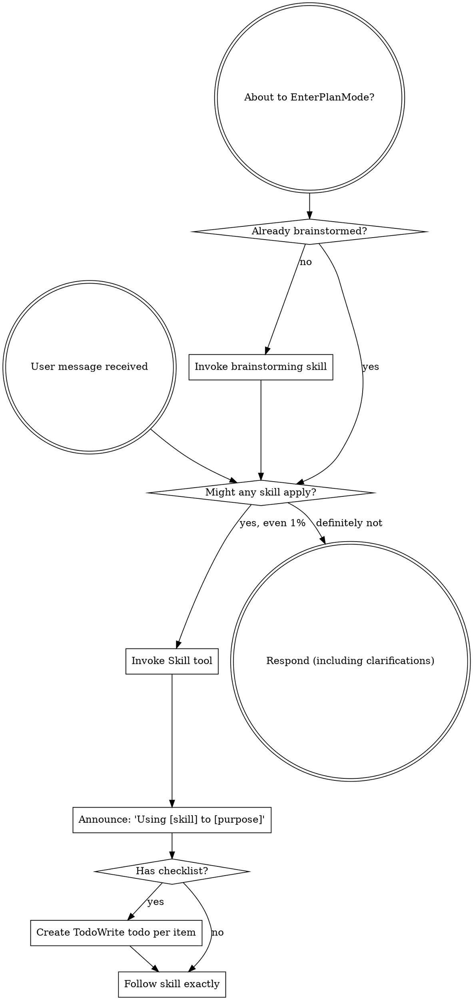
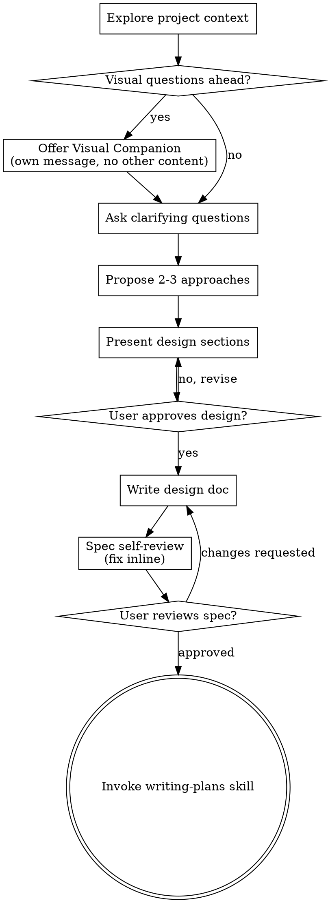
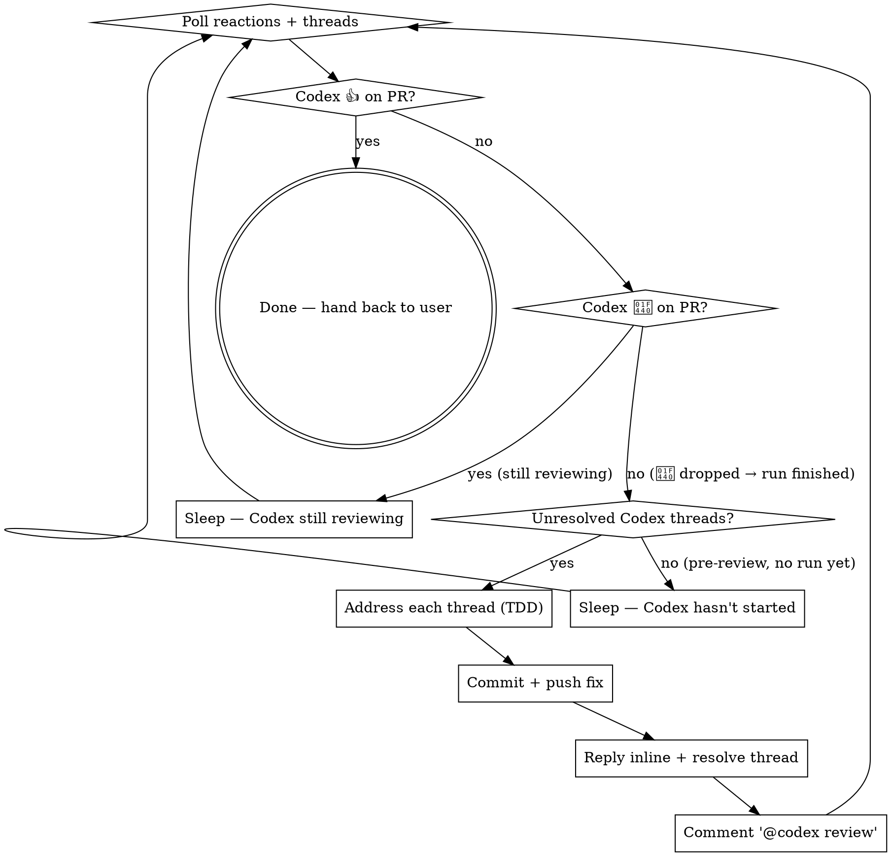

> SYSTEM

# AGENTS.md instructions for /Users/ericson/.codex/worktrees/0f10/ars-ui

<INSTRUCTIONS>
## Approach
- Read existing files before writing. Don't re-read unless changed.
- Thorough in reasoning, concise in output.
- Skip files over 100KB unless required.
- No sycophantic openers or closing fluff.
- No emojis or em-dashes.
- Do not guess APIs, versions, flags, commit SHAs, or package names. Verify by reading code or docs before asserting.

--- project-doc ---

# ars-ui

## Project Overview

Rust frontend component library using state machines, framework-agnostic core with Leptos/Dioxus adapters.

## Current Phase

The repo is now in active implementation, not spec drafting only.

Agents working on implementation should use the GitHub Project roadmap and issue backlog as the execution source of truth:

- Use the GitHub Project `ars-ui implementation roadmap` to understand active epics, task breakdown, dependencies, status, and iteration planning.
- Prefer picking a single issue-backed task that is unblocked, sized, and scoped for independent delivery.
- Do not start work from an epic issue unless the user explicitly asks for planning or further decomposition.
- Do not start a task that is blocked by unresolved GitHub issue dependencies.
- Treat native GitHub issue dependencies as the blocker graph and the issue body acceptance criteria as the delivery contract.

## Development Workflow

For implementation tasks:

1. Read the assigned or selected GitHub issue first.
2. Move the issue to **In Progress** on the GitHub Project board.
3. Review the cited spec sections and any dependency issues.
4. Add or update the named tests first.
5. Implement only the scope required to make those tests pass.
6. If implementation changes the intended contract, update the relevant spec in the same task.
7. **MANDATORY:** Invoke the `post-implementation-audit` skill (`.agents/skills/post-implementation-audit/SKILL.md`). It runs three sequential audits on the new code — (a) spec/implementation drift with "best outcome" recommendations, (b) iterative "anything else missing?" passes (minimum two rounds), (c) test-coverage audit across every test type the workspace uses (unit, snapshot, proptest, doc, spec-conformance, llvm-cov — mutation testing is **not** part of this gate; it is Nightly-CI-driven). **Every finding lands in _this_ PR — no deferral, no follow-up issues.** This step exists because initial implementations consistently ship spec drift and silent contract violations that take 3+ review round-trips to surface; the audit collapses them into one. Skipping this step is a contract violation.
8. Present the final result for user review before any commit.
9. After user approval, run `cargo xci --profile fast` (alias: `cargo xci-fast`) locally and fix any failures before pushing anything to GitHub. The fast profile covers the workspace-level regressions a pre-push gate should catch: fmt, clippy, unit, integration, adapter, spec-compile-snippets, error-variant-coverage, mutual-exclusion, snapshot-count, and a **native-only coverage check** (`coverage-native`) that enforces the thresholds of the crates whose CI coverage is native-only (the agnostic library crates + xtask) — so `ars-components`-style coverage regressions surface before push, not on CI. The native coverage check adds an instrumented rebuild, so the fast profile runs in roughly 10–15 minutes. Reserve full `cargo xci` (~25 minutes, all 20 gates including the wasm coverage + CRAP gate and the feature-matrix groups) for after substantial refactors that may have shifted feature-flag interactions. For small follow-up changes, run the focused tests and checks that cover the edited code instead. To run only the coverage check, use `cargo xcov` (native-only) or `cargo xcov --full` (mirrors CI; needs the wasm toolchain + clang-22).
10. After `cargo xci-fast` passes, commit and push a PR targeting `main`. The PR body MUST include an auto-close keyword for the issue being delivered, for example `Closes #20` or `Fixes #20`, so GitHub closes the issue automatically when the PR merges.
11. **If the PR creates or modifies any `.snap` insta fixtures, attach the `snapshot-reviewed` label after opening or updating it** (`gh pr edit <num> --add-label "snapshot-reviewed"`). This signals to reviewers that the snapshot output was inspected and is intentional. Re-apply the label whenever you push a commit that touches `.snap` files; the workflow assumes the label reflects the latest snapshot state.
12. **MANDATORY:** Invoke the `waiting-for-codex-review` skill (`.agents/skills/waiting-for-codex-review/SKILL.md`) immediately after the first push that creates the PR, and re-invoke it after every subsequent push to the PR branch. The skill posts the initial `@codex review` trigger, polls Codex's 👀 → (👍 \| ∅ + threads) reaction lifecycle, addresses any review threads with the same rigor as `post-implementation-audit` (TDD + no coverage regression), replies inline, resolves threads, and re-comments `@codex review` to start the next pass — looping until Codex leaves 👍. Skipping this step leaves Codex findings unaddressed and silently widens the gap between merged code and the spec; the merge gate is 👍 from Codex plus green CI, not green CI alone.
13. Only after CI passes, Codex has left 👍, and the PR is merged, close the issue.

Never close a GitHub issue without a merged PR that passes CI **and a 👍 from Codex**. Never commit or push without explicit user approval. Keep the issue, PR, and Project board status aligned with the actual work state at every step.

Default delivery rules:

- Follow TDD: tests first, implementation second, verification last.
- Keep task scope aligned with the issue. If the issue is too large or ambiguous, stop and split or clarify rather than freelancing a bigger change.
- Prefer tasks sized `1`, `2`, `3`, or `5` points. `8` is exceptional. `13` must be decomposed before implementation.
- Preserve the crate and dependency layering defined by the architecture and implementation plan.
- Do not add a new dependency crate without explicit user approval first. If a task appears to need a new crate, stop, explain why, and get approval before editing any `Cargo.toml`.
- When a task is complete, verify the exact tests and checks named by the issue before considering it done.
- **Adapter-level component implementation MUST follow `docs/implementation/adapter-component-delivery.md` precisely.** Every adapter task — for any component in `crates/ars-leptos` or `crates/ars-dioxus` — must land _all_ of the following in the same PR, with no deferral to follow-up issues:
    1. Adapter crate code (`crates/ars-{leptos,dioxus}/src/<category>/<component>/`) with module wiring and prelude re-exports — minimize `clone()` calls by parking per-instance values shared across closures in `StoredValue<T>` (Leptos) or `CopyValue<T>` (Dioxus) instead of cloning into each capture, per the "Avoid unnecessary clones" section in `docs/implementation/adapter-component-delivery.md`;
    2. Adapter-level **unit + SSR tests** in `crates/ars-{leptos,dioxus}/tests/<component>.rs`;
    3. Adapter-level **wasm browser tests** in `crates/ars-{leptos,dioxus}/tests/<component>_wasm.rs` for any interactive behavior (focus, keyboard nav, pointer events, typeahead, controlled-signal sync, observers, portal, scroll, cleanup);
    4. **Widgets examples** in _all six_ widgets crates (`examples/widgets-{leptos,dioxus}`, `widgets-{leptos,dioxus}-css`, `widgets-{leptos,dioxus}-tailwind`) under the matching `src/categories/<category>.rs` — replacing any "Coming soon" placeholder text with a real interactive demo;
    5. **E2E fixtures** in `crates/ars-e2e/fixtures/{leptos,dioxus}/src/main.rs` and an **E2E harness module** at `crates/ars-e2e/src/<category>/<component>.rs` covering axe-core, keyboard, pointer, and adapter-parity checks (unless the component is purely static and adapter tests already prove that — state the reason in the PR body);
    6. **xtask `e2e <category>` subcommand** (in `xtask/src/e2e.rs`, `xtask/src/main.rs`, and `crates/ars-e2e/src/main.rs`) when this is the first E2E-covered component in a new category;
    7. **Spec synchronization** for any drift surfaced by the implementation, with the amendment landed in the same PR (see "Spec Synchronization During Implementation");
    8. **Validation gates**: `cargo xtask lint adapter-parity` runs without `SKIP` for the component; `cargo xci-fast` passes; `post-implementation-audit` skill ran all three phases with every finding fixed in this PR.

    Skipping any of these is a workflow violation. The `adapter-component-delivery.md` doc is the single source of truth for what "adapter task complete" means.

### Code Quality Standards

- **Document all public items.** Every public struct, enum, trait, function, constant, type alias, method, field, and variant must have a `///` doc comment. Every `lib.rs` must have a `//!` crate-level doc comment. The workspace enforces `missing_docs` linting — undocumented public items are build failures.
- **Zero warnings policy.** All code must compile with zero warnings under the workspace's configured clippy and rustc lints. Fix the root cause instead of suppressing. When suppression is genuinely needed, use `#[expect(lint, reason = "...")]` — never `#[allow(...)]`.
- **Derive documentation from the spec.** Doc comments should describe the _purpose and semantics_ of the item as defined in the corresponding `spec/` files, not just restate the type signature.
- **Use `#[inline]` selectively, not mechanically.** Do **not** add Clippy's `missing_inline_in_public_items` lint at the workspace level, and do not treat public visibility alone as a reason to mark an item `#[inline]`. Use `#[inline]` for thin cross-crate wrappers, trivial accessors, and hot-path no-op shims where the call overhead is plausibly meaningful. Avoid blanket `#[inline]` on all public APIs — it increases code size, adds compile-time cost, and turns `#[inline]` into noise instead of a deliberate performance signal.
- **Use directory-backed modules with `mod.rs` when a module owns children.** This repo standardizes on the older filesystem layout for nested modules. If module `foo` has child modules, the parent must live at `foo/mod.rs`, not `foo.rs`. Do not mix `foo.rs` with a sibling `foo/` directory. When a refactor adds child modules under an existing flat file, move the parent into `foo/mod.rs` in the same change. Do not leave empty leftover module directories behind.

### API Design Standards

- **Design for the pit of success.** Public APIs should make the most natural, shortest path also be the path that is correct, accessible, localizable, type-safe, and performant. Prefer ergonomic constructors and defaults that preserve the spec's strongest guarantees instead of making users opt into correctness after choosing a convenient API.
- **Name escape hatches explicitly.** When a component needs a lower-level, static, non-i18n, or otherwise less complete path, keep it available but make the tradeoff visible in the API name or type. The blessed path should remain the simplest call site, while escape hatches should read as deliberate choices.
- **Keep semantic data separate from rendered views.** Rich framework views are useful for customization, but components still need semantic sources for accessible names, localized text, announcements, ids, and state-machine wiring. Do not rely on arbitrary rendered view trees as the only source of user-facing semantics.

### Code Coverage

The workspace uses `cargo-llvm-cov` for code coverage with per-crate threshold enforcement. CI runs coverage on every PR (see `.github/workflows/ci.yml`).

**Local coverage commands:**

```bash
# Fast native-only coverage gate — instruments + checks only the crates whose
# CI coverage is native-only (agnostic library crates + xtask). No wasm/clang
# toolchain needed; this is what the `fast` pre-push profile runs.
cargo xcov

# Full native+wasm coverage gate, mirroring CI (needs the wasm toolchain + clang-22)
cargo xcov --full

# Per-crate coverage with inline annotated source (most useful during development)
cargo llvm-cov test -p ars-interactions --text -- hover

# Per-crate summary only
cargo llvm-cov test -p ars-interactions -- hover

# Native-only workspace coverage (host target; excludes wasm-only crates)
cargo llvm-cov --workspace \
  --exclude ars-leptos --exclude ars-dioxus \
  --exclude ars-test-harness-leptos --exclude ars-test-harness-dioxus \
  --exclude ars-derive --exclude xtask \
  --lcov --output-path lcov.info

# Check all crates against spec-defined thresholds (run after a *merged* lcov)
cargo xtask coverage check-all --file lcov.info
```

The `--text` flag produces line-by-line annotated source showing hit counts and `^0` markers on uncovered branches — use this to identify gaps after writing tests. Uncovered no-op callback closures in tests (e.g., `|_| {}`) are expected and not a gap.

The local recipe above excludes the adapter and adapter-test-harness crates because their `target_arch = "wasm32"` / `feature = "web"` code paths can't be measured via host-target `cargo llvm-cov`. **CI runs an additional wasm-coverage pipeline on nightly** (`cargo xtask ci coverage`) that uses `wasm-bindgen-test`'s experimental coverage recipe with LLVM 22 / `clang-22` to emit lcov for `ars-leptos` (csr), `ars-dioxus` (web), `ars-dom` (web), `ars-i18n` (web-intl), and the adapter test harnesses, then merges with the native lcov via `cargo xtask coverage merge`. The per-crate thresholds in `xtask::coverage::default_thresholds()` are enforced against the merged file — including adapter targets (`ars-leptos` 74/55, `ars-dioxus` 77/70, `ars-test-harness-leptos` 60/0, `ars-test-harness-dioxus` 60/0). `ars-derive` (proc-macro, runs in compiler) is exercised via `crates/ars-core/tests/derive_contract.rs` and is unmeasured. `xtask` has its own enforced threshold (30/35) and is measured. See `spec/testing/14-ci.md` §2 for the full pipeline.

### CRAP Gate (complexity vs. coverage)

Coverage tells you which lines run; mutation testing tells you whether tests would notice misbehaviour. The **CRAP gate** ([`cargo-crap`](https://crates.io/crates/cargo-crap)) tells you which functions are _risky to change_ — high cyclomatic complexity combined with low coverage. The CRAP score is `complexity² · (1 − coverage)³ + complexity`.

**Why regression mode, not an absolute threshold.** At 100% coverage `CRAP == cyclomatic complexity`, so an absolute `--fail-above` threshold rejects every large `match` no matter how well it is tested. This workspace is built on state machines: each stateful component's `Machine::transition` is intrinsically a wide `match (state, event)` (complexity 30–80) and is exhaustively tested. An absolute gate would fight that architecture and reject more components as the catalog grows. The gate therefore runs in **regression mode**.

- **Blessed entrypoints:** `cargo xcrap` (local human-readable report, never fails), `cargo xcrap --update-baseline` (regenerate the baseline), and `cargo xtask ci crap` (the CI gate). The gate is the last step of the full `cargo xci` pipeline, running immediately after `coverage` and reusing its merged `lcov.info` (no recompile). It is **not** in the fast profile: the fast profile runs only the native-only `coverage-native` check, which does not produce the merged `lcov.info` the CRAP gate compares against.
- **Policy:** `cargo crap --path . --lcov lcov.info --baseline .crap-baseline.json --fail-regression --min 30 --exclude 'target/**' --exclude 'examples/**' --exclude 'xtask/**' --exclude 'crates/ars-e2e/**' --exclude 'crates/ars-derive/**'`. The gate scopes to the **shipped component library** — tooling (`xtask`), the browser E2E harness (`ars-e2e`), the proc-macro crate, demos, and build output are excluded (they are not shipped surface, and several run uninstrumented-as-tooling on CI → 0% → spurious CRAP). The gate fails only when a function **at or above CRAP 30 regresses** (more complexity or less coverage) versus the committed baseline. New functions are tolerated — the per-crate coverage thresholds already ensure new code is tested — and sub-threshold churn on simple functions is ignored. Net: the coverage gate guarantees new code is tested; the CRAP gate guarantees shipped code does not rot.
- **`--path .`, not `--workspace`.** cargo-crap's regression key is `(file, function, line)`, and `--workspace` records machine-absolute file paths (`/Users/…` locally, `/home/runner/…` on CI). A baseline committed with absolute paths never matches on CI, silently turning the gate into a no-op. `--path .` emits repo-relative paths (`./crates/…`) that match on any checkout; coverage still associates correctly because cargo-crap canonicalizes paths when reading the lcov. `--exclude` is honored under `--path` (it is a no-op under `--workspace`), so `target/**` and the unmeasured `crates/ars-derive/**` are skipped there. Because the key includes the line number, a baseline only matches non-uniquely-named functions (e.g. `Machine::transition`) while their line numbers are stable; regenerate the baseline when a tracked file's lines shift materially.
- **Baseline:** `.crap-baseline.json` at the repo root is committed and complete (every function, no `--min`, so a function crossing the threshold is still caught). Regenerate it with `cargo xcrap --update-baseline` from CI's merged `lcov.info` (download the `coverage-lcov` artifact) whenever a **deliberate** complexity increase lands; commit the new baseline in that PR — a conscious "I accept this" checkpoint. cargo-crap's `--epsilon` (default 0.01) absorbs coverage float jitter. If the baseline is missing, the gate bootstraps it and passes with a notice.
- **Pinned version:** cargo-crap is pinned to an exact version in `xtask::crap::CARGO_CRAP_VERSION` and `.github/workflows/ci.yml` (same convention as cargo-mutants). To bump, update both. Install locally with `cargo install cargo-crap --locked --version <version>` (or `cargo binstall cargo-crap`).
- **Scope / escape hatch:** the exclude-glob list lives in `xtask/src/crap.rs` (`EXCLUDE_GLOBS`), each entry justified by a comment, and scopes the gate to the **shipped component library**. Because the gate runs under `--path .`, cargo-crap's `--exclude` is honored, so build output (`target/**`), demos (`examples/**`), the task runner (`xtask/**`), the browser E2E harness (`crates/ars-e2e/**`), and the proc-macro crate (`crates/ars-derive/**`) are skipped at walk time. The last three are not shipped library code and run uninstrumented-as-tooling on CI (0% coverage → spurious CRAP), so gating them is meaningless. Prefer fixing or refactoring over adding entries. (Note: the per-crate **coverage** gate still measures `xtask` at its own loose 30/35 threshold — that is separate from CRAP.)

### Mutation Testing

Coverage tells you which lines run. **Mutation testing tells you whether the tests would notice if those lines silently misbehaved.** The workspace uses [`cargo-mutants`](https://mutants.rs) for this — a `cargo` extension binary, not a workspace dependency.

**Install (once per developer machine):**

```bash
cargo install cargo-mutants --locked --version 27.0.0
```

**Local commands (state-machine modules are the most rewarding targets):**

Prefer `cargo xmutants` over bare `cargo mutants` — it applies the same
per-crate `--features` profile as Nightly CI (for example
`ars-components/i18n`) so snapshot and i18n-gated tests match CI.

```bash
# Run on a single component machine (~6 min for popover)
cargo xmutants -p ars-components -f crates/ars-components/src/overlay/popover/mod.rs

# Just list what would be mutated, without running tests (fast)
cargo xmutants -p ars-components -f crates/ars-components/src/overlay/popover/mod.rs --list

# Whole crate (slow — only if you really mean it)
cargo xmutants -p ars-components
```

**Agnostic component implementation gate:** whenever an agent implements a new framework-agnostic component, or materially changes an existing one, the delivery must include:

- spec-conformance tests for the component's anatomy/public contract, including its `Part` enum and required API/attribute surface;
- the full test breadth the component warrants (unit, snapshot, proptest) with strong line/branch coverage.

**Mutation testing is NOT a pre-PR requisite for agnostic component work.** Do not run a targeted `cargo xmutants` pass as a delivery/audit gate, and do not block a PR on a clean local mutation run. Surviving (`MISSED`) mutants are surfaced by the Nightly CI `mutation-testing` job (see below); triage them — add tests for real gaps, or add a justified line-agnostic `.cargo/mutants.toml` exclude for true equivalent mutations — in a dedicated follow-up when Nightly reports them, not during initial component delivery. (Running a local mutation pass voluntarily is fine, but it is never required and never blocks delivery or review.)

**Reading the output:** Results land in `mutants.out/mutants.out/` (gitignored). The two files that matter:

- `caught.txt` — mutations that broke at least one test ✅
- `missed.txt` — mutations that survived all tests ❌ — each one is either a real test gap to fill or an "equivalent mutation" that needs a `[[skip]]` entry in `mutants.toml` with a justification

**CI integration:** Nightly only. `.github/workflows/nightly.yml` has a `mutation-testing` job with a 21-entry matrix that runs `cargo mutants -p <package>` on every framework-agnostic crate, using `--shard k/n` to spread larger crates across parallel runners. **Shard indices are 0-based** (`k` runs from `0` to `n-1`); `k == n` is invalid and will fail the job. When adding shards, always start at `0/n` and end at `(n-1)/n`.

- **`ars-components` (≈ 1,630 mutants today, planned to grow as the spec adds the remaining ~97 components):** sharded **12-way** → ≈ 135 mutants per runner today, ≈ 850 per runner at the ~10,000-mutant endpoint. Sized for the full spec catalog up front so we don't re-shard every few months as components land.
- **`ars-collections` (≈ 1,080 mutants):** sharded 4-way → ≈ 270 mutants per runner.
- **`ars-core` (≈ 700 mutants):** sharded 2-way → ≈ 350 mutants per runner.
- **`ars-a11y`, `ars-forms`, `ars-interactions`:** one runner each (under 600 mutants apiece).

**Adding a new state machine inside an existing crate requires no CI changes** — its mutations land in whichever shard the cargo-mutants partitioner places them. The shard counts are sized so the slowest runner stays well under 30 minutes today and under ~50 minutes at the planned endpoint; re-balance only when a crate outgrows that budget (visible on the nightly dashboard as one shard pulling away from the others).

All matrix jobs run with `fail-fast: false` so failures on one module don't mask data on another. Each job uploads its `mutants.out/` as a workflow artifact (always, even on success — surviving "missed" entries on a passing run still reveal test-quality work). The job fails if any mutation survives, so a missed mutation forces a deliberate triage decision (fix the test, or document the equivalence with a `[[skip]]` entry in `mutants.toml`).

**Excluded crates** (mutation testing's signal degrades wherever determinism does): adapter glue (`ars-leptos`, `ars-dioxus`), DOM/FFI (`ars-dom`), ICU/FFI (`ars-i18n`), test infrastructure (`ars-test-harness*`), and the proc-macro crate (`ars-derive`, runs in the compiler). Adding a brand-new crate that is a good mutation target requires one new matrix entry; run a local scout first (`cargo mutants -p <crate> --list` to size, then a real run) so we know the right shard count before the nightly fires.

**Bumping the pinned version.** Both the local install command above and `.github/workflows/nightly.yml` pin cargo-mutants to an exact version (currently `27.0.0`) — same convention as `wasm-pack` in the `a11y-audit` job. Pinning is deliberate: cargo-mutants ships new mutators in releases, and an unpinned install would silently change the mutation set without any code change, surfacing as phantom CI failures on a green-source repo. To bump, open a PR that (1) updates the version string in CLAUDE.md and `nightly.yml`, (2) runs the popover scout locally with the new version (`cargo mutants -p ars-components -f crates/ars-components/src/overlay/popover/mod.rs`) to confirm the mutation count is in the same ballpark, and (3) triages any new "missed" entries the new mutators surface — they are usually genuine test-quality gaps newly visible to the tool.

### Property Testing (proptest)

State-machine invariants are exercised by [`proptest`](https://docs.rs/proptest) under `crates/<crate>/tests/proptest_state_machines/` (see `ars-components`). Default proptest behaviour drops `*.proptest-regressions` seed files alongside test sources — instead, every `proptest!` block in this workspace pulls a shared `Config` from `tests/proptest_state_machines/common.rs` that:

1. Reads `PROPTEST_CASES` from the environment (1,000 default; 10,000 in the nightly `extended-proptest` job).
2. Sets `failure_persistence` to `FileFailurePersistence::Direct("proptest-regressions/state-machines.txt")`, so all persisted seeds for the test binary live in one file at the crate root: `crates/<crate>/proptest-regressions/state-machines.txt`. The directory is committed (per proptest's own recommendation in the file header) so every developer's runs benefit from previously-shrunk failures.

When a new crate adopts proptest for state-machine tests, copy the same `common.rs` helper and reference it via `#![proptest_config(super::common::proptest_config())]` inside every `proptest!` block. Don't let proptest fall back to its `WithSource` default — that scatters seed files across the source tree.

### Adapter Prelude Convention

Both `ars-leptos` and `ars-dioxus` expose a `prelude` module targeting **end users** — application developers who consume the ready-made components. `use ars_leptos::prelude::*` (or `use ars_dioxus::prelude::*`) should give them everything they need.

The prelude contains only user-facing items:

1. **Component modules** — as components land, their public module paths (e.g., `button`, `dialog`) are re-exported so users can write `button::Props`, etc.
2. **User-facing traits** — traits end users call on component outputs (e.g., `Translate` from `ars-i18n`). Re-export the trait so consumers don't need a direct dependency on the subsystem crate.
3. **Configuration types** — types that appear in component props or configure behaviour (e.g., `Locale`, `Direction`, `Orientation`, `Selection`).

The prelude does **not** include implementation details consumed only by component authors inside the adapter crate: core engine types (`Machine`, `Service`, `ConnectApi`, `AttrMap`), accessibility primitives (`AriaRole`, `AriaAttribute`), interaction helpers (`merge_attrs`), or adapter hooks (`use_machine`, `UseMachineReturn`). Those remain accessible via their normal crate paths for advanced users building custom machines.

Both adapter preludes must stay symmetric: same items, same structure. When adding a new re-export to one adapter's prelude, add it to the other as well in the same PR.

### Adapter Testing Convention

Adapter-level component tests should default to the framework-specific test harness crate:

- Leptos adapter tests should prefer `ars-test-harness-leptos`.
- Dioxus adapter tests should prefer `ars-test-harness-dioxus`.
- Shared `ars-test-harness` helpers should be used where relevant for viewport, layout, clipboard, drag/drop, timing, and other DOM test setup instead of bespoke per-test browser scaffolding.

When a component spec requires interaction, focus, overlay positioning, clipboard, file upload, drag/drop, or similar browser behavior, the task's tests should exercise that behavior through the adapter harness entrypoints and shared core harness helpers unless there is a concrete technical reason not to.

## Spec Synchronization During Implementation

The specification is the authoritative contract. It took weeks of deliberate design and MUST be followed.

### Spec-first implementation rule

Before implementing any public type, trait, function, or method:

1. **Read the spec section first.** Find the relevant code example in `spec/`. Use `spec-tool toc <file>` and `grep` to locate it.
2. **Match the spec exactly.** If the spec defines `struct ComponentIds { base: String }` with methods `from_id()`, `id()`, `part()`, `item()`, `item_part()` — implement exactly that. Do not invent alternative field names, method names, or signatures.
3. **Cross-check after implementation.** Before presenting code for review, diff every public item against the spec's code examples. Every struct field, every method name, every parameter must match.
4. **If you must deviate**, there must be a concrete technical reason (e.g., the spec's API cannot compile, or a dependency doesn't expose the needed type). Document the reason in a code comment and flag it to the user explicitly.

Inventing alternative APIs that "seem equivalent" is never acceptable — it silently invalidates the spec's design decisions and all downstream code that depends on those APIs.

### Spec/code mismatch resolution

- If code and spec disagree, resolve the mismatch in the same task or PR.
- Shared conceptual changes belong in shared or foundation spec files, not only in adapter code.
- Adapter-specific findings must be reflected back into `spec/foundation/08-adapter-leptos.md` and/or `spec/foundation/09-adapter-dioxus.md` when relevant.
- Do not leave spec drift behind as follow-up cleanup.

## Spec Structure

The specification lives in `spec/` with this layout:

- `spec/manifest.toml` — **START HERE** — central index of all components and their dependencies
- `spec/foundation/` — architecture, accessibility, i18n, interactions, forms, adapters, spec template (00-10)
- `spec/shared/` — cross-component shared types (date-time, selection, layout, z-index)
- `spec/components/{category}/` — one file per component, organized by category
- `spec/testing/` — test specs split by domain

### Component Categories

- `input/` — checkbox, text-field, slider, number-input, etc.
- `selection/` — select, combobox, listbox, menu, tags-input, etc.
- `overlay/` — dialog, popover, tooltip, toast, presence, etc.
- `navigation/` — accordion, tabs, tree-view, pagination, steps, etc.
- `date-time/` — date-field, time-field, calendar, date-picker, etc.
- `data-display/` — table, avatar, progress, meter, badge, etc.
- `layout/` — splitter, scroll-area, carousel, portal, toolbar, etc.
- `specialized/` — color-picker, file-upload, signature-pad, qr-code, etc.
- `utility/` — button, toggle, focus-scope, visually-hidden, separator, etc.

## Working with the Spec

When reading large files, run `wc -l` first to check the line count. If the file is over 2,000
lines, use the `offset` and `limit` parameters on the Read tool to read in chunks rather than
attempting to read the entire file at once.

### Using xtask spec (preferred)

Use `cargo xtask spec` to resolve file sets instead of manually parsing manifest.toml:

```bash
# Quick metadata lookup:
cargo xtask spec info <component>

# Find all components using a shared type:
cargo xtask spec reverse <shared-type>

# See a file's heading structure (with line numbers):
cargo xtask spec toc <file>

# Validate frontmatter matches manifest.toml:
cargo xtask spec validate

# Search spec content by keyword/regex (with optional filters):
cargo xtask spec search <query> [--category <cat>] [--section <sec>] [--tier <tier>]

# Get a compact component summary (states, events, props, accessibility):
cargo xtask spec digest <component>

# Get full implementation context (component + all deps concatenated):
cargo xtask spec context <component> [--framework <fw>] [--include-testing]
```

The xtask also runs as an MCP server (`cargo xtask mcp`) exposing all spec tools for LLM agents.

### Reading a component (manual fallback)

1. Read `spec/manifest.toml` to find the component's path and dependencies
2. Read the component file (has YAML frontmatter listing its foundation/shared deps)
3. Only load the foundation files listed in `foundation_deps` — not all of them

### Framework and library specs — MANDATORY skill loading

When reading or editing these specification files, you MUST load the corresponding skill BEFORE doing any work. The skills contain verified, version-accurate API documentation that the spec code examples depend on. Claude's training data is wrong for these libraries — do not trust it.

| Spec file                                    | Skill to load | Library version |
| -------------------------------------------- | ------------- | --------------- |
| `spec/foundation/04-internationalization.md` | `icu4x`       | ICU4X 2.1.1     |
| `spec/foundation/08-adapter-leptos.md`       | `leptos`      | Leptos 0.8.17   |
| `spec/foundation/09-adapter-dioxus.md`       | `dioxus`
</INSTRUCTIONS>
<environment_context>
  <cwd>/Users/ericson/.codex/worktrees/0f10/ars-ui</cwd>
  <shell>zsh</shell>
  <current_date>2026-06-03</current_date>
  <timezone>America/Sao_Paulo</timezone>
  <filesystem><workspace_roots><root>/Users/ericson/.codex/worktrees/0f10/ars-ui</root></workspace_roots><permission_profile type="managed"><file_system type="restricted"><entry access="read"><special>:root</special></entry><entry access="write"><path>/Users/ericson/.codex/worktrees/0f10/ars-ui</path></entry><entry access="write"><special>:slash_tmp</special></entry><entry access="write"><special>:tmpdir</special></entry><entry access="read"><path>/Users/ericson/.codex/worktrees/0f10/ars-ui/.git</path></entry><entry access="read"><path>/Users/ericson/.codex/worktrees/0f10/ars-ui/.agents</path></entry><entry access="read"><path>/Users/ericson/.codex/worktrees/0f10/ars-ui/.codex</path></entry><entry access="read"><path>/Users/ericson/Workspace/Rust/ars-ui/.git/worktrees/ars-ui</path></entry></file_system></permission_profile></filesystem>
</environment_context>

> DEVELOPER

We recently completed all agnostic components of the date-time category. Now I wanna do a full audit of them, to be able to close the Epic #224 on Github. In this audit we need to make sure that everything related to this category in the spec was properly implemented, on all date-time agnostic components. Including auditing their respective proptests and spec conformance tests, and while you're in those two, take your time to properly separate the proptests and the spec conformance tests into modules for each component, as currently we have a bloat of tests for all navigation components together in the same file.

> AGENT

I’ll first load the required workflow guidance, then I’ll inspect the current date-time specs, implementation, and the shared test layout before touching files. Since this is an epic-closeout audit, I’ll also pull the relevant memory notes so I don’t repeat prior category-audit mistakes.

> TOOL

tool_use exec_command
id: call_PgHjZL1r0XMBzTV6QUuZgjVf
```json
{
  "cmd": "sed -n '1,220p' /Users/ericson/.claude/skills/using-superpowers/SKILL.md",
  "workdir": "/Users/ericson/.codex/worktrees/0f10/ars-ui",
  "yield_time_ms": 1000,
  "max_output_tokens": 12000
}
```

> TOOL

tool_use exec_command
id: call_nHoCy77NfspyhbhEthNUN61o
```json
{
  "cmd": "sed -n '1,220p' /Users/ericson/.claude/skills/brainstorming/SKILL.md",
  "workdir": "/Users/ericson/.codex/worktrees/0f10/ars-ui",
  "yield_time_ms": 1000,
  "max_output_tokens": 12000
}
```

> TOOL

tool_use exec_command
id: call_ZjduogQvgaeNkqbjn7nBMAsB
```json
{
  "cmd": "rg -n \"date-time|Epic #224|#224|spec_conformance|proptest_state_machines|category-wide|audit\" /Users/ericson/.codex/memories/MEMORY.md",
  "workdir": "/Users/ericson/.codex/worktrees/0f10/ars-ui",
  "yield_time_ms": 1000,
  "max_output_tokens": 12000
}
```

> TOOL

tool_result
id: call_PgHjZL1r0XMBzTV6QUuZgjVf
```
Chunk ID: bb2216
Wall time: 0.2504 seconds
Process exited with code 0
Original token count: 1356
Output:
---
name: using-superpowers
description: Use when starting any conversation - establishes how to find and use skills, requiring Skill tool invocation before ANY response including clarifying questions
---

<SUBAGENT-STOP>
If you were dispatched as a subagent to execute a specific task, skip this skill.
</SUBAGENT-STOP>

<EXTREMELY-IMPORTANT>
If you think there is even a 1% chance a skill might apply to what you are doing, you ABSOLUTELY MUST invoke the skill.

IF A SKILL APPLIES TO YOUR TASK, YOU DO NOT HAVE A CHOICE. YOU MUST USE IT.

This is not negotiable. This is not optional. You cannot rationalize your way out of this.
</EXTREMELY-IMPORTANT>

## Instruction Priority

Superpowers skills override default system prompt behavior, but **user instructions always take precedence**:

1. **User's explicit instructions** (CLAUDE.md, GEMINI.md, AGENTS.md, direct requests) — highest priority
2. **Superpowers skills** — override default system behavior where they conflict
3. **Default system prompt** — lowest priority

If CLAUDE.md, GEMINI.md, or AGENTS.md says "don't use TDD" and a skill says "always use TDD," follow the user's instructions. The user is in control.

## How to Access Skills

**In Claude Code:** Use the `Skill` tool. When you invoke a skill, its content is loaded and presented to you—follow it directly. Never use the Read tool on skill files.

**In Copilot CLI:** Use the `skill` tool. Skills are auto-discovered from installed plugins. The `skill` tool works the same as Claude Code's `Skill` tool.

**In Gemini CLI:** Skills activate via the `activate_skill` tool. Gemini loads skill metadata at session start and activates the full content on demand.

**In other environments:** Check your platform's documentation for how skills are loaded.

## Platform Adaptation

Skills use Claude Code tool names. Non-CC platforms: see `references/copilot-tools.md` (Copilot CLI), `references/codex-tools.md` (Codex) for tool equivalents. Gemini CLI users get the tool mapping loaded automatically via GEMINI.md.

# Using Skills

## The Rule

**Invoke relevant or requested skills BEFORE any response or action.** Even a 1% chance a skill might apply means that you should invoke the skill to check. If an invoked skill turns out to be wrong for the situation, you don't need to use it.



## Red Flags

These thoughts mean STOP—you're rationalizing:

| Thought | Reality |
|---------|---------|
| "This is just a simple question" | Questions are tasks. Check for skills. |
| "I need more context first" | Skill check comes BEFORE clarifying questions. |
| "Let me explore the codebase first" | Skills tell you HOW to explore. Check first. |
| "I can check git/files quickly" | Files lack conversation context. Check for skills. |
| "Let me gather information first" | Skills tell you HOW to gather information. |
| "This doesn't need a formal skill" | If a skill exists, use it. |
| "I remember this skill" | Skills evolve. Read current version. |
| "This doesn't count as a task" | Action = task. Check for skills. |
| "The skill is overkill" | Simple things become complex. Use it. |
| "I'll just do this one thing first" | Check BEFORE doing anything. |
| "This feels productive" | Undisciplined action wastes time. Skills prevent this. |
| "I know what that means" | Knowing the concept ≠ using the skill. Invoke it. |

## Skill Priority

When multiple skills could apply, use this order:

1. **Process skills first** (brainstorming, debugging) - these determine HOW to approach the task
2. **Implementation skills second** (frontend-design, mcp-builder) - these guide execution

"Let's build X" → brainstorming first, then implementation skills.
"Fix this bug" → debugging first, then domain-specific skills.

## Skill Types

**Rigid** (TDD, debugging): Follow exactly. Don't adapt away discipline.

**Flexible** (patterns): Adapt principles to context.

The skill itself tells you which.

## User Instructions

Instructions say WHAT, not HOW. "Add X" or "Fix Y" doesn't mean skip workflows.

```

> TOOL

tool_result
id: call_nHoCy77NfspyhbhEthNUN61o
```
Chunk ID: ef39e3
Wall time: 0.2425 seconds
Process exited with code 0
Original token count: 2659
Output:
---
name: brainstorming
description: "You MUST use this before any creative work - creating features, building components, adding functionality, or modifying behavior. Explores user intent, requirements and design before implementation."
---

# Brainstorming Ideas Into Designs

Help turn ideas into fully formed designs and specs through natural collaborative dialogue.

Start by understanding the current project context, then ask questions one at a time to refine the idea. Once you understand what you're building, present the design and get user approval.

<HARD-GATE>
Do NOT invoke any implementation skill, write any code, scaffold any project, or take any implementation action until you have presented a design and the user has approved it. This applies to EVERY project regardless of perceived simplicity.
</HARD-GATE>

## Anti-Pattern: "This Is Too Simple To Need A Design"

Every project goes through this process. A todo list, a single-function utility, a config change — all of them. "Simple" projects are where unexamined assumptions cause the most wasted work. The design can be short (a few sentences for truly simple projects), but you MUST present it and get approval.

## Checklist

You MUST create a task for each of these items and complete them in order:

1. **Explore project context** — check files, docs, recent commits
2. **Offer visual companion** (if topic will involve visual questions) — this is its own message, not combined with a clarifying question. See the Visual Companion section below.
3. **Ask clarifying questions** — one at a time, understand purpose/constraints/success criteria
4. **Propose 2-3 approaches** — with trade-offs and your recommendation
5. **Present design** — in sections scaled to their complexity, get user approval after each section
6. **Write design doc** — save to `docs/superpowers/specs/YYYY-MM-DD-<topic>-design.md` and commit
7. **Spec self-review** — quick inline check for placeholders, contradictions, ambiguity, scope (see below)
8. **User reviews written spec** — ask user to review the spec file before proceeding
9. **Transition to implementation** — invoke writing-plans skill to create implementation plan

## Process Flow



**The terminal state is invoking writing-plans.** Do NOT invoke frontend-design, mcp-builder, or any other implementation skill. The ONLY skill you invoke after brainstorming is writing-plans.

## The Process

**Understanding the idea:**

- Check out the current project state first (files, docs, recent commits)
- Before asking detailed questions, assess scope: if the request describes multiple independent subsystems (e.g., "build a platform with chat, file storage, billing, and analytics"), flag this immediately. Don't spend questions refining details of a project that needs to be decomposed first.
- If the project is too large for a single spec, help the user decompose into sub-projects: what are the independent pieces, how do they relate, what order should they be built? Then brainstorm the first sub-project through the normal design flow. Each sub-project gets its own spec → plan → implementation cycle.
- For appropriately-scoped projects, ask questions one at a time to refine the idea
- Prefer multiple choice questions when possible, but open-ended is fine too
- Only one question per message - if a topic needs more exploration, break it into multiple questions
- Focus on understanding: purpose, constraints, success criteria

**Exploring approaches:**

- Propose 2-3 different approaches with trade-offs
- Present options conversationally with your recommendation and reasoning
- Lead with your recommended option and explain why

**Presenting the design:**

- Once you believe you understand what you're building, present the design
- Scale each section to its complexity: a few sentences if straightforward, up to 200-300 words if nuanced
- Ask after each section whether it looks right so far
- Cover: architecture, components, data flow, error handling, testing
- Be ready to go back and clarify if something doesn't make sense

**Design for isolation and clarity:**

- Break the system into smaller units that each have one clear purpose, communicate through well-defined interfaces, and can be understood and tested independently
- For each unit, you should be able to answer: what does it do, how do you use it, and what does it depend on?
- Can someone understand what a unit does without reading its internals? Can you change the internals without breaking consumers? If not, the boundaries need work.
- Smaller, well-bounded units are also easier for you to work with - you reason better about code you can hold in context at once, and your edits are more reliable when files are focused. When a file grows large, that's often a signal that it's doing too much.

**Working in existing codebases:**

- Explore the current structure before proposing changes. Follow existing patterns.
- Where existing code has problems that affect the work (e.g., a file that's grown too large, unclear boundaries, tangled responsibilities), include targeted improvements as part of the design - the way a good developer improves code they're working in.
- Don't propose unrelated refactoring. Stay focused on what serves the current goal.

## After the Design

**Documentation:**

- Write the validated design (spec) to `docs/superpowers/specs/YYYY-MM-DD-<topic>-design.md`
  - (User preferences for spec location override this default)
- Use elements-of-style:writing-clearly-and-concisely skill if available
- Commit the design document to git

**Spec Self-Review:**
After writing the spec document, look at it with fresh eyes:

1. **Placeholder scan:** Any "TBD", "TODO", incomplete sections, or vague requirements? Fix them.
2. **Internal consistency:** Do any sections contradict each other? Does the architecture match the feature descriptions?
3. **Scope check:** Is this focused enough for a single implementation plan, or does it need decomposition?
4. **Ambiguity check:** Could any requirement be interpreted two different ways? If so, pick one and make it explicit.

Fix any issues inline. No need to re-review — just fix and move on.

**User Review Gate:**
After the spec review loop passes, ask the user to review the written spec before proceeding:

> "Spec written and committed to `<path>`. Please review it and let me know if you want to make any changes before we start writing out the implementation plan."

Wait for the user's response. If they request changes, make them and re-run the spec review loop. Only proceed once the user approves.

**Implementation:**

- Invoke the writing-plans skill to create a detailed implementation plan
- Do NOT invoke any other skill. writing-plans is the next step.

## Key Principles

- **One question at a time** - Don't overwhelm with multiple questions
- **Multiple choice preferred** - Easier to answer than open-ended when possible
- **YAGNI ruthlessly** - Remove unnecessary features from all designs
- **Explore alternatives** - Always propose 2-3 approaches before settling
- **Incremental validation** - Present design, get approval before moving on
- **Be flexible** - Go back and clarify when something doesn't make sense

## Visual Companion

A browser-based companion for showing mockups, diagrams, and visual options during brainstorming. Available as a tool — not a mode. Accepting the companion means it's available for questions that benefit from visual treatment; it does NOT mean every question goes through the browser.

**Offering the companion:** When you anticipate that upcoming questions will involve visual content (mockups, layouts, diagrams), offer it once for consent:
> "Some of what we're working on might be easier to explain if I can show it to you in a web browser. I can put together mockups, diagrams, comparisons, and other visuals as we go. This feature is still new and can be token-intensive. Want to try it? (Requires opening a local URL)"

**This offer MUST be its own message.** Do not combine it with clarifying questions, context summaries, or any other content. The message should contain ONLY the offer above and nothing else. Wait for the user's response before continuing. If they decline, proceed with text-only brainstorming.

**Per-question decision:** Even after the user accepts, decide FOR EACH QUESTION whether to use the browser or the terminal. The test: **would the user understand this better by seeing it than reading it?**

- **Use the browser** for content that IS visual — mockups, wireframes, layout comparisons, architecture diagrams, side-by-side visual designs
- **Use the terminal** for content that is text — requirements questions, conceptual choices, tradeoff lists, A/B/C/D text options, scope decisions

A question about a UI topic is not automatically a visual question. "What does personality mean in this context?" is a conceptual question — use the terminal. "Which wizard layout works better?" is a visual question — use the browser.

If they agree to the companion, read the detailed guide before proceeding:
`skills/brainstorming/visual-companion.md`

```

> TOOL

tool_result
id: call_ZjduogQvgaeNkqbjn7nBMAsB
```
Chunk ID: e6b880
Wall time: 0.0376 seconds
Process exited with code 0
Original token count: 2081
Output:
1:# Task Group: ars-ui / ars-components data-display implementation, audit, and review follow-through
3:scope: Framework-agnostic `crates/ars-components/src/data_display/` issue work, category-wide test-surface audits, state-machine review remediation, accessibility attr wiring, and terminal PR or epic closure.
4:applies_to: cwd=/Users/ericson/.t3/worktrees/ars-ui/* and /Users/ericson/.codex/worktrees/*/ars-ui and /Users/ericson/Workspace/Rust/ars-ui.worktrees/*; reuse_rule=reuse for ars-ui checkouts touching `data_display` cores, data-display test modules, or paired issue branches; verify whether the issue body explicitly groups adjacent components, whether the task is a component implementation or a category audit, and whether remote GitHub closure is part of acceptance.
44:- Marquee, issue #277, PR #705, data_display, SyncProps, loop_count, pause_on_hover, pause_on_focus, ComponentPart, spec_conformance, proptest, Release Verification, chatgpt-codex-connector[bot]
60:- rollout_summaries/2026-06-03T02-09-40-APZy-data_display_audit_test_split_and_crap_baseline_refresh.md (cwd=/Users/ericson/.codex/worktrees/5590/ars-ui, rollout_path=/Users/ericson/.codex/sessions/2026/06/02/rollout-2026-06-02T23-09-40-019e8b3e-5b1f-7c23-82f5-c27c08733024.jsonl, updated_at=2026-06-03T06:39:58+00:00, thread_id=019e8b3e-5b1f-7c23-82f5-c27c08733024, per-component test-module split, TagGroup focus/spec sync, and CI baseline refresh for Epic #225 closure)
64:- data-display audit, Epic #225, spec_conformance, proptest_state_machines, Badge, Skeleton, Avatar, AvatarGroup, TagGroup, cargo xtask spec info, CRAP baseline, coverage-lcov, lcov.info, PR #713
70:- when the user asks for "a full audit" and to "properly separate the proptests and the spec conformance tests into modules for each component", default to component-by-component test ownership and a spec-complete closure pass, not a category-level blob or spot check [Task 6]
75:- when the user says `We have more reviews` or `more reviews`, stay in the same PR review loop until inline replies, thread resolution, Codex re-review, and final remote green checks are finished; for audits tied to epic closure, local file splits are not enough [Task 4][Task 6]
87:- `ars-components` data-display components follow the `Props`, `Context`, `Messages`, `Machine`, `Api`, `Part` pattern and normally need inline tests plus `spec_conformance` and proptest coverage; Marquee needed `ComponentPart` anatomy coverage, and the later audit split that old category-level coverage into per-component modules under `tests/spec_conformance/data_display/` and `tests/proptest_state_machines/data_display/` [Task 4][Task 6]
91:- the data-display audit established the category split rule: stateless components like `Badge`, `Skeleton`, `Stat`, and `Meter` only need unit and `spec_conformance` coverage, while stateful or complex components keep per-component proptest modules too [Task 6]
92:- during TagGroup audit work, disabled focus and blur behavior remained intentionally observable; `Focus(Some(valid))`, `Focus(Some(stale))`, and `Focus(None)` are distinct outcomes, and stale explicit focus targets must not silently fall back to the first enabled item [Task 3][Task 6]
109:- symptom: `cargo xtask spec info data-display` fails during a category audit -> cause: `data-display` is not a valid component slug -> fix: query concrete component slugs like `badge`, `avatar`, `meter`, or `grid-list` instead of the category name [Task 6]
112:# Task Group: ars-ui / ars-components input, date-time, and specialized component implementation
114:scope: Framework-agnostic component-core work under `crates/ars-components/src/input/`, `src/date_time/`, and `src/specialized/`, including spec-first issue delivery, controlled-state edge cases, IME handling, hidden-input semantics, coverage-sensitive date-time work, and same-PR review remediation.
145:- Editable, issue #241, IME composition, Submit, Blur, is_composing, root id snapshot, proptest_state_machines/input.rs, PR #683
202:- Editable needed the same IME discipline: block `Submit` and `Blur` during composition, mirror those guards in `proptest_state_machines/input.rs`, and keep the root snapshot output aligned with the intentional stable `id` [Task 3]
203:- RangeSlider was implemented spec-conformance-first, with `crates/ars-components/tests/spec_conformance/input.rs` asserting the missing module before the component existed; the final local focused coverage for the module was above 95 percent [Task 4]
367:- `SegmentGroup` aligned on a five-part anatomy, `Root`, `Item`, `ItemText`, `Indicator`, `HiddenInput`, and the durable coverage shape was unit tests plus `spec_conformance` and proptest entries in `selection.rs` [Task 6]
382:# Task Group: ars-ui / ars-components utility components and utility-category audit
384:scope: Framework-agnostic `crates/ars-components/src/utility/` work plus utility-category test-surface audits, including issue-backed component delivery, review fixes, and category-wide per-component test splitting.
385:applies_to: cwd=/Users/ericson/.t3/worktrees/ars-ui/*; reuse_rule=reuse for ars-ui utility-core issues and utility test-audit tasks; preserve boundaries between core behavior work and test-coverage-only audits.
431:- rollout_summaries/REDACTED.md (cwd=/Users/ericson/.t3/worktrees/ars-ui/t3code-3b330983, rollout_path=/Users/ericson/.codex/sessions/2026/05/24/rollout-2026-05-24T22-32-28-019e5cc3-1303-7290-94e3-3e939c77d1e8.jsonl, updated_at=2026-05-25T03:17:17+00:00, thread_id=019e5cc3-1303-7290-94e3-3e939c77d1e8, coverage and spec-conformance audit rather than full behavior audit)
435:- utility category, spec_conformance, proptest_state_machines, ArsProvider, directory-backed modules, docs/implementation/utility-category-audit.md, PR #676
442:- when the user clarifies they want an audit, distinguish between a test-surface audit and a full behavior audit instead of pretending they are the same task [Task 5]
443:- when the user asks to commit and push to GitHub, include the Codex co-author trailer and respect the requested PR mode; utility audit publishing explicitly wanted a non-draft PR [Task 5]
452:- Utility-category audit converted `tests/proptest_state_machines/utility.rs` and `tests/spec_conformance/utility.rs` into directory-backed per-component modules and recorded per-component disposition in `docs/implementation/utility-category-audit.md` [Task 5]
453:- `ArsProvider` is adapter or core owned (`ars-core`, `ars-leptos`, `ars-dioxus`), so utility audits should not invent an `ars-components::utility::ars_provider` module [Task 5]
461:- symptom: a utility-category audit is reported as “everything related” even though only test structure changed -> cause: audit scope was not separated from behavior review -> fix: say explicitly whether the work covered test restructuring, coverage gaps, implementation drift review, or all three [Task 5]
465:scope: `crates/ars-components/src/layout/` and `src/overlay/` work plus related test-module audits, combined issue delivery, CI/environment quirks, and publish workflow expectations.
466:applies_to: cwd=/Users/ericson/.t3/worktrees/ars-ui/*; reuse_rule=reuse for ars-ui layout or overlay work and category-wide test refactors; verify whether the task is a behavior implementation, a test-surface audit, or both.
486:- overlay, spec_conformance, proptest_state_machines, origin/main, Tour already landed, read-only rmeta, trybuild, cargo xci-fast, PR #677
516:- Toolbar, issue #276, layout/toolbar, roving tabindex, SetItems, roving_target, NoEffect, Home, End, RTL, disabled_items, spec_conformance
540:- overlay test aggregators worth splitting were `crates/ars-components/tests/spec_conformance/overlay.rs` and `crates/ars-components/tests/proptest_state_machines/overlay.rs`, and the split should mirror `src/overlay/<component>/mod.rs` [Task 2]
541:- before category audits or refactors against older branches, sync to `origin/main`; this mattered because Tour had already landed on main and needed to be included in the overlay audit [Task 2]
554:- symptom: overlay audit misses newly landed components -> cause: the worktree is behind `origin/main` -> fix: sync to latest main before auditing module coverage or structure [Task 2]

```

> AGENT

Using `using-superpowers` for workflow discipline and `brainstorming` because the audit will likely include behavior/test restructuring choices. I’ve also found prior category-audit memory that points to the exact pitfall here: split by component and distinguish test-surface cleanup from a real spec-complete behavior audit.

> TOOL

tool_use exec_command
id: call_NcdrgB9EwFCqdo1ZkcldNu2X
```json
{
  "cmd": "sed -n '60,95p' /Users/ericson/.codex/memories/MEMORY.md",
  "workdir": "/Users/ericson/.codex/worktrees/0f10/ars-ui",
  "yield_time_ms": 1000,
  "max_output_tokens": 8000
}
```

> TOOL

tool_use exec_command
id: call_h8S2k6Rdmcg8q4KiUDf2hx7d
```json
{
  "cmd": "sed -n '112,230p' /Users/ericson/.codex/memories/MEMORY.md",
  "workdir": "/Users/ericson/.codex/worktrees/0f10/ars-ui",
  "yield_time_ms": 1000,
  "max_output_tokens": 12000
}
```

> TOOL

tool_use exec_command
id: call_LIEeDZdbJjUlkXYISnDqXzlf
```json
{
  "cmd": "git status --short --branch",
  "workdir": "/Users/ericson/.codex/worktrees/0f10/ars-ui",
  "yield_time_ms": 1000,
  "max_output_tokens": 4000
}
```

> TOOL

tool_use exec_command
id: call_x2hEKXXVpo5rEC0VJP4CmMin
```json
{
  "cmd": "rg --files crates/ars-components/src/date_time crates/ars-components/tests spec/components/date-time | sed -n '1,240p'",
  "workdir": "/Users/ericson/.codex/worktrees/0f10/ars-ui",
  "yield_time_ms": 1000,
  "max_output_tokens": 16000
}
```

> TOOL

tool_result
id: call_NcdrgB9EwFCqdo1ZkcldNu2X
```
Chunk ID: c37f5e
Wall time: 0.1593 seconds
Process exited with code 0
Original token count: 1711
Output:
- rollout_summaries/2026-06-03T02-09-40-APZy-data_display_audit_test_split_and_crap_baseline_refresh.md (cwd=/Users/ericson/.codex/worktrees/5590/ars-ui, rollout_path=/Users/ericson/.codex/sessions/2026/06/02/rollout-2026-06-02T23-09-40-019e8b3e-5b1f-7c23-82f5-c27c08733024.jsonl, updated_at=2026-06-03T06:39:58+00:00, thread_id=019e8b3e-5b1f-7c23-82f5-c27c08733024, per-component test-module split, TagGroup focus/spec sync, and CI baseline refresh for Epic #225 closure)

### keywords

- data-display audit, Epic #225, spec_conformance, proptest_state_machines, Badge, Skeleton, Avatar, AvatarGroup, TagGroup, cargo xtask spec info, CRAP baseline, coverage-lcov, lcov.info, PR #713

## User preferences

- when the user asks to implement adjacent issues together, like `#268` with `#274` or `#282` with `#283`, keep them on one cohesive branch unless they explicitly change the grouping [Task 1][Task 2][Task 3]
- when the user later says `PLEASE IMPLEMENT THIS PLAN`, follow the pasted verification chain literally instead of shrinking it to a lighter local pass [Task 1][Task 4]
- when the user asks for "a full audit" and to "properly separate the proptests and the spec conformance tests into modules for each component", default to component-by-component test ownership and a spec-complete closure pass, not a category-level blob or spot check [Task 6]
- when issue bodies include dependency metadata, check it before coding instead of assuming the task is blocked or unblocked; `#283` only moved once issue `#53` was confirmed closed and Done [Task 3]
- when review finds controlled-state edge cases, do not explain them away as adapter timing; preserve the latest requested value or selection explicitly in core until parent props sync [Task 2][Task 3]
- when issue or spec text drifts on a concrete contract like `href`, follow the accepted `Update spec (Recommended)` path and align the spec instead of leaving deliberate divergence [Task 5]
- when the issue or plan says `no Leptos/Dioxus adapter work` or `Do not add new dependencies or adapter feature wiring`, keep `data_display` work strictly agnostic-core and avoid adapter scope creep [Task 4][Task 5]
- when the user says `We have more reviews` or `more reviews`, stay in the same PR review loop until inline replies, thread resolution, Codex re-review, and final remote green checks are finished; for audits tied to epic closure, local file splits are not enough [Task 4][Task 6]

## Reusable knowledge

- `cargo xtask spec info <component>` was the fastest orientation command for these components; it surfaced the canonical core spec path plus adapter spec paths before editing [Task 1]
- the durable validation stack for this family was focused unit tests, `cargo insta test -p ars-components --lib -- <component>`, `cargo clippy -p ars-components --all-targets --all-features -- -D warnings`, `cargo xtask spec validate`, and for later coverage-sensitive work either `cargo xtask ci coverage` or the PR's terminal `Coverage` lane [Task 1][Task 2][Task 3][Task 4]
- Meter and Progress needed root `aria-labelledby="{id}-label"` plus matching label-part IDs; Meter label also emitted `for="{id}"`, and snapshot acceptance was required after wiring those attrs [Task 1]
- `RatingGroup` uses `Bindable<f64>` and must clamp and round against the effective step and count; explicit `step(1.0)` overrides `allow_half(true)`, while the default-step path still needs half-step behavior when `allow_half` is true [Task 2]
- controlled `RatingGroup` keyboard repeats and reverts must consult the pending requested value, not only `context.value.get()`, or rapid input appears to vanish before parent sync [Task 2]
- `TagGroup` stores items as `StaticCollection<Tag>` and selection as `Bindable<BTreeSet<Key>>`; `selection::Mode` has to normalize selection on init and prop sync, including `Single`, `None`, and filtering against current items [Task 3]
- `TagGroup` keyboard behavior needs `Delete` and `Backspace` for removal, `Enter` and `Space` for selection toggling, and RTL-aware horizontal arrows [Task 3]
- controlled `TagGroup` selection and removal must use pending requested selection when present so removed keys are not reintroduced before parent sync, and tombstone tracking must reconcile if props re-add an item later [Task 3]
- `ars-components` data-display components follow the `Props`, `Context`, `Messages`, `Machine`, `Api`, `Part` pattern and normally need inline tests plus `spec_conformance` and proptest coverage; Marquee needed `ComponentPart` anatomy coverage, and the later audit split that old category-level coverage into per-component modules under `tests/spec_conformance/data_display/` and `tests/proptest_state_machines/data_display/` [Task 4][Task 6]
- GridList core owns item keys, selection and highlight state, typeahead, virtualized active-descendant semantics, and ARIA and data attrs; adapters stay out of scope, `StaticCollection<T>` is the right collection primitive, and the URL contract is `SafeUrl` in props plus `sanitize_url()` only when emitting `HtmlAttr::Href` [Task 5]
- controlled GridList rendering should read the bound `Bindable::get()` value while interaction helpers can still compute from pending `requested_selected_keys`; non-composite mode still needs `Enter`, `Space`, `Escape`, and `Ctrl/Meta+A` shortcuts even without arrow navigation [Task 5]
- when implementation changes the contract behavior, update `spec/components/data-display/<component>.md` in the same PR; `cargo xtask spec compile-snippets` and `cargo xtask spec validate` were the useful follow-up gates for Marquee and GridList [Task 4][Task 5]
- the data-display audit established the category split rule: stateless components like `Badge`, `Skeleton`, `Stat`, and `Meter` only need unit and `spec_conformance` coverage, while stateful or complex components keep per-component proptest modules too [Task 6]
- during TagGroup audit work, disabled focus and blur behavior remained intentionally observable; `Focus(Some(valid))`, `Focus(Some(stale))`, and `Focus(None)` are distinct outcomes, and stale explicit focus targets must not silently fall back to the first enabled item [Task 3][Task 6]
- if `cargo xtask ci crap` reports a broad CRAP regression with many unrelated `NEW` functions, suspect a stale `.crap-baseline.json` against the current merge base; regenerate from the CI `coverage-lcov` artifact after rewriting runner `SF:/home/runner/work/ars-ui/ars-ui/` paths to `SF:./` in `lcov.info` [Task 6]
- PR reaction `chatgpt-codex-connector[bot]:eyes` means the review is still running and `+1` is the terminal approval signal; `Coverage` and `Release Verification` can stay pending after faster jobs are already green [Task 4][Task 6]
- Related skill: skills/ars-ui-pr-review-cycle/SKILL.md [Task 1][Task 2][Task 3][Task 4][Task 5][Task 6]

```

> TOOL

tool_result
id: call_h8S2k6Rdmcg8q4KiUDf2hx7d
```
Chunk ID: d3d860
Wall time: 0.1593 seconds
Process exited with code 0
Original token count: 3059
Output:
# Task Group: ars-ui / ars-components input, date-time, and specialized component implementation

scope: Framework-agnostic component-core work under `crates/ars-components/src/input/`, `src/date_time/`, and `src/specialized/`, including spec-first issue delivery, controlled-state edge cases, IME handling, hidden-input semantics, coverage-sensitive date-time work, and same-PR review remediation.
applies_to: cwd=/Users/ericson/.t3/worktrees/ars-ui/* and /Users/ericson/.codex/worktrees/*/ars-ui; reuse_rule=reuse for ars-ui agnostic-core issues in these categories; verify exact spec paths and whether the task is blocked by an issue dependency or spec mismatch before editing.

## Task 1: Implement Slider agnostic core for issue #244

### rollout_summary_files

- rollout_summaries/2026-05-25T05-02-25-5tH9-slider_agnostic_core_244_implementation_and_review_fixes.md (cwd=/Users/ericson/.t3/worktrees/ars-ui/t3code-d7f511fb, rollout_path=/Users/ericson/.codex/sessions/2026/05/25/rollout-2026-05-25T02-02-25-019e5d83-477f-7ea1-9c87-e37f379078af.jsonl, updated_at=2026-05-25T18:23:36+00:00, thread_id=019e5d83-477f-7ea1-9c87-e37f379078af, discrete API inclusion and review fixes)

### keywords

- slider, issue #244, discrete API, reversed bounds, marker in-range, non-labelable thumb, cargo xci-fast, spec/components/input/slider.md, PR #680

## Task 2: Implement TimeField agnostic core for issue #272

### rollout_summary_files

- rollout_summaries/2026-05-25T05-07-25-3ZKc-timefield_agnostic_core_codex_review_and_ci_green.md (cwd=/Users/ericson/.t3/worktrees/ars-ui/t3code-2ddd4539, rollout_path=/Users/ericson/.codex/sessions/2026/05/25/rollout-2026-05-25T02-07-25-019e5d85-5f1a-70e3-9f0d-3520bb09f331.jsonl, updated_at=2026-05-25T19:08:10+00:00, thread_id=019e5d85-5f1a-70e3-9f0d-3520bb09f331, controlled-empty semantics and IME review fixes)

### keywords

- TimeField, issue #272, Option<Option<Time>>, compositionstart, compositionend, is_composing, branch coverage, llvm-cov, PR #681

## Task 3: Implement Editable agnostic core for issue #241

### rollout_summary_files

- rollout_summaries/REDACTED.md (cwd=/Users/ericson/.t3/worktrees/ars-ui/t3code-db05eb6d, rollout_path=/Users/ericson/.codex/sessions/2026/05/25/rollout-2026-05-25T15-32-18-019e6068-c2d1-7bf3-8ab1-9fb53346afcd.jsonl, updated_at=2026-05-26T03:24:20+00:00, thread_id=019e6068-c2d1-7bf3-8ab1-9fb53346afcd, IME-safe behavior and proptest alignment through repeated review rounds)

### keywords

- Editable, issue #241, IME composition, Submit, Blur, is_composing, root id snapshot, proptest_state_machines/input.rs, PR #683

## Task 4: Implement RangeSlider agnostic core for issue #251

### rollout_summary_files

- rollout_summaries/REDACTED.md (cwd=/Users/ericson/.t3/worktrees/ars-ui/t3code-47fb9329, rollout_path=/Users/ericson/.codex/sessions/2026/05/26/rollout-2026-05-26T00-27-04-019e6252-572e-7c62-a9ae-4b7341b06e3b.jsonl, updated_at=2026-05-26T14:41:54+00:00, thread_id=019e6252-572e-7c62-a9ae-4b7341b06e3b, spec-conformance-first setup and two review-fix rounds)

### keywords

- RangeSlider, issue #251, ThumbIndex, hidden input, aria-hidden, disabled thumb, pointer drag, snapshot-reviewed, llvm-cov, PR #687

## Task 5: Implement FileTrigger agnostic core for issue #228

### rollout_summary_files

- rollout_summaries/REDACTED.md (cwd=/Users/ericson/.t3/worktrees/ars-ui/t3code-19a9a9e7, rollout_path=/Users/ericson/.codex/sessions/2026/05/26/rollout-2026-05-26T12-34-00-019e64eb-de21-7ff1-899b-c0285c68d125.jsonl, updated_at=2026-05-26T17:43:26+00:00, thread_id=019e64eb-de21-7ff1-899b-c0285c68d125, stateless intent-based picker surface and disabled hidden-input review fix)

### keywords

- FileTrigger, issue #228, OpenPickerIntent, stateless pure attribute mapper, disabled hidden input, snapshot-reviewed, cargo xci-fast, PR #689

## Task 6: Implement Clipboard agnostic core for issue #293

### rollout_summary_files

- rollout_summaries/REDACTED.md (cwd=/Users/ericson/.t3/worktrees/ars-ui/t3code-577ff5df, rollout_path=/Users/ericson/.codex/sessions/2026/05/26/rollout-2026-05-26T00-28-56-019e6254-0e61-7be2-9310-fa12e4567a5a.jsonl, updated_at=2026-05-26T06:15:34+00:00, thread_id=019e6254-0e61-7be2-9310-fa12e4567a5a, effect-intent design plus missing-callback and label semantics fixes)

### keywords

- Clipboard, issue #293, WriteText, FeedbackTimer, AnnounceCopied, AnnounceError, ApiUnavailable, WeakSend, Callback tuple, snapshot-reviewed, PR #686

## Task 7: Implement RangeCalendar agnostic core for issue #287 through coverage-focused test updates

### rollout_summary_files

- rollout_summaries/2026-06-01T01-21-31-p7gE-issue_287_range_calendar_core.md (cwd=/Users/ericson/.codex/worktrees/d561/ars-ui, rollout_path=/Users/ericson/.codex/sessions/2026/05/31/rollout-2026-05-31T22-21-31-019e80c5-8e5f-7291-ba97-21da7035e74c.jsonl, updated_at=2026-06-01T06:52:56+00:00, thread_id=019e80c5-8e5f-7291-ba97-21da7035e74c, nightly rustfmt and coverage-job follow-through)

### keywords

- RangeCalendar, issue #287, DateRange, cargo +nightly fmt --check, cargo xcov, Codecov, gh pr checks, gh pr view, date_time::range_calendar, nightly rustfmt, PR #704

## User preferences

- when the user says `PLEASE IMPLEMENT THIS PLAN`, treat the written plan as the execution contract and do not improvise a different scope or lighter verification path [Task 1][Task 4][Task 6]
- when the issue says framework-specific adapters or direct DOM calls are out of scope, keep the core in `ars-components` and express platform behavior as attrs or intents instead of adapter logic in core [Task 3][Task 4][Task 5][Task 6]
- when a plan choice is surfaced explicitly, preserve the chosen design instead of narrowing it later; examples here were `Include discrete API` for Slider and the explicit intent method for FileTrigger [Task 1][Task 5]
- when the user asks to include Codex as co-author on commits, carry `Co-authored-by: Codex <codex@openai.com>` through the remaining commit and push workflow for that rollout style [Task 2]
- for text-entry-like components, treat IME behavior and controlled-empty semantics as first-class contract work, not optional polish [Task 2][Task 3]
- when issue bodies say `Board update rule: If blocked, keep Status in Todo`, keep the issue state unchanged and name the blocker explicitly instead of guessing a board transition [Task 7]

## Reusable knowledge

- `cargo xtask spec info <component>` or direct spec paths were the fastest contract anchors before editing; these tasks repeatedly depended on spec reconciliation rather than code-only fixes [Task 1][Task 5][Task 6][Task 7]
- Slider review fixes established three durable contracts: normalize Home and End behavior even when bounds are reversed, compute marker `data-ars-in-range` relative to the effective origin, and do not use a `for` association on a non-labelable thumb element [Task 1]
- `cargo xci-fast` is the right broad local confidence gate for input-family changes, but it is slow and includes adapter, browser, snapshot-count, and feature-flag checks [Task 1][Task 5]
- controlled-empty state for `TimeField` required explicit outer control discrimination: `None` means uncontrolled, `Some(None)` means controlled empty, and IME support required explicit `CompositionStart` and `CompositionEnd` events plus `is_composing` in context [Task 2]
- Editable needed the same IME discipline: block `Submit` and `Blur` during composition, mirror those guards in `proptest_state_machines/input.rs`, and keep the root snapshot output aligned with the intentional stable `id` [Task 3]
- RangeSlider was implemented spec-conformance-first, with `crates/ars-components/tests/spec_conformance/input.rs` asserting the missing module before the component existed; the final local focused coverage for the module was above 95 percent [Task 4]
- RangeSlider hidden inputs should not emit `aria-hidden`, disabled-thumb swap logic must block swapping into disabled thumbs, and active drags must re-check disabled state after prop changes [Task 4]
- FileTrigger is a stateless core returning adapter-resolvable `OpenPickerIntent`; the hidden input is the real form participant when `name` is set, and it must carry native `disabled` whenever the trigger is disabled [Task 5]
- Clipboard effect callbacks rely on single-argument `ars-core::Callback`; multi-value data should be packed into a tuple, and missing `on_copy` must surface `CopyError(ApiUnavailable)` rather than leaving the machine stuck in `Copying` [Task 6]
- `RangeCalendar` branch-gap work belonged in `crates/ars-components/src/date_time/range_calendar/tests.rs`; the tests could expand coverage for message closures, disabled and readonly states, hover and navigation helpers, and API dispatch without changing the implementation [Task 7]
- `cargo +nightly fmt --check` is the correct formatting gate for this repo when CI uses nightly-only rustfmt options, and `cargo xcov` is the relevant local coverage workflow when PR acceptance depends on Codecov and the `Coverage` job [Task 7]
- `cargo test -p ars-components --lib -- date_time::range_calendar` is the fast focused rerun for RangeCalendar work, while `gh pr view ... statusCheckRollup` is the better terminal remote signal than an early partial `gh pr checks` snapshot [Task 7]
- Related skill: skills/ars-ui-pr-review-cycle/SKILL.md [Task 4][Task 5][Task 6][Task 7]

## Failures and how to do differently

- symptom: local slider logic looks fine but review finds reversed-bounds or marker-range bugs -> cause: the regression only exercised default-origin or normal min/max paths -> fix: add focused tests for reversed bounds and origin-aware range semantics before assuming the slider is done [Task 1]
- symptom: a text-input-like component cannot represent controlled empty state -> cause: the prop type collapses uncontrolled and empty into the same `Option<T>` -> fix: use an outer control discriminator such as `Option<Option<Time>>` when the contract requires controlled empty [Task 2]
- symptom: IME text disappears or submits too early -> cause: composition lifecycle is not modeled explicitly -> fix: add composition start and end events, guard `Submit` and `Blur` during composition, and mirror those semantics in proptest models [Task 2][Task 3]
- symptom: hidden inputs or hidden form participants still submit while the visible control is disabled -> cause: only visible trigger attrs were updated -> fix: propagate native `disabled` to the actual form participant too [Task 4][Task 5]
- symptom: clipboard copy can hang in `Copying` when no adapter callback is wired -> cause: `WriteText` silently no-ops with `on_copy = None` -> fix: emit `CopyError(ApiUnavailable)` immediately and test that fallback [Task 6]
- symptom: CI formatting fails even though local stable `cargo fmt --check` was clean -> cause: the repo uses nightly-only rustfmt configuration -> fix: run `cargo +nightly fmt --check` before pushing formatting-sensitive Rust changes [Task 7]
- symptom: local coverage looks healthy but the PR still is not done -> cause: Codecov and the PR `Coverage` job are the real acceptance gates and can remain pending long after faster jobs finish -> fix: run `cargo xcov` locally for confidence, then keep polling the PR until `Coverage`, `Release Verification`, and Codecov all turn green [Task 7]

# Task Group: ars-ui / ars-components navigation implementation and full PR closure

scope: Framework-agnostic navigation-core work in `crates/ars-components/src/navigation/`, especially NavigationMenu anatomy, adapter-vs-core boundary decisions, and same-PR review follow-through.
applies_to: cwd=/Users/ericson/.t3/worktrees/ars-ui/*; reuse_rule=reuse for ars-ui navigation-component issues and review loops; treat z-index, focus transfer, and other adapter-owned behaviors as checkout-specific only when the spec explicitly promotes them into core.

## Task 1: Implement NavigationMenu agnostic core for issue #264

### rollout_summary_files


```

> TOOL

tool_result
id: call_LIEeDZdbJjUlkXYISnDqXzlf
```
Chunk ID: 437cda
Wall time: 0.4504 seconds
Process exited with code 0
Original token count: 5
Output:
## HEAD (no branch)

```

> TOOL

tool_result
id: call_x2hEKXXVpo5rEC0VJP4CmMin
```
Chunk ID: 986603
Wall time: 0.0215 seconds
Process exited with code 0
Original token count: 5487
Output:
spec/components/date-time/date-range-field.md
spec/components/date-time/date-field.md
spec/components/date-time/date-picker.md
spec/components/date-time/time-field.md
spec/components/date-time/date-time-picker.md
spec/components/date-time/_category.md
spec/components/date-time/date-range-picker.md
spec/components/date-time/calendar.md
spec/components/date-time/range-calendar.md
crates/ars-components/src/date_time/hour_cycle.rs
crates/ars-components/src/date_time/mod.rs
crates/ars-components/src/date_time/date_time_picker/tests.rs
crates/ars-components/src/date_time/date_time_picker/mod.rs
crates/ars-components/tests/spec_conformance/utility/button.rs
crates/ars-components/tests/spec_conformance/utility/form.rs
crates/ars-components/tests/spec_conformance/utility/focus_ring.rs
crates/ars-components/tests/spec_conformance/utility/heading.rs
crates/ars-components/tests/spec_conformance/utility/focus_scope.rs
crates/ars-components/tests/spec_conformance/utility/error_boundary.rs
crates/ars-components/tests/spec_conformance/utility/group.rs
crates/ars-components/tests/spec_conformance/utility/action_group.rs
crates/ars-components/tests/spec_conformance/utility/drop_zone.rs
crates/ars-components/tests/spec_conformance/utility/dismissable.rs
crates/ars-components/tests/spec_conformance/utility/highlight.rs
crates/ars-components/tests/spec_conformance/utility/fieldset.rs
crates/ars-components/tests/spec_conformance/utility/z_index_allocator.rs
crates/ars-components/tests/spec_conformance/utility/keyboard.rs
crates/ars-components/tests/spec_conformance/utility/mod.rs
crates/ars-components/tests/spec_conformance/utility/toggle_group.rs
crates/ars-components/tests/spec_conformance/utility/client_only.rs
crates/ars-components/tests/spec_conformance/utility/as_child.rs
crates/ars-components/tests/spec_conformance/utility/landmark.rs
crates/ars-components/tests/spec_conformance/utility/ars_provider.rs
crates/ars-components/tests/spec_conformance/utility/separator.rs
crates/ars-components/tests/spec_conformance/utility/toggle.rs
crates/ars-components/tests/spec_conformance/utility/field.rs
crates/ars-components/tests/spec_conformance/utility/toggle_button.rs
crates/ars-components/tests/spec_conformance/utility/swap.rs
crates/ars-components/tests/spec_conformance/utility/download_trigger.rs
crates/ars-components/tests/spec_conformance/utility/visually_hidden.rs
crates/ars-components/tests/spec_conformance/utility/live_region.rs
crates/ars-components/tests/spec_conformance/utility/form_submit.rs
crates/ars-components/src/date_time/date_time_picker/snapshots/ars_components__date_time__date_time_picker__tests__literal.snap
crates/ars-components/src/date_time/date_time_picker/snapshots/ars_components__date_time__date_time_picker__tests__positioner_closed.snap
crates/ars-components/src/date_time/date_time_picker/snapshots/ars_components__date_time__date_time_picker__tests__trigger_disabled.snap
crates/ars-components/src/date_time/date_time_picker/snapshots/ars_components__date_time__date_time_picker__tests__control_described.snap
crates/ars-components/src/date_time/date_time_picker/snapshots/ars_components__date_time__date_time_picker__tests__separator.snap
crates/ars-components/src/date_time/date_time_picker/snapshots/ars_components__date_time__date_time_picker__tests__label.snap
crates/ars-components/src/date_time/date_time_picker/snapshots/ars_components__date_time__date_time_picker__tests__root_idle.snap
crates/ars-components/src/date_time/date_time_picker/snapshots/ars_components__date_time__date_time_picker__tests__root_invalid.snap
crates/ars-components/src/date_time/date_time_picker/snapshots/ars_components__date_time__date_time_picker__tests__root_disabled.snap
crates/ars-components/src/date_time/date_time_picker/snapshots/ars_components__date_time__date_time_picker__tests__segment_hour_h12_set.snap
crates/ars-components/src/date_time/date_time_picker/snapshots/ars_components__date_time__date_time_picker__tests__positioner_open.snap
crates/ars-components/src/date_time/date_time_picker/snapshots/ars_components__date_time__date_time_picker__tests__segment_year_set.snap
crates/ars-components/src/date_time/date_time_picker/snapshots/ars_components__date_time__date_time_picker__tests__content.snap
crates/ars-components/src/date_time/date_time_picker/snapshots/ars_components__date_time__date_time_picker__tests__date_segment_group_required_invalid.snap
crates/ars-components/src/date_time/date_time_picker/snapshots/ars_components__date_time__date_time_picker__tests__segment_hour_h23.snap
crates/ars-components/src/date_time/date_time_picker/snapshots/ars_components__date_time__date_time_picker__tests__root_open.snap
crates/ars-components/src/date_time/date_time_picker/snapshots/ars_components__date_time__date_time_picker__tests__description.snap
crates/ars-components/src/date_time/date_time_picker/snapshots/ars_components__date_time__date_time_picker__tests__segment_disabled.snap
crates/ars-components/src/date_time/date_time_picker/snapshots/ars_components__date_time__date_time_picker__tests__error_message.snap
crates/ars-components/src/date_time/date_time_picker/snapshots/ars_components__date_time__date_time_picker__tests__time_segment_group.snap
crates/ars-components/src/date_time/date_time_picker/snapshots/ars_components__date_time__date_time_picker__tests__trigger_closed.snap
crates/ars-components/src/date_time/date_time_picker/snapshots/ars_components__date_time__date_time_picker__tests__trigger_open.snap
crates/ars-components/src/date_time/date_time_picker/snapshots/ars_components__date_time__date_time_picker__tests__control.snap
crates/ars-components/src/date_time/date_time_picker/snapshots/ars_components__date_time__date_time_picker__tests__root_rtl.snap
crates/ars-components/src/date_time/date_time_picker/snapshots/ars_components__date_time__date_time_picker__tests__root_readonly.snap
crates/ars-components/src/date_time/date_time_picker/snapshots/ars_components__date_time__date_time_picker__tests__clear_trigger_empty.snap
crates/ars-components/src/date_time/date_time_picker/snapshots/ars_components__date_time__date_time_picker__tests__segment_month_empty.snap
crates/ars-components/src/date_time/date_time_picker/snapshots/ars_components__date_time__date_time_picker__tests__root_with_value.snap
crates/ars-components/src/date_time/date_time_picker/snapshots/ars_components__date_time__date_time_picker__tests__date_segment_group.snap
crates/ars-components/src/date_time/date_time_picker/snapshots/ars_components__date_time__date_time_picker__tests__segment_focused.snap
crates/ars-components/src/date_time/date_time_picker/snapshots/ars_components__date_time__date_time_picker__tests__hidden_input_empty.snap
crates/ars-components/src/date_time/date_time_picker/snapshots/ars_components__date_time__date_time_picker__tests__hidden_input_with_value.snap
crates/ars-components/src/date_time/date_time_picker/snapshots/ars_components__date_time__date_time_picker__tests__clear_trigger_with_value.snap
crates/ars-components/src/date_time/date_time_picker/snapshots/ars_components__date_time__date_time_picker__tests__segment_day_period_pm.snap
crates/ars-components/tests/spec_conformance/selection.rs
crates/ars-components/tests/spec_conformance/specialized.rs
crates/ars-components/tests/spec_conformance/overlay/tooltip.rs
crates/ars-components/tests/spec_conformance/helper.rs
crates/ars-components/tests/spec_conformance.rs
crates/ars-components/tests/spec_conformance/date_time.rs
crates/ars-components/tests/spec_conformance/overlay/alert_dialog.rs
crates/ars-components/tests/spec_conformance/overlay/popover.rs
crates/ars-components/tests/spec_conformance/overlay/mod.rs
crates/ars-components/tests/spec_conformance/overlay/dialog.rs
crates/ars-components/tests/spec_conformance/overlay/drawer.rs
crates/ars-components/tests/spec_conformance/overlay/presence.rs
crates/ars-components/tests/spec_conformance/overlay/tour.rs
crates/ars-components/tests/spec_conformance/overlay/hover_card.rs
crates/ars-components/tests/spec_conformance/overlay/toast.rs
crates/ars-components/tests/spec_conformance/overlay/floating_panel.rs
crates/ars-components/tests/proptest_state_machines.rs
crates/ars-components/tests/spec_conformance/layout.rs
crates/ars-components/src/date_time/date_field/tests.rs
crates/ars-components/src/date_time/date_field/segment.rs
crates/ars-components/src/date_time/date_field/mod.rs
crates/ars-components/tests/spec_conformance/input/slider.rs
crates/ars-components/tests/spec_conformance/input/text_field.rs
crates/ars-components/tests/spec_conformance/input/pin_input.rs
crates/ars-components/tests/spec_conformance/input/password_input.rs
crates/ars-components/tests/spec_conformance/input/range_slider.rs
crates/ars-components/tests/spec_conformance/input/search_input.rs
crates/ars-components/tests/spec_conformance/input/file_trigger.rs
crates/ars-components/tests/spec_conformance/input/checkbox.rs
crates/ars-components/tests/spec_conformance/input/number_input.rs
crates/ars-components/tests/spec_conformance/input/mod.rs
crates/ars-components/tests/spec_conformance/input/textarea.rs
crates/ars-components/tests/spec_conformance/input/editable.rs
crates/ars-components/tests/spec_conformance/input/radio_group.rs
crates/ars-components/tests/spec_conformance/input/switch.rs
crates/ars-components/tests/spec_conformance/input/checkbox_group.rs
crates/ars-components/tests/spec_conformance/navigation/accordion.rs
crates/ars-components/tests/spec_conformance/navigation/navigation_menu.rs
crates/ars-components/tests/spec_conformance/navigation/pagination.rs
crates/ars-components/tests/spec_conformance/navigation/breadcrumbs.rs
crates/ars-components/tests/spec_conformance/navigation/mod.rs
crates/ars-components/tests/spec_conformance/navigation/link.rs
crates/ars-components/tests/spec_conformance/navigation/steps.rs
crates/ars-components/tests/spec_conformance/navigation/tabs.rs
crates/ars-components/tests/spec_conformance/navigation/tree_view.rs
crates/ars-components/src/date_time/date_picker/mod.rs
crates/ars-components/src/date_time/date_picker/tests.rs
crates/ars-components/src/date_time/range_calendar/tests.rs
crates/ars-components/src/date_time/range_calendar/mod.rs
crates/ars-components/src/date_time/date_range_picker/tests.rs
crates/ars-components/src/date_time/date_range_picker/mod.rs
crates/ars-components/tests/spec_conformance/data_display/grid_list.rs
crates/ars-components/tests/spec_conformance/data_display/stat.rs
crates/ars-components/tests/spec_conformance/data_display/table.rs
crates/ars-components/tests/spec_conformance/data_display/progress.rs
crates/ars-components/tests/spec_conformance/data_display/mod.rs
crates/ars-components/tests/spec_conformance/data_display/marquee.rs
crates/ars-components/tests/spec_conformance/data_display/meter.rs
crates/ars-components/tests/spec_conformance/data_display/skeleton.rs
crates/ars-components/tests/spec_conformance/data_display/badge.rs
crates/ars-components/tests/spec_conformance/data_display/avatar.rs
crates/ars-components/tests/spec_conformance/data_display/tag_group.rs
crates/ars-components/tests/spec_conformance/data_display/rating_group.rs
crates/ars-components/tests/proptest_state_machines/date_time.rs
crates/ars-components/tests/proptest_state_machines/selection.rs
crates/ars-components/src/date_time/calendar/tests.rs
crates/ars-components/src/date_time/calendar/mod.rs
crates/ars-components/src/date_time/calendar/grid.rs
crates/ars-components/src/date_time/time_field/tests.rs
crates/ars-components/src/date_time/time_field/mod.rs
crates/ars-components/src/date_time/date_picker/snapshots/ars_components__date_time__date_picker__tests__root_rtl.snap
crates/ars-components/src/date_time/date_picker/snapshots/ars_components__date_time__date_picker__tests__input_disabled.snap
crates/ars-components/src/date_time/date_picker/snapshots/ars_components__date_time__date_picker__tests__control.snap
crates/ars-components/src/date_time/date_picker/snapshots/ars_components__date_time__date_picker__tests__trigger_disabled.snap
crates/ars-components/src/date_time/date_picker/snapshots/ars_components__date_time__date_picker__tests__input_closed.snap
crates/ars-components/src/date_time/date_picker/snapshots/ars_components__date_time__date_picker__tests__root_disabled.snap
crates/ars-components/src/date_time/date_picker/snapshots/ars_components__date_time__date_picker__tests__input_invalid.snap
crates/ars-components/src/date_time/date_picker/snapshots/ars_components__date_time__date_picker__tests__input_required.snap
crates/ars-components/src/date_time/date_picker/snapshots/ars_components__date_time__date_picker__tests__positioner_closed.snap
crates/ars-components/src/date_time/date_picker/snapshots/ars_components__date_time__date_picker__tests__root_open.snap
crates/ars-components/src/date_time/date_picker/snapshots/ars_components__date_time__date_picker__tests__hidden_input_with_value.snap
crates/ars-components/src/date_time/date_picker/snapshots/ars_components__date_time__date_picker__tests__clear_trigger_with_value.snap
crates/ars-components/src/date_time/date_picker/snapshots/ars_components__date_time__date_picker__tests__label.snap
crates/ars-components/src/date_time/date_picker/snapshots/ars_components__date_time__date_picker__tests__hidden_input_empty.snap
crates/ars-components/src/date_time/date_range_field/tests.rs
crates/ars-components/src/date_time/date_picker/snapshots/ars_components__date_time__date_picker__tests__trigger_closed.snap
crates/ars-components/src/date_time/date_range_field/mod.rs
crates/ars-components/src/date_time/date_picker/snapshots/ars_components__date_time__date_picker__tests__input_with_placeholder.snap
crates/ars-components/src/date_time/date_picker/snapshots/ars_components__date_time__date_picker__tests__trigger_open.snap
crates/ars-components/src/date_time/date_picker/snapshots/ars_components__date_time__date_picker__tests__positioner_open.snap
crates/ars-components/src/date_time/date_picker/snapshots/ars_components__date_time__date_picker__tests__input_open.snap
crates/ars-components/src/date_time/date_picker/snapshots/ars_components__date_time__date_picker__tests__root_readonly.snap
crates/ars-components/src/date_time/date_picker/snapshots/ars_components__date_time__date_picker__tests__clear_trigger_empty.snap
crates/ars-components/src/date_time/date_picker/snapshots/ars_components__date_time__date_picker__tests__input_with_value.snap
crates/ars-components/src/date_time/date_picker/snapshots/ars_components__date_time__date_picker__tests__content_open.snap
crates/ars-components/src/date_time/date_picker/snapshots/ars_components__date_time__date_picker__tests__error_message.snap
crates/ars-components/src/date_time/date_picker/snapshots/ars_components__date_time__date_picker__tests__root_closed.snap
crates/ars-components/src/date_time/date_picker/snapshots/ars_components__date_time__date_picker__tests__input_readonly.snap
crates/ars-components/src/date_time/date_picker/snapshots/ars_components__date_time__date_picker__tests__description.snap
crates/ars-components/tests/proptest_state_machines/layout.rs
crates/ars-components/src/date_time/date_field/snapshots/ars_components__date_time__date_field__tests__error_message.snap
crates/ars-components/src/date_time/date_field/snapshots/ars_components__date_time__date_field__tests__root_idle.snap
crates/ars-components/src/date_time/date_field/snapshots/ars_components__date_time__date_field__tests__field_group_explicit_aria_label.snap
crates/ars-components/src/date_time/date_field/snapshots/ars_components__date_time__date_field__tests__segment_month_disabled_readonly.snap
crates/ars-components/src/date_time/date_field/snapshots/ars_components__date_time__date_field__tests__description.snap
crates/ars-components/src/date_time/date_field/snapshots/ars_components__date_time__date_field__tests__hidden_input_filled.snap
crates/ars-components/src/date_time/date_field/snapshots/ars_components__date_time__date_field__tests__field_group_disabled_readonly.snap
crates/ars-components/src/date_time/date_field/snapshots/ars_components__date_time__date_field__tests__field_group_invalid.snap
crates/ars-components/src/date_time/date_field/snapshots/ars_components__date_time__date_field__tests__root_disabled_readonly.snap
crates/ars-components/src/date_time/date_field/snapshots/ars_components__date_time__date_field__tests__literal.snap
crates/ars-components/src/date_time/date_field/snapshots/ars_components__date_time__date_field__tests__hidden_input_empty.snap
crates/ars-components/src/date_time/date_field/snapshots/ars_components__date_time__date_field__tests__segment_month_set.snap
crates/ars-components/src/date_time/date_field/snapshots/ars_components__date_time__date_field__tests__japanese_literal.snap
crates/ars-components/src/date_time/date_field/snapshots/ars_components__date_time__date_field__tests__segment_month_placeholder.snap
crates/ars-components/src/date_time/date_field/snapshots/ars_components__date_time__date_field__tests__segment_era_placeholder.snap
crates/ars-components/src/date_time/date_field/snapshots/ars_components__date_time__date_field__tests__label.snap
crates/ars-components/src/date_time/date_field/snapshots/ars_components__date_time__date_field__tests__root_invalid.snap
crates/ars-components/tests/proptest_state_machines/utility/toggle.rs
crates/ars-components/tests/proptest_state_machines/utility/field.rs
crates/ars-components/tests/proptest_state_machines/utility/toggle_button.rs
crates/ars-components/tests/proptest_state_machines/utility/swap.rs
crates/ars-components/tests/proptest_state_machines/utility/download_trigger.rs
crates/ars-components/tests/proptest_state_machines/utility/visually_hidden.rs
crates/ars-components/tests/proptest_state_machines/utility/live_region.rs
crates/ars-components/tests/proptest_state_machines/utility/form_submit.rs
crates/ars-components/tests/proptest_state_machines/common.rs
crates/ars-components/src/date_time/range_calendar/snapshots/ars_components__date_time__range_calendar__tests__row.snap
crates/ars-components/src/date_time/range_calendar/snapshots/ars_components__date_time__range_calendar__tests__root_pending.snap
crates/ars-components/src/date_time/range_calendar/snapshots/ars_components__date_time__range_calendar__tests__prev_trigger.snap
crates/ars-components/src/date_time/range_calendar/snapshots/ars_components__date_time__range_calendar__tests__cell_trigger_in_range.snap
crates/ars-components/src/date_time/range_calendar/snapshots/ars_components__date_time__range_calendar__tests__root_idle.snap
crates/ars-components/src/date_time/range_calendar/snapshots/ars_components__date_time__range_calendar__tests__cell_trigger_unavailable.snap
crates/ars-components/src/date_time/range_calendar/snapshots/ars_components__date_time__range_calendar__tests__cell_trigger_disabled.snap
crates/ars-components/src/date_time/range_calendar/snapshots/ars_components__date_time__range_calendar__tests__cell_trigger_range_end.snap
crates/ars-components/src/date_time/range_calendar/snapshots/ars_components__date_time__range_calendar__tests__cell_trigger_range_start.snap
crates/ars-components/src/date_time/range_calendar/snapshots/ars_components__date_time__range_calendar__tests__cell_anchor.snap
crates/ars-components/src/date_time/range_calendar/snapshots/ars_components__date_time__range_calendar__tests__cell_trigger_anchor.snap
crates/ars-components/src/date_time/range_calendar/snapshots/ars_components__date_time__range_calendar__tests__cell_trigger_today.snap
crates/ars-components/src/date_time/range_calendar/snapshots/ars_components__date_time__range_calendar__tests__cell_trigger_hover_range.snap
crates/ars-components/src/date_time/range_calendar/snapshots/ars_components__date_time__range_calendar__tests__next_trigger.snap
crates/ars-components/src/date_time/range_calendar/snapshots/ars_components__date_time__range_calendar__tests__grid.snap
crates/ars-components/src/date_time/range_calendar/snapshots/ars_components__date_time__range_calendar__tests__head_row.snap
crates/ars-components/src/date_time/range_calendar/snapshots/ars_components__date_time__range_calendar__tests__heading.snap
crates/ars-components/src/date_time/range_calendar/snapshots/ars_components__date_time__range_calendar__tests__header.snap
crates/ars-components/src/date_time/range_calendar/snapshots/ars_components__date_time__range_calendar__tests__head_cell.snap
crates/ars-components/src/date_time/range_calendar/snapshots/ars_components__date_time__range_calendar__tests__root_disabled_readonly_rtl.snap
crates/ars-components/src/date_time/range_calendar/snapshots/ars_components__date_time__range_calendar__tests__grid_group.snap
crates/ars-components/tests/proptest_state_machines/navigation/accordion.rs
crates/ars-components/tests/proptest_state_machines/navigation/navigation_menu.rs
crates/ars-components/tests/proptest_state_machines/navigation/pagination.rs
crates/ars-components/tests/proptest_state_machines/navigation/mod.rs
crates/ars-components/tests/proptest_state_machines/navigation/link.rs
crates/ars-components/tests/proptest_state_machines/navigation/steps.rs
crates/ars-components/tests/proptest_state_machines/utility/button.rs
crates/ars-components/tests/proptest_state_machines/navigation/tabs.rs
crates/ars-components/tests/proptest_state_machines/utility/form.rs
crates/ars-components/tests/proptest_state_machines/navigation/tree_view.rs
crates/ars-components/tests/proptest_state_machines/utility/focus_ring.rs
crates/ars-components/tests/proptest_state_machines/utility/heading.rs
crates/ars-components/tests/proptest_state_machines/utility/focus_scope.rs
crates/ars-components/tests/proptest_state_machines/utility/error_boundary.rs
crates/ars-components/tests/proptest_state_machines/utility/group.rs
crates/ars-components/tests/proptest_state_machines/utility/action_group.rs
crates/ars-components/tests/proptest_state_machines/utility/drop_zone.rs

```

> AGENT

The workspace is detached HEAD, so I’ll avoid any commit/push assumptions and keep changes local unless you explicitly approve publishing later. Next I’m checking Epic #224 and the date-time manifest/spec inventory so the audit uses the live contract, not just what happens to be in the crate.

> TOOL

tool_use _fetch_issue
id: call_UgLF4ANrTt4065U2Abtf6UlC
```json
{
  "repository_full_name": "fogodev/ars-ui",
  "issue_number": 224
}
```

> TOOL

tool_use exec_command
id: call_IxSp8tO2qde3bP2pc7ZJS9EE
```json
{
  "cmd": "cargo xtask spec search \"date-time\" --section frontmatter",
  "workdir": "/Users/ericson/.codex/worktrees/0f10/ars-ui",
  "yield_time_ms": 1000,
  "max_output_tokens": 12000
}
```

> TOOL

tool_use exec_command
id: call_9XjWx0YAswA1y1GQflOYW8vU
```json
{
  "cmd": "sed -n '1,220p' spec/components/date-time/_category.md",
  "workdir": "/Users/ericson/.codex/worktrees/0f10/ars-ui",
  "yield_time_ms": 1000,
  "max_output_tokens": 12000
}
```

> TOOL

tool_use exec_command
id: call_So5FDUwAdunRDVeqvWTxlQpi
```json
{
  "cmd": "sed -n '1,220p' crates/ars-components/tests/spec_conformance/date_time.rs",
  "workdir": "/Users/ericson/.codex/worktrees/0f10/ars-ui",
  "yield_time_ms": 1000,
  "max_output_tokens": 12000
}
```

> TOOL

tool_use exec_command
id: call_2ogt3hjAH7JYIsebicVJSvqF
```json
{
  "cmd": "sed -n '1,260p' crates/ars-components/tests/proptest_state_machines/date_time.rs",
  "workdir": "/Users/ericson/.codex/worktrees/0f10/ars-ui",
  "yield_time_ms": 1000,
  "max_output_tokens": 16000
}
```

> TOOL

tool_result
id: call_UgLF4ANrTt4065U2Abtf6UlC
```
Wall time: 2.8318 seconds
Output:
{"issue":{"url":"https://github.com/fogodev/ars-ui/issues/224","title":"epic: Agnostic date-time components","issue_number":224,"body":"## Goal\n\nImplement the framework-agnostic core for all 8 date-time components: state machines, ConnectApi implementations, Props/Api/Part types, and attribute/event mapping.\n\n## Scope\n\nAll components in `spec/components/date-time/`:\n\n**Stateful (5):** DateField, DateRangeField, DateRangePicker, RangeCalendar, TimeField\n\n**Complex (3):** Calendar, DatePicker, DateTimePicker\n\n## Out of scope\n\n- Framework-specific adapter components (Leptos/Dioxus) — tracked under Epics #8/#9.\n- Other component categories.\n\n## Spec refs\n\n- `spec/components/date-time/_category.md`\n- `spec/components/date-time/*.md` (8 component specs)\n- `spec/shared/date-time-types.md`\n\n## Decomposition\n\n8 tasks organized in dependency waves:\n\n**Wave 1 — Foundation fields (3 tasks, 21 pts):** DateField (8), TimeField (5), Calendar (8)\n\n**Wave 2 — Range variants (2 tasks, 8 pts):** DateRangeField (3, after DateField), RangeCalendar (5, after Calendar)\n\n**Wave 3 — Composite picker (1 task, 8 pts):** DatePicker (8, after DateField + Calendar)\n\n**Wave 4 — Full composites (2 tasks, 10 pts):** DateRangePicker (5, after DateRangeField + RangeCalendar + DatePicker), DateTimePicker (5, after DatePicker + TimeField)\n\n**External deps:** All depend on ars-i18n (Epic #54) for CalendarDate, CalendarSystem, Locale types, DateFormatter, WeekInfo. DateField/TimeField/DatePicker/DateRangePicker/DateTimePicker depend on ars-forms (Epic #5) for form integration.\n\n**Total: 47 story points across 8 tasks.**\n\n## Acceptance criteria\n\n- All 8 date-time components have agnostic core implementations.\n- Each component's public types are documented per workspace `missing_docs` lint.\n- State machines (stateful components) match their spec §1 exactly.\n- ConnectApi implementations produce correct ARIA attributes per spec §2.\n- Calendar correctly uses locale-aware first-day-of-week via WeekInfo.\n- Date validation respects per-calendar month/day bounds via IcuProvider.\n- All tests pass with zero warnings.\n- Spec and implementation remain aligned; any mismatch is resolved in the same task.\n\n## Spec impact\n\nAny implementation/spec mismatch must be fixed in the same task.","state":"open","user":{"login":"fogodev","name":"fogodev","email":null,"avatar_url":"https://avatars.githubusercontent.com/u/11011091?v=4","id":11011091},"assignees":null,"labels":[{"name":"epic","color":"5319E7","description":"Top-level delivery lane"}],"milestone":null,"state_reason":null,"comments":0,"created_at":"2026-04-10T23:22:54Z","updated_at":"2026-04-10T23:22:54Z","closed_at":null,"display_url":"https://github.com/fogodev/ars-ui/issues/224","display_title":"epic: Agnostic date-time components"},"url":"https://github.com/fogodev/ars-ui/issues/224","title":"epic: Agnostic date-time components","display_url":"https://github.com/fogodev/ars-ui/issues/224","display_title":"epic: Agnostic date-time components"}
```

> TOOL

tool_result
id: call_IxSp8tO2qde3bP2pc7ZJS9EE
```
Chunk ID: 749152
Wall time: 1.0019 seconds
Process running with session ID 37960
Original token count: 8
Output:
    Updating crates.io index

```

> TOOL

tool_result
id: call_9XjWx0YAswA1y1GQflOYW8vU
```
Chunk ID: d1f2f3
Wall time: 0.2180 seconds
Process exited with code 0
Original token count: 2148
Output:
# Date & Time Components

Cross-references: `00-overview.md` for naming conventions and data attributes, `01-architecture.md` for the `Machine` trait, `AttrMap`, `Bindable`, and crate structure, `03-accessibility.md` for ARIA types and screen reader matrix, `05-interactions.md` for keyboard and pointer handling.

## Table of Contents

- [DateField](date-field.md)
- [TimeField](time-field.md)
- [Calendar](calendar.md)
- [DatePicker](date-picker.md)
- [DateRangePicker](date-range-picker.md)
- [DateRangeField](date-range-field.md)
- [DateTimePicker](date-time-picker.md)

---

## Overview

This document specifies six closely related components that together form ars-ui's date and time input system:

| Component         | Purpose                                                                      |
| ----------------- | ---------------------------------------------------------------------------- |
| `DateField`       | Segmented date input; each field (month, day, year) is individually editable |
| `TimeField`       | Segmented time input; segments for hour, minute, second, AM/PM               |
| `Calendar`        | Grid-based calendar for date browsing and selection                          |
| `DatePicker`      | `DateField` + `Calendar` in a popover                                        |
| `DateRangePicker` | Two `DateField`s + range-mode `Calendar` in a popover                        |
| `DateRangeField`  | Inline two-field range input without a popover                               |

All six components live in `ars-core` as state machine definitions (zero framework dependencies) and are exposed via thin adapter wrappers in `ars-leptos` and `ars-dioxus`.

### Shared Types (`ars-i18n`)

All date/time components operate on the following shared types defined in `ars-i18n`:

```rust
// ars-i18n/src/calendar/types.rs
use core::num::NonZero;

/// Shorthand for `NonZero<u8>` from a compile-time-known literal.
const fn nzu8(n: u8) -> NonZero<u8> {
    match NonZero::new(n) {
        Some(v) => v,
        None => panic!("value must be nonzero"),
    }
}

/// A date in an arbitrary calendar system.
#[derive(Clone, Debug, PartialEq, Eq, PartialOrd, Ord, Hash)]
pub struct CalendarDate {
    /// The calendar system of the date.
    pub calendar: CalendarSystem,
    /// The era of the date.
    pub era: Option<Era>,
    /// The year of the date.
    pub year: i32,
    /// The month of the date.
    pub month: NonZero<u8>,  // 1-based
    /// The day of the date.
    pub day: NonZero<u8>,    // 1-based
}

impl CalendarDate {
    /// Creates a new Gregorian date.
    pub fn new_gregorian(year: i32, month: NonZero<u8>, day: NonZero<u8>) -> Self {
        Self {
            calendar: CalendarSystem::Gregorian,
            era: None,
            year,
            month,
            day,
        }
    }

    /// Validated constructor. Returns `None` if month or day is out of range
    /// for the given calendar system.
    ///
    /// Non-Gregorian calendars have different month counts and day-per-month
    /// rules. For example:
    /// - Hebrew: 12 or 13 months (Adar I/II in leap years)
    /// - Ethiopic: 13 months (Pagume has 5-6 days)
    /// - Chinese/Dangi: 12 or 13 months (intercalary month in some years)
    /// - Islamic: Months alternate 29/30 days
    /// - Persian: First 6 months have 31 days, next 5 have 30, last has 29-30
    pub fn new(backend: &dyn IntlBackend, calendar: CalendarSystem, year: i32, month: u8, day: u8) -> Option<Self> {
        let max_month = max_months_in_year(backend, calendar, year);
        if !(1..=max_month).contains(&month) {
            return None;
        }
        let max_day = days_in_month_for_calendar(backend, calendar, year, month);
        if !(1..=max_day).contains(&day) {
            return None;
        }
        Some(Self {
            calendar, era: None, year,
            month: NonZero::new(month).expect("validated 1-based"),
            day: NonZero::new(day).expect("validated 1-based"),
        })
    }

    /// Checks if the date is between two other dates.
    pub fn is_between(&self, start: &CalendarDate, end: &CalendarDate) -> bool {
        self >= start && self <= end
    }

    /// Returns the number of days in the month of the date.
    pub fn days_in_month(&self, backend: &dyn IntlBackend) -> u8 {
        days_in_month_for_calendar(backend, self.calendar, self.year, self.month.get())
    }

    /// Adds a number of months to the date.
    pub fn add_months(&self, backend: &dyn IntlBackend, n: i32) -> CalendarDate {
        let total_months = (self.year * 12 + (self.month.get() as i32 - 1)) + n;
        let new_year  = total_months.div_euclid(12);
        let new_month = (total_months.rem_euclid(12) + 1) as u8;
        // Use calendar-aware days-in-month via IntlBackend.
        let max_day = days_in_month_for_calendar(backend, self.calendar, new_year, new_month);
        let clamped_day = self.day.get().min(max_day);
        CalendarDate {
            year: new_year,
            month: NonZero::new(new_month).expect("month result is 1-based"),
            day: NonZero::new(clamped_day).expect("day clamped to valid range"),
            calendar: self.calendar,
        }
    }

    /// Adds a number of days to the date.
    pub fn add_days(&self, n: i32) -> CalendarDate {
        let jdn = self.to_jdn() + n as i64;
        Self::from_jdn(jdn, self.calendar)
    }

    /// Convert a Gregorian date to Julian Day Number.
    fn to_jdn(&self) -> i64 {
        let y = self.year as i64;
        let m = self.month.get() as i64;
        let d = self.day.get() as i64;
        // Standard Gregorian → JDN algorithm
        let a = (14 - m) / 12;
        let y2 = y + 4800 - a;
        let m2 = m + 12 * a - 3;
        d + (153 * m2 + 2) / 5 + 365 * y2 + y2 / 4 - y2 / 100 + y2 / 400 - 32045
    }

    /// Convert a Julian Day Number back to a Gregorian CalendarDate.
    fn from_jdn(jdn: i64, calendar: CalendarSystem) -> CalendarDate {
        // Inverse of the Gregorian JDN algorithm
        let a = jdn + 32044;
        let b = (4 * a + 3) / 146097;
        let c = a - (146097 * b) / 4;
        let d = (4 * c + 3) / 1461;
        let e = c - (1461 * d) / 4;
        let m = (5 * e + 2) / 153;
        let day = (e - (153 * m + 2) / 5 + 1) as u8;
        let month = (m + 3 - 12 * (m / 10)) as u8;
        let year = (100 * b + d - 4800 + m / 10) as i32;
        CalendarDate {
            calendar, era: None, year,
            month: NonZero::new(month).expect("JDN yields 1-based month"),
            day: NonZero::new(day).expect("JDN yields 1-based day"),
        }
    }

    /// Converts this date to a different calendar system.
    /// e.g., Gregorian -> Japanese, Islamic -> Gregorian
    pub fn to_calendar(&self, target: CalendarSystem) -> Result<CalendarDate, CalendarConversionError> {
        if self.calendar == target {
            return Ok(self.clone());
        }
        // Convert through Julian Day Number as intermediate representation
        let jdn = self.to_julian_day_number()?;
        CalendarDate::from_julian_day_number(jdn, target)
    }

    /// Returns the weekday of the date.
    pub fn weekday(&self) -> Weekday {
        // Tomohiko Sakamoto's algorithm for Gregorian.
        let y = if self.month.get() < 3 { self.year - 1 } else { self.year };
        let m = self.month.get() as i32;
        let d = self.day.get() as i32;
        static T: [i32; 12] = [0, 3, 2, 5, 0, 3, 5, 1, 4, 6, 2, 4];
        let w = (y + y/4 - y/100 + y/400 + T[(m-1) as usize] + d) % 7;
        Weekday::from_u8(((w + 7) % 7) as u8)
    }
}

/// Validated month value (1..=12). Library code uses this to avoid panics on invalid input.
#[derive(Clone, Copy, Debug, PartialEq, Eq, PartialOrd, Ord, Hash)]
pub struct Month(u8);

impl Month {
    /// Creates a new month.
    pub fn new(m: u8) -> Option<Self> {
        (1..=12).contains(&m).then(|| Self(m))
    }

    /// Returns the month value.
    pub fn get(&self) -> u8 { self.0 }
}

impl TryFrom<u8> for Month {
    type Error = ();
    fn try_from(m: u8) -> Result<Self, ()> {
        Self::new(m).ok_or(())
    }
}

fn gregorian_days_in_month(year: i32, month: Month) -> u8 {
    match month.get() {
        1 | 3 | 5 | 7 | 8 | 10 | 12 => 31,
        4 | 6 | 9 | 11 => 30,
        2 => {
            let leap = (year % 4 == 0 && year % 100 != 0) || (year % 400 == 0);
            if leap { 29 } else { 28 }
        }
        _ => unreachable!("Month type ensures valid month value"),
    }
}

/// Maximum number of months in a year for the given calendar system.

```

> TOOL

tool_result
id: call_So5FDUwAdunRDVeqvWTxlQpi
```
Chunk ID: d7e581
Wall time: 0.1321 seconds
Process exited with code 0
Original token count: 1954
Output:
//! Spec-conformance tests for `crates/ars-components/src/date_time/*`.
//!
//! Asserts each date-time component's `Part` enum matches the spec anatomy.

use ars_components::date_time::{
    calendar, date_field::DateSegmentKind, date_picker, date_range_field, date_range_picker,
    date_time_picker, range_calendar, time_field,
};
use ars_i18n::{CalendarDate, Weekday};

use super::helper::assert_anatomy;

fn calendar_date_default_for_part_all() -> CalendarDate {
    // Mirrors the `#[part(default = ...)]` value on `calendar::Part::Cell`
    // and `::CellTrigger`. `Part::all()` constructs these variants with the
    // declared defaults, and the spec-conformance helper compares
    // `Part::all()[i]` against the supplied expected parts via `PartialEq`,
    // so the test must use the same date the derive emits.
    CalendarDate::new_gregorian(1, 1, 1).expect("0001-01-01 is a valid Gregorian date")
}

#[test]
fn calendar_anatomy_matches_spec() {
    let example = calendar_date_default_for_part_all();
    assert_anatomy(
        "calendar",
        &[
            (calendar::Part::Root, "root"),
            (calendar::Part::Header, "header"),
            (calendar::Part::PrevTrigger, "prev-trigger"),
            (calendar::Part::NextTrigger, "next-trigger"),
            (calendar::Part::Heading, "heading"),
            (calendar::Part::Grid, "grid"),
            (calendar::Part::GridGroup, "grid-group"),
            (calendar::Part::HeadRow, "head-row"),
            (
                calendar::Part::HeadCell {
                    day: Weekday::Monday,
                },
                "head-cell",
            ),
            (calendar::Part::Row { week_index: 0 }, "row"),
            (
                calendar::Part::Cell {
                    date: example.clone(),
                    offset: 0,
                },
                "cell",
            ),
            (
                calendar::Part::CellTrigger {
                    date: example.clone(),
                    offset: 0,
                },
                "cell-trigger",
            ),
        ],
    );
}

#[test]
fn range_calendar_anatomy_matches_spec() {
    let example = calendar_date_default_for_part_all();
    assert_anatomy(
        "range-calendar",
        &[
            (range_calendar::Part::Root, "root"),
            (range_calendar::Part::Header, "header"),
            (range_calendar::Part::PrevTrigger, "prev-trigger"),
            (range_calendar::Part::NextTrigger, "next-trigger"),
            (range_calendar::Part::Heading, "heading"),
            (range_calendar::Part::Grid, "grid"),
            (range_calendar::Part::GridGroup, "grid-group"),
            (range_calendar::Part::HeadRow, "head-row"),
            (
                range_calendar::Part::HeadCell {
                    day: Weekday::Monday,
                },
                "head-cell",
            ),
            (range_calendar::Part::Row { week_index: 0 }, "row"),
            (
                range_calendar::Part::Cell {
                    date: example.clone(),
                    offset: 0,
                },
                "cell",
            ),
            (
                range_calendar::Part::CellTrigger {
                    date: example,
                    offset: 0,
                },
                "cell-trigger",
            ),
        ],
    );
}

#[test]
fn date_picker_anatomy_matches_spec() {
    assert_anatomy(
        "date-picker",
        &[
            (date_picker::Part::Root, "root"),
            (date_picker::Part::Label, "label"),
            (date_picker::Part::Control, "control"),
            (date_picker::Part::Input, "input"),
            (date_picker::Part::Trigger, "trigger"),
            (date_picker::Part::ClearTrigger, "clear-trigger"),
            (date_picker::Part::Positioner, "positioner"),
            (date_picker::Part::Content, "content"),
            (date_picker::Part::Description, "description"),
            (date_picker::Part::ErrorMessage, "error-message"),
            (date_picker::Part::HiddenInput, "hidden-input"),
        ],
    );
}

#[test]
fn date_range_picker_anatomy_matches_spec() {
    assert_anatomy(
        "date-range-picker",
        &[
            (date_range_picker::Part::Root, "root"),
            (date_range_picker::Part::Label, "label"),
            (date_range_picker::Part::Control, "control"),
            (date_range_picker::Part::StartInput, "start-input"),
            (date_range_picker::Part::Separator, "separator"),
            (date_range_picker::Part::EndInput, "end-input"),
            (date_range_picker::Part::Trigger, "trigger"),
            (date_range_picker::Part::ClearTrigger, "clear-trigger"),
            (
                date_range_picker::Part::PresetTrigger { index: 0 },
                "preset-trigger",
            ),
            (date_range_picker::Part::Positioner, "positioner"),
            (date_range_picker::Part::Content, "content"),
            (date_range_picker::Part::Description, "description"),
            (date_range_picker::Part::ErrorMessage, "error-message"),
            (date_range_picker::Part::HiddenInput, "hidden-input"),
        ],
    );
}

#[test]
fn time_field_anatomy_matches_spec() {
    assert_anatomy(
        "time-field",
        &[
            (time_field::Part::Root, "root"),
            (time_field::Part::Label, "label"),
            (time_field::Part::FieldGroup, "field-group"),
            (
                time_field::Part::Segment {
                    kind: DateSegmentKind::Year,
                },
                "segment",
            ),
            (time_field::Part::Literal { index: 0 }, "literal"),
            (time_field::Part::Description, "description"),
            (time_field::Part::ErrorMessage, "error-message"),
            (time_field::Part::HiddenInput, "hidden-input"),
        ],
    );
}

#[test]
fn date_time_picker_anatomy_matches_spec() {
    assert_anatomy(
        "date-time-picker",
        &[
            (date_time_picker::Part::Root, "root"),
            (date_time_picker::Part::Label, "label"),
            (date_time_picker::Part::Control, "control"),
            (
                date_time_picker::Part::DateSegmentGroup,
                "date-segment-group",
            ),
            (
                date_time_picker::Part::TimeSegmentGroup,
                "time-segment-group",
            ),
            (
                date_time_picker::Part::Segment {
                    kind: DateSegmentKind::Year,
                },
                "segment",
            ),
            (date_time_picker::Part::Literal { index: 0 }, "literal"),
            (date_time_picker::Part::Separator, "separator"),
            (date_time_picker::Part::Trigger, "trigger"),
            (date_time_picker::Part::ClearTrigger, "clear-trigger"),
            (date_time_picker::Part::Positioner, "positioner"),
            (date_time_picker::Part::Content, "content"),
            (date_time_picker::Part::Description, "description"),
            (date_time_picker::Part::ErrorMessage, "error-message"),
            (date_time_picker::Part::HiddenInput, "hidden-input"),
        ],
    );
}

#[test]
fn date_range_field_anatomy_matches_spec() {
    assert_anatomy(
        "date-range-field",
        &[
            (date_range_field::Part::Root, "root"),
            (date_range_field::Part::Label, "label"),
            (date_range_field::Part::StartField, "start-field"),
            (date_range_field::Part::Separator, "separator"),
            (date_range_field::Part::EndField, "end-field"),
            (date_range_field::Part::Description, "description"),
            (date_range_field::Part::ErrorMessage, "error-message"),
            (date_range_field::Part::HiddenInput, "hidden-input"),
        ],
    );
}

```

> TOOL

tool_result
id: call_2ogt3hjAH7JYIsebicVJSvqF
```
Chunk ID: 7f1095
Wall time: 0.0215 seconds
Process exited with code 0
Original token count: 2455
Output:
use ars_components::date_time::{
    calendar::{self, PageBehavior, SelectionMode},
    date_field::{self, DateSegmentKind},
    date_picker, date_range_field, date_range_picker, date_time_picker, range_calendar, time_field,
};
use ars_core::{ComponentPart, ConnectApi, Env, KeyboardKey, Service};
use ars_i18n::{CalendarDate, CalendarDateTime, DateRange, HourCycle, Time, Weekday};
use proptest::prelude::*;

#[derive(Clone, Debug)]
enum DateFieldAction {
    Send(date_field::Event),
    SetControlledValue(Option<CalendarDate>),
    SetDisabled(bool),
    SetReadonly(bool),
    SetInvalid(bool),
}

#[derive(Clone, Debug)]
enum TimeFieldAction {
    Send(time_field::Event),
    SetControlledValue(Option<Time>),
    SetDisabled(bool),
    SetReadonly(bool),
    SetInvalid(bool),
}

fn date(year: i32, month: u8, day: u8) -> CalendarDate {
    CalendarDate::new_gregorian(year, month, day).expect("generated date should be valid")
}

fn date_field_props() -> date_field::Props {
    date_field::Props::new().id("date-field").label("Date")
}

fn time_field_props() -> time_field::Props {
    time_field::Props::new()
        .id("time-field")
        .label("Time")
        .hour_cycle(Some(HourCycle::H12))
        .granularity(time_field::TimeGranularity::Second)
}

fn arb_date() -> impl Strategy<Value = CalendarDate> {
    (1900i32..=2100, 1u8..=12, 1u8..=28).prop_map(|(year, month, day)| date(year, month, day))
}

fn arb_time() -> impl Strategy<Value = Time> {
    (0u8..=23, 0u8..=59, 0u8..=59)
        .prop_map(|(hour, minute, second)| Time::new(hour, minute, second, 0).unwrap())
}

fn arb_editable_kind() -> impl Strategy<Value = DateSegmentKind> {
    prop_oneof![
        Just(DateSegmentKind::Year),
        Just(DateSegmentKind::Month),
        Just(DateSegmentKind::Day),
    ]
}

fn arb_digit() -> impl Strategy<Value = char> {
    (0u8..=9).prop_map(|digit| char::from(b'0' + digit))
}

fn arb_time_editable_kind() -> impl Strategy<Value = DateSegmentKind> {
    prop_oneof![
        Just(DateSegmentKind::Hour),
        Just(DateSegmentKind::Minute),
        Just(DateSegmentKind::Second),
        Just(DateSegmentKind::DayPeriod),
    ]
}

fn arb_date_field_action() -> impl Strategy<Value = DateFieldAction> {
    prop_oneof![
        arb_editable_kind()
            .prop_map(|kind| DateFieldAction::Send(date_field::Event::FocusSegment(kind))),
        Just(DateFieldAction::Send(date_field::Event::BlurAll)),
        arb_editable_kind()
            .prop_map(|kind| DateFieldAction::Send(date_field::Event::IncrementSegment(kind))),
        arb_editable_kind()
            .prop_map(|kind| DateFieldAction::Send(date_field::Event::DecrementSegment(kind))),
        (arb_editable_kind(), arb_digit()).prop_map(|(kind, ch)| DateFieldAction::Send(
            date_field::Event::TypeIntoSegment(kind, ch)
        )),
        arb_editable_kind()
            .prop_map(|kind| DateFieldAction::Send(date_field::Event::TypeBufferCommit(kind))),
        Just(DateFieldAction::Send(date_field::Event::CompositionStart)),
        (arb_editable_kind(), "[0-9]{0,4}".prop_map(String::from)).prop_map(|(kind, text)| {
            DateFieldAction::Send(date_field::Event::CompositionEnd(kind, text))
        }),
        arb_editable_kind()
            .prop_map(|kind| DateFieldAction::Send(date_field::Event::ClearSegment(kind))),
        Just(DateFieldAction::Send(date_field::Event::ClearAll)),
        prop::option::of(arb_date())
            .prop_map(|value| DateFieldAction::Send(date_field::Event::SetValue(value))),
        prop::option::of(arb_date()).prop_map(DateFieldAction::SetControlledValue),
        any::<bool>().prop_map(DateFieldAction::SetDisabled),
        any::<bool>().prop_map(DateFieldAction::SetReadonly),
        any::<bool>().prop_map(DateFieldAction::SetInvalid),
    ]
}

fn arb_time_field_action() -> impl Strategy<Value = TimeFieldAction> {
    prop_oneof![
        arb_time_editable_kind()
            .prop_map(|kind| TimeFieldAction::Send(time_field::Event::FocusSegment { kind })),
        Just(TimeFieldAction::Send(time_field::Event::BlurAll)),
        arb_time_editable_kind()
            .prop_map(|kind| TimeFieldAction::Send(time_field::Event::IncrementSegment { kind })),
        arb_time_editable_kind()
            .prop_map(|kind| TimeFieldAction::Send(time_field::Event::DecrementSegment { kind })),
        (
            arb_time_editable_kind(),
            prop_oneof![arb_digit(), Just('a'), Just('p')]
        )
            .prop_map(|(kind, ch)| TimeFieldAction::Send(
                time_field::Event::TypeIntoSegment { kind, ch }
            )),
        arb_time_editable_kind().prop_map(|kind| {
            TimeFieldAction::Send(time_field::Event::TypeBufferCommit { kind })
        }),
        arb_time_editable_kind()
            .prop_map(|kind| TimeFieldAction::Send(time_field::Event::ClearSegment { kind })),
        Just(TimeFieldAction::Send(time_field::Event::ClearAll)),
        prop::option::of(arb_time())
            .prop_map(|value| TimeFieldAction::Send(time_field::Event::SetValue(value))),
        prop::option::of(arb_time()).prop_map(TimeFieldAction::SetControlledValue),
        any::<bool>().prop_map(TimeFieldAction::SetDisabled),
        any::<bool>().prop_map(TimeFieldAction::SetReadonly),
        any::<bool>().prop_map(TimeFieldAction::SetInvalid),
    ]
}

proptest! {
    #![proptest_config(super::common::proptest_config())]

    #[test]
    #[ignore = "proptest — nightly extended-proptest job"]
    fn proptest_date_field_event_sequences_preserve_invariants(
        actions in prop::collection::vec(arb_date_field_action(), 0..128),
    ) {
        let mut service = Service::<date_field::Machine>::new(
            date_field_props(),
            &Env::default(),
            &date_field::Messages::default(),
        );

        for action in actions {
            match action {
                DateFieldAction::Send(event) => {
                    drop(service.send(event));
                }

                DateFieldAction::SetControlledValue(value) => {
                    drop(service.set_props(date_field_props().value(value)));
                }

                DateFieldAction::SetDisabled(value) => {
                    drop(service.set_props(date_field_props().disabled(value)));
                }

                DateFieldAction::SetReadonly(value) => {
                    drop(service.set_props(date_field_props().readonly(value)));
                }

                DateFieldAction::SetInvalid(value) => {
                    drop(service.set_props(date_field_props().invalid(value)));
                }
            }

            let ctx = service.context();

            prop_assert_eq!(ctx.ids.id(), "date-field");

            for segment in &ctx.segments {
                prop_assert!(segment.min <= segment.max);

                if let Some(value) = segment.value {
                    prop_assert!(value >= segment.min);
                    prop_assert!(value <= segment.max);
                }
            }

            match service.state() {
                date_field::State::Idle => {}

                date_field::State::Focused(kind) => {
                    prop_assert!(kind.is_editable());
                    prop_assert_eq!(ctx.focused_segment, Some(*kind));
                }
            }

            if ctx.type_buffer.is_empty()
                && ctx.pending_controlled_value.is_none()
                && !ctx.value.is_controlled()
                && let Some(value) = ctx.value.get()
            {
                prop_assert_eq!(
                    ctx.segments
                        .iter()
                        .find(|segment| segment.kind == DateSegmentKind::Year)
                        .and_then(|segment| segment.value),
                    Some(value.year())
                );
                prop_assert_eq!(
                    ctx.segments
                        .iter()
                        .find(|segment| segment.kind == DateSegmentKind::Month)
                        .and_then(|segment| segment.value),
                    Some(i32::from(value.month()))
                );
                prop_assert_eq!(
                    ctx.segments
                        .iter()
                        .find(|segment| segment.kind == DateSegmentKind::Day)
                        .and_then(|segment| segment.value),
                    Some(i32::from(value.day()))
                );
            }
        }
    }

    #[test]
    #[ignore = "proptest — nightly extended-proptest job"]
    fn proptest_time_field_event_sequences_preserve_invariants(
        actions in prop::collection::vec(arb_time_field_action(), 0..128),
    ) {
        let mut service = Service::<time_field::Machine>::new(
            time_field_props(),
            &Env::default(),
            &time_field::Messages::default(),
        );

        for action in actions {
            match action {
                TimeFieldAction::Send(event) => {
                    drop(service.send(event));
                }

                TimeFieldAction::SetControlledValue(value) => {
                    drop(service.set_props(time_field_props().value(value)));
                }

                TimeFieldAction::SetDisabled(value) => {
                    drop(service.set_props(time_field_props().disabled(value)));
                }

                TimeFieldAction::SetReadonly(value) => {
                    drop(service.set_props(time_field_props().readonly(value)));
                }

                TimeFieldAction::SetInvalid(value) => {
                    drop(service.set_props(time_field_props().invalid(value)));
                }
            }

            let ctx = service.context();

            prop_assert_eq!(ctx.ids.id(), "time-field");

```

> AGENT

One important contract detail surfaced immediately: Epic #224 is explicitly scoped to 8 components, while `spec/components/date-time/_category.md` still says “six” and omits RangeCalendar and DateTimePicker in its overview. That’s likely a spec-sync finding to land in the audit, not just a test split.

> TOOL

tool_use write_stdin
id: call_eLdqw8U8pdZ44QoPGfuuyH8B
```json
{
  "session_id": 37960,
  "chars": "",
  "yield_time_ms": 1000,
  "max_output_tokens": 12000
}
```

> TOOL

tool_use exec_command
id: call_9F0H1SI8lnZb5TfRuIwTPjon
```json
{
  "cmd": "sed -n '261,620p' crates/ars-components/tests/proptest_state_machines/date_time.rs",
  "workdir": "/Users/ericson/.codex/worktrees/0f10/ars-ui",
  "yield_time_ms": 1000,
  "max_output_tokens": 20000
}
```

> TOOL

tool_use exec_command
id: call_OcLaOyEibmQrxBY85FRJkwb1
```json
{
  "cmd": "find crates/ars-components/src/date_time -maxdepth 2 -name mod.rs -o -name tests.rs | sort",
  "workdir": "/Users/ericson/.codex/worktrees/0f10/ars-ui",
  "yield_time_ms": 1000,
  "max_output_tokens": 12000
}
```

> TOOL

tool_use exec_command
id: call_zU5QSKnD2RzOXWRstoqGzTxD
```json
{
  "cmd": "sed -n '1,220p' crates/ars-components/src/date_time/mod.rs",
  "workdir": "/Users/ericson/.codex/worktrees/0f10/ars-ui",
  "yield_time_ms": 1000,
  "max_output_tokens": 12000
}
```

> TOOL

tool_result
id: call_eLdqw8U8pdZ44QoPGfuuyH8B
```
Chunk ID: e8f907
Wall time: 5.0021 seconds
Process running with session ID 37960
Original token count: 741
Output:
    Blocking waiting for file lock on package cache
     Locking 826 packages to latest Rust 1.90 compatible versions
      Adding generic-array v0.14.7 (available: v0.14.9)
      Adding matchit v0.8.4 (available: v0.8.6)
      Adding toml v0.8.2 (available: v0.8.23)
      Adding toml_datetime v0.6.3 (available: v0.6.11)
      Adding toml_edit v0.20.2 (available: v0.20.7)
      Adding webkit2gtk v2.0.1 (available: v2.0.2)
      Adding webkit2gtk-sys v2.0.1 (available: v2.0.2)
    Blocking waiting for file lock on package cache
    Blocking waiting for file lock on package cache
   Compiling unicode-ident v1.0.24
   Compiling proc-macro2 v1.0.106
   Compiling quote v1.0.45
   Compiling serde_core v1.0.228
   Compiling memchr v2.8.1
   Compiling strsim v0.11.1
   Compiling zmij v1.0.21
   Compiling pin-project-lite v0.2.17
   Compiling futures-core v0.3.32
   Compiling futures-sink v0.3.32
   Compiling autocfg v1.5.1
   Compiling itoa v1.0.18
   Compiling ident_case v1.0.1
   Compiling serde v1.0.228
   Compiling serde_json v1.0.150
   Compiling futures-task v0.3.32
   Compiling futures-io v0.3.32
   Compiling futures-channel v0.3.32
   Compiling slab v0.4.12
   Compiling ref-cast v1.0.25
   Compiling utf8parse v0.2.2
   Compiling anstyle-parse v1.0.0
   Compiling bytes v1.11.1
   Compiling num-traits v0.2.19
   Compiling is_terminal_polyfill v1.70.2
   Compiling colorchoice v1.0.5
   Compiling once_cell v1.21.4
   Compiling anstyle-query v1.1.5
   Compiling thiserror v2.0.18
   Compiling anstyle v1.0.14
   Compiling tracing-core v0.1.36
   Compiling anstream v1.0.0
   Compiling aho-corasick v1.1.4
   Compiling clap_lex v1.1.0
   Compiling rmcp v1.7.0
   Compiling regex-syntax v0.8.10
   Compiling dyn-clone v1.0.20
   Compiling anyhow v1.0.102
   Compiling winnow v1.0.3
   Compiling heck v0.5.0
   Compiling toml_parser v1.1.2+spec-1.1.0
   Compiling clap_builder v4.6.0
   Compiling base64 v0.22.1
   Compiling regex-automata v0.4.14
   Compiling pastey v0.2.3
   Compiling toml_datetime v1.1.1+spec-1.1.0
   Compiling serde_spanned v1.1.1
   Compiling toml_writer v1.1.1+spec-1.1.0
   Compiling syn v2.0.117
   Compiling toml v1.1.2+spec-1.1.0
   Compiling regex v1.12.3
   Compiling darling_core v0.23.0
   Compiling serde_derive_internals v0.29.1
   Compiling futures-macro v0.3.32
   Compiling serde_derive v1.0.228
   Compiling ref-cast-impl v1.0.25
   Compiling tokio-macros v2.7.0
   Compiling thiserror-impl v2.0.18
   Compiling tracing-attributes v0.1.31
   Compiling async-trait v0.1.89
   Compiling clap_derive v4.6.1
   Compiling schemars_derive v1.2.1
   Compiling futures-util v0.3.32
   Compiling tokio v1.52.3
   Compiling tracing v0.1.44
   Compiling darling_macro v0.23.0
   Compiling clap v4.6.1
   Compiling darling v0.23.0
   Compiling futures-executor v0.3.32
   Compiling futures v0.3.32
   Compiling tokio-util v0.7.18
   Compiling rmcp-macros v1.7.0
   Compiling chrono v0.4.44
   Compiling schemars v1.2.1

```

> TOOL

tool_result
id: call_9F0H1SI8lnZb5TfRuIwTPjon
```
Chunk ID: 3ce6c5
Wall time: 0.0106 seconds
Process exited with code 0
Original token count: 3202
Output:

            for segment in &ctx.segments {
                prop_assert!(segment.min <= segment.max);

                if let Some(value) = segment.value {
                    prop_assert!(value >= segment.min);
                    prop_assert!(value <= segment.max);
                }
            }

            if matches!(ctx.hour_cycle, HourCycle::H23 | HourCycle::H24) {
                prop_assert!(
                    !ctx.segments
                        .iter()
                        .any(|segment| segment.kind == DateSegmentKind::DayPeriod)
                );
            }

            match service.state() {
                time_field::State::Idle => {}

                time_field::State::Focused(kind) => {
                    prop_assert!(kind.is_editable());
                    prop_assert_eq!(ctx.focused_segment, Some(*kind));
                }
            }

            if ctx.type_buffer.is_empty()
                && !ctx.value.is_controlled()
                && let Some(value) = ctx.value.get()
            {
                prop_assert_eq!(
                    ctx.segments
                        .iter()
                        .find(|segment| segment.kind == DateSegmentKind::Hour)
                        .and_then(|segment| segment.value),
                    Some(match ctx.hour_cycle {
                        HourCycle::H11 => i32::from(value.hour() % 12),
                        HourCycle::H12 => i32::from(if value.hour() % 12 == 0 { 12 } else { value.hour() % 12 }),
                        HourCycle::H23 => i32::from(value.hour()),
                        HourCycle::H24 => i32::from(if value.hour() == 0 { 24 } else { value.hour() }),
                    })
                );
            }
        }
    }
}

// ────────────────────────────────────────────────────────────────────
// Calendar
// ────────────────────────────────────────────────────────────────────

#[derive(Clone, Debug)]
enum CalendarAction {
    Send(calendar::Event),
    SetDisabled(bool),
    SetReadonly(bool),
    SetMin(Option<CalendarDate>),
    SetMax(Option<CalendarDate>),
}

fn calendar_props() -> calendar::Props {
    calendar::Props::new().id("cal").today(date(2024, 1, 15))
}

fn calendar_props_multi() -> calendar::Props {
    calendar_props().selection_mode(SelectionMode::Multiple)
}

fn arb_calendar_date() -> impl Strategy<Value = CalendarDate> {
    (1900i32..=2100, 1u8..=12, 1u8..=28).prop_map(|(y, m, d)| date(y, m, d))
}

fn arb_calendar_key() -> impl Strategy<Value = KeyboardKey> {
    prop_oneof![
        Just(KeyboardKey::ArrowLeft),
        Just(KeyboardKey::ArrowRight),
        Just(KeyboardKey::ArrowUp),
        Just(KeyboardKey::ArrowDown),
        Just(KeyboardKey::Home),
        Just(KeyboardKey::End),
        Just(KeyboardKey::PageUp),
        Just(KeyboardKey::PageDown),
        Just(KeyboardKey::Enter),
        Just(KeyboardKey::Space),
    ]
}

fn arb_calendar_event() -> impl Strategy<Value = calendar::Event> {
    prop_oneof![
        arb_calendar_date().prop_map(|date| calendar::Event::FocusDate { date }),
        arb_calendar_date().prop_map(|date| calendar::Event::SelectDate { date }),
        arb_calendar_date().prop_map(|date| calendar::Event::ToggleDate { date }),
        Just(calendar::Event::NextMonth),
        Just(calendar::Event::PrevMonth),
        Just(calendar::Event::NextYear),
        Just(calendar::Event::PrevYear),
        (1u8..=12).prop_map(|month| calendar::Event::SetMonth { month }),
        (1900i32..=2100).prop_map(|year| calendar::Event::SetYear { year }),
        Just(calendar::Event::FocusIn),
        Just(calendar::Event::FocusOut),
        (arb_calendar_key(), any::<bool>())
            .prop_map(|(key, shift)| calendar::Event::KeyDown { key, shift }),
    ]
}

fn arb_calendar_action() -> impl Strategy<Value = CalendarAction> {
    prop_oneof![
        arb_calendar_event().prop_map(CalendarAction::Send),
        any::<bool>().prop_map(CalendarAction::SetDisabled),
        any::<bool>().prop_map(CalendarAction::SetReadonly),
        prop::option::of(arb_calendar_date()).prop_map(CalendarAction::SetMin),
        prop::option::of(arb_calendar_date()).prop_map(CalendarAction::SetMax),
    ]
}

fn apply_calendar_action(
    service: &mut Service<calendar::Machine>,
    action: CalendarAction,
    base_props: &calendar::Props,
) {
    match action {
        CalendarAction::Send(event) => {
            drop(service.send(event));
        }

        CalendarAction::SetDisabled(value) => {
            drop(service.set_props(base_props.clone().disabled(value)));
        }

        CalendarAction::SetReadonly(value) => {
            drop(service.set_props(base_props.clone().readonly(value)));
        }

        CalendarAction::SetMin(value) => {
            drop(service.set_props(base_props.clone().min(value)));
        }

        CalendarAction::SetMax(value) => {
            drop(service.set_props(base_props.clone().max(value)));
        }
    }
}

fn assert_calendar_invariants(service: &Service<calendar::Machine>) {
    let ctx = service.context();

    assert!(ctx.visible_month >= 1, "visible_month must be 1-based");
    assert!(ctx.visible_month <= 12, "visible_month must be 1..=12");
    assert!(ctx.visible_months >= 1, "visible_months must be >= 1");
    assert!(
        matches!(
            ctx.first_day_of_week,
            Weekday::Sunday
                | Weekday::Monday
                | Weekday::Tuesday
                | Weekday::Wednesday
                | Weekday::Thursday
                | Weekday::Friday
                | Weekday::Saturday,
        ),
        "first_day_of_week must be a valid weekday",
    );

    if let Some(min) = &ctx.min {
        assert!(
            !matches!(ctx.focused_date.compare(min), core::cmp::Ordering::Less),
            "focused_date must be >= min",
        );
    }

    if let Some(max) = &ctx.max {
        assert!(
            !matches!(ctx.focused_date.compare(max), core::cmp::Ordering::Greater),
            "focused_date must be <= max",
        );
    }

    if let Some(cap) = ctx.max_selected {
        assert!(
            ctx.selected_dates.get().len() <= cap,
            "selected_dates exceeded max_selected cap",
        );
    }

    let weeks = ctx.weeks();

    if !weeks.is_empty() {
        assert_eq!(weeks.len(), 6, "grid must always render 6 weeks");
        for row in &weeks {
            assert_eq!(row.len(), 7, "every row must contain 7 days");
        }
    }

    assert!(matches!(
        service.state(),
        calendar::State::Idle | calendar::State::Focused,
    ));
}

proptest! {
    #![proptest_config(super::common::proptest_config())]

    #[test]
    #[ignore = "proptest — nightly extended-proptest job"]
    fn proptest_calendar_single_select_preserves_invariants(
        actions in prop::collection::vec(arb_calendar_action(), 0..64),
    ) {
        let base = calendar_props();

        let mut service = Service::<calendar::Machine>::new(
            base.clone(),
            &Env::default(),
            &calendar::Messages::default(),
        );

        for action in actions {
            apply_calendar_action(&mut service, action, &base);

            assert_calendar_invariants(&service);
        }
    }

    #[test]
    #[ignore = "proptest — nightly extended-proptest job"]
    fn proptest_calendar_multi_select_preserves_invariants(
        actions in prop::collection::vec(arb_calendar_action(), 0..64),
        max_selected in prop::option::of(1usize..=8),
    ) {
        let base = calendar_props_multi().max_selected(max_selected);

        let mut service = Service::<calendar::Machine>::new(
            base.clone(),
            &Env::default(),
            &calendar::Messages::default(),
        );

        for action in actions {
            apply_calendar_action(&mut service, action, &base);

            assert_calendar_invariants(&service);
        }
    }

    #[test]
    #[ignore = "proptest — nightly extended-proptest job"]
    fn proptest_calendar_page_behavior_advances_one_or_visible_months(
        visible in 1usize..=4,
        behavior in prop_oneof![Just(PageBehavior::Visible), Just(PageBehavior::Single)],
        steps in 0u8..=20,
    ) {
        let base = calendar_props().visible_months(visible).page_behavior(behavior);

        let mut service = Service::<calendar::Machine>::new(
            base.clone(),
            &Env::default(),
            &calendar::Messages::default(),
        );

        let start_month = i32::from(service.context().visible_month);
        let start_year = service.context().visible_year;

        for _ in 0..steps {
            drop(service.send(calendar::Event::NextMonth));
        }

        let step = match behavior {
            PageBehavior::Visible => i32::try_from(visible).unwrap_or(1),
            PageBehavior::Single => 1,
        };

        let expected_total = start_month - 1 + step * i32::from(steps);
        let expected_month = expected_total.rem_euclid(12) + 1;
        let expected_year = start_year + expected_total.div_euclid(12);

        prop_assert_eq!(service.context().visible_month, expected_month as u8);
        prop_assert_eq!(service.context().visible_year, expected_year);
    }
}

// ────────────────────────────────────────────────────────────────────
// RangeCalendar
// ────────────────────────────────────────────────────────────────────

#[derive(Clone, Debug)]
enum RangeCalendarAction {
    Send(range_calendar::Event),
    SetDisabled(bool),
    SetReadonly(bool),
    SetMin(Option<CalendarDate>),
    SetMax(Option<CalendarDate>),
}

fn range_calendar_props() -> range_calendar::Props {
    range_calendar::Props::new()
        .id("range-calendar")
        .today(date(2024, 1, 15))
        .max_range_days(Some(14))
}

fn arb_range_calendar_key() -> impl Strategy<Value = KeyboardKey> {
    prop_oneof![
        Just(KeyboardKey::ArrowLeft),
        Just(KeyboardKey::ArrowRight),
        Just(KeyboardKey::ArrowUp),
        Just(KeyboardKey::ArrowDown),
        Just(KeyboardKey::Home),
        Just(KeyboardKey::End),
        Just(KeyboardKey::PageUp),
        Just(KeyboardKey::PageDown),
        Just(KeyboardKey::Enter),
        Just(KeyboardKey::Space),
    ]
}

fn arb_range_calendar_event() -> impl Strategy<Value = range_calendar::Event> {
    prop_oneof![
        arb_calendar_date().prop_map(|date| range_calendar::Event::FocusDate { date }),
        arb_calendar_date().prop_map(|date| range_calendar::Event::SelectDate { date }),
        arb_calendar_date().prop_map(|date| range_calendar::Event::HoverDate { date }),
        Just(range_calendar::Event::HoverEnd),
        Just(range_calendar::Event::NextMonth),
        Just(range_calendar::Event::PrevMonth),
        Just(range_calendar::Event::NextYear),
        Just(range_calendar::Event::PrevYear),
        (1u8..=12).prop_map(|month| range_calendar::Event::SetMonth { month }),
        (1900i32..=2100).prop_map(|year| range_calendar::Event::SetYear { year }),
        Just(range_calendar::Event::FocusIn),
        Just(range_calendar::Event::FocusOut),
        (arb_range_calendar_key(), any::<bool>())
            .prop_map(|(key, shift)| range_calendar::Event::KeyDown { key, shift }),
    ]
}

fn arb_range_calendar_action() -> impl Strategy<Value = RangeCalendarAction> {
    prop_oneof![
        arb_range_calendar_event().prop_map(RangeCalendarAction::Send),
        any::<bool>().prop_map(RangeCalendarAction::SetDisabled),
        any::<bool>().prop_map(RangeCalendarAction::SetReadonly),
        prop::option::of(arb_calendar_date()).prop_map(RangeCalendarAction::SetMin),
        prop::option::of(arb_calendar_date()).prop_map(RangeCalendarAction::SetMax),
    ]
}

fn apply_range_calendar_action(
    service: &mut Service<range_calendar::Machine>,
    action: RangeCalendarAction,
    base_props: &range_calendar::Props,
) {
    match action {
        RangeCalendarAction::Send(event) => {
            drop(service.send(event));
        }

        RangeCalendarAction::SetDisabled(value) => {
            drop(service.set_props(base_props.clone().disabled(value)));
        }

        RangeCalendarAction::SetReadonly(value) => {
            drop(service.set_props(base_props.clone().readonly(value)));

```

> TOOL

tool_result
id: call_OcLaOyEibmQrxBY85FRJkwb1
```
Chunk ID: 4a5f9e
Wall time: 0.2247 seconds
Process exited with code 0
Original token count: 242
Output:
crates/ars-components/src/date_time/calendar/mod.rs
crates/ars-components/src/date_time/calendar/tests.rs
crates/ars-components/src/date_time/date_field/mod.rs
crates/ars-components/src/date_time/date_field/tests.rs
crates/ars-components/src/date_time/date_picker/mod.rs
crates/ars-components/src/date_time/date_picker/tests.rs
crates/ars-components/src/date_time/date_range_field/mod.rs
crates/ars-components/src/date_time/date_range_field/tests.rs
crates/ars-components/src/date_time/date_range_picker/mod.rs
crates/ars-components/src/date_time/date_range_picker/tests.rs
crates/ars-components/src/date_time/date_time_picker/mod.rs
crates/ars-components/src/date_time/date_time_picker/tests.rs
crates/ars-components/src/date_time/mod.rs
crates/ars-components/src/date_time/range_calendar/mod.rs
crates/ars-components/src/date_time/range_calendar/tests.rs
crates/ars-components/src/date_time/time_field/mod.rs
crates/ars-components/src/date_time/time_field/tests.rs

```

> TOOL

tool_result
id: call_zU5QSKnD2RzOXWRstoqGzTxD
```
Chunk ID: 5e7ea1
Wall time: 0.2251 seconds
Process exited with code 0
Original token count: 136
Output:
//! Date and time component machines.

/// Calendar machine.
pub mod calendar;

/// DateField machine.
pub mod date_field;

/// DatePicker machine.
pub mod date_picker;

/// DateRangeField machine.
pub mod date_range_field;

/// DateRangePicker machine.
pub mod date_range_picker;

/// DateTimePicker machine.
pub mod date_time_picker;

/// Shared hour-cycle and numeric-segment helpers for segmented date/time inputs.
pub(crate) mod hour_cycle;

/// RangeCalendar machine.
pub mod range_calendar;

/// TimeField machine.
pub mod time_field;

```

> TOOL

tool_use exec_command
id: call_eC2kmGFXKDE9fG6lC4NrpqlR
```json
{
  "cmd": "sed -n '620,980p' crates/ars-components/tests/proptest_state_machines/date_time.rs",
  "workdir": "/Users/ericson/.codex/worktrees/0f10/ars-ui",
  "yield_time_ms": 1000,
  "max_output_tokens": 22000
}
```

> TOOL

tool_use exec_command
id: call_XPPsCuQHEeFqmVmozc6NIfNe
```json
{
  "cmd": "sed -n '1,200p' crates/ars-components/tests/proptest_state_machines.rs",
  "workdir": "/Users/ericson/.codex/worktrees/0f10/ars-ui",
  "yield_time_ms": 1000,
  "max_output_tokens": 8000
}
```

> TOOL

tool_use exec_command
id: call_nVZl3e30L8NZrOuPRkLtcyao
```json
{
  "cmd": "sed -n '1,200p' crates/ars-components/tests/spec_conformance.rs",
  "workdir": "/Users/ericson/.codex/worktrees/0f10/ars-ui",
  "yield_time_ms": 1000,
  "max_output_tokens": 8000
}
```

> TOOL

tool_use exec_command
id: call_EhRbjTB8LFEiHto3MNqxpQCI
```json
{
  "cmd": "find crates/ars-components/tests/proptest_state_machines/data_display crates/ars-components/tests/spec_conformance/data_display -maxdepth 2 -type f | sort | sed -n '1,200p'",
  "workdir": "/Users/ericson/.codex/worktrees/0f10/ars-ui",
  "yield_time_ms": 1000,
  "max_output_tokens": 10000
}
```

> TOOL

tool_result
id: call_eC2kmGFXKDE9fG6lC4NrpqlR
```
Chunk ID: afbe2a
Wall time: 0.2758 seconds
Process exited with code 0
Original token count: 3368
Output:
            drop(service.set_props(base_props.clone().readonly(value)));
        }

        RangeCalendarAction::SetMin(value) => {
            drop(service.set_props(base_props.clone().min(value)));
        }

        RangeCalendarAction::SetMax(value) => {
            drop(service.set_props(base_props.clone().max(value)));
        }
    }
}

fn assert_range_calendar_invariants(service: &Service<range_calendar::Machine>) {
    let ctx = service.context();

    assert!(ctx.visible_month >= 1, "visible_month must be 1-based");
    assert!(ctx.visible_month <= 12, "visible_month must be 1..=12");
    assert!(ctx.visible_months >= 1, "visible_months must be >= 1");

    if let Some(min) = &ctx.min {
        assert!(
            !matches!(ctx.focused_date.compare(min), core::cmp::Ordering::Less),
            "focused_date must be >= min",
        );
    }

    if let Some(max) = &ctx.max {
        assert!(
            !matches!(ctx.focused_date.compare(max), core::cmp::Ordering::Greater),
            "focused_date must be <= max",
        );
    }

    if let Some(range) = ctx.value.get() {
        assert!(
            !matches!(
                range.start.compare(&range.end),
                core::cmp::Ordering::Greater,
            ),
            "range must be normalized",
        );
        assert!(
            ctx.range_is_allowed(range),
            "completed range must satisfy span constraints",
        );
    }

    if ctx.anchor_date.is_none() {
        assert!(
            ctx.hovering_date.is_none(),
            "hovering_date must not outlive a pending anchor",
        );
    }

    let weeks = ctx.weeks();

    if !weeks.is_empty() {
        assert_eq!(weeks.len(), 6, "grid must always render 6 weeks");

        for row in &weeks {
            assert_eq!(row.len(), 7, "every row must contain 7 days");
        }
    }

    assert!(matches!(
        service.state(),
        range_calendar::State::Idle | range_calendar::State::Focused,
    ));
}

proptest! {
    #![proptest_config(super::common::proptest_config())]

    #[test]
    #[ignore = "proptest — nightly extended-proptest job"]
    fn proptest_range_calendar_sequences_preserve_invariants(
        actions in prop::collection::vec(arb_range_calendar_action(), 0..64),
        allow_single in any::<bool>(),
        min_range_days in prop::option::of(1u32..=5),
        max_range_days in prop::option::of(6u32..=21),
    ) {
        let base = range_calendar_props()
            .allow_single_date_range(allow_single)
            .min_range_days(min_range_days)
            .max_range_days(max_range_days);

        let mut service = Service::<range_calendar::Machine>::new(
            base.clone(),
            &Env::default(),
            &range_calendar::Messages::default(),
        );

        for action in actions {
            apply_range_calendar_action(&mut service, action, &base);

            assert_range_calendar_invariants(&service);
        }
    }

    #[test]
    #[ignore = "proptest — nightly extended-proptest job"]
    fn proptest_range_calendar_accepts_only_allowed_completed_ranges(
        first in arb_calendar_date(),
        second in arb_calendar_date(),
        max_days in 1u32..=20,
    ) {
        let base = range_calendar_props().max_range_days(Some(max_days));
        let mut service = Service::<range_calendar::Machine>::new(
            base,
            &Env::default(),
            &range_calendar::Messages::default(),
        );

        drop(service.send(range_calendar::Event::SelectDate { date: first.clone() }));
        drop(service.send(range_calendar::Event::SelectDate { date: second.clone() }));

        if let Some(expected) = DateRange::normalized(first, second)
            && expected
                .start
                .days_until(&expected.end)
                .ok()
                .and_then(|days| u32::try_from(days).ok())
                .and_then(|days| days.checked_add(1))
                .is_some_and(|days| days <= max_days)
        {
            prop_assert_eq!(service.context().value.get(), &Some(expected));
        } else {
            prop_assert!(service.context().value.get().is_none());
            prop_assert!(service.context().anchor_date.is_some());
        }
    }
}

// ────────────────────────────────────────────────────────────────────
// DatePicker
// ────────────────────────────────────────────────────────────────────

#[derive(Clone, Debug)]
enum DatePickerAction {
    Send(date_picker::Event),
    SetControlledValue(Option<CalendarDate>),
    SetControlledOpen(Option<bool>),
    SetDisabled(bool),
}

fn date_picker_props() -> date_picker::Props {
    date_picker::Props {
        id: "date-picker".to_string(),
        label: "Date".to_string(),
        ..date_picker::Props::default()
    }
}

fn arb_date_picker_event() -> impl Strategy<Value = date_picker::Event> {
    prop_oneof![
        Just(date_picker::Event::Open),
        Just(date_picker::Event::Close),
        Just(date_picker::Event::Toggle),
        arb_date().prop_map(|date| date_picker::Event::SelectDate { date }),
        "[0-9/]{0,12}".prop_map(|value| date_picker::Event::InputChange { value }),
        Just(date_picker::Event::FocusIn),
        Just(date_picker::Event::FocusOut),
        Just(date_picker::Event::KeyDown {
            key: KeyboardKey::Escape,
        }),
        Just(date_picker::Event::KeyDown {
            key: KeyboardKey::ArrowDown,
        }),
    ]
}

fn arb_date_picker_action() -> impl Strategy<Value = DatePickerAction> {
    prop_oneof![
        arb_date_picker_event().prop_map(DatePickerAction::Send),
        prop_oneof![Just(None), arb_date().prop_map(Some)]
            .prop_map(DatePickerAction::SetControlledValue),
        prop_oneof![Just(None), Just(Some(true)), Just(Some(false))]
            .prop_map(DatePickerAction::SetControlledOpen),
        any::<bool>().prop_map(DatePickerAction::SetDisabled),
    ]
}

proptest! {
    #![proptest_config(super::common::proptest_config())]

    /// Random event and controlled-prop sequences keep the picker's invariants:
    /// the component ID stays stable, the state is always one of its two
    /// variants, and connecting every anatomy part never panics (exercising
    /// `parse_date` on arbitrary text in particular).
    #[test]
    #[ignore = "proptest — nightly extended-proptest job"]
    fn proptest_date_picker_sequences_preserve_invariants(
        actions in prop::collection::vec(arb_date_picker_action(), 0..128),
    ) {
        let mut service = Service::<date_picker::Machine>::new(
            date_picker_props(),
            &Env::default(),
            &date_picker::Messages::default(),
        );

        for action in actions {
            match action {
                DatePickerAction::Send(event) => {
                    drop(service.send(event));
                }

                DatePickerAction::SetControlledValue(value) => {
                    drop(service.set_props(date_picker::Props {
                        value: Some(value),
                        ..date_picker_props()
                    }));
                }

                DatePickerAction::SetControlledOpen(open) => {
                    drop(service.set_props(date_picker::Props {
                        open,
                        ..date_picker_props()
                    }));
                }

                DatePickerAction::SetDisabled(disabled) => {
                    drop(service.set_props(date_picker::Props {
                        disabled,
                        ..date_picker_props()
                    }));
                }
            }

            prop_assert_eq!(service.context().ids.id(), "date-picker");
            prop_assert!(matches!(
                service.state(),
                date_picker::State::Open | date_picker::State::Closed,
            ));

            let send = |_event: date_picker::Event| {};

            let api = service.connect(&send);

            for part in date_picker::Part::all() {
                drop(api.part_attrs(part));
            }
        }
    }
}

// ────────────────────────────────────────────────────────────────────
// DateTimePicker
// ────────────────────────────────────────────────────────────────────

fn arb_datetime() -> impl Strategy<Value = CalendarDateTime> {
    (arb_date(), arb_time()).prop_map(|(date, time)| CalendarDateTime::new(date, time))
}

#[derive(Clone, Debug)]
enum DateTimePickerAction {
    Send(date_time_picker::Event),
    SetControlledValue(Option<CalendarDateTime>),
    SetDisabled(bool),
    SetReadonly(bool),
}

fn date_time_picker_props() -> date_time_picker::Props {
    date_time_picker::Props {
        id: "date-time-picker".to_string(),
        label: "Appointment".to_string(),
        ..date_time_picker::Props::default()
    }
}

fn arb_date_time_picker_segment() -> impl Strategy<Value = DateSegmentKind> {
    prop_oneof![
        Just(DateSegmentKind::Year),
        Just(DateSegmentKind::Month),
        Just(DateSegmentKind::Day),
        Just(DateSegmentKind::Hour),
        Just(DateSegmentKind::Minute),
        Just(DateSegmentKind::DayPeriod),
    ]
}

fn arb_date_time_picker_event() -> impl Strategy<Value = date_time_picker::Event> {
    prop_oneof![
        Just(date_time_picker::Event::Open),
        Just(date_time_picker::Event::Close),
        Just(date_time_picker::Event::Toggle),
        Just(date_time_picker::Event::FocusIn),
        Just(date_time_picker::Event::FocusOut),
        Just(date_time_picker::Event::FocusNextSegment),
        Just(date_time_picker::Event::FocusPrevSegment),
        Just(date_time_picker::Event::ClearAll),
        arb_date().prop_map(date_time_picker::Event::CalendarSelectDate),
        arb_date_time_picker_segment().prop_map(date_time_picker::Event::FocusSegment),
        arb_date_time_picker_segment()
            .prop_map(|segment| date_time_picker::Event::IncrementSegment { segment }),
        arb_date_time_picker_segment()
            .prop_map(|segment| date_time_picker::Event::DecrementSegment { segment }),
        (arb_date_time_picker_segment(), 0i32..=60)
            .prop_map(|(segment, value)| date_time_picker::Event::SegmentChange { segment, value }),
        (arb_date_time_picker_segment(), prop::char::range('0', '9'))
            .prop_map(|(segment, ch)| date_time_picker::Event::TypeIntoSegment { segment, ch }),
        arb_date_time_picker_segment()
            .prop_map(|segment| date_time_picker::Event::ClearSegment { segment }),
        prop_oneof![Just(None), arb_datetime().prop_map(Some)]
            .prop_map(date_time_picker::Event::ValueCommit),
        Just(date_time_picker::Event::KeyDown {
            key: KeyboardKey::Escape,
        }),
        Just(date_time_picker::Event::KeyDown {
            key: KeyboardKey::ArrowDown,
        }),
    ]
}

fn arb_date_time_picker_action() -> impl Strategy<Value = DateTimePickerAction> {
    prop_oneof![
        arb_date_time_picker_event().prop_map(DateTimePickerAction::Send),
        prop_oneof![Just(None), arb_datetime().prop_map(Some)]
            .prop_map(DateTimePickerAction::SetControlledValue),
        any::<bool>().prop_map(DateTimePickerAction::SetDisabled),
        any::<bool>().prop_map(DateTimePickerAction::SetReadonly),
    ]
}

proptest! {
    #![proptest_config(super::common::proptest_config())]

    /// Random event and controlled-prop sequences keep the picker's invariants:
    /// the component ID stays stable, the state is always one of its three
    /// variants, every segment's value stays within its `[min, max]` range, a
    /// 24-hour cycle never grows a day-period segment, the focused segment is
    /// always editable, a committed value never falls outside `[min, max]`, and
    /// connecting every anatomy part never panics.
    #[test]
    #[ignore = "proptest — nightly extended-proptest job"]
    fn proptest_date_time_picker_sequences_preserve_invariants(
        actions in prop::collection::vec(arb_date_time_picker_action(), 0..128),
    ) {
        let mut service = Service::<date_time_picker::Machine>::new(
            date_time_picker_props(),
            &Env::default(),
            &date_time_picker::Messages::default(),
        );

        for action in actions {
            match action {
                DateTimePickerAction::Send(event) => {
                    drop(service.send(event));
                }

                DateTimePickerAction::SetControlledValue(value) => {
                    drop(service.set_props(date_time_picker::Props {
                        value: Some(value),
                        ..date_time_picker_props()
                    }));
                }

                DateTimePickerAction::SetDisabled(disabled) => {
                    drop(service.set_props(date_time_picker::Props {
                        disabled,
                        ..date_time_picker_props()

```

> TOOL

tool_result
id: call_XPPsCuQHEeFqmVmozc6NIfNe
```
Chunk ID: b706c0
Wall time: 0.2773 seconds
Process exited with code 0
Original token count: 256
Output:
//! Ignored nightly property-based tests for ars-components state machines.

// Shared `proptest_config()` helper — every `proptest!` block in the
// modules below uses `super::common::proptest_config()` so the
// `PROPTEST_CASES` env-var handling and centralised failure-persistence
// path stay in one place. See `proptest_state_machines/common.rs` for
// rationale.
#[path = "proptest_state_machines/common.rs"]
mod common;

#[path = "proptest_state_machines/input/mod.rs"]
mod input;

#[path = "proptest_state_machines/date_time.rs"]
mod date_time;

#[path = "proptest_state_machines/data_display/mod.rs"]
mod data_display;

#[path = "proptest_state_machines/layout.rs"]
mod layout;

#[path = "proptest_state_machines/navigation/mod.rs"]
mod navigation;

#[path = "proptest_state_machines/overlay/mod.rs"]
mod overlay;

#[path = "proptest_state_machines/selection.rs"]
mod selection;

#[path = "proptest_state_machines/specialized.rs"]
mod specialized;

#[path = "proptest_state_machines/utility/mod.rs"]
mod utility;

```

> TOOL

tool_result
id: call_nVZl3e30L8NZrOuPRkLtcyao
```
Chunk ID: fbcf6a
Wall time: 0.2755 seconds
Process exited with code 0
Original token count: 337
Output:
//! Spec-conformance tests for ars-components.
//!
//! Each module asserts that a component's `Part` enum matches the
//! anatomy table declared in `spec/components/.../{component}.md` §3.
//! The test layer is intentionally tiny — it leans on the derive-generated
//! `Part::scope()`, `Part::all()`, and `Part::name()` to compare against a
//! hand-rolled allow-list of `(Part, expected-kebab-name)` pairs per
//! component.
//!
//! New components SHOULD add a sibling module here (or extend an existing
//! one) so any drift between the spec's declared parts and the impl is
//! caught at build time, not by a reviewer's eye.
//!
//! See `spec/foundation/10-component-spec-template.md` "Spec-Conformance
//! Test (all tiers)" for the workspace convention.

#[path = "spec_conformance/helper.rs"]
mod helper;

#[path = "spec_conformance/data_display/mod.rs"]
mod data_display;

#[path = "spec_conformance/date_time.rs"]
mod date_time;

#[path = "spec_conformance/input/mod.rs"]
mod input;

#[path = "spec_conformance/layout.rs"]
mod layout;

#[path = "spec_conformance/navigation/mod.rs"]
mod navigation;

#[path = "spec_conformance/overlay/mod.rs"]
mod overlay;

#[path = "spec_conformance/selection.rs"]
mod selection;

#[path = "spec_conformance/specialized.rs"]
mod specialized;

#[path = "spec_conformance/utility/mod.rs"]
mod utility;

```

> TOOL

tool_result
id: call_EhRbjTB8LFEiHto3MNqxpQCI
```
Chunk ID: 2b0898
Wall time: 0.0452 seconds
Process exited with code 0
Original token count: 359
Output:
crates/ars-components/tests/proptest_state_machines/data_display/avatar.rs
crates/ars-components/tests/proptest_state_machines/data_display/grid_list.rs
crates/ars-components/tests/proptest_state_machines/data_display/marquee.rs
crates/ars-components/tests/proptest_state_machines/data_display/mod.rs
crates/ars-components/tests/proptest_state_machines/data_display/progress.rs
crates/ars-components/tests/proptest_state_machines/data_display/rating_group.rs
crates/ars-components/tests/proptest_state_machines/data_display/table.rs
crates/ars-components/tests/proptest_state_machines/data_display/tag_group.rs
crates/ars-components/tests/spec_conformance/data_display/avatar.rs
crates/ars-components/tests/spec_conformance/data_display/badge.rs
crates/ars-components/tests/spec_conformance/data_display/grid_list.rs
crates/ars-components/tests/spec_conformance/data_display/marquee.rs
crates/ars-components/tests/spec_conformance/data_display/meter.rs
crates/ars-components/tests/spec_conformance/data_display/mod.rs
crates/ars-components/tests/spec_conformance/data_display/progress.rs
crates/ars-components/tests/spec_conformance/data_display/rating_group.rs
crates/ars-components/tests/spec_conformance/data_display/skeleton.rs
crates/ars-components/tests/spec_conformance/data_display/stat.rs
crates/ars-components/tests/spec_conformance/data_display/table.rs
crates/ars-components/tests/spec_conformance/data_display/tag_group.rs

```

> AGENT

The current test structure matches your concern for date-time: `spec_conformance/date_time.rs` and `proptest_state_machines/date_time.rs` are category blobs, while nearby data-display/navigation already use directory-backed per-component modules. I’m going to map each of the 8 components against spec, code, unit tests, spec conformance, and proptest coverage before proposing the audit design.

> TOOL

tool_use exec_command
id: call_132wgq5PTELUSPvUslqlrszA
```json
{
  "cmd": "sed -n '980,1320p' crates/ars-components/tests/proptest_state_machines/date_time.rs",
  "workdir": "/Users/ericson/.codex/worktrees/0f10/ars-ui",
  "yield_time_ms": 1000,
  "max_output_tokens": 22000
}
```

> TOOL

tool_use exec_command
id: call_7znyM9ewSfHUdRzJANcJzFDO
```json
{
  "cmd": "rg -n \"^## |^### |Anatomy|State|Event|Props|ConnectApi|ARIA|Keyboard|Validation|Testing|Acceptance|Part\" spec/components/date-time/*.md",
  "workdir": "/Users/ericson/.codex/worktrees/0f10/ars-ui",
  "yield_time_ms": 1000,
  "max_output_tokens": 20000
}
```

> TOOL

tool_use exec_command
id: call_QmkInXcI0cNM3Z3jLoAlbpFZ
```json
{
  "cmd": "for f in spec/components/date-time/*.md crates/ars-components/src/date_time/*/mod.rs crates/ars-components/src/date_time/*/tests.rs; do wc -c \"$f\"; done",
  "workdir": "/Users/ericson/.codex/worktrees/0f10/ars-ui",
  "yield_time_ms": 1000,
  "max_output_tokens": 16000
}
```

> TOOL

tool_use exec_command
id: call_YUQh5bMBqEaro3RdvsyjB26M
```json
{
  "cmd": "rg -n \"pub enum Part|pub struct Props|pub enum State|pub enum Event|impl ConnectApi|impl Machine|pub struct Api|struct Context|pub struct Context\" crates/ars-components/src/date_time/*/mod.rs",
  "workdir": "/Users/ericson/.codex/worktrees/0f10/ars-ui",
  "yield_time_ms": 1000,
  "max_output_tokens": 20000
}
```

> TOOL

tool_result
id: call_132wgq5PTELUSPvUslqlrszA
```
Chunk ID: 990258
Wall time: 0.2905 seconds
Process exited with code 0
Original token count: 2795
Output:
                        ..date_time_picker_props()
                    }));
                }

                DateTimePickerAction::SetReadonly(readonly) => {
                    drop(service.set_props(date_time_picker::Props {
                        readonly,
                        ..date_time_picker_props()
                    }));
                }
            }

            let ctx = service.context();

            prop_assert_eq!(ctx.ids.id(), "date-time-picker");
            prop_assert!(matches!(
                service.state(),
                date_time_picker::State::Idle
                    | date_time_picker::State::Focused
                    | date_time_picker::State::Open,
            ));

            for segment in ctx.all_segments() {
                prop_assert!(segment.min <= segment.max);

                if let Some(value) = segment.value {
                    prop_assert!(value >= segment.min);
                    prop_assert!(value <= segment.max);
                }
            }

            if matches!(ctx.hour_cycle, HourCycle::H23 | HourCycle::H24) {
                prop_assert!(
                    !ctx.all_segments()
                        .any(|segment| segment.kind == DateSegmentKind::DayPeriod)
                );
            }

            if let Some(kind) = ctx.focused_segment {
                prop_assert!(
                    ctx.segment(kind).is_some_and(|segment| segment.is_editable)
                );
            }

            let send = |_event: date_time_picker::Event| {};

            let api = service.connect(&send);

            for part in date_time_picker::Part::all() {
                drop(api.part_attrs(part));
            }
        }
    }
}

// ── DateRangeField ───────────────────────────────────────────────────────

fn arb_date_range_field_event() -> impl Strategy<Value = date_range_field::Event> {
    prop_oneof![
        Just(date_range_field::Event::FocusStart),
        Just(date_range_field::Event::FocusEnd),
        Just(date_range_field::Event::BlurAll),
        proptest::option::of(arb_date()).prop_map(date_range_field::Event::StartValueChange),
        proptest::option::of(arb_date()).prop_map(date_range_field::Event::EndValueChange),
        proptest::option::of((arb_date(), arb_date()).prop_map(|(first, second)| {
            DateRange::normalized(first, second).expect("comparable generated dates")
        }))
        .prop_map(date_range_field::Event::SetRange),
    ]
}

fn assert_date_range_field_invariants(service: &Service<date_range_field::Machine>) {
    let ctx = service.context();

    // The derived complete range is `Some` exactly when both fields are set,
    // and is always normalized so `start <= end`.
    if let Some(range) = ctx.value.get() {
        assert!(
            ctx.start_date.is_some() && ctx.end_date.is_some(),
            "complete range requires both fields set"
        );
        assert!(
            matches!(
                range.start.compare_within_calendar(&range.end),
                Some(core::cmp::Ordering::Less | core::cmp::Ordering::Equal)
            ),
            "stored range must be normalized so start <= end"
        );
        assert_eq!(ctx.start_date.as_ref(), Some(&range.start));
        assert_eq!(ctx.end_date.as_ref(), Some(&range.end));
    } else {
        assert!(
            ctx.start_date.is_none() || ctx.end_date.is_none(),
            "an empty range must have at least one unset field"
        );
    }

    // Every part produces attributes without panicking.
    let send = |_event: date_range_field::Event| {};

    let api = service.connect(&send);

    for part in date_range_field::Part::all() {
        drop(api.part_attrs(part));
    }

    // Child field props mirror the tracked per-field values.
    assert_eq!(api.start_field_props().value, Some(ctx.start_date.clone()));
    assert_eq!(api.end_field_props().value, Some(ctx.end_date.clone()));
}

proptest! {
    #![proptest_config(super::common::proptest_config())]

    #[test]
    fn date_range_field_maintains_normalized_range(
        events in prop::collection::vec(arb_date_range_field_event(), 0..24),
    ) {
        let mut service = Service::<date_range_field::Machine>::new(
            date_range_field::Props::new().id("range"),
            &Env::default(),
            &date_range_field::Messages::default(),
        );

        for event in events {
            drop(service.send(event));

            assert_date_range_field_invariants(&service);
        }
    }

    #[test]
    fn date_range_field_disabled_ignores_events(
        events in prop::collection::vec(arb_date_range_field_event(), 0..24),
    ) {
        let mut service = Service::<date_range_field::Machine>::new(
            date_range_field::Props::new().id("range").disabled(true),
            &Env::default(),
            &date_range_field::Messages::default(),
        );

        for event in events {
            drop(service.send(event));
        }

        prop_assert_eq!(service.state(), &date_range_field::State::Idle);
        prop_assert_eq!(service.context().value.get().as_ref(), None);
    }
}

// ── DateRangePicker ────────────────────────────────────────────────────────

#[derive(Clone, Debug)]
enum DateRangePickerAction {
    Send(date_range_picker::Event),
    SetControlledValue(Option<DateRange>),
    SetDisabled(bool),
}

fn date_range_picker_presets() -> Vec<date_range_picker::Preset> {
    vec![
        date_range_picker::Preset::new(
            "Last 7 days",
            DateRange::new(date(2025, 5, 26), date(2025, 6, 1)).expect("ordered range"),
        ),
        date_range_picker::Preset::new(
            "Last 30 days",
            DateRange::new(date(2025, 5, 3), date(2025, 6, 1)).expect("ordered range"),
        ),
    ]
}

fn date_range_picker_props() -> date_range_picker::Props {
    date_range_picker::Props {
        id: "range-picker".to_string(),
        presets: date_range_picker_presets(),
        ..date_range_picker::Props::default()
    }
}

fn arb_date_range_picker_event() -> impl Strategy<Value = date_range_picker::Event> {
    prop_oneof![
        Just(date_range_picker::Event::Open),
        Just(date_range_picker::Event::Close),
        Just(date_range_picker::Event::Toggle),
        (arb_date(), arb_date())
            .prop_map(|(first, second)| {
                DateRange::normalized(first, second).expect("comparable generated dates")
            })
            .prop_map(|range| date_range_picker::Event::SelectRangeComplete { range }),
        proptest::option::of(arb_date()).prop_map(date_range_picker::Event::StartValueChange),
        proptest::option::of(arb_date()).prop_map(date_range_picker::Event::EndValueChange),
        (0usize..=3).prop_map(|index| date_range_picker::Event::SelectPreset { index }),
        Just(date_range_picker::Event::Clear),
        Just(date_range_picker::Event::FocusIn),
        Just(date_range_picker::Event::FocusOut),
        Just(date_range_picker::Event::KeyDown {
            key: KeyboardKey::Escape,
        }),
        Just(date_range_picker::Event::KeyDown {
            key: KeyboardKey::ArrowDown,
        }),
    ]
}

fn arb_date_range_picker_action() -> impl Strategy<Value = DateRangePickerAction> {
    prop_oneof![
        arb_date_range_picker_event().prop_map(DateRangePickerAction::Send),
        prop_oneof![
            Just(None),
            (arb_date(), arb_date())
                .prop_map(|(first, second)| DateRange::normalized(first, second))
        ]
        .prop_map(DateRangePickerAction::SetControlledValue),
        any::<bool>().prop_map(DateRangePickerAction::SetDisabled),
    ]
}

proptest! {
    #![proptest_config(super::common::proptest_config())]

    /// Random event and controlled-prop sequences keep the picker's invariants:
    /// the ID stays stable, the state is one of its two variants, the canonical
    /// range stays normalized and consistent with the per-field values, and
    /// connecting every anatomy part never panics.
    #[test]
    #[ignore = "proptest — nightly extended-proptest job"]
    fn proptest_date_range_picker_sequences_preserve_invariants(
        actions in prop::collection::vec(arb_date_range_picker_action(), 0..128),
    ) {
        let mut service = Service::<date_range_picker::Machine>::new(
            date_range_picker_props(),
            &Env::default(),
            &date_range_picker::Messages::default(),
        );

        for action in actions {
            match action {
                DateRangePickerAction::Send(event) => {
                    drop(service.send(event));
                }

                DateRangePickerAction::SetControlledValue(value) => {
                    drop(service.set_props(date_range_picker::Props {
                        value: Some(value),
                        ..date_range_picker_props()
                    }));
                }

                DateRangePickerAction::SetDisabled(disabled) => {
                    drop(service.set_props(date_range_picker::Props {
                        disabled,
                        ..date_range_picker_props()
                    }));
                }
            }

            let ctx = service.context();

            prop_assert_eq!(ctx.ids.id(), "range-picker");
            prop_assert!(matches!(
                service.state(),
                date_range_picker::State::Open | date_range_picker::State::Closed,
            ));

            // A selected range is always normalized so `start <= end` (in both
            // modes). In *uncontrolled* mode the canonical range additionally
            // mirrors the per-field values — it is `Some` exactly when both
            // fields are set. In controlled mode `get()` returns the parent's
            // override, which is intentionally decoupled from local field edits
            // (the parent reconciles via the next `SyncProps`), so the mirror
            // check does not apply.
            if let Some(range) = ctx.value.get() {
                prop_assert!(matches!(
                    range.start.compare_within_calendar(&range.end),
                    Some(core::cmp::Ordering::Less | core::cmp::Ordering::Equal)
                ));

                if !ctx.value.is_controlled() {
                    prop_assert!(ctx.start_date.is_some() && ctx.end_date.is_some());
                    prop_assert_eq!(ctx.start_date.as_ref(), Some(&range.start));
                    prop_assert_eq!(ctx.end_date.as_ref(), Some(&range.end));
                }
            } else if !ctx.value.is_controlled() {
                prop_assert!(ctx.start_date.is_none() || ctx.end_date.is_none());
            }

            let send = |_event: date_range_picker::Event| {};

            let api = service.connect(&send);

            for part in date_range_picker::Part::all() {
                drop(api.part_attrs(part));
            }
        }
    }
}

```

> TOOL

tool_result
id: call_7znyM9ewSfHUdRzJANcJzFDO
```
Chunk ID: a85d89
Wall time: 0.2964 seconds
Process exited with code 0
Original token count: 32556
Output:
Total output lines: 1282

spec/components/date-time/date-range-picker.md:19:## 1. State Machine
spec/components/date-time/date-range-picker.md:21:### 1.1 States
spec/components/date-time/date-range-picker.md:24:/// States for the DateRangePicker component.
spec/components/date-time/date-range-picker.md:25:#[derive(Clone, Debug, PartialEq, Eq)]
spec/components/date-time/date-range-picker.md:26:pub enum State {
spec/components/date-time/date-range-picker.md:34:### 1.2 Events
spec/components/date-time/date-range-picker.md:37:/// Events for the DateRangePicker component.
spec/components/date-time/date-range-picker.md:38:#[derive(Clone, Debug, PartialEq)]
spec/components/date-time/date-range-picker.md:39:pub enum Event {
spec/components/date-time/date-range-picker.md:56:    /// A preset range was chosen by its index into `Props::presets`.
spec/components/date-time/date-range-picker.md:70:        key: KeyboardKey,
spec/components/date-time/date-range-picker.md:75:    SyncProps(Box<Props>),
spec/components/date-time/date-range-picker.md:79:### 1.3 Context
spec/components/date-time/date-range-picker.md:84:/// `intl_backend` is not `PartialEq`/`Debug`-derivable, so `Context` provides a
spec/components/date-time/date-range-picker.md:85:/// hand-written `Debug` and is not `PartialEq` (matching `DateRangeField`).
spec/components/date-time/date-range-picker.md:144:### 1.4 Props
spec/components/date-time/date-range-picker.md:147:/// Props for the DateRangePicker component.
spec/components/date-time/date-range-picker.md:148:#[derive(Clone, Debug, PartialEq, HasId)]
spec/components/date-time/date-range-picker.md:149:pub struct Props {
spec/components/date-time/date-range-picker.md:200:impl Default for Props {
spec/components/date-time/date-range-picker.md:228:### 1.4.1 Preset
spec/components/date-time/date-range-picker.md:235:/// injected into `Props::today`, keeping the agnostic core deterministic and
spec/components/date-time/date-range-picker.md:237:#[derive(Clone, Debug, PartialEq, Eq)]
spec/components/date-time/date-range-picker.md:253:### 1.5 Date Range Formatting
spec/components/date-time/date-range-picker.md:260:### 1.6 Guards
spec/components/date-time/date-range-picker.md:267:### 1.7 Composition Pattern
spec/components/date-time/date-range-picker.md:282:#### 1.7.1 State Ownership and Synchronization
spec/components/date-time/date-range-picker.md:303:3. In controlled mode (`value` prop set), `get()` returns the parent's value; field edits update the per-field working values and the internal (pending) value but the override stands until the parent reconciles via the next `SyncProps`. The internal value is kept in lockstep with the override so a later controlled→uncontrolled switch reveals a value consistent with the fields.
spec/components/date-time/date-range-picker.md:311:### 1.8 Full Machine Implementation
spec/components/date-time/date-range-picker.md:318:    type State = State;
spec/components/date-time/date-range-picker.md:319:    type Event = Event;
spec/components/date-time/date-range-picker.md:321:    type Props = Props;
spec/components/date-time/date-range-picker.md:326:    fn init(props: &Self::Props, env: &Env, messages: &Self::Messages) -> (Self::State, Self::Context) {
spec/components/date-time/date-range-picker.md:363:        (State::Closed, ctx)
spec/components/date-time/date-range-picker.md:367:        state: &Self::State,
spec/components/date-time/date-range-picker.md:368:        event: &Self::Event,
spec/components/date-time/date-range-picker.md:370:        props: &Self::Props,
spec/components/date-time/date-range-picker.md:372:        // `SyncProps` must process even when disabled so adapter-driven prop
spec/components/date-time/date-range-picker.md:374:        if ctx.disabled && !matches!(event, Event::SyncProps(_)) {
spec/components/date-time/date-range-picker.md:379:            (_, Event::SyncProps(next)) => {
spec/components/date-time/date-range-picker.md:383:                if next.disabled && *state == State::Open {
spec/components/date-time/date-range-picker.md:384:                    return Some(TransitionPlan::to(State::Closed).apply(move |ctx| {
spec/components/date-time/date-range-picker.md:392:            (State::Closed, Event::Open | Event::Toggle) => {
spec/components/date-time/date-range-picker.md:393:                Some(TransitionPlan::to(State::Open).apply(|ctx| ctx.open.set(true)))
spec/components/date-time/date-range-picker.md:396:            (State::Open, Event::Close | Event::Toggle) => {
spec/components/date-time/date-range-picker.md:397:                Some(TransitionPlan::to(State::Closed).apply(|ctx| ctx.open.set(false)))
spec/components/date-time/date-range-picker.md:403:            (_, Event::SelectRangeComplete { range }) => {
spec/components/date-time/date-range-picker.md:406:                let should_close = props.close_on_select && *state == State::Open;
spec/components/date-time/date-range-picker.md:407:                let next_state = if should_close { State::Closed } else { state.clone() };
spec/components/date-time/date-range-picker.md:412:            (_, Event::SelectPreset { index }) => {
spec/components/date-time/date-range-picker.md:415:                let should_close = props.close_on_select && *state == State::Open;
spec/components/date-time/date-range-picker.md:416:                let next_state = if should_close { State::Closed } else { state.clone() };
spec/components/date-time/date-range-picker.md:421:            (_, Event::StartValueChange(date)) => {
spec/components/date-time/date-range-picker.md:431:            (_, Event::EndValueChange(date)) => {
spec/components/date-time/date-range-picker.md:441:            (_, Event::Clear) => {
spec/components/date-time/date-range-picker.md:450:            (State::Open, Event::KeyDown { key }) if *key == KeyboardKey::Escape => {
spec/components/date-time/date-range-picker.md:451:                Self::transition(state, &Event::Close, ctx, props)
spec/components/date-time/date-range-picker.md:454:            (State::Closed, Event::KeyDown { key }) if *key == KeyboardKey::ArrowDown => {
spec/components/date-time/date-range-picker.md:455:                Self::transition(state, &Event::Open, ctx, props)
spec/components/date-time/date-range-picker.md:458:            (State::Open, Event::FocusOut) => Self::transition(state, &Event::Close, ctx, props),
spec/components/date-time/date-range-picker.md:464:    fn on_props_changed(old: &Self::Props, new: &Self::Props) -> Vec<Self::Event> {
spec/components/date-time/date-range-picker.md:465:        if old == new { Vec::new() } else { vec![Event::SyncProps(Box::new(new.clone()))] }
spec/components/date-time/date-range-picker.md:469:        state: &'a Self::State,
spec/components/date-time/date-range-picker.md:471:        props: &'a Self::Props,
spec/components/date-time/date-range-picker.md:472:        send: &'a dyn Fn(Event),
spec/components/date-time/date-range-picker.md:480:fn sync_props(ctx: &mut Context, props: &Props) {
spec/components/date-time/date-range-picker.md:538:### 1.9 Connect / API
spec/components/date-time/date-range-picker.md:543:#[derive(ComponentPart)]
spec/components/date-time/date-range-picker.md:545:pub enum Part {
spec/components/date-time/date-range-picker.md:554:    /// A preset shortcut button; the index selects into `Props::presets`.
spec/components/date-time/date-range-picker.md:565:    state: &'a State,
spec/components/date-time/date-range-picker.md:567:    props: &'a Props,
spec/components/date-time/date-range-picker.md:568:    send: &'a dyn Fn(Event),
spec/components/date-time/date-range-picker.md:576:        let [(scope_attr, scope_val), (part_attr, part_val)] = Part::Root.data_attrs();
spec/components/date-time/date-range-picker.md:607:    pub fn start_field_props(&self) -> date_field::Props {
spec/components/date-time/date-range-picker.md:608:        date_field::Props {
spec/components/date-time/date-range-picker.md:619:            ..date_field::Props::default()
spec/components/date-time/date-range-picker.md:624:    pub fn end_field_props(&self) -> date_field::Props { /* id = {id}-end-input, value = end_date, ... */ }
spec/components/date-time/date-range-picker.md:632:    /// the machine, which rejects `Event::Clear` in those states).
spec/components/date-time/date-range-picker.md:637:    /// out of range (matching the machine, which rejects `Event::SelectPreset`).
spec/components/date-time/date-range-picker.md:662:    pub fn range_calendar_props(&self) -> range_calendar::Props {
spec/components/date-time/date-range-picker.md:663:        range_calendar::Props {
spec/components/date-time/date-range-picker.md:673:            ..range_calendar::Props::default()
spec/components/date-time/date-range-picker.md:682:    pub fn open(&self)   { (self.send)(Event::Open); }
spec/components/date-time/date-range-picker.md:683:    pub fn close(&self)  { (self.send)(Event::Close); }
spec/components/date-time/date-range-picker.md:684:    pub fn toggle(&self) { (self.send)(Event::Toggle); }
spec/components/date-time/date-range-picker.md:685:    pub fn clear(&self)  { (self.send)(Event::Clear); }
spec/components/date-time/date-range-picker.md:686:    pub fn select_range(&self, range: DateRange) { (self.send)(Event::SelectRangeComplete { range }); }
spec/components/date-time/date-range-picker.md:687:    pub fn select_preset(&self, index: usize)    { (self.send)(Event::SelectPreset { index }); }
spec/components/date-time/date-range-picker.md:688:    pub fn set_start_value(&self, date: Option<CalendarDate>) { (self.send)(Event::StartValueChange(date)); }
spec/components/date-time/date-range-picker.md:689:    pub fn set_end_value(&self, date: Option<CalendarDate>)   { (self.send)(Event::EndValueChange(date)); }
spec/components/date-time/date-range-picker.md:690:    pub fn focus_in(&self)  { (self.send)(Event::FocusIn); }
spec/components/date-time/date-range-picker.md:691:    pub fn focus_out(&self) { (self.send)(Event::FocusOut); }
spec/components/date-time/date-range-picker.md:692:    pub fn on_key_down(&self, key: KeyboardKey) { (self.send)(Event::KeyDown { key }); }
spec/components/date-time/date-range-picker.md:694:    pub fn is_open(&self) -> bool { matches!(self.state, State::Open) }
spec/components/date-time/date-range-picker.md:704:        match self.state { State::Closed => "closed", State::Open => "open" }
spec/components/date-time/date-range-picker.md:708:impl ConnectApi for Api<'_> {
spec/components/date-time/date-range-picker.md:709:    type Part = Part;
spec/components/date-time/date-range-picker.md:711:    fn part_attrs(&self, part: Part) -> AttrMap {
spec/components/date-time/date-range-picker.md:713:            Part::Root => self.root_attrs(),
spec/components/date-time/date-range-picker.md:714:            Part::Label => self.label_attrs(),
spec/components/date-time/date-range-picker.md:715:            Part::Control => self.control_attrs(),
spec/components/date-time/date-range-picker.md:716:            Part::StartInput => self.start_input_attrs(),
spec/components/date-time/date-range-picker.md:717:            Part::Separator => self.separator_attrs(),
spec/components/date-time/date-range-picker.md:718:            Part::EndInput => self.end_input_attrs(),
spec/components/date-time/date-range-picker.md:719:            Part::Trigger => self.trigger_attrs(),
spec/components/date-time/date-range-picker.md:720:            Part::ClearTrigger => self.clear_trigger_attrs(),
spec/components/date-time/date-range-picker.md:721:            Part::PresetTrigger { index } => self.preset_trigger_attrs(index),
spec/components/date-time/date-range-picker.md:722:            Part::Positioner => self.positioner_attrs(),
spec/components/date-time/date-range-picker.md:723:            Part::Content => self.content_attrs(),
spec/components/date-time/date-range-picker.md:724:            Part::Description => self.description_attrs(),
spec/components/date-time/date-range-picker.md:725:            Part::ErrorMessage => self.error_message_attrs(),
spec/components/date-time/date-range-picker.md:726:            Part::HiddenInput => self.hidden_input_attrs(),
spec/components/date-time/date-range-picker.md:732:## 2. Anatomy
spec/components/date-time/date-range-picker.md:746:|   |       +-- PresetTrigger*            data-ars-index   (one per Props::presets entry)
spec/components/date-time/date-range-picker.md:753:| Part            | Element               | Key Attributes                                                                          |
spec/components/date-time/date-range-picker.md:763:| `PresetTrigger` | `<button>`            | `data-ars-index`, one per `Props::presets` entry; disabled when out of range/read-only  |
spec/components/date-time/date-range-picker.md:770:## 3. Accessibility
spec/components/date-time/date-range-picker.md:772:### 3.1 ARIA Roles, States, and Properties
spec/components/date-time/date-range-picker.md:781:| `StartInput`   | spinbutton segments | `aria-label` from `messages.start_label`; delegates to DateField ARIA pattern |
spec/components/date-time/date-range-picker.md:782:| `EndInput`     | spinbutton segments | `aria-label` from `messages.end_label`; delegates to DateField ARIA pattern   |
spec/components/date-time/date-range-picker.md:784:### 3.2 Keyboard Interaction
spec/components/date-time/date-range-picker.md:794:### 3.3 Focus Flow
spec/components/date-time/date-range-picker.md:802:## 4. Internationalization
spec/components/date-time/date-range-picker.md:804:### 4.1 Messages
spec/components/date-time/date-range-picker.md:808:#[derive(Clone, Debug, PartialEq)]
spec/components/date-time/date-range-picker.md:837:## 5. Form Integration
spec/components/date-time/date-range-picker.md:840:- `name` attribute set from Props.
spec/components/date-time/date-range-picker.md:842:- Validation states reflected via `data-ars-invalid` on Root.
spec/components/date-time/date-range-picker.md:847:## 6. Library Parity
spec/components/date-time/date-range-picker.md:851:### 6.1 Props
spec/components/date-time/date-range-picker.md:875:### 6.2 Anatomy
spec/components/date-time/date-range-picker.md:877:| Part          | ars-ui         | Ark UI            | React Aria                 | Notes                               |
spec/components/date-time/date-range-picker.md:895:### 6.3 Events
spec/components/date-time/date-range-picker.md:905:### 6.4 Features
spec/components/date-time/date-range-picker.md:922:### 6.5 Summary
spec/components/date-time/date-range-picker.md:928:## Appendix: Testing
spec/components/date-time/date-range-picker.md:930:The full unit, ARIA, snapshot, spec-conformance, and proptest suites live in
spec/components/date-time/date-range-picker.md:949:            Props { id: "range".into(), ..Props::default() },
spec/components/date-time/date-range-picker.md:958:        assert_eq!(*svc.state(), State::Closed);
spec/components/date-time/date-range-picker.md:965:        drop(svc.send(Event::Open));
spec/components/date-time/date-range-picker.md:966:        assert_eq!(*svc.state(), State::Open);
spec/components/date-time/date-range-picker.md:967:        drop(svc.send(Event::Close));
spec/components/date-time/date-range-picker.md:968:        assert_eq!(*svc.state(), State::Closed);
spec/components/date-time/date-range-picker.md:974:        drop(svc.send(Event::Open));
spec/components/date-time/date-range-picker.md:976:        drop(svc.send(Event::SelectRangeComplete { range: selected.clone() }));
spec/components/date-time/date-range-picker.md:977:        assert_eq!(*svc.state(), State::Closed);
spec/components/date-time/date-range-picker.md:985:        drop(svc.send(Event::StartValueChange(Some(date(2025, 6, 25)))));
spec/components/date-time/date-range-picker.md:986:        drop(svc.send(Event::EndValueChange(Some(date(2025, 6, 1)))));
spec/components/date-time/date-range-picker.md:997:            Props {
spec/components/date-time/date-range-picker.md:1000:                ..Props::default()
spec/components/date-time/date-range-picker.md:1005:        drop(svc.send(Event::SelectPreset { index: 0 }));
spec/components/date-time/date-range-picker.md:1012:        drop(svc.send(Event::KeyDown { key: KeyboardKey::ArrowDown }));
spec/components/date-time/date-range-picker.md:1013:        assert_eq!(*svc.state(), State::Open);
spec/components/date-time/date-range-picker.md:1014:        drop(svc.send(Event::KeyDown { key: KeyboardKey::Escape }));
spec/components/date-time/date-range-picker.md:1015:        assert_eq!(*svc.state(), State::Closed);
spec/components/date-time/date-range-picker.md:1021:            Props { id: "range".into(), disabled: true, ..Props::default() },
spec/components/date-time/date-range-picker.md:1025:        assert!(!svc.send(Event::Open).state_changed);
spec/components/date-time/date-range-field.md:16:## 1. State Machine
spec/components/date-time/date-range-field.md:18:### 1.1 States
spec/components/date-time/date-range-field.md:21:/// States for the DateRangeField component.
spec/components/date-time/date-range-field.md:22:#[derive(Clone, Debug, PartialEq)]
spec/components/date-time/date-range-field.md:23:pub enum State {
spec/components/date-time/date-range-field.md:33:### 1.2 Events
spec/components/date-time/date-range-field.md:36:/// Events for the DateRangeField component.
spec/components/date-time/date-range-field.md:37:#[derive(Clone, Debug, PartialEq)]
spec/components/date-time/date-range-field.md:38:pub enum Event {
spec/components/date-time/date-range-field.md:54:    SyncProps(Box<Props>),
spec/components/date-time/date-range-field.md:58:### 1.3 Context
spec/components/date-time/date-range-field.md:61:`intl_backend` is an `Arc<dyn IntlBackend>` that cannot derive `Debug`/`PartialEq`
spec/components/date-time/date-range-field.md:144:#[derive(Clone, Copy, Debug, PartialEq, Eq)]
spec/components/date-time/date-range-field.md:153:### 1.4 Props
spec/components/date-time/date-range-field.md:156:/// Props for the DateRangeField component.
spec/components/date-time/date-range-field.md:157:#[derive(Clone, Debug, Default, PartialEq, HasId)]
spec/components/date-time/date-range-field.md:158:pub struct Props {
spec/components/date-time/date-range-field.md:197:`Props` derives `Default` (all fields are themselves `Default`). Each field also
spec/components/date-time/date-range-field.md:200:### 1.5 Guards
spec/components/date-time/date-range-field.md:207:### 1.6 Full Machine Implementation
spec/components/date-time/date-range-field.md:214:    type State = State;
spec/components/date-time/date-range-field.md:215:    type Event = Event;
spec/components/date-time/date-range-field.md:217:    type Props = Props;
spec/components/date-time/date-range-field.md:221:    fn init(props: &Self::Props, env: &Env, messages: &Self::Messages) -> (Self::State, Self::Context) {
spec/components/date-time/date-range-field.md:248:        (State::Idle, ctx)
spec/components/date-time/date-range-field.md:252:        _state: &Self::State,
spec/components/date-time/date-range-field.md:253:        event: &Self::Event,
spec/components/date-time/date-range-field.md:255:        _props: &Self::Props,
spec/components/date-time/date-range-field.md:257:        // `SyncProps` must process even when disabled (e.g. to re-enable).
spec/components/date-time/date-range-field.md:258:        if ctx.disabled && !matches!(event, Event::SyncProps(_)) { return None; }
spec/components/date-time/date-range-field.md:261:            Event::SyncProps(props) => {
spec/components/date-time/date-range-field.md:266:            Event::FocusStart => Some(TransitionPlan::to(State::StartFocused)
spec/components/date-time/date-range-field.md:269:            Event::FocusEnd => Some(TransitionPlan::to(State::EndFocused)
spec/components/date-time/date-range-field.md:272:            Event::BlurAll => Some(TransitionPlan::to(State::Idle)
spec/components/date-time/date-range-field.md:275:            Event::SetRange(range) => {
spec/components/date-time/date-range-field.md:285:            Event::StartValueChange(date) => {
spec/components/date-t…22556 tokens truncated…trs(),
spec/components/date-time/date-picker.md:1313:            Part::ErrorMessage => self.error_message_attrs(),
spec/components/date-time/date-picker.md:1314:            Part::HiddenInput => self.hidden_input_attrs(),
spec/components/date-time/date-picker.md:1320:## 2. Anatomy
spec/components/date-time/date-picker.md:1322:| Part           | HTML Element             | Description                                              |
spec/components/date-time/date-picker.md:1333:| `ErrorMessage` | `<div role="alert">`     | Validation error text                                    |
spec/components/date-time/date-picker.md:1369:## 3. Accessibility
spec/components/date-time/date-picker.md:1371:### 3.1 ARIA Roles, States, and Properties
spec/components/date-time/date-picker.md:1381:### 3.2 Keyboard Interaction
spec/components/date-time/date-picker.md:1390:### 3.3 Focus Flow
spec/components/date-time/date-picker.md:1399:## 4. Internationalization
spec/components/date-time/date-picker.md:1401:### 4.1 Messages
spec/components/date-time/date-picker.md:1412:/// Only `Clone` is derived; `Debug` and `PartialEq` are implemented manually
spec/components/date-time/date-picker.md:1445:## 5. Form Integration
spec/components/date-time/date-picker.md:1450:- **Required validation**: When `required` is `true`, the visible input carries both the native `required` attribute and `aria-required="true"`, so the browser enforces constraint validation (ARIA alone does not) and an empty value is treated as invalid.
spec/components/date-time/date-picker.md:1451:- **Reset**: On form reset, the adapter restores the initial value (the `default_value` from Props or `None`) and syncs the input text accordingly.
spec/components/date-time/date-picker.md:1455:## 6. Library Parity
spec/components/date-time/date-picker.md:1459:### 6.1 Props
spec/components/date-time/date-picker.md:1491:| Validation            | --                    | --                           | `validate`             | React Aria custom validation function               |
spec/components/date-time/date-picker.md:1496:### 6.2 Anatomy
spec/components/date-time/date-picker.md:1498:| Part              | ars-ui         | Ark UI                      | React Aria                  | Notes                                  |
spec/components/date-time/date-picker.md:1518:### 6.3 Events
spec/components/date-time/date-picker.md:1530:### 6.4 Features
spec/components/date-time/date-picker.md:1551:### 6.5 Summary
spec/components/date-time/date-picker.md:1557:## Appendix: Testing
spec/components/date-time/date-picker.md:1571:            Props {
spec/components/date-time/date-picker.md:1576:                ..Props::default()
spec/components/date-time/date-picker.md:1586:        assert_eq!(*svc.state(), State::Closed);
spec/components/date-time/date-picker.md:1592:        drop(svc.send(Event::Toggle));
spec/components/date-time/date-picker.md:1593:        assert_eq!(*svc.state(), State::Open);
spec/components/date-time/date-picker.md:1599:        drop(svc.send(Event::Toggle));
spec/components/date-time/date-picker.md:1600:        drop(svc.send(Event::Toggle));
spec/components/date-time/date-picker.md:1601:        assert_eq!(*svc.state(), State::Closed);
spec/components/date-time/date-picker.md:1607:        drop(svc.send(Event::Open));
spec/components/date-time/date-picker.md:1609:        drop(svc.send(Event::SelectDate { date: chosen.clone() }));
spec/components/date-time/date-picker.md:1610:        assert_eq!(*svc.state(), State::Closed);
spec/components/date-time/date-picker.md:1618:        drop(svc.send(Event::InputChange { value: "06/20/2024".into() }));
spec/components/date-time/date-picker.md:1625:        drop(svc.send(Event::InputChange { value: "not-a-date".into() }));
spec/components/date-time/date-picker.md:1632:        drop(svc.send(Event::Open));
spec/components/date-time/date-picker.md:1633:        drop(svc.send(Event::KeyDown { key: KeyboardKey::Escape }));
spec/components/date-time/date-picker.md:1634:        assert_eq!(*svc.state(), State::Closed);
spec/components/date-time/date-picker.md:1640:            Props { id: "test-dp".into(), disabled: true, ..Props::default() },
spec/components/date-time/date-picker.md:1644:        drop(svc.send(Event::Open));
spec/components/date-time/date-picker.md:1645:        assert_eq!(*svc.state(), State::Closed);
spec/components/date-time/date-picker.md:1651:        drop(svc.send(Event::SelectDate { date: date(2024, 12, 25) }));
spec/components/date-time/date-picker.md:1659:        drop(svc.send(Event::Open));
spec/components/date-time/date-picker.md:1660:        drop(svc.send(Event::FocusOut));
spec/components/date-time/date-picker.md:1661:        assert_eq!(*svc.state(), State::Closed);
spec/components/date-time/date-field.md:18:## 1. State Machine
spec/components/date-time/date-field.md:20:### 1.1 States
spec/components/date-time/date-field.md:30:/// States for the DateField component.
spec/components/date-time/date-field.md:31:#[derive(Clone, Debug, PartialEq, Eq)]
spec/components/date-time/date-field.md:32:pub enum State {
spec/components/date-time/date-field.md:40:### 1.2 Events
spec/components/date-time/date-field.md:43:/// Events for the DateField component.
spec/components/date-time/date-field.md:44:#[derive(Clone, Debug, PartialEq)]
spec/components/date-time/date-field.md:45:pub enum Event {
spec/components/date-time/date-field.md:65:    SyncProps(Box<Props>),
spec/components/date-time/date-field.md:73:### 1.3 Context
spec/components/date-time/date-field.md:77:#[derive(Clone, Debug, PartialEq)]
spec/components/date-time/date-field.md:249:### 1.4 Props
spec/components/date-time/date-field.md:252:/// Props for the DateField component.
spec/components/date-time/date-field.md:253:#[derive(Clone, Debug, PartialEq, HasId)]
spec/components/date-time/date-field.md:254:pub struct Props {
spec/components/date-time/date-field.md:282:    /// The ARIA label of the field.
spec/components/date-time/date-field.md:284:    /// The ARIA labelledby of the field.
spec/components/date-time/date-field.md:286:    /// The ARIA describedby of the field.
spec/components/date-time/date-field.md:304:impl Default for Props {
spec/components/date-time/date-field.md:333:### 1.5 Guards
spec/components/date-time/date-field.md:340:### 1.6 Date Segment Types
spec/components/date-time/date-field.md:346:#[derive(Clone, Copy, Debug, PartialEq, Eq, Hash)]
spec/components/date-time/date-field.md:399:    /// ARIA label for this segment, read from the Messages struct.
spec/components/date-time/date-field.md:418:#[derive(Clone, Debug, PartialEq)]
spec/components/date-time/date-field.md:604:### 1.7 Locale-Driven Segment Ordering
spec/components/date-time/date-field.md:671:### 1.8 Calendar-System Segment Mapping
spec/components/date-time/date-field.md:716:### 1.9 Month Name Segment Parsing
spec/components/date-time/date-field.md:725:### 1.10 Controlled Value Sync
spec/components/date-time/date-field.md:788:#[derive(Clone, Copy, Debug, PartialEq, Eq, PartialOrd, Ord)]
spec/components/date-time/date-field.md:805:#[derive(Clone, Copy, Debug, PartialEq, Eq, PartialOrd, Ord)]
spec/components/date-time/date-field.md:874:        // United States / Canada / Philippines: M/D/Y
spec/components/date-time/date-field.md:1073:### 1.11 Segment Order Override, Auto-Advance & IME
spec/components/date-time/date-field.md:1109:### 1.12 Enhanced Type-Ahead for Date Segments
spec/components/date-time/date-field.md:1161:### 1.13 Full Machine Implementation
spec/components/date-time/date-field.md:1168:    type State   = State;
spec/components/date-time/date-field.md:1169:    type Event   = Event;
spec/components/date-time/date-field.md:1171:    type Props   = Props;
spec/components/date-time/date-field.md:1175:    fn init(props: &Self::Props, env: &Env, messages: &Self::Messages) -> (Self::State, Self::Context) {
spec/components/date-time/date-field.md:1207:                return (State::Focused(first), ctx);
spec/components/date-time/date-field.md:1210:        (State::Idle, ctx)
spec/components/date-time/date-field.md:1214:        state: &Self::State,
spec/components/date-time/date-field.md:1215:        event: &Self::Event,
spec/components/date-time/date-field.md:1217:        props: &Self::Props,
spec/components/date-time/date-field.md:1221:                Event::SetValue(_) => {},
spec/components/date-time/date-field.md:1228:            Event::FocusSegment(kind) => {
spec/components/date-time/date-field.md:1231:                Some(TransitionPlan::to(State::Focused(kind))
spec/components/date-time/date-field.md:1238:            Event::BlurAll => {
spec/components/date-time/date-field.md:1241:                Some(TransitionPlan::to(State::Idle)
spec/components/date-time/date-field.md:1257:            Event::FocusNextSegment => {
spec/components/date-time/date-field.md:1258:                if let State::Focused(current) = state {
spec/components/date-time/date-field.md:1263:                        Some(k) => State::Focused(k),
spec/components/date-time/date-field.md:1264:                        None    => State::Idle,
spec/components/date-time/date-field.md:1279:                    Some(TransitionPlan::to(State::Focused(first))
spec/components/date-time/date-field.md:1286:            Event::FocusPrevSegment => {
spec/components/date-time/date-field.md:1287:                if let State::Focused(current) = state {
spec/components/date-time/date-field.md:1298:                            Some(TransitionPlan::to(State::Focused(k))
spec/components/date-time/date-field.md:1311:            Event::IncrementSegment(kind) => {
spec/components/date-time/date-field.md:1321:            Event::DecrementSegment(kind) => {
spec/components/date-time/date-field.md:1332:            Event::TypeIntoSegment(kind, ch) => {
spec/components/date-time/date-field.md:1334:                if !matches!(state, State::Focused(_)) { return None; }
spec/components/date-time/date-field.md:1353:                            Some(nk) => State::Focused(nk),
spec/components/date-time/date-field.md:1383:                                Some(nk) => State::Focused(nk),
spec/components/date-time/date-field.md:1426:            Event::TypeBufferCommit(kind) => {
spec/components/date-time/date-field.md:1439:            Event::ClearSegment(kind) => {
spec/components/date-time/date-field.md:1449:            Event::ClearAll => {
spec/components/date-time/date-field.md:1451:                Some(TransitionPlan::to(State::Idle)
spec/components/date-time/date-field.md:1464:            Event::SetValue(v) => {
spec/components/date-time/date-field.md:1475:        state: &'a Self::State,
spec/components/date-time/date-field.md:1477:        props: &'a Self::Props,
spec/components/date-time/date-field.md:1478:        send: &'a dyn Fn(Self::Event),
spec/components/date-time/date-field.md:1506:### 1.14 Connect / API
spec/components/date-time/date-field.md:1511:#[derive(ComponentPart)]
spec/components/date-time/date-field.md:1513:pub enum Part {
spec/components/date-time/date-field.md:1527:    state: &'a State,
spec/components/date-time/date-field.md:1531:    props: &'a Props,
spec/components/date-time/date-field.md:1533:    send:  &'a dyn Fn(Event),
spec/components/date-time/date-field.md:1539:        state: &'a State,
spec/components/date-time/date-field.md:1541:        props: &'a Props,
spec/components/date-time/date-field.md:1542:        send:  &'a dyn Fn(Event),
spec/components/date-time/date-field.md:1550:        let [(scope_attr, scope_val), (part_attr, part_val)] = Part::Root.data_attrs();
spec/components/date-time/date-field.md:1570:        let [(scope_attr, scope_val), (part_attr, part_val)] = Part::Label.data_attrs();
spec/components/date-time/date-field.md:1580:        let [(scope_attr, scope_val), (part_attr, part_val)] = Part::FieldGroup.data_attrs();
spec/components/date-time/date-field.md:1628:            let [(scope_attr, scope_val), (part_attr, part_val)] = Part::Literal { index: 0 }.data_attrs();
spec/components/date-time/date-field.md:1636:        let [(scope_attr, scope_val), (part_attr, part_val)] = Part::Segment { kind: *kind }.data_attrs();
spec/components/date-time/date-field.md:1683:        let [(scope_attr, scope_val), (part_attr, part_val)] = Part::Literal { index }.data_attrs();
spec/components/date-time/date-field.md:1694:        let [(scope_attr, scope_val), (part_attr, part_val)] = Part::Description.data_attrs();
spec/components/date-time/date-field.md:1704:        let [(scope_attr, scope_val), (part_attr, part_val)] = Part::ErrorMessage.data_attrs();
spec/components/date-time/date-field.md:1719:        let [(scope_attr, scope_val), (part_attr, part_val)] = Part::HiddenInput.data_attrs();
spec/components/date-time/date-field.md:1735:            (self.send)(Event::BlurAll);
spec/components/date-time/date-field.md:1744:    pub fn on_segment_keydown(&self, kind: DateSegmentKind, data: &KeyboardEventData, shift: bool, dir: Direction) {
spec/components/date-time/date-field.md:1747:            KeyboardKey::ArrowUp   => (self.send)(Event::IncrementSegment(kind)),
spec/components/date-time/date-field.md:1748:            KeyboardKey::ArrowDown => (self.send)(Event::DecrementSegment(kind)),
spec/components/date-time/date-field.md:1749:            KeyboardKey::ArrowRight => {
spec/components/date-time/date-field.md:1750:                if is_rtl { (self.send)(Event::FocusPrevSegment) }
spec/components/date-time/date-field.md:1751:                else      { (self.send)(Event::FocusNextSegment) }
spec/components/date-time/date-field.md:1753:            KeyboardKey::ArrowLeft => {
spec/components/date-time/date-field.md:1754:                if is_rtl { (self.send)(Event::FocusNextSegment) }
spec/components/date-time/date-field.md:1755:                else      { (self.send)(Event::FocusPrevSegment) }
spec/components/date-time/date-field.md:1757:            KeyboardKey::Tab if !shift => (self.send)(Event::FocusNextSegment),
spec/components/date-time/date-field.md:1758:            KeyboardKey::Tab if shift  => (self.send)(Event::FocusPrevSegment),
spec/components/date-time/date-field.md:1759:            KeyboardKey::Backspace | KeyboardKey::Delete => (self.send)(Event::ClearSegment(kind)),
spec/components/date-time/date-field.md:1760:            KeyboardKey::Escape => (self.send)(Event::ClearAll),
spec/components/date-time/date-field.md:1762:                (self.send)(Event::TypeIntoSegment(kind, ch));
spec/components/date-time/date-field.md:1770:        (self.send)(Event::FocusSegment(kind));
spec/components/date-time/date-field.md:1775:        (self.send)(Event::FocusSegment(kind));
spec/components/date-time/date-field.md:1785:    pub fn is_focused(&self) -> bool { !matches!(self.state, State::Idle) }
spec/components/date-time/date-field.md:1790:            State::Idle => "idle",
spec/components/date-time/date-field.md:1791:            State::Focused(_) => "focused",
spec/components/date-time/date-field.md:1796:impl ConnectApi for Api<'_> {
spec/components/date-time/date-field.md:1797:    type Part = Part;
spec/components/date-time/date-field.md:1799:    fn part_attrs(&self, part: Part) -> AttrMap {
spec/components/date-time/date-field.md:1801:            Part::Root => self.root_attrs(),
spec/components/date-time/date-field.md:1802:            Part::Label => self.label_attrs(),
spec/components/date-time/date-field.md:1803:            Part::FieldGroup => self.field_group_attrs(),
spec/components/date-time/date-field.md:1804:            Part::Segment { kind } => self.segment_attrs(&kind),
spec/components/date-time/date-field.md:1805:            Part::Literal { index } => self.literal_attrs(index),
spec/components/date-time/date-field.md:1806:            Part::Description => self.description_attrs(),
spec/components/date-time/date-field.md:1807:            Part::ErrorMessage => self.error_message_attrs(),
spec/components/date-time/date-field.md:1808:            Part::HiddenInput => self.hidden_input_attrs(),
spec/components/date-time/date-field.md:1814:## 2. Anatomy
spec/components/date-time/date-field.md:1816:| Part           | HTML Element                | Purpose                                                                     |
spec/components/date-time/date-field.md:1824:| `ErrorMessage` | `<div role="alert">`        | Validation error text; announced immediately. `id` = `ctx.error_message_id` |
spec/components/date-time/date-field.md:1863:## 3. Accessibility
spec/components/date-time/date-field.md:1865:### 3.1 ARIA Roles and Attributes
spec/components/date-time/date-field.md:1884:### 3.2 Keyboard Interaction
spec/components/date-time/date-field.md:1899:### 3.3 Screen Reader Announcement Examples
spec/components/date-time/date-field.md:1910:## 4. Internationalization
spec/components/date-time/date-field.md:1922:### 4.1 Messages
spec/components/date-time/date-field.md:1970:### 4.2 Month/Weekday Display
spec/components/date-time/date-field.md:1974:## 5. Form Integration
spec/components/date-time/date-field.md:1977:- `name` attribute is set from Props.
spec/components/date-time/date-field.md:1979:- Validation states (`valid`, `invalid`) reflected via `data-ars-invalid` on Root and `aria-invalid` on FieldGroup.
spec/components/date-time/date-field.md:1984:## 6. Library Parity
spec/components/date-time/date-field.md:1988:### 6.1 Props
spec/components/date-time/date-field.md:2009:| Validation behavior   | --                       | `validationBehavior`      | React Aria native/aria validation mode              |
spec/components/date-time/date-field.md:2023:### 6.2 Anatomy
spec/components/date-time/date-field.md:2025:| Part          | ars-ui         | React Aria                     | Notes                   |
spec/components/date-time/date-field.md:2038:### 6.3 Events
spec/components/date-time/date-field.md:2050:### 6.4 Features
spec/components/date-time/date-field.md:2069:### 6.5 Summary
spec/components/date-time/date-field.md:2075:## Appendix: Testing
spec/components/date-time/date-field.md:2084:        Service::new(Props {
spec/components/date-time/date-field.md:2112:        assert_eq!(*svc.state(), State::Idle);
spec/components/date-time/date-field.md:2118:        svc.send(Event::FocusSegment(DateSegmentKind::Month));
spec/components/date-time/date-field.md:2119:        assert_eq!(*svc.state(), State::Focused(DateSegmentKind::Month));
spec/components/date-time/date-field.md:2125:        svc.send(Event::FocusSegment(DateSegmentKind::Day));
spec/components/date-time/date-field.md:2126:        svc.send(Event::BlurAll);
spec/components/date-time/date-field.md:2127:        assert_eq!(*svc.state(), State::Idle);
spec/components/date-time/date-field.md:2133:        svc.send(Event::FocusSegment(DateSegmentKind::Month));
spec/components/date-time/date-field.md:2134:        svc.send(Event::TypeIntoSegment(DateSegmentKind::Month, '1'));
spec/components/date-time/date-field.md:2136:        assert_eq!(*svc.state(), State::Focused(DateSegmentKind::Month));
spec/components/date-time/date-field.md:2137:        svc.send(Event::TypeIntoSegment(DateSegmentKind::Month, '2'));
spec/components/date-time/date-field.md:2139:        assert_eq!(*svc.state(), State::Focused(DateSegmentKind::Day));
spec/components/date-time/date-field.md:2146:        svc.send(Event::FocusSegment(DateSegmentKind::Month));
spec/components/date-time/date-field.md:2149:        svc.send(Event::IncrementSegment(DateSegmentKind::Month));
spec/components/date-time/date-field.md:2170:        let svc = Service::new(Props { granularity: DateGranularity::Day, ..Props::default() }, env, Default::default());
spec/components/date-time/date-field.md:2183:        let mut props = Props { disabled: true, ..default_props() };
spec/components/date-time/date-field.md:2185:        svc.send(Event::FocusSegment(DateSegmentKind::Month));
spec/components/date-time/date-field.md:2186:        assert_eq!(*svc.state(), State::Idle);
spec/components/date-time/date-field.md:2193:        svc.send(Event::SetValue(Some(date.clone())));

```

> TOOL

tool_result
id: call_QmkInXcI0cNM3Z3jLoAlbpFZ
```
Chunk ID: aea5df
Wall time: 0.2269 seconds
Process exited with code 0
Original token count: 383
Output:
   24506 spec/components/date-time/_category.md
   83587 spec/components/date-time/calendar.md
  100220 spec/components/date-time/date-field.md
   80688 spec/components/date-time/date-picker.md
   39177 spec/components/date-time/date-range-field.md
   49162 spec/components/date-time/date-range-picker.md
   74368 spec/components/date-time/date-time-picker.md
   67317 spec/components/date-time/range-calendar.md
   65466 spec/components/date-time/time-field.md
   76321 crates/ars-components/src/date_time/calendar/mod.rs
   69867 crates/ars-components/src/date_time/date_field/mod.rs
   68111 crates/ars-components/src/date_time/date_picker/mod.rs
   36879 crates/ars-components/src/date_time/date_range_field/mod.rs
   56058 crates/ars-components/src/date_time/date_range_picker/mod.rs
   90432 crates/ars-components/src/date_time/date_time_picker/mod.rs
   65314 crates/ars-components/src/date_time/range_calendar/mod.rs
   58600 crates/ars-components/src/date_time/time_field/mod.rs
   72206 crates/ars-components/src/date_time/calendar/tests.rs
   76669 crates/ars-components/src/date_time/date_field/tests.rs
   72593 crates/ars-components/src/date_time/date_picker/tests.rs
   37509 crates/ars-components/src/date_time/date_range_field/tests.rs
   43114 crates/ars-components/src/date_time/date_range_picker/tests.rs
   72460 crates/ars-components/src/date_time/date_time_picker/tests.rs
   33217 crates/ars-components/src/date_time/range_calendar/tests.rs
   61409 crates/ars-components/src/date_time/time_field/tests.rs

```

> TOOL

tool_result
id: call_YUQh5bMBqEaro3RdvsyjB26M
```
Chunk ID: c7c445
Wall time: 0.0371 seconds
Process exited with code 0
Original token count: 1152
Output:
crates/ars-components/src/date_time/date_time_picker/mod.rs:59:pub enum State {
crates/ars-components/src/date_time/date_time_picker/mod.rs:72:pub enum Event {
crates/ars-components/src/date_time/date_time_picker/mod.rs:160:pub struct Props {
crates/ars-components/src/date_time/date_time_picker/mod.rs:391:pub struct Context {
crates/ars-components/src/date_time/date_time_picker/mod.rs:984:impl Machine {
crates/ars-components/src/date_time/date_time_picker/mod.rs:1489:pub enum Part {
crates/ars-components/src/date_time/date_time_picker/mod.rs:1543:pub struct Api<'a> {
crates/ars-components/src/date_time/date_time_picker/mod.rs:2147:impl ConnectApi for Api<'_> {
crates/ars-components/src/date_time/range_calendar/mod.rs:39:pub enum State {
crates/ars-components/src/date_time/range_calendar/mod.rs:49:pub enum Event {
crates/ars-components/src/date_time/range_calendar/mod.rs:136:pub struct Props {
crates/ars-components/src/date_time/range_calendar/mod.rs:446:pub struct Context {
crates/ars-components/src/date_time/range_calendar/mod.rs:886:pub enum Part {
crates/ars-components/src/date_time/range_calendar/mod.rs:1430:pub struct Api<'a> {
crates/ars-components/src/date_time/range_calendar/mod.rs:2143:impl ConnectApi for Api<'_> {
crates/ars-components/src/date_time/time_field/mod.rs:38:pub enum State {
crates/ars-components/src/date_time/time_field/mod.rs:48:pub enum Event {
crates/ars-components/src/date_time/time_field/mod.rs:135:pub struct Props {
crates/ars-components/src/date_time/time_field/mod.rs:367:pub struct Context {
crates/ars-components/src/date_time/time_field/mod.rs:974:pub enum Part {
crates/ars-components/src/date_time/time_field/mod.rs:1007:pub struct Api<'a> {
crates/ars-components/src/date_time/time_field/mod.rs:1393:impl ConnectApi for Api<'_> {
crates/ars-components/src/date_time/date_range_picker/mod.rs:79:pub enum State {
crates/ars-components/src/date_time/date_range_picker/mod.rs:89:pub enum Event {
crates/ars-components/src/date_time/date_range_picker/mod.rs:178:pub struct Props {
crates/ars-components/src/date_time/date_range_picker/mod.rs:423:pub struct Context {
crates/ars-components/src/date_time/date_range_picker/mod.rs:906:pub enum Part {
crates/ars-components/src/date_time/date_range_picker/mod.rs:958:pub struct Api<'a> {
crates/ars-components/src/date_time/date_range_picker/mod.rs:1566:impl ConnectApi for Api<'_> {
crates/ars-components/src/date_time/date_range_field/mod.rs:42:pub enum State {
crates/ars-components/src/date_time/date_range_field/mod.rs:55:pub enum Event {
crates/ars-components/src/date_time/date_range_field/mod.rs:84:pub struct Context {
crates/ars-components/src/date_time/date_range_field/mod.rs:220:pub struct Props {
crates/ars-components/src/date_time/date_range_field/mod.rs:636:pub enum Part {
crates/ars-components/src/date_time/date_range_field/mod.rs:663:pub struct Api<'a> {
crates/ars-components/src/date_time/date_range_field/mod.rs:1092:impl ConnectApi for Api<'_> {
crates/ars-components/src/date_time/date_field/mod.rs:39:pub enum State {
crates/ars-components/src/date_time/date_field/mod.rs:49:pub enum Event {
crates/ars-components/src/date_time/date_field/mod.rs:103:pub struct Props {
crates/ars-components/src/date_time/date_field/mod.rs:357:pub struct Context {
crates/ars-components/src/date_time/date_field/mod.rs:1249:pub enum Part {
crates/ars-components/src/date_time/date_field/mod.rs:1282:pub struct Api<'a> {
crates/ars-components/src/date_time/date_field/mod.rs:1673:impl ConnectApi for Api<'_> {
crates/ars-components/src/date_time/date_picker/mod.rs:69:pub enum State {
crates/ars-components/src/date_time/date_picker/mod.rs:79:pub enum Event {
crates/ars-components/src/date_time/date_picker/mod.rs:166:pub struct Props {
crates/ars-components/src/date_time/date_picker/mod.rs:299:pub struct Context {
crates/ars-components/src/date_time/date_picker/mod.rs:659:pub enum Part {
crates/ars-components/src/date_time/date_picker/mod.rs:1269:pub struct Api<'a> {
crates/ars-components/src/date_time/date_picker/mod.rs:1752:impl ConnectApi for Api<'_> {
crates/ars-components/src/date_time/calendar/mod.rs:71:pub enum State {
crates/ars-components/src/date_time/calendar/mod.rs:81:pub enum Event {
crates/ars-components/src/date_time/calendar/mod.rs:317:pub struct Props {
crates/ars-components/src/date_time/calendar/mod.rs:638:pub struct Context {
crates/ars-components/src/date_time/calendar/mod.rs:906:pub enum Part {
crates/ars-components/src/date_time/calendar/mod.rs:1438:pub struct Api<'a> {
crates/ars-components/src/date_time/calendar/mod.rs:2173:impl ConnectApi for Api<'_> {

```

> AGENT

The large date-time specs and implementation files are mostly below the 100KB cutoff except `date-field.md`, so I’m treating that one carefully and reading targeted sections only. The audit shape is clear now: spec overview sync, per-component conformance split, per-component proptest split, and then focused drift checks where the public contract is likely to mismatch.

> TOOL

tool_use write_stdin
id: call_UTmSaYFsTQPHQNMQJamtfjbR
```json
{
  "session_id": 37960,
  "chars": "",
  "yield_time_ms": 1000,
  "max_output_tokens": 12000
}
```

> TOOL

tool_result
id: call_UTmSaYFsTQPHQNMQJamtfjbR
```
Chunk ID: ae87bd
Wall time: 0.0000 seconds
Process exited with code 0
Original token count: 1066
Output:
   Compiling xtask v0.1.0 (/Users/ericson/.codex/worktrees/0f10/ars-ui/xtask)
    Finished `dev` profile [unoptimized + debuginfo] target(s) in 24.17s
     Running `target/debug/xtask spec search date-time --section frontmatter`
# Search results for /date-time/
Section filter: frontmatter
Matches: 37

components/utility/ars-provider.md:L65 [1.1 Props]
  /// Calendar/locale data provider for date-time components.
components/date-time/calendar.md:L3 []
  category: date-time
components/date-time/calendar.md:L6 []
  shared_deps: [date-time-types]
components/date-time/date-field.md:L3 []
  category: date-time
components/date-time/date-field.md:L6 []
  shared_deps: [date-time-types]
components/date-time/date-picker.md:L3 []
  category: date-time
components/date-time/date-picker.md:L6 []
  shared_deps: [date-time-types]
components/date-time/date-range-field.md:L3 []
  category: date-time
components/date-time/date-range-field.md:L6 []
  shared_deps: [date-time-types]
components/date-time/date-range-picker.md:L3 []
  category: date-time
components/date-time/date-range-picker.md:L6 []
  shared_deps: [date-time-types]
components/date-time/date-time-picker.md:L3 []
  category: date-time
components/date-time/date-time-picker.md:L6 []
  shared_deps: [date-time-types]
components/date-time/date-time-picker.md:L80 [1.2 Events]
  /// Commit (or clear) the full combined date-time value (Enter, blur, programmatic).
components/date-time/date-time-picker.md:L100 [1.2 Events]
  /// Clear the entire date-time value.
components/date-time/date-time-picker.md:L128 [1.3 Context]
  /// The combined date-time value (controlled/uncontrolled).
components/date-time/date-time-picker.md:L156 [1.3 Context]
  /// Minimum allowed date-time.
components/date-time/date-time-picker.md:L158 [1.3 Context]
  /// Maximum allowed date-time.
components/date-time/date-time-picker.md:L304 [1.4 Props]
  /// The ID of the date-time picker.
components/date-time/date-time-picker.md:L306 [1.4 Props]
  /// Controlled date-time value. `Some(v)` = controlled, `None` = uncontrolled.
components/date-time/date-time-picker.md:L308 [1.4 Props]
  /// Default date-time for uncontrolled mode.
components/date-time/date-time-picker.md:L310 [1.4 Props]
  /// Minimum allowed date-time.
components/date-time/date-time-picker.md:L312 [1.4 Props]
  /// Maximum allowed date-time.
components/date-time/date-time-picker.md:L747 [1.8 Connect / API]
  #[scope = "date-time-picker"]
components/date-time/date-time-picker.md:L1174 [1.8 Connect / API]
  /// The currently selected date-time value.
components/date-time/date-time-picker.md:L1233 [2. Anatomy]
  └── Root                                data-ars-scope="date-time-picker"  data-ars-state="idle"
components/date-time/date-time-picker.md:L1353 [4.1 Messages]
  /// Announces the selected date-time (default: "Selected: {value}").
components/date-time/date-time-picker.md:L1403 [5. Form Integration]
  The DateTimePicker participates in HTML form submission via a hidden `<input type="hidden">` element rendered by the `HiddenInput` part. The hidden input carries the combined date-time value in ISO 8601 format.
components/date-time/date-time-picker.md:L1406 [5. Form Integration]
  - **`name` prop**: When set, the hidden input includes `name="{value}"` so the date-time is submitted with the form under that key.
components/date-time/date-time-picker.md:L1407 [5. Form Integration]
  - **Required validation**: When `required=true`, the DateSegmentGroup carries `aria-required="true"`. Form validation treats an empty value (no date-time selected) as invalid.
components/date-time/date-time-picker.md:L1485 [6.5 Summary]
  - **Overall:** ars-ui exceeds Ark UI's capabilities since Ark UI has no dedicated date-time picker.
components/date-time/range-calendar.md:L3 []
  category: date-time
components/date-time/range-calendar.md:L6 []
  shared_deps: [date-time-types]
components/date-time/time-field.md:L3 []
  category: date-time
components/date-time/time-field.md:L6 []
  shared_deps: [date-time-types]
components/date-time/time-field.md:L7 []
  related: [date-field, date-time-picker]
components/date-time/time-field.md:L620 [1.8 Full Machine Implementation]
  // `hide_time_zone` is preserved on Props for parity with date-time

```

> AGENT

Audit plan I’ll execute now:

- Inventory all 8 Epic #224 components from the live issue and `spec/components/date-time/`.
- Split `crates/ars-components/tests/spec_conformance/date_time.rs` into `spec_conformance/date_time/{component}.rs` plus `mod.rs`.
- Split `crates/ars-components/tests/proptest_state_machines/date_time.rs` into `proptest_state_machines/date_time/{component}.rs` plus shared helpers in `mod.rs` or `helpers.rs`.
- Audit each component for spec coverage gaps, with special attention to anatomy, state/event names, ConnectApi attributes, form participation, disabled/readonly behavior, controlled sync, locale/week rules, and date validation.
- Fix every finding in this worktree, then run focused date-time tests and spec validation.

> TOOL

tool_use update_plan
id: call_zbA6RPa7jfmZcPSxEZ9lSIHc
```json
{
  "plan": [
    {
      "step": "Inventory Epic #224 date-time specs, implementation, and tests",
      "status": "in_progress"
    },
    {
      "step": "Split spec-conformance tests by date-time component",
      "status": "pending"
    },
    {
      "step": "Split date-time proptests by component",
      "status": "pending"
    },
    {
      "step": "Run per-component spec/implementation drift audit and fix findings",
      "status": "pending"
    },
    {
      "step": "Run focused verification and summarize residual risks",
      "status": "pending"
    }
  ]
}
```

> TOOL

tool_result
id: call_zbA6RPa7jfmZcPSxEZ9lSIHc
```
Plan updated
```

> TOOL

tool_use exec_command
id: call_1nt5YGjcEXbiHn1DU5vH2tuj
```json
{
  "cmd": "cargo xtask spec info date-field",
  "workdir": "/Users/ericson/.codex/worktrees/0f10/ars-ui",
  "yield_time_ms": 1000,
  "max_output_tokens": 6000
}
```

> TOOL

tool_use exec_command
id: call_cwrLWRnB7x1V3OuqotaPU5SD
```json
{
  "cmd": "cargo xtask spec info time-field",
  "workdir": "/Users/ericson/.codex/worktrees/0f10/ars-ui",
  "yield_time_ms": 1000,
  "max_output_tokens": 6000
}
```

> TOOL

tool_use exec_command
id: call_h0N7fyTXR0FmUDNcbDWzeMTp
```json
{
  "cmd": "cargo xtask spec info calendar",
  "workdir": "/Users/ericson/.codex/worktrees/0f10/ars-ui",
  "yield_time_ms": 1000,
  "max_output_tokens": 6000
}
```

> TOOL

tool_use exec_command
id: call_IYaUUCEPdsy7PNluNezrHlab
```json
{
  "cmd": "cargo xtask spec info range-calendar",
  "workdir": "/Users/ericson/.codex/worktrees/0f10/ars-ui",
  "yield_time_ms": 1000,
  "max_output_tokens": 6000
}
```

> TOOL

tool_use exec_command
id: call_zuu6cpJBC8RgPswjyr2oB6GB
```json
{
  "cmd": "cargo xtask spec info date-picker",
  "workdir": "/Users/ericson/.codex/worktrees/0f10/ars-ui",
  "yield_time_ms": 1000,
  "max_output_tokens": 6000
}
```

> TOOL

tool_result
id: call_1nt5YGjcEXbiHn1DU5vH2tuj
```
Chunk ID: dcb26d
Wall time: 1.0024 seconds
Process running with session ID 58875
Original token count: 13
Output:
    Blocking waiting for file lock on package cache

```

> TOOL

tool_result
id: call_cwrLWRnB7x1V3OuqotaPU5SD
```
Chunk ID: 7759a5
Wall time: 1.0016 seconds
Process running with session ID 85271
Original token count: 13
Output:
    Blocking waiting for file lock on package cache

```

> TOOL

tool_result
id: call_h0N7fyTXR0FmUDNcbDWzeMTp
```
Chunk ID: 0190bd
Wall time: 1.0016 seconds
Process running with session ID 66221
Original token count: 13
Output:
    Blocking waiting for file lock on package cache

```

> TOOL

tool_result
id: call_IYaUUCEPdsy7PNluNezrHlab
```
Chunk ID: caf476
Wall time: 1.0024 seconds
Process running with session ID 91106
Original token count: 26
Output:
    Blocking waiting for file lock on package cache
    Blocking waiting for file lock on package cache

```

> TOOL

tool_result
id: call_zuu6cpJBC8RgPswjyr2oB6GB
```
Chunk ID: 906dce
Wall time: 1.0022 seconds
Process running with session ID 22162
Original token count: 0
Output:

```

> AGENT

I kicked off several `cargo xtask spec info` calls in parallel and they’re serializing on Cargo’s package-cache lock, so I’m going to let those finish and use direct file inspection for the remaining inventory. The useful part is already known: all 8 component spec files exist and all 8 core modules exist.

> TOOL

tool_use write_stdin
id: call_WwzGV4uokeq0Lkk1xXKaTekG
```json
{
  "session_id": 58875,
  "chars": "",
  "yield_time_ms": 1000,
  "max_output_tokens": 8000
}
```

> TOOL

tool_use write_stdin
id: call_Rq5cJpgEGlOtXMvwe3Gw1Akf
```json
{
  "session_id": 85271,
  "chars": "",
  "yield_time_ms": 1000,
  "max_output_tokens": 8000
}
```

> TOOL

tool_use write_stdin
id: call_2RohOQWOOxdGbNAW3zrgEP3m
```json
{
  "session_id": 66221,
  "chars": "",
  "yield_time_ms": 1000,
  "max_output_tokens": 8000
}
```

> TOOL

tool_use write_stdin
id: call_CkMjbyunoOGe4K34kBDAu1nh
```json
{
  "session_id": 91106,
  "chars": "",
  "yield_time_ms": 1000,
  "max_output_tokens": 8000
}
```

> TOOL

tool_use write_stdin
id: call_3riLZfcTD2ozbBk2dEDIM1aA
```json
{
  "session_id": 22162,
  "chars": "",
  "yield_time_ms": 1000,
  "max_output_tokens": 8000
}
```

> TOOL

tool_result
id: call_WwzGV4uokeq0Lkk1xXKaTekG
```
Chunk ID: ee8d22
Wall time: 0.0000 seconds
Process exited with code 0
Original token count: 179
Output:
    Blocking waiting for file lock on package cache
    Blocking waiting for file lock on package cache
    Blocking waiting for file lock on package cache
    Blocking waiting for file lock on build directory
    Finished `dev` profile [unoptimized + debuginfo] target(s) in 1.43s
     Running `target/debug/xtask spec info date-field`
component: date-field
path: components/date-time/date-field.md
category: date-time
foundation_deps: [architecture, accessibility, i18n, interactions, forms]
shared_deps: [date-time-types]
related: [date-picker, date-range-field, time-field]
component_deps: []
leptos_adapter: leptos-components/date-time/date-field.md
dioxus_adapter: dioxus-components/date-time/date-field.md

```

> TOOL

tool_result
id: call_Rq5cJpgEGlOtXMvwe3Gw1Akf
```
Chunk ID: ec09b7
Wall time: 0.0000 seconds
Process exited with code 0
Original token count: 162
Output:
    Blocking waiting for file lock on package cache
    Blocking waiting for file lock on package cache
    Blocking waiting for file lock on build directory
    Finished `dev` profile [unoptimized + debuginfo] target(s) in 1.49s
     Running `target/debug/xtask spec info time-field`
component: time-field
path: components/date-time/time-field.md
category: date-time
foundation_deps: [architecture, accessibility, i18n, interactions, forms]
shared_deps: [date-time-types]
related: [date-field, date-time-picker]
component_deps: []
leptos_adapter: leptos-components/date-time/time-field.md
dioxus_adapter: dioxus-components/date-time/time-field.md

```

> TOOL

tool_result
id: call_2RohOQWOOxdGbNAW3zrgEP3m
```
Chunk ID: 0d294c
Wall time: 0.0000 seconds
Process exited with code 0
Original token count: 176
Output:
    Blocking waiting for file lock on package cache
    Blocking waiting for file lock on package cache
    Blocking waiting for file lock on package cache
    Blocking waiting for file lock on build directory
    Finished `dev` profile [unoptimized + debuginfo] target(s) in 1.41s
     Running `target/debug/xtask spec info calendar`
component: calendar
path: components/date-time/calendar.md
category: date-time
foundation_deps: [architecture, accessibility, i18n, interactions]
shared_deps: [date-time-types]
related: [range-calendar, date-picker, date-range-picker]
component_deps: []
leptos_adapter: leptos-components/date-time/calendar.md
dioxus_adapter: dioxus-components/date-time/calendar.md

```

> TOOL

tool_result
id: call_CkMjbyunoOGe4K34kBDAu1nh
```
Chunk ID: 8a8106
Wall time: 0.0000 seconds
Process exited with code 0
Original token count: 165
Output:
    Blocking waiting for file lock on package cache
    Blocking waiting for file lock on package cache
    Blocking waiting for file lock on build directory
    Finished `dev` profile [unoptimized + debuginfo] target(s) in 1.37s
     Running `target/debug/xtask spec info range-calendar`
component: range-calendar
path: components/date-time/range-calendar.md
category: date-time
foundation_deps: [architecture, accessibility, i18n, interactions]
shared_deps: [date-time-types]
related: [calendar, date-range-picker]
component_deps: []
leptos_adapter: leptos-components/date-time/range-calendar.md
dioxus_adapter: dioxus-components/date-time/range-calendar.md

```

> TOOL

tool_result
id: call_3riLZfcTD2ozbBk2dEDIM1aA
```
Chunk ID: 08a738
Wall time: 0.0000 seconds
Process exited with code 0
Original token count: 363
Output:
    Blocking waiting for file lock on package cache
    Blocking waiting for file lock on package cache
    Blocking waiting for file lock on package cache
    Finished `dev` profile [unoptimized + debuginfo] target(s) in 1.42s
     Running `target/debug/xtask spec info date-picker`
component: date-picker
path: components/date-time/date-picker.md
category: date-time
foundation_deps: [architecture, accessibility, i18n, interactions, forms]
shared_deps: [date-time-types]
related: [calendar, date-field, date-range-picker]
component_deps:
- component: calendar; kind: composes; frameworks: [leptos, dioxus]; blocking: true; reason: DatePicker popup selection composes a Calendar adapter.
- component: date-field; kind: composes; frameworks: [leptos, dioxus]; blocking: true; reason: DatePicker control composes date-field input semantics.
- component: button; kind: composes; frameworks: [leptos, dioxus]; blocking: true; reason: DatePicker trigger and clear controls should reuse Button semantics.
- component: field; kind: composes; frameworks: [leptos, dioxus]; blocking: true; reason: DatePicker label, invalid, and description wiring should reuse Field semantics.
- component: form; kind: composes; frameworks: [leptos, dioxus]; blocking: true; reason: DatePicker native form participation should align with Form integration.
leptos_adapter: leptos-components/date-time/date-picker.md
dioxus_adapter: dioxus-components/date-time/date-picker.md

```

> TOOL

tool_use exec_command
id: call_iIvdAKcO72orR4cOXqWzEuTv
```json
{
  "cmd": "cargo xtask spec info date-range-field",
  "workdir": "/Users/ericson/.codex/worktrees/0f10/ars-ui",
  "yield_time_ms": 1000,
  "max_output_tokens": 8000
}
```

> TOOL

tool_use exec_command
id: call_BjPcRGo98YyQ0oitmtrCge6c
```json
{
  "cmd": "cargo xtask spec info date-range-picker",
  "workdir": "/Users/ericson/.codex/worktrees/0f10/ars-ui",
  "yield_time_ms": 1000,
  "max_output_tokens": 8000
}
```

> TOOL

tool_use exec_command
id: call_yBs1hre90EoxPsGKisQQVTW9
```json
{
  "cmd": "cargo xtask spec info date-time-picker",
  "workdir": "/Users/ericson/.codex/worktrees/0f10/ars-ui",
  "yield_time_ms": 1000,
  "max_output_tokens": 8000
}
```

> TOOL

tool_result
id: call_iIvdAKcO72orR4cOXqWzEuTv
```
Chunk ID: 9d92b2
Wall time: 0.9281 seconds
Process exited with code 0
Original token count: 320
Output:
    Blocking waiting for file lock on package cache
    Blocking waiting for file lock on package cache
    Blocking waiting for file lock on package cache
    Blocking waiting for file lock on package cache
    Blocking waiting for file lock on build directory
    Finished `dev` profile [unoptimized + debuginfo] target(s) in 0.34s
     Running `target/debug/xtask spec info date-range-field`
component: date-range-field
path: components/date-time/date-range-field.md
category: date-time
foundation_deps: [architecture, accessibility, i18n, interactions, forms]
shared_deps: [date-time-types]
related: [date-field, date-range-picker]
component_deps:
- component: date-field; kind: composes; frameworks: [leptos, dioxus]; blocking: true; reason: DateRangeField composes two DateField-style segmented inputs.
- component: field; kind: composes; frameworks: [leptos, dioxus]; blocking: true; reason: DateRangeField label, invalid, and description wiring should reuse Field semantics.
- component: form; kind: composes; frameworks: [leptos, dioxus]; blocking: true; reason: DateRangeField native form participation should align with Form integration.
leptos_adapter: leptos-components/date-time/date-range-field.md
dioxus_adapter: dioxus-components/date-time/date-range-field.md

```

> TOOL

tool_result
id: call_BjPcRGo98YyQ0oitmtrCge6c
```
Chunk ID: 1e5724
Wall time: 0.8777 seconds
Process exited with code 0
Original token count: 382
Output:
    Blocking waiting for file lock on package cache
    Blocking waiting for file lock on package cache
    Blocking waiting for file lock on package cache
    Finished `dev` profile [unoptimized + debuginfo] target(s) in 0.31s
     Running `target/debug/xtask spec info date-range-picker`
component: date-range-picker
path: components/date-time/date-range-picker.md
category: date-time
foundation_deps: [architecture, accessibility, i18n, interactions, forms]
shared_deps: [date-time-types]
related: [calendar, range-calendar, date-field, date-range-field]
component_deps:
- component: date-field; kind: composes; frameworks: [leptos, dioxus]; blocking: true; reason: DateRangePicker composes start and end DateField adapters.
- component: range-calendar; kind: composes; frameworks: [leptos, dioxus]; blocking: true; reason: DateRangePicker popup range selection composes RangeCalendar.
- component: button; kind: composes; frameworks: [leptos, dioxus]; blocking: true; reason: DateRangePicker trigger and clear controls should reuse Button semantics.
- component: field; kind: composes; frameworks: [leptos, dioxus]; blocking: true; reason: DateRangePicker label, invalid, and description wiring should reuse Field semantics.
- component: form; kind: composes; frameworks: [leptos, dioxus]; blocking: true; reason: DateRangePicker native form participation should align with Form integration.
leptos_adapter: leptos-components/date-time/date-range-picker.md
dioxus_adapter: dioxus-components/date-time/date-range-picker.md

```

> TOOL

tool_result
id: call_yBs1hre90EoxPsGKisQQVTW9
```
Chunk ID: 1c5531
Wall time: 0.7384 seconds
Process exited with code 0
Original token count: 425
Output:
    Blocking waiting for file lock on package cache
    Blocking waiting for file lock on package cache
    Blocking waiting for file lock on package cache
    Blocking waiting for file lock on build directory
    Finished `dev` profile [unoptimized + debuginfo] target(s) in 0.33s
     Running `target/debug/xtask spec info date-time-picker`
component: date-time-picker
path: components/date-time/date-time-picker.md
category: date-time
foundation_deps: [architecture, accessibility, i18n, interactions, forms]
shared_deps: [date-time-types]
related: [date-picker, time-field, calendar]
component_deps:
- component: date-field; kind: composes; frameworks: [leptos, dioxus]; blocking: true; reason: DateTimePicker date segments reuse DateField adapter behavior.
- component: time-field; kind: composes; frameworks: [leptos, dioxus]; blocking: true; reason: DateTimePicker time segments reuse TimeField adapter behavior.
- component: calendar; kind: composes; frameworks: [leptos, dioxus]; blocking: true; reason: DateTimePicker popup date selection composes Calendar.
- component: button; kind: composes; frameworks: [leptos, dioxus]; blocking: true; reason: DateTimePicker trigger and clear controls should reuse Button semantics.
- component: field; kind: composes; frameworks: [leptos, dioxus]; blocking: true; reason: DateTimePicker label, invalid, and description wiring should reuse Field semantics.
- component: form; kind: composes; frameworks: [leptos, dioxus]; blocking: true; reason: DateTimePicker native form participation should align with Form integration.
leptos_adapter: leptos-components/date-time/date-time-picker.md
dioxus_adapter: dioxus-components/date-time/date-time-picker.md

```

> AGENT

I’m going to start with the mechanical test ownership split. This keeps the behavior audit readable: each component’s conformance and proptest coverage will sit next to the component name instead of being buried in one category file.

> TOOL

tool_use exec_command
id: call_r5iCBxOqfYvYanCUNI5IHS06
```json
{
  "cmd": "rg -n \"^// .*Date|^// ─|^enum DateFieldAction|^enum TimeFieldAction|^enum CalendarAction|^enum RangeCalendarAction|^enum DatePickerAction|^enum DateTimePickerAction|^fn arb_date_range_field_event|^enum DateRangePickerAction\" crates/ars-components/tests/proptest_state_machines/date_time.rs",
  "workdir": "/Users/ericson/.codex/worktrees/0f10/ars-ui",
  "yield_time_ms": 1000,
  "max_output_tokens": 12000
}
```

> TOOL

tool_use exec_command
id: call_mU2Lzbn5maNmkacD4TFZapEV
```json
{
  "cmd": "wc -l crates/ars-components/tests/proptest_state_machines/date_time.rs crates/ars-components/tests/spec_conformance/date_time.rs",
  "workdir": "/Users/ericson/.codex/worktrees/0f10/ars-ui",
  "yield_time_ms": 1000,
  "max_output_tokens": 4000
}
```

> TOOL

tool_use exec_command
id: call_drCR5sA4Z7KazleVkOYctsf7
```json
{
  "cmd": "sed -n '1,120p' crates/ars-components/tests/proptest_state_machines/data_display/mod.rs",
  "workdir": "/Users/ericson/.codex/worktrees/0f10/ars-ui",
  "yield_time_ms": 1000,
  "max_output_tokens": 8000
}
```

> TOOL

tool_use exec_command
id: call_1dvbwWtT1faEWanmQsGBiZnK
```json
{
  "cmd": "sed -n '1,120p' crates/ars-components/tests/spec_conformance/data_display/mod.rs",
  "workdir": "/Users/ericson/.codex/worktrees/0f10/ars-ui",
  "yield_time_ms": 1000,
  "max_output_tokens": 8000
}
```

> TOOL

tool_result
id: call_r5iCBxOqfYvYanCUNI5IHS06
```
Chunk ID: 7c1b8c
Wall time: 0.2720 seconds
Process exited with code 0
Original token count: 606
Output:
11:enum DateFieldAction {
20:enum TimeFieldAction {
309:// ────────────────────────────────────────────────────────────────────
311:// ────────────────────────────────────────────────────────────────────
314:enum CalendarAction {
541:// ────────────────────────────────────────────────────────────────────
543:// ────────────────────────────────────────────────────────────────────
546:enum RangeCalendarAction {
754:// ────────────────────────────────────────────────────────────────────
755:// DatePicker
756:// ────────────────────────────────────────────────────────────────────
759:enum DatePickerAction {
866:// ────────────────────────────────────────────────────────────────────
867:// DateTimePicker
868:// ────────────────────────────────────────────────────────────────────
875:enum DateTimePickerAction {
1035:// ── DateRangeField ───────────────────────────────────────────────────────
1037:fn arb_date_range_field_event() -> impl Strategy<Value = date_range_field::Event> {
1130:// ── DateRangePicker ────────────────────────────────────────────────────────
1133:enum DateRangePickerAction {

```

> TOOL

tool_result
id: call_mU2Lzbn5maNmkacD4TFZapEV
```
Chunk ID: 1502a7
Wall time: 0.2687 seconds
Process exited with code 0
Original token count: 39
Output:
    1276 crates/ars-components/tests/proptest_state_machines/date_time.rs
     218 crates/ars-components/tests/spec_conformance/date_time.rs
    1494 total

```

> TOOL

tool_result
id: call_drCR5sA4Z7KazleVkOYctsf7
```
Chunk ID: a1851f
Wall time: 0.1156 seconds
Process exited with code 0
Original token count: 133
Output:
//! Ignored nightly property-based tests for `crates/ars-components/src/data_display/*`.
//!
//! Each stateful or complex data-display component owns a sibling module
//! holding its arbitraries and `proptest!` block. Stateless components
//! (`Badge`, `Meter`, `Skeleton`, and `Stat`) have no state-machine invariants
//! to property-test; their connect-API contracts are covered by unit,
//! snapshot, and spec-conformance tests.

mod avatar;
mod grid_list;
mod marquee;
mod progress;
mod rating_group;
mod table;
mod tag_group;

```

> TOOL

tool_result
id: call_1dvbwWtT1faEWanmQsGBiZnK
```
Chunk ID: c800a4
Wall time: 0.0096 seconds
Process exited with code 0
Original token count: 97
Output:
//! Spec-conformance tests for `crates/ars-components/src/data_display/*`.
//!
//! Each component module asserts the impl's `Part` enum matches the spec's
//! declared anatomy.

use ars_collections::Key;

use super::helper::assert_anatomy;

mod avatar;
mod badge;
mod grid_list;
mod marquee;
mod meter;
mod progress;
mod rating_group;
mod skeleton;
mod stat;
mod table;
mod tag_group;

```

> TOOL

tool_use exec_command
id: call_dLEcO8Y59ouErljDWjNx2pYh
```json
{
  "cmd": "mkdir -p crates/ars-components/tests/spec_conformance/date_time crates/ars-components/tests/proptest_state_machines/date_time",
  "workdir": "/Users/ericson/.codex/worktrees/0f10/ars-ui",
  "yield_time_ms": 1000,
  "max_output_tokens": 4000
}
```

> TOOL

tool_result
id: call_dLEcO8Y59ouErljDWjNx2pYh
```
Chunk ID: f5cfa0
Wall time: 0.0256 seconds
Process exited with code 0
Original token count: 0
Output:

```

> AGENT

Before editing, I’m preserving the existing assertions exactly and only moving ownership boundaries. After the split is stable, I’ll add/fix audit findings separately so mechanical churn and behavioral changes stay distinguishable.

> AGENT

The spec-conformance split is now in component modules with the same assertions preserved. I’m updating the test harness path next, then I’ll do the larger proptest split with shared date/time helpers kept in a single parent module.

> AGENT

The proptest file is 1,276 lines, so I’m using line-boundary splits at the existing component section markers rather than hand-transcribing it. After the split I’ll compile the test target so any import or privacy mistakes surface immediately.

> TOOL

tool_use exec_command
id: call_OpjDM02L6gqRXqt7RlDGBKb9
```json
{
  "cmd": "sed -n '1,308p' crates/ars-components/tests/proptest_state_machines/date_time.rs > crates/ars-components/tests/proptest_state_machines/date_time/field_segments.tmp\nsed -n '314,540p' crates/ars-components/tests/proptest_state_machines/date_time.rs > crates/ars-components/tests/proptest_state_machines/date_time/calendar.tmp\nsed -n '546,753p' crates/ars-components/tests/proptest_state_machines/date_time.rs > crates/ars-components/tests/proptest_state_machines/date_time/range_calendar.tmp\nsed -n '759,865p' crates/ars-components/tests/proptest_state_machines/date_time.rs > crates/ars-components/tests/proptest_state_machines/date_time/date_picker.tmp\nsed -n '875,1034p' crates/ars-components/tests/proptest_state_machines/date_time.rs > crates/ars-components/tests/proptest_state_machines/date_time/date_time_picker.tmp\nsed -n '1037,1129p' crates/ars-components/tests/proptest_state_machines/date_time.rs > crates/ars-components/tests/proptest_state_machines/date_time/date_range_field.tmp\nsed -n '1133,1276p' crates/ars-components/tests/proptest_state_machines/date_time.rs > crates/ars-components/tests/proptest_state_machines/date_time/date_range_picker.tmp",
  "workdir": "/Users/ericson/.codex/worktrees/0f10/ars-ui",
  "yield_time_ms": 1000,
  "max_output_tokens": 4000
}
```

> TOOL

tool_result
id: call_OpjDM02L6gqRXqt7RlDGBKb9
```
Chunk ID: c3d599
Wall time: 0.0540 seconds
Process exited with code 0
Original token count: 0
Output:

```

> TOOL

tool_use exec_command
id: call_Vycxv57LLyOfxltkmTwY68S1
```json
{
  "cmd": "rg -n \"proptest_time_field|enum TimeFieldAction|fn arb_time_field_action\" crates/ars-components/tests/proptest_state_machines/date_time/field_segments.tmp",
  "workdir": "/Users/ericson/.codex/worktrees/0f10/ars-ui",
  "yield_time_ms": 1000,
  "max_output_tokens": 4000
}
```

> TOOL

tool_result
id: call_Vycxv57LLyOfxltkmTwY68S1
```
Chunk ID: 3b21ea
Wall time: 0.0415 seconds
Process exited with code 0
Original token count: 43
Output:
20:enum TimeFieldAction {
104:fn arb_time_field_action() -> impl Strategy<Value = TimeFieldAction> {
226:    fn proptest_time_field_event_sequences_preserve_invariants(

```

> TOOL

tool_use exec_command
id: call_eyeEBKaJ5MT9zX1rksWTTskt
```json
{
  "cmd": "sed -n '1,140p' crates/ars-components/tests/proptest_state_machines/date_time/field_segments.tmp",
  "workdir": "/Users/ericson/.codex/worktrees/0f10/ars-ui",
  "yield_time_ms": 1000,
  "max_output_tokens": 12000
}
```

> TOOL

tool_use exec_command
id: call_oEcBwTGAH6XVnohtDv9UlCHo
```json
{
  "cmd": "sed -n '141,308p' crates/ars-components/tests/proptest_state_machines/date_time/field_segments.tmp",
  "workdir": "/Users/ericson/.codex/worktrees/0f10/ars-ui",
  "yield_time_ms": 1000,
  "max_output_tokens": 14000
}
```

> TOOL

tool_result
id: call_eyeEBKaJ5MT9zX1rksWTTskt
```
Chunk ID: 336db5
Wall time: 0.4905 seconds
Process exited with code 0
Original token count: 1393
Output:
use ars_components::date_time::{
    calendar::{self, PageBehavior, SelectionMode},
    date_field::{self, DateSegmentKind},
    date_picker, date_range_field, date_range_picker, date_time_picker, range_calendar, time_field,
};
use ars_core::{ComponentPart, ConnectApi, Env, KeyboardKey, Service};
use ars_i18n::{CalendarDate, CalendarDateTime, DateRange, HourCycle, Time, Weekday};
use proptest::prelude::*;

#[derive(Clone, Debug)]
enum DateFieldAction {
    Send(date_field::Event),
    SetControlledValue(Option<CalendarDate>),
    SetDisabled(bool),
    SetReadonly(bool),
    SetInvalid(bool),
}

#[derive(Clone, Debug)]
enum TimeFieldAction {
    Send(time_field::Event),
    SetControlledValue(Option<Time>),
    SetDisabled(bool),
    SetReadonly(bool),
    SetInvalid(bool),
}

fn date(year: i32, month: u8, day: u8) -> CalendarDate {
    CalendarDate::new_gregorian(year, month, day).expect("generated date should be valid")
}

fn date_field_props() -> date_field::Props {
    date_field::Props::new().id("date-field").label("Date")
}

fn time_field_props() -> time_field::Props {
    time_field::Props::new()
        .id("time-field")
        .label("Time")
        .hour_cycle(Some(HourCycle::H12))
        .granularity(time_field::TimeGranularity::Second)
}

fn arb_date() -> impl Strategy<Value = CalendarDate> {
    (1900i32..=2100, 1u8..=12, 1u8..=28).prop_map(|(year, month, day)| date(year, month, day))
}

fn arb_time() -> impl Strategy<Value = Time> {
    (0u8..=23, 0u8..=59, 0u8..=59)
        .prop_map(|(hour, minute, second)| Time::new(hour, minute, second, 0).unwrap())
}

fn arb_editable_kind() -> impl Strategy<Value = DateSegmentKind> {
    prop_oneof![
        Just(DateSegmentKind::Year),
        Just(DateSegmentKind::Month),
        Just(DateSegmentKind::Day),
    ]
}

fn arb_digit() -> impl Strategy<Value = char> {
    (0u8..=9).prop_map(|digit| char::from(b'0' + digit))
}

fn arb_time_editable_kind() -> impl Strategy<Value = DateSegmentKind> {
    prop_oneof![
        Just(DateSegmentKind::Hour),
        Just(DateSegmentKind::Minute),
        Just(DateSegmentKind::Second),
        Just(DateSegmentKind::DayPeriod),
    ]
}

fn arb_date_field_action() -> impl Strategy<Value = DateFieldAction> {
    prop_oneof![
        arb_editable_kind()
            .prop_map(|kind| DateFieldAction::Send(date_field::Event::FocusSegment(kind))),
        Just(DateFieldAction::Send(date_field::Event::BlurAll)),
        arb_editable_kind()
            .prop_map(|kind| DateFieldAction::Send(date_field::Event::IncrementSegment(kind))),
        arb_editable_kind()
            .prop_map(|kind| DateFieldAction::Send(date_field::Event::DecrementSegment(kind))),
        (arb_editable_kind(), arb_digit()).prop_map(|(kind, ch)| DateFieldAction::Send(
            date_field::Event::TypeIntoSegment(kind, ch)
        )),
        arb_editable_kind()
            .prop_map(|kind| DateFieldAction::Send(date_field::Event::TypeBufferCommit(kind))),
        Just(DateFieldAction::Send(date_field::Event::CompositionStart)),
        (arb_editable_kind(), "[0-9]{0,4}".prop_map(String::from)).prop_map(|(kind, text)| {
            DateFieldAction::Send(date_field::Event::CompositionEnd(kind, text))
        }),
        arb_editable_kind()
            .prop_map(|kind| DateFieldAction::Send(date_field::Event::ClearSegment(kind))),
        Just(DateFieldAction::Send(date_field::Event::ClearAll)),
        prop::option::of(arb_date())
            .prop_map(|value| DateFieldAction::Send(date_field::Event::SetValue(value))),
        prop::option::of(arb_date()).prop_map(DateFieldAction::SetControlledValue),
        any::<bool>().prop_map(DateFieldAction::SetDisabled),
        any::<bool>().prop_map(DateFieldAction::SetReadonly),
        any::<bool>().prop_map(DateFieldAction::SetInvalid),
    ]
}

fn arb_time_field_action() -> impl Strategy<Value = TimeFieldAction> {
    prop_oneof![
        arb_time_editable_kind()
            .prop_map(|kind| TimeFieldAction::Send(time_field::Event::FocusSegment { kind })),
        Just(TimeFieldAction::Send(time_field::Event::BlurAll)),
        arb_time_editable_kind()
            .prop_map(|kind| TimeFieldAction::Send(time_field::Event::IncrementSegment { kind })),
        arb_time_editable_kind()
            .prop_map(|kind| TimeFieldAction::Send(time_field::Event::DecrementSegment { kind })),
        (
            arb_time_editable_kind(),
            prop_oneof![arb_digit(), Just('a'), Just('p')]
        )
            .prop_map(|(kind, ch)| TimeFieldAction::Send(
                time_field::Event::TypeIntoSegment { kind, ch }
            )),
        arb_time_editable_kind().prop_map(|kind| {
            TimeFieldAction::Send(time_field::Event::TypeBufferCommit { kind })
        }),
        arb_time_editable_kind()
            .prop_map(|kind| TimeFieldAction::Send(time_field::Event::ClearSegment { kind })),
        Just(TimeFieldAction::Send(time_field::Event::ClearAll)),
        prop::option::of(arb_time())
            .prop_map(|value| TimeFieldAction::Send(time_field::Event::SetValue(value))),
        prop::option::of(arb_time()).prop_map(TimeFieldAction::SetControlledValue),
        any::<bool>().prop_map(TimeFieldAction::SetDisabled),
        any::<bool>().prop_map(TimeFieldAction::SetReadonly),
        any::<bool>().prop_map(TimeFieldAction::SetInvalid),
    ]
}

proptest! {
    #![proptest_config(super::common::proptest_config())]

    #[test]
    #[ignore = "proptest — nightly extended-proptest job"]
    fn proptest_date_field_event_sequences_preserve_invariants(

```

> TOOL

tool_result
id: call_oEcBwTGAH6XVnohtDv9UlCHo
```
Chunk ID: 133f77
Wall time: 0.4642 seconds
Process exited with code 0
Original token count: 1502
Output:
        actions in prop::collection::vec(arb_date_field_action(), 0..128),
    ) {
        let mut service = Service::<date_field::Machine>::new(
            date_field_props(),
            &Env::default(),
            &date_field::Messages::default(),
        );

        for action in actions {
            match action {
                DateFieldAction::Send(event) => {
                    drop(service.send(event));
                }

                DateFieldAction::SetControlledValue(value) => {
                    drop(service.set_props(date_field_props().value(value)));
                }

                DateFieldAction::SetDisabled(value) => {
                    drop(service.set_props(date_field_props().disabled(value)));
                }

                DateFieldAction::SetReadonly(value) => {
                    drop(service.set_props(date_field_props().readonly(value)));
                }

                DateFieldAction::SetInvalid(value) => {
                    drop(service.set_props(date_field_props().invalid(value)));
                }
            }

            let ctx = service.context();

            prop_assert_eq!(ctx.ids.id(), "date-field");

            for segment in &ctx.segments {
                prop_assert!(segment.min <= segment.max);

                if let Some(value) = segment.value {
                    prop_assert!(value >= segment.min);
                    prop_assert!(value <= segment.max);
                }
            }

            match service.state() {
                date_field::State::Idle => {}

                date_field::State::Focused(kind) => {
                    prop_assert!(kind.is_editable());
                    prop_assert_eq!(ctx.focused_segment, Some(*kind));
                }
            }

            if ctx.type_buffer.is_empty()
                && ctx.pending_controlled_value.is_none()
                && !ctx.value.is_controlled()
                && let Some(value) = ctx.value.get()
            {
                prop_assert_eq!(
                    ctx.segments
                        .iter()
                        .find(|segment| segment.kind == DateSegmentKind::Year)
                        .and_then(|segment| segment.value),
                    Some(value.year())
                );
                prop_assert_eq!(
                    ctx.segments
                        .iter()
                        .find(|segment| segment.kind == DateSegmentKind::Month)
                        .and_then(|segment| segment.value),
                    Some(i32::from(value.month()))
                );
                prop_assert_eq!(
                    ctx.segments
                        .iter()
                        .find(|segment| segment.kind == DateSegmentKind::Day)
                        .and_then(|segment| segment.value),
                    Some(i32::from(value.day()))
                );
            }
        }
    }

    #[test]
    #[ignore = "proptest — nightly extended-proptest job"]
    fn proptest_time_field_event_sequences_preserve_invariants(
        actions in prop::collection::vec(arb_time_field_action(), 0..128),
    ) {
        let mut service = Service::<time_field::Machine>::new(
            time_field_props(),
            &Env::default(),
            &time_field::Messages::default(),
        );

        for action in actions {
            match action {
                TimeFieldAction::Send(event) => {
                    drop(service.send(event));
                }

                TimeFieldAction::SetControlledValue(value) => {
                    drop(service.set_props(time_field_props().value(value)));
                }

                TimeFieldAction::SetDisabled(value) => {
                    drop(service.set_props(time_field_props().disabled(value)));
                }

                TimeFieldAction::SetReadonly(value) => {
                    drop(service.set_props(time_field_props().readonly(value)));
                }

                TimeFieldAction::SetInvalid(value) => {
                    drop(service.set_props(time_field_props().invalid(value)));
                }
            }

            let ctx = service.context();

            prop_assert_eq!(ctx.ids.id(), "time-field");

            for segment in &ctx.segments {
                prop_assert!(segment.min <= segment.max);

                if let Some(value) = segment.value {
                    prop_assert!(value >= segment.min);
                    prop_assert!(value <= segment.max);
                }
            }

            if matches!(ctx.hour_cycle, HourCycle::H23 | HourCycle::H24) {
                prop_assert!(
                    !ctx.segments
                        .iter()
                        .any(|segment| segment.kind == DateSegmentKind::DayPeriod)
                );
            }

            match service.state() {
                time_field::State::Idle => {}

                time_field::State::Focused(kind) => {
                    prop_assert!(kind.is_editable());
                    prop_assert_eq!(ctx.focused_segment, Some(*kind));
                }
            }

            if ctx.type_buffer.is_empty()
                && !ctx.value.is_controlled()
                && let Some(value) = ctx.value.get()
            {
                prop_assert_eq!(
                    ctx.segments
                        .iter()
                        .find(|segment| segment.kind == DateSegmentKind::Hour)
                        .and_then(|segment| segment.value),
                    Some(match ctx.hour_cycle {
                        HourCycle::H11 => i32::from(value.hour() % 12),
                        HourCycle::H12 => i32::from(if value.hour() % 12 == 0 { 12 } else { value.hour() % 12 }),
                        HourCycle::H23 => i32::from(value.hour()),
                        HourCycle::H24 => i32::from(if value.hour() == 0 { 24 } else { value.hour() }),
                    })
                );
            }
        }
    }
}


```

> TOOL

tool_use exec_command
id: call_J5uQ1YIxI0NG55ieLe94k5wF
```json
{
  "cmd": "nl -ba crates/ars-components/tests/proptest_state_machines/date_time/field_segments.tmp | sed -n '120,230p'",
  "workdir": "/Users/ericson/.codex/worktrees/0f10/ars-ui",
  "yield_time_ms": 1000,
  "max_output_tokens": 12000
}
```

> TOOL

tool_result
id: call_J5uQ1YIxI0NG55ieLe94k5wF
```
Chunk ID: 40ad0d
Wall time: 0.0352 seconds
Process exited with code 0
Original token count: 1243
Output:
   120	        arb_time_editable_kind().prop_map(|kind| {
   121	            TimeFieldAction::Send(time_field::Event::TypeBufferCommit { kind })
   122	        }),
   123	        arb_time_editable_kind()
   124	            .prop_map(|kind| TimeFieldAction::Send(time_field::Event::ClearSegment { kind })),
   125	        Just(TimeFieldAction::Send(time_field::Event::ClearAll)),
   126	        prop::option::of(arb_time())
   127	            .prop_map(|value| TimeFieldAction::Send(time_field::Event::SetValue(value))),
   128	        prop::option::of(arb_time()).prop_map(TimeFieldAction::SetControlledValue),
   129	        any::<bool>().prop_map(TimeFieldAction::SetDisabled),
   130	        any::<bool>().prop_map(TimeFieldAction::SetReadonly),
   131	        any::<bool>().prop_map(TimeFieldAction::SetInvalid),
   132	    ]
   133	}
   134	
   135	proptest! {
   136	    #![proptest_config(super::common::proptest_config())]
   137	
   138	    #[test]
   139	    #[ignore = "proptest — nightly extended-proptest job"]
   140	    fn proptest_date_field_event_sequences_preserve_invariants(
   141	        actions in prop::collection::vec(arb_date_field_action(), 0..128),
   142	    ) {
   143	        let mut service = Service::<date_field::Machine>::new(
   144	            date_field_props(),
   145	            &Env::default(),
   146	            &date_field::Messages::default(),
   147	        );
   148	
   149	        for action in actions {
   150	            match action {
   151	                DateFieldAction::Send(event) => {
   152	                    drop(service.send(event));
   153	                }
   154	
   155	                DateFieldAction::SetControlledValue(value) => {
   156	                    drop(service.set_props(date_field_props().value(value)));
   157	                }
   158	
   159	                DateFieldAction::SetDisabled(value) => {
   160	                    drop(service.set_props(date_field_props().disabled(value)));
   161	                }
   162	
   163	                DateFieldAction::SetReadonly(value) => {
   164	                    drop(service.set_props(date_field_props().readonly(value)));
   165	                }
   166	
   167	                DateFieldAction::SetInvalid(value) => {
   168	                    drop(service.set_props(date_field_props().invalid(value)));
   169	                }
   170	            }
   171	
   172	            let ctx = service.context();
   173	
   174	            prop_assert_eq!(ctx.ids.id(), "date-field");
   175	
   176	            for segment in &ctx.segments {
   177	                prop_assert!(segment.min <= segment.max);
   178	
   179	                if let Some(value) = segment.value {
   180	                    prop_assert!(value >= segment.min);
   181	                    prop_assert!(value <= segment.max);
   182	                }
   183	            }
   184	
   185	            match service.state() {
   186	                date_field::State::Idle => {}
   187	
   188	                date_field::State::Focused(kind) => {
   189	                    prop_assert!(kind.is_editable());
   190	                    prop_assert_eq!(ctx.focused_segment, Some(*kind));
   191	                }
   192	            }
   193	
   194	            if ctx.type_buffer.is_empty()
   195	                && ctx.pending_controlled_value.is_none()
   196	                && !ctx.value.is_controlled()
   197	                && let Some(value) = ctx.value.get()
   198	            {
   199	                prop_assert_eq!(
   200	                    ctx.segments
   201	                        .iter()
   202	                        .find(|segment| segment.kind == DateSegmentKind::Year)
   203	                        .and_then(|segment| segment.value),
   204	                    Some(value.year())
   205	                );
   206	                prop_assert_eq!(
   207	                    ctx.segments
   208	                        .iter()
   209	                        .find(|segment| segment.kind == DateSegmentKind::Month)
   210	                        .and_then(|segment| segment.value),
   211	                    Some(i32::from(value.month()))
   212	                );
   213	                prop_assert_eq!(
   214	                    ctx.segments
   215	                        .iter()
   216	                        .find(|segment| segment.kind == DateSegmentKind::Day)
   217	                        .and_then(|segment| segment.value),
   218	                    Some(i32::from(value.day()))
   219	                );
   220	            }
   221	        }
   222	    }
   223	
   224	    #[test]
   225	    #[ignore = "proptest — nightly extended-proptest job"]
   226	    fn proptest_time_field_event_sequences_preserve_invariants(
   227	        actions in prop::collection::vec(arb_time_field_action(), 0..128),
   228	    ) {
   229	        let mut service = Service::<time_field::Machine>::new(
   230	            time_field_props(),

```

> TOOL

tool_use exec_command
id: call_Sq5UQh4c2KSKdEoOVTK4TShL
```json
{
  "cmd": "sed -n '1,80p' crates/ars-components/tests/proptest_state_machines/data_display/rating_group.rs",
  "workdir": "/Users/ericson/.codex/worktrees/0f10/ars-ui",
  "yield_time_ms": 1000,
  "max_output_tokens": 5000
}
```

> TOOL

tool_result
id: call_Sq5UQh4c2KSKdEoOVTK4TShL
```
Chunk ID: 8f7dde
Wall time: 0.0108 seconds
Process exited with code 0
Original token count: 666
Output:
use std::num::NonZero;

use ars_components::data_display::rating_group;
use ars_core::{Env, Service};
use proptest::prelude::*;

fn arb_props() -> impl Strategy<Value = rating_group::Props> {
    (
        1u32..=8,
        0.0f64..=8.0,
        any::<bool>(),
        prop_oneof![Just(0.25), Just(0.5), Just(1.0), Just(2.0)],
        any::<bool>(),
        any::<bool>(),
    )
        .prop_map(
            |(count, default_value, allow_half, step, readonly, disabled)| {
                rating_group::Props::new()
                    .id("rating")
                    .count(NonZero::new(count).expect("non-zero"))
                    .default_value(default_value)
                    .allow_half(allow_half)
                    .step(step)
                    .readonly(readonly)
                    .disabled(disabled)
            },
        )
}

fn arb_event() -> impl Strategy<Value = rating_group::Event> {
    prop_oneof![
        (-4.0f64..=12.0f64).prop_map(rating_group::Event::Rate),
        (0usize..8).prop_map(rating_group::Event::HoverItem),
        (-4.0f64..=12.0f64).prop_map(rating_group::Event::HoverValue),
        Just(rating_group::Event::UnHover),
        (0usize..8, any::<bool>())
            .prop_map(|(index, is_keyboard)| { rating_group::Event::Focus { index, is_keyboard } }),
        Just(rating_group::Event::Blur),
        Just(rating_group::Event::IncrementRating),
        Just(rating_group::Event::DecrementRating),
        Just(rating_group::Event::ClearRating),
    ]
}

proptest! {
    #![proptest_config(crate::common::proptest_config())]

    #[test]
    #[ignore = "proptest — nightly extended-proptest job"]
    fn proptest_rating_group_event_sequences_preserve_invariants(
        props in arb_props(),
        events in prop::collection::vec(arb_event(), 0..64),
    ) {
        let mut service = Service::<rating_group::Machine>::new(
            props,
            &Env::default(),
            &rating_group::Messages::default(),
        );

        let initial_value = *service.context().value.get();

        for event in events {
            drop(service.send(event));

            let ctx = service.context();
            let value = *ctx.value.get();

            let max = f64::from(ctx.count.get());

            prop_assert!(value.is_finite());
            prop_assert!((0.0..=max).contains(&value));

            if let Some(hovered) = ctx.hovered_value {
                prop_assert!(hovered.is_finite());
                prop_assert!((0.0..=max).contains(&hovered));
            }

            if ctx.disabled || ctx.readonly {
                prop_assert_eq!(value, initial_value);
            }

```

> TOOL

tool_use exec_command
id: call_Wts6gb4S5zxIZLjqMxXbafmT
```json
{
  "cmd": "python3 - <<'PY'\nfrom pathlib import Path\nsrc = Path('crates/ars-components/tests/proptest_state_machines/date_time.rs')\nlines = src.read_text().splitlines()\noutdir = Path('crates/ars-components/tests/proptest_state_machines/date_time')\noutdir.mkdir(exist_ok=True)\n\ndef sl(a,b):\n    return '\\n'.join(lines[a-1:b])\n\ndef write(name, text):\n    text = text.replace('#![proptest_config(super::common::proptest_config())]', '#![proptest_config(crate::common::proptest_config())]')\n    (outdir/name).write_text(text.rstrip()+\"\\n\")\n\nwrite('helpers.rs', '''use ars_i18n::{CalendarDate, Time};\nuse proptest::prelude::*;\n\npub(super) fn date(year: i32, month: u8, day: u8) -> CalendarDate {\n    CalendarDate::new_gregorian(year, month, day).expect(\"generated date should be valid\")\n}\n\npub(super) fn arb_date() -> impl Strategy<Value = CalendarDate> {\n    (1900i32..=2100, 1u8..=12, 1u8..=28).prop_map(|(year, month, day)| date(year, month, day))\n}\n\npub(super) fn arb_calendar_date() -> impl Strategy<Value = CalendarDate> {\n    arb_date()\n}\n\npub(super) fn arb_time() -> impl Strategy<Value = Time> {\n    (0u8..=23, 0u8..=59, 0u8..=59)\n        .prop_map(|(hour, minute, second)| Time::new(hour, minute, second, 0).unwrap())\n}\n\npub(super) fn arb_digit() -> impl Strategy<Value = char> {\n    (0u8..=9).prop_map(|digit| char::from(b'0' + digit))\n}\n''')\n\nwrite('mod.rs', '''//! Ignored nightly property-based tests for `crates/ars-components/src/date_time/*`.\n//!\n//! Each stateful or complex date-time component owns a sibling module holding\n//! its arbitraries and `proptest!` block.\n\nmod helpers;\n\nmod calendar;\nmod date_field;\nmod date_picker;\nmod date_range_field;\nmod date_range_picker;\nmod date_time_picker;\nmod range_calendar;\nmod time_field;\n''')\n\nwrite('date_field.rs', '''use ars_components::date_time::date_field::{self, DateSegmentKind};\nuse ars_core::{Env, Service};\nuse ars_i18n::CalendarDate;\nuse proptest::prelude::*;\n\nuse super::helpers::{arb_date, arb_digit};\n\n''' + sl(9,18) + '\\n\\n' + sl(29,31) + '\\n\\n' + sl(47,53) + '\\n\\n' + sl(68,102) + '\\n\\n' + sl(135,222) + '\\n}')\n\nwrite('time_field.rs', '''use ars_components::date_time::{\n    date_field::DateSegmentKind,\n    time_field,\n};\nuse ars_core::{Env, Service};\nuse ars_i18n::{HourCycle, Time};\nuse proptest::prelude::*;\n\nuse super::helpers::{arb_digit, arb_time};\n\n''' + sl(20,27) + '\\n\\n' + sl(33,38) + '\\n\\n' + sl(59,66) + '\\n\\n' + sl(104,133) + '\\n\\nproptest! {\\n    #![proptest_config(crate::common::proptest_config())]\\n\\n' + sl(224,307) + '\\n}')\n\nwrite('calendar.rs', '''use ars_components::date_time::calendar::{self, PageBehavior, SelectionMode};\nuse ars_core::{Env, KeyboardKey, Service};\nuse ars_i18n::{CalendarDate, Weekday};\nuse proptest::prelude::*;\n\nuse super::helpers::{arb_calendar_date, date};\n\n''' + sl(314,540))\n\nwrite('range_calendar.rs', '''use ars_components::date_time::range_calendar;\nuse ars_core::{Env, KeyboardKey, Service};\nuse ars_i18n::{CalendarDate, DateRange};\nuse proptest::prelude::*;\n\nuse super::helpers::{arb_calendar_date, date};\n\n''' + sl(546,753))\n\nwrite('date_picker.rs', '''use ars_components::date_time::date_picker;\nuse ars_core::{ComponentPart, ConnectApi, Env, KeyboardKey, Service};\nuse ars_i18n::CalendarDate;\nuse proptest::prelude::*;\n\nuse super::helpers::arb_date;\n\n''' + sl(759,865))\n\nwrite('date_time_picker.rs', '''use ars_components::date_time::{\n    date_field::DateSegmentKind,\n    date_time_picker,\n};\nuse ars_core::{ComponentPart, ConnectApi, Env, KeyboardKey, Service};\nuse ars_i18n::{CalendarDateTime, HourCycle};\nuse proptest::prelude::*;\n\nuse super::helpers::{arb_date, arb_time};\n\n''' + sl(875,1034))\n\nwrite('date_range_field.rs', '''use ars_components::date_time::date_range_field;\nuse ars_core::{ComponentPart, ConnectApi, Env, Service};\nuse ars_i18n::{CalendarDate, DateRange};\nuse proptest::prelude::*;\n\nuse super::helpers::arb_date;\n\n''' + sl(1037,1129))\n\nwrite('date_range_picker.rs', '''use ars_components::date_time::date_range_picker;\nuse ars_core::{ComponentPart, ConnectApi, Env, KeyboardKey, Service};\nuse ars_i18n::{DateRange};\nuse proptest::prelude::*;\n\nuse super::helpers::{arb_date, date};\n\n''' + sl(1133,1276))\nPY",
  "workdir": "/Users/ericson/.codex/worktrees/0f10/ars-ui",
  "yield_time_ms": 1000,
  "max_output_tokens": 4000
}
```

> TOOL

tool_result
id: call_Wts6gb4S5zxIZLjqMxXbafmT
```
Chunk ID: 01f0b6
Wall time: 0.1072 seconds
Process exited with code 0
Original token count: 0
Output:

```

> AGENT

The proptest modules have been generated from the existing category file with component-specific imports. I’m removing the temporary split files and switching the harness to `date_time/mod.rs`, then I’ll run the test target to catch mechanical mistakes.

> TOOL

tool_use exec_command
id: call_I1WsDTAPuZ2rTEMnC3VChkZL
```json
{
  "cmd": "rm crates/ars-components/tests/proptest_state_machines/date_time/*.tmp",
  "workdir": "/Users/ericson/.codex/worktrees/0f10/ars-ui",
  "yield_time_ms": 1000,
  "max_output_tokens": 4000
}
```

> TOOL

tool_use exec_command
id: call_6PPfldUcbbx2YnRIEXVdJQ56
```json
{
  "cmd": "find crates/ars-components/tests/proptest_state_machines/date_time crates/ars-components/tests/spec_conformance/date_time -maxdepth 1 -type f | sort",
  "workdir": "/Users/ericson/.codex/worktrees/0f10/ars-ui",
  "yield_time_ms": 1000,
  "max_output_tokens": 8000
}
```

> TOOL

tool_result
id: call_I1WsDTAPuZ2rTEMnC3VChkZL
```
Chunk ID: 0c4a17
Wall time: 0.4822 seconds
Process exited with code 0
Original token count: 0
Output:

```

> TOOL

tool_result
id: call_6PPfldUcbbx2YnRIEXVdJQ56
```
Chunk ID: e55336
Wall time: 0.2486 seconds
Process exited with code 0
Original token count: 352
Output:
crates/ars-components/tests/proptest_state_machines/date_time/calendar.rs
crates/ars-components/tests/proptest_state_machines/date_time/date_field.rs
crates/ars-components/tests/proptest_state_machines/date_time/date_picker.rs
crates/ars-components/tests/proptest_state_machines/date_time/date_range_field.rs
crates/ars-components/tests/proptest_state_machines/date_time/date_range_picker.rs
crates/ars-components/tests/proptest_state_machines/date_time/date_time_picker.rs
crates/ars-components/tests/proptest_state_machines/date_time/helpers.rs
crates/ars-components/tests/proptest_state_machines/date_time/mod.rs
crates/ars-components/tests/proptest_state_machines/date_time/range_calendar.rs
crates/ars-components/tests/proptest_state_machines/date_time/time_field.rs
crates/ars-components/tests/spec_conformance/date_time/calendar.rs
crates/ars-components/tests/spec_conformance/date_time/date_field.rs
crates/ars-components/tests/spec_conformance/date_time/date_picker.rs
crates/ars-components/tests/spec_conformance/date_time/date_range_field.rs
crates/ars-components/tests/spec_conformance/date_time/date_range_picker.rs
crates/ars-components/tests/spec_conformance/date_time/date_time_picker.rs
crates/ars-components/tests/spec_conformance/date_time/mod.rs
crates/ars-components/tests/spec_conformance/date_time/range_calendar.rs
crates/ars-components/tests/spec_conformance/date_time/time_field.rs

```

> TOOL

tool_use update_plan
id: call_pjrc3NXvDiTNdP82sHWsHp4t
```json
{
  "plan": [
    {
      "step": "Inventory Epic #224 date-time specs, implementation, and tests",
      "status": "completed"
    },
    {
      "step": "Split spec-conformance tests by date-time component",
      "status": "completed"
    },
    {
      "step": "Split date-time proptests by component",
      "status": "in_progress"
    },
    {
      "step": "Run per-component spec/implementation drift audit and fix findings",
      "status": "pending"
    },
    {
      "step": "Run focused verification and summarize residual risks",
      "status": "pending"
    }
  ]
}
```

> TOOL

tool_result
id: call_pjrc3NXvDiTNdP82sHWsHp4t
```
Plan updated
```

> AGENT

The harness now points at directory-backed date-time modules. I’m compiling the two affected test targets next; if that fails, I’ll fix import/config fallout before moving into spec drift.

> TOOL

tool_use exec_command
id: call_v5pAkvPFXAoosDlBImZdGCkD
```json
{
  "cmd": "cargo test -p ars-components --test spec_conformance -- date_time",
  "workdir": "/Users/ericson/.codex/worktrees/0f10/ars-ui",
  "yield_time_ms": 1000,
  "max_output_tokens": 12000
}
```

> TOOL

tool_use exec_command
id: call_tpAoAu0FiMIfO2Bji6GJVVyw
```json
{
  "cmd": "cargo test -p ars-components --test proptest_state_machines --no-run",
  "workdir": "/Users/ericson/.codex/worktrees/0f10/ars-ui",
  "yield_time_ms": 1000,
  "max_output_tokens": 16000
}
```

> TOOL

tool_result
id: call_v5pAkvPFXAoosDlBImZdGCkD
```
Chunk ID: 474824
Wall time: 1.0022 seconds
Process running with session ID 2539
Original token count: 263
Output:
    Blocking waiting for file lock on package cache
 Downloading crates ...
  Downloaded yoke v0.8.3
    Blocking waiting for file lock on package cache
   Compiling unicode-ident v1.0.24
   Compiling stable_deref_trait v1.2.1
   Compiling either v1.16.0
   Compiling litemap v0.8.2
   Compiling utf8_iter v1.0.4
   Compiling smallvec v1.15.1
   Compiling libc v0.2.186
   Compiling libm v0.2.16
   Compiling icu_properties_data v2.2.0
   Compiling icu_locale_data v2.2.0
   Compiling icu_normalizer_data v2.2.0
   Compiling icu_calendar_data v2.2.0
   Compiling write16 v1.0.0
   Compiling num-traits v0.2.19
   Compiling utf16_iter v1.0.5
   Compiling ryu v1.0.23
   Compiling proc-macro2 v1.0.106
   Compiling equivalent v1.0.2
   Compiling regex-automata v0.4.14
   Compiling hashbrown v0.17.1
   Compiling memchr v2.8.1
   Compiling writeable v0.6.3
   Compiling winnow v1.0.3
   Compiling cfg-if v1.0.4
   Compiling toml_datetime v1.1.1+spec-1.1.0
   Compiling core-foundation-sys v0.8.7
   Compiling jiff-tzdb v0.1.6
   Compiling ixdtf v0.6.5

```

> TOOL

tool_result
id: call_tpAoAu0FiMIfO2Bji6GJVVyw
```
Chunk ID: 975bfb
Wall time: 1.0013 seconds
Process running with session ID 11548
Original token count: 40
Output:
    Blocking waiting for file lock on package cache
    Blocking waiting for file lock on package cache
    Blocking waiting for file lock on build directory

```

> AGENT

The test build is doing a fresh dependency compile in this worktree, so it’ll take a bit. While that runs, I’m not making more edits against those files until the compiler tells us whether the split is clean.

> TOOL

tool_use write_stdin
id: call_Io3gt4e4fmQ2HCCg8opnB9Pf
```json
{
  "session_id": 2539,
  "chars": "",
  "yield_time_ms": 30000,
  "max_output_tokens": 20000
}
```

> TOOL

tool_use write_stdin
id: call_flW6EOy8WEbrvHabO0z6Rg2i
```json
{
  "session_id": 11548,
  "chars": "",
  "yield_time_ms": 30000,
  "max_output_tokens": 20000
}
```

> TOOL

tool_result
id: call_Io3gt4e4fmQ2HCCg8opnB9Pf
```
Chunk ID: 2c9694
Wall time: 12.6027 seconds
Process exited with code 0
Original token count: 1023
Output:
   Compiling web-time v1.1.0
   Compiling quote v1.0.45
   Compiling indexmap v2.14.0
   Compiling combine v4.6.7
   Compiling iana-time-zone v0.1.65
   Compiling getrandom v0.3.4
   Compiling syn v2.0.117
   Compiling unicode-segmentation v1.13.3
   Compiling getrandom v0.4.2
   Compiling rustix v1.1.4
   Compiling bitflags v2.12.1
   Compiling zerocopy v0.8.50
   Compiling toml_parser v1.1.2+spec-1.1.0
   Compiling foldhash v0.2.0
   Compiling toml_edit v0.25.12+spec-1.1.0
   Compiling fastrand v2.4.1
   Compiling serde_core v1.0.228
   Compiling num-integer v0.1.46
   Compiling proc-macro-crate v3.5.0
   Compiling num-bigint v0.4.6
   Compiling serde v1.0.228
   Compiling regex v1.12.3
   Compiling fnv v1.0.7
   Compiling bit-vec v0.8.0
   Compiling quick-error v1.2.3
   Compiling similar v2.7.0
   Compiling synstructure v0.13.2
   Compiling num-rational v0.4.2
   Compiling bit-set v0.8.0
   Compiling tzif v0.4.1
   Compiling unarray v0.1.4
   Compiling zerofrom-derive v0.1.7
   Compiling yoke-derive v0.8.2
   Compiling displaydoc v0.2.6
   Compiling zerovec-derive v0.11.3
   Compiling ars-derive v0.1.0 (/Users/ericson/.codex/worktrees/0f10/ars-ui/crates/ars-derive)
   Compiling core_maths v0.1.1
   Compiling errno v0.3.14
   Compiling wait-timeout v0.2.1
   Compiling console v0.16.3
   Compiling rand_core v0.9.5
   Compiling fixed_decimal v0.7.2
   Compiling calendrical_calculations v0.2.4
   Compiling rand_xorshift v0.4.0
   Compiling rand v0.9.4
   Compiling zerofrom v0.1.8
   Compiling tempfile v3.27.0
   Compiling rusty-fork v0.3.1
   Compiling ppv-lite86 v0.2.21
   Compiling insta v1.47.2
   Compiling rand_chacha v0.9.0
   Compiling proptest v1.11.0
   Compiling yoke v0.8.3
   Compiling zerovec v0.11.6
   Compiling zerotrie v0.2.4
   Compiling tinystr v0.8.3
   Compiling potential_utf v0.1.5
   Compiling icu_pattern v0.4.2
   Compiling icu_collections v2.2.0
   Compiling icu_locale_core v2.2.0
   Compiling timezone_provider v0.2.3
   Compiling icu_provider v2.2.0
   Compiling icu_locale v2.2.0
   Compiling icu_properties v2.2.0
   Compiling icu_normalizer v2.2.0
   Compiling icu_plurals v2.2.0
   Compiling icu_list v2.2.0
   Compiling icu_segmenter v2.2.0
   Compiling icu_decimal v2.2.0
   Compiling icu_calendar v2.2.1
   Compiling icu_casemap v2.2.0
   Compiling icu_collator v2.2.0
   Compiling idna_adapter v1.2.2
   Compiling idna v1.1.0
   Compiling icu_experimental v0.5.0
   Compiling icu_time v2.2.0
   Compiling temporal_rs v0.2.3
   Compiling icu_datetime v2.2.0
   Compiling icu v2.2.0
   Compiling ars-i18n v0.1.0 (/Users/ericson/.codex/worktrees/0f10/ars-ui/crates/ars-i18n)
   Compiling ars-core v0.1.0 (/Users/ericson/.codex/worktrees/0f10/ars-ui/crates/ars-core)
   Compiling ars-a11y v0.1.0 (/Users/ericson/.codex/worktrees/0f10/ars-ui/crates/ars-a11y)
   Compiling ars-interactions v0.1.0 (/Users/ericson/.codex/worktrees/0f10/ars-ui/crates/ars-interactions)
   Compiling ars-collections v0.1.0 (/Users/ericson/.codex/worktrees/0f10/ars-ui/crates/ars-collections)
   Compiling ars-forms v0.1.0 (/Users/ericson/.codex/worktrees/0f10/ars-ui/crates/ars-forms)
   Compiling ars-components v0.1.0 (/Users/ericson/.codex/worktrees/0f10/ars-ui/crates/ars-components)
    Finished `test` profile [unoptimized + debuginfo] target(s) in 20.37s
     Running tests/spec_conformance.rs (target/debug/deps/spec_conformance-1b3d57c75a9671ef)

running 8 tests
test date_time::date_field::date_field_anatomy_matches_spec ... ok
test date_time::date_range_picker::date_range_picker_anatomy_matches_spec ... ok
test date_time::date_picker::date_picker_anatomy_matches_spec ... ok
test date_time::date_time_picker::date_time_picker_anatomy_matches_spec ... ok
test date_time::time_field::time_field_anatomy_matches_spec ... ok
test date_time::date_range_field::date_range_field_anatomy_matches_spec ... ok
test date_time::range_calendar::range_calendar_anatomy_matches_spec ... ok
test date_time::calendar::calendar_anatomy_matches_spec ... ok

test result: ok. 8 passed; 0 failed; 0 ignored; 0 measured; 120 filtered out; finished in 0.00s


```

> TOOL

tool_result
id: call_flW6EOy8WEbrvHabO0z6Rg2i
```
Chunk ID: 7286e9
Wall time: 0.0000 seconds
Process exited with code 101
Original token count: 128
Output:
   Compiling ars-components v0.1.0 (/Users/ericson/.codex/worktrees/0f10/ars-ui/crates/ars-components)
error: unexpected closing delimiter: `}`
  --> crates/ars-components/tests/proptest_state_machines/date_time/date_field.rs:20:1
   |
10 | enum DateFieldAction {
   |                      - this opening brace...
...
16 | }
   | - ...matches this closing brace
...
20 | }
   | ^ unexpected closing delimiter

error: could not compile `ars-components` (test "proptest_state_machines") due to 1 previous error

```

> AGENT

Spec-conformance split is green. The proptest compile found one mechanical split error in `date_field.rs`; I’m fixing that first and then I’ll rerun the proptest compile.

> TOOL

tool_use exec_command
id: call_QrtE3rZZynNSEK4wX4i8qFgo
```json
{
  "cmd": "nl -ba crates/ars-components/tests/proptest_state_machines/date_time/date_field.rs | sed -n '1,80p'",
  "workdir": "/Users/ericson/.codex/worktrees/0f10/ars-ui",
  "yield_time_ms": 1000,
  "max_output_tokens": 6000
}
```

> TOOL

tool_use exec_command
id: call_1pIFqSvN7HcmLfeYw7wyIPTM
```json
{
  "cmd": "nl -ba crates/ars-components/tests/proptest_state_machines/date_time/time_field.rs | sed -n '1,60p'",
  "workdir": "/Users/ericson/.codex/worktrees/0f10/ars-ui",
  "yield_time_ms": 1000,
  "max_output_tokens": 6000
}
```

> TOOL

tool_result
id: call_QrtE3rZZynNSEK4wX4i8qFgo
```
Chunk ID: ec0b28
Wall time: 0.1125 seconds
Process exited with code 0
Original token count: 886
Output:
     1	use ars_components::date_time::date_field::{self, DateSegmentKind};
     2	use ars_core::{Env, Service};
     3	use ars_i18n::CalendarDate;
     4	use proptest::prelude::*;
     5	
     6	use super::helpers::{arb_date, arb_digit};
     7	
     8	
     9	#[derive(Clone, Debug)]
    10	enum DateFieldAction {
    11	    Send(date_field::Event),
    12	    SetControlledValue(Option<CalendarDate>),
    13	    SetDisabled(bool),
    14	    SetReadonly(bool),
    15	    SetInvalid(bool),
    16	}
    17	
    18	
    19	    CalendarDate::new_gregorian(year, month, day).expect("generated date should be valid")
    20	}
    21	
    22	
    23	
    24	fn arb_time() -> impl Strategy<Value = Time> {
    25	    (0u8..=23, 0u8..=59, 0u8..=59)
    26	        .prop_map(|(hour, minute, second)| Time::new(hour, minute, second, 0).unwrap())
    27	}
    28	
    29	fn arb_editable_kind() -> impl Strategy<Value = DateSegmentKind> {
    30	
    31	        Just(DateSegmentKind::Minute),
    32	        Just(DateSegmentKind::Second),
    33	        Just(DateSegmentKind::DayPeriod),
    34	    ]
    35	}
    36	
    37	fn arb_date_field_action() -> impl Strategy<Value = DateFieldAction> {
    38	    prop_oneof![
    39	        arb_editable_kind()
    40	            .prop_map(|kind| DateFieldAction::Send(date_field::Event::FocusSegment(kind))),
    41	        Just(DateFieldAction::Send(date_field::Event::BlurAll)),
    42	        arb_editable_kind()
    43	            .prop_map(|kind| DateFieldAction::Send(date_field::Event::IncrementSegment(kind))),
    44	        arb_editable_kind()
    45	            .prop_map(|kind| DateFieldAction::Send(date_field::Event::DecrementSegment(kind))),
    46	        (arb_editable_kind(), arb_digit()).prop_map(|(kind, ch)| DateFieldAction::Send(
    47	            date_field::Event::TypeIntoSegment(kind, ch)
    48	        )),
    49	        arb_editable_kind()
    50	            .prop_map(|kind| DateFieldAction::Send(date_field::Event::TypeBufferCommit(kind))),
    51	        Just(DateFieldAction::Send(date_field::Event::CompositionStart)),
    52	        (arb_editable_kind(), "[0-9]{0,4}".prop_map(String::from)).prop_map(|(kind, text)| {
    53	            DateFieldAction::Send(date_field::Event::CompositionEnd(kind, text))
    54	        }),
    55	        arb_editable_kind()
    56	            .prop_map(|kind| DateFieldAction::Send(date_field::Event::ClearSegment(kind))),
    57	        Just(DateFieldAction::Send(date_field::Event::ClearAll)),
    58	        prop::option::of(arb_date())
    59	            .prop_map(|value| DateFieldAction::Send(date_field::Event::SetValue(value))),
    60	        prop::option::of(arb_date()).prop_map(DateFieldAction::SetControlledValue),
    61	        any::<bool>().prop_map(DateFieldAction::SetDisabled),
    62	        any::<bool>().prop_map(DateFieldAction::SetReadonly),
    63	        any::<bool>().prop_map(DateFieldAction::SetInvalid),
    64	    ]
    65	}
    66	
    67	proptest! {
    68	    #![proptest_config(crate::common::proptest_config())]
    69	
    70	    #[test]
    71	    #[ignore = "proptest — nightly extended-proptest job"]
    72	    fn proptest_date_field_event_sequences_preserve_invariants(
    73	        actions in prop::collection::vec(arb_date_field_action(), 0..128),
    74	    ) {
    75	        let mut service = Service::<date_field::Machine>::new(
    76	            date_field_props(),
    77	            &Env::default(),
    78	            &date_field::Messages::default(),
    79	        );
    80	

```

> TOOL

tool_result
id: call_1pIFqSvN7HcmLfeYw7wyIPTM
```
Chunk ID: f7711d
Wall time: 0.0140 seconds
Process exited with code 0
Original token count: 629
Output:
     1	use ars_components::date_time::{
     2	    date_field::DateSegmentKind,
     3	    time_field,
     4	};
     5	use ars_core::{Env, Service};
     6	use ars_i18n::{HourCycle, Time};
     7	use proptest::prelude::*;
     8	
     9	use super::helpers::{arb_digit, arb_time};
    10	
    11	enum TimeFieldAction {
    12	    Send(time_field::Event),
    13	    SetControlledValue(Option<Time>),
    14	    SetDisabled(bool),
    15	    SetReadonly(bool),
    16	    SetInvalid(bool),
    17	}
    18	
    19	
    20	    date_field::Props::new().id("date-field").label("Date")
    21	}
    22	
    23	fn time_field_props() -> time_field::Props {
    24	    time_field::Props::new()
    25	        .id("time-field")
    26	
    27	}
    28	
    29	fn arb_digit() -> impl Strategy<Value = char> {
    30	    (0u8..=9).prop_map(|digit| char::from(b'0' + digit))
    31	}
    32	
    33	fn arb_time_editable_kind() -> impl Strategy<Value = DateSegmentKind> {
    34	    prop_oneof![
    35	
    36	fn arb_time_field_action() -> impl Strategy<Value = TimeFieldAction> {
    37	    prop_oneof![
    38	        arb_time_editable_kind()
    39	            .prop_map(|kind| TimeFieldAction::Send(time_field::Event::FocusSegment { kind })),
    40	        Just(TimeFieldAction::Send(time_field::Event::BlurAll)),
    41	        arb_time_editable_kind()
    42	            .prop_map(|kind| TimeFieldAction::Send(time_field::Event::IncrementSegment { kind })),
    43	        arb_time_editable_kind()
    44	            .prop_map(|kind| TimeFieldAction::Send(time_field::Event::DecrementSegment { kind })),
    45	        (
    46	            arb_time_editable_kind(),
    47	            prop_oneof![arb_digit(), Just('a'), Just('p')]
    48	        )
    49	            .prop_map(|(kind, ch)| TimeFieldAction::Send(
    50	                time_field::Event::TypeIntoSegment { kind, ch }
    51	            )),
    52	        arb_time_editable_kind().prop_map(|kind| {
    53	            TimeFieldAction::Send(time_field::Event::TypeBufferCommit { kind })
    54	        }),
    55	        arb_time_editable_kind()
    56	            .prop_map(|kind| TimeFieldAction::Send(time_field::Event::ClearSegment { kind })),
    57	        Just(TimeFieldAction::Send(time_field::Event::ClearAll)),
    58	        prop::option::of(arb_time())
    59	            .prop_map(|value| TimeFieldAction::Send(time_field::Event::SetValue(value))),
    60	        prop::option::of(arb_time()).prop_map(TimeFieldAction::SetControlledValue),

```

> TOOL

tool_use exec_command
id: call_oyg2B0Aec0OBUyxwf1ACBP3z
```json
{
  "cmd": "git show HEAD:crates/ars-components/tests/proptest_state_machines/date_time.rs | nl -ba | sed -n '1,150p'",
  "workdir": "/Users/ericson/.codex/worktrees/0f10/ars-ui",
  "yield_time_ms": 1000,
  "max_output_tokens": 12000
}
```

> TOOL

tool_result
id: call_oyg2B0Aec0OBUyxwf1ACBP3z
```
Chunk ID: 3bb03e
Wall time: 0.0570 seconds
Process exited with code 0
Original token count: 1736
Output:
     1	use ars_components::date_time::{
     2	    calendar::{self, PageBehavior, SelectionMode},
     3	    date_field::{self, DateSegmentKind},
     4	    date_picker, date_range_field, date_range_picker, date_time_picker, range_calendar, time_field,
     5	};
     6	use ars_core::{ComponentPart, ConnectApi, Env, KeyboardKey, Service};
     7	use ars_i18n::{CalendarDate, CalendarDateTime, DateRange, HourCycle, Time, Weekday};
     8	use proptest::prelude::*;
     9	
    10	#[derive(Clone, Debug)]
    11	enum DateFieldAction {
    12	    Send(date_field::Event),
    13	    SetControlledValue(Option<CalendarDate>),
    14	    SetDisabled(bool),
    15	    SetReadonly(bool),
    16	    SetInvalid(bool),
    17	}
    18	
    19	#[derive(Clone, Debug)]
    20	enum TimeFieldAction {
    21	    Send(time_field::Event),
    22	    SetControlledValue(Option<Time>),
    23	    SetDisabled(bool),
    24	    SetReadonly(bool),
    25	    SetInvalid(bool),
    26	}
    27	
    28	fn date(year: i32, month: u8, day: u8) -> CalendarDate {
    29	    CalendarDate::new_gregorian(year, month, day).expect("generated date should be valid")
    30	}
    31	
    32	fn date_field_props() -> date_field::Props {
    33	    date_field::Props::new().id("date-field").label("Date")
    34	}
    35	
    36	fn time_field_props() -> time_field::Props {
    37	    time_field::Props::new()
    38	        .id("time-field")
    39	        .label("Time")
    40	        .hour_cycle(Some(HourCycle::H12))
    41	        .granularity(time_field::TimeGranularity::Second)
    42	}
    43	
    44	fn arb_date() -> impl Strategy<Value = CalendarDate> {
    45	    (1900i32..=2100, 1u8..=12, 1u8..=28).prop_map(|(year, month, day)| date(year, month, day))
    46	}
    47	
    48	fn arb_time() -> impl Strategy<Value = Time> {
    49	    (0u8..=23, 0u8..=59, 0u8..=59)
    50	        .prop_map(|(hour, minute, second)| Time::new(hour, minute, second, 0).unwrap())
    51	}
    52	
    53	fn arb_editable_kind() -> impl Strategy<Value = DateSegmentKind> {
    54	    prop_oneof![
    55	        Just(DateSegmentKind::Year),
    56	        Just(DateSegmentKind::Month),
    57	        Just(DateSegmentKind::Day),
    58	    ]
    59	}
    60	
    61	fn arb_digit() -> impl Strategy<Value = char> {
    62	    (0u8..=9).prop_map(|digit| char::from(b'0' + digit))
    63	}
    64	
    65	fn arb_time_editable_kind() -> impl Strategy<Value = DateSegmentKind> {
    66	    prop_oneof![
    67	        Just(DateSegmentKind::Hour),
    68	        Just(DateSegmentKind::Minute),
    69	        Just(DateSegmentKind::Second),
    70	        Just(DateSegmentKind::DayPeriod),
    71	    ]
    72	}
    73	
    74	fn arb_date_field_action() -> impl Strategy<Value = DateFieldAction> {
    75	    prop_oneof![
    76	        arb_editable_kind()
    77	            .prop_map(|kind| DateFieldAction::Send(date_field::Event::FocusSegment(kind))),
    78	        Just(DateFieldAction::Send(date_field::Event::BlurAll)),
    79	        arb_editable_kind()
    80	            .prop_map(|kind| DateFieldAction::Send(date_field::Event::IncrementSegment(kind))),
    81	        arb_editable_kind()
    82	            .prop_map(|kind| DateFieldAction::Send(date_field::Event::DecrementSegment(kind))),
    83	        (arb_editable_kind(), arb_digit()).prop_map(|(kind, ch)| DateFieldAction::Send(
    84	            date_field::Event::TypeIntoSegment(kind, ch)
    85	        )),
    86	        arb_editable_kind()
    87	            .prop_map(|kind| DateFieldAction::Send(date_field::Event::TypeBufferCommit(kind))),
    88	        Just(DateFieldAction::Send(date_field::Event::CompositionStart)),
    89	        (arb_editable_kind(), "[0-9]{0,4}".prop_map(String::from)).prop_map(|(kind, text)| {
    90	            DateFieldAction::Send(date_field::Event::CompositionEnd(kind, text))
    91	        }),
    92	        arb_editable_kind()
    93	            .prop_map(|kind| DateFieldAction::Send(date_field::Event::ClearSegment(kind))),
    94	        Just(DateFieldAction::Send(date_field::Event::ClearAll)),
    95	        prop::option::of(arb_date())
    96	            .prop_map(|value| DateFieldAction::Send(date_field::Event::SetValue(value))),
    97	        prop::option::of(arb_date()).prop_map(DateFieldAction::SetControlledValue),
    98	        any::<bool>().prop_map(DateFieldAction::SetDisabled),
    99	        any::<bool>().prop_map(DateFieldAction::SetReadonly),
   100	        any::<bool>().prop_map(DateFieldAction::SetInvalid),
   101	    ]
   102	}
   103	
   104	fn arb_time_field_action() -> impl Strategy<Value = TimeFieldAction> {
   105	    prop_oneof![
   106	        arb_time_editable_kind()
   107	            .prop_map(|kind| TimeFieldAction::Send(time_field::Event::FocusSegment { kind })),
   108	        Just(TimeFieldAction::Send(time_field::Event::BlurAll)),
   109	        arb_time_editable_kind()
   110	            .prop_map(|kind| TimeFieldAction::Send(time_field::Event::IncrementSegment { kind })),
   111	        arb_time_editable_kind()
   112	            .prop_map(|kind| TimeFieldAction::Send(time_field::Event::DecrementSegment { kind })),
   113	        (
   114	            arb_time_editable_kind(),
   115	            prop_oneof![arb_digit(), Just('a'), Just('p')]
   116	        )
   117	            .prop_map(|(kind, ch)| TimeFieldAction::Send(
   118	                time_field::Event::TypeIntoSegment { kind, ch }
   119	            )),
   120	        arb_time_editable_kind().prop_map(|kind| {
   121	            TimeFieldAction::Send(time_field::Event::TypeBufferCommit { kind })
   122	        }),
   123	        arb_time_editable_kind()
   124	            .prop_map(|kind| TimeFieldAction::Send(time_field::Event::ClearSegment { kind })),
   125	        Just(TimeFieldAction::Send(time_field::Event::ClearAll)),
   126	        prop::option::of(arb_time())
   127	            .prop_map(|value| TimeFieldAction::Send(time_field::Event::SetValue(value))),
   128	        prop::option::of(arb_time()).prop_map(TimeFieldAction::SetControlledValue),
   129	        any::<bool>().prop_map(TimeFieldAction::SetDisabled),
   130	        any::<bool>().prop_map(TimeFieldAction::SetReadonly),
   131	        any::<bool>().prop_map(TimeFieldAction::SetInvalid),
   132	    ]
   133	}
   134	
   135	proptest! {
   136	    #![proptest_config(super::common::proptest_config())]
   137	
   138	    #[test]
   139	    #[ignore = "proptest — nightly extended-proptest job"]
   140	    fn proptest_date_field_event_sequences_preserve_invariants(
   141	        actions in prop::collection::vec(arb_date_field_action(), 0..128),
   142	    ) {
   143	        let mut service = Service::<date_field::Machine>::new(
   144	            date_field_props(),
   145	            &Env::default(),
   146	            &date_field::Messages::default(),
   147	        );
   148	
   149	        for action in actions {
   150	            match action {

```

> TOOL

tool_use exec_command
id: call_vEl4QguqJKS0PiVhu4DI0fVC
```json
{
  "cmd": "python3 - <<'PY'\nfrom pathlib import Path\ntext = __import__('subprocess').check_output(['git','show','HEAD:crates/ars-components/tests/proptest_state_machines/date_time.rs'], text=True)\nlines = text.splitlines()\nout=Path('crates/ars-components/tests/proptest_state_machines/date_time')\ndef sl(a,b): return '\\n'.join(lines[a-1:b])\ndef write(name, body): (out/name).write_text(body.rstrip()+\"\\n\")\nwrite('date_field.rs', '''use ars_components::date_time::date_field::{self, DateSegmentKind};\nuse ars_core::{Env, Service};\nuse ars_i18n::CalendarDate;\nuse proptest::prelude::*;\n\nuse super::helpers::{arb_date, arb_digit};\n\n''' + sl(10,17) + '\\n\\n' + sl(32,34) + '\\n\\n' + sl(53,59) + '\\n\\n' + sl(74,102) + '\\n\\n' + sl(135,222).replace('super::common::proptest_config()', 'crate::common::proptest_config()') + '\\n}')\nwrite('time_field.rs', '''use ars_components::date_time::{\n    date_field::DateSegmentKind,\n    time_field,\n};\nuse ars_core::{Env, Service};\nuse ars_i18n::{HourCycle, Time};\nuse proptest::prelude::*;\n\nuse super::helpers::{arb_digit, arb_time};\n\n''' + sl(19,26) + '\\n\\n' + sl(36,42) + '\\n\\n' + sl(65,72) + '\\n\\n' + sl(104,133) + '\\n\\nproptest! {\\n    #![proptest_config(crate::common::proptest_config())]\\n\\n' + sl(224,307) + '\\n}')\nPY",
  "workdir": "/Users/ericson/.codex/worktrees/0f10/ars-ui",
  "yield_time_ms": 1000,
  "max_output_tokens": 4000
}
```

> TOOL

tool_result
id: call_vEl4QguqJKS0PiVhu4DI0fVC
```
Chunk ID: 959174
Wall time: 0.1095 seconds
Process exited with code 0
Original token count: 0
Output:

```

> TOOL

tool_use exec_command
id: call_SNsKLFTAOZXtp78lD3L0QTzo
```json
{
  "cmd": "nl -ba crates/ars-components/tests/proptest_state_machines/date_time/calendar.rs | sed -n '1,45p'",
  "workdir": "/Users/ericson/.codex/worktrees/0f10/ars-ui",
  "yield_time_ms": 1000,
  "max_output_tokens": 5000
}
```

> TOOL

tool_use exec_command
id: call_Df2uvBnjVjF0Jjevc4cIgEWO
```json
{
  "cmd": "nl -ba crates/ars-components/tests/proptest_state_machines/date_time/range_calendar.rs | sed -n '1,45p'",
  "workdir": "/Users/ericson/.codex/worktrees/0f10/ars-ui",
  "yield_time_ms": 1000,
  "max_output_tokens": 5000
}
```

> TOOL

tool_use exec_command
id: call_U4IofnieOJGLy4RBPPb9GW7d
```json
{
  "cmd": "nl -ba crates/ars-components/tests/proptest_state_machines/date_time/date_picker.rs | sed -n '1,45p'",
  "workdir": "/Users/ericson/.codex/worktrees/0f10/ars-ui",
  "yield_time_ms": 1000,
  "max_output_tokens": 5000
}
```

> TOOL

tool_use exec_command
id: call_RUxAeMRLZ1NbvuylMcng1Yni
```json
{
  "cmd": "nl -ba crates/ars-components/tests/proptest_state_machines/date_time/date_range_field.rs | sed -n '1,45p'",
  "workdir": "/Users/ericson/.codex/worktrees/0f10/ars-ui",
  "yield_time_ms": 1000,
  "max_output_tokens": 5000
}
```

> TOOL

tool_result
id: call_SNsKLFTAOZXtp78lD3L0QTzo
```
Chunk ID: 355fb2
Wall time: 0.3275 seconds
Process exited with code 0
Original token count: 422
Output:
     1	use ars_components::date_time::calendar::{self, PageBehavior, SelectionMode};
     2	use ars_core::{Env, KeyboardKey, Service};
     3	use ars_i18n::{CalendarDate, Weekday};
     4	use proptest::prelude::*;
     5	
     6	use super::helpers::{arb_calendar_date, date};
     7	
     8	enum CalendarAction {
     9	    Send(calendar::Event),
    10	    SetDisabled(bool),
    11	    SetReadonly(bool),
    12	    SetMin(Option<CalendarDate>),
    13	    SetMax(Option<CalendarDate>),
    14	}
    15	
    16	fn calendar_props() -> calendar::Props {
    17	    calendar::Props::new().id("cal").today(date(2024, 1, 15))
    18	}
    19	
    20	fn calendar_props_multi() -> calendar::Props {
    21	    calendar_props().selection_mode(SelectionMode::Multiple)
    22	}
    23	
    24	fn arb_calendar_date() -> impl Strategy<Value = CalendarDate> {
    25	    (1900i32..=2100, 1u8..=12, 1u8..=28).prop_map(|(y, m, d)| date(y, m, d))
    26	}
    27	
    28	fn arb_calendar_key() -> impl Strategy<Value = KeyboardKey> {
    29	    prop_oneof![
    30	        Just(KeyboardKey::ArrowLeft),
    31	        Just(KeyboardKey::ArrowRight),
    32	        Just(KeyboardKey::ArrowUp),
    33	        Just(KeyboardKey::ArrowDown),
    34	        Just(KeyboardKey::Home),
    35	        Just(KeyboardKey::End),
    36	        Just(KeyboardKey::PageUp),
    37	        Just(KeyboardKey::PageDown),
    38	        Just(KeyboardKey::Enter),
    39	        Just(KeyboardKey::Space),
    40	    ]
    41	}
    42	
    43	fn arb_calendar_event() -> impl Strategy<Value = calendar::Event> {
    44	    prop_oneof![
    45	        arb_calendar_date().prop_map(|date| calendar::Event::FocusDate { date }),

```

> TOOL

tool_result
id: call_Df2uvBnjVjF0Jjevc4cIgEWO
```
Chunk ID: b82299
Wall time: 0.3324 seconds
Process exited with code 0
Original token count: 460
Output:
     1	use ars_components::date_time::range_calendar;
     2	use ars_core::{Env, KeyboardKey, Service};
     3	use ars_i18n::{CalendarDate, DateRange};
     4	use proptest::prelude::*;
     5	
     6	use super::helpers::{arb_calendar_date, date};
     7	
     8	enum RangeCalendarAction {
     9	    Send(range_calendar::Event),
    10	    SetDisabled(bool),
    11	    SetReadonly(bool),
    12	    SetMin(Option<CalendarDate>),
    13	    SetMax(Option<CalendarDate>),
    14	}
    15	
    16	fn range_calendar_props() -> range_calendar::Props {
    17	    range_calendar::Props::new()
    18	        .id("range-calendar")
    19	        .today(date(2024, 1, 15))
    20	        .max_range_days(Some(14))
    21	}
    22	
    23	fn arb_range_calendar_key() -> impl Strategy<Value = KeyboardKey> {
    24	    prop_oneof![
    25	        Just(KeyboardKey::ArrowLeft),
    26	        Just(KeyboardKey::ArrowRight),
    27	        Just(KeyboardKey::ArrowUp),
    28	        Just(KeyboardKey::ArrowDown),
    29	        Just(KeyboardKey::Home),
    30	        Just(KeyboardKey::End),
    31	        Just(KeyboardKey::PageUp),
    32	        Just(KeyboardKey::PageDown),
    33	        Just(KeyboardKey::Enter),
    34	        Just(KeyboardKey::Space),
    35	    ]
    36	}
    37	
    38	fn arb_range_calendar_event() -> impl Strategy<Value = range_calendar::Event> {
    39	    prop_oneof![
    40	        arb_calendar_date().prop_map(|date| range_calendar::Event::FocusDate { date }),
    41	        arb_calendar_date().prop_map(|date| range_calendar::Event::SelectDate { date }),
    42	        arb_calendar_date().prop_map(|date| range_calendar::Event::HoverDate { date }),
    43	        Just(range_calendar::Event::HoverEnd),
    44	        Just(range_calendar::Event::NextMonth),
    45	        Just(range_calendar::Event::PrevMonth),

```

> TOOL

tool_result
id: call_U4IofnieOJGLy4RBPPb9GW7d
```
Chunk ID: a3471a
Wall time: 0.3301 seconds
Process exited with code 0
Original token count: 453
Output:
     1	use ars_components::date_time::date_picker;
     2	use ars_core::{ComponentPart, ConnectApi, Env, KeyboardKey, Service};
     3	use ars_i18n::CalendarDate;
     4	use proptest::prelude::*;
     5	
     6	use super::helpers::arb_date;
     7	
     8	enum DatePickerAction {
     9	    Send(date_picker::Event),
    10	    SetControlledValue(Option<CalendarDate>),
    11	    SetControlledOpen(Option<bool>),
    12	    SetDisabled(bool),
    13	}
    14	
    15	fn date_picker_props() -> date_picker::Props {
    16	    date_picker::Props {
    17	        id: "date-picker".to_string(),
    18	        label: "Date".to_string(),
    19	        ..date_picker::Props::default()
    20	    }
    21	}
    22	
    23	fn arb_date_picker_event() -> impl Strategy<Value = date_picker::Event> {
    24	    prop_oneof![
    25	        Just(date_picker::Event::Open),
    26	        Just(date_picker::Event::Close),
    27	        Just(date_picker::Event::Toggle),
    28	        arb_date().prop_map(|date| date_picker::Event::SelectDate { date }),
    29	        "[0-9/]{0,12}".prop_map(|value| date_picker::Event::InputChange { value }),
    30	        Just(date_picker::Event::FocusIn),
    31	        Just(date_picker::Event::FocusOut),
    32	        Just(date_picker::Event::KeyDown {
    33	            key: KeyboardKey::Escape,
    34	        }),
    35	        Just(date_picker::Event::KeyDown {
    36	            key: KeyboardKey::ArrowDown,
    37	        }),
    38	    ]
    39	}
    40	
    41	fn arb_date_picker_action() -> impl Strategy<Value = DatePickerAction> {
    42	    prop_oneof![
    43	        arb_date_picker_event().prop_map(DatePickerAction::Send),
    44	        prop_oneof![Just(None), arb_date().prop_map(Some)]
    45	            .prop_map(DatePickerAction::SetControlledValue),

```

> TOOL

tool_result
id: call_RUxAeMRLZ1NbvuylMcng1Yni
```
Chunk ID: 20dbeb
Wall time: 0.0361 seconds
Process exited with code 0
Original token count: 551
Output:
     1	use ars_components::date_time::date_range_field;
     2	use ars_core::{ComponentPart, ConnectApi, Env, Service};
     3	use ars_i18n::{CalendarDate, DateRange};
     4	use proptest::prelude::*;
     5	
     6	use super::helpers::arb_date;
     7	
     8	fn arb_date_range_field_event() -> impl Strategy<Value = date_range_field::Event> {
     9	    prop_oneof![
    10	        Just(date_range_field::Event::FocusStart),
    11	        Just(date_range_field::Event::FocusEnd),
    12	        Just(date_range_field::Event::BlurAll),
    13	        proptest::option::of(arb_date()).prop_map(date_range_field::Event::StartValueChange),
    14	        proptest::option::of(arb_date()).prop_map(date_range_field::Event::EndValueChange),
    15	        proptest::option::of((arb_date(), arb_date()).prop_map(|(first, second)| {
    16	            DateRange::normalized(first, second).expect("comparable generated dates")
    17	        }))
    18	        .prop_map(date_range_field::Event::SetRange),
    19	    ]
    20	}
    21	
    22	fn assert_date_range_field_invariants(service: &Service<date_range_field::Machine>) {
    23	    let ctx = service.context();
    24	
    25	    // The derived complete range is `Some` exactly when both fields are set,
    26	    // and is always normalized so `start <= end`.
    27	    if let Some(range) = ctx.value.get() {
    28	        assert!(
    29	            ctx.start_date.is_some() && ctx.end_date.is_some(),
    30	            "complete range requires both fields set"
    31	        );
    32	        assert!(
    33	            matches!(
    34	                range.start.compare_within_calendar(&range.end),
    35	                Some(core::cmp::Ordering::Less | core::cmp::Ordering::Equal)
    36	            ),
    37	            "stored range must be normalized so start <= end"
    38	        );
    39	        assert_eq!(ctx.start_date.as_ref(), Some(&range.start));
    40	        assert_eq!(ctx.end_date.as_ref(), Some(&range.end));
    41	    } else {
    42	        assert!(
    43	            ctx.start_date.is_none() || ctx.end_date.is_none(),
    44	            "an empty range must have at least one unset field"
    45	        );

```

> AGENT

The bad slice was limited to the field modules; I regenerated those from `git show HEAD:...` with corrected line ranges. I’m doing a quick import sanity pass now because the mechanical split can leave duplicate helper imports.

> TOOL

tool_use exec_command
id: call_ZY0hf1Lafgo9aJbHqR0FfFiD
```json
{
  "cmd": "cargo test -p ars-components --test proptest_state_machines --no-run",
  "workdir": "/Users/ericson/.codex/worktrees/0f10/ars-ui",
  "yield_time_ms": 1000,
  "max_output_tokens": 16000
}
```

> TOOL

tool_result
id: call_ZY0hf1Lafgo9aJbHqR0FfFiD
```
Chunk ID: 9072fa
Wall time: 0.2496 seconds
Process exited with code 101
Original token count: 123
Output:
   Compiling ars-components v0.1.0 (/Users/ericson/.codex/worktrees/0f10/ars-ui/crates/ars-components)
error: unexpected closing delimiter: `}`
   --> crates/ars-components/tests/proptest_state_machines/date_time/time_field.rs:155:1
    |
 68 | proptest! {
    |           - this opening brace...
...
154 | }
    | - ...matches this closing brace
155 | }
    | ^ unexpected closing delimiter

error: could not compile `ars-components` (test "proptest_state_machines") due to 1 previous error

```

> AGENT

The next compiler error is another extra brace from separating the original combined `proptest!` block. I’m trimming that, then I’ll keep iterating until the test target compiles cleanly.

> TOOL

tool_use exec_command
id: call_HOZi0cTPOjuPeW8bbbM7Por7
```json
{
  "tail -n 30 crates/ars-components/tests/proptest_state_machines/date_time/time_field.rs && tail -n 10 crates/ars-components/tests/proptest_state_machines/date_time/date_field.rs": "",
  "cmd": "tail -n 35 crates/ars-components/tests/proptest_state_machines/date_time/time_field.rs",
  "workdir": "/Users/ericson/.codex/worktrees/0f10/ars-ui",
  "yield_time_ms": 1000,
  "max_output_tokens": 6000
}
```

> TOOL

tool_result
id: call_HOZi0cTPOjuPeW8bbbM7Por7
```
Chunk ID: ce47e1
Wall time: 0.0176 seconds
Process exited with code 0
Original token count: 330
Output:
                        .iter()
                        .any(|segment| segment.kind == DateSegmentKind::DayPeriod)
                );
            }

            match service.state() {
                time_field::State::Idle => {}

                time_field::State::Focused(kind) => {
                    prop_assert!(kind.is_editable());
                    prop_assert_eq!(ctx.focused_segment, Some(*kind));
                }
            }

            if ctx.type_buffer.is_empty()
                && !ctx.value.is_controlled()
                && let Some(value) = ctx.value.get()
            {
                prop_assert_eq!(
                    ctx.segments
                        .iter()
                        .find(|segment| segment.kind == DateSegmentKind::Hour)
                        .and_then(|segment| segment.value),
                    Some(match ctx.hour_cycle {
                        HourCycle::H11 => i32::from(value.hour() % 12),
                        HourCycle::H12 => i32::from(if value.hour() % 12 == 0 { 12 } else { value.hour() % 12 }),
                        HourCycle::H23 => i32::from(value.hour()),
                        HourCycle::H24 => i32::from(if value.hour() == 0 { 24 } else { value.hour() }),
                    })
                );
            }
        }
    }
}
}

```

> AGENT

I fixed the split brace error. Re-running the proptest compile now; this pass should surface the remaining import/type fallout, if any.

> TOOL

tool_use exec_command
id: call_zjXsuIW0AC0TZFejvqmard7l
```json
{
  "cmd": "cargo test -p ars-components --test proptest_state_machines --no-run",
  "workdir": "/Users/ericson/.codex/worktrees/0f10/ars-ui",
  "yield_time_ms": 1000,
  "max_output_tokens": 20000
}
```

> TOOL

tool_result
id: call_zjXsuIW0AC0TZFejvqmard7l
```
Chunk ID: 9df2b2
Wall time: 1.0026 seconds
Process running with session ID 41874
Original token count: 26
Output:
   Compiling ars-components v0.1.0 (/Users/ericson/.codex/worktrees/0f10/ars-ui/crates/ars-components)

```

> AGENT

That compile is still running. Once it returns clean, I’ll mark the proptest split done and move into the actual component audit.

> TOOL

tool_use write_stdin
id: call_J0AvfBdF3WPoG9r8DhFV8Pq1
```json
{
  "session_id": 41874,
  "chars": "",
  "yield_time_ms": 30000,
  "max_output_tokens": 20000
}
```

> TOOL

tool_result
id: call_J0AvfBdF3WPoG9r8DhFV8Pq1
```
Chunk ID: 034037
Wall time: 0.0000 seconds
Process exited with code 101
Original token count: 16049
Output:
Total output lines: 1142

warning: unused import: `CalendarDate`
 --> crates/ars-components/tests/proptest_state_machines/date_time/date_range_field.rs:3:16
  |
3 | use ars_i18n::{CalendarDate, DateRange};
  |                ^^^^^^^^^^^^
  |
  = note: `#[warn(unused_imports)]` (part of `#[warn(unused)]`) on by default

warning: braces around DateRange is unnecessary
 --> crates/ars-components/tests/proptest_state_machines/date_time/date_range_picker.rs:3:1
  |
3 | use ars_i18n::{DateRange};
  | ^^^^^^^^^^^^^^^^^^^^^^^^^^
  |
  = note: requested on the command line with `-W unused-import-braces`

warning: unused import: `arb_time`
 --> crates/ars-components/tests/proptest_state_machines/date_time/date_time_picker.rs:9:32
  |
9 | use super::helpers::{arb_date, arb_time};
  |                                ^^^^^^^^

error[E0277]: `CalendarAction` doesn't implement `Debug`
  --> crates/ars-components/tests/proptest_state_machines/date_time/calendar.rs:63:30
   |
63 |         arb_calendar_event().prop_map(CalendarAction::Send),
   |                              ^^^^^^^^ the trait `Debug` is not implemented for `CalendarAction`
   |
   = note: add `#[derive(Debug)]` to `CalendarAction` or manually `impl Debug for CalendarAction`
note: required by a bound in `prop_map`
  --> /Users/ericson/.cargo/registry/src/index.crates.io-1949cf8c6b5b557f/proptest-1.11.0/src/strategy/traits.rs:74:20
   |
74 |     fn prop_map<O: fmt::Debug, F: Fn(Self::Value) -> O>(
   |                    ^^^^^^^^^^ required by this bound in `Strategy::prop_map`
help: consider annotating `CalendarAction` with `#[derive(Debug)]`
   |
 8 + #[derive(Debug)]
 9 | enum CalendarAction {
   |

error[E0277]: `CalendarAction` doesn't implement `Debug`
  --> crates/ars-components/tests/proptest_state_machines/date_time/calendar.rs:64:23
   |
64 |         any::<bool>().prop_map(CalendarAction::SetDisabled),
   |                       ^^^^^^^^ the trait `Debug` is not implemented for `CalendarAction`
   |
   = note: add `#[derive(Debug)]` to `CalendarAction` or manually `impl Debug for CalendarAction`
note: required by a bound in `prop_map`
  --> /Users/ericson/.cargo/registry/src/index.crates.io-1949cf8c6b5b557f/proptest-1.11.0/src/strategy/traits.rs:74:20
   |
74 |     fn prop_map<O: fmt::Debug, F: Fn(Self::Value) -> O>(
   |                    ^^^^^^^^^^ required by this bound in `Strategy::prop_map`
help: consider annotating `CalendarAction` with `#[derive(Debug)]`
   |
 8 + #[derive(Debug)]
 9 | enum CalendarAction {
   |

error[E0277]: `CalendarAction` doesn't implement `Debug`
  --> crates/ars-components/tests/proptest_state_machines/date_time/calendar.rs:65:23
   |
65 |         any::<bool>().prop_map(CalendarAction::SetReadonly),
   |                       ^^^^^^^^ the trait `Debug` is not implemented for `CalendarAction`
   |
   = note: add `#[derive(Debug)]` to `CalendarAction` or manually `impl Debug for CalendarAction`
note: required by a bound in `prop_map`
  --> /Users/ericson/.cargo/registry/src/index.crates.io-1949cf8c6b5b557f/proptest-1.11.0/src/strategy/traits.rs:74:20
   |
74 |     fn prop_map<O: fmt::Debug, F: Fn(Self::Value) -> O>(
   |                    ^^^^^^^^^^ required by this bound in `Strategy::prop_map`
help: consider annotating `CalendarAction` with `#[derive(Debug)]`
   |
 8 + #[derive(Debug)]
 9 | enum CalendarAction {
   |

error[E0277]: `CalendarAction` doesn't implement `Debug`
  --> crates/ars-components/tests/proptest_state_machines/date_time/calendar.rs:66:47
   |
66 |         prop::option::of(arb_calendar_date()).prop_map(CalendarAction::SetMin),
   |                                               ^^^^^^^^ the trait `Debug` is not implemented for `CalendarAction`
   |
   = note: add `#[derive(Debug)]` to `CalendarAction` or manually `impl Debug for CalendarAction`
note: required by a bound in `prop_map`
  --> /Users/ericson/.cargo/registry/src/index.crates.io-1949cf8c6b5b557f/proptest-1.11.0/src/strategy/traits.rs:74:20
   |
74 |     fn prop_map<O: fmt::Debug, F: Fn(Self::Value) -> O>(
   |                    ^^^^^^^^^^ required by this bound in `Strategy::prop_map`
help: consider annotating `CalendarAction` with `#[derive(Debug)]`
   |
 8 + #[derive(Debug)]
 9 | enum CalendarAction {
   |

error[E0277]: `CalendarAction` doesn't implement `Debug`
  --> crates/ars-components/tests/proptest_state_machines/date_time/calendar.rs:67:47
   |
67 |         prop::option::of(arb_calendar_date()).prop_map(CalendarAction::SetMax),
   |                                               ^^^^^^^^ the trait `Debug` is not implemented for `CalendarAction`
   |
   = note: add `#[derive(Debug)]` to `CalendarAction` or manually `impl Debug for CalendarAction`
note: required by a bound in `prop_map`
  --> /Users/ericson/.cargo/registry/src/index.crates.io-1949cf8c6b5b557f/proptest-1.11.0/src/strategy/traits.rs:74:20
   |
74 |     fn prop_map<O: fmt::Debug, F: Fn(Self::Value) -> O>(
   |                    ^^^^^^^^^^ required by this bound in `Strategy::prop_map`
help: consider annotating `CalendarAction` with `#[derive(Debug)]`
   |
 8 + #[derive(Debug)]
 9 | enum CalendarAction {
   |

error[E0277]: `CalendarAction` doesn't implement `Debug`
  --> crates/ars-components/tests/proptest_state_machines/date_time/calendar.rs:61:29
   |
61 | fn arb_calendar_action() -> impl Strategy<Value = CalendarAction> {
   |                             ^^^^^^^^^^^^^^^^^^^^^^^^^^^^^^^^^^^^^ the trait `Debug` is not implemented for `CalendarAction`
   |
   = note: add `#[derive(Debug)]` to `CalendarAction` or manually `impl Debug for CalendarAction`
   = help: the following other types implement trait `proptest::strategy::Strategy`:
             TupleUnion<((u32, Arc<A>), (u32, Arc<B>))>
             TupleUnion<((u32, Arc<A>), (u32, Arc<B>), (u32, Arc<C>))>
             TupleUnion<((u32, Arc<A>), (u32, Arc<B>), (u32, Arc<C>), (u32, Arc<D>))>
             TupleUnion<((u32, Arc<A>), (u32, Arc<B>), (u32, Arc<C>), (u32, Arc<D>), (u32, Arc<E>))>
             TupleUnion<((u32, Arc<A>), (u32, Arc<B>), (u32, ...), ..., ..., ...)>
             TupleUnion<((u32, Arc<A>), (u32, Arc<B>), ..., ..., ..., ..., ...)>
             TupleUnion<((u32, Arc<A>), (u32, ...), ..., ..., ..., ..., ..., ...)>
             TupleUnion<((u32, Arc<A>), ..., ..., ..., ..., ..., ..., ..., ...)>
             TupleUnion<((u32, ...), ..., ..., ..., ..., ..., ..., ..., ..., ...)>
   = note: required for `Map<impl Strategy<Value = Event>, ...>` to implement `proptest::strategy::Strategy`
   = note: 1 redundant requirement hidden
   = note: required for `TupleUnion<((u32, Arc<Map<..., ...>>), ..., ..., ..., ...)>` to implement `proptest::strategy::Strategy`
   = note: the full name for the type has been written to '/Users/ericson/.codex/worktrees/0f10/ars-ui/target/debug/deps/proptest_state_machines-5cf991885a305e8b.long-type-6271768449855576114.txt'
   = note: consider using `--verbose` to print the full type name to the console
help: consider annotating `CalendarAction` with `#[derive(Debug)]`
   |
 8 + #[derive(Debug)]
 9 | enum CalendarAction {
   |

error[E0277]: `DatePickerAction` doesn't implement `Debug`
  --> crates/ars-components/tests/proptest_state_machines/date_time/date_picker.rs:43:33
   |
43 |         arb_date_picker_event().prop_map(DatePickerAction::Send),
   |                                 ^^^^^^^^ the trait `Debug` is not implemented for `DatePickerAction`
   |
   = note: add `#[derive(Debug)]` to `DatePickerAction` or manually `impl Debug for DatePickerAction`
note: required by a bound in `prop_map`
  --> /Users/ericson/.cargo/registry/src/index.crates.io-1949cf8c6b5b557f/proptest-1.11.0/src/strategy/traits.rs:74:20
   |
74 |     fn prop_map<O: fmt::Debug, F: Fn(Self::Value) -> O>(
   |                    ^^^^^^^^^^ required by this bound in `Strategy::prop_map`
help: consider annotating `DatePickerAction` with `#[derive(Debug)]`
   |
 8 + #[derive(Debug)]
 9 | enum DatePickerAction {
   |

error[E0277]: `DatePickerAction` doesn't implement `Debug`
  --> crates/ars-components/tests/proptest_state_machines/date_time/date_picker.rs:45:14
   |
45 |             .prop_map(DatePickerAction::SetControlledValue),
   |              ^^^^^^^^ the trait `Debug` is not implemented for `DatePickerAction`
   |
   = note: add `#[derive(Debug)]` to `DatePickerAction` or manually `impl Debug for DatePickerAction`
note: required by a bound in `prop_map`
  --> /Users/ericson/.cargo/registry/src/index.crates.io-1949cf8c6b5b557f/proptest-1.11.0/src/strategy/traits.rs:74:20
   |
74 |     fn prop_map<O: fmt::Debug, F: Fn(Self::Value) -> O>(
   |                    ^^^^^^^^^^ required by this bound in `Strategy::prop_map`
help: consider annotating `DatePickerAction` with `#[derive(Debug)]`
   |
 8 + #[derive(Debug)]
 9 | enum DatePickerAction {
   |

error[E0277]: `DatePickerAction` doesn't implement `Debug`
  --> crates/ars-components/tests/proptest_state_machines/date_time/date_picker.rs:47:14
   |
47 |             .prop_map(DatePickerAction::SetControlledOpen),
   |              ^^^^^^^^ the trait `Debug` is not implemented for `DatePickerAction`
   |
   = note: add `#[derive(Debug)]` to `DatePickerAction` or manually `impl Debug for DatePickerAction`
note: required by a bound in `prop_map`
  --> /Users/ericson/.cargo/registry/src/index.crates.io-1949cf8c6b5b557f/proptest-1.11.0/src/strategy/traits.rs:74:20
   |
74 |     fn prop_map<O: fmt::Debug, F: Fn(Self::Value) -> O>(
   |                    ^^^^^^^^^^ required by this bound in `Strategy::prop_map`
help: consider annotating `DatePickerAction` with `#[derive(Debug)]`
   |
 8 + #[derive(Debug)]
 9 | enum DatePickerAction {
   |

error[E0277]: `DatePickerAction` doesn't implement `Debug`
  --> crates/ars-components/tests/proptest_state_machines/date_time/date_picker.rs:48:23
   |
48 |         any::<bool>().prop_map(DatePickerAction::SetDisabled),
   |                       ^^^^^^^^ the trait `Debug` is not implemented for `DatePickerAction`
   |
   = note: add `#[derive(Debug)]` to `DatePickerAction` or manually `impl Debug for DatePickerAction`
note: required by a bound in `prop_map`
  --> /Users/ericson/.cargo/registry/src/index.crates.io-1949cf8c6b5b557f/proptest-1.11.0/src/strategy/traits.rs:74:20
   |
74 |     fn prop_map<O: fmt::Debug, F: Fn(Self::Value) -> O>(
   |                    ^^^^^^^^^^ required by this bound in `Strategy::prop_map`
help: consider annotating `DatePickerAction` with `#[derive(Debug)]`
   |
 8 + #[derive(Debug)]
 9 | enum DatePickerAction {
   |

error[E0277]: `DatePickerAction` doesn't implement `Debug`
  --> crates/ars-components/tests/proptest_state_machines/date_time/date_picker.rs:41:32
   |
41 | fn arb_date_picker_action() -> impl Strategy<Value = DatePickerAction> {
   |                                ^^^^^^^^^^^^^^^^^^^^^^^^^^^^^^^^^^^^^^^ the trait `Debug` is not implemented for `DatePickerAction`
   |
   = note: add `#[derive(Debug)]` to `DatePickerAction` or manually `impl Debug for DatePickerAction`
   = help: the following other types implement trait `proptest::strategy::Strategy`:
             TupleUnion<((u32, Arc<A>), (u32, Arc<B>))>
             TupleUnion<((u32, Arc<A>), (u32, Arc<B>), (u32, Arc<C>))>
             TupleUnion<((u32, Arc<A>), (u32, Arc<B>), (u32, Arc<C>), (u32, Arc<D>))>
             TupleUnion<((u32, Arc<A>), (u32, Arc<B>), (u32, Arc<C>), (u32, Arc<D>), (u32, Arc<E>))>
             TupleUnion<((u32, Arc<A>), (u32, Arc<B>), (u32, ...), ..., ..., ...)>
             TupleUnion<((u32, Arc<A>), (u32, Arc<B>), ..., ..., ..., ..., ...)>
             TupleUnion<((u32, Arc<A>), (u32, ...), ..., ..., ..., ..., ..., ...)>
             TupleUnion<((u32, Arc<A>), ..., ..., ..., ..., ..., ..., ..., ...)>
             TupleUnion<((u32, ...), ..., ..., ..., ..., ..., ..., ..., ..., ...)>
   = note: required for `Map<impl Strategy<Value = Event>, ...>` to implement `proptest::strategy::Strategy`
   = note: 1 redundant requirement hidden
   = note: required for `TupleUnion<((u32, Arc<Map<..., ...>>), ..., ..., ...)>` to implement `proptest::strategy::Strategy`
   = note: the full name for the type has been written to '/Users/ericson/.codex/worktrees/0f10/ars-ui/target/debug/deps/proptest_state_machines-5cf991885a305e8b.long-type-6271768449855576114.txt'
   = note: consider using `--verbose` to print the full type name to the console
help: consider annotating `DatePickerAction` with `#[derive(Debug)]`
   |
 8 + #[derive(Debug)]
 9 | enum DatePickerAction {
   |

error[E0277]: `DateRangePickerAction` doesn't implement `Debug`
  --> crates/ars-components/tests/proptest_state_machines/date_time/date_range_picker.rs:62:39
   |
62 |         arb_date_range_picker_event().prop_map(DateRangePickerAction::Send),
   |                                       ^^^^^^^^ the trait `Debug` is not implemented for `DateRangePickerAction`
   |
   = note: add `#[derive(Debug)]` to `DateRangePickerAction` or manually `impl Debug for DateRangePickerAction`
note: required by a bound in `prop_map`
  --> /Users/ericson/.cargo/registry/src/index.crates.io-1949cf8c6b5b557f/proptest-1.11.0/src/strategy/traits.rs:74:20
   |
74 |     fn prop_map<O: fmt::Debug, F: Fn(Self::Value) -> O>(
   |                    ^^^^^^^^^^ required by this bound in `Strategy::prop_map`
help: consider annotating `DateRangePickerAction` with `#[derive(Debug)]`
   |
 8 + #[derive(Debug)]
 9 | enum DateRangePickerAction {
   |

error[E0277]: `DateRangePickerAction` doesn't implement `Debug`
  --> crates/ars-components/tests/proptest_state_machines/date_time/date_range_picker.rs:68:10
   |
68 |         .prop_map(DateRangePickerAction::SetControlledValue),
   |          ^^^^^^^^ the trait `Debug` is not implemented for `DateRangePickerAction`
   |
   = note: add `#[derive(Debug)]` to `DateRangePickerAction` or manually `impl Debug for DateRangePickerAction`
note: required by a bound in `prop_map`
  --> /Users/ericson/.cargo/registry/src/index.crates.io-1949cf8c6b5b557f/proptest-1.11.0/src/strategy/traits.rs:74:20
   |
74 |     fn prop_map<O: fmt::Debug, F: Fn(Self::Value) -> O>(
   |                    ^^^^^^^^^^ required by this bound in `Strategy::prop_map`
help: consider annotating `DateRangePickerAction` with `#[derive(Debug)]`
   |
 8 + #[derive(Debug)]
 9 | enum DateRangePickerAction {
   |

error[E0277]: `DateRangePickerAction` doesn't implement `Debug`
  --> crates/ars-components/tests/proptest_state_machines/date_time/date_range_picker.rs:69:23
   |
69 |         any::<bool>().prop_map(DateRangePickerAction::SetDisabled),
   |                       ^^^^^^^^ the trait `Debug` is not implemented for `DateRangePickerAction`
   |
   = note: add `#[derive(Debug)]` to `DateRangePickerAction` or manually `impl Debug for DateRangePickerAction`
note: required by a bound in `prop_map`
  --> /Users/ericson/.cargo/registry/src/index.crates.io-1949cf8c6b5b557f/proptest-1.11.0/src/strategy/traits.rs:74:20
   |
74 |     fn prop_map<O: fmt::Debug, F: Fn(Self::Value) -> O>(
   |                    ^^^^^^^^^^ required by this bound in `Strategy::prop_map`
help: consider annotating `DateRangePickerAction` with `#[derive(Debug)]`
   |
 8 + #[derive(Debug)]
 9 | enum DateRangePickerAction {
   |

error[E0277]: `DateRangePickerAction` doesn't implement `Debug`
  --> crates/ars-components/tests/proptest_state_machines/date_time/date_range_picker.rs:60:38
   |
60 | fn arb_date_range_picker_action() -> impl Strategy<Value = DateRangePickerAction> {
   |                                      ^^^^^^^^^^^^^^^^^^^^^^^^^^^^^^^^^^^^^^^^^^^^ the trait `Debug` is not implemented for `DateRangePickerAction`
   |
   = note: add `#[derive(Debug)]` to `DateRangePickerAction` or manually `impl Debug for DateRangePickerAction`
   = help: the following other types implement trait `proptest::strategy::Strategy`:
             TupleUnion<((u32, Arc<A>), (u32, Arc<B>))>
             TupleUnion<((u32, Arc<A>), (u32, Arc<B>), (u32, Arc<C>))>
             TupleUnion<((u32, Arc<A>), (u32, Arc<B>), (u32, Arc<C>), (u32, Arc<D>))>
             TupleUnion<((u32, Arc<A>), (u32, Arc<B>), (u32, Arc<C>), (u32, Arc<D>), (u32, Arc<E>))>
             TupleUnion<((u32, Arc<A>), (u32, Arc<B>), (u32, ...), ..., ..., ...)>
             TupleUnion<((u32, Arc<A>), (u32, Arc<B>), ..., ..., ..., ..., ...)>
             TupleUnion<((u32, Arc<A>), (u32, ...), ..., ..., ..., ..., ..., ...)>
             TupleUnion<((u32, Arc<A>), ..., ..., ..., ..., ..., ..., ..., ...)>
             TupleUnion<((u32, ...), ..., ..., ..., ..., ..., ..., ..., ..., ...)>
   = note: required for `Map<impl Strategy<Value = Event>, ...>` to implement `proptest::strategy::Strategy`
   = note: 1 redundant requirement hidden
   = note: required for `TupleUnion<((u32, Arc<Map<..., ...>>), ..., ...)>` to implement `proptest::strategy::Strategy`
   = note: the full name for the type has been written to '/Users/ericson/.codex/worktrees/0f10/ars-ui/target/debug/deps/proptest_state_machines-5cf991885a305e8b.long-type-6271768449855576114.txt'
   = note: consider using `--verbose` to print the full type name to the console
help: consider annotating `DateRangePickerAction` with `#[derive(Debug)]`
   |
 8 + #[derive(Debug)]
 9 | enum DateRangePickerAction {
   |

error[E0425]: cannot find function `arb_datetime` in this scope
  --> crates/ars-components/tests/proptest_state_machines/date_time/date_time_picker.rs:59:33
   |
59 |         prop_oneof![Just(None), arb_datetime().prop_map(Some)]
   |                                 ^^^^^^^^^^^^
   |
  ::: crates/ars-components/tests/proptest_state_machines/date_time/helpers.rs:8:1
   |
 8 | pub(super) fn arb_date() -> impl Strategy<Value = CalendarDate> {
   | --------------------------------------------------------------- similarly named function `arb_date` defined here
   |
help: a function with a similar name exists
   |
59 -         prop_oneof![Just(None), arb_datetime().prop_map(Some)]
59 +         prop_oneof![Just(None), arb_date().prop_map(Some)]
   |

error[E0277]: `DateTimePickerAction` doesn't implement `Debug`
  --> crates/ars-components/tests/proptest_state_machines/date_time/date_time_picker.rs:72:38
   |
72 |         arb_date_time_picker_event().prop_map(DateTimePickerAction::Send),
   |                                      ^^^^^^^^ the trait `Debug` is not implemented for `DateTimePickerAction`
   |
   = note: add `#[derive(Debug)]` to `DateTimePickerAction` or manually `impl Debug for DateTimePickerAction`
note: required by a bound in `prop_map`
  --> /Users/ericson/.cargo/registry/src/index.crates.io-1949cf8c6b5b557f/proptest-1.11.0/src/strategy/traits.rs:74:20
   |
74 |     fn prop_map<O: fmt::Debug, F: Fn(Self::Value) -> O>(
   |                    ^^^^^^^^^^ required by this bound in `Strategy::prop_map`
help: consider annotating `DateTimePickerAction` with `#[derive(Debug)]`
   |
11 + #[derive(Debug)]
12 | enum DateTimePickerAction {
   |

error[E0425]: cannot find function `arb_datetime` in this scope
  --> crates/ars-components/tests/proptest_state_machines/date_time/date_time_picker.rs:73:33
   |
73 |         prop_oneof![Just(None), arb_datetime().prop_map(Some)]
   |                                 ^^^^^^^^^^^^
   |
  ::: crates/ars-components/tests/proptest_state_machines/date_time/helpers.rs:8:1
   |
 8 | pub(super) fn arb_date() -> impl Strategy<Value = CalendarDate> {
   | --------------------------------------------------------------- similarly named function `arb_date` defined here
   |
help: a function with a similar name exists
   |
73 -         prop_oneof![Just(None), arb_datetime().prop_map(Some)]
73 +         prop_oneof![Just(None), arb_date().prop_map(Some)]
   |

error[E0277]: `DateTimePickerAction` doesn't implement `Debug`
  --> crates/ars-components/tests/proptest_state_machines/date_time/date_time_picker.rs:75:23
   |
75 |         any::<bool>().prop_map(DateTimePickerAction::SetDisabled),
   |                       ^^^^^^^^ the trait `Debug` is not implemented for `DateTimePickerAction`
   |
   = note:…6049 tokens truncated…trolled-prop sequences keep the picker's invariants:
...   |
113 | | }
    | | ^
    | | |
    | |_`DatePickerAction` cannot be formatted using `{:?}` because it doesn't implement `Debug`
    |   required by this formatting parameter
    |
    = help: the trait `Debug` is not implemented for `DatePickerAction`
    = note: add `#[derive(Debug)]` to `DatePickerAction` or manually `impl Debug for DatePickerAction`
help: the trait `std::fmt::Display` is implemented for `TestError<T>`
   --> /Users/ericson/.cargo/registry/src/index.crates.io-1949cf8c6b5b557f/proptest-1.11.0/src/test_runner/errors.rs:113:1
    |
113 | impl<T: fmt::Debug> fmt::Display for TestError<T> {
    | ^^^^^^^^^^^^^^^^^^^^^^^^^^^^^^^^^^^^^^^^^^^^^^^^^
    = note: required for `Vec<DatePickerAction>` to implement `Debug`
    = note: 1 redundant requirement hidden
    = note: required for `proptest::sugar::NamedArguments<&str, Vec<DatePickerAction>>` to implement `Debug`
    = note: required for `TestError<proptest::sugar::NamedArguments<&str, Vec<DatePickerAction>>>` to implement `std::fmt::Display`
    = note: this error originates in the macro `$crate::const_format_args` which comes from the expansion of the macro `proptest` (in Nightly builds, run with -Z macro-backtrace for more info)
help: consider annotating `DatePickerAction` with `#[derive(Debug)]`
    |
  8 + #[derive(Debug)]
  9 | enum DatePickerAction {
    |

error[E0277]: `DateRangePickerAction` doesn't implement `Debug`
   --> crates/ars-components/tests/proptest_state_machines/date_time/date_range_picker.rs:73:1
    |
 73 | / proptest! {
 74 | |     #![proptest_config(crate::common::proptest_config())]
 75 | |
 76 | |     /// Random event and controlled-prop sequences keep the picker's invariants:
...   |
151 | | }
    | |_^ the trait `Debug` is not implemented for `DateRangePickerAction`
    |
    = note: add `#[derive(Debug)]` to `DateRangePickerAction` or manually `impl Debug for DateRangePickerAction`
    = help: the following other types implement trait `Debug`:
              proptest::sugar::NamedArguments<&str, V>
              proptest::sugar::NamedArguments<(AN, BN), &(AV, BV)>
              proptest::sugar::NamedArguments<(AN, BN), (AV, BV)>
              proptest::sugar::NamedArguments<(AN, BN, CN), &(AV, BV, CV)>
              proptest::sugar::NamedArguments<(AN, BN, CN), (AV, BV, CV)>
              proptest::sugar::NamedArguments<(AN, BN, CN, DN), &(AV, BV, CV, DV)>
              proptest::sugar::NamedArguments<(AN, BN, CN, DN), (AV, BV, CV, DV)>
              proptest::sugar::NamedArguments<(AN, BN, CN, DN, EN), &(AV, BV, CV, DV, EV)>
            and 13 others
    = note: required for `Vec<DateRangePickerAction>` to implement `Debug`
    = note: 1 redundant requirement hidden
    = note: required for `proptest::sugar::NamedArguments<&str, Vec<DateRangePickerAction>>` to implement `Debug`
note: required by a bound in `prop_map`
   --> /Users/ericson/.cargo/registry/src/index.crates.io-1949cf8c6b5b557f/proptest-1.11.0/src/strategy/traits.rs:74:20
    |
 74 |     fn prop_map<O: fmt::Debug, F: Fn(Self::Value) -> O>(
    |                    ^^^^^^^^^^ required by this bound in `Strategy::prop_map`
    = note: the full name for the type has been written to '/Users/ericson/.codex/worktrees/0f10/ars-ui/target/debug/deps/proptest_state_machines-5cf991885a305e8b.long-type-4031370659671960945.txt'
    = note: consider using `--verbose` to print the full type name to the console
    = note: this error originates in the macro `$crate::proptest_helper` which comes from the expansion of the macro `proptest` (in Nightly builds, run with -Z macro-backtrace for more info)
help: consider annotating `DateRangePickerAction` with `#[derive(Debug)]`
    |
  8 + #[derive(Debug)]
  9 | enum DateRangePickerAction {
    |

error[E0277]: `DateRangePickerAction` doesn't implement `Debug`
   --> crates/ars-components/tests/proptest_state_machines/date_time/date_range_picker.rs:73:1
    |
 73 | / proptest! {
 74 | |     #![proptest_config(crate::common::proptest_config())]
 75 | |
 76 | |     /// Random event and controlled-prop sequences keep the picker's invariants:
...   |
151 | | }
    | |_^ the trait `Debug` is not implemented for `DateRangePickerAction`
    |
    = note: add `#[derive(Debug)]` to `DateRangePickerAction` or manually `impl Debug for DateRangePickerAction`
help: the trait `proptest::strategy::Strategy` is implemented for `proptest::strategy::Map<S, F>`
   --> /Users/ericson/.cargo/registry/src/index.crates.io-1949cf8c6b5b557f/proptest-1.11.0/src/strategy/map.rs:48:1
    |
 48 | impl<S: Strategy, O: fmt::Debug, F: Fn(S::Value) -> O> Strategy for Map<S, F> {
    | ^^^^^^^^^^^^^^^^^^^^^^^^^^^^^^^^^^^^^^^^^^^^^^^^^^^^^^^^^^^^^^^^^^^^^^^^^^^^^
    = note: required for `Vec<DateRangePickerAction>` to implement `Debug`
    = note: 1 redundant requirement hidden
    = note: required for `proptest::sugar::NamedArguments<&'static str, Vec<DateRangePickerAction>>` to implement `Debug`
    = note: required for `Map<VecStrategy<impl Strategy<Value = DateRangePickerAction>>, ...>` to implement `proptest::strategy::Strategy`
    = note: the full name for the type has been written to '/Users/ericson/.codex/worktrees/0f10/ars-ui/target/debug/deps/proptest_state_machines-5cf991885a305e8b.long-type-11780983161815386610.txt'
    = note: consider using `--verbose` to print the full type name to the console
    = note: this error originates in the macro `$crate::proptest_helper` which comes from the expansion of the macro `proptest` (in Nightly builds, run with -Z macro-backtrace for more info)
help: consider annotating `DateRangePickerAction` with `#[derive(Debug)]`
    |
  8 + #[derive(Debug)]
  9 | enum DateRangePickerAction {
    |

error[E0277]: `DateRangePickerAction` doesn't implement `Debug`
   --> crates/ars-components/tests/proptest_state_machines/date_time/date_range_picker.rs:73:1
    |
 73 | / proptest! {
 74 | |     #![proptest_config(crate::common::proptest_config())]
 75 | |
 76 | |     /// Random event and controlled-prop sequences keep the picker's invariants:
...   |
151 | | }
    | | ^
    | | |
    | |_`DateRangePickerAction` cannot be formatted using `{:?}` because it doesn't implement `Debug`
    |   required by this formatting parameter
    |
    = help: the trait `Debug` is not implemented for `DateRangePickerAction`
    = note: add `#[derive(Debug)]` to `DateRangePickerAction` or manually `impl Debug for DateRangePickerAction`
help: the trait `std::fmt::Display` is implemented for `TestError<T>`
   --> /Users/ericson/.cargo/registry/src/index.crates.io-1949cf8c6b5b557f/proptest-1.11.0/src/test_runner/errors.rs:113:1
    |
113 | impl<T: fmt::Debug> fmt::Display for TestError<T> {
    | ^^^^^^^^^^^^^^^^^^^^^^^^^^^^^^^^^^^^^^^^^^^^^^^^^
    = note: required for `Vec<DateRangePickerAction>` to implement `Debug`
    = note: 1 redundant requirement hidden
    = note: required for `proptest::sugar::NamedArguments<&str, Vec<DateRangePickerAction>>` to implement `Debug`
    = note: required for `TestError<proptest::sugar::NamedArguments<&str, Vec<DateRangePickerAction>>>` to implement `std::fmt::Display`
    = note: this error originates in the macro `$crate::const_format_args` which comes from the expansion of the macro `proptest` (in Nightly builds, run with -Z macro-backtrace for more info)
help: consider annotating `DateRangePickerAction` with `#[derive(Debug)]`
    |
  8 + #[derive(Debug)]
  9 | enum DateRangePickerAction {
    |

error[E0277]: `DateTimePickerAction` doesn't implement `Debug`
   --> crates/ars-components/tests/proptest_state_machines/date_time/date_time_picker.rs:80:1
    |
 80 | / proptest! {
 81 | |     #![proptest_config(crate::common::proptest_config())]
 82 | |
 83 | |     /// Random event and controlled-prop sequences keep the picker's invariants:
...   |
169 | | }
    | |_^ the trait `Debug` is not implemented for `DateTimePickerAction`
    |
    = note: add `#[derive(Debug)]` to `DateTimePickerAction` or manually `impl Debug for DateTimePickerAction`
    = help: the following other types implement trait `Debug`:
              proptest::sugar::NamedArguments<&str, V>
              proptest::sugar::NamedArguments<(AN, BN), &(AV, BV)>
              proptest::sugar::NamedArguments<(AN, BN), (AV, BV)>
              proptest::sugar::NamedArguments<(AN, BN, CN), &(AV, BV, CV)>
              proptest::sugar::NamedArguments<(AN, BN, CN), (AV, BV, CV)>
              proptest::sugar::NamedArguments<(AN, BN, CN, DN), &(AV, BV, CV, DV)>
              proptest::sugar::NamedArguments<(AN, BN, CN, DN), (AV, BV, CV, DV)>
              proptest::sugar::NamedArguments<(AN, BN, CN, DN, EN), &(AV, BV, CV, DV, EV)>
            and 13 others
    = note: required for `Vec<DateTimePickerAction>` to implement `Debug`
    = note: 1 redundant requirement hidden
    = note: required for `proptest::sugar::NamedArguments<&str, Vec<DateTimePickerAction>>` to implement `Debug`
note: required by a bound in `prop_map`
   --> /Users/ericson/.cargo/registry/src/index.crates.io-1949cf8c6b5b557f/proptest-1.11.0/src/strategy/traits.rs:74:20
    |
 74 |     fn prop_map<O: fmt::Debug, F: Fn(Self::Value) -> O>(
    |                    ^^^^^^^^^^ required by this bound in `Strategy::prop_map`
    = note: the full name for the type has been written to '/Users/ericson/.codex/worktrees/0f10/ars-ui/target/debug/deps/proptest_state_machines-5cf991885a305e8b.long-type-4031370659671960945.txt'
    = note: consider using `--verbose` to print the full type name to the console
    = note: this error originates in the macro `$crate::proptest_helper` which comes from the expansion of the macro `proptest` (in Nightly builds, run with -Z macro-backtrace for more info)
help: consider annotating `DateTimePickerAction` with `#[derive(Debug)]`
    |
 11 + #[derive(Debug)]
 12 | enum DateTimePickerAction {
    |

error[E0277]: `DateTimePickerAction` doesn't implement `Debug`
   --> crates/ars-components/tests/proptest_state_machines/date_time/date_time_picker.rs:80:1
    |
 80 | / proptest! {
 81 | |     #![proptest_config(crate::common::proptest_config())]
 82 | |
 83 | |     /// Random event and controlled-prop sequences keep the picker's invariants:
...   |
169 | | }
    | |_^ the trait `Debug` is not implemented for `DateTimePickerAction`
    |
    = note: add `#[derive(Debug)]` to `DateTimePickerAction` or manually `impl Debug for DateTimePickerAction`
help: the trait `proptest::strategy::Strategy` is implemented for `proptest::strategy::Map<S, F>`
   --> /Users/ericson/.cargo/registry/src/index.crates.io-1949cf8c6b5b557f/proptest-1.11.0/src/strategy/map.rs:48:1
    |
 48 | impl<S: Strategy, O: fmt::Debug, F: Fn(S::Value) -> O> Strategy for Map<S, F> {
    | ^^^^^^^^^^^^^^^^^^^^^^^^^^^^^^^^^^^^^^^^^^^^^^^^^^^^^^^^^^^^^^^^^^^^^^^^^^^^^
    = note: required for `Vec<DateTimePickerAction>` to implement `Debug`
    = note: 1 redundant requirement hidden
    = note: required for `proptest::sugar::NamedArguments<&'static str, Vec<DateTimePickerAction>>` to implement `Debug`
    = note: required for `Map<VecStrategy<impl Strategy<Value = DateTimePickerAction>>, ...>` to implement `proptest::strategy::Strategy`
    = note: the full name for the type has been written to '/Users/ericson/.codex/worktrees/0f10/ars-ui/target/debug/deps/proptest_state_machines-5cf991885a305e8b.long-type-15016862225598426688.txt'
    = note: consider using `--verbose` to print the full type name to the console
    = note: this error originates in the macro `$crate::proptest_helper` which comes from the expansion of the macro `proptest` (in Nightly builds, run with -Z macro-backtrace for more info)
help: consider annotating `DateTimePickerAction` with `#[derive(Debug)]`
    |
 11 + #[derive(Debug)]
 12 | enum DateTimePickerAction {
    |

error[E0277]: `DateTimePickerAction` doesn't implement `Debug`
   --> crates/ars-components/tests/proptest_state_machines/date_time/date_time_picker.rs:80:1
    |
 80 | / proptest! {
 81 | |     #![proptest_config(crate::common::proptest_config())]
 82 | |
 83 | |     /// Random event and controlled-prop sequences keep the picker's invariants:
...   |
169 | | }
    | | ^
    | | |
    | |_`DateTimePickerAction` cannot be formatted using `{:?}` because it doesn't implement `Debug`
    |   required by this formatting parameter
    |
    = help: the trait `Debug` is not implemented for `DateTimePickerAction`
    = note: add `#[derive(Debug)]` to `DateTimePickerAction` or manually `impl Debug for DateTimePickerAction`
help: the trait `std::fmt::Display` is implemented for `TestError<T>`
   --> /Users/ericson/.cargo/registry/src/index.crates.io-1949cf8c6b5b557f/proptest-1.11.0/src/test_runner/errors.rs:113:1
    |
113 | impl<T: fmt::Debug> fmt::Display for TestError<T> {
    | ^^^^^^^^^^^^^^^^^^^^^^^^^^^^^^^^^^^^^^^^^^^^^^^^^
    = note: required for `Vec<DateTimePickerAction>` to implement `Debug`
    = note: 1 redundant requirement hidden
    = note: required for `proptest::sugar::NamedArguments<&str, Vec<DateTimePickerAction>>` to implement `Debug`
    = note: required for `TestError<proptest::sugar::NamedArguments<&str, Vec<DateTimePickerAction>>>` to implement `std::fmt::Display`
    = note: this error originates in the macro `$crate::const_format_args` which comes from the expansion of the macro `proptest` (in Nightly builds, run with -Z macro-backtrace for more info)
help: consider annotating `DateTimePickerAction` with `#[derive(Debug)]`
    |
 11 + #[derive(Debug)]
 12 | enum DateTimePickerAction {
    |

error[E0277]: `RangeCalendarAction` doesn't implement `Debug`
   --> crates/ars-components/tests/proptest_state_machines/date_time/range_calendar.rs:153:1
    |
153 | / proptest! {
154 | |     #![proptest_config(crate::common::proptest_config())]
155 | |
156 | |     #[test]
...   |
214 | | }
    | |_^ the trait `Debug` is not implemented for `RangeCalendarAction`
    |
    = note: add `#[derive(Debug)]` to `RangeCalendarAction` or manually `impl Debug for RangeCalendarAction`
    = help: the following other types implement trait `Debug`:
              proptest::sugar::NamedArguments<&str, V>
              proptest::sugar::NamedArguments<(AN, BN), &(AV, BV)>
              proptest::sugar::NamedArguments<(AN, BN), (AV, BV)>
              proptest::sugar::NamedArguments<(AN, BN, CN), &(AV, BV, CV)>
              proptest::sugar::NamedArguments<(AN, BN, CN), (AV, BV, CV)>
              proptest::sugar::NamedArguments<(AN, BN, CN, DN), &(AV, BV, CV, DV)>
              proptest::sugar::NamedArguments<(AN, BN, CN, DN), (AV, BV, CV, DV)>
              proptest::sugar::NamedArguments<(AN, BN, CN, DN, EN), &(AV, BV, CV, DV, EV)>
            and 13 others
    = note: required for `Vec<RangeCalendarAction>` to implement `Debug`
    = note: 3 redundant requirements hidden
    = note: required for `NamedArguments<(&str, &str, &str, &str), (Vec<...>, bool, ..., ...)>` to implement `Debug`
note: required by a bound in `prop_map`
   --> /Users/ericson/.cargo/registry/src/index.crates.io-1949cf8c6b5b557f/proptest-1.11.0/src/strategy/traits.rs:74:20
    |
 74 |     fn prop_map<O: fmt::Debug, F: Fn(Self::Value) -> O>(
    |                    ^^^^^^^^^^ required by this bound in `Strategy::prop_map`
    = note: the full name for the type has been written to '/Users/ericson/.codex/worktrees/0f10/ars-ui/target/debug/deps/proptest_state_machines-5cf991885a305e8b.long-type-4031370659671960945.txt'
    = note: consider using `--verbose` to print the full type name to the console
    = note: this error originates in the macro `$crate::proptest_helper` which comes from the expansion of the macro `proptest` (in Nightly builds, run with -Z macro-backtrace for more info)
help: consider annotating `RangeCalendarAction` with `#[derive(Debug)]`
    |
  8 + #[derive(Debug)]
  9 | enum RangeCalendarAction {
    |

error[E0277]: `RangeCalendarAction` doesn't implement `Debug`
   --> crates/ars-components/tests/proptest_state_machines/date_time/range_calendar.rs:153:1
    |
153 | / proptest! {
154 | |     #![proptest_config(crate::common::proptest_config())]
155 | |
156 | |     #[test]
...   |
214 | | }
    | |_^ the trait `Debug` is not implemented for `RangeCalendarAction`
    |
    = note: add `#[derive(Debug)]` to `RangeCalendarAction` or manually `impl Debug for RangeCalendarAction`
help: the trait `proptest::strategy::Strategy` is implemented for `proptest::strategy::Map<S, F>`
   --> /Users/ericson/.cargo/registry/src/index.crates.io-1949cf8c6b5b557f/proptest-1.11.0/src/strategy/map.rs:48:1
    |
 48 | impl<S: Strategy, O: fmt::Debug, F: Fn(S::Value) -> O> Strategy for Map<S, F> {
    | ^^^^^^^^^^^^^^^^^^^^^^^^^^^^^^^^^^^^^^^^^^^^^^^^^^^^^^^^^^^^^^^^^^^^^^^^^^^^^
    = note: required for `Vec<RangeCalendarAction>` to implement `Debug`
    = note: 3 redundant requirements hidden
    = note: required for `NamedArguments<(&str, &str, &str, &str), (Vec<...>, bool, ..., ...)>` to implement `Debug`
    = note: required for `Map<(VecStrategy<impl Strategy<Value = ...>>, ..., ..., ...), ...>` to implement `proptest::strategy::Strategy`
    = note: the full name for the type has been written to '/Users/ericson/.codex/worktrees/0f10/ars-ui/target/debug/deps/proptest_state_machines-5cf991885a305e8b.long-type-8198952321528444158.txt'
    = note: consider using `--verbose` to print the full type name to the console
    = note: this error originates in the macro `$crate::proptest_helper` which comes from the expansion of the macro `proptest` (in Nightly builds, run with -Z macro-backtrace for more info)
help: consider annotating `RangeCalendarAction` with `#[derive(Debug)]`
    |
  8 + #[derive(Debug)]
  9 | enum RangeCalendarAction {
    |

error[E0277]: `RangeCalendarAction` doesn't implement `Debug`
   --> crates/ars-components/tests/proptest_state_machines/date_time/range_calendar.rs:153:1
    |
153 | / proptest! {
154 | |     #![proptest_config(crate::common::proptest_config())]
155 | |
156 | |     #[test]
...   |
214 | | }
    | | ^
    | | |
    | |_`RangeCalendarAction` cannot be formatted using `{:?}` because it doesn't implement `Debug`
    |   required by this formatting parameter
    |
    = help: the trait `Debug` is not implemented for `RangeCalendarAction`
    = note: add `#[derive(Debug)]` to `RangeCalendarAction` or manually `impl Debug for RangeCalendarAction`
help: the trait `std::fmt::Display` is implemented for `TestError<T>`
   --> /Users/ericson/.cargo/registry/src/index.crates.io-1949cf8c6b5b557f/proptest-1.11.0/src/test_runner/errors.rs:113:1
    |
113 | impl<T: fmt::Debug> fmt::Display for TestError<T> {
    | ^^^^^^^^^^^^^^^^^^^^^^^^^^^^^^^^^^^^^^^^^^^^^^^^^
    = note: required for `Vec<RangeCalendarAction>` to implement `Debug`
    = note: 3 redundant requirements hidden
    = note: required for `NamedArguments<(&str, &str, &str, &str), (Vec<...>, bool, ..., ...)>` to implement `Debug`
    = note: required for `TestError<NamedArguments<(&str, &str, &str, &str), ...>>` to implement `std::fmt::Display`
    = note: the full name for the type has been written to '/Users/ericson/.codex/worktrees/0f10/ars-ui/target/debug/deps/proptest_state_machines-5cf991885a305e8b.long-type-5200811328963247680.txt'
    = note: consider using `--verbose` to print the full type name to the console
    = note: this error originates in the macro `$crate::const_format_args` which comes from the expansion of the macro `proptest` (in Nightly builds, run with -Z macro-backtrace for more info)
help: consider annotating `RangeCalendarAction` with `#[derive(Debug)]`
    |
  8 + #[derive(Debug)]
  9 | enum RangeCalendarAction {
    |

Some errors have detailed explanations: E0277, E0425.
For more information about an error, try `rustc --explain E0277`.
warning: `ars-components` (test "proptest_state_machines") generated 3 warnings
error: could not compile `ars-components` (test "proptest_state_machines") due to 44 previous errors; 3 warnings emitted

```

> TOOL

tool_use exec_command
id: call_JZKZ3qwMunVcBMFbctzxXbDN
```json
{
  "cmd": "nl -ba crates/ars-components/tests/proptest_state_machines/date_time/date_time_picker.rs | sed -n '1,90p'",
  "workdir": "/Users/ericson/.codex/worktrees/0f10/ars-ui",
  "yield_time_ms": 1000,
  "max_output_tokens": 8000
}
```

> TOOL

tool_use exec_command
id: call_ygG0j1cXZmyzbQYkxyTxletJ
```json
{
  "cmd": "for f in calendar range_calendar date_picker date_range_picker time_field; do echo $f; sed -n '1,14p' crates/ars-components/tests/proptest_state_machines/date_time/$f.rs; done",
  "workdir": "/Users/ericson/.codex/worktrees/0f10/ars-ui",
  "yield_time_ms": 1000,
  "max_output_tokens": 10000
}
```

> TOOL

tool_result
id: call_JZKZ3qwMunVcBMFbctzxXbDN
```
Chunk ID: fe82d8
Wall time: 0.1128 seconds
Process exited with code 0
Original token count: 1089
Output:
     1	use ars_components::date_time::{
     2	    date_field::DateSegmentKind,
     3	    date_time_picker,
     4	};
     5	use ars_core::{ComponentPart, ConnectApi, Env, KeyboardKey, Service};
     6	use ars_i18n::{CalendarDateTime, HourCycle};
     7	use proptest::prelude::*;
     8	
     9	use super::helpers::{arb_date, arb_time};
    10	
    11	enum DateTimePickerAction {
    12	    Send(date_time_picker::Event),
    13	    SetControlledValue(Option<CalendarDateTime>),
    14	    SetDisabled(bool),
    15	    SetReadonly(bool),
    16	}
    17	
    18	fn date_time_picker_props() -> date_time_picker::Props {
    19	    date_time_picker::Props {
    20	        id: "date-time-picker".to_string(),
    21	        label: "Appointment".to_string(),
    22	        ..date_time_picker::Props::default()
    23	    }
    24	}
    25	
    26	fn arb_date_time_picker_segment() -> impl Strategy<Value = DateSegmentKind> {
    27	    prop_oneof![
    28	        Just(DateSegmentKind::Year),
    29	        Just(DateSegmentKind::Month),
    30	        Just(DateSegmentKind::Day),
    31	        Just(DateSegmentKind::Hour),
    32	        Just(DateSegmentKind::Minute),
    33	        Just(DateSegmentKind::DayPeriod),
    34	    ]
    35	}
    36	
    37	fn arb_date_time_picker_event() -> impl Strategy<Value = date_time_picker::Event> {
    38	    prop_oneof![
    39	        Just(date_time_picker::Event::Open),
    40	        Just(date_time_picker::Event::Close),
    41	        Just(date_time_picker::Event::Toggle),
    42	        Just(date_time_picker::Event::FocusIn),
    43	        Just(date_time_picker::Event::FocusOut),
    44	        Just(date_time_picker::Event::FocusNextSegment),
    45	        Just(date_time_picker::Event::FocusPrevSegment),
    46	        Just(date_time_picker::Event::ClearAll),
    47	        arb_date().prop_map(date_time_picker::Event::CalendarSelectDate),
    48	        arb_date_time_picker_segment().prop_map(date_time_picker::Event::FocusSegment),
    49	        arb_date_time_picker_segment()
    50	            .prop_map(|segment| date_time_picker::Event::IncrementSegment { segment }),
    51	        arb_date_time_picker_segment()
    52	            .prop_map(|segment| date_time_picker::Event::DecrementSegment { segment }),
    53	        (arb_date_time_picker_segment(), 0i32..=60)
    54	            .prop_map(|(segment, value)| date_time_picker::Event::SegmentChange { segment, value }),
    55	        (arb_date_time_picker_segment(), prop::char::range('0', '9'))
    56	            .prop_map(|(segment, ch)| date_time_picker::Event::TypeIntoSegment { segment, ch }),
    57	        arb_date_time_picker_segment()
    58	            .prop_map(|segment| date_time_picker::Event::ClearSegment { segment }),
    59	        prop_oneof![Just(None), arb_datetime().prop_map(Some)]
    60	            .prop_map(date_time_picker::Event::ValueCommit),
    61	        Just(date_time_picker::Event::KeyDown {
    62	            key: KeyboardKey::Escape,
    63	        }),
    64	        Just(date_time_picker::Event::KeyDown {
    65	            key: KeyboardKey::ArrowDown,
    66	        }),
    67	    ]
    68	}
    69	
    70	fn arb_date_time_picker_action() -> impl Strategy<Value = DateTimePickerAction> {
    71	    prop_oneof![
    72	        arb_date_time_picker_event().prop_map(DateTimePickerAction::Send),
    73	        prop_oneof![Just(None), arb_datetime().prop_map(Some)]
    74	            .prop_map(DateTimePickerAction::SetControlledValue),
    75	        any::<bool>().prop_map(DateTimePickerAction::SetDisabled),
    76	        any::<bool>().prop_map(DateTimePickerAction::SetReadonly),
    77	    ]
    78	}
    79	
    80	proptest! {
    81	    #![proptest_config(crate::common::proptest_config())]
    82	
    83	    /// Random event and controlled-prop sequences keep the picker's invariants:
    84	    /// the component ID stays stable, the state is always one of its three
    85	    /// variants, every segment's value stays within its `[min, max]` range, a
    86	    /// 24-hour cycle never grows a day-period segment, the focused segment is
    87	    /// always editable, a committed value never falls outside `[min, max]`, and
    88	    /// connecting every anatomy part never panics.
    89	    #[test]
    90	    #[ignore = "proptest — nightly extended-proptest job"]

```

> TOOL

tool_result
id: call_ygG0j1cXZmyzbQYkxyTxletJ
```
Chunk ID: d50f27
Wall time: 0.0384 seconds
Process exited with code 0
Original token count: 484
Output:
calendar
use ars_components::date_time::calendar::{self, PageBehavior, SelectionMode};
use ars_core::{Env, KeyboardKey, Service};
use ars_i18n::{CalendarDate, Weekday};
use proptest::prelude::*;

use super::helpers::date;

enum CalendarAction {
    Send(calendar::Event),
    SetDisabled(bool),
    SetReadonly(bool),
    SetMin(Option<CalendarDate>),
    SetMax(Option<CalendarDate>),
}
range_calendar
use ars_components::date_time::range_calendar;
use ars_core::{Env, KeyboardKey, Service};
use ars_i18n::{CalendarDate, DateRange};
use proptest::prelude::*;

use super::helpers::{arb_calendar_date, date};

enum RangeCalendarAction {
    Send(range_calendar::Event),
    SetDisabled(bool),
    SetReadonly(bool),
    SetMin(Option<CalendarDate>),
    SetMax(Option<CalendarDate>),
}
date_picker
use ars_components::date_time::date_picker;
use ars_core::{ComponentPart, ConnectApi, Env, KeyboardKey, Service};
use ars_i18n::CalendarDate;
use proptest::prelude::*;

use super::helpers::arb_date;

enum DatePickerAction {
    Send(date_picker::Event),
    SetControlledValue(Option<CalendarDate>),
    SetControlledOpen(Option<bool>),
    SetDisabled(bool),
}

date_range_picker
use ars_components::date_time::date_range_picker;
use ars_core::{ComponentPart, ConnectApi, Env, KeyboardKey, Service};
use ars_i18n::{DateRange};
use proptest::prelude::*;

use super::helpers::{arb_date, date};

enum DateRangePickerAction {
    Send(date_range_picker::Event),
    SetControlledValue(Option<DateRange>),
    SetDisabled(bool),
}

fn date_range_picker_presets() -> Vec<date_range_picker::Preset> {
time_field
use ars_components::date_time::{
    date_field::DateSegmentKind,
    time_field,
};
use ars_core::{Env, Service};
use ars_i18n::{HourCycle, Time};
use proptest::prelude::*;

use super::helpers::{arb_digit, arb_time};

#[derive(Clone, Debug)]
enum TimeFieldAction {
    Send(time_field::Event),
    SetControlledValue(Option<Time>),

```

> AGENT

The compile fallout is straightforward: some `#[derive(Clone, Debug)]` lines were attached to the category file’s preceding section and got dropped during splitting, and `DateTimePicker` lost its `arb_datetime` helper. I’m restoring those now.

> TOOL

tool_use exec_command
id: call_QAiUy1aU1MbalSYNCzAPn3ED
```json
{
  "cmd": "cargo test -p ars-components --test proptest_state_machines --no-run",
  "workdir": "/Users/ericson/.codex/worktrees/0f10/ars-ui",
  "yield_time_ms": 1000,
  "max_output_tokens": 16000
}
```

> TOOL

tool_result
id: call_QAiUy1aU1MbalSYNCzAPn3ED
```
Chunk ID: 266e92
Wall time: 1.0021 seconds
Process running with session ID 60219
Original token count: 26
Output:
   Compiling ars-components v0.1.0 (/Users/ericson/.codex/worktrees/0f10/ars-ui/crates/ars-components)

```

> AGENT

The derive/helper fixes are in. The proptest target is compiling again; after that I’ll resume the spec/category audit rather than continuing to churn on the split.

> TOOL

tool_use write_stdin
id: call_Kjmtba3nQpFX2yMrrVQWBhSH
```json
{
  "session_id": 60219,
  "chars": "",
  "yield_time_ms": 30000,
  "max_output_tokens": 20000
}
```

> TOOL

tool_result
id: call_Kjmtba3nQpFX2yMrrVQWBhSH
```
Chunk ID: 988887
Wall time: 5.9313 seconds
Process exited with code 0
Original token count: 46
Output:
    Finished `test` profile [unoptimized + debuginfo] target(s) in 11.53s
  Executable tests/proptest_state_machines.rs (target/debug/deps/proptest_state_machines-5cf991885a305e8b)

```

> AGENT

Both split targets compile now: spec-conformance ran 8 date-time tests successfully, and proptest_state_machines compiles with `--no-run`. I’m moving into the audit pass, starting with the category spec mismatch already found.

> TOOL

tool_use update_plan
id: call_1cVJRULo7UuPZKKEPQpyu1xK
```json
{
  "plan": [
    {
      "step": "Inventory Epic #224 date-time specs, implementation, and tests",
      "status": "completed"
    },
    {
      "step": "Split spec-conformance tests by date-time component",
      "status": "completed"
    },
    {
      "step": "Split date-time proptests by component",
      "status": "completed"
    },
    {
      "step": "Run per-component spec/implementation drift audit and fix findings",
      "status": "in_progress"
    },
    {
      "step": "Run focused verification and summarize residual risks",
      "status": "pending"
    }
  ]
}
```

> TOOL

tool_result
id: call_1cVJRULo7UuPZKKEPQpyu1xK
```
Plan updated
```

> AGENT

Using the repo’s mandatory `post-implementation-audit` skill for the drift/coverage audit phase, because AGENTS.md requires it for implementation/audit work before completion.

> TOOL

tool_use exec_command
id: call_S5Mm9gQBPFQZuN275HWlhMjd
```json
{
  "cmd": "sed -n '1,260p' .agents/skills/post-implementation-audit/SKILL.md",
  "workdir": "/Users/ericson/.codex/worktrees/0f10/ars-ui",
  "yield_time_ms": 1000,
  "max_output_tokens": 16000
}
```

> TOOL

tool_result
id: call_S5Mm9gQBPFQZuN275HWlhMjd
```
Chunk ID: 4bb96d
Wall time: 0.0187 seconds
Process exited with code 0
Original token count: 5170
Output:
---
name: post-implementation-audit
description: MANDATORY after every implementation task — runs three sequential audits on the new code (spec/impl drift, iterative "anything missing?", test coverage) and lands every finding in the same PR before the user-review step. Invoke as soon as an implementation task's named tests pass, OR when any of these phrases appears: "ready to present", "implementation is complete", "named tests pass", "before opening the PR", "ready for review". Skipping this audit leaves spec drift, untested defensive code, missing conventions, and silent contract violations in the merged PR.
---

# Post-implementation audit

This skill is the bridge between *"the named tests pass"* and *"the user reviews the diff"*. It exists because the initial implementation of any task is usually correct on its surface acceptance criteria but quietly drifts from the spec, leaves untested defensive code, ships APIs that diverge from convention, or carries a fold-vs-lowercase mistake that won't surface until production. Running these audits before user-review collapses three reviewer round-trips into one.

The skill is mandatory per CLAUDE.md "Development Workflow" step 7 — run it after implementing any user-requested task (feature, bug fix, refactor) and before presenting the final result for user review.

## Quick flow

The audit is strictly linear — no branching, just a loop in Phase 2:

```
Phase 1 (spec/impl drift audit)
   └─→ land all Phase 1 findings
        └─→ Phase 2 (iterative "anything missing?")
              ├─→ Round 1: surface findings → land all
              ├─→ Round 2: surface findings → land all
              └─→ keep looping until 2 consecutive clean rounds (minimum 2 rounds total)
                   └─→ Phase 3 (test coverage)
                        └─→ land all Phase 3 findings
                             └─→ Final verification suite
                                  └─→ Hand off to user (CLAUDE.md step 8)
```

The body below walks through each phase in order. Read top-to-bottom; the structure mirrors the execution order.

## Operating principle: no deferral

**Every recommendation each audit phase produces lands in *this* PR.** Don't open follow-up issues. Don't TODO-flag. Don't promise a future PR or a future sprint. Don't quietly skip a finding because it feels like scope creep.

If a finding is genuinely out of scope (e.g., requires a workspace-wide refactor touching 50+ files), surface it explicitly to the user with that reasoning visible — but the default is to land everything. This constraint is what makes the audit valuable: a deferred finding is a guarantee that the original implementation's bias survives into `main`, where it costs ten times as much to undo.

The user will tell you "land it all". Anticipate that, and just do it.

## Three sequential phases

Run the phases **in order**. Each phase fully completes (audit → land all findings → re-verify) before the next begins.

---

### Phase 1 — spec/implementation drift audit

Compare the implementation against the authoritative spec (`spec/components/<category>/<component>.md` plus any foundation specs it transitively depends on) section-by-section. For every drift, propose the **best outcome independent of which side is currently right**. Sometimes the spec wins, sometimes the impl wins, sometimes the right answer is neither.

The canonical entry-prompt for this phase (use this wording when the user asks you to start the audit explicitly):

> "Now let's do an audit on how well our new code follows our spec. Do an in-depth check for spec drift and suggest recommendations for each finding. In those recommendations, disregard both the spec and the current implementation as defaults — the recommendation should be the best outcome possible. Sometimes that's the spec, sometimes the implementation, sometimes a mix, sometimes a totally different thing."

#### Precondition: both files must exist

Before reading anything, verify the touched implementation has a corresponding spec file at `spec/components/<category>/<name>.md` (or the relevant `spec/foundation/` path for foundation-layer changes). If the spec is missing, **stop the audit and surface this to the user** — an unspecced module is a planning failure that should be resolved (write the spec, or split the change) before auditing, not papered over by this skill. Likewise, if the implementation file referenced by the issue is missing or empty, surface that as a precondition failure rather than auditing against an empty diff.

#### Procedure

1. Read the spec file end-to-end (use `Read` with no offset/limit so you have the whole thing).
2. Read the implementation file end-to-end (same).
3. Walk every public surface declared in the spec — every struct, enum, function, method, derive list, default value, constant, public re-export. For each:
   - Does the spec define it? Does the impl match exactly?
   - Are there extras in the impl not in the spec? Are they justified?
   - Are there spec items the impl skipped? Are they critical?
   - **Does the spec's prose match the impl's actual behavior?** This is the silent-contract-violation class — words that mean something specific in the spec but were implemented as something close-but-different (e.g., "case folding" in the spec but `to_lowercase` in the impl).
4. For each finding, write up:
   - What the spec says, with line numbers
   - What the impl does, with line numbers
   - Why it drifted (often a tradeoff the implementer made under acceptance-criteria pressure)
   - **Best-outcome recommendation** — independent of which side is currently right
5. Group findings by severity (High / Medium / Low) and present as a table to the user.
6. Land all of them. Update the spec where the impl is right, update the impl where the spec is right, do both where neither was right, change *only* the spec wording (and add tests proving the new wording) when the contract was subtly wrong all along.

#### Special case: both the spec and the implementation are wrong

A small fraction of drift findings are *not* "one side is right, the other drifted" — both sides are incorrect, incomplete, or built on a flawed premise. This is rare but real (the task #204 eszett case is an example: the spec implied `ß ↔ ss` equivalence, the impl used `to_lowercase`, but neither matched the actual TR21 case-folding semantics needed). Handle this case differently from routine drift:

1. **Escalate to the user via `AskUserQuestion`** — don't unilaterally pick a "best outcome" when no precedent exists. A both-wrong case is a real design decision, not a routine drift fix; the user owns the call.
2. **Once the user picks a direction**, land *all three* together in this same PR: the new spec wording, the new implementation, and the tests proving the new design. Skipping any of the three leaves a different kind of drift behind.
3. **Write the test first** (TDD per CLAUDE.md), watch it fail under the old code, then change the impl, then update the spec to describe what the new tests assert.

#### Output table format

| Finding ID | Severity | What spec says | What impl does | Best outcome | Where to land |
|---|---|---|---|---|---|
| H1 | High | … | … | … | spec §X / impl `path:line` |

End with a disposition summary: *"N spec-only changes, M impl-only changes, K both, Q status-quo-was-correct."*

---

### Phase 2 — iterative "anything else missing?" passes

Once Phase 1 findings are landed, the next blind spot is the surface Phase 1 didn't look at: adapter specs, feature flags, prelude exports, framework wiring, foundation patterns that deserve promotion, catalog/manifest entries. This phase is **iterative** — keep asking "anything else?" until two consecutive rounds find nothing new.

The canonical entry-prompt (one per round):

> "Any other improvement that we might still be missing?"

#### Surfaces to actively check each round

This is a non-exhaustive checklist. Each round, walk through it explicitly:

- **Adapter specs** at `spec/leptos-components/<category>/<component>.md` and `spec/dioxus-components/<category>/<component>.md` — do they describe the new core surface accurately? Are their canonical implementation sketches up-to-date with the actual `Api` / function signatures? Do they reference the right helper methods (e.g., `Api::root_attrs()`) instead of hardcoded data attribute strings?
- **Adapter feature wiring** in `crates/ars-leptos/Cargo.toml` and `crates/ars-dioxus/Cargo.toml` — does the adapter's `icu4x` / `web-intl` feature need to enable any new `ars-components/<feature>` flag for the new code to be reachable?
- **Adapter `prelude.rs`** — does the new public API need to flow through? (Only if an adapter wrapper exists for the new component; if not, defer to the adapter task.)
- **Workspace `spec/manifest.toml`** and **`foundation/02-component-catalog.md`** — is the new component registered and statused? (For brand-new components only.)
- **Foundation specs** (`spec/foundation/00-*` through `spec/foundation/11-*`) — does the new code expose a missing shared abstraction worth promoting? CLAUDE.md `spec/CLAUDE.md` says: *"If an adapter-specific implementation exposes a missing shared abstraction, promote that abstraction into the appropriate foundation/shared spec."*
- **New crate dependencies** — was the user notified per CLAUDE.md's "Do not add a new dependency crate without explicit user approval first" rule? Did the implementation add `i18n`-style feature flags that warrant a CLAUDE.md note?
- **`.cargo/mutants.toml`** — are any new equivalent mutations documented with justifications? (Phase 3 will validate this; surface it here if a mutation that *should* be equivalent isn't documented yet.)

#### Termination

Stop when:

- Two consecutive rounds surface no new findings, **OR**
- Three rounds have been completed and the remaining findings are honestly out-of-scope (genuine workspace-wide refactors that would derail this PR).

Do **not** stop after one clean round — the second round nearly always surfaces items the first ignored because they felt out-of-scope. With the "no deferral" rule active, they're back in scope.

#### Output per round

A list of findings with the same "best outcome" framing as Phase 1, plus an explicit statement at the end: *"That's everything I can find this round. Want me to do another?"* — knowing the answer will be yes for at least one more round.

---

### Phase 3 — test coverage audit

By this point the code is convention-aligned and well-specced. Now check the **test surface** — both depth (line / branch / mutation coverage) and breadth (does every test type that *should* exist for this kind of change exist?).

The canonical entry-prompt:

> "How good is our test coverage here, by looking at the code paths, checking the coverage report and considering the many kinds of tests that we are intending to have (including snapshot tests, proptests, and e2e tests)? Can it be improved?"

#### Test types and what each catches

| Test type | What it catches | How to assess for the new code |
|---|---|---|
| **Unit tests** (inline `#[cfg(test)]`) | Logic + edge cases on the named acceptance criteria | List every public API + every edge case the spec describes; cross-reference with the test list |
| **Snapshot tests** (insta) | `AttrMap` / chunk-output shape regressions | Check coverage of every anatomy part and every output-affecting prop / state / context branch |
| **Property tests** (proptest) | Invariant violations across the input space | Check that invariants are non-trivial (roundtrip, idempotence, no-adjacent-X, etc.) and the input strategy is broad enough to actually exercise edge locales / multi-byte / large inputs |
| **Mutation tests** (`cargo xmutants`) | Tests that *exist* but don't actually constrain behavior | **Not run as part of this audit.** Owned by the Nightly CI `mutation-testing` job; `MISSED` mutants are triaged in a follow-up, never as a pre-PR gate. Use the coverage report + breadth audit to judge test quality here. |
| **Doc tests** | Public-API examples broken by future changes | Check `///` blocks for at least one `# Examples` block on the canonical entry point |
| **Spec-conformance tests** | Anatomy drift between spec and impl | Check `crates/ars-components/tests/spec_conformance/*.rs` for an entry covering the new component's `Part` enum and public API/attribute contract; this is mandatory for every new framework-agnostic component |
| **Code coverage** (cargo llvm-cov + xtask wasm path) | Unreachable / under-tested code; threshold drift | Use the right command for the crate (see "Procedure" below) — bare `cargo llvm-cov` does **not** measure adapter wasm code paths. Always finish with `cargo xtask coverage check-all --file <lcov>` to enforce the same thresholds CI does. |
| **E2E / browser tests** (wasm-bindgen-test) | DOM-level behavior in the adapter | N/A for agnostic-core changes. Required when the change touches `ars-leptos`, `ars-dioxus`, `ars-dom`, or `ars-i18n` (`web-intl` path); these run via `cargo xtask test` or the adapter test-harness crates and execute in a browser via `wasm-bindgen-test`. Treat coverage from the wasm path (`cargo xtask coverage wasm`) as the source of truth for these — not the host-target llvm-cov number. |

#### Procedure

1. **Coverage report.** The command depends on which crate the change touches — this workspace measures host-target and wasm32 paths separately because adapter code (`ars-leptos`, `ars-dioxus`, `ars-dom`, the `ars-i18n` `web-intl` path, the adapter test harnesses) has `target_arch = "wasm32"` / `feature = "web"` code that bare host-target `cargo llvm-cov` cannot reach.

   **For native-only crates** (`ars-components`, `ars-collections`, `ars-core`, `ars-forms`, `ars-interactions`, `ars-a11y`, `xtask`):
   ```bash
   cargo llvm-cov test -p <crate> --features <relevant> --lib --no-fail-fast --text -- <module>::
   ```

   **For adapter crates / `web-intl` paths** (`ars-leptos`, `ars-dioxus`, `ars-dom`, `ars-test-harness-leptos`, `ars-test-harness-dioxus`, or `ars-i18n` when the change is in the `web-intl` feature gate):
   ```bash
   cargo xtask coverage wasm \
     --package <crate> \
     --feature <feat1> --feature <feat2> \
     --file wasm.lcov.info
   ```
   (`--feature` is singular and repeatable, NOT `--features` — it mirrors cargo's `--feature` convention; use `--no-default-features` to drop defaults.) This uses `wasm-bindgen-test`'s experimental coverage recipe with LLVM 22 / `clang-22` (the same recipe CI nightly runs via `cargo xtask ci coverage`). The bare `cargo llvm-cov` command will silently report `0.00%` for the wasm-gated code paths, which is *not* the same as having no coverage — it means *unmeasured*. Don't trust low numbers on adapter crates from the native path.

   **For a change that touches both native and wasm paths** (e.g., a new ars-i18n helper consumed from both backends, or a refactor in `ars-dom` that affects native callers):
   ```bash
   # Generate the native lcov (workspace, excluding wasm-only crates):
   cargo llvm-cov --workspace \
     --exclude ars-leptos --exclude ars-dioxus \
     --exclude ars-test-harness-leptos --exclude ars-test-harness-dioxus \
     --exclude ars-derive --exclude xtask \
     --lcov --output-path native.lcov.info

   # Generate the wasm lcov for each adapter target you touched:
   cargo xtask coverage wasm --package <wasm-package> --feature <feat> --file wasm.lcov.info

   # Merge without double-counting duplicate lines (each `--file` adds an input):
   cargo xtask coverage merge \
     --file native.lcov.info \
     --file wasm.lcov.info \
     --output merged.lcov.info

   # Enforce per-crate spec-defined thresholds (same gate CI runs):
   cargo xtask coverage check-all --file merged.lcov.info
   ```

   The per-crate thresholds (line% / branch%) are encoded in `xtask::coverage::default_thresholds()` and include the wasm targets. `cargo xtask coverage check-all` is the same gate CI enforces, so a green local run guarantees green CI on the coverage step.

   Read the per-line annotated output from the `--text` invocations. Every `^0` marker is an unhit branch — investigate each one. Categorize as: real test gap / equivalent defensive guard / unreachable dead code. **Expected non-gaps:** no-op callback closures in tests (e.g., `|_| {}`) are intentionally uncovered and not a real gap — CLAUDE.md calls this out explicitly.

   **Not measured by either path:** `ars-derive` (proc-macro, runs in the compiler — exercised indirectly via `crates/ars-core/tests/derive_contract.rs`). Don't expect coverage numbers here.

2. **Mutation testing — NOT a gate here.** Do **not** run `cargo xmutants` as part of this audit, and do not block handoff on a clean local mutation run. Mutation coverage is owned by the Nightly CI `mutation-testing` job; surviving (`MISSED`) mutants it reports are triaged in a dedicated follow-up (add a killing test, or add a justified `.cargo/mutants.toml` `exclude_re` for a true equivalent mutation), not during initial delivery. Lean on the coverage report (step 1) and the breadth audit (step 3) to judge test quality instead. (A voluntary local mutation pass is allowed but never required.)

3. **Test-type breadth audit.** Walk the table above. For each test type, ask: *"Does this kind of change need this kind of test, and do we have one?"* Examples:
   - New framework-agnostic component with an anatomy table → spec-conformance test required
   - New public function → doc test with `# Examples` required
   - New invariants on a computation pipeline → proptest invariants strongly recommended
   - New `AttrMap` helpers → snapshot tests for each branch required

4. **Cumulative assessment.** Present the before/after metrics in a table:

| Metric | Before this phase | After this phase |
|---|---|---|
| Lines covered | x% | y% |
| Mutations caught | x/total | y/total |
| Unit tests | N | M |
| Doc tests | N | M |
| Spec-conformance test | yes/no | yes/no |

#### Output

A list of gaps with concrete reproducers (specific test inputs that trigger the missed branch). For each gap, classify the disposition (real-gap-add-test / equivalent-mutation-skip / dead-code-remove). End with a clear *"land all"* and the verification commands to confirm.

#### Anti-pattern: chasing 100% line coverage

The goal is **not** "100% line coverage at any cost". The goal is *"strong, behavior-constraining tests with no unreachable defensive code, and every test type that should exist does exist"*. A 99% line-coverage report whose tests make positive-direction assertions is stronger than a 100% report full of assertion-free walks. If the last 1% of uncovered code is a genuinely unreachable defensive guard, leave it. (Mutation testing — the eventual measure of whether tests *constrain* behavior — is owned by Nightly CI, not this audit.)

---

## After the three phases

Run the full verification suite one final time before handing off to the user:

```bash
# 1. Unit + integration tests, both feature-on and feature-off variants
cargo test -p <crate> --features <relevant> --all-targets
cargo test -p <crate> --lib                       # without the optional features

# 2. Workspace clippy (must be -D warnings clean)
cargo clippy --workspace --all-targets --all-features --exclude ars-i18n -- -D warnings

# 3. Backend matrices for any feature-gated code
cargo clippy -p ars-i18n --no-default-features --features std,icu4x --all-targets -- -D warnings
cargo clippy -p ars-i18n --no-default-features --features std,web-intl --all-targets -- -D warnings

# 4. Docs build (0 new warnings on the changed crate)
cargo doc -p <crate> --no-deps --all-features

# 5. Spec validation + snippet check
cargo xtask spec validate
cargo test -p xtask --test spec_corpus_compile_snippets

# 6. Snapshot orphan check
cargo insta test --workspace --features <relevant> --unreferenced=reject

# 7. (Mutation testing is NOT run here — it is Nightly-CI-driven.)

# 8. Coverage thresholds — uses the same gate CI enforces. The recipe
#    depends on which crate the change touches: native-only changes can
#    use `cargo llvm-cov ... --lcov`; changes that touch adapter code or
#    `web-intl` paths require `cargo xtask coverage wasm` + `merge` first
#    (see Phase 3 above). Then:
cargo xtask coverage check-all --file lcov.info

# 9. Adapter builds reachable with feature wiring
cargo build -p ars-leptos --features icu4x
cargo build -p ars-dioxus --features icu4x,web
```

```

> TOOL

tool_use exec_command
id: call_sFNOFKaSOvNlFhrWwUvLB2DW
```json
{
  "cmd": "sed -n '1,90p' spec/components/date-time/_category.md",
  "workdir": "/Users/ericson/.codex/worktrees/0f10/ars-ui",
  "yield_time_ms": 1000,
  "max_output_tokens": 8000
}
```

> TOOL

tool_result
id: call_sFNOFKaSOvNlFhrWwUvLB2DW
```
Chunk ID: 6bfc1c
Wall time: 0.0210 seconds
Process exited with code 0
Original token count: 934
Output:
# Date & Time Components

Cross-references: `00-overview.md` for naming conventions and data attributes, `01-architecture.md` for the `Machine` trait, `AttrMap`, `Bindable`, and crate structure, `03-accessibility.md` for ARIA types and screen reader matrix, `05-interactions.md` for keyboard and pointer handling.

## Table of Contents

- [DateField](date-field.md)
- [TimeField](time-field.md)
- [Calendar](calendar.md)
- [DatePicker](date-picker.md)
- [DateRangePicker](date-range-picker.md)
- [DateRangeField](date-range-field.md)
- [DateTimePicker](date-time-picker.md)

---

## Overview

This document specifies six closely related components that together form ars-ui's date and time input system:

| Component         | Purpose                                                                      |
| ----------------- | ---------------------------------------------------------------------------- |
| `DateField`       | Segmented date input; each field (month, day, year) is individually editable |
| `TimeField`       | Segmented time input; segments for hour, minute, second, AM/PM               |
| `Calendar`        | Grid-based calendar for date browsing and selection                          |
| `DatePicker`      | `DateField` + `Calendar` in a popover                                        |
| `DateRangePicker` | Two `DateField`s + range-mode `Calendar` in a popover                        |
| `DateRangeField`  | Inline two-field range input without a popover                               |

All six components live in `ars-core` as state machine definitions (zero framework dependencies) and are exposed via thin adapter wrappers in `ars-leptos` and `ars-dioxus`.

### Shared Types (`ars-i18n`)

All date/time components operate on the following shared types defined in `ars-i18n`:

```rust
// ars-i18n/src/calendar/types.rs
use core::num::NonZero;

/// Shorthand for `NonZero<u8>` from a compile-time-known literal.
const fn nzu8(n: u8) -> NonZero<u8> {
    match NonZero::new(n) {
        Some(v) => v,
        None => panic!("value must be nonzero"),
    }
}

/// A date in an arbitrary calendar system.
#[derive(Clone, Debug, PartialEq, Eq, PartialOrd, Ord, Hash)]
pub struct CalendarDate {
    /// The calendar system of the date.
    pub calendar: CalendarSystem,
    /// The era of the date.
    pub era: Option<Era>,
    /// The year of the date.
    pub year: i32,
    /// The month of the date.
    pub month: NonZero<u8>,  // 1-based
    /// The day of the date.
    pub day: NonZero<u8>,    // 1-based
}

impl CalendarDate {
    /// Creates a new Gregorian date.
    pub fn new_gregorian(year: i32, month: NonZero<u8>, day: NonZero<u8>) -> Self {
        Self {
            calendar: CalendarSystem::Gregorian,
            era: None,
            year,
            month,
            day,
        }
    }

    /// Validated constructor. Returns `None` if month or day is out of range
    /// for the given calendar system.
    ///
    /// Non-Gregorian calendars have different month counts and day-per-month
    /// rules. For example:
    /// - Hebrew: 12 or 13 months (Adar I/II in leap years)
    /// - Ethiopic: 13 months (Pagume has 5-6 days)
    /// - Chinese/Dangi: 12 or 13 months (intercalary month in some years)
    /// - Islamic: Months alternate 29/30 days
    /// - Persian: First 6 months have 31 days, next 5 have 30, last has 29-30
    pub fn new(backend: &dyn IntlBackend, calendar: CalendarSystem, year: i32, month: u8, day: u8) -> Option<Self> {
        let max_month = max_months_in_year(backend, calendar, year);
        if !(1..=max_month).contains(&month) {
            return None;
        }
        let max_day = days_in_month_for_calendar(backend, calendar, year, month);

```

> AGENT

Phase 1 finding: the category spec still describes the old six-component set even though the epic and manifest include eight. Best outcome is spec-only sync to the implemented contract: add `RangeCalendar`, keep `DateRangeField` before `DateRangePicker` in the progression, and replace `ars-core` wording with `ars-components` for the current architecture.

> TOOL

tool_use exec_command
id: call_bvzfXHjWjLF2uaJCKq5bYIcc
```json
{
  "cmd": "rg -n \"six|ars-core|RangeCalendar|DateTimePicker|DateRangePicker|DateRangeField\" spec/components/date-time/_category.md",
  "workdir": "/Users/ericson/.codex/worktrees/0f10/ars-ui",
  "yield_time_ms": 1000,
  "max_output_tokens": 8000
}
```

> TOOL

tool_use exec_command
id: call_iCMd0fpZoocGVbzSPpnwL76r
```json
{
  "cmd": "rg -n \"ars-core|ars_components|ars-components|crates/ars-components\" spec/components/date-time/*.md | sed -n '1,200p'",
  "workdir": "/Users/ericson/.codex/worktrees/0f10/ars-ui",
  "yield_time_ms": 1000,
  "max_output_tokens": 12000
}
```

> TOOL

tool_use exec_command
id: call_Qhj85z4M3k0sTz8B5jnJRcCP
```json
{
  "cmd": "rg -n \"Appendix: Testing|spec-conformance|proptest|proptest_state_machines|tests/spec_conformance|date_time\" spec/components/date-time/*.md",
  "workdir": "/Users/ericson/.codex/worktrees/0f10/ars-ui",
  "yield_time_ms": 1000,
  "max_output_tokens": 16000
}
```

> TOOL

tool_result
id: call_bvzfXHjWjLF2uaJCKq5bYIcc
```
Chunk ID: 716e9e
Wall time: 0.2211 seconds
Process exited with code 0
Original token count: 158
Output:
10:- [RangeCalendar](range-calendar.md)
12:- [DateRangeField](date-range-field.md)
13:- [DateRangePicker](date-range-picker.md)
14:- [DateTimePicker](date-time-picker.md)
27:| `RangeCalendar`   | Grid-based calendar for selecting normalized date ranges                                |
29:| `DateRangeField`  | Inline two-field range input without a popover                                          |
30:| `DateRangePicker` | `DateRangeField` + `RangeCalendar` with preset, trigger, and popover composition        |
31:| `DateTimePicker`  | Date and time segmented input with calendar popover selection for combined date-times   |

```

> TOOL

tool_result
id: call_iCMd0fpZoocGVbzSPpnwL76r
```
Chunk ID: f9d644
Wall time: 0.2364 seconds
Process exited with code 0
Original token count: 315
Output:
spec/components/date-time/_category.md:33:All eight components live in `ars-components` as framework-agnostic state machine definitions and are exposed through adapter wrappers in `ars-leptos` and `ars-dioxus`.
spec/components/date-time/date-range-picker.md:931:`crates/ars-components/src/date_time/date_range_picker/` (`tests.rs` +
spec/components/date-time/date-range-picker.md:932:`snapshots/`), `crates/ars-components/tests/spec_conformance/date_time.rs`, and
spec/components/date-time/date-range-picker.md:933:`crates/ars-components/tests/proptest_state_machines/date_time.rs`. The
spec/components/date-time/date-field.md:23:// ars-core/src/components/date_field/machine.rs
spec/components/date-time/date-field.md:343:// ars-core/src/components/date_field/segment.rs
spec/components/date-time/date-field.md:1509:// ars-core/src/components/date_field/connect.rs
spec/components/date-time/date-picker.md:26:> (`crates/ars-components/src/date_time/date_picker/`) keeps the semantics below
spec/components/date-time/date-time-picker.md:17:> agnostic implementation at `crates/ars-components/src/date_time/date_time_picker/`,
spec/components/date-time/date-range-field.md:849:`crates/ars-components/src/date_time/date_range_field/tests.rs` (unit + snapshot),

```

> TOOL

tool_result
id: call_Qhj85z4M3k0sTz8B5jnJRcCP
```
Chunk ID: 8a275e
Wall time: 0.0629 seconds
Process exited with code 0
Original token count: 494
Output:
spec/components/date-time/date-range-picker.md:928:## Appendix: Testing
spec/components/date-time/date-range-picker.md:930:The full unit, ARIA, snapshot, spec-conformance, and proptest suites live in
spec/components/date-time/date-range-picker.md:931:`crates/ars-components/src/date_time/date_range_picker/` (`tests.rs` +
spec/components/date-time/date-range-picker.md:932:`snapshots/`), `crates/ars-components/tests/spec_conformance/date_time.rs`, and
spec/components/date-time/date-range-picker.md:933:`crates/ars-components/tests/proptest_state_machines/date_time.rs`. The
spec/components/date-time/date-picker.md:26:> (`crates/ars-components/src/date_time/date_picker/`) keeps the semantics below
spec/components/date-time/date-picker.md:196:/// (shared with `date_field`/`date_time_picker`); the single-character pattern
spec/components/date-time/date-picker.md:1557:## Appendix: Testing
spec/components/date-time/date-field.md:969:        // shared with `date_picker`/`date_time_picker`. The implementation builds
spec/components/date-time/date-field.md:2075:## Appendix: Testing
spec/components/date-time/date-range-field.md:843:## Appendix: Testing
spec/components/date-time/date-range-field.md:849:`crates/ars-components/src/date_time/date_range_field/tests.rs` (unit + snapshot),
spec/components/date-time/date-range-field.md:850:`tests/spec_conformance/date_time.rs` (anatomy), and
spec/components/date-time/date-range-field.md:851:`tests/proptest_state_machines/date_time.rs` (normalized-range invariants).
spec/components/date-time/date-time-picker.md:17:> agnostic implementation at `crates/ars-components/src/date_time/date_time_picker/`,
spec/components/date-time/date-time-picker.md:35:>   `digits_needed` type-ahead helper live in `date_time::hour_cycle`, shared with
spec/components/date-time/date-time-picker.md:724:> `build_time_segments` (via `date_time::hour_cycle`), `type_into_segment`,
spec/components/date-time/calendar.md:1780:## Appendix: Testing

```

> TOOL

tool_use exec_command
id: call_P0iOQooldvu5w5QLl1vSq25K
```json
{
  "cmd": "sed -n '840,856p' spec/components/date-time/date-range-field.md",
  "workdir": "/Users/ericson/.codex/worktrees/0f10/ars-ui",
  "yield_time_ms": 1000,
  "max_output_tokens": 4000
}
```

> TOOL

tool_use exec_command
id: call_9IRirGh4Wl48gHBNyacQCIj0
```json
{
  "cmd": "sed -n '928,936p' spec/components/date-time/date-range-picker.md",
  "workdir": "/Users/ericson/.codex/worktrees/0f10/ars-ui",
  "yield_time_ms": 1000,
  "max_output_tokens": 4000
}
```

> TOOL

tool_use exec_command
id: call_Qyn5yU7lWzO02vgbGVWSiCF4
```json
{
  "cmd": "for c in calendar date_field date_picker date_range_field date_range_picker date_time_picker range_calendar time_field; do printf '%s ' \"$c\"; rg -c \"#\\[test\\]|proptest!|assert_snapshot\" crates/ars-components/src/date_time/$c/tests.rs; done",
  "workdir": "/Users/ericson/.codex/worktrees/0f10/ars-ui",
  "yield_time_ms": 1000,
  "max_output_tokens": 8000
}
```

> TOOL

tool_result
id: call_P0iOQooldvu5w5QLl1vSq25K
```
Chunk ID: 70b2d3
Wall time: 0.1420 seconds
Process exited with code 0
Original token count: 202
Output:
- **Divergences:** React Aria bundles the range field into `DateRangePicker`; ars-ui separates it for composability. ars-ui adds a `Separator` part and hidden form input.
- **Recommended additions:** None.

## Appendix: Testing

`CalendarDate::new_gregorian(year, month, day)` takes plain `u8` month/day and
returns `Result`; tests use a `date(y, m, d)` helper that `.expect`s the result.
`DateRange::new`/`DateRange::normalized` return `Option`. Snapshot tests prefixed
`snapshot_` use `insta::assert_snapshot!`. The full test suite lives in
`crates/ars-components/src/date_time/date_range_field/tests.rs` (unit + snapshot),
`tests/spec_conformance/date_time.rs` (anatomy), and
`tests/proptest_state_machines/date_time.rs` (normalized-range invariants).

```rust
#[cfg(test)]
mod tests {
    use super::*;

```

> TOOL

tool_result
id: call_9IRirGh4Wl48gHBNyacQCIj0
```
Chunk ID: f4a668
Wall time: 0.1239 seconds
Process exited with code 0
Original token count: 99
Output:
## Appendix: Testing

The full unit, ARIA, snapshot, spec-conformance, and proptest suites live in
`crates/ars-components/src/date_time/date_range_picker/` (`tests.rs` +
`snapshots/`), `crates/ars-components/tests/spec_conformance/date_time.rs`, and
`crates/ars-components/tests/proptest_state_machines/date_time.rs`. The
illustrative cases below drive the machine through a `Service`.

```rust

```

> TOOL

tool_result
id: call_Qyn5yU7lWzO02vgbGVWSiCF4
```
Chunk ID: c76eea
Wall time: 0.1180 seconds
Process exited with code 0
Original token count: 35
Output:
calendar 177
date_field 109
date_picker 180
date_range_field 85
date_range_picker 116
date_time_picker 180
range_calendar 68
time_field 68

```

> AGENT

Phase 1 second finding: two component specs still point readers at the old category blob test files. Best outcome is spec-only path sync to the new per-component modules, so the spec now documents the test ownership we just created.

> TOOL

tool_use exec_command
id: call_FnLp2JLzSTvXbQkPWUwJHaU1
```json
{
  "cmd": "rg -n \"tests/spec_conformance/date_time\\.rs|tests/proptest_state_machines/date_time\\.rs|All six|six closely|ars-core/src/components|ars-core as state\" spec/components/date-time/*.md",
  "workdir": "/Users/ericson/.codex/worktrees/0f10/ars-ui",
  "yield_time_ms": 1000,
  "max_output_tokens": 12000
}
```

> TOOL

tool_result
id: call_FnLp2JLzSTvXbQkPWUwJHaU1
```
Chunk ID: 908c13
Wall time: 0.1008 seconds
Process exited with code 0
Original token count: 70
Output:
spec/components/date-time/date-field.md:23:// ars-core/src/components/date_field/machine.rs
spec/components/date-time/date-field.md:343:// ars-core/src/components/date_field/segment.rs
spec/components/date-time/date-field.md:1509:// ars-core/src/components/date_field/connect.rs

```

> AGENT

Another low-severity spec drift is in `date-field.md`: code-example comments still say `ars-core/src/components/...`, but this category now lives in `crates/ars-components/src/date_time/...`. I’m updating only those path comments, not rereading the full >100KB file.

> AGENT

Phase 2 round 1, “anything else missing?”: I’m checking manifest/catalog registration, adapter-spec references, and feature wiring boundaries. Since this is agnostic-core audit work, adapter implementation is out of scope, but stale adapter specs or manifest entries still count as drift if they describe the core surface incorrectly.

> TOOL

tool_use exec_command
id: call_JaZbz0oJT5Nb2Upsv1EEss9W
```json
{
  "cmd": "rg -n \"date-field|time-field|calendar|range-calendar|date-picker|date-range-field|date-range-picker|date-time-picker\" spec/manifest.toml spec/foundation/02-component-catalog.md | sed -n '1,220p'",
  "workdir": "/Users/ericson/.codex/worktrees/0f10/ars-ui",
  "yield_time_ms": 1000,
  "max_output_tokens": 16000
}
```

> TOOL

tool_use exec_command
id: call_VAbcWkWN6oyCzUDuRdH1DSsW
```json
{
  "cmd": "for c in date-field time-field calendar range-calendar date-picker date-range-field date-range-picker date-time-picker; do cargo xtask spec info \"$c\" | rg \"component:|path:|category:|leptos_adapter:|dioxus_adapter:\"; done",
  "workdir": "/Users/ericson/.codex/worktrees/0f10/ars-ui",
  "yield_time_ms": 1000,
  "max_output_tokens": 16000
}
```

> TOOL

tool_use exec_command
id: call_eyCPpQ9ELvJGBHWkF7lwZXvr
```json
{
  "cmd": "rg -n \"date_time|date-time|date-field|time-field|calendar|range-calendar|date-picker|date-range-field|date-range-picker|date-time-picker\" crates/ars-leptos/Cargo.toml crates/ars-dioxus/Cargo.toml spec/leptos-components/date-time spec/dioxus-components/date-time | sed -n '1,240p'",
  "workdir": "/Users/ericson/.codex/worktrees/0f10/ars-ui",
  "yield_time_ms": 1000,
  "max_output_tokens": 20000
}
```

> TOOL

tool_result
id: call_JaZbz0oJT5Nb2Upsv1EEss9W
```
Chunk ID: 6f4aad
Wall time: 0.2549 seconds
Process exited with code 0
Original token count: 1271
Output:
spec/manifest.toml:412:[components.calendar]
spec/manifest.toml:413:path            = "components/date-time/calendar.md"
spec/manifest.toml:417:related         = ["range-calendar", "date-picker", "date-range-picker"]
spec/manifest.toml:420:[components.date-field]
spec/manifest.toml:421:path            = "components/date-time/date-field.md"
spec/manifest.toml:425:related         = ["date-picker", "date-range-field", "time-field"]
spec/manifest.toml:428:[components.date-picker]
spec/manifest.toml:429:path            = "components/date-time/date-picker.md"
spec/manifest.toml:433:related         = ["calendar", "date-field", "date-range-picker"]
spec/manifest.toml:435:    { component = "calendar", kind = "composes", frameworks = ["leptos", "dioxus"], blocking = true, reason = "DatePicker popup selection composes a Calendar adapter." },
spec/manifest.toml:436:    { component = "date-field", kind = "composes", frameworks = ["leptos", "dioxus"], blocking = true, reason = "DatePicker control composes date-field input semantics." },
spec/manifest.toml:442:[components.date-range-field]
spec/manifest.toml:443:path            = "components/date-time/date-range-field.md"
spec/manifest.toml:447:related         = ["date-field", "date-range-picker"]
spec/manifest.toml:449:    { component = "date-field", kind = "composes", frameworks = ["leptos", "dioxus"], blocking = true, reason = "DateRangeField composes two DateField-style segmented inputs." },
spec/manifest.toml:454:[components.date-range-picker]
spec/manifest.toml:455:path            = "components/date-time/date-range-picker.md"
spec/manifest.toml:459:related         = ["calendar", "range-calendar", "date-field", "date-range-field"]
spec/manifest.toml:461:    { component = "date-field", kind = "composes", frameworks = ["leptos", "dioxus"], blocking = true, reason = "DateRangePicker composes start and end DateField adapters." },
spec/manifest.toml:462:    { component = "range-calendar", kind = "composes", frameworks = ["leptos", "dioxus"], blocking = true, reason = "DateRangePicker popup range selection composes RangeCalendar." },
spec/manifest.toml:468:[components.date-time-picker]
spec/manifest.toml:469:path            = "components/date-time/date-time-picker.md"
spec/manifest.toml:473:related         = ["date-picker", "time-field", "calendar"]
spec/manifest.toml:475:    { component = "date-field", kind = "composes", frameworks = ["leptos", "dioxus"], blocking = true, reason = "DateTimePicker date segments reuse DateField adapter behavior." },
spec/manifest.toml:476:    { component = "time-field", kind = "composes", frameworks = ["leptos", "dioxus"], blocking = true, reason = "DateTimePicker time segments reuse TimeField adapter behavior." },
spec/manifest.toml:477:    { component = "calendar", kind = "composes", frameworks = ["leptos", "dioxus"], blocking = true, reason = "DateTimePicker popup date selection composes Calendar." },
spec/manifest.toml:483:[components.time-field]
spec/manifest.toml:484:path            = "components/date-time/time-field.md"
spec/manifest.toml:488:related         = ["date-field", "date-time-picker"]
spec/manifest.toml:491:[components.range-calendar]
spec/manifest.toml:492:path            = "components/date-time/range-calendar.md"
spec/manifest.toml:496:related         = ["calendar", "date-range-picker"]
spec/manifest.toml:1119:calendar          = "leptos-components/date-time/calendar.md"
spec/manifest.toml:1120:date-field        = "leptos-components/date-time/date-field.md"
spec/manifest.toml:1121:date-picker       = "leptos-components/date-time/date-picker.md"
spec/manifest.toml:1122:date-range-field  = "leptos-components/date-time/date-range-field.md"
spec/manifest.toml:1123:date-range-picker = "leptos-components/date-time/date-range-picker.md"
spec/manifest.toml:1124:date-time-picker  = "leptos-components/date-time/date-time-picker.md"
spec/manifest.toml:1125:range-calendar    = "leptos-components/date-time/range-calendar.md"
spec/manifest.toml:1126:time-field        = "leptos-components/date-time/time-field.md"
spec/manifest.toml:1247:calendar          = "dioxus-components/date-time/calendar.md"
spec/manifest.toml:1248:date-field        = "dioxus-components/date-time/date-field.md"
spec/manifest.toml:1249:date-picker       = "dioxus-components/date-time/date-picker.md"
spec/manifest.toml:1250:date-range-field  = "dioxus-components/date-time/date-range-field.md"
spec/manifest.toml:1251:date-range-picker = "dioxus-components/date-time/date-range-picker.md"
spec/manifest.toml:1252:date-time-picker  = "dioxus-components/date-time/date-time-picker.md"
spec/manifest.toml:1253:range-calendar    = "dioxus-components/date-time/range-calendar.md"
spec/manifest.toml:1254:time-field        = "dioxus-components/date-time/time-field.md"
spec/foundation/02-component-catalog.md:82:| **DatePicker**      |   Y    |     Y      |    P1    | Date field + calendar popover                |
spec/foundation/02-component-catalog.md:85:| **DateRangePicker** |   —    |     Y      |    P2    | Two date fields + range calendar             |

```

> TOOL

tool_result
id: call_VAbcWkWN6oyCzUDuRdH1DSsW
```
Chunk ID: 628de7
Wall time: 1.0009 seconds
Process running with session ID 92656
Original token count: 32
Output:
    Finished `dev` profile [unoptimized + debuginfo] target(s) in 0.29s
     Running `target/debug/xtask spec info date-field`

```

> TOOL

tool_result
id: call_eyCPpQ9ELvJGBHWkF7lwZXvr
```
Chunk ID: e753f7
Wall time: 0.0568 seconds
Process exited with code 0
Original token count: 9659
Output:
spec/dioxus-components/date-time/date-range-field.md:3:component: date-range-field
spec/dioxus-components/date-time/date-range-field.md:4:category: date-time
spec/dioxus-components/date-time/date-range-field.md:5:source: components/date-time/date-range-field.md
spec/dioxus-components/date-time/date-range-field.md:13:This spec maps the core [`DateRangeField`](../../components/date-time/date-range-field.md) contract onto a Dioxus 0.7.x component. The adapter adds twin-field composition, separator rendering, web-only hidden-input strategy, and Dioxus-specific cleanup rules.
spec/leptos-components/date-time/date-range-field.md:3:component: date-range-field
spec/leptos-components/date-time/date-range-field.md:4:category: date-time
spec/leptos-components/date-time/date-range-field.md:5:source: components/date-time/date-range-field.md
spec/leptos-components/date-time/date-range-field.md:13:This spec maps the core [`DateRangeField`](../../components/date-time/date-range-field.md) contract onto a Leptos 0.8.x component. The adapter adds the twin-field composition contract, separator rendering, split-or-single hidden-input behavior, and Leptos-specific cleanup rules.
spec/leptos-components/date-time/date-range-field.md:188:| child field bridge       | yes       | Feed start/end field commits into the parent range machine | `date-range-field`, `date-range-picker` | Internal only.            |
spec/dioxus-components/date-time/date-field.md:3:component: date-field
spec/dioxus-components/date-time/date-field.md:4:category: date-time
spec/dioxus-components/date-time/date-field.md:5:source: components/date-time/date-field.md
spec/dioxus-components/date-time/date-field.md:13:This spec maps the core [`DateField`](../../components/date-time/date-field.md) contract onto a Dioxus 0.7.x component. The adapter adds Dioxus-facing segmented rendering, node ownership, host-specific form-bridge policy, IME cleanup, and SSR-safe focus behavior.
spec/dioxus-components/date-time/date-field.md:28:    pub calendar: CalendarSystem,
spec/dioxus-components/date-time/date-field.md:66:| `Root`, `Label`, `FieldGroup` | required    | wrapper, label, grouped segments | adapter-owned | date-field API attrs     | Group carries field-level accessibility state.      |
spec/dioxus-components/date-time/date-field.md:91:- `locale`, `calendar`, `granularity`, `segment_order`, and `force_leading_zeros` require segment rebuilding when wrappers make them reactive.
spec/dioxus-components/date-time/date-field.md:208:| segment formatting helper | yes       | Produce localized text and placeholders  | `date-field`, `time-field`, `date-time-picker` | Shared concept only.         |
spec/dioxus-components/date-time/date-field.md:259:- Parity summary: full parity with the core date-field contract on web and logical parity on desktop/mobile.
spec/dioxus-components/date-time/_category.md:3:category: date-time
spec/dioxus-components/date-time/_category.md:9:These documents map the framework-agnostic date-time contracts in `spec/components/date-time/*` onto Dioxus 0.7.x APIs.
spec/dioxus-components/date-time/_category.md:13:- Core behavior, state machines, accessibility rules, and ICU-driven formatting remain defined by the framework-agnostic date-time specs.
spec/dioxus-components/date-time/_category.md:15:- The category is organized around three implementation families: segmented fields (`date-field`, `time-field`), calendar grids (`calendar`, `range-calendar`), and composite pickers (`date-picker`, `date-range-field`, `date-range-picker`, `date-time-picker`).
spec/dioxus-components/date-time/_category.md:31:Every date-time adapter component spec in this tree uses this final section order:
spec/dioxus-components/date-time/_category.md:87:- calendar grid helpers
spec/dioxus-components/date-time/_category.md:94:- `date-field`, `time-field`, and `date-range-field` should consume `field` and `form` on web and use documented host fallbacks elsewhere.
spec/dioxus-components/date-time/_category.md:95:- `date-picker`, `date-range-picker`, and `date-time-picker` should consume `button`, `dismissable`, `focus-scope`, `ars-provider`, and `z-index-allocator` for overlay behavior.
spec/dioxus-components/date-time/_category.md:96:- `calendar` and `range-calendar` should reuse shared calendar-grid helpers rather than duplicating heading, row, and cell logic.
spec/dioxus-components/date-time/_category.md:100:- [ ] No adapter-owned behavior remains only in the framework-agnostic date-time specs.
spec/dioxus-components/date-time/_category.md:105:- [ ] High-risk date-time components include concise invariants and a cheap verification recipe.
spec/dioxus-components/date-time/_category.md:110:- [Calendar](calendar.md)
spec/dioxus-components/date-time/_category.md:111:- [DateField](date-field.md)
spec/dioxus-components/date-time/_category.md:112:- [DatePicker](date-picker.md)
spec/dioxus-components/date-time/_category.md:113:- [DateRangeField](date-range-field.md)
spec/dioxus-components/date-time/_category.md:114:- [DateRangePicker](date-range-picker.md)
spec/dioxus-components/date-time/_category.md:115:- [DateTimePicker](date-time-picker.md)
spec/dioxus-components/date-time/_category.md:116:- [RangeCalendar](range-calendar.md)
spec/dioxus-components/date-time/_category.md:117:- [TimeField](time-field.md)
spec/leptos-components/date-time/date-field.md:3:component: date-field
spec/leptos-components/date-time/date-field.md:4:category: date-time
spec/leptos-components/date-time/date-field.md:5:source: components/date-time/date-field.md
spec/leptos-components/date-time/date-field.md:13:This spec maps the core [`DateField`](../../components/date-time/date-field.md) contract onto a Leptos 0.8.x component. The adapter adds the Leptos-facing segmented API, segment-node ownership, hidden-input form participation, IME cleanup, and SSR-safe focus behavior.
spec/leptos-components/date-time/date-field.md:24:    #[prop(optional)] calendar: CalendarSystem,
spec/leptos-components/date-time/date-field.md:42:- Props parity: full parity with the core `DateField` props including locale, calendar, segment ordering, messages, and form participation.
spec/leptos-components/date-time/date-field.md:75:- `locale`, `calendar`, `granularity`, `segment_order`, and `force_leading_zeros` require segment rebuilding when wrappers make them reactive.
spec/leptos-components/date-time/date-field.md:192:| segment formatting helper | yes       | Produce localized text and placeholders   | `date-field`, `time-field`, `date-time-picker` | Shared concept across segmented adapters. |
spec/leptos-components/date-time/date-field.md:193:| hidden-input helper       | yes       | Serialize committed values to ISO strings | all form-participating date-time controls      | Keep resets consistent.                   |
spec/leptos-components/date-time/date-field.md:194:| IME / type-ahead helper   | yes       | Own timers and composition gating         | `date-field`, `time-field`, `date-time-picker` | Must remain instance-scoped.              |
spec/leptos-components/date-time/date-field.md:245:- Parity summary: full parity with the core segmented date-field contract.
spec/dioxus-components/date-time/calendar.md:3:component: calendar
spec/dioxus-components/date-time/calendar.md:4:category: date-time
spec/dioxus-components/date-time/calendar.md:5:source: components/date-time/calendar.md
spec/dioxus-components/date-time/calendar.md:13:This spec maps the core [`Calendar`](../../components/date-time/calendar.md) contract onto a Dioxus 0.7.x component. The adapter adds the Dioxus-facing API, multi-month structure, node ownership, live-announcement wiring, and host-specific fallback rules.
spec/dioxus-components/date-time/calendar.md:38:    pub page_behavior: calendar::PageBehavior,
spec/dioxus-components/date-time/calendar.md:55:- Props parity: full parity with the core calendar contract.
spec/dioxus-components/date-time/calendar.md:91:- No form bridge exists for standalone calendar.
spec/dioxus-components/date-time/calendar.md:158:| calendar grid helpers            | required    | shared helper        | Offset-aware weeks and headings must stay aligned across adapters.             |
spec/dioxus-components/date-time/calendar.md:203:| calendar grid helper | yes       | Produce offset-aware weeks and headings | `calendar`, `range-calendar`, picker overlays | Shared across adapters conceptually. |
spec/dioxus-components/date-time/calendar.md:204:| live-region helper   | no        | Schedule and dedupe announcements       | `calendar`, `range-calendar`, picker overlays | Host-specific backend.               |
spec/dioxus-components/date-time/calendar.md:205:| node-ref helper      | yes       | Track focused trigger nodes safely      | `calendar`, `range-calendar`                  | Must tolerate rerender churn.        |
spec/dioxus-components/date-time/calendar.md:216:let machine = use_machine::<calendar::Machine>(props);
spec/dioxus-components/date-time/calendar.md:231:    pub machine: UseMachineReturn<calendar::Machine>,
spec/dioxus-components/date-time/calendar.md:259:- Parity summary: full parity with the core calendar machine on web and logical parity on desktop/mobile.
spec/leptos-components/date-time/_category.md:3:category: date-time
spec/leptos-components/date-time/_category.md:9:These documents map the framework-agnostic date-time contracts in `spec/components/date-time/*` onto Leptos 0.8.x APIs.
spec/leptos-components/date-time/_category.md:13:- Core behavior, state machines, accessibility rules, and ICU-driven formatting remain defined by the framework-agnostic date-time specs.
spec/leptos-components/date-time/_category.md:15:- The category is organized around three implementation families: segmented fields (`date-field`, `time-field`), calendar grids (`calendar`, `range-calendar`), and composite pickers (`date-picker`, `date-range-field`, `date-range-picker`, `date-time-picker`).
spec/leptos-components/date-time/_category.md:21:- Use `Children` only for true consumer-owned content; date-time components are otherwise contract-first wrappers around machine-owned parts and utility adapters.
spec/leptos-components/date-time/_category.md:30:Every date-time adapter component spec in this tree uses this final section order:
spec/leptos-components/date-time/_category.md:77:- `grid bundle`: a visible calendar month consisting of one heading plus one grid and its rows and cells.
spec/leptos-components/date-time/_category.md:86:- calendar grid helpers
spec/leptos-components/date-time/_category.md:93:- `date-field`, `time-field`, and `date-range-field` should consume `field` and `form` for label, described-by, invalid, and reset semantics.
spec/leptos-components/date-time/_category.md:94:- `date-picker`, `date-range-picker`, and `date-time-picker` should consume `button`, `dismissable`, `focus-scope`, `ars-provider`, and `z-index-allocator` for trigger, dismissal, focus return, and layer policy.
spec/leptos-components/date-time/_category.md:95:- `calendar` and `range-calendar` should reuse shared calendar-grid helpers rather than duplicating heading, row, and cell attr assembly across adapters.
spec/leptos-components/date-time/_category.md:99:- [ ] No adapter-owned behavior remains only in the framework-agnostic date-time specs.
spec/leptos-components/date-time/_category.md:104:- [ ] High-risk date-time components include concise invariants and a cheap verification recipe.
spec/leptos-components/date-time/_category.md:109:- [Calendar](calendar.md)
spec/leptos-components/date-time/_category.md:110:- [DateField](date-field.md)
spec/leptos-components/date-time/_category.md:111:- [DatePicker](date-picker.md)
spec/leptos-components/date-time/_category.md:112:- [DateRangeField](date-range-field.md)
spec/leptos-components/date-time/_category.md:113:- [DateRangePicker](date-range-picker.md)
spec/leptos-components/date-time/_category.md:114:- [DateTimePicker](date-time-picker.md)
spec/leptos-components/date-time/_category.md:115:- [RangeCalendar](range-calendar.md)
spec/leptos-components/date-time/_category.md:116:- [TimeField](time-field.md)
spec/dioxus-components/date-time/date-time-picker.md:3:component: date-time-picker
spec/dioxus-components/date-time/date-time-picker.md:4:category: date-time
spec/dioxus-components/date-time/date-time-picker.md:5:source: components/date-time/date-time-picker.md
spec/dioxus-components/date-time/date-time-picker.md:13:This spec maps the core [`DateTimePicker`](../../components/date-time/date-time-picker.md) contract onto a Dioxus 0.7.x component. The adapter adds a unified segmented control contract, calendar-overlay composition, web-only hidden-input policy, cross-boundary traversal, and host fallback rules.
spec/dioxus-components/date-time/date-time-picker.md:60:- Props parity: full parity with the core date-time-picker contract.
spec/dioxus-components/date-time/date-time-picker.md:68:| root / label / control           | required               | wrapper, label, unified control group   | adapter-owned | date-time-picker API attrs                 | Control is the shared accessible group.   |
spec/dioxus-components/date-time/date-time-picker.md:71:| overlay shell + child `Calendar` | conditional            | positioner, content, and child calendar | adapter-owned | picker attrs plus overlay helpers          | Only date selection lives in the overlay. |
spec/dioxus-components/date-time/date-time-picker.md:94:- Trigger, Escape, outside dismiss, and child-calendar selection normalize onto open-state transitions.
spec/dioxus-components/date-time/date-time-picker.md:95:- Child-calendar selection updates only the date portion of the committed datetime value.
spec/dioxus-components/date-time/date-time-picker.md:143:- Child calendar bundles use `composite` identity from picker id plus calendar id.
spec/dioxus-components/date-time/date-time-picker.md:149:- Overlay helpers, child-calendar refs, IME timers, and focus traversal are client-only.
spec/dioxus-components/date-time/date-time-picker.md:164:| `ArsProvider` locale/ICU context            | required  | context contract     | Segment ordering, localized parsing and formatting, child calendar text, and inherited direction depend on it. |
spec/dioxus-components/date-time/date-time-picker.md:168:| child calendar composition helper           | required  | composition contract | Date overlay selection must bridge into the unified machine.                                                   |
spec/dioxus-components/date-time/date-time-picker.md:188:- Consumers must not assume the child calendar owns time selection semantics.
spec/dioxus-components/date-time/date-time-picker.md:197:| calendar date-selection bridge    | full support | full support   | fallback path  | SSR-safe empty | Overlay content itself is client-mounted. |
spec/dioxus-components/date-time/date-time-picker.md:224:let machine = use_machine::<date_time_picker::Machine>(props);
spec/dioxus-components/date-time/date-time-picker.md:239:    pub machine: UseMachineReturn<date_time_picker::Machine>,
spec/dioxus-components/date-time/date-time-picker.md:244:    let calendar_props = props.machine.with_api_snapshot(|api| api.calendar_props());
spec/dioxus-components/date-time/date-time-picker.md:245:    rsx! { Calendar { ..calendar_props } }
spec/dioxus-components/date-time/date-time-picker.md:263:- Parity summary: full parity with the core unified date-time-picker contract on web and logical parity on desktop/mobile.
spec/dioxus-components/date-time/date-time-picker.md:265:- Traceability note: adapter-owned concerns promoted here include unified traversal, overlay lifecycle, child-calendar bridging, and hidden-input policy.
spec/dioxus-components/date-time/date-time-picker.md:271:3. Child-calendar selection updates only the date portion and preserves time segments.
spec/dioxus-components/date-time/date-time-picker.md:278:- `machine state`: verify committed datetime after segment edits and child-calendar selection across hosts.
spec/dioxus-components/date-time/date-time-picker.md:281:- Cheap recipe: edit a time segment, open the calendar, select a date, close, and assert one ISO datetime hidden-input value on web.
spec/dioxus-components/date-time/date-time-picker.md:287:- [ ] Child-calendar selection bridges only the date portion.
spec/dioxus-components/date-time/date-picker.md:3:component: date-picker
spec/dioxus-components/date-time/date-picker.md:4:category: date-time
spec/dioxus-components/date-time/date-picker.md:5:source: components/date-time/date-picker.md
spec/dioxus-components/date-time/date-picker.md:13:This spec maps the core [`DatePicker`](../../components/date-time/date-picker.md) contract onto a Dioxus 0.7.x component. The adapter adds explicit input and overlay ownership, web-only hidden-input policy, focus return behavior, and desktop/mobile host fallbacks.
spec/dioxus-components/date-time/date-picker.md:78:| overlay shell                      | conditional            | positioner, content, and child calendar | adapter-owned | picker attrs plus overlay helpers          | Content hosts `Calendar`.                |
spec/dioxus-components/date-time/date-picker.md:121:| child calendar root | yes           | child adapter-owned | required after mount | child adapter owns grid refs        | Parent should not steal child refs.      |
spec/dioxus-components/date-time/date-picker.md:149:- Child calendar bundles use `composite` identity from picker id plus calendar id.
spec/dioxus-components/date-time/date-picker.md:163:- Reuse the child calendar structure across open cycles when possible.
spec/dioxus-components/date-time/date-picker.md:171:| `ArsProvider` locale/ICU context | required    | context contract     | Input parsing, display formatting, embedded calendar text, and inherited direction depend on it. |
spec/dioxus-components/date-time/date-picker.md:187:- Do not fork selected date ownership between the picker and the child calendar.
spec/dioxus-components/date-time/date-picker.md:220:| calendar composition helper | yes       | Build child calendar props and callback bridges | picker adapters            | Avoid drift across pickers.  |
spec/dioxus-components/date-time/date-picker.md:251:    let calendar_props = props.machine.with_api_snapshot(|api| api.calendar_props());
spec/dioxus-components/date-time/date-picker.md:252:    rsx! { Calendar { ..calendar_props } }
spec/dioxus-components/date-time/date-picker.md:260:- The child calendar remains the single source of grid selection semantics inside content.
spec/dioxus-components/date-time/date-picker.md:272:- Traceability note: adapter-owned concerns promoted here include overlay lifecycle, focus return, hidden-input policy, and calendar composition.
spec/dioxus-components/date-time/date-picker.md:295:- [ ] Child calendar props and callback bridges stay machine-derived.
spec/leptos-components/date-time/time-field.md:3:component: time-field
spec/leptos-components/date-time/time-field.md:4:category: date-time
spec/leptos-components/date-time/time-field.md:5:source: components/date-time/time-field.md
spec/leptos-components/date-time/time-field.md:13:This spec maps the core [`TimeField`](../../components/date-time/time-field.md) contract onto a Leptos 0.8.x component. The adapter adds Leptos-facing segment rendering, day-period parsing and IME cleanup, hidden-input form behavior, and mount-gated focus semantics.
spec/leptos-components/date-time/time-field.md:51:| `Root`, `Label`, `FieldGroup`                | required    | wrapper + label + grouped segments | adapter-owned | time-field API attrs     | Carries field-level invalid and required state.               |
spec/leptos-components/date-time/time-field.md:191:| segment formatting helper | yes       | Produce localized text and placeholders | `date-field`, `time-field`, `date-time-picker` | Shared concept only.         |
spec/leptos-components/date-time/time-field.md:192:| hidden-input helper       | yes       | Serialize committed values to ISO       | all form-participating date-time controls      | Avoid drift across adapters. |
spec/leptos-components/date-time/time-field.md:193:| IME / day-period helper   | yes       | Own timers and composition gating       | `time-field`, `date-time-picker`               | Must stay instance-scoped.   |
spec/leptos-components/date-time/time-field.md:243:- Parity summary: full parity with the core segmented time-field contract.
spec/leptos-components/date-time/date-time-picker.md:3:component: date-time-picker
spec/leptos-components/date-time/date-time-picker.md:4:category: date-time
spec/leptos-components/date-time/date-time-picker.md:5:source: components/date-time/date-time-picker.md
spec/leptos-components/date-time/date-time-picker.md:13:This spec maps the core [`DateTimePicker`](../../components/date-time/date-time-picker.md) contract onto a Leptos 0.8.x component. The adapter adds the unified segmented control contract, calendar-overlay composition, hidden-input form bridge, cross-boundary focus traversal, and Leptos-specific cleanup rules.
spec/leptos-components/date-time/date-time-picker.md:42:- Props parity: full parity with the core date-time-picker contract.
spec/leptos-components/date-time/date-time-picker.md:50:| root / label / control                  | required               | wrapper, label, unified control group   | adapter-owned             | date-time-picker API attrs                 | Control is the shared accessible group.       |
spec/leptos-components/date-time/date-time-picker.md:53:| overlay shell + `Calendar`              | conditional            | positioner, content, and child calendar | adapter-owned composition | derived calendar props                     | Only date selection lives in the overlay.     |
spec/leptos-components/date-time/date-time-picker.md:76:- Trigger, Escape, outside dismiss, and calendar selection normalize onto open-state transitions.
spec/leptos-components/date-time/date-time-picker.md:109:| `on_value_change`                         | machine-derived snapshot   | `Option<CalendarDateTime>` | after committed datetime update | no          | Date-only calendar changes combine with current time snapshot. |
spec/leptos-components/date-time/date-time-picker.md:125:- Child calendar bundles use `composite` identity from picker id plus calendar id.
spec/leptos-components/date-time/date-time-picker.md:131:- Overlay helpers, calendar content refs, IME timers, and focus traversal are client-only.
spec/leptos-components/date-time/date-time-picker.md:146:| `ArsProvider` locale/ICU context            | required  | context contract     | Segment ordering, localized parsing and formatting, child calendar text, and inherited direction depend on it. |
spec/leptos-components/date-time/date-time-picker.md:150:| child calendar composition helper           | required  | composition contract | Date overlay selection must bridge into the unified machine.                                                   |
spec/leptos-components/date-time/date-time-picker.md:170:- Consumers must not assume the calendar overlay owns time selection semantics.
spec/leptos-components/date-time/date-time-picker.md:179:| calendar date selection bridge    | full support   | SSR-safe empty | Overlay content itself is client-mounted.         |
spec/leptos-components/date-time/date-time-picker.md:193:| segment formatting helper | yes       | Produce localized date and time segment bundles | `date-field`, `time-field`, `date-time-picker` | Shared concept only. |
spec/leptos-components/date-time/date-time-picker.md:206:let machine = use_machine::<date_time_picker::Machine>(props);
spec/leptos-components/date-time/date-time-picker.md:221:fn overlay(machine: UseMachineReturn<date_time_picker::Machine>) -> impl IntoView {
spec/leptos-components/date-time/date-time-picker.md:222:    let calendar_props = machine.with_api_snapshot(|api| api.calendar_props());
spec/leptos-components/date-time/date-time-picker.md:226:                <Dismissable on_dismiss=move || machine.dispatch(date_time_picker::Event::Close)>
spec/leptos-components/date-time/date-time-picker.md:227:                    <Calendar ..calendar_props />
spec/leptos-components/date-time/date-time-picker.md:249:- Parity summary: full parity with the core unified date-time-picker contract.
spec/leptos-components/date-time/date-time-picker.md:251:- Traceability note: adapter-owned concerns promoted explicitly here include unified segment traversal, overlay lifecycle, child calendar bridging, and hidden-input serialization.
spec/leptos-components/date-time/date-time-picker.md:264:- `machine state`: verify committed datetime after segment edits and calendar selection.
spec/leptos-components/date-time/date-time-picker.md:267:- Cheap recipe: edit a time segment, open the calendar, select a date, close, and assert one ISO datetime hidden-input value.
spec/dioxus-components/date-time/range-calendar.md:3:component: range-calendar
spec/dioxus-components/date-time/range-calendar.md:4:category: date-time
spec/dioxus-components/date-time/range-calendar.md:5:source: components/date-time/range-calendar.md
spec/dioxus-components/date-time/range-calendar.md:13:This spec maps the core [`RangeCalendar`](../../components/date-time/range-calendar.md) contract onto a Dioxus 0.7.x component. The adapter adds explicit hover-preview rendering, announcement cleanup, multi-month structure, and Dioxus host fallback rules.
spec/dioxus-components/date-time/range-calendar.md:36:    pub page_behavior: calendar::PageBehavior,
spec/dioxus-components/date-time/range-calendar.md:57:- Props parity: full parity with the core range calendar contract, including `allow_single_date_range`, `min_range_days`, and `max_range_days`.
spec/dioxus-components/date-time/range-calendar.md:65:| root and header bundle                  | required    | same host structure as `Calendar`          | adapter-owned | range-calendar API attrs    | Includes pending-range state attrs.                        |
spec/dioxus-components/date-time/range-calendar.md:89:- No form bridge exists for standalone range calendar.
spec/dioxus-components/date-time/range-calendar.md:157:| shared calendar grid helpers     | required    | shared helper           | Range calendar shares month and row computation with `Calendar`.                                   |
spec/dioxus-components/date-time/range-calendar.md:164:1. Reuse the base calendar grid and navigation structure.
spec/dioxus-components/date-time/range-calendar.md:204:| calendar grid helper | yes       | Shared weeks, headings, and pagination | `calendar`, `range-calendar`          | Avoid drift across adapters. |
spec/dioxus-components/date-time/range-calendar.md:205:| range-preview helper | yes       | Compute endpoint and preview state     | `range-calendar`, `date-range-picker` | Shared concept only.         |
spec/dioxus-components/date-time/range-calendar.md:206:| live-region helper   | yes       | Announce anchor and completed range    | `range-calendar`, `date-range-picker` | Host-specific backend.       |
spec/dioxus-components/date-time/range-calendar.md:217:let machine = use_machine::<range_calendar::Machine>(props);
spec/dioxus-components/date-time/range-calendar.md:232:    pub machine: UseMachineReturn<range_calendar::Machine>,
spec/dioxus-components/date-time/range-calendar.md:258:- Parity summary: full parity with the core range calendar on web and logical parity on desktop/mobile.
spec/dioxus-components/date-time/date-range-picker.md:3:component: date-range-picker
spec/dioxus-components/date-time/date-range-picker.md:4:category: date-time
spec/dioxus-components/date-time/date-range-picker.md:5:source: components/date-time/date-range-picker.md
spec/dioxus-components/date-time/date-range-picker.md:13:This spec maps the core [`DateRangePicker`](../../components/date-time/date-range-picker.md) contract onto a Dioxus 0.7.x component. The adapter adds explicit twin-field composition, overlay ownership, range-calendar bridging, web-only hidden-input strategy, and host-specific focus-return rules.
spec/dioxus-components/date-time/date-range-picker.md:73:| overlay shell + child `RangeCalendar` | conditional            | positioner, content, and child calendar | adapter-owned             | picker attrs plus overlay helpers          | Content exists only while open.         |
spec/dioxus-components/date-time/date-range-picker.md:105:| child range-calendar bridge  | overlay open          | instance-derived | overlay close or cleanup  | unregister selection callback | Instance-scoped only.             |
spec/dioxus-components/date-time/date-range-picker.md:129:| `on_value_change`                         | machine-derived snapshot   | `Option<DateRange>` | after committed range update | no          | Fires for child-field or calendar completion.          |
spec/dioxus-components/date-time/date-range-picker.md:145:- Child range-calendar bundles use `composite` identity from picker id plus calendar id.
spec/dioxus-components/date-time/date-range-picker.md:158:- Reuse child field and child range-calendar structure across open cycles when possible.
spec/dioxus-components/date-time/date-range-picker.md:166:| `ArsProvider` locale/ICU context | required  | context contract     | Child field formatting, range labels, overlay calendar text, and inherited direction depend on it. |
spec/dioxus-components/date-time/date-range-picker.md:182:- Do not maintain separate range state inside child fields or the child calendar.
spec/dioxus-components/date-time/date-range-picker.md:188:- Consumers may assume child fields and the child calendar stay synchronized through one parent source of truth.
spec/dioxus-components/date-time/date-range-picker.md:199:| child range-calendar preview and completion | full support | full support   | fallback path  | SSR-safe empty | Overlay content itself is client-mounted. |
spec/dioxus-components/date-time/date-range-picker.md:246:    let calendar_props = props.machine.with_api_snapshot(|api| api.range_calendar_props());
spec/dioxus-components/date-time/date-range-picker.md:247:    rsx! { RangeCalendar { ..calendar_props } }
spec/dioxus-components/date-time/date-range-picker.md:272:2. Child range-calendar completion updates committed range and closes content when configured.
spec/leptos-components/date-time/date-picker.md:3:component: date-picker
spec/leptos-components/date-time/date-picker.md:4:category: date-time
spec/leptos-components/date-time/date-picker.md:5:source: components/date-time/date-picker.md
spec/leptos-components/date-time/date-picker.md:13:This spec maps the core [`DatePicker`](../../components/date-time/date-picker.md) contract onto a Leptos 0.8.x component. The adapter adds the Leptos-facing input and overlay API, utility-layer composition, hidden-input form bridge, focus return, dismissal policy, and SSR-safe overlay behavior.
spec/leptos-components/date-time/date-picker.md:100:| embedded calendar root | yes           | adapter-owned via child adapter | required after mount | child adapter owns grid refs                     | Needed for open-time focus handoff.               |
spec/leptos-components/date-time/date-picker.md:128:- Embedded calendar bundles use `composite` identity from picker id plus calendar id.
spec/leptos-components/date-time/date-picker.md:142:- Reuse the embedded calendar instance shape across open cycles when possible.
spec/leptos-components/date-time/date-picker.md:150:| `ArsProvider` locale/ICU context        | required    | context contract     | Input parsing, display formatting, embedded calendar text, and inherited direction depend on it. |
spec/leptos-components/date-time/date-picker.md:166:- Do not fork selected date ownership between the picker and the embedded calendar.
spec/leptos-components/date-time/date-picker.md:183:| embedded calendar multi-month rendering          | full support   | SSR-safe empty | Content itself is overlay-mounted.             |
spec/leptos-components/date-time/date-picker.md:199:| calendar composition helper | yes       | Build child calendar props and callback bridges | `date-picker`, `date-range-picker`, `date-time-picker` | Avoid drift across pickers.  |
spec/leptos-components/date-time/date-picker.md:226:    let calendar_props = machine.with_api_snapshot(|api| api.calendar_props());
spec/leptos-components/date-time/date-picker.md:231:                    <Calendar ..calendar_props />
spec/leptos-components/date-time/date-picker.md:243:- The embedded calendar remains the single source of grid selection semantics inside content.
spec/leptos-components/date-time/date-picker.md:253:- Parity summary: full parity with the core picker contract and embedded calendar composition.
spec/leptos-components/date-time/date-picker.md:255:- Traceability note: adapter-owned concerns promoted explicitly here include overlay lifecycle, focus return, hidden-input bridging, and calendar composition.
spec/leptos-components/date-time/date-picker.md:278:- [ ] Embedded calendar props and callback bridges stay machine-derived.
spec/leptos-components/date-time/calendar.md:3:component: calendar
spec/leptos-components/date-time/calendar.md:4:category: date-time
spec/leptos-components/date-time/calendar.md:5:source: components/date-time/calendar.md
spec/leptos-components/date-time/calendar.md:13:This spec maps the core [`Calendar`](../../components/date-time/calendar.md) contract onto a Leptos 0.8.x component. The adapter adds the Leptos-facing signature, multi-month rendering structure, node ownership, semantic repair, live-announcement wiring, and SSR-safe rules that the agnostic spec leaves to the adapter.
spec/leptos-components/date-time/calendar.md:29:    #[prop(optional)] page_behavior: calendar::PageBehavior,
spec/leptos-components/date-time/calendar.md:40:- Props parity: full parity with the core calendar contract, including multi-month pagination, disabled and unavailable dates, and RTL behavior.
spec/leptos-components/date-time/calendar.md:77:- No form bridge exists for standalone calendar; form participation belongs to picker or field wrappers.
spec/leptos-components/date-time/calendar.md:145:| calendar grid helpers            | required    | shared helper        | Offset-aware headings, weeks, and cell attrs must stay consistent across adapters. |
spec/leptos-components/date-time/calendar.md:190:| calendar grid helper | yes       | Produce offset-aware weeks, headings, and cell metadata | `calendar`, `range-calendar`, picker overlays | Shared across both adapters conceptually. |
spec/leptos-components/date-time/calendar.md:191:| live-region helper   | no        | Schedule and dedupe month announcements                 | `calendar`, `range-calendar`, picker overlays | Keep it instance-scoped.                  |
spec/leptos-components/date-time/calendar.md:192:| node-ref helper      | yes       | Track focused trigger nodes safely                      | `calendar`, `range-calendar`                  | Must tolerate rerender churn.             |
spec/leptos-components/date-time/calendar.md:203:let machine = use_machine::<calendar::Machine>(props);
spec/leptos-components/date-time/calendar.md:228:fn CalendarGrid(machine: UseMachineReturn<calendar::Machine>, offset: usize) -> impl IntoView {
spec/leptos-components/date-time/calendar.md:257:- Parity summary: full parity with the core calendar machine, including multi-month behavior.
spec/dioxus-components/date-time/time-field.md:3:component: time-field
spec/dioxus-components/date-time/time-field.md:4:category: date-time
spec/dioxus-components/date-time/time-field.md:5:source: components/date-time/time-field.md
spec/dioxus-components/date-time/time-field.md:13:This spec maps the core [`TimeField`](../../components/date-time/time-field.md) contract onto a Dioxus 0.7.x component. The adapter adds Dioxus-facing segment rendering, day-period parsing and IME cleanup, web-only form bridge behavior, and host fallback rules.
spec/dioxus-components/date-time/time-field.md:68:| `Root`, `Label`, `FieldGroup` | required    | wrapper, label, grouped segments | adapter-owned | time-field API attrs     | Field-level accessibility state lives here.                    |
spec/dioxus-components/date-time/time-field.md:211:| IME / day-period helper   | yes       | Own timers and composition gating        | `time-field`, `date-time-picker`   | Must remain instance-scoped. |
spec/dioxus-components/date-time/time-field.md:260:- Parity summary: full parity with the core time-field contract on web and logical parity on desktop/mobile.
spec/leptos-components/date-time/range-calendar.md:3:component: range-calendar
spec/leptos-components/date-time/range-calendar.md:4:category: date-time
spec/leptos-components/date-time/range-calendar.md:5:source: components/date-time/range-calendar.md
spec/leptos-components/date-time/range-calendar.md:13:This spec maps the core [`RangeCalendar`](../../components/date-time/range-calendar.md) contract onto a Leptos 0.8.x component. The adapter adds explicit range-preview rendering, hover cleanup, multi-month group structure, live announcements, and Leptos-specific ref ownership.
spec/leptos-components/date-time/range-calendar.md:28:    #[prop(optional)] page_behavior: calendar::PageBehavior,
spec/leptos-components/date-time/range-calendar.md:41:- Props parity: full parity with the core range calendar contract, including anchor, preview, and normalized range semantics.
spec/leptos-components/date-time/range-calendar.md:50:| root and header bundle                  | required    | same host structure as `Calendar`     | adapter-owned | range-calendar API attrs    | Includes pending-range state attrs.                               |
spec/leptos-components/date-time/range-calendar.md:67:- Composition rule: picker adapters may wrap `RangeCalendar`, but they must not split the calendar’s anchor and hover bookkeeping across wrapper state.
spec/leptos-components/date-time/range-calendar.md:74:- No separate form bridge exists for standalone range calendar.
spec/leptos-components/date-time/range-calendar.md:142:| shared calendar grid helpers     | required    | shared helper           | Range calendar shares month and row computation with `Calendar`.                                   |
spec/leptos-components/date-time/range-calendar.md:149:1. Reuse the base calendar grid rendering and navigation structure.
spec/leptos-components/date-time/range-calendar.md:189:| calendar grid helper | yes       | Shared weeks, headings, and pagination  | `calendar`, `range-calendar`          | Avoid drift across adapters.    |

```

> AGENT

Phase 2 round 1 found no missing date-time registrations: all eight are in `spec/manifest.toml`, all eight have Leptos and Dioxus adapter spec entries, and adapter category specs already describe the eight-component families. I’ll do the required second “anything else missing?” pass, then the coverage/test breadth pass.

> TOOL

tool_use write_stdin
id: call_28Nu9Gierzsz09R7mYk4Wgzv
```json
{
  "session_id": 92656,
  "chars": "",
  "yield_time_ms": 1000,
  "max_output_tokens": 12000
}
```

> TOOL

tool_result
id: call_28Nu9Gierzsz09R7mYk4Wgzv
```
Chunk ID: dd2a2c
Wall time: 5.0014 seconds
Process running with session ID 92656
Original token count: 329
Output:
component: date-field
path: components/date-time/date-field.md
category: date-time
leptos_adapter: leptos-components/date-time/date-field.md
dioxus_adapter: dioxus-components/date-time/date-field.md
    Finished `dev` profile [unoptimized + debuginfo] target(s) in 0.16s
     Running `target/debug/xtask spec info time-field`
component: time-field
path: components/date-time/time-field.md
category: date-time
leptos_adapter: leptos-components/date-time/time-field.md
dioxus_adapter: dioxus-components/date-time/time-field.md
    Finished `dev` profile [unoptimized + debuginfo] target(s) in 0.13s
     Running `target/debug/xtask spec info calendar`
component: calendar
path: components/date-time/calendar.md
category: date-time
leptos_adapter: leptos-components/date-time/calendar.md
dioxus_adapter: dioxus-components/date-time/calendar.md
    Finished `dev` profile [unoptimized + debuginfo] target(s) in 0.17s
     Running `target/debug/xtask spec info range-calendar`
component: range-calendar
path: components/date-time/range-calendar.md
category: date-time
leptos_adapter: leptos-components/date-time/range-calendar.md
dioxus_adapter: dioxus-components/date-time/range-calendar.md
    Finished `dev` profile [unoptimized + debuginfo] target(s) in 0.22s
     Running `target/debug/xtask spec info date-picker`

```

> AGENT

The sequential `spec info` confirmation is still finishing, but it has already confirmed the first five components and their adapter spec mappings. I’m letting it finish so the audit record covers all eight.

> TOOL

tool_use write_stdin
id: call_UPo4faxsEix6zeLZfTfsuTPt
```json
{
  "session_id": 92656,
  "chars": "",
  "yield_time_ms": 1000,
  "max_output_tokens": 12000
}
```

> TOOL

tool_result
id: call_UPo4faxsEix6zeLZfTfsuTPt
```
Chunk ID: 3ef45a
Wall time: 0.0000 seconds
Process exited with code 0
Original token count: 1089
Output:
component: date-picker
path: components/date-time/date-picker.md
category: date-time
- component: calendar; kind: composes; frameworks: [leptos, dioxus]; blocking: true; reason: DatePicker popup selection composes a Calendar adapter.
- component: date-field; kind: composes; frameworks: [leptos, dioxus]; blocking: true; reason: DatePicker control composes date-field input semantics.
- component: button; kind: composes; frameworks: [leptos, dioxus]; blocking: true; reason: DatePicker trigger and clear controls should reuse Button semantics.
- component: field; kind: composes; frameworks: [leptos, dioxus]; blocking: true; reason: DatePicker label, invalid, and description wiring should reuse Field semantics.
- component: form; kind: composes; frameworks: [leptos, dioxus]; blocking: true; reason: DatePicker native form participation should align with Form integration.
leptos_adapter: leptos-components/date-time/date-picker.md
dioxus_adapter: dioxus-components/date-time/date-picker.md
    Finished `dev` profile [unoptimized + debuginfo] target(s) in 0.18s
     Running `target/debug/xtask spec info date-range-field`
component: date-range-field
path: components/date-time/date-range-field.md
category: date-time
- component: date-field; kind: composes; frameworks: [leptos, dioxus]; blocking: true; reason: DateRangeField composes two DateField-style segmented inputs.
- component: field; kind: composes; frameworks: [leptos, dioxus]; blocking: true; reason: DateRangeField label, invalid, and description wiring should reuse Field semantics.
- component: form; kind: composes; frameworks: [leptos, dioxus]; blocking: true; reason: DateRangeField native form participation should align with Form integration.
leptos_adapter: leptos-components/date-time/date-range-field.md
dioxus_adapter: dioxus-components/date-time/date-range-field.md
    Finished `dev` profile [unoptimized + debuginfo] target(s) in 0.15s
     Running `target/debug/xtask spec info date-range-picker`
component: date-range-picker
path: components/date-time/date-range-picker.md
category: date-time
- component: date-field; kind: composes; frameworks: [leptos, dioxus]; blocking: true; reason: DateRangePicker composes start and end DateField adapters.
- component: range-calendar; kind: composes; frameworks: [leptos, dioxus]; blocking: true; reason: DateRangePicker popup range selection composes RangeCalendar.
- component: button; kind: composes; frameworks: [leptos, dioxus]; blocking: true; reason: DateRangePicker trigger and clear controls should reuse Button semantics.
- component: field; kind: composes; frameworks: [leptos, dioxus]; blocking: true; reason: DateRangePicker label, invalid, and description wiring should reuse Field semantics.
- component: form; kind: composes; frameworks: [leptos, dioxus]; blocking: true; reason: DateRangePicker native form participation should align with Form integration.
leptos_adapter: leptos-components/date-time/date-range-picker.md
dioxus_adapter: dioxus-components/date-time/date-range-picker.md
    Finished `dev` profile [unoptimized + debuginfo] target(s) in 0.30s
     Running `target/debug/xtask spec info date-time-picker`
component: date-time-picker
path: components/date-time/date-time-picker.md
category: date-time
- component: date-field; kind: composes; frameworks: [leptos, dioxus]; blocking: true; reason: DateTimePicker date segments reuse DateField adapter behavior.
- component: time-field; kind: composes; frameworks: [leptos, dioxus]; blocking: true; reason: DateTimePicker time segments reuse TimeField adapter behavior.
- component: calendar; kind: composes; frameworks: [leptos, dioxus]; blocking: true; reason: DateTimePicker popup date selection composes Calendar.
- component: button; kind: composes; frameworks: [leptos, dioxus]; blocking: true; reason: DateTimePicker trigger and clear controls should reuse Button semantics.
- component: field; kind: composes; frameworks: [leptos, dioxus]; blocking: true; reason: DateTimePicker label, invalid, and description wiring should reuse Field semantics.
- component: form; kind: composes; frameworks: [leptos, dioxus]; blocking: true; reason: DateTimePicker native form participation should align with Form integration.
leptos_adapter: leptos-components/date-time/date-time-picker.md
dioxus_adapter: dioxus-components/date-time/date-time-picker.md

```

> AGENT

Phase 2 round 2: I’m checking crate module exports, stale old-file references, and whether each component has unit/snapshot test files plus the new conformance/proptest ownership. This is the second clean-pass requirement from the audit skill.

> TOOL

tool_use exec_command
id: call_rUeLOTY3qaUou6WwHw71oiuw
```json
{
  "cmd": "rg -n \"pub mod (calendar|date_field|date_picker|date_range_field|date_range_picker|date_time_picker|range_calendar|time_field)|date_time\" crates/ars-components/src/date_time/mod.rs crates/ars-components/src/lib.rs",
  "workdir": "/Users/ericson/.codex/worktrees/0f10/ars-ui",
  "yield_time_ms": 1000,
  "max_output_tokens": 8000
}
```

> TOOL

tool_use exec_command
id: call_E6o3GXyg1K3hxsnGbXOfKwQJ
```json
{
  "cmd": "for c in calendar date_field date_picker date_range_field date_range_picker date_time_picker range_calendar time_field; do test -f crates/ars-components/src/date_time/$c/tests.rs && test -f crates/ars-components/tests/spec_conformance/date_time/$c.rs && test -f crates/ars-components/tests/proptest_state_machines/date_time/$c.rs && echo \"$c ok\" || echo \"$c missing\"; done",
  "workdir": "/Users/ericson/.codex/worktrees/0f10/ars-ui",
  "yield_time_ms": 1000,
  "max_output_tokens": 8000
}
```

> TOOL

tool_use exec_command
id: call_VnhKfE3g5xuuDIlXju4DnQ6J
```json
{
  "cmd": "rg -n \"spec_conformance/date_time\\.rs|proptest_state_machines/date_time\\.rs|tests/spec_conformance/date_time[^/]|tests/proptest_state_machines/date_time[^/]\" . --glob '!target/**'",
  "workdir": "/Users/ericson/.codex/worktrees/0f10/ars-ui",
  "yield_time_ms": 1000,
  "max_output_tokens": 12000
}
```

> TOOL

tool_use exec_command
id: call_IAt4SibuLFAKxqgEH352xWU9
```json
{
  "cmd": "git diff --stat && git diff --name-only",
  "workdir": "/Users/ericson/.codex/worktrees/0f10/ars-ui",
  "yield_time_ms": 1000,
  "max_output_tokens": 12000
}
```

> TOOL

tool_result
id: call_rUeLOTY3qaUou6WwHw71oiuw
```
Chunk ID: c1ab9d
Wall time: 0.2989 seconds
Process exited with code 0
Original token count: 151
Output:
crates/ars-components/src/date_time/mod.rs:4:pub mod calendar;
crates/ars-components/src/date_time/mod.rs:7:pub mod date_field;
crates/ars-components/src/date_time/mod.rs:10:pub mod date_picker;
crates/ars-components/src/date_time/mod.rs:13:pub mod date_range_field;
crates/ars-components/src/date_time/mod.rs:16:pub mod date_range_picker;
crates/ars-components/src/date_time/mod.rs:19:pub mod date_time_picker;
crates/ars-components/src/date_time/mod.rs:25:pub mod range_calendar;
crates/ars-components/src/date_time/mod.rs:28:pub mod time_field;
crates/ars-components/src/lib.rs:18:pub mod date_time;

```

> TOOL

tool_result
id: call_E6o3GXyg1K3hxsnGbXOfKwQJ
```
Chunk ID: 7264cc
Wall time: 0.0760 seconds
Process exited with code 0
Original token count: 34
Output:
calendar ok
date_field ok
date_picker ok
date_range_field ok
date_range_picker ok
date_time_picker ok
range_calendar ok
time_field ok

```

> TOOL

tool_result
id: call_VnhKfE3g5xuuDIlXju4DnQ6J
```
Chunk ID: 72a0f9
Wall time: 0.5092 seconds
Process exited with code 1
Original token count: 0
Output:

```

> TOOL

tool_result
id: call_IAt4SibuLFAKxqgEH352xWU9
```
Chunk ID: 22f90a
Wall time: 0.7572 seconds
Process exited with code 0
Original token count: 242
Output:
 .../tests/proptest_state_machines.rs               |    2 +-
 .../tests/proptest_state_machines/date_time.rs     | 1276 --------------------
 crates/ars-components/tests/spec_conformance.rs    |    2 +-
 .../tests/spec_conformance/date_time.rs            |  218 ----
 spec/components/date-time/_category.md             |   25 +-
 spec/components/date-time/date-field.md            |    6 +-
 spec/components/date-time/date-range-field.md      |    5 +-
 spec/components/date-time/date-range-picker.md     |    8 +-
 8 files changed, 27 insertions(+), 1515 deletions(-)
crates/ars-components/tests/proptest_state_machines.rs
crates/ars-components/tests/proptest_state_machines/date_time.rs
crates/ars-components/tests/spec_conformance.rs
crates/ars-components/tests/spec_conformance/date_time.rs
spec/components/date-time/_category.md
spec/components/date-time/date-field.md
spec/components/date-time/date-range-field.md
spec/components/date-time/date-range-picker.md

```

> AGENT

Phase 2 round 2 is clean on exports, missing test ownership, and stale old-path references. The diff stat did not show untracked new module files, so I’m checking status explicitly before moving to coverage/test breadth.

> TOOL

tool_use exec_command
id: call_f87Fp1BqfnZXMZ694Xwh2bIF
```json
{
  "cmd": "git status --short",
  "workdir": "/Users/ericson/.codex/worktrees/0f10/ars-ui",
  "yield_time_ms": 1000,
  "max_output_tokens": 12000
}
```

> TOOL

tool_result
id: call_f87Fp1BqfnZXMZ694Xwh2bIF
```
Chunk ID: 5ff13b
Wall time: 0.4863 seconds
Process exited with code 0
Original token count: 137
Output:
 M crates/ars-components/tests/proptest_state_machines.rs
 D crates/ars-components/tests/proptest_state_machines/date_time.rs
 M crates/ars-components/tests/spec_conformance.rs
 D crates/ars-components/tests/spec_conformance/date_time.rs
 M spec/components/date-time/_category.md
 M spec/components/date-time/date-field.md
 M spec/components/date-time/date-range-field.md
 M spec/components/date-time/date-range-picker.md
?? crates/ars-components/tests/proptest_state_machines/date_time/
?? crates/ars-components/tests/spec_conformance/date_time/

```

> AGENT

Phase 3 test breadth: every date-time component now has inline unit/snapshot tests, a per-component spec-conformance module, and a per-component proptest module. I’m running focused date-time verification now, then I’ll attempt a focused native coverage report for `ars-components::date_time`.

> TOOL

tool_use exec_command
id: call_8EtZoh99LtTKs4Bj3l4FlzFd
```json
{
  "cmd": "cargo test -p ars-components --lib -- date_time::",
  "workdir": "/Users/ericson/.codex/worktrees/0f10/ars-ui",
  "yield_time_ms": 1000,
  "max_output_tokens": 16000
}
```

> TOOL

tool_use exec_command
id: call_HaBS44sNgDItLjOJcrCJuSm7
```json
{
  "cmd": "cargo test -p ars-components --test spec_conformance -- date_time",
  "workdir": "/Users/ericson/.codex/worktrees/0f10/ars-ui",
  "yield_time_ms": 1000,
  "max_output_tokens": 12000
}
```

> TOOL

tool_use exec_command
id: call_B7lVY6pcrscgzwxXRWekUaEK
```json
{
  "cmd": "cargo test -p ars-components --test proptest_state_machines -- date_time::date_range_field",
  "workdir": "/Users/ericson/.codex/worktrees/0f10/ars-ui",
  "yield_time_ms": 1000,
  "max_output_tokens": 12000
}
```

> TOOL

tool_use exec_command
id: call_FNRc6My7MybdPYrzu1PscvPd
```json
{
  "cmd": "cargo xtask spec validate",
  "workdir": "/Users/ericson/.codex/worktrees/0f10/ars-ui",
  "yield_time_ms": 1000,
  "max_output_tokens": 12000
}
```

> TOOL

tool_result
id: call_8EtZoh99LtTKs4Bj3l4FlzFd
```
Chunk ID: 92c1be
Wall time: 1.0016 seconds
Process running with session ID 31566
Original token count: 39
Output:
    Blocking waiting for file lock on package cache
    Blocking waiting for file lock on package cache
    Blocking waiting for file lock on package cache

```

> TOOL

tool_result
id: call_HaBS44sNgDItLjOJcrCJuSm7
```
Chunk ID: 9a9a29
Wall time: 1.0014 seconds
Process running with session ID 30412
Original token count: 66
Output:
    Blocking waiting for file lock on package cache
    Blocking waiting for file lock on package cache
    Blocking waiting for file lock on package cache
    Blocking waiting for file lock on package cache
    Blocking waiting for file lock on build directory

```

> TOOL

tool_result
id: call_B7lVY6pcrscgzwxXRWekUaEK
```
Chunk ID: 3daf44
Wall time: 1.0015 seconds
Process running with session ID 36767
Original token count: 66
Output:
    Blocking waiting for file lock on package cache
    Blocking waiting for file lock on package cache
    Blocking waiting for file lock on package cache
    Blocking waiting for file lock on package cache
    Blocking waiting for file lock on build directory

```

> TOOL

tool_result
id: call_FNRc6My7MybdPYrzu1PscvPd
```
Chunk ID: 8293a4
Wall time: 1.0025 seconds
Process running with session ID 68686
Original token count: 53
Output:
    Blocking waiting for file lock on package cache
    Blocking waiting for file lock on package cache
    Blocking waiting for file lock on package cache
    Blocking waiting for file lock on build directory

```

> AGENT

Those focused Cargo commands are serializing on the build lock again. I’ll let them finish rather than starting more Cargo work in parallel.

> TOOL

tool_use write_stdin
id: call_vTH8IRvXIZlnHOxBa69mzEZd
```json
{
  "session_id": 31566,
  "chars": "",
  "yield_time_ms": 30000,
  "max_output_tokens": 20000
}
```

> TOOL

tool_use write_stdin
id: call_ujtRWvBlM7Eh7lY5T3mVpo2i
```json
{
  "session_id": 30412,
  "chars": "",
  "yield_time_ms": 30000,
  "max_output_tokens": 16000
}
```

> TOOL

tool_use write_stdin
id: call_fXio8zbxqMDTxElloFrc2VfJ
```json
{
  "session_id": 36767,
  "chars": "",
  "yield_time_ms": 30000,
  "max_output_tokens": 16000
}
```

> TOOL

tool_use write_stdin
id: call_m02yu0xIPOfJbmBZfPIZUHC6
```json
{
  "session_id": 68686,
  "chars": "",
  "yield_time_ms": 30000,
  "max_output_tokens": 16000
}
```

> TOOL

tool_result
id: call_vTH8IRvXIZlnHOxBa69mzEZd
```
Chunk ID: 63d58a
Wall time: 17.5946 seconds
Process exited with code 0
Original token count: 16884
Output:
Total output lines: 798

   Compiling ars-components v0.1.0 (/Users/ericson/.codex/worktrees/0f10/ars-ui/crates/ars-components)
    Finished `test` profile [unoptimized + debuginfo] target(s) in 29.13s
     Running unittests src/lib.rs (target/debug/deps/ars_components-7d00c79c53ee960f)

running 790 tests
test date_time::calendar::grid::tests::advance_month_handles_negative_into_prev_year ... ok
test date_time::calendar::grid::tests::month_year_offset_within_same_year ... ok
test date_time::calendar::grid::tests::ordered_weekdays_starts_at_configured_day ... ok
test date_time::calendar::grid::tests::month_year_offset_wraps_into_next_year ... ok
test date_time::calendar::grid::tests::is_in_visible_range_with_multiple_months ... ok
test date_time::calendar::grid::tests::is_outside_month_detects_leading_and_trailing_days ... ok
test date_time::calendar::grid::tests::weeks_for_january_2024_monday_start_first_cell_is_january_first ... ok
test date_time::calendar::grid::tests::weeks_for_january_2024_sunday_start_has_leading_days_from_december ... ok
test date_time::calendar::tests::context_debug_renders ... ok
test date_time::calendar::tests::api_on_cell_click_uses_select_in_single_mode ... ok
test date_time::calendar::tests::cell_trigger_attrs_for_offset_marks_outside_for_other_grids_month ... ok
test date_time::calendar::tests::cells_have_role_gridcell_with_aria_selected_when_selected ... ok
test date_time::calendar::tests::api_send_helpers_route_events_to_machine ... ok
test date_time::calendar::tests::cell_trigger_carries_button_type ... ok
test date_time::calendar::tests::cell_trigger_aria_label_includes_full_date_and_weekday ... ok
test date_time::calendar::tests::cell_attrs_for_offset_marks_outside_for_other_grids_month ... ok
test date_time::calendar::tests::api_debug_renders ... ok
test date_time::calendar::tests::disabled_calendar_blocks_navigation_too ... ok
test date_time::calendar::tests::controlled_single_select_uses_controlled_bindable ... ok
test date_time::calendar::tests::disabled_calendar_blocks_select_event ... ok
test date_time::calendar::tests::first_day_of_week_defaults_to_saturday_for_ar_sa ... ok
test date_time::calendar::tests::disabled_suffix_label_routes_through_messages_override ... ok
test date_time::calendar::tests::arrow_keys_swap_in_rtl_locale ... ok
test date_time::calendar::tests::first_day_of_week_defaults_to_monday_for_de_de ... ok
test date_time::calendar::tests::arrow_left_moves_focused_date_back_one_day ... ok
test date_time::calendar::tests::arrow_into_next_month_auto_scrolls_visible_month ... ok
test date_time::calendar::tests::arrow_right_moves_focused_date_by_one_day ... ok
test date_time::calendar::tests::end_moves_focus_to_end_of_current_week ... ok
test date_time::calendar::tests::arrow_down_moves_focused_date_by_one_week ... ok
test date_time::calendar::tests::focus_date_clamps_to_max ... ok
test date_time::calendar::tests::focus_in_still_blocked_when_disabled ... ok
test date_time::calendar::tests::controlled_multi_select_uses_controlled_bindable ... ok
test date_time::calendar::tests::focus_in_transitions_to_focused ... ok
test date_time::calendar::tests::focus_out_processes_even_when_context_becomes_disabled ... ok
test date_time::calendar::tests::grid_group_only_makes_sense_for_multi_month ... ok
test date_time::calendar::tests::head_cells_use_scope_col_with_abbr_full_name ... ok
test date_time::calendar::tests::grid_attrs_for_uses_offset_specific_ids ... ok
test date_time::calendar::tests::announce_month_effect_skipped_on_boundary_failure ... ok
test date_time::calendar::tests::focus_out_returns_to_idle ... ok
test date_time::calendar::tests::api_view_helpers_expose_visible_layout ... ok
test date_time::calendar::tests::first_day_of_week_prop_overrides_locale ... ok
test date_time::calendar::tests::grid_attrs_readonly_and_disabled_paths ... ok
test date_time::calendar::tests::heading_attrs_for_omits_aria_live ... ok
test date_time::calendar::tests::heading_has_aria_live_polite_and_atomic_true ... ok
test date_time::calendar::tests::grid_has_role_grid ... ok
test date_time::calendar::tests::enter_selects_focused_date ... ok
test date_time::calendar::tests::focus_date_clamps_to_min_max ... ok
test date_time::calendar::tests::initial_focused_date_falls_back_to_today ... ok
test date_time::calendar::tests::heading_text_single_month_uses_long_month_name ... ok
test date_time::calendar::tests::initial_state_is_idle ... ok
test date_time::calendar::tests::initial_focused_date_prefers_controlled_value ... ok
test date_time::calendar::tests::home_moves_focus_to_start_of_current_week ... ok
test date_time::calendar::tests::is_in_visible_range_helper_reports_first_visible_month ... ok
test date_time::calendar::tests::initial_focused_date_is_clamped_into_min_max_range ... ok
test date_time::calendar::tests::keydown_unhandled_key_is_noop ... ok
test date_time::calendar::tests::keydown_enter_in_multi_mode_uses_toggle_event ... ok
test date_time::calendar::tests::max_selected_blocks_excess_toggles_silently ... ok
test date_time::calendar::tests::messages_clone_and_equality ... ok
test date_time::calendar::tests::messages_debug_renders ... ok
test date_time::calendar::tests::min_max_disable_out_of_range_cells_with_aria_disabled ... ok
test date_time::calendar::tests::multi_select_cell_aria_selected_reflects_set_membership ... ok
test date_time::calendar::tests::multi_select_grid_has_aria_multiselectable_true ... ok
test date_time::calendar::tests::navigation_emits_announce_month_effect ... ok
test date_time::calendar::tests::month_step_plan_keeps_visible_and_focused_in_sync_at_boundary ... ok
test date_time::calendar::tests::next_disabled_considers_page_behavior_single_in_multi_month ... ok
test date_time::calendar::tests::next_disabled_when_full_next_page_above_max ... ok
test date_time::calendar::tests::next_disabled_when_last_visible_month_at_or_after_max ... ok
test date_time::calendar::tests::min_max_disabled_cell_trigger_is_html_disabled ... ok
test date_time::calendar::tests::next_month_advances_focused_date ... ok
test date_time::calendar::tests::next_month_advances_visible_month ... ok
test date_time::calendar::tests::next_year_advances_by_twelve_months ... ok
test date_time::calendar::tests::next_year_advances_focused_date_by_twelve_months ... ok
test date_time::calendar::tests::page_behavior_single_advances_by_one_month_even_when_multi_visible ... ok
test date_time::calendar::tests::page_down_changes_month_forward ... ok
test date_time::calendar::tests::page_up_changes_month_back ... ok
test date_time::calendar::tests::paging_clamps_focused_date_into_min_max_range ... ok
test date_time::calendar::tests::page_behavior_visible_advances_by_visible_months_count ... ok
test date_time::calendar::tests::paging_pulls_visible_back_when_clamp_moves_focus_to_other_month ... ok
test date_time::calendar::tests::part_anatomy_matches_spec ... ok
test date_time::calendar::tests::prev_disabled_when_full_prev_page_below_min ... ok
test date_time::calendar::tests::prev_disabled_considers_page_behavior_single_in_multi_month ... ok
test date_time::calendar::tests::prev_month_retreats_visible_month ... ok
test date_time::calendar::tests::prev_disabled_when_first_visible_month_at_or_before_min ... ok
test date_time::calendar::tests::prev_month_retreats_focused_date ... ok
test date_time::calendar::tests::prev_next_triggers_carry_button_type ... ok
test date_time::calendar::tests::prev_next_triggers_disabled_when_calendar_disabled ... ok
test date_time::calendar::tests::prev_next_triggers_have_aria_labels_from_messages ... ok
test date_time::calendar::tests::prev_next_triggers_use_plural_labels_when_multi_month_visible_step ... ok
test date_time::calendar::tests::props_debug_renders ... ok
test date_time::calendar::tests::prev_year_retreats_by_twelve_months ... ok
test date_time::calendar::tests::prev_year_retreats_focused_date_by_twelve_months ... ok
test date_time::calendar::tests::props_builders_round_trip_all_fields ... ok
test date_time::calendar::tests::range_heading_text_uses_separator_for_multi_month ... ok
test date_time::calendar::tests::readonly_allows_focus_but_blocks_select ... ok
test date_time::calendar::tests::readonly_blocks_multi_toggle ... ok
test date_time::calendar::tests::selection_mode_multiple_uses_toggle_date ... ok
test date_time::calendar::tests::selected_dates_set_semantics ... ok
test date_time::calendar::tests::set_year_pulls_visible_back_when_clamp_moves_focus ... ok
test date_time::calendar::tests::set_month_is_atomic_with_focused_date ... ok
test date_time::calendar::tests::set_month_advances_focused_date ... ok
test date_time::calendar::tests::select_date_skips_disabled_and_unavailable_dates ... ok
test date_time::calendar::tests::props_equality_handles_callback_pointer_identity ... ok
test date_time::calendar::tests::set_month_pulls_visible_back_when_clamp_moves_focus ... ok
test date_time::calendar::tests::set_year_advances_context ... ok
test date_time::calendar::tests::set_year_advances_focused_date ... ok
test date_time::calendar::tests::set_year_handles_extreme_year_without_overflow ... ok
test date_time::calendar::tests::shift_page_down_navigates_year_forward ... ok
test date_time::calendar::tests::set_year_is_atomic_with_focused_date ... ok
test date_time::calendar::tests::set_month_clamps_to_1_through_12 ... ok
test date_time::calendar::tests::shift_page_up_retreats_focused_date_by_one_year ... ok
test date_time::calendar::tests::single_select_grid_does_not_have_aria_multiselectable ... ok
test date_time::calendar::tests::shift_page_down_advances_focused_date_by_one_year ... ok
test date_time::calendar::tests::shift_page_up_navigates_year_back ... ok
test date_time::calendar::tests::snapshot_cell_trigger_unfocused ... ok
test date_time::calendar::tests::snapshot_cell_trigger_today ... ok
test date_time::calendar::tests::snapshot_grid_multi_select ... ok
test date_time::calendar::tests::snapshot_grid_single_select ... ok
test date_time::calendar::tests::snapshot_cell_selected ... ok
test date_time::calendar::tests::snapshot_head_cell_sunday ... ok
test date_time::calendar::tests::snapshot_cell_trigger_disabled_and_unavailable ... ok
test date_time::calendar::tests::snapshot_cell_outside_month ... ok
test date_time::calendar::tests::snapshot_cell_trigger_focused ... ok
test date_time::calendar::tests::snapshot_head_row ... ok
test date_time::calendar::tests::snapshot_cell_trigger_selected ... ok
test date_time::calendar::tests::snapshot_heading ... ok
test date_time::calendar::tests::snapshot_head_cell_monday ... ok
test date_time::calendar::tests::snapshot_grid_group_multi_month ... ok
test date_time::calendar::tests::space_selects_focused_date ... ok
test date_time::calendar::tests::sync_props_clears_first_day_of_week_override ... ok
test date_time::calendar::tests::sync_props_propagates_controlled_value_changes ... ok
test date_time::calendar::tests::sync_props_keeps_focused_date_in_visible_range ... ok
test date_time::calendar::tests::sync_props_propagates_min_max ... ok
test date_time::calendar::tests::sync_props_propagates_disabled_and_readonly ... ok
test date_time::calendar::tests::sync_visible_does_not_scroll_when_focus_stays_in_range ... ok
test date_time::calendar::tests::today_cell_has_data_ars_today_attribute ... ok
test date_time::calendar::tests::snapshot_header ... ok
test date_time::calendar::tests::snapshot_cell_disabled_by_min ... ok
test date_time::calendar::tests::unavailable_cell_trigger_stays_focusable_and_not_html_disabled ... ok
test date_time::calendar::tests::toggle_date_adds_then_removes ... ok
test date_time::calendar::tests::snapshot_next_trigger_disabled_by_max ... ok
test date_time::calendar::tests::unavailable_predicate_marks_cells_with_data_ars_unavailable_and_aria_disabled ... ok
test date_time::calendar::tests::unavailable_suffix_label_routes_through_messages_override ... ok
test date_time::calendar::tests::unavailable_suffix_label_uses_messages_default ... ok
test date_time::calendar::tests::visible_months_zero_clamped_to_one_in_init ... ok
test date_time::calendar::tests::week_day_labels_start_sunday_for_en_us ... ok
test date_time::calendar::tests::week_day_labels_start_monday_for_en_gb ... ok
test date_time::calendar::tests::weeks_for_returns_correct_month_per_offset ... ok
test date_time::calendar::tests::snapshot_prev_trigger_default ... ok
test date_time::calendar::tests::weeks_helper_returns_six_rows ... ok
test date_time::calendar::tests::weeks_for_returns_six_rows_or_empty_never_partial ... ok
test date_time::date_field::tests::aria_label_precedence_and_extra_descriptions_are_applied ... ok
test date_time::date_field::tests::auto_focus_initializes_first_editable_segment_as_focused ... ok
test date_time::date_field::tests::auto_focus_is_ignored_when_disabled ... ok
test date_time::calendar::tests::snapshot_root_idle ... ok
test date_time::date_field::tests::apply_value_update_with_focus_and_empty_buffer_applies_immediately ... ok
test date_time::calendar::tests::snapshot_root_focused ... ok
test date_time::calendar::tests::snapshot_prev_trigger_disabled_by_min ... ok
test date_time::calendar::tests::snapshot_row ... ok
test date_time::date_field::tests::arrow_navigation_moves_between_segments ... ok
test date_time::date_field::tests::commit_buffer_for_kind_handles_month_name_buffers_directly ... ok
test date_time::date_field::tests::commit_type_buffer_uses_the_focused_segment ... ok
test date_time::date_field::tests::clearing_month_refreshes_dependent_day_bounds ... ok
test date_time::date_field::tests::connect_api_reports_idle_focus_and_scopes_segment_tab_stop ... ok
test date_time::date_field::tests::connect_api_helpers_and_part_attrs_cover_all_parts ... ok
test date_time::calendar::tests::snapshot_root_disabled_readonly_rtl ... ok
test date_time::date_field::tests::connect_api_sets_group_and_segment_aria ... ok
test date_time::calendar::tests::snapshot_next_trigger_default ... ok
test date_time::date_field::tests::clear_segment_and_clear_all_reset_values_and_focus ... ok
test date_time::date_field::tests::context_completion_requires_all_required_date_segments ... ok
test date_time::date_field::tests::context_incomplete_month_increment_wraps_from_max_to_min ... ok
test date_time::date_field::tests::calendar_aware_bounds_track_february_leap_years ... ok
test date_time::date_field::tests::controlled_empty_value_is_distinct_from_uncontrolled_default ... ok
test date_time::date_field::tests::context_selected_non_gregorian_era_limits_year_range_with_short_months ... ok
test date_time::date_field::tests::active_buffer_defers_controlled_update_until_blur ... ok
test date_time::date_field::tests::date_segment_display_and_day_period_aria_value_text_are_resolved ... ok
test date_time::date_field::tests::date_segment_kind_helpers_cover_shared_segment_variants ... ok
test date_time::date_field::tests::controlled_to_uncontrolled_handoff_keeps_latest_controlled_value ... ok
test date_time::date_field::tests::debug_impls_and_explicit_api_constructor_are_covered ... ok
test date_time::date_field::tests::disabled_composition_end_clears_composing_flag ... ok
test date_time::date_field::tests::controlled_to_uncontrolled_with_focus_and_empty_buffer_still_clamps ... ok
test date_time::calendar::tests::snapshot_prev_next_trigger_multi_month_visible_step ... ok
test date_time::date_field::tests::explicit_calendar_prop_overrides_locale_calendar_extension ... ok
test date_time::date_field::tests::controlled_to_uncontrolled_handoff_clears_stale_deferred_value ... ok
test date_time::date_field::tests::disabled_ignores_user_events_but_accepts_set_value ... ok
test date_time::date_field::tests::explicit_literal_kind_uses_locale_literal_text ... ok
test date_time::date_field::tests::field_group_describes_error_only_when_invalid ... ok
test date_time::date_field::tests::disabled_state_allows_props_to_resync_context ... ok
test date_time::date_field::tests::disabled_state_blocks_composition_end_edits ... ok
test date_time::date_field::tests::build_segments_applies_date_values_for_all_editable_date_parts ... ok
test date_time::date_field::tests::focus_next_from_idle_moves_to_first_segment ... ok
test date_time::date_field::tests::ime_composition_suppresses_character_typing_until_end ... ok
test date_time::date_field::tests::hidden_input_renders_iso_form_value ... ok
test date_time::date_field::tests::context_assemble_date_preserves_selected_japanese_era ... ok
test date_time::date_field::tests::date_field_explicit_aria_label_snapshots ... ok
test date_time::date_field::tests::context_selected_japanese_era_limits_year_range_and_formats_era_text ... ok
test date_time::date_field::tests::invalid_typeahead_characters_and_unfocused_typing_are_ignored ... ok
test date_time::date_field::tests::invalid_segments_describe_error_message_only_when_rendered ... ok
test date_time::date_field::tests::keydown_respects_ltr_and_rtl_arrow_direction ... ok
test date_time::date_field::tests::keydown_dispatches_segment_editing_commands ... ok
test date_time::date_field::tests::labelledby_is_used_when_no_explicit_aria_label_exists ... ok
test date_time::date_field::tests::incomplete_increment_uses_segment_range_wrapping ... ok
test date_time::date_field::tests::locale_calendar_extension_selects_calendar_when_prop_is_default ... ok
test date_time::date_field::tests::locale_order_can_be_overridden ... ok
test date_time::date_field::tests::context_increment_and_decrement_cycle_year_month_and_day ... ok
test date_time::date_field::tests::focus_segment_flushes_deferred_controlled_value_after_active_buffer ... ok
test date_time::date_field::tests::locale_order_uses_environment_locale ... ok
test date_time::date_field::tests::non_editable_focus_and_prev_from_first_segment_are_ignored ... ok
test date_time::date_field::tests::private_locale_and_format_helpers_cover_edge_branches ... ok
test date_time::date_field::tests::month_name_typeahead_matches_locale_month_prefixes ... ok
test date_time::date_field::tests::placeholder_segments_use_placeholder_aria_value_text ... ok
test date_time::date_field::tests::numeric_typeahead_returns_timer_marker_effect_until_value_is_complete ... ok
test date_time::date_field::tests::locale_specific_orders_and_literals_are_resolved ... ok
test date_time::date_field::tests::numeric_typeahead_advances_when_buffer_reaches_max_digits ... ok
test date_time::date_field::tests::props_builder_sets_every_field ... ok
test date_time::date_field::tests::props_changed_hook_emits_only_for_real_changes ... ok
test date_time::date_field::tests::readonly_allows_focus_but_blocks_edits ... ok
test date_time::date_field::tests::readonly_blocks_all_editing_events ... ok
test date_time::date_field::tests::readonly_composition_end_clears_composing_flag ... ok
test date_time::date_field::tests::restore_buffered_segment_only_restores_editable_segments ... ok
test date_time::date_field::tests::rtl_arrow_left_moves_to_next_segment ... ok
test date_time::date_field::tests::props_changed_hook_panics_when_id_changes - should panic ... ok
test date_time::date_field::tests::segment_editing_with_digits_fills_and_advances ... ok
test date_time::date_field::tests::segment_handlers_emit_focus_composition_and_blur_events ... ok
test date_time::date_field::tests::segment_order_non_editable_kinds_stay_non_editable ... ok
test date_time::date_field::tests::set_props_can_clear_a_controlled_value_without_releasing_control ... ok
test date_time::date_field::tests::max_constraint_clamps_published_value ... ok
test date_time::date_field::tests::set_value_rebuilds_segments ... ok
test date_time::date_field::tests::min_max_constraints_clamp_published_value ... ok
test date_time::date_field::tests::set_props_defers_controlled_value_while_type_buffer_is_active ... ok
test date_time::date_field::tests::numeric_typeahead_rejects_non_numeric_segments_and_advances_on_overflow ... ok
test date_time::date_field::tests::set_value_preserves_uncontrolled_mode_for_later_edits ... ok
test date_time::date_field::tests::date_…6884 tokens truncated…
test date_time::date_time_picker::tests::day_period_accepts_a_and_p ... ok
test date_time::date_time_picker::tests::day_period_rejects_other_characters ... ok
test date_time::date_time_picker::tests::day_period_typing_routes_through_backend ... ok
test date_time::date_time_picker::tests::day_period_increment_decrement_from_empty ... ok
test date_time::date_time_picker::tests::de_de_resolves_h23_without_day_period ... ok
test date_time::date_time_picker::tests::decrement_from_empty_lands_on_maximum ... ok
test date_time::date_time_picker::tests::day_range_follows_month_length ... ok
test date_time::date_time_picker::tests::disabled_blocks_all_interaction ... ok
test date_time::date_time_picker::tests::day_range_clamps_when_month_shortens ... ok
test date_time::date_range_picker::tests::snapshot_trigger_closed ... ok
test date_time::date_time_picker::tests::editing_preserves_japanese_era ... ok
test date_time::date_range_picker::tests::snapshot_trigger_disabled ... ok
test date_time::date_time_picker::tests::en_us_resolves_h12_with_day_period ... ok
test date_time::date_range_picker::tests::snapshot_start_input_marker ... ok
test date_time::date_time_picker::tests::editing_time_preserves_date ... ok
test date_time::date_time_picker::tests::escape_when_closed_is_noop ... ok
test date_time::date_time_picker::tests::escape_closes_open_popover ... ok
test date_time::date_time_picker::tests::focus_in_when_already_focused_is_noop ... ok
test date_time::date_time_picker::tests::focus_in_moves_idle_to_focused ... ok
test date_time::date_time_picker::tests::focus_next_commits_pending_buffer_before_moving ... ok
test date_time::date_time_picker::tests::focus_next_from_idle_focuses_first_editable ... ok
test date_time::date_time_picker::tests::focus_next_crosses_date_to_time_boundary ... ok
test date_time::date_time_picker::tests::focus_next_past_last_segment_clears_focus_and_targets_trigger ... ok
test date_time::date_time_picker::tests::focus_out_closes_open_popover ... ok
test date_time::date_time_picker::tests::focus_out_commits_buffer_and_returns_to_idle ... ok
test date_time::date_time_picker::tests::focus_prev_from_idle_is_noop ... ok
test date_time::date_time_picker::tests::focus_segment_on_non_editable_kind_is_noop ... ok
test date_time::date_time_picker::tests::focus_prev_crosses_time_to_date_boundary ... ok
test date_time::date_time_picker::tests::form_integration_hidden_input_carries_name_and_iso_value ... ok
test date_time::date_time_picker::tests::hidden_input_disabled_when_picker_disabled ... ok
test date_time::date_time_picker::tests::hidden_input_preserves_fractional_seconds ... ok
test date_time::date_time_picker::tests::hour_granularity_omits_minute_and_second_segments ... ok
test date_time::date_time_picker::tests::hidden_input_serializes_iso_for_non_gregorian_value ... ok
test date_time::date_time_picker::tests::h23_announcement_has_no_day_period ... ok
test date_time::date_time_picker::tests::hour_granularity_publish_keeps_minute_zero ... ok
test date_time::date_time_picker::tests::increment_wraps_within_segment_range ... ok
test date_time::date_time_picker::tests::label_has_no_for_target ... ok
test date_time::date_time_picker::tests::init_is_idle_and_closed ... ok
test date_time::date_time_picker::tests::maybe_publish_reprojects_clamped_date_into_calendar ... ok
test date_time::date_time_picker::tests::init_clamps_out_of_range_default_value ... ok
test date_time::date_time_picker::tests::on_clear_trigger_click_sends_clear_all ... ok
test date_time::date_time_picker::tests::month_range_follows_calendar_leap_year ... ok
test date_time::date_time_picker::tests::on_content_keydown_escape_sends_close ... ok
test date_time::date_time_picker::tests::month_segment_announces_localized_name ... ok
test date_time::date_time_picker::tests::on_segment_keydown_alt_arrow_down_opens ... ok
test date_time::date_time_picker::tests::on_content_keydown_non_escape_sends_nothing ... ok
test date_time::date_time_picker::tests::on_focusout_without_leaving_does_not_send ... ok
test date_time::date_time_picker::tests::on_segment_keydown_plain_arrow_down_decrements ... ok
test date_time::date_time_picker::tests::on_segment_keydown_rtl_swaps_arrow_direction ... ok
test date_time::date_time_picker::tests::on_segment_keydown_backspace_clears_segment ... ok
test date_time::date_time_picker::tests::on_segment_keydown_arrow_up_increments ... ok
test date_time::date_time_picker::tests::on_segment_keydown_typed_digit_sends_type_into_segment ... ok
test date_time::date_time_picker::tests::on_segment_keydown_unhandled_key_sends_nothing ... ok
test date_time::date_time_picker::tests::open_is_a_no_op_when_already_open ... ok
test date_time::date_time_picker::tests::on_trigger_click_sends_toggle ... ok
test date_time::date_time_picker::tests::part_scope_is_date_time_picker ... ok
test date_time::date_time_picker::tests::on_trigger_keydown_enter_and_arrow_down ... ok
test date_time::date_time_picker::tests::props_builder_chain_sets_every_field ... ok
test date_time::date_time_picker::tests::readonly_blocks_opening ... ok
test date_time::date_time_picker::tests::open_transitions_to_open_and_focuses_calendar ... ok
test date_time::date_time_picker::tests::readonly_blocks_segment_editing ... ok
test date_time::date_time_picker::tests::readonly_blocks_every_editing_event ... ok
test date_time::date_time_picker::tests::second_granularity_exposes_second_segment_and_announcement ... ok
test date_time::date_time_picker::tests::same_date_time_only_clamp ... ok
test date_time::date_time_picker::tests::segment_attrs_expose_spinbutton_contract ... ok
test date_time::date_time_picker::tests::segment_attrs_unknown_kind_is_empty ... ok
test date_time::date_time_picker::tests::segment_attrs_marks_readonly ... ok
test date_time::date_time_picker::tests::segment_change_on_date_segment_updates_date_value ... ok
test date_time::date_time_picker::tests::set_props_disable_while_focused_returns_to_idle ... ok
test date_time::date_time_picker::tests::selecting_date_preserves_time ... ok
test date_time::date_time_picker::tests::set_props_noop_emits_nothing_then_change_syncs_value ... ok
test date_time::date_time_picker::tests::segments_use_roving_tab_stops ... ok
test date_time::date_time_picker::tests::snapshot_hidden_input_with_value ... ok
test date_time::date_time_picker::tests::snapshot_hidden_input_empty ... ok
test date_time::date_time_picker::tests::snapshot_date_segment_group_required_invalid ... ok
test date_time::date_time_picker::tests::snapshot_literal ... ok
test date_time::date_time_picker::tests::snapshot_positioner_closed ... ok
test date_time::date_time_picker::tests::snapshot_control ... ok
test date_time::date_time_picker::tests::snapshot_error_message ... ok
test date_time::date_time_picker::tests::snapshot_positioner_open ... ok
test date_time::date_time_picker::tests::snapshot_control_described ... ok
test date_time::date_time_picker::tests::snapshot_clear_trigger_empty ... ok
test date_time::date_time_picker::tests::snapshot_date_segment_group ... ok
test date_time::date_time_picker::tests::snapshot_description ... ok
test date_time::date_time_picker::tests::snapshot_clear_trigger_with_value ... ok
test date_time::date_time_picker::tests::snapshot_label ... ok
test date_time::date_time_picker::tests::snapshot_root_idle ... ok
test date_time::date_time_picker::tests::snapshot_root_disabled ... ok
test date_time::date_time_picker::tests::snapshot_content ... ok
test date_time::date_time_picker::tests::snapshot_root_open ... ok
test date_time::date_time_picker::tests::snapshot_root_invalid ... ok
test date_time::date_time_picker::tests::snapshot_root_with_value ... ok
test date_time::date_time_picker::tests::snapshot_segment_hour_h12_set ... ok
test date_time::date_time_picker::tests::sync_controlled_to_uncontrolled_clears_stale_value ... ok
test date_time::date_time_picker::tests::snapshot_segment_day_period_pm ... ok
test date_time::date_time_picker::tests::sync_props_adopts_controlled_value ... ok
test date_time::date_time_picker::tests::snapshot_root_readonly ... ok
test date_time::date_time_picker::tests::sync_props_calendar_change_reprojects_date_value ... ok
test date_time::date_time_picker::tests::snapshot_segment_disabled ... ok
test date_time::date_time_picker::tests::sync_props_disable_while_open_returns_to_idle ... ok
test date_time::date_time_picker::tests::sync_props_disable_while_open_clears_open_flag ... ok
test date_time::date_time_picker::tests::sync_props_can_lift_disabled_state ... ok
test date_time::date_time_picker::tests::sync_props_granularity_change_rebuilds_time_segments ... ok
test date_time::date_time_picker::tests::snapshot_root_rtl ... ok
test date_time::date_time_picker::tests::snapshot_separator ... ok
test date_time::date_time_picker::tests::snapshot_segment_year_set ... ok
test date_time::date_time_picker::tests::toggle_opens_then_closes ... ok
test date_time::date_time_picker::tests::sync_props_tightened_min_clamps_existing_value ... ok
test date_time::date_time_picker::tests::trigger_disabled_when_readonly ... ok
test date_time::date_time_picker::tests::snapshot_segment_month_empty ... ok
test date_time::date_time_picker::tests::snapshot_segment_focused ... ok
test date_time::date_time_picker::tests::trigger_and_clear_have_button_type ... ok
test date_time::date_time_picker::tests::snapshot_segment_hour_h23 ... ok
test date_time::date_time_picker::tests::snapshot_time_segment_group ... ok
test date_time::date_time_picker::tests::snapshot_trigger_closed ... ok
test date_time::date_time_picker::tests::type_ahead_auto_advances_when_full ... ok
test date_time::date_time_picker::tests::type_buffer_commit_lands_buffered_digits ... ok
test date_time::date_time_picker::tests::type_into_hour_rejects_out_of_range_zero ... ok
test date_time::date_time_picker::tests::type_into_numeric_segment_ignores_non_digit ... ok
test date_time::date_time_picker::tests::type_ahead_single_digit_advances_when_unambiguous ... ok
test date_time::date_time_picker::tests::value_commit_none_clears_value ... ok
test date_time::date_time_picker::tests::value_commit_clamps_above_maximum_across_date_and_time ... ok
test date_time::date_time_picker::tests::value_commit_clamps_below_minimum_across_date_and_time ... ok
test date_time::date_time_picker::tests::value_commit_on_controlled_value_syncs_through_bindable ... ok
test date_time::date_time_picker::tests::snapshot_trigger_open ... ok
test date_time::date_time_picker::tests::snapshot_trigger_disabled ... ok
test date_time::date_time_picker::tests::value_commit_reprojects_into_configured_calendar ... ok
test date_time::range_calendar::tests::api_exposes_offset_specific_outside_month_helper ... ok
test date_time::range_calendar::tests::context_range_validation_rejects_bound_violating_endpoints ... ok
test date_time::range_calendar::tests::cells_in_confirmed_range_have_aria_selected ... ok
test date_time::range_calendar::tests::default_today_matches_spec_contract ... ok
test date_time::range_calendar::tests::constraint_sync_clears_pending_anchor_and_hover_when_anchor_becomes_invalid ... ok
test date_time::range_calendar::tests::controlled_first_click_hides_stale_confirmed_range_attrs ... ok
test date_time::range_calendar::tests::current_value_revalidation_can_clear_controlled_static_unavailable_range ... ok
test date_time::range_calendar::tests::controlled_value_sync_preserves_pending_anchor ... ok
test date_time::range_calendar::tests::duplicate_outside_month_cell_does_not_share_roving_tab_stop ... ok
test date_time::range_calendar::tests::disabled_readonly_and_single_month_attrs_cover_remaining_branches ... ok
test date_time::range_calendar::tests::direct_navigation_events_and_set_month_year_update_focus ... ok
test date_time::range_calendar::tests::first_click_sets_anchor_and_second_click_completes_range ... ok
test date_time::range_calendar::tests::grid_attrs_mark_range_selection_as_multiselectable ... ok
test date_time::range_calendar::tests::focus_events_and_single_page_navigation_branches_are_covered ... ok
test date_time::range_calendar::tests::hover_preview_sets_and_clears_hover_range_attributes ... ok
test date_time::range_calendar::tests::external_range_validation_covers_span_bounds_and_unavailable_branches ... ok
test date_time::range_calendar::tests::hover_events_are_noops_when_readonly_without_anchor_or_without_hover ... ok
test date_time::range_calendar::tests::keyboard_enter_and_space_follow_two_step_range_selection ... ok
test date_time::range_calendar::tests::invalid_external_ranges_are_ignored_on_init_and_sync ... ok
test date_time::range_calendar::tests::keyboard_navigation_covers_calendar_movement_branches ... ok
test date_time::range_calendar::tests::min_max_and_unavailable_dates_block_selection ... ok
test date_time::range_calendar::tests::api_accessors_part_dispatch_and_event_helpers_are_covered ... ok
test date_time::range_calendar::tests::min_range_days_and_single_date_option_are_enforced ... ok
test date_time::range_calendar::tests::part_anatomy_matches_spec ... ok
test date_time::range_calendar::tests::range_messages_debug_and_announcement_labels_are_exercised ... ok
test date_time::range_calendar::tests::range_messages_partial_eq_covers_mismatched_fields ... ok
test date_time::range_calendar::tests::prop_sync_revalidates_uncontrolled_value_and_pending_hover ... ok
test date_time::range_calendar::tests::rtl_arrow_keys_swap_horizontal_direction ... ok
test date_time::range_calendar::tests::range_span_constraints_keep_anchor_pending_when_invalid ... ok
test date_time::range_calendar::tests::same_day_range_label_preserves_start_and_end_suffixes ... ok
test date_time::range_calendar::tests::second_click_normalizes_reverse_order_range ... ok
test date_time::range_calendar::tests::shift_page_keys_navigate_years ... ok
test date_time::range_calendar::tests::offset_cell_attrs_and_nav_disabled_branches_are_covered ... ok
test date_time::range_calendar::tests::readonly_selection_and_unavailable_hover_sync_branches_are_covered ... ok
test date_time::range_calendar::tests::static_unavailable_dates_drive_context_and_trigger_attrs ... ok
test date_time::range_calendar::tests::week_day_labels_follow_locale ... ok
test date_time::range_calendar::tests::static_unavailable_dates_inside_range_block_validation ... ok
test date_time::range_calendar::tests::unavailable_sync_clears_pending_anchor_when_predicate_rejects_it ... ok
test date_time::range_calendar::tests::zero_visible_months_falls_back_to_two_month_default ... ok
test date_time::range_calendar::tests::unavailable_dates_inside_pending_range_block_completion ... ok
test date_time::time_field::tests::cjk_day_period_allows_ascii_fallback_and_ignores_invalid_prefixes ... ok
test date_time::time_field::tests::api_handlers_and_accessors_cover_direct_connect_surface ... ok
test date_time::time_field::tests::api_dispatches_composition_events ... ok
test date_time::time_field::tests::am_pm_segment_toggles_and_maps_to_twenty_four_hour_time ... ok
test date_time::time_field::tests::below_min_numeric_typeahead_does_not_clamp_or_publish ... ok
test date_time::time_field::tests::cjk_day_period_blur_uses_timeout_fallback_for_ambiguous_prefix ... ok
test date_time::time_field::tests::cjk_day_period_ignores_combining_mark_only_prefixes ... ok
test date_time::time_field::tests::cjk_day_period_input_buffers_ambiguous_prefix_and_commits_disambiguation ... ok
test date_time::time_field::tests::cjk_day_period_timeout_preserves_h11_current_day_period ... ok
test date_time::time_field::tests::cjk_day_period_resolution_cancels_pending_commit_effect ... ok
test date_time::time_field::tests::cjk_day_period_timeout_preserves_h12_current_day_period ... ok
test date_time::time_field::tests::cjk_day_period_timeout_uses_current_hour_as_fallback ... ok
test date_time::time_field::tests::connect_api_segment_attrs_include_spinbutton_range_and_value_text ... ok
test date_time::time_field::tests::composition_end_commits_composed_numeric_and_day_period_text ... ok
test date_time::time_field::tests::context_partial_eq_observes_every_stored_field ... ok
test date_time::time_field::tests::context_debug_and_partial_eq_ignore_backend_identity ... ok
test date_time::time_field::tests::connect_api_attrs_cover_alternate_labeling_state_and_disabled_segments ... ok
test date_time::time_field::tests::controlled_prop_sync_removing_value_clears_without_stale_time_and_becomes_uncontrolled ... ok
test date_time::time_field::tests::context_segment_helpers_preserve_completion_and_wrapping_contracts ... ok
test date_time::time_field::tests::controlled_prop_sync_to_empty_stays_controlled_and_blocks_local_mutation ... ok
test date_time::time_field::tests::describedby_wiring_requires_invalid_error_pair ... ok
test date_time::time_field::tests::empty_cjk_day_period_buffer_does_not_publish_on_blur ... ok
test date_time::time_field::tests::focused_api_and_typeahead_boundaries_are_observable ... ok
test date_time::time_field::tests::forced_leading_zeros_keep_backend_localized_digits ... ok
test date_time::time_field::tests::error_message_attrs_use_polite_live_region ... ok
test date_time::time_field::tests::granularity_controls_visible_segments ... ok
test date_time::time_field::tests::hidden_input_renders_iso_time_and_name ... ok
test date_time::range_calendar::tests::snapshot_root_disabled_readonly_rtl ... ok
test date_time::time_field::tests::keydown_dispatches_every_navigation_and_editing_event ... ok
test date_time::time_field::tests::keydown_respects_ltr_and_rtl_arrow_direction ... ok
test date_time::time_field::tests::label_attrs_do_not_target_non_labelable_field_group ... ok
test date_time::time_field::tests::keydown_suppresses_character_input_during_composition ... ok
test date_time::time_field::tests::min_and_max_values_clamp_published_time ... ok
test date_time::time_field::tests::locale_hour_cycle_controls_visible_segments ... ok
test date_time::time_field::tests::machine_focus_editing_and_clear_guards_cover_idle_and_readonly_paths ... ok
test date_time::time_field::tests::machine_guards_and_prop_sync_reconcile_focus ... ok
test date_time::time_field::tests::part_attrs_dispatches_every_part ... ok
test date_time::time_field::tests::per_segment_navigation_moves_through_visible_segments ... ok
test date_time::time_field::tests::prop_sync_rebuilds_segments_for_structural_or_clamped_value_changes ... ok
test date_time::time_field::tests::prop_sync_updates_context_backed_contract_without_replacing_ids ... ok
test date_time::time_field::tests::prop_sync_updates_ids_without_panicking_when_id_changes ... ok
test date_time::time_field::tests::props_builder_sets_every_field ... ok
test date_time::time_field::tests::readonly_blocks_editing_and_disabled_blocks_user_focus ... ok
test date_time::time_field::tests::segment_attrs_literal_fallback_uses_actual_literal_index ... ok
test date_time::time_field::tests::segment_bounds_are_enforced_by_hour_cycle_and_time_units ... ok
test date_time::range_calendar::tests::snapshot_root_pending ... ok
test date_time::time_field::tests::set_value_clears_buffer_and_cancels_pending_commit ... ok
test date_time::range_calendar::tests::snapshot_root_idle ... ok
test date_time::time_field::tests::time_conversion_helpers_cover_hour_cycles_cjk_clamp_and_digits ... ok
test date_time::time_field::tests::uncontrolled_prop_sync_clamps_current_value_to_new_bounds ... ok
test date_time::time_field::tests::uncontrolled_prop_sync_to_value_enters_controlled_mode ... ok
test date_time::time_field::tests::unrelated_prop_sync_preserves_active_typeahead_buffer_and_segment ... ok
test date_time::range_calendar::tests::snapshot_confirmed_range_branches ... ok
test date_time::range_calendar::tests::snapshot_cell_branches ... ok
test date_time::range_calendar::tests::snapshot_structural_parts ... ok
test date_time::time_field::tests::snapshots_cover_time_field_attr_surface ... ok

test result: ok. 790 passed; 0 failed; 0 ignored; 0 measured; 4637 filtered out; finished in 0.08s


```

> TOOL

tool_result
id: call_ujtRWvBlM7Eh7lY5T3mVpo2i
```
Chunk ID: 0ff522
Wall time: 0.0000 seconds
Process exited with code 0
Original token count: 216
Output:
    Finished `test` profile [unoptimized + debuginfo] target(s) in 29.28s
     Running tests/spec_conformance.rs (target/debug/deps/spec_conformance-1b3d57c75a9671ef)

running 8 tests
test date_time::date_range_field::date_range_field_anatomy_matches_spec ... ok
test date_time::time_field::time_field_anatomy_matches_spec ... ok
test date_time::date_field::date_field_anatomy_matches_spec ... ok
test date_time::calendar::calendar_anatomy_matches_spec ... ok
test date_time::date_time_picker::date_time_picker_anatomy_matches_spec ... ok
test date_time::date_picker::date_picker_anatomy_matches_spec ... ok
test date_time::date_range_picker::date_range_picker_anatomy_matches_spec ... ok
test date_time::range_calendar::range_calendar_anatomy_matches_spec ... ok

test result: ok. 8 passed; 0 failed; 0 ignored; 0 measured; 120 filtered out; finished in 0.00s


```

> TOOL

tool_result
id: call_fXio8zbxqMDTxElloFrc2VfJ
```
Chunk ID: 6c3b6d
Wall time: 2.1490 seconds
Process exited with code 0
Original token count: 116
Output:
    Finished `test` profile [unoptimized + debuginfo] target(s) in 29.23s
     Running tests/proptest_state_machines.rs (target/debug/deps/proptest_state_machines-5cf991885a305e8b)

running 2 tests
test date_time::date_range_field::date_range_field_disabled_ignores_events ... ok
test date_time::date_range_field::date_range_field_maintains_normalized_range ... ok

test result: ok. 2 passed; 0 failed; 0 ignored; 0 measured; 131 filtered out; finished in 0.61s


```

> TOOL

tool_result
id: call_m02yu0xIPOfJbmBZfPIZUHC6
```
Chunk ID: ba55cb
Wall time: 0.0000 seconds
Process exited with code 0
Original token count: 47
Output:
    Finished `dev` profile [unoptimized + debuginfo] target(s) in 29.13s
     Running `target/debug/xtask spec validate`
Validated 340 files (components + adapters).
All checks passed.

```

> AGENT

Focused verification is green: 790 date-time unit/snapshot tests, 8 date-time spec-conformance tests, 2 active date-range-field proptests, and `cargo xtask spec validate`. I’m running formatting and a focused native coverage report now; coverage may take longer because it instruments `ars-components`.

> TOOL

tool_use exec_command
id: call_DHUbKGD6HQ1mOrNmY2kDX9zY
```json
{
  "cmd": "cargo +nightly fmt --check",
  "workdir": "/Users/ericson/.codex/worktrees/0f10/ars-ui",
  "yield_time_ms": 1000,
  "max_output_tokens": 12000
}
```

> TOOL

tool_use exec_command
id: call_3iM3VWNWbz9tojk7VPGqyasC
```json
{
  "cmd": "cargo llvm-cov test -p ars-components --lib --no-fail-fast --text -- date_time::",
  "workdir": "/Users/ericson/.codex/worktrees/0f10/ars-ui",
  "yield_time_ms": 1000,
  "max_output_tokens": 20000
}
```

> TOOL

tool_result
id: call_DHUbKGD6HQ1mOrNmY2kDX9zY
```
Chunk ID: 6912e3
Wall time: 1.0010 seconds
Process running with session ID 97984
Original token count: 0
Output:

```

> TOOL

tool_result
id: call_3iM3VWNWbz9tojk7VPGqyasC
```
Chunk ID: 1b2e15
Wall time: 1.0014 seconds
Process running with session ID 5482
Original token count: 26
Output:
info: cargo-llvm-cov currently setting cfg(coverage); you can opt-out it by passing --no-cfg-coverage

```

> AGENT

Formatting and coverage are running. I’ll report concrete output only after they finish; no success claims until the commands return.

> TOOL

tool_use write_stdin
id: call_5wzIRPExF78R36vL6F4YPCJl
```json
{
  "session_id": 97984,
  "chars": "",
  "yield_time_ms": 30000,
  "max_output_tokens": 12000
}
```

> TOOL

tool_use write_stdin
id: call_7CFIjsDNAIK86pvVPtXM1ixe
```json
{
  "session_id": 5482,
  "chars": "",
  "yield_time_ms": 30000,
  "max_output_tokens": 30000
}
```

> TOOL

tool_result
id: call_5wzIRPExF78R36vL6F4YPCJl
```
Chunk ID: d23932
Wall time: 0.0000 seconds
Process exited with code 1
Original token count: 376
Output:
Diff in /Users/ericson/.codex/worktrees/0f10/ars-ui/crates/ars-components/tests/proptest_state_machines/date_time/date_time_picker.rs:1:
-use ars_components::date_time::{
-    date_field::DateSegmentKind,
-    date_time_picker,
-};
+use ars_components::date_time::{date_field::DateSegmentKind, date_time_picker};
 use ars_core::{ComponentPart, ConnectApi, Env, KeyboardKey, Service};
 use ars_i18n::{CalendarDateTime, HourCycle};
 use proptest::prelude::*;
Diff in /Users/ericson/.codex/worktrees/0f10/ars-ui/crates/ars-components/tests/proptest_state_machines/date_time/time_field.rs:1:
-use ars_components::date_time::{
-    date_field::DateSegmentKind,
-    time_field,
-};
+use ars_components::date_time::{date_field::DateSegmentKind, time_field};
 use ars_core::{Env, Service};
 use ars_i18n::{HourCycle, Time};
 use proptest::prelude::*;
Diff in /Users/ericson/.codex/worktrees/0f10/ars-ui/crates/ars-components/tests/spec_conformance/date_time/date_time_picker.rs:1:
-use ars_components::date_time::{
-    date_field::DateSegmentKind,
-    date_time_picker,
-};
+use ars_components::date_time::{date_field::DateSegmentKind, date_time_picker};
 
 use super::assert_anatomy;
 
Diff in /Users/ericson/.codex/worktrees/0f10/ars-ui/crates/ars-components/tests/spec_conformance/date_time/time_field.rs:1:
-use ars_components::date_time::{
-    date_field::DateSegmentKind,
-    time_field,
-};
+use ars_components::date_time::{date_field::DateSegmentKind, time_field};
 
 use super::assert_anatomy;
 

```

> TOOL

tool_result
id: call_7CFIjsDNAIK86pvVPtXM1ixe
```
Chunk ID: 5f6e26
Wall time: 17.9749 seconds
Process exited with code 0
Original token count: 2358056
Output:
Total output lines: 205747

   Compiling proc-macro2 v1.0.106
   Compiling quote v1.0.45
   Compiling unicode-ident v1.0.24
   Compiling stable_deref_trait v1.2.1
   Compiling either v1.16.0
   Compiling litemap v0.8.2
   Compiling utf8_iter v1.0.4
   Compiling libc v0.2.186
   Compiling smallvec v1.15.1
   Compiling autocfg v1.5.1
   Compiling icu_properties_data v2.2.0
   Compiling libm v0.2.16
   Compiling icu_locale_data v2.2.0
   Compiling icu_normalizer_data v2.2.0
   Compiling icu_calendar_data v2.2.0
   Compiling write16 v1.0.0
   Compiling regex-syntax v0.8.10
   Compiling utf16_iter v1.0.5
   Compiling ryu v1.0.23
   Compiling equivalent v1.0.2
   Compiling writeable v0.6.3
   Compiling winnow v1.0.3
   Compiling hashbrown v0.17.1
   Compiling cfg-if v1.0.4
   Compiling memchr v2.8.1
   Compiling bytes v1.11.1
   Compiling toml_datetime v1.1.1+spec-1.1.0
   Compiling num-traits v0.2.19
   Compiling jiff-tzdb v0.1.6
   Compiling core-foundation-sys v0.8.7
   Compiling indexmap v2.14.0
   Compiling heck v0.5.0
   Compiling web-time v1.1.0
   Compiling iana-time-zone v0.1.65
   Compiling ixdtf v0.6.5
   Compiling toml_parser v1.1.2+spec-1.1.0
   Compiling combine v4.6.7
   Compiling getrandom v0.3.4
   Compiling rustix v1.1.4
   Compiling getrandom v0.4.2
   Compiling unicode-segmentation v1.13.3
   Compiling regex-automata v0.4.14
   Compiling toml_edit v0.25.12+spec-1.1.0
   Compiling bitflags v2.12.1
   Compiling zerocopy v0.8.50
   Compiling proc-macro-crate v3.5.0
   Compiling foldhash v0.2.0
   Compiling fastrand v2.4.1
   Compiling serde_core v1.0.228
   Compiling once_cell v1.21.4
   Compiling serde v1.0.228
   Compiling quick-error v1.2.3
   Compiling fnv v1.0.7
   Compiling bit-vec v0.8.0
   Compiling regex v1.12.3
   Compiling unarray v0.1.4
   Compiling bit-set v0.8.0
   Compiling similar v2.7.0
   Compiling tzif v0.4.1
   Compiling errno v0.3.14
   Compiling wait-timeout v0.2.1
   Compiling console v0.16.3
   Compiling core_maths v0.1.1
   Compiling syn v2.0.117
   Compiling rand_core v0.9.5
   Compiling rand v0.9.4
   Compiling rand_xorshift v0.4.0
   Compiling num-integer v0.1.46
   Compiling num-bigint v0.4.6
   Compiling num-rational v0.4.2
   Compiling synstructure v0.13.2
   Compiling tempfile v3.27.0
   Compiling displaydoc v0.2.6
   Compiling zerovec-derive v0.11.3
   Compiling ars-derive v0.1.0 (/Users/ericson/.codex/worktrees/0f10/ars-ui/crates/ars-derive)
   Compiling zerofrom-derive v0.1.7
   Compiling yoke-derive v0.8.2
   Compiling rusty-fork v0.3.1
   Compiling ppv-lite86 v0.2.21
   Compiling insta v1.47.2
   Compiling calendrical_calculations v0.2.4
   Compiling fixed_decimal v0.7.2
   Compiling zerofrom v0.1.8
   Compiling rand_chacha v0.9.0
   Compiling yoke v0.8.3
   Compiling proptest v1.11.0
   Compiling zerovec v0.11.6
   Compiling zerotrie v0.2.4
   Compiling tinystr v0.8.3
   Compiling potential_utf v0.1.5
   Compiling icu_pattern v0.4.2
   Compiling icu_collections v2.2.0
   Compiling icu_locale_core v2.2.0
   Compiling timezone_provider v0.2.3
   Compiling icu_provider v2.2.0
   Compiling icu_locale v2.2.0
   Compiling icu_properties v2.2.0
   Compiling icu_normalizer v2.2.0
   Compiling icu_plurals v2.2.0
   Compiling icu_list v2.2.0
   Compiling icu_segmenter v2.2.0
   Compiling icu_decimal v2.2.0
   Compiling icu_calendar v2.2.1
   Compiling icu_casemap v2.2.0
   Compiling icu_collator v2.2.0
   Compiling idna_adapter v1.2.2
   Compiling idna v1.1.0
   Compiling icu_experimental v0.5.0
   Compiling icu_time v2.2.0
   Compiling temporal_rs v0.2.3
   Compiling icu_datetime v2.2.0
   Compiling icu v2.2.0
   Compiling ars-i18n v0.1.0 (/Users/ericson/.codex/worktrees/0f10/ars-ui/crates/ars-i18n)
   Compiling ars-core v0.1.0 (/Users/ericson/.codex/worktrees/0f10/ars-ui/crates/ars-core)
   Compiling ars-a11y v0.1.0 (/Users/ericson/.codex/worktrees/0f10/ars-ui/crates/ars-a11y)
   Compiling ars-interactions v0.1.0 (/Users/ericson/.codex/worktrees/0f10/ars-ui/crates/ars-interactions)
   Compiling ars-collections v0.1.0 (/Users/ericson/.codex/worktrees/0f10/ars-ui/crates/ars-collections)
   Compiling ars-forms v0.1.0 (/Users/ericson/.codex/worktrees/0f10/ars-ui/crates/ars-forms)
   Compiling ars-components v0.1.0 (/Users/ericson/.codex/worktrees/0f10/ars-ui/crates/ars-components)
    Finished `test` profile [unoptimized + debuginfo] target(s) in 54.75s
     Running unittests src/lib.rs (target/llvm-cov-target/debug/deps/ars_components-7d00c79c53ee960f)

running 790 tests
test date_time::calendar::grid::tests::month_year_offset_within_same_year ... ok
test date_time::calendar::grid::tests::advance_month_handles_negative_into_prev_year ... ok
test date_time::calendar::grid::tests::month_year_offset_wraps_into_next_year ... ok
test date_time::calendar::grid::tests::ordered_weekdays_starts_at_configured_day ... ok
test date_time::calendar::grid::tests::is_in_visible_range_with_multiple_months ... ok
test date_time::calendar::grid::tests::weeks_for_january_2024_sunday_start_has_leading_days_from_december ... ok
test date_time::calendar::grid::tests::is_outside_month_detects_leading_and_trailing_days ... ok
test date_time::calendar::tests::cell_trigger_aria_label_includes_full_date_and_weekday ... ok
test date_time::calendar::tests::api_send_helpers_route_events_to_machine ... ok
test date_time::calendar::tests::cell_attrs_for_offset_marks_outside_for_other_grids_month ... ok
test date_time::calendar::tests::cell_trigger_attrs_for_offset_marks_outside_for_other_grids_month ... ok
test date_time::calendar::tests::arrow_left_moves_focused_date_back_one_day ... ok
test date_time::calendar::tests::arrow_keys_swap_in_rtl_locale ... ok
test date_time::calendar::tests::arrow_into_next_month_auto_scrolls_visible_month ... ok
test date_time::calendar::grid::tests::weeks_for_january_2024_monday_start_first_cell_is_january_first ... ok
test date_time::calendar::tests::arrow_right_moves_focused_date_by_one_day ... ok
test date_time::calendar::tests::api_on_cell_click_uses_select_in_single_mode ... ok
test date_time::calendar::tests::arrow_down_moves_focused_date_by_one_week ... ok
test date_time::calendar::tests::context_debug_renders ... ok
test date_time::calendar::tests::end_moves_focus_to_end_of_current_week ... ok
test date_time::calendar::tests::cell_trigger_carries_button_type ... ok
test date_time::calendar::tests::controlled_single_select_uses_controlled_bindable ... ok
test date_time::calendar::tests::focus_date_clamps_to_max ... ok
test date_time::calendar::tests::cells_have_role_gridcell_with_aria_selected_when_selected ... ok
test date_time::calendar::tests::disabled_calendar_blocks_select_event ... ok
test date_time::calendar::tests::disabled_calendar_blocks_navigation_too ... ok
test date_time::calendar::tests::enter_selects_focused_date ... ok
test date_time::calendar::tests::disabled_suffix_label_routes_through_messages_override ... ok
test date_time::calendar::tests::first_day_of_week_defaults_to_monday_for_de_de ... ok
test date_time::calendar::tests::first_day_of_week_defaults_to_saturday_for_ar_sa ... ok
test date_time::calendar::tests::api_view_helpers_expose_visible_layout ... ok
test date_time::calendar::tests::api_debug_renders ... ok
test date_time::calendar::tests::first_day_of_week_prop_overrides_locale ... ok
test date_time::calendar::tests::controlled_multi_select_uses_controlled_bindable ... ok
test date_time::calendar::tests::announce_month_effect_skipped_on_boundary_failure ... ok
test date_time::calendar::tests::focus_out_processes_even_when_context_becomes_disabled ... ok
test date_time::calendar::tests::focus_in_still_blocked_when_disabled ... ok
test date_time::calendar::tests::focus_in_transitions_to_focused ... ok
test date_time::calendar::tests::focus_out_returns_to_idle ... ok
test date_time::calendar::tests::grid_attrs_for_uses_offset_specific_ids ... ok
test date_time::calendar::tests::focus_date_clamps_to_min_max ... ok
test date_time::calendar::tests::grid_group_only_makes_sense_for_multi_month ... ok
test date_time::calendar::tests::home_moves_focus_to_start_of_current_week ... ok
test date_time::calendar::tests::grid_attrs_readonly_and_disabled_paths ... ok
test date_time::calendar::tests::initial_state_is_idle ... ok
test date_time::calendar::tests::keydown_enter_in_multi_mode_uses_toggle_event ... ok
test date_time::calendar::tests::keydown_unhandled_key_is_noop ... ok
test date_time::calendar::tests::grid_has_role_grid ... ok
test date_time::calendar::tests::head_cells_use_scope_col_with_abbr_full_name ... ok
test date_time::calendar::tests::heading_attrs_for_omits_aria_live ... ok
test date_time::calendar::tests::messages_debug_renders ... ok
test date_time::calendar::tests::heading_text_single_month_uses_long_month_name ... ok
test date_time::calendar::tests::heading_has_aria_live_polite_and_atomic_true ... ok
test date_time::calendar::tests::initial_focused_date_falls_back_to_today ... ok
test date_time::calendar::tests::min_max_disable_out_of_range_cells_with_aria_disabled ... ok
test date_time::calendar::tests::multi_select_cell_aria_selected_reflects_set_membership ... ok
test date_time::calendar::tests::initial_focused_date_prefers_controlled_value ... ok
test date_time::calendar::tests::initial_focused_date_is_clamped_into_min_max_range ... ok
test date_time::calendar::tests::is_in_visible_range_helper_reports_first_visible_month ... ok
test date_time::calendar::tests::multi_select_grid_has_aria_multiselectable_true ... ok
test date_time::calendar::tests::navigation_emits_announce_month_effect ... ok
test date_time::calendar::tests::messages_clone_and_equality ... ok
test date_time::calendar::tests::max_selected_blocks_excess_toggles_silently ... ok
test date_time::calendar::tests::month_step_plan_keeps_visible_and_focused_in_sync_at_boundary ... ok
test date_time::calendar::tests::next_disabled_considers_page_behavior_single_in_multi_month ... ok
test date_time::calendar::tests::min_max_disabled_cell_trigger_is_html_disabled ... ok
test date_time::calendar::tests::next_disabled_when_full_next_page_above_max ... ok
test date_time::calendar::tests::next_disabled_when_last_visible_month_at_or_after_max ... ok
test date_time::calendar::tests::next_month_advances_visible_month ... ok
test date_time::calendar::tests::next_month_advances_focused_date ... ok
test date_time::calendar::tests::next_year_advances_by_twelve_months ... ok
test date_time::calendar::tests::next_year_advances_focused_date_by_twelve_months ... ok
test date_time::calendar::tests::page_behavior_single_advances_by_one_month_even_when_multi_visible ... ok
test date_time::calendar::tests::page_behavior_visible_advances_by_visible_months_count ... ok
test date_time::calendar::tests::page_down_changes_month_forward ... ok
test date_time::calendar::tests::page_up_changes_month_back ... ok
test date_time::calendar::tests::prev_disabled_considers_page_behavior_single_in_multi_month ... ok
test date_time::calendar::tests::paging_clamps_focused_date_into_min_max_range ... ok
test date_time::calendar::tests::paging_pulls_visible_back_when_clamp_moves_focus_to_other_month ... ok
test date_time::calendar::tests::part_anatomy_matches_spec ... ok
test date_time::calendar::tests::prev_disabled_when_first_visible_month_at_or_before_min ... ok
test date_time::calendar::tests::prev_year_retreats_focused_date_by_twelve_months ... ok
test date_time::calendar::tests::prev_disabled_when_full_prev_page_below_min ... ok
test date_time::calendar::tests::prev_month_retreats_visible_month ... ok
test date_time::calendar::tests::prev_month_retreats_focused_date ... ok
test date_time::calendar::tests::prev_next_triggers_carry_button_type ... ok
test date_time::calendar::tests::prev_next_triggers_disabled_when_calendar_disabled ... ok
test date_time::calendar::tests::props_builders_round_trip_all_fields ... ok
test date_time::calendar::tests::prev_next_triggers_have_aria_labels_from_messages ... ok
test date_time::calendar::tests::prev_year_retreats_by_twelve_months ... ok
test date_time::calendar::tests::prev_next_triggers_use_plural_labels_when_multi_month_visible_step ... ok
test date_time::calendar::tests::props_debug_renders ... ok
test date_time::calendar::tests::range_heading_text_uses_separator_for_multi_month ... ok
test date_time::calendar::tests::set_month_is_atomic_with_focused_date ... ok
test date_time::calendar::tests::readonly_allows_focus_but_blocks_select ... ok
test date_time::calendar::tests::props_equality_handles_callback_pointer_identity ... ok
test date_time::calendar::tests::readonly_blocks_multi_toggle ... ok
test date_time::calendar::tests::shift_page_down_navigates_year_forward ... ok
test date_time::calendar::tests::select_date_skips_disabled_and_unavailable_dates ... ok
test date_time::calendar::tests::set_month_advances_focused_date ... ok
test date_time::calendar::tests::selection_mode_multiple_uses_toggle_date ... ok
test date_time::calendar::tests::selected_dates_set_semantics ... ok
test date_time::calendar::tests::set_month_clamps_to_1_through_12 ... ok
test date_time::calendar::tests::set_month_pulls_visible_back_when_clamp_moves_focus ... ok
test date_time::calendar::tests::set_year_handles_extreme_year_without_overflow ... ok
test date_time::calendar::tests::set_year_advances_focused_date ... ok
test date_time::calendar::tests::set_year_advances_context ... ok
test date_time::calendar::tests::set_year_is_atomic_with_focused_date ... ok
test date_time::calendar::tests::set_year_pulls_visible_back_when_clamp_moves_focus ... ok
test date_time::calendar::tests::shift_page_up_navigates_year_back ... ok
test date_time::calendar::tests::shift_page_down_advances_focused_date_by_one_year ... ok
test date_time::calendar::tests::shift_page_up_retreats_focused_date_by_one_year ... ok
test date_time::calendar::tests::single_select_grid_does_not_have_aria_multiselectable ... ok
test date_time::calendar::tests::snapshot_grid_multi_select ... ok
test date_time::calendar::tests::snapshot_cell_trigger_unfocused ... ok
test date_time::calendar::tests::snapshot_cell_trigger_selected ... ok
test date_time::calendar::tests::snapshot_cell_trigger_today ... ok
test date_time::calendar::tests::snapshot_cell_trigger_focused ... ok
test date_time::calendar::tests::snapshot_grid_single_select ... ok
test date_time::calendar::tests::snapshot_heading ... ok
test date_time::calendar::tests::snapshot_header ... ok
test date_time::calendar::tests::snapshot_head_row ... ok
test date_time::calendar::tests::snapshot_head_cell_monday ... ok
test date_time::calendar::tests::snapshot_next_trigger_default ... ok
test date_time::calendar::tests::snapshot_head_cell_sunday ... ok
test date_time::calendar::tests::snapshot_prev_trigger_default ... ok
test date_time::calendar::tests::space_selects_focused_date ... ok
test date_time::calendar::tests::snapshot_cell_outside_month ... ok
test date_time::calendar::tests::snapshot_next_trigger_disabled_by_max ... ok
test date_time::calendar::tests::sync_props_propagates_min_max ... ok
test date_time::calendar::tests::sync_props_clears_first_day_of_week_override ... ok
test date_time::calendar::tests::sync_props_keeps_focused_date_in_visible_range ... ok
test date_time::calendar::tests::sync_props_propagates_disabled_and_readonly ... ok
test date_time::calendar::tests::sync_visible_does_not_scroll_when_focus_stays_in_range ... ok
test date_time::calendar::tests::sync_props_propagates_controlled_value_changes ... ok
test date_time::calendar::tests::today_cell_has_data_ars_today_attribute ... ok
test date_time::calendar::tests::toggle_date_adds_then_removes ... ok
test date_time::calendar::tests::unavailable_cell_trigger_stays_focusable_and_not_html_disabled ... ok
test date_time::calendar::tests::unavailable_predicate_marks_cells_with_data_ars_unavailable_and_aria_disabled ... ok
test date_time::calendar::tests::unavailable_suffix_label_uses_messages_default ... ok
test date_time::calendar::tests::unavailable_suffix_label_routes_through_messages_override ... ok
test date_time::calendar::tests::visible_months_zero_clamped_to_one_in_init ... ok
test date_time::calendar::tests::week_day_labels_start_monday_for_en_gb ... ok
test date_time::calendar::tests::snapshot_cell_selected ... ok
test date_time::calendar::tests::snapshot_prev_trigger_disabled_by_min ... ok
test date_time::calendar::tests::snapshot_cell_disabled_by_min ... ok
test date_time::calendar::tests::snapshot_grid_group_multi_month ... ok
test date_time::calendar::tests::week_day_labels_start_sunday_for_en_us ... ok
test date_time::calendar::tests::weeks_helper_returns_six_rows ... ok
test date_time::calendar::tests::weeks_for_returns_correct_month_per_offset ... ok
test date_time::calendar::tests::weeks_for_returns_six_rows_or_empty_never_partial ... ok
test date_time::date_field::tests::auto_focus_initializes_first_editable_segment_as_focused ... ok
test date_time::date_field::tests::auto_focus_is_ignored_when_disabled ... ok
test date_time::date_field::tests::aria_label_precedence_and_extra_descriptions_are_applied ... ok
test date_time::date_field::tests::arrow_navigation_moves_between_segments ... ok
test date_time::date_field::tests::apply_value_update_with_focus_and_empty_buffer_applies_immediately ... ok
test date_time::calendar::tests::snapshot_root_disabled_readonly_rtl ... ok
test date_time::calendar::tests::snapshot_row ... ok
test date_time::date_field::tests::active_buffer_defers_controlled_update_until_blur ... ok
test date_time::calendar::tests::snapshot_root_focused ... ok
test date_time::calendar::tests::snapshot_root_idle ... ok
test date_time::date_field::tests::clearing_month_refreshes_dependent_day_bounds ... ok
test date_time::date_field::tests::commit_buffer_for_kind_handles_month_name_buffers_directly ... ok
test date_time::calendar::tests::snapshot_prev_next_trigger_multi_month_visible_step ... ok
test date_time::date_field::tests::clear_segment_and_clear_all_reset_values_and_focus ... ok
test date_time::calendar::tests::snapshot_cell_trigger_disabled_and_unavailable ... ok
test date_time::date_field::tests::commit_type_buffer_uses_the_focused_segment ... ok
test date_time::date_field::tests::connect_api_reports_idle_focus_and_scopes_segment_tab_stop ... ok
test date_time::date_field::tests::connect_api_sets_group_and_segment_aria ... ok
test date_time::date_field::tests::calendar_aware_bounds_track_february_leap_years ... ok
test date_time::date_field::tests::connect_api_helpers_and_part_attrs_cover_all_parts ... ok
test date_time::date_field::tests::context_completion_requires_all_required_date_segments ... ok
test date_time::date_field::tests::context_incomplete_month_increment_wraps_from_max_to_min ... ok
test date_time::date_field::tests::context_selected_non_gregorian_era_limits_year_range_with_short_months ... ok
test date_time::date_field::tests::controlled_empty_value_is_distinct_from_uncontrolled_default ... ok
test date_time::date_field::tests::controlled_to_uncontrolled_with_focus_and_empty_buffer_still_clamps ... ok
test date_time::date_field::tests::controlled_to_uncontrolled_handoff_keeps_latest_controlled_value ... ok
test date_time::date_field::tests::context_increment_and_decrement_cycle_year_month_and_day ... ok
test date_time::date_field::tests::controlled_to_uncontrolled_handoff_clears_stale_deferred_value ... ok
test date_time::date_field::tests::date_segment_display_and_day_period_aria_value_text_are_resolved ... ok
test date_time::date_field::tests::date_segment_kind_helpers_cover_shared_segment_variants ... ok
test date_time::date_field::tests::debug_impls_and_explicit_api_constructor_are_covered ... ok
test date_time::date_field::tests::build_segments_applies_date_values_for_all_editable_date_parts ... ok
test date_time::date_field::tests::disabled_composition_end_clears_composing_flag ... ok
test date_time::date_field::tests::disabled_ignores_user_events_but_accepts_set_value ... ok
test date_time::date_field::tests::context_assemble_date_preserves_selected_japanese_era ... ok
test d…2348056 tokens truncated…t = Part;
  155|       |
  156|      0|    fn part_attrs(&self, part: Part) -> AttrMap {
  157|      0|        match part {
  158|      0|            Part::Root => self.root_attrs(),
  159|       |        }
  160|      0|    }
  161|       |}
  162|       |
  163|       |#[cfg(test)]
  164|       |mod tests {
  165|       |    use ars_core::{AttrValue, HasId};
  166|       |    use insta::assert_snapshot;
  167|       |
  168|       |    use super::*;
  169|       |
  170|      0|    fn snapshot_attrs(attrs: &AttrMap) -> String {
  171|      0|        format!("{attrs:#?}")
  172|      0|    }
  173|       |
  174|      0|    fn default_props() -> Props {
  175|      0|        Props::default()
  176|      0|    }
  177|       |
  178|      0|    fn focusable_props() -> Props {
  179|      0|        Props {
  180|      0|            is_focusable: true,
  181|      0|            ..Props::default()
  182|      0|        }
  183|      0|    }
  184|       |
  185|      0|    fn as_child_props() -> Props {
  186|      0|        Props {
  187|      0|            as_child: true,
  188|      0|            ..Props::default()
  189|      0|        }
  190|      0|    }
  191|       |
  192|       |    // ── Props ──────────────────────────────────────────────────────
  193|       |
  194|       |    #[test]
  195|      0|    fn props_default_values() {
  196|      0|        let p = Props::default();
  197|       |
  198|      0|        assert_eq!(p.id, "");
  199|      0|        assert!(!p.as_child);
  200|      0|        assert!(!p.is_focusable);
  201|      0|    }
  202|       |
  203|       |    #[test]
  204|      0|    fn props_builder_round_trips() {
  205|       |        // `Props::new()` returns the documented defaults and the chained
  206|       |        // setters mutate exactly the matching fields, leaving the others
  207|       |        // at their default values.
  208|      0|        let p = Props::new()
  209|      0|            .id("vh-build")
  210|      0|            .as_child(true)
  211|      0|            .is_focusable(true);
  212|       |
  213|      0|        assert_eq!(p.id, "vh-build");
  214|      0|        assert!(p.as_child);
  215|      0|        assert!(p.is_focusable);
  216|       |
  217|       |        // `Props::new()` is equivalent to `Default::default()`.
  218|      0|        assert_eq!(Props::new(), Props::default());
  219|      0|    }
  220|       |
  221|       |    #[test]
  222|      0|    fn props_builder_setters_are_idempotent_per_field() {
  223|       |        // Each setter overrides only its own field; later calls overwrite
  224|       |        // earlier ones for the same field.
  225|      0|        let p = Props::new()
  226|      0|            .is_focusable(true)
  227|      0|            .is_focusable(false)
  228|      0|            .as_child(true);
  229|       |
  230|      0|        assert!(!p.is_focusable);
  231|      0|        assert!(p.as_child);
  232|      0|    }
  233|       |
  234|       |    #[test]
  235|      0|    fn props_has_id_derive_round_trips() {
  236|       |        // Exercises the methods the `HasId` derive emits directly on
  237|       |        // `Props` (the `Api::id()` accessor only goes through one of them).
  238|      0|        let mut p = Props::default().with_id(String::from("vh-1"));
  239|       |
  240|      0|        assert_eq!(HasId::id(&p), "vh-1");
  241|       |
  242|      0|        p.set_id(String::from("vh-2"));
  243|       |
  244|      0|        assert_eq!(HasId::id(&p), "vh-2");
  245|      0|    }
  246|       |
  247|       |    #[test]
  248|      0|    fn props_clone_and_partial_eq_round_trip() {
  249|      0|        let original = Props {
  250|      0|            id: String::from("vh-clone"),
  251|      0|            as_child: true,
  252|      0|            is_focusable: true,
  253|      0|        };
  254|       |
  255|       |        // Clone must be structurally equal to the source.
  256|      0|        let cloned = original.clone();
  257|       |
  258|      0|        assert_eq!(cloned, original);
  259|       |
  260|       |        // PartialEq inequality detects field changes.
  261|      0|        let mutated = Props {
  262|      0|            is_focusable: false,
  263|      0|            ..original.clone()
  264|      0|        };
  265|       |
  266|      0|        assert_ne!(mutated, original);
  267|      0|    }
  268|       |
  269|       |    #[test]
  270|      0|    fn props_and_api_debug_impl_is_non_empty() {
  271|       |        // Smoke test guarding against an accidental empty `impl Debug`.
  272|      0|        let api = Api::new(focusable_props());
  273|       |
  274|      0|        let props_dbg = format!("{:?}", api.props());
  275|       |
  276|      0|        let api_dbg = format!("{api:?}");
  277|       |
  278|      0|        assert!(props_dbg.contains("Props"), "Props Debug = {props_dbg}");
  279|      0|        assert!(api_dbg.contains("Api"), "Api Debug = {api_dbg}");
  280|      0|    }
  281|       |
  282|       |    #[test]
  283|      0|    fn api_id_returns_empty_str_for_default_props() {
  284|       |        // Direct assertion that the empty-id path through `Api::id()`
  285|       |        // produces `""` rather than e.g. panicking or returning a sentinel.
  286|      0|        assert_eq!(Api::new(Props::default()).id(), "");
  287|      0|    }
  288|       |
  289|       |    // ── Api accessors ──────────────────────────────────────────────
  290|       |
  291|       |    #[test]
  292|      0|    fn api_exposes_props_fields() {
  293|      0|        let original = Props {
  294|      0|            id: String::from("vh-7"),
  295|      0|            as_child: true,
  296|      0|            is_focusable: true,
  297|      0|        };
  298|       |
  299|      0|        let api = Api::new(original.clone());
  300|       |
  301|      0|        assert_eq!(api.id(), "vh-7");
  302|      0|        assert!(api.as_child());
  303|      0|        assert!(api.is_focusable());
  304|      0|        assert_eq!(api.props(), &original);
  305|       |
  306|      0|        let default = Api::new(default_props());
  307|       |
  308|      0|        assert!(!default.as_child());
  309|      0|        assert!(!default.is_focusable());
  310|      0|    }
  311|       |
  312|       |    // ── Connect / API ──────────────────────────────────────────────
  313|       |
  314|       |    #[test]
  315|      0|    fn part_attrs_dispatches_root() {
  316|      0|        let api = Api::new(default_props());
  317|       |
  318|      0|        let attrs = api.part_attrs(Part::Root);
  319|       |
  320|      0|        assert_eq!(
  321|      0|            attrs.get(&HtmlAttr::Data("ars-scope")),
  322|       |            Some("visually-hidden")
  323|       |        );
  324|      0|        assert_eq!(attrs.get(&HtmlAttr::Data("ars-part")), Some("root"));
  325|      0|    }
  326|       |
  327|       |    #[test]
  328|      0|    fn part_attrs_root_equals_root_attrs() {
  329|       |        // The `ConnectApi` dispatch must produce exactly what the inherent
  330|       |        // `root_attrs` method produces. Asserted across every output-affecting
  331|       |        // prop combination.
  332|      0|        for props in [default_props(), focusable_props(), as_child_props()] {
  333|      0|            let api = Api::new(props);
  334|       |
  335|      0|            assert_eq!(api.part_attrs(Part::Root), api.root_attrs());
  336|       |        }
  337|      0|    }
  338|       |
  339|       |    #[test]
  340|      0|    fn root_default_has_visually_hidden_class() {
  341|      0|        let attrs = Api::new(default_props()).root_attrs();
  342|       |
  343|      0|        assert_eq!(
  344|      0|            attrs.get(&HtmlAttr::Data("ars-scope")),
  345|       |            Some("visually-hidden")
  346|       |        );
  347|      0|        assert_eq!(attrs.get(&HtmlAttr::Data("ars-part")), Some("root"));
  348|      0|        assert_eq!(attrs.get(&HtmlAttr::Class), Some("ars-visually-hidden"));
  349|      0|        assert!(!attrs.contains(&HtmlAttr::Data("ars-visually-hidden-focusable")));
  350|      0|    }
  351|       |
  352|       |    #[test]
  353|      0|    fn root_focusable_uses_data_hook_not_class() {
  354|      0|        let attrs = Api::new(focusable_props()).root_attrs();
  355|       |
  356|      0|        assert_eq!(attrs.get(&HtmlAttr::Class), None);
  357|      0|        assert_eq!(
  358|      0|            attrs.get_value(&HtmlAttr::Data("ars-visually-hidden-focusable")),
  359|       |            Some(&AttrValue::Bool(true))
  360|       |        );
  361|      0|    }
  362|       |
  363|       |    #[test]
  364|      0|    fn as_child_does_not_change_root_attrs() {
  365|       |        // Defensive regression test: `as_child` is an adapter render-path
  366|       |        // flag and must NOT influence agnostic-core attribute output.
  367|      0|        let baseline = Api::new(default_props()).root_attrs();
  368|      0|        let with_as_child = Api::new(as_child_props()).root_attrs();
  369|       |
  370|      0|        assert_eq!(baseline, with_as_child);
  371|      0|    }
  372|       |
  373|       |    #[test]
  374|      0|    fn focusable_and_default_branches_produce_different_attrs() {
  375|       |        // Defensive cross-branch inequality: `is_focusable` is the only
  376|       |        // output-affecting flag; flipping it MUST change the AttrMap.
  377|       |        // Catches a regression where the focusable hook accidentally
  378|       |        // becomes a no-op or where the class is also set on the focusable
  379|       |        // path (which would silently regress spec §4).
  380|      0|        let default_attrs = Api::new(default_props()).root_attrs();
  381|      0|        let focusable_attrs = Api::new(focusable_props()).root_attrs();
  382|       |
  383|      0|        assert_ne!(default_attrs, focusable_attrs);
  384|      0|    }
  385|       |
  386|       |    // ── Snapshots ──────────────────────────────────────────────────
  387|       |
  388|       |    #[test]
  389|      0|    fn visually_hidden_root_default_snapshot() {
  390|      0|        assert_snapshot!(
  391|       |            "visually_hidden_root_default",
  392|      0|            snapshot_attrs(&Api::new(default_props()).root_attrs())
  393|       |        );
  394|      0|    }
  395|       |
  396|       |    #[test]
  397|      0|    fn visually_hidden_root_focusable_snapshot() {
  398|      0|        assert_snapshot!(
  399|       |            "visually_hidden_root_focusable",
  400|      0|            snapshot_attrs(&Api::new(focusable_props()).root_attrs())
  401|       |        );
  402|      0|    }
  403|       |}

/Users/ericson/.codex/worktrees/0f10/ars-ui/crates/ars-components/src/utility/z_index_allocator.rs:
    1|       |//! Context contract for z-index allocation providers.
    2|       |//!
    3|       |//! `ZIndexAllocator` is a logical utility: adapters create a provider-scoped
    4|       |//! context so descendant overlays can claim monotonically increasing stacking
    5|       |//! layers without sharing a process-global allocator. The agnostic component
    6|       |//! owns no DOM element and therefore exposes no `Part`, `Api`, `ConnectApi`, or
    7|       |//! `AttrMap` output.
    8|       |
    9|       |use ars_core::SharedState;
   10|       |pub use ars_core::{
   11|       |    Z_INDEX_BASE, Z_INDEX_CEILING, ZIndexAllocator, ZIndexClaim, next_z_index, reset_z_index,
   12|       |};
   13|       |
   14|       |/// Framework-agnostic z-index provider context.
   15|       |///
   16|       |/// Adapters publish this type through framework context. Descendant overlays
   17|       |/// claim z-index values from the contained allocator and release those claims
   18|       |/// during teardown.
   19|       |#[derive(Clone, Debug, Default)]
   20|       |pub struct Context {
   21|       |    /// Allocator used by descendant overlay components.
   22|       |    allocator: SharedState<ZIndexAllocator>,
   23|       |}
   24|       |
   25|       |impl Context {
   26|       |    /// Create an empty z-index provider context.
   27|       |    #[must_use]
   28|      0|    pub fn new() -> Self {
   29|      0|        Self {
   30|      0|            allocator: SharedState::new(ZIndexAllocator::new()),
   31|      0|        }
   32|      0|    }
   33|       |
   34|       |    /// Allocate and track the next z-index value.
   35|       |    #[must_use]
   36|      0|    pub fn allocate(&self) -> u32 {
   37|      0|        self.allocator.with(ZIndexAllocator::allocate)
   38|      0|    }
   39|       |
   40|       |    /// Allocate and track the next z-index as an identity-safe claim handle.
   41|       |    #[must_use]
   42|      0|    pub fn allocate_claim(&self) -> ZIndexClaim {
   43|      0|        self.allocator.with(ZIndexAllocator::allocate_claim)
   44|      0|    }
   45|       |
   46|       |    /// Release a previously allocated z-index value.
   47|      0|    pub fn release(&self, z: u32) {
   48|      0|        self.allocator.with(|allocator| allocator.release(z));
   49|      0|    }
   50|       |
   51|       |    /// Release a previously allocated z-index claim.
   52|      0|    pub fn release_claim(&self, claim: ZIndexClaim) {
   53|      0|        self.allocator
   54|      0|            .with(|allocator| allocator.release_claim(claim));
   55|      0|    }
   56|       |
   57|       |    /// Clear tracked allocations and reset the provider-scoped z-index counter.
   58|      0|    pub fn reset(&self) {
   59|      0|        self.allocator.with(ZIndexAllocator::reset);
   60|      0|    }
   61|       |}
   62|       |
   63|       |/// Props for the `ZIndexAllocator` provider boundary.
   64|       |///
   65|       |/// The provider has no configurable agnostic options today. Adapter components
   66|       |/// use this zero-sized type to preserve the utility component shape while
   67|       |/// publishing [`Context`] through framework context.
   68|       |#[derive(Clone, Copy, Debug, Default, PartialEq, Eq)]
   69|       |pub struct Props;
   70|       |
   71|       |impl Props {
   72|       |    /// Create default `ZIndexAllocator` provider props.
   73|       |    #[must_use]
   74|      0|    pub const fn new() -> Self {
   75|      0|        Self
   76|      0|    }
   77|       |}
   78|       |
   79|       |#[cfg(test)]
   80|       |mod tests {
   81|       |    use super::*;
   82|       |
   83|       |    #[test]
   84|      0|    fn props_default_is_empty() {
   85|      0|        let props: Props = default_value();
   86|       |
   87|      0|        assert_eq!(props, Props);
   88|      0|    }
   89|       |
   90|       |    #[test]
   91|      0|    fn props_new_matches_default() {
   92|      0|        assert_eq!(Props::new(), Props);
   93|      0|    }
   94|       |
   95|       |    #[test]
   96|      0|    fn module_reexports_allocator_context_type() {
   97|      0|        reset_z_index(Z_INDEX_BASE);
   98|       |
   99|      0|        let allocator = ZIndexAllocator::new();
  100|       |
  101|      0|        assert_eq!(allocator.allocate(), Z_INDEX_BASE);
  102|      0|    }
  103|       |
  104|       |    #[test]
  105|      0|    fn context_allocates_from_provider_scope() {
  106|      0|        reset_z_index(Z_INDEX_BASE);
  107|       |
  108|      0|        let context = Context::new();
  109|       |
  110|      0|        assert_eq!(context.allocate(), Z_INDEX_BASE);
  111|      0|        assert_eq!(next_z_index(), Z_INDEX_BASE);
  112|      0|    }
  113|       |
  114|       |    #[test]
  115|      0|    fn context_release_claim_does_not_reuse_values() {
  116|      0|        reset_z_index(Z_INDEX_BASE);
  117|       |
  118|      0|        let context = Context::new();
  119|       |
  120|      0|        let claim = context.allocate_claim();
  121|       |
  122|      0|        context.release_claim(claim);
  123|       |
  124|      0|        assert_eq!(context.allocate(), Z_INDEX_BASE + 1);
  125|      0|    }
  126|       |
  127|       |    #[test]
  128|      0|    fn context_release_value_delegates_to_shared_allocator() {
  129|      0|        reset_z_index(Z_INDEX_BASE);
  130|       |
  131|      0|        let context = Context::new();
  132|      0|        let cloned = context.clone();
  133|       |
  134|      0|        let z = context.allocate();
  135|      0|        let _other = context.allocate();
  136|       |
  137|      0|        cloned.release(z);
  138|       |
  139|      0|        assert_eq!(context.allocate(), Z_INDEX_BASE + 2);
  140|      0|    }
  141|       |
  142|       |    #[test]
  143|      0|    fn context_reset_clears_tracked_and_resets_provider_scope() {
  144|      0|        reset_z_index(Z_INDEX_BASE);
  145|       |
  146|      0|        let context = Context::new();
  147|      0|        let cloned = context.clone();
  148|       |
  149|      0|        let stale = context.allocate_claim();
  150|      0|        let _other = context.allocate_claim();
  151|       |
  152|      0|        cloned.reset();
  153|      0|        context.release_claim(stale);
  154|       |
  155|      0|        assert_eq!(context.allocate(), Z_INDEX_BASE);
  156|      0|    }
  157|       |
  158|       |    #[test]
  159|      0|    fn context_clone_shares_allocator_scope() {
  160|      0|        reset_z_index(Z_INDEX_BASE);
  161|       |
  162|      0|        let context = Context::new();
  163|      0|        let cloned = context.clone();
  164|       |
  165|      0|        assert_eq!(context.allocate(), Z_INDEX_BASE);
  166|      0|        assert_eq!(cloned.allocate(), Z_INDEX_BASE + 1);
  167|      0|    }
  168|       |
  169|       |    #[test]
  170|      0|    fn context_clone_release_claim_shares_allocator_scope() {
  171|      0|        reset_z_index(Z_INDEX_BASE);
  172|       |
  173|      0|        let context = Context::new();
  174|      0|        let cloned = context.clone();
  175|       |
  176|      0|        let claim = context.allocate_claim();
  177|      0|        let _other = context.allocate_claim();
  178|       |
  179|      0|        cloned.release_claim(claim);
  180|       |
  181|      0|        assert_eq!(context.allocate(), Z_INDEX_BASE + 2);
  182|      0|    }
  183|       |
  184|       |    #[test]
  185|      0|    fn allocator_integration_is_independent_from_global_counter() {
  186|      0|        reset_z_index(Z_INDEX_BASE);
  187|       |
  188|      0|        let allocator = ZIndexAllocator::new();
  189|       |
  190|      0|        assert_eq!(next_z_index(), Z_INDEX_BASE);
  191|      0|        assert_eq!(allocator.allocate(), Z_INDEX_BASE);
  192|      0|        assert_eq!(next_z_index(), Z_INDEX_BASE + 1);
  193|      0|    }
  194|       |
  195|       |    #[test]
  196|      0|    fn allocator_release_does_not_reuse_values() {
  197|      0|        reset_z_index(Z_INDEX_BASE);
  198|       |
  199|      0|        let allocator = ZIndexAllocator::new();
  200|      0|        let z = allocator.allocate();
  201|       |
  202|      0|        allocator.release(z);
  203|       |
  204|      0|        assert_eq!(allocator.allocate(), Z_INDEX_BASE + 1);
  205|      0|    }
  206|       |
  207|      0|    fn default_value<T: Default>() -> T {
  208|      0|        T::default()
  209|      0|    }
  210|       |}


```

> AGENT

Coverage completed successfully, but the annotated output was extremely large. I’ll query the summary separately. Formatting check found only four import wrapping diffs, so I’m applying rustfmt and then rechecking.

> TOOL

tool_use exec_command
id: call_qG3XfhxjOzch8ftoxy351eEC
```json
{
  "cmd": "cargo +nightly fmt",
  "workdir": "/Users/ericson/.codex/worktrees/0f10/ars-ui",
  "yield_time_ms": 1000,
  "max_output_tokens": 8000
}
```

> TOOL

tool_use exec_command
id: call_4GwvtNJKJmlQR6fGEzA4yPlP
```json
{
  "cmd": "cargo llvm-cov report --summary-only",
  "workdir": "/Users/ericson/.codex/worktrees/0f10/ars-ui",
  "yield_time_ms": 1000,
  "max_output_tokens": 12000
}
```

> TOOL

tool_result
id: call_qG3XfhxjOzch8ftoxy351eEC
```
Chunk ID: 257eda
Wall time: 1.0026 seconds
Process running with session ID 75824
Original token count: 0
Output:

```

> TOOL

tool_result
id: call_4GwvtNJKJmlQR6fGEzA4yPlP
```
Chunk ID: 9ab96c
Wall time: 0.3945 seconds
Process exited with code 0
Original token count: 11118
Output:
Total output lines: 204

Filename                                                      Regions    Missed Regions     Cover   Functions  Missed Functions  Executed       Lines      Missed Lines     Cover    Branches   Missed Branches     Cover
-------------------------------------------------------------------------------------------------------------------------------------------------------------------------------------------------------------------------
ars-a11y/src/announcements.rs                                      36                36     0.00%          12                12     0.00%          36                36     0.00%           0                 0         -
ars-a11y/src/announcer.rs                                         110               110     0.00%          11                11     0.00%          89                89     0.00%           0                 0         -
ars-a11y/src/aria/attribute.rs                                    375               375     0.00%          22                22     0.00%         293               293     0.00%           0                 0         -
ars-a11y/src/label.rs                                               3                 3     0.00%           1                 1     0.00%           1                 1     0.00%           0                 0         -
ars-collections/src/announcements.rs                               25                25     0.00%           6                 6     0.00%          24                24     0.00%           0                 0         -
ars-collections/src/async_collection.rs                           130               130     0.00%          22                22     0.00%         114               114     0.00%           0                 0         -
ars-collections/src/builder.rs                                    128               128     0.00%           8                 8     0.00%          89                89     0.00%           0                 0         -
ars-collections/src/collection.rs                                  27                27     0.00%           7                 7     0.00%          21                21     0.00%           0                 0         -
ars-collections/src/dnd.rs                                        180               180     0.00%          25                25     0.00%         138               138     0.00%           0                 0         -
ars-collections/src/filtered_collection.rs                        240               240     0.00%          38                38     0.00%         167               167     0.00%           0                 0         -
ars-collections/src/key.rs                                         94                94     0.00%          19                19     0.00%          69                69     0.00%           0                 0         -
ars-collections/src/mutable.rs                                    453               453     0.00%          48                48     0.00%         304               304     0.00%           0                 0         -
ars-collections/src/navigation.rs                                 126               126     0.00%           4                 4     0.00%          88                88     0.00%           0                 0         -
ars-collections/src/node.rs                                        29                29     0.00%           5                 5     0.00%          33                33     0.00%           0                 0         -
ars-collections/src/selection.rs                                  265               265     0.00%          20                20     0.00%         184               184     0.00%           0                 0         -
ars-collections/src/sorted_collection/mod.rs                      287               287     0.00%          35                35     0.00%         199               199     0.00%           0                 0         -
ars-collections/src/static_collection.rs                          254               254     0.00%          38                38     0.00%         166               166     0.00%           0                 0         -
ars-collections/src/tree_collection.rs                            791               791     0.00%          68                68     0.00%         529               529     0.00%           0                 0         -
ars-collections/src/typeahead.rs                                  106               106     0.00%           8                 8     0.00%          90                90     0.00%           0                 0         -
ars-collections/src/virtual_layout.rs                               8                 8     0.00%           2                 2     0.00%           6                 6     0.00%           0                 0         -
ars-collections/src/virtualization.rs                             659               659     0.00%          31                31     0.00%         411               411     0.00%           0                 0         -
ars-components/src/data_display/avatar.rs                        1538              1538     0.00%         132               132     0.00%         906               906     0.00%           0                 0         -
ars-components/src/data_display/badge.rs                          466               466     0.00%          46                46     0.00%         298               298     0.00%           0                 0         -
ars-components/src/data_display/grid_list/mod.rs                 3117              3117     0.00%         195               195     0.00%        1865              1865     0.00%           0                 0         -
ars-components/src/data_display/marquee/mod.rs                   1411              1411     0.00%          95                95     0.00%         797               797     0.00%           0                 0         -
ars-components/src/data_display/meter.rs                          713               713     0.00%          51                51     0.00%         403               403     0.00%           0                 0         -
ars-components/src/data_display/progress/mod.rs                  1406              1406     0.00%         102               102     0.00%         785               785     0.00%           0                 0         -
ars-components/src/data_display/rating_group/mod.rs              1774              1774     0.00%         122               122     0.00%        1058              1058     0.00%           0                 0         -
ars-components/src/data_display/skeleton.rs                       470               470     0.00%          44                44     0.00%         290               290     0.00%           0                 0         -
ars-components/src/data_display/stat.rs                           436               436     0.00%          39                39     0.00%         275               275     0.00%           0                 0         -
ars-components/src/data_display/table/mod.rs                     1797              1797     0.00%         108               108     0.00%        1265              1265     0.00%           0                 0         -
ars-components/src/data_display/tag_group/mod.rs                 2071              2071     0.00%         141               141     0.00%        1250              1250     0.00%           0                 0         -
ars-components/src/date_time/calendar/grid.rs                     283                13    95.41%          18                 0   100.00%         157                 7    95.54%           0                 0         -
ars-components/src/date_time/calendar/mod.rs                     1619                64    96.05%         132                 2    98.48%        1049                31    97.04%           0                 0         -
ars-components/src/date_time/date_field/mod.rs                   2194                44    97.99%         154                 4    97.40%        1437                18    98.75%           0                 0         -
ars-components/src/date_time/date_field/segment.rs                111                 0   100.00%          11                 0   100.00%          92                 0   100.00%           0                 0         -
ars-components/src/date_time/date_picker/mod.rs                  1213                11    99.09%          75                 0   100.00%         800                 3    99.62%           0                 0         -
ars-components/src/date_time/date_range_field/mod.rs              811                 2    99.75%          72                 0   100.00%         536                 0   100.00%           0                 0         -
ars-components/src/date_time/date_range_picker/mod.rs            1125                 4    99.64%          88                 0   100.00%         734                 2    99.73%           0                 0         -
ars-components/src/date_time/date_time_picker/mod.rs             2493               122    95.11%         174                10    94.25%        1598                69    95.68%           0                 0         -
ars-components/src/date_time/hour_cycle.rs                         62                 0   100.00%           6                 0   100.00%          47                 0   100.00%           0                 0         -
ars-components/src/date_time/range_calendar/mod.rs               1873                45    97.60%         155                 2    98.71%        1204                25    97.92%           0                 0         -
ars-components/src/date_time/time_field/mod.rs                   1789                38    97.88%         132                 1    99.24%        1200                16    98.67%           0                 0         -
ars-components/src/input/checkbox/mod.rs                         2022              2022     0.00%         164               164     0.00%        1264              1264     0.00%           0                 0         -
ars-components/src/input/checkbox_group/mod.rs                   1605              1605     0.00%         127               127     0.00%         934               934     0.00%           0                 0         -
ars-components/src/input/editable/mod.rs                         2153              2153     0.00%         161               161     0.00%        1219              1219     0.00%           0                 0         -
ars-components/src/input/file_trigger/mod.rs                      528               528     0.00%          46                46     0.00%         315               315     0.00%           0                 0         -
ars-components/src/input/number_input/mod.rs                     2600              2600     0.00%         177               177     0.00%        1360              1360     0.00%           0                 0         -
ars-components/src/input/password_input/mod.rs                   1446              1446     0.00%         118               118     0.00%         796               796     0.00%           0                 0         -
ars-components/src/input/pin_input/mod.rs                        3086              3086     0.00%         190               190     0.00%        1661              1661     0.00%           0                 0         -
ars-components/src/input/radio_group/mod.rs                      2581              2581     0.00%         194               194     0.00%        1593              1593     0.00%           0                 0         -
ars-components/src/input/range_slider/mod.rs                     3155              3155     0.00%         162               162     0.00%        2116              2116     0.00%           0                 0         -
ars-components/src/input/search_input/mod.rs                     1637              1637     0.00%         127               127     0.00%         880               880     0.00%           0                 0         -
ars-components/src/input/slider/mod.rs                           2816              2816     0.00%         173               173     0.00%        1862              1862     0.00%           0                 0         -
ars-components/src/input/switch/mod.rs                           1963              1963     0.00%         160               160     0.00%        1230              1230     0.00%           0                 0         -
ars-components/src/input/text_field/mod.rs                       1830              1830     0.00%         135               135     0.00%        1112              1112     0.00%           0                 0         -
ars-components/src/input/textarea/mod.rs                         1893              1893     0.00%         129               129     0.00%        1148              1148     0.00%           0                 0         -
ars-components/src/layout/aspect_ratio/mod.rs                     161               161     0.00%          18                18     0.00%         108               108     0.00%           0                 0         -
ars-components/src/layout/carousel/mod.rs                        3994              3994     0.00%         288               288     0.00%        2386              2386     0.00%           0                 0         -
ars-components/src/layout/center/mod.rs                           232               232     0.00%          21                21     0.00%         165               165     0.00%           0                 0         -
ars-components/src/layout/collapsible/mod.rs                     1306              1306     0.00%          90                90     0.00%         710               710     0.00%           0                 0         -
ars-components/src/layout/frame/mod.rs                            437               437     0.00%          32                32     0.00%         296               296     0.00%           0                 0         -
ars-components/src/layout/grid/mod.rs                             354               354     0.00%          34                34     0.00%         254               254     0.00%           0                 0         -
ars-components/src/layout/portal/mod.rs                           932               932     0.00%          77                77     0.00%         495               495     0.00%           0                 0         -
ars-components/src/layout/scroll_area/mod.rs                     2633              2633     0.00%         171               171     0.00%        1527              1527     0.00%           0                 0         -
ars-components/src/layout/splitter/mod.rs                        3320              3320     0.00%         193               193     0.00%        1918              1918     0.00%           0                 0         -
ars-components/src/layout/stack/mod.rs                            366               366     0.00%          35                35     0.00%         268               268     0.00%           0                 0         -
ars-components/src/layout/toolbar/mod.rs                         1052              1052     0.00%          91                91     0.00%         636               636     0.00%           0                 0         -
ars-components/src/lib.rs                                           6                 6     0.00%           1                 1     0.00%           5                 5     0.00%           0                 0         -
ars-components/src/navigation/accordion/mod.rs                   2540              2540     0.00%         164               164     0.00%        1329              1329     0.00%           0                 0         -
ars-components/src/navigation/breadcrumbs/mod.rs                  354               354     0.00%          30                30     0.00%         216               216     0.00%           0                 0         -
ars-components/src/navigation/key_token.rs                         15                15     0.00%           1                 1     0.00%          10                10     0.00%           0                 0         -
ars-components/src/navigation/link/mod.rs                         872               872     0.00%          85                85     0.00%         526               526     0.00%           0                 0         -
ars-components/src/navigation/navigation_menu/mod.rs             3414              3414     0.00%         190               190     0.00%        1705              1705     0.00%           0                 0         -
ars-components/src/navigation/pagination/mod.rs                  1255              1255     0.00%          92                92     0.00%         736               736     0.00%           0                 0         -
ars-components/src/navigation/steps/mod.rs                       1579              1579     0.00%         117               117     0.00%         907               907     0.00%           0                 0         -
ars-components/src/navigation/tabs/mod.rs                        1122              1122     0.00%         110               110     0.00%         803               803     0.00%           0                 0         -
ars-components/src/navigation/tree_view/mod.rs                   2368              2368     0.00%         199               199     0.00%        1560              1560     0.00%           0                 0         -
ars-components/src/overlay/alert_dialog/mod.rs                   1518              1518     0.00%         153               153     0.00%        1059              1059     0.00%           0                 0         -
ars-components/src/overlay/dialog/mod.rs                         2610              2610     0.00%         248               248     0.00%        1680              1680     0.00%           0                 0         -
ars-components/src/overlay/drawer/mod.rs                         2958              2958     0.00%         220               220     0.00%        1955              1955     0.00%           0                 0         -
ars-components/src/overlay/floating_panel/mod.rs                 3519              3519     0.00%         185               185     0.00%        2307              2307     0.00%           0                 0         -
ars-components/src/overlay/hover_card/mod.rs                     2407              2407     0.00%         155               155     0.00%        1504              1504     0.00%           0                 0         -
ars-components/src/overlay/popover/mod.rs                        2212              2212     0.00%         217               217     0.00%        1394              1394     0.00%           0                 0         -
ars-components/src/overlay/positioning.rs                         109               109     0.00%           7                 7     0.00%         101               101     0.00%           0                 0         -
ars-components/src/overlay/presence/mod.rs                        636               636     0.00%          58                58     0.00%         449               449     0.00%           0                 0         -
ars-components/src/overlay/toast/manager.rs                      4230              4230     0.00%         275               275     0.00%        2435              2435     0.00%           0                 0         -
ars-components/src/overlay/toast/single.rs                       1916              1916     0.00%         129               129     0.00%        1148              1148     0.00%           0                 0         -
ars-components/src/overlay/tooltip/mod.rs                        2580              2580     0.00%         185               185     0.00%        1683              1683     0.00%           0                 0         -
ars-components/src/overlay/tour/mod.rs                           2630              2630     0.00%         158               158     0.00%        1588             …1118 tokens truncated…         2885              2885     0.00%         186               186     0.00%        1915              1915     0.00%           0                 0         -
ars-components/src/specialized/qr_code/mod.rs                     574               574     0.00%          52                52     0.00%         405               405     0.00%           0                 0         -
ars-components/src/specialized/signature_pad/mod.rs              2094              2094     0.00%         155               155     0.00%        1315              1315     0.00%           0                 0         -
ars-components/src/specialized/timer/mod.rs                      2116              2116     0.00%         138               138     0.00%        1210              1210     0.00%           0                 0         -
ars-components/src/utility/action_group/mod.rs                   2608              2608     0.00%         165               165     0.00%        1332              1332     0.00%           0                 0         -
ars-components/src/utility/as_child/mod.rs                        528               528     0.00%          36                36     0.00%         274               274     0.00%           0                 0         -
ars-components/src/utility/button/mod.rs                         1765              1765     0.00%         154               154     0.00%        1035              1035     0.00%           0                 0         -
ars-components/src/utility/client_only.rs                          36                36     0.00%           6                 6     0.00%          25                25     0.00%           0                 0         -
ars-components/src/utility/dismissable/mod.rs                     798               798     0.00%          80                80     0.00%         487               487     0.00%           0                 0         -
ars-components/src/utility/download_trigger/mod.rs               2014              2014     0.00%         119               119     0.00%        1162              1162     0.00%           0                 0         -
ars-components/src/utility/drop_zone/mod.rs                      2492              2492     0.00%         170               170     0.00%        1338              1338     0.00%           0                 0         -
ars-components/src/utility/error_boundary/mod.rs                  220               220     0.00%          25                25     0.00%         142               142     0.00%           0                 0         -
ars-components/src/utility/field/mod.rs                          1085              1085     0.00%          93                93     0.00%         565               565     0.00%           0                 0         -
ars-components/src/utility/fieldset/mod.rs                       1083              1083     0.00%          97                97     0.00%         555               555     0.00%           0                 0         -
ars-components/src/utility/focus_ring/mod.rs                      432               432     0.00%          46                46     0.00%         275               275     0.00%           0                 0         -
ars-components/src/utility/focus_scope/mod.rs                    1066              1066     0.00%          98                98     0.00%         672               672     0.00%           0                 0         -
ars-components/src/utility/form/mod.rs                            899               899     0.00%          78                78     0.00%         508               508     0.00%           0                 0         -
ars-components/src/utility/form_submit/mod.rs                    1979              1979     0.00%         150               150     0.00%         929               929     0.00%           0                 0         -
ars-components/src/utility/group/mod.rs                           567               567     0.00%          52                52     0.00%         337               337     0.00%           0                 0         -
ars-components/src/utility/heading/mod.rs                         323               323     0.00%          40                40     0.00%         200               200     0.00%           0                 0         -
ars-components/src/utility/keyboard/mod.rs                        892               892     0.00%          75                75     0.00%         489               489     0.00%           0                 0         -
ars-components/src/utility/landmark/mod.rs                        591               591     0.00%          49                49     0.00%         354               354     0.00%           0                 0         -
ars-components/src/utility/live_region/mod.rs                    1025              1025     0.00%          81                81     0.00%         660               660     0.00%           0                 0         -
ars-components/src/utility/separator/mod.rs                       317               317     0.00%          35                35     0.00%         213               213     0.00%           0                 0         -
ars-components/src/utility/swap/mod.rs                            983               983     0.00%          91                91     0.00%         626               626     0.00%           0                 0         -
ars-components/src/utility/toggle/mod.rs                          699               699     0.00%          62                62     0.00%         443               443     0.00%           0                 0         -
ars-components/src/utility/toggle_button/mod.rs                  1302              1302     0.00%         109               109     0.00%         752               752     0.00%           0                 0         -
ars-components/src/utility/toggle_group/mod.rs                   3017              3017     0.00%         192               192     0.00%        1611              1611     0.00%           0                 0         -
ars-components/src/utility/visually_hidden/mod.rs                 271               271     0.00%          31                31     0.00%         179               179     0.00%           0                 0         -
ars-components/src/utility/z_index_allocator.rs                   185               185     0.00%          21                21     0.00%         103               103     0.00%           0                 0         -
ars-core/src/callback.rs                                           38                21    44.74%          11                 6    45.45%          35                20    42.86%           0                 0         -
ars-core/src/color.rs                                             758               758     0.00%          36                36     0.00%         408               408     0.00%           0                 0         -
ars-core/src/component_ids.rs                                      17                 3    82.35%           5                 1    80.00%          18                 3    83.33%           0                 0         -
ars-core/src/connect.rs                                           789               705    10.65%          45                30    33.33%         659               605     8.19%           0                 0         -
ars-core/src/i18n_registry.rs                                      11                11     0.00%           2                 2     0.00%          10                10     0.00%           0                 0         -
ars-core/src/input_mode.rs                                         11                11     0.00%           1                 1     0.00%          11                11     0.00%           0                 0         -
ars-core/src/lib.rs                                               316                86    72.78%          46                17    63.04%         286                80    72.03%           0                 0         -
ars-core/src/message_fn.rs                                         76                39    48.68%          24                13    45.83%          70                39    44.29%           0                 0         -
ars-core/src/modality.rs                                          965               965     0.00%          23                23     0.00%         657               657     0.00%           0                 0         -
ars-core/src/platform.rs                                            5                 5     0.00%           5                 5     0.00%           5                 5     0.00%           0                 0         -
ars-core/src/raster.rs                                             46                46     0.00%           8                 8     0.00%          48                48     0.00%           0                 0         -
ars-core/src/shared_state.rs                                       14                14     0.00%           3                 3     0.00%          10                10     0.00%           0                 0         -
ars-core/src/url.rs                                               126               126     0.00%          14                14     0.00%          84                84     0.00%           0                 0         -
ars-core/src/weak_send.rs                                           9                 9     0.00%           2                 2     0.00%           8                 8     0.00%           0                 0         -
ars-core/src/z_index.rs                                           110               110     0.00%          18                18     0.00%          75                75     0.00%           0                 0         -
ars-derive/src/component_part.rs                                  498               101    79.72%          41                10    75.61%         346                88    74.57%           0                 0         -
ars-derive/src/has_id.rs                                           53                11    79.25%           7                 1    85.71%          62                18    70.97%           0                 0         -
ars-derive/src/lib.rs                                              48                32    33.33%           4                 2    50.00%          24                14    41.67%           0                 0         -
ars-derive/src/tab_key/attrs.rs                                   174               174     0.00%           8                 8     0.00%         140               140     0.00%           0                 0         -
ars-derive/src/tab_key/explicit.rs                                 95                95     0.00%           4                 4     0.00%          85                85     0.00%           0                 0         -
ars-derive/src/tab_key/mod.rs                                      46                46     0.00%           1                 1     0.00%          25                25     0.00%           0                 0         -
ars-derive/src/tab_key/strategy.rs                                 58                58     0.00%           5                 5     0.00%          57                57     0.00%           0                 0         -
ars-derive/src/translate.rs                                       516               516     0.00%          30                30     0.00%         345               345     0.00%           0                 0         -
ars-forms/src/field/state.rs                                       21                21     0.00%           4                 4     0.00%          22                22     0.00%           0                 0         -
ars-forms/src/field/value.rs                                       46                46     0.00%           4                 4     0.00%          27                27     0.00%           0                 0         -
ars-forms/src/field/value_ext.rs                                   26                26     0.00%           1                 1     0.00%          11                11     0.00%           0                 0         -
ars-forms/src/form/context.rs                                     475               475     0.00%          51                51     0.00%         332               332     0.00%           0                 0         -
ars-forms/src/form/messages.rs                                     46                46     0.00%          12                12     0.00%          40                40     0.00%           0                 0         -
ars-forms/src/form/mod.rs                                           7                 7     0.00%           3                 3     0.00%           3                 3     0.00%           0                 0         -
ars-forms/src/hidden_input.rs                                      41                41     0.00%           4                 4     0.00%          24                24     0.00%           0                 0         -
ars-forms/src/validation/async_validator.rs                        22                22     0.00%           4                 4     0.00%          18                18     0.00%           0                 0         -
ars-forms/src/validation/builder.rs                               141               141     0.00%          22                22     0.00%          96                96     0.00%           0                 0         -
ars-forms/src/validation/built_in.rs                              423               423     0.00%          58                58     0.00%         271               271     0.00%           0                 0         -
ars-forms/src/validation/debounced.rs                              62                62     0.00%           8                 8     0.00%          58                58     0.00%           0                 0         -
ars-forms/src/validation/error.rs                                  76                76     0.00%          20                20     0.00%          90                90     0.00%           0                 0         -
ars-forms/src/validation/result.rs                                 42                42     0.00%           6                 6     0.00%          29                29     0.00%           0                 0         -
ars-forms/src/validation/validator.rs                              22                22     0.00%           5                 5     0.00%          27                27     0.00%           0                 0         -
ars-i18n/src/bidi.rs                                               27                27     0.00%           2                 2     0.00%          18                18     0.00%           0                 0         -
ars-i18n/src/calendar/date.rs                                    1482               900    39.27%         159               107    32.70%        1017               622    38.84%           0                 0         -
ars-i18n/src/calendar/helpers.rs                                  155                19    87.74%          17                 0   100.00%         115                10    91.30%           0                 0         -
ars-i18n/src/calendar/parse.rs                                    309               309     0.00%          39                39     0.00%         192               192     0.00%           0                 0         -
ars-i18n/src/calendar/queries.rs                                  226               226     0.00%          18                18     0.00%         111               111     0.00%           0                 0         -
ars-i18n/src/calendar/system.rs                                   548               237    56.75%          47                22    53.19%         358               167    53.35%           0                 0         -
ars-i18n/src/calendar/typed.rs                                      3                 3     0.00%           1                 1     0.00%           6                 6     0.00%           0                 0         -
ars-i18n/src/collation.rs                                          25                25     0.00%           6                 6     0.00%          20                20     0.00%           0                 0         -
ars-i18n/src/date.rs                                             1143              1098     3.94%          92                88     4.35%         816               794     2.70%           0                 0         -
ars-i18n/src/detect.rs                                            238               238     0.00%          21                21     0.00%         151               151     0.00%           0                 0         -
ars-i18n/src/lib.rs                                               132                58    56.06%          23                13    43.48%         103                47    54.37%           0                 0         -
ars-i18n/src/locale.rs                                            244               173    29.10%          58                44    24.14%         178               119    33.15%           0                 0         -
ars-i18n/src/number/mod.rs                                        516               490     5.04%          37                35     5.41%         312               296     5.13%           0                 0         -
ars-i18n/src/plural.rs                                            112               112     0.00%          10                10     0.00%          84                84     0.00%           0                 0         -
ars-i18n/src/provider/factory.rs                                    3                 3     0.00%           1                 1     0.00%           5                 5     0.00%           0                 0         -
ars-i18n/src/provider/stub.rs                                      64                 1    98.44%           8                 0   100.00%          63                 1    98.41%           0                 0         -
ars-i18n/src/text.rs                                               12                12     0.00%           2                 2     0.00%           6                 6     0.00%           0                 0         -
ars-i18n/src/weekday.rs                                            47                47     0.00%           5                 5     0.00%          38                38     0.00%           0                 0         -
ars-interactions/src/drag_drop.rs                                 736               736     0.00%          68                68     0.00%         611               611     0.00%           0                 0         -
ars-interactions/src/keyboard.rs                                   46                46     0.00%           8                 8     0.00%          57                57     0.00%           0                 0         -
ars-interactions/src/long_press.rs                                 13                13     0.00%           2                 2     0.00%           6                 6     0.00%           0                 0         -
ars-interactions/src/move_interaction.rs                            2                 2     0.00%           1                 1     0.00%           1                 1     0.00%           0                 0         -
ars-interactions/src/press.rs                                       8                 8     0.00%           4                 4     0.00%           4                 4     0.00%           0                 0         -
-------------------------------------------------------------------------------------------------------------------------------------------------------------------------------------------------------------------------
TOTAL                                                          210535            195160     7.30%       15813             14580     7.80%      128435            118213     7.96%           0                 0         -

```

> AGENT

The focused coverage report confirms date-time files are strongly covered: most are 95-100% line coverage in that focused run. The total workspace percentage is intentionally low because the command only ran date-time tests while listing all instrumented files; I’ll cite the date-time rows, not the aggregate.

> TOOL

tool_use write_stdin
id: call_eYUCAzcCan2AshAvILWhsbq9
```json
{
  "session_id": 75824,
  "chars": "",
  "yield_time_ms": 5000,
  "max_output_tokens": 12000
}
```

> TOOL

tool_result
id: call_eYUCAzcCan2AshAvILWhsbq9
```
Chunk ID: 6bdb49
Wall time: 0.0000 seconds
Process exited with code 0
Original token count: 0
Output:

```

> AGENT

`cargo +nightly fmt` applied the import formatting. I’m doing one final focused sanity pass: fmt check plus the two split test targets, then I’ll summarize the audit findings and verification status.

> TOOL

tool_use exec_command
id: call_RydeRPr4P2SJ1OxyoHOH7wge
```json
{
  "cmd": "cargo +nightly fmt --check",
  "workdir": "/Users/ericson/.codex/worktrees/0f10/ars-ui",
  "yield_time_ms": 1000,
  "max_output_tokens": 12000
}
```

> TOOL

tool_use exec_command
id: call_Ink8jRrVEjNeqMv7BwaV6wNW
```json
{
  "cmd": "cargo test -p ars-components --test spec_conformance -- date_time",
  "workdir": "/Users/ericson/.codex/worktrees/0f10/ars-ui",
  "yield_time_ms": 1000,
  "max_output_tokens": 12000
}
```

> TOOL

tool_use exec_command
id: call_dLsgwAemyX4elGTkSLhT7FF0
```json
{
  "cmd": "cargo test -p ars-components --test proptest_state_machines --no-run",
  "workdir": "/Users/ericson/.codex/worktrees/0f10/ars-ui",
  "yield_time_ms": 1000,
  "max_output_tokens": 12000
}
```

> TOOL

tool_use exec_command
id: call_gUkl6R7upGCZHhZLAZT3k4hf
```json
{
  "cmd": "git diff --stat && git status --short",
  "workdir": "/Users/ericson/.codex/worktrees/0f10/ars-ui",
  "yield_time_ms": 1000,
  "max_output_tokens": 16000
}
```

> TOOL

tool_result
id: call_RydeRPr4P2SJ1OxyoHOH7wge
```
Chunk ID: 268c3e
Wall time: 1.0049 seconds
Process running with session ID 99788
Original token count: 0
Output:

```

> TOOL

tool_result
id: call_Ink8jRrVEjNeqMv7BwaV6wNW
```
Chunk ID: 49ed33
Wall time: 1.0022 seconds
Process running with session ID 62919
Original token count: 0
Output:

```

> TOOL

tool_result
id: call_dLsgwAemyX4elGTkSLhT7FF0
```
Chunk ID: 31d1ee
Wall time: 1.0022 seconds
Process running with session ID 13079
Original token count: 13
Output:
    Blocking waiting for file lock on package cache

```

> TOOL

tool_result
id: call_gUkl6R7upGCZHhZLAZT3k4hf
```
Chunk ID: 246b63
Wall time: 1.0035 seconds
Process running with session ID 15082
Original token count: 0
Output:

```

> AGENT

Final sanity commands are in flight. They’re mostly quick, except the proptest compile can wait on the Cargo lock.

> TOOL

tool_use write_stdin
id: call_RIeabwJQu2zpwXkw2s7jYBRJ
```json
{
  "session_id": 99788,
  "chars": "",
  "yield_time_ms": 30000,
  "max_output_tokens": 12000
}
```

> TOOL

tool_use write_stdin
id: call_ZY8UnSvqK7lEDHIwgZc38JXj
```json
{
  "session_id": 62919,
  "chars": "",
  "yield_time_ms": 30000,
  "max_output_tokens": 12000
}
```

> TOOL

tool_use write_stdin
id: call_mHQ3U1IPFIKVK6NLVVSO27nP
```json
{
  "session_id": 13079,
  "chars": "",
  "yield_time_ms": 30000,
  "max_output_tokens": 12000
}
```

> TOOL

tool_use write_stdin
id: call_wtfIcsCRSrFOWWWwBV2V7TqF
```json
{
  "session_id": 15082,
  "chars": "",
  "yield_time_ms": 30000,
  "max_output_tokens": 16000
}
```

> TOOL

tool_result
id: call_RIeabwJQu2zpwXkw2s7jYBRJ
```
Chunk ID: e22b89
Wall time: 0.0000 seconds
Process exited with code 0
Original token count: 0
Output:

```

> TOOL

tool_result
id: call_ZY8UnSvqK7lEDHIwgZc38JXj
```
Chunk ID: e6a042
Wall time: 0.0000 seconds
Process exited with code 0
Original token count: 281
Output:
    Blocking waiting for file lock on package cache
    Blocking waiting for file lock on package cache
    Blocking waiting for file lock on package cache
   Compiling ars-components v0.1.0 (/Users/ericson/.codex/worktrees/0f10/ars-ui/crates/ars-components)
    Finished `test` profile [unoptimized + debuginfo] target(s) in 20.33s
     Running tests/spec_conformance.rs (target/debug/deps/spec_conformance-1b3d57c75a9671ef)

running 8 tests
test date_time::time_field::time_field_anatomy_matches_spec ... ok
test date_time::date_time_picker::date_time_picker_anatomy_matches_spec ... ok
test date_time::date_field::date_field_anatomy_matches_spec ... ok
test date_time::date_range_field::date_range_field_anatomy_matches_spec ... ok
test date_time::date_range_picker::date_range_picker_anatomy_matches_spec ... ok
test date_time::calendar::calendar_anatomy_matches_spec ... ok
test date_time::date_picker::date_picker_anatomy_matches_spec ... ok
test date_time::range_calendar::range_calendar_anatomy_matches_spec ... ok

test result: ok. 8 passed; 0 failed; 0 ignored; 0 measured; 120 filtered out; finished in 0.00s


```

> TOOL

tool_result
id: call_mHQ3U1IPFIKVK6NLVVSO27nP
```
Chunk ID: 78f8d3
Wall time: 0.0000 seconds
Process exited with code 0
Original token count: 124
Output:
    Blocking waiting for file lock on package cache
    Blocking waiting for file lock on package cache
    Blocking waiting for file lock on package cache
    Blocking waiting for file lock on build directory
   Compiling ars-components v0.1.0 (/Users/ericson/.codex/worktrees/0f10/ars-ui/crates/ars-components)
    Finished `test` profile [unoptimized + debuginfo] target(s) in 26.36s
  Executable tests/proptest_state_machines.rs (target/debug/deps/proptest_state_machines-5cf991885a305e8b)

```

> TOOL

tool_result
id: call_wtfIcsCRSrFOWWWwBV2V7TqF
```
Chunk ID: a1ba46
Wall time: 0.0000 seconds
Process exited with code 0
Original token count: 280
Output:
 .../tests/proptest_state_machines.rs               |    2 +-
 .../tests/proptest_state_machines/date_time.rs     | 1276 --------------------
 crates/ars-components/tests/spec_conformance.rs    |    2 +-
 .../tests/spec_conformance/date_time.rs            |  218 ----
 spec/components/date-time/_category.md             |   25 +-
 spec/components/date-time/date-field.md            |    6 +-
 spec/components/date-time/date-range-field.md      |    5 +-
 spec/components/date-time/date-range-picker.md     |    8 +-
 8 files changed, 27 insertions(+), 1515 deletions(-)
 M crates/ars-components/tests/proptest_state_machines.rs
 D crates/ars-components/tests/proptest_state_machines/date_time.rs
 M crates/ars-components/tests/spec_conformance.rs
 D crates/ars-components/tests/spec_conformance/date_time.rs
 M spec/components/date-time/_category.md
 M spec/components/date-time/date-field.md
 M spec/components/date-time/date-range-field.md
 M spec/components/date-time/date-range-picker.md
?? crates/ars-components/tests/proptest_state_machines/date_time/
?? crates/ars-components/tests/spec_conformance/date_time/

```

> TOOL

tool_use update_plan
id: call_MWkowWoNCNYhlejqXbMtZ0WR
```json
{
  "plan": [
    {
      "step": "Inventory Epic #224 date-time specs, implementation, and tests",
      "status": "completed"
    },
    {
      "step": "Split spec-conformance tests by date-time component",
      "status": "completed"
    },
    {
      "step": "Split date-time proptests by component",
      "status": "completed"
    },
    {
      "step": "Run per-component spec/implementation drift audit and fix findings",
      "status": "completed"
    },
    {
      "step": "Run focused verification and summarize residual risks",
      "status": "completed"
    }
  ]
}
```

> TOOL

tool_result
id: call_MWkowWoNCNYhlejqXbMtZ0WR
```
Plan updated
```

> AGENT

Implemented the date-time audit pass locally.

What changed:
- Split date-time spec-conformance tests into per-component modules under [crates/ars-components/tests/spec_conformance/date_time](/Users/ericson/.codex/worktrees/0f10/ars-ui/crates/ars-components/tests/spec_conformance/date_time/mod.rs).
- Split date-time proptests into per-component modules under [crates/ars-components/tests/proptest_state_machines/date_time](/Users/ericson/.codex/worktrees/0f10/ars-ui/crates/ars-components/tests/proptest_state_machines/date_time/mod.rs).
- Fixed date-time spec drift:
  - [spec/components/date-time/_category.md](/Users/ericson/.codex/worktrees/0f10/ars-ui/spec/components/date-time/_category.md) now describes all 8 Epic #224 components, including `RangeCalendar` and `DateTimePicker`.
  - Updated stale test-path references in `date-range-field.md` and `date-range-picker.md`.
  - Updated stale `ars-core` path comments in `date-field.md`.

Audit results:
- All 8 components exist in the spec, manifest, `ars-components`, and adapter spec mappings.
- All 8 have inline unit/snapshot coverage, per-component spec-conformance tests, and per-component proptest ownership.
- Focused coverage run shows date-time implementation files at roughly 95.5%-100% line coverage.

Verification passed:
- `cargo test -p ars-components --lib -- date_time::` -> 790 passed
- `cargo test -p ars-components --test spec_conformance -- date_time` -> 8 passed
- `cargo test -p ars-components --test proptest_state_machines -- date_time::date_range_field` -> 2 passed
- `cargo test -p ars-components --test proptest_state_machines --no-run`
- `cargo xtask spec validate`
- `cargo +nightly fmt --check`
- `cargo llvm-cov test -p ars-components --lib --no-fail-fast --text -- date_time::`

I did not commit, push, move project status, or close Epic #224.

<oai-mem-citation>
<citation_entries>
MEMORY.md:70-92|note=[category audit expectations and per-component test split precedent]
MEMORY.md:193-203|note=[date-time implementation and coverage-sensitive audit context]
</citation_entries>
<rollout_ids>
</rollout_ids>
</oai-mem-citation>

> DEVELOPER

I reviewed here, let's commit and push a PR

> AGENT

Using `using-superpowers` for required workflow setup and `github:yeet` for the commit/push/PR flow. I’ll confirm the diff, create a branch from the detached worktree, run the required pre-push gate, then commit, push, and open the PR.

> TOOL

tool_use exec_command
id: call_mYSVrDanGxs6NjmZSW9BojoE
```json
{
  "cmd": "sed -n '1,220p' /Users/ericson/.claude/skills/using-superpowers/SKILL.md",
  "workdir": "/Users/ericson/.codex/worktrees/0f10/ars-ui",
  "yield_time_ms": 1000,
  "max_output_tokens": 10000
}
```

> TOOL

tool_use exec_command
id: call_qPWShX1a1BBe7GGtAM0QBJ1f
```json
{
  "cmd": "sed -n '1,260p' /Users/ericson/.codex/plugins/cache/openai-curated/github/2abb1c44/skills/yeet/SKILL.md",
  "workdir": "/Users/ericson/.codex/worktrees/0f10/ars-ui",
  "yield_time_ms": 1000,
  "max_output_tokens": 12000
}
```

> TOOL

tool_use exec_command
id: call_gKLIyd2p2T4UKgkpqh2RcSbd
```json
{
  "cmd": "git status --short --branch",
  "workdir": "/Users/ericson/.codex/worktrees/0f10/ars-ui",
  "yield_time_ms": 1000,
  "max_output_tokens": 12000
}
```

> TOOL

tool_use exec_command
id: call_K0dquMFM1moX3tmT6dkCktrw
```json
{
  "cmd": "git diff --stat",
  "workdir": "/Users/ericson/.codex/worktrees/0f10/ars-ui",
  "yield_time_ms": 1000,
  "max_output_tokens": 12000
}
```

> TOOL

tool_result
id: call_mYSVrDanGxs6NjmZSW9BojoE
```
Chunk ID: 526899
Wall time: 1.0035 seconds
Process running with session ID 88578
Original token count: 0
Output:

```

> TOOL

tool_result
id: call_qPWShX1a1BBe7GGtAM0QBJ1f
```
Chunk ID: d094da
Wall time: 1.0032 seconds
Process running with session ID 71574
Original token count: 0
Output:

```

> TOOL

tool_result
id: call_gKLIyd2p2T4UKgkpqh2RcSbd
```
Chunk ID: a4c6ed
Wall time: 1.0029 seconds
Process running with session ID 81926
Original token count: 0
Output:

```

> TOOL

tool_result
id: call_K0dquMFM1moX3tmT6dkCktrw
```
Chunk ID: f7ed04
Wall time: 1.0022 seconds
Process running with session ID 77794
Original token count: 0
Output:

```

> AGENT

The initial reads/status commands are slow to return for this turn, so I’m polling them before doing any write or git operation.

> TOOL

tool_use write_stdin
id: call_JVjXoMKRfAvUrqSGOR3r5vzV
```json
{
  "session_id": 88578,
  "chars": "",
  "yield_time_ms": 5000,
  "max_output_tokens": 10000
}
```

> TOOL

tool_use write_stdin
id: call_M4pOmJIO64T1JcLLNa2st9F1
```json
{
  "session_id": 71574,
  "chars": "",
  "yield_time_ms": 5000,
  "max_output_tokens": 12000
}
```

> TOOL

tool_use write_stdin
id: call_CyQht55F6sMNMNmsL7IG1gLp
```json
{
  "session_id": 81926,
  "chars": "",
  "yield_time_ms": 5000,
  "max_output_tokens": 12000
}
```

> TOOL

tool_use write_stdin
id: call_4ToqpSbvl561xfBeIczyAYVN
```json
{
  "session_id": 77794,
  "chars": "",
  "yield_time_ms": 5000,
  "max_output_tokens": 12000
}
```

> TOOL

tool_result
id: call_JVjXoMKRfAvUrqSGOR3r5vzV
```
Chunk ID: 2bd606
Wall time: 0.0000 seconds
Process exited with code 0
Original token count: 1356
Output:
---
name: using-superpowers
description: Use when starting any conversation - establishes how to find and use skills, requiring Skill tool invocation before ANY response including clarifying questions
---

<SUBAGENT-STOP>
If you were dispatched as a subagent to execute a specific task, skip this skill.
</SUBAGENT-STOP>

<EXTREMELY-IMPORTANT>
If you think there is even a 1% chance a skill might apply to what you are doing, you ABSOLUTELY MUST invoke the skill.

IF A SKILL APPLIES TO YOUR TASK, YOU DO NOT HAVE A CHOICE. YOU MUST USE IT.

This is not negotiable. This is not optional. You cannot rationalize your way out of this.
</EXTREMELY-IMPORTANT>

## Instruction Priority

Superpowers skills override default system prompt behavior, but **user instructions always take precedence**:

1. **User's explicit instructions** (CLAUDE.md, GEMINI.md, AGENTS.md, direct requests) — highest priority
2. **Superpowers skills** — override default system behavior where they conflict
3. **Default system prompt** — lowest priority

If CLAUDE.md, GEMINI.md, or AGENTS.md says "don't use TDD" and a skill says "always use TDD," follow the user's instructions. The user is in control.

## How to Access Skills

**In Claude Code:** Use the `Skill` tool. When you invoke a skill, its content is loaded and presented to you—follow it directly. Never use the Read tool on skill files.

**In Copilot CLI:** Use the `skill` tool. Skills are auto-discovered from installed plugins. The `skill` tool works the same as Claude Code's `Skill` tool.

**In Gemini CLI:** Skills activate via the `activate_skill` tool. Gemini loads skill metadata at session start and activates the full content on demand.

**In other environments:** Check your platform's documentation for how skills are loaded.

## Platform Adaptation

Skills use Claude Code tool names. Non-CC platforms: see `references/copilot-tools.md` (Copilot CLI), `references/codex-tools.md` (Codex) for tool equivalents. Gemini CLI users get the tool mapping loaded automatically via GEMINI.md.

# Using Skills

## The Rule

**Invoke relevant or requested skills BEFORE any response or action.** Even a 1% chance a skill might apply means that you should invoke the skill to check. If an invoked skill turns out to be wrong for the situation, you don't need to use it.


## Red Flags

These thoughts mean STOP—you're rationalizing:

| Thought | Reality |
|---------|---------|
| "This is just a simple question" | Questions are tasks. Check for skills. |
| "I need more context first" | Skill check comes BEFORE clarifying questions. |
| "Let me explore the codebase first" | Skills tell you HOW to explore. Check first. |
| "I can check git/files quickly" | Files lack conversation context. Check for skills. |
| "Let me gather information first" | Skills tell you HOW to gather information. |
| "This doesn't need a formal skill" | If a skill exists, use it. |
| "I remember this skill" | Skills evolve. Read current version. |
| "This doesn't count as a task" | Action = task. Check for skills. |
| "The skill is overkill" | Simple things become complex. Use it. |
| "I'll just do this one thing first" | Check BEFORE doing anything. |
| "This feels productive" | Undisciplined action wastes time. Skills prevent this. |
| "I know what that means" | Knowing the concept ≠ using the skill. Invoke it. |

## Skill Priority

When multiple skills could apply, use this order:

1. **Process skills first** (brainstorming, debugging) - these determine HOW to approach the task
2. **Implementation skills second** (frontend-design, mcp-builder) - these guide execution

"Let's build X" → brainstorming first, then implementation skills.
"Fix this bug" → debugging first, then domain-specific skills.

## Skill Types

**Rigid** (TDD, debugging): Follow exactly. Don't adapt away discipline.

**Flexible** (patterns): Adapt principles to context.

The skill itself tells you which.

## User Instructions

Instructions say WHAT, not HOW. "Add X" or "Fix Y" doesn't mean skip workflows.

```

> TOOL

tool_result
id: call_M4pOmJIO64T1JcLLNa2st9F1
```
Chunk ID: b7e682
Wall time: 0.0000 seconds
Process exited with code 0
Original token count: 1005
Output:
---
name: "yeet"
description: "Publish local changes to GitHub by confirming scope, committing intentionally, pushing the branch, and opening a draft PR through the GitHub app from this plugin, with `gh` used only as a fallback where connector coverage is insufficient."
---

# GitHub Publish Changes

## Overview

Use this skill only when the user explicitly wants the full publish flow from the local checkout: branch setup if needed, staging, commit, push, and opening a pull request.

This workflow is hybrid:

- Use local `git` for branch creation, staging, commit, and push.
- Prefer the GitHub app from this plugin for pull request creation after the branch is on the remote.
- Use `gh` as a fallback for current-branch PR discovery, auth checks, or PR creation when the connector path cannot infer the repository or head branch cleanly.

## Prerequisites

- Require GitHub CLI `gh`. Check `gh --version`. If missing, ask the user to install `gh` and stop.
- Require authenticated `gh` session. Run `gh auth status`. If not authenticated, ask the user to run `gh auth login` (and re-run `gh auth status`) before continuing.
- Require a local git repository with a clean understanding of which changes belong in the PR.

## Naming conventions

- Branch: `codex/{description}` when starting from main/master/default.
- Commit: `{description}` (terse).
- PR title: `[codex] {description}` summarizing the full diff.

## Workflow

1. Confirm intended scope.
   - Run `git status -sb` and inspect the diff before staging.
   - If the working tree contains unrelated changes, do not default to `git add -A`. Ask the user which files belong in the PR.
2. Determine the branch strategy.
   - If on `main`, `master`, or another default branch, create `codex/{description}`.
   - Otherwise stay on the current branch.
3. Stage only the intended changes.
   - Prefer explicit file paths when the worktree is mixed.
   - Use `git add -A` only when the user has confirmed the whole worktree belongs in scope.
4. Commit tersely with the confirmed description.
5. Run the most relevant checks available if they have not already been run.
   - If checks fail due to missing dependencies or tools, install what is needed and rerun once.
6. Push with tracking: `git push -u origin $(git branch --show-current)`.
7. Open a draft PR.
   - Prefer the GitHub app from this plugin for PR creation after the push succeeds.
   - Derive `repository_full_name` from the remote, for example by normalizing `git remote get-url origin` or by using `gh repo view --json nameWithOwner`.
   - Derive `head_branch` from `git branch --show-current`.
   - Derive `base_branch` from the user request when specified; otherwise use the remote default branch, for example via `gh repo view --json defaultBranchRef`.
   - If the branch is being pushed from a fork or the PR target differs from the remote that was just pushed, prefer `gh pr create` fallback because the connector PR creation flow expects one repository target and may not encode cross-repo head semantics cleanly.
   - If connector-based PR creation cannot infer the repository or branch cleanly, fall back to `gh pr create --draft --fill --head $(git branch --show-current)`.
   - Write the PR body to a temp file with real newlines when using CLI fallback so the markdown renders cleanly.
8. Summarize the result with branch name, commit, PR target, validation, and anything the user still needs to confirm.

## Write Safety

- Never stage unrelated user changes silently.
- Never push without confirming scope when the worktree is mixed.
- Default to a draft PR unless the user explicitly asks for a ready-for-review PR.
- If the repository does not appear to be connected to an accessible GitHub remote, stop and explain the blocker before making assumptions.

## PR Body Expectations

The PR description should use real Markdown prose and cover:

- what changed
- why it changed
- the user or developer impact
- the root cause when the PR is a fix
- the checks used to validate it

```

> TOOL

tool_result
id: call_CyQht55F6sMNMNmsL7IG1gLp
```
Chunk ID: 9ee2b0
Wall time: 0.0000 seconds
Process exited with code 0
Original token count: 477
Output:
## HEAD (no branch)
M  crates/ars-components/tests/proptest_state_machines.rs
D  crates/ars-components/tests/proptest_state_machines/date_time.rs
A  crates/ars-components/tests/proptest_state_machines/date_time/calendar.rs
A  crates/ars-components/tests/proptest_state_machines/date_time/date_field.rs
A  crates/ars-components/tests/proptest_state_machines/date_time/date_picker.rs
A  crates/ars-components/tests/proptest_state_machines/date_time/date_range_field.rs
A  crates/ars-components/tests/proptest_state_machines/date_time/date_range_picker.rs
A  crates/ars-components/tests/proptest_state_machines/date_time/date_time_picker.rs
A  crates/ars-components/tests/proptest_state_machines/date_time/helpers.rs
A  crates/ars-components/tests/proptest_state_machines/date_time/mod.rs
A  crates/ars-components/tests/proptest_state_machines/date_time/range_calendar.rs
A  crates/ars-components/tests/proptest_state_machines/date_time/time_field.rs
M  crates/ars-components/tests/spec_conformance.rs
D  crates/ars-components/tests/spec_conformance/date_time.rs
A  crates/ars-components/tests/spec_conformance/date_time/calendar.rs
A  crates/ars-components/tests/spec_conformance/date_time/date_field.rs
A  crates/ars-components/tests/spec_conformance/date_time/date_picker.rs
A  crates/ars-components/tests/spec_conformance/date_time/date_range_field.rs
A  crates/ars-components/tests/spec_conformance/date_time/date_range_picker.rs
A  crates/ars-components/tests/spec_conformance/date_time/date_time_picker.rs
A  crates/ars-components/tests/spec_conformance/date_time/mod.rs
A  crates/ars-components/tests/spec_conformance/date_time/range_calendar.rs
A  crates/ars-components/tests/spec_conformance/date_time/time_field.rs
M  spec/components/date-time/_category.md
M  spec/components/date-time/date-field.md
M  spec/components/date-time/date-range-field.md
M  spec/components/date-time/date-range-picker.md

```

> TOOL

tool_result
id: call_4ToqpSbvl561xfBeIczyAYVN
```
Chunk ID: 357dae
Wall time: 0.0000 seconds
Process exited with code 0
Original token count: 0
Output:

```

> AGENT

The worktree scope is exactly the audit diff: date-time spec sync plus per-component spec-conformance/proptest modules. It is currently staged already, so I’ll preserve that state, create a named branch from the detached HEAD, then run the repo-required `cargo xci --profile fast` before committing/pushing.

> TOOL

tool_use update_plan
id: call_EiJUGPfRvuIHuj6gO4153DyM
```json
{
  "plan": [
    {
      "step": "Confirm publish scope and repo auth",
      "status": "in_progress"
    },
    {
      "step": "Create branch from detached HEAD",
      "status": "pending"
    },
    {
      "step": "Run pre-push fast validation",
      "status": "pending"
    },
    {
      "step": "Commit and push branch",
      "status": "pending"
    },
    {
      "step": "Open PR and report result",
      "status": "pending"
    }
  ]
}
```

> TOOL

tool_result
id: call_EiJUGPfRvuIHuj6gO4153DyM
```
Plan updated
```

> TOOL

tool_use exec_command
id: call_7nRdroC7WF1iu0hEUasy4FJE
```json
{
  "cmd": "git diff --cached --stat",
  "workdir": "/Users/ericson/.codex/worktrees/0f10/ars-ui",
  "yield_time_ms": 1000,
  "max_output_tokens": 12000
}
```

> TOOL

tool_use exec_command
id: call_ZRIfGtv9jcqEp8b5KTKu4MlZ
```json
{
  "cmd": "gh --version",
  "workdir": "/Users/ericson/.codex/worktrees/0f10/ars-ui",
  "yield_time_ms": 1000,
  "max_output_tokens": 4000
}
```

> TOOL

tool_use exec_command
id: call_FT0R2b4Yxpi2TJaCuBGgAmYp
```json
{
  "cmd": "gh auth status",
  "workdir": "/Users/ericson/.codex/worktrees/0f10/ars-ui",
  "yield_time_ms": 1000,
  "max_output_tokens": 8000
}
```

> TOOL

tool_use exec_command
id: call_nqJV8R2EubqxGp2zbBGcHTmR
```json
{
  "cmd": "gh repo view --json nameWithOwner,defaultBranchRef",
  "workdir": "/Users/ericson/.codex/worktrees/0f10/ars-ui",
  "yield_time_ms": 1000,
  "max_output_tokens": 8000
}
```

> TOOL

tool_result
id: call_7nRdroC7WF1iu0hEUasy4FJE
```
Chunk ID: 3e4d6e
Wall time: 0.1317 seconds
Process exited with code 0
Original token count: 437
Output:
 .../tests/proptest_state_machines.rs               |    2 +-
 .../tests/proptest_state_machines/date_time.rs     | 1276 --------------------
 .../proptest_state_machines/date_time/calendar.rs  |  235 ++++
 .../date_time/date_field.rs                        |  147 +++
 .../date_time/date_picker.rs                       |  114 ++
 .../date_time/date_range_field.rs                  |   99 ++
 .../date_time/date_range_picker.rs                 |  152 +++
 .../date_time/date_time_picker.rs                  |  171 +++
 .../proptest_state_machines/date_time/helpers.rs   |   23 +
 .../tests/proptest_state_machines/date_time/mod.rs |   15 +
 .../date_time/range_calendar.rs                    |  216 ++++
 .../date_time/time_field.rs                        |  151 +++
 crates/ars-components/tests/spec_conformance.rs    |    2 +-
 .../tests/spec_conformance/date_time.rs            |  218 ----
 .../tests/spec_conformance/date_time/calendar.rs   |   43 +
 .../tests/spec_conformance/date_time/date_field.rs |   25 +
 .../spec_conformance/date_time/date_picker.rs      |   23 +
 .../spec_conformance/date_time/date_range_field.rs |   20 +
 .../date_time/date_range_picker.rs                 |   29 +
 .../spec_conformance/date_time/date_time_picker.rs |   38 +
 .../tests/spec_conformance/date_time/mod.rs        |   24 +
 .../spec_conformance/date_time/range_calendar.rs   |   43 +
 .../tests/spec_conformance/date_time/time_field.rs |   25 +
 spec/components/date-time/_category.md             |   25 +-
 spec/components/date-time/date-field.md            |    6 +-
 spec/components/date-time/date-range-field.md      |    5 +-
 spec/components/date-time/date-range-picker.md     |    8 +-
 27 files changed, 1620 insertions(+), 1515 deletions(-)

```

> TOOL

tool_result
id: call_ZRIfGtv9jcqEp8b5KTKu4MlZ
```
Chunk ID: 151852
Wall time: 0.1397 seconds
Process exited with code 0
Original token count: 20
Output:
gh version 2.92.0 (2026-04-28)
https://github.com/cli/cli/releases/tag/v2.92.0

```

> TOOL

tool_result
id: call_FT0R2b4Yxpi2TJaCuBGgAmYp
```
Chunk ID: e676aa
Wall time: 1.0020 seconds
Process running with session ID 79958
Original token count: 0
Output:

```

> TOOL

tool_result
id: call_nqJV8R2EubqxGp2zbBGcHTmR
```
Chunk ID: 953b80
Wall time: 0.7319 seconds
Process exited with code 0
Original token count: 18
Output:
{"defaultBranchRef":{"name":"main"},"nameWithOwner":"fogodev/ars-ui"}

```

> TOOL

tool_use write_stdin
id: call_UteYyfMzPzaNxUxrCLrQ5k9y
```json
{
  "session_id": 79958,
  "chars": "",
  "yield_time_ms": 5000,
  "max_output_tokens": 8000
}
```

> TOOL

tool_result
id: call_UteYyfMzPzaNxUxrCLrQ5k9y
```
Chunk ID: 4916f7
Wall time: 0.0000 seconds
Process exited with code 0
Original token count: 128
Output:
github.com
  ✓ Logged in to github.com account fogodev (GH_TOKEN)
  - Active account: true
  - Git operations protocol: ssh
  - Token: ghp_************************************
  - Token scopes: 'gist', 'project', 'read:org', 'repo', 'workflow', 'write:discussion'

  ✓ Logged in to github.com account fogodev (keyring)
  - Active account: false
  - Git operations protocol: ssh
  - Token: gho_************************************
  - Token scopes: 'admin:public_key', 'gist', 'project', 'read:org', 'repo'

```

> AGENT

GitHub CLI is present and authenticated, repo target is `fogodev/ars-ui` with base `main`, and the staged diff is in scope. I’m creating `codex/date-time-agnostic-audit` from the detached HEAD now.

> TOOL

tool_use exec_command
id: call_DNAMG0nQ0Nl0YtAVlR5peoRj
```json
{
  "cmd": "git switch -c codex/date-time-agnostic-audit",
  "workdir": "/Users/ericson/.codex/worktrees/0f10/ars-ui",
  "yield_time_ms": 1000,
  "max_output_tokens": 8000
}
```

> TOOL

tool_result
id: call_DNAMG0nQ0Nl0YtAVlR5peoRj
```
Chunk ID: 3a1f31
Wall time: 0.0272 seconds
Process exited with code 0
Original token count: 15
Output:
Switched to a new branch 'codex/date-time-agnostic-audit'

```

> AGENT

Branch created. I’m starting `cargo xci --profile fast` now; this is the required local pre-push gate for this repo and can take around 10-15 minutes.

> TOOL

tool_use update_plan
id: call_g5PafjDSvPKjV2XMlIma77Ky
```json
{
  "plan": [
    {
      "step": "Confirm publish scope and repo auth",
      "status": "completed"
    },
    {
      "step": "Create branch from detached HEAD",
      "status": "completed"
    },
    {
      "step": "Run pre-push fast validation",
      "status": "in_progress"
    },
    {
      "step": "Commit and push branch",
      "status": "pending"
    },
    {
      "step": "Open PR and report result",
      "status": "pending"
    }
  ]
}
```

> TOOL

tool_result
id: call_g5PafjDSvPKjV2XMlIma77Ky
```
Plan updated
```

> TOOL

tool_use exec_command
id: call_Kmgu2ofzDka3tDOAlN8gW08j
```json
{
  "cmd": "cargo xci --profile fast",
  "workdir": "/Users/ericson/.codex/worktrees/0f10/ars-ui",
  "yield_time_ms": 30000,
  "max_output_tokens": 30000
}
```

> TOOL

tool_result
id: call_Kmgu2ofzDka3tDOAlN8gW08j
```
Chunk ID: bc9d0c
Wall time: 30.0044 seconds
Process running with session ID 36367
Original token count: 3291
Output:
    Finished `dev` profile [unoptimized + debuginfo] target(s) in 1.45s
     Running `target/debug/xtask ci --profile fast`

=== [1/10] fmt ===

  > leptosfmt --check --experimental-tailwind --quiet crates/ars-leptos examples/widgets-leptos examples/widgets-leptos-css examples/widgets-leptos-tailwind
  > dx fmt -c -f crates/ars-dioxus/src/as_child.rs
formatted crates/ars-dioxus/src/as_child.rs
  > dx fmt -c -f crates/ars-dioxus/src/attrs.rs
formatted crates/ars-dioxus/src/attrs.rs
  > dx fmt -c -f crates/ars-dioxus/src/callbacks.rs
formatted crates/ars-dioxus/src/callbacks.rs
  > dx fmt -c -f crates/ars-dioxus/src/ephemeral.rs
formatted crates/ars-dioxus/src/ephemeral.rs
  > dx fmt -c -f crates/ars-dioxus/src/event_mapping.rs
formatted crates/ars-dioxus/src/event_mapping.rs
  > dx fmt -c -f crates/ars-dioxus/src/hydration.rs
formatted crates/ars-dioxus/src/hydration.rs
  > dx fmt -c -f crates/ars-dioxus/src/id.rs
formatted crates/ars-dioxus/src/id.rs
  > dx fmt -c -f crates/ars-dioxus/src/lib.rs
formatted crates/ars-dioxus/src/lib.rs
  > dx fmt -c -f crates/ars-dioxus/src/navigation/mod.rs
formatted crates/ars-dioxus/src/navigation/mod.rs
  > dx fmt -c -f crates/ars-dioxus/src/navigation/tabs.rs
formatted crates/ars-dioxus/src/navigation/tabs.rs
  > dx fmt -c -f crates/ars-dioxus/src/nonce.rs
formatted crates/ars-dioxus/src/nonce.rs
  > dx fmt -c -f crates/ars-dioxus/src/platform.rs
formatted crates/ars-dioxus/src/platform.rs
  > dx fmt -c -f crates/ars-dioxus/src/prelude.rs
formatted crates/ars-dioxus/src/prelude.rs
  > dx fmt -c -f crates/ars-dioxus/src/provider.rs
formatted crates/ars-dioxus/src/provider.rs
  > dx fmt -c -f crates/ars-dioxus/src/safe_listener.rs
formatted crates/ars-dioxus/src/safe_listener.rs
  > dx fmt -c -f crates/ars-dioxus/src/use_machine/mod.rs
formatted crates/ars-dioxus/src/use_machine/mod.rs
  > dx fmt -c -f crates/ars-dioxus/src/use_machine/test_support.rs
formatted crates/ars-dioxus/src/use_machine/test_support.rs
  > dx fmt -c -f crates/ars-dioxus/src/use_machine/wasm_tests.rs
formatted crates/ars-dioxus/src/use_machine/wasm_tests.rs
  > dx fmt -c -f crates/ars-dioxus/src/utility/button.rs
formatted crates/ars-dioxus/src/utility/button.rs
  > dx fmt -c -f crates/ars-dioxus/src/utility/client_only.rs
formatted crates/ars-dioxus/src/utility/client_only.rs
  > dx fmt -c -f crates/ars-dioxus/src/utility/dismissable.rs
formatted crates/ars-dioxus/src/utility/dismissable.rs
  > dx fmt -c -f crates/ars-dioxus/src/utility/error_boundary.rs
formatted crates/ars-dioxus/src/utility/error_boundary.rs
  > dx fmt -c -f crates/ars-dioxus/src/utility/heading.rs
formatted crates/ars-dioxus/src/utility/heading.rs
  > dx fmt -c -f crates/ars-dioxus/src/utility/highlight.rs
formatted crates/ars-dioxus/src/utility/highlight.rs
  > dx fmt -c -f crates/ars-dioxus/src/utility/landmark.rs
formatted crates/ars-dioxus/src/utility/landmark.rs
  > dx fmt -c -f crates/ars-dioxus/src/utility/mod.rs
formatted crates/ars-dioxus/src/utility/mod.rs
  > dx fmt -c -f crates/ars-dioxus/src/utility/separator.rs
formatted crates/ars-dioxus/src/utility/separator.rs
  > dx fmt -c -f crates/ars-dioxus/src/utility/visually_hidden.rs
formatted crates/ars-dioxus/src/utility/visually_hidden.rs
  > dx fmt -c -f crates/ars-dioxus/src/utility/z_index_allocator.rs
formatted crates/ars-dioxus/src/utility/z_index_allocator.rs
  > dx fmt -c -f crates/ars-dioxus/tests/ars_provider.rs
formatted crates/ars-dioxus/tests/ars_provider.rs
  > dx fmt -c -f crates/ars-dioxus/tests/ars_provider_wasm.rs
formatted crates/ars-dioxus/tests/ars_provider_wasm.rs
  > dx fmt -c -f crates/ars-dioxus/tests/as_child.rs
formatted crates/ars-dioxus/tests/as_child.rs
  > dx fmt -c -f crates/ars-dioxus/tests/attr_passthrough.rs
formatted crates/ars-dioxus/tests/attr_passthrough.rs
  > dx fmt -c -f crates/ars-dioxus/tests/axe.rs
formatted crates/ars-dioxus/tests/axe.rs
  > dx fmt -c -f crates/ars-dioxus/tests/button.rs
formatted crates/ars-dioxus/tests/button.rs
  > dx fmt -c -f crates/ars-dioxus/tests/client_only.rs
formatted crates/ars-dioxus/tests/client_only.rs
  > dx fmt -c -f crates/ars-dioxus/tests/client_only_wasm.rs
formatted crates/ars-dioxus/tests/client_only_wasm.rs
  > dx fmt -c -f crates/ars-dioxus/tests/desktop_dismissable.rs
formatted crates/ars-dioxus/tests/desktop_dismissable.rs
  > dx fmt -c -f crates/ars-dioxus/tests/desktop_error_boundary.rs
formatted crates/ars-dioxus/tests/desktop_error_boundary.rs
  > dx fmt -c -f crates/ars-dioxus/tests/desktop_platform.rs
formatted crates/ars-dioxus/tests/desktop_platform.rs
  > dx fmt -c -f crates/ars-dioxus/tests/error_boundary.rs
formatted crates/ars-dioxus/tests/error_boundary.rs
  > dx fmt -c -f crates/ars-dioxus/tests/tab_key_reexport.rs
formatted crates/ars-dioxus/tests/tab_key_reexport.rs
  > dx fmt -c -f crates/ars-dioxus/tests/tabs.rs
formatted crates/ars-dioxus/tests/tabs.rs
  > dx fmt -c -f crates/ars-dioxus/tests/tabs_wasm.rs
formatted crates/ars-dioxus/tests/tabs_wasm.rs
  > dx fmt -c -f crates/ars-dioxus/tests/test_heading.rs
formatted crates/ars-dioxus/tests/test_heading.rs
  > dx fmt -c -f crates/ars-dioxus/tests/test_heading_wasm.rs
formatted crates/ars-dioxus/tests/test_heading_wasm.rs
  > dx fmt -c -f crates/ars-dioxus/tests/test_highlight.rs
formatted crates/ars-dioxus/tests/test_highlight.rs
  > dx fmt -c -f crates/ars-dioxus/tests/test_highlight_wasm.rs
formatted crates/ars-dioxus/tests/test_highlight_wasm.rs
  > dx fmt -c -f crates/ars-dioxus/tests/test_landmark.rs
formatted crates/ars-dioxus/tests/test_landmark.rs
  > dx fmt -c -f crates/ars-dioxus/tests/test_landmark_wasm.rs
formatted crates/ars-dioxus/tests/test_landmark_wasm.rs
  > dx fmt -c -f crates/ars-dioxus/tests/test_separator.rs
formatted crates/ars-dioxus/tests/test_separator.rs
  > dx fmt -c -f crates/ars-dioxus/tests/test_separator_wasm.rs
formatted crates/ars-dioxus/tests/test_separator_wasm.rs
  > dx fmt -c -f crates/ars-dioxus/tests/test_visually_hidden.rs
formatted crates/ars-dioxus/tests/test_visually_hidden.rs
  > dx fmt -c -f crates/ars-dioxus/tests/test_visually_hidden_wasm.rs
formatted crates/ars-dioxus/tests/test_visually_hidden_wasm.rs
  > dx fmt -c -f crates/ars-dioxus/tests/unit/use_machine.rs
formatted crates/ars-dioxus/tests/unit/use_machine.rs
  > dx fmt -c -f crates/ars-dioxus/tests/z_index_allocator.rs
formatted crates/ars-dioxus/tests/z_index_allocator.rs
  > dx fmt -c -f examples/widgets-dioxus-css/src/categories/data_display.rs
formatted examples/widgets-dioxus-css/src/categories/data_display.rs
  > dx fmt -c -f examples/widgets-dioxus-css/src/categories/date_time.rs
formatted examples/widgets-dioxus-css/src/categories/date_time.rs
  > dx fmt -c -f examples/widgets-dioxus-css/src/categories/input.rs
formatted examples/widgets-dioxus-css/src/categories/input.rs
  > dx fmt -c -f examples/widgets-dioxus-css/src/categories/layout.rs
formatted examples/widgets-dioxus-css/src/categories/layout.rs
  > dx fmt -c -f examples/widgets-dioxus-css/src/categories/mod.rs
formatted examples/widgets-dioxus-css/src/categories/mod.rs
  > dx fmt -c -f examples/widgets-dioxus-css/src/categories/navigation.rs
formatted examples/widgets-dioxus-css/src/categories/navigation.rs
  > dx fmt -c -f examples/widgets-dioxus-css/src/categories/overlay.rs
formatted examples/widgets-dioxus-css/src/categories/overlay.rs
  > dx fmt -c -f examples/widgets-dioxus-css/src/categories/selection.rs
formatted examples/widgets-dioxus-css/src/categories/selection.rs
  > dx fmt -c -f examples/widgets-dioxus-css/src/categories/specialized.rs
formatted examples/widgets-dioxus-css/src/categories/specialized.rs
  > dx fmt -c -f examples/widgets-dioxus-css/src/categories/utility.rs
formatted examples/widgets-dioxus-css/src/categories/utility.rs
  > dx fmt -c -f examples/widgets-dioxus-css/src/locale.rs
formatted examples/widgets-dioxus-css/src/locale.rs
  > dx fmt -c -f examples/widgets-dioxus-css/src/main.rs
formatted examples/widgets-dioxus-css/src/main.rs
  > dx fmt -c -f examples/widgets-dioxus-css/src/messages.rs
formatted examples/widgets-dioxus-css/src/messages.rs
  > dx fmt -c -f examples/widgets-dioxus-css/src/text.rs
formatted examples/widgets-dioxus-css/src/text.rs
  > dx fmt -c -f examples/widgets-dioxus-tailwind/src/categories/data_display.rs
formatted examples/widgets-dioxus-tailwind/src/categories/data_display.rs
  > dx fmt -c -f examples/widgets-dioxus-tailwind/src/categories/date_time.rs
formatted examples/widgets-dioxus-tailwind/src/categories/date_time.rs
  > dx fmt -c -f examples/widgets-dioxus-tailwind/src/categories/input.rs
formatted examples/widgets-dioxus-tailwind/src/categories/input.rs
  > dx fmt -c -f examples/widgets-dioxus-tailwind/src/categories/layout.rs
formatted examples/widgets-dioxus-tailwind/src/categories/layout.rs
  > dx fmt -c -f examples/widgets-dioxus-tailwind/src/categories/mod.rs
formatted examples/widgets-dioxus-tailwind/src/categories/mod.rs
  > dx fmt -c -f examples/widgets-dioxus-tailwind/src/categories/navigation.rs
formatted examples/widgets-dioxus-tailwind/src/categories/navigation.rs
  > dx fmt -c -f examples/widgets-dioxus-tailwind/src/categories/overlay.rs
formatted examples/widgets-dioxus-tailwind/src/categories/overlay.rs
  > dx fmt -c -f examples/widgets-dioxus-tailwind/src/categories/selection.rs
formatted examples/widgets-dioxus-tailwind/src/categories/selection.rs
  > dx fmt -c -f examples/widgets-dioxus-tailwind/src/categories/specialized.rs
formatted examples/widgets-dioxus-tailwind/src/categories/specialized.rs
  > dx fmt -c -f examples/widgets-dioxus-tailwind/src/categories/utility.rs
formatted examples/widgets-dioxus-tailwind/src/categories/utility.rs
  > dx fmt -c -f examples/widgets-dioxus-tailwind/src/locale.rs
formatted examples/widgets-dioxus-tailwind/src/locale.rs
  > dx fmt -c -f examples/widgets-dioxus-tailwind/src/main.rs
formatted examples/widgets-dioxus-tailwind/src/main.rs
  > dx fmt -c -f examples/widgets-dioxus-tailwind/src/messages.rs
formatted examples/widgets-dioxus-tailwind/src/messages.rs
  > dx fmt -c -f examples/widgets-dioxus-tailwind/src/text.rs
formatted examples/widgets-dioxus-tailwind/src/text.rs
  > dx fmt -c -f examples/widgets-dioxus/src/categories/data_display.rs
formatted examples/widgets-dioxus/src/categories/data_display.rs
  > dx fmt -c -f examples/widgets-dioxus/src/categories/date_time.rs
formatted examples/widgets-dioxus/src/categories/date_time.rs
  > dx fmt -c -f examples/widgets-dioxus/src/categories/input.rs
formatted examples/widgets-dioxus/src/categories/input.rs
  > dx fmt -c -f examples/widgets-dioxus/src/categories/layout.rs
formatted examples/widgets-dioxus/src/categories/layout.rs
  > dx fmt -c -f examples/widgets-dioxus/src/categories/mod.rs
formatted examples/widgets-dioxus/src/categories/mod.rs
  > dx fmt -c -f examples/widgets-dioxus/src/categories/navigation.rs
formatted examples/widgets-dioxus/src/categories/navigation.rs
  > dx fmt -c -f examples/widgets-dioxus/src/categories/overlay.rs
formatted examples/widgets-dioxus/src/categories/overlay.rs
  > dx fmt -c -f examples/widgets-dioxus/src/categories/selection.rs
formatted examples/widgets-dioxus/src/categories/selection.rs
  > dx fmt -c -f examples/widgets-dioxus/src/categories/specialized.rs
formatted examples/widgets-dioxus/src/categories/specialized.rs
  > dx fmt -c -f examples/widgets-dioxus/src/categories/utility.rs
formatted examples/widgets-dioxus/src/categories/utility.rs
  > dx fmt -c -f examples/widgets-dioxus/src/locale.rs
formatted examples/widgets-dioxus/src/locale.rs
  > dx fmt -c -f examples/widgets-dioxus/src/main.rs
formatted examples/widgets-dioxus/src/main.rs
  > dx fmt -c -f examples/widgets-dioxus/src/messages.rs
formatted examples/widgets-dioxus/src/messages.rs
  > dx fmt -c -f examples/widgets-dioxus/src/text.rs
formatted examples/widgets-dioxus/src/text.rs
  > cargo +nightly fmt --all --check

  fmt passed

=== [2/10] clippy ===

  > cargo clippy --workspace --all-targets --all-features --exclude ars-i18n -- -D warnings
    Blocking waiting for file lock on package cache
    Blocking waiting for file lock on package cache
    Blocking waiting for file lock on package cache
    Blocking waiting for file lock on package cache
   Compiling ars-derive v0.1.0 (/Users/ericson/.codex/worktrees/0f10/ars-ui/crates/ars-derive)
    Checking xtask v0.1.0 (/Users/ericson/.codex/worktrees/0f10/ars-ui/xtask)
    Checking ars-e2e v0.1.0 (/Users/ericson/.codex/worktrees/0f10/ars-ui/crates/ars-e2e)
    Checking ars-i18n v0.1.0 (/Users/ericson/.codex/worktrees/0f10/ars-ui/crates/ars-i18n)
    Checking ars-core v0.1.0 (/Users/ericson/.codex/worktrees/0f10/ars-ui/crates/ars-core)
    Checking ars-a11y v0.1.0 (/Users/ericson/.codex/worktrees/0f10/ars-ui/crates/ars-a11y)
    Checking ars-test-harness v0.1.0 (/Users/ericson/.codex/worktrees/0f10/ars-ui/crates/ars-test-harness)
    Checking ars-interactions v0.1.0 (/Users/ericson/.codex/worktrees/0f10/ars-ui/crates/ars-interactions)
    Checking ars-collections v0.1.0 (/Users/ericson/.codex/worktrees/0f10/ars-ui/crates/ars-collections)
    Checking ars-dom v0.1.0 (/Users/ericson/.codex/worktrees/0f10/ars-ui/crates/ars-dom)

```

> AGENT

`cargo xci --profile fast` is through formatting and into clippy. I’ll keep polling until it either fails or completes, then commit only if it passes.

> TOOL

tool_use write_stdin
id: call_l2l94XGnxwb22MsoLK7Jzf9V
```json
{
  "session_id": 36367,
  "chars": "",
  "yield_time_ms": 30000,
  "max_output_tokens": 30000
}
```

> TOOL

tool_result
id: call_l2l94XGnxwb22MsoLK7Jzf9V
```
Chunk ID: e2881c
Wall time: 30.0081 seconds
Process running with session ID 36367
Original token count: 157
Output:
    Checking ars-forms v0.1.0 (/Users/ericson/.codex/worktrees/0f10/ars-ui/crates/ars-forms)
    Checking ars-components v0.1.0 (/Users/ericson/.codex/worktrees/0f10/ars-ui/crates/ars-components)
    Checking ars-dioxus v0.1.0 (/Users/ericson/.codex/worktrees/0f10/ars-ui/crates/ars-dioxus)
    Checking ars-leptos v0.1.0 (/Users/ericson/.codex/worktrees/0f10/ars-ui/crates/ars-leptos)
    Checking ars-test-harness-leptos v0.1.0 (/Users/ericson/.codex/worktrees/0f10/ars-ui/crates/ars-test-harness-leptos)
    Checking ars-test-harness-dioxus v0.1.0 (/Users/ericson/.codex/worktrees/0f10/ars-ui/crates/ars-test-harness-dioxus)

```

> AGENT

The fast gate is still in clippy and checking adapter/test-harness crates. No failures so far.

> TOOL

tool_use write_stdin
id: call_DOYikvlIprI9QHimjBw5kFrt
```json
{
  "session_id": 36367,
  "chars": "",
  "yield_time_ms": 30000,
  "max_output_tokens": 30000
}
```

> TOOL

tool_result
id: call_DOYikvlIprI9QHimjBw5kFrt
```
Chunk ID: e9b541
Wall time: 30.0037 seconds
Process running with session ID 36367
Original token count: 704
Output:
    Finished `dev` profile [unoptimized + debuginfo] target(s) in 1m 49s
warning: the following packages contain code that will be rejected by a future version of Rust: block v0.1.6
note: to see what the problems were, use the option `--future-incompat-report`, or run `cargo report future-incompatibilities --id 1`
  > cargo clippy -p ars-i18n --all-targets --no-default-features --features std,icu4x -- -D warnings
   Compiling ars-derive v0.1.0 (/Users/ericson/.codex/worktrees/0f10/ars-ui/crates/ars-derive)
    Checking ars-i18n v0.1.0 (/Users/ericson/.codex/worktrees/0f10/ars-ui/crates/ars-i18n)
    Finished `dev` profile [unoptimized + debuginfo] target(s) in 11.42s
  > cargo clippy -p ars-i18n --all-targets --no-default-features --features std,web-intl -- -D warnings
   Compiling ars-derive v0.1.0 (/Users/ericson/.codex/worktrees/0f10/ars-ui/crates/ars-derive)
    Checking ars-i18n v0.1.0 (/Users/ericson/.codex/worktrees/0f10/ars-ui/crates/ars-i18n)
    Finished `dev` profile [unoptimized + debuginfo] target(s) in 3.23s

  clippy passed

=== [3/10] unit ===

==> unit
  [nextest] unit workspace
   Compiling either v1.16.0
   Compiling slab v0.4.12
   Compiling proc-macro2 v1.0.106
   Compiling serde_core v1.0.228
   Compiling futures-channel v0.3.32
   Compiling log v0.4.31
   Compiling errno v0.3.14
   Compiling num-traits v0.2.19
   Compiling regex-automata v0.4.14
   Compiling winnow v1.0.3
   Compiling bumpalo v3.20.3
   Compiling iana-time-zone v0.1.65
   Compiling wasm-bindgen-shared v0.2.122
   Compiling icu_plurals_data v2.2.0
   Compiling icu_decimal_data v2.2.0
   Compiling icu_casemap_data v2.2.0
   Compiling icu_time_data v2.2.0
   Compiling icu_list_data v2.2.0
   Compiling icu_datetime_data v2.2.0
   Compiling icu_segmenter_data v2.2.0
   Compiling icu_collator_data v2.2.0
   Compiling crossbeam-utils v0.8.21
   Compiling icu_experimental_data v0.5.0
   Compiling percent-encoding v2.3.2
   Compiling konst_macro_rules v0.2.19
   Compiling writeable v0.6.3
   Compiling rustc-hash v2.1.2
   Compiling typenum v1.20.1
   Compiling yansi v1.0.1
   Compiling cpufeatures v0.2.17
   Compiling konst v0.2.20
   Compiling form_urlencoded v1.2.2
   Compiling itertools v0.14.0
   Compiling jobserver v0.1.34
   Compiling send_wrapper v0.6.0
   Compiling tinyvec_macros v0.1.1
   Compiling num-integer v0.1.46
   Compiling xxhash-rust v0.8.15
   Compiling tinyvec v1.11.0
   Compiling inventory v0.3.24
   Compiling quote v1.0.45
   Compiling cc v1.2.63
   Compiling same-file v1.0.6
   Compiling signal-hook-registry v1.4.8
   Compiling mio v1.2.1
   Compiling socket2 v0.6.4
   Compiling core-foundation v0.10.1
   Compiling walkdir v2.5.0
   Compiling syn v2.0.117
   Compiling num-bigint v0.4.6
   Compiling generic-array v0.14.7
   Compiling unicode-normalization v0.1.25

```

> AGENT

Clippy passed and the gate has moved into the unit/nextest phase. This will likely be the longest part because it is rebuilding the workspace test profile.

> TOOL

tool_use write_stdin
id: call_qt76bjxc6KvQPB26wRv00mu0
```json
{
  "session_id": 36367,
  "chars": "",
  "yield_time_ms": 30000,
  "max_output_tokens": 30000
}
```

> TOOL

tool_result
id: call_qt76bjxc6KvQPB26wRv00mu0
```
Chunk ID: 31dde1
Wall time: 30.0064 seconds
Process running with session ID 36367
Original token count: 2053
Output:
   Compiling toml_parser v1.1.2+spec-1.1.0
   Compiling const_format_proc_macros v0.2.34
   Compiling scopeguard v1.2.0
   Compiling parking_lot_core v0.9.12
   Compiling lock_api v0.4.14
   Compiling simd-adler32 v0.3.9
   Compiling httparse v1.10.1
   Compiling memmap2 v0.9.10
   Compiling parking_lot v0.12.5
   Compiling libloading v0.8.9
   Compiling dunce v1.0.5
   Compiling dioxus-core-types v0.7.9
   Compiling longest-increasing-subsequence v0.1.0
   Compiling objc2-encode v4.1.0
   Compiling adler2 v2.0.1
   Compiling crc32fast v1.5.0
   Compiling security-framework-sys v2.17.0
   Compiling toml_edit v0.25.12+spec-1.1.0
   Compiling block-buffer v0.10.4
   Compiling crypto-common v0.1.7
   Compiling addr-spec v0.9.1
   Compiling miniz_oxide v0.8.9
   Compiling zlib-rs v0.6.3
   Compiling tower-layer v0.3.3
   Compiling digest v0.10.7
   Compiling tower-service v0.3.3
   Compiling convert_case v0.8.0
   Compiling mime v0.3.17
   Compiling sync_wrapper v1.0.2
   Compiling sha2 v0.10.9
   Compiling crossbeam-epoch v0.9.18
   Compiling httpdate v1.0.3
   Compiling try-lock v0.2.5
   Compiling const_format v0.2.36
   Compiling objc2-exception-helper v0.1.1
   Compiling atomic-waker v1.1.2
   Compiling want v0.3.1
   Compiling bitflags v2.12.1
   Compiling indexmap v2.14.0
   Compiling num-rational v0.4.2
   Compiling uuid v1.23.2
   Compiling toml_datetime v1.1.1+spec-1.1.0
   Compiling serde_spanned v1.1.1
   Compiling rustix v1.1.4
   Compiling proc-macro-crate v3.5.0
   Compiling security-framework v3.7.0
   Compiling crossbeam-deque v0.8.6
   Compiling system-configuration-sys v0.6.0
   Compiling toml v1.1.2+spec-1.1.0
   Compiling proc-macro-error-attr2 v2.0.0
   Compiling core-foundation v0.9.4
   Compiling subtle v2.6.1
   Compiling unicase v2.9.0
   Compiling rayon-core v1.13.0
   Compiling sha1 v0.10.6
   Compiling ipnet v2.12.0
   Compiling data-encoding v2.11.0
   Compiling mime_guess v2.0.5
   Compiling system-configuration v0.7.0
   Compiling convert_case v0.11.0
   Compiling arrayvec v0.7.6
   Compiling option-ext v0.2.0
   Compiling or_poisoned v0.1.0
   Compiling objc2 v0.6.4
   Compiling serde_json v1.0.150
   Compiling dirs-sys v0.5.0
   Compiling fdeflate v0.3.7
   Compiling as-slice v0.2.1
   Compiling http-range-header v0.4.2
   Compiling aligned v0.4.3
   Compiling regex v1.12.3
   Compiling dirs v6.0.0
   Compiling rayon v1.12.0
   Compiling core-graphics-types v0.2.0
   Compiling concurrent-queue v2.5.0
   Compiling nom v8.0.0
   Compiling no_std_io2 v0.9.4
   Compiling quick-error v2.0.1
   Compiling tempfile v3.27.0
   Compiling utf-8 v0.7.6
   Compiling foreign-types-shared v0.3.1
   Compiling parking v2.2.1
   Compiling y4m v0.8.0
   Compiling event-listener v5.4.1
   Compiling proc-macro-utils v0.10.0
   Compiling bitstream-io v4.10.0
   Compiling rusty-fork v0.3.1
   Compiling native-tls v0.2.18
   Compiling simd_helpers v0.1.0
   Compiling crossbeam-channel v0.5.15
   Compiling throw_error v0.3.1
   Compiling weezl v0.1.12
   Compiling rustc-hash v1.1.0
   Compiling ciborium-io v0.2.2
   Compiling imgref v1.12.1
   Compiling powerfmt v0.2.0
   Compiling dpi v0.1.2
   Compiling new_debug_unreachable v1.0.6
   Compiling num-conv v0.2.2
   Compiling time-core v0.1.8
   Compiling zune-core v0.5.1
   Compiling loop9 v0.1.5
   Compiling deranged v0.5.8
   Compiling sledgehammer_utils v0.3.1
   Compiling event-listener-strategy v0.5.4
   Compiling time-macros v0.2.27
   Compiling avif-serialize v0.8.9
   Compiling zune-inflate v0.2.54
   Compiling malloc_buf v0.0.6
   Compiling objc2-core-foundation v0.3.2
   Compiling block2 v0.6.2
   Compiling zune-jpeg v0.5.15
   Compiling fax v0.2.7
   Compiling bytemuck v1.25.0
   Compiling byteorder v1.5.0
   Compiling bit_field v0.10.3
   Compiling raw-window-handle v0.6.2
   Compiling lazy_static v1.5.0
   Compiling byteorder-lite v0.1.0
   Compiling rgb v0.8.53
   Compiling pxfm v0.1.29
   Compiling bitflags v1.3.2
   Compiling color_quant v1.1.0
   Compiling synstructure v0.13.2
   Compiling wasm-bindgen-macro-support v0.2.122
   Compiling proc-macro2-diagnostics v0.10.1
   Compiling darling_core v0.21.3
   Compiling proc-macro-error2 v2.0.1
   Compiling dioxus-rsx v0.7.9
   Compiling lebe v0.5.3
   Compiling image-webp v0.2.4
   Compiling gif v0.14.2
   Compiling maybe-rayon v0.1.1
   Compiling sharded-slab v0.1.7
   Compiling time v0.3.47
   Compiling cfb v0.7.3
   Compiling qoi v0.4.1
   Compiling dispatch2 v0.3.1
   Compiling serde_derive v1.0.228
   Compiling zerofrom-derive v0.1.7
   Compiling yoke-derive v0.8.2
   Compiling displaydoc v0.2.6
   Compiling zerovec-derive v0.11.3
   Compiling futures-macro v0.3.32
   Compiling thiserror-impl v2.0.18
   Compiling zerocopy-derive v0.8.50
   Compiling fixed_decimal v0.7.2
   Compiling zerofrom v0.1.8
   Compiling calendrical_calculations v0.2.4
   Compiling ars-derive v0.1.0 (/Users/ericson/.codex/worktrees/0f10/ars-ui/crates/ars-derive)
   Compiling futures-util v0.3.32
   Compiling async-trait v0.1.89
   Compiling pin-project-internal v1.1.13
   Compiling tracing-attributes v0.1.31
   Compiling yoke v0.8.3
   Compiling tokio-macros v2.7.0
   Compiling warnings-macro v0.2.0
   Compiling thiserror v2.0.18
   Compiling zerocopy v0.8.50
   Compiling serde_repr v0.1.20
   Compiling zerovec v0.11.6
   Compiling zerotrie v0.2.4
   Compiling flate2 v1.1.9
   Compiling darling_macro v0.21.3
   Compiling objc2-core-graphics v0.3.2
   Compiling pin-project v1.1.13
   Compiling wasm-bindgen-macro v0.2.122
   Compiling objc2-foundation v0.3.2
   Compiling equator-macro v0.4.2
   Compiling dioxus-core-macro v0.7.9
   Compiling dioxus-html-internal-macro v0.7.9
   Compiling profiling-procmacros v1.0.18
   Compiling foreign-types-macros v0.2.3
   Compiling arg_enum_proc_macro v0.3.4
   Compiling tracing v0.1.44
   Compiling tinystr v0.8.3
   Compiling potential_utf v0.1.5
   Compiling serde v1.0.228
   Compiling icu_pattern v0.4.2
   Compiling darling v0.21.3
   Compiling icu_collections v2.2.0
   Compiling icu_locale_core v2.2.0
   Compiling wasm-bindgen v0.2.122
   Compiling generational-box v0.7.9
   Compiling warnings v0.2.1
   Compiling profiling v1.0.18
   Compiling foreign-types v0.5.0
   Compiling equator v0.4.2
   Compiling futures-executor v0.3.32
   Compiling sledgehammer_bindgen_macro v0.6.5
   Compiling num-derive v0.4.2
   Compiling derive-where v1.6.1
   Compiling png v0.17.16
   Compiling icu_provider v2.2.0
   Compiling futures v0.3.32
   Compiling enumset_derive v0.15.0
   Compiling bytes v1.11.1
   Compiling slotmap v1.1.1
   Compiling insta v1.47.2
   Compiling serde_qs v0.15.0
   Compiling subsecond-types v0.7.9
   Compiling subsecond v0.7.9
   Compiling icu_properties v2.2.0
   Compiling icu_normalizer v2.2.0
   Compiling icu_locale v2.2.0
   Compiling keyboard-types v0.7.0
   Compiling http v1.4.1
   Compiling combine v4.6.7
   Compiling ppv-lite86 v0.2.21
   Compiling tokio v1.52.3
   Compiling dioxus-core v0.7.9
   Compiling rand_chacha v0.9.0
   Compiling half v2.7.1
   Compiling chrono v0.4.44
   Compiling rand v0.9.4
   Compiling enumset v1.1.13
   Compiling js-sys v0.3.99
   Compiling aligned-vec v0.6.4
   Compiling euclid v0.22.14
   Compiling dioxus-cli-config v0.7.9
   Compiling http-body v1.0.1
   Compiling icu_plurals v2.2.0
   Compiling icu_calendar v2.2.1
   Compiling icu_list v2.2.0
   Compiling icu_segmenter v2.2.0
   Compiling icu_casemap v2.2.0
   Compiling icu_collator v2.2.0
   Compiling idna_adapter v1.2.2
   Compiling http-body-util v0.1.3
   Compiling idna v1.1.0
   Compiling icu_decimal v2.2.0
   Compiling v_frame v0.3.9
   Compiling proptest v1.11.0
   Compiling tungstenite v0.28.0
   Compiling axum-core v0.5.6
   Compiling url v2.5.8
   Compiling objc2-app-kit v0.3.2
   Compiling av1-grain v0.2.5
   Compiling icu_time v2.2.0
   Compiling icu_experimental v0.5.0
   Compiling dioxus-signals v0.7.9
   Compiling dioxus-history v0.7.9
   Compiling av-scenechange v0.14.1
   Compiling dioxus-devtools-types v0.7.9
   Compiling icu_datetime v2.2.0
   Compiling sledgehammer_bindgen v0.6.0
   Compiling ciborium-ll v0.2.2
   Compiling tungstenite v0.29.0
   Compiling exr v1.74.0
   Compiling dioxus-hooks v0.7.9

```

> AGENT

The unit phase is still compiling a fresh test profile. No failure output yet; I’ll keep it running.

> TOOL

tool_use write_stdin
id: call_RZmthfIZrEgzrZutX3WMYCYt
```json
{
  "session_id": 36367,
  "chars": "",
  "yield_time_ms": 30000,
  "max_output_tokens": 30000
}
```

> TOOL

tool_result
id: call_RZmthfIZrEgzrZutX3WMYCYt
```
Chunk ID: 9561b7
Wall time: 30.0037 seconds
Process running with session ID 36367
Original token count: 732
Output:
   Compiling dioxus-devtools v0.7.9
   Compiling ciborium v0.2.2
   Compiling tiff v0.11.3
   Compiling rav1e v0.8.1
   Compiling png v0.18.1
   Compiling moxcms v0.8.1
   Compiling tzif v0.4.1
   Compiling dioxus-html v0.7.9
   Compiling syn_derive v0.2.0
   Compiling wasm-bindgen-test-macro v0.3.72
   Compiling tokio-util v0.7.18
   Compiling tower v0.5.3
   Compiling objc v0.2.7
   Compiling async-lock v3.4.2
   Compiling matchers v0.2.0
   Compiling thread_local v1.1.9
   Compiling encoding_rs v0.8.35
   Compiling allocator-api2 v0.2.21
   Compiling guardian v1.3.0
   Compiling cast v0.3.0
   Compiling h2 v0.4.14
   Compiling tower-http v0.6.11
   Compiling spin v0.9.8
   Compiling utf8-width v0.1.8
   Compiling block v0.1.6
   Compiling nu-ansi-term v0.50.3
   Compiling oorandom v11.1.5
   Compiling wasm-bindgen-test-shared v0.2.122
   Compiling cocoa-foundation v0.2.1
   Compiling html-escape v0.2.13
   Compiling hashbrown v0.16.1
   Compiling wasm-bindgen-futures v0.4.72
   Compiling web-sys v0.3.99
   Compiling any_spawner v0.3.0
   Compiling hydration_context v0.3.0
   Compiling wasm-bindgen-test v0.3.72
   Compiling multer v3.1.0
   Compiling timezone_provider v0.2.3
   Compiling tracing-subscriber v0.3.23
   Compiling server_fn_macro v0.8.10
   Compiling reactive_graph v0.2.14
   Compiling cookie v0.18.1
   Compiling tokio-tungstenite v0.29.0
   Compiling muda v0.17.2
   Compiling dioxus-document v0.7.9
   Compiling objc2-web-kit v0.3.2
   Compiling core-graphics v0.24.0
   Compiling temporal_rs v0.2.3
   Compiling hyper v1.10.1
   Compiling dioxus-fullstack-core v0.7.9
   Compiling core-graphics v0.25.0
   Compiling serde_urlencoded v0.7.1
   Compiling infer v0.19.0
   Compiling ravif v0.13.0
   Compiling quote-use-macros v0.8.4
   Compiling reactive_stores_macro v0.4.2
   Compiling axum-macros v0.5.1
   Compiling thiserror-impl v1.0.69
   Compiling dioxus-router-macro v0.7.9
   Compiling manyhow-macros v0.11.4
   Compiling serde_path_to_error v0.1.20
   Compiling hashbrown v0.14.5
   Compiling icu v2.2.0
   Compiling hyper-util v0.1.20
   Compiling image v0.25.10
   Compiling askama_escape v0.13.0
   Compiling raw-window-handle v0.5.2
   Compiling matchit v0.8.4
   Compiling dioxus-ssr v0.7.9
   Compiling manyhow v0.11.4
   Compiling dashmap v6.2.1
   Compiling reactive_stores v0.4.3
   Compiling tao v0.34.8
   Compiling quote-use v0.8.4
   Compiling thiserror v1.0.69
   Compiling dioxus-asset-resolver v0.7.9
   Compiling wry v0.53.5
   Compiling cocoa v0.26.1
   Compiling dioxus-logger v0.7.9
   Compiling tray-icon v0.21.3
   Compiling global-hotkey v0.7.0
   Compiling dioxus-router v0.7.9
   Compiling rfd v0.17.2
   Compiling lru v0.16.4
   Compiling gloo-timers v0.3.0
   Compiling axum v0.8.9
   Compiling serde-wasm-bindgen v0.6.5
   Compiling signal-hook v0.3.18
   Compiling camino v1.2.2
   Compiling tokio-tungstenite v0.28.0
   Compiling webbrowser v1.2.1

```

> AGENT

Still compiling workspace dependencies for the unit phase. This is normal for the fast gate in a fresh profile; I’m not interrupting it.

> TOOL

tool_use write_stdin
id: call_36rbJ3kzZmHE14onnZ0OGF78
```json
{
  "session_id": 36367,
  "chars": "",
  "yield_time_ms": 30000,
  "max_output_tokens": 30000
}
```

> TOOL

tool_result
id: call_36rbJ3kzZmHE14onnZ0OGF78
```
Chunk ID: 0554cc
Wall time: 30.0014 seconds
Process running with session ID 36367
Original token count: 750
Output:
   Compiling oco_ref v0.2.1
   Compiling tracing-futures v0.2.5
   Compiling dioxus-stores-macro v0.7.9
   Compiling either_of v0.1.9
   Compiling next_tuple v0.1.0
   Compiling drain_filter_polyfill v0.1.3
   Compiling const_str_slice_concat v0.1.0
   Compiling erased v0.1.2
   Compiling attribute-derive-macro v0.10.5
   Compiling server_fn_macro_default v0.8.5
   Compiling rstml v0.12.1
   Compiling dioxus-stores v0.7.9
   Compiling dioxus-fullstack-macro v0.7.9
   Compiling typed-builder-macro v0.23.2
   Compiling dioxus-config-macro v0.7.9
   Compiling convert_case v0.6.0
   Compiling dioxus-config-macros v0.7.9
   Compiling pathdiff v0.2.3
   Compiling const-str v1.1.0
   Compiling leptos_hot_reload v0.8.6
   Compiling config v0.15.23
   Compiling attribute-derive v0.10.5
   Compiling prettyplease v0.2.37
   Compiling codee v0.3.5
   Compiling wasm_split_macros v0.2.1
   Compiling convert_case_extras v0.2.0
   Compiling async-once-cell v0.5.4
   Compiling arboard v3.6.1
   Compiling cmake v0.1.58
   Compiling wasm_split_helpers v0.2.1
   Compiling target-triple v1.0.0
   Compiling glob v0.3.3
   Compiling termcolor v1.4.1
   Compiling leptos_macro v0.8.16
   Compiling zeroize v1.8.2
   Compiling darling_core v0.23.0
   Compiling typed-builder v0.23.2
   Compiling aws-lc-sys v0.41.0
   Compiling rustls-pki-types v1.14.1
   Compiling trybuild v1.0.116
   Compiling clap_derive v4.6.1
   Compiling untrusted v0.9.0
   Compiling ref-cast-impl v1.0.25
   Compiling serde_derive_internals v0.29.1
   Compiling leptos_config v0.8.10
   Compiling xattr v1.6.1
   Compiling zopfli v0.8.3
   Compiling filetime v0.2.29
   Compiling ref-cast v1.0.25
   Compiling schemars_derive v1.2.1
   Compiling typed-path v0.12.3
   Compiling tar v0.4.46
   Compiling tokio-stream v0.1.18
   Compiling fs4 v1.1.0
   Compiling thirtyfour-macros v0.2.0
   Compiling stringmatch v0.4.0
   Compiling arc-swap v1.9.1
   Compiling clap v4.6.1
   Compiling zip v8.6.0
   Compiling darling_macro v0.23.0
   Compiling schemars v1.2.1
   Compiling darling v0.23.0
   Compiling rmcp-macros v1.7.0
   Compiling rmcp v1.7.0
   Compiling dioxus-interpreter-js v0.7.9
   Compiling gloo-utils v0.2.0
   Compiling tachys v0.2.15
   Compiling gloo-net v0.6.0
   Compiling dioxus-server v0.7.9
   Compiling dioxus-desktop v0.7.9
   Compiling wasm-streams v0.4.2
   Compiling wasm-streams v0.5.0
   Compiling dioxus-web v0.7.9
   Compiling server_fn v0.8.12
   Compiling dioxus v0.7.9
   Compiling xtask v0.1.0 (/Users/ericson/.codex/worktrees/0f10/ars-ui/xtask)
   Compiling leptos_server v0.8.7
   Compiling leptos_dom v0.8.8
   Compiling leptos v0.8.19
   Compiling aws-lc-rs v1.17.0
   Compiling rustls v0.23.40
   Compiling rustls-webpki v0.103.13
   Compiling tokio-rustls v0.26.4
   Compiling rustls-platform-verifier v0.7.0
   Compiling hyper-rustls v0.27.9
   Compiling reqwest v0.13.4
   Compiling thirtyfour v0.37.1
   Compiling ars-e2e v0.1.0 (/Users/ericson/.codex/worktrees/0f10/ars-ui/crates/ars-e2e)

```

> AGENT

The unit phase has reached workspace crates. I’ll continue polling; still no failure output.

> TOOL

tool_use write_stdin
id: call_iGxSc8zrKtAfLKMmXQzTXx0w
```json
{
  "session_id": 36367,
  "chars": "",
  "yield_time_ms": 30000,
  "max_output_tokens": 30000
}
```

> TOOL

tool_result
id: call_iGxSc8zrKtAfLKMmXQzTXx0w
```
Chunk ID: ccd7d0
Wall time: 30.0001 seconds
Process running with session ID 36367
Original token count: 267
Output:
   Compiling ars-i18n v0.1.0 (/Users/ericson/.codex/worktrees/0f10/ars-ui/crates/ars-i18n)
   Compiling ars-core v0.1.0 (/Users/ericson/.codex/worktrees/0f10/ars-ui/crates/ars-core)
   Compiling ars-a11y v0.1.0 (/Users/ericson/.codex/worktrees/0f10/ars-ui/crates/ars-a11y)
   Compiling ars-test-harness v0.1.0 (/Users/ericson/.codex/worktrees/0f10/ars-ui/crates/ars-test-harness)
   Compiling ars-interactions v0.1.0 (/Users/ericson/.codex/worktrees/0f10/ars-ui/crates/ars-interactions)
   Compiling ars-collections v0.1.0 (/Users/ericson/.codex/worktrees/0f10/ars-ui/crates/ars-collections)
   Compiling ars-dom v0.1.0 (/Users/ericson/.codex/worktrees/0f10/ars-ui/crates/ars-dom)
   Compiling ars-forms v0.1.0 (/Users/ericson/.codex/worktrees/0f10/ars-ui/crates/ars-forms)
   Compiling ars-components v0.1.0 (/Users/ericson/.codex/worktrees/0f10/ars-ui/crates/ars-components)
   Compiling ars-dioxus v0.1.0 (/Users/ericson/.codex/worktrees/0f10/ars-ui/crates/ars-dioxus)
   Compiling ars-leptos v0.1.0 (/Users/ericson/.codex/worktrees/0f10/ars-ui/crates/ars-leptos)

```

> AGENT

The unit phase is now compiling `ars-components`, adapters, and harnesses. No action needed yet.

> TOOL

tool_use write_stdin
id: call_YVY3EWGHfUNp5tNSeiGXvPKD
```json
{
  "session_id": 36367,
  "chars": "",
  "yield_time_ms": 30000,
  "max_output_tokens": 30000
}
```

> TOOL

tool_result
id: call_YVY3EWGHfUNp5tNSeiGXvPKD
```
Chunk ID: 425bbf
Wall time: 30.0009 seconds
Process running with session ID 36367
Original token count: 140
Output:
   Compiling ars-test-harness-leptos v0.1.0 (/Users/ericson/.codex/worktrees/0f10/ars-ui/crates/ars-test-harness-leptos)
   Compiling ars-test-harness-dioxus v0.1.0 (/Users/ericson/.codex/worktrees/0f10/ars-ui/crates/ars-test-harness-dioxus)
    Finished `test` profile [unoptimized + debuginfo] target(s) in 4m 38s
warning: the following packages contain code that will be rejected by a future version of Rust: block v0.1.6
note: to see what the problems were, use the option `--future-incompat-report`, or run `cargo report future-incompatibilities --id 1`

```

> AGENT

The test profile finished building. Nextest is about to run the unit suite under the fast profile; I’ll keep polling for the pass/fail summary.

> TOOL

tool_use write_stdin
id: call_Srl3SEPSjk0dH26rGciwrGVJ
```json
{
  "session_id": 36367,
  "chars": "",
  "yield_time_ms": 30000,
  "max_output_tokens": 30000
}
```

> TOOL

tool_result
id: call_Srl3SEPSjk0dH26rGciwrGVJ
```
Chunk ID: 6dacb9
Wall time: 30.0014 seconds
Process running with session ID 36367
Original token count: 76973
Output:
Total output lines: 2555

────────────
 Nextest run ID 91a93f29-12ea-4c18-a8d8-cc95c3b3d921 with nextest profile: default
    Starting 8586 tests across 84 binaries (143 tests skipped)
        PASS [   0.021s] (   1/8586) ars-a11y announcer::tests::announce_defaults_to_polite_and_begins_processing
        PASS [   0.019s] (   2/8586) ars-a11y announcements::tests::toast_returns_message_as_is
        PASS [   0.023s] (   3/8586) ars-a11y announcements::tests::custom_localized_templates_are_used_without_hardcoded_english
        PASS [   0.020s] (   4/8586) ars-a11y announcements::tests::item_moved_replaces_all_placeholders
        PASS [   0.023s] (   5/8586) ars-a11y announcements::tests::selection_changed_uses_selected_and_deselected_templates
        PASS [   0.025s] (   6/8586) ars-a11y announcer::tests::assertive_announcement_prunes_queued_polite_items
        PASS [   0.026s] (   7/8586) ars-a11y announcements::tests::messages_satisfies_component_messages_contract
        PASS [   0.028s] (   8/8586) ars-a11y announcements::tests::loading_helpers_invoke_locale_aware_templates
        PASS [   0.028s] (   9/8586) ars-a11y announcements::tests::tree_node_expanded_uses_expanded_and_collapsed_templates
        PASS [   0.027s] (  10/8586) ars-a11y announcements::tests::announcement_messages_default_provides_spec_english_templates
        PASS [   0.030s] (  11/8586) ars-a11y announcements::tests::item_removed_replaces_label_placeholder
        PASS [   0.028s] (  12/8586) ars-a11y announcements::tests::search_results_can_vary_by_locale
        PASS [   0.032s] (  13/8586) ars-a11y announcements::tests::validation_error_replaces_field_and_error_placeholders
        PASS [   0.030s] (  14/8586) ars-a11y announcements::tests::column_sorted_handles_all_direction_branches
        PASS [   0.030s] (  15/8586) ars-a11y announcements::tests::search_results_uses_count_aware_template
        PASS [   0.030s] (  16/8586) ars-a11y announcements::tests::cloned_messages_preserve_custom_message_functions
        PASS [   0.025s] (  17/8586) ars-a11y announcer::tests::assertive_announcements_preserve_fifo_order_within_priority
        PASS [   0.022s] (  18/8586) ars-a11y announcer::tests::clear_delay_can_be_overridden_in_module_construction
        PASS [   0.025s] (  19/8586) ars-a11y announcer::tests::assertive_preempts_active_polite_announcement
        PASS [   0.025s] (  20/8586) ars-a11y announcer::tests::clear_delay_defaults_to_seven_seconds
        PASS [   0.025s] (  21/8586) ars-a11y announcer::tests::assertive_region_attrs_match_spec
        PASS [   0.021s] (  22/8586) ars-a11y announcer::tests::different_message_resets_voiceover_repeat_state
        PASS [   0.021s] (  23/8586) ars-a11y announcer::tests::notify_announced_advances_the_queue
        PASS [   0.021s] (  24/8586) ars-a11y announcer::tests::polite_region_attrs_match_spec
        PASS [   0.025s] (  25/8586) ars-a11y announcer::tests::clear_removes_pending_announcements_without_breaking_future_use
        PASS [   0.020s] (  26/8586) ars-a11y aria::apply::tests::apply_aria_applies_multiple_attributes
        PASS [   0.021s] (  27/8586) ars-a11y announcer::tests::voiceover_dedup_marker_is_emitted_on_first_repeat
        PASS [   0.021s] (  28/8586) ars-a11y announcer::tests::repeated_identical_messages_toggle_voiceover_deduplication_state
        PASS [   0.021s] (  29/8586) ars-a11y aria::apply::tests::apply_role_ignores_abstract_role
        PASS [   0.024s] (  30/8586) ars-a11y announcer::tests::default_matches_new
        PASS [   0.022s] (  31/8586) ars-a11y aria::apply::tests::apply_aria_empty_iterator_is_noop
        PASS [   0.021s] (  32/8586) ars-a11y aria::apply::tests::apply_role_sets_role_attribute
        PASS [   0.017s] (  33/8586) ars-a11y aria::apply::tests::set_role_macro_with_concrete_role
        PASS [   0.018s] (  34/8586) ars-a11y aria::attribute::tests::apply_to_label_string
        PASS [   0.020s] (  35/8586) ars-a11y aria::attribute::tests::apply_to_pressed_none_removes_attr
        PASS [   0.019s] (  36/8586) ars-a11y aria::attribute::tests::apply_to_removes_nullable_absent_attrs
        PASS [   0.021s] (  37/8586) ars-a11y aria::attribute::tests::apply_to_selected_none_removes_attr
        PASS [   0.021s] (  38/8586) ars-a11y aria::attribute::tests::apply_to_sets_string_value_on_attr_map
        PASS [   0.020s] (  39/8586) ars-a11y aria::attribute::tests::aria_enum_string_tokens_match_spec
        PASS [   0.020s] (  40/8586) ars-a11y aria::attribute::tests::aria_id_list_display
        PASS [   0.021s] (  41/8586) ars-a11y aria::attribute::tests::aria_attribute_pressed_mixed
        PASS [   0.020s] (  42/8586) ars-a11y aria::attribute::tests::aria_id_list_new_starts_empty
        PASS [   0.022s] (  43/8586) ars-a11y aria::attribute::tests::aria_attribute_disabled_to_attr_value
        PASS [   0.022s] (  44/8586) ars-a11y aria::attribute::tests::aria_dropeffect_string_tokens_match_spec
        PASS [   0.020s] (  45/8586) ars-a11y aria::attribute::tests::aria_id_list_reports_non_empty_after_push
        PASS [   0.024s] (  46/8586) ars-a11y aria::attribute::tests::aria_attribute_hidden_none_removes
        PASS [   0.021s] (  47/8586) ars-a11y aria::attribute::tests::aria_relevant_serializes_all_combinations
        PASS [   0.022s] (  48/8586) ars-a11y aria::attribute::tests::aria_relevant_default
        PASS [   0.015s] (  49/8586) ars-a11y aria::attribute::tests::from_aria_attr_covers_all_noncompat_variants
        PASS [   0.018s] (  50/8586) ars-a11y aria::attribute::tests::attr_name_returns_html_attribute_string
        PASS [   0.019s] (  51/8586) ars-a11y aria::attribute::tests::compat_attributes_serialize_and_round_trip
        PASS [   0.016s] (  52/8586) ars-a11y aria::attribute::tests::from_aria_attr_covers_compat_variants
        PASS [   0.017s] (  53/8586) ars-a11y aria::attribute::tests::from_aria_attr_produces_default_values
        PASS [   0.019s] (  54/8586) ars-a11y aria::attribute::tests::to_attr_value_serializes_representative_attributes
        PASS [   0.020s] (  55/8586) ars-a11y aria::attribute::tests::from_aria_attribute_ref_extracts_discriminant
        PASS [   0.019s] (  56/8586) ars-a11y aria::attribute::tests::try_from_html_attr_aria_succeeds
        PASS [   0.021s] (  57/8586) ars-a11y aria::attribute::tests::representative_attributes_round_trip_to_discriminants
        PASS [   0.021s] (  58/8586) ars-a11y aria::attribute::tests::round_trip_discriminant_preserves_identity
        PASS [   0.020s] (  59/8586) ars-a11y aria::attribute::tests::to_html_attr_wraps_in_aria_variant
        PASS [   0.020s] (  60/8586) ars-a11y aria::role::tests::abstract_role_returns_none
        PASS [   0.019s] (  61/8586) ars-a11y aria::role::tests::abstract_roles_report_expected_names_and_no_dom_value
        PASS [   0.021s] (  62/8586) ars-a11y aria::attribute::tests::try_from_html_attr_non_aria_fails
        PASS [   0.019s] (  63/8586) ars-a11y aria::role::tests::concrete_roles_round_trip_to_dom_names
        PASS [   0.020s] (  64/8586) ars-a11y aria::role::tests::required_owned_elements_cover_composite_patterns
        PASS [   0.018s] (  65/8586) ars-a11y aria::role::tests::required_owned_elements_for_list
        PASS [   0.021s] (  66/8586) ars-a11y aria::role::tests::required_owned_elements_cover_remaining_non_empty_contracts
        PASS [   0.018s] (  67/8586) ars-a11y aria::role::tests::supports_active_descendant_negative
        PASS [   0.016s] (  68/8586) ars-a11y aria::role::tests::supports_active_descendant_positive
        PASS [   0.021s] (  69/8586) ars-a11y aria::role::tests::separator_role_is_overloaded
        PASS [   0.019s] (  70/8586) ars-a11y aria::state::tests::set_expanded_false
        PASS [   0.020s] (  71/8586) ars-a11y aria::state::tests::set_busy_true
        PASS [   0.021s] (  72/8586) ars-a11y aria::state::tests::set_busy_false
        PASS [   0.017s] (  73/8586) ars-a11y aria::state::tests::set_invalid_with_error_id
        PASS [   0.021s] (  74/8586) ars-a11y aria::state::tests::set_checked_true
        PASS [   0.020s] (  75/8586) ars-a11y aria::state::tests::set_disabled_false_removes
        PASS [   0.020s] (  76/8586) ars-a11y aria::state::tests::set_invalid_grammar
        PASS [   0.022s] (  77/8586) ars-a11y aria::state::tests::set_disabled_true
        PASS [   0.023s] (  78/8586) ars-a11y aria::state::tests::set_checked_mixed
        PASS [   0.022s] (  79/8586) ars-a11y aria::state::tests::set_expanded_none_removes
        PASS [   0.023s] (  80/8586) ars-a11y aria::state::tests::set_expanded_true
        PASS [   0.019s] (  81/8586) ars-a11y aria::state::tests::set_readonly_true_sets_aria_and_data_attrs
        PASS [   0.019s] (  82/8586) ars-a11y aria::state::tests::set_readonly_false_removes_aria_and_data_attrs
        PASS [   0.018s] (  83/8586) ars-a11y aria::state::tests::set_selected_none_removes
        PASS [   0.022s] (  84/8586) ars-a11y aria::state::tests::set_invalid_without_error_clears_errormessage
        PASS [   0.021s] (  85/8586) ars-a11y aria::state::tests::set_readonly_round_trip_cleans_up_state
        PASS [   0.018s] (  86/8586) ars-a11y aria::state::tests::set_selected_true
        PASS [   0.017s] (  87/8586) ars-a11y focus::ring::tests::focus_ring_ignores_ctrl_meta_and_alt_key_chords
        PASS [   0.017s] (  88/8586) ars-a11y focus::ring::tests::focus_ring_only_activates_for_navigation_and_function_keys
        PASS [   0.019s] (  89/8586) ars-a11y focus::ring::tests::apply_focus_attrs_uses_virtual_input_state
        PASS [   0.016s] (  90/8586) ars-a11y focus::ring::tests::focus_ring_starts_hidden
        PASS [   0.018s] (  91/8586) ars-a11y focus::ring::tests::cloned_focus_ring_preserves_keyboard_modality_state
        PASS [   0.020s] (  92/8586) ars-a11y focus::ring::tests::apply_focus_attrs_writes_and_clears_attribute_for_visible_focus
        PASS [   0.017s] (  93/8586) ars-a11y focus::ring::tests::focus_ring_pointer_down_clears_focus_visible_state
        PASS [   0.018s] (  94/8586) ars-a11y focus::scope::tests::focus_enums_support_equality_checks
        PASS [   0.018s] (  95/8586) ars-a11y focus::ring::tests::focus_ring_virtual_input_marks_focus_visible
        PASS [   0.018s] (  96/8586) ars-a11y focus::scope::tests::focus_scope_behavior_supports_trait_objects
        PASS [   0.018s] (  97/8586) ars-a11y focus::zone::tests::both_mode_horizontal_keys_flip_in_rtl
        PASS [   0.019s] (  98/8586) ars-a11y focus::scope::tests::focus_scope_options_default_matches_spec
        PASS [   0.021s] (  99/8586) ars-a11y focus::scope::tests::focus_scope_option_presets_match_spec
        PASS [   0.022s] ( 100/8586) ars-a11y focus::zone::tests::both_mode_uses_all_four_arrows_as_flat_list_navigation
        PASS [   0.025s] ( 101/8586) ars-a11y focus::zone::tests::focus_zone_direction_grid_preserves_column_count
        PASS [   0.030s] ( 102/8586) ars-a11y focus::zone::tests::focus_zone_new_starts_at_index_zero
        PASS [   0.030s] ( 103/8586) ars-a11y focus::zone::tests::grid_horizontal_keys_flip_in_rtl
        PASS [   0.030s] ( 104/8586) ars-a11y focus::zone::tests::grid_horizontal_wrap_navigation_cycles_within_the_row
        PASS [   0.033s] ( 105/8586) ars-a11y focus::zone::tests::focus_zone_options_default_matches_spec_defaults
        PASS [   0.032s] ( 106/8586) ars-a11y focus::zone::tests::grid_vertical_navigation_skips_disabled_rows
        PASS [   0.034s] ( 107/8586) ars-a11y focus::zone::tests::grid_mode_uses_horizontal_and_vertical_strides
        PASS [   0.036s] ( 108/8586) ars-a11y focus::zone::tests::grid_horizontal_navigation_stays_within_the_row
        PASS [   0.034s] ( 109/8586) ars-a11y focus::zone::tests::grid_vertical_wrap_navigation_cycles_at_edges
        PASS [   0.038s] ( 110/8586) ars-a11y focus::zone::tests::grid_horizontal_wrap_uses_partial_last_row_bounds
        PASS [   0.040s] ( 111/8586) ars-a11y focus::zone::tests::grid_horizontal_wrap_skips_disabled_cells_within_the_row
        PASS [   0.038s] ( 112/8586) ars-a11y focus::zone::tests::grid_vertical_no_wrap_returns_none_at_boundary
        PASS [   0.033s] ( 113/8586) ars-a11y focus::zone::tests::grid_vertical_wrap_uses_last_cell_when_column_exactly_fills
        PASS [   0.036s] ( 114/8586) ars-a11y focus::zone::tests::grid_vertical_wrap_skips_disabled_rows_after_wrapping
        PASS [   0.032s] ( 115/8586) ars-a11y focus::zone::tests::handle_key_returns_none_for_empty_zone
        PASS [   0.033s] ( 116/8586) ars-a11y focus::zone::tests::grid_vertical_wrap_uses_last_existing_cell_in_partial_column
        PASS [   0.030s] ( 117/8586) ars-a11y focus::zone::tests::handle_key_returns_none_for_unhandled_key
        PASS [   0.018s] ( 118/8586) ars-a11y focus::zone::tests::home_and_end_land_on_first_and_last_non_disabled_items
        PASS [   0.022s] ( 119/8586) ars-a11y focus::zone::tests::handle_key_returns_none_when_navigation_keeps_same_index
        PASS [   0.023s] ( 120/8586) ars-a11y focus::zone::tests::home_end_keys_respect_disabled_option
        PASS [   0.020s] ( 121/8586) ars-a11y focus::zone::tests::horizontal_zone_does_not_handle_vertical_arrow_keys
        PASS [   0.019s] ( 122/8586) ars-a11y focus::zone::tests::no_wrap_returns_none_at_boundary
        PASS [   0.020s] ( 123/8586) ars-a11y focus::zone::tests::horizontal_zone_is_rtl_aware
        PASS [   0.020s] ( 124/8586) ars-a11y focus::zone::tests::no_wrap_returns_none_before_first_item
        PASS [   0.019s] ( 125/8586) ars-a11y focus::zone::tests::page_keys_respect_disabled_option
        PASS [   0.017s] ( 126/8586) ars-a11y focus::zone::tests::page_navigation_jumps_by_page_size
        PASS [   0.017s] ( 127/8586) ars-a11y focus::zone::tests::page_navigation_does_not_wrap_past_disabled_edges
        PASS [   0.020s] ( 128/8586) ars-a11y focus::zone::tests::no_wrap_still_allows_first_item_when_moving_backward
        PASS [   0.018s] ( 129/8586) ars-a11y focus::zone::tests::skip_disabled_false_allows_disabled_items_to_receive_focus
        PASS [   0.020s] ( 130/8586) ars-a11y focus::zone::tests::page_navigation_scan_steps_in_requested_direction
        PASS [   0.018s] ( 131/8586) ars-a11y focus::zone::tests::returns_none_when_all_reachable_items_are_disabled
        PASS [   0.019s] ( 132/8586) ars-a11y focus::zone::tests::page_navigation_scans_for_enabled_item_without_wrapping
        PASS [   0.017s] ( 133/8586) ars-a11y focus::zone::tests::skip_disabled_traverses_multiple_consecutive_disabled_items
        PASS [   0.018s] ( 134/8586) ars-a11y focus::zone::tests::tabindex_for_matches_roving_and_activedescendant_modes
        PASS [   0.016s] ( 135/8586) ars-a11y keyboard::shortcuts::tests::action_matches_meta_on_ios
        PASS [   0.020s] ( 136/8586) ars-a11y focus::zone::tests::vertical_zone_arrow_keys_move_by_one
        PASS [   0.018s] ( 137/8586) ars-a11y keyboard::shortcuts::tests::action_matches_ctrl_on_windows
        PASS [   0.019s] ( 138/8586) ars-a11y keyboard::shortcuts::tests::action_key_label_matches_platform
        PASS [   0.016s] ( 139/8586) ars-a11y keyboard::shortcuts::tests::action_matches_meta_on_macos
        PASS [   0.020s] ( 140/8586) ars-a11y focus::zone::tests::wrap_navigation_cycles_at_edges
        PASS [   0.019s] ( 141/8586) ars-a11y keyboard::shortcuts::tests::action_rejects_ctrl_without_meta_on_ios
        PASS [   0.020s] ( 142/8586) ars-a11y keyboard::shortcuts::tests::action_rejects_meta_with_ctrl_on_windows
        PASS [   0.020s] ( 143/8586) ars-a11y keyboard::shortcuts::tests::action_rejects_ctrl_without_meta_on_macos
        PASS [   0.021s] ( 144/8586) ars-a11y keyboard::shortcuts::tests::action_rejects_ctrl_with_meta_on_macos
        PASS [   0.018s] ( 145/8586) ars-a11y keyboard::shortcuts::tests::alt_matches_only_alt_without_extra_modifiers
        PASS [   0.019s] ( 146/8586) ars-a11y keyboard::shortcuts::tests::action_shift_requires_both_modifiers
        PASS [   0.019s] ( 147/8586) ars-a11y keyboard::shortcuts::tests::matches_event_rejects_extra_modifiers
        PASS [   0.021s] ( 148/8586) ars-a11y keyboard::shortcuts::tests::dom_event_trait_surface_is_exercised_by_test_event
        PASS [   0.020s] ( 149/8586) ars-a11y keyboard::shortcuts::tests::keyboard_shortcut_equality_and_hashing_work_for_registries
        PASS [   0.020s] ( 150/8586) ars-a11y keyboard::shortcuts::tests::none_matches_event_without_modifiers
        PASS [   0.019s] ( 151/8586) ars-a11y keyboard::shortcuts::tests::platform_detect_returns_ios_for_iphone
        PASS [   0.019s] ( 152/8586) ars-a11y keyboard::shortcuts::tests::platform_detect_returns_ios_for_mac_with_touch_points
        PASS [   0.019s] ( 153/8586) ars-a11y keyboard::shortcuts::tests::platform_detect_returns_linux
        PASS [   0.022s] ( 154/8586) ars-a11y keyboard::shortcuts::tests::platform_detect_returns_ios_for_ipad
        PASS [   0.019s] ( 155/8586) ars-a11y keyboard::shortcuts::tests::platform_detect_returns_unknown_for_other_values
        PASS [   0.020s] ( 156/8586) ars-a11y keyboard::shortcuts::tests::platform_detect_returns_macos_for_mac_without_touch_points
        PASS [   0.019s] ( 157/8586) ars-a11y keyboard::shortcuts::tests::platform_detect_returns_windows
        PASS [   0.018s] ( 158/8586) ars-a11y label::tests::apply_input_attrs_applies_label_description_and_state_attrs
        PASS [   0.019s] ( 159/8586) ars-a11y keyboard::shortcuts::tests::shift_matches_only_shift_without_extra_modifiers
        PASS [   0.022s] ( 160/8586) ars-a11y label::tests::apply_input_attrs_clears_stale_managed_attrs_when_reused
        PASS [   0.017s] ( 161/8586) ars-a11y label::tests::apply_input_attrs_with_no_description_or_details_leaves_attrs_absent
        PASS [   0.020s] ( 162/8586) ars-a11y label::tests::apply_input_attrs_does_not_add_error_message_id_when_valid
        PASS [   0.018s] ( 163/8586) ars-a11y label::tests::description_config_applies_describedby_and_details
        PASS [   0.020s] ( 164/8586) ars-a11y label::tests::apply_input_attrs_prepends_error_message_id_when_invalid
        PASS [   0.019s] ( 165/8586) ars-a11y label::tests::description_config_default_applies_no_description_attrs
        PASS [   0.019s] ( 166/8586) ars-a11y label::tests::description_element_attrs_match_spec_ids
        PASS [   0.017s] ( 167/8586) ars-a11y label::tests::label_config_applies_aria_label_when_no_labelledby_ids
        PASS [   0.020s] ( 168/8586) ars-a11y label::tests::error_message_attrs_hidden_adds_aria_hidden
        PASS [   0.020s] ( 169/8586) ars-a11y label::tests::error_message_attrs_visible_has_live_region_without_hidden
        PASS [   0.019s] ( 170/8586) ars-a11y label::tests::label_config_applies_aria_labelledby
        PASS [   0.019s] ( 171/8586) ars-a11y label::tests::label_config_default_applies_no_label_attrs
        PASS [   0.020s] ( 172/8586) ars-a11y label::tests::field_context_new_uses_spec_defaults
        PASS [   0.019s] ( 173/8586) ars-a11y label::tests::label_config_empty_labelledby_ids_falls_through_to_label
        PASS [   0.019s] ( 174/8586) ars-a11y label::tests::label_element_attrs_match_spec_ids
        PASS [   0.019s] ( 175/8586) ars-a11y label::tests::label_config_prefers_labelledby_over_label
        PASS [   0.018s] ( 176/8586) ars-a11y testing::asserts::tests::assert_aria_atomic_accepts_absent_false
        PASS [   0.020s] ( 177/8586) ars-a11y testing::asserts::tests::assert_aria_activedescendant_panics_when_missing
        PASS [   0.019s] ( 178/8586) ars-a11y testing::asserts::tests::assert_aria_activedescendant_succeeds
        PASS [   0.020s] ( 179/8586) ars-a11y label::tests::label_element_attrs_prefers_custom_html_for_id
        PASS [   0.020s] ( 180/8586) ars-a11y testing::asserts::tests::assert_aria_activedescendant_panics_when_wrong
        PASS [   0.018s] ( 181/8586) ars-a11y testing::asserts::tests::assert_aria_atomic_accepts_explicit_false
        PASS [   0.018s] ( 182/8586)…66973 tokens truncated…through_send
        PASS [   0.029s] (2401/8586) ars-components input::password_input::tests::password_input_focus_visible_emits_data_attr_on_root
        PASS [   0.028s] (2402/8586) ars-components input::password_input::tests::password_input_initial_state_respects_default_visible
        PASS [   0.029s] (2403/8586) ars-components input::password_input::tests::password_input_focus_tracks_focus_visible
        PASS [   0.029s] (2404/8586) ars-components input::password_input::tests::password_input_initial_state_is_masked
        PASS [   0.028s] (2405/8586) ars-components input::password_input::tests::password_input_input_attrs_carries_type_text_when_visible
        PASS [   0.030s] (2406/8586) ars-components input::password_input::tests::password_input_input_attrs_carries_type_password_when_masked
        PASS [   0.028s] (2407/8586) ars-components input::password_input::tests::password_input_input_attrs_supports_custom_autocomplete
        PASS [   0.028s] (2408/8586) ars-components input::password_input::tests::password_input_input_carries_name_form_and_placeholder
        PASS [   0.024s] (2409/8586) ars-components input::password_input::tests::password_input_invalid_drives_describedby_and_error_message
        PASS [   0.028s] (2410/8586) ars-components input::password_input::tests::password_input_label_attrs_points_to_input
        PASS [   0.026s] (2411/8586) ars-components input::password_input::tests::password_input_props_output_changed_covers_each_field
        PASS [   0.027s] (2412/8586) ars-components input::password_input::tests::password_input_part_attrs_delegates_to_each_part_method
        PASS [   0.027s] (2413/8586) ars-components input::password_input::tests::password_input_required_sets_native_required_and_aria_required
        PASS [   0.029s] (2414/8586) ars-components input::password_input::tests::password_input_props_builder_clearers_round_trip
        PASS [   0.025s] (2415/8586) ars-components input::password_input::tests::password_input_set_has_description_flips_context_flag
        PASS [   0.024s] (2416/8586) ars-components input::password_input::tests::password_input_set_props_syncs_controlled_value
        PASS [   0.025s] (2417/8586) ars-components input::password_input::tests::password_input_set_props_syncs_disabled_invalid_readonly_required
        PASS [   0.025s] (2418/8586) ars-components input::password_input::tests::password_input_set_visibility_is_idempotent
        PASS [   0.024s] (2419/8586) ars-components input::password_input::tests::password_input_toggle_attrs_uses_hide_label_when_visible
        PASS [   0.023s] (2420/8586) ars-components input::password_input::tests::password_input_toggle_attrs_uses_show_label_when_masked
        PASS [   0.027s] (2421/8586) ars-components input::password_input::tests::password_input_set_visibility_to_false_returns_to_masked
        PASS [   0.024s] (2422/8586) ars-components input::password_input::tests::password_input_toggle_visibility_flips_state
        PASS [   0.106s] (2423/8586) ars-components input::password_input::tests::password_input_error_message_snapshot
        PASS [   0.021s] (2424/8586) ars-components input::pin_input::tests::pin_input_clear_cell_on_filled_clears_without_navigation
        PASS [   0.022s] (2425/8586) ars-components input::pin_input::tests::pin_input_clear_cell_on_empty_cell_is_noop
        PASS [   0.021s] (2426/8586) ars-components input::pin_input::tests::pin_input_clear_resets_cells_and_state
        PASS [   0.023s] (2427/8586) ars-components input::pin_input::tests::pin_input_blur_on_complete_emits_blur_effect
        PASS [   0.022s] (2428/8586) ars-components input::pin_input::tests::pin_input_complete_fires_value_complete_effect_when_auto_submit
        PASS [   0.132s] (2429/8586) ars-components input::password_input::tests::password_input_description_snapshot
        PASS [   0.022s] (2430/8586) ars-components input::pin_input::tests::pin_input_complete_without_auto_submit_skips_value_complete_effect
        PASS [   0.102s] (2431/8586) ars-components input::password_input::tests::password_input_input_with_metadata_snapshot
        PASS [   0.106s] (2432/8586) ars-components input::password_input::tests::password_input_input_visible_snapshot
        PASS [   0.022s] (2433/8586) ars-components input::pin_input::tests::pin_input_delete_char_on_empty_cell_moves_focus_to_prev
        PASS [   0.094s] (2434/8586) ars-components input::password_input::tests::password_input_root_disabled_invalid_readonly_snapshot
        PASS [   0.023s] (2435/8586) ars-components input::pin_input::tests::pin_input_composition_lifecycle_tracks_is_composing
        PASS [   0.023s] (2436/8586) ars-components input::pin_input::tests::pin_input_delete_char_clears_cell_in_place
        PASS [   0.023s] (2437/8586) ars-components input::pin_input::tests::pin_input_delete_char_on_first_empty_cell_is_noop
        PASS [   0.111s] (2438/8586) ars-components input::password_input::tests::password_input_input_masked_snapshot
        PASS [   0.023s] (2439/8586) ars-components input::pin_input::tests::pin_input_delete_filled_cell_transitions_out_of_completed_state
        PASS [   0.021s] (2440/8586) ars-components input::pin_input::tests::pin_input_disabled_blocks_input_paste_clear
        PASS [   0.105s] (2441/8586) ars-components input::password_input::tests::password_input_root_masked_snapshot
        PASS [   0.024s] (2442/8586) ars-components input::pin_input::tests::pin_input_event_handlers_fan_out_through_send
        PASS [   0.024s] (2443/8586) ars-components input::pin_input::tests::pin_input_first_cell_is_default_tab_target_after_blur
        PASS [   0.102s] (2444/8586) ars-components input::password_input::tests::password_input_root_visible_snapshot
        PASS [   0.027s] (2445/8586) ars-components input::pin_input::tests::pin_input_first_cell_is_default_tab_target_when_no_cell_focused
        PASS [   0.024s] (2446/8586) ars-components input::pin_input::tests::pin_input_focus_next_at_last_cell_does_nothing
        PASS [   0.024s] (2447/8586) ars-components input::pin_input::tests::pin_input_focus_prev_at_first_cell_does_nothing
        PASS [   0.025s] (2448/8586) ars-components input::pin_input::tests::pin_input_focus_cell_transitions_to_focused_index
        PASS [   0.024s] (2449/8586) ars-components input::pin_input::tests::pin_input_focus_with_out_of_range_index_is_ignored
        PASS [   0.026s] (2450/8586) ars-components input::pin_input::tests::pin_input_focus_next_and_prev_navigate_between_cells
        PASS [   0.023s] (2451/8586) ars-components input::pin_input::tests::pin_input_hidden_input_carries_joined_value
        PASS [   0.089s] (2452/8586) ars-components input::password_input::tests::password_input_toggle_masked_snapshot
        PASS [   0.023s] (2453/8586) ars-components input::pin_input::tests::pin_input_initial_state_completed_when_default_value_full
        PASS [   0.025s] (2454/8586) ars-components input::pin_input::tests::pin_input_hidden_input_carries_name_and_form_but_not_required
        PASS [   0.024s] (2455/8586) ars-components input::pin_input::tests::pin_input_initial_state_is_idle_with_empty_cells
        PASS [   0.024s] (2456/8586) ars-components input::pin_input::tests::pin_input_input_cell_aria_label_uses_ordinal_message
        PASS [   0.089s] (2457/8586) ars-components input::password_input::tests::password_input_toggle_visible_snapshot
        PASS [   0.024s] (2458/8586) ars-components input::pin_input::tests::pin_input_input_cell_mask_uses_input_type_password
        PASS [   0.023s] (2459/8586) ars-components input::pin_input::tests::pin_input_input_cell_password_mode_uses_input_type_password
        PASS [   0.024s] (2460/8586) ars-components input::pin_input::tests::pin_input_input_cell_otp_sets_autocomplete_one_time_code
        PASS [   0.024s] (2461/8586) ars-components input::pin_input::tests::pin_input_input_cell_uses_roving_tabindex
        PASS [   0.024s] (2462/8586) ars-components input::pin_input::tests::pin_input_input_char_accepted_by_alphanumeric_mode
        PASS [   0.027s] (2463/8586) ars-components input::pin_input::tests::pin_input_input_char_advances_to_next_cell
        PASS [   0.023s] (2464/8586) ars-components input::pin_input::tests::pin_input_input_char_filtered_by_numeric_mode
        PASS [   0.023s] (2465/8586) ars-components input::pin_input::tests::pin_input_input_char_completes_when_last_empty_cell_fills
        PASS [   0.022s] (2466/8586) ars-components input::pin_input::tests::pin_input_invalid_drives_aria_errormessage_on_cell_input
        PASS [   0.025s] (2467/8586) ars-components input::pin_input::tests::pin_input_keydown_distinguishes_backspace_from_delete
        PASS [   0.025s] (2468/8586) ars-components input::pin_input::tests::pin_input_keydown_in_rtl_reverses_arrow_navigation
        PASS [   0.027s] (2469/8586) ars-components input::pin_input::tests::pin_input_keydown_ignores_composing_and_unknown_keys
        PASS [   0.027s] (2470/8586) ars-components input::pin_input::tests::pin_input_keydown_returns_false_when_disabled_drops_destructive_keys
        PASS [   0.021s] (2471/8586) ars-components input::pin_input::tests::pin_input_keydown_returns_false_when_readonly_drops_destructive_keys
        PASS [   0.025s] (2472/8586) ars-components input::pin_input::tests::pin_input_numeric_mode_accepts_unicode_decimal_digits
        PASS [   0.027s] (2473/8586) ars-components input::pin_input::tests::pin_input_part_attrs_delegates_to_each_part_method
        PASS [   0.028s] (2474/8586) ars-components input::pin_input::tests::pin_input_numeric_mode_rejects_letters_and_punctuation
        PASS [   0.029s] (2475/8586) ars-components input::pin_input::tests::pin_input_on_value_complete_callback_is_invoked_via_value_complete_effect
        PASS [   0.086s] (2476/8586) ars-components input::pin_input::tests::pin_input_hidden_input_snapshot
        PASS [   0.027s] (2477/8586) ars-components input::pin_input::tests::pin_input_paste_filters_by_numeric_mode
        PASS [   0.027s] (2478/8586) ars-components input::pin_input::tests::pin_input_paste_partial_keeps_focus_and_advances
        PASS [   0.028s] (2479/8586) ars-components input::pin_input::tests::pin_input_paste_distributes_chars_across_cells
        PASS [   0.026s] (2480/8586) ars-components input::pin_input::tests::pin_input_private_helpers_cover_next_empty_and_output_props
        PASS [   0.027s] (2481/8586) ars-components input::pin_input::tests::pin_input_readonly_blocks_clear_event
        PASS [   0.094s] (2482/8586) ars-components input::pin_input::tests::pin_input_input_cell_focused_snapshot
        PASS [   0.027s] (2483/8586) ars-components input::pin_input::tests::pin_input_required_sets_aria_required_on_every_cell
        PASS [   0.096s] (2484/8586) ars-components input::pin_input::tests::pin_input_input_cell_otp_snapshot
        PASS [   0.029s] (2485/8586) ars-components input::pin_input::tests::pin_input_root_carries_role_group_and_state
        PASS [   0.092s] (2486/8586) ars-components input::pin_input::tests::pin_input_input_cell_with_placeholder_snapshot
        PASS [   0.101s] (2487/8586) ars-components input::pin_input::tests::pin_input_input_cell_unfocused_snapshot
        PASS [   0.102s] (2488/8586) ars-components input::pin_input::tests::pin_input_input_cell_password_mode_snapshot
        PASS [   0.031s] (2489/8586) ars-components input::pin_input::tests::pin_input_root_invalid_drives_describedby
        PASS [   0.027s] (2490/8586) ars-components input::pin_input::tests::pin_input_set_props_invalidates_focus_at_exact_new_length
        PASS [   0.028s] (2491/8586) ars-components input::pin_input::tests::pin_input_set_has_description_flips_context_flag_and_describedby
        PASS [   0.028s] (2492/8586) ars-components input::pin_input::tests::pin_input_set_props_clears_focused_index_when_out_of_range
        PASS [   0.029s] (2493/8586) ars-components input::pin_input::tests::pin_input_set_props_preserves_completion_for_full_existing_value
        PASS [   0.027s] (2494/8586) ars-components input::pin_input::tests::pin_input_set_props_recomputes_completion_for_full_and_zero_length_values
        PASS [   0.025s] (2495/8586) ars-components input::pin_input::tests::pin_input_set_props_resizes_value_when_length_changes
        PASS [   0.025s] (2496/8586) ars-components input::pin_input::tests::pin_input_set_props_shrinks_controlled_value_through_controlled_slot
        PASS [   0.022s] (2497/8586) ars-components input::pin_input::tests::pin_input_set_props_transitions_state_when_focus_invalidated
        PASS [   0.025s] (2498/8586) ars-components input::pin_input::tests::pin_input_set_props_syncs_controlled_value
        PASS [   0.026s] (2499/8586) ars-components input::pin_input::tests::pin_input_set_props_with_simultaneous_length_and_value_preserves_full_value
        PASS [   0.026s] (2500/8586) ars-components input::pin_input::tests::pin_input_set_value_keeps_zero_length_incomplete
        PASS [   0.024s] (2501/8586) ars-components input::pin_input::tests::pin_input_set_value_transitions_to_completed_when_value_becomes_full
        PASS [   0.023s] (2502/8586) ars-components input::pin_input::tests::pin_input_zero_length_never_reports_complete
        PASS [   0.024s] (2503/8586) ars-components input::pin_input::tests::pin_input_static_attrs_expose_label_description_and_error_ids
        PASS [   0.025s] (2504/8586) ars-components input::pin_input::tests::pin_input_set_value_transitions_state_when_completeness_drops
        PASS [   0.024s] (2505/8586) ars-components input::radio_group::tests::radio_group_api_debug_is_stable
        PASS [   0.025s] (2506/8586) ars-components input::radio_group::tests::radio_group_blur_noop_requires_idle_without_focus_context
        PASS [   0.026s] (2507/8586) ars-components input::radio_group::tests::radio_group_connect_api_emits_roles_and_checked_state
        PASS [   0.027s] (2508/8586) ars-components input::radio_group::tests::radio_group_controlled_selection_emits_without_committing_value
        PASS [   0.026s] (2509/8586) ars-components input::radio_group::tests::radio_group_disabled_and_readonly_prevent_value_changes
        PASS [   0.026s] (2510/8586) ars-components input::radio_group::tests::radio_group_event_helpers_send_expected_events
        PASS [   0.026s] (2511/8586) ars-components input::radio_group::tests::radio_group_idle_roving_tabindex_falls_back_to_first_enabled_item
        PASS [   0.027s] (2512/8586) ars-components input::radio_group::tests::radio_group_hidden_input_attrs_cover_form_state
        PASS [   0.027s] (2513/8586) ars-components input::radio_group::tests::radio_group_idle_roving_tabindex_falls_back_when_selected_key_is_unfocusable
        PASS [   0.028s] (2514/8586) ars-components input::radio_group::tests::radio_group_focus_item_noop_requires_matching_state_context_and_visibility
        PASS [   0.033s] (2515/8586) ars-components input::radio_group::tests::radio_group_initial_state_is_idle_with_default_value
        PASS [   0.095s] (2516/8586) ars-components input::pin_input::tests::pin_input_root_completed_snapshot
        PASS [   0.029s] (2517/8586) ars-components input::radio_group::tests::radio_group_item_control_uses_roving_tabindex
        PASS [   0.101s] (2518/8586) ars-components input::pin_input::tests::pin_input_root_disabled_snapshot
        PASS [   0.099s] (2519/8586) ars-components input::pin_input::tests::pin_input_root_snapshot
        PASS [   0.031s] (2520/8586) ars-components input::radio_group::tests::radio_group_item_label_for_matches_hidden_input_id
        PASS [   0.029s] (2521/8586) ars-components input::radio_group::tests::radio_group_keydown_helpers_honor_orientation_repeat_and_home_end
        PASS [   0.030s] (2522/8586) ars-components input::radio_group::tests::radio_group_navigation_skips_disabled_items_and_honors_loop_focus
        PASS [   0.029s] (2523/8586) ars-components input::radio_group::tests::radio_group_on_props_changed_emits_set_props_for_each_context_field
        PASS [   0.026s] (2524/8586) ars-components input::radio_group::tests::radio_group_on_props_changed_syncs_value_and_context_props
        PASS [   0.024s] (2525/8586) ars-components input::radio_group::tests::radio_group_part_attrs_delegate_for_all_parts
        PASS [   0.026s] (2526/8586) ars-components input::radio_group::tests::radio_group_per_item_disabled_prevents_selection_and_focus
        PASS [   0.025s] (2527/8586) ars-components input::radio_group::tests::radio_group_prev_navigation_moves_backward_and_wraps_from_first
        PASS [   0.025s] (2528/8586) ars-components input::radio_group::tests::radio_group_props_clearers_preserve_other_builder_fields
        PASS [   0.027s] (2529/8586) ars-components input::radio_group::tests::radio_group_readonly_navigation_tracks_focus_without_value_change
        PASS [   0.023s] (2530/8586) ars-components input::radio_group::tests::radio_group_register_disabling_focused_item_clears_focused_state
        PASS [   0.025s] (2531/8586) ars-components input::radio_group::tests::radio_group_register_existing_item_preserves_logical_order
        PASS [   0.095s] (2532/8586) ars-components input::radio_group::tests::radio_group_item_hidden_input_disabled_snapshot
        PASS [   0.025s] (2533/8586) ars-components input::radio_group::tests::radio_group_reset_restores_default_when_disabled_readonly_or_item_disabled
        PASS [   0.025s] (2534/8586) ars-components input::radio_group::tests::radio_group_root_describedby_requires_rendered_error_message
        PASS [   0.129s] (2535/8586) ars-components input::radio_group::tests::radio_group_item_control_selected_snapshot
        PASS [   0.022s] (2536/8586) ars-components input::radio_group::tests::radio_group_roving_navigation_updates_focus_and_selection_by_key
        PASS [   0.112s] (2537/8586) ars-components input::radio_group::tests::radio_group_item_unselected_snapshot
        PASS [   0.025s] (2538/8586) ars-components input::radio_group::tests::radio_group_select_value_updates_uncontrolled_value
        PASS [   0.130s] (2539/8586) ars-components input::radio_group::tests::radio_group_item_disabled_snapshot
        PASS [   0.025s] (2540/8586) ars-components input::radio_group::tests::radio_group_set_items_replaces_registry_order_and_repairs_unavailable_state
        PASS [   0.024s] (2541/8586) ars-components input::radio_group::tests::radio_group_set_props_clears_focused_state_when_focus_becomes_unavailable
        PASS [   0.137s] (2542/8586) ars-components input::radio_group::tests::radio_group_item_hidden_input_snapshot
        PASS [   0.139s] (2543/8586) ars-components input::radio_group::tests::radio_group_item_indicator_snapshot
        PASS [   0.027s] (2544/8586) ars-components input::radio_group::tests::radio_group_set_props_preserves_focus_when_focused_item_remains_enabled
        PASS [   0.026s] (2545/8586) ars-components input::radio_group::tests::radio_group_unregister_non_selected_item_preserves_uncontrolled_value
        PASS [   0.166s] (2546/8586) ars-components input::radio_group::tests::radio_group_item_control_disabled_snapshot
        PASS [   0.029s] (2547/8586) ars-components input::radio_group::tests::radio_group_unregister_preserves_controlled_selected_value
        PASS [   0.029s] (2548/8586) ars-components input::radio_group::tests::radio_group_unregister_unknown_item_is_noop
        PASS [   0.032s] (2549/8586) ars-components input::radio_group::tests::radio_group_unregister_removes_stale_focus_and_uncontrolled_selection
        PASS [   0.029s] (2550/8586) ars-components input::radio_group::tests::radio_group_value_change_callback_receives_requested_value
        PASS [   0.149s] (2551/8586) ars-components input::radio_group::tests::radio_group_item_selected_focus_visible_snapshot
        PASS [   0.030s] (2552/8586) ars-components input::range_slider::tests::api_event_handlers_dispatch_every_public_intent

```

> AGENT

Nextest is running the unit suite now. The output is noisy but still passing as it progresses; I’ll wait for the final summary.

> TOOL

tool_use write_stdin
id: call_iMqEfgCPdSE9fYpqNESCoQtK
```json
{
  "session_id": 36367,
  "chars": "",
  "yield_time_ms": 30000,
  "max_output_tokens": 30000
}
```

> TOOL

tool_result
id: call_iMqEfgCPdSE9fYpqNESCoQtK
```
Chunk ID: c3a244
Wall time: 30.0007 seconds
Process running with session ID 36367
Original token count: 180802
Output:
Total output lines: 6030

        PASS [   0.028s] (2553/8586) ars-components input::range_slider::tests::both_enabled_thumbs_remain_in_tab_sequence
        PASS [   0.031s] (2554/8586) ars-components input::range_slider::tests::clamp_mode_drag_past_stops_at_opposite_thumb
        PASS [   0.030s] (2555/8586) ars-components input::range_slider::tests::connect_part_attrs_dispatches_each_part
        PASS [   0.029s] (2556/8586) ars-components input::range_slider::tests::controlled_swap_drag_continues_from_pending_drag_value
        PASS [   0.027s] (2557/8586) ars-components input::range_slider::tests::crossing_prevention_and_min_gap_are_enforced
        PASS [   0.157s] (2558/8586) ars-components input::radio_group::tests::radio_group_label_description_error_snapshots
        PASS [   0.167s] (2559/8586) ars-components input::radio_group::tests::radio_group_item_label_snapshot
        PASS [   0.027s] (2560/8586) ars-components input::range_slider::tests::disabled_readonly_and_per_thumb_disabled_suppress_value_changes
        PASS [   0.026s] (2561/8586) ars-components input::range_slider::tests::helper_accessors_return_current_thumb_values
        PASS [   0.028s] (2562/8586) ars-components input::range_slider::tests::helper_math_covers_gap_step_percent_and_style_edges
        PASS [   0.027s] (2563/8586) ars-components input::range_slider::tests::initializes_uncontrolled_and_controlled_values
        PASS [   0.026s] (2564/8586) ars-components input::range_slider::tests::keyboard_navigation_updates_requested_thumb
        PASS [   0.028s] (2565/8586) ars-components input::range_slider::tests::marker_and_dragging_indicator_attrs_reflect_range_state
        PASS [   0.108s] (2566/8586) ars-components input::radio_group::tests::radio_group_root_idle_snapshot
        PASS [   0.027s] (2567/8586) ars-components input::range_slider::tests::no_op_value_changes_do_not_emit_callbacks
        PASS [   0.108s] (2568/8586) ars-components input::radio_group::tests::radio_group_root_invalid_description_snapshot
        PASS [   0.023s] (2569/8586) ars-components input::range_slider::tests::non_finite_value_events_do_not_mutate_state
        PASS [   0.024s] (2570/8586) ars-components input::range_slider::tests::props_output_changed_detects_each_output_affecting_prop
        PASS [   0.027s] (2571/8586) ars-components input::range_slider::tests::pointer_move_stops_after_active_thumb_becomes_disabled
        PASS [   0.029s] (2572/8586) ars-components input::range_slider::tests::per_thumb_disabled_remains_focusable_when_roving
        PASS [   0.028s] (2573/8586) ars-components input::range_slider::tests::pointer_up_emits_pending_drag_value_for_controlled_range_slider
        PASS [   0.030s] (2574/8586) ars-components input::range_slider::tests::pointer_move_is_ignored_when_not_dragging
        PASS [   0.030s] (2575/8586) ars-components input::range_slider::tests::part_marker_and_thumb_identity_are_hashable
        PASS [   0.025s] (2576/8586) ars-components input::range_slider::tests::set_props_and_sync_value_resnap_controlled_values
        PASS [   0.027s] (2577/8586) ars-components input::range_slider::tests::set_props_applies_new_bounds_before_syncing_controlled_value
        PASS [   0.027s] (2578/8586) ars-components input::range_slider::tests::set_values_and_drag_set_props_preserve_pending_commit_state
        PASS [   0.026s] (2579/8586) ars-components input::range_slider::tests::swap_mode_drag_past_changes_active_thumb
        PASS [   0.035s] (2580/8586) ars-components input::range_slider::tests::thumb_attrs_expose_coordinated_slider_aria
        PASS [   0.035s] (2581/8586) ars-components input::range_slider::tests::thumb_accessible_names_remain_distinct_when_label_is_present
        PASS [   0.036s] (2582/8586) ars-components input::range_slider::tests::transitions_through_focus_dragging_and_idle
        PASS [   0.037s] (2583/8586) ars-components input::range_slider::tests::thumb_swap_does_not_move_into_disabled_thumb
        PASS [   0.037s] (2584/8586) ars-components input::range_slider::tests::value_change_callbacks_are_emitted_for_value_and_commit_events
        PASS [   0.040s] (2585/8586) ars-components input::range_slider::tests::unrelated_blur_does_not_cancel_active_drag
        PASS [   0.039s] (2586/8586) ars-components input::range_slider::tests::value_from_pointer_uses_adapter_supplied_geometry
        PASS [   0.041s] (2587/8586) ars-components input::search_input::tests::search_input_cancel_debounce_emits_cancel_effect
        PASS [   0.044s] (2588/8586) ars-components input::search_input::tests::search_input_blur_returns_to_idle_or_searching
        PASS [   0.043s] (2589/8586) ars-components input::search_input::tests::search_input_change_cancels_previous_debounce_each_keystroke
        PASS [   0.032s] (2590/8586) ars-components input::search_input::tests::search_input_change_during_composition_skips_debounce
        PASS [   0.035s] (2591/8586) ars-components input::search_input::tests::search_input_change_noops_when_disabled_or_readonly
        PASS [   0.033s] (2592/8586) ars-components input::search_input::tests::search_input_change_updates_uncontrolled_value
        PASS [   0.033s] (2593/8586) ars-components input::search_input::tests::search_input_change_schedules_debounce_effect
        PASS [   0.030s] (2594/8586) ars-components input::search_input::tests::search_input_clear_cancels_debounce_and_resets_value
        PASS [   0.033s] (2595/8586) ars-components input::search_input::tests::search_input_change_without_debounce_emits_no_effect
        PASS [   0.026s] (2596/8586) ars-components input::search_input::tests::search_input_clear_noops_when_disabled_or_readonly
        PASS [   0.023s] (2597/8586) ars-components input::search_input::tests::search_input_clear_trigger_disabled_when_readonly
        PASS [   0.022s] (2598/8586) ars-components input::search_input::tests::search_input_clear_trigger_hidden_when_empty_visible_when_populated
        PASS [   0.021s] (2599/8586) ars-components input::search_input::tests::search_input_debounce_prop_change_skips_restart_when_no_timer_active
        PASS [   0.023s] (2600/8586) ars-components input::search_input::tests::search_input_composition_flag_tracks_lifecycle
        PASS [   0.022s] (2601/8586) ars-components input::search_input::tests::search_input_debounce_expired_does_not_change_state
        PASS [   0.025s] (2602/8586) ars-components input::search_input::tests::search_input_debounce_prop_change_cancels_and_restarts_timer
        PASS [   0.024s] (2603/8586) ars-components input::search_input::tests::search_input_debounce_prop_change_to_none_only_cancels
        PASS [   0.030s] (2604/8586) ars-components input::search_input::tests::search_input_event_handlers_fan_out_through_send
        PASS [   0.142s] (2605/8586) ars-components input::range_slider::tests::range_slider_root_snapshots
        PASS [   0.032s] (2606/8586) ars-components input::search_input::tests::search_input_initial_state_is_idle
        PASS [   0.030s] (2607/8586) ars-components input::search_input::tests::search_input_input_attrs_marks_type_search_and_value
        PASS [   0.034s] (2608/8586) ars-components input::search_input::tests::search_input_focus_during_loading_preserves_searching_state
        PASS [   0.143s] (2609/8586) ars-components input::range_slider::tests::range_slider_thumb_state_and_format_snapshots
        PASS [   0.034s] (2610/8586) ars-components input::search_input::tests::search_input_focus_transitions_to_focused
        PASS [   0.149s] (2611/8586) ars-components input::range_slider::tests::range_slider_range_direction_snapshots
        PASS [   0.157s] (2612/8586) ars-components input::range_slider::tests::range_slider_label_track_output_description_error_snapshots
        PASS [   0.022s] (2613/8586) ars-components input::search_input::tests::search_input_invalid_drives_describedby_error_message_and_aria_invalid
        PASS [   0.025s] (2614/8586) ars-components input::search_input::tests::search_input_part_attrs_delegates_to_each_part_method
        PASS [   0.024s] (2615/8586) ars-components input::search_input::tests::search_input_props_output_changed_covers_each_render_field
        PASS [   0.026s] (2616/8586) ars-components input::search_input::tests::search_input_label_attrs_points_to_input
        PASS [   0.025s] (2617/8586) ars-components input::search_input::tests::search_input_props_builder_clearers_round_trip
        PASS [   0.027s] (2618/8586) ars-components input::search_input::tests::search_input_required_sets_native_required_on_input
        PASS [   0.025s] (2619/8586) ars-components input::search_input::tests::search_input_root_aria_busy_present_when_loading
        PASS [   0.190s] (2620/8586) ars-components input::range_slider::tests::range_slider_marker_hidden_and_dragging_indicator_snapshots
        PASS [   0.030s] (2621/8586) ars-components input::search_input::tests::search_input_set_has_description_flips_context_flag_and_describedby
        PASS [   0.034s] (2622/8586) ars-components input::search_input::tests::search_input_set_props_syncs_controlled_value_and_output_props
        PASS [   0.030s] (2623/8586) ars-components input::search_input::tests::search_input_set_searching_toggles_aria_busy_via_state
        PASS [   0.031s] (2624/8586) ars-components input::search_input::tests::search_input_submit_cancels_debounce_and_transitions_to_searching
        PASS [   0.130s] (2625/8586) ars-components input::search_input::tests::search_input_clear_trigger_hidden_snapshot
        PASS [   0.030s] (2626/8586) ars-components input::search_input::tests::search_input_submit_noops_when_disabled
        PASS [   0.126s] (2627/8586) ars-components input::search_input::tests::search_input_description_snapshot
        PASS [   0.024s] (2628/8586) ars-components input::slider::tests::connect_api_event_helpers_dispatch_expected_events
        PASS [   0.031s] (2629/8586) ars-components input::slider::tests::active_drag_commit_value_is_resnapped_after_props_change
        PASS [   0.036s] (2630/8586) ars-components input::slider::tests::connect_api_event_helpers_dispatch_rtl_horizontal_keys
        PASS [   0.036s] (2631/8586) ars-components input::slider::tests::controlled_bounds_changes_reclamp_pending_uncontrolled_value
        PASS [   0.036s] (2632/8586) ars-components input::slider::tests::controlled_value_syncs_from_props_and_can_return_to_uncontrolled
        PASS [   0.172s] (2633/8586) ars-components input::search_input::tests::search_input_clear_trigger_visible_snapshot
        PASS [   0.159s] (2634/8586) ars-components input::search_input::tests::search_input_error_message_snapshot
        PASS [   0.038s] (2635/8586) ars-components input::slider::tests::disabled_and_readonly_suppress_value_changes
        PASS [   0.033s] (2636/8586) ars-components input::slider::tests::hidden_input_is_disabled_and_uses_bounded_value
        PASS [   0.025s] (2637/8586) ars-components input::slider::tests::hidden_input_uses_form_metadata_and_current_value
        PASS [   0.154s] (2638/8586) ars-components input::search_input::tests::search_input_input_default_snapshot
        PASS [   0.039s] (2639/8586) ars-components input::slider::tests::discrete_value_text_fallback_uses_locale_decimal_formatting
        PASS [   0.025s] (2640/8586) ars-components input::slider::tests::home_and_end_use_normalized_bounds
        PASS [   0.030s] (2641/8586) ars-components input::slider::tests::initializes_uncontrolled_and_controlled_values
        PASS [   0.151s] (2642/8586) ars-components input::search_input::tests::search_input_input_with_metadata_snapshot
        PASS [   0.029s] (2643/8586) ars-components input::slider::tests::keyboard_steps_and_respects_rtl_only_for_horizontal_sliders
        PASS [   0.026s] (2644/8586) ars-components input::slider::tests::large_step_defaults_to_ten_steps
        PASS [   0.030s] (2645/8586) ars-components input::slider::tests::label_attrs_do_not_point_for_at_non_labelable_thumb
        PASS [   0.027s] (2646/8586) ars-components input::slider::tests::no_op_commit_events_do_not_emit_value_change_end_callbacks
        PASS [   0.025s] (2647/8586) ars-components input::slider::tests::non_finite_controlled_value_preserves_controlled_mode
        PASS [   0.029s] (2648/8586) ars-components input::slider::tests::marker_attrs_follow_range_origin
        PASS [   0.028s] (2649/8586) ars-components input::slider::tests::no_op_value_changes_do_not_emit_value_change_callbacks
        PASS [   0.030s] (2650/8586) ars-components input::slider::tests::marker_attrs_compare_against_effective_bounded_value
        PASS [   0.025s] (2651/8586) ars-components input::slider::tests::number_string_formats_integers_and_fractional_values
        PASS [   0.024s] (2652/8586) ars-components input::slider::tests::output_attrs_only_reference_label_when_label_part_is_rendered
        PASS [   0.027s] (2653/8586) ars-components input::slider::tests::non_finite_value_events_do_not_mutate_state
        PASS [   0.025s] (2654/8586) ars-components input::slider::tests::output_affecting_prop_changes_are_detected_individually
        PASS [   0.172s] (2655/8586) ars-components input::search_input::tests::search_input_loading_indicator_snapshot
        PASS [   0.027s] (2656/8586) ars-components input::slider::tests::part_equality_hash_and_dispatch_cover_marker_values
        PASS [   0.119s] (2657/8586) ars-components input::search_input::tests::search_input_submit_trigger_snapshot
        PASS [   0.024s] (2658/8586) ars-components input::slider::tests::pointer_up_emits_pending_drag_value_for_controlled_slider
        PASS [   0.026s] (2659/8586) ars-components input::slider::tests::pointer_geometry_maps_to_values_without_dom_lookup
        PASS [   0.027s] (2660/8586) ars-components input::slider::tests::pointer_geometry_uses_normalized_bounds_and_rejects_non_finite_geometry
        PASS [   0.028s] (2661/8586) ars-components input::slider::tests::pointer_move_is_ignored_when_not_dragging
        PASS [   0.027s] (2662/8586) ars-components input::slider::tests::range_style_mirrors_horizontal_rtl_start_and_end_origins
        PASS [   0.165s] (2663/8586) ars-components input::search_input::tests::search_input_root_focused_snapshot
        PASS [   0.165s] (2664/8586) ars-components input::search_input::tests::search_input_root_idle_snapshot
        PASS [   0.167s] (2665/8586) ars-components input::search_input::tests::search_input_root_searching_snapshot
        PASS [   0.041s] (2666/8586) ars-components input::slider::tests::snap_to_step_returns_clamped_value_for_invalid_steps
        PASS [   0.042s] (2667/8586) ars-components input::slider::tests::snap_to_step_normalizes_invalid_bounds_without_panicking
        PASS [   0.042s] (2668/8586) ars-components input::slider::tests::thumb_attrs_clamp_aria_value_now_to_current_bounds
        PASS [   0.039s] (2669/8586) ars-components input::slider::tests::thumb_attrs_normalize_reversed_aria_bounds
        PASS [   0.042s] (2670/8586) ars-components input::slider::tests::thumb_attrs_expose_slider_aria_and_discrete_value_text
        PASS [   0.043s] (2671/8586) ars-components input::slider::tests::thumb_attrs_clamp_aria_value_text_to_current_bounds
        PASS [   0.040s] (2672/8586) ars-components input::slider::tests::thumb_attrs_only_reference_label_when_label_part_is_rendered
        PASS [   0.039s] (2673/8586) ars-components input::slider::tests::thumb_attrs_reference_error_message_when_invalid
        PASS [   0.038s] (2674/8586) ars-components input::slider::tests::transitions_through_focus_dragging_and_idle
        PASS [   0.024s] (2675/8586) ars-components input::slider::tests::value_percent_handles_equal_and_non_zero_ranges
        PASS [   0.025s] (2676/8586) ars-components input::slider::tests::value_change_callbacks_are_emitted_for_value_and_commit_events
        PASS [   0.024s] (2677/8586) ars-components input::slider::tests::value_percent_uses_normalized_bounds_and_bounded_value
        PASS [   0.025s] (2678/8586) ars-components input::switch::tests::props_builder_can_clear_optional_control_fields
        PASS [   0.025s] (2679/8586) ars-components input::switch::tests::props_new_returns_default_values
        PASS [   0.025s] (2680/8586) ars-components input::switch::tests::props_builder_chain_applies_each_setter
        PASS [   0.023s] (2681/8586) ars-components input::switch::tests::switch_api_debug_is_stable
        PASS [   0.023s] (2682/8586) ars-components input::switch::tests::switch_checked_change_effect_is_noop_without_callback
        PASS [   0.023s] (2683/8586) ars-components input::switch::tests::switch_control_attrs_emit_role_and_aria_checked
        PASS [   0.023s] (2684/8586) ars-components input::switch::tests::switch_controlled_checked_initializes_on
        PASS [   0.118s] (2685/8586) ars-components input::slider::tests::slider_root_idle_snapshot
        PASS [   0.132s] (2686/8586) ars-components input::slider::tests::slider_label_track_output_description_error_snapshots
        PASS [   0.022s] (2687/8586) ars-components input::switch::tests::switch_controlled_reset_callback_receives_default_checked
        PASS [   0.135s] (2688/8586) ars-components input::slider::tests::slider_marker_hidden_and_dragging_indicator_snapshots
        PASS [   0.140s] (2689/8586) ars-components input::slider::tests::slider_root_focused_dragging_disabled_invalid_snapshot
        PASS [   0.138s] (2690/8586) ars-components input::slider::tests::slider_thumb_state_and_format_snapshots
        PASS [   0.024s] (2691/8586) ars-components input::switch::tests::switch_controlled_reset_is_noop_when_already_at_default
        PASS [   0.154s] (2692/8586) ars-components input::slider::tests::slider_range_origin_and_direction_snapshots
        PASS [   0.023s] (2693/8586) ars-components input::switch::tests::switch_controlled_user_toggle_emits_change_without_committing_state
        PASS [   0.025s] (2694/8586) ars-components input::switch::tests::switch_controlled_reset_requests_default_checked_without_committing_state
        PASS [   0.022s] (2695/8586) ars-components input::switch::tests::switch_default_checked_initializes_on
        PASS [   0.022s] (2696/8586) ars-components input::switch::tests::switch_disabled_guard_prevents_value_transitions
        PASS [   0.095s] (2697/8586) ars-components input::switch::tests::switch_control_disabled_readonly_invalid_snapshot
        PASS [   0.097s] (2698/8586) ars-components input::switch::tests::switch_control_off_snapshot
        PASS [   0.023s] (2699/8586) ars-components input::switch::tests::switch_focus_and_blur_update_focus_context
        PASS [   0.025s] (2700/8586) ars-components input::switch::tests::switch_event_helpers_send_expected_events
        PASS [   0.023s] (2701/8586) ars-components input::switch::tests::switch_hidden_input_emits_required_and_disabled
        PASS [   0.104s] (2702/8586) ars-components input::switch::tests::switch_control_description_and_error_snapshot
        PASS [   0.104s] (2703/8586) ars-components input::switch::tests::switch_control_error_only_snapshot
        PASS [   0.114s] (2704/8586) ars-components input::switch::tests::switch_control_description_only_snapshot
        PASS [   0.108s] (2705/8586) ars-components input::switch::tests::switch_control_on_snapshot
        PASS [   0.113s] (2706/8586) ars-components input::switch::tests::switch_control_focus_visible_snapshot
        PASS [   0.025s] (2707/8586) ars-components input::switch::tests::switch_hidden_input_reflects_form_value_and_checked_state
        PASS [   0.025s] (2708/8586) ars-components input::switch::tests::switch_hidden_input_stays_enabled_when_readonly
        PASS [   0.024s] (2709/8586) ars-components input::switch::tests::switch_label_omits_for_when_readonly
        PASS [   0.025s] (2710/8586) ars-components input::switch::tests::switch_initial_state_is_off
        PASS [   0.021s] (2711/8586) ars-components input::switch…170802 tokens truncated…xtask ci::feature_matrix::tests::group_def_returns_correct_data
        PASS [   0.040s] (8388/8586) xtask ci::feature_matrix::tests::core_has_15_combos
        PASS [   0.039s] (8389/8586) xtask ci::feature_matrix::tests::leptos_has_3_combos_and_1_cross
        PASS [   0.039s] (8390/8586) xtask ci::tests::crap_runs_immediately_after_coverage
        PASS [   0.040s] (8391/8586) xtask ci::feature_matrix::tests::subsystems_has_14_combos_and_1_cross
        PASS [   0.041s] (8392/8586) xtask ci::tests::check_step_is_fully_removed
        PASS [   0.027s] (8393/8586) xtask ci::tests::display_coverage_error
        PASS [   0.027s] (8394/8586) xtask ci::tests::display_missing_tool
        PASS [   0.033s] (8395/8586) xtask ci::tests::display_io_error
        PASS [   0.026s] (8396/8586) xtask ci::tests::display_step_failed_with_code
        PASS [   0.026s] (8397/8586) xtask ci::tests::display_step_failed_without_code
        PASS [   0.025s] (8398/8586) xtask ci::tests::empty_steps_with_full_profile_resolve_to_full_pipeline
        PASS [   0.027s] (8399/8586) xtask ci::tests::empty_steps_resolve_to_pipeline_order
        PASS [   0.027s] (8400/8586) xtask ci::tests::empty_steps_with_fast_profile_resolve_to_fast_pipeline
        PASS [   0.026s] (8401/8586) xtask ci::tests::fast_pipeline_does_not_contain_meta_step
        PASS [   0.027s] (8402/8586) xtask ci::tests::fast_only_steps_are_absent_from_full_pipeline
        PASS [   0.026s] (8403/8586) xtask ci::tests::fast_pipeline_excludes_coverage_and_feature_matrix
        PASS [   0.027s] (8404/8586) xtask ci::tests::fast_pipeline_is_subset_of_full_pipeline_modulo_fast_only
        PASS [   0.034s] (8405/8586) xtask ci::tests::explicit_steps_pass_through
        PASS [   0.028s] (8406/8586) xtask ci::tests::fast_pipeline_runs_native_coverage_not_full
        PASS [   0.025s] (8407/8586) xtask ci::tests::feature_matrix_expands_in_context
        PASS [   0.025s] (8408/8586) xtask ci::tests::feature_matrix_expands_to_five_groups
        PASS [   0.029s] (8409/8586) xtask ci::tests::format_header_contains_step_and_progress
        PASS [   0.029s] (8410/8586) xtask ci::tests::format_pass_contains_step_name
        PASS [   0.033s] (8411/8586) xtask ci::tests::format_summary_lists_all_steps
        PASS [   0.035s] (8412/8586) xtask ci::tests::format_summary_empty
        PASS [   0.029s] (8413/8586) xtask ci::tests::positional_steps_override_fast_profile
        PASS [   0.030s] (8414/8586) xtask ci::tests::step_name_covers_all_variants
        PASS [   0.037s] (8415/8586) xtask ci::tests::mutual_exclusion_guard_rejects_unrelated_compile_failures
        PASS [   0.038s] (8416/8586) xtask ci::tests::mutual_exclusion_guard_matches_expected_compile_error
        PASS [   0.037s] (8417/8586) xtask ci::tests::pipeline_order_does_not_contain_meta_step
        PASS [   0.033s] (8418/8586) xtask ci::tests::profile_default_is_full
        PASS [   0.030s] (8419/8586) xtask ci::tests::step_names_are_kebab_case
        PASS [   0.029s] (8420/8586) xtask coverage::tests::artifact_to_ir_path_translates_rlib_and_wasm_artifacts
        PASS [   0.025s] (8421/8586) xtask coverage::tests::check_all_expands_crate_column_for_long_names
        PASS [   0.026s] (8422/8586) xtask coverage::tests::base_wasm_cargo_args_respects_no_default_features_and_features
        PASS [   0.025s] (8423/8586) xtask coverage::tests::check_all_fails_on_any_below
        PASS [   0.026s] (8424/8586) xtask coverage::tests::check_all_skips_missing_packages
        PASS [   0.027s] (8425/8586) xtask coverage::tests::check_all_reports_table
        PASS [   0.024s] (8426/8586) xtask coverage::tests::check_passes_when_above_threshold
        PASS [   0.024s] (8427/8586) xtask coverage::tests::check_skips_branch_when_no_data
        PASS [   0.025s] (8428/8586) xtask coverage::tests::check_fails_when_below_line_threshold
        PASS [   0.024s] (8429/8586) xtask coverage::tests::coverage_rustflags_can_link_profiler_runtime_shim
        PASS [   0.026s] (8430/8586) xtask coverage::tests::check_fails_when_below_branch_threshold
        PASS [   0.028s] (8431/8586) xtask coverage::tests::check_errors_on_missing_package
        PASS [   0.020s] (8432/8586) xtask coverage::tests::coverage_rustflags_enables_branch_instrumentation
        PASS [   0.021s] (8433/8586) xtask coverage::tests::default_wasm_coverage_targets_include_web_intl_ars_i18n
        PASS [   0.022s] (8434/8586) xtask coverage::tests::is_wasm_coverage_package_classifies_correctly
        PASS [   0.022s] (8435/8586) xtask coverage::tests::line_pct_zero_found
        PASS [   0.023s] (8436/8586) xtask coverage::tests::llvm_profile_file_uses_runner_placeholders_in_profraw_dir
        PASS [   0.026s] (8437/8586) xtask coverage::tests::merge_files_unions_hits_without_double_counting
        PASS [   0.024s] (8438/8586) xtask coverage::tests::parse_stats_aggregates_across_files
        PASS [   0.024s] (8439/8586) xtask coverage::tests::parse_stats_ignores_branch_records_without_taken_counts
        PASS [   0.024s] (8440/8586) xtask coverage::tests::parse_stats_matches_workspace_root_package
        PASS [   0.028s] (8441/8586) xtask coverage::tests::native_packages_match_native_thresholds
        PASS [   0.027s] (8442/8586) xtask coverage::tests::parse_stats_filters_by_package
        PASS [   0.027s] (8443/8586) xtask coverage::tests::native_thresholds_exclude_wasm_targets_and_derive
        PASS [   0.028s] (8444/8586) xtask coverage::tests::native_thresholds_are_a_strict_subset_of_default
        PASS [   0.023s] (8445/8586) xtask coverage::tests::parse_stats_nonexistent_package
        PASS [   0.024s] (8446/8586) xtask coverage::tests::parse_stats_unions_duplicate_file_records
        PASS [   0.024s] (8447/8586) xtask coverage::tests::parses_wasm_bindgen_version_from_lock_content
        PASS [   0.022s] (8448/8586) xtask crap::tests::all_actions_use_relative_path_and_lcov_not_workspace
        PASS [   0.023s] (8449/8586) xtask crap::tests::cargo_crap_version_matches_ci_pin
        PASS [   0.024s] (8450/8586) xtask crap::tests::error_display_is_actionable
        PASS [   0.027s] (8451/8586) xtask crap::tests::threshold_is_thirty
        PASS [   0.027s] (8452/8586) xtask crap::tests::gate_uses_baseline_regression_and_min
        PASS [   0.028s] (8453/8586) xtask crap::tests::exclude_globs_scope_gate_to_shipped_library
        PASS [   0.027s] (8454/8586) xtask crap::tests::report_uses_threshold_and_min_and_never_fails
        PASS [   0.029s] (8455/8586) xtask crap::tests::every_action_forwards_exclude_globs
        PASS [   0.024s] (8456/8586) xtask e2e::tests::category_command_can_request_visible_browser
        PASS [   0.028s] (8457/8586) xtask crap::tests::update_baseline_writes_complete_json_without_min
        PASS [   0.027s] (8458/8586) xtask e2e::tests::category_command_dispatches_utility_harnesses
        PASS [   0.020s] (8459/8586) xtask e2e::tests::desktop_command_supports_css_and_tailwind_examples
        PASS [   0.026s] (8460/8586) xtask e2e::tests::desktop_command_dispatches_plain_example_to_standalone_e2e_crate
        PASS [   0.022s] (8461/8586) xtask e2e::tests::navigation_command_dispatches_to_standalone_e2e_crate
        PASS [   0.024s] (8462/8586) xtask i18n::tests::parse_i18n_feature_lists_requires_features_table
        PASS [   0.024s] (8463/8586) xtask examples::tests::dioxus_desktop_command_runs_tailwind_example_in_desktop_mode
        PASS [   0.026s] (8464/8586) xtask examples::tests::dioxus_serve_keeps_cli_interactive_mode_enabled
        PASS [   0.026s] (8465/8586) xtask i18n::tests::parse_i18n_feature_lists_splits_mutually_exclusive_backends
        PASS [   0.025s] (8466/8586) xtask lint::tests::adapter_parity_handles_missing_test_directories
        PASS [   0.033s] (8467/8586) xtask lint::tests::adapter_parity_counts_async_wasm_bindgen_tests
        PASS [   0.023s] (8468/8586) xtask lint::tests::adapter_parity_reports_one_sided_zero_counts
        PASS [   0.023s] (8469/8586) xtask lint::tests::adapter_parity_reports_manifest_components_with_no_tests_as_skipped
        PASS [   0.032s] (8470/8586) xtask lint::tests::adapter_parity_counts_equal_tests
        PASS [   0.034s] (8471/8586) xtask lint::tests::adapter_parity_reports_divergent_counts
        PASS [   0.024s] (8472/8586) xtask lint::tests::component_category_recognizes_underscore_and_hyphen_forms
        PASS [   0.022s] (8473/8586) xtask lint::tests::infer_snapshot_component_handles_ars_components_snapshot_names
        PASS [   0.038s] (8474/8586) xtask lint::tests::ars_components_machine_in_underscored_category_gets_one_per_variant_floor
        PASS [   0.021s] (8475/8586) xtask lint::tests::infer_source_component_handles_ars_components_nested_modules
        PASS [   0.041s] (8476/8586) xtask lint::tests::error_variant_coverage_reports_uncovered_variants
        PASS [   0.044s] (8477/8586) xtask lint::tests::error_variant_coverage_passes_when_all_variants_are_covered
        PASS [   0.057s] (8478/8586) xtask lint::tests::detect_part_counts_recognizes_namespaced_component_part_derive
        PASS [   0.019s] (8479/8586) xtask manifest::tests::extract_frontmatter_basic
        PASS [   0.017s] (8480/8586) xtask manifest::tests::extract_frontmatter_missing
        PASS [   0.054s] (8481/8586) xtask lint::tests::snapshot_count_detects_stateful_component_with_zero_snapshots
        PASS [   0.123s] (8482/8586) xtask crap::tests::committed_baseline_uses_portable_relative_paths
        PASS [   0.019s] (8483/8586) xtask manifest::tests::parse_frontmatter_yaml_basic
        PASS [   0.059s] (8484/8586) xtask lint::tests::snapshot_count_detects_undercovered_component
        PASS [   0.018s] (8485/8586) xtask manifest::tests::parse_yaml_list_basic
        PASS [   0.019s] (8486/8586) xtask manifest::tests::parse_heading_levels
        PASS [   0.059s] (8487/8586) xtask lint::tests::snapshot_count_fails_for_maximum
        PASS [   0.055s] (8488/8586) xtask lint::tests::snapshot_count_ignores_non_component_snapshot_suites
        PASS [   0.018s] (8489/8586) xtask manifest::tests::parse_yaml_list_empty
        PASS [   0.054s] (8490/8586) xtask lint::tests::snapshot_count_passes_when_budget_is_met
        PASS [   0.022s] (8491/8586) xtask mutants::tests::cargo_mutants_version_matches_nightly_pin
        PASS [   0.017s] (8492/8586) xtask mutants::tests::default_features_matches_nightly_matrix
        PASS [   0.083s] (8493/8586) xtask lint::tests::snapshot_count_detects_state_alias_machine_modules
        PASS [   0.023s] (8494/8586) xtask spec::compile_snippets::tests::accepts_macro_invocations_as_token_trees
        PASS [   0.023s] (8495/8586) xtask spec::compile_snippets::tests::collect_md_files_returns_ok_for_missing_directory
        PASS [   0.028s] (8496/8586) xtask spec::compile_snippets::tests::collect_md_files_skips_symlinks
        PASS [   0.020s] (8497/8586) xtask spec::compile_snippets::tests::extracts_rust_block_with_correct_start_line
        PASS [   0.109s] (8498/8586) xtask lint::tests::snapshot_count_detects_ars_components_machine_modules
        PASS [   0.036s] (8499/8586) xtask spec::compile_snippets::tests::execute_skips_claude_md_files
        PASS [   0.018s] (8500/8586) xtask spec::compile_snippets::tests::flags_unbalanced_braces
        PASS [   0.018s] (8501/8586) xtask spec::compile_snippets::tests::flags_invalid_top_level_item
        PASS [   0.041s] (8502/8586) xtask spec::compile_snippets::tests::execute_reports_ok_for_clean_corpus
        PASS [   0.045s] (8503/8586) xtask spec::compile_snippets::tests::execute_reports_findings_with_file_and_line_locator
        PASS [   0.019s] (8504/8586) xtask spec::compile_snippets::tests::flushes_unterminated_final_rust_block
        PASS [   0.036s] (8505/8586) xtask spec::compile_snippets::tests::execute_with_fix_writes_patched_file_to_disk_and_summarizes_count
        PASS [   0.020s] (8506/8586) xtask spec::compile_snippets::tests::opts_out_for_rustdoc_ignore_marker
        PASS [   0.053s] (8507/8586) xtask spec::compile_snippets::tests::execute_walks_every_top_level_subdir
        PASS [   0.020s] (8508/8586) xtask spec::compile_snippets::tests::parses_realistic_component_signature
        PASS [   0.022s] (8509/8586) xtask spec::compile_snippets::tests::opts_out_when_fence_marks_no_check
        PASS [   0.020s] (8510/8586) xtask spec::compile_snippets::tests::rewrite_fences_to_no_check_handles_indented_fences
        PASS [   0.021s] (8511/8586) xtask spec::compile_snippets::tests::rewrite_fences_to_no_check_appends_to_existing_info_string
        PASS [   0.019s] (8512/8586) xtask spec::compile_snippets::tests::rewrite_fences_to_no_check_ignores_non_rust_fences
        PASS [   0.020s] (8513/8586) xtask spec::compile_snippets::tests::rewrite_fences_to_no_check_preserves_already_tagged_blocks
        PASS [   0.057s] (8514/8586) xtask spec::compile_snippets::tests::execute_with_fix_rewrites_failing_fence_in_place
        PASS [   0.020s] (8515/8586) xtask spec::compile_snippets::tests::rewrite_fences_to_no_check_preserves_wide_fence_width
        PASS [   0.019s] (8516/8586) xtask spec::compile_snippets::tests::rewrite_fences_to_no_check_skips_non_fence_lines
        PASS [   0.021s] (8517/8586) xtask spec::compile_snippets::tests::rewrite_fences_to_no_check_skips_out_of_range_and_zero_line_numbers
        PASS [   0.022s] (8518/8586) xtask spec::compile_snippets::tests::skips_non_rust_blocks
        PASS [   0.023s] (8519/8586) xtask spec::digest::tests::extract_section_empty_content
        PASS [   0.022s] (8520/8586) xtask spec::digest::tests::extract_section_multiple_prefixes
        PASS [   0.022s] (8521/8586) xtask spec::lint_code::tests::accepts_closing_rust_fence_with_trailing_whitespace
        PASS [   0.025s] (8522/8586) xtask spec::digest::tests::extract_section_basic
        PASS [   0.023s] (8523/8586) xtask spec::digest::tests::extract_section_not_found
        PASS [   0.022s] (8524/8586) xtask spec::lint_code::tests::accepts_doc_with_blank_line_before_item
        PASS [   0.021s] (8525/8586) xtask spec::lint_code::tests::accepts_manual_impl_debug_for_api
        PASS [   0.023s] (8526/8586) xtask spec::lint_code::tests::accepts_documented_async_fn
        PASS [   0.023s] (8527/8586) xtask spec::lint_code::tests::accepts_manual_impl_clone_with_lifetime
        PASS [   0.021s] (8528/8586) xtask spec::lint_code::tests::accepts_multiline_derive_attributes
        PASS [   0.022s] (8529/8586) xtask spec::lint_code::tests::accepts_multiline_manual_impl_header
        PASS [   0.023s] (8530/8586) xtask spec::lint_code::tests::does_not_inherit_derives_from_previous_item
        PASS [   0.022s] (8531/8586) xtask spec::lint_code::tests::does_not_walk_past_code_to_find_doc
        PASS [   0.022s] (8532/8586) xtask spec::lint_code::tests::enum_body_scan_starts_after_late_opening_brace
        PASS [   0.018s] (8533/8586) xtask spec::lint_code::tests::flags_missing_async_fn_doc
        PASS [   0.021s] (8534/8586) xtask spec::lint_code::tests::extracts_explicit_props_and_api_sections
        PASS [   0.023s] (8535/8586) xtask spec::lint_code::tests::accepts_path_qualified_derive_tokens
        PASS [   0.023s] (8536/8586) xtask spec::lint_code::tests::flags_missing_clone_on_api
        PASS [   0.022s] (8537/8586) xtask spec::lint_code::tests::flags_missing_debug_on_api
        PASS [   0.023s] (8538/8586) xtask spec::lint_code::tests::flags_missing_combined_modifier_fn_doc
        PASS [   0.023s] (8539/8586) xtask spec::lint_code::tests::flags_missing_extern_fn_doc
        PASS [   0.021s] (8540/8586) xtask spec::lint_code::tests::flags_missing_extern_fn_without_abi_doc
        PASS [   0.020s] (8541/8586) xtask spec::lint_code::tests::flags_missing_variant_doc
        PASS [   0.021s] (8542/8586) xtask spec::lint_code::tests::flags_missing_field_doc_without_trailing_comma
        PASS [   0.021s] (8543/8586) xtask spec::lint_code::tests::flags_missing_struct_doc
        PASS [   0.022s] (8544/8586) xtask spec::lint_code::tests::flags_missing_field_doc
        PASS [   0.022s] (8545/8586) xtask spec::lint_code::tests::flags_missing_fn_doc
        PASS [   0.022s] (8546/8586) xtask spec::lint_code::tests::flags_missing_unsafe_fn_doc
        PASS [   0.021s] (8547/8586) xtask spec::lint_code::tests::ignores_atx_heading_like_lines_inside_rust_blocks
        PASS [   0.021s] (8548/8586) xtask spec::lint_code::tests::ignores_blocks_outside_target_sections
        PASS [   0.022s] (8549/8586) xtask spec::lint_code::tests::ignores_commented_manual_impls
        PASS [   0.021s] (8550/8586) xtask spec::lint_code::tests::ignores_manual_impls_for_prefixed_type_names
        PASS [   0.022s] (8551/8586) xtask spec::lint_code::tests::ignores_manual_impls_inside_string_literals
        PASS [   0.022s] (8552/8586) xtask spec::lint_code::tests::ignores_state_machine_sections_that_share_numbering_prefix
        PASS [   0.023s] (8553/8586) xtask spec::lint_code::tests::ignores_tuple_variant_payload_lines
        PASS [   0.021s] (8554/8586) xtask spec::lint_code::tests::passes_when_struct_has_doc
        PASS [   0.021s] (8555/8586) xtask spec::lint_code::tests::rejects_unrelated_trait_names_with_debug_suffix
        PASS [   0.022s] (8556/8586) xtask spec::lint_code::tests::rejects_inner_doc_for_item_documentation
        PASS [   0.023s] (8557/8586) xtask spec::lint_code::tests::matches_manual_impl_trait_name_not_generic_bound
        PASS [   0.019s] (8558/8586) xtask spec::validate::tests::blocking_composes_self_dependency_is_rejected
        PASS [   0.020s] (8559/8586) xtask spec::search::tests::section_filter_parsing
        PASS [   0.022s] (8560/8586) xtask spec::validate::tests::blocking_composes_cycle_is_rejected
        PASS [   0.022s] (8561/8586) xtask spec::validate::tests::blocking_cycles_are_scoped_per_adapter
        PASS [   0.022s] (8562/8586) xtask test::tests::parse_nextest_summary_accepts_singular_test_wording
        PASS [   0.021s] (8563/8586) xtask test::tests::release_stage_splits_workspace_and_i18n_backends
        PASS [   0.023s] (8564/8586) xtask test::tests::parse_nextest_summary_defaults_to_zero_without_summary_line
        PASS [   0.024s] (8565/8586) xtask test::tests::parse_wasm_pack_summary_extracts_run_and_passed_counts
        PASS [   0.023s] (8566/8586) xtask test::tests::render_summary_lists_failures
        PASS [   0.022s] (8567/8586) xtask test::tests::should_force_color_output_respects_existing_color_choice
        PASS [   0.021s] (8568/8586) xtask test::tests::should_force_color_output_respects_no_color
        PASS [   0.024s] (8569/8586) xtask test::tests::should_force_color_output_defaults_to_true_when_unset
        PASS [   0.028s] (8570/8586) xtask test::tests::parse_nextest_summary_ignores_ansi_color_codes
        PASS [   0.029s] (8571/8586) xtask test::tests::parse_nextest_summary_extracts_run_and_passed_counts
        PASS [   0.023s] (8572/8586) xtask test::tests::stage_name_reports_dom_browser
        PASS [   0.022s] (8573/8586) xtask test::tests::stage_name_reports_i18n_browser
        PASS [   0.021s] (8574/8586) xtask tool::tests::registry_find
        PASS [   0.022s] (8575/8586) xtask test::tests::unit_stage_splits_workspace_and_i18n_backends
        PASS [   0.020s] (8576/8586) xtask tool::tests::registry_list
        PASS [   0.020s] (8577/8586) xtask::examples examples_reject_unknown_names
        PASS [   0.020s] (8578/8586) xtask::examples examples_catalog_lists_all_widget_variants
        PASS [   0.020s] (8579/8586) xtask::examples examples_resolve_framework_and_paths
        PASS [   0.019s] (8580/8586) xtask::bin/xtask tests::issue_deps_rejects_dry_run_with_apply
        PASS [   0.805s] (8581/8586) xtask lint::tests::snapshot_count_warns_when_total_exceeds_threshold
        PASS [   3.249s] (8582/8586) xtask::spec_corpus_compile_snippets real_spec_corpus_has_no_compile_snippets_findings

```

> AGENT

I’m resuming at the pre-push gate. `cargo xci --profile fast` is still in progress, so I’m going to let that finish before committing or opening the PR.

> TOOL

tool_use write_stdin
id: call_s7kswC7tv2F1TkRDAjNZSopV
```json
{
  "session_id": 36367,
  "chars": "",
  "yield_time_ms": 30000,
  "max_output_tokens": 20000
}
```

> TOOL

tool_result
id: call_s7kswC7tv2F1TkRDAjNZSopV
```
Chunk ID: b3ac96
Wall time: 30.0014 seconds
Process running with session ID 36367
Original token count: 222
Output:
        SLOW [> 60.000s] (─────────) ars-collections::tab_key_derive tab_key_derive_ui_tests
        SLOW [> 60.000s] (─────────) ars-core::bindable_contract bindable_contract_pass_tests
        SLOW [> 60.000s] (─────────) ars-core::reexport_contract orientation_reexport_pass_tests
        SLOW [> 60.000s] (─────────) ars-core::derive_contract derive_contract_ui_tests
        SLOW [>120.000s] (─────────) ars-collections::tab_key_derive tab_key_derive_ui_tests
        SLOW [>120.000s] (─────────) ars-core::bindable_contract bindable_contract_pass_tests
        SLOW [>120.000s] (─────────) ars-core::derive_contract derive_contract_ui_tests
        SLOW [>120.000s] (─────────) ars-core::reexport_contract orientation_reexport_pass_tests

```

> AGENT

The fast CI gate is still running in the unit phase. The remaining slow tests are compile/UI contract tests, so I’m waiting rather than interrupting it.

> TOOL

tool_use write_stdin
id: call_KYXZ60c635b6pOffOxZQwWoh
```json
{
  "session_id": 36367,
  "chars": "",
  "yield_time_ms": 30000,
  "max_output_tokens": 20000
}
```

> TOOL

tool_result
id: call_KYXZ60c635b6pOffOxZQwWoh
```
Chunk ID: 660458
Wall time: 30.0017 seconds
Process running with session ID 36367
Original token count: 341
Output:
        PASS [ 149.036s] (8583/8586) ars-collections::tab_key_derive tab_key_derive_ui_tests
        PASS [ 138.003s] (8584/8586) ars-core::bindable_contract bindable_contract_pass_tests
        PASS [ 143.389s] (8585/8586) ars-core::derive_contract derive_contract_ui_tests
        PASS [ 144.865s] (8586/8586) ars-core::reexport_contract orientation_reexport_pass_tests
────────────
     Summary [ 163.870s] 8586 tests run: 8586 passed (4 slow), 143 skipped
  [nextest] unit i18n (icu4x)
   Compiling serde_core v1.0.228
   Compiling num-traits v0.2.19
   Compiling regex-automata v0.4.14
   Compiling ars-derive v0.1.0 (/Users/ericson/.codex/worktrees/0f10/ars-ui/crates/ars-derive)
   Compiling icu_plurals v2.2.0
   Compiling icu_casemap v2.2.0
   Compiling icu_segmenter v2.2.0
   Compiling icu_collator v2.2.0
   Compiling icu_time v2.2.0
   Compiling num-integer v0.1.46
   Compiling temporal_rs v0.2.3
   Compiling icu_list v2.2.0
   Compiling num-bigint v0.4.6
   Compiling icu_decimal v2.2.0
   Compiling icu_datetime v2.2.0
   Compiling toml_datetime v1.1.1+spec-1.1.0
   Compiling serde_spanned v1.1.1
   Compiling serde_json v1.0.150
   Compiling serde v1.0.228
   Compiling num-rational v0.4.2
   Compiling toml v1.1.2+spec-1.1.0
   Compiling icu_experimental v0.5.0
   Compiling trybuild v1.0.116
   Compiling icu v2.2.0

```

> AGENT

The main workspace unit suite passed. The gate moved into its i18n feature-profile unit pass now, which is expected for this profile.

> TOOL

tool_use write_stdin
id: call_trCAOlTQ1Ytcesn4euOCurqC
```json
{
  "session_id": 36367,
  "chars": "",
  "yield_time_ms": 30000,
  "max_output_tokens": 20000
}
```

> TOOL

tool_result
id: call_trCAOlTQ1Ytcesn4euOCurqC
```
Chunk ID: 842767
Wall time: 30.0015 seconds
Process running with session ID 36367
Original token count: 16074
Output:
Total output lines: 612

   Compiling ars-i18n v0.1.0 (/Users/ericson/.codex/worktrees/0f10/ars-ui/crates/ars-i18n)
    Finished `test` profile [unoptimized + debuginfo] target(s) in 35.73s
────────────
 Nextest run ID dcb801d9-ba90-41ae-b097-c7ae2b452421 with nextest profile: default
    Starting 333 tests across 2 binaries
        PASS [   0.019s] (  1/333) ars-i18n calendar::date::tests::time_helpers_cover_subtract_set_and_non_wrapping_cycles
        PASS [   0.019s] (  2/333) ars-i18n calendar::date::tests::helper_conversions_cover_projection_and_temporal_roundtrips
        PASS [   0.019s] (  3/333) ars-i18n calendar::date::tests::calendar_date_comparison_helpers_require_matching_calendar_and_era
        PASS [   0.018s] (  4/333) ars-i18n calendar::date::tests::date_time_cycle_covers_time_fields_and_calendar_conversion
        PASS [   0.017s] (  5/333) ars-i18n calendar::date::tests::coptic_projection_infers_public_eras_around_the_epoch_boundary
        PASS [   0.018s] (  6/333) ars-i18n calendar::date::tests::calendar_date_and_time_field_validators_reject_incomplete_or_invalid_inputs
        PASS [   0.019s] (  7/333) ars-i18n calendar::date::tests::calendar_date_time_set_allows_time_only_updates
        PASS [   0.020s] (  8/333) ars-i18n calendar::date::tests::date_time_helpers_cover_subtract_set_errors_and_additional_cycles
        PASS [   0.018s] (  9/333) ars-i18n calendar::date::tests::calendar_date_helpers_cover_ordering_and_day_arithmetic
        PASS [   0.018s] ( 10/333) ars-i18n calendar::date::tests::time_and_date_time_cycles_cover_remaining_non_wrapping_and_date_wrapper_paths
        PASS [   0.018s] ( 11/333) ars-i18n calendar::date::tests::provider_locale_semantics_cover_week_info_sensitive_calendar_helpers
        PASS [   0.019s] ( 12/333) ars-i18n calendar::date::tests::calendar_date_constructor_rejects_mismatched_fields_and_zero_cycles_no_op
        PASS [   0.020s] ( 13/333) ars-i18n calendar::date::tests::calendar_date_to_iso8601_uses_expanded_years_outside_four_digit_range
        PASS [   0.019s] ( 14/333) ars-i18n calendar::date::tests::calendar_date_cycle_and_construction_helpers_cover_remaining_branches
        PASS [   0.019s] ( 15/333) ars-i18n calendar::date::tests::system_time_conversion_helper_handles_negative_and_overflowing_instants
        PASS [   0.027s] ( 16/333) ars-i18n calendar::date::tests::today_helper_returns_a_date_in_the_requested_calendar
        PASS [   0.024s] ( 17/333) ars-i18n calendar::helpers::tests::era_helpers_cover_defaults_and_unknown_codes
        PASS [   0.027s] ( 18/333) ars-i18n calendar::date::tests::zoned_date_time_helpers_cover_add_subtract_zone_switch_and_calendar_switch
        PASS [   0.029s] ( 19/333) ars-i18n calendar::helpers::tests::japanese_boundary_helpers_clamp_first_and_last_supported_months
        PASS [   0.027s] ( 20/333) ars-i18n calendar::internal::tests::internal_year_input_helpers_cover_default_and_explicit_era_paths
        PASS [   0.028s] ( 21/333) ars-i18n calendar::internal::tests::internal_calendar_date_supports_roundtrip_and_day_arithmetic
        PASS [   0.029s] ( 22/333) ars-i18n calendar::internal::tests::internal_calendar_conversion_helpers_cover_public_dates_and_month_queries
        PASS [   0.030s] ( 23/333) ars-i18n calendar::helpers::tests::date_range_and_epoch_day_helpers_roundtrip_iso_values
        PASS [   0.030s] ( 24/333) ars-i18n calendar::date::tests::zoned_date_time_new_preserves_era_based_calendar_fields
        PASS [   0.029s] ( 25/333) ars-i18n calendar::internal::tests::internal_calendar_helpers_cover_invalid_inputs_and_remaining_variants
        PASS [   0.019s] ( 26/333) ars-i18n calendar::parse::tests::parsing_helpers_preserve_supported_calendar_annotations
        PASS [   0.029s] ( 27/333) ars-i18n calendar::internal::tests::internal_try_from_maps_public_date_errors_and_today_projects_requested_calendar
        PASS [   0.031s] ( 28/333) ars-i18n calendar::date::tests::zoned_date_time_overlap_disambiguation_selects_distinct_offsets
        PASS [   0.030s] ( 29/333) ars-i18n calendar::helpers::tests::month_length_helper_covers_gregorian_rules
        PASS [   0.028s] ( 30/333) ars-i18n calendar::parse::tests::parsing_helpers_accept_fractional_time_and_duration_components
        PASS [   0.030s] ( 31/333) ars-i18n calendar::internal::tests::internal_helpers_cover_remaining_calendar_variants_and_invalid_public_dates
        PASS [   0.034s] ( 32/333) ars-i18n calendar::parse::tests::current_time_helpers_accept_explicit_time_zones_and_calendar_projection
        PASS [   0.016s] ( 33/333) ars-i18n calendar::parse::tests::parsing_helpers_reject_invalid_inputs
        PASS [   0.018s] ( 34/333) ars-i18n calendar::parse::tests::parsing_helpers_reject_unsupported_calendar_annotations
        PASS [   0.019s] ( 35/333) ars-i18n calendar::system::tests::month_code_and_time_zone_validation_cover_success_and_error_paths
        PASS [   0.021s] ( 36/333) ars-i18n calendar::queries::tests::month_and_year_boundary_helpers_cover_non_gregorian_minimums
        PASS [   0.022s] ( 37/333) ars-i18n calendar::parse::tests::zoned_and_absolute_parsing_accept_valid_inputs
        PASS [   0.021s] ( 38/333) ars-i18n calendar::queries::tests::week_helpers_preserve_time_components_and_cover_weekend_wrap_logic
        PASS [   0.022s] ( 39/333) ars-i18n calendar::queries::tests::comparison_and_weekend_helpers_cover_remaining_branch_shapes
        PASS [   0.021s] ( 40/333) ars-i18n calendar::system::tests::calendar_system_helpers_cover_japanese_bounds_and_unbounded_calendars
        PASS [   0.021s] ( 41/333) ars-i18n calendar::system::tests::calendar_system_roundtrips_bcp47_metadata_and_locale_extensions
        PASS [   0.021s] ( 42/333) ars-i18n calendar::system::tests::error_types_and_temporal_identifiers_format_stably
        PASS [   0.022s] ( 43/333) ars-i18n calendar::queries::tests::comparison_helpers_cover_false_paths_and_private_conversion_helpers
        PASS [   0.021s] ( 44/333) ars-i18n calendar::system::tests::japanese_era_localization_and_special_era_canonicalization_are_stable
        PASS [   0.022s] ( 45/333) ars-i18n calendar::system::tests::calendar_metadata_helpers_cover_unknown_and_special_case_paths
        PASS [   0.018s] ( 46/333) ars-i18n calendar::system::tests::unsupported_islamic_identifier_falls_back_to_default_locale_calendar
        PASS [   0.026s] ( 47/333) ars-i18n calendar::parse::tests::zoned_and_absolute_parsing_reject_invalid_inputs
        PASS [   0.030s] ( 48/333) ars-i18n calendar::queries::tests::today_and_min_max_helpers_cover_remaining_branches
        PASS [   0.024s] ( 49/333) ars-i18n calendar::tests::calendar_date_arithmetic_and_cycle_follow_temporal_style_operations
        PASS [   0.028s] ( 50/333) ars-i18n calendar::system::tests::week_info_uses_region_defaults_and_first_day_overrides
        PASS [   0.025s] ( 51/333) ars-i18n calendar::tests::calendar_date_set_rejects_overly_long_era_codes
        PASS [   0.026s] ( 52/333) ars-i18n calendar::tests::calendar_date_converts_between_calendars
        PASS [   0.026s] ( 53/333) ars-i18n calendar::tests::calendar_date_supports_iso8601_and_gregorian_eras
        PASS [   0.028s] ( 54/333) ars-i18n calendar::tests::calendar_date_set_rejects_invalid_day_in_target_month
        PASS [   0.028s] ( 55/333) ars-i18n calendar::tests::calendar_date_to_system_time_round_trips_through_zoned_date_time
        PASS [   0.028s] ( 56/333) ars-i18n calendar::tests::calendar_date_validates_japanese_era_boundaries
        PASS [   0.028s] ( 57/333) ars-i18n calendar::tests::calendar_system_public_eras_cover_gregorian_and_japanese
        PASS [   0.028s] ( 58/333) ars-i18n calendar::tests::calendar_system_queries_cover_hebrew_leap_months_and_japanese_bounds
        PASS [   0.029s] ( 59/333) ars-i18n calendar::tests::calendar_system_bcp47_roundtrips_and_lists_supported_calendars
        PASS [   0.029s] ( 60/333) ars-i18n calendar::tests::conversion_helpers_cover_common_date_and_zone_conversions
        PASS [   0.028s] ( 61/333) ars-i18n calendar::tests::cross_calendar_conversion_supports_every_supported_calendar_system
        PASS [   0.027s] ( 62/333) ars-i18n calendar::tests::date_duration_to_temporal_errors_when_temporal_limits_are_exceeded
        PASS [   0.031s] ( 63/333) ars-i18n calendar::tests::calendar_date_time_set_propagates_invalid_time_fields
        PASS [   0.025s] ( 64/333) ars-i18n calendar::tests::date_time_duration_to_temporal_errors_when_temporal_limits_are_exceeded
        PASS [   0.018s] ( 65/333) ars-i18n calendar::tests::get_hours_in_day_tracks_dst_boundaries
        PASS [   0.022s] ( 66/333) ars-i18n calendar::tests::get_local_time_zone_uses_local_host_zone_when_no_override_is_set
        PASS [   0.017s] ( 67/333) ars-i18n calendar::tests::parsing_helpers_cover_date_time_duration_and_month_code
        PASS [   0.018s] ( 68/333) ars-i18n calendar::tests::native_interop_helpers_convert_to_system_time_without_exposing_temporal_types
        PASS [   0.017s] ( 69/333) ars-i18n calendar::tests::query_helpers_operate_on_calendar_dates_and_date_times
        PASS [   0.019s] ( 70/333) ars-i18n calendar::tests::query_helpers_follow_react_aria_calendar_and_locale_semantics
        PASS [   0.017s] ( 71/333) ars-i18n calendar::tests::time_and_date_time_support_add_set_and_cycle
        PASS [   0.019s] ( 72/333) ars-i18n calendar::tests::to_calendar_date_time_composes_with_optional_time
        PASS [   0.020s] ( 73/333) ars-i18n calendar::tests::time_duration_to_temporal_errors_when_temporal_limits_are_exceeded
        PASS [   0.019s] ( 74/333) ars-i18n calendar::typed::tests::typed_calendar_date_arithmetic_and_conversion_delegate_to_dynamic_api
        PASS [   0.019s] ( 75/333) ars-i18n calendar::typed::tests::typed_calendar_date_roundtrips_and_exposes_raw_fields
        PASS [   0.021s] ( 76/333) ars-i18n calendar::tests::zoned_date_time_add_and_subtract_reject_saturated_durations
        PASS [   0.021s] ( 77/333) ars-i18n calendar::tests::zoned_date_time_and_local_zone_override_work
        PASS [   0.021s] ( 78/333) ars-i18n calendar::typed::tests::typed_calendar_date_reports_mismatched_marker_systems
        PASS [   0.021s] ( 79/333) ars-i18n calendar::typed::tests::gregorian_typed_constructor_and_month_bounds_validate_inputs
        PASS [   0.018s] ( 80/333) ars-i18n case::tests::english_round_trips_ascii_text
        PASS [   0.019s] ( 81/333) ars-i18n case::tests::fold_collapses_greek_final_sigma_into_medial_form
        PASS [   0.018s] ( 82/333) ars-i18n case::tests::fold_expands_eszett_to_ss
        PASS [   0.017s] ( 83/333) ars-i18n case::tests::fold_is_idempotent
        PASS [   0.018s] ( 84/333) ars-i18n case::tests::fold_turkic_locale_uses_turkic_fold
        PASS [   0.018s] ( 85/333) ars-i18n case::tests::german_uppercase_expands_sharp_s
        PASS [   0.019s] ( 86/333) ars-i18n case::tests::lithuanian_uppercase_handles_dotted_i
        PASS [   0.017s] ( 87/333) ars-i18n case::tests::turkish_lowercase_uses_dotless_i
        PASS [   0.021s] ( 88/333) ars-i18n case::tests::greek_lowercase_applies_final_sigma_rules
        PASS [   0.020s] ( 89/333) ars-i18n case::tests::turkish_uppercase_uses_dotted_capital_i
        PASS [   0.020s] ( 90/333) ars-i18n collation::tests::case_insensitive_overrides_strength_to_secondary_behavior
        PASS [   0.018s] ( 91/333) ars-i18n collation::tests::german_locale_sorts_umlauts_adjacent_to_base_letter
        PASS [   0.019s] ( 92/333) ars-i18n collation::tests::locale_numeric_extension_is_not_overridden
        PASS [   0.019s] ( 93/333) ars-i18n collation::tests::numeric_sort_orders_embedded_numbers_naturally
        PASS [   0.020s] ( 94/333) ars-i18n collation::tests::collator_implements_shared_trait
        PASS [   0.019s] ( 95/333) ars-i18n collation::tests::primary_strength_ignores_case_and_accents
        PASS [   0.018s] ( 96/333) ars-i18n collation::tests::quaternary_strength_keeps_case_and_accent_differences
        PASS [   0.016s] ( 97/333) ars-i18n collation::tests::secondary_strength_ignores_case_but_respects_accents
        PASS [   0.018s] ( 98/333) ars-i18n collation::tests::sort_by_key_uses_collation_rules
        PASS [   0.018s] ( 99/333) ars-i18n collation::tests::tertiary_strength_distinguishes_case_and_accents
        PASS [   0.018s] (100/333) ars-i18n collation::tests::tertiary_strength_ignores_punctuation_differences
        PASS [   0.018s] (101/333) ars-i18n date::tests::calendar_option_overrides_locale_calendar_when_requested
        PASS [   0.019s] (102/333) ars-i18n date::tests::date_formatter_supports_representative_locales
        PASS [   0.020s] (103/333) ars-i18n date::tests::date_field_separator_uses_icu_literal
        PASS [   0.020s] (104/333) ars-i18n date::tests::date_formatter_debug_includes_locale_and_length
        PASS [   0.019s] (105/333) ars-i18n date::tests::fallback_date_order_covers_language_and_region_branches
        PASS [   0.018s] (106/333) ars-i18n date::tests::fallback_format_date_covers_all_lengths_and_non_gregorian_passthrough
        PASS [   0.019s] (107/333) ars-i18n date::tests::format_date_range_collapses_shared_tokens_in_en_us
        PASS [   0.020s] (108/333) ars-i18n date::tests::english_fallback_helpers_cover_valid_and_invalid_inputs
        PASS [   0.019s] (109/333) ars-i18n date::tests::format_date_time_range_preserves_time_fields
        PASS [   0.021s] (110/333) ars-i18n date::tests::date_order_uses_icu_order_for_native_digit_and_non_gregorian_locales
        PASS [   0.019s] (111/333) ars-i18n date::tests::format_length_icu_field_sets_cover_time_and_full_variants
        PASS [   0.020s] (112/333) ars-i18n date::tests::format_date_range_to_parts_marks_shared_start_and_end_segments
        PASS [   0.021s] (113/333) ars-i18n date::tests::fallback_date_field_separator_covers_branches
        PASS [   0.019s] (114/333) ars-i18n date::tests::format_time_to_parts_respects_hour_cycle
        PASS [   0.019s] (115/333) ars-i18n date::tests::formatter_option_resolution_and_style_helpers_cover_default_paths
        PASS [   0.020s] (116/333) ars-i18n date::tests::formatter_gracefully_formats_large_gregorian_years
        PASS [   0.022s] (117/333) ars-i18n date::tests::format_zoned_range_preserves_zone_output
        PASS [   0.019s] (118/333) ars-i18n date::tests::formatter_public_entrypoints_render_numeric_offset_zone_labels
        PASS [   0.019s] (119/333) ars-i18n date::tests::formatter_primitives_cover_numeric_and_projection_helpers
        PASS [   0.019s] (120/333) ars-i18n date::tests::formatter_public_entrypoints_cover_time_date_time_and_zoned_variants
        PASS [   0.019s] (121/333) ars-i18n date::tests::formatter_uses_locale_derived_date_field_order_for_option_based_dates
        PASS [   0.020s] (122/333) ars-i18n date::tests::non_gregorian_japanese_dates_format_with_era_year
        PASS [   0.020s] (123/333) ars-i18n date::tests::full_date_formatter_includes_weekday_name
        PASS [   0.020s] (124/333) ars-i18n date::tests::low_level_part_rendering_helpers_cover_shared_and_distinct_ranges
        PASS [   0.021s] (125/333) ars-i18n date::tests::formatter_style_helpers_cover_remaining_named_styles
        PASS [   0.020s] (126/333) ars-i18n date::tests::legacy_style_constructor_keeps_existing_output_for_format_date
        PASS [   0.019s] (127/333) ars-i18n date::tests::resolved_options_reflect_effective_configuration
        PASS [   0.023s] (128/333) ars-i18n date::tests::formatter_time_only_entrypoint_uses_numeric_offsets_for_fixed_offset_zones
        PASS [   0.022s] (129/333) ars-i18n date::tests::options_date_formatter_emits_structured_parts_for_representative_locales
        PASS [   0.018s] (130/333) ars-i18n date::tests::separator_from_formatted_extracts_inter_field_literal
        PASS [   0.018s] (131/333) ars-i18n detect::tests::accepts_boundary_qvalue_forms
        PASS [   0.018s] (132/333) ars-i18n date::tests::short_date_formatter_formats_en_us_date
        PASS [   0.017s] (133/333) ars-i18n detect::tests::accepts_case_insensitive_q_parameter_names
        PASS [   0.016s] (134/333) ars-i18n detect::tests::accepts_exact_supported_match
        PASS [   0.017s] (135/333) ars-i18n detect::tests::accepts_q_parameters_with_optional_whitespace
        PASS [   0.017s] (136/333) ars-i18n detect::tests::falls_back_to_en_us_when_supported_locales_are_empty
        PASS [   0.017s] (137/333) ars-i18n detect::tests::falls_back_to_language_only_match
        PASS [   0.018s] (138/333) ars-i18n detect::tests::ignores_empty_header_entries
        PASS [   0.016s] (139/333) ars-i18n detect::tests::locale_range_matches_more_specific_supported_locale
        PASS [   0.019s] (140/333) ars-i18n detect::tests::falls_back_to_first_supported_locale_when_no_match_exists
        PASS [   0.019s] (141/333) ars-i18n detect::tests::language_range_skips_supported_locales_with_explicit_locale_ranges
        PASS [   0.019s] (142/333) ars-i18n detect::tests::language_range_skips_supported_locales_covered_by_more_specific_locale_ranges
        PASS [   0.019s] (143/333) ars-i18n detect::tests::locale_language_fallback_skips_supported_locales_with_explicit_locale_ranges
        PASS [   0.019s] (144/333) ars-i18n detect::tests::invalid_precision_quality_values_default_to_one
        PASS [   0.016s] (145/333) ars-i18n detect::tests::non_zero_fractional_one_qvalues_default_to_one
        PASS [   0.018s] (146/333) ars-i18n detect::tests::malformed_quality_values_default_to_one
        PASS [   0.019s] (147/333) ars-i18n detect::tests::prefers_higher_quality_matches
        PASS [   0.019s] (148/333) ars-i18n detect::tests::out_of_range_quality_values_default_to_one
        PASS [   0.017s] (149/333) ars-i18n detect::tests::skips_zero_quality_ranges
        PASS [   0.017s] (150/333) ars-i18n detect::tests::skips_language_only_fallback_for_rejected_locale_range
        PASS [   0.020s] (151/333) ars-i18n detect::tests::preserves_order_for_nan_quality_values
        PASS [   0.019s] (152/333) ars-i18n detect::tests::skips_invalid_locale_tags_and_uses_next_valid_preference
        PASS [   0.018s] (153/333) ars-i18n detect::tests::wildcard_skips_supported_locales_with_specific_ranges
        PASS [   0.017s] (154/333) ars-i18n layout::tests::inline_start_ltr_is_left
        PASS [   0.020s] (155/333) ars-i18n detect::tests::wildcard_does_not_override_specific_rejections
        PASS [   0.019s] (156/333) ars-i18n detect::tests::wildcard_skips_supported_locales_with_more_specific_locale_ranges
        PASS [   0.019s] (157/333) ars-i18n layout::tests::block_end_is_bottom_regardless_of_direction
        PASS [   0.018s] (158/333) ars-i18n layout::tests::inline_start_rtl_is_right
        PASS [   0.020s] (159/333) ars-i18n detect::tests::wildcard_matches_first_supported_locale_without_specific_range
        PASS [   0.020s] (160/333) ars-i18n layout::tests::inline_end_rtl_is_left
        PASS [   0.020s] (161/333) ars-i18n layout::tests::block_start_is_top_regardless_of_direction
        PASS [   0.021s] (162/333) ars-i18n layout::tests::inline_end_ltr_is_right
        PASS [   0.018s] (163/333) ars-i18n layout::tests::logical_rect_ltr_maps_directly
        PASS [   0.019s] (164/333) ars-i18n layout::tests::logical_rect_default_is_zero
        PASS [   0.019s] (165/333) ars-i18n layout::tests::logical_rect_rtl_swaps_inline
        PASS [   0.018s] (166/333) ars-i18n layout::tests::physical_side_as_css
        PASS [   0.020s] (167/333) ars-i18n layout::tests::logical_rect_block_sides_direction_independent
        PASS [   0.019s] (168/333) ars-i18n layout::tests::physical_rect_default_is_zero
        PASS [   0.019s] (169/333) ars-i18n locale::tests::locale_backend_helpers_delegate
        PASS [   0.019s] (170/333) ars-i18n locale::tests::locale_direction_infers_default_scripts_for_rtl_languages
        PASS [   0.020s] (171/333) ars-i18n locale::tests::locale_acc…6074 tokens truncated…aults_and_first_day_overrides
        PASS [   0.017s] ( 37/223) ars-i18n calendar::system::tests::month_code_and_time_zone_validation_cover_success_and_error_paths
        PASS [   0.016s] ( 38/223) ars-i18n calendar::tests::calendar_date_converts_between_calendars
        PASS [   0.018s] ( 39/223) ars-i18n calendar::system::tests::calendar_system_roundtrips_bcp47_metadata_and_locale_extensions
        PASS [   0.019s] ( 40/223) ars-i18n calendar::system::tests::error_types_and_temporal_identifiers_format_stably
        PASS [   0.018s] ( 41/223) ars-i18n calendar::tests::calendar_date_arithmetic_and_cycle_follow_temporal_style_operations
        PASS [   0.020s] ( 42/223) ars-i18n calendar::system::tests::calendar_metadata_helpers_cover_unknown_and_special_case_paths
        PASS [   0.015s] ( 43/223) ars-i18n calendar::tests::calendar_date_set_rejects_overly_long_era_codes
        PASS [   0.020s] ( 44/223) ars-i18n calendar::system::tests::japanese_era_localization_and_special_era_canonicalization_are_stable
        PASS [   0.016s] ( 45/223) ars-i18n calendar::tests::calendar_date_set_rejects_invalid_day_in_target_month
        PASS [   0.019s] ( 46/223) ars-i18n calendar::system::tests::unsupported_islamic_identifier_falls_back_to_default_locale_calendar
        PASS [   0.016s] ( 47/223) ars-i18n calendar::tests::calendar_date_supports_iso8601_and_gregorian_eras
        PASS [   0.023s] ( 48/223) ars-i18n calendar::queries::tests::today_and_min_max_helpers_cover_remaining_branches
        PASS [   0.016s] ( 49/223) ars-i18n calendar::tests::calendar_date_time_set_propagates_invalid_time_fields
        PASS [   0.016s] ( 50/223) ars-i18n calendar::tests::calendar_system_bcp47_roundtrips_and_lists_supported_calendars
        PASS [   0.016s] ( 51/223) ars-i18n calendar::tests::calendar_system_queries_cover_hebrew_leap_months_and_japanese_bounds
        PASS [   0.018s] ( 52/223) ars-i18n calendar::tests::calendar_date_validates_japanese_era_boundaries
        PASS [   0.018s] ( 53/223) ars-i18n calendar::tests::conversion_helpers_cover_common_date_and_zone_conversions
        PASS [   0.017s] ( 54/223) ars-i18n calendar::tests::get_hours_in_day_tracks_dst_boundaries
        PASS [   0.020s] ( 55/223) ars-i18n calendar::tests::calendar_date_to_system_time_round_trips_through_zoned_date_time
        PASS [   0.020s] ( 56/223) ars-i18n calendar::tests::calendar_system_public_eras_cover_gregorian_and_japanese
        PASS [   0.018s] ( 57/223) ars-i18n calendar::tests::cross_calendar_conversion_supports_every_supported_calendar_system
        PASS [   0.018s] ( 58/223) ars-i18n calendar::tests::date_duration_to_temporal_errors_when_temporal_limits_are_exceeded
        PASS [   0.017s] ( 59/223) ars-i18n calendar::tests::parsing_helpers_cover_date_time_duration_and_month_code
        PASS [   0.017s] ( 60/223) ars-i18n calendar::tests::query_helpers_follow_react_aria_calendar_and_locale_semantics
        PASS [   0.018s] ( 61/223) ars-i18n calendar::tests::native_interop_helpers_convert_to_system_time_without_exposing_temporal_types
        PASS [   0.018s] ( 62/223) ars-i18n calendar::tests::date_time_duration_to_temporal_errors_when_temporal_limits_are_exceeded
        PASS [   0.016s] ( 63/223) ars-i18n calendar::tests::query_helpers_operate_on_calendar_dates_and_date_times
        PASS [   0.022s] ( 64/223) ars-i18n calendar::tests::get_local_time_zone_uses_local_host_zone_when_no_override_is_set
        PASS [   0.017s] ( 65/223) ars-i18n calendar::tests::time_duration_to_temporal_errors_when_temporal_limits_are_exceeded
        PASS [   0.017s] ( 66/223) ars-i18n calendar::tests::time_and_date_time_support_add_set_and_cycle
        PASS [   0.016s] ( 67/223) ars-i18n calendar::tests::to_calendar_date_time_composes_with_optional_time
        PASS [   0.015s] ( 68/223) ars-i18n calendar::tests::zoned_date_time_add_and_subtract_reject_saturated_durations
        PASS [   0.017s] ( 69/223) ars-i18n calendar::typed::tests::gregorian_typed_constructor_and_month_bounds_validate_inputs
        PASS [   0.018s] ( 70/223) ars-i18n calendar::typed::tests::typed_calendar_date_arithmetic_and_conversion_delegate_to_dynamic_api
        PASS [   0.018s] ( 71/223) ars-i18n calendar::tests::zoned_date_time_and_local_zone_override_work
        PASS [   0.017s] ( 72/223) ars-i18n collation::tests::fallback_collator_implements_shared_trait
        PASS [   0.017s] ( 73/223) ars-i18n collation::tests::fallback_compare_uses_byte_ordering
        PASS [   0.017s] ( 74/223) ars-i18n collation::tests::fallback_sort_by_key_keeps_shared_api_available
        PASS [   0.018s] ( 75/223) ars-i18n calendar::typed::tests::typed_calendar_date_reports_mismatched_marker_systems
        PASS [   0.018s] ( 76/223) ars-i18n calendar::typed::tests::typed_calendar_date_roundtrips_and_exposes_raw_fields
        PASS [   0.018s] ( 77/223) ars-i18n case::tests::english_round_trips_ascii_text
        PASS [   0.018s] ( 78/223) ars-i18n case::tests::non_wasm_web_intl_keeps_case_api_available
        PASS [   0.018s] ( 79/223) ars-i18n collation::tests::fallback_sort_keeps_shared_api_available
        PASS [   0.014s] ( 80/223) ars-i18n date::tests::date_formatter_debug_includes_locale_and_length
        PASS [   0.016s] ( 81/223) ars-i18n date::tests::english_fallback_helpers_cover_valid_and_invalid_inputs
        PASS [   0.016s] ( 82/223) ars-i18n date::tests::fallback_date_formatter_keeps_api_available
        PASS [   0.016s] ( 83/223) ars-i18n date::tests::fallback_date_order_covers_language_and_region_branches
        PASS [   0.017s] ( 84/223) ars-i18n date::tests::fallback_date_field_separator_covers_branches
        PASS [   0.017s] ( 85/223) ars-i18n detect::tests::accepts_exact_supported_match
        PASS [   0.016s] ( 86/223) ars-i18n detect::tests::invalid_precision_quality_values_default_to_one
        PASS [   0.018s] ( 87/223) ars-i18n detect::tests::accepts_case_insensitive_q_parameter_names
        PASS [   0.017s] ( 88/223) ars-i18n detect::tests::falls_back_to_en_us_when_supported_locales_are_empty
        PASS [   0.018s] ( 89/223) ars-i18n date::tests::formatter_uses_locale_derived_date_field_order_for_option_based_dates
        PASS [   0.018s] ( 90/223) ars-i18n detect::tests::accepts_q_parameters_with_optional_whitespace
        PASS [   0.018s] ( 91/223) ars-i18n detect::tests::ignores_empty_header_entries
        PASS [   0.017s] ( 92/223) ars-i18n detect::tests::language_range_skips_supported_locales_covered_by_more_specific_locale_ranges
        PASS [   0.018s] ( 93/223) ars-i18n detect::tests::falls_back_to_first_supported_locale_when_no_match_exists
        PASS [   0.018s] ( 94/223) ars-i18n detect::tests::falls_back_to_language_only_match
        PASS [   0.019s] ( 95/223) ars-i18n detect::tests::accepts_boundary_qvalue_forms
        PASS [   0.020s] ( 96/223) ars-i18n date::tests::fallback_format_date_covers_all_lengths_and_non_gregorian_passthrough
        PASS [   0.015s] ( 97/223) ars-i18n detect::tests::locale_language_fallback_skips_supported_locales_with_explicit_locale_ranges
        PASS [   0.016s] ( 98/223) ars-i18n detect::tests::language_range_skips_supported_locales_with_explicit_locale_ranges
        PASS [   0.014s] ( 99/223) ars-i18n detect::tests::malformed_quality_values_default_to_one
        PASS [   0.015s] (100/223) ars-i18n detect::tests::locale_range_matches_more_specific_supported_locale
        PASS [   0.018s] (101/223) ars-i18n detect::tests::preserves_order_for_nan_quality_values
        PASS [   0.018s] (102/223) ars-i18n detect::tests::wildcard_skips_supported_locales_with_specific_ranges
        PASS [   0.019s] (103/223) ars-i18n detect::tests::prefers_higher_quality_matches
        PASS [   0.018s] (104/223) ars-i18n layout::tests::block_end_is_bottom_regardless_of_direction
        PASS [   0.020s] (105/223) ars-i18n detect::tests::out_of_range_quality_values_default_to_one
        PASS [   0.019s] (106/223) ars-i18n detect::tests::skips_zero_quality_ranges
        PASS [   0.020s] (107/223) ars-i18n detect::tests::skips_invalid_locale_tags_and_uses_next_valid_preference
        PASS [   0.020s] (108/223) ars-i18n detect::tests::wildcard_matches_first_supported_locale_without_specific_range
        PASS [   0.021s] (109/223) ars-i18n detect::tests::skips_language_only_fallback_for_rejected_locale_range
        PASS [   0.020s] (110/223) ars-i18n detect::tests::wildcard_skips_supported_locales_with_more_specific_locale_ranges
        PASS [   0.022s] (111/223) ars-i18n detect::tests::non_zero_fractional_one_qvalues_default_to_one
        PASS [   0.021s] (112/223) ars-i18n detect::tests::wildcard_does_not_override_specific_rejections
        PASS [   0.018s] (113/223) ars-i18n layout::tests::inline_end_ltr_is_right
        PASS [   0.019s] (114/223) ars-i18n layout::tests::block_start_is_top_regardless_of_direction
        PASS [   0.019s] (115/223) ars-i18n layout::tests::inline_end_rtl_is_left
        PASS [   0.019s] (116/223) ars-i18n layout::tests::inline_start_ltr_is_left
        PASS [   0.016s] (117/223) ars-i18n layout::tests::logical_rect_default_is_zero
        PASS [   0.017s] (118/223) ars-i18n layout::tests::inline_start_rtl_is_right
        PASS [   0.016s] (119/223) ars-i18n layout::tests::logical_rect_rtl_swaps_inline
        PASS [   0.015s] (120/223) ars-i18n locale::locales::tests::fallback_returns_en_us_locale
        PASS [   0.017s] (121/223) ars-i18n layout::tests::logical_rect_block_sides_direction_independent
        PASS [   0.016s] (122/223) ars-i18n locale::tests::locale_accessors_roundtrip_with_extensions
        PASS [   0.017s] (123/223) ars-i18n layout::tests::logical_rect_ltr_maps_directly
        PASS [   0.016s] (124/223) ars-i18n locale::tests::locale_direction_defaults_to_ltr_for_non_rtl_languages
        PASS [   0.016s] (125/223) ars-i18n locale::tests::locale_backend_helpers_delegate
        PASS [   0.017s] (126/223) ars-i18n layout::tests::physical_side_as_css
        PASS [   0.017s] (127/223) ars-i18n locale::locales::tests::br_returns_pt_br_locale
        PASS [   0.018s] (128/223) ars-i18n layout::tests::physical_rect_default_is_zero
        PASS [   0.016s] (129/223) ars-i18n locale::tests::locale_test_provider_required_methods_delegate_to_stub
        PASS [   0.016s] (130/223) ars-i18n locale::tests::locale_from_langid_roundtrips_without_extensions
        PASS [   0.016s] (131/223) ars-i18n locale::tests::locale_language_identifier_roundtrips
        PASS [   0.017s] (132/223) ars-i18n locale::tests::locale_direction_infers_default_scripts_for_rtl_languages
        PASS [   0.017s] (133/223) ars-i18n locale::tests::rtl_script_list_contains_core_scripts
        PASS [   0.017s] (134/223) ars-i18n locale_stack::tests::locale_stack_builds_cjk_script_fallback_chain
        PASS [   0.015s] (135/223) ars-i18n locale_stack::tests::locale_stack_primary_returns_first_locale
        PASS [   0.017s] (136/223) ars-i18n locale_stack::tests::locale_stack_builds_region_fallback_chain
        PASS [   0.017s] (137/223) ars-i18n locale_stack::tests::locale_stack_builds_script_only_fallback_chain
        PASS [   0.018s] (138/223) ars-i18n locale_stack::tests::locale_stack_appends_explicit_fallback
        PASS [   0.017s] (139/223) ars-i18n locale_stack::tests::locale_stack_find_returns_first_matching_locale
        PASS [   0.015s] (140/223) ars-i18n number::tests::fallback_format_appends_percent_sign
        PASS [   0.017s] (141/223) ars-i18n locale_stack::tests::locale_stack_keeps_single_language_locale
        PASS [   0.016s] (142/223) ars-i18n number::tests::currency_code_rejects_invalid_text_and_roundtrips_valid_codes
        PASS [   0.016s] (143/223) ars-i18n number::tests::choose_decimal_separator_treats_grouping_marks_as_non_decimal
        PASS [   0.016s] (144/223) ars-i18n number::tests::fallback_format_preserves_digit_padding_and_sign_display
        PASS [   0.018s] (145/223) ars-i18n number::tests::normalize_digits_supports_multiple_unicode_decimal_sets
        PASS [   0.017s] (146/223) ars-i18n number::tests::parses_signed_and_grouped_numbers_with_locale_heuristics
        PASS [   0.018s] (147/223) ars-i18n number::tests::normalizes_currency_style_defaults_from_minor_units
        PASS [   0.019s] (148/223) ars-i18n number::tests::fallback_format_respects_negative_zero_sign_policies
        PASS [   0.017s] (149/223) ars-i18n number::tests::round_half_even_rounds_up_when_fraction_exceeds_half
        PASS [   0.017s] (150/223) ars-i18n plural::tests::plural_category_from_icu_maps_exhaustively
        PASS [   0.017s] (151/223) ars-i18n provider::provider_stub_tests::stub_provider_explicitly_parses_day_period_and_formats_digits
        PASS [   0.017s] (152/223) ars-i18n plural::tests::fallback_rules_treat_negative_one_as_singular
        PASS [   0.017s] (153/223) ars-i18n number::tests::round_half_up_and_half_down_cover_non_tie_paths
        PASS [   0.018s] (154/223) ars-i18n number::tests::rounds_values_for_all_rounding_modes
        PASS [   0.017s] (155/223) ars-i18n provider::provider_stub_tests::stub_provider_explicitly_returns_english_labels
        PASS [   0.018s] (156/223) ars-i18n plural::tests::plural_from_other_and_get_fall_back_to_other
        PASS [   0.018s] (157/223) ars-i18n plural::tests::plural_get_covers_zero_two_and_many_slots
        PASS [   0.018s] (158/223) ars-i18n plural::tests::plural_get_prefers_explicit_category_over_other
        PASS [   0.017s] (159/223) ars-i18n provider::provider_stub_tests::stub_provider_keeps_calendar_helper_defaults
        PASS [   0.019s] (160/223) ars-i18n provider::provider_stub_tests::stub_provider_explicitly_reports_locale_hour_cycle_and_week_info
        PASS [   0.016s] (161/223) ars-i18n relative_time::tests::fallback_relative_time_formatter_debug_includes_locale_and_numeric_mode
        PASS [   0.017s] (162/223) ars-i18n relative_time::tests::fallback_bucketing_handles_i64_min_without_overflow
        PASS [   0.016s] (163/223) ars-i18n relative_time::tests::fallback_relative_time_keeps_api_available
        PASS [   0.018s] (164/223) ars-i18n relative_time::tests::fallback_relative_time_auto_covers_additional_natural_language_branches
        PASS [   0.017s] (165/223) ars-i18n tests::direction_as_html_attr_matches_css
        PASS [   0.016s] (166/223) ars-i18n tests::direction_is_rtl
        PASS [   0.016s] (167/223) ars-i18n tests::isolate_text_safe_returns_empty_for_empty_input
        PASS [   0.017s] (168/223) ars-i18n tests::direction_from_resolved
        PASS [   0.016s] (169/223) ars-i18n tests::isolate_text_safe_preserves_zwj_sequences
        PASS [   0.016s] (170/223) ars-i18n tests::direction_resolve_auto_uses_fallback
        PASS [   0.017s] (171/223) ars-i18n tests::direction_inline_start_is_right
        PASS [   0.016s] (172/223) ars-i18n tests::isolate_text_safe_wraps_text_with_first_strong_marks
        PASS [   0.016s] (173/223) ars-i18n tests::isolate_text_safe_wraps_text_with_ltr_marks
        PASS [   0.019s] (174/223) ars-i18n tests::direction_as_css_values
        PASS [   0.017s] (175/223) ars-i18n tests::direction_resolve_passes_through_ltr_rtl
        PASS [   0.019s] (176/223) ars-i18n tests::direction_default_is_ltr
        PASS [   0.017s] (177/223) ars-i18n tests::locale_accessors_return_none_when_subtags_are_absent
        PASS [   0.016s] (178/223) ars-i18n tests::locale_direction_defaults_to_ltr_when_not_rtl
        PASS [   0.017s] (179/223) ars-i18n tests::locale_accessors_roundtrip
        PASS [   0.018s] (180/223) ars-i18n tests::isolate_text_safe_wraps_text_with_rtl_marks
        PASS [   0.016s] (181/223) ars-i18n tests::locale_extensions_are_exposed
        PASS [   0.017s] (182/223) ars-i18n tests::locale_direction_infers_scripts_for_rtl_languages
        PASS [   0.016s] (183/223) ars-i18n tests::locale_ordering_is_lexical_by_bcp47
        PASS [   0.017s] (184/223) ars-i18n tests::locale_parse_error_display
        PASS [   0.016s] (185/223) ars-i18n tests::locale_to_data_locale_roundtrips_to_string
        PASS [   0.016s] (186/223) ars-i18n tests::parse_valid_locales
        PASS [   0.016s] (187/223) ars-i18n tests::orientation_default_is_horizontal
        PASS [   0.017s] (188/223) ars-i18n tests::locale_prelude_constructors_return_expected_tags
        PASS [   0.018s] (189/223) ars-i18n tests::locale_direction_detects_rtl_scripts
        PASS [   0.016s] (190/223) ars-i18n tests::parse_invalid_locales
        PASS [   0.017s] (191/223) ars-i18n tests::locale_from_langid_roundtrips_to_bcp47
        PASS [   0.017s] (192/223) ars-i18n tests::locale_wrapper_helpers_delegate_to_stub_provider_defaults
        PASS [   0.017s] (193/223) ars-i18n tests::resolved_direction_as_css
        PASS [   0.017s] (194/223) ars-i18n tests::resolved_direction_as_html_attr
        PASS [   0.017s] (195/223) ars-i18n tests::resolved_direction_inline_start_is_right
        PASS [   0.017s] (196/223) ars-i18n tests::resolved_direction_default_is_ltr
        PASS [   0.017s] (197/223) ars-i18n tests::stub_intl_backend_convert_date_falls_back_for_inputs_outside_internal_bridge_range
        PASS [   0.017s] (198/223) ars-i18n tests::resolved_direction_is_rtl
        PASS [   0.017s] (199/223) ars-i18n tests::stub_intl_backend_convert_date_supports_non_identity_conversions_when_internal_calendar_is_available
        PASS [   0.017s] (200/223) ars-i18n tests::weekday_from_sunday_zero_wraps
        PASS [   0.017s] (201/223) ars-i18n text::tests::grapheme_count_treats_composed_text_as_user_visible_characters
        PASS [   0.018s] (202/223) ars-i18n tests::stub_intl_backend_convert_date_preserves_bce_gregorian_years
        PASS [   0.018s] (203/223) ars-i18n tests::stub_intl_backend_default_helpers_cover_fallback_paths
        PASS [   0.018s] (204/223) ars-i18n tests::weekday_from_icu_weekday_covers_all_variants
        PASS [   0.017s] (205/223) ars-i18n tests::weekday_from_iso_8601_validates_range
        PASS [   0.017s] (206/223) ars-i18n text::tests::take_graphemes_preserves_user_visible_boundaries
        PASS [   0.019s] (207/223) ars-i18n tests::weekday_from_icu_str_matches_bcp47_values
        PASS [   0.019s] (208/223) ars-i18n tests::weekday_from_icu_str_covers_all_named_variants
        PASS [   0.017s] (209/223) ars-i18n translate::tests::translate_trait_supports_spanish_and_arabic_variants
        PASS [   0.017s] (210/223) ars-i18n translate::tests::translate_trait_supports_unit_and_parameterized_variants
        PASS [   0.017s] (211/223) ars-i18n translate::tests::translate_trait_covers_remaining_locale_branches
        PASS [   0.017s] (212/223) ars-i18n translate::tests::translate_trait_works_with_stub_intl_backend
        PASS [   0.016s] (213/223) ars-i18n::translate_derive translate_derive_accepts_intl_backend_parameter_without_using_it
        PASS [   0.015s] (214/223) ars-i18n::translate_derive translate_derive_normalizes_locale_identifiers_with_script_and_region
        PASS [   0.015s] (215/223) ars-i18n::translate_derive translate_derive_falls_back_to_language_before_fallback_locale
        PASS [   0.016s] (216/223) ars-i18n::translate_derive translate_derive_accepts_explicit_locale_text_attributes
        PASS [   0.015s] (217/223) ars-i18n::translate_derive translate_derive_formats_escaped_braces_without_placeholders
        PASS [   0.016s] (218/223) ars-i18n::translate_derive translate_derive_does_not_fallback_to_regional_locale_for_language_match
        PASS [   0.015s] (219/223) ars-i18n::translate_derive translate_derive_uses_exact_locale_when_available
        PASS [   0.016s] (220/223) ars-i18n::translate_derive translate_derive_allows_repeated_placeholders
        PASS [   0.015s] (221/223) ars-i18n::translate_derive translate_derive_uses_exact_locale_without_unicode_extensions
        PASS [   0.016s] (222/223) ars-i18n::translate_derive translate_derive_falls_back_to_configured_locale

```

> AGENT

The i18n runs are producing a lot of output but are passing as they go. I’m continuing to poll the same gate until it exits cleanly or gives a concrete failure.

> TOOL

tool_use write_stdin
id: call_RFZR370Zckd5ggtTYOzO3vsZ
```json
{
  "session_id": 36367,
  "chars": "",
  "yield_time_ms": 30000,
  "max_output_tokens": 20000
}
```

> TOOL

tool_result
id: call_RFZR370Zckd5ggtTYOzO3vsZ
```
Chunk ID: 07f9e8
Wall time: 30.0006 seconds
Process running with session ID 36367
Original token count: 1416
Output:
        PASS [  11.238s] (223/223) ars-i18n::translate_derive translate_derive_ui_tests
────────────
     Summary [  11.472s] 223 tests run: 223 passed, 0 skipped

  unit passed

=== [4/10] integration ===

Total tests run: 9142
Total tests passed: 9142
All test commands passed.
==> integration
  [nextest] integration
   Compiling insta v1.47.2
   Compiling timezone_provider v0.2.3
   Compiling icu_properties v2.2.0
   Compiling icu_normalizer v2.2.0
   Compiling icu_list v2.2.0
   Compiling temporal_rs v0.2.3
   Compiling icu_casemap v2.2.0
   Compiling icu_collator v2.2.0
   Compiling icu_experimental v0.5.0
   Compiling icu v2.2.0
   Compiling ars-i18n v0.1.0 (/Users/ericson/.codex/worktrees/0f10/ars-ui/crates/ars-i18n)
   Compiling ars-core v0.1.0 (/Users/ericson/.codex/worktrees/0f10/ars-ui/crates/ars-core)
    Finished `test` profile [unoptimized + debuginfo] target(s) in 4.35s
────────────
 Nextest run ID 97a916d3-029f-4ea2-8567-3428da6d2cee with nextest profile: default
    Starting 1 test across 8 binaries (291 tests skipped)
        PASS [   0.024s] (1/1) ars-core tests::service_applies_transitions
────────────
     Summary [   0.025s] 1 test run: 1 passed, 291 skipped
Total tests run: 1
Total tests passed: 1
All test commands passed.

  integration passed

=== [5/10] adapter ===

==> adapter
  [nextest] adapter
   Compiling wasm-bindgen-macro-support v0.2.122
   Compiling serde_json v1.0.150
   Compiling indexmap v2.14.0
   Compiling libc v0.2.186
   Compiling toml_parser v1.1.2+spec-1.1.0
   Compiling uuid v1.23.2
   Compiling cc v1.2.63
   Compiling tokio v1.52.3
   Compiling flate2 v1.1.9
   Compiling sync_wrapper v1.0.2
   Compiling chrono v0.4.44
   Compiling toml_datetime v1.1.1+spec-1.1.0
   Compiling serde_spanned v1.1.1
   Compiling axum-core v0.5.6
   Compiling leptos_hot_reload v0.8.6
   Compiling cfb v0.7.3
   Compiling toml_edit v0.25.12+spec-1.1.0
   Compiling png v0.17.16
   Compiling tiff v0.11.3
   Compiling png v0.18.1
   Compiling toml v1.1.2+spec-1.1.0
   Compiling infer v0.19.0
   Compiling proc-macro-crate v3.5.0
   Compiling objc2-exception-helper v0.1.1
   Compiling config v0.15.23
   Compiling ars-derive v0.1.0 (/Users/ericson/.codex/worktrees/0f10/ars-ui/crates/ars-derive)
   Compiling cpufeatures v0.2.17
   Compiling getrandom v0.4.2
   Compiling image v0.25.10
   Compiling sha2 v0.10.9
   Compiling dioxus-html v0.7.9
   Compiling codee v0.3.5
   Compiling leptos_config v0.8.10
   Compiling dioxus-router-macro v0.7.9
   Compiling wasm_split_macros v0.2.1
   Compiling wasm-bindgen-macro v0.2.122
   Compiling leptos_macro v0.8.16
   Compiling objc2 v0.6.4
   Compiling ars-i18n v0.1.0 (/Users/ericson/.codex/worktrees/0f10/ars-ui/crates/ars-i18n)
   Compiling wasm-bindgen v0.2.122
   Compiling wasm_split_helpers v0.2.1
   Compiling tokio-util v0.7.18
   Compiling tokio-tungstenite v0.29.0
   Compiling tower v0.5.3
   Compiling tokio-tungstenite v0.28.0
   Compiling objc2-core-foundation v0.3.2
   Compiling block2 v0.6.2
   Compiling h2 v0.4.14
   Compiling tower-http v0.6.11
   Compiling dispatch2 v0.3.1
   Compiling objc2-foundation v0.3.2
   Compiling objc2-core-graphics v0.3.2
   Compiling dioxus-document v0.7.9
   Compiling js-sys v0.3.99
   Compiling dioxus-cli-config v0.7.9
   Compiling sledgehammer_bindgen v0.6.0
   Compiling dioxus-devtools v0.7.9
   Compiling dioxus-asset-resolver v0.7.9
   Compiling dioxus-logger v0.7.9
   Compiling dioxus-fullstack-core v0.7.9
   Compiling hyper v1.10.1
   Compiling dioxus-router v0.7.9
   Compiling ars-core v0.1.0 (/Users/ericson/.codex/worktrees/0f10/ars-ui/crates/ars-core)
   Compiling hyper-util v0.1.20
   Compiling ars-a11y v0.1.0 (/Users/ericson/.codex/worktrees/0f10/ars-ui/crates/ars-a11y)
   Compiling objc2-app-kit v0.3.2
   Compiling ars-interactions v0.1.0 (/Users/ericson/.codex/worktrees/0f10/ars-ui/crates/ars-interactions)
   Compiling axum v0.8.9
   Compiling ars-collections v0.1.0 (/Users/ericson/.codex/worktrees/0f10/ars-ui/crates/ars-collections)
   Compiling wasm-bindgen-futures v0.4.72
   Compiling web-sys v0.3.99
   Compiling hydration_context v0.3.0
   Compiling serde-wasm-bindgen v0.6.5
   Compiling gloo-timers v0.3.0
   Compiling any_spawner v0.3.0
   Compiling wasm-bindgen-test v0.3.72
   Compiling ars-forms v0.1.0 (/Users/ericson/.codex/worktrees/0f10/ars-ui/crates/ars-forms)
   Compiling reactive_graph v0.2.14
   Compiling ars-components v0.1.0 (/Users/ericson/.codex/worktrees/0f10/ars-ui/crates/ars-components)
   Compiling reactive_stores v0.4.3
   Compiling objc2-web-kit v0.3.2
   Compiling muda v0.17.2
   Compiling global-hotkey v0.7.0
   Compiling tao v0.34.8
   Compiling rfd v0.17.2
   Compiling arboard v3.6.1
   Compiling wry v0.53.5
   Compiling tray-icon v0.21.3
   Compiling ars-dom v0.1.0 (/Users/ericson/.codex/worktrees/0f10/ars-ui/crates/ars-dom)
   Compiling dioxus-interpreter-js v0.7.9
   Compiling gloo-utils v0.2.0
   Compiling tachys v0.2.15
   Compiling ars-test-harness v0.1.0 (/Users/ericson/.codex/worktrees/0f10/ars-ui/crates/ars-test-harness)
   Compiling gloo-net v0.6.0
   Compiling dioxus-desktop v0.7.9
   Compiling dioxus-server v0.7.9
   Compiling wasm-streams v0.4.2
   Compiling wasm-streams v0.5.0
   Compiling dioxus-web v0.7.9
   Compiling server_fn v0.8.12
   Compiling dioxus v0.7.9
   Compiling ars-dioxus v0.1.0 (/Users/ericson/.codex/worktrees/0f10/ars-ui/crates/ars-dioxus)
   Compiling ars-test-harness-dioxus v0.1.0 (/Users/ericson/.codex/worktrees/0f10/ars-ui/crates/ars-test-harness-dioxus)
   Compiling leptos_server v0.8.7
   Compiling leptos_dom v0.8.8

```

> AGENT

The gate has cleared unit and integration and is compiling the adapter test group. This is the longest build-heavy part left before the publish steps.

> TOOL

tool_use write_stdin
id: call_BDMattsE0AjLsLSebOQOYmDl
```json
{
  "session_id": 36367,
  "chars": "",
  "yield_time_ms": 30000,
  "max_output_tokens": 20000
}
```

> TOOL

tool_result
id: call_BDMattsE0AjLsLSebOQOYmDl
```
Chunk ID: 9d75d5
Wall time: 30.0015 seconds
Process running with session ID 36367
Original token count: 15584
Output:
Total output lines: 580

   Compiling leptos v0.8.19
   Compiling ars-leptos v0.1.0 (/Users/ericson/.codex/worktrees/0f10/ars-ui/crates/ars-leptos)
   Compiling ars-test-harness-leptos v0.1.0 (/Users/ericson/.codex/worktrees/0f10/ars-ui/crates/ars-test-harness-leptos)
    Finished `test` profile [unoptimized + debuginfo] target(s) in 30.87s
warning: the following packages contain code that will be rejected by a future version of Rust: block v0.1.6
note: to see what the problems were, use the option `--future-incompat-report`, or run `cargo report future-incompatibilities --id 1`
────────────
 Nextest run ID 8f396f29-c5ff-4695-a9cd-69eb5cd1ea71 with nextest profile: default
    Starting 547 tests across 58 binaries (2 tests skipped)
        PASS [   0.022s] (  1/547) ars-dioxus attrs::tests::attr_map_to_dioxus_attr_value_none_is_filtered
        PASS [   0.022s] (  2/547) ars-dioxus attrs::tests::attr_map_to_dioxus_materializes_reactive_string_to_current_value
        PASS [   0.022s] (  3/547) ars-dioxus attrs::tests::attr_map_to_dioxus_cssom_strategy_returns_styles_separately
        PASS [   0.022s] (  4/547) ars-dioxus attrs::tests::attr_map_to_dioxus_reactive_bool_follows_presence_semantics
        PASS [   0.021s] (  5/547) ars-dioxus attrs::tests::attr_map_to_dioxus_nonce_strategy_generates_css_rule
        PASS [   0.020s] (  6/547) ars-dioxus attrs::tests::attr_map_to_dioxus_inline_attrs_filters_false_and_none_values
        PASS [   0.022s] (  7/547) ars-dioxus attrs::tests::attr_map_to_dioxus_nonce_strategy_escapes_control_characters
        PASS [   0.022s] (  8/547) ars-dioxus attrs::tests::attr_map_to_dioxus_empty_styles_omit_style_attribute
        PASS [   0.025s] (  9/547) ars-dioxus attrs::tests::attr_map_to_dioxus_nonce_strategy_empty_styles_is_noop
        PASS [   0.021s] ( 10/547) ars-dioxus attrs::tests::attr_map_to_dioxus_inline_attrs_matches_full_helper
        PASS [   0.025s] ( 11/547) ars-dioxus attrs::tests::intern_attr_name_data_distinct_values_differ
        PASS [   0.022s] ( 12/547) ars-dioxus attrs::tests::attr_map_to_dioxus_nonce_strategy_escapes_selector_attribute_value
        PASS [   0.025s] ( 13/547) ars-dioxus attrs::tests::attr_map_to_dioxus_value_mapping_filters_false_and_none
        PASS [   0.026s] ( 14/547) ars-dioxus attrs::tests::attr_map_to_dioxus_inline_strategy_renders_style_attribute
        PASS [   0.024s] ( 15/547) ars-dioxus attrs::tests::dioxus_attrs_macro_delegates_to_function
        PASS [   0.026s] ( 16/547) ars-dioxus attrs::tests::intern_attr_name_fast_path_returns_static_slices
        PASS [   0.022s] ( 17/547) ars-dioxus attrs::tests::intern_attr_name_slow_path_interns_unknown_data_attributes
        PASS [   0.020s] ( 18/547) ars-dioxus callbacks::tests::emit_is_noop_when_handler_is_absent
        PASS [   0.022s] ( 19/547) ars-dioxus attrs::tests::styles_to_nonce_css_formats_selector_and_declarations
        PASS [   0.022s] ( 20/547) ars-dioxus attrs::tests::use_style_strategy_defaults_without_provider
        PASS [   0.018s] ( 21/547) ars-dioxus event_mapping::tests::maps_unknown_keys_to_unidentified
        PASS [   0.022s] ( 22/547) ars-dioxus attrs::tests::use_style_strategy_reads_context
        PASS [   0.021s] ( 23/547) ars-dioxus callbacks::tests::emit_map_does_not_transform_when_handler_is_absent
        PASS [   0.020s] ( 24/547) ars-dioxus ephemeral::tests::ephemeral_ref_provides_access_to_inner_value
        PASS [   0.022s] ( 25/547) ars-dioxus callbacks::tests::emit_dispatches_when_handler_is_present
        PASS [   0.021s] ( 26/547) ars-dioxus event_mapping::tests::maps_character_keys
        PASS [   0.022s] ( 27/547) ars-dioxus ephemeral::tests::ephemeral_ref_debug_shows_inner_value
        PASS [   0.022s] ( 28/547) ars-dioxus callbacks::tests::emit_map_transforms_before_dispatch
        PASS [   0.020s] ( 29/547) ars-dioxus hydration::tests::serialize_snapshot_round_trips_state_and_id
        PASS [   0.021s] ( 30/547) ars-dioxus event_mapping::tests::maps_function_keys
        PASS [   0.021s] ( 31/547) ars-dioxus event_mapping::tests::maps_named_keyboard_keys
        PASS [   0.025s] ( 32/547) ars-dioxus attrs::tests::intern_attr_name_static_data_fast_path_returns_static_slices
        PASS [   0.021s] ( 33/547) ars-dioxus id::tests::use_id_produces_unique_ids
        PASS [   0.020s] ( 34/547) ars-dioxus navigation::tabs::tests::owned_tabs_changed_tracks_non_key_row_updates
        PASS [   0.022s] ( 35/547) ars-dioxus id::tests::use_stable_id_produces_ars_prefixed_ids
        PASS [   0.020s] ( 36/547) ars-dioxus navigation::tabs::tests::owned_tabs_for_render_does_not_readd_adapter_closed_rows
        PASS [   0.023s] ( 37/547) ars-dioxus id::tests::use_id_produces_prefixed_ids
        PASS [   0.020s] ( 38/547) ars-dioxus navigation::tabs::tests::owned_tabs_for_render_preserves_runtime_order_with_latest_rows
        PASS [   0.021s] ( 39/547) ars-dioxus navigation::tabs::tests::owned_tabs_for_render_drops_removed_rows_before_index_based_mutation
        PASS [   0.022s] ( 40/547) ars-dioxus navigation::tabs::tests::owned_tabs_changed_ignores_translated_label_resolver_identity
        PASS [   0.021s] ( 41/547) ars-dioxus navigation::tabs::tests::owned_tabs_for_render_keeps_adapter_closed_rows_closed_when_parent_adds_and_reorders
        PASS [   0.023s] ( 42/547) ars-dioxus id::tests::use_stable_id_reuses_hook_slot_across_renders
        PASS [   0.023s] ( 43/547) ars-dioxus navigation::tabs::tests::build_tabs_render_snapshot_threads_adapter_state_to_core_props
        PASS [   0.021s] ( 44/547) ars-dioxus navigation::tabs::tests::pointer_type_mapping_matches_browser_tokens
        PASS [   0.023s] ( 45/547) ars-dioxus navigation::tabs::tests::direction_and_arrow_helpers_follow_orientation_and_dir
        PASS [   0.024s] ( 46/547) ars-dioxus navigation::tabs::tests::dioxus_vdom_key_includes_key_variant
        PASS [   0.023s] ( 47/547) ars-dioxus navigation::tabs::tests::owned_tabs_for_render_adopts_parent_prop_reorders
        PASS [   0.022s] ( 48/547) ars-dioxus navigation::tabs::tests::should_render_panel_body_mounts_newly_selected_lazy_panel_immediately
        PASS [   0.021s] ( 49/547) ars-dioxus navigation::tabs::tests::tabs_meta_snapshot_merges_row_and_prop_disabled_state
        PASS [   0.019s] ( 50/547) ars-dioxus nonce::tests::upsert_nonce_css_replaces_existing_rule
        PASS [   0.020s] ( 51/547) ars-dioxus nonce::tests::ars_nonce_style_mounts_and_provides_context
        PASS [   0.021s] ( 52/547) ars-dioxus nonce::tests::append_nonce_css_is_noop_without_context
        PASS [   0.021s] ( 53/547) ars-dioxus nonce::tests::append_nonce_css_collects_rules_from_context
        PASS [   0.019s] ( 54/547) ars-dioxus platform::tests::desktop_file_picker_filter_extensions_cover_media_and_fallback_tokens
        PASS [   0.019s] ( 55/547) ars-dioxus platform::tests::desktop_file_picker_filter_extensions_maps_text_plain_mime_type
        PASS [   0.020s] ( 56/547) ars-dioxus platform::tests::default_dioxus_platform_uses_desktop_when_web_is_unreachable
        PASS [   0.021s] ( 57/547) ars-dioxus nonce::tests::ars_nonce_css_provider_owns_context
        PASS [   0.019s] ( 58/547) ars-dioxus platform::tests::desktop_mime_type_for_path_covers_known_and_fallback_extensions
        PASS [   0.023s] ( 59/547) ars-dioxus navigation::tabs::tests::tab_builders_debug_and_source_conversions_cover_public_api
        PASS [   0.020s] ( 60/547) ars-dioxus platform::tests::desktop_file_picker_filter_extensions_parse_accept_tokens
        PASS [   0.021s] ( 61/547) ars-dioxus nonce::tests::collect_nonce_css_from_attrs_upserts_rule_by_element_id
        PASS [   0.022s] ( 62/547) ars-dioxus nonce::tests::remove_nonce_css_removes_rule_by_key
        PASS [   0.022s] ( 63/547) ars-dioxus platform::tests::default_mounted_element_methods_delegate_to_mounted_data
        PASS [   0.022s] ( 64/547) ars-dioxus platform::tests::desktop_file_ref_from_path_reads_name_size_and_mime_type
        PASS [   0.022s] ( 65/547) ars-dioxus platform::tests::desktop_platform_create_drag_data_extracts_dioxus_payload
        PASS [   0.022s] ( 66/547) ars-dioxus platform::tests::desktop_platform_create_drag_data_returns_none_for_empty_event
        PASS [   0.020s] ( 67/547) ars-dioxus platform::tests::null_platform_monotonic_now_is_zero
        PASS [   0.021s] ( 68/547) ars-dioxus platform::tests::drag_data_from_dioxus_drag_data_extracts_file_items_and_files_type
        PASS [   0.022s] ( 69/547) ars-dioxus platform::tests::desktop_platform_monotonic_now_is_elapsed_from_process_start
        PASS [   0.022s] ( 70/547) ars-dioxus platform::tests::desktop_platform_new_id_yields_unique_uuid_v4_strings
        PASS [   0.021s] ( 71/547) ars-dioxus platform::tests::drag_data_from_dioxus_drag_data_extracts_known_mime_types
        PASS [   0.020s] ( 72/547) ars-dioxus platform::tests::null_platform_new_id_is_unique_and_sequential
        PASS [   0.020s] ( 73/547) ars-dioxus platform::tests::null_platform_open_file_picker_returns_empty
        PASS [   0.021s] ( 74/547) ars-dioxus platform::tests::null_platform_create_drag_data_returns_none
        PASS [   0.022s] ( 75/547) ars-dioxus platform::tests::file_picker_options_default_has_empty_accept_and_not_multiple
        PASS [   0.020s] ( 76/547) ars-dioxus platform::tests::null_platform_set_clipboard_returns_ok
        PASS [   0.023s] ( 77/547) ars-dioxus platform::tests::drag_data_from_dioxus_drag_data_ignores_empty_probe_payloads
        PASS [   0.023s] ( 78/547) ars-dioxus platform::tests::null_platform_mounted_element_methods_are_noops
        PASS [   0.024s] ( 79/547) ars-dioxus platform::tests::drag_file_handle_preserves_native_desktop_paths
        PASS [   0.025s] ( 80/547) ars-dioxus platform::tests::drag_data_default_is_empty
        PASS [   0.021s] ( 81/547) ars-dioxus provider::tests::use_direction_falls_back_to_ltr_without_provider
        PASS [   0.021s] ( 82/547) ars-dioxus provider::tests::t_reads_provider_locale_and_reacts_on_rerender
        PASS [   0.021s] ( 83/547) ars-dioxus provider::tests::t_falls_back_without_provider
        PASS [   0.022s] ( 84/547) ars-dioxus provider::tests::prelude_exports_compile
        PASS [   0.020s] ( 85/547) ars-dioxus provider::tests::use_locale_falls_back_without_provider
        PASS [   0.020s] ( 86/547) ars-dioxus provider::tests::use_messages_falls_back_without_provider
        PASS [   0.022s] ( 87/547) ars-dioxus provider::tests::resolve_locale_prefers_explicit_override
        PASS [   0.022s] ( 88/547) ars-dioxus provider::tests::ars_provider_props_debug_and_equality_follow_semantic_fields
        PASS [   0.023s] ( 89/547) ars-dioxus platform::tests::platform_drag_event_round_trips_dioxus_drag_data
        PASS [   0.022s] ( 90/547) ars-dioxus provider::tests::use_intl_backend_reads_context_value
        PASS [   0.022s] ( 91/547) ars-dioxus provider::tests::use_intl_backend_falls_back_without_provider
        PASS [   0.020s] ( 92/547) ars-dioxus provider::tests::use_modality_context_reads_context_value
        PASS [   0.024s] ( 93/547) ars-dioxus provider::tests::ars_context_debug_includes_struct_name
        PASS [   0.021s] ( 94/547) ars-dioxus provider::tests::use_modality_context_falls_back_without_provider
        PASS [   0.022s] ( 95/547) ars-dioxus provider::tests::use_messages_reads_provider_registry_bundle
        PASS [   0.025s] ( 96/547) ars-dioxus provider::tests::null_platform_is_noop_and_returns_default_values
        PASS [   0.029s] ( 97/547) ars-dioxus provider::tests::use_number_formatter_reads_context_locale
        PASS [   0.030s] ( 98/547) ars-dioxus provider::tests::use_number_formatter_recomputes_when_locale_changes
        PASS [   0.031s] ( 99/547) ars-dioxus provider::tests::use_number_formatter_falls_back_without_provider
        PASS [   0.031s] (100/547) ars-dioxus provider::tests::use_platform_falls_back_without_provider
        PASS [   0.033s] (101/547) ars-dioxus provider::tests::use_number_formatter_recomputes_when_non_reactive_options_change
        PASS [   0.032s] (102/547) ars-dioxus use_machine::tests::current_render_mode_reports_server_for_ssr_builds
        PASS [   0.033s] (103/547) ars-dioxus tests::dioxus_stores_is_reexported_for_tabs_consumers
        PASS [   0.032s] (104/547) ars-dioxus use_machine::tests::generated_id_stays_stable_across_rerenders
        PASS [   0.034s] (105/547) ars-dioxus safe_listener::tests::listener_options_builder_sets_capture_passive_and_once
        PASS [   0.034s] (106/547) ars-dioxus use_machine::tests::context_version_increments_on_context_only_transition
        PASS [   0.033s] (107/547) ars-dioxus use_machine::tests::derive_recomputes_for_state_and_context_changes
        PASS [   0.036s] (108/547) ars-dioxus provider::tests::use_resolved_number_formatter_prefers_explicit_override
        PASS [   0.036s] (109/547) ars-dioxus provider::tests::use_platform_reads_context_value
        PASS [   0.037s] (110/547) ars-dioxus provider::tests::use_resolved_number_formatter_recomputes_when_explicit_locale_changes
        PASS [   0.035s] (111/547) ars-dioxus use_machine::tests::context_version_increments_on_transition
        PASS [   0.036s] (112/547) ars-dioxus safe_listener::tests::safe_event_listener_debug_includes_public_diagnostics
        PASS [   0.022s] (113/547) ars-dioxus use_machine::tests::reactive_props_sync_preserves_explicit_service_id_when_next_props_omit_id
        PASS [   0.025s] (114/547) ars-dioxus use_machine::tests::props_with_snapshot_id_rejects_mismatched_explicit_props_id
        PASS [   0.023s] (115/547) ars-dioxus use_machine::tests::reactive_props_sync_preserves_service_id_when_signal_props_omit_id
        PASS [   0.025s] (116/547) ars-dioxus use_machine::tests::reactive_props_hydrated_preserves_snapshot_state_and_id
        PASS [   0.022s] (117/547) ars-dioxus use_machine::tests::use_machine_creates_service_with_initial_state
        PASS [   0.021s] (118/547) ars-dioxus use_machine::tests::use_machine_hydrated_accepts_matching_explicit_props_id
        PASS [   0.021s] (119/547) ars-dioxus use_machine::tests::use_machine_return_clone_and_debug_impls_work
        PASS [   0.022s] (120/547) ars-dioxus use_machine::tests::use_machine_hydrated_preserves_snapshot_state_and_id
        PASS [   0.025s] (121/547) ars-dioxus use_machine::tests::use_machine_inner_resolves_locale_icu_and_messages_from_context
        PASS [   0.023s] (122/547) ars-dioxus use_machine::tests::use_machine_send_updates_state
        PASS [   0.023s] (123/547) ars-dioxus use_machine::tests::with_api_ephemeral_reads_current_state
        PASS [   0.024s] (124/547) ars-dioxus use_machine::tests::use_machine_syncs_external_prop_changes_on_rerender
        PASS [   0.023s] (125/547) ars-dioxus use_machine::tests::with_api_snapshot_reads_current_state
        PASS [   0.024s] (126/547) ars-dioxus use_machine::tests::use_machine_return_type_is_copy
        PASS [   0.024s] (127/547) ars-dioxus use_machine::tests::use_machine_with_reactive_props_syncs_external_prop_changes
        PASS [   0.023s] (128/547) ars-dioxus utility::button::tests::callback_emitters_invoke_present_callbacks_and_ignore_missing_callbacks
        PASS [   0.030s] (129/547) ars-dioxus utility::button::tests::user_root_attrs_are_applied_and_as_child_native_attrs_are_filtered
        PASS [   0.032s] (130/547) ars-dioxus utility::button::tests::pointer_type_tokens_map_to_press_pointer_types
        PASS [   0.033s] (131/547) ars-dioxus utility::button::tests::dioxus_modifiers_map_to_press_modifiers
        PASS [   0.030s] (132/547) ars-dioxus utility::error_boundary::tests::should_emit_new_error_deduplicates_same_captured_error
        PASS [   0.032s] (133/547) ars-dioxus utility::button::tests::should_prevent_activation_default_only_for_loading_submit_or_reset
        PASS [   0.032s] (134/547) ars-dioxus utility::dismissable::tests::dismissable_region_props_clone_preserves_inner_props
        PASS [   0.033s] (135/547) ars-dioxus utility::button::tests::press_event_preserves_pointer_coordinates_and_modifiers
        PASS [   0.031s] (136/547) ars-dioxus::ars_provider ars_provider_explicit_direction_overrides_locale_inferred_direction
        PASS [   0.032s] (137/547) ars-dioxus::ars_provider ars_provider_renders_ltr_wrapper_for_default_props
        PASS [   0.033s] (138/547) ars-dioxus::ars_provider ars_provider_infers_rtl_direction_from_rtl_locale
        PASS [   0.033s] (139/547) ars-dioxus::ars_provider ars_provider_renders_color_mode_disabled_and_read_only_without_extra_wrapper_attrs
        PASS [   0.032s] (140/547) ars-dioxus::ars_provider ars_provider_with_inline_style_strategy_emits_no_nonce_style_tag
        PASS [   0.032s] (141/547) ars-dioxus::ars_provider ars_provider_with_nonce_style_strategy_emits_style_tag_with_nonce_attribute
        PASS [   0.034s] (142/547) ars-dioxus::ars_provider ars_provider_props_default_is_eq_to_itself
        PASS [   0.034s] (143/547) ars-dioxus::ars_provider ars_provider_resolves_dioxus_platform_default_via_feature_flag_when_prop_absent
        PASS [   0.035s] (144/547) ars-dioxus::ars_provider ars_provider_with_cssom_style_strategy_emits_no_nonce_style_tag
        PASS [   0.020s] (145/547) ars-dioxus::as_child as_child_slot_accepts_native_attrs_without_attr_map_conversion
        PASS [   0.018s] (146/547) ars-dioxus::as_child as_child_slot_props_debug_redacts_render_callback
        PASS [   0.019s] (147/547) ars-dioxus::as_child as_child_slot_preserves_class_style_and_aria_values
        PASS [   0.019s] (148/547) ars-dioxus::as_child as_child_slot_passes_converted_attrs_to_render_callback
        PASS [   0.019s] (149/547) ars-dioxus::as_child as_child_slot_render_callback_spreads_attrs_without_wrapper
        PASS [   0.021s] (150/547) ars-dioxus::as_child as_child_slot_collects_extended_global_attrs
        PASS [   0.019s] (151/547) ars-dioxus::as_child as_child_slot_ssr_markup_is_hydration_stable
        PASS [   0.022s] (152/547) ars-dioxus::as_child as_child_render_props_merges_callback_root_attrs_before_spread
        PASS [   0.023s] (153/547) ars-dioxus::as_child attr_map_to_dioxus_preserves_as_child_style_strategy_payloads
        PASS [   0.023s] (154/547) ars-dioxus::as_child merge_dioxus_attrs_appends_non_conflicting_component_attrs
        PASS [   0.022s] (155/547) ars-dioxus::as_child merge_dioxus_attrs_replaces_non_text_mergeable_conflicts
        PASS [   0.024s] (156/547) ars-dioxus::as_child merge_dioxus_attrs_handles_empty_token_lists_and_styles
        PASS [   0.024s] (157/547) ars-dioxus::as_child merge_dioxus_attrs_replaces_non_mergeable_conflicts_with_component_attrs
        PASS [   0.023s] (158/547) ars-dioxus::attr_passthrough heading_forwards_class_and_data_attrs_to_root
        PASS [   0.024s] (159/547) ars-dioxus::attr_passthrough heading_data_ars_scope_wins_over_consumer_override
        PASS [   0.025s] (160/547) ars-dioxus::attr_passthrough button_updates_root_attrs_when_props_change
        PASS [   0.021s] (161/547) ars-dioxus::attr_passthrough separator_forwards_class_to_hr_root
        PASS [   0.022s] (162/547) ars-dioxus::attr_passthrough highlight_forwards_class_to_root_span
        PASS [   0.021s] (163/547) ars-dioxus::attr_passthrough landmark_forwards_class_to_search_fallback_div
        PASS [   0.024s] (164/547) ars-dioxus::attr_passthrough landmark_forwards_class_to_native_role_root
        PASS [   0.022s] (165/547) ars-dioxus::button button_as_child_filters_native_button_attrs
        PASS [   0.023s] (166/547) ars-dioxus::attr_passthrough visually_hidden_merges_consumer_class_with_component_class
        PASS [   0.023s] (167/547) ars-dioxus::button button_accepts_ergonomic_into_string_props
        PASS [   0.025s] (168/547) ars-dioxus::attr_passthrough tabs_updates_root_attrs_when_props_change
        PASS [   0.022s] (169/547) ars-dioxus::button button_renders_default_root_…5584 tokens truncated…47) ars-leptos use_machine::tests::with_api_ephemeral_reads_current_state
        PASS [   0.019s] (372/547) ars-leptos utility::button::tests::pointer_type_tokens_map_to_press_pointer_types
        PASS [   0.020s] (373/547) ars-leptos use_machine::tests::with_api_snapshot_reads_current_state
        PASS [   0.021s] (374/547) ars-leptos use_machine::tests::use_machine_with_reactive_props_hydrated_keeps_syncing_props
        PASS [   0.021s] (375/547) ars-leptos use_machine::tests::use_machine_with_reactive_props_syncs_state_and_context_changes
        PASS [   0.020s] (376/547) ars-leptos utility::button::tests::callback_emitters_invoke_present_callbacks_and_ignore_missing_callbacks
        PASS [   0.020s] (377/547) ars-leptos utility::button::tests::press_event_preserves_pointer_coordinates_and_modifiers
        PASS [   0.019s] (378/547) ars-leptos utility::button::tests::user_root_attrs_are_applied_and_as_child_native_attrs_are_filtered
        PASS [   0.018s] (379/547) ars-leptos utility::dismissable::tests::dismissable_handle_debug_includes_overlay_id
        PASS [   0.020s] (380/547) ars-leptos utility::button::tests::should_prevent_activation_default_only_for_loading_submit_or_reset
        PASS [   0.019s] (381/547) ars-leptos utility::dismissable::tests::build_dismiss_button_callback_is_no_op_when_callback_missing
        PASS [   0.019s] (382/547) ars-leptos utility::dismissable::tests::dismissable_handle_copy_shares_overlay_id_and_dismiss_target
        PASS [   0.020s] (383/547) ars-leptos utility::dismissable::tests::build_dismiss_button_callback_invokes_on_dismiss_with_dismiss_button_reason
        PASS [   0.019s] (384/547) ars-leptos utility::error_boundary::tests::run_fallback_deduplicates_telemetry_across_rerenders
        PASS [   0.018s] (385/547) ars-leptos::ars_provider ars_provider_explicit_direction_overrides_locale_inferred_direction
        PASS [   0.018s] (386/547) ars-leptos::ars_provider ars_provider_infers_rtl_direction_from_rtl_locale
        PASS [   0.018s] (387/547) ars-leptos utility::error_boundary::tests::run_fallback_iterates_without_draining_signal
        PASS [   0.017s] (388/547) ars-leptos::ars_provider ars_provider_renders_color_mode_disabled_and_read_only_without_extra_attributes_on_wrapper
        PASS [   0.018s] (389/547) ars-leptos utility::error_boundary::tests::run_fallback_with_no_telemetry_skips_iteration
        PASS [   0.019s] (390/547) ars-leptos utility::error_boundary::tests::run_fallback_prunes_seen_ids_when_errors_clear
        PASS [   0.019s] (391/547) ars-leptos utility::error_boundary::tests::run_fallback_emits_when_same_id_receives_new_error_value
        PASS [   0.019s] (392/547) ars-leptos utility::error_boundary::tests::run_fallback_fires_on_error_once_per_entry
        PASS [   0.016s] (393/547) ars-leptos::as_child as_child_slot_applies_attrs_to_typed_root
        PASS [   0.018s] (394/547) ars-leptos::ars_provider ars_provider_with_cssom_style_strategy_emits_no_nonce_style_tag
        PASS [   0.017s] (395/547) ars-leptos::as_child as_child_slot_accepts_native_attrs_without_attr_map_conversion
        PASS [   0.017s] (396/547) ars-leptos::ars_provider ars_provider_with_nonce_style_strategy_emits_style_tag_with_nonce_attribute
        PASS [   0.017s] (397/547) ars-leptos::as_child as_child_attrs_merges_child_attrs_before_conversion
        PASS [   0.019s] (398/547) ars-leptos::ars_provider ars_provider_renders_ltr_wrapper_for_default_props
        PASS [   0.018s] (399/547) ars-leptos::ars_provider ars_provider_with_inline_style_strategy_emits_no_nonce_style_tag
        PASS [   0.016s] (400/547) ars-leptos::as_child as_child_slot_does_not_render_wrapper
        PASS [   0.017s] (401/547) ars-leptos::as_child as_child_slot_preserves_merged_class_style_and_aria_tokens
        PASS [   0.017s] (402/547) ars-leptos::attr_class_merge_probe probe_attr_class_passthrough_with_existing_component_class
        PASS [   0.017s] (403/547) ars-leptos::attr_passthrough heading_forwards_class_prop_to_root
        PASS [   0.017s] (404/547) ars-leptos::as_child attr_map_to_leptos_preserves_as_child_style_strategy_payloads
        PASS [   0.018s] (405/547) ars-leptos::as_child as_child_slot_ssr_markup_is_hydration_stable
        PASS [   0.018s] (406/547) ars-leptos::attr_passthrough heading_forwards_attr_data_attrs_to_root
        PASS [   0.017s] (407/547) ars-leptos::attr_passthrough highlight_forwards_class_to_root_span
        PASS [   0.017s] (408/547) ars-leptos::attr_passthrough landmark_forwards_class_to_native_role_root
        PASS [   0.018s] (409/547) ars-leptos::attr_passthrough landmark_forwards_class_to_search_fallback_div
        PASS [   0.018s] (410/547) ars-leptos::attr_passthrough visually_hidden_merges_consumer_class_with_internal_class
        PASS [   0.018s] (411/547) ars-leptos::attr_passthrough separator_forwards_class_to_hr_root
        PASS [   0.017s] (412/547) ars-leptos::button button_renders_default_root_and_content_attrs
        PASS [   0.019s] (413/547) ars-leptos::button button_accepts_ergonomic_into_string_props
        PASS [   0.018s] (414/547) ars-leptos::button button_as_child_forwards_root_attrs_without_wrapper
        PASS [   0.018s] (415/547) ars-leptos::button button_renders_disabled_and_form_override_attrs
        PASS [   0.019s] (416/547) ars-leptos::button button_as_child_filters_native_button_attrs
        PASS [   0.017s] (417/547) ars-leptos::client_only client_only_without_fallback_renders_no_wrapper_during_ssr
        PASS [   0.017s] (418/547) ars-leptos::client_only client_only_renders_fallback_during_ssr
        PASS [   0.018s] (419/547) ars-leptos::button button_renders_loading_indicator_and_busy_attrs
        PASS [   0.018s] (420/547) ars-leptos::button button_renders_user_facing_root_attrs
        PASS [   0.018s] (421/547) ars-leptos::button button_ssr_markup_is_deterministic
        PASS [   0.018s] (422/547) ars-leptos::error_boundary boundary_does_not_propagate_error_past_wrapper
        PASS [   0.018s] (423/547) ars-leptos::error_boundary custom_fallback_replaces_default_markup
        PASS [   0.019s] (424/547) ars-leptos::error_boundary custom_fallback_can_clear_errors_for_reactive_recovery
        PASS [   0.018s] (425/547) ars-leptos::error_boundary default_fallback_with_empty_errors_signal_emits_zero_count
        PASS [   0.018s] (426/547) ars-leptos::error_boundary default_fallback_helper_emits_canonical_markup
        PASS [   0.018s] (427/547) ars-leptos::error_boundary custom_messages_override_default_heading
        PASS [   0.017s] (428/547) ars-leptos::error_boundary error_message_text_is_html_escaped_in_fallback_list
        PASS [   0.017s] (429/547) ars-leptos::error_boundary explicit_locale_prop_is_passed_to_messages_override
        PASS [   0.019s] (430/547) ars-leptos::error_boundary explicit_locale_prop_selects_provider_registry_bundle
        PASS [   0.018s] (431/547) ars-leptos::error_boundary fallback_emits_data_ars_error_count
        PASS [   0.016s] (432/547) ars-leptos::error_boundary fallback_wraps_errors_in_unordered_list
        PASS [   0.018s] (433/547) ars-leptos::error_boundary fallback_attrs_are_invariant_under_rtl_locale
        PASS [   0.017s] (434/547) ars-leptos::error_boundary fallback_renders_all_errors_with_matching_count
        PASS [   0.017s] (435/547) ars-leptos::error_boundary fallback_render_is_deterministic_across_two_owners
        PASS [   0.018s] (436/547) ars-leptos::error_boundary explicit_messages_prop_wins_over_provider_registry
        PASS [   0.017s] (437/547) ars-leptos::error_boundary fallback_satisfies_wai_aria_alert_region_contract
        PASS [   0.018s] (438/547) ars-leptos::error_boundary fallback_includes_default_message_and_error_text
        PASS [   0.017s] (439/547) ars-leptos::error_boundary on_error_telemetry_fires_with_captured_error
        PASS [   0.017s] (440/547) ars-leptos::error_boundary inner_boundary_catches_outer_stays_idle
        PASS [   0.017s] (441/547) ars-leptos::error_boundary provider_registry_messages_drive_heading_when_no_prop_override
        PASS [   0.015s] (442/547) ars-leptos::error_boundary public_types_have_non_empty_debug_impls
        PASS [   0.018s] (443/547) ars-leptos::error_boundary on_error_does_not_fire_for_empty_errors_signal
        PASS [   0.018s] (444/547) ars-leptos::error_boundary non_ascii_error_text_is_preserved_through_render
        PASS [   0.017s] (445/547) ars-leptos::tab_key_reexport translate_trait_and_derive_are_available_from_leptos_prelude
        PASS [   0.017s] (446/547) ars-leptos::error_boundary renders_canonical_fallback_attrs_when_child_returns_err
        PASS [   0.017s] (447/547) ars-leptos::error_boundary renders_children_when_no_error
        PASS [   0.017s] (448/547) ars-leptos::tab_key_reexport uuid_tab_key_derive_is_available_through_leptos_facade
        PASS [   0.018s] (449/547) ars-leptos::tab_key_reexport tab_key_trait_and_derive_are_available_from_leptos_prelude
        PASS [   0.019s] (450/547) ars-leptos::tabs closable_tab_renders_close_trigger_with_label
        PASS [   0.019s] (451/547) ars-leptos::tabs closable_link_tab_renders_close_trigger_outside_anchor
        PASS [   0.019s] (452/547) ars-leptos::tabs aria_controls_links_tab_to_panel_via_component_ids
        PASS [   0.019s] (453/547) ars-leptos::tabs disabled_tab_renders_aria_disabled
        PASS [   0.018s] (454/547) ars-leptos::tabs link_tab_renders_anchor_with_href_and_tab_role
        PASS [   0.019s] (455/547) ars-leptos::tabs first_tab_is_selected_by_default_with_roving_tabindex
        PASS [   0.019s] (456/547) ars-leptos::tabs inline_array_tabs_render_without_consumer_store
        PASS [   0.019s] (457/547) ars-leptos::tabs lazy_mount_omits_panel_body_for_inactive_tabs_on_initial_render
        PASS [   0.020s] (458/547) ars-leptos::tabs empty_children_does_not_break_render
        PASS [   0.019s] (459/547) ars-leptos::tabs reorderable_tabs_get_role_description_and_live_region
        PASS [   0.020s] (460/547) ars-leptos::tabs renders_root_list_and_tab_data_attributes
        PASS [   0.018s] (461/547) ars-leptos::tabs rtl_direction_propagates_to_root_dir_attribute
        PASS [   0.021s] (462/547) ars-leptos::tabs manual_activation_mode_does_not_change_default_aria_selected
        PASS [   0.018s] (463/547) ars-leptos::tabs tab_new_static_uses_static_text_for_default_label
        PASS [   0.019s] (464/547) ars-leptos::tabs ssr_render_is_deterministic_for_identical_input
        PASS [   0.021s] (465/547) ars-leptos::tabs panels_render_with_aria_labelledby_and_hidden_for_unselected
        PASS [   0.067s] (466/547) ars-leptos::error_boundary error_boundary_html_snapshot_happy_path
        PASS [   0.067s] (467/547) ars-leptos::error_boundary error_boundary_html_snapshot_error_path
        PASS [   0.016s] (468/547) ars-leptos::test_heading heading_explicit_level_overrides_default
        PASS [   0.016s] (469/547) ars-leptos::test_heading heading_explicit_level_overrides_inherited_context
        PASS [   0.017s] (470/547) ars-leptos::test_heading heading_level_provider_publishes_starting_level
        PASS [   0.018s] (471/547) ars-leptos::tabs tab_new_uses_translated_key_as_default_label
        PASS [   0.018s] (472/547) ars-leptos::tabs vertical_orientation_propagates_to_aria_and_data_attrs
        PASS [   0.018s] (473/547) ars-leptos::tabs typed_enum_tab_keys_render_without_string_keys_at_call_site
        PASS [   0.015s] (474/547) ars-leptos::test_heading heading_renders_h1_by_default
        PASS [   0.016s] (475/547) ars-leptos::test_heading heading_renders_each_level_one_through_six
        PASS [   0.016s] (476/547) ars-leptos::test_heading heading_without_id_does_not_emit_id_attr
        PASS [   0.016s] (477/547) ars-leptos::test_heading nested_sections_clamp_at_level_six
        PASS [   0.016s] (478/547) ars-leptos::test_heading section_increments_inherited_level
        PASS [   0.017s] (479/547) ars-leptos::test_heading heading_level_provider_renders_no_dom_of_its_own
        PASS [   0.016s] (480/547) ars-leptos::test_heading section_renders_no_dom_of_its_own
        PASS [   0.015s] (481/547) ars-leptos::test_highlight highlight_empty_text_renders_root_only
        PASS [   0.016s] (482/547) ars-leptos::test_highlight highlight_empty_query_renders_single_unmatched_chunk
        PASS [   0.018s] (483/547) ars-leptos::test_highlight highlight_explicit_case_sensitivity_disables_fold_matching
        PASS [   0.018s] (484/547) ars-leptos::test_highlight highlight_non_matched_chunks_use_span
        PASS [   0.018s] (485/547) ars-leptos::test_highlight highlight_root_emits_dir_auto_and_scope_attrs
        PASS [   0.017s] (486/547) ars-leptos::test_highlight highlight_starts_with_strategy_only_matches_prefix
        PASS [   0.018s] (487/547) ars-leptos::test_highlight highlight_starts_with_strategy_matches_leading_run
        PASS [   0.019s] (488/547) ars-leptos::test_highlight highlight_ignore_case_default_matches_uppercase_query
        PASS [   0.017s] (489/547) ars-leptos::test_highlight highlight_wraps_matched_text_in_mark
        PASS [   0.018s] (490/547) ars-leptos::test_landmark landmark_banner_renders_native_header
        PASS [   0.018s] (491/547) ars-leptos::test_landmark landmark_form_renders_native_form
        PASS [   0.015s] (492/547) ars-leptos::test_landmark landmark_navigation_renders_native_nav
        PASS [   0.018s] (493/547) ars-leptos::test_landmark landmark_labelledby_takes_precedence_over_aria_label
        PASS [   0.018s] (494/547) ars-leptos::test_landmark landmark_content_info_renders_native_footer
        PASS [   0.019s] (495/547) ars-leptos::test_landmark landmark_blank_labelledby_is_treated_as_missing
        PASS [   0.019s] (496/547) ars-leptos::test_landmark landmark_complementary_renders_native_aside
        PASS [   0.016s] (497/547) ars-leptos::test_landmark landmark_main_renders_native_main
        PASS [   0.017s] (498/547) ars-leptos::test_landmark landmark_navigation_without_messages_omits_aria_label
        PASS [   0.016s] (499/547) ars-leptos::test_landmark landmark_without_id_does_not_emit_id_attr
        PASS [   0.017s] (500/547) ars-leptos::test_landmark landmark_region_renders_section_with_aria_label
        PASS [   0.016s] (501/547) ars-leptos::test_separator separator_renders_decorative_role_without_orientation_attrs
        PASS [   0.017s] (502/547) ars-leptos::test_separator separator_as_child_forwards_attrs_without_wrapper
        PASS [   0.018s] (503/547) ars-leptos::test_landmark landmark_search_falls_back_to_div_with_explicit_role
        PASS [   0.067s] (504/547) ars-leptos::tabs rich_tabs_ssr_structural_snapshot
        PASS [   0.017s] (505/547) ars-leptos::test_separator separator_without_id_does_not_emit_generated_id
        PASS [   0.016s] (506/547) ars-leptos::z_index_allocator z_index_allocator_provider_publishes_shared_context
        PASS [   0.017s] (507/547) ars-leptos::test_visually_hidden visually_hidden_without_id_does_not_emit_generated_id
        PASS [   0.018s] (508/547) ars-leptos::test_separator separator_renders_horizontal_semantic_root
        PASS [   0.017s] (509/547) ars-leptos::test_visually_hidden visually_hidden_as_child_merges_child_class_with_hidden_class
        PASS [   0.018s] (510/547) ars-leptos::test_visually_hidden visually_hidden_as_child_forwards_attrs_without_wrapper
        PASS [   0.019s] (511/547) ars-leptos::test_separator separator_renders_vertical_orientation
        PASS [   0.018s] (512/547) ars-leptos::test_visually_hidden visually_hidden_focusable_uses_focusable_data_hook
        PASS [   0.018s] (513/547) ars-leptos::test_visually_hidden visually_hidden_renders_default_span_with_hidden_attrs
        PASS [   0.019s] (514/547) ars-leptos::z_index_allocator z_index_allocator_provider_scopes_and_resets_allocations
        PASS [   0.018s] (515/547) ars-test-harness parity::tests::parity_test_case_has_expected_fields
        PASS [   0.019s] (516/547) ars-leptos::z_index_allocator z_index_allocator_provider_renders_children_without_wrapper
        PASS [   0.018s] (517/547) ars-test-harness parity::tests::interaction_test_case_has_expected_fields
        PASS [   0.018s] (518/547) ars-test-harness parity::tests::parity_types_are_clone_and_debug
        PASS [   0.020s] (519/547) ars-test-harness parity::tests::component_type_has_initial_variants
        PASS [   0.019s] (520/547) ars-test-harness parity::tests::props_and_events_can_clone_concrete_values_for_runners
        PASS [   0.017s] (521/547) ars-test-harness parity::tests::props_and_events_debug_include_erased_type_name
        PASS [   0.018s] (522/547) ars-test-harness parity::tests::test_step_has_expected_variants
        PASS [   0.019s] (523/547) ars-test-harness tests::element_handle_stub_accessors_cover_remaining_native_paths
        PASS [   0.019s] (524/547) ars-test-harness tests::component_trait_compiles_with_mock_machine
        PASS [   0.018s] (525/547) ars-test-harness tests::fake_timer_public_surface_is_callable_on_native
        PASS [   0.018s] (526/547) ars-test-harness tests::item_handle_click_and_focus_flush_backend
        PASS [   0.020s] (527/547) ars-test-harness tests::any_service_helpers_cover_remaining_paths
        PASS [   0.019s] (528/547) ars-test-harness tests::item_handle_delegates_to_underlying_element
        PASS [   0.020s] (529/547) ars-test-harness tests::harness_helpers_cover_non_dom_native_paths
        PASS [   0.016s] (530/547) ars-test-harness tests::native_test_helpers_cover_remaining_fallback_paths
        PASS [   0.017s] (531/547) ars-test-harness tests::native_backends_cover_remaining_test_backend_paths
        PASS [   0.017s] (532/547) ars-test-harness tests::keyboard_key_variants_cover_all_dom_values
        PASS [   0.017s] (533/547) ars-test-harness tests::keyboard_key_variants_report_dom_values
        PASS [   0.017s] (534/547) ars-test-harness tests::native_only_public_surface_panics_on_native_runtime
        PASS [   0.018s] (535/547) ars-test-harness tests::mock_props_and_machine_cover_remaining_paths
        PASS [   0.018s] (536/547) ars-test-harness tests::part_attrs_typed_returns_attrs_for_concrete_part
        PASS [   0.017s] (537/547) ars-test-harness tests::point_helper_builds_coordinates
        PASS [   0.015s] (538/547) ars-test-harness tests::send_boxed_accepts_matching_event_type
        PASS [   0.016s] (539/547) ars-test-harness tests::rect_accessors_match_geometry
        PASS [   0.015s] (540/547) ars-test-harness tests::send_boxed_panics_on_mismatched_event_type
        PASS [   0.015s] (541/547) ars-test-harness tests::send_named_dispatches_concrete_event
        PASS [   0.016s] (542/547) ars-test-harness tests::render_and_query_helpers_cover_remaining_native_paths
        PASS [   0.016s] (543/547) ars-test-harness-dioxus::desktop_smoke flush_drives_dirty_scope_rerender
        PASS [   0.015s] (544/547) ars-test-harness-dioxus::desktop_smoke flush_runs_effects
        PASS [   0.015s] (545/547) ars-test-harness-dioxus::desktop_smoke harness_drops_cleanly
        PASS [   0.014s] (546/547) ars-test-harness-dioxus::desktop_smoke launch_runs_initial_render
        PASS [   0.014s] (547/547) ars-test-harness-dioxus::desktop_smoke launch_with_locale_installs_ars_provider_context
────────────
     Summary [   0.732s] 547 tests run: 547 passed, 2 skipped

  adapter passed

=== [6/10] spec-compile-snippets ===

Total tests run: 547
Total tests passed: 547
All test commands passed.
ok: 2175 block(s) parsed across 400 spec file(s), no syntax findings

  spec-compile-snippets passed

=== [7/10] error-variant-coverage ===

Error variant coverage for `ComponentError`: 5 variants, 27 test functions
All variants are covered.

  error-variant-coverage passed

=== [8/10] mutual-exclusion ===

  > cargo check -p ars-i18n --no-default-features --features icu4x,web-intl

```

> AGENT

Adapter tests and spec snippet compilation passed. The gate is now through the structural checks and into feature-gating checks.

> TOOL

tool_use write_stdin
id: call_WOhuUOjUzNaOEGZTGDYHSUDO
```json
{
  "session_id": 36367,
  "chars": "",
  "yield_time_ms": 30000,
  "max_output_tokens": 20000
}
```

> TOOL

tool_result
id: call_WOhuUOjUzNaOEGZTGDYHSUDO
```
Chunk ID: 3ba28f
Wall time: 30.0020 seconds
Process running with session ID 36367
Original token count: 1583
Output:

  mutual-exclusion passed

=== [9/10] snapshot-count ===

Component | Snapshots | Variants | Parts | Min | Max | Status
----------|-----------|----------|-------|-----|-----|-------
accordion | 15 | 1 | 6 | 0 | 18 | OK
action_group | 12 | 2 | 3 | 0 | 18 | OK
alert_dialog | 22 | 2 | 10 | 0 | 40 | OK
angle_slider | 4 | 3 | 0 | 3 | 40 | OK
autocomplete | 12 | 4 | 9 | 4 | 40 | OK
avatar | 12 | 4 | 3 | 4 | 36 | OK
button | 11 | 4 | 3 | 4 | 36 | OK
calendar | 26 | 2 | 12 | 0 | 40 | OK
carousel | 23 | 3 | 11 | 3 | 40 | OK
checkbox | 20 | 3 | 7 | 3 | 40 | OK
checkbox_group | 7 | 1 | 4 | 0 | 12 | OK
clipboard | 12 | 4 | 6 | 4 | 40 | OK
collapsible | 9 | 2 | 4 | 0 | 24 | OK
color_area | 3 | 2 | 4 | 0 | 24 | OK
color_field | 3 | 2 | 6 | 0 | 36 | OK
color_picker | 26 | 3 | 17 | 3 | 40 | OK
color_slider | 2 | 2 | 6 | 0 | 36 | OK
color_swatch_picker | 2 | 2 | 3 | 0 | 18 | OK
color_wheel | 2 | 2 | 4 | 0 | 24 | OK
combobox | 28 | 2 | 17 | 0 | 40 | OK
context_menu | 19 | 2 | 18 | 0 | 40 | OK
date_field | 17 | 2 | 8 | 0 | 40 | OK
date_picker | 27 | 2 | 11 | 0 | 40 | OK
date_range_field | 18 | 3 | 8 | 3 | 40 | OK
date_range_picker | 28 | 2 | 14 | 0 | 40 | OK
date_time_picker | 34 | 3 | 15 | 3 | 40 | OK
dialog | 28 | 2 | 8 | 0 | 40 | OK
drawer | 26 | 3 | 12 | 3 | 40 | OK
drop_zone | 9 | 4 | 1 | 4 | 12 | OK
editable | 13 | 2 | 7 | 0 | 40 | OK
field | 11 | 1 | 5 | 0 | 15 | OK
fieldset | 10 | 1 | 5 | 0 | 15 | OK
file_upload | 27 | 3 | 11 | 3 | 40 | OK
floating_panel | 26 | 5 | 11 | 5 | 40 | OK
focus_scope | 4 | 2 | 1 | 0 | 6 | OK
form | 5 | 2 | 2 | 0 | 12 | OK
form_submit | 8 | 6 | 2 | 6 | 36 | OK
grid_list | 12 | 2 | 6 | 0 | 36 | OK
hover_card | 12 | 4 | 7 | 4 | 40 | OK
image_cropper | 19 | 3 | 10 | 3 | 40 | OK
link | 3 | 3 | 1 | 3 | 9 | OK
listbox | 11 | 2 | 11 | 0 | 40 | OK
live_region | 4 | 2 | 1 | 0 | 6 | OK
marquee | 8 | 2 | 4 | 0 | 24 | OK
menu | 26 | 2 | 18 | 0 | 40 | OK
menu_bar | 6 | 2 | 5 | 0 | 30 | OK
navigation_menu | 20 | 2 | 15 | 0 | 40 | OK
number_input | 9 | 3 | 7 | 3 | 40 | OK
pagination | 5 | 1 | 5 | 0 | 15 | OK
password_input | 10 | 2 | 6 | 0 | 36 | OK
pin_input | 9 | 3 | 6 | 3 | 40 | OK
popover | 30 | 2 | 9 | 0 | 40 | OK
portal | 5 | 2 | 1 | 0 | 6 | OK
presence | 4 | 4 | 1 | 4 | 12 | OK
progress | 10 | 3 | 0 | 3 | 40 | OK
radio_group | 14 | 2 | 9 | 0 | 40 | OK
range_calendar | 21 | 2 | 12 | 0 | 40 | OK
range_slider | 21 | 3 | 0 | 3 | 40 | OK
rating_group | 9 | 3 | 5 | 3 | 40 | OK
scroll_area | 13 | 4 | 8 | 4 | 40 | OK
search_input | 11 | 3 | 8 | 3 | 40 | OK
segment_group | 10 | 2 | 5 | 0 | 30 | OK
select | 18 | 2 | 18 | 0 | 40 | OK
signature_pad | 17 | 3 | 7 | 3 | 40 | OK
slider | 23 | 3 | 0 | 3 | 40 | OK
splitter | 8 | 2 | 3 | 0 | 18 | OK
steps | 12 | 1 | 10 | 0 | 30 | OK
swap | 7 | 2 | 3 | 0 | 18 | OK
switch | 20 | 2 | 7 | 0 | 40 | OK
table | 19 | 1 | 15 | 0 | 40 | OK
tabs | 22 | 2 | 6 | 0 | 36 | OK
tag_group | 8 | 2 | 5 | 0 | 30 | OK
tags_input | 27 | 3 | 14 | 3 | 40 | OK
text_field | 14 | 2 | 8 | 0 | 40 | OK
textarea | 14 | 2 | 6 | 0 | 36 | OK
time_field | 17 | 2 | 8 | 0 | 40 | OK
timer | 17 | 4 | 8 | 4 | 40 | OK
toast | 18 | 4 | 6 | 4 | 40 | OK
toggle | 5 | 2 | 2 | 0 | 12 | OK
toggle_button | 9 | 3 | 1 | 3 | 9 | OK
toggle_group | 8 | 2 | 3 | 0 | 18 | OK
toolbar | 7 | 1 | 3 | 0 | 9 | OK
tooltip | 6 | 4 | 6 | 4 | 40 | OK
tour | 20 | 3 | 12 | 3 | 40 | OK
tree_view | 27 | 2 | 11 | 0 | 40 | OK

Snapshot count warnings:
- total snapshots=1358, warning threshold=500

  snapshot-count passed

=== [10/10] coverage-native ===

  > cargo +nightly llvm-cov nextest --branch --no-fail-fast -p ars-core -p ars-a11y -p ars-collections -p ars-components -p ars-forms -p ars-interactions -p ars-test-harness -p xtask --lcov --output-path target/coverage/native-fast.lcov
warning: --branch option is unstable
info: cargo-llvm-cov currently setting cfg(coverage) and cfg(coverage_nightly); you can opt-out it by passing --no-cfg-coverage and --no-cfg-coverage-nightly
   Compiling unicode-ident v1.0.24
   Compiling proc-macro2 v1.0.106
   Compiling quote v1.0.45
   Compiling memchr v2.8.1
   Compiling stable_deref_trait v1.2.1
   Compiling libm v0.2.16
   Compiling either v1.16.0
   Compiling litemap v0.8.2
   Compiling autocfg v1.5.1
   Compiling utf8_iter v1.0.4
   Compiling bytes v1.11.1
   Compiling regex-syntax v0.8.10
   Compiling smallvec v1.15.1
   Compiling heck v0.5.0
   Compiling icu_properties_data v2.2.0
   Compiling icu_locale_data v2.2.0
   Compiling icu_normalizer_data v2.2.0
   Compiling serde_core v1.0.228
   Compiling writeable v0.6.3
   Compiling write16 v1.0.0
   Compiling utf16_iter v1.0.5
   Compiling icu_calendar_data v2.2.0
   Compiling ryu v1.0.23
   Compiling equivalent v1.0.2
   Compiling cfg-if v1.0.4
   Compiling hashbrown v0.17.1
   Compiling num-traits v0.2.19
   Compiling aho-corasick v1.1.4
   Compiling once_cell v1.21.4
   Compiling winnow v1.0.3
   Compiling combine v4.6.7
   Compiling toml_datetime v1.1.1+spec-1.1.0
   Compiling serde v1.0.228
   Compiling indexmap v2.14.0
   Compiling libc v0.2.186
   Compiling toml_parser v1.1.2+spec-1.1.0
   Compiling regex-automata v0.4.14
   Compiling toml_edit v0.25.12+spec-1.1.0
   Compiling core-foundation-sys v0.8.7
   Compiling jiff-tzdb v0.1.6
   Compiling iana-time-zone v0.1.65
   Compiling web-time v1.1.0
   Compiling ixdtf v0.6.5
   Compiling unicode-segmentation v1.13.3
   Compiling zmij v1.0.21
   Compiling proc-macro-crate v3.5.0
   Compiling itoa v1.0.18
   Compiling serde_json v1.0.150
   Compiling rustix v1.1.4
   Compiling getrandom v0.4.2
   Compiling bitflags v2.12.1
   Compiling fastrand v2.4.1
   Compiling toml_writer v1.1.1+spec-1.1.0
   Compiling pin-project-lite v0.2.17
   Compiling futures-sink v0.3.32
   Compiling tzif v0.4.1
   Compiling futures-core v0.3.32
   Compiling getrandom v0.3.4
   Compiling futures-channel v0.3.32
   Compiling syn v2.0.117
   Compiling zerocopy v0.8.50
   Compiling futures-io v0.3.32
   Compiling slab v0.4.12
   Compiling futures-task v0.3.32
   Compiling core_maths v0.1.1
   Compiling target-triple v1.0.0
   Compiling similar v2.7.0
   Compiling regex v1.12.3
   Compiling fnv v1.0.7
   Compiling foldhash v0.2.0
   Compiling bit-vec v0.8.0
   Compiling quick-error v1.2.3
   Compiling bit-set v0.8.0
   Compiling glob v0.3.3
   Compiling termcolor v1.4.1
   Compiling strsim v0.11.1
   Compiling unarray v0.1.4

```

> AGENT

All non-coverage gates in `xci-fast` have passed. The final native coverage gate is rebuilding under instrumentation now.

> TOOL

tool_use write_stdin
id: call_es11VV6jNBvJuGpiNCdOU6wb
```json
{
  "session_id": 36367,
  "chars": "",
  "yield_time_ms": 30000,
  "max_output_tokens": 20000
}
```

> TOOL

tool_result
id: call_es11VV6jNBvJuGpiNCdOU6wb
```
Chunk ID: ab7fbe
Wall time: 30.0018 seconds
Process running with session ID 36367
Original token count: 1205
Output:
   Compiling wasm-bindgen-shared v0.2.122
   Compiling synstructure v0.13.2
   Compiling serde_spanned v1.1.1
   Compiling num-integer v0.1.46
   Compiling rustversion v1.0.22
   Compiling num-bigint v0.4.6
   Compiling toml v1.1.2+spec-1.1.0
   Compiling ident_case v1.0.1
   Compiling semver v1.0.28
   Compiling darling_core v0.23.0
   Compiling rustc_version v0.4.1
   Compiling errno v0.3.14
   Compiling console v0.16.3
   Compiling wait-timeout v0.2.1
   Compiling zerofrom-derive v0.1.7
   Compiling yoke-derive v0.8.2
   Compiling displaydoc v0.2.6
   Compiling zerovec-derive v0.11.3
   Compiling serde_derive v1.0.228
   Compiling num-rational v0.4.2
   Compiling ars-derive v0.1.0 (/Users/ericson/.codex/worktrees/0f10/ars-ui/crates/ars-derive)
   Compiling fixed_decimal v0.7.2
   Compiling calendrical_calculations v0.2.4
   Compiling zerofrom v0.1.8
   Compiling futures-macro v0.3.32
   Compiling async-trait v0.1.89
   Compiling futures-util v0.3.32
   Compiling rand_core v0.9.5
   Compiling ref-cast v1.0.25
   Compiling tinyvec_macros v0.1.1
   Compiling utf8parse v0.2.2
   Compiling rand_xorshift v0.4.0
   Compiling rand v0.9.4
   Compiling anstyle-parse v1.0.0
   Compiling tempfile v3.27.0
   Compiling tinyvec v1.11.0
   Compiling rusty-fork v0.3.1
   Compiling darling_macro v0.23.0
   Compiling tokio-macros v2.7.0
   Compiling ref-cast-impl v1.0.25
   Compiling addr-spec v0.9.1
   Compiling serde_derive_internals v0.29.1
   Compiling anstyle v1.0.14
   Compiling percent-encoding v2.3.2
   Compiling colorchoice v1.0.5
   Compiling anstyle-query v1.1.5
   Compiling thiserror v2.0.18
   Compiling bumpalo v3.20.3
   Compiling is_terminal_polyfill v1.70.2
   Compiling anstream v1.0.0
   Compiling schemars_derive v1.2.1
   Compiling wasm-bindgen-macro-support v0.2.122
   Compiling form_urlencoded v1.2.2
   Compiling tokio v1.52.3
   Compiling wasm-bindgen v0.2.122
   Compiling ppv-lite86 v0.2.21
   Compiling rand_chacha v0.9.0
   Compiling proptest v1.11.0
   Compiling darling v0.23.0
   Compiling unicode-normalization v0.1.25
   Compiling yoke v0.8.3
   Compiling thiserror-impl v2.0.18
   Compiling tracing-attributes v0.1.31
   Compiling tracing-core v0.1.36
   Compiling anyhow v1.0.102
   Compiling rmcp v1.7.0
   Compiling clap_lex v1.1.0
   Compiling dyn-clone v1.0.20
   Compiling clap_builder v4.6.0
   Compiling tracing v0.1.44
   Compiling futures-executor v0.3.32
   Compiling futures v0.3.32
   Compiling wasm-bindgen-macro v0.2.122
   Compiling clap_derive v4.6.1
   Compiling insta v1.47.2
   Compiling trybuild v1.0.116
   Compiling chrono v0.4.44
   Compiling pastey v0.2.3
   Compiling base64 v0.22.1
   Compiling clap v4.6.1
   Compiling wasm-bindgen-test-macro v0.3.72
   Compiling oorandom v11.1.5
   Compiling wasm-bindgen-test-shared v0.2.122
   Compiling cast v0.3.0
   Compiling nu-ansi-term v0.50.3
   Compiling rmcp-macros v1.7.0
   Compiling tokio-util v0.7.18
   Compiling zerovec v0.11.6
   Compiling zerotrie v0.2.4
   Compiling schemars v1.2.1
   Compiling tinystr v0.8.3
   Compiling potential_utf v0.1.5
   Compiling icu_pattern v0.4.2
   Compiling icu_collections v2.2.0
   Compiling icu_locale_core v2.2.0
   Compiling timezone_provider v0.2.3
   Compiling icu_provider v2.2.0
   Compiling icu_properties v2.2.0
   Compiling icu_locale v2.2.0
   Compiling icu_normalizer v2.2.0
   Compiling icu_plurals v2.2.0
   Compiling icu_list v2.2.0
   Compiling icu_segmenter v2.2.0
   Compiling js-sys v0.3.99
   Compiling icu_decimal v2.2.0
   Compiling icu_calendar v2.2.1
   Compiling icu_casemap v2.2.0
   Compiling icu_collator v2.2.0
   Compiling idna_adapter v1.2.2
   Compiling idna v1.1.0
   Compiling icu_experimental v0.5.0
   Compiling url v2.5.8
   Compiling icu_time v2.2.0
   Compiling temporal_rs v0.2.3
   Compiling icu_datetime v2.2.0
   Compiling icu v2.2.0
   Compiling ars-i18n v0.1.0 (/Users/ericson/.codex/worktrees/0f10/ars-ui/crates/ars-i18n)
   Compiling wasm-bindgen-futures v0.4.72
   Compiling web-sys v0.3.99
   Compiling wasm-bindgen-test v0.3.72
   Compiling xtask v0.1.0 (/Users/ericson/.codex/worktrees/0f10/ars-ui/xtask)
   Compiling ars-core v0.1.0 (/Users/ericson/.codex/worktrees/0f10/ars-ui/crates/ars-core)
   Compiling ars-a11y v0.1.0 (/Users/ericson/.codex/worktrees/0f10/ars-ui/crates/ars-a11y)
   Compiling ars-interactions v0.1.0 (/Users/ericson/.codex/worktrees/0f10/ars-ui/crates/ars-interactions)
   Compiling ars-collections v0.1.0 (/Users/ericson/.codex/worktrees/0f10/ars-ui/crates/ars-collections)
   Compiling ars-test-harness v0.1.0 (/Users/ericson/.codex/worktrees/0f10/ars-ui/crates/ars-test-harness)
   Compiling ars-forms v0.1.0 (/Users/ericson/.codex/worktrees/0f10/ars-ui/crates/ars-forms)
   Compiling ars-components v0.1.0 (/Users/ericson/.codex/worktrees/0f10/ars-ui/crates/ars-components)

```

> AGENT

Coverage is still compiling instrumented crates. Once it completes I’ll refresh the git status, restage any formatting changes, then commit and push.

> TOOL

tool_use write_stdin
id: call_nd05eiaOnuejRi6rzQ7KCiWE
```json
{
  "session_id": 36367,
  "chars": "",
  "yield_time_ms": 30000,
  "max_output_tokens": 20000
}
```

> TOOL

tool_result
id: call_nd05eiaOnuejRi6rzQ7KCiWE
```
Chunk ID: 909ca1
Wall time: 30.0022 seconds
Process running with session ID 36367
Original token count: 231990
Output:
Total output lines: 7678

    Finished `test` profile [unoptimized + debuginfo] target(s) in 46.66s
────────────
 Nextest run ID 438853ae-3372-4eea-a07f-222376a464e8 with nextest profile: default
    Starting 7678 tests across 22 binaries (140 tests skipped)
        PASS [   0.028s] (   1/7678) ars-a11y announcer::tests::announce_defaults_to_polite_and_begins_processing
        PASS [   0.028s] (   2/7678) ars-a11y announcements::tests::item_removed_replaces_label_placeholder
        PASS [   0.029s] (   3/7678) ars-a11y announcements::tests::loading_helpers_invoke_locale_aware_templates
        PASS [   0.020s] (   4/7678) ars-a11y announcements::tests::toast_returns_message_as_is
        PASS [   0.029s] (   5/7678) ars-a11y announcements::tests::messages_satisfies_component_messages_contract
        PASS [   0.023s] (   6/7678) ars-a11y announcements::tests::search_results_can_vary_by_locale
        PASS [   0.019s] (   7/7678) ars-a11y announcements::tests::custom_localized_templates_are_used_without_hardcoded_english
        PASS [   0.030s] (   8/7678) ars-a11y announcements::tests::item_moved_replaces_all_placeholders
        PASS [   0.030s] (   9/7678) ars-a11y announcements::tests::column_sorted_handles_all_direction_branches
        PASS [   0.031s] (  10/7678) ars-a11y announcements::tests::cloned_messages_preserve_custom_message_functions
        PASS [   0.024s] (  11/7678) ars-a11y announcements::tests::validation_error_replaces_field_and_error_placeholders
        PASS [   0.027s] (  12/7678) ars-a11y announcer::tests::assertive_announcement_prunes_queued_polite_items
        PASS [   0.027s] (  13/7678) ars-a11y announcements::tests::search_results_uses_count_aware_template
        PASS [   0.031s] (  14/7678) ars-a11y announcements::tests::tree_node_expanded_uses_expanded_and_collapsed_templates
        PASS [   0.030s] (  15/7678) ars-a11y announcements::tests::selection_changed_uses_selected_and_deselected_templates
        PASS [   0.022s] (  16/7678) ars-a11y announcements::tests::announcement_messages_default_provides_spec_english_templates
        PASS [   0.017s] (  17/7678) ars-a11y announcer::tests::voiceover_dedup_marker_is_emitted_on_first_repeat
        PASS [   0.021s] (  18/7678) ars-a11y announcer::tests::assertive_announcements_preserve_fifo_order_within_priority
        PASS [   0.020s] (  19/7678) ars-a11y announcer::tests::assertive_preempts_active_polite_announcement
        PASS [   0.018s] (  20/7678) ars-a11y announcer::tests::notify_announced_advances_the_queue
        PASS [   0.017s] (  21/7678) ars-a11y aria::apply::tests::apply_role_ignores_abstract_role
        PASS [   0.018s] (  22/7678) ars-a11y aria::apply::tests::apply_aria_empty_iterator_is_noop
        PASS [   0.018s] (  23/7678) ars-a11y aria::apply::tests::apply_aria_applies_multiple_attributes
        PASS [   0.020s] (  24/7678) ars-a11y announcer::tests::clear_delay_defaults_to_seven_seconds
        PASS [   0.021s] (  25/7678) ars-a11y announcer::tests::clear_delay_can_be_overridden_in_module_construction
        PASS [   0.020s] (  26/7678) ars-a11y announcer::tests::default_matches_new
        PASS [   0.022s] (  27/7678) ars-a11y announcer::tests::assertive_region_attrs_match_spec
        PASS [   0.021s] (  28/7678) ars-a11y announcer::tests::clear_removes_pending_announcements_without_breaking_future_use
        PASS [   0.020s] (  29/7678) ars-a11y announcer::tests::polite_region_attrs_match_spec
        PASS [   0.021s] (  30/7678) ars-a11y announcer::tests::repeated_identical_messages_toggle_voiceover_deduplication_state
        PASS [   0.019s] (  31/7678) ars-a11y aria::apply::tests::apply_role_sets_role_attribute
        PASS [   0.021s] (  32/7678) ars-a11y announcer::tests::different_message_resets_voiceover_repeat_state
        PASS [   0.027s] (  33/7678) ars-a11y aria::attribute::tests::apply_to_label_string
        PASS [   0.030s] (  34/7678) ars-a11y aria::apply::tests::set_role_macro_with_concrete_role
        PASS [   0.030s] (  35/7678) ars-a11y aria::attribute::tests::apply_to_selected_none_removes_attr
        PASS [   0.031s] (  36/7678) ars-a11y aria::attribute::tests::apply_to_pressed_none_removes_attr
        PASS [   0.030s] (  37/7678) ars-a11y aria::attribute::tests::aria_attribute_hidden_none_removes
        PASS [   0.029s] (  38/7678) ars-a11y aria::attribute::tests::aria_id_list_reports_non_empty_after_push
        PASS [   0.030s] (  39/7678) ars-a11y aria::attribute::tests::aria_id_list_display
        PASS [   0.032s] (  40/7678) ars-a11y aria::attribute::tests::apply_to_sets_string_value_on_attr_map
        PASS [   0.031s] (  41/7678) ars-a11y aria::attribute::tests::aria_relevant_serializes_all_combinations
        PASS [   0.033s] (  42/7678) ars-a11y aria::attribute::tests::aria_attribute_pressed_mixed
        PASS [   0.032s] (  43/7678) ars-a11y aria::attribute::tests::aria_enum_string_tokens_match_spec
        PASS [   0.033s] (  44/7678) ars-a11y aria::attribute::tests::aria_dropeffect_string_tokens_match_spec
        PASS [   0.032s] (  45/7678) ars-a11y aria::attribute::tests::aria_id_list_new_starts_empty
        PASS [   0.034s] (  46/7678) ars-a11y aria::attribute::tests::aria_attribute_disabled_to_attr_value
        PASS [   0.032s] (  47/7678) ars-a11y aria::attribute::tests::aria_relevant_default
        PASS [   0.035s] (  48/7678) ars-a11y aria::attribute::tests::apply_to_removes_nullable_absent_attrs
        PASS [   0.015s] (  49/7678) ars-a11y aria::attribute::tests::attr_name_returns_html_attribute_string
        PASS [   0.018s] (  50/7678) ars-a11y aria::attribute::tests::compat_attributes_serialize_and_round_trip
        PASS [   0.018s] (  51/7678) ars-a11y aria::attribute::tests::from_aria_attr_covers_compat_variants
        PASS [   0.018s] (  52/7678) ars-a11y aria::attribute::tests::from_aria_attr_covers_all_noncompat_variants
        PASS [   0.019s] (  53/7678) ars-a11y aria::attribute::tests::from_aria_attr_produces_default_values
        PASS [   0.020s] (  54/7678) ars-a11y aria::attribute::tests::from_aria_attribute_ref_extracts_discriminant
        PASS [   0.020s] (  55/7678) ars-a11y aria::attribute::tests::representative_attributes_round_trip_to_discriminants
        PASS [   0.019s] (  56/7678) ars-a11y aria::attribute::tests::round_trip_discriminant_preserves_identity
        PASS [   0.018s] (  57/7678) ars-a11y aria::role::tests::abstract_role_returns_none
        PASS [   0.018s] (  58/7678) ars-a11y aria::role::tests::concrete_roles_round_trip_to_dom_names
        PASS [   0.019s] (  59/7678) ars-a11y aria::role::tests::required_owned_elements_cover_composite_patterns
        PASS [   0.020s] (  60/7678) ars-a11y aria::attribute::tests::try_from_html_attr_aria_succeeds
        PASS [   0.021s] (  61/7678) ars-a11y aria::attribute::tests::to_attr_value_serializes_representative_attributes
        PASS [   0.020s] (  62/7678) ars-a11y aria::attribute::tests::try_from_html_attr_non_aria_fails
        PASS [   0.020s] (  63/7678) ars-a11y aria::role::tests::abstract_roles_report_expected_names_and_no_dom_value
        PASS [   0.021s] (  64/7678) ars-a11y aria::attribute::tests::to_html_attr_wraps_in_aria_variant
        PASS [   0.018s] (  65/7678) ars-a11y aria::role::tests::required_owned_elements_cover_remaining_non_empty_contracts
        PASS [   0.018s] (  66/7678) ars-a11y aria::role::tests::separator_role_is_overloaded
        PASS [   0.016s] (  67/7678) ars-a11y aria::role::tests::supports_active_descendant_positive
        PASS [   0.020s] (  68/7678) ars-a11y aria::role::tests::required_owned_elements_for_list
        PASS [   0.020s] (  69/7678) ars-a11y aria::role::tests::supports_active_descendant_negative
        PASS [   0.018s] (  70/7678) ars-a11y aria::state::tests::set_busy_false
        PASS [   0.018s] (  71/7678) ars-a11y aria::state::tests::set_checked_mixed
        PASS [   0.019s] (  72/7678) ars-a11y aria::state::tests::set_checked_true
        PASS [   0.018s] (  73/7678) ars-a11y aria::state::tests::set_expanded_true
        PASS [   0.019s] (  74/7678) ars-a11y aria::state::tests::set_disabled_false_removes
        PASS [   0.018s] (  75/7678) ars-a11y aria::state::tests::set_invalid_with_error_id
        PASS [   0.018s] (  76/7678) ars-a11y aria::state::tests::set_expanded_none_removes
        PASS [   0.019s] (  77/7678) ars-a11y aria::state::tests::set_invalid_grammar
        PASS [   0.020s] (  78/7678) ars-a11y aria::state::tests::set_expanded_false
        PASS [   0.022s] (  79/7678) ars-a11y aria::state::tests::set_busy_true
        PASS [   0.020s] (  80/7678) ars-a11y aria::state::tests::set_disabled_true
        PASS [   0.016s] (  81/7678) ars-a11y aria::state::tests::set_invalid_without_error_clears_errormessage
        PASS [   0.016s] (  82/7678) ars-a11y aria::state::tests::set_readonly_false_removes_aria_and_data_attrs
        PASS [   0.017s] (  83/7678) ars-a11y aria::state::tests::set_readonly_round_trip_cleans_up_state
        PASS [   0.017s] (  84/7678) ars-a11y aria::state::tests::set_selected_true
        PASS [   0.018s] (  85/7678) ars-a11y aria::state::tests::set_readonly_true_sets_aria_and_data_attrs
        PASS [   0.017s] (  86/7678) ars-a11y focus::ring::tests::apply_focus_attrs_uses_virtual_input_state
        PASS [   0.019s] (  87/7678) ars-a11y aria::state::tests::set_selected_none_removes
        PASS [   0.017s] (  88/7678) ars-a11y focus::ring::tests::apply_focus_attrs_writes_and_clears_attribute_for_visible_focus
        PASS [   0.019s] (  89/7678) ars-a11y focus::ring::tests::cloned_focus_ring_preserves_keyboard_modality_state
        PASS [   0.018s] (  90/7678) ars-a11y focus::scope::tests::focus_scope_behavior_supports_trait_objects
        PASS [   0.020s] (  91/7678) ars-a11y focus::ring::tests::focus_ring_virtual_input_marks_focus_visible
        PASS [   0.017s] (  92/7678) ars-a11y focus::scope::tests::focus_scope_option_presets_match_spec
        PASS [   0.019s] (  93/7678) ars-a11y focus::scope::tests::focus_enums_support_equality_checks
        PASS [   0.022s] (  94/7678) ars-a11y focus::ring::tests::focus_ring_ignores_ctrl_meta_and_alt_key_chords
        PASS [   0.020s] (  95/7678) ars-a11y focus::ring::tests::focus_ring_starts_hidden
        PASS [   0.021s] (  96/7678) ars-a11y focus::ring::tests::focus_ring_pointer_down_clears_focus_visible_state
        PASS [   0.022s] (  97/7678) ars-a11y focus::ring::tests::focus_ring_only_activates_for_navigation_and_function_keys
        PASS [   0.017s] (  98/7678) ars-a11y focus::zone::tests::both_mode_horizontal_keys_flip_in_rtl
        PASS [   0.017s] (  99/7678) ars-a11y focus::scope::tests::focus_scope_options_default_matches_spec
        PASS [   0.016s] ( 100/7678) ars-a11y focus::zone::tests::both_mode_uses_all_four_arrows_as_flat_list_navigation
        PASS [   0.018s] ( 101/7678) ars-a11y focus::zone::tests::focus_zone_options_default_matches_spec_defaults
        PASS [   0.018s] ( 102/7678) ars-a11y focus::zone::tests::grid_horizontal_keys_flip_in_rtl
        PASS [   0.020s] ( 103/7678) ars-a11y focus::zone::tests::focus_zone_direction_grid_preserves_column_count
        PASS [   0.019s] ( 104/7678) ars-a11y focus::zone::tests::focus_zone_new_starts_at_index_zero
        PASS [   0.017s] ( 105/7678) ars-a11y focus::zone::tests::grid_horizontal_navigation_stays_within_the_row
        PASS [   0.016s] ( 106/7678) ars-a11y focus::zone::tests::grid_vertical_wrap_navigation_cycles_at_edges
        PASS [   0.017s] ( 107/7678) ars-a11y focus::zone::tests::grid_vertical_navigation_skips_disabled_rows
        PASS [   0.019s] ( 108/7678) ars-a11y focus::zone::tests::grid_horizontal_wrap_navigation_cycles_within_the_row
        PASS [   0.019s] ( 109/7678) ars-a11y focus::zone::tests::grid_horizontal_wrap_skips_disabled_cells_within_the_row
        PASS [   0.018s] ( 110/7678) ars-a11y focus::zone::tests::grid_vertical_no_wrap_returns_none_at_boundary
        PASS [   0.019s] ( 111/7678) ars-a11y focus::zone::tests::grid_mode_uses_horizontal_and_vertical_strides
        PASS [   0.019s] ( 112/7678) ars-a11y focus::zone::tests::grid_horizontal_wrap_uses_partial_last_row_bounds
        PASS [   0.019s] ( 113/7678) ars-a11y focus::zone::tests::grid_vertical_wrap_skips_disabled_rows_after_wrapping
        PASS [   0.019s] ( 114/7678) ars-a11y focus::zone::tests::grid_vertical_wrap_uses_last_cell_when_column_exactly_fills
        PASS [   0.019s] ( 115/7678) ars-a11y focus::zone::tests::handle_key_returns_none_for_empty_zone
        PASS [   0.021s] ( 116/7678) ars-a11y focus::zone::tests::grid_vertical_wrap_uses_last_existing_cell_in_partial_column
        PASS [   0.017s] ( 117/7678) ars-a11y focus::zone::tests::handle_key_returns_none_for_unhandled_key
        PASS [   0.017s] ( 118/7678) ars-a11y focus::zone::tests::home_and_end_land_on_first_and_last_non_disabled_items
        PASS [   0.018s] ( 119/7678) ars-a11y focus::zone::tests::home_end_keys_respect_disabled_option
        PASS [   0.020s] ( 120/7678) ars-a11y focus::zone::tests::handle_key_returns_none_when_navigation_keeps_same_index
        PASS [   0.019s] ( 121/7678) ars-a11y focus::zone::tests::horizontal_zone_does_not_handle_vertical_arrow_keys
        PASS [   0.019s] ( 122/7678) ars-a11y focus::zone::tests::no_wrap_returns_none_at_boundary
        PASS [   0.022s] ( 123/7678) ars-a11y focus::zone::tests::horizontal_zone_is_rtl_aware
        PASS [   0.021s] ( 124/7678) ars-a11y focus::zone::tests::page_navigation_does_not_wrap_past_disabled_edges
        PASS [   0.021s] ( 125/7678) ars-a11y focus::zone::tests::page_keys_respect_disabled_option
        PASS [   0.020s] ( 126/7678) ars-a11y focus::zone::tests::page_navigation_jumps_by_page_size
        PASS [   0.022s] ( 127/7678) ars-a11y focus::zone::tests::no_wrap_returns_none_before_first_item
        PASS [   0.022s] ( 128/7678) ars-a11y focus::zone::tests::no_wrap_still_allows_first_item_when_moving_backward
        PASS [   0.020s] ( 129/7678) ars-a11y focus::zone::tests::page_navigation_scan_steps_in_requested_direction
        PASS [   0.016s] ( 130/7678) ars-a11y focus::zone::tests::skip_disabled_traverses_multiple_consecutive_disabled_items
        PASS [   0.019s] ( 131/7678) ars-a11y focus::zone::tests::page_navigation_scans_for_enabled_item_without_wrapping
        PASS [   0.017s] ( 132/7678) ars-a11y focus::zone::tests::skip_disabled_false_allows_disabled_items_to_receive_focus
        PASS [   0.017s] ( 133/7678) ars-a11y focus::zone::tests::tabindex_for_matches_roving_and_activedescendant_modes
        PASS [   0.019s] ( 134/7678) ars-a11y focus::zone::tests::returns_none_when_all_reachable_items_are_disabled
        PASS [   0.016s] ( 135/7678) ars-a11y focus::zone::tests::wrap_navigation_cycles_at_edges
        PASS [   0.018s] ( 136/7678) ars-a11y focus::zone::tests::vertical_zone_arrow_keys_move_by_one
        PASS [   0.015s] ( 137/7678) ars-a11y keyboard::shortcuts::tests::action_key_label_matches_platform
        PASS [   0.017s] ( 138/7678) ars-a11y keyboard::shortcuts::tests::action_matches_ctrl_on_windows
        PASS [   0.017s] ( 139/7678) ars-a11y keyboard::shortcuts::tests::action_rejects_ctrl_without_meta_on_macos
        PASS [   0.018s] ( 140/7678) ars-a11y keyboard::shortcuts::tests::action_matches_meta_on_macos
        PASS [   0.018s] ( 141/7678) ars-a11y keyboard::shortcuts::tests::action_rejects_ctrl_without_meta_on_ios
        PASS [   0.018s] ( 142/7678) ars-a11y keyboard::shortcuts::tests::action_rejects_meta_with_ctrl_on_windows
        PASS [   0.019s] ( 143/7678) ars-a11y keyboard::shortcuts::tests::action_rejects_ctrl_with_meta_on_macos
        PASS [   0.020s] ( 144/7678) ars-a11y keyboard::shortcuts::tests::action_matches_meta_on_ios
        PASS [   0.019s] ( 145/7678) ars-a11y keyboard::shortcuts::tests::action_shift_requires_both_modifiers
        PASS [   0.017s] ( 146/7678) ars-a11y keyboard::shortcuts::tests::alt_matches_only_alt_without_extra_modifiers
        PASS [   0.016s] ( 147/7678) ars-a11y keyboard::shortcuts::tests::matches_event_rejects_extra_modifiers
        PASS [   0.017s] ( 148/7678) ars-a11y keyboard::shortcuts::tests::keyboard_shortcut_equality_and_hashing_work_for_registries
        PASS [   0.016s] ( 149/7678) ars-a11y keyboard::shortcuts::tests::none_matches_event_without_modifiers
        PASS [   0.018s] ( 150/7678) ars-a11y keyboard::shortcuts::tests::dom_event_trait_surface_is_exercised_by_test_event
        PASS [   0.018s] ( 151/7678) ars-a11y keyboard::shortcuts::tests::platform_detect_returns_ios_for_ipad
        PASS [   0.018s] ( 152/7678) ars-a11y keyboard::shortcuts::tests::platform_detect_returns_ios_for_iphone
        PASS [   0.018s] ( 153/7678) ars-a11y keyboard::shortcuts::tests::platform_detect_returns_ios_for_mac_with_touch_points
        PASS [   0.017s] ( 154/7678) ars-a11y keyboard::shortcuts::tests::platform_detect_returns_linux
        PASS [   0.018s] ( 155/7678) ars-a11y keyboard::shortcuts::tests::platform_detect_returns_windows
        PASS [   0.018s] ( 156/7678) ars-a11y keyboard::shortcuts::tests::shift_matches_only_shift_without_extra_modifiers
        PASS [   0.020s] ( 157/7678) ars-a11y keyboard::shortcuts::tests::platform_detect_returns_macos_for_mac_without_touch_points
        PASS [   0.018s] ( 158/7678) ars-a11y label::tests::apply_input_attrs_applies_label_description_and_state_attrs
        PASS [   0.018s] ( 159/7678) ars-a11y label::tests::apply_input_attrs_clears_stale_managed_attrs_when_reused
        PASS [   0.020s] ( 160/7678) ars-a11y keyboard::shortcuts::tests::platform_detect_returns_unknown_for_other_values
        PASS [   0.020s] ( 161/7678) ars-a11y label::tests::apply_input_attrs_does_not_add_error_message_id_when_valid
        PASS [   0.016s] ( 162/7678) ars-a11y label::tests::description_element_attrs_match_spec_ids
        PASS [   0.017s] ( 163/7678) ars-a11y label::tests::description_config_applies_describedby_and_details
        PASS [   0.019s] ( 164/7678) ars-a11y label::tests::apply_input_attrs_with_no_description_or_details_leaves_attrs_absent
        PASS [   0.019s] ( 165/7678) ars-a11y label::tests::apply_input_attrs_prepends_error_message_id_when_invalid
        PASS [   0.019s] ( 166/7678) ars-a11y label::tests::description_config_default_applies_no_description_attrs
        PASS [   0.019s] ( 167/7678) ars-a11y label::tests::error_message_attrs_hidden_adds_aria_hidden
        PASS [   0.019s] ( 168/7678) ars-a11y label::tests::field_context_new_uses_spec_defaults
        PASS [   0.019s] ( 169/7678) ars-a11y label::tests::error_message_attrs_visible_has_live_region_without_hidden
        PASS [   0.018s] ( 170/7678) ars-a11y label::tests::label_config_applies_aria_label_when_no_labelledby_ids
        PASS [   0.018s] ( 171/7678) ars-a11y label::tests::label_config_applies_aria_labelledby
        PASS [   0.018s] ( 172/7678) ars-a11y label::tests::label_config_default_applies_no_label_attrs
        PASS [   0.018s] ( 173/7678) ars-a11y label::tests::label_element_attrs_match_spec_ids
        PASS [   0.018s] ( 174/7678) ars-a11y label::tests::label_config_empty_labelledby_ids_falls_through_to_label
        PASS [   0.018s] ( 175/7678) ars-a11y label::tests::label_config_prefers_labelledby_over_label
        PASS [   0.017s] ( 176/7678) ars-a11y testing::asserts::tests::assert_aria_activedescendant_panics_when_wrong
        PASS [   0.017s] ( 177/7678) ars-a11y testing::asserts::tests::assert_aria_activedescendant_succeeds
        PASS [   0.019s] ( 178/7678) ars-a11y label::tests::label_element_attrs_prefers_custom_html_for_id
        PASS [   0.016s] ( 179/7678) ars-a11y testing::asserts::tests::assert_aria_atomic_accepts_absent_false
        PASS [   0.019s] ( 180/7678) ars-a11y testing::asserts::tests::assert_aria_activedescendant_panics_when_missing
        PASS [   0.016s] ( 181/7678) ars-a11y testing::asserts::tests::asse…221990 tokens truncated…leptos_has_3_combos_and_1_cross
        PASS [   0.018s] (7481/7678) xtask ci::feature_matrix::tests::i18n_has_6_combos_and_1_cross
        PASS [   0.017s] (7482/7678) xtask ci::tests::crap_runs_immediately_after_coverage
        PASS [   0.017s] (7483/7678) xtask ci::tests::display_coverage_error
        PASS [   0.017s] (7484/7678) xtask ci::tests::check_step_is_fully_removed
        PASS [   0.016s] (7485/7678) xtask ci::tests::display_step_failed_without_code
        PASS [   0.017s] (7486/7678) xtask ci::tests::display_step_failed_with_code
        PASS [   0.017s] (7487/7678) xtask ci::tests::display_missing_tool
        PASS [   0.016s] (7488/7678) xtask ci::tests::fast_pipeline_does_not_contain_meta_step
        PASS [   0.016s] (7489/7678) xtask ci::tests::explicit_steps_pass_through
        PASS [   0.016s] (7490/7678) xtask ci::tests::fast_pipeline_excludes_coverage_and_feature_matrix
        PASS [   0.017s] (7491/7678) xtask ci::tests::empty_steps_with_fast_profile_resolve_to_fast_pipeline
        PASS [   0.017s] (7492/7678) xtask ci::tests::empty_steps_with_full_profile_resolve_to_full_pipeline
        PASS [   0.017s] (7493/7678) xtask ci::tests::empty_steps_resolve_to_pipeline_order
        PASS [   0.017s] (7494/7678) xtask ci::tests::fast_only_steps_are_absent_from_full_pipeline
        PASS [   0.015s] (7495/7678) xtask ci::tests::feature_matrix_expands_in_context
        PASS [   0.017s] (7496/7678) xtask ci::tests::fast_pipeline_is_subset_of_full_pipeline_modulo_fast_only
        PASS [   0.017s] (7497/7678) xtask ci::tests::fast_pipeline_runs_native_coverage_not_full
        PASS [   0.015s] (7498/7678) xtask ci::tests::mutual_exclusion_guard_rejects_unrelated_compile_failures
        PASS [   0.018s] (7499/7678) xtask ci::tests::format_header_contains_step_and_progress
        PASS [   0.018s] (7500/7678) xtask ci::tests::format_summary_empty
        PASS [   0.017s] (7501/7678) xtask ci::tests::mutual_exclusion_guard_matches_expected_compile_error
        PASS [   0.018s] (7502/7678) xtask ci::tests::format_pass_contains_step_name
        PASS [   0.018s] (7503/7678) xtask ci::tests::feature_matrix_expands_to_five_groups
        PASS [   0.018s] (7504/7678) xtask ci::tests::format_summary_lists_all_steps
        PASS [   0.016s] (7505/7678) xtask ci::tests::profile_default_is_full
        PASS [   0.017s] (7506/7678) xtask ci::tests::positional_steps_override_fast_profile
        PASS [   0.018s] (7507/7678) xtask ci::tests::pipeline_order_does_not_contain_meta_step
        PASS [   0.015s] (7508/7678) xtask coverage::tests::artifact_to_ir_path_translates_rlib_and_wasm_artifacts
        PASS [   0.016s] (7509/7678) xtask coverage::tests::base_wasm_cargo_args_respects_no_default_features_and_features
        PASS [   0.016s] (7510/7678) xtask ci::tests::step_names_are_kebab_case
        PASS [   0.016s] (7511/7678) xtask coverage::tests::check_all_fails_on_any_below
        PASS [   0.016s] (7512/7678) xtask coverage::tests::check_all_expands_crate_column_for_long_names
        PASS [   0.018s] (7513/7678) xtask ci::tests::step_name_covers_all_variants
        PASS [   0.017s] (7514/7678) xtask coverage::tests::check_all_reports_table
        PASS [   2.188s] (7515/7678) ars-components::proptest_state_machines selection::segment_group_preserves_selection_focus_and_part_invariants
        PASS [   0.016s] (7516/7678) xtask coverage::tests::check_fails_when_below_branch_threshold
        PASS [   0.017s] (7517/7678) xtask coverage::tests::check_errors_on_missing_package
        PASS [   0.017s] (7518/7678) xtask coverage::tests::check_all_skips_missing_packages
        PASS [   0.016s] (7519/7678) xtask coverage::tests::check_skips_branch_when_no_data
        PASS [   0.016s] (7520/7678) xtask coverage::tests::line_pct_zero_found
        PASS [   0.017s] (7521/7678) xtask coverage::tests::coverage_rustflags_can_link_profiler_runtime_shim
        PASS [   0.017s] (7522/7678) xtask coverage::tests::coverage_rustflags_enables_branch_instrumentation
        PASS [   0.017s] (7523/7678) xtask coverage::tests::is_wasm_coverage_package_classifies_correctly
        PASS [   0.018s] (7524/7678) xtask coverage::tests::check_passes_when_above_threshold
        PASS [   0.019s] (7525/7678) xtask coverage::tests::check_fails_when_below_line_threshold
        PASS [   0.018s] (7526/7678) xtask coverage::tests::default_wasm_coverage_targets_include_web_intl_ars_i18n
        PASS [   0.018s] (7527/7678) xtask coverage::tests::llvm_profile_file_uses_runner_placeholders_in_profraw_dir
        PASS [   0.018s] (7528/7678) xtask coverage::tests::native_packages_match_native_thresholds
        PASS [   0.023s] (7529/7678) xtask coverage::tests::merge_files_unions_hits_without_double_counting
        PASS [   0.018s] (7530/7678) xtask coverage::tests::native_thresholds_are_a_strict_subset_of_default
        PASS [   0.017s] (7531/7678) xtask coverage::tests::parse_stats_aggregates_across_files
        PASS [   0.016s] (7532/7678) xtask coverage::tests::parse_stats_unions_duplicate_file_records
        PASS [   0.017s] (7533/7678) xtask coverage::tests::parse_stats_ignores_branch_records_without_taken_counts
        PASS [   0.017s] (7534/7678) xtask coverage::tests::native_thresholds_exclude_wasm_targets_and_derive
        PASS [   0.016s] (7535/7678) xtask coverage::tests::parse_stats_nonexistent_package
        PASS [   0.017s] (7536/7678) xtask coverage::tests::parse_stats_filters_by_package
        PASS [   0.017s] (7537/7678) xtask coverage::tests::parse_stats_matches_workspace_root_package
        PASS [   0.016s] (7538/7678) xtask crap::tests::all_actions_use_relative_path_and_lcov_not_workspace
        PASS [   0.017s] (7539/7678) xtask coverage::tests::parses_wasm_bindgen_version_from_lock_content
        PASS [   0.018s] (7540/7678) xtask crap::tests::cargo_crap_version_matches_ci_pin
        PASS [   0.017s] (7541/7678) xtask crap::tests::every_action_forwards_exclude_globs
        PASS [   0.018s] (7542/7678) xtask crap::tests::exclude_globs_scope_gate_to_shipped_library
        PASS [   0.018s] (7543/7678) xtask crap::tests::threshold_is_thirty
        PASS [   0.018s] (7544/7678) xtask crap::tests::error_display_is_actionable
        PASS [   0.018s] (7545/7678) xtask crap::tests::gate_uses_baseline_regression_and_min
        PASS [   0.019s] (7546/7678) xtask crap::tests::report_uses_threshold_and_min_and_never_fails
        PASS [   0.019s] (7547/7678) xtask crap::tests::update_baseline_writes_complete_json_without_min
        PASS [   0.018s] (7548/7678) xtask e2e::tests::category_command_can_request_visible_browser
        PASS [   0.018s] (7549/7678) xtask e2e::tests::category_command_dispatches_utility_harnesses
        PASS [   0.019s] (7550/7678) xtask e2e::tests::desktop_command_dispatches_plain_example_to_standalone_e2e_crate
        PASS [   0.017s] (7551/7678) xtask e2e::tests::desktop_command_supports_css_and_tailwind_examples
        PASS [   0.017s] (7552/7678) xtask examples::tests::dioxus_desktop_command_runs_tailwind_example_in_desktop_mode
        PASS [   0.016s] (7553/7678) xtask examples::tests::dioxus_serve_keeps_cli_interactive_mode_enabled
        PASS [   0.017s] (7554/7678) xtask i18n::tests::parse_i18n_feature_lists_requires_features_table
        PASS [   0.017s] (7555/7678) xtask i18n::tests::parse_i18n_feature_lists_splits_mutually_exclusive_backends
        PASS [   0.020s] (7556/7678) xtask e2e::tests::navigation_command_dispatches_to_standalone_e2e_crate
        PASS [   0.020s] (7557/7678) xtask lint::tests::adapter_parity_handles_missing_test_directories
        PASS [   0.027s] (7558/7678) xtask lint::tests::adapter_parity_counts_async_wasm_bindgen_tests
        PASS [   0.025s] (7559/7678) xtask lint::tests::adapter_parity_counts_equal_tests
        PASS [   0.019s] (7560/7678) xtask lint::tests::adapter_parity_reports_manifest_components_with_no_tests_as_skipped
        PASS [   0.019s] (7561/7678) xtask lint::tests::adapter_parity_reports_one_sided_zero_counts
        PASS [   0.018s] (7562/7678) xtask lint::tests::component_category_recognizes_underscore_and_hyphen_forms
        PASS [   0.061s] (7563/7678) xtask crap::tests::committed_baseline_uses_portable_relative_paths
        PASS [   0.015s] (7564/7678) xtask lint::tests::infer_snapshot_component_handles_ars_components_snapshot_names
        PASS [   0.029s] (7565/7678) xtask lint::tests::adapter_parity_reports_divergent_counts
        PASS [   0.029s] (7566/7678) xtask lint::tests::ars_components_machine_in_underscored_category_gets_one_per_variant_floor
        PASS [   0.018s] (7567/7678) xtask lint::tests::infer_source_component_handles_ars_components_nested_modules
        PASS [   0.034s] (7568/7678) xtask lint::tests::error_variant_coverage_passes_when_all_variants_are_covered
        PASS [   0.038s] (7569/7678) xtask lint::tests::detect_part_counts_recognizes_namespaced_component_part_derive
        PASS [   0.030s] (7570/7678) xtask lint::tests::error_variant_coverage_reports_uncovered_variants
        PASS [   0.016s] (7571/7678) xtask manifest::tests::extract_frontmatter_basic
        PASS [   0.014s] (7572/7678) xtask manifest::tests::extract_frontmatter_missing
        PASS [   0.013s] (7573/7678) xtask manifest::tests::parse_frontmatter_yaml_basic
        PASS [   0.035s] (7574/7678) xtask lint::tests::snapshot_count_detects_stateful_component_with_zero_snapshots
        PASS [   0.042s] (7575/7678) xtask lint::tests::snapshot_count_detects_state_alias_machine_modules
        PASS [   0.037s] (7576/7678) xtask lint::tests::snapshot_count_ignores_non_component_snapshot_suites
        PASS [   0.040s] (7577/7678) xtask lint::tests::snapshot_count_detects_undercovered_component
        PASS [   0.040s] (7578/7678) xtask lint::tests::snapshot_count_fails_for_maximum
        PASS [   0.048s] (7579/7678) xtask lint::tests::snapshot_count_detects_ars_components_machine_modules
        PASS [   0.039s] (7580/7678) xtask lint::tests::snapshot_count_passes_when_budget_is_met
        PASS [   0.018s] (7581/7678) xtask manifest::tests::parse_yaml_list_basic
        PASS [   0.018s] (7582/7678) xtask manifest::tests::parse_heading_levels
        PASS [   0.017s] (7583/7678) xtask mutants::tests::cargo_mutants_version_matches_nightly_pin
        PASS [   0.018s] (7584/7678) xtask manifest::tests::parse_yaml_list_empty
        PASS [   0.019s] (7585/7678) xtask mutants::tests::default_features_matches_nightly_matrix
        PASS [   0.019s] (7586/7678) xtask spec::compile_snippets::tests::accepts_macro_invocations_as_token_trees
        PASS [   0.022s] (7587/7678) xtask spec::compile_snippets::tests::collect_md_files_returns_ok_for_missing_directory
        PASS [   0.022s] (7588/7678) xtask spec::compile_snippets::tests::collect_md_files_skips_symlinks
        PASS [   0.017s] (7589/7678) xtask spec::compile_snippets::tests::extracts_rust_block_with_correct_start_line
        PASS [   0.028s] (7590/7678) xtask spec::compile_snippets::tests::execute_with_fix_writes_patched_file_to_disk_and_summarizes_count
        PASS [   0.034s] (7591/7678) xtask spec::compile_snippets::tests::execute_reports_findings_with_file_and_line_locator
        PASS [   0.017s] (7592/7678) xtask spec::compile_snippets::tests::flags_invalid_top_level_item
        PASS [   0.034s] (7593/7678) xtask spec::compile_snippets::tests::execute_reports_ok_for_clean_corpus
        PASS [   0.032s] (7594/7678) xtask spec::compile_snippets::tests::execute_skips_claude_md_files
        PASS [   0.016s] (7595/7678) xtask spec::compile_snippets::tests::flags_unbalanced_braces
        PASS [   0.015s] (7596/7678) xtask spec::compile_snippets::tests::flushes_unterminated_final_rust_block
        PASS [   0.015s] (7597/7678) xtask spec::compile_snippets::tests::opts_out_for_rustdoc_ignore_marker
        PASS [   0.041s] (7598/7678) xtask spec::compile_snippets::tests::execute_walks_every_top_level_subdir
        PASS [   0.043s] (7599/7678) xtask spec::compile_snippets::tests::execute_with_fix_rewrites_failing_fence_in_place
        PASS [   0.017s] (7600/7678) xtask spec::compile_snippets::tests::opts_out_when_fence_marks_no_check
        PASS [   0.015s] (7601/7678) xtask spec::compile_snippets::tests::rewrite_fences_to_no_check_appends_to_existing_info_string
        PASS [   0.016s] (7602/7678) xtask spec::compile_snippets::tests::parses_realistic_component_signature
        PASS [   0.015s] (7603/7678) xtask spec::compile_snippets::tests::rewrite_fences_to_no_check_ignores_non_rust_fences
        PASS [   0.016s] (7604/7678) xtask spec::compile_snippets::tests::rewrite_fences_to_no_check_preserves_already_tagged_blocks
        PASS [   0.016s] (7605/7678) xtask spec::compile_snippets::tests::rewrite_fences_to_no_check_preserves_wide_fence_width
        PASS [   0.018s] (7606/7678) xtask spec::compile_snippets::tests::rewrite_fences_to_no_check_handles_indented_fences
        PASS [   0.016s] (7607/7678) xtask spec::compile_snippets::tests::rewrite_fences_to_no_check_skips_out_of_range_and_zero_line_numbers
        PASS [   0.017s] (7608/7678) xtask spec::compile_snippets::tests::rewrite_fences_to_no_check_skips_non_fence_lines
        PASS [   0.017s] (7609/7678) xtask spec::compile_snippets::tests::skips_non_rust_blocks
        PASS [   0.016s] (7610/7678) xtask spec::digest::tests::extract_section_empty_content
        PASS [   0.016s] (7611/7678) xtask spec::digest::tests::extract_section_multiple_prefixes
        PASS [   0.017s] (7612/7678) xtask spec::digest::tests::extract_section_basic
        PASS [   0.015s] (7613/7678) xtask spec::lint_code::tests::accepts_doc_with_blank_line_before_item
        PASS [   0.018s] (7614/7678) xtask spec::digest::tests::extract_section_not_found
        PASS [   0.016s] (7615/7678) xtask spec::lint_code::tests::accepts_documented_async_fn
        PASS [   0.017s] (7616/7678) xtask spec::lint_code::tests::accepts_closing_rust_fence_with_trailing_whitespace
        PASS [   0.016s] (7617/7678) xtask spec::lint_code::tests::accepts_manual_impl_debug_for_api
        PASS [   0.017s] (7618/7678) xtask spec::lint_code::tests::accepts_manual_impl_clone_with_lifetime
        PASS [   0.016s] (7619/7678) xtask spec::lint_code::tests::accepts_multiline_manual_impl_header
        PASS [   0.016s] (7620/7678) xtask spec::lint_code::tests::accepts_path_qualified_derive_tokens
        PASS [   0.016s] (7621/7678) xtask spec::lint_code::tests::does_not_inherit_derives_from_previous_item
        PASS [   0.017s] (7622/7678) xtask spec::lint_code::tests::accepts_multiline_derive_attributes
        PASS [   0.015s] (7623/7678) xtask spec::lint_code::tests::does_not_walk_past_code_to_find_doc
        PASS [   0.016s] (7624/7678) xtask spec::lint_code::tests::enum_body_scan_starts_after_late_opening_brace
        PASS [   0.016s] (7625/7678) xtask spec::lint_code::tests::extracts_explicit_props_and_api_sections
        PASS [   0.015s] (7626/7678) xtask spec::lint_code::tests::flags_missing_async_fn_doc
        PASS [   0.016s] (7627/7678) xtask spec::lint_code::tests::flags_missing_clone_on_api
        PASS [   0.016s] (7628/7678) xtask spec::lint_code::tests::flags_missing_combined_modifier_fn_doc
        PASS [   0.016s] (7629/7678) xtask spec::lint_code::tests::flags_missing_extern_fn_doc
        PASS [   0.016s] (7630/7678) xtask spec::lint_code::tests::flags_missing_field_doc
        PASS [   0.017s] (7631/7678) xtask spec::lint_code::tests::flags_missing_extern_fn_without_abi_doc
        PASS [   0.017s] (7632/7678) xtask spec::lint_code::tests::flags_missing_field_doc_without_trailing_comma
        PASS [   0.018s] (7633/7678) xtask spec::lint_code::tests::flags_missing_debug_on_api
        PASS [   0.015s] (7634/7678) xtask spec::lint_code::tests::flags_missing_fn_doc
        PASS [   0.016s] (7635/7678) xtask spec::lint_code::tests::flags_missing_struct_doc
        PASS [   0.016s] (7636/7678) xtask spec::lint_code::tests::flags_missing_unsafe_fn_doc
        PASS [   0.015s] (7637/7678) xtask spec::lint_code::tests::ignores_atx_heading_like_lines_inside_rust_blocks
        PASS [   0.017s] (7638/7678) xtask spec::lint_code::tests::flags_missing_variant_doc
        PASS [   0.016s] (7639/7678) xtask spec::lint_code::tests::ignores_manual_impls_for_prefixed_type_names
        PASS [   0.016s] (7640/7678) xtask spec::lint_code::tests::ignores_blocks_outside_target_sections
        PASS [   0.016s] (7641/7678) xtask spec::lint_code::tests::ignores_commented_manual_impls
        PASS [   0.016s] (7642/7678) xtask spec::lint_code::tests::ignores_manual_impls_inside_string_literals
        PASS [   0.014s] (7643/7678) xtask spec::lint_code::tests::matches_manual_impl_trait_name_not_generic_bound
        PASS [   0.014s] (7644/7678) xtask spec::lint_code::tests::passes_when_struct_has_doc
        PASS [   0.015s] (7645/7678) xtask spec::lint_code::tests::ignores_tuple_variant_payload_lines
        PASS [   0.016s] (7646/7678) xtask spec::lint_code::tests::ignores_state_machine_sections_that_share_numbering_prefix
        PASS [   0.015s] (7647/7678) xtask spec::lint_code::tests::rejects_inner_doc_for_item_documentation
        PASS [   0.014s] (7648/7678) xtask spec::lint_code::tests::rejects_unrelated_trait_names_with_debug_suffix
        PASS [   0.017s] (7649/7678) xtask spec::validate::tests::blocking_composes_cycle_is_rejected
        PASS [   0.017s] (7650/7678) xtask spec::search::tests::section_filter_parsing
        PASS [   0.017s] (7651/7678) xtask spec::validate::tests::blocking_composes_self_dependency_is_rejected
        PASS [   0.018s] (7652/7678) xtask spec::validate::tests::blocking_cycles_are_scoped_per_adapter
        PASS [   0.018s] (7653/7678) xtask test::tests::parse_nextest_summary_defaults_to_zero_without_summary_line
        PASS [   0.019s] (7654/7678) xtask test::tests::parse_nextest_summary_accepts_singular_test_wording
        PASS [   0.019s] (7655/7678) xtask test::tests::parse_nextest_summary_ignores_ansi_color_codes
        PASS [   0.019s] (7656/7678) xtask test::tests::parse_nextest_summary_extracts_run_and_passed_counts
        PASS [   0.017s] (7657/7678) xtask test::tests::release_stage_splits_workspace_and_i18n_backends
        PASS [   0.020s] (7658/7678) xtask test::tests::parse_wasm_pack_summary_extracts_run_and_passed_counts
        PASS [   0.017s] (7659/7678) xtask test::tests::render_summary_lists_failures
        PASS [   0.017s] (7660/7678) xtask test::tests::should_force_color_output_defaults_to_true_when_unset
        PASS [   0.017s] (7661/7678) xtask test::tests::should_force_color_output_respects_existing_color_choice
        PASS [   0.015s] (7662/7678) xtask test::tests::stage_name_reports_i18n_browser
        PASS [   0.019s] (7663/7678) xtask tool::tests::registry_find
        PASS [   0.021s] (7664/7678) xtask test::tests::should_force_color_output_respects_no_color
        PASS [   0.021s] (7665/7678) xtask test::tests::unit_stage_splits_workspace_and_i18n_backends
        PASS [   0.022s] (7666/7678) xtask test::tests::stage_name_reports_dom_browser
        PASS [   0.024s] (7667/7678) xtask tool::tests::registry_list
        PASS [   0.026s] (7668/7678) xtask::examples examples_catalog_lists_all_widget_variants
        PASS [   0.024s] (7669/7678) xtask::examples examples_reject_unknown_names
        PASS [   0.024s] (7670/7678) xtask::examples examples_resolve_framework_and_paths
        PASS [   0.025s] (7671/7678) xtask::bin/xtask tests::issue_deps_rejects_dry_run_with_apply
        PASS [   0.318s] (7672/7678) xtask lint::tests::snapshot_count_warns_when_total_exceeds_threshold
        PASS [   3.291s] (7673/7678) ars-components::proptest_state_machines selection::autocomplete_preserves_filter_highlight_and_selection_invariants
        PASS [   1.315s] (7674/7678) xtask::spec_corpus_compile_snippets real_spec_corpus_has_no_compile_snippets_findings

```

> AGENT

The instrumented coverage run is near the end of its test list. I’m watching for the coverage threshold report after nextest finishes.

> TOOL

tool_use write_stdin
id: call_4dxlEx8yK1SkbKIotW94Qij2
```json
{
  "session_id": 36367,
  "chars": "",
  "yield_time_ms": 30000,
  "max_output_tokens": 30000
}
```

> TOOL

tool_result
id: call_4dxlEx8yK1SkbKIotW94Qij2
```
Chunk ID: 4264ff
Wall time: 30.0027 seconds
Process running with session ID 36367
Original token count: 119
Output:
        PASS [  29.676s] (7675/7678) ars-collections::tab_key_derive tab_key_derive_ui_tests
        PASS [  22.376s] (7676/7678) ars-core::bindable_contract bindable_contract_pass_tests
        PASS [  23.964s] (7677/7678) ars-core::reexport_contract orientation_reexport_pass_tests
        PASS [  29.776s] (7678/7678) ars-core::derive_contract derive_contract_ui_tests
────────────
     Summary [  44.488s] 7678 tests run: 7678 passed, 140 skipped

```

> AGENT

All instrumented tests passed. Coverage is now generating and checking the native lcov output.

> TOOL

tool_use write_stdin
id: call_z8OvrJrfMDmd4mKqUj6OZQEh
```json
{
  "session_id": 36367,
  "chars": "",
  "yield_time_ms": 30000,
  "max_output_tokens": 30000
}
```

> TOOL

tool_result
id: call_z8OvrJrfMDmd4mKqUj6OZQEh
```
Chunk ID: 26705e
Wall time: 0.0000 seconds
Process exited with code 1
Original token count: 185
Output:

    Finished report saved to target/coverage/native-fast.lcov
error: Crate               Lines      Min   Branch      Min   Status
---------------- -------- -------- -------- --------   ------
ars-core            98.0%      75%    94.0%      70%   PASS
ars-a11y            99.7%      80%    95.0%      70%   PASS
ars-collections     99.3%      95%    91.8%      90%   PASS
ars-components      98.5%      90%    90.0%      90%   FAIL
ars-forms           99.8%      90%    91.7%      75%   PASS
ars-interactions    99.2%      98%    93.9%      90%   PASS
ars-test-harness   100.0%      99%   100.0%       0%   PASS
xtask               55.2%      30%    77.4%      35%   PASS

Coverage check FAILED — one or more crates below threshold.


```

> AGENT

`xci-fast` failed only at the final coverage threshold: `ars-components` branch coverage printed as `90.0%` but still failed against the 90% minimum, which usually means the unrounded value is just under threshold. I’m going to inspect the coverage details and add focused coverage for the branch gap rather than weakening the gate.

> TOOL

tool_use exec_command
id: call_iuyiFpBBEWxVg5uKZiWX9iWA
```json
{
  "cmd": "sed -n '1,220p' /Users/ericson/.codex/plugins/cache/openai-curated/superpowers/2abb1c44/skills/systematic-debugging/SKILL.md",
  "workdir": "/Users/ericson/.codex/worktrees/0f10/ars-ui",
  "yield_time_ms": 10000,
  "max_output_tokens": 12000
}
```

> TOOL

tool_result
id: call_iuyiFpBBEWxVg5uKZiWX9iWA
```
Chunk ID: e23357
Wall time: 0.0295 seconds
Process exited with code 0
Original token count: 1593
Output:
---
name: systematic-debugging
description: Use when encountering any bug, test failure, or unexpected behavior, before proposing fixes
---

# Systematic Debugging

## Overview

Random fixes waste time and create new bugs. Quick patches mask underlying issues.

**Core principle:** ALWAYS find root cause before attempting fixes. Symptom fixes are failure.

**Violating the letter of this process is violating the spirit of debugging.**

## The Iron Law

```
NO FIXES WITHOUT ROOT CAUSE INVESTIGATION FIRST
```

If you haven't completed Phase 1, you cannot propose fixes.

## When to Use

Use for ANY technical issue:
- Test failures
- Bugs in production
- Unexpected behavior
- Performance problems
- Build failures
- Integration issues

**Use this ESPECIALLY when:**
- Under time pressure (emergencies make guessing tempting)
- "Just one quick fix" seems obvious
- You've already tried multiple fixes
- Previous fix didn't work
- You don't fully understand the issue

**Don't skip when:**
- Issue seems simple (simple bugs have root causes too)
- You're in a hurry (rushing guarantees rework)
- Manager wants it fixed NOW (systematic is faster than thrashing)

## The Four Phases

You MUST complete each phase before proceeding to the next.

### Phase 1: Root Cause Investigation

**BEFORE attempting ANY fix:**

1. **Read Error Messages Carefully**
   - Don't skip past errors or warnings
   - They often contain the exact solution
   - Read stack traces completely
   - Note line numbers, file paths, error codes

2. **Reproduce Consistently**
   - Can you trigger it reliably?
   - What are the exact steps?
   - Does it happen every time?
   - If not reproducible → gather more data, don't guess

3. **Check Recent Changes**
   - What changed that could cause this?
   - Git diff, recent commits
   - New dependencies, config changes
   - Environmental differences

4. **Gather Evidence in Multi-Component Systems**

   **WHEN system has multiple components (CI → build → signing, API → service → database):**

   **BEFORE proposing fixes, add diagnostic instrumentation:**
   ```
   For EACH component boundary:
     - Log what data enters component
     - Log what data exits component
     - Verify environment/config propagation
     - Check state at each layer

   Run once to gather evidence showing WHERE it breaks
   THEN analyze evidence to identify failing component
   THEN investigate that specific component
   ```

   **Example (multi-layer system):**
   ```bash
   # Layer 1: Workflow
   echo "=== Secrets available in workflow: ==="
   echo "IDENTITY: ${IDENTITY:+SET}${IDENTITY:-UNSET}"

   # Layer 2: Build script
   echo "=== Env vars in build script: ==="
   env | grep IDENTITY || echo "IDENTITY not in environment"

   # Layer 3: Signing script
   echo "=== Keychain state: ==="
   security list-keychains
   security find-identity -v

   # Layer 4: Actual signing
   codesign --sign "$IDENTITY" --verbose=4 "$APP"
   ```

   **This reveals:** Which layer fails (secrets → workflow ✓, workflow → build ✗)

5. **Trace Data Flow**

   **WHEN error is deep in call stack:**

   See `root-cause-tracing.md` in this directory for the complete backward tracing technique.

   **Quick version:**
   - Where does bad value originate?
   - What called this with bad value?
   - Keep tracing up until you find the source
   - Fix at source, not at symptom

### Phase 2: Pattern Analysis

**Find the pattern before fixing:**

1. **Find Working Examples**
   - Locate similar working code in same codebase
   - What works that's similar to what's broken?

2. **Compare Against References**
   - If implementing pattern, read reference implementation COMPLETELY
   - Don't skim - read every line
   - Understand the pattern fully before applying

3. **Identify Differences**
   - What's different between working and broken?
   - List every difference, however small
   - Don't assume "that can't matter"

4. **Understand Dependencies**
   - What other components does this need?
   - What settings, config, environment?
   - What assumptions does it make?

### Phase 3: Hypothesis and Testing

**Scientific method:**

1. **Form Single Hypothesis**
   - State clearly: "I think X is the root cause because Y"
   - Write it down
   - Be specific, not vague

2. **Test Minimally**
   - Make the SMALLEST possible change to test hypothesis
   - One variable at a time
   - Don't fix multiple things at once

3. **Verify Before Continuing**
   - Did it work? Yes → Phase 4
   - Didn't work? Form NEW hypothesis
   - DON'T add more fixes on top

4. **When You Don't Know**
   - Say "I don't understand X"
   - Don't pretend to know
   - Ask for help
   - Research more

### Phase 4: Implementation

**Fix the root cause, not the symptom:**

1. **Create Failing Test Case**
   - Simplest possible reproduction
   - Automated test if possible
   - One-off test script if no framework
   - MUST have before fixing
   - Use the `superpowers:test-driven-development` skill for writing proper failing tests

2. **Implement Single Fix**
   - Address the root cause identified
   - ONE change at a time
   - No "while I'm here" improvements
   - No bundled refactoring

3. **Verify Fix**
   - Test passes now?
   - No other tests broken?
   - Issue actually resolved?

4. **If Fix Doesn't Work**
   - STOP
   - Count: How many fixes have you tried?
   - If < 3: Return to Phase 1, re-analyze with new information
   - **If ≥ 3: STOP and question the architecture (step 5 below)**
   - DON'T attempt Fix #4 without architectural discussion

5. **If 3+ Fixes Failed: Question Architecture**

   **Pattern indicating architectural problem:**
   - Each fix reveals new shared state/coupling/problem in different place
   - Fixes require "massive refactoring" to implement
   - Each fix creates new symptoms elsewhere

   **STOP and question fundamentals:**
   - Is this pattern fundamentally sound?
   - Are we "sticking with it through sheer inertia"?
   - Should we refactor architecture vs. continue fixing symptoms?

   **Discuss with your human partner before attempting more fixes**

   This is NOT a failed hypothesis - this is a wrong architecture.

## Red Flags - STOP and Follow Process

If you catch yourself thinking:
- "Quick fix for now, investigate later"
- "Just try changing X and see if it works"
- "Add multiple changes, run tests"

```

> AGENT

I’ve loaded the debugging workflow and am treating this as a coverage data problem first. The failure is reproducible from the completed `xci-fast` run, so the next step is to find which `ars-components` file/branch rows are pulling the crate below the exact threshold.

> TOOL

tool_use exec_command
id: call_Ti0q23BI4Q5V7eWVGkknEkXU
```json
{
  "cmd": "python3 - <<'PY'\nfrom pathlib import Path\nlcov=Path('target/coverage/native-fast.lcov')\nrecords=[]\ncur=None\nfor line in lcov.read_text().splitlines():\n    if line.startswith('SF:'):\n        cur={'file':line[3:],'lf':0,'lh':0,'brf':0,'brh':0}\n    elif cur is not None and line.startswith('LF:'):\n        cur['lf']=int(line[3:])\n    elif cur is not None and line.startswith('LH:'):\n        cur['lh']=int(line[3:])\n    elif cur is not None and line.startswith('BRF:'):\n        cur['brf']=int(line[4:])\n    elif cur is not None and line.startswith('BRH:'):\n        cur['brh']=int(line[4:])\n    elif line=='end_of_record' and cur:\n        if '/crates/ars-components/' in cur['file'] or cur['file'].startswith('crates/ars-components/'):\n            records.append(cur)\n        cur=None\n\n# normalize display\nfor r in records:\n    r['line_pct']=100*r['lh']/r['lf'] if r['lf'] else 100\n    r['branch_pct']=100*r['brh']/r['brf'] if r['brf'] else 100\n\nprint('ars-components totals', sum(r['lh'] for r in records), sum(r['lf'] for r in records), sum(r['brh'] for r in records), sum(r['brf'] for r in records), 'branch%', 100*sum(r['brh'] for r in records)/sum(r['brf'] for r in records))\nprint('\\nLowest branch pct files with branches:')\nfor r in sorted([r for r in records if r['brf']], key=lambda x:(x['branch_pct'], -x['brf']))[:30]:\n    print(f\"{r['branch_pct']:6.2f}% {r['brh']:4}/{r['brf']:<4} lines {r['line_pct']:6.2f}% {r['file']}\")\nprint('\\nLargest missing branch counts:')\nfor r in sorted([r for r in records if r['brf']-r['brh']], key=lambda x:(x['brf']-x['brh'], x['branch_pct']), reverse=True)[:30]:\n    print(f\"miss {r['brf']-r['brh']:3} {r['branch_pct']:6.2f}% {r['brh']:4}/{r['brf']:<4} {r['file']}\")\nPY",
  "workdir": "/Users/ericson/.codex/worktrees/0f10/ars-ui",
  "yield_time_ms": 10000,
  "max_output_tokens": 12000
}
```

> TOOL

tool_result
id: call_Ti0q23BI4Q5V7eWVGkknEkXU
```
Chunk ID: be909c
Wall time: 0.1256 seconds
Process exited with code 0
Original token count: 1931
Output:
ars-components totals 112953 116596 9538 10739 branch% 88.81646335785454

Lowest branch pct files with branches:
 71.43%   10/14   lines  95.54% /Users/ericson/.codex/worktrees/0f10/ars-ui/crates/ars-components/src/date_time/calendar/grid.rs
 75.00%    9/12   lines  94.55% /Users/ericson/.codex/worktrees/0f10/ars-ui/crates/ars-components/src/data_display/stat.rs
 75.00%    3/4    lines 100.00% /Users/ericson/.codex/worktrees/0f10/ars-ui/crates/ars-components/src/utility/dismissable/mod.rs
 76.06%  143/188  lines  96.00% /Users/ericson/.codex/worktrees/0f10/ars-ui/crates/ars-components/src/selection/listbox/mod.rs
 76.92%   20/26   lines  97.92% /Users/ericson/.codex/worktrees/0f10/ars-ui/crates/ars-components/src/utility/focus_scope/mod.rs
 77.78%   84/108  lines  92.97% /Users/ericson/.codex/worktrees/0f10/ars-ui/crates/ars-components/src/data_display/marquee/mod.rs
 77.78%   56/72   lines  95.44% /Users/ericson/.codex/worktrees/0f10/ars-ui/crates/ars-components/src/layout/toolbar/mod.rs
 79.03%   98/124  lines  99.37% /Users/ericson/.codex/worktrees/0f10/ars-ui/crates/ars-components/src/specialized/image_cropper/mod.rs
 79.05%  117/148  lines  97.54% /Users/ericson/.codex/worktrees/0f10/ars-ui/crates/ars-components/src/selection/segment_group/mod.rs
 79.41%   27/34   lines  96.77% /Users/ericson/.codex/worktrees/0f10/ars-ui/crates/ars-components/src/data_display/meter.rs
 80.43%   74/92   lines  94.86% /Users/ericson/.codex/worktrees/0f10/ars-ui/crates/ars-components/src/specialized/color_area/mod.rs
 80.43%   37/46   lines  93.63% /Users/ericson/.codex/worktrees/0f10/ars-ui/crates/ars-components/src/specialized/color_wheel/mod.rs
 81.13%   86/106  lines  95.91% /Users/ericson/.codex/worktrees/0f10/ars-ui/crates/ars-components/src/overlay/tour/mod.rs
 81.25%   13/16   lines  96.85% /Users/ericson/.codex/worktrees/0f10/ars-ui/crates/ars-components/src/layout/grid/mod.rs
 82.43%   61/74   lines  95.67% /Users/ericson/.codex/worktrees/0f10/ars-ui/crates/ars-components/src/data_display/progress/mod.rs
 83.08%  108/130  lines  94.68% /Users/ericson/.codex/worktrees/0f10/ars-ui/crates/ars-components/src/overlay/drawer/mod.rs
 83.12%  133/160  lines  96.87% /Users/ericson/.codex/worktrees/0f10/ars-ui/crates/ars-components/src/layout/splitter/mod.rs
 83.33%    5/6    lines  98.15% /Users/ericson/.codex/worktrees/0f10/ars-ui/crates/ars-components/src/navigation/breadcrumbs/mod.rs
 83.33%    5/6    lines  95.07% /Users/ericson/.codex/worktrees/0f10/ars-ui/crates/ars-components/src/specialized/contextual_help/mod.rs
 83.50%  172/206  lines  97.62% /Users/ericson/.codex/worktrees/0f10/ars-ui/crates/ars-components/src/overlay/floating_panel/mod.rs
 83.51%  162/194  lines  96.41% /Users/ericson/.codex/worktrees/0f10/ars-ui/crates/ars-components/src/data_display/grid_list/mod.rs
 83.87%  156/186  lines  96.00% /Users/ericson/.codex/worktrees/0f10/ars-ui/crates/ars-components/src/selection/select/mod.rs
 83.89%  151/180  lines  96.17% /Users/ericson/.codex/worktrees/0f10/ars-ui/crates/ars-components/src/input/radio_group/mod.rs
 84.38%   54/64   lines  95.56% /Users/ericson/.codex/worktrees/0f10/ars-ui/crates/ars-components/src/overlay/alert_dialog/mod.rs
 84.52%   71/84   lines  94.49% /Users/ericson/.codex/worktrees/0f10/ars-ui/crates/ars-components/src/specialized/color_slider/mod.rs
 84.75%  300/354  lines  98.02% /Users/ericson/.codex/worktrees/0f10/ars-ui/crates/ars-components/src/selection/combobox/mod.rs
 84.75%  100/118  lines  96.49% /Users/ericson/.codex/worktrees/0f10/ars-ui/crates/ars-components/src/utility/drop_zone/mod.rs
 84.85%  112/132  lines  96.02% /Users/ericson/.codex/worktrees/0f10/ars-ui/crates/ars-components/src/selection/context_menu/mod.rs
 84.88%   73/86   lines  96.47% /Users/ericson/.codex/worktrees/0f10/ars-ui/crates/ars-components/src/navigation/steps/mod.rs
 85.16%  109/128  lines  96.37% /Users/ericson/.codex/worktrees/0f10/ars-ui/crates/ars-components/src/selection/menu/mod.rs

Largest missing branch counts:
miss  54  84.75%  300/354  /Users/ericson/.codex/worktrees/0f10/ars-ui/crates/ars-components/src/selection/combobox/mod.rs
miss  45  76.06%  143/188  /Users/ericson/.codex/worktrees/0f10/ars-ui/crates/ars-components/src/selection/listbox/mod.rs
miss  42  86.18%  262/304  /Users/ericson/.codex/worktrees/0f10/ars-ui/crates/ars-components/src/data_display/table/mod.rs
miss  34  83.50%  172/206  /Users/ericson/.codex/worktrees/0f10/ars-ui/crates/ars-components/src/overlay/floating_panel/mod.rs
miss  32  87.60%  226/258  /Users/ericson/.codex/worktrees/0f10/ars-ui/crates/ars-components/src/date_time/date_time_picker/mod.rs
miss  32  83.51%  162/194  /Users/ericson/.codex/worktrees/0f10/ars-ui/crates/ars-components/src/data_display/grid_list/mod.rs
miss  31  79.05%  117/148  /Users/ericson/.codex/worktrees/0f10/ars-ui/crates/ars-components/src/selection/segment_group/mod.rs
miss  30  83.87%  156/186  /Users/ericson/.codex/worktrees/0f10/ars-ui/crates/ars-components/src/selection/select/mod.rs
miss  29  90.79%  286/315  /Users/ericson/.codex/worktrees/0f10/ars-ui/crates/ars-components/src/navigation/tree_view/mod.rs
miss  29  86.57%  187/216  /Users/ericson/.codex/worktrees/0f10/ars-ui/crates/ars-components/src/layout/carousel/mod.rs
miss  29  83.89%  151/180  /Users/ericson/.codex/worktrees/0f10/ars-ui/crates/ars-components/src/input/radio_group/mod.rs
miss  27  83.12%  133/160  /Users/ericson/.codex/worktrees/0f10/ars-ui/crates/ars-components/src/layout/splitter/mod.rs
miss  26  88.79%  206/232  /Users/ericson/.codex/worktrees/0f10/ars-ui/crates/ars-components/src/input/range_slider/mod.rs
miss  26  79.03%   98/124  /Users/ericson/.codex/worktrees/0f10/ars-ui/crates/ars-components/src/specialized/image_cropper/mod.rs
miss  25  91.07%  255/280  /Users/ericson/.codex/worktrees/0f10/ars-ui/crates/ars-components/src/date_time/time_field/mod.rs
miss  24  91.67%  264/288  /Users/ericson/.codex/worktrees/0f10/ars-ui/crates/ars-components/src/date_time/date_field/mod.rs
miss  24  86.05%  148/172  /Users/ericson/.codex/worktrees/0f10/ars-ui/crates/ars-components/src/input/pin_input/mod.rs
miss  24  77.78%   84/108  /Users/ericson/.codex/worktrees/0f10/ars-ui/crates/ars-components/src/data_display/marquee/mod.rs
miss  23  91.02%  233/256  /Users/ericson/.codex/worktrees/0f10/ars-ui/crates/ars-components/src/selection/tags_input/mod.rs
miss  22  88.89%  176/198  /Users/ericson/.codex/worktrees/0f10/ars-ui/crates/ars-components/src/input/slider/mod.rs
miss  22  83.08%  108/130  /Users/ericson/.codex/worktrees/0f10/ars-ui/crates/ars-components/src/overlay/drawer/mod.rs
miss  21  86.88%  139/160  /Users/ericson/.codex/worktrees/0f10/ars-ui/crates/ars-components/src/navigation/navigation_menu/mod.rs
miss  20  84.85%  112/132  /Users/ericson/.codex/worktrees/0f10/ars-ui/crates/ars-components/src/selection/context_menu/mod.rs
miss  20  81.13%   86/106  /Users/ericson/.codex/worktrees/0f10/ars-ui/crates/ars-components/src/overlay/tour/mod.rs
miss  19  90.21%  175/194  /Users/ericson/.codex/worktrees/0f10/ars-ui/crates/ars-components/src/utility/download_trigger/mod.rs
miss  19  86.62%  123/142  /Users/ericson/.codex/worktrees/0f10/ars-ui/crates/ars-components/src/selection/autocomplete/mod.rs
miss  19  85.16%  109/128  /Users/ericson/.codex/worktrees/0f10/ars-ui/crates/ars-components/src/selection/menu/mod.rs
miss  18  88.31%  136/154  /Users/ericson/.codex/worktrees/0f10/ars-ui/crates/ars-components/src/date_time/calendar/mod.rs
miss  18  84.75%  100/118  /Users/ericson/.codex/worktrees/0f10/ars-ui/crates/ars-components/src/utility/drop_zone/mod.rs
miss  18  80.43%   74/92   /Users/ericson/.codex/worktrees/0f10/ars-ui/crates/ars-components/src/specialized/color_area/mod.rs

```

> AGENT

The coverage report shows the miss is not from formatting or PR metadata. The relevant date-time branch gaps are still in component source, especially `date_time_picker`, `calendar`, `date_field`, and `time_field`; I’m going to use the annotated coverage output to target a small number of real branches in the audited category.

> TOOL

tool_use exec_command
id: call_RcH0MIHGG0SJNBlEjH6dAphy
```json
{
  "cmd": "cargo +nightly llvm-cov test -p ars-components --lib --branch --no-fail-fast --text -- date_time::",
  "workdir": "/Users/ericson/.codex/worktrees/0f10/ars-ui",
  "yield_time_ms": 30000,
  "max_output_tokens": 30000
}
```

> TOOL

tool_result
id: call_RcH0MIHGG0SJNBlEjH6dAphy
```
Chunk ID: 6251c3
Wall time: 30.0021 seconds
Process running with session ID 97774
Original token count: 655
Output:
warning: --branch option is unstable
info: cargo-llvm-cov currently setting cfg(coverage) and cfg(coverage_nightly); you can opt-out it by passing --no-cfg-coverage and --no-cfg-coverage-nightly
   Compiling unicode-ident v1.0.24
   Compiling num-traits v0.2.19
   Compiling memchr v2.8.1
   Compiling regex-automata v0.4.14
   Compiling serde_core v1.0.228
   Compiling serde v1.0.228
   Compiling proc-macro2 v1.0.106
   Compiling combine v4.6.7
   Compiling quote v1.0.45
   Compiling syn v2.0.117
   Compiling regex v1.12.3
   Compiling num-integer v0.1.46
   Compiling proptest v1.11.0
   Compiling num-bigint v0.4.6
   Compiling num-rational v0.4.2
   Compiling synstructure v0.13.2
   Compiling displaydoc v0.2.6
   Compiling zerovec-derive v0.11.3
   Compiling ars-derive v0.1.0 (/Users/ericson/.codex/worktrees/0f10/ars-ui/crates/ars-derive)
   Compiling tzif v0.4.1
   Compiling zerofrom-derive v0.1.7
   Compiling yoke-derive v0.8.2
   Compiling insta v1.47.2
   Compiling fixed_decimal v0.7.2
   Compiling calendrical_calculations v0.2.4
   Compiling zerofrom v0.1.8
   Compiling yoke v0.8.3
   Compiling zerovec v0.11.6
   Compiling zerotrie v0.2.4
   Compiling tinystr v0.8.3
   Compiling potential_utf v0.1.5
   Compiling icu_pattern v0.4.2
   Compiling icu_collections v2.2.0
   Compiling icu_locale_core v2.2.0
   Compiling timezone_provider v0.2.3
   Compiling icu_provider v2.2.0
   Compiling icu_properties v2.2.0
   Compiling icu_locale v2.2.0
   Compiling icu_normalizer v2.2.0
   Compiling icu_plurals v2.2.0
   Compiling icu_list v2.2.0
   Compiling icu_segmenter v2.2.0
   Compiling icu_decimal v2.2.0
   Compiling icu_calendar v2.2.1
   Compiling icu_casemap v2.2.0
   Compiling icu_collator v2.2.0
   Compiling idna_adapter v1.2.2
   Compiling idna v1.1.0
   Compiling icu_experimental v0.5.0
   Compiling icu_time v2.2.0
   Compiling temporal_rs v0.2.3
   Compiling icu_datetime v2.2.0
   Compiling icu v2.2.0
   Compiling ars-i18n v0.1.0 (/Users/ericson/.codex/worktrees/0f10/ars-ui/crates/ars-i18n)
   Compiling ars-core v0.1.0 (/Users/ericson/.codex/worktrees/0f10/ars-ui/crates/ars-core)
   Compiling ars-a11y v0.1.0 (/Users/ericson/.codex/worktrees/0f10/ars-ui/crates/ars-a11y)
   Compiling ars-interactions v0.1.0 (/Users/ericson/.codex/worktrees/0f10/ars-ui/crates/ars-interactions)
   Compiling ars-collections v0.1.0 (/Users/ericson/.codex/worktrees/0f10/ars-ui/crates/ars-collections)
   Compiling ars-forms v0.1.0 (/Users/ericson/.codex/worktrees/0f10/ars-ui/crates/ars-forms)
   Compiling ars-components v0.1.0 (/Users/ericson/.codex/worktrees/0f10/ars-ui/crates/ars-components)

```

> AGENT

I started a focused branch-annotated coverage run for the date-time unit tests. That should show exactly which branches in the audited files need coverage.

> TOOL

tool_use write_stdin
id: call_JPFi31eCW2ShwZDTo30y0kqj
```json
{
  "session_id": 97774,
  "chars": "",
  "yield_time_ms": 30000,
  "max_output_tokens": 50000
}
```

> TOOL

tool_result
id: call_JPFi31eCW2ShwZDTo30y0kqj
```
Chunk ID: 9c0631
Wall time: 0.0001 seconds
Process exited with code 0
Original token count: 262144
Output:
Total output lines: 23415

    Finished `test` profile [unoptimized + debuginfo] target(s) in 32.42s
     Running unittests src/lib.rs (target/llvm-cov-target/debug/deps/ars_components-0cd7fa5f3840bf4d)

running 790 tests
test date_time::calendar::grid::tests::advance_month_handles_negative_into_prev_year ... ok
test date_time::calendar::grid::tests::month_year_offset_within_same_year ... ok
test date_time::calendar::grid::tests::ordered_weekdays_starts_at_configured_day ... ok
test date_time::calendar::grid::tests::month_year_offset_wraps_into_next_year ... ok
test date_time::calendar::grid::tests::is_in_visible_range_with_multiple_months ... ok
test date_time::calendar::grid::tests::is_outside_month_detects_leading_and_trailing_days ... ok
test date_time::calendar::grid::tests::weeks_for_january_2024_monday_start_first_cell_is_january_first ... ok
test date_time::calendar::grid::tests::weeks_for_january_2024_sunday_start_has_leading_days_from_december ... ok
test date_time::calendar::tests::api_send_helpers_route_events_to_machine ... ok
test date_time::calendar::tests::api_on_cell_click_uses_select_in_single_mode ... ok
test date_time::calendar::tests::cell_trigger_aria_label_includes_full_date_and_weekday ... ok
test date_time::calendar::tests::controlled_single_select_uses_controlled_bindable ... ok
test date_time::calendar::tests::cells_have_role_gridcell_with_aria_selected_when_selected ... ok
test date_time::calendar::tests::cell_trigger_attrs_for_offset_marks_outside_for_other_grids_month ... ok
test date_time::calendar::tests::cell_attrs_for_offset_marks_outside_for_other_grids_month ... ok
test date_time::calendar::tests::cell_trigger_carries_button_type ... ok
test date_time::calendar::tests::disabled_calendar_blocks_select_event ... ok
test date_time::calendar::tests::disabled_calendar_blocks_navigation_too ... ok
test date_time::calendar::tests::arrow_down_moves_focused_date_by_one_week ... ok
test date_time::calendar::tests::end_moves_focus_to_end_of_current_week ... ok
test date_time::calendar::tests::enter_selects_focused_date ... ok
test date_time::calendar::tests::arrow_keys_swap_in_rtl_locale ... ok
test date_time::calendar::tests::first_day_of_week_defaults_to_monday_for_de_de ... ok
test date_time::calendar::tests::disabled_suffix_label_routes_through_messages_override ... ok
test date_time::calendar::tests::arrow_into_next_month_auto_scrolls_visible_month ... ok
test date_time::calendar::tests::arrow_left_moves_focused_date_back_one_day ... ok
test date_time::calendar::tests::first_day_of_week_defaults_to_saturday_for_ar_sa ... ok
test date_time::calendar::tests::arrow_right_moves_focused_date_by_one_day ... ok
test date_time::calendar::tests::focus_date_clamps_to_max ... ok
test date_time::calendar::tests::focus_date_clamps_to_min_max ... ok
test date_time::calendar::tests::first_day_of_week_prop_overrides_locale ... ok
test date_time::calendar::tests::api_view_helpers_expose_visible_layout ... ok
test date_time::calendar::tests::focus_in_transitions_to_focused ... ok
test date_time::calendar::tests::focus_in_still_blocked_when_disabled ... ok
test date_time::calendar::tests::context_debug_renders ... ok
test date_time::calendar::tests::api_debug_renders ... ok
test date_time::calendar::tests::announce_month_effect_skipped_on_boundary_failure ... ok
test date_time::calendar::tests::focus_out_processes_even_when_context_becomes_disabled ... ok
test date_time::calendar::tests::controlled_multi_select_uses_controlled_bindable ... ok
test date_time::calendar::tests::focus_out_returns_to_idle ... ok
test date_time::calendar::tests::grid_attrs_readonly_and_disabled_paths ... ok
test date_time::calendar::tests::grid_attrs_for_uses_offset_specific_ids ... ok
test date_time::calendar::tests::grid_group_only_makes_sense_for_multi_month ... ok
test date_time::calendar::tests::grid_has_role_grid ... ok
test date_time::calendar::tests::head_cells_use_scope_col_with_abbr_full_name ... ok
test date_time::calendar::tests::heading_attrs_for_omits_aria_live ... ok
test date_time::calendar::tests::heading_has_aria_live_polite_and_atomic_true ... ok
test date_time::calendar::tests::heading_text_single_month_uses_long_month_name ... ok
test date_time::calendar::tests::home_moves_focus_to_start_of_current_week ... ok
test date_time::calendar::tests::initial_focused_date_falls_back_to_today ... ok
test date_time::calendar::tests::initial_focused_date_prefers_controlled_value ... ok
test date_time::calendar::tests::initial_state_is_idle ... ok
test date_time::calendar::tests::initial_focused_date_is_clamped_into_min_max_range ... ok
test date_time::calendar::tests::is_in_visible_range_helper_reports_first_visible_month ... ok
test date_time::calendar::tests::keydown_enter_in_multi_mode_uses_toggle_event ... ok
test date_time::calendar::tests::keydown_unhandled_key_is_noop ... ok
test date_time::calendar::tests::messages_clone_and_equality ... ok
test date_time::calendar::tests::max_selected_blocks_excess_toggles_silently ... ok
test date_time::calendar::tests::messages_debug_renders ... ok
test date_time::calendar::tests::min_max_disable_out_of_range_cells_with_aria_disabled ... ok
test date_time::calendar::tests::min_max_disabled_cell_trigger_is_html_disabled ... ok
test date_time::calendar::tests::month_step_plan_keeps_visible_and_focused_in_sync_at_boundary ... ok
test date_time::calendar::tests::multi_select_cell_aria_selected_reflects_set_membership ... ok
test date_time::calendar::tests::multi_select_grid_has_aria_multiselectable_true ... ok
test date_time::calendar::tests::navigation_emits_announce_month_effect ... ok
test date_time::calendar::tests::next_disabled_considers_page_behavior_single_in_multi_month ... ok
test date_time::calendar::tests::next_disabled_when_full_next_page_above_max ... ok
test date_time::calendar::tests::next_disabled_when_last_visible_month_at_or_after_max ... ok
test date_time::calendar::tests::next_month_advances_focused_date ... ok
test date_time::calendar::tests::next_month_advances_visible_month ... ok
test date_time::calendar::tests::next_year_advances_by_twelve_months ... ok
test date_time::calendar::tests::next_year_advances_focused_date_by_twelve_months ... ok
test date_time::calendar::tests::page_behavior_single_advances_by_one_month_even_when_multi_visible ... ok
test date_time::calendar::tests::page_behavior_visible_advances_by_visible_months_count ... ok
test date_time::calendar::tests::page_down_changes_month_forward ... ok
test date_time::calendar::tests::page_up_changes_month_back ... ok
test date_time::calendar::tests::paging_clamps_focused_date_into_min_max_range ... ok
test date_time::calendar::tests::paging_pulls_visible_back_when_clamp_moves_focus_to_other_month ... ok
test date_time::calendar::tests::prev_disabled_considers_page_behavior_single_in_multi_month ... ok
test date_time::calendar::tests::prev_disabled_when_first_visible_month_at_or_before_min ... ok
test date_time::calendar::tests::prev_disabled_when_full_prev_page_below_min ... ok
test date_time::calendar::tests::part_anatomy_matches_spec ... ok
test date_time::calendar::tests::prev_month_retreats_focused_date ... ok
test date_time::calendar::tests::prev_month_retreats_visible_month ... ok
test date_time::calendar::tests::prev_next_triggers_carry_button_type ... ok
test date_time::calendar::tests::prev_next_triggers_disabled_when_calendar_disabled ... ok
test date_time::calendar::tests::prev_next_triggers_have_aria_labels_from_messages ... ok
test date_time::calendar::tests::prev_next_triggers_use_plural_labels_when_multi_month_visible_step ... ok
test date_time::calendar::tests::prev_year_retreats_by_twelve_months ... ok
test date_time::calendar::tests::prev_year_retreats_focused_date_by_twelve_months ... ok
test date_time::calendar::tests::props_builders_round_trip_all_fields ... ok
test date_time::calendar::tests::props_debug_renders ... ok
test date_time::calendar::tests::range_heading_text_uses_separator_for_multi_month ... ok
test date_time::calendar::tests::readonly_allows_focus_but_blocks_select ... ok
test date_time::calendar::tests::readonly_blocks_multi_toggle ... ok
test date_time::calendar::tests::props_equality_handles_callback_pointer_identity ... ok
test date_time::calendar::tests::select_date_skips_disabled_and_unavailable_dates ... ok
test date_time::calendar::tests::selected_dates_set_semantics ... ok
test date_time::calendar::tests::selection_mode_multiple_uses_toggle_date ... ok
test date_time::calendar::tests::set_month_advances_focused_date ... ok
test date_time::calendar::tests::set_month_clamps_to_1_through_12 ... ok
test date_time::calendar::tests::set_month_is_atomic_with_focused_date ... ok
test date_time::calendar::tests::set_month_pulls_visible_back_when_clamp_moves_focus ... ok
test date_time::calendar::tests::set_year_advances_context ... ok
test date_time::calendar::tests::set_year_advances_focused_date ... ok
test date_time::calendar::tests::set_year_handles_extreme_year_without_overflow ... ok
test date_time::calendar::tests::set_year_is_atomic_with_focused_date ... ok
test date_time::calendar::tests::set_year_pulls_visible_back_when_clamp_moves_focus ... ok
test date_time::calendar::tests::shift_page_down_advances_focused_date_by_one_year ... ok
test date_time::calendar::tests::shift_page_down_navigates_year_forward ... ok
test date_time::calendar::tests::shift_page_up_navigates_year_back ... ok
test date_time::calendar::tests::shift_page_up_retreats_focused_date_by_one_year ... ok
test date_time::calendar::tests::single_select_grid_does_not_have_aria_multiselectable ... ok
test date_time::calendar::tests::snapshot_grid_group_multi_month ... ok
test date_time::calendar::tests::snapshot_cell_trigger_selected ... ok
test date_time::calendar::tests::snapshot_header ... ok
test date_time::calendar::tests::snapshot_grid_single_select ... ok
test date_time::calendar::tests::snapshot_cell_selected ... ok
test date_time::calendar::tests::snapshot_head_row ... ok
test date_time::calendar::tests::snapshot_grid_multi_select ... ok
test date_time::calendar::tests::snapshot_cell_trigger_unfocused ... ok
test date_time::calendar::tests::snapshot_cell_outside_month ... ok
test date_time::calendar::tests::snapshot_cell_trigger_today ... ok
test date_time::calendar::tests::snapshot_cell_trigger_disabled_and_unavailable ... ok
test date_time::calendar::tests::snapshot_heading ... ok
test date_time::calendar::tests::snapshot_head_cell_sunday ... ok
test date_time::calendar::tests::snapshot_cell_disabled_by_min ... ok
test date_time::calendar::tests::snapshot_head_cell_monday ... ok
test date_time::calendar::tests::snapshot_cell_trigger_focused ... ok
test date_time::calendar::tests::space_selects_focused_date ... ok
test date_time::calendar::tests::sync_props_clears_first_day_of_week_override ... ok
test date_time::calendar::tests::sync_props_keeps_focused_date_in_visible_range ... ok
test date_time::calendar::tests::sync_props_propagates_controlled_value_changes ... ok
test date_time::calendar::tests::sync_props_propagates_disabled_and_readonly ... ok
test date_time::calendar::tests::snapshot_next_trigger_default ... ok
test date_time::calendar::tests::snapshot_next_trigger_disabled_by_max ... ok
test date_time::calendar::tests::sync_props_propagates_min_max ... ok
test date_time::calendar::tests::sync_visible_does_not_scroll_when_focus_stays_in_range ... ok
test date_time::calendar::tests::today_cell_has_data_ars_today_attribute ... ok
test date_time::calendar::tests::toggle_date_adds_then_removes ... ok
test date_time::calendar::tests::unavailable_cell_trigger_stays_focusable_and_not_html_disabled ... ok
test date_time::calendar::tests::unavailable_predicate_marks_cells_with_data_ars_unavailable_and_aria_disabled ... ok
test date_time::calendar::tests::unavailable_suffix_label_routes_through_messages_override ... ok
test date_time::calendar::tests::snapshot_root_disabled_readonly_rtl ... ok
test date_time::calendar::tests::unavailable_suffix_label_uses_messages_default ... ok
test date_time::calendar::tests::visible_months_zero_clamped_to_one_in_init ... ok
test date_time::calendar::tests::week_day_labels_start_monday_for_en_gb ... ok
test date_time::calendar::tests::week_day_labels_start_sunday_for_en_us ... ok
test date_time::calendar::tests::snapshot_prev_trigger_default ... ok
test date_time::calendar::tests::snapshot_root_focused ... ok
test date_time::calendar::tests::snapshot_prev_trigger_disabled_by_min ... ok
test date_time::calendar::tests::snapshot_root_idle ... ok
test date_time::calendar::tests::weeks_for_returns_six_rows_or_empty_never_partial ... ok
test date_time::calendar::tests::snapshot_row ... ok
test date_time::calendar::tests::weeks_helper_returns_six_rows ... ok
test date_time::calendar::tests::snapshot_prev_next_trigger_multi_month_visible_step ... ok
test date_time::calendar::tests::weeks_for_returns_correct_month_per_offset ... ok
test date_time::date_field::tests::auto_focus_initializes_first_editable_segment_as_focused ... ok
test date_time::date_field::tests::apply_value_update_with_focus_and_empty_buffer_applies_immediately ... ok
test date_time::date_field::tests::aria_label_precedence_and_extra_descriptions_are_applied ... ok
test date_time::date_field::tests::auto_focus_is_ignored_when_disabled ... ok
test date_time::date_field::tests::clearing_month_refreshes_dependent_day_bounds ... ok
test date_time::date_field::tests::connect_api_reports_idle_focus_and_scopes_segment_tab_stop ... ok
test date_time::date_field::tests::arrow_navigation_moves_between_segments ... ok
test date_time::date_field::tests::connect_api_sets_group_and_segment_aria ... ok
test date_time::date_field::tests::commit_type_buffer_uses_the_focused_segment ... ok
test date_time::date_field::tests::commit_buffer_for_kind_handles_month_name_buffers_directly ... ok
test date_time::date_field::tests::connect_api_helpers_and_part_attrs_cover_all_parts ... ok
test date_time::date_field::tests::controlled_empty_value_is_distinct_from_uncontrolled_default ... ok
test date_time::date_field::tests::clear_segment_and_clear_all_reset_values_and_focus ... ok
test date_time::date_field::tests::context_completion_requires_all_required_date_segments ... ok
test date_time::date_field::tests::context_incomplete_month_increment_wraps_from_max_to_min ... ok
test date_time::date_field::tests::context_selected_non_gregorian_era_limits_year_range_with_short_months ... ok
test date_time::date_field::tests::date_segment_display_and_day_period_aria_value_text_are_resolved ... ok
test date_time::date_field::tests::date_segment_kind_helpers_cover_shared_segment_variants ... ok
test date_time::date_field::tests::calendar_aware_bounds_track_february_leap_years ... ok
test date_time::date_field::tests::controlled_to_uncontrolled_with_focus_and_empty_buffer_still_clamps ... ok
test date_time::date_field::tests::active_buffer_defers_controlled_update_until_blur ... ok
test date_time::date_field::tests::debug_impls_and_explicit_api_constructor_are_covered ... ok
test date_time::date_field::tests::disabled_composition_end_clears_composing_flag ... ok
test date_time::date_field::tests::controlled_to_uncontrolled_handoff_clears_stale_deferred_value ... ok
test date_time::date_field::tests::disabled_ignores_user_events_but_accepts_set_value ... ok
test date_time::date_field::tests::explicit_calendar_prop_overrides_locale_calendar_extension ... ok
test date_time::date_field::tests::explicit_literal_kind_uses_locale_literal_text ... ok
test date_time::date_field::tests::focus_next_from_idle_moves_to_first_segment ... ok
test date_time::date_field::tests::field_group_describes_error_only_when_invalid ... ok
test date_time::date_field::tests::controlled_to_uncontrolled_handoff_keeps_latest_controlled_value ... ok
test date_time::date_field::tests::hidden_input_renders_iso_form_value ... ok
test date_time::date_field::tests::ime_composition_suppresses_character_typing_until_end ... ok
test date_time::date_field::tests::disabled_state_blocks_composition_end_edits ... ok
test date_time::date_field::tests::invalid_typeahead_characters_and_unfocused_typing_are_ignored ... ok
test date_time::date_field::tests::context_increment_and_decrement_cycle_year_month_and_day ... ok
test date_time::date_field::tests::incomplete_increment_uses_segment_range_wrapping ... ok
test date_time::date_field::tests::invalid_segments_describe_error_message_only_when_rendered ... ok
test date_time::date_field::tests::date_field_explicit_aria_label_snapshots ... ok
test date_time::date_field::tests::keydown_dispatches_segment_editing_commands ... ok
test date_time::date_field::tests::disabled_state_allows_props_to_resync_context ... ok
test date_time::date_field::tests::keydown_respects_ltr_and_rtl_arrow_direction ... ok
test date_time::date_field::tests::locale_calendar_extension_selects_calendar_when_prop_is_default ... ok
test date_time::date_field::tests::labelledby_is_used_when_no_explicit_aria_label_exists ... ok
test date_time::date_field::tests::locale_order_can_be_overridden ... ok
test date_time::date_field::tests::focus_segment_flushes_deferred_controlled_value_after_active_buffer ... ok
test date_time::date_field::tests::locale_order_uses_environment_locale ... ok
test date_time::date_field::tests::locale_specific_orders_and_literals_are_resolved ... ok
test date_time::date_field::tests::non_editable_focus_and_prev_from_first_segment_are_ignored ... ok
test date_time::date_field::tests::month_name_typeahead_matches_locale_month_prefixes ... ok
test date_time::date_field::tests::numeric_typeahead_returns_timer_marker_effect_until_value_is_complete ... ok
test date_time::date_field::tests::placeholder_segments_use_placeholder_aria_value_text ... ok
test date_time::date_field::tests::props_builder_sets_every_field ... ok
test date_time::date_field::tests::numeric_typeahead_advances_when_buffer_reaches_max_digits ... ok
test date_time::date_field::tests::private_locale_and_format_helpers_cover_edge_branches ... ok
test date_time::date_field::tests::context_assemble_date_preserves_selected_japanese_era ... ok
test date_time::date_field::tests::build_segments_applies_date_values_for_all_editable_date_parts ... ok
test date_time::date_field::tests::props_changed_hook_emits_only_for_real_changes ... ok
test date_time::date_field::tests::readonly_allows_focus_but_blocks_edits ... ok
test date_time::date_field::tests::restore_buffered_segment_only_restores_editable_segments ... ok
test date_time::date_field::tests::context_selected_japanese_era_limits_year_range_and_formats_era_text ... ok
test date_time::date_field::tests::readonly_blocks_all_editing_events ... ok
test date_time::date_field::tests::readonly_composition_end_clears_composing_flag ... ok
test date_time::date_field::tests::rtl_arrow_left_moves_to_next_segment ... ok
test date_time::date_field::tests::segment_handlers_emit_focus_composition_and_blur_events ... ok
test date_time::date_field::tests::props_changed_hook_panics_when_id_changes - should panic ... ok
test date_time::date_field::tests::segment_editing_with_digits_fills_and_advances ... ok
test date_time::date_field::tests::segment_order_non_editable_kinds_stay_non_editable ... ok
test date_time::date_field::tests::max_constraint_clamps_published_value ... ok
test date_time::date_field::tests::set_props_can_clear_a_controlled_value_without_releasing_control ... ok
test date_time::date_field::tests::min_max_constraints_clamp_published_value ... ok
test date_time::date_field::tests::set_value_rebuilds_segments ... ok
test date_time::date_field::tests::sync_props_rebuild_restores_active_buffered_segment ... ok
test date_time::date_field::tests::sync_props_rebuilds_when_segment_order_changes ... ok
test date_time::date_field::tests::set_props_defers_controlled_value_while_type_buffer_is_active ... ok
test date_time::date_field::tests::set_value_preserves_uncontrolled_mode_for_later_edits ... ok
test date_time::date_field::tests::set_props_syncs_all_con…252144 tokens truncated…t = Part;
  155|       |
  156|      0|    fn part_attrs(&self, part: Part) -> AttrMap {
  157|      0|        match part {
  158|      0|            Part::Root => self.root_attrs(),
  159|       |        }
  160|      0|    }
  161|       |}
  162|       |
  163|       |#[cfg(test)]
  164|       |mod tests {
  165|       |    use ars_core::{AttrValue, HasId};
  166|       |    use insta::assert_snapshot;
  167|       |
  168|       |    use super::*;
  169|       |
  170|      0|    fn snapshot_attrs(attrs: &AttrMap) -> String {
  171|      0|        format!("{attrs:#?}")
  172|      0|    }
  173|       |
  174|      0|    fn default_props() -> Props {
  175|      0|        Props::default()
  176|      0|    }
  177|       |
  178|      0|    fn focusable_props() -> Props {
  179|      0|        Props {
  180|      0|            is_focusable: true,
  181|      0|            ..Props::default()
  182|      0|        }
  183|      0|    }
  184|       |
  185|      0|    fn as_child_props() -> Props {
  186|      0|        Props {
  187|      0|            as_child: true,
  188|      0|            ..Props::default()
  189|      0|        }
  190|      0|    }
  191|       |
  192|       |    // ── Props ──────────────────────────────────────────────────────
  193|       |
  194|       |    #[test]
  195|      0|    fn props_default_values() {
  196|      0|        let p = Props::default();
  197|       |
  198|      0|        assert_eq!(p.id, "");
  199|      0|        assert!(!p.as_child);
  200|      0|        assert!(!p.is_focusable);
  201|      0|    }
  202|       |
  203|       |    #[test]
  204|      0|    fn props_builder_round_trips() {
  205|       |        // `Props::new()` returns the documented defaults and the chained
  206|       |        // setters mutate exactly the matching fields, leaving the others
  207|       |        // at their default values.
  208|      0|        let p = Props::new()
  209|      0|            .id("vh-build")
  210|      0|            .as_child(true)
  211|      0|            .is_focusable(true);
  212|       |
  213|      0|        assert_eq!(p.id, "vh-build");
  214|      0|        assert!(p.as_child);
  215|      0|        assert!(p.is_focusable);
  216|       |
  217|       |        // `Props::new()` is equivalent to `Default::default()`.
  218|      0|        assert_eq!(Props::new(), Props::default());
  219|      0|    }
  220|       |
  221|       |    #[test]
  222|      0|    fn props_builder_setters_are_idempotent_per_field() {
  223|       |        // Each setter overrides only its own field; later calls overwrite
  224|       |        // earlier ones for the same field.
  225|      0|        let p = Props::new()
  226|      0|            .is_focusable(true)
  227|      0|            .is_focusable(false)
  228|      0|            .as_child(true);
  229|       |
  230|      0|        assert!(!p.is_focusable);
  231|      0|        assert!(p.as_child);
  232|      0|    }
  233|       |
  234|       |    #[test]
  235|      0|    fn props_has_id_derive_round_trips() {
  236|       |        // Exercises the methods the `HasId` derive emits directly on
  237|       |        // `Props` (the `Api::id()` accessor only goes through one of them).
  238|      0|        let mut p = Props::default().with_id(String::from("vh-1"));
  239|       |
  240|      0|        assert_eq!(HasId::id(&p), "vh-1");
  241|       |
  242|      0|        p.set_id(String::from("vh-2"));
  243|       |
  244|      0|        assert_eq!(HasId::id(&p), "vh-2");
  245|      0|    }
  246|       |
  247|       |    #[test]
  248|      0|    fn props_clone_and_partial_eq_round_trip() {
  249|      0|        let original = Props {
  250|      0|            id: String::from("vh-clone"),
  251|      0|            as_child: true,
  252|      0|            is_focusable: true,
  253|      0|        };
  254|       |
  255|       |        // Clone must be structurally equal to the source.
  256|      0|        let cloned = original.clone();
  257|       |
  258|      0|        assert_eq!(cloned, original);
  259|       |
  260|       |        // PartialEq inequality detects field changes.
  261|      0|        let mutated = Props {
  262|      0|            is_focusable: false,
  263|      0|            ..original.clone()
  264|      0|        };
  265|       |
  266|      0|        assert_ne!(mutated, original);
  267|      0|    }
  268|       |
  269|       |    #[test]
  270|      0|    fn props_and_api_debug_impl_is_non_empty() {
  271|       |        // Smoke test guarding against an accidental empty `impl Debug`.
  272|      0|        let api = Api::new(focusable_props());
  273|       |
  274|      0|        let props_dbg = format!("{:?}", api.props());
  275|       |
  276|      0|        let api_dbg = format!("{api:?}");
  277|       |
  278|      0|        assert!(props_dbg.contains("Props"), "Props Debug = {props_dbg}");
  279|      0|        assert!(api_dbg.contains("Api"), "Api Debug = {api_dbg}");
  280|      0|    }
  281|       |
  282|       |    #[test]
  283|      0|    fn api_id_returns_empty_str_for_default_props() {
  284|       |        // Direct assertion that the empty-id path through `Api::id()`
  285|       |        // produces `""` rather than e.g. panicking or returning a sentinel.
  286|      0|        assert_eq!(Api::new(Props::default()).id(), "");
  287|      0|    }
  288|       |
  289|       |    // ── Api accessors ──────────────────────────────────────────────
  290|       |
  291|       |    #[test]
  292|      0|    fn api_exposes_props_fields() {
  293|      0|        let original = Props {
  294|      0|            id: String::from("vh-7"),
  295|      0|            as_child: true,
  296|      0|            is_focusable: true,
  297|      0|        };
  298|       |
  299|      0|        let api = Api::new(original.clone());
  300|       |
  301|      0|        assert_eq!(api.id(), "vh-7");
  302|      0|        assert!(api.as_child());
  303|      0|        assert!(api.is_focusable());
  304|      0|        assert_eq!(api.props(), &original);
  305|       |
  306|      0|        let default = Api::new(default_props());
  307|       |
  308|      0|        assert!(!default.as_child());
  309|      0|        assert!(!default.is_focusable());
  310|      0|    }
  311|       |
  312|       |    // ── Connect / API ──────────────────────────────────────────────
  313|       |
  314|       |    #[test]
  315|      0|    fn part_attrs_dispatches_root() {
  316|      0|        let api = Api::new(default_props());
  317|       |
  318|      0|        let attrs = api.part_attrs(Part::Root);
  319|       |
  320|      0|        assert_eq!(
  321|      0|            attrs.get(&HtmlAttr::Data("ars-scope")),
  322|       |            Some("visually-hidden")
  323|       |        );
  324|      0|        assert_eq!(attrs.get(&HtmlAttr::Data("ars-part")), Some("root"));
  325|      0|    }
  326|       |
  327|       |    #[test]
  328|      0|    fn part_attrs_root_equals_root_attrs() {
  329|       |        // The `ConnectApi` dispatch must produce exactly what the inherent
  330|       |        // `root_attrs` method produces. Asserted across every output-affecting
  331|       |        // prop combination.
  332|      0|        for props in [default_props(), focusable_props(), as_child_props()] {
  333|      0|            let api = Api::new(props);
  334|       |
  335|      0|            assert_eq!(api.part_attrs(Part::Root), api.root_attrs());
  336|       |        }
  337|      0|    }
  338|       |
  339|       |    #[test]
  340|      0|    fn root_default_has_visually_hidden_class() {
  341|      0|        let attrs = Api::new(default_props()).root_attrs();
  342|       |
  343|      0|        assert_eq!(
  344|      0|            attrs.get(&HtmlAttr::Data("ars-scope")),
  345|       |            Some("visually-hidden")
  346|       |        );
  347|      0|        assert_eq!(attrs.get(&HtmlAttr::Data("ars-part")), Some("root"));
  348|      0|        assert_eq!(attrs.get(&HtmlAttr::Class), Some("ars-visually-hidden"));
  349|      0|        assert!(!attrs.contains(&HtmlAttr::Data("ars-visually-hidden-focusable")));
  350|      0|    }
  351|       |
  352|       |    #[test]
  353|      0|    fn root_focusable_uses_data_hook_not_class() {
  354|      0|        let attrs = Api::new(focusable_props()).root_attrs();
  355|       |
  356|      0|        assert_eq!(attrs.get(&HtmlAttr::Class), None);
  357|      0|        assert_eq!(
  358|      0|            attrs.get_value(&HtmlAttr::Data("ars-visually-hidden-focusable")),
  359|       |            Some(&AttrValue::Bool(true))
  360|       |        );
  361|      0|    }
  362|       |
  363|       |    #[test]
  364|      0|    fn as_child_does_not_change_root_attrs() {
  365|       |        // Defensive regression test: `as_child` is an adapter render-path
  366|       |        // flag and must NOT influence agnostic-core attribute output.
  367|      0|        let baseline = Api::new(default_props()).root_attrs();
  368|      0|        let with_as_child = Api::new(as_child_props()).root_attrs();
  369|       |
  370|      0|        assert_eq!(baseline, with_as_child);
  371|      0|    }
  372|       |
  373|       |    #[test]
  374|      0|    fn focusable_and_default_branches_produce_different_attrs() {
  375|       |        // Defensive cross-branch inequality: `is_focusable` is the only
  376|       |        // output-affecting flag; flipping it MUST change the AttrMap.
  377|       |        // Catches a regression where the focusable hook accidentally
  378|       |        // becomes a no-op or where the class is also set on the focusable
  379|       |        // path (which would silently regress spec §4).
  380|      0|        let default_attrs = Api::new(default_props()).root_attrs();
  381|      0|        let focusable_attrs = Api::new(focusable_props()).root_attrs();
  382|       |
  383|      0|        assert_ne!(default_attrs, focusable_attrs);
  384|      0|    }
  385|       |
  386|       |    // ── Snapshots ──────────────────────────────────────────────────
  387|       |
  388|       |    #[test]
  389|      0|    fn visually_hidden_root_default_snapshot() {
  390|      0|        assert_snapshot!(
  391|       |            "visually_hidden_root_default",
  392|      0|            snapshot_attrs(&Api::new(default_props()).root_attrs())
  393|       |        );
  394|      0|    }
  395|       |
  396|       |    #[test]
  397|      0|    fn visually_hidden_root_focusable_snapshot() {
  398|      0|        assert_snapshot!(
  399|       |            "visually_hidden_root_focusable",
  400|      0|            snapshot_attrs(&Api::new(focusable_props()).root_attrs())
  401|       |        );
  402|      0|    }
  403|       |}

/Users/ericson/.codex/worktrees/0f10/ars-ui/crates/ars-components/src/utility/z_index_allocator.rs:
    1|       |//! Context contract for z-index allocation providers.
    2|       |//!
    3|       |//! `ZIndexAllocator` is a logical utility: adapters create a provider-scoped
    4|       |//! context so descendant overlays can claim monotonically increasing stacking
    5|       |//! layers without sharing a process-global allocator. The agnostic component
    6|       |//! owns no DOM element and therefore exposes no `Part`, `Api`, `ConnectApi`, or
    7|       |//! `AttrMap` output.
    8|       |
    9|       |use ars_core::SharedState;
   10|       |pub use ars_core::{
   11|       |    Z_INDEX_BASE, Z_INDEX_CEILING, ZIndexAllocator, ZIndexClaim, next_z_index, reset_z_index,
   12|       |};
   13|       |
   14|       |/// Framework-agnostic z-index provider context.
   15|       |///
   16|       |/// Adapters publish this type through framework context. Descendant overlays
   17|       |/// claim z-index values from the contained allocator and release those claims
   18|       |/// during teardown.
   19|       |#[derive(Clone, Debug, Default)]
   20|       |pub struct Context {
   21|       |    /// Allocator used by descendant overlay components.
   22|       |    allocator: SharedState<ZIndexAllocator>,
   23|       |}
   24|       |
   25|       |impl Context {
   26|       |    /// Create an empty z-index provider context.
   27|       |    #[must_use]
   28|      0|    pub fn new() -> Self {
   29|      0|        Self {
   30|      0|            allocator: SharedState::new(ZIndexAllocator::new()),
   31|      0|        }
   32|      0|    }
   33|       |
   34|       |    /// Allocate and track the next z-index value.
   35|       |    #[must_use]
   36|      0|    pub fn allocate(&self) -> u32 {
   37|      0|        self.allocator.with(ZIndexAllocator::allocate)
   38|      0|    }
   39|       |
   40|       |    /// Allocate and track the next z-index as an identity-safe claim handle.
   41|       |    #[must_use]
   42|      0|    pub fn allocate_claim(&self) -> ZIndexClaim {
   43|      0|        self.allocator.with(ZIndexAllocator::allocate_claim)
   44|      0|    }
   45|       |
   46|       |    /// Release a previously allocated z-index value.
   47|      0|    pub fn release(&self, z: u32) {
   48|      0|        self.allocator.with(|allocator| allocator.release(z));
   49|      0|    }
   50|       |
   51|       |    /// Release a previously allocated z-index claim.
   52|      0|    pub fn release_claim(&self, claim: ZIndexClaim) {
   53|      0|        self.allocator
   54|      0|            .with(|allocator| allocator.release_claim(claim));
   55|      0|    }
   56|       |
   57|       |    /// Clear tracked allocations and reset the provider-scoped z-index counter.
   58|      0|    pub fn reset(&self) {
   59|      0|        self.allocator.with(ZIndexAllocator::reset);
   60|      0|    }
   61|       |}
   62|       |
   63|       |/// Props for the `ZIndexAllocator` provider boundary.
   64|       |///
   65|       |/// The provider has no configurable agnostic options today. Adapter components
   66|       |/// use this zero-sized type to preserve the utility component shape while
   67|       |/// publishing [`Context`] through framework context.
   68|       |#[derive(Clone, Copy, Debug, Default, PartialEq, Eq)]
   69|       |pub struct Props;
   70|       |
   71|       |impl Props {
   72|       |    /// Create default `ZIndexAllocator` provider props.
   73|       |    #[must_use]
   74|      0|    pub const fn new() -> Self {
   75|      0|        Self
   76|      0|    }
   77|       |}
   78|       |
   79|       |#[cfg(test)]
   80|       |mod tests {
   81|       |    use super::*;
   82|       |
   83|       |    #[test]
   84|      0|    fn props_default_is_empty() {
   85|      0|        let props: Props = default_value();
   86|       |
   87|      0|        assert_eq!(props, Props);
   88|      0|    }
   89|       |
   90|       |    #[test]
   91|      0|    fn props_new_matches_default() {
   92|      0|        assert_eq!(Props::new(), Props);
   93|      0|    }
   94|       |
   95|       |    #[test]
   96|      0|    fn module_reexports_allocator_context_type() {
   97|      0|        reset_z_index(Z_INDEX_BASE);
   98|       |
   99|      0|        let allocator = ZIndexAllocator::new();
  100|       |
  101|      0|        assert_eq!(allocator.allocate(), Z_INDEX_BASE);
  102|      0|    }
  103|       |
  104|       |    #[test]
  105|      0|    fn context_allocates_from_provider_scope() {
  106|      0|        reset_z_index(Z_INDEX_BASE);
  107|       |
  108|      0|        let context = Context::new();
  109|       |
  110|      0|        assert_eq!(context.allocate(), Z_INDEX_BASE);
  111|      0|        assert_eq!(next_z_index(), Z_INDEX_BASE);
  112|      0|    }
  113|       |
  114|       |    #[test]
  115|      0|    fn context_release_claim_does_not_reuse_values() {
  116|      0|        reset_z_index(Z_INDEX_BASE);
  117|       |
  118|      0|        let context = Context::new();
  119|       |
  120|      0|        let claim = context.allocate_claim();
  121|       |
  122|      0|        context.release_claim(claim);
  123|       |
  124|      0|        assert_eq!(context.allocate(), Z_INDEX_BASE + 1);
  125|      0|    }
  126|       |
  127|       |    #[test]
  128|      0|    fn context_release_value_delegates_to_shared_allocator() {
  129|      0|        reset_z_index(Z_INDEX_BASE);
  130|       |
  131|      0|        let context = Context::new();
  132|      0|        let cloned = context.clone();
  133|       |
  134|      0|        let z = context.allocate();
  135|      0|        let _other = context.allocate();
  136|       |
  137|      0|        cloned.release(z);
  138|       |
  139|      0|        assert_eq!(context.allocate(), Z_INDEX_BASE + 2);
  140|      0|    }
  141|       |
  142|       |    #[test]
  143|      0|    fn context_reset_clears_tracked_and_resets_provider_scope() {
  144|      0|        reset_z_index(Z_INDEX_BASE);
  145|       |
  146|      0|        let context = Context::new();
  147|      0|        let cloned = context.clone();
  148|       |
  149|      0|        let stale = context.allocate_claim();
  150|      0|        let _other = context.allocate_claim();
  151|       |
  152|      0|        cloned.reset();
  153|      0|        context.release_claim(stale);
  154|       |
  155|      0|        assert_eq!(context.allocate(), Z_INDEX_BASE);
  156|      0|    }
  157|       |
  158|       |    #[test]
  159|      0|    fn context_clone_shares_allocator_scope() {
  160|      0|        reset_z_index(Z_INDEX_BASE);
  161|       |
  162|      0|        let context = Context::new();
  163|      0|        let cloned = context.clone();
  164|       |
  165|      0|        assert_eq!(context.allocate(), Z_INDEX_BASE);
  166|      0|        assert_eq!(cloned.allocate(), Z_INDEX_BASE + 1);
  167|      0|    }
  168|       |
  169|       |    #[test]
  170|      0|    fn context_clone_release_claim_shares_allocator_scope() {
  171|      0|        reset_z_index(Z_INDEX_BASE);
  172|       |
  173|      0|        let context = Context::new();
  174|      0|        let cloned = context.clone();
  175|       |
  176|      0|        let claim = context.allocate_claim();
  177|      0|        let _other = context.allocate_claim();
  178|       |
  179|      0|        cloned.release_claim(claim);
  180|       |
  181|      0|        assert_eq!(context.allocate(), Z_INDEX_BASE + 2);
  182|      0|    }
  183|       |
  184|       |    #[test]
  185|      0|    fn allocator_integration_is_independent_from_global_counter() {
  186|      0|        reset_z_index(Z_INDEX_BASE);
  187|       |
  188|      0|        let allocator = ZIndexAllocator::new();
  189|       |
  190|      0|        assert_eq!(next_z_index(), Z_INDEX_BASE);
  191|      0|        assert_eq!(allocator.allocate(), Z_INDEX_BASE);
  192|      0|        assert_eq!(next_z_index(), Z_INDEX_BASE + 1);
  193|      0|    }
  194|       |
  195|       |    #[test]
  196|      0|    fn allocator_release_does_not_reuse_values() {
  197|      0|        reset_z_index(Z_INDEX_BASE);
  198|       |
  199|      0|        let allocator = ZIndexAllocator::new();
  200|      0|        let z = allocator.allocate();
  201|       |
  202|      0|        allocator.release(z);
  203|       |
  204|      0|        assert_eq!(allocator.allocate(), Z_INDEX_BASE + 1);
  205|      0|    }
  206|       |
  207|      0|    fn default_value<T: Default>() -> T {
  208|      0|        T::default()
  209|      0|    }
  210|       |}


```

> AGENT

The annotated text was too broad to be useful in the terminal stream, so I’m switching to the existing lcov file and extracting missed branch line numbers directly for the date-time source files.

> TOOL

tool_use exec_command
id: call_g5YdDK9G1tHTmNYa9f0nWeNE
```json
{
  "cmd": "python3 - <<'PY'\nfrom pathlib import Path\nlcov=Path('target/coverage/native-fast.lcov')\nwant='crates/ars-components/src/date_time/'\ncur=None\nrecords=[]\nfor line in lcov.read_text().splitlines():\n    if line.startswith('SF:'):\n        cur={'file':line[3:],'br':[]}\n    elif cur is not None and line.startswith('BRDA:'):\n        parts=line[5:].split(',')\n        ln=int(parts[0]); taken=parts[3]\n        cur['br'].append((ln, taken))\n    elif line=='end_of_record' and cur:\n        if want in cur['file']:\n            records.append(cur)\n        cur=None\nfor r in records:\n    misses=[ln for ln,t in r['br'] if t in ('0','-')]\n    if not misses: continue\n    from collections import Counter\n    c=Counter(misses)\n    print('\\n'+r['file'])\n    print('missed branch lines:', ', '.join(f'{ln}x{n}' if n>1 else str(ln) for ln,n in c.most_common()))\nPY",
  "workdir": "/Users/ericson/.codex/worktrees/0f10/ars-ui",
  "yield_time_ms": 10000,
  "max_output_tokens": 20000
}
```

> TOOL

tool_result
id: call_g5YdDK9G1tHTmNYa9f0nWeNE
```
Chunk ID: 3d466f
Wall time: 0.0919 seconds
Process exited with code 0
Original token count: 465
Output:

/Users/ericson/.codex/worktrees/0f10/ars-ui/crates/ars-components/src/date_time/calendar/grid.rs
missed branch lines: 83, 92, 105, 112

/Users/ericson/.codex/worktrees/0f10/ars-ui/crates/ars-components/src/date_time/calendar/mod.rs
missed branch lines: 1313x2, 620, 621, 622, 623, 624, 625, 765, 776, 1077, 1709, 1817, 1821, 1825, 1996, 2001, 2038

/Users/ericson/.codex/worktrees/0f10/ars-ui/crates/ars-components/src/date_time/date_field/mod.rs
missed branch lines: 561, 580, 601, 627, 791, 824, 954, 1078, 1168, 1409, 1472, 1619, 1700, 1711, 1754, 1755, 1815, 1841, 1866, 1991, 2029, 2041, 2301, 2313

/Users/ericson/.codex/worktrees/0f10/ars-ui/crates/ars-components/src/date_time/date_picker/mod.rs
missed branch lines: 434, 435, 578, 643, 644, 645, 1039, 1215, 1488, 1677

/Users/ericson/.codex/worktrees/0f10/ars-ui/crates/ars-components/src/date_time/date_range_field/mod.rs
missed branch lines: 977, 1005

/Users/ericson/.codex/worktrees/0f10/ars-ui/crates/ars-components/src/date_time/date_range_picker/mod.rs
missed branch lines: 543, 673, 733, 786, 887, 1233, 1257, 1369, 1397

/Users/ericson/.codex/worktrees/0f10/ars-ui/crates/ars-components/src/date_time/date_time_picker/mod.rs
missed branch lines: 2019x2, 2022x2, 569, 646, 656, 719, 740, 757, 765, 843, 1023, 1346, 1462, 1661, 1876, 2020, 2029, 2179, 2217, 2225, 2250, 2252, 2265, 2291, 2292, 2293, 2356, 2416, 2421, 2426

/Users/ericson/.codex/worktrees/0f10/ars-ui/crates/ars-components/src/date_time/range_calendar/mod.rs
missed branch lines: 599, 605, 665, 670, 793, 811, 815, 820, 826, 840, 858, 863, 867, 2028, 2033, 2063

/Users/ericson/.codex/worktrees/0f10/ars-ui/crates/ars-components/src/date_time/time_field/mod.rs
missed branch lines: 892x2, 607, 722, 761, 1132, 1174, 1175, 1207, 1334, 1335, 1430, 1460, 1505, 1509, 1511, 1560, 1578, 1580, 1597, 1626, 1640, 1690, 1740, 1856

```

> AGENT

The missed branch lines are concrete now. I’m reading the surrounding date-time code and existing tests before adding anything, starting with the highest-count `date_time_picker` and the low branch-percent calendar grid helper.

> TOOL

tool_use exec_command
id: call_NzOu5Xmf3RZJBqQnJFcHWDkX
```json
{
  "cmd": "sed -n '1980,2045p' crates/ars-components/src/date_time/date_time_picker/mod.rs",
  "workdir": "/Users/ericson/.codex/worktrees/0f10/ars-ui",
  "yield_time_ms": 10000,
  "max_output_tokens": 12000
}
```

> TOOL

tool_use exec_command
id: call_cLfVswNjdSGsdtLGMkOQQ2PN
```json
{
  "cmd": "sed -n '540,780p' crates/ars-components/src/date_time/date_time_picker/mod.rs",
  "workdir": "/Users/ericson/.codex/worktrees/0f10/ars-ui",
  "yield_time_ms": 10000,
  "max_output_tokens": 16000
}
```

> TOOL

tool_use exec_command
id: call_7vIoR7odasKAe8C0pN0HNdaN
```json
{
  "cmd": "sed -n '70,120p' crates/ars-components/src/date_time/calendar/grid.rs",
  "workdir": "/Users/ericson/.codex/worktrees/0f10/ars-ui",
  "yield_time_ms": 10000,
  "max_output_tokens": 12000
}
```

> TOOL

tool_use exec_command
id: call_70FAluXUJ8N1TptyVHWYNBJX
```json
{
  "cmd": "sed -n '1,220p' crates/ars-components/src/date_time/calendar/grid.rs",
  "workdir": "/Users/ericson/.codex/worktrees/0f10/ars-ui",
  "yield_time_ms": 10000,
  "max_output_tokens": 16000
}
```

> TOOL

tool_result
id: call_NzOu5Xmf3RZJBqQnJFcHWDkX
```
Chunk ID: e3d305
Wall time: 0.2871 seconds
Process exited with code 0
Original token count: 601
Output:
        if self.ctx.disabled {
            attrs.set_bool(HtmlAttr::Disabled, true);
        }

        attrs
    }

    /// Handles click on the trigger button.
    pub fn on_trigger_click(&self) {
        (self.send)(Event::Toggle);
    }

    /// Handles keydown on the trigger button.
    pub fn on_trigger_keydown(&self, data: &KeyboardEventData) {
        match data.key {
            KeyboardKey::Enter | KeyboardKey::Space => (self.send)(Event::Toggle),
            KeyboardKey::ArrowDown => (self.send)(Event::Open),
            _ => {}
        }
    }

    /// Handles click on the clear trigger button.
    pub fn on_clear_trigger_click(&self) {
        (self.send)(Event::ClearAll);
    }

    /// Handles keydown on a segment (date or time).
    pub fn on_segment_keydown(
        &self,
        kind: DateSegmentKind,
        data: &KeyboardEventData,
        dir: Direction,
    ) {
        let is_rtl = dir.is_rtl();

        match data.key {
            KeyboardKey::ArrowUp => (self.send)(Event::IncrementSegment { segment: kind }),
            KeyboardKey::ArrowDown if data.alt_key => (self.send)(Event::Open),
            KeyboardKey::ArrowDown => (self.send)(Event::DecrementSegment { segment: kind }),
            KeyboardKey::ArrowRight if is_rtl => (self.send)(Event::FocusPrevSegment),
            KeyboardKey::ArrowLeft if is_rtl => (self.send)(Event::FocusNextSegment),
            KeyboardKey::ArrowLeft => (self.send)(Event::FocusPrevSegment),
            KeyboardKey::Tab if data.shift_key => (self.send)(Event::FocusPrevSegment),
            KeyboardKey::ArrowRight | KeyboardKey::Tab => (self.send)(Event::FocusNextSegment),
            KeyboardKey::Backspace | KeyboardKey::Delete => {
                (self.send)(Event::ClearSegment { segment: kind });
            }
            KeyboardKey::Escape => (self.send)(Event::KeyDown { key: data.key }),
            _ if data.character.is_some() => {
                if let Some(ch) = data.character {
                    (self.send)(Event::TypeIntoSegment { segment: kind, ch });
                }
            }
            _ => {}
        }
    }

    /// Handles focus on a segment.
    pub fn on_segment_focus(&self, kind: DateSegmentKind) {
        (self.send)(Event::FocusSegment(kind));
    }

    /// Handles focus entering the component.
    pub fn on_focusin(&self) {
        (self.send)(Event::FocusIn);
    }

```

> TOOL

tool_result
id: call_cLfVswNjdSGsdtLGMkOQQ2PN
```
Chunk ID: 644885
Wall time: 0.2578 seconds
Process exited with code 0
Original token count: 2083
Output:
        let lhs_rest = (
            self.calendar,
            &self.min_value,
            &self.max_value,
            self.disabled,
            self.readonly,
            self.is_touched,
            self.required,
            self.invalid,
            &self.name,
            self.is_rtl,
            &self.today,
            self.visible_months,
        );
        let rhs_rest = (
            other.calendar,
            &other.min_value,
            &other.max_value,
            other.disabled,
            other.readonly,
            other.is_touched,
            other.required,
            other.invalid,
            &other.name,
            other.is_rtl,
            &other.today,
            other.visible_months,
        );

        lhs == rhs && lhs_rest == rhs_rest && self.ids == other.ids
    }
}

impl Context {
    /// All segments in display order: date segments, then time segments.
    pub fn all_segments(&self) -> impl Iterator<Item = &DateSegment> {
        self.date_segments.iter().chain(self.time_segments.iter())
    }

    /// Returns the segment with the given kind, if present in either group.
    #[must_use]
    pub fn segment(&self, kind: DateSegmentKind) -> Option<&DateSegment> {
        self.all_segments().find(|segment| segment.kind == kind)
    }

    /// Returns the current numeric value for a segment.
    #[must_use]
    pub fn segment_value(&self, kind: DateSegmentKind) -> Option<i32> {
        self.segment(kind)?.value
    }

    /// Finds the first editable segment across date and time.
    #[must_use]
    pub fn first_editable(&self) -> Option<DateSegmentKind> {
        self.all_segments()
            .find(|segment| segment.is_editable)
            .map(|segment| segment.kind)
    }

    /// Finds the next editable segment after `kind`, crossing the date/time boundary.
    #[must_use]
    pub fn next_editable_after(&self, kind: DateSegmentKind) -> Option<DateSegmentKind> {
        let all = self.all_segments().collect::<Vec<_>>();

        let index = all.iter().position(|segment| segment.kind == kind)?;

        all[index + 1..]
            .iter()
            .find(|segment| segment.is_editable)
            .map(|segment| segment.kind)
    }

    /// Finds the previous editable segment before `kind`, crossing the boundary.
    #[must_use]
    pub fn prev_editable_before(&self, kind: DateSegmentKind) -> Option<DateSegmentKind> {
        let all = self.all_segments().collect::<Vec<_>>();

        let index = all.iter().position(|segment| segment.kind == kind)?;

        all[..index]
            .iter()
            .rev()
            .find(|segment| segment.is_editable)
            .map(|segment| segment.kind)
    }

    /// Whether a segment belongs to the date group.
    #[must_use]
    pub fn is_date_segment(&self, kind: DateSegmentKind) -> bool {
        self.date_segments
            .iter()
            .any(|segment| segment.kind == kind)
    }

    /// Whether a segment belongs to the time group.
    #[must_use]
    pub fn is_time_segment(&self, kind: DateSegmentKind) -> bool {
        self.time_segments
            .iter()
            .any(|segment| segment.kind == kind)
    }

    /// Sets and formats a segment value within that segment's valid range.
    pub fn set_segment_value(&mut self, kind: DateSegmentKind, raw: i32) {
        // Resolve the range and localized text up front (immutable borrows of
        // `intl_backend`/`locale`) before taking the mutable segment borrow.
        let Some((min, max)) = self
            .segment(kind)
            .filter(|segment| segment.is_editable)
            .map(|segment| (segment.min, segment.max))
        else {
            return;
        };
        let value = raw.clamp(min, max);
        let text = format_segment_text(self.intl_backend.as_ref(), &self.locale, kind, value);

        if let Some(segment) = self
            .date_segments
            .iter_mut()
            .chain(self.time_segments.iter_mut())
            .find(|segment| segment.kind == kind && segment.is_editable)
        {
            segment.value = Some(value);
            segment.text = text;
        }

        // Month/day ranges are calendar- and year-dependent (leap months in
        // e.g. Hebrew years, varying month lengths), so refresh them whenever
        // the year or month changes, clamping now-invalid values down so the
        // visible fields can never diverge from a committable date.
        if matches!(kind, DateSegmentKind::Year | DateSegmentKind::Month) {
            self.refresh_date_ranges();
        }
    }

    /// Refreshes the month and day segment maxima from the current
    /// year/month/era/calendar (via the intl backend), clamping now-out-of-range
    /// values down. Month is refreshed first so the day refresh sees a valid
    /// month.
    fn refresh_date_ranges(&mut self) {
        let era = self.current_era();
        let era_code = era.as_ref().map(|era| era.code.as_str());
        let year = self.segment_value(DateSegmentKind::Year);

        // Month range (calendars with 13-month leap years expose month 13).
        let month_max = year.map_or(12, |year| {
            i32::from(
                self.intl_backend
                    .max_months_in_year(&self.calendar, year, era_code),
            )
        });
        self.set_segment_max(DateSegmentKind::Month, month_max);

        // Day range depends on year + (clamped) month.
        let month = self
            .segment_value(DateSegmentKind::Month)
            .and_then(|month| u8::try_from(month).ok());
        let day_max = match (year, month) {
            (Some(year), Some(month)) => {
                i32::from(
                    self.intl_backend
                        .days_in_month(&self.calendar, year, month, era_code),
                )
            }
            _ => 31,
        };
        self.set_segment_max(DateSegmentKind::Day, day_max);
    }

    /// Sets a date segment's `max`, clamping a now-out-of-range value down and
    /// reformatting its localized text.
    fn set_segment_max(&mut self, kind: DateSegmentKind, max: i32) {
        // Compute the clamp text first (immutable borrows) before mutating.
        let clamp_text = self
            .segment(kind)
            .and_then(|segment| segment.value)
            .filter(|&value| value > max)
            .map(|_| format_segment_text(self.intl_backend.as_ref(), &self.locale, kind, max));

        if let Some(segment) = self
            .date_segments
            .iter_mut()
            .find(|segment| segment.kind == kind)
        {
            segment.max = max;
            if let Some(text) = clamp_text {
                segment.value = Some(max);
                segment.text = text;
            }
        }
    }

    /// Clears a segment value.
    pub fn clear_segment_value(&mut self, kind: DateSegmentKind) {
        let segment = self
            .date_segments
            .iter_mut()
            .chain(self.time_segments.iter_mut())
            .find(|segment| segment.kind == kind);

        if let Some(segment) = segment {
            segment.value = None;
            segment.text.clear();
        }
    }

    /// Increment a segment value, wrapping within its range.
    pub fn increment_segment(&mut self, kind: DateSegmentKind) {
        self.step_segment_value(kind, 1);
    }

    /// Decrement a segment value, wrapping within its range.
    pub fn decrement_segment(&mut self, kind: DateSegmentKind) {
        self.step_segment_value(kind, -1);
    }

    fn step_segment_value(&mut self, kind: DateSegmentKind, delta: i32) {
        let Some(segment) = self
            .all_segments()
            .find(|segment| segment.kind == kind && segment.is_editable)
            .cloned()
        else {
            return;
        };

        if kind == DateSegmentKind::DayPeriod && segment.value.is_none() {
            self.set_segment_value(kind, if delta >= 0 { segment.max } else { segment.min });

            return;
        }

        let current = segment.value.unwrap_or(if delta >= 0 {
            segment.min - 1
        } else {
            segment.max + 1
        });

        let span = segment.max - segment.min + 1;
        let next = (current - segment.min + delta).rem_euclid(span) + segment.min;

        self.set_segment_value(kind, next);

```

> TOOL

tool_result
id: call_7vIoR7odasKAe8C0pN0HNdaN
```
Chunk ID: a94377
Wall time: 0.2263 seconds
Process exited with code 0
Original token count: 422
Output:
/// Date arithmetic at the start/end of the supported calendar range
/// (`new_gregorian` reject) is treated as a no-op: the returned vector is
/// empty in that case, signalling that the adapter should render an empty
/// grid for the boundary month rather than panic.
#[must_use]
pub(crate) fn weeks_for(
    visible_month: u8,
    visible_year: i32,
    first_day_of_week: Weekday,
    offset: usize,
) -> Vec<[CalendarDate; 7]> {
    let (target_month, target_year) = month_year_at_offset(visible_month, visible_year, offset);

    let Ok(first_of_month) = CalendarDate::new_gregorian(target_year, target_month, 1) else {
        return Vec::new();
    };

    let first_weekday_index = weekday_sunday_zero(first_of_month.weekday());
    let start_index = weekday_sunday_zero(first_day_of_week);

    let leading = i32::from((first_weekday_index + 7 - start_index) % 7);

    let Ok(grid_start) = first_of_month.add_days(-leading) else {
        return Vec::new();
    };

    // The contract is "exactly 6 rows of 7 cells" or an empty vec on
    // boundary failure. Partial vectors would break adapters and tests
    // that assume the stable 6-row grid, so any arithmetic failure
    // partway through bails out with an empty result.
    let mut weeks: Vec<[CalendarDate; 7]> = Vec::with_capacity(6);

    let mut current = grid_start;

    for i in 0..6 {
        let Some(row) = build_week(&current) else {
            return Vec::new();
        };

        weeks.push(row);

        if i < 5 {
            let Ok(next_week_start) = current.add_days(7) else {
                return Vec::new();
            };

            current = next_week_start;
        }
    }

    weeks

```

> TOOL

tool_result
id: call_70FAluXUJ8N1TptyVHWYNBJX
```
Chunk ID: 45083e
Wall time: 0.1375 seconds
Process exited with code 0
Original token count: 1816
Output:
//! Grid math for the `Calendar` component.
//!
//! Pure functions over a small slice of the parent [`Context`] state: the
//! visible month/year, the configured first-day-of-week, and the visible
//! month count. The machine in [`super`] holds the full context and forwards
//! the relevant fields here so this module stays free of the wider machine
//! plumbing — useful both for unit testing the math in isolation and for
//! keeping the §1.6 spec algorithm legible alongside the rest of the
//! transitions.

use alloc::vec::Vec;

use ars_i18n::{CalendarDate, Weekday};

/// Sunday-zero index for a weekday.
///
/// The spec's §1.6 grid algorithm uses modulo arithmetic that anchors at
/// Sunday=0, but [`Weekday`] is iso-numbered (Monday=1..Sunday=7). The local
/// helper isolates that conversion so every grid call site uses the same
/// convention.
#[must_use]
pub(crate) const fn weekday_sunday_zero(weekday: Weekday) -> u8 {
    match weekday {
        Weekday::Sunday => 0,
        Weekday::Monday => 1,
        Weekday::Tuesday => 2,
        Weekday::Wednesday => 3,
        Weekday::Thursday => 4,
        Weekday::Friday => 5,
        Weekday::Saturday => 6,
    }
}

/// Returns `(month, year)` for the month at `offset` from the first visible
/// month, normalising the result to the 1..=12 month range with a year
/// adjustment.
#[must_use]
pub(crate) const fn month_year_at_offset(
    visible_month: u8,
    visible_year: i32,
    offset: usize,
) -> (u8, i32) {
    let raw_index = visible_month as i64 - 1 + offset as i64;

    let normalised_month = raw_index.rem_euclid(12) as u8 + 1;
    let year_delta = raw_index.div_euclid(12) as i32;

    (normalised_month, visible_year + year_delta)
}

/// Advances `(month, year)` by `n` months (signed), normalising the month
/// back into the 1..=12 range.
#[must_use]
pub(crate) const fn advance_month(visible_month: u8, visible_year: i32, n: i32) -> (u8, i32) {
    let raw_index = visible_month as i64 - 1 + n as i64;

    let normalised_month = raw_index.rem_euclid(12) as u8 + 1;
    let year_delta = raw_index.div_euclid(12) as i32;

    (normalised_month, visible_year + year_delta)
}

/// Builds the 6-week grid for the month at the supplied offset.
///
/// Always returns exactly 6 rows of 7 dates each (42 cells), padded with
/// leading days from the previous month and trailing days from the next.
/// The leading-day count is derived from the difference between the first
/// day of the target month and the configured `first_day_of_week`, modulo 7.
///
/// Date arithmetic at the start/end of the supported calendar range
/// (`new_gregorian` reject) is treated as a no-op: the returned vector is
/// empty in that case, signalling that the adapter should render an empty
/// grid for the boundary month rather than panic.
#[must_use]
pub(crate) fn weeks_for(
    visible_month: u8,
    visible_year: i32,
    first_day_of_week: Weekday,
    offset: usize,
) -> Vec<[CalendarDate; 7]> {
    let (target_month, target_year) = month_year_at_offset(visible_month, visible_year, offset);

    let Ok(first_of_month) = CalendarDate::new_gregorian(target_year, target_month, 1) else {
        return Vec::new();
    };

    let first_weekday_index = weekday_sunday_zero(first_of_month.weekday());
    let start_index = weekday_sunday_zero(first_day_of_week);

    let leading = i32::from((first_weekday_index + 7 - start_index) % 7);

    let Ok(grid_start) = first_of_month.add_days(-leading) else {
        return Vec::new();
    };

    // The contract is "exactly 6 rows of 7 cells" or an empty vec on
    // boundary failure. Partial vectors would break adapters and tests
    // that assume the stable 6-row grid, so any arithmetic failure
    // partway through bails out with an empty result.
    let mut weeks: Vec<[CalendarDate; 7]> = Vec::with_capacity(6);

    let mut current = grid_start;

    for i in 0..6 {
        let Some(row) = build_week(&current) else {
            return Vec::new();
        };

        weeks.push(row);

        if i < 5 {
            let Ok(next_week_start) = current.add_days(7) else {
                return Vec::new();
            };

            current = next_week_start;
        }
    }

    weeks
}

fn build_week(start: &CalendarDate) -> Option<[CalendarDate; 7]> {
    let day0 = start.clone();
    let day1 = start.add_days(1).ok()?;
    let day2 = start.add_days(2).ok()?;
    let day3 = start.add_days(3).ok()?;
    let day4 = start.add_days(4).ok()?;
    let day5 = start.add_days(5).ok()?;
    let day6 = start.add_days(6).ok()?;

    Some([day0, day1, day2, day3, day4, day5, day6])
}

/// Whether `date` belongs to a different `(month, year)` than the month at
/// the given visible-month offset.
#[must_use]
pub(crate) const fn is_outside_month_at_offset(
    date: &CalendarDate,
    visible_month: u8,
    visible_year: i32,
    offset: usize,
) -> bool {
    let (target_month, target_year) = month_year_at_offset(visible_month, visible_year, offset);

    date.month() != target_month || date.year() != target_year
}

/// Whether `date` falls within any of the `visible_months` months starting
/// at `(visible_month, visible_year)`.
#[must_use]
pub(crate) fn is_in_visible_range(
    date: &CalendarDate,
    visible_month: u8,
    visible_year: i32,
    visible_months: usize,
) -> bool {
    (0..visible_months).any(|offset| {
        let (month, year) = month_year_at_offset(visible_month, visible_year, offset);

        date.month() == month && date.year() == year
    })
}

/// Ordered weekday sequence starting at `first_day_of_week`, returned as
/// `(weekday, sunday_zero_index)` pairs so callers can fetch labels from the
/// `IntlBackend` without re-deriving the index.
#[must_use]
pub(crate) fn ordered_weekdays(first_day_of_week: Weekday) -> [Weekday; 7] {
    let start = weekday_sunday_zero(first_day_of_week);

    let mut out = [Weekday::Sunday; 7];

    for (i, slot) in out.iter_mut().enumerate() {
        *slot = sunday_zero_to_weekday((start + i as u8) % 7);
    }

    out
}

const fn sunday_zero_to_weekday(index: u8) -> Weekday {
    match index % 7 {
        0 => Weekday::Sunday,
        1 => Weekday::Monday,
        2 => Weekday::Tuesday,
        3 => Weekday::Wednesday,
        4 => Weekday::Thursday,
        5 => Weekday::Friday,
        _ => Weekday::Saturday,
    }
}

#[cfg(test)]
mod tests {
    use super::*;

    #[test]
    fn month_year_offset_within_same_year() {
        assert_eq!(month_year_at_offset(1, 2024, 0), (1, 2024));
        assert_eq!(month_year_at_offset(1, 2024, 2), (3, 2024));
        assert_eq!(month_year_at_offset(10, 2024, 1), (11, 2024));
    }

    #[test]
    fn month_year_offset_wraps_into_next_year() {
        assert_eq!(month_year_at_offset(11, 2024, 2), (1, 2025));
        assert_eq!(month_year_at_offset(12, 2024, 1), (1, 2025));
    }

    #[test]
    fn advance_month_handles_negative_into_prev_year() {
        assert_eq!(advance_month(1, 2024, -1), (12, 2023));
        assert_eq!(advance_month(3, 2024, -12), (3, 2023));
        assert_eq!(advance_month(6, 2024, 12), (6, 2025));
    }

    #[test]
    fn weeks_for_january_2024_sunday_start_has_leading_days_from_december() {
        let weeks = weeks_for(1, 2024, Weekday::Sunday, 0);


```

> AGENT

I found one useful distinction: the failed `xci-fast` coverage includes all tests, while my earlier component-only parse was too broad and included files outside the xtask package calculation. I’m still focusing on date-time because that is this PR’s scope.

> TOOL

tool_use exec_command
id: call_kb01DrsAU8wKkIzZR3Mg7emR
```json
{
  "cmd": "sed -n '220,420p' crates/ars-components/src/date_time/calendar/grid.rs",
  "workdir": "/Users/ericson/.codex/worktrees/0f10/ars-ui",
  "yield_time_ms": 10000,
  "max_output_tokens": 16000
}
```

> TOOL

tool_use exec_command
id: call_iD1dQ9VSc0ss55G5jLQOyvVi
```json
{
  "cmd": "sed -n '1880,2050p' crates/ars-components/src/date_time/date_time_picker/mod.rs",
  "workdir": "/Users/ericson/.codex/worktrees/0f10/ars-ui",
  "yield_time_ms": 10000,
  "max_output_tokens": 16000
}
```

> TOOL

tool_use exec_command
id: call_uqyVJ0B9tdP7uxMzmSCKfF16
```json
{
  "cmd": "sed -n '2120,2310p' crates/ars-components/src/date_time/date_time_picker/mod.rs",
  "workdir": "/Users/ericson/.codex/worktrees/0f10/ars-ui",
  "yield_time_ms": 10000,
  "max_output_tokens": 16000
}
```

> TOOL

tool_use exec_command
id: call_mh2mSRAbjeKV2KXrqKIwJRAx
```json
{
  "cmd": "rg -n \"on_segment_keydown|segment_keydown|ArrowDown|Escape|character\" crates/ars-components/src/date_time/date_time_picker/mod.rs",
  "workdir": "/Users/ericson/.codex/worktrees/0f10/ars-ui",
  "yield_time_ms": 10000,
  "max_output_tokens": 12000
}
```

> TOOL

tool_result
id: call_kb01DrsAU8wKkIzZR3Mg7emR
```
Chunk ID: 43b206
Wall time: 0.2718 seconds
Process exited with code 0
Original token count: 659
Output:

        assert_eq!(weeks.len(), 6);

        // January 1, 2024 is a Monday, so with Sunday-start the first row
        // starts on December 31, 2023.
        let first = &weeks[0][0];

        assert_eq!(first.year(), 2023);
        assert_eq!(first.month(), 12);
        assert_eq!(first.day(), 31);

        // Second cell is January 1, 2024.
        let second = &weeks[0][1];

        assert_eq!(second.year(), 2024);
        assert_eq!(second.month(), 1);
        assert_eq!(second.day(), 1);
    }

    #[test]
    fn weeks_for_january_2024_monday_start_first_cell_is_january_first() {
        let weeks = weeks_for(1, 2024, Weekday::Monday, 0);

        assert_eq!(weeks.len(), 6);

        let first = &weeks[0][0];

        assert_eq!(first.year(), 2024);
        assert_eq!(first.month(), 1);
        assert_eq!(first.day(), 1);
    }

    #[test]
    fn ordered_weekdays_starts_at_configured_day() {
        assert_eq!(
            ordered_weekdays(Weekday::Sunday),
            [
                Weekday::Sunday,
                Weekday::Monday,
                Weekday::Tuesday,
                Weekday::Wednesday,
                Weekday::Thursday,
                Weekday::Friday,
                Weekday::Saturday,
            ],
        );
        assert_eq!(
            ordered_weekdays(Weekday::Monday),
            [
                Weekday::Monday,
                Weekday::Tuesday,
                Weekday::Wednesday,
                Weekday::Thursday,
                Weekday::Friday,
                Weekday::Saturday,
                Weekday::Sunday,
            ],
        );
    }

    #[test]
    fn is_outside_month_detects_leading_and_trailing_days() {
        let weeks = weeks_for(1, 2024, Weekday::Sunday, 0);

        // First date is December 31, 2023, which is outside January 2024.
        assert!(is_outside_month_at_offset(&weeks[0][0], 1, 2024, 0));
        // January 1 is inside.
        assert!(!is_outside_month_at_offset(&weeks[0][1], 1, 2024, 0));
        // Last row generally contains February dates.
        assert!(is_outside_month_at_offset(&weeks[5][6], 1, 2024, 0));
    }

    #[test]
    fn is_in_visible_range_with_multiple_months() {
        let jan = CalendarDate::new_gregorian(2024, 1, 15).unwrap();
        let feb = CalendarDate::new_gregorian(2024, 2, 15).unwrap();
        let mar = CalendarDate::new_gregorian(2024, 3, 15).unwrap();

        assert!(is_in_visible_range(&jan, 1, 2024, 2));
        assert!(is_in_visible_range(&feb, 1, 2024, 2));
        assert!(!is_in_visible_range(&mar, 1, 2024, 2));
        assert!(is_in_visible_range(&mar, 1, 2024, 3));
    }
}

```

> TOOL

tool_result
id: call_iD1dQ9VSc0ss55G5jLQOyvVi
```
Chunk ID: 51c999
Wall time: 0.2843 seconds
Process exited with code 0
Original token count: 1463
Output:
        }

        if self.ctx.value.get().is_none() {
            attrs.set_bool(HtmlAttr::Hidden, true);
        }

        attrs
    }

    /// Returns attributes for the positioner wrapper.
    #[must_use]
    pub fn positioner_attrs(&self) -> AttrMap {
        let mut attrs = AttrMap::new();
        let [(scope_attr, scope_val), (part_attr, part_val)] = Part::Positioner.data_attrs();

        attrs
            .set(scope_attr, scope_val)
            .set(part_attr, part_val)
            .set(HtmlAttr::Id, self.ctx.ids.part("positioner"));

        if !self.is_open() {
            attrs.set_bool(HtmlAttr::Hidden, true);
        }

        attrs
    }

    /// Returns attributes for the popover content.
    #[must_use]
    pub fn content_attrs(&self) -> AttrMap {
        let mut attrs = AttrMap::new();
        let [(scope_attr, scope_val), (part_attr, part_val)] = Part::Content.data_attrs();

        attrs
            .set(scope_attr, scope_val)
            .set(part_attr, part_val)
            .set(HtmlAttr::Id, self.ctx.ids.part("content"))
            .set(HtmlAttr::Role, "dialog")
            // Name the dialog so screen-reader users entering the popover hear
            // useful context (the trigger only labels the button).
            .set(
                HtmlAttr::Aria(AriaAttr::Label),
                (self.ctx.messages.content_label)(&self.ctx.locale),
            )
            .set(HtmlAttr::Data("ars-state"), self.state_name());

        attrs
    }

    /// Returns attributes for the description element.
    #[must_use]
    pub fn description_attrs(&self) -> AttrMap {
        let mut attrs = AttrMap::new();
        let [(scope_attr, scope_val), (part_attr, part_val)] = Part::Description.data_attrs();

        attrs
            .set(scope_attr, scope_val)
            .set(part_attr, part_val)
            .set(HtmlAttr::Id, self.ctx.ids.part("description"));

        attrs
    }

    /// Returns attributes for the error message element.
    #[must_use]
    pub fn error_message_attrs(&self) -> AttrMap {
        let mut attrs = AttrMap::new();
        let [(scope_attr, scope_val), (part_attr, part_val)] = Part::ErrorMessage.data_attrs();

        attrs
            .set(scope_attr, scope_val)
            .set(part_attr, part_val)
            .set(HtmlAttr::Id, self.ctx.ids.part("error-message"))
            .set(HtmlAttr::Role, "alert")
            .set(HtmlAttr::Aria(AriaAttr::Live), "polite");

        attrs
    }

    /// Returns attributes for the hidden form input.
    #[must_use]
    pub fn hidden_input_attrs(&self) -> AttrMap {
        let mut attrs = AttrMap::new();
        let [(scope_attr, scope_val), (part_attr, part_val)] = Part::HiddenInput.data_attrs();

        attrs
            .set(scope_attr, scope_val)
            .set(part_attr, part_val)
            .set(HtmlAttr::Type, "hidden");

        if let Some(name) = &self.ctx.name {
            attrs.set(HtmlAttr::Name, name);
        }

        if let Some(datetime) = self.ctx.value.get() {
            attrs.set(HtmlAttr::Value, format_iso8601(datetime));
        }

        // A disabled field is excluded from form submission, so disable the
        // hidden input too (otherwise its value still reaches form handlers).
        if self.ctx.disabled {
            attrs.set_bool(HtmlAttr::Disabled, true);
        }

        attrs
    }

    /// Handles click on the trigger button.
    pub fn on_trigger_click(&self) {
        (self.send)(Event::Toggle);
    }

    /// Handles keydown on the trigger button.
    pub fn on_trigger_keydown(&self, data: &KeyboardEventData) {
        match data.key {
            KeyboardKey::Enter | KeyboardKey::Space => (self.send)(Event::Toggle),
            KeyboardKey::ArrowDown => (self.send)(Event::Open),
            _ => {}
        }
    }

    /// Handles click on the clear trigger button.
    pub fn on_clear_trigger_click(&self) {
        (self.send)(Event::ClearAll);
    }

    /// Handles keydown on a segment (date or time).
    pub fn on_segment_keydown(
        &self,
        kind: DateSegmentKind,
        data: &KeyboardEventData,
        dir: Direction,
    ) {
        let is_rtl = dir.is_rtl();

        match data.key {
            KeyboardKey::ArrowUp => (self.send)(Event::IncrementSegment { segment: kind }),
            KeyboardKey::ArrowDown if data.alt_key => (self.send)(Event::Open),
            KeyboardKey::ArrowDown => (self.send)(Event::DecrementSegment { segment: kind }),
            KeyboardKey::ArrowRight if is_rtl => (self.send)(Event::FocusPrevSegment),
            KeyboardKey::ArrowLeft if is_rtl => (self.send)(Event::FocusNextSegment),
            KeyboardKey::ArrowLeft => (self.send)(Event::FocusPrevSegment),
            KeyboardKey::Tab if data.shift_key => (self.send)(Event::FocusPrevSegment),
            KeyboardKey::ArrowRight | KeyboardKey::Tab => (self.send)(Event::FocusNextSegment),
            KeyboardKey::Backspace | KeyboardKey::Delete => {
                (self.send)(Event::ClearSegment { segment: kind });
            }
            KeyboardKey::Escape => (self.send)(Event::KeyDown { key: data.key }),
            _ if data.character.is_some() => {
                if let Some(ch) = data.character {
                    (self.send)(Event::TypeIntoSegment { segment: kind, ch });
                }
            }
            _ => {}
        }
    }

    /// Handles focus on a segment.
    pub fn on_segment_focus(&self, kind: DateSegmentKind) {
        (self.send)(Event::FocusSegment(kind));
    }

    /// Handles focus entering the component.
    pub fn on_focusin(&self) {
        (self.send)(Event::FocusIn);
    }

    /// Handles focus leaving the entire component.
    pub fn on_focusout(&self, focus_leaving_component: bool) {
        if focus_leaving_component {
            (self.send)(Event::FocusOut);

```

> TOOL

tool_result
id: call_uqyVJ0B9tdP7uxMzmSCKfF16
```
Chunk ID: ced546
Wall time: 0.2843 seconds
Process exited with code 0
Original token count: 1565
Output:
        self.ctx.value.get().as_ref()
    }

    /// Opens the popover programmatically.
    pub fn open(&self) {
        (self.send)(Event::Open);
    }

    /// Closes the popover programmatically.
    pub fn close(&self) {
        (self.send)(Event::Close);
    }

    /// Toggles the popover programmatically.
    pub fn toggle(&self) {
        (self.send)(Event::Toggle);
    }

    const fn state_name(&self) -> &'static str {
        match self.state {
            State::Idle => "idle",
            State::Focused => "focused",
            State::Open => "open",
        }
    }
}

impl ConnectApi for Api<'_> {
    type Part = Part;

    fn part_attrs(&self, part: Part) -> AttrMap {
        match part {
            Part::Root => self.root_attrs(),
            Part::Label => self.label_attrs(),
            Part::Control => self.control_attrs(),
            Part::DateSegmentGroup => self.date_segment_group_attrs(),
            Part::TimeSegmentGroup => self.time_segment_group_attrs(),
            Part::Segment { kind } => self.segment_attrs(&kind),
            Part::Literal { index } => self.literal_attrs(index),
            Part::Separator => self.separator_attrs(),
            Part::Trigger => self.trigger_attrs(),
            Part::ClearTrigger => self.clear_trigger_attrs(),
            Part::Positioner => self.positioner_attrs(),
            Part::Content => self.content_attrs(),
            Part::Description => self.description_attrs(),
            Part::ErrorMessage => self.error_message_attrs(),
            Part::HiddenInput => self.hidden_input_attrs(),
        }
    }
}

// ────────────────────────────────────────────────────────────────────
// Free helpers
// ────────────────────────────────────────────────────────────────────

/// Re-derives `date_value`/`time_value` from the segment lists after an edit.
fn sync_sub_value(ctx: &mut Context, kind: DateSegmentKind) {
    if ctx.is_date_segment(kind) {
        ctx.date_value = ctx.assemble_date();
    } else if ctx.is_time_segment(kind) {
        ctx.time_value = ctx.assemble_time();
    }
}

/// Handles a printable character typed into a segment.
fn type_into_segment(
    ctx: &Context,
    kind: DateSegmentKind,
    ch: char,
) -> Option<TransitionPlan<Machine>> {
    if kind == DateSegmentKind::DayPeriod {
        // Route through the backend so localized AM/PM labels (whose leading
        // character is not ASCII `a`/`p`) are recognised, mirroring `time_field`;
        // fall back to ASCII `a`/`p` when the backend does not map the character.
        let is_pm = ctx
            .intl_backend
            .day_period_from_char(ch, &ctx.locale)
            .or_else(|| match ch.to_ascii_lowercase() {
                'a' => Some(false),
                'p' => Some(true),
                _ => None,
            })?;
        let value = i32::from(is_pm);

        let next = ctx.next_editable_after(kind);

        return Some(
            TransitionPlan::to(State::Focused)
                .apply(move |ctx: &mut Context| {
                    ctx.set_segment_value(DateSegmentKind::DayPeriod, value);
                    ctx.is_touched = true;
                    ctx.time_value = ctx.assemble_time();

                    Machine::maybe_publish(ctx);

                    ctx.type_buffer.clear();

                    if let Some(next) = next {
                        ctx.focused_segment = Some(next);
                    }
                })
                .cancel_effect(Effect::TypeBufferCommit),
        );
    }

    if !kind.is_numeric() || !ch.is_ascii_digit() {
        return None;
    }

    let mut new_buffer = ctx.type_buffer.clone();

    new_buffer.push(ch);

    let buffered = new_buffer.parse::<i32>().ok()?;

    let segment = ctx.segment(kind)?;

    let (seg_min, seg_max) = (segment.min, segment.max);

    let max_digits = digits_needed(u32::try_from(seg_max).ok()?);

    let should_advance = new_buffer.len() >= max_digits || buffered * 10 > seg_max;

    let next = should_advance
        .then(|| ctx.next_editable_after(kind))
        .flatten();

    let mut plan = TransitionPlan::to(State::Focused).apply(move |ctx: &mut Context| {
        ctx.type_buffer.push(ch);

        if let Ok(value) = ctx.type_buffer.parse::<i32>()
            && value >= seg_min
            && value <= seg_max
        {
            ctx.set_segment_value(kind, value);
            ctx.is_touched = true;

            sync_sub_value(ctx, kind);

            Machine::maybe_publish(ctx);
        }

        if should_advance {
            ctx.type_buffer.clear();

            if let Some(next) = next {
                ctx.focused_segment = Some(next);
            }
        }
    });

    plan = if should_advance {
        plan.cancel_effect(Effect::TypeBufferCommit)
    } else {
        plan.cancel_effect(Effect::TypeBufferCommit)
            .with_effect(PendingEffect::named(Effect::TypeBufferCommit))
    };

    Some(plan)
}

/// Commits the type-ahead buffer for the focused segment, if any.
fn commit_type_buffer(ctx: &mut Context) {
    if let Some(kind) = ctx.focused_segment {
        commit_buffer_for_kind(ctx, kind);
    }
}

/// Commits the type-ahead buffer for a specific segment kind.
fn commit_buffer_for_kind(ctx: &mut Context, kind: DateSegmentKind) {
    if let Ok(value) = ctx.type_buffer.parse::<i32>()
        && let Some(segment) = ctx.segment(kind)
        && value >= segment.min
        && value <= segment.max
    {
        ctx.set_segment_value(kind, value);
        ctx.is_touched = true;

        sync_sub_value(ctx, kind);

        Machine::maybe_publish(ctx);
    }

    ctx.type_buffer.clear();
}

/// Applies a programmatic value, clamping and rebuilding both segment groups.
fn apply_value(ctx: &mut Context, value: Option<CalendarDateTime>) {
    let value = value.map(|dt| clamp_datetime(dt, ctx.min_value.as_ref(), ctx.max_value.as_ref()));

    // Reproject the (clamped, possibly Gregorian) date into the active calendar

```

> TOOL

tool_result
id: call_mh2mSRAbjeKV2KXrqKIwJRAx
```
Chunk ID: 336cf8
Wall time: 0.2952 seconds
Process exited with code 0
Original token count: 266
Output:
106:    /// A printable character was typed into a segment.
111:        /// The typed character.
1461:                KeyboardKey::Escape if *state == State::Open => Self::close_plan(state),
1462:                KeyboardKey::ArrowDown if *state != State::Open => Self::open_plan(state, ctx),
1996:            KeyboardKey::ArrowDown => (self.send)(Event::Open),
2007:    pub fn on_segment_keydown(
2017:            KeyboardKey::ArrowDown if data.alt_key => (self.send)(Event::Open),
2018:            KeyboardKey::ArrowDown => (self.send)(Event::DecrementSegment { segment: kind }),
2027:            KeyboardKey::Escape => (self.send)(Event::KeyDown { key: data.key }),
2028:            _ if data.character.is_some() => {
2029:                if let Some(ch) = data.character {
2056:        if data.key == KeyboardKey::Escape {
2184:/// Handles a printable character typed into a segment.
2192:        // character is not ASCII `a`/`p`) are recognised, mirroring `time_field`;
2193:        // fall back to ASCII `a`/`p` when the backend does not map the character.

```

> TOOL

tool_use exec_command
id: call_vEczLLwwW6rFjpf76WabCXXB
```json
{
  "cmd": "sed -n '2045,2085p' crates/ars-components/src/date_time/date_time_picker/mod.rs",
  "workdir": "/Users/ericson/.codex/worktrees/0f10/ars-ui",
  "yield_time_ms": 10000,
  "max_output_tokens": 6000
}
```

> TOOL

tool_result
id: call_vEczLLwwW6rFjpf76WabCXXB
```
Chunk ID: 66e909
Wall time: 0.0357 seconds
Process exited with code 0
Original token count: 379
Output:
    }

    /// Handles focus leaving the entire component.
    pub fn on_focusout(&self, focus_leaving_component: bool) {
        if focus_leaving_component {
            (self.send)(Event::FocusOut);
        }
    }

    /// Handles keydown within the popover content.
    pub fn on_content_keydown(&self, data: &KeyboardEventData) {
        if data.key == KeyboardKey::Escape {
            (self.send)(Event::Close);
        }
    }

    /// Builds [`calendar::Props`] from the current state.
    ///
    /// The adapter creates a calendar machine with these props inside the
    /// [`Part::Content`] element and wires its `SelectDate` event back to this
    /// machine as [`Event::CalendarSelectDate`].
    #[must_use]
    pub fn calendar_props(&self) -> calendar::Props {
        // Project every date the calendar sees into the configured calendar
        // system so the embedded popover navigates and emits dates in that
        // calendar (the adapter-injected `today` and the min/max bounds are
        // otherwise Gregorian).
        let into_calendar = |date: &CalendarDate| {
            date.to_calendar(self.ctx.calendar)
                .unwrap_or_else(|_| date.clone())
        };

        calendar::Props {
            id: format!("{}-calendar", self.ctx.ids.id()),
            value: Some(self.ctx.date_value.clone()),
            min: self
                .ctx
                .min_value
                .as_ref()
                .map(|dt| into_calendar(dt.date())),
            max: self

```

> AGENT

The uncovered date-time picker branches are mostly event-handler paths and helper fallbacks, not new behavior. I’m reading the existing local tests now so the added coverage fits the module’s style.

> TOOL

tool_use exec_command
id: call_m4f4qgerI185tyvZgNbNhSL8
```json
{
  "cmd": "rg -n \"on_segment_keydown|on_trigger_keydown|on_content_keydown|on_focusout|calendar_props|type_into_segment|commit_type_buffer|hidden_input\" crates/ars-components/src/date_time/date_time_picker/mod.rs",
  "workdir": "/Users/ericson/.codex/worktrees/0f10/ars-ui",
  "yield_time_ms": 10000,
  "max_output_tokens": 20000
}
```

> TOOL

tool_use exec_command
id: call_jf4Wr6eUmhNvvCHF4eFztj6R
```json
{
  "cmd": "sed -n '2460,2860p' crates/ars-components/src/date_time/date_time_picker/mod.rs",
  "workdir": "/Users/ericson/.codex/worktrees/0f10/ars-ui",
  "yield_time_ms": 10000,
  "max_output_tokens": 30000
}
```

> TOOL

tool_use exec_command
id: call_IjHqgAEMtVZEGBjikWfmqQVX
```json
{
  "cmd": "sed -n '2860,3260p' crates/ars-components/src/date_time/date_time_picker/mod.rs",
  "workdir": "/Users/ericson/.codex/worktrees/0f10/ars-ui",
  "yield_time_ms": 10000,
  "max_output_tokens": 30000
}
```

> TOOL

tool_result
id: call_m4f4qgerI185tyvZgNbNhSL8
```
Chunk ID: 85d5da
Wall time: 0.1671 seconds
Process exited with code 0
Original token count: 198
Output:
1240:                            commit_type_buffer(ctx);
1254:                            commit_type_buffer(ctx);
1286:                            commit_type_buffer(ctx);
1342:                type_into_segment(ctx, *segment, *ch)
1447:                            commit_type_buffer(ctx);
1961:    pub fn hidden_input_attrs(&self) -> AttrMap {
1993:    pub fn on_trigger_keydown(&self, data: &KeyboardEventData) {
2007:    pub fn on_segment_keydown(
2048:    pub fn on_focusout(&self, focus_leaving_component: bool) {
2055:    pub fn on_content_keydown(&self, data: &KeyboardEventData) {
2067:    pub fn calendar_props(&self) -> calendar::Props {
2166:            Part::HiddenInput => self.hidden_input_attrs(),
2185:fn type_into_segment(
2282:fn commit_type_buffer(ctx: &mut Context) {

```

> TOOL

tool_result
id: call_jf4Wr6eUmhNvvCHF4eFztj6R
```
Chunk ID: ba3abe
Wall time: 0.1607 seconds
Process exited with code 0
Original token count: 2056
Output:
        day.text =
            format_segment_text(backend, locale, DateSegmentKind::Day, i32::from(date.day()));
    }

    let ordered = match date_order(locale) {
        DateOrder::MonthDayYear => [month, day, year],
        DateOrder::DayMonthYear => [day, month, year],
        DateOrder::YearMonthDay => [year, month, day],
    };

    let separator = date_field_separator(locale);

    let mut segments = Vec::with_capacity(5);

    for (index, segment) in ordered.into_iter().enumerate() {
        if index > 0 {
            segments.push(DateSegment::new_literal(&separator));
        }

        segments.push(segment);
    }

    segments
}

/// Builds the time segments for the given hour cycle, granularity, and value.
fn build_time_segments(
    backend: &dyn IntlBackend,
    locale: &Locale,
    hour_cycle: HourCycle,
    granularity: TimeGranularity,
    time: Option<&Time>,
) -> Vec<DateSegment> {
    let mut segments = Vec::new();

    let (hour_min, hour_max) = display_hour_range(hour_cycle);

    let mut hour = DateSegment::new_numeric(DateSegmentKind::Hour, hour_min, hour_max, "hh");

    if let Some(time) = time {
        let display = display_hour(*time, hour_cycle);

        hour.value = Some(display);
        hour.text = format_segment_text(backend, locale, DateSegmentKind::Hour, display);
    }

    segments.push(hour);

    if granularity >= TimeGranularity::Minute {
        segments.push(DateSegment::new_literal(":"));

        let mut minute = DateSegment::new_numeric(DateSegmentKind::Minute, 0, 59, "mm");

        if let Some(time) = time {
            let value = i32::from(time.minute());

            minute.value = Some(value);
            minute.text = format_segment_text(backend, locale, DateSegmentKind::Minute, value);
        }

        segments.push(minute);
    }

    if granularity >= TimeGranularity::Second {
        segments.push(DateSegment::new_literal(":"));

        let mut second = DateSegment::new_numeric(DateSegmentKind::Second, 0, 59, "ss");

        if let Some(time) = time {
            let value = i32::from(time.second());

            second.value = Some(value);
            second.text = format_segment_text(backend, locale, DateSegmentKind::Second, value);
        }

        segments.push(second);
    }

    if has_day_period(hour_cycle) {
        segments.push(DateSegment::new_literal("\u{00A0}"));

        let mut period = DateSegment {
            kind: DateSegmentKind::DayPeriod,
            value: None,
            min: 0,
            max: 1,
            text: String::new(),
            placeholder: backend.day_period_label(false, locale),
            literal: None,
            is_editable: true,
        };

        if let Some(time) = time {
            let value = i32::from(is_pm(*time));

            period.value = Some(value);
            period.text = format_segment_text(backend, locale, DateSegmentKind::DayPeriod, value);
        }

        segments.push(period);
    }

    segments
}

/// Formats a segment value for display: year is 4-wide, day-period is AM/PM,
/// every other numeric segment is zero-padded to two digits.
fn format_segment_text(
    backend: &dyn IntlBackend,
    locale: &Locale,
    kind: DateSegmentKind,
    value: i32,
) -> String {
    // Route through the locale backend (like `time_field`/`date_field`) so
    // native digit systems and localized day-period labels are honoured.
    if kind == DateSegmentKind::DayPeriod {
        return backend.day_period_label(value == 1, locale);
    }

    // Year is zero-padded to 4 digits, every other numeric segment to 2.
    let min_digits = if kind == DateSegmentKind::Year { 4 } else { 2 };

    u32::try_from(value).map_or_else(
        |_| value.to_string(),
        |value| {
            backend.format_segment_digits(
                value,
                NonZeroU8::new(min_digits).expect("segment width is non-zero"),
                locale,
            )
        },
    )
}

/// Resolves the ARIA label for a segment from the component messages.
fn segment_aria_label(kind: DateSegmentKind, messages: &Messages, locale: &Locale) -> String {
    let resolve = |message: &MessageFn<dyn Fn(&Locale) -> String + Send + Sync>| message(locale);

    match kind {
        DateSegmentKind::Year => resolve(&messages.year_label),
        DateSegmentKind::Month => resolve(&messages.month_label),
        DateSegmentKind::Day => resolve(&messages.day_label),
        DateSegmentKind::Hour => resolve(&messages.hour_label),
        DateSegmentKind::Minute => resolve(&messages.minute_label),
        DateSegmentKind::Second => resolve(&messages.second_label),
        DateSegmentKind::DayPeriod => resolve(&messages.day_period_label),
        _ => String::new(),
    }
}

/// Compares two date-times: by date first, then by time.
fn cmp_datetime(a: &CalendarDateTime, b: &CalendarDateTime) -> Ordering {
    match a.date().compare(b.date()) {
        Ordering::Equal => a.time().cmp(b.time()),
        other => other,
    }
}

/// Projects a date into the given calendar system for display, falling back to
/// the original date if the conversion is unsupported.
fn project_date(date: &CalendarDate, calendar: CalendarSystem) -> CalendarDate {
    date.to_calendar(calendar).unwrap_or_else(|_| date.clone())
}

/// Clamps a date-time into the inclusive `[min, max]` range.
fn clamp_datetime(
    value: CalendarDateTime,
    min: Option<&CalendarDateTime>,
    max: Option<&CalendarDateTime>,
) -> CalendarDateTime {
    if let Some(min) = min
        && cmp_datetime(&value, min) == Ordering::Less
    {
        return min.clone();
    }

    if let Some(max) = max
        && cmp_datetime(&value, max) == Ordering::Greater
    {
        return max.clone();
    }

    value
}

/// Formats the combined value as `YYYY-MM-DDTHH:MM:SS` for the hidden input.
///
/// The date is serialized from the canonical ISO calendar slots
/// ([`CalendarDate::to_iso8601`]), not the display fields, so a non-Gregorian
/// selected value still submits the spec-promised ISO 8601 datetime.
fn format_iso8601(datetime: &CalendarDateTime) -> String {
    // Compose canonical ISO date + time; `Time::to_iso8601` preserves any
    // fractional seconds so the hidden input matches `selected_value()` exactly.
    format!(
        "{}T{}",
        datetime.date().to_iso8601(),
        datetime.time().to_iso8601(),
    )
}

/// Builds the human-readable selected-value announcement, or `None` when the
/// combined value is not yet complete.
fn format_announcement(ctx: &Context) -> Option<String> {
    let date = ctx.date_value.as_ref()?;
    let time = ctx.time_value.as_ref()?;

    let separator = date_field_separator(&ctx.locale);

    // Localize numeric fields and the day-period label through the intl backend
    // so the spoken announcement matches the (localized) visible segments,
    // rather than emitting ASCII digits / hard-coded AM/PM.
    let digits = |value: i32, width: u8| match u32::try_from(value) {
        Ok(value) => ctx.intl_backend.format_segment_digits(
            value,
            NonZeroU8::new(width).expect("segment width is non-zero"),
            &ctx.locale,
        ),
        Err(_) => value.to_string(),
    };

    let (year, month, day) = (
        digits(date.year(), 4),
        digits(i32::from(date.month()), 2),
        digits(i32::from(date.day()), 2),
    );

    let date_str = match date_order(&ctx.locale) {
        DateOrder::MonthDayYear => format!("{month}{separator}{day}{separator}{year}"),
        DateOrder::DayMonthYear => format!("{day}{separator}{month}{separator}{year}"),
        DateOrder::YearMonthDay => format!("{year}{separator}{month}{separator}{day}"),
    };

    let mut time_str = format!(
        "{}:{}",
        digits(display_hour(*time, ctx.hour_cycle), 2),
        digits(i32::from(time.minute()), 2),
    );

    if ctx.granularity >= TimeGranularity::Second {
        time_str.push(':');
        time_str.push_str(&digits(i32::from(time.second()), 2));
    }

    if has_day_period(ctx.hour_cycle) {
        time_str.push(' ');
        time_str.push_str(&ctx.intl_backend.day_period_label(is_pm(*time), &ctx.locale));
    }

    Some(format!("{date_str} {time_str}"))
}

```

> TOOL

tool_result
id: call_IjHqgAEMtVZEGBjikWfmqQVX
```
Chunk ID: 9efee6
Wall time: 0.1610 seconds
Process exited with code 0
Original token count: 0
Output:

```

> TOOL

tool_use exec_command
id: call_Ucq7Uo7IeDFBEQvKWb6A5J9b
```json
{
  "cmd": "rg -n \"#\\[cfg\\(test\\)\\]|mod tests|fn key|KeyboardEventData|recorded|capture|sent\" crates/ars-components/src/date_time/date_time_picker/mod.rs",
  "workdir": "/Users/ericson/.codex/worktrees/0f10/ars-ui",
  "yield_time_ms": 10000,
  "max_output_tokens": 20000
}
```

> TOOL

tool_result
id: call_Ucq7Uo7IeDFBEQvKWb6A5J9b
```
Chunk ID: e67b98
Wall time: 0.0175 seconds
Process exited with code 0
Original token count: 104
Output:
20:#[cfg(test)]
21:mod tests;
46:use ars_interactions::KeyboardEventData;
579:    /// Returns the segment with the given kind, if present in either group.
1058:        // segments never present an out-of-range datetime at mount (later
1993:    pub fn on_trigger_keydown(&self, data: &KeyboardEventData) {
2010:        data: &KeyboardEventData,
2055:    pub fn on_content_keydown(&self, data: &KeyboardEventData) {

```

> TOOL

tool_use exec_command
id: call_AQuR1qFxZfSGPfWNGQaSTxt2
```json
{
  "cmd": "rg -n \"on_segment_keydown|on_trigger_keydown|on_content_keydown|on_focusout|calendar_props|type_into_segment|hidden_input|key\\(\" crates/ars-components/src/date_time/date_time_picker/tests.rs",
  "workdir": "/Users/ericson/.codex/worktrees/0f10/ars-ui",
  "yield_time_ms": 10000,
  "max_output_tokens": 20000
}
```

> TOOL

tool_use exec_command
id: call_kx0Z7pB93SHu0BDcSrDOPGpc
```json
{
  "cmd": "sed -n '1,220p' crates/ars-components/src/date_time/date_time_picker/tests.rs",
  "workdir": "/Users/ericson/.codex/worktrees/0f10/ars-ui",
  "yield_time_ms": 10000,
  "max_output_tokens": 20000
}
```

> TOOL

tool_use exec_command
id: call_Wm80RbvGTrIX8uqT9KFwNju1
```json
{
  "cmd": "sed -n '220,520p' crates/ars-components/src/date_time/date_time_picker/tests.rs",
  "workdir": "/Users/ericson/.codex/worktrees/0f10/ars-ui",
  "yield_time_ms": 10000,
  "max_output_tokens": 30000
}
```

> TOOL

tool_result
id: call_AQuR1qFxZfSGPfWNGQaSTxt2
```
Chunk ID: d19a34
Wall time: 0.1669 seconds
Process exited with code 0
Original token count: 787
Output:
175:        attr(&api.hidden_input_attrs(), HtmlAttr::Value).as_deref(),
224:fn form_integration_hidden_input_carries_name_and_iso_value() {
236:    let attrs = api.hidden_input_attrs();
748:fn on_segment_keydown_arrow_up_increments() {
756:    api.on_segment_keydown(
771:fn on_segment_keydown_typed_digit_sends_type_into_segment() {
783:    api.on_segment_keydown(DateSegmentKind::Minute, &data, Direction::Ltr);
795:fn on_segment_keydown_rtl_swaps_arrow_direction() {
803:    api.on_segment_keydown(
813:fn on_content_keydown_escape_sends_close() {
821:    api.on_content_keydown(&keyboard(KeyboardKey::Escape));
831:fn calendar_props_forward_constraints_and_today() {
846:    let calendar_props = api.calendar_props();
848:    assert_eq!(calendar_props.id, "date-time-picker-calendar");
849:    assert_eq!(calendar_props.value, Some(Some(date(2024, 3, 15))));
850:    assert_eq!(calendar_props.min, Some(date(2024, 1, 1)));
851:    assert_eq!(calendar_props.max, Some(date(2024, 12, 31)));
852:    assert_eq!(calendar_props.today, date(2024, 3, 1));
853:    assert_eq!(calendar_props.visible_months, 2);
1210:    api.on_focusout(true);
1227:fn on_focusout_without_leaving_does_not_send() {
1235:    api.on_focusout(false);
1241:fn on_trigger_keydown_enter_and_arrow_down() {
1249:    api.on_trigger_keydown(&keyboard(KeyboardKey::Enter));
1250:    api.on_trigger_keydown(&keyboard(KeyboardKey::ArrowDown));
1256:fn on_segment_keydown_alt_arrow_down_opens() {
1268:    api.on_segment_keydown(DateSegmentKind::Hour, &data, Direction::Ltr);
1274:fn on_segment_keydown_backspace_clears_segment() {
1282:    api.on_segment_keydown(
1323:fn hidden_input_serializes_iso_for_non_gregorian_value() {
1348:        attr(&api.hidden_input_attrs(), HtmlAttr::Value).as_deref(),
1431:        attr(&api.hidden_input_attrs(), HtmlAttr::Value).as_deref(),
1447:fn calendar_props_project_dates_into_configured_calendar() {
1459:    let calendar_props = api.calendar_props();
1463:    assert_eq!(calendar_props.today.calendar(), CalendarSystem::Buddhist);
1465:        calendar_props.min.map(|date| date.calendar()),
1469:        calendar_props.max.map(|date| date.calendar()),
1626:        attr(&api.hidden_input_attrs(), HtmlAttr::Value).as_deref(),
1708:fn hidden_input_preserves_fractional_seconds() {
1722:        attr(&api.hidden_input_attrs(), HtmlAttr::Value).as_deref(),
1782:    assert_eq!(attr(&api.hidden_input_attrs(), HtmlAttr::Value), None);
1811:fn hidden_input_disabled_when_picker_disabled() {
1823:        attr(&api.hidden_input_attrs(), HtmlAttr::Disabled).as_deref(),
1833:fn on_segment_keydown_plain_arrow_down_decrements() {
1841:    api.on_segment_keydown(
1856:fn on_segment_keydown_unhandled_key_sends_nothing() {
1865:    api.on_segment_keydown(
1875:fn on_content_keydown_non_escape_sends_nothing() {
1883:    api.on_content_keydown(&keyboard(KeyboardKey::Enter));
2554:fn snapshot_hidden_input_empty() {
2560:        "hidden_input_empty",
2561:        snapshot_attrs(&api.hidden_input_attrs())
2566:fn snapshot_hidden_input_with_value() {
2579:        "hidden_input_with_value",
2580:        snapshot_attrs(&api.hidden_input_attrs())

```

> TOOL

tool_result
id: call_kx0Z7pB93SHu0BDcSrDOPGpc
```
Chunk ID: d6c70b
Wall time: 0.1648 seconds
Process exited with code 0
Original token count: 1754
Output:
//! Unit and snapshot tests for the `DateTimePicker` component.
//!
//! Test names that begin with `snapshot_` use `insta::assert_snapshot!` and
//! commit golden output under `snapshots/`. Every other test is a pure
//! state-machine or connect-API assertion that does not depend on `.snap` files.

use alloc::{format, string::String, sync::Arc, vec, vec::Vec};
use core::cell::RefCell;

use ars_core::{AriaAttr, AttrMap, ComponentPart, Direction, Env, HtmlAttr, SendResult, Service};
use ars_i18n::{
    CalendarDate, CalendarDateFields, CalendarDateTime, CalendarSystem, HourCycle, Locale,
    StubIntlBackend, Time,
    locales::{de_de, en_us},
};
use ars_interactions::{KeyboardEventData, KeyboardKey};
use insta::assert_snapshot;

use super::*;
use crate::date_time::time_field::TimeGranularity;

// ────────────────────────────────────────────────────────────────────
// Helpers
// ────────────────────────────────────────────────────────────────────

fn date(year: i32, month: u8, day: u8) -> CalendarDate {
    CalendarDate::new_gregorian(year, month, day).expect("valid test date")
}

fn time(hour: u8, minute: u8, second: u8) -> Time {
    Time::new(hour, minute, second, 0).expect("valid test time")
}

fn datetime(year: i32, month: u8, day: u8, hour: u8, minute: u8, second: u8) -> CalendarDateTime {
    CalendarDateTime::new(date(year, month, day), time(hour, minute, second))
}

fn props() -> Props {
    Props {
        id: String::from("date-time-picker"),
        label: String::from("Appointment"),
        ..Props::default()
    }
}

fn env(locale: Locale) -> Env {
    Env::new(locale, Arc::new(StubIntlBackend))
}

fn service() -> Service<Machine> {
    Service::<Machine>::new(props(), &env(en_us()), &Messages::default())
}

fn service_with(props: Props, locale: Locale) -> Service<Machine> {
    Service::<Machine>::new(props, &env(locale), &Messages::default())
}

fn snapshot_attrs(attrs: &AttrMap) -> String {
    format!("{attrs:#?}")
}

fn attr(attrs: &AttrMap, key: HtmlAttr) -> Option<String> {
    attrs.get(&key).map(ToString::to_string)
}

fn effects(result: SendResult<Machine>) -> Vec<Effect> {
    result
        .pending_effects
        .into_iter()
        .map(|effect| effect.name)
        .collect()
}

fn keyboard(key: KeyboardKey) -> KeyboardEventData {
    KeyboardEventData {
        key,
        character: None,
        code: String::new(),
        shift_key: false,
        ctrl_key: false,
        alt_key: false,
        meta_key: false,
        repeat: false,
        is_composing: false,
    }
}

fn segment_kinds(segments: &[DateSegment]) -> Vec<DateSegmentKind> {
    segments
        .iter()
        .filter(|segment| segment.is_editable)
        .map(|segment| segment.kind)
        .collect()
}

// ────────────────────────────────────────────────────────────────────
// Initial state
// ────────────────────────────────────────────────────────────────────

#[test]
fn init_is_idle_and_closed() {
    let svc = service();

    assert_eq!(*svc.state(), State::Idle);
    assert!(!svc.context().open);
    assert_eq!(*svc.context().value.get(), None);
}

#[test]
fn en_us_resolves_h12_with_day_period() {
    let svc = service();

    assert_eq!(svc.context().hour_cycle, HourCycle::H12);
    assert!(
        svc.context()
            .time_segments
            .iter()
            .any(|segment| segment.kind == DateSegmentKind::DayPeriod)
    );
}

#[test]
fn de_de_resolves_h23_without_day_period() {
    let svc = service_with(props(), de_de());

    assert_eq!(svc.context().hour_cycle, HourCycle::H23);
    assert!(
        !svc.context()
            .time_segments
            .iter()
            .any(|segment| segment.kind == DateSegmentKind::DayPeriod)
    );
}

// ────────────────────────────────────────────────────────────────────
// Issue acceptance tests
// ────────────────────────────────────────────────────────────────────

#[test]
fn date_and_time_segments_both_present() {
    let svc = service();

    let api = svc.connect(&|_| {});

    let date_segments = segment_kinds(api.date_segments());
    let time_segments = segment_kinds(api.time_segments());

    assert!(date_segments.contains(&DateSegmentKind::Year));
    assert!(date_segments.contains(&DateSegmentKind::Month));
    assert!(date_segments.contains(&DateSegmentKind::Day));
    assert!(time_segments.contains(&DateSegmentKind::Hour));
    assert!(time_segments.contains(&DateSegmentKind::Minute));

    // The calendar popover surface (trigger + dialog content) is present.
    assert_eq!(
        attr(&api.content_attrs(), HtmlAttr::Role).as_deref(),
        Some("dialog")
    );
    assert!(attr(&api.trigger_attrs(), HtmlAttr::Aria(AriaAttr::Controls)).is_some());
}

#[test]
fn combined_value_renders_iso_datetime() {
    let svc = service_with(
        Props {
            default_value: Some(datetime(2024, 3, 15, 14, 30, 0)),
            ..props()
        },
        en_us(),
    );

    let api = svc.connect(&|_| {});

    assert_eq!(
        attr(&api.hidden_input_attrs(), HtmlAttr::Value).as_deref(),
        Some("2024-03-15T14:30:00")
    );
}

#[test]
fn selecting_date_preserves_time() {
    let mut svc = service_with(
        Props {
            default_value: Some(datetime(2024, 3, 15, 14, 30, 0)),
            ..props()
        },
        en_us(),
    );

    drop(svc.send(Event::CalendarSelectDate(date(2025, 1, 2))));

    assert_eq!(svc.context().date_value, Some(date(2025, 1, 2)));
    assert_eq!(svc.context().time_value, Some(time(14, 30, 0)));
    assert_eq!(
        *svc.context().value.get(),
        Some(datetime(2025, 1, 2, 14, 30, 0))
    );
}

#[test]
fn editing_time_preserves_date() {
    let mut svc = service_with(
        Props {
            default_value: Some(datetime(2024, 3, 15, 14, 30, 0)),
            ..props()
        },
        en_us(),
    );

    drop(svc.send(Event::SegmentChange {
        segment: DateSegmentKind::Minute,
        value: 45,
    }));

    assert_eq!(svc.context().date_value, Some(date(2024, 3, 15)));
    assert_eq!(svc.context().time_value, Some(time(14, 45, 0)));
    assert_eq!(
        *svc.context().value.get(),
        Some(datetime(2024, 3, 15, 14, 45, 0))
    );

```

> TOOL

tool_result
id: call_Wm80RbvGTrIX8uqT9KFwNju1
```
Chunk ID: b83b6c
Wall time: 0.0097 seconds
Process exited with code 0
Original token count: 2135
Output:
    );
}

#[test]
fn form_integration_hidden_input_carries_name_and_iso_value() {
    let svc = service_with(
        Props {
            name: Some(String::from("appointment")),
            default_value: Some(datetime(2024, 3, 15, 9, 5, 0)),
            ..props()
        },
        en_us(),
    );

    let api = svc.connect(&|_| {});

    let attrs = api.hidden_input_attrs();

    assert_eq!(attr(&attrs, HtmlAttr::Type).as_deref(), Some("hidden"));
    assert_eq!(attr(&attrs, HtmlAttr::Name).as_deref(), Some("appointment"));
    assert_eq!(
        attr(&attrs, HtmlAttr::Value).as_deref(),
        Some("2024-03-15T09:05:00")
    );
}

#[test]
fn value_commit_clamps_below_minimum_across_date_and_time() {
    let mut svc = service_with(
        Props {
            min_value: Some(datetime(2024, 6, 1, 9, 0, 0)),
            max_value: Some(datetime(2024, 12, 31, 17, 0, 0)),
            ..props()
        },
        en_us(),
    );

    // Earlier date than the minimum: clamps the whole datetime up to the min.
    drop(svc.send(Event::ValueCommit(Some(datetime(2024, 5, 1, 12, 0, 0)))));

    assert_eq!(
        *svc.context().value.get(),
        Some(datetime(2024, 6, 1, 9, 0, 0))
    );
}

#[test]
fn value_commit_clamps_above_maximum_across_date_and_time() {
    let mut svc = service_with(
        Props {
            min_value: Some(datetime(2024, 6, 1, 9, 0, 0)),
            max_value: Some(datetime(2024, 12, 31, 17, 0, 0)),
            ..props()
        },
        en_us(),
    );

    drop(svc.send(Event::ValueCommit(Some(datetime(2025, 1, 1, 12, 0, 0)))));

    assert_eq!(
        *svc.context().value.get(),
        Some(datetime(2024, 12, 31, 17, 0, 0))
    );
}

#[test]
fn same_date_time_only_clamp() {
    let mut svc = service_with(
        Props {
            min_value: Some(datetime(2024, 6, 1, 13, 0, 0)),
            ..props()
        },
        en_us(),
    );

    // Same date, earlier time than min: clamps to the minimum time.
    drop(svc.send(Event::ValueCommit(Some(datetime(2024, 6, 1, 12, 0, 0)))));

    assert_eq!(
        *svc.context().value.get(),
        Some(datetime(2024, 6, 1, 13, 0, 0))
    );
}

#[test]
fn connect_api_groups_date_and_time_with_labels() {
    let svc = service();

    let api = svc.connect(&|_| {});

    let control = api.control_attrs();

    assert_eq!(attr(&control, HtmlAttr::Role).as_deref(), Some("group"));
    assert_eq!(
        attr(&control, HtmlAttr::Aria(AriaAttr::LabelledBy)).as_deref(),
        Some("date-time-picker-label")
    );

    let date_group = api.date_segment_group_attrs();

    assert_eq!(attr(&date_group, HtmlAttr::Role).as_deref(), Some("group"));
    assert_eq!(
        attr(&date_group, HtmlAttr::Aria(AriaAttr::Label)).as_deref(),
        Some("Date")
    );

    let time_group = api.time_segment_group_attrs();

    assert_eq!(attr(&time_group, HtmlAttr::Role).as_deref(), Some("group"));
    assert_eq!(
        attr(&time_group, HtmlAttr::Aria(AriaAttr::Label)).as_deref(),
        Some("Time")
    );
}

// ────────────────────────────────────────────────────────────────────
// Popover open / close
// ────────────────────────────────────────────────────────────────────

#[test]
fn open_transitions_to_open_and_focuses_calendar() {
    let mut svc = service();

    assert_eq!(effects(svc.send(Event::Open)), vec![Effect::FocusCalendar]);
    assert_eq!(*svc.state(), State::Open);
    assert!(svc.context().open);
}

#[test]
fn open_is_a_no_op_when_already_open() {
    let mut svc = service();

    drop(svc.send(Event::Open));

    let result = svc.send(Event::Open);

    assert!(!result.state_changed);
    assert!(effects(result).is_empty());
}

#[test]
fn close_restores_focus_to_trigger() {
    let mut svc = service();

    drop(svc.send(Event::Open));

    assert_eq!(
        effects(svc.send(Event::Close)),
        vec![Effect::RestoreFocusToTrigger]
    );
    assert_eq!(*svc.state(), State::Focused);
    assert!(!svc.context().open);
}

#[test]
fn toggle_opens_then_closes() {
    let mut svc = service();

    drop(svc.send(Event::Toggle));

    assert_eq!(*svc.state(), State::Open);

    drop(svc.send(Event::Toggle));

    assert_eq!(*svc.state(), State::Focused);
}

#[test]
fn readonly_blocks_opening() {
    let mut svc = service_with(props().readonly(true), en_us());

    let result = svc.send(Event::Open);

    assert!(!result.state_changed);
    assert_eq!(*svc.state(), State::Idle);
}

#[test]
fn disabled_blocks_all_interaction() {
    let mut svc = service_with(props().disabled(true), en_us());

    let result = svc.send(Event::Open);

    assert!(!result.state_changed);
    assert_eq!(*svc.state(), State::Idle);
}

#[test]
fn escape_closes_open_popover() {
    let mut svc = service();

    drop(svc.send(Event::Open));
    drop(svc.send(Event::KeyDown {
        key: KeyboardKey::Escape,
    }));

    assert_eq!(*svc.state(), State::Focused);
}

#[test]
fn arrow_down_opens_when_closed() {
    let mut svc = service();

    drop(svc.send(Event::KeyDown {
        key: KeyboardKey::ArrowDown,
    }));

    assert_eq!(*svc.state(), State::Open);
}

#[test]
fn calendar_select_closes_and_focuses_first_time_segment() {
    let mut svc = service();

    drop(svc.send(Event::Open));

    let result = svc.send(Event::CalendarSelectDate(date(2024, 3, 15)));

    assert_eq!(effects(result), vec![Effect::FocusFirstTimeSegment]);
    assert_eq!(*svc.state(), State::Focused);
    assert!(!svc.context().open);
    assert_eq!(svc.context().date_value, Some(date(2024, 3, 15)));
}

// ────────────────────────────────────────────────────────────────────
// Segment focus navigation
// ────────────────────────────────────────────────────────────────────

#[test]
fn focus_next_crosses_date_to_time_boundary() {
    let mut svc = service();

    // en-US order is Month, Day, Year; the last date segment is Year.
    drop(svc.send(Event::FocusSegment(DateSegmentKind::Year)));
    drop(svc.send(Event::FocusNextSegment));

    assert_eq!(svc.context().focused_segment, Some(DateSegmentKind::Hour));
}

#[test]
fn focus_prev_crosses_time_to_date_boundary() {
    let mut svc = service();

    drop(svc.send(Event::FocusSegment(DateSegmentKind::Hour)));
    drop(svc.send(Event::FocusPrevSegment));

    assert_eq!(svc.context().focused_segment, Some(DateSegmentKind::Year));
}

#[test]
fn focus_next_from_idle_focuses_first_editable() {
    let mut svc = service();

    drop(svc.send(Event::FocusNextSegment));

    assert_eq!(svc.context().focused_segment, Some(DateSegmentKind::Month));
    assert_eq!(*svc.state(), State::Focused);
}

// ────────────────────────────────────────────────────────────────────
// Segment value editing
// ────────────────────────────────────────────────────────────────────

#[test]
fn increment_wraps_within_segment_range() {
    let mut svc = service();

    // Month max is 12; from empty, increment lands on the minimum (1).
    drop(svc.send(Event::IncrementSegment {
        segment: DateSegmentKind::Month,
    }));

    assert_eq!(svc.context().segment_value(DateSegmentKind::Month), Some(1));
}

#[test]
fn decrement_from_empty_lands_on_maximum() {
    let mut svc = service();

    drop(svc.send(Event::DecrementSegment {
        segment: DateSegmentKind::Month,
    }));

    assert_eq!(
        svc.context().segment_value(DateSegmentKind::Month),
        Some(12)
    );
}

#[test]
fn type_ahead_auto_advances_when_full() {
    let mut svc = service();

    drop(svc.send(Event::FocusSegment(DateSegmentKind::Month)));

    // Typing "1" cannot be full (could be 10..12), so it buffers and arms a timer.
    let armed = svc.send(Event::TypeIntoSegment {
        segment: DateSegmentKind::Month,
        ch: '1',
    });


```

> AGENT

There are already handler tests in the component test module; the gaps are a few unexercised branches inside those handlers. I’m going to add small tests there rather than changing implementation.

> TOOL

tool_use exec_command
id: call_sYs1zRf4UaHhIkvIxRfFix64
```json
{
  "cmd": "sed -n '720,880p' crates/ars-components/src/date_time/date_time_picker/tests.rs && sed -n '1200,1295p' crates/ars-components/src/date_time/date_time_picker/tests.rs && sed -n '1830,1895p' crates/ars-components/src/date_time/date_time_picker/tests.rs",
  "workdir": "/Users/ericson/.codex/worktrees/0f10/ars-ui",
  "yield_time_ms": 10000,
  "max_output_tokens": 20000
}
```

> TOOL

tool_result
id: call_sYs1zRf4UaHhIkvIxRfFix64
```
Chunk ID: d63286
Wall time: 0.0182 seconds
Process exited with code 0
Original token count: 2165
Output:
fn on_trigger_click_sends_toggle() {
    let sent = RefCell::new(Vec::new());
    let push = |event| sent.borrow_mut().push(event);

    let svc = service();

    let api = svc.connect(&push);

    api.on_trigger_click();

    assert_eq!(sent.borrow().as_slice(), &[Event::Toggle]);
}

#[test]
fn on_clear_trigger_click_sends_clear_all() {
    let sent = RefCell::new(Vec::new());
    let push = |event| sent.borrow_mut().push(event);

    let svc = service();

    let api = svc.connect(&push);

    api.on_clear_trigger_click();

    assert_eq!(sent.borrow().as_slice(), &[Event::ClearAll]);
}

#[test]
fn on_segment_keydown_arrow_up_increments() {
    let sent = RefCell::new(Vec::new());
    let push = |event| sent.borrow_mut().push(event);

    let svc = service();

    let api = svc.connect(&push);

    api.on_segment_keydown(
        DateSegmentKind::Hour,
        &keyboard(KeyboardKey::ArrowUp),
        Direction::Ltr,
    );

    assert_eq!(
        sent.borrow().as_slice(),
        &[Event::IncrementSegment {
            segment: DateSegmentKind::Hour,
        }]
    );
}

#[test]
fn on_segment_keydown_typed_digit_sends_type_into_segment() {
    let sent = RefCell::new(Vec::new());
    let push = |event| sent.borrow_mut().push(event);

    let svc = service();

    let api = svc.connect(&push);

    let mut data = keyboard(KeyboardKey::Unidentified);

    data.character = Some('5');

    api.on_segment_keydown(DateSegmentKind::Minute, &data, Direction::Ltr);

    assert_eq!(
        sent.borrow().as_slice(),
        &[Event::TypeIntoSegment {
            segment: DateSegmentKind::Minute,
            ch: '5',
        }]
    );
}

#[test]
fn on_segment_keydown_rtl_swaps_arrow_direction() {
    let sent = RefCell::new(Vec::new());
    let push = |event| sent.borrow_mut().push(event);

    let svc = service_with(props().is_rtl(true), en_us());

    let api = svc.connect(&push);

    api.on_segment_keydown(
        DateSegmentKind::Hour,
        &keyboard(KeyboardKey::ArrowLeft),
        Direction::Rtl,
    );

    assert_eq!(sent.borrow().as_slice(), &[Event::FocusNextSegment]);
}

#[test]
fn on_content_keydown_escape_sends_close() {
    let sent = RefCell::new(Vec::new());
    let push = |event| sent.borrow_mut().push(event);

    let svc = service();

    let api = svc.connect(&push);

    api.on_content_keydown(&keyboard(KeyboardKey::Escape));

    assert_eq!(sent.borrow().as_slice(), &[Event::Close]);
}

// ────────────────────────────────────────────────────────────────────
// Calendar composition
// ────────────────────────────────────────────────────────────────────

#[test]
fn calendar_props_forward_constraints_and_today() {
    let svc = service_with(
        Props {
            default_value: Some(datetime(2024, 3, 15, 14, 30, 0)),
            min_value: Some(datetime(2024, 1, 1, 0, 0, 0)),
            max_value: Some(datetime(2024, 12, 31, 23, 0, 0)),
            today: date(2024, 3, 1),
            visible_months: 2,
            ..props()
        },
        en_us(),
    );

    let api = svc.connect(&|_| {});

    let calendar_props = api.calendar_props();

    assert_eq!(calendar_props.id, "date-time-picker-calendar");
    assert_eq!(calendar_props.value, Some(Some(date(2024, 3, 15))));
    assert_eq!(calendar_props.min, Some(date(2024, 1, 1)));
    assert_eq!(calendar_props.max, Some(date(2024, 12, 31)));
    assert_eq!(calendar_props.today, date(2024, 3, 1));
    assert_eq!(calendar_props.visible_months, 2);
}

// ────────────────────────────────────────────────────────────────────
// Conformance: anatomy + scope
// ────────────────────────────────────────────────────────────────────

#[test]
fn part_scope_is_date_time_picker() {
    let [(_, scope), _] = Part::Root.data_attrs();

    assert_eq!(scope, "date-time-picker");
}

#[test]
fn segment_attrs_expose_spinbutton_contract() {
    let svc = service();

    let api = svc.connect(&|_| {});

    let attrs = api.segment_attrs(&DateSegmentKind::Month);

    assert_eq!(attr(&attrs, HtmlAttr::Role).as_deref(), Some("spinbutton"));
    assert_eq!(
        attr(&attrs, HtmlAttr::Aria(AriaAttr::ValueMin)).as_deref(),
        Some("1")
    );
    assert_eq!(
    assert!(!api.is_open());
    assert_eq!(
        api.selected_value(),
        Some(&datetime(2024, 3, 15, 14, 30, 0))
    );

    api.open();
    api.close();
    api.toggle();
    api.on_focusin();
    api.on_focusout(true);
    api.on_segment_focus(DateSegmentKind::Hour);

    assert_eq!(
        sent.borrow().as_slice(),
        &[
            Event::Open,
            Event::Close,
            Event::Toggle,
            Event::FocusIn,
            Event::FocusOut,
            Event::FocusSegment(DateSegmentKind::Hour),
        ]
    );
}

#[test]
fn on_focusout_without_leaving_does_not_send() {
    let sent = RefCell::new(Vec::new());
    let push = |event| sent.borrow_mut().push(event);

    let svc = service();

    let api = svc.connect(&push);

    api.on_focusout(false);

    assert!(sent.borrow().is_empty());
}

#[test]
fn on_trigger_keydown_enter_and_arrow_down() {
    let sent = RefCell::new(Vec::new());
    let push = |event| sent.borrow_mut().push(event);

    let svc = service();

    let api = svc.connect(&push);

    api.on_trigger_keydown(&keyboard(KeyboardKey::Enter));
    api.on_trigger_keydown(&keyboard(KeyboardKey::ArrowDown));

    assert_eq!(sent.borrow().as_slice(), &[Event::Toggle, Event::Open]);
}

#[test]
fn on_segment_keydown_alt_arrow_down_opens() {
    let sent = RefCell::new(Vec::new());
    let push = |event| sent.borrow_mut().push(event);

    let svc = service();

    let api = svc.connect(&push);

    let mut data = keyboard(KeyboardKey::ArrowDown);

    data.alt_key = true;

    api.on_segment_keydown(DateSegmentKind::Hour, &data, Direction::Ltr);

    assert_eq!(sent.borrow().as_slice(), &[Event::Open]);
}

#[test]
fn on_segment_keydown_backspace_clears_segment() {
    let sent = RefCell::new(Vec::new());
    let push = |event| sent.borrow_mut().push(event);

    let svc = service();

    let api = svc.connect(&push);

    api.on_segment_keydown(
        DateSegmentKind::Minute,
        &keyboard(KeyboardKey::Backspace),
        Direction::Ltr,
    );

    assert_eq!(
        sent.borrow().as_slice(),
        &[Event::ClearSegment {
            segment: DateSegmentKind::Minute,
        }]
    );
}

// ────────────────────────────────────────────────────────────────────

#[test]
fn on_segment_keydown_plain_arrow_down_decrements() {
    let sent = RefCell::new(Vec::new());
    let push = |event| sent.borrow_mut().push(event);

    let svc = service();

    let api = svc.connect(&push);

    api.on_segment_keydown(
        DateSegmentKind::Hour,
        &keyboard(KeyboardKey::ArrowDown),
        Direction::Ltr,
    );

    assert_eq!(
        sent.borrow().as_slice(),
        &[Event::DecrementSegment {
            segment: DateSegmentKind::Hour,
        }]
    );
}

#[test]
fn on_segment_keydown_unhandled_key_sends_nothing() {
    let sent = RefCell::new(Vec::new());
    let push = |event| sent.borrow_mut().push(event);

    let svc = service();

    let api = svc.connect(&push);

    // `Home` is not handled and carries no character → no event dispatched.
    api.on_segment_keydown(
        DateSegmentKind::Hour,
        &keyboard(KeyboardKey::Home),
        Direction::Ltr,
    );

    assert!(sent.borrow().is_empty());
}

#[test]
fn on_content_keydown_non_escape_sends_nothing() {
    let sent = RefCell::new(Vec::new());
    let push = |event| sent.borrow_mut().push(event);

    let svc = service();

    let api = svc.connect(&push);

    api.on_content_keydown(&keyboard(KeyboardKey::Enter));

    assert!(sent.borrow().is_empty());
}

#[test]
fn type_into_numeric_segment_ignores_non_digit() {
    let mut svc = service();

    drop(svc.send(Event::FocusSegment(DateSegmentKind::Month)));

    let result = svc.send(Event::TypeIntoSegment {
        segment: DateSegmentKind::Month,

```

> TOOL

tool_use exec_command
id: call_aCy4hzUtZ40K1gmmYWblds3a
```json
{
  "cmd": "rg -n \"pub enum KeyboardKey|enum KeyboardKey\" crates/ars-interactions crates/ars-a11y crates -g'*.rs'",
  "workdir": "/Users/ericson/.codex/worktrees/0f10/ars-ui",
  "yield_time_ms": 10000,
  "max_output_tokens": 12000
}
```

> TOOL

tool_result
id: call_aCy4hzUtZ40K1gmmYWblds3a
```
Chunk ID: 029894
Wall time: 0.0204 seconds
Process exited with code 0
Original token count: 30
Output:
crates/ars-test-harness/src/types.rs:5:pub enum KeyboardKey {
crates/ars-core/src/modality.rs:62:pub enum KeyboardKey {

```

> AGENT

Before editing, I’m adding only focused test coverage: date-time picker keyboard handler branches and a small calendar-grid boundary/helper pass. No implementation behavior changes are needed for the root cause.

> TOOL

tool_use exec_command
id: call_M8Y0DlRmuh9FBQbuwwTaDXcn
```json
{
  "cmd": "rg -n \"pub enum KeyboardKey\" crates/ars-interactions/src crates/ars-interactions -g'*.rs'",
  "workdir": "/Users/ericson/.codex/worktrees/0f10/ars-ui",
  "yield_time_ms": 10000,
  "max_output_tokens": 12000
}
```

> TOOL

tool_result
id: call_M8Y0DlRmuh9FBQbuwwTaDXcn
```
Chunk ID: be1c5a
Wall time: 0.0302 seconds
Process exited with code 1
Original token count: 0
Output:

```

> TOOL

tool_use exec_command
id: call_CubUZzYksnE7z9Lx2rClultx
```json
{
  "cmd": "sed -n '62,130p' crates/ars-core/src/modality.rs",
  "workdir": "/Users/ericson/.codex/worktrees/0f10/ars-ui",
  "yield_time_ms": 10000,
  "max_output_tokens": 12000
}
```

> TOOL

tool_result
id: call_CubUZzYksnE7z9Lx2rClultx
```
Chunk ID: 2f35bb
Wall time: 0.0136 seconds
Process exited with code 0
Original token count: 220
Output:
pub enum KeyboardKey {
    Unidentified,
    Alt,
    AltGraph,
    CapsLock,
    Control,
    Fn,
    FnLock,
    Meta,
    NumLock,
    ScrollLock,
    Shift,
    Symbol,
    SymbolLock,
    Hyper,
    Super,
    Enter,
    Tab,
    Space,
    ArrowDown,
    ArrowLeft,
    ArrowRight,
    ArrowUp,
    End,
    Home,
    PageDown,
    PageUp,
    Backspace,
    Clear,
    Copy,
    CrSel,
    Cut,
    Delete,
    EraseEof,
    ExSel,
    Insert,
    Paste,
    Redo,
    Undo,
    Accept,
    Again,
    Attn,
    Cancel,
    ContextMenu,
    Escape,
    Execute,
    Find,
    Help,
    Pause,
    Play,
    Props,
    Select,
    ZoomIn,
    ZoomOut,
    BrightnessDown,
    BrightnessUp,
    Eject,
    LogOff,
    Power,
    PowerOff,
    PrintScreen,
    Hibernate,
    Standby,
    WakeUp,
    AllCandidates,
    Alphanumeric,
    CodeInput,
    Compose,
    Convert,

```

> AGENT

I’m applying the focused test additions now. These stay inside the component-owned test modules, consistent with the audit split.

> AGENT

The test additions are in place. I’m running the affected date-time unit tests first, then I’ll rerun the fast gate’s coverage check or full fast profile as needed.

> TOOL

tool_use exec_command
id: call_vLQ6AZERgtofa1sExrmGdDQm
```json
{
  "cmd": "cargo test -p ars-components --lib -- date_time::calendar::grid::ordered_weekdays_covers_every_possible_start_day date_time::date_time_picker::tests::on_segment_keydown_covers_navigation_and_editing_branches date_time::date_time_picker::tests::on_segment_keydown_rtl_arrow_right_moves_previous date_time::date_time_picker::tests::on_trigger_keydown_space_toggles_and_unhandled_key_is_ignored",
  "workdir": "/Users/ericson/.codex/worktrees/0f10/ars-ui",
  "yield_time_ms": 30000,
  "max_output_tokens": 30000
}
```

> TOOL

tool_result
id: call_vLQ6AZERgtofa1sExrmGdDQm
```
Chunk ID: 51a343
Wall time: 12.2153 seconds
Process exited with code 0
Original token count: 174
Output:
   Compiling ars-components v0.1.0 (/Users/ericson/.codex/worktrees/0f10/ars-ui/crates/ars-components)
    Finished `test` profile [unoptimized + debuginfo] target(s) in 11.54s
     Running unittests src/lib.rs (target/debug/deps/ars_components-7d00c79c53ee960f)

running 3 tests
test date_time::date_time_picker::tests::on_trigger_keydown_space_toggles_and_unhandled_key_is_ignored ... ok
test date_time::date_time_picker::tests::on_segment_keydown_rtl_arrow_right_moves_previous ... ok
test date_time::date_time_picker::tests::on_segment_keydown_covers_navigation_and_editing_branches ... ok

test result: ok. 3 passed; 0 failed; 0 ignored; 0 measured; 5428 filtered out; finished in 0.00s


```

> AGENT

The new picker handler tests passed. The calendar grid filter did not match in that command, so I’m running that module directly and then checking coverage again.

> TOOL

tool_use exec_command
id: call_8UUEL0DA4WpboYvU4KXx08GD
```json
{
  "cmd": "cargo test -p ars-components --lib -- date_time::calendar::grid::tests::ordered_weekdays_covers_every_possible_start_day",
  "workdir": "/Users/ericson/.codex/worktrees/0f10/ars-ui",
  "yield_time_ms": 30000,
  "max_output_tokens": 20000
}
```

> TOOL

tool_result
id: call_8UUEL0DA4WpboYvU4KXx08GD
```
Chunk ID: 8f3757
Wall time: 0.2286 seconds
Process exited with code 0
Original token count: 93
Output:
    Finished `test` profile [unoptimized + debuginfo] target(s) in 0.17s
     Running unittests src/lib.rs (target/debug/deps/ars_components-7d00c79c53ee960f)

running 1 test
test date_time::calendar::grid::tests::ordered_weekdays_covers_every_possible_start_day ... ok

test result: ok. 1 passed; 0 failed; 0 ignored; 0 measured; 5430 filtered out; finished in 0.00s


```

> AGENT

The focused tests pass. I’m running `cargo xcov` next to verify the exact native coverage threshold before spending another full `xci-fast` pass.

> TOOL

tool_use exec_command
id: call_KsSxWMR1SfbpezfNrfSnTpln
```json
{
  "cmd": "cargo xcov",
  "workdir": "/Users/ericson/.codex/worktrees/0f10/ars-ui",
  "yield_time_ms": 30000,
  "max_output_tokens": 30000
}
```

> TOOL

tool_result
id: call_KsSxWMR1SfbpezfNrfSnTpln
```
Chunk ID: eebc27
Wall time: 30.0015 seconds
Process running with session ID 78219
Original token count: 389
Output:
    Finished `dev` profile [unoptimized + debuginfo] target(s) in 0.25s
     Running `target/debug/xtask cov`

=== [1/1] coverage-native ===

  > cargo +nightly llvm-cov nextest --branch --no-fail-fast -p ars-core -p ars-a11y -p ars-collections -p ars-components -p ars-forms -p ars-interactions -p ars-test-harness -p xtask --lcov --output-path target/coverage/native-fast.lcov
warning: --branch option is unstable
info: cargo-llvm-cov currently setting cfg(coverage) and cfg(coverage_nightly); you can opt-out it by passing --no-cfg-coverage and --no-cfg-coverage-nightly
   Compiling serde v1.0.228
   Compiling ars-core v0.1.0 (/Users/ericson/.codex/worktrees/0f10/ars-ui/crates/ars-core)
   Compiling insta v1.47.2
   Compiling trybuild v1.0.116
   Compiling chrono v0.4.44
   Compiling wasm-bindgen-test v0.3.72
   Compiling ars-a11y v0.1.0 (/Users/ericson/.codex/worktrees/0f10/ars-ui/crates/ars-a11y)
   Compiling ars-test-harness v0.1.0 (/Users/ericson/.codex/worktrees/0f10/ars-ui/crates/ars-test-harness)
   Compiling schemars v1.2.1
   Compiling rmcp v1.7.0
   Compiling ars-interactions v0.1.0 (/Users/ericson/.codex/worktrees/0f10/ars-ui/crates/ars-interactions)
   Compiling ars-collections v0.1.0 (/Users/ericson/.codex/worktrees/0f10/ars-ui/crates/ars-collections)
   Compiling ars-forms v0.1.0 (/Users/ericson/.codex/worktrees/0f10/ars-ui/crates/ars-forms)
   Compiling ars-components v0.1.0 (/Users/ericson/.codex/worktrees/0f10/ars-ui/crates/ars-components)
   Compiling xtask v0.1.0 (/Users/ericson/.codex/worktrees/0f10/ars-ui/xtask)

```

> AGENT

The native coverage gate is running with the new tests. I’ll wait for the threshold table before deciding whether another small coverage patch is needed.

> TOOL

tool_use write_stdin
id: call_ujkSqhvzJSdCl5TKGyNcy9wN
```json
{
  "session_id": 78219,
  "chars": "",
  "yield_time_ms": 30000,
  "max_output_tokens": 30000
}
```

> TOOL

tool_result
id: call_ujkSqhvzJSdCl5TKGyNcy9wN
```
Chunk ID: 69fe1c
Wall time: 30.0024 seconds
Process running with session ID 78219
Original token count: 136427
Output:
Total output lines: 4475

    Finished `test` profile [unoptimized + debuginfo] target(s) in 45.32s
────────────
 Nextest run ID c59abb0d-6898-406a-8cc6-27054ee0ad8b with nextest profile: default
    Starting 7682 tests across 22 binaries (140 tests skipped)
        PASS [   0.016s] (   1/7682) ars-a11y announcer::tests::announce_defaults_to_polite_and_begins_processing
        PASS [   0.017s] (   2/7682) ars-a11y announcer::tests::assertive_announcement_prunes_queued_polite_items
        PASS [   0.016s] (   3/7682) ars-a11y announcements::tests::loading_helpers_invoke_locale_aware_templates
        PASS [   0.017s] (   4/7682) ars-a11y announcements::tests::custom_localized_templates_are_used_without_hardcoded_english
        PASS [   0.016s] (   5/7682) ars-a11y announcements::tests::cloned_messages_preserve_custom_message_functions
        PASS [   0.017s] (   6/7682) ars-a11y announcements::tests::toast_returns_message_as_is
        PASS [   0.016s] (   7/7682) ars-a11y announcements::tests::column_sorted_handles_all_direction_branches
        PASS [   0.016s] (   8/7682) ars-a11y announcements::tests::announcement_messages_default_provides_spec_english_templates
        PASS [   0.018s] (   9/7682) ars-a11y announcements::tests::search_results_can_vary_by_locale
        PASS [   0.016s] (  10/7682) ars-a11y announcements::tests::search_results_uses_count_aware_template
        PASS [   0.017s] (  11/7682) ars-a11y announcements::tests::selection_changed_uses_selected_and_deselected_templates
        PASS [   0.019s] (  12/7682) ars-a11y announcements::tests::item_moved_replaces_all_placeholders
        PASS [   0.017s] (  13/7682) ars-a11y announcements::tests::validation_error_replaces_field_and_error_placeholders
        PASS [   0.018s] (  14/7682) ars-a11y announcements::tests::item_removed_replaces_label_placeholder
        PASS [   0.020s] (  15/7682) ars-a11y announcements::tests::tree_node_expanded_uses_expanded_and_collapsed_templates
        PASS [   0.018s] (  16/7682) ars-a11y announcements::tests::messages_satisfies_component_messages_contract
        PASS [   0.016s] (  17/7682) ars-a11y announcer::tests::assertive_region_attrs_match_spec
        PASS [   0.018s] (  18/7682) ars-a11y announcer::tests::assertive_announcements_preserve_fifo_order_within_priority
        PASS [   0.018s] (  19/7682) ars-a11y announcer::tests::clear_delay_can_be_overridden_in_module_construction
        PASS [   0.015s] (  20/7682) ars-a11y aria::apply::tests::apply_aria_applies_multiple_attributes
        PASS [   0.018s] (  21/7682) ars-a11y announcer::tests::clear_delay_defaults_to_seven_seconds
        PASS [   0.017s] (  22/7682) ars-a11y announcer::tests::clear_removes_pending_announcements_without_breaking_future_use
        PASS [   0.017s] (  23/7682) ars-a11y announcer::tests::notify_announced_advances_the_queue
        PASS [   0.020s] (  24/7682) ars-a11y announcer::tests::assertive_preempts_active_polite_announcement
        PASS [   0.017s] (  25/7682) ars-a11y announcer::tests::polite_region_attrs_match_spec
        PASS [   0.017s] (  26/7682) ars-a11y announcer::tests::voiceover_dedup_marker_is_emitted_on_first_repeat
        PASS [   0.017s] (  27/7682) ars-a11y aria::apply::tests::apply_role_ignores_abstract_role
        PASS [   0.018s] (  28/7682) ars-a11y announcer::tests::different_message_resets_voiceover_repeat_state
        PASS [   0.017s] (  29/7682) ars-a11y announcer::tests::repeated_identical_messages_toggle_voiceover_deduplication_state
        PASS [   0.017s] (  30/7682) ars-a11y aria::apply::tests::apply_aria_empty_iterator_is_noop
        PASS [   0.017s] (  31/7682) ars-a11y aria::apply::tests::apply_role_sets_role_attribute
        PASS [   0.019s] (  32/7682) ars-a11y announcer::tests::default_matches_new
        PASS [   0.015s] (  33/7682) ars-a11y aria::apply::tests::set_role_macro_with_concrete_role
        PASS [   0.016s] (  34/7682) ars-a11y aria::attribute::tests::apply_to_label_string
        PASS [   0.016s] (  35/7682) ars-a11y aria::attribute::tests::apply_to_pressed_none_removes_attr
        PASS [   0.016s] (  36/7682) ars-a11y aria::attribute::tests::aria_id_list_display
        PASS [   0.017s] (  37/7682) ars-a11y aria::attribute::tests::aria_id_list_new_starts_empty
        PASS [   0.018s] (  38/7682) ars-a11y aria::attribute::tests::aria_attribute_disabled_to_attr_value
        PASS [   0.018s] (  39/7682) ars-a11y aria::attribute::tests::aria_enum_string_tokens_match_spec
        PASS [   0.018s] (  40/7682) ars-a11y aria::attribute::tests::aria_relevant_default
        PASS [   0.019s] (  41/7682) ars-a11y aria::attribute::tests::apply_to_selected_none_removes_attr
        PASS [   0.017s] (  42/7682) ars-a11y aria::attribute::tests::aria_relevant_serializes_all_combinations
        PASS [   0.018s] (  43/7682) ars-a11y aria::attribute::tests::aria_id_list_reports_non_empty_after_push
        PASS [   0.019s] (  44/7682) ars-a11y aria::attribute::tests::aria_attribute_pressed_mixed
        PASS [   0.020s] (  45/7682) ars-a11y aria::attribute::tests::apply_to_removes_nullable_absent_attrs
        PASS [   0.019s] (  46/7682) ars-a11y aria::attribute::tests::aria_dropeffect_string_tokens_match_spec
        PASS [   0.021s] (  47/7682) ars-a11y aria::attribute::tests::apply_to_sets_string_value_on_attr_map
        PASS [   0.020s] (  48/7682) ars-a11y aria::attribute::tests::aria_attribute_hidden_none_removes
        PASS [   0.015s] (  49/7682) ars-a11y aria::attribute::tests::attr_name_returns_html_attribute_string
        PASS [   0.014s] (  50/7682) ars-a11y aria::attribute::tests::compat_attributes_serialize_and_round_trip
        PASS [   0.015s] (  51/7682) ars-a11y aria::attribute::tests::from_aria_attr_covers_all_noncompat_variants
        PASS [   0.018s] (  52/7682) ars-a11y aria::attribute::tests::from_aria_attribute_ref_extracts_discriminant
        PASS [   0.019s] (  53/7682) ars-a11y aria::attribute::tests::from_aria_attr_covers_compat_variants
        PASS [   0.018s] (  54/7682) ars-a11y aria::attribute::tests::to_html_attr_wraps_in_aria_variant
        PASS [   0.017s] (  55/7682) ars-a11y aria::attribute::tests::try_from_html_attr_aria_succeeds
        PASS [   0.018s] (  56/7682) ars-a11y aria::attribute::tests::round_trip_discriminant_preserves_identity
        PASS [   0.016s] (  57/7682) ars-a11y aria::role::tests::abstract_roles_report_expected_names_and_no_dom_value
        PASS [   0.018s] (  58/7682) ars-a11y aria::attribute::tests::representative_attributes_round_trip_to_discriminants
        PASS [   0.018s] (  59/7682) ars-a11y aria::attribute::tests::to_attr_value_serializes_representative_attributes
        PASS [   0.019s] (  60/7682) ars-a11y aria::attribute::tests::from_aria_attr_produces_default_values
        PASS [   0.018s] (  61/7682) ars-a11y aria::attribute::tests::try_from_html_attr_non_aria_fails
        PASS [   0.017s] (  62/7682) ars-a11y aria::role::tests::concrete_roles_round_trip_to_dom_names
        PASS [   0.018s] (  63/7682) ars-a11y aria::role::tests::abstract_role_returns_none
        PASS [   0.017s] (  64/7682) ars-a11y aria::role::tests::required_owned_elements_cover_composite_patterns
        PASS [   0.015s] (  65/7682) ars-a11y aria::role::tests::required_owned_elements_cover_remaining_non_empty_contracts
        PASS [   0.015s] (  66/7682) ars-a11y aria::role::tests::required_owned_elements_for_list
        PASS [   0.016s] (  67/7682) ars-a11y aria::role::tests::separator_role_is_overloaded
        PASS [   0.025s] (  68/7682) ars-a11y aria::state::tests::set_expanded_false
        PASS [   0.025s] (  69/7682) ars-a11y aria::state::tests::set_invalid_with_error_id
        PASS [   0.028s] (  70/7682) ars-a11y aria::role::tests::supports_active_descendant_negative
        PASS [   0.027s] (  71/7682) ars-a11y aria::state::tests::set_disabled_false_removes
        PASS [   0.028s] (  72/7682) ars-a11y aria::state::tests::set_busy_false
        PASS [   0.028s] (  73/7682) ars-a11y aria::role::tests::supports_active_descendant_positive
        PASS [   0.028s] (  74/7682) ars-a11y aria::state::tests::set_expanded_none_removes
        PASS [   0.028s] (  75/7682) ars-a11y aria::state::tests::set_expanded_true
        PASS [   0.030s] (  76/7682) ars-a11y aria::state::tests::set_disabled_true
        PASS [   0.030s] (  77/7682) ars-a11y aria::state::tests::set_busy_true
        PASS [   0.030s] (  78/7682) ars-a11y aria::state::tests::set_checked_true
        PASS [   0.026s] (  79/7682) ars-a11y aria::state::tests::set_invalid_without_error_clears_errormessage
        PASS [   0.031s] (  80/7682) ars-a11y aria::state::tests::set_checked_mixed
        PASS [   0.031s] (  81/7682) ars-a11y aria::state::tests::set_invalid_grammar
        PASS [   0.026s] (  82/7682) ars-a11y aria::state::tests::set_readonly_false_removes_aria_and_data_attrs
        PASS [   0.027s] (  83/7682) ars-a11y aria::state::tests::set_readonly_round_trip_cleans_up_state
        PASS [   0.017s] (  84/7682) ars-a11y aria::state::tests::set_selected_none_removes
        PASS [   0.016s] (  85/7682) ars-a11y focus::ring::tests::cloned_focus_ring_preserves_keyboard_modality_state
        PASS [   0.018s] (  86/7682) ars-a11y aria::state::tests::set_selected_true
        PASS [   0.019s] (  87/7682) ars-a11y aria::state::tests::set_readonly_true_sets_aria_and_data_attrs
        PASS [   0.016s] (  88/7682) ars-a11y focus::ring::tests::focus_ring_only_activates_for_navigation_and_function_keys
        PASS [   0.016s] (  89/7682) ars-a11y focus::ring::tests::focus_ring_starts_hidden
        PASS [   0.019s] (  90/7682) ars-a11y focus::ring::tests::apply_focus_attrs_uses_virtual_input_state
        PASS [   0.017s] (  91/7682) ars-a11y focus::ring::tests::focus_ring_ignores_ctrl_meta_and_alt_key_chords
        PASS [   0.018s] (  92/7682) ars-a11y focus::ring::tests::apply_focus_attrs_writes_and_clears_attribute_for_visible_focus
        PASS [   0.017s] (  93/7682) ars-a11y focus::ring::tests::focus_ring_virtual_input_marks_focus_visible
        PASS [   0.018s] (  94/7682) ars-a11y focus::ring::tests::focus_ring_pointer_down_clears_focus_visible_state
        PASS [   0.017s] (  95/7682) ars-a11y focus::scope::tests::focus_scope_option_presets_match_spec
        PASS [   0.018s] (  96/7682) ars-a11y focus::scope::tests::focus_enums_support_equality_checks
        PASS [   0.018s] (  97/7682) ars-a11y focus::scope::tests::focus_scope_behavior_supports_trait_objects
        PASS [   0.017s] (  98/7682) ars-a11y focus::scope::tests::focus_scope_options_default_matches_spec
        PASS [   0.018s] (  99/7682) ars-a11y focus::zone::tests::both_mode_horizontal_keys_flip_in_rtl
        PASS [   0.017s] ( 100/7682) ars-a11y focus::zone::tests::focus_zone_options_default_matches_spec_defaults
        PASS [   0.018s] ( 101/7682) ars-a11y focus::zone::tests::both_mode_uses_all_four_arrows_as_flat_list_navigation
        PASS [   0.018s] ( 102/7682) ars-a11y focus::zone::tests::focus_zone_new_starts_at_index_zero
        PASS [   0.017s] ( 103/7682) ars-a11y focus::zone::tests::grid_horizontal_wrap_uses_partial_last_row_bounds
        PASS [   0.017s] ( 104/7682) ars-a11y focus::zone::tests::grid_horizontal_navigation_stays_within_the_row
        PASS [   0.018s] ( 105/7682) ars-a11y focus::zone::tests::grid_horizontal_keys_flip_in_rtl
        PASS [   0.017s] ( 106/7682) ars-a11y focus::zone::tests::grid_horizontal_wrap_skips_disabled_cells_within_the_row
        PASS [   0.016s] ( 107/7682) ars-a11y focus::zone::tests::grid_vertical_navigation_skips_disabled_rows
        PASS [   0.020s] ( 108/7682) ars-a11y focus::zone::tests::focus_zone_direction_grid_preserves_column_count
        PASS [   0.018s] ( 109/7682) ars-a11y focus::zone::tests::grid_mode_uses_horizontal_and_vertical_strides
        PASS [   0.023s] ( 110/7682) ars-a11y focus::zone::tests::grid_vertical_wrap_navigation_cycles_at_edges
        PASS [   0.028s] ( 111/7682) ars-a11y focus::zone::tests::grid_horizontal_wrap_navigation_cycles_within_the_row
        PASS [   0.025s] ( 112/7682) ars-a11y focus::zone::tests::grid_vertical_wrap_uses_last_cell_when_column_exactly_fills
        PASS [   0.026s] ( 113/7682) ars-a11y focus::zone::tests::grid_vertical_no_wrap_returns_none_at_boundary
        PASS [   0.027s] ( 114/7682) ars-a11y focus::zone::tests::grid_vertical_wrap_skips_disabled_rows_after_wrapping
        PASS [   0.027s] ( 115/7682) ars-a11y focus::zone::tests::grid_vertical_wrap_uses_last_existing_cell_in_partial_column
        PASS [   0.028s] ( 116/7682) ars-a11y focus::zone::tests::handle_key_returns_none_for_empty_zone
        PASS [   0.027s] ( 117/7682) ars-a11y focus::zone::tests::handle_key_returns_none_when_navigation_keeps_same_index
        PASS [   0.028s] ( 118/7682) ars-a11y focus::zone::tests::handle_key_returns_none_for_unhandled_key
        PASS [   0.027s] ( 119/7682) ars-a11y focus::zone::tests::home_end_keys_respect_disabled_option
        PASS [   0.030s] ( 120/7682) ars-a11y focus::zone::tests::home_and_end_land_on_first_and_last_non_disabled_items
        PASS [   0.028s] ( 121/7682) ars-a11y focus::zone::tests::no_wrap_still_allows_first_item_when_moving_backward
        PASS [   0.030s] ( 122/7682) ars-a11y focus::zone::tests::no_wrap_returns_none_at_boundary
        PASS [   0.031s] ( 123/7682) ars-a11y focus::zone::tests::horizontal_zone_does_not_handle_vertical_arrow_keys
        PASS [   0.021s] ( 124/7682) ars-a11y focus::zone::tests::page_keys_respect_disabled_option
        PASS [   0.031s] ( 125/7682) ars-a11y focus::zone::tests::no_wrap_returns_none_before_first_item
        PASS [   0.020s] ( 126/7682) ars-a11y focus::zone::tests::page_navigation_scan_steps_in_requested_direction
        PASS [   0.022s] ( 127/7682) ars-a11y focus::zone::tests::page_navigation_does_not_wrap_past_disabled_edges
        PASS [   0.033s] ( 128/7682) ars-a11y focus::zone::tests::horizontal_zone_is_rtl_aware
        PASS [   0.021s] ( 129/7682) ars-a11y focus::zone::tests::page_navigation_scans_for_enabled_item_without_wrapping
        PASS [   0.017s] ( 130/7682) ars-a11y focus::zone::tests::returns_none_when_all_reachable_items_are_disabled
        PASS [   0.024s] ( 131/7682) ars-a11y focus::zone::tests::page_navigation_jumps_by_page_size
        PASS [   0.017s] ( 132/7682) ars-a11y focus::zone::tests::tabindex_for_matches_roving_and_activedescendant_modes
        PASS [   0.017s] ( 133/7682) ars-a11y focus::zone::tests::vertical_zone_arrow_keys_move_by_one
        PASS [   0.018s] ( 134/7682) ars-a11y focus::zone::tests::skip_disabled_traverses_multiple_consecutive_disabled_items
        PASS [   0.020s] ( 135/7682) ars-a11y focus::zone::tests::skip_disabled_false_allows_disabled_items_to_receive_focus
        PASS [   0.019s] ( 136/7682) ars-a11y focus::zone::tests::wrap_navigation_cycles_at_edges
        PASS [   0.019s] ( 137/7682) ars-a11y keyboard::shortcuts::tests::action_key_label_matches_platform
        PASS [   0.020s] ( 138/7682) ars-a11y keyboard::shortcuts::tests::action_matches_meta_on_macos
        PASS [   0.021s] ( 139/7682) ars-a11y keyboard::shortcuts::tests::action_matches_meta_on_ios
        PASS [   0.021s] ( 140/7682) ars-a11y keyboard::shortcuts::tests::action_matches_ctrl_on_windows
        PASS [   0.019s] ( 141/7682) ars-a11y keyboard::shortcuts::tests::action_rejects_meta_with_ctrl_on_windows
        PASS [   0.020s] ( 142/7682) ars-a11y keyboard::shortcuts::tests::action_rejects_ctrl_without_meta_on_macos
        PASS [   0.020s] ( 143/7682) ars-a11y keyboard::shortcuts::tests::action_rejects_ctrl_with_meta_on_macos
        PASS [   0.018s] ( 144/7682) ars-a11y keyboard::shortcuts::tests::alt_matches_only_alt_without_extra_modifiers
        PASS [   0.021s] ( 145/7682) ars-a11y keyboard::shortcuts::tests::action_rejects_ctrl_without_meta_on_ios
        PASS [   0.020s] ( 146/7682) ars-a11y keyboard::shortcuts::tests::action_shift_requires_both_modifiers
        PASS [   0.019s] ( 147/7682) ars-a11y keyboard::shortcuts::tests::dom_event_trait_surface_is_exercised_by_test_event
        PASS [   0.018s] ( 148/7682) ars-a11y keyboard::shortcuts::tests::matches_event_rejects_extra_modifiers
        PASS [   0.017s] ( 149/7682) ars-a11y keyboard::shortcuts::tests::none_matches_event_without_modifiers
        PASS [   0.018s] ( 150/7682) ars-a11y keyboard::shortcuts::tests::keyboard_shortcut_equality_and_hashing_work_for_registries
        PASS [   0.018s] ( 151/7682) ars-a11y keyboard::shortcuts::tests::platform_detect_returns_ios_for_ipad
        PASS [   0.019s] ( 152/7682) ars-a11y keyboard::shortcuts::tests::platform_detect_returns_ios_for_iphone
        PASS [   0.020s] ( 153/7682) ars-a11y keyboard::shortcuts::tests::platform_detect_returns_unknown_for_other_values
        PASS [   0.020s] ( 154/7682) ars-a11y keyboard::shortcuts::tests::platform_detect_returns_macos_for_mac_without_touch_points
        PASS [   0.021s] ( 155/7682) ars-a11y keyboard::shortcuts::tests::platform_detect_returns_linux
        PASS [   0.020s] ( 156/7682) ars-a11y label::tests::apply_input_attrs_prepends_error_message_id_when_invalid
        PASS [   0.023s] ( 157/7682) ars-a11y keyboard::shortcuts::tests::platform_detect_returns_ios_for_mac_with_touch_points
        PASS [   0.020s] ( 158/7682) ars-a11y label::tests::apply_input_attrs_clears_stale_managed_attrs_when_reused
        PASS [   0.021s] ( 159/7682) ars-a11y keyboard::shortcuts::tests::platform_detect_returns_windows
        PASS [   0.019s] ( 160/7682) ars-a11y label::tests::apply_input_attrs_with_no_description_or_details_leaves_attrs_absent
        PASS [   0.021s] ( 161/7682) ars-a11y keyboard::shortcuts::tests::shift_matches_only_shift_without_extra_modifiers
        PASS [   0.022s] ( 162/7682) ars-a11y label::tests::apply_input_attrs_applies_label_description_and_state_attrs
        PASS [   0.022s] ( 163/7682) ars-a11y label::tests::apply_input_attrs_does_not_add_error_message_id_when_valid
        PASS [   0.017s] ( 164/7682) ars-a11y label::tests::error_message_attrs_hidden_adds_aria_hidden
        PASS [   0.020s] ( 165/7682) ars-a11y label::tests::description_config_default_applies_no_description_attrs
        PASS [   0.020s] ( 166/7682) ars-a11y label::tests::description_config_applies_describedby_and_details
        PASS [   0.021s] ( 167/7682) ars-a11y label::tests::description_element_attrs_match_spec_ids
        PASS [   0.018s] ( 168/7682) ars-a11y label::tests::error_message_attrs_visible_has_live_region_without_hidden
        PASS [   0.018s] ( 169/7682) ars-a11y label::tests::field_context_new_uses_spec_defaults
        PASS [   0.019s] ( 170/7682) ars-a11y label::tests::label_config_applies_aria_labelledby
        PASS [   0.018s] ( 171/7682) ars-a11y label::tests::label_config_empty_labelledby_ids_falls_through_to_label
        PASS [   0.020s] ( 172/7682) ars-a11y label::tests::label_config_applies_aria_label_when_no_labelledby_ids
        PASS [   0.019s] ( 173/7682) ars-a11y label::tests::label_config_default_applies_no_label_attrs
        PASS [   0.018s] ( 174/7682) ars-a11y testing::asserts::tests::assert_aria_activedescendant_succeeds
        PASS [   0.019s] ( 175/7682) ars-a11y testing::asserts::tests::assert_aria_activedescendant_panics_when_missing
        PASS [   0.020s] ( 176/7682) ars-a11y label::tests::label_element_attrs_prefers_custom_html_for_id
        PASS [   0.019s] ( 177/7682) ars-a11y testing::asserts::tests::assert_aria_activedescendant_panics_when_wrong
        PASS [   0.021s] ( 178/7682) ars-a11y label::tests::label_element_attrs_match_spec_ids
        PASS [   0.022s] ( 179/7682) ars-a11y label::tests::label_config_prefers_labelledby_over_label
        PASS [   0.017s] ( 180/7682) ars-a11y testing::asserts::tests::assert_aria_atomic_accepts_explicit_false
        PASS [   0.019s] ( 181/7682) ars-a11y testing::asserts::tests::as…126427 tokens truncated… ars-components overlay::toast::single::tests::props_default_swipe_threshold_matches_constant
        PASS [   0.024s] (4313/7682) ars-components overlay::toast::single::tests::props_new_returns_default_values
        PASS [   0.026s] (4314/7682) ars-components overlay::toast::single::tests::props_duration_none_marks_persistent
        PASS [   0.026s] (4315/7682) ars-components overlay::toast::single::tests::resume_restarts_duration_timer_and_clears_paused
        PASS [   0.026s] (4316/7682) ars-components overlay::toast::single::tests::resume_persistent_toast_does_not_restart_timer
        PASS [   0.023s] (4317/7682) ars-components overlay::toast::single::tests::set_props_panics_when_id_changes
        PASS [   0.024s] (4318/7682) ars-components overlay::toast::single::tests::root_attrs_skip_labelledby_when_title_absent
        PASS [   0.023s] (4319/7682) ars-components overlay::toast::single::tests::set_props_preserves_remaining_when_duration_unchanged
        PASS [   0.024s] (4320/7682) ars-components overlay::toast::single::tests::set_props_resets_remaining_when_duration_changes
        PASS [   0.024s] (4321/7682) ars-components overlay::toast::single::tests::set_props_with_identical_props_is_a_noop
        PASS [   0.025s] (4322/7682) ars-components overlay::toast::single::tests::set_props_syncs_title_description_kind_and_duration
        PASS [   0.024s] (4323/7682) ars-components overlay::toast::single::tests::set_props_with_only_description_change_updates_context
        PASS [   0.027s] (4324/7682) ars-components overlay::toast::single::tests::set_props_unchanged_duration_in_visible_does_not_cancel_timer
        PASS [   0.023s] (4325/7682) ars-components overlay::toast::single::tests::swipe_end_at_velocity_boundary_does_not_dismiss
        PASS [   0.024s] (4326/7682) ars-components overlay::toast::single::tests::swipe_end_at_offset_boundary_does_not_dismiss
        PASS [   0.023s] (4327/7682) ars-components overlay::toast::single::tests::swipe_end_high_velocity_dismisses_below_threshold
        PASS [   0.022s] (4328/7682) ars-components overlay::toast::single::tests::swipe_end_negative_velocity_dismisses
        PASS [   0.020s] (4329/7682) ars-components overlay::toast::single::tests::swipe_end_under_threshold_resets_offset
        PASS [   0.019s] (4330/7682) ars-components overlay::toast::single::tests::swipe_in_paused_state_still_works
        PASS [   0.020s] (4331/7682) ars-components overlay::toast::single::tests::swipe_end_uses_props_threshold
        PASS [   0.021s] (4332/7682) ars-components overlay::toast::single::tests::swipe_end_over_threshold_dismisses
        PASS [   0.018s] (4333/7682) ars-components overlay::toast::single::tests::swipe_move_updates_offset_only
        PASS [   0.018s] (4334/7682) ars-components overlay::toast::single::tests::swipe_start_marks_swiping_and_records_offset
        PASS [   0.018s] (4335/7682) ars-components overlay::toast::single::tests::visible_finite_to_persistent_via_set_props_cancels_running_timer
        PASS [   0.019s] (4336/7682) ars-components overlay::toast::single::tests::visible_finite_to_finite_via_set_props_restarts_timer
        PASS [   0.082s] (4337/7682) ars-components overlay::toast::single::tests::snapshot_dismissing
        PASS [   0.076s] (4338/7682) ars-components overlay::toast::single::tests::snapshot_swiping
        PASS [   0.089s] (4339/7682) ars-components overlay::toast::single::tests::snapshot_dismissed
        PASS [   0.081s] (4340/7682) ars-components overlay::toast::single::tests::snapshot_visible_error
        PASS [   0.078s] (4341/7682) ars-components overlay::toast::single::tests::snapshot_visible_warning
        PASS [   0.091s] (4342/7682) ars-components overlay::toast::single::tests::snapshot_paused
        PASS [   0.099s] (4343/7682) ars-components overlay::toast::single::tests::snapshot_close_trigger_custom_label
        PASS [   0.082s] (4344/7682) ars-components overlay::toast::single::tests::snapshot_visible_loading_persistent
        PASS [   0.083s] (4345/7682) ars-components overlay::toast::single::tests::snapshot_visible_info
        PASS [   0.022s] (4346/7682) ars-components overlay::toast::single::tests::visible_loading_to_success_via_set_props_emits_duration_timer_immediately
        PASS [   0.100s] (4347/7682) ars-components overlay::toast::single::tests::snapshot_root_without_title_or_description
        PASS [   0.091s] (4348/7682) ars-components overlay::toast::single::tests::snapshot_visible_success
        PASS [   0.023s] (4349/7682) ars-components overlay::tooltip::tests::tooltip_api_debug_includes_state_context_and_props
        PASS [   0.025s] (4350/7682) ars-components overlay::tooltip::tests::tooltip_api_event_helpers_dispatch_expected_events
        PASS [   0.025s] (4351/7682) ars-components overlay::tooltip::tests::tooltip_api_dismiss_helpers_respect_disabled_props
        PASS [   0.024s] (4352/7682) ars-components overlay::tooltip::tests::tooltip_click_dismiss_respects_prop
        PASS [   0.025s] (4353/7682) ars-components overlay::tooltip::tests::tooltip_close_delay_does_not_clamp_for_hoverable_content
        PASS [   0.027s] (4354/7682) ars-components overlay::tooltip::tests::tooltip_blur_closes_through_close_delay
        PASS [   0.023s] (4355/7682) ars-components overlay::tooltip::tests::tooltip_close_guard_rejects_non_close_events
        PASS [   0.023s] (4356/7682) ars-components overlay::tooltip::tests::tooltip_close_pending_blur_with_hover_stays_pending
        PASS [   0.025s] (4357/7682) ars-components overlay::tooltip::tests::tooltip_close_pending_blur_without_hover_is_ignored
        PASS [   0.024s] (4358/7682) ars-components overlay::tooltip::tests::tooltip_close_pending_dismiss_closes_and_cancels_delay
        PASS [   0.028s] (4359/7682) ars-components overlay::tooltip::tests::tooltip_close_pending_focus_cancels_pending_close
        PASS [   0.030s] (4360/7682) ars-components overlay::tooltip::tests::tooltip_close_pending_dismiss_respects_close_props
        PASS [   0.027s] (4361/7682) ars-components overlay::tooltip::tests::tooltip_close_pending_programmatic_close_cancels_delay
        PASS [   0.030s] (4362/7682) ars-components overlay::tooltip::tests::tooltip_close_pending_pointer_leave_with_focus_stays_pending
        PASS [   0.027s] (4363/7682) ars-components overlay::tooltip::tests::tooltip_close_pending_trigger_leave_with_focus_stays_pending
        PASS [   0.031s] (4364/7682) ars-components overlay::tooltip::tests::tooltip_close_pending_leave_without_focus_is_ignored
        PASS [   0.026s] (4365/7682) ars-components overlay::tooltip::tests::tooltip_close_timer_closes
        PASS [   0.026s] (4366/7682) ars-components overlay::tooltip::tests::tooltip_closed_blur_clears_stale_controlled_focus_activity
        PASS [   0.029s] (4367/7682) ars-components overlay::tooltip::tests::tooltip_content_has_accessibility_and_state_attrs
        PASS [   0.094s] (4368/7682) ars-components overlay::tooltip::tests::snapshot_tooltip_all_parts_open
        PASS [   0.093s] (4369/7682) ars-components overlay::tooltip::tests::snapshot_tooltip_disabled
        PASS [   0.095s] (4370/7682) ars-components overlay::tooltip::tests::snapshot_tooltip_close_pending
        PASS [   0.097s] (4371/7682) ars-components overlay::tooltip::tests::snapshot_tooltip_all_parts_closed
        PASS [   0.092s] (4372/7682) ars-components overlay::tooltip::tests::snapshot_tooltip_open_rtl
        PASS [   0.031s] (4373/7682) ars-components overlay::tooltip::tests::tooltip_content_pointer_enter_cancels_pending_close
        PASS [   0.030s] (4374/7682) ars-components overlay::tooltip::tests::tooltip_controlled_close_request_waits_for_prop_sync
        PASS [   0.093s] (4375/7682) ars-components overlay::tooltip::tests::snapshot_tooltip_open_with_z_index
        PASS [   0.030s] (4376/7682) ars-components overlay::tooltip::tests::tooltip_controlled_open_request_waits_for_prop_sync
        PASS [   0.031s] (4377/7682) ars-components overlay::tooltip::tests::tooltip_controlled_pointer_leave_requests_close_without_state_change
        PASS [   0.031s] (4378/7682) ars-components overlay::tooltip::tests::tooltip_controlled_prop_sync_false_closes_and_cancels_timers
        PASS [   0.032s] (4379/7682) ars-components overlay::tooltip::tests::tooltip_controlled_prop_sync_updates_state_and_context
        PASS [   0.027s] (4380/7682) ars-components overlay::tooltip::tests::tooltip_disabled_allows_programmatic_close
        PASS [   0.033s] (4381/7682) ars-components overlay::tooltip::tests::tooltip_disabled_allows_pending_close_timer_to_finish
        PASS [   0.025s] (4382/7682) ars-components overlay::tooltip::tests::tooltip_disabled_allows_prop_sync_and_z_index_feedback
        PASS [   0.023s] (4383/7682) ars-components overlay::tooltip::tests::tooltip_disabled_ignores_user_interaction
        PASS [   0.026s] (4384/7682) ars-components overlay::tooltip::tests::tooltip_escape_ignored_when_disabled_by_prop
        PASS [   0.027s] (4385/7682) ars-components overlay::tooltip::tests::tooltip_disabled_rejects_programmatic_open_event
        PASS [   0.027s] (4386/7682) ars-components overlay::tooltip::tests::tooltip_escape_dismisses_when_enabled
        PASS [   0.026s] (4387/7682) ars-components overlay::tooltip::tests::tooltip_hover_enters_open_pending_with_open_delay_effect
        PASS [   0.026s] (4388/7682) ars-components overlay::tooltip::tests::tooltip_initial_effects_empty_when_default_open_false
        PASS [   0.026s] (4389/7682) ars-components overlay::tooltip::tests::tooltip_initial_effects_emit_open_change_and_allocate_z_index_when_default_open_true
        PASS [   0.028s] (4390/7682) ars-components overlay::tooltip::tests::tooltip_focus_opens_immediately_without_open_delay
        PASS [   0.027s] (4391/7682) ars-components overlay::tooltip::tests::tooltip_keydown_consumes_only_handled_escape
        PASS [   0.025s] (4392/7682) ars-components overlay::tooltip::tests::tooltip_keydown_ignores_escape_when_closed
        PASS [   0.025s] (4393/7682) ars-components overlay::tooltip::tests::tooltip_keydown_ignores_escape_when_disabled
        PASS [   0.025s] (4394/7682) ars-components overlay::tooltip::tests::tooltip_on_props_changed_reports_each_context_backed_prop
        PASS [   0.026s] (4395/7682) ars-components overlay::tooltip::tests::tooltip_keydown_ignores_escape_when_prop_false
        PASS [   0.024s] (4396/7682) ars-components overlay::tooltip::tests::tooltip_on_props_changed_syncs_context_when_controlled_open_is_unchanged
        PASS [   0.022s] (4397/7682) ars-components overlay::tooltip::tests::tooltip_open_blur_with_hover_stays_open
        PASS [   0.021s] (4398/7682) ars-components overlay::tooltip::tests::tooltip_open_change_effect_invokes_callback_when_run
        PASS [   0.024s] (4399/7682) ars-components overlay::tooltip::tests::tooltip_open_pending_blur_without_hover_closes
        PASS [   0.024s] (4400/7682) ars-components overlay::tooltip::tests::tooltip_open_pending_blur_with_hover_stays_pending
        PASS [   0.025s] (4401/7682) ars-components overlay::tooltip::tests::tooltip_open_pending_dismiss_cancels_open_delay
        PASS [   0.024s] (4402/7682) ars-components overlay::tooltip::tests::tooltip_open_pending_dismiss_respects_close_props
        PASS [   0.025s] (4403/7682) ars-components overlay::tooltip::tests::tooltip_open_pending_pointer_leave_without_focus_closes
        PASS [   0.026s] (4404/7682) ars-components overlay::tooltip::tests::tooltip_open_pending_pointer_leave_with_focus_stays_pending
        PASS [   0.025s] (4405/7682) ars-components overlay::tooltip::tests::tooltip_open_pointer_enter_and_content_enter_keep_hover_active
        PASS [   0.026s] (4406/7682) ars-components overlay::tooltip::tests::tooltip_open_pending_programmatic_open_cancels_open_delay
        PASS [   0.028s] (4407/7682) ars-components overlay::tooltip::tests::tooltip_open_pending_pointer_enter_keeps_pending
        PASS [   0.025s] (4408/7682) ars-components overlay::tooltip::tests::tooltip_open_pointer_leave_with_focus_stays_open
        PASS [   0.029s] (4409/7682) ars-components overlay::tooltip::tests::tooltip_open_pending_focus_opens_immediately
        PASS [   0.025s] (4410/7682) ars-components overlay::tooltip::tests::tooltip_open_timer_opens_and_allocates_z_index
        PASS [   0.028s] (4411/7682) ars-components overlay::tooltip::tests::tooltip_open_pending_programmatic_close_cancels_open_delay
        PASS [   0.023s] (4412/7682) ars-components overlay::tooltip::tests::tooltip_part_attrs_match_direct_methods
        PASS [   0.021s] (4413/7682) ars-components overlay::tooltip::tests::tooltip_pointer_leave_enters_close_pending_with_close_delay_effect
        PASS [   0.021s] (4414/7682) ars-components overlay::tooltip::tests::tooltip_programmatic_open_and_close_skip_delays
        PASS [   0.020s] (4415/7682) ars-components overlay::tooltip::tests::tooltip_props_builder_chain_applies_each_setter
        PASS [   0.021s] (4416/7682) ars-components overlay::tooltip::tests::tooltip_positioner_has_placement_attr
        PASS [   0.021s] (4417/7682) ars-components overlay::tooltip::tests::tooltip_props_changed_syncs_context_without_open_change
        PASS [   0.022s] (4418/7682) ars-components overlay::tooltip::tests::tooltip_props_new_returns_default_values
        PASS [   0.020s] (4419/7682) ars-components overlay::tooltip::tests::tooltip_set_z_index_updates_positioner_style
        PASS [   0.023s] (4420/7682) ars-components overlay::tooltip::tests::tooltip_scroll_dismiss_respects_prop
        PASS [   0.022s] (4421/7682) ars-components overlay::tooltip::tests::tooltip_set_props_panics_when_id_changes
        PASS [   0.021s] (4422/7682) ars-components overlay::tour::tests::adapter_feedback_events_store_dom_free_outputs
        PASS [   0.022s] (4423/7682) ars-components overlay::tooltip::tests::tooltip_zero_close_delay_closes_immediately
        PASS [   0.023s] (4424/7682) ars-components overlay::tooltip::tests::tooltip_touch_auto_hide_clamps_to_minimum
        PASS [   0.022s] (4425/7682) ars-components overlay::tour::tests::accessors_report_current_tour_state
        PASS [   0.024s] (4426/7682) ars-components overlay::tooltip::tests::tooltip_trigger_describes_hidden_description
        PASS [   0.021s] (4427/7682) ars-components overlay::tour::tests::add_step_that_shifts_current_index_emits_step_change_effect
        PASS [   0.019s] (4428/7682) ars-components overlay::tour::tests::behavior_only_prop_updates_do_not_emit_sync_props
        PASS [   0.020s] (4429/7682) ars-components overlay::tour::tests::builder_methods_set_identity_and_steps
        PASS [   0.022s] (4430/7682) ars-components overlay::tour::tests::callback_effects_run_with_open_and_step_values
        PASS [   0.019s] (4431/7682) ars-components overlay::tour::tests::controlled_close_is_processed_before_step_sync
        PASS [   0.022s] (4432/7682) ars-components overlay::tour::tests::connect_api_part_attrs_match_direct_methods
        PASS [   0.023s] (4433/7682) ars-components overlay::tour::tests::dynamic_remove_and_update_guard_boundary_indexes
        PASS [   0.023s] (4434/7682) ars-components overlay::tour::tests::controlled_open_true_starts_when_steps_load
        PASS [   0.022s] (4435/7682) ars-components overlay::tour::tests::dynamic_step_management_keeps_context_coherent
        PASS [   0.020s] (4436/7682) ars-components overlay::tour::tests::lifecycle_effects_only_request_target_geometry_for_tooltip_steps_with_targets
        PASS [   0.022s] (4437/7682) ars-components overlay::tour::tests::guarded_handlers_do_not_dispatch_when_disabled
        PASS [   0.024s] (4438/7682) ars-components overlay::tour::tests::explicit_step_change_event_emits_callback_effect
        PASS [   0.023s] (4439/7682) ars-components overlay::tour::tests::initial_active_state_returns_initial_effects_once
        PASS [   0.023s] (4440/7682) ars-components overlay::tour::tests::initial_inactive_state
        PASS [   0.024s] (4441/7682) ars-components overlay::tour::tests::focus_and_blur_update_focus_flags
        PASS [   0.022s] (4442/7682) ars-components overlay::tour::tests::next_on_last_step_completes_and_closes
        PASS [   0.022s] (4443/7682) ars-components overlay::tour::tests::keyboard_and_click_handlers_dispatch_guarded_events
        PASS [   0.020s] (4444/7682) ars-components overlay::tour::tests::next_previous_and_go_to_step_update_current_step
        PASS [   0.020s] (4445/7682) ars-components overlay::tour::tests::on_props_changed_panics_when_id_changes
        PASS [   0.020s] (4446/7682) ars-components overlay::tour::tests::on_props_changed_emits_controlled_and_sync_events
        PASS [   0.021s] (4447/7682) ars-components overlay::tour::tests::open_and_close_emit_lifecycle_effects
        PASS [   0.020s] (4448/7682) ars-components overlay::tour::tests::progress_text_clamps_empty_tours_to_zero_of_zero
        PASS [   0.021s] (4449/7682) ars-components overlay::tour::tests::remove_step_that_changes_active_step_emits_step_change_effect
        PASS [   0.021s] (4450/7682) ars-components overlay::tour::tests::skip_and_dismiss_close_to_inactive
        PASS [   0.021s] (4451/7682) ars-components overlay::tour::tests::start_with_empty_steps_does_not_open
        PASS [   0.022s] (4452/7682) ars-components overlay::tour::tests::spotlight_offset_does_not_change_positioning_offset
        PASS [   0.021s] (4453/7682) ars-components overlay::tour::tests::start_activates_first_step_when_steps_exist
        PASS [   0.021s] (4454/7682) ars-components overlay::tour::tests::sync_props_updates_active_empty_and_inactive_contexts
        PASS [   0.022s] (4455/7682) ars-components overlay::tour::tests::sync_props_active_step_changes_emit_step_change_and_geometry_effects
        PASS [   0.020s] (4456/7682) ars-components overlay::tour::tests::update_current_step_emits_geometry_effects
        PASS [   0.022s] (4457/7682) ars-components overlay::tour::tests::sync_props_empty_steps_emits_close_lifecycle_effects
        PASS [   0.019s] (4458/7682) ars-components overlay::tour::tests::wait_steps_do_not_emit_focus_content_effects
        PASS [   0.019s] (4459/7682) ars-components overlay::tour::tests::z_index_feedback_is_ignored_when_tour_is_closed
        PASS [   0.020s] (4460/7682) ars-components selection::autocomplete::tests::active_descendant_is_gated_to_active_popup_navigation
        PASS [   0.017s] (4461/7682) ars-components selection::autocomplete::tests::clear_preserves_controlled_input_value_until_prop_sync
        PASS [   0.018s] (4462/7682) ars-components selection::autocomplete::tests::clear_keeps_idle_state_when_input_is_unfocused
        PASS [   0.020s] (4463/7682) ars-components selection::autocomplete::tests::controlled_input_change_filters_from_canonical_value
        PASS [   0.024s] (4464/7682) ars-components selection::autocomplete::tests::controlled_clear_keeps_visible_keys_for_canonical_value
        PASS [   0.024s] (4465/7682) ars-components selection::autocomplete::tests::connect_api_emits_combobox_and_listbox_contract
        PASS [   0.024s] (4466/7682) ars-components selection::autocomplete::tests::controlled_input_sync_clears_stale_selected_key
        PASS [   0.021s] (4467/7682) ars-components selection::autocomplete::tests::controlled_input_sync_preserves_matching_selected_key
        PASS [   0.022s] (4468/7682) ars-components selection::autocomplete::tests::controlled_selection_records_key_without_overwriting_input
        PASS [   0.021s] (4469/7682) ars-components selection::autocomplete::tests::debounce_prop_sync_cancels_pending_when_debounce_is_removed
        PASS [   0.021s] (4470/7682) ars-components selection::autocomplete::tests::disabled_autocomplete_ignores_input_navigation_and_selection
        PASS [   0.023s] (4471/7682) ars-components selection::autocomplete::tests::debounce_expired_clears_pending_without_changing_selection

```

> AGENT

Coverage tests are in progress and have already crossed the component suite. I’m waiting for the final threshold result.

> TOOL

tool_use write_stdin
id: call_TOJiRm1ZYU3QbxdfvIjWnBIo
```json
{
  "session_id": 78219,
  "chars": "",
  "yield_time_ms": 30000,
  "max_output_tokens": 30000
}
```

> TOOL

tool_result
id: call_TOJiRm1ZYU3QbxdfvIjWnBIo
```
Chunk ID: 705905
Wall time: 11.7098 seconds
Process exited with code 1
Original token count: 96008
Output:
Total output lines: 3228

        PASS [   0.069s] (4472/7682) ars-components overlay::tour::tests::snapshot_completed_root
        PASS [   0.019s] (4473/7682) ars-components selection::autocomplete::tests::disabled_prop_sync_collapses_focus_and_popup_state
        PASS [   0.069s] (4474/7682) ars-components overlay::tour::tests::snapshot_root_inactive
        PASS [   0.017s] (4475/7682) ars-components selection::autocomplete::tests::escape_key_ignores_empty_input_and_clears_non_empty_input
        PASS [   0.072s] (4476/7682) ars-components overlay::tour::tests::snapshot_last_step_done_label
        PASS [   0.019s] (4477/7682) ars-components selection::autocomplete::tests::empty_state_is_visible_for_empty_filtered_results
        PASS [   0.021s] (4478/7682) ars-components selection::autocomplete::tests::input_change_does_not_highlight_until_user_navigation
        PASS [   0.022s] (4479/7682) ars-components selection::autocomplete::tests::input_change_filters_suggestions_and_schedules_debounce
        PASS [   0.019s] (4480/7682) ars-components selection::autocomplete::tests::item_prop_sync_clears_selection_when_key_becomes_structural
        PASS [   0.021s] (4481/7682) ars-components selection::autocomplete::tests::input_keydown_ignores_highlight_navigation_during_composition
        PASS [   0.021s] (4482/7682) ars-components selection::autocomplete::tests::input_keydown_preserves_native_home_end_and_composing_enter
        PASS [   0.083s] (4483/7682) ars-components overlay::tour::tests::snapshot_custom_messages_and_feedback_attrs
        PASS [   0.023s] (4484/7682) ars-components selection::autocomplete::tests::input_keydown_handles_home_end_when_popup_is_active
        PASS [   0.090s] (4485/7682) ars-components overlay::tour::tests::snapshot_active_first_step_all_parts
        PASS [   0.021s] (4486/7682) ars-components selection::autocomplete::tests::item_prop_sync_replaces_suggestion_collection
        PASS [   0.021s] (4487/7682) ars-components selection::autocomplete::tests::loading_completion_restores_interacting_state_for_active_filter
        PASS [   0.024s] (4488/7682) ars-components selection::autocomplete::tests::keyboard_navigation_updates_active_descendant
        PASS [   0.021s] (4489/7682) ars-components selection::autocomplete::tests::popup_visibility_covers_interacting_and_loading_states
        PASS [   0.023s] (4490/7682) ars-components selection::autocomplete::tests::loading_prop_sync_transitions_state_with_context
        PASS [   0.021s] (4491/7682) ars-components selection::autocomplete::tests::loading_state_exposes_busy_and_loading_indicator
        PASS [   0.019s] (4492/7682) ars-components selection::autocomplete::tests::props_sync_updates_each_output_branch_independently
        PASS [   0.022s] (4493/7682) ars-components selection::autocomplete::tests::public_event_handlers_dispatch_expected_events
        PASS [   0.020s] (4494/7682) ars-components selection::autocomplete::tests::uncontrolled_selection_refreshes_visible_keys_for_selected_label
        PASS [   0.022s] (4495/7682) ars-components selection::autocomplete::tests::starts_with_filter_and_previous_navigation_wrap_visible_keys
        PASS [   0.020s] (4496/7682) ars-components selection::autocomplete::tests::visible_items_and_public_getters_reflect_current_context
        PASS [   0.022s] (4497/7682) ars-components selection::autocomplete::tests::selecting_item_populates_uncontrolled_input
        PASS [   0.020s] (4498/7682) ars-components selection::autocomplete::tests::uncontrolled_constructor_preserves_non_input_configuration
        PASS [   0.022s] (4499/7682) ars-components selection::combobox::tests::api_event_helpers_dispatch_expected_events
        PASS [   0.022s] (4500/7682) ars-components selection::combobox::tests::api_accessors_messages_and_connect_dispatch_are_observable
        PASS [   0.020s] (4501/7682) ars-components selection::combobox::tests::arrow_keys_navigate_filtered_list
        PASS [   0.092s] (4502/7682) ars-components selection::autocomplete::tests::autocomplete_attrs_snapshot_parts_and_state_branches
        PASS [   0.020s] (4503/7682) ars-components selection::combobox::tests::controlled_custom_input_commit_preserves_pending_selection
        PASS [   0.022s] (4504/7682) ars-components selection::combobox::tests::autocomplete_modes_map_to_aria_values
        PASS [   0.022s] (4505/7682) ars-components selection::combobox::tests::composition_end_is_ignored_when_disabled_or_readonly
        PASS [   0.024s] (4506/7682) ars-components selection::combobox::tests::clear_and_deselect_item_update_selection_state
        PASS [   0.020s] (4507/7682) ars-components selection::combobox::tests::custom_input_blur_commits_and_item_updates_preserve_custom_values
        PASS [   0.021s] (4508/7682) ars-components selection::combobox::tests::custom_value_blur_preserves_selected_item_key
        PASS [   0.022s] (4509/7682) ars-components selection::combobox::tests::custom_input_commit_preserves_multiple_selection_mode
        PASS [   0.023s] (4510/7682) ars-components selection::combobox::tests::describedby_orders_error_before_description
        PASS [   0.023s] (4511/7682) ars-components selection::combobox::tests::disabled_and_readonly_guards_block_mutation
        PASS [   0.023s] (4512/7682) ars-components selection::combobox::tests::custom_filter_mode_disables_builtin_filtering
        PASS [   0.023s] (4513/7682) ars-components selection::combobox::tests::disabled_items_are_skipped_during_navigation
        PASS [   0.020s] (4514/7682) ars-components selection::combobox::tests::disabled_update_items_does_not_open_popup
        PASS [   0.024s] (4515/7682) ars-components selection::combobox::tests::disabled_selection_and_ctrl_toggle_edges_are_pinned
        PASS [   0.024s] (4516/7682) ars-components selection::combobox::tests::disabled_only_matches_keep_popup_visible_without_highlight
        PASS [   0.021s] (4517/7682) ars-components selection::combobox::tests::empty_input_only_opens_when_empty_collections_are_allowed
        PASS [   0.021s] (4518/7682) ars-components selection::combobox::tests::enter_commits_or_reverts_unmatched_custom_input
        PASS [   0.022s] (4519/7682) ars-components selection::combobox::tests::empty_state_and_live_region_attrs_are_exposed
        PASS [   0.021s] (4520/7682) ars-components selection::combobox::tests::enter_selects_highlighted_item
        PASS [   0.021s] (4521/7682) ars-components selection::combobox::tests::escape_clears_inline_completion_before_closing_or_clearing_input
        PASS [   0.021s] (4522/7682) ars-components selection::combobox::tests::hidden_input_escapes_multiple_key_delimiters
        PASS [   0.019s] (4523/7682) ars-components selection::combobox::tests::highlight_first_last_explicit_and_no_loop_edges
        PASS [   0.019s] (4524/7682) ars-components selection::combobox::tests::ime_composition_suppresses_filtering_until_end
        PASS [   0.022s] (4525/7682) ars-components selection::combobox::tests::hidden_input_serializes_all_without_key_collision
        PASS [   0.024s] (4526/7682) ars-components selection::combobox::tests::hidden_input_reflects_form_integration
        PASS [   0.023s] (4527/7682) ars-components selection::combobox::tests::inline_filter_modes_apply_completion_to_input
        PASS [   0.019s] (4528/7682) ars-components selection::combobox::tests::keyboard_process_marks_composition_and_suppresses_enter
        PASS [   0.021s] (4529/7682) ars-components selection::combobox::tests::item_click_after_blur_still_selects_item
        PASS [   0.020s] (4530/7682) ars-components selection::combobox::tests::keyboard_helpers_cover_alt_escape_tab_and_late_composition_paths
        PASS [   0.022s] (4531/7682) ars-components selection::combobox::tests::input_and_listbox_attrs_expose_combobox_contract
        PASS [   0.022s] (4532/7682) ars-components selection::combobox::tests::item_attrs_ios_highlight_and_disabled_branches
        PASS [   0.019s] (4533/7682) ars-components selection::combobox::tests::lifecycle_events_focus_blur_close_and_callbacks
        PASS [   0.022s] (4534/7682) ars-components selection::combobox::tests::multi_select_item_click_after_custom_blur_does_not_add_filter_text
        PASS [   0.021s] (4535/7682) ars-components selection::combobox::tests::multi_select_open_blur_without_pending_item_click_commits_custom_text
        PASS [   0.021s] (4536/7682) ars-components selection::combobox::tests::multi_select_revert_clears_transient_input
        PASS [   0.019s] (4537/7682) ars-components selection::combobox::tests::prop_sync_controlled_input_recomputes_open_state
        PASS [   0.021s] (4538/7682) ars-components selection::combobox::tests::passive_update_items_does_not_open_empty_allowed_combobox
        PASS [   0.022s] (4539/7682) ars-components selection::combobox::tests::multiple_selection_stays_open_and_ctrl_toggles_replace_mode
        PASS [   0.021s] (4540/7682) ars-components selection::combobox::tests::prop_sync_disabling_open_combobox_closes_and_notifies
        PASS [   0.021s] (4541/7682) ars-components selection::combobox::tests::prop_sync_updates_controlled_values_mode_flags_and_ids
        PASS [   0.022s] (4542/7682) ars-components selection::combobox::tests::props_builder_round_trips_controlled_and_misc_fields
        PASS [   0.022s] (4543/7682) ars-components selection::combobox::tests::prop_sync_does_not_passively_open_empty_allowed_combobox
        PASS [   0.022s] (4544/7682) ars-components selection::combobox::tests::reserved_all_sentinel_custom_input_is_not_selected
        PASS [   0.022s] (4545/7682) ars-components selection::combobox::tests::selection_helper_edges_are_pinned
        PASS [   0.019s] (4546/7682) ars-components selection::combobox::tests::trigger_helper_toggles_open_state
        PASS [   0.024s] (4547/7682) ars-components selection::combobox::tests::readonly_clear_trigger_is_disabled
        PASS [   0.024s] (4548/7682) ars-components selection::combobox::tests::prop_sync_does_not_reopen_user_closed_filtered_combobox
        PASS [   0.023s] (4549/7682) ars-components selection::combobox::tests::typing_filters_options_and_opens_popup
        PASS [   0.021s] (4550/7682) ars-components selection::combobox::tests::update_items_keeps_popup_open_for_disabled_only_visible_results
        PASS [   0.021s] (4551/7682) ars-components selection::combobox::tests::update_items_invalidates_stale_references
        PASS [   0.021s] (4552/7682) ars-components selection::combobox::tests::update_items_prunes_controlled_selection_value
        PASS [   0.022s] (4553/7682) ars-components selection::combobox::tests::update_items_preserves_or_clears_collection_references_precisely
        PASS [   0.020s] (4554/7682) ars-components selection::combobox::tests::update_items_pruning_selected_single_value_clears_input
        PASS [   0.021s] (4555/7682) ars-components selection::context_menu::tests::builder_methods_preserve_public_props_contract
        PASS [   0.022s] (4556/7682) ars-components selection::context_menu::tests::api_dispatch_helpers_cover_pointer_and_content_keys
        PASS [   0.023s] (4557/7682) ars-components selection::combobox::tests::update_items_recomputes_filter_against_replacement_collection
        PASS [   0.020s] (4558/7682) ars-components selection::context_menu::tests::close_and_click_outside_clear_open_state
        PASS [   0.021s] (4559/7682) ars-components selection::context_menu::tests::close_callbacks_fire_only_on_open_state_edges
        PASS [   0.023s] (4560/7682) ars-components selection::combobox::tests::zero_result_input_respects_empty_collection_policy
        PASS [   0.023s] (4561/7682) ars-components selection::context_menu::tests::api_items_iterates_collection_and_disabled_attrs_cover_component_and_key
        PASS [   0.022s] (4562/7682) ars-components selection::context_menu::tests::arrow_navigation_moves_highlight_like_menu
        PASS [   0.021s] (4563/7682) ars-components selection::context_menu::tests::disabling_open_menu_closes_state_and_fires_open_change
        PASS [   0.023s] (4564/7682) ars-components selection::context_menu::tests::content_keydown_escape_closes_menu
        PASS [   0.021s] (4565/7682) ars-components selection::context_menu::tests::disabled_target_does_not_dispatch_open
        PASS [   0.024s] (4566/7682) ars-components selection::context_menu::tests::content_and_item_attrs_emit_menu_roles
        PASS [   0.024s] (4567/7682) ars-components selection::context_menu::tests::context_open_stores_pointer_position_and_highlights_first_item
        PASS [   0.022s] (4568/7682) ars-components selection::context_menu::tests::selection_transitions_validate_type_and_disabled_state
        PASS [   0.022s] (4569/7682) ars-components selection::context_menu::tests::submenu_keyboard_dispatch_is_directional_and_stateful
        PASS [   0.023s] (4570/7682) ars-components selection::context_menu::tests::printable_key_dispatch_respects_modifier_guards_and_timestamp
        PASS [   0.022s] (4571/7682) ars-components selection::context_menu::tests::target_keyboard_shortcut_requires_shift_f10_and_enabled_target
        PASS [   0.024s] (4572/7682) ars-components selection::context_menu::tests::submenu_close_typeahead_sync_and_props_changed_are_observable
        PASS [   0.024s] (4573/7682) ars-components selection::context_menu::tests::submenu_item_dispatches_open_submenu
        PASS [   0.024s] (4574/7682) ars-components selection::context_menu::tests::sync_props_and_updates_preserve_valid_focus_only_submenus
        PASS [   0.023s] (4575/7682) ars-components selection::context_menu::tests::target_keyboard_shortcuts_dispatch_context_open_at_anchor_position
        PASS [   0.020s] (4576/7682) ars-components selection::context_menu::tests::update_items_removes_stale_highlight_submenu_and_selection
        PASS [   0.021s] (4577/7682) ars-components selection::listbox::tests::builder_methods_preserve_public_props_contract
        PASS [   0.021s] (4578/7682) ars-components selection::listbox::tests::content_and_item_attrs_emit_listbox_and_option_roles
        PASS [   0.020s] (4579/7682) ars-components selection::listbox::tests::description_presence_can_be_registered_through_api
        PASS [   0.023s] (4580/7682) ars-components selection::listbox::tests::controlled_selection_pruning_keeps_binding_and_state_in_sync
        PASS [   0.152s] (4581/7682) ars-components selection::combobox::tests::combobox_attrs_snapshot_all_parts_and_state_branches
        PASS [   0.021s] (4582/7682) ars-components selection::listbox::tests::disallow_empty_selection_blocks_singleton_deselect_from_all
        PASS [   0.022s] (4583/7682) ars-components selection::listbox::tests::extend_selection_recomputes_range_from_anchor
        PASS [   0.026s] (4584/7682) ars-components selection::listbox::tests::deselect_from_all_excludes_disabled_keys
        PASS [   0.024s] (4585/7682) ars-components selection::listbox::tests::focus_only_disabled_items_keep_active_descendant
        PASS [   0.026s] (4586/7682) ars-components selection::listbox::tests::disallow_empty_selection_allows_deselect_from_all_when_items_remain
        PASS [   0.027s] (4587/7682) ars-components selection::listbox::tests::disallow_empty_selection_allows_toggle_from_all_when_items_remain
        PASS [   0.027s] (4588/7682) ars-components selection::listbox::tests::disabled_listbox_ignores_highlight_and_typeahead_events
        PASS [   0.026s] (4589/7682) ars-components selection::listbox::tests::focus_blur_disallow_empty_and_connect_api_edges_are_observable
        PASS [   0.025s] (4590/7682) ars-components selection::listbox::tests::home_end_page_and_ime_behavior_match_contract
        PASS [   0.025s] (4591/7682) ars-components selection::listbox::tests::initial_selection_is_normalized_for_selection_mode
        PASS [   0.024s] (4592/7682) ars-components selection::listbox::tests::item_activated_invokes_action_without_changing_selection
        PASS [   0.022s] (4593/7682) ars-components selection::listbox::tests::keydown_activation_honors_replace_selection_behavior
        PASS [   0.025s] (4594/7682) ars-components selection::listbox::tests::item_activated_ignores_disabled_or_stale_targets
        PASS [   0.023s] (4595/7682) ars-components selection::listbox::tests::keydown_routes_navigation_selection_and_rtl_arrows
        PASS [   0.022s] (4596/7682) ars-components selection::listbox::tests::stale_item_selection_events_do_not_mutate_selection
        PASS [   0.024s] (4597/7682) ars-components selection::listbox::tests::prop_sync_normalizes_selection_for_next_mode
        PASS [   0.028s] (4598/7682) ars-components selection::listbox::tests::keydown_helpers_emit_typeahead_with_or_without_adapter_timestamps
        PASS [   0.024s] (4599/7682) ars-components selection::listbox::tests::select_all_with_no_enabled_items_canonicalizes_to_empty
        PASS [   0.025s] (4600/7682) ars-components selection::listbox::tests::multi_select_toggle_and_replace_modes_are_respected
        PASS [   0.023s] (4601/7682) ars-components selection::listbox::tests::single_select_replaces_existing_selection
        PASS [   0.023s] (4602/7682) ars-components selection::listbox::tests::set_props_syncs_context_backed_listbox_fields
        PASS [   0.022s] (4603/7682) ars-components selection::menu::tests::arrow_key_navigation_moves_highlight
        PASS [   0.022s] (4604/7682) ars-components selection::listbox::tests::update_items_invalidates_stale_references
        PASS [   0.022s] (4605/7682) ars-components selection::menu::tests::arrow_right_opens_submenu_and_arrow_left_closes_submenu
        PASS [   0.024s] (4606/7682) ars-components selection::listbox::tests::typeahead_and_keyboard_navigation_skip_disabled_items
        PASS [   0.023s] (4607/7682) ars-components selection::menu::tests::blur_clears_focus_state_when_menu_is_closed
        PASS [   0.021s] (4608/7682) ars-components selection::menu::tests::builder_methods_preserve_public_props_contract
        PASS [   0.020s] (4609/7682) ars-components selection::menu::tests::connect_api_dispatches_all_declared_parts
        PASS [   0.021s] (4610/7682) ars-components selection::menu::tests::close_focus_and_open_change_transitions_update_context
        PASS [   0.023s] (4611/7682) ars-components selection::menu::tests::checkbox_and_radio_attrs_emit_selection_roles_and_checked_state
        PASS [   0.023s] (4612/7682) ars-components selection::menu::tests::close_on_action_clears_focus_state
        PASS [   0.022s] (4613/7682) ars-components selection::menu::tests::content_and_item_attrs_emit_menu_roles
        PASS [   0.022s] (4614/7682) ars-components selection::menu::tests::direct_highlight_events_cover_first_last_prev_and_invalid_keys
        PASS [   0.024s] (4615/7682) ars-components selection::menu::tests::close_on_action_honors_menu_default_and_item_override
        PASS [   0.022s] (4616/7682) ars-components selection::menu::tests::disabled_items_are_skipped_or_focusable_based_on_disabled_behavior
        PASS [   0.020s] (4617/7682) ars-components selection::menu::tests::escape_closes_menu
        PASS [   0.021s] (4618/7682) ars-components selection::menu::tests::disallow_empty_selection_blocks_final_checkbox_uncheck
        PASS [   0.021s] (4619/7682) ars-components selection::menu::tests::enter_and_space_activate_normal_checkbox_radio_and_submenu_items
        PASS [   0.023s] (4620/7682) ars-components selection::menu::tests::disallow_empty_selection_allows_unchecking_when_another_checkbox_remains_checked
        PASS [   0.114s] (4621/7682) ars-components selection::context_menu::tests::connect_attrs_snapshot_all_parts_and_branches
        PASS [   0.020s] (4622/7682) ars-components selection::menu::tests::highlight_movement_clears_stale_submenu_state
        PASS [   0.022s] (4623/7682) ars-components selection::menu::tests::keyboard_helpers_dispatch_navigation_activation_and_modifier_filtered_typeahead
  …86008 tokens truncated… (7497/7682) xtask ci::tests::empty_steps_with_fast_profile_resolve_to_fast_pipeline
        PASS [   0.020s] (7498/7682) xtask ci::tests::display_io_error
        PASS [   0.019s] (7499/7682) xtask ci::tests::display_step_failed_without_code
        PASS [   0.019s] (7500/7682) xtask ci::tests::fast_pipeline_excludes_coverage_and_feature_matrix
        PASS [   0.025s] (7501/7682) xtask ci::tests::fast_pipeline_is_subset_of_full_pipeline_modulo_fast_only
        PASS [   0.025s] (7502/7682) xtask ci::tests::fast_pipeline_runs_native_coverage_not_full
        PASS [   0.024s] (7503/7682) xtask ci::tests::format_pass_contains_step_name
        PASS [   0.025s] (7504/7682) xtask ci::tests::feature_matrix_expands_in_context
        PASS [   0.024s] (7505/7682) xtask ci::tests::format_summary_empty
        PASS [   0.026s] (7506/7682) xtask ci::tests::feature_matrix_expands_to_five_groups
        PASS [   0.024s] (7507/7682) xtask ci::tests::pipeline_order_does_not_contain_meta_step
        PASS [   0.024s] (7508/7682) xtask ci::tests::mutual_exclusion_guard_matches_expected_compile_error
        PASS [   0.025s] (7509/7682) xtask ci::tests::format_header_contains_step_and_progress
        PASS [   0.025s] (7510/7682) xtask ci::tests::format_summary_lists_all_steps
        PASS [   0.025s] (7511/7682) xtask ci::tests::mutual_exclusion_guard_rejects_unrelated_compile_failures
        PASS [   0.021s] (7512/7682) xtask ci::tests::positional_steps_override_fast_profile
        PASS [   0.018s] (7513/7682) xtask ci::tests::profile_default_is_full
        PASS [   0.017s] (7514/7682) xtask coverage::tests::artifact_to_ir_path_translates_rlib_and_wasm_artifacts
        PASS [   0.018s] (7515/7682) xtask ci::tests::step_names_are_kebab_case
        PASS [   0.017s] (7516/7682) xtask coverage::tests::check_all_skips_missing_packages
        PASS [   0.017s] (7517/7682) xtask coverage::tests::check_errors_on_missing_package
        PASS [   0.018s] (7518/7682) xtask coverage::tests::check_all_expands_crate_column_for_long_names
        PASS [   0.017s] (7519/7682) xtask coverage::tests::check_fails_when_below_branch_threshold
        PASS [   0.019s] (7520/7682) xtask coverage::tests::check_all_fails_on_any_below
        PASS [   0.020s] (7521/7682) xtask ci::tests::step_name_covers_all_variants
        PASS [   0.019s] (7522/7682) xtask coverage::tests::check_all_reports_table
        PASS [   0.017s] (7523/7682) xtask coverage::tests::check_fails_when_below_line_threshold
        PASS [   0.021s] (7524/7682) xtask coverage::tests::base_wasm_cargo_args_respects_no_default_features_and_features
        PASS [   0.018s] (7525/7682) xtask coverage::tests::check_passes_when_above_threshold
        PASS [   0.017s] (7526/7682) xtask coverage::tests::coverage_rustflags_enables_branch_instrumentation
        PASS [   0.017s] (7527/7682) xtask coverage::tests::is_wasm_coverage_package_classifies_correctly
        PASS [   0.016s] (7528/7682) xtask coverage::tests::native_thresholds_are_a_strict_subset_of_default
        PASS [   0.020s] (7529/7682) xtask coverage::tests::check_skips_branch_when_no_data
        PASS [   0.019s] (7530/7682) xtask coverage::tests::default_wasm_coverage_targets_include_web_intl_ars_i18n
        PASS [   0.018s] (7531/7682) xtask coverage::tests::line_pct_zero_found
        PASS [   0.018s] (7532/7682) xtask coverage::tests::llvm_profile_file_uses_runner_placeholders_in_profraw_dir
        PASS [   0.018s] (7533/7682) xtask coverage::tests::native_packages_match_native_thresholds
        PASS [   0.017s] (7534/7682) xtask coverage::tests::native_thresholds_exclude_wasm_targets_and_derive
        PASS [   0.021s] (7535/7682) xtask coverage::tests::coverage_rustflags_can_link_profiler_runtime_shim
        PASS [   0.022s] (7536/7682) xtask coverage::tests::merge_files_unions_hits_without_double_counting
        PASS [   0.017s] (7537/7682) xtask coverage::tests::parse_stats_aggregates_across_files
        PASS [   0.015s] (7538/7682) xtask coverage::tests::parse_stats_filters_by_package
        PASS [   0.016s] (7539/7682) xtask crap::tests::all_actions_use_relative_path_and_lcov_not_workspace
        PASS [   0.018s] (7540/7682) xtask coverage::tests::parse_stats_ignores_branch_records_without_taken_counts
        PASS [   0.017s] (7541/7682) xtask coverage::tests::parse_stats_matches_workspace_root_package
        PASS [   0.017s] (7542/7682) xtask crap::tests::cargo_crap_version_matches_ci_pin
        PASS [   0.018s] (7543/7682) xtask coverage::tests::parse_stats_nonexistent_package
        PASS [   0.018s] (7544/7682) xtask coverage::tests::parses_wasm_bindgen_version_from_lock_content
        PASS [   0.018s] (7545/7682) xtask coverage::tests::parse_stats_unions_duplicate_file_records
        PASS [   0.017s] (7546/7682) xtask crap::tests::error_display_is_actionable
        PASS [   0.016s] (7547/7682) xtask crap::tests::every_action_forwards_exclude_globs
        PASS [   0.015s] (7548/7682) xtask crap::tests::exclude_globs_scope_gate_to_shipped_library
        PASS [   0.102s] (7549/7682) xtask crap::tests::gate_uses_baseline_regression_and_min
        PASS [   0.147s] (7550/7682) xtask crap::tests::threshold_is_thirty
        PASS [   0.155s] (7551/7682) xtask crap::tests::update_baseline_writes_complete_json_without_min
        PASS [   0.155s] (7552/7682) xtask e2e::tests::navigation_command_dispatches_to_standalone_e2e_crate
        PASS [   0.158s] (7553/7682) xtask e2e::tests::category_command_dispatches_utility_harnesses
        PASS [   0.159s] (7554/7682) xtask e2e::tests::desktop_command_dispatches_plain_example_to_standalone_e2e_crate
        PASS [   0.160s] (7555/7682) xtask crap::tests::report_uses_threshold_and_min_and_never_fails
        PASS [   0.160s] (7556/7682) xtask e2e::tests::desktop_command_supports_css_and_tailwind_examples
        PASS [   0.160s] (7557/7682) xtask e2e::tests::category_command_can_request_visible_browser
        PASS [   0.158s] (7558/7682) xtask examples::tests::dioxus_desktop_command_runs_tailwind_example_in_desktop_mode
        PASS [   0.158s] (7559/7682) xtask examples::tests::dioxus_serve_keeps_cli_interactive_mode_enabled
        PASS [   0.074s] (7560/7682) xtask i18n::tests::parse_i18n_feature_lists_requires_features_table
        PASS [   0.026s] (7561/7682) xtask i18n::tests::parse_i18n_feature_lists_splits_mutually_exclusive_backends
        PASS [   0.018s] (7562/7682) xtask lint::tests::component_category_recognizes_underscore_and_hyphen_forms
        PASS [   0.020s] (7563/7682) xtask lint::tests::adapter_parity_reports_manifest_components_with_no_tests_as_skipped
        PASS [   0.022s] (7564/7682) xtask lint::tests::adapter_parity_handles_missing_test_directories
        PASS [   0.021s] (7565/7682) xtask lint::tests::adapter_parity_reports_one_sided_zero_counts
        PASS [   0.032s] (7566/7682) xtask lint::tests::adapter_parity_counts_async_wasm_bindgen_tests
        PASS [   0.031s] (7567/7682) xtask lint::tests::adapter_parity_counts_equal_tests
        PASS [   0.204s] (7568/7682) xtask crap::tests::committed_baseline_uses_portable_relative_paths
        PASS [   0.030s] (7569/7682) xtask lint::tests::adapter_parity_reports_divergent_counts
        PASS [   0.036s] (7570/7682) xtask lint::tests::ars_components_machine_in_underscored_category_gets_one_per_variant_floor
        PASS [   0.019s] (7571/7682) xtask lint::tests::infer_snapshot_component_handles_ars_components_snapshot_names
        PASS [   0.019s] (7572/7682) xtask lint::tests::infer_source_component_handles_ars_components_nested_modules
        PASS [   0.034s] (7573/7682) xtask lint::tests::error_variant_coverage_passes_when_all_variants_are_covered
        PASS [   0.032s] (7574/7682) xtask lint::tests::error_variant_coverage_reports_uncovered_variants
        PASS [   0.046s] (7575/7682) xtask lint::tests::detect_part_counts_recognizes_namespaced_component_part_derive
        PASS [   0.017s] (7576/7682) xtask manifest::tests::extract_frontmatter_basic
        PASS [   0.015s] (7577/7682) xtask manifest::tests::parse_frontmatter_yaml_basic
        PASS [   0.016s] (7578/7682) xtask manifest::tests::extract_frontmatter_missing
        PASS [   0.015s] (7579/7682) xtask manifest::tests::parse_heading_levels
        PASS [   0.037s] (7580/7682) xtask lint::tests::snapshot_count_ignores_non_component_snapshot_suites
        PASS [   0.015s] (7581/7682) xtask manifest::tests::parse_yaml_list_basic
        PASS [   0.045s] (7582/7682) xtask lint::tests::snapshot_count_detects_stateful_component_with_zero_snapshots
        PASS [   0.054s] (7583/7682) xtask lint::tests::snapshot_count_detects_ars_components_machine_modules
        PASS [   0.015s] (7584/7682) xtask mutants::tests::cargo_mutants_version_matches_nightly_pin
        PASS [   0.016s] (7585/7682) xtask manifest::tests::parse_yaml_list_empty
        PASS [   0.051s] (7586/7682) xtask lint::tests::snapshot_count_detects_undercovered_component
        PASS [   0.058s] (7587/7682) xtask lint::tests::snapshot_count_detects_state_alias_machine_modules
        PASS [   0.051s] (7588/7682) xtask lint::tests::snapshot_count_fails_for_maximum
        PASS [   0.016s] (7589/7682) xtask mutants::tests::default_features_matches_nightly_matrix
        PASS [   0.046s] (7590/7682) xtask lint::tests::snapshot_count_passes_when_budget_is_met
        PASS [   0.018s] (7591/7682) xtask spec::compile_snippets::tests::accepts_macro_invocations_as_token_trees
        PASS [   0.018s] (7592/7682) xtask spec::compile_snippets::tests::collect_md_files_returns_ok_for_missing_directory
        PASS [   0.021s] (7593/7682) xtask spec::compile_snippets::tests::collect_md_files_skips_symlinks
        PASS [   0.016s] (7594/7682) xtask spec::compile_snippets::tests::extracts_rust_block_with_correct_start_line
        PASS [   0.016s] (7595/7682) xtask spec::compile_snippets::tests::flags_invalid_top_level_item
        PASS [   0.016s] (7596/7682) xtask spec::compile_snippets::tests::flags_unbalanced_braces
        PASS [   0.014s] (7597/7682) xtask spec::compile_snippets::tests::flushes_unterminated_final_rust_block
        PASS [   0.031s] (7598/7682) xtask spec::compile_snippets::tests::execute_reports_findings_with_file_and_line_locator
        PASS [   0.030s] (7599/7682) xtask spec::compile_snippets::tests::execute_skips_claude_md_files
        PASS [   0.031s] (7600/7682) xtask spec::compile_snippets::tests::execute_reports_ok_for_clean_corpus
        PASS [   0.028s] (7601/7682) xtask spec::compile_snippets::tests::execute_with_fix_writes_patched_file_to_disk_and_summarizes_count
        PASS [   0.016s] (7602/7682) xtask spec::compile_snippets::tests::opts_out_for_rustdoc_ignore_marker
        PASS [   0.016s] (7603/7682) xtask spec::compile_snippets::tests::opts_out_when_fence_marks_no_check
        PASS [   0.016s] (7604/7682) xtask spec::compile_snippets::tests::parses_realistic_component_signature
        PASS [   0.018s] (7605/7682) xtask spec::compile_snippets::tests::rewrite_fences_to_no_check_appends_to_existing_info_string
        PASS [   0.017s] (7606/7682) xtask spec::compile_snippets::tests::rewrite_fences_to_no_check_handles_indented_fences
        PASS [   0.041s] (7607/7682) xtask spec::compile_snippets::tests::execute_with_fix_rewrites_failing_fence_in_place
        PASS [   0.043s] (7608/7682) xtask spec::compile_snippets::tests::execute_walks_every_top_level_subdir
        PASS [   0.017s] (7609/7682) xtask spec::compile_snippets::tests::rewrite_fences_to_no_check_ignores_non_rust_fences
        PASS [   0.017s] (7610/7682) xtask spec::compile_snippets::tests::rewrite_fences_to_no_check_preserves_wide_fence_width
        PASS [   0.018s] (7611/7682) xtask spec::compile_snippets::tests::rewrite_fences_to_no_check_preserves_already_tagged_blocks
        PASS [   0.017s] (7612/7682) xtask spec::compile_snippets::tests::rewrite_fences_to_no_check_skips_non_fence_lines
        PASS [   0.017s] (7613/7682) xtask spec::compile_snippets::tests::rewrite_fences_to_no_check_skips_out_of_range_and_zero_line_numbers
        PASS [   0.021s] (7614/7682) xtask spec::compile_snippets::tests::skips_non_rust_blocks
        PASS [   0.019s] (7615/7682) xtask spec::digest::tests::extract_section_basic
        PASS [   0.020s] (7616/7682) xtask spec::digest::tests::extract_section_empty_content
        PASS [   0.021s] (7617/7682) xtask spec::digest::tests::extract_section_multiple_prefixes
        PASS [   0.020s] (7618/7682) xtask spec::digest::tests::extract_section_not_found
        PASS [   0.019s] (7619/7682) xtask spec::lint_code::tests::accepts_doc_with_blank_line_before_item
        PASS [   0.019s] (7620/7682) xtask spec::lint_code::tests::accepts_documented_async_fn
        PASS [   0.022s] (7621/7682) xtask spec::lint_code::tests::accepts_closing_rust_fence_with_trailing_whitespace
        PASS [   0.020s] (7622/7682) xtask spec::lint_code::tests::accepts_manual_impl_clone_with_lifetime
        PASS [   0.020s] (7623/7682) xtask spec::lint_code::tests::accepts_multiline_derive_attributes
        PASS [   0.021s] (7624/7682) xtask spec::lint_code::tests::accepts_manual_impl_debug_for_api
        PASS [   0.019s] (7625/7682) xtask spec::lint_code::tests::accepts_multiline_manual_impl_header
        PASS [   0.020s] (7626/7682) xtask spec::lint_code::tests::accepts_path_qualified_derive_tokens
        PASS [   0.019s] (7627/7682) xtask spec::lint_code::tests::does_not_inherit_derives_from_previous_item
        PASS [   0.018s] (7628/7682) xtask spec::lint_code::tests::does_not_walk_past_code_to_find_doc
        PASS [   0.020s] (7629/7682) xtask spec::lint_code::tests::enum_body_scan_starts_after_late_opening_brace
        PASS [   0.019s] (7630/7682) xtask spec::lint_code::tests::extracts_explicit_props_and_api_sections
        PASS [   0.018s] (7631/7682) xtask spec::lint_code::tests::flags_missing_combined_modifier_fn_doc
        PASS [   0.020s] (7632/7682) xtask spec::lint_code::tests::flags_missing_async_fn_doc
        PASS [   0.020s] (7633/7682) xtask spec::lint_code::tests::flags_missing_clone_on_api
        PASS [   0.019s] (7634/7682) xtask spec::lint_code::tests::flags_missing_extern_fn_doc
        PASS [   0.020s] (7635/7682) xtask spec::lint_code::tests::flags_missing_debug_on_api
        PASS [   0.016s] (7636/7682) xtask spec::lint_code::tests::flags_missing_extern_fn_without_abi_doc
        PASS [   0.018s] (7637/7682) xtask spec::lint_code::tests::flags_missing_field_doc
        PASS [   0.018s] (7638/7682) xtask spec::lint_code::tests::flags_missing_field_doc_without_trailing_comma
        PASS [   0.019s] (7639/7682) xtask spec::lint_code::tests::flags_missing_fn_doc
        PASS [   0.017s] (7640/7682) xtask spec::lint_code::tests::flags_missing_struct_doc
        PASS [   0.015s] (7641/7682) xtask spec::lint_code::tests::ignores_atx_heading_like_lines_inside_rust_blocks
        PASS [   0.018s] (7642/7682) xtask spec::lint_code::tests::flags_missing_unsafe_fn_doc
        PASS [   0.017s] (7643/7682) xtask spec::lint_code::tests::flags_missing_variant_doc
        PASS [   0.018s] (7644/7682) xtask spec::lint_code::tests::ignores_blocks_outside_target_sections
        PASS [   0.016s] (7645/7682) xtask spec::lint_code::tests::ignores_manual_impls_for_prefixed_type_names
        PASS [   0.017s] (7646/7682) xtask spec::lint_code::tests::ignores_commented_manual_impls
        PASS [   0.018s] (7647/7682) xtask spec::lint_code::tests::ignores_manual_impls_inside_string_literals
        PASS [   0.020s] (7648/7682) xtask spec::lint_code::tests::ignores_state_machine_sections_that_share_numbering_prefix
        PASS [   0.018s] (7649/7682) xtask spec::lint_code::tests::ignores_tuple_variant_payload_lines
        PASS [   0.018s] (7650/7682) xtask spec::lint_code::tests::matches_manual_impl_trait_name_not_generic_bound
        PASS [   0.019s] (7651/7682) xtask spec::lint_code::tests::passes_when_struct_has_doc
        PASS [   0.018s] (7652/7682) xtask spec::search::tests::section_filter_parsing
        PASS [   0.021s] (7653/7682) xtask spec::lint_code::tests::rejects_inner_doc_for_item_documentation
        PASS [   0.019s] (7654/7682) xtask spec::lint_code::tests::rejects_unrelated_trait_names_with_debug_suffix
        PASS [   0.018s] (7655/7682) xtask spec::validate::tests::blocking_composes_cycle_is_rejected
        PASS [   0.018s] (7656/7682) xtask spec::validate::tests::blocking_composes_self_dependency_is_rejected
        PASS [   0.018s] (7657/7682) xtask spec::validate::tests::blocking_cycles_are_scoped_per_adapter
        PASS [   0.019s] (7658/7682) xtask test::tests::parse_nextest_summary_accepts_singular_test_wording
        PASS [   0.020s] (7659/7682) xtask test::tests::parse_nextest_summary_defaults_to_zero_without_summary_line
        PASS [   0.020s] (7660/7682) xtask test::tests::parse_nextest_summary_extracts_run_and_passed_counts
        PASS [   0.014s] (7661/7682) xtask test::tests::should_force_color_output_respects_existing_color_choice
        PASS [   0.017s] (7662/7682) xtask test::tests::release_stage_splits_workspace_and_i18n_backends
        PASS [   0.017s] (7663/7682) xtask test::tests::should_force_color_output_defaults_to_true_when_unset
        PASS [   0.017s] (7664/7682) xtask test::tests::render_summary_lists_failures
        PASS [   0.019s] (7665/7682) xtask test::tests::parse_nextest_summary_ignores_ansi_color_codes
        PASS [   0.017s] (7666/7682) xtask test::tests::should_force_color_output_respects_no_color
        PASS [   0.021s] (7667/7682) xtask test::tests::parse_wasm_pack_summary_extracts_run_and_passed_counts
        PASS [   0.018s] (7668/7682) xtask test::tests::stage_name_reports_dom_browser
        PASS [   0.016s] (7669/7682) xtask test::tests::stage_name_reports_i18n_browser
        PASS [   0.015s] (7670/7682) xtask::examples examples_catalog_lists_all_widget_variants
        PASS [   0.016s] (7671/7682) xtask tool::tests::registry_list
        PASS [   0.015s] (7672/7682) xtask::examples examples_reject_unknown_names
        PASS [   0.015s] (7673/7682) xtask::examples examples_resolve_framework_and_paths
        PASS [   0.018s] (7674/7682) xtask test::tests::unit_stage_splits_workspace_and_i18n_backends
        PASS [   0.017s] (7675/7682) xtask tool::tests::registry_find
        PASS [   0.014s] (7676/7682) xtask::bin/xtask tests::issue_deps_rejects_dry_run_with_apply
        PASS [   0.350s] (7677/7682) xtask lint::tests::snapshot_count_warns_when_total_exceeds_threshold
        PASS [   3.455s] (7678/7682) ars-components::proptest_state_machines selection::autocomplete_preserves_filter_highlight_and_selection_invariants
        PASS [   1.406s] (7679/7682) xtask::spec_corpus_compile_snippets real_spec_corpus_has_no_compile_snippets_findings
        PASS [   4.683s] (7680/7682) ars-core::bindable_contract bindable_contract_pass_tests
        PASS [   6.407s] (7681/7682) ars-core::reexport_contract orientation_reexport_pass_tests
        PASS [   7.854s] (7682/7682) ars-core::derive_contract derive_contract_ui_tests
────────────
     Summary [  21.188s] 7682 tests run: 7682 passed, 140 skipped

    Finished report saved to target/coverage/native-fast.lcov
error: Crate               Lines      Min   Branch      Min   Status
---------------- -------- -------- -------- --------   ------
ars-core            98.0%      75%    94.0%      70%   PASS
ars-a11y            99.7%      80%    95.0%      70%   PASS
ars-collections     99.3%      95%    91.8%      90%   PASS
ars-components      98.5%      90%    90.0%      90%   FAIL
ars-forms           99.8%      90%    91.7%      75%   PASS
ars-interactions    99.2%      98%    93.9%      90%   PASS
ars-test-harness   100.0%      99%   100.0%       0%   PASS
xtask               55.2%      30%    77.4%      35%   PASS

Coverage check FAILED — one or more crates below threshold.


```

> AGENT

The new tests moved coverage, but `ars-components` is still just under the exact branch threshold after rounding to `90.0%`. I’m extracting the remaining date-time missed branch lines again and will add another small batch.

> TOOL

tool_use exec_command
id: call_bfsTf1nrpLiO7Otm7aKocFvJ
```json
{
  "cmd": "python3 - <<'PY'\nfrom pathlib import Path\nfrom collections import Counter\nlcov=Path('target/coverage/native-fast.lcov')\nwant='crates/ars-components/src/date_time/'\ncur=None\nrecords=[]\nfor line in lcov.read_text().splitlines():\n    if line.startswith('SF:'):\n        cur={'file':line[3:],'br':[]}\n    elif cur is not None and line.startswith('BRDA:'):\n        parts=line[5:].split(',')\n        cur['br'].append((int(parts[0]), parts[3]))\n    elif line=='end_of_record' and cur:\n        if want in cur['file']:\n            records.append(cur)\n        cur=None\nfor r in records:\n    misses=[ln for ln,t in r['br'] if t in ('0','-')]\n    if not misses: continue\n    c=Counter(misses)\n    print('\\n'+r['file'])\n    print('missed', len(misses), 'of', len(r['br']))\n    print(', '.join(f'{ln}x{n}' if n>1 else str(ln) for ln,n in c.most_common()))\nPY",
  "workdir": "/Users/ericson/.codex/worktrees/0f10/ars-ui",
  "yield_time_ms": 10000,
  "max_output_tokens": 20000
}
```

> TOOL

tool_result
id: call_bfsTf1nrpLiO7Otm7aKocFvJ
```
Chunk ID: ef97ce
Wall time: 0.3462 seconds
Process exited with code 0
Original token count: 449
Output:

/Users/ericson/.codex/worktrees/0f10/ars-ui/crates/ars-components/src/date_time/calendar/grid.rs
missed 4 of 14
83, 92, 105, 112

/Users/ericson/.codex/worktrees/0f10/ars-ui/crates/ars-components/src/date_time/calendar/mod.rs
missed 18 of 154
1313x2, 620, 621, 622, 623, 624, 625, 765, 776, 1077, 1709, 1817, 1821, 1825, 1996, 2001, 2038

/Users/ericson/.codex/worktrees/0f10/ars-ui/crates/ars-components/src/date_time/date_field/mod.rs
missed 24 of 288
561, 580, 601, 627, 791, 824, 954, 1078, 1168, 1409, 1472, 1619, 1700, 1711, 1754, 1755, 1815, 1841, 1866, 1991, 2029, 2041, 2301, 2313

/Users/ericson/.codex/worktrees/0f10/ars-ui/crates/ars-components/src/date_time/date_picker/mod.rs
missed 10 of 170
434, 435, 578, 643, 644, 645, 1039, 1215, 1488, 1677

/Users/ericson/.codex/worktrees/0f10/ars-ui/crates/ars-components/src/date_time/date_range_field/mod.rs
missed 2 of 52
977, 1005

/Users/ericson/.codex/worktrees/0f10/ars-ui/crates/ars-components/src/date_time/date_range_picker/mod.rs
missed 9 of 92
543, 673, 733, 786, 887, 1233, 1257, 1369, 1397

/Users/ericson/.codex/worktrees/0f10/ars-ui/crates/ars-components/src/date_time/date_time_picker/mod.rs
missed 27 of 258
569, 646, 656, 719, 740, 757, 765, 843, 1023, 1346, 1462, 1661, 1876, 2029, 2179, 2217, 2225, 2250, 2252, 2265, 2291, 2292, 2293, 2356, 2416, 2421, 2426

/Users/ericson/.codex/worktrees/0f10/ars-ui/crates/ars-components/src/date_time/range_calendar/mod.rs
missed 16 of 246
599, 605, 665, 670, 793, 811, 815, 820, 826, 840, 858, 863, 867, 2028, 2033, 2063

/Users/ericson/.codex/worktrees/0f10/ars-ui/crates/ars-components/src/date_time/time_field/mod.rs
missed 25 of 280
892x2, 607, 722, 761, 1132, 1174, 1175, 1207, 1334, 1335, 1430, 1460, 1505, 1509, 1511, 1560, 1578, 1580, 1597, 1626, 1640, 1690, 1740, 1856

```

> AGENT

The remaining picker handler misses are down, but there are straightforward date-time field handler branches too. I’m reading the time field tests and adding another narrowly scoped handler coverage pass.

> TOOL

tool_use exec_command
id: call_0Vu1E1Y1wYD7QhuYC5hkrfXj
```json
{
  "cmd": "sed -n '840,920p' crates/ars-components/src/date_time/time_field/mod.rs",
  "workdir": "/Users/ericson/.codex/worktrees/0f10/ars-ui",
  "yield_time_ms": 10000,
  "max_output_tokens": 12000
}
```

> TOOL

tool_use exec_command
id: call_q2mwRd0uUlJmMzv9fKqtCmiY
```json
{
  "cmd": "sed -n '1480,1605p' crates/ars-components/src/date_time/time_field/mod.rs",
  "workdir": "/Users/ericson/.codex/worktrees/0f10/ars-ui",
  "yield_time_ms": 10000,
  "max_output_tokens": 16000
}
```

> TOOL

tool_use exec_command
id: call_D4mejxkahSG2KJXmRJvTG8Je
```json
{
  "cmd": "rg -n \"on_segment_keydown|on_focusout|on_clear|KeyboardEventData|keyboard\\(\" crates/ars-components/src/date_time/time_field/tests.rs crates/ars-components/src/date_time/time_field/mod.rs",
  "workdir": "/Users/ericson/.codex/worktrees/0f10/ars-ui",
  "yield_time_ms": 10000,
  "max_output_tokens": 20000
}
```

> TOOL

tool_result
id: call_0Vu1E1Y1wYD7QhuYC5hkrfXj
```
Chunk ID: 7d4629
Wall time: 0.0746 seconds
Process exited with code 0
Original token count: 656
Output:
                        ctx.increment_segment(kind);
                        maybe_publish(ctx);
                    })
                    .cancel_effect(Effect::TypeBufferCommit),
                )
            }

            Event::DecrementSegment { kind } => {
                if ctx.readonly {
                    return None;
                }

                let kind = *kind;
                Some(
                    TransitionPlan::context_only(move |ctx: &mut Context| {
                        ctx.type_buffer.clear();
                        ctx.decrement_segment(kind);
                        maybe_publish(ctx);
                    })
                    .cancel_effect(Effect::TypeBufferCommit),
                )
            }

            Event::TypeIntoSegment { kind, ch } => {
                if ctx.readonly || ctx.is_composing || !matches!(state, State::Focused(_)) {
                    return None;
                }

                type_into_segment(ctx, state, *kind, *ch)
            }

            Event::TypeBufferCommit { kind } => {
                if ctx.readonly {
                    return None;
                }

                let kind = *kind;
                Some(TransitionPlan::context_only(move |ctx: &mut Context| {
                    commit_buffer_for_kind(ctx, kind, true);
                }))
            }

            Event::CompositionStart => Some(TransitionPlan::context_only(|ctx: &mut Context| {
                ctx.is_composing = true;
            })),

            Event::CompositionEnd { kind, text } => {
                let kind = *kind;
                let text = text.clone();
                Some(TransitionPlan::context_only(move |ctx: &mut Context| {
                    ctx.is_composing = false;

                    if ctx.readonly || ctx.disabled {
                        return;
                    }

                    apply_composed_text(ctx, kind, &text);
                }))
            }

            Event::ClearSegment { kind } => {
                if ctx.readonly {
                    return None;
                }

                let kind = *kind;
                Some(
                    TransitionPlan::context_only(move |ctx: &mut Context| {
                        ctx.type_buffer.clear();
                        ctx.clear_segment_value(kind);
                        ctx.value.set(None);
                    })
                    .cancel_effect(Effect::TypeBufferCommit),
                )
            }

            Event::ClearAll => {
                if ctx.readonly {
                    return None;
                }


```

> TOOL

tool_result
id: call_q2mwRd0uUlJmMzv9fKqtCmiY
```
Chunk ID: 6707c9
Wall time: 0.0882 seconds
Process exited with code 0
Original token count: 875
Output:

    let mut new_buffer = ctx.type_buffer.clone();

    new_buffer.push(ch);

    let buffered = new_buffer.parse::<i32>().ok()?;

    let segment = ctx.segments.iter().find(|segment| segment.kind == kind)?;

    let max_digits = digits_needed(u32::try_from(segment.max).ok()?);

    let should_advance = new_buffer.len() >= max_digits || buffered * 10 > segment.max;

    let next = should_advance
        .then(|| ctx.next_editable_after(kind))
        .flatten();

    let target = if should_advance {
        next.map_or_else(|| state.clone(), State::Focused)
    } else {
        state.clone()
    };

    let mut plan = TransitionPlan::to(target).apply(move |ctx: &mut Context| {
        ctx.type_buffer.push(ch);
        let Some(segment) = ctx.segments.iter().find(|segment| segment.kind == kind) else {
            return;
        };

        if let Ok(value) = ctx.type_buffer.parse::<i32>()
            && value >= segment.min
            && value <= segment.max
        {
            ctx.set_segment_value(kind, value);

            maybe_publish(ctx);
        }

        if should_advance {
            ctx.type_buffer.clear();

            if let Some(next) = next {
                ctx.focused_segment = Some(next);
            }
        }
    });

    if should_advance {
        plan = plan.cancel_effect(Effect::TypeBufferCommit);
    } else {
        plan = plan
            .cancel_effect(Effect::TypeBufferCommit)
            .with_effect(PendingEffect::named(Effect::TypeBufferCommit));
    }

    Some(plan)
}

fn commit_type_buffer(ctx: &mut Context) {
    if let Some(kind) = ctx.focused_segment {
        commit_buffer_for_kind(ctx, kind, kind == DateSegmentKind::DayPeriod);
    }
}

fn commit_buffer_for_kind(ctx: &mut Context, kind: DateSegmentKind, timeout_fallback: bool) {
    if kind == DateSegmentKind::DayPeriod {
        if ctx.type_buffer.is_empty() {
            return;
        }

        let current_hour = timeout_fallback
            .then(|| {
                ctx.get_segment_value(DateSegmentKind::Hour)
                    .and_then(|value| u8::try_from(value).ok())
            })
            .flatten();
        let current_day_period = timeout_fallback
            .then(|| ctx.get_segment_value(DateSegmentKind::DayPeriod))
            .flatten();

        if let Some(value) = day_period_from_cjk_buffer(
            &ctx.type_buffer,
            &ctx.locale,
            ctx.hour_cycle,
            current_hour,
            current_day_period,
        ) {
            ctx.set_segment_value(kind, value);

            maybe_publish(ctx);
        }

        ctx.type_buffer.clear();

        return;
    }

    if let Ok(value) = ctx.type_buffer.parse::<i32>()
        && let Some(segment) = ctx.segments.iter().find(|segment| segment.kind == kind)
        && value >= segment.min
        && value <= segment.max
    {
        ctx.set_segment_value(kind, value);

        maybe_publish(ctx);
    }

    ctx.type_buffer.clear();
}

fn apply_composed_text(ctx: &mut Context, kind: DateSegmentKind, text: &str) {
    ctx.type_buffer.clear();

    if kind == DateSegmentKind::DayPeriod {
        if let Some(value) = text.chars().find_map(|ch| {
            ctx.intl_backend
                .day_period_from_char(ch, &ctx.locale)
                .map(|is_pm| if is_pm { 1 } else { 0 })
        }) {
            ctx.set_segment_value(kind, value);
            maybe_publish(ctx);

            return;
        }

        ctx.type_buffer.push_str(text);

```

> TOOL

tool_result
id: call_D4mejxkahSG2KJXmRJvTG8Je
```
Chunk ID: 600ec4
Wall time: 0.0962 seconds
Process exited with code 0
Original token count: 474
Output:
crates/ars-components/src/date_time/time_field/mod.rs:27:use ars_interactions::KeyboardEventData;
crates/ars-components/src/date_time/time_field/mod.rs:1298:    pub fn on_segment_keydown(
crates/ars-components/src/date_time/time_field/mod.rs:1301:        data: &KeyboardEventData,
crates/ars-components/src/date_time/time_field/tests.rs:9:use ars_interactions::KeyboardEventData;
crates/ars-components/src/date_time/time_field/tests.rs:76:fn key_data(key: KeyboardKey, character: Option<char>) -> KeyboardEventData {
crates/ars-components/src/date_time/time_field/tests.rs:77:    KeyboardEventData {
crates/ars-components/src/date_time/time_field/tests.rs:185:    api.on_segment_keydown(
crates/ars-components/src/date_time/time_field/tests.rs:191:    api.on_segment_keydown(
crates/ars-components/src/date_time/time_field/tests.rs:214:    api.on_segment_keydown(DateSegmentKind::Hour, &data, false, Direction::Ltr);
crates/ars-components/src/date_time/time_field/tests.rs:1833:    api.on_segment_keydown(
crates/ars-components/src/date_time/time_field/tests.rs:1839:    api.on_segment_keydown(
crates/ars-components/src/date_time/time_field/tests.rs:1845:    api.on_segment_keydown(
crates/ars-components/src/date_time/time_field/tests.rs:1851:    api.on_segment_keydown(
crates/ars-components/src/date_time/time_field/tests.rs:1857:    api.on_segment_keydown(
crates/ars-components/src/date_time/time_field/tests.rs:1863:    api.on_segment_keydown(
crates/ars-components/src/date_time/time_field/tests.rs:1869:    api.on_segment_keydown(
crates/ars-components/src/date_time/time_field/tests.rs:1875:    api.on_segment_keydown(
crates/ars-components/src/date_time/time_field/tests.rs:1881:    api.on_segment_keydown(
crates/ars-components/src/date_time/time_field/tests.rs:1887:    api.on_segment_keydown(
crates/ars-components/src/date_time/time_field/tests.rs:1893:    api.on_segment_keydown(

```

> TOOL

tool_use exec_command
id: call_VmEGGXsjScYrb5scqSD6pps3
```json
{
  "cmd": "sed -n '1280,1345p' crates/ars-components/src/date_time/time_field/mod.rs && sed -n '1810,1905p' crates/ars-components/src/date_time/time_field/tests.rs",
  "workdir": "/Users/ericson/.codex/worktrees/0f10/ars-ui",
  "yield_time_ms": 10000,
  "max_output_tokens": 20000
}
```

> TOOL

tool_result
id: call_VmEGGXsjScYrb5scqSD6pps3
```
Chunk ID: 63e0a4
Wall time: 0.0231 seconds
Process exited with code 0
Original token count: 1040
Output:
            .set(HtmlAttr::Type, "hidden")
            .set(HtmlAttr::Value, value);

        if let Some(name) = &self.props.name {
            attrs.set(HtmlAttr::Name, name);
        }

        attrs
    }

    /// Handles focusout on the field group.
    pub fn on_field_group_focusout(&self, focus_leaving_group: bool) {
        if focus_leaving_group {
            (self.send)(Event::BlurAll);
        }
    }

    /// Handles keydown on a segment.
    pub fn on_segment_keydown(
        &self,
        kind: DateSegmentKind,
        data: &KeyboardEventData,
        shift: bool,
        dir: Direction,
    ) {
        if data.is_composing {
            (self.send)(Event::CompositionStart);

            return;
        }

        let is_rtl = dir.is_rtl();

        match data.key {
            KeyboardKey::ArrowUp => (self.send)(Event::IncrementSegment { kind }),

            KeyboardKey::ArrowDown => (self.send)(Event::DecrementSegment { kind }),

            KeyboardKey::ArrowRight if is_rtl => (self.send)(Event::FocusPrevSegment),

            KeyboardKey::ArrowLeft if is_rtl => (self.send)(Event::FocusNextSegment),

            KeyboardKey::ArrowLeft => (self.send)(Event::FocusPrevSegment),

            KeyboardKey::Tab if shift => (self.send)(Event::FocusPrevSegment),

            KeyboardKey::ArrowRight | KeyboardKey::Tab => (self.send)(Event::FocusNextSegment),

            KeyboardKey::Backspace | KeyboardKey::Delete => {
                (self.send)(Event::ClearSegment { kind });
            }

            KeyboardKey::Escape => (self.send)(Event::ClearAll),

            _ if data.character.is_some() => {
                if let Some(ch) = data.character {
                    (self.send)(Event::TypeIntoSegment { kind, ch });
                }
            }

            _ => {}
        }
    }

    /// Handles focus on a segment.
    pub fn on_segment_focus(&self, kind: DateSegmentKind) {
        ),
        Some("meeting-time-error-message")
    );
    assert_eq!(
        attr(
            &invalid_api.segment_attrs(&DateSegmentKind::Hour),
            HtmlAttr::Aria(AriaAttr::DescribedBy)
        ),
        Some("meeting-time-error-message")
    );
}

#[test]
fn keydown_dispatches_every_navigation_and_editing_event() {
    let service = service();

    let sent = RefCell::new(Vec::new());
    let send = |event| sent.borrow_mut().push(event);

    let api = service.connect(&send);

    let kind = DateSegmentKind::Hour;

    api.on_segment_keydown(
        kind,
        &key_data(KeyboardKey::ArrowUp, None),
        false,
        Direction::Ltr,
    );
    api.on_segment_keydown(
        kind,
        &key_data(KeyboardKey::ArrowDown, None),
        false,
        Direction::Ltr,
    );
    api.on_segment_keydown(
        kind,
        &key_data(KeyboardKey::ArrowLeft, None),
        false,
        Direction::Ltr,
    );
    api.on_segment_keydown(
        kind,
        &key_data(KeyboardKey::ArrowRight, None),
        false,
        Direction::Ltr,
    );
    api.on_segment_keydown(
        kind,
        &key_data(KeyboardKey::ArrowLeft, None),
        false,
        Direction::Rtl,
    );
    api.on_segment_keydown(
        kind,
        &key_data(KeyboardKey::ArrowRight, None),
        false,
        Direction::Rtl,
    );
    api.on_segment_keydown(
        kind,
        &key_data(KeyboardKey::Tab, None),
        true,
        Direction::Ltr,
    );
    api.on_segment_keydown(
        kind,
        &key_data(KeyboardKey::Tab, None),
        false,
        Direction::Ltr,
    );
    api.on_segment_keydown(
        kind,
        &key_data(KeyboardKey::Delete, None),
        false,
        Direction::Ltr,
    );
    api.on_segment_keydown(
        kind,
        &key_data(KeyboardKey::Escape, None),
        false,
        Direction::Ltr,
    );
    api.on_segment_keydown(
        kind,
        &key_data(KeyboardKey::Unidentified, Some('7')),
        false,
        Direction::Ltr,
    );

    assert_eq!(
        sent.borrow().as_slice(),
        &[
            Event::IncrementSegment { kind },
            Event::DecrementSegment { kind },
            Event::FocusPrevSegment,

```

> TOOL

tool_use exec_command
id: call_IrNTgLq8EHzrHqoQKTFl92el
```json
{
  "cmd": "sed -n '1905,1945p' crates/ars-components/src/date_time/time_field/tests.rs && sed -n '60,95p' crates/ars-components/src/date_time/time_field/tests.rs",
  "workdir": "/Users/ericson/.codex/worktrees/0f10/ars-ui",
  "yield_time_ms": 10000,
  "max_output_tokens": 12000
}
```

> TOOL

tool_result
id: call_IrNTgLq8EHzrHqoQKTFl92el
```
Chunk ID: 4d7f16
Wall time: 0.0232 seconds
Process exited with code 0
Original token count: 452
Output:
            Event::FocusPrevSegment,
            Event::FocusNextSegment,
            Event::FocusNextSegment,
            Event::FocusPrevSegment,
            Event::FocusPrevSegment,
            Event::FocusNextSegment,
            Event::ClearSegment { kind },
            Event::ClearAll,
            Event::TypeIntoSegment { kind, ch: '7' },
        ]
    );
}

#[test]
fn focused_api_and_typeahead_boundaries_are_observable() {
    let mut service = Service::<Machine>::new(
        props().hour_cycle(Some(HourCycle::H23)),
        &Env::default(),
        &Messages::default(),
    );

    drop(service.send(Event::FocusSegment {
        kind: DateSegmentKind::Hour,
    }));

    let api = service.connect(&|_| {});

    assert!(api.is_focused());

    assert!(
        type_into_segment(
            service.context(),
            service.state(),
            DateSegmentKind::Year,
            '1',
        )
        .is_none()
    );
    assert!(
        type_into_segment(
            service.context(),
        format!("loc-{value:0>width$}")
    }

    fn hour_cycle(&self, locale: &Locale) -> HourCycle {
        StubIntlBackend.hour_cycle(locale)
    }

    fn week_info(&self, locale: &Locale) -> WeekInfo {
        StubIntlBackend.week_info(locale)
    }
}

fn snapshot_attrs(attrs: &AttrMap) -> String {
    format!("{attrs:#?}")
}

fn key_data(key: KeyboardKey, character: Option<char>) -> KeyboardEventData {
    KeyboardEventData {
        key,
        character,
        code: String::new(),
        shift_key: false,
        ctrl_key: false,
        alt_key: false,
        meta_key: false,
        repeat: false,
        is_composing: false,
    }
}

fn attr(attrs: &AttrMap, name: HtmlAttr) -> Option<&str> {
    attrs.get(&name)
}

#[test]
fn props_builder_sets_every_field() {

```

> TOOL

tool_use exec_command
id: call_mgbSIl1bnyB0tHzhHAt5kx8A
```json
{
  "cmd": "nl -ba crates/ars-components/src/date_time/date_time_picker/mod.rs | sed -n '2160,2298p'",
  "workdir": "/Users/ericson/.codex/worktrees/0f10/ars-ui",
  "yield_time_ms": 10000,
  "max_output_tokens": 20000
}
```

> TOOL

tool_use exec_command
id: call_GddFiV9y4F8Dku1Iw5NEBOZ6
```json
{
  "cmd": "rg -n \"type_into|day_period|buffer|numeric|advance\" crates/ars-components/src/date_time/date_time_picker/tests.rs",
  "workdir": "/Users/ericson/.codex/worktrees/0f10/ars-ui",
  "yield_time_ms": 10000,
  "max_output_tokens": 16000
}
```

> TOOL

tool_use exec_command
id: call_QCTrwXpfoM9qB8kMlhtIctIH
```json
{
  "cmd": "sed -n '520,740p' crates/ars-components/src/date_time/date_time_picker/tests.rs",
  "workdir": "/Users/ericson/.codex/worktrees/0f10/ars-ui",
  "yield_time_ms": 10000,
  "max_output_tokens": 20000
}
```

> TOOL

tool_result
id: call_mgbSIl1bnyB0tHzhHAt5kx8A
```
Chunk ID: bff8b3
Wall time: 0.0580 seconds
Process exited with code 0
Original token count: 1410
Output:
  2160	            Part::Trigger => self.trigger_attrs(),
  2161	            Part::ClearTrigger => self.clear_trigger_attrs(),
  2162	            Part::Positioner => self.positioner_attrs(),
  2163	            Part::Content => self.content_attrs(),
  2164	            Part::Description => self.description_attrs(),
  2165	            Part::ErrorMessage => self.error_message_attrs(),
  2166	            Part::HiddenInput => self.hidden_input_attrs(),
  2167	        }
  2168	    }
  2169	}
  2170	
  2171	// ────────────────────────────────────────────────────────────────────
  2172	// Free helpers
  2173	// ────────────────────────────────────────────────────────────────────
  2174	
  2175	/// Re-derives `date_value`/`time_value` from the segment lists after an edit.
  2176	fn sync_sub_value(ctx: &mut Context, kind: DateSegmentKind) {
  2177	    if ctx.is_date_segment(kind) {
  2178	        ctx.date_value = ctx.assemble_date();
  2179	    } else if ctx.is_time_segment(kind) {
  2180	        ctx.time_value = ctx.assemble_time();
  2181	    }
  2182	}
  2183	
  2184	/// Handles a printable character typed into a segment.
  2185	fn type_into_segment(
  2186	    ctx: &Context,
  2187	    kind: DateSegmentKind,
  2188	    ch: char,
  2189	) -> Option<TransitionPlan<Machine>> {
  2190	    if kind == DateSegmentKind::DayPeriod {
  2191	        // Route through the backend so localized AM/PM labels (whose leading
  2192	        // character is not ASCII `a`/`p`) are recognised, mirroring `time_field`;
  2193	        // fall back to ASCII `a`/`p` when the backend does not map the character.
  2194	        let is_pm = ctx
  2195	            .intl_backend
  2196	            .day_period_from_char(ch, &ctx.locale)
  2197	            .or_else(|| match ch.to_ascii_lowercase() {
  2198	                'a' => Some(false),
  2199	                'p' => Some(true),
  2200	                _ => None,
  2201	            })?;
  2202	        let value = i32::from(is_pm);
  2203	
  2204	        let next = ctx.next_editable_after(kind);
  2205	
  2206	        return Some(
  2207	            TransitionPlan::to(State::Focused)
  2208	                .apply(move |ctx: &mut Context| {
  2209	                    ctx.set_segment_value(DateSegmentKind::DayPeriod, value);
  2210	                    ctx.is_touched = true;
  2211	                    ctx.time_value = ctx.assemble_time();
  2212	
  2213	                    Machine::maybe_publish(ctx);
  2214	
  2215	                    ctx.type_buffer.clear();
  2216	
  2217	                    if let Some(next) = next {
  2218	                        ctx.focused_segment = Some(next);
  2219	                    }
  2220	                })
  2221	                .cancel_effect(Effect::TypeBufferCommit),
  2222	        );
  2223	    }
  2224	
  2225	    if !kind.is_numeric() || !ch.is_ascii_digit() {
  2226	        return None;
  2227	    }
  2228	
  2229	    let mut new_buffer = ctx.type_buffer.clone();
  2230	
  2231	    new_buffer.push(ch);
  2232	
  2233	    let buffered = new_buffer.parse::<i32>().ok()?;
  2234	
  2235	    let segment = ctx.segment(kind)?;
  2236	
  2237	    let (seg_min, seg_max) = (segment.min, segment.max);
  2238	
  2239	    let max_digits = digits_needed(u32::try_from(seg_max).ok()?);
  2240	
  2241	    let should_advance = new_buffer.len() >= max_digits || buffered * 10 > seg_max;
  2242	
  2243	    let next = should_advance
  2244	        .then(|| ctx.next_editable_after(kind))
  2245	        .flatten();
  2246	
  2247	    let mut plan = TransitionPlan::to(State::Focused).apply(move |ctx: &mut Context| {
  2248	        ctx.type_buffer.push(ch);
  2249	
  2250	        if let Ok(value) = ctx.type_buffer.parse::<i32>()
  2251	            && value >= seg_min
  2252	            && value <= seg_max
  2253	        {
  2254	            ctx.set_segment_value(kind, value);
  2255	            ctx.is_touched = true;
  2256	
  2257	            sync_sub_value(ctx, kind);
  2258	
  2259	            Machine::maybe_publish(ctx);
  2260	        }
  2261	
  2262	        if should_advance {
  2263	            ctx.type_buffer.clear();
  2264	
  2265	            if let Some(next) = next {
  2266	                ctx.focused_segment = Some(next);
  2267	            }
  2268	        }
  2269	    });
  2270	
  2271	    plan = if should_advance {
  2272	        plan.cancel_effect(Effect::TypeBufferCommit)
  2273	    } else {
  2274	        plan.cancel_effect(Effect::TypeBufferCommit)
  2275	            .with_effect(PendingEffect::named(Effect::TypeBufferCommit))
  2276	    };
  2277	
  2278	    Some(plan)
  2279	}
  2280	
  2281	/// Commits the type-ahead buffer for the focused segment, if any.
  2282	fn commit_type_buffer(ctx: &mut Context) {
  2283	    if let Some(kind) = ctx.focused_segment {
  2284	        commit_buffer_for_kind(ctx, kind);
  2285	    }
  2286	}
  2287	
  2288	/// Commits the type-ahead buffer for a specific segment kind.
  2289	fn commit_buffer_for_kind(ctx: &mut Context, kind: DateSegmentKind) {
  2290	    if let Ok(value) = ctx.type_buffer.parse::<i32>()
  2291	        && let Some(segment) = ctx.segment(kind)
  2292	        && value >= segment.min
  2293	        && value <= segment.max
  2294	    {
  2295	        ctx.set_segment_value(kind, value);
  2296	        ctx.is_touched = true;
  2297	
  2298	        sync_sub_value(ctx, kind);

```

> TOOL

tool_result
id: call_GddFiV9y4F8Dku1Iw5NEBOZ6
```
Chunk ID: 7ec79d
Wall time: 0.1647 seconds
Process exited with code 0
Original token count: 403
Output:
110:fn en_us_resolves_h12_with_day_period() {
123:fn de_de_resolves_h23_without_day_period() {
510:fn type_ahead_auto_advances_when_full() {
515:    // Typing "1" cannot be full (could be 10..12), so it buffers and arms a timer.
523:    // Typing "2" completes "12" and auto-advances to the next editable segment.
537:fn type_ahead_single_digit_advances_when_unambiguous() {
541:    // "5" * 10 = 50 > 12, so a second digit is impossible: commit and advance.
552:fn day_period_accepts_a_and_p() {
577:fn day_period_rejects_other_characters() {
660:fn focus_out_commits_buffer_and_returns_to_idle() {
771:fn on_segment_keydown_typed_digit_sends_type_into_segment() {
1138:fn type_buffer_commit_lands_buffered_digits() {
1142:    // Single "5" into minute (max 59) cannot be full, so it only buffers.
1153:    // The buffered "5" commits when the timer fires.
1162:    assert!(svc.context().type_buffer.is_empty());
1166:fn focus_next_commits_pending_buffer_before_moving() {
1174:    // "4" buffers (could be 40-49); FocusNext commits it then advances.
1181:    assert!(svc.context().type_buffer.is_empty());
1222:fn h23_announcement_has_no_day_period() {
1840:fn day_period_typing_routes_through_backend() {
1980:fn type_into_numeric_segment_ignores_non_digit() {
1995:fn type_into_hour_rejects_out_of_range_zero() {
2000:    // Hour (H12) range is 1..=12; a buffered `0` is below the minimum and is
2001:    // not committed, though it stays buffered for a following digit.
2160:fn day_period_increment_decrement_from_empty() {
2487:fn snapshot_segment_day_period_pm() {
2493:        "segment_day_period_pm",

```

> TOOL

tool_result
id: call_QCTrwXpfoM9qB8kMlhtIctIH
```
Chunk ID: 3e8141
Wall time: 0.1629 seconds
Process exited with code 0
Original token count: 1654
Output:

    assert_eq!(effects(armed), vec![Effect::TypeBufferCommit]);

    // Typing "2" completes "12" and auto-advances to the next editable segment.
    drop(svc.send(Event::TypeIntoSegment {
        segment: DateSegmentKind::Month,
        ch: '2',
    }));

    assert_eq!(
        svc.context().segment_value(DateSegmentKind::Month),
        Some(12)
    );
    assert_eq!(svc.context().focused_segment, Some(DateSegmentKind::Day));
}

#[test]
fn type_ahead_single_digit_advances_when_unambiguous() {
    let mut svc = service();

    drop(svc.send(Event::FocusSegment(DateSegmentKind::Month)));
    // "5" * 10 = 50 > 12, so a second digit is impossible: commit and advance.
    drop(svc.send(Event::TypeIntoSegment {
        segment: DateSegmentKind::Month,
        ch: '5',
    }));

    assert_eq!(svc.context().segment_value(DateSegmentKind::Month), Some(5));
    assert_eq!(svc.context().focused_segment, Some(DateSegmentKind::Day));
}

#[test]
fn day_period_accepts_a_and_p() {
    let mut svc = service();

    drop(svc.send(Event::TypeIntoSegment {
        segment: DateSegmentKind::DayPeriod,
        ch: 'p',
    }));

    assert_eq!(
        svc.context().segment_value(DateSegmentKind::DayPeriod),
        Some(1)
    );

    drop(svc.send(Event::TypeIntoSegment {
        segment: DateSegmentKind::DayPeriod,
        ch: 'a',
    }));

    assert_eq!(
        svc.context().segment_value(DateSegmentKind::DayPeriod),
        Some(0)
    );
}

#[test]
fn day_period_rejects_other_characters() {
    let mut svc = service();

    let result = svc.send(Event::TypeIntoSegment {
        segment: DateSegmentKind::DayPeriod,
        ch: 'x',
    });

    assert!(!result.context_changed);
    assert_eq!(
        svc.context().segment_value(DateSegmentKind::DayPeriod),
        None
    );
}

#[test]
fn clear_segment_clears_value_and_resets_value() {
    let mut svc = service_with(
        Props {
            default_value: Some(datetime(2024, 3, 15, 14, 30, 0)),
            ..props()
        },
        en_us(),
    );

    drop(svc.send(Event::ClearSegment {
        segment: DateSegmentKind::Minute,
    }));

    assert_eq!(svc.context().segment_value(DateSegmentKind::Minute), None);
    assert_eq!(*svc.context().value.get(), None);
}

#[test]
fn clear_all_resets_every_editable_segment() {
    let mut svc = service_with(
        Props {
            default_value: Some(datetime(2024, 3, 15, 14, 30, 0)),
            ..props()
        },
        en_us(),
    );

    drop(svc.send(Event::ClearAll));

    assert_eq!(*svc.state(), State::Idle);
    assert_eq!(*svc.context().value.get(), None);
    assert_eq!(svc.context().date_value, None);
    assert_eq!(svc.context().time_value, None);
    assert!(
        svc.context()
            .all_segments()
            .filter(|segment| segment.is_editable)
            .all(|segment| segment.value.is_none())
    );
}

#[test]
fn readonly_blocks_segment_editing() {
    let mut svc = service_with(props().readonly(true), en_us());

    let result = svc.send(Event::IncrementSegment {
        segment: DateSegmentKind::Month,
    });

    assert!(!result.context_changed);
    assert_eq!(svc.context().segment_value(DateSegmentKind::Month), None);
}

// ────────────────────────────────────────────────────────────────────
// Focus in / out
// ────────────────────────────────────────────────────────────────────

#[test]
fn focus_in_moves_idle_to_focused() {
    let mut svc = service();

    drop(svc.send(Event::FocusIn));

    assert_eq!(*svc.state(), State::Focused);
}

#[test]
fn focus_out_commits_buffer_and_returns_to_idle() {
    let mut svc = service();

    drop(svc.send(Event::FocusSegment(DateSegmentKind::Month)));
    drop(svc.send(Event::TypeIntoSegment {
        segment: DateSegmentKind::Month,
        ch: '3',
    }));
    drop(svc.send(Event::FocusOut));

    assert_eq!(*svc.state(), State::Idle);
    assert_eq!(svc.context().focused_segment, None);
    assert_eq!(svc.context().segment_value(DateSegmentKind::Month), Some(3));
}

// ────────────────────────────────────────────────────────────────────
// Controlled prop sync
// ────────────────────────────────────────────────────────────────────

#[test]
fn sync_props_adopts_controlled_value() {
    let mut svc = service_with(
        Props {
            value: Some(None),
            ..props()
        },
        en_us(),
    );

    drop(svc.send(Event::SyncProps(Box::new(Props {
        value: Some(Some(datetime(2024, 3, 15, 8, 0, 0))),
        ..props()
    }))));

    assert_eq!(
        *svc.context().value.get(),
        Some(datetime(2024, 3, 15, 8, 0, 0))
    );
    assert_eq!(svc.context().date_value, Some(date(2024, 3, 15)));
}

#[test]
fn sync_props_can_lift_disabled_state() {
    let mut svc = service_with(props().disabled(true), en_us());

    // Disabled blocks normal events.
    assert!(!svc.send(Event::Open).state_changed);

    // SyncProps flows through and clears disabled.
    drop(svc.send(Event::SyncProps(Box::new(props()))));

    assert!(!svc.context().disabled);
    assert_eq!(effects(svc.send(Event::Open)), vec![Effect::FocusCalendar]);
}

// ────────────────────────────────────────────────────────────────────
// Api event handlers
// ────────────────────────────────────────────────────────────────────

#[test]
fn on_trigger_click_sends_toggle() {
    let sent = RefCell::new(Vec::new());
    let push = |event| sent.borrow_mut().push(event);

    let svc = service();

    let api = svc.connect(&push);

    api.on_trigger_click();

    assert_eq!(sent.borrow().as_slice(), &[Event::Toggle]);
}

#[test]
fn on_clear_trigger_click_sends_clear_all() {
    let sent = RefCell::new(Vec::new());
    let push = |event| sent.borrow_mut().push(event);

    let svc = service();

    let api = svc.connect(&push);

```

> AGENT

The remaining uncovered picker lines include private helper fallbacks that are easy to exercise without changing the state machine. I’m adding direct helper tests inside the same component test module.

> TOOL

tool_use exec_command
id: call_DATFBmJvibvR0sjRtT76Rf4E
```json
{
  "cmd": "rg -n \"context_mut\\(|\\.context_mut|let ctx = service.context|type_buffer\" crates/ars-components/src/date_time/date_time_picker/tests.rs | head -80",
  "workdir": "/Users/ericson/.codex/worktrees/0f10/ars-ui",
  "yield_time_ms": 10000,
  "max_output_tokens": 12000
}
```

> TOOL

tool_result
id: call_DATFBmJvibvR0sjRtT76Rf4E
```
Chunk ID: 99a074
Wall time: 0.0533 seconds
Process exited with code 0
Original token count: 42
Output:
1138:fn type_buffer_commit_lands_buffered_digits() {
1162:    assert!(svc.context().type_buffer.is_empty());
1181:    assert!(svc.context().type_buffer.is_empty());

```

> AGENT

I’m checking the service API before editing so the helper tests use the existing test access patterns instead of guessing.

> TOOL

tool_use exec_command
id: call_JDTXhgXeProlUoZC2z3mJpCQ
```json
{
  "cmd": "rg -n \"pub struct Service|impl<.*Service|fn context\" crates/ars-core/src -g'*.rs'",
  "workdir": "/Users/ericson/.codex/worktrees/0f10/ars-ui",
  "yield_time_ms": 10000,
  "max_output_tokens": 16000
}
```

> TOOL

tool_result
id: call_JDTXhgXeProlUoZC2z3mJpCQ
```
Chunk ID: 896e6b
Wall time: 0.1435 seconds
Process exited with code 0
Original token count: 185
Output:
crates/ars-core/src/lib.rs:397:    pub fn context_only(f: impl FnOnce(&mut M::Context) + 'static) -> Self {
crates/ars-core/src/lib.rs:1003:pub struct Service<M: Machine> {
crates/ars-core/src/lib.rs:1034:impl<M: Machine> Debug for Service<M> {
crates/ars-core/src/lib.rs:1046:impl<M: Machine> Service<M> {
crates/ars-core/src/lib.rs:1113:    pub const fn context(&self) -> &M::Context {
crates/ars-core/src/lib.rs:1118:    pub const fn context_mut(&mut self) -> &mut M::Context {
crates/ars-core/src/lib.rs:2124:    fn context_only_plan_does_not_change_state() {
crates/ars-core/src/lib.rs:3211:    fn context_only_truncation_emits_warning_in_release_builds() {
crates/ars-core/src/modality.rs:1516:    fn contexts_do_not_share_state() {

```

> TOOL

tool_use exec_command
id: call_rMW4zzlsQ22oBRDOnlBBfbeg
```json
{
  "cmd": "sed -n '1108,1124p' crates/ars-core/src/lib.rs",
  "workdir": "/Users/ericson/.codex/worktrees/0f10/ars-ui",
  "yield_time_ms": 10000,
  "max_output_tokens": 4000
}
```

> TOOL

tool_result
id: call_rMW4zzlsQ22oBRDOnlBBfbeg
```
Chunk ID: 54ec14
Wall time: 0.0340 seconds
Process exited with code 0
Original token count: 114
Output:
        &self.state
    }

    /// Returns a reference to the current machine context.
    #[must_use]
    pub const fn context(&self) -> &M::Context {
        &self.context
    }

    /// Returns a mutable reference to the current machine context.
    pub const fn context_mut(&mut self) -> &mut M::Context {
        &mut self.context
    }

    /// Returns a reference to the current props.
    #[must_use]
    pub const fn props(&self) -> &M::Props {

```

> AGENT

The service exposes `context_mut`, so I can exercise the helper fallbacks directly and keep the test small.

> AGENT

The helper fallback test is added. I’m running it now before another coverage pass.

> TOOL

tool_use exec_command
id: call_RtXMaKAvlqZ17kmIm5WZiyKB
```json
{
  "cmd": "cargo test -p ars-components --lib -- date_time::date_time_picker::tests::private_typeahead_helpers_ignore_non_editable_and_non_numeric_segments",
  "workdir": "/Users/ericson/.codex/worktrees/0f10/ars-ui",
  "yield_time_ms": 30000,
  "max_output_tokens": 20000
}
```

> TOOL

tool_result
id: call_RtXMaKAvlqZ17kmIm5WZiyKB
```
Chunk ID: 73c03e
Wall time: 12.2718 seconds
Process exited with code 0
Original token count: 125
Output:
   Compiling ars-components v0.1.0 (/Users/ericson/.codex/worktrees/0f10/ars-ui/crates/ars-components)
    Finished `test` profile [unoptimized + debuginfo] target(s) in 11.56s
     Running unittests src/lib.rs (target/debug/deps/ars_components-7d00c79c53ee960f)

running 1 test
test date_time::date_time_picker::tests::private_typeahead_helpers_ignore_non_editable_and_non_numeric_segments ... ok

test result: ok. 1 passed; 0 failed; 0 ignored; 0 measured; 5431 filtered out; finished in 0.00s


```

> AGENT

The new helper test passes. I’m rerunning `cargo xcov`; if that clears, I’ll rerun `xci-fast` since the full pre-push gate needs to pass after the final test edits.

> TOOL

tool_use exec_command
id: call_VlxcIbW4DGaE4LltVM16yVBY
```json
{
  "cmd": "cargo xcov",
  "workdir": "/Users/ericson/.codex/worktrees/0f10/ars-ui",
  "yield_time_ms": 30000,
  "max_output_tokens": 30000
}
```

> TOOL

tool_result
id: call_VlxcIbW4DGaE4LltVM16yVBY
```
Chunk ID: cf3b82
Wall time: 30.0020 seconds
Process running with session ID 76395
Original token count: 389
Output:
    Finished `dev` profile [unoptimized + debuginfo] target(s) in 0.24s
     Running `target/debug/xtask cov`

=== [1/1] coverage-native ===

  > cargo +nightly llvm-cov nextest --branch --no-fail-fast -p ars-core -p ars-a11y -p ars-collections -p ars-components -p ars-forms -p ars-interactions -p ars-test-harness -p xtask --lcov --output-path target/coverage/native-fast.lcov
warning: --branch option is unstable
info: cargo-llvm-cov currently setting cfg(coverage) and cfg(coverage_nightly); you can opt-out it by passing --no-cfg-coverage and --no-cfg-coverage-nightly
   Compiling serde v1.0.228
   Compiling ars-core v0.1.0 (/Users/ericson/.codex/worktrees/0f10/ars-ui/crates/ars-core)
   Compiling insta v1.47.2
   Compiling trybuild v1.0.116
   Compiling chrono v0.4.44
   Compiling wasm-bindgen-test v0.3.72
   Compiling ars-a11y v0.1.0 (/Users/ericson/.codex/worktrees/0f10/ars-ui/crates/ars-a11y)
   Compiling ars-test-harness v0.1.0 (/Users/ericson/.codex/worktrees/0f10/ars-ui/crates/ars-test-harness)
   Compiling schemars v1.2.1
   Compiling ars-interactions v0.1.0 (/Users/ericson/.codex/worktrees/0f10/ars-ui/crates/ars-interactions)
   Compiling rmcp v1.7.0
   Compiling ars-collections v0.1.0 (/Users/ericson/.codex/worktrees/0f10/ars-ui/crates/ars-collections)
   Compiling ars-forms v0.1.0 (/Users/ericson/.codex/worktrees/0f10/ars-ui/crates/ars-forms)
   Compiling ars-components v0.1.0 (/Users/ericson/.codex/worktrees/0f10/ars-ui/crates/ars-components)
   Compiling xtask v0.1.0 (/Users/ericson/.codex/worktrees/0f10/ars-ui/xtask)

```

> AGENT

The coverage gate is rebuilding under instrumentation again. I’m letting it complete; this is the only remaining blocker before the publish flow.

> TOOL

tool_use write_stdin
id: call_EtsaWhN0W8SJS2ur5TmnzF7l
```json
{
  "session_id": 76395,
  "chars": "",
  "yield_time_ms": 30000,
  "max_output_tokens": 30000
}
```

> TOOL

tool_result
id: call_EtsaWhN0W8SJS2ur5TmnzF7l
```
Chunk ID: 0dbcf9
Wall time: 30.0013 seconds
Process running with session ID 76395
Original token count: 232290
Output:
Total output lines: 7689

    Finished `test` profile [unoptimized + debuginfo] target(s) in 28.92s
────────────
 Nextest run ID 5182b4ed-89b4-4025-a8b0-6de35e69c877 with nextest profile: default
    Starting 7683 tests across 22 binaries (140 tests skipped)
        PASS [   0.021s] (   1/7683) ars-a11y announcements::tests::column_sorted_handles_all_direction_branches
        PASS [   0.021s] (   2/7683) ars-a11y announcements::tests::search_results_uses_count_aware_template
        PASS [   0.023s] (   3/7683) ars-a11y announcer::tests::announce_defaults_to_polite_and_begins_processing
        PASS [   0.022s] (   4/7683) ars-a11y announcements::tests::toast_returns_message_as_is
        PASS [   0.024s] (   5/7683) ars-a11y announcements::tests::cloned_messages_preserve_custom_message_functions
        PASS [   0.022s] (   6/7683) ars-a11y announcements::tests::announcement_messages_default_provides_spec_english_templates
        PASS [   0.023s] (   7/7683) ars-a11y announcements::tests::search_results_can_vary_by_locale
        PASS [   0.024s] (   8/7683) ars-a11y announcements::tests::custom_localized_templates_are_used_without_hardcoded_english
        PASS [   0.020s] (   9/7683) ars-a11y announcements::tests::validation_error_replaces_field_and_error_placeholders
        PASS [   0.022s] (  10/7683) ars-a11y announcements::tests::messages_satisfies_component_messages_contract
        PASS [   0.022s] (  11/7683) ars-a11y announcements::tests::tree_node_expanded_uses_expanded_and_collapsed_templates
        PASS [   0.023s] (  12/7683) ars-a11y announcements::tests::selection_changed_uses_selected_and_deselected_templates
        PASS [   0.025s] (  13/7683) ars-a11y announcer::tests::assertive_announcement_prunes_queued_polite_items
        PASS [   0.023s] (  14/7683) ars-a11y announcements::tests::item_removed_replaces_label_placeholder
        PASS [   0.023s] (  15/7683) ars-a11y announcements::tests::loading_helpers_invoke_locale_aware_templates
        PASS [   0.023s] (  16/7683) ars-a11y announcements::tests::item_moved_replaces_all_placeholders
        PASS [   0.021s] (  17/7683) ars-a11y announcer::tests::notify_announced_advances_the_queue
        PASS [   0.020s] (  18/7683) ars-a11y announcer::tests::voiceover_dedup_marker_is_emitted_on_first_repeat
        PASS [   0.019s] (  19/7683) ars-a11y aria::apply::tests::apply_role_sets_role_attribute
        PASS [   0.024s] (  20/7683) ars-a11y announcer::tests::clear_delay_can_be_overridden_in_module_construction
        PASS [   0.024s] (  21/7683) ars-a11y announcer::tests::clear_removes_pending_announcements_without_breaking_future_use
        PASS [   0.026s] (  22/7683) ars-a11y announcer::tests::assertive_preempts_active_polite_announcement
        PASS [   0.024s] (  23/7683) ars-a11y announcer::tests::different_message_resets_voiceover_repeat_state
        PASS [   0.024s] (  24/7683) ars-a11y announcer::tests::polite_region_attrs_match_spec
        PASS [   0.023s] (  25/7683) ars-a11y aria::apply::tests::apply_role_ignores_abstract_role
        PASS [   0.024s] (  26/7683) ars-a11y announcer::tests::repeated_identical_messages_toggle_voiceover_deduplication_state
        PASS [   0.029s] (  27/7683) ars-a11y announcer::tests::assertive_announcements_preserve_fifo_order_within_priority
        PASS [   0.024s] (  28/7683) ars-a11y aria::apply::tests::apply_aria_empty_iterator_is_noop
        PASS [   0.027s] (  29/7683) ars-a11y announcer::tests::default_matches_new
        PASS [   0.028s] (  30/7683) ars-a11y announcer::tests::assertive_region_attrs_match_spec
        PASS [   0.027s] (  31/7683) ars-a11y announcer::tests::clear_delay_defaults_to_seven_seconds
        PASS [   0.025s] (  32/7683) ars-a11y aria::apply::tests::apply_aria_applies_multiple_attributes
        PASS [   0.023s] (  33/7683) ars-a11y aria::attribute::tests::apply_to_label_string
        PASS [   0.024s] (  34/7683) ars-a11y aria::attribute::tests::apply_to_pressed_none_removes_attr
        PASS [   0.021s] (  35/7683) ars-a11y aria::attribute::tests::aria_attribute_pressed_mixed
        PASS [   0.023s] (  36/7683) ars-a11y aria::attribute::tests::apply_to_removes_nullable_absent_attrs
        PASS [   0.022s] (  37/7683) ars-a11y aria::attribute::tests::aria_dropeffect_string_tokens_match_spec
        PASS [   0.027s] (  38/7683) ars-a11y aria::apply::tests::set_role_macro_with_concrete_role
        PASS [   0.022s] (  39/7683) ars-a11y aria::attribute::tests::aria_enum_string_tokens_match_spec
        PASS [   0.022s] (  40/7683) ars-a11y aria::attribute::tests::aria_id_list_display
        PASS [   0.022s] (  41/7683) ars-a11y aria::attribute::tests::aria_relevant_serializes_all_combinations
        PASS [   0.022s] (  42/7683) ars-a11y aria::attribute::tests::aria_relevant_default
        PASS [   0.027s] (  43/7683) ars-a11y aria::attribute::tests::apply_to_selected_none_removes_attr
        PASS [   0.024s] (  44/7683) ars-a11y aria::attribute::tests::aria_id_list_new_starts_empty
        PASS [   0.027s] (  45/7683) ars-a11y aria::attribute::tests::aria_attribute_disabled_to_attr_value
        PASS [   0.025s] (  46/7683) ars-a11y aria::attribute::tests::aria_id_list_reports_non_empty_after_push
        PASS [   0.028s] (  47/7683) ars-a11y aria::attribute::tests::apply_to_sets_string_value_on_attr_map
        PASS [   0.027s] (  48/7683) ars-a11y aria::attribute::tests::aria_attribute_hidden_none_removes
        PASS [   0.024s] (  49/7683) ars-a11y aria::attribute::tests::compat_attributes_serialize_and_round_trip
        PASS [   0.024s] (  50/7683) ars-a11y aria::attribute::tests::from_aria_attr_covers_all_noncompat_variants
        PASS [   0.024s] (  51/7683) ars-a11y aria::attribute::tests::from_aria_attr_covers_compat_variants
        PASS [   0.026s] (  52/7683) ars-a11y aria::attribute::tests::attr_name_returns_html_attribute_string
        PASS [   0.023s] (  53/7683) ars-a11y aria::attribute::tests::representative_attributes_round_trip_to_discriminants
        PASS [   0.026s] (  54/7683) ars-a11y aria::attribute::tests::from_aria_attribute_ref_extracts_discriminant
        PASS [   0.022s] (  55/7683) ars-a11y aria::role::tests::concrete_roles_round_trip_to_dom_names
        PASS [   0.024s] (  56/7683) ars-a11y aria::role::tests::abstract_role_returns_none
        PASS [   0.027s] (  57/7683) ars-a11y aria::attribute::tests::from_aria_attr_produces_default_values
        PASS [   0.026s] (  58/7683) ars-a11y aria::attribute::tests::to_html_attr_wraps_in_aria_variant
        PASS [   0.025s] (  59/7683) ars-a11y aria::role::tests::abstract_roles_report_expected_names_and_no_dom_value
        PASS [   0.024s] (  60/7683) ars-a11y aria::role::tests::required_owned_elements_cover_composite_patterns
        PASS [   0.028s] (  61/7683) ars-a11y aria::attribute::tests::round_trip_discriminant_preserves_identity
        PASS [   0.028s] (  62/7683) ars-a11y aria::attribute::tests::try_from_html_attr_aria_succeeds
        PASS [   0.029s] (  63/7683) ars-a11y aria::attribute::tests::to_attr_value_serializes_representative_attributes
        PASS [   0.028s] (  64/7683) ars-a11y aria::attribute::tests::try_from_html_attr_non_aria_fails
        PASS [   0.022s] (  65/7683) ars-a11y aria::role::tests::required_owned_elements_cover_remaining_non_empty_contracts
        PASS [   0.023s] (  66/7683) ars-a11y aria::role::tests::supports_active_descendant_positive
        PASS [   0.025s] (  67/7683) ars-a11y aria::role::tests::required_owned_elements_for_list
        PASS [   0.021s] (  68/7683) ars-a11y aria::state::tests::set_busy_false
        PASS [   0.025s] (  69/7683) ars-a11y aria::role::tests::supports_active_descendant_negative
        PASS [   0.025s] (  70/7683) ars-a11y aria::role::tests::separator_role_is_overloaded
        PASS [   0.020s] (  71/7683) ars-a11y aria::state::tests::set_disabled_true
        PASS [   0.023s] (  72/7683) ars-a11y aria::state::tests::set_checked_true
        PASS [   0.023s] (  73/7683) ars-a11y aria::state::tests::set_disabled_false_removes
        PASS [   0.023s] (  74/7683) ars-a11y aria::state::tests::set_expanded_none_removes
        PASS [   0.022s] (  75/7683) ars-a11y aria::state::tests::set_invalid_grammar
        PASS [   0.026s] (  76/7683) ars-a11y aria::state::tests::set_busy_true
        PASS [   0.025s] (  77/7683) ars-a11y aria::state::tests::set_checked_mixed
        PASS [   0.024s] (  78/7683) ars-a11y aria::state::tests::set_expanded_false
        PASS [   0.024s] (  79/7683) ars-a11y aria::state::tests::set_expanded_true
        PASS [   0.024s] (  80/7683) ars-a11y aria::state::tests::set_invalid_with_error_id
        PASS [   0.022s] (  81/7683) ars-a11y aria::state::tests::set_invalid_without_error_clears_errormessage
        PASS [   0.020s] (  82/7683) ars-a11y aria::state::tests::set_selected_true
        PASS [   0.021s] (  83/7683) ars-a11y aria::state::tests::set_readonly_round_trip_cleans_up_state
        PASS [   0.021s] (  84/7683) ars-a11y aria::state::tests::set_readonly_true_sets_aria_and_data_attrs
        PASS [   0.022s] (  85/7683) ars-a11y aria::state::tests::set_selected_none_removes
        PASS [   0.022s] (  86/7683) ars-a11y focus::ring::tests::apply_focus_attrs_uses_virtual_input_state
        PASS [   0.020s] (  87/7683) ars-a11y focus::ring::tests::apply_focus_attrs_writes_and_clears_attribute_for_visible_focus
        PASS [   0.024s] (  88/7683) ars-a11y aria::state::tests::set_readonly_false_removes_aria_and_data_attrs
        PASS [   0.021s] (  89/7683) ars-a11y focus::ring::tests::cloned_focus_ring_preserves_keyboard_modality_state
        PASS [   0.021s] (  90/7683) ars-a11y focus::ring::tests::focus_ring_ignores_ctrl_meta_and_alt_key_chords
        PASS [   0.021s] (  91/7683) ars-a11y focus::ring::tests::focus_ring_pointer_down_clears_focus_visible_state
        PASS [   0.021s] (  92/7683) ars-a11y focus::ring::tests::focus_ring_virtual_input_marks_focus_visible
        PASS [   0.023s] (  93/7683) ars-a11y focus::ring::tests::focus_ring_only_activates_for_navigation_and_function_keys
        PASS [   0.020s] (  94/7683) ars-a11y focus::scope::tests::focus_enums_support_equality_checks
        PASS [   0.022s] (  95/7683) ars-a11y focus::ring::tests::focus_ring_starts_hidden
        PASS [   0.020s] (  96/7683) ars-a11y focus::scope::tests::focus_scope_behavior_supports_trait_objects
        PASS [   0.017s] (  97/7683) ars-a11y focus::scope::tests::focus_scope_option_presets_match_spec
        PASS [   0.019s] (  98/7683) ars-a11y focus::scope::tests::focus_scope_options_default_matches_spec
        PASS [   0.019s] (  99/7683) ars-a11y focus::zone::tests::both_mode_horizontal_keys_flip_in_rtl
        PASS [   0.019s] ( 100/7683) ars-a11y focus::zone::tests::both_mode_uses_all_four_arrows_as_flat_list_navigation
        PASS [   0.019s] ( 101/7683) ars-a11y focus::zone::tests::focus_zone_new_starts_at_index_zero
        PASS [   0.018s] ( 102/7683) ars-a11y focus::zone::tests::grid_horizontal_navigation_stays_within_the_row
        PASS [   0.020s] ( 103/7683) ars-a11y focus::zone::tests::focus_zone_direction_grid_preserves_column_count
        PASS [   0.020s] ( 104/7683) ars-a11y focus::zone::tests::focus_zone_options_default_matches_spec_defaults
        PASS [   0.020s] ( 105/7683) ars-a11y focus::zone::tests::grid_horizontal_keys_flip_in_rtl
        PASS [   0.018s] ( 106/7683) ars-a11y focus::zone::tests::grid_vertical_no_wrap_returns_none_at_boundary
        PASS [   0.019s] ( 107/7683) ars-a11y focus::zone::tests::grid_mode_uses_horizontal_and_vertical_strides
        PASS [   0.020s] ( 108/7683) ars-a11y focus::zone::tests::grid_horizontal_wrap_navigation_cycles_within_the_row
        PASS [   0.019s] ( 109/7683) ars-a11y focus::zone::tests::grid_vertical_navigation_skips_disabled_rows
        PASS [   0.022s] ( 110/7683) ars-a11y focus::zone::tests::grid_horizontal_wrap_uses_partial_last_row_bounds
        PASS [   0.021s] ( 111/7683) ars-a11y focus::zone::tests::grid_vertical_wrap_navigation_cycles_at_edges
        PASS [   0.022s] ( 112/7683) ars-a11y focus::zone::tests::grid_horizontal_wrap_skips_disabled_cells_within_the_row
        PASS [   0.017s] ( 113/7683) ars-a11y focus::zone::tests::grid_vertical_wrap_skips_disabled_rows_after_wrapping
        PASS [   0.017s] ( 114/7683) ars-a11y focus::zone::tests::grid_vertical_wrap_uses_last_cell_when_column_exactly_fills
        PASS [   0.018s] ( 115/7683) ars-a11y focus::zone::tests::grid_vertical_wrap_uses_last_existing_cell_in_partial_column
        PASS [   0.017s] ( 116/7683) ars-a11y focus::zone::tests::handle_key_returns_none_for_empty_zone
        PASS [   0.020s] ( 117/7683) ars-a11y focus::zone::tests::home_end_keys_respect_disabled_option
        PASS [   0.021s] ( 118/7683) ars-a11y focus::zone::tests::home_and_end_land_on_first_and_last_non_disabled_items
        PASS [   0.022s] ( 119/7683) ars-a11y focus::zone::tests::handle_key_returns_none_when_navigation_keeps_same_index
        PASS [   0.020s] ( 120/7683) ars-a11y focus::zone::tests::horizontal_zone_is_rtl_aware
        PASS [   0.022s] ( 121/7683) ars-a11y focus::zone::tests::horizontal_zone_does_not_handle_vertical_arrow_keys
        PASS [   0.024s] ( 122/7683) ars-a11y focus::zone::tests::handle_key_returns_none_for_unhandled_key
        PASS [   0.020s] ( 123/7683) ars-a11y focus::zone::tests::no_wrap_returns_none_at_boundary
        PASS [   0.020s] ( 124/7683) ars-a11y focus::zone::tests::no_wrap_still_allows_first_item_when_moving_backward
        PASS [   0.019s] ( 125/7683) ars-a11y focus::zone::tests::page_keys_respect_disabled_option
        PASS [   0.021s] ( 126/7683) ars-a11y focus::zone::tests::no_wrap_returns_none_before_first_item
        PASS [   0.020s] ( 127/7683) ars-a11y focus::zone::tests::page_navigation_jumps_by_page_size
        PASS [   0.021s] ( 128/7683) ars-a11y focus::zone::tests::page_navigation_does_not_wrap_past_disabled_edges
        PASS [   0.018s] ( 129/7683) ars-a11y focus::zone::tests::page_navigation_scan_steps_in_requested_direction
        PASS [   0.019s] ( 130/7683) ars-a11y focus::zone::tests::returns_none_when_all_reachable_items_are_disabled
        PASS [   0.019s] ( 131/7683) ars-a11y focus::zone::tests::page_navigation_scans_for_enabled_item_without_wrapping
        PASS [   0.019s] ( 132/7683) ars-a11y focus::zone::tests::skip_disabled_false_allows_disabled_items_to_receive_focus
        PASS [   0.021s] ( 133/7683) ars-a11y focus::zone::tests::skip_disabled_traverses_multiple_consecutive_disabled_items
        PASS [   0.021s] ( 134/7683) ars-a11y focus::zone::tests::tabindex_for_matches_roving_and_activedescendant_modes
        PASS [   0.021s] ( 135/7683) ars-a11y focus::zone::tests::vertical_zone_arrow_keys_move_by_one
        PASS [   0.019s] ( 136/7683) ars-a11y keyboard::shortcuts::tests::action_matches_meta_on_macos
        PASS [   0.020s] ( 137/7683) ars-a11y keyboard::shortcuts::tests::action_rejects_ctrl_with_meta_on_macos
        PASS [   0.022s] ( 138/7683) ars-a11y keyboard::shortcuts::tests::action_key_label_matches_platform
        PASS [   0.023s] ( 139/7683) ars-a11y focus::zone::tests::wrap_navigation_cycles_at_edges
        PASS [   0.019s] ( 140/7683) ars-a11y keyboard::shortcuts::tests::action_rejects_meta_with_ctrl_on_windows
        PASS [   0.022s] ( 141/7683) ars-a11y keyboard::shortcuts::tests::action_matches_ctrl_on_windows
        PASS [   0.024s] ( 142/7683) ars-a11y keyboard::shortcuts::tests::action_matches_meta_on_ios
        PASS [   0.022s] ( 143/7683) ars-a11y keyboard::shortcuts::tests::action_rejects_ctrl_without_meta_on_ios
        PASS [   0.021s] ( 144/7683) ars-a11y keyboard::shortcuts::tests::action_rejects_ctrl_without_meta_on_macos
        PASS [   0.019s] ( 145/7683) ars-a11y keyboard::shortcuts::tests::action_shift_requires_both_modifiers
        PASS [   0.018s] ( 146/7683) ars-a11y keyboard::shortcuts::tests::keyboard_shortcut_equality_and_hashing_work_for_registries
        PASS [   0.021s] ( 147/7683) ars-a11y keyboard::shortcuts::tests::alt_matches_only_alt_without_extra_modifiers
        PASS [   0.020s] ( 148/7683) ars-a11y keyboard::shortcuts::tests::dom_event_trait_surface_is_exercised_by_test_event
        PASS [   0.019s] ( 149/7683) ars-a11y keyboard::shortcuts::tests::platform_detect_returns_ios_for_ipad
        PASS [   0.020s] ( 150/7683) ars-a11y keyboard::shortcuts::tests::matches_event_rejects_extra_modifiers
        PASS [   0.017s] ( 151/7683) ars-a11y keyboard::shortcuts::tests::platform_detect_returns_linux
        PASS [   0.021s] ( 152/7683) ars-a11y keyboard::shortcuts::tests::none_matches_event_without_modifiers
        PASS [   0.020s] ( 153/7683) ars-a11y keyboard::shortcuts::tests::platform_detect_returns_ios_for_iphone
        PASS [   0.020s] ( 154/7683) ars-a11y keyboard::shortcuts::tests::platform_detect_returns_ios_for_mac_with_touch_points
        PASS [   0.019s] ( 155/7683) ars-a11y keyboard::shortcuts::tests::platform_detect_returns_macos_for_mac_without_touch_points
        PASS [   0.020s] ( 156/7683) ars-a11y keyboard::shortcuts::tests::platform_detect_returns_unknown_for_other_values
        PASS [   0.018s] ( 157/7683) ars-a11y label::tests::apply_input_attrs_clears_stale_managed_attrs_when_reused
        PASS [   0.019s] ( 158/7683) ars-a11y label::tests::apply_input_attrs_applies_label_description_and_state_attrs
        PASS [   0.020s] ( 159/7683) ars-a11y keyboard::shortcuts::tests::shift_matches_only_shift_without_extra_modifiers
        PASS [   0.021s] ( 160/7683) ars-a11y keyboard::shortcuts::tests::platform_detect_returns_windows
        PASS [   0.019s] ( 161/7683) ars-a11y label::tests::apply_input_attrs_does_not_add_error_message_id_when_valid
        PASS [   0.018s] ( 162/7683) ars-a11y label::tests::apply_input_attrs_prepends_error_message_id_when_invalid
        PASS [   0.019s] ( 163/7683) ars-a11y label::tests::description_config_applies_describedby_and_details
        PASS [   0.019s] ( 164/7683) ars-a11y label::tests::apply_input_attrs_with_no_description_or_details_leaves_attrs_absent
        PASS [   0.018s] ( 165/7683) ars-a11y label::tests::description_config_default_applies_no_description_attrs
        PASS [   0.020s] ( 166/7683) ars-a11y label::tests::description_element_attrs_match_spec_ids
        PASS [   0.019s] ( 167/7683) ars-a11y label::tests::error_message_attrs_visible_has_live_region_without_hidden
        PASS [   0.021s] ( 168/7683) ars-a11y label::tests::error_message_attrs_hidden_adds_aria_hidden
        PASS [   0.018s] ( 169/7683) ars-a11y label::tests::label_config_applies_aria_label_when_no_labelledby_ids
        PASS [   0.019s] ( 170/7683) ars-a11y label::tests::field_context_new_uses_spec_defaults
        PASS [   0.022s] ( 171/7683) ars-a11y label::tests::label_config_empty_labelledby_ids_falls_through_to_label
        PASS [   0.021s] ( 172/7683) ars-a11y label::tests::label_config_prefers_labelledby_over_label
        PASS [   0.021s] ( 173/7683) ars-a11y label::tests::label_element_attrs_match_spec_ids
        PASS [   0.024s] ( 174/7683) ars-a11y label::tests::label_config_applies_aria_labelledby
        PASS [   0.022s] ( 175/7683) ars-a11y label::tests::label_element_attrs_prefers_custom_html_for_id
        PASS [   0.021s] ( 176/7683) ars-a11y testing::asserts::tests::assert_aria_activedescendant_panics_when_missing
        PASS [   0.025s] ( 177/7683) ars-a11y label::tests::label_config_default_applies_no_label_attrs
        PASS [   0.019s] ( 178/7683) ars-a11y testing::asserts::tests::assert_aria_atomic_accepts_absent_false
        PASS [   0.020s] ( 179/7683) ars-a11y testing::asserts::tests::assert_aria_activedescendant_succeeds
        PASS [   0.022s] ( 180/7683) ars-a11y testing::asserts::tests::assert_aria_activedescendant_panics_when_wrong
        PASS [   0.021s] ( 181/7683) ars-a11y testing::asserts::tests::asse…222290 tokens truncated…ci::tests::display_coverage_error
        PASS [   0.030s] (7491/7683) xtask ci::feature_matrix::tests::subsystems_has_14_combos_and_1_cross
        PASS [   0.029s] (7492/7683) xtask ci::tests::check_step_is_fully_removed
        PASS [   0.026s] (7493/7683) xtask ci::tests::display_step_failed_without_code
        PASS [   0.024s] (7494/7683) xtask ci::tests::explicit_steps_pass_through
        PASS [   0.028s] (7495/7683) xtask ci::tests::empty_steps_resolve_to_pipeline_order
        PASS [   0.025s] (7496/7683) xtask ci::tests::empty_steps_with_full_profile_resolve_to_full_pipeline
        PASS [   0.028s] (7497/7683) xtask ci::tests::empty_steps_with_fast_profile_resolve_to_fast_pipeline
        PASS [   0.030s] (7498/7683) xtask ci::tests::display_step_failed_with_code
        PASS [   0.029s] (7499/7683) xtask ci::tests::fast_pipeline_excludes_coverage_and_feature_matrix
        PASS [   0.029s] (7500/7683) xtask ci::tests::fast_pipeline_is_subset_of_full_pipeline_modulo_fast_only
        PASS [   0.029s] (7501/7683) xtask ci::tests::feature_matrix_expands_in_context
        PASS [   0.029s] (7502/7683) xtask ci::tests::fast_pipeline_runs_native_coverage_not_full
        PASS [   0.031s] (7503/7683) xtask ci::tests::fast_pipeline_does_not_contain_meta_step
        PASS [   0.031s] (7504/7683) xtask ci::tests::fast_only_steps_are_absent_from_full_pipeline
        PASS [   0.028s] (7505/7683) xtask ci::tests::format_pass_contains_step_name
        PASS [   0.031s] (7506/7683) xtask ci::tests::feature_matrix_expands_to_five_groups
        PASS [   0.028s] (7507/7683) xtask ci::tests::mutual_exclusion_guard_matches_expected_compile_error
        PASS [   0.030s] (7508/7683) xtask ci::tests::format_header_contains_step_and_progress
        PASS [   0.029s] (7509/7683) xtask ci::tests::format_summary_lists_all_steps
        PASS [   0.031s] (7510/7683) xtask ci::tests::format_summary_empty
        PASS [   0.023s] (7511/7683) xtask ci::tests::step_name_covers_all_variants
        PASS [   0.024s] (7512/7683) xtask ci::tests::mutual_exclusion_guard_rejects_unrelated_compile_failures
        PASS [   0.024s] (7513/7683) xtask ci::tests::pipeline_order_does_not_contain_meta_step
        PASS [   0.023s] (7514/7683) xtask ci::tests::step_names_are_kebab_case
        PASS [   0.026s] (7515/7683) xtask ci::tests::positional_steps_override_fast_profile
        PASS [   0.029s] (7516/7683) xtask ci::tests::profile_default_is_full
        PASS [   0.031s] (7517/7683) xtask coverage::tests::check_all_fails_on_any_below
        PASS [   0.032s] (7518/7683) xtask coverage::tests::artifact_to_ir_path_translates_rlib_and_wasm_artifacts
        PASS [   0.032s] (7519/7683) xtask coverage::tests::base_wasm_cargo_args_respects_no_default_features_and_features
        PASS [   0.030s] (7520/7683) xtask coverage::tests::check_all_skips_missing_packages
        PASS [   0.032s] (7521/7683) xtask coverage::tests::check_all_expands_crate_column_for_long_names
        PASS [   0.033s] (7522/7683) xtask coverage::tests::check_all_reports_table
        PASS [   0.029s] (7523/7683) xtask coverage::tests::check_errors_on_missing_package
        PASS [   0.030s] (7524/7683) xtask coverage::tests::check_fails_when_below_branch_threshold
        PASS [   0.031s] (7525/7683) xtask coverage::tests::check_fails_when_below_line_threshold
        PASS [   0.031s] (7526/7683) xtask coverage::tests::check_passes_when_above_threshold
        PASS [   0.029s] (7527/7683) xtask coverage::tests::check_skips_branch_when_no_data
        PASS [   0.026s] (7528/7683) xtask coverage::tests::coverage_rustflags_can_link_profiler_runtime_shim
        PASS [   0.027s] (7529/7683) xtask coverage::tests::llvm_profile_file_uses_runner_placeholders_in_profraw_dir
        PASS [   0.030s] (7530/7683) xtask coverage::tests::is_wasm_coverage_package_classifies_correctly
        PASS [   0.031s] (7531/7683) xtask coverage::tests::line_pct_zero_found
        PASS [   0.031s] (7532/7683) xtask coverage::tests::coverage_rustflags_enables_branch_instrumentation
        PASS [   0.031s] (7533/7683) xtask coverage::tests::default_wasm_coverage_targets_include_web_intl_ars_i18n
        PASS [   0.033s] (7534/7683) xtask coverage::tests::merge_files_unions_hits_without_double_counting
        PASS [   0.029s] (7535/7683) xtask coverage::tests::native_packages_match_native_thresholds
        PASS [   0.027s] (7536/7683) xtask coverage::tests::native_thresholds_exclude_wasm_targets_and_derive
        PASS [   0.026s] (7537/7683) xtask coverage::tests::parse_stats_ignores_branch_records_without_taken_counts
        PASS [   0.028s] (7538/7683) xtask coverage::tests::parse_stats_aggregates_across_files
        PASS [   0.030s] (7539/7683) xtask coverage::tests::native_thresholds_are_a_strict_subset_of_default
        PASS [   0.028s] (7540/7683) xtask coverage::tests::parse_stats_filters_by_package
        PASS [   0.022s] (7541/7683) xtask coverage::tests::parse_stats_matches_workspace_root_package
        PASS [   0.019s] (7542/7683) xtask coverage::tests::parse_stats_nonexistent_package
        PASS [   0.020s] (7543/7683) xtask coverage::tests::parse_stats_unions_duplicate_file_records
        PASS [   0.020s] (7544/7683) xtask crap::tests::all_actions_use_relative_path_and_lcov_not_workspace
        PASS [   0.021s] (7545/7683) xtask coverage::tests::parses_wasm_bindgen_version_from_lock_content
        PASS [   0.021s] (7546/7683) xtask crap::tests::cargo_crap_version_matches_ci_pin
        PASS [   0.023s] (7547/7683) xtask crap::tests::gate_uses_baseline_regression_and_min
        PASS [   0.027s] (7548/7683) xtask crap::tests::report_uses_threshold_and_min_and_never_fails
        PASS [   0.028s] (7549/7683) xtask crap::tests::every_action_forwards_exclude_globs
        PASS [   0.028s] (7550/7683) xtask crap::tests::exclude_globs_scope_gate_to_shipped_library
        PASS [   0.032s] (7551/7683) xtask crap::tests::error_display_is_actionable
        PASS [   0.032s] (7552/7683) xtask e2e::tests::category_command_can_request_visible_browser
        PASS [   0.031s] (7553/7683) xtask e2e::tests::desktop_command_dispatches_plain_example_to_standalone_e2e_crate
        PASS [   0.034s] (7554/7683) xtask crap::tests::threshold_is_thirty
        PASS [   0.033s] (7555/7683) xtask e2e::tests::category_command_dispatches_utility_harnesses
        PASS [   0.036s] (7556/7683) xtask crap::tests::update_baseline_writes_complete_json_without_min
        PASS [   0.030s] (7557/7683) xtask e2e::tests::desktop_command_supports_css_and_tailwind_examples
        PASS [   0.026s] (7558/7683) xtask examples::tests::dioxus_serve_keeps_cli_interactive_mode_enabled
        PASS [   0.026s] (7559/7683) xtask i18n::tests::parse_i18n_feature_lists_requires_features_table
        PASS [   0.031s] (7560/7683) xtask e2e::tests::navigation_command_dispatches_to_standalone_e2e_crate
        PASS [   0.024s] (7561/7683) xtask i18n::tests::parse_i18n_feature_lists_splits_mutually_exclusive_backends
        PASS [   0.028s] (7562/7683) xtask examples::tests::dioxus_desktop_command_runs_tailwind_example_in_desktop_mode
        PASS [   0.070s] (7563/7683) xtask crap::tests::committed_baseline_uses_portable_relative_paths
        PASS [   0.028s] (7564/7683) xtask lint::tests::adapter_parity_reports_one_sided_zero_counts
        PASS [   0.028s] (7565/7683) xtask lint::tests::adapter_parity_reports_manifest_components_with_no_tests_as_skipped
        PASS [   0.034s] (7566/7683) xtask lint::tests::adapter_parity_handles_missing_test_directories
        PASS [   0.041s] (7567/7683) xtask lint::tests::adapter_parity_counts_equal_tests
        PASS [   0.042s] (7568/7683) xtask lint::tests::adapter_parity_counts_async_wasm_bindgen_tests
        PASS [   0.030s] (7569/7683) xtask lint::tests::component_category_recognizes_underscore_and_hyphen_forms
        PASS [   0.041s] (7570/7683) xtask lint::tests::adapter_parity_reports_divergent_counts
        PASS [   0.023s] (7571/7683) xtask lint::tests::infer_snapshot_component_handles_ars_components_snapshot_names
        PASS [   0.025s] (7572/7683) xtask lint::tests::infer_source_component_handles_ars_components_nested_modules
        PASS [   0.052s] (7573/7683) xtask lint::tests::error_variant_coverage_passes_when_all_variants_are_covered
        PASS [   0.056s] (7574/7683) xtask lint::tests::error_variant_coverage_reports_uncovered_variants
        PASS [   0.071s] (7575/7683) xtask lint::tests::ars_components_machine_in_underscored_category_gets_one_per_variant_floor
        PASS [   0.022s] (7576/7683) xtask manifest::tests::extract_frontmatter_basic
        PASS [   0.080s] (7577/7683) xtask lint::tests::detect_part_counts_recognizes_namespaced_component_part_derive
        PASS [   0.026s] (7578/7683) xtask manifest::tests::extract_frontmatter_missing
        PASS [   0.019s] (7579/7683) xtask manifest::tests::parse_frontmatter_yaml_basic
        PASS [   0.020s] (7580/7683) xtask manifest::tests::parse_heading_levels
        PASS [   0.016s] (7581/7683) xtask manifest::tests::parse_yaml_list_basic
        PASS [   0.016s] (7582/7683) xtask manifest::tests::parse_yaml_list_empty
        PASS [   0.076s] (7583/7683) xtask lint::tests::snapshot_count_ignores_non_component_snapshot_suites
        PASS [   0.077s] (7584/7683) xtask lint::tests::snapshot_count_detects_stateful_component_with_zero_snapshots
        PASS [   0.073s] (7585/7683) xtask lint::tests::snapshot_count_passes_when_budget_is_met
        PASS [   0.022s] (7586/7683) xtask mutants::tests::cargo_mutants_version_matches_nightly_pin
        PASS [   0.095s] (7587/7683) xtask lint::tests::snapshot_count_detects_ars_components_machine_modules
        PASS [   0.091s] (7588/7683) xtask lint::tests::snapshot_count_detects_state_alias_machine_modules
        PASS [   0.090s] (7589/7683) xtask lint::tests::snapshot_count_fails_for_maximum
        PASS [   0.096s] (7590/7683) xtask lint::tests::snapshot_count_detects_undercovered_component
        PASS [   0.030s] (7591/7683) xtask spec::compile_snippets::tests::accepts_macro_invocations_as_token_trees
        PASS [   0.032s] (7592/7683) xtask mutants::tests::default_features_matches_nightly_matrix
        PASS [   0.033s] (7593/7683) xtask spec::compile_snippets::tests::collect_md_files_returns_ok_for_missing_directory
        PASS [   0.034s] (7594/7683) xtask spec::compile_snippets::tests::collect_md_files_skips_symlinks
        PASS [   0.021s] (7595/7683) xtask spec::compile_snippets::tests::extracts_rust_block_with_correct_start_line
        PASS [   0.022s] (7596/7683) xtask spec::compile_snippets::tests::flags_invalid_top_level_item
        PASS [   0.021s] (7597/7683) xtask spec::compile_snippets::tests::flags_unbalanced_braces
        PASS [   0.022s] (7598/7683) xtask spec::compile_snippets::tests::flushes_unterminated_final_rust_block
        PASS [   0.051s] (7599/7683) xtask spec::compile_snippets::tests::execute_reports_findings_with_file_and_line_locator
        PASS [   0.019s] (7600/7683) xtask spec::compile_snippets::tests::opts_out_for_rustdoc_ignore_marker
        PASS [   0.039s] (7601/7683) xtask spec::compile_snippets::tests::execute_with_fix_writes_patched_file_to_disk_and_summarizes_count
        PASS [   0.053s] (7602/7683) xtask spec::compile_snippets::tests::execute_skips_claude_md_files
        PASS [   0.055s] (7603/7683) xtask spec::compile_snippets::tests::execute_reports_ok_for_clean_corpus
        PASS [   0.020s] (7604/7683) xtask spec::compile_snippets::tests::rewrite_fences_to_no_check_appends_to_existing_info_string
        PASS [   0.023s] (7605/7683) xtask spec::compile_snippets::tests::parses_realistic_component_signature
        PASS [   0.025s] (7606/7683) xtask spec::compile_snippets::tests::opts_out_when_fence_marks_no_check
        PASS [   0.023s] (7607/7683) xtask spec::compile_snippets::tests::rewrite_fences_to_no_check_handles_indented_fences
        PASS [   0.023s] (7608/7683) xtask spec::compile_snippets::tests::rewrite_fences_to_no_check_ignores_non_rust_fences
        PASS [   0.023s] (7609/7683) xtask spec::compile_snippets::tests::rewrite_fences_to_no_check_preserves_wide_fence_width
        PASS [   0.024s] (7610/7683) xtask spec::compile_snippets::tests::rewrite_fences_to_no_check_preserves_already_tagged_blocks
        PASS [   0.071s] (7611/7683) xtask spec::compile_snippets::tests::execute_walks_every_top_level_subdir
        PASS [   0.073s] (7612/7683) xtask spec::compile_snippets::tests::execute_with_fix_rewrites_failing_fence_in_place
        PASS [   0.023s] (7613/7683) xtask spec::compile_snippets::tests::rewrite_fences_to_no_check_skips_out_of_range_and_zero_line_numbers
        PASS [   0.028s] (7614/7683) xtask spec::compile_snippets::tests::rewrite_fences_to_no_check_skips_non_fence_lines
        PASS [   0.023s] (7615/7683) xtask spec::digest::tests::extract_section_empty_content
        PASS [   0.023s] (7616/7683) xtask spec::digest::tests::extract_section_basic
        PASS [   0.027s] (7617/7683) xtask spec::compile_snippets::tests::skips_non_rust_blocks
        PASS [   0.020s] (7618/7683) xtask spec::digest::tests::extract_section_multiple_prefixes
        PASS [   0.021s] (7619/7683) xtask spec::digest::tests::extract_section_not_found
        PASS [   0.022s] (7620/7683) xtask spec::lint_code::tests::accepts_closing_rust_fence_with_trailing_whitespace
        PASS [   0.020s] (7621/7683) xtask spec::lint_code::tests::accepts_documented_async_fn
        PASS [   0.022s] (7622/7683) xtask spec::lint_code::tests::accepts_doc_with_blank_line_before_item
        PASS [   0.020s] (7623/7683) xtask spec::lint_code::tests::accepts_manual_impl_clone_with_lifetime
        PASS [   0.021s] (7624/7683) xtask spec::lint_code::tests::accepts_manual_impl_debug_for_api
        PASS [   0.029s] (7625/7683) xtask spec::lint_code::tests::accepts_multiline_manual_impl_header
        PASS [   0.029s] (7626/7683) xtask spec::lint_code::tests::accepts_path_qualified_derive_tokens
        PASS [   0.032s] (7627/7683) xtask spec::lint_code::tests::accepts_multiline_derive_attributes
        PASS [   0.029s] (7628/7683) xtask spec::lint_code::tests::does_not_inherit_derives_from_previous_item
        PASS [   0.029s] (7629/7683) xtask spec::lint_code::tests::does_not_walk_past_code_to_find_doc
        PASS [   0.028s] (7630/7683) xtask spec::lint_code::tests::enum_body_scan_starts_after_late_opening_brace
        PASS [   0.030s] (7631/7683) xtask spec::lint_code::tests::extracts_explicit_props_and_api_sections
        PASS [   0.029s] (7632/7683) xtask spec::lint_code::tests::flags_missing_clone_on_api
        PASS [   0.029s] (7633/7683) xtask spec::lint_code::tests::flags_missing_combined_modifier_fn_doc
        PASS [   0.031s] (7634/7683) xtask spec::lint_code::tests::flags_missing_async_fn_doc
        PASS [   0.031s] (7635/7683) xtask spec::lint_code::tests::flags_missing_debug_on_api
        PASS [   0.022s] (7636/7683) xtask spec::lint_code::tests::flags_missing_extern_fn_doc
        PASS [   0.021s] (7637/7683) xtask spec::lint_code::tests::flags_missing_extern_fn_without_abi_doc
        PASS [   0.021s] (7638/7683) xtask spec::lint_code::tests::flags_missing_field_doc_without_trailing_comma
        PASS [   0.019s] (7639/7683) xtask spec::lint_code::tests::flags_missing_fn_doc
        PASS [   0.023s] (7640/7683) xtask spec::lint_code::tests::flags_missing_field_doc
        PASS [   0.019s] (7641/7683) xtask spec::lint_code::tests::flags_missing_struct_doc
        PASS [   0.021s] (7642/7683) xtask spec::lint_code::tests::flags_missing_unsafe_fn_doc
        PASS [   0.022s] (7643/7683) xtask spec::lint_code::tests::flags_missing_variant_doc
        PASS [   0.020s] (7644/7683) xtask spec::lint_code::tests::ignores_blocks_outside_target_sections
        PASS [   0.021s] (7645/7683) xtask spec::lint_code::tests::ignores_atx_heading_like_lines_inside_rust_blocks
        PASS [   0.022s] (7646/7683) xtask spec::lint_code::tests::ignores_commented_manual_impls
        PASS [   0.022s] (7647/7683) xtask spec::lint_code::tests::ignores_state_machine_sections_that_share_numbering_prefix
        PASS [   0.021s] (7648/7683) xtask spec::lint_code::tests::matches_manual_impl_trait_name_not_generic_bound
        PASS [   0.024s] (7649/7683) xtask spec::lint_code::tests::ignores_manual_impls_for_prefixed_type_names
        PASS [   0.024s] (7650/7683) xtask spec::lint_code::tests::ignores_manual_impls_inside_string_literals
        PASS [   0.026s] (7651/7683) xtask spec::lint_code::tests::ignores_tuple_variant_payload_lines
        PASS [   0.024s] (7652/7683) xtask spec::lint_code::tests::passes_when_struct_has_doc
        PASS [   0.023s] (7653/7683) xtask spec::lint_code::tests::rejects_inner_doc_for_item_documentation
        PASS [   0.022s] (7654/7683) xtask spec::search::tests::section_filter_parsing
        PASS [   0.023s] (7655/7683) xtask spec::validate::tests::blocking_composes_cycle_is_rejected
        PASS [   0.023s] (7656/7683) xtask spec::lint_code::tests::rejects_unrelated_trait_names_with_debug_suffix
        PASS [   0.022s] (7657/7683) xtask spec::validate::tests::blocking_composes_self_dependency_is_rejected
        PASS [   0.022s] (7658/7683) xtask spec::validate::tests::blocking_cycles_are_scoped_per_adapter
        PASS [   0.021s] (7659/7683) xtask test::tests::parse_nextest_summary_defaults_to_zero_without_summary_line
        PASS [   0.022s] (7660/7683) xtask test::tests::parse_nextest_summary_accepts_singular_test_wording
        PASS [   0.022s] (7661/7683) xtask test::tests::parse_nextest_summary_extracts_run_and_passed_counts
        PASS [   0.023s] (7662/7683) xtask test::tests::parse_wasm_pack_summary_extracts_run_and_passed_counts
        PASS [   0.025s] (7663/7683) xtask test::tests::parse_nextest_summary_ignores_ansi_color_codes
        PASS [   0.027s] (7664/7683) xtask test::tests::should_force_color_output_respects_existing_color_choice
        PASS [   0.028s] (7665/7683) xtask test::tests::release_stage_splits_workspace_and_i18n_backends
        PASS [   0.028s] (7666/7683) xtask test::tests::should_force_color_output_defaults_to_true_when_unset
        PASS [   0.029s] (7667/7683) xtask test::tests::render_summary_lists_failures
        PASS [   0.026s] (7668/7683) xtask test::tests::should_force_color_output_respects_no_color
        PASS [   0.027s] (7669/7683) xtask test::tests::unit_stage_splits_workspace_and_i18n_backends
        PASS [   0.028s] (7670/7683) xtask test::tests::stage_name_reports_i18n_browser
        PASS [   0.026s] (7671/7683) xtask tool::tests::registry_find
        PASS [   0.028s] (7672/7683) xtask test::tests::stage_name_reports_dom_browser
        PASS [   0.023s] (7673/7683) xtask tool::tests::registry_list
        PASS [   0.023s] (7674/7683) xtask::examples examples_catalog_lists_all_widget_variants
        PASS [   0.017s] (7675/7683) xtask::examples examples_reject_unknown_names
        PASS [   0.017s] (7676/7683) xtask::examples examples_resolve_framework_and_paths
        PASS [   0.017s] (7677/7683) xtask::bin/xtask tests::issue_deps_rejects_dry_run_with_apply
        PASS [   0.596s] (7678/7683) xtask lint::tests::snapshot_count_warns_when_total_exceeds_threshold
        PASS [   3.851s] (7679/7683) ars-components::proptest_state_machines selection::autocomplete_preserves_filter_highlight_and_selection_invariants
        PASS [   1.568s] (7680/7683) xtask::spec_corpus_compile_snippets real_spec_corpus_has_no_compile_snippets_findings
        PASS [   4.890s] (7681/7683) ars-core::bindable_contract bindable_contract_pass_tests
        PASS [   6.289s] (7682/7683) ars-core::derive_contract derive_contract_ui_tests
        PASS [   7.992s] (7683/7683) ars-core::reexport_contract orientation_reexport_pass_tests
────────────
     Summary [  23.711s] 7683 tests run: 7683 passed, 140 skipped

```

> AGENT

The instrumented tests passed again. I’m waiting for the final coverage table from this run.

> TOOL

tool_use write_stdin
id: call_9ZtotmMyzCJQ4J17rnVgMe3X
```json
{
  "session_id": 76395,
  "chars": "",
  "yield_time_ms": 30000,
  "max_output_tokens": 30000
}
```

> TOOL

tool_result
id: call_9ZtotmMyzCJQ4J17rnVgMe3X
```
Chunk ID: 5df702
Wall time: 8.0327 seconds
Process exited with code 1
Original token count: 185
Output:

    Finished report saved to target/coverage/native-fast.lcov
error: Crate               Lines      Min   Branch      Min   Status
---------------- -------- -------- -------- --------   ------
ars-core            98.0%      75%    94.0%      70%   PASS
ars-a11y            99.7%      80%    95.0%      70%   PASS
ars-collections     99.3%      95%    91.8%      90%   PASS
ars-components      98.5%      90%    90.0%      90%   FAIL
ars-forms           99.8%      90%    91.7%      75%   PASS
ars-interactions    99.2%      98%    93.9%      90%   PASS
ars-test-harness   100.0%      99%   100.0%       0%   PASS
xtask               55.2%      30%    77.4%      35%   PASS

Coverage check FAILED — one or more crates below threshold.


```

> AGENT

The second small batch still leaves the exact value just below the minimum. At this point I’m checking xtask’s coverage accounting so I can target enough branches with one more pass instead of guessing from the raw lcov.

> TOOL

tool_use exec_command
id: call_cVfoC1cOnmZMM5QaurRfFC6g
```json
{
  "cmd": "rg -n \"parse_stats|check_all|branch\" xtask/src/coverage.rs xtask/src -g'*.rs'",
  "workdir": "/Users/ericson/.codex/worktrees/0f10/ars-ui",
  "yield_time_ms": 10000,
  "max_output_tokens": 20000
}
```

> TOOL

tool_use exec_command
id: call_xbxeJsEdjangb4DpVhvGGfe7
```json
{
  "cmd": "cargo xtask coverage check --file target/coverage/native-fast.lcov ars-components",
  "workdir": "/Users/ericson/.codex/worktrees/0f10/ars-ui",
  "yield_time_ms": 30000,
  "max_output_tokens": 12000
}
```

> TOOL

tool_result
id: call_cVfoC1cOnmZMM5QaurRfFC6g
```
Chunk ID: fdfbe0
Wall time: 0.1718 seconds
Process exited with code 0
Original token count: 4639
Output:
xtask/src/coverage.rs:4://! branch coverage against configurable thresholds. Used by CI to gate merges
xtask/src/coverage.rs:28:    /// Minimum branch coverage percentage (0.0–100.0).
xtask/src/coverage.rs:29:    pub min_branch: f64,
xtask/src/coverage.rs:37:/// | Crate                    | Current (line/branch) | Enforced (line/branch) |
xtask/src/coverage.rs:59:            min_branch: 70.0,
xtask/src/coverage.rs:64:            min_branch: 70.0,
xtask/src/coverage.rs:69:            min_branch: 90.0,
xtask/src/coverage.rs:74:            min_branch: 90.0,
xtask/src/coverage.rs:79:            min_branch: 75.0,
xtask/src/coverage.rs:84:            min_branch: 50.0,
xtask/src/coverage.rs:89:            min_branch: 90.0,
xtask/src/coverage.rs:94:            min_branch: 65.0,
xtask/src/coverage.rs:99:            min_branch: 55.0,
xtask/src/coverage.rs:104:            min_branch: 70.0,
xtask/src/coverage.rs:109:            // `cargo +nightly llvm-cov nextest --branch`. With branch
xtask/src/coverage.rs:117:            min_branch: 0.0,
xtask/src/coverage.rs:122:            min_branch: 0.0,
xtask/src/coverage.rs:127:            min_branch: 0.0,
xtask/src/coverage.rs:132:            min_branch: 80.0,
xtask/src/coverage.rs:137:            min_branch: 35.0,
xtask/src/coverage.rs:186:    check_all(file, &native_thresholds())
xtask/src/coverage.rs:291:    branch: u32,
xtask/src/coverage.rs:297:    branches: BTreeMap<BranchKey, bool>,
xtask/src/coverage.rs:308:    fn record_branch(&mut self, key: BranchKey, hit: bool) {
xtask/src/coverage.rs:309:        self.branches
xtask/src/coverage.rs:321:    branches_found: u64,
xtask/src/coverage.rs:322:    branches_hit: u64,
xtask/src/coverage.rs:334:    fn branch_pct(&self) -> f64 {
xtask/src/coverage.rs:335:        if self.branches_found == 0 {
xtask/src/coverage.rs:339:        (self.branches_hit as f64 / self.branches_found as f64) * 100.0
xtask/src/coverage.rs:424:/// Parse lcov content into per-file line/branch hit maps.
xtask/src/coverage.rs:482:            let Some(branch) = parts.next().and_then(|value| value.parse::<u32>().ok()) else {
xtask/src/coverage.rs:491:                // Some wasm lcov exporters emit branch records without taken counts.
xtask/src/coverage.rs:492:                // Treat those as "no branch data" instead of uncovered branches.
xtask/src/coverage.rs:498:            file.record_branch(
xtask/src/coverage.rs:502:                    branch,
xtask/src/coverage.rs:576:        if !file.branches.is_empty() {
xtask/src/coverage.rs:577:            let mut branch_hits = 0_u64;
xtask/src/coverage.rs:579:            for (branch, hit) in &file.branches {
xtask/src/coverage.rs:582:                branch_hits += u64::from(*hit);
xtask/src/coverage.rs:587:                    branch.line, branch.block, branch.branch, taken
xtask/src/coverage.rs:592:            writeln!(out, "BRF:{}", file.branches.len()).expect("write to String");
xtask/src/coverage.rs:593:            writeln!(out, "BRH:{branch_hits}").expect("write to String");
xtask/src/coverage.rs:625:        stats.branches_found += file.branches.len() as u64;
xtask/src/coverage.rs:626:        stats.branches_hit += file.branches.values().filter(|hit| **hit).count() as u64;
xtask/src/coverage.rs:632:/// Merge multiple lcov tracefiles by unioning line and branch hits.
xtask/src/coverage.rs:634:/// If the same file/line or file/branch appears in multiple inputs, a hit in
xtask/src/coverage.rs:654:            for (branch, hit) in incoming.branches {
xtask/src/coverage.rs:655:                entry.record_branch(branch, hit);
xtask/src/coverage.rs:858:/// [`CoverageError::BelowThreshold`] if either line or branch coverage is
xtask/src/coverage.rs:867:pub fn check(file: &Path, package: &str, min_line: f64, min_branch: f64) -> Result<String, Error> {
xtask/src/coverage.rs:870:    check_from_content(&content, package, min_line, min_branch)
xtask/src/coverage.rs:879:    min_branch: f64,
xtask/src/coverage.rs:891:    let branch_pct = stats.branch_pct();
xtask/src/coverage.rs:893:    let no_branch_data = stats.branches_found == 0;
xtask/src/coverage.rs:897:    let branch_ok = no_branch_data || branch_pct >= min_branch;
xtask/src/coverage.rs:913:    if no_branch_data {
xtask/src/coverage.rs:916:            "  branches: no data (LLVM instrumentation did not emit branch records) — SKIP"
xtask/src/coverage.rs:922:            "  branches: {:.1}% ({}/{}) — min {min_branch:.0}% {}",
xtask/src/coverage.rs:923:            branch_pct,
xtask/src/coverage.rs:924:            stats.branches_hit,
xtask/src/coverage.rs:925:            stats.branches_found,
xtask/src/coverage.rs:926:            if branch_ok { "PASS" } else { "FAIL" },
xtask/src/coverage.rs:931:    if line_ok && branch_ok {
xtask/src/coverage.rs:947:pub fn check_all(file: &Path, thresholds: &[CrateThreshold]) -> Result<String, Error> {
xtask/src/coverage.rs:950:    check_all_from_content(&content, thresholds)
xtask/src/coverage.rs:954:fn check_all_from_content(content: &str, thresholds: &[CrateThreshold]) -> Result<String, Error> {
xtask/src/coverage.rs:987:                threshold.package, "—", threshold.min_line, "—", threshold.min_branch,
xtask/src/coverage.rs:996:        let branch_pct = stats.branch_pct();
xtask/src/coverage.rs:998:        let no_branch_data = stats.branches_found == 0;
xtask/src/coverage.rs:1002:        let branch_ok = no_branch_data || branch_pct >= threshold.min_branch;
xtask/src/coverage.rs:1004:        let passed = line_ok && branch_ok;
xtask/src/coverage.rs:1010:        let branch_display = if no_branch_data {
xtask/src/coverage.rs:1013:            format!("{branch_pct:.1}%")
xtask/src/coverage.rs:1024:            branch_display,
xtask/src/coverage.rs:1025:            threshold.min_branch,
xtask/src/coverage.rs:1120:    fn parse_stats_aggregates_across_files() {
xtask/src/coverage.rs:1127:        // lib.rs: 4 branches with 3 hits + connect.rs: 2 branches with 1 hit
xtask/src/coverage.rs:1128:        assert_eq!(stats.branches_found, 6);
xtask/src/coverage.rs:1129:        assert_eq!(stats.branches_hit, 4);
xtask/src/coverage.rs:1133:    fn parse_stats_filters_by_package() {
xtask/src/coverage.rs:1138:        assert_eq!(stats.branches_found, 0);
xtask/src/coverage.rs:1139:        assert_eq!(stats.branches_hit, 0);
xtask/src/coverage.rs:1143:    fn parse_stats_nonexistent_package() {
xtask/src/coverage.rs:1150:    fn parse_stats_unions_duplicate_file_records() {
xtask/src/coverage.rs:1155:        assert_eq!(stats.branches_found, 2);
xtask/src/coverage.rs:1156:        assert_eq!(stats.branches_hit, 2);
xtask/src/coverage.rs:1160:    fn parse_stats_matches_workspace_root_package() {
xtask/src/coverage.rs:1165:        assert_eq!(stats.branches_found, 2);
xtask/src/coverage.rs:1166:        assert_eq!(stats.branches_hit, 1);
xtask/src/coverage.rs:1170:    fn parse_stats_ignores_branch_records_without_taken_counts() {
xtask/src/coverage.rs:1175:        assert_eq!(stats.branches_found, 0);
xtask/src/coverage.rs:1176:        assert_eq!(stats.branches_hit, 0);
xtask/src/coverage.rs:1181:        // ars-core: 5/7 = 71.4% lines, 4/6 = 66.7% branches
xtask/src/coverage.rs:1204:    fn check_fails_when_below_branch_threshold() {
xtask/src/coverage.rs:1211:    fn check_skips_branch_when_no_data() {
xtask/src/coverage.rs:1212:        // ars-forms has BRF=0, BRH=0 — branch check should pass regardless
xtask/src/coverage.rs:1217:        let output = result.expect("should pass with no branch data");
xtask/src/coverage.rs:1231:    fn check_all_reports_table() {
xtask/src/coverage.rs:1236:                min_branch: 60.0,
xtask/src/coverage.rs:1241:                min_branch: 90.0,
xtask/src/coverage.rs:1245:        let result = check_all_from_content(SAMPLE_LCOV, &thresholds);
xtask/src/coverage.rs:1257:    fn check_all_expands_crate_column_for_long_names() {
xtask/src/coverage.rs:1261:            min_branch: 50.0,
xtask/src/coverage.rs:1264:        let result = check_all_from_content(SAMPLE_LCOV, &thresholds);
xtask/src/coverage.rs:1275:    fn check_all_fails_on_any_below() {
xtask/src/coverage.rs:1280:                min_branch: 99.0,
xtask/src/coverage.rs:1285:                min_branch: 90.0,
xtask/src/coverage.rs:1289:        let result = check_all_from_content(SAMPLE_LCOV, &thresholds);
xtask/src/coverage.rs:1300:    fn check_all_skips_missing_packages() {
xtask/src/coverage.rs:1304:            min_branch: 50.0,
xtask/src/coverage.rs:1307:        let result = check_all_from_content(SAMPLE_LCOV, &thresholds);
xtask/src/coverage.rs:1321:        assert_eq!(stats.branch_pct(), 0.0);
xtask/src/coverage.rs:1400:    fn coverage_rustflags_enables_branch_instrumentation() {
xtask/src/coverage.rs:1404:        assert!(flags.contains("-Zcoverage-options=branch"));
xtask/src/coverage.rs:1543:        "-Cinstrument-coverage -Zcoverage-options=branch -Zno-profiler-runtime --emit=llvm-ir \
xtask/src/main.rs:249:        /// Minimum branch coverage percentage (0–100).
xtask/src/main.rs:251:        branch_min: f64,
xtask/src/main.rs:684:                    branch_min,
xtask/src/main.rs:685:                } => coverage::check(&file, &package, min, branch_min),
xtask/src/main.rs:688:                    coverage::check_all(&file, &coverage::default_thresholds())
xtask/src/ci/mod.rs:744:            "--branch",
xtask/src/ci/mod.rs:779:    match coverage::check_all(&merged_lcov, &thresholds) {
xtask/src/ci/mod.rs:810:        "--branch",
xtask/src/coverage.rs:4://! branch coverage against configurable thresholds. Used by CI to gate merges
xtask/src/coverage.rs:28:    /// Minimum branch coverage percentage (0.0–100.0).
xtask/src/coverage.rs:29:    pub min_branch: f64,
xtask/src/coverage.rs:37:/// | Crate                    | Current (line/branch) | Enforced (line/branch) |
xtask/src/coverage.rs:59:            min_branch: 70.0,
xtask/src/coverage.rs:64:            min_branch: 70.0,
xtask/src/coverage.rs:69:            min_branch: 90.0,
xtask/src/coverage.rs:74:            min_branch: 90.0,
xtask/src/coverage.rs:79:            min_branch: 75.0,
xtask/src/coverage.rs:84:            min_branch: 50.0,
xtask/src/coverage.rs:89:            min_branch: 90.0,
xtask/src/coverage.rs:94:            min_branch: 65.0,
xtask/src/coverage.rs:99:            min_branch: 55.0,
xtask/src/coverage.rs:104:            min_branch: 70.0,
xtask/src/coverage.rs:109:            // `cargo +nightly llvm-cov nextest --branch`. With branch
xtask/src/coverage.rs:117:            min_branch: 0.0,
xtask/src/coverage.rs:122:            min_branch: 0.0,
xtask/src/coverage.rs:127:            min_branch: 0.0,
xtask/src/coverage.rs:132:            min_branch: 80.0,
xtask/src/coverage.rs:137:            min_branch: 35.0,
xtask/src/coverage.rs:186:    check_all(file, &native_thresholds())
xtask/src/coverage.rs:291:    branch: u32,
xtask/src/coverage.rs:297:    branches: BTreeMap<BranchKey, bool>,
xtask/src/coverage.rs:308:    fn record_branch(&mut self, key: BranchKey, hit: bool) {
xtask/src/coverage.rs:309:        self.branches
xtask/src/coverage.rs:321:    branches_found: u64,
xtask/src/coverage.rs:322:    branches_hit: u64,
xtask/src/coverage.rs:334:    fn branch_pct(&self) -> f64 {
xtask/src/coverage.rs:335:        if self.branches_found == 0 {
xtask/src/coverage.rs:339:        (self.branches_hit as f64 / self.branches_found as f64) * 100.0
xtask/src/coverage.rs:424:/// Parse lcov content into per-file line/branch hit maps.
xtask/src/coverage.rs:482:            let Some(branch) = parts.next().and_then(|value| value.parse::<u32>().ok()) else {
xtask/src/coverage.rs:491:                // Some wasm lcov exporters emit branch records without taken counts.
xtask/src/coverage.rs:492:                // Treat those as "no branch data" instead of uncovered branches.
xtask/src/coverage.rs:498:            file.record_branch(
xtask/src/coverage.rs:502:                    branch,
xtask/src/coverage.rs:576:        if !file.branches.is_empty() {
xtask/src/coverage.rs:577:            let mut branch_hits = 0_u64;
xtask/src/coverage.rs:579:            for (branch, hit) in &file.branches {
xtask/src/coverage.rs:582:                branch_hits += u64::from(*hit);
xtask/src/coverage.rs:587:                    branch.line, branch.block, branch.branch, taken
xtask/src/coverage.rs:592:            writeln!(out, "BRF:{}", file.branches.len()).expect("write to String");
xtask/src/coverage.rs:593:            writeln!(out, "BRH:{branch_hits}").expect("write to String");
xtask/src/coverage.rs:625:        stats.branches_found += file.branches.len() as u64;
xtask/src/coverage.rs:626:        stats.branches_hit += file.branches.values().filter(|hit| **hit).count() as u64;
xtask/src/coverage.rs:632:/// Merge multiple lcov tracefiles by unioning line and branch hits.
xtask/src/coverage.rs:634:/// If the same file/line or file/branch appears in multiple inputs, a hit in
xtask/src/coverage.rs:654:            for (branch, hit) in incoming.branches {
xtask/src/coverage.rs:655:                entry.record_branch(branch, hit);
xtask/src/coverage.rs:858:/// [`CoverageError::BelowThreshold`] if either line or branch coverage is
xtask/src/coverage.rs:867:pub fn check(file: &Path, package: &str, min_line: f64, min_branch: f64) -> Result<String, Error> {
xtask/src/coverage.rs:870:    check_from_content(&content, package, min_line, min_branch)
xtask/src/coverage.rs:879:    min_branch: f64,
xtask/src/coverage.rs:891:    let branch_pct = stats.branch_pct();
xtask/src/coverage.rs:893:    let no_branch_data = stats.branches_found == 0;
xtask/src/coverage.rs:897:    let branch_ok = no_branch_data || branch_pct >= min_branch;
xtask/src/coverage.rs:913:    if no_branch_data {
xtask/src/coverage.rs:916:            "  branches: no data (LLVM instrumentation did not emit branch records) — SKIP"
xtask/src/coverage.rs:922:            "  branches: {:.1}% ({}/{}) — min {min_branch:.0}% {}",
xtask/src/coverage.rs:923:            branch_pct,
xtask/src/coverage.rs:924:            stats.branches_hit,
xtask/src/coverage.rs:925:            stats.branches_found,
xtask/src/coverage.rs:926:            if branch_ok { "PASS" } else { "FAIL" },
xtask/src/coverage.rs:931:    if line_ok && branch_ok {
xtask/src/coverage.rs:947:pub fn check_all(file: &Path, thresholds: &[CrateThreshold]) -> Result<String, Error> {
xtask/src/coverage.rs:950:    check_all_from_content(&content, thresholds)
xtask/src/coverage.rs:954:fn check_all_from_content(content: &str, thresholds: &[CrateThreshold]) -> Result<String, Error> {
xtask/src/coverage.rs:987:                threshold.package, "—", threshold.min_line, "—", threshold.min_branch,
xtask/src/coverage.rs:996:        let branch_pct = stats.branch_pct();
xtask/src/coverage.rs:998:        let no_branch_data = stats.branches_found == 0;
xtask/src/coverage.rs:1002:        let branch_ok = no_branch_data || branch_pct >= threshold.min_branch;
xtask/src/coverage.rs:1004:        let passed = line_ok && branch_ok;
xtask/src/coverage.rs:1010:        let branch_display = if no_branch_data {
xtask/src/coverage.rs:1013:            format!("{branch_pct:.1}%")
xtask/src/coverage.rs:1024:            branch_display,
xtask/src/coverage.rs:1025:            threshold.min_branch,
xtask/src/coverage.rs:1120:    fn parse_stats_aggregates_across_files() {
xtask/src/coverage.rs:1127:        // lib.rs: 4 branches with 3 hits + connect.rs: 2 branches with 1 hit
xtask/src/coverage.rs:1128:        assert_eq!(stats.branches_found, 6);
xtask/src/coverage.rs:1129:        assert_eq!(stats.branches_hit, 4);
xtask/src/coverage.rs:1133:    fn parse_stats_filters_by_package() {
xtask/src/coverage.rs:1138:        assert_eq!(stats.branches_found, 0);
xtask/src/coverage.rs:1139:        assert_eq!(stats.branches_hit, 0);
xtask/src/coverage.rs:1143:    fn parse_stats_nonexistent_package() {
xtask/src/coverage.rs:1150:    fn parse_stats_unions_duplicate_file_records() {
xtask/src/coverage.rs:1155:        assert_eq!(stats.branches_found, 2);
xtask/src/coverage.rs:1156:        assert_eq!(stats.branches_hit, 2);
xtask/src/coverage.rs:1160:    fn parse_stats_matches_workspace_root_package() {
xtask/src/coverage.rs:1165:        assert_eq!(stats.branches_found, 2);
xtask/src/coverage.rs:1166:        assert_eq!(stats.branches_hit, 1);
xtask/src/coverage.rs:1170:    fn parse_stats_ignores_branch_records_without_taken_counts() {
xtask/src/coverage.rs:1175:        assert_eq!(stats.branches_found, 0);
xtask/src/coverage.rs:1176:        assert_eq!(stats.branches_hit, 0);
xtask/src/coverage.rs:1181:        // ars-core: 5/7 = 71.4% lines, 4/6 = 66.7% branches
xtask/src/coverage.rs:1204:    fn check_fails_when_below_branch_threshold() {
xtask/src/coverage.rs:1211:    fn check_skips_branch_when_no_data() {
xtask/src/coverage.rs:1212:        // ars-forms has BRF=0, BRH=0 — branch check should pass regardless
xtask/src/coverage.rs:1217:        let output = result.expect("should pass with no branch data");
xtask/src/coverage.rs:1231:    fn check_all_reports_table() {
xtask/src/coverage.rs:1236:                min_branch: 60.0,
xtask/src/coverage.rs:1241:                min_branch: 90.0,
xtask/src/coverage.rs:1245:        let result = check_all_from_content(SAMPLE_LCOV, &thresholds);
xtask/src/coverage.rs:1257:    fn check_all_expands_crate_column_for_long_names() {
xtask/src/coverage.rs:1261:            min_branch: 50.0,
xtask/src/coverage.rs:1264:        let result = check_all_from_content(SAMPLE_LCOV, &thresholds);
xtask/src/coverage.rs:1275:    fn check_all_fails_on_any_below() {
xtask/src/coverage.rs:1280:                min_branch: 99.0,
xtask/src/coverage.rs:1285:                min_branch: 90.0,
xtask/src/coverage.rs:1289:        let result = check_all_from_content(SAMPLE_LCOV, &thresholds);
xtask/src/coverage.rs:1300:    fn check_all_skips_missing_packages() {
xtask/src/coverage.rs:1304:            min_branch: 50.0,
xtask/src/coverage.rs:1307:        let result = check_all_from_content(SAMPLE_LCOV, &thresholds);
xtask/src/coverage.rs:1321:        assert_eq!(stats.branch_pct(), 0.0);
xtask/src/coverage.rs:1400:    fn coverage_rustflags_enables_branch_instrumentation() {
xtask/src/coverage.rs:1404:        assert!(flags.contains("-Zcoverage-options=branch"));
xtask/src/coverage.rs:1543:        "-Cinstrument-coverage -Zcoverage-options=branch -Zno-profiler-runtime --emit=llvm-ir \
xtask/src/spec/lint_code.rs:1753:        // `extern "C"`. Covers the branch in `is_pub_fn_decl` where the
xtask/src/spec/compile_snippets.rs:874:    /// branch end-to-end (line 117 of `execute`), which all the

```

> TOOL

tool_result
id: call_xbxeJsEdjangb4DpVhvGGfe7
```
Chunk ID: 00572f
Wall time: 0.8227 seconds
Process exited with code 2
Original token count: 91
Output:
    Finished `dev` profile [unoptimized + debuginfo] target(s) in 0.20s
     Running `target/debug/xtask coverage check --file target/coverage/native-fast.lcov ars-components`
error: unexpected argument 'ars-components' found

Usage: xtask coverage check --file <FILE> --package <PACKAGE> --min <MIN> --branch-min <BRANCH_MIN>

For more information, try '--help'.

```

> TOOL

tool_use exec_command
id: call_RUEkm7o86dV55upQdeMamzO9
```json
{
  "cmd": "cargo xtask coverage check --file target/coverage/native-fast.lcov --package ars-components --min 90 --branch-min 90",
  "workdir": "/Users/ericson/.codex/worktrees/0f10/ars-ui",
  "yield_time_ms": 10000,
  "max_output_tokens": 12000
}
```

> TOOL

tool_result
id: call_RUEkm7o86dV55upQdeMamzO9
```
Chunk ID: 92c9d6
Wall time: 0.9806 seconds
Process exited with code 1
Original token count: 82
Output:
    Finished `dev` profile [unoptimized + debuginfo] target(s) in 0.15s
     Running `target/debug/xtask coverage check --file target/coverage/native-fast.lcov --package ars-components --min 90 --branch-min 90`
ars-components:
  lines:    98.5% (110554/112260) — min 90% PASS
  branches: 90.0% (9514/10572) — min 90% FAIL


```

> AGENT

The exact count is `9514/10572`; one additional covered branch is enough. I’m targeting one simple remaining date-time branch and then rerunning the coverage check.

> TOOL

tool_use exec_command
id: call_bt5Gw7rGEfjIrWkfapdIfU6D
```json
{
  "cmd": "python3 - <<'PY'\nfrom pathlib import Path\nfrom collections import Counter\nlcov=Path('target/coverage/native-fast.lcov')\ncur=None\nfor line in lcov.read_text().splitlines():\n    if line.startswith('SF:'):\n        cur={'file':line[3:],'br':[]}\n    elif cur is not None and line.startswith('BRDA:'):\n        parts=line[5:].split(',')\n        cur['br'].append((int(parts[0]), parts[3]))\n    elif line=='end_of_record' and cur:\n        if 'crates/ars-components/src/date_time/date_time_picker/mod.rs' in cur['file']:\n            misses=[ln for ln,t in cur['br'] if t in ('0','-')]\n            c=Counter(misses)\n            print('missed', len(misses), 'of', len(cur['br']))\n            print(', '.join(f'{ln}x{n}' if n>1 else str(ln) for ln,n in c.most_common()))\n        cur=None\nPY",
  "workdir": "/Users/ericson/.codex/worktrees/0f10/ars-ui",
  "yield_time_ms": 10000,
  "max_output_tokens": 12000
}
```

> TOOL

tool_result
id: call_bt5Gw7rGEfjIrWkfapdIfU6D
```
Chunk ID: c1c930
Wall time: 0.1052 seconds
Process exited with code 0
Original token count: 40
Output:
missed 25 of 258
569, 646, 656, 719, 740, 757, 765, 843, 1023, 1346, 1462, 1661, 1876, 2029, 2179, 2217, 2250, 2252, 2265, 2292, 2293, 2356, 2416, 2421, 2426

```

> TOOL

tool_use exec_command
id: call_j0ULwfXGNb8SlpuazDKbaGVr
```json
{
  "cmd": "nl -ba crates/ars-components/src/date_time/date_time_picker/mod.rs | sed -n '1315,1355p' && nl -ba crates/ars-components/src/date_time/date_time_picker/mod.rs | sed -n '1448,1468p'",
  "workdir": "/Users/ericson/.codex/worktrees/0f10/ars-ui",
  "yield_time_ms": 10000,
  "max_output_tokens": 8000
}
```

> TOOL

tool_result
id: call_j0ULwfXGNb8SlpuazDKbaGVr
```
Chunk ID: 4fe496
Wall time: 0.0511 seconds
Process exited with code 0
Original token count: 594
Output:
  1315	            Event::DecrementSegment { segment } => {
  1316	                if ctx.readonly {
  1317	                    return None;
  1318	                }
  1319	
  1320	                let kind = *segment;
  1321	                Some(
  1322	                    TransitionPlan::context_only(move |ctx: &mut Context| {
  1323	                        ctx.type_buffer.clear();
  1324	
  1325	                        ctx.decrement_segment(kind);
  1326	
  1327	                        ctx.is_touched = true;
  1328	
  1329	                        sync_sub_value(ctx, kind);
  1330	
  1331	                        Machine::maybe_publish(ctx);
  1332	                    })
  1333	                    .cancel_effect(Effect::TypeBufferCommit),
  1334	                )
  1335	            }
  1336	
  1337	            Event::TypeIntoSegment { segment, ch } => {
  1338	                if ctx.readonly {
  1339	                    return None;
  1340	                }
  1341	
  1342	                type_into_segment(ctx, *segment, *ch)
  1343	            }
  1344	
  1345	            Event::TypeBufferCommit { segment } => {
  1346	                if ctx.readonly {
  1347	                    return None;
  1348	                }
  1349	
  1350	                let kind = *segment;
  1351	                Some(TransitionPlan::context_only(move |ctx: &mut Context| {
  1352	                    commit_buffer_for_kind(ctx, kind);
  1353	                }))
  1354	            }
  1355	
  1448	
  1449	                            ctx.focused_segment = None;
  1450	                            ctx.type_buffer.clear();
  1451	
  1452	                            if was_open {
  1453	                                ctx.open = false;
  1454	                            }
  1455	                        })
  1456	                        .cancel_effect(Effect::TypeBufferCommit),
  1457	                )
  1458	            }
  1459	
  1460	            Event::KeyDown { key } => match key {
  1461	                KeyboardKey::Escape if *state == State::Open => Self::close_plan(state),
  1462	                KeyboardKey::ArrowDown if *state != State::Open => Self::open_plan(state, ctx),
  1463	                _ => None,
  1464	            },
  1465	
  1466	            // Handled above the disabled guard.
  1467	            Event::SyncProps(_) => None,
  1468	        }

```

> AGENT

The remaining simple branch is the `sync_sub_value` time-segment path. I’m adding a state-machine test that types into a time segment and verifies `time_value` updates.

> AGENT

I added the time-segment typeahead test. I’m running it directly first.

> TOOL

tool_use exec_command
id: call_Vi7hANbN8vmZZbgJlNDnnk84
```json
{
  "cmd": "cargo test -p ars-components --lib -- date_time::date_time_picker::tests::type_ahead_time_segment_updates_time_sub_value",
  "workdir": "/Users/ericson/.codex/worktrees/0f10/ars-ui",
  "yield_time_ms": 30000,
  "max_output_tokens": 20000
}
```

> TOOL

tool_result
id: call_Vi7hANbN8vmZZbgJlNDnnk84
```
Chunk ID: 053a74
Wall time: 9.9882 seconds
Process exited with code 0
Original token count: 118
Output:
   Compiling ars-components v0.1.0 (/Users/ericson/.codex/worktrees/0f10/ars-ui/crates/ars-components)
    Finished `test` profile [unoptimized + debuginfo] target(s) in 9.27s
     Running unittests src/lib.rs (target/debug/deps/ars_components-7d00c79c53ee960f)

running 1 test
test date_time::date_time_picker::tests::type_ahead_time_segment_updates_time_sub_value ... ok

test result: ok. 1 passed; 0 failed; 0 ignored; 0 measured; 5432 filtered out; finished in 0.00s


```

> AGENT

The direct test passes. I’m rerunning `cargo xcov`; this should determine whether the single missing branch is now covered.

> TOOL

tool_use exec_command
id: call_UoqzbJUBLF9fLauJlfyGiIqm
```json
{
  "cmd": "cargo xcov",
  "workdir": "/Users/ericson/.codex/worktrees/0f10/ars-ui",
  "yield_time_ms": 30000,
  "max_output_tokens": 30000
}
```

> TOOL

tool_result
id: call_UoqzbJUBLF9fLauJlfyGiIqm
```
Chunk ID: 19741f
Wall time: 30.0008 seconds
Process running with session ID 87953
Original token count: 389
Output:
    Finished `dev` profile [unoptimized + debuginfo] target(s) in 0.20s
     Running `target/debug/xtask cov`

=== [1/1] coverage-native ===

  > cargo +nightly llvm-cov nextest --branch --no-fail-fast -p ars-core -p ars-a11y -p ars-collections -p ars-components -p ars-forms -p ars-interactions -p ars-test-harness -p xtask --lcov --output-path target/coverage/native-fast.lcov
warning: --branch option is unstable
info: cargo-llvm-cov currently setting cfg(coverage) and cfg(coverage_nightly); you can opt-out it by passing --no-cfg-coverage and --no-cfg-coverage-nightly
   Compiling serde v1.0.228
   Compiling ars-core v0.1.0 (/Users/ericson/.codex/worktrees/0f10/ars-ui/crates/ars-core)
   Compiling insta v1.47.2
   Compiling trybuild v1.0.116
   Compiling chrono v0.4.44
   Compiling wasm-bindgen-test v0.3.72
   Compiling ars-a11y v0.1.0 (/Users/ericson/.codex/worktrees/0f10/ars-ui/crates/ars-a11y)
   Compiling ars-test-harness v0.1.0 (/Users/ericson/.codex/worktrees/0f10/ars-ui/crates/ars-test-harness)
   Compiling schemars v1.2.1
   Compiling ars-interactions v0.1.0 (/Users/ericson/.codex/worktrees/0f10/ars-ui/crates/ars-interactions)
   Compiling rmcp v1.7.0
   Compiling ars-collections v0.1.0 (/Users/ericson/.codex/worktrees/0f10/ars-ui/crates/ars-collections)
   Compiling ars-forms v0.1.0 (/Users/ericson/.codex/worktrees/0f10/ars-ui/crates/ars-forms)
   Compiling ars-components v0.1.0 (/Users/ericson/.codex/worktrees/0f10/ars-ui/crates/ars-components)
   Compiling xtask v0.1.0 (/Users/ericson/.codex/worktrees/0f10/ars-ui/xtask)

```

> AGENT

Coverage is running again with the extra branch test. I’ll wait for the threshold table.

> TOOL

tool_use write_stdin
id: call_n8b6ijmRNk7TLINGzuFeDygn
```json
{
  "session_id": 87953,
  "chars": "",
  "yield_time_ms": 30000,
  "max_output_tokens": 30000
}
```

> TOOL

tool_result
id: call_n8b6ijmRNk7TLINGzuFeDygn
```
Chunk ID: d811e2
Wall time: 30.0003 seconds
Process running with session ID 87953
Original token count: 208601
Output:
Total output lines: 6827

    Finished `test` profile [unoptimized + debuginfo] target(s) in 38.88s
────────────
 Nextest run ID 9ad3e92c-7685-4e90-9fb2-480f618f9b08 with nextest profile: default
    Starting 7684 tests across 22 binaries (140 tests skipped)
        PASS [   0.034s] (   1/7684) ars-a11y announcements::tests::messages_satisfies_component_messages_contract
        PASS [   0.034s] (   2/7684) ars-a11y announcer::tests::announce_defaults_to_polite_and_begins_processing
        PASS [   0.034s] (   3/7684) ars-a11y announcements::tests::search_results_uses_count_aware_template
        PASS [   0.035s] (   4/7684) ars-a11y announcer::tests::assertive_announcement_prunes_queued_polite_items
        PASS [   0.028s] (   5/7684) ars-a11y announcements::tests::tree_node_expanded_uses_expanded_and_collapsed_templates
        PASS [   0.036s] (   6/7684) ars-a11y announcements::tests::loading_helpers_invoke_locale_aware_templates
        PASS [   0.036s] (   7/7684) ars-a11y announcements::tests::toast_returns_message_as_is
        PASS [   0.032s] (   8/7684) ars-a11y announcements::tests::search_results_can_vary_by_locale
        PASS [   0.038s] (   9/7684) ars-a11y announcements::tests::column_sorted_handles_all_direction_branches
        PASS [   0.030s] (  10/7684) ars-a11y announcements::tests::item_removed_replaces_label_placeholder
        PASS [   0.030s] (  11/7684) ars-a11y announcements::tests::announcement_messages_default_provides_spec_english_templates
        PASS [   0.030s] (  12/7684) ars-a11y announcements::tests::cloned_messages_preserve_custom_message_functions
        PASS [   0.040s] (  13/7684) ars-a11y announcements::tests::custom_localized_templates_are_used_without_hardcoded_english
        PASS [   0.036s] (  14/7684) ars-a11y announcements::tests::item_moved_replaces_all_placeholders
        PASS [   0.041s] (  15/7684) ars-a11y announcements::tests::selection_changed_uses_selected_and_deselected_templates
        PASS [   0.031s] (  16/7684) ars-a11y announcements::tests::validation_error_replaces_field_and_error_placeholders
        PASS [   0.019s] (  17/7684) ars-a11y announcer::tests::assertive_preempts_active_polite_announcement
        PASS [   0.019s] (  18/7684) ars-a11y announcer::tests::assertive_region_attrs_match_spec
        PASS [   0.019s] (  19/7684) ars-a11y announcer::tests::assertive_announcements_preserve_fifo_order_within_priority
        PASS [   0.020s] (  20/7684) ars-a11y announcer::tests::clear_delay_can_be_overridden_in_module_construction
        PASS [   0.020s] (  21/7684) ars-a11y announcer::tests::different_message_resets_voiceover_repeat_state
        PASS [   0.021s] (  22/7684) ars-a11y announcer::tests::clear_delay_defaults_to_seven_seconds
        PASS [   0.020s] (  23/7684) ars-a11y aria::apply::tests::apply_aria_empty_iterator_is_noop
        PASS [   0.020s] (  24/7684) ars-a11y aria::apply::tests::apply_role_ignores_abstract_role
        PASS [   0.018s] (  25/7684) ars-a11y aria::apply::tests::apply_role_sets_role_attribute
        PASS [   0.022s] (  26/7684) ars-a11y announcer::tests::clear_removes_pending_announcements_without_breaking_future_use
        PASS [   0.020s] (  27/7684) ars-a11y announcer::tests::voiceover_dedup_marker_is_emitted_on_first_repeat
        PASS [   0.021s] (  28/7684) ars-a11y announcer::tests::default_matches_new
        PASS [   0.021s] (  29/7684) ars-a11y aria::apply::tests::apply_aria_applies_multiple_attributes
        PASS [   0.021s] (  30/7684) ars-a11y announcer::tests::polite_region_attrs_match_spec
        PASS [   0.021s] (  31/7684) ars-a11y announcer::tests::repeated_identical_messages_toggle_voiceover_deduplication_state
        PASS [   0.023s] (  32/7684) ars-a11y announcer::tests::notify_announced_advances_the_queue
        PASS [   0.016s] (  33/7684) ars-a11y aria::apply::tests::set_role_macro_with_concrete_role
        PASS [   0.017s] (  34/7684) ars-a11y aria::attribute::tests::apply_to_pressed_none_removes_attr
        PASS [   0.018s] (  35/7684) ars-a11y aria::attribute::tests::apply_to_label_string
        PASS [   0.016s] (  36/7684) ars-a11y aria::attribute::tests::apply_to_removes_nullable_absent_attrs
        PASS [   0.019s] (  37/7684) ars-a11y aria::attribute::tests::aria_attribute_disabled_to_attr_value
        PASS [   0.019s] (  38/7684) ars-a11y aria::attribute::tests::apply_to_sets_string_value_on_attr_map
        PASS [   0.017s] (  39/7684) ars-a11y aria::attribute::tests::aria_relevant_serializes_all_combinations
        PASS [   0.020s] (  40/7684) ars-a11y aria::attribute::tests::apply_to_selected_none_removes_attr
        PASS [   0.019s] (  41/7684) ars-a11y aria::attribute::tests::aria_id_list_new_starts_empty
        PASS [   0.020s] (  42/7684) ars-a11y aria::attribute::tests::aria_attribute_pressed_mixed
        PASS [   0.020s] (  43/7684) ars-a11y aria::attribute::tests::aria_dropeffect_string_tokens_match_spec
        PASS [   0.020s] (  44/7684) ars-a11y aria::attribute::tests::aria_enum_string_tokens_match_spec
        PASS [   0.019s] (  45/7684) ars-a11y aria::attribute::tests::aria_id_list_reports_non_empty_after_push
        PASS [   0.020s] (  46/7684) ars-a11y aria::attribute::tests::aria_id_list_display
        PASS [   0.020s] (  47/7684) ars-a11y aria::attribute::tests::aria_attribute_hidden_none_removes
        PASS [   0.019s] (  48/7684) ars-a11y aria::attribute::tests::aria_relevant_default
        PASS [   0.017s] (  49/7684) ars-a11y aria::attribute::tests::from_aria_attr_covers_all_noncompat_variants
        PASS [   0.020s] (  50/7684) ars-a11y aria::attribute::tests::attr_name_returns_html_attribute_string
        PASS [   0.018s] (  51/7684) ars-a11y aria::attribute::tests::from_aria_attr_covers_compat_variants
        PASS [   0.018s] (  52/7684) ars-a11y aria::attribute::tests::compat_attributes_serialize_and_round_trip
        PASS [   0.018s] (  53/7684) ars-a11y aria::attribute::tests::from_aria_attribute_ref_extracts_discriminant
        PASS [   0.017s] (  54/7684) ars-a11y aria::attribute::tests::try_from_html_attr_aria_succeeds
        PASS [   0.017s] (  55/7684) ars-a11y aria::attribute::tests::to_html_attr_wraps_in_aria_variant
        PASS [   0.019s] (  56/7684) ars-a11y aria::attribute::tests::from_aria_attr_produces_default_values
        PASS [   0.016s] (  57/7684) ars-a11y aria::role::tests::required_owned_elements_cover_composite_patterns
        PASS [   0.019s] (  58/7684) ars-a11y aria::attribute::tests::round_trip_discriminant_preserves_identity
        PASS [   0.018s] (  59/7684) ars-a11y aria::role::tests::abstract_roles_report_expected_names_and_no_dom_value
        PASS [   0.020s] (  60/7684) ars-a11y aria::attribute::tests::representative_attributes_round_trip_to_discriminants
        PASS [   0.019s] (  61/7684) ars-a11y aria::attribute::tests::try_from_html_attr_non_aria_fails
        PASS [   0.019s] (  62/7684) ars-a11y aria::role::tests::concrete_roles_round_trip_to_dom_names
        PASS [   0.020s] (  63/7684) ars-a11y aria::attribute::tests::to_attr_value_serializes_representative_attributes
        PASS [   0.020s] (  64/7684) ars-a11y aria::role::tests::abstract_role_returns_none
        PASS [   0.018s] (  65/7684) ars-a11y aria::role::tests::supports_active_descendant_negative
        PASS [   0.019s] (  66/7684) ars-a11y aria::role::tests::separator_role_is_overloaded
        PASS [   0.020s] (  67/7684) ars-a11y aria::role::tests::required_owned_elements_cover_remaining_non_empty_contracts
        PASS [   0.019s] (  68/7684) ars-a11y aria::role::tests::required_owned_elements_for_list
        PASS [   0.017s] (  69/7684) ars-a11y aria::state::tests::set_disabled_false_removes
        PASS [   0.019s] (  70/7684) ars-a11y aria::state::tests::set_busy_false
        PASS [   0.017s] (  71/7684) ars-a11y aria::state::tests::set_disabled_true
        PASS [   0.016s] (  72/7684) ars-a11y aria::state::tests::set_invalid_with_error_id
        PASS [   0.018s] (  73/7684) ars-a11y aria::state::tests::set_expanded_true
        PASS [   0.020s] (  74/7684) ars-a11y aria::state::tests::set_busy_true
        PASS [   0.018s] (  75/7684) ars-a11y aria::state::tests::set_expanded_false
        PASS [   0.021s] (  76/7684) ars-a11y aria::role::tests::supports_active_descendant_positive
        PASS [   0.017s] (  77/7684) ars-a11y aria::state::tests::set_invalid_grammar
        PASS [   0.019s] (  78/7684) ars-a11y aria::state::tests::set_expanded_none_removes
        PASS [   0.021s] (  79/7684) ars-a11y aria::state::tests::set_checked_true
        PASS [   0.021s] (  80/7684) ars-a11y aria::state::tests::set_checked_mixed
        PASS [   0.018s] (  81/7684) ars-a11y aria::state::tests::set_invalid_without_error_clears_errormessage
        PASS [   0.018s] (  82/7684) ars-a11y aria::state::tests::set_readonly_false_removes_aria_and_data_attrs
        PASS [   0.019s] (  83/7684) ars-a11y aria::state::tests::set_readonly_round_trip_cleans_up_state
        PASS [   0.019s] (  84/7684) ars-a11y aria::state::tests::set_readonly_true_sets_aria_and_data_attrs
        PASS [   0.020s] (  85/7684) ars-a11y aria::state::tests::set_selected_true
        PASS [   0.017s] (  86/7684) ars-a11y focus::scope::tests::focus_enums_support_equality_checks
        PASS [   0.020s] (  87/7684) ars-a11y focus::ring::tests::apply_focus_attrs_writes_and_clears_attribute_for_visible_focus
        PASS [   0.020s] (  88/7684) ars-a11y focus::ring::tests::apply_focus_attrs_uses_virtual_input_state
        PASS [   0.019s] (  89/7684) ars-a11y focus::ring::tests::cloned_focus_ring_preserves_keyboard_modality_state
        PASS [   0.017s] (  90/7684) ars-a11y focus::scope::tests::focus_scope_behavior_supports_trait_objects
        PASS [   0.021s] (  91/7684) ars-a11y aria::state::tests::set_selected_none_removes
        PASS [   0.019s] (  92/7684) ars-a11y focus::ring::tests::focus_ring_ignores_ctrl_meta_and_alt_key_chords
        PASS [   0.018s] (  93/7684) ars-a11y focus::ring::tests::focus_ring_virtual_input_marks_focus_visible
        PASS [   0.019s] (  94/7684) ars-a11y focus::ring::tests::focus_ring_only_activates_for_navigation_and_function_keys
        PASS [   0.019s] (  95/7684) ars-a11y focus::ring::tests::focus_ring_starts_hidden
        PASS [   0.020s] (  96/7684) ars-a11y focus::ring::tests::focus_ring_pointer_down_clears_focus_visible_state
        PASS [   0.017s] (  97/7684) ars-a11y focus::zone::tests::both_mode_horizontal_keys_flip_in_rtl
        PASS [   0.018s] (  98/7684) ars-a11y focus::scope::tests::focus_scope_option_presets_match_spec
        PASS [   0.018s] (  99/7684) ars-a11y focus::scope::tests::focus_scope_options_default_matches_spec
        PASS [   0.017s] ( 100/7684) ars-a11y focus::zone::tests::both_mode_uses_all_four_arrows_as_flat_list_navigation
        PASS [   0.020s] ( 101/7684) ars-a11y focus::zone::tests::focus_zone_new_starts_at_index_zero
        PASS [   0.019s] ( 102/7684) ars-a11y focus::zone::tests::grid_mode_uses_horizontal_and_vertical_strides
        PASS [   0.020s] ( 103/7684) ars-a11y focus::zone::tests::focus_zone_options_default_matches_spec_defaults
        PASS [   0.019s] ( 104/7684) ars-a11y focus::zone::tests::grid_horizontal_wrap_uses_partial_last_row_bounds
        PASS [   0.019s] ( 105/7684) ars-a11y focus::zone::tests::grid_vertical_navigation_skips_disabled_rows
        PASS [   0.019s] ( 106/7684) ars-a11y focus::zone::tests::grid_vertical_wrap_navigation_cycles_at_edges
        PASS [   0.020s] ( 107/7684) ars-a11y focus::zone::tests::grid_vertical_no_wrap_returns_none_at_boundary
        PASS [   0.020s] ( 108/7684) ars-a11y focus::zone::tests::grid_horizontal_wrap_navigation_cycles_within_the_row
        PASS [   0.021s] ( 109/7684) ars-a11y focus::zone::tests::focus_zone_direction_grid_preserves_column_count
        PASS [   0.021s] ( 110/7684) ars-a11y focus::zone::tests::grid_horizontal_keys_flip_in_rtl
        PASS [   0.021s] ( 111/7684) ars-a11y focus::zone::tests::grid_horizontal_navigation_stays_within_the_row
        PASS [   0.022s] ( 112/7684) ars-a11y focus::zone::tests::grid_horizontal_wrap_skips_disabled_cells_within_the_row
        PASS [   0.018s] ( 113/7684) ars-a11y focus::zone::tests::grid_vertical_wrap_skips_disabled_rows_after_wrapping
        PASS [   0.017s] ( 114/7684) ars-a11y focus::zone::tests::grid_vertical_wrap_uses_last_cell_when_column_exactly_fills
        PASS [   0.017s] ( 115/7684) ars-a11y focus::zone::tests::handle_key_returns_none_for_empty_zone
        PASS [   0.018s] ( 116/7684) ars-a11y focus::zone::tests::grid_vertical_wrap_uses_last_existing_cell_in_partial_column
        PASS [   0.019s] ( 117/7684) ars-a11y focus::zone::tests::handle_key_returns_none_for_unhandled_key
        PASS [   0.019s] ( 118/7684) ars-a11y focus::zone::tests::handle_key_returns_none_when_navigation_keeps_same_index
        PASS [   0.020s] ( 119/7684) ars-a11y focus::zone::tests::no_wrap_returns_none_at_boundary
        PASS [   0.020s] ( 120/7684) ars-a11y focus::zone::tests::horizontal_zone_does_not_handle_vertical_arrow_keys
        PASS [   0.021s] ( 121/7684) ars-a11y focus::zone::tests::home_end_keys_respect_disabled_option
        PASS [   0.021s] ( 122/7684) ars-a11y focus::zone::tests::horizontal_zone_is_rtl_aware
        PASS [   0.019s] ( 123/7684) ars-a11y focus::zone::tests::page_navigation_does_not_wrap_past_disabled_edges
        PASS [   0.021s] ( 124/7684) ars-a11y focus::zone::tests::no_wrap_returns_none_before_first_item
        PASS [   0.022s] ( 125/7684) ars-a11y focus::zone::tests::no_wrap_still_allows_first_item_when_moving_backward
        PASS [   0.022s] ( 126/7684) ars-a11y focus::zone::tests::home_and_end_land_on_first_and_last_non_disabled_items
        PASS [   0.021s] ( 127/7684) ars-a11y focus::zone::tests::page_navigation_jumps_by_page_size
        PASS [   0.019s] ( 128/7684) ars-a11y focus::zone::tests::page_navigation_scans_for_enabled_item_without_wrapping
        PASS [   0.023s] ( 129/7684) ars-a11y focus::zone::tests::page_keys_respect_disabled_option
        PASS [   0.019s] ( 130/7684) ars-a11y focus::zone::tests::returns_none_when_all_reachable_items_are_disabled
        PASS [   0.019s] ( 131/7684) ars-a11y focus::zone::tests::skip_disabled_false_allows_disabled_items_to_receive_focus
        PASS [   0.021s] ( 132/7684) ars-a11y focus::zone::tests::page_navigation_scan_steps_in_requested_direction
        PASS [   0.018s] ( 133/7684) ars-a11y focus::zone::tests::tabindex_for_matches_roving_and_activedescendant_modes
        PASS [   0.019s] ( 134/7684) ars-a11y focus::zone::tests::skip_disabled_traverses_multiple_consecutive_disabled_items
        PASS [   0.018s] ( 135/7684) ars-a11y focus::zone::tests::wrap_navigation_cycles_at_edges
        PASS [   0.018s] ( 136/7684) ars-a11y focus::zone::tests::vertical_zone_arrow_keys_move_by_one
        PASS [   0.018s] ( 137/7684) ars-a11y keyboard::shortcuts::tests::action_matches_meta_on_ios
        PASS [   0.019s] ( 138/7684) ars-a11y keyboard::shortcuts::tests::action_key_label_matches_platform
        PASS [   0.019s] ( 139/7684) ars-a11y keyboard::shortcuts::tests::action_matches_ctrl_on_windows
        PASS [   0.020s] ( 140/7684) ars-a11y keyboard::shortcuts::tests::action_matches_meta_on_macos
        PASS [   0.019s] ( 141/7684) ars-a11y keyboard::shortcuts::tests::action_rejects_ctrl_without_meta_on_ios
        PASS [   0.020s] ( 142/7684) ars-a11y keyboard::shortcuts::tests::action_rejects_ctrl_with_meta_on_macos
        PASS [   0.020s] ( 143/7684) ars-a11y keyboard::shortcuts::tests::action_rejects_ctrl_without_meta_on_macos
        PASS [   0.019s] ( 144/7684) ars-a11y keyboard::shortcuts::tests::action_rejects_meta_with_ctrl_on_windows
        PASS [   0.019s] ( 145/7684) ars-a11y keyboard::shortcuts::tests::action_shift_requires_both_modifiers
        PASS [   0.019s] ( 146/7684) ars-a11y keyboard::shortcuts::tests::keyboard_shortcut_equality_and_hashing_work_for_registries
        PASS [   0.020s] ( 147/7684) ars-a11y keyboard::shortcuts::tests::alt_matches_only_alt_without_extra_modifiers
        PASS [   0.020s] ( 148/7684) ars-a11y keyboard::shortcuts::tests::dom_event_trait_surface_is_exercised_by_test_event
        PASS [   0.018s] ( 149/7684) ars-a11y keyboard::shortcuts::tests::matches_event_rejects_extra_modifiers
        PASS [   0.017s] ( 150/7684) ars-a11y keyboard::shortcuts::tests::platform_detect_returns_ios_for_iphone
        PASS [   0.018s] ( 151/7684) ars-a11y keyboard::shortcuts::tests::none_matches_event_without_modifiers
        PASS [   0.018s] ( 152/7684) ars-a11y keyboard::shortcuts::tests::platform_detect_returns_ios_for_ipad
        PASS [   0.017s] ( 153/7684) ars-a11y keyboard::shortcuts::tests::platform_detect_returns_ios_for_mac_with_touch_points
        PASS [   0.019s] ( 154/7684) ars-a11y keyboard::shortcuts::tests::platform_detect_returns_macos_for_mac_without_touch_points
        PASS [   0.016s] ( 155/7684) ars-a11y label::tests::apply_input_attrs_prepends_error_message_id_when_invalid
        PASS [   0.019s] ( 156/7684) ars-a11y keyboard::shortcuts::tests::platform_detect_returns_unknown_for_other_values
        PASS [   0.018s] ( 157/7684) ars-a11y keyboard::shortcuts::tests::shift_matches_only_shift_without_extra_modifiers
        PASS [   0.018s] ( 158/7684) ars-a11y label::tests::apply_input_attrs_clears_stale_managed_attrs_when_reused
        PASS [   0.018s] ( 159/7684) ars-a11y label::tests::apply_input_attrs_applies_label_description_and_state_attrs
        PASS [   0.020s] ( 160/7684) ars-a11y keyboard::shortcuts::tests::platform_detect_returns_linux
        PASS [   0.017s] ( 161/7684) ars-a11y label::tests::apply_input_attrs_does_not_add_error_message_id_when_valid
        PASS [   0.019s] ( 162/7684) ars-a11y keyboard::shortcuts::tests::platform_detect_returns_windows
        PASS [   0.018s] ( 163/7684) ars-a11y label::tests::apply_input_attrs_with_no_description_or_details_leaves_attrs_absent
        PASS [   0.017s] ( 164/7684) ars-a11y label::tests::description_config_applies_describedby_and_details
        PASS [   0.015s] ( 165/7684) ars-a11y label::tests::error_message_attrs_hidden_adds_aria_hidden
        PASS [   0.016s] ( 166/7684) ars-a11y label::tests::field_context_new_uses_spec_defaults
        PASS [   0.018s] ( 167/7684) ars-a11y label::tests::description_config_default_applies_no_description_attrs
        PASS [   0.018s] ( 168/7684) ars-a11y label::tests::description_element_attrs_match_spec_ids
        PASS [   0.017s] ( 169/7684) ars-a11y label::tests::error_message_attrs_visible_has_live_region_without_hidden
        PASS [   0.016s] ( 170/7684) ars-a11y label::tests::label_config_prefers_labelledby_over_label
        PASS [   0.017s] ( 171/7684) ars-a11y label::tests::label_config_default_applies_no_label_attrs
        PASS [   0.017s] ( 172/7684) ars-a11y label::tests::label_element_attrs_match_spec_ids
        PASS [   0.018s] ( 173/7684) ars-a11y label::tests::label_config_applies_aria_label_when_no_labelledby_ids
        PASS [   0.017s] ( 174/7684) ars-a11y testing::asserts::tests::assert_aria_activedescendant_panics_when_wrong
        PASS [   0.017s] ( 175/7684) ars-a11y testing::asserts::tests::assert_aria_activedescendant_panics_when_missing
        PASS [   0.019s] ( 176/7684) ars-a11y label::tests::label_config_applies_aria_labelledby
        PASS [   0.018s] ( 177/7684) ars-a11y label::tests::label_element_attrs_prefers_custom_html_for_id
        PASS [   0.017s] ( 178/7684) ars-a11y testing::asserts::tests::assert_aria_atomic_accepts_absent_false
        PASS [   0.017s] ( 179/7684) ars-a11y testing::asserts::tests::assert_aria_activedescendant_succeeds
        PASS [   0.019s] ( 180/7684) ars-a11y label::tests::label_config_empty_labelledby_ids_falls_through_to_label
        PASS [   0.016s] ( 181/7684) ars-a11y testing::asserts::tests::asse…198601 tokens truncated…ore connect::tests::html_event_display_matches_dom_event_names
        PASS [   0.028s] (6632/7684) ars-core connect::tests::html_attr_display_formats_data_and_static_names
        PASS [   0.029s] (6633/7684) ars-core connect::tests::style_strategy_defaults_to_inline_and_supports_representative_variants
        PASS [   0.029s] (6634/7684) ars-core connect::tests::styles_to_nonce_css_formats_selector_and_declarations
        PASS [   0.029s] (6635/7684) ars-core connect::tests::data_helper_constructs_data_variant
        PASS [   0.027s] (6636/7684) ars-core error::tests::component_error_disabled_gate_display_is_actionable
        PASS [   0.028s] (6637/7684) ars-core connect::tests::user_attrs_reject_blocked_keys
        PASS [   0.026s] (6638/7684) ars-core i18n_registry::tests::messages_registry_resolves_script_level_fallback
        PASS [   0.027s] (6639/7684) ars-core error::tests::component_error_invalid_state_transition_display_is_actionable
        PASS [   0.028s] (6640/7684) ars-core error::tests::component_error_missing_id_display_is_actionable
        PASS [   0.028s] (6641/7684) ars-core i18n_registry::tests::i18n_registries_store_multiple_message_types
        PASS [   0.028s] (6642/7684) ars-core error::tests::component_error_invalid_prop_combination_display_is_actionable
        PASS [   0.027s] (6643/7684) ars-core i18n_registry::tests::resolve_messages_falls_back_to_default
        PASS [   0.027s] (6644/7684) ars-core i18n_registry::tests::resolve_messages_prefers_prop_override
        PASS [   0.028s] (6645/7684) ars-core i18n_registry::tests::messages_registry_ignores_unicode_extensions_for_exact_match
        PASS [   0.029s] (6646/7684) ars-core error::tests::component_error_lifetime_violation_display_is_actionable
        PASS [   0.030s] (6647/7684) ars-core i18n_registry::tests::messages_registry_falls_back_to_default_without_match
        PASS [   0.026s] (6648/7684) ars-core message_fn::tests::message_fn_deref_invokes_closure
        PASS [   0.027s] (6649/7684) ars-core input_mode::tests::as_str_returns_html_inputmode_tokens
        PASS [   0.025s] (6650/7684) ars-core message_fn::tests::message_fn_new_accepts_typed_arc_for_custom_signature
        PASS [   0.029s] (6651/7684) ars-core i18n_registry::tests::resolve_messages_uses_registry_when_present
        PASS [   0.025s] (6652/7684) ars-core message_fn::tests::message_fn_new_delegates_to_from
        PASS [   0.028s] (6653/7684) ars-core message_fn::tests::message_fn_debug_output
        PASS [   0.028s] (6654/7684) ars-core message_fn::tests::message_fn_different_allocations_are_not_equal
        PASS [   0.028s] (6655/7684) ars-core message_fn::tests::message_fn_f64_arity_clone_and_deref
        PASS [   0.029s] (6656/7684) ars-core message_fn::tests::message_fn_clone_shares_pointer_identity
        PASS [   0.030s] (6657/7684) ars-core message_fn::tests::message_fn_as_ref_delegates_to_inner
        PASS [   0.028s] (6658/7684) ars-core message_fn::tests::message_fn_from_closure
        PASS [   0.028s] (6659/7684) ars-core message_fn::tests::message_fn_f64_arity_from_closure
        PASS [   0.027s] (6660/7684) ars-core message_fn::tests::message_fn_str_arity_from_closure
        PASS [   0.025s] (6661/7684) ars-core message_fn::tests::message_fn_usize_arity_clone_and_deref
        PASS [   0.025s] (6662/7684) ars-core message_fn::tests::message_fn_usize_str_arity_clone_and_deref
        PASS [   0.027s] (6663/7684) ars-core message_fn::tests::message_fn_u64_arity_from_closure
        PASS [   0.026s] (6664/7684) ars-core modality::tests::clear_resets_context_state
        PASS [   0.029s] (6665/7684) ars-core message_fn::tests::message_fn_static_str_ignores_locale
        PASS [   0.026s] (6666/7684) ars-core message_fn::tests::message_fn_usize_str_arity_from_closure
        PASS [   0.026s] (6667/7684) ars-core modality::tests::contexts_do_not_share_state
        PASS [   0.029s] (6668/7684) ars-core message_fn::tests::message_fn_str_arity_clone_and_deref
        PASS [   0.028s] (6669/7684) ars-core message_fn::tests::message_fn_u64_str_arity_from_closure
        PASS [   0.029s] (6670/7684) ars-core message_fn::tests::message_fn_u64_str_arity_clone_and_deref
        PASS [   0.028s] (6671/7684) ars-core message_fn::tests::message_fn_usize_arity_from_closure
        PASS [   0.027s] (6672/7684) ars-core modality::tests::default_modality_context_starts_empty
        PASS [   0.027s] (6673/7684) ars-core modality::tests::pointer_input_tracks_pointer_modalities
        PASS [   0.027s] (6674/7684) ars-core modality::tests::keyboard_key_round_trips_across_w3c_registry
        PASS [   0.029s] (6675/7684) ars-core modality::tests::default_modality_context_default_trait
        PASS [   0.029s] (6676/7684) ars-core modality::tests::default_modality_context_debug_output
        PASS [   0.028s] (6677/7684) ars-core modality::tests::null_modality_context_is_a_no_op
        PASS [   0.027s] (6678/7684) ars-core modality::tests::virtual_input_is_not_pointer_interaction
        PASS [   0.029s] (6679/7684) ars-core modality::tests::global_press_active_toggles
        PASS [   0.027s] (6680/7684) ars-core platform::tests::implementations_work_as_arc_trait_objects
        PASS [   0.029s] (6681/7684) ars-core modality::tests::keyboard_input_sets_keyboard_modality
        PASS [   0.029s] (6682/7684) ars-core modality::tests::pointer_type_encoding_covers_none
        PASS [   0.030s] (6683/7684) ars-core modality::tests::keyboard_key_rejects_printable_and_unknown_values
        PASS [   0.028s] (6684/7684) ars-core platform::tests::missing_provider_effects_cover_remaining_noop_paths
        PASS [   0.027s] (6685/7684) ars-core platform::tests::missing_provider_is_object_safe
        PASS [   0.025s] (6686/7684) ars-core platform::tests::null_can_restore_focus_returns_false
        PASS [   0.025s] (6687/7684) ars-core platform::tests::null_now_returns_zero
        PASS [   0.028s] (6688/7684) ars-core platform::tests::missing_provider_set_timeout_fires_immediately
        PASS [   0.026s] (6689/7684) ars-core platform::tests::null_on_animation_end_fires_immediately
        PASS [   0.029s] (6690/7684) ars-core platform::tests::missing_provider_on_animation_end_fires_immediately
        PASS [   0.027s] (6691/7684) ars-core platform::tests::null_is_mac_platform_returns_false
        PASS [   0.028s] (6692/7684) ars-core platform::tests::null_active_element_id_returns_none
        PASS [   0.027s] (6693/7684) ars-core platform::tests::null_nearest_focusable_ancestor_returns_none
        PASS [   0.028s] (6694/7684) ars-core platform::tests::null_get_bounding_rect_returns_none
        PASS [   0.028s] (6695/7684) ars-core platform::tests::null_document_contains_id_returns_false
        PASS [   0.028s] (6696/7684) ars-core platform::tests::null_resolved_direction_returns_ltr
        PASS [   0.026s] (6697/7684) ars-core platform::tests::timer_handle_is_copy_eq_hash
        PASS [   0.028s] (6698/7684) ars-core platform::tests::null_tabbable_element_ids_returns_empty
        PASS [   0.026s] (6699/7684) ars-core provider::tests::ars_context_default_uses_default_modality_context
        PASS [   0.027s] (6700/7684) ars-core provider::tests::ars_context_debug_lists_public_fields
        PASS [   0.027s] (6701/7684) ars-core platform::tests::timer_handle_round_trip
        PASS [   0.028s] (6702/7684) ars-core platform::tests::rect_default_is_zero
        PASS [   0.030s] (6703/7684) ars-core platform::tests::null_set_timeout_fires_immediately
        PASS [   0.027s] (6704/7684) ars-core provider::tests::ars_context_default_exposes_default_optional_and_platform_values
        PASS [   0.030s] (6705/7684) ars-core platform::tests::platform_effects_trait_object_coverage
        PASS [   0.030s] (6706/7684) ars-core platform::tests::rect_fields_and_copy
        PASS [   0.030s] (6707/7684) ars-core provider::tests::ars_context_constructor_preserves_values
        PASS [   0.026s] (6708/7684) ars-core raster::tests::null_rasterizer_reports_unsupported
        PASS [   0.026s] (6709/7684) ars-core raster::tests::raster_error_implements_std_error
        PASS [   0.026s] (6710/7684) ars-core raster::tests::raster_spec_builder_sets_fields
        PASS [   0.028s] (6711/7684) ars-core provider::tests::color_mode_default_is_system
        PASS [   0.026s] (6712/7684) ars-core raster::tests::raster_format_from_unknown_mime_is_none
        PASS [   0.025s] (6713/7684) ars-core raster::tests::raster_spec_new_defaults_match_signature_pad
        PASS [   0.027s] (6714/7684) ars-core raster::tests::raster_error_display_is_human_readable
        PASS [   0.026s] (6715/7684) ars-core raster::tests::raster_format_mime_round_trips
        PASS [   0.025s] (6716/7684) ars-core shared_flag::tests::shared_flag_clone_shares_state
        PASS [   0.029s] (6717/7684) ars-core provider::tests::color_mode_is_copy
        PASS [   0.029s] (6718/7684) ars-core provider::tests::color_mode_variants_are_distinct
        PASS [   0.026s] (6719/7684) ars-core raster::tests::raster_types_clone_debug_and_compare
        PASS [   0.026s] (6720/7684) ars-core shared_flag::tests::shared_flag_set_updates_value
        PASS [   0.025s] (6721/7684) ars-core shared_state::tests::shared_state_with_reads_value
        PASS [   0.026s] (6722/7684) ars-core shared_state::tests::shared_state_default
        PASS [   0.027s] (6723/7684) ars-core shared_flag::tests::shared_flag_default_is_false
        PASS [   0.028s] (6724/7684) ars-core shared_flag::tests::shared_flag_debug_shows_value
        PASS [   0.027s] (6725/7684) ars-core shared_state::tests::shared_state_set_updates_value
        PASS [   0.028s] (6726/7684) ars-core shared_flag::tests::shared_flag_partial_eq_by_pointer_identity
        PASS [   0.027s] (6727/7684) ars-core shared_state::tests::shared_state_new_and_get
        PASS [   0.027s] (6728/7684) ars-core shared_state::tests::shared_state_partial_eq_by_pointer_identity
        PASS [   0.029s] (6729/7684) ars-core shared_flag::tests::shared_flag_new_stores_initial_value
        PASS [   0.029s] (6730/7684) ars-core shared_state::tests::shared_state_clone_shares_state
        PASS [   0.030s] (6731/7684) ars-core shared_state::tests::shared_state_debug_shows_inner_value
        PASS [   0.026s] (6732/7684) ars-core tests::bindable_set_updates_internal_value_in_both_modes
        PASS [   0.025s] (6733/7684) ars-core tests::context_only_plan_does_not_change_state
        PASS [   0.027s] (6734/7684) ars-core tests::bindable_get_mut_owned_preserves_controlled_precedence_until_uncontrolled
        PASS [   0.027s] (6735/7684) ars-core tests::bindable_sync_controlled_updates_only_the_controlled_value
        PASS [   0.026s] (6736/7684) ars-core tests::companion_stylesheet_contains_required_utility_classes
        PASS [   0.027s] (6737/7684) ars-core tests::cancel_effects_are_collected
        PASS [   0.028s] (6738/7684) ars-core tests::bindable_get_mut_owned_updates_uncontrolled_values_in_place
        PASS [   0.028s] (6739/7684) ars-core tests::bindable_pending_returns_internal_value_even_when_controlled
        PASS [   0.025s] (6740/7684) ars-core tests::default_machine_on_props_changed_returns_no_events
        PASS [   0.028s] (6741/7684) ars-core tests::component_part_data_attrs_include_scope_and_name
        PASS [   0.029s] (6742/7684) ars-core tests::bindable_value_blanket_impl_covers_common_types
        PASS [   0.031s] (6743/7684) ars-core tests::bindable_default_uses_default_uncontrolled_value
        PASS [   0.023s] (6744/7684) ars-core tests::pending_effect_new_bridges_strong_send_to_weak_send
        PASS [   0.028s] (6745/7684) ars-core tests::drain_queue_panics_after_iteration_limit_boundary
        PASS [   0.026s] (6746/7684) ars-core tests::no_cleanup_is_callable
        PASS [   0.026s] (6747/7684) ars-core tests::env_default_has_en_us_locale
        PASS [   0.026s] (6748/7684) ars-core tests::env_render_mode_helpers_report_runtime_mode
        PASS [   0.025s] (6749/7684) ars-core tests::pending_effect_named_is_noop_and_debuggable
        PASS [   0.028s] (6750/7684) ars-core tests::drain_queue_panics_at_context_only_loop_limit
        PASS [   0.028s] (6751/7684) ars-core tests::effects_are_collected_with_target_state
        PASS [   0.026s] (6752/7684) ars-core tests::pending_effect_named_with_metadata_exposes_typed_payload
        PASS [   0.029s] (6753/7684) ars-core tests::drain_queue_processes_exactly_iteration_limit_events_without_truncating
        PASS [   0.029s] (6754/7684) ars-core tests::drain_queue_reports_context_only_count_before_context_loop_limit
        PASS [   0.029s] (6755/7684) ars-core tests::env_debug_includes_locale_and_backend_placeholder
        PASS [   0.027s] (6756/7684) ars-core tests::rejected_transition_returns_inert_send_result
        PASS [   0.027s] (6757/7684) ars-core tests::send_result_debug_lists_effect_names
        PASS [   0.027s] (6758/7684) ars-core tests::service_accessors_debug_connect_and_unmount_behave_as_expected
        PASS [   0.025s] (6759/7684) ars-core tests::take_initial_effects_returns_empty_for_default_machine
        PASS [   0.028s] (6760/7684) ars-core tests::send_result_reports_no_change_when_ignored
        PASS [   0.026s] (6761/7684) ars-core tests::set_props_prepends_prop_sync_events_ahead_of_queued_user_input
        PASS [   0.027s] (6762/7684) ars-core tests::set_props_fires_on_props_changed
        PASS [   0.026s] (6763/7684) ars-core tests::take_initial_effects_uses_initial_state_even_after_send
        PASS [   0.029s] (6764/7684) ars-core tests::service_new_panics_on_empty_id_in_debug
        PASS [   0.029s] (6765/7684) ars-core tests::service_applies_transitions
        PASS [   0.027s] (6766/7684) ars-core tests::take_initial_effects_drains_overridden_initial_effects_exactly_once
        PASS [   0.029s] (6767/7684) ars-core tests::set_state_for_test_overrides_state_and_re_derives_context
        PASS [   0.026s] (6768/7684) ars-core tests::transition_plan_apply_chains_mutations_in_order
        PASS [   0.024s] (6769/7684) ars-core url::tests::safe_url_accepts_scheme_with_no_trailing_content
        PASS [   0.026s] (6770/7684) ars-core tests::toggle_props_has_id_helpers_replace_and_mutate_ids
        PASS [   0.025s] (6771/7684) ars-core url::tests::safe_url_accepts_allowlisted_absolute_schemes
        PASS [   0.024s] (6772/7684) ars-core url::tests::safe_url_from_static_panics_for_unsafe_input
        PASS [   0.026s] (6773/7684) ars-core url::tests::safe_url_accepts_relative_urls
        PASS [   0.025s] (6774/7684) ars-core url::tests::safe_url_from_static_accepts_whitespace_only_input
        PASS [   0.025s] (6775/7684) ars-core url::tests::safe_url_from_static_accepts_safe_input_in_const_context
        PASS [   0.027s] (6776/7684) ars-core tests::transition_plan_default_matches_new_and_formats_apply_closures
        PASS [   0.027s] (6777/7684) ars-core tests::transition_plan_helpers_record_effects_and_debug_state
        PASS [   0.028s] (6778/7684) ars-core tests::transition_plan_debug_summary_distinguishes_plan_kinds
        PASS [   0.026s] (6779/7684) ars-core url::tests::safe_url_display_prints_validated_url
        PASS [   0.028s] (6780/7684) ars-core url::tests::sanitize_url_replaces_unsafe_url_with_hash
        PASS [   0.028s] (6781/7684) ars-core weak_send::tests::weak_send_all_constructor_paths_upgrade_while_sender_is_alive
        PASS [   0.029s] (6782/7684) ars-core url::tests::safe_url_rejects_relative_looking_paths_with_colons
        PASS [   0.031s] (6783/7684) ars-core url::tests::safe_url_from_static_panics_when_whitespace_precedes_unsafe_scheme
        PASS [   0.029s] (6784/7684) ars-core url::tests::unsafe_url_error_display_includes_rejected_url
        PASS [   0.033s] (6785/7684) ars-core url::tests::safe_url_from_static_trims_leading_whitespace_then_validates_scheme
        PASS [   0.032s] (6786/7684) ars-core url::tests::safe_url_new_accepts_safe_input
        PASS [   0.033s] (6787/7684) ars-core url::tests::safe_url_matches_schemes_case_insensitively
        PASS [   0.032s] (6788/7684) ars-core url::tests::safe_url_new_rejects_unsafe_input
        PASS [   0.031s] (6789/7684) ars-core url::tests::sanitize_url_returns_safe_url_unchanged
        PASS [   0.033s] (6790/7684) ars-core url::tests::safe_url_trims_leading_whitespace_before_scheme_check
        PASS [   0.033s] (6791/7684) ars-core url::tests::safe_url_rejects_disallowed_and_unknown_schemes
        PASS [   0.027s] (6792/7684) ars-core weak_send::tests::weak_send_calls_when_strong_sender_is_alive
        PASS [   0.024s] (6793/7684) ars-core z_index::tests::allocator_allocate_returns_increasing_values
        PASS [   0.024s] (6794/7684) ars-core z_index::tests::allocator_debug_format
        PASS [   0.027s] (6795/7684) ars-core z_index::tests::allocator_allocate_is_scoped_independent_from_global_counter
        PASS [   0.027s] (6796/7684) ars-core weak_send::tests::weak_send_is_noop_after_strong_sender_drops
        PASS [   0.024s] (6797/7684) ars-core z_index::tests::allocator_release_after_reset_is_noop
        PASS [   0.028s] (6798/7684) ars-core weak_send::tests::weak_send_clone_and_debug_are_stable
        PASS [   0.026s] (6799/7684) ars-core z_index::tests::allocator_allocate_wraps_at_ceiling
        PASS [   0.028s] (6800/7684) ars-core z_index::tests::allocator_allocate_claim_returns_claim_value
        PASS [   0.026s] (6801/7684) ars-core z_index::tests::allocator_double_release_is_noop
        PASS [   0.025s] (6802/7684) ars-core z_index::tests::allocator_release_claim_does_not_remove_same_value_with_different_identity
        PASS [   0.027s] (6803/7684) ars-core z_index::tests::allocator_default_is_empty
        PASS [   0.026s] (6804/7684) ars-core z_index::tests::allocator_release_value_removes_one_matching_claim
        PASS [   0.024s] (6805/7684) ars-core z_index::tests::reset_z_index_changes_next_value
        PASS [   0.027s] (6806/7684) ars-core z_index::tests::allocator_release_does_not_affect_counter
        PASS [   0.026s] (6807/7684) ars-core z_index::tests::next_z_index_one_below_ceiling_then_wraps
        PASS [   0.027s] (6808/7684) ars-core z_index::tests::next_z_index_is_monotonically_increasing
        PASS [   0.027s] (6809/7684) ars-core z_index::tests::next_z_index_wraps_at_ceiling
        PASS [   0.029s] (6810/7684) ars-core z_index::tests::allocator_release_unknown_is_noop
        PASS [   0.028s] (6811/7684) ars-core z_index::tests::next_z_index_resumes_after_wrap
        PASS [   0.030s] (6812/7684) ars-core z_index::tests::allocator_release_claim_removes_exact_claim
        PASS [   0.028s] (6813/7684) ars-core z_index::tests::next_z_index_starts_at_base
        PASS [   0.029s] (6814/7684) ars-core z_index::tests::allocator_reset_clears_tracked_and_resets_counter
        PASS [   0.031s] (6815/7684) ars-core z_index::tests::allocator_release_removes_from_tracked
        PASS [   0.025s] (6816/7684) ars-core::derive_contract component_part_derive_handles_acronyms_and_digits_in_kebab_case
        PASS [   0.026s] (6817/7684) ars-core::component_error component_error_invalid_prop_combination_display_is_actionable
        PASS [   0.029s] (6818/7684) ars-core z_index::tests::reset_z_index_to_base_restores_default
        PASS [   0.025s] (6819/7684) ars-core::derive_contract component_part_derive_keeps_supertrait_bounds_for_annotated_generic_fields
        PASS [   0.026s] (6820/7684) ars-core::component_error component_error_missing_id_display_is_actionable
        PASS [   0.027s] (6821/7684) ars-core::component_error component_error_invalid_state_transition_display_is_actionable
        PASS [   0.026s] (6822/7684) ars-core::derive_contract component_part_derive_preserves_declaration_order_in_all
        PASS [   0.027s] (6823/7684) ars-core::component_error component_error_lifetime_violation_display_is_actionable

```

> AGENT

The coverage run is deep into the workspace tests and still passing. I’m continuing to wait for the final table.

> TOOL

tool_use write_stdin
id: call_MU6EtetCiaI8S93mztuzokNL
```json
{
  "session_id": 87953,
  "chars": "",
  "yield_time_ms": 30000,
  "max_output_tokens": 30000
}
```

> TOOL

tool_result
id: call_MU6EtetCiaI8S93mztuzokNL
```
Chunk ID: ca1cc0
Wall time: 12.3123 seconds
Process exited with code 1
Original token count: 23908
Output:
Total output lines: 878

        PASS [   0.025s] (6824/7684) ars-core::derive_contract component_part_derive_preserves_generics_where_clauses_and_kebab_case
        PASS [   0.029s] (6825/7684) ars-core::component_error component_error_disabled_gate_display_is_actionable
        PASS [   0.030s] (6826/7684) ars-core z_index::tests::z_index_ceiling_leaves_headroom_below_u32_max
        PASS [   0.982s] (6827/7684) ars-components::proptest_state_machines date_time::date_range_field::date_range_field_disabled_ignores_events
        PASS [   0.027s] (6828/7684) ars-core::derive_contract component_part_derive_supports_annotated_all_defaults
        PASS [   0.027s] (6829/7684) ars-core::derive_contract component_part_derive_supports_mixed_variants_and_trait_impls
        PASS [   0.026s] (6830/7684) ars-core::derive_contract component_part_derive_uses_first_unit_variant_as_root
        PASS [   0.026s] (6831/7684) ars-core::snapshot_smoke snapshot_fixture_machine_toggles_between_states
        PASS [   0.028s] (6832/7684) ars-core::derive_contract component_part_derive_supports_named_payload_variants
        PASS [   0.027s] (6833/7684) ars-core::derive_contract has_id_derive_supports_lifetimes
        PASS [   0.028s] (6834/7684) ars-core::derive_contract has_id_derive_exposes_spec_contract
        PASS [   0.028s] (6835/7684) ars-core::derive_contract component_part_derive_supports_unit_variants
        PASS [   0.027s] (6836/7684) ars-core::derive_contract has_id_derive_preserves_generics_and_where_clauses
        PASS [   0.024s] (6837/7684) ars-forms field::descriptors::tests::aria_describedby_with_description_only
        PASS [   0.026s] (6838/7684) ars-forms field::context::tests::default_all_false
        PASS [   0.025s] (6839/7684) ars-forms field::descriptors::tests::aria_describedby_with_description_and_error
        PASS [   0.026s] (6840/7684) ars-forms field::descriptors::tests::aria_describedby_none_when_empty
        PASS [   0.025s] (6841/7684) ars-forms field::descriptors::tests::aria_describedby_with_error_only
        PASS [   0.025s] (6842/7684) ars-forms field::descriptors::tests::generates_correct_ids
        PASS [   0.026s] (6843/7684) ars-forms field::context::tests::merge_semantics_logical_or
        PASS [   0.026s] (6844/7684) ars-forms field::descriptors::tests::input_aria_busy_none_when_not_validating
        PASS [   0.026s] (6845/7684) ars-forms field::descriptors::tests::input_aria_required_and_invalid_simultaneously
        PASS [   0.027s] (6846/7684) ars-forms field::descriptors::tests::input_aria_required
        PASS [   0.027s] (6847/7684) ars-forms field::descriptors::tests::input_aria_invalid_only_when_touched
        PASS [   0.027s] (6848/7684) ars-forms field::descriptors::tests::input_aria_errormessage_set_when_showing_error
        PASS [   0.028s] (6849/7684) ars-forms field::descriptors::tests::input_aria_busy_when_validating
        PASS [   0.028s] (6850/7684) ars-forms field::state::tests::error_message_none_when_not_touched
        PASS [   0.024s] (6851/7684) ars-forms field::state::tests::show_error_requires_touched_and_invalid
        PASS [   0.024s] (6852/7684) ars-forms field::value::tests::as_bool_extracts_bool
        PASS [   0.025s] (6853/7684) ars-forms field::value::tests::as_bool_none_for_other_variants
        PASS [   0.028s] (6854/7684) ars-forms field::state::tests::error_message_when_showing
        PASS [   0.027s] (6855/7684) ars-forms field::state::tests::is_invalid_delegates_to_validation
        PASS [   0.027s] (6856/7684) ars-forms field::state::tests::new_initializes_clean
        PASS [   0.092s] (6857/7684) ars-core::snapshot_smoke snapshot_indicator_pressed_attrs
        PASS [   0.028s] (6858/7684) ars-forms field::value::tests::as_number_extracts_some
        PASS [   0.088s] (6859/7684) ars-core::snapshot_smoke snapshot_root_pressed_attrs
        PASS [   0.089s] (6860/7684) ars-core::snapshot_smoke snapshot_root_idle_attrs
        PASS [   0.024s] (6861/7684) ars-forms field::value::tests::as_number_none_for_other_variants
        PASS [   0.025s] (6862/7684) ars-forms field::value::tests::as_number_none_for_empty
        PASS [   0.024s] (6863/7684) ars-forms field::value::tests::as_text_extracts_text
        PASS [   0.024s] (6864/7684) ars-forms field::value::tests::to_string_for_validation_date_none
        PASS [   0.027s] (6865/7684) ars-forms field::value::tests::to_string_for_validation_bool
        PASS [   0.024s] (6866/7684) ars-forms field::value::tests::to_string_for_validation_multiple_text
        PASS [   0.027s] (6867/7684) ars-forms field::value::tests::to_string_for_validation_file_count
        PASS [   0.028s] (6868/7684) ars-forms field::value::tests::as_text_none_for_other_variants
        PASS [   0.025s] (6869/7684) ars-forms field::value::tests::to_string_for_validation_number_none
        PASS [   0.025s] (6870/7684) ars-forms field::value::tests::to_string_for_validation_number_some
        PASS [   1.101s] (6871/7684) ars-components::proptest_state_machines date_time::date_range_field::date_range_field_maintains_normalized_range
        PASS [   0.026s] (6872/7684) ars-forms field::value::tests::to_string_for_validation_text
        PASS [   0.027s] (6873/7684) ars-forms field::value::tests::to_string_for_validation_temporal_values
        PASS [   0.026s] (6874/7684) ars-forms field::value_ext::tests::bool_false_empty
        PASS [   0.027s] (6875/7684) ars-forms field::value_ext::tests::bool_true_not_empty
        PASS [   0.026s] (6876/7684) ars-forms field::value_ext::tests::calendar_date_none_empty
        PASS [   0.025s] (6877/7684) ars-forms field::value_ext::tests::date_range_none_empty
        PASS [   0.027s] (6878/7684) ars-forms field::value_ext::tests::date_none_empty
        PASS [   0.028s] (6879/7684) ars-forms field::value_ext::tests::calendar_date_some_not_empty
        PASS [   0.029s] (6880/7684) ars-forms field::value_ext::tests::multiple_text_empty
        PASS [   0.030s] (6881/7684) ars-forms field::value_ext::tests::file_empty
        PASS [   0.029s] (6882/7684) ars-forms field::value_ext::tests::number_none_empty
        PASS [   0.026s] (6883/7684) ars-forms field::value_ext::tests::option_f64_none_empty
        PASS [   0.027s] (6884/7684) ars-forms field::value_ext::tests::number_some_not_empty
        PASS [   0.025s] (6885/7684) ars-forms field::value_ext::tests::selection_state_is_all_selected_counts_materialized_keys
        PASS [   0.027s] (6886/7684) ars-forms field::value_ext::tests::option_f64_some_not_empty
        PASS [   0.027s] (6887/7684) ars-forms field::value_ext::tests::selection_state_is_all_selected_true_for_all_variant
        PASS [   0.025s] (6888/7684) ars-forms field::value_ext::tests::selection_state_is_any_selected_for_single
        PASS [   0.028s] (6889/7684) ars-forms field::value_ext::tests::selection_state_is_all_selected_false_for_empty_state
        PASS [   0.026s] (6890/7684) ars-forms field::value_ext::tests::selection_state_is_any_selected_false_for_empty
        PASS [   0.025s] (6891/7684) ars-forms field::value_ext::tests::selection_state_single_is_all_selected_only_for_single_item_collections
        PASS [   0.025s] (6892/7684) ars-forms field::value_ext::tests::text_empty
        PASS [   0.023s] (6893/7684) ars-forms field::value_ext::tests::text_non_empty
        PASS [   0.025s] (6894/7684) ars-forms field::value_ext::tests::time_none_empty
        PASS [   0.024s] (6895/7684) ars-forms form::context::tests::any_validator_debug_includes_validator_count
        PASS [   0.024s] (6896/7684) ars-forms form::context::tests::any_validator_fails_if_all_fail
        PASS [   0.026s] (6897/7684) ars-forms form::context::tests::any_validator_boxed_wraps_correctly
        PASS [   0.023s] (6898/7684) ars-forms form::context::tests::cross_field_validator_debug_includes_dependencies
        PASS [   0.023s] (6899/7684) ars-forms form::context::tests::cross_field_validator_is_send_and_sync
        PASS [   0.025s] (6900/7684) ars-forms form::context::tests::any_validator_with_no_validators_is_ok
        PASS [   0.026s] (6901/7684) ars-forms form::context::tests::any_validator_passes_if_one_passes
        PASS [   0.024s] (6902/7684) ars-forms form::context::tests::cross_field_validator_returns_ok_when_values_match
        PASS [   0.024s] (6903/7684) ars-forms form::context::tests::debug_impl_does_not_panic
        PASS [   0.024s] (6904/7684) ars-forms form::context::tests::cross_field_validator_triggers_on_dependency_change
        PASS [   0.021s] (6905/7684) ars-forms form::context::tests::field_returns_none_for_unknown
        PASS [   0.022s] (6906/7684) ars-forms form::context::tests::field_mut_allows_mutation
        PASS [   0.023s] (6907/7684) ars-forms form::context::tests::deregister_removes_field_and_validators
        PASS [   0.022s] (6908/7684) ars-forms form::context::tests::direct_validation_does_not_run_cross_field_validators_for_same_target
        PASS [   0.036s] (6909/7684) ars-forms form::context::tests::form_data_get_number
        PASS [   0.038s] (6910/7684) ars-forms form::context::tests::form_data_default_is_empty
        PASS [   0.037s] (6911/7684) ars-forms form::context::tests::form_data_get_bool
        PASS [   0.039s] (6912/7684) ars-forms form::context::tests::field_returns_registered_state
        PASS [   0.035s] (6913/7684) ars-forms form::context::tests::form_data_get_text
        PASS [   0.037s] (6914/7684) ars-forms form::context::tests::has_async_validators_false_by_default
        PASS [   0.036s] (6915/7684) ars-forms form::context::tests::is_valid_and_is_dirty
        PASS [   0.035s] (6916/7684) ars-forms form::context::tests::on_change_does_not_revalidate_existing_client_error_without_mode_flag
        PASS [   0.037s] (6917/7684) ars-forms form::context::tests::on_blur_validates_when_mode_set
        PASS [   0.037s] (6918/7684) ars-forms form::context::tests::on_change_increments_validation_generation
        PASS [   0.038s] (6919/7684) ars-forms form::context::tests::on_blur_on_unregistered_field_is_noop
        PASS [   0.022s] (6920/7684) ars-forms form::context::tests::on_change_revalidates_when_invalid
        PASS [   0.023s] (6921/7684) ars-forms form::context::tests::on_change_validates_when_mode_set
        PASS [   0.024s] (6922/7684) ars-forms form::context::tests::on_change_on_unregistered_field_is_noop
        PASS [   0.024s] (6923/7684) ars-forms form::context::tests::on_input_clears_server_errors
        PASS [   0.023s] (6924/7684) ars-forms form::context::tests::on_input_increments_validation_generation
        PASS [   0.021s] (6925/7684) ars-forms form::context::tests::on_input_on_unregistered_field_is_noop
        PASS [   0.021s] (6926/7684) ars-forms form::context::tests::on_input_updates_value_without_marking_dirty
        PASS [   0.023s] (6927/7684) ars-forms form::context::tests::on_input_validates_when_mode_set
        PASS [   0.021s] (6928/7684) ars-forms form::context::tests::register_preserves_insertion_order
        PASS [   0.020s] (6929/7684) ars-forms form::context::tests::register_replaces_existing
        PASS [   0.021s] (6930/7684) ars-forms form::context::tests::register_and_collect_async_validators
        PASS [   0.022s] (6931/7684) ars-forms form::context::tests::register_stores_inline_async_validator
        PASS [   0.022s] (6932/7684) ars-forms form::context::tests::reset_increments_validation_generation
        PASS [   0.022s] (6933/7684) ars-forms form::context::tests::reset_restores_initial_values
        PASS [   0.024s] (6934/7684) ars-forms form::context::tests::reset_clears_server_errors
        PASS [   0.023s] (6935/7684) ars-forms form::context::tests::run_field_validation_ignores_stale_cross_field_target
        PASS [   0.024s] (6936/7684) ars-forms form::context::tests::set_server_errors_ignores_unknown_fields
        PASS [   0.025s] (6937/7684) ars-forms form::context::tests::server_error_cleared_on_change
        PASS [   0.033s] (6938/7684) ars-forms form::context::tests::set_server_errors_preserves_client_errors
        PASS [   0.034s] (6939/7684) ars-forms form::context::tests::set_server_errors_marks_touched
        PASS [   0.034s] (6940/7684) ars-forms form::context::tests::submit_calls_handler_when_valid
        PASS [   0.036s] (6941/7684) ars-forms form::context::tests::set_server_errors_shows_error
        PASS [   0.035s] (6942/7684) ars-forms form::context::tests::submit_does_not_call_handler_when_invalid
        PASS [   0.034s] (6943/7684) ars-forms form::context::tests::validate_all_returns_false_when_invalid
        PASS [   0.036s] (6944/7684) ars-forms form::context::tests::submit_touches_all_fields
        PASS [   0.037s] (6945/7684) ars-forms form::context::tests::validate_all_returns_true_when_all_valid
        PASS [   0.032s] (6946/7684) ars-forms form::context::tests::validation_mode_on_submit_all_false
        PASS [   0.034s] (6947/7684) ars-forms form::context::tests::validation_mode_on_blur_revalidate
        PASS [   0.033s] (6948/7684) ars-forms form::context::tests::validation_mode_on_change
        PASS [   0.023s] (6949/7684) ars-forms form::messages::tests::form_messages_default_max
        PASS [   0.023s] (6950/7684) ars-forms form::messages::tests::form_messages_default_max_length
        PASS [   0.024s] (6951/7684) ars-forms form::messages::tests::form_messages_default_email
        PASS [   0.022s] (6952/7684) ars-forms form::messages::tests::form_messages_default_min
        PASS [   0.021s] (6953/7684) ars-forms form::messages::tests::form_messages_default_step
        PASS [   0.021s] (6954/7684) ars-forms form::messages::tests::form_messages_default_required
        PASS [   0.022s] (6955/7684) ars-forms form::messages::tests::form_messages_default_pattern
        PASS [   0.022s] (6956/7684) ars-forms form::messages::tests::form_messages_default_url
        PASS [   0.022s] (6957/7684) ars-forms form::messages::tests::form_messages_default_submit_success
        PASS [   0.022s] (6958/7684) ars-forms form::messages::tests::form_messages_default_submit_error_count_singular
        PASS [   0.023s] (6959/7684) ars-forms form::messages::tests::form_messages_default_submit_error_count_plural
        PASS [   0.022s] (6960/7684) ars-forms form::tests::returns_first_invalid_field_input_id
        PASS [   0.022s] (6961/7684) ars-forms form::tests::respects_insertion_order_for_multiple_invalid
        PASS [   0.022s] (6962/7684) ars-forms form::tests::returns_none_when_all_valid
        PASS [   0.023s] (6963/7684) ars-forms form::tests::checks_validation_not_touched
        PASS [   0.022s] (6964/7684) ars-forms hidden_input::tests::disabled_attr_included
        PASS [   0.023s] (6965/7684) ars-forms form::tests::returns_second_field_when_first_is_valid
        PASS [   0.023s] (6966/7684) ars-forms form::tests::returns_none_when_invalid_field_not_in_descriptors
        PASS [   0.022s] (6967/7684) ars-forms hidden_input::tests::form_id_attr_included
        PASS [   0.023s] (6968/7684) ars-forms hidden_input::tests::multi_propagates_form_and_disabled
        PASS [   0.023s] (6969/7684) ars-forms hidden_input::tests::multi_produces_per_value_attrs
        PASS [   0.023s] (6970/7684) ars-forms hidden_input::tests::multiple_value_panics_in_debug
        PASS [   0.021s] (6971/7684) ars-forms validation::async_validator::tests::async_fn_validator_boxed
        PASS [   0.022s] (6972/7684) ars-forms hidden_input::tests::single_value_attrs
        PASS [   0.022s] (6973/7684) ars-forms validation::async_validator::tests::async_fn_validator_compiles
        PASS [   0.025s] (6974/7684) ars-forms hidden_input::tests::none_value_returns_none
        PASS [   0.023s] (6975/7684) ars-forms validation::async_validator::tests::async_fn_validator_converts_value_and_context
        PASS [   0.023s] (6976/7684) ars-forms validation::async_validator::tests::async_fn_validator_debug
        PASS [   0.022s] (6977/7684) ars-forms validation::async_validator::tests::async_fn_validator_future_is_send
        PASS [   0.022s] (6978/7684) ars-forms validation::async_validator::tests::async_fn_validator_with_number_value
        PASS [   0.022s] (6979/7684) ars-forms validation::async_validator::tests::async_validator_trait_object_compiles
        PASS [   0.024s] (6980/7684) ars-forms validation::async_validator::tests::async_fn_validator_validate
        PASS [   0.023s] (6981/7684) ars-forms validation::async_validator::tests::async_fn_validator_with_none_number_value
        PASS [   0.023s] (6982/7684) ars-forms validation::builder::tests::builder_custom_closure
        PASS [   0.024s] (6983/7684) ars-forms validation::async_validator::tests::async_validator_validate_async_returns_ok
        PASS [   0.024s] (6984/7684) ars-forms validation::async_validator::tests::block_on_ready_panics_for_pending_future
        PASS [   0.021s] (6985/7684) ars-forms validation::builder::tests::builder_default
        PASS [   0.023s] (6986/7684) ars-forms validation::builder::tests::builder_first_fail_boxed
        PASS [   0.024s] (6987/7684) ars-forms validation::builder::tests::builder_max_length
        PASS [   0.024s] (6988/7684) ars-forms validation::builder::tests::builder_empty_passes
        PASS [   0.025s] (6989/7684) ars-forms validation::builder::tests::builder_min_max_numeric
        PASS [   0.024s] (6990/7684) ars-forms validation::builder::tests::builder_pattern_static
        PASS [   0.024s] (6991/7684) ars-forms validation::builder::tests::builder_required_msg
        PASS [   0.024s] (6992/7684) ars-forms validation::builder::tests::builder_required_email_chain
        PASS [   0.026s] (6993/7684) ars-forms validation::builder::tests::builder_url
        PASS [   0.026s] (6994/7684) ars-forms validation::builder::tests::builder_step_and_step_with_base
        PASS [   0.026s] (6995/7684) ars-forms validation::builder::tests::chain_collects_all_errors
        PASS [   0.026s] (6996/7684) ars-forms validation::builder::tests::builder_try_pattern
        PASS [   0.024s] (6997/7684) ars-forms validation::builder::tests::first_fail_returns_single_error_from_multi_error_validator
        PASS [   0.025s] (6998/7684) ars-forms validation::builder::tests::chain_first_fail_stops_early
        PASS [   0.024s] (6999/7684) ars-forms validation::builder::tests::chain_validator_debug
        PASS [   0.023s] (7000/7684) ars-forms validation::builder::tests::validators_builder_debug
        PASS [   0.024s] (7001/7684) ars-forms validation::builder::tests::validators_type_alias
        PASS [   0.024s] (7002/7684) ars-forms validation::built_in::tests::custom_step_message_overrides_invalid_configuration_error
        PASS [   0.024s] (7003/7684) ars-forms validation::built_in::tests::custom_message_overrides_default
        PASS [   0.022s] (7004/7684) ars-forms validation::built_in::tests::email_domain_literal_passes
        PASS [   0.022s] (7005/7684) ars-forms validation::built_in::tests::email_empty_local_part_fails
        PASS [   0.022s] (7006/7684) ars-forms validation::built_in::tests::defaults_use_context_locale_when_present
        PASS [   0.023s] (7007/7684) ars-forms validation::built_in::tests::defaults_use_english_locale_fallback
        PASS [   0.022s] (7008/7684) ars-forms validation::built_in::tests::email_empty_skips
        PASS [   0.022s] (7009/7684) ars-forms validation::built_in::tests::email_invalid_fails
        PASS [   0.022s] (7010/7684) ars-forms validation::built_in::tests::email_invalid_domain_fails_under_full_validation
        PASS [   0.021s] (7011/7684) ars-forms validation::built_in::tests::email_quoted_local_part_passes
        PASS [   0.022s] (7012/7684) ars-forms validation::built_in::tests::fn_validator_boxed
        PASS [   0.023s] (7013/7684) ars-forms validation::built_in::tests::email_valid_passes
        PASS [   0.022s] (7014/7684) ars-forms validation::built_in::tests::f…13908 tokens truncated…        PASS [   0.021s] (7500/7684) xtask ci::tests::fast_pipeline_is_subset_of_full_pipeline_modulo_fast_only
        PASS [   0.022s] (7501/7684) xtask ci::tests::fast_pipeline_does_not_contain_meta_step
        PASS [   0.023s] (7502/7684) xtask ci::tests::fast_pipeline_excludes_coverage_and_feature_matrix
        PASS [   0.021s] (7503/7684) xtask ci::tests::feature_matrix_expands_in_context
        PASS [   0.021s] (7504/7684) xtask ci::tests::format_header_contains_step_and_progress
        PASS [   0.020s] (7505/7684) xtask ci::tests::format_summary_lists_all_steps
        PASS [   0.020s] (7506/7684) xtask ci::tests::format_pass_contains_step_name
        PASS [   0.021s] (7507/7684) xtask ci::tests::format_summary_empty
        PASS [   0.023s] (7508/7684) xtask ci::tests::fast_pipeline_runs_native_coverage_not_full
        PASS [   0.022s] (7509/7684) xtask ci::tests::feature_matrix_expands_to_five_groups
        PASS [   0.020s] (7510/7684) xtask ci::tests::mutual_exclusion_guard_rejects_unrelated_compile_failures
        PASS [   0.021s] (7511/7684) xtask ci::tests::mutual_exclusion_guard_matches_expected_compile_error
        PASS [   0.020s] (7512/7684) xtask ci::tests::positional_steps_override_fast_profile
        PASS [   0.022s] (7513/7684) xtask ci::tests::pipeline_order_does_not_contain_meta_step
        PASS [   0.020s] (7514/7684) xtask ci::tests::profile_default_is_full
        PASS [   0.020s] (7515/7684) xtask ci::tests::step_names_are_kebab_case
        PASS [   0.022s] (7516/7684) xtask ci::tests::step_name_covers_all_variants
        PASS [   0.021s] (7517/7684) xtask coverage::tests::base_wasm_cargo_args_respects_no_default_features_and_features
        PASS [   0.022s] (7518/7684) xtask coverage::tests::artifact_to_ir_path_translates_rlib_and_wasm_artifacts
        PASS [   0.021s] (7519/7684) xtask coverage::tests::check_all_fails_on_any_below
        PASS [   0.022s] (7520/7684) xtask coverage::tests::check_all_expands_crate_column_for_long_names
        PASS [   0.021s] (7521/7684) xtask coverage::tests::check_all_skips_missing_packages
        PASS [   0.020s] (7522/7684) xtask coverage::tests::check_fails_when_below_branch_threshold
        PASS [   0.022s] (7523/7684) xtask coverage::tests::check_all_reports_table
        PASS [   0.022s] (7524/7684) xtask coverage::tests::check_errors_on_missing_package
        PASS [   0.020s] (7525/7684) xtask coverage::tests::coverage_rustflags_can_link_profiler_runtime_shim
        PASS [   0.020s] (7526/7684) xtask coverage::tests::is_wasm_coverage_package_classifies_correctly
        PASS [   0.021s] (7527/7684) xtask coverage::tests::check_skips_branch_when_no_data
        PASS [   0.020s] (7528/7684) xtask coverage::tests::default_wasm_coverage_targets_include_web_intl_ars_i18n
        PASS [   0.020s] (7529/7684) xtask coverage::tests::coverage_rustflags_enables_branch_instrumentation
        PASS [   0.023s] (7530/7684) xtask coverage::tests::check_fails_when_below_line_threshold
        PASS [   0.023s] (7531/7684) xtask coverage::tests::check_passes_when_above_threshold
        PASS [   0.020s] (7532/7684) xtask coverage::tests::native_packages_match_native_thresholds
        PASS [   0.021s] (7533/7684) xtask coverage::tests::line_pct_zero_found
        PASS [   0.021s] (7534/7684) xtask coverage::tests::llvm_profile_file_uses_runner_placeholders_in_profraw_dir
        PASS [   0.026s] (7535/7684) xtask coverage::tests::merge_files_unions_hits_without_double_counting
        PASS [   0.021s] (7536/7684) xtask coverage::tests::native_thresholds_are_a_strict_subset_of_default
        PASS [   0.020s] (7537/7684) xtask coverage::tests::parse_stats_matches_workspace_root_package
        PASS [   0.021s] (7538/7684) xtask coverage::tests::native_thresholds_exclude_wasm_targets_and_derive
        PASS [   0.021s] (7539/7684) xtask coverage::tests::parse_stats_ignores_branch_records_without_taken_counts
        PASS [   0.021s] (7540/7684) xtask coverage::tests::parse_stats_nonexistent_package
        PASS [   0.022s] (7541/7684) xtask coverage::tests::parse_stats_aggregates_across_files
        PASS [   0.021s] (7542/7684) xtask coverage::tests::parse_stats_filters_by_package
        PASS [   0.020s] (7543/7684) xtask coverage::tests::parses_wasm_bindgen_version_from_lock_content
        PASS [   0.020s] (7544/7684) xtask crap::tests::all_actions_use_relative_path_and_lcov_not_workspace
        PASS [   0.020s] (7545/7684) xtask coverage::tests::parse_stats_unions_duplicate_file_records
        PASS [   0.021s] (7546/7684) xtask crap::tests::cargo_crap_version_matches_ci_pin
        PASS [   0.019s] (7547/7684) xtask crap::tests::threshold_is_thirty
        PASS [   0.020s] (7548/7684) xtask crap::tests::error_display_is_actionable
        PASS [   0.020s] (7549/7684) xtask crap::tests::exclude_globs_scope_gate_to_shipped_library
        PASS [   0.021s] (7550/7684) xtask crap::tests::every_action_forwards_exclude_globs
        PASS [   0.020s] (7551/7684) xtask crap::tests::gate_uses_baseline_regression_and_min
        PASS [   0.020s] (7552/7684) xtask crap::tests::report_uses_threshold_and_min_and_never_fails
        PASS [   0.020s] (7553/7684) xtask e2e::tests::category_command_can_request_visible_browser
        PASS [   0.020s] (7554/7684) xtask e2e::tests::category_command_dispatches_utility_harnesses
        PASS [   0.020s] (7555/7684) xtask crap::tests::update_baseline_writes_complete_json_without_min
        PASS [   0.020s] (7556/7684) xtask e2e::tests::desktop_command_dispatches_plain_example_to_standalone_e2e_crate
        PASS [   0.019s] (7557/7684) xtask e2e::tests::desktop_command_supports_css_and_tailwind_examples
        PASS [   0.020s] (7558/7684) xtask e2e::tests::navigation_command_dispatches_to_standalone_e2e_crate
        PASS [   0.019s] (7559/7684) xtask i18n::tests::parse_i18n_feature_lists_requires_features_table
        PASS [   0.020s] (7560/7684) xtask examples::tests::dioxus_serve_keeps_cli_interactive_mode_enabled
        PASS [   0.020s] (7561/7684) xtask examples::tests::dioxus_desktop_command_runs_tailwind_example_in_desktop_mode
        PASS [   0.019s] (7562/7684) xtask i18n::tests::parse_i18n_feature_lists_splits_mutually_exclusive_backends
        PASS [   0.021s] (7563/7684) xtask lint::tests::adapter_parity_handles_missing_test_directories
        PASS [   2.723s] (7564/7684) ars-components::proptest_state_machines selection::segment_group_preserves_selection_focus_and_part_invariants
        PASS [   0.030s] (7565/7684) xtask lint::tests::adapter_parity_counts_equal_tests
        PASS [   0.021s] (7566/7684) xtask lint::tests::adapter_parity_reports_manifest_components_with_no_tests_as_skipped
        PASS [   0.020s] (7567/7684) xtask lint::tests::adapter_parity_reports_one_sided_zero_counts
        PASS [   0.031s] (7568/7684) xtask lint::tests::adapter_parity_counts_async_wasm_bindgen_tests
        PASS [   0.023s] (7569/7684) xtask lint::tests::component_category_recognizes_underscore_and_hyphen_forms
        PASS [   0.028s] (7570/7684) xtask lint::tests::adapter_parity_reports_divergent_counts
        PASS [   0.034s] (7571/7684) xtask lint::tests::ars_components_machine_in_underscored_category_gets_one_per_variant_floor
        PASS [   0.075s] (7572/7684) xtask crap::tests::committed_baseline_uses_portable_relative_paths
        PASS [   0.038s] (7573/7684) xtask lint::tests::error_variant_coverage_passes_when_all_variants_are_covered
        PASS [   0.020s] (7574/7684) xtask lint::tests::infer_snapshot_component_handles_ars_components_snapshot_names
        PASS [   0.020s] (7575/7684) xtask lint::tests::infer_source_component_handles_ars_components_nested_modules
        PASS [   0.042s] (7576/7684) xtask lint::tests::detect_part_counts_recognizes_namespaced_component_part_derive
        PASS [   0.036s] (7577/7684) xtask lint::tests::error_variant_coverage_reports_uncovered_variants
        PASS [   0.016s] (7578/7684) xtask manifest::tests::extract_frontmatter_missing
        PASS [   0.018s] (7579/7684) xtask manifest::tests::extract_frontmatter_basic
        PASS [   0.016s] (7580/7684) xtask manifest::tests::parse_frontmatter_yaml_basic
        PASS [   0.016s] (7581/7684) xtask manifest::tests::parse_heading_levels
        PASS [   0.043s] (7582/7684) xtask lint::tests::snapshot_count_detects_stateful_component_with_zero_snapshots
        PASS [   0.046s] (7583/7684) xtask lint::tests::snapshot_count_detects_undercovered_component
        PASS [   0.054s] (7584/7684) xtask lint::tests::snapshot_count_detects_ars_components_machine_modules
        PASS [   0.018s] (7585/7684) xtask manifest::tests::parse_yaml_list_basic
        PASS [   0.051s] (7586/7684) xtask lint::tests::snapshot_count_fails_for_maximum
        PASS [   0.017s] (7587/7684) xtask mutants::tests::cargo_mutants_version_matches_nightly_pin
        PASS [   0.019s] (7588/7684) xtask manifest::tests::parse_yaml_list_empty
        PASS [   0.043s] (7589/7684) xtask lint::tests::snapshot_count_ignores_non_component_snapshot_suites
        PASS [   0.059s] (7590/7684) xtask lint::tests::snapshot_count_detects_state_alias_machine_modules
        PASS [   0.047s] (7591/7684) xtask lint::tests::snapshot_count_passes_when_budget_is_met
        PASS [   0.021s] (7592/7684) xtask mutants::tests::default_features_matches_nightly_matrix
        PASS [   0.022s] (7593/7684) xtask spec::compile_snippets::tests::accepts_macro_invocations_as_token_trees
        PASS [   0.034s] (7594/7684) xtask spec::compile_snippets::tests::collect_md_files_returns_ok_for_missing_directory
        PASS [   0.030s] (7595/7684) xtask spec::compile_snippets::tests::extracts_rust_block_with_correct_start_line
        PASS [   0.039s] (7596/7684) xtask spec::compile_snippets::tests::collect_md_files_skips_symlinks
        PASS [   0.034s] (7597/7684) xtask spec::compile_snippets::tests::flags_invalid_top_level_item
        PASS [   0.033s] (7598/7684) xtask spec::compile_snippets::tests::flags_unbalanced_braces
        PASS [   0.019s] (7599/7684) xtask spec::compile_snippets::tests::flushes_unterminated_final_rust_block
        PASS [   0.052s] (7600/7684) xtask spec::compile_snippets::tests::execute_skips_claude_md_files
        PASS [   0.049s] (7601/7684) xtask spec::compile_snippets::tests::execute_with_fix_writes_patched_file_to_disk_and_summarizes_count
        PASS [   0.056s] (7602/7684) xtask spec::compile_snippets::tests::execute_reports_ok_for_clean_corpus
        PASS [   0.059s] (7603/7684) xtask spec::compile_snippets::tests::execute_reports_findings_with_file_and_line_locator
        PASS [   0.022s] (7604/7684) xtask spec::compile_snippets::tests::opts_out_for_rustdoc_ignore_marker
        PASS [   0.022s] (7605/7684) xtask spec::compile_snippets::tests::opts_out_when_fence_marks_no_check
        PASS [   0.021s] (7606/7684) xtask spec::compile_snippets::tests::rewrite_fences_to_no_check_appends_to_existing_info_string
        PASS [   0.021s] (7607/7684) xtask spec::compile_snippets::tests::parses_realistic_component_signature
        PASS [   0.063s] (7608/7684) xtask spec::compile_snippets::tests::execute_walks_every_top_level_subdir
        PASS [   0.070s] (7609/7684) xtask spec::compile_snippets::tests::execute_with_fix_rewrites_failing_fence_in_place
        PASS [   0.023s] (7610/7684) xtask spec::compile_snippets::tests::rewrite_fences_to_no_check_handles_indented_fences
        PASS [   0.022s] (7611/7684) xtask spec::compile_snippets::tests::rewrite_fences_to_no_check_ignores_non_rust_fences
        PASS [   0.024s] (7612/7684) xtask spec::compile_snippets::tests::rewrite_fences_to_no_check_preserves_already_tagged_blocks
        PASS [   0.023s] (7613/7684) xtask spec::compile_snippets::tests::rewrite_fences_to_no_check_preserves_wide_fence_width
        PASS [   0.033s] (7614/7684) xtask spec::compile_snippets::tests::skips_non_rust_blocks
        PASS [   0.034s] (7615/7684) xtask spec::compile_snippets::tests::rewrite_fences_to_no_check_skips_out_of_range_and_zero_line_numbers
        PASS [   0.035s] (7616/7684) xtask spec::compile_snippets::tests::rewrite_fences_to_no_check_skips_non_fence_lines
        PASS [   0.035s] (7617/7684) xtask spec::digest::tests::extract_section_basic
        PASS [   0.035s] (7618/7684) xtask spec::digest::tests::extract_section_multiple_prefixes
        PASS [   0.036s] (7619/7684) xtask spec::digest::tests::extract_section_empty_content
        PASS [   0.037s] (7620/7684) xtask spec::digest::tests::extract_section_not_found
        PASS [   0.037s] (7621/7684) xtask spec::lint_code::tests::accepts_closing_rust_fence_with_trailing_whitespace
        PASS [   0.039s] (7622/7684) xtask spec::lint_code::tests::accepts_doc_with_blank_line_before_item
        PASS [   0.038s] (7623/7684) xtask spec::lint_code::tests::accepts_manual_impl_clone_with_lifetime
        PASS [   0.040s] (7624/7684) xtask spec::lint_code::tests::accepts_documented_async_fn
        PASS [   0.027s] (7625/7684) xtask spec::lint_code::tests::accepts_multiline_manual_impl_header
        PASS [   0.029s] (7626/7684) xtask spec::lint_code::tests::accepts_manual_impl_debug_for_api
        PASS [   0.029s] (7627/7684) xtask spec::lint_code::tests::accepts_multiline_derive_attributes
        PASS [   0.027s] (7628/7684) xtask spec::lint_code::tests::does_not_walk_past_code_to_find_doc
        PASS [   0.028s] (7629/7684) xtask spec::lint_code::tests::accepts_path_qualified_derive_tokens
        PASS [   0.029s] (7630/7684) xtask spec::lint_code::tests::does_not_inherit_derives_from_previous_item
        PASS [   0.025s] (7631/7684) xtask spec::lint_code::tests::extracts_explicit_props_and_api_sections
        PASS [   0.026s] (7632/7684) xtask spec::lint_code::tests::enum_body_scan_starts_after_late_opening_brace
        PASS [   0.022s] (7633/7684) xtask spec::lint_code::tests::flags_missing_async_fn_doc
        PASS [   0.022s] (7634/7684) xtask spec::lint_code::tests::flags_missing_clone_on_api
        PASS [   0.021s] (7635/7684) xtask spec::lint_code::tests::flags_missing_combined_modifier_fn_doc
        PASS [   0.021s] (7636/7684) xtask spec::lint_code::tests::flags_missing_debug_on_api
        PASS [   0.021s] (7637/7684) xtask spec::lint_code::tests::flags_missing_extern_fn_without_abi_doc
        PASS [   0.022s] (7638/7684) xtask spec::lint_code::tests::flags_missing_extern_fn_doc
        PASS [   0.021s] (7639/7684) xtask spec::lint_code::tests::flags_missing_fn_doc
        PASS [   0.022s] (7640/7684) xtask spec::lint_code::tests::flags_missing_field_doc
        PASS [   0.022s] (7641/7684) xtask spec::lint_code::tests::flags_missing_field_doc_without_trailing_comma
        PASS [   0.021s] (7642/7684) xtask spec::lint_code::tests::flags_missing_unsafe_fn_doc
        PASS [   0.023s] (7643/7684) xtask spec::lint_code::tests::flags_missing_struct_doc
        PASS [   0.021s] (7644/7684) xtask spec::lint_code::tests::ignores_blocks_outside_target_sections
        PASS [   0.023s] (7645/7684) xtask spec::lint_code::tests::ignores_atx_heading_like_lines_inside_rust_blocks
        PASS [   0.024s] (7646/7684) xtask spec::lint_code::tests::flags_missing_variant_doc
        PASS [   0.021s] (7647/7684) xtask spec::lint_code::tests::ignores_manual_impls_for_prefixed_type_names
        PASS [   0.022s] (7648/7684) xtask spec::lint_code::tests::ignores_commented_manual_impls
        PASS [   0.023s] (7649/7684) xtask spec::lint_code::tests::ignores_manual_impls_inside_string_literals
        PASS [   0.023s] (7650/7684) xtask spec::lint_code::tests::matches_manual_impl_trait_name_not_generic_bound
        PASS [   0.023s] (7651/7684) xtask spec::lint_code::tests::ignores_tuple_variant_payload_lines
        PASS [   0.024s] (7652/7684) xtask spec::lint_code::tests::ignores_state_machine_sections_that_share_numbering_prefix
        PASS [   0.022s] (7653/7684) xtask spec::lint_code::tests::passes_when_struct_has_doc
        PASS [   0.023s] (7654/7684) xtask spec::lint_code::tests::rejects_inner_doc_for_item_documentation
        PASS [   0.023s] (7655/7684) xtask spec::lint_code::tests::rejects_unrelated_trait_names_with_debug_suffix
        PASS [   0.023s] (7656/7684) xtask spec::search::tests::section_filter_parsing
        PASS [   0.022s] (7657/7684) xtask spec::validate::tests::blocking_composes_cycle_is_rejected
        PASS [   0.024s] (7658/7684) xtask spec::validate::tests::blocking_composes_self_dependency_is_rejected
        PASS [   0.024s] (7659/7684) xtask spec::validate::tests::blocking_cycles_are_scoped_per_adapter
        PASS [   0.025s] (7660/7684) xtask test::tests::parse_nextest_summary_accepts_singular_test_wording
        PASS [   0.024s] (7661/7684) xtask test::tests::parse_nextest_summary_defaults_to_zero_without_summary_line
        PASS [   0.025s] (7662/7684) xtask test::tests::parse_nextest_summary_extracts_run_and_passed_counts
        PASS [   0.025s] (7663/7684) xtask test::tests::parse_nextest_summary_ignores_ansi_color_codes
        PASS [   0.022s] (7664/7684) xtask test::tests::release_stage_splits_workspace_and_i18n_backends
        PASS [   0.024s] (7665/7684) xtask test::tests::parse_wasm_pack_summary_extracts_run_and_passed_counts
        PASS [   0.021s] (7666/7684) xtask test::tests::render_summary_lists_failures
        PASS [   0.022s] (7667/7684) xtask test::tests::should_force_color_output_respects_existing_color_choice
        PASS [   0.022s] (7668/7684) xtask test::tests::should_force_color_output_defaults_to_true_when_unset
        PASS [   0.022s] (7669/7684) xtask test::tests::should_force_color_output_respects_no_color
        PASS [   0.022s] (7670/7684) xtask test::tests::stage_name_reports_dom_browser
        PASS [   0.020s] (7671/7684) xtask test::tests::stage_name_reports_i18n_browser
        PASS [   0.019s] (7672/7684) xtask test::tests::unit_stage_splits_workspace_and_i18n_backends
        PASS [   0.018s] (7673/7684) xtask tool::tests::registry_list
        PASS [   0.020s] (7674/7684) xtask tool::tests::registry_find
        PASS [   0.019s] (7675/7684) xtask::examples examples_reject_unknown_names
        PASS [   0.020s] (7676/7684) xtask::examples examples_catalog_lists_all_widget_variants
        PASS [   0.018s] (7677/7684) xtask::examples examples_resolve_framework_and_paths
        PASS [   0.017s] (7678/7684) xtask::bin/xtask tests::issue_deps_rejects_dry_run_with_apply
        PASS [   0.472s] (7679/7684) xtask lint::tests::snapshot_count_warns_when_total_exceeds_threshold
        PASS [   4.390s] (7680/7684) ars-components::proptest_state_machines selection::autocomplete_preserves_filter_highlight_and_selection_invariants
        PASS [   1.649s] (7681/7684) xtask::spec_corpus_compile_snippets real_spec_corpus_has_no_compile_snippets_findings
        PASS [   4.959s] (7682/7684) ars-core::bindable_contract bindable_contract_pass_tests
        PASS [   6.335s] (7683/7684) ars-core::derive_contract derive_contract_ui_tests
        PASS [   7.989s] (7684/7684) ars-core::reexport_contract orientation_reexport_pass_tests
────────────
     Summary [  22.790s] 7684 tests run: 7684 passed, 140 skipped

    Finished report saved to target/coverage/native-fast.lcov
error: Crate               Lines      Min   Branch      Min   Status
---------------- -------- -------- -------- --------   ------
ars-core            98.0%      75%    94.0%      70%   PASS
ars-a11y            99.7%      80%    95.0%      70%   PASS
ars-collections     99.3%      95%    91.8%      90%   PASS
ars-components      98.5%      90%    90.0%      90%   FAIL
ars-forms           99.8%      90%    91.7%      75%   PASS
ars-interactions    99.2%      98%    93.9%      90%   PASS
ars-test-harness   100.0%      99%   100.0%       0%   PASS
xtask               55.2%      30%    77.4%      35%   PASS

Coverage check FAILED — one or more crates below threshold.


```

> AGENT

That branch did execute, but the exact aggregate still missed. I’m checking the count again and then I’ll choose a branch with a larger, guaranteed effect.

> TOOL

tool_use exec_command
id: call_AM7xs6rt7AfZfBxyYyq3uP7t
```json
{
  "cmd": "cargo xtask coverage check --file target/coverage/native-fast.lcov --package ars-components --min 90 --branch-min 90",
  "workdir": "/Users/ericson/.codex/worktrees/0f10/ars-ui",
  "yield_time_ms": 10000,
  "max_output_tokens": 4000
}
```

> TOOL

tool_result
id: call_AM7xs6rt7AfZfBxyYyq3uP7t
```
Chunk ID: ccba07
Wall time: 0.9293 seconds
Process exited with code 1
Original token count: 82
Output:
    Finished `dev` profile [unoptimized + debuginfo] target(s) in 0.16s
     Running `target/debug/xtask coverage check --file target/coverage/native-fast.lcov --package ars-components --min 90 --branch-min 90`
ars-components:
  lines:    98.5% (110554/112260) — min 90% PASS
  branches: 90.0% (9514/10572) — min 90% FAIL


```

> AGENT

The aggregate count did not change, so the last test didn’t hit a counted branch in the coverage data. I’m going back to the lcov branch records and targeting a branch that is definitely still counted as missed.

> TOOL

tool_use exec_command
id: call_lQTymGiugSzjSvt9qKnSNs7p
```json
{
  "cmd": "python3 - <<'PY'\nfrom pathlib import Path\nfrom collections import Counter\nfor path in ['date_time_picker/mod.rs','calendar/mod.rs','date_field/mod.rs','time_field/mod.rs']:\n  cur=None\n  for line in Path('target/coverage/native-fast.lcov').read_text().splitlines():\n    if line.startswith('SF:'):\n      cur={'file':line[3:],'br':[]}\n    elif cur is not None and line.startswith('BRDA:'):\n      p=line[5:].split(','); cur['br'].append((int(p[0]), p[1], p[2], p[3]))\n    elif line=='end_of_record' and cur:\n      if f'crates/ars-components/src/date_time/{path}' in cur['file']:\n        print('\\n',path)\n        for ln,blk,br,t in cur['br']:\n          if t in ('0','-'):\n            print(ln,blk,br,t)\n      cur=None\nPY",
  "workdir": "/Users/ericson/.codex/worktrees/0f10/ars-ui",
  "yield_time_ms": 10000,
  "max_output_tokens": 24000
}
```

> TOOL

tool_result
id: call_lQTymGiugSzjSvt9qKnSNs7p
```
Chunk ID: a96f9c
Wall time: 0.1919 seconds
Process exited with code 0
Original token count: 267
Output:

 date_time_picker/mod.rs
569 1 3 0
646 0 1 0
656 0 1 0
719 0 1 0
740 0 1 0
757 0 1 0
765 1 3 0
843 0 0 0
1023 0 1 0
1346 0 0 0
1462 0 1 0
1661 1 3 0
1876 0 0 0
2029 0 1 0
2179 0 1 0
2217 0 0 0
2250 0 1 0
2252 0 1 0
2265 0 1 0
2292 0 1 0
2293 0 1 0
2356 0 0 0
2416 0 1 0
2421 0 0 0
2426 0 0 0

 calendar/mod.rs
620 0 1 0
621 0 1 0
622 0 1 0
623 0 1 0
624 0 1 0
625 0 1 0
765 0 0 0
776 0 0 0
1077 0 0 0
1313 0 0 0
1313 1 2 0
1709 0 0 0
1817 0 0 0
1821 0 1 0
1825 0 0 0
1996 0 1 0
2001 0 1 0
2038 0 1 0

 date_field/mod.rs
561 0 1 0
580 0 1 0
601 0 1 0
627 0 1 0
791 0 1 0
824 0 1 0
954 0 1 0
1078 0 1 0
1168 0 1 0
1409 1 3 0
1472 0 1 0
1619 0 1 0
1700 0 1 0
1711 0 1 0
1754 0 1 0
1755 0 1 0
1815 0 1 0
1841 0 1 0
1866 0 1 0
1991 0 0 0
2029 0 1 0
2041 0 1 0
2301 0 1 0
2313 0 1 0

 time_field/mod.rs
607 0 1 0
722 0 0 0
761 0 0 0
892 0 0 0
892 1 2 0
1132 1 3 0
1174 0 0 0
1175 0 1 0
1207 1 3 0
1334 0 1 0
1335 0 1 0
1430 0 1 0
1460 0 0 0
1505 0 1 0
1509 0 1 0
1511 0 1 0
1560 0 1 0
1578 0 1 0
1580 0 1 0
1597 0 0 0
1626 0 1 0
1640 0 0 0
1690 0 0 0
1740 0 1 0
1856 0 1 0

```

> AGENT

A guaranteed branch is the readonly guard for `DateTimePicker::TypeBufferCommit`. I’m adding a direct regression test for that guard.

> AGENT

The readonly commit guard test is in place. I’ll run it and then rerun native coverage.

> TOOL

tool_use exec_command
id: call_TjSFZsTwogL4DimNKtyS3Jiv
```json
{
  "cmd": "cargo test -p ars-components --lib -- date_time::date_time_picker::tests::readonly_blocks_type_buffer_commit",
  "workdir": "/Users/ericson/.codex/worktrees/0f10/ars-ui",
  "yield_time_ms": 30000,
  "max_output_tokens": 12000
}
```

> TOOL

tool_result
id: call_TjSFZsTwogL4DimNKtyS3Jiv
```
Chunk ID: 2eb549
Wall time: 11.1439 seconds
Process exited with code 0
Original token count: 116
Output:
   Compiling ars-components v0.1.0 (/Users/ericson/.codex/worktrees/0f10/ars-ui/crates/ars-components)
    Finished `test` profile [unoptimized + debuginfo] target(s) in 10.44s
     Running unittests src/lib.rs (target/debug/deps/ars_components-7d00c79c53ee960f)

running 1 test
test date_time::date_time_picker::tests::readonly_blocks_type_buffer_commit ... ok

test result: ok. 1 passed; 0 failed; 0 ignored; 0 measured; 5433 filtered out; finished in 0.00s


```

> AGENT

The new guard test passes. I’m rerunning `cargo xcov` again; this one should move the exact branch numerator.

> TOOL

tool_use exec_command
id: call_8Ai9tH6iZ8IRLVeV344sOiFE
```json
{
  "cmd": "cargo xcov",
  "workdir": "/Users/ericson/.codex/worktrees/0f10/ars-ui",
  "yield_time_ms": 30000,
  "max_output_tokens": 30000
}
```

> TOOL

tool_result
id: call_8Ai9tH6iZ8IRLVeV344sOiFE
```
Chunk ID: fbfccf
Wall time: 30.0020 seconds
Process running with session ID 16837
Original token count: 389
Output:
    Finished `dev` profile [unoptimized + debuginfo] target(s) in 0.14s
     Running `target/debug/xtask cov`

=== [1/1] coverage-native ===

  > cargo +nightly llvm-cov nextest --branch --no-fail-fast -p ars-core -p ars-a11y -p ars-collections -p ars-components -p ars-forms -p ars-interactions -p ars-test-harness -p xtask --lcov --output-path target/coverage/native-fast.lcov
warning: --branch option is unstable
info: cargo-llvm-cov currently setting cfg(coverage) and cfg(coverage_nightly); you can opt-out it by passing --no-cfg-coverage and --no-cfg-coverage-nightly
   Compiling serde v1.0.228
   Compiling ars-core v0.1.0 (/Users/ericson/.codex/worktrees/0f10/ars-ui/crates/ars-core)
   Compiling insta v1.47.2
   Compiling trybuild v1.0.116
   Compiling chrono v0.4.44
   Compiling wasm-bindgen-test v0.3.72
   Compiling ars-a11y v0.1.0 (/Users/ericson/.codex/worktrees/0f10/ars-ui/crates/ars-a11y)
   Compiling ars-test-harness v0.1.0 (/Users/ericson/.codex/worktrees/0f10/ars-ui/crates/ars-test-harness)
   Compiling schemars v1.2.1
   Compiling ars-interactions v0.1.0 (/Users/ericson/.codex/worktrees/0f10/ars-ui/crates/ars-interactions)
   Compiling rmcp v1.7.0
   Compiling ars-collections v0.1.0 (/Users/ericson/.codex/worktrees/0f10/ars-ui/crates/ars-collections)
   Compiling ars-forms v0.1.0 (/Users/ericson/.codex/worktrees/0f10/ars-ui/crates/ars-forms)
   Compiling ars-components v0.1.0 (/Users/ericson/.codex/worktrees/0f10/ars-ui/crates/ars-components)
   Compiling xtask v0.1.0 (/Users/ericson/.codex/worktrees/0f10/ars-ui/xtask)

```

> AGENT

Native coverage is running again. I’ll keep polling until the table returns.

> TOOL

tool_use write_stdin
id: call_m2m3dDSqrS4XenBwC3fyHH4a
```json
{
  "session_id": 16837,
  "chars": "",
  "yield_time_ms": 30000,
  "max_output_tokens": 30000
}
```

> TOOL

tool_result
id: call_m2m3dDSqrS4XenBwC3fyHH4a
```
Chunk ID: 42b7f3
Wall time: 30.0024 seconds
Process running with session ID 16837
Original token count: 232355
Output:
Total output lines: 7691

    Finished `test` profile [unoptimized + debuginfo] target(s) in 30.60s
────────────
 Nextest run ID 614322f2-64f9-4ba8-946d-a19bb5eb2498 with nextest profile: default
    Starting 7685 tests across 22 binaries (140 tests skipped)
        PASS [   0.029s] (   1/7685) ars-a11y announcements::tests::custom_localized_templates_are_used_without_hardcoded_english
        PASS [   0.030s] (   2/7685) ars-a11y announcer::tests::announce_defaults_to_polite_and_begins_processing
        PASS [   0.030s] (   3/7685) ars-a11y announcements::tests::column_sorted_handles_all_direction_branches
        PASS [   0.030s] (   4/7685) ars-a11y announcer::tests::assertive_announcement_prunes_queued_polite_items
        PASS [   0.016s] (   5/7685) ars-a11y announcements::tests::loading_helpers_invoke_locale_aware_templates
        PASS [   0.028s] (   6/7685) ars-a11y announcements::tests::validation_error_replaces_field_and_error_placeholders
        PASS [   0.016s] (   7/7685) ars-a11y announcements::tests::item_moved_replaces_all_placeholders
        PASS [   0.024s] (   8/7685) ars-a11y announcements::tests::cloned_messages_preserve_custom_message_functions
        PASS [   0.030s] (   9/7685) ars-a11y announcements::tests::item_removed_replaces_label_placeholder
        PASS [   0.022s] (  10/7685) ars-a11y announcements::tests::announcement_messages_default_provides_spec_english_templates
        PASS [   0.022s] (  11/7685) ars-a11y announcements::tests::search_results_can_vary_by_locale
        PASS [   0.021s] (  12/7685) ars-a11y announcements::tests::messages_satisfies_component_messages_contract
        PASS [   0.017s] (  13/7685) ars-a11y announcements::tests::toast_returns_message_as_is
        PASS [   0.017s] (  14/7685) ars-a11y announcements::tests::search_results_uses_count_aware_template
        PASS [   0.017s] (  15/7685) ars-a11y announcements::tests::selection_changed_uses_selected_and_deselected_templates
        PASS [   0.017s] (  16/7685) ars-a11y announcements::tests::tree_node_expanded_uses_expanded_and_collapsed_templates
        PASS [   0.018s] (  17/7685) ars-a11y announcer::tests::assertive_announcements_preserve_fifo_order_within_priority
        PASS [   0.017s] (  18/7685) ars-a11y announcer::tests::assertive_region_attrs_match_spec
        PASS [   0.017s] (  19/7685) ars-a11y announcer::tests::clear_delay_can_be_overridden_in_module_construction
        PASS [   0.018s] (  20/7685) ars-a11y announcer::tests::assertive_preempts_active_polite_announcement
        PASS [   0.018s] (  21/7685) ars-a11y announcer::tests::default_matches_new
        PASS [   0.017s] (  22/7685) ars-a11y announcer::tests::polite_region_attrs_match_spec
        PASS [   0.018s] (  23/7685) ars-a11y announcer::tests::notify_announced_advances_the_queue
        PASS [   0.018s] (  24/7685) ars-a11y aria::apply::tests::apply_role_ignores_abstract_role
        PASS [   0.020s] (  25/7685) ars-a11y announcer::tests::clear_removes_pending_announcements_without_breaking_future_use
        PASS [   0.018s] (  26/7685) ars-a11y aria::apply::tests::apply_aria_empty_iterator_is_noop
        PASS [   0.019s] (  27/7685) ars-a11y announcer::tests::different_message_resets_voiceover_repeat_state
        PASS [   0.019s] (  28/7685) ars-a11y aria::apply::tests::apply_aria_applies_multiple_attributes
        PASS [   0.019s] (  29/7685) ars-a11y announcer::tests::repeated_identical_messages_toggle_voiceover_deduplication_state
        PASS [   0.020s] (  30/7685) ars-a11y announcer::tests::clear_delay_defaults_to_seven_seconds
        PASS [   0.019s] (  31/7685) ars-a11y aria::apply::tests::apply_role_sets_role_attribute
        PASS [   0.020s] (  32/7685) ars-a11y announcer::tests::voiceover_dedup_marker_is_emitted_on_first_repeat
        PASS [   0.026s] (  33/7685) ars-a11y aria::apply::tests::set_role_macro_with_concrete_role
        PASS [   0.026s] (  34/7685) ars-a11y aria::attribute::tests::apply_to_pressed_none_removes_attr
        PASS [   0.026s] (  35/7685) ars-a11y aria::attribute::tests::apply_to_selected_none_removes_attr
        PASS [   0.027s] (  36/7685) ars-a11y aria::attribute::tests::apply_to_label_string
        PASS [   0.025s] (  37/7685) ars-a11y aria::attribute::tests::aria_attribute_pressed_mixed
        PASS [   0.027s] (  38/7685) ars-a11y aria::attribute::tests::aria_attribute_hidden_none_removes
        PASS [   0.027s] (  39/7685) ars-a11y aria::attribute::tests::aria_dropeffect_string_tokens_match_spec
        PASS [   0.028s] (  40/7685) ars-a11y aria::attribute::tests::apply_to_sets_string_value_on_attr_map
        PASS [   0.030s] (  41/7685) ars-a11y aria::attribute::tests::apply_to_removes_nullable_absent_attrs
        PASS [   0.027s] (  42/7685) ars-a11y aria::attribute::tests::aria_attribute_disabled_to_attr_value
        PASS [   0.027s] (  43/7685) ars-a11y aria::attribute::tests::aria_relevant_default
        PASS [   0.028s] (  44/7685) ars-a11y aria::attribute::tests::aria_id_list_display
        PASS [   0.029s] (  45/7685) ars-a11y aria::attribute::tests::aria_id_list_new_starts_empty
        PASS [   0.029s] (  46/7685) ars-a11y aria::attribute::tests::aria_enum_string_tokens_match_spec
        PASS [   0.028s] (  47/7685) ars-a11y aria::attribute::tests::aria_relevant_serializes_all_combinations
        PASS [   0.029s] (  48/7685) ars-a11y aria::attribute::tests::aria_id_list_reports_non_empty_after_push
        PASS [   0.017s] (  49/7685) ars-a11y aria::attribute::tests::compat_attributes_serialize_and_round_trip
        PASS [   0.016s] (  50/7685) ars-a11y aria::attribute::tests::from_aria_attr_produces_default_values
        PASS [   0.018s] (  51/7685) ars-a11y aria::attribute::tests::attr_name_returns_html_attribute_string
        PASS [   0.017s] (  52/7685) ars-a11y aria::attribute::tests::from_aria_attr_covers_all_noncompat_variants
        PASS [   0.017s] (  53/7685) ars-a11y aria::attribute::tests::from_aria_attr_covers_compat_variants
        PASS [   0.018s] (  54/7685) ars-a11y aria::attribute::tests::from_aria_attribute_ref_extracts_discriminant
        PASS [   0.018s] (  55/7685) ars-a11y aria::attribute::tests::round_trip_discriminant_preserves_identity
        PASS [   0.016s] (  56/7685) ars-a11y aria::role::tests::abstract_role_returns_none
        PASS [   0.016s] (  57/7685) ars-a11y aria::role::tests::abstract_roles_report_expected_names_and_no_dom_value
        PASS [   0.019s] (  58/7685) ars-a11y aria::attribute::tests::representative_attributes_round_trip_to_discriminants
        PASS [   0.017s] (  59/7685) ars-a11y aria::role::tests::required_owned_elements_cover_composite_patterns
        PASS [   0.019s] (  60/7685) ars-a11y aria::attribute::tests::to_attr_value_serializes_representative_attributes
        PASS [   0.017s] (  61/7685) ars-a11y aria::role::tests::concrete_roles_round_trip_to_dom_names
        PASS [   0.018s] (  62/7685) ars-a11y aria::attribute::tests::try_from_html_attr_non_aria_fails
        PASS [   0.020s] (  63/7685) ars-a11y aria::attribute::tests::to_html_attr_wraps_in_aria_variant
        PASS [   0.019s] (  64/7685) ars-a11y aria::attribute::tests::try_from_html_attr_aria_succeeds
        PASS [   0.017s] (  65/7685) ars-a11y aria::role::tests::required_owned_elements_cover_remaining_non_empty_contracts
        PASS [   0.017s] (  66/7685) ars-a11y aria::role::tests::required_owned_elements_for_list
        PASS [   0.019s] (  67/7685) ars-a11y aria::role::tests::supports_active_descendant_positive
        PASS [   0.019s] (  68/7685) ars-a11y aria::role::tests::supports_active_descendant_negative
        PASS [   0.020s] (  69/7685) ars-a11y aria::role::tests::separator_role_is_overloaded
        PASS [   0.018s] (  70/7685) ars-a11y aria::state::tests::set_busy_true
        PASS [   0.018s] (  71/7685) ars-a11y aria::state::tests::set_checked_true
        PASS [   0.019s] (  72/7685) ars-a11y aria::state::tests::set_busy_false
        PASS [   0.017s] (  73/7685) ars-a11y aria::state::tests::set_invalid_grammar
        PASS [   0.019s] (  74/7685) ars-a11y aria::state::tests::set_disabled_true
        PASS [   0.019s] (  75/7685) ars-a11y aria::state::tests::set_expanded_true
        PASS [   0.018s] (  76/7685) ars-a11y aria::state::tests::set_invalid_with_error_id
        PASS [   0.019s] (  77/7685) ars-a11y aria::state::tests::set_expanded_none_removes
        PASS [   0.021s] (  78/7685) ars-a11y aria::state::tests::set_checked_mixed
        PASS [   0.020s] (  79/7685) ars-a11y aria::state::tests::set_expanded_false
        PASS [   0.020s] (  80/7685) ars-a11y aria::state::tests::set_disabled_false_removes
        PASS [   0.016s] (  81/7685) ars-a11y aria::state::tests::set_readonly_false_removes_aria_and_data_attrs
        PASS [   0.018s] (  82/7685) ars-a11y aria::state::tests::set_invalid_without_error_clears_errormessage
        PASS [   0.017s] (  83/7685) ars-a11y aria::state::tests::set_selected_none_removes
        PASS [   0.019s] (  84/7685) ars-a11y aria::state::tests::set_readonly_round_trip_cleans_up_state
        PASS [   0.019s] (  85/7685) ars-a11y aria::state::tests::set_readonly_true_sets_aria_and_data_attrs
        PASS [   0.017s] (  86/7685) ars-a11y aria::state::tests::set_selected_true
        PASS [   0.019s] (  87/7685) ars-a11y focus::ring::tests::apply_focus_attrs_uses_virtual_input_state
        PASS [   0.017s] (  88/7685) ars-a11y focus::ring::tests::focus_ring_starts_hidden
        PASS [   0.018s] (  89/7685) ars-a11y focus::ring::tests::focus_ring_ignores_ctrl_meta_and_alt_key_chords
        PASS [   0.019s] (  90/7685) ars-a11y focus::ring::tests::cloned_focus_ring_preserves_keyboard_modality_state
        PASS [   0.017s] (  91/7685) ars-a11y focus::ring::tests::focus_ring_virtual_input_marks_focus_visible
        PASS [   0.018s] (  92/7685) ars-a11y focus::ring::tests::focus_ring_only_activates_for_navigation_and_function_keys
        PASS [   0.019s] (  93/7685) ars-a11y focus::ring::tests::focus_ring_pointer_down_clears_focus_visible_state
        PASS [   0.018s] (  94/7685) ars-a11y focus::scope::tests::focus_enums_support_equality_checks
        PASS [   0.021s] (  95/7685) ars-a11y focus::ring::tests::apply_focus_attrs_writes_and_clears_attribute_for_visible_focus
        PASS [   0.018s] (  96/7685) ars-a11y focus::scope::tests::focus_scope_behavior_supports_trait_objects
        PASS [   0.018s] (  97/7685) ars-a11y focus::scope::tests::focus_scope_option_presets_match_spec
        PASS [   0.015s] (  98/7685) ars-a11y focus::zone::tests::both_mode_horizontal_keys_flip_in_rtl
        PASS [   0.018s] (  99/7685) ars-a11y focus::scope::tests::focus_scope_options_default_matches_spec
        PASS [   0.017s] ( 100/7685) ars-a11y focus::zone::tests::focus_zone_direction_grid_preserves_column_count
        PASS [   0.018s] ( 101/7685) ars-a11y focus::zone::tests::both_mode_uses_all_four_arrows_as_flat_list_navigation
        PASS [   0.018s] ( 102/7685) ars-a11y focus::zone::tests::focus_zone_new_starts_at_index_zero
        PASS [   0.018s] ( 103/7685) ars-a11y focus::zone::tests::grid_horizontal_keys_flip_in_rtl
        PASS [   0.018s] ( 104/7685) ars-a11y focus::zone::tests::grid_horizontal_navigation_stays_within_the_row
        PASS [   0.019s] ( 105/7685) ars-a11y focus::zone::tests::focus_zone_options_default_matches_spec_defaults
        PASS [   0.018s] ( 106/7685) ars-a11y focus::zone::tests::grid_mode_uses_horizontal_and_vertical_strides
        PASS [   0.018s] ( 107/7685) ars-a11y focus::zone::tests::grid_vertical_navigation_skips_disabled_rows
        PASS [   0.019s] ( 108/7685) ars-a11y focus::zone::tests::grid_horizontal_wrap_skips_disabled_cells_within_the_row
        PASS [   0.018s] ( 109/7685) ars-a11y focus::zone::tests::grid_vertical_wrap_navigation_cycles_at_edges
        PASS [   0.020s] ( 110/7685) ars-a11y focus::zone::tests::grid_horizontal_wrap_navigation_cycles_within_the_row
        PASS [   0.019s] ( 111/7685) ars-a11y focus::zone::tests::grid_vertical_no_wrap_returns_none_at_boundary
        PASS [   0.020s] ( 112/7685) ars-a11y focus::zone::tests::grid_horizontal_wrap_uses_partial_last_row_bounds
        PASS [   0.017s] ( 113/7685) ars-a11y focus::zone::tests::grid_vertical_wrap_skips_disabled_rows_after_wrapping
        PASS [   0.017s] ( 114/7685) ars-a11y focus::zone::tests::grid_vertical_wrap_uses_last_existing_cell_in_partial_column
        PASS [   0.018s] ( 115/7685) ars-a11y focus::zone::tests::grid_vertical_wrap_uses_last_cell_when_column_exactly_fills
        PASS [   0.014s] ( 116/7685) ars-a11y focus::zone::tests::handle_key_returns_none_for_unhandled_key
        PASS [   0.016s] ( 117/7685) ars-a11y focus::zone::tests::handle_key_returns_none_for_empty_zone
        PASS [   0.018s] ( 118/7685) ars-a11y focus::zone::tests::handle_key_returns_none_when_navigation_keeps_same_index
        PASS [   0.019s] ( 119/7685) ars-a11y focus::zone::tests::no_wrap_returns_none_before_first_item
        PASS [   0.020s] ( 120/7685) ars-a11y focus::zone::tests::home_and_end_land_on_first_and_last_non_disabled_items
        PASS [   0.019s] ( 121/7685) ars-a11y focus::zone::tests::no_wrap_still_allows_first_item_when_moving_backward
        PASS [   0.020s] ( 122/7685) ars-a11y focus::zone::tests::horizontal_zone_does_not_handle_vertical_arrow_keys
        PASS [   0.020s] ( 123/7685) ars-a11y focus::zone::tests::horizontal_zone_is_rtl_aware
        PASS [   0.018s] ( 124/7685) ars-a11y focus::zone::tests::page_navigation_jumps_by_page_size
        PASS [   0.019s] ( 125/7685) ars-a11y focus::zone::tests::page_navigation_does_not_wrap_past_disabled_edges
        PASS [   0.022s] ( 126/7685) ars-a11y focus::zone::tests::home_end_keys_respect_disabled_option
        PASS [   0.020s] ( 127/7685) ars-a11y focus::zone::tests::page_keys_respect_disabled_option
        PASS [   0.021s] ( 128/7685) ars-a11y focus::zone::tests::no_wrap_returns_none_at_boundary
        PASS [   0.017s] ( 129/7685) ars-a11y focus::zone::tests::skip_disabled_traverses_multiple_consecutive_disabled_items
        PASS [   0.019s] ( 130/7685) ars-a11y focus::zone::tests::returns_none_when_all_reachable_items_are_disabled
        PASS [   0.020s] ( 131/7685) ars-a11y focus::zone::tests::page_navigation_scan_steps_in_requested_direction
        PASS [   0.021s] ( 132/7685) ars-a11y focus::zone::tests::page_navigation_scans_for_enabled_item_without_wrapping
        PASS [   0.021s] ( 133/7685) ars-a11y focus::zone::tests::skip_disabled_false_allows_disabled_items_to_receive_focus
        PASS [   0.019s] ( 134/7685) ars-a11y focus::zone::tests::tabindex_for_matches_roving_and_activedescendant_modes
        PASS [   0.018s] ( 135/7685) ars-a11y keyboard::shortcuts::tests::action_key_label_matches_platform
        PASS [   0.019s] ( 136/7685) ars-a11y focus::zone::tests::vertical_zone_arrow_keys_move_by_one
        PASS [   0.019s] ( 137/7685) ars-a11y focus::zone::tests::wrap_navigation_cycles_at_edges
        PASS [   0.018s] ( 138/7685) ars-a11y keyboard::shortcuts::tests::action_rejects_ctrl_with_meta_on_macos
        PASS [   0.020s] ( 139/7685) ars-a11y keyboard::shortcuts::tests::action_matches_meta_on_macos
        PASS [   0.019s] ( 140/7685) ars-a11y keyboard::shortcuts::tests::action_rejects_ctrl_without_meta_on_ios
        PASS [   0.019s] ( 141/7685) ars-a11y keyboard::shortcuts::tests::action_rejects_ctrl_without_meta_on_macos
        PASS [   0.020s] ( 142/7685) ars-a11y keyboard::shortcuts::tests::action_matches_meta_on_ios
        PASS [   0.019s] ( 143/7685) ars-a11y keyboard::shortcuts::tests::action_rejects_meta_with_ctrl_on_windows
        PASS [   0.021s] ( 144/7685) ars-a11y keyboard::shortcuts::tests::action_matches_ctrl_on_windows
        PASS [   0.019s] ( 145/7685) ars-a11y keyboard::shortcuts::tests::action_shift_requires_both_modifiers
        PASS [   0.018s] ( 146/7685) ars-a11y keyboard::shortcuts::tests::keyboard_shortcut_equality_and_hashing_work_for_registries
        PASS [   0.020s] ( 147/7685) ars-a11y keyboard::shortcuts::tests::dom_event_trait_surface_is_exercised_by_test_event
        PASS [   0.020s] ( 148/7685) ars-a11y keyboard::shortcuts::tests::alt_matches_only_alt_without_extra_modifiers
        PASS [   0.019s] ( 149/7685) ars-a11y keyboard::shortcuts::tests::matches_event_rejects_extra_modifiers
        PASS [   0.017s] ( 150/7685) ars-a11y keyboard::shortcuts::tests::none_matches_event_without_modifiers
        PASS [   0.018s] ( 151/7685) ars-a11y keyboard::shortcuts::tests::platform_detect_returns_ios_for_iphone
        PASS [   0.019s] ( 152/7685) ars-a11y keyboard::shortcuts::tests::platform_detect_returns_ios_for_ipad
        PASS [   0.018s] ( 153/7685) ars-a11y keyboard::shortcuts::tests::platform_detect_returns_ios_for_mac_with_touch_points
        PASS [   0.018s] ( 154/7685) ars-a11y keyboard::shortcuts::tests::platform_detect_returns_windows
        PASS [   0.018s] ( 155/7685) ars-a11y keyboard::shortcuts::tests::platform_detect_returns_macos_for_mac_without_touch_points
        PASS [   0.018s] ( 156/7685) ars-a11y keyboard::shortcuts::tests::shift_matches_only_shift_without_extra_modifiers
        PASS [   0.019s] ( 157/7685) ars-a11y label::tests::apply_input_attrs_clears_stale_managed_attrs_when_reused
        PASS [   0.021s] ( 158/7685) ars-a11y keyboard::shortcuts::tests::platform_detect_returns_linux
        PASS [   0.019s] ( 159/7685) ars-a11y keyboard::shortcuts::tests::platform_detect_returns_unknown_for_other_values
        PASS [   0.020s] ( 160/7685) ars-a11y label::tests::apply_input_attrs_applies_label_description_and_state_attrs
        PASS [   0.019s] ( 161/7685) ars-a11y label::tests::apply_input_attrs_does_not_add_error_message_id_when_valid
        PASS [   0.018s] ( 162/7685) ars-a11y label::tests::description_config_applies_describedby_and_details
        PASS [   0.017s] ( 163/7685) ars-a11y label::tests::description_config_default_applies_no_description_attrs
        PASS [   0.020s] ( 164/7685) ars-a11y label::tests::apply_input_attrs_prepends_error_message_id_when_invalid
        PASS [   0.019s] ( 165/7685) ars-a11y label::tests::apply_input_attrs_with_no_description_or_details_leaves_attrs_absent
        PASS [   0.018s] ( 166/7685) ars-a11y label::tests::description_element_attrs_match_spec_ids
        PASS [   0.019s] ( 167/7685) ars-a11y label::tests::label_config_applies_aria_labelledby
        PASS [   0.020s] ( 168/7685) ars-a11y label::tests::field_context_new_uses_spec_defaults
        PASS [   0.020s] ( 169/7685) ars-a11y label::tests::label_config_applies_aria_label_when_no_labelledby_ids
        PASS [   0.019s] ( 170/7685) ars-a11y label::tests::label_config_default_applies_no_label_attrs
        PASS [   0.019s] ( 171/7685) ars-a11y label::tests::label_element_attrs_match_spec_ids
        PASS [   0.018s] ( 172/7685) ars-a11y label::tests::label_element_attrs_prefers_custom_html_for_id
        PASS [   0.023s] ( 173/7685) ars-a11y label::tests::error_message_attrs_hidden_adds_aria_hidden
        PASS [   0.023s] ( 174/7685) ars-a11y label::tests::error_message_attrs_visible_has_live_region_without_hidden
        PASS [   0.020s] ( 175/7685) ars-a11y label::tests::label_config_prefers_labelledby_over_label
        PASS [   0.021s] ( 176/7685) ars-a11y label::tests::label_config_empty_labelledby_ids_falls_through_to_label
        PASS [   0.022s] ( 177/7685) ars-a11y testing::asserts::tests::assert_aria_activedescendant_panics_when_missing
        PASS [   0.020s] ( 178/7685) ars-a11y testing::asserts::tests::assert_aria_atomic_accepts_absent_false
        PASS [   0.020s] ( 179/7685) ars-a11y testing::asserts::tests::assert_aria_atomic_accepts_explicit_false
        PASS [   0.020s] ( 180/7685) ars-a11y testing::asserts::tests::assert_aria_atomic_accepts_true
        PASS [   0.022s] ( 181/7685) ars-a11y testing::asserts::tests::assert_aria_act…222355 tokens truncated…/7685) xtask ci::feature_matrix::tests::subsystems_has_14_combos_and_1_cross
        PASS [   0.018s] (7493/7685) xtask ci::tests::display_io_error
        PASS [   0.018s] (7494/7685) xtask ci::tests::display_missing_tool
        PASS [   0.018s] (7495/7685) xtask ci::tests::display_step_failed_with_code
        PASS [   0.018s] (7496/7685) xtask ci::tests::display_step_failed_without_code
        PASS [   0.016s] (7497/7685) xtask ci::tests::empty_steps_resolve_to_pipeline_order
        PASS [   0.018s] (7498/7685) xtask ci::tests::empty_steps_with_full_profile_resolve_to_full_pipeline
        PASS [   0.017s] (7499/7685) xtask ci::tests::fast_pipeline_is_subset_of_full_pipeline_modulo_fast_only
        PASS [   0.018s] (7500/7685) xtask ci::tests::explicit_steps_pass_through
        PASS [   0.018s] (7501/7685) xtask ci::tests::fast_only_steps_are_absent_from_full_pipeline
        PASS [   0.017s] (7502/7685) xtask ci::tests::fast_pipeline_runs_native_coverage_not_full
        PASS [   0.019s] (7503/7685) xtask ci::tests::empty_steps_with_fast_profile_resolve_to_fast_pipeline
        PASS [   0.018s] (7504/7685) xtask ci::tests::fast_pipeline_does_not_contain_meta_step
        PASS [   0.018s] (7505/7685) xtask ci::tests::fast_pipeline_excludes_coverage_and_feature_matrix
        PASS [   0.016s] (7506/7685) xtask ci::tests::feature_matrix_expands_in_context
        PASS [   0.017s] (7507/7685) xtask ci::tests::feature_matrix_expands_to_five_groups
        PASS [   0.018s] (7508/7685) xtask ci::tests::format_header_contains_step_and_progress
        PASS [   0.017s] (7509/7685) xtask ci::tests::format_pass_contains_step_name
        PASS [   0.016s] (7510/7685) xtask ci::tests::mutual_exclusion_guard_rejects_unrelated_compile_failures
        PASS [   0.017s] (7511/7685) xtask ci::tests::mutual_exclusion_guard_matches_expected_compile_error
        PASS [   0.018s] (7512/7685) xtask ci::tests::format_summary_empty
        PASS [   0.017s] (7513/7685) xtask ci::tests::profile_default_is_full
        PASS [   0.017s] (7514/7685) xtask ci::tests::pipeline_order_does_not_contain_meta_step
        PASS [   0.017s] (7515/7685) xtask ci::tests::positional_steps_override_fast_profile
        PASS [   0.017s] (7516/7685) xtask ci::tests::step_name_covers_all_variants
        PASS [   0.018s] (7517/7685) xtask ci::tests::format_summary_lists_all_steps
        PASS [   0.017s] (7518/7685) xtask ci::tests::step_names_are_kebab_case
        PASS [   0.017s] (7519/7685) xtask coverage::tests::base_wasm_cargo_args_respects_no_default_features_and_features
        PASS [   0.018s] (7520/7685) xtask coverage::tests::artifact_to_ir_path_translates_rlib_and_wasm_artifacts
        PASS [   0.018s] (7521/7685) xtask coverage::tests::check_all_expands_crate_column_for_long_names
        PASS [   0.018s] (7522/7685) xtask coverage::tests::check_all_fails_on_any_below
        PASS [   0.017s] (7523/7685) xtask coverage::tests::check_skips_branch_when_no_data
        PASS [   0.017s] (7524/7685) xtask coverage::tests::check_all_reports_table
        PASS [   0.017s] (7525/7685) xtask coverage::tests::check_errors_on_missing_package
        PASS [   0.017s] (7526/7685) xtask coverage::tests::check_fails_when_below_branch_threshold
        PASS [   0.018s] (7527/7685) xtask coverage::tests::check_all_skips_missing_packages
        PASS [   0.018s] (7528/7685) xtask coverage::tests::check_passes_when_above_threshold
        PASS [   0.018s] (7529/7685) xtask coverage::tests::check_fails_when_below_line_threshold
        PASS [   0.017s] (7530/7685) xtask coverage::tests::coverage_rustflags_can_link_profiler_runtime_shim
        PASS [   0.017s] (7531/7685) xtask coverage::tests::coverage_rustflags_enables_branch_instrumentation
        PASS [   0.016s] (7532/7685) xtask coverage::tests::default_wasm_coverage_targets_include_web_intl_ars_i18n
        PASS [   0.016s] (7533/7685) xtask coverage::tests::is_wasm_coverage_package_classifies_correctly
        PASS [   0.017s] (7534/7685) xtask coverage::tests::line_pct_zero_found
        PASS [   0.016s] (7535/7685) xtask coverage::tests::native_thresholds_exclude_wasm_targets_and_derive
        PASS [   0.017s] (7536/7685) xtask coverage::tests::native_packages_match_native_thresholds
        PASS [   0.017s] (7537/7685) xtask coverage::tests::parse_stats_aggregates_across_files
        PASS [   0.017s] (7538/7685) xtask coverage::tests::parse_stats_filters_by_package
        PASS [   0.017s] (7539/7685) xtask coverage::tests::native_thresholds_are_a_strict_subset_of_default
        PASS [   0.019s] (7540/7685) xtask coverage::tests::llvm_profile_file_uses_runner_placeholders_in_profraw_dir
        PASS [   0.015s] (7541/7685) xtask coverage::tests::parse_stats_ignores_branch_records_without_taken_counts
        PASS [   0.022s] (7542/7685) xtask coverage::tests::merge_files_unions_hits_without_double_counting
        PASS [   0.017s] (7543/7685) xtask coverage::tests::parse_stats_matches_workspace_root_package
        PASS [   0.017s] (7544/7685) xtask coverage::tests::parse_stats_nonexistent_package
        PASS [   0.017s] (7545/7685) xtask coverage::tests::parse_stats_unions_duplicate_file_records
        PASS [   0.016s] (7546/7685) xtask crap::tests::cargo_crap_version_matches_ci_pin
        PASS [   0.018s] (7547/7685) xtask coverage::tests::parses_wasm_bindgen_version_from_lock_content
        PASS [   0.018s] (7548/7685) xtask crap::tests::all_actions_use_relative_path_and_lcov_not_workspace
        PASS [   0.017s] (7549/7685) xtask crap::tests::error_display_is_actionable
        PASS [   0.016s] (7550/7685) xtask crap::tests::exclude_globs_scope_gate_to_shipped_library
        PASS [   0.017s] (7551/7685) xtask crap::tests::every_action_forwards_exclude_globs
        PASS [   0.016s] (7552/7685) xtask crap::tests::gate_uses_baseline_regression_and_min
        PASS [   0.018s] (7553/7685) xtask crap::tests::report_uses_threshold_and_min_and_never_fails
        PASS [   0.017s] (7554/7685) xtask crap::tests::update_baseline_writes_complete_json_without_min
        PASS [   0.017s] (7555/7685) xtask crap::tests::threshold_is_thirty
        PASS [   0.018s] (7556/7685) xtask e2e::tests::category_command_can_request_visible_browser
        PASS [   0.016s] (7557/7685) xtask e2e::tests::category_command_dispatches_utility_harnesses
        PASS [   0.016s] (7558/7685) xtask e2e::tests::navigation_command_dispatches_to_standalone_e2e_crate
        PASS [   0.016s] (7559/7685) xtask e2e::tests::desktop_command_supports_css_and_tailwind_examples
        PASS [   0.017s] (7560/7685) xtask e2e::tests::desktop_command_dispatches_plain_example_to_standalone_e2e_crate
        PASS [   0.016s] (7561/7685) xtask i18n::tests::parse_i18n_feature_lists_requires_features_table
        PASS [   0.018s] (7562/7685) xtask examples::tests::dioxus_desktop_command_runs_tailwind_example_in_desktop_mode
        PASS [   0.018s] (7563/7685) xtask examples::tests::dioxus_serve_keeps_cli_interactive_mode_enabled
        PASS [   0.016s] (7564/7685) xtask i18n::tests::parse_i18n_feature_lists_splits_mutually_exclusive_backends
        PASS [   0.017s] (7565/7685) xtask lint::tests::adapter_parity_handles_missing_test_directories
        PASS [   0.024s] (7566/7685) xtask lint::tests::adapter_parity_counts_async_wasm_bindgen_tests
        PASS [   0.024s] (7567/7685) xtask lint::tests::adapter_parity_counts_equal_tests
        PASS [   0.017s] (7568/7685) xtask lint::tests::adapter_parity_reports_manifest_components_with_no_tests_as_skipped
        PASS [   0.016s] (7569/7685) xtask lint::tests::component_category_recognizes_underscore_and_hyphen_forms
        PASS [   0.017s] (7570/7685) xtask lint::tests::adapter_parity_reports_one_sided_zero_counts
        PASS [   0.015s] (7571/7685) xtask lint::tests::infer_snapshot_component_handles_ars_components_snapshot_names
        PASS [   0.027s] (7572/7685) xtask lint::tests::adapter_parity_reports_divergent_counts
        PASS [   0.063s] (7573/7685) xtask crap::tests::committed_baseline_uses_portable_relative_paths
        PASS [   0.031s] (7574/7685) xtask lint::tests::ars_components_machine_in_underscored_category_gets_one_per_variant_floor
        PASS [   0.031s] (7575/7685) xtask lint::tests::error_variant_coverage_passes_when_all_variants_are_covered
        PASS [   0.020s] (7576/7685) xtask lint::tests::infer_source_component_handles_ars_components_nested_modules
        PASS [   0.034s] (7577/7685) xtask lint::tests::error_variant_coverage_reports_uncovered_variants
        PASS [   0.039s] (7578/7685) xtask lint::tests::detect_part_counts_recognizes_namespaced_component_part_derive
        PASS [   0.016s] (7579/7685) xtask manifest::tests::extract_frontmatter_basic
        PASS [   0.014s] (7580/7685) xtask manifest::tests::extract_frontmatter_missing
        PASS [   0.017s] (7581/7685) xtask manifest::tests::parse_frontmatter_yaml_basic
        PASS [   0.018s] (7582/7685) xtask manifest::tests::parse_heading_levels
        PASS [   0.048s] (7583/7685) xtask lint::tests::snapshot_count_detects_undercovered_component
        PASS [   0.019s] (7584/7685) xtask manifest::tests::parse_yaml_list_empty
        PASS [   0.021s] (7585/7685) xtask manifest::tests::parse_yaml_list_basic
        PASS [   0.059s] (7586/7685) xtask lint::tests::snapshot_count_detects_stateful_component_with_zero_snapshots
        PASS [   0.019s] (7587/7685) xtask mutants::tests::cargo_mutants_version_matches_nightly_pin
        PASS [   0.020s] (7588/7685) xtask mutants::tests::default_features_matches_nightly_matrix
        PASS [   0.055s] (7589/7685) xtask lint::tests::snapshot_count_ignores_non_component_snapshot_suites
        PASS [   0.066s] (7590/7685) xtask lint::tests::snapshot_count_detects_state_alias_machine_modules
        PASS [   0.068s] (7591/7685) xtask lint::tests::snapshot_count_detects_ars_components_machine_modules
        PASS [   0.060s] (7592/7685) xtask lint::tests::snapshot_count_fails_for_maximum
        PASS [   0.020s] (7593/7685) xtask spec::compile_snippets::tests::accepts_macro_invocations_as_token_trees
        PASS [   0.055s] (7594/7685) xtask lint::tests::snapshot_count_passes_when_budget_is_met
        PASS [   0.020s] (7595/7685) xtask spec::compile_snippets::tests::collect_md_files_returns_ok_for_missing_directory
        PASS [   0.021s] (7596/7685) xtask spec::compile_snippets::tests::collect_md_files_skips_symlinks
        PASS [   0.016s] (7597/7685) xtask spec::compile_snippets::tests::flags_invalid_top_level_item
        PASS [   0.016s] (7598/7685) xtask spec::compile_snippets::tests::flags_unbalanced_braces
        PASS [   0.016s] (7599/7685) xtask spec::compile_snippets::tests::extracts_rust_block_with_correct_start_line
        PASS [   0.017s] (7600/7685) xtask spec::compile_snippets::tests::flushes_unterminated_final_rust_block
        PASS [   0.031s] (7601/7685) xtask spec::compile_snippets::tests::execute_reports_findings_with_file_and_line_locator
        PASS [   0.031s] (7602/7685) xtask spec::compile_snippets::tests::execute_reports_ok_for_clean_corpus
        PASS [   0.018s] (7603/7685) xtask spec::compile_snippets::tests::opts_out_for_rustdoc_ignore_marker
        PASS [   0.026s] (7604/7685) xtask spec::compile_snippets::tests::execute_with_fix_writes_patched_file_to_disk_and_summarizes_count
        PASS [   0.031s] (7605/7685) xtask spec::compile_snippets::tests::execute_skips_claude_md_files
        PASS [   0.017s] (7606/7685) xtask spec::compile_snippets::tests::opts_out_when_fence_marks_no_check
        PASS [   0.017s] (7607/7685) xtask spec::compile_snippets::tests::parses_realistic_component_signature
        PASS [   0.018s] (7608/7685) xtask spec::compile_snippets::tests::rewrite_fences_to_no_check_appends_to_existing_info_string
        PASS [   0.017s] (7609/7685) xtask spec::compile_snippets::tests::rewrite_fences_to_no_check_handles_indented_fences
        PASS [   0.017s] (7610/7685) xtask spec::compile_snippets::tests::rewrite_fences_to_no_check_ignores_non_rust_fences
        PASS [   0.017s] (7611/7685) xtask spec::compile_snippets::tests::rewrite_fences_to_no_check_preserves_already_tagged_blocks
        PASS [   0.043s] (7612/7685) xtask spec::compile_snippets::tests::execute_walks_every_top_level_subdir
        PASS [   0.042s] (7613/7685) xtask spec::compile_snippets::tests::execute_with_fix_rewrites_failing_fence_in_place
        PASS [   0.017s] (7614/7685) xtask spec::compile_snippets::tests::rewrite_fences_to_no_check_skips_out_of_range_and_zero_line_numbers
        PASS [   0.018s] (7615/7685) xtask spec::compile_snippets::tests::rewrite_fences_to_no_check_skips_non_fence_lines
        PASS [   0.019s] (7616/7685) xtask spec::compile_snippets::tests::rewrite_fences_to_no_check_preserves_wide_fence_width
        PASS [   0.018s] (7617/7685) xtask spec::digest::tests::extract_section_basic
        PASS [   0.019s] (7618/7685) xtask spec::compile_snippets::tests::skips_non_rust_blocks
        PASS [   0.018s] (7619/7685) xtask spec::digest::tests::extract_section_empty_content
        PASS [   0.018s] (7620/7685) xtask spec::digest::tests::extract_section_not_found
        PASS [   0.021s] (7621/7685) xtask spec::digest::tests::extract_section_multiple_prefixes
        PASS [   0.020s] (7622/7685) xtask spec::lint_code::tests::accepts_closing_rust_fence_with_trailing_whitespace
        PASS [   0.020s] (7623/7685) xtask spec::lint_code::tests::accepts_doc_with_blank_line_before_item
        PASS [   0.020s] (7624/7685) xtask spec::lint_code::tests::accepts_documented_async_fn
        PASS [   0.020s] (7625/7685) xtask spec::lint_code::tests::accepts_manual_impl_debug_for_api
        PASS [   0.021s] (7626/7685) xtask spec::lint_code::tests::accepts_manual_impl_clone_with_lifetime
        PASS [   0.021s] (7627/7685) xtask spec::lint_code::tests::accepts_multiline_derive_attributes
        PASS [   0.019s] (7628/7685) xtask spec::lint_code::tests::accepts_path_qualified_derive_tokens
        PASS [   0.020s] (7629/7685) xtask spec::lint_code::tests::does_not_inherit_derives_from_previous_item
        PASS [   0.020s] (7630/7685) xtask spec::lint_code::tests::accepts_multiline_manual_impl_header
        PASS [   0.019s] (7631/7685) xtask spec::lint_code::tests::does_not_walk_past_code_to_find_doc
        PASS [   0.017s] (7632/7685) xtask spec::lint_code::tests::extracts_explicit_props_and_api_sections
        PASS [   0.019s] (7633/7685) xtask spec::lint_code::tests::enum_body_scan_starts_after_late_opening_brace
        PASS [   0.018s] (7634/7685) xtask spec::lint_code::tests::flags_missing_async_fn_doc
        PASS [   0.017s] (7635/7685) xtask spec::lint_code::tests::flags_missing_clone_on_api
        PASS [   0.016s] (7636/7685) xtask spec::lint_code::tests::flags_missing_combined_modifier_fn_doc
        PASS [   0.017s] (7637/7685) xtask spec::lint_code::tests::flags_missing_debug_on_api
        PASS [   0.016s] (7638/7685) xtask spec::lint_code::tests::flags_missing_extern_fn_doc
        PASS [   0.018s] (7639/7685) xtask spec::lint_code::tests::flags_missing_extern_fn_without_abi_doc
        PASS [   0.018s] (7640/7685) xtask spec::lint_code::tests::flags_missing_field_doc
        PASS [   0.018s] (7641/7685) xtask spec::lint_code::tests::flags_missing_field_doc_without_trailing_comma
        PASS [   0.017s] (7642/7685) xtask spec::lint_code::tests::flags_missing_fn_doc
        PASS [   0.016s] (7643/7685) xtask spec::lint_code::tests::ignores_atx_heading_like_lines_inside_rust_blocks
        PASS [   0.017s] (7644/7685) xtask spec::lint_code::tests::flags_missing_unsafe_fn_doc
        PASS [   0.017s] (7645/7685) xtask spec::lint_code::tests::flags_missing_variant_doc
        PASS [   0.018s] (7646/7685) xtask spec::lint_code::tests::flags_missing_struct_doc
        PASS [   0.016s] (7647/7685) xtask spec::lint_code::tests::ignores_manual_impls_for_prefixed_type_names
        PASS [   0.018s] (7648/7685) xtask spec::lint_code::tests::ignores_blocks_outside_target_sections
        PASS [   0.018s] (7649/7685) xtask spec::lint_code::tests::ignores_commented_manual_impls
        PASS [   0.017s] (7650/7685) xtask spec::lint_code::tests::ignores_state_machine_sections_that_share_numbering_prefix
        PASS [   0.017s] (7651/7685) xtask spec::lint_code::tests::ignores_manual_impls_inside_string_literals
        PASS [   0.017s] (7652/7685) xtask spec::lint_code::tests::ignores_tuple_variant_payload_lines
        PASS [   0.017s] (7653/7685) xtask spec::lint_code::tests::matches_manual_impl_trait_name_not_generic_bound
        PASS [   0.018s] (7654/7685) xtask spec::lint_code::tests::rejects_inner_doc_for_item_documentation
        PASS [   0.018s] (7655/7685) xtask spec::lint_code::tests::rejects_unrelated_trait_names_with_debug_suffix
        PASS [   0.018s] (7656/7685) xtask spec::lint_code::tests::passes_when_struct_has_doc
        PASS [   0.015s] (7657/7685) xtask spec::validate::tests::blocking_composes_cycle_is_rejected
        PASS [   0.018s] (7658/7685) xtask spec::search::tests::section_filter_parsing
        PASS [   0.015s] (7659/7685) xtask spec::validate::tests::blocking_cycles_are_scoped_per_adapter
        PASS [   0.018s] (7660/7685) xtask spec::validate::tests::blocking_composes_self_dependency_is_rejected
        PASS [   0.017s] (7661/7685) xtask test::tests::parse_nextest_summary_defaults_to_zero_without_summary_line
        PASS [   0.018s] (7662/7685) xtask test::tests::parse_nextest_summary_extracts_run_and_passed_counts
        PASS [   0.018s] (7663/7685) xtask test::tests::parse_nextest_summary_accepts_singular_test_wording
        PASS [   0.018s] (7664/7685) xtask test::tests::should_force_color_output_defaults_to_true_when_unset
        PASS [   0.018s] (7665/7685) xtask test::tests::render_summary_lists_failures
        PASS [   0.018s] (7666/7685) xtask test::tests::should_force_color_output_respects_existing_color_choice
        PASS [   0.017s] (7667/7685) xtask test::tests::should_force_color_output_respects_no_color
        PASS [   0.015s] (7668/7685) xtask test::tests::stage_name_reports_dom_browser
        PASS [   0.019s] (7669/7685) xtask test::tests::release_stage_splits_workspace_and_i18n_backends
        PASS [   0.021s] (7670/7685) xtask test::tests::parse_nextest_summary_ignores_ansi_color_codes
        PASS [   0.020s] (7671/7685) xtask test::tests::parse_wasm_pack_summary_extracts_run_and_passed_counts
        PASS [   0.016s] (7672/7685) xtask test::tests::stage_name_reports_i18n_browser
        PASS [   0.017s] (7673/7685) xtask tool::tests::registry_find
        PASS [   0.017s] (7674/7685) xtask test::tests::unit_stage_splits_workspace_and_i18n_backends
        PASS [   0.014s] (7675/7685) xtask::examples examples_reject_unknown_names
        PASS [   0.014s] (7676/7685) xtask::examples examples_resolve_framework_and_paths
        PASS [   0.014s] (7677/7685) xtask::examples examples_catalog_lists_all_widget_variants
        PASS [   0.015s] (7678/7685) xtask tool::tests::registry_list
        PASS [   0.015s] (7679/7685) xtask::bin/xtask tests::issue_deps_rejects_dry_run_with_apply
        PASS [   0.318s] (7680/7685) xtask lint::tests::snapshot_count_warns_when_total_exceeds_threshold
        PASS [   3.254s] (7681/7685) ars-components::proptest_state_machines selection::autocomplete_preserves_filter_highlight_and_selection_invariants
        PASS [   1.286s] (7682/7685) xtask::spec_corpus_compile_snippets real_spec_corpus_has_no_compile_snippets_findings
        PASS [   3.701s] (7683/7685) ars-core::bindable_contract bindable_contract_pass_tests
        PASS [   5.364s] (7684/7685) ars-core::reexport_contract orientation_reexport_pass_tests
        PASS [   7.027s] (7685/7685) ars-core::derive_contract derive_contract_ui_tests
────────────
     Summary [  19.194s] 7685 tests run: 7685 passed, 140 skipped

```

> AGENT

The tests passed; waiting for the coverage table.

> TOOL

tool_use write_stdin
id: call_qAA61uJvQEpqaTZgLAoqLrmB
```json
{
  "session_id": 16837,
  "chars": "",
  "yield_time_ms": 30000,
  "max_output_tokens": 10000
}
```

> TOOL

tool_result
id: call_qAA61uJvQEpqaTZgLAoqLrmB
```
Chunk ID: 8039d6
Wall time: 0.0000 seconds
Process exited with code 0
Original token count: 200
Output:

    Finished report saved to target/coverage/native-fast.lcov
Crate               Lines      Min   Branch      Min   Status
---------------- -------- -------- -------- --------   ------
ars-core            98.0%      75%    94.0%      70%   PASS
ars-a11y            99.7%      80%    95.0%      70%   PASS
ars-collections     99.3%      95%    91.8%      90%   PASS
ars-components      98.5%      90%    90.0%      90%   PASS
ars-forms           99.8%      90%    91.7%      75%   PASS
ars-interactions    99.2%      98%    93.9%      90%   PASS
ars-test-harness   100.0%      99%   100.0%       0%   PASS
xtask               55.2%      30%    77.4%      35%   PASS

All crates meet coverage thresholds.

  coverage-native passed

=== CI Summary ===
  coverage-native: passed

All 1 steps passed.

```

> AGENT

`cargo xcov` now passes. Because tests changed after the earlier `xci-fast` failure, I’m rerunning the full fast profile before committing and pushing.

> TOOL

tool_use exec_command
id: call_gyTrHuM5xC3jWwzO8C0h43E9
```json
{
  "cmd": "cargo xci --profile fast",
  "workdir": "/Users/ericson/.codex/worktrees/0f10/ars-ui",
  "yield_time_ms": 30000,
  "max_output_tokens": 30000
}
```

> TOOL

tool_result
id: call_gyTrHuM5xC3jWwzO8C0h43E9
```
Chunk ID: 4738f9
Wall time: 30.0022 seconds
Process running with session ID 14425
Original token count: 2971
Output:
    Finished `dev` profile [unoptimized + debuginfo] target(s) in 0.21s
     Running `target/debug/xtask ci --profile fast`

=== [1/10] fmt ===

  > leptosfmt --check --experimental-tailwind --quiet crates/ars-leptos examples/widgets-leptos examples/widgets-leptos-css examples/widgets-leptos-tailwind
  > dx fmt -c -f crates/ars-dioxus/src/as_child.rs
formatted crates/ars-dioxus/src/as_child.rs
  > dx fmt -c -f crates/ars-dioxus/src/attrs.rs
formatted crates/ars-dioxus/src/attrs.rs
  > dx fmt -c -f crates/ars-dioxus/src/callbacks.rs
formatted crates/ars-dioxus/src/callbacks.rs
  > dx fmt -c -f crates/ars-dioxus/src/ephemeral.rs
formatted crates/ars-dioxus/src/ephemeral.rs
  > dx fmt -c -f crates/ars-dioxus/src/event_mapping.rs
formatted crates/ars-dioxus/src/event_mapping.rs
  > dx fmt -c -f crates/ars-dioxus/src/hydration.rs
formatted crates/ars-dioxus/src/hydration.rs
  > dx fmt -c -f crates/ars-dioxus/src/id.rs
formatted crates/ars-dioxus/src/id.rs
  > dx fmt -c -f crates/ars-dioxus/src/lib.rs
formatted crates/ars-dioxus/src/lib.rs
  > dx fmt -c -f crates/ars-dioxus/src/navigation/mod.rs
formatted crates/ars-dioxus/src/navigation/mod.rs
  > dx fmt -c -f crates/ars-dioxus/src/navigation/tabs.rs
formatted crates/ars-dioxus/src/navigation/tabs.rs
  > dx fmt -c -f crates/ars-dioxus/src/nonce.rs
formatted crates/ars-dioxus/src/nonce.rs
  > dx fmt -c -f crates/ars-dioxus/src/platform.rs
formatted crates/ars-dioxus/src/platform.rs
  > dx fmt -c -f crates/ars-dioxus/src/prelude.rs
formatted crates/ars-dioxus/src/prelude.rs
  > dx fmt -c -f crates/ars-dioxus/src/provider.rs
formatted crates/ars-dioxus/src/provider.rs
  > dx fmt -c -f crates/ars-dioxus/src/safe_listener.rs
formatted crates/ars-dioxus/src/safe_listener.rs
  > dx fmt -c -f crates/ars-dioxus/src/use_machine/mod.rs
formatted crates/ars-dioxus/src/use_machine/mod.rs
  > dx fmt -c -f crates/ars-dioxus/src/use_machine/test_support.rs
formatted crates/ars-dioxus/src/use_machine/test_support.rs
  > dx fmt -c -f crates/ars-dioxus/src/use_machine/wasm_tests.rs
formatted crates/ars-dioxus/src/use_machine/wasm_tests.rs
  > dx fmt -c -f crates/ars-dioxus/src/utility/button.rs
formatted crates/ars-dioxus/src/utility/button.rs
  > dx fmt -c -f crates/ars-dioxus/src/utility/client_only.rs
formatted crates/ars-dioxus/src/utility/client_only.rs
  > dx fmt -c -f crates/ars-dioxus/src/utility/dismissable.rs
formatted crates/ars-dioxus/src/utility/dismissable.rs
  > dx fmt -c -f crates/ars-dioxus/src/utility/error_boundary.rs
formatted crates/ars-dioxus/src/utility/error_boundary.rs
  > dx fmt -c -f crates/ars-dioxus/src/utility/heading.rs
formatted crates/ars-dioxus/src/utility/heading.rs
  > dx fmt -c -f crates/ars-dioxus/src/utility/highlight.rs
formatted crates/ars-dioxus/src/utility/highlight.rs
  > dx fmt -c -f crates/ars-dioxus/src/utility/landmark.rs
formatted crates/ars-dioxus/src/utility/landmark.rs
  > dx fmt -c -f crates/ars-dioxus/src/utility/mod.rs
formatted crates/ars-dioxus/src/utility/mod.rs
  > dx fmt -c -f crates/ars-dioxus/src/utility/separator.rs
formatted crates/ars-dioxus/src/utility/separator.rs
  > dx fmt -c -f crates/ars-dioxus/src/utility/visually_hidden.rs
formatted crates/ars-dioxus/src/utility/visually_hidden.rs
  > dx fmt -c -f crates/ars-dioxus/src/utility/z_index_allocator.rs
formatted crates/ars-dioxus/src/utility/z_index_allocator.rs
  > dx fmt -c -f crates/ars-dioxus/tests/ars_provider.rs
formatted crates/ars-dioxus/tests/ars_provider.rs
  > dx fmt -c -f crates/ars-dioxus/tests/ars_provider_wasm.rs
formatted crates/ars-dioxus/tests/ars_provider_wasm.rs
  > dx fmt -c -f crates/ars-dioxus/tests/as_child.rs
formatted crates/ars-dioxus/tests/as_child.rs
  > dx fmt -c -f crates/ars-dioxus/tests/attr_passthrough.rs
formatted crates/ars-dioxus/tests/attr_passthrough.rs
  > dx fmt -c -f crates/ars-dioxus/tests/axe.rs
formatted crates/ars-dioxus/tests/axe.rs
  > dx fmt -c -f crates/ars-dioxus/tests/button.rs
formatted crates/ars-dioxus/tests/button.rs
  > dx fmt -c -f crates/ars-dioxus/tests/client_only.rs
formatted crates/ars-dioxus/tests/client_only.rs
  > dx fmt -c -f crates/ars-dioxus/tests/client_only_wasm.rs
formatted crates/ars-dioxus/tests/client_only_wasm.rs
  > dx fmt -c -f crates/ars-dioxus/tests/desktop_dismissable.rs
formatted crates/ars-dioxus/tests/desktop_dismissable.rs
  > dx fmt -c -f crates/ars-dioxus/tests/desktop_error_boundary.rs
formatted crates/ars-dioxus/tests/desktop_error_boundary.rs
  > dx fmt -c -f crates/ars-dioxus/tests/desktop_platform.rs
formatted crates/ars-dioxus/tests/desktop_platform.rs
  > dx fmt -c -f crates/ars-dioxus/tests/error_boundary.rs
formatted crates/ars-dioxus/tests/error_boundary.rs
  > dx fmt -c -f crates/ars-dioxus/tests/tab_key_reexport.rs
formatted crates/ars-dioxus/tests/tab_key_reexport.rs
  > dx fmt -c -f crates/ars-dioxus/tests/tabs.rs
formatted crates/ars-dioxus/tests/tabs.rs
  > dx fmt -c -f crates/ars-dioxus/tests/tabs_wasm.rs
formatted crates/ars-dioxus/tests/tabs_wasm.rs
  > dx fmt -c -f crates/ars-dioxus/tests/test_heading.rs
formatted crates/ars-dioxus/tests/test_heading.rs
  > dx fmt -c -f crates/ars-dioxus/tests/test_heading_wasm.rs
formatted crates/ars-dioxus/tests/test_heading_wasm.rs
  > dx fmt -c -f crates/ars-dioxus/tests/test_highlight.rs
formatted crates/ars-dioxus/tests/test_highlight.rs
  > dx fmt -c -f crates/ars-dioxus/tests/test_highlight_wasm.rs
formatted crates/ars-dioxus/tests/test_highlight_wasm.rs
  > dx fmt -c -f crates/ars-dioxus/tests/test_landmark.rs
formatted crates/ars-dioxus/tests/test_landmark.rs
  > dx fmt -c -f crates/ars-dioxus/tests/test_landmark_wasm.rs
formatted crates/ars-dioxus/tests/test_landmark_wasm.rs
  > dx fmt -c -f crates/ars-dioxus/tests/test_separator.rs
formatted crates/ars-dioxus/tests/test_separator.rs
  > dx fmt -c -f crates/ars-dioxus/tests/test_separator_wasm.rs
formatted crates/ars-dioxus/tests/test_separator_wasm.rs
  > dx fmt -c -f crates/ars-dioxus/tests/test_visually_hidden.rs
formatted crates/ars-dioxus/tests/test_visually_hidden.rs
  > dx fmt -c -f crates/ars-dioxus/tests/test_visually_hidden_wasm.rs
formatted crates/ars-dioxus/tests/test_visually_hidden_wasm.rs
  > dx fmt -c -f crates/ars-dioxus/tests/unit/use_machine.rs
formatted crates/ars-dioxus/tests/unit/use_machine.rs
  > dx fmt -c -f crates/ars-dioxus/tests/z_index_allocator.rs
formatted crates/ars-dioxus/tests/z_index_allocator.rs
  > dx fmt -c -f examples/widgets-dioxus-css/src/categories/data_display.rs
formatted examples/widgets-dioxus-css/src/categories/data_display.rs
  > dx fmt -c -f examples/widgets-dioxus-css/src/categories/date_time.rs
formatted examples/widgets-dioxus-css/src/categories/date_time.rs
  > dx fmt -c -f examples/widgets-dioxus-css/src/categories/input.rs
formatted examples/widgets-dioxus-css/src/categories/input.rs
  > dx fmt -c -f examples/widgets-dioxus-css/src/categories/layout.rs
formatted examples/widgets-dioxus-css/src/categories/layout.rs
  > dx fmt -c -f examples/widgets-dioxus-css/src/categories/mod.rs
formatted examples/widgets-dioxus-css/src/categories/mod.rs
  > dx fmt -c -f examples/widgets-dioxus-css/src/categories/navigation.rs
formatted examples/widgets-dioxus-css/src/categories/navigation.rs
  > dx fmt -c -f examples/widgets-dioxus-css/src/categories/overlay.rs
formatted examples/widgets-dioxus-css/src/categories/overlay.rs
  > dx fmt -c -f examples/widgets-dioxus-css/src/categories/selection.rs
formatted examples/widgets-dioxus-css/src/categories/selection.rs
  > dx fmt -c -f examples/widgets-dioxus-css/src/categories/specialized.rs
formatted examples/widgets-dioxus-css/src/categories/specialized.rs
  > dx fmt -c -f examples/widgets-dioxus-css/src/categories/utility.rs
formatted examples/widgets-dioxus-css/src/categories/utility.rs
  > dx fmt -c -f examples/widgets-dioxus-css/src/locale.rs
formatted examples/widgets-dioxus-css/src/locale.rs
  > dx fmt -c -f examples/widgets-dioxus-css/src/main.rs
formatted examples/widgets-dioxus-css/src/main.rs
  > dx fmt -c -f examples/widgets-dioxus-css/src/messages.rs
formatted examples/widgets-dioxus-css/src/messages.rs
  > dx fmt -c -f examples/widgets-dioxus-css/src/text.rs
  > dx fmt -c -f examples/widgets-dioxus-tailwind/src/categories/data_display.rs
formatted examples/widgets-dioxus-css/src/text.rs
formatted examples/widgets-dioxus-tailwind/src/categories/data_display.rs
  > dx fmt -c -f examples/widgets-dioxus-tailwind/src/categories/date_time.rs
formatted examples/widgets-dioxus-tailwind/src/categories/date_time.rs
  > dx fmt -c -f examples/widgets-dioxus-tailwind/src/categories/input.rs
formatted examples/widgets-dioxus-tailwind/src/categories/input.rs
  > dx fmt -c -f examples/widgets-dioxus-tailwind/src/categories/layout.rs
formatted examples/widgets-dioxus-tailwind/src/categories/layout.rs
  > dx fmt -c -f examples/widgets-dioxus-tailwind/src/categories/mod.rs
formatted examples/widgets-dioxus-tailwind/src/categories/mod.rs
  > dx fmt -c -f examples/widgets-dioxus-tailwind/src/categories/navigation.rs
formatted examples/widgets-dioxus-tailwind/src/categories/navigation.rs
  > dx fmt -c -f examples/widgets-dioxus-tailwind/src/categories/overlay.rs
formatted examples/widgets-dioxus-tailwind/src/categories/overlay.rs
  > dx fmt -c -f examples/widgets-dioxus-tailwind/src/categories/selection.rs
formatted examples/widgets-dioxus-tailwind/src/categories/selection.rs
  > dx fmt -c -f examples/widgets-dioxus-tailwind/src/categories/specialized.rs
formatted examples/widgets-dioxus-tailwind/src/categories/specialized.rs
  > dx fmt -c -f examples/widgets-dioxus-tailwind/src/categories/utility.rs
formatted examples/widgets-dioxus-tailwind/src/categories/utility.rs
  > dx fmt -c -f examples/widgets-dioxus-tailwind/src/locale.rs
formatted examples/widgets-dioxus-tailwind/src/locale.rs
  > dx fmt -c -f examples/widgets-dioxus-tailwind/src/main.rs
formatted examples/widgets-dioxus-tailwind/src/main.rs
  > dx fmt -c -f examples/widgets-dioxus-tailwind/src/messages.rs
formatted examples/widgets-dioxus-tailwind/src/messages.rs
  > dx fmt -c -f examples/widgets-dioxus-tailwind/src/text.rs
formatted examples/widgets-dioxus-tailwind/src/text.rs
  > dx fmt -c -f examples/widgets-dioxus/src/categories/data_display.rs
formatted examples/widgets-dioxus/src/categories/data_display.rs
  > dx fmt -c -f examples/widgets-dioxus/src/categories/date_time.rs
formatted examples/widgets-dioxus/src/categories/date_time.rs
  > dx fmt -c -f examples/widgets-dioxus/src/categories/input.rs
formatted examples/widgets-dioxus/src/categories/input.rs
  > dx fmt -c -f examples/widgets-dioxus/src/categories/layout.rs
formatted examples/widgets-dioxus/src/categories/layout.rs
  > dx fmt -c -f examples/widgets-dioxus/src/categories/mod.rs
formatted examples/widgets-dioxus/src/categories/mod.rs
  > dx fmt -c -f examples/widgets-dioxus/src/categories/navigation.rs
formatted examples/widgets-dioxus/src/categories/navigation.rs
  > dx fmt -c -f examples/widgets-dioxus/src/categories/overlay.rs
formatted examples/widgets-dioxus/src/categories/overlay.rs
  > dx fmt -c -f examples/widgets-dioxus/src/categories/selection.rs
formatted examples/widgets-dioxus/src/categories/selection.rs
  > dx fmt -c -f examples/widgets-dioxus/src/categories/specialized.rs
formatted examples/widgets-dioxus/src/categories/specialized.rs
  > dx fmt -c -f examples/widgets-dioxus/src/categories/utility.rs
formatted examples/widgets-dioxus/src/categories/utility.rs
  > dx fmt -c -f examples/widgets-dioxus/src/locale.rs
formatted examples/widgets-dioxus/src/locale.rs
  > dx fmt -c -f examples/widgets-dioxus/src/main.rs
formatted examples/widgets-dioxus/src/main.rs
  > dx fmt -c -f examples/widgets-dioxus/src/messages.rs
formatted examples/widgets-dioxus/src/messages.rs
  > dx fmt -c -f examples/widgets-dioxus/src/text.rs
formatted examples/widgets-dioxus/src/text.rs
  > cargo +nightly fmt --all --check

```

> AGENT

`xci-fast` is running from the top again. It is in the formatting gate now.

> TOOL

tool_use write_stdin
id: call_CgcAUWyOiCyjRS7KgaaS9Z1m
```json
{
  "session_id": 14425,
  "chars": "",
  "yield_time_ms": 30000,
  "max_output_tokens": 30000
}
```

> TOOL

tool_result
id: call_CgcAUWyOiCyjRS7KgaaS9Z1m
```
Chunk ID: fd60cb
Wall time: 30.0012 seconds
Process running with session ID 14425
Original token count: 485
Output:

  fmt passed

=== [2/10] clippy ===

  > cargo clippy --workspace --all-targets --all-features --exclude ars-i18n -- -D warnings
    Checking ars-components v0.1.0 (/Users/ericson/.codex/worktrees/0f10/ars-ui/crates/ars-components)
    Checking ars-dioxus v0.1.0 (/Users/ericson/.codex/worktrees/0f10/ars-ui/crates/ars-dioxus)
    Checking ars-leptos v0.1.0 (/Users/ericson/.codex/worktrees/0f10/ars-ui/crates/ars-leptos)
    Checking ars-test-harness-leptos v0.1.0 (/Users/ericson/.codex/worktrees/0f10/ars-ui/crates/ars-test-harness-leptos)
    Checking ars-test-harness-dioxus v0.1.0 (/Users/ericson/.codex/worktrees/0f10/ars-ui/crates/ars-test-harness-dioxus)
    Finished `dev` profile [unoptimized + debuginfo] target(s) in 15.12s
warning: the following packages contain code that will be rejected by a future version of Rust: block v0.1.6
note: to see what the problems were, use the option `--future-incompat-report`, or run `cargo report future-incompatibilities --id 1`
  > cargo clippy -p ars-i18n --all-targets --no-default-features --features std,icu4x -- -D warnings
    Finished `dev` profile [unoptimized + debuginfo] target(s) in 0.18s
  > cargo clippy -p ars-i18n --all-targets --no-default-features --features std,web-intl -- -D warnings
    Finished `dev` profile [unoptimized + debuginfo] target(s) in 0.15s

  clippy passed

=== [3/10] unit ===

==> unit
  [nextest] unit workspace
   Compiling ars-components v0.1.0 (/Users/ericson/.codex/worktrees/0f10/ars-ui/crates/ars-components)
   Compiling ars-dioxus v0.1.0 (/Users/ericson/.codex/worktrees/0f10/ars-ui/crates/ars-dioxus)
   Compiling ars-leptos v0.1.0 (/Users/ericson/.codex/worktrees/0f10/ars-ui/crates/ars-leptos)
   Compiling ars-test-harness-leptos v0.1.0 (/Users/ericson/.codex/worktrees/0f10/ars-ui/crates/ars-test-harness-leptos)
   Compiling ars-test-harness-dioxus v0.1.0 (/Users/ericson/.codex/worktrees/0f10/ars-ui/crates/ars-test-harness-dioxus)

```

> AGENT

Formatting and clippy passed. The gate is now in the workspace unit suite.

> TOOL

tool_use write_stdin
id: call_fBwUiB4zV4ouevVKpAi5eqiw
```json
{
  "session_id": 14425,
  "chars": "",
  "yield_time_ms": 30000,
  "max_output_tokens": 30000
}
```

> TOOL

tool_result
id: call_fBwUiB4zV4ouevVKpAi5eqiw
```
Chunk ID: 39bc35
Wall time: 30.0013 seconds
Process running with session ID 14425
Original token count: 100529
Output:
Total output lines: 3326

    Finished `test` profile [unoptimized + debuginfo] target(s) in 21.09s
warning: the following packages contain code that will be rejected by a future version of Rust: block v0.1.6
note: to see what the problems were, use the option `--future-incompat-report`, or run `cargo report future-incompatibilities --id 1`
────────────
 Nextest run ID bfe8c562-7aed-4ce4-8666-82e06aa5ddab with nextest profile: default
    Starting 8593 tests across 84 binaries (143 tests skipped)
        PASS [   0.017s] (   1/8593) ars-a11y announcements::tests::validation_error_replaces_field_and_error_placeholders
        PASS [   0.018s] (   2/8593) ars-a11y announcements::tests::announcement_messages_default_provides_spec_english_templates
        PASS [   0.016s] (   3/8593) ars-a11y announcements::tests::search_results_can_vary_by_locale
        PASS [   0.015s] (   4/8593) ars-a11y announcements::tests::cloned_messages_preserve_custom_message_functions
        PASS [   0.018s] (   5/8593) ars-a11y announcements::tests::item_removed_replaces_label_placeholder
        PASS [   0.016s] (   6/8593) ars-a11y announcements::tests::messages_satisfies_component_messages_contract
        PASS [   0.017s] (   7/8593) ars-a11y announcements::tests::loading_helpers_invoke_locale_aware_templates
        PASS [   0.020s] (   8/8593) ars-a11y announcer::tests::announce_defaults_to_polite_and_begins_processing
        PASS [   0.019s] (   9/8593) ars-a11y announcements::tests::selection_changed_uses_selected_and_deselected_templates
        PASS [   0.019s] (  10/8593) ars-a11y announcements::tests::search_results_uses_count_aware_template
        PASS [   0.017s] (  11/8593) ars-a11y announcements::tests::toast_returns_message_as_is
        PASS [   0.018s] (  12/8593) ars-a11y announcements::tests::column_sorted_handles_all_direction_branches
        PASS [   0.018s] (  13/8593) ars-a11y announcements::tests::tree_node_expanded_uses_expanded_and_collapsed_templates
        PASS [   0.018s] (  14/8593) ars-a11y announcements::tests::item_moved_replaces_all_placeholders
        PASS [   0.021s] (  15/8593) ars-a11y announcements::tests::custom_localized_templates_are_used_without_hardcoded_english
        PASS [   0.020s] (  16/8593) ars-a11y announcer::tests::assertive_announcement_prunes_queued_polite_items
        PASS [   0.015s] (  17/8593) ars-a11y announcer::tests::voiceover_dedup_marker_is_emitted_on_first_repeat
        PASS [   0.018s] (  18/8593) ars-a11y announcer::tests::assertive_announcements_preserve_fifo_order_within_priority
        PASS [   0.018s] (  19/8593) ars-a11y announcer::tests::assertive_region_attrs_match_spec
        PASS [   0.019s] (  20/8593) ars-a11y announcer::tests::clear_delay_can_be_overridden_in_module_construction
        PASS [   0.017s] (  21/8593) ars-a11y announcer::tests::notify_announced_advances_the_queue
        PASS [   0.016s] (  22/8593) ars-a11y aria::apply::tests::apply_aria_empty_iterator_is_noop
        PASS [   0.019s] (  23/8593) ars-a11y announcer::tests::assertive_preempts_active_polite_announcement
        PASS [   0.018s] (  24/8593) ars-a11y announcer::tests::repeated_identical_messages_toggle_voiceover_deduplication_state
        PASS [   0.018s] (  25/8593) ars-a11y announcer::tests::polite_region_attrs_match_spec
        PASS [   0.019s] (  26/8593) ars-a11y announcer::tests::default_matches_new
        PASS [   0.018s] (  27/8593) ars-a11y aria::apply::tests::apply_aria_applies_multiple_attributes
        PASS [   0.017s] (  28/8593) ars-a11y aria::apply::tests::apply_role_sets_role_attribute
        PASS [   0.019s] (  29/8593) ars-a11y announcer::tests::different_message_resets_voiceover_repeat_state
        PASS [   0.020s] (  30/8593) ars-a11y announcer::tests::clear_removes_pending_announcements_without_breaking_future_use
        PASS [   0.020s] (  31/8593) ars-a11y announcer::tests::clear_delay_defaults_to_seven_seconds
        PASS [   0.019s] (  32/8593) ars-a11y aria::apply::tests::apply_role_ignores_abstract_role
        PASS [   0.017s] (  33/8593) ars-a11y aria::attribute::tests::apply_to_label_string
        PASS [   0.018s] (  34/8593) ars-a11y aria::apply::tests::set_role_macro_with_concrete_role
        PASS [   0.017s] (  35/8593) ars-a11y aria::attribute::tests::apply_to_removes_nullable_absent_attrs
        PASS [   0.017s] (  36/8593) ars-a11y aria::attribute::tests::aria_id_list_reports_non_empty_after_push
        PASS [   0.019s] (  37/8593) ars-a11y aria::attribute::tests::apply_to_selected_none_removes_attr
        PASS [   0.019s] (  38/8593) ars-a11y aria::attribute::tests::aria_attribute_hidden_none_removes
        PASS [   0.017s] (  39/8593) ars-a11y aria::attribute::tests::aria_relevant_default
        PASS [   0.018s] (  40/8593) ars-a11y aria::attribute::tests::aria_id_list_display
        PASS [   0.019s] (  41/8593) ars-a11y aria::attribute::tests::aria_enum_string_tokens_match_spec
        PASS [   0.019s] (  42/8593) ars-a11y aria::attribute::tests::aria_id_list_new_starts_empty
        PASS [   0.018s] (  43/8593) ars-a11y aria::attribute::tests::aria_relevant_serializes_all_combinations
        PASS [   0.020s] (  44/8593) ars-a11y aria::attribute::tests::aria_dropeffect_string_tokens_match_spec
        PASS [   0.021s] (  45/8593) ars-a11y aria::attribute::tests::apply_to_sets_string_value_on_attr_map
        PASS [   0.022s] (  46/8593) ars-a11y aria::attribute::tests::apply_to_pressed_none_removes_attr
        PASS [   0.020s] (  47/8593) ars-a11y aria::attribute::tests::aria_attribute_pressed_mixed
        PASS [   0.022s] (  48/8593) ars-a11y aria::attribute::tests::aria_attribute_disabled_to_attr_value
        PASS [   0.015s] (  49/8593) ars-a11y aria::attribute::tests::from_aria_attr_covers_all_noncompat_variants
        PASS [   0.018s] (  50/8593) ars-a11y aria::attribute::tests::compat_attributes_serialize_and_round_trip
        PASS [   0.019s] (  51/8593) ars-a11y aria::attribute::tests::attr_name_returns_html_attribute_string
        PASS [   0.019s] (  52/8593) ars-a11y aria::attribute::tests::to_attr_value_serializes_representative_attributes
        PASS [   0.020s] (  53/8593) ars-a11y aria::attribute::tests::representative_attributes_round_trip_to_discriminants
        PASS [   0.019s] (  54/8593) ars-a11y aria::attribute::tests::try_from_html_attr_non_aria_fails
        PASS [   0.021s] (  55/8593) ars-a11y aria::attribute::tests::from_aria_attribute_ref_extracts_discriminant
        PASS [   0.020s] (  56/8593) ars-a11y aria::attribute::tests::to_html_attr_wraps_in_aria_variant
        PASS [   0.019s] (  57/8593) ars-a11y aria::role::tests::abstract_roles_report_expected_names_and_no_dom_value
        PASS [   0.021s] (  58/8593) ars-a11y aria::attribute::tests::round_trip_discriminant_preserves_identity
        PASS [   0.020s] (  59/8593) ars-a11y aria::role::tests::abstract_role_returns_none
        PASS [   0.021s] (  60/8593) ars-a11y aria::attribute::tests::try_from_html_attr_aria_succeeds
        PASS [   0.022s] (  61/8593) ars-a11y aria::attribute::tests::from_aria_attr_covers_compat_variants
        PASS [   0.022s] (  62/8593) ars-a11y aria::attribute::tests::from_aria_attr_produces_default_values
        PASS [   0.020s] (  63/8593) ars-a11y aria::role::tests::required_owned_elements_cover_composite_patterns
        PASS [   0.023s] (  64/8593) ars-a11y aria::role::tests::concrete_roles_round_trip_to_dom_names
        PASS [   0.016s] (  65/8593) ars-a11y aria::role::tests::required_owned_elements_cover_remaining_non_empty_contracts
        PASS [   0.015s] (  66/8593) ars-a11y aria::role::tests::required_owned_elements_for_list
        PASS [   0.016s] (  67/8593) ars-a11y aria::role::tests::separator_role_is_overloaded
        PASS [   0.019s] (  68/8593) ars-a11y aria::role::tests::supports_active_descendant_positive
        PASS [   0.018s] (  69/8593) ars-a11y aria::state::tests::set_checked_mixed
        PASS [   0.019s] (  70/8593) ars-a11y aria::role::tests::supports_active_descendant_negative
        PASS [   0.017s] (  71/8593) ars-a11y aria::state::tests::set_expanded_true
        PASS [   0.017s] (  72/8593) ars-a11y aria::state::tests::set_invalid_grammar
        PASS [   0.019s] (  73/8593) ars-a11y aria::state::tests::set_busy_true
        PASS [   0.015s] (  74/8593) ars-a11y aria::state::tests::set_invalid_with_error_id
        PASS [   0.020s] (  75/8593) ars-a11y aria::state::tests::set_busy_false
        PASS [   0.018s] (  76/8593) ars-a11y aria::state::tests::set_expanded_none_removes
        PASS [   0.019s] (  77/8593) ars-a11y aria::state::tests::set_disabled_true
        PASS [   0.019s] (  78/8593) ars-a11y aria::state::tests::set_disabled_false_removes
        PASS [   0.020s] (  79/8593) ars-a11y aria::state::tests::set_checked_true
        PASS [   0.019s] (  80/8593) ars-a11y aria::state::tests::set_expanded_false
        PASS [   0.017s] (  81/8593) ars-a11y aria::state::tests::set_readonly_false_removes_aria_and_data_attrs
        PASS [   0.018s] (  82/8593) ars-a11y aria::state::tests::set_invalid_without_error_clears_errormessage
        PASS [   0.016s] (  83/8593) ars-a11y aria::state::tests::set_readonly_round_trip_cleans_up_state
        PASS [   0.016s] (  84/8593) ars-a11y aria::state::tests::set_selected_true
        PASS [   0.015s] (  85/8593) ars-a11y focus::ring::tests::focus_ring_starts_hidden
        PASS [   0.015s] (  86/8593) ars-a11y focus::scope::tests::focus_scope_behavior_supports_trait_objects
        PASS [   0.017s] (  87/8593) ars-a11y focus::ring::tests::apply_focus_attrs_writes_and_clears_attribute_for_visible_focus
        PASS [   0.017s] (  88/8593) ars-a11y focus::ring::tests::apply_focus_attrs_uses_virtual_input_state
        PASS [   0.016s] (  89/8593) ars-a11y focus::scope::tests::focus_enums_support_equality_checks
        PASS [   0.018s] (  90/8593) ars-a11y aria::state::tests::set_selected_none_removes
        PASS [   0.017s] (  91/8593) ars-a11y focus::ring::tests::cloned_focus_ring_preserves_keyboard_modality_state
        PASS [   0.018s] (  92/8593) ars-a11y focus::ring::tests::focus_ring_ignores_ctrl_meta_and_alt_key_chords
        PASS [   0.017s] (  93/8593) ars-a11y focus::ring::tests::focus_ring_pointer_down_clears_focus_visible_state
        PASS [   0.017s] (  94/8593) ars-a11y focus::ring::tests::focus_ring_virtual_input_marks_focus_visible
        PASS [   0.019s] (  95/8593) ars-a11y aria::state::tests::set_readonly_true_sets_aria_and_data_attrs
        PASS [   0.019s] (  96/8593) ars-a11y focus::ring::tests::focus_ring_only_activates_for_navigation_and_function_keys
        PASS [   0.018s] (  97/8593) ars-a11y focus::scope::tests::focus_scope_option_presets_match_spec
        PASS [   0.018s] (  98/8593) ars-a11y focus::scope::tests::focus_scope_options_default_matches_spec
        PASS [   0.018s] (  99/8593) ars-a11y focus::zone::tests::both_mode_horizontal_keys_flip_in_rtl
        PASS [   0.018s] ( 100/8593) ars-a11y focus::zone::tests::focus_zone_new_starts_at_index_zero
        PASS [   0.018s] ( 101/8593) ars-a11y focus::zone::tests::both_mode_uses_all_four_arrows_as_flat_list_navigation
        PASS [   0.017s] ( 102/8593) ars-a11y focus::zone::tests::grid_horizontal_wrap_uses_partial_last_row_bounds
        PASS [   0.018s] ( 103/8593) ars-a11y focus::zone::tests::grid_horizontal_wrap_navigation_cycles_within_the_row
        PASS [   0.018s] ( 104/8593) ars-a11y focus::zone::tests::grid_horizontal_wrap_skips_disabled_cells_within_the_row
        PASS [   0.018s] ( 105/8593) ars-a11y focus::zone::tests::grid_horizontal_navigation_stays_within_the_row
        PASS [   0.019s] ( 106/8593) ars-a11y focus::zone::tests::focus_zone_direction_grid_preserves_column_count
        PASS [   0.018s] ( 107/8593) ars-a11y focus::zone::tests::grid_mode_uses_horizontal_and_vertical_strides
        PASS [   0.019s] ( 108/8593) ars-a11y focus::zone::tests::focus_zone_options_default_matches_spec_defaults
        PASS [   0.018s] ( 109/8593) ars-a11y focus::zone::tests::grid_vertical_navigation_skips_disabled_rows
        PASS [   0.020s] ( 110/8593) ars-a11y focus::zone::tests::grid_horizontal_keys_flip_in_rtl
        PASS [   0.017s] ( 111/8593) ars-a11y focus::zone::tests::grid_vertical_wrap_navigation_cycles_at_edges
        PASS [   0.019s] ( 112/8593) ars-a11y focus::zone::tests::grid_vertical_no_wrap_returns_none_at_boundary
        PASS [   0.019s] ( 113/8593) ars-a11y focus::zone::tests::grid_vertical_wrap_uses_last_cell_when_column_exactly_fills
        PASS [   0.020s] ( 114/8593) ars-a11y focus::zone::tests::grid_vertical_wrap_skips_disabled_rows_after_wrapping
        PASS [   0.019s] ( 115/8593) ars-a11y focus::zone::tests::grid_vertical_wrap_uses_last_existing_cell_in_partial_column
        PASS [   0.017s] ( 116/8593) ars-a11y focus::zone::tests::no_wrap_returns_none_at_boundary
        PASS [   0.018s] ( 117/8593) ars-a11y focus::zone::tests::home_and_end_land_on_first_and_last_non_disabled_items
        PASS [   0.016s] ( 118/8593) ars-a11y focus::zone::tests::page_navigation_jumps_by_page_size
        PASS [   0.018s] ( 119/8593) ars-a11y focus::zone::tests::no_wrap_still_allows_first_item_when_moving_backward
        PASS [   0.020s] ( 120/8593) ars-a11y focus::zone::tests::handle_key_returns_none_for_empty_zone
        PASS [   0.019s] ( 121/8593) ars-a11y focus::zone::tests::horizontal_zone_is_rtl_aware
        PASS [   0.020s] ( 122/8593) ars-a11y focus::zone::tests::handle_key_returns_none_for_unhandled_key
        PASS [   0.019s] ( 123/8593) ars-a11y focus::zone::tests::no_wrap_returns_none_before_first_item
        PASS [   0.018s] ( 124/8593) ars-a11y focus::zone::tests::page_navigation_does_not_wrap_past_disabled_edges
        PASS [   0.020s] ( 125/8593) ars-a11y focus::zone::tests::home_end_keys_respect_disabled_option
        PASS [   0.021s] ( 126/8593) ars-a11y focus::zone::tests::horizontal_zone_does_not_handle_vertical_arrow_keys
        PASS [   0.020s] ( 127/8593) ars-a11y focus::zone::tests::page_keys_respect_disabled_option
        PASS [   0.022s] ( 128/8593) ars-a11y focus::zone::tests::handle_key_returns_none_when_navigation_keeps_same_index
        PASS [   0.017s] ( 129/8593) ars-a11y focus::zone::tests::returns_none_when_all_reachable_items_are_disabled
        PASS [   0.018s] ( 130/8593) ars-a11y focus::zone::tests::page_navigation_scans_for_enabled_item_without_wrapping
        PASS [   0.019s] ( 131/8593) ars-a11y focus::zone::tests::page_navigation_scan_steps_in_requested_direction
        PASS [   0.017s] ( 132/8593) ars-a11y focus::zone::tests::skip_disabled_traverses_multiple_consecutive_disabled_items
        PASS [   0.017s] ( 133/8593) ars-a11y keyboard::shortcuts::tests::action_matches_ctrl_on_windows
        PASS [   0.018s] ( 134/8593) ars-a11y focus::zone::tests::skip_disabled_false_allows_disabled_items_to_receive_focus
        PASS [   0.018s] ( 135/8593) ars-a11y focus::zone::tests::tabindex_for_matches_roving_and_activedescendant_modes
        PASS [   0.016s] ( 136/8593) ars-a11y keyboard::shortcuts::tests::action_matches_meta_on_macos
        PASS [   0.016s] ( 137/8593) ars-a11y keyboard::shortcuts::tests::action_rejects_ctrl_with_meta_on_macos
        PASS [   0.016s] ( 138/8593) ars-a11y keyboard::shortcuts::tests::action_rejects_meta_with_ctrl_on_windows
        PASS [   0.018s] ( 139/8593) ars-a11y focus::zone::tests::vertical_zone_arrow_keys_move_by_one
        PASS [   0.018s] ( 140/8593) ars-a11y keyboard::shortcuts::tests::action_key_label_matches_platform
        PASS [   0.018s] ( 141/8593) ars-a11y focus::zone::tests::wrap_navigation_cycles_at_edges
        PASS [   0.017s] ( 142/8593) ars-a11y keyboard::shortcuts::tests::action_rejects_ctrl_without_meta_on_macos
        PASS [   0.018s] ( 143/8593) ars-a11y keyboard::shortcuts::tests::action_rejects_ctrl_without_meta_on_ios
        PASS [   0.019s] ( 144/8593) ars-a11y keyboard::shortcuts::tests::action_matches_meta_on_ios
        PASS [   0.017s] ( 145/8593) ars-a11y keyboard::shortcuts::tests::alt_matches_only_alt_without_extra_modifiers
        PASS [   0.018s] ( 146/8593) ars-a11y keyboard::shortcuts::tests::action_shift_requires_both_modifiers
        PASS [   0.017s] ( 147/8593) ars-a11y keyboard::shortcuts::tests::dom_event_trait_surface_is_exercised_by_test_event
        PASS [   0.016s] ( 148/8593) ars-a11y keyboard::shortcuts::tests::platform_detect_returns_macos_for_mac_without_touch_points
        PASS [   0.017s] ( 149/8593) ars-a11y keyboard::shortcuts::tests::platform_detect_returns_ios_for_ipad
        PASS [   0.017s] ( 150/8593) ars-a11y keyboard::shortcuts::tests::platform_detect_returns_ios_for_mac_with_touch_points
        PASS [   0.017s] ( 151/8593) ars-a11y keyboard::shortcuts::tests::platform_detect_returns_windows
        PASS [   0.018s] ( 152/8593) ars-a11y keyboard::shortcuts::tests::none_matches_event_without_modifiers
        PASS [   0.016s] ( 153/8593) ars-a11y label::tests::apply_input_attrs_applies_label_description_and_state_attrs
        PASS [   0.016s] ( 154/8593) ars-a11y label::tests::apply_input_attrs_clears_stale_managed_attrs_when_reused
        PASS [   0.018s] ( 155/8593) ars-a11y keyboard::shortcuts::tests::platform_detect_returns_linux
        PASS [   0.017s] ( 156/8593) ars-a11y keyboard::shortcuts::tests::shift_matches_only_shift_without_extra_modifiers
        PASS [   0.019s] ( 157/8593) ars-a11y keyboard::shortcuts::tests::matches_event_rejects_extra_modifiers
        PASS [   0.019s] ( 158/8593) ars-a11y keyboard::shortcuts::tests::platform_detect_returns_unknown_for_other_values
        PASS [   0.021s] ( 159/8593) ars-a11y keyboard::shortcuts::tests::keyboard_shortcut_equality_and_hashing_work_for_registries
        PASS [   0.020s] ( 160/8593) ars-a11y keyboard::shortcuts::tests::platform_detect_returns_ios_for_iphone
        PASS [   0.017s] ( 161/8593) ars-a11y label::tests::apply_input_attrs_with_no_description_or_details_leaves_attrs_absent
        PASS [   0.018s] ( 162/8593) ars-a11y label::tests::apply_input_attrs_does_not_add_error_message_id_when_valid
        PASS [   0.018s] ( 163/8593) ars-a11y label::tests::apply_input_attrs_prepends_error_message_id_when_invalid
        PASS [   0.016s] ( 164/8593) ars-a11y label::tests::label_config_empty_labelledby_ids_falls_through_to_label
        PASS [   0.017s] ( 165/8593) ars-a11y label::tests::label_config_applies_aria_labelledby
        PASS [   0.018s] ( 166/8593) ars-a11y label::tests::description_config_applies_describedby_and_details
        PASS [   0.018s] ( 167/8593) ars-a11y label::tests::description_config_default_applies_no_description_attrs
        PASS [   0.015s] ( 168/8593) ars-a11y label::tests::label_element_attrs_prefers_custom_html_for_id
        PASS [   0.016s] ( 169/8593) ars-a11y label::tests::label_config_prefers_labelledby_over_label
        PASS [   0.018s] ( 170/8593) ars-a11y label::tests::description_element_attrs_match_spec_ids
        PASS [   0.017s] ( 171/8593) ars-a11y label::tests::label_config_applies_aria_label_when_no_labelledby_ids
        PASS [   0.017s] ( 172/8593) ars-a11y label::tests::field_context_new_uses_spec_defaults
        PASS [   0.017s] ( 173/8593) ars-a11y label::tests::label_config_default_applies_no_label_attrs
        PASS [   0.018s] ( 174/8593) ars-a11y label::tests::error_message_attrs_visible_has_live_region_without_hidden
        PASS [   0.017s] ( 175/8593) ars-a11y label::tests::label_element_attrs_match_spec_ids
        PASS [   0.019s] ( 176/8593) ars-a11y label::tests::error_message_attrs_hidden_adds_aria_hidden
        PASS [   0.016s] ( 177/8593) ars-a11y testing::asserts::tests::assert_aria_activedescendant_succeeds
        PASS [   0.019s] ( 178/8593) ars-a11y testing::asserts::tests::assert_aria_activedescendant_panics_when_missing
        PASS [   0.018s] ( 179/8593) ars-a11y testing::assert…90529 tokens truncated…ests::panel_default_matches_spec
        PASS [   0.035s] (3160/8593) ars-components layout::splitter::tests::non_positive_or_non_finite_keyboard_step_uses_default
        PASS [   0.036s] (3161/8593) ars-components layout::splitter::tests::non_finite_drag_move_is_ignored_while_dragging
        PASS [   0.035s] (3162/8593) ars-components layout::splitter::tests::part_attrs_delegates_to_specific_attr_methods
        PASS [   0.035s] (3163/8593) ars-components layout::splitter::tests::pixel_handle_attrs_convert_values_to_percent
        PASS [   0.033s] (3164/8593) ars-components layout::splitter::tests::root_panel_and_handle_attrs_emit_contract
        PASS [   0.035s] (3165/8593) ars-components layout::splitter::tests::props_new_returns_default_values
        PASS [   0.036s] (3166/8593) ars-components layout::splitter::tests::props_builder_chain_applies_each_setter
        PASS [   0.034s] (3167/8593) ars-components layout::splitter::tests::set_sizes_clamps_each_panel
        PASS [   0.036s] (3168/8593) ars-components layout::splitter::tests::resize_panel_ignores_index_at_size_len
        PASS [   0.036s] (3169/8593) ars-components layout::splitter::tests::reverse_arrow_keys_resize_by_keyboard_step
        PASS [   0.036s] (3170/8593) ars-components layout::splitter::tests::right_collapsible_panel_snaps_to_collapsed_size
        PASS [   0.037s] (3171/8593) ars-components layout::splitter::tests::second_handle_aria_max_uses_right_neighbor_minimum
        PASS [   0.033s] (3172/8593) ars-components layout::splitter::tests::shift_arrow_uses_coarse_keyboard_step
        PASS [   0.034s] (3173/8593) ars-components layout::splitter::tests::set_sizes_percent_rebalances_to_current_total
        PASS [   0.030s] (3174/8593) ars-components layout::splitter::tests::sync_props_clears_restore_sizes_when_panels_change
        PASS [   0.031s] (3175/8593) ars-components layout::splitter::tests::sync_props_updates_context_backed_fields
        PASS [   0.033s] (3176/8593) ars-components layout::splitter::tests::sync_props_clamps_uncontrolled_sizes_to_new_panel_constraints
        PASS [   0.033s] (3177/8593) ars-components layout::splitter::tests::sync_props_exits_dragging_when_active_handle_becomes_invalid
        PASS [   0.033s] (3178/8593) ars-components layout::splitter::tests::sync_props_exits_dragging_when_active_handle_remains_valid
        PASS [   0.031s] (3179/8593) ars-components layout::splitter::tests::sync_props_updates_uncontrolled_sizes_when_panel_count_grows
        PASS [   0.031s] (3180/8593) ars-components layout::splitter::tests::uncontrolled_initial_sizes_are_clamped_to_panel_constraints
        PASS [   0.029s] (3181/8593) ars-components layout::splitter::tests::vertical_orientation_does_not_invert_rtl_delta
        PASS [   0.027s] (3182/8593) ars-components layout::stack::tests::logical_direction_resolves_for_ltr_and_rtl
        PASS [   0.026s] (3183/8593) ars-components layout::stack::tests::props_builder_chain_applies_each_setter
        PASS [   0.028s] (3184/8593) ars-components layout::splitter::tests::zero_delta_keeps_above_min_collapsible_size
        PASS [   0.028s] (3185/8593) ars-components layout::stack::tests::part_attrs_delegates_to_root_attrs
        PASS [   0.030s] (3186/8593) ars-components layout::stack::tests::props_new_returns_default_values
        PASS [   0.030s] (3187/8593) ars-components layout::stack::tests::root_attrs_emit_scope_part_and_flex_styles
        PASS [   0.031s] (3188/8593) ars-components layout::stack::tests::root_attrs_resolve_rtl_logical_direction
        PASS [   0.032s] (3189/8593) ars-components layout::stack::tests::spacing_renders_pixels_tokens_css_and_missing_tokens
        PASS [   0.117s] (3190/8593) ars-components layout::splitter::tests::splitter_handle_dragging_snapshot
        PASS [   0.117s] (3191/8593) ars-components layout::splitter::tests::splitter_handle_focused_snapshot
        PASS [   0.119s] (3192/8593) ars-components layout::splitter::tests::splitter_handle_idle_snapshot
        PASS [   0.121s] (3193/8593) ars-components layout::splitter::tests::splitter_panel_collapsed_snapshot
        PASS [   0.034s] (3194/8593) ars-components layout::toolbar::tests::disabled_toolbar_suppresses_navigation
        PASS [   0.035s] (3195/8593) ars-components layout::toolbar::tests::api_debug_and_equality_reflect_state_context_and_props
        PASS [   0.114s] (3196/8593) ars-components layout::splitter::tests::splitter_root_dragging_snapshot
        PASS [   0.116s] (3197/8593) ars-components layout::splitter::tests::splitter_panel_percent_snapshot
        PASS [   0.115s] (3198/8593) ars-components layout::splitter::tests::splitter_vertical_handle_snapshot
        PASS [   0.115s] (3199/8593) ars-components layout::splitter::tests::splitter_root_idle_snapshot
        PASS [   0.035s] (3200/8593) ars-components layout::toolbar::tests::home_end_focus_first_and_last_enabled_items
        PASS [   0.036s] (3201/8593) ars-components layout::toolbar::tests::focus_entry_targets_first_enabled_item_and_blur_preserves_focus
        PASS [   0.031s] (3202/8593) ars-components layout::toolbar::tests::part_attrs_delegate_to_specific_attr_methods
        PASS [   0.035s] (3203/8593) ars-components layout::toolbar::tests::keydown_handler_dispatches_ltr_home_end_and_ignores_unhandled_keys
        PASS [   0.030s] (3204/8593) ars-components layout::toolbar::tests::previous_focus_wraps_and_skips_disabled_items
        PASS [   0.038s] (3205/8593) ars-components layout::toolbar::tests::keyboard_navigation_respects_orientation_and_rtl
        PASS [   0.035s] (3206/8593) ars-components layout::toolbar::tests::re_enabling_toolbar_restores_roving_target
        PASS [   0.033s] (3207/8593) ars-components layout::toolbar::tests::roving_tabindex_tracks_focused_item_and_skips_disabled_items
        PASS [   0.037s] (3208/8593) ars-components layout::toolbar::tests::root_attrs_emit_toolbar_role_orientation_label_disabled_and_dir
        PASS [   0.035s] (3209/8593) ars-components layout::toolbar::tests::set_items_normalizes_disabled_items_and_prunes_invalid_focus
        PASS [   0.037s] (3210/8593) ars-components layout::toolbar::tests::set_items_seeds_first_enabled_roving_target
        PASS [   0.039s] (3211/8593) ars-components layout::toolbar::tests::separator_attrs_use_perpendicular_orientation
        PASS [   0.036s] (3212/8593) ars-components layout::toolbar::tests::set_props_syncs_output_affecting_context
        PASS [   0.127s] (3213/8593) ars-components layout::stack::tests::stack_root_full_size_snapshot
        PASS [   0.042s] (3214/8593) ars-components layout::toolbar::tests::typed_handlers_dispatch_focus_and_blur_events
        PASS [   0.129s] (3215/8593) ars-components layout::stack::tests::stack_root_default_snapshot
        PASS [   0.042s] (3216/8593) ars-components layout::toolbar::tests::unchanged_output_props_do_not_emit_sync_events
        PASS [   0.039s] (3217/8593) ars-components layout::toolbar::tests::zero_all_disabled_and_out_of_range_focus_requests_are_ignored
        PASS [   0.041s] (3218/8593) ars-components layout::toolbar::tests::vertical_separator_attrs_use_horizontal_orientation
        PASS [   0.040s] (3219/8593) ars-components navigation::accordion::tests::collapse_all_keeps_open_disabled_items
        PASS [   0.144s] (3220/8593) ars-components layout::stack::tests::stack_root_rtl_logical_snapshot
        PASS [   0.030s] (3221/8593) ars-components navigation::accordion::tests::collapse_all_respects_single_non_collapsible_guard_and_disabled_filter
        PASS [   0.031s] (3222/8593) ars-components navigation::accordion::tests::collapsible_open_item_can_close
        PASS [   0.027s] (3223/8593) ars-components navigation::accordion::tests::disabled_item_blocks_mutation
        PASS [   0.030s] (3224/8593) ars-components navigation::accordion::tests::controlled_value_can_enter_and_exit_controlled_mode
        PASS [   0.029s] (3225/8593) ars-components navigation::accordion::tests::disabled_item_blocks_direct_collapse
        PASS [   0.030s] (3226/8593) ars-components navigation::accordion::tests::disabled_root_blocks_expand_all_and_collapse_item
        PASS [   0.028s] (3227/8593) ars-components navigation::accordion::tests::disabled_root_blocks_mutation
        PASS [   0.030s] (3228/8593) ars-components navigation::accordion::tests::disabled_root_clears_focus_and_blocks_focus_navigation
        PASS [   0.028s] (3229/8593) ars-components navigation::accordion::tests::expand_all_is_multiple_mode_only_and_noops_when_complete
        PASS [   0.029s] (3230/8593) ars-components navigation::accordion::tests::dom_safe_ids_are_stable_for_string_and_int_keys
        PASS [   0.028s] (3231/8593) ars-components navigation::accordion::tests::focus_item_requires_registered_enabled_item
        PASS [   0.028s] (3232/8593) ars-components navigation::accordion::tests::expand_all_skips_disabled_items
        PASS [   0.030s] (3233/8593) ars-components navigation::accordion::tests::focus_navigation_ignores_stale_anchor_when_only_one_enabled_item_remains
        PASS [   0.031s] (3234/8593) ars-components navigation::accordion::tests::focus_navigation_emits_focus_effect
        PASS [   0.030s] (3235/8593) ars-components navigation::accordion::tests::focus_navigation_wraps_backward_and_bootstraps_without_focus
        PASS [   0.030s] (3236/8593) ars-components navigation::accordion::tests::horizontal_rtl_swaps_left_right_navigation
        PASS [   0.031s] (3237/8593) ars-components navigation::accordion::tests::focus_prev_moves_to_immediate_previous_enabled_item
        PASS [   0.031s] (3238/8593) ars-components navigation::accordion::tests::heading_level_clamps_to_two_through_six
        PASS [   0.031s] (3239/8593) ars-components navigation::accordion::tests::home_end_focus_first_last_enabled_item
        PASS [   0.140s] (3240/8593) ars-components layout::toolbar::tests::toolbar_vertical_root_snapshot
        PASS [   0.163s] (3241/8593) ars-components layout::toolbar::tests::toolbar_item_disabled_snapshot
        PASS [   0.147s] (3242/8593) ars-components layout::toolbar::tests::toolbar_separator_snapshot
        PASS [   0.031s] (3243/8593) ars-components navigation::accordion::tests::init_uses_controlled_value_when_present
        PASS [   0.162s] (3244/8593) ars-components layout::toolbar::tests::toolbar_root_disabled_snapshot
        PASS [   0.168s] (3245/8593) ars-components layout::toolbar::tests::toolbar_item_focused_snapshot
        PASS [   0.167s] (3246/8593) ars-components layout::toolbar::tests::toolbar_rtl_root_snapshot
        PASS [   0.175s] (3247/8593) ars-components layout::toolbar::tests::toolbar_root_snapshot
        PASS [   0.035s] (3248/8593) ars-components navigation::accordion::tests::keyboard_enter_and_space_toggle_item
        PASS [   0.040s] (3249/8593) ars-components navigation::accordion::tests::keydown_handler_maps_navigation_and_ignores_unhandled_keys
        PASS [   0.041s] (3250/8593) ars-components navigation::accordion::tests::keydown_handler_only_end_dispatches_focus_last
        PASS [   0.039s] (3251/8593) ars-components navigation::accordion::tests::multiple_mode_keeps_items_independent
        PASS [   0.141s] (3252/8593) ars-components navigation::accordion::tests::content_snapshots
        PASS [   0.041s] (3253/8593) ars-components navigation::accordion::tests::non_collapsible_open_trigger_is_aria_disabled_but_focusable
        PASS [   0.039s] (3254/8593) ars-components navigation::accordion::tests::on_props_changed_detects_controlled_value_independently
        PASS [   0.044s] (3255/8593) ars-components navigation::accordion::tests::non_collapsible_single_item_stays_open
        PASS [   0.042s] (3256/8593) ars-components navigation::accordion::tests::on_props_changed_detects_each_context_field_independently
        PASS [   0.040s] (3257/8593) ars-components navigation::accordion::tests::on_props_changed_emits_expected_sync_events
        PASS [   0.040s] (3258/8593) ars-components navigation::accordion::tests::part_attrs_matches_direct_attr_methods
        PASS [   0.037s] (3259/8593) ars-components navigation::accordion::tests::props_builder_sets_every_field
        PASS [   0.034s] (3260/8593) ars-components navigation::accordion::tests::root_attrs_do_not_emit_selection_container_aria
        PASS [   0.033s] (3261/8593) ars-components navigation::accordion::tests::set_direction_resolves_auto_for_horizontal_navigation
        PASS [   0.033s] (3262/8593) ars-components navigation::accordion::tests::set_items_clears_focus_when_item_is_removed_or_disabled
        PASS [   0.033s] (3263/8593) ars-components navigation::accordion::tests::set_items_registers_order_and_disabled_flags
        PASS [   0.030s] (3264/8593) ars-components navigation::accordion::tests::sync_controlled_value_updates_value_and_normalizes_single_mode
        PASS [   0.033s] (3265/8593) ars-components navigation::accordion::tests::single_mode_replaces_open_item
        PASS [   0.030s] (3266/8593) ars-components navigation::accordion::tests::sync_props_keeps_multiple_values_when_multiple_remains_enabled
        PASS [   0.033s] (3267/8593) ars-components navigation::accordion::tests::sync_props_normalizes_controlled_value_when_multiple_turns_off
        PASS [   0.029s] (3268/8593) ars-components navigation::accordion::tests::sync_props_updates_context_and_normalizes_single_mode
        PASS [   0.029s] (3269/8593) ars-components navigation::accordion::tests::trigger_handlers_emit_events_and_respect_disabled_state
        PASS [   0.029s] (3270/8593) ars-components navigation::accordion::tests::uncontrolled_builder_only_clears_controlled_value
        PASS [   0.027s] (3271/8593) ars-components navigation::breadcrumbs::tests::collapsed_layout_keeps_first_and_tail
        PASS [   0.030s] (3272/8593) ars-components navigation::accordion::tests::vertical_arrow_navigation_wraps_and_skips_disabled
        PASS [   0.028s] (3273/8593) ars-components navigation::breadcrumbs::tests::part_attrs_dispatches_every_part
        PASS [   0.030s] (3274/8593) ars-components navigation::breadcrumbs::tests::item_def_records_label_href_and_current_semantics
        PASS [   0.027s] (3275/8593) ars-components navigation::breadcrumbs::tests::props_builder_sets_every_field
        PASS [   0.029s] (3276/8593) ars-components navigation::breadcrumbs::tests::separator_text_uses_configured_token
        PASS [   0.030s] (3277/8593) ars-components navigation::link::tests::all_aria_current_variants_render_tokens
        PASS [   0.030s] (3278/8593) ars-components navigation::link::tests::api_handlers_dispatch_events_and_accessors_report_context
        PASS [   0.031s] (3279/8593) ars-components navigation::link::tests::disabled_navigate_does_not_emit_effect
        PASS [   0.031s] (3280/8593) ars-components navigation::link::tests::disabled_press_is_ignored
        PASS [   0.032s] (3281/8593) ars-components navigation::link::tests::disabling_focused_or_pressed_link_resets_interaction_state
        PASS [   0.032s] (3282/8593) ars-components navigation::link::tests::explicit_blank_target_repairs_missing_rel
        PASS [   0.030s] (3283/8593) ars-components navigation::link::tests::explicit_rel_wins_over_blank_target_repair
        PASS [   0.167s] (3284/8593) ars-components navigation::accordion::tests::indicator_snapshots
        PASS [   0.155s] (3285/8593) ars-components navigation::accordion::tests::item_snapshots
        PASS [   0.041s] (3286/8593) ars-components navigation::link::tests::focus_and_press_states_update_attrs
        PASS [   0.176s] (3287/8593) ars-components navigation::accordion::tests::item_header_snapshot
        PASS [   0.040s] (3288/8593) ars-components navigation::link::tests::navigate_emits_effect_and_runs_callbacks
        PASS [   0.041s] (3289/8593) ars-components navigation::link::tests::on_props_changed_detects_each_context_field
        PASS [   0.040s] (3290/8593) ars-components navigation::link::tests::press_end_without_active_press_is_ignored
        PASS [   0.043s] (3291/8593) ars-components navigation::link::tests::part_attrs_dispatches_root_attrs
        PASS [   0.150s] (3292/8593) ars-components navigation::accordion::tests::root_snapshots
        PASS [   0.043s] (3293/8593) ars-components navigation::link::tests::props_builder_clears_target_and_rel_without_resetting_other_fields
        PASS [   0.291s] (3294/8593) ars-components navigation::link::tests::set_props_syncs_context_fields_and_clears_disabled_press
        PASS [   0.277s] (3295/8593) ars-components navigation::navigation_menu::tests::api_event_helpers_dispatch_typed_events
        PASS [   0.289s] (3296/8593) ars-components navigation::navigation_menu::tests::close_event_closes_and_records_last_close_time
        PASS [   0.399s] (3297/8593) ars-components navigation::accordion::tests::trigger_snapshots
        PASS [   0.290s] (3298/8593) ars-components navigation::navigation_menu::tests::close_timer_fired_after_pointer_leaves_content_closes
        PASS [   0.403s] (3299/8593) ars-components navigation::breadcrumbs::tests::link_attrs_emit_sanitized_safe_href
        PASS [   0.311s] (3300/8593) ars-components navigation::navigation_menu::tests::content_motion_direction_reports_from_start_and_from_end
        PASS [   0.324s] (3301/8593) ars-components navigation::navigation_menu::tests::close_timer_ignored_while_pointer_in_content
        PASS [   0.522s] (3302/8593) ars-components navigation::navigation_menu::tests::content_pointer_enter_cancels_close_delay
        PASS [   0.527s] (3303/8593) ars-components navigation::navigation_menu::tests::content_keydown_dispatches_only_escape
        PASS [   0.520s] (3304/8593) ars-components navigation::navigation_menu::tests::controlled_open_item_is_hidden_when_registry_becomes_empty
        PASS [   0.612s] (3305/8593) ars-components navigation::link::tests::disabled_link_omits_href_and_sets_aria_disabled
        PASS [   0.643s] (3306/8593) ars-components navigation::breadcrumbs::tests::root_list_item_current_and_separator_attrs_match_spec
        PASS [   0.292s] (3307/8593) ars-components navigation::navigation_menu::tests::controlled_sync_updates_motion_previous_item
        PASS [   0.643s] (3308/8593) ars-components navigation::link::tests::external_href_gets_target_rel_and_announcement
        PASS [   0.322s] (3309/8593) ars-components navigation::navigation_menu::tests::controlled_value_change_effect_reports_requested_value
        PASS [   0.308s] (3310/8593) ars-components navigation::navigation_menu::tests::escape_key_closes_and_emits_focus_trigger
        PASS [   0.326s] (3311/8593) ars-components navigation::navigation_menu::tests::controlled_value_drives_public_open_item_and_attrs_until_parent_syncs
        PASS [   0.325s] (3312/8593) ars-components navigation::navigation_menu::tests::effective_open_item_does_not_fallback_to_unregistered_state
        PASS [   0.503s] (3313/8593) ars-components navigation::navigation_menu::tests::escape_key_focuses_rendered_controlled_item_when_state_lags
        PASS [   0.847s] (3314/8593) ars-components navigation::link::tests::root_attrs_emit_href_and_state
        PASS [   0.286s] (3315/8593) ars-components navigation::navigation_menu::tests::init_uses_default_value_when_uncontrolled
        PASS [   0.494s] (3316/8593) ars-components navigation::navigation_menu::tests::focus_prev_from_middle_moves_to_previous_item
        PASS [   0.272s] (3317/8593) ars-components navigation::navigation_menu::tests::non_looping_focus_prev_from_middle_moves_backward
        PASS [   0.295s] (3318/8593) ars-components navigation::navigation_menu::tests::horizontal_trigger_arrow_down_opens_current_item
        PASS [   0.275s] (3319/8593) ars-components navigation::navigation_menu::tests::non_looping_focus_stops_at_edges
        PASS [   0.296s] (3320/8593) ars-components navigation::navigation_menu::tests::no_core_z_index_surface_is_emitted

```

> AGENT

Continuing from the fast pre-push gate. I’m going to let the running `cargo xci --profile fast` finish before staging anything, then I’ll commit, push, create the PR, and trigger the required Codex review loop.

> TOOL

tool_use write_stdin
id: call_NlSvSm3Uj0Fq1qcrYg9YpSFA
```json
{
  "session_id": 14425,
  "chars": "",
  "yield_time_ms": 30000,
  "max_output_tokens": 12000
}
```

> TOOL

tool_result
id: call_NlSvSm3Uj0Fq1qcrYg9YpSFA
```
Chunk ID: 322228
Wall time: 30.0022 seconds
Process running with session ID 14425
Original token count: 190455
Output:
Total output lines: 6572

        PASS [   0.685s] (3321/8593) ars-components navigation::navigation_menu::tests::focus_next_prev_first_last_follow_orientation_looping
        PASS [   0.420s] (3322/8593) ars-components navigation::navigation_menu::tests::on_props_changed_reports_each_behavioral_change
        PASS [   0.473s] (3323/8593) ars-components navigation::navigation_menu::tests::init_uses_controlled_value_when_present
        PASS [   0.418s] (3324/8593) ars-components navigation::navigation_menu::tests::on_value_change_callback_is_invoked_by_value_change_effect
        PASS [   0.415s] (3325/8593) ars-components navigation::navigation_menu::tests::open_event_ignores_unregistered_items_after_registration
        PASS [   0.403s] (3326/8593) ars-components navigation::navigation_menu::tests::open_event_opens_item_and_updates_previous_item
        PASS [   0.408s] (3327/8593) ars-components navigation::navigation_menu::tests::open_event_noops_when_rendered_item_already_matches_target
        PASS [   0.209s] (3328/8593) ars-components navigation::navigation_menu::tests::open_timer_fired_opens_pending_item
        PASS [   0.208s] (3329/8593) ars-components navigation::navigation_menu::tests::part_attrs_parity_for_every_part
        PASS [   0.204s] (3330/8593) ars-components navigation::navigation_menu::tests::pointer_enter_during_open_switches_immediately
        PASS [   0.212s] (3331/8593) ars-components navigation::navigation_menu::tests::pointer_enter_at_skip_delay_boundary_waits_for_timer
        PASS [   0.216s] (3332/8593) ars-components navigation::navigation_menu::tests::pointer_enter_idle_emits_open_delay_without_opening
        PASS [   0.210s] (3333/8593) ars-components navigation::navigation_menu::tests::pointer_leave_emits_close_delay
        PASS [   0.217s] (3334/8593) ars-components navigation::navigation_menu::tests::pointer_enter_inside_skip_delay_opens_immediately
        PASS [   0.042s] (3335/8593) ars-components navigation::navigation_menu::tests::pointer_leave_idle_clears_pending_open_delay
        PASS [   0.047s] (3336/8593) ars-components navigation::navigation_menu::tests::props_builder_clearing_keeps_unrelated_fields
        PASS [   0.051s] (3337/8593) ars-components navigation::navigation_menu::tests::pointer_leave_uses_rendered_controlled_open_item
        PASS [   0.222s] (3338/8593) ars-components navigation::navigation_menu::tests::pointer_enter_open_item_cancels_pending_close_delay
        PASS [   0.048s] (3339/8593) ars-components navigation::navigation_menu::tests::request_focus_records_target_id_without_dom_access
        PASS [   0.044s] (3340/8593) ars-components navigation::navigation_menu::tests::rtl_horizontal_arrow_semantics_are_reversed
        PASS [   0.048s] (3341/8593) ars-components navigation::navigation_menu::tests::select_link_closes_menu
        PASS [   0.056s] (3342/8593) ars-components navigation::navigation_menu::tests::select_link_uses_rendered_controlled_open_item
        PASS [   0.070s] (3343/8593) ars-components navigation::navigation_menu::tests::set_direction_noops_when_unchanged
        PASS [   0.069s] (3344/8593) ars-components navigation::navigation_menu::tests::set_direction_updates_context
        PASS [   0.068s] (3345/8593) ars-components navigation::navigation_menu::tests::set_items_clear_emits_value_change_and_cancels_delays
        PASS [   0.058s] (3346/8593) ars-components navigation::navigation_menu::tests::set_items_closes_when_registry_becomes_empty
        PASS [   0.063s] (3347/8593) ars-components navigation::navigation_menu::tests::set_items_closes_when_open_item_is_removed
        PASS [   0.065s] (3348/8593) ars-components navigation::navigation_menu::tests::set_items_clears_only_stale_focus
        PASS [   0.074s] (3349/8593) ars-components navigation::navigation_menu::tests::set_items_keeps_controlled_open_item_when_transient_state_item_is_removed
        PASS [   0.063s] (3350/8593) ars-components navigation::navigation_menu::tests::sub_props_match_nested_menu_contract
        PASS [   0.071s] (3351/8593) ars-components navigation::navigation_menu::tests::set_items_replacement_cancels_pending_open_delay
        PASS [   0.071s] (3352/8593) ars-components navigation::navigation_menu::tests::set_items_replaces_dom_order
        PASS [   0.056s] (3353/8593) ars-components navigation::navigation_menu::tests::sync_controlled_value_updates_state_and_bindable_value
        PASS [   0.065s] (3354/8593) ars-components navigation::navigation_menu::tests::sync_controlled_value_cancels_stale_delay_effects
        PASS [   0.076s] (3355/8593) ars-components navigation::navigation_menu::tests::stale_open_timer_fired_is_ignored
        PASS [   0.050s] (3356/8593) ars-components navigation::navigation_menu::tests::sync_messages_updates_locale_messages
        PASS [   0.052s] (3357/8593) ars-components navigation::navigation_menu::tests::sync_props_can_switch_controlled_value_back_to_uncontrolled
        PASS [   0.043s] (3358/8593) ars-components navigation::navigation_menu::tests::sync_props_updates_orientation_dir_delay_loop
        PASS [   0.044s] (3359/8593) ars-components navigation::navigation_menu::tests::trigger_and_content_ids_are_dom_safe
        PASS [   0.051s] (3360/8593) ars-components navigation::navigation_menu::tests::sync_props_preserves_resolved_auto_direction
        PASS [   0.044s] (3361/8593) ars-components navigation::navigation_menu::tests::trigger_attrs_tabstop_and_open_state_are_item_specific
        PASS [   0.041s] (3362/8593) ars-components navigation::navigation_menu::tests::trigger_keydown_dispatch_matrix_covers_handled_and_ignored_keys
        PASS [   0.044s] (3363/8593) ars-components navigation::navigation_menu::tests::vertical_trigger_keydown_uses_vertical_arrows_only
        PASS [   0.045s] (3364/8593) ars-components navigation::pagination::tests::api_handlers_dispatch_navigation_events
        PASS [   0.043s] (3365/8593) ars-components navigation::pagination::tests::computes_page_count_and_range_with_ellipsis
        PASS [   0.044s] (3366/8593) ars-components navigation::pagination::tests::controlled_page_change_callback_keeps_requested_target_after_clamped_size_change
        PASS [   0.046s] (3367/8593) ars-components navigation::pagination::tests::controlled_initial_page_is_clamped_to_page_count
        PASS [   0.049s] (3368/8593) ars-components navigation::pagination::tests::controlled_page_change_callback_receives_requested_target
        PASS [   0.054s] (3369/8593) ars-components navigation::pagination::tests::controlled_set_page_size_clamps_visible_page_when_page_count_shrinks
        PASS [   0.056s] (3370/8593) ars-components navigation::pagination::tests::last_page_disables_next_trigger
        PASS [   0.056s] (3371/8593) ars-components navigation::pagination::tests::on_props_changed_detects_each_context_field
        PASS [   0.060s] (3372/8593) ars-components navigation::pagination::tests::next_page_at_u32_max_page_count_is_noop
        PASS [   0.066s] (3373/8593) ars-components navigation::pagination::tests::controlled_set_page_size_preserves_parent_page_for_later_expansion
        PASS [   0.056s] (3374/8593) ars-components navigation::pagination::tests::page_change_effect_runs_callback
        PASS [   0.067s] (3375/8593) ars-components navigation::pagination::tests::page_range_handles_boundary_adjacency_cases
        PASS [   0.065s] (3376/8593) ars-components navigation::pagination::tests::page_trigger_uses_sanitized_url_when_generator_exists
        PASS [   0.069s] (3377/8593) ars-components navigation::pagination::tests::page_range_honors_zero_boundary_count
        PASS [   0.066s] (3378/8593) ars-components navigation::pagination::tests::part_attrs_dispatches_every_part
        PASS [   0.046s] (3379/8593) ars-components navigation::steps::tests::api_handlers_dispatch_navigation_events
        PASS [   0.053s] (3380/8593) ars-components navigation::pagination::tests::set_page_size_clamps_and_emits_only_when_page_changes
        PASS [   0.050s] (3381/8593) ars-components navigation::pagination::tests::sync_props_clamps_controlled_page_to_new_page_count
        PASS [   0.049s] (3382/8593) ars-components navigation::steps::tests::api_reports_count_status_and_separator_completion
        PASS [   0.097s] (3383/8593) ars-components navigation::pagination::tests::page_navigation_clamps_at_bounds
        PASS [   0.053s] (3384/8593) ars-components navigation::steps::tests::api_reports_last_step_only_at_or_beyond_final_index
        PASS [   0.042s] (3385/8593) ars-components navigation::steps::tests::controlled_last_step_completion_marks_status_and_notifies
        PASS [   0.050s] (3386/8593) ars-components navigation::steps::tests::complete_and_status_events_ignore_out_of_range_steps
        PASS [   0.036s] (3387/8593) ars-components navigation::steps::tests::controlled_step_change_callback_receives_requested_target
        PASS [   0.052s] (3388/8593) ars-components navigation::steps::tests::complete_step_can_mark_active_step_complete
        PASS [   0.051s] (3389/8593) ars-components navigation::steps::tests::controlled_navigation_keeps_statuses_aligned_until_prop_sync
        PASS [   0.039s] (3390/8593) ars-components navigation::steps::tests::first_step_disables_prev_but_last_step_keeps_next_enabled_for_completion
        PASS [   0.036s] (3391/8593) ars-components navigation::steps::tests::last_step_completion_survives_unrelated_sync_props_echo
        PASS [   0.043s] (3392/8593) ars-components navigation::steps::tests::current_and_out_of_range_navigation_are_noops
        PASS [   0.040s] (3393/8593) ars-components navigation::steps::tests::linear_mode_allows_adjacent_next_step
        PASS [   0.053s] (3394/8593) ars-components navigation::steps::tests::controlled_set_status_current_keeps_statuses_aligned
        PASS [   0.032s] (3395/8593) ars-components navigation::steps::tests::linear_mode_blocks_skipping_without_skippable_callback
        PASS [   0.038s] (3396/8593) ars-components navigation::steps::tests::linear_mode_allows_skip_when_intermediate_steps_are_skippable
        PASS [   0.036s] (3397/8593) ars-components navigation::steps::tests::next_prev_and_direct_navigation_update_statuses
        PASS [   0.035s] (3398/8593) ars-components navigation::steps::tests::next_trigger_dispatches_completion_from_last_step
        PASS [   0.041s] (3399/8593) ars-components navigation::steps::tests::next_step_from_last_step_marks_complete_and_clears_current
        PASS [   0.033s] (3400/8593) ars-components navigation::steps::tests::on_props_changed_detects_each_context_field
        PASS [   0.038s] (3401/8593) ars-components navigation::steps::tests::set_status_can_mark_active_step_error
        PASS [   0.043s] (3402/8593) ars-components navigation::steps::tests::part_attrs_dispatches_every_part
        PASS [   0.041s] (3403/8593) ars-components navigation::steps::tests::set_status_current_moves_active_step_and_normalizes
        PASS [   0.046s] (3404/8593) ars-components navigation::steps::tests::step_change_and_complete_effects_run_callbacks
        PASS [   0.038s] (3405/8593) ars-components navigation::steps::tests::sync_props_preserves_runtime_statuses_when_status_prop_is_unchanged
        PASS [   0.041s] (3406/8593) ars-components navigation::steps::tests::validation_blocks_direct_forward_navigation
        PASS [   0.043s] (3407/8593) ars-components navigation::steps::tests::validation_blocks_next_step
        PASS [   0.042s] (3408/8593) ars-components navigation::tabs::tests::api_focused_tab_reflects_context_state
        PASS [   0.053s] (3409/8593) ars-components navigation::steps::tests::validation_blocks_completion_from_last_step
        PASS [   0.052s] (3410/8593) ars-components navigation::tabs::tests::api_debug_fmt_compiles_and_runs
        PASS [   0.047s] (3411/8593) ars-components navigation::tabs::tests::api_selected_tab_returns_actual_value
        PASS [   0.042s] (3412/8593) ars-components navigation::tabs::tests::auto_activation_space_does_not_dispatch_select_tab
        PASS [   0.047s] (3413/8593) ars-components navigation::tabs::tests::auto_activation_enter_does_not_dispatch_select_tab
        PASS [   0.047s] (3414/8593) ars-components navigation::tabs::tests::automatic_activation_focus_selects
        PASS [   0.051s] (3415/8593) ars-components navigation::tabs::tests::backspace_key_emits_close_tab_for_closable_tab
        PASS [   0.044s] (3416/8593) ars-components navigation::tabs::tests::blur_event_returns_to_idle
        PASS [   0.049s] (3417/8593) ars-components navigation::tabs::tests::blur_in_idle_with_no_focused_tab_is_no_op
        PASS [   0.045s] (3418/8593) ars-components navigation::tabs::tests::can_close_tab_allowed_when_more_than_one_tab_with_disallow_empty_selection
        PASS [   0.034s] (3419/8593) ars-components navigation::tabs::tests::can_close_tab_unknown_key_returns_false
        PASS [   0.045s] (3420/8593) ars-components navigation::tabs::tests::can_close_tab_blocked_when_close_would_leave_only_disabled_tabs
        PASS [   0.041s] (3421/8593) ars-components navigation::tabs::tests::can_close_tab_blocked_when_only_tab_with_disallow_empty_selection
        PASS [   0.039s] (3422/8593) ars-components navigation::tabs::tests::close_tab_event_does_not_mutate_tabs
        PASS [   0.421s] (3423/8593) ars-components navigation::navigation_menu::tests::root_list_and_item_snapshots
        PASS [   0.041s] (3424/8593) ars-components navigation::tabs::tests::can_close_tab_when_disallow_empty_selection_off
        PASS [   0.038s] (3425/8593) ars-components navigation::tabs::tests::connect_api_part_attrs_round_trip
        PASS [   0.041s] (3426/8593) ars-components navigation::tabs::tests::delete_key_no_op_for_non_closable_tab
        PASS [   0.045s] (3427/8593) ars-components navigation::tabs::tests::delete_key_emits_close_tab_for_closable_tab
        PASS [   0.045s] (3428/8593) ars-components navigation::tabs::tests::delete_on_closable_tab_dispatches_close_tab
        PASS [   0.044s] (3429/8593) ars-components navigation::tabs::tests::disabled_tab_select_event_no_op
        PASS [   0.044s] (3430/8593) ars-components navigation::tabs::tests::disallow_empty_selection_prop_pass_through
        PASS [   0.049s] (3431/8593) ars-components navigation::tabs::tests::disabled_tab_with_focus_visible_still_emits_focus_visible
        PASS [   0.426s] (3432/8593) ars-components navigation::navigation_menu::tests::sub_part_snapshots
        PASS [   0.052s] (3433/8593) ars-components navigation::tabs::tests::disabled_tabs_skipped_in_arrow_navigation
        PASS [   0.060s] (3434/8593) ars-components navigation::tabs::tests::dom_safe_tokens_distinguish_string_and_int_keys
        PASS [   0.345s] (3435/8593) ars-components navigation::pagination::tests::prev_next_and_current_attrs_match_spec
        PASS [   0.077s] (3436/8593) ars-components navigation::tabs::tests::end_focuses_last_non_disabled_tab
        PASS [   0.078s] (3437/8593) ars-components navigation::tabs::tests::focus_event_does_not_emit_focus_effect
        PASS [   0.087s] (3438/8593) ars-components navigation::tabs::tests::focus_event_idempotent_in_automatic_mode_when_already_focused_and_selected
        PASS [   0.104s] (3439/8593) ars-components navigation::tabs::tests::end_key_dispatches_focus_last
        PASS [   0.116s] (3440/8593) ars-components navigation::tabs::tests::dom_safe_tokens_handle_uuid_keys
        PASS [   0.469s] (3441/8593) ars-components navigation::navigation_menu::tests::trigger_content_link_indicator_and_viewport_snapshots
        PASS [   0.123s] (3442/8593) ars-components navigation::tabs::tests::focus_event_idempotent_when_already_focused_in_manual_mode
        PASS [   0.153s] (3443/8593) ars-components navigation::tabs::tests::focus_first_emits_focus_effect
        PASS [   0.195s] (3444/8593) ars-components navigation::tabs::tests::focus_first_with_all_tabs_disabled_returns_no_op
        PASS [   0.497s] (3445/8593) ars-components navigation::steps::tests::attrs_cover_all_step_anatomy_parts
        PASS [   0.310s] (3446/8593) ars-components navigation::tabs::tests::close_trigger_default_label
        PASS [   0.188s] (3447/8593) ars-components navigation::tabs::tests::focus_next_emits_focus_effect_in_focused_state
        PASS [   0.377s] (3448/8593) ars-components navigation::tabs::tests::close_trigger_custom_messages_label
        PASS [   0.300s] (3449/8593) ars-components navigation::tabs::tests::focus_last_emits_focus_effect
        PASS [   0.286s] (3450/8593) ars-components navigation::tabs::tests::focus_next_from_idle_no_op_when_value_is_none
        PASS [   0.310s] (3451/8593) ars-components navigation::tabs::tests::focus_next_from_idle_no_op_when_value_points_at_disabled_key
        PASS [   0.388s] (3452/8593) ars-components navigation::tabs::tests::focus_next_from_idle_seeds_to_selected_tab
        PASS [   0.450s] (3453/8593) ars-components navigation::tabs::tests::focus_next_in_auto_mode_advances_value_alongside_focus
        PASS [   0.488s] (3454/8593) ars-components navigation::tabs::tests::focus_next_in_manual_mode_does_not_advance_value
        PASS [   0.548s] (3455/8593) ars-components navigation::tabs::tests::focus_next_from_idle_no_op_when_value_points_at_unregistered_key
        PASS [   0.554s] (3456/8593) ars-components navigation::tabs::tests::focus_unknown_key_no_op
        PASS [   0.442s] (3457/8593) ars-components navigation::tabs::tests::horizontal_arrow_keys_dispatch_focus_events
        PASS [   0.751s] (3458/8593) ars-components navigation::tabs::tests::disabled_tab_renders_aria_disabled
        PASS [   0.577s] (3459/8593) ars-components navigation::tabs::tests::home_focuses_first_non_disabled_tab
        PASS [   0.373s] (3460/8593) ars-components navigation::tabs::tests::init_disabled_keys_populate_disabled_tabs_map
        PASS [   0.541s] (3461/8593) ars-components navigation::tabs::tests::horizontal_rtl_swaps_arrow_keys
        PASS [   0.673s] (3462/8593) ars-components navigation::tabs::tests::home_key_dispatches_focus_first
        PASS [   0.527s] (3463/8593) ars-components navigation::tabs::tests::init_default_value_uncontrolled
        PASS [   0.700s] (3464/8593) ars-components navigation::tabs::tests::horizontal_auto_direction_defaults_to_ltr
        PASS [   0.643s] (3465/8593) ars-components navigation::tabs::tests::init_controlled_value_overrides_default
        PASS [   0.622s] (3466/8593) ars-components navigation::tabs::tests::init_default_value_none_starts_unselected
        PASS [   0.503s] (3467/8593) ars-components navigation::tabs::tests::is_tablist_focus_fallback_anchors_first_non_disabled_tab
        PASS [   0.487s] (3468/8593) ars-components navigation::tabs::tests::is_tablist_focus_fallback_disabled_when_any_tab_is_selected
        PASS [   0.441s] (3469/8593) ars-components navigation::tabs::tests::is_tablist_focus_fallback_engages_when_controlled_value_points_at_unregistered_key
        PASS [   0.395s] (3470/8593) ars-components navigation::tabs::tests::loop_focus_wraps_at_start
        PASS [   0.466s] (3471/8593) ars-components navigation::tabs::tests::loop_focus_disabled_clamps_at_end
        PASS [   0.518s] (3472/8593) ars-components navigation::tabs::tests::lazy_mount_prop_read_via_service_props
        PASS [   0.468s] (3473/8593) ars-components navigation::tabs::tests::loop_focus_wraps_at_end
        PASS [   0.447s] (3474/8593) ars-components navigation::tabs::tests::manual_activation_enter_selects
        PASS [   0.330s] (3475/8593) ars-components navigation::tabs::tests::manual_activation_space_selects
        PASS [   0.517s] (3476/8593) ars-components navigation::tabs::tests::loop_focus_disabled_clamps_at_start
        PASS [   0.442s] (3477/8593) ars-components navigation::tabs::tests::manual_activation_focus_does_not_select
        PASS [   0.361s] (3478/8593) ars-components navigation::tabs::tests::next_reorder_index_arithmetic
        PASS [   …180455 tokens truncated…nternal_class
        PASS [   0.020s] (412/547) ars-leptos::button button_accepts_ergonomic_into_string_props
        PASS [   0.019s] (413/547) ars-leptos::button button_as_child_forwards_root_attrs_without_wrapper
        PASS [   0.020s] (414/547) ars-leptos::button button_as_child_filters_native_button_attrs
        PASS [   0.018s] (415/547) ars-leptos::button button_renders_default_root_and_content_attrs
        PASS [   0.018s] (416/547) ars-leptos::client_only client_only_renders_fallback_during_ssr
        PASS [   0.018s] (417/547) ars-leptos::button button_renders_user_facing_root_attrs
        PASS [   0.018s] (418/547) ars-leptos::button button_ssr_markup_is_deterministic
        PASS [   0.018s] (419/547) ars-leptos::client_only client_only_without_fallback_renders_no_wrapper_during_ssr
        PASS [   0.019s] (420/547) ars-leptos::button button_renders_loading_indicator_and_busy_attrs
        PASS [   0.019s] (421/547) ars-leptos::button button_renders_disabled_and_form_override_attrs
        PASS [   0.019s] (422/547) ars-leptos::error_boundary custom_fallback_can_clear_errors_for_reactive_recovery
        PASS [   0.019s] (423/547) ars-leptos::error_boundary custom_fallback_replaces_default_markup
        PASS [   0.019s] (424/547) ars-leptos::error_boundary boundary_does_not_propagate_error_past_wrapper
        PASS [   0.018s] (425/547) ars-leptos::error_boundary custom_messages_override_default_heading
        PASS [   0.018s] (426/547) ars-leptos::error_boundary default_fallback_helper_emits_canonical_markup
        PASS [   0.016s] (427/547) ars-leptos::error_boundary error_message_text_is_html_escaped_in_fallback_list
        PASS [   0.019s] (428/547) ars-leptos::error_boundary default_fallback_with_empty_errors_signal_emits_zero_count
        PASS [   0.017s] (429/547) ars-leptos::error_boundary fallback_includes_default_message_and_error_text
        PASS [   0.018s] (430/547) ars-leptos::error_boundary explicit_locale_prop_is_passed_to_messages_override
        PASS [   0.016s] (431/547) ars-leptos::error_boundary fallback_satisfies_wai_aria_alert_region_contract
        PASS [   0.016s] (432/547) ars-leptos::error_boundary inner_boundary_catches_outer_stays_idle
        PASS [   0.017s] (433/547) ars-leptos::error_boundary fallback_emits_data_ars_error_count
        PASS [   0.018s] (434/547) ars-leptos::error_boundary explicit_messages_prop_wins_over_provider_registry
        PASS [   0.017s] (435/547) ars-leptos::error_boundary fallback_renders_all_errors_with_matching_count
        PASS [   0.017s] (436/547) ars-leptos::error_boundary fallback_render_is_deterministic_across_two_owners
        PASS [   0.018s] (437/547) ars-leptos::error_boundary fallback_attrs_are_invariant_under_rtl_locale
        PASS [   0.017s] (438/547) ars-leptos::error_boundary fallback_wraps_errors_in_unordered_list
        PASS [   0.018s] (439/547) ars-leptos::error_boundary explicit_locale_prop_selects_provider_registry_bundle
        PASS [   0.017s] (440/547) ars-leptos::error_boundary on_error_does_not_fire_for_empty_errors_signal
        PASS [   0.017s] (441/547) ars-leptos::error_boundary non_ascii_error_text_is_preserved_through_render
        PASS [   0.016s] (442/547) ars-leptos::error_boundary on_error_telemetry_fires_with_captured_error
        PASS [   0.016s] (443/547) ars-leptos::tab_key_reexport uuid_tab_key_derive_is_available_through_leptos_facade
        PASS [   0.016s] (444/547) ars-leptos::tab_key_reexport tab_key_trait_and_derive_are_available_from_leptos_prelude
        PASS [   0.017s] (445/547) ars-leptos::error_boundary renders_children_when_no_error
        PASS [   0.017s] (446/547) ars-leptos::tab_key_reexport translate_trait_and_derive_are_available_from_leptos_prelude
        PASS [   0.017s] (447/547) ars-leptos::error_boundary public_types_have_non_empty_debug_impls
        PASS [   0.018s] (448/547) ars-leptos::error_boundary provider_registry_messages_drive_heading_when_no_prop_override
        PASS [   0.018s] (449/547) ars-leptos::error_boundary renders_canonical_fallback_attrs_when_child_returns_err
        PASS [   0.018s] (450/547) ars-leptos::tabs closable_link_tab_renders_close_trigger_outside_anchor
        PASS [   0.018s] (451/547) ars-leptos::tabs closable_tab_renders_close_trigger_with_label
        PASS [   0.018s] (452/547) ars-leptos::tabs disabled_tab_renders_aria_disabled
        PASS [   0.019s] (453/547) ars-leptos::tabs aria_controls_links_tab_to_panel_via_component_ids
        PASS [   0.018s] (454/547) ars-leptos::tabs inline_array_tabs_render_without_consumer_store
        PASS [   0.019s] (455/547) ars-leptos::tabs empty_children_does_not_break_render
        PASS [   0.019s] (456/547) ars-leptos::tabs first_tab_is_selected_by_default_with_roving_tabindex
        PASS [   0.015s] (457/547) ars-leptos::tabs tab_new_uses_translated_key_as_default_label
        PASS [   0.061s] (458/547) ars-leptos::error_boundary error_boundary_html_snapshot_error_path
        PASS [   0.062s] (459/547) ars-leptos::error_boundary error_boundary_html_snapshot_happy_path
        PASS [   0.020s] (460/547) ars-leptos::tabs lazy_mount_omits_panel_body_for_inactive_tabs_on_initial_render
        PASS [   0.021s] (461/547) ars-leptos::tabs link_tab_renders_anchor_with_href_and_tab_role
        PASS [   0.020s] (462/547) ars-leptos::tabs reorderable_tabs_get_role_description_and_live_region
        PASS [   0.018s] (463/547) ars-leptos::tabs tab_new_static_uses_static_text_for_default_label
        PASS [   0.021s] (464/547) ars-leptos::tabs renders_root_list_and_tab_data_attributes
        PASS [   0.021s] (465/547) ars-leptos::tabs panels_render_with_aria_labelledby_and_hidden_for_unselected
        PASS [   0.021s] (466/547) ars-leptos::tabs manual_activation_mode_does_not_change_default_aria_selected
        PASS [   0.019s] (467/547) ars-leptos::tabs rtl_direction_propagates_to_root_dir_attribute
        PASS [   0.020s] (468/547) ars-leptos::tabs ssr_render_is_deterministic_for_identical_input
        PASS [   0.014s] (469/547) ars-leptos::test_heading heading_explicit_level_overrides_default
        PASS [   0.015s] (470/547) ars-leptos::tabs vertical_orientation_propagates_to_aria_and_data_attrs
        PASS [   0.016s] (471/547) ars-leptos::tabs typed_enum_tab_keys_render_without_string_keys_at_call_site
        PASS [   0.018s] (472/547) ars-leptos::test_heading heading_explicit_level_overrides_inherited_context
        PASS [   0.016s] (473/547) ars-leptos::test_heading heading_renders_each_level_one_through_six
        PASS [   0.017s] (474/547) ars-leptos::test_heading heading_level_provider_publishes_starting_level
        PASS [   0.015s] (475/547) ars-leptos::test_heading heading_renders_h1_by_default
        PASS [   0.014s] (476/547) ars-leptos::test_highlight highlight_explicit_case_sensitivity_disables_fold_matching
        PASS [   0.016s] (477/547) ars-leptos::test_heading heading_level_provider_renders_no_dom_of_its_own
        PASS [   0.015s] (478/547) ars-leptos::test_heading nested_sections_clamp_at_level_six
        PASS [   0.015s] (479/547) ars-leptos::test_highlight highlight_empty_query_renders_single_unmatched_chunk
        PASS [   0.016s] (480/547) ars-leptos::test_heading heading_without_id_does_not_emit_id_attr
        PASS [   0.015s] (481/547) ars-leptos::test_highlight highlight_empty_text_renders_root_only
        PASS [   0.016s] (482/547) ars-leptos::test_heading section_renders_no_dom_of_its_own
        PASS [   0.016s] (483/547) ars-leptos::test_heading section_increments_inherited_level
        PASS [   0.014s] (484/547) ars-leptos::test_highlight highlight_ignore_case_default_matches_uppercase_query
        PASS [   0.015s] (485/547) ars-leptos::test_highlight highlight_non_matched_chunks_use_span
        PASS [   0.015s] (486/547) ars-leptos::test_highlight highlight_root_emits_dir_auto_and_scope_attrs
        PASS [   0.016s] (487/547) ars-leptos::test_highlight highlight_wraps_matched_text_in_mark
        PASS [   0.016s] (488/547) ars-leptos::test_highlight highlight_starts_with_strategy_matches_leading_run
        PASS [   0.015s] (489/547) ars-leptos::test_landmark landmark_navigation_renders_native_nav
        PASS [   0.016s] (490/547) ars-leptos::test_landmark landmark_complementary_renders_native_aside
        PASS [   0.016s] (491/547) ars-leptos::test_landmark landmark_banner_renders_native_header
        PASS [   0.016s] (492/547) ars-leptos::test_highlight highlight_starts_with_strategy_only_matches_prefix
        PASS [   0.015s] (493/547) ars-leptos::test_landmark landmark_navigation_without_messages_omits_aria_label
        PASS [   0.017s] (494/547) ars-leptos::test_landmark landmark_blank_labelledby_is_treated_as_missing
        PASS [   0.016s] (495/547) ars-leptos::test_landmark landmark_labelledby_takes_precedence_over_aria_label
        PASS [   0.015s] (496/547) ars-leptos::test_landmark landmark_region_renders_section_with_aria_label
        PASS [   0.017s] (497/547) ars-leptos::test_landmark landmark_form_renders_native_form
        PASS [   0.017s] (498/547) ars-leptos::test_landmark landmark_main_renders_native_main
        PASS [   0.013s] (499/547) ars-leptos::test_landmark landmark_search_falls_back_to_div_with_explicit_role
        PASS [   0.014s] (500/547) ars-leptos::test_landmark landmark_without_id_does_not_emit_id_attr
        PASS [   0.018s] (501/547) ars-leptos::test_landmark landmark_content_info_renders_native_footer
        PASS [   0.062s] (502/547) ars-leptos::tabs rich_tabs_ssr_structural_snapshot
        PASS [   0.016s] (503/547) ars-leptos::test_separator separator_renders_horizontal_semantic_root
        PASS [   0.016s] (504/547) ars-leptos::test_separator separator_as_child_forwards_attrs_without_wrapper
        PASS [   0.016s] (505/547) ars-leptos::test_separator separator_without_id_does_not_emit_generated_id
        PASS [   0.016s] (506/547) ars-leptos::test_visually_hidden visually_hidden_focusable_uses_focusable_data_hook
        PASS [   0.016s] (507/547) ars-leptos::test_visually_hidden visually_hidden_renders_default_span_with_hidden_attrs
        PASS [   0.015s] (508/547) ars-leptos::z_index_allocator z_index_allocator_provider_scopes_and_resets_allocations
        PASS [   0.017s] (509/547) ars-leptos::test_separator separator_renders_vertical_orientation
        PASS [   0.017s] (510/547) ars-leptos::test_visually_hidden visually_hidden_as_child_forwards_attrs_without_wrapper
        PASS [   0.018s] (511/547) ars-leptos::test_separator separator_renders_decorative_role_without_orientation_attrs
        PASS [   0.017s] (512/547) ars-leptos::z_index_allocator z_index_allocator_provider_publishes_shared_context
        PASS [   0.017s] (513/547) ars-leptos::test_visually_hidden visually_hidden_as_child_merges_child_class_with_hidden_class
        PASS [   0.016s] (514/547) ars-test-harness parity::tests::component_type_has_initial_variants
        PASS [   0.016s] (515/547) ars-test-harness parity::tests::interaction_test_case_has_expected_fields
        PASS [   0.017s] (516/547) ars-leptos::z_index_allocator z_index_allocator_provider_renders_children_without_wrapper
        PASS [   0.018s] (517/547) ars-leptos::test_visually_hidden visually_hidden_without_id_does_not_emit_generated_id
        PASS [   0.014s] (518/547) ars-test-harness parity::tests::parity_test_case_has_expected_fields
        PASS [   0.016s] (519/547) ars-test-harness parity::tests::props_and_events_can_clone_concrete_values_for_runners
        PASS [   0.017s] (520/547) ars-test-harness parity::tests::parity_types_are_clone_and_debug
        PASS [   0.016s] (521/547) ars-test-harness parity::tests::test_step_has_expected_variants
        PASS [   0.016s] (522/547) ars-test-harness tests::component_trait_compiles_with_mock_machine
        PASS [   0.016s] (523/547) ars-test-harness tests::element_handle_stub_accessors_cover_remaining_native_paths
        PASS [   0.015s] (524/547) ars-test-harness tests::item_handle_delegates_to_underlying_element
        PASS [   0.015s] (525/547) ars-test-harness tests::item_handle_click_and_focus_flush_backend
        PASS [   0.015s] (526/547) ars-test-harness tests::keyboard_key_variants_cover_all_dom_values
        PASS [   0.017s] (527/547) ars-test-harness parity::tests::props_and_events_debug_include_erased_type_name
        PASS [   0.017s] (528/547) ars-test-harness tests::any_service_helpers_cover_remaining_paths
        PASS [   0.016s] (529/547) ars-test-harness tests::harness_helpers_cover_non_dom_native_paths
        PASS [   0.015s] (530/547) ars-test-harness tests::native_backends_cover_remaining_test_backend_paths
        PASS [   0.016s] (531/547) ars-test-harness tests::keyboard_key_variants_report_dom_values
        PASS [   0.017s] (532/547) ars-test-harness tests::fake_timer_public_surface_is_callable_on_native
        PASS [   0.016s] (533/547) ars-test-harness tests::mock_props_and_machine_cover_remaining_paths
        PASS [   0.016s] (534/547) ars-test-harness tests::native_only_public_surface_panics_on_native_runtime
        PASS [   0.015s] (535/547) ars-test-harness tests::part_attrs_typed_returns_attrs_for_concrete_part
        PASS [   0.014s] (536/547) ars-test-harness tests::point_helper_builds_coordinates
        PASS [   0.014s] (537/547) ars-test-harness tests::send_boxed_panics_on_mismatched_event_type
        PASS [   0.015s] (538/547) ars-test-harness tests::native_test_helpers_cover_remaining_fallback_paths
        PASS [   0.014s] (539/547) ars-test-harness tests::send_boxed_accepts_matching_event_type
        PASS [   0.014s] (540/547) ars-test-harness tests::render_and_query_helpers_cover_remaining_native_paths
        PASS [   0.014s] (541/547) ars-test-harness tests::send_named_dispatches_concrete_event
        PASS [   0.015s] (542/547) ars-test-harness tests::rect_accessors_match_geometry
        PASS [   0.015s] (543/547) ars-test-harness-dioxus::desktop_smoke harness_drops_cleanly
        PASS [   0.015s] (544/547) ars-test-harness-dioxus::desktop_smoke launch_runs_initial_render
        PASS [   0.015s] (545/547) ars-test-harness-dioxus::desktop_smoke flush_runs_effects
        PASS [   0.015s] (546/547) ars-test-harness-dioxus::desktop_smoke launch_with_locale_installs_ars_provider_context
        PASS [   0.015s] (547/547) ars-test-harness-dioxus::desktop_smoke flush_drives_dirty_scope_rerender
────────────
     Summary [   0.631s] 547 tests run: 547 passed, 2 skipped

  adapter passed

=== [6/10] spec-compile-snippets ===

Total tests run: 547
Total tests passed: 547
All test commands passed.
ok: 2175 block(s) parsed across 400 spec file(s), no syntax findings

  spec-compile-snippets passed

=== [7/10] error-variant-coverage ===

Error variant coverage for `ComponentError`: 5 variants, 27 test functions
All variants are covered.

  error-variant-coverage passed

=== [8/10] mutual-exclusion ===

  > cargo check -p ars-i18n --no-default-features --features icu4x,web-intl

  mutual-exclusion passed

=== [9/10] snapshot-count ===

Component | Snapshots | Variants | Parts | Min | Max | Status
----------|-----------|----------|-------|-----|-----|-------
accordion | 15 | 1 | 6 | 0 | 18 | OK
action_group | 12 | 2 | 3 | 0 | 18 | OK
alert_dialog | 22 | 2 | 10 | 0 | 40 | OK
angle_slider | 4 | 3 | 0 | 3 | 40 | OK
autocomplete | 12 | 4 | 9 | 4 | 40 | OK
avatar | 12 | 4 | 3 | 4 | 36 | OK
button | 11 | 4 | 3 | 4 | 36 | OK
calendar | 26 | 2 | 12 | 0 | 40 | OK
carousel | 23 | 3 | 11 | 3 | 40 | OK
checkbox | 20 | 3 | 7 | 3 | 40 | OK
checkbox_group | 7 | 1 | 4 | 0 | 12 | OK
clipboard | 12 | 4 | 6 | 4 | 40 | OK
collapsible | 9 | 2 | 4 | 0 | 24 | OK
color_area | 3 | 2 | 4 | 0 | 24 | OK
color_field | 3 | 2 | 6 | 0 | 36 | OK
color_picker | 26 | 3 | 17 | 3 | 40 | OK
color_slider | 2 | 2 | 6 | 0 | 36 | OK
color_swatch_picker | 2 | 2 | 3 | 0 | 18 | OK
color_wheel | 2 | 2 | 4 | 0 | 24 | OK
combobox | 28 | 2 | 17 | 0 | 40 | OK
context_menu | 19 | 2 | 18 | 0 | 40 | OK
date_field | 17 | 2 | 8 | 0 | 40 | OK
date_picker | 27 | 2 | 11 | 0 | 40 | OK
date_range_field | 18 | 3 | 8 | 3 | 40 | OK
date_range_picker | 28 | 2 | 14 | 0 | 40 | OK
date_time_picker | 34 | 3 | 15 | 3 | 40 | OK
dialog | 28 | 2 | 8 | 0 | 40 | OK
drawer | 26 | 3 | 12 | 3 | 40 | OK
drop_zone | 9 | 4 | 1 | 4 | 12 | OK
editable | 13 | 2 | 7 | 0 | 40 | OK
field | 11 | 1 | 5 | 0 | 15 | OK
fieldset | 10 | 1 | 5 | 0 | 15 | OK
file_upload | 27 | 3 | 11 | 3 | 40 | OK
floating_panel | 26 | 5 | 11 | 5 | 40 | OK
focus_scope | 4 | 2 | 1 | 0 | 6 | OK
form | 5 | 2 | 2 | 0 | 12 | OK
form_submit | 8 | 6 | 2 | 6 | 36 | OK
grid_list | 12 | 2 | 6 | 0 | 36 | OK
hover_card | 12 | 4 | 7 | 4 | 40 | OK
image_cropper | 19 | 3 | 10 | 3 | 40 | OK
link | 3 | 3 | 1 | 3 | 9 | OK
listbox | 11 | 2 | 11 | 0 | 40 | OK
live_region | 4 | 2 | 1 | 0 | 6 | OK
marquee | 8 | 2 | 4 | 0 | 24 | OK
menu | 26 | 2 | 18 | 0 | 40 | OK
menu_bar | 6 | 2 | 5 | 0 | 30 | OK
navigation_menu | 20 | 2 | 15 | 0 | 40 | OK
number_input | 9 | 3 | 7 | 3 | 40 | OK
pagination | 5 | 1 | 5 | 0 | 15 | OK
password_input | 10 | 2 | 6 | 0 | 36 | OK
pin_input | 9 | 3 | 6 | 3 | 40 | OK
popover | 30 | 2 | 9 | 0 | 40 | OK
portal | 5 | 2 | 1 | 0 | 6 | OK
presence | 4 | 4 | 1 | 4 | 12 | OK
progress | 10 | 3 | 0 | 3 | 40 | OK
radio_group | 14 | 2 | 9 | 0 | 40 | OK
range_calendar | 21 | 2 | 12 | 0 | 40 | OK
range_slider | 21 | 3 | 0 | 3 | 40 | OK
rating_group | 9 | 3 | 5 | 3 | 40 | OK
scroll_area | 13 | 4 | 8 | 4 | 40 | OK
search_input | 11 | 3 | 8 | 3 | 40 | OK
segment_group | 10 | 2 | 5 | 0 | 30 | OK
select | 18 | 2 | 18 | 0 | 40 | OK
signature_pad | 17 | 3 | 7 | 3 | 40 | OK
slider | 23 | 3 | 0 | 3 | 40 | OK
splitter | 8 | 2 | 3 | 0 | 18 | OK
steps | 12 | 1 | 10 | 0 | 30 | OK
swap | 7 | 2 | 3 | 0 | 18 | OK
switch | 20 | 2 | 7 | 0 | 40 | OK
table | 19 | 1 | 15 | 0 | 40 | OK
tabs | 22 | 2 | 6 | 0 | 36 | OK
tag_group | 8 | 2 | 5 | 0 | 30 | OK
tags_input | 27 | 3 | 14 | 3 | 40 | OK
text_field | 14 | 2 | 8 | 0 | 40 | OK
textarea | 14 | 2 | 6 | 0 | 36 | OK
time_field | 17 | 2 | 8 | 0 | 40 | OK
timer | 17 | 4 | 8 | 4 | 40 | OK
toast | 18 | 4 | 6 | 4 | 40 | OK
toggle | 5 | 2 | 2 | 0 | 12 | OK
toggle_button | 9 | 3 | 1 | 3 | 9 | OK
toggle_group | 8 | 2 | 3 | 0 | 18 | OK
toolbar | 7 | 1 | 3 | 0 | 9 | OK
tooltip | 6 | 4 | 6 | 4 | 40 | OK
tour | 20 | 3 | 12 | 3 | 40 | OK
tree_view | 27 | 2 | 11 | 0 | 40 | OK

Snapshot count warnings:
- total snapshots=1358, warning threshold=500

  snapshot-count passed

=== [10/10] coverage-native ===

  > cargo +nightly llvm-cov nextest --branch --no-fail-fast -p ars-core -p ars-a11y -p ars-collections -p ars-components -p ars-forms -p ars-interactions -p ars-test-harness -p xtask --lcov --output-path target/coverage/native-fast.lcov
warning: --branch option is unstable
info: cargo-llvm-cov currently setting cfg(coverage) and cfg(coverage_nightly); you can opt-out it by passing --no-cfg-coverage and --no-cfg-coverage-nightly
   Compiling serde v1.0.228
   Compiling ars-core v0.1.0 (/Users/ericson/.codex/worktrees/0f10/ars-ui/crates/ars-core)
   Compiling insta v1.47.2
   Compiling trybuild v1.0.116
   Compiling chrono v0.4.44
   Compiling wasm-bindgen-test v0.3.72
   Compiling ars-a11y v0.1.0 (/Users/ericson/.codex/worktrees/0f10/ars-ui/crates/ars-a11y)
   Compiling ars-test-harness v0.1.0 (/Users/ericson/.codex/worktrees/0f10/ars-ui/crates/ars-test-harness)
   Compiling schemars v1.2.1
   Compiling ars-interactions v0.1.0 (/Users/ericson/.codex/worktrees/0f10/ars-ui/crates/ars-interactions)
   Compiling rmcp v1.7.0
   Compiling ars-collections v0.1.0 (/Users/ericson/.codex/worktrees/0f10/ars-ui/crates/ars-collections)
   Compiling ars-forms v0.1.0 (/Users/ericson/.codex/worktrees/0f10/ars-ui/crates/ars-forms)
   Compiling ars-components v0.1.0 (/Users/ericson/.codex/worktrees/0f10/ars-ui/crates/ars-components)
   Compiling xtask v0.1.0 (/Users/ericson/.codex/worktrees/0f10/ars-ui/xtask)

```

> AGENT

The fast gate is through all non-coverage steps and is now in its final native coverage pass. This is the same gate that previously caught the branch threshold issue, so I’m waiting for this final result before publishing.

> TOOL

tool_use write_stdin
id: call_QGZ4oXwx8gCvpejSMp4W8ciT
```json
{
  "session_id": 14425,
  "chars": "",
  "yield_time_ms": 30000,
  "max_output_tokens": 12000
}
```

> TOOL

tool_result
id: call_QGZ4oXwx8gCvpejSMp4W8ciT
```
Chunk ID: c9d4e3
Wall time: 30.0017 seconds
Process running with session ID 14425
Original token count: 232190
Output:
Total output lines: 7684

    Finished `test` profile [unoptimized + debuginfo] target(s) in 29.35s
────────────
 Nextest run ID 4d61b4d0-6192-4f03-b398-294284b71fc1 with nextest profile: default
    Starting 7685 tests across 22 binaries (140 tests skipped)
        PASS [   0.026s] (   1/7685) ars-a11y announcer::tests::announce_defaults_to_polite_and_begins_processing
        PASS [   0.022s] (   2/7685) ars-a11y announcements::tests::custom_localized_templates_are_used_without_hardcoded_english
        PASS [   0.026s] (   3/7685) ars-a11y announcements::tests::announcement_messages_default_provides_spec_english_templates
        PASS [   0.022s] (   4/7685) ars-a11y announcements::tests::selection_changed_uses_selected_and_deselected_templates
        PASS [   0.026s] (   5/7685) ars-a11y announcements::tests::loading_helpers_invoke_locale_aware_templates
        PASS [   0.025s] (   6/7685) ars-a11y announcements::tests::tree_node_expanded_uses_expanded_and_collapsed_templates
        PASS [   0.021s] (   7/7685) ars-a11y announcements::tests::search_results_can_vary_by_locale
        PASS [   0.027s] (   8/7685) ars-a11y announcements::tests::item_removed_replaces_label_placeholder
        PASS [   0.021s] (   9/7685) ars-a11y announcer::tests::assertive_announcement_prunes_queued_polite_items
        PASS [   0.022s] (  10/7685) ars-a11y announcements::tests::messages_satisfies_component_messages_contract
        PASS [   0.022s] (  11/7685) ars-a11y announcements::tests::column_sorted_handles_all_direction_branches
        PASS [   0.023s] (  12/7685) ars-a11y announcements::tests::search_results_uses_count_aware_template
        PASS [   0.021s] (  13/7685) ars-a11y announcements::tests::toast_returns_message_as_is
        PASS [   0.022s] (  14/7685) ars-a11y announcements::tests::validation_error_replaces_field_and_error_placeholders
        PASS [   0.027s] (  15/7685) ars-a11y announcements::tests::cloned_messages_preserve_custom_message_functions
        PASS [   0.028s] (  16/7685) ars-a11y announcements::tests::item_moved_replaces_all_placeholders
        PASS [   0.018s] (  17/7685) ars-a11y announcer::tests::assertive_preempts_active_polite_announcement
        PASS [   0.018s] (  18/7685) ars-a11y announcer::tests::assertive_region_attrs_match_spec
        PASS [   0.018s] (  19/7685) ars-a11y announcer::tests::polite_region_attrs_match_spec
        PASS [   0.021s] (  20/7685) ars-a11y announcer::tests::assertive_announcements_preserve_fifo_order_within_priority
        PASS [   0.019s] (  21/7685) ars-a11y announcer::tests::clear_removes_pending_announcements_without_breaking_future_use
        PASS [   0.020s] (  22/7685) ars-a11y announcer::tests::clear_delay_can_be_overridden_in_module_construction
        PASS [   0.019s] (  23/7685) ars-a11y announcer::tests::notify_announced_advances_the_queue
        PASS [   0.019s] (  24/7685) ars-a11y announcer::tests::voiceover_dedup_marker_is_emitted_on_first_repeat
        PASS [   0.018s] (  25/7685) ars-a11y aria::apply::tests::apply_aria_empty_iterator_is_noop
        PASS [   0.020s] (  26/7685) ars-a11y announcer::tests::clear_delay_defaults_to_seven_seconds
        PASS [   0.020s] (  27/7685) ars-a11y announcer::tests::repeated_identical_messages_toggle_voiceover_deduplication_state
        PASS [   0.018s] (  28/7685) ars-a11y aria::apply::tests::apply_role_sets_role_attribute
        PASS [   0.021s] (  29/7685) ars-a11y announcer::tests::default_matches_new
        PASS [   0.021s] (  30/7685) ars-a11y announcer::tests::different_message_resets_voiceover_repeat_state
        PASS [   0.020s] (  31/7685) ars-a11y aria::apply::tests::apply_aria_applies_multiple_attributes
        PASS [   0.019s] (  32/7685) ars-a11y aria::apply::tests::apply_role_ignores_abstract_role
        PASS [   0.024s] (  33/7685) ars-a11y aria::attribute::tests::apply_to_label_string
        PASS [   0.024s] (  34/7685) ars-a11y aria::apply::tests::set_role_macro_with_concrete_role
        PASS [   0.026s] (  35/7685) ars-a11y aria::attribute::tests::aria_attribute_pressed_mixed
        PASS [   0.027s] (  36/7685) ars-a11y aria::attribute::tests::apply_to_sets_string_value_on_attr_map
        PASS [   0.028s] (  37/7685) ars-a11y aria::attribute::tests::apply_to_removes_nullable_absent_attrs
        PASS [   0.028s] (  38/7685) ars-a11y aria::attribute::tests::apply_to_pressed_none_removes_attr
        PASS [   0.028s] (  39/7685) ars-a11y aria::attribute::tests::aria_attribute_disabled_to_attr_value
        PASS [   0.028s] (  40/7685) ars-a11y aria::attribute::tests::aria_dropeffect_string_tokens_match_spec
        PASS [   0.030s] (  41/7685) ars-a11y aria::attribute::tests::apply_to_selected_none_removes_attr
        PASS [   0.029s] (  42/7685) ars-a11y aria::attribute::tests::aria_relevant_default
        PASS [   0.031s] (  43/7685) ars-a11y aria::attribute::tests::aria_attribute_hidden_none_removes
        PASS [   0.029s] (  44/7685) ars-a11y aria::attribute::tests::aria_id_list_reports_non_empty_after_push
        PASS [   0.029s] (  45/7685) ars-a11y aria::attribute::tests::aria_id_list_new_starts_empty
        PASS [   0.031s] (  46/7685) ars-a11y aria::attribute::tests::aria_id_list_display
        PASS [   0.031s] (  47/7685) ars-a11y aria::attribute::tests::aria_enum_string_tokens_match_spec
        PASS [   0.030s] (  48/7685) ars-a11y aria::attribute::tests::aria_relevant_serializes_all_combinations
        PASS [   0.018s] (  49/7685) ars-a11y aria::attribute::tests::compat_attributes_serialize_and_round_trip
        PASS [   0.019s] (  50/7685) ars-a11y aria::attribute::tests::attr_name_returns_html_attribute_string
        PASS [   0.020s] (  51/7685) ars-a11y aria::attribute::tests::from_aria_attr_covers_compat_variants
        PASS [   0.022s] (  52/7685) ars-a11y aria::attribute::tests::from_aria_attr_covers_all_noncompat_variants
        PASS [   0.020s] (  53/7685) ars-a11y aria::attribute::tests::from_aria_attribute_ref_extracts_discriminant
        PASS [   0.020s] (  54/7685) ars-a11y aria::attribute::tests::representative_attributes_round_trip_to_discriminants
        PASS [   0.019s] (  55/7685) ars-a11y aria::attribute::tests::to_attr_value_serializes_representative_attributes
        PASS [   0.019s] (  56/7685) ars-a11y aria::attribute::tests::try_from_html_attr_aria_succeeds
        PASS [   0.023s] (  57/7685) ars-a11y aria::attribute::tests::from_aria_attr_produces_default_values
        PASS [   0.019s] (  58/7685) ars-a11y aria::role::tests::concrete_roles_round_trip_to_dom_names
        PASS [   0.023s] (  59/7685) ars-a11y aria::attribute::tests::round_trip_discriminant_preserves_identity
        PASS [   0.021s] (  60/7685) ars-a11y aria::attribute::tests::to_html_attr_wraps_in_aria_variant
        PASS [   0.020s] (  61/7685) ars-a11y aria::role::tests::abstract_roles_report_expected_names_and_no_dom_value
        PASS [   0.020s] (  62/7685) ars-a11y aria::role::tests::required_owned_elements_cover_composite_patterns
        PASS [   0.021s] (  63/7685) ars-a11y aria::attribute::tests::try_from_html_attr_non_aria_fails
        PASS [   0.021s] (  64/7685) ars-a11y aria::role::tests::abstract_role_returns_none
        PASS [   0.018s] (  65/7685) ars-a11y aria::role::tests::required_owned_elements_for_list
        PASS [   0.019s] (  66/7685) ars-a11y aria::role::tests::required_owned_elements_cover_remaining_non_empty_contracts
        PASS [   0.019s] (  67/7685) ars-a11y aria::role::tests::supports_active_descendant_positive
        PASS [   0.019s] (  68/7685) ars-a11y aria::role::tests::supports_active_descendant_negative
        PASS [   0.020s] (  69/7685) ars-a11y aria::role::tests::separator_role_is_overloaded
        PASS [   0.020s] (  70/7685) ars-a11y aria::state::tests::set_busy_false
        PASS [   0.019s] (  71/7685) ars-a11y aria::state::tests::set_checked_mixed
        PASS [   0.019s] (  72/7685) ars-a11y aria::state::tests::set_checked_true
        PASS [   0.018s] (  73/7685) ars-a11y aria::state::tests::set_expanded_false
        PASS [   0.018s] (  74/7685) ars-a11y aria::state::tests::set_expanded_none_removes
        PASS [   0.018s] (  75/7685) ars-a11y aria::state::tests::set_invalid_with_error_id
        PASS [   0.019s] (  76/7685) ars-a11y aria::state::tests::set_disabled_false_removes
        PASS [   0.019s] (  77/7685) ars-a11y aria::state::tests::set_invalid_grammar
        PASS [   0.023s] (  78/7685) ars-a11y aria::state::tests::set_busy_true
        PASS [   0.019s] (  79/7685) ars-a11y aria::state::tests::set_expanded_true
        PASS [   0.021s] (  80/7685) ars-a11y aria::state::tests::set_disabled_true
        PASS [   0.016s] (  81/7685) ars-a11y aria::state::tests::set_readonly_false_removes_aria_and_data_attrs
        PASS [   0.017s] (  82/7685) ars-a11y aria::state::tests::set_invalid_without_error_clears_errormessage
        PASS [   0.017s] (  83/7685) ars-a11y aria::state::tests::set_readonly_round_trip_cleans_up_state
        PASS [   0.017s] (  84/7685) ars-a11y aria::state::tests::set_readonly_true_sets_aria_and_data_attrs
        PASS [   0.017s] (  85/7685) ars-a11y aria::state::tests::set_selected_none_removes
        PASS [   0.018s] (  86/7685) ars-a11y aria::state::tests::set_selected_true
        PASS [   0.018s] (  87/7685) ars-a11y focus::ring::tests::cloned_focus_ring_preserves_keyboard_modality_state
        PASS [   0.017s] (  88/7685) ars-a11y focus::scope::tests::focus_enums_support_equality_checks
        PASS [   0.017s] (  89/7685) ars-a11y focus::ring::tests::focus_ring_virtual_input_marks_focus_visible
        PASS [   0.019s] (  90/7685) ars-a11y focus::ring::tests::focus_ring_pointer_down_clears_focus_visible_state
        PASS [   0.017s] (  91/7685) ars-a11y focus::scope::tests::focus_scope_behavior_supports_trait_objects
        PASS [   0.019s] (  92/7685) ars-a11y focus::ring::tests::focus_ring_ignores_ctrl_meta_and_alt_key_chords
        PASS [   0.018s] (  93/7685) ars-a11y focus::ring::tests::focus_ring_starts_hidden
        PASS [   0.019s] (  94/7685) ars-a11y focus::ring::tests::focus_ring_only_activates_for_navigation_and_function_keys
        PASS [   0.021s] (  95/7685) ars-a11y focus::ring::tests::apply_focus_attrs_uses_virtual_input_state
        PASS [   0.021s] (  96/7685) ars-a11y focus::ring::tests::apply_focus_attrs_writes_and_clears_attribute_for_visible_focus
        PASS [   0.017s] (  97/7685) ars-a11y focus::scope::tests::focus_scope_option_presets_match_spec
        PASS [   0.017s] (  98/7685) ars-a11y focus::scope::tests::focus_scope_options_default_matches_spec
        PASS [   0.016s] (  99/7685) ars-a11y focus::zone::tests::both_mode_uses_all_four_arrows_as_flat_list_navigation
        PASS [   0.016s] ( 100/7685) ars-a11y focus::zone::tests::focus_zone_direction_grid_preserves_column_count
        PASS [   0.016s] ( 101/7685) ars-a11y focus::zone::tests::both_mode_horizontal_keys_flip_in_rtl
        PASS [   0.017s] ( 102/7685) ars-a11y focus::zone::tests::focus_zone_new_starts_at_index_zero
        PASS [   0.019s] ( 103/7685) ars-a11y focus::zone::tests::grid_mode_uses_horizontal_and_vertical_strides
        PASS [   0.020s] ( 104/7685) ars-a11y focus::zone::tests::grid_horizontal_navigation_stays_within_the_row
        PASS [   0.019s] ( 105/7685) ars-a11y focus::zone::tests::grid_vertical_wrap_navigation_cycles_at_edges
        PASS [   0.020s] ( 106/7685) ars-a11y focus::zone::tests::grid_horizontal_wrap_navigation_cycles_within_the_row
        PASS [   0.021s] ( 107/7685) ars-a11y focus::zone::tests::grid_horizontal_keys_flip_in_rtl
        PASS [   0.022s] ( 108/7685) ars-a11y focus::zone::tests::focus_zone_options_default_matches_spec_defaults
        PASS [   0.018s] ( 109/7685) ars-a11y focus::zone::tests::grid_vertical_wrap_skips_disabled_rows_after_wrapping
        PASS [   0.021s] ( 110/7685) ars-a11y focus::zone::tests::grid_horizontal_wrap_uses_partial_last_row_bounds
        PASS [   0.021s] ( 111/7685) ars-a11y focus::zone::tests::grid_vertical_no_wrap_returns_none_at_boundary
        PASS [   0.021s] ( 112/7685) ars-a11y focus::zone::tests::grid_horizontal_wrap_skips_disabled_cells_within_the_row
        PASS [   0.022s] ( 113/7685) ars-a11y focus::zone::tests::grid_vertical_navigation_skips_disabled_rows
        PASS [   0.020s] ( 114/7685) ars-a11y focus::zone::tests::grid_vertical_wrap_uses_last_cell_when_column_exactly_fills
        PASS [   0.016s] ( 115/7685) ars-a11y focus::zone::tests::handle_key_returns_none_for_empty_zone
        PASS [   0.018s] ( 116/7685) ars-a11y focus::zone::tests::grid_vertical_wrap_uses_last_existing_cell_in_partial_column
        PASS [   0.018s] ( 117/7685) ars-a11y focus::zone::tests::handle_key_returns_none_for_unhandled_key
        PASS [   0.018s] ( 118/7685) ars-a11y focus::zone::tests::handle_key_returns_none_when_navigation_keeps_same_index
        PASS [   0.018s] ( 119/7685) ars-a11y focus::zone::tests::home_end_keys_respect_disabled_option
        PASS [   0.019s] ( 120/7685) ars-a11y focus::zone::tests::home_and_end_land_on_first_and_last_non_disabled_items
        PASS [   0.018s] ( 121/7685) ars-a11y focus::zone::tests::horizontal_zone_does_not_handle_vertical_arrow_keys
        PASS [   0.019s] ( 122/7685) ars-a11y focus::zone::tests::horizontal_zone_is_rtl_aware
        PASS [   0.018s] ( 123/7685) ars-a11y focus::zone::tests::page_navigation_does_not_wrap_past_disabled_edges
        PASS [   0.020s] ( 124/7685) ars-a11y focus::zone::tests::no_wrap_returns_none_at_boundary
        PASS [   0.019s] ( 125/7685) ars-a11y focus::zone::tests::no_wrap_still_allows_first_item_when_moving_backward
        PASS [   0.019s] ( 126/7685) ars-a11y focus::zone::tests::no_wrap_returns_none_before_first_item
        PASS [   0.019s] ( 127/7685) ars-a11y focus::zone::tests::page_keys_respect_disabled_option
        PASS [   0.019s] ( 128/7685) ars-a11y focus::zone::tests::page_navigation_jumps_by_page_size
        PASS [   0.019s] ( 129/7685) ars-a11y focus::zone::tests::page_navigation_scan_steps_in_requested_direction
        PASS [   0.017s] ( 130/7685) ars-a11y focus::zone::tests::page_navigation_scans_for_enabled_item_without_wrapping
        PASS [   0.017s] ( 131/7685) ars-a11y focus::zone::tests::skip_disabled_false_allows_disabled_items_to_receive_focus
        PASS [   0.018s] ( 132/7685) ars-a11y focus::zone::tests::returns_none_when_all_reachable_items_are_disabled
        PASS [   0.017s] ( 133/7685) ars-a11y focus::zone::tests::skip_disabled_traverses_multiple_consecutive_disabled_items
        PASS [   0.017s] ( 134/7685) ars-a11y focus::zone::tests::tabindex_for_matches_roving_and_activedescendant_modes
        PASS [   0.017s] ( 135/7685) ars-a11y focus::zone::tests::wrap_navigation_cycles_at_edges
        PASS [   0.019s] ( 136/7685) ars-a11y focus::zone::tests::vertical_zone_arrow_keys_move_by_one
        PASS [   0.019s] ( 137/7685) ars-a11y keyboard::shortcuts::tests::action_key_label_matches_platform
        PASS [   0.019s] ( 138/7685) ars-a11y keyboard::shortcuts::tests::action_matches_ctrl_on_windows
        PASS [   0.019s] ( 139/7685) ars-a11y keyboard::shortcuts::tests::action_matches_meta_on_ios
        PASS [   0.018s] ( 140/7685) ars-a11y keyboard::shortcuts::tests::action_rejects_ctrl_with_meta_on_macos
        PASS [   0.019s] ( 141/7685) ars-a11y keyboard::shortcuts::tests::action_rejects_ctrl_without_meta_on_ios
        PASS [   0.019s] ( 142/7685) ars-a11y keyboard::shortcuts::tests::action_rejects_ctrl_without_meta_on_macos
        PASS [   0.019s] ( 143/7685) ars-a11y keyboard::shortcuts::tests::action_rejects_meta_with_ctrl_on_windows
        PASS [   0.019s] ( 144/7685) ars-a11y keyboard::shortcuts::tests::action_shift_requires_both_modifiers
        PASS [   0.019s] ( 145/7685) ars-a11y keyboard::shortcuts::tests::alt_matches_only_alt_without_extra_modifiers
        PASS [   0.020s] ( 146/7685) ars-a11y keyboard::shortcuts::tests::action_matches_meta_on_macos
        PASS [   0.018s] ( 147/7685) ars-a11y keyboard::shortcuts::tests::dom_event_trait_surface_is_exercised_by_test_event
        PASS [   0.018s] ( 148/7685) ars-a11y keyboard::shortcuts::tests::matches_event_rejects_extra_modifiers
        PASS [   0.019s] ( 149/7685) ars-a11y keyboard::shortcuts::tests::keyboard_shortcut_equality_and_hashing_work_for_registries
        PASS [   0.018s] ( 150/7685) ars-a11y keyboard::shortcuts::tests::none_matches_event_without_modifiers
        PASS [   0.017s] ( 151/7685) ars-a11y keyboard::shortcuts::tests::platform_detect_returns_ios_for_ipad
        PASS [   0.018s] ( 152/7685) ars-a11y keyboard::shortcuts::tests::platform_detect_returns_ios_for_mac_with_touch_points
        PASS [   0.016s] ( 153/7685) ars-a11y label::tests::apply_input_attrs_clears_stale_managed_attrs_when_reused
        PASS [   0.016s] ( 154/7685) ars-a11y keyboard::shortcuts::tests::shift_matches_only_shift_without_extra_modifiers
        PASS [   0.018s] ( 155/7685) ars-a11y keyboard::shortcuts::tests::platform_detect_returns_macos_for_mac_without_touch_points
        PASS [   0.018s] ( 156/7685) ars-a11y keyboard::shortcuts::tests::platform_detect_returns_windows
        PASS [   0.018s] ( 157/7685) ars-a11y label::tests::apply_input_attrs_applies_label_description_and_state_attrs
        PASS [   0.020s] ( 158/7685) ars-a11y keyboard::shortcuts::tests::platform_detect_returns_ios_for_iphone
        PASS [   0.018s] ( 159/7685) ars-a11y label::tests::apply_input_attrs_does_not_add_error_message_id_when_valid
        PASS [   0.018s] ( 160/7685) ars-a11y label::tests::apply_input_attrs_prepends_error_message_id_when_invalid
        PASS [   0.019s] ( 161/7685) ars-a11y keyboard::shortcuts::tests::platform_detect_returns_linux
        PASS [   0.020s] ( 162/7685) ars-a11y keyboard::shortcuts::tests::platform_detect_returns_unknown_for_other_values
        PASS [   0.017s] ( 163/7685) ars-a11y label::tests::apply_input_attrs_with_no_description_or_details_leaves_attrs_absent
        PASS [   0.016s] ( 164/7685) ars-a11y label::tests::description_config_default_applies_no_description_attrs
        PASS [   0.017s] ( 165/7685) ars-a11y label::tests::description_config_applies_describedby_and_details
        PASS [   0.017s] ( 166/7685) ars-a11y label::tests::description_element_attrs_match_spec_ids
        PASS [   0.016s] ( 167/7685) ars-a11y label::tests::error_message_attrs_hidden_adds_aria_hidden
        PASS [   0.017s] ( 168/7685) ars-a11y label::tests::field_context_new_uses_spec_defaults
        PASS [   0.018s] ( 169/7685) ars-a11y label::tests::error_message_attrs_visible_has_live_region_without_hidden
        PASS [   0.017s] ( 170/7685) ars-a11y label::tests::label_config_applies_aria_label_when_no_labelledby_ids
        PASS [   0.016s] ( 171/7685) ars-a11y label::tests::label_config_empty_labelledby_ids_falls_through_to_label
        PASS [   0.017s] ( 172/7685) ars-a11y label::tests::label_config_default_applies_no_label_attrs
        PASS [   0.017s] ( 173/7685) ars-a11y label::tests::label_element_attrs_match_spec_ids
        PASS [   0.020s] ( 174/7685) ars-a11y label::tests::label_config_applies_aria_labelledby
        PASS [   0.018s] ( 175/7685) ars-a11y testing::asserts::tests::assert_aria_activedescendant_panics_when_missing
        PASS [   0.019s] ( 176/7685) ars-a11y label::tests::label_element_attrs_prefers_custom_html_for_id
        PASS [   0.019s] ( 177/7685) ars-a11y label::tests::label_config_prefers_labelledby_over_label
        PASS [   0.018s] ( 178/7685) ars-a11y testing::asserts::tests::assert_aria_activedescendant_panics_when_wrong
        PASS [   0.016s] ( 179/7685) ars-a11y testing::asserts::tests::assert_aria_activedescendant_succeeds
        PASS [   0.016s] ( 180/7685) ars-a11y testing::asserts::tests::assert_aria_atomic_accepts_explicit_false
        PASS [   0.017s] ( 181/7685) ars-a11y testing::asserts::tests::as…222190 tokens truncated…up_def_returns_correct_data
        PASS [   0.018s] (7486/7685) xtask ci::feature_matrix::tests::leptos_has_3_combos_and_1_cross
        PASS [   0.017s] (7487/7685) xtask ci::tests::check_step_is_fully_removed
        PASS [   0.019s] (7488/7685) xtask ci::feature_matrix::tests::i18n_has_6_combos_and_1_cross
        PASS [   0.018s] (7489/7685) xtask ci::tests::display_io_error
        PASS [   0.018s] (7490/7685) xtask ci::tests::display_coverage_error
        PASS [   0.019s] (7491/7685) xtask ci::tests::crap_runs_immediately_after_coverage
        PASS [   0.020s] (7492/7685) xtask ci::feature_matrix::tests::subsystems_has_14_combos_and_1_cross
        PASS [   0.023s] (7493/7685) xtask ci::tests::display_missing_tool
        PASS [   0.022s] (7494/7685) xtask ci::tests::empty_steps_with_full_profile_resolve_to_full_pipeline
        PASS [   0.024s] (7495/7685) xtask ci::tests::display_step_failed_with_code
        PASS [   0.024s] (7496/7685) xtask ci::tests::display_step_failed_without_code
        PASS [   0.022s] (7497/7685) xtask ci::tests::fast_only_steps_are_absent_from_full_pipeline
        PASS [   0.024s] (7498/7685) xtask ci::tests::empty_steps_resolve_to_pipeline_order
        PASS [   0.023s] (7499/7685) xtask ci::tests::explicit_steps_pass_through
        PASS [   0.023s] (7500/7685) xtask ci::tests::fast_pipeline_excludes_coverage_and_feature_matrix
        PASS [   0.025s] (7501/7685) xtask ci::tests::fast_pipeline_does_not_contain_meta_step
        PASS [   0.026s] (7502/7685) xtask ci::tests::empty_steps_with_fast_profile_resolve_to_fast_pipeline
        PASS [   0.024s] (7503/7685) xtask ci::tests::fast_pipeline_is_subset_of_full_pipeline_modulo_fast_only
        PASS [   0.023s] (7504/7685) xtask ci::tests::fast_pipeline_runs_native_coverage_not_full
        PASS [   0.022s] (7505/7685) xtask ci::tests::feature_matrix_expands_in_context
        PASS [   0.020s] (7506/7685) xtask ci::tests::mutual_exclusion_guard_matches_expected_compile_error
        PASS [   0.022s] (7507/7685) xtask ci::tests::format_pass_contains_step_name
        PASS [   0.021s] (7508/7685) xtask ci::tests::format_summary_lists_all_steps
        PASS [   0.023s] (7509/7685) xtask ci::tests::feature_matrix_expands_to_five_groups
        PASS [   0.023s] (7510/7685) xtask ci::tests::format_header_contains_step_and_progress
        PASS [   0.019s] (7511/7685) xtask ci::tests::positional_steps_override_fast_profile
        PASS [   0.023s] (7512/7685) xtask ci::tests::format_summary_empty
        PASS [   0.020s] (7513/7685) xtask ci::tests::pipeline_order_does_not_contain_meta_step
        PASS [   0.020s] (7514/7685) xtask ci::tests::mutual_exclusion_guard_rejects_unrelated_compile_failures
        PASS [   0.023s] (7515/7685) xtask ci::tests::profile_default_is_full
        PASS [   0.023s] (7516/7685) xtask ci::tests::step_name_covers_all_variants
        PASS [   0.024s] (7517/7685) xtask coverage::tests::check_all_expands_crate_column_for_long_names
        PASS [   0.024s] (7518/7685) xtask coverage::tests::base_wasm_cargo_args_respects_no_default_features_and_features
        PASS [   0.023s] (7519/7685) xtask coverage::tests::check_all_fails_on_any_below
        PASS [   0.023s] (7520/7685) xtask coverage::tests::check_errors_on_missing_package
        PASS [   0.024s] (7521/7685) xtask coverage::tests::artifact_to_ir_path_translates_rlib_and_wasm_artifacts
        PASS [   0.023s] (7522/7685) xtask coverage::tests::check_all_skips_missing_packages
        PASS [   0.024s] (7523/7685) xtask coverage::tests::check_all_reports_table
        PASS [   0.024s] (7524/7685) xtask coverage::tests::check_fails_when_below_branch_threshold
        PASS [   0.025s] (7525/7685) xtask ci::tests::step_names_are_kebab_case
        PASS [   0.021s] (7526/7685) xtask coverage::tests::default_wasm_coverage_targets_include_web_intl_ars_i18n
        PASS [   0.022s] (7527/7685) xtask coverage::tests::coverage_rustflags_enables_branch_instrumentation
        PASS [   0.022s] (7528/7685) xtask coverage::tests::coverage_rustflags_can_link_profiler_runtime_shim
        PASS [   0.020s] (7529/7685) xtask coverage::tests::native_packages_match_native_thresholds
        PASS [   0.024s] (7530/7685) xtask coverage::tests::check_fails_when_below_line_threshold
        PASS [   0.024s] (7531/7685) xtask coverage::tests::check_passes_when_above_threshold
        PASS [   0.022s] (7532/7685) xtask coverage::tests::llvm_profile_file_uses_runner_placeholders_in_profraw_dir
        PASS [   0.023s] (7533/7685) xtask coverage::tests::check_skips_branch_when_no_data
        PASS [   0.023s] (7534/7685) xtask coverage::tests::is_wasm_coverage_package_classifies_correctly
        PASS [   0.023s] (7535/7685) xtask coverage::tests::line_pct_zero_found
        PASS [   0.027s] (7536/7685) xtask coverage::tests::merge_files_unions_hits_without_double_counting
        PASS [   0.021s] (7537/7685) xtask coverage::tests::native_thresholds_exclude_wasm_targets_and_derive
        PASS [   0.022s] (7538/7685) xtask coverage::tests::native_thresholds_are_a_strict_subset_of_default
        PASS [   0.022s] (7539/7685) xtask coverage::tests::parse_stats_filters_by_package
        PASS [   0.021s] (7540/7685) xtask coverage::tests::parse_stats_ignores_branch_records_without_taken_counts
        PASS [   0.021s] (7541/7685) xtask coverage::tests::parse_stats_nonexistent_package
        PASS [   0.022s] (7542/7685) xtask coverage::tests::parse_stats_unions_duplicate_file_records
        PASS [   0.022s] (7543/7685) xtask coverage::tests::parse_stats_matches_workspace_root_package
        PASS [   0.022s] (7544/7685) xtask crap::tests::all_actions_use_relative_path_and_lcov_not_workspace
        PASS [   0.023s] (7545/7685) xtask coverage::tests::parses_wasm_bindgen_version_from_lock_content
        PASS [   0.025s] (7546/7685) xtask coverage::tests::parse_stats_aggregates_across_files
        PASS [   0.021s] (7547/7685) xtask crap::tests::cargo_crap_version_matches_ci_pin
        PASS [   2.831s] (7548/7685) ars-components::proptest_state_machines selection::segment_group_preserves_selection_focus_and_part_invariants
        PASS [   0.018s] (7549/7685) xtask e2e::tests::category_command_can_request_visible_browser
        PASS [   0.021s] (7550/7685) xtask crap::tests::every_action_forwards_exclude_globs
        PASS [   0.021s] (7551/7685) xtask crap::tests::exclude_globs_scope_gate_to_shipped_library
        PASS [   0.020s] (7552/7685) xtask crap::tests::threshold_is_thirty
        PASS [   0.018s] (7553/7685) xtask e2e::tests::category_command_dispatches_utility_harnesses
        PASS [   0.021s] (7554/7685) xtask crap::tests::report_uses_threshold_and_min_and_never_fails
        PASS [   0.016s] (7555/7685) xtask e2e::tests::desktop_command_dispatches_plain_example_to_standalone_e2e_crate
        PASS [   0.021s] (7556/7685) xtask crap::tests::gate_uses_baseline_regression_and_min
        PASS [   0.022s] (7557/7685) xtask crap::tests::error_display_is_actionable
        PASS [   0.020s] (7558/7685) xtask crap::tests::update_baseline_writes_complete_json_without_min
        PASS [   0.024s] (7559/7685) xtask e2e::tests::desktop_command_supports_css_and_tailwind_examples
        PASS [   0.018s] (7560/7685) xtask lint::tests::adapter_parity_reports_manifest_components_with_no_tests_as_skipped
        PASS [   0.020s] (7561/7685) xtask i18n::tests::parse_i18n_feature_lists_splits_mutually_exclusive_backends
        PASS [   0.022s] (7562/7685) xtask e2e::tests::navigation_command_dispatches_to_standalone_e2e_crate
        PASS [   0.021s] (7563/7685) xtask i18n::tests::parse_i18n_feature_lists_requires_features_table
        PASS [   0.021s] (7564/7685) xtask examples::tests::dioxus_serve_keeps_cli_interactive_mode_enabled
        PASS [   0.022s] (7565/7685) xtask examples::tests::dioxus_desktop_command_runs_tailwind_example_in_desktop_mode
        PASS [   0.024s] (7566/7685) xtask lint::tests::adapter_parity_handles_missing_test_directories
        PASS [   0.031s] (7567/7685) xtask lint::tests::adapter_parity_counts_equal_tests
        PASS [   0.031s] (7568/7685) xtask lint::tests::adapter_parity_counts_async_wasm_bindgen_tests
        PASS [   0.032s] (7569/7685) xtask lint::tests::adapter_parity_reports_divergent_counts
        PASS [   0.022s] (7570/7685) xtask lint::tests::adapter_parity_reports_one_sided_zero_counts
        PASS [   0.022s] (7571/7685) xtask lint::tests::component_category_recognizes_underscore_and_hyphen_forms
        PASS [   0.018s] (7572/7685) xtask lint::tests::infer_source_component_handles_ars_components_nested_modules
        PASS [   0.021s] (7573/7685) xtask lint::tests::infer_snapshot_component_handles_ars_components_snapshot_names
        PASS [   0.033s] (7574/7685) xtask lint::tests::ars_components_machine_in_underscored_category_gets_one_per_variant_floor
        PASS [   0.078s] (7575/7685) xtask crap::tests::committed_baseline_uses_portable_relative_paths
        PASS [   0.041s] (7576/7685) xtask lint::tests::error_variant_coverage_passes_when_all_variants_are_covered
        PASS [   0.042s] (7577/7685) xtask lint::tests::error_variant_coverage_reports_uncovered_variants
        PASS [   0.049s] (7578/7685) xtask lint::tests::detect_part_counts_recognizes_namespaced_component_part_derive
        PASS [   0.019s] (7579/7685) xtask manifest::tests::extract_frontmatter_basic
        PASS [   0.018s] (7580/7685) xtask manifest::tests::extract_frontmatter_missing
        PASS [   0.018s] (7581/7685) xtask manifest::tests::parse_frontmatter_yaml_basic
        PASS [   0.052s] (7582/7685) xtask lint::tests::snapshot_count_detects_stateful_component_with_zero_snapshots
        PASS [   0.061s] (7583/7685) xtask lint::tests::snapshot_count_detects_ars_components_machine_modules
        PASS [   0.025s] (7584/7685) xtask manifest::tests::parse_heading_levels
        PASS [   0.021s] (7585/7685) xtask manifest::tests::parse_yaml_list_basic
        PASS [   0.061s] (7586/7685) xtask lint::tests::snapshot_count_detects_undercovered_component
        PASS [   0.020s] (7587/7685) xtask mutants::tests::default_features_matches_nightly_matrix
        PASS [   0.025s] (7588/7685) xtask manifest::tests::parse_yaml_list_empty
        PASS [   0.025s] (7589/7685) xtask mutants::tests::cargo_mutants_version_matches_nightly_pin
        PASS [   0.063s] (7590/7685) xtask lint::tests::snapshot_count_ignores_non_component_snapshot_suites
        PASS [   0.075s] (7591/7685) xtask lint::tests::snapshot_count_detects_state_alias_machine_modules
        PASS [   0.067s] (7592/7685) xtask lint::tests::snapshot_count_passes_when_budget_is_met
        PASS [   0.071s] (7593/7685) xtask lint::tests::snapshot_count_fails_for_maximum
        PASS [   0.024s] (7594/7685) xtask spec::compile_snippets::tests::accepts_macro_invocations_as_token_trees
        PASS [   0.023s] (7595/7685) xtask spec::compile_snippets::tests::collect_md_files_returns_ok_for_missing_directory
        PASS [   0.025s] (7596/7685) xtask spec::compile_snippets::tests::collect_md_files_skips_symlinks
        PASS [   0.017s] (7597/7685) xtask spec::compile_snippets::tests::extracts_rust_block_with_correct_start_line
        PASS [   0.018s] (7598/7685) xtask spec::compile_snippets::tests::flags_invalid_top_level_item
        PASS [   0.019s] (7599/7685) xtask spec::compile_snippets::tests::flags_unbalanced_braces
        PASS [   0.018s] (7600/7685) xtask spec::compile_snippets::tests::flushes_unterminated_final_rust_block
        PASS [   0.034s] (7601/7685) xtask spec::compile_snippets::tests::execute_reports_findings_with_file_and_line_locator
        PASS [   0.016s] (7602/7685) xtask spec::compile_snippets::tests::opts_out_for_rustdoc_ignore_marker
        PASS [   0.029s] (7603/7685) xtask spec::compile_snippets::tests::execute_with_fix_writes_patched_file_to_disk_and_summarizes_count
        PASS [   0.034s] (7604/7685) xtask spec::compile_snippets::tests::execute_skips_claude_md_files
        PASS [   0.037s] (7605/7685) xtask spec::compile_snippets::tests::execute_reports_ok_for_clean_corpus
        PASS [   0.018s] (7606/7685) xtask spec::compile_snippets::tests::opts_out_when_fence_marks_no_check
        PASS [   0.045s] (7607/7685) xtask spec::compile_snippets::tests::execute_with_fix_rewrites_failing_fence_in_place
        PASS [   0.020s] (7608/7685) xtask spec::compile_snippets::tests::parses_realistic_component_signature
        PASS [   0.048s] (7609/7685) xtask spec::compile_snippets::tests::execute_walks_every_top_level_subdir
        PASS [   0.019s] (7610/7685) xtask spec::compile_snippets::tests::rewrite_fences_to_no_check_appends_to_existing_info_string
        PASS [   0.020s] (7611/7685) xtask spec::compile_snippets::tests::rewrite_fences_to_no_check_preserves_wide_fence_width
        PASS [   0.020s] (7612/7685) xtask spec::compile_snippets::tests::rewrite_fences_to_no_check_preserves_already_tagged_blocks
        PASS [   0.021s] (7613/7685) xtask spec::compile_snippets::tests::rewrite_fences_to_no_check_handles_indented_fences
        PASS [   0.017s] (7614/7685) xtask spec::compile_snippets::tests::rewrite_fences_to_no_check_skips_non_fence_lines
        PASS [   0.021s] (7615/7685) xtask spec::compile_snippets::tests::rewrite_fences_to_no_check_ignores_non_rust_fences
        PASS [   0.020s] (7616/7685) xtask spec::compile_snippets::tests::rewrite_fences_to_no_check_skips_out_of_range_and_zero_line_numbers
        PASS [   0.020s] (7617/7685) xtask spec::compile_snippets::tests::skips_non_rust_blocks
        PASS [   0.019s] (7618/7685) xtask spec::digest::tests::extract_section_basic
        PASS [   0.020s] (7619/7685) xtask spec::digest::tests::extract_section_empty_content
        PASS [   0.018s] (7620/7685) xtask spec::digest::tests::extract_section_multiple_prefixes
        PASS [   0.020s] (7621/7685) xtask spec::digest::tests::extract_section_not_found
        PASS [   0.019s] (7622/7685) xtask spec::lint_code::tests::accepts_doc_with_blank_line_before_item
        PASS [   0.019s] (7623/7685) xtask spec::lint_code::tests::accepts_manual_impl_clone_with_lifetime
        PASS [   0.020s] (7624/7685) xtask spec::lint_code::tests::accepts_closing_rust_fence_with_trailing_whitespace
        PASS [   0.019s] (7625/7685) xtask spec::lint_code::tests::accepts_manual_impl_debug_for_api
        PASS [   0.019s] (7626/7685) xtask spec::lint_code::tests::accepts_documented_async_fn
        PASS [   0.019s] (7627/7685) xtask spec::lint_code::tests::accepts_multiline_derive_attributes
        PASS [   0.019s] (7628/7685) xtask spec::lint_code::tests::accepts_multiline_manual_impl_header
        PASS [   0.019s] (7629/7685) xtask spec::lint_code::tests::does_not_inherit_derives_from_previous_item
        PASS [   0.020s] (7630/7685) xtask spec::lint_code::tests::accepts_path_qualified_derive_tokens
        PASS [   0.019s] (7631/7685) xtask spec::lint_code::tests::does_not_walk_past_code_to_find_doc
        PASS [   0.019s] (7632/7685) xtask spec::lint_code::tests::extracts_explicit_props_and_api_sections
        PASS [   0.020s] (7633/7685) xtask spec::lint_code::tests::enum_body_scan_starts_after_late_opening_brace
        PASS [   0.019s] (7634/7685) xtask spec::lint_code::tests::flags_missing_combined_modifier_fn_doc
        PASS [   0.019s] (7635/7685) xtask spec::lint_code::tests::flags_missing_async_fn_doc
        PASS [   0.019s] (7636/7685) xtask spec::lint_code::tests::flags_missing_debug_on_api
        PASS [   0.020s] (7637/7685) xtask spec::lint_code::tests::flags_missing_clone_on_api
        PASS [   0.018s] (7638/7685) xtask spec::lint_code::tests::flags_missing_extern_fn_doc
        PASS [   0.019s] (7639/7685) xtask spec::lint_code::tests::flags_missing_extern_fn_without_abi_doc
        PASS [   0.018s] (7640/7685) xtask spec::lint_code::tests::flags_missing_field_doc_without_trailing_comma
        PASS [   0.018s] (7641/7685) xtask spec::lint_code::tests::flags_missing_fn_doc
        PASS [   0.019s] (7642/7685) xtask spec::lint_code::tests::flags_missing_field_doc
        PASS [   0.019s] (7643/7685) xtask spec::lint_code::tests::ignores_blocks_outside_target_sections
        PASS [   0.021s] (7644/7685) xtask spec::lint_code::tests::flags_missing_struct_doc
        PASS [   0.020s] (7645/7685) xtask spec::lint_code::tests::flags_missing_unsafe_fn_doc
        PASS [   0.020s] (7646/7685) xtask spec::lint_code::tests::flags_missing_variant_doc
        PASS [   0.020s] (7647/7685) xtask spec::lint_code::tests::ignores_atx_heading_like_lines_inside_rust_blocks
        PASS [   0.019s] (7648/7685) xtask spec::lint_code::tests::ignores_commented_manual_impls
        PASS [   0.019s] (7649/7685) xtask spec::lint_code::tests::ignores_manual_impls_for_prefixed_type_names
        PASS [   0.020s] (7650/7685) xtask spec::lint_code::tests::ignores_manual_impls_inside_string_literals
        PASS [   0.019s] (7651/7685) xtask spec::lint_code::tests::ignores_state_machine_sections_that_share_numbering_prefix
        PASS [   0.020s] (7652/7685) xtask spec::lint_code::tests::ignores_tuple_variant_payload_lines
        PASS [   0.020s] (7653/7685) xtask spec::lint_code::tests::matches_manual_impl_trait_name_not_generic_bound
        PASS [   0.021s] (7654/7685) xtask spec::lint_code::tests::passes_when_struct_has_doc
        PASS [   0.021s] (7655/7685) xtask spec::lint_code::tests::rejects_unrelated_trait_names_with_debug_suffix
        PASS [   0.021s] (7656/7685) xtask spec::search::tests::section_filter_parsing
        PASS [   0.021s] (7657/7685) xtask spec::lint_code::tests::rejects_inner_doc_for_item_documentation
        PASS [   0.021s] (7658/7685) xtask spec::validate::tests::blocking_composes_self_dependency_is_rejected
        PASS [   0.022s] (7659/7685) xtask spec::validate::tests::blocking_composes_cycle_is_rejected
        PASS [   0.022s] (7660/7685) xtask spec::validate::tests::blocking_cycles_are_scoped_per_adapter
        PASS [   0.020s] (7661/7685) xtask test::tests::parse_nextest_summary_defaults_to_zero_without_summary_line
        PASS [   0.023s] (7662/7685) xtask test::tests::parse_nextest_summary_accepts_singular_test_wording
        PASS [   0.025s] (7663/7685) xtask test::tests::parse_nextest_summary_extracts_run_and_passed_counts
        PASS [   0.026s] (7664/7685) xtask test::tests::parse_nextest_summary_ignores_ansi_color_codes
        PASS [   0.023s] (7665/7685) xtask test::tests::release_stage_splits_workspace_and_i18n_backends
        PASS [   0.022s] (7666/7685) xtask test::tests::should_force_color_output_respects_no_color
        PASS [   0.019s] (7667/7685) xtask test::tests::stage_name_reports_dom_browser
        PASS [   0.023s] (7668/7685) xtask test::tests::should_force_color_output_respects_existing_color_choice
        PASS [   0.023s] (7669/7685) xtask test::tests::should_force_color_output_defaults_to_true_when_unset
        PASS [   0.024s] (7670/7685) xtask test::tests::render_summary_lists_failures
        PASS [   0.025s] (7671/7685) xtask test::tests::parse_wasm_pack_summary_extracts_run_and_passed_counts
        PASS [   0.021s] (7672/7685) xtask test::tests::stage_name_reports_i18n_browser
        PASS [   0.021s] (7673/7685) xtask test::tests::unit_stage_splits_workspace_and_i18n_backends
        PASS [   0.020s] (7674/7685) xtask tool::tests::registry_find
        PASS [   0.019s] (7675/7685) xtask::examples examples_catalog_lists_all_widget_variants
        PASS [   0.019s] (7676/7685) xtask::examples examples_reject_unknown_names
        PASS [   0.021s] (7677/7685) xtask tool::tests::registry_list
        PASS [   0.018s] (7678/7685) xtask::examples examples_resolve_framework_and_paths
        PASS [   0.018s] (7679/7685) xtask::bin/xtask tests::issue_deps_rejects_dry_run_with_apply
        PASS [   0.382s] (7680/7685) xtask lint::tests::snapshot_count_warns_when_total_exceeds_threshold

```

> AGENT

Coverage instrumentation is running the native nextest suite and is near the end of the 7,685-test pass. Once it reports thresholds, I’ll move straight into the GitHub publish steps if it stays green.

> TOOL

tool_use write_stdin
id: call_qcCpbA2EfGCUSKAJETTJpT3i
```json
{
  "session_id": 14425,
  "chars": "",
  "yield_time_ms": 30000,
  "max_output_tokens": 12000
}
```

> TOOL

tool_result
id: call_qcCpbA2EfGCUSKAJETTJpT3i
```
Chunk ID: d55e60
Wall time: 13.5190 seconds
Process exited with code 0
Original token count: 415
Output:
        PASS [   4.299s] (7681/7685) ars-components::proptest_state_machines selection::autocomplete_preserves_filter_highlight_and_selection_invariants
        PASS [   1.490s] (7682/7685) xtask::spec_corpus_compile_snippets real_spec_corpus_has_no_compile_snippets_findings
        PASS [   4.829s] (7683/7685) ars-core::bindable_contract bindable_contract_pass_tests
        PASS [   6.234s] (7684/7685) ars-core::derive_contract derive_contract_ui_tests
        PASS [   8.084s] (7685/7685) ars-core::reexport_contract orientation_reexport_pass_tests
────────────
     Summary [  24.804s] 7685 tests run: 7685 passed, 140 skipped

    Finished report saved to target/coverage/native-fast.lcov
Crate               Lines      Min   Branch      Min   Status
---------------- -------- -------- -------- --------   ------
ars-core            98.0%      75%    94.0%      70%   PASS
ars-a11y            99.7%      80%    95.0%      70%   PASS
ars-collections     99.3%      95%    91.8%      90%   PASS
ars-components      98.5%      90%    90.0%      90%   PASS
ars-forms           99.8%      90%    91.7%      75%   PASS
ars-interactions    99.2%      98%    93.9%      90%   PASS
ars-test-harness   100.0%      99%   100.0%       0%   PASS
xtask               55.2%      30%    77.4%      35%   PASS

All crates meet coverage thresholds.

  coverage-native passed

=== CI Summary ===
  fmt: passed
  clippy: passed
  unit: passed
  integration: passed
  adapter: passed
  spec-compile-snippets: passed
  error-variant-coverage: passed
  mutual-exclusion: passed
  snapshot-count: passed
  coverage-native: passed

All 10 steps passed.

```

> AGENT

`cargo xci --profile fast` passed all 10 steps, including native coverage thresholds. I’m checking the final worktree now, then I’ll stage the audited changes and publish the approved branch.

> TOOL

tool_use exec_command
id: call_caGB7ja4Vjr41vDvWlX5L4Aw
```json
{
  "cmd": "git status --short --branch",
  "workdir": "/Users/ericson/.codex/worktrees/0f10/ars-ui",
  "yield_time_ms": 10000,
  "max_output_tokens": 12000
}
```

> TOOL

tool_use exec_command
id: call_PW4q60OmAVCup4XMYhgvLmLv
```json
{
  "cmd": "git diff --stat",
  "workdir": "/Users/ericson/.codex/worktrees/0f10/ars-ui",
  "yield_time_ms": 10000,
  "max_output_tokens": 12000
}
```

> TOOL

tool_result
id: call_caGB7ja4Vjr41vDvWlX5L4Aw
```
Chunk ID: f9928f
Wall time: 0.1611 seconds
Process exited with code 0
Original token count: 511
Output:
## codex/date-time-agnostic-audit
 M crates/ars-components/src/date_time/calendar/grid.rs
 M crates/ars-components/src/date_time/date_time_picker/tests.rs
M  crates/ars-components/tests/proptest_state_machines.rs
D  crates/ars-components/tests/proptest_state_machines/date_time.rs
A  crates/ars-components/tests/proptest_state_machines/date_time/calendar.rs
A  crates/ars-components/tests/proptest_state_machines/date_time/date_field.rs
A  crates/ars-components/tests/proptest_state_machines/date_time/date_picker.rs
A  crates/ars-components/tests/proptest_state_machines/date_time/date_range_field.rs
A  crates/ars-components/tests/proptest_state_machines/date_time/date_range_picker.rs
A  crates/ars-components/tests/proptest_state_machines/date_time/date_time_picker.rs
A  crates/ars-components/tests/proptest_state_machines/date_time/helpers.rs
A  crates/ars-components/tests/proptest_state_machines/date_time/mod.rs
A  crates/ars-components/tests/proptest_state_machines/date_time/range_calendar.rs
A  crates/ars-components/tests/proptest_state_machines/date_time/time_field.rs
M  crates/ars-components/tests/spec_conformance.rs
D  crates/ars-components/tests/spec_conformance/date_time.rs
A  crates/ars-components/tests/spec_conformance/date_time/calendar.rs
A  crates/ars-components/tests/spec_conformance/date_time/date_field.rs
A  crates/ars-components/tests/spec_conformance/date_time/date_picker.rs
A  crates/ars-components/tests/spec_conformance/date_time/date_range_field.rs
A  crates/ars-components/tests/spec_conformance/date_time/date_range_picker.rs
A  crates/ars-components/tests/spec_conformance/date_time/date_time_picker.rs
A  crates/ars-components/tests/spec_conformance/date_time/mod.rs
A  crates/ars-components/tests/spec_conformance/date_time/range_calendar.rs
A  crates/ars-components/tests/spec_conformance/date_time/time_field.rs
M  spec/components/date-time/_category.md
M  spec/components/date-time/date-field.md
M  spec/components/date-time/date-range-field.md
M  spec/components/date-time/date-range-picker.md

```

> TOOL

tool_result
id: call_PW4q60OmAVCup4XMYhgvLmLv
```
Chunk ID: 832938
Wall time: 0.1330 seconds
Process exited with code 0
Original token count: 45
Output:
 .../ars-components/src/date_time/calendar/grid.rs  |  20 +++
 .../src/date_time/date_time_picker/tests.rs        | 156 +++++++++++++++++++++
 2 files changed, 176 insertions(+)

```

> AGENT

Two coverage-test files were still unstaged from the final threshold fix; the earlier module split and spec edits were already staged. I’m staging the remaining intended files now so the commit contains the full audit.

> TOOL

tool_use exec_command
id: call_F1hfHydqGp6kvkIhZg8tpQTL
```json
{
  "cmd": "git add -A",
  "workdir": "/Users/ericson/.codex/worktrees/0f10/ars-ui",
  "yield_time_ms": 10000,
  "max_output_tokens": 12000
}
```

> TOOL

tool_result
id: call_F1hfHydqGp6kvkIhZg8tpQTL
```
Chunk ID: c526c4
Wall time: 0.0556 seconds
Process exited with code 0
Original token count: 0
Output:

```

> AGENT

Everything intended is staged. I’ll do one compact staged summary before committing so the PR doesn’t include stray generated output.

> TOOL

tool_use exec_command
id: call_x1D4QblqjgJu1kfkqQ3BSrmo
```json
{
  "cmd": "git status --short --branch",
  "workdir": "/Users/ericson/.codex/worktrees/0f10/ars-ui",
  "yield_time_ms": 10000,
  "max_output_tokens": 12000
}
```

> TOOL

tool_use exec_command
id: call_1vC0SjslXHxCucL2HTxMpt7s
```json
{
  "cmd": "git diff --cached --stat",
  "workdir": "/Users/ericson/.codex/worktrees/0f10/ars-ui",
  "yield_time_ms": 10000,
  "max_output_tokens": 12000
}
```

> TOOL

tool_result
id: call_x1D4QblqjgJu1kfkqQ3BSrmo
```
Chunk ID: 1a4b5d
Wall time: 0.1216 seconds
Process exited with code 0
Original token count: 511
Output:
## codex/date-time-agnostic-audit
M  crates/ars-components/src/date_time/calendar/grid.rs
M  crates/ars-components/src/date_time/date_time_picker/tests.rs
M  crates/ars-components/tests/proptest_state_machines.rs
D  crates/ars-components/tests/proptest_state_machines/date_time.rs
A  crates/ars-components/tests/proptest_state_machines/date_time/calendar.rs
A  crates/ars-components/tests/proptest_state_machines/date_time/date_field.rs
A  crates/ars-components/tests/proptest_state_machines/date_time/date_picker.rs
A  crates/ars-components/tests/proptest_state_machines/date_time/date_range_field.rs
A  crates/ars-components/tests/proptest_state_machines/date_time/date_range_picker.rs
A  crates/ars-components/tests/proptest_state_machines/date_time/date_time_picker.rs
A  crates/ars-components/tests/proptest_state_machines/date_time/helpers.rs
A  crates/ars-components/tests/proptest_state_machines/date_time/mod.rs
A  crates/ars-components/tests/proptest_state_machines/date_time/range_calendar.rs
A  crates/ars-components/tests/proptest_state_machines/date_time/time_field.rs
M  crates/ars-components/tests/spec_conformance.rs
D  crates/ars-components/tests/spec_conformance/date_time.rs
A  crates/ars-components/tests/spec_conformance/date_time/calendar.rs
A  crates/ars-components/tests/spec_conformance/date_time/date_field.rs
A  crates/ars-components/tests/spec_conformance/date_time/date_picker.rs
A  crates/ars-components/tests/spec_conformance/date_time/date_range_field.rs
A  crates/ars-components/tests/spec_conformance/date_time/date_range_picker.rs
A  crates/ars-components/tests/spec_conformance/date_time/date_time_picker.rs
A  crates/ars-components/tests/spec_conformance/date_time/mod.rs
A  crates/ars-components/tests/spec_conformance/date_time/range_calendar.rs
A  crates/ars-components/tests/spec_conformance/date_time/time_field.rs
M  spec/components/date-time/_category.md
M  spec/components/date-time/date-field.md
M  spec/components/date-time/date-range-field.md
M  spec/components/date-time/date-range-picker.md

```

> TOOL

tool_result
id: call_1vC0SjslXHxCucL2HTxMpt7s
```
Chunk ID: 3bddee
Wall time: 0.0982 seconds
Process exited with code 0
Original token count: 468
Output:
 .../ars-components/src/date_time/calendar/grid.rs  |   20 +
 .../src/date_time/date_time_picker/tests.rs        |  156 +++
 .../tests/proptest_state_machines.rs               |    2 +-
 .../tests/proptest_state_machines/date_time.rs     | 1276 --------------------
 .../proptest_state_machines/date_time/calendar.rs  |  235 ++++
 .../date_time/date_field.rs                        |  147 +++
 .../date_time/date_picker.rs                       |  114 ++
 .../date_time/date_range_field.rs                  |   99 ++
 .../date_time/date_range_picker.rs                 |  152 +++
 .../date_time/date_time_picker.rs                  |  171 +++
 .../proptest_state_machines/date_time/helpers.rs   |   23 +
 .../tests/proptest_state_machines/date_time/mod.rs |   15 +
 .../date_time/range_calendar.rs                    |  216 ++++
 .../date_time/time_field.rs                        |  151 +++
 crates/ars-components/tests/spec_conformance.rs    |    2 +-
 .../tests/spec_conformance/date_time.rs            |  218 ----
 .../tests/spec_conformance/date_time/calendar.rs   |   43 +
 .../tests/spec_conformance/date_time/date_field.rs |   25 +
 .../spec_conformance/date_time/date_picker.rs      |   23 +
 .../spec_conformance/date_time/date_range_field.rs |   20 +
 .../date_time/date_range_picker.rs                 |   29 +
 .../spec_conformance/date_time/date_time_picker.rs |   38 +
 .../tests/spec_conformance/date_time/mod.rs        |   24 +
 .../spec_conformance/date_time/range_calendar.rs   |   43 +
 .../tests/spec_conformance/date_time/time_field.rs |   25 +
 spec/components/date-time/_category.md             |   25 +-
 spec/components/date-time/date-field.md            |    6 +-
 spec/components/date-time/date-range-field.md      |    5 +-
 spec/components/date-time/date-range-picker.md     |    8 +-
 29 files changed, 1796 insertions(+), 1515 deletions(-)

```

> AGENT

The staged diff is scoped to date-time tests, date-time specs, and the small coverage additions. I’m committing it with the required co-author trailer, then pushing the branch.

> TOOL

tool_use exec_command
id: call_iyA6ZiiRqh3E1ozeOgjDgBsU
```json
{
  "cmd": "git commit -m \"Audit date-time agnostic components\" -m \"Co-authored-by: Codex <codex@openai.com>\"",
  "workdir": "/Users/ericson/.codex/worktrees/0f10/ars-ui",
  "yield_time_ms": 10000,
  "max_output_tokens": 12000
}
```

> TOOL

tool_result
id: call_iyA6ZiiRqh3E1ozeOgjDgBsU
```
Chunk ID: 712df9
Wall time: 10.0022 seconds
Process running with session ID 98579
Original token count: 0
Output:

```

> AGENT

The commit command is still running, likely through repository hooks. I’m waiting for it to finish before pushing.

> TOOL

tool_use write_stdin
id: call_9RLuwjlGc6AqSf1sYhEnY8AN
```json
{
  "session_id": 98579,
  "chars": "",
  "yield_time_ms": 30000,
  "max_output_tokens": 12000
}
```

> TOOL

tool_result
id: call_9RLuwjlGc6AqSf1sYhEnY8AN
```
Chunk ID: 100c53
Wall time: 30.0020 seconds
Process running with session ID 98579
Original token count: 0
Output:

```

> AGENT

The commit hook has not emitted output yet and is still active. I’m continuing to wait rather than interrupting it, since these hooks can be quiet while they run checks.

> TOOL

tool_use write_stdin
id: call_eVP0pvfp2QAKmfu4C66A3iYc
```json
{
  "session_id": 98579,
  "chars": "",
  "yield_time_ms": 30000,
  "max_output_tokens": 12000
}
```

> TOOL

tool_result
id: call_eVP0pvfp2QAKmfu4C66A3iYc
```
Chunk ID: d7bf12
Wall time: 16.6217 seconds
Process exited with code 0
Original token count: 522
Output:
[codex/date-time-agnostic-audit a42bece8] Audit date-time agnostic components
 29 files changed, 1796 insertions(+), 1515 deletions(-)
 delete mode 100644 crates/ars-components/tests/proptest_state_machines/date_time.rs
 create mode 100644 crates/ars-components/tests/proptest_state_machines/date_time/calendar.rs
 create mode 100644 crates/ars-components/tests/proptest_state_machines/date_time/date_field.rs
 create mode 100644 crates/ars-components/tests/proptest_state_machines/date_time/date_picker.rs
 create mode 100644 crates/ars-components/tests/proptest_state_machines/date_time/date_range_field.rs
 create mode 100644 crates/ars-components/tests/proptest_state_machines/date_time/date_range_picker.rs
 create mode 100644 crates/ars-components/tests/proptest_state_machines/date_time/date_time_picker.rs
 create mode 100644 crates/ars-components/tests/proptest_state_machines/date_time/helpers.rs
 create mode 100644 crates/ars-components/tests/proptest_state_machines/date_time/mod.rs
 create mode 100644 crates/ars-components/tests/proptest_state_machines/date_time/range_calendar.rs
 create mode 100644 crates/ars-components/tests/proptest_state_machines/date_time/time_field.rs
 delete mode 100644 crates/ars-components/tests/spec_conformance/date_time.rs
 create mode 100644 crates/ars-components/tests/spec_conformance/date_time/calendar.rs
 create mode 100644 crates/ars-components/tests/spec_conformance/date_time/date_field.rs
 create mode 100644 crates/ars-components/tests/spec_conformance/date_time/date_picker.rs
 create mode 100644 crates/ars-components/tests/spec_conformance/date_time/date_range_field.rs
 create mode 100644 crates/ars-components/tests/spec_conformance/date_time/date_range_picker.rs
 create mode 100644 crates/ars-components/tests/spec_conformance/date_time/date_time_picker.rs
 create mode 100644 crates/ars-components/tests/spec_conformance/date_time/mod.rs
 create mode 100644 crates/ars-components/tests/spec_conformance/date_time/range_calendar.rs
 create mode 100644 crates/ars-components/tests/spec_conformance/date_time/time_field.rs

```

> AGENT

The commit succeeded as `a42bece8`. I’m pushing `codex/date-time-agnostic-audit` to origin now, then I’ll open the PR against `main`.

> TOOL

tool_use exec_command
id: call_S3wlf24htyN4iComr49i2d1O
```json
{
  "cmd": "git push -u origin codex/date-time-agnostic-audit",
  "workdir": "/Users/ericson/.codex/worktrees/0f10/ars-ui",
  "yield_time_ms": 30000,
  "max_output_tokens": 12000
}
```

> TOOL

tool_result
id: call_S3wlf24htyN4iComr49i2d1O
```
Chunk ID: ed0c07
Wall time: 5.4297 seconds
Process exited with code 0
Original token count: 122
Output:
[entire] Pushing entire/checkpoints/v1 to origin..... done
remote: 
remote: Create a pull request for 'codex/date-time-agnostic-audit' on GitHub by visiting:        
remote:      https://github.com/fogodev/ars-ui/pull/new/codex/date-time-agnostic-audit        
remote: 
To github.com:fogodev/ars-ui.git
 * [new branch]        codex/date-time-agnostic-audit -> codex/date-time-agnostic-audit
branch 'codex/date-time-agnostic-audit' set up to track 'origin/codex/date-time-agnostic-audit'.

```

> AGENT

The branch is pushed and tracking origin. I’m creating a ready PR now with `Closes #224` in the body so the epic can close on merge.

> TOOL

tool_use _create_pull_request
id: call_QWV2tEFyHX11GOkFrXujr48r
```json
{
  "repository_full_name": "fogodev/ars-ui",
  "base": "main",
  "head": "codex/date-time-agnostic-audit",
  "title": "Audit date-time agnostic components",
  "body": "Closes #224\n\n## Summary\n- split date-time spec-conformance tests into per-component modules\n- split date-time state-machine proptests into per-component modules with shared helpers\n- sync the date-time category and component specs with the implemented eight-component agnostic contract\n- add focused DateTimePicker and Calendar grid coverage for native branch threshold parity\n\n## Verification\n- cargo xci --profile fast\n- cargo xcov\n- cargo test -p ars-components --lib -- date_time::\n- cargo test -p ars-components --test spec_conformance -- date_time\n- cargo test -p ars-components --test proptest_state_machines -- date_time::date_range_field\n- cargo test -p ars-components --test proptest_state_machines --no-run\n- cargo xtask spec validate\n- cargo llvm-cov test -p ars-components --lib --no-fail-fast --text -- date_time::",
  "draft": false,
  "maintainer_can_modify": true
}
```

> TOOL

tool_result
id: call_QWV2tEFyHX11GOkFrXujr48r
```
Wall time: 7.3435 seconds
Output:
{"url":"https://github.com/fogodev/ars-ui/pull/722","number":722,"state":"open","merged":false,"mergeable":false,"draft":false,"body":"Closes #224\n\n## Summary\n- split date-time spec-conformance tests into per-component modules\n- split date-time state-machine proptests into per-component modules with shared helpers\n- sync the date-time category and component specs with the implemented eight-component agnostic contract\n- add focused DateTimePicker and Calendar grid coverage for native branch threshold parity\n\n## Verification\n- cargo xci --profile fast\n- cargo xcov\n- cargo test -p ars-components --lib -- date_time::\n- cargo test -p ars-components --test spec_conformance -- date_time\n- cargo test -p ars-components --test proptest_state_machines -- date_time::date_range_field\n- cargo test -p ars-components --test proptest_state_machines --no-run\n- cargo xtask spec validate\n- cargo llvm-cov test -p ars-components --lib --no-fail-fast --text -- date_time::","title":"Audit date-time agnostic components","base":"main","base_sha":"eb58ece2d3621e8e14b0fd99bf1a5eaa4775985f","head":"codex/date-time-agnostic-audit","head_sha":"a42bece8e0f4b20073e1cf17fd13afa6351718c4","merge_commit_sha":null,"user":{"login":"fogodev","name":"fogodev","email":null,"avatar_url":"https://avatars.githubusercontent.com/u/11011091?v=4","id":11011091},"requested_reviewers":null,"requested_team_reviewers":null,"diff":null,"comments":null,"created_at":"2026-06-04T04:41:12Z","updated_at":"2026-06-04T04:41:12Z","closed_at":null,"merged_at":null,"commits":1,"changed_files":29,"additions":1796,"deletions":1515,"display_url":"https://github.com/fogodev/ars-ui/pull/722","display_title":"Audit date-time agnostic components"}
```

> AGENT

PR #722 is open. Per the repo workflow, I’m loading the waiting-for-Codex-review procedure now and will trigger the review on the new PR.

> TOOL

tool_use exec_command
id: call_rk4utrl8tRDY8PB6KSbHRdJ0
```json
{
  "cmd": "sed -n '1,220p' .agents/skills/waiting-for-codex-review/SKILL.md",
  "workdir": "/Users/ericson/.codex/worktrees/0f10/ars-ui",
  "yield_time_ms": 10000,
  "max_output_tokens": 12000
}
```

> TOOL

tool_result
id: call_rk4utrl8tRDY8PB6KSbHRdJ0
```
Chunk ID: 502acd
Wall time: 0.0011 seconds
Process exited with code 0
Original token count: 3538
Output:
---
name: waiting-for-codex-review
description: Use immediately after pushing a PR to GitHub when Codex is configured to review the branch. Codex reviews asynchronously — it leaves a 👀 reaction on the PR while reviewing, drops the 👀 when the run finishes (either replacing it with 👍 if satisfied, or removing it and posting review threads if changes are needed). This skill defines the polling loop and the response workflow: wait for Codex's verdict, address any review threads it posts with the same rigor as `post-implementation-audit` (TDD + no coverage regression), commit, push, reply inline, resolve the thread, then keep waiting until 👍. Triggers on phrases like "wait for codex review", "what does codex say", "is codex done", "address the codex feedback", "check the PR reviews", or any post-push handoff where the user expects an automated reviewer's verdict. Invoke this skill even when the user does not explicitly name Codex — any GitHub PR where a 👀/👍 reaction signals an automated reviewer follows the same pattern.
---

# Waiting for Codex Review

Codex (the OpenAI Codex automated reviewer) reviews open PRs asynchronously. The reaction contract on the PR itself:

- **Run starts** → Codex adds 👀 (eyes). This is the "I'm looking" signal.
- **Run finishes — approved** → Codex *removes* 👀 and adds 👍 (thumbsup). No further action required.
- **Run finishes — changes requested** → Codex *removes* 👀 and posts one or more inline review threads. **No 👍 is added.** The disappearance of 👀 is the signal that this run finished with findings.
- **You push a fix** → Codex re-adds 👀 to start the next pass. The loop resumes.

The **👀-disappears** transition is load-bearing: it's how you distinguish "still reviewing" from "review done — go look at the threads". Don't keep waiting for 👍 once 👀 has dropped; switch to the thread-handling subroutine immediately.

This skill is the polling + response loop for that contract. You stay in it until 👍 lands.

## When to invoke

Invoke as soon as a PR is pushed and Codex is set up for the repository. Common trigger phrases:

- "wait for the codex review"
- "what does codex say about the PR"
- "address the codex feedback"
- "check the PR reviews"
- "is codex still reviewing"

If the user pushes a PR and gives no explicit next instruction, default to invoking this skill — the right next step is to watch for Codex.

## Reaction lookups: the exact data

PRs are issues for the reactions endpoint. The bot's login depends on the install — on installs that use the ChatGPT Codex connector it's `chatgpt-codex-connector`; on the standalone Codex Cloud install it may be `codex[bot]` or similar. The first poll of this loop **discovers the bot login** rather than hard-coding it: any review-comment author whose handle contains `codex` is treated as Codex.

```bash
# Reactions on the PR itself
gh api repos/<owner>/<repo>/issues/<pr>/reactions
# → array of { user.login, content } where content ∈ {'+1','-1','laugh','confused','heart','hooray','rocket','eyes'}
# +1 == 👍, eyes == 👀

# Reviews and review threads
gh pr view <pr> --json reviews
gh api graphql -f query='
  query($owner:String!,$repo:String!,$n:Int!){
    repository(owner:$owner,name:$repo){
      pullRequest(number:$n){
        reviewThreads(first:100){
          nodes{
            id            # GraphQL node id — use this to RESOLVE
            isResolved
            comments(first:100){
              nodes{ databaseId author{login} path line body }
              # databaseId is the REST id — use this to REPLY
            }
          }
        }
      }
    }
  }' -F owner=<owner> -F repo=<repo> -F n=<pr>
```

Keep two ids per thread straight: **`thread.id`** (GraphQL node id, opaque string starting with `PRRT_...`) is needed to *resolve* the thread; **`comment.databaseId`** (integer) is needed to *reply* in-line. They are not interchangeable.

## The loop



**Three terminal poll states matter:**

| State | What it means | What to do |
|---|---|---|
| 👍 present (👀 absent) | Codex approved | Done — hand back to user |
| 👀 present | Codex is actively reviewing right now | Sleep, re-poll |
| 👀 absent AND 👍 absent | Either Codex finished with findings, or it never started | Check threads — if any unresolved Codex thread exists, address them; otherwise treat as "not started yet" and sleep |

## Step-by-step

### 1. Identify the PR

If the user names the PR, use that number. Otherwise, fall back to the head branch:

```bash
gh pr view --json number,url,headRefName
```

Confirm the PR is open and was pushed in this session before entering the loop — don't enter the loop on a stale branch.

### 2. Kick off the initial review with `@codex review`

Codex does not always start a review automatically when a PR is opened. Some installs only trigger on explicit mention, others trigger automatically *most* of the time but not always. Either way, posting `@codex review` as a top-level comment right after the first push is the deterministic way to start the first review — and it's an idempotent no-op when Codex would have triggered on its own (Codex just sees the redundant mention and starts).

```bash
gh pr comment <pr> --body "@codex review"
```

Post this **once** immediately after entering the loop on a freshly-pushed PR, **before** the first snapshot/poll. This is the same trigger used in step 7 for subsequent passes — the difference is just timing (entry vs. after a fix push). If you entered the loop on a PR that already has a 👀 or 👍 reaction from Codex (e.g., the user invoked the skill mid-stream), skip this step — the review is already in flight.

### 3. Snapshot the current state

Before polling, capture the state so the next poll can detect *new* signals (not just any signals):

```text
seen_reactions := { (user, content) ... } from /issues/<pr>/reactions
seen_threads   := { thread.id ... } from the GraphQL query
```

### 4. Poll, decide, act

Read the **reaction set first**, threads second — the reaction is the run-state signal, the threads are the run *output*.

| 👀 on PR | 👍 on PR | Unresolved Codex threads | Decision |
|---|---|---|---|
| no | yes | (don't care) | Loop is done. Announce. |
| yes | no | (don't care) | Codex is reviewing right now. Sleep, then re-poll. |
| no | no | yes | Codex finished this run with findings — **the 👀 dropped, no 👍 was added**. Drop into the "address comments" subroutine. |
| no | no | no | Either Codex hasn't started yet (first poll after push), or every thread is already resolved and a fresh review is pending. Sleep, then re-poll. |

Decision-making notes:

- **The 👀 → ∅ transition is the "run finished with findings" signal.** Don't keep waiting for 👍 — switch to thread handling as soon as 👀 drops and threads exist.
- **Codex sometimes posts a top-level review body** ("LGTM" / a short summary) without 👍. Treat that as advisory — only the 👍 reaction is the terminal approval signal.
- **A new push does NOT reliably retrigger Codex.** The auto-retrigger fires sometimes but not always; do not rely on it. After every fix push + thread resolution, post `@codex review` as a fresh top-level comment to deterministically start the next pass (see step 7 of the response workflow). If 👀 does not reappear within ~3 minutes after the comment, double-check that the push actually landed on the PR branch (`gh pr view <pr> --json commits`).
- **Multiple Codex passes are normal.** The loop must tolerate Codex finding new issues introduced by your fix. Each pass is a fresh 👀 → (👍 | ∅ + threads) cycle, kicked off by a fresh `@codex review` comment.

### 5. Address review comments (the hard part)

Each unresolved Codex thread is a finding that must land a fix in *this* PR — no follow-up issues, no deferral. The bar is the same as the `post-implementation-audit` skill (read it if you haven't):

1. **Read the comment twice** before you start. Then read the surrounding 30 lines of the file. Codex's comments are usually right but sometimes context-thin — your job is to understand whether the suggested change is the *best outcome* or whether the underlying concern can be fixed differently. If you disagree, see "Disagreeing with Codex" below.
2. **Write the test first.** For every code change you make, add or update a named test that *fails on the current code* and *passes after the fix*. Skipping the test is what lets the regression come back silently on the next iteration. This applies even to "obvious" fixes — obvious code regresses too.
3. **Coverage must not regress.** Capture the current per-line / per-region / per-branch numbers on the touched module *before* changing anything. After the fix, re-run the same command. If any number drops, find the missing test and add it before committing.
4. **Workspace conventions still apply.** Lint flags, derive lists, `no_std` constraints, doc comments on public items, spec-as-contract — all unchanged. Codex's suggestion is a finding, not a license to skip the project rules.
5. **Commit with a thread-linked message.** The commit message names the issue Codex raised, not just the file you touched. Example: `fix(group): clamp role on legacy adapters (Codex review #648)`.

### 6. Push, reply inline, resolve

After pushing:

**Reply** on each thread you addressed. Use the first comment's `databaseId` as the parent:

```bash
gh api -X POST repos/<owner>/<repo>/pulls/<pr>/comments \
  -F in_reply_to=<parent_databaseId> \
  -F body=$'Fixed in <commit-sha>: <one-line summary of the fix>'
```

**Resolve** the thread via GraphQL (uses the node id, not the database id):

```bash
gh api graphql -f query='
  mutation($threadId:ID!){
    resolveReviewThread(input:{threadId:$threadId}){ thread { isResolved } }
  }' -F threadId=<thread.id>
```

Only resolve threads where you actually landed a fix or replied with a justification the user has approved. Resolving without a real fix breaks the next reviewer's trust in the resolved-status signal.

### 7. Re-trigger Codex with `@codex review`

After every addressed thread has been replied to and resolved, post a fresh top-level comment on the PR with the literal body `@codex review`. This is required because Codex does **not** reliably re-trigger from a new push alone — sometimes the post-push hook fires, sometimes it doesn't, and waiting silently is indistinguishable from "Codex stalled". The explicit mention is the deterministic way to start the next pass.

```bash
gh pr comment <pr> --body "@codex review"
```

Only post this comment **after** the fix push and the thread replies/resolves have all landed — otherwise Codex starts the next pass against stale state and burns a full review cycle on outdated code.

If there's nothing to address but the loop is still waiting (e.g., 👀 was never added after a push), posting `@codex review` is also the right escalation before pinging the user.

### 8. Loop

Return to step 3 (snapshot) with refreshed `seen_*` sets. Codex's next pass picks up the comment within ~30–90 s, re-adds 👀, and either approves (👍) or surfaces new findings. Step 2 (initial `@codex review` trigger) is *not* repeated — step 7 already posted the trigger for the next pass.

## Polling cadence

Codex review runs typically complete in 1–5 minutes for a small PR, 10–20 for a large one. Pick the cadence by what you're waiting for:

- **First poll after push**: 60 seconds (Codex usually adds 👀 within 30–90 s).
- **Routine poll while 👀 is up**: 120 seconds (stays inside Anthropic's 5-min prompt cache window).
- **Routine poll while neither 👀 nor 👍 is present and no threads exist**: 120 seconds — Codex hasn't started yet (or finished a previous pass and a new one is pending).
- **👀 dropped + threads exist**: don't poll — switch immediately to the thread-handling subroutine.
- **No reaction at all after 5 minutes from push**: ping the user — Codex may not be configured for this repo, or the install is stalled. Also re-confirm the push actually landed.
- **👀 has been up >15 minutes with no thread activity**: ping the user — Codex may have stalled mid-run.

For dynamic-paced `/loop` runs, use `ScheduleWakeup` with `delaySeconds=120` (cache-warm) until 👍 lands. Don't poll faster than 60 seconds — Codex doesn't react that quickly anyway, and the prompt cache cost dominates.

**Prefer Bash `run_in_background` over Monitor for this loop.** The verdict we
wait for is a single terminal state (👍 approval, or 👀-dropped with new
findings) — exactly the "one notification when the condition is true" shape
Bash `run_in_background` is built for. Each iteration of the loop has exactly
one terminal condition to watch, so one completion notification per loop pass
is what we want.

Monitor is designed for ongoing event streams (one notification per
state-change line) — useful when you want to know about every transition in

```

> AGENT

The review workflow says to post one top-level `@codex review` immediately after opening the PR, then poll the PR reactions and threads for the automated verdict. I’m posting that trigger now.

> TOOL

tool_use _add_comment_to_issue
id: call_piiPprdJv5wHhrqdT3IY0AKG
```json
{
  "repo_full_name": "fogodev/ars-ui",
  "pr_number": 722,
  "comment": "@codex review"
}
```

> TOOL

tool_result
id: call_piiPprdJv5wHhrqdT3IY0AKG
```
Wall time: 2.3634 seconds
Output:
{"id":4619020164}
```

> AGENT

The review trigger comment is posted. I’m taking the first reaction/thread snapshot now; if Codex has not started yet, I’ll wait before polling again.

> TOOL

tool_use _get_pr_reactions
id: call_eRmRlDbq7ssDP2AKichPDZ0g
```json
{
  "repo_full_name": "fogodev/ars-ui",
  "pr_number": 722,
  "per_page": 100
}
```

> TOOL

tool_use _list_pull_request_review_threads
id: call_t927zx1eU7ed3nU2I6H1Az3O
```json
{
  "repo_full_name": "fogodev/ars-ui",
  "pr_number": 722
}
```

> TOOL

tool_use _get_pr_info
id: call_sZ0YjcLny89zHlqwXuANdcil
```json
{
  "repository_full_name": "fogodev/ars-ui",
  "pr_number": 722
}
```

> TOOL

tool_result
id: call_eRmRlDbq7ssDP2AKichPDZ0g
```
Wall time: 0.8413 seconds
Output:
{"reactions":[{"id":361285180,"node_id":"REA_lAHORp4enM8AAAABEVaKZ84ViMY8","user":{"login":"chatgpt-codex-connector[bot]","name":null,"email":null,"avatar_url":"https://avatars.githubusercontent.com/in/1144995?v=4","id":199175422},"content":"eyes","created_at":"2026-06-04T04:41:17Z"}]}
```

> TOOL

tool_result
id: call_t927zx1eU7ed3nU2I6H1Az3O
```
Wall time: 2.5729 seconds
Output:
{"review_threads":[]}
```

> TOOL

tool_result
id: call_sZ0YjcLny89zHlqwXuANdcil
```
Wall time: 1.7499 seconds
Output:
{"url":"https://github.com/fogodev/ars-ui/pull/722","number":722,"state":"open","merged":false,"mergeable":true,"draft":false,"body":"Closes #224\n\n## Summary\n- split date-time spec-conformance tests into per-component modules\n- split date-time state-machine proptests into per-component modules with shared helpers\n- sync the date-time category and component specs with the implemented eight-component agnostic contract\n- add focused DateTimePicker and Calendar grid coverage for native branch threshold parity\n\n## Verification\n- cargo xci --profile fast\n- cargo xcov\n- cargo test -p ars-components --lib -- date_time::\n- cargo test -p ars-components --test spec_conformance -- date_time\n- cargo test -p ars-components --test proptest_state_machines -- date_time::date_range_field\n- cargo test -p ars-components --test proptest_state_machines --no-run\n- cargo xtask spec validate\n- cargo llvm-cov test -p ars-components --lib --no-fail-fast --text -- date_time::","title":"Audit date-time agnostic components","base":"main","base_sha":"eb58ece2d3621e8e14b0fd99bf1a5eaa4775985f","head":"codex/date-time-agnostic-audit","head_sha":"a42bece8e0f4b20073e1cf17fd13afa6351718c4","merge_commit_sha":"7e7b6f72f2809eada39ccc2df6119dabe398c90c","user":{"login":"fogodev","name":"fogodev","email":null,"avatar_url":"https://avatars.githubusercontent.com/u/11011091?v=4","id":11011091},"requested_reviewers":null,"requested_team_reviewers":null,"diff":null,"comments":null,"created_at":"2026-06-04T04:41:12Z","updated_at":"2026-06-04T04:41:25Z","closed_at":null,"merged_at":null,"commits":1,"changed_files":29,"additions":1796,"deletions":1515,"display_url":"https://github.com/fogodev/ars-ui/pull/722","display_title":"Audit date-time agnostic components"}
```

> AGENT

Codex has added the 👀 reaction and no review threads exist yet, so the automated review is actively running. I’ll poll again after the review has had time to complete.

> TOOL

tool_use exec_command
id: call_agbiBJPYr7VjSD7UBR5XEsdR
```json
{
  "cmd": "sleep 120",
  "workdir": "/Users/ericson/.codex/worktrees/0f10/ars-ui",
  "yield_time_ms": 30000,
  "max_output_tokens": 1000
}
```

> TOOL

tool_result
id: call_agbiBJPYr7VjSD7UBR5XEsdR
```
Chunk ID: a56ff2
Wall time: 30.0018 seconds
Process running with session ID 4705
Original token count: 0
Output:

```

> AGENT

Still waiting on Codex’s active review window; the sleep is just pacing the poll so we don’t hammer the API before the reviewer can finish.

> TOOL

tool_use write_stdin
id: call_eDWYW58NbaG1ehbTtzLNotIk
```json
{
  "session_id": 4705,
  "chars": "",
  "yield_time_ms": 30000,
  "max_output_tokens": 1000
}
```

> TOOL

tool_result
id: call_eDWYW58NbaG1ehbTtzLNotIk
```
Chunk ID: bb773e
Wall time: 30.0024 seconds
Process running with session ID 4705
Original token count: 0
Output:

```

> AGENT

The review has been running for about a minute. I’m holding the poll until the normal two-minute cadence, then I’ll check for 👍 or threads.

> TOOL

tool_use write_stdin
id: call_784LSlRBE0XW2rPfFX7wnw83
```json
{
  "session_id": 4705,
  "chars": "",
  "yield_time_ms": 30000,
  "max_output_tokens": 1000
}
```

> TOOL

tool_result
id: call_784LSlRBE0XW2rPfFX7wnw83
```
Chunk ID: 173e59
Wall time: 30.0024 seconds
Process running with session ID 4705
Original token count: 0
Output:

```

> AGENT

Codex is still within the expected review latency for a PR of this size. I’m letting the scheduled wait finish, then I’ll inspect reactions and unresolved review threads.

> TOOL

tool_use write_stdin
id: call_KvRcCvbN7wX2Da6WC36iDjfU
```json
{
  "session_id": 4705,
  "chars": "",
  "yield_time_ms": 30000,
  "max_output_tokens": 1000
}
```

> TOOL

tool_result
id: call_KvRcCvbN7wX2Da6WC36iDjfU
```
Chunk ID: 59f847
Wall time: 16.0904 seconds
Process exited with code 0
Original token count: 0
Output:

```

> AGENT

The wait interval is done. I’m polling the PR reactions and review threads now to see whether Codex approved or left actionable feedback.

> TOOL

tool_use _get_pr_reactions
id: call_tBpang3dEBBroUDxY70ADQxw
```json
{
  "repo_full_name": "fogodev/ars-ui",
  "pr_number": 722,
  "per_page": 100
}
```

> TOOL

tool_use _list_pull_request_review_threads
id: call_rtDzjKaXUAKzstnwkC0isy3G
```json
{
  "repo_full_name": "fogodev/ars-ui",
  "pr_number": 722
}
```

> TOOL

tool_use _list_pull_request_reviews
id: call_AdU4dNSCpvaArdph5k9k9gDL
```json
{
  "repo_full_name": "fogodev/ars-ui",
  "pr_number": 722
}
```

> TOOL

tool_result
id: call_tBpang3dEBBroUDxY70ADQxw
```
Wall time: 0.7971 seconds
Output:
{"reactions":[{"id":361285180,"node_id":"REA_lAHORp4enM8AAAABEVaKZ84ViMY8","user":{"login":"chatgpt-codex-connector[bot]","name":null,"email":null,"avatar_url":"https://avatars.githubusercontent.com/in/1144995?v=4","id":199175422},"content":"eyes","created_at":"2026-06-04T04:41:17Z"}]}
```

> TOOL

tool_result
id: call_rtDzjKaXUAKzstnwkC0isy3G
```
Wall time: 1.6123 seconds
Output:
{"review_threads":[]}
```

> TOOL

tool_result
id: call_AdU4dNSCpvaArdph5k9k9gDL
```
Wall time: 2.4452 seconds
Output:
{"reviews":[]}
```

> AGENT

Codex still has 👀 on the PR and has not posted threads or reviews yet, so it is still reviewing. I’ll wait another normal interval and poll again.

> TOOL

tool_use exec_command
id: call_xMIEidxnfqswgxtpit8vK8QB
```json
{
  "cmd": "sleep 120",
  "workdir": "/Users/ericson/.codex/worktrees/0f10/ars-ui",
  "yield_time_ms": 30000,
  "max_output_tokens": 1000
}
```

> TOOL

tool_result
id: call_xMIEidxnfqswgxtpit8vK8QB
```
Chunk ID: 051c32
Wall time: 30.0013 seconds
Process running with session ID 1058
Original token count: 0
Output:

```

> AGENT

Still in the waiting portion of the Codex review loop. No local work is pending unless the reviewer posts a thread.

> TOOL

tool_use write_stdin
id: call_P8ba1Uynf5ktwNqj03CHWDO9
```json
{
  "session_id": 1058,
  "chars": "",
  "yield_time_ms": 30000,
  "max_output_tokens": 1000
}
```

> TOOL

tool_result
id: call_P8ba1Uynf5ktwNqj03CHWDO9
```
Chunk ID: d3a465
Wall time: 30.0023 seconds
Process running with session ID 1058
Original token count: 0
Output:

```

> AGENT

The second poll interval is halfway through. I’ll check the review state as soon as it completes.

> TOOL

tool_use write_stdin
id: call_Q31zAFLAybDCn4jasZvsfXbG
```json
{
  "session_id": 1058,
  "chars": "",
  "yield_time_ms": 30000,
  "max_output_tokens": 1000
}
```

> TOOL

tool_result
id: call_Q31zAFLAybDCn4jasZvsfXbG
```
Chunk ID: d6cd57
Wall time: 30.0013 seconds
Process running with session ID 1058
Original token count: 0
Output:

```

> AGENT

Codex has been reviewing for a few minutes now, which is still normal for this diff size. I’m keeping the cadence steady and will act immediately if threads appear.

> TOOL

tool_use write_stdin
id: call_mElX1wZJRqR3HX7DaYJ0isP2
```json
{
  "session_id": 1058,
  "chars": "",
  "yield_time_ms": 30000,
  "max_output_tokens": 1000
}
```

> TOOL

tool_result
id: call_mElX1wZJRqR3HX7DaYJ0isP2
```
Chunk ID: e356e4
Wall time: 16.4998 seconds
Process exited with code 0
Original token count: 0
Output:

```

> AGENT

Polling again now for the reaction verdict and any unresolved Codex review threads.

> TOOL

tool_use _get_pr_reactions
id: call_ed1iu2yEJUQ0n15VPVS4Quj6
```json
{
  "repo_full_name": "fogodev/ars-ui",
  "pr_number": 722,
  "per_page": 100
}
```

> TOOL

tool_use _list_pull_request_review_threads
id: call_qFO6Y7DWHqbMB4lJu3bZfEOA
```json
{
  "repo_full_name": "fogodev/ars-ui",
  "pr_number": 722
}
```

> TOOL

tool_use _list_pull_request_reviews
id: call_WtIJmjwXXnmW6HtT6qilSwr8
```json
{
  "repo_full_name": "fogodev/ars-ui",
  "pr_number": 722
}
```

> TOOL

tool_result
id: call_ed1iu2yEJUQ0n15VPVS4Quj6
```
Wall time: 0.8253 seconds
Output:
{"reactions":[{"id":361287632,"node_id":"REA_lAHORp4enM8AAAABEVaKZ84ViM_Q","user":{"login":"chatgpt-codex-connector[bot]","name":null,"email":null,"avatar_url":"https://avatars.githubusercontent.com/in/1144995?v=4","id":199175422},"content":"+1","created_at":"2026-06-04T04:45:01Z"}]}
```

> TOOL

tool_result
id: call_qFO6Y7DWHqbMB4lJu3bZfEOA
```
Wall time: 1.7348 seconds
Output:
{"review_threads":[]}
```

> TOOL

tool_result
id: call_WtIJmjwXXnmW6HtT6qilSwr8
```
Wall time: 2.7212 seconds
Output:
{"reviews":[]}
```

> AGENT

Codex returned 👍 and there are no review threads. I’m doing one final local/PR status check so the handoff includes the PR URL and current check state.

> TOOL

tool_use exec_command
id: call_dLyXG7n0T2wrkXtaIh9bzH3b
```json
{
  "cmd": "git status --short --branch",
  "workdir": "/Users/ericson/.codex/worktrees/0f10/ars-ui",
  "yield_time_ms": 10000,
  "max_output_tokens": 12000
}
```

> TOOL

tool_use exec_command
id: call_o45xA3o0CynNm7aidMvCE3Wx
```json
{
  "cmd": "gh pr checks 722 --repo fogodev/ars-ui",
  "workdir": "/Users/ericson/.codex/worktrees/0f10/ars-ui",
  "yield_time_ms": 10000,
  "max_output_tokens": 12000
}
```

> TOOL

tool_result
id: call_dLyXG7n0T2wrkXtaIh9bzH3b
```
Chunk ID: bc04fe
Wall time: 0.0731 seconds
Process exited with code 0
Original token count: 19
Output:
## codex/date-time-agnostic-audit...origin/codex/date-time-agnostic-audit

```

> TOOL

tool_result
id: call_o45xA3o0CynNm7aidMvCE3Wx
```
Chunk ID: cebeff
Wall time: 0.9205 seconds
Process exited with code 8
Original token count: 471
Output:
Adapter Tests	pending	0	https://github.com/fogodev/ars-ui/actions/runs/26931194738/job/79451484850	
Coverage	pending	0	https://github.com/fogodev/ars-ui/actions/runs/26931194738/job/79451484848	
DOM Browser Tests	pending	0	https://github.com/fogodev/ars-ui/actions/runs/26931194738/job/79451484834	
Error Variant Coverage	pending	0	https://github.com/fogodev/ars-ui/actions/runs/26931194738/job/79451484882	
Feature Flags — Core	pending	0	https://github.com/fogodev/ars-ui/actions/runs/26931194738/job/79451484837	
Feature Flags — Dioxus	pending	0	https://github.com/fogodev/ars-ui/actions/runs/26931194738/job/79451484874	
Feature Flags — I18n	pending	0	https://github.com/fogodev/ars-ui/actions/runs/26931194738/job/79451484868	
Feature Flags — Leptos	pending	0	https://github.com/fogodev/ars-ui/actions/runs/26931194738/job/79451484894	
Feature Flags — Subsystems	pending	0	https://github.com/fogodev/ars-ui/actions/runs/26931194738/job/79451484895	
I18n Browser Tests	pending	0	https://github.com/fogodev/ars-ui/actions/runs/26931194738/job/79451484824	
Mutual Exclusion Guard	pending	0	https://github.com/fogodev/ars-ui/actions/runs/26931194738/job/79451484856	
Unit Tests	pending	0	https://github.com/fogodev/ars-ui/actions/runs/26931194738/job/79451484833	
Adapter Parity	pass	25s	https://github.com/fogodev/ars-ui/actions/runs/26931194738/job/79451484855	
Integration Tests	pending	0	https://github.com/fogodev/ars-ui/actions/runs/26931194738/job/79451484829	
Release Verification	pending	0	https://github.com/fogodev/ars-ui/actions/runs/26931194738/job/79451484857	
Clippy	pass	3m25s	https://github.com/fogodev/ars-ui/actions/runs/26931194738/job/79451128716	
Formatting	pass	53s	https://github.com/fogodev/ars-ui/actions/runs/26931194738/job/79451036478	
Snapshot Change Check	pass	19s	https://github.com/fogodev/ars-ui/actions/runs/26931194738/job/79451036491	

```

> AGENT

Committed and pushed the audited date-time agnostic work.

PR: [fogodev/ars-ui#722](https://github.com/fogodev/ars-ui/pull/722)  
Commit: `a42bece8` (`Audit date-time agnostic components`)

Verification before push:
- `cargo xci --profile fast` passed all 10 steps
- Codex review was triggered and returned 👍 with no review threads

Remote CI has started. Current check state: Formatting, Clippy, Snapshot Change Check, and Adapter Parity are passing; the rest are still pending.

::git-create-branch{cwd="/Users/ericson/.codex/worktrees/0f10/ars-ui" branch="codex/date-time-agnostic-audit"}
::git-stage{cwd="/Users/ericson/.codex/worktrees/0f10/ars-ui"}
::git-commit{cwd="/Users/ericson/.codex/worktrees/0f10/ars-ui"}
::git-push{cwd="/Users/ericson/.codex/worktrees/0f10/ars-ui" branch="codex/date-time-agnostic-audit"}
::git-create-pr{cwd="/Users/ericson/.codex/worktrees/0f10/ars-ui" branch="codex/date-time-agnostic-audit" url="https://github.com/fogodev/ars-ui/pull/722" isDraft=false}
