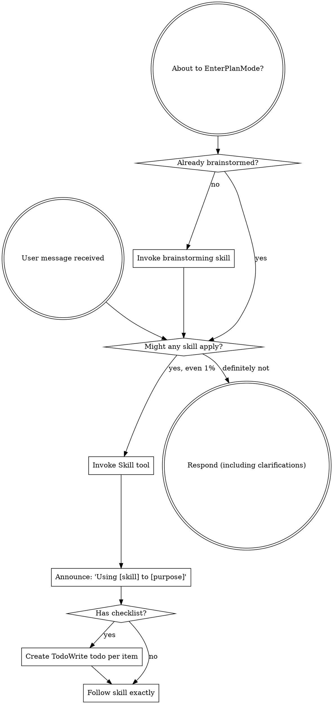
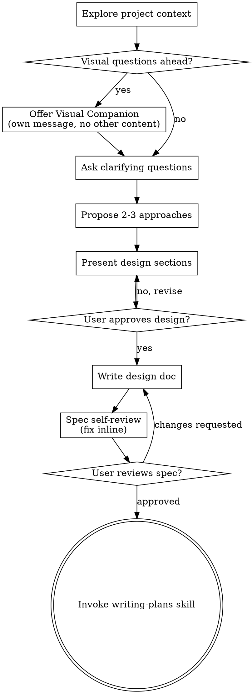
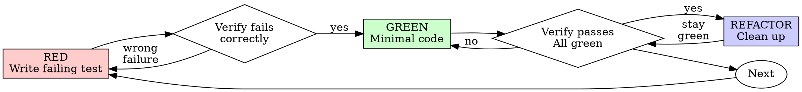
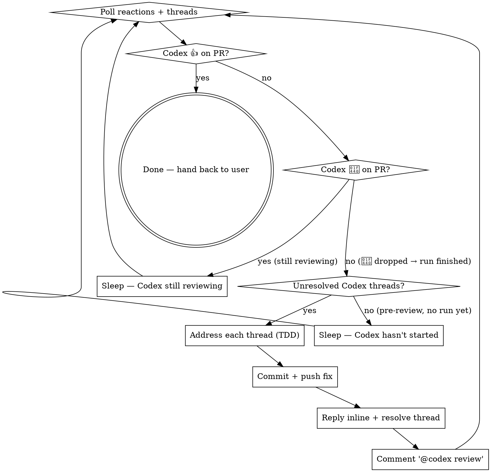

> SYSTEM

# AGENTS.md instructions for /Users/ericson/.codex/worktrees/d5d2/ars-ui

<INSTRUCTIONS>
## Approach
- Read existing files before writing. Don't re-read unless changed.
- Thorough in reasoning, concise in output.
- Skip files over 100KB unless required.
- No sycophantic openers or closing fluff.
- No emojis or em-dashes.
- Do not guess APIs, versions, flags, commit SHAs, or package names. Verify by reading code or docs before asserting.

--- project-doc ---

# ars-ui

## Project Overview

Rust frontend component library using state machines, framework-agnostic core with Leptos/Dioxus adapters.

## Current Phase

The repo is now in active implementation, not spec drafting only.

Agents working on implementation should use the GitHub Project roadmap and issue backlog as the execution source of truth:

- Use the GitHub Project `ars-ui implementation roadmap` to understand active epics, task breakdown, dependencies, status, and iteration planning.
- Prefer picking a single issue-backed task that is unblocked, sized, and scoped for independent delivery.
- Do not start work from an epic issue unless the user explicitly asks for planning or further decomposition.
- Do not start a task that is blocked by unresolved GitHub issue dependencies.
- Treat native GitHub issue dependencies as the blocker graph and the issue body acceptance criteria as the delivery contract.

## Development Workflow

For implementation tasks:

1. Read the assigned or selected GitHub issue first.
2. Move the issue to **In Progress** on the GitHub Project board.
3. Review the cited spec sections and any dependency issues.
4. Add or update the named tests first.
5. Implement only the scope required to make those tests pass.
6. If implementation changes the intended contract, update the relevant spec in the same task.
7. **MANDATORY:** Invoke the `post-implementation-audit` skill (`.agents/skills/post-implementation-audit/SKILL.md`). It runs three sequential audits on the new code — (a) spec/implementation drift with "best outcome" recommendations, (b) iterative "anything else missing?" passes (minimum two rounds), (c) test-coverage audit across every test type the workspace uses (unit, snapshot, proptest, doc, spec-conformance, llvm-cov — mutation testing is **not** part of this gate; it is Nightly-CI-driven). **Every finding lands in _this_ PR — no deferral, no follow-up issues.** This step exists because initial implementations consistently ship spec drift and silent contract violations that take 3+ review round-trips to surface; the audit collapses them into one. Skipping this step is a contract violation.
8. Present the final result for user review before any commit.
9. After user approval, run `cargo xci --profile fast` (alias: `cargo xci-fast`) locally and fix any failures before pushing anything to GitHub. The fast profile covers the workspace-level regressions a pre-push gate should catch: fmt, clippy, unit, integration, adapter, spec-compile-snippets, error-variant-coverage, mutual-exclusion, snapshot-count, and a **native-only coverage check** (`coverage-native`) that enforces the thresholds of the crates whose CI coverage is native-only (the agnostic library crates + xtask) — so `ars-components`-style coverage regressions surface before push, not on CI. The native coverage check adds an instrumented rebuild, so the fast profile runs in roughly 10–15 minutes. Reserve full `cargo xci` (~25 minutes, all 20 gates including the wasm coverage + CRAP gate and the feature-matrix groups) for after substantial refactors that may have shifted feature-flag interactions. For small follow-up changes, run the focused tests and checks that cover the edited code instead. To run only the coverage check, use `cargo xcov` (native-only) or `cargo xcov --full` (mirrors CI; needs the wasm toolchain + clang-22).
10. After `cargo xci-fast` passes, commit and push a PR targeting `main`. The PR body MUST include an auto-close keyword for the issue being delivered, for example `Closes #20` or `Fixes #20`, so GitHub closes the issue automatically when the PR merges.
11. **If the PR creates or modifies any `.snap` insta fixtures, attach the `snapshot-reviewed` label after opening or updating it** (`gh pr edit <num> --add-label "snapshot-reviewed"`). This signals to reviewers that the snapshot output was inspected and is intentional. Re-apply the label whenever you push a commit that touches `.snap` files; the workflow assumes the label reflects the latest snapshot state.
12. **MANDATORY:** Invoke the `waiting-for-codex-review` skill (`.agents/skills/waiting-for-codex-review/SKILL.md`) immediately after the first push that creates the PR, and re-invoke it after every subsequent push to the PR branch. The skill posts the initial `@codex review` trigger, polls Codex's 👀 → (👍 \| ∅ + threads) reaction lifecycle, addresses any review threads with the same rigor as `post-implementation-audit` (TDD + no coverage regression), replies inline, resolves threads, and re-comments `@codex review` to start the next pass — looping until Codex leaves 👍. Skipping this step leaves Codex findings unaddressed and silently widens the gap between merged code and the spec; the merge gate is 👍 from Codex plus green CI, not green CI alone.
13. Only after CI passes, Codex has left 👍, and the PR is merged, close the issue.

Never close a GitHub issue without a merged PR that passes CI **and a 👍 from Codex**. Never commit or push without explicit user approval. Keep the issue, PR, and Project board status aligned with the actual work state at every step.

Default delivery rules:

- Follow TDD: tests first, implementation second, verification last.
- Keep task scope aligned with the issue. If the issue is too large or ambiguous, stop and split or clarify rather than freelancing a bigger change.
- Prefer tasks sized `1`, `2`, `3`, or `5` points. `8` is exceptional. `13` must be decomposed before implementation.
- Preserve the crate and dependency layering defined by the architecture and implementation plan.
- Do not add a new dependency crate without explicit user approval first. If a task appears to need a new crate, stop, explain why, and get approval before editing any `Cargo.toml`.
- When a task is complete, verify the exact tests and checks named by the issue before considering it done.
- **Adapter-level component implementation MUST follow `docs/implementation/adapter-component-delivery.md` precisely.** Every adapter task — for any component in `crates/ars-leptos` or `crates/ars-dioxus` — must land _all_ of the following in the same PR, with no deferral to follow-up issues:
    1. Adapter crate code (`crates/ars-{leptos,dioxus}/src/<category>/<component>/`) with module wiring and prelude re-exports — minimize `clone()` calls by parking per-instance values shared across closures in `StoredValue<T>` (Leptos) or `CopyValue<T>` (Dioxus) instead of cloning into each capture, per the "Avoid unnecessary clones" section in `docs/implementation/adapter-component-delivery.md`;
    2. Adapter-level **unit + SSR tests** in `crates/ars-{leptos,dioxus}/tests/<component>.rs`;
    3. Adapter-level **wasm browser tests** in `crates/ars-{leptos,dioxus}/tests/<component>_wasm.rs` for any interactive behavior (focus, keyboard nav, pointer events, typeahead, controlled-signal sync, observers, portal, scroll, cleanup);
    4. **Widgets examples** in _all six_ widgets crates (`examples/widgets-{leptos,dioxus}`, `widgets-{leptos,dioxus}-css`, `widgets-{leptos,dioxus}-tailwind`) under the matching `src/categories/<category>.rs` — replacing any "Coming soon" placeholder text with a real interactive demo;
    5. **E2E fixtures** in `crates/ars-e2e/fixtures/{leptos,dioxus}/src/main.rs` and an **E2E harness module** at `crates/ars-e2e/src/<category>/<component>.rs` covering axe-core, keyboard, pointer, and adapter-parity checks (unless the component is purely static and adapter tests already prove that — state the reason in the PR body);
    6. **xtask `e2e <category>` subcommand** (in `xtask/src/e2e.rs`, `xtask/src/main.rs`, and `crates/ars-e2e/src/main.rs`) when this is the first E2E-covered component in a new category;
    7. **Spec synchronization** for any drift surfaced by the implementation, with the amendment landed in the same PR (see "Spec Synchronization During Implementation");
    8. **Validation gates**: `cargo xtask lint adapter-parity` runs without `SKIP` for the component; `cargo xci-fast` passes; `post-implementation-audit` skill ran all three phases with every finding fixed in this PR.

    Skipping any of these is a workflow violation. The `adapter-component-delivery.md` doc is the single source of truth for what "adapter task complete" means.

### Code Quality Standards

- **Document all public items.** Every public struct, enum, trait, function, constant, type alias, method, field, and variant must have a `///` doc comment. Every `lib.rs` must have a `//!` crate-level doc comment. The workspace enforces `missing_docs` linting — undocumented public items are build failures.
- **Zero warnings policy.** All code must compile with zero warnings under the workspace's configured clippy and rustc lints. Fix the root cause instead of suppressing. When suppression is genuinely needed, use `#[expect(lint, reason = "...")]` — never `#[allow(...)]`.
- **Derive documentation from the spec.** Doc comments should describe the _purpose and semantics_ of the item as defined in the corresponding `spec/` files, not just restate the type signature.
- **Use `#[inline]` selectively, not mechanically.** Do **not** add Clippy's `missing_inline_in_public_items` lint at the workspace level, and do not treat public visibility alone as a reason to mark an item `#[inline]`. Use `#[inline]` for thin cross-crate wrappers, trivial accessors, and hot-path no-op shims where the call overhead is plausibly meaningful. Avoid blanket `#[inline]` on all public APIs — it increases code size, adds compile-time cost, and turns `#[inline]` into noise instead of a deliberate performance signal.
- **Use directory-backed modules with `mod.rs` when a module owns children.** This repo standardizes on the older filesystem layout for nested modules. If module `foo` has child modules, the parent must live at `foo/mod.rs`, not `foo.rs`. Do not mix `foo.rs` with a sibling `foo/` directory. When a refactor adds child modules under an existing flat file, move the parent into `foo/mod.rs` in the same change. Do not leave empty leftover module directories behind.

### API Design Standards

- **Design for the pit of success.** Public APIs should make the most natural, shortest path also be the path that is correct, accessible, localizable, type-safe, and performant. Prefer ergonomic constructors and defaults that preserve the spec's strongest guarantees instead of making users opt into correctness after choosing a convenient API.
- **Name escape hatches explicitly.** When a component needs a lower-level, static, non-i18n, or otherwise less complete path, keep it available but make the tradeoff visible in the API name or type. The blessed path should remain the simplest call site, while escape hatches should read as deliberate choices.
- **Keep semantic data separate from rendered views.** Rich framework views are useful for customization, but components still need semantic sources for accessible names, localized text, announcements, ids, and state-machine wiring. Do not rely on arbitrary rendered view trees as the only source of user-facing semantics.

### Code Coverage

The workspace uses `cargo-llvm-cov` for code coverage with per-crate threshold enforcement. CI runs coverage on every PR (see `.github/workflows/ci.yml`).

**Local coverage commands:**

```bash
# Fast native-only coverage gate — instruments + checks only the crates whose
# CI coverage is native-only (agnostic library crates + xtask). No wasm/clang
# toolchain needed; this is what the `fast` pre-push profile runs.
cargo xcov

# Full native+wasm coverage gate, mirroring CI (needs the wasm toolchain + clang-22)
cargo xcov --full

# Per-crate coverage with inline annotated source (most useful during development)
cargo llvm-cov test -p ars-interactions --text -- hover

# Per-crate summary only
cargo llvm-cov test -p ars-interactions -- hover

# Native-only workspace coverage (host target; excludes wasm-only crates)
cargo llvm-cov --workspace \
  --exclude ars-leptos --exclude ars-dioxus \
  --exclude ars-test-harness-leptos --exclude ars-test-harness-dioxus \
  --exclude ars-derive --exclude xtask \
  --lcov --output-path lcov.info

# Check all crates against spec-defined thresholds (run after a *merged* lcov)
cargo xtask coverage check-all --file lcov.info
```

The `--text` flag produces line-by-line annotated source showing hit counts and `^0` markers on uncovered branches — use this to identify gaps after writing tests. Uncovered no-op callback closures in tests (e.g., `|_| {}`) are expected and not a gap.

The local recipe above excludes the adapter and adapter-test-harness crates because their `target_arch = "wasm32"` / `feature = "web"` code paths can't be measured via host-target `cargo llvm-cov`. **CI runs an additional wasm-coverage pipeline on nightly** (`cargo xtask ci coverage`) that uses `wasm-bindgen-test`'s experimental coverage recipe with LLVM 22 / `clang-22` to emit lcov for `ars-leptos` (csr), `ars-dioxus` (web), `ars-dom` (web), `ars-i18n` (web-intl), and the adapter test harnesses, then merges with the native lcov via `cargo xtask coverage merge`. The per-crate thresholds in `xtask::coverage::default_thresholds()` are enforced against the merged file — including adapter targets (`ars-leptos` 74/55, `ars-dioxus` 77/70, `ars-test-harness-leptos` 60/0, `ars-test-harness-dioxus` 60/0). `ars-derive` (proc-macro, runs in compiler) is exercised via `crates/ars-core/tests/derive_contract.rs` and is unmeasured. `xtask` has its own enforced threshold (30/35) and is measured. See `spec/testing/14-ci.md` §2 for the full pipeline.

### CRAP Gate (complexity vs. coverage)

Coverage tells you which lines run; mutation testing tells you whether tests would notice misbehaviour. The **CRAP gate** ([`cargo-crap`](https://crates.io/crates/cargo-crap)) tells you which functions are _risky to change_ — high cyclomatic complexity combined with low coverage. The CRAP score is `complexity² · (1 − coverage)³ + complexity`.

**Why regression mode, not an absolute threshold.** At 100% coverage `CRAP == cyclomatic complexity`, so an absolute `--fail-above` threshold rejects every large `match` no matter how well it is tested. This workspace is built on state machines: each stateful component's `Machine::transition` is intrinsically a wide `match (state, event)` (complexity 30–80) and is exhaustively tested. An absolute gate would fight that architecture and reject more components as the catalog grows. The gate therefore runs in **regression mode**.

- **Blessed entrypoints:** `cargo xcrap` (local human-readable report, never fails), `cargo xcrap --update-baseline` (regenerate the baseline), and `cargo xtask ci crap` (the CI gate). The gate is the last step of the full `cargo xci` pipeline, running immediately after `coverage` and reusing its merged `lcov.info` (no recompile). It is **not** in the fast profile: the fast profile runs only the native-only `coverage-native` check, which does not produce the merged `lcov.info` the CRAP gate compares against.
- **Policy:** `cargo crap --path . --lcov lcov.info --baseline .crap-baseline.json --fail-regression --min 30 --exclude 'target/**' --exclude 'examples/**' --exclude 'xtask/**' --exclude 'crates/ars-e2e/**' --exclude 'crates/ars-derive/**'`. The gate scopes to the **shipped component library** — tooling (`xtask`), the browser E2E harness (`ars-e2e`), the proc-macro crate, demos, and build output are excluded (they are not shipped surface, and several run uninstrumented-as-tooling on CI → 0% → spurious CRAP). The gate fails only when a function **at or above CRAP 30 regresses** (more complexity or less coverage) versus the committed baseline. New functions are tolerated — the per-crate coverage thresholds already ensure new code is tested — and sub-threshold churn on simple functions is ignored. Net: the coverage gate guarantees new code is tested; the CRAP gate guarantees shipped code does not rot.
- **`--path .`, not `--workspace`.** cargo-crap's regression key is `(file, function, line)`, and `--workspace` records machine-absolute file paths (`/Users/…` locally, `/home/runner/…` on CI). A baseline committed with absolute paths never matches on CI, silently turning the gate into a no-op. `--path .` emits repo-relative paths (`./crates/…`) that match on any checkout; coverage still associates correctly because cargo-crap canonicalizes paths when reading the lcov. `--exclude` is honored under `--path` (it is a no-op under `--workspace`), so `target/**` and the unmeasured `crates/ars-derive/**` are skipped there. Because the key includes the line number, a baseline only matches non-uniquely-named functions (e.g. `Machine::transition`) while their line numbers are stable; regenerate the baseline when a tracked file's lines shift materially.
- **Baseline:** `.crap-baseline.json` at the repo root is committed and complete (every function, no `--min`, so a function crossing the threshold is still caught). Regenerate it with `cargo xcrap --update-baseline` from CI's merged `lcov.info` (download the `coverage-lcov` artifact) whenever a **deliberate** complexity increase lands; commit the new baseline in that PR — a conscious "I accept this" checkpoint. cargo-crap's `--epsilon` (default 0.01) absorbs coverage float jitter. If the baseline is missing, the gate bootstraps it and passes with a notice.
- **Pinned version:** cargo-crap is pinned to an exact version in `xtask::crap::CARGO_CRAP_VERSION` and `.github/workflows/ci.yml` (same convention as cargo-mutants). To bump, update both. Install locally with `cargo install cargo-crap --locked --version <version>` (or `cargo binstall cargo-crap`).
- **Scope / escape hatch:** the exclude-glob list lives in `xtask/src/crap.rs` (`EXCLUDE_GLOBS`), each entry justified by a comment, and scopes the gate to the **shipped component library**. Because the gate runs under `--path .`, cargo-crap's `--exclude` is honored, so build output (`target/**`), demos (`examples/**`), the task runner (`xtask/**`), the browser E2E harness (`crates/ars-e2e/**`), and the proc-macro crate (`crates/ars-derive/**`) are skipped at walk time. The last three are not shipped library code and run uninstrumented-as-tooling on CI (0% coverage → spurious CRAP), so gating them is meaningless. Prefer fixing or refactoring over adding entries. (Note: the per-crate **coverage** gate still measures `xtask` at its own loose 30/35 threshold — that is separate from CRAP.)

### Mutation Testing

Coverage tells you which lines run. **Mutation testing tells you whether the tests would notice if those lines silently misbehaved.** The workspace uses [`cargo-mutants`](https://mutants.rs) for this — a `cargo` extension binary, not a workspace dependency.

**Install (once per developer machine):**

```bash
cargo install cargo-mutants --locked --version 27.0.0
```

**Local commands (state-machine modules are the most rewarding targets):**

Prefer `cargo xmutants` over bare `cargo mutants` — it applies the same
per-crate `--features` profile as Nightly CI (for example
`ars-components/i18n`) so snapshot and i18n-gated tests match CI.

```bash
# Run on a single component machine (~6 min for popover)
cargo xmutants -p ars-components -f crates/ars-components/src/overlay/popover/mod.rs

# Just list what would be mutated, without running tests (fast)
cargo xmutants -p ars-components -f crates/ars-components/src/overlay/popover/mod.rs --list

# Whole crate (slow — only if you really mean it)
cargo xmutants -p ars-components
```

**Agnostic component implementation gate:** whenever an agent implements a new framework-agnostic component, or materially changes an existing one, the delivery must include:

- spec-conformance tests for the component's anatomy/public contract, including its `Part` enum and required API/attribute surface;
- the full test breadth the component warrants (unit, snapshot, proptest) with strong line/branch coverage.

**Mutation testing is NOT a pre-PR requisite for agnostic component work.** Do not run a targeted `cargo xmutants` pass as a delivery/audit gate, and do not block a PR on a clean local mutation run. Surviving (`MISSED`) mutants are surfaced by the Nightly CI `mutation-testing` job (see below); triage them — add tests for real gaps, or add a justified line-agnostic `.cargo/mutants.toml` exclude for true equivalent mutations — in a dedicated follow-up when Nightly reports them, not during initial component delivery. (Running a local mutation pass voluntarily is fine, but it is never required and never blocks delivery or review.)

**Reading the output:** Results land in `mutants.out/mutants.out/` (gitignored). The two files that matter:

- `caught.txt` — mutations that broke at least one test ✅
- `missed.txt` — mutations that survived all tests ❌ — each one is either a real test gap to fill or an "equivalent mutation" that needs a `[[skip]]` entry in `mutants.toml` with a justification

**CI integration:** Nightly only. `.github/workflows/nightly.yml` has a `mutation-testing` job with a 21-entry matrix that runs `cargo mutants -p <package>` on every framework-agnostic crate, using `--shard k/n` to spread larger crates across parallel runners. **Shard indices are 0-based** (`k` runs from `0` to `n-1`); `k == n` is invalid and will fail the job. When adding shards, always start at `0/n` and end at `(n-1)/n`.

- **`ars-components` (≈ 1,630 mutants today, planned to grow as the spec adds the remaining ~97 components):** sharded **12-way** → ≈ 135 mutants per runner today, ≈ 850 per runner at the ~10,000-mutant endpoint. Sized for the full spec catalog up front so we don't re-shard every few months as components land.
- **`ars-collections` (≈ 1,080 mutants):** sharded 4-way → ≈ 270 mutants per runner.
- **`ars-core` (≈ 700 mutants):** sharded 2-way → ≈ 350 mutants per runner.
- **`ars-a11y`, `ars-forms`, `ars-interactions`:** one runner each (under 600 mutants apiece).

**Adding a new state machine inside an existing crate requires no CI changes** — its mutations land in whichever shard the cargo-mutants partitioner places them. The shard counts are sized so the slowest runner stays well under 30 minutes today and under ~50 minutes at the planned endpoint; re-balance only when a crate outgrows that budget (visible on the nightly dashboard as one shard pulling away from the others).

All matrix jobs run with `fail-fast: false` so failures on one module don't mask data on another. Each job uploads its `mutants.out/` as a workflow artifact (always, even on success — surviving "missed" entries on a passing run still reveal test-quality work). The job fails if any mutation survives, so a missed mutation forces a deliberate triage decision (fix the test, or document the equivalence with a `[[skip]]` entry in `mutants.toml`).

**Excluded crates** (mutation testing's signal degrades wherever determinism does): adapter glue (`ars-leptos`, `ars-dioxus`), DOM/FFI (`ars-dom`), ICU/FFI (`ars-i18n`), test infrastructure (`ars-test-harness*`), and the proc-macro crate (`ars-derive`, runs in the compiler). Adding a brand-new crate that is a good mutation target requires one new matrix entry; run a local scout first (`cargo mutants -p <crate> --list` to size, then a real run) so we know the right shard count before the nightly fires.

**Bumping the pinned version.** Both the local install command above and `.github/workflows/nightly.yml` pin cargo-mutants to an exact version (currently `27.0.0`) — same convention as `wasm-pack` in the `a11y-audit` job. Pinning is deliberate: cargo-mutants ships new mutators in releases, and an unpinned install would silently change the mutation set without any code change, surfacing as phantom CI failures on a green-source repo. To bump, open a PR that (1) updates the version string in CLAUDE.md and `nightly.yml`, (2) runs the popover scout locally with the new version (`cargo mutants -p ars-components -f crates/ars-components/src/overlay/popover/mod.rs`) to confirm the mutation count is in the same ballpark, and (3) triages any new "missed" entries the new mutators surface — they are usually genuine test-quality gaps newly visible to the tool.

### Property Testing (proptest)

State-machine invariants are exercised by [`proptest`](https://docs.rs/proptest) under `crates/<crate>/tests/proptest_state_machines/` (see `ars-components`). Default proptest behaviour drops `*.proptest-regressions` seed files alongside test sources — instead, every `proptest!` block in this workspace pulls a shared `Config` from `tests/proptest_state_machines/common.rs` that:

1. Reads `PROPTEST_CASES` from the environment (1,000 default; 10,000 in the nightly `extended-proptest` job).
2. Sets `failure_persistence` to `FileFailurePersistence::Direct("proptest-regressions/state-machines.txt")`, so all persisted seeds for the test binary live in one file at the crate root: `crates/<crate>/proptest-regressions/state-machines.txt`. The directory is committed (per proptest's own recommendation in the file header) so every developer's runs benefit from previously-shrunk failures.

When a new crate adopts proptest for state-machine tests, copy the same `common.rs` helper and reference it via `#![proptest_config(super::common::proptest_config())]` inside every `proptest!` block. Don't let proptest fall back to its `WithSource` default — that scatters seed files across the source tree.

### Adapter Prelude Convention

Both `ars-leptos` and `ars-dioxus` expose a `prelude` module targeting **end users** — application developers who consume the ready-made components. `use ars_leptos::prelude::*` (or `use ars_dioxus::prelude::*`) should give them everything they need.

The prelude contains only user-facing items:

1. **Component modules** — as components land, their public module paths (e.g., `button`, `dialog`) are re-exported so users can write `button::Props`, etc.
2. **User-facing traits** — traits end users call on component outputs (e.g., `Translate` from `ars-i18n`). Re-export the trait so consumers don't need a direct dependency on the subsystem crate.
3. **Configuration types** — types that appear in component props or configure behaviour (e.g., `Locale`, `Direction`, `Orientation`, `Selection`).

The prelude does **not** include implementation details consumed only by component authors inside the adapter crate: core engine types (`Machine`, `Service`, `ConnectApi`, `AttrMap`), accessibility primitives (`AriaRole`, `AriaAttribute`), interaction helpers (`merge_attrs`), or adapter hooks (`use_machine`, `UseMachineReturn`). Those remain accessible via their normal crate paths for advanced users building custom machines.

Both adapter preludes must stay symmetric: same items, same structure. When adding a new re-export to one adapter's prelude, add it to the other as well in the same PR.

### Adapter Testing Convention

Adapter-level component tests should default to the framework-specific test harness crate:

- Leptos adapter tests should prefer `ars-test-harness-leptos`.
- Dioxus adapter tests should prefer `ars-test-harness-dioxus`.
- Shared `ars-test-harness` helpers should be used where relevant for viewport, layout, clipboard, drag/drop, timing, and other DOM test setup instead of bespoke per-test browser scaffolding.

When a component spec requires interaction, focus, overlay positioning, clipboard, file upload, drag/drop, or similar browser behavior, the task's tests should exercise that behavior through the adapter harness entrypoints and shared core harness helpers unless there is a concrete technical reason not to.

## Spec Synchronization During Implementation

The specification is the authoritative contract. It took weeks of deliberate design and MUST be followed.

### Spec-first implementation rule

Before implementing any public type, trait, function, or method:

1. **Read the spec section first.** Find the relevant code example in `spec/`. Use `spec-tool toc <file>` and `grep` to locate it.
2. **Match the spec exactly.** If the spec defines `struct ComponentIds { base: String }` with methods `from_id()`, `id()`, `part()`, `item()`, `item_part()` — implement exactly that. Do not invent alternative field names, method names, or signatures.
3. **Cross-check after implementation.** Before presenting code for review, diff every public item against the spec's code examples. Every struct field, every method name, every parameter must match.
4. **If you must deviate**, there must be a concrete technical reason (e.g., the spec's API cannot compile, or a dependency doesn't expose the needed type). Document the reason in a code comment and flag it to the user explicitly.

Inventing alternative APIs that "seem equivalent" is never acceptable — it silently invalidates the spec's design decisions and all downstream code that depends on those APIs.

### Spec/code mismatch resolution

- If code and spec disagree, resolve the mismatch in the same task or PR.
- Shared conceptual changes belong in shared or foundation spec files, not only in adapter code.
- Adapter-specific findings must be reflected back into `spec/foundation/08-adapter-leptos.md` and/or `spec/foundation/09-adapter-dioxus.md` when relevant.
- Do not leave spec drift behind as follow-up cleanup.

## Spec Structure

The specification lives in `spec/` with this layout:

- `spec/manifest.toml` — **START HERE** — central index of all components and their dependencies
- `spec/foundation/` — architecture, accessibility, i18n, interactions, forms, adapters, spec template (00-10)
- `spec/shared/` — cross-component shared types (date-time, selection, layout, z-index)
- `spec/components/{category}/` — one file per component, organized by category
- `spec/testing/` — test specs split by domain

### Component Categories

- `input/` — checkbox, text-field, slider, number-input, etc.
- `selection/` — select, combobox, listbox, menu, tags-input, etc.
- `overlay/` — dialog, popover, tooltip, toast, presence, etc.
- `navigation/` — accordion, tabs, tree-view, pagination, steps, etc.
- `date-time/` — date-field, time-field, calendar, date-picker, etc.
- `data-display/` — table, avatar, progress, meter, badge, etc.
- `layout/` — splitter, scroll-area, carousel, portal, toolbar, etc.
- `specialized/` — color-picker, file-upload, signature-pad, qr-code, etc.
- `utility/` — button, toggle, focus-scope, visually-hidden, separator, etc.

## Working with the Spec

When reading large files, run `wc -l` first to check the line count. If the file is over 2,000
lines, use the `offset` and `limit` parameters on the Read tool to read in chunks rather than
attempting to read the entire file at once.

### Using xtask spec (preferred)

Use `cargo xtask spec` to resolve file sets instead of manually parsing manifest.toml:

```bash
# Quick metadata lookup:
cargo xtask spec info <component>

# Find all components using a shared type:
cargo xtask spec reverse <shared-type>

# See a file's heading structure (with line numbers):
cargo xtask spec toc <file>

# Validate frontmatter matches manifest.toml:
cargo xtask spec validate

# Search spec content by keyword/regex (with optional filters):
cargo xtask spec search <query> [--category <cat>] [--section <sec>] [--tier <tier>]

# Get a compact component summary (states, events, props, accessibility):
cargo xtask spec digest <component>

# Get full implementation context (component + all deps concatenated):
cargo xtask spec context <component> [--framework <fw>] [--include-testing]
```

The xtask also runs as an MCP server (`cargo xtask mcp`) exposing all spec tools for LLM agents.

### Reading a component (manual fallback)

1. Read `spec/manifest.toml` to find the component's path and dependencies
2. Read the component file (has YAML frontmatter listing its foundation/shared deps)
3. Only load the foundation files listed in `foundation_deps` — not all of them

### Framework and library specs — MANDATORY skill loading

When reading or editing these specification files, you MUST load the corresponding skill BEFORE doing any work. The skills contain verified, version-accurate API documentation that the spec code examples depend on. Claude's training data is wrong for these libraries — do not trust it.

| Spec file                                    | Skill to load | Library version |
| -------------------------------------------- | ------------- | --------------- |
| `spec/foundation/04-internationalization.md` | `icu4x`       | ICU4X 2.1.1     |
| `spec/foundation/08-adapter-leptos.md`       | `leptos`      | Leptos 0.8.17   |
| `spec/foundation/09-adapter-dioxus.md`       | `dioxus`
</INSTRUCTIONS>
<environment_context>
  <cwd>/Users/ericson/.codex/worktrees/d5d2/ars-ui</cwd>
  <shell>zsh</shell>
  <current_date>2026-06-03</current_date>
  <timezone>America/Sao_Paulo</timezone>
  <filesystem><workspace_roots><root>/Users/ericson/.codex/worktrees/d5d2/ars-ui</root></workspace_roots><permission_profile type="managed"><file_system type="restricted"><entry access="read"><special>:root</special></entry><entry access="write"><path>/Users/ericson/.codex/worktrees/d5d2/ars-ui</path></entry><entry access="write"><special>:slash_tmp</special></entry><entry access="write"><special>:tmpdir</special></entry><entry access="read"><path>/Users/ericson/.codex/worktrees/d5d2/ars-ui/.git</path></entry><entry access="read"><path>/Users/ericson/.codex/worktrees/d5d2/ars-ui/.agents</path></entry><entry access="read"><path>/Users/ericson/.codex/worktrees/d5d2/ars-ui/.codex</path></entry><entry access="read"><path>/Users/ericson/Workspace/Rust/ars-ui/.git/worktrees/ars-ui3</path></entry></file_system></permission_profile></filesystem>
</environment_context>

> DEVELOPER

We recently completed all agnostic components of the selection category. Now I wanna do a full audit of them, to be able to close the Epic #221 on Github. In this audit we need to make sure that everything related to this category in the spec was properly implemented, on all selection agnostic components. Including auditing their respective proptests and spec conformance tests, and while you're in those two, take your time to properly separate the proptests and the spec conformance tests into modules for each component, as currently we have a bloat of tests for all selection components together in the same file.

> AGENT

I’ll ground this in the current repo and the live epic/task state before proposing the audit plan. Because this is category-wide implementation planning, I’m using the planning and brainstorming skills, and I’ll keep this in planning mode rather than editing files.

> TOOL

tool_use exec_command
id: call_yRubnpAmKwBzCY2gveaouj4I
```json
{
  "cmd": "sed -n '1,220p' /Users/ericson/.codex/plugins/cache/openai-curated/superpowers/2abb1c44/skills/using-superpowers/SKILL.md",
  "workdir": "/Users/ericson/.codex/worktrees/d5d2/ars-ui",
  "yield_time_ms": 10000,
  "max_output_tokens": 12000
}
```

> TOOL

tool_use exec_command
id: call_oM0zRiZglMAjVdHXNaYrxWlV
```json
{
  "cmd": "sed -n '1,220p' /Users/ericson/.codex/plugins/cache/openai-curated/superpowers/2abb1c44/skills/brainstorming/SKILL.md",
  "workdir": "/Users/ericson/.codex/worktrees/d5d2/ars-ui",
  "yield_time_ms": 10000,
  "max_output_tokens": 12000
}
```

> TOOL

tool_use exec_command
id: call_k1fsoffBIn4n9iARQZ7gWvab
```json
{
  "cmd": "sed -n '1,220p' /Users/ericson/.codex/plugins/cache/openai-curated/superpowers/2abb1c44/skills/writing-plans/SKILL.md",
  "workdir": "/Users/ericson/.codex/worktrees/d5d2/ars-ui",
  "yield_time_ms": 10000,
  "max_output_tokens": 12000
}
```

> TOOL

tool_use exec_command
id: call_F0PsHSKNsTPR9FbVRXIKCYRy
```json
{
  "cmd": "rg -n \"selection|Epic #221|#221|spec_conformance|proptest_state_machines\" /Users/ericson/.codex/memories/MEMORY.md",
  "workdir": "/Users/ericson/.codex/worktrees/d5d2/ars-ui",
  "yield_time_ms": 10000,
  "max_output_tokens": 12000
}
```

> TOOL

tool_result
id: call_yRubnpAmKwBzCY2gveaouj4I
```
Chunk ID: 26e2a7
Wall time: 0.2885 seconds
Process exited with code 0
Original token count: 1356
Output:
---
name: using-superpowers
description: Use when starting any conversation - establishes how to find and use skills, requiring Skill tool invocation before ANY response including clarifying questions
---

<SUBAGENT-STOP>
If you were dispatched as a subagent to execute a specific task, skip this skill.
</SUBAGENT-STOP>

<EXTREMELY-IMPORTANT>
If you think there is even a 1% chance a skill might apply to what you are doing, you ABSOLUTELY MUST invoke the skill.

IF A SKILL APPLIES TO YOUR TASK, YOU DO NOT HAVE A CHOICE. YOU MUST USE IT.

This is not negotiable. This is not optional. You cannot rationalize your way out of this.
</EXTREMELY-IMPORTANT>

## Instruction Priority

Superpowers skills override default system prompt behavior, but **user instructions always take precedence**:

1. **User's explicit instructions** (CLAUDE.md, GEMINI.md, AGENTS.md, direct requests) — highest priority
2. **Superpowers skills** — override default system behavior where they conflict
3. **Default system prompt** — lowest priority

If CLAUDE.md, GEMINI.md, or AGENTS.md says "don't use TDD" and a skill says "always use TDD," follow the user's instructions. The user is in control.

## How to Access Skills

**In Claude Code:** Use the `Skill` tool. When you invoke a skill, its content is loaded and presented to you—follow it directly. Never use the Read tool on skill files.

**In Copilot CLI:** Use the `skill` tool. Skills are auto-discovered from installed plugins. The `skill` tool works the same as Claude Code's `Skill` tool.

**In Gemini CLI:** Skills activate via the `activate_skill` tool. Gemini loads skill metadata at session start and activates the full content on demand.

**In other environments:** Check your platform's documentation for how skills are loaded.

## Platform Adaptation

Skills use Claude Code tool names. Non-CC platforms: see `references/copilot-tools.md` (Copilot CLI), `references/codex-tools.md` (Codex) for tool equivalents. Gemini CLI users get the tool mapping loaded automatically via GEMINI.md.

# Using Skills

## The Rule

**Invoke relevant or requested skills BEFORE any response or action.** Even a 1% chance a skill might apply means that you should invoke the skill to check. If an invoked skill turns out to be wrong for the situation, you don't need to use it.



## Red Flags

These thoughts mean STOP—you're rationalizing:

| Thought | Reality |
|---------|---------|
| "This is just a simple question" | Questions are tasks. Check for skills. |
| "I need more context first" | Skill check comes BEFORE clarifying questions. |
| "Let me explore the codebase first" | Skills tell you HOW to explore. Check first. |
| "I can check git/files quickly" | Files lack conversation context. Check for skills. |
| "Let me gather information first" | Skills tell you HOW to gather information. |
| "This doesn't need a formal skill" | If a skill exists, use it. |
| "I remember this skill" | Skills evolve. Read current version. |
| "This doesn't count as a task" | Action = task. Check for skills. |
| "The skill is overkill" | Simple things become complex. Use it. |
| "I'll just do this one thing first" | Check BEFORE doing anything. |
| "This feels productive" | Undisciplined action wastes time. Skills prevent this. |
| "I know what that means" | Knowing the concept ≠ using the skill. Invoke it. |

## Skill Priority

When multiple skills could apply, use this order:

1. **Process skills first** (brainstorming, debugging) - these determine HOW to approach the task
2. **Implementation skills second** (frontend-design, mcp-builder) - these guide execution

"Let's build X" → brainstorming first, then implementation skills.
"Fix this bug" → debugging first, then domain-specific skills.

## Skill Types

**Rigid** (TDD, debugging): Follow exactly. Don't adapt away discipline.

**Flexible** (patterns): Adapt principles to context.

The skill itself tells you which.

## User Instructions

Instructions say WHAT, not HOW. "Add X" or "Fix Y" doesn't mean skip workflows.

```

> TOOL

tool_result
id: call_oM0zRiZglMAjVdHXNaYrxWlV
```
Chunk ID: 051a10
Wall time: 0.1437 seconds
Process exited with code 0
Original token count: 2659
Output:
---
name: brainstorming
description: "You MUST use this before any creative work - creating features, building components, adding functionality, or modifying behavior. Explores user intent, requirements and design before implementation."
---

# Brainstorming Ideas Into Designs

Help turn ideas into fully formed designs and specs through natural collaborative dialogue.

Start by understanding the current project context, then ask questions one at a time to refine the idea. Once you understand what you're building, present the design and get user approval.

<HARD-GATE>
Do NOT invoke any implementation skill, write any code, scaffold any project, or take any implementation action until you have presented a design and the user has approved it. This applies to EVERY project regardless of perceived simplicity.
</HARD-GATE>

## Anti-Pattern: "This Is Too Simple To Need A Design"

Every project goes through this process. A todo list, a single-function utility, a config change — all of them. "Simple" projects are where unexamined assumptions cause the most wasted work. The design can be short (a few sentences for truly simple projects), but you MUST present it and get approval.

## Checklist

You MUST create a task for each of these items and complete them in order:

1. **Explore project context** — check files, docs, recent commits
2. **Offer visual companion** (if topic will involve visual questions) — this is its own message, not combined with a clarifying question. See the Visual Companion section below.
3. **Ask clarifying questions** — one at a time, understand purpose/constraints/success criteria
4. **Propose 2-3 approaches** — with trade-offs and your recommendation
5. **Present design** — in sections scaled to their complexity, get user approval after each section
6. **Write design doc** — save to `docs/superpowers/specs/YYYY-MM-DD-<topic>-design.md` and commit
7. **Spec self-review** — quick inline check for placeholders, contradictions, ambiguity, scope (see below)
8. **User reviews written spec** — ask user to review the spec file before proceeding
9. **Transition to implementation** — invoke writing-plans skill to create implementation plan

## Process Flow



**The terminal state is invoking writing-plans.** Do NOT invoke frontend-design, mcp-builder, or any other implementation skill. The ONLY skill you invoke after brainstorming is writing-plans.

## The Process

**Understanding the idea:**

- Check out the current project state first (files, docs, recent commits)
- Before asking detailed questions, assess scope: if the request describes multiple independent subsystems (e.g., "build a platform with chat, file storage, billing, and analytics"), flag this immediately. Don't spend questions refining details of a project that needs to be decomposed first.
- If the project is too large for a single spec, help the user decompose into sub-projects: what are the independent pieces, how do they relate, what order should they be built? Then brainstorm the first sub-project through the normal design flow. Each sub-project gets its own spec → plan → implementation cycle.
- For appropriately-scoped projects, ask questions one at a time to refine the idea
- Prefer multiple choice questions when possible, but open-ended is fine too
- Only one question per message - if a topic needs more exploration, break it into multiple questions
- Focus on understanding: purpose, constraints, success criteria

**Exploring approaches:**

- Propose 2-3 different approaches with trade-offs
- Present options conversationally with your recommendation and reasoning
- Lead with your recommended option and explain why

**Presenting the design:**

- Once you believe you understand what you're building, present the design
- Scale each section to its complexity: a few sentences if straightforward, up to 200-300 words if nuanced
- Ask after each section whether it looks right so far
- Cover: architecture, components, data flow, error handling, testing
- Be ready to go back and clarify if something doesn't make sense

**Design for isolation and clarity:**

- Break the system into smaller units that each have one clear purpose, communicate through well-defined interfaces, and can be understood and tested independently
- For each unit, you should be able to answer: what does it do, how do you use it, and what does it depend on?
- Can someone understand what a unit does without reading its internals? Can you change the internals without breaking consumers? If not, the boundaries need work.
- Smaller, well-bounded units are also easier for you to work with - you reason better about code you can hold in context at once, and your edits are more reliable when files are focused. When a file grows large, that's often a signal that it's doing too much.

**Working in existing codebases:**

- Explore the current structure before proposing changes. Follow existing patterns.
- Where existing code has problems that affect the work (e.g., a file that's grown too large, unclear boundaries, tangled responsibilities), include targeted improvements as part of the design - the way a good developer improves code they're working in.
- Don't propose unrelated refactoring. Stay focused on what serves the current goal.

## After the Design

**Documentation:**

- Write the validated design (spec) to `docs/superpowers/specs/YYYY-MM-DD-<topic>-design.md`
  - (User preferences for spec location override this default)
- Use elements-of-style:writing-clearly-and-concisely skill if available
- Commit the design document to git

**Spec Self-Review:**
After writing the spec document, look at it with fresh eyes:

1. **Placeholder scan:** Any "TBD", "TODO", incomplete sections, or vague requirements? Fix them.
2. **Internal consistency:** Do any sections contradict each other? Does the architecture match the feature descriptions?
3. **Scope check:** Is this focused enough for a single implementation plan, or does it need decomposition?
4. **Ambiguity check:** Could any requirement be interpreted two different ways? If so, pick one and make it explicit.

Fix any issues inline. No need to re-review — just fix and move on.

**User Review Gate:**
After the spec review loop passes, ask the user to review the written spec before proceeding:

> "Spec written and committed to `<path>`. Please review it and let me know if you want to make any changes before we start writing out the implementation plan."

Wait for the user's response. If they request changes, make them and re-run the spec review loop. Only proceed once the user approves.

**Implementation:**

- Invoke the writing-plans skill to create a detailed implementation plan
- Do NOT invoke any other skill. writing-plans is the next step.

## Key Principles

- **One question at a time** - Don't overwhelm with multiple questions
- **Multiple choice preferred** - Easier to answer than open-ended when possible
- **YAGNI ruthlessly** - Remove unnecessary features from all designs
- **Explore alternatives** - Always propose 2-3 approaches before settling
- **Incremental validation** - Present design, get approval before moving on
- **Be flexible** - Go back and clarify when something doesn't make sense

## Visual Companion

A browser-based companion for showing mockups, diagrams, and visual options during brainstorming. Available as a tool — not a mode. Accepting the companion means it's available for questions that benefit from visual treatment; it does NOT mean every question goes through the browser.

**Offering the companion:** When you anticipate that upcoming questions will involve visual content (mockups, layouts, diagrams), offer it once for consent:
> "Some of what we're working on might be easier to explain if I can show it to you in a web browser. I can put together mockups, diagrams, comparisons, and other visuals as we go. This feature is still new and can be token-intensive. Want to try it? (Requires opening a local URL)"

**This offer MUST be its own message.** Do not combine it with clarifying questions, context summaries, or any other content. The message should contain ONLY the offer above and nothing else. Wait for the user's response before continuing. If they decline, proceed with text-only brainstorming.

**Per-question decision:** Even after the user accepts, decide FOR EACH QUESTION whether to use the browser or the terminal. The test: **would the user understand this better by seeing it than reading it?**

- **Use the browser** for content that IS visual — mockups, wireframes, layout comparisons, architecture diagrams, side-by-side visual designs
- **Use the terminal** for content that is text — requirements questions, conceptual choices, tradeoff lists, A/B/C/D text options, scope decisions

A question about a UI topic is not automatically a visual question. "What does personality mean in this context?" is a conceptual question — use the terminal. "Which wizard layout works better?" is a visual question — use the browser.

If they agree to the companion, read the detailed guide before proceeding:
`skills/brainstorming/visual-companion.md`

```

> TOOL

tool_result
id: call_k1fsoffBIn4n9iARQZ7gWvab
```
Chunk ID: 1407d3
Wall time: 0.1443 seconds
Process exited with code 0
Original token count: 1525
Output:
---
name: writing-plans
description: Use when you have a spec or requirements for a multi-step task, before touching code
---

# Writing Plans

## Overview

Write comprehensive implementation plans assuming the engineer has zero context for our codebase and questionable taste. Document everything they need to know: which files to touch for each task, code, testing, docs they might need to check, how to test it. Give them the whole plan as bite-sized tasks. DRY. YAGNI. TDD. Frequent commits.

Assume they are a skilled developer, but know almost nothing about our toolset or problem domain. Assume they don't know good test design very well.

**Announce at start:** "I'm using the writing-plans skill to create the implementation plan."

**Context:** If working in an isolated worktree, it should have been created via the `superpowers:using-git-worktrees` skill at execution time.

**Save plans to:** `docs/superpowers/plans/YYYY-MM-DD-<feature-name>.md`
- (User preferences for plan location override this default)

## Scope Check

If the spec covers multiple independent subsystems, it should have been broken into sub-project specs during brainstorming. If it wasn't, suggest breaking this into separate plans — one per subsystem. Each plan should produce working, testable software on its own.

## File Structure

Before defining tasks, map out which files will be created or modified and what each one is responsible for. This is where decomposition decisions get locked in.

- Design units with clear boundaries and well-defined interfaces. Each file should have one clear responsibility.
- You reason best about code you can hold in context at once, and your edits are more reliable when files are focused. Prefer smaller, focused files over large ones that do too much.
- Files that change together should live together. Split by responsibility, not by technical layer.
- In existing codebases, follow established patterns. If the codebase uses large files, don't unilaterally restructure - but if a file you're modifying has grown unwieldy, including a split in the plan is reasonable.

This structure informs the task decomposition. Each task should produce self-contained changes that make sense independently.

## Bite-Sized Task Granularity

**Each step is one action (2-5 minutes):**
- "Write the failing test" - step
- "Run it to make sure it fails" - step
- "Implement the minimal code to make the test pass" - step
- "Run the tests and make sure they pass" - step
- "Commit" - step

## Plan Document Header

**Every plan MUST start with this header:**

```markdown
# [Feature Name] Implementation Plan

> **For agentic workers:** REQUIRED SUB-SKILL: Use superpowers:subagent-driven-development (recommended) or superpowers:executing-plans to implement this plan task-by-task. Steps use checkbox (`- [ ]`) syntax for tracking.

**Goal:** [One sentence describing what this builds]

**Architecture:** [2-3 sentences about approach]

**Tech Stack:** [Key technologies/libraries]

---
```

## Task Structure

````markdown
### Task N: [Component Name]

**Files:**
- Create: `exact/path/to/file.py`
- Modify: `exact/path/to/existing.py:123-145`
- Test: `tests/exact/path/to/test.py`

- [ ] **Step 1: Write the failing test**

```python
def test_specific_behavior():
    result = function(input)
    assert result == expected
```

- [ ] **Step 2: Run test to verify it fails**

Run: `pytest tests/path/test.py::test_name -v`
Expected: FAIL with "function not defined"

- [ ] **Step 3: Write minimal implementation**

```python
def function(input):
    return expected
```

- [ ] **Step 4: Run test to verify it passes**

Run: `pytest tests/path/test.py::test_name -v`
Expected: PASS

- [ ] **Step 5: Commit**

```bash
git add tests/path/test.py src/path/file.py
git commit -m "feat: add specific feature"
```
````

## No Placeholders

Every step must contain the actual content an engineer needs. These are **plan failures** — never write them:
- "TBD", "TODO", "implement later", "fill in details"
- "Add appropriate error handling" / "add validation" / "handle edge cases"
- "Write tests for the above" (without actual test code)
- "Similar to Task N" (repeat the code — the engineer may be reading tasks out of order)
- Steps that describe what to do without showing how (code blocks required for code steps)
- References to types, functions, or methods not defined in any task

## Remember
- Exact file paths always
- Complete code in every step — if a step changes code, show the code
- Exact commands with expected output
- DRY, YAGNI, TDD, frequent commits

## Self-Review

After writing the complete plan, look at the spec with fresh eyes and check the plan against it. This is a checklist you run yourself — not a subagent dispatch.

**1. Spec coverage:** Skim each section/requirement in the spec. Can you point to a task that implements it? List any gaps.

**2. Placeholder scan:** Search your plan for red flags — any of the patterns from the "No Placeholders" section above. Fix them.

**3. Type consistency:** Do the types, method signatures, and property names you used in later tasks match what you defined in earlier tasks? A function called `clearLayers()` in Task 3 but `clearFullLayers()` in Task 7 is a bug.

If you find issues, fix them inline. No need to re-review — just fix and move on. If you find a spec requirement with no task, add the task.

## Execution Handoff

After saving the plan, offer execution choice:

**"Plan complete and saved to `docs/superpowers/plans/<filename>.md`. Two execution options:**

**1. Subagent-Driven (recommended)** - I dispatch a fresh subagent per task, review between tasks, fast iteration

**2. Inline Execution** - Execute tasks in this session using executing-plans, batch execution with checkpoints

**Which approach?"**

**If Subagent-Driven chosen:**
- **REQUIRED SUB-SKILL:** Use superpowers:subagent-driven-development
- Fresh subagent per task + two-stage review

**If Inline Execution chosen:**
- **REQUIRED SUB-SKILL:** Use superpowers:executing-plans
- Batch execution with checkpoints for review

```

> TOOL

tool_result
id: call_F0PsHSKNsTPR9FbVRXIKCYRy
```
Chunk ID: 7b5cb6
Wall time: 0.0371 seconds
Process exited with code 0
Original token count: 2243
Output:
30:- rollout_summaries/2026-05-26T19-25-50-BxAr-ars_ui_data_display_rating_group_tag_group_282_283.md (cwd=/Users/ericson/.t3/worktrees/ars-ui/t3code-cd951ba5, rollout_path=/Users/ericson/.codex/sessions/2026/05/26/rollout-2026-05-26T16-25-50-019e65c0-1ef0-7333-aba7-132bcdbeccbf.jsonl, updated_at=2026-05-27T09:11:27+00:00, thread_id=019e65c0-1ef0-7333-aba7-132bcdbeccbf, controlled-selection and keyboard review fixes)
34:- TagGroup, issue #283, issue #53, StaticCollection<Tag>, Bindable<BTreeSet<Key>>, selection::Mode, ToggleTag, Delete, Backspace, RTL keyboard, pending requested selection
44:- Marquee, issue #277, PR #705, data_display, SyncProps, loop_count, pause_on_hover, pause_on_focus, ComponentPart, spec_conformance, proptest, Release Verification, chatgpt-codex-connector[bot]
50:- rollout_summaries/REDACTED.md (cwd=/Users/ericson/Workspace/Rust/ars-ui.worktrees/impl-285, rollout_path=/Users/ericson/.codex/sessions/2026/06/02/rollout-2026-06-02T14-09-36-019e894f-ea37-7c60-ae10-4f6f73f2d25f.jsonl, updated_at=2026-06-02T23:00:16+00:00, thread_id=019e894f-ea37-7c60-ae10-4f6f73f2d25f, SafeUrl contract alignment plus controlled-selection and wasm review fixes)
64:- data-display audit, Epic #225, spec_conformance, proptest_state_machines, Badge, Skeleton, Avatar, AvatarGroup, TagGroup, cargo xtask spec info, CRAP baseline, coverage-lcov, lcov.info, PR #713
72:- when review finds controlled-state edge cases, do not explain them away as adapter timing; preserve the latest requested value or selection explicitly in core until parent props sync [Task 2][Task 3]
84:- `TagGroup` stores items as `StaticCollection<Tag>` and selection as `Bindable<BTreeSet<Key>>`; `selection::Mode` has to normalize selection on init and prop sync, including `Single`, `None`, and filtering against current items [Task 3]
85:- `TagGroup` keyboard behavior needs `Delete` and `Backspace` for removal, `Enter` and `Space` for selection toggling, and RTL-aware horizontal arrows [Task 3]
86:- controlled `TagGroup` selection and removal must use pending requested selection when present so removed keys are not reintroduced before parent sync, and tombstone tracking must reconcile if props re-add an item later [Task 3]
87:- `ars-components` data-display components follow the `Props`, `Context`, `Messages`, `Machine`, `Api`, `Part` pattern and normally need inline tests plus `spec_conformance` and proptest coverage; Marquee needed `ComponentPart` anatomy coverage, and the later audit split that old category-level coverage into per-component modules under `tests/spec_conformance/data_display/` and `tests/proptest_state_machines/data_display/` [Task 4][Task 6]
88:- GridList core owns item keys, selection and highlight state, typeahead, virtualized active-descendant semantics, and ARIA and data attrs; adapters stay out of scope, `StaticCollection<T>` is the right collection primitive, and the URL contract is `SafeUrl` in props plus `sanitize_url()` only when emitting `HtmlAttr::Href` [Task 5]
91:- the data-display audit established the category split rule: stateless components like `Badge`, `Skeleton`, `Stat`, and `Meter` only need unit and `spec_conformance` coverage, while stateful or complex components keep per-component proptest modules too [Task 6]
102:- symptom: controlled `TagGroup` resurrects removed keys or misses a second toggle before parent sync -> cause: controlled updates fall back to stale bindable state instead of pending requested selection -> fix: use pending requested selection first, then reconcile tombstones if props later re-add items [Task 3]
103:- symptom: keyboard-only selection or removal in `TagGroup` is incomplete -> cause: `Enter` and `Space` or disabled-focus cases were not modeled in the helper -> fix: dispatch `ToggleTag` for keyboard activation and preserve the documented AT focus-visible behavior in disabled-focus paths [Task 3]
106:- symptom: GridList shows stale visible selection in controlled mode after user input -> cause: rendering reused pending `requested_selected_keys` instead of the bound controlled value -> fix: split interaction helpers from rendering helpers and render from `Bindable::get()` only [Task 5]
145:- Editable, issue #241, IME composition, Submit, Blur, is_composing, root id snapshot, proptest_state_machines/input.rs, PR #683
202:- Editable needed the same IME discipline: block `Submit` and `Blur` during composition, mirror those guards in `proptest_state_machines/input.rs`, and keep the root snapshot output aligned with the intentional stable `id` [Task 3]
203:- RangeSlider was implemented spec-conformance-first, with `crates/ars-components/tests/spec_conformance/input.rs` asserting the missing module before the component existed; the final local focused coverage for the module was above 95 percent [Task 4]
272:# Task Group: ars-ui / ars-components selection components and autocomplete contract management
274:scope: Framework-agnostic selection-core work in `crates/ars-components/src/selection/`, including issue-backed component implementation, spec/issue mismatch handling, combined PR delivery, and CI/review follow-through.
275:applies_to: cwd=/Users/ericson/.t3/worktrees/ars-ui/* and /Users/ericson/.codex/worktrees/*/ars-ui; reuse_rule=reuse for ars-ui selection-core issues and follow-up reviews; treat stale-branch guidance and spec-mismatch notes as especially time-sensitive and verify against current `main` before editing.
285:- Combobox, issue #252, FilterMode::Custom, SyncProps, selection-patterns, adapter-harness, cargo llvm-cov, PR approval
295:- Menu, issue #237, selection/menu, EXCESSIVE_PAGINATION, submenu intent, adapter-owned delay, PR #672
305:- ContextMenu, MenuBar, issues #245 #249, combined PR, merged lcov artifact, coverage ratchet, selection.rs, PR #679
315:- Autocomplete, issue #255, spec mismatch, debounce, loading, empty state, selection/autocomplete.md, Stop Blocked
336:- SegmentGroup, issue #232, segment_group, Root, ItemText, Indicator, HiddenInput, absent selection keys, disabled hidden input, cargo xtask spec info segment-group, snapshot-reviewed
351:- when the user explicitly chooses `One combined PR (Recommended)` or otherwise groups related selection issues, keep them together instead of splitting the work by default [Task 3]
354:- when selection-core tasks are framework-agnostic by issue contract, keep adapter behavior out of `ars-components` unless the spec explicitly assigns it to core; for SegmentGroup the core stayed adapter-free even though adapter specs still needed reachable prop surfaces [Task 1][Task 2][Task 5][Task 6]
360:- Menu’s agnostic core owns submenu intent, ARIA, data attrs, and selection state, but live focus transfer, safe-area geometry, and delay hysteresis remain adapter-owned unless the spec changes [Task 2]
366:- `cargo xtask spec info segment-group` surfaces the core spec at `spec/components/selection/segment-group.md` plus the live adapter specs; if core props move, the Leptos and Dioxus adapter specs need matching reachable props or the feature becomes unreachable at the framework boundary [Task 6]
367:- `SegmentGroup` aligned on a five-part anatomy, `Root`, `Item`, `ItemText`, `Indicator`, `HiddenInput`, and the durable coverage shape was unit tests plus `spec_conformance` and proptest entries in `selection.rs` [Task 6]
369:- for snapshot-heavy selection PRs, apply `snapshot-reviewed`, post `@codex review`, poll for `chatgpt-codex-connector[bot]:eyes` versus `+1`, and expect at least one fix-retrigger cycle before approval [Task 7]
380:- symptom: Codex review finds SegmentGroup accepting removed keys, keeping stale focus, or leaving hidden input enabled while the group is disabled -> cause: prop-sync invariants were under-modeled in the first pass -> fix: reject absent selection keys, clear focus when the focused item disappears, and mirror `disabled` onto the hidden input with regressions [Task 6][Task 7]
435:- utility category, spec_conformance, proptest_state_machines, ArsProvider, directory-backed modules, docs/implementation/utility-category-audit.md, PR #676
452:- Utility-category audit converted `tests/proptest_state_machines/utility.rs` and `tests/spec_conformance/utility.rs` into directory-backed per-component modules and recorded per-component disposition in `docs/implementation/utility-category-audit.md` [Task 5]
486:- overlay, spec_conformance, proptest_state_machines, origin/main, Tour already landed, read-only rmeta, trybuild, cargo xci-fast, PR #677
516:- Toolbar, issue #276, layout/toolbar, roving tabindex, SetItems, roving_target, NoEffect, Home, End, RTL, disabled_items, spec_conformance
540:- overlay test aggregators worth splitting were `crates/ars-components/tests/spec_conformance/overlay.rs` and `crates/ars-components/tests/proptest_state_machines/overlay.rs`, and the split should mirror `src/overlay/<component>/mod.rs` [Task 2]

```

> AGENT

I found prior memory for the selection-core rollout and the recent data-display audit pattern. I’m going to verify current repo layout and the live Epic #221 instead of assuming the memory still matches this checkout.

> TOOL

tool_use exec_command
id: call_vx96KfQULeTvxh4UbbNaM2WL
```json
{
  "cmd": "sed -n '272,382p' /Users/ericson/.codex/memories/MEMORY.md",
  "workdir": "/Users/ericson/.codex/worktrees/d5d2/ars-ui",
  "yield_time_ms": 10000,
  "max_output_tokens": 12000
}
```

> TOOL

tool_use exec_command
id: call_7BwwY963DYM7MtufyvqV9UIX
```json
{
  "cmd": "sed -n '64,92p' /Users/ericson/.codex/memories/MEMORY.md",
  "workdir": "/Users/ericson/.codex/worktrees/d5d2/ars-ui",
  "yield_time_ms": 10000,
  "max_output_tokens": 10000
}
```

> TOOL

tool_use exec_command
id: call_JzeXYzNUeTndeKeTdykefupe
```json
{
  "cmd": "git status -sb",
  "workdir": "/Users/ericson/.codex/worktrees/d5d2/ars-ui",
  "yield_time_ms": 10000,
  "max_output_tokens": 8000
}
```

> TOOL

tool_use exec_command
id: call_peDY7NWgtDFXOcrZ7ukWmYJA
```json
{
  "cmd": "rg --files crates/ars-components/src/selection crates/ars-components/tests/spec_conformance crates/ars-components/tests/proptest_state_machines spec/components/selection docs/implementation | sort",
  "workdir": "/Users/ericson/.codex/worktrees/d5d2/ars-ui",
  "yield_time_ms": 10000,
  "max_output_tokens": 30000
}
```

> TOOL

tool_result
id: call_vx96KfQULeTvxh4UbbNaM2WL
```
Chunk ID: 8c50da
Wall time: 0.3602 seconds
Process exited with code 0
Original token count: 2998
Output:
# Task Group: ars-ui / ars-components selection components and autocomplete contract management

scope: Framework-agnostic selection-core work in `crates/ars-components/src/selection/`, including issue-backed component implementation, spec/issue mismatch handling, combined PR delivery, and CI/review follow-through.
applies_to: cwd=/Users/ericson/.t3/worktrees/ars-ui/* and /Users/ericson/.codex/worktrees/*/ars-ui; reuse_rule=reuse for ars-ui selection-core issues and follow-up reviews; treat stale-branch guidance and spec-mismatch notes as especially time-sensitive and verify against current `main` before editing.

## Task 1: Implement Combobox agnostic core for issue #252

### rollout_summary_files

- rollout_summaries/REDACTED.md (cwd=/Users/ericson/.t3/worktrees/ars-ui/t3code-d9d993f1, rollout_path=/Users/ericson/.codex/sessions/2026/05/21/rollout-2026-05-21T22-35-03-019e4d52-5c59-7253-a1b2-98c2eb5a7612.jsonl, updated_at=2026-05-24T00:18:57+00:00, thread_id=019e4d52-5c59-7253-a1b2-98c2eb5a7612, review-loop fixes on filtered-close sync and FilterMode::Custom)

### keywords

- Combobox, issue #252, FilterMode::Custom, SyncProps, selection-patterns, adapter-harness, cargo llvm-cov, PR approval

## Task 2: Implement Menu agnostic core for issue #237

### rollout_summary_files

- rollout_summaries/REDACTED.md (cwd=/Users/ericson/.t3/worktrees/ars-ui/t3code-0b3d63ff, rollout_path=/Users/ericson/.codex/sessions/2026/05/23/rollout-2026-05-23T22-58-49-019e57b4-d408-79f0-a00a-a5a5ed45921f.jsonl, updated_at=2026-05-24T16:14:09+00:00, thread_id=019e57b4-d408-79f0-a00a-a5a5ed45921f, adapter-vs-core boundary plus GraphQL pagination trap)

### keywords

- Menu, issue #237, selection/menu, EXCESSIVE_PAGINATION, submenu intent, adapter-owned delay, PR #672

## Task 3: Implement ContextMenu and MenuBar agnostic cores for issues #245 and #249

### rollout_summary_files

- rollout_summaries/REDACTED.md (cwd=/Users/ericson/.t3/worktrees/ars-ui/t3code-39110ddb, rollout_path=/Users/ericson/.codex/sessions/2026/05/25/rollout-2026-05-25T01-58-27-019e5d7f-a558-7063-8337-1cefa62f884e.jsonl, updated_at=2026-05-25T21:40:49+00:00, thread_id=019e5d7f-a558-7063-8337-1cefa62f884e, combined PR and merged-coverage-ratchet recovery)

### keywords

- ContextMenu, MenuBar, issues #245 #249, combined PR, merged lcov artifact, coverage ratchet, selection.rs, PR #679

## Task 4: Inspect Autocomplete issue #255 and stop on spec mismatch

### rollout_summary_files

- rollout_summaries/REDACTED.md (cwd=/Users/ericson/.t3/worktrees/ars-ui/t3code-4985ff63, rollout_path=/Users/ericson/.codex/sessions/2026/05/25/rollout-2026-05-25T21-53-11-019e61c5-7715-7d42-a9f7-7c55fc665462.jsonl, updated_at=2026-05-26T01:03:46+00:00, thread_id=019e61c5-7715-7d42-a9f7-7c55fc665462, no code changes because issue and spec disagreed)

### keywords

- Autocomplete, issue #255, spec mismatch, debounce, loading, empty state, selection/autocomplete.md, Stop Blocked

## Task 5: Implement Autocomplete agnostic core for issue #255 after spec reconciliation

### rollout_summary_files

- rollout_summaries/REDACTED.md (cwd=/Users/ericson/.codex/worktrees/c76e/ars-ui, rollout_path=/Users/ericson/.codex/sessions/2026/05/25/rollout-2026-05-25T22-29-39-019e61e6-d933-75e1-bda2-8f4289cbfed9.jsonl, updated_at=2026-05-26T07:10:03+00:00, thread_id=019e61e6-d933-75e1-bda2-8f4289cbfed9, controlled-state review fixes and green PR #685)
- rollout_summaries/REDACTED.md (cwd=/Users/ericson/.t3/worktrees/ars-ui/t3code-a407803d, rollout_path=/Users/ericson/.codex/sessions/2026/05/26/rollout-2026-05-26T00-27-37-019e6252-fd8f-7172-a193-50ef65ce8a7f.jsonl, updated_at=2026-05-26T13:48:37+00:00, thread_id=019e6252-fd8f-7172-a193-50ef65ce8a7f, stale branch duplicated already-merged work on old main)

### keywords

- Autocomplete, issue #255, controlled bindable, disabled sync, loading completion, stale branch, PR #685, already merged on main

## Task 6: Implement SegmentGroup agnostic core for issue #232

### rollout_summary_files

- rollout_summaries/REDACTED.md (cwd=/Users/ericson/.codex/worktrees/60fc/ars-ui, rollout_path=/Users/ericson/.codex/sessions/2026/05/31/rollout-2026-05-31T22-22-57-019e80c6-dfed-7560-8e6c-f1506b9b8233.jsonl, updated_at=2026-06-01T03:00:41+00:00, thread_id=019e80c6-dfed-7560-8e6c-f1506b9b8233, detached-HEAD publish prep and review fixes)

### keywords

- SegmentGroup, issue #232, segment_group, Root, ItemText, Indicator, HiddenInput, absent selection keys, disabled hidden input, cargo xtask spec info segment-group, snapshot-reviewed

## Task 7: Commit, push, open draft PR #702, and close the Codex review loop for SegmentGroup

### rollout_summary_files

- rollout_summaries/REDACTED.md (cwd=/Users/ericson/.codex/worktrees/60fc/ars-ui, rollout_path=/Users/ericson/.codex/sessions/2026/05/31/rollout-2026-05-31T22-22-57-019e80c6-dfed-7560-8e6c-f1506b9b8233.jsonl, updated_at=2026-06-01T03:00:41+00:00, thread_id=019e80c6-dfed-7560-8e6c-f1506b9b8233, draft PR publish flow and Codex re-review)

### keywords

- PR #702, codex/issue-232-segment-group-core, detached HEAD, gh api, @codex review, chatgpt-codex-connector[bot], review threads, snapshot-reviewed, draft PR

## User preferences

- when the user gives a terse issue request like `Implement task #252` or `Implement tasks #245 and #249`, start by grounding on the live issue and spec instead of asking them to restate requirements [Task 1][Task 2][Task 3]
- when the user explicitly chooses `One combined PR (Recommended)` or otherwise groups related selection issues, keep them together instead of splitting the work by default [Task 3]
- when the user later says `PLEASE IMPLEMENT THIS PLAN`, treat that as permission to leave planning mode and execute the plan literally [Task 3][Task 6]
- when issue and spec disagree, follow the user’s correction to reconcile the contract before coding; for Autocomplete the user shifted from `Implement task #255` to `No, I want to update the spec and build a proper plan` [Task 4][Task 5]
- when selection-core tasks are framework-agnostic by issue contract, keep adapter behavior out of `ars-components` unless the spec explicitly assigns it to core; for SegmentGroup the core stayed adapter-free even though adapter specs still needed reachable prop surfaces [Task 1][Task 2][Task 5][Task 6]
- when the user says `I reviewed here, let's commit and push a PR to github`, switch from local implementation to publish flow immediately instead of reopening design discussion [Task 6][Task 7]

## Reusable knowledge

- Combobox drift that mattered in review: `SyncProps` must not reopen a user-closed filtered combobox, and `FilterMode::Custom` should not pre-highlight stale items before adapter filtering arrives [Task 1]
- Menu’s agnostic core owns submenu intent, ARIA, data attrs, and selection state, but live focus transfer, safe-area geometry, and delay hysteresis remain adapter-owned unless the spec changes [Task 2]
- GraphQL review polling for large PRs can hit `EXCESSIVE_PAGINATION`; use smaller review-thread queries instead of asking for too many review records at once [Task 2]
- For ContextMenu and MenuBar, local crate coverage can pass while GitHub’s merged lcov ratchet still fails; the reliable recovery path is to inspect the merged CI artifact, identify exact missed branches, and add narrow tests against those branches [Task 3]
- Autocomplete’s first pass surfaced a real stop rule: the issue body asked for debounce, loading state, and empty state display, but the current spec did not define those behaviors, so coding should pause until the contract is reconciled [Task 4]
- The successful Autocomplete implementation after reconciliation required preserving canonical controlled input values, recomputing filtering from the bindable value, collapsing focus and highlight on disabled sync, restoring `Interacting` after loading when focused filtered output remains active, and clearing `selected_key` when retained items disappear structurally [Task 5]
- stale-branch defense for ars-ui issue work: verify current `main` and existing PR state before implementing, because issue `#255` was later found already merged as PR `#685` and an outdated branch had duplicated an older smaller-scope controller design [Task 5]
- `cargo xtask spec info segment-group` surfaces the core spec at `spec/components/selection/segment-group.md` plus the live adapter specs; if core props move, the Leptos and Dioxus adapter specs need matching reachable props or the feature becomes unreachable at the framework boundary [Task 6]
- `SegmentGroup` aligned on a five-part anatomy, `Root`, `Item`, `ItemText`, `Indicator`, `HiddenInput`, and the durable coverage shape was unit tests plus `spec_conformance` and proptest entries in `selection.rs` [Task 6]
- detached HEAD is a real checkout pattern in these ars-ui worktrees; if `git branch --show-current` is empty, use `git status -sb` or `git rev-parse --abbrev-ref HEAD` and create the publish branch explicitly before committing [Task 7]
- for snapshot-heavy selection PRs, apply `snapshot-reviewed`, post `@codex review`, poll for `chatgpt-codex-connector[bot]:eyes` versus `+1`, and expect at least one fix-retrigger cycle before approval [Task 7]
- Related skill: skills/ars-ui-pr-review-cycle/SKILL.md [Task 3][Task 5][Task 7]

## Failures and how to do differently

- symptom: a combobox closes correctly but reopens on unrelated prop changes -> cause: `SyncProps` passively reopens filtered state -> fix: preserve the user-closed state during unrelated syncs [Task 1]
- symptom: Enter chooses the wrong custom combobox option -> cause: `FilterMode::Custom` pre-highlights a stale first item before adapter filtering arrives -> fix: leave `highlighted_key` empty and assert Enter commits the typed custom value [Task 1]
- symptom: GitHub review-state polling fails with `EXCESSIVE_PAGINATION` -> cause: the query requested too many review records -> fix: reduce the review-thread query size and poll smaller slices [Task 2]
- symptom: local coverage passes but GitHub’s coverage ratchet still fails -> cause: merged CI lcov has a different denominator than the local crate-only run -> fix: inspect the CI artifact and cover the exact merged branches rather than guessing from local percentages [Task 3]
- symptom: Autocomplete work starts on an outdated branch or mismatched contract -> cause: current spec, issue, or merged PR state was not verified first -> fix: resolve the spec mismatch before coding and confirm whether the issue is already merged on `main` [Task 4][Task 5]
- symptom: `cargo insta test -p ars-components --unreferenced=reject -- segment_group` fails even though the component-specific SegmentGroup tests passed -> cause: unrelated snapshot debt elsewhere in the repo can trip the unreferenced check -> fix: note the repo-wide snapshot debt separately and use the focused `segment_group` test results plus the other gates to judge the component work [Task 6]
- symptom: Codex review finds SegmentGroup accepting removed keys, keeping stale focus, or leaving hidden input enabled while the group is disabled -> cause: prop-sync invariants were under-modeled in the first pass -> fix: reject absent selection keys, clear focus when the focused item disappears, and mirror `disabled` onto the hidden input with regressions [Task 6][Task 7]

# Task Group: ars-ui / ars-components utility components and utility-category audit

```

> TOOL

tool_result
id: call_7BwwY963DYM7MtufyvqV9UIX
```
Chunk ID: 447716
Wall time: 0.3535 seconds
Process exited with code 0
Original token count: 1425
Output:
- data-display audit, Epic #225, spec_conformance, proptest_state_machines, Badge, Skeleton, Avatar, AvatarGroup, TagGroup, cargo xtask spec info, CRAP baseline, coverage-lcov, lcov.info, PR #713

## User preferences

- when the user asks to implement adjacent issues together, like `#268` with `#274` or `#282` with `#283`, keep them on one cohesive branch unless they explicitly change the grouping [Task 1][Task 2][Task 3]
- when the user later says `PLEASE IMPLEMENT THIS PLAN`, follow the pasted verification chain literally instead of shrinking it to a lighter local pass [Task 1][Task 4]
- when the user asks for "a full audit" and to "properly separate the proptests and the spec conformance tests into modules for each component", default to component-by-component test ownership and a spec-complete closure pass, not a category-level blob or spot check [Task 6]
- when issue bodies include dependency metadata, check it before coding instead of assuming the task is blocked or unblocked; `#283` only moved once issue `#53` was confirmed closed and Done [Task 3]
- when review finds controlled-state edge cases, do not explain them away as adapter timing; preserve the latest requested value or selection explicitly in core until parent props sync [Task 2][Task 3]
- when issue or spec text drifts on a concrete contract like `href`, follow the accepted `Update spec (Recommended)` path and align the spec instead of leaving deliberate divergence [Task 5]
- when the issue or plan says `no Leptos/Dioxus adapter work` or `Do not add new dependencies or adapter feature wiring`, keep `data_display` work strictly agnostic-core and avoid adapter scope creep [Task 4][Task 5]
- when the user says `We have more reviews` or `more reviews`, stay in the same PR review loop until inline replies, thread resolution, Codex re-review, and final remote green checks are finished; for audits tied to epic closure, local file splits are not enough [Task 4][Task 6]

## Reusable knowledge

- `cargo xtask spec info <component>` was the fastest orientation command for these components; it surfaced the canonical core spec path plus adapter spec paths before editing [Task 1]
- the durable validation stack for this family was focused unit tests, `cargo insta test -p ars-components --lib -- <component>`, `cargo clippy -p ars-components --all-targets --all-features -- -D warnings`, `cargo xtask spec validate`, and for later coverage-sensitive work either `cargo xtask ci coverage` or the PR's terminal `Coverage` lane [Task 1][Task 2][Task 3][Task 4]
- Meter and Progress needed root `aria-labelledby="{id}-label"` plus matching label-part IDs; Meter label also emitted `for="{id}"`, and snapshot acceptance was required after wiring those attrs [Task 1]
- `RatingGroup` uses `Bindable<f64>` and must clamp and round against the effective step and count; explicit `step(1.0)` overrides `allow_half(true)`, while the default-step path still needs half-step behavior when `allow_half` is true [Task 2]
- controlled `RatingGroup` keyboard repeats and reverts must consult the pending requested value, not only `context.value.get()`, or rapid input appears to vanish before parent sync [Task 2]
- `TagGroup` stores items as `StaticCollection<Tag>` and selection as `Bindable<BTreeSet<Key>>`; `selection::Mode` has to normalize selection on init and prop sync, including `Single`, `None`, and filtering against current items [Task 3]
- `TagGroup` keyboard behavior needs `Delete` and `Backspace` for removal, `Enter` and `Space` for selection toggling, and RTL-aware horizontal arrows [Task 3]
- controlled `TagGroup` selection and removal must use pending requested selection when present so removed keys are not reintroduced before parent sync, and tombstone tracking must reconcile if props re-add an item later [Task 3]
- `ars-components` data-display components follow the `Props`, `Context`, `Messages`, `Machine`, `Api`, `Part` pattern and normally need inline tests plus `spec_conformance` and proptest coverage; Marquee needed `ComponentPart` anatomy coverage, and the later audit split that old category-level coverage into per-component modules under `tests/spec_conformance/data_display/` and `tests/proptest_state_machines/data_display/` [Task 4][Task 6]
- GridList core owns item keys, selection and highlight state, typeahead, virtualized active-descendant semantics, and ARIA and data attrs; adapters stay out of scope, `StaticCollection<T>` is the right collection primitive, and the URL contract is `SafeUrl` in props plus `sanitize_url()` only when emitting `HtmlAttr::Href` [Task 5]
- controlled GridList rendering should read the bound `Bindable::get()` value while interaction helpers can still compute from pending `requested_selected_keys`; non-composite mode still needs `Enter`, `Space`, `Escape`, and `Ctrl/Meta+A` shortcuts even without arrow navigation [Task 5]
- when implementation changes the contract behavior, update `spec/components/data-display/<component>.md` in the same PR; `cargo xtask spec compile-snippets` and `cargo xtask spec validate` were the useful follow-up gates for Marquee and GridList [Task 4][Task 5]
- the data-display audit established the category split rule: stateless components like `Badge`, `Skeleton`, `Stat`, and `Meter` only need unit and `spec_conformance` coverage, while stateful or complex components keep per-component proptest modules too [Task 6]
- during TagGroup audit work, disabled focus and blur behavior remained intentionally observable; `Focus(Some(valid))`, `Focus(Some(stale))`, and `Focus(None)` are distinct outcomes, and stale explicit focus targets must not silently fall back to the first enabled item [Task 3][Task 6]

```

> TOOL

tool_result
id: call_JzeXYzNUeTndeKeTdykefupe
```
Chunk ID: cd2bc3
Wall time: 0.4067 seconds
Process exited with code 0
Original token count: 5
Output:
## HEAD (no branch)

```

> TOOL

tool_result
id: call_peDY7NWgtDFXOcrZ7ukWmYJA
```
Chunk ID: 7f184d
Wall time: 0.0558 seconds
Process exited with code 0
Original token count: 8141
Output:
crates/ars-components/src/selection/autocomplete/mod.rs
crates/ars-components/src/selection/autocomplete/snapshots/ars_components__selection__autocomplete__tests__autocomplete_clear_trigger.snap
crates/ars-components/src/selection/autocomplete/snapshots/ars_components__selection__autocomplete__tests__autocomplete_clear_trigger_disabled.snap
crates/ars-components/src/selection/autocomplete/snapshots/ars_components__selection__autocomplete__tests__autocomplete_content.snap
crates/ars-components/src/selection/autocomplete/snapshots/ars_components__selection__autocomplete__tests__autocomplete_empty_state.snap
crates/ars-components/src/selection/autocomplete/snapshots/ars_components__selection__autocomplete__tests__autocomplete_input_disabled.snap
crates/ars-components/src/selection/autocomplete/snapshots/ars_components__selection__autocomplete__tests__autocomplete_input_highlighted.snap
crates/ars-components/src/selection/autocomplete/snapshots/ars_components__selection__autocomplete__tests__autocomplete_item_highlighted.snap
crates/ars-components/src/selection/autocomplete/snapshots/ars_components__selection__autocomplete__tests__autocomplete_item_text.snap
crates/ars-components/src/selection/autocomplete/snapshots/ars_components__selection__autocomplete__tests__autocomplete_live_region.snap
crates/ars-components/src/selection/autocomplete/snapshots/ars_components__selection__autocomplete__tests__autocomplete_loading_indicator.snap
crates/ars-components/src/selection/autocomplete/snapshots/ars_components__selection__autocomplete__tests__autocomplete_root_interacting.snap
crates/ars-components/src/selection/autocomplete/snapshots/ars_components__selection__autocomplete__tests__autocomplete_root_loading.snap
crates/ars-components/src/selection/combobox/mod.rs
crates/ars-components/src/selection/combobox/snapshots/ars_components__selection__combobox__tests__combobox_clear_trigger.snap
crates/ars-components/src/selection/combobox/snapshots/ars_components__selection__combobox__tests__combobox_clear_trigger_disabled.snap
crates/ars-components/src/selection/combobox/snapshots/ars_components__selection__combobox__tests__combobox_content_multi.snap
crates/ars-components/src/selection/combobox/snapshots/ars_components__selection__combobox__tests__combobox_control.snap
crates/ars-components/src/selection/combobox/snapshots/ars_components__selection__combobox__tests__combobox_description.snap
crates/ars-components/src/selection/combobox/snapshots/ars_components__selection__combobox__tests__combobox_empty.snap
crates/ars-components/src/selection/combobox/snapshots/ars_components__selection__combobox__tests__combobox_error_message.snap
crates/ars-components/src/selection/combobox/snapshots/ars_components__selection__combobox__tests__combobox_hidden_input.snap
crates/ars-components/src/selection/combobox/snapshots/ars_components__selection__combobox__tests__combobox_input_closed_disabled.snap
crates/ars-components/src/selection/combobox/snapshots/ars_components__selection__combobox__tests__combobox_input_mode_contains.snap
crates/ars-components/src/selection/combobox/snapshots/ars_components__selection__combobox__tests__combobox_input_mode_custom.snap
crates/ars-components/src/selection/combobox/snapshots/ars_components__selection__combobox__tests__combobox_input_mode_inline.snap
crates/ars-components/src/selection/combobox/snapshots/ars_components__selection__combobox__tests__combobox_input_mode_inlinecompletion.snap
crates/ars-components/src/selection/combobox/snapshots/ars_components__selection__combobox__tests__combobox_input_mode_none.snap
crates/ars-components/src/selection/combobox/snapshots/ars_components__selection__combobox__tests__combobox_input_mode_startswith.snap
crates/ars-components/src/selection/combobox/snapshots/ars_components__selection__combobox__tests__combobox_input_open.snap
crates/ars-components/src/selection/combobox/snapshots/ars_components__selection__combobox__tests__combobox_item_group.snap
crates/ars-components/src/selection/combobox/snapshots/ars_components__selection__combobox__tests__combobox_item_group_label.snap
crates/ars-components/src/selection/combobox/snapshots/ars_components__selection__combobox__tests__combobox_item_indicator_selected.snap
crates/ars-components/src/selection/combobox/snapshots/ars_components__selection__combobox__tests__combobox_item_selected_highlighted.snap
crates/ars-components/src/selection/combobox/snapshots/ars_components__selection__combobox__tests__combobox_item_text.snap
crates/ars-components/src/selection/combobox/snapshots/ars_components__selection__combobox__tests__combobox_label.snap
crates/ars-components/src/selection/combobox/snapshots/ars_components__selection__combobox__tests__combobox_live_region.snap
crates/ars-components/src/selection/combobox/snapshots/ars_components__selection__combobox__tests__combobox_positioner.snap
crates/ars-components/src/selection/combobox/snapshots/ars_components__selection__combobox__tests__combobox_root_disabled.snap
crates/ars-components/src/selection/combobox/snapshots/ars_components__selection__combobox__tests__combobox_root_open_invalid.snap
crates/ars-components/src/selection/combobox/snapshots/ars_components__selection__combobox__tests__combobox_trigger.snap
crates/ars-components/src/selection/combobox/snapshots/ars_components__selection__combobox__tests__combobox_trigger_disabled.snap
crates/ars-components/src/selection/context_menu/mod.rs
crates/ars-components/src/selection/context_menu/snapshots/ars_components__selection__context_menu__tests__context_menu_arrow.snap
crates/ars-components/src/selection/context_menu/snapshots/ars_components__selection__context_menu__tests__context_menu_checkbox_checked.snap
crates/ars-components/src/selection/context_menu/snapshots/ars_components__selection__context_menu__tests__context_menu_content.snap
crates/ars-components/src/selection/context_menu/snapshots/ars_components__selection__context_menu__tests__context_menu_item_default.snap
crates/ars-components/src/selection/context_menu/snapshots/ars_components__selection__context_menu__tests__context_menu_item_group.snap
crates/ars-components/src/selection/context_menu/snapshots/ars_components__selection__context_menu__tests__context_menu_item_group_label.snap
crates/ars-components/src/selection/context_menu/snapshots/ars_components__selection__context_menu__tests__context_menu_item_indicator.snap
crates/ars-components/src/selection/context_menu/snapshots/ars_components__selection__context_menu__tests__context_menu_item_text.snap
crates/ars-components/src/selection/context_menu/snapshots/ars_components__selection__context_menu__tests__context_menu_positioner.snap
crates/ars-components/src/selection/context_menu/snapshots/ars_components__selection__context_menu__tests__context_menu_radio_checked.snap
crates/ars-components/src/selection/context_menu/snapshots/ars_components__selection__context_menu__tests__context_menu_radio_group.snap
crates/ars-components/src/selection/context_menu/snapshots/ars_components__selection__context_menu__tests__context_menu_root_default.snap
crates/ars-components/src/selection/context_menu/snapshots/ars_components__selection__context_menu__tests__context_menu_root_disabled.snap
crates/ars-components/src/selection/context_menu/snapshots/ars_components__selection__context_menu__tests__context_menu_separator.snap
crates/ars-components/src/selection/context_menu/snapshots/ars_components__selection__context_menu__tests__context_menu_shortcut.snap
crates/ars-components/src/selection/context_menu/snapshots/ars_components__selection__context_menu__tests__context_menu_sub_content.snap
crates/ars-components/src/selection/context_menu/snapshots/ars_components__selection__context_menu__tests__context_menu_sub_positioner.snap
crates/ars-components/src/selection/context_menu/snapshots/ars_components__selection__context_menu__tests__context_menu_sub_trigger_open.snap
crates/ars-components/src/selection/context_menu/snapshots/ars_components__selection__context_menu__tests__context_menu_target_open.snap
crates/ars-components/src/selection/listbox/mod.rs
crates/ars-components/src/selection/listbox/snapshots/ars_components__selection__listbox__tests__listbox_content_multi_invalid_active.snap
crates/ars-components/src/selection/listbox/snapshots/ars_components__selection__listbox__tests__listbox_description.snap
crates/ars-components/src/selection/listbox/snapshots/ars_components__selection__listbox__tests__listbox_error_message.snap
crates/ars-components/src/selection/listbox/snapshots/ars_components__selection__listbox__tests__listbox_item_group.snap
crates/ars-components/src/selection/listbox/snapshots/ars_components__selection__listbox__tests__listbox_item_group_label.snap
crates/ars-components/src/selection/listbox/snapshots/ars_components__selection__listbox__tests__listbox_item_indicator_selected.snap
crates/ars-components/src/selection/listbox/snapshots/ars_components__selection__listbox__tests__listbox_item_selected_highlighted.snap
crates/ars-components/src/selection/listbox/snapshots/ars_components__selection__listbox__tests__listbox_item_text.snap
crates/ars-components/src/selection/listbox/snapshots/ars_components__selection__listbox__tests__listbox_label.snap
crates/ars-components/src/selection/listbox/snapshots/ars_components__selection__listbox__tests__listbox_loading_sentinel_loading.snap
crates/ars-components/src/selection/listbox/snapshots/ars_components__selection__listbox__tests__listbox_root_invalid.snap
crates/ars-components/src/selection/menu/mod.rs
crates/ars-components/src/selection/menu/snapshots/ars_components__selection__menu__tests__menu_arrow.snap
crates/ars-components/src/selection/menu/snapshots/ars_components__selection__menu__tests__menu_checkbox_checked.snap
crates/ars-components/src/selection/menu/snapshots/ars_components__selection__menu__tests__menu_checkbox_disabled.snap
crates/ars-components/src/selection/menu/snapshots/ars_components__selection__menu__tests__menu_checkbox_unchecked.snap
crates/ars-components/src/selection/menu/snapshots/ars_components__selection__menu__tests__menu_content.snap
crates/ars-components/src/selection/menu/snapshots/ars_components__selection__menu__tests__menu_item_default.snap
crates/ars-components/src/selection/menu/snapshots/ars_components__selection__menu__tests__menu_item_group.snap
crates/ars-components/src/selection/menu/snapshots/ars_components__selection__menu__tests__menu_item_group_label.snap
crates/ars-components/src/selection/menu/snapshots/ars_components__selection__menu__tests__menu_item_highlighted.snap
crates/ars-components/src/selection/menu/snapshots/ars_components__selection__menu__tests__menu_item_indicator.snap
crates/ars-components/src/selection/menu/snapshots/ars_components__selection__menu__tests__menu_item_shortcut.snap
crates/ars-components/src/selection/menu/snapshots/ars_components__selection__menu__tests__menu_item_text.snap
crates/ars-components/src/selection/menu/snapshots/ars_components__selection__menu__tests__menu_positioner.snap
crates/ars-components/src/selection/menu/snapshots/ars_components__selection__menu__tests__menu_radio_checked.snap
crates/ars-components/src/selection/menu/snapshots/ars_components__selection__menu__tests__menu_radio_disabled.snap
crates/ars-components/src/selection/menu/snapshots/ars_components__selection__menu__tests__menu_radio_unchecked.snap
crates/ars-components/src/selection/menu/snapshots/ars_components__selection__menu__tests__menu_root_default.snap
crates/ars-components/src/selection/menu/snapshots/ars_components__selection__menu__tests__menu_root_disabled.snap
crates/ars-components/src/selection/menu/snapshots/ars_components__selection__menu__tests__menu_separator.snap
crates/ars-components/src/selection/menu/snapshots/ars_components__selection__menu__tests__menu_shortcut.snap
crates/ars-components/src/selection/menu/snapshots/ars_components__selection__menu__tests__menu_sub_content.snap
crates/ars-components/src/selection/menu/snapshots/ars_components__selection__menu__tests__menu_sub_positioner.snap
crates/ars-components/src/selection/menu/snapshots/ars_components__selection__menu__tests__menu_sub_trigger_closed.snap
crates/ars-components/src/selection/menu/snapshots/ars_components__selection__menu__tests__menu_sub_trigger_open.snap
crates/ars-components/src/selection/menu/snapshots/ars_components__selection__menu__tests__menu_trigger_closed_disabled.snap
crates/ars-components/src/selection/menu/snapshots/ars_components__selection__menu__tests__menu_trigger_open.snap
crates/ars-components/src/selection/menu_bar/mod.rs
crates/ars-components/src/selection/menu_bar/snapshots/ars_components__selection__menu_bar__tests__menu_bar_content.snap
crates/ars-components/src/selection/menu_bar/snapshots/ars_components__selection__menu_bar__tests__menu_bar_menu.snap
crates/ars-components/src/selection/menu_bar/snapshots/ars_components__selection__menu_bar__tests__menu_bar_positioner.snap
crates/ars-components/src/selection/menu_bar/snapshots/ars_components__selection__menu_bar__tests__menu_bar_root_default.snap
crates/ars-components/src/selection/menu_bar/snapshots/ars_components__selection__menu_bar__tests__menu_bar_root_vertical.snap
crates/ars-components/src/selection/menu_bar/snapshots/ars_components__selection__menu_bar__tests__menu_bar_trigger_active.snap
crates/ars-components/src/selection/mod.rs
crates/ars-components/src/selection/segment_group/mod.rs
crates/ars-components/src/selection/segment_group/snapshots/ars_components__selection__segment_group__tests__segment_group_hidden_input_empty.snap
crates/ars-components/src/selection/segment_group/snapshots/ars_components__selection__segment_group__tests__segment_group_hidden_input_selected.snap
crates/ars-components/src/selection/segment_group/snapshots/ars_components__selection__segment_group__tests__segment_group_indicator_empty.snap
crates/ars-components/src/selection/segment_group/snapshots/ars_components__selection__segment_group__tests__segment_group_indicator_selected.snap
crates/ars-components/src/selection/segment_group/snapshots/ars_components__selection__segment_group__tests__segment_group_item_disabled.snap
crates/ars-components/src/selection/segment_group/snapshots/ars_components__selection__segment_group__tests__segment_group_item_focused_keyboard.snap
crates/ars-components/src/selection/segment_group/snapshots/ars_components__selection__segment_group__tests__segment_group_item_selected.snap
crates/ars-components/src/selection/segment_group/snapshots/ars_components__selection__segment_group__tests__segment_group_item_text_selected.snap
crates/ars-components/src/selection/segment_group/snapshots/ars_components__selection__segment_group__tests__segment_group_item_unselected.snap
crates/ars-components/src/selection/segment_group/snapshots/ars_components__selection__segment_group__tests__segment_group_root_vertical_disabled_invalid_readonly.snap
crates/ars-components/src/selection/select/mod.rs
crates/ars-components/src/selection/select/snapshots/ars_components__selection__select__tests__select_clear_trigger.snap
crates/ars-components/src/selection/select/snapshots/ars_components__selection__select__tests__select_content_multi.snap
crates/ars-components/src/selection/select/snapshots/ars_components__selection__select__tests__select_control.snap
crates/ars-components/src/selection/select/snapshots/ars_components__selection__select__tests__select_description.snap
crates/ars-components/src/selection/select/snapshots/ars_components__selection__select__tests__select_empty_state.snap
crates/ars-components/src/selection/select/snapshots/ars_components__selection__select__tests__select_error_message.snap
crates/ars-components/src/selection/select/snapshots/ars_components__selection__select__tests__select_hidden_input.snap
crates/ars-components/src/selection/select/snapshots/ars_components__selection__select__tests__select_indicator_open.snap
crates/ars-components/src/selection/select/snapshots/ars_components__selection__select__tests__select_item_group.snap
crates/ars-components/src/selection/select/snapshots/ars_components__selection__select__tests__select_item_group_label.snap
crates/ars-components/src/selection/select/snapshots/ars_components__selection__select__tests__select_item_indicator_selected.snap
crates/ars-components/src/selection/select/snapshots/ars_components__selection__select__tests__select_item_selected_highlighted.snap
crates/ars-components/src/selection/select/snapshots/ars_components__selection__select__tests__select_item_text.snap
crates/ars-components/src/selection/select/snapshots/ars_components__selection__select__tests__select_label.snap
crates/ars-components/src/selection/select/snapshots/ars_components__selection__select__tests__select_positioner.snap
crates/ars-components/src/selection/select/snapshots/ars_components__selection__select__tests__select_root_open_invalid.snap
crates/ars-components/src/selection/select/snapshots/ars_components__selection__select__tests__select_trigger_multi_active.snap
crates/ars-components/src/selection/select/snapshots/ars_components__selection__select__tests__select_value_text_selected.snap
crates/ars-components/src/selection/tags_input/mod.rs
crates/ars-components/src/selection/tags_input/snapshots/ars_components__selection__tags_input__tests__snapshot_clear_trigger.snap
crates/ars-components/src/selection/tags_input/snapshots/ars_components__selection__tags_input__tests__snapshot_clear_trigger_disabled.snap
crates/ars-components/src/selection/tags_input/snapshots/ars_components__selection__tags_input__tests__snapshot_control_default.snap
crates/ars-components/src/selection/tags_input/snapshots/ars_components__selection__tags_input__tests__snapshot_control_with_max.snap
crates/ars-components/src/selection/tags_input/snapshots/ars_components__selection__tags_input__tests__snapshot_description.snap
crates/ars-components/src/selection/tags_input/snapshots/ars_components__selection__tags_input__tests__snapshot_error_message_hidden.snap
crates/ars-components/src/selection/tags_input/snapshots/ars_components__selection__tags_input__tests__snapshot_error_message_visible.snap
crates/ars-components/src/selection/tags_input/snapshots/ars_components__selection__tags_input__tests__snapshot_hidden_input.snap
crates/ars-components/src/selection/tags_input/snapshots/ars_components__selection__tags_input__tests__snapshot_hidden_input_disabled.snap
crates/ars-components/src/selection/tags_input/snapshots/ars_components__selection__tags_input__tests__snapshot_input_at_max.snap
crates/ars-components/src/selection/tags_input/snapshots/ars_components__selection__tags_input__tests__snapshot_input_default.snap
crates/ars-components/src/selection/tags_input/snapshots/ars_components__selection__tags_input__tests__snapshot_input_disabled_readonly.snap
crates/ars-components/src/selection/tags_input/snapshots/ars_components__selection__tags_input__tests__snapshot_input_full_props.snap
crates/ars-components/src/selection/tags_input/snapshots/ars_components__selection__tags_input__tests__snapshot_label.snap
crates/ars-components/src/selection/tags_input/snapshots/ars_components__selection__tags_input__tests__snapshot_live_region.snap
crates/ars-components/src/selection/tags_input/snapshots/ars_components__selection__tags_input__tests__snapshot_root_default.snap
crates/ars-components/src/selection/tags_input/snapshots/ars_components__selection__tags_input__tests__snapshot_root_disabled_readonly_invalid_focused.snap
crates/ars-components/src/selection/tags_input/snapshots/ars_components__selection__tags_input__tests__snapshot_tag_default.snap
crates/ars-components/src/selection/tags_input/snapshots/ars_components__selection__tags_input__tests__snapshot_tag_delete_cell.snap
crates/ars-components/src/selection/tags_input/snapshots/ars_components__selection__tags_input__tests__snapshot_tag_delete_trigger.snap
crates/ars-components/src/selection/tags_input/snapshots/ars_components__selection__tags_input__tests__snapshot_tag_delete_trigger_disabled.snap
crates/ars-components/src/selection/tags_input/snapshots/ars_components__selection__tags_input__tests__snapshot_tag_disabled.snap
crates/ars-components/src/selection/tags_input/snapshots/ars_components__selection__tags_input__tests__snapshot_tag_edit_editing.snap
crates/ars-components/src/selection/tags_input/snapshots/ars_components__selection__tags_input__tests__snapshot_tag_edit_hidden.snap
crates/ars-components/src/selection/tags_input/snapshots/ars_components__selection__tags_input__tests__snapshot_tag_editing.snap
crates/ars-components/src/selection/tags_input/snapshots/ars_components__selection__tags_input__tests__snapshot_tag_focused_visible.snap
crates/ars-components/src/selection/tags_input/snapshots/ars_components__selection__tags_input__tests__snapshot_tag_text.snap
crates/ars-components/tests/proptest_state_machines/common.rs
crates/ars-components/tests/proptest_state_machines/data_display/avatar.rs
crates/ars-components/tests/proptest_state_machines/data_display/grid_list.rs
crates/ars-components/tests/proptest_state_machines/data_display/marquee.rs
crates/ars-components/tests/proptest_state_machines/data_display/mod.rs
crates/ars-components/tests/proptest_state_machines/data_display/progress.rs
crates/ars-components/tests/proptest_state_machines/data_display/rating_group.rs
crates/ars-components/tests/proptest_state_machines/data_display/table.rs
crates/ars-components/tests/proptest_state_machines/data_display/tag_group.rs
crates/ars-components/tests/proptest_state_machines/date_time.rs
crates/ars-components/tests/proptest_state_machines/input/checkbox.rs
crates/ars-components/tests/proptest_state_machines/input/checkbox_group.rs
crates/ars-components/tests/proptest_state_machines/input/editable.rs
crates/ars-components/tests/proptest_state_machines/input/mod.rs
crates/ars-components/tests/proptest_state_machines/input/number_input.rs
crates/ars-components/tests/proptest_state_machines/input/password_input.rs
crates/ars-components/tests/proptest_state_machines/input/pin_input.rs
crates/ars-components/tests/proptest_state_machines/input/radio_group.rs
crates/ars-components/tests/proptest_state_machines/input/range_slider.rs
crates/ars-components/tests/proptest_state_machines/input/search_input.rs
crates/ars-components/tests/proptest_state_machines/input/slider.rs
crates/ars-components/tests/proptest_state_machines/input/switch.rs
crates/ars-components/tests/proptest_state_machines/input/text_field.rs
crates/ars-components/tests/proptest_state_machines/input/textarea.rs
crates/ars-components/tests/proptest_state_machines/layout.rs
crates/ars-components/tests/proptest_state_machines/navigation/accordion.rs
crates/ars-components/tests/proptest_state_machines/navigation/link.rs
crates/ars-components/tests/proptest_state_machines/navigation/mod.rs
crates/ars-components/tests/proptest_state_machines/navigation/navigation_menu.rs
crates/ars-components/tests/proptest_state_machines/navigation/pagination.rs
crates/ars-components/tests/proptest_state_machines/navigation/steps.rs
crates/ars-components/tests/proptest_state_machines/navigation/tabs.rs
crates/ars-components/tests/proptest_state_machines/navigation/tree_view.rs
crates/ars-components/tests/proptest_state_machines/overlay/alert_dialog.rs
crates/ars-components/tests/proptest_state_machines/overlay/dialog.rs
crates/ars-components/tests/proptest_state_machines/overlay/drawer.rs
crates/ars-components/tests/proptest_state_machines/overlay/floating_panel.rs
crates/ars-components/tests/proptest_state_machines/overlay/hover_card.rs
crates/ars-components/tests/proptest_state_machines/overlay/mod.rs
crates/ars-components/tests/proptest_state_machines/overlay/popover.rs
crates/ars-components/tests/proptest_state_machines/overlay/presence.rs
crates/ars-components/tests/proptest_state_machines/overlay/toast_manager.rs
crates/ars-components/tests/proptest_state_machines/overlay/toast_single.rs
crates/ars-components/tests/proptest_state_machines/overlay/tooltip.rs
crates/ars-components/tests/proptest_state_machines/overlay/tour.rs
crates/ars-components/tests/proptest_state_machines/selection.rs
crates/ars-components/tests/proptest_state_machines/specialized.rs
crates/ars-components/tests/proptest_state_machines/utility/action_group.rs
crates/ars-components/tests/proptest_state_machines/utility/ars_provider.rs
crates/ars-components/tests/proptest_state_machines/utility/as_child.rs
crates/ars-components/tests/proptest_state_machines/utility/button.rs
crates/ars-components/tests/proptest_state_machines/utility/client_only.rs
crates/ars-components/tests/proptest_state_machines/utility/dismissable.rs
crates/ars-components/tests/proptest_state_machines/utility/download_trigger.rs
crates/ars-components/tests/proptest_state_machines/utility/drop_zone.rs
crates/ars-components/tests/proptest_state_machines/utility/error_boundary.rs
crates/ars-components/tests/proptest_state_machines/utility/field.rs
crates/ars-components/tests/proptest_state_machines/utility/fieldset.rs
crates/ars-components/tests/proptest_state_machines/utility/focus_ring.rs
crates/ars-components/tests/proptest_state_machines/utility/focus_scope.rs
crates/ars-components/tests/proptest_state_machines/utility/form.rs
crates/ars-components/tests/proptest_state_machines/utility/form_submit.rs
crates/ars-components/tests/proptest_state_machines/utility/group.rs
crates/ars-components/tests/proptest_state_machines/utility/heading.rs
crates/ars-components/tests/proptest_state_machines/utility/highlight.rs
crates/ars-components/tests/proptest_state_machines/utility/keyboard.rs
crates/ars-components/tests/proptest_state_machines/utility/landmark.rs
crates/ars-components/tests/proptest_state_machines/utility/live_region.rs
crates/ars-components/tests/proptest_state_machines/utility/mod.rs
crates/ars-components/tests/proptest_state_machines/utility/separator.rs
crates/ars-components/tests/proptest_state_machines/utility/swap.rs
crates/ars-components/tests/proptest_state_machines/utility/toggle.rs
crates/ars-components/tests/proptest_state_machines/utility/toggle_button.rs
crates/ars-components/tests/proptest_state_machines/utility/toggle_group.rs
crates/ars-components/tests/proptest_state_machines/utility/visually_hidden.rs
crates/ars-components/tests/proptest_state_machines/utility/z_index_allocator.rs
crates/ars-components/tests/spec_conformance/data_display/avatar.rs
crates/ars-components/tests/spec_conformance/data_display/badge.rs
crates/ars-components/tests/spec_conformance/data_display/grid_list.rs
crates/ars-components/tests/spec_conformance/data_display/marquee.rs
crates/ars-components/tests/spec_conformance/data_display/meter.rs
crates/ars-components/tests/spec_conformance/data_display/mod.rs
crates/ars-components/tests/spec_conformance/data_display/progress.rs
crates/ars-components/tests/spec_conformance/data_display/rating_group.rs
crates/ars-components/tests/spec_conformance/data_display/skeleton.rs
crates/ars-components/tests/spec_conformance/data_display/stat.rs
crates/ars-components/tests/spec_conformance/data_display/table.rs
crates/ars-components/tests/spec_conformance/data_display/tag_group.rs
crates/ars-components/tests/spec_conformance/date_time.rs
crates/ars-components/tests/spec_conformance/helper.rs
crates/ars-components/tests/spec_conformance/input/checkbox.rs
crates/ars-components/tests/spec_conformance/input/checkbox_group.rs
crates/ars-components/tests/spec_conformance/input/editable.rs
crates/ars-components/tests/spec_conformance/input/file_trigger.rs
crates/ars-components/tests/spec_conformance/input/mod.rs
crates/ars-components/tests/spec_conformance/input/number_input.rs
crates/ars-components/tests/spec_conformance/input/password_input.rs
crates/ars-components/tests/spec_conformance/input/pin_input.rs
crates/ars-components/tests/spec_conformance/input/radio_group.rs
crates/ars-components/tests/spec_conformance/input/range_slider.rs
crates/ars-components/tests/spec_conformance/input/search_input.rs
crates/ars-components/tests/spec_conformance/input/slider.rs
crates/ars-components/tests/spec_conformance/input/switch.rs
crates/ars-components/tests/spec_conformance/input/text_field.rs
crates/ars-components/tests/spec_conformance/input/textarea.rs
crates/ars-components/tests/spec_conformance/layout.rs
crates/ars-components/tests/spec_conformance/navigation/accordion.rs
crates/ars-components/tests/spec_conformance/navigation/breadcrumbs.rs
crates/ars-components/tests/spec_conformance/navigation/link.rs
crates/ars-components/tests/spec_conformance/navigation/mod.rs
crates/ars-components/tests/spec_conformance/navigation/navigation_menu.rs
crates/ars-components/tests/spec_conformance/navigation/pagination.rs
crates/ars-components/tests/spec_conformance/navigation/steps.rs
crates/ars-components/tests/spec_conformance/navigation/tabs.rs
crates/ars-components/tests/spec_conformance/navigation/tree_view.rs
crates/ars-components/tests/spec_conformance/overlay/alert_dialog.rs
crates/ars-components/tests/spec_conformance/overlay/dialog.rs
crates/ars-components/tests/spec_conformance/overlay/drawer.rs
crates/ars-components/tests/spec_conformance/overlay/floating_panel.rs
crates/ars-components/tests/spec_conformance/overlay/hover_card.rs
crates/ars-components/tests/spec_conformance/overlay/mod.rs
crates/ars-components/tests/spec_conformance/overlay/popover.rs
crates/ars-components/tests/spec_conformance/overlay/presence.rs
crates/ars-components/tests/spec_conformance/overlay/toast.rs
crates/ars-components/tests/spec_conformance/overlay/tooltip.rs
crates/ars-components/tests/spec_conformance/overlay/tour.rs
crates/ars-components/tests/spec_conformance/selection.rs
crates/ars-components/tests/spec_conformance/specialized.rs
crates/ars-components/tests/spec_conformance/utility/action_group.rs
crates/ars-components/tests/spec_conformance/utility/ars_provider.rs
crates/ars-components/tests/spec_conformance/utility/as_child.rs
crates/ars-components/tests/spec_conformance/utility/button.rs
crates/ars-components/tests/spec_conformance/utility/client_only.rs
crates/ars-components/tests/spec_conformance/utility/dismissable.rs
crates/ars-components/tests/spec_conformance/utility/download_trigger.rs
crates/ars-components/tests/spec_conformance/utility/drop_zone.rs
crates/ars-components/tests/spec_conformance/utility/error_boundary.rs
crates/ars-components/tests/spec_conformance/utility/field.rs
crates/ars-components/tests/spec_conformance/utility/fieldset.rs
crates/ars-components/tests/spec_conformance/utility/focus_ring.rs
crates/ars-components/tests/spec_conformance/utility/focus_scope.rs
crates/ars-components/tests/spec_conformance/utility/form.rs
crates/ars-components/tests/spec_conformance/utility/form_submit.rs
crates/ars-components/tests/spec_conformance/utility/group.rs
crates/ars-components/tests/spec_conformance/utility/heading.rs
crates/ars-components/tests/spec_conformance/utility/highlight.rs
crates/ars-components/tests/spec_conformance/utility/keyboard.rs
crates/ars-components/tests/spec_conformance/utility/landmark.rs
crates/ars-components/tests/spec_conformance/utility/live_region.rs
crates/ars-components/tests/spec_conformance/utility/mod.rs
crates/ars-components/tests/spec_conformance/utility/separator.rs
crates/ars-components/tests/spec_conformance/utility/swap.rs
crates/ars-components/tests/spec_conformance/utility/toggle.rs
crates/ars-components/tests/spec_conformance/utility/toggle_button.rs
crates/ars-components/tests/spec_conformance/utility/toggle_group.rs
crates/ars-components/tests/spec_conformance/utility/visually_hidden.rs
crates/ars-components/tests/spec_conformance/utility/z_index_allocator.rs
docs/implementation/README.md
docs/implementation/adapter-component-delivery.md
docs/implementation/adapter-component-dependencies.md
docs/implementation/adapter-component-dependency-inventory.md
docs/implementation/adapter-contract.md
docs/implementation/foundation-completion-roadmap.md
docs/implementation/foundation-gap-audit.md
docs/implementation/initial-backlog.md
docs/implementation/project-board.md
docs/implementation/roadmap.md
docs/implementation/utility-category-audit.md
spec/components/selection/_category.md
spec/components/selection/autocomplete.md
spec/components/selection/combobox.md
spec/components/selection/context-menu.md
spec/components/selection/listbox.md
spec/components/selection/menu-bar.md
spec/components/selection/menu.md
spec/components/selection/segment-group.md
spec/components/selection/select.md
spec/components/selection/tags-input.md

```

> AGENT

Current checkout is detached at `HEAD`, and selection still has the two category-level test blobs that need splitting: `tests/spec_conformance/selection.rs` and `tests/proptest_state_machines/selection.rs`. Next I’m checking the epic body and the spec manifest so the audit plan covers the exact component set.

> TOOL

tool_use _fetch_issue
id: call_s6jUAhDjZ89HYvDax0VPrdvb
```json
{
  "repository_full_name": "fogodev/ars-ui",
  "issue_number": 221
}
```

> TOOL

tool_use exec_command
id: call_BTVRKJKe3hU2aEfhjJpISGff
```json
{
  "cmd": "cargo xtask spec info select",
  "workdir": "/Users/ericson/.codex/worktrees/d5d2/ars-ui",
  "yield_time_ms": 30000,
  "max_output_tokens": 12000
}
```

> TOOL

tool_use exec_command
id: call_X4uNjE0VMQIW40XT5M9LUYDy
```json
{
  "cmd": "cargo xtask spec search \"category: selection\" --category selection",
  "workdir": "/Users/ericson/.codex/worktrees/d5d2/ars-ui",
  "yield_time_ms": 30000,
  "max_output_tokens": 12000
}
```

> TOOL

tool_use exec_command
id: call_Y9dZqcIZXghmcM9tAzVV3jGt
```json
{
  "cmd": "wc -l crates/ars-components/tests/spec_conformance/selection.rs crates/ars-components/tests/proptest_state_machines/selection.rs spec/manifest.toml spec/components/selection/_category.md",
  "workdir": "/Users/ericson/.codex/worktrees/d5d2/ars-ui",
  "yield_time_ms": 10000,
  "max_output_tokens": 12000
}
```

> TOOL

tool_result
id: call_s6jUAhDjZ89HYvDax0VPrdvb
```
Wall time: 0.7694 seconds
Output:
{"issue":{"url":"https://github.com/fogodev/ars-ui/issues/221","title":"epic: Agnostic selection components","issue_number":221,"body":"## Goal\n\nImplement the framework-agnostic core for all 9 selection components: state machines, ConnectApi implementations, Props/Api/Part types, and attribute/event mapping.\n\n## Scope\n\nAll components in `spec/components/selection/`:\n\n**Stateful (2):** Autocomplete, SegmentGroup\n\n**Complex (7):** Combobox, ContextMenu, Listbox, Menu, MenuBar, Select, TagsInput\n\n## Out of scope\n\n- Framework-specific adapter components (Leptos/Dioxus) — tracked under Epics #8/#9.\n- Other component categories.\n\n## Spec refs\n\n- `spec/components/selection/_category.md`\n- `spec/components/selection/*.md` (9 component specs)\n- `spec/shared/selection-patterns.md`\n- `spec/foundation/06-collections.md`\n\n## Decomposition\n\n9 tasks organized in dependency waves:\n\n**Wave 1 — No intra-epic dependencies (5 tasks, 29 pts):** SegmentGroup (3), Listbox (5), Menu (5), Select (8), TagsInput (8)\n\n**Wave 2 — After Wave 1 (2 tasks, 13 pts):** ContextMenu (5, after Menu), MenuBar (8, after Menu)\n\n**Wave 3 (1 task, 8 pts):** Combobox (8, after Select + Listbox)\n\n**Wave 4 (1 task, 5 pts):** Autocomplete (5, after Combobox)\n\n**External deps:** All except SegmentGroup depend on ars-collections (Epic #53). Select, Combobox, Listbox, TagsInput use selection-patterns shared dep.\n\n**Total: 55 story points across 9 tasks.**\n\n## Acceptance criteria\n\n- All 9 selection components have agnostic core implementations.\n- Each component's public types are documented per workspace `missing_docs` lint.\n- State machines (stateful components) match their spec §1 exactly.\n- ConnectApi implementations produce correct ARIA attributes per spec §2.\n- Collection-dependent components use `ars-collections` Collection trait for navigation and typeahead.\n- Selection patterns (Replace/Toggle behavior, range select, keyboard modifiers) match `shared/selection-patterns.md`.\n- All tests pass with zero warnings.\n- Spec and implementation remain aligned; any mismatch is resolved in the same task.\n\n## Spec impact\n\nAny implementation/spec mismatch must be fixed in the same task.","state":"open","user":{"login":"fogodev","name":"fogodev","email":null,"avatar_url":"https://avatars.githubusercontent.com/u/11011091?v=4","id":11011091},"assignees":null,"labels":[{"name":"epic","color":"5319E7","description":"Top-level delivery lane"}],"milestone":null,"state_reason":null,"comments":0,"created_at":"2026-04-10T23:22:30Z","updated_at":"2026-04-10T23:22:30Z","closed_at":null,"display_url":"https://github.com/fogodev/ars-ui/issues/221","display_title":"epic: Agnostic selection components"},"url":"https://github.com/fogodev/ars-ui/issues/221","title":"epic: Agnostic selection components","display_url":"https://github.com/fogodev/ars-ui/issues/221","display_title":"epic: Agnostic selection components"}
```

> TOOL

tool_result
id: call_BTVRKJKe3hU2aEfhjJpISGff
```
Chunk ID: 4ea631
Wall time: 21.3878 seconds
Process exited with code 0
Original token count: 185
Output:
    Blocking waiting for file lock on package cache
    Updating crates.io index
    Blocking waiting for file lock on package cache
    Blocking waiting for file lock on package cache
    Blocking waiting for file lock on package cache
    Blocking waiting for file lock on build directory
    Finished `dev` profile [unoptimized + debuginfo] target(s) in 20.35s
     Running `target/debug/xtask spec info select`
component: select
path: components/selection/select.md
category: selection
foundation_deps: [architecture, accessibility, interactions, collections]
shared_deps: [selection-patterns]
related: []
component_deps: []
leptos_adapter: leptos-components/selection/select.md
dioxus_adapter: dioxus-components/selection/select.md

```

> TOOL

tool_result
id: call_X4uNjE0VMQIW40XT5M9LUYDy
```
Chunk ID: 8d7019
Wall time: 21.6125 seconds
Process exited with code 0
Original token count: 983
Output:
    Updating crates.io index
    Blocking waiting for file lock on package cache
     Locking 826 packages to latest Rust 1.90 compatible versions
      Adding generic-array v0.14.7 (available: v0.14.9)
      Adding matchit v0.8.4 (available: v0.8.6)
      Adding toml v0.8.2 (available: v0.8.23)
      Adding toml_datetime v0.6.3 (available: v0.6.11)
      Adding toml_edit v0.20.2 (available: v0.20.7)
      Adding webkit2gtk v2.0.1 (available: v2.0.2)
      Adding webkit2gtk-sys v2.0.1 (available: v2.0.2)
    Blocking waiting for file lock on package cache
    Blocking waiting for file lock on package cache
    Blocking waiting for file lock on shared package cache
   Compiling unicode-ident v1.0.24
   Compiling proc-macro2 v1.0.106
   Compiling quote v1.0.45
   Compiling serde_core v1.0.228
   Compiling memchr v2.8.1
   Compiling strsim v0.11.1
   Compiling zmij v1.0.21
   Compiling pin-project-lite v0.2.17
   Compiling autocfg v1.5.1
   Compiling futures-sink v0.3.32
   Compiling futures-core v0.3.32
   Compiling itoa v1.0.18
   Compiling ident_case v1.0.1
   Compiling serde v1.0.228
   Compiling ref-cast v1.0.25
   Compiling serde_json v1.0.150
   Compiling futures-io v0.3.32
   Compiling futures-task v0.3.32
   Compiling futures-channel v0.3.32
   Compiling slab v0.4.12
   Compiling utf8parse v0.2.2
   Compiling num-traits v0.2.19
   Compiling thiserror v2.0.18
   Compiling anstyle-parse v1.0.0
   Compiling colorchoice v1.0.5
   Compiling anstyle v1.0.14
   Compiling once_cell v1.21.4
   Compiling anstyle-query v1.1.5
   Compiling is_terminal_polyfill v1.70.2
   Compiling bytes v1.11.1
   Compiling anstream v1.0.0
   Compiling tracing-core v0.1.36
   Compiling aho-corasick v1.1.4
   Compiling dyn-clone v1.0.20
   Compiling anyhow v1.0.102
   Compiling clap_lex v1.1.0
   Compiling regex-syntax v0.8.10
   Compiling heck v0.5.0
   Compiling rmcp v1.7.0
   Compiling winnow v1.0.3
   Compiling toml_parser v1.1.2+spec-1.1.0
   Compiling clap_builder v4.6.0
   Compiling syn v2.0.117
   Compiling regex-automata v0.4.14
   Compiling pastey v0.2.3
   Compiling base64 v0.22.1
   Compiling toml_writer v1.1.1+spec-1.1.0
   Compiling regex v1.12.3
   Compiling toml_datetime v1.1.1+spec-1.1.0
   Compiling serde_spanned v1.1.1
   Compiling toml v1.1.2+spec-1.1.0
   Compiling darling_core v0.23.0
   Compiling serde_derive_internals v0.29.1
   Compiling futures-macro v0.3.32
   Compiling serde_derive v1.0.228
   Compiling ref-cast-impl v1.0.25
   Compiling tokio-macros v2.7.0
   Compiling thiserror-impl v2.0.18
   Compiling tracing-attributes v0.1.31
   Compiling async-trait v0.1.89
   Compiling clap_derive v4.6.1
   Compiling schemars_derive v1.2.1
   Compiling tokio v1.52.3
   Compiling futures-util v0.3.32
   Compiling tracing v0.1.44
   Compiling darling_macro v0.23.0
   Compiling clap v4.6.1
   Compiling darling v0.23.0
   Compiling futures-executor v0.3.32
   Compiling futures v0.3.32
   Compiling rmcp-macros v1.7.0
   Compiling tokio-util v0.7.18
   Compiling chrono v0.4.44
   Compiling schemars v1.2.1
   Compiling xtask v0.1.0 (/Users/ericson/.codex/worktrees/d5d2/ars-ui/xtask)
    Finished `dev` profile [unoptimized + debuginfo] target(s) in 20.31s
     Running `target/debug/xtask spec search 'category: selection' --category selection`
# Search results for /category: selection/
Category filter: selection
Matches: 9

components/selection/autocomplete.md:L3 []
  category: selection
components/selection/combobox.md:L3 []
  category: selection
components/selection/context-menu.md:L3 []
  category: selection
components/selection/listbox.md:L3 []
  category: selection
components/selection/menu.md:L3 []
  category: selection
components/selection/menu-bar.md:L3 []
  category: selection
components/selection/segment-group.md:L3 []
  category: selection
components/selection/select.md:L3 []
  category: selection
components/selection/tags-input.md:L3 []
  category: selection

```

> TOOL

tool_result
id: call_Y9dZqcIZXghmcM9tAzVV3jGt
```
Chunk ID: b07f13
Wall time: 0.1298 seconds
Process exited with code 0
Original token count: 58
Output:
     448 crates/ars-components/tests/spec_conformance/selection.rs
    1166 crates/ars-components/tests/proptest_state_machines/selection.rs
    1322 spec/manifest.toml
     455 spec/components/selection/_category.md
    3391 total

```

> AGENT

Epic #221 is still open and its acceptance criteria match your requested audit: all 9 agnostic selection cores, spec alignment, docs, ARIA/ConnectApi, collection behavior, selection patterns, and tests. I’m now reading the category test blobs and the selection source/spec index enough to make the split and audit plan decision-complete.

> TOOL

tool_use exec_command
id: call_jm19CugcLoJZ1pPZs0EWDB6L
```json
{
  "cmd": "sed -n '1,260p' crates/ars-components/tests/spec_conformance/selection.rs",
  "workdir": "/Users/ericson/.codex/worktrees/d5d2/ars-ui",
  "yield_time_ms": 10000,
  "max_output_tokens": 30000
}
```

> TOOL

tool_use exec_command
id: call_7Z7BQRO6CDNebwGAuoVzjGpL
```json
{
  "cmd": "sed -n '261,520p' crates/ars-components/tests/spec_conformance/selection.rs",
  "workdir": "/Users/ericson/.codex/worktrees/d5d2/ars-ui",
  "yield_time_ms": 10000,
  "max_output_tokens": 30000
}
```

> TOOL

tool_use exec_command
id: call_A9nnWPYtvHOntn5pWbzyEfSU
```json
{
  "cmd": "sed -n '1,260p' crates/ars-components/tests/proptest_state_machines/selection.rs",
  "workdir": "/Users/ericson/.codex/worktrees/d5d2/ars-ui",
  "yield_time_ms": 10000,
  "max_output_tokens": 30000
}
```

> TOOL

tool_use exec_command
id: call_3Ci4FgctZ5JZOKl5ThVaOk3L
```json
{
  "cmd": "rg -n \"\\[\\[components\\]\\]|slug = |category = \\\"selection\\\"|path = \\\"components/selection\" spec/manifest.toml",
  "workdir": "/Users/ericson/.codex/worktrees/d5d2/ars-ui",
  "yield_time_ms": 10000,
  "max_output_tokens": 20000
}
```

> TOOL

tool_result
id: call_jm19CugcLoJZ1pPZs0EWDB6L
```
Chunk ID: 4d535a
Wall time: 0.3537 seconds
Process exited with code 0
Original token count: 1901
Output:
//! Spec-conformance tests for `crates/ars-components/src/selection/*`.

use ars_collections::Key;
use ars_components::selection::{
    autocomplete, combobox, context_menu, listbox, menu, menu_bar, segment_group, select,
    tags_input,
};

use super::helper::assert_anatomy;

#[test]
fn listbox_anatomy_matches_spec() {
    assert_anatomy(
        "listbox",
        &[
            (listbox::Part::Root, "root"),
            (listbox::Part::Label, "label"),
            (listbox::Part::Content, "content"),
            (
                listbox::Part::ItemGroup {
                    key: Key::default(),
                },
                "item-group",
            ),
            (
                listbox::Part::ItemGroupLabel {
                    key: Key::default(),
                },
                "item-group-label",
            ),
            (
                listbox::Part::Item {
                    key: Key::default(),
                },
                "item",
            ),
            (
                listbox::Part::ItemText {
                    key: Key::default(),
                },
                "item-text",
            ),
            (
                listbox::Part::ItemIndicator {
                    key: Key::default(),
                },
                "item-indicator",
            ),
            (listbox::Part::Description, "description"),
            (listbox::Part::ErrorMessage, "error-message"),
            (listbox::Part::LoadingSentinel, "loading-sentinel"),
        ],
    );
}

#[test]
fn select_anatomy_matches_spec() {
    assert_anatomy(
        "select",
        &[
            (select::Part::Root, "root"),
            (select::Part::Label, "label"),
            (select::Part::Control, "control"),
            (select::Part::Trigger, "trigger"),
            (select::Part::ValueText, "value-text"),
            (select::Part::Indicator, "indicator"),
            (select::Part::ClearTrigger, "clear-trigger"),
            (select::Part::Positioner, "positioner"),
            (select::Part::Content, "content"),
            (
                select::Part::ItemGroup {
                    key: Key::default(),
                },
                "item-group",
            ),
            (
                select::Part::ItemGroupLabel {
                    key: Key::default(),
                },
                "item-group-label",
            ),
            (
                select::Part::Item {
                    key: Key::default(),
                },
                "item",
            ),
            (
                select::Part::ItemText {
                    key: Key::default(),
                },
                "item-text",
            ),
            (
                select::Part::ItemIndicator {
                    key: Key::default(),
                },
                "item-indicator",
            ),
            (select::Part::HiddenInput, "hidden-input"),
            (select::Part::Description, "description"),
            (select::Part::ErrorMessage, "error-message"),
            (select::Part::EmptyState, "empty-state"),
        ],
    );
}

#[test]
fn combobox_anatomy_matches_spec() {
    assert_anatomy(
        "combobox",
        &[
            (combobox::Part::Root, "root"),
            (combobox::Part::Label, "label"),
            (combobox::Part::Control, "control"),
            (combobox::Part::Input, "input"),
            (combobox::Part::Trigger, "trigger"),
            (combobox::Part::ClearTrigger, "clear-trigger"),
            (combobox::Part::Positioner, "positioner"),
            (combobox::Part::Content, "content"),
            (
                combobox::Part::ItemGroup {
                    key: Key::default(),
                },
                "item-group",
            ),
            (
                combobox::Part::ItemGroupLabel {
                    key: Key::default(),
                },
                "item-group-label",
            ),
            (
                combobox::Part::Item {
                    key: Key::default(),
                },
                "item",
            ),
            (
                combobox::Part::ItemText {
                    key: Key::default(),
                },
                "item-text",
            ),
            (
                combobox::Part::ItemIndicator {
                    key: Key::default(),
                },
                "item-indicator",
            ),
            (combobox::Part::Empty, "empty"),
            (combobox::Part::Description, "description"),
            (combobox::Part::ErrorMessage, "error-message"),
            (combobox::Part::LiveRegion, "live-region"),
        ],
    );
}

#[test]
fn autocomplete_anatomy_matches_spec() {
    assert_anatomy(
        "autocomplete",
        &[
            (autocomplete::Part::Root, "root"),
            (autocomplete::Part::Input, "input"),
            (autocomplete::Part::ClearTrigger, "clear-trigger"),
            (autocomplete::Part::Content, "content"),
            (
                autocomplete::Part::Item {
                    key: Key::default(),
                },
                "item",
            ),
            (
                autocomplete::Part::ItemText {
                    key: Key::default(),
                },
                "item-text",
            ),
            (autocomplete::Part::EmptyState, "empty-state"),
            (autocomplete::Part::LoadingIndicator, "loading-indicator"),
            (autocomplete::Part::LiveRegion, "live-region"),
        ],
    );
}

#[test]
fn segment_group_anatomy_matches_spec() {
    assert_anatomy(
        "segment-group",
        &[
            (segment_group::Part::Root, "root"),
            (
                segment_group::Part::Item {
                    value: Key::default(),
                },
                "item",
            ),
            (
                segment_group::Part::ItemText {
                    value: Key::default(),
                },
                "item-text",
            ),
            (segment_group::Part::Indicator, "indicator"),
            (segment_group::Part::HiddenInput, "hidden-input"),
        ],
    );
}

#[test]
fn menu_anatomy_matches_spec() {
    assert_anatomy(
        "menu",
        &[
            (menu::Part::Root, "root"),
            (menu::Part::Trigger, "trigger"),
            (menu::Part::Positioner, "positioner"),
            (menu::Part::Arrow, "arrow"),
            (menu::Part::Content, "content"),
            (
                menu::Part::ItemGroup {
                    key: Key::default(),
                },
                "item-group",
            ),
            (
                menu::Part::ItemGroupLabel {
                    key: Key::default(),
                },
                "item-group-label",
            ),
            (
                menu::Part::Item {
                    key: Key::default(),
                },
                "item",
            ),
            (
                menu::Part::ItemText {
                    key: Key::default(),
                },
                "item-text",
            ),
            (
                menu::Part::ItemIndicator {
                    key: Key::default(),
                },
                "item-indicator",
            ),
            (menu::Part::Separator, "separator"),
            (
                menu::Part::CheckboxItem {
                    key: Key::default(),
                },
                "checkbox-item",
            ),
            (
                menu::Part::RadioGroup {
                    group: Key::default(),

```

> TOOL

tool_result
id: call_7Z7BQRO6CDNebwGAuoVzjGpL
```
Chunk ID: 0d227a
Wall time: 0.3549 seconds
Process exited with code 0
Original token count: 1335
Output:
                },
                "radio-group",
            ),
            (
                menu::Part::RadioItem {
                    key: Key::default(),
                    group: Key::default(),
                },
                "radio-item",
            ),
            (
                menu::Part::SubTrigger {
                    key: Key::default(),
                },
                "sub-trigger",
            ),
            (
                menu::Part::SubPositioner {
                    key: Key::default(),
                },
                "sub-positioner",
            ),
            (
                menu::Part::SubContent {
                    key: Key::default(),
                },
                "sub-content",
            ),
            (
                menu::Part::Shortcut {
                    key: Key::default(),
                },
                "shortcut",
            ),
        ],
    );
}

#[test]
fn context_menu_anatomy_matches_spec() {
    assert_anatomy(
        "context-menu",
        &[
            (context_menu::Part::Root, "root"),
            (context_menu::Part::Target, "target"),
            (context_menu::Part::Positioner, "positioner"),
            (context_menu::Part::Arrow, "arrow"),
            (context_menu::Part::Content, "content"),
            (
                context_menu::Part::ItemGroup {
                    key: Key::default(),
                },
                "item-group",
            ),
            (
                context_menu::Part::ItemGroupLabel {
                    key: Key::default(),
                },
                "item-group-label",
            ),
            (
                context_menu::Part::Item {
                    key: Key::default(),
                },
                "item",
            ),
            (
                context_menu::Part::ItemText {
                    key: Key::default(),
                },
                "item-text",
            ),
            (
                context_menu::Part::ItemIndicator {
                    key: Key::default(),
                },
                "item-indicator",
            ),
            (context_menu::Part::Separator, "separator"),
            (
                context_menu::Part::CheckboxItem {
                    key: Key::default(),
                },
                "checkbox-item",
            ),
            (
                context_menu::Part::RadioGroup {
                    group: Key::default(),
                },
                "radio-group",
            ),
            (
                context_menu::Part::RadioItem {
                    key: Key::default(),
                    group: Key::default(),
                },
                "radio-item",
            ),
            (
                context_menu::Part::SubTrigger {
                    key: Key::default(),
                },
                "sub-trigger",
            ),
            (
                context_menu::Part::SubPositioner {
                    key: Key::default(),
                },
                "sub-positioner",
            ),
            (
                context_menu::Part::SubContent {
                    key: Key::default(),
                },
                "sub-content",
            ),
            (
                context_menu::Part::Shortcut {
                    key: Key::default(),
                },
                "shortcut",
            ),
        ],
    );
}

#[test]
fn menu_bar_anatomy_matches_spec() {
    assert_anatomy(
        "menu-bar",
        &[
            (menu_bar::Part::Root, "root"),
            (
                menu_bar::Part::Menu {
                    key: Key::default(),
                },
                "menu",
            ),
            (
                menu_bar::Part::MenuTrigger {
                    key: Key::default(),
                },
                "menu-trigger",
            ),
            (
                menu_bar::Part::MenuPositioner {
                    key: Key::default(),
                },
                "menu-positioner",
            ),
            (
                menu_bar::Part::MenuContent {
                    key: Key::default(),
                },
                "menu-content",
            ),
        ],
    );
}

#[test]
fn tags_input_anatomy_matches_spec() {
    assert_anatomy(
        "tags-input",
        &[
            (tags_input::Part::Root, "root"),
            (tags_input::Part::Label, "label"),
            (tags_input::Part::Control, "control"),
            (tags_input::Part::Tag { index: 0 }, "tag"),
            (tags_input::Part::TagText { index: 0 }, "tag-text"),
            (
                tags_input::Part::TagDeleteCell { index: 0 },
                "tag-delete-cell",
            ),
            (
                tags_input::Part::TagDeleteTrigger { index: 0 },
                "tag-delete-trigger",
            ),
            (tags_input::Part::TagEdit { index: 0 }, "tag-edit"),
            (tags_input::Part::Input, "input"),
            (tags_input::Part::ClearTrigger, "clear-trigger"),
            (tags_input::Part::HiddenInput, "hidden-input"),
            (tags_input::Part::Description, "description"),
            (tags_input::Part::ErrorMessage, "error-message"),
            (tags_input::Part::LiveRegion, "live-region"),
        ],
    );
}

```

> TOOL

tool_result
id: call_A9nnWPYtvHOntn5pWbzyEfSU
```
Chunk ID: 077d31
Wall time: 0.3497 seconds
Process exited with code 0
Original token count: 1698
Output:
//! Property-based tests for selection component state machines.

use std::{collections::BTreeSet, time::Duration};

use ars_collections::{Collection, CollectionBuilder, Key, selection};
use ars_components::selection::{
    autocomplete, combobox, context_menu, listbox, menu, menu_bar, segment_group, select,
    tags_input,
};
use ars_core::{AriaAttr, ConnectApi as _, Env, HtmlAttr, Service};
use proptest::{prelude::*, test_runner::TestCaseResult};

fn key(value: &'static str) -> Key {
    Key::str(value)
}

fn arb_key() -> impl Strategy<Value = Key> {
    prop_oneof![
        Just(key("alpha")),
        Just(key("bravo")),
        Just(key("charlie")),
        Just(key("delta")),
    ]
}

fn arb_disabled_keys() -> impl Strategy<Value = BTreeSet<Key>> {
    prop::collection::vec(arb_key(), 0..3).prop_map(|keys| keys.into_iter().collect())
}

fn arb_segment_group_event() -> impl Strategy<Value = segment_group::Event> {
    prop_oneof![
        arb_key().prop_map(segment_group::Event::SelectValue),
        Just(segment_group::Event::FocusNext),
        Just(segment_group::Event::FocusPrev),
        Just(segment_group::Event::FocusFirst),
        Just(segment_group::Event::FocusLast),
        arb_key().prop_map(|item| segment_group::Event::FocusItem {
            item,
            is_keyboard: true,
        }),
        Just(segment_group::Event::Blur),
    ]
}

fn segment_group_items(disabled: &BTreeSet<Key>) -> Vec<segment_group::Segment> {
    [key("alpha"), key("bravo"), key("charlie"), key("delta")]
        .into_iter()
        .map(|value| {
            let is_disabled = disabled.contains(&value);

            segment_group::Segment::new(value).disabled(is_disabled)
        })
        .collect()
}

fn listbox_collection() -> ars_collections::StaticCollection<listbox::Item> {
    CollectionBuilder::new()
        .item(
            key("alpha"),
            "Alpha",
            listbox::Item {
                label: "Alpha".into(),
            },
        )
        .item(
            key("bravo"),
            "Bravo",
            listbox::Item {
                label: "Bravo".into(),
            },
        )
        .item(
            key("charlie"),
            "Charlie",
            listbox::Item {
                label: "Charlie".into(),
            },
        )
        .item(
            key("delta"),
            "Delta",
            listbox::Item {
                label: "Delta".into(),
            },
        )
        .build()
}

fn select_collection() -> ars_collections::StaticCollection<select::Item> {
    CollectionBuilder::new()
        .item(
            key("alpha"),
            "Alpha",
            select::Item {
                label: "Alpha".into(),
            },
        )
        .item(
            key("bravo"),
            "Bravo",
            select::Item {
                label: "Bravo".into(),
            },
        )
        .item(
            key("charlie"),
            "Charlie",
            select::Item {
                label: "Charlie".into(),
            },
        )
        .item(
            key("delta"),
            "Delta",
            select::Item {
                label: "Delta".into(),
            },
        )
        .build()
}

fn combobox_collection() -> ars_collections::StaticCollection<combobox::Item> {
    CollectionBuilder::new()
        .item(
            key("alpha"),
            "Alpha",
            combobox::Item {
                label: "Alpha".into(),
            },
        )
        .item(
            key("bravo"),
            "Bravo",
            combobox::Item {
                label: "Bravo".into(),
            },
        )
        .item(
            key("charlie"),
            "Charlie",
            combobox::Item {
                label: "Charlie".into(),
            },
        )
        .item(
            key("delta"),
            "Delta",
            combobox::Item {
                label: "Delta".into(),
            },
        )
        .build()
}

fn autocomplete_collection() -> ars_collections::StaticCollection<autocomplete::Item> {
    CollectionBuilder::new()
        .item(
            key("alpha"),
            "Alpha",
            autocomplete::Item {
                label: "Alpha".into(),
            },
        )
        .item(
            key("bravo"),
            "Bravo",
            autocomplete::Item {
                label: "Bravo".into(),
            },
        )
        .item(
            key("charlie"),
            "Charlie",
            autocomplete::Item {
                label: "Charlie".into(),
            },
        )
        .item(
            key("delta"),
            "Delta",
            autocomplete::Item {
                label: "Delta".into(),
            },
        )
        .build()
}

fn menu_collection() -> ars_collections::StaticCollection<menu::Item> {
    CollectionBuilder::new()
        .item(
            key("alpha"),
            "Alpha",
            menu::Item {
                label: "Alpha".into(),
                item_type: menu::ItemType::Normal,
                shortcut: None,
                aria_keyshortcuts: None,
                close_on_action: None,
            },
        )
        .item(
            key("bravo"),
            "Bravo",
            menu::Item {
                label: "Bravo".into(),
                item_type: menu::ItemType::Checkbox,
                shortcut: None,
                aria_keyshortcuts: None,
                close_on_action: Some(false),
            },
        )
        .item(
            key("charlie"),
            "Charlie",
            menu::Item {
                label: "Charlie".into(),
                item_type: menu::ItemType::Radio {
                    group: "density".into(),
                },
                shortcut: None,
                aria_keyshortcuts: None,
                close_on_action: Some(false),
            },
        )
        .item(
            key("delta"),
            "Delta",
            menu::Item {
                label: "Delta".into(),
                item_type: menu::ItemType::Submenu,
                shortcut: None,
                aria_keyshortcuts: None,
                close_on_action: None,
            },
        )
        .build()
}

fn menu_bar_collection() -> ars_collections::StaticCollection<menu_bar::Menu> {
    CollectionBuilder::new()
        .item(
            key("alpha"),
            "Alpha",
            menu_bar::Menu {
                label: "Alpha".into(),
            },
        )
        .item(
            key("bravo"),
            "Bravo",
            menu_bar::Menu {
                label: "Bravo".into(),
            },
        )
        .item(
            key("charlie"),
            "Charlie",
            menu_bar::Menu {
                label: "Charlie".into(),
            },

```

> TOOL

tool_result
id: call_3Ci4FgctZ5JZOKl5ThVaOk3L
```
Chunk ID: 132562
Wall time: 0.3815 seconds
Process exited with code 1
Original token count: 0
Output:

```

> TOOL

tool_use exec_command
id: call_T6BhWi9hIF2pdUjWXFMS3l3i
```json
{
  "cmd": "sed -n '261,620p' crates/ars-components/tests/proptest_state_machines/selection.rs",
  "workdir": "/Users/ericson/.codex/worktrees/d5d2/ars-ui",
  "yield_time_ms": 10000,
  "max_output_tokens": 40000
}
```

> TOOL

tool_use exec_command
id: call_K5PB6he4W7X7A1F2QRFJRSto
```json
{
  "cmd": "sed -n '621,980p' crates/ars-components/tests/proptest_state_machines/selection.rs",
  "workdir": "/Users/ericson/.codex/worktrees/d5d2/ars-ui",
  "yield_time_ms": 10000,
  "max_output_tokens": 40000
}
```

> TOOL

tool_use exec_command
id: call_oEkTFPvYbWapw60MMhpe8Gbn
```json
{
  "cmd": "sed -n '981,1220p' crates/ars-components/tests/proptest_state_machines/selection.rs",
  "workdir": "/Users/ericson/.codex/worktrees/d5d2/ars-ui",
  "yield_time_ms": 10000,
  "max_output_tokens": 30000
}
```

> TOOL

tool_use exec_command
id: call_lBZCq1wwJ278zXgh3hv2Fjj6
```json
{
  "cmd": "rg -n \"^pub mod selection|mod selection|spec_conformance|proptest_state_machines\" crates/ars-components/tests -g '*.rs'",
  "workdir": "/Users/ericson/.codex/worktrees/d5d2/ars-ui",
  "yield_time_ms": 10000,
  "max_output_tokens": 20000
}
```

> TOOL

tool_result
id: call_T6BhWi9hIF2pdUjWXFMS3l3i
```
Chunk ID: 85dd65
Wall time: 0.3779 seconds
Process exited with code 0
Original token count: 3104
Output:
        )
        .item(
            key("delta"),
            "Delta",
            menu_bar::Menu {
                label: "Delta".into(),
            },
        )
        .build()
}

fn alternate_combobox_collection() -> ars_collections::StaticCollection<combobox::Item> {
    CollectionBuilder::new()
        .item(
            key("alpha"),
            "Alpha",
            combobox::Item {
                label: "Alpha".into(),
            },
        )
        .item(
            key("echo"),
            "Echo",
            combobox::Item {
                label: "Echo".into(),
            },
        )
        .build()
}

fn arb_listbox_event() -> impl Strategy<Value = listbox::Event> {
    prop_oneof![
        Just(listbox::Event::Focus { is_keyboard: true }),
        Just(listbox::Event::Blur),
        arb_key().prop_map(listbox::Event::SelectItem),
        arb_key().prop_map(listbox::Event::ToggleItem),
        arb_key().prop_map(|key| listbox::Event::HighlightItem(Some(key))),
        Just(listbox::Event::HighlightNext),
        Just(listbox::Event::HighlightPrev),
        Just(listbox::Event::HighlightFirst),
        Just(listbox::Event::HighlightLast),
        Just(listbox::Event::SelectAll),
        Just(listbox::Event::DeselectAll),
    ]
}

fn arb_select_event() -> impl Strategy<Value = select::Event> {
    prop_oneof![
        Just(select::Event::Open),
        Just(select::Event::Close),
        Just(select::Event::Toggle),
        arb_key().prop_map(select::Event::SelectItem),
        arb_key().prop_map(|key| select::Event::HighlightItem(Some(key))),
        Just(select::Event::HighlightNext),
        Just(select::Event::HighlightPrev),
        Just(select::Event::HighlightFirst),
        Just(select::Event::HighlightLast),
        Just(select::Event::Clear),
    ]
}

fn arb_combobox_event() -> impl Strategy<Value = combobox::Event> {
    prop_oneof![
        Just(combobox::Event::Focus { is_keyboard: true }),
        Just(combobox::Event::Blur),
        Just(combobox::Event::Open),
        Just(combobox::Event::Close),
        Just(combobox::Event::Clear),
        Just(combobox::Event::CompositionStart),
        Just(combobox::Event::CompositionEnd("br".into())),
        Just(combobox::Event::InputChange("a".into())),
        Just(combobox::Event::InputChange("br".into())),
        Just(combobox::Event::InputChange("zz".into())),
        arb_key().prop_map(combobox::Event::SelectItem),
        arb_key().prop_map(combobox::Event::SelectItemCtrl),
        arb_key().prop_map(combobox::Event::DeselectItem),
        arb_key().prop_map(|key| combobox::Event::HighlightItem(Some(key))),
        Just(combobox::Event::HighlightNext),
        Just(combobox::Event::HighlightPrev),
        Just(combobox::Event::HighlightFirst),
        Just(combobox::Event::HighlightLast),
        prop::bool::ANY.prop_map(combobox::Event::SetDescriptionPresent),
        prop::bool::ANY.prop_map(|use_alternate| {
            if use_alternate {
                combobox::Event::UpdateItems(alternate_combobox_collection())
            } else {
                combobox::Event::UpdateItems(combobox_collection())
            }
        }),
    ]
}

fn arb_autocomplete_event() -> impl Strategy<Value = autocomplete::Event> {
    prop_oneof![
        Just(autocomplete::Event::Focus { is_keyboard: true }),
        Just(autocomplete::Event::Blur),
        Just(autocomplete::Event::InputChange("a".into())),
        Just(autocomplete::Event::InputChange("br".into())),
        Just(autocomplete::Event::InputChange("zz".into())),
        Just(autocomplete::Event::DebounceExpired),
        Just(autocomplete::Event::CancelDebounce),
        Just(autocomplete::Event::RestartDebounce),
        prop::bool::ANY.prop_map(autocomplete::Event::SetLoading),
        arb_key().prop_map(autocomplete::Event::SelectItem),
        arb_key().prop_map(|key| autocomplete::Event::HighlightItem(Some(key))),
        Just(autocomplete::Event::HighlightNext),
        Just(autocomplete::Event::HighlightPrev),
        Just(autocomplete::Event::HighlightFirst),
        Just(autocomplete::Event::HighlightLast),
        Just(autocomplete::Event::SelectHighlighted),
        Just(autocomplete::Event::Clear),
        prop::bool::ANY.prop_map(|use_empty| {
            if use_empty {
                autocomplete::Event::UpdateItems(ars_collections::StaticCollection::default())
            } else {
                autocomplete::Event::UpdateItems(autocomplete_collection())
            }
        }),
    ]
}

fn arb_menu_event() -> impl Strategy<Value = menu::Event> {
    prop_oneof![
        Just(menu::Event::Open),
        Just(menu::Event::Close),
        arb_key().prop_map(menu::Event::SelectItem),
        arb_key().prop_map(menu::Event::ToggleCheckboxItem),
        arb_key().prop_map(menu::Event::OpenSubmenu),
        arb_key().prop_map(|key| menu::Event::HighlightItem(Some(key))),
        Just(menu::Event::HighlightNext),
        Just(menu::Event::HighlightPrev),
        Just(menu::Event::HighlightFirst),
        Just(menu::Event::HighlightLast),
        Just(menu::Event::CloseSubmenu),
        Just(menu::Event::ClickOutside),
        Just(menu::Event::TypeaheadSearch(
            'b',
            Duration::from_millis(100)
        )),
        Just(menu::Event::TypeaheadSearch(
            'd',
            Duration::from_millis(700)
        )),
        arb_key().prop_map(|value| menu::Event::SelectRadioItem {
            group: "density".into(),
            value,
        }),
    ]
}

fn arb_context_menu_event() -> impl Strategy<Value = context_menu::Event> {
    prop_oneof![
        Just(context_menu::Event::ContextOpen { x: 10.0, y: 20.0 }),
        Just(context_menu::Event::ContextOpen { x: 30.0, y: 40.0 }),
        Just(context_menu::Event::Close),
        arb_key().prop_map(context_menu::Event::SelectItem),
        arb_key().prop_map(context_menu::Event::ToggleCheckboxItem),
        arb_key().prop_map(context_menu::Event::OpenSubmenu),
        arb_key().prop_map(|key| context_menu::Event::HighlightItem(Some(key))),
        Just(context_menu::Event::HighlightNext),
        Just(context_menu::Event::HighlightPrev),
        Just(context_menu::Event::HighlightFirst),
        Just(context_menu::Event::HighlightLast),
        Just(context_menu::Event::CloseSubmenu),
        Just(context_menu::Event::ClickOutside),
        Just(context_menu::Event::TypeaheadSearch(
            'b',
            Duration::from_millis(100)
        )),
        Just(context_menu::Event::TypeaheadSearch(
            'd',
            Duration::from_millis(700)
        )),
        arb_key().prop_map(|value| context_menu::Event::SelectRadioItem {
            group: "density".into(),
            value,
        }),
    ]
}

fn arb_menu_bar_event() -> impl Strategy<Value = menu_bar::Event> {
    prop_oneof![
        arb_key().prop_map(menu_bar::Event::FocusItem),
        arb_key().prop_map(menu_bar::Event::ActivateMenu),
        Just(menu_bar::Event::DeactivateMenu),
        Just(menu_bar::Event::MoveToNextMenu),
        Just(menu_bar::Event::MoveToPrevMenu),
        Just(menu_bar::Event::Close),
        Just(menu_bar::Event::Focus { is_keyboard: true }),
        Just(menu_bar::Event::Focus { is_keyboard: false }),
        Just(menu_bar::Event::Blur),
    ]
}

fn assert_listbox_invariants(service: &Service<listbox::Machine>) -> TestCaseResult {
    let ctx = service.context();

    if let Some(highlighted) = &ctx.highlighted_key {
        prop_assert!(ctx.items.contains_key(highlighted));
        prop_assert!(!ctx.selection_state.disabled_keys.contains(highlighted));
    }

    if ctx.selection_state.mode == selection::Mode::Single {
        prop_assert!(ctx.selection.get().len() <= 1);
    }

    for selected in ctx.selection.get().keys() {
        prop_assert!(!ctx.selection_state.disabled_keys.contains(selected));
    }

    let api = service.connect(&|_| {});

    if let Some(active) = api
        .content_attrs()
        .get(&HtmlAttr::Aria(AriaAttr::ActiveDescendant))
    {
        let highlighted = ctx
            .highlighted_key
            .as_ref()
            .expect("active descendant requires highlight");

        prop_assert_eq!(active, ctx.ids.item("item", highlighted));
    }

    Ok(())
}

fn assert_select_invariants(service: &Service<select::Machine>) -> TestCaseResult {
    let ctx = service.context();

    prop_assert_eq!(ctx.open, matches!(service.state(), select::State::Open));

    if let Some(highlighted) = &ctx.highlighted_key {
        prop_assert!(ctx.items.contains_key(highlighted));
        prop_assert!(!ctx.selection_state.disabled_keys.contains(highlighted));
    }

    if ctx.selection_state.mode == selection::Mode::Single {
        prop_assert!(ctx.selection.get().len() <= 1);
    }

    let hidden = service.connect(&|_| {}).hidden_input_attrs();

    prop_assert_eq!(hidden.get(&HtmlAttr::TabIndex), Some("-1"));

    Ok(())
}

fn assert_combobox_invariants(service: &Service<combobox::Machine>) -> TestCaseResult {
    let ctx = service.context();

    prop_assert_eq!(ctx.open, matches!(service.state(), combobox::State::Open));

    if let Some(highlighted) = &ctx.highlighted_key {
        prop_assert!(ctx.items.contains_key(highlighted));
        prop_assert!(!ctx.selection_state.disabled_keys.contains(highlighted));

        if let Some(visible) = &ctx.visible_keys {
            prop_assert!(visible.contains(highlighted));
        }
    }

    for selected in ctx.selection.get().keys() {
        prop_assert!(ctx.items.contains_key(selected));
        prop_assert!(!ctx.selection_state.disabled_keys.contains(selected));
    }

    if ctx.selection_state.mode == selection::Mode::Single {
        prop_assert!(ctx.selection.get().len() <= 1);
    }

    let api = service.connect(&|_| {});

    let input = api.input_attrs();

    if let Some(active) = input.get(&HtmlAttr::Aria(AriaAttr::ActiveDescendant)) {
        let highlighted = ctx
            .highlighted_key
            .as_ref()
            .expect("active descendant requires highlight");

        prop_assert_eq!(active, ctx.ids.item("item", highlighted));
    }

    Ok(())
}

fn assert_autocomplete_invariants(service: &Service<autocomplete::Machine>) -> TestCaseResult {
    let ctx = service.context();

    prop_assert_eq!(
        ctx.loading,
        matches!(service.state(), autocomplete::State::Loading)
    );

    if let Some(highlighted) = &ctx.highlighted_key {
        prop_assert!(ctx.items.contains_key(highlighted));

        if let Some(visible) = &ctx.visible_keys {
            prop_assert!(visible.contains(highlighted));
        }
    }

    if let Some(selected) = &ctx.selected_key {
        prop_assert!(ctx.items.contains_key(selected));
    }

    let api = service.connect(&|_| {});

    let input = api.input_attrs();

    if let Some(active) = input.get(&HtmlAttr::Aria(AriaAttr::ActiveDescendant)) {
        let highlighted = ctx
            .highlighted_key
            .as_ref()
            .expect("active descendant requires highlight");

        prop_assert_eq!(active, ctx.ids.item("item", highlighted));
    }

    prop_assert_eq!(api.visible_count(), api.visible_items().count());

    Ok(())
}

fn assert_menu_invariants(service: &Service<menu::Machine>) -> TestCaseResult {
    let ctx = service.context();

    prop_assert_eq!(ctx.open, matches!(service.state(), menu::State::Open));

    if let Some(highlighted) = &ctx.highlighted_key {
        prop_assert!(ctx.items.contains_key(highlighted));
        prop_assert!(
            ctx.items
                .get(highlighted)
                .is_some_and(ars_collections::Node::is_focusable)
        );
        prop_assert!(
            !service.props().disabled_keys.contains(highlighted)
                || service.props().disabled_behavior
                    == ars_collections::DisabledBehavior::FocusOnly
        );
    }

    if let Some(submenu) = &ctx.submenu_open {
        let item = ctx
            .items
            .get(submenu)
            .and_then(|node| node.value.as_ref())
            .expect("submenu key must reference an item");

        prop_assert!(matches!(item.item_type, menu::ItemType::Submenu));
    }

    for (key, checked) in &ctx.checked_items {
        if *checked {
            let item = ctx
                .items
                .get(key)
                .and_then(|node| node.value.as_ref())

```

> TOOL

tool_result
id: call_K5PB6he4W7X7A1F2QRFJRSto
```
Chunk ID: 8cdcbe
Wall time: 0.2781 seconds
Process exited with code 0
Original token count: 2603
Output:
                .expect("checked key must reference an item");

            prop_assert!(matches!(item.item_type, menu::ItemType::Checkbox));
            prop_assert!(!service.props().disabled_keys.contains(key));
        }
    }

    for (group, key) in &ctx.radio_groups {
        let item = ctx
            .items
            .get(key)
            .and_then(|node| node.value.as_ref())
            .expect("radio key must reference an item");

        let group_matches = matches!(&item.item_type, menu::ItemType::Radio { group: item_group } if item_group == group);

        prop_assert!(group_matches);
        prop_assert!(!service.props().disabled_keys.contains(key));
    }

    let api = service.connect(&|_| {});

    let zero_tabindex = ctx
        .items
        .item_keys()
        .filter(|key| {
            api.item_attrs(key)
                .get(&HtmlAttr::TabIndex)
                .is_some_and(|value| value == "0")
        })
        .count();

    prop_assert!(zero_tabindex <= 1);

    Ok(())
}

fn assert_context_menu_invariants(service: &Service<context_menu::Machine>) -> TestCaseResult {
    let ctx = service.context();

    prop_assert_eq!(
        ctx.open,
        matches!(service.state(), context_menu::State::Open)
    );
    prop_assert_eq!(ctx.position.is_some(), ctx.open);

    if let Some(highlighted) = &ctx.highlighted_key {
        prop_assert!(ctx.items.contains_key(highlighted));
        prop_assert!(
            ctx.items
                .get(highlighted)
                .is_some_and(ars_collections::Node::is_focusable)
        );
        prop_assert!(
            !service.props().disabled_keys.contains(highlighted)
                || service.props().disabled_behavior
                    == ars_collections::DisabledBehavior::FocusOnly
        );
    }

    if let Some(submenu) = &ctx.submenu_open {
        let item = ctx
            .items
            .get(submenu)
            .and_then(|node| node.value.as_ref())
            .expect("submenu key must reference an item");

        prop_assert!(matches!(item.item_type, menu::ItemType::Submenu));
    }

    for (key, checked) in &ctx.checked_items {
        if *checked {
            let item = ctx
                .items
                .get(key)
                .and_then(|node| node.value.as_ref())
                .expect("checked key must reference an item");

            prop_assert!(matches!(item.item_type, menu::ItemType::Checkbox));
            prop_assert!(!service.props().disabled_keys.contains(key));
        }
    }

    for (group, key) in &ctx.radio_groups {
        let item = ctx
            .items
            .get(key)
            .and_then(|node| node.value.as_ref())
            .expect("radio key must reference an item");

        let group_matches = matches!(&item.item_type, menu::ItemType::Radio { group: item_group } if item_group == group);

        prop_assert!(group_matches);
        prop_assert!(!service.props().disabled_keys.contains(key));
    }

    let api = service.connect(&|_| {});

    let zero_tabindex = ctx
        .items
        .item_keys()
        .filter(|key| {
            api.item_attrs(key)
                .get(&HtmlAttr::TabIndex)
                .is_some_and(|value| value == "0")
        })
        .count();

    prop_assert!(zero_tabindex <= 1);

    Ok(())
}

fn assert_segment_group_invariants(service: &Service<segment_group::Machine>) -> TestCaseResult {
    let ctx = service.context();

    if let Some(selected) = ctx.value.get() {
        prop_assert!(
            ctx.items
                .iter()
                .any(|item| &item.value == selected && !item.disabled)
        );
    }

    if let Some(focused) = &ctx.focused_item {
        prop_assert!(
            ctx.items
                .iter()
                .any(|item| &item.value == focused && !item.disabled)
        );
    }

    let api = service.connect(&|_| {});

    let zero_tabindex_items = ctx
        .items
        .iter()
        .filter(|item| {
            api.item_attrs(&item.value)
                .get(&HtmlAttr::TabIndex)
                .is_some_and(|value| value == "0")
        })
        .collect::<Vec<_>>();

    prop_assert!(zero_tabindex_items.len() <= 1);

    for item in zero_tabindex_items {
        prop_assert!(!item.disabled);
    }

    let sample = key("alpha");

    prop_assert_eq!(api.part_attrs(segment_group::Part::Root), api.root_attrs());
    prop_assert_eq!(
        api.part_attrs(segment_group::Part::Item {
            value: sample.clone()
        }),
        api.item_attrs(&sample)
    );
    prop_assert_eq!(
        api.part_attrs(segment_group::Part::ItemText {
            value: sample.clone()
        }),
        api.item_text_attrs(&sample)
    );
    prop_assert_eq!(
        api.part_attrs(segment_group::Part::Indicator),
        api.indicator_attrs()
    );
    prop_assert_eq!(
        api.part_attrs(segment_group::Part::HiddenInput),
        api.hidden_input_attrs()
    );

    Ok(())
}

fn assert_menu_bar_invariants(service: &Service<menu_bar::Machine>) -> TestCaseResult {
    let ctx = service.context();

    prop_assert_eq!(
        ctx.active_menu.is_some(),
        matches!(service.state(), menu_bar::State::Active { .. })
    );

    if service.props().disabled {
        prop_assert!(ctx.active_menu.is_none());
        prop_assert!(ctx.focused_item.is_none());
    }

    if let Some(active) = &ctx.active_menu {
        prop_assert!(ctx.menus.contains_key(active));
    }

    if let Some(focused) = &ctx.focused_item {
        prop_assert!(ctx.menus.contains_key(focused));
    }

    let api = service.connect(&|_| {});

    let zero_tabindex = ctx
        .menus
        .item_keys()
        .filter(|key| {
            api.menu_trigger_attrs(key)
                .get(&HtmlAttr::TabIndex)
                .is_some_and(|value| value == "0")
        })
        .count();

    prop_assert!(zero_tabindex <= 1);

    Ok(())
}

proptest! {
    #![proptest_config(super::common::proptest_config())]

    #[test]
    #[ignore]
    fn listbox_preserves_selection_invariants(
        disabled in arb_disabled_keys(),
        events in prop::collection::vec(arb_listbox_event(), 0..40),
    ) {
        let props = listbox::Props::new()
            .id("listbox")
            .selection_mode(selection::Mode::Multiple)
            .disabled_keys(disabled);

        let mut service = Service::<listbox::Machine>::new(
            props,
            &Env::default(),
            &listbox::Messages::default(),
        );

        drop(service.send(listbox::Event::UpdateItems(listbox_collection())));

        for event in events {
            drop(service.send(event));

            assert_listbox_invariants(&service)?;
        }
    }

    #[test]
    #[ignore]
    fn select_preserves_open_and_selection_invariants(
        disabled in arb_disabled_keys(),
        events in prop::collection::vec(arb_select_event(), 0..40),
    ) {
        let props = select::Props::new()
            .id("select")
            .multiple(true)
            .selection_mode(selection::Mode::Multiple)
            .disabled_keys(disabled);

        let mut service = Service::<select::Machine>::new(
            props,
            &Env::default(),
            &select::Messages::default(),
        );

        drop(service.send(select::Event::UpdateItems(select_collection())));

        for event in events {
            drop(service.send(event));

            assert_select_invariants(&service)?;
        }
    }

    #[test]
    #[ignore]
    fn combobox_preserves_filter_highlight_and_selection_invariants(
        disabled in arb_disabled_keys(),
        events in prop::collection::vec(arb_combobox_event(), 0..40),
    ) {
        let props = combobox::Props::new()
            .id("combobox")
            .selection_mode(selection::Mode::Multiple)
            .disabled_keys(disabled)
            .open_on_focus(false);

        let mut service = Service::<combobox::Machine>::new(
            props,
            &Env::default(),
            &combobox::Messages::default(),
        );

        drop(service.send(combobox::Event::UpdateItems(combobox_collection())));

        for event in events {
            let before_visible = service.context().visible_keys.clone();
            let before_highlighted = service.context().highlighted_key.clone();
            let before_input = service.context().input_value.get().clone();
            let was_composing = service.context().is_composing;

            let is_input_change = matches!(event, combobox::Event::InputChange(_));

            drop(service.send(event));

            if was_composing && is_input_change {
                prop_assert_eq!(service.context().visible_keys.clone(), before_visible);
                prop_assert_eq!(
                    service.context().highlighted_key.clone(),
                    before_highlighted
                );
                prop_assert_eq!(service.context().input_value.get(), &before_input);
            }

            assert_combobox_invariants(&service)?;
        }
    }

    #[test]
    fn autocomplete_preserves_filter_highlight_and_selection_invariants(
        events in prop::collection::vec(arb_autocomplete_event(), 0..40),
    ) {
        let props = autocomplete::Props::new()
            .id("autocomplete")
            .items(autocomplete_collection())
            .debounce(Duration::from_millis(50));

        let mut service = Service::<autocomplete::Machine>::new(
            props,
            &Env::default(),
            &autocomplete::Messages::default(),
        );

        for event in events {
            drop(service.send(event));

            assert_autocomplete_invariants(&service)?;
        }
    }

    #[test]
    fn segment_group_preserves_selection_focus_and_part_invariants(
        disabled in arb_disabled_keys(),
        events in prop::collection::vec(arb_segment_group_event(), 0..40),
    ) {
        let props = segment_group::Props::new()
            .id("segment-group")
            .items(segment_group_items(&disabled));

        let mut service = Service::<segment_group::Machine>::new(
            props,
            &Env::default(),
            &segment_group::Messages,
        );

        for event in events {
            drop(service.send(event));

            assert_segment_group_invariants(&service)?;
        }
    }

    #[test]
    #[ignore]

```

> TOOL

tool_result
id: call_oEkTFPvYbWapw60MMhpe8Gbn
```
Chunk ID: 63f59b
Wall time: 0.2774 seconds
Process exited with code 0
Original token count: 1400
Output:
    fn menu_preserves_open_highlight_and_selection_invariants(
        disabled in arb_disabled_keys(),
        events in prop::collection::vec(arb_menu_event(), 0..40),
    ) {
        let props = menu::Props::new()
            .id("menu")
            .close_on_action(false)
            .disabled_keys(disabled);

        let mut service = Service::<menu::Machine>::new(
            props,
            &Env::default(),
            &menu::Messages,
        );

        drop(service.send(menu::Event::UpdateItems(menu_collection())));

        for event in events {
            drop(service.send(event));

            assert_menu_invariants(&service)?;
        }
    }

    #[test]
    #[ignore]
    fn context_menu_preserves_open_highlight_and_selection_invariants(
        disabled in arb_disabled_keys(),
        events in prop::collection::vec(arb_context_menu_event(), 0..40),
    ) {
        let props = context_menu::Props::new()
            .id("context-menu")
            .close_on_action(false)
            .disabled_keys(disabled);

        let mut service = Service::<context_menu::Machine>::new(
            props,
            &Env::default(),
            &context_menu::Messages,
        );

        drop(service.send(context_menu::Event::UpdateItems(menu_collection())));

        for event in events {
            drop(service.send(event));

            assert_context_menu_invariants(&service)?;
        }
    }

    #[test]
    #[ignore]
    fn menu_bar_preserves_active_and_focus_invariants(
        disabled in prop::bool::ANY,
        events in prop::collection::vec(arb_menu_bar_event(), 0..40),
    ) {
        let props = menu_bar::Props::new()
            .id("menu-bar")
            .disabled(disabled);

        let mut service = Service::<menu_bar::Machine>::new(
            props,
            &Env::default(),
            &menu_bar::Messages,
        );

        drop(service.send(menu_bar::Event::UpdateMenus(menu_bar_collection())));

        for event in events {
            drop(service.send(event));

            assert_menu_bar_invariants(&service)?;
        }
    }
}

fn arb_tag_value() -> impl Strategy<Value = String> {
    prop_oneof![
        Just("alpha".to_string()),
        Just("beta".to_string()),
        Just("gamma".to_string()),
        Just("alpha,beta".to_string()),
        Just("  spaced  ".to_string()),
        Just(String::new()),
    ]
}

fn arb_tags_input_event() -> impl Strategy<Value = tags_input::Event> {
    prop_oneof![
        arb_tag_value().prop_map(tags_input::Event::AddTag),
        arb_tag_value().prop_map(tags_input::Event::RemoveTag),
        (0usize..6).prop_map(tags_input::Event::RemoveTagAtIndex),
        (0usize..6).prop_map(|index| tags_input::Event::EditTag { index }),
        (0usize..6, arb_tag_value())
            .prop_map(|(index, value)| tags_input::Event::CommitEdit { index, value }),
        Just(tags_input::Event::CancelEdit),
        Just(tags_input::Event::Focus { is_keyboard: true }),
        Just(tags_input::Event::Blur),
        arb_tag_value().prop_map(tags_input::Event::InputChange),
        arb_tag_value().prop_map(tags_input::Event::Paste),
        Just(tags_input::Event::ClearAll),
        Just(tags_input::Event::FocusPrevTag),
        Just(tags_input::Event::FocusNextTag),
        Just(tags_input::Event::DeselectTags),
        Just(tags_input::Event::CompositionStart),
        Just(tags_input::Event::CompositionEnd),
    ]
}

fn assert_tags_input_invariants(service: &Service<tags_input::Machine>) -> TestCaseResult {
    let ctx = service.context();

    let tags = ctx.value.get();

    // Identity is stable across every transition.
    prop_assert_eq!(ctx.ids.id(), "tags");

    // The max-tags cap is never exceeded.
    if let Some(max) = ctx.max {
        prop_assert!(tags.len() <= max);
    }

    // Duplicates never appear unless explicitly allowed.
    if !ctx.allow_duplicates {
        let mut seen = BTreeSet::new();

        for tag in tags {
            prop_assert!(
                seen.insert(tag.clone()),
                "unexpected duplicate tag: {}",
                tag
            );
        }
    }

    // Focus/edit indices always point at a real tag.
    if let Some(index) = ctx.focused_tag {
        prop_assert!(index < tags.len());
    }
    if let Some(index) = ctx.editing_tag {
        prop_assert!(index < tags.len());
    }

    // The hidden form value is exactly the joined tag list.
    let hidden = service.connect(&|_| {}).hidden_input_attrs();

    let joined = tags.join(ctx.delimiter.as_str());

    prop_assert_eq!(hidden.get(&HtmlAttr::Value), Some(joined.as_str()));

    Ok(())
}

proptest! {
    #![proptest_config(super::common::proptest_config())]

    #[test]
    #[ignore]
    fn tags_input_preserves_invariants(
        max in prop::option::of(1usize..5),
        editable in any::<bool>(),
        rtl in any::<bool>(),
        events in prop::collection::vec(arb_tags_input_event(), 0..48),
    ) {
        let dir = if rtl { ars_core::Direction::Rtl } else { ars_core::Direction::Ltr };
        let mut props = tags_input::Props::new().id("tags").editable(editable).dir(dir);

        if let Some(max) = max {
            props = props.max(max);
        }

        let mut service = Service::<tags_input::Machine>::new(
            props,
            &Env::default(),
            &tags_input::Messages::default(),
        );

        assert_tags_input_invariants(&service)?;

        for event in events {
            drop(service.send(event));

            assert_tags_input_invariants(&service)?;
        }
    }
}

```

> TOOL

tool_result
id: call_lBZCq1wwJ278zXgh3hv2Fjj6
```
Chunk ID: 4cf933
Wall time: 0.0532 seconds
Process exited with code 0
Original token count: 642
Output:
crates/ars-components/tests/spec_conformance/data_display/table.rs:15:    // Workspace convention (see `tests/spec_conformance/helper.rs`)
crates/ars-components/tests/proptest_state_machines.rs:6:// path stay in one place. See `proptest_state_machines/common.rs` for
crates/ars-components/tests/proptest_state_machines.rs:8:#[path = "proptest_state_machines/common.rs"]
crates/ars-components/tests/proptest_state_machines.rs:11:#[path = "proptest_state_machines/input/mod.rs"]
crates/ars-components/tests/proptest_state_machines.rs:14:#[path = "proptest_state_machines/date_time.rs"]
crates/ars-components/tests/proptest_state_machines.rs:17:#[path = "proptest_state_machines/data_display/mod.rs"]
crates/ars-components/tests/proptest_state_machines.rs:20:#[path = "proptest_state_machines/layout.rs"]
crates/ars-components/tests/proptest_state_machines.rs:23:#[path = "proptest_state_machines/navigation/mod.rs"]
crates/ars-components/tests/proptest_state_machines.rs:26:#[path = "proptest_state_machines/overlay/mod.rs"]
crates/ars-components/tests/proptest_state_machines.rs:29:#[path = "proptest_state_machines/selection.rs"]
crates/ars-components/tests/proptest_state_machines.rs:30:mod selection;
crates/ars-components/tests/proptest_state_machines.rs:32:#[path = "proptest_state_machines/specialized.rs"]
crates/ars-components/tests/proptest_state_machines.rs:35:#[path = "proptest_state_machines/utility/mod.rs"]
crates/ars-components/tests/spec_conformance/navigation/tabs.rs:14:    // Workspace convention (see `tests/spec_conformance/helper.rs`)
crates/ars-components/tests/spec_conformance.rs:17:#[path = "spec_conformance/helper.rs"]
crates/ars-components/tests/spec_conformance.rs:20:#[path = "spec_conformance/data_display/mod.rs"]
crates/ars-components/tests/spec_conformance.rs:23:#[path = "spec_conformance/date_time.rs"]
crates/ars-components/tests/spec_conformance.rs:26:#[path = "spec_conformance/input/mod.rs"]
crates/ars-components/tests/spec_conformance.rs:29:#[path = "spec_conformance/layout.rs"]
crates/ars-components/tests/spec_conformance.rs:32:#[path = "spec_conformance/navigation/mod.rs"]
crates/ars-components/tests/spec_conformance.rs:35:#[path = "spec_conformance/overlay/mod.rs"]
crates/ars-components/tests/spec_conformance.rs:38:#[path = "spec_conformance/selection.rs"]
crates/ars-components/tests/spec_conformance.rs:39:mod selection;
crates/ars-components/tests/spec_conformance.rs:41:#[path = "spec_conformance/specialized.rs"]
crates/ars-components/tests/spec_conformance.rs:44:#[path = "spec_conformance/utility/mod.rs"]

```

> AGENT

The current split pattern is already established in data-display, input, navigation, overlay, and utility. The selection plan can reuse that shape: `selection/mod.rs` as the category aggregator, one module per component, and shared helpers only where they are actually shared.

> TOOL

tool_use exec_command
id: call_qFKuAB4ObXw2hMZl1iQkfBX5
```json
{
  "cmd": "sed -n '1,220p' crates/ars-components/tests/spec_conformance/data_display/mod.rs",
  "workdir": "/Users/ericson/.codex/worktrees/d5d2/ars-ui",
  "yield_time_ms": 10000,
  "max_output_tokens": 12000
}
```

> TOOL

tool_use exec_command
id: call_GBb97xcSnkOVYFyKYLSA6kjO
```json
{
  "cmd": "sed -n '1,220p' crates/ars-components/tests/proptest_state_machines/data_display/mod.rs",
  "workdir": "/Users/ericson/.codex/worktrees/d5d2/ars-ui",
  "yield_time_ms": 10000,
  "max_output_tokens": 12000
}
```

> TOOL

tool_use exec_command
id: call_1x7Ib43YQBW85KjphnTr1dLs
```json
{
  "cmd": "sed -n '1,220p' docs/implementation/utility-category-audit.md",
  "workdir": "/Users/ericson/.codex/worktrees/d5d2/ars-ui",
  "yield_time_ms": 10000,
  "max_output_tokens": 30000
}
```

> TOOL

tool_use exec_command
id: call_nqBucQGlNRt5181T0zERFCf9
```json
{
  "cmd": "sed -n '1,240p' .agents/skills/post-implementation-audit/SKILL.md",
  "workdir": "/Users/ericson/.codex/worktrees/d5d2/ars-ui",
  "yield_time_ms": 10000,
  "max_output_tokens": 30000
}
```

> TOOL

tool_result
id: call_qFKuAB4ObXw2hMZl1iQkfBX5
```
Chunk ID: d26d99
Wall time: 0.2836 seconds
Process exited with code 0
Original token count: 97
Output:
//! Spec-conformance tests for `crates/ars-components/src/data_display/*`.
//!
//! Each component module asserts the impl's `Part` enum matches the spec's
//! declared anatomy.

use ars_collections::Key;

use super::helper::assert_anatomy;

mod avatar;
mod badge;
mod grid_list;
mod marquee;
mod meter;
mod progress;
mod rating_group;
mod skeleton;
mod stat;
mod table;
mod tag_group;

```

> TOOL

tool_result
id: call_GBb97xcSnkOVYFyKYLSA6kjO
```
Chunk ID: 7c85c3
Wall time: 0.1235 seconds
Process exited with code 0
Original token count: 133
Output:
//! Ignored nightly property-based tests for `crates/ars-components/src/data_display/*`.
//!
//! Each stateful or complex data-display component owns a sibling module
//! holding its arbitraries and `proptest!` block. Stateless components
//! (`Badge`, `Meter`, `Skeleton`, and `Stat`) have no state-machine invariants
//! to property-test; their connect-API contracts are covered by unit,
//! snapshot, and spec-conformance tests.

mod avatar;
mod grid_list;
mod marquee;
mod progress;
mod rating_group;
mod table;
mod tag_group;

```

> TOOL

tool_result
id: call_1x7Ib43YQBW85KjphnTr1dLs
```
Chunk ID: 76fac5
Wall time: 0.2836 seconds
Process exited with code 0
Original token count: 2070
Output:
# Utility Category Audit

This audit covers every entry under `spec/components/utility/` after epic #10.
The implementation disposition is recorded here so the category-level test split
has an explicit component-by-component audit trail.

## Disposition

| Component       | Implementation surface                                                       | Audit disposition                                                                     | Added or preserved tests                                           |
| --------------- | ---------------------------------------------------------------------------- | ------------------------------------------------------------------------------------- | ------------------------------------------------------------------ |
| ActionGroup     | `ars-components::utility::action_group`                                      | Matches agnostic anatomy/state-machine coverage.                                      | Existing spec-conformance and proptest moved to component modules. |
| ArsProvider     | `ars-core::ArsContext`, `ars-leptos::ArsProvider`, `ars-dioxus::ArsProvider` | Adapter-owned/context provider; no `ars-components` module needed.                    | Core provider default contract test added.                         |
| AsChild         | `ars-components::utility::as_child`                                          | Pattern primitive; no `Part`/`ConnectApi` expected.                                   | Props/merge spec-conformance and proptest coverage added.          |
| Button          | `ars-components::utility::button`                                            | Anatomy coverage was missing from spec-conformance.                                   | Anatomy spec-conformance added; proptest preserved.                |
| ClientOnly      | `ars-components::utility::client_only`                                       | Logical boundary; no `Part`/`ConnectApi` expected.                                    | Props/default contract and fallback proptest added.                |
| Dismissable     | `ars-components::utility::dismissable`                                       | Anatomy coverage was missing from spec-conformance.                                   | Anatomy spec-conformance and dispatch proptest added.              |
| DownloadTrigger | `ars-components::utility::download_trigger`                                  | Existing coverage matched the stateless download contract.                            | Existing spec-conformance and proptest moved to component modules. |
| DropZone        | `ars-components::utility::drop_zone`                                         | Existing coverage matched current spec attrs, including stale issue regression guard. | Existing spec-conformance and proptest moved to component modules. |
| ErrorBoundary   | `ars-components::utility::error_boundary`                                    | Anatomy coverage was missing from spec-conformance.                                   | Anatomy spec-conformance added; proptest preserved.                |
| Field           | `ars-components::utility::field`                                             | Anatomy coverage was missing from spec-conformance.                                   | Anatomy spec-conformance added; proptest preserved.                |
| Fieldset        | `ars-components::utility::fieldset`                                          | Anatomy coverage was missing from spec-conformance.                                   | Anatomy spec-conformance added; proptest preserved.                |
| FocusRing       | `ars-components::utility::focus_ring`                                        | Anatomy coverage was missing from spec-conformance.                                   | Anatomy spec-conformance and focus-visible proptest added.         |
| FocusScope      | `ars-components::utility::focus_scope`                                       | Existing coverage matched state/event/effect and attrs contract.                      | Existing spec-conformance and proptest moved to component modules. |
| Form            | `ars-components::utility::form`                                              | Anatomy coverage was missing from spec-conformance.                                   | Anatomy spec-conformance added; proptest preserved.                |
| FormSubmit      | `ars-components::utility::form_submit`                                       | Anatomy coverage was missing from spec-conformance.                                   | Anatomy spec-conformance added; proptest preserved.                |
| Group           | `ars-components::utility::group`                                             | Existing anatomy coverage preserved; proptest was missing.                            | Group context proptest added.                                      |
| Heading         | `ars-components::utility::heading`                                           | Anatomy coverage was missing from spec-conformance.                                   | Anatomy spec-conformance and level-clamping proptest added.        |
| Highlight       | `ars-components::utility::highlight`                                         | Existing i18n-gated coverage matched chunking invariants.                             | Existing spec-conformance and proptest moved to component modules. |
| Keyboard        | `ars-components::utility::keyboard`                                          | Anatomy coverage was missing from spec-conformance.                                   | Anatomy spec-conformance and decorative aria proptest added.       |
| Landmark        | `ars-components::utility::landmark`                                          | Anatomy coverage was missing from spec-conformance.                                   | Anatomy spec-conformance and labelledby-precedence proptest added. |
| LiveRegion      | `ars-components::utility::live_region`                                       | Existing coverage matched state-machine queue invariants.                             | Existing spec-conformance and proptest moved to component modules. |
| Separator       | `ars-components::utility::separator`                                         | Anatomy coverage was missing from spec-conformance.                                   | Anatomy spec-conformance added; proptest preserved.                |
| Swap            | `ars-components::utility::swap`                                              | Existing coverage matched state-machine invariants.                                   | Existing spec-conformance and proptest moved to component modules. |
| Toggle          | `ars-components::utility::toggle`                                            | Existing coverage matched state-machine invariants.                                   | Existing spec-conformance and proptest moved to component modules. |
| ToggleButton    | `ars-components::utility::toggle_button`                                     | Anatomy coverage existed; proptest was missing.                                       | Event-sequence proptest added with value-sync semantics respected. |
| ToggleGroup     | `ars-components::utility::toggle_group`                                      | Existing coverage matched registration/selection invariants.                          | Existing spec-conformance and proptest moved to component modules. |
| VisuallyHidden  | `ars-components::utility::visually_hidden`                                   | Anatomy coverage was missing from spec-conformance.                                   | Anatomy spec-conformance added; proptest preserved.                |
| ZIndexAllocator | `ars-components::utility::z_index_allocator`                                 | Context provider; no `Part`/`ConnectApi` expected.                                    | Props/context contract and monotonic allocation proptest added.    |

## Test Layout

The utility test category now uses directory-backed modules:

- `crates/ars-components/tests/spec_conformance/utility/mod.rs`
- `crates/ars-components/tests/proptest_state_machines/utility/mod.rs`

Each utility component has a sibling test module in both trees, even when the
component has no meaningful proptest surface today.

```

> TOOL

tool_result
id: call_nqBucQGlNRt5181T0zERFCf9
```
Chunk ID: 76e117
Wall time: 0.0484 seconds
Process exited with code 0
Original token count: 4968
Output:
---
name: post-implementation-audit
description: MANDATORY after every implementation task — runs three sequential audits on the new code (spec/impl drift, iterative "anything missing?", test coverage) and lands every finding in the same PR before the user-review step. Invoke as soon as an implementation task's named tests pass, OR when any of these phrases appears: "ready to present", "implementation is complete", "named tests pass", "before opening the PR", "ready for review". Skipping this audit leaves spec drift, untested defensive code, missing conventions, and silent contract violations in the merged PR.
---

# Post-implementation audit

This skill is the bridge between *"the named tests pass"* and *"the user reviews the diff"*. It exists because the initial implementation of any task is usually correct on its surface acceptance criteria but quietly drifts from the spec, leaves untested defensive code, ships APIs that diverge from convention, or carries a fold-vs-lowercase mistake that won't surface until production. Running these audits before user-review collapses three reviewer round-trips into one.

The skill is mandatory per CLAUDE.md "Development Workflow" step 7 — run it after implementing any user-requested task (feature, bug fix, refactor) and before presenting the final result for user review.

## Quick flow

The audit is strictly linear — no branching, just a loop in Phase 2:

```
Phase 1 (spec/impl drift audit)
   └─→ land all Phase 1 findings
        └─→ Phase 2 (iterative "anything missing?")
              ├─→ Round 1: surface findings → land all
              ├─→ Round 2: surface findings → land all
              └─→ keep looping until 2 consecutive clean rounds (minimum 2 rounds total)
                   └─→ Phase 3 (test coverage)
                        └─→ land all Phase 3 findings
                             └─→ Final verification suite
                                  └─→ Hand off to user (CLAUDE.md step 8)
```

The body below walks through each phase in order. Read top-to-bottom; the structure mirrors the execution order.

## Operating principle: no deferral

**Every recommendation each audit phase produces lands in *this* PR.** Don't open follow-up issues. Don't TODO-flag. Don't promise a future PR or a future sprint. Don't quietly skip a finding because it feels like scope creep.

If a finding is genuinely out of scope (e.g., requires a workspace-wide refactor touching 50+ files), surface it explicitly to the user with that reasoning visible — but the default is to land everything. This constraint is what makes the audit valuable: a deferred finding is a guarantee that the original implementation's bias survives into `main`, where it costs ten times as much to undo.

The user will tell you "land it all". Anticipate that, and just do it.

## Three sequential phases

Run the phases **in order**. Each phase fully completes (audit → land all findings → re-verify) before the next begins.

---

### Phase 1 — spec/implementation drift audit

Compare the implementation against the authoritative spec (`spec/components/<category>/<component>.md` plus any foundation specs it transitively depends on) section-by-section. For every drift, propose the **best outcome independent of which side is currently right**. Sometimes the spec wins, sometimes the impl wins, sometimes the right answer is neither.

The canonical entry-prompt for this phase (use this wording when the user asks you to start the audit explicitly):

> "Now let's do an audit on how well our new code follows our spec. Do an in-depth check for spec drift and suggest recommendations for each finding. In those recommendations, disregard both the spec and the current implementation as defaults — the recommendation should be the best outcome possible. Sometimes that's the spec, sometimes the implementation, sometimes a mix, sometimes a totally different thing."

#### Precondition: both files must exist

Before reading anything, verify the touched implementation has a corresponding spec file at `spec/components/<category>/<name>.md` (or the relevant `spec/foundation/` path for foundation-layer changes). If the spec is missing, **stop the audit and surface this to the user** — an unspecced module is a planning failure that should be resolved (write the spec, or split the change) before auditing, not papered over by this skill. Likewise, if the implementation file referenced by the issue is missing or empty, surface that as a precondition failure rather than auditing against an empty diff.

#### Procedure

1. Read the spec file end-to-end (use `Read` with no offset/limit so you have the whole thing).
2. Read the implementation file end-to-end (same).
3. Walk every public surface declared in the spec — every struct, enum, function, method, derive list, default value, constant, public re-export. For each:
   - Does the spec define it? Does the impl match exactly?
   - Are there extras in the impl not in the spec? Are they justified?
   - Are there spec items the impl skipped? Are they critical?
   - **Does the spec's prose match the impl's actual behavior?** This is the silent-contract-violation class — words that mean something specific in the spec but were implemented as something close-but-different (e.g., "case folding" in the spec but `to_lowercase` in the impl).
4. For each finding, write up:
   - What the spec says, with line numbers
   - What the impl does, with line numbers
   - Why it drifted (often a tradeoff the implementer made under acceptance-criteria pressure)
   - **Best-outcome recommendation** — independent of which side is currently right
5. Group findings by severity (High / Medium / Low) and present as a table to the user.
6. Land all of them. Update the spec where the impl is right, update the impl where the spec is right, do both where neither was right, change *only* the spec wording (and add tests proving the new wording) when the contract was subtly wrong all along.

#### Special case: both the spec and the implementation are wrong

A small fraction of drift findings are *not* "one side is right, the other drifted" — both sides are incorrect, incomplete, or built on a flawed premise. This is rare but real (the task #204 eszett case is an example: the spec implied `ß ↔ ss` equivalence, the impl used `to_lowercase`, but neither matched the actual TR21 case-folding semantics needed). Handle this case differently from routine drift:

1. **Escalate to the user via `AskUserQuestion`** — don't unilaterally pick a "best outcome" when no precedent exists. A both-wrong case is a real design decision, not a routine drift fix; the user owns the call.
2. **Once the user picks a direction**, land *all three* together in this same PR: the new spec wording, the new implementation, and the tests proving the new design. Skipping any of the three leaves a different kind of drift behind.
3. **Write the test first** (TDD per CLAUDE.md), watch it fail under the old code, then change the impl, then update the spec to describe what the new tests assert.

#### Output table format

| Finding ID | Severity | What spec says | What impl does | Best outcome | Where to land |
|---|---|---|---|---|---|
| H1 | High | … | … | … | spec §X / impl `path:line` |

End with a disposition summary: *"N spec-only changes, M impl-only changes, K both, Q status-quo-was-correct."*

---

### Phase 2 — iterative "anything else missing?" passes

Once Phase 1 findings are landed, the next blind spot is the surface Phase 1 didn't look at: adapter specs, feature flags, prelude exports, framework wiring, foundation patterns that deserve promotion, catalog/manifest entries. This phase is **iterative** — keep asking "anything else?" until two consecutive rounds find nothing new.

The canonical entry-prompt (one per round):

> "Any other improvement that we might still be missing?"

#### Surfaces to actively check each round

This is a non-exhaustive checklist. Each round, walk through it explicitly:

- **Adapter specs** at `spec/leptos-components/<category>/<component>.md` and `spec/dioxus-components/<category>/<component>.md` — do they describe the new core surface accurately? Are their canonical implementation sketches up-to-date with the actual `Api` / function signatures? Do they reference the right helper methods (e.g., `Api::root_attrs()`) instead of hardcoded data attribute strings?
- **Adapter feature wiring** in `crates/ars-leptos/Cargo.toml` and `crates/ars-dioxus/Cargo.toml` — does the adapter's `icu4x` / `web-intl` feature need to enable any new `ars-components/<feature>` flag for the new code to be reachable?
- **Adapter `prelude.rs`** — does the new public API need to flow through? (Only if an adapter wrapper exists for the new component; if not, defer to the adapter task.)
- **Workspace `spec/manifest.toml`** and **`foundation/02-component-catalog.md`** — is the new component registered and statused? (For brand-new components only.)
- **Foundation specs** (`spec/foundation/00-*` through `spec/foundation/11-*`) — does the new code expose a missing shared abstraction worth promoting? CLAUDE.md `spec/CLAUDE.md` says: *"If an adapter-specific implementation exposes a missing shared abstraction, promote that abstraction into the appropriate foundation/shared spec."*
- **New crate dependencies** — was the user notified per CLAUDE.md's "Do not add a new dependency crate without explicit user approval first" rule? Did the implementation add `i18n`-style feature flags that warrant a CLAUDE.md note?
- **`.cargo/mutants.toml`** — are any new equivalent mutations documented with justifications? (Phase 3 will validate this; surface it here if a mutation that *should* be equivalent isn't documented yet.)

#### Termination

Stop when:

- Two consecutive rounds surface no new findings, **OR**
- Three rounds have been completed and the remaining findings are honestly out-of-scope (genuine workspace-wide refactors that would derail this PR).

Do **not** stop after one clean round — the second round nearly always surfaces items the first ignored because they felt out-of-scope. With the "no deferral" rule active, they're back in scope.

#### Output per round

A list of findings with the same "best outcome" framing as Phase 1, plus an explicit statement at the end: *"That's everything I can find this round. Want me to do another?"* — knowing the answer will be yes for at least one more round.

---

### Phase 3 — test coverage audit

By this point the code is convention-aligned and well-specced. Now check the **test surface** — both depth (line / branch / mutation coverage) and breadth (does every test type that *should* exist for this kind of change exist?).

The canonical entry-prompt:

> "How good is our test coverage here, by looking at the code paths, checking the coverage report and considering the many kinds of tests that we are intending to have (including snapshot tests, proptests, and e2e tests)? Can it be improved?"

#### Test types and what each catches

| Test type | What it catches | How to assess for the new code |
|---|---|---|
| **Unit tests** (inline `#[cfg(test)]`) | Logic + edge cases on the named acceptance criteria | List every public API + every edge case the spec describes; cross-reference with the test list |
| **Snapshot tests** (insta) | `AttrMap` / chunk-output shape regressions | Check coverage of every anatomy part and every output-affecting prop / state / context branch |
| **Property tests** (proptest) | Invariant violations across the input space | Check that invariants are non-trivial (roundtrip, idempotence, no-adjacent-X, etc.) and the input strategy is broad enough to actually exercise edge locales / multi-byte / large inputs |
| **Mutation tests** (`cargo xmutants`) | Tests that *exist* but don't actually constrain behavior | **Not run as part of this audit.** Owned by the Nightly CI `mutation-testing` job; `MISSED` mutants are triaged in a follow-up, never as a pre-PR gate. Use the coverage report + breadth audit to judge test quality here. |
| **Doc tests** | Public-API examples broken by future changes | Check `///` blocks for at least one `# Examples` block on the canonical entry point |
| **Spec-conformance tests** | Anatomy drift between spec and impl | Check `crates/ars-components/tests/spec_conformance/*.rs` for an entry covering the new component's `Part` enum and public API/attribute contract; this is mandatory for every new framework-agnostic component |
| **Code coverage** (cargo llvm-cov + xtask wasm path) | Unreachable / under-tested code; threshold drift | Use the right command for the crate (see "Procedure" below) — bare `cargo llvm-cov` does **not** measure adapter wasm code paths. Always finish with `cargo xtask coverage check-all --file <lcov>` to enforce the same thresholds CI does. |
| **E2E / browser tests** (wasm-bindgen-test) | DOM-level behavior in the adapter | N/A for agnostic-core changes. Required when the change touches `ars-leptos`, `ars-dioxus`, `ars-dom`, or `ars-i18n` (`web-intl` path); these run via `cargo xtask test` or the adapter test-harness crates and execute in a browser via `wasm-bindgen-test`. Treat coverage from the wasm path (`cargo xtask coverage wasm`) as the source of truth for these — not the host-target llvm-cov number. |

#### Procedure

1. **Coverage report.** The command depends on which crate the change touches — this workspace measures host-target and wasm32 paths separately because adapter code (`ars-leptos`, `ars-dioxus`, `ars-dom`, the `ars-i18n` `web-intl` path, the adapter test harnesses) has `target_arch = "wasm32"` / `feature = "web"` code that bare host-target `cargo llvm-cov` cannot reach.

   **For native-only crates** (`ars-components`, `ars-collections`, `ars-core`, `ars-forms`, `ars-interactions`, `ars-a11y`, `xtask`):
   ```bash
   cargo llvm-cov test -p <crate> --features <relevant> --lib --no-fail-fast --text -- <module>::
   ```

   **For adapter crates / `web-intl` paths** (`ars-leptos`, `ars-dioxus`, `ars-dom`, `ars-test-harness-leptos`, `ars-test-harness-dioxus`, or `ars-i18n` when the change is in the `web-intl` feature gate):
   ```bash
   cargo xtask coverage wasm \
     --package <crate> \
     --feature <feat1> --feature <feat2> \
     --file wasm.lcov.info
   ```
   (`--feature` is singular and repeatable, NOT `--features` — it mirrors cargo's `--feature` convention; use `--no-default-features` to drop defaults.) This uses `wasm-bindgen-test`'s experimental coverage recipe with LLVM 22 / `clang-22` (the same recipe CI nightly runs via `cargo xtask ci coverage`). The bare `cargo llvm-cov` command will silently report `0.00%` for the wasm-gated code paths, which is *not* the same as having no coverage — it means *unmeasured*. Don't trust low numbers on adapter crates from the native path.

   **For a change that touches both native and wasm paths** (e.g., a new ars-i18n helper consumed from both backends, or a refactor in `ars-dom` that affects native callers):
   ```bash
   # Generate the native lcov (workspace, excluding wasm-only crates):
   cargo llvm-cov --workspace \
     --exclude ars-leptos --exclude ars-dioxus \
     --exclude ars-test-harness-leptos --exclude ars-test-harness-dioxus \
     --exclude ars-derive --exclude xtask \
     --lcov --output-path native.lcov.info

   # Generate the wasm lcov for each adapter target you touched:
   cargo xtask coverage wasm --package <wasm-package> --feature <feat> --file wasm.lcov.info

   # Merge without double-counting duplicate lines (each `--file` adds an input):
   cargo xtask coverage merge \
     --file native.lcov.info \
     --file wasm.lcov.info \
     --output merged.lcov.info

   # Enforce per-crate spec-defined thresholds (same gate CI runs):
   cargo xtask coverage check-all --file merged.lcov.info
   ```

   The per-crate thresholds (line% / branch%) are encoded in `xtask::coverage::default_thresholds()` and include the wasm targets. `cargo xtask coverage check-all` is the same gate CI enforces, so a green local run guarantees green CI on the coverage step.

   Read the per-line annotated output from the `--text` invocations. Every `^0` marker is an unhit branch — investigate each one. Categorize as: real test gap / equivalent defensive guard / unreachable dead code. **Expected non-gaps:** no-op callback closures in tests (e.g., `|_| {}`) are intentionally uncovered and not a real gap — CLAUDE.md calls this out explicitly.

   **Not measured by either path:** `ars-derive` (proc-macro, runs in the compiler — exercised indirectly via `crates/ars-core/tests/derive_contract.rs`). Don't expect coverage numbers here.

2. **Mutation testing — NOT a gate here.** Do **not** run `cargo xmutants` as part of this audit, and do not block handoff on a clean local mutation run. Mutation coverage is owned by the Nightly CI `mutation-testing` job; surviving (`MISSED`) mutants it reports are triaged in a dedicated follow-up (add a killing test, or add a justified `.cargo/mutants.toml` `exclude_re` for a true equivalent mutation), not during initial delivery. Lean on the coverage report (step 1) and the breadth audit (step 3) to judge test quality instead. (A voluntary local mutation pass is allowed but never required.)

3. **Test-type breadth audit.** Walk the table above. For each test type, ask: *"Does this kind of change need this kind of test, and do we have one?"* Examples:
   - New framework-agnostic component with an anatomy table → spec-conformance test required
   - New public function → doc test with `# Examples` required
   - New invariants on a computation pipeline → proptest invariants strongly recommended
   - New `AttrMap` helpers → snapshot tests for each branch required

4. **Cumulative assessment.** Present the before/after metrics in a table:

| Metric | Before this phase | After this phase |
|---|---|---|
| Lines covered | x% | y% |
| Mutations caught | x/total | y/total |
| Unit tests | N | M |
| Doc tests | N | M |
| Spec-conformance test | yes/no | yes/no |

#### Output

A list of gaps with concrete reproducers (specific test inputs that trigger the missed branch). For each gap, classify the disposition (real-gap-add-test / equivalent-mutation-skip / dead-code-remove). End with a clear *"land all"* and the verification commands to confirm.

#### Anti-pattern: chasing 100% line coverage

The goal is **not** "100% line coverage at any cost". The goal is *"strong, behavior-constraining tests with no unreachable defensive code, and every test type that should exist does exist"*. A 99% line-coverage report whose tests make positive-direction assertions is stronger than a 100% report full of assertion-free walks. If the last 1% of uncovered code is a genuinely unreachable defensive guard, leave it. (Mutation testing — the eventual measure of whether tests *constrain* behavior — is owned by Nightly CI, not this audit.)

---

## After the three phases

Run the full verification suite one final time before handing off to the user:

```bash
# 1. Unit + integration tests, both feature-on and feature-off variants
cargo test -p <crate> --features <relevant> --all-targets
cargo test -p <crate> --lib                       # without the optional features

# 2. Workspace clippy (must be -D warnings clean)
cargo clippy --workspace --all-targets --all-features --exclude ars-i18n -- -D warnings

# 3. Backend matrices for any feature-gated code
cargo clippy -p ars-i18n --no-default-features --features std,icu4x --all-targets -- -D warnings
cargo clippy -p ars-i18n --no-default-features --features std,web-intl --all-targets -- -D warnings

# 4. Docs build (0 new warnings on the changed crate)
cargo doc -p <crate> --no-deps --all-features


```

> AGENT

The audit skill’s structure maps well to this request: first spec/implementation drift, then two “anything else missing?” passes, then coverage/test breadth. I’ll bake that into the plan, with the selection-specific test split as an explicit implementation phase rather than incidental cleanup.

> TOOL

tool_use exec_command
id: call_AxbZ0rZXRYYub7EviDDT1A4B
```json
{
  "cmd": "rg -n \"^#|^##|^###|^pub struct|^pub enum|^pub fn|^impl\" spec/components/selection/*.md spec/shared/selection-patterns.md spec/foundation/06-collections.md",
  "workdir": "/Users/ericson/.codex/worktrees/d5d2/ars-ui",
  "yield_time_ms": 10000,
  "max_output_tokens": 30000
}
```

> TOOL

tool_use exec_command
id: call_7gPOKov5CI2BPCGeKkAhpKHH
```json
{
  "cmd": "rg -n \"^pub (mod|use)|selection::|pub struct|pub enum|pub trait|pub fn|impl ConnectApi|enum Part|struct Props|struct Api|struct Machine|enum Event|enum State\" crates/ars-components/src/selection/*.rs crates/ars-components/src/selection/*/mod.rs",
  "workdir": "/Users/ericson/.codex/worktrees/d5d2/ars-ui",
  "yield_time_ms": 10000,
  "max_output_tokens": 40000
}
```

> TOOL

tool_use exec_command
id: call_xoP5qGvjELc338yZrClAsjzv
```json
{
  "cmd": "git diff --stat",
  "workdir": "/Users/ericson/.codex/worktrees/d5d2/ars-ui",
  "yield_time_ms": 10000,
  "max_output_tokens": 12000
}
```

> TOOL

tool_use exec_command
id: call_IlunidfsxtRDLyk2KF4y3GN1
```json
{
  "cmd": "git diff -- Cargo.lock",
  "workdir": "/Users/ericson/.codex/worktrees/d5d2/ars-ui",
  "yield_time_ms": 10000,
  "max_output_tokens": 12000
}
```

> TOOL

tool_result
id: call_AxbZ0rZXRYYub7EviDDT1A4B
```
Chunk ID: e54f07
Wall time: 0.3695 seconds
Process exited with code 0
Original token count: 11851
Output:
Total output lines: 671

spec/components/selection/tags-input.md:13:# TagsInput
spec/components/selection/tags-input.md:18:## 1. State Machine
spec/components/selection/tags-input.md:20:### 1.1 States
spec/components/selection/tags-input.md:24:#[derive(Clone, Copy, Debug, PartialEq)]
spec/components/selection/tags-input.md:25:pub enum State {
spec/components/selection/tags-input.md:38:### 1.2 Events
spec/components/selection/tags-input.md:42:#[derive(Clone, Debug, PartialEq)]
spec/components/selection/tags-input.md:43:pub enum Event {
spec/components/selection/tags-input.md:99:### 1.3 Context
spec/components/selection/tags-input.md:103:#[derive(Clone, Debug, PartialEq)]
spec/components/selection/tags-input.md:104:pub struct Context {
spec/components/selection/tags-input.md:157:### 1.4 Props
spec/components/selection/tags-input.md:161:#[derive(Clone, Debug, PartialEq, HasId)]
spec/components/selection/tags-input.md:162:pub struct Props {
spec/components/selection/tags-input.md:209:#[derive(Clone, Copy, Debug, PartialEq, Default)]
spec/components/selection/tags-input.md:210:pub enum BlurBehavior {
spec/components/selection/tags-input.md:218:impl Default for Props {
spec/components/selection/tags-input.md:236:### 1.5 TagsInput Inline Editing
spec/components/selection/tags-input.md:281:### 1.6 Full Machine Implementation
spec/components/selection/tags-input.md:285:pub struct Machine;
spec/components/selection/tags-input.md:293:#[derive(Clone, Copy, Debug, PartialEq, Eq, Hash)]
spec/components/selection/tags-input.md:294:pub enum Effect {
spec/components/selection/tags-input.md:312:pub struct Machine;
spec/components/selection/tags-input.md:314:impl ars_core::Machine for Machine {
spec/components/selection/tags-input.md:973:### 1.7 Connect / API
spec/components/selection/tags-input.md:977:#[derive(ComponentPart)]
spec/components/selection/tags-input.md:978:#[scope = "tags-input"]
spec/components/selection/tags-input.md:979:pub enum Part {
spec/components/selection/tags-input.md:1046:pub struct Api<'a> {
spec/components/selection/tags-input.md:1053:impl Debug for Api<'_> {
spec/components/selection/tags-input.md:1064:impl Api<'_> {
spec/components/selection/tags-input.md:1613:impl ConnectApi for Api<'_> {
spec/components/selection/tags-input.md:1647:## 2. Anatomy
spec/components/selection/tags-input.md:1666:## 3. Accessibility
spec/components/selection/tags-input.md:1668:### 3.1 ARIA Roles, States, and Properties
spec/components/selection/tags-input.md:1686:### 3.2 Keyboard Interaction
spec/components/selection/tags-input.md:1698:### 3.3 Screen Reader Announcements
spec/components/selection/tags-input.md:1718:## 4. Internationalization
spec/components/selection/tags-input.md:1720:### 4.1 Messages
spec/components/selection/tags-input.md:1723:#[derive(Clone, Debug, PartialEq)]
spec/components/selection/tags-input.md:1724:pub struct Messages {
spec/components/selection/tags-input.md:1740:impl Default for Messages {
spec/components/selection/tags-input.md:1755:impl ComponentMessages for Messages {}
spec/components/selection/tags-input.md:1766:## 5. Form Integration
spec/components/selection/tags-input.md:1780:impl<F: Fn(&str) -> Result<(), String> + Send + Sync> Validator for PerTagValidator<F> {
spec/components/selection/tags-input.md:1805:## 6. Library Parity
spec/components/selection/tags-input.md:1811:### 6.1 Props
spec/components/selection/tags-input.md:1839:### 6.2 Anatomy
spec/components/selection/tags-input.md:1861:### 6.3 Events
spec/components/selection/tags-input.md:1874:### 6.4 Features
spec/components/selection/tags-input.md:1892:### 6.5 Summary
spec/components/selection/context-menu.md:13:# ContextMenu
spec/components/selection/context-menu.md:28:## 1. State Machine
spec/components/selection/context-menu.md:30:### 1.1 States
spec/components/selection/context-menu.md:35:#[derive(Clone, Copy, Debug, PartialEq)]
spec/components/selection/context-menu.md:36:pub enum State {
spec/components/selection/context-menu.md:44:### 1.2 Events
spec/components/selection/context-menu.md:49:#[derive(Clone, Debug)]
spec/components/selection/context-menu.md:50:pub enum Event {
spec/components/selection/context-menu.md:91:### 1.3 Context
spec/components/selection/context-menu.md:95:#[derive(Clone, Debug, PartialEq)]
spec/components/selection/context-menu.md:96:pub struct Context {
spec/components/selection/context-menu.md:125:### 1.4 Props
spec/components/selection/context-menu.md:129:#[derive(Clone, Debug, PartialEq, HasId)]
spec/components/selection/context-menu.md:130:pub struct Props {
spec/components/selection/context-menu.md:160:impl Default for Props {
spec/components/selection/context-menu.md:176:### 1.5 Full Machine Implementation
spec/components/selection/context-menu.md:206:pub struct Machine;
spec/components/selection/context-menu.md:208:impl ars_core::Machine for Machine {
spec/components/selection/context-menu.md:219:### 1.6 Connect / API
spec/components/selection/context-menu.md:247:## 2. Anatomy
spec/components/selection/context-menu.md:297:## 3. Accessibility
spec/components/selection/context-menu.md:299:### 3.1 ARIA Roles, States, and Properties
spec/components/selection/context-menu.md:343:### 3.2 Keyboard Interaction
spec/components/selection/context-menu.md:365:### 3.3 Focus Management
spec/components/selection/context-menu.md:379:## 4. Internationalization
spec/components/selection/context-menu.md:389:## 5. Library Parity
spec/components/selection/context-menu.md:393:### 5.1 Props
spec/components/selection/context-menu.md:409:### 5.2 Anatomy
spec/components/selection/context-menu.md:431:### 5.3 Events
spec/components/selection/context-menu.md:442:### 5.4 Features
spec/components/selection/context-menu.md:459:### 5.5 Summary
spec/components/selection/menu-bar.md:12:# MenuBar
spec/components/selection/menu-bar.md:20:## 1. State Machine
spec/components/selection/menu-bar.md:24:#[derive(Clone, Debug)]
spec/components/selection/menu-bar.md:25:pub struct Menu {
spec/components/selection/menu-bar.md:31:### 1.1 States
spec/components/selection/menu-bar.md:35:#[derive(Clone, Debug, PartialEq)]
spec/components/selection/menu-bar.md:36:pub enum State {
spec/components/selection/menu-bar.md:47:### 1.2 Events
spec/components/selection/menu-bar.md:51:#[derive(Clone, Debug)]
spec/components/selection/menu-bar.md:52:pub enum Event {
spec/components/selection/menu-bar.md:79:### 1.3 Context
spec/components/selection/menu-bar.md:83:#[derive(Clone, Debug, PartialEq)]
spec/components/selection/menu-bar.md:84:pub struct Context {
spec/components/selection/menu-bar.md:102:### 1.4 Props
spec/components/selection/menu-bar.md:106:#[derive(Clone, Debug, PartialEq, HasId)]
spec/components/selection/menu-bar.md:107:pub struct Props {
spec/components/selection/menu-bar.md:121:impl Default for Props {
spec/components/selection/menu-bar.md:134:### 1.5 Full Machine Implementation
spec/components/selection/menu-bar.md:164:pub struct Machine;
spec/components/selection/menu-bar.md:166:impl ars_core::Machine for Machine {
spec/components/selection/menu-bar.md:177:### 1.6 Connect / API
spec/components/selection/menu-bar.md:203:## 2. Anatomy
spec/components/selection/menu-bar.md:217:## 3. Accessibility
spec/components/selection/menu-bar.md:219:### 3.1 ARIA Roles, States, and Properties
spec/components/selection/menu-bar.md:230:### 3.2 Keyboard Interaction
spec/components/selection/menu-bar.md:242:## 4. Internationalization
spec/components/selection/menu-bar.md:244:### 4.1 Messages
spec/components/selection/menu-bar.md:248:#[derive(Clone, Debug)]
spec/components/selection/menu-bar.md:249:pub struct Messages {
spec/components/selection/menu-bar.md:254:impl Default for Messages {
spec/components/selection/menu-bar.md:260:impl ComponentMessages for Messages {}
spec/components/selection/menu-bar.md:267:## 5. Library Parity
spec/components/selection/menu-bar.md:271:### 5.1 Props
spec/components/selection/menu-bar.md:283:### 5.2 Anatomy
spec/components/selection/menu-bar.md:304:### 5.3 Events
spec/components/selection/menu-bar.md:313:### 5.4 Features
spec/components/selection/menu-bar.md:329:### 5.5 Summary
spec/components/selection/select.md:14:# Select
spec/components/selection/select.md:19:## 1. State Machine
spec/components/selection/select.md:30:#[derive(Clone, Debug)]
spec/components/selection/select.md:31:pub struct Item {
spec/components/selection/select.md:40:### 1.1 States
spec/components/selection/select.md:44:#[derive(Clone, Copy, Debug, PartialEq)]
spec/components/selection/select.md:45:pub enum State {
spec/components/selection/select.md:53:### 1.2 Events
spec/components/selection/select.md:57:#[derive(Clone, Debug)]
spec/components/selection/select.md:58:pub enum Event {
spec/components/selection/select.md:104:#### 1.2.1 SetItems Event and Highlight Validation
spec/components/selection/select.md:138:### 1.3 Context
spec/components/selection/select.md:142:#[derive(Clone, Debug, PartialEq)]
spec/components/selection/select.md:143:pub struct Context {
spec/components/selection/select.md:200:### 1.4 Props
spec/components/selection/select.md:204:#[derive(Clone, Debug, PartialEq, HasId)]
spec/components/selection/select.md:205:pub struct Props {
spec/components/selection/select.md:265:impl Default for Props {
spec/components/selection/select.md:296:### 1.5 Full Machine Implementation
spec/components/selection/select.md:300:pub struct Machine;
spec/components/selection/select.md:302:impl ars_core::Machine for Machine {
spec/components/selection/select.md:695:pub struct Api<'a> {
spec/components/selection/select.md:705:impl<'a> Api<'a> {
spec/components/selection/select.md:744:### 1.6 Connect / API
spec/components/selection/select.md:750:#[derive(ComponentPart)]
spec/components/selection/select.md:751:#[scope = "select"]
spec/components/selection/select.md:752:pub enum Part {
spec/components/selection/select.md:773:impl<'a> Api<'a> {
spec/components/selection/select.md:1105:impl ConnectApi for Api<'_> {
spec/components/selection/select.md:1132:## 2. Anatomy
spec/components/selection/select.md:1155:## 3. Accessibility
spec/components/selection/select.md:1212:## 4. Internationalization
spec/components/selection/select.md:1220:### 4.1 Messages
spec/components/selection/select.md:1224:#[derive(Clone, Debug)]
spec/components/selection/select.md:1225:pub struct Messages {
spec/components/selection/select.md:1238:impl Default for Messages {
spec/components/selection/select.md:1253:impl ComponentMessages for Messages {}
spec/components/selection/select.md:1264:## 5. Library Parity
spec/components/selection/select.md:1268:### 5.1 Props
spec/components/selection/select.md:1296:### 5.2 Anatomy
spec/components/selection/select.md:1323:### 5.3 Events
spec/components/selection/select.md:1334:### 5.4 Features
spec/components/selection/select.md:1352:### 5.5 Summary
spec/components/selection/combobox.md:13:# Combobox
spec/components/selection/combobox.md:26:## 1. State Machine
spec/components/selection/combobox.md:32:#[derive(Clone, Debug)]
spec/components/selection/combobox.md:33:pub struct Item {
spec/components/selection/combobox.md:42:### 1.1 States
spec/components/selection/combobox.md:46:#[derive(Clone, Copy, Debug, PartialEq)]
spec/components/selection/combobox.md:47:pub enum State {
spec/components/selection/combobox.md:55:### 1.2 Events
spec/components/selection/combobox.md:59:#[derive(Clone, Debug)]
spec/components/selection/combobox.md:60:pub enum Event {
spec/components/selection/combobox.md:112:### 1.3 Context
spec/components/selection/combobox.md:116:#[derive(Clone, Debug, PartialEq)]
spec/components/selection/combobox.md:117:pub struct Context {
spec/components/selection/combobox.md:175:### 1.4 Props
spec/components/selection/combobox.md:179:#[derive(Clone, Debug, PartialEq, HasId)]
spec/components/selection/combobox.md:180:pub struct Props {
spec/components/selection/combobox.md:246:impl Default for Props {
spec/components/selection/combobox.md:278:### 1.5 Full Machine Implementation
spec/components/selection/combobox.md:281:pub struct Machine;
spec/components/selection/combobox.md:283:impl ars_core::Machine for Machine {
spec/components/selection/combobox.md:664:### 1.6 Connect / API
spec/components/selection/combobox.md:670:#[derive(ComponentPart)]
spec/components/selection/combobox.md:671:#[scope = "combobox"]
spec/components/selection/combobox.md:672:pub enum Part {
spec/components/selection/combobox.md:693:pub struct Api<'a> {
spec/components/selection/combobox.md:704:impl<'a> Api<'a> {
spec/components/selection/combobox.md:1068:impl ConnectApi for Api<'_> {
spec/components/selection/combobox.md:1105:## 2. Anatomy
spec/components/selection/combobox.md:1127:## 3. Accessibility
spec/components/selection/combobox.md:1129:### 3.1 ARIA Roles, States, and Properties
spec/components/selection/combobox.md:1161:### 3.2 Keyboard Interaction
spec/components/selection/combobox.md:1182:### 3.3 Screen Reader Announcements
spec/components/selection/combobox.md:1202:## 4. Internationalization
spec/components/selection/combobox.md:1216:### 4.1 Messages
spec/components/selection/combobox.md:1220:#[derive(Clone, Debug)]
spec/components/selection/combobox.md:1221:pub struct Messages {
spec/components/selection/combobox.md:1238:impl Default for Messages {
spec/components/selection/combobox.md:1252:impl ComponentMessages for Messages {}
spec/components/selection/combobox.md:1255:## 5. Variant: Custom Filtering
spec/components/selection/combobox.md:1284:### 5.1 Behavior
spec/components/selection/combobox.md:1301:## 6. Library Parity
spec/components/selection/combobox.md:1305:### 6.1 Props
spec/components/selection/combobox.md:1334:### 6.2 Anatomy
spec/components/selection/combobox.md:1358:### 6.3 Events
spec/components/selection/combobox.md:1370:### 6.4 Features
spec/components/selection/combobox.md:1389:### 6.5 Summary
spec/components/selection/segment-group.md:12:# SegmentGroup
spec/components/selection/segment-group.md:18:## 1. State Machine
spec/components/selection/segment-group.md:20:### 1.1 States
spec/components/selection/segment-group.md:24:#[derive(Clone, Debug, PartialEq)]
spec/components/selection/segment-group.md:25:pub enum State {
spec/components/selection/segment-group.md:36:### 1.2 Events
spec/components/selection/segment-group.md:40:#[derive(Clone, Debug, PartialEq)]
spec/components/selection/segment-group.md:41:pub enum Event {
spec/components/selection/segment-group.md:74:### 1.3 Context
spec/components/selection/segment-group.md:78:#[derive(Clone, Debug, PartialEq)]
spec/components/selection/segment-group.md:79:pub struct Context {
spec/components/selection/segment-group.md:105:#[derive(Clone, Debug, PartialEq)]
spec/components/selection/segment-group.md:106:pub struct Segment {
spec/components/selection/segment-group.md:114:### 1.4 Props
spec/components/selection/segment-group.md:120:#[derive(Clone, Debug, PartialEq, HasId)]
spec/components/selection/segment-group.md:121:pub struct Props {
spec/components/selection/segment-group.md:152:impl Default for Props {
spec/components/selection/segment-group.md:173:### 1.5 Machine Behaviour
spec/components/selection/segment-group.md:177:pub struct Machine;
spec/components/selection/segment-group.md:179:impl ars_core::Machine for Machine {
spec/components/selection/segment-group.md:190:pub enum Effect {
spec/components/selection/segment-group.md:207:### 1.6 Connect / API
spec/components/selection/segment-group.md:210:#[derive(ComponentPart)]
spec/components/selection/segment-group.md:211:#[scope = "segment-group"]
spec/components/selection/segment-group.md:212:pub enum Part {
spec/components/selection/segment-group.md:221:pub struct Api<'a> {
spec/components/selection/segment-group.md:228:impl<'a> Api<'a> {
spec/components/selection/segment-group.md:383:impl ConnectApi for Api<'_> {
spec/components/selection/segment-group.md:398:## 2. Anatomy
spec/components/selection/segment-group.md:423:## 3. Accessibility
spec/components/selection/segment-group.md:425:### 3.1 ARIA Roles, States, and Properties
spec/components/selection/segment-group.md:436:### 3.2 Keyboard Interaction
spec/components/selection/segment-group.md:453:## 4. Internationalization
spec/components/selection/segment-group.md:458:### 4.1 Messages
spec/components/selection/segment-group.md:462:#[derive(Clone, Debug)]
spec/components/selection/segment-group.md:463:pub struct Messages {
spec/components/selection/segment-group.md:468:impl Default for Messages {
spec/components/selection/segment-group.md:474:impl ComponentMessages for Messages {}
spec/components/selection/segment-group.md:477:## 5. Indicator Part
spec/components/selection/segment-group.md:494:## 6. Forced Colors / High Contrast
spec/components/selection/segment-group.md:498:## 7. Library Parity
spec/components/selection/segment-group.md:502:### 7.1 Props
spec/components/selection/segment-group.md:520:### 7.2 Anatomy
spec/components/selection/segment-group.md:532:### 7.3 Events
spec/components/selection/segment-group.md:540:### 7.4 Features
spec/components/selection/segment-group.md:555:### 7.5 Summary
spec/components/selection/_category.md:1:# Selection Components Specification
spec/components/selection/_category.md:10:## Table of Contents
spec/components/selection/_category.md:24:## Overview
spec/components/selection/_category.md:39:### `aria-activedescendant` Validity Rule
spec/components/selection/_category.md:46:### Focus Strategy: `aria-activedescendant` vs Roving Tabindex
spec/components/selection/_category.md:63:pub fn resolve_focus_strategy(preferred: FocusStrategy) -> FocusStrategy {
spec/components/selection/_category.md:108:### Keyboard Navigation with Virtualization
spec/components/selection/_category.md:159:### Selection Behavior (React Aria Parity)
spec/components/selection/_category.md:183:#### Selection Behavior Screen Reader Announcements
spec/components/selection/_category.md:204:#### Extended Selection: Ctrl/Cmd+Click (SelectItemCtrl)
spec/components/selection/_category.md:276:#### Range Selection (Shift+Click / Shift+Arrow)
spec/components/selection/_category.md:362:### Touch Interaction Patterns
spec/components/selection/_category.md:384:## Appendix: Shared Selection Patterns
spec/components/selection/_category.md:386:### Navigation
spec/components/selection/_category.md:393:### Typeahead
spec/components/selection/_category.md:444:### Positioning Pattern
spec/shared/selection-patterns.md:1:# Selection Patterns
spec/shared/selection-patterns.md:5:## 1. Overview
spec/shared/selection-patterns.md:21:### 1.1 `aria-activedescendant` Validity Rule
spec/shared/selection-patterns.md:28:### 1.2 Focus Strategy: `aria-activedescendant` vs Roving Tabindex
spec/shared/selection-patterns.md:45:pub fn resolve_focus_strategy(preferred: FocusStrategy) -> FocusStrategy {
spec/shared/selection-patterns.md:89:### 1.3 Keyboard Navigation with Virtualization
spec/shared/selection-patterns.md:139:### 1.4 Selection Behavior (React Aria Parity)
spec/shared/selection-patterns.md:164:#[derive(Clone, Copy, Debug, PartialEq, Eq, Default)]
spec/shared/selection-patterns.md:165:pub enum Behavior {
spec/shared/selection-patterns.md:180:#### 1.4.1 Selection Behavior Screen Reader Announcements
spec/shared/selection-patterns.md:201:#### 1.4.2 Extended Selection: Ctrl/Cmd+Click (SelectItemCtrl)
spec/shared/selection-patterns.md:277:#### 1.4.3 Range Selection (Shift+Click / Shift+Arrow)
spec/shared/selection-patterns.md:365:### 1.5 Touch Interaction Patterns
spec/shared/selection-patterns.md:385:### 1.6 FilterMode
spec/shared/selection-patterns.md:392:#[derive(Clone, Copy, Debug, PartialEq, Eq)]
spec/shared/selection-patterns.md:393:pub enum FilterMode {
spec/shared/selection-patterns.md:412:impl Default for FilterMode {
spec/components/selection/menu.md:14:# Menu
spec/components/selection/menu.md:24:## 1. State Machine
spec/components/selection/menu.md:30:#[derive(Clone, Debug)]
spec/components/selection/menu.md:31:pub struct Item {
spec/components/selection/menu.md:52:#[derive(Clone, Debug, PartialEq)]
spec/components…1851 tokens truncated…on/06-collections.md:415:#### 1.5.1 Node Equality Semantics
spec/foundation/06-collections.md:427:### 1.6 Collection Trait
spec/foundation/06-collections.md:610:#### 1.6.1 Collection Change Announcements
spec/foundation/06-collections.md:616:pub enum CollectionChangeAnnouncement {
spec/foundation/06-collections.md:644:pub struct CollectionMessages {
spec/foundation/06-collections.md:666:impl Default for CollectionMessages {
spec/foundation/06-collections.md:697:impl core::fmt::Debug for CollectionMessages {
spec/foundation/06-collections.md:725:### 1.7 Collection Trait Adoption Requirements
spec/foundation/06-collections.md:755:### 1.8 Mutable Collections
spec/foundation/06-collections.md:759:#### 1.8.1 Change Events
spec/foundation/06-collections.md:772:#[derive(Clone, Debug, PartialEq)]
spec/foundation/06-collections.md:773:pub enum CollectionChange<K: Clone> {
spec/foundation/06-collections.md:821:#### 1.8.2 MutableListData
spec/foundation/06-collections.md:841:pub struct MutableListData<T: CollectionItem> {
spec/foundation/06-collections.md:850:impl<T: CollectionItem> core::fmt::Debug for MutableListData<T> {
spec/foundation/06-collections.md:859:impl<T: CollectionItem> MutableListData<T> {
spec/foundation/06-collections.md:963:impl<T: CollectionItem + Clone> Collection<T> for MutableListData<T> {
spec/foundation/06-collections.md:988:#### 1.8.3 MutableTreeData
spec/foundation/06-collections.md:994:##### Return-value contract for tree mutations
spec/foundation/06-collections.md:1013:##### Visibility-aware change events
spec/foundation/06-collections.md:1031:pub struct MutableTreeData<T: CollectionItem> {
spec/foundation/06-collections.md:1040:impl<T: CollectionItem> core::fmt::Debug for MutableTreeData<T> {
spec/foundation/06-collections.md:1049:impl<T: CollectionItem> MutableTreeData<T> {
spec/foundation/06-collections.md:1359:impl<T: CollectionItem + Clone> Collection<T> for MutableTreeData<T> {
spec/foundation/06-collections.md:1384:#### 1.8.4 DnD Integration
spec/foundation/06-collections.md:1398:## 2. Collection Building
spec/foundation/06-collections.md:1400:### 2.1 CollectionBuilder
spec/foundation/06-collections.md:1423:pub struct CollectionBuilder<T> {
spec/foundation/06-collections.md:1431:impl<T> CollectionBuilder<T> {
spec/foundation/06-collections.md:1547:impl<T: Clone> CollectionBuilder<T> {
spec/foundation/06-collections.md:1558:impl<T> Default for CollectionBuilder<T> {
spec/foundation/06-collections.md:1563:impl<T> core::fmt::Debug for CollectionBuilder<T> {
spec/foundation/06-collections.md:1572:#### 2.1.1 Trait Bound Propagation Strategy
spec/foundation/06-collections.md:1582:### 2.2 StaticCollection
spec/foundation/06-collections.md:1593:pub struct StaticCollection<T> {
spec/foundation/06-collections.md:1607:impl<T: Clone> StaticCollection<T> {
spec/foundation/06-collections.md:1623:impl<T: Clone> Default for StaticCollection<T> {
spec/foundation/06-collections.md:1630:impl<T: Clone> From<Vec<(Key, String, T)>> for StaticCollection<T> {
spec/foundation/06-collections.md:1638:impl<T: Clone> FromIterator<(Key, String, T)> for StaticCollection<T> {
spec/foundation/06-collections.md:1652:impl<T: Clone> Collection<T> for StaticCollection<T> {
spec/foundation/06-collections.md:1716:impl<T: Clone> Clone for StaticCollection<T> {
spec/foundation/06-collections.md:1729:impl<T> core::fmt::Debug for StaticCollection<T> {
spec/foundation/06-collections.md:1740:impl<T: Clone + PartialEq> PartialEq for StaticCollection<T> {
spec/foundation/06-collections.md:1749:impl<T: CollectionItem> StaticCollection<T> {
spec/foundation/06-collections.md:1828:### 2.3 Tree Collection
spec/foundation/06-collections.md:1845:#[derive(Clone, PartialEq)]
spec/foundation/06-collections.md:1846:pub struct TreeItemConfig<T> {
spec/foundation/06-collections.md:1860:impl<T> core::fmt::Debug for TreeItemConfig<T> {
spec/foundation/06-collections.md:1890:pub struct TreeCollection<T> {
spec/foundation/06-collections.md:1911:impl<T: Clone> Clone for TreeCollection<T> {
spec/foundation/06-collections.md:1926:impl<T> core::fmt::Debug for TreeCollection<T> {
spec/foundation/06-collections.md:1939:impl<T: Clone + PartialEq> PartialEq for TreeCollection<T> {
spec/foundation/06-collections.md:1958:impl<T> TreeCollection<T> {
spec/foundation/06-collections.md:2013:impl<T: Clone> Default for TreeCollection<T> {
spec/foundation/06-collections.md:2019:impl<T: Clone> TreeCollection<T> {
spec/foundation/06-collections.md:2188:impl<T: Clone> Collection<T> for TreeCollection<T> {
spec/foundation/06-collections.md:2268:impl<T: CollectionItem> TreeCollection<T> {
spec/foundation/06-collections.md:2638:#### 2.3.1 Optimized Tree Expand/Collapse
spec/foundation/06-collections.md:2671:## 3. Selection Model
spec/foundation/06-collections.md:2673:### 3.1 `selection::Mode` and `selection::Behavior`
spec/foundation/06-collections.md:2679:#[derive(Clone, Copy, Debug, PartialEq, Eq, Default)]
spec/foundation/06-collections.md:2680:pub enum Mode {
spec/foundation/06-collections.md:2714:### 3.2 `selection::Set`
spec/foundation/06-collections.md:2730:#[derive(Clone, Debug, PartialEq, Eq, Default)]
spec/foundation/06-collections.md:2731:#[non_exhaustive]
spec/foundation/06-collections.md:2732:pub enum Set {
spec/foundation/06-collections.md:2747:impl Set {
spec/foundation/06-collections.md:2804:### 3.3 DisabledBehavior
spec/foundation/06-collections.md:2812:#[derive(Clone, Debug, PartialEq, Eq, Default)]
spec/foundation/06-collections.md:2813:pub enum DisabledBehavior {
spec/foundation/06-collections.md:2834:#### 3.3.1 Structural vs Disabled Non-Focusability
spec/foundation/06-collections.md:2850:#### 3.3.2 Disabled-Aware Navigation Helpers
spec/foundation/06-collections.md:2865:pub fn next_enabled_key<T, C: Collection<T>>(
spec/foundation/06-collections.md:2909:pub fn prev_enabled_key<T, C: Collection<T>>(
spec/foundation/06-collections.md:2950:pub fn first_enabled_key<T, C: Collection<T>>(
spec/foundation/06-collections.md:2970:pub fn last_enabled_key<T, C: Collection<T>>(
spec/foundation/06-collections.md:2989:### 3.4 State
spec/foundation/06-collections.md:3004:#[derive(Clone, Debug, Default, PartialEq)]
spec/foundation/06-collections.md:3005:pub struct State {
spec/foundation/06-collections.md:3044:impl State {
spec/foundation/06-collections.md:3262:#### 3.4.1 Collection Update Invariant
spec/foundation/06-collections.md:3266:#### 3.4.2 Multi-Item Selection Anchor Key Invalidation
spec/foundation/06-collections.md:3288:#### 3.4.3 Focus Strategy Interaction
spec/foundation/06-collections.md:3305:### 3.5 `selection::Set` Adoption Requirements
spec/foundation/06-collections.md:3324:### 3.6 Controlled vs Uncontrolled Selection
spec/foundation/06-collections.md:3333:pub struct Context {
spec/foundation/06-collections.md:3349:### 3.7 Selection Interactions Reference
spec/foundation/06-collections.md:3371:### 3.8 Touch Device Behavior
spec/foundation/06-collections.md:3386:### 3.9 Empty State Messages
spec/foundation/06-collections.md:3400:## 4. Type-Ahead / Type-Select
spec/foundation/06-collections.md:3404:### 4.1 State
spec/foundation/06-collections.md:3411:#[cfg(feature = "i18n")]
spec/foundation/06-collections.md:3422:#[derive(Clone, Debug, Default, PartialEq)]
spec/foundation/06-collections.md:3423:pub struct State {
spec/foundation/06-collections.md:3441:impl State {
spec/foundation/06-collections.md:3630:### 4.2 Integration in a Component's Event Handler
spec/foundation/06-collections.md:3660:## 5. Async Loading
spec/foundation/06-collections.md:3664:### 5.1 AsyncLoadingState
spec/foundation/06-collections.md:3670:#[derive(Clone, Debug, PartialEq, Eq, Default)]
spec/foundation/06-collections.md:3671:pub enum AsyncLoadingState {
spec/foundation/06-collections.md:3689:impl AsyncLoadingState {
spec/foundation/06-collections.md:3711:### 5.2 AsyncCollection
spec/foundation/06-collections.md:3727:pub struct AsyncCollection<T: Clone> {
spec/foundation/06-collections.md:3746:impl<T: Clone> AsyncCollection<T> {
spec/foundation/06-collections.md:3822:impl<T: Clone> Default for AsyncCollection<T> {
spec/foundation/06-collections.md:3827:impl<T: Clone> Collection<T> for AsyncCollection<T> {
spec/foundation/06-collections.md:3844:impl<T: Clone> Clone for AsyncCollection<T> {
spec/foundation/06-collections.md:3849:#### 5.2.1 AsyncLoader Trait and LoadResult
spec/foundation/06-collections.md:3859:#[derive(Clone, Debug)]
spec/foundation/06-collections.md:3860:pub struct LoadResult<T> {
spec/foundation/06-collections.md:3876:#[derive(Clone, Debug)]
spec/foundation/06-collections.md:3877:pub struct CollectionError {
spec/foundation/06-collections.md:3887:impl core::fmt::Display for CollectionError {
spec/foundation/06-collections.md:3944:#### 5.2.2 Error Recovery
spec/foundation/06-collections.md:3960:pub struct RetryLoader<T, L: AsyncLoader<T>> {
spec/foundation/06-collections.md:3967:#### 5.2.3 Cancellation Semantics
spec/foundation/06-collections.md:3977:#### 5.2.4 Selection Preservation Across Page Loads
spec/foundation/06-collections.md:3985:#### 5.2.5 Debounce and Throttle for Scroll-Triggered Loads
spec/foundation/06-collections.md:3993:### 5.3 Infinite Scroll with Sentinel
spec/foundation/06-collections.md:4000:impl<'a> Api<'a> {
spec/foundation/06-collections.md:4021:impl ConnectApi for Api<'_> {
spec/foundation/06-collections.md:4035:### 5.4 Retry Pattern
spec/foundation/06-collections.md:4041:## 6. Virtualization
spec/foundation/06-collections.md:4051:### 6.1 Layout Strategies
spec/foundation/06-collections.md:4057:#[derive(Clone, Debug)]
spec/foundation/06-collections.md:4058:pub enum LayoutStrategy {
spec/foundation/06-collections.md:4111:impl LayoutStrategy {
spec/foundation/06-collections.md:4141:#### 6.1.1 Variable-Height Item Measurement
spec/foundation/06-collections.md:4145:### 6.2 Focused Element Persistence (React Aria Parity)
spec/foundation/06-collections.md:4159:### 6.3 Virtualizer Struct
spec/foundation/06-collections.md:4181:#[derive(Debug, Clone)]
spec/foundation/06-collections.md:4182:pub struct Virtualizer {
spec/foundation/06-collections.md:4232:#### 6.3.1 VirtualLayout Trait
spec/foundation/06-collections.md:4342:impl Virtualizer {
spec/foundation/06-collections.md:4810:#[derive(Clone, Copy, Debug, PartialEq, Eq, Default)]
spec/foundation/06-collections.md:4811:pub enum ScrollAlign {
spec/foundation/06-collections.md:4825:### 6.4 Virtualizer Integration API
spec/foundation/06-collections.md:4881:### 6.5 Keyboard Navigation with Virtualization
spec/foundation/06-collections.md:4924:### 6.6 Scroll Position Maintenance
spec/foundation/06-collections.md:4935:### 6.7 RTL Scroll Normalization
spec/foundation/06-collections.md:4955:#[derive(Clone, Copy, Debug, PartialEq, Eq)]
spec/foundation/06-collections.md:4956:pub enum RtlScrollMode {
spec/foundation/06-collections.md:4975:pub fn normalize_scroll_left_rtl(
spec/foundation/06-collections.md:4997:## 7. Filtering and Sorting
spec/foundation/06-collections.md:4999:### 7.1 FilteredCollection
spec/foundation/06-collections.md:5026:pub struct FilteredCollection<'a, T, C>
spec/foundation/06-collections.md:5054:impl<'a, T: Clone, C: Collection<T>> FilteredCollection<'a, T, C> {
spec/foundation/06-collections.md:5114:impl<'a, T: Clone, C: Collection<T>> Collection<T> for FilteredCollection<'a, T, C> {
spec/foundation/06-collections.md:5186:### 7.2 SortedCollection
spec/foundation/06-collections.md:5197:#[derive(Clone, Copy, Debug, PartialEq, Eq)]
spec/foundation/06-collections.md:5198:pub enum SortDirection {
spec/foundation/06-collections.md:5205:impl core::fmt::Display for SortDirection {
spec/foundation/06-collections.md:5218:#[derive(Clone, Debug, PartialEq)]
spec/foundation/06-collections.md:5219:pub struct SortDescriptor<K> {
spec/foundation/06-collections.md:5240:pub struct SortedCollection<'a, T, C>
spec/foundation/06-collections.md:5256:impl<'a, T: Clone, C: Collection<T>> SortedCollection<'a, T, C> {
spec/foundation/06-collections.md:5391:impl<'a, T, C: Collection<T>> Collection<T> for SortedCollection<'a, T, C> {
spec/foundation/06-collections.md:5452:### 7.3 Locale-Aware Collation
spec/foundation/06-collections.md:5456:#### 7.3.1 StringCollator Integration with Collection Trait
spec/foundation/06-collections.md:5469:#[cfg(feature = "i18n")]
spec/foundation/06-collections.md:5482:#[cfg(feature = "i18n")]
spec/foundation/06-collections.md:5489:#[cfg(feature = "i18n")]
spec/foundation/06-collections.md:5490:impl<T: CollationTarget> CollationTarget for &T {
spec/foundation/06-collections.md:5494:#[cfg(feature = "i18n")]
spec/foundation/06-collections.md:5495:impl<T: Clone> CollationTarget for StaticCollection<T> {
spec/foundation/06-collections.md:5499:#[cfg(feature = "i18n")]
spec/foundation/06-collections.md:5500:impl<T: Clone> CollationTarget for TreeCollection<T> {
spec/foundation/06-collections.md:5504:#[cfg(feature = "i18n")]
spec/foundation/06-collections.md:5505:impl<'a, T: Clone, C: Collection<T>> CollationTarget
spec/foundation/06-collections.md:5511:#[cfg(feature = "i18n")]
spec/foundation/06-collections.md:5512:impl<'a, T: Clone> CollationSupport for &'a StaticCollection<T> {
spec/foundation/06-collections.md:5528:#[cfg(feature = "i18n")]
spec/foundation/06-collections.md:5529:impl<'a, T: Clone> CollationSupport for &'a TreeCollection<T> {
spec/foundation/06-collections.md:5546:#[cfg(feature = "i18n")]
spec/foundation/06-collections.md:5547:impl<'a, T: Clone, C: Collection<T>> CollationSupport
spec/foundation/06-collections.md:5571:#[cfg(feature = "i18n")]
spec/foundation/06-collections.md:5572:pub struct CollatorCache {
spec/foundation/06-collections.md:5576:#[cfg(feature = "i18n")]
spec/foundation/06-collections.md:5577:impl CollatorCache {
spec/foundation/06-collections.md:5592:#[cfg(feature = "i18n")]
spec/foundation/06-collections.md:5593:impl Default for CollatorCache {
spec/foundation/06-collections.md:5597:#[cfg(feature = "i18n")]
spec/foundation/06-collections.md:5598:impl Debug for CollatorCache {
spec/foundation/06-collections.md:5607:#### 7.3.2 Collation Levels
spec/foundation/06-collections.md:5642:#### 7.3.3 Collation Configuration
spec/foundation/06-collections.md:5646:### 7.4 Selection Stability Through Filter and Sort Changes
spec/foundation/06-collections.md:5656:## 8. Crate Layout
spec/foundation/06-collections.md:5689:# crates/ars-collections/Cargo.toml
spec/foundation/06-collections.md:5700:# `std` feature: supplies `Callback`, `SharedFlag`, and `DragItem` used by
spec/foundation/06-collections.md:5701:# `selection::OnAction` and the DnD extension traits in `dnd.rs`.
spec/foundation/06-collections.md:5704:# Required: `indexmap` without std has no default `BuildHasher`; `hashbrown::DefaultHashBuilder`
spec/foundation/06-collections.md:5705:# (foldhash) fills that slot for `IndexMap<Key, usize, _>` used throughout this crate.
spec/foundation/06-collections.md:5708:# `i18n` feature: locale-aware collation in `sorted_collection::collation`.
spec/foundation/06-collections.md:5710:# indexmap v2 provides no_std + alloc support by default when "std" is disabled;
spec/foundation/06-collections.md:5711:# there is no separate "alloc" feature.
spec/foundation/06-collections.md:5726:## 9. Usage Examples
spec/foundation/06-collections.md:5728:### 9.1 Static Listbox Collection
spec/foundation/06-collections.md:5749:### 9.2 Async Paginated Collection
spec/foundation/06-collections.md:5779:### 9.3 Tree with Expand/Collapse
spec/foundation/06-collections.md:5812:### 9.4 Type-Ahead Navigation
spec/foundation/06-collections.md:5858:### 9.5 Virtualizer Scroll Math
spec/foundation/06-collections.md:5881:## 10. Drag-and-Drop Collection Integration
spec/foundation/06-collections.md:5885:### 10.1 Purpose
spec/foundation/06-collections.md:5895:### 10.2 Drop Position
spec/foundation/06-collections.md:5903:#[derive(Clone, Copy, Debug, PartialEq, Eq)]
spec/foundation/06-collections.md:5904:pub enum DropPosition {
spec/foundation/06-collections.md:5921:impl core::fmt::Display for DropPosition {
spec/foundation/06-collections.md:5932:#[derive(Clone, Debug, PartialEq, Eq)]
spec/foundation/06-collections.md:5933:pub struct CollectionDropTarget {
spec/foundation/06-collections.md:5942:### 10.3 Collection DnD Events
spec/foundation/06-collections.md:5951:#[derive(Clone, Debug)]
spec/foundation/06-collections.md:5952:pub enum CollectionDndEvent {
spec/foundation/06-collections.md:6010:### 10.4 DraggableCollection Trait
spec/foundation/06-collections.md:6064:### 10.5 DroppableCollection Trait
spec/foundation/06-collections.md:6114:### 10.6 Draggable Item Accessibility
spec/foundation/06-collections.md:6133:### 10.7 Drop Indicator Anatomy
spec/foundation/06-collections.md:6147:### 10.8 Integration with Existing Components
spec/foundation/06-collections.md:6160:### 10.9 I18n — CollectionDndMessages
spec/foundation/06-collections.md:6175:#[derive(Clone)]
spec/foundation/06-collections.md:6176:pub struct CollectionDndMessages {
spec/foundation/06-collections.md:6212:impl Default for CollectionDndMessages {
spec/foundation/06-collections.md:6241:pub struct DndAnnouncements {
spec/foundation/06-collections.md:6253:pub struct DndAnnouncementData {
spec/components/selection/listbox.md:13:# Listbox
spec/components/selection/listbox.md:23:## 1. State Machine
spec/components/selection/listbox.md:29:#[derive(Clone, Debug)]
spec/components/selection/listbox.md:30:pub struct Item {
spec/components/selection/listbox.md:39:### 1.1 States
spec/components/selection/listbox.md:43:#[derive(Clone, Copy, Debug, PartialEq)]
spec/components/selection/listbox.md:44:pub enum State {
spec/components/selection/listbox.md:52:### 1.2 Events
spec/components/selection/listbox.md:56:#[derive(Clone, Debug)]
spec/components/selection/listbox.md:57:pub enum Event {
spec/components/selection/listbox.md:101:### 1.3 Context
spec/components/selection/listbox.md:105:#[derive(Clone, Debug, PartialEq)]
spec/components/selection/listbox.md:106:pub struct Context {
spec/components/selection/listbox.md:156:### 1.4 Props
spec/components/selection/listbox.md:160:#[derive(Clone, Debug, PartialEq, HasId)]
spec/components/selection/listbox.md:161:pub struct Props {
spec/components/selection/listbox.md:207:impl Default for Props {
spec/components/selection/listbox.md:233:### 1.5 Full Machine Implementation
spec/components/selection/listbox.md:240:pub struct Machine;
spec/components/selection/listbox.md:242:impl ars_core::Machine for Machine {
spec/components/selection/listbox.md:522:### 1.6 Connect / API
spec/components/selection/listbox.md:525:#[derive(ComponentPart)]
spec/components/selection/listbox.md:526:#[scope = "listbox"]
spec/components/selection/listbox.md:527:pub enum Part {
spec/components/selection/listbox.md:542:pub struct Api<'a> {
spec/components/selection/listbox.md:553:impl<'a> Api<'a> {
spec/components/selection/listbox.md:807:impl ConnectApi for Api<'_> {
spec/components/selection/listbox.md:828:## 2. Anatomy
spec/components/selection/listbox.md:844:## 3. Accessibility
spec/components/selection/listbox.md:846:### 3.1 ARIA Roles, States, and Properties
spec/components/selection/listbox.md:877:### 3.2 Keyboard Interaction
spec/components/selection/listbox.md:893:#### 3.2.1 RTL Arrow Key Handling
spec/components/selection/listbox.md:913:## 4. Internationalization
spec/components/selection/listbox.md:917:### 4.1 Messages
spec/components/selection/listbox.md:920:#[derive(Clone, Debug)]
spec/components/selection/listbox.md:921:pub struct Messages {
spec/components/selection/listbox.md:928:impl Default for Messages {
spec/components/selection/listbox.md:941:impl ComponentMessages for Messages {}
spec/components/selection/listbox.md:946:## 5. Library Parity
spec/components/selection/listbox.md:950:### 5.1 Props
spec/components/selection/listbox.md:979:### 5.2 Anatomy
spec/components/selection/listbox.md:1000:### 5.3 Events
spec/components/selection/listbox.md:1011:### 5.4 Features
spec/components/selection/listbox.md:1029:### 5.5 Summary

```

> TOOL

tool_result
id: call_7gPOKov5CI2BPCGeKkAhpKHH
```
Chunk ID: 0efb4c
Wall time: 0.1709 seconds
Process exited with code 0
Original token count: 22319
Output:
Total output lines: 815

crates/ars-components/src/selection/tags_input/mod.rs:43:pub enum State {
crates/ars-components/src/selection/tags_input/mod.rs:69:pub enum Event {
crates/ars-components/src/selection/tags_input/mod.rs:144:pub enum BlurBehavior {
crates/ars-components/src/selection/tags_input/mod.rs:155:pub struct Context {
crates/ars-components/src/selection/tags_input/mod.rs:233:pub struct Props {
crates/ars-components/src/selection/tags_input/mod.rs:319:    pub fn new() -> Self {
crates/ars-components/src/selection/tags_input/mod.rs:325:    pub fn id(mut self, id: impl Into<String>) -> Self {
crates/ars-components/src/selection/tags_input/mod.rs:332:    pub fn value(mut self, value: impl Into<Vec<String>>) -> Self {
crates/ars-components/src/selection/tags_input/mod.rs:339:    pub fn uncontrolled(mut self) -> Self {
crates/ars-components/src/selection/tags_input/mod.rs:346:    pub fn default_value(mut self, value: impl Into<Vec<String>>) -> Self {
crates/ars-components/src/selection/tags_input/mod.rs:381:    pub fn delimiter(mut self, value: impl Into<String>) -> Self {
crates/ars-components/src/selection/tags_input/mod.rs:416:    pub fn name(mut self, value: impl Into<String>) -> Self {
crates/ars-components/src/selection/tags_input/mod.rs:423:    pub fn placeholder(mut self, value: impl Into<String>) -> Self {
crates/ars-components/src/selection/tags_input/mod.rs:451:    pub fn on_value_change(
crates/ars-components/src/selection/tags_input/mod.rs:461:    pub fn no_value_change(mut self) -> Self {
crates/ars-components/src/selection/tags_input/mod.rs:469:pub struct Messages {
crates/ars-components/src/selection/tags_input/mod.rs:520:pub enum Effect {
crates/ars-components/src/selection/tags_input/mod.rs:541:pub enum Part {
crates/ars-components/src/selection/tags_input/mod.rs:604:pub struct Machine;
crates/ars-components/src/selection/tags_input/mod.rs:1268:pub struct Api<'a> {
crates/ars-components/src/selection/tags_input/mod.rs:1295:    pub fn tags(&self) -> &[String] {
crates/ars-components/src/selection/tags_input/mod.rs:1301:    pub fn editing_draft(&self) -> &str {
crates/ars-components/src/selection/tags_input/mod.rs:1307:    pub fn live_message(&self) -> &str {
crates/ars-components/src/selection/tags_input/mod.rs:1314:    pub fn count_text(&self) -> Option<String> {
crates/ars-components/src/selection/tags_input/mod.rs:1324:    pub fn root_attrs(&self) -> AttrMap {
crates/ars-components/src/selection/tags_input/mod.rs:1350:    pub fn label_attrs(&self) -> AttrMap {
crates/ars-components/src/selection/tags_input/mod.rs:1362:    pub fn control_attrs(&self) -> AttrMap {
crates/ars-components/src/selection/tags_input/mod.rs:1387:    pub fn tag_attrs(&self, index: usize) -> AttrMap {
crates/ars-components/src/selection/tags_input/mod.rs:1427:    pub fn tag_text_attrs(&self, index: usize) -> AttrMap {
crates/ars-components/src/selection/tags_input/mod.rs:1437:    pub fn tag_delete_cell_attrs(&self, index: usize) -> AttrMap {
crates/ars-components/src/selection/tags_input/mod.rs:1450:    pub fn tag_delete_trigger_attrs(&self, index: usize) -> AttrMap {
crates/ars-components/src/selection/tags_input/mod.rs:1475:    pub fn tag_edit_attrs(&self, index: usize) -> AttrMap {
crates/ars-components/src/selection/tags_input/mod.rs:1511:    pub fn input_attrs(&self) -> AttrMap {
crates/ars-components/src/selection/tags_input/mod.rs:1566:    pub fn clear_trigger_attrs(&self) -> AttrMap {
crates/ars-components/src/selection/tags_input/mod.rs:1586:    pub fn hidden_input_attrs(&self) -> AttrMap {
crates/ars-components/src/selection/tags_input/mod.rs:1618:    pub fn description_attrs(&self) -> AttrMap {
crates/ars-components/src/selection/tags_input/mod.rs:1628:    pub fn error_message_attrs(&self) -> AttrMap {
crates/ars-components/src/selection/tags_input/mod.rs:1644:    pub fn live_region_attrs(&self) -> AttrMap {
crates/ars-components/src/selection/tags_input/mod.rs:1658:    pub fn on_input_focus(&self, is_keyboard: bool) {
crates/ars-components/src/selection/tags_input/mod.rs:1663:    pub fn on_input_blur(&self) {
crates/ars-components/src/selection/tags_input/mod.rs:1668:    pub fn on_input_change(&self, value: String) {
crates/ars-components/src/selection/tags_input/mod.rs:1673:    pub fn on_input_paste(&self, text: String) {
crates/ars-components/src/selection/tags_input/mod.rs:1683:    pub fn on_input_keydown(&self, data: &KeyboardEventData, caret_at_start: bool) {
crates/ars-components/src/selection/tags_input/mod.rs:1723:    pub fn on_tag_keydown(&self, index: usize, data: &KeyboardEventData) {
crates/ars-components/src/selection/tags_input/mod.rs:1786:    pub fn on_tag_delete(&self, index: usize) {
crates/ars-components/src/selection/tags_input/mod.rs:1791:    pub fn on_tag_dblclick(&self, index: usize) {
crates/ars-components/src/selection/tags_input/mod.rs:1798:    pub fn on_tag_edit_change(&self, value: String) {
crates/ars-components/src/selection/tags_input/mod.rs:1803:    pub fn on_tag_edit_keydown(&self, index: usize, data: &KeyboardEventData) {
crates/ars-components/src/selection/tags_input/mod.rs:1820:    pub fn on_clear_click(&self) {
crates/ars-components/src/selection/tags_input/mod.rs:1825:    pub fn on_composition_start(&self) {
crates/ars-components/src/selection/tags_input/mod.rs:1830:    pub fn on_composition_end(&self) {
crates/ars-components/src/selection/tags_input/mod.rs:1835:impl ConnectApi for Api<'_> {
crates/ars-components/src/selection/mod.rs:9:pub mod autocomplete;
crates/ars-components/src/selection/mod.rs:12:pub mod combobox;
crates/ars-components/src/selection/mod.rs:15:pub mod context_menu;
crates/ars-components/src/selection/mod.rs:18:pub mod listbox;
crates/ars-components/src/selection/mod.rs:21:pub mod menu;
crates/ars-components/src/selection/mod.rs:24:pub mod menu_bar;
crates/ars-components/src/selection/mod.rs:27:pub mod select;
crates/ars-components/src/selection/mod.rs:30:pub mod segment_group;
crates/ars-components/src/selection/mod.rs:33:pub mod tags_input;
crates/ars-components/src/selection/segment_group/mod.rs:19:pub enum State {
crates/ars-components/src/selection/segment_group/mod.rs:33:pub enum Event {
crates/ars-components/src/selection/segment_group/mod.rs:79:pub struct Segment {
crates/ars-components/src/selection/segment_group/mod.rs:90:    pub fn new(value: impl Into<Key>) -> Self {
crates/ars-components/src/selection/segment_group/mod.rs:107:pub struct Props {
crates/ars-components/src/selection/segment_group/mod.rs:171:    pub fn new() -> Self {
crates/ars-components/src/selection/segment_group/mod.rs:177:    pub fn id(mut self, id: impl Into<String>) -> Self {
crates/ars-components/src/selection/segment_group/mod.rs:184:    pub fn value(mut self, value: impl Into<Key>) -> Self {
crates/ars-components/src/selection/segment_group/mod.rs:191:    pub fn uncontrolled(mut self) -> Self {
crates/ars-components/src/selection/segment_group/mod.rs:198:    pub fn default_value(mut self, value: impl Into<Key>) -> Self {
crates/ars-components/src/selection/segment_group/mod.rs:205:    pub fn no_default_value(mut self) -> Self {
crates/ars-components/src/selection/segment_group/mod.rs:233:    pub fn name(mut self, name: impl Into<String>) -> Self {
crates/ars-components/src/selection/segment_group/mod.rs:240:    pub fn no_name(mut self) -> Self {
crates/ars-components/src/selection/segment_group/mod.rs:247:    pub fn form(mut self, form: impl Into<String>) -> Self {
crates/ars-components/src/selection/segment_group/mod.rs:254:    pub fn no_form(mut self) -> Self {
crates/ars-components/src/selection/segment_group/mod.rs:282:    pub fn items(mut self, items: impl Into<Vec<Segment>>) -> Self {
crates/ars-components/src/selection/segment_group/mod.rs:289:    pub fn on_value_change(
crates/ars-components/src/selection/segment_group/mod.rs:299:    pub fn no_value_change(mut self) -> Self {
crates/ars-components/src/selection/segment_group/mod.rs:307:pub struct Context {
crates/ars-components/src/selection/segment_group/mod.rs:344:pub struct Messages;
crates/ars-components/src/selection/segment_group/mod.rs:350:pub enum Effect {
crates/ars-components/src/selection/segment_group/mod.rs:360:pub struct Machine;
crates/ars-components/src/selection/segment_group/mod.rs:588:pub enum Part {
crates/ars-components/src/selection/segment_group/mod.rs:612:pub struct Api<'a> {
crates/ars-components/src/selection/segment_group/mod.rs:632:    pub fn is_selected(&self, item_value: &Key) -> bool {
crates/ars-components/src/selection/segment_group/mod.rs:644:    pub fn is_item_disabled(&self, item_value: &Key) -> bool {
crates/ars-components/src/selection/segment_group/mod.rs:656:    pub fn root_attrs(&self) -> AttrMap {
crates/ars-components/src/selection/segment_group/mod.rs:693:    pub fn item_attrs(&self, item_value: &Key) -> AttrMap {
crates/ars-components/src/selection/segment_group/mod.rs:738:    pub fn item_text_attrs(&self, item_value: &Key) -> AttrMap {
crates/ars-components/src/selection/segment_group/mod.rs:758:    pub fn indicator_attrs(&self) -> AttrMap {
crates/ars-components/src/selection/segment_group/mod.rs:776:    pub fn hidden_input_attrs(&self) -> AttrMap {
crates/ars-components/src/selection/segment_group/mod.rs:807:    pub fn on_root_keydown(&self, data: &KeyboardEventData) {
crates/ars-components/src/selection/segment_group/mod.rs:812:    pub fn on_item_click(&self, item_value: &Key) {
crates/ars-components/src/selection/segment_group/mod.rs:819:    pub fn on_item_focus(&self, item_value: &Key, is_keyboard: bool) {
crates/ars-components/src/selection/segment_group/mod.rs:827:    pub fn on_item_blur(&self) {
crates/ars-components/src/selection/segment_group/mod.rs:832:    pub fn on_item_keydown(&self, item_value: &Key, data: &KeyboardEventData) {
crates/ars-components/src/selection/segment_group/mod.rs:843:    pub fn on_item_mount(&self, item_value: &Key) {
crates/ars-components/src/selection/segment_group/mod.rs:848:    pub fn on_item_unmount(&self, item_value: &Key) {
crates/ars-components/src/selection/segment_group/mod.rs:853:    pub fn on_form_reset(&self) {
crates/ars-components/src/selection/segment_group/mod.rs:903:impl ConnectApi for Api<'_> {
crates/ars-components/src/selection/menu_bar/mod.rs:19:pub struct Menu {
crates/ars-components/src/selection/menu_bar/mod.rs:26:pub enum State {
crates/ars-components/src/selection/menu_bar/mod.rs:40:pub enum Event {
crates/ars-components/src/selection/menu_bar/mod.rs:77:pub struct Context {
crates/ars-components/src/selection/menu_bar/mod.rs:102:pub struct Props {
crates/ars-components/src/selection/menu_bar/mod.rs:134:    pub fn new() -> Self {
crates/ars-components/src/selection/menu_bar/mod.rs:140:    pub fn id(mut self, id: impl Into<String>) -> Self {
crates/ars-components/src/selection/menu_bar/mod.rs:176:pub struct Messages;
crates/ars-components/src/selection/menu_bar/mod.rs:183:pub enum Part {
crates/ars-components/src/selection/menu_bar/mod.rs:214:pub struct Machine;
crates/ars-components/src/selection/menu_bar/mod.rs:403:pub struct Api<'a> {
crates/ars-components/src/selection/menu_bar/mod.rs:436:    pub fn root_attrs(&self) -> AttrMap {
crates/ars-components/src/selection/menu_bar/mod.rs:453:    pub fn menu_attrs(&self, key: &Key) -> AttrMap {
crates/ars-components/src/selection/menu_bar/mod.rs:465:    pub fn menu_trigger_attrs(&self, key: &Key) -> AttrMap {
crates/ars-components/src/selection/menu_bar/mod.rs:506:    pub fn menu_positioner_attrs(&self, key: &Key) -> AttrMap {
crates/ars-components/src/selection/menu_bar/mod.rs:521:    pub fn menu_content_attrs(&self, key: &Key) -> AttrMap {
crates/ars-components/src/selection/menu_bar/mod.rs:539:    pub fn menus(&self) -> impl Iterator<Item = &ars_collections::Node<Menu>> {
crates/ars-components/src/selection/menu_bar/mod.rs:544:    pub fn on_trigger_click(&self, key: &Key) {
crates/ars-components/src/selection/menu_bar/mod.rs:553:    pub fn on_trigger_keydown(&self, key: &Key, data: &KeyboardEventData) {
crates/ars-components/src/selection/menu_bar/mod.rs:599:    pub fn on_trigger_pointer_enter(&self, key: &Key) {
crates/ars-components/src/selection/menu_bar/mod.rs:606:    pub fn on_content_keydown(&self, data: &KeyboardEventData) {
crates/ars-components/src/selection/menu_bar/mod.rs:641:    pub fn on_root_focus(&self, is_keyboard: bool) {
crates/ars-components/src/selection/menu_bar/mod.rs:646:    pub fn on_root_blur(&self) {
crates/ars-components/src/selection/menu_bar/mod.rs:659:impl ConnectApi for Api<'_> {
crates/ars-components/src/selection/menu/mod.rs:35:pub struct Item {
crates/ars-components/src/selection/menu/mod.rs:54:pub enum ItemType {
crates/ars-components/src/selection/menu/mod.rs:73:pub enum State {
crates/ars-components/src/selection/menu/mod.rs:84:pub enum Event {
crates/ars-components/src/selection/menu/mod.rs:151:pub struct Context {
crates/ars-components/src/selection/menu/mod.rs:191:pub struct Props {
crates/ars-components/src/selection/menu/mod.rs:243:    pub fn new() -> Self {
crates/ars-components/src/selection/menu/mod.rs:249:    pub fn id(mut self, id: impl Into<String>) -> Self {
crates/ars-components/src/selection/menu/mod.rs:270:    pub fn positioning(mut self, value: PositioningOptions) -> Self {
crates/ars-components/src/selection/menu/mod.rs:298:    pub fn disabled_keys(mut self, value: BTreeSet<Key>) -> Self {
crates/ars-components/src/selection/menu/mod.rs:305:    pub fn on_open_change(mut self, value: Callback<OpenChangeCallback>) -> Self {
crates/ars-components/src/selection/menu/mod.rs:312:    pub fn on_action(mut self, value: Callback<ActionCallback>) -> Self {
crates/ars-components/src/selection/menu/mod.rs:320:pub struct Messages;
crates/ars-components/src/selection/menu/mod.rs:327:pub enum Part {
crates/ars-components/src/selection/menu/mod.rs:424:pub struct Machine;
crates/ars-components/src/selection/menu/mod.rs:628:pub struct Api<'a> {
crates/ars-components/src/selection/menu/mod.rs:661:    pub fn root_attrs(&self) -> AttrMap {
crates/ars-components/src/selection/menu/mod.rs:673:    pub fn trigger_attrs(&self) -> AttrMap {
crates/ars-components/src/selection/menu/mod.rs:699:    pub fn positioner_attrs(&self) -> AttrMap {
crates/ars-components/src/selection/menu/mod.rs:712:    pub fn arrow_attrs(&self) -> AttrMap {
crates/ars-components/src/selection/menu/mod.rs:722:    pub fn content_attrs(&self) -> AttrMap {
crates/ars-components/src/selection/menu/mod.rs:739:    pub fn item_group_attrs(&self, key: &Key) -> AttrMap {
crates/ars-components/src/selection/menu/mod.rs:754:    pub fn item_group_label_attrs(&self, key: &Key) -> AttrMap {
crates/ars-components/src/selection/menu/mod.rs:766:    pub fn item_attrs(&self, key: &Key) -> AttrMap {
crates/ars-components/src/selection/menu/mod.rs:778:    pub fn item_text_attrs(&self, key: &Key) -> AttrMap {
crates/ars-components/src/selection/menu/mod.rs:790:    pub fn item_indicator_attrs(&self, key: &Key) -> AttrMap {
crates/ars-components/src/selection/menu/mod.rs:807:    pub fn separator_attrs(&self) -> AttrMap {
crates/ars-components/src/selection/menu/mod.rs:817:    pub fn checkbox_item_attrs(&self, key: &Key) -> AttrMap {
crates/ars-components/src/selection/menu/mod.rs:840:    pub fn radio_group_attrs(&self, group: &Key) -> AttrMap {
crates/ars-components/src/selection/menu/mod.rs:854:    pub fn radio_item_attrs(&self, key: &Key, group: &Key) -> AttrMap {
crates/ars-components/src/selection/menu/mod.rs:880:    pub fn sub_trigger_attrs(&self, key: &Key) -> AttrMap {
crates/ars-components/src/selection/menu/mod.rs:909:    pub fn sub_positioner_attrs(&self, key: &Key) -> AttrMap {
crates/ars-components/src/selection/menu/mod.rs:924:    pub fn sub_content_attrs(&self, key: &Key) -> AttrMap {
crates/ars-components/src/selection/menu/mod.rs:943:    pub fn item_shortcut_attrs(&self, key: &Key) -> AttrMap {
crates/ars-components/src/selection/menu/mod.rs:959:    pub fn items(&self) -> impl Iterator<Item = &Node<Item>> {
crates/ars-components/src/selection/menu/mod.rs:964:    pub fn on_trigger_click(&self) {
crates/ars-components/src/selection/menu/mod.rs:973:    pub fn on_trigger_keydown(&self, data: &KeyboardEventData, ctrl: bool, meta: bool) {
crates/ars-components/src/selection/menu/mod.rs:978:    pub fn on_trigger_keydown_at(
crates/ars-components/src/selection/menu/mod.rs:989:    pub fn on_content_keydown(&self, data: &KeyboardEventData, ctrl: bool, meta: bool) {
crates/ars-components/src/selection/menu/mod.rs:994:    pub fn on_content_keydown_at(
crates/ars-components/src/selection/menu/mod.rs:1005:    pub fn on_item_click(&self, key: &Key) {
crates/ars-components/src/selection/menu/mod.rs:1010:    pub fn on_item_pointer_enter(&self, key: &Key) {
crates/ars-components/src/selection/menu/mod.rs:1015:    pub fn on_content_pointer_leave(&self) {
crates/ars-components/src/selection/menu/mod.rs:1153:impl ConnectApi for Api<'_> {
crates/ars-components/src/selection/listbox/mod.rs:30:pub struct Item {
crates/ars-components/src/selection/listbox/mod.rs:37:pub enum State {
crates/ars-components/src/selection/listbox/mod.rs:48:pub enum Event {
crates/ars-components/src/selection/listbox/mod.rs:124:pub struct Context {
crates/ars-components/src/selection/listbox/mod.rs:132:    pub selection: Bindable<selection::Set>,
crates/ars-components/src/selection/listbox/mod.rs:135:    pub selection_state: selection::State,
crates/ars-components/src/selection/listbox/mod.rs:185:pub struct Props {
crates/ars-components/src/selection/listbox/mod.rs:190:    pub value: Option<selection::Set>,
crates/ars-components/src/selection/listbox/mod.rs:193:    pub default_value: selection::Set,
crates/ars-components/src/selection/listbox/mod.rs:196:    pub selection_mode: selection::Mode,
crates/ars-components/src/selection/listbox/mod.rs:199:    pub selection_behavior: selection::Behavior,
crates/ars-components/src/selection/listbox/mod.rs:246:            default_value: selection::Set::Empty,
crates/ars-components/src/selection/listbox/mod.rs:247:            selection_mode: selection::Mode::Single,
crates/ars-components/src/selection/listbox/mod.rs:248:            selection_behavior: selection::Behavior::Toggle,
crates/ars-components/src/selection/listbox/mod.rs:269:    pub fn new() -> Self {
crates/ars-components/src/selection/listbox/mod.rs:275:    pub fn id(mut self, id: impl Into<String>) -> Self {
crates/ars-components/src/selection/listbox/mod.rs:282:    pub fn value(mut self, value: selection::Set) -> Self {
crates/ars-components/src/selection/listbox/mod.rs:289:    pub fn default_value(mut self, value: selection::Set) -> Self {
crates/ars-components/src/selection/listbox/mod.rs:296:    pub const fn selection_mode(mut self, mode: selection::Mode) -> Self {
crates/ars-components/src/selection/listbox/mod.rs:303:    pub const fn selection_behavior(mut self, behavior: selection::Behavior) -> Self {
crates/ars-components/src/selection/listbox/mod.rs:366:    pub fn disabled_keys(mut self, value: BTreeSet<Key>) -> Self {
crates/ars-components/src/selection/listbox/mod.rs:373:    pub fn name(mut self, value: impl Into<String>) -> Self {
crates/ars-components/src/selection/listbox/mod.rs:380:    pub fn on_action(mut self, value: Callback<dyn Fn(Key) + Send + Sync>) -> Self {
crates/ars-components/src/selection/listbox/mod.rs:387:    pub fn on_load_more(mut self, value: Callback<dyn Fn() + Send + Sync>) -> Self {
crates/ars-components/src/selection/listbox/mod.rs:405:pub struct Messages {
crates/ars-components/src/selection/listbox/mod.rs:431:pub enum Part {
crates/ars-components/src/selection/listbox/mod.rs:483:pub struct Machine;
crates/ars-components/src/selection/listbox/mod.rs:502:            selection::State::new(props.selection_mode, props.selection_behavior);
crates/ars-components/src/selection/listbox/mod.rs:702:                if ctx.selection_state.mode != selection::Mode::Multiple {
crates/ars-components/src/selection/listbox/mod.rs:711:                    selection::Set::All
crates/ars-components/src/selection/…12319 tokens truncated…rates/ars-components/src/selection/select/mod.rs:572:pub struct Machine;
crates/ars-components/src/selection/select/mod.rs:592:        let mut selection_state = selection::State::new(effective_mode, props.selection_behavior);
crates/ars-components/src/selection/select/mod.rs:861:pub struct Api<'a> {
crates/ars-components/src/selection/select/mod.rs:890:    pub fn on_trigger_click(&self) {
crates/ars-components/src/selection/select/mod.rs:895:    pub fn on_trigger_focus(&self, is_keyboard: bool) {
crates/ars-components/src/selection/select/mod.rs:900:    pub fn on_trigger_blur(&self) {
crates/ars-components/src/selection/select/mod.rs:905:    pub fn on_item_click(&self, key: Key) {
crates/ars-components/src/selection/select/mod.rs:910:    pub fn on_description_present(&self, present: bool) {
crates/ars-components/src/selection/select/mod.rs:915:    pub fn on_item_hover(&self, key: Key) {
crates/ars-components/src/selection/select/mod.rs:920:    pub fn on_item_leave(&self) {
crates/ars-components/src/selection/select/mod.rs:925:    pub fn on_clear_click(&self) {
crates/ars-components/src/selection/select/mod.rs:931:    pub fn selected_text(&self) -> Option<&str> {
crates/ars-components/src/selection/select/mod.rs:940:    pub fn items(&self) -> impl Iterator<Item = &Node<Item>> {
crates/ars-components/src/selection/select/mod.rs:946:    pub fn root_attrs(&self) -> AttrMap {
crates/ars-components/src/selection/select/mod.rs:967:    pub fn label_attrs(&self) -> AttrMap {
crates/ars-components/src/selection/select/mod.rs:978:    pub fn control_attrs(&self) -> AttrMap {
crates/ars-components/src/selection/select/mod.rs:984:    pub fn trigger_attrs(&self) -> AttrMap {
crates/ars-components/src/selection/select/mod.rs:1012:        if self.ctx.selection_state.mode == selection::Mode::Multiple {
crates/ars-components/src/selection/select/mod.rs:1069:    pub fn on_trigger_keydown(&self, data: &KeyboardEventData, ctrl: bool, meta: bool) {
crates/ars-components/src/selection/select/mod.rs:1074:    pub fn on_trigger_keydown_at(
crates/ars-components/src/selection/select/mod.rs:1127:    pub fn value_text_attrs(&self) -> AttrMap {
crates/ars-components/src/selection/select/mod.rs:1139:    pub fn placeholder_text(&self) -> String {
crates/ars-components/src/selection/select/mod.rs:1148:    pub fn trigger_label(&self) -> String {
crates/ars-components/src/selection/select/mod.rs:1154:    pub fn indicator_attrs(&self) -> AttrMap {
crates/ars-components/src/selection/select/mod.rs:1167:    pub fn clear_trigger_attrs(&self) -> AttrMap {
crates/ars-components/src/selection/select/mod.rs:1183:    pub fn positioner_attrs(&self) -> AttrMap {
crates/ars-components/src/selection/select/mod.rs:1196:    pub fn content_attrs(&self) -> AttrMap {
crates/ars-components/src/selection/select/mod.rs:1224:    pub fn empty_text(&self) -> String {
crates/ars-components/src/selection/select/mod.rs:1230:    pub fn empty_state_attrs(&self) -> AttrMap {
crates/ars-components/src/selection/select/mod.rs:1242:    pub fn on_content_keydown(&self, data: &KeyboardEventData, ctrl: bool, meta: bool) {
crates/ars-components/src/selection/select/mod.rs:1247:    pub fn on_content_keydown_at(
crates/ars-components/src/selection/select/mod.rs:1294:    pub fn hidden_input_attrs(&self) -> AttrMap {
crates/ars-components/src/selection/select/mod.rs:1327:    pub fn description_attrs(&self) -> AttrMap {
crates/ars-components/src/selection/select/mod.rs:1337:    pub fn error_message_attrs(&self) -> AttrMap {
crates/ars-components/src/selection/select/mod.rs:1349:    pub fn item_attrs(&self, key: &Key) -> AttrMap {
crates/ars-components/src/selection/select/mod.rs:1389:    pub fn item_text_attrs(&self, key: &Key) -> AttrMap {
crates/ars-components/src/selection/select/mod.rs:1401:    pub fn item_indicator_attrs(&self, key: &Key) -> AttrMap {
crates/ars-components/src/selection/select/mod.rs:1420:    pub fn item_group_attrs(&self, section_key: &Key) -> AttrMap {
crates/ars-components/src/selection/select/mod.rs:1435:    pub fn item_group_label_attrs(&self, section_key: &Key) -> AttrMap {
crates/ars-components/src/selection/select/mod.rs:1449:impl ConnectApi for Api<'_> {
crates/ars-components/src/selection/select/mod.rs:1535:    let next = if ctx.multiple && ctx.selection_state.behavior == selection::Behavior::Toggle {
crates/ars-components/src/selection/select/mod.rs:1571:fn apply_selection_plan(next: selection::State) -> TransitionPlan<Machine> {
crates/ars-components/src/selection/select/mod.rs:1620:fn effective_selection_config(props: &Props) -> (bool, selection::Mode) {
crates/ars-components/src/selection/select/mod.rs:1621:    let multiple = props.multiple || props.selection_mode == selection::Mode::Multiple;
crates/ars-components/src/selection/select/mod.rs:1623:        selection::Mode::Multiple
crates/ars-components/src/selection/select/mod.rs:1713:    selection: &selection::Set,
crates/ars-components/src/selection/select/mod.rs:1715:) -> selection::Set {
crates/ars-components/src/selection/select/mod.rs:1717:        selection::Set::Single(key) => {
crates/ars-components/src/selection/select/mod.rs:1719:                selection::Set::Single(key.clone())
crates/ars-components/src/selection/select/mod.rs:1721:                selection::Set::Empty
crates/ars-components/src/selection/select/mod.rs:1725:        selection::Set::Multiple(keys) => {
crates/ars-components/src/selection/select/mod.rs:1733:                selection::Set::Empty
crates/ars-components/src/selection/select/mod.rs:1735:                selection::Set::Multiple(retained)
crates/ars-components/src/selection/select/mod.rs:1739:        selection::Set::All => selection::Set::All,
crates/ars-components/src/selection/select/mod.rs:1741:        _ => selection::Set::Empty,
crates/ars-components/src/selection/select/mod.rs:1761:fn normalize_selection_state(mut state: selection::State) -> selection::State {
crates/ars-components/src/selection/select/mod.rs:1767:fn remove_disabled_selection_keys(state: &mut selection::State) {
crates/ars-components/src/selection/select/mod.rs:1768:    if let selection::Set::Multiple(keys) = &mut state.selected_keys {
crates/ars-components/src/selection/select/mod.rs:1772:            state.selected_keys = selection::Set::Empty;
crates/ars-components/src/selection/select/mod.rs:1777:fn normalize_selection_for_mode(selected: selection::Set, mode: selection::Mode) -> selection::Set {
crates/ars-components/src/selection/select/mod.rs:1779:        selection::Mode::None => selection::Set::Empty,
crates/ars-components/src/selection/select/mod.rs:1780:        selection::Mode::Single => match selected {
crates/ars-components/src/selection/select/mod.rs:1781:            selection::Set::Single(key) => selection::Set::Single(key),
crates/ars-components/src/selection/select/mod.rs:1782:            selection::Set::Multiple(keys) => keys
crates/ars-components/src/selection/select/mod.rs:1785:                .map_or(selection::Set::Empty, selection::Set::Single),
crates/ars-components/src/selection/select/mod.rs:1786:            _ => selection::Set::Empty,
crates/ars-components/src/selection/select/mod.rs:1788:        selection::Mode::Multiple => {
crates/ars-components/src/selection/select/mod.rs:1790:                selection::Set::Empty
crates/ars-components/src/selection/select/mod.rs:1798:fn set_current_selection(ctx: &mut Context, selected: selection::Set) {
crates/ars-components/src/selection/select/mod.rs:1810:fn selection_is_empty(set: &selection::Set) -> bool {
crates/ars-components/src/selection/select/mod.rs:1812:        selection::Set::Empty => true,
crates/ars-components/src/selection/select/mod.rs:1813:        selection::Set::Multiple(keys) => keys.is_empty(),
crates/ars-components/src/selection/select/mod.rs:1818:fn serialize_selection(selection: &selection::Set) -> String {
crates/ars-components/src/selection/select/mod.rs:1820:        selection::Set::Single(key) => key.to_string(),
crates/ars-components/src/selection/select/mod.rs:1822:        selection::Set::Multiple(keys) => keys
crates/ars-components/src/selection/select/mod.rs:1828:        selection::Set::All => "__ars_all".to_string(),
crates/ars-components/src/selection/select/mod.rs:1959:            .value(selection::Set::Single(key("alpha")))
crates/ars-components/src/selection/select/mod.rs:1960:            .default_value(selection::Set::Single(key("bravo")))
crates/ars-components/src/selection/select/mod.rs:1967:        assert_eq!(props.value, Some(selection::Set::Single(key("alpha"))));
crates/ars-components/src/selection/select/mod.rs:1968:        assert_eq!(props.default_value, selection::Set::Single(key("bravo")));
crates/ars-components/src/selection/select/mod.rs:2029:                .selection_mode(selection::Mode::Multiple)
crates/ars-components/src/selection/select/mod.rs:2031:                .default_value(selection::Set::All),
crates/ars-components/src/selection/select/mod.rs:2207:            selection::Set::Single(key("alpha"))
crates/ars-components/src/selection/select/mod.rs:2246:                .selection_mode(selection::Mode::Multiple),
crates/ars-components/src/selection/select/mod.rs:2269:                .selection_mode(selection::Mode::Multiple)
crates/ars-components/src/selection/select/mod.rs:2270:                .selection_behavior(selection::Behavior::Replace),
crates/ars-components/src/selection/select/mod.rs:2279:            selection::Set::Multiple(BTreeSet::from([key("alpha")]))
crates/ars-components/src/selection/select/mod.rs:2286:                .selection_mode(selection::Mode::Multiple)
crates/ars-components/src/selection/select/mod.rs:2287:                .default_value(selection::Set::Single(key("alpha"))),
crates/ars-components/src/selection/select/mod.rs:2298:                .selection_mode(selection::Mode::Multiple)
crates/ars-components/src/selection/select/mod.rs:2299:                .default_value(selection::Set::Single(key("alpha")))
crates/ars-components/src/selection/select/mod.rs:2338:                .default_value(selection::Set::All)
crates/ars-components/src/selection/select/mod.rs:2346:            selection::Set::Multiple(BTreeSet::from([key("bravo"), key("charlie")]))
crates/ars-components/src/selection/select/mod.rs:2356:                .selection_mode(selection::Mode::Multiple)
crates/ars-components/src/selection/select/mod.rs:2358:                .default_value(selection::Set::All),
crates/ars-components/src/selection/select/mod.rs:2365:            selection::Set::Multiple(BTreeSet::from([key("charlie")]))
crates/ars-components/src/selection/select/mod.rs:2376:                .selection_mode(selection::Mode::Multiple)
crates/ars-components/src/selection/select/mod.rs:2377:                .default_value(selection::Set::All),
crates/ars-components/src/selection/select/mod.rs:2382:        assert_eq!(*select.context().selection.get(), selection::Set::All);
crates/ars-components/src/selection/select/mod.rs:2396:        assert_eq!(*empty.context().selection.get(), selection::Set::Empty);
crates/ars-components/src/selection/select/mod.rs:2409:        assert_eq!(*empty.context().selection.get(), selection::Set::Empty);
crates/ars-components/src/selection/select/mod.rs:2414:        assert_eq!(*select.context().selection.get(), selection::Set::All);
crates/ars-components/src/selection/select/mod.rs:2423:                .default_value(selection::Set::Single(key("alpha")))
crates/ars-components/src/selection/select/mod.rs:2431:            selection::Set::Single(key("alpha"))
crates/ars-components/src/selection/select/mod.rs:2438:                .default_value(selection::Set::All)
crates/ars-components/src/selection/select/mod.rs:2446:            selection::Set::All
crates/ars-components/src/selection/select/mod.rs:2453:            selection::Set::All
crates/ars-components/src/selection/select/mod.rs:2488:            selection::Set::Multiple(BTreeSet::from([key("alpha"), key("bravo")]))
crates/ars-components/src/selection/select/mod.rs:2496:                .selection_mode(selection::Mode::Multiple),
crates/ars-components/src/selection/select/mod.rs:2628:                    .value(selection::Set::Single(key("alpha"))),
crates/ars-components/src/selection/select/mod.rs:2641:            selection::Mode::Multiple
crates/ars-components/src/selection/select/mod.rs:2649:            selection::Set::Single(key("alpha"))
crates/ars-components/src/selection/select/mod.rs:2675:                .selection_mode(selection::Mode::Single)
crates/ars-components/src/selection/select/mod.rs:2676:                .default_value(selection::Set::Multiple(BTreeSet::from([
crates/ars-components/src/selection/select/mod.rs:2684:            selection::Set::Single(key("alpha"))
crates/ars-components/src/selection/select/mod.rs:2688:            selection::Set::Single(key("alpha"))
crates/ars-components/src/selection/select/mod.rs:2694:                .selection_mode(selection::Mode::None)
crates/ars-components/src/selection/select/mod.rs:2695:                .value(selection::Set::Single(key("alpha"))),
crates/ars-components/src/selection/select/mod.rs:2698:        assert_eq!(*none.context().selection.get(), selection::Set::Empty);
crates/ars-components/src/selection/select/mod.rs:2701:            selection::Set::Empty
crates/ars-components/src/selection/select/mod.rs:2711:                .selection_mode(selection::Mode::Multiple)
crates/ars-components/src/selection/select/mod.rs:2712:                .default_value(selection::Set::Multiple(BTreeSet::from([
crates/ars-components/src/selection/select/mod.rs:2722:                    .selection_mode(selection::Mode::Single),
crates/ars-components/src/selection/select/mod.rs:2728:            selection::Set::Single(key("alpha"))
crates/ars-components/src/selection/select/mod.rs:2732:            selection::Set::Single(key("alpha"))
crates/ars-components/src/selection/select/mod.rs:2735:        drop(select.set_props(Props::new().id("sel").selection_mode(selection::Mode::None)));
crates/ars-components/src/selection/select/mod.rs:2737:        assert_eq!(*select.context().selection.get(), selection::Set::Empty);
crates/ars-components/src/selection/select/mod.rs:2740:            selection::Set::Empty
crates/ars-components/src/selection/select/mod.rs:2750:                .selection_mode(selection::Mode::Multiple)
crates/ars-components/src/selection/select/mod.rs:2751:                .value(selection::Set::Multiple(BTreeSet::from([
crates/ars-components/src/selection/select/mod.rs:2761:            selection::Set::Multiple(BTreeSet::from([key("alpha")]))
crates/ars-components/src/selection/select/mod.rs:2775:                .selection_mode(selection::Mode::Multiple),
crates/ars-components/src/selection/select/mod.rs:2803:                .selection_mode(selection::Mode::Multiple)
crates/ars-components/src/selection/select/mod.rs:2804:                .default_value(selection::Set::Multiple(BTreeSet::from([
crates/ars-components/src/selection/select/mod.rs:2828:                .default_value(selection::Set::Single(key("alpha"))),
crates/ars-components/src/selection/select/mod.rs:2839:                .selection_mode(selection::Mode::Multiple)
crates/ars-components/src/selection/select/mod.rs:2840:                .default_value(selection::Set::All),
crates/ars-components/src/selection/select/mod.rs:2845:        assert_eq!(*all.context().selection.get(), selection::Set::All);
crates/ars-components/src/selection/select/mod.rs:2970:                .selection_mode(selection::Mode::Multiple),
crates/ars-components/src/selection/context_menu/mod.rs:33:pub enum State {
crates/ars-components/src/selection/context_menu/mod.rs:44:pub enum Event {
crates/ars-components/src/selection/context_menu/mod.rs:108:pub struct Context {
crates/ars-components/src/selection/context_menu/mod.rs:148:pub struct Props {
crates/ars-components/src/selection/context_menu/mod.rs:192:    pub fn new() -> Self {
crates/ars-components/src/selection/context_menu/mod.rs:198:    pub fn id(mut self, id: impl Into<String>) -> Self {
crates/ars-components/src/selection/context_menu/mod.rs:233:    pub fn disabled_keys(mut self, value: BTreeSet<Key>) -> Self {
crates/ars-components/src/selection/context_menu/mod.rs:240:    pub fn on_open_change(mut self, value: Callback<OpenChangeCallback>) -> Self {
crates/ars-components/src/selection/context_menu/mod.rs:247:    pub fn on_action(mut self, value: Callback<ActionCallback>) -> Self {
crates/ars-components/src/selection/context_menu/mod.rs:255:pub struct Messages;
crates/ars-components/src/selection/context_menu/mod.rs:262:pub enum Part {
crates/ars-components/src/selection/context_menu/mod.rs:359:pub struct Machine;
crates/ars-components/src/selection/context_menu/mod.rs:545:pub struct Api<'a> {
crates/ars-components/src/selection/context_menu/mod.rs:578:    pub fn root_attrs(&self) -> AttrMap {
crates/ars-components/src/selection/context_menu/mod.rs:590:    pub fn target_attrs(&self) -> AttrMap {
crates/ars-components/src/selection/context_menu/mod.rs:616:    pub fn positioner_attrs(&self) -> AttrMap {
crates/ars-components/src/selection/context_menu/mod.rs:622:    pub fn arrow_attrs(&self) -> AttrMap {
crates/ars-components/src/selection/context_menu/mod.rs:632:    pub fn content_attrs(&self) -> AttrMap {
crates/ars-components/src/selection/context_menu/mod.rs:649:    pub fn item_group_attrs(&self, key: &Key) -> AttrMap {
crates/ars-components/src/selection/context_menu/mod.rs:664:    pub fn item_group_label_attrs(&self, key: &Key) -> AttrMap {
crates/ars-components/src/selection/context_menu/mod.rs:676:    pub fn item_attrs(&self, key: &Key) -> AttrMap {
crates/ars-components/src/selection/context_menu/mod.rs:688:    pub fn item_text_attrs(&self, key: &Key) -> AttrMap {
crates/ars-components/src/selection/context_menu/mod.rs:700:    pub fn item_indicator_attrs(&self, key: &Key) -> AttrMap {
crates/ars-components/src/selection/context_menu/mod.rs:717:    pub fn separator_attrs(&self) -> AttrMap {
crates/ars-components/src/selection/context_menu/mod.rs:727:    pub fn checkbox_item_attrs(&self, key: &Key) -> AttrMap {
crates/ars-components/src/selection/context_menu/mod.rs:750:    pub fn radio_group_attrs(&self, group: &Key) -> AttrMap {
crates/ars-components/src/selection/context_menu/mod.rs:764:    pub fn radio_item_attrs(&self, key: &Key, group: &Key) -> AttrMap {
crates/ars-components/src/selection/context_menu/mod.rs:790:    pub fn sub_trigger_attrs(&self, key: &Key) -> AttrMap {
crates/ars-components/src/selection/context_menu/mod.rs:819:    pub fn sub_positioner_attrs(&self, key: &Key) -> AttrMap {
crates/ars-components/src/selection/context_menu/mod.rs:834:    pub fn sub_content_attrs(&self, key: &Key) -> AttrMap {
crates/ars-components/src/selection/context_menu/mod.rs:853:    pub fn item_shortcut_attrs(&self, key: &Key) -> AttrMap {
crates/ars-components/src/selection/context_menu/mod.rs:869:    pub fn items(&self) -> impl Iterator<Item = &Node<menu::Item>> {
crates/ars-components/src/selection/context_menu/mod.rs:874:    pub fn on_target_contextmenu(&self, x: f64, y: f64) {
crates/ars-components/src/selection/context_menu/mod.rs:881:    pub fn on_target_keydown(&self, data: &KeyboardEventData, x: f64, y: f64) {
crates/ars-components/src/selection/context_menu/mod.rs:891:    pub fn on_content_keydown(&self, data: &KeyboardEventData, ctrl: bool, meta: bool) {
crates/ars-components/src/selection/context_menu/mod.rs:896:    pub fn on_content_keydown_at(
crates/ars-components/src/selection/context_menu/mod.rs:907:    pub fn on_item_click(&self, key: &Key) {
crates/ars-components/src/selection/context_menu/mod.rs:912:    pub fn on_item_pointer_enter(&self, key: &Key) {
crates/ars-components/src/selection/context_menu/mod.rs:917:    pub fn on_content_pointer_leave(&self) {
crates/ars-components/src/selection/context_menu/mod.rs:1030:impl ConnectApi for Api<'_> {
crates/ars-components/src/selection/context_menu/mod.rs:1421:    use crate::selection::menu::{Item, ItemType};

```

> TOOL

tool_result
id: call_xoP5qGvjELc338yZrClAsjzv
```
Chunk ID: 373692
Wall time: 0.4567 seconds
Process exited with code 0
Original token count: 0
Output:

```

> TOOL

tool_result
id: call_IlunidfsxtRDLyk2KF4y3GN1
```
Chunk ID: 50905d
Wall time: 0.0358 seconds
Process exited with code 0
Original token count: 0
Output:

```

> AGENT

There’s no repo diff from the exploration; the `cargo xtask` runs built/read metadata but did not modify tracked files. I’m doing one more live GitHub pass for issue/PR status so the plan includes how to prove the epic is actually closable, not only locally tidy.

> TOOL

tool_use _search_issues
id: call_elQkm5Pvxk9G4i5bgGCowVpu
```json
{
  "repository_full_name": "fogodev/ars-ui",
  "query": "selection agnostic OR component",
  "state": "open",
  "topn": 20
}
```

> TOOL

tool_use _search_issues
id: call_lzOTEiEaCR5s0Pp6FbZVCu6M
```json
{
  "repository_full_name": "fogodev/ars-ui",
  "query": "Autocomplete Combobox ContextMenu Listbox Menu MenuBar SegmentGroup Select TagsInput",
  "state": "closed",
  "topn": 20
}
```

> TOOL

tool_use exec_command
id: call_GtKfeZBgk2Fdy2x3kDs0Gn1Z
```json
{
  "cmd": "rg -n \"\\b(selection|select|listbox|combobox|autocomplete|segment-group|tags-input|menu-bar|context-menu|menu)\\b\" docs/implementation/*audit*.md docs/implementation/roadmap.md docs/implementation/project-board.md",
  "workdir": "/Users/ericson/.codex/worktrees/d5d2/ars-ui",
  "yield_time_ms": 10000,
  "max_output_tokens": 30000
}
```

> TOOL

tool_result
id: call_elQkm5Pvxk9G4i5bgGCowVpu
```
Wall time: 1.9285 seconds
Output:
{"issues":[{"url":"https://github.com/fogodev/ars-ui/issues/221","title":"epic: Agnostic selection components","issue_number":221,"body":"## Goal\n\nImplement the framework-agnostic core for all 9 selection components: state machines, ConnectApi implementations, Props/Api/Part types, and attribute/event mapping.\n\n## Scope\n\nAll components in `spec/components/selection/`:\n\n**Stateful (2):** Autocomplete, SegmentGroup\n\n**Complex (7):** Combobox, ContextMenu, Listbox, Menu, MenuBar, Select, TagsInput\n\n## Out of scope\n\n- Framework-specific adapter components (Leptos/Dioxus) — tracked under Epics #8/#9.\n- Other component categories.\n\n## Spec refs\n\n- `spec/components/selection/_category.md`\n- `spec/components/selection/*.md` (9 component specs)\n- `spec/shared/selection-patterns.md`\n- `spec/foundation/06-collections.md`\n\n## Decomposition\n\n9 tasks organized in dependency waves:\n\n**Wave 1 — No intra-epic dependencies (5 tasks, 29 pts):** SegmentGroup (3), Listbox (5), Menu (5), Select (8), TagsInput (8)\n\n**Wave 2 — After Wave 1 (2 tasks, 13 pts):** ContextMenu (5, after Menu), MenuBar (8, after Menu)\n\n**Wave 3 (1 task, 8 pts):** Combobox (8, after Select + Listbox)\n\n**Wave 4 (1 task, 5 pts):** Autocomplete (5, after Combobox)\n\n**External deps:** All except SegmentGroup depend on ars-collections (Epic #53). Select, Combobox, Listbox, TagsInput use selection-patterns shared dep.\n\n**Total: 55 story points across 9 tasks.**\n\n## Acceptance criteria\n\n- All 9 selection components have agnostic core implementations.\n- Each component's public types are documented per workspace `missing_docs` lint.\n- State machines (stateful components) match their spec §1 exactly.\n- ConnectApi implementations produce correct ARIA attributes per spec §2.\n- Collection-dependent components use `ars-collections` Collection trait for navigation and typeahead.\n- Selection patterns (Replace/Toggle behavior, range select, keyboard modifiers) match `shared/selection-patterns.md`.\n- All tests pass with zero warnings.\n- Spec and implementation remain aligned; any mismatch is resolved in the same task.\n\n## Spec impact\n\nAny implementation/spec mismatch must be fixed in the same task.","state":null,"user":null,"assignees":null,"labels":null,"milestone":null,"state_reason":null,"comments":null,"created_at":null,"updated_at":null,"closed_at":null,"display_url":"https://github.com/fogodev/ars-ui/issues/221","display_title":"epic: Agnostic selection components"},{"url":"https://github.com/fogodev/ars-ui/issues/409","title":"epic: Dioxus selection adapter components","issue_number":409,"body":"## Goal\n\nImplement the Dioxus 0.7.x adapter components for all 9 selection components, wiring the framework-agnostic core machines to reactive Dioxus component shells with props, slots, context, event mapping, and SSR support.\n\n## Scope\n\nAll components in `spec/dioxus-components/selection/`:\n\n**Stateful (2):** Autocomplete, SegmentGroup\n\n**Complex (7):** Combobox, ContextMenu, Listbox, Menu, MenuBar, Select, TagsInput\n\n## Out of scope\n\n- Other framework adapters (Leptos) — tracked under Epic #8.\n- Framework-agnostic core implementations — tracked under Epic #221.\n- Other component categories.\n\n## Spec refs\n\n- `spec/dioxus-components/selection/_category.md`\n- `spec/dioxus-components/selection/*.md` (9 component specs)\n- `spec/foundation/09-adapter-dioxus.md`\n\n## Decomposition\n\n9 tasks organized in 4 dependency waves:\n\n**Wave 1 — No intra-adapter deps (5 tasks, 18 pts):** SegmentGroup (2), Listbox (3), Menu (3), Select (5), TagsInput (5)\n\n**Wave 2 — After Wave 1 (2 tasks, 8 pts):** ContextMenu (3, after Menu), MenuBar (5, after Menu)\n\n**Wave 3 — After Wave 2 (1 task, 5 pts):** Combobox (5, after Select + Listbox)\n\n**Wave 4 — After Wave 3 (1 task, 3 pts):** Autocomplete (3, after Combobox)\n\n**Total: 34 story points across 9 tasks.**\n\n## Acceptance criteria\n\n- All 9 selection components have Dioxus adapter implementations.\n- Each adapter component matches its spec in `spec/dioxus-components/selection/`.\n- Props, events, context, and attr merge rules match the adapter spec contract.\n- Keyed item registration and typeahead bridging match adapter spec.\n- SSR produces hydration-stable markup.\n- All public types documented per workspace `missing_docs` lint.\n- Adapter tests pass with zero warnings.\n- Spec and implementation remain aligned; any mismatch is resolved in the same task.\n\n## Spec impact\n\nNo spec change required.","state":null,"user":null,"assignees":null,"labels":null,"milestone":null,"state_reason":null,"comments":null,"created_at":null,"updated_at":null,"closed_at":null,"display_url":"https://github.com/fogodev/ars-ui/issues/409","display_title":"epic: Dioxus selection adapter components"},{"url":"https://github.com/fogodev/ars-ui/issues/305","title":"epic: Leptos selection adapter components","issue_number":305,"body":"## Goal\n\nImplement the Leptos 0.8.x adapter components for all 9 selection components, wiring the framework-agnostic core machines to reactive Leptos component shells with props, slots, context, event mapping, and SSR support.\n\n## Scope\n\nAll components in `spec/leptos-components/selection/`:\n\n**Stateful (2):** Autocomplete, SegmentGroup\n\n**Complex (7):** Combobox, ContextMenu, Listbox, Menu, MenuBar, Select, TagsInput\n\n## Out of scope\n\n- Other framework adapters (Dioxus) — tracked under Epic #9.\n- Framework-agnostic core implementations — tracked under Epic #221.\n- Other component categories.\n\n## Spec refs\n\n- `spec/leptos-components/selection/_category.md`\n- `spec/leptos-components/selection/*.md` (9 component specs)\n- `spec/foundation/08-adapter-leptos.md`\n\n## Decomposition\n\n9 tasks organized in 4 dependency waves:\n\n**Wave 1 — No intra-adapter deps (5 tasks, 18 pts):** SegmentGroup (2), Listbox (3), Menu (3), Select (5), TagsInput (5)\n\n**Wave 2 — After Wave 1 (2 tasks, 8 pts):** ContextMenu (3, after Menu), MenuBar (5, after Menu)\n\n**Wave 3 — After Wave 2 (1 task, 5 pts):** Combobox (5, after Select + Listbox)\n\n**Wave 4 — After Wave 3 (1 task, 3 pts):** Autocomplete (3, after Combobox)\n\n**Total: 34 story points across 9 tasks.**\n\n## Acceptance criteria\n\n- All 9 selection components have Leptos adapter implementations.\n- Each adapter component matches its spec in `spec/leptos-components/selection/`.\n- Props, events, context, and attr merge rules match the adapter spec contract.\n- Keyed item registration and typeahead bridging match adapter spec.\n- SSR produces hydration-stable markup.\n- All public types documented per workspace `missing_docs` lint.\n- Adapter tests pass with zero warnings.\n- Spec and implementation remain aligned; any mismatch is resolved in the same task.\n\n## Spec impact\n\nNo spec change required.\n","state":null,"user":null,"assignees":null,"labels":null,"milestone":null,"state_reason":null,"comments":null,"created_at":null,"updated_at":null,"closed_at":null,"display_url":"https://github.com/fogodev/ars-ui/issues/305","display_title":"epic: Leptos selection adapter components"},{"url":"https://github.com/fogodev/ars-ui/issues/443","title":"task: Implement Select Dioxus adapter","issue_number":443,"body":"**Epic: #409 (Dioxus selection adapter components)**\n\n## Goal\n\nImplement the Dioxus adapter for Select: reactive component shell(s) wiring the agnostic core machine to Dioxus props, children, context, event mapping, and SSR.\n\n## Out of scope\n\nOther framework adapters (Leptos).\n\n## Spec refs\n\n- `spec/dioxus-components/selection/select.md`\n- `spec/foundation/09-adapter-dioxus.md`\n\n## Depends on\n\n- #193 (task: Complete ArsProvider context, reactive props, controlled helpers, and effect lifecycle in ars-dioxus)\n- #194 (task: Implement Dioxus adapter utilities — emit, event mapping, nonce collector, safe listeners)\n- #240 (task: Implement Select agnostic core)\n\n## Component dependency notes\n\n- not a blocker: grid-list — Grid collection layouts belong to GridList; Select owns trigger and popup listbox selection.\n\n## Layer\n\nAdapter\n\n## Framework\n\nDioxus\n\n## Test tier\n\nAdapter\n\n## Fibonacci points\n\n5\n\n## Tests to add first\n\n- Adapter component renders with correct ARIA attributes from core ConnectApi.\n- Prop sync: controlled Signal props update machine state reactively.\n- SSR hydration stability: server and client markup match.\n- Keyed item registration and typeahead bridging function correctly.\n- Axe-core audit: rendered component output passes in the adapter harness using the component root `data-ars-scope` selector.\n\n## Acceptance criteria\n\n- Dioxus `#[component]` matches the public API in the adapter spec.\n- Part mapping, attr merge, and event mapping match adapter spec.\n- SSR produces hydration-stable markup.\n- All public types documented per workspace `missing_docs` lint.\n- All named tests pass with zero warnings.\n\n- Adapter tests use the framework-specific test harness entrypoints and shared `ars-test-harness` helpers where applicable, rather than bespoke DOM test setup.\n\n## Spec impact\n\nNo spec change required.\n\n## Board update rule\n\nIf blocked, keep `Status` in `Todo`, use native GitHub issue dependencies, and name the dependency or spec ambiguity.\n\n","state":null,"user":null,"assignees":null,"labels":null,"milestone":null,"state_reason":null,"comments":null,"created_at":null,"updated_at":null,"closed_at":null,"display_url":"https://github.com/fogodev/ars-ui/issues/443","display_title":"task: Implement Select Dioxus adapter"},{"url":"https://github.com/fogodev/ars-ui/issues/315","title":"task: Implement Select Leptos adapter","issue_number":315,"body":"**Epic: #305 (Leptos selection adapter components)**\n\n## Goal\n\nImplement the Leptos adapter for Select: reactive component shell(s) wiring the agnostic core machine to Leptos props, children, context, event mapping, and SSR.\n\n## Out of scope\n\nOther framework adapters (Dioxus).\n\n## Spec refs\n\n- `spec/leptos-components/selection/select.md`\n- `spec/foundation/08-adapter-leptos.md`\n\n## Depends on\n\n- #190 (task: Implement ArsProvider context, reactive props, and controlled value helper in ars-leptos)\n- #191 (task: Implement Leptos adapter utilities — emit, event mapping, nonce collector, safe listeners)\n- #240 (task: Implement Select agnostic core)\n\n## Component dependency notes\n\n- not a blocker: grid-list — Grid collection layouts belong to GridList; Select owns trigger and popup listbox selection.\n\n## Layer\n\nAdapter\n\n## Framework\n\nLeptos\n\n## Test tier\n\nAdapter\n\n## Fibonacci points\n\n5\n\n## Tests to add first\n\n- Adapter component renders with correct ARIA attributes from core ConnectApi.\n- Prop sync: controlled Signal props update machine state reactively.\n- SSR hydration stability: server and client markup match.\n- Keyed item registration and typeahead bridging function correctly.\n- Axe-core audit: rendered component output passes in the adapter harness using the component root `data-ars-scope` selector.\n\n## Acceptance criteria\n\n- Leptos `#[component]` matches the public API in the adapter spec.\n- Part mapping, attr merge, and event mapping match adapter spec.\n- SSR produces hydration-stable markup.\n- All public types documented per workspace `missing_docs` lint.\n- All named tests pass with zero warnings.\n\n- Adapter tests use the framework-specific test harness entrypoints and shared `ars-test-harness` helpers where applicable, rather than bespoke DOM test setup.\n\n## Spec impact\n\nNo spec change required.\n\n## Board update rule\n\nIf blocked, keep `Status` in `Todo`, use native GitHub issue dependencies, and name the dependency or spec ambiguity.\n\n","state":null,"user":null,"assignees":null,"labels":null,"milestone":null,"state_reason":null,"comments":null,"created_at":null,"updated_at":null,"closed_at":null,"display_url":"https://github.com/fogodev/ars-ui/issues/315","display_title":"task: Implement Select Leptos adapter"},{"url":"https://github.com/fogodev/ars-ui/issues/441","title":"task: Implement Listbox Dioxus adapter","issue_number":441,"body":"**Epic: #409 (Dioxus selection adapter components)**\n\n## Goal\n\nImplement the Dioxus adapter for Listbox: reactive component shell(s) wiring the agnostic core machine to Dioxus props, children, context, event mapping, and SSR.\n\n## Out of scope\n\nOther framework adapters (Leptos).\n\n## Spec refs\n\n- `spec/dioxus-components/selection/listbox.md`\n- `spec/foundation/09-adapter-dioxus.md`\n\n## Depends on\n\n- #193 (task: Complete ArsProvider context, reactive props, controlled helpers, and effect lifecycle in ars-dioxus)\n- #194 (task: Implement Dioxus adapter utilities — emit, event mapping, nonce collector, safe listeners)\n- #234 (task: Implement Listbox agnostic core)\n\n## Component dependency notes\n\n- not a blocker: grid-list — React Aria layout:grid belongs to GridList, not Listbox.\n\n## Layer\n\nAdapter\n\n## Framework\n\nDioxus\n\n## Test tier\n\nAdapter\n\n## Fibonacci points\n\n3\n\n## Tests to add first\n\n- Adapter component renders with correct ARIA attributes from core ConnectApi.\n- Prop sync: controlled Signal props update machine state reactively.\n- SSR hydration stability: server and client markup match.\n- Keyed item registration and typeahead bridging function correctly.\n- Axe-core audit: rendered component output passes in the adapter harness using the component root `data-ars-scope` selector.\n\n## Acceptance criteria\n\n- Dioxus `#[component]` matches the public API in the adapter spec.\n- Part mapping, attr merge, and event mapping match adapter spec.\n- SSR produces hydration-stable markup.\n- All public types documented per workspace `missing_docs` lint.\n- All named tests pass with zero warnings.\n\n- Adapter tests use the framework-specific test harness entrypoints and shared `ars-test-harness` helpers where applicable, rather than bespoke DOM test setup.\n\n## Spec impact\n\nNo spec change required.\n\n## Board update rule\n\nIf blocked, keep `Status` in `Todo`, use native GitHub issue dependencies, and name the dependency or spec ambiguity.\n\n","state":null,"user":null,"assignees":null,"labels":null,"milestone":null,"state_reason":null,"comments":null,"created_at":null,"updated_at":null,"closed_at":null,"display_url":"https://github.com/fogodev/ars-ui/issues/441","display_title":"task: Implement Listbox Dioxus adapter"},{"url":"https://github.com/fogodev/ars-ui/issues/313","title":"task: Implement Listbox Leptos adapter","issue_number":313,"body":"**Epic: #305 (Leptos selection adapter components)**\n\n## Goal\n\nImplement the Leptos adapter for Listbox: reactive component shell(s) wiring the agnostic core machine to Leptos props, children, context, event mapping, and SSR.\n\n## Out of scope\n\nOther framework adapters (Dioxus).\n\n## Spec refs\n\n- `spec/leptos-components/selection/listbox.md`\n- `spec/foundation/08-adapter-leptos.md`\n\n## Depends on\n\n- #190 (task: Implement ArsProvider context, reactive props, and controlled value helper in ars-leptos)\n- #191 (task: Implement Leptos adapter utilities — emit, event mapping, nonce collector, safe listeners)\n- #234 (task: Implement Listbox agnostic core)\n\n## Component dependency notes\n\n- not a blocker: grid-list — React Aria layout:grid belongs to GridList, not Listbox.\n\n## Layer\n\nAdapter\n\n## Framework\n\nLeptos\n\n## Test tier\n\nAdapter\n\n## Fibonacci points\n\n3\n\n## Tests to add first\n\n- Adapter component renders with correct ARIA attributes from core ConnectApi.\n- Prop sync: controlled Signal props update machine state reactively.\n- SSR hydration stability: server and client markup match.\n- Keyed item registration and typeahead bridging function correctly.\n- Axe-core audit: rendered component output passes in the adapter harness using the component root `data-ars-scope` selector.\n\n## Acceptance criteria\n\n- Leptos `#[component]` matches the public API in the adapter spec.\n- Part mapping, attr merge, and event mapping match adapter spec.\n- SSR produces hydration-stable markup.\n- All public types documented per workspace `missing_docs` lint.\n- All named tests pass with zero warnings.\n\n- Adapter tests use the framework-specific test harness entrypoints and shared `ars-test-harness` helpers where applicable, rather than bespoke DOM test setup.\n\n## Spec impact\n\nNo spec change required.\n\n## Board update rule\n\nIf blocked, keep `Status` in `Todo`, use native GitHub issue dependencies, and name the dependency or spec ambiguity.\n\n","state":null,"user":null,"assignees":null,"labels":null,"milestone":null,"state_reason":null,"comments":null,"created_at":null,"updated_at":null,"closed_at":null,"display_url":"https://github.com/fogodev/ars-ui/issues/313","display_title":"task: Implement Listbox Leptos adapter"},{"url":"https://github.com/fogodev/ars-ui/issues/444","title":"task: Implement TagsInput Dioxus adapter","issue_number":444,"body":"**Epic: #409 (Dioxus selection adapter components)**\n\n## Goal\n\nImplement the Dioxus adapter for TagsInput: reactive component shell(s) wiring the agnostic core machine to Dioxus props, children, context, event mapping, and SSR.\n\n## Out of scope\n\nOther framework adapters (Leptos).\n\n## Spec refs\n\n- `spec/dioxus-components/selection/tags-input.md`\n- `spec/foundation/09-adapter-dioxus.md`\n\n## Depends on\n\n- #242 (TagsInput agnostic core)\n- #193 (ArsProvider context and reactive props)\n- #194 (Dioxus adapter utilities)\n\n## Layer\n\nAdapter\n\n## Framework\n\nDioxus\n\n## Test tier\n\nAdapter\n\n## Fibonacci points\n\n5\n\n## Tests to add first\n\n- Adapter component renders with correct ARIA attributes from core ConnectApi.\n- Prop sync: controlled Signal props update machine state reactively.\n- SSR hydration stability: server and client markup match.\n- Keyed item registration and typeahead bridging function correctly.\n- Axe-core audit: rendered component output passes in the adapter harness using the component root `data-ars-scope` selector.\n\n## Acceptance criteria\n\n- Dioxus `#[component]` matches the public API in the adapter spec.\n- Part mapping, attr merge, and event mapping match adapter spec.\n- SSR produces hydration-stable markup.\n- All public types documented per workspace `missing_docs` lint.\n- All named tests pass with zero warnings.\n\n- Adapter tests use the framework-specific test harness entrypoints and shared `ars-test-harness` helpers where applicable, rather than bespoke DOM test setup.\n\n## Spec impact\n\nNo spec change required.\n\n## Board update rule\n\nIf blocked, keep `Status` in `Todo`, use native GitHub issue dependencies, and name the dependency or spec ambiguity.","state":null,"user":null,"assignees":null,"labels":null,"milestone":null,"state_reason":null,"comments":null,"created_at":null,"updated_at":null,"closed_at":null,"display_url":"https://github.com/fogodev/ars-ui/issues/444","display_title":"task: Implement TagsInput Dioxus adapter"},{"url":"https://github.com/fogodev/ars-ui/issues/442","title":"task: Implement Menu Dioxus adapter","issue_number":442,"body":"**Epic: #409 (Dioxus selection adapter components)**\n\n## Goal\n\nImplement the Dioxus adapter for Menu: reactive component shell(s) wiring the agnostic core machine to Dioxus props, children, context, event mapping, and SSR.\n\n## Out of scope\n\nOther framework adapters (Leptos).\n\n## Spec refs\n\n- `spec/dioxus-components/selection/menu.md`\n- `spec/foundation/09-adapter-dioxus.md`\n\n## Depends on\n\n- #237 (Menu agnostic core)\n- #193 (ArsProvider context and reactive props)\n- #194 (Dioxus adapter utilities)\n\n## Layer\n\nAdapter\n\n## Framework\n\nDioxus\n\n## Test tier\n\nAdapter\n\n## Fibonacci points\n\n3\n\n## Tests to add first\n\n- Adapter component renders with correct ARIA attributes from core ConnectApi.\n- Prop sync: controlled Signal props update machine state reactively.\n- SSR hydration stability: server and client markup match.\n- Keyed item registration and typeahead bridging function correctly.\n- Axe-core audit: rendered component output passes in the adapter harness using the component root `data-ars-scope` selector.\n\n## Acceptance criteria\n\n- Dioxus `#[component]` matches the public API in the adapter spec.\n- Part mapping, attr merge, and event mapping match adapter spec.\n- SSR produces hydration-stable markup.\n- All public types documented per workspace `missing_docs` lint.\n- All named tests pass with zero warnings.\n\n- Adapter tests use the framework-specific test harness entrypoints and shared `ars-test-harness` helpers where applicable, rather than bespoke DOM test setup.\n\n## Spec impact\n\nNo spec change required.\n\n## Board update rule\n\nIf blocked, keep `Status` in `Todo`, use native GitHub issue dependencies, and name the dependency or spec ambiguity.","state":null,"user":null,"assignees":null,"labels":null,"milestone":null,"state_reason":null,"comments":null,"created_at":null,"updated_at":null,"closed_at":null,"display_url":"https://github.com/fogodev/ars-ui/issues/442","display_title":"task: Implement Menu Dioxus adapter"},{"url":"https://github.com/fogodev/ars-ui/issues/440","title":"task: Implement SegmentGroup Dioxus adapter","issue_number":440,"body":"**Epic: #409 (Dioxus selection adapter components)**\n\n## Goal\n\nImplement the Dioxus adapter for SegmentGroup: reactive component shell(s) wiring the agnostic core machine to Dioxus props, children, context, event mapping, and SSR.\n\n## Out of scope\n\nOther framework adapters (Leptos).\n\n## Spec refs\n\n- `spec/dioxus-components/selection/segment-group.md`\n- `spec/foundation/09-adapter-dioxus.md`\n\n## Depends on\n\n- #232 (SegmentGroup agnostic core)\n- #193 (ArsProvider context and reactive props)\n- #194 (Dioxus adapter utilities)\n\n## Layer\n\nAdapter\n\n## Framework\n\nDioxus\n\n## Test tier\n\nAdapter\n\n## Fibonacci points\n\n2\n\n## Tests to add first\n\n- Adapter component renders with correct ARIA attributes from core ConnectApi.\n- Prop sync: controlled Signal props update machine state reactively.\n- SSR hydration stability: server and client markup match.\n- Keyed item registration and typeahead bridging function correctly.\n- Axe-core audit: rendered component output passes in the adapter harness using the component root `data-ars-scope` selector.\n\n## Acceptance criteria\n\n- Dioxus `#[component]` matches the public API in the adapter spec.\n- Part mapping, attr merge, and event mapping match adapter spec.\n- SSR produces hydration-stable markup.\n- All public types documented per workspace `missing_docs` lint.\n- All named tests pass with zero warnings.\n\n- Adapter tests use the framework-specific test harness entrypoints and shared `ars-test-harness` helpers where applicable, rather than bespoke DOM test setup.\n\n## Spec impact\n\nNo spec change required.\n\n## Board update rule\n\nIf blocked, keep `Status` in `Todo`, use native GitHub issue dependencies, and name the dependency or spec ambiguity.","state":null,"user":null,"assignees":null,"labels":null,"milestone":null,"state_reason":null,"comments":null,"created_at":null,"updated_at":null,"closed_at":null,"display_url":"https://github.com/fogodev/ars-ui/issues/440","display_title":"task: Implement SegmentGroup Dioxus adapter"},{"url":"https://github.com/fogodev/ars-ui/issues/316","title":"task: Implement TagsInput Leptos adapter","issue_number":316,"body":"**Epic: #305 (Leptos selection adapter components)**\n\n## Goal\n\nImplement the Leptos adapter for TagsInput: reactive component shell(s) wiring the agnostic core machine to Leptos props, children, context, event mapping, and SSR.\n\n## Out of scope\n\nOther framework adapters (Dioxus).\n\n## Spec refs\n\n- `spec/leptos-components/selection/tags-input.md`\n- `spec/foundation/08-adapter-leptos.md`\n\n## Depends on\n\n- #242 (TagsInput agnostic core)\n- #190 (ArsProvider context and reactive props)\n- #191 (Leptos adapter utilities)\n\n## Layer\n\nAdapter\n\n## Framework\n\nLeptos\n\n## Test tier\n\nAdapter\n\n## Fibonacci points\n\n5\n\n## Tests to add first\n\n- Adapter component renders with correct ARIA attributes from core ConnectApi.\n- Prop sync: controlled Signal props update machine state reactively.\n- SSR hydration stability: server and client markup match.\n- Keyed item registration and typeahead bridging function correctly.\n- Axe-core audit: rendered component output passes in the adapter harness using the component root `data-ars-scope` selector.\n\n## Acceptance criteria\n\n- Leptos `#[component]` matches the public API in the adapter spec.\n- Part mapping, attr merge, and event mapping match adapter spec.\n- SSR produces hydration-stable markup.\n- All public types documented per workspace `missing_docs` lint.\n- All named tests pass with zero warnings.\n\n- Adapter tests use the framework-specific test harness entrypoints and shared `ars-test-harness` helpers where applicable, rather than bespoke DOM test setup.\n\n## Spec impact\n\nNo spec change required.\n\n## Board update rule\n\nIf blocked, keep `Status` in `Todo`, use native GitHub issue dependencies, and name the dependency or spec ambiguity.","state":null,"user":null,"assignees":null,"labels":null,"milestone":null,"state_reason":null,"comments":null,"created_at":null,"updated_at":null,"closed_at":null,"display_url":"https://github.com/fogodev/ars-ui/issues/316","display_title":"task: Implement TagsInput Leptos adapter"},{"url":"https://github.com/fogodev/ars-ui/issues/314","title":"task: Implement Menu Leptos adapter","issue_number":314,"body":"**Epic: #305 (Leptos selection adapter components)**\n\n## Goal\n\nImplement the Leptos adapter for Menu: reactive component shell(s) wiring the agnostic core machine to Leptos props, children, context, event mapping, and SSR.\n\n## Out of scope\n\nOther framework adapters (Dioxus).\n\n## Spec refs\n\n- `spec/leptos-components/selection/menu.md`\n- `spec/foundation/08-adapter-leptos.md`\n\n## Depends on\n\n- #237 (Menu agnostic core)\n- #190 (ArsProvider context and reactive props)\n- #191 (Leptos adapter utilities)\n\n## Layer\n\nAdapter\n\n## Framework\n\nLeptos\n\n## Test tier\n\nAdapter\n\n## Fibonacci points\n\n3\n\n## Tests to add first\n\n- Adapter component renders with correct ARIA attributes from core ConnectApi.\n- Prop sync: controlled Signal props update machine state reactively.\n- SSR hydration stability: server and client markup match.\n- Keyed item registration and typeahead bridging function correctly.\n- Axe-core audit: rendered component output passes in the adapter harness using the component root `data-ars-scope` selector.\n\n## Acceptance criteria\n\n- Leptos `#[component]` matches the public API in the adapter spec.\n- Part mapping, attr merge, and event mapping match adapter spec.\n- SSR produces hydration-stable markup.\n- All public types documented per workspace `missing_docs` lint.\n- All named tests pass with zero warnings.\n\n- Adapter tests use the framework-specific test harness entrypoints and shared `ars-test-harness` helpers where applicable, rather than bespoke DOM test setup.\n\n## Spec impact\n\nNo spec change required.\n\n## Board update rule\n\nIf blocked, keep `Status` in `Todo`, use native GitHub issue dependencies, and name the dependency or spec ambiguity.","state":null,"user":null,"assignees":null,"labels":null,"milestone":null,"state_reason":null,"comments":null,"created_at":null,"updated_at":null,"closed_at":null,"display_url":"https://github.com/fogodev/ars-ui/issues/314","display_title":"task: Implement Menu Leptos adapter"},{"url":"https://github.com/fogodev/ars-ui/issues/312","title":"task: Implement SegmentGroup Leptos adapter","issue_number":312,"body":"**Epic: #305 (Leptos selection adapter components)**\n\n## Goal\n\nImplement the Leptos adapter for SegmentGroup: reactive component shell(s) wiring the agnostic core machine to Leptos props, children, context, event mapping, and SSR.\n\n## Out of scope\n\nOther framework adapters (Dioxus).\n\n## Spec refs\n\n- `spec/leptos-components/selection/segment-group.md`\n- `spec/foundation/08-adapter-leptos.md`\n\n## Depends on\n\n- #232 (SegmentGroup agnostic core)\n- #190 (ArsProvider context and reactive props)\n- #191 (Leptos adapter utilities)\n\n## Layer\n\nAdapter\n\n## Framework\n\nLeptos\n\n## Test tier\n\nAdapter\n\n## Fibonacci points\n\n2\n\n## Tests to add first\n\n- Adapter component renders with correct ARIA attributes from core ConnectApi.\n- Prop sync: controlled Signal props update machine state reactively.\n- SSR hydration stability: server and client markup match.\n- Keyed item registration and typeahead bridging function correctly.\n- Axe-core audit: rendered component output passes in the adapter harness using the component root `data-ars-scope` selector.\n\n## Acceptance criteria\n\n- Leptos `#[component]` matches the public API in the adapter spec.\n- Part mapping, attr merge, and event mapping match adapter spec.\n- SSR produces hydration-stable markup.\n- All public types documented per workspace `missing_docs` lint.\n- All named tests pass with zero warnings.\n\n- Adapter tests use the framework-specific test harness entrypoints and shared `ars-test-harness` helpers where applicable, rather than bespoke DOM test setup.\n\n## Spec impact\n\nNo spec change required.\n\n## Board update rule\n\nIf blocked, keep `Status` in `Todo`, use native GitHub issue dependencies, and name the dependency or spec ambiguity.","state":null,"user":null,"assignees":null,"labels":null,"milestone":null,"state_reason":null,"comments":null,"created_at":null,"updated_at":null,"closed_at":null,"display_url":"https://github.com/fogodev/ars-ui/issues/312","display_title":"task: Implement SegmentGroup Leptos adapter"},{"url":"https://github.com/fogodev/ars-ui/issues/501","title":"task: Implement Autocomplete Dioxus adapter","issue_number":501,"body":"**Epic: #409 (Dioxus selection adapter components)**\n\n## Goal\n\nImplement the Dioxus adapter for Autocomplete: reactive component shell(s) wiring the agnostic core machine to Dioxus props, children, context, event mapping, and SSR.\n\n## Out of scope\n\nOther framework adapters (Leptos).\n\n## Spec refs\n\n- `spec/dioxus-components/selection/autocomplete.md`\n- `spec/foundation/09-adapter-dioxus.md`\n\n## Depends on\n\n- #255 (Autocomplete agnostic core)\n- #193 (ArsProvider context and reactive props)\n- #194 (Dioxus adapter utilities)\n\n- #495 (Combobox Dioxus adapter)\n\n## Layer\n\nAdapter\n\n## Framework\n\nDioxus\n\n## Test tier\n\nAdapter\n\n## Fibonacci points\n\n3\n\n## Tests to add first\n\n- Adapter component renders with correct ARIA attributes from core ConnectApi.\n- Prop sync: controlled Signal props update machine state reactively.\n- SSR hydration stability: server and client markup match.\n- Keyed item registration and typeahead bridging function correctly.\n- Axe-core audit: rendered component output passes in the adapter harness using the component root `data-ars-scope` selector.\n\n## Acceptance criteria\n\n- Dioxus `#[component]` matches the public API in the adapter spec.\n- Part mapping, attr merge, and event mapping match adapter spec.\n- SSR produces hydration-stable markup.\n- All public types documented per workspace `missing_docs` lint.\n- All named tests pass with zero warnings.\n\n- Adapter tests use the framework-specific test harness entrypoints and shared `ars-test-harness` helpers where applicable, rather than bespoke DOM test setup.\n\n## Spec impact\n\nNo spec change required.\n\n## Board update rule\n\nIf blocked, keep `Status` in `Todo`, use native GitHub issue dependencies, and name the dependency or spec ambiguity.","state":null,"user":null,"assignees":null,"labels":null,"milestone":null,"state_reason":null,"comments":null,"created_at":null,"updated_at":null,"closed_at":null,"display_url":"https://github.com/fogodev/ars-ui/issues/501","display_title":"task: Implement Autocomplete Dioxus adapter"},{"url":"https://github.com/fogodev/ars-ui/issues/495","title":"task: Implement Combobox Dioxus adapter","issue_number":495,"body":"**Epic: #409 (Dioxus selection adapter components)**\n\n## Goal\n\nImplement the Dioxus adapter for Combobox: reactive component shell(s) wiring the agnostic core machine to Dioxus props, children, context, event mapping, and SSR.\n\n## Out of scope\n\nOther framework adapters (Leptos).\n\n## Spec refs\n\n- `spec/dioxus-components/selection/combobox.md`\n- `spec/foundation/09-adapter-dioxus.md`\n\n## Depends on\n\n- #252 (Combobox agnostic core)\n- #193 (ArsProvider context and reactive props)\n- #194 (Dioxus adapter utilities)\n\n- #443 (Select Dioxus adapter)\n- #441 (Listbox Dioxus adapter)\n\n## Layer\n\nAdapter\n\n## Framework\n\nDioxus\n\n## Test tier\n\nAdapter\n\n## Fibonacci points\n\n5\n\n## Tests to add first\n\n- Adapter component renders with correct ARIA attributes from core ConnectApi.\n- Prop sync: controlled Signal props update machine state reactively.\n- SSR hydration stability: server and client markup match.\n- Keyed item registration and typeahead bridging function correctly.\n- Axe-core audit: rendered component output passes in the adapter harness using the component root `data-ars-scope` selector.\n\n## Acceptance criteria\n\n- Dioxus `#[component]` matches the public API in the adapter spec.\n- Part mapping, attr merge, and event mapping match adapter spec.\n- SSR produces hydration-stable markup.\n- All public types documented per workspace `missing_docs` lint.\n- All named tests pass with zero warnings.\n\n- Adapter tests use the framework-specific test harness entrypoints and shared `ars-test-harness` helpers where applicable, rather than bespoke DOM test setup.\n\n## Spec impact\n\nNo spec change required.\n\n## Board update rule\n\nIf blocked, keep `Status` in `Todo`, use native GitHub issue dependencies, and name the dependency or spec ambiguity.","state":null,"user":null,"assignees":null,"labels":null,"milestone":null,"state_reason":null,"comments":null,"created_at":null,"updated_at":null,"closed_at":null,"display_url":"https://github.com/fogodev/ars-ui/issues/495","display_title":"task: Implement Combobox Dioxus adapter"},{"url":"https://github.com/fogodev/ars-ui/issues/482","title":"task: Implement MenuBar Dioxus adapter","issue_number":482,"body":"**Epic: #409 (Dioxus selection adapter components)**\n\n## Goal\n\nImplement the Dioxus adapter for MenuBar: reactive component shell(s) wiring the agnostic core machine to Dioxus props, children, context, event mapping, and SSR.\n\n## Out of scope\n\nOther framework adapters (Leptos).\n\n## Spec refs\n\n- `spec/dioxus-components/selection/menu-bar.md`\n- `spec/foundation/09-adapter-dioxus.md`\n\n## Depends on\n\n- #249 (MenuBar agnostic core)\n- #193 (ArsProvider context and reactive props)\n- #194 (Dioxus adapter utilities)\n\n- #442 (Menu Dioxus adapter)\n\n## Layer\n\nAdapter\n\n## Framework\n\nDioxus\n\n## Test tier\n\nAdapter\n\n## Fibonacci points\n\n5\n\n## Tests to add first\n\n- Adapter component renders with correct ARIA attributes from core ConnectApi.\n- Prop sync: controlled Signal props update machine state reactively.\n- SSR hydration stability: server and client markup match.\n- Keyed item registration and typeahead bridging function correctly.\n- Axe-core audit: rendered component output passes in the adapter harness using the component root `data-ars-scope` selector.\n\n## Acceptance criteria\n\n- Dioxus `#[component]` matches the public API in the adapter spec.\n- Part mapping, attr merge, and event mapping match adapter spec.\n- SSR produces hydration-stable markup.\n- All public types documented per workspace `missing_docs` lint.\n- All named tests pass with zero warnings.\n\n- Adapter tests use the framework-specific test harness entrypoints and shared `ars-test-harness` helpers where applicable, rather than bespoke DOM test setup.\n\n## Spec impact\n\nNo spec change required.\n\n## Board update rule\n\nIf blocked, keep `Status` in `Todo`, use native GitHub issue dependencies, and name the dependency or spec ambiguity.","state":null,"user":null,"assignees":null,"labels":null,"milestone":null,"state_reason":null,"comments":null,"created_at":null,"updated_at":null,"closed_at":null,"display_url":"https://github.com/fogodev/ars-ui/issues/482","display_title":"task: Implement MenuBar Dioxus adapter"},{"url":"https://github.com/fogodev/ars-ui/issues/481","title":"task: Implement ContextMenu Dioxus adapter","issue_number":481,"body":"**Epic: #409 (Dioxus selection adapter components)**\n\n## Goal\n\nImplement the Dioxus adapter for ContextMenu: reactive component shell(s) wiring the agnostic core machine to Dioxus props, children, context, event mapping, and SSR.\n\n## Out of scope\n\nOther framework adapters (Leptos).\n\n## Spec refs\n\n- `spec/dioxus-components/selection/context-menu.md`\n- `spec/foundation/09-adapter-dioxus.md`\n\n## Depends on\n\n- #245 (ContextMenu agnostic core)\n- #193 (ArsProvider context and reactive props)\n- #194 (Dioxus adapter utilities)\n\n- #442 (Menu Dioxus adapter)\n\n## Layer\n\nAdapter\n\n## Framework\n\nDioxus\n\n## Test tier\n\nAdapter\n\n## Fibonacci points\n\n3\n\n## Tests to add first\n\n- Adapter component renders with correct ARIA attributes from core ConnectApi.\n- Prop sync: controlled Signal props update machine state reactively.\n- SSR hydration stability: server and client markup match.\n- Keyed item registration and typeahead bridging function correctly.\n- Axe-core audit: rendered component output passes in the adapter harness using the component root `data-ars-scope` selector.\n\n## Acceptance criteria\n\n- Dioxus `#[component]` matches the public API in the adapter spec.\n- Part mapping, attr merge, and event mapping match adapter spec.\n- SSR produces hydration-stable markup.\n- All public types documented per workspace `missing_docs` lint.\n- All named tests pass with zero warnings.\n\n- Adapter tests use the framework-specific test harness entrypoints and shared `ars-test-harness` helpers where applicable, rather than bespoke DOM test setup.\n\n## Spec impact\n\nNo spec change required.\n\n## Board update rule\n\nIf blocked, keep `Status` in `Todo`, use native GitHub issue dependencies, and name the dependency or spec ambiguity.","state":null,"user":null,"assignees":null,"labels":null,"milestone":null,"state_reason":null,"comments":null,"created_at":null,"updated_at":null,"closed_at":null,"display_url":"https://github.com/fogodev/ars-ui/issues/481","display_title":"task: Implement ContextMenu Dioxus adapter"},{"url":"https://github.com/fogodev/ars-ui/issues/344","title":"task: Implement Autocomplete Leptos adapter","issue_number":344,"body":"**Epic: #305 (Leptos selection adapter components)**\n\n## Goal\n\nImplement the Leptos adapter for Autocomplete: reactive component shell(s) wiring the agnostic core machine to Leptos props, children, context, event mapping, and SSR.\n\n## Out of scope\n\nOther framework adapters (Dioxus).\n\n## Spec refs\n\n- `spec/leptos-components/selection/autocomplete.md`\n- `spec/foundation/08-adapter-leptos.md`\n\n## Depends on\n\n- #255 (Autocomplete agnostic core)\n- #190 (ArsProvider context and reactive props)\n- #191 (Leptos adapter utilities)\n- #343 (Combobox Leptos adapter)\n\n## Layer\n\nAdapter\n\n## Framework\n\nLeptos\n\n## Test tier\n\nAdapter\n\n## Fibonacci points\n\n3\n\n## Tests to add first\n\n- Adapter component renders with correct ARIA attributes from core ConnectApi.\n- Prop sync: controlled Signal props update machine state reactively.\n- SSR hydration stability: server and client markup match.\n- Keyed item registration and typeahead bridging function correctly.\n- Axe-core audit: rendered component output passes in the adapter harness using the component root `data-ars-scope` selector.\n\n## Acceptance criteria\n\n- Leptos `#[component]` matches the public API in the adapter spec.\n- Part mapping, attr merge, and event mapping match adapter spec.\n- SSR produces hydration-stable markup.\n- All public types documented per workspace `missing_docs` lint.\n- All named tests pass with zero warnings.\n\n- Adapter tests use the framework-specific test harness entrypoints and shared `ars-test-harness` helpers where applicable, rather than bespoke DOM test setup.\n\n## Spec impact\n\nNo spec change required.\n\n## Board update rule\n\nIf blocked, keep `Status` in `Todo`, use native GitHub issue dependencies, and name the dependency or spec ambiguity.","state":null,"user":null,"assignees":null,"labels":null,"milestone":null,"state_reason":null,"comments":null,"created_at":null,"updated_at":null,"closed_at":null,"display_url":"https://github.com/fogodev/ars-ui/issues/344","display_title":"task: Implement Autocomplete Leptos adapter"},{"url":"https://github.com/fogodev/ars-ui/issues/343","title":"task: Implement Combobox Leptos adapter","issue_number":343,"body":"**Epic: #305 (Leptos selection adapter components)**\n\n## Goal\n\nImplement the Leptos adapter for Combobox: reactive component shell(s) wiring the agnostic core machine to Leptos props, children, context, event mapping, and SSR.\n\n## Out of scope\n\nOther framework adapters (Dioxus).\n\n## Spec refs\n\n- `spec/leptos-components/selection/combobox.md`\n- `spec/foundation/08-adapter-leptos.md`\n\n## Depends on\n\n- #252 (Combobox agnostic core)\n- #190 (ArsProvider context and reactive props)\n- #191 (Leptos adapter utilities)\n- #315 (Select Leptos adapter)\n- #313 (Listbox Leptos adapter)\n\n## Layer\n\nAdapter\n\n## Framework\n\nLeptos\n\n## Test tier\n\nAdapter\n\n## Fibonacci points\n\n5\n\n## Tests to add first\n\n- Adapter component renders with correct ARIA attributes from core ConnectApi.\n- Prop sync: controlled Signal props update machine state reactively.\n- SSR hydration stability: server and client markup match.\n- Keyed item registration and typeahead bridging function correctly.\n- Axe-core audit: rendered component output passes in the adapter harness using the component root `data-ars-scope` selector.\n\n## Acceptance criteria\n\n- Leptos `#[component]` matches the public API in the adapter spec.\n- Part mapping, attr merge, and event mapping match adapter spec.\n- SSR produces hydration-stable markup.\n- All public types documented per workspace `missing_docs` lint.\n- All named tests pass with zero warnings.\n\n- Adapter tests use the framework-specific test harness entrypoints and shared `ars-test-harness` helpers where applicable, rather than bespoke DOM test setup.\n\n## Spec impact\n\nNo spec change required.\n\n## Board update rule\n\nIf blocked, keep `Status` in `Todo`, use native GitHub issue dependencies, and name the dependency or spec ambiguity.","state":null,"user":null,"assignees":null,"labels":null,"milestone":null,"state_reason":null,"comments":null,"created_at":null,"updated_at":null,"closed_at":null,"display_url":"https://github.com/fogodev/ars-ui/issues/343","display_title":"task: Implement Combobox Leptos adapter"},{"url":"https://github.com/fogodev/ars-ui/issues/323","title":"task: Implement ContextMenu Leptos adapter","issue_number":323,"body":"**Epic: #305 (Leptos selection adapter components)**\n\n## Goal\n\nImplement the Leptos adapter for ContextMenu: reactive component shell(s) wiring the agnostic core machine to Leptos props, children, context, event mapping, and SSR.\n\n## Out of scope\n\nOther framework adapters (Dioxus).\n\n## Spec refs\n\n- `spec/leptos-components/selection/context-menu.md`\n- `spec/foundation/08-adapter-leptos.md`\n\n## Depends on\n\n- #245 (ContextMenu agnostic core)\n- #190 (ArsProvider context and reactive props)\n- #191 (Leptos adapter utilities)\n- #314 (Menu Leptos adapter)\n\n## Layer\n\nAdapter\n\n## Framework\n\nLeptos\n\n## Test tier\n\nAdapter\n\n## Fibonacci points\n\n3\n\n## Tests to add first\n\n- Adapter component renders with correct ARIA attributes from core ConnectApi.\n- Prop sync: controlled Signal props update machine state reactively.\n- SSR hydration stability: server and client markup match.\n- Keyed item registration and typeahead bridging function correctly.\n- Axe-core audit: rendered component output passes in the adapter harness using the component root `data-ars-scope` selector.\n\n## Acceptance criteria\n\n- Leptos `#[component]` matches the public API in the adapter spec.\n- Part mapping, attr merge, and event mapping match adapter spec.\n- SSR produces hydration-stable markup.\n- All public types documented per workspace `missing_docs` lint.\n- All named tests pass with zero warnings.\n\n- Adapter tests use the framework-specific test harness entrypoints and shared `ars-test-harness` helpers where applicable, rather than bespoke DOM test setup.\n\n## Spec impact\n\nNo spec change required.\n\n## Board update rule\n\nIf blocked, keep `Status` in `Todo`, use native GitHub issue dependencies, and name the dependency or spec ambiguity.","state":null,"user":null,"assignees":null,"labels":null,"milestone":null,"state_reason":null,"comments":null,"created_at":null,"updated_at":null,"closed_at":null,"display_url":"https://github.com/fogodev/ars-ui/issues/323","display_title":"task: Implement ContextMenu Leptos adapter"}]}
```

> TOOL

tool_result
id: call_lzOTEiEaCR5s0Pp6FbZVCu6M
```
Wall time: 0.9378 seconds
Output:
{"issues":[]}
```

> TOOL

tool_result
id: call_GtKfeZBgk2Fdy2x3kDs0Gn1Z
```
Chunk ID: b12798
Wall time: 0.5673 seconds
Process exited with code 0
Original token count: 638
Output:
docs/implementation/project-board.md:41:Single-select values:
docs/implementation/project-board.md:52:Single-select values:
docs/implementation/project-board.md:61:Single-select values:
docs/implementation/project-board.md:70:Single-select values:
docs/implementation/project-board.md:81:Single-select values:
docs/implementation/utility-category-audit.md:36:| ToggleGroup     | `ars-components::utility::toggle_group`                                      | Existing coverage matched registration/selection invariants.                          | Existing spec-conformance and proptest moved to component modules. |
docs/implementation/foundation-gap-audit.md:215:  - Unit tests for `SetServerErrors` and first-invalid-field selection order.
docs/implementation/roadmap.md:53:Status (2026-04-14): Collections foundation (ars-collections) is 90% complete — 464 tests, 99.47% line coverage. Core types, traits, selection, navigation, typeahead, async, virtualization, tree, filter/sort, and collation are implemented. Four tasks remain: mutable wrappers (#547), announcements + OnAction (#548), DnD integration (#549), and coverage hardening (#550) — 12 pts total under Epic #53 Wave 5.
docs/implementation/roadmap.md:252:### Phase 10: Agnostic selection components
docs/implementation/roadmap.md:256:All 9 selection components defined in `spec/components/selection/`, implemented as framework-agnostic core (state machines, ConnectApi, Props/Api/Part types):
docs/implementation/roadmap.md:266:- all 9 selection components have agnostic core implementations
docs/implementation/roadmap.md:270:- selection patterns match `shared/selection-patterns.md`
docs/implementation/roadmap.md:486:### Phase 19: Leptos selection adapter components
docs/implementation/roadmap.md:490:All 9 selection components defined in `spec/leptos-components/selection/`, implemented as Leptos adapter shells:
docs/implementation/roadmap.md:500:- all 9 selection components have Leptos adapter implementations
docs/implementation/roadmap.md:501:- each adapter component matches its spec in `spec/leptos-components/selection/`
docs/implementation/roadmap.md:714:### Phase 28: Dioxus selection adapter components
docs/implementation/roadmap.md:718:All 9 selection components defined in `spec/dioxus-components/selection/`, implemented as Dioxus adapter shells:
docs/implementation/roadmap.md:728:- all 9 selection components have Dioxus adapter implementations
docs/implementation/roadmap.md:729:- each adapter component matches its spec in `spec/dioxus-components/selection/`

```

> AGENT

<proposed_plan>
# Selection Agnostic Epic Audit Plan

## Summary

Audit Epic #221 end-to-end for the 9 agnostic selection components: `Autocomplete`, `Combobox`, `ContextMenu`, `Listbox`, `Menu`, `MenuBar`, `SegmentGroup`, `Select`, and `TagsInput`.

The work stays in agnostic scope: `crates/ars-components`, `spec/components/selection`, `spec/shared/selection-patterns.md`, `spec/foundation/06-collections.md`, tests, and an audit record. No Leptos/Dioxus adapter implementation is included.

## Key Changes

- Split `crates/ars-components/tests/spec_conformance/selection.rs` into `crates/ars-components/tests/spec_conformance/selection/mod.rs` plus one module per component.
- Split `crates/ars-components/tests/proptest_state_machines/selection.rs` into `crates/ars-components/tests/proptest_state_machines/selection/mod.rs` plus one module per component.
- Add a small `selection/common.rs` helper only for shared proptest fixtures like stable keys, disabled-key strategies, and shared collections.
- Add `docs/implementation/selection-category-audit.md` with a component-by-component disposition table covering implementation surface, spec alignment, and preserved or added tests.
- Preserve existing ignored/non-ignored proptest behavior unless the audit finds a concrete reason to change it.

## Audit Work

- For each component, compare spec and implementation across public `Props`, `State`, `Event`, `Context`, `Messages`, `Effect`, `Part`, `Api`, `Machine`, `ConnectApi`, attrs, callbacks, and documented defaults.
- Check category/shared contracts:
  - `aria-activedescendant` validity
  - collection navigation and typeahead
  - disabled behavior
  - controlled vs uncontrolled selection
  - replace/toggle selection behavior
  - range/select-all semantics where applicable
  - form-hidden-input semantics
- Run the mandatory `post-implementation-audit` flow after fixes: spec drift, at least two “anything else missing?” passes, and test coverage audit.
- If drift is found, land the best outcome in the same PR: spec-only, implementation-only, or both, always with tests.

## Test Plan

- Focused structure checks:
  - `cargo test -p ars-components --test spec_conformance -- selection::`
  - `cargo test -p ars-components --test proptest_state_machines -- selection::`
- Component/unit coverage:
  - `cargo test -p ars-components --lib -- selection::`
  - `cargo insta test -p ars-components --lib -- selection`
- Spec gates:
  - `cargo xtask spec validate`
  - `cargo xtask spec compile-snippets`
- Coverage audit:
  - `cargo llvm-cov test -p ars-components --text -- selection::`
  - `cargo xcov`
- Final pre-push gate after user approval:
  - `cargo xci --profile fast`

## Assumptions

- The audit PR may fix any selection agnostic drift it finds; no findings are deferred.
- Closing Epic #221 happens only after the audit PR is merged, CI is green, and Codex review leaves approval.
- The checkout is currently detached, so implementation should create or switch to a `codex/` branch before any commit.
</proposed_plan>

<oai-mem-citation>
<citation_entries>
MEMORY.md:272-382|note=[selection-core prior rollout context and known review risks]
MEMORY.md:64-92|note=[category audit and per-component test split preference]
</citation_entries>
<rollout_ids>
019e4d52-5c59-7253-a1b2-98c2eb5a7612
019e57b4-d408-79f0-a00a-a5a5ed45921f
019e5d7f-a558-7063-8337-1cefa62f884e
019e61c5-7715-7d42-a9f7-7c55fc665462
019e61e6-d933-75e1-bda2-8f4289cbfed9
019e6252-fd8f-7172-a193-50ef65ce8a7f
019e80c6-dfed-7560-8e6c-f1506b9b8233
</rollout_ids>
</oai-mem-citation>

> DEVELOPER

PLEASE IMPLEMENT THIS PLAN:
# Selection Agnostic Epic Audit Plan

## Summary

Audit Epic #221 end-to-end for the 9 agnostic selection components: `Autocomplete`, `Combobox`, `ContextMenu`, `Listbox`, `Menu`, `MenuBar`, `SegmentGroup`, `Select`, and `TagsInput`.

The work stays in agnostic scope: `crates/ars-components`, `spec/components/selection`, `spec/shared/selection-patterns.md`, `spec/foundation/06-collections.md`, tests, and an audit record. No Leptos/Dioxus adapter implementation is included.

## Key Changes

- Split `crates/ars-components/tests/spec_conformance/selection.rs` into `crates/ars-components/tests/spec_conformance/selection/mod.rs` plus one module per component.
- Split `crates/ars-components/tests/proptest_state_machines/selection.rs` into `crates/ars-components/tests/proptest_state_machines/selection/mod.rs` plus one module per component.
- Add a small `selection/common.rs` helper only for shared proptest fixtures like stable keys, disabled-key strategies, and shared collections.
- Add `docs/implementation/selection-category-audit.md` with a component-by-component disposition table covering implementation surface, spec alignment, and preserved or added tests.
- Preserve existing ignored/non-ignored proptest behavior unless the audit finds a concrete reason to change it.

## Audit Work

- For each component, compare spec and implementation across public `Props`, `State`, `Event`, `Context`, `Messages`, `Effect`, `Part`, `Api`, `Machine`, `ConnectApi`, attrs, callbacks, and documented defaults.
- Check category/shared contracts:
  - `aria-activedescendant` validity
  - collection navigation and typeahead
  - disabled behavior
  - controlled vs uncontrolled selection
  - replace/toggle selection behavior
  - range/select-all semantics where applicable
  - form-hidden-input semantics
- Run the mandatory `post-implementation-audit` flow after fixes: spec drift, at least two “anything else missing?” passes, and test coverage audit.
- If drift is found, land the best outcome in the same PR: spec-only, implementation-only, or both, always with tests.

## Test Plan

- Focused structure checks:
  - `cargo test -p ars-components --test spec_conformance -- selection::`
  - `cargo test -p ars-components --test proptest_state_machines -- selection::`
- Component/unit coverage:
  - `cargo test -p ars-components --lib -- selection::`
  - `cargo insta test -p ars-components --lib -- selection`
- Spec gates:
  - `cargo xtask spec validate`
  - `cargo xtask spec compile-snippets`
- Coverage audit:
  - `cargo llvm-cov test -p ars-components --text -- selection::`
  - `cargo xcov`
- Final pre-push gate after user approval:
  - `cargo xci --profile fast`

## Assumptions

- The audit PR may fix any selection agnostic drift it finds; no findings are deferred.
- Closing Epic #221 happens only after the audit PR is merged, CI is green, and Codex review leaves approval.
- The checkout is currently detached, so implementation should create or switch to a `codex/` branch before any commit.

> AGENT

I’ll execute the plan now. I’m using the execution, TDD, audit, and verification skills because this is a multi-step repo change with mandatory post-implementation audit and final evidence gates.

> TOOL

tool_use exec_command
id: call_8Rtb7hHCbVdcNX4XfXygD9R0
```json
{
  "cmd": "sed -n '1,220p' /Users/ericson/.codex/plugins/cache/openai-curated/superpowers/2abb1c44/skills/executing-plans/SKILL.md",
  "workdir": "/Users/ericson/.codex/worktrees/d5d2/ars-ui",
  "yield_time_ms": 10000,
  "max_output_tokens": 16000
}
```

> TOOL

tool_use exec_command
id: call_XduXzvRMyBEEAWgjfFjHfdlm
```json
{
  "cmd": "sed -n '1,220p' /Users/ericson/.codex/plugins/cache/openai-curated/superpowers/2abb1c44/skills/test-driven-development/SKILL.md",
  "workdir": "/Users/ericson/.codex/worktrees/d5d2/ars-ui",
  "yield_time_ms": 10000,
  "max_output_tokens": 16000
}
```

> TOOL

tool_use exec_command
id: call_sXUuEfdLMZ4asOjlgW6QZzYu
```json
{
  "cmd": "sed -n '1,240p' /Users/ericson/.codex/plugins/cache/openai-curated/superpowers/2abb1c44/skills/verification-before-completion/SKILL.md",
  "workdir": "/Users/ericson/.codex/worktrees/d5d2/ars-ui",
  "yield_time_ms": 10000,
  "max_output_tokens": 16000
}
```

> TOOL

tool_use exec_command
id: call_hGrDl4ucqofl6ex4n01AXK8I
```json
{
  "cmd": "sed -n '1,220p' .agents/skills/post-implementation-audit/SKILL.md",
  "workdir": "/Users/ericson/.codex/worktrees/d5d2/ars-ui",
  "yield_time_ms": 10000,
  "max_output_tokens": 20000
}
```

> TOOL

tool_result
id: call_8Rtb7hHCbVdcNX4XfXygD9R0
```
Chunk ID: 1a25c5
Wall time: 0.1309 seconds
Process exited with code 0
Original token count: 618
Output:
---
name: executing-plans
description: Use when you have a written implementation plan to execute in a separate session with review checkpoints
---

# Executing Plans

## Overview

Load plan, review critically, execute all tasks, report when complete.

**Announce at start:** "I'm using the executing-plans skill to implement this plan."

**Note:** Tell your human partner that Superpowers works much better with access to subagents. The quality of its work will be significantly higher if run on a platform with subagent support (such as Claude Code or Codex). If subagents are available, use superpowers:subagent-driven-development instead of this skill.

## The Process

### Step 1: Load and Review Plan
1. Read plan file
2. Review critically - identify any questions or concerns about the plan
3. If concerns: Raise them with your human partner before starting
4. If no concerns: Create TodoWrite and proceed

### Step 2: Execute Tasks

For each task:
1. Mark as in_progress
2. Follow each step exactly (plan has bite-sized steps)
3. Run verifications as specified
4. Mark as completed

### Step 3: Complete Development

After all tasks complete and verified:
- Announce: "I'm using the finishing-a-development-branch skill to complete this work."
- **REQUIRED SUB-SKILL:** Use superpowers:finishing-a-development-branch
- Follow that skill to verify tests, present options, execute choice

## When to Stop and Ask for Help

**STOP executing immediately when:**
- Hit a blocker (missing dependency, test fails, instruction unclear)
- Plan has critical gaps preventing starting
- You don't understand an instruction
- Verification fails repeatedly

**Ask for clarification rather than guessing.**

## When to Revisit Earlier Steps

**Return to Review (Step 1) when:**
- Partner updates the plan based on your feedback
- Fundamental approach needs rethinking

**Don't force through blockers** - stop and ask.

## Remember
- Review plan critically first
- Follow plan steps exactly
- Don't skip verifications
- Reference skills when plan says to
- Stop when blocked, don't guess
- Never start implementation on main/master branch without explicit user consent

## Integration

**Required workflow skills:**
- **superpowers:using-git-worktrees** - Ensures isolated workspace (creates one or verifies existing)
- **superpowers:writing-plans** - Creates the plan this skill executes
- **superpowers:finishing-a-development-branch** - Complete development after all tasks

```

> TOOL

tool_result
id: call_XduXzvRMyBEEAWgjfFjHfdlm
```
Chunk ID: 096bd6
Wall time: 0.0599 seconds
Process exited with code 0
Original token count: 1232
Output:
---
name: test-driven-development
description: Use when implementing any feature or bugfix, before writing implementation code
---

# Test-Driven Development (TDD)

## Overview

Write the test first. Watch it fail. Write minimal code to pass.

**Core principle:** If you didn't watch the test fail, you don't know if it tests the right thing.

**Violating the letter of the rules is violating the spirit of the rules.**

## When to Use

**Always:**
- New features
- Bug fixes
- Refactoring
- Behavior changes

**Exceptions (ask your human partner):**
- Throwaway prototypes
- Generated code
- Configuration files

Thinking "skip TDD just this once"? Stop. That's rationalization.

## The Iron Law

```
NO PRODUCTION CODE WITHOUT A FAILING TEST FIRST
```

Write code before the test? Delete it. Start over.

**No exceptions:**
- Don't keep it as "reference"
- Don't "adapt" it while writing tests
- Don't look at it
- Delete means delete

Implement fresh from tests. Period.

## Red-Green-Refactor



### RED - Write Failing Test

Write one minimal test showing what should happen.

<Good>
```typescript
test('retries failed operations 3 times', async () => {
  let attempts = 0;
  const operation = () => {
    attempts++;
    if (attempts < 3) throw new Error('fail');
    return 'success';
  };

  const result = await retryOperation(operation);

  expect(result).toBe('success');
  expect(attempts).toBe(3);
});
```
Clear name, tests real behavior, one thing
</Good>

<Bad>
```typescript
test('retry works', async () => {
  const mock = jest.fn()
    .mockRejectedValueOnce(new Error())
    .mockRejectedValueOnce(new Error())
    .mockResolvedValueOnce('success');
  await retryOperation(mock);
  expect(mock).toHaveBeenCalledTimes(3);
});
```
Vague name, tests mock not code
</Bad>

**Requirements:**
- One behavior
- Clear name
- Real code (no mocks unless unavoidable)

### Verify RED - Watch It Fail

**MANDATORY. Never skip.**

```bash
npm test path/to/test.test.ts
```

Confirm:
- Test fails (not errors)
- Failure message is expected
- Fails because feature missing (not typos)

**Test passes?** You're testing existing behavior. Fix test.

**Test errors?** Fix error, re-run until it fails correctly.

### GREEN - Minimal Code

Write simplest code to pass the test.

<Good>
```typescript
async function retryOperation<T>(fn: () => Promise<T>): Promise<T> {
  for (let i = 0; i < 3; i++) {
    try {
      return await fn();
    } catch (e) {
      if (i === 2) throw e;
    }
  }
  throw new Error('unreachable');
}
```
Just enough to pass
</Good>

<Bad>
```typescript
async function retryOperation<T>(
  fn: () => Promise<T>,
  options?: {
    maxRetries?: number;
    backoff?: 'linear' | 'exponential';
    onRetry?: (attempt: number) => void;
  }
): Promise<T> {
  // YAGNI
}
```
Over-engineered
</Bad>

Don't add features, refactor other code, or "improve" beyond the test.

### Verify GREEN - Watch It Pass

**MANDATORY.**

```bash
npm test path/to/test.test.ts
```

Confirm:
- Test passes
- Other tests still pass
- Output pristine (no errors, warnings)

**Test fails?** Fix code, not test.

**Other tests fail?** Fix now.

### REFACTOR - Clean Up

After green only:
- Remove duplication
- Improve names
- Extract helpers

Keep tests green. Don't add behavior.

### Repeat

Next failing test for next feature.

## Good Tests

| Quality | Good | Bad |
|---------|------|-----|
| **Minimal** | One thing. "and" in name? Split it. | `test('validates email and domain and whitespace')` |
| **Clear** | Name describes behavior | `test('test1')` |
| **Shows intent** | Demonstrates desired API | Obscures what code should do |

## Why Order Matters

**"I'll write tests after to verify it works"**

Tests written after code pass immediately. Passing immediately proves nothing:
- Might test wrong thing
- Might test implementation, not behavior
- Might miss edge cases you forgot
- You never saw it catch the bug

Test-first forces you to see the test fail, proving it actually tests something.

**"I already manually tested all the edge cases"**

Manual testing is ad-hoc. You think you tested everything but:

```

> TOOL

tool_result
id: call_sXUuEfdLMZ4asOjlgW6QZzYu
```
Chunk ID: 41ee0c
Wall time: 0.1598 seconds
Process exited with code 0
Original token count: 1051
Output:
---
name: verification-before-completion
description: Use when about to claim work is complete, fixed, or passing, before committing or creating PRs - requires running verification commands and confirming output before making any success claims; evidence before assertions always
---

# Verification Before Completion

## Overview

Claiming work is complete without verification is dishonesty, not efficiency.

**Core principle:** Evidence before claims, always.

**Violating the letter of this rule is violating the spirit of this rule.**

## The Iron Law

```
NO COMPLETION CLAIMS WITHOUT FRESH VERIFICATION EVIDENCE
```

If you haven't run the verification command in this message, you cannot claim it passes.

## The Gate Function

```
BEFORE claiming any status or expressing satisfaction:

1. IDENTIFY: What command proves this claim?
2. RUN: Execute the FULL command (fresh, complete)
3. READ: Full output, check exit code, count failures
4. VERIFY: Does output confirm the claim?
   - If NO: State actual status with evidence
   - If YES: State claim WITH evidence
5. ONLY THEN: Make the claim

Skip any step = lying, not verifying
```

## Common Failures

| Claim | Requires | Not Sufficient |
|-------|----------|----------------|
| Tests pass | Test command output: 0 failures | Previous run, "should pass" |
| Linter clean | Linter output: 0 errors | Partial check, extrapolation |
| Build succeeds | Build command: exit 0 | Linter passing, logs look good |
| Bug fixed | Test original symptom: passes | Code changed, assumed fixed |
| Regression test works | Red-green cycle verified | Test passes once |
| Agent completed | VCS diff shows changes | Agent reports "success" |
| Requirements met | Line-by-line checklist | Tests passing |

## Red Flags - STOP

- Using "should", "probably", "seems to"
- Expressing satisfaction before verification ("Great!", "Perfect!", "Done!", etc.)
- About to commit/push/PR without verification
- Trusting agent success reports
- Relying on partial verification
- Thinking "just this once"
- Tired and wanting work over
- **ANY wording implying success without having run verification**

## Rationalization Prevention

| Excuse | Reality |
|--------|---------|
| "Should work now" | RUN the verification |
| "I'm confident" | Confidence ≠ evidence |
| "Just this once" | No exceptions |
| "Linter passed" | Linter ≠ compiler |
| "Agent said success" | Verify independently |
| "I'm tired" | Exhaustion ≠ excuse |
| "Partial check is enough" | Partial proves nothing |
| "Different words so rule doesn't apply" | Spirit over letter |

## Key Patterns

**Tests:**
```
✅ [Run test command] [See: 34/34 pass] "All tests pass"
❌ "Should pass now" / "Looks correct"
```

**Regression tests (TDD Red-Green):**
```
✅ Write → Run (pass) → Revert fix → Run (MUST FAIL) → Restore → Run (pass)
❌ "I've written a regression test" (without red-green verification)
```

**Build:**
```
✅ [Run build] [See: exit 0] "Build passes"
❌ "Linter passed" (linter doesn't check compilation)
```

**Requirements:**
```
✅ Re-read plan → Create checklist → Verify each → Report gaps or completion
❌ "Tests pass, phase complete"
```

**Agent delegation:**
```
✅ Agent reports success → Check VCS diff → Verify changes → Report actual state
❌ Trust agent report
```

## Why This Matters

From 24 failure memories:
- your human partner said "I don't believe you" - trust broken
- Undefined functions shipped - would crash
- Missing requirements shipped - incomplete features
- Time wasted on false completion → redirect → rework
- Violates: "Honesty is a core value. If you lie, you'll be replaced."

## When To Apply

**ALWAYS before:**
- ANY variation of success/completion claims
- ANY expression of satisfaction
- ANY positive statement about work state
- Committing, PR creation, task completion
- Moving to next task
- Delegating to agents

**Rule applies to:**
- Exact phrases
- Paraphrases and synonyms
- Implications of success
- ANY communication suggesting completion/correctness

## The Bottom Line

**No shortcuts for verification.**

Run the command. Read the output. THEN claim the result.

This is non-negotiable.

```

> TOOL

tool_result
id: call_hGrDl4ucqofl6ex4n01AXK8I
```
Chunk ID: e11af2
Wall time: 0.0048 seconds
Process exited with code 0
Original token count: 4764
Output:
---
name: post-implementation-audit
description: MANDATORY after every implementation task — runs three sequential audits on the new code (spec/impl drift, iterative "anything missing?", test coverage) and lands every finding in the same PR before the user-review step. Invoke as soon as an implementation task's named tests pass, OR when any of these phrases appears: "ready to present", "implementation is complete", "named tests pass", "before opening the PR", "ready for review". Skipping this audit leaves spec drift, untested defensive code, missing conventions, and silent contract violations in the merged PR.
---

# Post-implementation audit

This skill is the bridge between *"the named tests pass"* and *"the user reviews the diff"*. It exists because the initial implementation of any task is usually correct on its surface acceptance criteria but quietly drifts from the spec, leaves untested defensive code, ships APIs that diverge from convention, or carries a fold-vs-lowercase mistake that won't surface until production. Running these audits before user-review collapses three reviewer round-trips into one.

The skill is mandatory per CLAUDE.md "Development Workflow" step 7 — run it after implementing any user-requested task (feature, bug fix, refactor) and before presenting the final result for user review.

## Quick flow

The audit is strictly linear — no branching, just a loop in Phase 2:

```
Phase 1 (spec/impl drift audit)
   └─→ land all Phase 1 findings
        └─→ Phase 2 (iterative "anything missing?")
              ├─→ Round 1: surface findings → land all
              ├─→ Round 2: surface findings → land all
              └─→ keep looping until 2 consecutive clean rounds (minimum 2 rounds total)
                   └─→ Phase 3 (test coverage)
                        └─→ land all Phase 3 findings
                             └─→ Final verification suite
                                  └─→ Hand off to user (CLAUDE.md step 8)
```

The body below walks through each phase in order. Read top-to-bottom; the structure mirrors the execution order.

## Operating principle: no deferral

**Every recommendation each audit phase produces lands in *this* PR.** Don't open follow-up issues. Don't TODO-flag. Don't promise a future PR or a future sprint. Don't quietly skip a finding because it feels like scope creep.

If a finding is genuinely out of scope (e.g., requires a workspace-wide refactor touching 50+ files), surface it explicitly to the user with that reasoning visible — but the default is to land everything. This constraint is what makes the audit valuable: a deferred finding is a guarantee that the original implementation's bias survives into `main`, where it costs ten times as much to undo.

The user will tell you "land it all". Anticipate that, and just do it.

## Three sequential phases

Run the phases **in order**. Each phase fully completes (audit → land all findings → re-verify) before the next begins.

---

### Phase 1 — spec/implementation drift audit

Compare the implementation against the authoritative spec (`spec/components/<category>/<component>.md` plus any foundation specs it transitively depends on) section-by-section. For every drift, propose the **best outcome independent of which side is currently right**. Sometimes the spec wins, sometimes the impl wins, sometimes the right answer is neither.

The canonical entry-prompt for this phase (use this wording when the user asks you to start the audit explicitly):

> "Now let's do an audit on how well our new code follows our spec. Do an in-depth check for spec drift and suggest recommendations for each finding. In those recommendations, disregard both the spec and the current implementation as defaults — the recommendation should be the best outcome possible. Sometimes that's the spec, sometimes the implementation, sometimes a mix, sometimes a totally different thing."

#### Precondition: both files must exist

Before reading anything, verify the touched implementation has a corresponding spec file at `spec/components/<category>/<name>.md` (or the relevant `spec/foundation/` path for foundation-layer changes). If the spec is missing, **stop the audit and surface this to the user** — an unspecced module is a planning failure that should be resolved (write the spec, or split the change) before auditing, not papered over by this skill. Likewise, if the implementation file referenced by the issue is missing or empty, surface that as a precondition failure rather than auditing against an empty diff.

#### Procedure

1. Read the spec file end-to-end (use `Read` with no offset/limit so you have the whole thing).
2. Read the implementation file end-to-end (same).
3. Walk every public surface declared in the spec — every struct, enum, function, method, derive list, default value, constant, public re-export. For each:
   - Does the spec define it? Does the impl match exactly?
   - Are there extras in the impl not in the spec? Are they justified?
   - Are there spec items the impl skipped? Are they critical?
   - **Does the spec's prose match the impl's actual behavior?** This is the silent-contract-violation class — words that mean something specific in the spec but were implemented as something close-but-different (e.g., "case folding" in the spec but `to_lowercase` in the impl).
4. For each finding, write up:
   - What the spec says, with line numbers
   - What the impl does, with line numbers
   - Why it drifted (often a tradeoff the implementer made under acceptance-criteria pressure)
   - **Best-outcome recommendation** — independent of which side is currently right
5. Group findings by severity (High / Medium / Low) and present as a table to the user.
6. Land all of them. Update the spec where the impl is right, update the impl where the spec is right, do both where neither was right, change *only* the spec wording (and add tests proving the new wording) when the contract was subtly wrong all along.

#### Special case: both the spec and the implementation are wrong

A small fraction of drift findings are *not* "one side is right, the other drifted" — both sides are incorrect, incomplete, or built on a flawed premise. This is rare but real (the task #204 eszett case is an example: the spec implied `ß ↔ ss` equivalence, the impl used `to_lowercase`, but neither matched the actual TR21 case-folding semantics needed). Handle this case differently from routine drift:

1. **Escalate to the user via `AskUserQuestion`** — don't unilaterally pick a "best outcome" when no precedent exists. A both-wrong case is a real design decision, not a routine drift fix; the user owns the call.
2. **Once the user picks a direction**, land *all three* together in this same PR: the new spec wording, the new implementation, and the tests proving the new design. Skipping any of the three leaves a different kind of drift behind.
3. **Write the test first** (TDD per CLAUDE.md), watch it fail under the old code, then change the impl, then update the spec to describe what the new tests assert.

#### Output table format

| Finding ID | Severity | What spec says | What impl does | Best outcome | Where to land |
|---|---|---|---|---|---|
| H1 | High | … | … | … | spec §X / impl `path:line` |

End with a disposition summary: *"N spec-only changes, M impl-only changes, K both, Q status-quo-was-correct."*

---

### Phase 2 — iterative "anything else missing?" passes

Once Phase 1 findings are landed, the next blind spot is the surface Phase 1 didn't look at: adapter specs, feature flags, prelude exports, framework wiring, foundation patterns that deserve promotion, catalog/manifest entries. This phase is **iterative** — keep asking "anything else?" until two consecutive rounds find nothing new.

The canonical entry-prompt (one per round):

> "Any other improvement that we might still be missing?"

#### Surfaces to actively check each round

This is a non-exhaustive checklist. Each round, walk through it explicitly:

- **Adapter specs** at `spec/leptos-components/<category>/<component>.md` and `spec/dioxus-components/<category>/<component>.md` — do they describe the new core surface accurately? Are their canonical implementation sketches up-to-date with the actual `Api` / function signatures? Do they reference the right helper methods (e.g., `Api::root_attrs()`) instead of hardcoded data attribute strings?
- **Adapter feature wiring** in `crates/ars-leptos/Cargo.toml` and `crates/ars-dioxus/Cargo.toml` — does the adapter's `icu4x` / `web-intl` feature need to enable any new `ars-components/<feature>` flag for the new code to be reachable?
- **Adapter `prelude.rs`** — does the new public API need to flow through? (Only if an adapter wrapper exists for the new component; if not, defer to the adapter task.)
- **Workspace `spec/manifest.toml`** and **`foundation/02-component-catalog.md`** — is the new component registered and statused? (For brand-new components only.)
- **Foundation specs** (`spec/foundation/00-*` through `spec/foundation/11-*`) — does the new code expose a missing shared abstraction worth promoting? CLAUDE.md `spec/CLAUDE.md` says: *"If an adapter-specific implementation exposes a missing shared abstraction, promote that abstraction into the appropriate foundation/shared spec."*
- **New crate dependencies** — was the user notified per CLAUDE.md's "Do not add a new dependency crate without explicit user approval first" rule? Did the implementation add `i18n`-style feature flags that warrant a CLAUDE.md note?
- **`.cargo/mutants.toml`** — are any new equivalent mutations documented with justifications? (Phase 3 will validate this; surface it here if a mutation that *should* be equivalent isn't documented yet.)

#### Termination

Stop when:

- Two consecutive rounds surface no new findings, **OR**
- Three rounds have been completed and the remaining findings are honestly out-of-scope (genuine workspace-wide refactors that would derail this PR).

Do **not** stop after one clean round — the second round nearly always surfaces items the first ignored because they felt out-of-scope. With the "no deferral" rule active, they're back in scope.

#### Output per round

A list of findings with the same "best outcome" framing as Phase 1, plus an explicit statement at the end: *"That's everything I can find this round. Want me to do another?"* — knowing the answer will be yes for at least one more round.

---

### Phase 3 — test coverage audit

By this point the code is convention-aligned and well-specced. Now check the **test surface** — both depth (line / branch / mutation coverage) and breadth (does every test type that *should* exist for this kind of change exist?).

The canonical entry-prompt:

> "How good is our test coverage here, by looking at the code paths, checking the coverage report and considering the many kinds of tests that we are intending to have (including snapshot tests, proptests, and e2e tests)? Can it be improved?"

#### Test types and what each catches

| Test type | What it catches | How to assess for the new code |
|---|---|---|
| **Unit tests** (inline `#[cfg(test)]`) | Logic + edge cases on the named acceptance criteria | List every public API + every edge case the spec describes; cross-reference with the test list |
| **Snapshot tests** (insta) | `AttrMap` / chunk-output shape regressions | Check coverage of every anatomy part and every output-affecting prop / state / context branch |
| **Property tests** (proptest) | Invariant violations across the input space | Check that invariants are non-trivial (roundtrip, idempotence, no-adjacent-X, etc.) and the input strategy is broad enough to actually exercise edge locales / multi-byte / large inputs |
| **Mutation tests** (`cargo xmutants`) | Tests that *exist* but don't actually constrain behavior | **Not run as part of this audit.** Owned by the Nightly CI `mutation-testing` job; `MISSED` mutants are triaged in a follow-up, never as a pre-PR gate. Use the coverage report + breadth audit to judge test quality here. |
| **Doc tests** | Public-API examples broken by future changes | Check `///` blocks for at least one `# Examples` block on the canonical entry point |
| **Spec-conformance tests** | Anatomy drift between spec and impl | Check `crates/ars-components/tests/spec_conformance/*.rs` for an entry covering the new component's `Part` enum and public API/attribute contract; this is mandatory for every new framework-agnostic component |
| **Code coverage** (cargo llvm-cov + xtask wasm path) | Unreachable / under-tested code; threshold drift | Use the right command for the crate (see "Procedure" below) — bare `cargo llvm-cov` does **not** measure adapter wasm code paths. Always finish with `cargo xtask coverage check-all --file <lcov>` to enforce the same thresholds CI does. |
| **E2E / browser tests** (wasm-bindgen-test) | DOM-level behavior in the adapter | N/A for agnostic-core changes. Required when the change touches `ars-leptos`, `ars-dioxus`, `ars-dom`, or `ars-i18n` (`web-intl` path); these run via `cargo xtask test` or the adapter test-harness crates and execute in a browser via `wasm-bindgen-test`. Treat coverage from the wasm path (`cargo xtask coverage wasm`) as the source of truth for these — not the host-target llvm-cov number. |

#### Procedure

1. **Coverage report.** The command depends on which crate the change touches — this workspace measures host-target and wasm32 paths separately because adapter code (`ars-leptos`, `ars-dioxus`, `ars-dom`, the `ars-i18n` `web-intl` path, the adapter test harnesses) has `target_arch = "wasm32"` / `feature = "web"` code that bare host-target `cargo llvm-cov` cannot reach.

   **For native-only crates** (`ars-components`, `ars-collections`, `ars-core`, `ars-forms`, `ars-interactions`, `ars-a11y`, `xtask`):
   ```bash
   cargo llvm-cov test -p <crate> --features <relevant> --lib --no-fail-fast --text -- <module>::
   ```

   **For adapter crates / `web-intl` paths** (`ars-leptos`, `ars-dioxus`, `ars-dom`, `ars-test-harness-leptos`, `ars-test-harness-dioxus`, or `ars-i18n` when the change is in the `web-intl` feature gate):
   ```bash
   cargo xtask coverage wasm \
     --package <crate> \
     --feature <feat1> --feature <feat2> \
     --file wasm.lcov.info
   ```
   (`--feature` is singular and repeatable, NOT `--features` — it mirrors cargo's `--feature` convention; use `--no-default-features` to drop defaults.) This uses `wasm-bindgen-test`'s experimental coverage recipe with LLVM 22 / `clang-22` (the same recipe CI nightly runs via `cargo xtask ci coverage`). The bare `cargo llvm-cov` command will silently report `0.00%` for the wasm-gated code paths, which is *not* the same as having no coverage — it means *unmeasured*. Don't trust low numbers on adapter crates from the native path.

   **For a change that touches both native and wasm paths** (e.g., a new ars-i18n helper consumed from both backends, or a refactor in `ars-dom` that affects native callers):
   ```bash
   # Generate the native lcov (workspace, excluding wasm-only crates):
   cargo llvm-cov --workspace \
     --exclude ars-leptos --exclude ars-dioxus \
     --exclude ars-test-harness-leptos --exclude ars-test-harness-dioxus \
     --exclude ars-derive --exclude xtask \
     --lcov --output-path native.lcov.info

   # Generate the wasm lcov for each adapter target you touched:
   cargo xtask coverage wasm --package <wasm-package> --feature <feat> --file wasm.lcov.info

   # Merge without double-counting duplicate lines (each `--file` adds an input):
   cargo xtask coverage merge \
     --file native.lcov.info \
     --file wasm.lcov.info \
     --output merged.lcov.info

   # Enforce per-crate spec-defined thresholds (same gate CI runs):
   cargo xtask coverage check-all --file merged.lcov.info
   ```

   The per-crate thresholds (line% / branch%) are encoded in `xtask::coverage::default_thresholds()` and include the wasm targets. `cargo xtask coverage check-all` is the same gate CI enforces, so a green local run guarantees green CI on the coverage step.

   Read the per-line annotated output from the `--text` invocations. Every `^0` marker is an unhit branch — investigate each one. Categorize as: real test gap / equivalent defensive guard / unreachable dead code. **Expected non-gaps:** no-op callback closures in tests (e.g., `|_| {}`) are intentionally uncovered and not a real gap — CLAUDE.md calls this out explicitly.

   **Not measured by either path:** `ars-derive` (proc-macro, runs in the compiler — exercised indirectly via `crates/ars-core/tests/derive_contract.rs`). Don't expect coverage numbers here.

2. **Mutation testing — NOT a gate here.** Do **not** run `cargo xmutants` as part of this audit, and do not block handoff on a clean local mutation run. Mutation coverage is owned by the Nightly CI `mutation-testing` job; surviving (`MISSED`) mutants it reports are triaged in a dedicated follow-up (add a killing test, or add a justified `.cargo/mutants.toml` `exclude_re` for a true equivalent mutation), not during initial delivery. Lean on the coverage report (step 1) and the breadth audit (step 3) to judge test quality instead. (A voluntary local mutation pass is allowed but never required.)

3. **Test-type breadth audit.** Walk the table above. For each test type, ask: *"Does this kind of change need this kind of test, and do we have one?"* Examples:
   - New framework-agnostic component with an anatomy table → spec-conformance test required
   - New public function → doc test with `# Examples` required
   - New invariants on a computation pipeline → proptest invariants strongly recommended
   - New `AttrMap` helpers → snapshot tests for each branch required

4. **Cumulative assessment.** Present the before/after metrics in a table:

| Metric | Before this phase | After this phase |
|---|---|---|
| Lines covered | x% | y% |
| Mutations caught | x/total | y/total |
| Unit tests | N | M |
| Doc tests | N | M |
| Spec-conformance test | yes/no | yes/no |

#### Output

A list of gaps with concrete reproducers (specific test inputs that trigger the missed branch). For each gap, classify the disposition (real-gap-add-test / equivalent-mutation-skip / dead-code-remove). End with a clear *"land all"* and the verification commands to confirm.

#### Anti-pattern: chasing 100% line coverage

The goal is **not** "100% line coverage at any cost". The goal is *"strong, behavior-constraining tests with no unreachable defensive code, and every test type that should exist does exist"*. A 99% line-coverage report whose tests make positive-direction assertions is stronger than a 100% report full of assertion-free walks. If the last 1% of uncovered code is a genuinely unreachable defensive guard, leave it. (Mutation testing — the eventual measure of whether tests *constrain* behavior — is owned by Nightly CI, not this audit.)

---

```

> AGENT

The plan is sound and matches the repo state I saw earlier. I’ll first get onto a named branch, then make the test split mechanically before doing the drift and coverage audit.

> TOOL

tool_use exec_command
id: call_jgPEt2RvRrWUM5ZiYttelvTc
```json
{
  "cmd": "sed -n '1,180p' /Users/ericson/.codex/plugins/cache/openai-curated/superpowers/2abb1c44/skills/using-git-worktrees/SKILL.md",
  "workdir": "/Users/ericson/.codex/worktrees/d5d2/ars-ui",
  "yield_time_ms": 10000,
  "max_output_tokens": 12000
}
```

> TOOL

tool_use exec_command
id: call_DXmYTvA8AzIJvfKJSjMVEfzz
```json
{
  "cmd": "git status -sb",
  "workdir": "/Users/ericson/.codex/worktrees/d5d2/ars-ui",
  "yield_time_ms": 10000,
  "max_output_tokens": 8000
}
```

> TOOL

tool_use exec_command
id: call_p060Lfd0qSp5iOWRMNuKRQ4F
```json
{
  "cmd": "git branch --show-current",
  "workdir": "/Users/ericson/.codex/worktrees/d5d2/ars-ui",
  "yield_time_ms": 10000,
  "max_output_tokens": 4000
}
```

> TOOL

tool_result
id: call_jgPEt2RvRrWUM5ZiYttelvTc
```
Chunk ID: 80b4a9
Wall time: 0.1533 seconds
Process exited with code 0
Original token count: 1658
Output:
---
name: using-git-worktrees
description: Use when starting feature work that needs isolation from current workspace or before executing implementation plans - ensures an isolated workspace exists via native tools or git worktree fallback
---

# Using Git Worktrees

## Overview

Ensure work happens in an isolated workspace. Prefer your platform's native worktree tools. Fall back to manual git worktrees only when no native tool is available.

**Core principle:** Detect existing isolation first. Then use native tools. Then fall back to git. Never fight the harness.

**Announce at start:** "I'm using the using-git-worktrees skill to set up an isolated workspace."

## Step 0: Detect Existing Isolation

**Before creating anything, check if you are already in an isolated workspace.**

```bash
GIT_DIR=$(cd "$(git rev-parse --git-dir)" 2>/dev/null && pwd -P)
GIT_COMMON=$(cd "$(git rev-parse --git-common-dir)" 2>/dev/null && pwd -P)
BRANCH=$(git branch --show-current)
```

**Submodule guard:** `GIT_DIR != GIT_COMMON` is also true inside git submodules. Before concluding "already in a worktree," verify you are not in a submodule:

```bash
# If this returns a path, you're in a submodule, not a worktree — treat as normal repo
git rev-parse --show-superproject-working-tree 2>/dev/null
```

**If `GIT_DIR != GIT_COMMON` (and not a submodule):** You are already in a linked worktree. Skip to Step 3 (Project Setup). Do NOT create another worktree.

Report with branch state:
- On a branch: "Already in isolated workspace at `<path>` on branch `<name>`."
- Detached HEAD: "Already in isolated workspace at `<path>` (detached HEAD, externally managed). Branch creation needed at finish time."

**If `GIT_DIR == GIT_COMMON` (or in a submodule):** You are in a normal repo checkout.

Has the user already indicated their worktree preference in your instructions? If not, ask for consent before creating a worktree:

> "Would you like me to set up an isolated worktree? It protects your current branch from changes."

Honor any existing declared preference without asking. If the user declines consent, work in place and skip to Step 3.

## Step 1: Create Isolated Workspace

**You have two mechanisms. Try them in this order.**

### 1a. Native Worktree Tools (preferred)

The user has asked for an isolated workspace (Step 0 consent). Do you already have a way to create a worktree? It might be a tool with a name like `EnterWorktree`, `WorktreeCreate`, a `/worktree` command, or a `--worktree` flag. If you do, use it and skip to Step 3.

Native tools handle directory placement, branch creation, and cleanup automatically. Using `git worktree add` when you have a native tool creates phantom state your harness can't see or manage.

Only proceed to Step 1b if you have no native worktree tool available.

### 1b. Git Worktree Fallback

**Only use this if Step 1a does not apply** — you have no native worktree tool available. Create a worktree manually using git.

#### Directory Selection

Follow this priority order. Explicit user preference always beats observed filesystem state.

1. **Check your instructions for a declared worktree directory preference.** If the user has already specified one, use it without asking.

2. **Check for an existing project-local worktree directory:**
   ```bash
   ls -d .worktrees 2>/dev/null     # Preferred (hidden)
   ls -d worktrees 2>/dev/null      # Alternative
   ```
   If found, use it. If both exist, `.worktrees` wins.

3. **Check for an existing global directory:**
   ```bash
   project=$(basename "$(git rev-parse --show-toplevel)")
   ls -d ~/.config/superpowers/worktrees/$project 2>/dev/null
   ```
   If found, use it (backward compatibility with legacy global path).

4. **If there is no other guidance available**, default to `.worktrees/` at the project root.

#### Safety Verification (project-local directories only)

**MUST verify directory is ignored before creating worktree:**

```bash
git check-ignore -q .worktrees 2>/dev/null || git check-ignore -q worktrees 2>/dev/null
```

**If NOT ignored:** Add to .gitignore, commit the change, then proceed.

**Why critical:** Prevents accidentally committing worktree contents to repository.

Global directories (`~/.config/superpowers/worktrees/`) need no verification.

#### Create the Worktree

```bash
project=$(basename "$(git rev-parse --show-toplevel)")

# Determine path based on chosen location
# For project-local: path="$LOCATION/$BRANCH_NAME"
# For global: path="~/.config/superpowers/worktrees/$project/$BRANCH_NAME"

git worktree add "$path" -b "$BRANCH_NAME"
cd "$path"
```

**Sandbox fallback:** If `git worktree add` fails with a permission error (sandbox denial), tell the user the sandbox blocked worktree creation and you're working in the current directory instead. Then run setup and baseline tests in place.

## Step 3: Project Setup

Auto-detect and run appropriate setup:

```bash
# Node.js
if [ -f package.json ]; then npm install; fi

# Rust
if [ -f Cargo.toml ]; then cargo build; fi

# Python
if [ -f requirements.txt ]; then pip install -r requirements.txt; fi
if [ -f pyproject.toml ]; then poetry install; fi

# Go
if [ -f go.mod ]; then go mod download; fi
```

## Step 4: Verify Clean Baseline

Run tests to ensure workspace starts clean:

```bash
# Use project-appropriate command
npm test / cargo test / pytest / go test ./...
```

**If tests fail:** Report failures, ask whether to proceed or investigate.

**If tests pass:** Report ready.

### Report

```
Worktree ready at <full-path>
Tests passing (<N> tests, 0 failures)
Ready to implement <feature-name>
```

## Quick Reference

| Situation | Action |
|-----------|--------|
| Already in linked worktree | Skip creation (Step 0) |
| In a submodule | Treat as normal repo (Step 0 guard) |
| Native worktree tool available | Use it (Step 1a) |
| No native tool | Git worktree fallback (Step 1b) |
| `.worktrees/` exists | Use it (verify ignored) |
| `worktrees/` exists | Use it (verify ignored) |
| Both exist | Use `.worktrees/` |
| Neither exists | Check instruction file, then default `.worktrees/` |
| Global path exists | Use it (backward compat) |
| Directory not ignored | Add to .gitignore + commit |
| Permission error on create | Sandbox fallback, work in place |
| Tests fail during baseline | Report failures + ask |
| No package.json/Cargo.toml | Skip dependency install |

## Common Mistakes

### Fighting the harness

- **Problem:** Using `git worktree add` when the platform already provides isolation
- **Fix:** Step 0 detects existing isolation. Step 1a defers to native tools.

### Skipping detection


```

> TOOL

tool_result
id: call_DXmYTvA8AzIJvfKJSjMVEfzz
```
Chunk ID: 807282
Wall time: 0.2907 seconds
Process exited with code 0
Original token count: 5
Output:
## HEAD (no branch)

```

> TOOL

tool_result
id: call_p060Lfd0qSp5iOWRMNuKRQ4F
```
Chunk ID: 9f073d
Wall time: 0.0255 seconds
Process exited with code 0
Original token count: 0
Output:

```

> AGENT

This is already an isolated linked worktree, but it’s detached. I’m creating a normal branch in this worktree so the implementation has a stable branch without touching the user’s other checkouts.

> TOOL

tool_use exec_command
id: call_pjaf1Z0zRGNlTKzeITmyfDwA
```json
{
  "cmd": "git rev-parse --git-dir",
  "workdir": "/Users/ericson/.codex/worktrees/d5d2/ars-ui",
  "yield_time_ms": 10000,
  "max_output_tokens": 4000
}
```

> TOOL

tool_use exec_command
id: call_XZZL22cSs88BmWjmifwwDozL
```json
{
  "cmd": "git rev-parse --git-common-dir",
  "workdir": "/Users/ericson/.codex/worktrees/d5d2/ars-ui",
  "yield_time_ms": 10000,
  "max_output_tokens": 4000
}
```

> TOOL

tool_use exec_command
id: call_dfNGl1Mrm5sTnj21eHF7fksz
```json
{
  "cmd": "git rev-parse --show-superproject-working-tree",
  "workdir": "/Users/ericson/.codex/worktrees/d5d2/ars-ui",
  "yield_time_ms": 10000,
  "max_output_tokens": 4000
}
```

> TOOL

tool_result
id: call_pjaf1Z0zRGNlTKzeITmyfDwA
```
Chunk ID: f39c43
Wall time: 0.1817 seconds
Process exited with code 0
Original token count: 15
Output:
/Users/ericson/Workspace/Rust/ars-ui/.git/worktrees/ars-ui3

```

> TOOL

tool_result
id: call_XZZL22cSs88BmWjmifwwDozL
```
Chunk ID: 589b34
Wall time: 0.1838 seconds
Process exited with code 0
Original token count: 11
Output:
/Users/ericson/Workspace/Rust/ars-ui/.git

```

> TOOL

tool_result
id: call_dfNGl1Mrm5sTnj21eHF7fksz
```
Chunk ID: f97946
Wall time: 0.0451 seconds
Process exited with code 0
Original token count: 0
Output:

```

> TOOL

tool_use exec_command
id: call_0IGrhje3e9K4KROhrsxPjdi5
```json
{
  "cmd": "git switch -c codex/selection-agnostic-epic-audit",
  "workdir": "/Users/ericson/.codex/worktrees/d5d2/ars-ui",
  "yield_time_ms": 10000,
  "max_output_tokens": 8000
}
```

> TOOL

tool_result
id: call_0IGrhje3e9K4KROhrsxPjdi5
```
Chunk ID: cbb146
Wall time: 0.0219 seconds
Process exited with code 0
Original token count: 16
Output:
Switched to a new branch 'codex/selection-agnostic-epic-audit'

```

> AGENT

Branch is `codex/selection-agnostic-epic-audit`. I’m going to split the two large selection test files into directory-backed component modules, matching the existing category patterns.

> TOOL

tool_use update_plan
id: call_vQoXS0KJixQ33HiNYgTPXRzi
```json
{
  "plan": [
    {
      "step": "Split selection spec-conformance tests into per-component modules",
      "status": "in_progress"
    },
    {
      "step": "Split selection proptests into per-component modules with common helpers",
      "status": "pending"
    },
    {
      "step": "Run focused tests and fix split regressions",
      "status": "pending"
    },
    {
      "step": "Audit spec/implementation/test coverage and land any findings",
      "status": "pending"
    },
    {
      "step": "Add selection audit document",
      "status": "pending"
    },
    {
      "step": "Run verification gates",
      "status": "pending"
    }
  ]
}
```

> TOOL

tool_result
id: call_vQoXS0KJixQ33HiNYgTPXRzi
```
Plan updated
```

> AGENT

I’m creating the new selection test directories first, then using `apply_patch` for tracked file edits so the module split is explicit in the diff.

> TOOL

tool_use exec_command
id: call_IosTjbw8TdMqh4vQYJq8AkYo
```json
{
  "cmd": "mkdir -p crates/ars-components/tests/spec_conformance/selection crates/ars-components/tests/proptest_state_machines/selection",
  "workdir": "/Users/ericson/.codex/worktrees/d5d2/ars-ui",
  "yield_time_ms": 10000,
  "max_output_tokens": 4000
}
```

> TOOL

tool_result
id: call_IosTjbw8TdMqh4vQYJq8AkYo
```
Chunk ID: 8ac8ad
Wall time: 0.0462 seconds
Process exited with code 0
Original token count: 0
Output:

```

> AGENT

I’m moving the anatomy assertions one-for-one into component modules, keeping the same assertions and shared `assert_anatomy` convention.

> AGENT

The anatomy split is staged in files. Now I’m splitting the property tests: shared key/collection fixtures go into `selection/common.rs`, while each component owns its event strategy, invariant assertions, and `proptest!` block.

> AGENT

The two category blobs are now split. I’m running the focused structure tests next; any compile errors here should be limited to module visibility/import cleanup from the split.

> TOOL

tool_use update_plan
id: call_63zBDEsGGHmt3yadHwr5Xcby
```json
{
  "plan": [
    {
      "step": "Split selection spec-conformance tests into per-component modules",
      "status": "completed"
    },
    {
      "step": "Split selection proptests into per-component modules with common helpers",
      "status": "completed"
    },
    {
      "step": "Run focused tests and fix split regressions",
      "status": "in_progress"
    },
    {
      "step": "Audit spec/implementation/test coverage and land any findings",
      "status": "pending"
    },
    {
      "step": "Add selection audit document",
      "status": "pending"
    },
    {
      "step": "Run verification gates",
      "status": "pending"
    }
  ]
}
```

> TOOL

tool_result
id: call_63zBDEsGGHmt3yadHwr5Xcby
```
Plan updated
```

> TOOL

tool_use exec_command
id: call_qJkSngHRK5MYhLj23kzjBGeW
```json
{
  "cmd": "cargo test -p ars-components --test spec_conformance -- selection::",
  "workdir": "/Users/ericson/.codex/worktrees/d5d2/ars-ui",
  "yield_time_ms": 30000,
  "max_output_tokens": 30000
}
```

> TOOL

tool_use exec_command
id: call_ghqGM3j5ZWfrjByY6eAKIF1D
```json
{
  "cmd": "cargo test -p ars-components --test proptest_state_machines -- selection::",
  "workdir": "/Users/ericson/.codex/worktrees/d5d2/ars-ui",
  "yield_time_ms": 30000,
  "max_output_tokens": 30000
}
```

> TOOL

tool_result
id: call_qJkSngHRK5MYhLj23kzjBGeW
```
Chunk ID: 1f2229
Wall time: 20.0370 seconds
Process exited with code 0
Original token count: 1274
Output:
    Blocking waiting for file lock on package cache
    Blocking waiting for file lock on package cache
   Compiling unicode-ident v1.0.24
   Compiling stable_deref_trait v1.2.1
   Compiling either v1.16.0
   Compiling litemap v0.8.2
   Compiling utf8_iter v1.0.4
   Compiling smallvec v1.15.1
   Compiling icu_properties_data v2.2.0
   Compiling icu_locale_data v2.2.0
   Compiling libm v0.2.16
   Compiling libc v0.2.186
   Compiling icu_normalizer_data v2.2.0
   Compiling icu_calendar_data v2.2.0
   Compiling write16 v1.0.0
   Compiling num-traits v0.2.19
   Compiling ryu v1.0.23
   Compiling utf16_iter v1.0.5
   Compiling proc-macro2 v1.0.106
   Compiling equivalent v1.0.2
   Compiling regex-automata v0.4.14
   Compiling winnow v1.0.3
   Compiling writeable v0.6.3
   Compiling hashbrown v0.17.1
   Compiling memchr v2.8.1
   Compiling cfg-if v1.0.4
   Compiling toml_datetime v1.1.1+spec-1.1.0
   Compiling jiff-tzdb v0.1.6
   Compiling core-foundation-sys v0.8.7
   Compiling ixdtf v0.6.5
   Compiling web-time v1.1.0
   Compiling quote v1.0.45
   Compiling iana-time-zone v0.1.65
   Compiling unicode-segmentation v1.13.3
   Compiling combine v4.6.7
   Compiling indexmap v2.14.0
   Compiling getrandom v0.3.4
   Compiling syn v2.0.117
   Compiling rustix v1.1.4
   Compiling getrandom v0.4.2
   Compiling zerocopy v0.8.50
   Compiling toml_parser v1.1.2+spec-1.1.0
   Compiling bitflags v2.12.1
   Compiling foldhash v0.2.0
   Compiling serde_core v1.0.228
   Compiling toml_edit v0.25.12+spec-1.1.0
   Compiling fastrand v2.4.1
   Compiling serde v1.0.228
   Compiling proc-macro-crate v3.5.0
   Compiling regex v1.12.3
   Compiling synstructure v0.13.2
   Compiling fnv v1.0.7
   Compiling quick-error v1.2.3
   Compiling bit-vec v0.8.0
   Compiling unarray v0.1.4
   Compiling tzif v0.4.1
   Compiling bit-set v0.8.0
   Compiling similar v2.7.0
   Compiling num-integer v0.1.46
   Compiling num-bigint v0.4.6
   Compiling zerofrom-derive v0.1.7
   Compiling yoke-derive v0.8.2
   Compiling displaydoc v0.2.6
   Compiling zerovec-derive v0.11.3
   Compiling ars-derive v0.1.0 (/Users/ericson/.codex/worktrees/d5d2/ars-ui/crates/ars-derive)
   Compiling fixed_decimal v0.7.2
   Compiling num-rational v0.4.2
   Compiling core_maths v0.1.1
   Compiling zerofrom v0.1.8
   Compiling calendrical_calculations v0.2.4
   Compiling errno v0.3.14
   Compiling wait-timeout v0.2.1
   Compiling console v0.16.3
   Compiling rand_core v0.9.5
   Compiling rand_xorshift v0.4.0
   Compiling rand v0.9.4
   Compiling tempfile v3.27.0
   Compiling rusty-fork v0.3.1
   Compiling yoke v0.8.3
   Compiling ppv-lite86 v0.2.21
   Compiling insta v1.47.2
   Compiling rand_chacha v0.9.0
   Compiling proptest v1.11.0
   Compiling zerovec v0.11.6
   Compiling zerotrie v0.2.4
   Compiling tinystr v0.8.3
   Compiling potential_utf v0.1.5
   Compiling icu_pattern v0.4.2
   Compiling icu_collections v2.2.0
   Compiling icu_locale_core v2.2.0
   Compiling timezone_provider v0.2.3
   Compiling icu_provider v2.2.0
   Compiling icu_locale v2.2.0
   Compiling icu_properties v2.2.0
   Compiling icu_normalizer v2.2.0
   Compiling icu_plurals v2.2.0
   Compiling icu_list v2.2.0
   Compiling icu_segmenter v2.2.0
   Compiling icu_decimal v2.2.0
   Compiling icu_calendar v2.2.1
   Compiling icu_casemap v2.2.0
   Compiling icu_collator v2.2.0
   Compiling idna_adapter v1.2.2
   Compiling idna v1.1.0
   Compiling icu_experimental v0.5.0
   Compiling icu_time v2.2.0
   Compiling temporal_rs v0.2.3
   Compiling icu_datetime v2.2.0
   Compiling icu v2.2.0
   Compiling ars-i18n v0.1.0 (/Users/ericson/.codex/worktrees/d5d2/ars-ui/crates/ars-i18n)
   Compiling ars-core v0.1.0 (/Users/ericson/.codex/worktrees/d5d2/ars-ui/crates/ars-core)
   Compiling ars-a11y v0.1.0 (/Users/ericson/.codex/worktrees/d5d2/ars-ui/crates/ars-a11y)
   Compiling ars-interactions v0.1.0 (/Users/ericson/.codex/worktrees/d5d2/ars-ui/crates/ars-interactions)
   Compiling ars-collections v0.1.0 (/Users/ericson/.codex/worktrees/d5d2/ars-ui/crates/ars-collections)
   Compiling ars-forms v0.1.0 (/Users/ericson/.codex/worktrees/d5d2/ars-ui/crates/ars-forms)
   Compiling ars-components v0.1.0 (/Users/ericson/.codex/worktrees/d5d2/ars-ui/crates/ars-components)
    Finished `test` profile [unoptimized + debuginfo] target(s) in 19.61s
     Running tests/spec_conformance.rs (target/debug/deps/spec_conformance-1b3d57c75a9671ef)

running 9 tests
test selection::tags_input::tags_input_anatomy_matches_spec ... ok
test selection::autocomplete::autocomplete_anatomy_matches_spec ... ok
test selection::select::select_anatomy_matches_spec ... ok
test selection::menu::menu_anatomy_matches_spec ... ok
test selection::listbox::listbox_anatomy_matches_spec ... ok
test selection::context_menu::context_menu_anatomy_matches_spec ... ok
test selection::menu_bar::menu_bar_anatomy_matches_spec ... ok
test selection::combobox::combobox_anatomy_matches_spec ... ok
test selection::segment_group::segment_group_anatomy_matches_spec ... ok

test result: ok. 9 passed; 0 failed; 0 ignored; 0 measured; 118 filtered out; finished in 0.00s


```

> TOOL

tool_result
id: call_ghqGM3j5ZWfrjByY6eAKIF1D
```
Chunk ID: 835fc1
Wall time: 21.7712 seconds
Process exited with code 101
Original token count: 612
Output:
    Blocking waiting for file lock on package cache
    Blocking waiting for file lock on package cache
    Blocking waiting for file lock on build directory
   Compiling ars-components v0.1.0 (/Users/ericson/.codex/worktrees/d5d2/ars-ui/crates/ars-components)
warning: unused import: `ConnectApi as _`
 --> crates/ars-components/tests/proptest_state_machines/selection/autocomplete.rs:5:26
  |
5 | use ars_core::{AriaAttr, ConnectApi as _, Env, HtmlAttr, Service};
  |                          ^^^^^^^^^^^^^^^
  |
  = note: `#[warn(unused_imports)]` (part of `#[warn(unused)]`) on by default

warning: unused import: `ConnectApi as _`
 --> crates/ars-components/tests/proptest_state_machines/selection/combobox.rs:3:26
  |
3 | use ars_core::{AriaAttr, ConnectApi as _, Env, HtmlAttr, Service};
  |                          ^^^^^^^^^^^^^^^

warning: unused import: `ConnectApi as _`
 --> crates/ars-components/tests/proptest_state_machines/selection/listbox.rs:3:26
  |
3 | use ars_core::{AriaAttr, ConnectApi as _, Env, HtmlAttr, Service};
  |                          ^^^^^^^^^^^^^^^

warning: unused import: `ConnectApi as _`
 --> crates/ars-components/tests/proptest_state_machines/selection/tags_input.rs:4:16
  |
4 | use ars_core::{ConnectApi as _, Env, HtmlAttr, Service};
  |                ^^^^^^^^^^^^^^^

error[E0599]: no method named `contains_key` found for struct `StaticCollection<T>` in the current scope
  --> crates/ars-components/tests/proptest_state_machines/selection/select.rs:29:32
   |
29 |         prop_assert!(ctx.items.contains_key(highlighted));
   |                                ^^^^^^^^^^^^ method not found in `StaticCollection<ars_components::selection::select::Item>`
   |
  ::: crates/ars-collections/src/collection.rs:73:8
   |
73 |     fn contains_key(&self, key: &Key) -> bool {
   |        ------------ the method is available for `StaticCollection<ars_components::selection::select::Item>` here
   |
   = help: items from traits can only be used if the trait is in scope
help: trait `Collection` which provides `contains_key` is implemented but not in scope; perhaps you want to import it
   |
 1 + use ars_collections::Collection;
   |

For more information about this error, try `rustc --explain E0599`.
warning: `ars-components` (test "proptest_state_machines") generated 4 warnings
error: could not compile `ars-components` (test "proptest_state_machines") due to 1 previous error; 4 warnings emitted

```

> AGENT

Spec-conformance passed after the split. The proptest target found only split-related import cleanup: one missing `Collection` trait import and several unused trait imports. I’m fixing those now.

> TOOL

tool_use exec_command
id: call_wtZJ2wmNIkHo3GABuWQVxSmV
```json
{
  "cmd": "cargo test -p ars-components --test proptest_state_machines -- selection::",
  "workdir": "/Users/ericson/.codex/worktrees/d5d2/ars-ui",
  "yield_time_ms": 30000,
  "max_output_tokens": 30000
}
```

> TOOL

tool_result
id: call_wtZJ2wmNIkHo3GABuWQVxSmV
```
Chunk ID: 23c8fe
Wall time: 14.3260 seconds
Process exited with code 0
Original token count: 302
Output:
   Compiling ars-components v0.1.0 (/Users/ericson/.codex/worktrees/d5d2/ars-ui/crates/ars-components)
    Finished `test` profile [unoptimized + debuginfo] target(s) in 10.71s
     Running tests/proptest_state_machines.rs (target/debug/deps/proptest_state_machines-5cf991885a305e8b)

running 9 tests
test selection::combobox::combobox_preserves_filter_highlight_and_selection_invariants ... ignored
test selection::context_menu::context_menu_preserves_open_highlight_and_selection_invariants ... ignored
test selection::listbox::listbox_preserves_selection_invariants ... ignored
test selection::menu::menu_preserves_open_highlight_and_selection_invariants ... ignored
test selection::menu_bar::menu_bar_preserves_active_and_focus_invariants ... ignored
test selection::select::select_preserves_open_and_selection_invariants ... ignored
test selection::tags_input::tags_input_preserves_invariants ... ignored
test selection::segment_group::segment_group_preserves_selection_focus_and_part_invariants ... ok
test selection::autocomplete::autocomplete_preserves_filter_highlight_and_selection_invariants ... ok

test result: ok. 2 passed; 0 failed; 7 ignored; 0 measured; 124 filtered out; finished in 2.70s


```

> AGENT

The split is compiling and preserving the previous proptest ignore behavior: 2 active selection proptests run, 7 remain ignored. I’m starting the audit pass now by checking component file sizes and public surface/spec landmarks before deciding if any large file needs targeted reads.

> TOOL

tool_use exec_command
id: call_vF7grP0STYnh0NXUHMcrcoCh
```json
{
  "cmd": "wc -c crates/ars-components/src/selection/*/mod.rs spec/components/selection/*.md spec/shared/selection-patterns.md spec/foundation/06-collections.md",
  "workdir": "/Users/ericson/.codex/worktrees/d5d2/ars-ui",
  "yield_time_ms": 10000,
  "max_output_tokens": 20000
}
```

> TOOL

tool_use exec_command
id: call_z3tUNaoPzyh5sip9RNSgrBx8
```json
{
  "cmd": "rg -n \"^pub (struct|enum)|^impl Default for|^pub struct Machine|^impl ars_core::Machine|^impl ConnectApi|^#\\[derive\\(ComponentPart\\)|^pub enum Part\" crates/ars-components/src/selection/*/mod.rs spec/components/selection/*.md",
  "workdir": "/Users/ericson/.codex/worktrees/d5d2/ars-ui",
  "yield_time_ms": 10000,
  "max_output_tokens": 40000
}
```

> TOOL

tool_use exec_command
id: call_ptgQRclRyOo6KLmq3NrBDKKi
```json
{
  "cmd": "rg -n \"TODO|FIXME|out of scope|not implemented|panic!|unimplemented!|todo!\" crates/ars-components/src/selection spec/components/selection crates/ars-components/tests/spec_conformance/selection crates/ars-components/tests/proptest_state_machines/selection",
  "workdir": "/Users/ericson/.codex/worktrees/d5d2/ars-ui",
  "yield_time_ms": 10000,
  "max_output_tokens": 30000
}
```

> TOOL

tool_result
id: call_vF7grP0STYnh0NXUHMcrcoCh
```
Chunk ID: a3090f
Wall time: 0.1779 seconds
Process exited with code 0
Original token count: 285
Output:
   70239 crates/ars-components/src/selection/autocomplete/mod.rs
  155979 crates/ars-components/src/selection/combobox/mod.rs
   71395 crates/ars-components/src/selection/context_menu/mod.rs
   88201 crates/ars-components/src/selection/listbox/mod.rs
   81278 crates/ars-components/src/selection/menu/mod.rs
   41730 crates/ars-components/src/selection/menu_bar/mod.rs
   59648 crates/ars-components/src/selection/segment_group/mod.rs
   92325 crates/ars-components/src/selection/select/mod.rs
  134659 crates/ars-components/src/selection/tags_input/mod.rs
   22281 spec/components/selection/_category.md
   13795 spec/components/selection/autocomplete.md
   74687 spec/components/selection/combobox.md
   27766 spec/components/selection/context-menu.md
   52470 spec/components/selection/listbox.md
   14973 spec/components/selection/menu-bar.md
   58236 spec/components/selection/menu.md
   24716 spec/components/selection/segment-group.md
   74821 spec/components/selection/select.md
   80567 spec/components/selection/tags-input.md
   20582 spec/shared/selection-patterns.md
  272812 spec/foundation/06-collections.md
 1533160 total

```

> TOOL

tool_result
id: call_z3tUNaoPzyh5sip9RNSgrBx8
```
Chunk ID: f7705f
Wall time: 0.1932 seconds
Process exited with code 0
Original token count: 4297
Output:
crates/ars-components/src/selection/tags_input/mod.rs:43:pub enum State {
crates/ars-components/src/selection/tags_input/mod.rs:69:pub enum Event {
crates/ars-components/src/selection/tags_input/mod.rs:144:pub enum BlurBehavior {
crates/ars-components/src/selection/tags_input/mod.rs:155:pub struct Context {
crates/ars-components/src/selection/tags_input/mod.rs:233:pub struct Props {
crates/ars-components/src/selection/tags_input/mod.rs:291:impl Default for Props {
crates/ars-components/src/selection/tags_input/mod.rs:469:pub struct Messages {
crates/ars-components/src/selection/tags_input/mod.rs:492:impl Default for Messages {
crates/ars-components/src/selection/tags_input/mod.rs:520:pub enum Effect {
crates/ars-components/src/selection/tags_input/mod.rs:539:#[derive(ComponentPart)]
crates/ars-components/src/selection/tags_input/mod.rs:541:pub enum Part {
crates/ars-components/src/selection/tags_input/mod.rs:604:pub struct Machine;
crates/ars-components/src/selection/tags_input/mod.rs:606:impl ars_core::Machine for Machine {
crates/ars-components/src/selection/tags_input/mod.rs:1268:pub struct Api<'a> {
crates/ars-components/src/selection/tags_input/mod.rs:1835:impl ConnectApi for Api<'_> {
crates/ars-components/src/selection/select/mod.rs:38:pub struct Item {
crates/ars-components/src/selection/select/mod.rs:45:pub enum State {
crates/ars-components/src/selection/select/mod.rs:56:pub enum Event {
crates/ars-components/src/selection/select/mod.rs:126:pub struct Context {
crates/ars-components/src/selection/select/mod.rs:190:pub struct Props {
crates/ars-components/src/selection/select/mod.rs:261:impl Default for Props {
crates/ars-components/src/selection/select/mod.rs:462:pub struct Messages {
crates/ars-components/src/selection/select/mod.rs:479:impl Default for Messages {
crates/ars-components/src/selection/select/mod.rs:497:#[derive(ComponentPart)]
crates/ars-components/src/selection/select/mod.rs:499:pub enum Part {
crates/ars-components/src/selection/select/mod.rs:572:pub struct Machine;
crates/ars-components/src/selection/select/mod.rs:574:impl ars_core::Machine for Machine {
crates/ars-components/src/selection/select/mod.rs:861:pub struct Api<'a> {
crates/ars-components/src/selection/select/mod.rs:1449:impl ConnectApi for Api<'_> {
crates/ars-components/src/selection/segment_group/mod.rs:19:pub enum State {
crates/ars-components/src/selection/segment_group/mod.rs:33:pub enum Event {
crates/ars-components/src/selection/segment_group/mod.rs:79:pub struct Segment {
crates/ars-components/src/selection/segment_group/mod.rs:107:pub struct Props {
crates/ars-components/src/selection/segment_group/mod.rs:148:impl Default for Props {
crates/ars-components/src/selection/segment_group/mod.rs:307:pub struct Context {
crates/ars-components/src/selection/segment_group/mod.rs:344:pub struct Messages;
crates/ars-components/src/selection/segment_group/mod.rs:350:pub enum Effect {
crates/ars-components/src/selection/segment_group/mod.rs:360:pub struct Machine;
crates/ars-components/src/selection/segment_group/mod.rs:362:impl ars_core::Machine for Machine {
crates/ars-components/src/selection/segment_group/mod.rs:586:#[derive(ComponentPart)]
crates/ars-components/src/selection/segment_group/mod.rs:588:pub enum Part {
crates/ars-components/src/selection/segment_group/mod.rs:612:pub struct Api<'a> {
crates/ars-components/src/selection/segment_group/mod.rs:903:impl ConnectApi for Api<'_> {
crates/ars-components/src/selection/combobox/mod.rs:38:pub struct Item {
crates/ars-components/src/selection/combobox/mod.rs:45:pub enum State {
crates/ars-components/src/selection/combobox/mod.rs:56:pub enum Event {
crates/ars-components/src/selection/combobox/mod.rs:135:pub enum FilterMode {
crates/ars-components/src/selection/combobox/mod.rs:158:pub struct Context {
crates/ars-components/src/selection/combobox/mod.rs:246:pub struct Props {
crates/ars-components/src/selection/combobox/mod.rs:326:impl Default for Props {
crates/ars-components/src/selection/combobox/mod.rs:551:pub struct Messages {
crates/ars-components/src/selection/combobox/mod.rs:574:impl Default for Messages {
crates/ars-components/src/selection/combobox/mod.rs:595:#[derive(ComponentPart)]
crates/ars-components/src/selection/combobox/mod.rs:597:pub enum Part {
crates/ars-components/src/selection/combobox/mod.rs:667:pub struct Machine;
crates/ars-components/src/selection/combobox/mod.rs:669:impl ars_core::Machine for Machine {
crates/ars-components/src/selection/combobox/mod.rs:1080:pub struct Api<'a> {
crates/ars-components/src/selection/combobox/mod.rs:1739:impl ConnectApi for Api<'_> {
spec/components/selection/combobox.md:33:pub struct Item {
spec/components/selection/combobox.md:47:pub enum State {
spec/components/selection/combobox.md:60:pub enum Event {
spec/components/selection/combobox.md:117:pub struct Context {
spec/components/selection/combobox.md:180:pub struct Props {
spec/components/selection/combobox.md:246:impl Default for Props {
spec/components/selection/combobox.md:281:pub struct Machine;
spec/components/selection/combobox.md:283:impl ars_core::Machine for Machine {
spec/components/selection/combobox.md:670:#[derive(ComponentPart)]
spec/components/selection/combobox.md:672:pub enum Part {
spec/components/selection/combobox.md:693:pub struct Api<'a> {
spec/components/selection/combobox.md:1068:impl ConnectApi for Api<'_> {
spec/components/selection/combobox.md:1221:pub struct Messages {
spec/components/selection/combobox.md:1238:impl Default for Messages {
crates/ars-components/src/selection/context_menu/mod.rs:33:pub enum State {
crates/ars-components/src/selection/context_menu/mod.rs:44:pub enum Event {
crates/ars-components/src/selection/context_menu/mod.rs:108:pub struct Context {
crates/ars-components/src/selection/context_menu/mod.rs:148:pub struct Props {
crates/ars-components/src/selection/context_menu/mod.rs:174:impl Default for Props {
crates/ars-components/src/selection/context_menu/mod.rs:255:pub struct Messages;
crates/ars-components/src/selection/context_menu/mod.rs:260:#[derive(ComponentPart)]
crates/ars-components/src/selection/context_menu/mod.rs:262:pub enum Part {
crates/ars-components/src/selection/context_menu/mod.rs:359:pub struct Machine;
crates/ars-components/src/selection/context_menu/mod.rs:361:impl ars_core::Machine for Machine {
crates/ars-components/src/selection/context_menu/mod.rs:545:pub struct Api<'a> {
crates/ars-components/src/selection/context_menu/mod.rs:1030:impl ConnectApi for Api<'_> {
crates/ars-components/src/selection/listbox/mod.rs:30:pub struct Item {
crates/ars-components/src/selection/listbox/mod.rs:37:pub enum State {
crates/ars-components/src/selection/listbox/mod.rs:48:pub enum Event {
crates/ars-components/src/selection/listbox/mod.rs:124:pub struct Context {
crates/ars-components/src/selection/listbox/mod.rs:185:pub struct Props {
crates/ars-components/src/selection/listbox/mod.rs:241:impl Default for Props {
crates/ars-components/src/selection/listbox/mod.rs:405:pub struct Messages {
crates/ars-components/src/selection/listbox/mod.rs:413:impl Default for Messages {
crates/ars-components/src/selection/listbox/mod.rs:429:#[derive(ComponentPart)]
crates/ars-components/src/selection/listbox/mod.rs:431:pub enum Part {
crates/ars-components/src/selection/listbox/mod.rs:483:pub struct Machine;
crates/ars-components/src/selection/listbox/mod.rs:485:impl ars_core::Machine for Machine {
crates/ars-components/src/selection/listbox/mod.rs:822:pub struct Api<'a> {
crates/ars-components/src/selection/listbox/mod.rs:1252:impl ConnectApi for Api<'_> {
spec/components/selection/autocomplete.md:54:pub enum State {
spec/components/selection/autocomplete.md:72:pub enum Event {
spec/components/selection/autocomplete.md:120:pub struct Context {
spec/components/selection/autocomplete.md:159:pub struct Props {
spec/components/selection/autocomplete.md:193:pub struct Item {
spec/components/selection/autocomplete.md:210:pub enum Effect {
spec/components/selection/autocomplete.md:225:#[derive(ComponentPart)]
spec/components/selection/autocomplete.md:227:pub enum Part {
spec/components/selection/autocomplete.md:305:pub struct Messages {
crates/ars-components/src/selection/menu/mod.rs:35:pub struct Item {
crates/ars-components/src/selection/menu/mod.rs:54:pub enum ItemType {
crates/ars-components/src/selection/menu/mod.rs:73:pub enum State {
crates/ars-components/src/selection/menu/mod.rs:84:pub enum Event {
crates/ars-components/src/selection/menu/mod.rs:151:pub struct Context {
crates/ars-components/src/selection/menu/mod.rs:191:pub struct Props {
crates/ars-components/src/selection/menu/mod.rs:223:impl Default for Props {
crates/ars-components/src/selection/menu/mod.rs:320:pub struct Messages;
crates/ars-components/src/selection/menu/mod.rs:325:#[derive(ComponentPart)]
crates/ars-components/src/selection/menu/mod.rs:327:pub enum Part {
crates/ars-components/src/selection/menu/mod.rs:424:pub struct Machine;
crates/ars-components/src/selection/menu/mod.rs:426:impl ars_core::Machine for Machine {
crates/ars-components/src/selection/menu/mod.rs:628:pub struct Api<'a> {
crates/ars-components/src/selection/menu/mod.rs:1153:impl ConnectApi for Api<'_> {
crates/ars-components/src/selection/menu_bar/mod.rs:19:pub struct Menu {
crates/ars-components/src/selection/menu_bar/mod.rs:26:pub enum State {
crates/ars-components/src/selection/menu_bar/mod.rs:40:pub enum Event {
crates/ars-components/src/selection/menu_bar/mod.rs:77:pub struct Context {
crates/ars-components/src/selection/menu_bar/mod.rs:102:pub struct Props {
crates/ars-components/src/selection/menu_bar/mod.rs:119:impl Default for Props {
crates/ars-components/src/selection/menu_bar/mod.rs:176:pub struct Messages;
crates/ars-components/src/selection/menu_bar/mod.rs:181:#[derive(ComponentPart)]
crates/ars-components/src/selection/menu_bar/mod.rs:183:pub enum Part {
crates/ars-components/src/selection/menu_bar/mod.rs:214:pub struct Machine;
crates/ars-components/src/selection/menu_bar/mod.rs:216:impl ars_core::Machine for Machine {
crates/ars-components/src/selection/menu_bar/mod.rs:403:pub struct Api<'a> {
crates/ars-components/src/selection/menu_bar/mod.rs:659:impl ConnectApi for Api<'_> {
spec/components/selection/tags-input.md:25:pub enum State {
spec/components/selection/tags-input.md:43:pub enum Event {
spec/components/selection/tags-input.md:104:pub struct Context {
spec/components/selection/tags-input.md:162:pub struct Props {
spec/components/selection/tags-input.md:210:pub enum BlurBehavior {
spec/components/selection/tags-input.md:218:impl Default for Props {
spec/components/selection/tags-input.md:285:pub struct Machine;
spec/components/selection/tags-input.md:294:pub enum Effect {
spec/components/selection/tags-input.md:312:pub struct Machine;
spec/components/selection/tags-input.md:314:impl ars_core::Machine for Machine {
spec/components/selection/tags-input.md:977:#[derive(ComponentPart)]
spec/components/selection/tags-input.md:979:pub enum Part {
spec/components/selection/tags-input.md:1046:pub struct Api<'a> {
spec/components/selection/tags-input.md:1613:impl ConnectApi for Api<'_> {
spec/components/selection/tags-input.md:1724:pub struct Messages {
spec/components/selection/tags-input.md:1740:impl Default for Messages {
spec/components/selection/select.md:31:pub struct Item {
spec/components/selection/select.md:45:pub enum State {
spec/components/selection/select.md:58:pub enum Event {
spec/components/selection/select.md:143:pub struct Context {
spec/components/selection/select.md:205:pub struct Props {
spec/components/selection/select.md:265:impl Default for Props {
spec/components/selection/select.md:300:pub struct Machine;
spec/components/selection/select.md:302:impl ars_core::Machine for Machine {
spec/components/selection/select.md:695:pub struct Api<'a> {
spec/components/selection/select.md:750:#[derive(ComponentPart)]
spec/components/selection/select.md:752:pub enum Part {
spec/components/selection/select.md:1105:impl ConnectApi for Api<'_> {
spec/components/selection/select.md:1225:pub struct Messages {
spec/components/selection/select.md:1238:impl Default for Messages {
spec/components/selection/menu.md:31:pub struct Item {
spec/components/selection/menu.md:53:pub enum ItemType {
spec/components/selection/menu.md:76:pub enum State {
spec/components/selection/menu.md:89:pub enum Event {
spec/components/selection/menu.md:141:pub struct Context {
spec/components/selection/menu.md:172:pub struct Props {
spec/components/selection/menu.md:209:impl Default for Props {
spec/components/selection/menu.md:262:pub struct Machine;
spec/components/selection/menu.md:266:pub struct Messages;
spec/components/selection/menu.md:269:impl ars_core::Machine for Machine {
spec/components/selection/menu.md:493:#[derive(ComponentPart)]
spec/components/selection/menu.md:495:pub enum Part {
spec/components/selection/menu.md:517:pub struct Api<'a> {
spec/components/selection/menu.md:856:impl ConnectApi for Api<'_> {
crates/ars-components/src/selection/autocomplete/mod.rs:36:pub struct Item {
crates/ars-components/src/selection/autocomplete/mod.rs:43:pub enum State {
crates/ars-components/src/selection/autocomplete/mod.rs:60:pub enum Event {
crates/ars-components/src/selection/autocomplete/mod.rs:121:pub struct Context {
crates/ars-components/src/selection/autocomplete/mod.rs:170:pub struct Props {
crates/ars-components/src/selection/autocomplete/mod.rs:301:pub struct Messages {
crates/ars-components/src/selection/autocomplete/mod.rs:321:impl Default for Messages {
crates/ars-components/src/selection/autocomplete/mod.rs:342:pub enum Effect {
crates/ars-components/src/selection/autocomplete/mod.rs:348:#[derive(ComponentPart)]
crates/ars-components/src/selection/autocomplete/mod.rs:350:pub enum Part {
crates/ars-components/src/selection/autocomplete/mod.rs:387:pub struct Machine;
crates/ars-components/src/selection/autocomplete/mod.rs:389:impl ars_core::Machine for Machine {
crates/ars-components/src/selection/autocomplete/mod.rs:769:pub struct Api<'a> {
crates/ars-components/src/selection/autocomplete/mod.rs:1128:impl ConnectApi for Api<'_> {
spec/components/selection/segment-group.md:25:pub enum State {
spec/components/selection/segment-group.md:41:pub enum Event {
spec/components/selection/segment-group.md:79:pub struct Context {
spec/components/selection/segment-group.md:106:pub struct Segment {
spec/components/selection/segment-group.md:121:pub struct Props {
spec/components/selection/segment-group.md:152:impl Default for Props {
spec/components/selection/segment-group.md:177:pub struct Machine;
spec/components/selection/segment-group.md:179:impl ars_core::Machine for Machine {
spec/components/selection/segment-group.md:190:pub enum Effect {
spec/components/selection/segment-group.md:210:#[derive(ComponentPart)]
spec/components/selection/segment-group.md:212:pub enum Part {
spec/components/selection/segment-group.md:221:pub struct Api<'a> {
spec/components/selection/segment-group.md:383:impl ConnectApi for Api<'_> {
spec/components/selection/segment-group.md:463:pub struct Messages {
spec/components/selection/segment-group.md:468:impl Default for Messages {
spec/components/selection/context-menu.md:36:pub enum State {
spec/components/selection/context-menu.md:50:pub enum Event {
spec/components/selection/context-menu.md:96:pub struct Context {
spec/components/selection/context-menu.md:130:pub struct Props {
spec/components/selection/context-menu.md:160:impl Default for Props {
spec/components/selection/context-menu.md:206:pub struct Machine;
spec/components/selection/context-menu.md:208:impl ars_core::Machine for Machine {
spec/components/selection/listbox.md:30:pub struct Item {
spec/components/selection/listbox.md:44:pub enum State {
spec/components/selection/listbox.md:57:pub enum Event {
spec/components/selection/listbox.md:106:pub struct Context {
spec/components/selection/listbox.md:161:pub struct Props {
spec/components/selection/listbox.md:207:impl Default for Props {
spec/components/selection/listbox.md:240:pub struct Machine;
spec/components/selection/listbox.md:242:impl ars_core::Machine for Machine {
spec/components/selection/listbox.md:525:#[derive(ComponentPart)]
spec/components/selection/listbox.md:527:pub enum Part {
spec/components/selection/listbox.md:542:pub struct Api<'a> {
spec/components/selection/listbox.md:807:impl ConnectApi for Api<'_> {
spec/components/selection/listbox.md:921:pub struct Messages {
spec/components/selection/listbox.md:928:impl Default for Messages {
spec/components/selection/menu-bar.md:25:pub struct Menu {
spec/components/selection/menu-bar.md:36:pub enum State {
spec/components/selection/menu-bar.md:52:pub enum Event {
spec/components/selection/menu-bar.md:84:pub struct Context {
spec/components/selection/menu-bar.md:107:pub struct Props {
spec/components/selection/menu-bar.md:121:impl Default for Props {
spec/components/selection/menu-bar.md:164:pub struct Machine;
spec/components/selection/menu-bar.md:166:impl ars_core::Machine for Machine {
spec/components/selection/menu-bar.md:249:pub struct Messages {
spec/components/selection/menu-bar.md:254:impl Default for Messages {

```

> TOOL

tool_result
id: call_ptgQRclRyOo6KLmq3NrBDKKi
```
Chunk ID: ba0da2
Wall time: 0.0665 seconds
Process exited with code 0
Original token count: 36
Output:
crates/ars-components/src/selection/context_menu/mod.rs:1911:            other => panic!("unexpected fallback typeahead events: {other:?}"),

```

> AGENT

A few files are over 100KB, so I’m using targeted reads around public surfaces and contract sections instead of dumping them whole. The first pass is checking whether the spec examples still match the shipped public surface.

> TOOL

tool_use exec_command
id: call_7zXsxdJUOHPOz4hqmAZoz6vX
```json
{
  "cmd": "sed -n '1,380p' spec/components/selection/autocomplete.md",
  "workdir": "/Users/ericson/.codex/worktrees/d5d2/ars-ui",
  "yield_time_ms": 10000,
  "max_output_tokens": 30000
}
```

> TOOL

tool_use exec_command
id: call_27XyPtcQqn7eBFODqrYcx4uw
```json
{
  "cmd": "sed -n '1,430p' crates/ars-components/src/selection/autocomplete/mod.rs",
  "workdir": "/Users/ericson/.codex/worktrees/d5d2/ars-ui",
  "yield_time_ms": 10000,
  "max_output_tokens": 30000
}
```

> TOOL

tool_use exec_command
id: call_UIbN6dKG4qlmFrn0aYAlDFtA
```json
{
  "cmd": "sed -n '760,1160p' crates/ars-components/src/selection/autocomplete/mod.rs",
  "workdir": "/Users/ericson/.codex/worktrees/d5d2/ars-ui",
  "yield_time_ms": 10000,
  "max_output_tokens": 30000
}
```

> TOOL

tool_use exec_command
id: call_hMxyVS6o7TwlnsmJnULKROtt
```json
{
  "cmd": "sed -n '380,720p' spec/components/selection/autocomplete.md",
  "workdir": "/Users/ericson/.codex/worktrees/d5d2/ars-ui",
  "yield_time_ms": 10000,
  "max_output_tokens": 30000
}
```

> TOOL

tool_result
id: call_7zXsxdJUOHPOz4hqmAZoz6vX
```
Chunk ID: 1d3aed
Wall time: 0.3448 seconds
Process exited with code 0
Original token count: 3449
Output:
---
component: Autocomplete
category: selection
tier: stateful
foundation_deps: [architecture, accessibility, interactions, collections]
shared_deps: [selection-patterns]
related: []
references:
    react-aria: Autocomplete
---

# Autocomplete

`Autocomplete` is a framework-agnostic selection controller that coordinates an
input with owned suggestion output. It is simpler than `Combobox`: it does not
own popup positioning, live DOM focus, caret management, item scrolling, or
async fetch execution. It does own the semantic state needed by adapters:
input value, suggestion items, filtering, highlight, selection, active
descendant IDs, debounce intent, loading state, empty state, and ARIA/data
attributes.

## 1. State Machine

```diagram
Idle
  Focus -> Focused

Focused
  InputChange -> Interacting
  SetLoading(true) -> Loading
  Blur -> Idle

Interacting
  InputChange -> Interacting
  Highlight* -> Interacting
  SelectItem / SelectHighlighted -> Focused
  SetLoading(true) -> Loading
  Clear -> Focused
  Blur -> Idle

Loading
  SetLoading(false) -> Focused | Interacting | Idle
  InputChange -> Loading
  Highlight* -> Loading
  SelectItem / SelectHighlighted -> Loading
  Blur -> Loading
```

### 1.1 States

```rust
/// The states of the Autocomplete state machine.
#[derive(Clone, Copy, Debug, Default, PartialEq, Eq)]
pub enum State {
    /// The input is not focused and no interaction is active.
    #[default]
    Idle,
    /// The input is focused without an active filter change.
    Focused,
    /// The user is typing or navigating filtered suggestions.
    Interacting,
    /// Suggestions are being fetched or refreshed.
    Loading,
}
```

### 1.2 Events

```rust
/// Events accepted by the Autocomplete state machine.
#[derive(Clone, Debug, PartialEq)]
pub enum Event {
    /// The input received focus.
    Focus {
        /// Whether focus was initiated by keyboard interaction.
        is_keyboard: bool,
    },
    /// Focus left the autocomplete region.
    Blur,
    /// The input value changed.
    InputChange(String),
    /// A debounce timer expired.
    DebounceExpired,
    /// Cancel the active debounce timer.
    CancelDebounce,
    /// Restart the debounce timer after a debounce prop change.
    RestartDebounce,
    /// Set whether suggestions are loading.
    SetLoading(bool),
    /// Replace the suggestion collection.
    UpdateItems(StaticCollection<Item>),
    /// Highlight a specific item.
    HighlightItem(Option<Key>),
    /// Highlight the first visible item.
    HighlightFirst,
    /// Highlight the last visible item.
    HighlightLast,
    /// Highlight the next visible item.
    HighlightNext,
    /// Highlight the previous visible item.
    HighlightPrev,
    /// Select a suggestion item.
    SelectItem(Key),
    /// Select the currently highlighted suggestion item.
    SelectHighlighted,
    /// Clear the input value and selection.
    Clear,
    /// Synchronize the externally controlled input prop.
    SetInputValue(Option<String>),
    /// Synchronize output-affecting props.
    SyncProps,
}
```

### 1.3 Context

```rust
/// Context held by the Autocomplete state machine.
#[derive(Clone, Debug, PartialEq)]
pub struct Context {
    /// Full suggestion item collection.
    pub items: StaticCollection<Item>,
    /// Controlled or uncontrolled input value.
    pub input_value: Bindable<String>,
    /// Keys passing the current built-in filter. `None` means no filter is active.
    pub visible_keys: Option<BTreeSet<Key>>,
    /// Currently highlighted visible suggestion key.
    pub highlighted_key: Option<Key>,
    /// Last selected suggestion key.
    pub selected_key: Option<Key>,
    /// Whether the input has focus.
    pub focused: bool,
    /// Whether focus-visible styling should be emitted.
    pub focus_visible: bool,
    /// Whether suggestions are currently loading.
    pub loading: bool,
    /// Whether an adapter debounce timer is currently pending.
    pub debounce_pending: bool,
    /// Whether interaction is disabled.
    pub disabled: bool,
    /// Filter mode for built-in suggestion filtering.
    pub filter_mode: FilterMode,
    /// ID of the owned listbox content element.
    pub collection_id: String,
    /// Stable component ID derivation helper.
    pub ids: ComponentIds,
    /// Resolved locale for i18n.
    pub locale: Locale,
    /// Resolved localized messages.
    pub messages: Messages,
}
```

### 1.4 Props

```rust
/// Props for the Autocomplete state machine.
#[derive(Clone, Debug, Default, PartialEq, HasId)]
pub struct Props {
    /// Component instance id.
    pub id: String,
    /// Suggestion items.
    pub items: StaticCollection<Item>,
    /// Controlled input value.
    pub input_value: Option<String>,
    /// Initial uncontrolled input value.
    pub default_input_value: String,
    /// Built-in filtering mode.
    pub filter_mode: FilterMode,
    /// Optional debounce interval for search-as-you-type.
    pub debounce: Option<Duration>,
    /// Whether suggestions are loading.
    pub loading: bool,
    /// Whether interaction is disabled.
    pub disabled: bool,
    /// ID for the owned listbox content element.
    pub collection_id: String,
}
```

`collection_id` defaults to the derived content ID when empty. `input_value`
uses controlled semantics: when controlled, selection records `selected_key`
but does not overwrite `input_value` until the adapter/consumer syncs the prop.
`Props` also exposes builder-style methods for every field: `new`, `id`,
`items`, `input_value`, `uncontrolled`, `default_input_value`, `filter_mode`,
`debounce`, `no_debounce`, `loading`, `disabled`, and `collection_id`.

### 1.5 Item and FilterMode

```rust
/// User-facing payload for Autocomplete suggestion items.
#[derive(Clone, Debug, PartialEq, Eq)]
pub struct Item {
    /// The label shown for the suggestion.
    pub label: String,
}
```

`FilterMode` is shared with `Combobox`: `Contains`, `StartsWith`, `None`,
`Inline`, `InlineCompletion`, and `Custom`. Built-in filtering is
case-insensitive and uses each collection node's text value. `Custom`, `None`,
and `Inline` leave `visible_keys` as `None`; adapters may replace `items` for
custom or server-backed filtering.

### 1.6 Effects

```rust
/// Typed identifier for named effect intents emitted by Autocomplete.
#[derive(Clone, Copy, Debug, PartialEq, Eq, Hash)]
pub enum Effect {
    /// Adapter starts or restarts the debounce timer for input changes.
    AutocompleteDebounce,
}
```

When `Props::debounce` is `Some`, `InputChange` cancels the previous
`AutocompleteDebounce`, schedules a new one, and sets `debounce_pending`.
`DebounceExpired`, `CancelDebounce`, `Clear`, and successful selection clear the
pending flag. Adapters execute timers and async fetching; the core only emits
the named effect intent and exposes `SetLoading`.

### 1.7 Connect / API

```rust
#[derive(ComponentPart)]
#[scope = "autocomplete"]
pub enum Part {
    Root,
    Input,
    ClearTrigger,
    Content,
    Item { key: Key },
    ItemText { key: Key },
    EmptyState,
    LoadingIndicator,
    LiveRegion,
}
```

`Machine` is the public framework-agnostic machine marker implementing
`ars_core::Machine` for the `State`, `Event`, `Context`, `Props`, `Messages`,
`Effect`, and `Api` surfaces above.

`Api` exposes `root_attrs`, `input_attrs`, `clear_trigger_attrs`,
`content_attrs`, `item_attrs`, `item_text_attrs`, `empty_state_attrs`,
`loading_indicator_attrs`, and `live_region_attrs`. It also exposes
`visible_items`, `visible_count`, `empty_visible`, `input_value`,
`selected_key`, `highlighted_key`, `collection_id`, `loading_text`,
`empty_text`, `results_announcement`, and event helpers for input changes,
clear, item selection, hover, leave, and input keydown.

## 2. Anatomy

| Part               | Selector                                                             | Element    |
| ------------------ | -------------------------------------------------------------------- | ---------- |
| `Root`             | `[data-ars-scope="autocomplete"][data-ars-part="root"]`              | `<div>`    |
| `Input`            | `[data-ars-scope="autocomplete"][data-ars-part="input"]`             | `<input>`  |
| `ClearTrigger`     | `[data-ars-scope="autocomplete"][data-ars-part="clear-trigger"]`     | `<button>` |
| `Content`          | `[data-ars-scope="autocomplete"][data-ars-part="content"]`           | `<div>`    |
| `Item`             | `[data-ars-scope="autocomplete"][data-ars-part="item"]`              | `<div>`    |
| `ItemText`         | `[data-ars-scope="autocomplete"][data-ars-part="item-text"]`         | `<span>`   |
| `EmptyState`       | `[data-ars-scope="autocomplete"][data-ars-part="empty-state"]`       | `<div>`    |
| `LoadingIndicator` | `[data-ars-scope="autocomplete"][data-ars-part="loading-indicator"]` | `<div>`    |
| `LiveRegion`       | `[data-ars-scope="autocomplete"][data-ars-part="live-region"]`       | `<div>`    |

## 3. Accessibility

### 3.1 ARIA Roles, States, and Properties

| Property                | Element                                | Value                                                               |
| ----------------------- | -------------------------------------- | ------------------------------------------------------------------- |
| `role`                  | Input                                  | `combobox`                                                          |
| `aria-expanded`         | Input                                  | `true` when focused, interacting, or loading                        |
| `aria-haspopup`         | Input                                  | `listbox`                                                           |
| `aria-controls`         | Input                                  | Content element ID                                                  |
| `aria-autocomplete`     | Input                                  | `list`                                                              |
| `aria-activedescendant` | Input                                  | Highlighted item ID; omitted when no valid visible highlight exists |
| `role`                  | Content                                | `listbox`                                                           |
| `aria-busy`             | Root/Content                           | `true` while loading                                                |
| `role`                  | Item                                   | `option`                                                            |
| `aria-selected`         | Item                                   | `true` for the selected key                                         |
| `role`                  | EmptyState/LoadingIndicator            | `status`                                                            |
| `aria-live`             | EmptyState/LoadingIndicator/LiveRegion | `polite`                                                            |

### 3.2 Keyboard Interaction

| Key       | Action                                                              |
| --------- | ------------------------------------------------------------------- |
| Typing    | Updates input value, filters suggestions, and may schedule debounce |
| ArrowDown | Highlights the next visible suggestion                              |
| ArrowUp   | Highlights the previous visible suggestion                          |
| Home      | Highlights the first visible suggestion                             |
| End       | Highlights the last visible suggestion                              |
| Enter     | Selects the highlighted suggestion                                  |
| Escape    | Clears the input when non-empty                                     |
| Tab       | Leaves native focus handling to the adapter/browser                 |

## 4. Internationalization

### 4.1 Messages

```rust
/// Locale-specific labels for the Autocomplete component.
#[derive(Clone, Debug, PartialEq)]
pub struct Messages {
    /// Accessible label for the input.
    pub input_label: MessageFn<LocaleMessage>,
    /// Accessible label for the clear trigger.
    pub clear_label: MessageFn<LocaleMessage>,
    /// Accessible label for the suggestion listbox.
    pub listbox_label: MessageFn<LocaleMessage>,
    /// Loading indicator text.
    pub loading_label: MessageFn<LocaleMessage>,
    /// Empty-state text.
    pub empty_label: MessageFn<LocaleMessage>,
    /// Live-region announcement for visible result count.
    pub results_count: MessageFn<ResultCountMessage>,
}
```

Default English messages are "Search", "Clear search", "Suggestions",
"Loading suggestions", "No results found", and pluralized result-count
announcements.

## 5. Integration Boundaries

Adapters wire `AutocompleteDebounce` to wall-clock timers and may start async
fetches when debounced input settles. Adapters then send `SetLoading(true)`,
`UpdateItems`, and `SetLoading(false)` as data arrives. Core string IDs are
valid for `aria-controls`, `aria-activedescendant`, hydration-stable markup,
and `data-ars-*` hooks. They are not a substitute for live element handles.

## 6. Usage Patterns

### 6.1 Searchable command list

```tsx
<Autocomplete>
    <Autocomplete.Input />
    <Autocomplete.Content>
        <Autocomplete.Item />
    </Autocomplete.Content>
</Autocomplete>
```

### 6.2 Server-backed suggestions

```tsx
<Autocomplete debounce={200} loading={isFetching} items={suggestions} />
```

## 7. Library Parity

React Aria's `Autocomplete` is a controller utility layered over text input and
collection components. ars-ui follows that pattern but exposes explicit
framework-agnostic state and `AttrMap` output so Leptos and Dioxus adapters can
own DOM handles and async effects without duplicating selection semantics.

```

> TOOL

tool_result
id: call_27XyPtcQqn7eBFODqrYcx4uw
```
Chunk ID: d85d0d
Wall time: 0.3447 seconds
Process exited with code 0
Original token count: 2892
Output:
//! Autocomplete selection controller machine.
//!
//! This module implements the framework-agnostic `Autocomplete` controller
//! described in `spec/components/selection/autocomplete.md`. The core owns the
//! input value, filtered suggestion set, highlighted option, loading state, and
//! ARIA/data attributes. Framework adapters remain responsible for live DOM
//! focus, caret management, popup positioning, scrolling, and async fetching.

use alloc::{
    collections::BTreeSet,
    string::{String, ToString as _},
    vec::Vec,
};
use core::{
    fmt::{self, Debug},
    time::Duration,
};

use ars_collections::{Collection, Key, Node, NodeType, StaticCollection};
use ars_core::{
    AriaAttr, AttrMap, Bindable, ComponentIds, ComponentMessages, ComponentPart, ConnectApi, Env,
    HtmlAttr, KeyboardKey, Locale, MessageFn, PendingEffect, TransitionPlan,
};
use ars_interactions::KeyboardEventData;

pub use super::combobox::FilterMode;

/// Message function used by Autocomplete single-locale messages.
pub type LocaleMessage = dyn Fn(&Locale) -> String + Send + Sync;

/// Message function used by Autocomplete result-count announcements.
pub type ResultCountMessage = dyn Fn(usize, &Locale) -> String + Send + Sync;

/// User-facing payload for Autocomplete suggestion items.
#[derive(Clone, Debug, PartialEq, Eq)]
pub struct Item {
    /// The label shown for the suggestion.
    pub label: String,
}

/// The states of the Autocomplete state machine.
#[derive(Clone, Copy, Debug, Default, PartialEq, Eq)]
pub enum State {
    /// The input is not focused and no interaction is active.
    #[default]
    Idle,

    /// The input is focused without an active filter change.
    Focused,

    /// The user is typing or navigating filtered suggestions.
    Interacting,

    /// Suggestions are being fetched or refreshed.
    Loading,
}

/// Events accepted by the Autocomplete state machine.
#[derive(Clone, Debug, PartialEq)]
pub enum Event {
    /// The input received focus.
    Focus {
        /// Whether focus was initiated by keyboard interaction.
        is_keyboard: bool,
    },

    /// Focus left the autocomplete region.
    Blur,

    /// The input value changed.
    InputChange(String),

    /// A debounce timer expired.
    DebounceExpired,

    /// Cancel the active debounce timer.
    CancelDebounce,

    /// Restart the debounce timer after a debounce prop change.
    RestartDebounce,

    /// Set whether suggestions are loading.
    SetLoading(bool),

    /// Replace the suggestion collection.
    UpdateItems(StaticCollection<Item>),

    /// Highlight a specific item.
    HighlightItem(Option<Key>),

    /// Highlight the first visible item.
    HighlightFirst,

    /// Highlight the last visible item.
    HighlightLast,

    /// Highlight the next visible item.
    HighlightNext,

    /// Highlight the previous visible item.
    HighlightPrev,

    /// Select a suggestion item.
    SelectItem(Key),

    /// Select the currently highlighted suggestion item.
    SelectHighlighted,

    /// Clear the input value and selection.
    Clear,

    /// Synchronize the externally controlled input prop.
    SetInputValue(Option<String>),

    /// Synchronize output-affecting props.
    SyncProps,
}

/// Context held by the Autocomplete state machine.
#[derive(Clone, Debug, PartialEq)]
pub struct Context {
    /// Full suggestion item collection.
    pub items: StaticCollection<Item>,

    /// Controlled or uncontrolled input value.
    pub input_value: Bindable<String>,

    /// Keys passing the current built-in filter. `None` means no filter is active.
    pub visible_keys: Option<BTreeSet<Key>>,

    /// Currently highlighted visible suggestion key.
    pub highlighted_key: Option<Key>,

    /// Last selected suggestion key.
    pub selected_key: Option<Key>,

    /// Whether the input has focus.
    pub focused: bool,

    /// Whether focus-visible styling should be emitted.
    pub focus_visible: bool,

    /// Whether suggestions are currently loading.
    pub loading: bool,

    /// Whether an adapter debounce timer is currently pending.
    pub debounce_pending: bool,

    /// Whether interaction is disabled.
    pub disabled: bool,

    /// Filter mode for built-in suggestion filtering.
    pub filter_mode: FilterMode,

    /// ID of the owned listbox content element.
    pub collection_id: String,

    /// Stable component ID derivation helper.
    pub ids: ComponentIds,

    /// Resolved locale for i18n.
    pub locale: Locale,

    /// Resolved localized messages.
    pub messages: Messages,
}

/// Props for the Autocomplete state machine.
#[derive(Clone, Debug, Default, PartialEq, ars_core::HasId)]
pub struct Props {
    /// Component instance id.
    pub id: String,

    /// Suggestion items.
    pub items: StaticCollection<Item>,

    /// Controlled input value.
    pub input_value: Option<String>,

    /// Initial uncontrolled input value.
    pub default_input_value: String,

    /// Built-in filtering mode.
    pub filter_mode: FilterMode,

    /// Optional debounce interval for search-as-you-type.
    pub debounce: Option<Duration>,

    /// Whether suggestions are loading.
    pub loading: bool,

    /// Whether interaction is disabled.
    pub disabled: bool,

    /// ID for the owned listbox content element.
    pub collection_id: String,
}

impl Props {
    /// Returns default Autocomplete props.
    ///
    /// # Examples
    ///
    /// ```
    /// use ars_collections::CollectionBuilder;
    /// use ars_components::selection::autocomplete::{Item, Props};
    ///
    /// let items = CollectionBuilder::new()
    ///     .item("rust", "Rust", Item { label: "Rust".into() })
    ///     .build();
    ///
    /// let props = Props::new().id("language").items(items);
    ///
    /// assert_eq!(props.id, "language");
    /// ```
    #[must_use]
    pub fn new() -> Self {
        Self::default()
    }

    /// Sets [`Self::id`].
    #[must_use]
    pub fn id(mut self, id: impl Into<String>) -> Self {
        self.id = id.into();
        self
    }

    /// Sets [`Self::items`].
    #[must_use]
    pub fn items(mut self, items: StaticCollection<Item>) -> Self {
        self.items = items;
        self
    }

    /// Sets [`Self::input_value`], switching to controlled mode.
    #[must_use]
    pub fn input_value(mut self, value: impl Into<String>) -> Self {
        self.input_value = Some(value.into());
        self
    }

    /// Clears [`Self::input_value`], switching to uncontrolled mode.
    #[must_use]
    pub fn uncontrolled(mut self) -> Self {
        self.input_value = None;
        self
    }

    /// Sets [`Self::default_input_value`].
    #[must_use]
    pub fn default_input_value(mut self, value: impl Into<String>) -> Self {
        self.default_input_value = value.into();
        self
    }

    /// Sets [`Self::filter_mode`].
    #[must_use]
    pub const fn filter_mode(mut self, value: FilterMode) -> Self {
        self.filter_mode = value;
        self
    }

    /// Sets [`Self::debounce`].
    #[must_use]
    pub const fn debounce(mut self, value: Duration) -> Self {
        self.debounce = Some(value);
        self
    }

    /// Clears [`Self::debounce`].
    #[must_use]
    pub const fn no_debounce(mut self) -> Self {
        self.debounce = None;
        self
    }

    /// Sets [`Self::loading`].
    #[must_use]
    pub const fn loading(mut self, value: bool) -> Self {
        self.loading = value;
        self
    }

    /// Sets [`Self::disabled`].
    #[must_use]
    pub const fn disabled(mut self, value: bool) -> Self {
        self.disabled = value;
        self
    }

    /// Sets [`Self::collection_id`].
    #[must_use]
    pub fn collection_id(mut self, value: impl Into<String>) -> Self {
        self.collection_id = value.into();
        self
    }
}

/// Locale-specific labels for the Autocomplete component.
#[derive(Clone, Debug, PartialEq)]
pub struct Messages {
    /// Accessible label for the input.
    pub input_label: MessageFn<LocaleMessage>,

    /// Accessible label for the clear trigger.
    pub clear_label: MessageFn<LocaleMessage>,

    /// Accessible label for the suggestion listbox.
    pub listbox_label: MessageFn<LocaleMessage>,

    /// Loading indicator text.
    pub loading_label: MessageFn<LocaleMessage>,

    /// Empty-state text.
    pub empty_label: MessageFn<LocaleMessage>,

    /// Live-region announcement for visible result count.
    pub results_count: MessageFn<ResultCountMessage>,
}

impl Default for Messages {
    fn default() -> Self {
        Self {
            input_label: MessageFn::static_str("Search"),
            clear_label: MessageFn::static_str("Clear search"),
            listbox_label: MessageFn::static_str("Suggestions"),
            loading_label: MessageFn::static_str("Loading suggestions"),
            empty_label: MessageFn::static_str("No results found"),
            results_count: MessageFn::new(|count: usize, _locale: &Locale| match count {
                0 => "No results found".to_string(),
                1 => "1 result available".to_string(),
                n => format!("{n} results available"),
            }),
        }
    }
}

impl ComponentMessages for Messages {}

/// Typed identifier for named effect intents emitted by Autocomplete.
#[derive(Clone, Copy, Debug, PartialEq, Eq, Hash)]
pub enum Effect {
    /// Adapter starts or restarts the debounce timer for input changes.
    AutocompleteDebounce,
}

/// Structural parts exposed by the Autocomplete connect API.
#[derive(ComponentPart)]
#[scope = "autocomplete"]
pub enum Part {
    /// Root container.
    Root,

    /// Search input.
    Input,

    /// Clear-input button.
    ClearTrigger,

    /// Owned listbox content.
    Content,

    /// Suggestion item.
    Item {
        /// Item key.
        key: Key,
    },

    /// Suggestion item text.
    ItemText {
        /// Item key.
        key: Key,
    },

    /// Empty-result state.
    EmptyState,

    /// Loading indicator.
    LoadingIndicator,

    /// Live region for suggestion announcements.
    LiveRegion,
}

/// Machine for the Autocomplete component.
#[derive(Debug)]
pub struct Machine;

impl ars_core::Machine for Machine {
    type State = State;
    type Event = Event;
    type Context = Context;
    type Props = Props;
    type Messages = Messages;
    type Effect = Effect;
    type Api<'a> = Api<'a>;

    fn init(props: &Self::Props, env: &Env, messages: &Self::Messages) -> (State, Context) {
        let ids = ComponentIds::from_id(&props.id);

        let collection_id = if props.collection_id.is_empty() {
            ids.part("content")
        } else {
            props.collection_id.clone()
        };

        let input_value = props
            .input_value
            .clone()
            .unwrap_or_else(|| props.default_input_value.clone());

        let mut ctx = Context {
            items: props.items.clone(),
            input_value: if let Some(value) = &props.input_value {
                Bindable::controlled(value.clone())
            } else {
                Bindable::uncontrolled(props.default_input_value.clone())
            },
            visible_keys: None,
            highlighted_key: None,
            selected_key: None,
            focused: false,
            focus_visible: false,
            loading: props.loading,
            debounce_pending: false,
            disabled: props.disabled,
            filter_mode: props.filter_mode,
            collection_id,
            ids,
            locale: env.locale.clone(),

```

> TOOL

tool_result
id: call_UIbN6dKG4qlmFrn0aYAlDFtA
```
Chunk ID: bb7eea
Wall time: 0.3377 seconds
Process exited with code 0
Original token count: 2943
Output:
            state,
            ctx,
            props,
            send,
        }
    }
}

/// API for deriving Autocomplete attributes and dispatching events.
pub struct Api<'a> {
    /// Current state.
    state: &'a State,

    /// Current context.
    ctx: &'a Context,

    /// Current props.
    props: &'a Props,

    /// Event dispatcher.
    send: &'a dyn Fn(Event),
}

impl Debug for Api<'_> {
    fn fmt(&self, f: &mut fmt::Formatter<'_>) -> fmt::Result {
        f.debug_struct("Api")
            .field("state", self.state)
            .field("ctx", self.ctx)
            .field("props", self.props)
            .finish_non_exhaustive()
    }
}

impl Api<'_> {
    /// Attributes for the root container.
    #[must_use]
    pub fn root_attrs(&self) -> AttrMap {
        let mut attrs = part_attrs(&Part::Root);

        attrs
            .set(HtmlAttr::Id, self.ctx.ids.id())
            .set(HtmlAttr::Data("ars-state"), state_name(*self.state));

        if self.ctx.disabled {
            attrs.set_bool(HtmlAttr::Data("ars-disabled"), true);
        }

        if self.ctx.loading {
            attrs
                .set_bool(HtmlAttr::Data("ars-loading"), true)
                .set(HtmlAttr::Aria(AriaAttr::Busy), "true");
        }

        attrs
    }

    /// Attributes for the input element.
    #[must_use]
    pub fn input_attrs(&self) -> AttrMap {
        let mut attrs = part_attrs(&Part::Input);

        attrs
            .set(HtmlAttr::Id, self.ctx.ids.part("input"))
            .set(HtmlAttr::Role, "combobox")
            .set(HtmlAttr::Type, "text")
            .set(HtmlAttr::Value, self.ctx.input_value.get().as_str())
            .set(
                HtmlAttr::Aria(AriaAttr::Expanded),
                if self.popup_visible() {
                    "true"
                } else {
                    "false"
                },
            )
            .set(HtmlAttr::Aria(AriaAttr::HasPopup), "listbox")
            .set(HtmlAttr::Aria(AriaAttr::AutoComplete), "list")
            .set(HtmlAttr::Aria(AriaAttr::Controls), self.collection_id_ref())
            .set(
                HtmlAttr::Aria(AriaAttr::Label),
                (self.ctx.messages.input_label)(&self.ctx.locale),
            );

        if self.popup_visible()
            && !self.ctx.disabled
            && let Some(key) = valid_highlight(self.ctx)
        {
            attrs.set(
                HtmlAttr::Aria(AriaAttr::ActiveDescendant),
                self.ctx.ids.item("item", key),
            );
        }

        if self.ctx.disabled {
            attrs.set_bool(HtmlAttr::Disabled, true);
        }

        if self.ctx.focus_visible {
            attrs.set_bool(HtmlAttr::Data("ars-focus-visible"), true);
        }

        attrs
    }

    /// Attributes for the clear trigger button.
    #[must_use]
    pub fn clear_trigger_attrs(&self) -> AttrMap {
        let mut attrs = part_attrs(&Part::ClearTrigger);

        attrs
            .set(HtmlAttr::Id, self.ctx.ids.part("clear-trigger"))
            .set(HtmlAttr::Type, "button")
            .set(HtmlAttr::TabIndex, "-1")
            .set(
                HtmlAttr::Aria(AriaAttr::Label),
                (self.ctx.messages.clear_label)(&self.ctx.locale),
            );

        if self.ctx.input_value.get().is_empty() || self.ctx.disabled {
            attrs.set_bool(HtmlAttr::Hidden, true);
        }

        attrs
    }

    /// Attributes for the owned listbox content.
    #[must_use]
    pub fn content_attrs(&self) -> AttrMap {
        let mut attrs = part_attrs(&Part::Content);

        attrs
            .set(HtmlAttr::Id, self.collection_id_ref())
            .set(HtmlAttr::Role, "listbox")
            .set(
                HtmlAttr::Aria(AriaAttr::Label),
                (self.ctx.messages.listbox_label)(&self.ctx.locale),
            );

        if !self.popup_visible() {
            attrs.set_bool(HtmlAttr::Hidden, true);
        }

        if self.ctx.loading {
            attrs.set(HtmlAttr::Aria(AriaAttr::Busy), "true");
        }

        attrs
    }

    /// Attributes for a suggestion item.
    #[must_use]
    pub fn item_attrs(&self, key: &Key) -> AttrMap {
        let mut attrs = part_attrs(&Part::Item { key: key.clone() });

        let is_highlighted = self.ctx.highlighted_key.as_ref() == Some(key);
        let is_selected = self.ctx.selected_key.as_ref() == Some(key);

        attrs
            .set(HtmlAttr::Id, self.ctx.ids.item("item", key))
            .set(HtmlAttr::Role, "option")
            .set(
                HtmlAttr::Aria(AriaAttr::Selected),
                if is_selected { "true" } else { "false" },
            )
            .set(
                HtmlAttr::Data("ars-state"),
                if is_selected {
                    "selected"
                } else {
                    "unselected"
                },
            );

        if is_highlighted {
            attrs.set_bool(HtmlAttr::Data("ars-highlighted"), true);
        }

        if let Some(node) = self.ctx.items.get(key) {
            attrs.set(HtmlAttr::Data("ars-value"), node.text_value.as_str());
        }

        attrs
    }

    /// Attributes for suggestion item text.
    #[must_use]
    pub fn item_text_attrs(&self, key: &Key) -> AttrMap {
        let mut attrs = part_attrs(&Part::ItemText { key: key.clone() });

        attrs.set(
            HtmlAttr::Id,
            self.ctx.ids.item_part("item", &key.to_string(), "text"),
        );

        attrs
    }

    /// Attributes for the empty state element.
    #[must_use]
    pub fn empty_state_attrs(&self) -> AttrMap {
        let mut attrs = part_attrs(&Part::EmptyState);

        attrs
            .set(HtmlAttr::Id, self.ctx.ids.part("empty-state"))
            .set(HtmlAttr::Role, "status")
            .set(HtmlAttr::Aria(AriaAttr::Live), "polite");

        if !self.empty_visible() {
            attrs.set_bool(HtmlAttr::Hidden, true);
        }

        attrs
    }

    /// Attributes for the loading indicator element.
    #[must_use]
    pub fn loading_indicator_attrs(&self) -> AttrMap {
        let mut attrs = part_attrs(&Part::LoadingIndicator);

        attrs
            .set(HtmlAttr::Id, self.ctx.ids.part("loading-indicator"))
            .set(HtmlAttr::Role, "status")
            .set(HtmlAttr::Aria(AriaAttr::Live), "polite");

        if self.ctx.loading {
            attrs.set_bool(HtmlAttr::Data("ars-loading"), true);
        } else {
            attrs.set_bool(HtmlAttr::Hidden, true);
        }

        attrs
    }

    /// Attributes for the live region element.
    #[must_use]
    pub fn live_region_attrs(&self) -> AttrMap {
        let mut attrs = part_attrs(&Part::LiveRegion);

        attrs
            .set(HtmlAttr::Id, self.ctx.ids.part("live-region"))
            .set(HtmlAttr::Aria(AriaAttr::Live), "polite")
            .set(HtmlAttr::Aria(AriaAttr::Atomic), "true");

        attrs
    }

    /// Visible suggestion items.
    pub fn visible_items(&self) -> impl Iterator<Item = &Node<Item>> {
        self.ctx.items.nodes().filter(|node| {
            node.node_type == NodeType::Item
                && self
                    .ctx
                    .visible_keys
                    .as_ref()
                    .is_none_or(|keys| keys.contains(&node.key))
        })
    }

    /// Number of currently visible suggestions.
    #[must_use]
    pub fn visible_count(&self) -> usize {
        self.visible_items().count()
    }

    /// Whether the empty state should be shown.
    #[must_use]
    pub fn empty_visible(&self) -> bool {
        !self.ctx.loading && !self.ctx.input_value.get().is_empty() && self.visible_count() == 0
    }

    /// Current input value.
    #[must_use]
    pub fn input_value(&self) -> &str {
        self.ctx.input_value.get()
    }

    /// Selected suggestion key, if any.
    #[must_use]
    pub const fn selected_key(&self) -> Option<&Key> {
        self.ctx.selected_key.as_ref()
    }

    /// Highlighted suggestion key, if any.
    #[must_use]
    pub const fn highlighted_key(&self) -> Option<&Key> {
        self.ctx.highlighted_key.as_ref()
    }

    /// ID of the owned collection content.
    #[must_use]
    pub const fn collection_id(&self) -> &str {
        self.collection_id_ref()
    }

    /// Loading indicator text.
    #[must_use]
    pub fn loading_text(&self) -> String {
        (self.ctx.messages.loading_label)(&self.ctx.locale)
    }

    /// Empty-state text.
    #[must_use]
    pub fn empty_text(&self) -> String {
        (self.ctx.messages.empty_label)(&self.ctx.locale)
    }

    /// Live-region result announcement.
    #[must_use]
    pub fn results_announcement(&self) -> String {
        (self.ctx.messages.results_count)(self.visible_count(), &self.ctx.locale)
    }

    /// Dispatches input changes.
    pub fn on_input_change(&self, value: String) {
        (self.send)(Event::InputChange(value));
    }

    /// Dispatches clear trigger activation.
    pub fn on_clear(&self) {
        (self.send)(Event::Clear);
    }

    /// Dispatches item activation.
    pub fn on_item_select(&self, key: Key) {
        (self.send)(Event::SelectItem(key));
    }

    /// Dispatches item hover.
    pub fn on_item_hover(&self, key: Key) {
        (self.send)(Event::HighlightItem(Some(key)));
    }

    /// Dispatches item leave.
    pub fn on_item_leave(&self) {
        (self.send)(Event::HighlightItem(None));
    }

    /// Handles keydown events on the input.
    pub fn on_input_keydown(&self, data: &KeyboardEventData) {
        if data.is_composing {
            return;
        }

        match data.key {
            KeyboardKey::ArrowDown => (self.send)(Event::HighlightNext),
            KeyboardKey::ArrowUp => (self.send)(Event::HighlightPrev),
            KeyboardKey::Home if self.popup_visible() => (self.send)(Event::HighlightFirst),
            KeyboardKey::End if self.popup_visible() => (self.send)(Event::HighlightLast),
            KeyboardKey::Enter => (self.send)(Event::SelectHighlighted),
            KeyboardKey::Escape if !self.ctx.input_value.get().is_empty() => {
                (self.send)(Event::Clear);
            }
            _ => {}
        }
    }

    const fn popup_visible(&self) -> bool {
        self.ctx.focused || self.ctx.loading || matches!(self.state, State::Interacting)
    }

    const fn collection_id_ref(&self) -> &str {
        if self.ctx.collection_id.is_empty() {
            self.props.collection_id.as_str()
        } else {
            self.ctx.collection_id.as_str()
        }
    }
}

impl ConnectApi for Api<'_> {
    type Part = Part;

    fn part_attrs(&self, part: Part) -> AttrMap {
        match part {
            Part::Root => self.root_attrs(),
            Part::Input => self.input_attrs(),
            Part::ClearTrigger => self.clear_trigger_attrs(),
            Part::Content => self.content_attrs(),
            Part::Item { key } => self.item_attrs(&key),
            Part::ItemText { key } => self.item_text_attrs(&key),
            Part::EmptyState => self.empty_state_attrs(),
            Part::LoadingIndicator => self.loading_indicator_attrs(),
            Part::LiveRegion => self.live_region_attrs(),
        }
    }
}

fn props_output_changed(old: &Props, new: &Props) -> bool {
    old.disabled != new.disabled
        || old.loading != new.loading
        || old.filter_mode != new.filter_mode
        || old.collection_id != new.collection_id
}

const fn next_state_for_loading(current: State, ctx: &Context, loading: bool) -> State {
    if loading {
        State::Loading
    } else if matches!(current, State::Interacting) || (ctx.focused && ctx.visible_keys.is_some()) {
        State::Interacting
    } else if ctx.focused {
        State::Focused
    } else {

```

> TOOL

tool_result
id: call_hMxyVS6o7TwlnsmJnULKROtt
```
Chunk ID: dc180f
Wall time: 0.0143 seconds
Process exited with code 0
Original token count: 0
Output:

```

> AGENT

Autocomplete’s public surface matches the current spec landmarks. I’m checking shared selection-pattern requirements now, especially range selection and selection behavior, because that is where category-level drift is most likely to hide.

> TOOL

tool_use exec_command
id: call_IenSeHIoEI8aH3omUoq5utm8
```json
{
  "cmd": "sed -n '139,340p' spec/shared/selection-patterns.md",
  "workdir": "/Users/ericson/.codex/worktrees/d5d2/ars-ui",
  "yield_time_ms": 10000,
  "max_output_tokens": 30000
}
```

> TOOL

tool_use exec_command
id: call_ZONUNANU5ecEQZwOUQUVBVo5
```json
{
  "cmd": "rg -n \"Range|range|Shift|SelectItemCtrl|selection_behavior|SelectionBehavior|Behavior::Replace|Behavior::Toggle|SelectAll|DeselectAll|anchor\" crates/ars-components/src/selection spec/components/selection/*.md crates/ars-components/tests/proptest_state_machines/selection crates/ars-components/tests/spec_conformance/selection",
  "workdir": "/Users/ericson/.codex/worktrees/d5d2/ars-ui",
  "yield_time_ms": 10000,
  "max_output_tokens": 40000
}
```

> TOOL

tool_use exec_command
id: call_jpBgDsg2V1AQj5g9rXpgkSz3
```json
{
  "cmd": "rg -n \"Range|range|Shift|SelectItemCtrl|Selection behavior|selection_behavior|SelectAll|DeselectAll|anchor\" crates/ars-collections/src",
  "workdir": "/Users/ericson/.codex/worktrees/d5d2/ars-ui",
  "yield_time_ms": 10000,
  "max_output_tokens": 40000
}
```

> TOOL

tool_result
id: call_IenSeHIoEI8aH3omUoq5utm8
```
Chunk ID: c599da
Wall time: 0.1528 seconds
Process exited with code 0
Original token count: 2210
Output:
### 1.4 Selection Behavior (React Aria Parity)

All multi-select components (Select, Combobox, Listbox, TagGroup, Table, GridList) support a
`selection_behavior` prop that controls how pointer interaction affects the selection set.

> **TagGroup Clarification.** TagGroup is a **display-only** group of removable tags (not an
> editable input like TagsInput). It uses `CollectionState` to manage a keyed list of tags.
> Keyboard navigation uses **roving tabindex** across tags. Each Tag contains a `RemoveButton`
> sub-part (`<button aria-label="Remove {label}">`) for removal.
>
> **Anatomy:**
>
> ```text
> TagGroup          role="grid", aria-label
> └── Tag           role="row", tabindex="0|-1" (roving), data-ars-part="tag"
>     ├── TagLabel  role="gridcell", data-ars-part="tag-label"
>     └── RemoveButton  role="gridcell" > <button>, data-ars-part="tag-remove"
> ```
>
> Focus indication follows `data-ars-focus-visible` conventions. The active tag receives
> `tabindex="0"`; all others receive `tabindex="-1"` (roving tabindex pattern).

```rust
/// Controls how clicking an item affects the selection in multi-select mode.
/// Matches React Aria's `selectionBehavior` prop.
#[derive(Clone, Copy, Debug, PartialEq, Eq, Default)]
pub enum Behavior {
    /// Clicking an item toggles its selected state without affecting other items.
    /// This is the default and matches mobile/touch UX conventions.
    /// Equivalent to React Aria `selectionBehavior="toggle"`.
    #[default]
    Toggle,

    /// Clicking an item replaces the entire selection with just that item.
    /// Multi-select requires Ctrl/Cmd+Click (toggle) or Shift+Click (range).
    /// This matches desktop UX conventions (e.g., Finder, Windows Explorer).
    /// Equivalent to React Aria `selectionBehavior="replace"`.
    Replace,
}
```

#### 1.4.1 Selection Behavior Screen Reader Announcements

- **`aria-multiselectable`**: The container element (listbox, grid, etc.) MUST set
  `aria-multiselectable="true"` when `selection_mode == Multiple` and
  `aria-multiselectable="false"` (or omit the attribute) when `selection_mode == Single`.
- **Live region on mode change**: If `selection_mode` changes dynamically at runtime
  (e.g., toggling between single and multi-select), announce the change via an
  `aria-live="polite"` region: `"Multi-select enabled"` / `"Single-select enabled"`.
- **Roving tabindex guidance**: In `Replace` behavior with `Multiple` mode, the focused
  item uses `tabindex="0"` while all other items use `tabindex="-1"`. Selected items
  are indicated by `aria-selected="true"`, not by focus position. This ensures keyboard
  users can navigate freely without accidentally changing selection.

When `selection_behavior` is `Replace`:

- Click on an item → replaces selection with that single item
- Ctrl/Cmd + Click → toggles the clicked item in/out of the selection
- Shift + Click → selects the range from the last selected item to the clicked item
- The machine adds `RangeSelect { anchor: Key, target: Key }` and
  `SelectItemCtrl(Key)` event variants to support this behavior

#### 1.4.2 Extended Selection: Ctrl/Cmd+Click (SelectItemCtrl)

When `selection_behavior` is `Replace` and `selection_mode` is `Multiple`, Ctrl+Click
(or Cmd+Click on macOS) toggles a single item in or out of the current selection without
affecting other selected items. This matches desktop OS conventions (Finder, Explorer).

**Event variant:**

```rust,no_check
/// Emitted when Ctrl/Cmd+Click toggles a single item in a Replace-mode multi-select.
/// The adapter translates `pointerup` with `ctrlKey` (or `metaKey` on macOS) into this event.
Event::SelectItemCtrl(Key)
```

**Adapter translation:**

The adapter layer intercepts `pointerup` events on item elements and checks modifier keys:

- `pointerup` with no modifier → `Event::SelectItem(key)` (replace selection)
- `pointerup` with `ctrlKey` (Windows/Linux) or `metaKey` (macOS) → `Event::SelectItemCtrl(key)`
- `pointerup` with `shiftKey` → `Event::RangeSelect { anchor: last_selected_key, target: key }`

```rust,no_check
// Adapter-level pointer event handler (Leptos example):
fn on_item_pointerup(key: Key, event: web_sys::PointerEvent, send: &dyn Fn(Event)) {
    // Note: On WASM, cfg!(target_os = "macos") is always false.
    // The adapter uses runtime detection via navigator.platform or
    // the `action` modifier from ars-a11y::KeyModifiers which already
    // maps Cmd (macOS) / Ctrl (other) to the same semantic key.
    let is_ctrl = if is_mac_platform() {
        event.meta_key()
    } else {
        event.ctrl_key()
    };

    if event.shift_key() {
        send(Event::RangeSelect { anchor: /* last_selected_key */, target: key });
    } else if is_ctrl {
        send(Event::SelectItemCtrl(key));
    } else {
        send(Event::SelectItem(key));
    }
}
```

**Keyboard equivalent:** `Space` with Ctrl/Cmd held toggles the focused item (same as
`SelectItemCtrl`). The adapter translates `keydown("Space")` with the modifier into
`Event::SelectItemCtrl(focused_key)`.

**Transition handler:**

```rust,no_check
/// Toggle a single item without affecting the rest of the selection.
/// Only effective when selection_behavior == Replace && selection_mode == Multiple.
(_, Event::SelectItemCtrl(key)) => {
    if ctx.selection_state.behavior != selection::Behavior::Replace { return None; }
    if ctx.selection_state.mode != selection::Mode::Multiple { return None; }
    if ctx.selection_state.is_disabled(&key) { return None; }
    let key = key.clone();
    Some(TransitionPlan::context_only(move |ctx| {
        if ctx.selection.get().contains(&key) {
            let new_sel = ctx.selection_state.deselect(&key);
            ctx.selection.set(new_sel);
        } else {
            let new_sel = ctx.selection_state.toggle(key.clone(), &ctx.collection);
            ctx.selection.set(new_sel);
        }
        ctx.last_selected_key = Some(key);
    }))
}
```

**Virtualized list support:** `SelectItemCtrl` works identically with virtualized collections.
The adapter only needs the item's `Key`, not a DOM reference, so off-screen items that have
been scrolled into view and clicked work without special handling.

#### 1.4.3 Range Selection (Shift+Click / Shift+Arrow)

Range selection allows users to select a contiguous span of items by holding Shift and
clicking or arrow-navigating. The selection context tracks the anchor point, and the
machine computes the inclusive range between anchor and target.

**Event variant:**

```rust,no_check
/// Emitted when Shift+Click or Shift+Arrow extends a selection range.
Event::RangeSelect { anchor: Key, target: Key }
```

**Context extension:**

```rust,no_check
/// Added to the shared selection context alongside `selection::State`.
/// Tracks the last explicitly selected key, serving as the anchor for
/// subsequent range operations.
pub last_selected_key: Option<Key>,
```

**Shift+Click behavior:**
When the user Shift-clicks an item, the machine emits `RangeSelect` where `anchor` is
`last_selected_key` (falling back to the first item in the collection if `None`) and
`target` is the clicked item's key. All items in the inclusive range are added to the
current selection. `last_selected_key` is NOT updated — the anchor remains stable so that
subsequent Shift-clicks extend from the same origin.

**Shift+Arrow behavior:**
When the user presses Shift+ArrowDown or Shift+ArrowUp, selection extends one item at a
time. Each press emits `RangeSelect` with the same `anchor` and the new focus target.
This matches native OS list selection (e.g., Finder, Windows Explorer).

**Range computation:**
The machine iterates the collection from `anchor` to `target` (or `target` to `anchor` if
target precedes anchor) using `Collection::item_keys()`. All keys in the traversed span,
inclusive of both endpoints, are added to the selection set.

**Disabled key skipping:**
Items with `disabled: true` within the computed range are excluded from selection. They are
still traversed for range boundary purposes — they do not break the range.

```rust
/// Computes the set of keys in the inclusive range [anchor, target],
/// skipping disabled items.
/// Range computation is self-contained here; collection-backed selection
/// delegates to this function via the selection::State API.
fn compute_range<T>(
    collection: &impl Collection<T>,
    anchor: &Key,
    target: &Key,
    disabled_keys: &BTreeSet<Key>,
) -> Vec<Key> {
    let anchor_item = collection.get(anchor);
    let target_item = collection.get(target);

    let (start, end) = match (anchor_item, target_item) {
        (Some(a), Some(t)) if a.index <= t.index => (a.index, t.index),
        (Some(a), Some(t))                        => (t.index, a.index),
        _ => return vec![],
    };

    (start..=end)

```

> TOOL

tool_result
id: call_ZONUNANU5ecEQZwOUQUVBVo5
```
Chunk ID: a23665
Wall time: 0.1783 seconds
Process exited with code 0
Original token count: 7030
Output:
spec/components/selection/menu.md:1055:| Anchor point                    | --                                             | `anchorPoint`                       | --                                      | --                                    | Ark UI exclusive; ars-ui uses context-menu for pointer-positioned menus |
spec/components/selection/menu.md:1058:**Gaps:** None. React Aria's `longPress` trigger is a niche UX pattern better suited to mobile; Ark UI's `anchorPoint` is handled by ars-ui's ContextMenu component.
spec/components/selection/combobox.md:77:    /// Only effective when `selection_behavior == Replace` and `selection_mode == Multiple`.
spec/components/selection/combobox.md:79:    SelectItemCtrl(Key),
spec/components/selection/combobox.md:124:    /// Full selection state: mode, behavior, anchor, disabled_keys.
spec/components/selection/combobox.md:194:    pub selection_behavior: selection::Behavior,
spec/components/selection/combobox.md:253:            selection_behavior: selection::Behavior::Toggle,
spec/components/selection/combobox.md:296:            behavior: props.selection_behavior.clone(),
spec/components/selection/combobox.md:1177:> The selected text range (completion portion) is indicated via the browser's native
spec/components/selection/combobox.md:1327:| Selection behavior (input)    | `selection_behavior`                                                       | `selectionBehavior` (`clear`/`replace`/`preserve`)      | --                                   | What happens to input text on selection    |
spec/components/selection/tags-input.md:1518:            // machine must drive focus): forward to the next tag/input, Shift+Tab
spec/components/selection/select.md:136:> **Anchor Key Invalidation**: On `UpdateItems`, if `anchor_key` references a key that has become disabled (present in `disabled_keys`), `anchor_key` must be reset to `None`. The `range_select` operation must validate that the anchor is enabled before initiating range selection — if the anchor is `None` or disabled, range selection starts from the focused item instead.
spec/components/selection/select.md:150:    /// Full selection state: mode, behavior, anchor, disabled_keys.
spec/components/selection/select.md:217:    pub selection_behavior: selection::Behavior,
spec/components/selection/select.md:273:            selection_behavior: selection::Behavior::Toggle,
spec/components/selection/select.md:323:                props.selection_behavior,
spec/components/selection/select.md:445:                    let anchor = new_sel.anchor_key.clone();
spec/components/selection/select.md:449:                        ctx.selection_state.anchor_key = anchor;
spec/components/selection/select.md:485:                    ctx.selection_state.anchor_key = None;
spec/components/selection/select.md:652:                    // Validate anchor_key: if it points to a removed item, reset to
spec/components/selection/select.md:655:                    if let Some(ref key) = ctx.selection_state.anchor_key {
spec/components/selection/select.md:657:                            ctx.selection_state.anchor_key = ctx.highlighted_key.clone()
spec/components/selection/select.md:1289:| Selection behavior            | `selection_behavior`          | --                                      | --                                      | --                                        | ars-ui exclusive (toggle vs replace)                  |
spec/components/selection/context-menu.md:18:anchor), and part naming (Target replaces Trigger).
spec/components/selection/context-menu.md:120:    /// Set by `ContextOpen` and used by the positioner to anchor the floating content.
spec/components/selection/context-menu.md:239:- `on_target_keydown(data, x, y)` dispatches keyboard context-menu open for `Shift+F10` or
spec/components/selection/context-menu.md:240:  the Context Menu key when enabled, using adapter-resolved target anchor coordinates.
spec/components/selection/context-menu.md:253:├── Positioner            (floating, anchored to {x, y} pointer coordinates)
spec/components/selection/context-menu.md:279:| `Target`         | `[data-ars-scope="context-menu"][data-ars-part="target"]`           | `<div>`  | Element receiving `contextmenu` event and `Shift+F10` |
spec/components/selection/context-menu.md:347:| Shift+F10        | Open context menu at target element position (when target is focused) |
spec/components/selection/context-menu.md:372:- **Shift+F10 open**: When opened via keyboard (`Shift+F10`), the adapter resolves the
spec/components/selection/context-menu.md:447:| Shift+F10 keyboard open | Yes    | Yes                     | Yes                      |
spec/components/selection/listbox.md:82:    SelectAll,
spec/components/selection/listbox.md:84:    DeselectAll,
spec/components/selection/listbox.md:113:    /// Full selection state: mode, behavior, anchor, disabled_keys.
spec/components/selection/listbox.md:171:    pub selection_behavior: selection::Behavior,
spec/components/selection/listbox.md:214:            selection_behavior: selection::Behavior::Toggle,
spec/components/selection/listbox.md:263:                props.selection_behavior,
spec/components/selection/listbox.md:293:                | Event::ToggleItem(_) | Event::SelectAll
spec/components/selection/listbox.md:294:                | Event::DeselectAll => return None,
spec/components/selection/listbox.md:413:                let anchor = new_sel.anchor_key.clone();
spec/components/selection/listbox.md:418:                    ctx.selection_state.anchor_key = anchor;
spec/components/selection/listbox.md:436:                let anchor = new_sel.anchor_key.clone();
spec/components/selection/listbox.md:441:                    ctx.selection_state.anchor_key = anchor;
spec/components/selection/listbox.md:445:            (_, Event::SelectAll) => {
spec/components/selection/listbox.md:456:            (_, Event::DeselectAll) => {
spec/components/selection/listbox.md:754:                    // Shift+Arrow: extend selection range
spec/components/selection/listbox.md:794:            KeyboardKey::Escape => (self.send)(Event::DeselectAll),
spec/components/selection/listbox.md:796:                (self.send)(Event::SelectAll);
spec/components/selection/listbox.md:889:| Shift+ArrowDown      | Extend selection range (multi-select)  |
spec/components/selection/listbox.md:956:| Selection behavior            | `selection_behavior`         | --                                               | --                                     | ars-ui exclusive (toggle vs replace)              |
spec/components/selection/listbox.md:968:| Disallow select all           | --                           | `disallowSelectAll`                              | --                                     | Ark UI exclusive                                  |
spec/components/selection/listbox.md:977:**Gaps:** None. Ark UI's `selectOnHighlight` and `disallowSelectAll` are niche patterns. React Aria's `layout: 'grid'` maps to GridList which is a separate component concept. React Aria's `escapeKeyBehavior` and `shouldFocusOnHover` are minor behavioral tweaks not essential for core functionality.
spec/components/selection/_category.md:26:Selection components allow users to choose from a set of options. They range from simple
spec/components/selection/_category.md:153:| `ContextMenu`  | — (actions)       | Yes      | `menu` (pointer-anchored)        |
spec/components/selection/_category.md:162:`selection_behavior` prop that controls how pointer interaction affects the selection set.
spec/components/selection/_category.md:196:When `selection_behavior` is `Replace`:
spec/components/selection/_category.md:200:- Shift + Click → selects the range from the last selected item to the clicked item
spec/components/selection/_category.md:201:- The machine adds `RangeSelect { anchor: Key, target: Key }` and
spec/components/selection/_category.md:202:  `SelectItemCtrl(Key)` event variants to support this behavior
spec/components/selection/_category.md:204:#### Extended Selection: Ctrl/Cmd+Click (SelectItemCtrl)
spec/components/selection/_category.md:206:When `selection_behavior` is `Replace` and `selection_mode` is `Multiple`, Ctrl+Click
spec/components/selection/_category.md:215:Event::SelectItemCtrl(Key)
spec/components/selection/_category.md:223:- `pointerup` with `ctrlKey` (Windows/Linux) or `metaKey` (macOS) → `Event::SelectItemCtrl(key)`
spec/components/selection/_category.md:224:- `pointerup` with `shiftKey` → `Event::RangeSelect { anchor: last_selected_key, target: key }`
spec/components/selection/_category.md:236:        send(Event::RangeSelect { anchor: /* last_selected_key */, target: key });
spec/components/selection/_category.md:238:        send(Event::SelectItemCtrl(key));
spec/components/selection/_category.md:246:`SelectItemCtrl`). The adapter translates `keydown("Space")` with the modifier into
spec/components/selection/_category.md:247:`Event::SelectItemCtrl(highlighted_key)`.
spec/components/selection/_category.md:253:/// Only effective when selection_behavior == Replace && selection_mode == Multiple.
spec/components/selection/_category.md:254:(_, Event::SelectItemCtrl(key)) => {
spec/components/selection/_category.md:255:    if ctx.selection_state.behavior != selection::Behavior::Replace { return None; }
spec/components/selection/_category.md:272:**Virtualized list support:** `SelectItemCtrl` works identically with virtualized collections.
spec/components/selection/_category.md:276:#### Range Selection (Shift+Click / Shift+Arrow)
spec/components/selection/_category.md:278:Range selection allows users to select a contiguous span of items by holding Shift and
spec/components/selection/_category.md:279:clicking or arrow-navigating. The selection context tracks the anchor point, and the
spec/components/selection/_category.md:280:machine computes the inclusive range between anchor and target.
spec/components/selection/_category.md:285:/// Emitted when Shift+Click or Shift+Arrow extends a selection range.
spec/components/selection/_category.md:286:Event::RangeSelect { anchor: Key, target: Key }
spec/components/selection/_category.md:293:/// Tracks the last explicitly selected key, serving as the anchor for
spec/components/selection/_category.md:294:/// subsequent range operations.
spec/components/selection/_category.md:298:**Shift+Click behavior:**
spec/components/selection/_category.md:299:When the user Shift-clicks an item, the machine emits `RangeSelect` where `anchor` is
spec/components/selection/_category.md:301:`target` is the clicked item's key. All items in the inclusive range are added to the
spec/components/selection/_category.md:302:current selection. `last_selected_key` is NOT updated — the anchor remains stable so that
spec/components/selection/_category.md:303:subsequent Shift-clicks extend from the same origin.
spec/components/selection/_category.md:305:**Shift+Arrow behavior:**
spec/components/selection/_category.md:306:When the user presses Shift+ArrowDown or Shift+ArrowUp, selection extends one item at a
spec/components/selection/_category.md:307:time. Each press emits `RangeSelect` with the same `anchor` and the new focus target.
spec/components/selection/_category.md:310:**Range computation:**
spec/components/selection/_category.md:311:The machine iterates the collection from `anchor` to `target` (or `target` to `anchor` if
spec/components/selection/_category.md:312:target precedes anchor) using `Collection::iter_keys()`. All keys in the traversed span,
spec/components/selection/_category.md:316:Items with `disabled: true` within the computed range are excluded from selection. They are
spec/components/selection/_category.md:317:still traversed for range boundary purposes — they do not break the range.
spec/components/selection/_category.md:320:/// Computes the set of keys in the inclusive range [anchor, target],
spec/components/selection/_category.md:322:fn compute_range(
spec/components/selection/_category.md:324:    anchor: &Key,
spec/components/selection/_category.md:329:    let anchor_idx = keys.iter().position(|k| k == anchor);
spec/components/selection/_category.md:332:    let (start, end) = match (anchor_idx, target_idx) {
spec/components/selection/_category.md:345:/// Transition handler for RangeSelect inside the selection state machine.
spec/components/selection/_category.md:346:fn handle_range_select(
spec/components/selection/_category.md:349:    anchor: &Key,
spec/components/selection/_category.md:352:    let range_keys = compute_range(collection, anchor, target);
spec/components/selection/_category.md:353:    for key in &range_keys {
spec/components/selection/_category.md:357:    // subsequent Shift-clicks extend from the same origin.
spec/components/selection/_category.md:374:- **Touch + drag** = range selection. When in selection mode, dragging across items selects
spec/components/selection/_category.md:375:  the contiguous range from the drag start to the current touch position.
crates/ars-components/src/selection/context_menu/mod.rs:1548:    fn target_keyboard_shortcuts_dispatch_context_open_at_anchor_position() {
crates/ars-components/tests/proptest_state_machines/selection/combobox.rs:23:        arb_key().prop_map(combobox::Event::SelectItemCtrl),
crates/ars-components/tests/proptest_state_machines/selection/listbox.rs:19:        Just(listbox::Event::SelectAll),
crates/ars-components/tests/proptest_state_machines/selection/listbox.rs:20:        Just(listbox::Event::DeselectAll),
crates/ars-components/src/selection/combobox/mod.rs:79:    SelectItemCtrl(Key),
crates/ars-components/src/selection/combobox/mod.rs:266:    pub selection_behavior: selection::Behavior,
crates/ars-components/src/selection/combobox/mod.rs:335:            selection_behavior: selection::Behavior::Toggle,
crates/ars-components/src/selection/combobox/mod.rs:408:    /// Sets [`Self::selection_behavior`].
crates/ars-components/src/selection/combobox/mod.rs:410:    pub const fn selection_behavior(mut self, value: selection::Behavior) -> Self {
crates/ars-components/src/selection/combobox/mod.rs:411:        self.selection_behavior = value;
crates/ars-components/src/selection/combobox/mod.rs:686:            selection::State::new(props.selection_mode, props.selection_behavior);
crates/ars-components/src/selection/combobox/mod.rs:747:                    | Event::SelectItemCtrl(_)
crates/ars-components/src/selection/combobox/mod.rs:769:                    | Event::SelectItemCtrl(_)
crates/ars-components/src/selection/combobox/mod.rs:919:            (_, Event::SelectItemCtrl(key)) => select_item_plan(ctx, props, key, true),
crates/ars-components/src/selection/combobox/mod.rs:1527:        (self.send)(Event::SelectItemCtrl(key));
crates/ars-components/src/selection/combobox/mod.rs:1831:        && ctx.selection_state.behavior == selection::Behavior::Replace
crates/ars-components/src/selection/combobox/mod.rs:1852:            next.anchor_key = Some(key.clone());
crates/ars-components/src/selection/combobox/mod.rs:1856:        && (ctx.selection_state.behavior == selection::Behavior::Toggle || ctrl_toggle)
crates/ars-components/src/selection/combobox/mod.rs:1954:    ctx.selection_state.behavior = props.selection_behavior;
crates/ars-components/src/selection/combobox/mod.rs:2352:        .anchor_key
crates/ars-components/src/selection/combobox/mod.rs:2356:        ctx.selection_state.anchor_key = None;
crates/ars-components/src/selection/combobox/mod.rs:3330:                .selection_behavior(selection::Behavior::Replace),
crates/ars-components/src/selection/combobox/mod.rs:3335:        send_event(&mut service, Event::SelectItemCtrl(key(2)));
crates/ars-components/src/selection/combobox/mod.rs:3336:        send_event(&mut service, Event::SelectItemCtrl(key(1)));
crates/ars-components/src/selection/combobox/mod.rs:4194:                .selection_behavior(selection::Behavior::Replace)
crates/ars-components/src/selection/combobox/mod.rs:4229:            selection::Behavior::Replace
crates/ars-components/src/selection/combobox/mod.rs:4305:            vec![Event::SelectItemCtrl(key(1))]
crates/ars-components/src/selection/combobox/mod.rs:4697:            selection::State::new(selection::Mode::Multiple, selection::Behavior::Toggle);
crates/ars-components/src/selection/combobox/mod.rs:4716:                .selection_behavior(selection::Behavior::Toggle)
crates/ars-components/src/selection/combobox/mod.rs:4725:        send_event(&mut combo, Event::SelectItemCtrl(key(1)));
crates/ars-components/src/selection/combobox/mod.rs:4742:        send_event(&mut single_ctrl, Event::SelectItemCtrl(key(1)));
crates/ars-components/src/selection/combobox/mod.rs:4768:                .selection_behavior(selection::Behavior::Replace)
crates/ars-components/src/selection/combobox/mod.rs:4784:                .selection_behavior(selection::Behavior::Replace)
crates/ars-components/src/selection/combobox/mod.rs:4789:        send_event(&mut replace_ctrl, Event::SelectItemCtrl(key(2)));
crates/ars-components/src/selection/combobox/mod.rs:4800:                .selection_behavior(selection::Behavior::Replace)
crates/ars-components/src/selection/combobox/mod.rs:4805:        send_event(&mut replace_all_ctrl, Event::SelectItemCtrl(key(1)));
crates/ars-components/src/selection/combobox/mod.rs:4816:                .selection_behavior(selection::Behavior::Toggle)
crates/ars-components/src/selection/combobox/mod.rs:4849:        service.context_mut().selection_state.anchor_key = Some(key(3));
crates/ars-components/src/selection/combobox/mod.rs:4875:        assert_eq!(service.context().selection_state.anchor_key, Some(key(3)));
crates/ars-components/src/selection/combobox/mod.rs:4877:        service.context_mut().selection_state.anchor_key = Some(key(99));
crates/ars-components/src/selection/combobox/mod.rs:4881:        assert_eq!(service.context().selection_state.anchor_key, None);
crates/ars-components/src/selection/combobox/mod.rs:4883:        service.context_mut().selection_state.anchor_key = Some(key(2));
crates/ars-components/src/selection/combobox/mod.rs:4888:        assert_eq!(service.context().selection_state.anchor_key, None);
crates/ars-components/src/selection/segment_group/mod.rs:862:        if self.is_roving_anchor(item_value) {
crates/ars-components/src/selection/segment_group/mod.rs:869:    fn is_roving_anchor(&self, item_value: &Key) -> bool {
crates/ars-components/src/selection/listbox/mod.rs:70:    /// Extend selection from the current anchor to the provided item key.
crates/ars-components/src/selection/listbox/mod.rs:92:    SelectAll,
crates/ars-components/src/selection/listbox/mod.rs:95:    DeselectAll,
crates/ars-components/src/selection/listbox/mod.rs:199:    pub selection_behavior: selection::Behavior,
crates/ars-components/src/selection/listbox/mod.rs:248:            selection_behavior: selection::Behavior::Toggle,
crates/ars-components/src/selection/listbox/mod.rs:301:    /// Sets [`Self::selection_behavior`].
crates/ars-components/src/selection/listbox/mod.rs:303:    pub const fn selection_behavior(mut self, behavior: selection::Behavior) -> Self {
crates/ars-components/src/selection/listbox/mod.rs:304:        self.selection_behavior = behavior;
crates/ars-components/src/selection/listbox/mod.rs:502:            selection::State::new(props.selection_mode, props.selection_behavior);
crates/ars-components/src/selection/listbox/mod.rs:550:                    | Event::SelectAll
crates/ars-components/src/selection/listbox/mod.rs:551:                    | Event::DeselectAll
crates/ars-components/src/selection/listbox/mod.rs:688:                let next = range_selection_state(ctx, key.clone());
crates/ars-components/src/selection/listbox/mod.rs:701:            (_, Event::SelectAll) => {
crates/ars-components/src/selection/listbox/mod.rs:719:            (_, Event::DeselectAll) => {
crates/ars-components/src/selection/listbox/mod.rs:1115:        let event = if self.ctx.selection_state.behavior == selection::Behavior::Replace {
crates/ars-components/src/selection/listbox/mod.rs:1193:                    let event = if self.ctx.selection_state.behavior == selection::Behavior::Replace
crates/ars-components/src/selection/listbox/mod.rs:1204:            KeyboardKey::Escape => (self.send)(Event::DeselectAll),
crates/ars-components/src/selection/listbox/mod.rs:1210:                (self.send)(Event::SelectAll);
crates/ars-components/src/selection/listbox/mod.rs:1413:        ctx.selection_state.behavior = props.selection_behavior;
crates/ars-components/src/selection/listbox/mod.rs:1435:fn range_selection_state(ctx: &Context, target: Key) -> selection::State {
crates/ars-components/src/selection/listbox/mod.rs:1440:    let anchor = match (&ctx.selection_state.anchor_key, &ctx.highlighted_key) {
crates/ars-components/src/selection/listbox/mod.rs:1441:        (Some(anchor), _) if is_selectable_key(ctx, anchor) => anchor.clone(),
crates/ars-components/src/selection/listbox/mod.rs:1446:    let mut in_range = false;
crates/ars-components/src/selection/listbox/mod.rs:1454:        let boundary = node.key == anchor || node.key == target;
crates/ars-components/src/selection/listbox/mod.rs:1461:            if anchor == target {
crates/ars-components/src/selection/listbox/mod.rs:1465:            in_range = !in_range;
crates/ars-components/src/selection/listbox/mod.rs:1466:        } else if in_range && !ctx.selection_state.is_disabled(&node.key) {
crates/ars-components/src/selection/listbox/mod.rs:1570:        .anchor_key
crates/ars-components/src/selection/listbox/mod.rs:1574:        ctx.selection_state.anchor_key = None;
crates/ars-components/src/selection/listbox/mod.rs:1828:                .selection_behavior(selection::Behavior::Toggle),
crates/ars-components/src/selection/listbox/mod.rs:1841:                .selection_behavior(selection::Behavior::Replace),
crates/ars-components/src/selection/listbox/mod.rs:1865:        drop(toggle.send(Event::SelectAll));
crates/ars-components/src/selection/listbox/mod.rs:1872:        drop(toggle.send(Event::DeselectAll));
crates/ars-components/src/selection/listbox/mod.rs:1935:        drop(listbox.send(Event::SelectAll));
crates/ars-components/src/selection/listbox/mod.rs:2250:        let mut disabled_anchor = service(
crates/ars-components/src/selection/listbox/mod.rs:2252:                .id("disabled-anchor")
crates/ars-components/src/selection/listbox/mod.rs:2256:        disabled_anchor.context_mut().highlighted_key = Some(key("bravo"));
crates/ars-components/src/selection/listbox/mod.rs:2257:        disabled_anchor.context_mut().selection_state.anchor_key = Some(key("bravo"));
crates/ars-components/src/selection/listbox/mod.rs:2259:        drop(disabled_anchor.send(Event::UpdateItems(collection())));
crates/ars-components/src/selection/listbox/mod.rs:2261:        assert_eq!(disabled_anchor.context().highlighted_key, None);
crates/ars-components/src/selection/listbox/mod.rs:2262:        assert_eq!(disabled_anchor.context().selection_state.anchor_key, None);
crates/ars-components/src/selection/listbox/mod.rs:2267:        removed_refs.context_mut().selection_state.anchor_key = Some(key("ghost"));
crates/ars-components/src/selection/listbox/mod.rs:2272:        assert_eq!(removed_refs.context().selection_state.anchor_key, None);
crates/ars-components/src/selection/listbox/mod.rs:2277:        valid_refs.context_mut().selection_state.anchor_key = Some(key("alpha"));
crates/ars-components/src/selection/listbox/mod.rs:2283:            valid_refs.context().selection_state.anchor_key,
crates/ars-components/src/selection/listbox/mod.rs:2375:                Event::DeselectAll,
crates/ars-components/src/selection/listbox/mod.rs:2382:        assert_eq!(captured[16], Event::SelectAll);
crates/ars-components/src/selection/listbox/mod.rs:2383:        assert_eq!(captured[17], Event::SelectAll);
crates/ars-components/src/selection/listbox/mod.rs:2391:    fn keydown_activation_honors_replace_selection_behavior() {
crates/ars-components/src/selection/listbox/mod.rs:2397:                .selection_behavior(selection::Behavior::Replace),
crates/ars-components/src/selection/listbox/mod.rs:2641:        drop(listbox.send(Event::DeselectAll));
crates/ars-components/src/selection/listbox/mod.rs:2764:    fn extend_selection_recomputes_range_from_anchor() {
crates/ars-components/src/selection/listbox/mod.rs:2786:        let mut no_anchor = service(
crates/ars-components/src/selection/listbox/mod.rs:2788:                .id("no-anchor")
crates/ars-components/src/selection/listbox/mod.rs:2792:        drop(no_anchor.send(Event::HighlightItem(Some(key("alpha")))));
crates/ars-components/src/selection/listbox/mod.rs:2793:        drop(no_anchor.send(Event::ExtendSelection(key("charlie"))));
crates/ars-components/src/selection/listbox/mod.rs:2796:            *no_anchor.context().selection.get(),
crates/ars-components/src/selection/listbox/mod.rs:2800:        drop(no_anchor.send(Event::ExtendSelection(key("missing"))));
crates/ars-components/src/selection/listbox/mod.rs:2803:            *no_anchor.context().selection.get(),
crates/ars-components/src/selection/tags_input/mod.rs:1740:            // machine must drive focus): forward to the next tag/input, Shift+Tab
crates/ars-components/src/selection/tags_input/mod.rs:2033:    fn remove_out_of_range_index_is_noop() {
crates/ars-components/src/selection/tags_input/mod.rs:3141:    fn edit_out_of_range_index_is_noop() {
crates/ars-components/src/selection/tags_input/mod.rs:3250:    fn commit_edit_with_out_of_range_index_only_exits_edit() {
crates/ars-components/src/selection/tags_input/mod.rs:3329:    fn part_attrs_for_out_of_range_index_omit_value() {
crates/ars-components/src/selection/tags_input/mod.rs:4168:        // Shift+Tab steps back.
crates/ars-components/src/selection/select/mod.rs:207:    pub selection_behavior: selection::Behavior,
crates/ars-components/src/selection/select/mod.rs:269:            selection_behavior: selection::Behavior::Toggle,
crates/ars-components/src/selection/select/mod.rs:333:    /// Sets [`Self::selection_behavior`].
crates/ars-components/src/selection/select/mod.rs:335:    pub const fn selection_behavior(mut self, value: selection::Behavior) -> Self {
crates/ars-components/src/selection/select/mod.rs:336:        self.selection_behavior = value;
crates/ars-components/src/selection/select/mod.rs:592:        let mut selection_state = selection::State::new(effective_mode, props.selection_behavior);
crates/ars-components/src/selection/select/mod.rs:1535:    let next = if ctx.multiple && ctx.selection_state.behavior == selection::Behavior::Toggle {
crates/ars-components/src/selection/select/mod.rs:1598:        ctx.selection_state.behavior = props.selection_behavior;
crates/ars-components/src/selection/select/mod.rs:1704:        .anchor_key
crates/ars-components/src/selection/select/mod.rs:1708:        ctx.selection_state.anchor_key = None;
crates/ars-components/src/selection/select/mod.rs:2270:                .selection_behavior(selection::Behavior::Replace),
crates/ars-components/src/selection/select/mod.rs:2770:    fn update_items_invalidates_stale_highlight_selection_and_anchor() {
crates/ars-components/src/selection/select/mod.rs:2797:        assert_eq!(service.context().selection_state.anchor_key, None);
crates/ars-components/src/selection/select/mod.rs:2850:        valid_refs.context_mut().selection_state.anchor_key = Some(key("alpha"));
crates/ars-components/src/selection/select/mod.rs:2856:            valid_refs.context().selection_state.anchor_key,
crates/ars-components/src/selection/select/mod.rs:2863:        removed_refs.context_mut().selection_state.anchor_key = Some(key("ghost"));
crates/ars-components/src/selection/select/mod.rs:2868:        assert_eq!(removed_refs.context().selection_state.anchor_key, None);
crates/ars-components/src/selection/select/mod.rs:2877:        disabled_refs.context_mut().selection_state.anchor_key = Some(key("bravo"));
crates/ars-components/src/selection/select/mod.rs:2882:        assert_eq!(disabled_refs.context().selection_state.anchor_key, None);

```

> TOOL

tool_result
id: call_jpBgDsg2V1AQj5g9rXpgkSz3
```
Chunk ID: 0f5c5b
Wall time: 0.0370 seconds
Process exited with code 0
Original token count: 4287
Output:
crates/ars-collections/src/virtual_layout.rs:1:use core::ops::Range;
crates/ars-collections/src/virtual_layout.rs:7:/// point for layouts that need custom vertical range or positioning logic.
crates/ars-collections/src/virtual_layout.rs:9:    /// Returns the visible item range `[start, end)` for the given vertical
crates/ars-collections/src/virtual_layout.rs:11:    fn visible_range(&self, scroll_offset: f64, viewport_height: f64) -> Range<usize>;
crates/ars-collections/src/virtual_layout.rs:36:    /// Returns the visible item range `[start, end)` for the given horizontal
crates/ars-collections/src/virtual_layout.rs:38:    fn visible_range_horizontal(&self, scroll_offset: f64, viewport_width: f64) -> Range<usize>;
crates/ars-collections/src/virtual_layout.rs:54:    use core::{cell::Cell, ops::Range};
crates/ars-collections/src/virtual_layout.rs:64:        fn visible_range(&self, scroll_offset: f64, viewport_height: f64) -> Range<usize> {
crates/ars-collections/src/virtual_layout.rs:92:        fn visible_range(&self, scroll_offset: f64, viewport_height: f64) -> Range<usize> {
crates/ars-collections/src/virtual_layout.rs:115:        fn visible_range_horizontal(
crates/ars-collections/src/virtual_layout.rs:119:        ) -> Range<usize> {
crates/ars-collections/src/virtual_layout.rs:141:    ) -> Range<usize> {
crates/ars-collections/src/virtual_layout.rs:142:        layout.visible_range_horizontal(scroll_offset, viewport_width)
crates/ars-collections/src/virtual_layout.rs:149:    ) -> Range<usize> {
crates/ars-collections/src/virtual_layout.rs:150:        layout.visible_range(scroll_offset, viewport_height)
crates/ars-collections/src/virtual_layout.rs:168:    fn vertical_layout_reports_visible_range() {
crates/ars-collections/src/virtual_layout.rs:170:        assert_eq!(layout.visible_range(12.0, 48.0), 1..3);
crates/ars-collections/src/virtual_layout.rs:193:    fn horizontal_layout_reports_visible_range() {
crates/ars-collections/src/virtual_layout.rs:195:        assert_eq!(layout.visible_range_horizontal(16.0, 48.0), 2..5);
crates/ars-collections/src/virtual_layout.rs:199:    fn horizontal_layout_also_reports_vertical_visible_range() {
crates/ars-collections/src/virtual_layout.rs:201:        assert_eq!(layout.visible_range(10.0, 24.0), 0..2);
crates/ars-collections/src/virtual_layout.rs:248:    fn horizontal_virtual_layout_trait_bound_uses_horizontal_range() {
crates/ars-collections/src/collection.rs:77:    /// Retrieve a node by its flat index, or `None` if out of range.
crates/ars-collections/src/static_collection.rs:467:    fn get_by_index_out_of_range() {
crates/ars-collections/src/selection.rs:149:    /// The anchor for range selection.
crates/ars-collections/src/selection.rs:150:    pub anchor_key: Option<Key>,
crates/ars-collections/src/selection.rs:164:    /// Selection behavior for this instance.
crates/ars-collections/src/selection.rs:244:            anchor_key: Some(key),
crates/ars-collections/src/selection.rs:336:            anchor_key: None,
crates/ars-collections/src/selection.rs:342:    /// Extends the selection from the current anchor to `key`.
crates/ars-collections/src/selection.rs:353:        let anchor = match &self.anchor_key {
crates/ars-collections/src/selection.rs:354:            Some(anchor) => anchor.clone(),
crates/ars-collections/src/selection.rs:358:        if !collection.contains_key(&anchor) {
crates/ars-collections/src/selection.rs:362:        let mut in_range = false;
crates/ars-collections/src/selection.rs:363:        let mut range_keys = BTreeSet::new();
crates/ars-collections/src/selection.rs:370:            let is_anchor = node.key == anchor;
crates/ars-collections/src/selection.rs:373:            if is_anchor || is_target {
crates/ars-collections/src/selection.rs:374:                in_range = !in_range;
crates/ars-collections/src/selection.rs:377:                    range_keys.insert(node.key.clone());
crates/ars-collections/src/selection.rs:379:            } else if in_range && !self.is_disabled(&node.key) {
crates/ars-collections/src/selection.rs:380:                range_keys.insert(node.key.clone());
crates/ars-collections/src/selection.rs:383:            if is_anchor && is_target {
crates/ars-collections/src/selection.rs:393:        let merged = existing.into_iter().chain(range_keys).collect();
crates/ars-collections/src/selection.rs:522:        assert_eq!(state.anchor_key, None);
crates/ars-collections/src/selection.rs:543:        assert_eq!(next.anchor_key, Some(Key::int(2)));
crates/ars-collections/src/selection.rs:585:            anchor_key: Some(Key::int(1)),
crates/ars-collections/src/selection.rs:691:        // Even when anchor_key, focused_key, and selection_mode_active are all
crates/ars-collections/src/selection.rs:698:            anchor_key: Some(Key::int(2)),
crates/ars-collections/src/selection.rs:789:    fn clear_resets_anchor_and_selection_mode() {
crates/ars-collections/src/selection.rs:792:            anchor_key: Some(Key::int(1)),
crates/ars-collections/src/selection.rs:800:        assert_eq!(next.anchor_key, None);
crates/ars-collections/src/selection.rs:807:    fn extend_selection_collects_focusable_range() {
crates/ars-collections/src/selection.rs:811:            anchor_key: Some(Key::int(2)),
crates/ars-collections/src/selection.rs:827:        assert_eq!(next.anchor_key, Some(Key::int(2)));
crates/ars-collections/src/selection.rs:835:            anchor_key: Some(Key::int(2)),
crates/ars-collections/src/selection.rs:847:            anchor_key: Some(Key::int(2)),
crates/ars-collections/src/selection.rs:854:        assert_eq!(next.anchor_key, Some(Key::int(5)));
crates/ars-collections/src/selection.rs:862:            anchor_key: Some(Key::int(2)),
crates/ars-collections/src/selection.rs:881:    fn extend_selection_same_key_yields_single_item_range() {
crates/ars-collections/src/selection.rs:885:            anchor_key: Some(Key::int(3)),
crates/ars-collections/src/selection.rs:899:    fn extend_selection_merges_range_with_existing_multiple_selection() {
crates/ars-collections/src/selection.rs:903:            anchor_key: Some(Key::int(3)),
crates/ars-collections/src/selection.rs:922:    fn extend_selection_falls_back_when_anchor_is_stale() {
crates/ars-collections/src/selection.rs:926:            anchor_key: Some(Key::int(999)),
crates/ars-collections/src/selection.rs:936:        assert_eq!(next.anchor_key, Some(Key::int(4)));
crates/ars-collections/src/selection.rs:940:    fn extend_selection_without_anchor_falls_back_to_select() {
crates/ars-collections/src/selection.rs:951:        assert_eq!(next.anchor_key, Some(Key::int(1)));
crates/ars-collections/src/tree_collection.rs:581:                // Drain the range [start..end] from all_nodes.
crates/ars-collections/src/tree_collection.rs:1595:    fn get_by_index_out_of_range() {
crates/ars-collections/src/lib.rs:40://! - [`Virtualizer`] — visible-range and scroll math for virtualized rendering.
crates/ars-collections/src/lib.rs:96:/// Virtualized rendering range and scroll math.
crates/ars-collections/src/virtualization.rs:2:use core::{num::NonZeroUsize, ops::Range};
crates/ars-collections/src/virtualization.rs:8:/// The number of items to render beyond the visible range on each side.
crates/ars-collections/src/virtualization.rs:20:    /// Range: `-max..0`.
crates/ars-collections/src/virtualization.rs:25:    /// Range: `0..max`.
crates/ars-collections/src/virtualization.rs:30:/// consistent `0..max_scroll` range measured from the inline-start edge.
crates/ars-collections/src/virtualization.rs:78:    /// Items are arranged in a grid with a fixed row height.
crates/ars-collections/src/virtualization.rs:197:/// Computes visible range and scroll math for a virtualized collection.
crates/ars-collections/src/virtualization.rs:224:    /// Overscan count applied on both sides of the visible range.
crates/ars-collections/src/virtualization.rs:309:    /// Returns the rendered range `[start, end)` including overscan.
crates/ars-collections/src/virtualization.rs:311:    pub fn visible_range(&self) -> Range<usize> {
crates/ars-collections/src/virtualization.rs:330:            } => self.variable_height_range(*estimated_item_height, scroll_offset, viewport_extent),
crates/ars-collections/src/virtualization.rs:440:        // For horizontal TableLayout the range is in column-index space,
crates/ars-collections/src/virtualization.rs:699:    /// Computes the scroll adjustment needed to keep `anchor_index` at the
crates/ars-collections/src/virtualization.rs:706:    /// `old_offset` is the `item_offset_px(anchor_index)` recorded **before**
crates/ars-collections/src/virtualization.rs:709:    pub fn scroll_adjustment_for_anchor(&self, anchor_index: usize, old_offset: f64) -> f64 {
crates/ars-collections/src/virtualization.rs:710:        self.item_offset_px(anchor_index) - old_offset
crates/ars-collections/src/virtualization.rs:745:    fn variable_height_range(
crates/ars-collections/src/virtualization.rs:914:    fn visible_range_for_fixed_height_items() {
crates/ars-collections/src/virtualization.rs:917:        let range = virt.visible_range();
crates/ars-collections/src/virtualization.rs:919:        assert_eq!(range.start, 0);
crates/ars-collections/src/virtualization.rs:920:        assert_eq!(range.end, 8);
crates/ars-collections/src/virtualization.rs:924:    fn empty_collection_has_empty_visible_range() {
crates/ars-collections/src/virtualization.rs:927:        assert_eq!(virt.visible_range(), 0..0);
crates/ars-collections/src/virtualization.rs:931:    fn zero_viewport_has_empty_visible_range() {
crates/ars-collections/src/virtualization.rs:934:        assert_eq!(virt.visible_range(), 0..0);
crates/ars-collections/src/virtualization.rs:1049:        let range_before = virt.visible_range();
crates/ars-collections/src/virtualization.rs:1055:        let range_after = virt.visible_range();
crates/ars-collections/src/virtualization.rs:1059:        assert_ne!(range_before, range_after);
crates/ars-collections/src/virtualization.rs:1182:    fn variable_height_visible_range_can_extend_to_collection_end() {
crates/ars-collections/src/virtualization.rs:1196:        assert_eq!(virt.visible_range(), 1..4);
crates/ars-collections/src/virtualization.rs:1200:    fn variable_height_visible_range_treats_item_bottom_as_exclusive_start_boundary() {
crates/ars-collections/src/virtualization.rs:1211:        assert_eq!(virt.visible_range(), 1..2);
crates/ars-collections/src/virtualization.rs:1215:    fn variable_height_visible_range_clamps_when_scrolled_past_end() {
crates/ars-collections/src/virtualization.rs:1227:        assert_eq!(virt.visible_range(), 2..4);
crates/ars-collections/src/virtualization.rs:1231:    fn focused_index_before_range_expands_start() {
crates/ars-collections/src/virtualization.rs:1236:        let range = virt.set_focused_index(Some(1)).visible_range();
crates/ars-collections/src/virtualization.rs:1238:        assert_eq!(range.start, 1);
crates/ars-collections/src/virtualization.rs:1242:    fn focused_index_after_range_expands_end() {
crates/ars-collections/src/virtualization.rs:1247:        let range = virt.set_focused_index(Some(20)).visible_range();
crates/ars-collections/src/virtualization.rs:1249:        assert_eq!(range.end, 21);
crates/ars-collections/src/virtualization.rs:1258:        assert_eq!(virt.set_focused_index(Some(200)).visible_range(), 0..8);
crates/ars-collections/src/virtualization.rs:1262:    fn grid_layout_computes_visible_range_offsets_and_total_height() {
crates/ars-collections/src/virtualization.rs:1267:        assert_eq!(virt.visible_range(), 2..10);
crates/ars-collections/src/virtualization.rs:1274:    fn grid_visible_range_uses_scroll_plus_viewport_for_row_end() {
crates/ars-collections/src/virtualization.rs:1286:        assert_eq!(virt.visible_range(), 3..9);
crates/ars-collections/src/virtualization.rs:1290:    fn horizontal_visible_range_uses_scroll_left_and_viewport_width() {
crates/ars-collections/src/virtualization.rs:1298:        assert_eq!(virt.visible_range(), 3..5);
crates/ars-collections/src/virtualization.rs:1326:    fn fixed_height_visible_range_clamps_when_scrolled_past_end() {
crates/ars-collections/src/virtualization.rs:1333:        assert_eq!(virt.visible_range(), 2..4);
crates/ars-collections/src/virtualization.rs:1337:    fn visible_range_end_uses_saturating_add_for_large_overscan() {
crates/ars-collections/src/virtualization.rs:1343:        assert_eq!(virt.visible_range(), 0..100);
crates/ars-collections/src/virtualization.rs:1378:    fn grid_layout_visible_range_uses_responsive_columns() {
crates/ars-collections/src/virtualization.rs:1387:        let range = virt.visible_range();
crates/ars-collections/src/virtualization.rs:1389:        assert_eq!(range.start, 0);
crates/ars-collections/src/virtualization.rs:1390:        assert_eq!(range.end, 14);
crates/ars-collections/src/virtualization.rs:1394:    fn grid_layout_visible_range_scrolled() {
crates/ars-collections/src/virtualization.rs:1403:        let range = virt.visible_range();
crates/ars-collections/src/virtualization.rs:1405:        assert_eq!(range.start, 1);
crates/ars-collections/src/virtualization.rs:1406:        assert_eq!(range.end, 17);
crates/ars-collections/src/virtualization.rs:1524:        let range = virt.visible_range();
crates/ars-collections/src/virtualization.rs:1526:        assert_eq!(range.start, 4);
crates/ars-collections/src/virtualization.rs:1527:        assert_eq!(range.end, 12);
crates/ars-collections/src/virtualization.rs:1609:    fn waterfall_layout_visible_range_uses_masonry_positions() {
crates/ars-collections/src/virtualization.rs:1630:        let range = virt.visible_range();
crates/ars-collections/src/virtualization.rs:1632:        assert_eq!(range.start, 3);
crates/ars-collections/src/virtualization.rs:1633:        assert_eq!(range.end, 9);
crates/ars-collections/src/virtualization.rs:1637:    fn waterfall_layout_visible_range_returns_empty_when_all_items_offscreen() {
crates/ars-collections/src/virtualization.rs:1642:        // The `if first > last` reset branch then collapses the range to
crates/ars-collections/src/virtualization.rs:1643:        // `(0, 0)` so `visible_range()` is empty.
crates/ars-collections/src/virtualization.rs:1660:        assert_eq!(virt.visible_range(), 0..0);
crates/ars-collections/src/virtualization.rs:1664:    fn waterfall_layout_visible_range_uses_half_open_boundaries() {
crates/ars-collections/src/virtualization.rs:1678:        assert_eq!(virt.visible_range(), 0..0);
crates/ars-collections/src/virtualization.rs:1682:    fn waterfall_layout_visible_range_uses_sum_for_item_bottom() {
crates/ars-collections/src/virtualization.rs:1696:        assert_eq!(virt.visible_range(), 0..0);
crates/ars-collections/src/virtualization.rs:1712:        assert_eq!(virt.visible_range(), 0..0);
crates/ars-collections/src/virtualization.rs:1796:    fn table_layout_visible_range_accounts_for_header() {
crates/ars-collections/src/virtualization.rs:1806:        let range = virt.visible_range();
crates/ars-collections/src/virtualization.rs:1808:        assert_eq!(range.start, 0);
crates/ars-collections/src/virtualization.rs:1809:        assert_eq!(range.end, 2);
crates/ars-collections/src/virtualization.rs:1813:    fn table_layout_visible_range_scrolled_past_header() {
crates/ars-collections/src/virtualization.rs:1825:        let range = virt.visible_range();
crates/ars-collections/src/virtualization.rs:1827:        assert_eq!(range.start, 0);
crates/ars-collections/src/virtualization.rs:1828:        assert_eq!(range.end, 4);
crates/ars-collections/src/virtualization.rs:1832:    fn table_layout_visible_range_subtracts_header_from_scroll_offset() {
crates/ars-collections/src/virtualization.rs:1838:        assert_eq!(virt.visible_range(), 2..4);
crates/ars-collections/src/virtualization.rs:1891:        // visible_range with scroll_left=0: columns 0 (0..120) and 1 (120..280) overlap [0, 200)
crates/ars-collections/src/virtualization.rs:1894:        let range = virt.visible_range();
crates/ars-collections/src/virtualization.rs:1896:        assert_eq!(range.start, 0);
crates/ars-collections/src/virtualization.rs:1897:        assert_eq!(range.end, 2);
crates/ars-collections/src/virtualization.rs:1916:        assert_eq!(virt.visible_range(), 1..2);
crates/ars-collections/src/virtualization.rs:1923:        assert_eq!(focused_at_column_count.visible_range(), 0..3);
crates/ars-collections/src/virtualization.rs:1993:    fn rtl_direction_does_not_affect_vertical_range() {
crates/ars-collections/src/virtualization.rs:2002:        assert_eq!(ltr_virt.visible_range(), rtl_virt.visible_range());
crates/ars-collections/src/virtualization.rs:2018:        assert_eq!(virt.visible_range(), 3..5);
crates/ars-collections/src/virtualization.rs:2049:        let anchor = 5;
crates/ars-collections/src/virtualization.rs:2050:        let old_offset = virt.item_offset_px(anchor);
crates/ars-collections/src/virtualization.rs:2057:        let new_offset = virt.item_offset_px(anchor);
crates/ars-collections/src/virtualization.rs:2061:        let adjustment = virt.scroll_adjustment_for_anchor(anchor, old_offset);

```

> AGENT

The shared selection pattern is broader than some component specs. I’m checking whether Select and Combobox/Listbox intentionally specialize that contract or whether there’s real drift around Ctrl/Cmd and range selection.

> TOOL

tool_use exec_command
id: call_3j3gqjkqbBPUYVBy7cLRfbQp
```json
{
  "cmd": "sed -n '50,120p' spec/components/selection/select.md",
  "workdir": "/Users/ericson/.codex/worktrees/d5d2/ars-ui",
  "yield_time_ms": 10000,
  "max_output_tokens": 16000
}
```

> TOOL

tool_use exec_command
id: call_Xv0GJRDQz08jRwKIUARJmXP3
```json
{
  "cmd": "sed -n '50,110p' crates/ars-components/src/selection/select/mod.rs",
  "workdir": "/Users/ericson/.codex/worktrees/d5d2/ars-ui",
  "yield_time_ms": 10000,
  "max_output_tokens": 16000
}
```

> TOOL

tool_use exec_command
id: call_e9Stt0r97h9MoeBq6F8E41Nn
```json
{
  "cmd": "sed -n '55,100p' spec/components/selection/listbox.md",
  "workdir": "/Users/ericson/.codex/worktrees/d5d2/ars-ui",
  "yield_time_ms": 10000,
  "max_output_tokens": 16000
}
```

> TOOL

tool_use exec_command
id: call_HUnGok9tevxbt1ySyASyL3od
```json
{
  "cmd": "sed -n '45,100p' crates/ars-components/src/selection/listbox/mod.rs",
  "workdir": "/Users/ericson/.codex/worktrees/d5d2/ars-ui",
  "yield_time_ms": 10000,
  "max_output_tokens": 16000
}
```

> TOOL

tool_result
id: call_3j3gqjkqbBPUYVBy7cLRfbQp
```
Chunk ID: 214ebb
Wall time: 0.1568 seconds
Process exited with code 0
Original token count: 546
Output:
}
```

### 1.2 Events

```rust
/// The events of the Select state machine.
#[derive(Clone, Debug)]
pub enum Event {
    /// Open the dropdown.
    Open,
    /// Close the dropdown.
    Close,
    /// Toggle open/closed.
    Toggle,
    /// Select an item by key.
    SelectItem(Key),
    /// Deselect an item (multi-select only).
    DeselectItem(Key),
    /// Highlight an item (keyboard/pointer).
    HighlightItem(Option<Key>),
    /// Highlight the first enabled item.
    HighlightFirst,
    /// Highlight the last enabled item.
    HighlightLast,
    /// Highlight the next enabled item.
    HighlightNext,
    /// Highlight the previous enabled item.
    HighlightPrev,
    /// Typeahead search — char + monotonic timestamp for typeahead::State.
    /// Suppressed when `ctx.is_composing` is true (IME active).
    TypeaheadSearch(char, Duration),
    /// IME composition started (CJK, etc.).
    CompositionStart,
    /// IME composition ended.
    CompositionEnd,
    /// Focus received on trigger.
    Focus {
        /// Whether the focus is from a keyboard event.
        is_keyboard: bool,
    },
    /// Focus lost from the entire component.
    Blur,
    /// Click occurred outside the component.
    ClickOutside,
    /// Clear all selected values.
    Clear,
    /// Clear the typeahead search buffer (fired by timeout).
    ClearTypeahead,
    /// Replace the item collection dynamically.
    UpdateItems(StaticCollection<Item>),
}
```

#### 1.2.1 SetItems Event and Highlight Validation

The `Event::UpdateItems(StaticCollection<Item>)` event MUST be emitted by the adapter whenever the items collection changes (e.g., due to async loading, prop changes, or filtering). This event triggers validation of stale references in the machine context.

**Transition Handler for UpdateItems**:

```rust,no_check
Event::UpdateItems(new_items) => {
    // 1. Update the items collection
    ctx.items = new_items;

    // 2. Validate highlighted_key: reset if no longer present in items
    if let Some(ref key) = ctx.highlighted_key {
        if !ctx.items.iter().any(|item| item.key() == key) {
            ctx.highlighted_key = None; // Stale key, reset
        }
    }

```

> TOOL

tool_result
id: call_Xv0GJRDQz08jRwKIUARJmXP3
```
Chunk ID: b53eb2
Wall time: 0.2533 seconds
Process exited with code 0
Original token count: 293
Output:
    /// The dropdown is open.
    Open,
}

/// Events accepted by the Select machine.
#[derive(Clone, Debug, PartialEq)]
pub enum Event {
    /// Open the dropdown.
    Open,

    /// Close the dropdown.
    Close,

    /// Toggle the dropdown.
    Toggle,

    /// Select an item by key.
    SelectItem(Key),

    /// Deselect an item by key.
    DeselectItem(Key),

    /// Highlight an item by key.
    HighlightItem(Option<Key>),

    /// Highlight the first enabled item.
    HighlightFirst,

    /// Highlight the last enabled item.
    HighlightLast,

    /// Highlight the next enabled item.
    HighlightNext,

    /// Highlight the previous enabled item.
    HighlightPrev,

    /// Search by type-ahead character and monotonic timestamp.
    TypeaheadSearch(char, Duration),

    /// Mark IME composition active.
    CompositionStart,

    /// Mark IME composition inactive.
    CompositionEnd,

    /// Trigger focus state.
    Focus {
        /// Whether focus came from keyboard modality.
        is_keyboard: bool,
    },

    /// Blur the component.
    Blur,

    /// Close due to an outside click.
    ClickOutside,

    /// Clear selection.
    Clear,


```

> TOOL

tool_result
id: call_e9Stt0r97h9MoeBq6F8E41Nn
```
Chunk ID: e9393b
Wall time: 0.2574 seconds
Process exited with code 0
Original token count: 357
Output:
/// The events of the Listbox component.
#[derive(Clone, Debug)]
pub enum Event {
    /// The listbox received focus.
    Focus {
        /// Whether the focus is from a keyboard event.
        is_keyboard: bool,
    },
    /// The listbox lost focus.
    Blur,
    /// The listbox selected an item.
    SelectItem(Key),
    /// The listbox deselected an item.
    DeselectItem(Key),
    /// The listbox toggled an item.
    ToggleItem(Key),
    /// The listbox highlighted an item.
    HighlightItem(Option<Key>),
    /// The listbox highlighted the next item.
    HighlightNext,
    /// The listbox highlighted the previous item.
    HighlightPrev,
    /// The listbox highlighted the first item.
    HighlightFirst,
    /// The listbox highlighted the last item.
    HighlightLast,
    /// The listbox selected all items.
    SelectAll,
    /// The listbox deselected all items.
    DeselectAll,
    /// The listbox performed a typeahead search.
    TypeaheadSearch(char, Duration),
    /// Clear the typeahead search buffer.
    ClearTypeahead,
    /// IME composition started.
    CompositionStart,
    /// IME composition ended.
    CompositionEnd,
    /// Replace the item collection dynamically.
    UpdateItems(StaticCollection<Item>),
    /// An item was activated (Enter/double-click) — distinct from selection.
    /// Fires `on_action` callback. Does not affect selection state.
    ItemActivated(Key),
}
```


```

> TOOL

tool_result
id: call_HUnGok9tevxbt1ySyASyL3od
```
Chunk ID: 0299e3
Wall time: 0.0167 seconds
Process exited with code 0
Original token count: 320
Output:

/// Events accepted by the listbox state machine.
#[derive(Clone, Debug, PartialEq)]
pub enum Event {
    /// The listbox received focus.
    Focus {
        /// Whether focus came from keyboard modality.
        is_keyboard: bool,
    },

    /// The listbox lost focus.
    Blur,

    /// Select an item by key.
    SelectItem(Key),

    /// Deselect an item by key.
    DeselectItem(Key),

    /// Toggle an item by key.
    ToggleItem(Key),

    /// Replace the highlighted item.
    HighlightItem(Option<Key>),

    /// Extend selection from the current anchor to the provided item key.
    ExtendSelection(Key),

    /// Highlight the next enabled item.
    HighlightNext,

    /// Highlight the previous enabled item.
    HighlightPrev,

    /// Highlight the first enabled item.
    HighlightFirst,

    /// Highlight the last enabled item.
    HighlightLast,

    /// Highlight an item one page before the current item.
    HighlightPageUp,

    /// Highlight an item one page after the current item.
    HighlightPageDown,

    /// Select every item.
    SelectAll,

    /// Clear the current selection.
    DeselectAll,

    /// Search options by type-ahead character and monotonic timestamp.
    TypeaheadSearch(char, Duration),

    /// Clear the type-ahead buffer.

```

> TOOL

tool_use exec_command
id: call_k3toMT0D25SSQiJF1WyJmL5M
```json
{
  "cmd": "sed -n '100,145p' crates/ars-components/src/selection/listbox/mod.rs",
  "workdir": "/Users/ericson/.codex/worktrees/d5d2/ars-ui",
  "yield_time_ms": 10000,
  "max_output_tokens": 12000
}
```

> TOOL

tool_result
id: call_k3toMT0D25SSQiJF1WyJmL5M
```
Chunk ID: 719ae8
Wall time: 0.0076 seconds
Process exited with code 0
Original token count: 324
Output:
    /// Clear the type-ahead buffer.
    ClearTypeahead,

    /// Mark IME composition as active.
    CompositionStart,

    /// Mark IME composition as inactive and clear stale type-ahead state.
    CompositionEnd,

    /// Mark whether a description element is rendered for the listbox.
    SetDescriptionPresent(bool),

    /// Synchronize context-backed fields from updated props.
    SyncProps,

    /// Replace the item collection dynamically.
    UpdateItems(StaticCollection<Item>),

    /// Notify that an item was activated without changing selection.
    ItemActivated(Key),
}

/// Context held by the listbox state machine.
#[derive(Clone, Debug, PartialEq)]
pub struct Context {
    /// Resolved locale for message formatting.
    pub locale: Locale,

    /// Item collection, including structural section/header/separator nodes.
    pub items: StaticCollection<Item>,

    /// Controlled or uncontrolled selected-key binding.
    pub selection: Bindable<selection::Set>,

    /// Full collection selection state.
    pub selection_state: selection::State,

    /// Currently highlighted item key.
    pub highlighted_key: Option<Key>,

    /// Type-ahead buffer state.
    pub typeahead: typeahead::State,

    /// Whether the entire listbox is disabled.
    pub disabled: bool,


```

> TOOL

tool_use exec_command
id: call_N5MggKAn5wVbtdnRBskGkKxJ
```json
{
  "cmd": "sed -n '100,145p' crates/ars-components/src/selection/select/mod.rs",
  "workdir": "/Users/ericson/.codex/worktrees/d5d2/ars-ui",
  "yield_time_ms": 10000,
  "max_output_tokens": 12000
}
```

> TOOL

tool_result
id: call_N5MggKAn5wVbtdnRBskGkKxJ
```
Chunk ID: 313d77
Wall time: 0.0155 seconds
Process exited with code 0
Original token count: 266
Output:
    },

    /// Blur the component.
    Blur,

    /// Close due to an outside click.
    ClickOutside,

    /// Clear selection.
    Clear,

    /// Clear the type-ahead buffer.
    ClearTypeahead,

    /// Mark whether a description element is rendered for the select.
    SetDescriptionPresent(bool),

    /// Synchronize context-backed fields from updated props.
    SyncProps,

    /// Replace the item collection dynamically.
    UpdateItems(StaticCollection<Item>),
}

/// Select machine context.
#[derive(Clone, Debug, PartialEq)]
pub struct Context {
    /// Resolved locale for message formatting.
    pub locale: Locale,

    /// Item collection.
    pub items: StaticCollection<Item>,

    /// Controlled or uncontrolled selected-key binding.
    pub selection: Bindable<selection::Set>,

    /// Full collection selection state.
    pub selection_state: selection::State,

    /// Highlighted item key.
    pub highlighted_key: Option<Key>,

    /// Type-ahead buffer state.
    pub typeahead: typeahead::State,

    /// Whether the dropdown is open.

```

> AGENT

The first concrete audit finding is spec drift in `Listbox` and `Select`: implementations expose sync/description events, and Listbox exposes range/page navigation events that the component specs do not list. These are established behavior in code, so I’m going to align the specs and broaden the proptest event strategies to cover the missing events.

> TOOL

tool_use exec_command
id: call_MD12gPyzpdUdluWNilw3GZMU
```json
{
  "cmd": "rg -n \"^pub enum Event|^    [A-Z][A-Za-z]+\" crates/ars-components/src/selection/*/mod.rs spec/components/selection/*.md",
  "workdir": "/Users/ericson/.codex/worktrees/d5d2/ars-ui",
  "yield_time_ms": 10000,
  "max_output_tokens": 30000
}
```

> TOOL

tool_use exec_command
id: call_VxPph2yXTJFVk3WeJ1dGi1o1
```json
{
  "cmd": "sed -n '55,115p' spec/components/selection/combobox.md && sed -n '55,115p' crates/ars-components/src/selection/combobox/mod.rs",
  "workdir": "/Users/ericson/.codex/worktrees/d5d2/ars-ui",
  "yield_time_ms": 10000,
  "max_output_tokens": 20000
}
```

> TOOL

tool_use exec_command
id: call_2LwR6mkmfmaDdQE9E69iqcoJ
```json
{
  "cmd": "sed -n '40,95p' spec/components/selection/menu.md && sed -n '80,145p' crates/ars-components/src/selection/menu/mod.rs",
  "workdir": "/Users/ericson/.codex/worktrees/d5d2/ars-ui",
  "yield_time_ms": 10000,
  "max_output_tokens": 20000
}
```

> TOOL

tool_use exec_command
id: call_XttynFUSEgHlxKiM1Pezt9wN
```json
{
  "cmd": "sed -n '47,90p' spec/components/selection/menu-bar.md && sed -n '40,75p' crates/ars-components/src/selection/menu_bar/mod.rs",
  "workdir": "/Users/ericson/.codex/worktrees/d5d2/ars-ui",
  "yield_time_ms": 10000,
  "max_output_tokens": 12000
}
```

> TOOL

tool_result
id: call_MD12gPyzpdUdluWNilw3GZMU
```
Chunk ID: 1e57e5
Wall time: 0.4213 seconds
Process exited with code 0
Original token count: 12482
Output:
Total output lines: 688

crates/ars-components/src/selection/listbox/mod.rs:15:    Collection, DisabledBehavior, Key, Node, StaticCollection,
crates/ars-components/src/selection/listbox/mod.rs:20:    AriaAttr, AttrMap, Bindable, Callback, ComponentIds, ComponentMessages, ComponentPart,
crates/ars-components/src/selection/listbox/mod.rs:21:    ConnectApi, Direction, Env, HtmlAttr, KeyboardKey, Locale, MessageFn, NoEffect, Orientation,
crates/ars-components/src/selection/listbox/mod.rs:22:    TransitionPlan,
crates/ars-components/src/selection/listbox/mod.rs:40:    Idle,
crates/ars-components/src/selection/listbox/mod.rs:43:    Focused,
crates/ars-components/src/selection/listbox/mod.rs:48:pub enum Event {
crates/ars-components/src/selection/listbox/mod.rs:50:    Focus {
crates/ars-components/src/selection/listbox/mod.rs:56:    Blur,
crates/ars-components/src/selection/listbox/mod.rs:59:    SelectItem(Key),
crates/ars-components/src/selection/listbox/mod.rs:62:    DeselectItem(Key),
crates/ars-components/src/selection/listbox/mod.rs:65:    ToggleItem(Key),
crates/ars-components/src/selection/listbox/mod.rs:68:    HighlightItem(Option<Key>),
crates/ars-components/src/selection/listbox/mod.rs:71:    ExtendSelection(Key),
crates/ars-components/src/selection/listbox/mod.rs:74:    HighlightNext,
crates/ars-components/src/selection/listbox/mod.rs:77:    HighlightPrev,
crates/ars-components/src/selection/listbox/mod.rs:80:    HighlightFirst,
crates/ars-components/src/selection/listbox/mod.rs:83:    HighlightLast,
crates/ars-components/src/selection/listbox/mod.rs:86:    HighlightPageUp,
crates/ars-components/src/selection/listbox/mod.rs:89:    HighlightPageDown,
crates/ars-components/src/selection/listbox/mod.rs:92:    SelectAll,
crates/ars-components/src/selection/listbox/mod.rs:95:    DeselectAll,
crates/ars-components/src/selection/listbox/mod.rs:98:    TypeaheadSearch(char, Duration),
crates/ars-components/src/selection/listbox/mod.rs:101:    ClearTypeahead,
crates/ars-components/src/selection/listbox/mod.rs:104:    CompositionStart,
crates/ars-components/src/selection/listbox/mod.rs:107:    CompositionEnd,
crates/ars-components/src/selection/listbox/mod.rs:110:    SetDescriptionPresent(bool),
crates/ars-components/src/selection/listbox/mod.rs:113:    SyncProps,
crates/ars-components/src/selection/listbox/mod.rs:116:    UpdateItems(StaticCollection<Item>),
crates/ars-components/src/selection/listbox/mod.rs:119:    ItemActivated(Key),
crates/ars-components/src/selection/listbox/mod.rs:433:    Root,
crates/ars-components/src/selection/listbox/mod.rs:436:    Label,
crates/ars-components/src/selection/listbox/mod.rs:439:    Content,
crates/ars-components/src/selection/listbox/mod.rs:442:    ItemGroup {
crates/ars-components/src/selection/listbox/mod.rs:448:    ItemGroupLabel {
crates/ars-components/src/selection/listbox/mod.rs:454:    Item {
crates/ars-components/src/selection/listbox/mod.rs:460:    ItemText {
crates/ars-components/src/selection/listbox/mod.rs:466:    ItemIndicator {
crates/ars-components/src/selection/listbox/mod.rs:472:    Description,
crates/ars-components/src/selection/listbox/mod.rs:475:    ErrorMessage,
crates/ars-components/src/selection/listbox/mod.rs:478:    LoadingSentinel,
crates/ars-components/src/selection/listbox/mod.rs:1362:    Some(current)
crates/ars-components/src/selection/listbox/mod.rs:1386:    Some(apply_selection_plan(next))
crates/ars-components/src/selection/listbox/mod.rs:1392:    TransitionPlan::context_only(move |ctx: &mut Context| {
crates/ars-components/src/selection/listbox/mod.rs:1402:    TransitionPlan::context_only(move |ctx: &mut Context| {
crates/ars-components/src/selection/listbox/mod.rs:1650:    None
crates/ars-components/src/selection/menu/mod.rs:15:    Collection, DisabledBehavior, Key, Node, StaticCollection,
crates/ars-components/src/selection/menu/mod.rs:20:    AriaAttr, AttrMap, Callback, ComponentIds, ComponentMessages, ComponentPart, ConnectApi, Env,
crates/ars-components/src/selection/menu/mod.rs:21:    HtmlAttr, KeyboardKey, Locale, NoEffect, TransitionPlan,
crates/ars-components/src/selection/menu/mod.rs:56:    Normal,
crates/ars-components/src/selection/menu/mod.rs:59:    Checkbox,
crates/ars-components/src/selection/menu/mod.rs:62:    Radio {
crates/ars-components/src/selection/menu/mod.rs:68:    Submenu,
crates/ars-components/src/selection/menu/mod.rs:76:    Closed,
crates/ars-components/src/selection/menu/mod.rs:79:    Open,
crates/ars-components/src/selection/menu/mod.rs:84:pub enum Event {
crates/ars-components/src/selection/menu/mod.rs:86:    Open,
crates/ars-components/src/selection/menu/mod.rs:89:    Close,
crates/ars-components/src/selection/menu/mod.rs:92:    HighlightItem(Option<Key>),
crates/ars-components/src/selection/menu/mod.rs:95:    HighlightFirst,
crates/ars-components/src/selection/menu/mod.rs:98:    HighlightLast,
crates/ars-components/src/selection/menu/mod.rs:101:    HighlightNext,
crates/ars-components/src/selection/menu/mod.rs:104:    HighlightPrev,
crates/ars-components/src/selection/menu/mod.rs:107:    SelectItem(Key),
crates/ars-components/src/selection/menu/mod.rs:110:    ToggleCheckboxItem(Key),
crates/ars-components/src/selection/menu/mod.rs:113:    SelectRadioItem {
crates/ars-components/src/selection/menu/mod.rs:122:    OpenSubmenu(Key),
crates/ars-components/src/selection/menu/mod.rs:125:    CloseSubmenu,
crates/ars-components/src/selection/menu/mod.rs:128:    Focus {
crates/ars-components/src/selection/menu/mod.rs:134:    Blur,
crates/ars-components/src/selection/menu/mod.rs:137:    ClickOutside,
crates/ars-components/src/selection/menu/mod.rs:140:    TypeaheadSearch(char, Duration),
crates/ars-components/src/selection/menu/mod.rs:143:    UpdateItems(StaticCollection<Item>),
crates/ars-components/src/selection/menu/mod.rs:146:    SyncProps,
crates/ars-components/src/selection/menu/mod.rs:329:    Root,
crates/ars-components/src/selection/menu/mod.rs:332:    Trigger,
crates/ars-components/src/selection/menu/mod.rs:335:    Positioner,
crates/ars-components/src/selection/menu/mod.rs:338:    Arrow,
crates/ars-components/src/selection/menu/mod.rs:341:    Content,
crates/ars-components/src/selection/menu/mod.rs:344:    ItemGroup {
crates/ars-components/src/selection/menu/mod.rs:350:    ItemGroupLabel {
crates/ars-components/src/selection/menu/mod.rs:356:    Item {
crates/ars-components/src/selection/menu/mod.rs:362:    ItemText {
crates/ars-components/src/selection/menu/mod.rs:368:    ItemIndicator {
crates/ars-components/src/selection/menu/mod.rs:374:    Separator,
crates/ars-components/src/selection/menu/mod.rs:377:    CheckboxItem {
crates/ars-components/src/selection/menu/mod.rs:383:    RadioGroup {
crates/ars-components/src/selection/menu/mod.rs:389:    RadioItem {
crates/ars-components/src/selection/menu/mod.rs:398:    SubTrigger {
crates/ars-components/src/selection/menu/mod.rs:404:    SubPositioner {
crates/ars-components/src/selection/menu/mod.rs:410:    SubContent {
crates/ars-components/src/selection/menu/mod.rs:416:    Shortcut {
crates/ars-components/src/selection/menu/mod.rs:1192:    TransitionPlan::to(State::Open).apply(move |ctx: &mut Context| {
crates/ars-components/src/selection/menu/mod.rs:1205:    TransitionPlan::to(State::Closed).apply(move |ctx: &mut Context| {
crates/ars-components/src/selection/menu/mod.rs:1224:    TransitionPlan::context_only(move |ctx: &mut Context| {
crates/ars-components/src/selection/menu/mod.rs:1252:    Some(action_plan(key, close, props, move |_ctx, key| {
crates/ars-components/src/selection/menu/mod.rs:1278:    Some(action_plan(key, close, props, move |ctx, key| {
crates/ars-components/src/selection/menu/mod.rs:1302:    Some(action_plan(value, close, props, move |ctx, key| {
crates/ars-components/src/selection/menu/mod.rs:1318:    Some(TransitionPlan::context_only(move |ctx: &mut Context| {
crates/ars-components/src/selection/menu/mod.rs:1502:    None
crates/ars-components/src/selection/menu_bar/mod.rs:12:    AriaAttr, AttrMap, ComponentIds, ComponentMessages, ComponentPart, ConnectApi, Direction, Env,
crates/ars-components/src/selection/menu_bar/mod.rs:13:    HtmlAttr, KeyboardKey, Locale, NoEffect, Orientation, TransitionPlan,
crates/ars-components/src/selection/menu_bar/mod.rs:29:    Inactive,
crates/ars-components/src/selection/menu_bar/mod.rs:32:    Active {
crates/ars-components/src/selection/menu_bar/mod.rs:40:pub enum Event {
crates/ars-components/src/selection/menu_bar/mod.rs:42:    FocusItem(Key),
crates/ars-components/src/selection/menu_bar/mod.rs:45:    ActivateMenu(Key),
crates/ars-components/src/selection/menu_bar/mod.rs:48:    DeactivateMenu,
crates/ars-components/src/selection/menu_bar/mod.rs:51:    MoveToNextMenu,
crates/ars-components/src/selection/menu_bar/mod.rs:54:    MoveToPrevMenu,
crates/ars-components/src/selection/menu_bar/mod.rs:57:    Close,
crates/ars-components/src/selection/menu_bar/mod.rs:60:    Focus {
crates/ars-components/src/selection/menu_bar/mod.rs:66:    Blur,
crates/ars-components/src/selection/menu_bar/mod.rs:69:    UpdateMenus(StaticCollection<Menu>),
crates/ars-components/src/selection/menu_bar/mod.rs:72:    SyncProps,
crates/ars-components/src/selection/menu_bar/mod.rs:185:    Root,
crates/ars-components/src/selection/menu_bar/mod.rs:188:    Menu {
crates/ars-components/src/selection/menu_bar/mod.rs:194:    MenuTrigger {
crates/ars-components/src/selection/menu_bar/mod.rs:200:    MenuPositioner {
crates/ars-components/src/selection/menu_bar/mod.rs:206:    MenuContent {
crates/ars-components/src/selection/menu_bar/mod.rs:675:    Next,
crates/ars-components/src/selection/menu_bar/mod.rs:676:    Prev,
crates/ars-components/src/selection/menu_bar/mod.rs:702:    Some(
crates/ars-components/src/selection/menu_bar/mod.rs:717:    Some(TransitionPlan::context_only(move |ctx: &mut Context| {
spec/components/selection/_category.md:85:    When `is_ios_voiceover()` returns `true`, the `Combobox` connect code MUST:
spec/components/selection/_category.md:100:    The detection is performed once at initialization via `resolve_focus_strategy()` and stored
spec/components/selection/_category.md:259:    Some(TransitionPlan::context_only(move |ctx| {
spec/components/selection/_category.md:406:    Some(TransitionPlan::context_only(move |ctx| {
crates/ars-components/src/selection/context_menu/mod.rs:19:    Collection, DisabledBehavior, Key, Node, StaticCollection,
crates/ars-components/src/selection/context_menu/mod.rs:24:    AriaAttr, AttrMap, Callback, ComponentIds, ComponentMessages, ComponentPart, ConnectApi, Env,
crates/ars-components/src/selection/context_menu/mod.rs:25:    HtmlAttr, KeyboardKey, Locale, NoEffect, TransitionPlan,
crates/ars-components/src/selection/context_menu/mod.rs:36:    Closed,
crates/ars-components/src/selection/context_menu/mod.rs:39:    Open,
crates/ars-components/src/selection/context_menu/mod.rs:44:pub enum Event {
crates/ars-components/src/selection/context_menu/mod.rs:46:    ContextOpen {
crates/ars-components/src/selection/context_menu/mod.rs:55:    Close,
crates/ars-components/src/selection/context_menu/mod.rs:58:    HighlightItem(Option<Key>),
crates/ars-components/src/selection/context_menu/mod.rs:61:    HighlightFirst,
crates/ars-components/src/selection/context_menu/mod.rs:64:    HighlightLast,
crates/ars-components/src/selection/context_menu/mod.rs:67:    HighlightNext,
crates/ars-components/src/selection/context_menu/mod.rs:70:    HighlightPrev,
crates/ars-components/src/selection/context_menu/mod.rs:73:    SelectItem(Key),
crates/ars-components/src/selection/context_menu/mod.rs:76:    ToggleCheckboxItem(Key),
crates/ars-components/src/selection/context_menu/mod.rs:79:    SelectRadioItem {
crates/ars-components/src/selection/context_menu/mod.rs:88:    OpenSubmenu(Key),
crates/ars-components/src/selection/context_menu/mod.rs:91:    CloseSubmenu,
crates/ars-components/src/selection/context_menu/mod.rs:94:    ClickOutside,
crates/ars-components/src/selection/context_menu/mod.rs:97:    TypeaheadSearch(char, Duration),
crates/ars-components/src/selection/context_menu/mod.rs:100:    UpdateItems(StaticCollection<menu::Item>),
crates/ars-components/src/selection/context_menu/mod.rs:103:    SyncProps,
crates/ars-components/src/selection/context_menu/mod.rs:264:    Root,
crates/ars-components/src/selection/context_menu/mod.rs:267:    Target,
crates/ars-components/src/selection/context_menu/mod.rs:270:    Positioner,
crates/ars-components/src/selection/context_menu/mod.rs:273:    Arrow,
crates/ars-components/src/selection/context_menu/mod.rs:276:    Content,
crates/ars-components/src/selection/context_menu/mod.rs:279:    ItemGroup {
crates/ars-components/src/selection/context_menu/mod.rs:285:    ItemGroupLabel {
crates/ars-components/src/selection/context_menu/mod.rs:291:    Item {
crates/ars-components/src/selection/context_menu/mod.rs:297:    ItemText {
crates/ars-components/src/selection/context_menu/mod.rs:303:    ItemIndicator {
crates/ars-components/src/selection/context_menu/mod.rs:309:    Separator,
crates/ars-components/src/selection/context_menu/mod.rs:312:    CheckboxItem {
crates/ars-components/src/selection/context_menu/mod.rs:318:    RadioGroup {
crates/ars-components/src/selection/context_menu/mod.rs:324:    RadioItem {
crates/ars-components/src/selection/context_menu/mod.rs:333:    SubTrigger {
crates/ars-components/src/selection/context_menu/mod.rs:339:    SubPositioner {
crates/ars-components/src/selection/context_menu/mod.rs:345:    SubContent {
crates/ars-components/src/selection/context_menu/mod.rs:351:    Shortcut {
crates/ars-components/src/selection/context_menu/mod.rs:1073:    TransitionPlan::to(State::Open).apply(move |ctx: &mut Context| {
crates/ars-components/src/selection/context_menu/mod.rs:1091:    TransitionPlan::to(State::Closed).apply(move |ctx: &mut Context| {
crates/ars-components/src/selection/context_menu/mod.rs:1160:    Some(action_plan(key, close, props, move |_ctx, key| {
crates/ars-components/src/selection/context_menu/mod.rs:1181:    Some(action_plan(key, close, props, move |ctx, key| {
crates/ars-components/src/selection/context_menu/mod.rs:1205:    Some(action_plan(value, close, props, move |ctx, key| {
crates/ars-components/src/selection/context_menu/mod.rs:1221:    Some(TransitionPlan::context_only(move |ctx: &mut Context| {
crates/ars-components/src/selection/context_menu/mod.rs:1401:    None
crates/ars-components/src/selection/segment_group/mod.rs:11:    AriaAttr, AttrMap, Bindable, Callback, ComponentIds, ComponentMessages, ComponentPart,
crates/ars-components/src/selection/segment_group/mod.rs:12:    ConnectApi, Direction, Env, HtmlAttr, KeyboardKey, Orientation, PendingEffect, TransitionPlan,
crates/ars-components/src/selection/segment_group/mod.rs:22:    Idle,
crates/ars-components/src/selection/segment_group/mod.rs:25:    Focused {
crates/ars-components/src/selection/segment_group/mod.rs:33:pub enum Event {
crates/ars-components/src/selection/segment_group/mod.rs:35:    SelectValue(Key),
crates/ars-components/src/selection/segment_group/mod.rs:38:    FocusItem {
crates/ars-components/src/selection/segment_group/mod.rs:47:    Blur,
crates/ars-components/src/selection/segment_group/mod.rs:50:    FocusNext,
crates/ars-components/src/selection/segment_group/mod.rs:53:    FocusPrev,
crates/ars-components/src/selection/segment_group/mod.rs:56:    FocusFirst,
crates/ars-components/src/selection/segment_group/mod.rs:59:    FocusLast,
crates/ars-components/src/selection/segment_group/mod.rs:62:    RegisterItem(Key),
crates/ars-components/src/selection/segment_group/mod.rs:65:    UnregisterItem(Key),
crates/ars-components/src/selection/segment_group/mod.rs:68:    SetValue(Option<Key>),
crates/ars-components/src/selection/segment_group/mod.rs:71:    SetProps,
crates/ars-components/src/selection/segment_group/mod.rs:74:    Reset,
crates/ars-components/src/selection/segment_group/mod.rs:352:    ValueChange,
crates/ars-components/src/selection/segment_group/mod.rs:355:    FocusItem,
crates/ars-components/src/selection/segment_group/mod.rs:590:    Root,
crates/ars-components/src/selection/segment_group/mod.rs:593:    Item {
crates/ars-components/src/selection/segment_group/mod.rs:599:    ItemText {
crates/ars-components/src/selection/segment_group/mod.rs:605:    Indicator,
crates/ars-components/src/selection/segment_group/mod.rs:608:    HiddenInput,
crates/ars-components/src/selection/segment_group/mod.rs:919:    Next,
crates/ars-components/src/selection/segment_group/mod.rs:920:    Prev,
crates/ars-components/src/selection/segment_group/mod.rs:1062:    Some(
crates/ars-components/src/selection/segment_group/mod.rs:1071:    PendingEffect::new(Effect::ValueChange, move |_ctx, props: &Props, _send| {
crates/ars-components/src/selection/autocomplete/mod.rs:21:    AriaAttr, AttrMap, Bindable, ComponentIds, ComponentMessages, ComponentPart, ConnectApi, Env,
crates/ars-components/src/selection/autocomplete/mod.rs:22:    HtmlAttr, KeyboardKey, Locale, MessageFn, PendingEffect, TransitionPlan,
crates/ars-components/src/selection/autocomplete/mod.rs:46:    Idle,
crates/ars-components/src/selection/autocomplete/mod.rs:49:    Focused,
crates/ars-components/src/selection/autocomplete/mod.rs:52:    Interacting,
crates/ars-components/src/selection/autocomplete/mod.rs:55:    Loading,
crates/ars-components/src/selection/autocomplete/mod.rs:60:pub enum Event {
crates/ars-components/src/selection/autocomplete/mod.rs:62:    Focus {
crates/ars-components/src/selection/autocomplete/mod.rs:68:    Blur,
crates/ars-components/src/selection/autocomplete/mod.rs:71:    InputChange(String),
crates/ars-components/src/selection/autocomplete/mod.rs:74:    DebounceExpired,
crates/ars-components/src/selection/autocomplete/mod.rs:77:    CancelDebounce,
crates/ars-components/src/selection/autocomplete/mod.rs:80:    RestartDebounce,
crates/ars-components/src/selection/autocomplete/mod.rs:83:    SetLoading(bool),
crates/ars-components/src/selection/autocomplete/mod.rs:86:    UpdateItems(StaticCollection<Item>),
crates/ars-components/src/selection/autocomplete/mod.rs:89:    HighlightItem(Option<Key>),
crates/ars-components/src/selection/autocomplete/mod.rs:92:    HighlightFirst,
crates/ars-components/src/selection/autocomplete/mod.rs:95:    HighlightLast,
crates/ars-components/src/selection/autocomplete/mod.rs:98:    HighlightNext,
crates/ars-components/src/selection/autocomplete/mod.rs:101:    HighlightPrev,
crates/ars-components/src/selection/autocomplete/mod.rs:104:    SelectItem(Key),
crates/ars-components/src/selection/autocomplete/mod.rs:107:    SelectHighlighted,
crates/ars-components/src/selection/autocomplete/mod.rs:110:    Clear,
crates/ars-components/src/selection/autocomplete/mod.rs:113:    SetInputValue(Option<String>),
crates/ars-components/src/selection/autocomplete/mod.rs:116:    SyncProps,
crates/ars-components/src/selection/autocomplete/mod.rs:344:    AutocompleteDebounce,
crates/ars-components/src/selection/autocomplete/mod.rs:352:    Root,
crates/ars-components/src/selection/autocomplete/mod.rs:355:    Input,
crates/ars-components/src/selection/autocomplete/mod.rs:358:    ClearTrigger,
crates/ars-components/src/selection/autocomplete/mod.rs:361:    Content,
crates/ars-components/src/selection/autocomplete/mod.rs:364:    Item {
crates/ars-components/src/selection/autocomplete/mod.rs:370:    ItemText {
crates/ars-components/src/selection/autocomplete/mod.rs:376:    EmptyState,
crates/ars-components/src/selection/autocomplete/mod.rs:379:    LoadingIndicator,
crates/ars-components/src/selection/autocomplete/mod.rs:382:    LiveRegion,
crates/ars-components/src/selection/autocomplete/mod.rs:1188:    Some(
spec/components/selection/segment-group.md:27:    Idle,
spec/components/selection/segment-group.md:29:    Focused {
spec/components/selection/segment-group.md:41:pub enum Event {
spec/components/selection/segment-group.md:43:    SelectValue(Key),
spec/components/selection/segment-group.md:45:    FocusItem {
spec/components/selection/seg…2482 tokens truncated…/menu.md:91:    Open,
spec/components/selection/menu.md:93:    Close,
spec/components/selection/menu.md:95:    HighlightItem(Option<Key>),
spec/components/selection/menu.md:97:    HighlightFirst,
spec/components/selection/menu.md:99:    HighlightLast,
spec/components/selection/menu.md:101:    HighlightNext,
spec/components/selection/menu.md:103:    HighlightPrev,
spec/components/selection/menu.md:105:    SelectItem(Key),
spec/components/selection/menu.md:107:    ToggleCheckboxItem(Key),
spec/components/selection/menu.md:109:    SelectRadioItem {
spec/components/selection/menu.md:116:    OpenSubmenu(Key),
spec/components/selection/menu.md:118:    CloseSubmenu,
spec/components/selection/menu.md:120:    Focus {
spec/components/selection/menu.md:125:    Blur,
spec/components/selection/menu.md:127:    ClickOutside,
spec/components/selection/menu.md:129:    TypeaheadSearch(char, Duration),
spec/components/selection/menu.md:132:    UpdateItems(StaticCollection<Item>),
spec/components/selection/menu.md:496:    Root,
spec/components/selection/menu.md:497:    Trigger,
spec/components/selection/menu.md:498:    Positioner,
spec/components/selection/menu.md:499:    Arrow,
spec/components/selection/menu.md:500:    Content,
spec/components/selection/menu.md:501:    ItemGroup { key: Key },
spec/components/selection/menu.md:502:    ItemGroupLabel { key: Key },
spec/components/selection/menu.md:503:    Item { key: Key },
spec/components/selection/menu.md:504:    ItemText { key: Key },
spec/components/selection/menu.md:505:    ItemIndicator { key: Key },
spec/components/selection/menu.md:506:    Separator,
spec/components/selection/menu.md:507:    CheckboxItem { key: Key },
spec/components/selection/menu.md:508:    RadioGroup { group: Key },
spec/components/selection/menu.md:509:    RadioItem { key: Key, group: Key },
spec/components/selection/menu.md:510:    SubTrigger { key: Key },
spec/components/selection/menu.md:511:    SubPositioner { key: Key },
spec/components/selection/menu.md:512:    SubContent { key: Key },
spec/components/selection/menu.md:513:    Shortcut { key: Key },
spec/components/selection/menu-bar.md:38:    Inactive,
spec/components/selection/menu-bar.md:40:    Active {
spec/components/selection/menu-bar.md:52:pub enum Event {
spec/components/selection/menu-bar.md:54:    FocusItem(Key),
spec/components/selection/menu-bar.md:56:    ActivateMenu(Key),
spec/components/selection/menu-bar.md:58:    DeactivateMenu,
spec/components/selection/menu-bar.md:60:    MoveToNextMenu,
spec/components/selection/menu-bar.md:62:    MoveToPrevMenu,
spec/components/selection/menu-bar.md:64:    Close,
spec/components/selection/menu-bar.md:66:    Focus {
spec/components/selection/menu-bar.md:71:    Blur,
spec/components/selection/menu-bar.md:73:    UpdateMenus(StaticCollection<Menu>),
spec/components/selection/menu-bar.md:75:    SyncProps,
spec/components/selection/listbox.md:46:    Idle,
spec/components/selection/listbox.md:48:    Focused,
spec/components/selection/listbox.md:57:pub enum Event {
spec/components/selection/listbox.md:59:    Focus {
spec/components/selection/listbox.md:64:    Blur,
spec/components/selection/listbox.md:66:    SelectItem(Key),
spec/components/selection/listbox.md:68:    DeselectItem(Key),
spec/components/selection/listbox.md:70:    ToggleItem(Key),
spec/components/selection/listbox.md:72:    HighlightItem(Option<Key>),
spec/components/selection/listbox.md:74:    HighlightNext,
spec/components/selection/listbox.md:76:    HighlightPrev,
spec/components/selection/listbox.md:78:    HighlightFirst,
spec/components/selection/listbox.md:80:    HighlightLast,
spec/components/selection/listbox.md:82:    SelectAll,
spec/components/selection/listbox.md:84:    DeselectAll,
spec/components/selection/listbox.md:86:    TypeaheadSearch(char, Duration),
spec/components/selection/listbox.md:88:    ClearTypeahead,
spec/components/selection/listbox.md:90:    CompositionStart,
spec/components/selection/listbox.md:92:    CompositionEnd,
spec/components/selection/listbox.md:94:    UpdateItems(StaticCollection<Item>),
spec/components/selection/listbox.md:97:    ItemActivated(Key),
spec/components/selection/listbox.md:528:    Root,
spec/components/selection/listbox.md:529:    Label,
spec/components/selection/listbox.md:530:    Content,
spec/components/selection/listbox.md:531:    ItemGroup { key: Key },
spec/components/selection/listbox.md:532:    ItemGroupLabel { key: Key },
spec/components/selection/listbox.md:533:    Item { key: Key },
spec/components/selection/listbox.md:534:    ItemText { key: Key },
spec/components/selection/listbox.md:535:    ItemIndicator { key: Key },
spec/components/selection/listbox.md:536:    Description,
spec/components/selection/listbox.md:537:    ErrorMessage,
spec/components/selection/listbox.md:538:    LoadingSentinel,
spec/components/selection/tags-input.md:27:    Idle,
spec/components/selection/tags-input.md:29:    Focused,
spec/components/selection/tags-input.md:31:    EditingTag {
spec/components/selection/tags-input.md:43:pub enum Event {
spec/components/selection/tags-input.md:45:    AddTag(String),
spec/components/selection/tags-input.md:48:    RemoveTag(String),
spec/components/selection/tags-input.md:50:    RemoveTagAtIndex(usize),
spec/components/selection/tags-input.md:52:    EditTag {
spec/components/selection/tags-input.md:57:    CommitEdit {
spec/components/selection/tags-input.md:64:    CancelEdit,
spec/components/selection/tags-input.md:66:    Focus {
spec/components/selection/tags-input.md:71:    Blur,
spec/components/selection/tags-input.md:73:    InputChange(String),
spec/components/selection/tags-input.md:75:    Paste(String),
spec/components/selection/tags-input.md:77:    ClearAll,
spec/components/selection/tags-input.md:79:    FocusPrevTag,
spec/components/selection/tags-input.md:81:    FocusNextTag,
spec/components/selection/tags-input.md:83:    DeselectTags,
spec/components/selection/tags-input.md:85:    CompositionStart,
spec/components/selection/tags-input.md:87:    CompositionEnd,
spec/components/selection/tags-input.md:90:    SetValue(Option<Vec<String>>),
spec/components/selection/tags-input.md:92:    SetProps,
spec/components/selection/tags-input.md:213:    Add,
spec/components/selection/tags-input.md:215:    Clear,
spec/components/selection/tags-input.md:296:    FocusTag,
spec/components/selection/tags-input.md:299:    FocusInput,
spec/components/selection/tags-input.md:302:    FocusEditInput,
spec/components/selection/tags-input.md:306:    Announce,
spec/components/selection/tags-input.md:309:    ValueChange,
spec/components/selection/tags-input.md:777:    Some(
spec/components/selection/tags-input.md:819:    Some(
spec/components/selection/tags-input.md:882:    Some(plan)
spec/components/selection/tags-input.md:917:    Some(plan)
spec/components/selection/tags-input.md:942:    PendingEffect::new(
spec/components/selection/tags-input.md:981:    Root,
spec/components/selection/tags-input.md:984:    Label,
spec/components/selection/tags-input.md:987:    Control,
spec/components/selection/tags-input.md:990:    Tag {
spec/components/selection/tags-input.md:996:    TagText {
spec/components/selection/tags-input.md:1004:    TagDeleteCell {
spec/components/selection/tags-input.md:1010:    TagDeleteTrigger {
spec/components/selection/tags-input.md:1016:    TagEdit {
spec/components/selection/tags-input.md:1022:    Input,
spec/components/selection/tags-input.md:1025:    ClearTrigger,
spec/components/selection/tags-input.md:1028:    HiddenInput,
spec/components/selection/tags-input.md:1031:    Description,
spec/components/selection/tags-input.md:1034:    ErrorMessage,
spec/components/selection/tags-input.md:1037:    LiveRegion,
crates/ars-components/src/selection/combobox/mod.rs:12:    Collection, DisabledBehavior, Key, Node, StaticCollection, node::NodeType, selection,
crates/ars-components/src/selection/combobox/mod.rs:15:    AriaAttr, AttrMap, Bindable, Callback, ComponentIds, ComponentMessages, ComponentPart,
crates/ars-components/src/selection/combobox/mod.rs:16:    ConnectApi, Env, HtmlAttr, KeyboardKey, Locale, MessageFn, NoEffect, TransitionPlan,
crates/ars-components/src/selection/combobox/mod.rs:48:    Closed,
crates/ars-components/src/selection/combobox/mod.rs:51:    Open,
crates/ars-components/src/selection/combobox/mod.rs:56:pub enum Event {
crates/ars-components/src/selection/combobox/mod.rs:58:    InputChange(String),
crates/ars-components/src/selection/combobox/mod.rs:61:    Focus {
crates/ars-components/src/selection/combobox/mod.rs:67:    Blur,
crates/ars-components/src/selection/combobox/mod.rs:70:    Open,
crates/ars-components/src/selection/combobox/mod.rs:73:    Close,
crates/ars-components/src/selection/combobox/mod.rs:76:    SelectItem(Key),
crates/ars-components/src/selection/combobox/mod.rs:79:    SelectItemCtrl(Key),
crates/ars-components/src/selection/combobox/mod.rs:82:    DeselectItem(Key),
crates/ars-components/src/selection/combobox/mod.rs:85:    HighlightItem(Option<Key>),
crates/ars-components/src/selection/combobox/mod.rs:88:    ItemPointerDown(Key),
crates/ars-components/src/selection/combobox/mod.rs:91:    HighlightFirst,
crates/ars-components/src/selection/combobox/mod.rs:94:    HighlightLast,
crates/ars-components/src/selection/combobox/mod.rs:97:    HighlightNext,
crates/ars-components/src/selection/combobox/mod.rs:100:    HighlightPrev,
crates/ars-components/src/selection/combobox/mod.rs:103:    Dismiss,
crates/ars-components/src/selection/combobox/mod.rs:106:    ClickOutside,
crates/ars-components/src/selection/combobox/mod.rs:109:    Clear,
crates/ars-components/src/selection/combobox/mod.rs:112:    UpdateItems(StaticCollection<Item>),
crates/ars-components/src/selection/combobox/mod.rs:115:    CompositionStart,
crates/ars-components/src/selection/combobox/mod.rs:118:    CompositionEnd(String),
crates/ars-components/src/selection/combobox/mod.rs:121:    CommitInput,
crates/ars-components/src/selection/combobox/mod.rs:124:    ClearInlineCompletion,
crates/ars-components/src/selection/combobox/mod.rs:127:    SetDescriptionPresent(bool),
crates/ars-components/src/selection/combobox/mod.rs:130:    SyncProps,
crates/ars-components/src/selection/combobox/mod.rs:138:    Contains,
crates/ars-components/src/selection/combobox/mod.rs:141:    StartsWith,
crates/ars-components/src/selection/combobox/mod.rs:144:    None,
crates/ars-components/src/selection/combobox/mod.rs:147:    Inline,
crates/ars-components/src/selection/combobox/mod.rs:150:    InlineCompletion,
crates/ars-components/src/selection/combobox/mod.rs:153:    Custom,
crates/ars-components/src/selection/combobox/mod.rs:599:    Root,
crates/ars-components/src/selection/combobox/mod.rs:602:    Label,
crates/ars-components/src/selection/combobox/mod.rs:605:    Control,
crates/ars-components/src/selection/combobox/mod.rs:608:    Input,
crates/ars-components/src/selection/combobox/mod.rs:611:    Trigger,
crates/ars-components/src/selection/combobox/mod.rs:614:    ClearTrigger,
crates/ars-components/src/selection/combobox/mod.rs:617:    Positioner,
crates/ars-components/src/selection/combobox/mod.rs:620:    Content,
crates/ars-components/src/selection/combobox/mod.rs:623:    ItemGroup {
crates/ars-components/src/selection/combobox/mod.rs:629:    ItemGroupLabel {
crates/ars-components/src/selection/combobox/mod.rs:635:    Item {
crates/ars-components/src/selection/combobox/mod.rs:641:    ItemText {
crates/ars-components/src/selection/combobox/mod.rs:647:    ItemIndicator {
crates/ars-components/src/selection/combobox/mod.rs:653:    Empty,
crates/ars-components/src/selection/combobox/mod.rs:656:    Description,
crates/ars-components/src/selection/combobox/mod.rs:659:    ErrorMessage,
crates/ars-components/src/selection/combobox/mod.rs:662:    LiveRegion,
crates/ars-components/src/selection/combobox/mod.rs:1777:    TransitionPlan::to(State::Open).apply(move |ctx: &mut Context| {
crates/ars-components/src/selection/combobox/mod.rs:1790:    TransitionPlan::to(State::Closed).apply(move |ctx: &mut Context| {
crates/ars-components/src/selection/combobox/mod.rs:1804:    TransitionPlan::context_only(move |ctx: &mut Context| {
crates/ars-components/src/selection/combobox/mod.rs:2160:    Some(
spec/components/selection/context-menu.md:38:    Closed,
spec/components/selection/context-menu.md:40:    Open,
spec/components/selection/context-menu.md:50:pub enum Event {
spec/components/selection/context-menu.md:52:    ContextOpen { x: f64, y: f64 },
spec/components/selection/context-menu.md:54:    Close,
spec/components/selection/context-menu.md:56:    HighlightItem(Option<Key>),
spec/components/selection/context-menu.md:58:    HighlightFirst,
spec/components/selection/context-menu.md:60:    HighlightLast,
spec/components/selection/context-menu.md:62:    HighlightNext,
spec/components/selection/context-menu.md:64:    HighlightPrev,
spec/components/selection/context-menu.md:66:    SelectItem(Key),
spec/components/selection/context-menu.md:68:    ToggleCheckboxItem(Key),
spec/components/selection/context-menu.md:70:    SelectRadioItem {
spec/components/selection/context-menu.md:77:    OpenSubmenu(Key),
spec/components/selection/context-menu.md:79:    CloseSubmenu,
spec/components/selection/context-menu.md:81:    ClickOutside,
spec/components/selection/context-menu.md:83:    TypeaheadSearch(char, Duration),
spec/components/selection/context-menu.md:85:    UpdateItems(StaticCollection<menu::Item>),
spec/components/selection/context-menu.md:87:    SyncProps,
crates/ars-components/src/selection/select/mod.rs:15:    Collection, DisabledBehavior, Key, Node, StaticCollection,
crates/ars-components/src/selection/select/mod.rs:20:    AriaAttr, AttrMap, Bindable, Callback, ComponentIds, ComponentMessages, ComponentPart,
crates/ars-components/src/selection/select/mod.rs:21:    ConnectApi, Env, HtmlAttr, KeyboardKey, Locale, MessageFn, NoEffect, TransitionPlan,
crates/ars-components/src/selection/select/mod.rs:48:    Closed,
crates/ars-components/src/selection/select/mod.rs:51:    Open,
crates/ars-components/src/selection/select/mod.rs:56:pub enum Event {
crates/ars-components/src/selection/select/mod.rs:58:    Open,
crates/ars-components/src/selection/select/mod.rs:61:    Close,
crates/ars-components/src/selection/select/mod.rs:64:    Toggle,
crates/ars-components/src/selection/select/mod.rs:67:    SelectItem(Key),
crates/ars-components/src/selection/select/mod.rs:70:    DeselectItem(Key),
crates/ars-components/src/selection/select/mod.rs:73:    HighlightItem(Option<Key>),
crates/ars-components/src/selection/select/mod.rs:76:    HighlightFirst,
crates/ars-components/src/selection/select/mod.rs:79:    HighlightLast,
crates/ars-components/src/selection/select/mod.rs:82:    HighlightNext,
crates/ars-components/src/selection/select/mod.rs:85:    HighlightPrev,
crates/ars-components/src/selection/select/mod.rs:88:    TypeaheadSearch(char, Duration),
crates/ars-components/src/selection/select/mod.rs:91:    CompositionStart,
crates/ars-components/src/selection/select/mod.rs:94:    CompositionEnd,
crates/ars-components/src/selection/select/mod.rs:97:    Focus {
crates/ars-components/src/selection/select/mod.rs:103:    Blur,
crates/ars-components/src/selection/select/mod.rs:106:    ClickOutside,
crates/ars-components/src/selection/select/mod.rs:109:    Clear,
crates/ars-components/src/selection/select/mod.rs:112:    ClearTypeahead,
crates/ars-components/src/selection/select/mod.rs:115:    SetDescriptionPresent(bool),
crates/ars-components/src/selection/select/mod.rs:118:    SyncProps,
crates/ars-components/src/selection/select/mod.rs:121:    UpdateItems(StaticCollection<Item>),
crates/ars-components/src/selection/select/mod.rs:501:    Root,
crates/ars-components/src/selection/select/mod.rs:504:    Label,
crates/ars-components/src/selection/select/mod.rs:507:    Control,
crates/ars-components/src/selection/select/mod.rs:510:    Trigger,
crates/ars-components/src/selection/select/mod.rs:513:    ValueText,
crates/ars-components/src/selection/select/mod.rs:516:    Indicator,
crates/ars-components/src/selection/select/mod.rs:519:    ClearTrigger,
crates/ars-components/src/selection/select/mod.rs:522:    Positioner,
crates/ars-components/src/selection/select/mod.rs:525:    Content,
crates/ars-components/src/selection/select/mod.rs:528:    ItemGroup {
crates/ars-components/src/selection/select/mod.rs:534:    ItemGroupLabel {
crates/ars-components/src/selection/select/mod.rs:540:    Item {
crates/ars-components/src/selection/select/mod.rs:546:    ItemText {
crates/ars-components/src/selection/select/mod.rs:552:    ItemIndicator {
crates/ars-components/src/selection/select/mod.rs:558:    HiddenInput,
crates/ars-components/src/selection/select/mod.rs:561:    Description,
crates/ars-components/src/selection/select/mod.rs:564:    ErrorMessage,
crates/ars-components/src/selection/select/mod.rs:567:    EmptyState,
crates/ars-components/src/selection/select/mod.rs:1488:    TransitionPlan::to(State::Open).apply(move |ctx: &mut Context| {
crates/ars-components/src/selection/select/mod.rs:1505:    TransitionPlan::to(State::Open).apply(move |ctx: &mut Context| {
crates/ars-components/src/selection/select/mod.rs:1519:    TransitionPlan::to(State::Closed).apply(move |ctx: &mut Context| {
crates/ars-components/src/selection/select/mod.rs:1575:    TransitionPlan::context_only(move |ctx: &mut Context| {
crates/ars-components/src/selection/select/mod.rs:1585:    TransitionPlan::context_only(move |ctx: &mut Context| {
crates/ars-components/src/selection/select/mod.rs:1850:    None
spec/components/selection/select.md:47:    Closed,
spec/components/selection/select.md:49:    Open,
spec/components/selection/select.md:58:pub enum Event {
spec/components/selection/select.md:60:    Open,
spec/components/selection/select.md:62:    Close,
spec/components/selection/select.md:64:    Toggle,
spec/components/selection/select.md:66:    SelectItem(Key),
spec/components/selection/select.md:68:    DeselectItem(Key),
spec/components/selection/select.md:70:    HighlightItem(Option<Key>),
spec/components/selection/select.md:72:    HighlightFirst,
spec/components/selection/select.md:74:    HighlightLast,
spec/components/selection/select.md:76:    HighlightNext,
spec/components/selection/select.md:78:    HighlightPrev,
spec/components/selection/select.md:81:    TypeaheadSearch(char, Duration),
spec/components/selection/select.md:83:    CompositionStart,
spec/components/selection/select.md:85:    CompositionEnd,
spec/components/selection/select.md:87:    Focus {
spec/components/selection/select.md:92:    Blur,
spec/components/selection/select.md:94:    ClickOutside,
spec/components/selection/select.md:96:    Clear,
spec/components/selection/select.md:98:    ClearTypeahead,
spec/components/selection/select.md:100:    UpdateItems(StaticCollection<Item>),
spec/components/selection/select.md:128:    Some(TransitionPlan::context_only(|_ctx| {}))
spec/components/selection/select.md:753:    Root,
spec/components/selection/select.md:754:    Label,
spec/components/selection/select.md:755:    Control,
spec/components/selection/select.md:756:    Trigger,
spec/components/selection/select.md:757:    ValueText,
spec/components/selection/select.md:758:    Indicator,
spec/components/selection/select.md:759:    ClearTrigger,
spec/components/selection/select.md:760:    Positioner,
spec/components/selection/select.md:761:    Content,
spec/components/selection/select.md:762:    ItemGroup { key: Key },
spec/components/selection/select.md:763:    ItemGroupLabel { key: Key },
spec/components/selection/select.md:764:    Item { key: Key },
spec/components/selection/select.md:765:    ItemText { key: Key },
spec/components/selection/select.md:766:    ItemIndicator { key: Key },
spec/components/selection/select.md:767:    HiddenInput,
spec/components/selection/select.md:768:    Description,
spec/components/selection/select.md:769:    ErrorMessage,
spec/components/selection/select.md:770:    EmptyState,

```

> TOOL

tool_result
id: call_VxPph2yXTJFVk3WeJ1dGi1o1
```
Chunk ID: 5032e8
Wall time: 0.3252 seconds
Process exited with code 0
Original token count: 855
Output:
### 1.2 Events

```rust
/// The events of the Combobox state machine.
#[derive(Clone, Debug)]
pub enum Event {
    /// The input value changed.
    InputChange(String),
    /// The focus received on the input.
    Focus {
        /// Whether the focus is from a keyboard event.
        is_keyboard: bool,
    },
    /// The focus lost from the input.
    Blur,
    /// The combobox is opened.
    Open,
    /// The combobox is closed.
    Close,
    /// The item is selected.
    SelectItem(Key),
    /// Ctrl/Cmd+Click toggle: toggles a single item without replacing the selection.
    /// Only effective when `selection_behavior == Replace` and `selection_mode == Multiple`.
    /// See §Selection Behavior for adapter translation from pointer events.
    SelectItemCtrl(Key),
    /// The item is deselected.
    DeselectItem(Key),
    /// The item is highlighted.
    HighlightItem(Option<Key>),
    /// The first item is highlighted.
    HighlightFirst,
    /// The last item is highlighted.
    HighlightLast,
    /// The next item is highlighted.
    HighlightNext,
    /// The previous item is highlighted.
    HighlightPrev,
    /// The combobox is dismissed.
    Dismiss,
    /// The combobox is clicked outside.
    ClickOutside,
    /// The combobox is cleared.
    Clear,
    /// The item collection is updated.
    /// Dynamically replace the item collection (e.g., async search results).
    UpdateItems(StaticCollection<Item>),
    /// IME composition started (CJK, etc.).
    CompositionStart,
    /// IME composition ended with the final committed input value.
    CompositionEnd(String),
    /// Commit the current input value when no option is highlighted.
    CommitInput,
}
```

> **IME composition:** This component tracks `is_composing: bool` in `Context`. During composition (`is_composing == true`), `InputChange` events MUST NOT trigger filtering or item highlighting, and Enter/Tab key handlers MUST be suppressed (they would commit the wrong value). See §IME in `03-accessibility.md`.

### 1.3 Context

```rust,no_check
/// The context for the Combobox state machine.
#[derive(Clone, Debug, PartialEq)]
pub enum Event {
    /// The input value changed.
    InputChange(String),

    /// The focus received on the input.
    Focus {
        /// Whether the focus is from a keyboard event.
        is_keyboard: bool,
    },

    /// The focus lost from the input.
    Blur,

    /// The combobox is opened.
    Open,

    /// The combobox is closed.
    Close,

    /// The item is selected.
    SelectItem(Key),

    /// Ctrl/Cmd-click toggle for replace-behavior multi-select comboboxes.
    SelectItemCtrl(Key),

    /// The item is deselected.
    DeselectItem(Key),

    /// The item is highlighted.
    HighlightItem(Option<Key>),

    /// An item pointer-down happened before the input blur/click sequence completes.
    ItemPointerDown(Key),

    /// The first item is highlighted.
    HighlightFirst,

    /// The last item is highlighted.
    HighlightLast,

    /// The next item is highlighted.
    HighlightNext,

    /// The previous item is highlighted.
    HighlightPrev,

    /// The combobox is dismissed.
    Dismiss,

    /// The combobox is clicked outside.
    ClickOutside,

    /// The combobox is cleared.
    Clear,

    /// Dynamically replace the item collection.
    UpdateItems(StaticCollection<Item>),

    /// IME composition started.
    CompositionStart,

```

> TOOL

tool_result
id: call_2LwR6mkmfmaDdQE9E69iqcoJ
```
Chunk ID: f1e02b
Wall time: 0.3253 seconds
Process exited with code 0
Original token count: 722
Output:
    pub shortcut: Option<String>,
    /// Semantic keyboard shortcut for `aria-keyshortcuts` (e.g., "Control+S").
    pub aria_keyshortcuts: Option<String>,
    /// Per-item override for menu-level `close_on_action` behavior.
    /// Applies to both selectable items (checkbox/radio) and action items (normal).
    /// When `Some(false)`, activating this item does NOT close the menu.
    /// When `Some(true)`, activating this item closes the menu.
    /// When `None`, the menu-level default applies. Default: `None`.
    pub close_on_action: Option<bool>,
}

/// The type of the menu item.
#[derive(Clone, Debug, PartialEq)]
pub enum ItemType {
    /// A normal menu item.
    Normal,
    /// A checkbox menu item.
    Checkbox,
    /// A radio menu item.
    Radio {
        /// The group of the radio item.
        group: String,
    },
    /// A submenu menu item.
    Submenu,
}
```

Separators are represented as `NodeType::Separator` nodes in the collection (not as a
`ItemType` variant), built via `CollectionBuilder::separator()`.

### 1.1 States

```rust
/// The states of the Menu state machine.
#[derive(Clone, Copy, Debug, PartialEq)]
pub enum State {
    /// The menu is closed.
    Closed,
    /// The menu is open.
    Open,
}
```

### 1.2 Events

```rust
/// The events of the Menu state machine.
#[derive(Clone, Debug)]
pub enum Event {
    /// Open the menu.
    Open,
    /// Close the menu.
    Close,
    /// Highlight an item.
    HighlightItem(Option<Key>),
}

/// Events accepted by the menu machine.
#[derive(Clone, Debug, PartialEq)]
pub enum Event {
    /// Open the menu.
    Open,

    /// Close the menu.
    Close,

    /// Highlight an item by key.
    HighlightItem(Option<Key>),

    /// Highlight the first enabled item.
    HighlightFirst,

    /// Highlight the last enabled item.
    HighlightLast,

    /// Highlight the next enabled item.
    HighlightNext,

    /// Highlight the previous enabled item.
    HighlightPrev,

    /// Activate a normal action item.
    SelectItem(Key),

    /// Toggle a checkbox menu item.
    ToggleCheckboxItem(Key),

    /// Select a radio menu item.
    SelectRadioItem {
        /// Radio group identifier.
        group: String,

        /// Radio item key.
        value: Key,
    },

    /// Open a submenu for the given trigger item.
    OpenSubmenu(Key),

    /// Close the currently open submenu.
    CloseSubmenu,

    /// Mark focus state.
    Focus {
        /// Whether focus came from keyboard modality.
        is_keyboard: bool,
    },

    /// Mark the menu blurred.
    Blur,

    /// Close due to an outside click.
    ClickOutside,

    /// Search by type-ahead character and monotonic timestamp.
    TypeaheadSearch(char, Duration),

    /// Replace the item collection dynamically.
    UpdateItems(StaticCollection<Item>),

    /// Synchronize context values derived from updated props.

```

> TOOL

tool_result
id: call_XttynFUSEgHlxKiM1Pezt9wN
```
Chunk ID: ecde1b
Wall time: 0.0713 seconds
Process exited with code 0
Original token count: 497
Output:
### 1.2 Events

```rust
/// The events of the MenuBar component.
#[derive(Clone, Debug)]
pub enum Event {
    /// Focus a top-level menu trigger.
    FocusItem(Key),
    /// Activate (open) a menu popup.
    ActivateMenu(Key),
    /// Deactivate — close current menu.
    DeactivateMenu,
    /// Move focus to next top-level trigger (wraps).
    MoveToNextMenu,
    /// Move focus to previous top-level trigger (wraps).
    MoveToPrevMenu,
    /// Close everything.
    Close,
    /// Focus the menu bar.
    Focus {
        /// Whether the focus is from a keyboard event.
        is_keyboard: bool,
    },
    /// Blur the menu bar.
    Blur,
    /// Update the top-level menu collection dynamically.
    UpdateMenus(StaticCollection<Menu>),
    /// Synchronize context values derived from updated props.
    SyncProps,
}
```

### 1.3 Context

```rust
/// The context of the `MenuBar` component.
#[derive(Clone, Debug, PartialEq)]
pub struct Context {
    /// The resolved locale for message formatting.
    pub locale: Locale,
    /// The menus of the menu bar.
    pub menus: StaticCollection<Menu>,
    /// The active menu of the menu bar.
    pub active_menu: Option<Key>,
pub enum Event {
    /// Focus a top-level menu trigger.
    FocusItem(Key),

    /// Activate a top-level menu popup.
    ActivateMenu(Key),

    /// Close the active menu while preserving trigger focus.
    DeactivateMenu,

    /// Move to the next top-level menu.
    MoveToNextMenu,

    /// Move to the previous top-level menu.
    MoveToPrevMenu,

    /// Close the active menu.
    Close,

    /// Mark focus state for the menu bar.
    Focus {
        /// Whether focus came from keyboard modality.
        is_keyboard: bool,
    },

    /// Mark the menu bar blurred.
    Blur,

    /// Replace the top-level menu collection dynamically.
    UpdateMenus(StaticCollection<Menu>),

    /// Synchronize context values derived from updated props.
    SyncProps,
}

/// Context for the menu bar machine.

```

> TOOL

tool_use exec_command
id: call_2rz9gNnbT18HPqraql5ULTn7
```json
{
  "cmd": "sed -n '120,150p' spec/components/selection/menu.md",
  "workdir": "/Users/ericson/.codex/worktrees/d5d2/ars-ui",
  "yield_time_ms": 10000,
  "max_output_tokens": 8000
}
```

> TOOL

tool_use exec_command
id: call_EOh8jKzBTRUrxwMp8XZaf7EH
```json
{
  "cmd": "sed -n '80,110p' spec/components/selection/context-menu.md",
  "workdir": "/Users/ericson/.codex/worktrees/d5d2/ars-ui",
  "yield_time_ms": 10000,
  "max_output_tokens": 8000
}
```

> TOOL

tool_use exec_command
id: call_3AM0osSkktTp2fPYTVMK2csD
```json
{
  "cmd": "sed -n '110,135p' spec/components/selection/combobox.md",
  "workdir": "/Users/ericson/.codex/worktrees/d5d2/ars-ui",
  "yield_time_ms": 10000,
  "max_output_tokens": 8000
}
```

> TOOL

tool_use exec_command
id: call_RYxf6ljN9yX213OU1voRkzKJ
```json
{
  "cmd": "sed -n '120,135p' crates/ars-components/src/selection/combobox/mod.rs",
  "workdir": "/Users/ericson/.codex/worktrees/d5d2/ars-ui",
  "yield_time_ms": 10000,
  "max_output_tokens": 8000
}
```

> TOOL

tool_result
id: call_2rz9gNnbT18HPqraql5ULTn7
```
Chunk ID: 3451d0
Wall time: 0.2906 seconds
Process exited with code 0
Original token count: 210
Output:
    Focus {
        /// Whether the focus is from a keyboard event.
        is_keyboard: bool,
    },
    /// Blur the menu.
    Blur,
    /// Click outside the menu.
    ClickOutside,
    /// Typeahead search.
    TypeaheadSearch(char, Duration),
    /// Update the item collection.
    /// Replace the item collection dynamically.
    UpdateItems(StaticCollection<Item>),
}
```

### 1.3 Context

```rust
/// The context of the Menu state machine.
#[derive(Clone, Debug, PartialEq)]
pub struct Context {
    /// The items of the menu.
    pub items: StaticCollection<Item>,
    /// Whether the menu is open.
    pub open: bool,
    /// The highlighted key of the menu.
    pub highlighted_key: Option<Key>,
    // Reserved for future use: submenus and menu-bar focus tracking.
    pub focused: bool,
    /// Whether the focus is visible.

```

> TOOL

tool_result
id: call_EOh8jKzBTRUrxwMp8XZaf7EH
```
Chunk ID: c85082
Wall time: 0.2906 seconds
Process exited with code 0
Original token count: 254
Output:
    /// Click outside the menu.
    ClickOutside,
    /// Typeahead search with character and monotonic timestamp.
    TypeaheadSearch(char, Duration),
    /// Update the item collection dynamically.
    UpdateItems(StaticCollection<menu::Item>),
    /// Synchronize context values derived from updated props.
    SyncProps,
}
```

### 1.3 Context

```rust
/// The context of the ContextMenu state machine.
#[derive(Clone, Debug, PartialEq)]
pub struct Context {
    /// Locale used for typeahead matching.
    pub locale: Locale,
    /// The items of the context menu.
    pub items: StaticCollection<menu::Item>,
    /// Whether the context menu is open.
    pub open: bool,
    /// The highlighted key of the context menu.
    pub highlighted_key: Option<Key>,
    /// Whether the focus is visible.
    pub focus_visible: bool,
    /// The checked items of the context menu.
    pub checked_items: BTreeMap<Key, bool>,
    /// The radio groups of the context menu.
    pub radio_groups: BTreeMap<String, Key>,

```

> TOOL

tool_result
id: call_3AM0osSkktTp2fPYTVMK2csD
```
Chunk ID: 0e0cd3
Wall time: 0.1633 seconds
Process exited with code 0
Original token count: 327
Output:
> **IME composition:** This component tracks `is_composing: bool` in `Context`. During composition (`is_composing == true`), `InputChange` events MUST NOT trigger filtering or item highlighting, and Enter/Tab key handlers MUST be suppressed (they would commit the wrong value). See §IME in `03-accessibility.md`.

### 1.3 Context

```rust,no_check
/// The context for the Combobox state machine.
#[derive(Clone, Debug, PartialEq)]
pub struct Context {
    /// The full (unfiltered) item collection.
    pub items: StaticCollection<Item>,
    /// Text value of the input field.
    pub input_value: Bindable<String>,
    /// Controlled/uncontrolled selection binding.
    pub selection: Bindable<selection::Set>,
    /// Full selection state: mode, behavior, anchor, disabled_keys.
    pub selection_state: selection::State,
    /// Currently highlighted (keyboard-focused) item key.
    pub highlighted_key: Option<Key>,
    /// Keys that pass the current filter. When `None`, all items are visible (no filter active).
    /// When `Some(keys)`, only items whose key is in the set should be rendered.
    pub visible_keys: Option<BTreeSet<Key>>,
    /// Whether the combobox is open.
    pub open: bool,
    /// Whether the combobox is focused.
    pub focused: bool,
    /// Whether the focus is visible.

```

> TOOL

tool_result
id: call_RYxf6ljN9yX213OU1voRkzKJ
```
Chunk ID: 94ef80
Wall time: 0.0266 seconds
Process exited with code 0
Original token count: 128
Output:
    /// Commit the current input value when no option is highlighted.
    CommitInput,

    /// Clear the inline completion suffix while preserving the typed prefix.
    ClearInlineCompletion,

    /// Mark whether a description element is rendered.
    SetDescriptionPresent(bool),

    /// Synchronize context-backed fields from updated props.
    SyncProps,
}

/// Built-in filtering and autocomplete behavior for Combobox input.
#[derive(Clone, Copy, Debug, Default, PartialEq, Eq)]
pub enum FilterMode {

```

> AGENT

The event drift is broader than two files: several implementations have adapter-sync or interaction events that are real public API but missing from their component specs or proptest strategies. I’m landing spec alignment and extending event generation so the property tests exercise those public event variants.

> AGENT

The component specs now list the public event variants the implementations already expose. Next I’m broadening the proptest event strategies component-by-component, without changing the expected active/ignored proptest split.

> AGENT

The proptest strategies now include the public sync, collection update, range/page navigation, and controlled-value events. I’m running the focused proptest target to verify the broader strategies still preserve invariants.

> TOOL

tool_use exec_command
id: call_VKlw4v3WvXzlewa22WxQoKMQ
```json
{
  "cmd": "cargo test -p ars-components --test proptest_state_machines -- selection::",
  "workdir": "/Users/ericson/.codex/worktrees/d5d2/ars-ui",
  "yield_time_ms": 30000,
  "max_output_tokens": 30000
}
```

> TOOL

tool_result
id: call_VKlw4v3WvXzlewa22WxQoKMQ
```
Chunk ID: 494243
Wall time: 13.2867 seconds
Process exited with code 101
Original token count: 559
Output:
   Compiling ars-components v0.1.0 (/Users/ericson/.codex/worktrees/d5d2/ars-ui/crates/ars-components)
    Finished `test` profile [unoptimized + debuginfo] target(s) in 8.99s
     Running tests/proptest_state_machines.rs (target/debug/deps/proptest_state_machines-5cf991885a305e8b)

running 9 tests
test selection::combobox::combobox_preserves_filter_highlight_and_selection_invariants ... ignored
test selection::context_menu::context_menu_preserves_open_highlight_and_selection_invariants ... ignored
test selection::listbox::listbox_preserves_selection_invariants ... ignored
test selection::menu::menu_preserves_open_highlight_and_selection_invariants ... ignored
test selection::menu_bar::menu_bar_preserves_active_and_focus_invariants ... ignored
test selection::select::select_preserves_open_and_selection_invariants ... ignored
test selection::tags_input::tags_input_preserves_invariants ... ignored
test selection::segment_group::segment_group_preserves_selection_focus_and_part_invariants ... FAILED
test selection::autocomplete::autocomplete_preserves_filter_highlight_and_selection_invariants ... ok

failures:

---- selection::segment_group::segment_group_preserves_selection_focus_and_part_invariants stdout ----

thread 'selection::segment_group::segment_group_preserves_selection_focus_and_part_invariants' (22777904) panicked at crates/ars-components/tests/proptest_state_machines/selection/segment_group.rs:91:1:
Test failed: assertion failed: ctx.items.iter().any(|item| &item.value == selected && !item.disabled) at crates/ars-components/tests/proptest_state_machines/selection/segment_group.rs:31.
minimal failing input: disabled = {
    String(
        "alpha",
    ),
}, events = [
    SetValue(
        Some(
            String(
                "alpha",
            ),
        ),
    ),
]
	successes: 0
	local rejects: 0
	global rejects: 0

note: run with `RUST_BACKTRACE=1` environment variable to display a backtrace


failures:
    selection::segment_group::segment_group_preserves_selection_focus_and_part_invariants

test result: FAILED. 1 passed; 1 failed; 7 ignored; 0 measured; 124 filtered out; finished in 3.53s

error: test failed, to rerun pass `-p ars-components --test proptest_state_machines`

```

> AGENT

The broadened active SegmentGroup proptest found a real gap: `SetValue(Some(disabled_key))` can put a disabled item into selected state. I’m treating that as an implementation bug and fixing the state-machine sync path.

> TOOL

tool_use exec_command
id: call_tzy5h8of2HAXedE19SvLz0LT
```json
{
  "cmd": "rg -n \"SetValue|set_current_value|selected|disabled\" crates/ars-components/src/selection/segment_group/mod.rs",
  "workdir": "/Users/ericson/.codex/worktrees/d5d2/ars-ui",
  "yield_time_ms": 10000,
  "max_output_tokens": 24000
}
```

> TOOL

tool_use exec_command
id: call_uqVaK4eK2FcwFYiCvxAhbMAS
```json
{
  "cmd": "sed -n '390,520p' crates/ars-components/src/selection/segment_group/mod.rs",
  "workdir": "/Users/ericson/.codex/worktrees/d5d2/ars-ui",
  "yield_time_ms": 10000,
  "max_output_tokens": 20000
}
```

> TOOL

tool_use exec_command
id: call_EGcWs6gtRNJYfejg9K03JoxC
```json
{
  "cmd": "sed -n '1040,1105p' crates/ars-components/src/selection/segment_group/mod.rs",
  "workdir": "/Users/ericson/.codex/worktrees/d5d2/ars-ui",
  "yield_time_ms": 10000,
  "max_output_tokens": 16000
}
```

> TOOL

tool_result
id: call_tzy5h8of2HAXedE19SvLz0LT
```
Chunk ID: 6908c5
Wall time: 0.1514 seconds
Process exited with code 0
Original token count: 1720
Output:
68:    SetValue(Option<Key>),
73:    /// Restore the selected value to [`Props::default_value`].
83:    /// Whether this individual segment is disabled.
84:    pub disabled: bool,
93:            disabled: false,
97:    /// Marks this segment as disabled or enabled.
99:    pub const fn disabled(mut self, disabled: bool) -> Self {
100:        self.disabled = disabled;
111:    /// Controlled selected value. When `Some`, the component is controlled.
114:    /// Default selected value for uncontrolled mode.
117:    /// Whether the entire group is disabled.
118:    pub disabled: bool,
144:    /// Called when user intent requests a new selected value.
154:            disabled: false,
210:    /// Sets [`disabled`](Self::disabled).
212:    pub const fn disabled(mut self, disabled: bool) -> Self {
213:        self.disabled = disabled;
308:    /// Controlled or uncontrolled selected value.
317:    /// Whether the entire group is disabled.
318:    pub disabled: bool,
320:    /// Whether the selected value is read-only.
386:                disabled: props.disabled,
404:        if (ctx.disabled || ctx.readonly) && matches!(event, Event::SelectValue(_)) {
411:                    || is_item_disabled(ctx, value)
524:            (_, Event::SetValue(value)) => {
554:            events.push(Event::SetValue(new.value.clone()));
557:        if old.disabled != new.disabled
630:    /// Returns whether the item with the given value is selected.
632:    pub fn is_selected(&self, item_value: &Key) -> bool {
636:    /// Returns whether the whole group is disabled.
638:    pub const fn is_disabled(&self) -> bool {
639:        self.ctx.disabled
642:    /// Returns whether a specific item is disabled by group or item state.
644:    pub fn is_item_disabled(&self, item_value: &Key) -> bool {
645:        is_item_disabled(self.ctx, item_value)
672:        if self.ctx.disabled {
675:                .set_bool(HtmlAttr::Data("ars-disabled"), true);
700:        let selected = self.is_selected(item_value);
702:        let disabled = self.is_item_disabled(item_value);
708:            .set(HtmlAttr::Data("ars-state"), checked_state_token(selected))
712:            .set(HtmlAttr::Aria(AriaAttr::Checked), bool_token(selected))
715:        if selected {
716:            attrs.set_bool(HtmlAttr::Data("ars-selected"), true);
727:        if disabled {
730:                .set_bool(HtmlAttr::Data("ars-disabled"), true);
750:                checked_state_token(self.is_selected(item_value)),
767:        if let Some(selected) = self.ctx.value.get() {
768:            attrs.set(HtmlAttr::Data("ars-active-value"), selected.to_string());
799:        if self.ctx.disabled {
813:        if !self.is_item_disabled(item_value) {
858:        if self.is_item_disabled(item_value) {
874:                if let Some(selected) = self.ctx.value.get()
875:                    && !is_item_disabled(self.ctx, selected)
877:                    return selected == item_value;
936:const fn checked_state_token(selected: bool) -> &'static str {
937:    if selected { "checked" } else { "unchecked" }
951:fn is_item_disabled(ctx: &Context, item: &Key) -> bool {
952:    ctx.disabled || item_definition(ctx, item).is_some_and(|segment| segment.disabled)
964:        .any(|registered| registered == item && !is_item_disabled(ctx, registered))
981:        .find(|item| !is_item_disabled(ctx, item))
988:        .find(|item| !is_item_disabled(ctx, item))
992:    if let Some(selected) = ctx
996:        .filter(|selected| !is_item_disabled(ctx, selected))
999:        return Some(selected);
1011:        .filter(|item| !is_item_disabled(ctx, item))
1081:    let disabled = props.disabled;
1088:    let focused_will_be_disabled = ctx.focused_item.as_ref().is_some_and(|focused| {
1089:        disabled
1092:                .any(|item| &item.value == focused && !item.disabled)
1095:    let target_idle = matches!(state, State::Focused { .. }) && focused_will_be_disabled;
1098:        ctx.disabled = disabled;
1105:        if focused_will_be_disabled {
1141:    fn disabled_segment(value: &str) -> Segment {
1142:        Segment::new(key(value)).disabled(true)
1184:        let selected = api.item_attrs(&key("grid"));
1186:        assert_eq!(selected.get(&HtmlAttr::Role), Some("radio"));
1188:            selected.get(&HtmlAttr::Aria(AriaAttr::Checked)),
1191:        assert_eq!(selected.get(&HtmlAttr::TabIndex), Some("0"));
1193:        let unselected = api.item_attrs(&key("list"));
1195:        assert_eq!(unselected.get(&HtmlAttr::Role), Some("radio"));
1197:            unselected.get(&HtmlAttr::Aria(AriaAttr::Checked)),
1200:        assert_eq!(unselected.get(&HtmlAttr::TabIndex), Some("-1"));
1204:    fn segment_group_enforces_single_selection_and_skips_disabled_items() {
1214:                    disabled_segment("table"),
1240:            "disabled item selection must not emit a value change"
1275:    fn segment_group_disabled_and_readonly_block_selection() {
1276:        for props in [props().disabled(true), props().readonly(true)] {
1297:    fn segment_group_roving_tabindex_prefers_focused_then_selected_then_first_enabled() {
1300:                disabled_segment("grid"),
1444:    fn segment_group_keyboard_navigation_respects_orientation_rtl_and_disabled_items() {
1452:                    disabled_segment("list"),
1676:        let disabled = service.send(Event::FocusItem {
1681:        assert!(disabled.pending_effects.is_empty());
1703:                disabled_segment("list"),
1709:            [Event::SetValue(Some(key("table"))), Event::SetProps]
1784:        let disabled = Service::<Machine>::new(props().disabled(true), &Env::default(), &Messages);
1786:        let api = disabled.connect(&|_| {});
1788:        assert!(api.is_disabled());
1811:    fn segment_group_hidden_input_is_disabled_with_group_not_readonly() {
1812:        let disabled = Service::<Machine>::new(
1813:            props().name("view").disabled(true),
1824:            disabled
1862:                .disabled(true)
1870:            "segment_group_root_vertical_disabled_invalid_readonly",
1874:        let selected = Service::<Machine>::new(props(), &Env::default(), &Messages);
1877:            "segment_group_item_selected",
1878:            snapshot_attrs(&selected.connect(&|_| {}).item_attrs(&key("grid")))
1881:            "segment_group_item_unselected",
1882:            snapshot_attrs(&selected.connect(&|_| {}).item_attrs(&key("list")))
1885:            "segment_group_item_text_selected",
1886:            snapshot_attrs(&selected.connect(&|_| {}).item_text_attrs(&key("grid")))
1889:            "segment_group_indicator_selected",
1890:            snapshot_attrs(&selected.connect(&|_| {}).indicator_attrs())
1893:            "segment_group_hidden_input_selected",
1908:                .items(vec![disabled_segment("grid"), segment("list")]),
1919:            "segment_group_item_disabled",

```

> TOOL

tool_result
id: call_uqVaK4eK2FcwFYiCvxAhbMAS
```
Chunk ID: 1a8127
Wall time: 0.1519 seconds
Process exited with code 0
Original token count: 1094
Output:
                loop_focus: props.loop_focus,
                items: props.items.clone(),
                registered_items: Vec::new(),
                ids: ComponentIds::from_id(&props.id),
            },
        )
    }

    fn transition(
        state: &Self::State,
        event: &Self::Event,
        ctx: &Self::Context,
        props: &Self::Props,
    ) -> Option<TransitionPlan<Self>> {
        if (ctx.disabled || ctx.readonly) && matches!(event, Event::SelectValue(_)) {
            return None;
        }

        match (state, event) {
            (_, Event::SelectValue(value)) => {
                if !item_is_present(ctx, value)
                    || is_item_disabled(ctx, value)
                    || ctx.value.get().as_ref() == Some(value)
                {
                    return None;
                }

                value_change_plan(ctx, Some(value.clone()))
            }

            (_, Event::FocusItem { item, is_keyboard }) => {
                if !can_focus_item(ctx, item) {
                    return None;
                }

                let item = item.clone();

                let is_keyboard = *is_keyboard;

                if matches!(state, State::Focused { item: current } if current == &item)
                    && ctx.focused_item.as_ref() == Some(&item)
                    && ctx.focus_visible == is_keyboard
                {
                    return None;
                }

                Some(focus_plan(item, is_keyboard, false))
            }

            (_, Event::Blur) => {
                if matches!(state, State::Idle) && ctx.focused_item.is_none() && !ctx.focus_visible
                {
                    return None;
                }

                Some(TransitionPlan::to(State::Idle).apply(|ctx: &mut Context| {
                    ctx.focused_item = None;
                    ctx.focus_visible = false;
                }))
            }

            (State::Idle, Event::FocusNext) => {
                idle_focus_seed(ctx, FocusStep::Next).map(|target| focus_plan(target, true, true))
            }

            (State::Idle, Event::FocusPrev) => {
                idle_focus_seed(ctx, FocusStep::Prev).map(|target| focus_plan(target, true, true))
            }

            (State::Focused { item }, Event::FocusNext) => {
                step_focus(ctx, item, FocusStep::Next).map(|target| focus_plan(target, true, true))
            }

            (State::Focused { item }, Event::FocusPrev) => {
                step_focus(ctx, item, FocusStep::Prev).map(|target| focus_plan(target, true, true))
            }

            (_, Event::FocusFirst) => {
                first_enabled(ctx).map(|target| focus_plan(target, true, true))
            }

            (_, Event::FocusLast) => last_enabled(ctx).map(|target| focus_plan(target, true, true)),

            (_, Event::RegisterItem(item)) => {
                if ctx
                    .registered_items
                    .iter()
                    .any(|registered| registered == item)
                {
                    return None;
                }

                let item = item.clone();
                Some(TransitionPlan::context_only(move |ctx: &mut Context| {
                    ctx.registered_items.push(item);
                }))
            }

            (_, Event::UnregisterItem(item)) => {
                if !ctx
                    .registered_items
                    .iter()
                    .any(|registered| registered == item)
                {
                    return None;
                }

                let item = item.clone();

                let focused_removed = ctx.focused_item.as_ref() == Some(&item);

                let target = if focused_removed {
                    State::Idle
                } else {
                    state.clone()
                };

                let plan = if focused_removed {
                    TransitionPlan::to(target)
                } else {
                    TransitionPlan::new()
                };

                Some(plan.apply(move |ctx: &mut Context| {
                    ctx.registered_items
                        .retain(|registered| registered != &item);

                    if focused_removed {
                        ctx.focused_item = None;
                        ctx.focus_visible = false;
                    }

```

> TOOL

tool_result
id: call_EGcWs6gtRNJYfejg9K03JoxC
```
Chunk ID: faf1dd
Wall time: 0.0078 seconds
Process exited with code 0
Original token count: 467
Output:
        ctx.focused_item = Some(target);
        ctx.focus_visible = focus_visible;
    });

    if emit_effect {
        plan.with_effect(PendingEffect::named(Effect::FocusItem))
    } else {
        plan
    }
}

fn value_change_plan(ctx: &Context, next: Option<Key>) -> Option<TransitionPlan<Machine>> {
    if ctx.value.get() == &next {
        return None;
    }

    let effect = value_change_effect(next.clone());

    if ctx.value.is_controlled() {
        return Some(TransitionPlan::new().with_effect(effect));
    }

    Some(
        TransitionPlan::context_only(move |ctx: &mut Context| {
            ctx.value.set(next);
        })
        .with_effect(effect),
    )
}

fn value_change_effect(next: Option<Key>) -> PendingEffect<Machine> {
    PendingEffect::new(Effect::ValueChange, move |_ctx, props: &Props, _send| {
        if let Some(callback) = &props.on_value_change {
            callback(next.clone());
        }

        no_cleanup()
    })
}

fn sync_props_plan(state: &State, ctx: &Context, props: &Props) -> TransitionPlan<Machine> {
    let disabled = props.disabled;
    let readonly = props.readonly;
    let orientation = props.orientation;
    let dir = props.dir;
    let loop_focus = props.loop_focus;
    let items = props.items.clone();

    let focused_will_be_disabled = ctx.focused_item.as_ref().is_some_and(|focused| {
        disabled
            || !items
                .iter()
                .any(|item| &item.value == focused && !item.disabled)
    });

    let target_idle = matches!(state, State::Focused { .. }) && focused_will_be_disabled;

    let apply = move |ctx: &mut Context| {
        ctx.disabled = disabled;
        ctx.readonly = readonly;
        ctx.orientation = orientation;
        ctx.dir = dir;
        ctx.loop_focus = loop_focus;
        ctx.items = items;

        if focused_will_be_disabled {

```

> TOOL

tool_use exec_command
id: call_ZlUPJyJrR6uuiugyvVoARiLv
```json
{
  "cmd": "sed -n '520,570p' crates/ars-components/src/selection/segment_group/mod.rs && sed -n '1105,1135p' crates/ars-components/src/selection/segment_group/mod.rs",
  "workdir": "/Users/ericson/.codex/worktrees/d5d2/ars-ui",
  "yield_time_ms": 10000,
  "max_output_tokens": 12000
}
```

> TOOL

tool_result
id: call_ZlUPJyJrR6uuiugyvVoARiLv
```
Chunk ID: 3f0dad
Wall time: 0.0468 seconds
Process exited with code 0
Original token count: 565
Output:
                    }
                }))
            }

            (_, Event::SetValue(value)) => {
                let internal = value.clone().or_else(|| ctx.value.get().clone());

                if ctx.value.is_controlled() == value.is_some() && ctx.value.get() == &internal {
                    return Some(TransitionPlan::new());
                }

                let controlled = value.clone().map(Some);

                Some(TransitionPlan::context_only(move |ctx: &mut Context| {
                    ctx.value.set(internal);
                    ctx.value.sync_controlled(controlled);
                }))
            }

            (_, Event::SetProps) => Some(sync_props_plan(state, ctx, props)),

            (_, Event::Reset) => value_change_plan(ctx, props.default_value.clone()),
        }
    }

    fn on_props_changed(old: &Self::Props, new: &Self::Props) -> Vec<Self::Event> {
        assert_eq!(
            old.id, new.id,
            "segment_group::Props.id must remain stable after init",
        );

        let mut events = Vec::new();

        if old.value != new.value {
            events.push(Event::SetValue(new.value.clone()));
        }

        if old.disabled != new.disabled
            || old.readonly != new.readonly
            || old.orientation != new.orientation
            || old.dir != new.dir
            || old.loop_focus != new.loop_focus
            || old.items != new.items
        {
            events.push(Event::SetProps);
        }

        events
    }

    fn connect<'a>(
        if focused_will_be_disabled {
            ctx.focused_item = None;
            ctx.focus_visible = false;
        }
    };

    if target_idle {
        TransitionPlan::to(State::Idle).apply(apply)
    } else {
        TransitionPlan::context_only(apply)
    }
}

#[cfg(test)]
mod tests {
    use alloc::{string::ToString, sync::Arc, vec};
    use std::sync::Mutex;

    use ars_collections::Key;
    use ars_core::{
        AriaAttr, ConnectApi, Env, HtmlAttr, KeyboardKey, Service, StrongSend, callback,
    };
    use ars_i18n::{Direction, Orientation};
    use ars_interactions::KeyboardEventData;
    use insta::assert_snapshot;

    use super::*;

    fn key(value: &str) -> Key {
        Key::str(value)
    }

```

> TOOL

tool_use exec_command
id: call_CUVGpI9vWDiDN9aUQOIHipJk
```json
{
  "cmd": "rg -n \"pub struct Bindable|fn sync_controlled|controlled\" crates/ars-core/src -g '*.rs'",
  "workdir": "/Users/ericson/.codex/worktrees/d5d2/ars-ui",
  "yield_time_ms": 10000,
  "max_output_tokens": 12000
}
```

> TOOL

tool_result
id: call_CUVGpI9vWDiDN9aUQOIHipJk
```
Chunk ID: 5542e2
Wall time: 0.0148 seconds
Process exited with code 0
Original token count: 1708
Output:
crates/ars-core/src/error.rs:158:            reason: "controlled and uncontrolled open state cannot both be set".to_string(),
crates/ars-core/src/error.rs:170:        assert!(error.to_string().contains("controlled and uncontrolled"));
crates/ars-core/src/lib.rs:12://! - [`Bindable`] — controlled/uncontrolled value pattern for two-way binding
crates/ars-core/src/lib.rs:492:/// A value that may be controlled by the parent or managed internally.
crates/ars-core/src/lib.rs:495:/// values owned by the parent ([`controlled`](Bindable::controlled)) and values
crates/ars-core/src/lib.rs:496:/// managed by the component itself ([`uncontrolled`](Bindable::uncontrolled)).
crates/ars-core/src/lib.rs:498:/// When controlled, [`set`](Bindable::set) updates the internal copy but
crates/ars-core/src/lib.rs:499:/// [`get`](Bindable::get) always returns the controlled value. The parent
crates/ars-core/src/lib.rs:500:/// must call [`sync_controlled`](Bindable::sync_controlled) to push new
crates/ars-core/src/lib.rs:501:/// controlled values.
crates/ars-core/src/lib.rs:503:pub struct Bindable<T: BindableValue> {
crates/ars-core/src/lib.rs:504:    /// The externally controlled value, or `None` if uncontrolled.
crates/ars-core/src/lib.rs:505:    controlled: Option<T>,
crates/ars-core/src/lib.rs:512:    /// Creates a controlled bindable owned by the parent.
crates/ars-core/src/lib.rs:514:    /// Both the controlled and internal fields are initialized to the given value.
crates/ars-core/src/lib.rs:515:    /// The component reads the controlled value via [`get`](Self::get).
crates/ars-core/src/lib.rs:517:    pub fn controlled(value: T) -> Self {
crates/ars-core/src/lib.rs:520:            controlled: Some(value),
crates/ars-core/src/lib.rs:524:    /// Creates an uncontrolled bindable managed by the component.
crates/ars-core/src/lib.rs:526:    /// There is no external controlled value; [`get`](Self::get) returns the
crates/ars-core/src/lib.rs:529:    pub const fn uncontrolled(default: T) -> Self {
crates/ars-core/src/lib.rs:531:            controlled: None,
crates/ars-core/src/lib.rs:538:    /// Returns the controlled value if set, otherwise the internal value.
crates/ars-core/src/lib.rs:541:        self.controlled.as_ref().unwrap_or(&self.internal)
crates/ars-core/src/lib.rs:544:    /// Returns `true` if this value is controlled by the parent.
crates/ars-core/src/lib.rs:546:    pub const fn is_controlled(&self) -> bool {
crates/ars-core/src/lib.rs:547:        self.controlled.is_some()
crates/ars-core/src/lib.rs:552:    /// In controlled mode, this becomes the pending internal value that is
crates/ars-core/src/lib.rs:553:    /// revealed once the bindable returns to uncontrolled mode.
crates/ars-core/src/lib.rs:558:    /// Pushes a new controlled value from the parent.
crates/ars-core/src/lib.rs:560:    /// This should be called when the parent's controlled prop changes.
crates/ars-core/src/lib.rs:561:    pub fn sync_controlled(&mut self, value: Option<T>) {
crates/ars-core/src/lib.rs:562:        self.controlled = value;
crates/ars-core/src/lib.rs:568:    /// **Warning:** For controlled bindables, mutating the internal value has no
crates/ars-core/src/lib.rs:569:    /// effect on what [`get`](Self::get) returns (it returns the controlled value).
crates/ars-core/src/lib.rs:574:    /// Returns the internal (pending) value, ignoring any controlled override.
crates/ars-core/src/lib.rs:576:    /// Unlike [`get`](Self::get) — which returns the controlled value when the
crates/ars-core/src/lib.rs:577:    /// bindable is controlled — this always returns the value staged via
crates/ars-core/src/lib.rs:581:    /// in controlled mode the parent has not yet round-tripped the new value
crates/ars-core/src/lib.rs:583:    /// controlled value.
crates/ars-core/src/lib.rs:592:        Self::uncontrolled(T::default())
crates/ars-core/src/lib.rs:2552:    fn bindable_default_uses_default_uncontrolled_value() {
crates/ars-core/src/lib.rs:2555:            Bindable::uncontrolled(String::default())
crates/ars-core/src/lib.rs:2557:        assert_eq!(Bindable::<bool>::default(), Bindable::uncontrolled(false));
crates/ars-core/src/lib.rs:3297:        let mut uncontrolled = Bindable::uncontrolled(1_u8);
crates/ars-core/src/lib.rs:3299:        uncontrolled.set(2);
crates/ars-core/src/lib.rs:3301:        assert_eq!(uncontrolled.get(), &2);
crates/ars-core/src/lib.rs:3303:        let mut controlled = Bindable::controlled(1_u8);
crates/ars-core/src/lib.rs:3305:        controlled.set(2);
crates/ars-core/src/lib.rs:3307:        assert_eq!(controlled.get(), &1);
crates/ars-core/src/lib.rs:3309:        controlled.sync_controlled(None);
crates/ars-core/src/lib.rs:3311:        assert_eq!(controlled.get(), &2);
crates/ars-core/src/lib.rs:3315:    fn bindable_sync_controlled_updates_only_the_controlled_value() {
crates/ars-core/src/lib.rs:3316:        let mut b = Bindable::uncontrolled(10_u8);
crates/ars-core/src/lib.rs:3318:        assert!(!b.is_controlled());
crates/ars-core/src/lib.rs:3320:        b.sync_controlled(Some(20));
crates/ars-core/src/lib.rs:3322:        assert!(b.is_controlled());
crates/ars-core/src/lib.rs:3325:        b.sync_controlled(None);
crates/ars-core/src/lib.rs:3327:        assert!(!b.is_controlled());
crates/ars-core/src/lib.rs:3332:    fn bindable_get_mut_owned_updates_uncontrolled_values_in_place() {
crates/ars-core/src/lib.rs:3333:        let mut b = Bindable::uncontrolled(vec![String::from("a")]);
crates/ars-core/src/lib.rs:3341:    fn bindable_get_mut_owned_preserves_controlled_precedence_until_uncontrolled() {
crates/ars-core/src/lib.rs:3342:        let mut b = Bindable::controlled(vec![String::from("controlled")]);
crates/ars-core/src/lib.rs:3346:        assert_eq!(b.get(), &vec![String::from("controlled")]);
crates/ars-core/src/lib.rs:3348:        b.sync_controlled(None);
crates/ars-core/src/lib.rs:3352:            &vec![String::from("controlled"), String::from("pending")]
crates/ars-core/src/lib.rs:3357:    fn bindable_pending_returns_internal_value_even_when_controlled() {
crates/ars-core/src/lib.rs:3358:        // In controlled mode, `set` stages the internal value while `get`
crates/ars-core/src/lib.rs:3359:        // keeps returning the controlled prop. `pending` exposes the staged
crates/ars-core/src/lib.rs:3361:        let mut b = Bindable::controlled(10_u8);
crates/ars-core/src/lib.rs:3365:        assert_eq!(b.get(), &10, "get still returns the controlled value");
crates/ars-core/src/lib.rs:3372:        // Uncontrolled bindables expose the same value through both accessors.
crates/ars-core/src/lib.rs:3373:        let mut uncontrolled = Bindable::uncontrolled(1_u8);
crates/ars-core/src/lib.rs:3374:        uncontrolled.set(7);
crates/ars-core/src/lib.rs:3375:        assert_eq!(uncontrolled.get(), uncontrolled.pending());

```

> AGENT

I found a failing input before touching production code, so this is a proper red step. The fix is to sanitize externally synced SegmentGroup values the same way user selection already does: only present, enabled item keys can become selected.

> TOOL

tool_use exec_command
id: call_JwyqV55lMTXSeaSzyOcKIvrE
```json
{
  "cmd": "cargo test -p ars-components --test proptest_state_machines -- selection::segment_group::segment_group_preserves_selection_focus_and_part_invariants",
  "workdir": "/Users/ericson/.codex/worktrees/d5d2/ars-ui",
  "yield_time_ms": 30000,
  "max_output_tokens": 30000
}
```

> TOOL

tool_result
id: call_JwyqV55lMTXSeaSzyOcKIvrE
```
Chunk ID: ed0714
Wall time: 8.2439 seconds
Process exited with code 0
Original token count: 124
Output:
   Compiling ars-components v0.1.0 (/Users/ericson/.codex/worktrees/d5d2/ars-ui/crates/ars-components)
    Finished `test` profile [unoptimized + debuginfo] target(s) in 5.33s
     Running tests/proptest_state_machines.rs (target/debug/deps/proptest_state_machines-5cf991885a305e8b)

running 1 test
test selection::segment_group::segment_group_preserves_selection_focus_and_part_invariants ... ok

test result: ok. 1 passed; 0 failed; 0 ignored; 0 measured; 132 filtered out; finished in 2.26s


```

> AGENT

The focused SegmentGroup proptest now passes. I’m adding a direct unit regression too, so the disabled controlled sync case is explicit and not only covered through a generated sequence.

> TOOL

tool_use exec_command
id: call_Km2gZ3hDoBJNkE9prHi4a7w5
```json
{
  "cmd": "sed -n '1660,1730p' crates/ars-components/src/selection/segment_group/mod.rs",
  "workdir": "/Users/ericson/.codex/worktrees/d5d2/ars-ui",
  "yield_time_ms": 10000,
  "max_output_tokens": 16000
}
```

> TOOL

tool_result
id: call_Km2gZ3hDoBJNkE9prHi4a7w5
```
Chunk ID: 167592
Wall time: 0.0194 seconds
Process exited with code 0
Original token count: 600
Output:
    #[test]
    fn segment_group_focus_and_blur_state_are_idempotent() {
        let mut service = Service::<Machine>::new(props(), &Env::default(), &Messages);

        drop(service.send(Event::FocusItem {
            item: key("list"),
            is_keyboard: true,
        }));

        assert_eq!(service.context().focused_item.as_ref(), Some(&key("list")));
        assert_eq!(service.connect(&|_| {}).focused_item(), Some(&key("list")));

        let repeated = service.send(Event::FocusItem {
            item: key("list"),
            is_keyboard: true,
        });

        assert!(repeated.pending_effects.is_empty());

        let disabled = service.send(Event::FocusItem {
            item: key("missing"),
            is_keyboard: true,
        });

        assert!(disabled.pending_effects.is_empty());

        drop(service.send(Event::Blur));

        assert_eq!(service.state(), &State::Idle);
        assert_eq!(service.context().focused_item, None);

        let repeated_blur = service.send(Event::Blur);

        assert!(repeated_blur.pending_effects.is_empty());
    }

    #[test]
    fn segment_group_set_props_syncs_controlled_value_and_context_fields() {
        let old = props().value(key("grid"));
        let new = props()
            .value(key("table"))
            .orientation(Orientation::Vertical)
            .dir(Direction::Rtl)
            .loop_focus(false)
            .items(vec![
                segment("grid"),
                disabled_segment("list"),
                segment("table"),
            ]);

        assert_eq!(
            <Machine as ars_core::Machine>::on_props_changed(&old, &new),
            [Event::SetValue(Some(key("table"))), Event::SetProps]
        );

        let mut service = Service::<Machine>::new(old, &Env::default(), &Messages);

        drop(service.send(Event::FocusItem {
            item: key("list"),
            is_keyboard: true,
        }));

        let result = service.set_props(new);

        assert_eq!(service.context().value.get().as_ref(), Some(&key("table")));
        assert_eq!(service.context().orientation, Orientation::Vertical);
        assert_eq!(service.context().dir, Direction::Rtl);
        assert!(!service.context().loop_focus);
        assert_eq!(service.state(), &State::Idle);
        assert_eq!(service.context().focused_item, None);
        assert!(result.pending_effects.is_empty());

```

> AGENT

I’m placing the regression next to the existing SegmentGroup prop-sync tests, since the bug is in `SetValue`/controlled prop synchronization rather than click selection.

> TOOL

tool_use exec_command
id: call_bpV0bEDBHJhRzFxwBtiNx6cw
```json
{
  "cmd": "sed -n '1710,1765p' crates/ars-components/src/selection/segment_group/mod.rs",
  "workdir": "/Users/ericson/.codex/worktrees/d5d2/ars-ui",
  "yield_time_ms": 10000,
  "max_output_tokens": 12000
}
```

> TOOL

tool_result
id: call_bpV0bEDBHJhRzFxwBtiNx6cw
```
Chunk ID: f6b454
Wall time: 0.0104 seconds
Process exited with code 0
Original token count: 487
Output:
        assert_eq!(
            <Machine as ars_core::Machine>::on_props_changed(&old, &new),
            [Event::SetValue(Some(key("table"))), Event::SetProps]
        );

        let mut service = Service::<Machine>::new(old, &Env::default(), &Messages);

        drop(service.send(Event::FocusItem {
            item: key("list"),
            is_keyboard: true,
        }));

        let result = service.set_props(new);

        assert_eq!(service.context().value.get().as_ref(), Some(&key("table")));
        assert_eq!(service.context().orientation, Orientation::Vertical);
        assert_eq!(service.context().dir, Direction::Rtl);
        assert!(!service.context().loop_focus);
        assert_eq!(service.state(), &State::Idle);
        assert_eq!(service.context().focused_item, None);
        assert!(result.pending_effects.is_empty());
    }

    #[test]
    fn segment_group_reset_emits_default_value_change() {
        let changes = Arc::new(Mutex::new(Vec::<Option<Key>>::new()));
        let observed = Arc::clone(&changes);

        let mut service = Service::<Machine>::new(
            props()
                .default_value(key("grid"))
                .on_value_change(callback(move |value| {
                    observed.lock().unwrap().push(value);
                })),
            &Env::default(),
            &Messages,
        );

        drop(service.send(Event::SelectValue(key("table"))));

        let mut result = service.send(Event::Reset);

        assert_eq!(service.context().value.get().as_ref(), Some(&key("grid")));
        assert_eq!(result.pending_effects.len(), 1);

        let effect = result
            .pending_effects
            .pop()
            .expect("reset value-change effect");

        let send: StrongSend<Event> = Arc::new(|_| {});

        drop(effect.run(service.context(), service.props(), send));

        assert_eq!(changes.lock().unwrap().clone(), vec![Some(key("grid"))]);
    }

```

> TOOL

tool_use exec_command
id: call_A3ZMLVtbkHny9XuUFUnlEGcU
```json
{
  "cmd": "cargo test -p ars-components --lib segment_group_set_value_rejects_disabled_controlled_value",
  "workdir": "/Users/ericson/.codex/worktrees/d5d2/ars-ui",
  "yield_time_ms": 30000,
  "max_output_tokens": 20000
}
```

> TOOL

tool_use exec_command
id: call_Ih51DhusrG8Dx9vAXzJEXgZ8
```json
{
  "cmd": "cargo test -p ars-components --test proptest_state_machines -- selection::",
  "workdir": "/Users/ericson/.codex/worktrees/d5d2/ars-ui",
  "yield_time_ms": 30000,
  "max_output_tokens": 30000
}
```

> TOOL

tool_result
id: call_A3ZMLVtbkHny9XuUFUnlEGcU
```
Chunk ID: 2c7e42
Wall time: 26.3334 seconds
Process exited with code 101
Original token count: 306
Output:
    Blocking waiting for file lock on package cache
    Blocking waiting for file lock on package cache
   Compiling ars-components v0.1.0 (/Users/ericson/.codex/worktrees/d5d2/ars-ui/crates/ars-components)
    Finished `test` profile [unoptimized + debuginfo] target(s) in 25.37s
     Running unittests src/lib.rs (target/debug/deps/ars_components-7d00c79c53ee960f)

running 1 test
test selection::segment_group::tests::segment_group_set_value_rejects_disabled_controlled_value ... FAILED

failures:

---- selection::segment_group::tests::segment_group_set_value_rejects_disabled_controlled_value stdout ----

thread 'selection::segment_group::tests::segment_group_set_value_rejects_disabled_controlled_value' (22802964) panicked at crates/ars-components/src/selection/segment_group/mod.rs:1745:9:
assertion `left == right` failed
  left: Some(String("list"))
 right: None
note: run with `RUST_BACKTRACE=1` environment variable to display a backtrace


failures:
    selection::segment_group::tests::segment_group_set_value_rejects_disabled_controlled_value

test result: FAILED. 0 passed; 1 failed; 0 ignored; 0 measured; 5427 filtered out; finished in 0.00s

error: test failed, to rerun pass `-p ars-components --lib`

```

> TOOL

tool_result
id: call_Ih51DhusrG8Dx9vAXzJEXgZ8
```
Chunk ID: c0df9b
Wall time: 30.0010 seconds
Process running with session ID 56605
Original token count: 267
Output:
    Blocking waiting for file lock on package cache
    Blocking waiting for file lock on package cache
    Blocking waiting for file lock on build directory
   Compiling ars-components v0.1.0 (/Users/ericson/.codex/worktrees/d5d2/ars-ui/crates/ars-components)
    Finished `test` profile [unoptimized + debuginfo] target(s) in 29.14s
     Running tests/proptest_state_machines.rs (target/debug/deps/proptest_state_machines-5cf991885a305e8b)

running 9 tests
test selection::combobox::combobox_preserves_filter_highlight_and_selection_invariants ... ignored
test selection::context_menu::context_menu_preserves_open_highlight_and_selection_invariants ... ignored
test selection::listbox::listbox_preserves_selection_invariants ... ignored
test selection::menu::menu_preserves_open_highlight_and_selection_invariants ... ignored
test selection::menu_bar::menu_bar_preserves_active_and_focus_invariants ... ignored
test selection::select::select_preserves_open_and_selection_invariants ... ignored
test selection::tags_input::tags_input_preserves_invariants ... ignored

```

> AGENT

The direct regression exposed the exact early-return mistake: invalid controlled values were sanitized, but the no-op check still compared against the old internal value. I’m tightening that check so invalid controlled values sync to controlled `None`.

> TOOL

tool_use exec_command
id: call_ROxHn5Cyf836H9v38Q6VSyOC
```json
{
  "session_id": 56605,
  "chars": "",
  "yield_time_ms": 1000,
  "max_output_tokens": 12000
}
```

> TOOL

tool_result
id: call_ROxHn5Cyf836H9v38Q6VSyOC
```
failed to parse function arguments: missing field `cmd` at line 1 column 78
```

> TOOL

tool_use write_stdin
id: call_JUQGKSCgHJDEQZShvmV8HSWF
```json
{
  "session_id": 56605,
  "chars": "",
  "yield_time_ms": 1000,
  "max_output_tokens": 12000
}
```

> TOOL

tool_result
id: call_JUQGKSCgHJDEQZShvmV8HSWF
```
Chunk ID: 41cfd5
Wall time: 0.0000 seconds
Process exited with code 0
Original token count: 75
Output:
test selection::segment_group::segment_group_preserves_selection_focus_and_part_invariants ... ok
test selection::autocomplete::autocomplete_preserves_filter_highlight_and_selection_invariants ... ok

test result: ok. 2 passed; 0 failed; 7 ignored; 0 measured; 124 filtered out; finished in 2.86s


```

> AGENT

The full focused proptest target also passed before the early-return correction because the previous active generated run did not hit that exact old-controlled-value case. I’m rerunning both the explicit regression and proptest target after the correction.

> TOOL

tool_use exec_command
id: call_IUzKEa0RceEoA6TNdzzOAIwO
```json
{
  "cmd": "cargo test -p ars-components --lib segment_group_set_value_rejects_disabled_controlled_value",
  "workdir": "/Users/ericson/.codex/worktrees/d5d2/ars-ui",
  "yield_time_ms": 30000,
  "max_output_tokens": 20000
}
```

> TOOL

tool_use exec_command
id: call_tajAlpVpBJXJIKuyIpwIzrAl
```json
{
  "cmd": "cargo test -p ars-components --test proptest_state_machines -- selection::",
  "workdir": "/Users/ericson/.codex/worktrees/d5d2/ars-ui",
  "yield_time_ms": 30000,
  "max_output_tokens": 30000
}
```

> TOOL

tool_result
id: call_IUzKEa0RceEoA6TNdzzOAIwO
```
Chunk ID: 49dd89
Wall time: 9.4231 seconds
Process exited with code 0
Original token count: 146
Output:
    Blocking waiting for file lock on package cache
    Blocking waiting for file lock on package cache
   Compiling ars-components v0.1.0 (/Users/ericson/.codex/worktrees/d5d2/ars-ui/crates/ars-components)
    Finished `test` profile [unoptimized + debuginfo] target(s) in 8.69s
     Running unittests src/lib.rs (target/debug/deps/ars_components-7d00c79c53ee960f)

running 1 test
test selection::segment_group::tests::segment_group_set_value_rejects_disabled_controlled_value ... ok

test result: ok. 1 passed; 0 failed; 0 ignored; 0 measured; 5427 filtered out; finished in 0.00s


```

> TOOL

tool_result
id: call_tajAlpVpBJXJIKuyIpwIzrAl
```
Chunk ID: 85796b
Wall time: 16.4364 seconds
Process exited with code 0
Original token count: 342
Output:
    Blocking waiting for file lock on package cache
    Blocking waiting for file lock on package cache
    Blocking waiting for file lock on build directory
   Compiling ars-components v0.1.0 (/Users/ericson/.codex/worktrees/d5d2/ars-ui/crates/ars-components)
    Finished `test` profile [unoptimized + debuginfo] target(s) in 12.77s
     Running tests/proptest_state_machines.rs (target/debug/deps/proptest_state_machines-5cf991885a305e8b)

running 9 tests
test selection::combobox::combobox_preserves_filter_highlight_and_selection_invariants ... ignored
test selection::context_menu::context_menu_preserves_open_highlight_and_selection_invariants ... ignored
test selection::listbox::listbox_preserves_selection_invariants ... ignored
test selection::menu::menu_preserves_open_highlight_and_selection_invariants ... ignored
test selection::menu_bar::menu_bar_preserves_active_and_focus_invariants ... ignored
test selection::select::select_preserves_open_and_selection_invariants ... ignored
test selection::tags_input::tags_input_preserves_invariants ... ignored
test selection::segment_group::segment_group_preserves_selection_focus_and_part_invariants ... ok
test selection::autocomplete::autocomplete_preserves_filter_highlight_and_selection_invariants ... ok

test result: ok. 2 passed; 0 failed; 7 ignored; 0 measured; 124 filtered out; finished in 2.97s


```

> AGENT

The SegmentGroup regression and broadened property event generation are green. I’m doing a second drift pass with a small read-only parser over the event enums so I can verify the specs and implementations now agree on event variant names.

> TOOL

tool_use exec_command
id: call_zeR9k5xXSfsEVNtxZzYl1AD4
```json
{
  "cmd": "python3 - <<'PY'\nfrom pathlib import Path\npairs = {\n'autocomplete': ('spec/components/selection/autocomplete.md','crates/ars-components/src/selection/autocomplete/mod.rs'),\n'combobox': ('spec/components/selection/combobox.md','crates/ars-components/src/selection/combobox/mod.rs'),\n'context-menu': ('spec/components/selection/context-menu.md','crates/ars-components/src/selection/context_menu/mod.rs'),\n'listbox': ('spec/components/selection/listbox.md','crates/ars-components/src/selection/listbox/mod.rs'),\n'menu': ('spec/components/selection/menu.md','crates/ars-components/src/selection/menu/mod.rs'),\n'menu-bar': ('spec/components/selection/menu-bar.md','crates/ars-components/src/selection/menu_bar/mod.rs'),\n'segment-group': ('spec/components/selection/segment-group.md','crates/ars-components/src/selection/segment_group/mod.rs'),\n'select': ('spec/components/selection/select.md','crates/ars-components/src/selection/select/mod.rs'),\n'tags-input': ('spec/components/selection/tags-input.md','crates/ars-components/src/selection/tags_input/mod.rs'),\n}\nimport re\nvariant_re = re.compile(r'^\\s*([A-Z][A-Za-z0-9_]*)(?:\\s*[({,]|,|$)')\ndef extract(path, enum='Event'):\n    text = Path(path).read_text()\n    m = re.search(r'pub enum '+re.escape(enum)+r'\\s*\\{', text)\n    if not m: return []\n    i = m.end(); depth = 1; body=[]\n    while i < len(text) and depth:\n        ch=text[i]\n        if ch=='{': depth += 1\n        elif ch=='}': depth -= 1\n        if depth: body.append(ch)\n        i+=1\n    out=[]\n    for line in ''.join(body).splitlines():\n        s=line.strip()\n        if not s or s.startswith('///') or s.startswith('//'): continue\n        mm=variant_re.match(line)\n        if mm and mm.group(1) not in {'Some','None'}:\n            out.append(mm.group(1))\n    # collapse duplicate lines from struct fields inside variants by preserving known top-level order heuristically\n    result=[]\n    for v in out:\n        if v not in result:\n            result.append(v)\n    return result\nfor name,(spec,impl) in pairs.items():\n    sv=extract(spec); iv=extract(impl)\n    print(name)\n    print('  spec-only', [v for v in sv if v not in iv])\n    print('  impl-only', [v for v in iv if v not in sv])\nPY",
  "workdir": "/Users/ericson/.codex/worktrees/d5d2/ars-ui",
  "yield_time_ms": 10000,
  "max_output_tokens": 20000
}
```

> TOOL

tool_result
id: call_zeR9k5xXSfsEVNtxZzYl1AD4
```
Chunk ID: 032fbe
Wall time: 0.1101 seconds
Process exited with code 0
Original token count: 90
Output:
autocomplete
  spec-only []
  impl-only []
combobox
  spec-only []
  impl-only []
context-menu
  spec-only []
  impl-only []
listbox
  spec-only []
  impl-only []
menu
  spec-only []
  impl-only []
menu-bar
  spec-only []
  impl-only []
segment-group
  spec-only []
  impl-only []
select
  spec-only []
  impl-only []
tags-input
  spec-only []
  impl-only []

```

> AGENT

Event variants now match across all 9 component specs and implementation files. I’m running the same check for `Part` enums and then I’ll record the audit disposition.

> TOOL

tool_use exec_command
id: call_NDZh5zTi5QGR7I9KtQx04DXD
```json
{
  "cmd": "python3 - <<'PY'\nfrom pathlib import Path\nimport re\npairs = {\n'autocomplete': ('spec/components/selection/autocomplete.md','crates/ars-components/src/selection/autocomplete/mod.rs'),\n'combobox': ('spec/components/selection/combobox.md','crates/ars-components/src/selection/combobox/mod.rs'),\n'context-menu': ('spec/components/selection/context-menu.md','crates/ars-components/src/selection/context_menu/mod.rs'),\n'listbox': ('spec/components/selection/listbox.md','crates/ars-components/src/selection/listbox/mod.rs'),\n'menu': ('spec/components/selection/menu.md','crates/ars-components/src/selection/menu/mod.rs'),\n'menu-bar': ('spec/components/selection/menu-bar.md','crates/ars-components/src/selection/menu_bar/mod.rs'),\n'segment-group': ('spec/components/selection/segment-group.md','crates/ars-components/src/selection/segment_group/mod.rs'),\n'select': ('spec/components/selection/select.md','crates/ars-components/src/selection/select/mod.rs'),\n'tags-input': ('spec/components/selection/tags-input.md','crates/ars-components/src/selection/tags_input/mod.rs'),\n}\nvariant_re = re.compile(r'^\\s*([A-Z][A-Za-z0-9_]*)(?:\\s*[({,]|,|$)')\ndef extract(path, enum='Part'):\n    text = Path(path).read_text()\n    idx = text.find('pub enum '+enum)\n    if idx < 0: return []\n    m = re.search(r'pub enum '+re.escape(enum)+r'\\s*\\{', text[idx:])\n    if not m: return []\n    i = idx + m.end(); depth = 1; body=[]\n    while i < len(text) and depth:\n        ch=text[i]\n        if ch=='{': depth += 1\n        elif ch=='}': depth -= 1\n        if depth: body.append(ch)\n        i+=1\n    result=[]\n    for line in ''.join(body).splitlines():\n        s=line.strip()\n        if not s or s.startswith('///') or s.startswith('//'): continue\n        mm=variant_re.match(line)\n        if mm and mm.group(1) not in result:\n            result.append(mm.group(1))\n    return result\nfor name,(spec,impl) in pairs.items():\n    sv=extract(spec); iv=extract(impl)\n    print(name)\n    print('  spec-only', [v for v in sv if v not in iv])\n    print('  impl-only', [v for v in iv if v not in sv])\nPY",
  "workdir": "/Users/ericson/.codex/worktrees/d5d2/ars-ui",
  "yield_time_ms": 10000,
  "max_output_tokens": 20000
}
```

> TOOL

tool_result
id: call_NDZh5zTi5QGR7I9KtQx04DXD
```
Chunk ID: 4e96e5
Wall time: 0.1011 seconds
Process exited with code 0
Original token count: 163
Output:
autocomplete
  spec-only []
  impl-only []
combobox
  spec-only []
  impl-only []
context-menu
  spec-only []
  impl-only ['Root', 'Target', 'Positioner', 'Arrow', 'Content', 'ItemGroup', 'ItemGroupLabel', 'Item', 'ItemText', 'ItemIndicator', 'Separator', 'CheckboxItem', 'RadioGroup', 'RadioItem', 'SubTrigger', 'SubPositioner', 'SubContent', 'Shortcut']
listbox
  spec-only []
  impl-only []
menu
  spec-only []
  impl-only []
menu-bar
  spec-only []
  impl-only ['Root', 'Menu', 'MenuTrigger', 'MenuPositioner', 'MenuContent']
segment-group
  spec-only []
  impl-only []
select
  spec-only []
  impl-only []
tags-input
  spec-only []
  impl-only []

```

> TOOL

tool_use exec_command
id: call_kIjq3UHSgR3ICxFSqMsqG5hE
```json
{
  "cmd": "sed -n '219,270p' spec/components/selection/context-menu.md",
  "workdir": "/Users/ericson/.codex/worktrees/d5d2/ars-ui",
  "yield_time_ms": 10000,
  "max_output_tokens": 12000
}
```

> TOOL

tool_use exec_command
id: call_TsvrIKvRiphUXnoAW1fgn6zW
```json
{
  "cmd": "sed -n '170,205p' spec/components/selection/menu-bar.md",
  "workdir": "/Users/ericson/.codex/worktrees/d5d2/ars-ui",
  "yield_time_ms": 10000,
  "max_output_tokens": 12000
}
```

> TOOL

tool_result
id: call_kIjq3UHSgR3ICxFSqMsqG5hE
```
Chunk ID: ebc51f
Wall time: 0.1301 seconds
Process exited with code 0
Original token count: 656
Output:
### 1.6 Connect / API

The connect API derives DOM-facing attrs and event dispatch helpers from machine state.

Required public pieces:

- `Part` uses scope `context-menu` and declares `Root`, `Target`, `Positioner`, `Arrow`,
  `Content`, `ItemGroup`, `ItemGroupLabel`, `Item`, `ItemText`, `ItemIndicator`, `Separator`,
  `CheckboxItem`, `RadioGroup`, `RadioItem`, `SubTrigger`, `SubPositioner`, `SubContent`,
  and `Shortcut`.
- `root_attrs()` emits scope/part data attrs and disabled data state.
- `target_attrs()` emits stable id, `aria-haspopup="menu"`, `aria-expanded`,
  `aria-controls`, and disabled attrs.
- `content_attrs()` emits stable id, `role="menu"`, `tabindex="-1"`, and
  `aria-labelledby` pointing to the target.
- Item attrs emit role, roving tabindex, highlighted/disabled data attrs, and
  `aria-keyshortcuts` when present on `menu::Item`.
- Checkbox/radio attrs emit `aria-checked`; submenu attrs emit `aria-haspopup`,
  `aria-expanded`, `aria-controls`, and submenu content labeling.
- `on_target_contextmenu(x, y)` dispatches `ContextOpen { x, y }` when enabled.
- `on_target_keydown(data, x, y)` dispatches keyboard context-menu open for `Shift+F10` or
  the Context Menu key when enabled, using adapter-resolved target anchor coordinates.
- `on_content_keydown(_at)` handles vertical navigation, Home/End, Escape, submenu
  open/close keys, Enter/Space activation, and printable typeahead with adapter-provided
  timestamps when available.
- `on_item_click`, `on_item_pointer_enter`, and `on_content_pointer_leave` dispatch typed
  highlight/activation events.

## 2. Anatomy

```text
ContextMenu
├── Root
├── Target                (the element receiving the contextmenu event)
├── Positioner            (floating, anchored to {x, y} pointer coordinates)
│   ├── Arrow             (optional)
│   └── Content           (role="menu")
│       ├── ItemGroup     (×N, optional)
│       │   ├── ItemGroupLabel
│       │   └── Item      (×N)  role="menuitem"
│       │       ├── ItemText
│       │       └── ItemIndicator (optional)
│       ├── CheckboxItem  (×N)  role="menuitemcheckbox"
│       │   ├── ItemText
│       │   └── ItemIndicator
│       ├── RadioGroup    (×N)
│       │   └── RadioItem (×N)  role="menuitemradio"
│       │       ├── ItemText
│       │       └── ItemIndicator
│       ├── SubTrigger    (×N)  role="menuitem" aria-haspopup="menu"
│       │   ├── ItemText
│       │   └── Shortcut   (optional)

```

> TOOL

tool_result
id: call_TsvrIKvRiphUXnoAW1fgn6zW
```
Chunk ID: 492b9e
Wall time: 0.0267 seconds
Process exited with code 0
Original token count: 424
Output:
    type Props = Props;
    type Messages = Messages;
    type Effect = NoEffect;
    type Api<'a> = Api<'a>;
}
```

### 1.6 Connect / API

The connect API derives DOM-facing attrs and event dispatch helpers for the top-level menu
strip. Nested menu content uses the separate `Menu` component contract.

Required public pieces:

- `Part` uses scope `menu-bar` and declares `Root`, `Menu`, `MenuTrigger`,
  `MenuPositioner`, and `MenuContent`.
- `root_attrs()` emits scope/part data attrs, `role="menubar"`, and
  `aria-orientation` from `Props::orientation`.
- `menu_attrs(key)` emits the top-level menu wrapper id.
- `menu_trigger_attrs(key)` emits stable id, `role="menuitem"`, `aria-haspopup="menu"`,
  `aria-expanded`, `aria-controls`, roving `tabindex`, active/focused data attrs, and
  disabled attrs.
- `menu_positioner_attrs(key)` and `menu_content_attrs(key)` emit stable ids; content emits
  `role="menu"`, `tabindex="-1"`, and `aria-labelledby` pointing to the trigger.
- `on_trigger_click(key)` toggles the active menu.
- `on_trigger_keydown(key, data)` opens on Enter/Space, opens with the orientation-specific
  submenu arrow, and moves with orientation-specific top-level traversal arrows
  (Left/Right for horizontal, Up/Down for vertical, with horizontal RTL inversion).
- `on_trigger_pointer_enter(key)` switches menus only while a menu is already active.
- `on_content_keydown(data)` switches top-level menus on orientation-specific traversal
  arrows and closes on Escape.
- `on_root_focus(is_keyboard)` and `on_root_blur()` dispatch focus/blur state events.

## 2. Anatomy

| Part             | Selector                                                       | Element    |

```

> AGENT

The `Part` pass showed ContextMenu and MenuBar specs declare parts in prose rather than a Rust enum snippet, but the declared part lists match the implementations and the spec-conformance tests cover them. I’m writing the audit record now with the actual findings and dispositions.

> TOOL

tool_use update_plan
id: call_htbojhtorQp0F9ssLGjzaEkh
```json
{
  "plan": [
    {
      "step": "Split selection spec-conformance tests into per-component modules",
      "status": "completed"
    },
    {
      "step": "Split selection proptests into per-component modules with common helpers",
      "status": "completed"
    },
    {
      "step": "Run focused tests and fix split regressions",
      "status": "completed"
    },
    {
      "step": "Audit spec/implementation/test coverage and land any findings",
      "status": "in_progress"
    },
    {
      "step": "Add selection audit document",
      "status": "in_progress"
    },
    {
      "step": "Run verification gates",
      "status": "pending"
    }
  ]
}
```

> TOOL

tool_result
id: call_htbojhtorQp0F9ssLGjzaEkh
```
Plan updated
```

> AGENT

I’m adding `docs/implementation/selection-category-audit.md` as the closure artifact for Epic #221, mirroring the existing category-audit style but recording the selection-specific spec drift and proptest split.

> AGENT

The audit record is in place. I’m moving into verification now: focused tests first, then spec gates, then coverage-oriented checks.

> TOOL

tool_use update_plan
id: call_6iTU6sDydqkulivmM6U4hHyc
```json
{
  "plan": [
    {
      "step": "Split selection spec-conformance tests into per-component modules",
      "status": "completed"
    },
    {
      "step": "Split selection proptests into per-component modules with common helpers",
      "status": "completed"
    },
    {
      "step": "Run focused tests and fix split regressions",
      "status": "completed"
    },
    {
      "step": "Audit spec/implementation/test coverage and land any findings",
      "status": "completed"
    },
    {
      "step": "Add selection audit document",
      "status": "completed"
    },
    {
      "step": "Run verification gates",
      "status": "in_progress"
    }
  ]
}
```

> TOOL

tool_result
id: call_6iTU6sDydqkulivmM6U4hHyc
```
Plan updated
```

> TOOL

tool_use exec_command
id: call_roPnKxmWQ7fv3LdmKkwfKWle
```json
{
  "cmd": "cargo test -p ars-components --test spec_conformance -- selection::",
  "workdir": "/Users/ericson/.codex/worktrees/d5d2/ars-ui",
  "yield_time_ms": 30000,
  "max_output_tokens": 30000
}
```

> TOOL

tool_use exec_command
id: call_iVDKK8ll7hUCqEyRjMhVgLbH
```json
{
  "cmd": "cargo test -p ars-components --test proptest_state_machines -- selection::",
  "workdir": "/Users/ericson/.codex/worktrees/d5d2/ars-ui",
  "yield_time_ms": 30000,
  "max_output_tokens": 30000
}
```

> TOOL

tool_use exec_command
id: call_Ai5Xp5TKQVJbYWM5TRkdSIFp
```json
{
  "cmd": "cargo test -p ars-components --lib -- selection::segment_group::tests::segment_group_set_value_rejects_disabled_controlled_value",
  "workdir": "/Users/ericson/.codex/worktrees/d5d2/ars-ui",
  "yield_time_ms": 30000,
  "max_output_tokens": 20000
}
```

> TOOL

tool_result
id: call_roPnKxmWQ7fv3LdmKkwfKWle
```
Chunk ID: da93c5
Wall time: 1.7539 seconds
Process exited with code 0
Original token count: 281
Output:
    Blocking waiting for file lock on package cache
    Blocking waiting for file lock on package cache
    Blocking waiting for file lock on package cache
   Compiling ars-components v0.1.0 (/Users/ericson/.codex/worktrees/d5d2/ars-ui/crates/ars-components)
    Finished `test` profile [unoptimized + debuginfo] target(s) in 1.19s
     Running tests/spec_conformance.rs (target/debug/deps/spec_conformance-1b3d57c75a9671ef)

running 9 tests
test selection::select::select_anatomy_matches_spec ... ok
test selection::menu::menu_anatomy_matches_spec ... ok
test selection::autocomplete::autocomplete_anatomy_matches_spec ... ok
test selection::listbox::listbox_anatomy_matches_spec ... ok
test selection::tags_input::tags_input_anatomy_matches_spec ... ok
test selection::segment_group::segment_group_anatomy_matches_spec ... ok
test selection::context_menu::context_menu_anatomy_matches_spec ... ok
test selection::menu_bar::menu_bar_anatomy_matches_spec ... ok
test selection::combobox::combobox_anatomy_matches_spec ... ok

test result: ok. 9 passed; 0 failed; 0 ignored; 0 measured; 118 filtered out; finished in 0.00s


```

> TOOL

tool_result
id: call_iVDKK8ll7hUCqEyRjMhVgLbH
```
Chunk ID: 1564f7
Wall time: 4.0251 seconds
Process exited with code 0
Original token count: 342
Output:
    Blocking waiting for file lock on package cache
    Blocking waiting for file lock on package cache
    Blocking waiting for file lock on package cache
    Blocking waiting for file lock on package cache
    Blocking waiting for file lock on build directory
    Finished `test` profile [unoptimized + debuginfo] target(s) in 1.23s
     Running tests/proptest_state_machines.rs (target/debug/deps/proptest_state_machines-5cf991885a305e8b)

running 9 tests
test selection::combobox::combobox_preserves_filter_highlight_and_selection_invariants ... ignored
test selection::context_menu::context_menu_preserves_open_highlight_and_selection_invariants ... ignored
test selection::listbox::listbox_preserves_selection_invariants ... ignored
test selection::menu::menu_preserves_open_highlight_and_selection_invariants ... ignored
test selection::menu_bar::menu_bar_preserves_active_and_focus_invariants ... ignored
test selection::select::select_preserves_open_and_selection_invariants ... ignored
test selection::tags_input::tags_input_preserves_invariants ... ignored
test selection::segment_group::segment_group_preserves_selection_focus_and_part_invariants ... ok
test selection::autocomplete::autocomplete_preserves_filter_highlight_and_selection_invariants ... ok

test result: ok. 2 passed; 0 failed; 7 ignored; 0 measured; 124 filtered out; finished in 2.69s


```

> TOOL

tool_result
id: call_Ai5Xp5TKQVJbYWM5TRkdSIFp
```
Chunk ID: fddf7b
Wall time: 1.3222 seconds
Process exited with code 0
Original token count: 147
Output:
    Blocking waiting for file lock on package cache
    Blocking waiting for file lock on package cache
    Blocking waiting for file lock on package cache
    Blocking waiting for file lock on build directory
    Finished `test` profile [unoptimized + debuginfo] target(s) in 1.22s
     Running unittests src/lib.rs (target/debug/deps/ars_components-7d00c79c53ee960f)

running 1 test
test selection::segment_group::tests::segment_group_set_value_rejects_disabled_controlled_value ... ok

test result: ok. 1 passed; 0 failed; 0 ignored; 0 measured; 5427 filtered out; finished in 0.00s


```

> AGENT

Focused selection test targets are green. I’m running the broader selection/unit, snapshot, and spec gates next.

> TOOL

tool_use exec_command
id: call_gtzxhE3cR3aYmoi2Wm41k0N7
```json
{
  "cmd": "cargo test -p ars-components --lib -- selection::",
  "workdir": "/Users/ericson/.codex/worktrees/d5d2/ars-ui",
  "yield_time_ms": 30000,
  "max_output_tokens": 30000
}
```

> TOOL

tool_use exec_command
id: call_7nI4ZqGnkU1cueLsQIvzoSXw
```json
{
  "cmd": "cargo insta test -p ars-components --lib -- selection",
  "workdir": "/Users/ericson/.codex/worktrees/d5d2/ars-ui",
  "yield_time_ms": 30000,
  "max_output_tokens": 30000
}
```

> TOOL

tool_use exec_command
id: call_i8KMRGWB1ft8S5R11r0p653l
```json
{
  "cmd": "cargo xtask spec validate",
  "workdir": "/Users/ericson/.codex/worktrees/d5d2/ars-ui",
  "yield_time_ms": 30000,
  "max_output_tokens": 30000
}
```

> TOOL

tool_use exec_command
id: call_L4Uy0uFRNl2GcqQbPFLORDVd
```json
{
  "cmd": "cargo xtask spec compile-snippets",
  "workdir": "/Users/ericson/.codex/worktrees/d5d2/ars-ui",
  "yield_time_ms": 30000,
  "max_output_tokens": 30000
}
```

> TOOL

tool_result
id: call_gtzxhE3cR3aYmoi2Wm41k0N7
```
Chunk ID: e325f9
Wall time: 0.9080 seconds
Process exited with code 0
Original token count: 8736
Output:
    Blocking waiting for file lock on package cache
    Blocking waiting for file lock on package cache
    Blocking waiting for file lock on package cache
    Finished `test` profile [unoptimized + debuginfo] target(s) in 0.53s
     Running unittests src/lib.rs (target/debug/deps/ars_components-7d00c79c53ee960f)

running 395 tests
test selection::autocomplete::tests::escape_key_ignores_empty_input_and_clears_non_empty_input ... ok
test selection::autocomplete::tests::controlled_selection_records_key_without_overwriting_input ... ok
test selection::autocomplete::tests::clear_keeps_idle_state_when_input_is_unfocused ... ok
test selection::autocomplete::tests::disabled_autocomplete_ignores_input_navigation_and_selection ... ok
test selection::autocomplete::tests::empty_state_is_visible_for_empty_filtered_results ... ok
test selection::autocomplete::tests::active_descendant_is_gated_to_active_popup_navigation ... ok
test selection::autocomplete::tests::connect_api_emits_combobox_and_listbox_contract ... ok
test selection::autocomplete::tests::debounce_expired_clears_pending_without_changing_selection ... ok
test selection::autocomplete::tests::input_change_does_not_highlight_until_user_navigation ... ok
test selection::autocomplete::tests::clear_preserves_controlled_input_value_until_prop_sync ... ok
test selection::autocomplete::tests::controlled_clear_keeps_visible_keys_for_canonical_value ... ok
test selection::autocomplete::tests::input_change_filters_suggestions_and_schedules_debounce ... ok
test selection::autocomplete::tests::controlled_input_change_filters_from_canonical_value ... ok
test selection::autocomplete::tests::input_keydown_ignores_highlight_navigation_during_composition ... ok
test selection::autocomplete::tests::input_keydown_handles_home_end_when_popup_is_active ... ok
test selection::autocomplete::tests::controlled_input_sync_clears_stale_selected_key ... ok
test selection::autocomplete::tests::debounce_prop_sync_cancels_pending_when_debounce_is_removed ... ok
test selection::autocomplete::tests::item_prop_sync_replaces_suggestion_collection ... ok
test selection::autocomplete::tests::controlled_input_sync_preserves_matching_selected_key ... ok
test selection::autocomplete::tests::input_keydown_preserves_native_home_end_and_composing_enter ... ok
test selection::autocomplete::tests::disabled_prop_sync_collapses_focus_and_popup_state ... ok
test selection::autocomplete::tests::loading_completion_restores_interacting_state_for_active_filter ... ok
test selection::autocomplete::tests::keyboard_navigation_updates_active_descendant ... ok
test selection::autocomplete::tests::item_prop_sync_clears_selection_when_key_becomes_structural ... ok
test selection::autocomplete::tests::popup_visibility_covers_interacting_and_loading_states ... ok
test selection::autocomplete::tests::loading_state_exposes_busy_and_loading_indicator ... ok
test selection::autocomplete::tests::selecting_item_populates_uncontrolled_input ... ok
test selection::autocomplete::tests::public_event_handlers_dispatch_expected_events ... ok
test selection::autocomplete::tests::loading_prop_sync_transitions_state_with_context ... ok
test selection::autocomplete::tests::uncontrolled_selection_refreshes_visible_keys_for_selected_label ... ok
test selection::autocomplete::tests::props_sync_updates_each_output_branch_independently ... ok
test selection::autocomplete::tests::starts_with_filter_and_previous_navigation_wrap_visible_keys ... ok
test selection::autocomplete::tests::visible_items_and_public_getters_reflect_current_context ... ok
test selection::autocomplete::tests::uncontrolled_constructor_preserves_non_input_configuration ... ok
test selection::combobox::tests::api_event_helpers_dispatch_expected_events ... ok
test selection::combobox::tests::describedby_orders_error_before_description ... ok
test selection::combobox::tests::disabled_items_are_skipped_during_navigation ... ok
test selection::combobox::tests::autocomplete_modes_map_to_aria_values ... ok
test selection::combobox::tests::disabled_only_matches_keep_popup_visible_without_highlight ... ok
test selection::combobox::tests::arrow_keys_navigate_filtered_list ... ok
test selection::combobox::tests::custom_filter_mode_disables_builtin_filtering ... ok
test selection::combobox::tests::composition_end_is_ignored_when_disabled_or_readonly ... ok
test selection::combobox::tests::controlled_custom_input_commit_preserves_pending_selection ... ok
test selection::combobox::tests::disabled_update_items_does_not_open_popup ... ok
test selection::combobox::tests::custom_value_blur_preserves_selected_item_key ... ok
test selection::combobox::tests::empty_input_only_opens_when_empty_collections_are_allowed ... ok
test selection::combobox::tests::clear_and_deselect_item_update_selection_state ... ok
test selection::combobox::tests::custom_input_commit_preserves_multiple_selection_mode ... ok
test selection::combobox::tests::disabled_and_readonly_guards_block_mutation ... ok
test selection::combobox::tests::custom_input_blur_commits_and_item_updates_preserve_custom_values ... ok
test selection::combobox::tests::empty_state_and_live_region_attrs_are_exposed ... ok
test selection::combobox::tests::enter_selects_highlighted_item ... ok
test selection::combobox::tests::hidden_input_escapes_multiple_key_delimiters ... ok
test selection::combobox::tests::hidden_input_serializes_all_without_key_collision ... ok
test selection::combobox::tests::hidden_input_reflects_form_integration ... ok
test selection::combobox::tests::escape_clears_inline_completion_before_closing_or_clearing_input ... ok
test selection::combobox::tests::enter_commits_or_reverts_unmatched_custom_input ... ok
test selection::combobox::tests::ime_composition_suppresses_filtering_until_end ... ok
test selection::combobox::tests::inline_filter_modes_apply_completion_to_input ... ok
test selection::combobox::tests::highlight_first_last_explicit_and_no_loop_edges ... ok
test selection::combobox::tests::input_and_listbox_attrs_expose_combobox_contract ... ok
test selection::combobox::tests::item_attrs_ios_highlight_and_disabled_branches ... ok
test selection::combobox::tests::disabled_selection_and_ctrl_toggle_edges_are_pinned ... ok
test selection::combobox::tests::api_accessors_messages_and_connect_dispatch_are_observable ... ok
test selection::combobox::tests::item_click_after_blur_still_selects_item ... ok
test selection::combobox::tests::keyboard_helpers_cover_alt_escape_tab_and_late_composition_paths ... ok
test selection::combobox::tests::keyboard_process_marks_composition_and_suppresses_enter ... ok
test selection::combobox::tests::multi_select_open_blur_without_pending_item_click_commits_custom_text ... ok
test selection::combobox::tests::multi_select_item_click_after_custom_blur_does_not_add_filter_text ... ok
test selection::combobox::tests::multi_select_revert_clears_transient_input ... ok
test selection::combobox::tests::multiple_selection_stays_open_and_ctrl_toggles_replace_mode ... ok
test selection::combobox::tests::passive_update_items_does_not_open_empty_allowed_combobox ... ok
test selection::combobox::tests::prop_sync_does_not_passively_open_empty_allowed_combobox ... ok
test selection::combobox::tests::readonly_clear_trigger_is_disabled ... ok
test selection::combobox::tests::prop_sync_controlled_input_recomputes_open_state ... ok
test selection::combobox::tests::prop_sync_disabling_open_combobox_closes_and_notifies ... ok
test selection::combobox::tests::lifecycle_events_focus_blur_close_and_callbacks ... ok
test selection::combobox::tests::props_builder_round_trips_controlled_and_misc_fields ... ok
test selection::combobox::tests::prop_sync_does_not_reopen_user_closed_filtered_combobox ... ok
test selection::combobox::tests::selection_helper_edges_are_pinned ... ok
test selection::combobox::tests::trigger_helper_toggles_open_state ... ok
test selection::combobox::tests::prop_sync_updates_controlled_values_mode_flags_and_ids ... ok
test selection::combobox::tests::reserved_all_sentinel_custom_input_is_not_selected ... ok
test selection::combobox::tests::typing_filters_options_and_opens_popup ... ok
test selection::combobox::tests::update_items_prunes_controlled_selection_value ... ok
test selection::combobox::tests::update_items_pruning_selected_single_value_clears_input ... ok
test selection::combobox::tests::update_items_invalidates_stale_references ... ok
test selection::combobox::tests::update_items_keeps_popup_open_for_disabled_only_visible_results ... ok
test selection::combobox::tests::update_items_preserves_or_clears_collection_references_precisely ... ok
test selection::combobox::tests::update_items_recomputes_filter_against_replacement_collection ... ok
test selection::combobox::tests::zero_result_input_respects_empty_collection_policy ... ok
test selection::context_menu::tests::builder_methods_preserve_public_props_contract ... ok
test selection::context_menu::tests::content_keydown_escape_closes_menu ... ok
test selection::context_menu::tests::disabled_target_does_not_dispatch_open ... ok
test selection::context_menu::tests::api_dispatch_helpers_cover_pointer_and_content_keys ... ok
test selection::context_menu::tests::close_and_click_outside_clear_open_state ... ok
test selection::context_menu::tests::close_callbacks_fire_only_on_open_state_edges ... ok
test selection::context_menu::tests::content_and_item_attrs_emit_menu_roles ... ok
test selection::context_menu::tests::context_open_stores_pointer_position_and_highlights_first_item ... ok
test selection::context_menu::tests::submenu_item_dispatches_open_submenu ... ok
test selection::context_menu::tests::submenu_close_typeahead_sync_and_props_changed_are_observable ... ok
test selection::context_menu::tests::api_items_iterates_collection_and_disabled_attrs_cover_component_and_key ... ok
test selection::context_menu::tests::arrow_navigation_moves_highlight_like_menu ... ok
test selection::context_menu::tests::submenu_keyboard_dispatch_is_directional_and_stateful ... ok
test selection::context_menu::tests::target_keyboard_shortcut_requires_shift_f10_and_enabled_target ... ok
test selection::context_menu::tests::printable_key_dispatch_respects_modifier_guards_and_timestamp ... ok
test selection::context_menu::tests::sync_props_and_updates_preserve_valid_focus_only_submenus ... ok
test selection::context_menu::tests::disabling_open_menu_closes_state_and_fires_open_change ... ok
test selection::context_menu::tests::selection_transitions_validate_type_and_disabled_state ... ok
test selection::context_menu::tests::target_keyboard_shortcuts_dispatch_context_open_at_anchor_position ... ok
test selection::listbox::tests::builder_methods_preserve_public_props_contract ... ok
test selection::context_menu::tests::update_items_removes_stale_highlight_submenu_and_selection ... ok
test selection::listbox::tests::controlled_selection_pruning_keeps_binding_and_state_in_sync ... ok
test selection::listbox::tests::deselect_from_all_excludes_disabled_keys ... ok
test selection::listbox::tests::description_presence_can_be_registered_through_api ... ok
test selection::listbox::tests::content_and_item_attrs_emit_listbox_and_option_roles ... ok
test selection::listbox::tests::disabled_listbox_ignores_highlight_and_typeahead_events ... ok
test selection::listbox::tests::disallow_empty_selection_blocks_singleton_deselect_from_all ... ok
test selection::listbox::tests::disallow_empty_selection_allows_toggle_from_all_when_items_remain ... ok
test selection::listbox::tests::disallow_empty_selection_allows_deselect_from_all_when_items_remain ... ok
test selection::listbox::tests::extend_selection_recomputes_range_from_anchor ... ok
test selection::listbox::tests::initial_selection_is_normalized_for_selection_mode ... ok
test selection::listbox::tests::keydown_activation_honors_replace_selection_behavior ... ok
test selection::listbox::tests::focus_only_disabled_items_keep_active_descendant ... ok
test selection::listbox::tests::home_end_page_and_ime_behavior_match_contract ... ok
test selection::listbox::tests::focus_blur_disallow_empty_and_connect_api_edges_are_observable ... ok
test selection::listbox::tests::keydown_helpers_emit_typeahead_with_or_without_adapter_timestamps ... ok
test selection::listbox::tests::item_activated_ignores_disabled_or_stale_targets ... ok
test selection::listbox::tests::item_activated_invokes_action_without_changing_selection ... ok
test selection::listbox::tests::keydown_routes_navigation_selection_and_rtl_arrows ... ok
test selection::listbox::tests::prop_sync_normalizes_selection_for_next_mode ... ok
test selection::listbox::tests::select_all_with_no_enabled_items_canonicalizes_to_empty ... ok
test selection::listbox::tests::set_props_syncs_context_backed_listbox_fields ... ok
test selection::listbox::tests::single_select_replaces_existing_selection ... ok
test selection::listbox::tests::multi_select_toggle_and_replace_modes_are_respected ... ok
test selection::listbox::tests::stale_item_selection_events_do_not_mutate_selection ... ok
test selection::listbox::tests::typeahead_and_keyboard_navigation_skip_disabled_items ... ok
test selection::menu::tests::builder_methods_preserve_public_props_contract ... ok
test selection::menu::tests::arrow_key_navigation_moves_highlight ... ok
test selection::menu::tests::close_focus_and_open_change_transitions_update_context ... ok
test selection::menu::tests::blur_clears_focus_state_when_menu_is_closed ... ok
test selection::menu::tests::close_on_action_clears_focus_state ... ok
test selection::menu::tests::checkbox_and_radio_attrs_emit_selection_roles_and_checked_state ... ok
test selection::menu::tests::arrow_right_opens_submenu_and_arrow_left_closes_submenu ... ok
test selection::menu::tests::close_on_action_honors_menu_default_and_item_override ... ok
test selection::menu::tests::content_and_item_attrs_emit_menu_roles ... ok
test selection::menu::tests::connect_api_dispatches_all_declared_parts ... ok
test selection::menu::tests::direct_highlight_events_cover_first_last_prev_and_invalid_keys ... ok
test selection::menu::tests::disabled_items_are_skipped_or_focusable_based_on_disabled_behavior ... ok
test selection::menu::tests::disallow_empty_selection_blocks_final_checkbox_uncheck ... ok
test selection::menu::tests::enter_and_space_activate_normal_checkbox_radio_and_submenu_items ... ok
test selection::menu::tests::escape_closes_menu ... ok
test selection::listbox::tests::update_items_invalidates_stale_references ... ok
test selection::menu::tests::highlight_movement_clears_stale_submenu_state ... ok
test selection::menu::tests::items_and_radio_group_attrs_expose_collection_and_group_metadata ... ok
test selection::menu::tests::keyboard_helpers_emit_typeahead_with_or_without_adapter_timestamps ... ok
test selection::menu::tests::keyboard_helpers_dispatch_navigation_activation_and_modifier_filtered_typeahead ... ok
test selection::menu::tests::disallow_empty_selection_allows_unchecking_when_another_checkbox_remains_checked ... ok
test selection::menu::tests::menuitem_variants_emit_aria_keyshortcuts ... ok
test selection::menu::tests::keyboard_helpers_use_wall_clock_for_default_typeahead_after_pause ... ok
test selection::menu::tests::pointer_leave_preserves_highlight_while_submenu_is_open ... ok
test selection::menu::tests::radio_selection_requires_matching_declared_group ... ok
test selection::menu::tests::roving_tabindex_tracks_highlighted_item ... ok
test selection::menu::tests::set_props_syncs_cached_ids_and_loop_focus ... ok
test selection::menu::tests::set_props_revalidates_highlight_against_disabled_keys ... ok
test selection::menu::tests::submenu_arrow_keys_follow_rtl_locale_direction ... ok
test selection::menu::tests::trigger_attrs_link_to_content_and_reflect_open_state ... ok
test selection::menu::tests::stale_or_structural_item_events_do_not_mutate_state ... ok
test selection::menu::tests::submenu_trigger_attrs_reflect_open_state ... ok
test selection::menu::tests::typeahead_matches_next_enabled_item ... ok
test selection::menu::tests::update_items_clears_selection_state_for_retyped_keys ... ok
test selection::menu::tests::update_items_clears_retyped_highlight_and_submenu ... ok
test selection::menu::tests::update_items_clears_stale_highlight_and_submenu ... ok
test selection::menu_bar::tests::horizontal_arrows_move_focused_trigger ... ok
test selection::menu_bar::tests::escape_closes_active_menu ... ok
test selection::menu_bar::tests::dispatch_helpers_exercise_noop_and_vertical_rtl_branches ... ok
test selection::menu_bar::tests::content_arrow_keys_switch_top_level_menus_with_direction ... ok
test selection::menu_bar::tests::disabled_menu_bar_suppresses_activation ... ok
test selection::menu_bar::tests::invalid_focus_item_and_disabled_sync_clear_interactive_state ... ok
test selection::menu_bar::tests::pointer_hover_switches_only_when_active ... ok
test selection::menu_bar::tests::root_focus_and_blur_helpers_dispatch_events ... ok
test selection::menu_bar::tests::root_trigger_and_content_attrs_emit_menu_roles ... ok
test selection::menu_bar::tests::rtl_reverses_left_and_right_trigger_keys ... ok
test selection::menu_bar::tests::transition_events_cover_focus_close_blur_and_active_movement ... ok
test selection::menu_bar::tests::update_menus_invalidates_only_stale_focus_and_active_keys ... ok
test selection::menu_bar::tests::vertical_activation_keys_open_menu ... ok
test selection::menu_bar::tests::trigger_click_toggles_active_menu_and_menus_iterates_collection ... ok
test selection::menu_bar::tests::vertical_arrows_move_focused_trigger_and_open_with_right_arrow ... ok
test selection::segment_group::tests::segment_group_disabled_and_readonly_block_selection ... ok
test selection::segment_group::tests::segment_group_builder_clearers_and_debug_accessors_round_trip ... ok
test selection::segment_group::tests::segment_group_focus_and_blur_state_are_idempotent ... ok
test selection::segment_group::tests::segment_group_edge_branches_preserve_expected_noops ... ok
test selection::segment_group::tests::segment_group_hidden_input_attrs_emit_form_submission_contract ... ok
test selection::segment_group::tests::segment_group_item_event_helpers_dispatch_expected_events ... ok
test selection::segment_group::tests::segment_group_controlled_mode_emits_change_without_mutating_value ... ok
test selection::segment_group::tests::segment_group_hidden_input_is_disabled_with_group_not_readonly ... ok
test selection::segment_group::tests::segment_group_enforces_single_selection_and_skips_disabled_items ... ok
test selection::segment_group::tests::segment_group_item_keydown_selects_with_space_or_enter_only ... ok
test selection::segment_group::tests::segment_group_keyboard_navigation_covers_ltr_home_end_and_idle_prev ... ok
test selection::segment_group::tests::segment_group_keyboard_navigation_respects_orientation_rtl_and_disabled_items ... ok
test selection::segment_group::tests::segment_group_part_attrs_delegate_for_all_parts ... ok
test selection::segment_group::tests::segment_group_rejects_absent_selection_values ... ok
test selection::segment_group::tests::segment_group_registration_controls_navigation_order_and_unmount_clears_focus ... ok
test selection::segment_group::tests::segment_group_reset_emits_default_value_change ... ok
test selection::segment_group::tests::segment_group_root_and_item_attrs_emit_radio_contract ... ok
test selection::segment_group::tests::segment_group_roving_tabindex_prefers_focused_then_selected_then_first_enabled ... ok
test selection::segment_group::tests::segment_group_set_props_clears_focus_when_item_is_removed ... ok
test selection::segment_group::tests::segment_group_set_props_syncs_controlled_value_and_context_fields ... ok
test selection::segment_group::tests::segment_group_set_value_rejects_disabled_controlled_value ... ok
test selection::segment_group::tests::segment_group_state_and_part_values_are_debuggable ... ok
test selection::select::tests::builder_methods_preserve_public_props_contract ... ok
test selection::select::tests::description_presence_can_be_registered_through_api ... ok
test selection::select::tests::deselect_from_all_excludes_disabled_keys ... ok
test selection::select::tests::controlled_selection_pruning_keeps_binding_and_state_in_sync ... ok
test selection::select::tests::empty_state_attrs_emit_status_region ... ok
test selection::select::tests::disallow_empty_selection_allows_deselect_from_all_when_items_remain ... ok
test selection::select::tests::disallow_empty_selection_blocks_empty_toggle_paths ... ok
test selection::select::tests::focus_only_disabled_items_keep_active_descendant ... ok
test selection::select::tests::focus_composition_and_navigation_edges_are_observable ... ok
test selection::select::tests::initial_selection_is_normalized_for_selection_mode ... ok
test selection::select::tests::keydown_helpers_emit_typeahead_with_or_without_adapter_timestamps ... ok
test selection::select::tests::multiple_prop_normalizes_selection_mode_and_close_behavior ... ok
test selection::select::tests::open_close_toggle_and_keyboard_handlers_keep_open_state_in_sync ... ok
test selection::select::tests::readonly_select_ignores_typeahead_open_and_highlight ... ok
test selection::select::tests::prop_sync_normalizes_selection_for_next_mode ... ok
test selection::select::tests::set_props_syncs_context_backed_select_fields ... ok
test selection::select::tests::trigger_content_and_selection_attrs_match_select_contract ... ok
test selection::select::tests::stale_item_selection_events_do_not_mutate_selection_or_hidden_value ... ok
test selection::select::tests::multi_select_stays_open_and_disabled_or_readonly_block_mutation ... ok
test selection::select::tests::trigger_links_description_and_error_without_autocomplete ... ok
test selection::select::tests::typeahead_opens_from_closed_and_disabled_items_are_skipped ... ok
test selection::tags_input::tests::add_blank_tag_is_noop ... ok
test selection::tags_input::tests::add_tag_trims_whitespace ... ok
test selection::tags_input::tests::api_accessors_expose_state_and_tags ... ok
test selection::tags_input::tests::api_debug_is_formattable ... ok
test selection::tags_input::tests::add_tag_on_comma_delimiter_while_typing ... ok
test selection::tags_input::tests::arrow_left_with_caret_at_start_focuses_last_tag_even_with_text ... ok
test selection::tags_input::tests::add_tag_on_enter ... ok
test selection::tags_input::tests::arrow_left_without_caret_at_start_does_not_navigate ... ok
test selection::select::tests::update_items_invalidates_stale_highlight_selection_and_anchor ... ok
test selection::tags_input::tests::arrow_navigation_between_tags ... ok
test selection::tags_input::tests::auto_direction_resolves_rtl_from_locale ... ok
test selection::tags_input::tests::backspace_on_focused_tag_removes_it ... ok
test selection::tags_input::tests::backspace_with_text_does_not_focus_tag ... ok
test selection::tags_input::tests::backspace_on_empty_input_focuses_last_tag ... ok
test selection::tags_input::tests::blur_add_skips_duplicate_pending_input ... ok
test selection::tags_input::tests::blur_add_behavior_commits_pending_input ... ok
test selection::tags_input::tests::blur_add_skips_when_at_max ... ok
test selection::tags_input::tests::blur_clear_behavior_discards_pending_input ... ok
test selection::tags_input::tests::blur_does_not_add_overlong_pending_input ... ok
test selection::tags_input::tests::blur_add_with_duplicates_allowed_adds_repeat ... ok
test selection::tags_input::tests::blur_does_not_add_when_disabled_after_typing ... ok
test selection::tags_input::tests::blur_does_not_add_when_readonly_after_typing ... ok
test selection::tags_input::tests::cancel_edit_discards_draft_and_refocuses_tag ... ok
test selection::tags_input::tests::blur_while_editing_discards_draft ... ok
test selection::tags_input::tests::clear_all_empties_tags ... ok
test selection::tags_input::tests::clear_all_on_empty_does_not_fire_value_change ... ok
test selection::tags_input::tests::clear_all_with_tags_fires_value_change_once ... ok
test selection::tags_input::tests::commit_duplicate_allowed_replaces_tag ... ok
test selection::tags_input::tests::commit_blank_edit_is_rejected_and_keeps_tag ... ok
test selection::tags_input::tests::commit_and_cancel_ignored_outside_editing ... ok
test selection::tags_input::tests::commit_edit_ignored_when_editable_toggled_off_mid_edit ... ok
test selection::tags_input::tests::commit_duplicate_edit_is_rejected ... ok
test selection::tags_input::tests::commit_edit_replaces_tag ... ok
test selection::tags_input::tests::commit_edit_with_out_of_range_index_only_exits_edit ... ok
test selection::tags_input::tests::control_attrs_reflect_disabled_and_readonly ... ok
test selection::tags_input::tests::committed_inline_edit_fires_value_change ... ok
test selection::tags_input::tests::composition_handlers_toggle_flag ... ok
test selection::tags_input::tests::count_text_is_none_without_max ... ok
test selection::tags_input::tests::control_uses_grid_pattern ... ok
test selection::tags_input::tests::controlled_adds_accumulate_across_rapid_changes ... ok
test selection::tags_input::tests::controlled_value_overrides_default ... ok
test selection::tags_input::tests::count_text_reports_progress_toward_max ... ok
test selection::tags_input::tests::delete_cell_holds_gridcell_and_button_keeps_role ... ok
test selection::tags_input::tests::delete_trigger_has_localized_label ... ok
test selection::tags_input::tests::delete_trigger_removes_only_clicked_duplicate ... ok
test selection::tags_input::tests::delimiter_split_keeps_trailing_remainder ... ok
test selection::tags_input::tests::delimiter_split_respects_max ... ok
test selection::tags_input::tests::delimiter_split_suppressed_during_composition ... ok
test selection::tags_input::tests::delimiter_split_without_new_tag_does_not_fire_value_change ... ok
test selection::tags_input::tests::disabled_blocks_mutations ... ok
test selection::tags_input::tests::duplicate_prevented_by_default ... ok
test selection::tags_input::tests::duplicates_allowed_when_opted_in ... ok
test selection::tags_input::tests::edit_initializes_draft_and_enters_editing_state ... ok
test selection::tags_input::tests::edit_requires_editable_prop ... ok
test selection::tags_input::tests::edit_out_of_range_index_is_noop ... ok
test selection::tags_input::tests::enter_is_suppressed_during_composition ... ok
test selection::tags_input::tests::enter_on_tag_without_editable_does_not_edit ... ok
test selection::tags_input::tests::enter_suppressed_when_event_is_composing ... ok
test selection::tags_input::tests::enter_with_blank_input_does_not_add ... ok
test selection::tags_input::tests::escape_on_non_last_tag_returns_to_input ... ok
test selection::tags_input::tests::focus_exits_inline_edit ... ok
test selection::tags_input::tests::focus_next_past_last_tag_returns_to_input ... ok
test selection::tags_input::tests::focus_next_without_focused_tag_is_noop ... ok
test selection::tags_input::tests::focus_prev_stays_on_first_tag ... ok
test selection::tags_input::tests::focus_prev_on_empty_list_is_noop ... ok
test selection::tags_input::tests::focused_tag_is_tabbable ... ok
test selection::tags_input::tests::hidden_input_joins_value_with_delimiter ... ok
test selection::tags_input::tests::hidden_input_omits_name_when_unset ... ok
test selection::tags_input::tests::initial_state_is_idle_with_default_value ... ok
test selection::tags_input::tests::inactive_inline_edit_input_is_inert ... ok
test selection::tags_input::tests::inline_edit_input_disabled_and_readonly_mirror_state ... ok
test selection::tags_input::tests::input_attrs_expose_pending_value ... ok
test selection::tags_input::tests::input_change_with_empty_delimiter_never_splits ... ok
test selection::tags_input::tests::input_change_updates_draft_while_editing ... ok
test selection::tags_input::tests::input_disabled_when_at_max ... ok
test selection::tags_input::tests::input_handlers_emit_expected_events ... ok
test selection::tags_input::tests::input_keydown_arrowleft_and_escape_branches ... ok
test selection::tags_input::tests::invalid_prop_sets_aria_and_describedby ... ok
test selection::tags_input::tests::list_mutations_ignored_while_editing ... ok
test selection::tags_input::tests::ltr_input_arrow_right_does_not_enter_tags ... ok
test selection::tags_input::tests::max_length_attr_on_inline_edit_input ... ok
test selection::tags_input::tests::max_length_blocks_overlong_add ... ok
test selection::tags_input::tests::max_length_blocks_overlong_inline_edit ... ok
test selection::tags_input::tests::max_length_blocks_overlong_paste_segment ... ok
test selection::tags_input::tests::max_tags_limit_blocks_add_and_announces ... ok
test selection::tags_input::tests::on_props_changed_emits_set_props_for_output_fields ... ok
test selection::tags_input::tests::on_props_changed_syncs_controlled_value ... ok
test selection::tags_input::tests::on_value_change_fires_with_new_list_including_controlled ... ok
test selection::tags_input::tests::on_value_change_fires_on_remove_and_clear ... ok
test selection::tags_input::tests::part_attrs_for_out_of_range_index_omit_value ... ok
test selection::tags_input::tests::paste_dedupes_when_duplicates_disallowed ... ok
test selection::tags_input::tests::paste_skips_empty_segments ... ok
test selection::tags_input::tests::part_attrs_dispatch_covers_every_part ... ok
test selection::tags_input::tests::paste_splits_on_delimiter ... ok
test selection::tags_input::tests::paste_with_duplicates_allowed_keeps_repeats ... ok
test selection::tags_input::tests::paste_with_empty_delimiter_adds_whole_text ... ok
test selection::tags_input::tests::paste_stops_adding_at_max ... ok
test selection::tags_input::tests::paste_without_add_on_paste_fills_input ... ok
test selection::tags_input::tests::paste_without_new_tag_does_not_fire_value_change ... ok
test selection::tags_input::tests::props_builders_set_every_field ... ok
test selection::tags_input::tests::props_output_changed_detects_each_cached_field ... ok
test selection::tags_input::tests::readonly_blocks_mutations ... ok
test selection::tags_input::tests::readonly_only_paths_render_disabled_triggers_and_hide_hint ... ok
test selection::tags_input::tests::remove_absent_value_is_noop ... ok
test selection::tags_input::tests::rejected_inline_edit_does_not_fire_value_change ... ok
test selection::tags_input::tests::remove_clamps_focus_to_last_remaining_tag ... ok
test selection::tags_input::tests::remove_sets_removal_announcement ... ok
test selection::tags_input::tests::remove_out_of_range_index_is_noop ... ok
test selection::tags_input::tests::remove_tag_by_index ... ok
test selection::tags_input::tests::remove_tag_by_value_removes_only_first_duplicate ... ok
test selection::tags_input::tests::remove_tag_by_value_via_delete_button ... ok
test selection::tags_input::tests::rtl_reverses_tag_arrow_navigation ... ok
test selection::tags_input::tests::set_props_resyncs_output_fields_after_mount ... ok
test selection::tags_input::tests::set_props_round_trips_controlled_value ... ok
test selection::tags_input::tests::removing_last_tag_clears_focus_and_focuses_input ... ok
test selection::tags_input::tests::set_value_clears_stale_focused_tag ... ok
test selection::tags_input::tests::set_value_exits_edit_on_same_index_replacement ... ok
test selection::tags_input::tests::set_value_exits_edit_when_tag_removed ... ok
test selection::tags_input::tests::set_value_syncs_controlled_then_uncontrolled ... ok
test selection::tags_input::tests::snapshot_description ... ok
test selection::tags_input::tests::snapshot_control_default ... ok
test selection::tags_input::tests::snapshot_control_with_max ... ok
test selection::tags_input::tests::snapshot_hidden_input ... ok
test selection::tags_input::tests::snapshot_error_message_visible ... ok
test selection::tags_input::tests::snapshot_clear_trigger_disabled ... ok
test selection::tags_input::tests::snapshot_clear_trigger ... ok
test selection::tags_input::tests::snapshot_error_message_hidden ... ok
test selection::tags_input::tests::snapshot_hidden_input_disabled ... ok
test selection::tags_input::tests::snapshot_input_default ... ok
test selection::tags_input::tests::snapshot_input_disabled_readonly ... ok
test selection::tags_input::tests::snapshot_root_default ... ok
test selection::tags_input::tests::snapshot_input_at_max ... ok
test selection::tags_input::tests::snapshot_live_region ... ok
test selection::tags_input::tests::snapshot_label ... ok
test selection::tags_input::tests::snapshot_root_disabled_readonly_invalid_focused ... ok
test selection::tags_input::tests::snapshot_tag_default ... ok
test selection::tags_input::tests::snapshot_input_full_props ... ok
test selection::tags_input::tests::snapshot_tag_delete_cell ... ok
test selection::tags_input::tests::snapshot_tag_delete_trigger ... ok
test selection::tags_input::tests::state_display_renders_each_variant ... ok
test selection::tags_input::tests::tab_commits_inline_edit ... ok
test selection::tags_input::tests::tab_on_tag_moves_through_chips ... ok
test selection::tags_input::tests::snapshot_tag_disabled ... ok
test selection::tags_input::tests::snapshot_tag_edit_editing ... ok
test selection::tags_input::tests::tag_dblclick_enters_edit_when_editable ... ok
test selection::tags_input::tests::tag_edit_handlers_commit_and_cancel ... ok
test selection::tags_input::tests::tag_edit_carries_draft_value_when_editing ... ok
test selection::tags_input::tests::snapshot_tag_delete_trigger_disabled ... ok
test selection::tags_input::tests::tag_keydown_navigation_and_edit_branches ... ok
test selection::tags_input::tests::snapshot_tag_edit_hidden ... ok
test selection::tags_input::tests::triggers_are_type_button ... ok
test selection::tags_input::tests::valid_hides_error_message ... ok
test selection::tags_input::tests::value_change_effect_without_callback_is_noop ... ok
test selection::tags_input::tests::snapshot_tag_editing ... ok
test selection::tags_input::tests::snapshot_tag_text ... ok
test selection::tags_input::tests::snapshot_tag_focused_visible ... ok
test selection::menu_bar::tests::connect_attrs_snapshot_all_parts_and_branches ... ok
test selection::segment_group::tests::segment_group_snapshots_cover_parts_and_output_branches ... ok
test selection::listbox::tests::listbox_attrs_snapshot_all_parts_and_state_branches ... ok
test selection::autocomplete::tests::autocomplete_attrs_snapshot_parts_and_state_branches ... ok
test selection::context_menu::tests::connect_attrs_snapshot_all_parts_and_branches ... ok
test selection::select::tests::select_attrs_snapshot_all_parts_and_state_branches ... ok
test selection::menu::tests::menu_attr_snapshots_cover_anatomy_and_state_branches ... ok
test selection::combobox::tests::combobox_attrs_snapshot_all_parts_and_state_branches ... ok

test result: ok. 395 passed; 0 failed; 0 ignored; 0 measured; 5033 filtered out; finished in 0.07s


```

> TOOL

tool_result
id: call_7nI4ZqGnkU1cueLsQIvzoSXw
```
Chunk ID: 74cc90
Wall time: 0.8751 seconds
Process exited with code 0
Original token count: 10816
Output:
Total output lines: 490

    Finished `test` profile [unoptimized + debuginfo] target(s) in 0.21s
     Running unittests src/lib.rs (target/debug/deps/ars_components-7d00c79c53ee960f)

running 482 tests
test data_display::table::tests::selection_helper_functions_cover_prune_restrict_normalize_and_materialize ... ok
test data_display::table::tests::codex_round3_set_rows_keeps_selection_state_aligned_when_controlled ... ok
test data_display::grid_list::tests::non_composite_keyboard_helper_dispatches_only_activation_and_selection ... ok
test data_display::grid_list::tests::keyboard_helper_extends_selection_with_shift_arrow_and_reverses_rtl ... ok
test data_display::grid_list::tests::keyboard_helper_honors_replace_selection_behavior_for_space ... ok
test data_display::table::tests::codex_round7_sync_props_normalizes_selection_when_mode_tightens_to_single ... ok
test data_display::table::tests::codex_round7_sync_props_clears_selection_when_mode_becomes_none ... ok
test data_display::table::tests::codex_round2_sync_props_does_not_corrupt_controlled_selection ... ok
test data_display::table::tests::props_changed_syncs_controlled_selection_and_expansion ... ok
test data_display::grid_list::tests::keyboard_helper_dispatches_selection_action_typeahead_and_ignores_modified_text ... ok
test data_display::grid_list::tests::controlled_selection_attrs_render_bound_value_not_pending_request ... ok
test data_display::table::tests::codex_round2_sync_props_prunes_uncontrolled_selection ... ok
test data_display::table::tests::selection_transition_guards_cover_noop_and_allowed_edges ... ok
test data_display::grid_list::tests::select_range_preserves_non_empty_selection_when_range_has_no_enabled_items ... ok
test data_display::grid_list::tests::set_props_syncs_controlled_selection_focus_and_context_fields ... ok
test data_display::grid_list::tests::selection_modes_ctrl_a_escape_and_disallow_empty_are_honored ... ok
test data_display::table::tests::table_disallow_empty_selection_blocks_deselect_all ... ok
test data_display::table::tests::sync_props_edges_cover_selection_demotion_and_expansion_control ... ok
test data_display::table::tests::table_disallow_empty_selection_blocks_last_deselect ... ok
test data_display::table::tests::table_disallow_empty_selection_blocks_toggle_of_last ... ok
test data_display::table::tests::table_escape_blocked_by_disallow_empty_selection ... ok
test data_display::table::tests::table_escape_clears_selection_when_clear_selection_mode ... ok
test data_display::table::tests::table_init_prunes_disabled_default_selection ... ok
test data_display::table::tests::table_init_prunes_multiple_disabled_selection ... ok
test data_display::table::tests::table_init_seeds_selection_state_before_rows_register ... ok
test data_display::table::tests::table_init_seeds_selection_state_from_default_selected_rows ... ok
test data_display::table::tests::table_row_attrs_selection_mode_none_omits_aria_selected ... ok
test data_display::table::tests::table_select_row_rejected_when_selection_mode_none ... ok
test data_display::table::tests::table_set_rows_prunes_multi_selection ... ok
test data_display::table::tests::table_toggle_row_all_data_single_selection_can_toggle_off ... ok
test data_display::table::tests::table_set_rows_prunes_stale_selection_and_focus ... ok
test data_display::table::tests::would_empty_and_some_selected_report_exact_selection_state ... ok
test data_display::tag_group::tests::prop_changes_sync_items_focus_disabled_and_controlled_selection ... ok
test data_display::tag_group::tests::controlled_selection_changes_build_from_pending_request ... ok
test data_display::tag_group::tests::removing_last_selected_tag_focuses_root_and_emits_selection_change ... ok
test data_display::tag_group::tests::controlled_toggle_can_revert_to_prop_selection_before_sync ... ok
test data_display::tag_group::tests::selection_sync_normalizes_mode_and_removal_filters_controlled_keys ... ok
test data_display::tag_group::tests::controlled_selection_requests_are_exposed ... ok
test data_display::tag_group::tests::attrs_navigation_removal_and_selection ... ok
test input::radio_group::tests::radio_group_controlled_selection_emits_without_committing_value ... ok
test input::radio_group::tests::radio_group_unregister_removes_stale_focus_and_uncontrolled_selection ... ok
test input::radio_group::tests::radio_group_per_item_disabled_prevents_selection_and_focus ... ok
test input::radio_group::tests::radio_group_roving_navigation_updates_focus_and_selection_by_key ... ok
test date_time::range_calendar::tests::grid_attrs_mark_range_selection_as_multiselectable ... ok
test date_time::range_calendar::tests::min_max_and_unavailable_dates_block_selection ... ok
test navigation::accordion::tests::root_attrs_do_not_emit_selection_container_aria ... ok
test navigation::tabs::tests::disallow_empty_selection_prop_pass_through ... ok
test navigation::tabs::tests::can_close_tab_allowed_when_more_than_one_tab_with_disallow_empty_selection ... ok
test navigation::tabs::tests::can_close_tab_blocked_when_only_tab_with_disallow_empty_selection ... ok
test date_time::calendar::tests::selection_mode_multiple_uses_toggle_date ... ok
test navigation::tabs::tests::can_close_tab_when_disallow_empty_selection_off ... ok
test date_time::range_calendar::tests::readonly_selection_and_unavailable_hover_sync_branches_are_covered ... ok
test navigation::tree_view::tests::disabled_initial_selection_is_dropped ... ok
test navigation::tree_view::tests::controlled_selection_state_tracks_binding_not_optimistic ... ok
test navigation::tree_view::tests::multiple_prop_enables_real_multi_selection ... ok
test navigation::tree_view::tests::select_ignored_when_selection_mode_none ... ok
test navigation::tree_view::tests::controlled_selection_change_notifies_without_mutating ... ok
test date_time::range_calendar::tests::keyboard_enter_and_space_follow_two_step_range_selection ... ok
test navigation::tree_view::tests::set_props_switch_to_multiple_reconfigures_selection ... ok
test navigation::tree_view::tests::set_props_switch_to_none_stops_selection ... ok
test navigation::tree_view::tests::multiple_mode_keeps_selections ... ok
test navigation::tree_view::tests::multiple_selection_drops_all_removed_keys ... ok
test navigation::tree_view::tests::init_seeds_selection_state_from_default_selection ... ok
test navigation::tree_view::tests::single_mode_replaces_selection ... ok
test navigation::tree_view::tests::controlled_multi_selection_is_clamped_under_single_mode ... ok
test navigation::tree_view::tests::switching_to_single_normalizes_multi_selection ... ok
test navigation::tree_view::tests::selection_drops_keys_removed_from_collection ... ok
test selection::autocomplete::tests::active_descendant_is_gated_to_active_popup_navigation ... ok
test selection::autocomplete::tests::clear_preserves_controlled_input_value_until_prop_sync ... ok
test selection::autocomplete::tests::clear_keeps_idle_state_when_input_is_unfocused ... ok
test selection::autocomplete::tests::connect_api_emits_combobox_and_listbox_contract ... ok
test selection::autocomplete::tests::controlled_input_change_filters_from_canonical_value ... ok
test selection::autocomplete::tests::controlled_input_sync_clears_stale_selected_key ... ok
test selection::autocomplete::tests::controlled_clear_keeps_visible_keys_for_canonical_value ... ok
test selection::autocomplete::tests::controlled_selection_records_key_without_overwriting_input ... ok
test selection::autocomplete::tests::debounce_expired_clears_pending_without_changing_selection ... ok
test selection::autocomplete::tests::debounce_prop_sync_cancels_pending_when_debounce_is_removed ... ok
test selection::autocomplete::tests::controlled_input_sync_preserves_matching_selected_key ... ok
test selection::autocomplete::tests::empty_state_is_visible_for_empty_filtered_results ... ok
test selection::autocomplete::tests::disabled_autocomplete_ignores_input_navigation_and_selection ... ok
test selection::autocomplete::tests::disabled_prop_sync_collapses_focus_and_popup_state ... ok
test selection::autocomplete::tests::input_change_does_not_highlight_until_user_navigation ... ok
test selection::autocomplete::tests::input_change_filters_suggestions_and_schedules_debounce ... ok
test selection::autocomplete::tests::escape_key_ignores_empty_input_and_clears_non_empty_input ... ok
test selection::autocomplete::tests::input_keydown_handles_home_end_when_popup_is_active ... ok
test selection::autocomplete::tests::input_keydown_ignores_highlight_navigation_during_composition ... ok
test selection::autocomplete::tests::input_keydown_preserves_native_home_end_and_composing_enter ... ok
test selection::autocomplete::tests::item_prop_sync_clears_selection_when_key_becomes_structural ... ok
test selection::autocomplete::tests::item_prop_sync_replaces_suggestion_collection ... ok
test selection::autocomplete::tests::loading_completion_restores_interacting_state_for_active_filter ... ok
test selection::autocomplete::tests::loading_prop_sync_transitions_state_with_context ... ok
test selection::autocomplete::tests::loading_state_exposes_busy_and_loading_indicator ... ok
test selection::autocomplete::tests::popup_visibility_covers_interacting_and_loading_states ... ok
test selection::autocomplete::tests::public_event_handlers_dispatch_expected_events ... ok
test selection::autocomplete::tests::keyboard_navigation_updates_active_descendant ... ok
test selection::autocomplete::tests::selecting_item_populates_uncontrolled_input ... ok
test selection::autocomplete::tests::uncontrolled_constructor_preserves_non_input_configuration ... ok
test selection::autocomplete::tests::starts_with_filter_and_previous_navigation_wrap_visible_keys ... ok
test selection::autocomplete::tests::visible_items_and_public_getters_reflect_current_context ... ok
test selection::autocomplete::tests::uncontrolled_selection_refreshes_visible_keys_for_selected_label ... ok
test selection::autocomplete::tests::props_sync_updates_each_output_branch_independently ... ok
test selection::combobox::tests::api_event_helpers_dispatch_expected_events ... ok
test selection::combobox::tests::arrow_keys_navigate_filtered_list ... ok
test selection::combobox::tests::composition_end_is_ignored_when_disabled_or_readonly ... ok
test selection::combobox::tests::autocomplete_modes_map_to_aria_values ... ok
test selection::combobox::tests::controlled_custom_input_commit_preserves_pending_selection ... ok
test selection::combobox::tests::api_accessors_messages_and_connect_dispatch_are_observable ... ok
test selection::combobox::tests::custom_filter_mode_disables_builtin_filtering ... ok
test selection::combobox::tests::custom_input_blur_commits_and_item_updates_preserve_custom_values ... ok
test selection::combobox::tests::describedby_orders_error_before_description ... ok
test selection::combobox::tests::disabled_items_are_skipped_during_navigation ... ok
test selection::combobox::tests::clear_and_deselect_item_update_selection_state ... ok
test selection::combobox::tests::disabled_only_matches_keep_popup_visible_without_highlight ... ok
test selection::combobox::tests::disabled_and_readonly_guards_block_mutation ... ok
test selection::combobox::tests::custom_value_blur_preserves_selected_item_key ... ok
test selection::combobox::tests::custom_input_commit_preserves_multiple_selection_mode ... ok
test selection::combobox::tests::disabled_update_items_does_not_open_popup ... ok
test selection::combobox::tests::empty_input_only_opens_when_empty_collections_are_allowed ... ok
test selection::combobox::tests::empty_state_and_live_region_attrs_are_exposed ... ok
test selection::combobox::tests::enter_commits_or_reverts_unmatched_custom_input ... ok
test selection::combobox::tests::enter_selects_highlighted_item ... ok
test selection::combobox::tests::escape_clears_inline_completion_before_closing_or_clearing_input ... ok
test selection::combobox::tests::hidden_input_escapes_multiple_key_delimiters ... ok
test selection::combobox::tests::hidden_input_reflects_form_integration ... ok
test selection::combobox::tests::hidden_input_serializes_all_without_key_collision ... ok
test selection::combobox::tests::disabled_selection_and_ctrl_toggle_edges_are_pinned ... ok
test selection::combobox::tests::ime_composition_suppresses_filtering_until_end ... ok
test selection::combobox::tests::highlight_first_last_explicit_and_no_loop_edges ... ok
test selection::combobox::tests::inline_filter_modes_apply_completion_to_input ... ok
test selection::combobox::tests::input_and_listbox_attrs_expose_combobox_contract ... ok
test selection::combobox::tests::item_attrs_ios_highlight_and_disabled_branches ... ok
test selection::combobox::tests::item_click_after_blur_still_selects_item ... ok
test selection::combobox::tests::keyboard_process_marks_composition_and_suppresses_enter ... ok
test selection::combobox::tests::multi_select_item_click_after_custom_blur_does_not_add_filter_text ... ok
test selection::combobox::tests::multi_select_open_blur_without_pending_item_click_commits_custom_text ... ok
test selection::combobox::tests::lifecycle_events_focus_blur_close_and_callbacks ... ok
test selection::combobox::tests::keyboard_helpers_cover_alt_escape_tab_and_late_composition_paths ... ok
test selection::combobox::tests::multi_select_revert_clears_transient_input ... ok
test selection::combobox::tests::multiple_selection_stays_open_and_ctrl_toggles_replace_mode ... ok
test selection::combobox::tests::passive_update_items_does_not_open_empty_allowed_combobox ... ok
test selection::combobox::tests::prop_sync_controlled_input_recomputes_open_state ... ok
test selection::combobox::tests::prop_sync_disabling_open_combobox_closes_and_notifies ... ok
test selection::combobox::tests::prop_sync_does_not_passively_open_empty_allowed_combobox ... ok
test selection::combobox::tests::prop_sync_does_not_reopen_user_closed_filtered_combobox ... ok
test selection::combobox::tests::props_builder_round_trips_controlled_and_misc_fields ... ok
test selection::combobox::tests::readonly_clear_trigger_is_disabled ... ok
test selection::combobox::tests::prop_sync_updates_controlled_values_mode_flags_and_ids ... ok
test selection::combobox::tests::reserved_all_sentinel_custom_input_is_not_selected ... ok
test selection::combobox::tests::selection_helper_edges_are_pinned ... ok
test selection::combobox::tests::trigger_helper_toggles_open_state ... ok
test selection::combobox::tests::typing_filters_options_and_opens_popup ... ok
test selection::combobox::tests::update_items_invalidates_stale_references ... ok
test selection::combobox::tests::update_items_keeps_popup_open_for_disabled_only_visible_results ... ok
test selection::combobox::tests::update_items_preserves_or_clears_collection_references_precisely ... ok
test selection::combobox::tests::update_items_prunes_controlled_selection_value ... ok
test selection::combobox::tests::update_items_pruning_selected_single_value_clears_input ... ok
test selection::combobox::tests::zero_result_input_respects_empty_collection_policy ... ok
test selection::combobox::tests::update_items_recomputes_filter_against_replacement_collection ... ok
test selection::context_menu::tests::api_dispatch_helpers_cover_pointer_and_content_keys ... ok
test selection::context_menu::tests::arrow_navigation_moves_highlight_like_menu ... ok
test selection::context_menu::tests::builder_methods_preserve_public_props_contract ... ok
test selection::context_menu::tests::close_callbacks_fire_only_on_open_state_edges ... ok
test selection::context_menu::tests::api_items_iterates_collection_and_disabled_attrs_cover_component_and_key ... ok
test selection::context_menu::tests::close_and_click_outside_clear_open_state ... ok
test selection::context_menu::tests::content_keydown_escape_closes_menu ... ok
test selection::context_menu::tests::content_and_item_attrs_emit_menu_roles ... ok
test selection::context_menu::tests::context_open_stores_pointer_position_and_highlights_first_item ... ok
test selection::context_menu::tests::disabled_target_does_not_dispatch_open ... ok
test selection::context_menu::tests::disabling_open_menu_closes_state_and_fires_open_change ... ok
test selection::context_menu::tests::printable_key_dispatch_respects_modifier_guards_and_timestamp ... ok
test selection::context_menu::tests::submenu_close_typeahead_sync_and_props_changed_are_observable ... ok
test selection::context_menu::tests::selection_transitions_validate_type_and_disabled_state ... ok
test selection::context_menu::tests::submenu_item_dispatches_open_submenu ... ok
test selection::context_menu::tests::submenu_keyboard_dispatch_is_directional_and_stateful ... ok
test selection::context_menu::tests::sync_props_and_updates_preserve_valid_focus_only_submenus ... ok
test selection::context_menu::tests::target_keyboard_shortcut_requires_shift_f10_and_enabled_target ... ok
test selection::context_menu::tests::target_keyboard_shortcuts_dispatch_context_open_at_anchor_position ... ok
test selection::listbox::tests::builder_methods_preserve_public_props_contract ... ok
test selection::context_menu::tests::update_items_removes_stale_highlight_submenu_and_selection ... ok
test selection::listbox::tests::controlled_selection_pruning_keeps_binding_and_state_in_sync ... ok
test selection::listbox::tests::deselect_from_all_excludes_disabled_keys ... ok
test selection::listbox::tests::content_and_item_attrs_emit_listbox_and_option_roles ... ok
test selection::listbox::tests::disabled_listbox_ignores_highlight_and_typeahead_events ... ok
test selection::listbox::tests::disallow_empty_selection_allows_deselect_from_all_when_items_remain ... ok
test selection::listbox::tests::disallow_empty_selection_allows_toggle_from_all_when_items_remain ... ok
test selection::listbox::tests::description_presence_can_be_registered_through_api ... ok
test selection::listbox::tests::focus_only_disabled_items_keep_active_descendant ... ok
test selection::listbox::tests::disallow_empty_selection_blocks_singleton_deselect_from_all ... ok
test selection::listbox::tests::extend_selection_recomputes_range_from_anchor ... ok
test selection::listbox::tests::focus_blur_disallow_empty_and_connect_api_edges_are_observable ... ok
test selection::listbox::tests::initial_selection_is_normalized_for_selection_mode ... ok
test selection::listbox::tests::item_activated_ignores_disabled_or_stale_targets ... ok
test selection::listbox::tests::home_end_page_and_ime_behavior_match_contract ... ok
test selection::listbox::tests::item_activated_invokes_action_without_changing_selection ... ok
test selection::listbox::tests::keydown_helpers_emit_typeahead_with_or_without_adapter_timestamps ... ok
test selection::listbox::tests::keydown_activation_honors_replace_selection_behavior ... ok
test selection::listbox::tests::keydown_routes_navigation_selection_and_rtl_arrows ... ok
test selection::listbox::tests::prop_sync_normalizes_selection_for_next_mode ... ok
test selection::listbox::tests::multi_select_toggle_and_replace_modes_are_respected ... ok
test selection::listbox::tests::select_all_with_no_enabled_items_canonicalizes_to_empty ... ok
test selection::listbox::tests::set_props_syncs_context_backed_listbox_fields ... ok
test selection::listbox::tests::single_select_replaces_existing_selection ... ok
test selection::listbox::tests::typeahead_and_keyboard_navigation_skip_disabled_items ... ok
test selection::listbox::tests::stale_item_selection_events_do_not_mutate_selection ... ok
test selection::menu::tests::builder_methods_preserve_public_props_contract ... ok
test selection::listbox::tests::update_items_invalidates_stale_references ... ok
test selection::menu::tests::arrow_key_navigation_moves_highlight ... ok
test selection::menu::tests::arrow_right_opens_submenu_and_arrow_left_closes_submenu ... ok
test selection::menu::tests::close_focus_and_open_change_transitions_update_context ... ok
test selection::menu::tests::blur_clears_focus_state_when_menu_is_closed ... ok
test selection::me…816 tokens truncated…and_content_attrs_emit_menu_roles ... ok
test selection::menu_bar::tests::rtl_reverses_left_and_right_trigger_keys ... ok
test selection::menu_bar::tests::invalid_focus_item_and_disabled_sync_clear_interactive_state ... ok
test selection::menu_bar::tests::transition_events_cover_focus_close_blur_and_active_movement ... ok
test selection::menu_bar::tests::update_menus_invalidates_only_stale_focus_and_active_keys ... ok
test selection::menu_bar::tests::trigger_click_toggles_active_menu_and_menus_iterates_collection ... ok
test selection::menu_bar::tests::vertical_activation_keys_open_menu ... ok
test selection::menu_bar::tests::vertical_arrows_move_focused_trigger_and_open_with_right_arrow ... ok
test selection::segment_group::tests::segment_group_controlled_mode_emits_change_without_mutating_value ... ok
test selection::segment_group::tests::segment_group_builder_clearers_and_debug_accessors_round_trip ... ok
test selection::segment_group::tests::segment_group_disabled_and_readonly_block_selection ... ok
test selection::segment_group::tests::segment_group_focus_and_blur_state_are_idempotent ... ok
test selection::segment_group::tests::segment_group_edge_branches_preserve_expected_noops ... ok
test selection::segment_group::tests::segment_group_hidden_input_attrs_emit_form_submission_contract ... ok
test selection::segment_group::tests::segment_group_hidden_input_is_disabled_with_group_not_readonly ... ok
test selection::segment_group::tests::segment_group_item_event_helpers_dispatch_expected_events ... ok
test selection::segment_group::tests::segment_group_enforces_single_selection_and_skips_disabled_items ... ok
test selection::segment_group::tests::segment_group_keyboard_navigation_covers_ltr_home_end_and_idle_prev ... ok
test selection::segment_group::tests::segment_group_item_keydown_selects_with_space_or_enter_only ... ok
test selection::segment_group::tests::segment_group_keyboard_navigation_respects_orientation_rtl_and_disabled_items ... ok
test selection::segment_group::tests::segment_group_part_attrs_delegate_for_all_parts ... ok
test selection::segment_group::tests::segment_group_registration_controls_navigation_order_and_unmount_clears_focus ... ok
test selection::segment_group::tests::segment_group_rejects_absent_selection_values ... ok
test selection::segment_group::tests::segment_group_reset_emits_default_value_change ... ok
test selection::segment_group::tests::segment_group_root_and_item_attrs_emit_radio_contract ... ok
test selection::segment_group::tests::segment_group_roving_tabindex_prefers_focused_then_selected_then_first_enabled ... ok
test selection::segment_group::tests::segment_group_set_props_clears_focus_when_item_is_removed ... ok
test selection::segment_group::tests::segment_group_set_props_syncs_controlled_value_and_context_fields ... ok
test selection::segment_group::tests::segment_group_set_value_rejects_disabled_controlled_value ... ok
test selection::segment_group::tests::segment_group_state_and_part_values_are_debuggable ... ok
test selection::select::tests::description_presence_can_be_registered_through_api ... ok
test selection::select::tests::deselect_from_all_excludes_disabled_keys ... ok
test selection::select::tests::builder_methods_preserve_public_props_contract ... ok
test selection::select::tests::disallow_empty_selection_allows_deselect_from_all_when_items_remain ... ok
test selection::select::tests::empty_state_attrs_emit_status_region ... ok
test selection::select::tests::controlled_selection_pruning_keeps_binding_and_state_in_sync ... ok
test selection::select::tests::focus_only_disabled_items_keep_active_descendant ... ok
test selection::select::tests::disallow_empty_selection_blocks_empty_toggle_paths ... ok
test selection::select::tests::focus_composition_and_navigation_edges_are_observable ... ok
test selection::select::tests::keydown_helpers_emit_typeahead_with_or_without_adapter_timestamps ... ok
test selection::select::tests::initial_selection_is_normalized_for_selection_mode ... ok
test selection::select::tests::readonly_select_ignores_typeahead_open_and_highlight ... ok
test selection::select::tests::open_close_toggle_and_keyboard_handlers_keep_open_state_in_sync ... ok
test selection::select::tests::multi_select_stays_open_and_disabled_or_readonly_block_mutation ... ok
test selection::select::tests::multiple_prop_normalizes_selection_mode_and_close_behavior ... ok
test selection::select::tests::prop_sync_normalizes_selection_for_next_mode ... ok
test selection::select::tests::set_props_syncs_context_backed_select_fields ... ok
test selection::select::tests::trigger_links_description_and_error_without_autocomplete ... ok
test selection::select::tests::stale_item_selection_events_do_not_mutate_selection_or_hidden_value ... ok
test selection::select::tests::trigger_content_and_selection_attrs_match_select_contract ... ok
test selection::select::tests::typeahead_opens_from_closed_and_disabled_items_are_skipped ... ok
test selection::tags_input::tests::add_blank_tag_is_noop ... ok
test selection::tags_input::tests::add_tag_on_comma_delimiter_while_typing ... ok
test selection::tags_input::tests::add_tag_on_enter ... ok
test selection::tags_input::tests::add_tag_trims_whitespace ... ok
test selection::tags_input::tests::api_accessors_expose_state_and_tags ... ok
test selection::select::tests::update_items_invalidates_stale_highlight_selection_and_anchor ... ok
test selection::tags_input::tests::api_debug_is_formattable ... ok
test selection::tags_input::tests::arrow_left_with_caret_at_start_focuses_last_tag_even_with_text ... ok
test selection::tags_input::tests::arrow_left_without_caret_at_start_does_not_navigate ... ok
test selection::tags_input::tests::arrow_navigation_between_tags ... ok
test selection::tags_input::tests::backspace_on_focused_tag_removes_it ... ok
test selection::tags_input::tests::backspace_with_text_does_not_focus_tag ... ok
test selection::tags_input::tests::auto_direction_resolves_rtl_from_locale ... ok
test selection::tags_input::tests::backspace_on_empty_input_focuses_last_tag ... ok
test selection::tags_input::tests::blur_add_behavior_commits_pending_input ... ok
test selection::tags_input::tests::blur_add_skips_when_at_max ... ok
test selection::tags_input::tests::blur_add_skips_duplicate_pending_input ... ok
test selection::tags_input::tests::blur_add_with_duplicates_allowed_adds_repeat ... ok
test selection::tags_input::tests::blur_clear_behavior_discards_pending_input ... ok
test selection::tags_input::tests::blur_does_not_add_overlong_pending_input ... ok
test selection::tags_input::tests::blur_does_not_add_when_disabled_after_typing ... ok
test selection::tags_input::tests::blur_does_not_add_when_readonly_after_typing ... ok
test selection::tags_input::tests::blur_while_editing_discards_draft ... ok
test selection::tags_input::tests::cancel_edit_discards_draft_and_refocuses_tag ... ok
test selection::tags_input::tests::clear_all_on_empty_does_not_fire_value_change ... ok
test selection::tags_input::tests::clear_all_with_tags_fires_value_change_once ... ok
test selection::tags_input::tests::commit_and_cancel_ignored_outside_editing ... ok
test selection::tags_input::tests::clear_all_empties_tags ... ok
test selection::tags_input::tests::commit_blank_edit_is_rejected_and_keeps_tag ... ok
test selection::tags_input::tests::commit_duplicate_allowed_replaces_tag ... ok
test selection::tags_input::tests::commit_duplicate_edit_is_rejected ... ok
test selection::tags_input::tests::commit_edit_ignored_when_editable_toggled_off_mid_edit ... ok
test selection::tags_input::tests::commit_edit_with_out_of_range_index_only_exits_edit ... ok
test selection::tags_input::tests::commit_edit_replaces_tag ... ok
test selection::tags_input::tests::committed_inline_edit_fires_value_change ... ok
test selection::tags_input::tests::composition_handlers_toggle_flag ... ok
test selection::tags_input::tests::control_attrs_reflect_disabled_and_readonly ... ok
test selection::tags_input::tests::control_uses_grid_pattern ... ok
test selection::tags_input::tests::controlled_adds_accumulate_across_rapid_changes ... ok
test selection::tags_input::tests::count_text_is_none_without_max ... ok
test selection::tags_input::tests::count_text_reports_progress_toward_max ... ok
test selection::tags_input::tests::controlled_value_overrides_default ... ok
test selection::tags_input::tests::delete_cell_holds_gridcell_and_button_keeps_role ... ok
test selection::tags_input::tests::delete_trigger_removes_only_clicked_duplicate ... ok
test selection::tags_input::tests::delimiter_split_respects_max ... ok
test selection::tags_input::tests::delimiter_split_suppressed_during_composition ... ok
test selection::tags_input::tests::delimiter_split_keeps_trailing_remainder ... ok
test selection::tags_input::tests::delete_trigger_has_localized_label ... ok
test selection::tags_input::tests::delimiter_split_without_new_tag_does_not_fire_value_change ... ok
test selection::tags_input::tests::disabled_blocks_mutations ... ok
test selection::tags_input::tests::duplicate_prevented_by_default ... ok
test selection::tags_input::tests::duplicates_allowed_when_opted_in ... ok
test selection::tags_input::tests::edit_out_of_range_index_is_noop ... ok
test selection::tags_input::tests::edit_initializes_draft_and_enters_editing_state ... ok
test selection::tags_input::tests::edit_requires_editable_prop ... ok
test selection::tags_input::tests::enter_is_suppressed_during_composition ... ok
test selection::tags_input::tests::enter_suppressed_when_event_is_composing ... ok
test selection::tags_input::tests::enter_with_blank_input_does_not_add ... ok
test selection::tags_input::tests::enter_on_tag_without_editable_does_not_edit ... ok
test selection::tags_input::tests::escape_on_non_last_tag_returns_to_input ... ok
test selection::tags_input::tests::focus_exits_inline_edit ... ok
test selection::tags_input::tests::focus_next_past_last_tag_returns_to_input ... ok
test selection::tags_input::tests::focus_next_without_focused_tag_is_noop ... ok
test selection::tags_input::tests::focus_prev_on_empty_list_is_noop ... ok
test selection::tags_input::tests::focus_prev_stays_on_first_tag ... ok
test selection::tags_input::tests::hidden_input_joins_value_with_delimiter ... ok
test selection::tags_input::tests::focused_tag_is_tabbable ... ok
test selection::tags_input::tests::hidden_input_omits_name_when_unset ... ok
test selection::tags_input::tests::initial_state_is_idle_with_default_value ... ok
test selection::tags_input::tests::inactive_inline_edit_input_is_inert ... ok
test selection::tags_input::tests::inline_edit_input_disabled_and_readonly_mirror_state ... ok
test selection::tags_input::tests::input_attrs_expose_pending_value ... ok
test selection::tags_input::tests::input_change_updates_draft_while_editing ... ok
test selection::tags_input::tests::input_change_with_empty_delimiter_never_splits ... ok
test selection::tags_input::tests::input_disabled_when_at_max ... ok
test selection::tags_input::tests::input_keydown_arrowleft_and_escape_branches ... ok
test selection::tags_input::tests::list_mutations_ignored_while_editing ... ok
test selection::tags_input::tests::invalid_prop_sets_aria_and_describedby ... ok
test selection::tags_input::tests::input_handlers_emit_expected_events ... ok
test selection::tags_input::tests::max_length_attr_on_inline_edit_input ... ok
test selection::tags_input::tests::ltr_input_arrow_right_does_not_enter_tags ... ok
test selection::tags_input::tests::max_length_blocks_overlong_add ... ok
test selection::tags_input::tests::max_length_blocks_overlong_inline_edit ... ok
test selection::tags_input::tests::max_length_blocks_overlong_paste_segment ... ok
test selection::tags_input::tests::max_tags_limit_blocks_add_and_announces ... ok
test selection::tags_input::tests::on_props_changed_emits_set_props_for_output_fields ... ok
test selection::tags_input::tests::on_props_changed_syncs_controlled_value ... ok
test selection::tags_input::tests::on_value_change_fires_with_new_list_including_controlled ... ok
test selection::tags_input::tests::on_value_change_fires_on_remove_and_clear ... ok
test selection::tags_input::tests::part_attrs_dispatch_covers_every_part ... ok
test selection::tags_input::tests::paste_skips_empty_segments ... ok
test selection::tags_input::tests::paste_dedupes_when_duplicates_disallowed ... ok
test selection::tags_input::tests::part_attrs_for_out_of_range_index_omit_value ... ok
test selection::tags_input::tests::paste_splits_on_delimiter ... ok
test selection::tags_input::tests::paste_stops_adding_at_max ... ok
test selection::tags_input::tests::paste_with_duplicates_allowed_keeps_repeats ... ok
test selection::tags_input::tests::paste_with_empty_delimiter_adds_whole_text ... ok
test selection::tags_input::tests::paste_without_add_on_paste_fills_input ... ok
test selection::tags_input::tests::paste_without_new_tag_does_not_fire_value_change ... ok
test selection::tags_input::tests::props_builders_set_every_field ... ok
test selection::tags_input::tests::props_output_changed_detects_each_cached_field ... ok
test selection::tags_input::tests::readonly_blocks_mutations ... ok
test selection::tags_input::tests::rejected_inline_edit_does_not_fire_value_change ... ok
test selection::tags_input::tests::remove_absent_value_is_noop ... ok
test selection::tags_input::tests::readonly_only_paths_render_disabled_triggers_and_hide_hint ... ok
test selection::tags_input::tests::remove_clamps_focus_to_last_remaining_tag ... ok
test selection::tags_input::tests::remove_out_of_range_index_is_noop ... ok
test selection::tags_input::tests::remove_tag_by_index ... ok
test selection::tags_input::tests::remove_tag_by_value_removes_only_first_duplicate ... ok
test selection::tags_input::tests::remove_sets_removal_announcement ... ok
test selection::tags_input::tests::rtl_reverses_tag_arrow_navigation ... ok
test selection::tags_input::tests::removing_last_tag_clears_focus_and_focuses_input ... ok
test selection::tags_input::tests::remove_tag_by_value_via_delete_button ... ok
test selection::tags_input::tests::set_props_resyncs_output_fields_after_mount ... ok
test selection::tags_input::tests::set_props_round_trips_controlled_value ... ok
test selection::tags_input::tests::set_value_clears_stale_focused_tag ... ok
test selection::tags_input::tests::set_value_exits_edit_on_same_index_replacement ... ok
test selection::tags_input::tests::set_value_exits_edit_when_tag_removed ... ok
test selection::tags_input::tests::set_value_syncs_controlled_then_uncontrolled ... ok
test selection::tags_input::tests::snapshot_control_with_max ... ok
test selection::tags_input::tests::snapshot_error_message_visible ... ok
test selection::tags_input::tests::snapshot_control_default ... ok
test selection::tags_input::tests::snapshot_clear_trigger_disabled ... ok
test selection::tags_input::tests::snapshot_description ... ok
test selection::tags_input::tests::snapshot_hidden_input ... ok
test selection::tags_input::tests::snapshot_error_message_hidden ... ok
test selection::tags_input::tests::snapshot_clear_trigger ... ok
test selection::tags_input::tests::snapshot_hidden_input_disabled ... ok
test selection::tags_input::tests::snapshot_label ... ok
test selection::tags_input::tests::snapshot_input_at_max ... ok
test selection::tags_input::tests::snapshot_input_disabled_readonly ... ok
test selection::tags_input::tests::snapshot_input_default ... ok
test selection::tags_input::tests::snapshot_input_full_props ... ok
test selection::tags_input::tests::snapshot_root_default ... ok
test selection::tags_input::tests::snapshot_live_region ... ok
test selection::tags_input::tests::snapshot_tag_delete_trigger_disabled ... ok
test selection::tags_input::tests::snapshot_tag_disabled ... ok
test selection::tags_input::tests::snapshot_root_disabled_readonly_invalid_focused ... ok
test selection::tags_input::tests::snapshot_tag_edit_editing ... ok
test selection::tags_input::tests::snapshot_tag_default ... ok
test selection::tags_input::tests::state_display_renders_each_variant ... ok
test selection::tags_input::tests::tab_on_tag_moves_through_chips ... ok
test selection::tags_input::tests::tab_commits_inline_edit ... ok
test selection::tags_input::tests::tag_dblclick_enters_edit_when_editable ... ok
test selection::tags_input::tests::tag_edit_carries_draft_value_when_editing ... ok
test selection::tags_input::tests::snapshot_tag_delete_trigger ... ok
test selection::tags_input::tests::snapshot_tag_delete_cell ... ok
test selection::tags_input::tests::snapshot_tag_edit_hidden ... ok
test selection::tags_input::tests::tag_edit_handlers_commit_and_cancel ... ok
test selection::tags_input::tests::triggers_are_type_button ... ok
test selection::tags_input::tests::tag_keydown_navigation_and_edit_branches ... ok
test selection::tags_input::tests::valid_hides_error_message ... ok
test selection::tags_input::tests::value_change_effect_without_callback_is_noop ... ok
test specialized::color_wheel::tests::circular_hue_selection_maps_angle_to_hue ... ok
test selection::tags_input::tests::snapshot_tag_editing ... ok
test specialized::color_swatch_picker::tests::controlled_selection_reports_pending_value ... ok
test specialized::color_picker::tests::swatch_click_sets_color_and_marks_selection ... ok
test selection::tags_input::tests::snapshot_tag_text ... ok
test specialized::file_upload::tests::file_upload_auto_upload_not_triggered_by_all_rejected_selection ... ok
test selection::tags_input::tests::snapshot_tag_focused_visible ... ok
test specialized::file_upload::tests::file_upload_controlled_selection_surfaces_files_and_fires_callback ... ok
test specialized::file_upload::tests::file_upload_max_files_accepts_up_to_limit_then_rejects_in_same_selection ... ok
test specialized::file_upload::tests::file_upload_disabled_blocks_file_selection ... ok
test specialized::file_upload::tests::file_upload_single_mode_rejects_second_file_in_same_selection ... ok
test utility::action_group::tests::props_builder_sets_all_fields_and_selection_callback ... ok
test utility::action_group::tests::disabled_group_blocks_activation_and_selection ... ok
test utility::action_group::tests::multiple_selection_toggles_membership ... ok
test utility::action_group::tests::selection_change_callback_fires_for_user_selection_changes ... ok
test utility::action_group::tests::selection_mode_none_omits_aria_pressed ... ok
test utility::action_group::tests::set_props_normalizes_selection_mode_and_preserves_group_disabled_focus ... ok
test utility::action_group::tests::set_props_prunes_disabled_selection_and_clears_disabled_focus ... ok
test utility::action_group::tests::single_selection_toggles_selected_item ... ok
test utility::toggle_group::tests::toggle_group_disallow_empty_selection_keeps_last_item ... ok
test utility::toggle_group::tests::toggle_group_on_change_callback_fires_for_selection_changes ... ok
test selection::menu_bar::tests::connect_attrs_snapshot_all_parts_and_branches ... ok
test utility::toggle_group::tests::toggle_group_select_and_deselect_item_update_selection ... ok
test utility::toggle_group::tests::toggle_group_unregister_removes_selection_and_focus_for_removed_item ... ok
test selection::segment_group::tests::segment_group_snapshots_cover_parts_and_output_branches ... ok
test selection::listbox::tests::listbox_attrs_snapshot_all_parts_and_state_branches ... ok
test selection::autocomplete::tests::autocomplete_attrs_snapshot_parts_and_state_branches ... ok
test selection::select::tests::select_attrs_snapshot_all_parts_and_state_branches ... ok
test selection::context_menu::tests::connect_attrs_snapshot_all_parts_and_branches ... ok
test selection::menu::tests::menu_attr_snapshots_cover_anatomy_and_state_branches ... ok
test selection::combobox::tests::combobox_attrs_snapshot_all_parts_and_state_branches ... ok

test result: ok. 482 passed; 0 failed; 0 ignored; 0 measured; 4946 filtered out; finished in 0.05s

info: no snapshots to review

```

> TOOL

tool_result
id: call_i8KMRGWB1ft8S5R11r0p653l
```
Chunk ID: c33852
Wall time: 1.4571 seconds
Process exited with code 0
Original token count: 112
Output:
    Blocking waiting for file lock on package cache
    Blocking waiting for file lock on package cache
    Blocking waiting for file lock on package cache
    Blocking waiting for file lock on package cache
    Blocking waiting for file lock on build directory
    Finished `dev` profile [unoptimized + debuginfo] target(s) in 0.63s
     Running `target/debug/xtask spec validate`
Validated 340 files (components + adapters).
All checks passed.

```

> TOOL

tool_result
id: call_L4Uy0uFRNl2GcqQbPFLORDVd
```
Chunk ID: e1b7c7
Wall time: 2.4333 seconds
Process exited with code 0
Original token count: 102
Output:
    Blocking waiting for file lock on package cache
    Blocking waiting for file lock on package cache
    Blocking waiting for file lock on package cache
    Blocking waiting for file lock on build directory
    Finished `dev` profile [unoptimized + debuginfo] target(s) in 0.63s
     Running `target/debug/xtask spec compile-snippets`
ok: 2175 block(s) parsed across 400 spec file(s), no syntax findings

```

> AGENT

The broader selection unit, snapshot, and spec gates passed. I’m running the coverage audit commands from the plan now; these may take longer because they rebuild with instrumentation.

> TOOL

tool_use exec_command
id: call_A2FibkfGiJxiL62ddPbxgA8f
```json
{
  "cmd": "cargo llvm-cov test -p ars-components --text -- selection::",
  "workdir": "/Users/ericson/.codex/worktrees/d5d2/ars-ui",
  "yield_time_ms": 30000,
  "max_output_tokens": 50000
}
```

> TOOL

tool_use exec_command
id: call_ygEqySEkgQnutoMC9obhWOkR
```json
{
  "cmd": "cargo +nightly fmt --check",
  "workdir": "/Users/ericson/.codex/worktrees/d5d2/ars-ui",
  "yield_time_ms": 30000,
  "max_output_tokens": 30000
}
```

> TOOL

tool_use exec_command
id: call_lIQJaAOPmQC3UIisQHA0sDHG
```json
{
  "cmd": "cargo xcov",
  "workdir": "/Users/ericson/.codex/worktrees/d5d2/ars-ui",
  "yield_time_ms": 30000,
  "max_output_tokens": 40000
}
```

> TOOL

tool_result
id: call_A2FibkfGiJxiL62ddPbxgA8f
```
Chunk ID: 3daab9
Wall time: 30.0011 seconds
Process running with session ID 79553
Original token count: 1093
Output:
info: cargo-llvm-cov currently setting cfg(coverage); you can opt-out it by passing --no-cfg-coverage
   Compiling proc-macro2 v1.0.106
   Compiling quote v1.0.45
   Compiling unicode-ident v1.0.24
   Compiling stable_deref_trait v1.2.1
   Compiling either v1.16.0
   Compiling litemap v0.8.2
   Compiling utf8_iter v1.0.4
   Compiling smallvec v1.15.1
   Compiling icu_properties_data v2.2.0
   Compiling libc v0.2.186
   Compiling autocfg v1.5.1
   Compiling libm v0.2.16
   Compiling icu_locale_data v2.2.0
   Compiling icu_normalizer_data v2.2.0
   Compiling icu_calendar_data v2.2.0
   Compiling utf16_iter v1.0.5
   Compiling write16 v1.0.0
   Compiling regex-syntax v0.8.10
   Compiling writeable v0.6.3
   Compiling ryu v1.0.23
   Compiling equivalent v1.0.2
   Compiling winnow v1.0.3
   Compiling bytes v1.11.1
   Compiling memchr v2.8.1
   Compiling hashbrown v0.17.1
   Compiling toml_datetime v1.1.1+spec-1.1.0
   Compiling num-traits v0.2.19
   Compiling cfg-if v1.0.4
   Compiling core-foundation-sys v0.8.7
   Compiling indexmap v2.14.0
   Compiling combine v4.6.7
   Compiling jiff-tzdb v0.1.6
   Compiling iana-time-zone v0.1.65
   Compiling ixdtf v0.6.5
   Compiling heck v0.5.0
   Compiling web-time v1.1.0
   Compiling getrandom v0.3.4
   Compiling toml_parser v1.1.2+spec-1.1.0
   Compiling unicode-segmentation v1.13.3
   Compiling rustix v1.1.4
   Compiling getrandom v0.4.2
   Compiling zerocopy v0.8.50
   Compiling regex-automata v0.4.14
   Compiling toml_edit v0.25.12+spec-1.1.0
   Compiling bitflags v2.12.1
   Compiling foldhash v0.2.0
   Compiling fastrand v2.4.1
   Compiling proc-macro-crate v3.5.0
   Compiling once_cell v1.21.4
   Compiling serde_core v1.0.228
   Compiling serde v1.0.228
   Compiling quick-error v1.2.3
   Compiling fnv v1.0.7
   Compiling bit-vec v0.8.0
   Compiling similar v2.7.0
   Compiling unarray v0.1.4
   Compiling bit-set v0.8.0
   Compiling regex v1.12.3
   Compiling tzif v0.4.1
   Compiling syn v2.0.117
   Compiling errno v0.3.14
   Compiling wait-timeout v0.2.1
   Compiling console v0.16.3
   Compiling core_maths v0.1.1
   Compiling rand_core v0.9.5
   Compiling rand v0.9.4
   Compiling rand_xorshift v0.4.0
   Compiling num-integer v0.1.46
   Compiling num-bigint v0.4.6
   Compiling tempfile v3.27.0
   Compiling num-rational v0.4.2
   Compiling rusty-fork v0.3.1
   Compiling synstructure v0.13.2
   Compiling displaydoc v0.2.6
   Compiling zerovec-derive v0.11.3
   Compiling ars-derive v0.1.0 (/Users/ericson/.codex/worktrees/d5d2/ars-ui/crates/ars-derive)
   Compiling zerofrom-derive v0.1.7
   Compiling yoke-derive v0.8.2
   Compiling insta v1.47.2
   Compiling ppv-lite86 v0.2.21
   Compiling fixed_decimal v0.7.2
   Compiling calendrical_calculations v0.2.4
   Compiling rand_chacha v0.9.0
   Compiling zerofrom v0.1.8
   Compiling proptest v1.11.0
   Compiling yoke v0.8.3
   Compiling zerovec v0.11.6
   Compiling zerotrie v0.2.4
   Compiling tinystr v0.8.3
   Compiling potential_utf v0.1.5
   Compiling icu_pattern v0.4.2
   Compiling icu_collections v2.2.0
   Compiling icu_locale_core v2.2.0
   Compiling timezone_provider v0.2.3
   Compiling icu_provider v2.2.0
   Compiling icu_properties v2.2.0
   Compiling icu_locale v2.2.0
   Compiling icu_normalizer v2.2.0
   Compiling icu_plurals v2.2.0
   Compiling icu_list v2.2.0
   Compiling icu_segmenter v2.2.0
   Compiling icu_decimal v2.2.0
   Compiling icu_calendar v2.2.1
   Compiling icu_casemap v2.2.0
   Compiling icu_collator v2.2.0
   Compiling idna_adapter v1.2.2
   Compiling idna v1.1.0
   Compiling icu_experimental v0.5.0
   Compiling icu_time v2.2.0
   Compiling temporal_rs v0.2.3
   Compiling icu_datetime v2.2.0
   Compiling icu v2.2.0
   Compiling ars-i18n v0.1.0 (/Users/ericson/.codex/worktrees/d5d2/ars-ui/crates/ars-i18n)
   Compiling ars-core v0.1.0 (/Users/ericson/.codex/worktrees/d5d2/ars-ui/crates/ars-core)
   Compiling ars-a11y v0.1.0 (/Users/ericson/.codex/worktrees/d5d2/ars-ui/crates/ars-a11y)
   Compiling ars-interactions v0.1.0 (/Users/ericson/.codex/worktrees/d5d2/ars-ui/crates/ars-interactions)
   Compiling ars-collections v0.1.0 (/Users/ericson/.codex/worktrees/d5d2/ars-ui/crates/ars-collections)
   Compiling ars-forms v0.1.0 (/Users/ericson/.codex/worktrees/d5d2/ars-ui/crates/ars-forms)
   Compiling ars-components v0.1.0 (/Users/ericson/.codex/worktrees/d5d2/ars-ui/crates/ars-components)

```

> TOOL

tool_result
id: call_ygEqySEkgQnutoMC9obhWOkR
```
Chunk ID: 880c8b
Wall time: 2.5588 seconds
Process exited with code 1
Original token count: 202
Output:
Diff in /Users/ericson/.codex/worktrees/d5d2/ars-ui/crates/ars-components/tests/proptest_state_machines/selection/common.rs:2:
 
 use ars_collections::{CollectionBuilder, Key};
 use ars_components::selection::{
-    autocomplete, combobox, listbox, menu, menu_bar, select, segment_group,
+    autocomplete, combobox, listbox, menu, menu_bar, segment_group, select,
 };
 use proptest::prelude::*;
 
Diff in /Users/ericson/.codex/worktrees/d5d2/ars-ui/crates/ars-components/tests/proptest_state_machines/selection/listbox.rs:1:
-use ars_collections::{Collection as _, selection};
 use std::time::Duration;
 
+use ars_collections::{Collection as _, selection};
 use ars_components::selection::listbox;
 use ars_core::{AriaAttr, Env, HtmlAttr, Service};
 use proptest::{prelude::*, test_runner::TestCaseResult};

```

> TOOL

tool_result
id: call_lIQJaAOPmQC3UIisQHA0sDHG
```
Chunk ID: a4f0e1
Wall time: 30.0013 seconds
Process running with session ID 77351
Original token count: 144
Output:
    Finished `dev` profile [unoptimized + debuginfo] target(s) in 0.31s
     Running `target/debug/xtask cov`

=== [1/1] coverage-native ===

  > cargo +nightly llvm-cov nextest --branch --no-fail-fast -p ars-core -p ars-a11y -p ars-collections -p ars-components -p ars-forms -p ars-interactions -p ars-test-harness -p xtask --lcov --output-path target/coverage/native-fast.lcov
warning: --branch option is unstable
info: cargo-llvm-cov currently setting cfg(coverage) and cfg(coverage_nightly); you can opt-out it by passing --no-cfg-coverage and --no-cfg-coverage-nightly

```

> AGENT

`cargo +nightly fmt --check` found only import ordering in the new split files. I’m formatting the workspace and then I’ll rerun the fmt check after the coverage commands finish.

> TOOL

tool_use exec_command
id: call_tyi79PWJoa00sSVYT886weOX
```json
{
  "cmd": "cargo +nightly fmt",
  "workdir": "/Users/ericson/.codex/worktrees/d5d2/ars-ui",
  "yield_time_ms": 30000,
  "max_output_tokens": 12000
}
```

> TOOL

tool_result
id: call_tyi79PWJoa00sSVYT886weOX
```
Chunk ID: fcda55
Wall time: 1.9812 seconds
Process exited with code 0
Original token count: 0
Output:

```

> AGENT

Formatting has been applied. The two coverage jobs are still running; I’m polling those rather than starting more heavy checks on top of them.

> TOOL

tool_use write_stdin
id: call_mpsMfwyhJ1XXaEJ1Ua8yV2eK
```json
{
  "session_id": 79553,
  "chars": "",
  "yield_time_ms": 30000,
  "max_output_tokens": 50000
}
```

> TOOL

tool_result
id: call_mpsMfwyhJ1XXaEJ1Ua8yV2eK
```
Chunk ID: 8bff0b
Wall time: 0.0000 seconds
Process exited with code 101
Original token count: 193
Output:
    Finished `test` profile [unoptimized + debuginfo] target(s) in 42.93s
     Running unittests src/lib.rs (target/llvm-cov-target/debug/deps/ars_components-7d00c79c53ee960f)
error: test failed, to rerun pass `-p ars-components --lib`

Caused by:
  process didn't exit successfully: `/Users/ericson/.codex/worktrees/d5d2/ars-ui/target/llvm-cov-target/debug/deps/ars_components-7d00c79c53ee960f 'selection::'` (signal: 9, SIGKILL: kill)
error: process didn't exit successfully: `/Users/ericson/.rustup/toolchains/stable-aarch64-apple-darwin/bin/cargo test --tests --manifest-path /Users/ericson/.codex/worktrees/d5d2/ars-ui/Cargo.toml --target-dir /Users/ericson/.codex/worktrees/d5d2/ars-ui/target/llvm-cov-target -p ars-components -- 'selection::'` (exit status: 101)

```

> AGENT

The focused `cargo llvm-cov` run was killed by the OS with `SIGKILL` while `cargo xcov` was also running. I’ll let `cargo xcov` finish, then rerun the focused coverage command without competing instrumentation work.

> TOOL

tool_use write_stdin
id: call_nxnjnmwOXkFbsQp5SKBFD0l3
```json
{
  "session_id": 77351,
  "chars": "",
  "yield_time_ms": 30000,
  "max_output_tokens": 50000
}
```

> TOOL

tool_result
id: call_nxnjnmwOXkFbsQp5SKBFD0l3
```
Chunk ID: 552303
Wall time: 30.0017 seconds
Process running with session ID 77351
Original token count: 1808
Output:
   Compiling unicode-ident v1.0.24
   Compiling proc-macro2 v1.0.106
   Compiling quote v1.0.45
   Compiling memchr v2.8.1
   Compiling stable_deref_trait v1.2.1
   Compiling libm v0.2.16
   Compiling either v1.16.0
   Compiling litemap v0.8.2
   Compiling autocfg v1.5.1
   Compiling utf8_iter v1.0.4
   Compiling bytes v1.11.1
   Compiling regex-syntax v0.8.10
   Compiling smallvec v1.15.1
   Compiling icu_properties_data v2.2.0
   Compiling heck v0.5.0
   Compiling icu_locale_data v2.2.0
   Compiling icu_normalizer_data v2.2.0
   Compiling writeable v0.6.3
   Compiling serde_core v1.0.228
   Compiling icu_calendar_data v2.2.0
   Compiling write16 v1.0.0
   Compiling utf16_iter v1.0.5
   Compiling ryu v1.0.23
   Compiling cfg-if v1.0.4
   Compiling aho-corasick v1.1.4
   Compiling equivalent v1.0.2
   Compiling num-traits v0.2.19
   Compiling hashbrown v0.17.1
   Compiling winnow v1.0.3
   Compiling once_cell v1.21.4
   Compiling combine v4.6.7
   Compiling libc v0.2.186
   Compiling toml_datetime v1.1.1+spec-1.1.0
   Compiling indexmap v2.14.0
   Compiling serde v1.0.228
   Compiling regex-automata v0.4.14
   Compiling toml_parser v1.1.2+spec-1.1.0
   Compiling jiff-tzdb v0.1.6
   Compiling core-foundation-sys v0.8.7
   Compiling toml_edit v0.25.12+spec-1.1.0
   Compiling iana-time-zone v0.1.65
   Compiling web-time v1.1.0
   Compiling ixdtf v0.6.5
   Compiling unicode-segmentation v1.13.3
   Compiling zmij v1.0.21
   Compiling itoa v1.0.18
   Compiling proc-macro-crate v3.5.0
   Compiling serde_json v1.0.150
   Compiling rustix v1.1.4
   Compiling getrandom v0.4.2
   Compiling bitflags v2.12.1
   Compiling core_maths v0.1.1
   Compiling fastrand v2.4.1
   Compiling toml_writer v1.1.1+spec-1.1.0
   Compiling syn v2.0.117
   Compiling tzif v0.4.1
   Compiling pin-project-lite v0.2.17
   Compiling futures-core v0.3.32
   Compiling getrandom v0.3.4
   Compiling futures-sink v0.3.32
   Compiling futures-task v0.3.32
   Compiling futures-channel v0.3.32
   Compiling futures-io v0.3.32
   Compiling slab v0.4.12
   Compiling zerocopy v0.8.50
   Compiling target-triple v1.0.0
   Compiling similar v2.7.0
   Compiling regex v1.12.3
   Compiling fnv v1.0.7
   Compiling bit-vec v0.8.0
   Compiling quick-error v1.2.3
   Compiling foldhash v0.2.0
   Compiling bit-set v0.8.0
   Compiling strsim v0.11.1
   Compiling termcolor v1.4.1
   Compiling num-integer v0.1.46
   Compiling unarray v0.1.4
   Compiling errno v0.3.14
   Compiling console v0.16.3
   Compiling wait-timeout v0.2.1
   Compiling glob v0.3.3
   Compiling num-bigint v0.4.6
   Compiling wasm-bindgen-shared v0.2.122
   Compiling synstructure v0.13.2
   Compiling serde_spanned v1.1.1
   Compiling rustversion v1.0.22
   Compiling ident_case v1.0.1
   Compiling num-rational v0.4.2
   Compiling toml v1.1.2+spec-1.1.0
   Compiling semver v1.0.28
   Compiling rustc_version v0.4.1
   Compiling darling_core v0.23.0
   Compiling ref-cast v1.0.25
   Compiling tinyvec_macros v0.1.1
   Compiling utf8parse v0.2.2
   Compiling anstyle-parse v1.0.0
   Compiling tinyvec v1.11.0
   Compiling zerofrom-derive v0.1.7
   Compiling yoke-derive v0.8.2
   Compiling displaydoc v0.2.6
   Compiling zerovec-derive v0.11.3
   Compiling serde_derive v1.0.228
   Compiling ars-derive v0.1.0 (/Users/ericson/.codex/worktrees/d5d2/ars-ui/crates/ars-derive)
   Compiling tempfile v3.27.0
   Compiling futures-macro v0.3.32
   Compiling rand_core v0.9.5
   Compiling rand_xorshift v0.4.0
   Compiling rand v0.9.4
   Compiling rusty-fork v0.3.1
   Compiling calendrical_calculations v0.2.4
   Compiling fixed_decimal v0.7.2
   Compiling async-trait v0.1.89
   Compiling ref-cast-impl v1.0.25
   Compiling zerofrom v0.1.8
   Compiling futures-util v0.3.32
   Compiling tokio-macros v2.7.0
   Compiling darling_macro v0.23.0
   Compiling addr-spec v0.9.1
   Compiling serde_derive_internals v0.29.1
   Compiling colorchoice v1.0.5
   Compiling is_terminal_polyfill v1.70.2
   Compiling percent-encoding v2.3.2
   Compiling bumpalo v3.20.3
   Compiling anstyle v1.0.14
   Compiling thiserror v2.0.18
   Compiling anstyle-query v1.1.5
   Compiling wasm-bindgen-macro-support v0.2.122
   Compiling form_urlencoded v1.2.2
   Compiling anstream v1.0.0
   Compiling schemars_derive v1.2.1
   Compiling wasm-bindgen v0.2.122
   Compiling tokio v1.52.3
   Compiling darling v0.23.0
   Compiling ppv-lite86 v0.2.21
   Compiling unicode-normalization v0.1.25
   Compiling rand_chacha v0.9.0
   Compiling proptest v1.11.0
   Compiling tracing-attributes v0.1.31
   Compiling thiserror-impl v2.0.18
   Compiling yoke v0.8.3
   Compiling tracing-core v0.1.36
   Compiling clap_lex v1.1.0
   Compiling anyhow v1.0.102
   Compiling dyn-clone v1.0.20
   Compiling rmcp v1.7.0
   Compiling tracing v0.1.44
   Compiling clap_builder v4.6.0
   Compiling clap_derive v4.6.1
   Compiling wasm-bindgen-macro v0.2.122
   Compiling base64 v0.22.1
   Compiling pastey v0.2.3
   Compiling insta v1.47.2
   Compiling trybuild v1.0.116
   Compiling futures-executor v0.3.32
   Compiling chrono v0.4.44
   Compiling futures v0.3.32
   Compiling clap v4.6.1
   Compiling rmcp-macros v1.7.0
   Compiling wasm-bindgen-test-macro v0.3.72
   Compiling schemars v1.2.1
   Compiling oorandom v11.1.5
   Compiling cast v0.3.0
   Compiling wasm-bindgen-test-shared v0.2.122
   Compiling nu-ansi-term v0.50.3
   Compiling zerovec v0.11.6
   Compiling zerotrie v0.2.4
   Compiling tokio-util v0.7.18
   Compiling tinystr v0.8.3
   Compiling potential_utf v0.1.5
   Compiling icu_pattern v0.4.2
   Compiling icu_collections v2.2.0
   Compiling icu_locale_core v2.2.0
   Compiling timezone_provider v0.2.3
   Compiling js-sys v0.3.99
   Compiling icu_provider v2.2.0
   Compiling icu_properties v2.2.0
   Compiling icu_locale v2.2.0
   Compiling icu_normalizer v2.2.0
   Compiling icu_plurals v2.2.0
   Compiling icu_list v2.2.0
   Compiling icu_segmenter v2.2.0
   Compiling icu_decimal v2.2.0
   Compiling icu_calendar v2.2.1
   Compiling icu_casemap v2.2.0
   Compiling icu_collator v2.2.0
   Compiling idna_adapter v1.2.2
   Compiling idna v1.1.0
   Compiling icu_experimental v0.5.0
   Compiling url v2.5.8
   Compiling icu_time v2.2.0
   Compiling temporal_rs v0.2.3
   Compiling icu_datetime v2.2.0
   Compiling wasm-bindgen-futures v0.4.72
   Compiling web-sys v0.3.99
   Compiling wasm-bindgen-test v0.3.72
   Compiling icu v2.2.0
   Compiling ars-i18n v0.1.0 (/Users/ericson/.codex/worktrees/d5d2/ars-ui/crates/ars-i18n)
   Compiling xtask v0.1.0 (/Users/ericson/.codex/worktrees/d5d2/ars-ui/xtask)
   Compiling ars-core v0.1.0 (/Users/ericson/.codex/worktrees/d5d2/ars-ui/crates/ars-core)
   Compiling ars-a11y v0.1.0 (/Users/ericson/.codex/worktrees/d5d2/ars-ui/crates/ars-a11y)
   Compiling ars-interactions v0.1.0 (/Users/ericson/.codex/worktrees/d5d2/ars-ui/crates/ars-interactions)
   Compiling ars-test-harness v0.1.0 (/Users/ericson/.codex/worktrees/d5d2/ars-ui/crates/ars-test-harness)
   Compiling ars-collections v0.1.0 (/Users/ericson/.codex/worktrees/d5d2/ars-ui/crates/ars-collections)
   Compiling ars-forms v0.1.0 (/Users/ericson/.codex/worktrees/d5d2/ars-ui/crates/ars-forms)
   Compiling ars-components v0.1.0 (/Users/ericson/.codex/worktrees/d5d2/ars-ui/crates/ars-components)

```

> AGENT

I’m continuing from the completed implementation and audit split. The remaining work is verification: let the native coverage gate finish, rerun formatting and the focused selection checks after rustfmt, then summarize the exact diff and any remaining caveats.

> TOOL

tool_use write_stdin
id: call_8J18GvtroNy4sKCVyH1WS2w8
```json
{
  "session_id": 77351,
  "chars": "",
  "yield_time_ms": 30000,
  "max_output_tokens": 12000
}
```

> TOOL

tool_result
id: call_8J18GvtroNy4sKCVyH1WS2w8
```
Chunk ID: c5b59d
Wall time: 30.0020 seconds
Process running with session ID 77351
Original token count: 232109
Output:
Total output lines: 7684

    Finished `test` profile [unoptimized + debuginfo] target(s) in 57.08s
────────────
 Nextest run ID e7fd8393-3a31-4d4c-a461-390a1532c16d with nextest profile: default
    Starting 7678 tests across 22 binaries (140 tests skipped)
        PASS [   0.018s] (   1/7678) ars-a11y announcements::tests::item_moved_replaces_all_placeholders
        PASS [   0.019s] (   2/7678) ars-a11y announcer::tests::announce_defaults_to_polite_and_begins_processing
        PASS [   0.019s] (   3/7678) ars-a11y announcements::tests::toast_returns_message_as_is
        PASS [   0.019s] (   4/7678) ars-a11y announcements::tests::search_results_uses_count_aware_template
        PASS [   0.020s] (   5/7678) ars-a11y announcer::tests::assertive_announcement_prunes_queued_polite_items
        PASS [   0.019s] (   6/7678) ars-a11y announcements::tests::messages_satisfies_component_messages_contract
        PASS [   0.019s] (   7/7678) ars-a11y announcements::tests::search_results_can_vary_by_locale
        PASS [   0.020s] (   8/7678) ars-a11y announcements::tests::tree_node_expanded_uses_expanded_and_collapsed_templates
        PASS [   0.018s] (   9/7678) ars-a11y announcements::tests::column_sorted_handles_all_direction_branches
        PASS [   0.022s] (  10/7678) ars-a11y announcements::tests::item_removed_replaces_label_placeholder
        PASS [   0.020s] (  11/7678) ars-a11y announcements::tests::loading_helpers_invoke_locale_aware_templates
        PASS [   0.020s] (  12/7678) ars-a11y announcements::tests::custom_localized_templates_are_used_without_hardcoded_english
        PASS [   0.021s] (  13/7678) ars-a11y announcements::tests::announcement_messages_default_provides_spec_english_templates
        PASS [   0.021s] (  14/7678) ars-a11y announcements::tests::selection_changed_uses_selected_and_deselected_templates
        PASS [   0.022s] (  15/7678) ars-a11y announcements::tests::validation_error_replaces_field_and_error_placeholders
        PASS [   0.025s] (  16/7678) ars-a11y announcements::tests::cloned_messages_preserve_custom_message_functions
        PASS [   0.022s] (  17/7678) ars-a11y announcer::tests::assertive_announcements_preserve_fifo_order_within_priority
        PASS [   0.022s] (  18/7678) ars-a11y announcer::tests::notify_announced_advances_the_queue
        PASS [   0.024s] (  19/7678) ars-a11y announcer::tests::clear_delay_can_be_overridden_in_module_construction
        PASS [   0.020s] (  20/7678) ars-a11y aria::apply::tests::apply_aria_applies_multiple_attributes
        PASS [   0.025s] (  21/7678) ars-a11y announcer::tests::assertive_region_attrs_match_spec
        PASS [   0.024s] (  22/7678) ars-a11y announcer::tests::default_matches_new
        PASS [   0.026s] (  23/7678) ars-a11y announcer::tests::assertive_preempts_active_polite_announcement
        PASS [   0.025s] (  24/7678) ars-a11y announcer::tests::clear_delay_defaults_to_seven_seconds
        PASS [   0.024s] (  25/7678) ars-a11y announcer::tests::different_message_resets_voiceover_repeat_state
        PASS [   0.022s] (  26/7678) ars-a11y announcer::tests::repeated_identical_messages_toggle_voiceover_deduplication_state
        PASS [   0.021s] (  27/7678) ars-a11y aria::apply::tests::apply_role_ignores_abstract_role
        PASS [   0.022s] (  28/7678) ars-a11y aria::apply::tests::apply_aria_empty_iterator_is_noop
        PASS [   0.023s] (  29/7678) ars-a11y announcer::tests::polite_region_attrs_match_spec
        PASS [   0.022s] (  30/7678) ars-a11y aria::apply::tests::apply_role_sets_role_attribute
        PASS [   0.027s] (  31/7678) ars-a11y announcer::tests::clear_removes_pending_announcements_without_breaking_future_use
        PASS [   0.023s] (  32/7678) ars-a11y announcer::tests::voiceover_dedup_marker_is_emitted_on_first_repeat
        PASS [   0.017s] (  33/7678) ars-a11y aria::apply::tests::set_role_macro_with_concrete_role
        PASS [   0.019s] (  34/7678) ars-a11y aria::attribute::tests::apply_to_pressed_none_removes_attr
        PASS [   0.020s] (  35/7678) ars-a11y aria::attribute::tests::apply_to_label_string
        PASS [   0.019s] (  36/7678) ars-a11y aria::attribute::tests::apply_to_removes_nullable_absent_attrs
        PASS [   0.017s] (  37/7678) ars-a11y aria::attribute::tests::aria_enum_string_tokens_match_spec
        PASS [   0.019s] (  38/7678) ars-a11y aria::attribute::tests::aria_attribute_disabled_to_attr_value
        PASS [   0.018s] (  39/7678) ars-a11y aria::attribute::tests::aria_id_list_new_starts_empty
        PASS [   0.020s] (  40/7678) ars-a11y aria::attribute::tests::apply_to_sets_string_value_on_attr_map
        PASS [   0.020s] (  41/7678) ars-a11y aria::attribute::tests::aria_attribute_pressed_mixed
        PASS [   0.019s] (  42/7678) ars-a11y aria::attribute::tests::aria_dropeffect_string_tokens_match_spec
        PASS [   0.020s] (  43/7678) ars-a11y aria::attribute::tests::aria_attribute_hidden_none_removes
        PASS [   0.022s] (  44/7678) ars-a11y aria::attribute::tests::apply_to_selected_none_removes_attr
        PASS [   0.019s] (  45/7678) ars-a11y aria::attribute::tests::aria_relevant_serializes_all_combinations
        PASS [   0.020s] (  46/7678) ars-a11y aria::attribute::tests::aria_id_list_reports_non_empty_after_push
        PASS [   0.020s] (  47/7678) ars-a11y aria::attribute::tests::aria_id_list_display
        PASS [   0.020s] (  48/7678) ars-a11y aria::attribute::tests::aria_relevant_default
        PASS [   0.016s] (  49/7678) ars-a11y aria::attribute::tests::attr_name_returns_html_attribute_string
        PASS [   0.018s] (  50/7678) ars-a11y aria::role::tests::abstract_roles_report_expected_names_and_no_dom_value
        PASS [   0.021s] (  51/7678) ars-a11y aria::attribute::tests::compat_attributes_serialize_and_round_trip
        PASS [   0.021s] (  52/7678) ars-a11y aria::attribute::tests::from_aria_attr_covers_compat_variants
        PASS [   0.017s] (  53/7678) ars-a11y aria::role::tests::required_owned_elements_cover_composite_patterns
        PASS [   0.019s] (  54/7678) ars-a11y aria::attribute::tests::try_from_html_attr_non_aria_fails
        PASS [   0.023s] (  55/7678) ars-a11y aria::attribute::tests::from_aria_attr_covers_all_noncompat_variants
        PASS [   0.019s] (  56/7678) ars-a11y aria::role::tests::concrete_roles_round_trip_to_dom_names
        PASS [   0.022s] (  57/7678) ars-a11y aria::attribute::tests::representative_attributes_round_trip_to_discriminants
        PASS [   0.022s] (  58/7678) ars-a11y aria::attribute::tests::to_attr_value_serializes_representative_attributes
        PASS [   0.022s] (  59/7678) ars-a11y aria::attribute::tests::to_html_attr_wraps_in_aria_variant
        PASS [   0.021s] (  60/7678) ars-a11y aria::role::tests::abstract_role_returns_none
        PASS [   0.024s] (  61/7678) ars-a11y aria::attribute::tests::from_aria_attribute_ref_extracts_discriminant
        PASS [   0.024s] (  62/7678) ars-a11y aria::attribute::tests::from_aria_attr_produces_default_values
        PASS [   0.023s] (  63/7678) ars-a11y aria::attribute::tests::round_trip_discriminant_preserves_identity
        PASS [   0.022s] (  64/7678) ars-a11y aria::attribute::tests::try_from_html_attr_aria_succeeds
        PASS [   0.019s] (  65/7678) ars-a11y aria::role::tests::required_owned_elements_cover_remaining_non_empty_contracts
        PASS [   0.021s] (  66/7678) ars-a11y aria::role::tests::supports_active_descendant_positive
        PASS [   0.020s] (  67/7678) ars-a11y aria::state::tests::set_checked_mixed
        PASS [   0.019s] (  68/7678) ars-a11y aria::state::tests::set_expanded_true
        PASS [   0.019s] (  69/7678) ars-a11y aria::state::tests::set_invalid_with_error_id
        PASS [   0.021s] (  70/7678) ars-a11y aria::state::tests::set_disabled_false_removes
        PASS [   0.020s] (  71/7678) ars-a11y aria::state::tests::set_invalid_grammar
        PASS [   0.020s] (  72/7678) ars-a11y aria::state::tests::set_expanded_false
        PASS [   0.020s] (  73/7678) ars-a11y aria::state::tests::set_disabled_true
        PASS [   0.023s] (  74/7678) ars-a11y aria::role::tests::required_owned_elements_for_list
        PASS [   0.023s] (  75/7678) ars-a11y aria::state::tests::set_checked_true
        PASS [   0.022s] (  76/7678) ars-a11y aria::state::tests::set_expanded_none_removes
        PASS [   0.025s] (  77/7678) ars-a11y aria::role::tests::separator_role_is_overloaded
        PASS [   0.024s] (  78/7678) ars-a11y aria::state::tests::set_busy_false
        PASS [   0.025s] (  79/7678) ars-a11y aria::role::tests::supports_active_descendant_negative
        PASS [   0.023s] (  80/7678) ars-a11y aria::state::tests::set_busy_true
        PASS [   0.023s] (  81/7678) ars-a11y aria::state::tests::set_invalid_without_error_clears_errormessage
        PASS [   0.020s] (  82/7678) ars-a11y focus::ring::tests::apply_focus_attrs_uses_virtual_input_state
        PASS [   0.020s] (  83/7678) ars-a11y focus::ring::tests::focus_ring_only_activates_for_navigation_and_function_keys
        PASS [   0.022s] (  84/7678) ars-a11y aria::state::tests::set_readonly_round_trip_cleans_up_state
        PASS [   0.024s] (  85/7678) ars-a11y aria::state::tests::set_readonly_false_removes_aria_and_data_attrs
        PASS [   0.020s] (  86/7678) ars-a11y focus::ring::tests::focus_ring_pointer_down_clears_focus_visible_state
        PASS [   0.022s] (  87/7678) ars-a11y focus::ring::tests::focus_ring_ignores_ctrl_meta_and_alt_key_chords
        PASS [   0.022s] (  88/7678) ars-a11y aria::state::tests::set_selected_true
        PASS [   0.021s] (  89/7678) ars-a11y focus::scope::tests::focus_enums_support_equality_checks
        PASS [   0.021s] (  90/7678) ars-a11y focus::scope::tests::focus_scope_behavior_supports_trait_objects
        PASS [   0.022s] (  91/7678) ars-a11y focus::ring::tests::focus_ring_starts_hidden
        PASS [   0.024s] (  92/7678) ars-a11y aria::state::tests::set_selected_none_removes
        PASS [   0.025s] (  93/7678) ars-a11y aria::state::tests::set_readonly_true_sets_aria_and_data_attrs
        PASS [   0.025s] (  94/7678) ars-a11y focus::ring::tests::apply_focus_attrs_writes_and_clears_attribute_for_visible_focus
        PASS [   0.025s] (  95/7678) ars-a11y focus::ring::tests::cloned_focus_ring_preserves_keyboard_modality_state
        PASS [   0.024s] (  96/7678) ars-a11y focus::ring::tests::focus_ring_virtual_input_marks_focus_visible
        PASS [   0.020s] (  97/7678) ars-a11y focus::scope::tests::focus_scope_option_presets_match_spec
        PASS [   0.023s] (  98/7678) ars-a11y focus::zone::tests::grid_horizontal_keys_flip_in_rtl
        PASS [   0.022s] (  99/7678) ars-a11y focus::zone::tests::grid_horizontal_wrap_skips_disabled_cells_within_the_row
        PASS [   0.025s] ( 100/7678) ars-a11y focus::zone::tests::both_mode_horizontal_keys_flip_in_rtl
        PASS [   0.021s] ( 101/7678) ars-a11y focus::zone::tests::grid_vertical_navigation_skips_disabled_rows
        PASS [   0.021s] ( 102/7678) ars-a11y focus::zone::tests::grid_vertical_wrap_navigation_cycles_at_edges
        PASS [   0.022s] ( 103/7678) ars-a11y focus::zone::tests::grid_mode_uses_horizontal_and_vertical_strides
        PASS [   0.026s] ( 104/7678) ars-a11y focus::scope::tests::focus_scope_options_default_matches_spec
        PASS [   0.026s] ( 105/7678) ars-a11y focus::zone::tests::focus_zone_new_starts_at_index_zero
        PASS [   0.025s] ( 106/7678) ars-a11y focus::zone::tests::grid_horizontal_wrap_navigation_cycles_within_the_row
        PASS [   0.025s] ( 107/7678) ars-a11y focus::zone::tests::grid_horizontal_wrap_uses_partial_last_row_bounds
        PASS [   0.026s] ( 108/7678) ars-a11y focus::zone::tests::grid_horizontal_navigation_stays_within_the_row
        PASS [   0.023s] ( 109/7678) ars-a11y focus::zone::tests::grid_vertical_no_wrap_returns_none_at_boundary
        PASS [   0.027s] ( 110/7678) ars-a11y focus::zone::tests::focus_zone_direction_grid_preserves_column_count
        PASS [   0.028s] ( 111/7678) ars-a11y focus::zone::tests::both_mode_uses_all_four_arrows_as_flat_list_navigation
        PASS [   0.027s] ( 112/7678) ars-a11y focus::zone::tests::focus_zone_options_default_matches_spec_defaults
        PASS [   0.020s] ( 113/7678) ars-a11y focus::zone::tests::grid_vertical_wrap_skips_disabled_rows_after_wrapping
        PASS [   0.024s] ( 114/7678) ars-a11y focus::zone::tests::grid_vertical_wrap_uses_last_existing_cell_in_partial_column
        PASS [   0.024s] ( 115/7678) ars-a11y focus::zone::tests::handle_key_returns_none_for_unhandled_key
        PASS [   0.024s] ( 116/7678) ars-a11y focus::zone::tests::handle_key_returns_none_when_navigation_keeps_same_index
        PASS [   0.023s] ( 117/7678) ars-a11y focus::zone::tests::no_wrap_still_allows_first_item_when_moving_backward
        PASS [   0.026s] ( 118/7678) ars-a11y focus::zone::tests::handle_key_returns_none_for_empty_zone
        PASS [   0.024s] ( 119/7678) ars-a11y focus::zone::tests::no_wrap_returns_none_at_boundary
        PASS [   0.024s] ( 120/7678) ars-a11y focus::zone::tests::page_keys_respect_disabled_option
        PASS [   0.026s] ( 121/7678) ars-a11y focus::zone::tests::home_and_end_land_on_first_and_last_non_disabled_items
        PASS [   0.027s] ( 122/7678) ars-a11y focus::zone::tests::grid_vertical_wrap_uses_last_cell_when_column_exactly_fills
        PASS [   0.024s] ( 123/7678) ars-a11y focus::zone::tests::page_navigation_jumps_by_page_size
        PASS [   0.025s] ( 124/7678) ars-a11y focus::zone::tests::horizontal_zone_is_rtl_aware
        PASS [   0.026s] ( 125/7678) ars-a11y focus::zone::tests::no_wrap_returns_none_before_first_item
        PASS [   0.029s] ( 126/7678) ars-a11y focus::zone::tests::home_end_keys_respect_disabled_option
        PASS [   0.026s] ( 127/7678) ars-a11y focus::zone::tests::page_navigation_does_not_wrap_past_disabled_edges
        PASS [   0.027s] ( 128/7678) ars-a11y focus::zone::tests::horizontal_zone_does_not_handle_vertical_arrow_keys
        PASS [   0.027s] ( 129/7678) ars-a11y focus::zone::tests::page_navigation_scan_steps_in_requested_direction
        PASS [   0.019s] ( 130/7678) ars-a11y focus::zone::tests::page_navigation_scans_for_enabled_item_without_wrapping
        PASS [   0.018s] ( 131/7678) ars-a11y focus::zone::tests::skip_disabled_false_allows_disabled_items_to_receive_focus
        PASS [   0.019s] ( 132/7678) ars-a11y focus::zone::tests::returns_none_when_all_reachable_items_are_disabled
        PASS [   0.021s] ( 133/7678) ars-a11y focus::zone::tests::skip_disabled_traverses_multiple_consecutive_disabled_items
        PASS [   0.020s] ( 134/7678) ars-a11y keyboard::shortcuts::tests::action_matches_meta_on_macos
        PASS [   0.022s] ( 135/7678) ars-a11y focus::zone::tests::tabindex_for_matches_roving_and_activedescendant_modes
        PASS [   0.019s] ( 136/7678) ars-a11y keyboard::shortcuts::tests::action_rejects_ctrl_without_meta_on_macos
        PASS [   0.019s] ( 137/7678) ars-a11y keyboard::shortcuts::tests::action_rejects_ctrl_without_meta_on_ios
        PASS [   0.019s] ( 138/7678) ars-a11y keyboard::shortcuts::tests::action_rejects_ctrl_with_meta_on_macos
        PASS [   0.022s] ( 139/7678) ars-a11y keyboard::shortcuts::tests::action_key_label_matches_platform
        PASS [   0.022s] ( 140/7678) ars-a11y keyboard::shortcuts::tests::action_matches_ctrl_on_windows
        PASS [   0.023s] ( 141/7678) ars-a11y focus::zone::tests::vertical_zone_arrow_keys_move_by_one
        PASS [   0.019s] ( 142/7678) ars-a11y keyboard::shortcuts::tests::action_shift_requires_both_modifiers
        PASS [   0.023s] ( 143/7678) ars-a11y keyboard::shortcuts::tests::action_matches_meta_on_ios
        PASS [   0.020s] ( 144/7678) ars-a11y keyboard::shortcuts::tests::action_rejects_meta_with_ctrl_on_windows
        PASS [   0.025s] ( 145/7678) ars-a11y focus::zone::tests::wrap_navigation_cycles_at_edges
        PASS [   0.031s] ( 146/7678) ars-a11y keyboard::shortcuts::tests::alt_matches_only_alt_without_extra_modifiers
        PASS [   0.033s] ( 147/7678) ars-a11y keyboard::shortcuts::tests::keyboard_shortcut_equality_and_hashing_work_for_registries
        PASS [   0.034s] ( 148/7678) ars-a11y keyboard::shortcuts::tests::dom_event_trait_surface_is_exercised_by_test_event
        PASS [   0.033s] ( 149/7678) ars-a11y keyboard::shortcuts::tests::none_matches_event_without_modifiers
        PASS [   0.033s] ( 150/7678) ars-a11y label::tests::apply_input_attrs_applies_label_description_and_state_attrs
        PASS [   0.036s] ( 151/7678) ars-a11y keyboard::shortcuts::tests::platform_detect_returns_linux
        PASS [   0.036s] ( 152/7678) ars-a11y keyboard::shortcuts::tests::platform_detect_returns_windows
        PASS [   0.036s] ( 153/7678) ars-a11y keyboard::shortcuts::tests::platform_detect_returns_unknown_for_other_values
        PASS [   0.037s] ( 154/7678) ars-a11y keyboard::shortcuts::tests::platform_detect_returns_ios_for_mac_with_touch_points
        PASS [   0.039s] ( 155/7678) ars-a11y keyboard::shortcuts::tests::matches_event_rejects_extra_modifiers
        PASS [   0.039s] ( 156/7678) ars-a11y keyboard::shortcuts::tests::platform_detect_returns_ios_for_iphone
        PASS [   0.037s] ( 157/7678) ars-a11y label::tests::apply_input_attrs_does_not_add_error_message_id_when_valid
        PASS [   0.039s] ( 158/7678) ars-a11y keyboard::shortcuts::tests::shift_matches_only_shift_without_extra_modifiers
        PASS [   0.039s] ( 159/7678) ars-a11y label::tests::apply_input_attrs_clears_stale_managed_attrs_when_reused
        PASS [   0.041s] ( 160/7678) ars-a11y keyboard::shortcuts::tests::platform_detect_returns_ios_for_ipad
        PASS [   0.041s] ( 161/7678) ars-a11y keyboard::shortcuts::tests::platform_detect_returns_macos_for_mac_without_touch_points
        PASS [   0.022s] ( 162/7678) ars-a11y label::tests::apply_input_attrs_prepends_error_message_id_when_invalid
        PASS [   0.021s] ( 163/7678) ars-a11y label::tests::apply_input_attrs_with_no_description_or_details_leaves_attrs_absent
        PASS [   0.022s] ( 164/7678) ars-a11y label::tests::description_config_applies_describedby_and_details
        PASS [   0.020s] ( 165/7678) ars-a11y label::tests::description_config_default_applies_no_description_attrs
        PASS [   0.019s] ( 166/7678) ars-a11y label::tests::description_element_attrs_match_spec_ids
        PASS [   0.022s] ( 167/7678) ars-a11y label::tests::label_config_applies_aria_labelledby
        PASS [   0.023s] ( 168/7678) ars-a11y label::tests::error_message_attrs_hidden_adds_aria_hidden
        PASS [   0.023s] ( 169/7678) ars-a11y label::tests::error_message_attrs_visible_has_live_region_without_hidden
        PASS [   0.019s] ( 170/7678) ars-a11y label::tests::label_element_attrs_match_spec_ids
        PASS [   0.019s] ( 171/7678) ars-a11y testing::asserts::tests::assert_aria_activedescendant_panics_when_missing
        PASS [   0.021s] ( 172/7678) ars-a11y label::tests::label_config_empty_labelledby_ids_falls_through_to_label
        PASS [   0.022s] ( 173/7678) ars-a11y label::tests::label_config_prefers_labelledby_over_label
        PASS [   0.021s] ( 174/7678) ars-a11y label::tests::label_element_attrs_prefers_custom_html_for_id
        PASS [   0.025s] ( 175/7678) ars-a11y label::tests::field_context_new_uses_spec_defaults
        PASS [   0.023s] ( 176/7678) ars-a11y label::tests::label_config_default_applies_no_label_attrs
        PASS [   0.026s] ( 177/7678) ars-a11y label::tests::label_config_applies_aria_label_when_no_labelledby_ids
        PASS [   0.020s] ( 178/7678) ars-a11y testing::asserts::tests::assert_aria_activedescendant_succeeds
        PASS [   0.022s] ( 179/7678) ars-a11y testing::asserts::tests::assert_aria_activedescendant_panics_when_wrong
        PASS [   0.021s] ( 180/7678) ars-a11y testing::asserts::tests::assert_aria_atomic_accepts_absent_false
        PASS [   0.022s] ( 181/7678) ars-a11y testing::asserts::tests::asse…222109 tokens truncated…/7678) xtask ci::tests::display_missing_tool
        PASS [   0.032s] (7487/7678) xtask ci::tests::display_step_failed_without_code
        PASS [   0.030s] (7488/7678) xtask ci::tests::empty_steps_with_full_profile_resolve_to_full_pipeline
        PASS [   0.031s] (7489/7678) xtask ci::tests::empty_steps_with_fast_profile_resolve_to_fast_pipeline
        PASS [   0.033s] (7490/7678) xtask ci::tests::display_step_failed_with_code
        PASS [   0.032s] (7491/7678) xtask ci::tests::fast_only_steps_are_absent_from_full_pipeline
        PASS [   0.031s] (7492/7678) xtask ci::tests::fast_pipeline_does_not_contain_meta_step
        PASS [   0.031s] (7493/7678) xtask ci::tests::fast_pipeline_excludes_coverage_and_feature_matrix
        PASS [   0.032s] (7494/7678) xtask ci::tests::explicit_steps_pass_through
        PASS [   0.026s] (7495/7678) xtask ci::tests::format_pass_contains_step_name
        PASS [   0.028s] (7496/7678) xtask ci::tests::feature_matrix_expands_in_context
        PASS [   0.028s] (7497/7678) xtask ci::tests::fast_pipeline_runs_native_coverage_not_full
        PASS [   0.029s] (7498/7678) xtask ci::tests::fast_pipeline_is_subset_of_full_pipeline_modulo_fast_only
        PASS [   0.028s] (7499/7678) xtask ci::tests::feature_matrix_expands_to_five_groups
        PASS [   0.028s] (7500/7678) xtask ci::tests::format_header_contains_step_and_progress
        PASS [   0.026s] (7501/7678) xtask ci::tests::format_summary_empty
        PASS [   0.027s] (7502/7678) xtask ci::tests::mutual_exclusion_guard_matches_expected_compile_error
        PASS [   0.027s] (7503/7678) xtask ci::tests::format_summary_lists_all_steps
        PASS [   0.027s] (7504/7678) xtask ci::tests::mutual_exclusion_guard_rejects_unrelated_compile_failures
        PASS [   0.026s] (7505/7678) xtask ci::tests::pipeline_order_does_not_contain_meta_step
        PASS [   0.026s] (7506/7678) xtask ci::tests::profile_default_is_full
        PASS [   0.026s] (7507/7678) xtask ci::tests::step_name_covers_all_variants
        PASS [   0.026s] (7508/7678) xtask coverage::tests::artifact_to_ir_path_translates_rlib_and_wasm_artifacts
        PASS [   0.027s] (7509/7678) xtask ci::tests::step_names_are_kebab_case
        PASS [   0.027s] (7510/7678) xtask ci::tests::positional_steps_override_fast_profile
        PASS [   0.032s] (7511/7678) xtask coverage::tests::base_wasm_cargo_args_respects_no_default_features_and_features
        PASS [   0.032s] (7512/7678) xtask coverage::tests::check_all_expands_crate_column_for_long_names
        PASS [   0.032s] (7513/7678) xtask coverage::tests::check_all_fails_on_any_below
        PASS [   0.033s] (7514/7678) xtask coverage::tests::check_all_reports_table
        PASS [   0.031s] (7515/7678) xtask coverage::tests::check_fails_when_below_line_threshold
        PASS [   0.033s] (7516/7678) xtask coverage::tests::check_all_skips_missing_packages
        PASS [   0.033s] (7517/7678) xtask coverage::tests::check_fails_when_below_branch_threshold
        PASS [   0.033s] (7518/7678) xtask coverage::tests::check_skips_branch_when_no_data
        PASS [   0.033s] (7519/7678) xtask coverage::tests::check_passes_when_above_threshold
        PASS [   0.034s] (7520/7678) xtask coverage::tests::check_errors_on_missing_package
        PASS [   0.028s] (7521/7678) xtask coverage::tests::coverage_rustflags_enables_branch_instrumentation
        PASS [   0.026s] (7522/7678) xtask coverage::tests::is_wasm_coverage_package_classifies_correctly
        PASS [   0.028s] (7523/7678) xtask coverage::tests::default_wasm_coverage_targets_include_web_intl_ars_i18n
        PASS [   0.030s] (7524/7678) xtask coverage::tests::coverage_rustflags_can_link_profiler_runtime_shim
        PASS [   0.027s] (7525/7678) xtask coverage::tests::llvm_profile_file_uses_runner_placeholders_in_profraw_dir
        PASS [   0.030s] (7526/7678) xtask coverage::tests::line_pct_zero_found
        PASS [   0.028s] (7527/7678) xtask coverage::tests::native_packages_match_native_thresholds
        PASS [   0.028s] (7528/7678) xtask coverage::tests::native_thresholds_are_a_strict_subset_of_default
        PASS [   0.028s] (7529/7678) xtask coverage::tests::native_thresholds_exclude_wasm_targets_and_derive
        PASS [   0.035s] (7530/7678) xtask coverage::tests::merge_files_unions_hits_without_double_counting
        PASS [   0.026s] (7531/7678) xtask coverage::tests::parse_stats_matches_workspace_root_package
        PASS [   0.028s] (7532/7678) xtask coverage::tests::parse_stats_aggregates_across_files
        PASS [   0.027s] (7533/7678) xtask coverage::tests::parse_stats_ignores_branch_records_without_taken_counts
        PASS [   0.029s] (7534/7678) xtask coverage::tests::parse_stats_filters_by_package
        PASS [   0.025s] (7535/7678) xtask crap::tests::all_actions_use_relative_path_and_lcov_not_workspace
        PASS [   0.027s] (7536/7678) xtask coverage::tests::parse_stats_nonexistent_package
        PASS [   0.027s] (7537/7678) xtask coverage::tests::parse_stats_unions_duplicate_file_records
        PASS [   0.027s] (7538/7678) xtask crap::tests::cargo_crap_version_matches_ci_pin
        PASS [   0.027s] (7539/7678) xtask coverage::tests::parses_wasm_bindgen_version_from_lock_content
        PASS [   0.024s] (7540/7678) xtask crap::tests::gate_uses_baseline_regression_and_min
        PASS [   0.025s] (7541/7678) xtask crap::tests::exclude_globs_scope_gate_to_shipped_library
        PASS [   0.027s] (7542/7678) xtask crap::tests::error_display_is_actionable
        PASS [   0.027s] (7543/7678) xtask crap::tests::every_action_forwards_exclude_globs
        PASS [   0.026s] (7544/7678) xtask crap::tests::threshold_is_thirty
        PASS [   0.027s] (7545/7678) xtask crap::tests::report_uses_threshold_and_min_and_never_fails
        PASS [   0.025s] (7546/7678) xtask e2e::tests::category_command_dispatches_utility_harnesses
        PASS [   0.026s] (7547/7678) xtask crap::tests::update_baseline_writes_complete_json_without_min
        PASS [   0.026s] (7548/7678) xtask e2e::tests::category_command_can_request_visible_browser
        PASS [   0.026s] (7549/7678) xtask e2e::tests::desktop_command_supports_css_and_tailwind_examples
        PASS [   0.027s] (7550/7678) xtask e2e::tests::desktop_command_dispatches_plain_example_to_standalone_e2e_crate
        PASS [   0.027s] (7551/7678) xtask examples::tests::dioxus_desktop_command_runs_tailwind_example_in_desktop_mode
        PASS [   0.028s] (7552/7678) xtask e2e::tests::navigation_command_dispatches_to_standalone_e2e_crate
        PASS [   0.025s] (7553/7678) xtask i18n::tests::parse_i18n_feature_lists_splits_mutually_exclusive_backends
        PASS [   0.026s] (7554/7678) xtask i18n::tests::parse_i18n_feature_lists_requires_features_table
        PASS [   0.026s] (7555/7678) xtask examples::tests::dioxus_serve_keeps_cli_interactive_mode_enabled
        PASS [   0.035s] (7556/7678) xtask lint::tests::adapter_parity_counts_async_wasm_bindgen_tests
        PASS [   0.035s] (7557/7678) xtask lint::tests::adapter_parity_counts_equal_tests
        PASS [   0.022s] (7558/7678) xtask lint::tests::adapter_parity_reports_one_sided_zero_counts
        PASS [   0.023s] (7559/7678) xtask lint::tests::adapter_parity_reports_manifest_components_with_no_tests_as_skipped
        PASS [   0.028s] (7560/7678) xtask lint::tests::adapter_parity_handles_missing_test_directories
        PASS [   0.033s] (7561/7678) xtask lint::tests::adapter_parity_reports_divergent_counts
        PASS [   0.025s] (7562/7678) xtask lint::tests::component_category_recognizes_underscore_and_hyphen_forms
        PASS [   0.096s] (7563/7678) xtask crap::tests::committed_baseline_uses_portable_relative_paths
        PASS [   0.023s] (7564/7678) xtask lint::tests::infer_source_component_handles_ars_components_nested_modules
        PASS [   0.025s] (7565/7678) xtask lint::tests::infer_snapshot_component_handles_ars_components_snapshot_names
        PASS [   0.039s] (7566/7678) xtask lint::tests::ars_components_machine_in_underscored_category_gets_one_per_variant_floor
        PASS [   0.058s] (7567/7678) xtask lint::tests::detect_part_counts_recognizes_namespaced_component_part_derive
        PASS [   0.049s] (7568/7678) xtask lint::tests::error_variant_coverage_passes_when_all_variants_are_covered
        PASS [   0.054s] (7569/7678) xtask lint::tests::error_variant_coverage_reports_uncovered_variants
        PASS [   0.026s] (7570/7678) xtask manifest::tests::extract_frontmatter_basic
        PASS [   0.024s] (7571/7678) xtask manifest::tests::extract_frontmatter_missing
        PASS [   0.064s] (7572/7678) xtask lint::tests::snapshot_count_detects_stateful_component_with_zero_snapshots
        PASS [   0.074s] (7573/7678) xtask lint::tests::snapshot_count_detects_ars_components_machine_modules
        PASS [   0.068s] (7574/7678) xtask lint::tests::snapshot_count_detects_undercovered_component
        PASS [   0.058s] (7575/7678) xtask lint::tests::snapshot_count_ignores_non_component_snapshot_suites
        PASS [   0.065s] (7576/7678) xtask lint::tests::snapshot_count_fails_for_maximum
        PASS [   0.081s] (7577/7678) xtask lint::tests::snapshot_count_detects_state_alias_machine_modules
        PASS [   0.068s] (7578/7678) xtask lint::tests::snapshot_count_passes_when_budget_is_met
        PASS [   0.022s] (7579/7678) xtask manifest::tests::parse_frontmatter_yaml_basic
        PASS [   0.023s] (7580/7678) xtask manifest::tests::parse_yaml_list_basic
        PASS [   0.023s] (7581/7678) xtask manifest::tests::parse_yaml_list_empty
        PASS [   0.025s] (7582/7678) xtask manifest::tests::parse_heading_levels
        PASS [   0.024s] (7583/7678) xtask mutants::tests::default_features_matches_nightly_matrix
        PASS [   0.026s] (7584/7678) xtask mutants::tests::cargo_mutants_version_matches_nightly_pin
        PASS [   0.026s] (7585/7678) xtask spec::compile_snippets::tests::accepts_macro_invocations_as_token_trees
        PASS [   0.025s] (7586/7678) xtask spec::compile_snippets::tests::collect_md_files_returns_ok_for_missing_directory
        PASS [   0.029s] (7587/7678) xtask spec::compile_snippets::tests::collect_md_files_skips_symlinks
        PASS [   0.040s] (7588/7678) xtask spec::compile_snippets::tests::execute_reports_findings_with_file_and_line_locator
        PASS [   0.022s] (7589/7678) xtask spec::compile_snippets::tests::extracts_rust_block_with_correct_start_line
        PASS [   0.022s] (7590/7678) xtask spec::compile_snippets::tests::flags_invalid_top_level_item
        PASS [   0.041s] (7591/7678) xtask spec::compile_snippets::tests::execute_skips_claude_md_files
        PASS [   0.037s] (7592/7678) xtask spec::compile_snippets::tests::execute_with_fix_writes_patched_file_to_disk_and_summarizes_count
        PASS [   0.043s] (7593/7678) xtask spec::compile_snippets::tests::execute_reports_ok_for_clean_corpus
        PASS [   0.023s] (7594/7678) xtask spec::compile_snippets::tests::flags_unbalanced_braces
        PASS [   0.054s] (7595/7678) xtask spec::compile_snippets::tests::execute_walks_every_top_level_subdir
        PASS [   0.023s] (7596/7678) xtask spec::compile_snippets::tests::flushes_unterminated_final_rust_block
        PASS [   0.022s] (7597/7678) xtask spec::compile_snippets::tests::opts_out_when_fence_marks_no_check
        PASS [   0.023s] (7598/7678) xtask spec::compile_snippets::tests::opts_out_for_rustdoc_ignore_marker
        PASS [   0.054s] (7599/7678) xtask spec::compile_snippets::tests::execute_with_fix_rewrites_failing_fence_in_place
        PASS [   0.021s] (7600/7678) xtask spec::compile_snippets::tests::rewrite_fences_to_no_check_appends_to_existing_info_string
        PASS [   0.022s] (7601/7678) xtask spec::compile_snippets::tests::rewrite_fences_to_no_check_handles_indented_fences
        PASS [   0.023s] (7602/7678) xtask spec::compile_snippets::tests::parses_realistic_component_signature
        PASS [   0.023s] (7603/7678) xtask spec::compile_snippets::tests::rewrite_fences_to_no_check_ignores_non_rust_fences
        PASS [   0.022s] (7604/7678) xtask spec::compile_snippets::tests::rewrite_fences_to_no_check_preserves_already_tagged_blocks
        PASS [   0.022s] (7605/7678) xtask spec::compile_snippets::tests::rewrite_fences_to_no_check_skips_out_of_range_and_zero_line_numbers
        PASS [   0.023s] (7606/7678) xtask spec::compile_snippets::tests::rewrite_fences_to_no_check_preserves_wide_fence_width
        PASS [   0.021s] (7607/7678) xtask spec::compile_snippets::tests::skips_non_rust_blocks
        PASS [   0.024s] (7608/7678) xtask spec::compile_snippets::tests::rewrite_fences_to_no_check_skips_non_fence_lines
        PASS [   0.023s] (7609/7678) xtask spec::digest::tests::extract_section_basic
        PASS [   0.023s] (7610/7678) xtask spec::digest::tests::extract_section_multiple_prefixes
        PASS [   0.023s] (7611/7678) xtask spec::digest::tests::extract_section_empty_content
        PASS [   0.021s] (7612/7678) xtask spec::digest::tests::extract_section_not_found
        PASS [   0.021s] (7613/7678) xtask spec::lint_code::tests::accepts_closing_rust_fence_with_trailing_whitespace
        PASS [   0.022s] (7614/7678) xtask spec::lint_code::tests::accepts_documented_async_fn
        PASS [   0.022s] (7615/7678) xtask spec::lint_code::tests::accepts_manual_impl_clone_with_lifetime
        PASS [   0.023s] (7616/7678) xtask spec::lint_code::tests::accepts_doc_with_blank_line_before_item
        PASS [   0.022s] (7617/7678) xtask spec::lint_code::tests::accepts_manual_impl_debug_for_api
        PASS [   0.021s] (7618/7678) xtask spec::lint_code::tests::accepts_multiline_derive_attributes
        PASS [   0.021s] (7619/7678) xtask spec::lint_code::tests::accepts_path_qualified_derive_tokens
        PASS [   0.022s] (7620/7678) xtask spec::lint_code::tests::accepts_multiline_manual_impl_header
        PASS [   0.023s] (7621/7678) xtask spec::lint_code::tests::does_not_inherit_derives_from_previous_item
        PASS [   0.023s] (7622/7678) xtask spec::lint_code::tests::does_not_walk_past_code_to_find_doc
        PASS [   0.022s] (7623/7678) xtask spec::lint_code::tests::enum_body_scan_starts_after_late_opening_brace
        PASS [   0.021s] (7624/7678) xtask spec::lint_code::tests::flags_missing_async_fn_doc
        PASS [   0.022s] (7625/7678) xtask spec::lint_code::tests::flags_missing_clone_on_api
        PASS [   0.023s] (7626/7678) xtask spec::lint_code::tests::extracts_explicit_props_and_api_sections
        PASS [   0.021s] (7627/7678) xtask spec::lint_code::tests::flags_missing_extern_fn_doc
        PASS [   0.022s] (7628/7678) xtask spec::lint_code::tests::flags_missing_debug_on_api
        PASS [   0.023s] (7629/7678) xtask spec::lint_code::tests::flags_missing_combined_modifier_fn_doc
        PASS [   0.022s] (7630/7678) xtask spec::lint_code::tests::flags_missing_extern_fn_without_abi_doc
        PASS [   0.022s] (7631/7678) xtask spec::lint_code::tests::flags_missing_field_doc
        PASS [   0.022s] (7632/7678) xtask spec::lint_code::tests::flags_missing_struct_doc
        PASS [   0.021s] (7633/7678) xtask spec::lint_code::tests::flags_missing_unsafe_fn_doc
        PASS [   0.024s] (7634/7678) xtask spec::lint_code::tests::flags_missing_field_doc_without_trailing_comma
        PASS [   0.024s] (7635/7678) xtask spec::lint_code::tests::flags_missing_fn_doc
        PASS [   0.023s] (7636/7678) xtask spec::lint_code::tests::flags_missing_variant_doc
        PASS [   0.023s] (7637/7678) xtask spec::lint_code::tests::ignores_atx_heading_like_lines_inside_rust_blocks
        PASS [   0.022s] (7638/7678) xtask spec::lint_code::tests::ignores_blocks_outside_target_sections
        PASS [   0.024s] (7639/7678) xtask spec::lint_code::tests::ignores_commented_manual_impls
        PASS [   0.023s] (7640/7678) xtask spec::lint_code::tests::ignores_manual_impls_for_prefixed_type_names
        PASS [   0.023s] (7641/7678) xtask spec::lint_code::tests::ignores_manual_impls_inside_string_literals
        PASS [   0.022s] (7642/7678) xtask spec::lint_code::tests::matches_manual_impl_trait_name_not_generic_bound
        PASS [   0.023s] (7643/7678) xtask spec::lint_code::tests::ignores_state_machine_sections_that_share_numbering_prefix
        PASS [   0.023s] (7644/7678) xtask spec::lint_code::tests::ignores_tuple_variant_payload_lines
        PASS [   0.021s] (7645/7678) xtask spec::lint_code::tests::passes_when_struct_has_doc
        PASS [   0.022s] (7646/7678) xtask spec::lint_code::tests::rejects_unrelated_trait_names_with_debug_suffix
        PASS [   0.028s] (7647/7678) xtask spec::lint_code::tests::rejects_inner_doc_for_item_documentation
        PASS [   0.035s] (7648/7678) xtask spec::search::tests::section_filter_parsing
        PASS [   0.034s] (7649/7678) xtask spec::validate::tests::blocking_composes_cycle_is_rejected
        PASS [   0.036s] (7650/7678) xtask spec::validate::tests::blocking_composes_self_dependency_is_rejected
        PASS [   0.036s] (7651/7678) xtask spec::validate::tests::blocking_cycles_are_scoped_per_adapter
        PASS [   0.037s] (7652/7678) xtask test::tests::parse_nextest_summary_defaults_to_zero_without_summary_line
        PASS [   0.039s] (7653/7678) xtask test::tests::parse_nextest_summary_accepts_singular_test_wording
        PASS [   0.036s] (7654/7678) xtask test::tests::parse_nextest_summary_ignores_ansi_color_codes
        PASS [   0.038s] (7655/7678) xtask test::tests::parse_nextest_summary_extracts_run_and_passed_counts
        PASS [   0.032s] (7656/7678) xtask test::tests::parse_wasm_pack_summary_extracts_run_and_passed_counts
        PASS [   0.024s] (7657/7678) xtask test::tests::release_stage_splits_workspace_and_i18n_backends
        PASS [   0.022s] (7658/7678) xtask test::tests::render_summary_lists_failures
        PASS [   0.021s] (7659/7678) xtask test::tests::stage_name_reports_dom_browser
        PASS [   0.023s] (7660/7678) xtask test::tests::should_force_color_output_respects_no_color
        PASS [   0.025s] (7661/7678) xtask test::tests::should_force_color_output_respects_existing_color_choice
        PASS [   0.020s] (7662/7678) xtask test::tests::stage_name_reports_i18n_browser
        PASS [   0.026s] (7663/7678) xtask test::tests::should_force_color_output_defaults_to_true_when_unset
        PASS [   0.023s] (7664/7678) xtask test::tests::unit_stage_splits_workspace_and_i18n_backends
        PASS [   0.024s] (7665/7678) xtask tool::tests::registry_find
        PASS [   0.020s] (7666/7678) xtask::examples examples_catalog_lists_all_widget_variants
        PASS [   0.024s] (7667/7678) xtask tool::tests::registry_list
        PASS [   0.019s] (7668/7678) xtask::examples examples_resolve_framework_and_paths
        PASS [   0.020s] (7669/7678) xtask::examples examples_reject_unknown_names
        PASS [   0.028s] (7670/7678) xtask::bin/xtask tests::issue_deps_rejects_dry_run_with_apply
        PASS [   0.703s] (7671/7678) xtask lint::tests::snapshot_count_warns_when_total_exceeds_threshold
        PASS [   5.128s] (7672/7678) ars-components::proptest_state_machines selection::segment_group::segment_group_preserves_selection_focus_and_part_invariants
        PASS [   5.591s] (7673/7678) ars-components::proptest_state_machines selection::autocomplete::autocomplete_preserves_filter_highlight_and_selection_invariants
        PASS [   2.183s] (7674/7678) xtask::spec_corpus_compile_snippets real_spec_corpus_has_no_compile_snippets_findings
        PASS [  41.771s] (7675/7678) ars-collections::tab_key_derive tab_key_derive_ui_tests
        PASS [  28.555s] (7676/7678) ars-core::bindable_contract bindable_contract_pass_tests
        PASS [  35.582s] (7677/7678) ars-core::derive_contract derive_contract_ui_tests
        PASS [  37.309s] (7678/7678) ars-core::reexport_contract orientation_reexport_pass_tests
────────────
     Summary [  61.487s] 7678 tests run: 7678 passed, 140 skipped

```

> AGENT

The native coverage run has cleared the full nextest execution: 7,678 tests passed with 140 skipped. It is now in the lcov/threshold phase, so I’m waiting for the final coverage verdict before rerunning the focused checks.

> TOOL

tool_use write_stdin
id: call_9597Z6wQzfT4tIXfERhG41Lu
```json
{
  "session_id": 77351,
  "chars": "",
  "yield_time_ms": 30000,
  "max_output_tokens": 12000
}
```

> TOOL

tool_result
id: call_9597Z6wQzfT4tIXfERhG41Lu
```
Chunk ID: 5863d3
Wall time: 3.5626 seconds
Process exited with code 0
Original token count: 200
Output:

    Finished report saved to target/coverage/native-fast.lcov
Crate               Lines      Min   Branch      Min   Status
---------------- -------- -------- -------- --------   ------
ars-core            98.0%      75%    94.0%      70%   PASS
ars-a11y            99.7%      80%    95.0%      70%   PASS
ars-collections     99.3%      95%    91.8%      90%   PASS
ars-components      98.5%      90%    90.0%      90%   PASS
ars-forms           99.8%      90%    91.7%      75%   PASS
ars-interactions    99.2%      98%    93.9%      90%   PASS
ars-test-harness   100.0%      99%   100.0%       0%   PASS
xtask               55.2%      30%    77.4%      35%   PASS

All crates meet coverage thresholds.

  coverage-native passed

=== CI Summary ===
  coverage-native: passed

All 1 steps passed.

```

> AGENT

Coverage passed, including `ars-components` exactly at the 90% branch threshold. I’m rerunning the formatted focused gates now, then I’ll run the selection llvm-cov text report separately so it doesn’t contend with another instrumented build.

> TOOL

tool_use exec_command
id: call_r2lUazcA21Mtdh2BwAp4sAXG
```json
{
  "cmd": "cargo +nightly fmt --check",
  "workdir": "/Users/ericson/.codex/worktrees/d5d2/ars-ui",
  "yield_time_ms": 30000,
  "max_output_tokens": 12000
}
```

> TOOL

tool_use exec_command
id: call_o0ZyYwymrc7EogqD4mgurN1b
```json
{
  "cmd": "cargo test -p ars-components --test spec_conformance -- selection::",
  "workdir": "/Users/ericson/.codex/worktrees/d5d2/ars-ui",
  "yield_time_ms": 30000,
  "max_output_tokens": 12000
}
```

> TOOL

tool_use exec_command
id: call_xhTUcKYJzh26MiyHGlaGtYwC
```json
{
  "cmd": "cargo test -p ars-components --test proptest_state_machines -- selection::",
  "workdir": "/Users/ericson/.codex/worktrees/d5d2/ars-ui",
  "yield_time_ms": 30000,
  "max_output_tokens": 12000
}
```

> TOOL

tool_result
id: call_r2lUazcA21Mtdh2BwAp4sAXG
```
Chunk ID: 1311da
Wall time: 1.9715 seconds
Process exited with code 0
Original token count: 0
Output:

```

> TOOL

tool_result
id: call_o0ZyYwymrc7EogqD4mgurN1b
```
Chunk ID: a05233
Wall time: 0.4350 seconds
Process exited with code 0
Original token count: 242
Output:
    Blocking waiting for file lock on package cache
    Blocking waiting for file lock on package cache
    Finished `test` profile [unoptimized + debuginfo] target(s) in 0.28s
     Running tests/spec_conformance.rs (target/debug/deps/spec_conformance-1b3d57c75a9671ef)

running 9 tests
test selection::menu::menu_anatomy_matches_spec ... ok
test selection::listbox::listbox_anatomy_matches_spec ... ok
test selection::segment_group::segment_group_anatomy_matches_spec ... ok
test selection::combobox::combobox_anatomy_matches_spec ... ok
test selection::autocomplete::autocomplete_anatomy_matches_spec ... ok
test selection::menu_bar::menu_bar_anatomy_matches_spec ... ok
test selection::context_menu::context_menu_anatomy_matches_spec ... ok
test selection::select::select_anatomy_matches_spec ... ok
test selection::tags_input::tags_input_anatomy_matches_spec ... ok

test result: ok. 9 passed; 0 failed; 0 ignored; 0 measured; 118 filtered out; finished in 0.00s


```

> TOOL

tool_result
id: call_xhTUcKYJzh26MiyHGlaGtYwC
```
Chunk ID: 3f1de7
Wall time: 6.0944 seconds
Process exited with code 0
Original token count: 342
Output:
    Blocking waiting for file lock on package cache
    Blocking waiting for file lock on package cache
    Blocking waiting for file lock on build directory
   Compiling ars-components v0.1.0 (/Users/ericson/.codex/worktrees/d5d2/ars-ui/crates/ars-components)
    Finished `test` profile [unoptimized + debuginfo] target(s) in 2.75s
     Running tests/proptest_state_machines.rs (target/debug/deps/proptest_state_machines-5cf991885a305e8b)

running 9 tests
test selection::combobox::combobox_preserves_filter_highlight_and_selection_invariants ... ignored
test selection::context_menu::context_menu_preserves_open_highlight_and_selection_invariants ... ignored
test selection::listbox::listbox_preserves_selection_invariants ... ignored
test selection::menu::menu_preserves_open_highlight_and_selection_invariants ... ignored
test selection::menu_bar::menu_bar_preserves_active_and_focus_invariants ... ignored
test selection::select::select_preserves_open_and_selection_invariants ... ignored
test selection::tags_input::tags_input_preserves_invariants ... ignored
test selection::segment_group::segment_group_preserves_selection_focus_and_part_invariants ... ok
test selection::autocomplete::autocomplete_preserves_filter_highlight_and_selection_invariants ... ok

test result: ok. 2 passed; 0 failed; 7 ignored; 0 measured; 124 filtered out; finished in 2.67s


```

> AGENT

The post-format focused structure tests are green: spec conformance has 9 component modules passing, and proptest keeps the intended 2 active / 7 ignored behavior. I’m running the selection unit and snapshot filters once more, then the instrumented coverage text report.

> TOOL

tool_use exec_command
id: call_9tZdAEFeJ3yP3TTQcxYFakBH
```json
{
  "cmd": "cargo test -p ars-components --lib -- selection::",
  "workdir": "/Users/ericson/.codex/worktrees/d5d2/ars-ui",
  "yield_time_ms": 30000,
  "max_output_tokens": 12000
}
```

> TOOL

tool_use exec_command
id: call_gvLnTDMGrZl0neGq1LZFNOPL
```json
{
  "cmd": "cargo insta test -p ars-components --lib -- selection",
  "workdir": "/Users/ericson/.codex/worktrees/d5d2/ars-ui",
  "yield_time_ms": 30000,
  "max_output_tokens": 12000
}
```

> TOOL

tool_result
id: call_9tZdAEFeJ3yP3TTQcxYFakBH
```
Chunk ID: a01906
Wall time: 0.4410 seconds
Process exited with code 0
Original token count: 8697
Output:
    Finished `test` profile [unoptimized + debuginfo] target(s) in 0.19s
     Running unittests src/lib.rs (target/debug/deps/ars_components-7d00c79c53ee960f)

running 395 tests
test selection::autocomplete::tests::disabled_autocomplete_ignores_input_navigation_and_selection ... ok
test selection::autocomplete::tests::escape_key_ignores_empty_input_and_clears_non_empty_input ... ok
test selection::autocomplete::tests::clear_keeps_idle_state_when_input_is_unfocused ... ok
test selection::autocomplete::tests::controlled_selection_records_key_without_overwriting_input ... ok
test selection::autocomplete::tests::empty_state_is_visible_for_empty_filtered_results ... ok
test selection::autocomplete::tests::input_keydown_ignores_highlight_navigation_during_composition ... ok
test selection::autocomplete::tests::input_keydown_handles_home_end_when_popup_is_active ... ok
test selection::autocomplete::tests::input_keydown_preserves_native_home_end_and_composing_enter ... ok
test selection::autocomplete::tests::input_change_does_not_highlight_until_user_navigation ... ok
test selection::autocomplete::tests::active_descendant_is_gated_to_active_popup_navigation ... ok
test selection::autocomplete::tests::connect_api_emits_combobox_and_listbox_contract ... ok
test selection::autocomplete::tests::debounce_expired_clears_pending_without_changing_selection ... ok
test selection::autocomplete::tests::loading_state_exposes_busy_and_loading_indicator ... ok
test selection::autocomplete::tests::popup_visibility_covers_interacting_and_loading_states ... ok
test selection::autocomplete::tests::keyboard_navigation_updates_active_descendant ... ok
test selection::autocomplete::tests::public_event_handlers_dispatch_expected_events ... ok
test selection::autocomplete::tests::selecting_item_populates_uncontrolled_input ... ok
test selection::autocomplete::tests::loading_prop_sync_transitions_state_with_context ... ok
test selection::autocomplete::tests::debounce_prop_sync_cancels_pending_when_debounce_is_removed ... ok
test selection::autocomplete::tests::disabled_prop_sync_collapses_focus_and_popup_state ... ok
test selection::autocomplete::tests::item_prop_sync_clears_selection_when_key_becomes_structural ... ok
test selection::autocomplete::tests::uncontrolled_constructor_preserves_non_input_configuration ... ok
test selection::autocomplete::tests::controlled_input_sync_preserves_matching_selected_key ... ok
test selection::autocomplete::tests::visible_items_and_public_getters_reflect_current_context ... ok
test selection::autocomplete::tests::input_change_filters_suggestions_and_schedules_debounce ... ok
test selection::autocomplete::tests::clear_preserves_controlled_input_value_until_prop_sync ... ok
test selection::autocomplete::tests::controlled_clear_keeps_visible_keys_for_canonical_value ... ok
test selection::autocomplete::tests::controlled_input_sync_clears_stale_selected_key ... ok
test selection::autocomplete::tests::starts_with_filter_and_previous_navigation_wrap_visible_keys ... ok
test selection::autocomplete::tests::controlled_input_change_filters_from_canonical_value ... ok
test selection::autocomplete::tests::uncontrolled_selection_refreshes_visible_keys_for_selected_label ... ok
test selection::autocomplete::tests::props_sync_updates_each_output_branch_independently ... ok
test selection::autocomplete::tests::loading_completion_restores_interacting_state_for_active_filter ... ok
test selection::autocomplete::tests::item_prop_sync_replaces_suggestion_collection ... ok
test selection::combobox::tests::describedby_orders_error_before_description ... ok
test selection::combobox::tests::autocomplete_modes_map_to_aria_values ... ok
test selection::combobox::tests::custom_filter_mode_disables_builtin_filtering ... ok
test selection::combobox::tests::api_event_helpers_dispatch_expected_events ... ok
test selection::combobox::tests::arrow_keys_navigate_filtered_list ... ok
test selection::combobox::tests::disabled_only_matches_keep_popup_visible_without_highlight ... ok
test selection::combobox::tests::custom_input_commit_preserves_multiple_selection_mode ... ok
test selection::combobox::tests::disabled_update_items_does_not_open_popup ... ok
test selection::combobox::tests::disabled_items_are_skipped_during_navigation ... ok
test selection::combobox::tests::empty_input_only_opens_when_empty_collections_are_allowed ... ok
test selection::combobox::tests::clear_and_deselect_item_update_selection_state ... ok
test selection::combobox::tests::composition_end_is_ignored_when_disabled_or_readonly ... ok
test selection::combobox::tests::enter_selects_highlighted_item ... ok
test selection::combobox::tests::disabled_and_readonly_guards_block_mutation ... ok
test selection::combobox::tests::empty_state_and_live_region_attrs_are_exposed ... ok
test selection::combobox::tests::hidden_input_serializes_all_without_key_collision ... ok
test selection::combobox::tests::controlled_custom_input_commit_preserves_pending_selection ... ok
test selection::combobox::tests::hidden_input_reflects_form_integration ... ok
test selection::combobox::tests::custom_value_blur_preserves_selected_item_key ... ok
test selection::combobox::tests::disabled_selection_and_ctrl_toggle_edges_are_pinned ... ok
test selection::combobox::tests::hidden_input_escapes_multiple_key_delimiters ... ok
test selection::combobox::tests::enter_commits_or_reverts_unmatched_custom_input ... ok
test selection::combobox::tests::ime_composition_suppresses_filtering_until_end ... ok
test selection::combobox::tests::escape_clears_inline_completion_before_closing_or_clearing_input ... ok
test selection::combobox::tests::item_attrs_ios_highlight_and_disabled_branches ... ok
test selection::combobox::tests::item_click_after_blur_still_selects_item ... ok
test selection::combobox::tests::inline_filter_modes_apply_completion_to_input ... ok
test selection::combobox::tests::keyboard_process_marks_composition_and_suppresses_enter ... ok
test selection::combobox::tests::highlight_first_last_explicit_and_no_loop_edges ... ok
test selection::combobox::tests::custom_input_blur_commits_and_item_updates_preserve_custom_values ... ok
test selection::combobox::tests::multi_select_open_blur_without_pending_item_click_commits_custom_text ... ok
test selection::combobox::tests::multi_select_item_click_after_custom_blur_does_not_add_filter_text ... ok
test selection::combobox::tests::multi_select_revert_clears_transient_input ... ok
test selection::combobox::tests::multiple_selection_stays_open_and_ctrl_toggles_replace_mode ... ok
test selection::combobox::tests::keyboard_helpers_cover_alt_escape_tab_and_late_composition_paths ... ok
test selection::combobox::tests::input_and_listbox_attrs_expose_combobox_contract ... ok
test selection::combobox::tests::passive_update_items_does_not_open_empty_allowed_combobox ... ok
test selection::combobox::tests::api_accessors_messages_and_connect_dispatch_are_observable ... ok
test selection::combobox::tests::prop_sync_does_not_passively_open_empty_allowed_combobox ... ok
test selection::combobox::tests::readonly_clear_trigger_is_disabled ... ok
test selection::combobox::tests::reserved_all_sentinel_custom_input_is_not_selected ... ok
test selection::combobox::tests::trigger_helper_toggles_open_state ... ok
test selection::combobox::tests::typing_filters_options_and_opens_popup ... ok
test selection::combobox::tests::prop_sync_disabling_open_combobox_closes_and_notifies ... ok
test selection::combobox::tests::prop_sync_controlled_input_recomputes_open_state ... ok
test selection::combobox::tests::lifecycle_events_focus_blur_close_and_callbacks ... ok
test selection::combobox::tests::props_builder_round_trips_controlled_and_misc_fields ... ok
test selection::combobox::tests::prop_sync_does_not_reopen_user_closed_filtered_combobox ... ok
test selection::combobox::tests::update_items_invalidates_stale_references ... ok
test selection::combobox::tests::update_items_keeps_popup_open_for_disabled_only_visible_results ... ok
test selection::combobox::tests::selection_helper_edges_are_pinned ... ok
test selection::combobox::tests::prop_sync_updates_controlled_values_mode_flags_and_ids ... ok
test selection::combobox::tests::update_items_prunes_controlled_selection_value ... ok
test selection::combobox::tests::update_items_preserves_or_clears_collection_references_precisely ... ok
test selection::combobox::tests::update_items_recomputes_filter_against_replacement_collection ... ok
test selection::combobox::tests::zero_result_input_respects_empty_collection_policy ... ok
test selection::combobox::tests::update_items_pruning_selected_single_value_clears_input ... ok
test selection::context_menu::tests::builder_methods_preserve_public_props_contract ... ok
test selection::context_menu::tests::close_and_click_outside_clear_open_state ... ok
test selection::context_menu::tests::content_and_item_attrs_emit_menu_roles ... ok
test selection::context_menu::tests::content_keydown_escape_closes_menu ... ok
test selection::context_menu::tests::disabled_target_does_not_dispatch_open ... ok
test selection::context_menu::tests::submenu_item_dispatches_open_submenu ... ok
test selection::context_menu::tests::api_dispatch_helpers_cover_pointer_and_content_keys ... ok
test selection::context_menu::tests::api_items_iterates_collection_and_disabled_attrs_cover_component_and_key ... ok
test selection::context_menu::tests::target_keyboard_shortcuts_dispatch_context_open_at_anchor_position ... ok
test selection::context_menu::tests::submenu_keyboard_dispatch_is_directional_and_stateful ... ok
test selection::context_menu::tests::arrow_navigation_moves_highlight_like_menu ... ok
test selection::context_menu::tests::submenu_close_typeahead_sync_and_props_changed_are_observable ... ok
test selection::context_menu::tests::selection_transitions_validate_type_and_disabled_state ... ok
test selection::context_menu::tests::target_keyboard_shortcut_requires_shift_f10_and_enabled_target ... ok
test selection::context_menu::tests::disabling_open_menu_closes_state_and_fires_open_change ... ok
test selection::context_menu::tests::sync_props_and_updates_preserve_valid_focus_only_submenus ... ok
test selection::context_menu::tests::close_callbacks_fire_only_on_open_state_edges ... ok
test selection::context_menu::tests::printable_key_dispatch_respects_modifier_guards_and_timestamp ... ok
test selection::context_menu::tests::context_open_stores_pointer_position_and_highlights_first_item ... ok
test selection::context_menu::tests::update_items_removes_stale_highlight_submenu_and_selection ... ok
test selection::listbox::tests::builder_methods_preserve_public_props_contract ... ok
test selection::listbox::tests::disabled_listbox_ignores_highlight_and_typeahead_events ... ok
test selection::listbox::tests::disallow_empty_selection_blocks_singleton_deselect_from_all ... ok
test selection::listbox::tests::controlled_selection_pruning_keeps_binding_and_state_in_sync ... ok
test selection::listbox::tests::disallow_empty_selection_allows_deselect_from_all_when_items_remain ... ok
test selection::listbox::tests::focus_only_disabled_items_keep_active_descendant ... ok
test selection::listbox::tests::disallow_empty_selection_allows_toggle_from_all_when_items_remain ... ok
test selection::listbox::tests::deselect_from_all_excludes_disabled_keys ... ok
test selection::listbox::tests::home_end_page_and_ime_behavior_match_contract ... ok
test selection::listbox::tests::initial_selection_is_normalized_for_selection_mode ... ok
test selection::listbox::tests::extend_selection_recomputes_range_from_anchor ... ok
test selection::listbox::tests::description_presence_can_be_registered_through_api ... ok
test selection::listbox::tests::content_and_item_attrs_emit_listbox_and_option_roles ... ok
test selection::listbox::tests::focus_blur_disallow_empty_and_connect_api_edges_are_observable ... ok
test selection::listbox::tests::item_activated_ignores_disabled_or_stale_targets ... ok
test selection::listbox::tests::item_activated_invokes_action_without_changing_selection ... ok
test selection::listbox::tests::keydown_activation_honors_replace_selection_behavior ... ok
test selection::listbox::tests::keydown_helpers_emit_typeahead_with_or_without_adapter_timestamps ... ok
test selection::listbox::tests::keydown_routes_navigation_selection_and_rtl_arrows ... ok
test selection::listbox::tests::prop_sync_normalizes_selection_for_next_mode ... ok
test selection::listbox::tests::multi_select_toggle_and_replace_modes_are_respected ... ok
test selection::listbox::tests::single_select_replaces_existing_selection ... ok
test selection::listbox::tests::select_all_with_no_enabled_items_canonicalizes_to_empty ... ok
test selection::listbox::tests::typeahead_and_keyboard_navigation_skip_disabled_items ... ok
test selection::listbox::tests::stale_item_selection_events_do_not_mutate_selection ... ok
test selection::listbox::tests::update_items_invalidates_stale_references ... ok
test selection::listbox::tests::set_props_syncs_context_backed_listbox_fields ... ok
test selection::menu::tests::builder_methods_preserve_public_props_contract ... ok
test selection::menu::tests::arrow_key_navigation_moves_highlight ... ok
test selection::menu::tests::arrow_right_opens_submenu_and_arrow_left_closes_submenu ... ok
test selection::menu::tests::blur_clears_focus_state_when_menu_is_closed ... ok
test selection::menu::tests::close_on_action_clears_focus_state ... ok
test selection::menu::tests::direct_highlight_events_cover_first_last_prev_and_invalid_keys ... ok
test selection::menu::tests::content_and_item_attrs_emit_menu_roles ... ok
test selection::menu::tests::checkbox_and_radio_attrs_emit_selection_roles_and_checked_state ... ok
test selection::menu::tests::connect_api_dispatches_all_declared_parts ... ok
test selection::menu::tests::disabled_items_are_skipped_or_focusable_based_on_disabled_behavior ... ok
test selection::menu::tests::close_focus_and_open_change_transitions_update_context ... ok
test selection::menu::tests::close_on_action_honors_menu_default_and_item_override ... ok
test selection::menu::tests::disallow_empty_selection_allows_unchecking_when_another_checkbox_remains_checked ... ok
test selection::menu::tests::disallow_empty_selection_blocks_final_checkbox_uncheck ... ok
test selection::menu::tests::escape_closes_menu ... ok
test selection::menu::tests::enter_and_space_activate_normal_checkbox_radio_and_submenu_items ... ok
test selection::menu::tests::highlight_movement_clears_stale_submenu_state ... ok
test selection::menu::tests::items_and_radio_group_attrs_expose_collection_and_group_metadata ... ok
test selection::menu::tests::keyboard_helpers_emit_typeahead_with_or_without_adapter_timestamps ... ok
test selection::menu::tests::keyboard_helpers_use_wall_clock_for_default_typeahead_after_pause ... ok
test selection::menu::tests::keyboard_helpers_dispatch_navigation_activation_and_modifier_filtered_typeahead ... ok
test selection::menu::tests::menuitem_variants_emit_aria_keyshortcuts ... ok
test selection::menu::tests::pointer_leave_preserves_highlight_while_submenu_is_open ... ok
test selection::menu::tests::radio_selection_requires_matching_declared_group ... ok
test selection::menu::tests::roving_tabindex_tracks_highlighted_item ... ok
test selection::menu::tests::set_props_revalidates_highlight_against_disabled_keys ... ok
test selection::menu::tests::set_props_syncs_cached_ids_and_loop_focus ... ok
test selection::menu::tests::stale_or_structural_item_events_do_not_mutate_state ... ok
test selection::menu::tests::submenu_arrow_keys_follow_rtl_locale_direction ... ok
test selection::menu::tests::submenu_trigger_attrs_reflect_open_state ... ok
test selection::menu::tests::trigger_attrs_link_to_content_and_reflect_open_state ... ok
test selection::menu::tests::typeahead_matches_next_enabled_item ... ok
test selection::menu::tests::update_items_clears_retyped_highlight_and_submenu ... ok
test selection::menu::tests::update_items_clears_selection_state_for_retyped_keys ... ok
test selection::menu::tests::update_items_clears_stale_highlight_and_submenu ... ok
test selection::menu_bar::tests::escape_closes_active_menu ... ok
test selection::menu_bar::tests::root_focus_and_blur_helpers_dispatch_events ... ok
test selection::menu_bar::tests::dispatch_helpers_exercise_noop_and_vertical_rtl_branches ... ok
test selection::menu_bar::tests::rtl_reverses_left_and_right_trigger_keys ... ok
test selection::menu_bar::tests::content_arrow_keys_switch_top_level_menus_with_direction ... ok
test selection::menu_bar::tests::horizontal_arrows_move_focused_trigger ... ok
test selection::menu_bar::tests::pointer_hover_switches_only_when_active ... ok
test selection::menu_bar::tests::invalid_focus_item_and_disabled_sync_clear_interactive_state ... ok
test selection::menu_bar::tests::transition_events_cover_focus_close_blur_and_active_movement ... ok
test selection::menu_bar::tests::trigger_click_toggles_active_menu_and_menus_iterates_collection ... ok
test selection::menu_bar::tests::update_menus_invalidates_only_stale_focus_and_active_keys ... ok
test selection::menu_bar::tests::vertical_arrows_move_focused_trigger_and_open_with_right_arrow ... ok
test selection::menu_bar::tests::disabled_menu_bar_suppresses_activation ... ok
test selection::menu_bar::tests::root_trigger_and_content_attrs_emit_menu_roles ... ok
test selection::menu_bar::tests::vertical_activation_keys_open_menu ... ok
test selection::segment_group::tests::segment_group_hidden_input_attrs_emit_form_submission_contract ... ok
test selection::segment_group::tests::segment_group_item_event_helpers_dispatch_expected_events ... ok
test selection::segment_group::tests::segment_group_hidden_input_is_disabled_with_group_not_readonly ... ok
test selection::segment_group::tests::segment_group_disabled_and_readonly_block_selection ... ok
test selection::segment_group::tests::segment_group_edge_branches_preserve_expected_noops ... ok
test selection::segment_group::tests::segment_group_item_keydown_selects_with_space_or_enter_only ... ok
test selection::segment_group::tests::segment_group_focus_and_blur_state_are_idempotent ... ok
test selection::segment_group::tests::segment_group_keyboard_navigation_covers_ltr_home_end_and_idle_prev ... ok
test selection::segment_group::tests::segment_group_keyboard_navigation_respects_orientation_rtl_and_disabled_items ... ok
test selection::segment_group::tests::segment_group_rejects_absent_selection_values ... ok
test selection::segment_group::tests::segment_group_registration_controls_navigation_order_and_unmount_clears_focus ... ok
test selection::segment_group::tests::segment_group_part_attrs_delegate_for_all_parts ... ok
test selection::segment_group::tests::segment_group_root_and_item_attrs_emit_radio_contract ... ok
test selection::segment_group::tests::segment_group_roving_tabindex_prefers_focused_then_selected_then_first_enabled ... ok
test selection::segment_group::tests::segment_group_set_props_clears_focus_when_item_is_removed ... ok
test selection::segment_group::tests::segment_group_set_props_syncs_controlled_value_and_context_fields ... ok
test selection::segment_group::tests::segment_group_builder_clearers_and_debug_accessors_round_trip ... ok
test selection::segment_group::tests::segment_group_set_value_rejects_disabled_controlled_value ... ok
test selection::segment_group::tests::segment_group_state_and_part_values_are_debuggable ... ok
test selection::segment_group::tests::segment_group_reset_emits_default_value_change ... ok
test selection::segment_group::tests::segment_group_controlled_mode_emits_change_without_mutating_value ... ok
test selection::segment_group::tests::segment_group_enforces_single_selection_and_skips_disabled_items ... ok
test selection::select::tests::builder_methods_preserve_public_props_contract ... ok
test selection::select::tests::description_presence_can_be_registered_through_api ... ok
test selection::select::tests::focus_only_disabled_items_keep_active_descendant ... ok
test selection::select::tests::disallow_empty_selection_allows_deselect_from_all_when_items_remain ... ok
test selection::select::tests::deselect_from_all_excludes_disabled_keys ... ok
test selection::select::tests::controlled_selection_pruning_keeps_binding_and_state_in_sync ... ok
test selection::select::tests::disallow_empty_selection_blocks_empty_toggle_paths ... ok
test selection::select::tests::focus_composition_and_navigation_edges_are_observable ... ok
test selection::select::tests::empty_state_attrs_emit_status_region ... ok
test selection::select::tests::initial_selection_is_normalized_for_selection_mode ... ok
test selection::select::tests::keydown_helpers_emit_typeahead_with_or_without_adapter_timestamps ... ok
test selection::select::tests::multiple_prop_normalizes_selection_mode_and_close_behavior ... ok
test selection::select::tests::multi_select_stays_open_and_disabled_or_readonly_block_mutation ... ok
test selection::select::tests::prop_sync_normalizes_selection_for_next_mode ... ok
test selection::select::tests::open_close_toggle_and_keyboard_handlers_keep_open_state_in_sync ... ok
test selection::select::tests::readonly_select_ignores_typeahead_open_and_highlight ... ok
test selection::select::tests::set_props_syncs_context_backed_select_fields ... ok
test selection::select::tests::stale_item_selection_events_do_not_mutate_selection_or_hidden_value ... ok
test selection::select::tests::typeahead_opens_from_closed_and_disabled_items_are_skipped ... ok
test selection::select::tests::trigger_links_description_and_error_without_autocomplete ... ok
test selection::select::tests::trigger_content_and_selection_attrs_match_select_contract ... ok
test selection::select::tests::update_items_invalidates_stale_highlight_selection_and_anchor ... ok
test selection::tags_input::tests::api_debug_is_formattable ... ok
test selection::tags_input::tests::arrow_navigation_between_tags ... ok
test selection::tags_input::tests::api_accessors_expose_state_and_tags ... ok
test selection::tags_input::tests::add_blank_tag_is_noop ... ok
test selection::tags_input::tests::arrow_left_without_caret_at_start_does_not_navigate ... ok
test selection::tags_input::tests::add_tag_trims_whitespace ... ok
test selection::tags_input::tests::auto_direction_resolves_rtl_from_locale ... ok
test selection::tags_input::tests::add_tag_on_enter ... ok
test selection::tags_input::tests::arrow_left_with_caret_at_start_focuses_last_tag_even_with_text ... ok
test selection::tags_input::tests::add_tag_on_comma_delimiter_while_typing ... ok
test selection::tags_input::tests::backspace_on_empty_input_focuses_last_tag ... ok
test selection::tags_input::tests::backspace_on_focused_tag_removes_it ... ok
test selection::tags_input::tests::backspace_with_text_does_not_focus_tag ... ok
test selection::tags_input::tests::blur_add_behavior_commits_pending_input ... ok
test selection::tags_input::tests::blur_add_skips_duplicate_pending_input ... ok
test selection::tags_input::tests::blur_add_skips_when_at_max ... ok
test selection::tags_input::tests::blur_add_with_duplicates_allowed_adds_repeat ... ok
test selection::tags_input::tests::blur_clear_behavior_discards_pending_input ... ok
test selection::tags_input::tests::blur_does_not_add_overlong_pending_input ... ok
test selection::tags_input::tests::blur_does_not_add_when_readonly_after_typing ... ok
test selection::tags_input::tests::blur_does_not_add_when_disabled_after_typing ... ok
test selection::tags_input::tests::blur_while_editing_discards_draft ... ok
test selection::tags_input::tests::cancel_edit_discards_draft_and_refocuses_tag ... ok
test selection::tags_input::tests::clear_all_empties_tags ... ok
test selection::tags_input::tests::clear_all_on_empty_does_not_fire_value_change ... ok
test selection::tags_input::tests::commit_and_cancel_ignored_outside_editing ... ok
test selection::tags_input::tests::commit_blank_edit_is_rejected_and_keeps_tag ... ok
test selection::tags_input::tests::clear_all_with_tags_fires_value_change_once ... ok
test selection::tags_input::tests::commit_duplicate_allowed_replaces_tag ... ok
test selection::tags_input::tests::commit_duplicate_edit_is_rejected ... ok
test selection::tags_input::tests::commit_edit_ignored_when_editable_toggled_off_mid_edit ... ok
test selection::tags_input::tests::commit_edit_replaces_tag ... ok
test selection::tags_input::tests::commit_edit_with_out_of_range_index_only_exits_edit ... ok
test selection::tags_input::tests::committed_inline_edit_fires_value_change ... ok
test selection::tags_input::tests::composition_handlers_toggle_flag ... ok
test selection::tags_input::tests::control_attrs_reflect_disabled_and_readonly ... ok
test selection::tags_input::tests::control_uses_grid_pattern ... ok
test selection::tags_input::tests::controlled_adds_accumulate_across_rapid_changes ... ok
test selection::tags_input::tests::controlled_value_overrides_default ... ok
test selection::tags_input::tests::count_text_is_none_without_max ... ok
test selection::tags_input::tests::count_text_reports_progress_toward_max ... ok
test selection::tags_input::tests::delete_cell_holds_gridcell_and_button_keeps_role ... ok
test selection::tags_input::tests::delete_trigger_has_localized_label ... ok
test selection::tags_input::tests::delimiter_split_keeps_trailing_remainder ... ok
test selection::tags_input::tests::delete_trigger_removes_only_clicked_duplicate ... ok
test selection::tags_input::tests::delimiter_split_respects_max ... ok
test selection::tags_input::tests::delimiter_split_suppressed_during_composition ... ok
test selection::tags_input::tests::delimiter_split_without_new_tag_does_not_fire_value_change ... ok
test selection::tags_input::tests::disabled_blocks_mutations ... ok
test selection::tags_input::tests::duplicates_allowed_when_opted_in ... ok
test selection::tags_input::tests::duplicate_prevented_by_default ... ok
test selection::tags_input::tests::edit_initializes_draft_and_enters_editing_state ... ok
test selection::tags_input::tests::edit_requires_editable_prop ... ok
test selection::tags_input::tests::edit_out_of_range_index_is_noop ... ok
test selection::tags_input::tests::enter_is_suppressed_during_composition ... ok
test selection::tags_input::tests::enter_on_tag_without_editable_does_not_edit ... ok
test selection::tags_input::tests::enter_suppressed_when_event_is_composing ... ok
test selection::tags_input::tests::enter_with_blank_input_does_not_add ... ok
test selection::tags_input::tests::escape_on_non_last_tag_returns_to_input ... ok
test selection::tags_input::tests::focus_exits_inline_edit ... ok
test selection::tags_input::tests::focus_next_without_focused_tag_is_noop ... ok
test selection::tags_input::tests::focus_prev_on_empty_list_is_noop ... ok
test selection::tags_input::tests::focus_next_past_last_tag_returns_to_input ... ok
test selection::tags_input::tests::focus_prev_stays_on_first_tag ... ok
test selection::tags_input::tests::focused_tag_is_tabbable ... ok
test selection::tags_input::tests::hidden_input_omits_name_when_unset ... ok
test selection::tags_input::tests::hidden_input_joins_value_with_delimiter ... ok
test selection::tags_input::tests::inactive_inline_edit_input_is_inert ... ok
test selection::tags_input::tests::initial_state_is_idle_with_default_value ... ok
test selection::tags_input::tests::inline_edit_input_disabled_and_readonly_mirror_state ... ok
test selection::tags_input::tests::input_attrs_expose_pending_value ... ok
test selection::tags_input::tests::input_change_updates_draft_while_editing ... ok
test selection::tags_input::tests::input_change_with_empty_delimiter_never_splits ... ok
test selection::tags_input::tests::input_disabled_when_at_max ... ok
test selection::tags_input::tests::input_handlers_emit_expected_events ... ok
test selection::tags_input::tests::input_keydown_arrowleft_and_escape_branches ... ok
test selection::tags_input::tests::invalid_prop_sets_aria_and_describedby ... ok
test selection::tags_input::tests::list_mutations_ignored_while_editing ... ok
test selection::tags_input::tests::ltr_input_arrow_right_does_not_enter_tags ... ok
test selection::tags_input::tests::max_length_attr_on_inline_edit_input ... ok
test selection::tags_input::tests::max_length_blocks_overlong_add ... ok
test selection::tags_input::tests::max_length_blocks_overlong_inline_edit ... ok
test selection::tags_input::tests::max_length_blocks_overlong_paste_segment ... ok
test selection::tags_input::tests::max_tags_limit_blocks_add_and_announces ... ok
test selection::tags_input::tests::on_props_changed_emits_set_props_for_output_fields ... ok
test selection::tags_input::tests::on_props_changed_syncs_controlled_value ... ok
test selection::tags_input::tests::on_value_change_fires_with_new_list_including_controlled ... ok
test selection::tags_input::tests::part_attrs_for_out_of_range_index_omit_value ... ok
test selection::tags_input::tests::paste_dedupes_when_duplicates_disallowed ... ok
test selection::tags_input::tests::part_attrs_dispatch_covers_every_part ... ok
test selection::tags_input::tests::paste_skips_empty_segments ... ok
test selection::tags_input::tests::on_value_change_fires_on_remove_and_clear ... ok
test selection::tags_input::tests::paste_splits_on_delimiter ... ok
test selection::tags_input::tests::paste_stops_adding_at_max ... ok
test selection::tags_input::tests::paste_with_duplicates_allowed_keeps_repeats ... ok
test selection::tags_input::tests::paste_with_empty_delimiter_adds_whole_text ... ok
test selection::tags_input::tests::paste_without_add_on_paste_fills_input ... ok
test selection::tags_input::tests::props_builders_set_every_field ... ok
test selection::tags_input::tests::paste_without_new_tag_does_not_fire_value_change ... ok
test selection::tags_input::tests::props_output_changed_detects_each_cached_field ... ok
test selection::tags_input::tests::readonly_blocks_mutations ... ok
test selection::tags_input::tests::readonly_only_paths_render_disabled_triggers_and_hide_hint ... ok
test selection::tags_input::tests::rejected_inline_edit_does_not_fire_value_change ... ok
test selection::tags_input::tests::remove_absent_value_is_noop ... ok
test selection::tags_input::tests::remove_clamps_focus_to_last_remaining_tag ... ok
test selection::tags_input::tests::remove_out_of_range_index_is_noop ... ok
test selection::tags_input::tests::remove_tag_by_index ... ok
test selection::tags_input::tests::remove_sets_removal_announcement ... ok
test selection::tags_input::tests::remove_tag_by_value_via_delete_button ... ok
test selection::tags_input::tests::remove_tag_by_value_removes_only_first_duplicate ... ok
test selection::tags_input::tests::removing_last_tag_clears_focus_and_focuses_input ... ok
test selection::tags_input::tests::rtl_reverses_tag_arrow_navigation ... ok
test selection::tags_input::tests::set_props_resyncs_output_fields_after_mount ... ok
test selection::tags_input::tests::set_value_clears_stale_focused_tag ... ok
test selection::tags_input::tests::set_props_round_trips_controlled_value ... ok
test selection::tags_input::tests::set_value_exits_edit_when_tag_removed ... ok
test selection::tags_input::tests::set_value_syncs_controlled_then_uncontrolled ... ok
test selection::tags_input::tests::set_value_exits_edit_on_same_index_replacement ... ok
test selection::tags_input::tests::snapshot_control_with_max ... ok
test selection::tags_input::tests::snapshot_clear_trigger ... ok
test selection::tags_input::tests::snapshot_clear_trigger_disabled ... ok
test selection::tags_input::tests::snapshot_control_default ... ok
test selection::tags_input::tests::snapshot_error_message_hidden ... ok
test selection::tags_input::tests::snapshot_hidden_input ... ok
test selection::tags_input::tests::snapshot_description ... ok
test selection::tags_input::tests::snapshot_error_message_visible ... ok
test selection::tags_input::tests::snapshot_input_at_max ... ok
test selection::tags_input::tests::snapshot_hidden_input_disabled ... ok
test selection::tags_input::tests::snapshot_input_default ... ok
test selection::tags_input::tests::snapshot_label ... ok
test selection::tags_input::tests::snapshot_root_default ... ok
test selection::tags_input::tests::snapshot_live_region ... ok
test selection::tags_input::tests::snapshot_input_full_props ... ok
test selection::tags_input::tests::snapshot_tag_default ... ok
test selection::tags_input::tests::snapshot_input_disabled_readonly ... ok
test selection::tags_input::tests::snapshot_tag_delete_cell ... ok
test selection::tags_input::tests::snapshot_tag_delete_trigger ... ok
test selection::tags_input::tests::snapshot_root_disabled_readonly_invalid_focused ... ok
test selection::tags_input::tests::state_display_renders_each_variant ... ok
test selection::tags_input::tests::snapshot_tag_delete_trigger_disabled ... ok
test selection::tags_input::tests::snapshot_tag_edit_editing ... ok
test selection::tags_input::tests::snapshot_tag_disabled ... ok
test selection::tags_input::tests::tab_commits_inline_edit ... ok
test selection::tags_input::tests::tab_on_tag_moves_through_chips ... ok
test selection::tags_input::tests::tag_dblclick_enters_edit_when_editable ... ok
test selection::tags_input::tests::tag_edit_carries_draft_value_when_editing ... ok
test selection::tags_input::tests::tag_edit_handlers_commit_and_cancel ... ok
test selection::tags_input::tests::tag_keydown_navigation_and_edit_branches ... ok
test selection::tags_input::tests::valid_hides_error_message ... ok
test selection::tags_input::tests::triggers_are_type_button ... ok
test selection::tags_input::tests::value_change_effect_without_callback_is_noop ... ok
test selection::tags_input::tests::snapshot_tag_editing ... ok
test selection::tags_input::tests::snapshot_tag_edit_hidden ... ok
test selection::tags_input::tests::snapshot_tag_focused_visible ... ok
test selection::tags_input::tests::snapshot_tag_text ... ok
test selection::menu_bar::tests::connect_attrs_snapshot_all_parts_and_branches ... ok
test selection::segment_group::tests::segment_group_snapshots_cover_parts_and_output_branches ... ok
test selection::listbox::tests::listbox_attrs_snapshot_all_parts_and_state_branches ... ok
test selection::autocomplete::tests::autocomplete_attrs_snapshot_parts_and_state_branches ... ok
test selection::select::tests::select_attrs_snapshot_all_parts_and_state_branches ... ok
test selection::context_menu::tests::connect_attrs_snapshot_all_parts_and_branches ... ok
test selection::menu::tests::menu_attr_snapshots_cover_anatomy_and_state_branches ... ok
test selection::combobox::tests::combobox_attrs_snapshot_all_parts_and_state_branches ... ok

test result: ok. 395 passed; 0 failed; 0 ignored; 0 measured; 5033 filtered out; finished in 0.08s


```

> TOOL

tool_result
id: call_gvLnTDMGrZl0neGq1LZFNOPL
```
Chunk ID: 30a222
Wall time: 0.6862 seconds
Process exited with code 0
Original token count: 10816
Output:
Total output lines: 490

    Finished `test` profile [unoptimized + debuginfo] target(s) in 0.16s
     Running unittests src/lib.rs (target/debug/deps/ars_components-7d00c79c53ee960f)

running 482 tests
test data_display::grid_list::tests::select_range_preserves_non_empty_selection_when_range_has_no_enabled_items ... ok
test data_display::grid_list::tests::keyboard_helper_honors_replace_selection_behavior_for_space ... ok
test data_display::grid_list::tests::non_composite_keyboard_helper_dispatches_only_activation_and_selection ... ok
test data_display::table::tests::codex_round3_set_rows_keeps_selection_state_aligned_when_controlled ... ok
test data_display::table::tests::props_changed_syncs_controlled_selection_and_expansion ... ok
test data_display::grid_list::tests::controlled_selection_attrs_render_bound_value_not_pending_request ... ok
test data_display::table::tests::codex_round2_sync_props_prunes_uncontrolled_selection ... ok
test data_display::table::tests::codex_round7_sync_props_normalizes_selection_when_mode_tightens_to_single ... ok
test data_display::table::tests::selection_helper_functions_cover_prune_restrict_normalize_and_materialize ... ok
test data_display::grid_list::tests::keyboard_helper_dispatches_selection_action_typeahead_and_ignores_modified_text ... ok
test data_display::grid_list::tests::keyboard_helper_extends_selection_with_shift_arrow_and_reverses_rtl ... ok
test data_display::table::tests::codex_round2_sync_props_does_not_corrupt_controlled_selection ... ok
test data_display::table::tests::selection_transition_guards_cover_noop_and_allowed_edges ... ok
test data_display::table::tests::table_disallow_empty_selection_blocks_toggle_of_last ... ok
test data_display::grid_list::tests::set_props_syncs_controlled_selection_focus_and_context_fields ... ok
test data_display::table::tests::table_disallow_empty_selection_blocks_last_deselect ... ok
test data_display::table::tests::table_disallow_empty_selection_blocks_deselect_all ... ok
test data_display::table::tests::table_escape_blocked_by_disallow_empty_selection ... ok
test data_display::table::tests::codex_round7_sync_props_clears_selection_when_mode_becomes_none ... ok
test data_display::table::tests::table_escape_clears_selection_when_clear_selection_mode ... ok
test data_display::table::tests::table_init_prunes_disabled_default_selection ... ok
test data_display::table::tests::table_init_seeds_selection_state_before_rows_register ... ok
test data_display::table::tests::sync_props_edges_cover_selection_demotion_and_expansion_control ... ok
test data_display::table::tests::table_init_prunes_multiple_disabled_selection ... ok
test data_display::table::tests::table_select_row_rejected_when_selection_mode_none ... ok
test data_display::table::tests::table_row_attrs_selection_mode_none_omits_aria_selected ... ok
test data_display::grid_list::tests::selection_modes_ctrl_a_escape_and_disallow_empty_are_honored ... ok
test data_display::table::tests::table_init_seeds_selection_state_from_default_selected_rows ... ok
test data_display::table::tests::table_set_rows_prunes_multi_selection ... ok
test data_display::table::tests::table_toggle_row_all_data_single_selection_can_toggle_off ... ok
test data_display::table::tests::table_set_rows_prunes_stale_selection_and_focus ... ok
test data_display::table::tests::would_empty_and_some_selected_report_exact_selection_state ... ok
test data_display::tag_group::tests::controlled_toggle_can_revert_to_prop_selection_before_sync ... ok
test data_display::tag_group::tests::controlled_selection_requests_are_exposed ... ok
test data_display::tag_group::tests::controlled_selection_changes_build_from_pending_request ... ok
test data_display::tag_group::tests::prop_changes_sync_items_focus_disabled_and_controlled_selection ... ok
test data_display::tag_group::tests::selection_sync_normalizes_mode_and_removal_filters_controlled_keys ... ok
test data_display::tag_group::tests::removing_last_selected_tag_focuses_root_and_emits_selection_change ... ok
test data_display::tag_group::tests::attrs_navigation_removal_and_selection ... ok
test navigation::accordion::tests::root_attrs_do_not_emit_selection_container_aria ... ok
test input::radio_group::tests::radio_group_controlled_selection_emits_without_committing_value ... ok
test input::radio_group::tests::radio_group_unregister_removes_stale_focus_and_uncontrolled_selection ... ok
test input::radio_group::tests::radio_group_per_item_disabled_prevents_selection_and_focus ... ok
test input::radio_group::tests::radio_group_roving_navigation_updates_focus_and_selection_by_key ... ok
test navigation::tabs::tests::can_close_tab_blocked_when_only_tab_with_disallow_empty_selection ... ok
test navigation::tabs::tests::disallow_empty_selection_prop_pass_through ... ok
test navigation::tabs::tests::can_close_tab_allowed_when_more_than_one_tab_with_disallow_empty_selection ... ok
test navigation::tabs::tests::can_close_tab_when_disallow_empty_selection_off ... ok
test navigation::tree_view::tests::disabled_initial_selection_is_dropped ... ok
test navigation::tree_view::tests::controlled_multi_selection_is_clamped_under_single_mode ... ok
test navigation::tree_view::tests::init_seeds_selection_state_from_default_selection ... ok
test navigation::tree_view::tests::controlled_selection_state_tracks_binding_not_optimistic ... ok
test navigation::tree_view::tests::multiple_mode_keeps_selections ... ok
test navigation::tree_view::tests::multiple_prop_enables_real_multi_selection ... ok
test navigation::tree_view::tests::controlled_selection_change_notifies_without_mutating ... ok
test navigation::tree_view::tests::select_ignored_when_selection_mode_none ... ok
test navigation::tree_view::tests::multiple_selection_drops_all_removed_keys ... ok
test navigation::tree_view::tests::selection_drops_keys_removed_from_collection ... ok
test navigation::tree_view::tests::set_props_switch_to_multiple_reconfigures_selection ... ok
test navigation::tree_view::tests::set_props_switch_to_none_stops_selection ... ok
test navigation::tree_view::tests::single_mode_replaces_selection ... ok
test navigation::tree_view::tests::switching_to_single_normalizes_multi_selection ... ok
test selection::autocomplete::tests::clear_keeps_idle_state_when_input_is_unfocused ... ok
test selection::autocomplete::tests::active_descendant_is_gated_to_active_popup_navigation ... ok
test selection::autocomplete::tests::connect_api_emits_combobox_and_listbox_contract ... ok
test selection::autocomplete::tests::debounce_expired_clears_pending_without_changing_selection ... ok
test selection::autocomplete::tests::controlled_clear_keeps_visible_keys_for_canonical_value ... ok
test selection::autocomplete::tests::controlled_input_sync_preserves_matching_selected_key ... ok
test selection::autocomplete::tests::clear_preserves_controlled_input_value_until_prop_sync ... ok
test selection::autocomplete::tests::controlled_selection_records_key_without_overwriting_input ... ok
test selection::autocomplete::tests::controlled_input_sync_clears_stale_selected_key ... ok
test selection::autocomplete::tests::disabled_autocomplete_ignores_input_navigation_and_selection ... ok
test selection::autocomplete::tests::controlled_input_change_filters_from_canonical_value ... ok
test selection::autocomplete::tests::debounce_prop_sync_cancels_pending_when_debounce_is_removed ... ok
test selection::autocomplete::tests::disabled_prop_sync_collapses_focus_and_popup_state ... ok
test date_time::calendar::tests::selection_mode_multiple_uses_toggle_date ... ok
test selection::autocomplete::tests::empty_state_is_visible_for_empty_filtered_results ... ok
test selection::autocomplete::tests::escape_key_ignores_empty_input_and_clears_non_empty_input ... ok
test selection::autocomplete::tests::input_change_does_not_highlight_until_user_navigation ... ok
test selection::autocomplete::tests::input_change_filters_suggestions_and_schedules_debounce ... ok
test selection::autocomplete::tests::input_keydown_handles_home_end_when_popup_is_active ... ok
test selection::autocomplete::tests::input_keydown_ignores_highlight_navigation_during_composition ... ok
test selection::autocomplete::tests::input_keydown_preserves_native_home_end_and_composing_enter ... ok
test selection::autocomplete::tests::item_prop_sync_clears_selection_when_key_becomes_structural ... ok
test date_time::range_calendar::tests::grid_attrs_mark_range_selection_as_multiselectable ... ok
test date_time::range_calendar::tests::min_max_and_unavailable_dates_block_selection ... ok
test selection::autocomplete::tests::item_prop_sync_replaces_suggestion_collection ... ok
test selection::autocomplete::tests::keyboard_navigation_updates_active_descendant ... ok
test selection::autocomplete::tests::loading_completion_restores_interacting_state_for_active_filter ... ok
test selection::autocomplete::tests::loading_state_exposes_busy_and_loading_indicator ... ok
test selection::autocomplete::tests::loading_prop_sync_transitions_state_with_context ... ok
test selection::autocomplete::tests::popup_visibility_covers_interacting_and_loading_states ... ok
test selection::autocomplete::tests::public_event_handlers_dispatch_expected_events ... ok
test selection::autocomplete::tests::selecting_item_populates_uncontrolled_input ... ok
test selection::autocomplete::tests::uncontrolled_constructor_preserves_non_input_configuration ... ok
test selection::autocomplete::tests::starts_with_filter_and_previous_navigation_wrap_visible_keys ... ok
test selection::autocomplete::tests::props_sync_updates_each_output_branch_independently ... ok
test selection::autocomplete::tests::uncontrolled_selection_refreshes_visible_keys_for_selected_label ... ok
test selection::autocomplete::tests::visible_items_and_public_getters_reflect_current_context ... ok
test date_time::range_calendar::tests::readonly_selection_and_unavailable_hover_sync_branches_are_covered ... ok
test selection::combobox::tests::api_event_helpers_dispatch_expected_events ... ok
test selection::combobox::tests::arrow_keys_navigate_filtered_list ... ok
test selection::combobox::tests::composition_end_is_ignored_when_disabled_or_readonly ... ok
test selection::combobox::tests::custom_filter_mode_disables_builtin_filtering ... ok
test selection::combobox::tests::autocomplete_modes_map_to_aria_values ... ok
test selection::combobox::tests::api_accessors_messages_and_connect_dispatch_are_observable ... ok
test selection::combobox::tests::custom_value_blur_preserves_selected_item_key ... ok
test selection::combobox::tests::clear_and_deselect_item_update_selection_state ... ok
test selection::combobox::tests::describedby_orders_error_before_description ... ok
test selection::combobox::tests::custom_input_commit_preserves_multiple_selection_mode ... ok
test selection::combobox::tests::custom_input_blur_commits_and_item_updates_preserve_custom_values ... ok
test selection::combobox::tests::controlled_custom_input_commit_preserves_pending_selection ... ok
test selection::combobox::tests::disabled_items_are_skipped_during_navigation ... ok
test selection::combobox::tests::disabled_and_readonly_guards_block_mutation ... ok
test selection::combobox::tests::disabled_only_matches_keep_popup_visible_without_highlight ... ok
test selection::combobox::tests::empty_state_and_live_region_attrs_are_exposed ... ok
test selection::combobox::tests::empty_input_only_opens_when_empty_collections_are_allowed ... ok
test selection::combobox::tests::disabled_update_items_does_not_open_popup ... ok
test selection::combobox::tests::enter_commits_or_reverts_unmatched_custom_input ... ok
test selection::combobox::tests::escape_clears_inline_completion_before_closing_or_clearing_input ... ok
test selection::combobox::tests::hidden_input_escapes_multiple_key_delimiters ... ok
test selection::combobox::tests::enter_selects_highlighted_item ... ok
test selection::combobox::tests::hidden_input_reflects_form_integration ... ok
test selection::combobox::tests::disabled_selection_and_ctrl_toggle_edges_are_pinned ... ok
test selection::combobox::tests::hidden_input_serializes_all_without_key_collision ... ok
test selection::combobox::tests::ime_composition_suppresses_filtering_until_end ... ok
test selection::combobox::tests::highlight_first_last_explicit_and_no_loop_edges ... ok
test date_time::range_calendar::tests::keyboard_enter_and_space_follow_two_step_range_selection ... ok
test selection::combobox::tests::inline_filter_modes_apply_completion_to_input ... ok
test selection::combobox::tests::item_attrs_ios_highlight_and_disabled_branches ... ok
test selection::combobox::tests::input_and_listbox_attrs_expose_combobox_contract ... ok
test selection::combobox::tests::item_click_after_blur_still_selects_item ... ok
test selection::combobox::tests::keyboard_process_marks_composition_and_suppresses_enter ... ok
test selection::combobox::tests::multi_select_item_click_after_custom_blur_does_not_add_filter_text ... ok
test selection::combobox::tests::keyboard_helpers_cover_alt_escape_tab_and_late_composition_paths ... ok
test selection::combobox::tests::multi_select_open_blur_without_pending_item_click_commits_custom_text ... ok
test selection::combobox::tests::lifecycle_events_focus_blur_close_and_callbacks ... ok
test selection::combobox::tests::passive_update_items_does_not_open_empty_allowed_combobox ... ok
test selection::combobox::tests::multi_select_revert_clears_transient_input ... ok
test selection::combobox::tests::multiple_selection_stays_open_and_ctrl_toggles_replace_mode ... ok
test selection::combobox::tests::prop_sync_controlled_input_recomputes_open_state ... ok
test selection::combobox::tests::prop_sync_disabling_open_combobox_closes_and_notifies ... ok
test selection::combobox::tests::prop_sync_does_not_passively_open_empty_allowed_combobox ... ok
test selection::combobox::tests::prop_sync_does_not_reopen_user_closed_filtered_combobox ... ok
test selection::combobox::tests::props_builder_round_trips_controlled_and_misc_fields ... ok
test selection::combobox::tests::prop_sync_updates_controlled_values_mode_flags_and_ids ... ok
test selection::combobox::tests::readonly_clear_trigger_is_disabled ... ok
test selection::combobox::tests::reserved_all_sentinel_custom_input_is_not_selected ... ok
test selection::combobox::tests::selection_helper_edges_are_pinned ... ok
test selection::combobox::tests::trigger_helper_toggles_open_state ... ok
test selection::combobox::tests::typing_filters_options_and_opens_popup ... ok
test selection::combobox::tests::update_items_invalidates_stale_references ... ok
test selection::combobox::tests::update_items_keeps_popup_open_for_disabled_only_visible_results ... ok
test selection::combobox::tests::update_items_prunes_controlled_selection_value ... ok
test selection::combobox::tests::update_items_pruning_selected_single_value_clears_input ... ok
test selection::combobox::tests::update_items_recomputes_filter_against_replacement_collection ... ok
test selection::combobox::tests::update_items_preserves_or_clears_collection_references_precisely ... ok
test selection::combobox::tests::zero_result_input_respects_empty_collection_policy ... ok
test selection::context_menu::tests::builder_methods_preserve_public_props_contract ... ok
test selection::context_menu::tests::api_dispatch_helpers_cover_pointer_and_content_keys ... ok
test selection::context_menu::tests::api_items_iterates_collection_and_disabled_attrs_cover_component_and_key ... ok
test selection::context_menu::tests::arrow_navigation_moves_highlight_like_menu ... ok
test selection::context_menu::tests::close_and_click_outside_clear_open_state ... ok
test selection::context_menu::tests::close_callbacks_fire_only_on_open_state_edges ... ok
test selection::context_menu::tests::content_and_item_attrs_emit_menu_roles ... ok
test selection::context_menu::tests::content_keydown_escape_closes_menu ... ok
test selection::context_menu::tests::context_open_stores_pointer_position_and_highlights_first_item ... ok
test selection::context_menu::tests::disabled_target_does_not_dispatch_open ... ok
test selection::context_menu::tests::disabling_open_menu_closes_state_and_fires_open_change ... ok
test selection::context_menu::tests::printable_key_dispatch_respects_modifier_guards_and_timestamp ... ok
test selection::context_menu::tests::selection_transitions_validate_type_and_disabled_state ... ok
test selection::context_menu::tests::submenu_item_dispatches_open_submenu ... ok
test selection::context_menu::tests::submenu_close_typeahead_sync_and_props_changed_are_observable ... ok
test selection::context_menu::tests::submenu_keyboard_dispatch_is_directional_and_stateful ... ok
test selection::context_menu::tests::sync_props_and_updates_preserve_valid_focus_only_submenus ... ok
test selection::context_menu::tests::target_keyboard_shortcuts_dispatch_context_open_at_anchor_position ... ok
test selection::context_menu::tests::target_keyboard_shortcut_requires_shift_f10_and_enabled_target ... ok
test selection::listbox::tests::builder_methods_preserve_public_props_contract ... ok
test selection::context_menu::tests::update_items_removes_stale_highlight_submenu_and_selection ... ok
test selection::listbox::tests::controlled_selection_pruning_keeps_binding_and_state_in_sync ... ok
test selection::listbox::tests::description_presence_can_be_registered_through_api ... ok
test selection::listbox::tests::content_and_item_attrs_emit_listbox_and_option_roles ... ok
test selection::listbox::tests::deselect_from_all_excludes_disabled_keys ... ok
test selection::listbox::tests::disallow_empty_selection_allows_deselect_from_all_when_items_remain ... ok
test selection::listbox::tests::disabled_listbox_ignores_highlight_and_typeahead_events ... ok
test selection::listbox::tests::disallow_empty_selection_allows_toggle_from_all_when_items_remain ... ok
test selection::listbox::tests::disallow_empty_selection_blocks_singleton_deselect_from_all ... ok
test selection::listbox::tests::extend_selection_recomputes_range_from_anchor ... ok
test selection::listbox::tests::focus_only_disabled_items_keep_active_descendant ... ok
test selection::listbox::tests::focus_blur_disallow_empty_and_connect_api_edges_are_observable ... ok
test selection::listbox::tests::initial_selection_is_normalized_for_selection_mode ... ok
test selection::listbox::tests::home_end_page_and_ime_behavior_match_contract ... ok
test selection::listbox::tests::item_activated_invokes_action_without_changing_selection ... ok
test selection::listbox::tests::keydown_activation_honors_replace_selection_behavior ... ok
test selection::listbox::tests::item_activated_ignores_disabled_or_stale_targets ... ok
test selection::listbox::tests::keydown_helpers_emit_typeahead_with_or_without_adapter_timestamps ... ok
test selection::listbox::tests::keydown_routes_navigation_selection_and_rtl_arrows ... ok
test selection::listbox::tests::prop_sync_normalizes_selection_for_next_mode ... ok
test selection::listbox::tests::select_all_with_no_enabled_items_canonicalizes_to_empty ... ok
test selection::listbox::tests::multi_select_toggle_and_replace_modes_are_respected ... ok
test selection::listbox::tests::set_props_syncs_context_backed_listbox_fields ... ok
test selection::listbox::tests::single_select_replaces_existing_selection ... ok
test selection::listbox::tests::typeahead_and_keyboard_navigation_skip_disabled_items ... ok
test selection::menu::tests::builder_methods_preserve_public_props_contract ... ok
test selection::listbox::tests::stale_item_selection_events_do_not_mutate_selection ... ok
test selection::menu::tests::arrow_key_navigation_moves_highlight ... ok
test selection::menu::tests::arrow_right_opens_submenu_and_arrow_left_closes_submenu ... ok
test selection::menu::tests::blur_clears_focus_state_when_menu_is_closed ... ok
test selection::menu::tests::close_focus_and_open_change_transitions_update_context ... ok
test selection::menu::tests::checkbox_and_radio_attrs_emit_selection_roles_and_checked_state ... ok…816 tokens truncated…ts::root_focus_and_blur_helpers_dispatch_events ... ok
test selection::menu_bar::tests::root_trigger_and_content_attrs_emit_menu_roles ... ok
test selection::menu_bar::tests::rtl_reverses_left_and_right_trigger_keys ... ok
test selection::menu_bar::tests::transition_events_cover_focus_close_blur_and_active_movement ... ok
test selection::menu_bar::tests::trigger_click_toggles_active_menu_and_menus_iterates_collection ... ok
test selection::menu_bar::tests::update_menus_invalidates_only_stale_focus_and_active_keys ... ok
test selection::menu_bar::tests::vertical_activation_keys_open_menu ... ok
test selection::menu_bar::tests::vertical_arrows_move_focused_trigger_and_open_with_right_arrow ... ok
test selection::segment_group::tests::segment_group_builder_clearers_and_debug_accessors_round_trip ... ok
test selection::segment_group::tests::segment_group_controlled_mode_emits_change_without_mutating_value ... ok
test selection::segment_group::tests::segment_group_disabled_and_readonly_block_selection ... ok
test selection::segment_group::tests::segment_group_edge_branches_preserve_expected_noops ... ok
test selection::segment_group::tests::segment_group_enforces_single_selection_and_skips_disabled_items ... ok
test selection::segment_group::tests::segment_group_focus_and_blur_state_are_idempotent ... ok
test selection::segment_group::tests::segment_group_hidden_input_attrs_emit_form_submission_contract ... ok
test selection::segment_group::tests::segment_group_hidden_input_is_disabled_with_group_not_readonly ... ok
test selection::segment_group::tests::segment_group_item_event_helpers_dispatch_expected_events ... ok
test selection::segment_group::tests::segment_group_item_keydown_selects_with_space_or_enter_only ... ok
test selection::segment_group::tests::segment_group_keyboard_navigation_covers_ltr_home_end_and_idle_prev ... ok
test selection::segment_group::tests::segment_group_keyboard_navigation_respects_orientation_rtl_and_disabled_items ... ok
test selection::segment_group::tests::segment_group_part_attrs_delegate_for_all_parts ... ok
test selection::segment_group::tests::segment_group_registration_controls_navigation_order_and_unmount_clears_focus ... ok
test selection::segment_group::tests::segment_group_rejects_absent_selection_values ... ok
test selection::segment_group::tests::segment_group_reset_emits_default_value_change ... ok
test selection::segment_group::tests::segment_group_root_and_item_attrs_emit_radio_contract ... ok
test selection::segment_group::tests::segment_group_roving_tabindex_prefers_focused_then_selected_then_first_enabled ... ok
test selection::segment_group::tests::segment_group_set_props_clears_focus_when_item_is_removed ... ok
test selection::segment_group::tests::segment_group_set_props_syncs_controlled_value_and_context_fields ... ok
test selection::segment_group::tests::segment_group_set_value_rejects_disabled_controlled_value ... ok
test selection::segment_group::tests::segment_group_state_and_part_values_are_debuggable ... ok
test selection::select::tests::builder_methods_preserve_public_props_contract ... ok
test selection::select::tests::description_presence_can_be_registered_through_api ... ok
test selection::select::tests::controlled_selection_pruning_keeps_binding_and_state_in_sync ... ok
test selection::select::tests::deselect_from_all_excludes_disabled_keys ... ok
test selection::select::tests::disallow_empty_selection_allows_deselect_from_all_when_items_remain ... ok
test selection::select::tests::disallow_empty_selection_blocks_empty_toggle_paths ... ok
test selection::select::tests::empty_state_attrs_emit_status_region ... ok
test selection::select::tests::focus_only_disabled_items_keep_active_descendant ... ok
test selection::select::tests::focus_composition_and_navigation_edges_are_observable ... ok
test selection::select::tests::initial_selection_is_normalized_for_selection_mode ... ok
test selection::select::tests::keydown_helpers_emit_typeahead_with_or_without_adapter_timestamps ... ok
test selection::select::tests::multiple_prop_normalizes_selection_mode_and_close_behavior ... ok
test selection::select::tests::readonly_select_ignores_typeahead_open_and_highlight ... ok
test selection::select::tests::prop_sync_normalizes_selection_for_next_mode ... ok
test selection::select::tests::multi_select_stays_open_and_disabled_or_readonly_block_mutation ... ok
test selection::select::tests::open_close_toggle_and_keyboard_handlers_keep_open_state_in_sync ... ok
test selection::select::tests::set_props_syncs_context_backed_select_fields ... ok
test selection::select::tests::stale_item_selection_events_do_not_mutate_selection_or_hidden_value ... ok
test selection::select::tests::trigger_links_description_and_error_without_autocomplete ... ok
test selection::select::tests::typeahead_opens_from_closed_and_disabled_items_are_skipped ... ok
test selection::select::tests::trigger_content_and_selection_attrs_match_select_contract ... ok
test selection::tags_input::tests::add_blank_tag_is_noop ... ok
test selection::tags_input::tests::add_tag_on_comma_delimiter_while_typing ... ok
test selection::tags_input::tests::api_accessors_expose_state_and_tags ... ok
test selection::tags_input::tests::add_tag_trims_whitespace ... ok
test selection::tags_input::tests::add_tag_on_enter ... ok
test selection::tags_input::tests::arrow_left_with_caret_at_start_focuses_last_tag_even_with_text ... ok
test selection::select::tests::update_items_invalidates_stale_highlight_selection_and_anchor ... ok
test selection::tags_input::tests::api_debug_is_formattable ... ok
test selection::tags_input::tests::arrow_left_without_caret_at_start_does_not_navigate ... ok
test selection::tags_input::tests::arrow_navigation_between_tags ... ok
test selection::tags_input::tests::auto_direction_resolves_rtl_from_locale ... ok
test selection::tags_input::tests::backspace_on_empty_input_focuses_last_tag ... ok
test selection::tags_input::tests::backspace_on_focused_tag_removes_it ... ok
test selection::tags_input::tests::backspace_with_text_does_not_focus_tag ... ok
test selection::tags_input::tests::blur_add_behavior_commits_pending_input ... ok
test selection::tags_input::tests::blur_add_skips_duplicate_pending_input ... ok
test selection::tags_input::tests::blur_add_skips_when_at_max ... ok
test selection::tags_input::tests::blur_add_with_duplicates_allowed_adds_repeat ... ok
test selection::tags_input::tests::blur_clear_behavior_discards_pending_input ... ok
test selection::tags_input::tests::blur_does_not_add_overlong_pending_input ... ok
test selection::tags_input::tests::blur_does_not_add_when_disabled_after_typing ... ok
test selection::tags_input::tests::blur_does_not_add_when_readonly_after_typing ... ok
test selection::tags_input::tests::blur_while_editing_discards_draft ... ok
test selection::tags_input::tests::cancel_edit_discards_draft_and_refocuses_tag ... ok
test selection::tags_input::tests::clear_all_empties_tags ... ok
test selection::tags_input::tests::clear_all_on_empty_does_not_fire_value_change ... ok
test selection::tags_input::tests::commit_and_cancel_ignored_outside_editing ... ok
test selection::tags_input::tests::clear_all_with_tags_fires_value_change_once ... ok
test selection::tags_input::tests::commit_blank_edit_is_rejected_and_keeps_tag ... ok
test selection::tags_input::tests::commit_duplicate_allowed_replaces_tag ... ok
test selection::tags_input::tests::commit_duplicate_edit_is_rejected ... ok
test selection::tags_input::tests::commit_edit_with_out_of_range_index_only_exits_edit ... ok
test selection::tags_input::tests::commit_edit_replaces_tag ... ok
test selection::tags_input::tests::committed_inline_edit_fires_value_change ... ok
test selection::tags_input::tests::commit_edit_ignored_when_editable_toggled_off_mid_edit ... ok
test selection::tags_input::tests::control_attrs_reflect_disabled_and_readonly ... ok
test selection::tags_input::tests::composition_handlers_toggle_flag ... ok
test selection::tags_input::tests::control_uses_grid_pattern ... ok
test selection::tags_input::tests::controlled_adds_accumulate_across_rapid_changes ... ok
test selection::tags_input::tests::count_text_is_none_without_max ... ok
test selection::tags_input::tests::count_text_reports_progress_toward_max ... ok
test selection::tags_input::tests::controlled_value_overrides_default ... ok
test selection::tags_input::tests::delete_cell_holds_gridcell_and_button_keeps_role ... ok
test selection::tags_input::tests::delete_trigger_has_localized_label ... ok
test selection::tags_input::tests::delete_trigger_removes_only_clicked_duplicate ... ok
test selection::tags_input::tests::delimiter_split_respects_max ... ok
test selection::tags_input::tests::delimiter_split_without_new_tag_does_not_fire_value_change ... ok
test selection::tags_input::tests::disabled_blocks_mutations ... ok
test selection::tags_input::tests::delimiter_split_suppressed_during_composition ... ok
test selection::tags_input::tests::duplicate_prevented_by_default ... ok
test selection::tags_input::tests::duplicates_allowed_when_opted_in ... ok
test selection::tags_input::tests::delimiter_split_keeps_trailing_remainder ... ok
test selection::tags_input::tests::edit_initializes_draft_and_enters_editing_state ... ok
test selection::tags_input::tests::edit_out_of_range_index_is_noop ... ok
test selection::tags_input::tests::edit_requires_editable_prop ... ok
test selection::tags_input::tests::enter_is_suppressed_during_composition ... ok
test selection::tags_input::tests::enter_suppressed_when_event_is_composing ... ok
test selection::tags_input::tests::enter_on_tag_without_editable_does_not_edit ... ok
test selection::tags_input::tests::escape_on_non_last_tag_returns_to_input ... ok
test selection::tags_input::tests::focus_exits_inline_edit ... ok
test selection::tags_input::tests::enter_with_blank_input_does_not_add ... ok
test selection::tags_input::tests::focus_next_without_focused_tag_is_noop ... ok
test selection::tags_input::tests::focus_next_past_last_tag_returns_to_input ... ok
test selection::tags_input::tests::focus_prev_on_empty_list_is_noop ... ok
test selection::tags_input::tests::focused_tag_is_tabbable ... ok
test selection::tags_input::tests::focus_prev_stays_on_first_tag ... ok
test selection::tags_input::tests::hidden_input_joins_value_with_delimiter ... ok
test selection::tags_input::tests::hidden_input_omits_name_when_unset ... ok
test selection::tags_input::tests::inactive_inline_edit_input_is_inert ... ok
test selection::tags_input::tests::initial_state_is_idle_with_default_value ... ok
test selection::tags_input::tests::inline_edit_input_disabled_and_readonly_mirror_state ... ok
test selection::tags_input::tests::input_attrs_expose_pending_value ... ok
test selection::tags_input::tests::input_change_with_empty_delimiter_never_splits ... ok
test selection::tags_input::tests::input_change_updates_draft_while_editing ... ok
test selection::tags_input::tests::input_handlers_emit_expected_events ... ok
test selection::tags_input::tests::input_disabled_when_at_max ... ok
test selection::tags_input::tests::input_keydown_arrowleft_and_escape_branches ... ok
test selection::tags_input::tests::invalid_prop_sets_aria_and_describedby ... ok
test selection::tags_input::tests::list_mutations_ignored_while_editing ... ok
test selection::tags_input::tests::ltr_input_arrow_right_does_not_enter_tags ... ok
test selection::tags_input::tests::max_length_attr_on_inline_edit_input ... ok
test selection::tags_input::tests::max_length_blocks_overlong_add ... ok
test selection::tags_input::tests::max_length_blocks_overlong_inline_edit ... ok
test selection::tags_input::tests::max_length_blocks_overlong_paste_segment ... ok
test selection::tags_input::tests::max_tags_limit_blocks_add_and_announces ... ok
test selection::tags_input::tests::on_props_changed_emits_set_props_for_output_fields ... ok
test selection::tags_input::tests::on_props_changed_syncs_controlled_value ... ok
test selection::tags_input::tests::on_value_change_fires_on_remove_and_clear ... ok
test selection::tags_input::tests::on_value_change_fires_with_new_list_including_controlled ... ok
test selection::tags_input::tests::part_attrs_for_out_of_range_index_omit_value ... ok
test selection::tags_input::tests::part_attrs_dispatch_covers_every_part ... ok
test selection::tags_input::tests::paste_dedupes_when_duplicates_disallowed ... ok
test selection::tags_input::tests::paste_skips_empty_segments ... ok
test selection::tags_input::tests::paste_splits_on_delimiter ... ok
test selection::tags_input::tests::paste_stops_adding_at_max ... ok
test selection::tags_input::tests::paste_with_duplicates_allowed_keeps_repeats ... ok
test selection::tags_input::tests::paste_with_empty_delimiter_adds_whole_text ... ok
test selection::tags_input::tests::paste_without_add_on_paste_fills_input ... ok
test selection::tags_input::tests::paste_without_new_tag_does_not_fire_value_change ... ok
test selection::tags_input::tests::props_builders_set_every_field ... ok
test selection::tags_input::tests::props_output_changed_detects_each_cached_field ... ok
test selection::tags_input::tests::readonly_blocks_mutations ... ok
test selection::tags_input::tests::readonly_only_paths_render_disabled_triggers_and_hide_hint ... ok
test selection::tags_input::tests::rejected_inline_edit_does_not_fire_value_change ... ok
test selection::tags_input::tests::remove_absent_value_is_noop ... ok
test selection::tags_input::tests::remove_clamps_focus_to_last_remaining_tag ... ok
test selection::tags_input::tests::remove_out_of_range_index_is_noop ... ok
test selection::tags_input::tests::remove_sets_removal_announcement ... ok
test selection::tags_input::tests::remove_tag_by_index ... ok
test selection::tags_input::tests::remove_tag_by_value_removes_only_first_duplicate ... ok
test selection::tags_input::tests::remove_tag_by_value_via_delete_button ... ok
test selection::tags_input::tests::removing_last_tag_clears_focus_and_focuses_input ... ok
test selection::tags_input::tests::rtl_reverses_tag_arrow_navigation ... ok
test selection::tags_input::tests::set_props_resyncs_output_fields_after_mount ... ok
test selection::tags_input::tests::set_props_round_trips_controlled_value ... ok
test selection::tags_input::tests::set_value_clears_stale_focused_tag ... ok
test selection::tags_input::tests::set_value_exits_edit_on_same_index_replacement ... ok
test selection::tags_input::tests::set_value_exits_edit_when_tag_removed ... ok
test selection::tags_input::tests::set_value_syncs_controlled_then_uncontrolled ... ok
test selection::tags_input::tests::snapshot_clear_trigger_disabled ... ok
test selection::tags_input::tests::snapshot_control_default ... ok
test selection::tags_input::tests::snapshot_description ... ok
test selection::tags_input::tests::snapshot_hidden_input ... ok
test selection::tags_input::tests::snapshot_clear_trigger ... ok
test selection::tags_input::tests::snapshot_error_message_visible ... ok
test selection::tags_input::tests::snapshot_control_with_max ... ok
test selection::tags_input::tests::snapshot_error_message_hidden ... ok
test selection::tags_input::tests::snapshot_input_default ... ok
test selection::tags_input::tests::snapshot_hidden_input_disabled ... ok
test selection::tags_input::tests::snapshot_input_disabled_readonly ... ok
test selection::tags_input::tests::snapshot_input_at_max ... ok
test selection::tags_input::tests::snapshot_root_disabled_readonly_invalid_focused ... ok
test selection::tags_input::tests::snapshot_live_region ... ok
test selection::tags_input::tests::snapshot_label ... ok
test selection::tags_input::tests::snapshot_input_full_props ... ok
test selection::tags_input::tests::snapshot_tag_default ... ok
test selection::tags_input::tests::snapshot_tag_delete_cell ... ok
test selection::tags_input::tests::snapshot_tag_delete_trigger ... ok
test selection::tags_input::tests::snapshot_root_default ... ok
test selection::tags_input::tests::state_display_renders_each_variant ... ok
test selection::tags_input::tests::tab_commits_inline_edit ... ok
test selection::tags_input::tests::tab_on_tag_moves_through_chips ... ok
test selection::tags_input::tests::tag_dblclick_enters_edit_when_editable ... ok
test selection::tags_input::tests::snapshot_tag_disabled ... ok
test selection::tags_input::tests::tag_edit_carries_draft_value_when_editing ... ok
test selection::tags_input::tests::tag_edit_handlers_commit_and_cancel ... ok
test selection::tags_input::tests::snapshot_tag_delete_trigger_disabled ... ok
test selection::tags_input::tests::tag_keydown_navigation_and_edit_branches ... ok
test selection::tags_input::tests::triggers_are_type_button ... ok
test selection::tags_input::tests::valid_hides_error_message ... ok
test selection::tags_input::tests::snapshot_tag_edit_editing ... ok
test selection::tags_input::tests::value_change_effect_without_callback_is_noop ... ok
test selection::tags_input::tests::snapshot_tag_edit_hidden ... ok
test selection::tags_input::tests::snapshot_tag_text ... ok
test selection::tags_input::tests::snapshot_tag_focused_visible ... ok
test specialized::color_swatch_picker::tests::controlled_selection_reports_pending_value ... ok
test selection::tags_input::tests::snapshot_tag_editing ... ok
test specialized::color_wheel::tests::circular_hue_selection_maps_angle_to_hue ... ok
test specialized::file_upload::tests::file_upload_auto_upload_not_triggered_by_all_rejected_selection ... ok
test specialized::file_upload::tests::file_upload_disabled_blocks_file_selection ... ok
test specialized::file_upload::tests::file_upload_controlled_selection_surfaces_files_and_fires_callback ... ok
test specialized::file_upload::tests::file_upload_single_mode_rejects_second_file_in_same_selection ... ok
test specialized::file_upload::tests::file_upload_max_files_accepts_up_to_limit_then_rejects_in_same_selection ... ok
test specialized::color_picker::tests::swatch_click_sets_color_and_marks_selection ... ok
test selection::menu_bar::tests::connect_attrs_snapshot_all_parts_and_branches ... ok
test utility::action_group::tests::props_builder_sets_all_fields_and_selection_callback ... ok
test utility::action_group::tests::disabled_group_blocks_activation_and_selection ... ok
test utility::action_group::tests::multiple_selection_toggles_membership ... ok
test utility::action_group::tests::selection_change_callback_fires_for_user_selection_changes ... ok
test utility::action_group::tests::selection_mode_none_omits_aria_pressed ... ok
test utility::action_group::tests::set_props_normalizes_selection_mode_and_preserves_group_disabled_focus ... ok
test utility::action_group::tests::set_props_prunes_disabled_selection_and_clears_disabled_focus ... ok
test utility::action_group::tests::single_selection_toggles_selected_item ... ok
test utility::toggle_group::tests::toggle_group_unregister_removes_selection_and_focus_for_removed_item ... ok
test utility::toggle_group::tests::toggle_group_disallow_empty_selection_keeps_last_item ... ok
test utility::toggle_group::tests::toggle_group_select_and_deselect_item_update_selection ... ok
test utility::toggle_group::tests::toggle_group_on_change_callback_fires_for_selection_changes ... ok
test selection::segment_group::tests::segment_group_snapshots_cover_parts_and_output_branches ... ok
test selection::listbox::tests::listbox_attrs_snapshot_all_parts_and_state_branches ... ok
test selection::autocomplete::tests::autocomplete_attrs_snapshot_parts_and_state_branches ... ok
test selection::select::tests::select_attrs_snapshot_all_parts_and_state_branches ... ok
test selection::context_menu::tests::connect_attrs_snapshot_all_parts_and_branches ... ok
test selection::menu::tests::menu_attr_snapshots_cover_anatomy_and_state_branches ... ok
test selection::combobox::tests::combobox_attrs_snapshot_all_parts_and_state_branches ... ok

test result: ok. 482 passed; 0 failed; 0 ignored; 0 measured; 4946 filtered out; finished in 0.05s

info: no snapshots to review

```

> AGENT

Selection unit and snapshot-filtered tests are green after the split. The snapshot command had no new snapshots to review; it matched 482 tests because the `selection` filter also catches shared selection tests outside the selection category.

> TOOL

tool_use exec_command
id: call_GGbnS1BlYi6CXchQbBIcpr81
```json
{
  "cmd": "cargo llvm-cov test -p ars-components --text -- selection::",
  "workdir": "/Users/ericson/.codex/worktrees/d5d2/ars-ui",
  "yield_time_ms": 30000,
  "max_output_tokens": 20000
}
```

> TOOL

tool_result
id: call_GGbnS1BlYi6CXchQbBIcpr81
```
Chunk ID: c84412
Wall time: 30.0027 seconds
Process running with session ID 86562
Original token count: 187
Output:
info: cargo-llvm-cov currently setting cfg(coverage); you can opt-out it by passing --no-cfg-coverage
   Compiling serde v1.0.228
   Compiling ars-core v0.1.0 (/Users/ericson/.codex/worktrees/d5d2/ars-ui/crates/ars-core)
   Compiling insta v1.47.2
   Compiling ars-a11y v0.1.0 (/Users/ericson/.codex/worktrees/d5d2/ars-ui/crates/ars-a11y)
   Compiling ars-interactions v0.1.0 (/Users/ericson/.codex/worktrees/d5d2/ars-ui/crates/ars-interactions)
   Compiling ars-collections v0.1.0 (/Users/ericson/.codex/worktrees/d5d2/ars-ui/crates/ars-collections)
   Compiling ars-forms v0.1.0 (/Users/ericson/.codex/worktrees/d5d2/ars-ui/crates/ars-forms)
   Compiling ars-components v0.1.0 (/Users/ericson/.codex/worktrees/d5d2/ars-ui/crates/ars-components)

```

> AGENT

The instrumented `ars-components` selection coverage command is compiling under `cargo llvm-cov`. I’m keeping this one isolated because the earlier parallel coverage attempt was killed by the OS while another coverage job was active.

> TOOL

tool_use write_stdin
id: call_2XOslC5nCb9FIwzWA9NPUvPY
```json
{
  "session_id": 86562,
  "chars": "",
  "yield_time_ms": 30000,
  "max_output_tokens": 20000
}
```

> TOOL

tool_result
id: call_2XOslC5nCb9FIwzWA9NPUvPY
```
Chunk ID: 7eed89
Wall time: 5.7918 seconds
Process exited with code 0
Original token count: 2351369
Output:
Total output lines: 205379

    Finished `test` profile [unoptimized + debuginfo] target(s) in 30.80s
     Running unittests src/lib.rs (target/llvm-cov-target/debug/deps/ars_components-7d00c79c53ee960f)

running 395 tests
test selection::autocomplete::tests::empty_state_is_visible_for_empty_filtered_results ... ok
test selection::autocomplete::tests::escape_key_ignores_empty_input_and_clears_non_empty_input ... ok
test selection::autocomplete::tests::clear_keeps_idle_state_when_input_is_unfocused ... ok
test selection::autocomplete::tests::disabled_autocomplete_ignores_input_navigation_and_selection ... ok
test selection::autocomplete::tests::controlled_selection_records_key_without_overwriting_input ... ok
test selection::autocomplete::tests::debounce_expired_clears_pending_without_changing_selection ... ok
test selection::autocomplete::tests::input_change_does_not_highlight_until_user_navigation ... ok
test selection::autocomplete::tests::clear_preserves_controlled_input_value_until_prop_sync ... ok
test selection::autocomplete::tests::disabled_prop_sync_collapses_focus_and_popup_state ... ok
test selection::autocomplete::tests::controlled_clear_keeps_visible_keys_for_canonical_value ... ok
test selection::autocomplete::tests::controlled_input_sync_clears_stale_selected_key ... ok
test selection::autocomplete::tests::debounce_prop_sync_cancels_pending_when_debounce_is_removed ... ok
test selection::autocomplete::tests::controlled_input_change_filters_from_canonical_value ... ok
test selection::autocomplete::tests::input_change_filters_suggestions_and_schedules_debounce ... ok
test selection::autocomplete::tests::controlled_input_sync_preserves_matching_selected_key ... ok
test selection::autocomplete::tests::active_descendant_is_gated_to_active_popup_navigation ... ok
test selection::autocomplete::tests::connect_api_emits_combobox_and_listbox_contract ... ok
test selection::autocomplete::tests::input_keydown_ignores_highlight_navigation_during_composition ... ok
test selection::autocomplete::tests::input_keydown_handles_home_end_when_popup_is_active ... ok
test selection::autocomplete::tests::input_keydown_preserves_native_home_end_and_composing_enter ... ok
test selection::autocomplete::tests::item_prop_sync_clears_selection_when_key_becomes_structural ... ok
test selection::autocomplete::tests::item_prop_sync_replaces_suggestion_collection ... ok
test selection::autocomplete::tests::loading_completion_restores_interacting_state_for_active_filter ... ok
test selection::autocomplete::tests::keyboard_navigation_updates_active_descendant ... ok
test selection::autocomplete::tests::loading_state_exposes_busy_and_loading_indicator ... ok
test selection::autocomplete::tests::loading_prop_sync_transitions_state_with_context ... ok
test selection::autocomplete::tests::uncontrolled_constructor_preserves_non_input_configuration ... ok
test selection::autocomplete::tests::public_event_handlers_dispatch_expected_events ... ok
test selection::autocomplete::tests::selecting_item_populates_uncontrolled_input ... ok
test selection::autocomplete::tests::popup_visibility_covers_interacting_and_loading_states ... ok
test selection::autocomplete::tests::starts_with_filter_and_previous_navigation_wrap_visible_keys ... ok
test selection::autocomplete::tests::uncontrolled_selection_refreshes_visible_keys_for_selected_label ... ok
test selection::autocomplete::tests::props_sync_updates_each_output_branch_independently ... ok
test selection::autocomplete::tests::visible_items_and_public_getters_reflect_current_context ... ok
test selection::combobox::tests::composition_end_is_ignored_when_disabled_or_readonly ... ok
test selection::combobox::tests::custom_value_blur_preserves_selected_item_key ... ok
test selection::combobox::tests::disabled_only_matches_keep_popup_visible_without_highlight ... ok
test selection::combobox::tests::disabled_items_are_skipped_during_navigation ... ok
test selection::combobox::tests::api_event_helpers_dispatch_expected_events ... ok
test selection::combobox::tests::custom_filter_mode_disables_builtin_filtering ... ok
test selection::combobox::tests::arrow_keys_navigate_filtered_list ... ok
test selection::combobox::tests::controlled_custom_input_commit_preserves_pending_selection ... ok
test selection::combobox::tests::describedby_orders_error_before_description ... ok
test selection::combobox::tests::custom_input_commit_preserves_multiple_selection_mode ... ok
test selection::combobox::tests::disabled_and_readonly_guards_block_mutation ... ok
test selection::combobox::tests::empty_input_only_opens_when_empty_collections_are_allowed ... ok
test selection::combobox::tests::custom_input_blur_commits_and_item_updates_preserve_custom_values ... ok
test selection::combobox::tests::autocomplete_modes_map_to_aria_values ... ok
test selection::combobox::tests::enter_selects_highlighted_item ... ok
test selection::combobox::tests::hidden_input_reflects_form_integration ... ok
test selection::combobox::tests::empty_state_and_live_region_attrs_are_exposed ... ok
test selection::combobox::tests::disabled_update_items_does_not_open_popup ... ok
test selection::combobox::tests::escape_clears_inline_completion_before_closing_or_clearing_input ... ok
test selection::combobox::tests::hidden_input_escapes_multiple_key_delimiters ... ok
test selection::combobox::tests::enter_commits_or_reverts_unmatched_custom_input ... ok
test selection::combobox::tests::clear_and_deselect_item_update_selection_state ... ok
test selection::combobox::tests::inline_filter_modes_apply_completion_to_input ... ok
test selection::combobox::tests::ime_composition_suppresses_filtering_until_end ... ok
test selection::combobox::tests::hidden_input_serializes_all_without_key_collision ... ok
test selection::combobox::tests::item_attrs_ios_highlight_and_disabled_branches ... ok
test selection::combobox::tests::input_and_listbox_attrs_expose_combobox_contract ... ok
test selection::combobox::tests::item_click_after_blur_still_selects_item ... ok
test selection::combobox::tests::disabled_selection_and_ctrl_toggle_edges_are_pinned ... ok
test selection::combobox::tests::highlight_first_last_explicit_and_no_loop_edges ... ok
test selection::combobox::tests::keyboard_process_marks_composition_and_suppresses_enter ... ok
test selection::combobox::tests::api_accessors_messages_and_connect_dispatch_are_observable ... ok
test selection::combobox::tests::multi_select_item_click_after_custom_blur_does_not_add_filter_text ... ok
test selection::combobox::tests::multi_select_open_blur_without_pending_item_click_commits_custom_text ... ok
test selection::combobox::tests::multi_select_revert_clears_transient_input ... ok
test selection::combobox::tests::passive_update_items_does_not_open_empty_allowed_combobox ... ok
test selection::combobox::tests::multiple_selection_stays_open_and_ctrl_toggles_replace_mode ... ok
test selection::combobox::tests::keyboard_helpers_cover_alt_escape_tab_and_late_composition_paths ... ok
test selection::combobox::tests::prop_sync_disabling_open_combobox_closes_and_notifies ... ok
test selection::combobox::tests::prop_sync_controlled_input_recomputes_open_state ... ok
test selection::combobox::tests::prop_sync_does_not_passively_open_empty_allowed_combobox ... ok
test selection::combobox::tests::lifecycle_events_focus_blur_close_and_callbacks ... ok
test selection::combobox::tests::prop_sync_does_not_reopen_user_closed_filtered_combobox ... ok
test selection::combobox::tests::readonly_clear_trigger_is_disabled ... ok
test selection::combobox::tests::reserved_all_sentinel_custom_input_is_not_selected ... ok
test selection::combobox::tests::props_builder_round_trips_controlled_and_misc_fields ... ok
test selection::combobox::tests::selection_helper_edges_are_pinned ... ok
test selection::combobox::tests::trigger_helper_toggles_open_state ... ok
test selection::combobox::tests::typing_filters_options_and_opens_popup ... ok
test selection::combobox::tests::prop_sync_updates_controlled_values_mode_flags_and_ids ... ok
test selection::combobox::tests::update_items_invalidates_stale_references ... ok
test selection::combobox::tests::update_items_keeps_popup_open_for_disabled_only_visible_results ... ok
test selection::combobox::tests::update_items_prunes_controlled_selection_value ... ok
test selection::combobox::tests::update_items_pruning_selected_single_value_clears_input ... ok
test selection::combobox::tests::update_items_recomputes_filter_against_replacement_collection ... ok
test selection::combobox::tests::update_items_preserves_or_clears_collection_references_precisely ... ok
test selection::combobox::tests::zero_result_input_respects_empty_collection_policy ... ok
test selection::context_menu::tests::builder_methods_preserve_public_props_contract ... ok
test selection::context_menu::tests::close_and_click_outside_clear_open_state ... ok
test selection::context_menu::tests::content_and_item_attrs_emit_menu_roles ... ok
test selection::context_menu::tests::disabled_target_does_not_dispatch_open ... ok
test selection::context_menu::tests::content_keydown_escape_closes_menu ... ok
test selection::context_menu::tests::submenu_item_dispatches_open_submenu ... ok
test selection::context_menu::tests::close_callbacks_fire_only_on_open_state_edges ... ok
test selection::context_menu::tests::submenu_keyboard_dispatch_is_directional_and_stateful ... ok
test selection::context_menu::tests::printable_key_dispatch_respects_modifier_guards_and_timestamp ... ok
test selection::context_menu::tests::submenu_close_typeahead_sync_and_props_changed_are_observable ... ok
test selection::context_menu::tests::api_dispatch_helpers_cover_pointer_and_content_keys ... ok
test selection::context_menu::tests::disabling_open_menu_closes_state_and_fires_open_change ... ok
test selection::context_menu::tests::target_keyboard_shortcuts_dispatch_context_open_at_anchor_position ... ok
test selection::context_menu::tests::api_items_iterates_collection_and_disabled_attrs_cover_component_and_key ... ok
test selection::context_menu::tests::sync_props_and_updates_preserve_valid_focus_only_submenus ... ok
test selection::context_menu::tests::target_keyboard_shortcut_requires_shift_f10_and_enabled_target ... ok
test selection::context_menu::tests::arrow_navigation_moves_highlight_like_menu ... ok
test selection::context_menu::tests::selection_transitions_validate_type_and_disabled_state ... ok
test selection::context_menu::tests::context_open_stores_pointer_position_and_highlights_first_item ... ok
test selection::context_menu::tests::update_items_removes_stale_highlight_submenu_and_selection ... ok
test selection::listbox::tests::builder_methods_preserve_public_props_contract ... ok
test selection::listbox::tests::disabled_listbox_ignores_highlight_and_typeahead_events ... ok
test selection::listbox::tests::disallow_empty_selection_blocks_singleton_deselect_from_all ... ok
test selection::listbox::tests::deselect_from_all_excludes_disabled_keys ... ok
test selection::listbox::tests::description_presence_can_be_registered_through_api ... ok
test selection::listbox::tests::home_end_page_and_ime_behavior_match_contract ... ok
test selection::listbox::tests::disallow_empty_selection_allows_toggle_from_all_when_items_remain ... ok
test selection::listbox::tests::disallow_empty_selection_allows_deselect_from_all_when_items_remain ... ok
test selection::listbox::tests::controlled_selection_pruning_keeps_binding_and_state_in_sync ... ok
test selection::listbox::tests::focus_only_disabled_items_keep_active_descendant ... ok
test selection::listbox::tests::content_and_item_attrs_emit_listbox_and_option_roles ... ok
test selection::listbox::tests::extend_selection_recomputes_range_from_anchor ... ok
test selection::listbox::tests::focus_blur_disallow_empty_and_connect_api_edges_are_observable ... ok
test selection::listbox::tests::initial_selection_is_normalized_for_selection_mode ... ok
test selection::listbox::tests::item_activated_ignores_disabled_or_stale_targets ... ok
test selection::listbox::tests::item_activated_invokes_action_without_changing_selection ... ok
test selection::listbox::tests::keydown_activation_honors_replace_selection_behavior ... ok
test selection::listbox::tests::keydown_helpers_emit_typeahead_with_or_without_adapter_timestamps ... ok
test selection::listbox::tests::keydown_routes_navigation_selection_and_rtl_arrows ... ok
test selection::listbox::tests::multi_select_toggle_and_replace_modes_are_respected ... ok
test selection::listbox::tests::prop_sync_normalizes_selection_for_next_mode ... ok
test selection::listbox::tests::select_all_with_no_enabled_items_canonicalizes_to_empty ... ok
test selection::listbox::tests::single_select_replaces_existing_selection ... ok
test selection::listbox::tests::update_items_invalidates_stale_references ... ok
test selection::listbox::tests::typeahead_and_keyboard_navigation_skip_disabled_items ... ok
test selection::listbox::tests::stale_item_selection_events_do_not_mutate_selection ... ok
test selection::listbox::tests::set_props_syncs_context_backed_listbox_fields ... ok
test selection::menu::tests::arrow_right_opens_submenu_and_arrow_left_closes_submenu ... ok
test selection::menu::tests::builder_methods_preserve_public_props_contract ... ok
test selection::menu::tests::checkbox_and_radio_attrs_emit_selection_roles_and_checked_state ... ok
test selection::menu::tests::arrow_key_navigation_moves_highlight ... ok
test selection::menu::tests::close_on_action_honors_menu_default_and_item_override ... ok
test selection::menu::tests::blur_clears_focus_state_when_menu_is_closed ... ok
test selection::menu::tests::close_on_action_clears_focus_state ... ok
test selection::menu::tests::close_focus_and_open_change_transitions_update_context ... ok
test selection::menu::tests::connect_api_dispatches_all_declared_parts ... ok
test selection::menu::tests::disallow_empty_selection_blocks_final_checkbox_uncheck ... ok
test selection::menu::tests::items_and_radio_group_attrs_expose_collection_and_group_metadata ... ok
test selection::menu::tests::keyboard_helpers_emit_typeahead_with_or_without_adapter_timestamps ... ok
test selection::menu::tests::content_and_item_attrs_emit_menu_roles ... ok
test selection::menu::tests::direct_highlight_events_cover_first_last_prev_and_invalid_keys ... ok
test selection::menu::tests::enter_and_space_activate_normal_checkbox_radio_and_submenu_items ... ok
test selection::menu::tests::disabled_items_are_skipped_or_focusable_based_on_disabled_behavior ... ok
test selection::menu::tests::escape_closes_menu ... ok
test selection::menu::tests::highlight_movement_clears_stale_submenu_state ... ok
test selection::menu::tests::keyboard_helpers_dispatch_navigation_activation_and_modifier_filtered_typeahead ... ok
test selection::menu::tests::disallow_empty_selection_allows_unchecking_when_another_checkbox_remains_checked ... ok
test selection::menu::tests::keyboard_helpers_use_wall_clock_for_default_typeahead_after_pause ... ok
test selection::menu::tests::pointer_leave_preserves_highlight_while_submenu_is_open ... ok
test selection::menu::tests::menuitem_variants_emit_aria_keyshortcuts ... ok
test selection::menu::tests::radio_selection_requires_matching_declared_group ... ok
test selection::menu::tests::roving_tabindex_tracks_highlighted_item ... ok
test selection::menu::tests::set_props_revalidates_highlight_against_disabled_keys ... ok
test selection::menu::tests::submenu_arrow_keys_follow_rtl_locale_direction ... ok
test selection::menu::tests::trigger_attrs_link_to_content_and_reflect_open_state ... ok
test selection::menu::tests::set_props_syncs_cached_ids_and_loop_focus ... ok
test selection::menu::tests::stale_or_structural_item_events_do_not_mutate_state ... ok
test selection::menu::tests::typeahead_matches_next_enabled_item ... ok
test selection::menu::tests::submenu_trigger_attrs_reflect_open_state ... ok
test selection::menu::tests::update_items_clears_selection_state_for_retyped_keys ... ok
test selection::menu::tests::update_items_clears_stale_highlight_and_submenu ... ok
test selection::menu::tests::update_items_clears_retyped_highlight_and_submenu ... ok
test selection::menu_bar::tests::content_arrow_keys_switch_top_level_menus_with_direction ... ok
test selection::menu_bar::tests::disabled_menu_bar_suppresses_activation ... ok
test selection::menu_bar::tests::dispatch_helpers_exercise_noop_and_vertical_rtl_branches ... ok
test selection::menu_bar::tests::escape_closes_active_menu ... ok
test selection::menu_bar::tests::horizontal_arrows_move_focused_trigger ... ok
test selection::menu_bar::tests::pointer_hover_switches_only_when_active ... ok
test selection::menu_bar::tests::root_focus_and_blur_helpers_dispatch_events ... ok
test selection::menu_bar::tests::invalid_focus_item_and_disabled_sync_clear_interactive_state ... ok
test selection::menu_bar::tests::rtl_reverses_left_and_right_trigger_keys ... ok
test selection::menu_bar::tests::update_menus_invalidates_only_stale_focus_and_active_keys ... ok
test selection::menu_bar::tests::root_trigger_and_content_attrs_emit_menu_roles ... ok
test selection::menu_bar::tests::transition_events_cover_focus_close_blur_and_active_movement ... ok
test selection::menu_bar::tests::trigger_click_toggles_active_menu_and_menus_iterates_collection ... ok
test selection::menu_bar::tests::vertical_activation_keys_open_menu ... ok
test selection::menu_bar::tests::vertical_arrows_move_focused_trigger_and_open_with_right_arrow ... ok
test selection::segment_group::tests::segment_group_builder_clearers_and_debug_accessors_round_trip ... ok
test selection::segment_group::tests::segment_group_controlled_mode_emits_change_without_mutating_value ... ok
test selection::segment_group::tests::segment_group_edge_branches_preserve_expected_noops ... ok
test selection::segment_group::tests::segment_group_disabled_and_readonly_block_selection ... ok
test selection::segment_group::tests::segment_group_enforces_single_selection_and_skips_disabled_items ... ok
test selection::segment_group::tests::segment_group_focus_and_blur_state_are_idempotent ... ok
test selection::segment_group::tests::segment_group_hidden_input_is_disabled_with_group_not_readonly ... ok
test selection::segment_group::tests::segment_group_hidden_input_attrs_emit_form_submission_contract ... ok
test selection::segment_group::tests::segment_group_item_event_helpers_dispatch_expected_events ... ok
test selection::segment_group::tests::segment_group_item_keydown_selects_with_space_or_enter_only ... ok
test selection::segment_group::tests::segment_group_keyboard_navigation_covers_ltr_home_end_and_idle_prev ... ok
test selection::segment_group::tests::segment_group_part_attrs_delegate_for_all_parts ... ok
test selection::segment_group::tests::segment_group_rejects_absent_selection_values ... ok
test selection::segment_group::tests::segment_group_keyboard_navigation_respects_orientation_rtl_and_disabled_items ... ok
test selection::segment_group::tests::segment_group_reset_emits_default_value_change ... ok
test selection::segment_group::tests::segment_group_root_and_item_attrs_emit_radio_contract ... ok
test selection::segment_group::tests::segment_group_registration_controls_navigation_order_and_unmount_clears_focus ... ok
test selection::segment_group::tests::segment_group_set_props_clears_focus_when_item_is_removed ... ok
test selection::segment_group::tests::segment_group_roving_tabindex_prefers_focused_then_selected_then_first_enabled ... ok
test selection::segment_group::tests::segment_group_set_value_rejects_disabled_controlled_value ... ok
test selection::segment_group::tests::segment_group_set_props_syncs_controlled_value_and_context_fields ... ok
test selection::segment_group::tests::segment_group_state_and_part_values_are_debuggable ... ok
test selection::select::tests::controlled_selection_pruning_keeps_binding_and_state_in_sync ... ok
test selection::select::tests::focus_only_disabled_items_keep_active_descendant ... ok
test selec…2341369 tokens truncated…t = Part;
  155|       |
  156|      0|    fn part_attrs(&self, part: Part) -> AttrMap {
  157|      0|        match part {
  158|      0|            Part::Root => self.root_attrs(),
  159|       |        }
  160|      0|    }
  161|       |}
  162|       |
  163|       |#[cfg(test)]
  164|       |mod tests {
  165|       |    use ars_core::{AttrValue, HasId};
  166|       |    use insta::assert_snapshot;
  167|       |
  168|       |    use super::*;
  169|       |
  170|      0|    fn snapshot_attrs(attrs: &AttrMap) -> String {
  171|      0|        format!("{attrs:#?}")
  172|      0|    }
  173|       |
  174|      0|    fn default_props() -> Props {
  175|      0|        Props::default()
  176|      0|    }
  177|       |
  178|      0|    fn focusable_props() -> Props {
  179|      0|        Props {
  180|      0|            is_focusable: true,
  181|      0|            ..Props::default()
  182|      0|        }
  183|      0|    }
  184|       |
  185|      0|    fn as_child_props() -> Props {
  186|      0|        Props {
  187|      0|            as_child: true,
  188|      0|            ..Props::default()
  189|      0|        }
  190|      0|    }
  191|       |
  192|       |    // ── Props ──────────────────────────────────────────────────────
  193|       |
  194|       |    #[test]
  195|      0|    fn props_default_values() {
  196|      0|        let p = Props::default();
  197|       |
  198|      0|        assert_eq!(p.id, "");
  199|      0|        assert!(!p.as_child);
  200|      0|        assert!(!p.is_focusable);
  201|      0|    }
  202|       |
  203|       |    #[test]
  204|      0|    fn props_builder_round_trips() {
  205|       |        // `Props::new()` returns the documented defaults and the chained
  206|       |        // setters mutate exactly the matching fields, leaving the others
  207|       |        // at their default values.
  208|      0|        let p = Props::new()
  209|      0|            .id("vh-build")
  210|      0|            .as_child(true)
  211|      0|            .is_focusable(true);
  212|       |
  213|      0|        assert_eq!(p.id, "vh-build");
  214|      0|        assert!(p.as_child);
  215|      0|        assert!(p.is_focusable);
  216|       |
  217|       |        // `Props::new()` is equivalent to `Default::default()`.
  218|      0|        assert_eq!(Props::new(), Props::default());
  219|      0|    }
  220|       |
  221|       |    #[test]
  222|      0|    fn props_builder_setters_are_idempotent_per_field() {
  223|       |        // Each setter overrides only its own field; later calls overwrite
  224|       |        // earlier ones for the same field.
  225|      0|        let p = Props::new()
  226|      0|            .is_focusable(true)
  227|      0|            .is_focusable(false)
  228|      0|            .as_child(true);
  229|       |
  230|      0|        assert!(!p.is_focusable);
  231|      0|        assert!(p.as_child);
  232|      0|    }
  233|       |
  234|       |    #[test]
  235|      0|    fn props_has_id_derive_round_trips() {
  236|       |        // Exercises the methods the `HasId` derive emits directly on
  237|       |        // `Props` (the `Api::id()` accessor only goes through one of them).
  238|      0|        let mut p = Props::default().with_id(String::from("vh-1"));
  239|       |
  240|      0|        assert_eq!(HasId::id(&p), "vh-1");
  241|       |
  242|      0|        p.set_id(String::from("vh-2"));
  243|       |
  244|      0|        assert_eq!(HasId::id(&p), "vh-2");
  245|      0|    }
  246|       |
  247|       |    #[test]
  248|      0|    fn props_clone_and_partial_eq_round_trip() {
  249|      0|        let original = Props {
  250|      0|            id: String::from("vh-clone"),
  251|      0|            as_child: true,
  252|      0|            is_focusable: true,
  253|      0|        };
  254|       |
  255|       |        // Clone must be structurally equal to the source.
  256|      0|        let cloned = original.clone();
  257|       |
  258|      0|        assert_eq!(cloned, original);
  259|       |
  260|       |        // PartialEq inequality detects field changes.
  261|      0|        let mutated = Props {
  262|      0|            is_focusable: false,
  263|      0|            ..original.clone()
  264|      0|        };
  265|       |
  266|      0|        assert_ne!(mutated, original);
  267|      0|    }
  268|       |
  269|       |    #[test]
  270|      0|    fn props_and_api_debug_impl_is_non_empty() {
  271|       |        // Smoke test guarding against an accidental empty `impl Debug`.
  272|      0|        let api = Api::new(focusable_props());
  273|       |
  274|      0|        let props_dbg = format!("{:?}", api.props());
  275|       |
  276|      0|        let api_dbg = format!("{api:?}");
  277|       |
  278|      0|        assert!(props_dbg.contains("Props"), "Props Debug = {props_dbg}");
  279|      0|        assert!(api_dbg.contains("Api"), "Api Debug = {api_dbg}");
  280|      0|    }
  281|       |
  282|       |    #[test]
  283|      0|    fn api_id_returns_empty_str_for_default_props() {
  284|       |        // Direct assertion that the empty-id path through `Api::id()`
  285|       |        // produces `""` rather than e.g. panicking or returning a sentinel.
  286|      0|        assert_eq!(Api::new(Props::default()).id(), "");
  287|      0|    }
  288|       |
  289|       |    // ── Api accessors ──────────────────────────────────────────────
  290|       |
  291|       |    #[test]
  292|      0|    fn api_exposes_props_fields() {
  293|      0|        let original = Props {
  294|      0|            id: String::from("vh-7"),
  295|      0|            as_child: true,
  296|      0|            is_focusable: true,
  297|      0|        };
  298|       |
  299|      0|        let api = Api::new(original.clone());
  300|       |
  301|      0|        assert_eq!(api.id(), "vh-7");
  302|      0|        assert!(api.as_child());
  303|      0|        assert!(api.is_focusable());
  304|      0|        assert_eq!(api.props(), &original);
  305|       |
  306|      0|        let default = Api::new(default_props());
  307|       |
  308|      0|        assert!(!default.as_child());
  309|      0|        assert!(!default.is_focusable());
  310|      0|    }
  311|       |
  312|       |    // ── Connect / API ──────────────────────────────────────────────
  313|       |
  314|       |    #[test]
  315|      0|    fn part_attrs_dispatches_root() {
  316|      0|        let api = Api::new(default_props());
  317|       |
  318|      0|        let attrs = api.part_attrs(Part::Root);
  319|       |
  320|      0|        assert_eq!(
  321|      0|            attrs.get(&HtmlAttr::Data("ars-scope")),
  322|       |            Some("visually-hidden")
  323|       |        );
  324|      0|        assert_eq!(attrs.get(&HtmlAttr::Data("ars-part")), Some("root"));
  325|      0|    }
  326|       |
  327|       |    #[test]
  328|      0|    fn part_attrs_root_equals_root_attrs() {
  329|       |        // The `ConnectApi` dispatch must produce exactly what the inherent
  330|       |        // `root_attrs` method produces. Asserted across every output-affecting
  331|       |        // prop combination.
  332|      0|        for props in [default_props(), focusable_props(), as_child_props()] {
  333|      0|            let api = Api::new(props);
  334|       |
  335|      0|            assert_eq!(api.part_attrs(Part::Root), api.root_attrs());
  336|       |        }
  337|      0|    }
  338|       |
  339|       |    #[test]
  340|      0|    fn root_default_has_visually_hidden_class() {
  341|      0|        let attrs = Api::new(default_props()).root_attrs();
  342|       |
  343|      0|        assert_eq!(
  344|      0|            attrs.get(&HtmlAttr::Data("ars-scope")),
  345|       |            Some("visually-hidden")
  346|       |        );
  347|      0|        assert_eq!(attrs.get(&HtmlAttr::Data("ars-part")), Some("root"));
  348|      0|        assert_eq!(attrs.get(&HtmlAttr::Class), Some("ars-visually-hidden"));
  349|      0|        assert!(!attrs.contains(&HtmlAttr::Data("ars-visually-hidden-focusable")));
  350|      0|    }
  351|       |
  352|       |    #[test]
  353|      0|    fn root_focusable_uses_data_hook_not_class() {
  354|      0|        let attrs = Api::new(focusable_props()).root_attrs();
  355|       |
  356|      0|        assert_eq!(attrs.get(&HtmlAttr::Class), None);
  357|      0|        assert_eq!(
  358|      0|            attrs.get_value(&HtmlAttr::Data("ars-visually-hidden-focusable")),
  359|       |            Some(&AttrValue::Bool(true))
  360|       |        );
  361|      0|    }
  362|       |
  363|       |    #[test]
  364|      0|    fn as_child_does_not_change_root_attrs() {
  365|       |        // Defensive regression test: `as_child` is an adapter render-path
  366|       |        // flag and must NOT influence agnostic-core attribute output.
  367|      0|        let baseline = Api::new(default_props()).root_attrs();
  368|      0|        let with_as_child = Api::new(as_child_props()).root_attrs();
  369|       |
  370|      0|        assert_eq!(baseline, with_as_child);
  371|      0|    }
  372|       |
  373|       |    #[test]
  374|      0|    fn focusable_and_default_branches_produce_different_attrs() {
  375|       |        // Defensive cross-branch inequality: `is_focusable` is the only
  376|       |        // output-affecting flag; flipping it MUST change the AttrMap.
  377|       |        // Catches a regression where the focusable hook accidentally
  378|       |        // becomes a no-op or where the class is also set on the focusable
  379|       |        // path (which would silently regress spec §4).
  380|      0|        let default_attrs = Api::new(default_props()).root_attrs();
  381|      0|        let focusable_attrs = Api::new(focusable_props()).root_attrs();
  382|       |
  383|      0|        assert_ne!(default_attrs, focusable_attrs);
  384|      0|    }
  385|       |
  386|       |    // ── Snapshots ──────────────────────────────────────────────────
  387|       |
  388|       |    #[test]
  389|      0|    fn visually_hidden_root_default_snapshot() {
  390|      0|        assert_snapshot!(
  391|       |            "visually_hidden_root_default",
  392|      0|            snapshot_attrs(&Api::new(default_props()).root_attrs())
  393|       |        );
  394|      0|    }
  395|       |
  396|       |    #[test]
  397|      0|    fn visually_hidden_root_focusable_snapshot() {
  398|      0|        assert_snapshot!(
  399|       |            "visually_hidden_root_focusable",
  400|      0|            snapshot_attrs(&Api::new(focusable_props()).root_attrs())
  401|       |        );
  402|      0|    }
  403|       |}

/Users/ericson/.codex/worktrees/d5d2/ars-ui/crates/ars-components/src/utility/z_index_allocator.rs:
    1|       |//! Context contract for z-index allocation providers.
    2|       |//!
    3|       |//! `ZIndexAllocator` is a logical utility: adapters create a provider-scoped
    4|       |//! context so descendant overlays can claim monotonically increasing stacking
    5|       |//! layers without sharing a process-global allocator. The agnostic component
    6|       |//! owns no DOM element and therefore exposes no `Part`, `Api`, `ConnectApi`, or
    7|       |//! `AttrMap` output.
    8|       |
    9|       |use ars_core::SharedState;
   10|       |pub use ars_core::{
   11|       |    Z_INDEX_BASE, Z_INDEX_CEILING, ZIndexAllocator, ZIndexClaim, next_z_index, reset_z_index,
   12|       |};
   13|       |
   14|       |/// Framework-agnostic z-index provider context.
   15|       |///
   16|       |/// Adapters publish this type through framework context. Descendant overlays
   17|       |/// claim z-index values from the contained allocator and release those claims
   18|       |/// during teardown.
   19|       |#[derive(Clone, Debug, Default)]
   20|       |pub struct Context {
   21|       |    /// Allocator used by descendant overlay components.
   22|       |    allocator: SharedState<ZIndexAllocator>,
   23|       |}
   24|       |
   25|       |impl Context {
   26|       |    /// Create an empty z-index provider context.
   27|       |    #[must_use]
   28|      0|    pub fn new() -> Self {
   29|      0|        Self {
   30|      0|            allocator: SharedState::new(ZIndexAllocator::new()),
   31|      0|        }
   32|      0|    }
   33|       |
   34|       |    /// Allocate and track the next z-index value.
   35|       |    #[must_use]
   36|      0|    pub fn allocate(&self) -> u32 {
   37|      0|        self.allocator.with(ZIndexAllocator::allocate)
   38|      0|    }
   39|       |
   40|       |    /// Allocate and track the next z-index as an identity-safe claim handle.
   41|       |    #[must_use]
   42|      0|    pub fn allocate_claim(&self) -> ZIndexClaim {
   43|      0|        self.allocator.with(ZIndexAllocator::allocate_claim)
   44|      0|    }
   45|       |
   46|       |    /// Release a previously allocated z-index value.
   47|      0|    pub fn release(&self, z: u32) {
   48|      0|        self.allocator.with(|allocator| allocator.release(z));
   49|      0|    }
   50|       |
   51|       |    /// Release a previously allocated z-index claim.
   52|      0|    pub fn release_claim(&self, claim: ZIndexClaim) {
   53|      0|        self.allocator
   54|      0|            .with(|allocator| allocator.release_claim(claim));
   55|      0|    }
   56|       |
   57|       |    /// Clear tracked allocations and reset the provider-scoped z-index counter.
   58|      0|    pub fn reset(&self) {
   59|      0|        self.allocator.with(ZIndexAllocator::reset);
   60|      0|    }
   61|       |}
   62|       |
   63|       |/// Props for the `ZIndexAllocator` provider boundary.
   64|       |///
   65|       |/// The provider has no configurable agnostic options today. Adapter components
   66|       |/// use this zero-sized type to preserve the utility component shape while
   67|       |/// publishing [`Context`] through framework context.
   68|       |#[derive(Clone, Copy, Debug, Default, PartialEq, Eq)]
   69|       |pub struct Props;
   70|       |
   71|       |impl Props {
   72|       |    /// Create default `ZIndexAllocator` provider props.
   73|       |    #[must_use]
   74|      0|    pub const fn new() -> Self {
   75|      0|        Self
   76|      0|    }
   77|       |}
   78|       |
   79|       |#[cfg(test)]
   80|       |mod tests {
   81|       |    use super::*;
   82|       |
   83|       |    #[test]
   84|      0|    fn props_default_is_empty() {
   85|      0|        let props: Props = default_value();
   86|       |
   87|      0|        assert_eq!(props, Props);
   88|      0|    }
   89|       |
   90|       |    #[test]
   91|      0|    fn props_new_matches_default() {
   92|      0|        assert_eq!(Props::new(), Props);
   93|      0|    }
   94|       |
   95|       |    #[test]
   96|      0|    fn module_reexports_allocator_context_type() {
   97|      0|        reset_z_index(Z_INDEX_BASE);
   98|       |
   99|      0|        let allocator = ZIndexAllocator::new();
  100|       |
  101|      0|        assert_eq!(allocator.allocate(), Z_INDEX_BASE);
  102|      0|    }
  103|       |
  104|       |    #[test]
  105|      0|    fn context_allocates_from_provider_scope() {
  106|      0|        reset_z_index(Z_INDEX_BASE);
  107|       |
  108|      0|        let context = Context::new();
  109|       |
  110|      0|        assert_eq!(context.allocate(), Z_INDEX_BASE);
  111|      0|        assert_eq!(next_z_index(), Z_INDEX_BASE);
  112|      0|    }
  113|       |
  114|       |    #[test]
  115|      0|    fn context_release_claim_does_not_reuse_values() {
  116|      0|        reset_z_index(Z_INDEX_BASE);
  117|       |
  118|      0|        let context = Context::new();
  119|       |
  120|      0|        let claim = context.allocate_claim();
  121|       |
  122|      0|        context.release_claim(claim);
  123|       |
  124|      0|        assert_eq!(context.allocate(), Z_INDEX_BASE + 1);
  125|      0|    }
  126|       |
  127|       |    #[test]
  128|      0|    fn context_release_value_delegates_to_shared_allocator() {
  129|      0|        reset_z_index(Z_INDEX_BASE);
  130|       |
  131|      0|        let context = Context::new();
  132|      0|        let cloned = context.clone();
  133|       |
  134|      0|        let z = context.allocate();
  135|      0|        let _other = context.allocate();
  136|       |
  137|      0|        cloned.release(z);
  138|       |
  139|      0|        assert_eq!(context.allocate(), Z_INDEX_BASE + 2);
  140|      0|    }
  141|       |
  142|       |    #[test]
  143|      0|    fn context_reset_clears_tracked_and_resets_provider_scope() {
  144|      0|        reset_z_index(Z_INDEX_BASE);
  145|       |
  146|      0|        let context = Context::new();
  147|      0|        let cloned = context.clone();
  148|       |
  149|      0|        let stale = context.allocate_claim();
  150|      0|        let _other = context.allocate_claim();
  151|       |
  152|      0|        cloned.reset();
  153|      0|        context.release_claim(stale);
  154|       |
  155|      0|        assert_eq!(context.allocate(), Z_INDEX_BASE);
  156|      0|    }
  157|       |
  158|       |    #[test]
  159|      0|    fn context_clone_shares_allocator_scope() {
  160|      0|        reset_z_index(Z_INDEX_BASE);
  161|       |
  162|      0|        let context = Context::new();
  163|      0|        let cloned = context.clone();
  164|       |
  165|      0|        assert_eq!(context.allocate(), Z_INDEX_BASE);
  166|      0|        assert_eq!(cloned.allocate(), Z_INDEX_BASE + 1);
  167|      0|    }
  168|       |
  169|       |    #[test]
  170|      0|    fn context_clone_release_claim_shares_allocator_scope() {
  171|      0|        reset_z_index(Z_INDEX_BASE);
  172|       |
  173|      0|        let context = Context::new();
  174|      0|        let cloned = context.clone();
  175|       |
  176|      0|        let claim = context.allocate_claim();
  177|      0|        let _other = context.allocate_claim();
  178|       |
  179|      0|        cloned.release_claim(claim);
  180|       |
  181|      0|        assert_eq!(context.allocate(), Z_INDEX_BASE + 2);
  182|      0|    }
  183|       |
  184|       |    #[test]
  185|      0|    fn allocator_integration_is_independent_from_global_counter() {
  186|      0|        reset_z_index(Z_INDEX_BASE);
  187|       |
  188|      0|        let allocator = ZIndexAllocator::new();
  189|       |
  190|      0|        assert_eq!(next_z_index(), Z_INDEX_BASE);
  191|      0|        assert_eq!(allocator.allocate(), Z_INDEX_BASE);
  192|      0|        assert_eq!(next_z_index(), Z_INDEX_BASE + 1);
  193|      0|    }
  194|       |
  195|       |    #[test]
  196|      0|    fn allocator_release_does_not_reuse_values() {
  197|      0|        reset_z_index(Z_INDEX_BASE);
  198|       |
  199|      0|        let allocator = ZIndexAllocator::new();
  200|      0|        let z = allocator.allocate();
  201|       |
  202|      0|        allocator.release(z);
  203|       |
  204|      0|        assert_eq!(allocator.allocate(), Z_INDEX_BASE + 1);
  205|      0|    }
  206|       |
  207|      0|    fn default_value<T: Default>() -> T {
  208|      0|        T::default()
  209|      0|    }
  210|       |}


```

> AGENT

The isolated `cargo llvm-cov test -p ars-components --text -- selection::` run completed successfully. I’m doing a final diff/status pass now to catch accidental churn and to make the review summary concrete.

> TOOL

tool_use exec_command
id: call_X5ztcmdVbS7PV1EtIioK4kmE
```json
{
  "cmd": "git status -sb",
  "workdir": "/Users/ericson/.codex/worktrees/d5d2/ars-ui",
  "yield_time_ms": 10000,
  "max_output_tokens": 12000
}
```

> TOOL

tool_use exec_command
id: call_XNRTLI7E14eVmVWzkKKjlW8k
```json
{
  "cmd": "git diff --stat",
  "workdir": "/Users/ericson/.codex/worktrees/d5d2/ars-ui",
  "yield_time_ms": 10000,
  "max_output_tokens": 12000
}
```

> TOOL

tool_use exec_command
id: call_dZ4k15jUdJNP4nXsoc2uVKW7
```json
{
  "cmd": "git diff -- crates/ars-components/src/selection/segment_group/mod.rs",
  "workdir": "/Users/ericson/.codex/worktrees/d5d2/ars-ui",
  "yield_time_ms": 10000,
  "max_output_tokens": 12000
}
```

> TOOL

tool_result
id: call_X5ztcmdVbS7PV1EtIioK4kmE
```
Chunk ID: 4406e3
Wall time: 0.4146 seconds
Process exited with code 0
Original token count: 168
Output:
## codex/selection-agnostic-epic-audit
 M crates/ars-components/src/selection/segment_group/mod.rs
 M crates/ars-components/tests/proptest_state_machines.rs
 D crates/ars-components/tests/proptest_state_machines/selection.rs
 M crates/ars-components/tests/spec_conformance.rs
 D crates/ars-components/tests/spec_conformance/selection.rs
 M spec/components/selection/combobox.md
 M spec/components/selection/listbox.md
 M spec/components/selection/menu.md
 M spec/components/selection/select.md
?? crates/ars-components/tests/proptest_state_machines/selection/
?? crates/ars-components/tests/spec_conformance/selection/
?? docs/implementation/selection-category-audit.md

```

> TOOL

tool_result
id: call_XNRTLI7E14eVmVWzkKKjlW8k
```
Chunk ID: 02cde4
Wall time: 0.3437 seconds
Process exited with code 0
Original token count: 158
Output:
 .../src/selection/segment_group/mod.rs             |   31 +-
 .../tests/proptest_state_machines.rs               |    2 +-
 .../tests/proptest_state_machines/selection.rs     | 1166 --------------------
 crates/ars-components/tests/spec_conformance.rs    |    2 +-
 .../tests/spec_conformance/selection.rs            |  448 --------
 spec/components/selection/combobox.md              |    8 +
 spec/components/selection/listbox.md               |   10 +
 spec/components/selection/menu.md                  |    2 +
 spec/components/selection/select.md                |    4 +
 9 files changed, 54 insertions(+), 1619 deletions(-)

```

> TOOL

tool_result
id: call_dZ4k15jUdJNP4nXsoc2uVKW7
```
Chunk ID: ad7e0a
Wall time: 0.0584 seconds
Process exited with code 0
Original token count: 560
Output:
diff --git a/crates/ars-components/src/selection/segment_group/mod.rs b/crates/ars-components/src/selection/segment_group/mod.rs
index 54031c58..fd3d2493 100644
--- a/crates/ars-components/src/selection/segment_group/mod.rs
+++ b/crates/ars-components/src/selection/segment_group/mod.rs
@@ -522,13 +522,18 @@ impl ars_core::Machine for Machine {
             }
 
             (_, Event::SetValue(value)) => {
-                let internal = value.clone().or_else(|| ctx.value.get().clone());
+                let sanitized_value = value
+                    .clone()
+                    .filter(|value| item_is_present(ctx, value) && !is_item_disabled(ctx, value));
+                let internal = sanitized_value.clone().or_else(|| ctx.value.get().clone());
 
-                if ctx.value.is_controlled() == value.is_some() && ctx.value.get() == &internal {
+                if ctx.value.is_controlled() == value.is_some()
+                    && ctx.value.get() == &sanitized_value
+                {
                     return Some(TransitionPlan::new());
                 }
 
-                let controlled = value.clone().map(Some);
+                let controlled = value.as_ref().map(|_| sanitized_value.clone());
 
                 Some(TransitionPlan::context_only(move |ctx: &mut Context| {
                     ctx.value.set(internal);
@@ -1727,6 +1732,26 @@ mod tests {
         assert!(result.pending_effects.is_empty());
     }
 
+    #[test]
+    fn segment_group_set_value_rejects_disabled_controlled_value() {
+        let mut service = Service::<Machine>::new(
+            props()
+                .items(vec![disabled_segment("grid"), segment("list")])
+                .value(key("list")),
+            &Env::default(),
+            &Messages,
+        );
+
+        drop(service.send(Event::SetValue(Some(key("grid")))));
+
+        assert_eq!(service.context().value.get(), &None);
+        assert!(service.context().value.is_controlled());
+
+        drop(service.send(Event::SetValue(None)));
+
+        assert!(!service.context().value.is_controlled());
+    }
+
     #[test]
     fn segment_group_reset_emits_default_value_change() {
         let changes = Arc::new(Mutex::new(Vec::<Option<Key>>::new()));

```

> AGENT

The status is scoped to the intended agnostic files: selection implementation/tests/specs plus the audit note. One caveat in `git diff --stat`: Git does not include untracked split modules until they are added, so I’m listing those explicitly before I wrap up.

> TOOL

tool_use exec_command
id: call_SvoUuCpsiZmfcqhqHmU5nsyf
```json
{
  "cmd": "rg --files crates/ars-components/tests/spec_conformance/selection crates/ars-components/tests/proptest_state_machines/selection docs/implementation/selection-category-audit.md",
  "workdir": "/Users/ericson/.codex/worktrees/d5d2/ars-ui",
  "yield_time_ms": 10000,
  "max_output_tokens": 12000
}
```

> TOOL

tool_use exec_command
id: call_duRsY8jIUeys8zlvHZ2ziYaw
```json
{
  "cmd": "git diff --name-status",
  "workdir": "/Users/ericson/.codex/worktrees/d5d2/ars-ui",
  "yield_time_ms": 10000,
  "max_output_tokens": 12000
}
```

> TOOL

tool_use exec_command
id: call_p5lJVk5qG3hsUFWHQWgcnn9g
```json
{
  "cmd": "git diff -- spec/components/selection/combobox.md spec/components/selection/listbox.md spec/components/selection/menu.md spec/components/selection/select.md",
  "workdir": "/Users/ericson/.codex/worktrees/d5d2/ars-ui",
  "yield_time_ms": 10000,
  "max_output_tokens": 16000
}
```

> TOOL

tool_result
id: call_SvoUuCpsiZmfcqhqHmU5nsyf
```
Chunk ID: 3236f9
Wall time: 0.4967 seconds
Process exited with code 0
Original token count: 384
Output:
docs/implementation/selection-category-audit.md
crates/ars-components/tests/proptest_state_machines/selection/common.rs
crates/ars-components/tests/proptest_state_machines/selection/tags_input.rs
crates/ars-components/tests/proptest_state_machines/selection/segment_group.rs
crates/ars-components/tests/proptest_state_machines/selection/menu.rs
crates/ars-components/tests/proptest_state_machines/selection/autocomplete.rs
crates/ars-components/tests/proptest_state_machines/selection/select.rs
crates/ars-components/tests/proptest_state_machines/selection/mod.rs
crates/ars-components/tests/proptest_state_machines/selection/listbox.rs
crates/ars-components/tests/proptest_state_machines/selection/combobox.rs
crates/ars-components/tests/proptest_state_machines/selection/menu_bar.rs
crates/ars-components/tests/proptest_state_machines/selection/context_menu.rs
crates/ars-components/tests/spec_conformance/selection/tags_input.rs
crates/ars-components/tests/spec_conformance/selection/segment_group.rs
crates/ars-components/tests/spec_conformance/selection/menu.rs
crates/ars-components/tests/spec_conformance/selection/autocomplete.rs
crates/ars-components/tests/spec_conformance/selection/select.rs
crates/ars-components/tests/spec_conformance/selection/mod.rs
crates/ars-components/tests/spec_conformance/selection/listbox.rs
crates/ars-components/tests/spec_conformance/selection/combobox.rs
crates/ars-components/tests/spec_conformance/selection/menu_bar.rs
crates/ars-components/tests/spec_conformance/selection/context_menu.rs

```

> TOOL

tool_result
id: call_duRsY8jIUeys8zlvHZ2ziYaw
```
Chunk ID: 0b67e1
Wall time: 0.6906 seconds
Process exited with code 0
Original token count: 112
Output:
M	crates/ars-components/src/selection/segment_group/mod.rs
M	crates/ars-components/tests/proptest_state_machines.rs
D	crates/ars-components/tests/proptest_state_machines/selection.rs
M	crates/ars-components/tests/spec_conformance.rs
D	crates/ars-components/tests/spec_conformance/selection.rs
M	spec/components/selection/combobox.md
M	spec/components/selection/listbox.md
M	spec/components/selection/menu.md
M	spec/components/selection/select.md

```

> TOOL

tool_result
id: call_p5lJVk5qG3hsUFWHQWgcnn9g
```
Chunk ID: f323d2
Wall time: 0.2211 seconds
Process exited with code 0
Original token count: 872
Output:
diff --git a/spec/components/selection/combobox.md b/spec/components/selection/combobox.md
index d76bda5a..a786144c 100644
--- a/spec/components/selection/combobox.md
+++ b/spec/components/selection/combobox.md
@@ -81,6 +81,8 @@ pub enum Event {
     DeselectItem(Key),
     /// The item is highlighted.
     HighlightItem(Option<Key>),
+    /// An item pointer-down happened before the input blur/click sequence completes.
+    ItemPointerDown(Key),
     /// The first item is highlighted.
     HighlightFirst,
     /// The last item is highlighted.
@@ -104,6 +106,12 @@ pub enum Event {
     CompositionEnd(String),
     /// Commit the current input value when no option is highlighted.
     CommitInput,
+    /// Clear the inline completion suffix while preserving the typed prefix.
+    ClearInlineCompletion,
+    /// Mark whether a description element is rendered.
+    SetDescriptionPresent(bool),
+    /// Synchronize context-backed fields from updated props.
+    SyncProps,
 }
 ```
 
diff --git a/spec/components/selection/listbox.md b/spec/components/selection/listbox.md
index 4de5f662..49ef6b75 100644
--- a/spec/components/selection/listbox.md
+++ b/spec/components/selection/listbox.md
@@ -70,6 +70,8 @@ pub enum Event {
     ToggleItem(Key),
     /// The listbox highlighted an item.
     HighlightItem(Option<Key>),
+    /// Extend selection from the current anchor to the provided item key.
+    ExtendSelection(Key),
     /// The listbox highlighted the next item.
     HighlightNext,
     /// The listbox highlighted the previous item.
@@ -78,6 +80,10 @@ pub enum Event {
     HighlightFirst,
     /// The listbox highlighted the last item.
     HighlightLast,
+    /// Highlight an item one page before the current item.
+    HighlightPageUp,
+    /// Highlight an item one page after the current item.
+    HighlightPageDown,
     /// The listbox selected all items.
     SelectAll,
     /// The listbox deselected all items.
@@ -90,6 +96,10 @@ pub enum Event {
     CompositionStart,
     /// IME composition ended.
     CompositionEnd,
+    /// Mark whether a description element is rendered for the listbox.
+    SetDescriptionPresent(bool),
+    /// Synchronize context-backed fields from updated props.
+    SyncProps,
     /// Replace the item collection dynamically.
     UpdateItems(StaticCollection<Item>),
     /// An item was activated (Enter/double-click) — distinct from selection.
diff --git a/spec/components/selection/menu.md b/spec/components/selection/menu.md
index 6c545403..47529cf6 100644
--- a/spec/components/selection/menu.md
+++ b/spec/components/selection/menu.md
@@ -130,6 +130,8 @@ pub enum Event {
     /// Update the item collection.
     /// Replace the item collection dynamically.
     UpdateItems(StaticCollection<Item>),
+    /// Synchronize context values derived from updated props.
+    SyncProps,
 }
 ```
 
diff --git a/spec/components/selection/select.md b/spec/components/selection/select.md
index bb2db02f..b92abc85 100644
--- a/spec/components/selection/select.md
+++ b/spec/components/selection/select.md
@@ -96,6 +96,10 @@ pub enum Event {
     Clear,
     /// Clear the typeahead search buffer (fired by timeout).
     ClearTypeahead,
+    /// Mark whether a description element is rendered for the select.
+    SetDescriptionPresent(bool),
+    /// Synchronize context-backed fields from updated props.
+    SyncProps,
     /// Replace the item collection dynamically.
     UpdateItems(StaticCollection<Item>),
 }

```

> AGENT

The only spec drift I found was missing event variants in four selection specs; the implementation was already richer than the examples. Those spec snippets are now aligned with the public event enums, and the broadened proptest strategies include the added events.

> TOOL

tool_use exec_command
id: call_p7I24jHn5XuRKC8wlVgzDsRI
```json
{
  "cmd": "git ls-files --others --exclude-standard",
  "workdir": "/Users/ericson/.codex/worktrees/d5d2/ars-ui",
  "yield_time_ms": 10000,
  "max_output_tokens": 12000
}
```

> TOOL

tool_use exec_command
id: call_NX0EABG5yVexrB8n958danzr
```json
{
  "cmd": "git diff -- crates/ars-components/tests/spec_conformance.rs crates/ars-components/tests/proptest_state_machines.rs docs/implementation/selection-category-audit.md",
  "workdir": "/Users/ericson/.codex/worktrees/d5d2/ars-ui",
  "yield_time_ms": 10000,
  "max_output_tokens": 16000
}
```

> TOOL

tool_result
id: call_p7I24jHn5XuRKC8wlVgzDsRI
```
Chunk ID: 217eb1
Wall time: 0.1536 seconds
Process exited with code 0
Original token count: 384
Output:
crates/ars-components/tests/proptest_state_machines/selection/autocomplete.rs
crates/ars-components/tests/proptest_state_machines/selection/combobox.rs
crates/ars-components/tests/proptest_state_machines/selection/common.rs
crates/ars-components/tests/proptest_state_machines/selection/context_menu.rs
crates/ars-components/tests/proptest_state_machines/selection/listbox.rs
crates/ars-components/tests/proptest_state_machines/selection/menu.rs
crates/ars-components/tests/proptest_state_machines/selection/menu_bar.rs
crates/ars-components/tests/proptest_state_machines/selection/mod.rs
crates/ars-components/tests/proptest_state_machines/selection/segment_group.rs
crates/ars-components/tests/proptest_state_machines/selection/select.rs
crates/ars-components/tests/proptest_state_machines/selection/tags_input.rs
crates/ars-components/tests/spec_conformance/selection/autocomplete.rs
crates/ars-components/tests/spec_conformance/selection/combobox.rs
crates/ars-components/tests/spec_conformance/selection/context_menu.rs
crates/ars-components/tests/spec_conformance/selection/listbox.rs
crates/ars-components/tests/spec_conformance/selection/menu.rs
crates/ars-components/tests/spec_conformance/selection/menu_bar.rs
crates/ars-components/tests/spec_conformance/selection/mod.rs
crates/ars-components/tests/spec_conformance/selection/segment_group.rs
crates/ars-components/tests/spec_conformance/selection/select.rs
crates/ars-components/tests/spec_conformance/selection/tags_input.rs
docs/implementation/selection-category-audit.md

```

> TOOL

tool_result
id: call_NX0EABG5yVexrB8n958danzr
```
Chunk ID: 488ae5
Wall time: 0.0386 seconds
Process exited with code 0
Original token count: 264
Output:
diff --git a/crates/ars-components/tests/proptest_state_machines.rs b/crates/ars-components/tests/proptest_state_machines.rs
index f8f8ea5d..5cb124e3 100644
--- a/crates/ars-components/tests/proptest_state_machines.rs
+++ b/crates/ars-components/tests/proptest_state_machines.rs
@@ -26,7 +26,7 @@ mod navigation;
 #[path = "proptest_state_machines/overlay/mod.rs"]
 mod overlay;
 
-#[path = "proptest_state_machines/selection.rs"]
+#[path = "proptest_state_machines/selection/mod.rs"]
 mod selection;
 
 #[path = "proptest_state_machines/specialized.rs"]
diff --git a/crates/ars-components/tests/spec_conformance.rs b/crates/ars-components/tests/spec_conformance.rs
index a74a085c..3b4b95ba 100644
--- a/crates/ars-components/tests/spec_conformance.rs
+++ b/crates/ars-components/tests/spec_conformance.rs
@@ -35,7 +35,7 @@ mod navigation;
 #[path = "spec_conformance/overlay/mod.rs"]
 mod overlay;
 
-#[path = "spec_conformance/selection.rs"]
+#[path = "spec_conformance/selection/mod.rs"]
 mod selection;
 
 #[path = "spec_conformance/specialized.rs"]

```

> AGENT

The split created 22 new files: 10 spec-conformance modules, 11 proptest modules including `common.rs`, and the audit document. The root test harnesses now point at `selection/mod.rs`, which keeps the existing public test filter paths.

> TOOL

tool_use exec_command
id: call_yNZ1y521CvK4CYiqQjXV7Vv5
```json
{
  "cmd": "sed -n '1,220p' docs/implementation/selection-category-audit.md",
  "workdir": "/Users/ericson/.codex/worktrees/d5d2/ars-ui",
  "yield_time_ms": 10000,
  "max_output_tokens": 20000
}
```

> TOOL

tool_use exec_command
id: call_k92ZgUaG6DCF0StwZq6ZT9UA
```json
{
  "cmd": "sed -n '1,220p' crates/ars-components/tests/proptest_state_machines/selection/mod.rs",
  "workdir": "/Users/ericson/.codex/worktrees/d5d2/ars-ui",
  "yield_time_ms": 10000,
  "max_output_tokens": 12000
}
```

> TOOL

tool_use exec_command
id: call_MFPgxwkNu6cEHhCljx6r04hS
```json
{
  "cmd": "sed -n '1,220p' crates/ars-components/tests/spec_conformance/selection/mod.rs",
  "workdir": "/Users/ericson/.codex/worktrees/d5d2/ars-ui",
  "yield_time_ms": 10000,
  "max_output_tokens": 12000
}
```

> TOOL

tool_result
id: call_yNZ1y521CvK4CYiqQjXV7Vv5
```
Chunk ID: 7e4c2d
Wall time: 0.0737 seconds
Process exited with code 0
Original token count: 1278
Output:
# Selection Category Audit

This audit covers every agnostic component under `spec/components/selection/`
for Epic #221. The audit scope is framework-agnostic core only:
`crates/ars-components/src/selection/*`, selection component specs, shared
selection-pattern contracts, and the category-level spec-conformance/proptest
test layout.

## Disposition

| Component    | Implementation surface                            | Audit disposition                                                                                      | Added or preserved tests                                                                 |
| ------------ | ------------------------------------------------- | ------------------------------------------------------------------------------------------------------ | ---------------------------------------------------------------------------------------- |
| Autocomplete | `ars-components::selection::autocomplete`         | Matches state, event, part, loading, debounce, filtering, and active-descendant contracts.              | Anatomy spec-conformance moved to module; active proptest preserved and broadened.        |
| Combobox     | `ars-components::selection::combobox`             | Public event list was ahead of spec for pointer-down, inline-completion, description, and prop sync.   | Anatomy spec-conformance moved to module; ignored proptest broadened for public events.   |
| ContextMenu  | `ars-components::selection::context_menu`         | Matches menu-derived action, submenu, checkbox/radio, pointer anchor, and target anatomy contracts.     | Anatomy spec-conformance moved to module; ignored proptest broadened for sync/update.     |
| Listbox      | `ars-components::selection::listbox`              | Public event list was ahead of spec for range extension, page navigation, description, and prop sync.   | Anatomy spec-conformance moved to module; ignored proptest broadened for public events.   |
| Menu         | `ars-components::selection::menu`                 | Public event list was ahead of spec for prop sync; action, checkbox/radio, submenu, and typeahead match. | Anatomy spec-conformance moved to module; ignored proptest broadened for sync/update.     |
| MenuBar      | `ars-components::selection::menu_bar`             | Matches top-level menu collection, orientation-aware traversal, active menu, and part contracts.        | Anatomy spec-conformance moved to module; ignored proptest broadened for sync/update.     |
| SegmentGroup | `ars-components::selection::segment_group`        | Controlled value sync accepted disabled values before this audit; fixed to sanitize external values.   | Anatomy spec-conformance moved to module; active proptest broadened; unit regression added. |
| Select       | `ars-components::selection::select`               | Public event list was ahead of spec for description and prop sync; selection/form semantics match.      | Anatomy spec-conformance moved to module; ignored proptest broadened for public events.   |
| TagsInput    | `ars-components::selection::tags_input`           | Matches tag editing, composition, hidden-input, live-region, and controlled value contracts.            | Anatomy spec-conformance moved to module; ignored proptest broadened for value/prop sync. |

## Findings Landed

| Finding | Severity | Best outcome | Disposition |
| ------- | -------- | ------------ | ----------- |
| S1 | Medium | Keep the implementation event APIs and update component specs to document them. | Updated Combobox, Listbox, Menu, and Select specs for missing public event variants. |
| S2 | Medium | Property tests should generate every public state-machine event that can preserve invariants. | Broadened per-component proptest strategies for sync, collection update, range/page, and controlled-value events. |
| S3 | High | Externally controlled SegmentGroup values must obey the same enabled-item invariant as user selection. | Fixed `SetValue` sanitization and added an explicit unit regression. |

## Test Layout

Selection tests now use directory-backed modules:

- `crates/ars-components/tests/spec_conformance/selection/mod.rs`
- `crates/ars-components/tests/proptest_state_machines/selection/mod.rs`

Each of the 9 selection components has its own spec-conformance module and its
own proptest module. Shared proptest fixtures live in
`crates/ars-components/tests/proptest_state_machines/selection/common.rs`.

The previous ignored/non-ignored proptest behavior is preserved: Autocomplete
and SegmentGroup run in the regular test target, while the larger collection
state-machine proptests remain ignored for extended/nightly-style runs.

## Audit Notes

- Event enum names now match between all 9 component specs and implementations.
- Part contracts match the implementations and are covered by per-component
  anatomy tests. ContextMenu and MenuBar declare their parts in prose rather
  than a Rust `Part` snippet, but the declared part lists match the shipped API.
- Adapter components remain out of scope for this audit; Leptos and Dioxus
  selection epics track that work separately.

```

> TOOL

tool_result
id: call_k92ZgUaG6DCF0StwZq6ZT9UA
```
Chunk ID: 535ebc
Wall time: 0.0734 seconds
Process exited with code 0
Original token count: 93
Output:
//! Ignored nightly property-based tests for `crates/ars-components/src/selection/*`.
//!
//! Each stateful or complex selection component owns a sibling module holding
//! its arbitraries, invariants, and `proptest!` block.

mod autocomplete;
mod combobox;
mod common;
mod context_menu;
mod listbox;
mod menu;
mod menu_bar;
mod segment_group;
mod select;
mod tags_input;

```

> TOOL

tool_result
id: call_MFPgxwkNu6cEHhCljx6r04hS
```
Chunk ID: 608236
Wall time: 0.0209 seconds
Process exited with code 0
Original token count: 96
Output:
//! Spec-conformance tests for `crates/ars-components/src/selection/*`.
//!
//! Each selection component module asserts the impl's `Part` enum matches the
//! spec's declared anatomy.

use ars_collections::Key;

use super::helper::assert_anatomy;

mod autocomplete;
mod combobox;
mod context_menu;
mod listbox;
mod menu;
mod menu_bar;
mod segment_group;
mod select;
mod tags_input;

```

> AGENT

I spotted one wording issue in the new proptest module doc comment: it called the whole selection suite “ignored nightly” even though Autocomplete and SegmentGroup intentionally remain active. I’m correcting that comment only.

> AGENT

That was a comment-only cleanup in the new test module root. I’m rerunning the light checks affected by it so the final state is current.

> TOOL

tool_use exec_command
id: call_hYrmscWRKdiU3Wu0IySJgQVs
```json
{
  "cmd": "cargo +nightly fmt --check",
  "workdir": "/Users/ericson/.codex/worktrees/d5d2/ars-ui",
  "yield_time_ms": 30000,
  "max_output_tokens": 12000
}
```

> TOOL

tool_use exec_command
id: call_ZQ0Lo40QHh6CiurI4tExDNqn
```json
{
  "cmd": "cargo test -p ars-components --test proptest_state_machines -- selection::",
  "workdir": "/Users/ericson/.codex/worktrees/d5d2/ars-ui",
  "yield_time_ms": 30000,
  "max_output_tokens": 12000
}
```

> TOOL

tool_use exec_command
id: call_c5Gun0VoIZOYYwtQl5lu7sY0
```json
{
  "cmd": "cargo test -p ars-components --test spec_conformance -- selection::",
  "workdir": "/Users/ericson/.codex/worktrees/d5d2/ars-ui",
  "yield_time_ms": 30000,
  "max_output_tokens": 12000
}
```

> TOOL

tool_result
id: call_hYrmscWRKdiU3Wu0IySJgQVs
```
Chunk ID: 0ee5f7
Wall time: 2.3530 seconds
Process exited with code 0
Original token count: 0
Output:

```

> TOOL

tool_result
id: call_ZQ0Lo40QHh6CiurI4tExDNqn
```
Chunk ID: 737740
Wall time: 6.5884 seconds
Process exited with code 0
Original token count: 328
Output:
    Blocking waiting for file lock on package cache
    Blocking waiting for file lock on package cache
   Compiling ars-components v0.1.0 (/Users/ericson/.codex/worktrees/d5d2/ars-ui/crates/ars-components)
    Finished `test` profile [unoptimized + debuginfo] target(s) in 3.03s
     Running tests/proptest_state_machines.rs (target/debug/deps/proptest_state_machines-5cf991885a305e8b)

running 9 tests
test selection::combobox::combobox_preserves_filter_highlight_and_selection_invariants ... ignored
test selection::context_menu::context_menu_preserves_open_highlight_and_selection_invariants ... ignored
test selection::listbox::listbox_preserves_selection_invariants ... ignored
test selection::menu::menu_preserves_open_highlight_and_selection_invariants ... ignored
test selection::menu_bar::menu_bar_preserves_active_and_focus_invariants ... ignored
test selection::select::select_preserves_open_and_selection_invariants ... ignored
test selection::tags_input::tags_input_preserves_invariants ... ignored
test selection::segment_group::segment_group_preserves_selection_focus_and_part_invariants ... ok
test selection::autocomplete::autocomplete_preserves_filter_highlight_and_selection_invariants ... ok

test result: ok. 2 passed; 0 failed; 7 ignored; 0 measured; 124 filtered out; finished in 2.78s


```

> TOOL

tool_result
id: call_c5Gun0VoIZOYYwtQl5lu7sY0
```
Chunk ID: e1295f
Wall time: 3.0883 seconds
Process exited with code 0
Original token count: 256
Output:
    Blocking waiting for file lock on package cache
    Blocking waiting for file lock on package cache
    Blocking waiting for file lock on build directory
    Finished `test` profile [unoptimized + debuginfo] target(s) in 3.05s
     Running tests/spec_conformance.rs (target/debug/deps/spec_conformance-1b3d57c75a9671ef)

running 9 tests
test selection::autocomplete::autocomplete_anatomy_matches_spec ... ok
test selection::menu::menu_anatomy_matches_spec ... ok
test selection::menu_bar::menu_bar_anatomy_matches_spec ... ok
test selection::combobox::combobox_anatomy_matches_spec ... ok
test selection::segment_group::segment_group_anatomy_matches_spec ... ok
test selection::listbox::listbox_anatomy_matches_spec ... ok
test selection::context_menu::context_menu_anatomy_matches_spec ... ok
test selection::tags_input::tags_input_anatomy_matches_spec ... ok
test selection::select::select_anatomy_matches_spec ... ok

test result: ok. 9 passed; 0 failed; 0 ignored; 0 measured; 118 filtered out; finished in 0.00s


```

> AGENT

The final light rerun is clean: fmt, spec-conformance, and proptest all pass after the comment adjustment. I’m taking one last status snapshot and then I’ll hand over the review summary.

> TOOL

tool_use exec_command
id: call_MddnA91tezOVMnK1fhr5wvOb
```json
{
  "cmd": "git status -sb",
  "workdir": "/Users/ericson/.codex/worktrees/d5d2/ars-ui",
  "yield_time_ms": 10000,
  "max_output_tokens": 12000
}
```

> TOOL

tool_use exec_command
id: call_F45NZsNnryyiyreLnEuesLiN
```json
{
  "cmd": "git diff --stat",
  "workdir": "/Users/ericson/.codex/worktrees/d5d2/ars-ui",
  "yield_time_ms": 10000,
  "max_output_tokens": 12000
}
```

> TOOL

tool_use exec_command
id: call_pGsVb3OeidsoHjmRpFPdiqHw
```json
{
  "cmd": "git ls-files --others --exclude-standard",
  "workdir": "/Users/ericson/.codex/worktrees/d5d2/ars-ui",
  "yield_time_ms": 10000,
  "max_output_tokens": 12000
}
```

> TOOL

tool_result
id: call_MddnA91tezOVMnK1fhr5wvOb
```
Chunk ID: a49a0e
Wall time: 0.2901 seconds
Process exited with code 0
Original token count: 168
Output:
## codex/selection-agnostic-epic-audit
 M crates/ars-components/src/selection/segment_group/mod.rs
 M crates/ars-components/tests/proptest_state_machines.rs
 D crates/ars-components/tests/proptest_state_machines/selection.rs
 M crates/ars-components/tests/spec_conformance.rs
 D crates/ars-components/tests/spec_conformance/selection.rs
 M spec/components/selection/combobox.md
 M spec/components/selection/listbox.md
 M spec/components/selection/menu.md
 M spec/components/selection/select.md
?? crates/ars-components/tests/proptest_state_machines/selection/
?? crates/ars-components/tests/spec_conformance/selection/
?? docs/implementation/selection-category-audit.md

```

> TOOL

tool_result
id: call_F45NZsNnryyiyreLnEuesLiN
```
Chunk ID: e13506
Wall time: 0.2562 seconds
Process exited with code 0
Original token count: 158
Output:
 .../src/selection/segment_group/mod.rs             |   31 +-
 .../tests/proptest_state_machines.rs               |    2 +-
 .../tests/proptest_state_machines/selection.rs     | 1166 --------------------
 crates/ars-components/tests/spec_conformance.rs    |    2 +-
 .../tests/spec_conformance/selection.rs            |  448 --------
 spec/components/selection/combobox.md              |    8 +
 spec/components/selection/listbox.md               |   10 +
 spec/components/selection/menu.md                  |    2 +
 spec/components/selection/select.md                |    4 +
 9 files changed, 54 insertions(+), 1619 deletions(-)

```

> TOOL

tool_result
id: call_pGsVb3OeidsoHjmRpFPdiqHw
```
Chunk ID: 418891
Wall time: 0.0575 seconds
Process exited with code 0
Original token count: 384
Output:
crates/ars-components/tests/proptest_state_machines/selection/autocomplete.rs
crates/ars-components/tests/proptest_state_machines/selection/combobox.rs
crates/ars-components/tests/proptest_state_machines/selection/common.rs
crates/ars-components/tests/proptest_state_machines/selection/context_menu.rs
crates/ars-components/tests/proptest_state_machines/selection/listbox.rs
crates/ars-components/tests/proptest_state_machines/selection/menu.rs
crates/ars-components/tests/proptest_state_machines/selection/menu_bar.rs
crates/ars-components/tests/proptest_state_machines/selection/mod.rs
crates/ars-components/tests/proptest_state_machines/selection/segment_group.rs
crates/ars-components/tests/proptest_state_machines/selection/select.rs
crates/ars-components/tests/proptest_state_machines/selection/tags_input.rs
crates/ars-components/tests/spec_conformance/selection/autocomplete.rs
crates/ars-components/tests/spec_conformance/selection/combobox.rs
crates/ars-components/tests/spec_conformance/selection/context_menu.rs
crates/ars-components/tests/spec_conformance/selection/listbox.rs
crates/ars-components/tests/spec_conformance/selection/menu.rs
crates/ars-components/tests/spec_conformance/selection/menu_bar.rs
crates/ars-components/tests/spec_conformance/selection/mod.rs
crates/ars-components/tests/spec_conformance/selection/segment_group.rs
crates/ars-components/tests/spec_conformance/selection/select.rs
crates/ars-components/tests/spec_conformance/selection/tags_input.rs
docs/implementation/selection-category-audit.md

```

> AGENT

Implemented the selection agnostic audit on `codex/selection-agnostic-epic-audit`.

What changed:
- Split selection spec-conformance tests into per-component modules under [selection/mod.rs](/Users/ericson/.codex/worktrees/d5d2/ars-ui/crates/ars-components/tests/spec_conformance/selection/mod.rs).
- Split selection proptests into per-component modules under [selection/mod.rs](/Users/ericson/.codex/worktrees/d5d2/ars-ui/crates/ars-components/tests/proptest_state_machines/selection/mod.rs), with shared fixtures in [common.rs](/Users/ericson/.codex/worktrees/d5d2/ars-ui/crates/ars-components/tests/proptest_state_machines/selection/common.rs).
- Added the audit record at [selection-category-audit.md](/Users/ericson/.codex/worktrees/d5d2/ars-ui/docs/implementation/selection-category-audit.md).
- Fixed spec drift in Combobox, Listbox, Menu, and Select event snippets.
- Fixed a SegmentGroup controlled-value bug where `SetValue(Some(disabled_key))` could accept a disabled value, with a unit regression in [mod.rs](/Users/ericson/.codex/worktrees/d5d2/ars-ui/crates/ars-components/src/selection/segment_group/mod.rs).

Verification passed:
- `cargo +nightly fmt --check`
- `cargo test -p ars-components --test spec_conformance -- selection::`
- `cargo test -p ars-components --test proptest_state_machines -- selection::`
- `cargo test -p ars-components --lib -- selection::`
- `cargo insta test -p ars-components --lib -- selection`
- `cargo xtask spec validate`
- `cargo xtask spec compile-snippets`
- `cargo llvm-cov test -p ars-components --text -- selection::`
- `cargo xcov` with `ars-components` at `98.5%` lines / `90.0%` branches, passing thresholds

I did not stage, commit, push, or run `cargo xci --profile fast`; per repo workflow that comes after your review/approval.

::git-create-branch{cwd="/Users/ericson/.codex/worktrees/d5d2/ars-ui" branch="codex/selection-agnostic-epic-audit"}

<oai-mem-citation>
<citation_entries>
MEMORY.md:272-382|note=[selection-core prior rollout context and known review risks]
MEMORY.md:64-92|note=[category audit and per-component test split preference]
</citation_entries>
<rollout_ids>
019e4d52-5c59-7253-a1b2-98c2eb5a7612
019e57b4-d408-79f0-a00a-a5a5ed45921f
019e5d7f-a558-7063-8337-1cefa62f884e
019e61c5-7715-7d42-a9f7-7c55fc665462
019e61e6-d933-75e1-bda2-8f4289cbfed9
019e6252-fd8f-7172-a193-50ef65ce8a7f
019e80c6-dfed-7560-8e6c-f1506b9b8233
</rollout_ids>
</oai-mem-citation>

> DEVELOPER

I reviewed here and staged all files, let's commit and push a PR to github

> AGENT

I’ll use the GitHub publish workflow for this: first confirm the staged scope, run the required fast pre-push gate, then commit, push, and open a ready PR targeting `main`.

> TOOL

tool_use exec_command
id: call_VXm0qfhnOJkXHUqVn361JODT
```json
{
  "cmd": "sed -n '1,220p' /Users/ericson/.codex/plugins/cache/openai-curated/github/2abb1c44/skills/yeet/SKILL.md",
  "workdir": "/Users/ericson/.codex/worktrees/d5d2/ars-ui",
  "yield_time_ms": 10000,
  "max_output_tokens": 16000
}
```

> TOOL

tool_use exec_command
id: call_XjSWFVZc1gp1DpMQEy1qxb4q
```json
{
  "cmd": "git status -sb",
  "workdir": "/Users/ericson/.codex/worktrees/d5d2/ars-ui",
  "yield_time_ms": 10000,
  "max_output_tokens": 12000
}
```

> TOOL

tool_use exec_command
id: call_rStJgHYJlUqSRE8bJFTAxXWF
```json
{
  "cmd": "git diff --cached --stat",
  "workdir": "/Users/ericson/.codex/worktrees/d5d2/ars-ui",
  "yield_time_ms": 10000,
  "max_output_tokens": 12000
}
```

> TOOL

tool_use exec_command
id: call_uHwaAQ0H5npvyg7kW6G8lGTB
```json
{
  "cmd": "git branch --show-current",
  "workdir": "/Users/ericson/.codex/worktrees/d5d2/ars-ui",
  "yield_time_ms": 10000,
  "max_output_tokens": 12000
}
```

> TOOL

tool_result
id: call_VXm0qfhnOJkXHUqVn361JODT
```
Chunk ID: 899ce9
Wall time: 0.2775 seconds
Process exited with code 0
Original token count: 1005
Output:
---
name: "yeet"
description: "Publish local changes to GitHub by confirming scope, committing intentionally, pushing the branch, and opening a draft PR through the GitHub app from this plugin, with `gh` used only as a fallback where connector coverage is insufficient."
---

# GitHub Publish Changes

## Overview

Use this skill only when the user explicitly wants the full publish flow from the local checkout: branch setup if needed, staging, commit, push, and opening a pull request.

This workflow is hybrid:

- Use local `git` for branch creation, staging, commit, and push.
- Prefer the GitHub app from this plugin for pull request creation after the branch is on the remote.
- Use `gh` as a fallback for current-branch PR discovery, auth checks, or PR creation when the connector path cannot infer the repository or head branch cleanly.

## Prerequisites

- Require GitHub CLI `gh`. Check `gh --version`. If missing, ask the user to install `gh` and stop.
- Require authenticated `gh` session. Run `gh auth status`. If not authenticated, ask the user to run `gh auth login` (and re-run `gh auth status`) before continuing.
- Require a local git repository with a clean understanding of which changes belong in the PR.

## Naming conventions

- Branch: `codex/{description}` when starting from main/master/default.
- Commit: `{description}` (terse).
- PR title: `[codex] {description}` summarizing the full diff.

## Workflow

1. Confirm intended scope.
   - Run `git status -sb` and inspect the diff before staging.
   - If the working tree contains unrelated changes, do not default to `git add -A`. Ask the user which files belong in the PR.
2. Determine the branch strategy.
   - If on `main`, `master`, or another default branch, create `codex/{description}`.
   - Otherwise stay on the current branch.
3. Stage only the intended changes.
   - Prefer explicit file paths when the worktree is mixed.
   - Use `git add -A` only when the user has confirmed the whole worktree belongs in scope.
4. Commit tersely with the confirmed description.
5. Run the most relevant checks available if they have not already been run.
   - If checks fail due to missing dependencies or tools, install what is needed and rerun once.
6. Push with tracking: `git push -u origin $(git branch --show-current)`.
7. Open a draft PR.
   - Prefer the GitHub app from this plugin for PR creation after the push succeeds.
   - Derive `repository_full_name` from the remote, for example by normalizing `git remote get-url origin` or by using `gh repo view --json nameWithOwner`.
   - Derive `head_branch` from `git branch --show-current`.
   - Derive `base_branch` from the user request when specified; otherwise use the remote default branch, for example via `gh repo view --json defaultBranchRef`.
   - If the branch is being pushed from a fork or the PR target differs from the remote that was just pushed, prefer `gh pr create` fallback because the connector PR creation flow expects one repository target and may not encode cross-repo head semantics cleanly.
   - If connector-based PR creation cannot infer the repository or branch cleanly, fall back to `gh pr create --draft --fill --head $(git branch --show-current)`.
   - Write the PR body to a temp file with real newlines when using CLI fallback so the markdown renders cleanly.
8. Summarize the result with branch name, commit, PR target, validation, and anything the user still needs to confirm.

## Write Safety

- Never stage unrelated user changes silently.
- Never push without confirming scope when the worktree is mixed.
- Default to a draft PR unless the user explicitly asks for a ready-for-review PR.
- If the repository does not appear to be connected to an accessible GitHub remote, stop and explain the blocker before making assumptions.

## PR Body Expectations

The PR description should use real Markdown prose and cover:

- what changed
- why it changed
- the user or developer impact
- the root cause when the PR is a fix
- the checks used to validate it

```

> TOOL

tool_result
id: call_XjSWFVZc1gp1DpMQEy1qxb4q
```
Chunk ID: 6f1304
Wall time: 0.2428 seconds
Process exited with code 0
Original token count: 535
Output:
## codex/selection-agnostic-epic-audit
M  crates/ars-components/src/selection/segment_group/mod.rs
M  crates/ars-components/tests/proptest_state_machines.rs
D  crates/ars-components/tests/proptest_state_machines/selection.rs
A  crates/ars-components/tests/proptest_state_machines/selection/autocomplete.rs
A  crates/ars-components/tests/proptest_state_machines/selection/combobox.rs
A  crates/ars-components/tests/proptest_state_machines/selection/common.rs
A  crates/ars-components/tests/proptest_state_machines/selection/context_menu.rs
A  crates/ars-components/tests/proptest_state_machines/selection/listbox.rs
A  crates/ars-components/tests/proptest_state_machines/selection/menu.rs
A  crates/ars-components/tests/proptest_state_machines/selection/menu_bar.rs
A  crates/ars-components/tests/proptest_state_machines/selection/mod.rs
A  crates/ars-components/tests/proptest_state_machines/selection/segment_group.rs
A  crates/ars-components/tests/proptest_state_machines/selection/select.rs
A  crates/ars-components/tests/proptest_state_machines/selection/tags_input.rs
M  crates/ars-components/tests/spec_conformance.rs
D  crates/ars-components/tests/spec_conformance/selection.rs
A  crates/ars-components/tests/spec_conformance/selection/autocomplete.rs
A  crates/ars-components/tests/spec_conformance/selection/combobox.rs
A  crates/ars-components/tests/spec_conformance/selection/context_menu.rs
A  crates/ars-components/tests/spec_conformance/selection/listbox.rs
A  crates/ars-components/tests/spec_conformance/selection/menu.rs
A  crates/ars-components/tests/spec_conformance/selection/menu_bar.rs
A  crates/ars-components/tests/spec_conformance/selection/mod.rs
A  crates/ars-components/tests/spec_conformance/selection/segment_group.rs
A  crates/ars-components/tests/spec_conformance/selection/select.rs
A  crates/ars-components/tests/spec_conformance/selection/tags_input.rs
A  docs/implementation/selection-category-audit.md
M  spec/components/selection/combobox.md
M  spec/components/selection/listbox.md
M  spec/components/selection/menu-bar.md
M  spec/components/selection/menu.md
M  spec/components/selection/select.md

```

> TOOL

tool_result
id: call_rStJgHYJlUqSRE8bJFTAxXWF
```
Chunk ID: 9c37c5
Wall time: 0.3239 seconds
Process exited with code 0
Original token count: 515
Output:
 .../src/selection/segment_group/mod.rs             |   32 +-
 .../tests/proptest_state_machines.rs               |    2 +-
 .../tests/proptest_state_machines/selection.rs     | 1166 --------------------
 .../selection/autocomplete.rs                      |  101 ++
 .../proptest_state_machines/selection/combobox.rs  |  131 +++
 .../proptest_state_machines/selection/common.rs    |  270 +++++
 .../selection/context_menu.rs                      |  152 +++
 .../proptest_state_machines/selection/listbox.rs   |  111 ++
 .../proptest_state_machines/selection/menu.rs      |  149 +++
 .../proptest_state_machines/selection/menu_bar.rs  |   95 ++
 .../tests/proptest_state_machines/selection/mod.rs |   15 +
 .../selection/segment_group.rs                     |  115 ++
 .../proptest_state_machines/selection/select.rs    |   98 ++
 .../selection/tags_input.rs                        |  121 ++
 crates/ars-components/tests/spec_conformance.rs    |    2 +-
 .../tests/spec_conformance/selection.rs            |  448 --------
 .../spec_conformance/selection/autocomplete.rs     |   31 +
 .../tests/spec_conformance/selection/combobox.rs   |   54 +
 .../spec_conformance/selection/context_menu.rs     |   91 ++
 .../tests/spec_conformance/selection/listbox.rs    |   48 +
 .../tests/spec_conformance/selection/menu.rs       |   91 ++
 .../tests/spec_conformance/selection/menu_bar.rs   |   37 +
 .../tests/spec_conformance/selection/mod.rs        |   18 +
 .../spec_conformance/selection/segment_group.rs    |   27 +
 .../tests/spec_conformance/selection/select.rs     |   55 +
 .../tests/spec_conformance/selection/tags_input.rs |   32 +
 docs/implementation/selection-category-audit.md    |   53 +
 spec/components/selection/combobox.md              |   12 +-
 spec/components/selection/listbox.md               |   10 +
 spec/components/selection/menu-bar.md              |   14 +-
 spec/components/selection/menu.md                  |    2 +
 spec/components/selection/select.md                |    4 +
 32 files changed, 1959 insertions(+), 1628 deletions(-)

```

> TOOL

tool_result
id: call_uHwaAQ0H5npvyg7kW6G8lGTB
```
Chunk ID: 9e55d1
Wall time: 0.3031 seconds
Process exited with code 0
Original token count: 9
Output:
codex/selection-agnostic-epic-audit

```

> AGENT

The staged set matches the audit scope, with one extra staged spec sync in `menu-bar.md` that is still selection-category work. I’m checking that diff quickly, then I’ll start `cargo xci --profile fast` before committing/pushing as required.

> TOOL

tool_use exec_command
id: call_GKJ6uKuQcHLKyqVrhmFglORE
```json
{
  "cmd": "git diff --cached -- spec/components/selection/menu-bar.md",
  "workdir": "/Users/ericson/.codex/worktrees/d5d2/ars-ui",
  "yield_time_ms": 10000,
  "max_output_tokens": 12000
}
```

> TOOL

tool_use exec_command
id: call_951FwKLaHcRxUFTR5XLYGpbL
```json
{
  "cmd": "gh --version",
  "workdir": "/Users/ericson/.codex/worktrees/d5d2/ars-ui",
  "yield_time_ms": 10000,
  "max_output_tokens": 12000
}
```

> TOOL

tool_use exec_command
id: call_phAqhNYJ0UGw9WElhbBeyeyp
```json
{
  "cmd": "gh auth status",
  "workdir": "/Users/ericson/.codex/worktrees/d5d2/ars-ui",
  "yield_time_ms": 10000,
  "max_output_tokens": 12000
}
```

> TOOL

tool_use exec_command
id: call_pzNN9KFYTwqn30uLdiy4utAa
```json
{
  "cmd": "git remote get-url origin",
  "workdir": "/Users/ericson/.codex/worktrees/d5d2/ars-ui",
  "yield_time_ms": 10000,
  "max_output_tokens": 12000
}
```

> TOOL

tool_result
id: call_GKJ6uKuQcHLKyqVrhmFglORE
```
Chunk ID: 7c5381
Wall time: 0.1524 seconds
Process exited with code 0
Original token count: 553
Output:
diff --git a/spec/components/selection/menu-bar.md b/spec/components/selection/menu-bar.md
index b3ee753d..ff9f7a97 100644
--- a/spec/components/selection/menu-bar.md
+++ b/spec/components/selection/menu-bar.md
@@ -218,13 +218,13 @@ Nested item-type parts (`Item`, `CheckboxItem`, `RadioItem`, `Separator`, `SubTr
 
 ### 3.1 ARIA Roles, States, and Properties
 
-| Property           | Element       | Value                                        |
-| ------------------ | ------------- | -------------------------------------------- |
-| `role`             | `Root`        | `menubar`                                    |
-| `aria-orientation` | `Root`        | `"horizontal"` or `"vertical"` from props    |
-| `role`             | `MenuTrigger` | `menuitem`                                   |
-| `aria-haspopup`    | `MenuTrigger` | `menu`                                       |
-| `aria-expanded`    | `MenuTrigger` | `true` when menu is open                     |
+| Property           | Element       | Value                                                                                                        |
+| ------------------ | ------------- | ------------------------------------------------------------------------------------------------------------ |
+| `role`             | `Root`        | `menubar`                                                                                                    |
+| `aria-orientation` | `Root`        | `"horizontal"` or `"vertical"` from props                                                                    |
+| `role`             | `MenuTrigger` | `menuitem`                                                                                                   |
+| `aria-haspopup`    | `MenuTrigger` | `menu`                                                                                                       |
+| `aria-expanded`    | `MenuTrigger` | `true` when menu is open                                                                                     |
 | `tabindex`         | `MenuTrigger` | Roving: focused trigger gets `0`, others `-1`; when enabled and menus exist, exactly one trigger is tabbable |
 
 ### 3.2 Keyboard Interaction

```

> TOOL

tool_result
id: call_951FwKLaHcRxUFTR5XLYGpbL
```
Chunk ID: f6f10e
Wall time: 0.0768 seconds
Process exited with code 0
Original token count: 20
Output:
gh version 2.92.0 (2026-04-28)
https://github.com/cli/cli/releases/tag/v2.92.0

```

> TOOL

tool_result
id: call_phAqhNYJ0UGw9WElhbBeyeyp
```
Chunk ID: 8e228a
Wall time: 1.1867 seconds
Process exited with code 0
Original token count: 128
Output:
github.com
  ✓ Logged in to github.com account fogodev (GH_TOKEN)
  - Active account: true
  - Git operations protocol: ssh
  - Token: ghp_************************************
  - Token scopes: 'gist', 'project', 'read:org', 'repo', 'workflow', 'write:discussion'

  ✓ Logged in to github.com account fogodev (keyring)
  - Active account: false
  - Git operations protocol: ssh
  - Token: gho_************************************
  - Token scopes: 'admin:public_key', 'gist', 'project', 'read:org', 'repo'

```

> TOOL

tool_result
id: call_pzNN9KFYTwqn30uLdiy4utAa
```
Chunk ID: 7fa2d0
Wall time: 0.1820 seconds
Process exited with code 0
Original token count: 9
Output:
git@github.com:fogodev/ars-ui.git

```

> AGENT

`gh` is installed and authenticated, and the remote is `fogodev/ars-ui`. The `menu-bar.md` staged change is just markdown table width normalization, so I’ll keep it with the reviewed staged set.

> TOOL

tool_use exec_command
id: call_135DDBrnefAki4AWTGDm9ot8
```json
{
  "cmd": "cargo xci --profile fast",
  "workdir": "/Users/ericson/.codex/worktrees/d5d2/ars-ui",
  "yield_time_ms": 30000,
  "max_output_tokens": 20000
}
```

> TOOL

tool_result
id: call_135DDBrnefAki4AWTGDm9ot8
```
Chunk ID: b52f5e
Wall time: 30.0032 seconds
Process running with session ID 59393
Original token count: 3108
Output:
    Finished `dev` profile [unoptimized + debuginfo] target(s) in 0.20s
     Running `target/debug/xtask ci --profile fast`

=== [1/10] fmt ===

  > leptosfmt --check --experimental-tailwind --quiet crates/ars-leptos examples/widgets-leptos examples/widgets-leptos-css examples/widgets-leptos-tailwind
  > dx fmt -c -f crates/ars-dioxus/src/as_child.rs
formatted crates/ars-dioxus/src/as_child.rs
  > dx fmt -c -f crates/ars-dioxus/src/attrs.rs
formatted crates/ars-dioxus/src/attrs.rs
  > dx fmt -c -f crates/ars-dioxus/src/callbacks.rs
formatted crates/ars-dioxus/src/callbacks.rs
  > dx fmt -c -f crates/ars-dioxus/src/ephemeral.rs
formatted crates/ars-dioxus/src/ephemeral.rs
  > dx fmt -c -f crates/ars-dioxus/src/event_mapping.rs
formatted crates/ars-dioxus/src/event_mapping.rs
  > dx fmt -c -f crates/ars-dioxus/src/hydration.rs
formatted crates/ars-dioxus/src/hydration.rs
  > dx fmt -c -f crates/ars-dioxus/src/id.rs
formatted crates/ars-dioxus/src/id.rs
  > dx fmt -c -f crates/ars-dioxus/src/lib.rs
formatted crates/ars-dioxus/src/lib.rs
  > dx fmt -c -f crates/ars-dioxus/src/navigation/mod.rs
formatted crates/ars-dioxus/src/navigation/mod.rs
  > dx fmt -c -f crates/ars-dioxus/src/navigation/tabs.rs
formatted crates/ars-dioxus/src/navigation/tabs.rs
  > dx fmt -c -f crates/ars-dioxus/src/nonce.rs
formatted crates/ars-dioxus/src/nonce.rs
  > dx fmt -c -f crates/ars-dioxus/src/platform.rs
formatted crates/ars-dioxus/src/platform.rs
  > dx fmt -c -f crates/ars-dioxus/src/prelude.rs
formatted crates/ars-dioxus/src/prelude.rs
  > dx fmt -c -f crates/ars-dioxus/src/provider.rs
formatted crates/ars-dioxus/src/provider.rs
  > dx fmt -c -f crates/ars-dioxus/src/safe_listener.rs
formatted crates/ars-dioxus/src/safe_listener.rs
  > dx fmt -c -f crates/ars-dioxus/src/use_machine/mod.rs
formatted crates/ars-dioxus/src/use_machine/mod.rs
  > dx fmt -c -f crates/ars-dioxus/src/use_machine/test_support.rs
formatted crates/ars-dioxus/src/use_machine/test_support.rs
  > dx fmt -c -f crates/ars-dioxus/src/use_machine/wasm_tests.rs
formatted crates/ars-dioxus/src/use_machine/wasm_tests.rs
  > dx fmt -c -f crates/ars-dioxus/src/utility/button.rs
formatted crates/ars-dioxus/src/utility/button.rs
  > dx fmt -c -f crates/ars-dioxus/src/utility/client_only.rs
formatted crates/ars-dioxus/src/utility/client_only.rs
  > dx fmt -c -f crates/ars-dioxus/src/utility/dismissable.rs
formatted crates/ars-dioxus/src/utility/dismissable.rs
  > dx fmt -c -f crates/ars-dioxus/src/utility/error_boundary.rs
formatted crates/ars-dioxus/src/utility/error_boundary.rs
  > dx fmt -c -f crates/ars-dioxus/src/utility/heading.rs
formatted crates/ars-dioxus/src/utility/heading.rs
  > dx fmt -c -f crates/ars-dioxus/src/utility/highlight.rs
formatted crates/ars-dioxus/src/utility/highlight.rs
  > dx fmt -c -f crates/ars-dioxus/src/utility/landmark.rs
formatted crates/ars-dioxus/src/utility/landmark.rs
  > dx fmt -c -f crates/ars-dioxus/src/utility/mod.rs
formatted crates/ars-dioxus/src/utility/mod.rs
  > dx fmt -c -f crates/ars-dioxus/src/utility/separator.rs
formatted crates/ars-dioxus/src/utility/separator.rs
  > dx fmt -c -f crates/ars-dioxus/src/utility/visually_hidden.rs
formatted crates/ars-dioxus/src/utility/visually_hidden.rs
  > dx fmt -c -f crates/ars-dioxus/src/utility/z_index_allocator.rs
formatted crates/ars-dioxus/src/utility/z_index_allocator.rs
  > dx fmt -c -f crates/ars-dioxus/tests/ars_provider.rs
formatted crates/ars-dioxus/tests/ars_provider.rs
  > dx fmt -c -f crates/ars-dioxus/tests/ars_provider_wasm.rs
formatted crates/ars-dioxus/tests/ars_provider_wasm.rs
  > dx fmt -c -f crates/ars-dioxus/tests/as_child.rs
formatted crates/ars-dioxus/tests/as_child.rs
  > dx fmt -c -f crates/ars-dioxus/tests/attr_passthrough.rs
formatted crates/ars-dioxus/tests/attr_passthrough.rs
  > dx fmt -c -f crates/ars-dioxus/tests/axe.rs
formatted crates/ars-dioxus/tests/axe.rs
  > dx fmt -c -f crates/ars-dioxus/tests/button.rs
formatted crates/ars-dioxus/tests/button.rs
  > dx fmt -c -f crates/ars-dioxus/tests/client_only.rs
formatted crates/ars-dioxus/tests/client_only.rs
  > dx fmt -c -f crates/ars-dioxus/tests/client_only_wasm.rs
formatted crates/ars-dioxus/tests/client_only_wasm.rs
  > dx fmt -c -f crates/ars-dioxus/tests/desktop_dismissable.rs
formatted crates/ars-dioxus/tests/desktop_dismissable.rs
  > dx fmt -c -f crates/ars-dioxus/tests/desktop_error_boundary.rs
formatted crates/ars-dioxus/tests/desktop_error_boundary.rs
  > dx fmt -c -f crates/ars-dioxus/tests/desktop_platform.rs
formatted crates/ars-dioxus/tests/desktop_platform.rs
  > dx fmt -c -f crates/ars-dioxus/tests/error_boundary.rs
formatted crates/ars-dioxus/tests/error_boundary.rs
  > dx fmt -c -f crates/ars-dioxus/tests/tab_key_reexport.rs
formatted crates/ars-dioxus/tests/tab_key_reexport.rs
  > dx fmt -c -f crates/ars-dioxus/tests/tabs.rs
formatted crates/ars-dioxus/tests/tabs.rs
  > dx fmt -c -f crates/ars-dioxus/tests/tabs_wasm.rs
formatted crates/ars-dioxus/tests/tabs_wasm.rs
  > dx fmt -c -f crates/ars-dioxus/tests/test_heading.rs
formatted crates/ars-dioxus/tests/test_heading.rs
  > dx fmt -c -f crates/ars-dioxus/tests/test_heading_wasm.rs
formatted crates/ars-dioxus/tests/test_heading_wasm.rs
  > dx fmt -c -f crates/ars-dioxus/tests/test_highlight.rs
formatted crates/ars-dioxus/tests/test_highlight.rs
  > dx fmt -c -f crates/ars-dioxus/tests/test_highlight_wasm.rs
formatted crates/ars-dioxus/tests/test_highlight_wasm.rs
  > dx fmt -c -f crates/ars-dioxus/tests/test_landmark.rs
formatted crates/ars-dioxus/tests/test_landmark.rs
  > dx fmt -c -f crates/ars-dioxus/tests/test_landmark_wasm.rs
formatted crates/ars-dioxus/tests/test_landmark_wasm.rs
  > dx fmt -c -f crates/ars-dioxus/tests/test_separator.rs
formatted crates/ars-dioxus/tests/test_separator.rs
  > dx fmt -c -f crates/ars-dioxus/tests/test_separator_wasm.rs
formatted crates/ars-dioxus/tests/test_separator_wasm.rs
  > dx fmt -c -f crates/ars-dioxus/tests/test_visually_hidden.rs
formatted crates/ars-dioxus/tests/test_visually_hidden.rs
  > dx fmt -c -f crates/ars-dioxus/tests/test_visually_hidden_wasm.rs
formatted crates/ars-dioxus/tests/test_visually_hidden_wasm.rs
  > dx fmt -c -f crates/ars-dioxus/tests/unit/use_machine.rs
formatted crates/ars-dioxus/tests/unit/use_machine.rs
  > dx fmt -c -f crates/ars-dioxus/tests/z_index_allocator.rs
formatted crates/ars-dioxus/tests/z_index_allocator.rs
  > dx fmt -c -f examples/widgets-dioxus-css/src/categories/data_display.rs
formatted examples/widgets-dioxus-css/src/categories/data_display.rs
  > dx fmt -c -f examples/widgets-dioxus-css/src/categories/date_time.rs
formatted examples/widgets-dioxus-css/src/categories/date_time.rs
  > dx fmt -c -f examples/widgets-dioxus-css/src/categories/input.rs
formatted examples/widgets-dioxus-css/src/categories/input.rs
  > dx fmt -c -f examples/widgets-dioxus-css/src/categories/layout.rs
formatted examples/widgets-dioxus-css/src/categories/layout.rs
  > dx fmt -c -f examples/widgets-dioxus-css/src/categories/mod.rs
formatted examples/widgets-dioxus-css/src/categories/mod.rs
  > dx fmt -c -f examples/widgets-dioxus-css/src/categories/navigation.rs
formatted examples/widgets-dioxus-css/src/categories/navigation.rs
  > dx fmt -c -f examples/widgets-dioxus-css/src/categories/overlay.rs
formatted examples/widgets-dioxus-css/src/categories/overlay.rs
  > dx fmt -c -f examples/widgets-dioxus-css/src/categories/selection.rs
formatted examples/widgets-dioxus-css/src/categories/selection.rs
  > dx fmt -c -f examples/widgets-dioxus-css/src/categories/specialized.rs
formatted examples/widgets-dioxus-css/src/categories/specialized.rs
  > dx fmt -c -f examples/widgets-dioxus-css/src/categories/utility.rs
formatted examples/widgets-dioxus-css/src/categories/utility.rs
  > dx fmt -c -f examples/widgets-dioxus-css/src/locale.rs
formatted examples/widgets-dioxus-css/src/locale.rs
  > dx fmt -c -f examples/widgets-dioxus-css/src/main.rs
formatted examples/widgets-dioxus-css/src/main.rs
  > dx fmt -c -f examples/widgets-dioxus-css/src/messages.rs
formatted examples/widgets-dioxus-css/src/messages.rs
  > dx fmt -c -f examples/widgets-dioxus-css/src/text.rs
formatted examples/widgets-dioxus-css/src/text.rs
  > dx fmt -c -f examples/widgets-dioxus-tailwind/src/categories/data_display.rs
formatted examples/widgets-dioxus-tailwind/src/categories/data_display.rs
  > dx fmt -c -f examples/widgets-dioxus-tailwind/src/categories/date_time.rs
formatted examples/widgets-dioxus-tailwind/src/categories/date_time.rs
  > dx fmt -c -f examples/widgets-dioxus-tailwind/src/categories/input.rs
formatted examples/widgets-dioxus-tailwind/src/categories/input.rs
  > dx fmt -c -f examples/widgets-dioxus-tailwind/src/categories/layout.rs
formatted examples/widgets-dioxus-tailwind/src/categories/layout.rs
  > dx fmt -c -f examples/widgets-dioxus-tailwind/src/categories/mod.rs
formatted examples/widgets-dioxus-tailwind/src/categories/mod.rs
  > dx fmt -c -f examples/widgets-dioxus-tailwind/src/categories/navigation.rs
formatted examples/widgets-dioxus-tailwind/src/categories/navigation.rs
  > dx fmt -c -f examples/widgets-dioxus-tailwind/src/categories/overlay.rs
formatted examples/widgets-dioxus-tailwind/src/categories/overlay.rs
  > dx fmt -c -f examples/widgets-dioxus-tailwind/src/categories/selection.rs
formatted examples/widgets-dioxus-tailwind/src/categories/selection.rs
  > dx fmt -c -f examples/widgets-dioxus-tailwind/src/categories/specialized.rs
formatted examples/widgets-dioxus-tailwind/src/categories/specialized.rs
  > dx fmt -c -f examples/widgets-dioxus-tailwind/src/categories/utility.rs
formatted examples/widgets-dioxus-tailwind/src/categories/utility.rs
  > dx fmt -c -f examples/widgets-dioxus-tailwind/src/locale.rs
formatted examples/widgets-dioxus-tailwind/src/locale.rs
  > dx fmt -c -f examples/widgets-dioxus-tailwind/src/main.rs
formatted examples/widgets-dioxus-tailwind/src/main.rs
  > dx fmt -c -f examples/widgets-dioxus-tailwind/src/messages.rs
formatted examples/widgets-dioxus-tailwind/src/messages.rs
  > dx fmt -c -f examples/widgets-dioxus-tailwind/src/text.rs
formatted examples/widgets-dioxus-tailwind/src/text.rs
  > dx fmt -c -f examples/widgets-dioxus/src/categories/data_display.rs
formatted examples/widgets-dioxus/src/categories/data_display.rs
  > dx fmt -c -f examples/widgets-dioxus/src/categories/date_time.rs
formatted examples/widgets-dioxus/src/categories/date_time.rs
  > dx fmt -c -f examples/widgets-dioxus/src/categories/input.rs
formatted examples/widgets-dioxus/src/categories/input.rs
  > dx fmt -c -f examples/widgets-dioxus/src/categories/layout.rs
formatted examples/widgets-dioxus/src/categories/layout.rs
  > dx fmt -c -f examples/widgets-dioxus/src/categories/mod.rs
formatted examples/widgets-dioxus/src/categories/mod.rs
  > dx fmt -c -f examples/widgets-dioxus/src/categories/navigation.rs
formatted examples/widgets-dioxus/src/categories/navigation.rs
  > dx fmt -c -f examples/widgets-dioxus/src/categories/overlay.rs
formatted examples/widgets-dioxus/src/categories/overlay.rs
  > dx fmt -c -f examples/widgets-dioxus/src/categories/selection.rs
formatted examples/widgets-dioxus/src/categories/selection.rs
  > dx fmt -c -f examples/widgets-dioxus/src/categories/specialized.rs
formatted examples/widgets-dioxus/src/categories/specialized.rs
  > dx fmt -c -f examples/widgets-dioxus/src/categories/utility.rs
formatted examples/widgets-dioxus/src/categories/utility.rs
  > dx fmt -c -f examples/widgets-dioxus/src/locale.rs
formatted examples/widgets-dioxus/src/locale.rs
  > dx fmt -c -f examples/widgets-dioxus/src/main.rs
formatted examples/widgets-dioxus/src/main.rs
  > dx fmt -c -f examples/widgets-dioxus/src/messages.rs
formatted examples/widgets-dioxus/src/messages.rs
  > dx fmt -c -f examples/widgets-dioxus/src/text.rs
formatted examples/widgets-dioxus/src/text.rs
  > cargo +nightly fmt --all --check

  fmt passed

=== [2/10] clippy ===

  > cargo clippy --workspace --all-targets --all-features --exclude ars-i18n -- -D warnings
    Blocking waiting for file lock on package cache
    Blocking waiting for file lock on package cache
    Blocking waiting for file lock on package cache
   Compiling ars-derive v0.1.0 (/Users/ericson/.codex/worktrees/d5d2/ars-ui/crates/ars-derive)
    Checking xtask v0.1.0 (/Users/ericson/.codex/worktrees/d5d2/ars-ui/xtask)
    Checking ars-e2e v0.1.0 (/Users/ericson/.codex/worktrees/d5d2/ars-ui/crates/ars-e2e)

```

> AGENT

`cargo xci --profile fast` is running. Formatting passed and it is currently in the workspace clippy step.

> TOOL

tool_use write_stdin
id: call_z6nKclqgEwNrheDlmdBaq8FU
```json
{
  "session_id": 59393,
  "chars": "",
  "yield_time_ms": 30000,
  "max_output_tokens": 20000
}
```

> TOOL

tool_result
id: call_z6nKclqgEwNrheDlmdBaq8FU
```
Chunk ID: 24b0da
Wall time: 30.0015 seconds
Process running with session ID 59393
Original token count: 632
Output:
    Checking ars-i18n v0.1.0 (/Users/ericson/.codex/worktrees/d5d2/ars-ui/crates/ars-i18n)
    Checking ars-core v0.1.0 (/Users/ericson/.codex/worktrees/d5d2/ars-ui/crates/ars-core)
    Checking ars-a11y v0.1.0 (/Users/ericson/.codex/worktrees/d5d2/ars-ui/crates/ars-a11y)
    Checking ars-test-harness v0.1.0 (/Users/ericson/.codex/worktrees/d5d2/ars-ui/crates/ars-test-harness)
    Checking ars-interactions v0.1.0 (/Users/ericson/.codex/worktrees/d5d2/ars-ui/crates/ars-interactions)
    Checking ars-collections v0.1.0 (/Users/ericson/.codex/worktrees/d5d2/ars-ui/crates/ars-collections)
    Checking ars-dom v0.1.0 (/Users/ericson/.codex/worktrees/d5d2/ars-ui/crates/ars-dom)
    Checking ars-forms v0.1.0 (/Users/ericson/.codex/worktrees/d5d2/ars-ui/crates/ars-forms)
    Checking ars-components v0.1.0 (/Users/ericson/.codex/worktrees/d5d2/ars-ui/crates/ars-components)
    Checking ars-dioxus v0.1.0 (/Users/ericson/.codex/worktrees/d5d2/ars-ui/crates/ars-dioxus)
    Checking ars-leptos v0.1.0 (/Users/ericson/.codex/worktrees/d5d2/ars-ui/crates/ars-leptos)
    Checking ars-test-harness-dioxus v0.1.0 (/Users/ericson/.codex/worktrees/d5d2/ars-ui/crates/ars-test-harness-dioxus)
    Checking ars-test-harness-leptos v0.1.0 (/Users/ericson/.codex/worktrees/d5d2/ars-ui/crates/ars-test-harness-leptos)
    Finished `dev` profile [unoptimized + debuginfo] target(s) in 1m 02s
warning: the following packages contain code that will be rejected by a future version of Rust: block v0.1.6
note: to see what the problems were, use the option `--future-incompat-report`, or run `cargo report future-incompatibilities --id 1`
  > cargo clippy -p ars-i18n --all-targets --no-default-features --features std,icu4x -- -D warnings
   Compiling ars-derive v0.1.0 (/Users/ericson/.codex/worktrees/d5d2/ars-ui/crates/ars-derive)
    Checking ars-i18n v0.1.0 (/Users/ericson/.codex/worktrees/d5d2/ars-ui/crates/ars-i18n)
    Finished `dev` profile [unoptimized + debuginfo] target(s) in 4.63s
  > cargo clippy -p ars-i18n --all-targets --no-default-features --features std,web-intl -- -D warnings
    Blocking waiting for file lock on package cache
    Blocking waiting for file lock on package cache
   Compiling ars-derive v0.1.0 (/Users/ericson/.codex/worktrees/d5d2/ars-ui/crates/ars-derive)
    Checking ars-i18n v0.1.0 (/Users/ericson/.codex/worktrees/d5d2/ars-ui/crates/ars-i18n)
    Finished `dev` profile [unoptimized + debuginfo] target(s) in 6.37s

  clippy passed

=== [3/10] unit ===

==> unit
  [nextest] unit workspace

```

> AGENT

Clippy passed. The fast gate has moved into the unit test stage.

> TOOL

tool_use write_stdin
id: call_g5Jk8rnqYZsMstowgVaNAQcj
```json
{
  "session_id": 59393,
  "chars": "",
  "yield_time_ms": 30000,
  "max_output_tokens": 20000
}
```

> TOOL

tool_result
id: call_g5Jk8rnqYZsMstowgVaNAQcj
```
Chunk ID: d78cd7
Wall time: 30.0081 seconds
Process running with session ID 59393
Original token count: 3883
Output:
    Blocking waiting for file lock on package cache
   Compiling either v1.16.0
   Compiling proc-macro2 v1.0.106
   Compiling slab v0.4.12
   Compiling serde_core v1.0.228
   Compiling futures-channel v0.3.32
   Compiling log v0.4.31
   Compiling errno v0.3.14
   Compiling num-traits v0.2.19
   Compiling regex-automata v0.4.14
   Compiling winnow v1.0.3
   Compiling bumpalo v3.20.3
   Compiling iana-time-zone v0.1.65
   Compiling wasm-bindgen-shared v0.2.122
   Compiling icu_plurals_data v2.2.0
   Compiling icu_decimal_data v2.2.0
   Compiling icu_time_data v2.2.0
   Compiling writeable v0.6.3
   Compiling icu_casemap_data v2.2.0
   Compiling icu_list_data v2.2.0
   Compiling icu_datetime_data v2.2.0
   Compiling icu_collator_data v2.2.0
   Compiling icu_segmenter_data v2.2.0
   Compiling crossbeam-utils v0.8.21
   Compiling icu_experimental_data v0.5.0
   Compiling percent-encoding v2.3.2
   Compiling konst_macro_rules v0.2.19
   Compiling rustc-hash v2.1.2
   Compiling quote v1.0.45
   Compiling typenum v1.20.1
   Compiling yansi v1.0.1
   Compiling konst v0.2.20
   Compiling form_urlencoded v1.2.2
   Compiling cpufeatures v0.2.17
   Compiling itertools v0.14.0
   Compiling jobserver v0.1.34
   Compiling syn v2.0.117
   Compiling send_wrapper v0.6.0
   Compiling num-integer v0.1.46
   Compiling tinyvec_macros v0.1.1
   Compiling const_format_proc_macros v0.2.34
   Compiling xxhash-rust v0.8.15
   Compiling cc v1.2.63
   Compiling tinyvec v1.11.0
   Compiling inventory v0.3.24
   Compiling generic-array v0.14.7
   Compiling same-file v1.0.6
   Compiling signal-hook-registry v1.4.8
   Compiling mio v1.2.1
   Compiling socket2 v0.6.4
   Compiling num-bigint v0.4.6
   Compiling core-foundation v0.10.1
   Compiling walkdir v2.5.0
   Compiling scopeguard v1.2.0
   Compiling unicode-normalization v0.1.25
   Compiling lock_api v0.4.14
   Compiling toml_parser v1.1.2+spec-1.1.0
   Compiling parking_lot_core v0.9.12
   Compiling simd-adler32 v0.3.9
   Compiling block-buffer v0.10.4
   Compiling crypto-common v0.1.7
   Compiling httparse v1.10.1
   Compiling memmap2 v0.9.10
   Compiling digest v0.10.7
   Compiling parking_lot v0.12.5
   Compiling libloading v0.8.9
   Compiling dunce v1.0.5
   Compiling adler2 v2.0.1
   Compiling dioxus-core-types v0.7.9
   Compiling sha2 v0.10.9
   Compiling addr-spec v0.9.1
   Compiling toml_edit v0.25.12+spec-1.1.0
   Compiling objc2-encode v4.1.0
   Compiling longest-increasing-subsequence v0.1.0
   Compiling miniz_oxide v0.8.9
   Compiling crc32fast v1.5.0
   Compiling security-framework-sys v2.17.0
   Compiling const_format v0.2.36
   Compiling zlib-rs v0.6.3
   Compiling tower-layer v0.3.3
   Compiling bitflags v2.12.1
   Compiling indexmap v2.14.0
   Compiling num-rational v0.4.2
   Compiling uuid v1.23.2
   Compiling toml_datetime v1.1.1+spec-1.1.0
   Compiling serde_spanned v1.1.1
   Compiling proc-macro-crate v3.5.0
   Compiling objc2-exception-helper v0.1.1
   Compiling tower-service v0.3.3
   Compiling convert_case v0.8.0
   Compiling mime v0.3.17
   Compiling rustix v1.1.4
   Compiling security-framework v3.7.0
   Compiling sync_wrapper v1.0.2
   Compiling crossbeam-epoch v0.9.18
   Compiling toml v1.1.2+spec-1.1.0
   Compiling regex v1.12.3
   Compiling httpdate v1.0.3
   Compiling try-lock v0.2.5
   Compiling atomic-waker v1.1.2
   Compiling want v0.3.1
   Compiling crossbeam-deque v0.8.6
   Compiling system-configuration-sys v0.6.0
   Compiling proc-macro-error-attr2 v2.0.0
   Compiling core-foundation v0.9.4
   Compiling subtle v2.6.1
   Compiling unicase v2.9.0
   Compiling sha1 v0.10.6
   Compiling rayon-core v1.13.0
   Compiling data-encoding v2.11.0
   Compiling mime_guess v2.0.5
   Compiling ipnet v2.12.0
   Compiling convert_case v0.11.0
   Compiling serde_json v1.0.150
   Compiling arrayvec v0.7.6
   Compiling option-ext v0.2.0
   Compiling system-configuration v0.7.0
   Compiling or_poisoned v0.1.0
   Compiling rayon v1.12.0
   Compiling dirs-sys v0.5.0
   Compiling fdeflate v0.3.7
   Compiling as-slice v0.2.1
   Compiling http-range-header v0.4.2
   Compiling aligned v0.4.3
   Compiling dirs v6.0.0
   Compiling objc2 v0.6.4
   Compiling core-graphics-types v0.2.0
   Compiling concurrent-queue v2.5.0
   Compiling tempfile v3.27.0
   Compiling no_std_io2 v0.9.4
   Compiling nom v8.0.0
   Compiling y4m v0.8.0
   Compiling quick-error v2.0.1
   Compiling synstructure v0.13.2
   Compiling wasm-bindgen-macro-support v0.2.122
   Compiling proc-macro2-diagnostics v0.10.1
   Compiling darling_core v0.21.3
   Compiling proc-macro-error2 v2.0.1
   Compiling rusty-fork v0.3.1
   Compiling native-tls v0.2.18
   Compiling dioxus-rsx v0.7.9
   Compiling foreign-types-shared v0.3.1
   Compiling parking v2.2.1
   Compiling utf-8 v0.7.6
   Compiling event-listener v5.4.1
   Compiling proc-macro-utils v0.10.0
   Compiling bitstream-io v4.10.0
   Compiling crossbeam-channel v0.5.15
   Compiling simd_helpers v0.1.0
   Compiling throw_error v0.3.1
   Compiling new_debug_unreachable v1.0.6
   Compiling ciborium-io v0.2.2
   Compiling serde_derive v1.0.228
   Compiling zerofrom-derive v0.1.7
   Compiling yoke-derive v0.8.2
   Compiling displaydoc v0.2.6
   Compiling zerovec-derive v0.11.3
   Compiling futures-macro v0.3.32
   Compiling thiserror-impl v2.0.18
   Compiling zerocopy-derive v0.8.50
   Compiling ars-derive v0.1.0 (/Users/ericson/.codex/worktrees/d5d2/ars-ui/crates/ars-derive)
   Compiling async-trait v0.1.89
   Compiling fixed_decimal v0.7.2
   Compiling calendrical_calculations v0.2.4
   Compiling pin-project-internal v1.1.13
   Compiling zerofrom v0.1.8
   Compiling futures-util v0.3.32
   Compiling tracing-attributes v0.1.31
   Compiling tokio-macros v2.7.0
   Compiling warnings-macro v0.2.0
   Compiling yoke v0.8.3
   Compiling objc2-core-foundation v0.3.2
   Compiling block2 v0.6.2
   Compiling thiserror v2.0.18
   Compiling zerocopy v0.8.50
   Compiling zerovec v0.11.6
   Compiling zerotrie v0.2.4
   Compiling wasm-bindgen-macro v0.2.122
   Compiling serde_repr v0.1.20
   Compiling darling_macro v0.21.3
   Compiling pin-project v1.1.13
   Compiling flate2 v1.1.9
   Compiling equator-macro v0.4.2
   Compiling serde v1.0.228
   Compiling dioxus-core-macro v0.7.9
   Compiling dioxus-html-internal-macro v0.7.9
   Compiling wasm-bindgen v0.2.122
   Compiling arg_enum_proc_macro v0.3.4
   Compiling profiling-procmacros v1.0.18
   Compiling tracing v0.1.44
   Compiling darling v0.21.3
   Compiling foreign-types-macros v0.2.3
   Compiling objc2-foundation v0.3.2
   Compiling objc2-core-graphics v0.3.2
   Compiling maybe-rayon v0.1.1
   Compiling sledgehammer_bindgen_macro v0.6.5
   Compiling num-derive v0.4.2
   Compiling equator v0.4.2
   Compiling profiling v1.0.18
   Compiling zune-core v0.5.1
   Compiling tinystr v0.8.3
   Compiling potential_utf v0.1.5
   Compiling icu_pattern v0.4.2
   Compiling bytes v1.11.1
   Compiling icu_locale_core v2.2.0
   Compiling slotmap v1.1.1
   Compiling insta v1.47.2
   Compiling icu_collections v2.2.0
   Compiling serde_qs v0.15.0
   Compiling subsecond-types v0.7.9
   Compiling keyboard-types v0.7.0
   Compiling futures-executor v0.3.32
   Compiling subsecond v0.7.9
   Compiling generational-box v0.7.9
   Compiling futures v0.3.32
   Compiling http v1.4.1
   Compiling combine v4.6.7
   Compiling tokio v1.52.3
   Compiling warnings v0.2.1
   Compiling enumset_derive v0.15.0
   Compiling chrono v0.4.44
   Compiling aligned-vec v0.6.4
   Compiling dioxus-core v0.7.9
   Compiling euclid v0.22.14
   Compiling v_frame v0.3.9
   Compiling foreign-types v0.5.0
   Compiling js-sys v0.3.99
   Compiling dioxus-cli-config v0.7.9
   Compiling icu_provider v2.2.0
   Compiling http-body v1.0.1
   Compiling av-scenechange v0.14.1
   Compiling http-body-util v0.1.3
   Compiling av1-grain v0.2.5
   Compiling icu_properties v2.2.0
   Compiling icu_normalizer v2.2.0
   Compiling icu_locale v2.2.0
   Compiling ppv-lite86 v0.2.21
   Compiling half v2.7.1
   Compiling enumset v1.1.13
   Compiling dpi v0.1.2
   Compiling rand_chacha v0.9.0
   Compiling powerfmt v0.2.0
   Compiling time-core v0.1.8
   Compiling imgref v1.12.1
   Compiling rand v0.9.4
   Compiling num-conv v0.2.2
   Compiling rustc-hash v1.1.0
   Compiling weezl v0.1.12
   Compiling time-macros v0.2.27
   Compiling loop9 v0.1.5
   Compiling sledgehammer_utils v0.3.1
   Compiling deranged v0.5.8
   Compiling ciborium-ll v0.2.2
   Compiling axum-core v0.5.6
   Compiling sledgehammer_bindgen v0.6.0
   Compiling icu_plurals v2.2.0
   Compiling icu_calendar v2.2.1
   Compiling icu_casemap v2.2.0
   Compiling icu_list v2.2.0
   Compiling icu_collator v2.2.0
   Compiling icu_segmenter v2.2.0
   Compiling idna_adapter v1.2.2
   Compiling dioxus-signals v0.7.9
   Compiling idna v1.1.0
   Compiling proptest v1.11.0
   Compiling tungstenite v0.28.0
   Compiling icu_decimal v2.2.0
   Compiling url v2.5.8
   Compiling objc2-app-kit v0.3.2
   Compiling dioxus-hooks v0.7.9
   Compiling dioxus-history v0.7.9
   Compiling rav1e v0.8.1
   Compiling icu_experimental v0.5.0
   Compiling dioxus-html v0.7.9
   Compiling dioxus-devtools-types v0.7.9
   Compiling zune-jpeg v0.5.15
   Compiling event-listener-strategy v0.5.4
   Compiling icu_time v2.2.0
   Compiling tzif v0.4.1
   Compiling derive-where v1.6.1
   Compiling avif-serialize v0.8.9
   Compiling zune-inflate v0.2.54
   Compiling malloc_buf v0.0.6
   Compiling icu_datetime v2.2.0
   Compiling lebe v0.5.3
   Compiling pxfm v0.1.29
   Compiling bitflags v1.3.2
   Compiling raw-window-handle v0.6.2
   Compiling lazy_static v1.5.0
   Compiling bytemuck v1.25.0
   Compiling byteorder-lite v0.1.0
   Compiling fax v0.2.7
   Compiling byteorder v1.5.0
   Compiling color_quant v1.1.0
   Compiling bit_field v0.10.3
   Compiling rgb v0.8.53
   Compiling cfb v0.7.3
   Compiling gif v0.14.2
   Compiling exr v1.74.0
   Compiling tokio-util v0.7.18
   Compiling tower v0.5.3
   Compiling tiff v0.11.3
   Compiling image-webp v0.2.4
   Compiling qoi v0.4.1
   Compiling h2 v0.4.14
   Compiling tower-http v0.6.11
   Compiling sharded-slab v0.1.7
   Compiling timezone_provider v0.2.3
   Compiling wasm-bindgen-futures v0.4.72
   Compiling web-sys v0.3.99
   Compiling moxcms v0.8.1
   Compiling any_spawner v0.3.0
   Compiling hydration_context v0.3.0
   Compiling png v0.17.16
   Compiling objc v0.2.7
   Compiling dioxus-devtools v0.7.9
   Compiling async-lock v3.4.2
   Compiling time v0.3.47
   Compiling tungstenite v0.29.0
   Compiling ciborium v0.2.2
   Compiling png v0.18.1
   Compiling temporal_rs v0.2.3
   Compiling dioxus-document v0.7.9
   Compiling hyper v1.10.1
   Compiling dispatch2 v0.3.1
   Compiling wasm-bindgen-test-macro v0.3.72
   Compiling syn_derive v0.2.0
   Compiling matchers v0.2.0
   Compiling thread_local v1.1.9
   Compiling encoding_rs v0.8.35
   Compiling block v0.1.6
   Compiling wasm-bindgen-test-shared v0.2.122
   Compiling nu-ansi-term v0.50.3
   Compiling oorandom v11.1.5
   Compiling spin v0.9.8
   Compiling cast v0.3.0
   Compiling guardian v1.3.0
   Compiling utf8-width v0.1.8
   Compiling allocator-api2 v0.2.21
   Compiling html-escape v0.2.13
   Compiling cookie v0.18.1
   Compiling reactive_graph v0.2.14
   Compiling wasm-bindgen-test v0.3.72
   Compiling cocoa-foundation v0.2.1
   Compiling hashbrown v0.16.1
   Compiling hyper-util v0.1.20
   Compiling ravif v0.13.0
   Compiling tracing-subscriber v0.3.23
   Compiling dioxus-fullstack-core v0.7.9
   Compiling objc2-web-kit v0.3.2
   Compiling multer v3.1.0
   Compiling muda v0.17.2
   Compiling tokio-tungstenite v0.29.0
   Compiling server_fn_macro v0.8.10
   Compiling infer v0.19.0
   Compiling core-graphics v0.24.0
   Compiling core-graphics v0.25.0
   Compiling icu v2.2.0
   Compiling image v0.25.10
   Compiling serde_urlencoded v0.7.1
   Compiling quote-use-macros v0.8.4
   Compiling manyhow-macros v0.11.4
   Compiling thiserror-impl v1.0.69
   Compiling axum-macros v0.5.1
   Compiling dioxus-router-macro v0.7.9
   Compiling reactive_stores_macro v0.4.2
   Compiling serde_path_to_error v0.1.20
   Compiling askama_escape v0.13.0
   Compiling raw-window-handle v0.5.2
   Compiling matchit v0.8.4
   Compiling hashbrown v0.14.5
   Compiling dioxus-ssr v0.7.9
   Compiling manyhow v0.11.4
   Compiling tao v0.34.8
   Compiling quote-use v0.8.4
   Compiling tray-icon v0.21.3
   Compiling cocoa v0.26.1
   Compiling dashmap v6.2.1
   Compiling dioxus-logger v0.7.9
   Compiling dioxus-asset-resolver v0.7.9
   Compiling reactive_stores v0.4.3
   Compiling wry v0.53.5
   Compiling thiserror v1.0.69
   Compiling lru v0.16.4
   Compiling rfd v0.17.2
   Compiling signal-hook v0.3.18
   Compiling camino v1.2.2
   Compiling dioxus-router v0.7.9
   Compiling global-hotkey v0.7.0
   Compiling axum v0.8.9
   Compiling serde-wasm-bindgen v0.6.5
   Compiling gloo-timers v0.3.0
   Compiling tokio-tungstenite v0.28.0
   Compiling webbrowser v1.2.1
   Compiling tracing-futures v0.2.5
   Compiling oco_ref v0.2.1
   Compiling dioxus-stores-macro v0.7.9
   Compiling either_of v0.1.9
   Compiling next_tuple v0.1.0
   Compiling erased v0.1.2
   Compiling const_str_slice_concat v0.1.0
   Compiling drain_filter_polyfill v0.1.3
   Compiling attribute-derive-macro v0.10.5
   Compiling server_fn_macro_default v0.8.5
   Compiling rstml v0.12.1
   Compiling typed-builder-macro v0.23.2
   Compiling dioxus-fullstack-macro v0.7.9
   Compiling dioxus-stores v0.7.9
   Compiling dioxus-config-macro v0.7.9
   Compiling convert_case v0.6.0
   Compiling const-str v1.1.0
   Compiling pathdiff v0.2.3
   Compiling dioxus-config-macros v0.7.9
   Compiling config v0.15.23
   Compiling arboard v3.6.1
   Compiling attribute-derive v0.10.5
   Compiling prettyplease v0.2.37
   Compiling codee v0.3.5
   Compiling wasm_split_macros v0.2.1
   Compiling convert_case_extras v0.2.0
   Compiling typed-builder v0.23.2
   Compiling async-once-cell v0.5.4
   Compiling cmake v0.1.58
   Compiling target-triple v1.0.0
   Compiling glob v0.3.3
   Compiling zeroize v1.8.2
   Compiling termcolor v1.4.1
   Compiling darling_core v0.23.0
   Compiling clap_derive v4.6.1
   Compiling rustls-pki-types v1.14.1
   Compiling untrusted v0.9.0
   Compiling aws-lc-sys v0.41.0
   Compiling wasm_split_helpers v0.2.1
   Compiling trybuild v1.0.116
   Compiling ref-cast-impl v1.0.25
   Compiling serde_derive_internals v0.29.1
   Compiling leptos_hot_reload v0.8.6
   Compiling ref-cast v1.0.25
   Compiling xattr v1.6.1
   Compiling leptos_config v0.8.10
   Compiling schemars_derive v1.2.1
   Compiling zopfli v0.8.3
   Compiling leptos_macro v0.8.16
   Compiling filetime v0.2.29
   Compiling typed-path v0.12.3
   Compiling tokio-stream v0.1.18
   Compiling tar v0.4.46
   Compiling fs4 v1.1.0
   Compiling thirtyfour-macros v0.2.0
   Compiling clap v4.6.1
   Compiling darling_macro v0.23.0
   Compiling stringmatch v0.4.0
   Compiling arc-swap v1.9.1
   Compiling zip v8.6.0
   Compiling darling v0.23.0
   Compiling schemars v1.2.1
   Compiling dioxus-interpreter-js v0.7.9
   Compiling gloo-utils v0.2.0
   Compiling tachys v0.2.15
   Compiling gloo-net v0.6.0
   Compiling rmcp-macros v1.7.0
   Compiling dioxus-server v0.7.9
   Compiling dioxus-desktop v0.7.9
   Compiling wasm-streams v0.4.2
   Compiling wasm-streams v0.5.0
   Compiling rmcp v1.7.0
   Compiling dioxus-web v0.7.9
   Compiling server_fn v0.8.12
   Compiling dioxus v0.7.9
   Compiling xtask v0.1.0 (/Users/ericson/.codex/worktrees/d5d2/ars-ui/xtask)
   Compiling leptos_dom v0.8.8
   Compiling leptos_server v0.8.7
   Compiling leptos v0.8.19

```

> AGENT

The unit stage is doing a larger rebuild for the fast profile, so this will take a bit. I’ll keep polling until the gate either completes or produces a concrete failure.

> TOOL

tool_use write_stdin
id: call_sdoxB9K9stOkhhmgx2QUqv73
```json
{
  "session_id": 59393,
  "chars": "",
  "yield_time_ms": 30000,
  "max_output_tokens": 20000
}
```

> TOOL

tool_result
id: call_sdoxB9K9stOkhhmgx2QUqv73
```
Chunk ID: f61bce
Wall time: 30.0013 seconds
Process running with session ID 59393
Original token count: 212
Output:
   Compiling aws-lc-rs v1.17.0
   Compiling rustls v0.23.40
   Compiling rustls-webpki v0.103.13
   Compiling tokio-rustls v0.26.4
   Compiling rustls-platform-verifier v0.7.0
   Compiling hyper-rustls v0.27.9
   Compiling reqwest v0.13.4
   Compiling thirtyfour v0.37.1
   Compiling ars-e2e v0.1.0 (/Users/ericson/.codex/worktrees/d5d2/ars-ui/crates/ars-e2e)
   Compiling ars-i18n v0.1.0 (/Users/ericson/.codex/worktrees/d5d2/ars-ui/crates/ars-i18n)
   Compiling ars-core v0.1.0 (/Users/ericson/.codex/worktrees/d5d2/ars-ui/crates/ars-core)
   Compiling ars-a11y v0.1.0 (/Users/ericson/.codex/worktrees/d5d2/ars-ui/crates/ars-a11y)
   Compiling ars-test-harness v0.1.0 (/Users/ericson/.codex/worktrees/d5d2/ars-ui/crates/ars-test-harness)
   Compiling ars-interactions v0.1.0 (/Users/ericson/.codex/worktrees/d5d2/ars-ui/crates/ars-interactions)

```

> AGENT

The fast gate is still in the unit rebuild, now compiling the workspace crates. No failures yet.

> TOOL

tool_use write_stdin
id: call_U5FeeSGKd0W0GpwwrZTpcvJ4
```json
{
  "session_id": 59393,
  "chars": "",
  "yield_time_ms": 30000,
  "max_output_tokens": 20000
}
```

> TOOL

tool_result
id: call_U5FeeSGKd0W0GpwwrZTpcvJ4
```
Chunk ID: 9dc962
Wall time: 30.0011 seconds
Process running with session ID 59393
Original token count: 206
Output:
   Compiling ars-collections v0.1.0 (/Users/ericson/.codex/worktrees/d5d2/ars-ui/crates/ars-collections)
   Compiling ars-dom v0.1.0 (/Users/ericson/.codex/worktrees/d5d2/ars-ui/crates/ars-dom)
   Compiling ars-forms v0.1.0 (/Users/ericson/.codex/worktrees/d5d2/ars-ui/crates/ars-forms)
   Compiling ars-components v0.1.0 (/Users/ericson/.codex/worktrees/d5d2/ars-ui/crates/ars-components)
   Compiling ars-dioxus v0.1.0 (/Users/ericson/.codex/worktrees/d5d2/ars-ui/crates/ars-dioxus)
   Compiling ars-leptos v0.1.0 (/Users/ericson/.codex/worktrees/d5d2/ars-ui/crates/ars-leptos)
   Compiling ars-test-harness-dioxus v0.1.0 (/Users/ericson/.codex/worktrees/d5d2/ars-ui/crates/ars-test-harness-dioxus)
   Compiling ars-test-harness-leptos v0.1.0 (/Users/ericson/.codex/worktrees/d5d2/ars-ui/crates/ars-test-harness-leptos)

```

> AGENT

Workspace crate compilation has reached the adapter test harnesses in the unit stage. Still no actionable failure.

> TOOL

tool_use write_stdin
id: call_1hZSX948JFH2Kwf8cC6Vxwxz
```json
{
  "session_id": 59393,
  "chars": "",
  "yield_time_ms": 30000,
  "max_output_tokens": 20000
}
```

> TOOL

tool_result
id: call_1hZSX948JFH2Kwf8cC6Vxwxz
```
Chunk ID: e6cf9b
Wall time: 30.0020 seconds
Process running with session ID 59393
Original token count: 80
Output:
    Finished `test` profile [unoptimized + debuginfo] target(s) in 2m 37s
warning: the following packages contain code that will be rejected by a future version of Rust: block v0.1.6
note: to see what the problems were, use the option `--future-incompat-report`, or run `cargo report future-incompatibilities --id 1`

```

> AGENT

The unit test binaries finished building cleanly. Nextest is starting/running now; I’ll keep watching through the remaining fast-profile gates.

> TOOL

tool_use write_stdin
id: call_1KRnirvYyc9bJhSips7a33me
```json
{
  "session_id": 59393,
  "chars": "",
  "yield_time_ms": 30000,
  "max_output_tokens": 20000
}
```

> TOOL

tool_result
id: call_1KRnirvYyc9bJhSips7a33me
```
Chunk ID: 33dbd4
Wall time: 30.0008 seconds
Process running with session ID 59393
Original token count: 217286
Output:
Total output lines: 7130

────────────
 Nextest run ID 1d3cfe5b-4279-44bf-b850-03badd5ac7fe with nextest profile: default
    Starting 8586 tests across 84 binaries (143 tests skipped)
        PASS [   0.023s] (   1/8586) ars-a11y announcements::tests::cloned_messages_preserve_custom_message_functions
        PASS [   0.027s] (   2/8586) ars-a11y announcer::tests::announce_defaults_to_polite_and_begins_processing
        PASS [   0.026s] (   3/8586) ars-a11y announcements::tests::column_sorted_handles_all_direction_branches
        PASS [   0.027s] (   4/8586) ars-a11y announcements::tests::announcement_messages_default_provides_spec_english_templates
        PASS [   0.022s] (   5/8586) ars-a11y announcements::tests::search_results_can_vary_by_locale
        PASS [   0.029s] (   6/8586) ars-a11y announcements::tests::tree_node_expanded_uses_expanded_and_collapsed_templates
        PASS [   0.030s] (   7/8586) ars-a11y announcer::tests::assertive_announcement_prunes_queued_polite_items
        PASS [   0.026s] (   8/8586) ars-a11y announcements::tests::item_moved_replaces_all_placeholders
        PASS [   0.030s] (   9/8586) ars-a11y announcements::tests::custom_localized_templates_are_used_without_hardcoded_english
        PASS [   0.021s] (  10/8586) ars-a11y announcements::tests::toast_returns_message_as_is
        PASS [   0.025s] (  11/8586) ars-a11y announcements::tests::item_removed_replaces_label_placeholder
        PASS [   0.020s] (  12/8586) ars-a11y announcements::tests::messages_satisfies_component_messages_contract
        PASS [   0.025s] (  13/8586) ars-a11y announcements::tests::search_results_uses_count_aware_template
        PASS [   0.027s] (  14/8586) ars-a11y announcements::tests::validation_error_replaces_field_and_error_placeholders
        PASS [   0.020s] (  15/8586) ars-a11y announcements::tests::loading_helpers_invoke_locale_aware_templates
        PASS [   0.021s] (  16/8586) ars-a11y announcements::tests::selection_changed_uses_selected_and_deselected_templates
        PASS [   0.017s] (  17/8586) ars-a11y announcer::tests::assertive_preempts_active_polite_announcement
        PASS [   0.017s] (  18/8586) ars-a11y announcer::tests::clear_delay_can_be_overridden_in_module_construction
        PASS [   0.017s] (  19/8586) ars-a11y announcer::tests::assertive_region_attrs_match_spec
        PASS [   0.018s] (  20/8586) ars-a11y announcer::tests::assertive_announcements_preserve_fifo_order_within_priority
        PASS [   0.015s] (  21/8586) ars-a11y announcer::tests::clear_removes_pending_announcements_without_breaking_future_use
        PASS [   0.017s] (  22/8586) ars-a11y announcer::tests::clear_delay_defaults_to_seven_seconds
        PASS [   0.019s] (  23/8586) ars-a11y announcer::tests::different_message_resets_voiceover_repeat_state
        PASS [   0.018s] (  24/8586) ars-a11y announcer::tests::repeated_identical_messages_toggle_voiceover_deduplication_state
        PASS [   0.018s] (  25/8586) ars-a11y aria::apply::tests::apply_aria_applies_multiple_attributes
        PASS [   0.019s] (  26/8586) ars-a11y announcer::tests::notify_announced_advances_the_queue
        PASS [   0.018s] (  27/8586) ars-a11y aria::apply::tests::apply_role_sets_role_attribute
        PASS [   0.019s] (  28/8586) ars-a11y announcer::tests::voiceover_dedup_marker_is_emitted_on_first_repeat
        PASS [   0.018s] (  29/8586) ars-a11y aria::apply::tests::apply_role_ignores_abstract_role
        PASS [   0.020s] (  30/8586) ars-a11y announcer::tests::polite_region_attrs_match_spec
        PASS [   0.019s] (  31/8586) ars-a11y aria::apply::tests::apply_aria_empty_iterator_is_noop
        PASS [   0.021s] (  32/8586) ars-a11y announcer::tests::default_matches_new
        PASS [   0.016s] (  33/8586) ars-a11y aria::attribute::tests::apply_to_sets_string_value_on_attr_map
        PASS [   0.017s] (  34/8586) ars-a11y aria::apply::tests::set_role_macro_with_concrete_role
        PASS [   0.017s] (  35/8586) ars-a11y aria::attribute::tests::apply_to_removes_nullable_absent_attrs
        PASS [   0.018s] (  36/8586) ars-a11y aria::attribute::tests::apply_to_label_string
        PASS [   0.018s] (  37/8586) ars-a11y aria::attribute::tests::apply_to_pressed_none_removes_attr
        PASS [   0.022s] (  38/8586) ars-a11y aria::attribute::tests::apply_to_selected_none_removes_attr
        PASS [   0.030s] (  39/8586) ars-a11y aria::attribute::tests::aria_attribute_hidden_none_removes
        PASS [   0.031s] (  40/8586) ars-a11y aria::attribute::tests::aria_attribute_disabled_to_attr_value
        PASS [   0.030s] (  41/8586) ars-a11y aria::attribute::tests::aria_attribute_pressed_mixed
        PASS [   0.029s] (  42/8586) ars-a11y aria::attribute::tests::aria_relevant_default
        PASS [   0.030s] (  43/8586) ars-a11y aria::attribute::tests::aria_id_list_display
        PASS [   0.030s] (  44/8586) ars-a11y aria::attribute::tests::aria_enum_string_tokens_match_spec
        PASS [   0.032s] (  45/8586) ars-a11y aria::attribute::tests::aria_id_list_new_starts_empty
        PASS [   0.031s] (  46/8586) ars-a11y aria::attribute::tests::aria_relevant_serializes_all_combinations
        PASS [   0.031s] (  47/8586) ars-a11y aria::attribute::tests::aria_id_list_reports_non_empty_after_push
        PASS [   0.033s] (  48/8586) ars-a11y aria::attribute::tests::aria_dropeffect_string_tokens_match_spec
        PASS [   0.028s] (  49/8586) ars-a11y aria::attribute::tests::compat_attributes_serialize_and_round_trip
        PASS [   0.027s] (  50/8586) ars-a11y aria::attribute::tests::from_aria_attr_produces_default_values
        PASS [   0.027s] (  51/8586) ars-a11y aria::attribute::tests::from_aria_attr_covers_all_noncompat_variants
        PASS [   0.028s] (  52/8586) ars-a11y aria::attribute::tests::from_aria_attr_covers_compat_variants
        PASS [   0.029s] (  53/8586) ars-a11y aria::attribute::tests::attr_name_returns_html_attribute_string
        PASS [   0.024s] (  54/8586) ars-a11y aria::attribute::tests::from_aria_attribute_ref_extracts_discriminant
        PASS [   0.019s] (  55/8586) ars-a11y aria::attribute::tests::round_trip_discriminant_preserves_identity
        PASS [   0.020s] (  56/8586) ars-a11y aria::attribute::tests::to_attr_value_serializes_representative_attributes
        PASS [   0.021s] (  57/8586) ars-a11y aria::attribute::tests::representative_attributes_round_trip_to_discriminants
        PASS [   0.021s] (  58/8586) ars-a11y aria::attribute::tests::to_html_attr_wraps_in_aria_variant
        PASS [   0.019s] (  59/8586) ars-a11y aria::role::tests::abstract_roles_report_expected_names_and_no_dom_value
        PASS [   0.019s] (  60/8586) ars-a11y aria::role::tests::concrete_roles_round_trip_to_dom_names
        PASS [   0.022s] (  61/8586) ars-a11y aria::attribute::tests::try_from_html_attr_non_aria_fails
        PASS [   0.020s] (  62/8586) ars-a11y aria::role::tests::required_owned_elements_cover_composite_patterns
        PASS [   0.023s] (  63/8586) ars-a11y aria::attribute::tests::try_from_html_attr_aria_succeeds
        PASS [   0.021s] (  64/8586) ars-a11y aria::role::tests::abstract_role_returns_none
        PASS [   0.020s] (  65/8586) ars-a11y aria::role::tests::supports_active_descendant_negative
        PASS [   0.021s] (  66/8586) ars-a11y aria::role::tests::required_owned_elements_for_list
        PASS [   0.021s] (  67/8586) ars-a11y aria::role::tests::separator_role_is_overloaded
        PASS [   0.021s] (  68/8586) ars-a11y aria::state::tests::set_busy_false
        PASS [   0.021s] (  69/8586) ars-a11y aria::role::tests::supports_active_descendant_positive
        PASS [   0.023s] (  70/8586) ars-a11y aria::role::tests::required_owned_elements_cover_remaining_non_empty_contracts
        PASS [   0.018s] (  71/8586) ars-a11y aria::state::tests::set_busy_true
        PASS [   0.019s] (  72/8586) ars-a11y aria::state::tests::set_checked_true
        PASS [   0.017s] (  73/8586) ars-a11y aria::state::tests::set_expanded_none_removes
        PASS [   0.019s] (  74/8586) ars-a11y aria::state::tests::set_expanded_false
        PASS [   0.019s] (  75/8586) ars-a11y aria::state::tests::set_disabled_true
        PASS [   0.017s] (  76/8586) ars-a11y aria::state::tests::set_invalid_grammar
        PASS [   0.018s] (  77/8586) ars-a11y aria::state::tests::set_invalid_with_error_id
        PASS [   0.021s] (  78/8586) ars-a11y aria::state::tests::set_checked_mixed
        PASS [   0.021s] (  79/8586) ars-a11y aria::state::tests::set_disabled_false_removes
        PASS [   0.019s] (  80/8586) ars-a11y aria::state::tests::set_expanded_true
        PASS [   0.016s] (  81/8586) ars-a11y aria::state::tests::set_selected_true
        PASS [   0.019s] (  82/8586) ars-a11y aria::state::tests::set_invalid_without_error_clears_errormessage
        PASS [   0.018s] (  83/8586) ars-a11y aria::state::tests::set_readonly_true_sets_aria_and_data_attrs
        PASS [   0.019s] (  84/8586) ars-a11y aria::state::tests::set_readonly_round_trip_cleans_up_state
        PASS [   0.020s] (  85/8586) ars-a11y aria::state::tests::set_readonly_false_removes_aria_and_data_attrs
        PASS [   0.019s] (  86/8586) ars-a11y aria::state::tests::set_selected_none_removes
        PASS [   0.017s] (  87/8586) ars-a11y focus::ring::tests::apply_focus_attrs_uses_virtual_input_state
        PASS [   0.017s] (  88/8586) ars-a11y focus::ring::tests::focus_ring_virtual_input_marks_focus_visible
        PASS [   0.019s] (  89/8586) ars-a11y focus::ring::tests::apply_focus_attrs_writes_and_clears_attribute_for_visible_focus
        PASS [   0.018s] (  90/8586) ars-a11y focus::ring::tests::focus_ring_pointer_down_clears_focus_visible_state
        PASS [   0.017s] (  91/8586) ars-a11y focus::scope::tests::focus_enums_support_equality_checks
        PASS [   0.018s] (  92/8586) ars-a11y focus::ring::tests::focus_ring_starts_hidden
        PASS [   0.017s] (  93/8586) ars-a11y focus::scope::tests::focus_scope_behavior_supports_trait_objects
        PASS [   0.020s] (  94/8586) ars-a11y focus::ring::tests::cloned_focus_ring_preserves_keyboard_modality_state
        PASS [   0.019s] (  95/8586) ars-a11y focus::ring::tests::focus_ring_only_activates_for_navigation_and_function_keys
        PASS [   0.021s] (  96/8586) ars-a11y focus::ring::tests::focus_ring_ignores_ctrl_meta_and_alt_key_chords
        PASS [   0.019s] (  97/8586) ars-a11y focus::scope::tests::focus_scope_options_default_matches_spec
        PASS [   0.020s] (  98/8586) ars-a11y focus::scope::tests::focus_scope_option_presets_match_spec
        PASS [   0.018s] (  99/8586) ars-a11y focus::zone::tests::focus_zone_direction_grid_preserves_column_count
        PASS [   0.018s] ( 100/8586) ars-a11y focus::zone::tests::focus_zone_new_starts_at_index_zero
        PASS [   0.020s] ( 101/8586) ars-a11y focus::zone::tests::both_mode_horizontal_keys_flip_in_rtl
        PASS [   0.016s] ( 102/8586) ars-a11y focus::zone::tests::focus_zone_options_default_matches_spec_defaults
        PASS [   0.020s] ( 103/8586) ars-a11y focus::zone::tests::both_mode_uses_all_four_arrows_as_flat_list_navigation
        PASS [   0.019s] ( 104/8586) ars-a11y focus::zone::tests::grid_horizontal_keys_flip_in_rtl
        PASS [   0.018s] ( 105/8586) ars-a11y focus::zone::tests::grid_horizontal_wrap_skips_disabled_cells_within_the_row
        PASS [   0.019s] ( 106/8586) ars-a11y focus::zone::tests::grid_horizontal_navigation_stays_within_the_row
        PASS [   0.016s] ( 107/8586) ars-a11y focus::zone::tests::grid_vertical_wrap_navigation_cycles_at_edges
        PASS [   0.019s] ( 108/8586) ars-a11y focus::zone::tests::grid_horizontal_wrap_navigation_cycles_within_the_row
        PASS [   0.019s] ( 109/8586) ars-a11y focus::zone::tests::grid_horizontal_wrap_uses_partial_last_row_bounds
        PASS [   0.018s] ( 110/8586) ars-a11y focus::zone::tests::grid_vertical_no_wrap_returns_none_at_boundary
        PASS [   0.019s] ( 111/8586) ars-a11y focus::zone::tests::grid_vertical_navigation_skips_disabled_rows
        PASS [   0.019s] ( 112/8586) ars-a11y focus::zone::tests::grid_mode_uses_horizontal_and_vertical_strides
        PASS [   0.018s] ( 113/8586) ars-a11y focus::zone::tests::grid_vertical_wrap_uses_last_existing_cell_in_partial_column
        PASS [   0.018s] ( 114/8586) ars-a11y focus::zone::tests::handle_key_returns_none_for_empty_zone
        PASS [   0.019s] ( 115/8586) ars-a11y focus::zone::tests::grid_vertical_wrap_uses_last_cell_when_column_exactly_fills
        PASS [   0.018s] ( 116/8586) ars-a11y focus::zone::tests::handle_key_returns_none_for_unhandled_key
        PASS [   0.017s] ( 117/8586) ars-a11y focus::zone::tests::home_and_end_land_on_first_and_last_non_disabled_items
        PASS [   0.018s] ( 118/8586) ars-a11y focus::zone::tests::handle_key_returns_none_when_navigation_keeps_same_index
        PASS [   0.020s] ( 119/8586) ars-a11y focus::zone::tests::grid_vertical_wrap_skips_disabled_rows_after_wrapping
        PASS [   0.017s] ( 120/8586) ars-a11y focus::zone::tests::no_wrap_still_allows_first_item_when_moving_backward
        PASS [   0.017s] ( 121/8586) ars-a11y focus::zone::tests::page_navigation_does_not_wrap_past_disabled_edges
        PASS [   0.019s] ( 122/8586) ars-a11y focus::zone::tests::horizontal_zone_does_not_handle_vertical_arrow_keys
        PASS [   0.018s] ( 123/8586) ars-a11y focus::zone::tests::no_wrap_returns_none_at_boundary
        PASS [   0.019s] ( 124/8586) ars-a11y focus::zone::tests::horizontal_zone_is_rtl_aware
        PASS [   0.018s] ( 125/8586) ars-a11y focus::zone::tests::no_wrap_returns_none_before_first_item
        PASS [   0.019s] ( 126/8586) ars-a11y focus::zone::tests::home_end_keys_respect_disabled_option
        PASS [   0.018s] ( 127/8586) ars-a11y focus::zone::tests::page_keys_respect_disabled_option
        PASS [   0.019s] ( 128/8586) ars-a11y focus::zone::tests::page_navigation_jumps_by_page_size
        PASS [   0.018s] ( 129/8586) ars-a11y focus::zone::tests::returns_none_when_all_reachable_items_are_disabled
        PASS [   0.018s] ( 130/8586) ars-a11y focus::zone::tests::skip_disabled_false_allows_disabled_items_to_receive_focus
        PASS [   0.018s] ( 131/8586) ars-a11y focus::zone::tests::tabindex_for_matches_roving_and_activedescendant_modes
        PASS [   0.018s] ( 132/8586) ars-a11y focus::zone::tests::vertical_zone_arrow_keys_move_by_one
        PASS [   0.020s] ( 133/8586) ars-a11y focus::zone::tests::page_navigation_scans_for_enabled_item_without_wrapping
        PASS [   0.020s] ( 134/8586) ars-a11y focus::zone::tests::page_navigation_scan_steps_in_requested_direction
        PASS [   0.020s] ( 135/8586) ars-a11y focus::zone::tests::skip_disabled_traverses_multiple_consecutive_disabled_items
        PASS [   0.019s] ( 136/8586) ars-a11y keyboard::shortcuts::tests::action_key_label_matches_platform
        PASS [   0.019s] ( 137/8586) ars-a11y keyboard::shortcuts::tests::action_rejects_ctrl_with_meta_on_macos
        PASS [   0.020s] ( 138/8586) ars-a11y focus::zone::tests::wrap_navigation_cycles_at_edges
        PASS [   0.019s] ( 139/8586) ars-a11y keyboard::shortcuts::tests::action_rejects_ctrl_without_meta_on_macos
        PASS [   0.020s] ( 140/8586) ars-a11y keyboard::shortcuts::tests::action_matches_ctrl_on_windows
        PASS [   0.020s] ( 141/8586) ars-a11y keyboard::shortcuts::tests::action_matches_meta_on_macos
        PASS [   0.020s] ( 142/8586) ars-a11y keyboard::shortcuts::tests::action_rejects_ctrl_without_meta_on_ios
        PASS [   0.020s] ( 143/8586) ars-a11y keyboard::shortcuts::tests::action_matches_meta_on_ios
        PASS [   0.019s] ( 144/8586) ars-a11y keyboard::shortcuts::tests::action_rejects_meta_with_ctrl_on_windows
        PASS [   0.018s] ( 145/8586) ars-a11y keyboard::shortcuts::tests::platform_detect_returns_ios_for_ipad
        PASS [   0.019s] ( 146/8586) ars-a11y keyboard::shortcuts::tests::action_shift_requires_both_modifiers
        PASS [   0.019s] ( 147/8586) ars-a11y keyboard::shortcuts::tests::keyboard_shortcut_equality_and_hashing_work_for_registries
        PASS [   0.019s] ( 148/8586) ars-a11y keyboard::shortcuts::tests::dom_event_trait_surface_is_exercised_by_test_event
        PASS [   0.019s] ( 149/8586) ars-a11y keyboard::shortcuts::tests::none_matches_event_without_modifiers
        PASS [   0.020s] ( 150/8586) ars-a11y keyboard::shortcuts::tests::alt_matches_only_alt_without_extra_modifiers
        PASS [   0.019s] ( 151/8586) ars-a11y keyboard::shortcuts::tests::matches_event_rejects_extra_modifiers
        PASS [   0.019s] ( 152/8586) ars-a11y keyboard::shortcuts::tests::platform_detect_returns_ios_for_mac_with_touch_points
        PASS [   0.018s] ( 153/8586) ars-a11y label::tests::apply_input_attrs_applies_label_description_and_state_attrs
        PASS [   0.019s] ( 154/8586) ars-a11y keyboard::shortcuts::tests::platform_detect_returns_linux
        PASS [   0.019s] ( 155/8586) ars-a11y keyboard::shortcuts::tests::shift_matches_only_shift_without_extra_modifiers
        PASS [   0.018s] ( 156/8586) ars-a11y label::tests::apply_input_attrs_clears_stale_managed_attrs_when_reused
        PASS [   0.019s] ( 157/8586) ars-a11y keyboard::shortcuts::tests::platform_detect_returns_macos_for_mac_without_touch_points
        PASS [   0.020s] ( 158/8586) ars-a11y keyboard::shortcuts::tests::platform_detect_returns_ios_for_iphone
        PASS [   0.020s] ( 159/8586) ars-a11y keyboard::shortcuts::tests::platform_detect_returns_windows
        PASS [   0.020s] ( 160/8586) ars-a11y keyboard::shortcuts::tests::platform_detect_returns_unknown_for_other_values
        PASS [   0.018s] ( 161/8586) ars-a11y label::tests::description_config_default_applies_no_description_attrs
        PASS [   0.018s] ( 162/8586) ars-a11y label::tests::description_element_attrs_match_spec_ids
        PASS [   0.019s] ( 163/8586) ars-a11y label::tests::apply_input_attrs_with_no_description_or_details_leaves_attrs_absent
        PASS [   0.019s] ( 164/8586) ars-a11y label::tests::apply_input_attrs_prepends_error_message_id_when_invalid
        PASS [   0.020s] ( 165/8586) ars-a11y label::tests::apply_input_attrs_does_not_add_error_message_id_when_valid
        PASS [   0.019s] ( 166/8586) ars-a11y label::tests::description_config_applies_describedby_and_details
        PASS [   0.019s] ( 167/8586) ars-a11y label::tests::error_message_attrs_hidden_adds_aria_hidden
        PASS [   0.018s] ( 168/8586) ars-a11y label::tests::label_config_default_applies_no_label_attrs
        PASS [   0.017s] ( 169/8586) ars-a11y label::tests::label_element_attrs_prefers_custom_html_for_id
        PASS [   0.019s] ( 170/8586) ars-a11y label::tests::error_message_attrs_visible_has_live_region_without_hidden
        PASS [   0.019s] ( 171/8586) ars-a11y label::tests::label_config_applies_aria_labelledby
        PASS [   0.019s] ( 172/8586) ars-a11y label::tests::label_config_prefers_labelledby_over_label
        PASS [   0.021s] ( 173/8586) ars-a11y label::tests::label_config_empty_labelledby_ids_falls_through_to_label
        PASS [   0.021s] ( 174/8586) ars-a11y label::tests::field_context_new_uses_spec_defaults
        PASS [   0.021s] ( 175/8586) ars-a11y label::tests::label_element_attrs_match_spec_ids
        PASS [   0.022s] ( 176/8586) ars-a11y label::tests::label_config_applies_aria_label_when_no_labelledby_ids
        PASS [   0.018s] ( 177/8586) ars-a11y testing::asserts::tests::assert_aria_activedescendant_panics_when_wrong
        PASS [   0.018s] ( 178/8586) ars-a11y testing::asserts::tests::assert_aria_atomic_panics_on_invalid_false
        PASS [   0.019s] ( 179/8586) ars-a11y testing::asserts::tests::assert_aria_atomic_accepts_true
        PASS [   0.020s] ( 180/8586) ars-a11y testing::asserts::tests::assert_aria_activedescendant_succeeds
        PASS [   0.020s] ( 181/8586) ars-a11y testing::asserts::tests::assert_aria_activedescendant_panics_when_missing
        PASS [   0.020s] ( 182/8586) ars-a1…207286 tokens truncated…(6955/8586) ars-dioxus attrs::tests::attr_map_to_dioxus_empty_styles_omit_style_attribute
        PASS [   0.158s] (6956/8586) ars-core::snapshot_smoke snapshot_indicator_pressed_attrs
        PASS [   0.026s] (6957/8586) ars-dioxus attrs::tests::attr_map_to_dioxus_inline_attrs_filters_false_and_none_values
        PASS [   0.027s] (6958/8586) ars-dioxus attrs::tests::attr_map_to_dioxus_inline_attrs_matches_full_helper
        PASS [   0.027s] (6959/8586) ars-dioxus attrs::tests::attr_map_to_dioxus_inline_strategy_renders_style_attribute
        PASS [   0.033s] (6960/8586) ars-dioxus attrs::tests::attr_map_to_dioxus_nonce_strategy_empty_styles_is_noop
        PASS [   0.037s] (6961/8586) ars-dioxus attrs::tests::attr_map_to_dioxus_materializes_reactive_string_to_current_value
        PASS [   0.031s] (6962/8586) ars-dioxus attrs::tests::attr_map_to_dioxus_nonce_strategy_escapes_control_characters
        PASS [   0.193s] (6963/8586) ars-core::snapshot_smoke snapshot_root_pressed_attrs
        PASS [   0.194s] (6964/8586) ars-core::snapshot_smoke snapshot_root_idle_attrs
        PASS [   0.028s] (6965/8586) ars-dioxus attrs::tests::attr_map_to_dioxus_nonce_strategy_generates_css_rule
        PASS [   0.033s] (6966/8586) ars-dioxus attrs::tests::attr_map_to_dioxus_nonce_strategy_escapes_selector_attribute_value
        PASS [   0.034s] (6967/8586) ars-dioxus attrs::tests::attr_map_to_dioxus_reactive_bool_follows_presence_semantics
        PASS [   0.028s] (6968/8586) ars-dioxus attrs::tests::attr_map_to_dioxus_value_mapping_filters_false_and_none
        PASS [   0.025s] (6969/8586) ars-dioxus attrs::tests::dioxus_attrs_macro_delegates_to_function
        PASS [   0.023s] (6970/8586) ars-dioxus attrs::tests::intern_attr_name_data_distinct_values_differ
        PASS [   0.031s] (6971/8586) ars-dioxus attrs::tests::intern_attr_name_fast_path_returns_static_slices
        PASS [   0.032s] (6972/8586) ars-dioxus attrs::tests::intern_attr_name_slow_path_interns_unknown_data_attributes
        PASS [   0.027s] (6973/8586) ars-dioxus attrs::tests::use_style_strategy_defaults_without_provider
        PASS [   0.035s] (6974/8586) ars-dioxus attrs::tests::styles_to_nonce_css_formats_selector_and_declarations
        PASS [   0.036s] (6975/8586) ars-dioxus attrs::tests::intern_attr_name_static_data_fast_path_returns_static_slices
        PASS [   0.037s] (6976/8586) ars-dioxus callbacks::tests::emit_dispatches_when_handler_is_present
        PASS [   0.038s] (6977/8586) ars-dioxus attrs::tests::use_style_strategy_reads_context
        PASS [   0.037s] (6978/8586) ars-dioxus callbacks::tests::emit_is_noop_when_handler_is_absent
        PASS [   0.031s] (6979/8586) ars-dioxus callbacks::tests::emit_map_transforms_before_dispatch
        PASS [   0.034s] (6980/8586) ars-dioxus callbacks::tests::emit_map_does_not_transform_when_handler_is_absent
        PASS [   0.028s] (6981/8586) ars-dioxus event_mapping::tests::maps_character_keys
        PASS [   0.032s] (6982/8586) ars-dioxus ephemeral::tests::ephemeral_ref_debug_shows_inner_value
        PASS [   0.031s] (6983/8586) ars-dioxus ephemeral::tests::ephemeral_ref_provides_access_to_inner_value
        PASS [   0.025s] (6984/8586) ars-dioxus event_mapping::tests::maps_function_keys
        PASS [   0.024s] (6985/8586) ars-dioxus event_mapping::tests::maps_unknown_keys_to_unidentified
        PASS [   0.025s] (6986/8586) ars-dioxus event_mapping::tests::maps_named_keyboard_keys
        PASS [   0.029s] (6987/8586) ars-dioxus id::tests::use_stable_id_produces_ars_prefixed_ids
        PASS [   0.029s] (6988/8586) ars-dioxus id::tests::use_stable_id_reuses_hook_slot_across_renders
        PASS [   0.035s] (6989/8586) ars-dioxus hydration::tests::serialize_snapshot_round_trips_state_and_id
        PASS [   0.033s] (6990/8586) ars-dioxus id::tests::use_id_produces_unique_ids
        PASS [   0.033s] (6991/8586) ars-dioxus id::tests::use_id_produces_prefixed_ids
        PASS [   0.030s] (6992/8586) ars-dioxus navigation::tabs::tests::direction_and_arrow_helpers_follow_orientation_and_dir
        PASS [   0.031s] (6993/8586) ars-dioxus navigation::tabs::tests::dioxus_vdom_key_includes_key_variant
        PASS [   0.034s] (6994/8586) ars-dioxus navigation::tabs::tests::build_tabs_render_snapshot_threads_adapter_state_to_core_props
        PASS [   0.026s] (6995/8586) ars-dioxus navigation::tabs::tests::owned_tabs_changed_ignores_translated_label_resolver_identity
        PASS [   0.026s] (6996/8586) ars-dioxus navigation::tabs::tests::owned_tabs_changed_tracks_non_key_row_updates
        PASS [   0.027s] (6997/8586) ars-dioxus navigation::tabs::tests::owned_tabs_for_render_does_not_readd_adapter_closed_rows
        PASS [   0.028s] (6998/8586) ars-dioxus navigation::tabs::tests::owned_tabs_for_render_adopts_parent_prop_reorders
        PASS [   0.028s] (6999/8586) ars-dioxus navigation::tabs::tests::owned_tabs_for_render_drops_removed_rows_before_index_based_mutation
        PASS [   0.026s] (7000/8586) ars-dioxus navigation::tabs::tests::owned_tabs_for_render_preserves_runtime_order_with_latest_rows
        PASS [   0.025s] (7001/8586) ars-dioxus navigation::tabs::tests::pointer_type_mapping_matches_browser_tokens
        PASS [   0.028s] (7002/8586) ars-dioxus navigation::tabs::tests::owned_tabs_for_render_keeps_adapter_closed_rows_closed_when_parent_adds_and_reorders
        PASS [   1.612s] (7003/8586) ars-components::proptest_state_machines date_time::date_range_field_disabled_ignores_events
        PASS [   0.031s] (7004/8586) ars-dioxus navigation::tabs::tests::tab_builders_debug_and_source_conversions_cover_public_api
        PASS [   0.031s] (7005/8586) ars-dioxus navigation::tabs::tests::should_render_panel_body_mounts_newly_selected_lazy_panel_immediately
        PASS [   0.031s] (7006/8586) ars-dioxus nonce::tests::append_nonce_css_is_noop_without_context
        PASS [   0.032s] (7007/8586) ars-dioxus nonce::tests::append_nonce_css_collects_rules_from_context
        PASS [   0.032s] (7008/8586) ars-dioxus navigation::tabs::tests::tabs_meta_snapshot_merges_row_and_prop_disabled_state
        PASS [   0.032s] (7009/8586) ars-dioxus nonce::tests::remove_nonce_css_removes_rule_by_key
        PASS [   0.033s] (7010/8586) ars-dioxus nonce::tests::collect_nonce_css_from_attrs_upserts_rule_by_element_id
        PASS [   0.034s] (7011/8586) ars-dioxus nonce::tests::ars_nonce_style_mounts_and_provides_context
        PASS [   0.036s] (7012/8586) ars-dioxus nonce::tests::ars_nonce_css_provider_owns_context
        PASS [   0.037s] (7013/8586) ars-dioxus platform::tests::default_dioxus_platform_uses_desktop_when_web_is_unreachable
        PASS [   0.039s] (7014/8586) ars-dioxus nonce::tests::upsert_nonce_css_replaces_existing_rule
        PASS [   0.037s] (7015/8586) ars-dioxus platform::tests::desktop_file_picker_filter_extensions_cover_media_and_fallback_tokens
        PASS [   0.037s] (7016/8586) ars-dioxus platform::tests::default_mounted_element_methods_delegate_to_mounted_data
        PASS [   0.037s] (7017/8586) ars-dioxus platform::tests::desktop_file_picker_filter_extensions_maps_text_plain_mime_type
        PASS [   0.037s] (7018/8586) ars-dioxus platform::tests::desktop_file_picker_filter_extensions_parse_accept_tokens
        PASS [   0.035s] (7019/8586) ars-dioxus platform::tests::desktop_platform_create_drag_data_extracts_dioxus_payload
        PASS [   0.037s] (7020/8586) ars-dioxus platform::tests::desktop_mime_type_for_path_covers_known_and_fallback_extensions
        PASS [   0.039s] (7021/8586) ars-dioxus platform::tests::desktop_file_ref_from_path_reads_name_size_and_mime_type
        PASS [   1.683s] (7022/8586) ars-components::proptest_state_machines date_time::date_range_field_maintains_normalized_range
        PASS [   0.025s] (7023/8586) ars-dioxus platform::tests::drag_data_from_dioxus_drag_data_extracts_file_items_and_files_type
        PASS [   0.026s] (7024/8586) ars-dioxus platform::tests::desktop_platform_new_id_yields_unique_uuid_v4_strings
        PASS [   0.028s] (7025/8586) ars-dioxus platform::tests::desktop_platform_monotonic_now_is_elapsed_from_process_start
        PASS [   0.030s] (7026/8586) ars-dioxus platform::tests::desktop_platform_create_drag_data_returns_none_for_empty_event
        PASS [   0.028s] (7027/8586) ars-dioxus platform::tests::drag_data_default_is_empty
        PASS [   0.026s] (7028/8586) ars-dioxus platform::tests::null_platform_create_drag_data_returns_none
        PASS [   0.027s] (7029/8586) ars-dioxus platform::tests::drag_file_handle_preserves_native_desktop_paths
        PASS [   0.028s] (7030/8586) ars-dioxus platform::tests::drag_data_from_dioxus_drag_data_ignores_empty_probe_payloads
        PASS [   0.027s] (7031/8586) ars-dioxus platform::tests::file_picker_options_default_has_empty_accept_and_not_multiple
        PASS [   0.029s] (7032/8586) ars-dioxus platform::tests::drag_data_from_dioxus_drag_data_extracts_known_mime_types
        PASS [   0.030s] (7033/8586) ars-dioxus platform::tests::null_platform_open_file_picker_returns_empty
        PASS [   0.029s] (7034/8586) ars-dioxus platform::tests::null_platform_set_clipboard_returns_ok
        PASS [   0.031s] (7035/8586) ars-dioxus platform::tests::null_platform_monotonic_now_is_zero
        PASS [   0.032s] (7036/8586) ars-dioxus platform::tests::null_platform_new_id_is_unique_and_sequential
        PASS [   0.033s] (7037/8586) ars-dioxus platform::tests::null_platform_mounted_element_methods_are_noops
        PASS [   0.031s] (7038/8586) ars-dioxus platform::tests::platform_drag_event_round_trips_dioxus_drag_data
        PASS [   0.031s] (7039/8586) ars-dioxus provider::tests::ars_context_debug_includes_struct_name
        PASS [   0.032s] (7040/8586) ars-dioxus provider::tests::ars_provider_props_debug_and_equality_follow_semantic_fields
        PASS [   0.031s] (7041/8586) ars-dioxus provider::tests::prelude_exports_compile
        PASS [   0.032s] (7042/8586) ars-dioxus provider::tests::null_platform_is_noop_and_returns_default_values
        PASS [   0.025s] (7043/8586) ars-dioxus provider::tests::use_direction_falls_back_to_ltr_without_provider
        PASS [   0.027s] (7044/8586) ars-dioxus provider::tests::t_reads_provider_locale_and_reacts_on_rerender
        PASS [   0.027s] (7045/8586) ars-dioxus provider::tests::resolve_locale_prefers_explicit_override
        PASS [   0.025s] (7046/8586) ars-dioxus provider::tests::use_intl_backend_falls_back_without_provider
        PASS [   0.028s] (7047/8586) ars-dioxus provider::tests::t_falls_back_without_provider
        PASS [   0.033s] (7048/8586) ars-dioxus provider::tests::use_locale_falls_back_without_provider
        PASS [   0.036s] (7049/8586) ars-dioxus provider::tests::use_messages_falls_back_without_provider
        PASS [   0.036s] (7050/8586) ars-dioxus provider::tests::use_intl_backend_reads_context_value
        PASS [   0.037s] (7051/8586) ars-dioxus provider::tests::use_modality_context_falls_back_without_provider
        PASS [   0.038s] (7052/8586) ars-dioxus provider::tests::use_messages_reads_provider_registry_bundle
        PASS [   0.035s] (7053/8586) ars-dioxus provider::tests::use_number_formatter_falls_back_without_provider
        PASS [   0.036s] (7054/8586) ars-dioxus provider::tests::use_modality_context_reads_context_value
        PASS [   0.035s] (7055/8586) ars-dioxus provider::tests::use_number_formatter_recomputes_when_locale_changes
        PASS [   0.036s] (7056/8586) ars-dioxus provider::tests::use_number_formatter_reads_context_locale
        PASS [   0.036s] (7057/8586) ars-dioxus provider::tests::use_number_formatter_recomputes_when_non_reactive_options_change
        PASS [   0.027s] (7058/8586) ars-dioxus provider::tests::use_platform_falls_back_without_provider
        PASS [   0.022s] (7059/8586) ars-dioxus safe_listener::tests::listener_options_builder_sets_capture_passive_and_once
        PASS [   0.023s] (7060/8586) ars-dioxus provider::tests::use_resolved_number_formatter_recomputes_when_explicit_locale_changes
        PASS [   0.025s] (7061/8586) ars-dioxus provider::tests::use_platform_reads_context_value
        PASS [   0.026s] (7062/8586) ars-dioxus provider::tests::use_resolved_number_formatter_prefers_explicit_override
        PASS [   0.026s] (7063/8586) ars-dioxus use_machine::tests::context_version_increments_on_transition
        PASS [   0.029s] (7064/8586) ars-dioxus tests::dioxus_stores_is_reexported_for_tabs_consumers
        PASS [   0.029s] (7065/8586) ars-dioxus use_machine::tests::context_version_increments_on_context_only_transition
        PASS [   0.030s] (7066/8586) ars-dioxus safe_listener::tests::safe_event_listener_debug_includes_public_diagnostics
        PASS [   0.028s] (7067/8586) ars-dioxus use_machine::tests::current_render_mode_reports_server_for_ssr_builds
        PASS [   0.027s] (7068/8586) ars-dioxus use_machine::tests::props_with_snapshot_id_rejects_mismatched_explicit_props_id
        PASS [   0.028s] (7069/8586) ars-dioxus use_machine::tests::reactive_props_hydrated_preserves_snapshot_state_and_id
        PASS [   0.028s] (7070/8586) ars-dioxus use_machine::tests::generated_id_stays_stable_across_rerenders
        PASS [   0.027s] (7071/8586) ars-dioxus use_machine::tests::reactive_props_sync_preserves_explicit_service_id_when_next_props_omit_id
        PASS [   0.032s] (7072/8586) ars-dioxus use_machine::tests::derive_recomputes_for_state_and_context_changes
        PASS [   0.025s] (7073/8586) ars-dioxus use_machine::tests::use_machine_hydrated_preserves_snapshot_state_and_id
        PASS [   0.027s] (7074/8586) ars-dioxus use_machine::tests::reactive_props_sync_preserves_service_id_when_signal_props_omit_id
        PASS [   0.026s] (7075/8586) ars-dioxus use_machine::tests::use_machine_creates_service_with_initial_state
        PASS [   0.026s] (7076/8586) ars-dioxus use_machine::tests::use_machine_hydrated_accepts_matching_explicit_props_id
        PASS [   0.027s] (7077/8586) ars-dioxus use_machine::tests::use_machine_inner_resolves_locale_icu_and_messages_from_context
        PASS [   0.032s] (7078/8586) ars-dioxus use_machine::tests::use_machine_return_type_is_copy
        PASS [   0.032s] (7079/8586) ars-dioxus use_machine::tests::use_machine_with_reactive_props_syncs_external_prop_changes
        PASS [   0.036s] (7080/8586) ars-dioxus use_machine::tests::use_machine_return_clone_and_debug_impls_work
        PASS [   0.037s] (7081/8586) ars-dioxus use_machine::tests::use_machine_syncs_external_prop_changes_on_rerender
        PASS [   0.039s] (7082/8586) ars-dioxus use_machine::tests::use_machine_send_updates_state
        PASS [   0.038s] (7083/8586) ars-dioxus utility::button::tests::pointer_type_tokens_map_to_press_pointer_types
        PASS [   0.040s] (7084/8586) ars-dioxus use_machine::tests::with_api_snapshot_reads_current_state
        PASS [   0.049s] (7085/8586) ars-dioxus use_machine::tests::with_api_ephemeral_reads_current_state
        PASS [   0.049s] (7086/8586) ars-dioxus utility::button::tests::dioxus_modifiers_map_to_press_modifiers
        PASS [   0.049s] (7087/8586) ars-dioxus utility::button::tests::callback_emitters_invoke_present_callbacks_and_ignore_missing_callbacks
        PASS [   0.041s] (7088/8586) ars-dioxus utility::button::tests::press_event_preserves_pointer_coordinates_and_modifiers
        PASS [   0.041s] (7089/8586) ars-dioxus utility::button::tests::should_prevent_activation_default_only_for_loading_submit_or_reset
        PASS [   0.047s] (7090/8586) ars-dioxus utility::button::tests::user_root_attrs_are_applied_and_as_child_native_attrs_are_filtered
        PASS [   0.047s] (7091/8586) ars-dioxus utility::dismissable::tests::dismissable_region_props_clone_preserves_inner_props
        PASS [   0.048s] (7092/8586) ars-dioxus utility::error_boundary::tests::should_emit_new_error_deduplicates_same_captured_error
        PASS [   0.046s] (7093/8586) ars-dioxus::ars_provider ars_provider_explicit_direction_overrides_locale_inferred_direction
        PASS [   0.046s] (7094/8586) ars-dioxus::ars_provider ars_provider_infers_rtl_direction_from_rtl_locale
        PASS [   0.039s] (7095/8586) ars-dioxus::ars_provider ars_provider_renders_ltr_wrapper_for_default_props
        PASS [   0.040s] (7096/8586) ars-dioxus::ars_provider ars_provider_props_default_is_eq_to_itself
        PASS [   0.041s] (7097/8586) ars-dioxus::ars_provider ars_provider_renders_color_mode_disabled_and_read_only_without_extra_wrapper_attrs
        PASS [   0.035s] (7098/8586) ars-dioxus::ars_provider ars_provider_resolves_dioxus_platform_default_via_feature_flag_when_prop_absent
        PASS [   0.038s] (7099/8586) ars-dioxus::ars_provider ars_provider_with_cssom_style_strategy_emits_no_nonce_style_tag
        PASS [   0.032s] (7100/8586) ars-dioxus::ars_provider ars_provider_with_inline_style_strategy_emits_no_nonce_style_tag
        PASS [   0.030s] (7101/8586) ars-dioxus::ars_provider ars_provider_with_nonce_style_strategy_emits_style_tag_with_nonce_attribute
        PASS [   0.028s] (7102/8586) ars-dioxus::as_child as_child_render_props_merges_callback_root_attrs_before_spread
        PASS [   0.029s] (7103/8586) ars-dioxus::as_child as_child_slot_accepts_native_attrs_without_attr_map_conversion
        PASS [   0.030s] (7104/8586) ars-dioxus::as_child as_child_slot_collects_extended_global_attrs
        PASS [   0.027s] (7105/8586) ars-dioxus::as_child as_child_slot_passes_converted_attrs_to_render_callback
        PASS [   0.026s] (7106/8586) ars-dioxus::as_child as_child_slot_props_debug_redacts_render_callback
        PASS [   0.028s] (7107/8586) ars-dioxus::as_child as_child_slot_preserves_class_style_and_aria_values
        PASS [   0.027s] (7108/8586) ars-dioxus::as_child as_child_slot_render_callback_spreads_attrs_without_wrapper
        PASS [   0.026s] (7109/8586) ars-dioxus::as_child as_child_slot_ssr_markup_is_hydration_stable
        PASS [   0.025s] (7110/8586) ars-dioxus::as_child attr_map_to_dioxus_preserves_as_child_style_strategy_payloads
        PASS [   0.026s] (7111/8586) ars-dioxus::as_child merge_dioxus_attrs_appends_non_conflicting_component_attrs
        PASS [   0.027s] (7112/8586) ars-dioxus::as_child merge_dioxus_attrs_handles_empty_token_lists_and_styles
        PASS [   0.027s] (7113/8586) ars-dioxus::as_child merge_dioxus_attrs_replaces_non_mergeable_conflicts_with_component_attrs
        PASS [   0.026s] (7114/8586) ars-dioxus::as_child merge_dioxus_attrs_replaces_non_text_mergeable_conflicts
        PASS [   0.029s] (7115/8586) ars-dioxus::attr_passthrough heading_forwards_class_and_data_attrs_to_root
        PASS [   0.030s] (7116/8586) ars-dioxus::attr_passthrough button_updates_root_attrs_when_props_change
        PASS [   0.034s] (7117/8586) ars-dioxus::attr_passthrough heading_data_ars_scope_wins_over_consumer_override
        PASS [   0.036s] (7118/8586) ars-dioxus::attr_passthrough highlight_forwards_class_to_root_span
        PASS [   0.035s] (7119/8586) ars-dioxus::attr_passthrough landmark_forwards_class_to_search_fallback_div
        PASS [   0.042s] (7120/8586) ars-dioxus::attr_passthrough landmark_forwards_class_to_native_role_root
        PASS [   0.040s] (7121/8586) ars-dioxus::attr_passthrough separator_forwards_class_to_hr_root
        PASS [   0.040s] (7122/8586) ars-dioxus::attr_passthrough tabs_updates_root_attrs_when_props_change
        PASS [   0.036s] (7123/8586) ars-dioxus::attr_passthrough visually_hidden_merges_consumer_class_with_component_class
        PASS [   0.037s] (7124/8586) ars-dioxus::button button_accepts_ergonomic_into_string_props
        PASS [   0.043s] (7125/8586) ars-dioxus::button button_as_child_forwards_root_attrs_without_wrapper
        PASS [   0.042s] (7126/8586) ars-dioxus::button button_renders_default_root_and_content_attrs
        PASS [   0.047s] (7127/8586) ars-dioxus::button button_as_child_filters_native_button_attrs

```

> AGENT

Nextest is well into the unit stage, past 7,100 of 8,586 tests in the latest output. Still green.

> TOOL

tool_use write_stdin
id: call_Frt7JjzvjAYjh5VlksA9OHLA
```json
{
  "session_id": 59393,
  "chars": "",
  "yield_time_ms": 30000,
  "max_output_tokens": 20000
}
```

> TOOL

tool_result
id: call_Frt7JjzvjAYjh5VlksA9OHLA
```
Chunk ID: ff2684
Wall time: 30.0032 seconds
Process running with session ID 59393
Original token count: 40517
Output:
Total output lines: 1456

        PASS [   0.043s] (7128/8586) ars-dioxus::button button_renders_disabled_and_form_override_attrs
        PASS [   0.043s] (7129/8586) ars-dioxus::button button_renders_loading_indicator_and_busy_attrs
        PASS [   0.037s] (7130/8586) ars-dioxus::button button_ssr_markup_is_deterministic
        PASS [   0.037s] (7131/8586) ars-dioxus::client_only client_only_renders_fallback_during_ssr
        PASS [   0.041s] (7132/8586) ars-dioxus::button button_renders_user_facing_root_attrs
        PASS [   0.035s] (7133/8586) ars-dioxus::desktop_dismissable handle_dismiss_fires_on_dismiss_with_dismiss_button_reason
        PASS [   0.046s] (7134/8586) ars-dioxus::desktop_dismissable handle_debug_includes_overlay_id
        PASS [   0.048s] (7135/8586) ars-dioxus::client_only client_only_without_fallback_renders_no_wrapper_during_ssr
        PASS [   0.038s] (7136/8586) ars-dioxus::desktop_dismissable handle_dismiss_is_no_op_when_props_on_dismiss_missing
        PASS [   0.037s] (7137/8586) ars-dioxus::desktop_dismissable handle_is_copy_and_shares_overlay_id
        PASS [   0.039s] (7138/8586) ars-dioxus::desktop_dismissable region_mounts_on_desktop_without_panic
        PASS [   0.043s] (7139/8586) ars-dioxus::desktop_dismissable outside_interaction_callbacks_do_not_fire_on_desktop
        PASS [   0.038s] (7140/8586) ars-dioxus::desktop_dismissable region_unmount_runs_cleanly
        PASS [   0.036s] (7141/8586) ars-dioxus::desktop_error_boundary boundary_mounts_without_panic_on_desktop
        PASS [   0.040s] (7142/8586) ars-dioxus::desktop_error_boundary boundary_fires_on_error_under_desktop_runtime
        PASS [   0.041s] (7143/8586) ars-dioxus::desktop_platform drag_data_default_is_equal_under_partial_eq_derive
        PASS [   0.038s] (7144/8586) ars-dioxus::desktop_platform use_platform_resolves_desktop_default_when_no_provider_is_present
        PASS [   0.041s] (7145/8586) ars-dioxus::desktop_platform use_platform_handle_survives_render_cycle_drop_without_panic
        PASS [   0.043s] (7146/8586) ars-dioxus::desktop_error_boundary locale_signal_mutation_re_renders_boundary_with_new_heading
        PASS [   0.044s] (7147/8586) ars-dioxus::desktop_platform use_platform_returns_explicit_arc_from_ars_context_via_arc_ptr_eq
        PASS [   0.046s] (7148/8586) ars-dioxus::error_boundary custom_fallback_replaces_default_markup
        PASS [   0.048s] (7149/8586) ars-dioxus::error_boundary custom_fallback_clear_errors_restores_children_when_retry_succeeds
        PASS [   0.053s] (7150/8586) ars-dioxus::error_boundary boundary_does_not_propagate_error_past_wrapper
        PASS [   0.051s] (7151/8586) ars-dioxus::error_boundary custom_messages_override_default_heading
        PASS [   0.055s] (7152/8586) ars-dioxus::error_boundary default_fallback_helper_emits_canonical_markup
        PASS [   0.045s] (7153/8586) ars-dioxus::error_boundary default_fallback_with_empty_context_emits_zero_count_and_empty_list
        PASS [   0.044s] (7154/8586) ars-dioxus::error_boundary error_message_text_is_html_escaped_in_fallback_list
        PASS [   0.047s] (7155/8586) ars-dioxus::error_boundary explicit_locale_prop_is_passed_to_messages_override
        PASS [   0.044s] (7156/8586) ars-dioxus::error_boundary explicit_messages_prop_wins_over_provider_registry
        PASS [   0.047s] (7157/8586) ars-dioxus::error_boundary explicit_locale_prop_selects_provider_registry_bundle
        PASS [   0.052s] (7158/8586) ars-dioxus::error_boundary fallback_attrs_are_invariant_under_rtl_locale
        PASS [   0.048s] (7159/8586) ars-dioxus::error_boundary fallback_satisfies_wai_aria_alert_region_contract
        PASS [   0.058s] (7160/8586) ars-dioxus::error_boundary fallback_render_is_deterministic_across_two_virtualdom_instances
        PASS [   0.065s] (7161/8586) ars-dioxus::error_boundary fallback_includes_default_message_and_error_text
        PASS [   0.048s] (7162/8586) ars-dioxus::error_boundary happy_path_emits_zero_count_after_clear
        PASS [   0.062s] (7163/8586) ars-dioxus::error_boundary fallback_wraps_errors_in_unordered_list
        PASS [   0.059s] (7164/8586) ars-dioxus::error_boundary inner_boundary_catches_outer_stays_idle
        PASS [   0.063s] (7165/8586) ars-dioxus::error_boundary locale_change_in_provider_re_resolves_registered_messages
        PASS [   0.053s] (7166/8586) ars-dioxus::error_boundary non_ascii_error_text_is_preserved_through_render
        PASS [   0.044s] (7167/8586) ars-dioxus::error_boundary on_error_telemetry_fires_with_captured_error
        PASS [   0.045s] (7168/8586) ars-dioxus::error_boundary public_types_have_non_empty_debug_impls
        PASS [   0.049s] (7169/8586) ars-dioxus::error_boundary provider_registry_messages_drive_heading_when_no_prop_override
        PASS [   0.039s] (7170/8586) ars-dioxus::error_boundary renders_children_when_no_error
        PASS [   0.046s] (7171/8586) ars-dioxus::error_boundary renders_canonical_fallback_attrs_when_child_errors
        PASS [   0.028s] (7172/8586) ars-dioxus::tab_key_reexport translate_trait_and_derive_are_available_from_dioxus_prelude
        PASS [   0.033s] (7173/8586) ars-dioxus::tab_key_reexport tab_key_trait_and_derive_are_available_from_dioxus_prelude
        PASS [   0.035s] (7174/8586) ars-dioxus::tab_key_reexport uuid_tab_key_derive_is_available_through_dioxus_facade
        PASS [   0.031s] (7175/8586) ars-dioxus::tabs closable_link_tab_renders_close_trigger_outside_anchor
        PASS [   0.035s] (7176/8586) ars-dioxus::tabs aria_controls_links_tab_to_panel_via_component_ids
        PASS [   0.033s] (7177/8586) ars-dioxus::tabs closable_tab_renders_close_trigger_with_label
        PASS [   0.031s] (7178/8586) ars-dioxus::tabs disabled_tab_renders_aria_disabled
        PASS [   0.033s] (7179/8586) ars-dioxus::tabs first_tab_is_selected_by_default
        PASS [   0.186s] (7180/8586) ars-dioxus::error_boundary error_boundary_html_snapshot_happy_path
        PASS [   0.026s] (7181/8586) ars-dioxus::tabs lazy_mount_omits_panel_body_for_inactive_tabs_on_initial_render
        PASS [   0.029s] (7182/8586) ars-dioxus::tabs inline_array_tabs_render_without_consumer_store
        PASS [   0.025s] (7183/8586) ars-dioxus::tabs link_tab_renders_anchor_with_href_and_tab_role
        PASS [   0.027s] (7184/8586) ars-dioxus::tabs manual_activation_mode_does_not_change_default_aria_selected
        PASS [   0.025s] (7185/8586) ars-dioxus::tabs reorderable_tabs_get_role_description_and_live_region
        PASS [   0.031s] (7186/8586) ars-dioxus::tabs panels_render_with_aria_labelledby_and_hidden_for_unselected
        PASS [   0.029s] (7187/8586) ars-dioxus::tabs renders_root_list_and_tab_data_attributes
        PASS [   0.206s] (7188/8586) ars-dioxus::error_boundary error_boundary_html_snapshot_error_path
        PASS [   0.033s] (7189/8586) ars-dioxus::tabs rtl_direction_propagates_to_root_dir_attribute
        PASS [   0.030s] (7190/8586) ars-dioxus::tabs tab_new_uses_translated_key_as_default_label
        PASS [   0.034s] (7191/8586) ars-dioxus::tabs tab_new_static_uses_static_text_for_default_label
        PASS [   0.029s] (7192/8586) ars-dioxus::tabs typed_enum_tab_keys_render_without_string_keys_at_call_site
        PASS [   0.023s] (7193/8586) ars-dioxus::tabs vertical_orientation_propagates_to_aria_and_data_attrs
        PASS [   0.036s] (7194/8586) ars-dioxus::test_heading heading_level_provider_publishes_starting_level
        PASS [   0.034s] (7195/8586) ars-dioxus::test_heading heading_level_provider_renders_no_dom_of_its_own
        PASS [   0.039s] (7196/8586) ars-dioxus::test_heading heading_explicit_level_overrides_default
        PASS [   0.038s] (7197/8586) ars-dioxus::test_heading heading_explicit_level_overrides_inherited_context
        PASS [   0.032s] (7198/8586) ars-dioxus::test_heading heading_level_provider_updates_descendants_when_level_prop_changes
        PASS [   0.030s] (7199/8586) ars-dioxus::test_heading heading_renders_each_level_one_through_six
        PASS [   0.030s] (7200/8586) ars-dioxus::test_heading heading_without_id_does_not_emit_id_attr
        PASS [   0.028s] (7201/8586) ars-dioxus::test_heading nested_sections_clamp_at_level_six
        PASS [   0.031s] (7202/8586) ars-dioxus::test_heading heading_renders_h1_by_default
        PASS [   0.024s] (7203/8586) ars-dioxus::test_highlight highlight_empty_query_renders_single_unmatched_chunk
        PASS [   0.025s] (7204/8586) ars-dioxus::test_heading section_increments_inherited_level
        PASS [   0.025s] (7205/8586) ars-dioxus::test_heading section_recomputes_descendant_level_when_parent_provider_changes
        PASS [   0.025s] (7206/8586) ars-dioxus::test_heading section_renders_no_dom_of_its_own
        PASS [   0.026s] (7207/8586) ars-dioxus::test_highlight highlight_explicit_case_sensitivity_disables_fold_matching
        PASS [   0.026s] (7208/8586) ars-dioxus::test_highlight highlight_empty_text_renders_root_only
        PASS [   0.026s] (7209/8586) ars-dioxus::test_highlight highlight_ignore_case_default_matches_uppercase_query
        PASS [   0.026s] (7210/8586) ars-dioxus::test_highlight highlight_non_matched_chunks_use_span
        PASS [   0.030s] (7211/8586) ars-dioxus::test_highlight highlight_root_emits_dir_auto_and_scope_attrs
        PASS [   0.025s] (7212/8586) ars-dioxus::test_highlight highlight_starts_with_strategy_only_matches_prefix
        PASS [   0.024s] (7213/8586) ars-dioxus::test_highlight highlight_wraps_matched_text_in_mark
        PASS [   0.025s] (7214/8586) ars-dioxus::test_landmark landmark_banner_renders_native_header
        PASS [   0.026s] (7215/8586) ars-dioxus::test_highlight highlight_starts_with_strategy_matches_leading_run
        PASS [   0.030s] (7216/8586) ars-dioxus::test_landmark landmark_blank_labelledby_is_treated_as_missing
        PASS [   0.031s] (7217/8586) ars-dioxus::test_landmark landmark_content_info_renders_native_footer
        PASS [   0.030s] (7218/8586) ars-dioxus::test_landmark landmark_form_renders_native_form
        PASS [   0.027s] (7219/8586) ars-dioxus::test_landmark landmark_labelledby_takes_precedence_over_aria_label
        PASS [   0.033s] (7220/8586) ars-dioxus::test_landmark landmark_complementary_renders_native_aside
        PASS [   0.031s] (7221/8586) ars-dioxus::test_landmark landmark_region_renders_section_with_aria_label
        PASS [   0.031s] (7222/8586) ars-dioxus::test_landmark landmark_navigation_renders_native_nav
        PASS [   0.032s] (7223/8586) ars-dioxus::test_landmark landmark_main_renders_native_main
        PASS [   0.034s] (7224/8586) ars-dioxus::test_landmark landmark_navigation_without_messages_omits_aria_label
        PASS [   0.025s] (7225/8586) ars-dioxus::test_landmark landmark_search_falls_back_to_div_with_explicit_role
        PASS [   0.023s] (7226/8586) ars-dioxus::test_separator separator_renders_horizontal_semantic_root
        PASS [   0.152s] (7227/8586) ars-dioxus::tabs rich_tabs_ssr_structural_snapshot
        PASS [   0.026s] (7228/8586) ars-dioxus::test_landmark landmark_without_id_does_not_emit_id_attr
        PASS [   0.026s] (7229/8586) ars-dioxus::test_separator separator_as_child_forwards_attrs_without_wrapper
        PASS [   0.025s] (7230/8586) ars-dioxus::test_separator separator_renders_decorative_role_without_orientation_attrs
        PASS [   0.027s] (7231/8586) ars-dioxus::test_separator separator_renders_vertical_orientation
        PASS [   0.024s] (7232/8586) ars-dioxus::test_visually_hidden visually_hidden_as_child_merges_child_class_with_hidden_class
        PASS [   0.028s] (7233/8586) ars-dioxus::test_separator separator_without_id_does_not_emit_generated_id
        PASS [   0.028s] (7234/8586) ars-dioxus::test_visually_hidden visually_hidden_as_child_forwards_attrs_without_wrapper
        PASS [   0.026s] (7235/8586) ars-dioxus::test_visually_hidden visually_hidden_without_id_does_not_emit_generated_id
        PASS [   0.026s] (7236/8586) ars-dioxus::test_visually_hidden visually_hidden_focusable_uses_focusable_data_hook
        PASS [   0.026s] (7237/8586) ars-dioxus::test_visually_hidden visually_hidden_renders_default_span_with_hidden_attrs
        PASS [   0.027s] (7238/8586) ars-dioxus::z_index_allocator z_index_allocator_provider_renders_children_without_wrapper
        PASS [   0.027s] (7239/8586) ars-dioxus::z_index_allocator z_index_allocator_provider_publishes_shared_context
        PASS [   0.029s] (7240/8586) ars-dioxus::test_visually_hidden visually_hidden_as_child_merges_dynamic_child_class_with_hidden_class
        PASS [   0.023s] (7241/8586) ars-dom announcer::host_tests::host_announcements_are_safe_noops
        PASS [   0.023s] (7242/8586) ars-dom focus::tests::focus_scope_activate_and_deactivate_are_safe_on_host
        PASS [   0.025s] (7243/8586) ars-dom announcer::host_tests::ensure_dom_is_host_safe_and_idempotent
        PASS [   0.026s] (7244/8586) ars-dioxus::z_index_allocator z_index_allocator_provider_scopes_and_resets_allocations
        PASS [   0.033s] (7245/8586) ars-dom focus::tests::previously_active_elements_are_stored_per_scope
        PASS [   0.035s] (7246/8586) ars-dom focus::tests::host_focus_query_helpers_return_safe_defaults
        PASS [   0.037s] (7247/8586) ars-dom focus::tests::get_tabbable_elements_selector_returns_public_constant
        PASS [   0.040s] (7248/8586) ars-dom focus::tests::focus_scope_new_starts_inactive_with_expected_fields
        PASS [   0.040s] (7249/8586) ars-dom focus::tests::focus_scope_focus_helpers_are_host_safe
        PASS [   0.040s] (7250/8586) ars-dom focus::tests::host_focus_side_effect_helpers_are_safe_to_call
        PASS [   0.050s] (7251/8586) ars-dom focus::tests::restore_target_prefers_previous_then_parent_then_body
        PASS [   0.054s] (7252/8586) ars-dom focus::tests::tab_navigation_allows_browser_default_inside_scope
        PASS [   0.054s] (7253/8586) ars-dom focus::tests::tab_navigation_focuses_boundary_when_active_element_is_unknown
        PASS [   0.057s] (7254/8586) ars-dom focus::tests::previously_active_lookup_returns_none_for_unknown_scope
        PASS [   0.045s] (7255/8586) ars-dom focus::tests::tab_navigation_shift_with_non_boundary_keeps_browser_default
        PASS [   0.050s] (7256/8586) ars-dom focus::tests::tab_navigation_focuses_container_when_no_tabbables_exist
        PASS [   0.047s] (7257/8586) ars-dom focus::tests::tabbable_selector_keeps_focusable_ordering_contract
        PASS [   0.053s] (7258/8586) ars-dom media::tests::color_scheme_clone_and_copy
        PASS [   0.051s] (7259/8586) ars-dom media::tests::color_scheme_debug
        PASS [   0.058s] (7260/8586) ars-dom focus::tests::tab_navigation_wraps_at_scope_boundaries
        PASS [   0.036s] (7261/8586) ars-dom media::tests::color_scheme_equality
        PASS [   0.042s] (7262/8586) ars-dom media::tests::prefers_color_scheme_returns_light_without_browser
        PASS [   0.043s] (7263/8586) ars-dom media::tests::is_forced_colors_active_returns_false_without_browser
        PASS [   0.044s] (7264/8586) ars-dom media::tests::media_queries_return_stable_defaults_without_browser
        PASS [   0.042s] (7265/8586) ars-dom media::tests::prefers_high_contrast_returns_false_without_browser
        PASS [   0.040s] (7266/8586) ars-dom media::tests::prefers_reduced_motion_returns_false_without_browser
        PASS [   0.046s] (7267/8586) ars-dom media::tests::prefers_reduced_transparency_returns_false_without_browser
        PASS [   0.042s] (7268/8586) ars-dom modality::tests::host_listener_api_is_safe_to_call
        PASS [   0.042s] (7269/8586) ars-dom modality::tests::keydown_updates_modality_and_focus_ring
        PASS [   0.045s] (7270/8586) ars-dom modality::tests::debug_includes_listener_state_and_focus_ring
        PASS [   0.046s] (7271/8586) ars-dom modality::tests::listener_refcount_transitions_are_stable
        PASS [   0.041s] (7272/8586) ars-dom modality::tests::modality_accessor_returns_shared_context
        PASS [   0.043s] (7273/8586) ars-dom modality::tests::pen_pointerdown_counts_as_pointer_interaction
        PASS [   0.045s] (7274/8586) ars-dom modality::tests::pointerdown_updates_modality_and_clears_focus_ring
        PASS [   0.039s] (7275/8586) ars-dom modality::tests::virtual_input_updates_both_trackers
        PASS [   0.032s] (7276/8586) ars-dom outside_interaction::tests::id_matches_inside_set_finds_inside_boundary_id
        PASS [   0.041s] (7277/8586) ars-dom outside_interaction::tests::id_matches_inside_set_finds_excluded_id
        PASS [   0.030s] (7278/8586) ars-dom outside_interaction::tests::id_matches_inside_set_returns_false_for_unrelated_id
        PASS [   0.033s] (7279/8586) ars-dom outside_interaction::tests::id_matches_inside_set_returns_false_for_empty_lists
        PASS [   0.040s] (7280/8586) ars-dom outside_interaction::tests::id_matches_inside_set_returns_false_for_empty_id
        PASS [   0.041s] (7281/8586) ars-dom outside_interaction::tests::outside_interaction_config_debug_includes_fields_and_redacts_closures
        PASS [   0.039s] (7282/8586) ars-dom overlay_stack::tests::contains_overlay_false_when_not
        PASS [   0.041s] (7283/8586) ars-dom overlay_stack::tests::contains_overlay_true_when_registered
        PASS [   0.040s] (7284/8586) ars-dom overlay_stack::tests::double_pop_is_noop
        PASS [   0.036s] (7285/8586) ars-dom overlay_stack::tests::entry_carries_z_index
        PASS [   0.037s] (7286/8586) ars-dom overlay_stack::tests::entry_debug_format
        PASS [   0.037s] (7287/8586) ars-dom overlay_stack::tests::entry_z_index_none_for_top_layer
        PASS [   0.039s] (7288/8586) ars-dom overlay_stack::tests::is_above_child_above_parent
        PASS [   0.034s] (7289/8586) ars-dom overlay_stack::tests::is_above_parent_not_above_child
        PASS [   0.041s] (7290/8586) ars-dom overlay_stack::tests::is_above_after_out_of_order_removal
        PASS [   0.028s] (7291/8586) ars-dom overlay_stack::tests::is_above_same_id_false
        PASS [   0.032s] (7292/8586) ars-dom overlay_stack::tests::is_above_unknown_id_false
        PASS [   0.030s] (7293/8586) ars-dom overlay_stack::tests::is_topmost_false_when_empty
        PASS [   0.032s] (7294/8586) ars-dom overlay_stack::tests::is_topmost_false_for_non_topmost
        PASS [   0.029s] (7295/8586) ars-dom overlay_stack::tests::is_topmost_true_for_last
        PASS [   0.030s] (7296/8586) ars-dom overlay_stack::tests::lifo_close_ordering
        PASS [   0.033s] (7297/8586) ars-dom overlay_stack::tests::is_topmost_true_for_single_entry
        PASS [   0.032s] (7298/8586) ars-dom overlay_stack::tests::overlay_count_tracks_depth
        PASS [   0.033s] (7299/8586) ars-dom overlay_stack::tests::overlays_above_does_not_include_parent_or_below
        PASS [   0.033s] (7300/8586) ars-dom overlay_stack::tests::overlays_above_empty_for_unknown_id
        PASS [   0.036s] (7301/8586) ars-dom overlay_stack::tests::overlays_above_empty_for_topmost
        PASS [   0.039s] (7302/8586) ars-dom overlay_stack::tests::pop_mid_stack_preserves_order
        PASS [   0.041s] (7303/8586) ars-dom overlay_stack::tests::pop_unknown_id_is_noop
        PASS [   0.043s] (7304/8586) ars-dom overlay_stack::tests::pop_removes_entry
        PASS [   0.048s] (7305/8586) ars-dom overlay_stack::tests::overlays_above_returns_children
        PASS [   0.037s] (7306/8586) ars-dom overlay_stack::tests::push_duplicate_id_is_noop
        PASS [   0.042s] (7307/8586) ars-dom overlay_stack::tests::push_adds_to_stack
        PASS [   0.040s] (7308/8586) ars-dom overlay_stack::tests::push_modal_preserves_flag
        PASS [   0.038s] (7309/8586) ars-dom overlay_stack::tests::reset_clears_all
        PASS [   0.040s] (7310/8586) ars-dom overlay_stack::tests::push_non_modal_preserves_flag
        PASS [   0.044s] (7311/8586) ars-dom overlay_stack::tests::push_duplicate_preserves_original_entry
        PASS [   0.027s] (7312/8586) ars-dom overlay_stack:…30517 tokens truncated…ss
        PASS [   0.033s] (8390/8586) xtask ci::tests::crap_runs_immediately_after_coverage
        PASS [   0.032s] (8391/8586) xtask ci::tests::display_io_error
        PASS [   0.030s] (8392/8586) xtask ci::tests::display_step_failed_with_code
        PASS [   0.034s] (8393/8586) xtask ci::tests::display_coverage_error
        PASS [   0.032s] (8394/8586) xtask ci::tests::display_missing_tool
        PASS [   0.030s] (8395/8586) xtask ci::tests::display_step_failed_without_code
        PASS [   0.026s] (8396/8586) xtask ci::tests::empty_steps_resolve_to_pipeline_order
        PASS [   0.026s] (8397/8586) xtask ci::tests::empty_steps_with_fast_profile_resolve_to_fast_pipeline
        PASS [   0.023s] (8398/8586) xtask ci::tests::explicit_steps_pass_through
        PASS [   0.027s] (8399/8586) xtask ci::tests::empty_steps_with_full_profile_resolve_to_full_pipeline
        PASS [   0.020s] (8400/8586) xtask ci::tests::fast_only_steps_are_absent_from_full_pipeline
        PASS [   0.022s] (8401/8586) xtask ci::tests::fast_pipeline_does_not_contain_meta_step
        PASS [   0.022s] (8402/8586) xtask ci::tests::fast_pipeline_is_subset_of_full_pipeline_modulo_fast_only
        PASS [   0.022s] (8403/8586) xtask ci::tests::fast_pipeline_runs_native_coverage_not_full
        PASS [   0.023s] (8404/8586) xtask ci::tests::fast_pipeline_excludes_coverage_and_feature_matrix
        PASS [   0.022s] (8405/8586) xtask ci::tests::feature_matrix_expands_in_context
        PASS [   0.021s] (8406/8586) xtask ci::tests::format_header_contains_step_and_progress
        PASS [   0.021s] (8407/8586) xtask ci::tests::format_summary_empty
        PASS [   0.022s] (8408/8586) xtask ci::tests::format_pass_contains_step_name
        PASS [   0.023s] (8409/8586) xtask ci::tests::feature_matrix_expands_to_five_groups
        PASS [   0.024s] (8410/8586) xtask ci::tests::format_summary_lists_all_steps
        PASS [   0.023s] (8411/8586) xtask ci::tests::pipeline_order_does_not_contain_meta_step
        PASS [   0.024s] (8412/8586) xtask ci::tests::mutual_exclusion_guard_matches_expected_compile_error
        PASS [   0.024s] (8413/8586) xtask ci::tests::mutual_exclusion_guard_rejects_unrelated_compile_failures
        PASS [   0.024s] (8414/8586) xtask ci::tests::positional_steps_override_fast_profile
        PASS [   0.027s] (8415/8586) xtask ci::tests::profile_default_is_full
        PASS [   0.029s] (8416/8586) xtask coverage::tests::artifact_to_ir_path_translates_rlib_and_wasm_artifacts
        PASS [   0.031s] (8417/8586) xtask ci::tests::step_name_covers_all_variants
        PASS [   0.030s] (8418/8586) xtask coverage::tests::base_wasm_cargo_args_respects_no_default_features_and_features
        PASS [   0.033s] (8419/8586) xtask ci::tests::step_names_are_kebab_case
        PASS [   0.030s] (8420/8586) xtask coverage::tests::check_all_expands_crate_column_for_long_names
        PASS [   0.030s] (8421/8586) xtask coverage::tests::check_all_fails_on_any_below
        PASS [   0.030s] (8422/8586) xtask coverage::tests::check_all_reports_table
        PASS [   0.031s] (8423/8586) xtask coverage::tests::check_all_skips_missing_packages
        PASS [   0.031s] (8424/8586) xtask coverage::tests::check_errors_on_missing_package
        PASS [   0.029s] (8425/8586) xtask coverage::tests::check_fails_when_below_branch_threshold
        PASS [   0.024s] (8426/8586) xtask coverage::tests::check_fails_when_below_line_threshold
        PASS [   0.025s] (8427/8586) xtask coverage::tests::check_passes_when_above_threshold
        PASS [   0.024s] (8428/8586) xtask coverage::tests::coverage_rustflags_can_link_profiler_runtime_shim
        PASS [   0.026s] (8429/8586) xtask coverage::tests::check_skips_branch_when_no_data
        PASS [   0.024s] (8430/8586) xtask coverage::tests::coverage_rustflags_enables_branch_instrumentation
        PASS [   0.024s] (8431/8586) xtask coverage::tests::is_wasm_coverage_package_classifies_correctly
        PASS [   0.025s] (8432/8586) xtask coverage::tests::default_wasm_coverage_targets_include_web_intl_ars_i18n
        PASS [   0.023s] (8433/8586) xtask coverage::tests::llvm_profile_file_uses_runner_placeholders_in_profraw_dir
        PASS [   0.024s] (8434/8586) xtask coverage::tests::line_pct_zero_found
        PASS [   5.743s] (8435/8586) ars-components::proptest_state_machines selection::segment_group::segment_group_preserves_selection_focus_and_part_invariants
        PASS [   0.025s] (8436/8586) xtask coverage::tests::merge_files_unions_hits_without_double_counting
        PASS [   0.023s] (8437/8586) xtask coverage::tests::native_packages_match_native_thresholds
        PASS [   0.024s] (8438/8586) xtask coverage::tests::native_thresholds_are_a_strict_subset_of_default
        PASS [   0.022s] (8439/8586) xtask coverage::tests::parse_stats_aggregates_across_files
        PASS [   0.023s] (8440/8586) xtask coverage::tests::native_thresholds_exclude_wasm_targets_and_derive
        PASS [   0.031s] (8441/8586) xtask coverage::tests::parse_stats_filters_by_package
        PASS [   0.033s] (8442/8586) xtask coverage::tests::parse_stats_unions_duplicate_file_records
        PASS [   0.034s] (8443/8586) xtask coverage::tests::parse_stats_matches_workspace_root_package
        PASS [   0.034s] (8444/8586) xtask coverage::tests::parse_stats_nonexistent_package
        PASS [   0.035s] (8445/8586) xtask coverage::tests::parse_stats_ignores_branch_records_without_taken_counts
        PASS [   0.034s] (8446/8586) xtask coverage::tests::parses_wasm_bindgen_version_from_lock_content
        PASS [   0.034s] (8447/8586) xtask crap::tests::all_actions_use_relative_path_and_lcov_not_workspace
        PASS [   0.033s] (8448/8586) xtask crap::tests::cargo_crap_version_matches_ci_pin
        PASS [   0.033s] (8449/8586) xtask crap::tests::error_display_is_actionable
        PASS [   0.034s] (8450/8586) xtask crap::tests::every_action_forwards_exclude_globs
        PASS [   0.021s] (8451/8586) xtask crap::tests::exclude_globs_scope_gate_to_shipped_library
        PASS [   0.021s] (8452/8586) xtask crap::tests::report_uses_threshold_and_min_and_never_fails
        PASS [   0.021s] (8453/8586) xtask crap::tests::update_baseline_writes_complete_json_without_min
        PASS [   0.020s] (8454/8586) xtask e2e::tests::category_command_can_request_visible_browser
        PASS [   0.023s] (8455/8586) xtask crap::tests::gate_uses_baseline_regression_and_min
        PASS [   0.022s] (8456/8586) xtask crap::tests::threshold_is_thirty
        PASS [   0.019s] (8457/8586) xtask e2e::tests::desktop_command_dispatches_plain_example_to_standalone_e2e_crate
        PASS [   0.020s] (8458/8586) xtask e2e::tests::category_command_dispatches_utility_harnesses
        PASS [   0.020s] (8459/8586) xtask e2e::tests::navigation_command_dispatches_to_standalone_e2e_crate
        PASS [   0.021s] (8460/8586) xtask e2e::tests::desktop_command_supports_css_and_tailwind_examples
        PASS [   0.021s] (8461/8586) xtask examples::tests::dioxus_desktop_command_runs_tailwind_example_in_desktop_mode
        PASS [   0.019s] (8462/8586) xtask i18n::tests::parse_i18n_feature_lists_requires_features_table
        PASS [   0.022s] (8463/8586) xtask i18n::tests::parse_i18n_feature_lists_splits_mutually_exclusive_backends
        PASS [   0.024s] (8464/8586) xtask examples::tests::dioxus_serve_keeps_cli_interactive_mode_enabled
        PASS [   0.022s] (8465/8586) xtask lint::tests::adapter_parity_handles_missing_test_directories
        PASS [   0.022s] (8466/8586) xtask lint::tests::adapter_parity_reports_manifest_components_with_no_tests_as_skipped
        PASS [   0.021s] (8467/8586) xtask lint::tests::adapter_parity_reports_one_sided_zero_counts
        PASS [   0.031s] (8468/8586) xtask lint::tests::adapter_parity_counts_equal_tests
        PASS [   0.031s] (8469/8586) xtask lint::tests::adapter_parity_counts_async_wasm_bindgen_tests
        PASS [   0.028s] (8470/8586) xtask lint::tests::adapter_parity_reports_divergent_counts
        PASS [   0.030s] (8471/8586) xtask lint::tests::ars_components_machine_in_underscored_category_gets_one_per_variant_floor
        PASS [   0.023s] (8472/8586) xtask lint::tests::component_category_recognizes_underscore_and_hyphen_forms
        PASS [   0.021s] (8473/8586) xtask lint::tests::infer_snapshot_component_handles_ars_components_snapshot_names
        PASS [   0.021s] (8474/8586) xtask lint::tests::infer_source_component_handles_ars_components_nested_modules
        PASS [   0.038s] (8475/8586) xtask lint::tests::error_variant_coverage_passes_when_all_variants_are_covered
        PASS [   0.042s] (8476/8586) xtask lint::tests::detect_part_counts_recognizes_namespaced_component_part_derive
        PASS [   0.037s] (8477/8586) xtask lint::tests::error_variant_coverage_reports_uncovered_variants
        PASS [   0.112s] (8478/8586) xtask crap::tests::committed_baseline_uses_portable_relative_paths
        PASS [   0.017s] (8479/8586) xtask manifest::tests::extract_frontmatter_missing
        PASS [   0.049s] (8480/8586) xtask lint::tests::snapshot_count_detects_stateful_component_with_zero_snapshots
        PASS [   0.021s] (8481/8586) xtask manifest::tests::extract_frontmatter_basic
        PASS [   0.019s] (8482/8586) xtask manifest::tests::parse_frontmatter_yaml_basic
        PASS [   0.043s] (8483/8586) xtask lint::tests::snapshot_count_passes_when_budget_is_met
        PASS [   0.051s] (8484/8586) xtask lint::tests::snapshot_count_ignores_non_component_snapshot_suites
        PASS [   0.021s] (8485/8586) xtask manifest::tests::parse_heading_levels
        PASS [   0.021s] (8486/8586) xtask manifest::tests::parse_yaml_list_basic
        PASS [   0.018s] (8487/8586) xtask mutants::tests::cargo_mutants_version_matches_nightly_pin
        PASS [   0.019s] (8488/8586) xtask manifest::tests::parse_yaml_list_empty
        PASS [   0.068s] (8489/8586) xtask lint::tests::snapshot_count_detects_undercovered_component
        PASS [   0.077s] (8490/8586) xtask lint::tests::snapshot_count_detects_state_alias_machine_modules
        PASS [   0.018s] (8491/8586) xtask mutants::tests::default_features_matches_nightly_matrix
        PASS [   0.072s] (8492/8586) xtask lint::tests::snapshot_count_fails_for_maximum
        PASS [   0.084s] (8493/8586) xtask lint::tests::snapshot_count_detects_ars_components_machine_modules
        PASS [   0.022s] (8494/8586) xtask spec::compile_snippets::tests::accepts_macro_invocations_as_token_trees
        PASS [   0.026s] (8495/8586) xtask spec::compile_snippets::tests::collect_md_files_returns_ok_for_missing_directory
        PASS [   0.026s] (8496/8586) xtask spec::compile_snippets::tests::collect_md_files_skips_symlinks
        PASS [   0.019s] (8497/8586) xtask spec::compile_snippets::tests::extracts_rust_block_with_correct_start_line
        PASS [   0.039s] (8498/8586) xtask spec::compile_snippets::tests::execute_reports_findings_with_file_and_line_locator
        PASS [   0.040s] (8499/8586) xtask spec::compile_snippets::tests::execute_reports_ok_for_clean_corpus
        PASS [   0.019s] (8500/8586) xtask spec::compile_snippets::tests::flags_invalid_top_level_item
        PASS [   0.031s] (8501/8586) xtask spec::compile_snippets::tests::execute_with_fix_writes_patched_file_to_disk_and_summarizes_count
        PASS [   0.039s] (8502/8586) xtask spec::compile_snippets::tests::execute_skips_claude_md_files
        PASS [   0.021s] (8503/8586) xtask spec::compile_snippets::tests::flushes_unterminated_final_rust_block
        PASS [   0.022s] (8504/8586) xtask spec::compile_snippets::tests::flags_unbalanced_braces
        PASS [   0.019s] (8505/8586) xtask spec::compile_snippets::tests::opts_out_for_rustdoc_ignore_marker
        PASS [   0.045s] (8506/8586) xtask spec::compile_snippets::tests::execute_walks_every_top_level_subdir
        PASS [   0.045s] (8507/8586) xtask spec::compile_snippets::tests::execute_with_fix_rewrites_failing_fence_in_place
        PASS [   0.022s] (8508/8586) xtask spec::compile_snippets::tests::parses_realistic_component_signature
        PASS [   0.021s] (8509/8586) xtask spec::compile_snippets::tests::rewrite_fences_to_no_check_handles_indented_fences
        PASS [   0.024s] (8510/8586) xtask spec::compile_snippets::tests::opts_out_when_fence_marks_no_check
        PASS [   0.023s] (8511/8586) xtask spec::compile_snippets::tests::rewrite_fences_to_no_check_appends_to_existing_info_string
        PASS [   0.021s] (8512/8586) xtask spec::compile_snippets::tests::rewrite_fences_to_no_check_ignores_non_rust_fences
        PASS [   0.020s] (8513/8586) xtask spec::compile_snippets::tests::rewrite_fences_to_no_check_preserves_wide_fence_width
        PASS [   0.022s] (8514/8586) xtask spec::compile_snippets::tests::rewrite_fences_to_no_check_preserves_already_tagged_blocks
        PASS [   0.021s] (8515/8586) xtask spec::compile_snippets::tests::rewrite_fences_to_no_check_skips_out_of_range_and_zero_line_numbers
        PASS [   0.022s] (8516/8586) xtask spec::compile_snippets::tests::rewrite_fences_to_no_check_skips_non_fence_lines
        PASS [   0.021s] (8517/8586) xtask spec::compile_snippets::tests::skips_non_rust_blocks
        PASS [   0.020s] (8518/8586) xtask spec::digest::tests::extract_section_basic
        PASS [   0.019s] (8519/8586) xtask spec::digest::tests::extract_section_not_found
        PASS [   0.019s] (8520/8586) xtask spec::lint_code::tests::accepts_closing_rust_fence_with_trailing_whitespace
        PASS [   0.020s] (8521/8586) xtask spec::digest::tests::extract_section_multiple_prefixes
        PASS [   0.020s] (8522/8586) xtask spec::digest::tests::extract_section_empty_content
        PASS [   0.020s] (8523/8586) xtask spec::lint_code::tests::accepts_documented_async_fn
        PASS [   0.022s] (8524/8586) xtask spec::lint_code::tests::accepts_doc_with_blank_line_before_item
        PASS [   0.023s] (8525/8586) xtask spec::lint_code::tests::accepts_manual_impl_clone_with_lifetime
        PASS [   0.022s] (8526/8586) xtask spec::lint_code::tests::accepts_manual_impl_debug_for_api
        PASS [   0.019s] (8527/8586) xtask spec::lint_code::tests::accepts_multiline_derive_attributes
        PASS [   0.023s] (8528/8586) xtask spec::lint_code::tests::does_not_inherit_derives_from_previous_item
        PASS [   0.024s] (8529/8586) xtask spec::lint_code::tests::accepts_path_qualified_derive_tokens
        PASS [   0.024s] (8530/8586) xtask spec::lint_code::tests::enum_body_scan_starts_after_late_opening_brace
        PASS [   0.024s] (8531/8586) xtask spec::lint_code::tests::accepts_multiline_manual_impl_header
        PASS [   0.024s] (8532/8586) xtask spec::lint_code::tests::does_not_walk_past_code_to_find_doc
        PASS [   0.022s] (8533/8586) xtask spec::lint_code::tests::flags_missing_async_fn_doc
        PASS [   0.024s] (8534/8586) xtask spec::lint_code::tests::extracts_explicit_props_and_api_sections
        PASS [   0.024s] (8535/8586) xtask spec::lint_code::tests::flags_missing_combined_modifier_fn_doc
        PASS [   0.024s] (8536/8586) xtask spec::lint_code::tests::flags_missing_debug_on_api
        PASS [   0.024s] (8537/8586) xtask spec::lint_code::tests::flags_missing_clone_on_api
        PASS [   0.022s] (8538/8586) xtask spec::lint_code::tests::flags_missing_field_doc
        PASS [   0.023s] (8539/8586) xtask spec::lint_code::tests::flags_missing_extern_fn_without_abi_doc
        PASS [   0.024s] (8540/8586) xtask spec::lint_code::tests::flags_missing_extern_fn_doc
        PASS [   0.023s] (8541/8586) xtask spec::lint_code::tests::flags_missing_fn_doc
        PASS [   0.023s] (8542/8586) xtask spec::lint_code::tests::flags_missing_field_doc_without_trailing_comma
        PASS [   0.023s] (8543/8586) xtask spec::lint_code::tests::flags_missing_unsafe_fn_doc
        PASS [   0.025s] (8544/8586) xtask spec::lint_code::tests::flags_missing_struct_doc
        PASS [   0.023s] (8545/8586) xtask spec::lint_code::tests::ignores_atx_heading_like_lines_inside_rust_blocks
        PASS [   0.023s] (8546/8586) xtask spec::lint_code::tests::ignores_blocks_outside_target_sections
        PASS [   0.024s] (8547/8586) xtask spec::lint_code::tests::flags_missing_variant_doc
        PASS [   0.021s] (8548/8586) xtask spec::lint_code::tests::ignores_state_machine_sections_that_share_numbering_prefix
        PASS [   0.022s] (8549/8586) xtask spec::lint_code::tests::ignores_manual_impls_for_prefixed_type_names
        PASS [   0.022s] (8550/8586) xtask spec::lint_code::tests::ignores_manual_impls_inside_string_literals
        PASS [   0.022s] (8551/8586) xtask spec::lint_code::tests::ignores_commented_manual_impls
        PASS [   0.022s] (8552/8586) xtask spec::lint_code::tests::ignores_tuple_variant_payload_lines
        PASS [   0.022s] (8553/8586) xtask spec::lint_code::tests::matches_manual_impl_trait_name_not_generic_bound
        PASS [   0.021s] (8554/8586) xtask spec::lint_code::tests::passes_when_struct_has_doc
        PASS [   0.020s] (8555/8586) xtask spec::search::tests::section_filter_parsing
        PASS [   0.021s] (8556/8586) xtask spec::lint_code::tests::rejects_unrelated_trait_names_with_debug_suffix
        PASS [   0.021s] (8557/8586) xtask spec::lint_code::tests::rejects_inner_doc_for_item_documentation
        PASS [   0.021s] (8558/8586) xtask spec::validate::tests::blocking_composes_self_dependency_is_rejected
        PASS [   0.022s] (8559/8586) xtask spec::validate::tests::blocking_cycles_are_scoped_per_adapter
        PASS [   0.022s] (8560/8586) xtask spec::validate::tests::blocking_composes_cycle_is_rejected
        PASS [   0.022s] (8561/8586) xtask test::tests::parse_nextest_summary_defaults_to_zero_without_summary_line
        PASS [   0.024s] (8562/8586) xtask test::tests::parse_nextest_summary_accepts_singular_test_wording
        PASS [   0.019s] (8563/8586) xtask test::tests::render_summary_lists_failures
        PASS [   0.020s] (8564/8586) xtask test::tests::release_stage_splits_workspace_and_i18n_backends
        PASS [   0.024s] (8565/8586) xtask test::tests::parse_nextest_summary_ignores_ansi_color_codes
        PASS [   0.024s] (8566/8586) xtask test::tests::parse_nextest_summary_extracts_run_and_passed_counts
        PASS [   0.023s] (8567/8586) xtask test::tests::parse_wasm_pack_summary_extracts_run_and_passed_counts
        PASS [   0.019s] (8568/8586) xtask test::tests::stage_name_reports_dom_browser
        PASS [   0.020s] (8569/8586) xtask test::tests::should_force_color_output_respects_no_color
        PASS [   0.018s] (8570/8586) xtask test::tests::stage_name_reports_i18n_browser
        PASS [   0.021s] (8571/8586) xtask test::tests::should_force_color_output_defaults_to_true_when_unset
        PASS [   0.021s] (8572/8586) xtask test::tests::should_force_color_output_respects_existing_color_choice
        PASS [   0.022s] (8573/8586) xtask test::tests::unit_stage_splits_workspace_and_i18n_backends
        PASS [   0.019s] (8574/8586) xtask::examples examples_reject_unknown_names
        PASS [   0.022s] (8575/8586) xtask tool::tests::registry_list
        PASS [   0.023s] (8576/8586) xtask tool::tests::registry_find
        PASS [   0.023s] (8577/8586) xtask::examples examples_catalog_lists_all_widget_variants
        PASS [   0.041s] (8578/8586) xtask::examples examples_resolve_framework_and_paths
        PASS [   0.042s] (8579/8586) xtask::bin/xtask tests::issue_deps_rejects_dry_run_with_apply
        PASS [   0.773s] (8580/8586) xtask lint::tests::snapshot_count_warns_when_total_exceeds_threshold
        PASS [   6.788s] (8581/8586) ars-components::proptest_state_machines selection::autocomplete::autocomplete_preserves_filter_highlight_and_selection_invariants
        PASS [   4.334s] (8582/8586) xtask::spec_corpus_compile_snippets real_spec_corpus_has_no_compile_snippets_findings
        SLOW [> 60.000s] (─────────) ars-collections::tab_key_derive tab_key_derive_ui_tests

```

> AGENT

The unit stage is at the tail end: 8,582 of 8,586 tests have passed in the latest output, with only the slower UI test binaries still running.

> TOOL

tool_use write_stdin
id: call_f5R1689MxrOcV2zvQvLKpPZh
```json
{
  "session_id": 59393,
  "chars": "",
  "yield_time_ms": 30000,
  "max_output_tokens": 20000
}
```

> TOOL

tool_result
id: call_f5R1689MxrOcV2zvQvLKpPZh
```
Chunk ID: 035d33
Wall time: 30.0012 seconds
Process running with session ID 59393
Original token count: 84
Output:
        SLOW [> 60.000s] (─────────) ars-core::bindable_contract bindable_contract_pass_tests
        SLOW [> 60.000s] (─────────) ars-core::derive_contract derive_contract_ui_tests
        SLOW [> 60.000s] (─────────) ars-core::reexport_contract orientation_reexport_pass_tests

```

> AGENT

The remaining unit tests are the long-running core/derive UI contract suites. They are marked slow, not failed.

> TOOL

tool_use write_stdin
id: call_AxsNR8huvIxq3HDQxfWLpb1r
```json
{
  "session_id": 59393,
  "chars": "",
  "yield_time_ms": 30000,
  "max_output_tokens": 20000
}
```

> TOOL

tool_result
id: call_AxsNR8huvIxq3HDQxfWLpb1r
```
Chunk ID: bfdbf2
Wall time: 30.0021 seconds
Process running with session ID 59393
Original token count: 111
Output:
        SLOW [>120.000s] (─────────) ars-collections::tab_key_derive tab_key_derive_ui_tests
        SLOW [>120.000s] (─────────) ars-core::bindable_contract bindable_contract_pass_tests
        SLOW [>120.000s] (─────────) ars-core::reexport_contract orientation_reexport_pass_tests
        SLOW [>120.000s] (─────────) ars-core::derive_contract derive_contract_ui_tests

```

> AGENT

The same four UI suites are still running past two minutes. I’m leaving the gate alone and waiting for nextest’s final result.

> TOOL

tool_use write_stdin
id: call_ytdwhVTJrxRmqFBoVD2R9zaX
```json
{
  "session_id": 59393,
  "chars": "",
  "yield_time_ms": 30000,
  "max_output_tokens": 20000
}
```

> TOOL

tool_result
id: call_ytdwhVTJrxRmqFBoVD2R9zaX
```
Chunk ID: 1fd58c
Wall time: 30.0006 seconds
Process running with session ID 59393
Original token count: 48
Output:
        PASS [ 170.906s] (8583/8586) ars-collections::tab_key_derive tab_key_derive_ui_tests
        PASS [ 167.920s] (8584/8586) ars-core::reexport_contract orientation_reexport_pass_tests

```

> AGENT

Two of the four slow UI suites have finished and passed. The last two are still running.

> TOOL

tool_use write_stdin
id: call_2aA9vCIiGfSvjIOYgV7gk3l9
```json
{
  "session_id": 59393,
  "chars": "",
  "yield_time_ms": 30000,
  "max_output_tokens": 20000
}
```

> TOOL

tool_result
id: call_2aA9vCIiGfSvjIOYgV7gk3l9
```
Chunk ID: 54f452
Wall time: 30.0036 seconds
Process running with session ID 59393
Original token count: 399
Output:
        PASS [ 176.539s] (8585/8586) ars-core::derive_contract derive_contract_ui_tests
        SLOW [>180.000s] (─────────) ars-core::bindable_contract bindable_contract_pass_tests
        PASS [ 180.450s] (8586/8586) ars-core::bindable_contract bindable_contract_pass_tests
────────────
     Summary [ 201.094s] 8586 tests run: 8586 passed (4 slow), 143 skipped
  [nextest] unit i18n (icu4x)
    Blocking waiting for file lock on package cache
    Blocking waiting for file lock on package cache
    Blocking waiting for file lock on package cache
    Blocking waiting for file lock on package cache
    Blocking waiting for file lock on package cache
    Blocking waiting for file lock on package cache
   Compiling serde_core v1.0.228
   Compiling num-traits v0.2.19
   Compiling regex-automata v0.4.14
   Compiling ars-derive v0.1.0 (/Users/ericson/.codex/worktrees/d5d2/ars-ui/crates/ars-derive)
   Compiling icu_plurals v2.2.0
   Compiling icu_casemap v2.2.0
   Compiling icu_segmenter v2.2.0
   Compiling icu_collator v2.2.0
   Compiling icu_time v2.2.0
   Compiling num-integer v0.1.46
   Compiling temporal_rs v0.2.3
   Compiling num-bigint v0.4.6
   Compiling icu_list v2.2.0
   Compiling icu_decimal v2.2.0
   Compiling serde_spanned v1.1.1
   Compiling toml_datetime v1.1.1+spec-1.1.0
   Compiling serde_json v1.0.150
   Compiling serde v1.0.228
   Compiling num-rational v0.4.2
   Compiling icu_datetime v2.2.0
   Compiling toml v1.1.2+spec-1.1.0
   Compiling icu_experimental v0.5.0
   Compiling trybuild v1.0.116
   Compiling icu v2.2.0

```

> AGENT

The main unit nextest run passed: 8,586 passed, 143 skipped. The fast profile is now running the separate `ars-i18n` unit variants.

> TOOL

tool_use write_stdin
id: call_mQH2Z3ESmMQ56jsyouSllM6d
```json
{
  "session_id": 59393,
  "chars": "",
  "yield_time_ms": 30000,
  "max_output_tokens": 20000
}
```

> TOOL

tool_result
id: call_mQH2Z3ESmMQ56jsyouSllM6d
```
Chunk ID: 7ffe4b
Wall time: 30.0059 seconds
Process running with session ID 59393
Original token count: 0
Output:

```

> AGENT

The `ars-i18n` variant is still running without new output. I’m polling again.

> TOOL

tool_use write_stdin
id: call_L4vCTFfuSgBNJZSBEzBzbd3n
```json
{
  "session_id": 59393,
  "chars": "",
  "yield_time_ms": 30000,
  "max_output_tokens": 20000
}
```

> TOOL

tool_result
id: call_L4vCTFfuSgBNJZSBEzBzbd3n
```
Chunk ID: 9e44dd
Wall time: 30.0013 seconds
Process running with session ID 59393
Original token count: 9832
Output:
   Compiling ars-i18n v0.1.0 (/Users/ericson/.codex/worktrees/d5d2/ars-ui/crates/ars-i18n)
    Finished `test` profile [unoptimized + debuginfo] target(s) in 1m 45s
────────────
 Nextest run ID 8eacd4aa-06ff-4220-852c-98e2b8cca368 with nextest profile: default
    Starting 333 tests across 2 binaries
        PASS [   0.019s] (  1/333) ars-i18n calendar::date::tests::calendar_date_cycle_and_construction_helpers_cover_remaining_branches
        PASS [   0.017s] (  2/333) ars-i18n calendar::date::tests::provider_locale_semantics_cover_week_info_sensitive_calendar_helpers
        PASS [   0.020s] (  3/333) ars-i18n calendar::date::tests::calendar_date_and_time_field_validators_reject_incomplete_or_invalid_inputs
        PASS [   0.017s] (  4/333) ars-i18n calendar::date::tests::date_time_cycle_covers_time_fields_and_calendar_conversion
        PASS [   0.020s] (  5/333) ars-i18n calendar::date::tests::system_time_conversion_helper_handles_negative_and_overflowing_instants
        PASS [   0.020s] (  6/333) ars-i18n calendar::date::tests::time_helpers_cover_subtract_set_and_non_wrapping_cycles
        PASS [   0.018s] (  7/333) ars-i18n calendar::date::tests::helper_conversions_cover_projection_and_temporal_roundtrips
        PASS [   0.016s] (  8/333) ars-i18n calendar::date::tests::calendar_date_comparison_helpers_require_matching_calendar_and_era
        PASS [   0.018s] (  9/333) ars-i18n calendar::date::tests::time_and_date_time_cycles_cover_remaining_non_wrapping_and_date_wrapper_paths
        PASS [   0.019s] ( 10/333) ars-i18n calendar::date::tests::calendar_date_time_set_allows_time_only_updates
        PASS [   0.018s] ( 11/333) ars-i18n calendar::date::tests::coptic_projection_infers_public_eras_around_the_epoch_boundary
        PASS [   0.018s] ( 12/333) ars-i18n calendar::date::tests::calendar_date_constructor_rejects_mismatched_fields_and_zero_cycles_no_op
        PASS [   0.020s] ( 13/333) ars-i18n calendar::date::tests::date_time_helpers_cover_subtract_set_errors_and_additional_cycles
        PASS [   0.019s] ( 14/333) ars-i18n calendar::date::tests::calendar_date_helpers_cover_ordering_and_day_arithmetic
        PASS [   0.021s] ( 15/333) ars-i18n calendar::date::tests::calendar_date_to_iso8601_uses_expanded_years_outside_four_digit_range
        PASS [   0.025s] ( 16/333) ars-i18n calendar::date::tests::today_helper_returns_a_date_in_the_requested_calendar
        PASS [   0.021s] ( 17/333) ars-i18n calendar::date::tests::zoned_date_time_helpers_cover_add_subtract_zone_switch_and_calendar_switch
        PASS [   0.020s] ( 18/333) ars-i18n calendar::helpers::tests::japanese_boundary_helpers_clamp_first_and_last_supported_months
        PASS [   0.020s] ( 19/333) ars-i18n calendar::date::tests::zoned_date_time_new_preserves_era_based_calendar_fields
        PASS [   0.020s] ( 20/333) ars-i18n calendar::internal::tests::internal_calendar_date_supports_roundtrip_and_day_arithmetic
        PASS [   0.020s] ( 21/333) ars-i18n calendar::helpers::tests::date_range_and_epoch_day_helpers_roundtrip_iso_values
        PASS [   0.020s] ( 22/333) ars-i18n calendar::internal::tests::internal_calendar_conversion_helpers_cover_public_dates_and_month_queries
        PASS [   0.021s] ( 23/333) ars-i18n calendar::date::tests::zoned_date_time_overlap_disambiguation_selects_distinct_offsets
        PASS [   0.020s] ( 24/333) ars-i18n calendar::internal::tests::internal_try_from_maps_public_date_errors_and_today_projects_requested_calendar
        PASS [   0.021s] ( 25/333) ars-i18n calendar::helpers::tests::era_helpers_cover_defaults_and_unknown_codes
        PASS [   0.021s] ( 26/333) ars-i18n calendar::internal::tests::internal_helpers_cover_remaining_calendar_variants_and_invalid_public_dates
        PASS [   0.020s] ( 27/333) ars-i18n calendar::parse::tests::parsing_helpers_accept_fractional_time_and_duration_components
        PASS [   0.021s] ( 28/333) ars-i18n calendar::internal::tests::internal_calendar_helpers_cover_invalid_inputs_and_remaining_variants
        PASS [   0.021s] ( 29/333) ars-i18n calendar::internal::tests::internal_year_input_helpers_cover_default_and_explicit_era_paths
        PASS [   0.017s] ( 30/333) ars-i18n calendar::parse::tests::parsing_helpers_preserve_supported_calendar_annotations
        PASS [   0.023s] ( 31/333) ars-i18n calendar::helpers::tests::month_length_helper_covers_gregorian_rules
        PASS [   0.025s] ( 32/333) ars-i18n calendar::parse::tests::current_time_helpers_accept_explicit_time_zones_and_calendar_projection
        PASS [   0.019s] ( 33/333) ars-i18n calendar::parse::tests::zoned_and_absolute_parsing_accept_valid_inputs
        PASS [   0.019s] ( 34/333) ars-i18n calendar::system::tests::calendar_system_helpers_cover_japanese_bounds_and_unbounded_calendars
        PASS [   0.021s] ( 35/333) ars-i18n calendar::parse::tests::parsing_helpers_reject_invalid_inputs
        PASS [   0.020s] ( 36/333) ars-i18n calendar::queries::tests::comparison_helpers_cover_false_paths_and_private_conversion_helpers
        PASS [   0.019s] ( 37/333) ars-i18n calendar::system::tests::calendar_metadata_helpers_cover_unknown_and_special_case_paths
        PASS [   0.019s] ( 38/333) ars-i18n calendar::system::tests::error_types_and_temporal_identifiers_format_stably
        PASS [   0.020s] ( 39/333) ars-i18n calendar::system::tests::calendar_system_roundtrips_bcp47_metadata_and_locale_extensions
        PASS [   0.019s] ( 40/333) ars-i18n calendar::system::tests::japanese_era_localization_and_special_era_canonicalization_are_stable
        PASS [   0.019s] ( 41/333) ars-i18n calendar::system::tests::month_code_and_time_zone_validation_cover_success_and_error_paths
        PASS [   0.022s] ( 42/333) ars-i18n calendar::queries::tests::comparison_and_weekend_helpers_cover_remaining_branch_shapes
        PASS [   0.022s] ( 43/333) ars-i18n calendar::queries::tests::month_and_year_boundary_helpers_cover_non_gregorian_minimums
        PASS [   0.023s] ( 44/333) ars-i18n calendar::parse::tests::parsing_helpers_reject_unsupported_calendar_annotations
        PASS [   0.022s] ( 45/333) ars-i18n calendar::queries::tests::week_helpers_preserve_time_components_and_cover_weekend_wrap_logic
        PASS [   0.017s] ( 46/333) ars-i18n calendar::system::tests::unsupported_islamic_identifier_falls_back_to_default_locale_calendar
        PASS [   0.026s] ( 47/333) ars-i18n calendar::parse::tests::zoned_and_absolute_parsing_reject_invalid_inputs
        PASS [   0.026s] ( 48/333) ars-i18n calendar::queries::tests::today_and_min_max_helpers_cover_remaining_branches
        PASS [   0.017s] ( 49/333) ars-i18n calendar::system::tests::week_info_uses_region_defaults_and_first_day_overrides
        PASS [   0.017s] ( 50/333) ars-i18n calendar::tests::calendar_date_arithmetic_and_cycle_follow_temporal_style_operations
        PASS [   0.017s] ( 51/333) ars-i18n calendar::tests::calendar_date_time_set_propagates_invalid_time_fields
        PASS [   0.019s] ( 52/333) ars-i18n calendar::tests::calendar_date_converts_between_calendars
        PASS [   0.017s] ( 53/333) ars-i18n calendar::tests::calendar_date_validates_japanese_era_boundaries
        PASS [   0.016s] ( 54/333) ars-i18n calendar::tests::cross_calendar_conversion_supports_every_supported_calendar_system
        PASS [   0.018s] ( 55/333) ars-i18n calendar::tests::calendar_date_supports_iso8601_and_gregorian_eras
        PASS [   0.018s] ( 56/333) ars-i18n calendar::tests::calendar_system_public_eras_cover_gregorian_and_japanese
        PASS [   0.018s] ( 57/333) ars-i18n calendar::tests::calendar_system_bcp47_roundtrips_and_lists_supported_calendars
        PASS [   0.018s] ( 58/333) ars-i18n calendar::tests::calendar_system_queries_cover_hebrew_leap_months_and_japanese_bounds
        PASS [   0.020s] ( 59/333) ars-i18n calendar::tests::calendar_date_set_rejects_invalid_day_in_target_month
        PASS [   0.018s] ( 60/333) ars-i18n calendar::tests::conversion_helpers_cover_common_date_and_zone_conversions
        PASS [   0.020s] ( 61/333) ars-i18n calendar::tests::calendar_date_set_rejects_overly_long_era_codes
        PASS [   0.020s] ( 62/333) ars-i18n calendar::tests::calendar_date_to_system_time_round_trips_through_zoned_date_time
        PASS [   0.017s] ( 63/333) ars-i18n calendar::tests::date_time_duration_to_temporal_errors_when_temporal_limits_are_exceeded
        PASS [   0.018s] ( 64/333) ars-i18n calendar::tests::date_duration_to_temporal_errors_when_temporal_limits_are_exceeded
        PASS [   0.017s] ( 65/333) ars-i18n calendar::tests::get_hours_in_day_tracks_dst_boundaries
        PASS [   0.018s] ( 66/333) ars-i18n calendar::tests::get_local_time_zone_uses_local_host_zone_when_no_override_is_set
        PASS [   0.020s] ( 67/333) ars-i18n calendar::tests::native_interop_helpers_convert_to_system_time_without_exposing_temporal_types
        PASS [   0.019s] ( 68/333) ars-i18n calendar::typed::tests::gregorian_typed_constructor_and_month_bounds_validate_inputs
        PASS [   0.021s] ( 69/333) ars-i18n calendar::tests::query_helpers_follow_react_aria_calendar_and_locale_semantics
        PASS [   0.021s] ( 70/333) ars-i18n calendar::tests::query_helpers_operate_on_calendar_dates_and_date_times
        PASS [   0.018s] ( 71/333) ars-i18n calendar::typed::tests::typed_calendar_date_reports_mismatched_marker_systems
        PASS [   0.019s] ( 72/333) ars-i18n calendar::typed::tests::typed_calendar_date_arithmetic_and_conversion_delegate_to_dynamic_api
        PASS [   0.022s] ( 73/333) ars-i18n calendar::tests::parsing_helpers_cover_date_time_duration_and_month_code
        PASS [   0.021s] ( 74/333) ars-i18n calendar::tests::to_calendar_date_time_composes_with_optional_time
        PASS [   0.020s] ( 75/333) ars-i18n calendar::tests::zoned_date_time_and_local_zone_override_work
        PASS [   0.023s] ( 76/333) ars-i18n calendar::tests::time_and_date_time_support_add_set_and_cycle
        PASS [   0.022s] ( 77/333) ars-i18n calendar::tests::time_duration_to_temporal_errors_when_temporal_limits_are_exceeded
        PASS [   0.019s] ( 78/333) ars-i18n case::tests::english_round_trips_ascii_text
        PASS [   0.023s] ( 79/333) ars-i18n calendar::tests::zoned_date_time_add_and_subtract_reject_saturated_durations
        PASS [   0.020s] ( 80/333) ars-i18n calendar::typed::tests::typed_calendar_date_roundtrips_and_exposes_raw_fields
        PASS [   0.016s] ( 81/333) ars-i18n case::tests::fold_collapses_greek_final_sigma_into_medial_form
        PASS [   0.021s] ( 82/333) ars-i18n case::tests::fold_expands_eszett_to_ss
        PASS [   0.022s] ( 83/333) ars-i18n case::tests::fold_is_idempotent
        PASS [   0.020s] ( 84/333) ars-i18n case::tests::turkish_lowercase_uses_dotless_i
        PASS [   0.020s] ( 85/333) ars-i18n case::tests::german_uppercase_expands_sharp_s
        PASS [   0.017s] ( 86/333) ars-i18n collation::tests::numeric_sort_orders_embedded_numbers_naturally
        PASS [   0.020s] ( 87/333) ars-i18n case::tests::turkish_uppercase_uses_dotted_capital_i
        PASS [   0.021s] ( 88/333) ars-i18n case::tests::greek_lowercase_applies_final_sigma_rules
        PASS [   0.018s] ( 89/333) ars-i18n collation::tests::locale_numeric_extension_is_not_overridden
        PASS [   0.019s] ( 90/333) ars-i18n collation::tests::german_locale_sorts_umlauts_adjacent_to_base_letter
        PASS [   0.018s] ( 91/333) ars-i18n collation::tests::primary_strength_ignores_case_and_accents
        PASS [   0.022s] ( 92/333) ars-i18n case::tests::lithuanian_uppercase_handles_dotted_i
        PASS [   0.018s] ( 93/333) ars-i18n collation::tests::quaternary_strength_keeps_case_and_accent_differences
        PASS [   0.022s] ( 94/333) ars-i18n case::tests::fold_turkic_locale_uses_turkic_fold
        PASS [   0.021s] ( 95/333) ars-i18n collation::tests::case_insensitive_overrides_strength_to_secondary_behavior
        PASS [   0.021s] ( 96/333) ars-i18n collation::tests::collator_implements_shared_trait
        PASS [   0.017s] ( 97/333) ars-i18n collation::tests::secondary_strength_ignores_case_but_respects_accents
        PASS [   0.016s] ( 98/333) ars-i18n collation::tests::sort_by_key_uses_collation_rules
        PASS [   0.019s] ( 99/333) ars-i18n date::tests::date_formatter_debug_includes_locale_and_length
        PASS [   0.020s] (100/333) ars-i18n collation::tests::tertiary_strength_distinguishes_case_and_accents
        PASS [   0.020s] (101/333) ars-i18n date::tests::date_field_separator_uses_icu_literal
        PASS [   0.020s] (102/333) ars-i18n date::tests::calendar_option_overrides_locale_calendar_when_requested
        PASS [   0.020s] (103/333) ars-i18n date::tests::english_fallback_helpers_cover_valid_and_invalid_inputs
        PASS [   0.021s] (104/333) ars-i18n collation::tests::tertiary_strength_ignores_punctuation_differences
        PASS [   0.020s] (105/333) ars-i18n date::tests::format_date_time_range_preserves_time_fields
        PASS [   0.020s] (106/333) ars-i18n date::tests::format_date_range_to_parts_marks_shared_start_and_end_segments
        PASS [   0.021s] (107/333) ars-i18n date::tests::fallback_format_date_covers_all_lengths_and_non_gregorian_passthrough
        PASS [   0.022s] (108/333) ars-i18n date::tests::date_formatter_supports_representative_locales
        PASS [   0.022s] (109/333) ars-i18n date::tests::format_date_range_collapses_shared_tokens_in_en_us
        PASS [   0.019s] (110/333) ars-i18n date::tests::format_length_icu_field_sets_cover_time_and_full_variants
        PASS [   0.023s] (111/333) ars-i18n date::tests::fallback_date_order_covers_language_and_region_branches
        PASS [   0.023s] (112/333) ars-i18n date::tests::fallback_date_field_separator_covers_branches
        PASS [   0.023s] (113/333) ars-i18n date::tests::date_order_uses_icu_order_for_native_digit_and_non_gregorian_locales
        PASS [   0.017s] (114/333) ars-i18n date::tests::format_time_to_parts_respects_hour_cycle
        PASS [   0.018s] (115/333) ars-i18n date::tests::formatter_option_resolution_and_style_helpers_cover_default_paths
        PASS [   0.018s] (116/333) ars-i18n date::tests::format_zoned_range_preserves_zone_output
        PASS [   0.018s] (117/333) ars-i18n date::tests::formatter_primitives_cover_numeric_and_projection_helpers
        PASS [   0.018s] (118/333) ars-i18n date::tests::formatter_public_entrypoints_render_numeric_offset_zone_labels
        PASS [   0.017s] (119/333) ars-i18n date::tests::formatter_uses_locale_derived_date_field_order_for_option_based_dates
        PASS [   0.016s] (120/333) ars-i18n date::tests::legacy_style_constructor_keeps_existing_output_for_format_date
        PASS [   0.017s] (121/333) ars-i18n date::tests::full_date_formatter_includes_weekday_name
        PASS [   0.016s] (122/333) ars-i18n date::tests::non_gregorian_japanese_dates_format_with_era_year
        PASS [   0.020s] (123/333) ars-i18n date::tests::formatter_gracefully_formats_large_gregorian_years
        PASS [   0.019s] (124/333) ars-i18n date::tests::formatter_style_helpers_cover_remaining_named_styles
        PASS [   0.020s] (125/333) ars-i18n date::tests::formatter_public_entrypoints_cover_time_date_time_and_zoned_variants
        PASS [   0.016s] (126/333) ars-i18n date::tests::options_date_formatter_emits_structured_parts_for_representative_locales
        PASS [   0.019s] (127/333) ars-i18n date::tests::formatter_time_only_entrypoint_uses_numeric_offsets_for_fixed_offset_zones
        PASS [   0.017s] (128/333) ars-i18n date::tests::resolved_options_reflect_effective_configuration
        PASS [   0.018s] (129/333) ars-i18n date::tests::low_level_part_rendering_helpers_cover_shared_and_distinct_ranges
        PASS [   0.016s] (130/333) ars-i18n date::tests::separator_from_formatted_extracts_inter_field_literal
        PASS [   0.016s] (131/333) ars-i18n detect::tests::accepts_case_insensitive_q_parameter_names
        PASS [   0.017s] (132/333) ars-i18n date::tests::short_date_formatter_formats_en_us_date
        PASS [   0.016s] (133/333) ars-i18n detect::tests::accepts_q_parameters_with_optional_whitespace
        PASS [   0.017s] (134/333) ars-i18n detect::tests::accepts_boundary_qvalue_forms
        PASS [   0.017s] (135/333) ars-i18n detect::tests::falls_back_to_en_us_when_supported_locales_are_empty
        PASS [   0.018s] (136/333) ars-i18n detect::tests::accepts_exact_supported_match
        PASS [   0.017s] (137/333) ars-i18n detect::tests::ignores_empty_header_entries
        PASS [   0.017s] (138/333) ars-i18n detect::tests::invalid_precision_quality_values_default_to_one
        PASS [   0.018s] (139/333) ars-i18n detect::tests::falls_back_to_language_only_match
        PASS [   0.019s] (140/333) ars-i18n detect::tests::language_range_skips_supported_locales_with_explicit_locale_ranges
        PASS [   0.019s] (141/333) ars-i18n detect::tests::language_range_skips_supported_locales_covered_by_more_specific_locale_ranges
        PASS [   0.018s] (142/333) ars-i18n detect::tests::locale_range_matches_more_specific_supported_locale
        PASS [   0.018s] (143/333) ars-i18n detect::tests::malformed_quality_values_default_to_one
        PASS [   0.020s] (144/333) ars-i18n detect::tests::falls_back_to_first_supported_locale_when_no_match_exists
        PASS [   0.019s] (145/333) ars-i18n detect::tests::locale_language_fallback_skips_supported_locales_with_explicit_locale_ranges
        PASS [   0.019s] (146/333) ars-i18n detect::tests::non_zero_fractional_one_qvalues_default_to_one
        PASS [   0.019s] (147/333) ars-i18n detect::tests::skips_invalid_locale_tags_and_uses_next_valid_preference
        PASS [   0.019s] (148/333) ars-i18n detect::tests::preserves_order_for_nan_quality_values
        PASS [   0.019s] (149/333) ars-i18n detect::tests::skips_language_only_fallback_for_rejected_locale_range
        PASS [   0.020s] (150/333) ars-i18n detect::tests::prefers_higher_quality_matches
        PASS [   0.021s] (151/333) ars-i18n detect::tests::out_of_range_quality_values_default_to_one
        PASS [   0.017s] (152/333) ars-i18n detect::tests::wildcard_matches_first_supported_locale_without_specific_range
        PASS [   0.017s] (153/333) ars-i18n detect::tests::wildcard_skips_supported_locales_with_more_specific_locale_ranges
        PASS [   0.017s] (154/333) ars-i18n layout::tests::block_end_is_bottom_regardless_of_direction
        PASS [   0.020s] (155/333) ars-i18n detect::tests::skips_zero_quality_ranges
        PASS [   0.020s] (156/333) ars-i18n detect::tests::wildcard_does_not_override_specific_rejections
        PASS [   0.018s] (157/333) ars-i18n layout::tests::inline_end_rtl_is_left
        PASS [   0.019s] (158/333) ars-i18n layout::tests::block_start_is_top_regardless_of_direction
        PASS [   0.019s] (159/333) ars-i18n detect::tests::wildcard_skips_supported_locales_with_specific_ranges
        PASS [   0.019s] (160/333) ars-i18n layout::tests::inline_start_ltr_is_left
        PASS [   0.020s] (161/333) ars-i18n layout::tests::inline_end_ltr_is_right
        PASS [   0.019s] (162/333) ars-i18n layout::tests::inline_start_rtl_is_right
        PASS [   0.018s] (163/333) ars-i18n layout::tests::logical_rect_block_sides_direction_independent
        PASS [   0.018s] (164/333) ars-i18n layout::tests::physical_rect_default_is_zero
        PASS [   0.018s] (165/333) ars-i18n locale::locales::tests::br_returns_pt_br_locale
        PASS [   0.018s] (166/333) ars-i18n locale::tests::locale_accessors_roundtrip_with_extensions
        PASS [   0.020s] (167/333) ars-i18n layout::tests::logical_rect_ltr_maps_directly
        PASS [   0.021s] (168/333) ars-i18n layout::tests::logical_rect_default_is_zero
        PASS [   0.020s] (169/333) ars-i18n layout::tests::physical_side_as_css
        PASS [   0.019s] (170/333) ars-i18n locale::tests::locale_backend_helpers_delegate
        PASS [   0.017s] (171/333) ars-i18n locale::tests::locale_from_langid_roundtrips_without_extensions
        PASS [   0.021s] (172/333) ars-i18n layout::tests::logical_rect_rtl_swaps_inline
        PASS [   0.018s] (173/333) ars-i18n locale::tests::locale_direction_defaults_to_ltr_for_non_rtl_languages
        PASS [   0.018s] (174/333) ars-i18n locale::tests::locale_direction_infers_default_scripts_for_rtl_languages
        PASS [   0.018s] (175/333) ars-i18n locale::tests::locale_language_identifier_roundtrips
        PASS [   0.021s] (176/333) ars-i18n locale::locales::tests::fallback_returns_en_us_locale
        PASS [   0.018s] (177/333) ars-i18n locale::tests::locale_test_provider_required_methods_delegate_to_stub
        PASS [   0.017s] (178/333) ars-i18n locale::tests::rtl_script_list_contains_core_scripts
        PASS [   0.017s] (179/333) ars-i18n locale_stack::tests::locale_stack_appends_explicit_fallback
        PASS [   0.018s] (180/333) ars-i18n locale_stack::tests::locale_stack_builds_region_fallback_chain
        PASS [   0.018s] (181/333) ars-i18n locale_stack::tests::locale_stack_builds_script_only_fallback_chain
        PASS [   0.020s] (182/333) ars-i18n locale_stack::tests::locale_stack_builds_cjk_script_fallback_chain
        PASS [   0.022s] (183/333) ars-i18n locale_stack::tests::locale_stack_find_returns_first_matching_locale
        PASS [   0.023s] (184/333) ars-i18n locale_stack::tests::locale_stack_primary_returns_first_locale
        PASS [   0.020s] (185/333) ars-i18n number::tests::formats_grouping_and_decimal_separators_for_en_us_and_de_de
        PASS [   0.023s] (186/333) ars-i18n number::tests::cloned_number_formatters_preserve_formatting_behavior
        PASS [   0.022s] (187/333) ars-i18n number::tests::exposes_decimal_and_grouping_separator_accessors
        PASS [   0.024s] (188/333) ars-i18n number::tests::choose_decimal_separator_treats_grouping_marks_as_non_decimal
        PASS [   0.022s] (189/333) ars-i18n number::tests::format_range_uses_locale_specific_separators
        PASS [   0.025s] (190/333) ars-i18n locale_stack::tests::locale_stack_keeps_single_language_locale
        PASS [   0.024s] (191/333) ars-i18n number::tests::currency_code_rejects_invalid_text_and_roundtrips_valid_codes
        PASS [   0.022s] (192/333) ars-i18n number::tests::formats_en_us_integers_and_decimals
        PASS [   0.023s] (193/333) ars-i18n number::tests::formats_currency_with_locale_correct_symbol_placement
        PASS [   0.022s] (194/333) ars-i18n number::tests::formats_percent_from_fractional_input
        PASS [   0.019s] (195/333) ars-i18n number::tests::formats_unit_values_for_multiple_widths
        PASS [   0.019s] (196/333) ars-i18n number::tests::normalize_digits_supports_multiple_unicode_decimal_sets
        PASS [   0.020s] (197/333) ars-i18n number::tests::formats_without_grouping_when_disabled
        PASS [   0.020s] (198/333) ars-i18n number::tests::normalizes_arabic_indic_digits_during_parse
        PASS [   0.018s] (199/333) ars-i18n number::tests::parse_returns_none_when_numeric_core_is_missing
        PASS [   0.017s] (200/333) ars-i18n number::tests::parses_signed_and_grouped_numbers_with_locale_heuristics
        PASS [   0.018s] (201/333) ars-i18n number::tests::number_formatter_debug_includes_locale_and_separator_fields
        PASS [   0.020s] (202/333) ars-i18n number::tests::normalizes_currency_style_defaults_from_minor_units
        PASS [   0.017s] (203/333) ars-i18n number::tests::resolve_measure_unit_id_uses_embedded_cldr_id_when_present
        PASS [   0.017s] (204/333) ars-i18n number::tests::respects_non_uniform_grouping
        PASS [   0.019s] (205/333) ars-i18n number::tests::parse_separators_handles_suffixes_and_plain_digits
        PASS [   0.017s] (206/333) ars-i18n number::tests::round_half_even_rounds_up_when_fraction_exceeds_half
        PASS [   0.019s] (207/333) ars-i18n number::tests::parses_numeric_core_from_currency_or_unit_affixed_strings
        PASS [   0.019s] (208/333) ars-i18n number::tests::prepare_decimal_defaults_non_finite_values
        PASS [   0.020s] (209/333) ars-i18n number::tests::parses_percent_back_to_fraction
        PASS [   0.018s] (210/333) ars-i18n number::tests::round_half_up_and_half_down_cover_non_tie_paths
        PASS [   0.016s] (211/333) ars-i18n number::tests::round_trips_parse_for_en_us_and_de_de
        PASS [   0.015s] (212/333) ars-i18n number::tests::rounds_values_for_all_rounding_modes
        PASS [   0.015s] (213/333) ars-i18n number::tests::sign_display_variants_map_to_fixed_decimal_policies
        PASS [   0.016s] (214/333) ars-i18n plural::tests::format_plural_selects_branch_and_interpolates_arguments
        PASS [   0.018s] (215/333) ars-i18n plural::tests::plural_get_prefers_explicit_category_over_other
        PASS [   0.018s] (216/333) ars-i18n plural::tests::plural_get_covers_zero_two_and_many_slots
        PASS [   0.017s] (217/333) ars-i18n plural::tests::select_plural_uses_english_ordinal_rules
        PASS [   0.018s] (218/333) ars-i18n plural::tests::select_plural_returns_other_for_non_finite_icu4x_inputs
        PASS [   0.018s] (219/333) ars-i18n plural::tests::select_plural_uses_arabic_cardinal_rules
        PASS [   0.020s] (220/333) ars-i18n plural::tests::icu4x_plural_rules_wrapper_implements_shared_trait
        PASS [   0.016s] (221/333) ars-i18n plural::tests::select_plural_uses_welsh_cardinal_rules
        PASS [   0.018s] (222/333) ars-i18n plural::tests::select_plural_uses_polish_cardinal_rules
        PASS [   0.019s] (223/333) ars-i18n plural::tests::select_plural_handles_fractional_english_cardinals
        PASS [   0.020s] (224/333) ars-i18n plural::tests::plural_category_from_icu_maps_exhaustively
        PASS [   0.021s] (225/333) ars-i18n plural::tests::plural_from_other_and_get_fall_back_to_other
        PASS [   0.022s] (226/333) ars-i18n plural::tests::plural_category_uses_english_cardinal_rules
        PASS [   0.019s] (227/333) ars-i18n provider::provider_icu4x_tests::icu4x_convert_date_crosses_calendars
        PASS [   0.018s] (228/333) ars-i18n provider::provider_icu4x_tests::icu4x_convert_date_normalizes_early_dates_into_supported_public_eras
        PASS [   0.017s] (229/333) ars-i18n provider::provider_icu4x_tests::icu4x_convert_date_same_calendar_is_identity
        PASS [   0.018s] (230/333) ars-i18n provider::provider_icu4x_tests::icu4x_convert_date_returns_source_for_out_of_range_year
        PASS [   0.018s] (231/333) ars-i18n provider::provider_icu4x_tests::icu4x_default_era_for_japanese_is_reiwa
        PASS [   0.020s] (232/333) ars-i18n provider::provider_icu4x_tests::icu4x_day_period_from_char_disambiguates_arabic_labels
        PASS [   0.020s] (233/333) ars-i18n provider::provider_icu4x_tests::icu4x_day_period_from_char_roundtrips_through_labels
        PASS [   0.018s] (234/333) ars-i18n provider::provider_icu4x_tests::icu4x_era_boundary_queries_match_spec
        PASS [   0.022s] (235/333) ars-i18n provider::provider_icu4x_tests::icu4x_convert_date_to_hebrew_yields_valid_date
        PASS [   0.021s] (236/333) ars-i18n provider::provider_icu4x_tests::icu4x_day_period_label_nonempty_for_24h_locales
        PASS [   0.020s] (237/333) ars-i18n provider::provider_icu4x_tests::icu4x_days_in_month_respects_japanese_end_of_era
        PASS [   0.022s] (238/333) ars-i18n provider::provider_icu4x_tests::icu4x_day_period_label_full_cjk_label_integration_ja_jp
        PASS [   0.022s] (239/333) ars-i18n provider::provider_icu4x_tests::icu4x_day_period_label_returns_nonempty
        PASS [   0.021s] (240/333) ars-i18n provider::provider_icu4x_tests::icu4x_day_period_label_survives_locale_hour_literals
        PASS [   0.021s] (241/333) ars-i18n provider::provider_icu4x_tests::icu4x_default_provider_under_icu4x_feature
        PASS [   0.019s] (242/333) ars-i18n provider::provider_icu4x_tests::icu4x_extract_day_period_label_falls_back_to_span_diff_when_hour_missing
        PASS [   0.020s] (243/333) ars-i18n provider::provider_icu4x_tests::icu4x_extract_day_period_label_keeps_full_cjk_labels
        PASS [   0.020s] (244/333) ars-i18n provider::provider_icu4x_tests::icu4x_extract_day_period_label_strips_shared_locale_hour_literal
        PASS [   0.021s] (245/333) ars-i18n provider::provider_icu4x_tests::icu4x_extract_day_period_label_handles_post_hour_latin_labels
        PASS [   0.020s] (246/333) ars-i18n provider::provider_icu4x_tests::icu4x_first_day_of_week_from_cldr
        PASS [   0.018s] (247/333) ars-i18n provider::provider_icu4x_tests::icu4x_hour_cycle_reflects_locale
        PASS [   0.019s] (248/333) ars-i18n provider::provider_icu4x_tests::icu4x_hour_cycle_honors_all_four_unicode_extension_overrides
        PASS [   0.018s] (249/333) ars-i18n provider::provider_icu4x_tests::icu4x_max_months_in_year_clamps_japanese_end_of_era
        PASS [   0.020s] (250/333) ars-i18n provider::provider_icu4x_tests::icu4x_format_segment_digits_preserves_ascii_in_english
        PASS [   0.018s] (251/333) ars-i18n provider::provider_icu4x_tests::icu4x_match_day_period_initial_returns_none_for_shared_prefix
        PASS [   0.020s] (252/333) ars-i18n provider::provider_icu4x_tests::icu4x_format_segment_digits_uses_native_digits_in_arabic
        PASS [   0.019s] (253/333) ars-i18n provider::provider_icu4x_tests::icu4x_hour_cycle_ignores_locale_hour_literals
        PASS [   0.018s] (254/333) ars-i18n provider::provider_icu4x_tests::icu4x_max_months_in_year_detects_hebrew_leap
        PASS [   0.018s] (255/333) ars-i18n provider::provider_icu4x_tests::icu4x_month_long_name_localizes_in_japanese
        PASS [   0.020s] (256/333) ars-i18n provider::provider_icu4x_tests::icu4x_hour_cycle_ignores_native_digits_in_24h_locales
        PASS [   0.019s] (257/333) ars-i18n provider::provider_icu4x_tests::icu4x_month_long_name_returns_unknown_for_invalid_month
        PASS [   0.022s] (258/333) ars-i18n provider::provider_icu4x_tests::icu4x_format_segment_digits_never_groups_thousands
        PASS [   0.019s] (259/333) ars-i18n provider::provider_icu4x_tests::icu4x_weekday_short_label_covers_every_weekday
        PASS [   0.019s] (260/333) ars-i18n provider::provider_icu4x_tests::icu4x_weekday_long_label_localizes_in_japanese
        PASS [   0.019s] (261/333) ars-i18n provider::provider_icu4x_tests::icu4x_weekday_short_label_localizes_in_arabic
        PASS [   0.022s] (262/333) ars-i18n provider::provider_icu4x_tests::icu4x_week_info_includes_weekend_metadata
        PASS [   0.018s] (263/333) ars-i18n provider::provider_stub_tests::stub_provider_explicitly_parses_day_period_and_formats_digits
        PASS [   0.018s] (264/333) ars-i18n relative_time::tests::arabic_relative_time_uses_arabic_output
        PASS [   0.018s] (265/333) ars-i18n relative_time::tests::format_seconds_formats_future_hour_in_english
        PASS [   0.017s] (266/333) ars-i18n relative_time::tests::relative_time_covers_seconds_minutes_hours_and_days
        PASS [   0.018s] (267/333) ars-i18n relative_time::tests::bucketing_handles_i64_min_without_overflow
        PASS [   0.020s] (268/333) ars-i18n provider::provider_icu4x_tests::icu4x_weekday_short_label_localizes_in_english
        PASS [   0.019s] (269/333) ars-i18n provider::provider_stub_tests::stub_provider_keeps_calendar_helper_defaults
        PASS [   0.018s] (270/333) ars-i18n relative_time::tests::relative_time_formatter_debug_includes_locale_and_numeric_mode
        PASS [   0.019s] (271/333) ars-i18n relative_time::tests::format_seconds_formats_past_minute_in_english
        PASS [   0.019s] (272/333) ars-i18n relative_time::tests::numeric_auto_uses_yesterday_for_negative_day
        PASS [   0.020s] (273/333) ars-i18n provider::provider_stub_tests::stub_provider_explicitly_returns_english_labels
        PASS [   0.021s] (274/333) ars-i18n provider::provider_stub_tests::stub_provider_explicitly_reports_locale_hour_cycle_and_week_info
        PASS [   0.019s] (275/333) ars-i18n tests::direction_as_html_attr_matches_css
        PASS [   0.017s] (276/333) ars-i18n tests::direction_from_resolved
        PASS [   0.019s] (277/333) ars-i18n tests::direction_as_css_values
        PASS [   0.020s] (278/333) ars-i18n tests::direction_default_is_ltr
        PASS [   0.019s] (279/333) ars-i18n tests::direction_is_rtl
        PASS [   0.019s] (280/333) ars-i18n tests::direction_resolve_passes_through_ltr_rtl
        PASS [   0.020s] (281/333) ars-i18n tests::direction_inline_start_is_right
        PASS [   0.020s] (282/333) ars-i18n tests::direction_resolve_auto_uses_fallback
        PASS [   0.020s] (283/333) ars-i18n tests::isolate_text_safe_returns_empty_for_empty_input
        PASS [   0.018s] (284/333) ars-i18n tests::locale_direction_defaults_to_ltr_when_not_rtl
        PASS [   0.019s] (285/333) ars-i18n tests::locale_accessors_return_none_when_subtags_are_absent
        PASS [   0.020s] (286/333) ars-i18n tests::isolate_text_safe_wraps_text_with_first_strong_marks
        PASS [   0.020s] (287/333) ars-i18n tests::isolate_text_safe_wraps_text_with_ltr_marks
        PASS [   0.020s] (288/333) ars-i18n tests::isolate_text_safe_wraps_text_with_rtl_marks
        PASS [   0.020s] (289/333) ars-i18n tests::locale_accessors_roundtrip
        PASS [   0.022s] (290/333) ars-i18n tests::isolate_text_safe_preserves_zwj_sequences
        PASS [   0.020s] (291/333) ars-i18n tests::locale_direction_detects_rtl_scripts
        PASS [   0.020s] (292/333) ars-i18n tests::locale_direction_infers_scripts_for_rtl_languages
        PASS [   0.019s] (293/333) ars-i18n tests::locale_from_langid_roundtrips_to_bcp47
        PASS [   0.020s] (294/333) ars-i18n tests::locale_extensions_are_exposed
        PASS [   0.020s] (295/333) ars-i18n tests::locale_prelude_constructors_return_expected_tags
        PASS [   0.020s] (296/333) ars-i18n tests::locale_parse_error_display
        PASS [   0.021s] (297/333) ars-i18n tests::locale_ordering_is_lexical_by_bcp47
        PASS [   0.020s] (298/333) ars-i18n tests::locale_wrapper_helpers_delegate_to_stub_provider_defaults
        PASS [   0.019s] (299/333) ars-i18n tests::resolved_direction_as_css
        PASS [   0.018s] (300/333) ars-i18n tests::resolved_direction_inline_start_is_right
        PASS [   0.019s] (301/333) ars-i18n tests::parse_valid_locales
        PASS [   0.020s] (302/333) ars-i18n tests::orientation_default_is_horizontal
        PASS [   0.019s] (303/333) ars-i18n tests::resolved_direction_as_html_attr
        PASS [   0.019s] (304/333) ars-i18n tests::resolved_direction_default_is_ltr
        PASS [   0.021s] (305/333) ars-i18n tests::locale_to_data_locale_roundtrips_to_string
        PASS [   0.021s] (306/333) ars-i18n tests::parse_invalid_locales
        PASS [   0.019s] (307/333) ars-i18n tests::stub_intl_backend_convert_date_supports_non_identity_conversions_when_internal_calendar_is_available
        PASS [   0.020s] (308/333) ars-i18n tests::stub_intl_backend_convert_date_falls_back_for_inputs_outside_internal_bridge_range
        PASS [   0.021s] (309/333) ars-i18n tests::resolved_direction_is_rtl
        PASS [   0.021s] (310/333) ars-i18n tests::stub_intl_backend_convert_date_preserves_bce_gregorian_years
        PASS [   0.022s] (311/333) ars-i18n tests::stub_intl_backend_default_helpers_cover_fallback_paths
        PASS [   0.021s] (312/333) ars-i18n text::tests::take_graphemes_preserves_user_visible_boundaries
        PASS [   0.021s] (313/333) ars-i18n text::tests::grapheme_count_treats_composed_text_as_user_visible_characters
        PASS [   0.021s] (314/333) ars-i18n translate::tests::translate_trait_supports_spanish_and_arabic_variants
        PASS [   0.022s] (315/333) ars-i18n tests::weekday_from_iso_8601_validates_range
        PASS [   0.023s] (316/333) ars-i18n tests::weekday_from_icu_weekday_covers_all_variants
        PASS [   0.022s] (317/333) ars-i18n translate::tests::translate_trait_covers_remaining_locale_branches
        PASS [   0.022s] (318/333) ars-i18n translate::tests::translate_trait_supports_unit_and_parameterized_variants
        PASS [   0.024s] (319/333) ars-i18n tests::weekday_from_icu_str_matches_bcp47_values
        PASS [   0.025s] (320/333) ars-i18n translate::tests::translate_trait_works_with_stub_intl_backend
        PASS [   0.027s] (321/333) ars-i18n tests::weekday_from_icu_str_covers_all_named_variants
        PASS [   0.026s] (322/333) ars-i18n tests::weekday_from_sunday_zero_wraps
        PASS [   0.020s] (323/333) ars-i18n::translate_derive translate_derive_accepts_intl_backend_parameter_without_using_it
        PASS [   0.021s] (324/333) ars-i18n::translate_derive translate_derive_accepts_explicit_locale_text_attributes
        PASS [   0.020s] (325/333) ars-i18n::translate_derive translate_derive_allows_repeated_placeholders
        PASS [   0.020s] (326/333) ars-i18n::translate_derive translate_derive_does_not_fallback_to_regional_locale_for_language_match
        PASS [   0.015s] (327/333) ars-i18n::translate_derive translate_derive_formats_escaped_braces_without_placeholders
        PASS [   0.015s] (328/333) ars-i18n::translate_derive translate_derive_normalizes_locale_identifiers_with_script_and_region
        PASS [   0.016s] (329/333) ars-i18n::translate_derive translate_derive_falls_back_to_language_before_fallback_locale
        PASS [   0.015s] (330/333) ars-i18n::translate_derive translate_derive_uses_exact_locale_when_available
        PASS [   0.014s] (331/333) ars-i18n::translate_derive translate_derive_uses_exact_locale_without_unicode_extensions
        PASS [   0.017s] (332/333) ars-i18n::translate_derive translate_derive_falls_back_to_configured_locale
        PASS [   1.836s] (333/333) ars-i18n::translate_derive translate_derive_ui_tests
────────────
     Summary [   2.233s] 333 tests run: 333 passed, 0 skipped
  [nextest] unit i18n (web-intl)
   Compiling once_cell v1.21.4
   Compiling syn v2.0.117
   Compiling futures-core v0.3.32
   Compiling futures-util v0.3.32
   Compiling synstructure v0.13.2
   Compiling wasm-bindgen-macro-support v0.2.122
   Compiling displaydoc v0.2.6
   Compiling zerovec-derive v0.11.3
   Compiling serde_derive v1.0.228
   Compiling ars-derive v0.1.0 (/Users/ericson/.codex/worktrees/d5d2/ars-ui/crates/ars-derive)
   Compiling zerofrom-derive v0.1.7
   Compiling yoke-derive v0.8.2
   Compiling fixed_decimal v0.7.2
   Compiling calendrical_calculations v0.2.4
   Compiling zerofrom v0.1.8
   Compiling wasm-bindgen-macro v0.2.122
   Compiling trybuild v1.0.116
   Compiling wasm-bindgen v0.2.122
   Compiling yoke v0.8.3
   Compiling js-sys v0.3.99
   Compiling zerovec v0.11.6
   Compiling zerotrie v0.2.4
   Compiling tinystr v0.8.3
   Compiling potential_utf v0.1.5
   Compiling icu_pattern v0.4.2
   Compiling icu_collections v2.2.0
   Compiling icu_locale_core v2.2.0
   Compiling timezone_provider v0.2.3
   Compiling icu_provider v2.2.0
   Compiling icu_locale v2.2.0
   Compiling icu_plurals v2.2.0
   Compiling icu_properties v2.2.0
   Compiling icu_normalizer v2.2.0
   Compiling icu_list v2.2.0
   Compiling icu_segmenter v2.2.0
   Compiling icu_decimal v2.2.0
   Compiling icu_calendar v2.2.1
   Compiling icu_casemap v2.2.0
   Compiling icu_collator v2.2.0
   Compiling icu_experimental v0.5.0
   Compiling icu_time v2.2.0
   Compiling temporal_rs v0.2.3
   Compiling icu_datetime v2.2.0

```

> AGENT

The `ars-i18n` ICU4X unit variant passed. The fast gate is now compiling/running the `web-intl` unit variant.

> TOOL

tool_use write_stdin
id: call_4OueptKheJnSzvtlI6j1ffQF
```json
{
  "session_id": 59393,
  "chars": "",
  "yield_time_ms": 30000,
  "max_output_tokens": 20000
}
```

> TOOL

tool_result
id: call_4OueptKheJnSzvtlI6j1ffQF
```
Chunk ID: 70a869
Wall time: 30.0040 seconds
Process running with session ID 59393
Original token count: 6243
Output:
   Compiling icu v2.2.0
   Compiling ars-i18n v0.1.0 (/Users/ericson/.codex/worktrees/d5d2/ars-ui/crates/ars-i18n)
    Finished `test` profile [unoptimized + debuginfo] target(s) in 23.57s
────────────
 Nextest run ID 462c9ad8-0325-47ca-a17c-ac8a91a7f987 with nextest profile: default
    Starting 223 tests across 2 binaries
        PASS [   0.099s] (  1/223) ars-i18n calendar::date::tests::time_helpers_cover_subtract_set_and_non_wrapping_cycles
        PASS [   0.095s] (  2/223) ars-i18n calendar::date::tests::calendar_date_helpers_cover_ordering_and_day_arithmetic
        PASS [   0.105s] (  3/223) ars-i18n calendar::date::tests::date_time_helpers_cover_subtract_set_errors_and_additional_cycles
        PASS [   0.097s] (  4/223) ars-i18n calendar::date::tests::date_time_cycle_covers_time_fields_and_calendar_conversion
        PASS [   0.105s] (  5/223) ars-i18n calendar::date::tests::time_and_date_time_cycles_cover_remaining_non_wrapping_and_date_wrapper_paths
        PASS [   0.109s] (  6/223) ars-i18n calendar::date::tests::system_time_conversion_helper_handles_negative_and_overflowing_instants
        PASS [   0.110s] (  7/223) ars-i18n calendar::date::tests::calendar_date_and_time_field_validators_reject_incomplete_or_invalid_inputs
        PASS [   0.106s] (  8/223) ars-i18n calendar::date::tests::calendar_date_to_iso8601_uses_expanded_years_outside_four_digit_range
        PASS [   0.093s] (  9/223) ars-i18n calendar::date::tests::today_helper_returns_a_date_in_the_requested_calendar
        PASS [   0.107s] ( 10/223) ars-i18n calendar::date::tests::calendar_date_constructor_rejects_mismatched_fields_and_zero_cycles_no_op
        PASS [   0.112s] ( 11/223) ars-i18n calendar::date::tests::calendar_date_comparison_helpers_require_matching_calendar_and_era
        PASS [   0.116s] ( 12/223) ars-i18n calendar::date::tests::helper_conversions_cover_projection_and_temporal_roundtrips
        PASS [   0.121s] ( 13/223) ars-i18n calendar::date::tests::provider_locale_semantics_cover_week_info_sensitive_calendar_helpers
        PASS [   0.104s] ( 14/223) ars-i18n calendar::date::tests::calendar_date_cycle_and_construction_helpers_cover_remaining_branches
        PASS [   0.094s] ( 15/223) ars-i18n calendar::date::tests::coptic_projection_infers_public_eras_around_the_epoch_boundary
        PASS [   0.096s] ( 16/223) ars-i18n calendar::date::tests::calendar_date_time_set_allows_time_only_updates
        PASS [   0.046s] ( 17/223) ars-i18n calendar::date::tests::zoned_date_time_helpers_cover_add_subtract_zone_switch_and_calendar_switch
        PASS [   0.047s] ( 18/223) ars-i18n calendar::date::tests::zoned_date_time_new_preserves_era_based_calendar_fields
        PASS [   0.046s] ( 19/223) ars-i18n calendar::helpers::tests::era_helpers_cover_defaults_and_unknown_codes
        PASS [   0.053s] ( 20/223) ars-i18n calendar::date::tests::zoned_date_time_overlap_disambiguation_selects_distinct_offsets
        PASS [   0.052s] ( 21/223) ars-i18n calendar::helpers::tests::date_range_and_epoch_day_helpers_roundtrip_iso_values
        PASS [   0.049s] ( 22/223) ars-i18n calendar::helpers::tests::japanese_boundary_helpers_clamp_first_and_last_supported_months
        PASS [   0.046s] ( 23/223) ars-i18n calendar::parse::tests::parsing_helpers_accept_fractional_time_and_duration_components
        PASS [   0.043s] ( 24/223) ars-i18n calendar::parse::tests::parsing_helpers_preserve_supported_calendar_annotations
        PASS [   0.062s] ( 25/223) ars-i18n calendar::helpers::tests::month_length_helper_covers_gregorian_rules
        PASS [   0.053s] ( 26/223) ars-i18n calendar::parse::tests::parsing_helpers_reject_invalid_inputs
        PASS [   0.050s] ( 27/223) ars-i18n calendar::queries::tests::comparison_and_weekend_helpers_cover_remaining_branch_shapes
        PASS [   0.054s] ( 28/223) ars-i18n calendar::parse::tests::parsing_helpers_reject_unsupported_calendar_annotations
        PASS [   0.051s] ( 29/223) ars-i18n calendar::parse::tests::zoned_and_absolute_parsing_accept_valid_inputs
        PASS [   0.065s] ( 30/223) ars-i18n calendar::parse::tests::current_time_helpers_accept_explicit_time_zones_and_calendar_projection
        PASS [   0.053s] ( 31/223) ars-i18n calendar::queries::tests::comparison_helpers_cover_false_paths_and_private_conversion_helpers
        PASS [   0.050s] ( 32/223) ars-i18n calendar::queries::tests::month_and_year_boundary_helpers_cover_non_gregorian_minimums
        PASS [   0.039s] ( 33/223) ars-i18n calendar::queries::tests::week_helpers_preserve_time_components_and_cover_weekend_wrap_logic
        PASS [   0.042s] ( 34/223) ars-i18n calendar::system::tests::calendar_metadata_helpers_cover_unknown_and_special_case_paths
        PASS [   0.046s] ( 35/223) ars-i18n calendar::system::tests::calendar_system_roundtrips_bcp47_metadata_and_locale_extensions
        PASS [   0.063s] ( 36/223) ars-i18n calendar::queries::tests::today_and_min_max_helpers_cover_remaining_branches
        PASS [   0.048s] ( 37/223) ars-i18n calendar::system::tests::calendar_system_helpers_cover_japanese_bounds_and_unbounded_calendars
        PASS [   0.075s] ( 38/223) ars-i18n calendar::parse::tests::zoned_and_absolute_parsing_reject_invalid_inputs
        PASS [   0.040s] ( 39/223) ars-i18n calendar::system::tests::month_code_and_time_zone_validation_cover_success_and_error_paths
        PASS [   0.050s] ( 40/223) ars-i18n calendar::system::tests::error_types_and_temporal_identifiers_format_stably
        PASS [   0.042s] ( 41/223) ars-i18n calendar::system::tests::unsupported_islamic_identifier_falls_back_to_default_locale_calendar
        PASS [   0.053s] ( 42/223) ars-i18n calendar::system::tests::japanese_era_localization_and_special_era_canonicalization_are_stable
        PASS [   0.050s] ( 43/223) ars-i18n calendar::system::tests::week_info_uses_region_defaults_and_first_day_overrides
        PASS [   0.057s] ( 44/223) ars-i18n calendar::tests::calendar_date_converts_between_calendars
        PASS [   0.059s] ( 45/223) ars-i18n calendar::tests::calendar_date_arithmetic_and_cycle_follow_temporal_style_operations
        PASS [   0.061s] ( 46/223) ars-i18n calendar::tests::calendar_date_set_rejects_invalid_day_in_target_month
        PASS [   0.061s] ( 47/223) ars-i18n calendar::tests::calendar_date_set_rejects_overly_long_era_codes
        PASS [   0.062s] ( 48/223) ars-i18n calendar::tests::calendar_date_supports_iso8601_and_gregorian_eras
        PASS [   0.058s] ( 49/223) ars-i18n calendar::tests::calendar_date_to_system_time_round_trips_through_zoned_date_time
        PASS [   0.056s] ( 50/223) ars-i18n calendar::tests::calendar_system_public_eras_cover_gregorian_and_japanese
        PASS [   0.069s] ( 51/223) ars-i18n calendar::tests::calendar_date_time_set_propagates_invalid_time_fields
        PASS [   0.064s] ( 52/223) ars-i18n calendar::tests::calendar_system_bcp47_roundtrips_and_lists_supported_calendars
        PASS [   0.062s] ( 53/223) ars-i18n calendar::tests::calendar_system_queries_cover_hebrew_leap_months_and_japanese_bounds
        PASS [   0.066s] ( 54/223) ars-i18n calendar::tests::calendar_date_validates_japanese_era_boundaries
        PASS [   0.052s] ( 55/223) ars-i18n calendar::tests::cross_calendar_conversion_supports_every_supported_calendar_system
        PASS [   0.058s] ( 56/223) ars-i18n calendar::tests::conversion_helpers_cover_common_date_and_zone_conversions
        PASS [   0.057s] ( 57/223) ars-i18n calendar::tests::date_time_duration_to_temporal_errors_when_temporal_limits_are_exceeded
        PASS [   0.061s] ( 58/223) ars-i18n calendar::tests::date_duration_to_temporal_errors_when_temporal_limits_are_exceeded
        PASS [   0.053s] ( 59/223) ars-i18n calendar::tests::get_hours_in_day_tracks_dst_boundaries
        PASS [   0.056s] ( 60/223) ars-i18n calendar::tests::native_interop_helpers_convert_to_system_time_without_exposing_temporal_types
        PASS [   0.062s] ( 61/223) ars-i18n calendar::tests::get_local_time_zone_uses_local_host_zone_when_no_override_is_set
        PASS [   0.057s] ( 62/223) ars-i18n calendar::tests::query_helpers_operate_on_calendar_dates_and_date_times
        PASS [   0.062s] ( 63/223) ars-i18n calendar::tests::parsing_helpers_cover_date_time_duration_and_month_code
        PASS [   0.065s] ( 64/223) ars-i18n calendar::tests::query_helpers_follow_react_aria_calendar_and_locale_semantics
        PASS [   0.049s] ( 65/223) ars-i18n calendar::tests::zoned_date_time_add_and_subtract_reject_saturated_durations
        PASS [   0.057s] ( 66/223) ars-i18n calendar::tests::to_calendar_date_time_composes_with_optional_time
        PASS [   0.068s] ( 67/223) ars-i18n calendar::tests::time_and_date_time_support_add_set_and_cycle
        PASS [   0.068s] ( 68/223) ars-i18n calendar::tests::time_duration_to_temporal_errors_when_temporal_limits_are_exceeded
        PASS [   0.067s] ( 69/223) ars-i18n calendar::typed::tests::gregorian_typed_constructor_and_month_bounds_validate_inputs
        PASS [   0.065s] ( 70/223) ars-i18n calendar::typed::tests::typed_calendar_date_reports_mismatched_marker_systems
        PASS [   0.057s] ( 71/223) ars-i18n calendar::typed::tests::typed_calendar_date_roundtrips_and_exposes_raw_fields
        PASS [   0.072s] ( 72/223) ars-i18n calendar::typed::tests::typed_calendar_date_arithmetic_and_conversion_delegate_to_dynamic_api
        PASS [   0.077s] ( 73/223) ars-i18n calendar::tests::zoned_date_time_and_local_zone_override_work
        PASS [   0.063s] ( 74/223) ars-i18n case::tests::english_round_trips_ascii_text
        PASS [   0.062s] ( 75/223) ars-i18n case::tests::non_wasm_web_intl_keeps_case_api_available
        PASS [   0.060s] ( 76/223) ars-i18n collation::tests::fallback_collator_implements_shared_trait
        PASS [   0.056s] ( 77/223) ars-i18n collation::tests::fallback_sort_by_key_keeps_shared_api_available
        PASS [   0.055s] ( 78/223) ars-i18n collation::tests::fallback_sort_keeps_shared_api_available
        PASS [   0.064s] ( 79/223) ars-i18n collation::tests::fallback_compare_uses_byte_ordering
        PASS [   0.052s] ( 80/223) ars-i18n date::tests::fallback_date_field_separator_covers_branches
        PASS [   0.060s] ( 81/223) ars-i18n date::tests::date_formatter_debug_includes_locale_and_length
        PASS [   0.063s] ( 82/223) ars-i18n date::tests::english_fallback_helpers_cover_valid_and_invalid_inputs
        PASS [   0.057s] ( 83/223) ars-i18n date::tests::fallback_date_formatter_keeps_api_available
        PASS [   0.056s] ( 84/223) ars-i18n date::tests::fallback_date_order_covers_language_and_region_branches
        PASS [   0.054s] ( 85/223) ars-i18n detect::tests::accepts_boundary_qvalue_forms
        PASS [   0.049s] ( 86/223) ars-i18n detect::tests::accepts_case_insensitive_q_parameter_names
        PASS [   0.056s] ( 87/223) ars-i18n date::tests::formatter_uses_locale_derived_date_field_order_for_option_based_dates
        PASS [   0.052s] ( 88/223) ars-i18n detect::tests::accepts_exact_supported_match
        PASS [   0.051s] ( 89/223) ars-i18n detect::tests::accepts_q_parameters_with_optional_whitespace
        PASS [   0.062s] ( 90/223) ars-i18n date::tests::fallback_format_date_covers_all_lengths_and_non_gregorian_passthrough
        PASS [   0.058s] ( 91/223) ars-i18n detect::tests::falls_back_to_en_us_when_supported_locales_are_empty
        PASS [   0.048s] ( 92/223) ars-i18n detect::tests::falls_back_to_first_supported_locale_when_no_match_exists
        PASS [   0.044s] ( 93/223) ars-i18n detect::tests::invalid_precision_quality_values_default_to_one
        PASS [   0.053s] ( 94/223) ars-i18n detect::tests::ignores_empty_header_entries
        PASS [   0.056s] ( 95/223) ars-i18n detect::tests::falls_back_to_language_only_match
        PASS [   0.039s] ( 96/223) ars-i18n detect::tests::locale_language_fallback_skips_supported_locales_with_explicit_locale_ranges
        PASS [   0.050s] ( 97/223) ars-i18n detect::tests::language_range_skips_supported_locales_covered_by_more_specific_locale_ranges
        PASS [   0.048s] ( 98/223) ars-i18n detect::tests::language_range_skips_supported_locales_with_explicit_locale_ranges
        PASS [   0.046s] ( 99/223) ars-i18n detect::tests::locale_range_matches_more_specific_supported_locale
        PASS [   0.044s] (100/223) ars-i18n detect::tests::malformed_quality_values_default_to_one
        PASS [   0.040s] (101/223) ars-i18n detect::tests::out_of_range_quality_values_default_to_one
        PASS [   0.039s] (102/223) ars-i18n detect::tests::prefers_higher_quality_matches
        PASS [   0.039s] (103/223) ars-i18n detect::tests::preserves_order_for_nan_quality_values
        PASS [   0.038s] (104/223) ars-i18n detect::tests::skips_invalid_locale_tags_and_uses_next_valid_preference
        PASS [   0.047s] (105/223) ars-i18n detect::tests::non_zero_fractional_one_qvalues_default_to_one
        PASS [   0.041s] (106/223) ars-i18n detect::tests::skips_language_only_fallback_for_rejected_locale_range
        PASS [   0.036s] (107/223) ars-i18n detect::tests::skips_zero_quality_ranges
        PASS [   0.034s] (108/223) ars-i18n detect::tests::wildcard_matches_first_supported_locale_without_specific_range
        PASS [   0.041s] (109/223) ars-i18n detect::tests::wildcard_does_not_override_specific_rejections
        PASS [   0.032s] (110/223) ars-i18n detect::tests::wildcard_skips_supported_locales_with_more_specific_locale_ranges
        PASS [   0.035s] (111/223) ars-i18n layout::tests::block_end_is_bottom_regardless_of_direction
        PASS [   0.036s] (112/223) ars-i18n detect::tests::wildcard_skips_supported_locales_with_specific_ranges
        PASS [   0.035s] (113/223) ars-i18n layout::tests::block_start_is_top_regardless_of_direction
        PASS [   0.041s] (114/223) ars-i18n layout::tests::inline_end_ltr_is_right
        PASS [   0.039s] (115/223) ars-i18n layout::tests::inline_start_ltr_is_left
        PASS [   0.043s] (116/223) ars-i18n layout::tests::inline_end_rtl_is_left
        PASS [   0.042s] (117/223) ars-i18n layout::tests::inline_start_rtl_is_right
        PASS [   0.042s] (118/223) ars-i18n layout::tests::logical_rect_block_sides_direction_independent
        PASS [   0.044s] (119/223) ars-i18n layout::tests::logical_rect_default_is_zero
        PASS [   0.043s] (120/223) ars-i18n layout::tests::physical_side_as_css
        PASS [   0.048s] (121/223) ars-i18n layout::tests::logical_rect_ltr_maps_directly
        PASS [   0.048s] (122/223) ars-i18n layout::tests::logical_rect_rtl_swaps_inline
        PASS [   0.047s] (123/223) ars-i18n layout::tests::physical_rect_default_is_zero
        PASS [   0.037s] (124/223) ars-i18n locale::tests::locale_accessors_roundtrip_with_extensions
        PASS [   0.048s] (125/223) ars-i18n locale::locales::tests::br_returns_pt_br_locale
        PASS [   0.047s] (126/223) ars-i18n locale::locales::tests::fallback_returns_en_us_locale
        PASS [   0.045s] (127/223) ars-i18n locale::tests::locale_direction_infers_default_scripts_for_rtl_languages
        PASS [   0.055s] (128/223) ars-i18n locale::tests::locale_from_langid_roundtrips_without_extensions
        PASS [   0.063s] (129/223) ars-i18n locale::tests::locale_backend_helpers_delegate
        PASS [   0.050s] (130/223) ars-i18n locale::tests::locale_language_identifier_roundtrips
        PASS [   0.037s] (131/223) ars-i18n locale_stack::tests::locale_stack_builds_cjk_script_fallback_chain
        PASS [   0.049s] (132/223) ars-i18n locale::tests::locale_test_provider_required_methods_delegate_to_stub
        PASS [   0.044s] (133/223) ars-i18n locale_stack::tests::locale_stack_appends_explicit_fallback
        PASS [   0.036s] (134/223) ars-i18n locale_stack::tests::locale_stack_builds_script_only_fallback_chain
        PASS [   0.066s] (135/223) ars-i18n locale::tests::locale_direction_defaults_to_ltr_for_non_rtl_languages
        PASS [   0.049s] (136/223) ars-i18n locale::tests::rtl_script_list_contains_core_scripts
        PASS [   0.043s] (137/223) ars-i18n locale_stack::tests::locale_stack_builds_region_fallback_chain
        PASS [   0.044s] (138/223) ars-i18n locale_stack::tests::locale_stack_keeps_single_language_locale
        PASS [   0.048s] (139/223) ars-i18n locale_stack::tests::locale_stack_primary_returns_first_locale
        PASS [   0.035s] (140/223) ars-i18n number::tests::fallback_format_appends_percent_sign
        PASS [   0.059s] (141/223) ars-i18n locale_stack::tests::locale_stack_find_returns_first_matching_locale
        PASS [   0.054s] (142/223) ars-i18n number::tests::choose_decimal_separator_treats_grouping_marks_as_non_decimal
        PASS [   0.065s] (143/223) ars-i18n number::tests::currency_code_rejects_invalid_text_and_roundtrips_valid_codes
        PASS [   0.060s] (144/223) ars-i18n number::tests::normalize_digits_supports_multiple_unicode_decimal_sets
        PASS [   0.060s] (145/223) ars-i18n number::tests::rounds_values_for_all_rounding_modes
        PASS [   0.062s] (146/223) ars-i18n number::tests::round_half_even_rounds_up_when_fraction_exceeds_half
        PASS [   0.058s] (147/223) ars-i18n plural::tests::plural_category_from_icu_maps_exhaustively
        PASS [   0.068s] (148/223) ars-i18n number::tests::round_half_up_and_half_down_cover_non_tie_paths
        PASS [   0.055s] (149/223) ars-i18n plural::tests::plural_get_covers_zero_two_and_many_slots
        PASS [   0.084s] (150/223) ars-i18n number::tests::fallback_format_preserves_digit_padding_and_sign_display
        PASS [   0.087s] (151/223) ars-i18n number::tests::normalizes_currency_style_defaults_from_minor_units
        PASS [   0.086s] (152/223) ars-i18n number::tests::fallback_format_respects_negative_zero_sign_policies
        PASS [   0.083s] (153/223) ars-i18n plural::tests::fallback_rules_treat_negative_one_as_singular
        PASS [   0.063s] (154/223) ars-i18n provider::provider_stub_tests::stub_provider_explicitly_parses_day_period_and_formats_digits
        PASS [   0.078s] (155/223) ars-i18n plural::tests::plural_from_other_and_get_fall_back_to_other
        PASS [   0.090s] (156/223) ars-i18n number::tests::parses_signed_and_grouped_numbers_with_locale_heuristics
        PASS [   0.065s] (157/223) ars-i18n provider::provider_stub_tests::stub_provider_explicitly_reports_locale_hour_cycle_and_week_info
        PASS [   0.082s] (158/223) ars-i18n plural::tests::plural_get_prefers_explicit_category_over_other
        PASS [   0.060s] (159/223) ars-i18n provider::provider_stub_tests::stub_provider_explicitly_returns_english_labels
        PASS [   0.053s] (160/223) ars-i18n provider::provider_stub_tests::stub_provider_keeps_calendar_helper_defaults
        PASS [   0.051s] (161/223) ars-i18n relative_time::tests::fallback_bucketing_handles_i64_min_without_overflow
        PASS [   0.052s] (162/223) ars-i18n relative_time::tests::fallback_relative_time_auto_covers_additional_natural_language_branches
        PASS [   0.052s] (163/223) ars-i18n relative_time::tests::fallback_relative_time_keeps_api_available
        PASS [   0.064s] (164/223) ars-i18n relative_time::tests::fallback_relative_time_formatter_debug_includes_locale_and_numeric_mode
        PASS [   0.061s] (165/223) ars-i18n tests::direction_as_css_values
        PASS [   0.053s] (166/223) ars-i18n tests::direction_from_resolved
        PASS [   0.058s] (167/223) ars-i18n tests::direction_as_html_attr_matches_css
        PASS [   0.061s] (168/223) ars-i18n tests::direction_default_is_ltr
        PASS [   0.058s] (169/223) ars-i18n tests::direction_is_rtl
        PASS [   0.062s] (170/223) ars-i18n tests::direction_inline_start_is_right
        PASS [   0.067s] (171/223) ars-i18n tests::direction_resolve_auto_uses_fallback
        PASS [   0.068s] (172/223) ars-i18n tests::isolate_text_safe_preserves_zwj_sequences
        PASS [   0.062s] (173/223) ars-i18n tests::isolate_text_safe_returns_empty_for_empty_input
        PASS [   0.049s] (174/223) ars-i18n tests::isolate_text_safe_wraps_text_with_ltr_marks
        PASS [   0.075s] (175/223) ars-i18n tests::direction_resolve_passes_through_ltr_rtl
        PASS [   0.069s] (176/223) ars-i18n tests::isolate_text_safe_wraps_text_with_first_strong_marks
        PASS [   0.055s] (177/223) ars-i18n tests::isolate_text_safe_wraps_text_with_rtl_marks
        PASS [   0.049s] (178/223) ars-i18n tests::locale_direction_defaults_to_ltr_when_not_rtl
        PASS [   0.068s] (179/223) ars-i18n tests::locale_accessors_return_none_when_subtags_are_absent
        PASS [   0.066s] (180/223) ars-i18n tests::locale_accessors_roundtrip
        PASS [   0.058s] (181/223) ars-i18n tests::locale_direction_detects_rtl_scripts
        PASS [   0.056s] (182/223) ars-i18n tests::locale_extensions_are_exposed
        PASS [   0.059s] (183/223) ars-i18n tests::locale_direction_infers_scripts_for_rtl_languages
        PASS [   0.066s] (184/223) ars-i18n tests::locale_parse_error_display
        PASS [   0.055s] (185/223) ars-i18n tests::locale_to_data_locale_roundtrips_to_string
        PASS [   0.053s] (186/223) ars-i18n tests::locale_wrapper_helpers_delegate_to_stub_provider_defaults
        PASS [   0.068s] (187/223) ars-i18n tests::locale_from_langid_roundtrips_to_bcp47
        PASS [   0.067s] (188/223) ars-i18n tests::locale_ordering_is_lexical_by_bcp47
        PASS [   0.058s] (189/223) ars-i18n tests::locale_prelude_constructors_return_expected_tags
        PASS [   0.055s] (190/223) ars-i18n tests::orientation_default_is_horizontal
        PASS [   0.052s] (191/223) ars-i18n tests::resolved_direction_as_css
        PASS [   0.052s] (192/223) ars-i18n tests::parse_valid_locales
        PASS [   0.032s] (193/223) ars-i18n tests::resolved_direction_inline_start_is_right
        PASS [   0.042s] (194/223) ars-i18n tests::resolved_direction_default_is_ltr
        PASS [   0.061s] (195/223) ars-i18n tests::parse_invalid_locales
        PASS [   0.046s] (196/223) ars-i18n tests::resolved_direction_as_html_attr
        PASS [   0.041s] (197/223) ars-i18n tests::resolved_direction_is_rtl
        PASS [   0.050s] (198/223) ars-i18n tests::stub_intl_backend_convert_date_preserves_bce_gregorian_years
        PASS [   0.049s] (199/223) ars-i18n tests::stub_intl_backend_convert_date_falls_back_for_inputs_outside_internal_bridge_range
        PASS [   0.041s] (200/223) ars-i18n tests::weekday_from_icu_str_covers_all_named_variants
        PASS [   0.046s] (201/223) ars-i18n tests::weekday_from_iso_8601_validates_range
        PASS [   0.051s] (202/223) ars-i18n tests::stub_intl_backend_default_helpers_cover_fallback_paths
        PASS [   0.046s] (203/223) ars-i18n translate::tests::translate_trait_covers_remaining_locale_branches
        PASS [   0.047s] (204/223) ars-i18n text::tests::take_graphemes_preserves_user_visible_boundaries
        PASS [   0.046s] (205/223) ars-i18n translate::tests::translate_trait_supports_unit_and_parameterized_variants
        PASS [   0.045s] (206/223) ars-i18n translate::tests::translate_trait_supports_spanish_and_arabic_variants
        PASS [   0.055s] (207/223) ars-i18n tests::weekday_from_icu_str_matches_bcp47_values
        PASS [   0.053s] (208/223) ars-i18n text::tests::grapheme_count_treats_composed_text_as_user_visible_characters
        PASS [   0.056s] (209/223) ars-i18n tests::weekday_from_sunday_zero_wraps
        PASS [   0.059s] (210/223) ars-i18n tests::stub_intl_backend_convert_date_supports_non_identity_conversions_when_internal_calendar_is_available
        PASS [   0.061s] (211/223) ars-i18n tests::weekday_from_icu_weekday_covers_all_variants
        PASS [   0.051s] (212/223) ars-i18n translate::tests::translate_trait_works_with_stub_intl_backend
        PASS [   0.044s] (213/223) ars-i18n::translate_derive translate_derive_accepts_explicit_locale_text_attributes
        PASS [   0.033s] (214/223) ars-i18n::translate_derive translate_derive_accepts_intl_backend_parameter_without_using_it
        PASS [   0.040s] (215/223) ars-i18n::translate_derive translate_derive_does_not_fallback_to_regional_locale_for_language_match
        PASS [   0.035s] (216/223) ars-i18n::translate_derive translate_derive_falls_back_to_configured_locale
        PASS [   0.044s] (217/223) ars-i18n::translate_derive translate_derive_allows_repeated_placeholders
        PASS [   0.029s] (218/223) ars-i18n::translate_derive translate_derive_uses_exact_locale_without_unicode_extensions
        PASS [   0.030s] (219/223) ars-i18n::translate_derive translate_derive_uses_exact_locale_when_available
        PASS [   0.035s] (220/223) ars-i18n::translate_derive translate_derive_normalizes_locale_identifiers_with_script_and_region
        PASS [   0.038s] (221/223) ars-i18n::translate_derive translate_derive_falls_back_to_language_before_fallback_locale
        PASS [   0.036s] (222/223) ars-i18n::translate_derive translate_derive_formats_escaped_braces_without_placeholders

```

> AGENT

The `web-intl` i18n unit variant is at the end of its nextest run and still passing.

> TOOL

tool_use write_stdin
id: call_SXD1aceM9RM7t0a0sU5pD99y
```json
{
  "session_id": 59393,
  "chars": "",
  "yield_time_ms": 30000,
  "max_output_tokens": 20000
}
```

> TOOL

tool_result
id: call_SXD1aceM9RM7t0a0sU5pD99y
```
Chunk ID: 654550
Wall time: 30.0040 seconds
Process running with session ID 59393
Original token count: 26
Output:
        SLOW [> 60.000s] (───────) ars-i18n::translate_derive translate_derive_ui_tests

```

> AGENT

Only the `ars-i18n` translate derive UI test remains in that variant; it is slow but not failed.

> TOOL

tool_use write_stdin
id: call_PPoDgrQNGLc0tXRsYF9e4Jw9
```json
{
  "session_id": 59393,
  "chars": "",
  "yield_time_ms": 30000,
  "max_output_tokens": 20000
}
```

> TOOL

tool_result
id: call_PPoDgrQNGLc0tXRsYF9e4Jw9
```
Chunk ID: 7fd2ad
Wall time: 30.0016 seconds
Process running with session ID 59393
Original token count: 1096
Output:
        PASS [ 105.442s] (223/223) ars-i18n::translate_derive translate_derive_ui_tests
────────────
     Summary [ 106.242s] 223 tests run: 223 passed (1 slow), 0 skipped

  unit passed

=== [4/10] integration ===

Total tests run: 9142
Total tests passed: 9142
All test commands passed.
==> integration
  [nextest] integration
   Compiling insta v1.47.2
   Compiling timezone_provider v0.2.3
   Compiling icu_properties v2.2.0
   Compiling icu_normalizer v2.2.0
   Compiling icu_list v2.2.0
   Compiling temporal_rs v0.2.3
   Compiling icu_casemap v2.2.0
   Compiling icu_collator v2.2.0
   Compiling icu_experimental v0.5.0
   Compiling icu v2.2.0
   Compiling ars-i18n v0.1.0 (/Users/ericson/.codex/worktrees/d5d2/ars-ui/crates/ars-i18n)
   Compiling ars-core v0.1.0 (/Users/ericson/.codex/worktrees/d5d2/ars-ui/crates/ars-core)
    Finished `test` profile [unoptimized + debuginfo] target(s) in 10.89s
────────────
 Nextest run ID fd48bf6e-41f5-43f1-b59a-07274b76ff9d with nextest profile: default
    Starting 1 test across 8 binaries (291 tests skipped)
        PASS [   0.013s] (1/1) ars-core tests::service_applies_transitions
────────────
     Summary [   0.013s] 1 test run: 1 passed, 291 skipped

  integration passed

=== [5/10] adapter ===

Total tests run: 1
Total tests passed: 1
All test commands passed.
==> adapter
  [nextest] adapter
   Compiling wasm-bindgen-macro-support v0.2.122
   Compiling serde_json v1.0.150
   Compiling indexmap v2.14.0
   Compiling libc v0.2.186
   Compiling toml_parser v1.1.2+spec-1.1.0
   Compiling uuid v1.23.2
   Compiling cc v1.2.63
   Compiling tokio v1.52.3
   Compiling flate2 v1.1.9
   Compiling sync_wrapper v1.0.2
   Compiling chrono v0.4.44
   Compiling serde_spanned v1.1.1
   Compiling toml_datetime v1.1.1+spec-1.1.0
   Compiling axum-core v0.5.6
   Compiling cfb v0.7.3
   Compiling toml v1.1.2+spec-1.1.0
   Compiling tiff v0.11.3
   Compiling png v0.17.16
   Compiling toml_edit v0.25.12+spec-1.1.0
   Compiling png v0.18.1
   Compiling leptos_hot_reload v0.8.6
   Compiling infer v0.19.0
   Compiling objc2-exception-helper v0.1.1
   Compiling config v0.15.23
   Compiling proc-macro-crate v3.5.0
   Compiling cpufeatures v0.2.17
   Compiling getrandom v0.4.2
   Compiling sha2 v0.10.9
   Compiling dioxus-router-macro v0.7.9
   Compiling wasm_split_macros v0.2.1
   Compiling ars-derive v0.1.0 (/Users/ericson/.codex/worktrees/d5d2/ars-ui/crates/ars-derive)
   Compiling dioxus-html v0.7.9
   Compiling codee v0.3.5
   Compiling leptos_config v0.8.10
   Compiling objc2 v0.6.4
   Compiling leptos_macro v0.8.16
   Compiling image v0.25.10
   Compiling wasm_split_helpers v0.2.1
   Compiling wasm-bindgen-macro v0.2.122
   Compiling block2 v0.6.2
   Compiling objc2-core-foundation v0.3.2
   Compiling dispatch2 v0.3.1
   Compiling wasm-bindgen v0.2.122
   Compiling ars-i18n v0.1.0 (/Users/ericson/.codex/worktrees/d5d2/ars-ui/crates/ars-i18n)
   Compiling tokio-util v0.7.18
   Compiling tokio-tungstenite v0.29.0
   Compiling tower v0.5.3
   Compiling tokio-tungstenite v0.28.0
   Compiling objc2-foundation v0.3.2
   Compiling objc2-core-graphics v0.3.2
   Compiling dioxus-document v0.7.9
   Compiling h2 v0.4.14
   Compiling tower-http v0.6.11
   Compiling js-sys v0.3.99
   Compiling dioxus-cli-config v0.7.9
   Compiling sledgehammer_bindgen v0.6.0
   Compiling dioxus-devtools v0.7.9
   Compiling dioxus-logger v0.7.9
   Compiling dioxus-asset-resolver v0.7.9
   Compiling dioxus-fullstack-core v0.7.9
   Compiling ars-core v0.1.0 (/Users/ericson/.codex/worktrees/d5d2/ars-ui/crates/ars-core)
   Compiling dioxus-router v0.7.9
   Compiling hyper v1.10.1
   Compiling objc2-app-kit v0.3.2
   Compiling ars-a11y v0.1.0 (/Users/ericson/.codex/worktrees/d5d2/ars-ui/crates/ars-a11y)
   Compiling hyper-util v0.1.20
   Compiling ars-interactions v0.1.0 (/Users/ericson/.codex/worktrees/d5d2/ars-ui/crates/ars-interactions)
   Compiling wasm-bindgen-futures v0.4.72
   Compiling web-sys v0.3.99
   Compiling hydration_context v0.3.0
   Compiling serde-wasm-bindgen v0.6.5
   Compiling gloo-timers v0.3.0
   Compiling axum v0.8.9
   Compiling ars-collections v0.1.0 (/Users/ericson/.codex/worktrees/d5d2/ars-ui/crates/ars-collections)
   Compiling any_spawner v0.3.0
   Compiling wasm-bindgen-test v0.3.72
   Compiling reactive_graph v0.2.14

```

> AGENT

Unit and integration gates passed. The fast profile is now in the adapter gate and compiling adapter-side tests.

> TOOL

tool_use write_stdin
id: call_0FWyPNkpw4dYul0s0gnJk2Xn
```json
{
  "session_id": 59393,
  "chars": "",
  "yield_time_ms": 30000,
  "max_output_tokens": 20000
}
```

> TOOL

tool_result
id: call_0FWyPNkpw4dYul0s0gnJk2Xn
```
Chunk ID: afeecb
Wall time: 30.0009 seconds
Process running with session ID 59393
Original token count: 354
Output:
   Compiling ars-forms v0.1.0 (/Users/ericson/.codex/worktrees/d5d2/ars-ui/crates/ars-forms)
   Compiling muda v0.17.2
   Compiling objc2-web-kit v0.3.2
   Compiling rfd v0.17.2
   Compiling global-hotkey v0.7.0
   Compiling tao v0.34.8
   Compiling arboard v3.6.1
   Compiling reactive_stores v0.4.3
   Compiling ars-components v0.1.0 (/Users/ericson/.codex/worktrees/d5d2/ars-ui/crates/ars-components)
   Compiling tray-icon v0.21.3
   Compiling wry v0.53.5
   Compiling ars-dom v0.1.0 (/Users/ericson/.codex/worktrees/d5d2/ars-ui/crates/ars-dom)
   Compiling dioxus-interpreter-js v0.7.9
   Compiling gloo-utils v0.2.0
   Compiling tachys v0.2.15
   Compiling ars-test-harness v0.1.0 (/Users/ericson/.codex/worktrees/d5d2/ars-ui/crates/ars-test-harness)
   Compiling gloo-net v0.6.0
   Compiling wasm-streams v0.4.2
   Compiling wasm-streams v0.5.0
   Compiling dioxus-server v0.7.9
   Compiling dioxus-desktop v0.7.9
   Compiling dioxus-web v0.7.9
   Compiling server_fn v0.8.12
   Compiling dioxus v0.7.9
   Compiling ars-dioxus v0.1.0 (/Users/ericson/.codex/worktrees/d5d2/ars-ui/crates/ars-dioxus)
   Compiling ars-test-harness-dioxus v0.1.0 (/Users/ericson/.codex/worktrees/d5d2/ars-ui/crates/ars-test-harness-dioxus)
   Compiling leptos_server v0.8.7
   Compiling leptos_dom v0.8.8
   Compiling leptos v0.8.19
   Compiling ars-leptos v0.1.0 (/Users/ericson/.codex/worktrees/d5d2/ars-ui/crates/ars-leptos)

```

> AGENT

Adapter compilation has reached `ars-leptos` and `ars-test-harness-dioxus`; still no failures.

> TOOL

tool_use write_stdin
id: call_cEBo14mguu76NnPYx49LnH3S
```json
{
  "session_id": 59393,
  "chars": "",
  "yield_time_ms": 30000,
  "max_output_tokens": 20000
}
```

> TOOL

tool_result
id: call_cEBo14mguu76NnPYx49LnH3S
```
Chunk ID: 2bc4ee
Wall time: 30.0026 seconds
Process running with session ID 59393
Original token count: 15492
Output:
Total output lines: 570

   Compiling ars-test-harness-leptos v0.1.0 (/Users/ericson/.codex/worktrees/d5d2/ars-ui/crates/ars-test-harness-leptos)
    Finished `test` profile [unoptimized + debuginfo] target(s) in 1m 46s
warning: the following packages contain code that will be rejected by a future version of Rust: block v0.1.6
note: to see what the problems were, use the option `--future-incompat-report`, or run `cargo report future-incompatibilities --id 1`
────────────
 Nextest run ID 000d6ef2-8de8-4f0a-86bd-a8a09a6bd673 with nextest profile: default
    Starting 547 tests across 58 binaries (2 tests skipped)
        PASS [   0.033s] (  1/547) ars-dioxus attrs::tests::intern_attr_name_data_distinct_values_differ
        PASS [   0.033s] (  2/547) ars-dioxus attrs::tests::intern_attr_name_fast_path_returns_static_slices
        PASS [   0.034s] (  3/547) ars-dioxus attrs::tests::attr_map_to_dioxus_empty_styles_omit_style_attribute
        PASS [   0.034s] (  4/547) ars-dioxus attrs::tests::attr_map_to_dioxus_reactive_bool_follows_presence_semantics
        PASS [   0.028s] (  5/547) ars-dioxus attrs::tests::attr_map_to_dioxus_value_mapping_filters_false_and_none
        PASS [   0.034s] (  6/547) ars-dioxus attrs::tests::attr_map_to_dioxus_inline_strategy_renders_style_attribute
        PASS [   0.027s] (  7/547) ars-dioxus attrs::tests::attr_map_to_dioxus_nonce_strategy_escapes_selector_attribute_value
        PASS [   0.025s] (  8/547) ars-dioxus attrs::tests::attr_map_to_dioxus_nonce_strategy_escapes_control_characters
        PASS [   0.036s] (  9/547) ars-dioxus attrs::tests::attr_map_to_dioxus_nonce_strategy_generates_css_rule
        PASS [   0.029s] ( 10/547) ars-dioxus attrs::tests::attr_map_to_dioxus_cssom_strategy_returns_styles_separately
        PASS [   0.040s] ( 11/547) ars-dioxus attrs::tests::attr_map_to_dioxus_materializes_reactive_string_to_current_value
        PASS [   0.039s] ( 12/547) ars-dioxus attrs::tests::attr_map_to_dioxus_inline_attrs_filters_false_and_none_values
        PASS [   0.030s] ( 13/547) ars-dioxus attrs::tests::attr_map_to_dioxus_attr_value_none_is_filtered
        PASS [   0.042s] ( 14/547) ars-dioxus attrs::tests::dioxus_attrs_macro_delegates_to_function
        PASS [   0.029s] ( 15/547) ars-dioxus attrs::tests::attr_map_to_dioxus_nonce_strategy_empty_styles_is_noop
        PASS [   0.029s] ( 16/547) ars-dioxus attrs::tests::attr_map_to_dioxus_inline_attrs_matches_full_helper
        PASS [   0.029s] ( 17/547) ars-dioxus attrs::tests::intern_attr_name_static_data_fast_path_returns_static_slices
        PASS [   0.029s] ( 18/547) ars-dioxus attrs::tests::styles_to_nonce_css_formats_selector_and_declarations
        PASS [   0.033s] ( 19/547) ars-dioxus attrs::tests::intern_attr_name_slow_path_interns_unknown_data_attributes
        PASS [   0.031s] ( 20/547) ars-dioxus callbacks::tests::emit_dispatches_when_handler_is_present
        PASS [   0.039s] ( 21/547) ars-dioxus attrs::tests::use_style_strategy_defaults_without_provider
        PASS [   0.039s] ( 22/547) ars-dioxus attrs::tests::use_style_strategy_reads_context
        PASS [   0.040s] ( 23/547) ars-dioxus ephemeral::tests::ephemeral_ref_provides_access_to_inner_value
        PASS [   0.037s] ( 24/547) ars-dioxus hydration::tests::serialize_snapshot_round_trips_state_and_id
        PASS [   0.042s] ( 25/547) ars-dioxus callbacks::tests::emit_map_does_not_transform_when_handler_is_absent
        PASS [   0.041s] ( 26/547) ars-dioxus event_mapping::tests::maps_character_keys
        PASS [   0.044s] ( 27/547) ars-dioxus callbacks::tests::emit_is_noop_when_handler_is_absent
        PASS [   0.043s] ( 28/547) ars-dioxus ephemeral::tests::ephemeral_ref_debug_shows_inner_value
        PASS [   0.041s] ( 29/547) ars-dioxus event_mapping::tests::maps_function_keys
        PASS [   0.041s] ( 30/547) ars-dioxus event_mapping::tests::maps_named_keyboard_keys
        PASS [   0.044s] ( 31/547) ars-dioxus event_mapping::tests::maps_unknown_keys_to_unidentified
        PASS [   0.055s] ( 32/547) ars-dioxus callbacks::tests::emit_map_transforms_before_dispatch
        PASS [   0.042s] ( 33/547) ars-dioxus id::tests::use_id_produces_unique_ids
        PASS [   0.044s] ( 34/547) ars-dioxus id::tests::use_id_produces_prefixed_ids
        PASS [   0.035s] ( 35/547) ars-dioxus navigation::tabs::tests::build_tabs_render_snapshot_threads_adapter_state_to_core_props
        PASS [   0.043s] ( 36/547) ars-dioxus id::tests::use_stable_id_produces_ars_prefixed_ids
        PASS [   0.044s] ( 37/547) ars-dioxus id::tests::use_stable_id_reuses_hook_slot_across_renders
        PASS [   0.039s] ( 38/547) ars-dioxus navigation::tabs::tests::dioxus_vdom_key_includes_key_variant
        PASS [   0.038s] ( 39/547) ars-dioxus navigation::tabs::tests::owned_tabs_for_render_does_not_readd_adapter_closed_rows
        PASS [   0.041s] ( 40/547) ars-dioxus navigation::tabs::tests::direction_and_arrow_helpers_follow_orientation_and_dir
        PASS [   0.046s] ( 41/547) ars-dioxus navigation::tabs::tests::owned_tabs_changed_ignores_translated_label_resolver_identity
        PASS [   0.048s] ( 42/547) ars-dioxus navigation::tabs::tests::owned_tabs_changed_tracks_non_key_row_updates
        PASS [   0.046s] ( 43/547) ars-dioxus navigation::tabs::tests::owned_tabs_for_render_keeps_adapter_closed_rows_closed_when_parent_adds_and_reorders
        PASS [   0.038s] ( 44/547) ars-dioxus navigation::tabs::tests::should_render_panel_body_mounts_newly_selected_lazy_panel_immediately
        PASS [   0.052s] ( 45/547) ars-dioxus navigation::tabs::tests::owned_tabs_for_render_adopts_parent_prop_reorders
        PASS [   0.053s] ( 46/547) ars-dioxus navigation::tabs::tests::owned_tabs_for_render_preserves_runtime_order_with_latest_rows
        PASS [   0.054s] ( 47/547) ars-dioxus navigation::tabs::tests::pointer_type_mapping_matches_browser_tokens
        PASS [   0.062s] ( 48/547) ars-dioxus navigation::tabs::tests::owned_tabs_for_render_drops_removed_rows_before_index_based_mutation
        PASS [   0.045s] ( 49/547) ars-dioxus navigation::tabs::tests::tab_builders_debug_and_source_conversions_cover_public_api
        PASS [   0.044s] ( 50/547) ars-dioxus navigation::tabs::tests::tabs_meta_snapshot_merges_row_and_prop_disabled_state
        PASS [   0.042s] ( 51/547) ars-dioxus nonce::tests::append_nonce_css_is_noop_without_context
        PASS [   0.041s] ( 52/547) ars-dioxus nonce::tests::ars_nonce_style_mounts_and_provides_context
        PASS [   0.044s] ( 53/547) ars-dioxus nonce::tests::ars_nonce_css_provider_owns_context
        PASS [   0.050s] ( 54/547) ars-dioxus nonce::tests::append_nonce_css_collects_rules_from_context
        PASS [   0.051s] ( 55/547) ars-dioxus nonce::tests::collect_nonce_css_from_attrs_upserts_rule_by_element_id
        PASS [   0.058s] ( 56/547) ars-dioxus nonce::tests::remove_nonce_css_removes_rule_by_key
        PASS [   0.056s] ( 57/547) ars-dioxus nonce::tests::upsert_nonce_css_replaces_existing_rule
        PASS [   0.061s] ( 58/547) ars-dioxus platform::tests::desktop_file_picker_filter_extensions_maps_text_plain_mime_type
        PASS [   0.069s] ( 59/547) ars-dioxus platform::tests::default_mounted_element_methods_delegate_to_mounted_data
        PASS [   0.069s] ( 60/547) ars-dioxus platform::tests::default_dioxus_platform_uses_desktop_when_web_is_unreachable
        PASS [   0.064s] ( 61/547) ars-dioxus platform::tests::desktop_file_picker_filter_extensions_parse_accept_tokens
        PASS [   0.055s] ( 62/547) ars-dioxus platform::tests::desktop_platform_monotonic_now_is_elapsed_from_process_start
        PASS [   0.076s] ( 63/547) ars-dioxus platform::tests::desktop_file_picker_filter_extensions_cover_media_and_fallback_tokens
        PASS [   0.064s] ( 64/547) ars-dioxus platform::tests::desktop_mime_type_for_path_covers_known_and_fallback_extensions
        PASS [   0.072s] ( 65/547) ars-dioxus platform::tests::desktop_platform_create_drag_data_extracts_dioxus_payload
        PASS [   0.075s] ( 66/547) ars-dioxus platform::tests::desktop_platform_create_drag_data_returns_none_for_empty_event
        PASS [   0.071s] ( 67/547) ars-dioxus platform::tests::drag_data_default_is_empty
        PASS [   0.072s] ( 68/547) ars-dioxus platform::tests::desktop_platform_new_id_yields_unique_uuid_v4_strings
        PASS [   0.086s] ( 69/547) ars-dioxus platform::tests::desktop_file_ref_from_path_reads_name_size_and_mime_type
        PASS [   0.071s] ( 70/547) ars-dioxus platform::tests::drag_data_from_dioxus_drag_data_extracts_file_items_and_files_type
        PASS [   0.068s] ( 71/547) ars-dioxus platform::tests::drag_data_from_dioxus_drag_data_extracts_known_mime_types
        PASS [   0.063s] ( 72/547) ars-dioxus platform::tests::drag_file_handle_preserves_native_desktop_paths
        PASS [   0.056s] ( 73/547) ars-dioxus platform::tests::null_platform_create_drag_data_returns_none
        PASS [   0.062s] ( 74/547) ars-dioxus platform::tests::file_picker_options_default_has_empty_accept_and_not_multiple
        PASS [   0.080s] ( 75/547) ars-dioxus platform::tests::drag_data_from_dioxus_drag_data_ignores_empty_probe_payloads
        PASS [   0.052s] ( 76/547) ars-dioxus platform::tests::null_platform_set_clipboard_returns_ok
        PASS [   0.058s] ( 77/547) ars-dioxus platform::tests::null_platform_new_id_is_unique_and_sequential
        PASS [   0.068s] ( 78/547) ars-dioxus platform::tests::null_platform_monotonic_now_is_zero
        PASS [   0.047s] ( 79/547) ars-dioxus platform::tests::platform_drag_event_round_trips_dioxus_drag_data
        PASS [   0.069s] ( 80/547) ars-dioxus platform::tests::null_platform_mounted_element_methods_are_noops
        PASS [   0.045s] ( 81/547) ars-dioxus provider::tests::null_platform_is_noop_and_returns_default_values
        PASS [   0.049s] ( 82/547) ars-dioxus provider::tests::prelude_exports_compile
        PASS [   0.069s] ( 83/547) ars-dioxus platform::tests::null_platform_open_file_picker_returns_empty
        PASS [   0.056s] ( 84/547) ars-dioxus provider::tests::ars_context_debug_includes_struct_name
        PASS [   0.056s] ( 85/547) ars-dioxus provider::tests::ars_provider_props_debug_and_equality_follow_semantic_fields
        PASS [   0.047s] ( 86/547) ars-dioxus provider::tests::t_falls_back_without_provider
        PASS [   0.057s] ( 87/547) ars-dioxus provider::tests::resolve_locale_prefers_explicit_override
        PASS [   0.047s] ( 88/547) ars-dioxus provider::tests::t_reads_provider_locale_and_reacts_on_rerender
        PASS [   0.046s] ( 89/547) ars-dioxus provider::tests::use_direction_falls_back_to_ltr_without_provider
        PASS [   0.041s] ( 90/547) ars-dioxus provider::tests::use_locale_falls_back_without_provider
        PASS [   0.044s] ( 91/547) ars-dioxus provider::tests::use_intl_backend_reads_context_value
        PASS [   0.048s] ( 92/547) ars-dioxus provider::tests::use_intl_backend_falls_back_without_provider
        PASS [   0.041s] ( 93/547) ars-dioxus provider::tests::use_messages_falls_back_without_provider
        PASS [   0.041s] ( 94/547) ars-dioxus provider::tests::use_modality_context_falls_back_without_provider
        PASS [   0.044s] ( 95/547) ars-dioxus provider::tests::use_messages_reads_provider_registry_bundle
        PASS [   0.043s] ( 96/547) ars-dioxus provider::tests::use_modality_context_reads_context_value
        PASS [   0.040s] ( 97/547) ars-dioxus provider::tests::use_number_formatter_falls_back_without_provider
        PASS [   0.040s] ( 98/547) ars-dioxus provider::tests::use_number_formatter_reads_context_locale
        PASS [   0.036s] ( 99/547) ars-dioxus provider::tests::use_platform_falls_back_without_provider
        PASS [   0.037s] (100/547) ars-dioxus provider::tests::use_number_formatter_recomputes_when_non_reactive_options_change
        PASS [   0.033s] (101/547) ars-dioxus provider::tests::use_platform_reads_context_value
        PASS [   0.034s] (102/547) ars-dioxus provider::tests::use_resolved_number_formatter_prefers_explicit_override
        PASS [   0.043s] (103/547) ars-dioxus provider::tests::use_number_formatter_recomputes_when_locale_changes
        PASS [   0.032s] (104/547) ars-dioxus provider::tests::use_resolved_number_formatter_recomputes_when_explicit_locale_changes
        PASS [   0.028s] (105/547) ars-dioxus safe_listener::tests::listener_options_builder_sets_capture_passive_and_once
        PASS [   0.027s] (106/547) ars-dioxus safe_listener::tests::safe_event_listener_debug_includes_public_diagnostics
        PASS [   0.029s] (107/547) ars-dioxus tests::dioxus_stores_is_reexported_for_tabs_consumers
        PASS [   0.029s] (108/547) ars-dioxus use_machine::tests::context_version_increments_on_transition
        PASS [   0.027s] (109/547) ars-dioxus use_machine::tests::current_render_mode_reports_server_for_ssr_builds
        PASS [   0.028s] (110/547) ars-dioxus use_machine::tests::derive_recomputes_for_state_and_context_changes
        PASS [   0.035s] (111/547) ars-dioxus use_machine::tests::context_version_increments_on_context_only_transition
        PASS [   0.030s] (112/547) ars-dioxus use_machine::tests::generated_id_stays_stable_across_rerenders
        PASS [   0.031s] (113/547) ars-dioxus use_machine::tests::props_with_snapshot_id_rejects_mismatched_explicit_props_id
        PASS [   0.028s] (114/547) ars-dioxus use_machine::tests::reactive_props_sync_preserves_explicit_service_id_when_next_props_omit_id
        PASS [   0.031s] (115/547) ars-dioxus use_machine::tests::reactive_props_sync_preserves_service_id_when_signal_props_omit_id
        PASS [   0.032s] (116/547) ars-dioxus use_machine::tests::reactive_props_hydrated_preserves_snapshot_state_and_id
        PASS [   0.027s] (117/547) ars-dioxus use_machine::tests::use_machine_inner_resolves_locale_icu_and_messages_from_context
        PASS [   0.031s] (118/547) ars-dioxus use_machine::tests::use_machine_creates_service_with_initial_state
        PASS [   0.031s] (119/547) ars-dioxus use_machine::tests::use_machine_hydrated_accepts_matching_explicit_props_id
        PASS [   0.031s] (120/547) ars-dioxus use_machine::tests::use_machine_hydrated_preserves_snapshot_state_and_id
        PASS [   0.025s] (121/547) ars-dioxus use_machine::tests::use_machine_return_type_is_copy
        PASS [   0.029s] (122/547) ars-dioxus use_machine::tests::use_machine_return_clone_and_debug_impls_work
        PASS [   0.027s] (123/547) ars-dioxus use_machine::tests::use_machine_send_updates_state
        PASS [   0.028s] (124/547) ars-dioxus use_machine::tests::use_machine_syncs_external_prop_changes_on_rerender
        PASS [   0.026s] (125/547) ars-dioxus use_machine::tests::with_api_ephemeral_reads_current_state
        PASS [   0.026s] (126/547) ars-dioxus use_machine::tests::with_api_snapshot_reads_current_state
        PASS [   0.029s] (127/547) ars-dioxus use_machine::tests::use_machine_with_reactive_props_syncs_external_prop_changes
        PASS [   0.024s] (128/547) ars-dioxus utility::button::tests::callback_emitters_invoke_present_callbacks_and_ignore_missing_callbacks
        PASS [   0.026s] (129/547) ars-dioxus utility::button::tests::dioxus_modifiers_map_to_press_modifiers
        PASS [   0.025s] (130/547) ars-dioxus utility::button::tests::user_root_attrs_are_applied_and_as_child_native_attrs_are_filtered
        PASS [   0.027s] (131/547) ars-dioxus utility::button::tests::press_event_preserves_pointer_coordinates_and_modifiers
        PASS [   0.027s] (132/547) ars-dioxus utility::button::tests::should_prevent_activation_default_only_for_loading_submit_or_reset
        PASS [   0.025s] (133/547) ars-dioxus utility::error_boundary::tests::should_emit_new_error_deduplicates_same_captured_error
        PASS [   0.022s] (134/547) ars-dioxus::ars_provider ars_provider_infers_rtl_direction_from_rtl_locale
        PASS [   0.032s] (135/547) ars-dioxus utility::button::tests::pointer_type_tokens_map_to_press_pointer_types
        PASS [   0.027s] (136/547) ars-dioxus utility::dismissable::tests::dismissable_region_props_clone_preserves_inner_props
        PASS [   0.025s] (137/547) ars-dioxus::ars_provider ars_provider_explicit_direction_overrides_locale_inferred_direction
        PASS [   0.024s] (138/547) ars-dioxus::ars_provider ars_provider_props_default_is_eq_to_itself
        PASS [   0.023s] (139/547) ars-dioxus::ars_provider ars_provider_renders_color_mode_disabled_and_read_only_without_extra_wrapper_attrs
        PASS [   0.028s] (140/547) ars-dioxus::ars_provider ars_provider_renders_ltr_wrapper_for_default_props
        PASS [   0.025s] (141/547) ars-dioxus::ars_provider ars_provider_with_nonce_style_strategy_emits_style_tag_with_nonce_attribute
        PASS [   0.026s] (142/547) ars-dioxus::ars_provider ars_provider_with_inline_style_strategy_emits_no_nonce_style_tag
        PASS [   0.028s] (143/547) ars-dioxus::ars_provider ars_provider_with_cssom_style_strategy_emits_no_nonce_style_tag
        PASS [   0.028s] (144/547) ars-dioxus::ars_provider ars_provider_resolves_dioxus_platform_default_via_feature_flag_when_prop_absent
        PASS [   0.027s] (145/547) ars-dioxus::as_child as_child_render_props_merges_callback_root_attrs_before_spread
        PASS [   0.027s] (146/547) ars-dioxus::as_child as_child_slot_passes_converted_attrs_to_render_callback
        PASS [   0.028s] (147/547) ars-dioxus::as_child as_child_slot_collects_extended_global_attrs
        PASS [   0.028s] (148/547) ars-dioxus::as_child as_child_slot_accepts_native_attrs_without_attr_map_conversion
        PASS [   0.026s] (149/547) ars-dioxus::as_child attr_map_to_dioxus_preserves_as_child_style_strategy_payloads
        PASS [   0.026s] (150/547) ars-dioxus::as_child as_child_slot_ssr_markup_is_hydration_stable
        PASS [   0.027s] (151/547) ars-dioxus::as_child as_child_slot_props_debug_redacts_render_callback
        PASS [   0.029s] (152/547) ars-dioxus::as_child as_child_slot_preserves_class_style_and_aria_values
        PASS [   0.025s] (153/547) ars-dioxus::as_child merge_dioxus_attrs_appends_non_conflicting_component_attrs
        PASS [   0.029s] (154/547) ars-dioxus::as_child as_child_slot_render_callback_spreads_attrs_without_wrapper
        PASS [   0.025s] (155/547) ars-dioxus::as_child merge_dioxus_attrs_handles_empty_token_lists_and_styles
        PASS [   0.025s] (156/547) ars-dioxus::as_child merge_dioxus_attrs_replaces_non_mergeable_conflicts_with_component_attrs
        PASS [   0.025s] (157/547) ars-dioxus::as_child merge_dioxus_attrs_replaces_non_text_mergeable_conflicts
        PASS [   0.026s] (158/547) ars-dioxus::attr_passthrough heading_data_ars_scope_wins_over_consumer_override
        PASS [   0.026s] (159/547) ars-dioxus::attr_passthrough heading_forwards_class_and_data_attrs_to_root
        PASS [   0.030s] (160/547) ars-dioxus::attr_passthrough button_updates_root_attrs_when_props_change
        PASS [   0.024s] (161/547) ars-dioxus::attr_passthrough highlight_forwards_class_to_root_span
        PASS [   0.027s] (162/547) ars-dioxus::attr_passthrough landmark_forwards_class_to_search_fallback_div
        PASS [   0.029s] (163/547) ars-dioxus::attr_passthrough landmark_forwards_class_to_native_role_root
        PASS [   0.028s] (164/547) ars-dioxus::attr_passthrough visually_hidden_merges_consumer_class_with_component_class
        PASS [   0.029s] (165/547) ars-dioxus::attr_passthrough separator_forwards_class_to_hr_root
        PASS [   0.028s] (166/547) ars-dioxus::button button_as_child_filters_native_button_attrs
        PASS [   0.029s] (167/547) ars-dioxus::button button_accepts_ergonomic_into_string_props
        PASS [   0.028s] (168/547) ars-dioxus::button button_as_child_forwards_root_attrs_without_wrapper
        PASS [   0.030s] (169/547) ars-dioxus::attr_passthrough tabs_updates_root_attrs_when_props_change
        PASS [   0.028s] (170/547) ars-dioxus::button button_renders_default_root_and_content_attrs…5492 tokens truncated…
        PASS [   0.028s] (369/547) ars-leptos use_machine::tests::use_machine_return_type_is_copy
        PASS [   0.028s] (370/547) ars-leptos use_machine::tests::use_machine_with_reactive_props_hydrated_keeps_syncing_props
        PASS [   0.028s] (371/547) ars-leptos use_machine::tests::with_api_ephemeral_reads_current_state
        PASS [   0.026s] (372/547) ars-leptos use_machine::tests::with_api_snapshot_rejects_callback_sends_events
        PASS [   0.024s] (373/547) ars-leptos utility::button::tests::pointer_type_tokens_map_to_press_pointer_types
        PASS [   0.028s] (374/547) ars-leptos use_machine::tests::with_api_snapshot_reads_current_state
        PASS [   0.029s] (375/547) ars-leptos use_machine::tests::use_machine_with_reactive_props_syncs_state_and_context_changes
        PASS [   0.027s] (376/547) ars-leptos utility::button::tests::callback_emitters_invoke_present_callbacks_and_ignore_missing_callbacks
        PASS [   0.024s] (377/547) ars-leptos utility::button::tests::press_event_preserves_pointer_coordinates_and_modifiers
        PASS [   0.025s] (378/547) ars-leptos utility::button::tests::should_prevent_activation_default_only_for_loading_submit_or_reset
        PASS [   0.030s] (379/547) ars-leptos utility::button::tests::user_root_attrs_are_applied_and_as_child_native_attrs_are_filtered
        PASS [   0.026s] (380/547) ars-leptos utility::dismissable::tests::dismissable_handle_debug_includes_overlay_id
        PASS [   0.027s] (381/547) ars-leptos utility::dismissable::tests::dismissable_handle_copy_shares_overlay_id_and_dismiss_target
        PASS [   0.030s] (382/547) ars-leptos utility::dismissable::tests::build_dismiss_button_callback_is_no_op_when_callback_missing
        PASS [   0.026s] (383/547) ars-leptos utility::error_boundary::tests::run_fallback_deduplicates_telemetry_across_rerenders
        PASS [   0.024s] (384/547) ars-leptos utility::error_boundary::tests::run_fallback_emits_when_same_id_receives_new_error_value
        PASS [   0.031s] (385/547) ars-leptos utility::dismissable::tests::build_dismiss_button_callback_invokes_on_dismiss_with_dismiss_button_reason
        PASS [   0.027s] (386/547) ars-leptos::ars_provider ars_provider_explicit_direction_overrides_locale_inferred_direction
        PASS [   0.023s] (387/547) ars-leptos::ars_provider ars_provider_with_cssom_style_strategy_emits_no_nonce_style_tag
        PASS [   0.028s] (388/547) ars-leptos utility::error_boundary::tests::run_fallback_fires_on_error_once_per_entry
        PASS [   0.027s] (389/547) ars-leptos::ars_provider ars_provider_infers_rtl_direction_from_rtl_locale
        PASS [   0.026s] (390/547) ars-leptos::ars_provider ars_provider_renders_color_mode_disabled_and_read_only_without_extra_attributes_on_wrapper
        PASS [   0.026s] (391/547) ars-leptos::ars_provider ars_provider_renders_ltr_wrapper_for_default_props
        PASS [   0.028s] (392/547) ars-leptos utility::error_boundary::tests::run_fallback_iterates_without_draining_signal
        PASS [   0.028s] (393/547) ars-leptos utility::error_boundary::tests::run_fallback_prunes_seen_ids_when_errors_clear
        PASS [   0.028s] (394/547) ars-leptos utility::error_boundary::tests::run_fallback_with_no_telemetry_skips_iteration
        PASS [   0.029s] (395/547) ars-leptos::ars_provider ars_provider_with_inline_style_strategy_emits_no_nonce_style_tag
        PASS [   0.029s] (396/547) ars-leptos::ars_provider ars_provider_with_nonce_style_strategy_emits_style_tag_with_nonce_attribute
        PASS [   0.028s] (397/547) ars-leptos::as_child as_child_attrs_merges_child_attrs_before_conversion
        PASS [   0.028s] (398/547) ars-leptos::as_child as_child_slot_preserves_merged_class_style_and_aria_tokens
        PASS [   0.028s] (399/547) ars-leptos::as_child as_child_slot_does_not_render_wrapper
        PASS [   0.028s] (400/547) ars-leptos::as_child as_child_slot_applies_attrs_to_typed_root
        PASS [   0.029s] (401/547) ars-leptos::as_child as_child_slot_accepts_native_attrs_without_attr_map_conversion
        PASS [   0.029s] (402/547) ars-leptos::as_child attr_map_to_leptos_preserves_as_child_style_strategy_payloads
        PASS [   0.029s] (403/547) ars-leptos::attr_class_merge_probe probe_attr_class_passthrough_with_existing_component_class
        PASS [   0.029s] (404/547) ars-leptos::as_child as_child_slot_ssr_markup_is_hydration_stable
        PASS [   0.030s] (405/547) ars-leptos::attr_passthrough heading_forwards_attr_data_attrs_to_root
        PASS [   0.030s] (406/547) ars-leptos::attr_passthrough highlight_forwards_class_to_root_span
        PASS [   0.031s] (407/547) ars-leptos::attr_passthrough landmark_forwards_class_to_search_fallback_div
        PASS [   0.031s] (408/547) ars-leptos::attr_passthrough heading_forwards_class_prop_to_root
        PASS [   0.034s] (409/547) ars-leptos::attr_passthrough separator_forwards_class_to_hr_root
        PASS [   0.036s] (410/547) ars-leptos::attr_passthrough landmark_forwards_class_to_native_role_root
        PASS [   0.025s] (411/547) ars-leptos::attr_passthrough visually_hidden_merges_consumer_class_with_internal_class
        PASS [   0.028s] (412/547) ars-leptos::button button_renders_default_root_and_content_attrs
        PASS [   0.028s] (413/547) ars-leptos::button button_as_child_filters_native_button_attrs
        PASS [   0.029s] (414/547) ars-leptos::button button_accepts_ergonomic_into_string_props
        PASS [   0.028s] (415/547) ars-leptos::button button_renders_disabled_and_form_override_attrs
        PASS [   0.028s] (416/547) ars-leptos::button button_renders_loading_indicator_and_busy_attrs
        PASS [   0.030s] (417/547) ars-leptos::button button_as_child_forwards_root_attrs_without_wrapper
        PASS [   0.026s] (418/547) ars-leptos::client_only client_only_renders_fallback_during_ssr
        PASS [   0.027s] (419/547) ars-leptos::button button_ssr_markup_is_deterministic
        PASS [   0.026s] (420/547) ars-leptos::client_only client_only_without_fallback_renders_no_wrapper_during_ssr
        PASS [   0.028s] (421/547) ars-leptos::button button_renders_user_facing_root_attrs
        PASS [   0.027s] (422/547) ars-leptos::error_boundary boundary_does_not_propagate_error_past_wrapper
        PASS [   0.026s] (423/547) ars-leptos::error_boundary custom_fallback_can_clear_errors_for_reactive_recovery
        PASS [   0.023s] (424/547) ars-leptos::error_boundary custom_messages_override_default_heading
        PASS [   0.027s] (425/547) ars-leptos::error_boundary custom_fallback_replaces_default_markup
        PASS [   0.027s] (426/547) ars-leptos::error_boundary default_fallback_helper_emits_canonical_markup
        PASS [   0.024s] (427/547) ars-leptos::error_boundary default_fallback_with_empty_errors_signal_emits_zero_count
        PASS [   0.024s] (428/547) ars-leptos::error_boundary explicit_messages_prop_wins_over_provider_registry
        PASS [   0.026s] (429/547) ars-leptos::error_boundary error_message_text_is_html_escaped_in_fallback_list
        PASS [   0.028s] (430/547) ars-leptos::error_boundary explicit_locale_prop_is_passed_to_messages_override
        PASS [   0.028s] (431/547) ars-leptos::error_boundary explicit_locale_prop_selects_provider_registry_bundle
        PASS [   0.026s] (432/547) ars-leptos::error_boundary fallback_emits_data_ars_error_count
        PASS [   0.024s] (433/547) ars-leptos::error_boundary inner_boundary_catches_outer_stays_idle
        PASS [   0.025s] (434/547) ars-leptos::error_boundary fallback_satisfies_wai_aria_alert_region_contract
        PASS [   0.028s] (435/547) ars-leptos::error_boundary fallback_attrs_are_invariant_under_rtl_locale
        PASS [   0.026s] (436/547) ars-leptos::error_boundary fallback_wraps_errors_in_unordered_list
        PASS [   0.027s] (437/547) ars-leptos::error_boundary fallback_render_is_deterministic_across_two_owners
        PASS [   0.026s] (438/547) ars-leptos::error_boundary fallback_renders_all_errors_with_matching_count
        PASS [   0.028s] (439/547) ars-leptos::error_boundary fallback_includes_default_message_and_error_text
        PASS [   0.023s] (440/547) ars-leptos::error_boundary non_ascii_error_text_is_preserved_through_render
        PASS [   0.025s] (441/547) ars-leptos::error_boundary on_error_does_not_fire_for_empty_errors_signal
        PASS [   0.024s] (442/547) ars-leptos::error_boundary on_error_telemetry_fires_with_captured_error
        PASS [   0.022s] (443/547) ars-leptos::error_boundary renders_canonical_fallback_attrs_when_child_returns_err
        PASS [   0.024s] (444/547) ars-leptos::error_boundary public_types_have_non_empty_debug_impls
        PASS [   0.026s] (445/547) ars-leptos::error_boundary provider_registry_messages_drive_heading_when_no_prop_override
        PASS [   0.027s] (446/547) ars-leptos::tab_key_reexport uuid_tab_key_derive_is_available_through_leptos_facade
        PASS [   0.029s] (447/547) ars-leptos::error_boundary renders_children_when_no_error
        PASS [   0.030s] (448/547) ars-leptos::tab_key_reexport tab_key_trait_and_derive_are_available_from_leptos_prelude
        PASS [   0.031s] (449/547) ars-leptos::tab_key_reexport translate_trait_and_derive_are_available_from_leptos_prelude
        PASS [   0.031s] (450/547) ars-leptos::tabs closable_link_tab_renders_close_trigger_outside_anchor
        PASS [   0.029s] (451/547) ars-leptos::tabs empty_children_does_not_break_render
        PASS [   0.032s] (452/547) ars-leptos::tabs disabled_tab_renders_aria_disabled
        PASS [   0.032s] (453/547) ars-leptos::tabs closable_tab_renders_close_trigger_with_label
        PASS [   0.033s] (454/547) ars-leptos::tabs aria_controls_links_tab_to_panel_via_component_ids
        PASS [   0.030s] (455/547) ars-leptos::tabs first_tab_is_selected_by_default_with_roving_tabindex
        PASS [   0.030s] (456/547) ars-leptos::tabs link_tab_renders_anchor_with_href_and_tab_role
        PASS [   0.032s] (457/547) ars-leptos::tabs inline_array_tabs_render_without_consumer_store
        PASS [   0.031s] (458/547) ars-leptos::tabs lazy_mount_omits_panel_body_for_inactive_tabs_on_initial_render
        PASS [   0.030s] (459/547) ars-leptos::tabs manual_activation_mode_does_not_change_default_aria_selected
        PASS [   0.029s] (460/547) ars-leptos::tabs panels_render_with_aria_labelledby_and_hidden_for_unselected
        PASS [   0.027s] (461/547) ars-leptos::tabs reorderable_tabs_get_role_description_and_live_region
        PASS [   0.025s] (462/547) ars-leptos::tabs rtl_direction_propagates_to_root_dir_attribute
        PASS [   0.023s] (463/547) ars-leptos::tabs tab_new_uses_translated_key_as_default_label
        PASS [   0.029s] (464/547) ars-leptos::tabs renders_root_list_and_tab_data_attributes
        PASS [   0.027s] (465/547) ars-leptos::tabs ssr_render_is_deterministic_for_identical_input
        PASS [   0.029s] (466/547) ars-leptos::tabs typed_enum_tab_keys_render_without_string_keys_at_call_site
        PASS [   0.028s] (467/547) ars-leptos::tabs tab_new_static_uses_static_text_for_default_label
        PASS [   0.027s] (468/547) ars-leptos::tabs vertical_orientation_propagates_to_aria_and_data_attrs
        PASS [   0.023s] (469/547) ars-leptos::test_heading heading_level_provider_renders_no_dom_of_its_own
        PASS [   0.024s] (470/547) ars-leptos::test_heading heading_level_provider_publishes_starting_level
        PASS [   0.024s] (471/547) ars-leptos::test_heading heading_explicit_level_overrides_default
        PASS [   0.025s] (472/547) ars-leptos::test_heading heading_explicit_level_overrides_inherited_context
        PASS [   0.116s] (473/547) ars-leptos::error_boundary error_boundary_html_snapshot_error_path
        PASS [   0.116s] (474/547) ars-leptos::error_boundary error_boundary_html_snapshot_happy_path
        PASS [   0.026s] (475/547) ars-leptos::test_heading heading_renders_h1_by_default
        PASS [   0.025s] (476/547) ars-leptos::test_heading section_increments_inherited_level
        PASS [   0.027s] (477/547) ars-leptos::test_heading heading_renders_each_level_one_through_six
        PASS [   0.025s] (478/547) ars-leptos::test_heading nested_sections_clamp_at_level_six
        PASS [   0.026s] (479/547) ars-leptos::test_heading heading_without_id_does_not_emit_id_attr
        PASS [   0.024s] (480/547) ars-leptos::test_heading section_renders_no_dom_of_its_own
        PASS [   0.025s] (481/547) ars-leptos::test_highlight highlight_empty_text_renders_root_only
        PASS [   0.026s] (482/547) ars-leptos::test_highlight highlight_empty_query_renders_single_unmatched_chunk
        PASS [   0.024s] (483/547) ars-leptos::test_highlight highlight_ignore_case_default_matches_uppercase_query
        PASS [   0.025s] (484/547) ars-leptos::test_highlight highlight_non_matched_chunks_use_span
        PASS [   0.025s] (485/547) ars-leptos::test_highlight highlight_root_emits_dir_auto_and_scope_attrs
        PASS [   0.029s] (486/547) ars-leptos::test_highlight highlight_explicit_case_sensitivity_disables_fold_matching
        PASS [   0.033s] (487/547) ars-leptos::test_highlight highlight_starts_with_strategy_matches_leading_run
        PASS [   0.029s] (488/547) ars-leptos::test_highlight highlight_wraps_matched_text_in_mark
        PASS [   0.029s] (489/547) ars-leptos::test_highlight highlight_starts_with_strategy_only_matches_prefix
        PASS [   0.031s] (490/547) ars-leptos::test_landmark landmark_complementary_renders_native_aside
        PASS [   0.032s] (491/547) ars-leptos::test_landmark landmark_banner_renders_native_header
        PASS [   0.031s] (492/547) ars-leptos::test_landmark landmark_form_renders_native_form
        PASS [   0.031s] (493/547) ars-leptos::test_landmark landmark_labelledby_takes_precedence_over_aria_label
        PASS [   0.032s] (494/547) ars-leptos::test_landmark landmark_content_info_renders_native_footer
        PASS [   0.032s] (495/547) ars-leptos::test_landmark landmark_blank_labelledby_is_treated_as_missing
        PASS [   0.032s] (496/547) ars-leptos::test_landmark landmark_navigation_renders_native_nav
        PASS [   0.032s] (497/547) ars-leptos::test_landmark landmark_main_renders_native_main
        PASS [   0.029s] (498/547) ars-leptos::test_landmark landmark_navigation_without_messages_omits_aria_label
        PASS [   0.029s] (499/547) ars-leptos::test_landmark landmark_region_renders_section_with_aria_label
        PASS [   0.030s] (500/547) ars-leptos::test_landmark landmark_search_falls_back_to_div_with_explicit_role
        PASS [   0.030s] (501/547) ars-leptos::test_landmark landmark_without_id_does_not_emit_id_attr
        PASS [   0.027s] (502/547) ars-leptos::test_separator separator_as_child_forwards_attrs_without_wrapper
        PASS [   0.023s] (503/547) ars-leptos::test_separator separator_renders_decorative_role_without_orientation_attrs
        PASS [   0.023s] (504/547) ars-leptos::test_separator separator_renders_horizontal_semantic_root
        PASS [   0.028s] (505/547) ars-leptos::test_separator separator_renders_vertical_orientation
        PASS [   0.028s] (506/547) ars-leptos::test_separator separator_without_id_does_not_emit_generated_id
        PASS [   0.028s] (507/547) ars-leptos::test_visually_hidden visually_hidden_as_child_forwards_attrs_without_wrapper
        PASS [   0.028s] (508/547) ars-leptos::test_visually_hidden visually_hidden_as_child_merges_child_class_with_hidden_class
        PASS [   0.028s] (509/547) ars-leptos::test_visually_hidden visually_hidden_focusable_uses_focusable_data_hook
        PASS [   0.023s] (510/547) ars-leptos::test_visually_hidden visually_hidden_without_id_does_not_emit_generated_id
        PASS [   0.028s] (511/547) ars-leptos::test_visually_hidden visually_hidden_renders_default_span_with_hidden_attrs
        PASS [   0.027s] (512/547) ars-leptos::z_index_allocator z_index_allocator_provider_scopes_and_resets_allocations
        PASS [   0.029s] (513/547) ars-leptos::z_index_allocator z_index_allocator_provider_publishes_shared_context
        PASS [   0.027s] (514/547) ars-test-harness parity::tests::component_type_has_initial_variants
        PASS [   0.029s] (515/547) ars-leptos::z_index_allocator z_index_allocator_provider_renders_children_without_wrapper
        PASS [   0.027s] (516/547) ars-test-harness parity::tests::interaction_test_case_has_expected_fields
        PASS [   0.024s] (517/547) ars-test-harness parity::tests::props_and_events_can_clone_concrete_values_for_runners
        PASS [   0.028s] (518/547) ars-test-harness parity::tests::parity_test_case_has_expected_fields
        PASS [   0.026s] (519/547) ars-test-harness parity::tests::parity_types_are_clone_and_debug
        PASS [   0.027s] (520/547) ars-test-harness parity::tests::props_and_events_debug_include_erased_type_name
        PASS [   0.026s] (521/547) ars-test-harness tests::fake_timer_public_surface_is_callable_on_native
        PASS [   0.028s] (522/547) ars-test-harness parity::tests::test_step_has_expected_variants
        PASS [   0.027s] (523/547) ars-test-harness tests::harness_helpers_cover_non_dom_native_paths
        PASS [   0.029s] (524/547) ars-test-harness tests::component_trait_compiles_with_mock_machine
        PASS [   0.029s] (525/547) ars-test-harness tests::element_handle_stub_accessors_cover_remaining_native_paths
        PASS [   0.031s] (526/547) ars-test-harness tests::any_service_helpers_cover_remaining_paths
        PASS [   0.024s] (527/547) ars-test-harness tests::item_handle_delegates_to_underlying_element
        PASS [   0.026s] (528/547) ars-test-harness tests::item_handle_click_and_focus_flush_backend
        PASS [   0.026s] (529/547) ars-test-harness tests::keyboard_key_variants_cover_all_dom_values
        PASS [   0.027s] (530/547) ars-test-harness tests::keyboard_key_variants_report_dom_values
        PASS [   0.028s] (531/547) ars-test-harness tests::mock_props_and_machine_cover_remaining_paths
        PASS [   0.148s] (532/547) ars-leptos::tabs rich_tabs_ssr_structural_snapshot
        PASS [   0.031s] (533/547) ars-test-harness tests::native_backends_cover_remaining_test_backend_paths
        PASS [   0.030s] (534/547) ars-test-harness tests::native_test_helpers_cover_remaining_fallback_paths
        PASS [   0.030s] (535/547) ars-test-harness tests::native_only_public_surface_panics_on_native_runtime
        PASS [   0.030s] (536/547) ars-test-harness tests::render_and_query_helpers_cover_remaining_native_paths
        PASS [   0.032s] (537/547) ars-test-harness tests::rect_accessors_match_geometry
        PASS [   0.035s] (538/547) ars-test-harness tests::part_attrs_typed_returns_attrs_for_concrete_part
        PASS [   0.033s] (539/547) ars-test-harness tests::send_boxed_panics_on_mismatched_event_type
        PASS [   0.038s] (540/547) ars-test-harness tests::point_helper_builds_coordinates
        PASS [   0.036s] (541/547) ars-test-harness tests::send_boxed_accepts_matching_event_type
        PASS [   0.035s] (542/547) ars-test-harness-dioxus::desktop_smoke harness_drops_cleanly
        PASS [   0.038s] (543/547) ars-test-harness tests::send_named_dispatches_concrete_event
        PASS [   0.039s] (544/547) ars-test-harness-dioxus::desktop_smoke flush_drives_dirty_scope_rerender
        PASS [   0.035s] (545/547) ars-test-harness-dioxus::desktop_smoke launch_runs_initial_render
        PASS [   0.038s] (546/547) ars-test-harness-dioxus::desktop_smoke flush_runs_effects
        PASS [   0.036s] (547/547) ars-test-harness-dioxus::desktop_smoke launch_with_locale_installs_ars_provider_context
────────────
     Summary [   1.188s] 547 tests run: 547 passed, 2 skipped

  adapter passed

=== [6/10] spec-compile-snippets ===

Total tests run: 547
Total tests passed: 547
All test commands passed.
ok: 2175 block(s) parsed across 400 spec file(s), no syntax findings

  spec-compile-snippets passed

=== [7/10] error-variant-coverage ===


```

> AGENT

Adapter and spec snippet gates passed. The fast profile is through 6 of 10 gates and is now checking error variant coverage.

> TOOL

tool_use write_stdin
id: call_G4Vc1VrmAHUxwebWua4VPE3M
```json
{
  "session_id": 59393,
  "chars": "",
  "yield_time_ms": 30000,
  "max_output_tokens": 20000
}
```

> TOOL

tool_result
id: call_G4Vc1VrmAHUxwebWua4VPE3M
```
Chunk ID: 048ae6
Wall time: 30.0030 seconds
Process running with session ID 59393
Original token count: 1041
Output:
Error variant coverage for `ComponentError`: 5 variants, 27 test functions
All variants are covered.

  error-variant-coverage passed

=== [8/10] mutual-exclusion ===

  > cargo check -p ars-i18n --no-default-features --features icu4x,web-intl

  mutual-exclusion passed

=== [9/10] snapshot-count ===

Component | Snapshots | Variants | Parts | Min | Max | Status
----------|-----------|----------|-------|-----|-----|-------
accordion | 15 | 1 | 6 | 0 | 18 | OK
action_group | 12 | 2 | 3 | 0 | 18 | OK
alert_dialog | 22 | 2 | 10 | 0 | 40 | OK
angle_slider | 4 | 3 | 0 | 3 | 40 | OK
autocomplete | 12 | 4 | 9 | 4 | 40 | OK
avatar | 12 | 4 | 3 | 4 | 36 | OK
button | 11 | 4 | 3 | 4 | 36 | OK
calendar | 26 | 2 | 12 | 0 | 40 | OK
carousel | 23 | 3 | 11 | 3 | 40 | OK
checkbox | 20 | 3 | 7 | 3 | 40 | OK
checkbox_group | 7 | 1 | 4 | 0 | 12 | OK
clipboard | 12 | 4 | 6 | 4 | 40 | OK
collapsible | 9 | 2 | 4 | 0 | 24 | OK
color_area | 3 | 2 | 4 | 0 | 24 | OK
color_field | 3 | 2 | 6 | 0 | 36 | OK
color_picker | 26 | 3 | 17 | 3 | 40 | OK
color_slider | 2 | 2 | 6 | 0 | 36 | OK
color_swatch_picker | 2 | 2 | 3 | 0 | 18 | OK
color_wheel | 2 | 2 | 4 | 0 | 24 | OK
combobox | 28 | 2 | 17 | 0 | 40 | OK
context_menu | 19 | 2 | 18 | 0 | 40 | OK
date_field | 17 | 2 | 8 | 0 | 40 | OK
date_picker | 27 | 2 | 11 | 0 | 40 | OK
date_range_field | 18 | 3 | 8 | 3 | 40 | OK
date_range_picker | 28 | 2 | 14 | 0 | 40 | OK
date_time_picker | 34 | 3 | 15 | 3 | 40 | OK
dialog | 28 | 2 | 8 | 0 | 40 | OK
drawer | 26 | 3 | 12 | 3 | 40 | OK
drop_zone | 9 | 4 | 1 | 4 | 12 | OK
editable | 13 | 2 | 7 | 0 | 40 | OK
field | 11 | 1 | 5 | 0 | 15 | OK
fieldset | 10 | 1 | 5 | 0 | 15 | OK
file_upload | 27 | 3 | 11 | 3 | 40 | OK
floating_panel | 26 | 5 | 11 | 5 | 40 | OK
focus_scope | 4 | 2 | 1 | 0 | 6 | OK
form | 5 | 2 | 2 | 0 | 12 | OK
form_submit | 8 | 6 | 2 | 6 | 36 | OK
grid_list | 12 | 2 | 6 | 0 | 36 | OK
hover_card | 12 | 4 | 7 | 4 | 40 | OK
image_cropper | 19 | 3 | 10 | 3 | 40 | OK
link | 3 | 3 | 1 | 3 | 9 | OK
listbox | 11 | 2 | 11 | 0 | 40 | OK
live_region | 4 | 2 | 1 | 0 | 6 | OK
marquee | 8 | 2 | 4 | 0 | 24 | OK
menu | 26 | 2 | 18 | 0 | 40 | OK
menu_bar | 6 | 2 | 5 | 0 | 30 | OK
navigation_menu | 20 | 2 | 15 | 0 | 40 | OK
number_input | 9 | 3 | 7 | 3 | 40 | OK
pagination | 5 | 1 | 5 | 0 | 15 | OK
password_input | 10 | 2 | 6 | 0 | 36 | OK
pin_input | 9 | 3 | 6 | 3 | 40 | OK
popover | 30 | 2 | 9 | 0 | 40 | OK
portal | 5 | 2 | 1 | 0 | 6 | OK
presence | 4 | 4 | 1 | 4 | 12 | OK
progress | 10 | 3 | 0 | 3 | 40 | OK
radio_group | 14 | 2 | 9 | 0 | 40 | OK
range_calendar | 21 | 2 | 12 | 0 | 40 | OK
range_slider | 21 | 3 | 0 | 3 | 40 | OK
rating_group | 9 | 3 | 5 | 3 | 40 | OK
scroll_area | 13 | 4 | 8 | 4 | 40 | OK
search_input | 11 | 3 | 8 | 3 | 40 | OK
segment_group | 10 | 2 | 5 | 0 | 30 | OK
select | 18 | 2 | 18 | 0 | 40 | OK
signature_pad | 17 | 3 | 7 | 3 | 40 | OK
slider | 23 | 3 | 0 | 3 | 40 | OK
splitter | 8 | 2 | 3 | 0 | 18 | OK
steps | 12 | 1 | 10 | 0 | 30 | OK
swap | 7 | 2 | 3 | 0 | 18 | OK
switch | 20 | 2 | 7 | 0 | 40 | OK
table | 19 | 1 | 15 | 0 | 40 | OK
tabs | 22 | 2 | 6 | 0 | 36 | OK
tag_group | 8 | 2 | 5 | 0 | 30 | OK
tags_input | 27 | 3 | 14 | 3 | 40 | OK
text_field | 14 | 2 | 8 | 0 | 40 | OK
textarea | 14 | 2 | 6 | 0 | 36 | OK
time_field | 17 | 2 | 8 | 0 | 40 | OK
timer | 17 | 4 | 8 | 4 | 40 | OK
toast | 18 | 4 | 6 | 4 | 40 | OK
toggle | 5 | 2 | 2 | 0 | 12 | OK
toggle_button | 9 | 3 | 1 | 3 | 9 | OK
toggle_group | 8 | 2 | 3 | 0 | 18 | OK
toolbar | 7 | 1 | 3 | 0 | 9 | OK
tooltip | 6 | 4 | 6 | 4 | 40 | OK
tour | 20 | 3 | 12 | 3 | 40 | OK
tree_view | 27 | 2 | 11 | 0 | 40 | OK

Snapshot count warnings:
- total snapshots=1358, warning threshold=500

  snapshot-count passed

=== [10/10] coverage-native ===

  > cargo +nightly llvm-cov nextest --branch --no-fail-fast -p ars-core -p ars-a11y -p ars-collections -p ars-components -p ars-forms -p ars-interactions -p ars-test-harness -p xtask --lcov --output-path target/coverage/native-fast.lcov
warning: --branch option is unstable
info: cargo-llvm-cov currently setting cfg(coverage) and cfg(coverage_nightly); you can opt-out it by passing --no-cfg-coverage and --no-cfg-coverage-nightly

```

> AGENT

Error coverage, mutual exclusion, and snapshot count all passed. The final fast-profile gate is native coverage, which is starting the instrumented nextest run.

> TOOL

tool_use write_stdin
id: call_pZUfMlKPOtHRSPLfhjtCtC4A
```json
{
  "session_id": 59393,
  "chars": "",
  "yield_time_ms": 30000,
  "max_output_tokens": 20000
}
```

> TOOL

tool_result
id: call_pZUfMlKPOtHRSPLfhjtCtC4A
```
Chunk ID: e7f404
Wall time: 30.0008 seconds
Process running with session ID 59393
Original token count: 272
Output:
    Blocking waiting for file lock on package cache
    Blocking waiting for file lock on package cache
   Compiling serde v1.0.228
   Compiling ars-core v0.1.0 (/Users/ericson/.codex/worktrees/d5d2/ars-ui/crates/ars-core)
   Compiling insta v1.47.2
   Compiling trybuild v1.0.116
   Compiling chrono v0.4.44
   Compiling wasm-bindgen-test v0.3.72
   Compiling ars-a11y v0.1.0 (/Users/ericson/.codex/worktrees/d5d2/ars-ui/crates/ars-a11y)
   Compiling ars-test-harness v0.1.0 (/Users/ericson/.codex/worktrees/d5d2/ars-ui/crates/ars-test-harness)
   Compiling schemars v1.2.1
   Compiling rmcp v1.7.0
   Compiling ars-interactions v0.1.0 (/Users/ericson/.codex/worktrees/d5d2/ars-ui/crates/ars-interactions)
   Compiling ars-collections v0.1.0 (/Users/ericson/.codex/worktrees/d5d2/ars-ui/crates/ars-collections)
   Compiling ars-forms v0.1.0 (/Users/ericson/.codex/worktrees/d5d2/ars-ui/crates/ars-forms)
   Compiling ars-components v0.1.0 (/Users/ericson/.codex/worktrees/d5d2/ars-ui/crates/ars-components)
   Compiling xtask v0.1.0 (/Users/ericson/.codex/worktrees/d5d2/ars-ui/xtask)

```

> AGENT

Native coverage is compiling the instrumented crates now. This is the slowest remaining part of `xci-fast`.

> TOOL

tool_use write_stdin
id: call_GEkTblA1x1BjpTUjSlic3r9M
```json
{
  "session_id": 59393,
  "chars": "",
  "yield_time_ms": 30000,
  "max_output_tokens": 20000
}
```

> TOOL

tool_result
id: call_GEkTblA1x1BjpTUjSlic3r9M
```
Chunk ID: d405e5
Wall time: 30.0005 seconds
Process running with session ID 59393
Original token count: 51954
Output:
Total output lines: 1770

    Finished `test` profile [unoptimized + debuginfo] target(s) in 39.43s
────────────
 Nextest run ID 1fe9861d-dffe-4657-bcb0-a9786d1d0baf with nextest profile: default
    Starting 7678 tests across 22 binaries (140 tests skipped)
        PASS [   0.171s] (   1/7678) ars-a11y announcements::tests::announcement_messages_default_provides_spec_english_templates
        PASS [   0.193s] (   2/7678) ars-a11y announcements::tests::search_results_uses_count_aware_template
        PASS [   0.194s] (   3/7678) ars-a11y announcements::tests::loading_helpers_invoke_locale_aware_templates
        PASS [   0.174s] (   4/7678) ars-a11y announcements::tests::custom_localized_templates_are_used_without_hardcoded_english
        PASS [   0.194s] (   5/7678) ars-a11y announcer::tests::assertive_announcement_prunes_queued_polite_items
        PASS [   0.299s] (   6/7678) ars-a11y announcer::tests::announce_defaults_to_polite_and_begins_processing
        PASS [   0.271s] (   7/7678) ars-a11y announcements::tests::toast_returns_message_as_is
        PASS [   0.253s] (   8/7678) ars-a11y announcements::tests::item_removed_replaces_label_placeholder
        PASS [   0.310s] (   9/7678) ars-a11y announcements::tests::messages_satisfies_component_messages_contract
        PASS [   0.315s] (  10/7678) ars-a11y announcements::tests::column_sorted_handles_all_direction_branches
        PASS [   0.328s] (  11/7678) ars-a11y announcements::tests::tree_node_expanded_uses_expanded_and_collapsed_templates
        PASS [   0.322s] (  12/7678) ars-a11y announcements::tests::validation_error_replaces_field_and_error_placeholders
        PASS [   0.312s] (  13/7678) ars-a11y announcements::tests::selection_changed_uses_selected_and_deselected_templates
        PASS [   0.336s] (  14/7678) ars-a11y announcements::tests::item_moved_replaces_all_placeholders
        PASS [   0.369s] (  15/7678) ars-a11y announcements::tests::cloned_messages_preserve_custom_message_functions
        PASS [   0.388s] (  16/7678) ars-a11y announcements::tests::search_results_can_vary_by_locale
        PASS [   0.244s] (  17/7678) ars-a11y announcer::tests::assertive_preempts_active_polite_announcement
        PASS [   0.258s] (  18/7678) ars-a11y announcer::tests::assertive_announcements_preserve_fifo_order_within_priority
        PASS [   0.275s] (  19/7678) ars-a11y announcer::tests::clear_delay_can_be_overridden_in_module_construction
        PASS [   0.340s] (  20/7678) ars-a11y announcer::tests::assertive_region_attrs_match_spec
        PASS [   0.274s] (  21/7678) ars-a11y announcer::tests::default_matches_new
        PASS [   0.328s] (  22/7678) ars-a11y announcer::tests::clear_delay_defaults_to_seven_seconds
        PASS [   0.305s] (  23/7678) ars-a11y announcer::tests::clear_removes_pending_announcements_without_breaking_future_use
        PASS [   0.280s] (  24/7678) ars-a11y announcer::tests::different_message_resets_voiceover_repeat_state
        PASS [   0.271s] (  25/7678) ars-a11y announcer::tests::notify_announced_advances_the_queue
        PASS [   0.255s] (  26/7678) ars-a11y announcer::tests::repeated_identical_messages_toggle_voiceover_deduplication_state
        PASS [   0.333s] (  27/7678) ars-a11y announcer::tests::polite_region_attrs_match_spec
        PASS [   0.301s] (  28/7678) ars-a11y aria::apply::tests::apply_aria_applies_multiple_attributes
        PASS [   0.257s] (  29/7678) ars-a11y aria::apply::tests::apply_role_sets_role_attribute
        PASS [   0.333s] (  30/7678) ars-a11y announcer::tests::voiceover_dedup_marker_is_emitted_on_first_repeat
        PASS [   0.328s] (  31/7678) ars-a11y aria::attribute::tests::apply_to_label_string
        PASS [   0.371s] (  32/7678) ars-a11y aria::apply::tests::apply_aria_empty_iterator_is_noop
        PASS [   0.339s] (  33/7678) ars-a11y aria::apply::tests::set_role_macro_with_concrete_role
        PASS [   0.274s] (  34/7678) ars-a11y aria::attribute::tests::aria_attribute_disabled_to_attr_value
        PASS [   0.309s] (  35/7678) ars-a11y aria::attribute::tests::apply_to_removes_nullable_absent_attrs
        PASS [   0.375s] (  36/7678) ars-a11y aria::attribute::tests::apply_to_pressed_none_removes_attr
        PASS [   0.454s] (  37/7678) ars-a11y aria::apply::tests::apply_role_ignores_abstract_role
        PASS [   0.265s] (  38/7678) ars-a11y aria::attribute::tests::aria_dropeffect_string_tokens_match_spec
        PASS [   0.318s] (  39/7678) ars-a11y aria::attribute::tests::aria_attribute_hidden_none_removes
        PASS [   0.355s] (  40/7678) ars-a11y aria::attribute::tests::apply_to_selected_none_removes_attr
        PASS [   0.317s] (  41/7678) ars-a11y aria::attribute::tests::aria_attribute_pressed_mixed
        PASS [   0.372s] (  42/7678) ars-a11y aria::attribute::tests::apply_to_sets_string_value_on_attr_map
        PASS [   0.257s] (  43/7678) ars-a11y aria::attribute::tests::aria_enum_string_tokens_match_spec
        PASS [   0.380s] (  44/7678) ars-a11y aria::attribute::tests::aria_id_list_new_starts_empty
        PASS [   0.406s] (  45/7678) ars-a11y aria::attribute::tests::aria_id_list_display
        PASS [   0.393s] (  46/7678) ars-a11y aria::attribute::tests::aria_id_list_reports_non_empty_after_push
        PASS [   0.340s] (  47/7678) ars-a11y aria::attribute::tests::aria_relevant_default
        PASS [   0.353s] (  48/7678) ars-a11y aria::attribute::tests::aria_relevant_serializes_all_combinations
        PASS [   0.357s] (  49/7678) ars-a11y aria::attribute::tests::attr_name_returns_html_attribute_string
        PASS [   0.277s] (  50/7678) ars-a11y aria::attribute::tests::compat_attributes_serialize_and_round_trip
        PASS [   0.289s] (  51/7678) ars-a11y aria::attribute::tests::from_aria_attr_covers_all_noncompat_variants
        PASS [   0.307s] (  52/7678) ars-a11y aria::attribute::tests::from_aria_attr_produces_default_values
        PASS [   0.311s] (  53/7678) ars-a11y aria::attribute::tests::from_aria_attr_covers_compat_variants
        PASS [   0.292s] (  54/7678) ars-a11y aria::attribute::tests::from_aria_attribute_ref_extracts_discriminant
        PASS [   0.313s] (  55/7678) ars-a11y aria::attribute::tests::representative_attributes_round_trip_to_discriminants
        PASS [   0.295s] (  56/7678) ars-a11y aria::attribute::tests::to_html_attr_wraps_in_aria_variant
        PASS [   0.320s] (  57/7678) ars-a11y aria::attribute::tests::round_trip_discriminant_preserves_identity
        PASS [   0.313s] (  58/7678) ars-a11y aria::attribute::tests::try_from_html_attr_aria_succeeds
        PASS [   0.319s] (  59/7678) ars-a11y aria::attribute::tests::to_attr_value_serializes_representative_attributes
        PASS [   0.200s] (  60/7678) ars-a11y aria::attribute::tests::try_from_html_attr_non_aria_fails
        PASS [   0.221s] (  61/7678) ars-a11y aria::role::tests::abstract_role_returns_none
        PASS [   0.222s] (  62/7678) ars-a11y aria::role::tests::abstract_roles_report_expected_names_and_no_dom_value
        PASS [   0.231s] (  63/7678) ars-a11y aria::role::tests::required_owned_elements_cover_composite_patterns
        PASS [   0.266s] (  64/7678) ars-a11y aria::role::tests::concrete_roles_round_trip_to_dom_names
        PASS [   0.229s] (  65/7678) ars-a11y aria::role::tests::separator_role_is_overloaded
        PASS [   0.229s] (  66/7678) ars-a11y aria::state::tests::set_busy_false
        PASS [   0.235s] (  67/7678) ars-a11y aria::role::tests::supports_active_descendant_negative
        PASS [   0.276s] (  68/7678) ars-a11y aria::role::tests::required_owned_elements_for_list
        PASS [   0.193s] (  69/7678) ars-a11y aria::state::tests::set_checked_true
        PASS [   0.330s] (  70/7678) ars-a11y aria::role::tests::required_owned_elements_cover_remaining_non_empty_contracts
        PASS [   0.234s] (  71/7678) ars-a11y aria::state::tests::set_disabled_true
        PASS [   0.326s] (  72/7678) ars-a11y aria::role::tests::supports_active_descendant_positive
        PASS [   0.269s] (  73/7678) ars-a11y aria::state::tests::set_disabled_false_removes
        PASS [   0.214s] (  74/7678) ars-a11y aria::state::tests::set_expanded_none_removes
        PASS [   0.298s] (  75/7678) ars-a11y aria::state::tests::set_expanded_false
        PASS [   0.342s] (  76/7678) ars-a11y aria::state::tests::set_busy_true
        PASS [   0.242s] (  77/7678) ars-a11y aria::state::tests::set_expanded_true
        PASS [   0.374s] (  78/7678) ars-a11y aria::state::tests::set_checked_mixed
        PASS [   0.255s] (  79/7678) ars-a11y aria::state::tests::set_invalid_grammar
        PASS [   0.245s] (  80/7678) ars-a11y aria::state::tests::set_invalid_with_error_id
        PASS [   0.255s] (  81/7678) ars-a11y aria::state::tests::set_invalid_without_error_clears_errormessage
        PASS [   0.216s] (  82/7678) ars-a11y aria::state::tests::set_selected_none_removes
        PASS [   0.239s] (  83/7678) ars-a11y aria::state::tests::set_readonly_true_sets_aria_and_data_attrs
        PASS [   0.299s] (  84/7678) ars-a11y aria::state::tests::set_readonly_round_trip_cleans_up_state
        PASS [   0.273s] (  85/7678) ars-a11y aria::state::tests::set_selected_true
        PASS [   0.348s] (  86/7678) ars-a11y aria::state::tests::set_readonly_false_removes_aria_and_data_attrs
        PASS [   0.279s] (  87/7678) ars-a11y focus::ring::tests::apply_focus_attrs_writes_and_clears_attribute_for_visible_focus
        PASS [   0.269s] (  88/7678) ars-a11y focus::ring::tests::focus_ring_ignores_ctrl_meta_and_alt_key_chords
        PASS [   0.279s] (  89/7678) ars-a11y focus::ring::tests::cloned_focus_ring_preserves_keyboard_modality_state
        PASS [   0.239s] (  90/7678) ars-a11y focus::ring::tests::focus_ring_only_activates_for_navigation_and_function_keys
        PASS [   0.327s] (  91/7678) ars-a11y focus::ring::tests::apply_focus_attrs_uses_virtual_input_state
        PASS [   0.267s] (  92/7678) ars-a11y focus::ring::tests::focus_ring_starts_hidden
        PASS [   0.294s] (  93/7678) ars-a11y focus::ring::tests::focus_ring_pointer_down_clears_focus_visible_state
        PASS [   0.253s] (  94/7678) ars-a11y focus::scope::tests::focus_enums_support_equality_checks
        PASS [   0.262s] (  95/7678) ars-a11y focus::ring::tests::focus_ring_virtual_input_marks_focus_visible
        PASS [   0.250s] (  96/7678) ars-a11y focus::scope::tests::focus_scope_behavior_supports_trait_objects
        PASS [   0.269s] (  97/7678) ars-a11y focus::scope::tests::focus_scope_option_presets_match_spec
        PASS [   0.261s] (  98/7678) ars-a11y focus::scope::tests::focus_scope_options_default_matches_spec
        PASS [   0.265s] (  99/7678) ars-a11y focus::zone::tests::both_mode_horizontal_keys_flip_in_rtl
        PASS [   0.222s] ( 100/7678) ars-a11y focus::zone::tests::focus_zone_direction_grid_preserves_column_count
        PASS [   0.348s] ( 101/7678) ars-a11y focus::zone::tests::both_mode_uses_all_four_arrows_as_flat_list_navigation
        PASS [   0.278s] ( 102/7678) ars-a11y focus::zone::tests::grid_horizontal_wrap_navigation_cycles_within_the_row
        PASS [   0.266s] ( 103/7678) ars-a11y focus::zone::tests::grid_horizontal_wrap_skips_disabled_cells_within_the_row
        PASS [   0.330s] ( 104/7678) ars-a11y focus::zone::tests::focus_zone_new_starts_at_index_zero
        PASS [   0.306s] ( 105/7678) ars-a11y focus::zone::tests::focus_zone_options_default_matches_spec_defaults
        PASS [   0.304s] ( 106/7678) ars-a11y focus::zone::tests::grid_horizontal_keys_flip_in_rtl
        PASS [   0.247s] ( 107/7678) ars-a11y focus::zone::tests::grid_mode_uses_horizontal_and_vertical_strides
        PASS [   0.318s] ( 108/7678) ars-a11y focus::zone::tests::grid_horizontal_navigation_stays_within_the_row
        PASS [   0.287s] ( 109/7678) ars-a11y focus::zone::tests::grid_horizontal_wrap_uses_partial_last_row_bounds
        PASS [   0.278s] ( 110/7678) ars-a11y focus::zone::tests::grid_vertical_navigation_skips_disabled_rows
        PASS [   0.235s] ( 111/7678) ars-a11y focus::zone::tests::grid_vertical_wrap_skips_disabled_rows_after_wrapping
        PASS [   0.278s] ( 112/7678) ars-a11y focus::zone::tests::grid_vertical_no_wrap_returns_none_at_boundary
        PASS [   0.284s] ( 113/7678) ars-a11y focus::zone::tests::grid_vertical_wrap_navigation_cycles_at_edges
        PASS [   0.256s] ( 114/7678) ars-a11y focus::zone::tests::grid_vertical_wrap_uses_last_cell_when_column_exactly_fills
        PASS [   0.251s] ( 115/7678) ars-a11y focus::zone::tests::grid_vertical_wrap_uses_last_existing_cell_in_partial_column
        PASS [   0.228s] ( 116/7678) ars-a11y focus::zone::tests::handle_key_returns_none_for_empty_zone
        PASS [   0.164s] ( 117/7678) ars-a11y focus::zone::tests::handle_key_returns_none_for_unhandled_key
        PASS [   0.163s] ( 118/7678) ars-a11y focus::zone::tests::horizontal_zone_does_not_handle_vertical_arrow_keys
        PASS [   0.182s] ( 119/7678) ars-a11y focus::zone::tests::handle_key_returns_none_when_navigation_keeps_same_index
        PASS [   0.170s] ( 120/7678) ars-a11y focus::zone::tests::horizontal_zone_is_rtl_aware
        PASS [   0.155s] ( 121/7678) ars-a11y focus::zone::tests::no_wrap_still_allows_first_item_when_moving_backward
        PASS [   0.199s] ( 122/7678) ars-a11y focus::zone::tests::home_and_end_land_on_first_and_last_non_disabled_items
        PASS [   0.183s] ( 123/7678) ars-a11y focus::zone::tests::page_navigation_does_not_wrap_past_disabled_edges
        PASS [   0.214s] ( 124/7678) ars-a11y focus::zone::tests::no_wrap_returns_none_before_first_item
        PASS [   0.187s] ( 125/7678) ars-a11y focus::zone::tests::page_navigation_jumps_by_page_size
        PASS [   0.190s] ( 126/7678) ars-a11y focus::zone::tests::page_navigation_scan_steps_in_requested_direction
        PASS [   0.171s] ( 127/7678) ars-a11y focus::zone::tests::returns_none_when_all_reachable_items_are_disabled
        PASS [   0.256s] ( 128/7678) ars-a11y focus::zone::tests::home_end_keys_respect_disabled_option
        PASS [   0.177s] ( 129/7678) ars-a11y focus::zone::tests::skip_disabled_false_allows_disabled_items_to_receive_focus
        PASS [   0.276s] ( 130/7678) ars-a11y focus::zone::tests::no_wrap_returns_none_at_boundary
        PASS [   0.164s] ( 131/7678) ars-a11y focus::zone::tests::tabindex_for_matches_roving_and_activedescendant_modes
        PASS [   0.280s] ( 132/7678) ars-a11y focus::zone::tests::page_keys_respect_disabled_option
        PASS [   0.199s] ( 133/7678) ars-a11y focus::zone::tests::skip_disabled_traverses_multiple_consecutive_disabled_items
        PASS [   0.265s] ( 134/7678) ars-a11y focus::zone::tests::page_navigation_scans_for_enabled_item_without_wrapping
        PASS [   0.206s] ( 135/7678) ars-a11y focus::zone::tests::vertical_zone_arrow_keys_move_by_one
        PASS [   0.218s] ( 136/7678) ars-a11y focus::zone::tests::wrap_navigation_cycles_at_edges
        PASS [   0.208s] ( 137/7678) ars-a11y keyboard::shortcuts::tests::action_key_label_matches_platform
        PASS [   0.264s] ( 138/7678) ars-a11y keyboard::shortcuts::tests::action_matches_ctrl_on_windows
        PASS [   0.244s] ( 139/7678) ars-a11y keyboard::shortcuts::tests::action_matches_meta_on_ios
        PASS [   0.280s] ( 140/7678) ars-a11y keyboard::shortcuts::tests::action_rejects_ctrl_with_meta_on_macos
        PASS [   0.291s] ( 141/7678) ars-a11y keyboard::shortcuts::tests::action_matches_meta_on_macos
        PASS [   0.309s] ( 142/7678) ars-a11y keyboard::shortcuts::tests::action_rejects_meta_with_ctrl_on_windows
        PASS [   0.272s] ( 143/7678) ars-a11y keyboard::shortcuts::tests::alt_matches_only_alt_without_extra_modifiers
        PASS [   0.317s] ( 144/7678) ars-a11y keyboard::shortcuts::tests::action_shift_requires_both_modifiers
        PASS [   0.349s] ( 145/7678) ars-a11y keyboard::shortcuts::tests::action_rejects_ctrl_without_meta_on_macos
        PASS [   0.261s] ( 146/7678) ars-a11y keyboard::shortcuts::tests::none_matches_event_without_modifiers
        PASS [   0.217s] ( 147/7678) ars-a11y keyboard::shortcuts::tests::platform_detect_returns_ios_for_iphone
        PASS [   0.292s] ( 148/7678) ars-a11y keyboard::shortcuts::tests::dom_event_trait_surface_is_exercised_by_test_event
        PASS [   0.374s] ( 149/7678) ars-a11y keyboard::shortcuts::tests::action_rejects_ctrl_without_meta_on_ios
        PASS [   0.302s] ( 150/7678) ars-a11y keyboard::shortcuts::tests::matches_event_rejects_extra_modifiers
        PASS [   0.253s] ( 151/7678) ars-a11y keyboard::shortcuts::tests::platform_detect_returns_ios_for_mac_with_touch_points
        PASS [   0.326s] ( 152/7678) ars-a11y keyboard::shortcuts::tests::keyboard_shortcut_equality_and_hashing_work_for_registries
        PASS [   0.182s] ( 153/7678) ars-a11y keyboard::shortcuts::tests::platform_detect_returns_macos_for_mac_without_touch_points
        PASS [   0.307s] ( 154/7678) ars-a11y keyboard::shortcuts::tests::platform_detect_returns_ios_for_ipad
        PASS [   0.231s] ( 155/7678) ars-a11y keyboard::shortcuts::tests::platform_detect_returns_linux
        PASS [   0.200s] ( 156/7678) ars-a11y keyboard::shortcuts::tests::platform_detect_returns_unknown_for_other_values
        PASS [   0.250s] ( 157/7678) ars-a11y label::tests::apply_input_attrs_applies_label_description_and_state_attrs
        PASS [   0.285s] ( 158/7678) ars-a11y keyboard::shortcuts::tests::platform_detect_returns_windows
        PASS [   0.258s] ( 159/7678) ars-a11y keyboard::shortcuts::tests::shift_matches_only_shift_without_extra_modifiers
        PASS [   0.238s] ( 160/7678) ars-a11y label::tests::apply_input_attrs_clears_stale_managed_attrs_when_reused
        PASS [   0.255s] ( 161/7678) ars-a11y label::tests::apply_input_attrs_does_not_add_error_message_id_when_valid
        PASS [   0.283s] ( 162/7678) ars-a11y label::tests::apply_input_attrs_with_no_description_or_details_leaves_attrs_absent
        PASS [   0.270s] ( 163/7678) ars-a11y label::tests::description_config_default_applies_no_description_attrs
        PASS [   0.300s] ( 164/7678) ars-a11y label::tests::apply_input_attrs_prepends_error_message_id_when_invalid
        PASS [   0.292s] ( 165/7678) ars-a11y label::tests::description_config_applies_describedby_and_details
        PASS [   0.259s] ( 166/7678) ars-a11y label::tests::error_message_attrs_visible_has_live_region_without_hidden
        PASS [   0.289s] ( 167/7678) ars-a11y label::tests::field_context_new_uses_spec_defaults
        PASS [   0.284s] ( 168/7678) ars-a11y label::tests::label_config_applies_aria_label_when_no_labelledby_ids
        PASS [   0.331s] ( 169/7678) ars-a11y label::tests::description_element_attrs_match_spec_ids
        PASS [   0.324s] ( 170/7678) ars-a11y label::tests::error_message_attrs_hidden_adds_aria_hidden
        PASS [   0.307s] ( 171/7678) ars-a11y label::tests::label_config_applies_aria_labelledby
        PASS [   0.274s] ( 172/7678) ars-a11y label::tests::label_config_default_applies_no_label_attrs
        PASS [   0.213s] ( 173/7678) ars-a11y label::tests::label_config_empty_labelledby_ids_falls_through_to_label
        PASS [   0.235s] ( 174/7678) ars-a11y label::tests::label_config_prefers_labelledby_over_label
        PASS [   0.207s] ( 175/7678) ars-a11y testing::asserts::tests::assert_aria_activedescendant_panics_when_missing
        PASS [   0.256s] ( 176/7678) ars-a11y label::tests::label_element_attrs_prefers_custom_html_for_id
        PASS [   0.194s] ( 177/7678) ars-a11y testing::asserts::tests::assert_aria_activedescendant_panics_when_wrong
        PASS [   0.269s] ( 178/7678) ars-a11y label::tests::label_element_attrs_match_spec_ids
        PASS [   0.142s] ( 179/7678) ars-a11y testing::asserts::tests::assert_aria_atomic_panics_on_invalid_false
        PASS [   0.197s] ( 180/7678) ars-a11y testing::asserts::tests::assert_aria_activedescendant_succeeds
        PASS [   0.216s] ( 181/7678) ars-a11y testing::asserts::tests::a…41954 tokens truncated…nents date_time::date_picker::tests::controlled_open_emits_initial_focus_calendar_only
        PASS [   0.044s] (1603/7678) ars-components date_time::date_picker::tests::controlled_open_true_starts_open
        PASS [   0.066s] (1604/7678) ars-components date_time::date_picker::tests::controlled_focus_out_close_steals_no_focus_through_sync
        PASS [   0.039s] (1605/7678) ars-components date_time::date_picker::tests::controlled_open_user_close_does_not_change_state
        PASS [   0.034s] (1606/7678) ars-components date_time::date_picker::tests::controlled_select_close_restores_input_through_sync
        PASS [   0.036s] (1607/7678) ars-components date_time::date_picker::tests::controlled_open_user_toggle_does_not_change_state
        PASS [   0.037s] (1608/7678) ars-components date_time::date_picker::tests::default_value_seeds_input_text
        PASS [   0.045s] (1609/7678) ars-components date_time::date_picker::tests::controlled_value_clear_does_not_change_display
        PASS [   0.049s] (1610/7678) ars-components date_time::date_picker::tests::escape_closes_open_popover
        PASS [   0.046s] (1611/7678) ars-components date_time::date_picker::tests::disabled_ignores_open
        PASS [   0.046s] (1612/7678) ars-components date_time::date_picker::tests::focus_in_open_keeps_input_focus
        PASS [   0.050s] (1613/7678) ars-components date_time::date_picker::tests::default_format_for_german_is_day_month_year_with_dot
        PASS [   0.048s] (1614/7678) ars-components date_time::date_picker::tests::default_open_starts_open
        PASS [   0.048s] (1615/7678) ars-components date_time::date_picker::tests::escape_emits_restore_focus_to_trigger
        PASS [   0.050s] (1616/7678) ars-components date_time::date_picker::tests::controlled_value_rejected_typed_date_does_not_change_display
        PASS [   0.050s] (1617/7678) ars-components date_time::date_picker::tests::focus_in_does_not_open_when_open_on_click_disabled
        PASS [   0.049s] (1618/7678) ars-components date_time::date_picker::tests::focus_in_opens_when_open_on_click
        PASS [   0.051s] (1619/7678) ars-components date_time::date_picker::tests::escape_when_closed_is_noop
        PASS [   0.053s] (1620/7678) ars-components date_time::date_picker::tests::disabled_hidden_input_is_disabled
        PASS [   0.053s] (1621/7678) ars-components date_time::date_picker::tests::disabled_ignores_select_date
        PASS [   0.054s] (1622/7678) ars-components date_time::date_picker::tests::controlled_trigger_open_focuses_calendar_through_sync
        PASS [   0.034s] (1623/7678) ars-components date_time::date_picker::tests::focus_out_closes_open_popover
        PASS [   0.043s] (1624/7678) ars-components date_time::date_picker::tests::format_without_three_fields_falls_back_to_month_day_year
        PASS [   0.044s] (1625/7678) ars-components date_time::date_picker::tests::hidden_input_carries_iso_value
        PASS [   0.044s] (1626/7678) ars-components date_time::date_picker::tests::focus_out_emits_open_change_but_no_focus_effect
        PASS [   0.047s] (1627/7678) ars-components date_time::date_picker::tests::hidden_input_empty_when_no_value
        PASS [   0.048s] (1628/7678) ars-components date_time::date_picker::tests::focus_out_when_closed_is_noop
        PASS [   0.046s] (1629/7678) ars-components date_time::date_picker::tests::initial_value_defaults_to_none
        PASS [   0.046s] (1630/7678) ars-components date_time::date_picker::tests::input_aria_controls_points_to_content
        PASS [   0.051s] (1631/7678) ars-components date_time::date_picker::tests::initial_state_is_closed
        PASS [   0.046s] (1632/7678) ars-components date_time::date_picker::tests::input_change_accepts_date_within_range
        PASS [   0.060s] (1633/7678) ars-components date_time::date_picker::tests::hidden_input_uses_canonical_iso
        PASS [   0.063s] (1634/7678) ars-components date_time::date_picker::tests::input_announces_default_value_without_typing
        PASS [   0.062s] (1635/7678) ars-components date_time::date_picker::tests::input_announces_selected_date
        PASS [   0.059s] (1636/7678) ars-components date_time::date_picker::tests::input_change_accepted_emits_value_change_and_records_request
        PASS [   0.061s] (1637/7678) ars-components date_time::date_picker::tests::input_aria_expanded_reflects_closed_state
        PASS [   0.050s] (1638/7678) ars-components date_time::date_picker::tests::input_change_commits_native_digit_date
        PASS [   0.053s] (1639/7678) ars-components date_time::date_picker::tests::input_change_empty_clears_value
        PASS [   0.058s] (1640/7678) ars-components date_time::date_picker::tests::input_change_ignores_invalid_text
        PASS [   0.051s] (1641/7678) ars-components date_time::date_picker::tests::input_change_rejects_date_above_max
        PASS [   0.054s] (1642/7678) ars-components date_time::date_picker::tests::input_change_rejects_typed_unavailable_date
        PASS [   0.067s] (1643/7678) ars-components date_time::date_picker::tests::input_change_parses_day_month_year_format
        PASS [   0.064s] (1644/7678) ars-components date_time::date_picker::tests::input_change_partial_text_emits_no_value_change
        PASS [   0.057s] (1645/7678) ars-components date_time::date_picker::tests::input_describedby_chains_description_and_error
        PASS [   0.052s] (1646/7678) ars-components date_time::date_picker::tests::label_for_points_to_input
        PASS [   0.074s] (1647/7678) ars-components date_time::date_picker::tests::input_change_parses_year_month_day_format
        PASS [   0.056s] (1648/7678) ars-components date_time::date_picker::tests::input_has_haspopup_dialog
        PASS [   0.056s] (1649/7678) ars-components date_time::date_picker::tests::input_marks_invalid
        PASS [   0.078s] (1650/7678) ars-components date_time::date_picker::tests::input_change_parses_valid_date
        PASS [   0.074s] (1651/7678) ars-components date_time::date_picker::tests::input_change_rejects_date_below_min
        PASS [   0.059s] (1652/7678) ars-components date_time::date_picker::tests::on_clear_trigger_click_sends_empty_input_change
        PASS [   0.056s] (1653/7678) ars-components date_time::date_picker::tests::on_content_keydown_escape_sends_close
        PASS [   0.047s] (1654/7678) ars-components date_time::date_picker::tests::on_focusin_sends_focus_in_event
        PASS [   0.048s] (1655/7678) ars-components date_time::date_picker::tests::on_focusout_only_sends_when_leaving_component
        PASS [   0.061s] (1656/7678) ars-components date_time::date_picker::tests::on_input_change_sends_input_change_event
        PASS [   0.056s] (1657/7678) ars-components date_time::date_picker::tests::on_input_keydown_sends_keydown_event
        PASS [   0.056s] (1658/7678) ars-components date_time::date_picker::tests::on_open_change_prop_round_trips
        PASS [   0.056s] (1659/7678) ars-components date_time::date_picker::tests::on_trigger_click_sends_toggle
        PASS [   0.048s] (1660/7678) ars-components date_time::date_picker::tests::open_when_already_open_is_noop
        PASS [   0.052s] (1661/7678) ars-components date_time::date_picker::tests::on_trigger_keydown_arrow_down_sends_open
        PASS [   0.058s] (1662/7678) ars-components date_time::date_picker::tests::on_trigger_keydown_enter_sends_toggle_and_ignores_other_keys
        PASS [   0.051s] (1663/7678) ars-components date_time::date_picker::tests::positioner_hidden_when_closed
        PASS [   0.061s] (1664/7678) ars-components date_time::date_picker::tests::part_attrs_dispatches_every_part
        PASS [   0.064s] (1665/7678) ars-components date_time::date_picker::tests::part_attrs_dispatch_matches_getters
        PASS [   0.070s] (1666/7678) ars-components date_time::date_picker::tests::open_emits_focus_calendar_effect
        PASS [   0.067s] (1667/7678) ars-components date_time::date_picker::tests::partial_text_keeps_value_and_emits_no_value_change
        PASS [   0.074s] (1668/7678) ars-components date_time::date_picker::tests::on_value_change_prop_round_trips
        PASS [   0.056s] (1669/7678) ars-components date_time::date_picker::tests::positioner_visible_when_open
        PASS [   0.063s] (1670/7678) ars-components date_time::date_picker::tests::programmatic_controlled_open_defaults_to_focus_calendar
        PASS [   0.052s] (1671/7678) ars-components date_time::date_picker::tests::programmatic_open_close_toggle_send_events
        PASS [   0.060s] (1672/7678) ars-components date_time::date_picker::tests::readonly_allows_focus_in_open_for_viewing
        PASS [   0.058s] (1673/7678) ars-components date_time::date_picker::tests::readonly_blocks_input_change
        PASS [   0.056s] (1674/7678) ars-components date_time::date_picker::tests::required_sets_native_required_on_input
        PASS [   0.068s] (1675/7678) ars-components date_time::date_picker::tests::readonly_allows_open_for_viewing
        PASS [   0.070s] (1676/7678) ars-components date_time::date_picker::tests::readonly_trigger_stays_enabled_for_viewing
        PASS [   0.071s] (1677/7678) ars-components date_time::date_picker::tests::readonly_blocks_select_date
        PASS [   0.057s] (1678/7678) ars-components date_time::date_picker::tests::select_date_does_not_change_display_when_value_is_controlled
        PASS [   0.062s] (1679/7678) ars-components date_time::date_picker::tests::select_date_closes_popover_by_default
        PASS [   0.053s] (1680/7678) ars-components date_time::date_picker::tests::select_date_records_requested_value_even_when_controlled
        PASS [   0.063s] (1681/7678) ars-components date_time::date_picker::tests::select_date_on_closed_picker_emits_no_close_effects
        PASS [   0.065s] (1682/7678) ars-components date_time::date_picker::tests::select_date_emits_value_change_open_change_and_restore_focus
        PASS [   0.060s] (1683/7678) ars-components date_time::date_picker::tests::select_date_out_of_range_is_rejected
        PASS [   0.050s] (1684/7678) ars-components date_time::date_picker::tests::select_date_updates_value_and_input_text
        PASS [   0.045s] (1685/7678) ars-components date_time::date_picker::tests::selected_date_accessor_reflects_value
        PASS [   0.060s] (1686/7678) ars-components date_time::date_picker::tests::select_date_stays_open_when_close_on_select_false
        PASS [   0.057s] (1687/7678) ars-components date_time::date_picker::tests::select_date_unavailable_is_rejected
        PASS [   0.079s] (1688/7678) ars-components date_time::date_picker::tests::select_date_on_closed_uncontrolled_picker_stays_closed
        PASS [   0.043s] (1689/7678) ars-components date_time::date_picker::tests::selecting_already_selected_date_emits_no_value_change
        PASS [   0.060s] (1690/7678) ars-components date_time::date_picker::tests::set_props_with_unchanged_props_is_noop
        PASS [   0.140s] (1691/7678) ars-components date_time::date_picker::tests::snapshot_input_with_placeholder
        PASS [   0.179s] (1692/7678) ars-components date_time::date_picker::tests::snapshot_hidden_input_with_value
        PASS [   0.167s] (1693/7678) ars-components date_time::date_picker::tests::snapshot_input_required
        PASS [   0.211s] (1694/7678) ars-components date_time::date_picker::tests::snapshot_control
        PASS [   0.206s] (1695/7678) ars-components date_time::date_picker::tests::snapshot_hidden_input_empty
        PASS [   0.192s] (1696/7678) ars-components date_time::date_picker::tests::snapshot_input_disabled
        PASS [   0.224s] (1697/7678) ars-components date_time::date_picker::tests::snapshot_description
        PASS [   0.245s] (1698/7678) ars-components date_time::date_picker::tests::snapshot_clear_trigger_empty
        PASS [   0.241s] (1699/7678) ars-components date_time::date_picker::tests::snapshot_content_open
        PASS [   0.246s] (1700/7678) ars-components date_time::date_picker::tests::snapshot_clear_trigger_with_value
        PASS [   0.218s] (1701/7678) ars-components date_time::date_picker::tests::snapshot_input_readonly
        PASS [   0.222s] (1702/7678) ars-components date_time::date_picker::tests::snapshot_input_invalid
        PASS [   0.239s] (1703/7678) ars-components date_time::date_picker::tests::snapshot_error_message
        PASS [   0.235s] (1704/7678) ars-components date_time::date_picker::tests::snapshot_input_closed
        PASS [   0.237s] (1705/7678) ars-components date_time::date_picker::tests::snapshot_input_open
        PASS [   0.032s] (1706/7678) ars-components date_time::date_picker::tests::sync_props_applies_controlled_value
        PASS [   0.029s] (1707/7678) ars-components date_time::date_picker::tests::sync_props_clears_disabled_so_open_lands
        PASS [   0.028s] (1708/7678) ars-components date_time::date_picker::tests::sync_props_controlled_open_closes_and_restores_focus
        PASS [   0.026s] (1709/7678) ars-components date_time::date_picker::tests::sync_props_controlled_open_opens_and_focuses
        PASS [   0.026s] (1710/7678) ars-components date_time::date_picker::tests::sync_props_unrelated_change_preserves_typed_text
        PASS [   0.026s] (1711/7678) ars-components date_time::date_picker::tests::sync_props_open_controlled_to_uncontrolled_keeps_state
        PASS [   0.133s] (1712/7678) ars-components date_time::date_picker::tests::snapshot_label
        PASS [   0.023s] (1713/7678) ars-components date_time::date_picker::tests::toggle_opens_popover
        PASS [   0.141s] (1714/7678) ars-components date_time::date_picker::tests::snapshot_positioner_closed
        PASS [   0.122s] (1715/7678) ars-components date_time::date_picker::tests::snapshot_root_disabled
        PASS [   0.024s] (1716/7678) ars-components date_time::date_picker::tests::trigger_and_clear_trigger_are_type_button
        PASS [   0.025s] (1717/7678) ars-components date_time::date_picker::tests::toggle_twice_closes_popover
        PASS [   0.128s] (1718/7678) ars-components date_time::date_picker::tests::snapshot_root_closed
        PASS [   0.027s] (1719/7678) ars-components date_time::date_picker::tests::trigger_aria_expanded_reflects_open_state
        PASS [   0.110s] (1720/7678) ars-components date_time::date_picker::tests::snapshot_root_rtl
        PASS [   0.163s] (1721/7678) ars-components date_time::date_picker::tests::snapshot_input_with_value
        PASS [   0.025s] (1722/7678) ars-components date_time::date_picker::tests::trigger_has_haspopup_dialog
        PASS [   0.128s] (1723/7678) ars-components date_time::date_picker::tests::snapshot_root_open
        PASS [   0.121s] (1724/7678) ars-components date_time::date_picker::tests::snapshot_root_readonly
        PASS [   0.024s] (1725/7678) ars-components date_time::date_picker::tests::typed_accepted_date_does_not_diverge_when_value_controlled
        PASS [   0.154s] (1726/7678) ars-components date_time::date_picker::tests::snapshot_positioner_open
        PASS [   0.030s] (1727/7678) ars-components date_time::date_picker::tests::typed_complete_invalid_date_clears_prior_value
        PASS [   0.029s] (1728/7678) ars-components date_time::date_picker::tests::typing_updates_calendar_props_value
        PASS [   0.035s] (1729/7678) ars-components date_time::date_picker::tests::typed_accepted_date_normalizes_display_when_uncontrolled
        PASS [   0.035s] (1730/7678) ars-components date_time::date_picker::tests::typed_rejected_complete_date_clears_prior_value
        PASS [   0.032s] (1731/7678) ars-components date_time::date_picker::tests::uncontrolled_open_user_toggle_changes_state
        PASS [   0.032s] (1732/7678) ars-components date_time::date_picker::tests::vetoed_controlled_focus_open_then_close_clears_stale_focus_intent
        PASS [   0.031s] (1733/7678) ars-components date_time::date_range_field::tests::child_field_props_carry_distinct_ids_and_force_leading_zeros
        PASS [   0.035s] (1734/7678) ars-components date_time::date_range_field::tests::child_fields_are_bounded_only_by_global_min_max
        PASS [   0.033s] (1735/7678) ars-components date_time::date_range_field::tests::child_fields_inherit_disabled_readonly_required
        PASS [   0.032s] (1736/7678) ars-components date_time::date_range_field::tests::context_and_api_debug_redact_intl_backend
        PASS [   0.035s] (1737/7678) ars-components date_time::date_range_field::tests::clearing_start_clears_range
        PASS [   0.034s] (1738/7678) ars-components date_time::date_range_field::tests::controlled_value_overrides_default
        PASS [   0.155s] (1739/7678) ars-components date_time::date_picker::tests::snapshot_trigger_disabled
        PASS [   0.029s] (1740/7678) ars-components date_time::date_range_field::tests::controlled_value_update_syncs_after_mount
        PASS [   0.160s] (1741/7678) ars-components date_time::date_picker::tests::snapshot_trigger_closed
        PASS [   0.029s] (1742/7678) ars-components date_time::date_range_field::tests::convenience_getters_reflect_state
        PASS [   0.032s] (1743/7678) ars-components date_time::date_range_field::tests::default_value_seeds_range
        PASS [   0.031s] (1744/7678) ars-components date_time::date_range_field::tests::describedby_references_present_description_and_error
        PASS [   0.031s] (1745/7678) ars-components date_time::date_range_field::tests::disabled_ignores_all_events
        PASS [   0.032s] (1746/7678) ars-components date_time::date_range_field::tests::dispatch_methods_send_expected_events
        PASS [   0.034s] (1747/7678) ars-components date_time::date_range_field::tests::disabled_excludes_all_hidden_inputs_from_submission
        PASS [   0.028s] (1748/7678) ars-components date_time::date_range_field::tests::end_change_before_start_normalizes
        PASS [   0.175s] (1749/7678) ars-components date_time::date_picker::tests::snapshot_trigger_open
        PASS [   0.033s] (1750/7678) ars-components date_time::date_range_field::tests::empty_range_is_never_invalid
        PASS [   0.031s] (1751/7678) ars-components date_time::date_range_field::tests::focus_end_enters_end_focused
        PASS [   0.030s] (1752/7678) ars-components date_time::date_range_field::tests::focus_start_enters_start_focused
        PASS [   0.033s] (1753/7678) ars-components date_time::date_range_field::tests::in_bounds_endpoints_keep_child_fields_valid
        PASS [   0.034s] (1754/7678) ars-components date_time::date_range_field::tests::hidden_input_is_empty_without_range
        PASS [   0.036s] (1755/7678) ars-components date_time::date_range_field::tests::hidden_input_carries_combined_iso_interval
        PASS [   0.032s] (1756/7678) ars-components date_time::date_range_field::tests::initial_state_is_idle
        PASS [   0.031s] (1757/7678) ars-components date_time::date_range_field::tests::initial_value_defaults_to_none
        PASS [   0.041s] (1758/7678) ars-components date_time::date_range_field::tests::incomparable_dates_clear_the_derived_range
        PASS [   0.045s] (1759/7678) ars-components date_time::date_range_field::tests::global_min_max_apply_to_both_fields_when_no_range
        PASS [   0.031s] (1760/7678) ars-components date_time::date_range_field::tests::out_of_bounds_endpoints_mark_their_child_field_invalid
        PASS [   0.032s] (1761/7678) ars-components date_time::date_range_field::tests::on_props_changed_emits_nothing_when_props_are_unchanged
        PASS [   0.038s] (1762/7678) ars-components date_time::date_range_field::tests::part_attrs_cover_every_part
        PASS [   0.030s] (1763/7678) ars-components date_time::date_range_field::tests::range_above_max_is_invalid
        PASS [   0.031s] (1764/7678) ars-components date_time::date_range_field::tests::props_builder_sets_every_field
        PASS [   0.037s] (1765/7678) ars-components date_time::date_range_field::tests::prop_updates_sync_bounds_flags_and_names
        PASS [   0.033s] (1766/7678) ars-components date_time::date_range_field::tests::range_description_describes_selected_range

```

> AGENT

Native coverage is in its nextest run. It is still early in the 7,678-test pass, so I’ll continue polling without touching the branch.

> TOOL

tool_use write_stdin
id: call_6mVmemSdT17xrPuTM0fKRP8D
```json
{
  "session_id": 59393,
  "chars": "",
  "yield_time_ms": 30000,
  "max_output_tokens": 12000
}
```

> TOOL

tool_result
id: call_6mVmemSdT17xrPuTM0fKRP8D
```
Chunk ID: 4fdb07
Wall time: 21.5277 seconds
Process exited with code 0
Original token count: 180406
Output:
Total output lines: 5944

        PASS [   0.028s] (1767/7678) ars-components date_time::date_range_field::tests::range_description_is_none_when_empty
        PASS [   0.036s] (1768/7678) ars-components date_time::date_range_field::tests::range_below_min_is_invalid
        PASS [   0.030s] (1769/7678) ars-components date_time::date_range_field::tests::readonly_ignores_value_changes_but_allows_focus
        PASS [   0.032s] (1770/7678) ars-components date_time::date_range_field::tests::range_within_bounds_is_valid
        PASS [   0.032s] (1771/7678) ars-components date_time::date_range_field::tests::separate_start_and_end_hidden_inputs
        PASS [   0.039s] (1772/7678) ars-components date_time::date_range_field::tests::required_sets_aria_required
        PASS [   0.034s] (1773/7678) ars-components date_time::date_range_field::tests::separate_hidden_inputs_submit_partial_field_values
        PASS [   0.031s] (1774/7678) ars-components date_time::date_range_field::tests::separator_is_aria_hidden_with_text
        PASS [   0.039s] (1775/7678) ars-components date_time::date_range_field::tests::root_is_a_group_labelled_by_label
        PASS [   0.035s] (1776/7678) ars-components date_time::date_range_field::tests::separate_hidden_inputs_are_empty_without_range
        PASS [   0.032s] (1777/7678) ars-components date_time::date_range_field::tests::set_range_updates_value
        PASS [   0.120s] (1778/7678) ars-components date_time::date_range_field::tests::snapshot_root_start_focused
        PASS [   0.121s] (1779/7678) ars-components date_time::date_range_field::tests::snapshot_root_idle
        PASS [   0.151s] (1780/7678) ars-components date_time::date_range_field::tests::snapshot_end_field_marker
        PASS [   0.143s] (1781/7678) ars-components date_time::date_range_field::tests::snapshot_label
        PASS [   0.151s] (1782/7678) ars-components date_time::date_range_field::tests::snapshot_error_message
        PASS [   0.157s] (1783/7678) ars-components date_time::date_range_field::tests::snapshot_end_hidden_input
        PASS [   0.142s] (1784/7678) ars-components date_time::date_range_field::tests::snapshot_root_invalid
        PASS [   0.160s] (1785/7678) ars-components date_time::date_range_field::tests::snapshot_root_disabled
        PASS [   0.153s] (1786/7678) ars-components date_time::date_range_field::tests::snapshot_root_readonly
        PASS [   0.182s] (1787/7678) ars-components date_time::date_range_field::tests::snapshot_description
        PASS [   0.174s] (1788/7678) ars-components date_time::date_range_field::tests::snapshot_hidden_input_empty
        PASS [   0.167s] (1789/7678) ars-components date_time::date_range_field::tests::snapshot_root_end_focused
        PASS [   0.182s] (1790/7678) ars-components date_time::date_range_field::tests::snapshot_hidden_input_with_range
        PASS [   0.162s] (1791/7678) ars-components date_time::date_range_field::tests::snapshot_root_with_description_and_error
        PASS [   0.043s] (1792/7678) ars-components date_time::date_range_field::tests::sync_props_processes_even_when_currently_disabled
        PASS [   0.048s] (1793/7678) ars-components date_time::date_range_field::tests::start_change_after_end_normalizes_when_out_of_order
        PASS [   0.049s] (1794/7678) ars-components date_time::date_range_field::tests::start_then_end_completes_range
        PASS [   0.039s] (1795/7678) ars-components date_time::date_range_field::tests::tab_from_start_to_end_then_blur
        PASS [   0.188s] (1796/7678) ars-components date_time::date_range_field::tests::snapshot_root_required
        PASS [   0.045s] (1797/7678) ars-components date_time::date_range_field::tests::two_subgroups_are_groups_with_distinct_labels
        PASS [   0.042s] (1798/7678) ars-components date_time::date_range_picker::tests::arrow_down_opens_from_closed
        PASS [   0.042s] (1799/7678) ars-components date_time::date_range_picker::tests::clear_resets_value_and_fields
        PASS [   0.043s] (1800/7678) ars-components date_time::date_range_picker::tests::clear_blocked_when_readonly
        PASS [   0.036s] (1801/7678) ars-components date_time::date_range_picker::tests::clear_trigger_disabled_when_readonly
        PASS [   0.037s] (1802/7678) ars-components date_time::date_range_picker::tests::clear_trigger_disabled_when_empty
        PASS [   0.037s] (1803/7678) ars-components date_time::date_range_picker::tests::clear_trigger_enabled_with_value
        PASS [   0.038s] (1804/7678) ars-components date_time::date_range_picker::tests::clearing_a_field_clears_the_range
        PASS [   0.038s] (1805/7678) ars-components date_time::date_range_picker::tests::connect_api_dispatches_every_part
        PASS [   0.036s] (1806/7678) ars-components date_time::date_range_picker::tests::content_is_a_non_modal_dialog
        PASS [   0.039s] (1807/7678) ars-components date_time::date_range_picker::tests::control_describedby_chains_description_and_error
        PASS [   0.035s] (1808/7678) ars-components date_time::date_range_picker::tests::control_is_a_labelled_group
        PASS [   0.036s] (1809/7678) ars-components date_time::date_range_picker::tests::controlled_to_uncontrolled_reveals_consistent_value
        PASS [   0.036s] (1810/7678) ars-components date_time::date_range_picker::tests::controlled_value_overrides_default
        PASS [   0.035s] (1811/7678) ars-components date_time::date_range_picker::tests::controlled_value_syncs_via_set_props
        PASS [   0.036s] (1812/7678) ars-components date_time::date_range_picker::tests::convenience_getters_reflect_state
        PASS [   0.034s] (1813/7678) ars-components date_time::date_range_picker::tests::default_value_seeds_range_and_fields
        PASS [   0.033s] (1814/7678) ars-components date_time::date_range_picker::tests::disabled_component_still_processes_sync_props
        PASS [   0.036s] (1815/7678) ars-components date_time::date_range_picker::tests::debug_impls_render
        PASS [   0.029s] (1816/7678) ars-components date_time::date_range_picker::tests::disabled_ignores_events
        PASS [   0.030s] (1817/7678) ars-components date_time::date_range_picker::tests::disabling_via_props_while_open_closes_popover
        PASS [   0.029s] (1818/7678) ars-components date_time::date_range_picker::tests::end_value_change_tracks_field_and_active
        PASS [   0.030s] (1819/7678) ars-components date_time::date_range_picker::tests::error_message_has_alert_role
        PASS [   0.038s] (1820/7678) ars-components date_time::date_range_picker::tests::end_field_props_carry_bounds_and_label
        PASS [   0.028s] (1821/7678) ars-components date_time::date_range_picker::tests::escape_is_ignored_when_closed
        PASS [   0.034s] (1822/7678) ars-components date_time::date_range_picker::tests::escape_closes_when_open
        PASS [   0.028s] (1823/7678) ars-components date_time::date_range_picker::tests::field_value_change_blocked_when_readonly
        PASS [   0.029s] (1824/7678) ars-components date_time::date_range_picker::tests::field_edits_assemble_into_range
        PASS [   0.031s] (1825/7678) ars-components date_time::date_range_picker::tests::focusin_is_a_noop
        PASS [   0.029s] (1826/7678) ars-components date_time::date_range_picker::tests::hidden_input_carries_iso_interval
        PASS [   0.031s] (1827/7678) ars-components date_time::date_range_picker::tests::focusout_closes_when_open
        PASS [   0.030s] (1828/7678) ars-components date_time::date_range_picker::tests::hidden_inputs_when_disabled_and_empty
        PASS [   0.031s] (1829/7678) ars-components date_time::date_range_picker::tests::hidden_input_empty_without_range
        PASS [   0.029s] (1830/7678) ars-components date_time::date_range_picker::tests::identical_props_emit_no_sync
        PASS [   0.030s] (1831/7678) ars-components date_time::date_range_picker::tests::initial_state_is_closed
        PASS [   0.032s] (1832/7678) ars-components date_time::date_range_picker::tests::imperative_methods_dispatch_events
        PASS [   0.029s] (1833/7678) ars-components date_time::date_range_picker::tests::label_targets_start_input
        PASS [   0.173s] (1834/7678) ars-components date_time::date_range_field::tests::snapshot_separator
        PASS [   0.033s] (1835/7678) ars-components date_time::date_range_picker::tests::preset_helpers_expose_labels_and_attrs
        PASS [   0.032s] (1836/7678) ars-components date_time::date_range_picker::tests::preset_trigger_disabled_when_readonly
        PASS [   0.033s] (1837/7678) ars-components date_time::date_range_picker::tests::open_and_close
        PASS [   0.029s] (1838/7678) ars-components date_time::date_range_picker::tests::prop_updates_sync_bounds_today_and_presets
        PASS [   0.035s] (1839/7678) ars-components date_time::date_range_picker::tests::props_builders_match_struct_literal
        PASS [   0.177s] (1840/7678) ars-components date_time::date_range_field::tests::snapshot_start_hidden_input
        PASS [   0.035s] (1841/7678) ars-components date_time::date_range_picker::tests::range_calendar_props_forward_today_and_visible_months
        PASS [   0.188s] (1842/7678) ars-components date_time::date_range_field::tests::snapshot_start_field_marker
        PASS [   0.035s] (1843/7678) ars-components date_time::date_range_picker::tests::range_normalizes_when_start_after_end
        PASS [   0.036s] (1844/7678) ars-components date_time::date_range_picker::tests::root_marks_invalid_when_out_of_bounds
        PASS [   0.040s] (1845/7678) ars-components date_time::date_range_picker::tests::range_description_present_only_when_complete
        PASS [   0.036s] (1846/7678) ars-components date_time::date_range_picker::tests::select_preset_blocked_when_readonly
        PASS [   0.040s] (1847/7678) ars-components date_time::date_range_picker::tests::select_preset_applies_range_and_closes
        PASS [   0.037s] (1848/7678) ars-components date_time::date_range_picker::tests::select_preset_out_of_range_is_ignored
        PASS [   0.042s] (1849/7678) ars-components date_time::date_range_picker::tests::select_preset_from_closed_stays_closed
        PASS [   0.042s] (1850/7678) ars-components date_time::date_range_picker::tests::select_range_complete_stays_open_when_not_close_on_select
        PASS [   0.043s] (1851/7678) ars-components date_time::date_range_picker::tests::select_range_complete_commits_even_after_close
        PASS [   0.043s] (1852/7678) ars-components date_time::date_range_picker::tests::select_range_complete_sets_value_and_closes
        PASS [   0.047s] (1853/7678) ars-components date_time::date_range_picker::tests::select_range_complete_blocked_when_readonly
        PASS [   0.141s] (1854/7678) ars-components date_time::date_range_picker::tests::snapshot_description
        PASS [   0.135s] (1855/7678) ars-components date_time::date_range_picker::tests::snapshot_error_message
        PASS [   0.150s] (1856/7678) ars-components date_time::date_range_picker::tests::snapshot_end_hidden_input
        PASS [   0.173s] (1857/7678) ars-components date_time::date_range_picker::tests::snapshot_content
        PASS [   0.168s] (1858/7678) ars-components date_time::date_range_picker::tests::snapshot_control
        PASS [   0.153s] (1859/7678) ars-components date_time::date_range_picker::tests::snapshot_end_input_marker
        PASS [   0.174s] (1860/7678) ars-components date_time::date_range_picker::tests::snapshot_clear_trigger_empty
        PASS [   0.163s] (1861/7678) ars-components date_time::date_range_picker::tests::snapshot_end_field_props
        PASS [   0.142s] (1862/7678) ars-components date_time::date_range_picker::tests::snapshot_label
        PASS [   0.143s] (1863/7678) ars-components date_time::date_range_picker::tests::snapshot_hidden_input_with_range
        PASS [   0.144s] (1864/7678) ars-components date_time::date_range_picker::tests::snapshot_positioner
        PASS [   0.183s] (1865/7678) ars-components date_time::date_range_picker::tests::snapshot_clear_trigger_with_value
        PASS [   0.165s] (1866/7678) ars-components date_time::date_range_picker::tests::snapshot_hidden_input_empty
        PASS [   0.182s] (1867/7678) ars-components date_time::date_range_picker::tests::snapshot_control_with_description_and_error
        PASS [   0.040s] (1868/7678) ars-components date_time::date_range_picker::tests::split_hidden_inputs_carry_each_endpoint
        PASS [   0.214s] (1869/7678) ars-components date_time::date_range_picker::tests::snapshot_preset_trigger
        PASS [   0.029s] (1870/7678) ars-components date_time::date_range_picker::tests::start_field_props_carry_bounds_and_label
        PASS [   0.036s] (1871/7678) ars-components date_time::date_range_picker::tests::start_value_change_tracks_field_and_active
        PASS [   0.037s] (1872/7678) ars-components date_time::date_range_picker::tests::toggle_flips_open_state
        PASS [   0.141s] (1873/7678) ars-components date_time::date_range_picker::tests::snapshot_start_input_marker
        PASS [   0.030s] (1874/7678) ars-components date_time::date_range_picker::tests::trigger_exposes_popup_expanded_and_controls
        PASS [   0.172s] (1875/7678) ars-components date_time::date_range_picker::tests::snapshot_root_closed
        PASS [   0.028s] (1876/7678) ars-components date_time::date_time_picker::tests::announcement_uses_am_for_morning_times
        PASS [   0.026s] (1877/7678) ars-components date_time::date_time_picker::tests::api_convenience_accessors_and_dispatch
        PASS [   0.025s] (1878/7678) ars-components date_time::date_time_picker::tests::arrow_down_opens_when_closed
        PASS [   0.169s] (1879/7678) ars-components date_time::date_range_picker::tests::snapshot_start_hidden_input
        PASS [   0.024s] (1880/7678) ars-components date_time::date_time_picker::tests::assemble_uses_configured_calendar_system
        PASS [   0.024s] (1881/7678) ars-components date_time::date_time_picker::tests::calendar_props_forward_constraints_and_today
        PASS [   0.171s] (1882/7678) ars-components date_time::date_range_picker::tests::snapshot_trigger_closed
        PASS [   0.181s] (1883/7678) ars-components date_time::date_range_picker::tests::snapshot_separator
        PASS [   0.182s] (1884/7678) ars-components date_time::date_range_picker::tests::snapshot_root_required
        PASS [   0.185s] (1885/7678) ars-components date_time::date_range_picker::tests::snapshot_root_open
        PASS [   0.183s] (1886/7678) ars-components date_time::date_range_picker::tests::snapshot_start_field_props
        PASS [   0.213s] (1887/7678) ars-components date_time::date_range_picker::tests::snapshot_root_disabled
        PASS [   0.029s] (1888/7678) ars-components date_time::date_time_picker::tests::calendar_select_closes_and_focuses_first_time_segment
        PASS [   0.030s] (1889/7678) ars-components date_time::date_time_picker::tests::calendar_props_project_dates_into_configured_calendar
        PASS [   0.028s] (1890/7678) ars-components date_time::date_time_picker::tests::clear_all_resets_every_editable_segment
        PASS [   0.027s] (1891/7678) ars-components date_time::date_time_picker::tests::clear_segment_clears_value_and_resets_value
        PASS [   0.032s] (1892/7678) ars-components date_time::date_time_picker::tests::calendar_select_rejects_out_of_range_date
        PASS [   0.196s] (1893/7678) ars-components date_time::date_range_picker::tests::snapshot_trigger_disabled
        PASS [   0.031s] (1894/7678) ars-components date_time::date_time_picker::tests::clear_trigger_disabled_when_readonly
        PASS [   0.033s] (1895/7678) ars-components date_time::date_time_picker::tests::close_restores_focus_to_trigger
        PASS [   0.032s] (1896/7678) ars-components date_time::date_time_picker::tests::connect_api_groups_date_and_time_with_labels
        PASS [   0.218s] (1897/7678) ars-components date_time::date_range_picker::tests::snapshot_root_readonly
        PASS [   0.033s] (1898/7678) ars-components date_time::date_time_picker::tests::combined_value_renders_iso_datetime
        PASS [   0.037s] (1899/7678) ars-components date_time::date_time_picker::tests::clear_trigger_hidden_without_value_visible_with_value
        PASS [   0.228s] (1900/7678) ars-components date_time::date_range_picker::tests::snapshot_root_invalid
        PASS [   0.207s] (1901/7678) ars-components date_time::date_range_picker::tests::snapshot_trigger_open
        PASS [   0.032s] (1902/7678) ars-components date_time::date_time_picker::tests::content_dialog_has_accessible_name
        PASS [   0.032s] (1903/7678) ars-components date_time::date_time_picker::tests::context_equality_compares_all_fields
        PASS [   0.033s] (1904/7678) ars-components date_time::date_time_picker::tests::control_describedby_omits_error_when_valid
        PASS [   0.033s] (1905/7678) ars-components date_time::date_time_picker::tests::date_and_time_segments_both_present
        PASS [   0.035s] (1906/7678) ars-components date_time::date_time_picker::tests::context_and_api_are_debug
        PASS [   0.032s] (1907/7678) ars-components date_time::date_time_picker::tests::day_period_increment_decrement_from_empty
        PASS [   0.035s] (1908/7678) ars-components date_time::date_time_picker::tests::day_period_accepts_a_and_p
        PASS [   0.034s] (1909/7678) ars-components date_time::date_time_picker::tests::day_period_rejects_other_characters
        PASS [   0.033s] (1910/7678) ars-components date_time::date_time_picker::tests::de_de_resolves_h23_without_day_period
        PASS [   0.034s] (1911/7678) ars-components date_time::date_time_picker::tests::day_range_follows_month_length
        PASS [   0.037s] (1912/7678) ars-components date_time::date_time_picker::tests::day_period_typing_routes_through_backend
        PASS [   0.034s] (1913/7678) ars-components date_time::date_time_picker::tests::decrement_from_empty_lands_on_maximum
        PASS [   0.035s] (1914/7678) ars-components date_time::date_time_picker::tests::day_range_clamps_when_month_shortens
        PASS [   0.035s] (1915/7678) ars-components date_time::date_time_picker::tests::disabled_blocks_all_interaction
        PASS [   0.034s] (1916/7678) ars-components date_time::date_time_picker::tests::editing_time_preserves_date
        PASS [   0.047s] (1917/7678) ars-components date_time::date_time_picker::tests::editing_preserves_japanese_era
        PASS [   0.038s] (1918/7678) ars-components date_time::date_time_picker::tests::focus_in_when_already_focused_is_noop
        PASS [   0.040s] (1919/7678) ars-components date_time::date_time_picker::tests::escape_when_closed_is_noop
        PASS [   0.036s] (1920/7678) ars-components date_time::date_time_picker::tests::focus_next_commits_pending_buffer_before_moving
        PASS [   0.042s] (1921/7678) ars-components date_time::date_time_picker::tests::en_us_resolves_h12_with_day_period
        PASS [   0.033s] (1922/7678) ars-components date_time::date_time_picker::tests::focus_next_crosses_date_to_time_boundary
        PASS [   0.041s] (1923/7678) ars-components date_time::date_time_picker::tests::focus_in_moves_idle_to_focused
        PASS [   0.046s] (1924/7678) ars-components date_time::date_time_picker::tests::escape_closes_open_popover
        PASS [   0.034s] (1925/7678) ars-components date_time::date_time_picker::tests::focus_next_past_last_segment_clears_focus_and_targets_trigger
        PASS [   0.034s] (1926/7678) ars-components date_time::date_time_picker::tests::focus_out_commits_buffer_and_returns_to_idle
        PASS [   0.034s] (1927/7678) ars-components date_time::date_time_picker::tests::focus_next_from_idle_focuses_first_editable
        PASS [   0.034s] (1928/7678) ars-components date_time::date_time_picker::tests::focus_out_closes_open_popover
        PASS [   0.031s] (1929/7678) ars-components date_time::date_time_picker::tests::focus_prev_from_idle_is_noop
        PASS [   0.030s] (1930/7678) ars-components date_time::date_time_picker::tests::focus_segme…170406 tokens truncated…e_modulo_fast_only
        PASS [   0.023s] (7497/7678) xtask ci::tests::fast_pipeline_runs_native_coverage_not_full
        PASS [   0.023s] (7498/7678) xtask ci::tests::feature_matrix_expands_in_context
        PASS [   0.024s] (7499/7678) xtask ci::tests::format_header_contains_step_and_progress
        PASS [   0.024s] (7500/7678) xtask ci::tests::format_summary_lists_all_steps
        PASS [   0.025s] (7501/7678) xtask ci::tests::mutual_exclusion_guard_matches_expected_compile_error
        PASS [   0.027s] (7502/7678) xtask ci::tests::feature_matrix_expands_to_five_groups
        PASS [   0.024s] (7503/7678) xtask ci::tests::pipeline_order_does_not_contain_meta_step
        PASS [   0.026s] (7504/7678) xtask ci::tests::format_summary_empty
        PASS [   0.025s] (7505/7678) xtask ci::tests::mutual_exclusion_guard_rejects_unrelated_compile_failures
        PASS [   0.027s] (7506/7678) xtask ci::tests::format_pass_contains_step_name
        PASS [   0.025s] (7507/7678) xtask ci::tests::step_name_covers_all_variants
        PASS [   0.026s] (7508/7678) xtask ci::tests::profile_default_is_full
        PASS [   0.027s] (7509/7678) xtask ci::tests::positional_steps_override_fast_profile
        PASS [   0.024s] (7510/7678) xtask coverage::tests::artifact_to_ir_path_translates_rlib_and_wasm_artifacts
        PASS [   0.025s] (7511/7678) xtask ci::tests::step_names_are_kebab_case
        PASS [   0.023s] (7512/7678) xtask coverage::tests::check_all_reports_table
        PASS [   0.024s] (7513/7678) xtask coverage::tests::check_all_expands_crate_column_for_long_names
        PASS [   0.024s] (7514/7678) xtask coverage::tests::check_all_fails_on_any_below
        PASS [   0.025s] (7515/7678) xtask coverage::tests::check_all_skips_missing_packages
        PASS [   0.027s] (7516/7678) xtask coverage::tests::base_wasm_cargo_args_respects_no_default_features_and_features
        PASS [   0.028s] (7517/7678) xtask coverage::tests::check_errors_on_missing_package
        PASS [   0.027s] (7518/7678) xtask coverage::tests::check_fails_when_below_branch_threshold
        PASS [   0.027s] (7519/7678) xtask coverage::tests::check_passes_when_above_threshold
        PASS [   0.030s] (7520/7678) xtask coverage::tests::check_fails_when_below_line_threshold
        PASS [   0.030s] (7521/7678) xtask coverage::tests::coverage_rustflags_can_link_profiler_runtime_shim
        PASS [   0.030s] (7522/7678) xtask coverage::tests::coverage_rustflags_enables_branch_instrumentation
        PASS [   0.030s] (7523/7678) xtask coverage::tests::default_wasm_coverage_targets_include_web_intl_ars_i18n
        PASS [   0.032s] (7524/7678) xtask coverage::tests::llvm_profile_file_uses_runner_placeholders_in_profraw_dir
        PASS [   0.034s] (7525/7678) xtask coverage::tests::is_wasm_coverage_package_classifies_correctly
        PASS [   0.037s] (7526/7678) xtask coverage::tests::check_skips_branch_when_no_data
        PASS [   0.035s] (7527/7678) xtask coverage::tests::line_pct_zero_found
        PASS [   0.028s] (7528/7678) xtask coverage::tests::native_thresholds_are_a_strict_subset_of_default
        PASS [   0.037s] (7529/7678) xtask coverage::tests::merge_files_unions_hits_without_double_counting
        PASS [   0.027s] (7530/7678) xtask coverage::tests::native_thresholds_exclude_wasm_targets_and_derive
        PASS [   0.031s] (7531/7678) xtask coverage::tests::native_packages_match_native_thresholds
        PASS [   0.025s] (7532/7678) xtask coverage::tests::parse_stats_aggregates_across_files
        PASS [   0.025s] (7533/7678) xtask coverage::tests::parse_stats_ignores_branch_records_without_taken_counts
        PASS [   0.021s] (7534/7678) xtask coverage::tests::parse_stats_unions_duplicate_file_records
        PASS [   0.026s] (7535/7678) xtask coverage::tests::parse_stats_filters_by_package
        PASS [   0.022s] (7536/7678) xtask coverage::tests::parses_wasm_bindgen_version_from_lock_content
        PASS [   0.024s] (7537/7678) xtask coverage::tests::parse_stats_matches_workspace_root_package
        PASS [   0.025s] (7538/7678) xtask coverage::tests::parse_stats_nonexistent_package
        PASS [   0.024s] (7539/7678) xtask crap::tests::all_actions_use_relative_path_and_lcov_not_workspace
        PASS [   0.025s] (7540/7678) xtask crap::tests::cargo_crap_version_matches_ci_pin
        PASS [   0.025s] (7541/7678) xtask crap::tests::error_display_is_actionable
        PASS [   0.024s] (7542/7678) xtask crap::tests::every_action_forwards_exclude_globs
        PASS [   0.023s] (7543/7678) xtask crap::tests::gate_uses_baseline_regression_and_min
        PASS [   0.023s] (7544/7678) xtask crap::tests::report_uses_threshold_and_min_and_never_fails
        PASS [   0.024s] (7545/7678) xtask crap::tests::exclude_globs_scope_gate_to_shipped_library
        PASS [   0.023s] (7546/7678) xtask crap::tests::threshold_is_thirty
        PASS [   0.024s] (7547/7678) xtask crap::tests::update_baseline_writes_complete_json_without_min
        PASS [   0.023s] (7548/7678) xtask e2e::tests::category_command_can_request_visible_browser
        PASS [   0.023s] (7549/7678) xtask e2e::tests::desktop_command_dispatches_plain_example_to_standalone_e2e_crate
        PASS [   0.024s] (7550/7678) xtask e2e::tests::category_command_dispatches_utility_harnesses
        PASS [   0.024s] (7551/7678) xtask e2e::tests::desktop_command_supports_css_and_tailwind_examples
        PASS [   0.025s] (7552/7678) xtask i18n::tests::parse_i18n_feature_lists_requires_features_table
        PASS [   0.026s] (7553/7678) xtask examples::tests::dioxus_desktop_command_runs_tailwind_example_in_desktop_mode
        PASS [   0.026s] (7554/7678) xtask examples::tests::dioxus_serve_keeps_cli_interactive_mode_enabled
        PASS [   0.027s] (7555/7678) xtask e2e::tests::navigation_command_dispatches_to_standalone_e2e_crate
        PASS [   0.029s] (7556/7678) xtask i18n::tests::parse_i18n_feature_lists_splits_mutually_exclusive_backends
        PASS [   0.022s] (7557/7678) xtask lint::tests::adapter_parity_reports_manifest_components_with_no_tests_as_skipped
        PASS [   0.026s] (7558/7678) xtask lint::tests::adapter_parity_handles_missing_test_directories
        PASS [   0.037s] (7559/7678) xtask lint::tests::adapter_parity_counts_async_wasm_bindgen_tests
        PASS [   0.037s] (7560/7678) xtask lint::tests::adapter_parity_counts_equal_tests
        PASS [   0.078s] (7561/7678) xtask crap::tests::committed_baseline_uses_portable_relative_paths
        PASS [   0.036s] (7562/7678) xtask lint::tests::adapter_parity_reports_divergent_counts
        PASS [   0.023s] (7563/7678) xtask lint::tests::component_category_recognizes_underscore_and_hyphen_forms
        PASS [   0.024s] (7564/7678) xtask lint::tests::adapter_parity_reports_one_sided_zero_counts
        PASS [   0.021s] (7565/7678) xtask lint::tests::infer_snapshot_component_handles_ars_components_snapshot_names
        PASS [   0.024s] (7566/7678) xtask lint::tests::infer_source_component_handles_ars_components_nested_modules
        PASS [   0.047s] (7567/7678) xtask lint::tests::ars_components_machine_in_underscored_category_gets_one_per_variant_floor
        PASS [   0.054s] (7568/7678) xtask lint::tests::detect_part_counts_recognizes_namespaced_component_part_derive
        PASS [   0.045s] (7569/7678) xtask lint::tests::error_variant_coverage_reports_uncovered_variants
        PASS [   0.050s] (7570/7678) xtask lint::tests::error_variant_coverage_passes_when_all_variants_are_covered
        PASS [   0.020s] (7571/7678) xtask manifest::tests::extract_frontmatter_basic
        PASS [   0.020s] (7572/7678) xtask manifest::tests::extract_frontmatter_missing
        PASS [   0.018s] (7573/7678) xtask manifest::tests::parse_frontmatter_yaml_basic
        PASS [   0.054s] (7574/7678) xtask lint::tests::snapshot_count_detects_stateful_component_with_zero_snapshots
        PASS [   0.064s] (7575/7678) xtask lint::tests::snapshot_count_fails_for_maximum
        PASS [   0.066s] (7576/7678) xtask lint::tests::snapshot_count_detects_undercovered_component
        PASS [   0.073s] (7577/7678) xtask lint::tests::snapshot_count_detects_state_alias_machine_modules
        PASS [   0.075s] (7578/7678) xtask lint::tests::snapshot_count_detects_ars_components_machine_modules
        PASS [   0.060s] (7579/7678) xtask lint::tests::snapshot_count_ignores_non_component_snapshot_suites
        PASS [   0.021s] (7580/7678) xtask manifest::tests::parse_heading_levels
        PASS [   0.020s] (7581/7678) xtask manifest::tests::parse_yaml_list_empty
        PASS [   0.021s] (7582/7678) xtask manifest::tests::parse_yaml_list_basic
        PASS [   0.019s] (7583/7678) xtask mutants::tests::cargo_mutants_version_matches_nightly_pin
        PASS [   0.059s] (7584/7678) xtask lint::tests::snapshot_count_passes_when_budget_is_met
        PASS [   0.021s] (7585/7678) xtask spec::compile_snippets::tests::accepts_macro_invocations_as_token_trees
        PASS [   0.023s] (7586/7678) xtask mutants::tests::default_features_matches_nightly_matrix
        PASS [   0.025s] (7587/7678) xtask spec::compile_snippets::tests::collect_md_files_returns_ok_for_missing_directory
        PASS [   0.025s] (7588/7678) xtask spec::compile_snippets::tests::collect_md_files_skips_symlinks
        PASS [   0.032s] (7589/7678) xtask spec::compile_snippets::tests::execute_with_fix_writes_patched_file_to_disk_and_summarizes_count
        PASS [   0.020s] (7590/7678) xtask spec::compile_snippets::tests::flags_invalid_top_level_item
        PASS [   0.022s] (7591/7678) xtask spec::compile_snippets::tests::extracts_rust_block_with_correct_start_line
        PASS [   0.041s] (7592/7678) xtask spec::compile_snippets::tests::execute_reports_ok_for_clean_corpus
        PASS [   0.044s] (7593/7678) xtask spec::compile_snippets::tests::execute_reports_findings_with_file_and_line_locator
        PASS [   0.024s] (7594/7678) xtask spec::compile_snippets::tests::flushes_unterminated_final_rust_block
        PASS [   0.025s] (7595/7678) xtask spec::compile_snippets::tests::flags_unbalanced_braces
        PASS [   0.045s] (7596/7678) xtask spec::compile_snippets::tests::execute_skips_claude_md_files
        PASS [   0.020s] (7597/7678) xtask spec::compile_snippets::tests::opts_out_for_rustdoc_ignore_marker
        PASS [   0.021s] (7598/7678) xtask spec::compile_snippets::tests::opts_out_when_fence_marks_no_check
        PASS [   0.057s] (7599/7678) xtask spec::compile_snippets::tests::execute_walks_every_top_level_subdir
        PASS [   0.060s] (7600/7678) xtask spec::compile_snippets::tests::execute_with_fix_rewrites_failing_fence_in_place
        PASS [   0.026s] (7601/7678) xtask spec::compile_snippets::tests::parses_realistic_component_signature
        PASS [   0.023s] (7602/7678) xtask spec::compile_snippets::tests::rewrite_fences_to_no_check_appends_to_existing_info_string
        PASS [   0.024s] (7603/7678) xtask spec::compile_snippets::tests::rewrite_fences_to_no_check_handles_indented_fences
        PASS [   0.022s] (7604/7678) xtask spec::compile_snippets::tests::rewrite_fences_to_no_check_preserves_wide_fence_width
        PASS [   0.024s] (7605/7678) xtask spec::compile_snippets::tests::rewrite_fences_to_no_check_ignores_non_rust_fences
        PASS [   0.024s] (7606/7678) xtask spec::compile_snippets::tests::rewrite_fences_to_no_check_preserves_already_tagged_blocks
        PASS [   0.020s] (7607/7678) xtask spec::compile_snippets::tests::skips_non_rust_blocks
        PASS [   0.020s] (7608/7678) xtask spec::compile_snippets::tests::rewrite_fences_to_no_check_skips_out_of_range_and_zero_line_numbers
        PASS [   0.023s] (7609/7678) xtask spec::compile_snippets::tests::rewrite_fences_to_no_check_skips_non_fence_lines
        PASS [   0.023s] (7610/7678) xtask spec::digest::tests::extract_section_basic
        PASS [   0.023s] (7611/7678) xtask spec::digest::tests::extract_section_multiple_prefixes
        PASS [   0.023s] (7612/7678) xtask spec::digest::tests::extract_section_empty_content
        PASS [   0.020s] (7613/7678) xtask spec::lint_code::tests::accepts_closing_rust_fence_with_trailing_whitespace
        PASS [   0.019s] (7614/7678) xtask spec::lint_code::tests::accepts_documented_async_fn
        PASS [   0.021s] (7615/7678) xtask spec::digest::tests::extract_section_not_found
        PASS [   0.021s] (7616/7678) xtask spec::lint_code::tests::accepts_doc_with_blank_line_before_item
        PASS [   0.019s] (7617/7678) xtask spec::lint_code::tests::accepts_multiline_derive_attributes
        PASS [   0.021s] (7618/7678) xtask spec::lint_code::tests::accepts_manual_impl_debug_for_api
        PASS [   0.021s] (7619/7678) xtask spec::lint_code::tests::accepts_manual_impl_clone_with_lifetime
        PASS [   0.023s] (7620/7678) xtask spec::lint_code::tests::accepts_multiline_manual_impl_header
        PASS [   0.023s] (7621/7678) xtask spec::lint_code::tests::accepts_path_qualified_derive_tokens
        PASS [   0.022s] (7622/7678) xtask spec::lint_code::tests::flags_missing_async_fn_doc
        PASS [   0.023s] (7623/7678) xtask spec::lint_code::tests::extracts_explicit_props_and_api_sections
        PASS [   0.024s] (7624/7678) xtask spec::lint_code::tests::does_not_inherit_derives_from_previous_item
        PASS [   0.025s] (7625/7678) xtask spec::lint_code::tests::enum_body_scan_starts_after_late_opening_brace
        PASS [   0.025s] (7626/7678) xtask spec::lint_code::tests::does_not_walk_past_code_to_find_doc
        PASS [   0.023s] (7627/7678) xtask spec::lint_code::tests::flags_missing_combined_modifier_fn_doc
        PASS [   0.024s] (7628/7678) xtask spec::lint_code::tests::flags_missing_debug_on_api
        PASS [   0.024s] (7629/7678) xtask spec::lint_code::tests::flags_missing_clone_on_api
        PASS [   0.022s] (7630/7678) xtask spec::lint_code::tests::flags_missing_extern_fn_doc
        PASS [   0.019s] (7631/7678) xtask spec::lint_code::tests::flags_missing_unsafe_fn_doc
        PASS [   0.021s] (7632/7678) xtask spec::lint_code::tests::flags_missing_field_doc
        PASS [   0.022s] (7633/7678) xtask spec::lint_code::tests::flags_missing_field_doc_without_trailing_comma
        PASS [   0.021s] (7634/7678) xtask spec::lint_code::tests::flags_missing_struct_doc
        PASS [   0.025s] (7635/7678) xtask spec::lint_code::tests::flags_missing_extern_fn_without_abi_doc
        PASS [   0.024s] (7636/7678) xtask spec::lint_code::tests::flags_missing_fn_doc
        PASS [   0.020s] (7637/7678) xtask spec::lint_code::tests::ignores_atx_heading_like_lines_inside_rust_blocks
        PASS [   0.024s] (7638/7678) xtask spec::lint_code::tests::flags_missing_variant_doc
        PASS [   0.023s] (7639/7678) xtask spec::lint_code::tests::ignores_blocks_outside_target_sections
        PASS [   0.025s] (7640/7678) xtask spec::lint_code::tests::ignores_commented_manual_impls
        PASS [   0.024s] (7641/7678) xtask spec::lint_code::tests::ignores_state_machine_sections_that_share_numbering_prefix
        PASS [   0.025s] (7642/7678) xtask spec::lint_code::tests::ignores_manual_impls_for_prefixed_type_names
        PASS [   0.024s] (7643/7678) xtask spec::lint_code::tests::ignores_tuple_variant_payload_lines
        PASS [   0.023s] (7644/7678) xtask spec::lint_code::tests::passes_when_struct_has_doc
        PASS [   0.026s] (7645/7678) xtask spec::lint_code::tests::ignores_manual_impls_inside_string_literals
        PASS [   0.024s] (7646/7678) xtask spec::lint_code::tests::matches_manual_impl_trait_name_not_generic_bound
        PASS [   0.023s] (7647/7678) xtask spec::lint_code::tests::rejects_inner_doc_for_item_documentation
        PASS [   0.022s] (7648/7678) xtask spec::search::tests::section_filter_parsing
        PASS [   0.023s] (7649/7678) xtask spec::lint_code::tests::rejects_unrelated_trait_names_with_debug_suffix
        PASS [   0.037s] (7650/7678) xtask spec::validate::tests::blocking_composes_self_dependency_is_rejected
        PASS [   0.040s] (7651/7678) xtask spec::validate::tests::blocking_composes_cycle_is_rejected
        PASS [   0.037s] (7652/7678) xtask spec::validate::tests::blocking_cycles_are_scoped_per_adapter
        PASS [   0.040s] (7653/7678) xtask test::tests::parse_nextest_summary_defaults_to_zero_without_summary_line
        PASS [   0.040s] (7654/7678) xtask test::tests::parse_nextest_summary_extracts_run_and_passed_counts
        PASS [   0.040s] (7655/7678) xtask test::tests::parse_nextest_summary_ignores_ansi_color_codes
        PASS [   0.041s] (7656/7678) xtask test::tests::parse_nextest_summary_accepts_singular_test_wording
        PASS [   0.034s] (7657/7678) xtask test::tests::release_stage_splits_workspace_and_i18n_backends
        PASS [   0.035s] (7658/7678) xtask test::tests::render_summary_lists_failures
        PASS [   0.039s] (7659/7678) xtask test::tests::parse_wasm_pack_summary_extracts_run_and_passed_counts
        PASS [   0.023s] (7660/7678) xtask test::tests::should_force_color_output_respects_no_color
        PASS [   0.024s] (7661/7678) xtask test::tests::should_force_color_output_defaults_to_true_when_unset
        PASS [   0.024s] (7662/7678) xtask test::tests::should_force_color_output_respects_existing_color_choice
        PASS [   0.020s] (7663/7678) xtask test::tests::stage_name_reports_i18n_browser
        PASS [   0.017s] (7664/7678) xtask::examples examples_reject_unknown_names
        PASS [   0.023s] (7665/7678) xtask test::tests::unit_stage_splits_workspace_and_i18n_backends
        PASS [   0.018s] (7666/7678) xtask::examples examples_catalog_lists_all_widget_variants
        PASS [   0.024s] (7667/7678) xtask test::tests::stage_name_reports_dom_browser
        PASS [   0.020s] (7668/7678) xtask tool::tests::registry_list
        PASS [   0.022s] (7669/7678) xtask tool::tests::registry_find
        PASS [   0.018s] (7670/7678) xtask::examples examples_resolve_framework_and_paths
        PASS [   0.018s] (7671/7678) xtask::bin/xtask tests::issue_deps_rejects_dry_run_with_apply
        PASS [   0.678s] (7672/7678) xtask lint::tests::snapshot_count_warns_when_total_exceeds_threshold
        PASS [   3.628s] (7673/7678) ars-components::proptest_state_machines selection::segment_group::segment_group_preserves_selection_focus_and_part_invariants
        PASS [   4.114s] (7674/7678) ars-components::proptest_state_machines selection::autocomplete::autocomplete_preserves_filter_highlight_and_selection_invariants
        PASS [   2.178s] (7675/7678) xtask::spec_corpus_compile_snippets real_spec_corpus_has_no_compile_snippets_findings
        PASS [   7.257s] (7676/7678) ars-core::bindable_contract bindable_contract_pass_tests
        PASS [   9.042s] (7677/7678) ars-core::derive_contract derive_contract_ui_tests
        PASS [  10.462s] (7678/7678) ars-core::reexport_contract orientation_reexport_pass_tests
────────────
     Summary [  47.625s] 7678 tests run: 7678 passed, 140 skipped

    Finished report saved to target/coverage/native-fast.lcov
Crate               Lines      Min   Branch      Min   Status
---------------- -------- -------- -------- --------   ------
ars-core            98.0%      75%    94.0%      70%   PASS
ars-a11y            99.7%      80%    95.0%      70%   PASS
ars-collections     99.3%      95%    91.8%      90%   PASS
ars-components      98.5%      90%    90.0%      90%   PASS
ars-forms           99.8%      90%    91.7%      75%   PASS
ars-interactions    99.2%      98%    93.9%      90%   PASS
ars-test-harness   100.0%      99%   100.0%       0%   PASS
xtask               55.2%      30%    77.4%      35%   PASS

All crates meet coverage thresholds.

  coverage-native passed

=== CI Summary ===
  fmt: passed
  clippy: passed
  unit: passed
  integration: passed
  adapter: passed
  spec-compile-snippets: passed
  error-variant-coverage: passed
  mutual-exclusion: passed
  snapshot-count: passed
  coverage-native: passed

All 10 steps passed.

```

> AGENT

`cargo xci --profile fast` passed all 10 gates, including native coverage. I’m checking that the staged tree is still intact, then I’ll commit with the required Codex co-author trailer and push the branch.

> TOOL

tool_use exec_command
id: call_t8bulEUSCvYoR7PTgc6D2GdF
```json
{
  "cmd": "git status -sb",
  "workdir": "/Users/ericson/.codex/worktrees/d5d2/ars-ui",
  "yield_time_ms": 10000,
  "max_output_tokens": 12000
}
```

> TOOL

tool_use exec_command
id: call_JwCwKtlKBUqYvaS6uVMDz0pF
```json
{
  "cmd": "git diff --cached --stat",
  "workdir": "/Users/ericson/.codex/worktrees/d5d2/ars-ui",
  "yield_time_ms": 10000,
  "max_output_tokens": 12000
}
```

> TOOL

tool_use exec_command
id: call_utxAM1mJ9x3ah3ryITQxDPqy
```json
{
  "cmd": "git diff --stat",
  "workdir": "/Users/ericson/.codex/worktrees/d5d2/ars-ui",
  "yield_time_ms": 10000,
  "max_output_tokens": 12000
}
```

> TOOL

tool_result
id: call_t8bulEUSCvYoR7PTgc6D2GdF
```
Chunk ID: 9edee2
Wall time: 0.2742 seconds
Process exited with code 0
Original token count: 535
Output:
## codex/selection-agnostic-epic-audit
M  crates/ars-components/src/selection/segment_group/mod.rs
M  crates/ars-components/tests/proptest_state_machines.rs
D  crates/ars-components/tests/proptest_state_machines/selection.rs
A  crates/ars-components/tests/proptest_state_machines/selection/autocomplete.rs
A  crates/ars-components/tests/proptest_state_machines/selection/combobox.rs
A  crates/ars-components/tests/proptest_state_machines/selection/common.rs
A  crates/ars-components/tests/proptest_state_machines/selection/context_menu.rs
A  crates/ars-components/tests/proptest_state_machines/selection/listbox.rs
A  crates/ars-components/tests/proptest_state_machines/selection/menu.rs
A  crates/ars-components/tests/proptest_state_machines/selection/menu_bar.rs
A  crates/ars-components/tests/proptest_state_machines/selection/mod.rs
A  crates/ars-components/tests/proptest_state_machines/selection/segment_group.rs
A  crates/ars-components/tests/proptest_state_machines/selection/select.rs
A  crates/ars-components/tests/proptest_state_machines/selection/tags_input.rs
M  crates/ars-components/tests/spec_conformance.rs
D  crates/ars-components/tests/spec_conformance/selection.rs
A  crates/ars-components/tests/spec_conformance/selection/autocomplete.rs
A  crates/ars-components/tests/spec_conformance/selection/combobox.rs
A  crates/ars-components/tests/spec_conformance/selection/context_menu.rs
A  crates/ars-components/tests/spec_conformance/selection/listbox.rs
A  crates/ars-components/tests/spec_conformance/selection/menu.rs
A  crates/ars-components/tests/spec_conformance/selection/menu_bar.rs
A  crates/ars-components/tests/spec_conformance/selection/mod.rs
A  crates/ars-components/tests/spec_conformance/selection/segment_group.rs
A  crates/ars-components/tests/spec_conformance/selection/select.rs
A  crates/ars-components/tests/spec_conformance/selection/tags_input.rs
A  docs/implementation/selection-category-audit.md
M  spec/components/selection/combobox.md
M  spec/components/selection/listbox.md
M  spec/components/selection/menu-bar.md
M  spec/components/selection/menu.md
M  spec/components/selection/select.md

```

> TOOL

tool_result
id: call_JwCwKtlKBUqYvaS6uVMDz0pF
```
Chunk ID: d3e4ec
Wall time: 0.2078 seconds
Process exited with code 0
Original token count: 515
Output:
 .../src/selection/segment_group/mod.rs             |   32 +-
 .../tests/proptest_state_machines.rs               |    2 +-
 .../tests/proptest_state_machines/selection.rs     | 1166 --------------------
 .../selection/autocomplete.rs                      |  101 ++
 .../proptest_state_machines/selection/combobox.rs  |  131 +++
 .../proptest_state_machines/selection/common.rs    |  270 +++++
 .../selection/context_menu.rs                      |  152 +++
 .../proptest_state_machines/selection/listbox.rs   |  111 ++
 .../proptest_state_machines/selection/menu.rs      |  149 +++
 .../proptest_state_machines/selection/menu_bar.rs  |   95 ++
 .../tests/proptest_state_machines/selection/mod.rs |   15 +
 .../selection/segment_group.rs                     |  115 ++
 .../proptest_state_machines/selection/select.rs    |   98 ++
 .../selection/tags_input.rs                        |  121 ++
 crates/ars-components/tests/spec_conformance.rs    |    2 +-
 .../tests/spec_conformance/selection.rs            |  448 --------
 .../spec_conformance/selection/autocomplete.rs     |   31 +
 .../tests/spec_conformance/selection/combobox.rs   |   54 +
 .../spec_conformance/selection/context_menu.rs     |   91 ++
 .../tests/spec_conformance/selection/listbox.rs    |   48 +
 .../tests/spec_conformance/selection/menu.rs       |   91 ++
 .../tests/spec_conformance/selection/menu_bar.rs   |   37 +
 .../tests/spec_conformance/selection/mod.rs        |   18 +
 .../spec_conformance/selection/segment_group.rs    |   27 +
 .../tests/spec_conformance/selection/select.rs     |   55 +
 .../tests/spec_conformance/selection/tags_input.rs |   32 +
 docs/implementation/selection-category-audit.md    |   53 +
 spec/components/selection/combobox.md              |   12 +-
 spec/components/selection/listbox.md               |   10 +
 spec/components/selection/menu-bar.md              |   14 +-
 spec/components/selection/menu.md                  |    2 +
 spec/components/selection/select.md                |    4 +
 32 files changed, 1959 insertions(+), 1628 deletions(-)

```

> TOOL

tool_result
id: call_utxAM1mJ9x3ah3ryITQxDPqy
```
Chunk ID: ff7b80
Wall time: 0.0724 seconds
Process exited with code 0
Original token count: 0
Output:

```

> AGENT

There are no unstaged changes after the fast gate. The full reviewed diff remains staged.

> TOOL

tool_use exec_command
id: call_Pcnl1Bapy0jSvnjJFPZvkVxQ
```json
{
  "cmd": "git commit -m \"Audit selection agnostic components\" -m \"Split selection spec-conformance and property tests into per-component modules, document the Epic #221 audit, sync selection specs with public event surfaces, and fix SegmentGroup controlled value sanitization for disabled items.\" -m \"Co-authored-by: Codex <codex@openai.com>\"",
  "workdir": "/Users/ericson/.codex/worktrees/d5d2/ars-ui",
  "yield_time_ms": 30000,
  "max_output_tokens": 12000
}
```

> TOOL

tool_result
id: call_Pcnl1Bapy0jSvnjJFPZvkVxQ
```
Chunk ID: aa12e9
Wall time: 30.0010 seconds
Process running with session ID 17430
Original token count: 0
Output:

```

> TOOL

tool_use write_stdin
id: call_yxyzO9Gn5g6n7rM7MYaG7Tis
```json
{
  "session_id": 17430,
  "chars": "",
  "yield_time_ms": 30000,
  "max_output_tokens": 12000
}
```

> TOOL

tool_result
id: call_yxyzO9Gn5g6n7rM7MYaG7Tis
```
Chunk ID: 611a74
Wall time: 20.2679 seconds
Process exited with code 0
Original token count: 570
Output:
[codex/selection-agnostic-epic-audit af418c14] Audit selection agnostic components
 32 files changed, 1959 insertions(+), 1628 deletions(-)
 delete mode 100644 crates/ars-components/tests/proptest_state_machines/selection.rs
 create mode 100644 crates/ars-components/tests/proptest_state_machines/selection/autocomplete.rs
 create mode 100644 crates/ars-components/tests/proptest_state_machines/selection/combobox.rs
 create mode 100644 crates/ars-components/tests/proptest_state_machines/selection/common.rs
 create mode 100644 crates/ars-components/tests/proptest_state_machines/selection/context_menu.rs
 create mode 100644 crates/ars-components/tests/proptest_state_machines/selection/listbox.rs
 create mode 100644 crates/ars-components/tests/proptest_state_machines/selection/menu.rs
 create mode 100644 crates/ars-components/tests/proptest_state_machines/selection/menu_bar.rs
 create mode 100644 crates/ars-components/tests/proptest_state_machines/selection/mod.rs
 create mode 100644 crates/ars-components/tests/proptest_state_machines/selection/segment_group.rs
 create mode 100644 crates/ars-components/tests/proptest_state_machines/selection/select.rs
 create mode 100644 crates/ars-components/tests/proptest_state_machines/selection/tags_input.rs
 delete mode 100644 crates/ars-components/tests/spec_conformance/selection.rs
 create mode 100644 crates/ars-components/tests/spec_conformance/selection/autocomplete.rs
 create mode 100644 crates/ars-components/tests/spec_conformance/selection/combobox.rs
 create mode 100644 crates/ars-components/tests/spec_conformance/selection/context_menu.rs
 create mode 100644 crates/ars-components/tests/spec_conformance/selection/listbox.rs
 create mode 100644 crates/ars-components/tests/spec_conformance/selection/menu.rs
 create mode 100644 crates/ars-components/tests/spec_conformance/selection/menu_bar.rs
 create mode 100644 crates/ars-components/tests/spec_conformance/selection/mod.rs
 create mode 100644 crates/ars-components/tests/spec_conformance/selection/segment_group.rs
 create mode 100644 crates/ars-components/tests/spec_conformance/selection/select.rs
 create mode 100644 crates/ars-components/tests/spec_conformance/selection/tags_input.rs
 create mode 100644 docs/implementation/selection-category-audit.md

```

> AGENT

Committed `af418c14` with the co-author trailer. I’m pushing the branch with upstream tracking now, then I’ll open the PR.

> TOOL

tool_use exec_command
id: call_XqKjqzZQrKtCzw20SO6E1eaQ
```json
{
  "cmd": "git push -u origin codex/selection-agnostic-epic-audit",
  "workdir": "/Users/ericson/.codex/worktrees/d5d2/ars-ui",
  "yield_time_ms": 30000,
  "max_output_tokens": 12000
}
```

> TOOL

tool_result
id: call_XqKjqzZQrKtCzw20SO6E1eaQ
```
Chunk ID: 7ec22c
Wall time: 5.3873 seconds
Process exited with code 0
Original token count: 130
Output:
[entire] Pushing entire/checkpoints/v1 to origin..... done
remote: 
remote: Create a pull request for 'codex/selection-agnostic-epic-audit' on GitHub by visiting:        
remote:      https://github.com/fogodev/ars-ui/pull/new/codex/selection-agnostic-epic-audit        
remote: 
To github.com:fogodev/ars-ui.git
 * [new branch]        codex/selection-agnostic-epic-audit -> codex/selection-agnostic-epic-audit
branch 'codex/selection-agnostic-epic-audit' set up to track 'origin/codex/selection-agnostic-epic-audit'.

```

> AGENT

Push succeeded and the branch is tracking `origin/codex/selection-agnostic-epic-audit`. I’m opening a ready PR against `main` with `Closes #221` in the body.

> TOOL

tool_use _create_pull_request
id: call_Dzn38cU4h7WrnH0uAJHqMWk4
```json
{
  "repository_full_name": "fogodev/ars-ui",
  "base": "main",
  "head": "codex/selection-agnostic-epic-audit",
  "title": "[codex] Audit selection agnostic components",
  "body": "Closes #221\n\n## Summary\n- split selection spec-conformance and property tests into per-component modules while preserving the existing active/ignored proptest behavior\n- audit all 9 agnostic selection components and record the disposition in `docs/implementation/selection-category-audit.md`\n- sync selection specs with public event surfaces and fix SegmentGroup controlled-value sanitization for disabled items\n\n## Verification\n- `cargo test -p ars-components --test spec_conformance -- selection::`\n- `cargo test -p ars-components --test proptest_state_machines -- selection::`\n- `cargo test -p ars-components --lib -- selection::`\n- `cargo insta test -p ars-components --lib -- selection`\n- `cargo xtask spec validate`\n- `cargo xtask spec compile-snippets`\n- `cargo llvm-cov test -p ars-components --text -- selection::`\n- `cargo xcov`\n- `cargo xci --profile fast`",
  "draft": false,
  "maintainer_can_modify": true
}
```

> TOOL

tool_result
id: call_Dzn38cU4h7WrnH0uAJHqMWk4
```
Wall time: 7.0372 seconds
Output:
{"url":"https://github.com/fogodev/ars-ui/pull/720","number":720,"state":"open","merged":false,"mergeable":false,"draft":false,"body":"Closes #221\n\n## Summary\n- split selection spec-conformance and property tests into per-component modules while preserving the existing active/ignored proptest behavior\n- audit all 9 agnostic selection components and record the disposition in `docs/implementation/selection-category-audit.md`\n- sync selection specs with public event surfaces and fix SegmentGroup controlled-value sanitization for disabled items\n\n## Verification\n- `cargo test -p ars-components --test spec_conformance -- selection::`\n- `cargo test -p ars-components --test proptest_state_machines -- selection::`\n- `cargo test -p ars-components --lib -- selection::`\n- `cargo insta test -p ars-components --lib -- selection`\n- `cargo xtask spec validate`\n- `cargo xtask spec compile-snippets`\n- `cargo llvm-cov test -p ars-components --text -- selection::`\n- `cargo xcov`\n- `cargo xci --profile fast`","title":"[codex] Audit selection agnostic components","base":"main","base_sha":"fb37363be8853966e5f573949e5e70ad28d4f15b","head":"codex/selection-agnostic-epic-audit","head_sha":"af418c148b6d7d7e28319deb286b1c4bd928a011","merge_commit_sha":null,"user":{"login":"fogodev","name":"fogodev","email":null,"avatar_url":"https://avatars.githubusercontent.com/u/11011091?v=4","id":11011091},"requested_reviewers":null,"requested_team_reviewers":null,"diff":null,"comments":null,"created_at":"2026-06-04T04:17:27Z","updated_at":"2026-06-04T04:17:27Z","closed_at":null,"merged_at":null,"commits":1,"changed_files":32,"additions":1959,"deletions":1628,"display_url":"https://github.com/fogodev/ars-ui/pull/720","display_title":"[codex] Audit selection agnostic components"}
```

> AGENT

PR #720 is open and ready for review. Per repo workflow, I’m invoking the Codex-review loop now: post the review trigger, then watch for the reaction/review state and handle anything actionable.

> TOOL

tool_use exec_command
id: call_s8yMKJXz0WuMqq77ngSo4KT3
```json
{
  "cmd": "sed -n '1,260p' .agents/skills/waiting-for-codex-review/SKILL.md",
  "workdir": "/Users/ericson/.codex/worktrees/d5d2/ars-ui",
  "yield_time_ms": 10000,
  "max_output_tokens": 20000
}
```

> TOOL

tool_result
id: call_s8yMKJXz0WuMqq77ngSo4KT3
```
Chunk ID: 4ca540
Wall time: 0.0419 seconds
Process exited with code 0
Original token count: 3977
Output:
---
name: waiting-for-codex-review
description: Use immediately after pushing a PR to GitHub when Codex is configured to review the branch. Codex reviews asynchronously — it leaves a 👀 reaction on the PR while reviewing, drops the 👀 when the run finishes (either replacing it with 👍 if satisfied, or removing it and posting review threads if changes are needed). This skill defines the polling loop and the response workflow: wait for Codex's verdict, address any review threads it posts with the same rigor as `post-implementation-audit` (TDD + no coverage regression), commit, push, reply inline, resolve the thread, then keep waiting until 👍. Triggers on phrases like "wait for codex review", "what does codex say", "is codex done", "address the codex feedback", "check the PR reviews", or any post-push handoff where the user expects an automated reviewer's verdict. Invoke this skill even when the user does not explicitly name Codex — any GitHub PR where a 👀/👍 reaction signals an automated reviewer follows the same pattern.
---

# Waiting for Codex Review

Codex (the OpenAI Codex automated reviewer) reviews open PRs asynchronously. The reaction contract on the PR itself:

- **Run starts** → Codex adds 👀 (eyes). This is the "I'm looking" signal.
- **Run finishes — approved** → Codex *removes* 👀 and adds 👍 (thumbsup). No further action required.
- **Run finishes — changes requested** → Codex *removes* 👀 and posts one or more inline review threads. **No 👍 is added.** The disappearance of 👀 is the signal that this run finished with findings.
- **You push a fix** → Codex re-adds 👀 to start the next pass. The loop resumes.

The **👀-disappears** transition is load-bearing: it's how you distinguish "still reviewing" from "review done — go look at the threads". Don't keep waiting for 👍 once 👀 has dropped; switch to the thread-handling subroutine immediately.

This skill is the polling + response loop for that contract. You stay in it until 👍 lands.

## When to invoke

Invoke as soon as a PR is pushed and Codex is set up for the repository. Common trigger phrases:

- "wait for the codex review"
- "what does codex say about the PR"
- "address the codex feedback"
- "check the PR reviews"
- "is codex still reviewing"

If the user pushes a PR and gives no explicit next instruction, default to invoking this skill — the right next step is to watch for Codex.

## Reaction lookups: the exact data

PRs are issues for the reactions endpoint. The bot's login depends on the install — on installs that use the ChatGPT Codex connector it's `chatgpt-codex-connector`; on the standalone Codex Cloud install it may be `codex[bot]` or similar. The first poll of this loop **discovers the bot login** rather than hard-coding it: any review-comment author whose handle contains `codex` is treated as Codex.

```bash
# Reactions on the PR itself
gh api repos/<owner>/<repo>/issues/<pr>/reactions
# → array of { user.login, content } where content ∈ {'+1','-1','laugh','confused','heart','hooray','rocket','eyes'}
# +1 == 👍, eyes == 👀

# Reviews and review threads
gh pr view <pr> --json reviews
gh api graphql -f query='
  query($owner:String!,$repo:String!,$n:Int!){
    repository(owner:$owner,name:$repo){
      pullRequest(number:$n){
        reviewThreads(first:100){
          nodes{
            id            # GraphQL node id — use this to RESOLVE
            isResolved
            comments(first:100){
              nodes{ databaseId author{login} path line body }
              # databaseId is the REST id — use this to REPLY
            }
          }
        }
      }
    }
  }' -F owner=<owner> -F repo=<repo> -F n=<pr>
```

Keep two ids per thread straight: **`thread.id`** (GraphQL node id, opaque string starting with `PRRT_...`) is needed to *resolve* the thread; **`comment.databaseId`** (integer) is needed to *reply* in-line. They are not interchangeable.

## The loop



**Three terminal poll states matter:**

| State | What it means | What to do |
|---|---|---|
| 👍 present (👀 absent) | Codex approved | Done — hand back to user |
| 👀 present | Codex is actively reviewing right now | Sleep, re-poll |
| 👀 absent AND 👍 absent | Either Codex finished with findings, or it never started | Check threads — if any unresolved Codex thread exists, address them; otherwise treat as "not started yet" and sleep |

## Step-by-step

### 1. Identify the PR

If the user names the PR, use that number. Otherwise, fall back to the head branch:

```bash
gh pr view --json number,url,headRefName
```

Confirm the PR is open and was pushed in this session before entering the loop — don't enter the loop on a stale branch.

### 2. Kick off the initial review with `@codex review`

Codex does not always start a review automatically when a PR is opened. Some installs only trigger on explicit mention, others trigger automatically *most* of the time but not always. Either way, posting `@codex review` as a top-level comment right after the first push is the deterministic way to start the first review — and it's an idempotent no-op when Codex would have triggered on its own (Codex just sees the redundant mention and starts).

```bash
gh pr comment <pr> --body "@codex review"
```

Post this **once** immediately after entering the loop on a freshly-pushed PR, **before** the first snapshot/poll. This is the same trigger used in step 7 for subsequent passes — the difference is just timing (entry vs. after a fix push). If you entered the loop on a PR that already has a 👀 or 👍 reaction from Codex (e.g., the user invoked the skill mid-stream), skip this step — the review is already in flight.

### 3. Snapshot the current state

Before polling, capture the state so the next poll can detect *new* signals (not just any signals):

```text
seen_reactions := { (user, content) ... } from /issues/<pr>/reactions
seen_threads   := { thread.id ... } from the GraphQL query
```

### 4. Poll, decide, act

Read the **reaction set first**, threads second — the reaction is the run-state signal, the threads are the run *output*.

| 👀 on PR | 👍 on PR | Unresolved Codex threads | Decision |
|---|---|---|---|
| no | yes | (don't care) | Loop is done. Announce. |
| yes | no | (don't care) | Codex is reviewing right now. Sleep, then re-poll. |
| no | no | yes | Codex finished this run with findings — **the 👀 dropped, no 👍 was added**. Drop into the "address comments" subroutine. |
| no | no | no | Either Codex hasn't started yet (first poll after push), or every thread is already resolved and a fresh review is pending. Sleep, then re-poll. |

Decision-making notes:

- **The 👀 → ∅ transition is the "run finished with findings" signal.** Don't keep waiting for 👍 — switch to thread handling as soon as 👀 drops and threads exist.
- **Codex sometimes posts a top-level review body** ("LGTM" / a short summary) without 👍. Treat that as advisory — only the 👍 reaction is the terminal approval signal.
- **A new push does NOT reliably retrigger Codex.** The auto-retrigger fires sometimes but not always; do not rely on it. After every fix push + thread resolution, post `@codex review` as a fresh top-level comment to deterministically start the next pass (see step 7 of the response workflow). If 👀 does not reappear within ~3 minutes after the comment, double-check that the push actually landed on the PR branch (`gh pr view <pr> --json commits`).
- **Multiple Codex passes are normal.** The loop must tolerate Codex finding new issues introduced by your fix. Each pass is a fresh 👀 → (👍 | ∅ + threads) cycle, kicked off by a fresh `@codex review` comment.

### 5. Address review comments (the hard part)

Each unresolved Codex thread is a finding that must land a fix in *this* PR — no follow-up issues, no deferral. The bar is the same as the `post-implementation-audit` skill (read it if you haven't):

1. **Read the comment twice** before you start. Then read the surrounding 30 lines of the file. Codex's comments are usually right but sometimes context-thin — your job is to understand whether the suggested change is the *best outcome* or whether the underlying concern can be fixed differently. If you disagree, see "Disagreeing with Codex" below.
2. **Write the test first.** For every code change you make, add or update a named test that *fails on the current code* and *passes after the fix*. Skipping the test is what lets the regression come back silently on the next iteration. This applies even to "obvious" fixes — obvious code regresses too.
3. **Coverage must not regress.** Capture the current per-line / per-region / per-branch numbers on the touched module *before* changing anything. After the fix, re-run the same command. If any number drops, find the missing test and add it before committing.
4. **Workspace conventions still apply.** Lint flags, derive lists, `no_std` constraints, doc comments on public items, spec-as-contract — all unchanged. Codex's suggestion is a finding, not a license to skip the project rules.
5. **Commit with a thread-linked message.** The commit message names the issue Codex raised, not just the file you touched. Example: `fix(group): clamp role on legacy adapters (Codex review #648)`.

### 6. Push, reply inline, resolve

After pushing:

**Reply** on each thread you addressed. Use the first comment's `databaseId` as the parent:

```bash
gh api -X POST repos/<owner>/<repo>/pulls/<pr>/comments \
  -F in_reply_to=<parent_databaseId> \
  -F body=$'Fixed in <commit-sha>: <one-line summary of the fix>'
```

**Resolve** the thread via GraphQL (uses the node id, not the database id):

```bash
gh api graphql -f query='
  mutation($threadId:ID!){
    resolveReviewThread(input:{threadId:$threadId}){ thread { isResolved } }
  }' -F threadId=<thread.id>
```

Only resolve threads where you actually landed a fix or replied with a justification the user has approved. Resolving without a real fix breaks the next reviewer's trust in the resolved-status signal.

### 7. Re-trigger Codex with `@codex review`

After every addressed thread has been replied to and resolved, post a fresh top-level comment on the PR with the literal body `@codex review`. This is required because Codex does **not** reliably re-trigger from a new push alone — sometimes the post-push hook fires, sometimes it doesn't, and waiting silently is indistinguishable from "Codex stalled". The explicit mention is the deterministic way to start the next pass.

```bash
gh pr comment <pr> --body "@codex review"
```

Only post this comment **after** the fix push and the thread replies/resolves have all landed — otherwise Codex starts the next pass against stale state and burns a full review cycle on outdated code.

If there's nothing to address but the loop is still waiting (e.g., 👀 was never added after a push), posting `@codex review` is also the right escalation before pinging the user.

### 8. Loop

Return to step 3 (snapshot) with refreshed `seen_*` sets. Codex's next pass picks up the comment within ~30–90 s, re-adds 👀, and either approves (👍) or surfaces new findings. Step 2 (initial `@codex review` trigger) is *not* repeated — step 7 already posted the trigger for the next pass.

## Polling cadence

Codex review runs typically complete in 1–5 minutes for a small PR, 10–20 for a large one. Pick the cadence by what you're waiting for:

- **First poll after push**: 60 seconds (Codex usually adds 👀 within 30–90 s).
- **Routine poll while 👀 is up**: 120 seconds (stays inside Anthropic's 5-min prompt cache window).
- **Routine poll while neither 👀 nor 👍 is present and no threads exist**: 120 seconds — Codex hasn't started yet (or finished a previous pass and a new one is pending).
- **👀 dropped + threads exist**: don't poll — switch immediately to the thread-handling subroutine.
- **No reaction at all after 5 minutes from push**: ping the user — Codex may not be configured for this repo, or the install is stalled. Also re-confirm the push actually landed.
- **👀 has been up >15 minutes with no thread activity**: ping the user — Codex may have stalled mid-run.

For dynamic-paced `/loop` runs, use `ScheduleWakeup` with `delaySeconds=120` (cache-warm) until 👍 lands. Don't poll faster than 60 seconds — Codex doesn't react that quickly anyway, and the prompt cache cost dominates.

**Prefer Bash `run_in_background` over Monitor for this loop.** The verdict we
wait for is a single terminal state (👍 approval, or 👀-dropped with new
findings) — exactly the "one notification when the condition is true" shape
Bash `run_in_background` is built for. Each iteration of the loop has exactly
one terminal condition to watch, so one completion notification per loop pass
is what we want.

Monitor is designed for ongoing event streams (one notification per
state-change line) — useful when you want to know about every transition in
real time, but notification delivery is best-effort and intermediate events
can drop. Real-world example from this skill's own bootstrap session: the 👀
→ 👍 transition fired correctly inside the monitor and was written to the
script's stdout file, but the follow-up `[change]` and `[approval]`
notifications never reached the conversation. The model sat waiting for an
event that had already fired.

Use the script below with `run_in_background: true` (not Monitor). It loops
until either terminal state, then exits with the verdict written to its last
stdout line so a single `Read` on the task's output file at notification time
recovers the verdict.

```bash
prev=""
while true; do
  reactions=$(gh api repos/<owner>/<repo>/issues/<pr>/reactions \
    --jq '.[] | "\(.user.login):\(.content)"' 2>/dev/null | sort)
  threads=$(gh api graphql -f query='query($o:String!,$r:String!,$n:Int!){
    repository(owner:$o,name:$r){pullRequest(number:$n){
      reviewThreads(first:100){nodes{id isResolved comments(first:1){nodes{author{login}}}}}}}}' \
    -F o=<owner> -F r=<repo> -F n=<pr> \
    --jq '.data.repository.pullRequest.reviewThreads.nodes
          | map(select(.isResolved==false
                       and (.comments.nodes[0].author.login | test("codex"; "i"))))
          | length' 2>/dev/null)

  codex_eyes=$(echo "$reactions" | grep -E "codex.*:eyes$" || true)
  codex_thumb=$(echo "$reactions" | grep -E "codex.*:\+1$" || true)

  cur="reactions=[$reactions] threads=$threads"
  [ "$cur" != "$prev" ] && echo "[change] $cur"
  prev=$cur

  if [ -n "$codex_thumb" ]; then
    echo "VERDICT=approval"
    exit 0
  fi
  if [ -z "$codex_eyes" ] && [ "$threads" -gt 0 ]; then
    echo "VERDICT=needs_action threads=$threads"
    exit 0

```

> AGENT

The review-loop skill requires an initial top-level `@codex review` trigger. I’m posting that now, then I’ll poll the PR reactions and unresolved Codex threads.

> TOOL

tool_use _add_comment_to_issue
id: call_gTGonAmzjOSUzONDGXbJLtks
```json
{
  "repo_full_name": "fogodev/ars-ui",
  "pr_number": 720,
  "comment": "@codex review"
}
```

> TOOL

tool_result
id: call_gTGonAmzjOSUzONDGXbJLtks
```
Wall time: 4.0537 seconds
Output:
{"id":4618896821}
```

> AGENT

The `@codex review` trigger is posted. I’m taking the first reaction/thread snapshot now; if Codex has not started yet, I’ll wait and poll again.

> TOOL

tool_use _get_pr_reactions
id: call_3JZDeDFw2t6n0Lwamuv2Ktkq
```json
{
  "repo_full_name": "fogodev/ars-ui",
  "pr_number": 720,
  "per_page": 100
}
```

> TOOL

tool_use _list_pull_request_review_threads
id: call_Q94ainYxyjypL1XxywfKb9bn
```json
{
  "repo_full_name": "fogodev/ars-ui",
  "pr_number": 720
}
```

> TOOL

tool_use _get_pr_info
id: call_5Kn9ZtEbXSwh1Le8P1B48L4g
```json
{
  "repository_full_name": "fogodev/ars-ui",
  "pr_number": 720
}
```

> TOOL

tool_result
id: call_3JZDeDFw2t6n0Lwamuv2Ktkq
```
Wall time: 0.9348 seconds
Output:
{"reactions":[{"id":361269770,"node_id":"REA_lAHORp4enM8AAAABEVS3ks4ViIoK","user":{"login":"chatgpt-codex-connector[bot]","name":null,"email":null,"avatar_url":"https://avatars.githubusercontent.com/in/1144995?v=4","id":199175422},"content":"eyes","created_at":"2026-06-04T04:17:35Z"}]}
```

> TOOL

tool_result
id: call_Q94ainYxyjypL1XxywfKb9bn
```
Wall time: 2.6612 seconds
Output:
{"review_threads":[]}
```

> TOOL

tool_result
id: call_5Kn9ZtEbXSwh1Le8P1B48L4g
```
Wall time: 1.8351 seconds
Output:
{"url":"https://github.com/fogodev/ars-ui/pull/720","number":720,"state":"open","merged":false,"mergeable":true,"draft":false,"body":"Closes #221\n\n## Summary\n- split selection spec-conformance and property tests into per-component modules while preserving the existing active/ignored proptest behavior\n- audit all 9 agnostic selection components and record the disposition in `docs/implementation/selection-category-audit.md`\n- sync selection specs with public event surfaces and fix SegmentGroup controlled-value sanitization for disabled items\n\n## Verification\n- `cargo test -p ars-components --test spec_conformance -- selection::`\n- `cargo test -p ars-components --test proptest_state_machines -- selection::`\n- `cargo test -p ars-components --lib -- selection::`\n- `cargo insta test -p ars-components --lib -- selection`\n- `cargo xtask spec validate`\n- `cargo xtask spec compile-snippets`\n- `cargo llvm-cov test -p ars-components --text -- selection::`\n- `cargo xcov`\n- `cargo xci --profile fast`","title":"[codex] Audit selection agnostic components","base":"main","base_sha":"fb37363be8853966e5f573949e5e70ad28d4f15b","head":"codex/selection-agnostic-epic-audit","head_sha":"af418c148b6d7d7e28319deb286b1c4bd928a011","merge_commit_sha":"47f607391ac95b1adfbb784b003c24b956a987e0","user":{"login":"fogodev","name":"fogodev","email":null,"avatar_url":"https://avatars.githubusercontent.com/u/11011091?v=4","id":11011091},"requested_reviewers":null,"requested_team_reviewers":null,"diff":null,"comments":null,"created_at":"2026-06-04T04:17:27Z","updated_at":"2026-06-04T04:17:45Z","closed_at":null,"merged_at":null,"commits":1,"changed_files":32,"additions":1959,"deletions":1628,"display_url":"https://github.com/fogodev/ars-ui/pull/720","display_title":"[codex] Audit selection agnostic components"}
```

> AGENT

Codex has added the eyes reaction, so the review is actively running. I’ll poll again after a short wait for the terminal review state.

> TOOL

tool_use exec_command
id: call_axYAGLstHa1FodHrhd0XMZn8
```json
{
  "cmd": "sleep 120",
  "workdir": "/Users/ericson/.codex/worktrees/d5d2/ars-ui",
  "yield_time_ms": 30000,
  "max_output_tokens": 12000
}
```

> TOOL

tool_result
id: call_axYAGLstHa1FodHrhd0XMZn8
```
Chunk ID: d817a0
Wall time: 30.0014 seconds
Process running with session ID 29595
Original token count: 0
Output:

```

> AGENT

Waiting two minutes between polls per the review-loop cadence.

> TOOL

tool_use write_stdin
id: call_2ztZNpmkSOm8KUPXGX5Oe4FR
```json
{
  "session_id": 29595,
  "chars": "",
  "yield_time_ms": 30000,
  "max_output_tokens": 12000
}
```

> TOOL

tool_result
id: call_2ztZNpmkSOm8KUPXGX5Oe4FR
```
Chunk ID: 893fc5
Wall time: 30.0012 seconds
Process running with session ID 29595
Original token count: 0
Output:

```

> AGENT

Still waiting for the scheduled poll interval to finish.

> TOOL

tool_use write_stdin
id: call_3UMUoTDd72zzsksbaGr7D88t
```json
{
  "session_id": 29595,
  "chars": "",
  "yield_time_ms": 30000,
  "max_output_tokens": 12000
}
```

> TOOL

tool_result
id: call_3UMUoTDd72zzsksbaGr7D88t
```
Chunk ID: 72e346
Wall time: 30.0014 seconds
Process running with session ID 29595
Original token count: 0
Output:

```

> AGENT

The poll delay is nearly done; I’ll check reactions and threads as soon as it returns.

> TOOL

tool_use write_stdin
id: call_fmpTpsHfsZz3EDYfgmNzl6Mu
```json
{
  "session_id": 29595,
  "chars": "",
  "yield_time_ms": 30000,
  "max_output_tokens": 12000
}
```

> TOOL

tool_result
id: call_fmpTpsHfsZz3EDYfgmNzl6Mu
```
Chunk ID: 39f92b
Wall time: 0.3182 seconds
Process exited with code 0
Original token count: 0
Output:

```

> AGENT

The wait interval finished. I’m polling the PR now for Codex’s reaction state and any unresolved review threads.

> TOOL

tool_use _get_pr_reactions
id: call_QqlKxZLAMVWkREOVggqQlRUo
```json
{
  "repo_full_name": "fogodev/ars-ui",
  "pr_number": 720,
  "per_page": 100
}
```

> TOOL

tool_use _list_pull_request_review_threads
id: call_fFqajUZiaKDvLM4LSNaH5a4I
```json
{
  "repo_full_name": "fogodev/ars-ui",
  "pr_number": 720
}
```

> TOOL

tool_use _list_pull_request_reviews
id: call_S9bhLgtwn0GGZjiWkrRRKE3y
```json
{
  "repo_full_name": "fogodev/ars-ui",
  "pr_number": 720
}
```

> TOOL

tool_result
id: call_QqlKxZLAMVWkREOVggqQlRUo
```
Wall time: 1.7314 seconds
Output:
{"reactions":[{"id":361269770,"node_id":"REA_lAHORp4enM8AAAABEVS3ks4ViIoK","user":{"login":"chatgpt-codex-connector[bot]","name":null,"email":null,"avatar_url":"https://avatars.githubusercontent.com/in/1144995?v=4","id":199175422},"content":"eyes","created_at":"2026-06-04T04:17:35Z"}]}
```

> TOOL

tool_result
id: call_fFqajUZiaKDvLM4LSNaH5a4I
```
Wall time: 0.8030 seconds
Output:
{"review_threads":[]}
```

> TOOL

tool_result
id: call_S9bhLgtwn0GGZjiWkrRRKE3y
```
Wall time: 2.7776 seconds
Output:
{"reviews":[]}
```

> AGENT

Codex is still reviewing: eyes is present, no threads or review submissions yet. I’ll wait another polling interval.

> TOOL

tool_use exec_command
id: call_1OredyU8ikz7hNo3y263uIo8
```json
{
  "cmd": "sleep 120",
  "workdir": "/Users/ericson/.codex/worktrees/d5d2/ars-ui",
  "yield_time_ms": 30000,
  "max_output_tokens": 12000
}
```

> TOOL

tool_result
id: call_1OredyU8ikz7hNo3y263uIo8
```
Chunk ID: eba567
Wall time: 30.0021 seconds
Process running with session ID 59475
Original token count: 0
Output:

```

> AGENT

Waiting another two minutes for Codex’s review verdict.

> TOOL

tool_use write_stdin
id: call_YpRkwxxRgPTGX98MMx7iNsFC
```json
{
  "session_id": 59475,
  "chars": "",
  "yield_time_ms": 30000,
  "max_output_tokens": 12000
}
```

> TOOL

tool_result
id: call_YpRkwxxRgPTGX98MMx7iNsFC
```
Chunk ID: e035c7
Wall time: 30.0018 seconds
Process running with session ID 59475
Original token count: 0
Output:

```

> AGENT

Codex is still inside the same review cycle; I’m letting the poll timer complete.

> TOOL

tool_use write_stdin
id: call_FLUg10QZpcDFh1CgRf83rM2L
```json
{
  "session_id": 59475,
  "chars": "",
  "yield_time_ms": 30000,
  "max_output_tokens": 12000
}
```

> TOOL

tool_result
id: call_FLUg10QZpcDFh1CgRf83rM2L
```
Chunk ID: b71ce9
Wall time: 30.0022 seconds
Process running with session ID 59475
Original token count: 0
Output:

```

> AGENT

One more short wait for this interval, then I’ll check the PR state again.

> TOOL

tool_use write_stdin
id: call_53CBWjZ9u4RObB7xWj4ZlH5V
```json
{
  "session_id": 59475,
  "chars": "",
  "yield_time_ms": 30000,
  "max_output_tokens": 12000
}
```

> TOOL

tool_result
id: call_53CBWjZ9u4RObB7xWj4ZlH5V
```
Chunk ID: 3978a5
Wall time: 2.4473 seconds
Process exited with code 0
Original token count: 0
Output:

```

> AGENT

Polling Codex’s state again now.

> TOOL

tool_use _get_pr_reactions
id: call_Xc2jMSQGR5DT79HPkPrj5cr4
```json
{
  "repo_full_name": "fogodev/ars-ui",
  "pr_number": 720,
  "per_page": 100
}
```

> TOOL

tool_use _list_pull_request_review_threads
id: call_TzehAq9DGR9CFex662u6oyGI
```json
{
  "repo_full_name": "fogodev/ars-ui",
  "pr_number": 720
}
```

> TOOL

tool_use _list_pull_request_reviews
id: call_Dsz0Ec8Cg3qnMury88RS8e6C
```json
{
  "repo_full_name": "fogodev/ars-ui",
  "pr_number": 720
}
```

> TOOL

tool_result
id: call_Xc2jMSQGR5DT79HPkPrj5cr4
```
Wall time: 0.8516 seconds
Output:
{"reactions":[{"id":361269770,"node_id":"REA_lAHORp4enM8AAAABEVS3ks4ViIoK","user":{"login":"chatgpt-codex-connector[bot]","name":null,"email":null,"avatar_url":"https://avatars.githubusercontent.com/in/1144995?v=4","id":199175422},"content":"eyes","created_at":"2026-06-04T04:17:35Z"}]}
```

> TOOL

tool_result
id: call_TzehAq9DGR9CFex662u6oyGI
```
Wall time: 2.5034 seconds
Output:
{"review_threads":[]}
```

> TOOL

tool_result
id: call_Dsz0Ec8Cg3qnMury88RS8e6C
```
Wall time: 1.7043 seconds
Output:
{"reviews":[]}
```

> AGENT

Codex still has eyes on the PR and has not posted threads. I’ll do one more two-minute poll cycle; after that we’ll be around the normal review window but not yet at the stall threshold.

> TOOL

tool_use exec_command
id: call_3KACiHnCIIM7nM9qRE8p8IPG
```json
{
  "cmd": "sleep 120",
  "workdir": "/Users/ericson/.codex/worktrees/d5d2/ars-ui",
  "yield_time_ms": 30000,
  "max_output_tokens": 12000
}
```

> TOOL

tool_result
id: call_3KACiHnCIIM7nM9qRE8p8IPG
```
Chunk ID: 2f57b5
Wall time: 30.0027 seconds
Process running with session ID 97205
Original token count: 0
Output:

```

> AGENT

Waiting on the next Codex poll interval.

> TOOL

tool_use write_stdin
id: call_KZtmFZvAzXYWX1KCsrBnF9QN
```json
{
  "session_id": 97205,
  "chars": "",
  "yield_time_ms": 30000,
  "max_output_tokens": 12000
}
```

> TOOL

tool_result
id: call_KZtmFZvAzXYWX1KCsrBnF9QN
```
Chunk ID: 66ea06
Wall time: 30.0012 seconds
Process running with session ID 97205
Original token count: 0
Output:

```

> AGENT

Still in the wait interval.

> TOOL

tool_use write_stdin
id: call_f13XZts1DPLbv8D8kiGw6iwx
```json
{
  "session_id": 97205,
  "chars": "",
  "yield_time_ms": 30000,
  "max_output_tokens": 12000
}
```

> TOOL

tool_result
id: call_f13XZts1DPLbv8D8kiGw6iwx
```
Chunk ID: b86729
Wall time: 30.0015 seconds
Process running with session ID 97205
Original token count: 0
Output:

```

> AGENT

One more poll after this sleep finishes.

> TOOL

tool_use write_stdin
id: call_hz8x6kZ46k89AwMCrXBaORSF
```json
{
  "session_id": 97205,
  "chars": "",
  "yield_time_ms": 30000,
  "max_output_tokens": 12000
}
```

> TOOL

tool_result
id: call_hz8x6kZ46k89AwMCrXBaORSF
```
Chunk ID: 0af370
Wall time: 13.1780 seconds
Process exited with code 0
Original token count: 0
Output:

```

> AGENT

The wait interval is done. I’m checking whether Codex approved, posted findings, or is still reviewing.

> TOOL

tool_use _get_pr_reactions
id: call_WCvkSZ1FgcvYi1QOrotjZ7NX
```json
{
  "repo_full_name": "fogodev/ars-ui",
  "pr_number": 720,
  "per_page": 100
}
```

> TOOL

tool_use _list_pull_request_review_threads
id: call_dLSBpYAU7iBQ1Jkiti1W4z61
```json
{
  "repo_full_name": "fogodev/ars-ui",
  "pr_number": 720
}
```

> TOOL

tool_use _list_pull_request_reviews
id: call_4wFGebsr0YdEiFcHkG0Tblox
```json
{
  "repo_full_name": "fogodev/ars-ui",
  "pr_number": 720
}
```

> TOOL

tool_use exec_command
id: call_hrwOVNYz64yjnN2HPIfHegDe
```json
{
  "cmd": "gh pr checks 720",
  "workdir": "/Users/ericson/.codex/worktrees/d5d2/ars-ui",
  "yield_time_ms": 30000,
  "max_output_tokens": 16000
}
```

> TOOL

tool_result
id: call_WCvkSZ1FgcvYi1QOrotjZ7NX
```
Wall time: 2.0144 seconds
Output:
{"reactions":[]}
```

> TOOL

tool_result
id: call_dLSBpYAU7iBQ1Jkiti1W4z61
```
Wall time: 3.1745 seconds
Output:
{"review_threads":[{"id":"PRRT_kwDORp4enM6G9Z_y","is_resolved":false,"is_outdated":false,"path":"crates/ars-components/src/selection/segment_group/mod.rs","line":527,"diff_side":"RIGHT","start_line":527,"start_diff_side":null,"original_line":527,"original_start_line":null,"resolved_by":null,"comments":[{"id":"PRRC_kwDORp4enM7H4Zr3","body":"**<sub><sub></sub></sub>  Sanitize controlled values against incoming props**\n\nWhen a prop update emits `SetValue`, this filter validates the new controlled value against the current context rather than the incoming props. That rejects valid parent updates when the group is disabled because `is_item_disabled(ctx, value)` treats the whole disabled group as item-disabled, and it also rejects a value whose item is introduced by the same `set_props` call before `SetProps` updates `ctx.items`; in both cases the controlled value is synced to `None` even though the parent supplied a valid selection.\n\nUseful? React with 👍 / 👎.","created_at":"2026-06-04T04:24:56Z","updated_at":"2026-06-04T04:24:57Z","author":{"login":"chatgpt-codex-connector","name":"chatgpt-codex-connector","email":null,"avatar_url":"https://avatars.githubusercontent.com/in/1144995?v=4","id":null}}]},{"id":"PRRT_kwDORp4enM6G9Z_2","is_resolved":false,"is_outdated":false,"path":"crates/ars-components/tests/proptest_state_machines/selection/tags_input.rs","line":38,"diff_side":"RIGHT","start_line":37,"start_diff_side":"RIGHT","original_line":38,"original_start_line":37,"resolved_by":null,"comments":[{"id":"PRRC_kwDORp4enM7H4Zr_","body":"**<sub><sub></sub></sub>  Keep generated tag values within max-tags invariant**\n\nWith `max = Some(1)`, this new `SetValue` generator can still push a controlled list with several tags (and can also produce duplicates), while the invariant below requires `tags.len() <= max` and no duplicates. Running the ignored selection proptests shrinks to such a case immediately, so the extended/nightly proptest suite now fails because the test generates states it declares invalid.\n\nUseful? React with 👍 / 👎.","created_at":"2026-06-04T04:24:56Z","updated_at":"2026-06-04T04:24:57Z","author":{"login":"chatgpt-codex-connector","name":"chatgpt-codex-connector","email":null,"avatar_url":"https://avatars.githubusercontent.com/in/1144995?v=4","id":null}}]}]}
```

> TOOL

tool_result
id: call_4wFGebsr0YdEiFcHkG0Tblox
```
Wall time: 0.9761 seconds
Output:
{"reviews":[{"id":"PRR_kwDORp4enM8AAAABB7tL3A","state":"COMMENTED","body":"\n### 💡 Codex Review\n\nHere are some automated review suggestions for this pull request.\n\n**Reviewed commit:** `af418c148b`\n    \n\n<details> <summary>ℹ️ About Codex in GitHub</summary>\n<br/>\n\n[Your team has set up Codex to review pull requests in this repo](https://chatgpt.com/codex/cloud/settings/general). Reviews are triggered when you\n- Open a pull request for review\n- Mark a draft as ready\n- Comment \"@codex review\".\n\nIf Codex has suggestions, it will comment; otherwise it will react with 👍.\n\n\n\n\nCodex can also answer questions or update the PR. Try commenting \"@codex address that feedback\".\n            \n</details>","submitted_at":"2026-06-04T04:24:56Z","author":{"login":"chatgpt-codex-connector","name":"chatgpt-codex-connector","email":null,"avatar_url":"https://avatars.githubusercontent.com/in/1144995?v=4","id":null}}]}
```

> TOOL

tool_result
id: call_hrwOVNYz64yjnN2HPIfHegDe
```
Chunk ID: a127f5
Wall time: 3.6693 seconds
Process exited with code 8
Original token count: 471
Output:
Adapter Parity	pass	25s	https://github.com/fogodev/ars-ui/actions/runs/26930332098/job/79449050483	
Clippy	pass	3m29s	https://github.com/fogodev/ars-ui/actions/runs/26930332098/job/79448693237	
DOM Browser Tests	pass	1m6s	https://github.com/fogodev/ars-ui/actions/runs/26930332098/job/79449050439	
Error Variant Coverage	pass	26s	https://github.com/fogodev/ars-ui/actions/runs/26930332098/job/79449050527	
Feature Flags — Core	pass	1m31s	https://github.com/fogodev/ars-ui/actions/runs/26930332098/job/79449050499	
Formatting	pass	1m7s	https://github.com/fogodev/ars-ui/actions/runs/26930332098/job/79448578121	
I18n Browser Tests	pass	59s	https://github.com/fogodev/ars-ui/actions/runs/26930332098/job/79449050459	
Integration Tests	pass	45s	https://github.com/fogodev/ars-ui/actions/runs/26930332098/job/79449050449	
Coverage	pending	0	https://github.com/fogodev/ars-ui/actions/runs/26930332098/job/79449050476	
Mutual Exclusion Guard	pass	1m12s	https://github.com/fogodev/ars-ui/actions/runs/26930332098/job/79449050467	
Adapter Tests	pending	0	https://github.com/fogodev/ars-ui/actions/runs/26930332098/job/79449050485	
Feature Flags — Dioxus	pending	0	https://github.com/fogodev/ars-ui/actions/runs/26930332098/job/79449050497	
Feature Flags — I18n	pending	0	https://github.com/fogodev/ars-ui/actions/runs/26930332098/job/79449050466	
Feature Flags — Leptos	pending	0	https://github.com/fogodev/ars-ui/actions/runs/26930332098/job/79449050498	
Feature Flags — Subsystems	pending	0	https://github.com/fogodev/ars-ui/actions/runs/26930332098/job/79449050494	
Release Verification	pending	0	https://github.com/fogodev/ars-ui/actions/runs/26930332098/job/79449050446	
Unit Tests	pending	0	https://github.com/fogodev/ars-ui/actions/runs/26930332098/job/79449050458	
Snapshot Change Check	pass	18s	https://github.com/fogodev/ars-ui/actions/runs/26930332098/job/79448578139	

```

> AGENT

Codex finished with two P2 findings and no approval. I’m addressing them now: first by reproducing the failure shapes with tests, then fixing the implementation/proptest generator, pushing a follow-up commit, replying inline, and re-triggering review.

> TOOL

tool_use exec_command
id: call_FQ5u0gVCNTFvkkygjy9Tec2t
```json
{
  "cmd": "sed -n '1,220p' /Users/ericson/.codex/plugins/cache/openai-curated/superpowers/2abb1c44/skills/receiving-code-review/SKILL.md",
  "workdir": "/Users/ericson/.codex/worktrees/d5d2/ars-ui",
  "yield_time_ms": 10000,
  "max_output_tokens": 12000
}
```

> TOOL

tool_use exec_command
id: call_Tb58QBowilpiPgdzCpORKvE6
```json
{
  "cmd": "sed -n '480,580p' crates/ars-components/src/selection/segment_group/mod.rs",
  "workdir": "/Users/ericson/.codex/worktrees/d5d2/ars-ui",
  "yield_time_ms": 10000,
  "max_output_tokens": 16000
}
```

> TOOL

tool_use exec_command
id: call_eGpz4bJhUqdWd9m2xlV5hsPv
```json
{
  "cmd": "sed -n '1,180p' crates/ars-components/tests/proptest_state_machines/selection/tags_input.rs",
  "workdir": "/Users/ericson/.codex/worktrees/d5d2/ars-ui",
  "yield_time_ms": 10000,
  "max_output_tokens": 20000
}
```

> TOOL

tool_result
id: call_FQ5u0gVCNTFvkkygjy9Tec2t
```
Chunk ID: d699b7
Wall time: 0.1481 seconds
Process exited with code 0
Original token count: 1579
Output:
---
name: receiving-code-review
description: Use when receiving code review feedback, before implementing suggestions, especially if feedback seems unclear or technically questionable - requires technical rigor and verification, not performative agreement or blind implementation
---

# Code Review Reception

## Overview

Code review requires technical evaluation, not emotional performance.

**Core principle:** Verify before implementing. Ask before assuming. Technical correctness over social comfort.

## The Response Pattern

```
WHEN receiving code review feedback:

1. READ: Complete feedback without reacting
2. UNDERSTAND: Restate requirement in own words (or ask)
3. VERIFY: Check against codebase reality
4. EVALUATE: Technically sound for THIS codebase?
5. RESPOND: Technical acknowledgment or reasoned pushback
6. IMPLEMENT: One item at a time, test each
```

## Forbidden Responses

**NEVER:**
- "You're absolutely right!" (explicit CLAUDE.md violation)
- "Great point!" / "Excellent feedback!" (performative)
- "Let me implement that now" (before verification)

**INSTEAD:**
- Restate the technical requirement
- Ask clarifying questions
- Push back with technical reasoning if wrong
- Just start working (actions > words)

## Handling Unclear Feedback

```
IF any item is unclear:
  STOP - do not implement anything yet
  ASK for clarification on unclear items

WHY: Items may be related. Partial understanding = wrong implementation.
```

**Example:**
```
your human partner: "Fix 1-6"
You understand 1,2,3,6. Unclear on 4,5.

❌ WRONG: Implement 1,2,3,6 now, ask about 4,5 later
✅ RIGHT: "I understand items 1,2,3,6. Need clarification on 4 and 5 before proceeding."
```

## Source-Specific Handling

### From your human partner
- **Trusted** - implement after understanding
- **Still ask** if scope unclear
- **No performative agreement**
- **Skip to action** or technical acknowledgment

### From External Reviewers
```
BEFORE implementing:
  1. Check: Technically correct for THIS codebase?
  2. Check: Breaks existing functionality?
  3. Check: Reason for current implementation?
  4. Check: Works on all platforms/versions?
  5. Check: Does reviewer understand full context?

IF suggestion seems wrong:
  Push back with technical reasoning

IF can't easily verify:
  Say so: "I can't verify this without [X]. Should I [investigate/ask/proceed]?"

IF conflicts with your human partner's prior decisions:
  Stop and discuss with your human partner first
```

**your human partner's rule:** "External feedback - be skeptical, but check carefully"

## YAGNI Check for "Professional" Features

```
IF reviewer suggests "implementing properly":
  grep codebase for actual usage

  IF unused: "This endpoint isn't called. Remove it (YAGNI)?"
  IF used: Then implement properly
```

**your human partner's rule:** "You and reviewer both report to me. If we don't need this feature, don't add it."

## Implementation Order

```
FOR multi-item feedback:
  1. Clarify anything unclear FIRST
  2. Then implement in this order:
     - Blocking issues (breaks, security)
     - Simple fixes (typos, imports)
     - Complex fixes (refactoring, logic)
  3. Test each fix individually
  4. Verify no regressions
```

## When To Push Back

Push back when:
- Suggestion breaks existing functionality
- Reviewer lacks full context
- Violates YAGNI (unused feature)
- Technically incorrect for this stack
- Legacy/compatibility reasons exist
- Conflicts with your human partner's architectural decisions

**How to push back:**
- Use technical reasoning, not defensiveness
- Ask specific questions
- Reference working tests/code
- Involve your human partner if architectural

**Signal if uncomfortable pushing back out loud:** "Strange things are afoot at the Circle K"

## Acknowledging Correct Feedback

When feedback IS correct:
```
✅ "Fixed. [Brief description of what changed]"
✅ "Good catch - [specific issue]. Fixed in [location]."
✅ [Just fix it and show in the code]

❌ "You're absolutely right!"
❌ "Great point!"
❌ "Thanks for catching that!"
❌ "Thanks for [anything]"
❌ ANY gratitude expression
```

**Why no thanks:** Actions speak. Just fix it. The code itself shows you heard the feedback.

**If you catch yourself about to write "Thanks":** DELETE IT. State the fix instead.

## Gracefully Correcting Your Pushback

If you pushed back and were wrong:
```
✅ "You were right - I checked [X] and it does [Y]. Implementing now."
✅ "Verified this and you're correct. My initial understanding was wrong because [reason]. Fixing."

❌ Long apology
❌ Defending why you pushed back
❌ Over-explaining
```

State the correction factually and move on.

## Common Mistakes

| Mistake | Fix |
|---------|-----|
| Performative agreement | State requirement or just act |
| Blind implementation | Verify against codebase first |
| Batch without testing | One at a time, test each |
| Assuming reviewer is right | Check if breaks things |
| Avoiding pushback | Technical correctness > comfort |
| Partial implementation | Clarify all items first |
| Can't verify, proceed anyway | State limitation, ask for direction |

## Real Examples

**Performative Agreement (Bad):**
```
Reviewer: "Remove legacy code"
❌ "You're absolutely right! Let me remove that..."
```

**Technical Verification (Good):**
```
Reviewer: "Remove legacy code"
✅ "Checking... build target is 10.15+, this API needs 13+. Need legacy for backward compat. Current impl has wrong bundle ID - fix it or drop pre-13 support?"
```

**YAGNI (Good):**
```
Reviewer: "Implement proper metrics tracking with database, date filters, CSV export"
✅ "Grepped codebase - nothing calls this endpoint. Remove it (YAGNI)? Or is there usage I'm missing?"
```

**Unclear Item (Good):**
```
your human partner: "Fix items 1-6"
You understand 1,2,3,6. Unclear on 4,5.
✅ "Understand 1,2,3,6. Need clarification on 4 and 5 before implementing."
```

## GitHub Thread Replies

When replying to inline review comments on GitHub, reply in the comment thread (`gh api repos/{owner}/{repo}/pulls/{pr}/comments/{id}/replies`), not as a top-level PR comment.

## The Bottom Line

**External feedback = suggestions to evaluate, not orders to follow.**

Verify. Question. Then implement.

No performative agreement. Technical rigor always.

```

> TOOL

tool_result
id: call_Tb58QBowilpiPgdzCpORKvE6
```
Chunk ID: 03153f
Wall time: 0.2642 seconds
Process exited with code 0
Original token count: 797
Output:
                }

                let item = item.clone();
                Some(TransitionPlan::context_only(move |ctx: &mut Context| {
                    ctx.registered_items.push(item);
                }))
            }

            (_, Event::UnregisterItem(item)) => {
                if !ctx
                    .registered_items
                    .iter()
                    .any(|registered| registered == item)
                {
                    return None;
                }

                let item = item.clone();

                let focused_removed = ctx.focused_item.as_ref() == Some(&item);

                let target = if focused_removed {
                    State::Idle
                } else {
                    state.clone()
                };

                let plan = if focused_removed {
                    TransitionPlan::to(target)
                } else {
                    TransitionPlan::new()
                };

                Some(plan.apply(move |ctx: &mut Context| {
                    ctx.registered_items
                        .retain(|registered| registered != &item);

                    if focused_removed {
                        ctx.focused_item = None;
                        ctx.focus_visible = false;
                    }
                }))
            }

            (_, Event::SetValue(value)) => {
                let sanitized_value = value
                    .clone()
                    .filter(|value| item_is_present(ctx, value) && !is_item_disabled(ctx, value));

                let internal = sanitized_value.clone().or_else(|| ctx.value.get().clone());

                if ctx.value.is_controlled() == value.is_some()
                    && ctx.value.get() == &sanitized_value
                {
                    return Some(TransitionPlan::new());
                }

                let controlled = value.as_ref().map(|_| sanitized_value.clone());

                Some(TransitionPlan::context_only(move |ctx: &mut Context| {
                    ctx.value.set(internal);
                    ctx.value.sync_controlled(controlled);
                }))
            }

            (_, Event::SetProps) => Some(sync_props_plan(state, ctx, props)),

            (_, Event::Reset) => value_change_plan(ctx, props.default_value.clone()),
        }
    }

    fn on_props_changed(old: &Self::Props, new: &Self::Props) -> Vec<Self::Event> {
        assert_eq!(
            old.id, new.id,
            "segment_group::Props.id must remain stable after init",
        );

        let mut events = Vec::new();

        if old.value != new.value {
            events.push(Event::SetValue(new.value.clone()));
        }

        if old.disabled != new.disabled
            || old.readonly != new.readonly
            || old.orientation != new.orientation
            || old.dir != new.dir
            || old.loop_focus != new.loop_focus
            || old.items != new.items
        {
            events.push(Event::SetProps);
        }

        events
    }

    fn connect<'a>(
        state: &'a Self::State,
        ctx: &'a Self::Context,
        props: &'a Self::Props,
        send: &'a dyn Fn(Self::Event),

```

> TOOL

tool_result
id: call_eGpz4bJhUqdWd9m2xlV5hsPv
```
Chunk ID: 3a06f6
Wall time: 0.2728 seconds
Process exited with code 0
Original token count: 959
Output:
use std::collections::BTreeSet;

use ars_components::selection::tags_input;
use ars_core::{Env, HtmlAttr, Service};
use proptest::{prelude::*, test_runner::TestCaseResult};

fn arb_tag_value() -> impl Strategy<Value = String> {
    prop_oneof![
        Just("alpha".to_string()),
        Just("beta".to_string()),
        Just("gamma".to_string()),
        Just("alpha,beta".to_string()),
        Just("  spaced  ".to_string()),
        Just(String::new()),
    ]
}

fn arb_tags_input_event() -> impl Strategy<Value = tags_input::Event> {
    prop_oneof![
        arb_tag_value().prop_map(tags_input::Event::AddTag),
        arb_tag_value().prop_map(tags_input::Event::RemoveTag),
        (0usize..6).prop_map(tags_input::Event::RemoveTagAtIndex),
        (0usize..6).prop_map(|index| tags_input::Event::EditTag { index }),
        (0usize..6, arb_tag_value())
            .prop_map(|(index, value)| tags_input::Event::CommitEdit { index, value }),
        Just(tags_input::Event::CancelEdit),
        Just(tags_input::Event::Focus { is_keyboard: true }),
        Just(tags_input::Event::Blur),
        arb_tag_value().prop_map(tags_input::Event::InputChange),
        arb_tag_value().prop_map(tags_input::Event::Paste),
        Just(tags_input::Event::ClearAll),
        Just(tags_input::Event::FocusPrevTag),
        Just(tags_input::Event::FocusNextTag),
        Just(tags_input::Event::DeselectTags),
        Just(tags_input::Event::CompositionStart),
        Just(tags_input::Event::CompositionEnd),
        prop::option::of(prop::collection::vec(arb_tag_value(), 0..5))
            .prop_map(tags_input::Event::SetValue),
        Just(tags_input::Event::SetProps),
    ]
}

fn assert_tags_input_invariants(service: &Service<tags_input::Machine>) -> TestCaseResult {
    let ctx = service.context();

    let tags = ctx.value.get();

    // Identity is stable across every transition.
    prop_assert_eq!(ctx.ids.id(), "tags");

    // The max-tags cap is never exceeded.
    if let Some(max) = ctx.max {
        prop_assert!(tags.len() <= max);
    }

    // Duplicates never appear unless explicitly allowed.
    if !ctx.allow_duplicates {
        let mut seen = BTreeSet::new();

        for tag in tags {
            prop_assert!(
                seen.insert(tag.clone()),
                "unexpected duplicate tag: {}",
                tag
            );
        }
    }

    // Focus/edit indices always point at a real tag.
    if let Some(index) = ctx.focused_tag {
        prop_assert!(index < tags.len());
    }

    if let Some(index) = ctx.editing_tag {
        prop_assert!(index < tags.len());
    }

    // The hidden form value is exactly the joined tag list.
    let hidden = service.connect(&|_| {}).hidden_input_attrs();

    let joined = tags.join(ctx.delimiter.as_str());

    prop_assert_eq!(hidden.get(&HtmlAttr::Value), Some(joined.as_str()));

    Ok(())
}

proptest! {
    #![proptest_config(crate::common::proptest_config())]

    #[test]
    #[ignore]
    fn tags_input_preserves_invariants(
        max in prop::option::of(1usize..5),
        editable in any::<bool>(),
        rtl in any::<bool>(),
        events in prop::collection::vec(arb_tags_input_event(), 0..48),
    ) {
        let dir = if rtl { ars_core::Direction::Rtl } else { ars_core::Direction::Ltr };

        let mut props = tags_input::Props::new().id("tags").editable(editable).dir(dir);

        if let Some(max) = max {
            props = props.max(max);
        }

        let mut service = Service::<tags_input::Machine>::new(
            props,
            &Env::default(),
            &tags_input::Messages::default(),
        );

        assert_tags_input_invariants(&service)?;

        for event in events {
            drop(service.send(event));

            assert_tags_input_invariants(&service)?;
        }
    }
}

```

> TOOL

tool_use exec_command
id: call_fQHUTMvMTtcJ7XRwIsBpgG3O
```json
{
  "cmd": "rg -n \"fn sync_props_plan|fn item_is_present|fn is_item_disabled|disabled_segment|segment_group_set_props\" crates/ars-components/src/selection/segment_group/mod.rs",
  "workdir": "/Users/ericson/.codex/worktrees/d5d2/ars-ui",
  "yield_time_ms": 10000,
  "max_output_tokens": 12000
}
```

> TOOL

tool_use exec_command
id: call_kv978QSabLvYMBPbG7YrhGdx
```json
{
  "cmd": "rg -n \"struct Props|pub max|allow_duplicates|SetValue|sync_controlled|normalize|dedup|max\" crates/ars-components/src/selection/tags_input/mod.rs",
  "workdir": "/Users/ericson/.codex/worktrees/d5d2/ars-ui",
  "yield_time_ms": 10000,
  "max_output_tokens": 20000
}
```

> TOOL

tool_result
id: call_fQHUTMvMTtcJ7XRwIsBpgG3O
```
Chunk ID: ed0a29
Wall time: 0.1446 seconds
Process exited with code 0
Original token count: 213
Output:
650:    pub fn is_item_disabled(&self, item_value: &Key) -> bool {
957:fn is_item_disabled(ctx: &Context, item: &Key) -> bool {
961:fn item_is_present(ctx: &Context, item: &Key) -> bool {
1086:fn sync_props_plan(state: &State, ctx: &Context, props: &Props) -> TransitionPlan<Machine> {
1147:    fn disabled_segment(value: &str) -> Segment {
1220:                    disabled_segment("table"),
1306:                disabled_segment("grid"),
1347:    fn segment_group_set_props_clears_focus_when_item_is_removed() {
1458:                    disabled_segment("list"),
1700:    fn segment_group_set_props_syncs_controlled_value_and_context_fields() {
1709:                disabled_segment("list"),
1740:                .items(vec![disabled_segment("grid"), segment("list")])
1934:                .items(vec![disabled_segment("grid"), segment("list")]),

```

> TOOL

tool_result
id: call_kv978QSabLvYMBPbG7YrhGdx
```
Chunk ID: 49157c
Wall time: 0.1484 seconds
Process exited with code 0
Original token count: 1959
Output:
35:/// Message function taking the current count, maximum, and a locale.
38:/// Message function taking the maximum tag count and a locale.
135:    SetValue(Option<Vec<String>>),
137:    /// Re-synchronize output-affecting props (disabled/readonly/invalid/max/…)
157:    /// enforced in the transition logic when [`Context::allow_duplicates`] is false.
192:    /// The maximum number of tags, if limited.
193:    pub max: Option<usize>,
196:    /// inline-edit commit, and surfaced as `maxlength` on the input elements.
197:    pub max_length: Option<usize>,
206:    pub allow_duplicates: bool,
233:pub struct Props {
243:    /// The maximum number of tags, if limited.
244:    pub max: Option<usize>,
262:    pub allow_duplicates: bool,
268:    pub max_length: Option<usize>,
297:            max: None,
303:            allow_duplicates: false,
305:            max_length: None,
351:    /// Sets [`max`](Self::max).
353:    pub const fn max(mut self, value: usize) -> Self {
354:        self.max = Some(value);
393:    /// Sets [`allow_duplicates`](Self::allow_duplicates).
395:    pub const fn allow_duplicates(mut self, value: bool) -> Self {
396:        self.allow_duplicates = value;
407:    /// Sets [`max_length`](Self::max_length).
409:    pub const fn max_length(mut self, value: usize) -> Self {
410:        self.max_length = Some(value);
480:    /// Count label shown when `max` is set (default: "{current} of {max} tags").
488:    /// maximum is reached (default: "Maximum of {max} tags reached").
489:    pub max_reached_announcement: MessageFn<MaxReachedMessage>,
500:            count_label: MessageFn::new(|current: usize, max: usize, _locale: &Locale| {
501:                format!("{current} of {max} tags")
506:            max_reached_announcement: MessageFn::new(|max: usize, _locale: &Locale| {
507:                format!("Maximum of {max} tags reached")
632:            max: props.max,
633:            max_length: props.max_length,
636:            allow_duplicates: props.allow_duplicates,
658:            events.push(Event::SetValue(new.value.clone()));
771:                let allow_duplicates = ctx.allow_duplicates;
772:                let max_length = ctx.max_length;
781:                    && (allow_duplicates
786:                    && !exceeds_max_length(max_length, &trimmed);
852:                    && !exceeds_max_length(ctx.max_length, &input_trimmed)
853:                    && ctx.max.is_none_or(|max| ctx.value.pending().len() < max)
854:                    && (ctx.allow_duplicates || !ctx.value.pending().contains(&input_trimmed));
964:            Event::SetValue(value) => {
981:                        ctx.value.sync_controlled(Some(value));
983:                        ctx.value.sync_controlled(None);
1010:                    ctx.max = props.max;
1011:                    ctx.max_length = props.max_length;
1014:                    ctx.allow_duplicates = props.allow_duplicates;
1038:/// Builds the plan for an [`Event::AddTag`], including the max-reached announcement.
1050:    if let Some(max) = ctx.max.filter(|&max| ctx.value.pending().len() >= max) {
1051:        let announcement = (ctx.messages.max_reached_announcement)(max, &ctx.locale);
1061:    if !ctx.allow_duplicates && ctx.value.pending().contains(&trimmed) {
1065:    if exceeds_max_length(ctx.max_length, &trimmed) {
1083:/// Returns `true` when `max_length` is set and `value` exceeds it (counted in
1084:/// Unicode scalar values, matching the browser `maxlength` semantics closely
1086:fn exceeds_max_length(max_length: Option<usize>, value: &str) -> bool {
1087:    max_length.is_some_and(|limit| value.chars().count() > limit)
1156:    // segment is actually appended (not when every segment is a duplicate/over-max).
1213:/// max-tags, duplicate, and per-tag length constraints in `ctx`.
1221:    let under_max = ctx.max.is_none_or(|max| tags.len() < max);
1223:    let unique = ctx.allow_duplicates || !tags.iter().any(|tag| tag == candidate);
1225:    if under_max && unique && !exceeds_max_length(ctx.max_length, candidate) {
1254:        || old.max != new.max
1255:        || old.max_length != new.max_length
1258:        || old.allow_duplicates != new.allow_duplicates
1311:    /// Returns the count text for the current tag count versus the maximum, or
1312:    /// `None` when no `max` is configured.
1315:        self.ctx.max.map(|max| {
1318:            (self.ctx.messages.count_label)(current, max, &self.ctx.locale)
1482:        if let Some(max_length) = self.ctx.max_length {
1483:            attrs.set(HtmlAttr::MaxLength, max_length.to_string());
1536:        if let Some(max_length) = self.props.max_length {
1537:            attrs.set(HtmlAttr::MaxLength, max_length.to_string());
1555:            .max
1556:            .is_some_and(|max| self.ctx.value.get().len() >= max)
2185:                .allow_duplicates(true)
2197:    fn max_tags_limit_blocks_add_and_announces() {
2200:                .max(2)
2219:    fn delimiter_split_respects_max() {
2220:        let mut service = service(props().max(2));
2550:    fn count_text_reports_progress_toward_max() {
2553:                .max(5)
2563:    fn count_text_is_none_without_max() {
2572:    fn input_disabled_when_at_max() {
2573:        let service = service(props().max(1).default_value(vec!["a".to_string()]));
2684:    fn snapshot_control_with_max() {
2685:        let service = service(props().max(3).default_value(vec!["a".to_string()]));
2806:                .max_length(20)
2821:    fn snapshot_input_at_max() {
2822:        let service = service(props().max(1).default_value(vec!["a".to_string()]));
2913:            .max(4)
2919:            .allow_duplicates(true)
2921:            .max_length(12)
2930:        assert_eq!(built.max, Some(4));
2933:        assert!(!built.add_on_paste && built.allow_duplicates && built.required);
2934:        assert_eq!(built.max_length, Some(12));
3218:                .max(3)
3385:                .allow_duplicates(true)
3403:                .allow_duplicates(true)
3436:    fn blur_add_skips_when_at_max() {
3437:        let mut service = service(props().max(1).default_value(vec!["a".to_string()]));
3450:                .allow_duplicates(true)
3458:        // allow_duplicates short-circuits the blur-add duplicate guard.
3463:    fn paste_dedupes_when_duplicates_disallowed() {
3472:    fn paste_stops_adding_at_max() {
3473:        let mut service = service(props().max(2));
3545:            vec![Event::SetValue(Some(vec![
3556:        drop(service.send(Event::SetValue(Some(vec![
3562:        drop(service.send(Event::SetValue(None)));
3571:        let new = props().disabled(true).max(3);
3582:        assert_eq!(service.context().max, None);
3591:                    .max(3),
3596:        assert_eq!(service.context().max, Some(3));
3610:        let mut service = service(props().allow_duplicates(true).default_value(vec![
3698:    fn max_length_blocks_overlong_add() {
3699:        let mut service = service(props().max_length(3));
3707:    fn max_length_blocks_overlong_inline_edit() {
3711:                .max_length(3)
3726:    fn max_length_attr_on_inline_edit_input() {
3730:                .max_length(5)
3740:    fn max_length_blocks_overlong_paste_segment() {
3741:        let mut service = service(props().max_length(3));
3770:        assert!(props_output_changed(&base, &base.clone().max(2)));
3771:        assert!(props_output_changed(&base, &base.clone().max_length(2)));
3779:            &base.clone().allow_duplicates(true)
3845:        let mut service = service(props().max_length(3));
3859:        drop(service.send(Event::SetValue(Some(vec!["a".to_string()]))));
3875:        drop(service.send(Event::SetValue(Some(vec!["a".to_string()]))));
4000:                .max_length(3)
4237:        let mut service = service(props().allow_duplicates(true).default_value(vec![

```

> AGENT

I verified the comments against the code. Both are real: SegmentGroup `SetValue` was using the old context when prop sync can introduce items or disable the group, and the ignored TagsInput proptest can generate controlled values that violate its own invariants.

> TOOL

tool_use exec_command
id: call_aNiGWOzaab91WO20Z7sFk0SU
```json
{
  "cmd": "sed -n '930,1030p' crates/ars-components/src/selection/tags_input/mod.rs",
  "workdir": "/Users/ericson/.codex/worktrees/d5d2/ars-ui",
  "yield_time_ms": 10000,
  "max_output_tokens": 16000
}
```

> TOOL

tool_use exec_command
id: call_FxeKh9pCcmeCZBnX1Vr9xT0Y
```json
{
  "cmd": "sed -n '1070,1125p' crates/ars-components/src/selection/segment_group/mod.rs",
  "workdir": "/Users/ericson/.codex/worktrees/d5d2/ars-ui",
  "yield_time_ms": 10000,
  "max_output_tokens": 16000
}
```

> TOOL

tool_use exec_command
id: call_Gz6aekZmbW9y11e12nZJTmWC
```json
{
  "cmd": "sed -n '1680,1765p' crates/ars-components/src/selection/segment_group/mod.rs",
  "workdir": "/Users/ericson/.codex/worktrees/d5d2/ars-ui",
  "yield_time_ms": 10000,
  "max_output_tokens": 16000
}
```

> TOOL

tool_use exec_command
id: call_jGgIMPGljBkstPSdfTD26egp
```json
{
  "cmd": "sed -n '3530,3585p' crates/ars-components/src/selection/tags_input/mod.rs",
  "workdir": "/Users/ericson/.codex/worktrees/d5d2/ars-ui",
  "yield_time_ms": 10000,
  "max_output_tokens": 16000
}
```

> TOOL

tool_result
id: call_aNiGWOzaab91WO20Z7sFk0SU
```
Chunk ID: c8a9ac
Wall time: 0.1786 seconds
Process exited with code 0
Original token count: 985
Output:
                        Some(
                            TransitionPlan::context_only(move |ctx: &mut Context| {
                                ctx.focused_tag = Some(next);
                            })
                            .with_effect(PendingEffect::named(Effect::FocusTag)),
                        )
                    }

                    Some(_) => Some(
                        TransitionPlan::context_only(|ctx: &mut Context| {
                            ctx.focused_tag = None;
                        })
                        .with_effect(PendingEffect::named(Effect::FocusInput)),
                    ),

                    None => None,
                }
            }

            Event::CompositionStart => Some(TransitionPlan::context_only(|ctx: &mut Context| {
                ctx.is_composing = true;
            })),

            Event::CompositionEnd => Some(TransitionPlan::context_only(|ctx: &mut Context| {
                ctx.is_composing = false;
            })),

            Event::DeselectTags => Some(
                TransitionPlan::context_only(|ctx: &mut Context| {
                    ctx.focused_tag = None;
                })
                .with_effect(PendingEffect::named(Effect::FocusInput)),
            ),

            Event::SetValue(value) => {
                let value = value.clone();

                // A controlled value push is authoritative: if it lands while a tag
                // is mid-edit, exit edit mode so a later commit cannot clobber the
                // parent's replacement with a stale draft (even at the same index).
                let exit_editing = matches!(state, State::EditingTag { .. });

                let plan = if exit_editing {
                    TransitionPlan::to(State::Focused)
                } else {
                    TransitionPlan::new()
                };

                Some(plan.apply(move |ctx: &mut Context| {
                    if let Some(value) = value {
                        ctx.value.set(value.clone());
                        ctx.value.sync_controlled(Some(value));
                    } else {
                        ctx.value.sync_controlled(None);
                    }

                    if exit_editing {
                        ctx.editing_tag = None;
                        ctx.editing_draft.clear();
                    }

                    // A controlled parent may replace the list with a shorter one;
                    // never let focus/edit indices point past the end.
                    let len = ctx.value.get().len();
                    if ctx.focused_tag.is_some_and(|index| index >= len) {
                        ctx.focused_tag = None;
                    }
                    if ctx.editing_tag.is_some_and(|index| index >= len) {
                        ctx.editing_tag = None;
                        ctx.editing_draft.clear();
                    }
                }))
            }

            Event::SetProps => {
                let props = props.clone();
                Some(TransitionPlan::context_only(move |ctx: &mut Context| {
                    ctx.disabled = props.disabled;
                    ctx.readonly = props.readonly;
                    ctx.invalid = props.invalid;
                    ctx.max = props.max;
                    ctx.max_length = props.max_length;
                    ctx.delimiter = props.delimiter;
                    ctx.add_on_paste = props.add_on_paste;
                    ctx.allow_duplicates = props.allow_duplicates;
                    ctx.blur_behavior = props.blur_behavior;
                    ctx.dir = props.dir;
                    ctx.name = props.name;
                }))
            }
        }
    }

    fn connect<'a>(
        state: &'a Self::State,
        ctx: &'a Self::Context,
        props: &'a Self::Props,
        send: &'a dyn Fn(Self::Event),
    ) -> Self::Api<'a> {
        Api {
            state,

```

> TOOL

tool_result
id: call_FxeKh9pCcmeCZBnX1Vr9xT0Y
```
Chunk ID: 59267f
Wall time: 0.1790 seconds
Process exited with code 0
Original token count: 382
Output:
            ctx.value.set(next);
        })
        .with_effect(effect),
    )
}

fn value_change_effect(next: Option<Key>) -> PendingEffect<Machine> {
    PendingEffect::new(Effect::ValueChange, move |_ctx, props: &Props, _send| {
        if let Some(callback) = &props.on_value_change {
            callback(next.clone());
        }

        no_cleanup()
    })
}

fn sync_props_plan(state: &State, ctx: &Context, props: &Props) -> TransitionPlan<Machine> {
    let disabled = props.disabled;
    let readonly = props.readonly;
    let orientation = props.orientation;
    let dir = props.dir;
    let loop_focus = props.loop_focus;
    let items = props.items.clone();

    let focused_will_be_disabled = ctx.focused_item.as_ref().is_some_and(|focused| {
        disabled
            || !items
                .iter()
                .any(|item| &item.value == focused && !item.disabled)
    });

    let target_idle = matches!(state, State::Focused { .. }) && focused_will_be_disabled;

    let apply = move |ctx: &mut Context| {
        ctx.disabled = disabled;
        ctx.readonly = readonly;
        ctx.orientation = orientation;
        ctx.dir = dir;
        ctx.loop_focus = loop_focus;
        ctx.items = items;

        if focused_will_be_disabled {
            ctx.focused_item = None;
            ctx.focus_visible = false;
        }
    };

    if target_idle {
        TransitionPlan::to(State::Idle).apply(apply)
    } else {
        TransitionPlan::context_only(apply)
    }
}

#[cfg(test)]
mod tests {

```

> TOOL

tool_result
id: call_Gz6aekZmbW9y11e12nZJTmWC
```
Chunk ID: 27cdb2
Wall time: 0.1788 seconds
Process exited with code 0
Original token count: 718
Output:
        assert!(repeated.pending_effects.is_empty());

        let disabled = service.send(Event::FocusItem {
            item: key("missing"),
            is_keyboard: true,
        });

        assert!(disabled.pending_effects.is_empty());

        drop(service.send(Event::Blur));

        assert_eq!(service.state(), &State::Idle);
        assert_eq!(service.context().focused_item, None);

        let repeated_blur = service.send(Event::Blur);

        assert!(repeated_blur.pending_effects.is_empty());
    }

    #[test]
    fn segment_group_set_props_syncs_controlled_value_and_context_fields() {
        let old = props().value(key("grid"));
        let new = props()
            .value(key("table"))
            .orientation(Orientation::Vertical)
            .dir(Direction::Rtl)
            .loop_focus(false)
            .items(vec![
                segment("grid"),
                disabled_segment("list"),
                segment("table"),
            ]);

        assert_eq!(
            <Machine as ars_core::Machine>::on_props_changed(&old, &new),
            [Event::SetValue(Some(key("table"))), Event::SetProps]
        );

        let mut service = Service::<Machine>::new(old, &Env::default(), &Messages);

        drop(service.send(Event::FocusItem {
            item: key("list"),
            is_keyboard: true,
        }));

        let result = service.set_props(new);

        assert_eq!(service.context().value.get().as_ref(), Some(&key("table")));
        assert_eq!(service.context().orientation, Orientation::Vertical);
        assert_eq!(service.context().dir, Direction::Rtl);
        assert!(!service.context().loop_focus);
        assert_eq!(service.state(), &State::Idle);
        assert_eq!(service.context().focused_item, None);
        assert!(result.pending_effects.is_empty());
    }

    #[test]
    fn segment_group_set_value_rejects_disabled_controlled_value() {
        let mut service = Service::<Machine>::new(
            props()
                .items(vec![disabled_segment("grid"), segment("list")])
                .value(key("list")),
            &Env::default(),
            &Messages,
        );

        drop(service.send(Event::SetValue(Some(key("grid")))));

        assert_eq!(service.context().value.get(), &None);
        assert!(service.context().value.is_controlled());

        drop(service.send(Event::SetValue(None)));

        assert!(!service.context().value.is_controlled());
    }

    #[test]
    fn segment_group_reset_emits_default_value_change() {
        let changes = Arc::new(Mutex::new(Vec::<Option<Key>>::new()));
        let observed = Arc::clone(&changes);

        let mut service = Service::<Machine>::new(
            props()
                .default_value(key("grid"))
                .on_value_change(callback(move |value| {
                    observed.lock().unwrap().push(value);

```

> TOOL

tool_result
id: call_jGgIMPGljBkstPSdfTD26egp
```
Chunk ID: e81c11
Wall time: 0.1794 seconds
Process exited with code 0
Original token count: 463
Output:
        assert_eq!(
            log.lock().expect("lock").as_slice(),
            &[vec!["b".to_string()], Vec::<String>::new()]
        );
    }

    #[test]
    fn on_props_changed_syncs_controlled_value() {
        let old = props().value(vec!["a".to_string()]);
        let new = props().value(vec!["a".to_string(), "b".to_string()]);

        let events = <Machine as ars_core::Machine>::on_props_changed(&old, &new);

        assert_eq!(
            events,
            vec![Event::SetValue(Some(vec![
                "a".to_string(),
                "b".to_string()
            ]))]
        );
    }

    #[test]
    fn set_value_syncs_controlled_then_uncontrolled() {
        let mut service = service(props().value(vec!["a".to_string()]));

        drop(service.send(Event::SetValue(Some(vec![
            "x".to_string(),
            "y".to_string(),
        ]))));
        assert_eq!(tags_of(&service), vec!["x", "y"]);

        drop(service.send(Event::SetValue(None)));
        // Now uncontrolled: reads the staged internal value.
        assert_eq!(tags_of(&service), vec!["x", "y"]);
        assert!(!service.context().value.is_controlled());
    }

    #[test]
    fn on_props_changed_emits_set_props_for_output_fields() {
        let old = props();
        let new = props().disabled(true).max(3);

        let events = <Machine as ars_core::Machine>::on_props_changed(&old, &new);

        assert!(events.contains(&Event::SetProps));
    }

    #[test]
    fn set_props_resyncs_output_fields_after_mount() {
        let mut service = service(props().default_value(vec!["a".to_string()]));
        assert!(!service.context().disabled);
        assert_eq!(service.context().max, None);

        // A parent toggling props after mount drives `on_props_changed` → SetProps,
        // which re-synchronizes the cached context fields.

```

> TOOL

tool_use exec_command
id: call_4uGBroq5tlpxKc9IM5fQCLT3
```json
{
  "cmd": "sed -n '620,670p' crates/ars-components/src/selection/segment_group/mod.rs && sed -n '948,968p' crates/ars-components/src/selection/segment_group/mod.rs",
  "workdir": "/Users/ericson/.codex/worktrees/d5d2/ars-ui",
  "yield_time_ms": 10000,
  "max_output_tokens": 12000
}
```

> TOOL

tool_result
id: call_4uGBroq5tlpxKc9IM5fQCLT3
```
Chunk ID: f04708
Wall time: 0.0717 seconds
Process exited with code 0
Original token count: 544
Output:
    ctx: &'a Context,
    props: &'a Props,
    send: &'a dyn Fn(Event),
}

impl Debug for Api<'_> {
    fn fmt(&self, f: &mut fmt::Formatter<'_>) -> fmt::Result {
        f.debug_struct("segment_group::Api")
            .field("state", self.state)
            .field("ctx", self.ctx)
            .field("props", self.props)
            .finish_non_exhaustive()
    }
}

impl Api<'_> {
    /// Returns whether the item with the given value is selected.
    #[must_use]
    pub fn is_selected(&self, item_value: &Key) -> bool {
        self.ctx.value.get().as_ref() == Some(item_value)
    }

    /// Returns whether the whole group is disabled.
    #[must_use]
    pub const fn is_disabled(&self) -> bool {
        self.ctx.disabled
    }

    /// Returns whether a specific item is disabled by group or item state.
    #[must_use]
    pub fn is_item_disabled(&self, item_value: &Key) -> bool {
        is_item_disabled(self.ctx, item_value)
    }

    /// Returns the currently focused item value, if any.
    #[must_use]
    pub const fn focused_item(&self) -> Option<&Key> {
        self.ctx.focused_item.as_ref()
    }

    /// Attributes for the root container.
    #[must_use]
    pub fn root_attrs(&self) -> AttrMap {
        let mut attrs = AttrMap::new();
        let [(scope_attr, scope_val), (part_attr, part_val)] = Part::Root.data_attrs();
        let orientation = orientation_token(self.ctx.orientation);

        attrs
            .set(scope_attr, scope_val)
            .set(part_attr, part_val)
            .set(HtmlAttr::Role, "radiogroup")
        Orientation::Horizontal => "horizontal",
        Orientation::Vertical => "vertical",
    }
}

fn item_definition<'a>(ctx: &'a Context, item: &Key) -> Option<&'a Segment> {
    ctx.items.iter().find(|segment| &segment.value == item)
}

fn is_item_disabled(ctx: &Context, item: &Key) -> bool {
    ctx.disabled || item_definition(ctx, item).is_some_and(|segment| segment.disabled)
}

fn item_is_present(ctx: &Context, item: &Key) -> bool {
    ordered_items(ctx)
        .iter()
        .any(|registered| registered == item)
}

fn can_focus_item(ctx: &Context, item: &Key) -> bool {
    ordered_items(ctx)

```

> TOOL

tool_use exec_command
id: call_5sWetiOxnNAFuEzEUkXr3JnU
```json
{
  "cmd": "rg -n \"fn ordered_items|registered_items\" crates/ars-components/src/selection/segment_group/mod.rs",
  "workdir": "/Users/ericson/.codex/worktrees/d5d2/ars-ui",
  "yield_time_ms": 10000,
  "max_output_tokens": 12000
}
```

> TOOL

tool_result
id: call_5sWetiOxnNAFuEzEUkXr3JnU
```
Chunk ID: 90ccbc
Wall time: 0.0030 seconds
Process exited with code 0
Original token count: 137
Output:
336:    pub registered_items: Vec<Key>,
392:                registered_items: Vec::new(),
475:                    .registered_items
484:                    ctx.registered_items.push(item);
490:                    .registered_items
514:                    ctx.registered_items
973:fn ordered_items(ctx: &Context) -> Vec<Key> {
974:    if ctx.registered_items.is_empty() {
980:        ctx.registered_items.clone()
1378:            service.context().registered_items,
1430:        assert_eq!(service.context().registered_items, vec![key("grid")]);

```

> TOOL

tool_use exec_command
id: call_2TZf7mwHk0mhbLpp1unOBZ4n
```json
{
  "cmd": "sed -n '370,405p' crates/ars-components/src/selection/segment_group/mod.rs && sed -n '968,990p' crates/ars-components/src/selection/segment_group/mod.rs",
  "workdir": "/Users/ericson/.codex/worktrees/d5d2/ars-ui",
  "yield_time_ms": 10000,
  "max_output_tokens": 12000
}
```

> TOOL

tool_result
id: call_2TZf7mwHk0mhbLpp1unOBZ4n
```
Chunk ID: 6c8fa4
Wall time: 0.1433 seconds
Process exited with code 0
Original token count: 440
Output:

    fn init(
        props: &Self::Props,
        _env: &Env,
        _messages: &Self::Messages,
    ) -> (Self::State, Self::Context) {
        (
            State::Idle,
            Context {
                value: if let Some(value) = &props.value {
                    Bindable::controlled(Some(value.clone()))
                } else {
                    Bindable::uncontrolled(props.default_value.clone())
                },
                focused_item: None,
                focus_visible: false,
                disabled: props.disabled,
                readonly: props.readonly,
                orientation: props.orientation,
                dir: props.dir,
                loop_focus: props.loop_focus,
                items: props.items.clone(),
                registered_items: Vec::new(),
                ids: ComponentIds::from_id(&props.id),
            },
        )
    }

    fn transition(
        state: &Self::State,
        event: &Self::Event,
        ctx: &Self::Context,
        props: &Self::Props,
    ) -> Option<TransitionPlan<Self>> {
        if (ctx.disabled || ctx.readonly) && matches!(event, Event::SelectValue(_)) {
            return None;
    ordered_items(ctx)
        .iter()
        .any(|registered| registered == item && !is_item_disabled(ctx, registered))
}

fn ordered_items(ctx: &Context) -> Vec<Key> {
    if ctx.registered_items.is_empty() {
        ctx.items
            .iter()
            .map(|segment| segment.value.clone())
            .collect()
    } else {
        ctx.registered_items.clone()
    }
}

fn first_enabled(ctx: &Context) -> Option<Key> {
    ordered_items(ctx)
        .into_iter()
        .find(|item| !is_item_disabled(ctx, item))
}

fn last_enabled(ctx: &Context) -> Option<Key> {

```

> AGENT

I’m first reproducing the TagsInput ignored proptest failure before editing it. For SegmentGroup I’ll add direct regression tests around the two prop-sync cases Codex called out.

> TOOL

tool_use exec_command
id: call_2gDezlcpbO6VW25Vg0Sc2Zyd
```json
{
  "cmd": "cargo test -p ars-components --test proptest_state_machines -- selection::tags_input::tags_input_preserves_invariants --ignored",
  "workdir": "/Users/ericson/.codex/worktrees/d5d2/ars-ui",
  "yield_time_ms": 30000,
  "max_output_tokens": 20000
}
```

> TOOL

tool_result
id: call_2gDezlcpbO6VW25Vg0Sc2Zyd
```
Chunk ID: 3874f5
Wall time: 6.4440 seconds
Process exited with code 101
Original token count: 340
Output:
   Compiling ars-components v0.1.0 (/Users/ericson/.codex/worktrees/d5d2/ars-ui/crates/ars-components)
    Finished `test` profile [unoptimized + debuginfo] target(s) in 5.62s
     Running tests/proptest_state_machines.rs (target/debug/deps/proptest_state_machines-5cf991885a305e8b)

running 1 test
test selection::tags_input::tags_input_preserves_invariants ... FAILED

failures:

---- selection::tags_input::tags_input_preserves_invariants stdout ----

thread 'selection::tags_input::tags_input_preserves_invariants' (24531498) panicked at crates/ars-components/tests/proptest_state_machines/selection/tags_input.rs:88:1:
Test failed: assertion failed: tags.len() <= max at crates/ars-components/tests/proptest_state_machines/selection/tags_input.rs:53.
minimal failing input: max = Some(
    1,
), editable = false, rtl = false, events = [
    SetValue(
        Some(
            [
                "alpha",
                "alpha",
            ],
        ),
    ),
]
	successes: 0
	local rejects: 0
	global rejects: 0

note: run with `RUST_BACKTRACE=1` environment variable to display a backtrace


failures:
    selection::tags_input::tags_input_preserves_invariants

test result: FAILED. 0 passed; 1 failed; 0 ignored; 0 measured; 132 filtered out; finished in 0.01s

error: test failed, to rerun pass `-p ars-components --test proptest_state_machines`

```

> AGENT

The TagsInput failure reproduces exactly: `max = Some(1)` with `SetValue(Some(["alpha", "alpha"]))` violates the test’s own max/duplicate invariants. I’m applying the targeted fixes now.

> AGENT

SegmentGroup now validates controlled values against the item collection and per-item disabled state, not whole-group disabled state or stale registered ordering. It also applies `SetProps` before `SetValue` when both props and value change.

> AGENT

I added the SegmentGroup regressions for same-sync item introduction and disabled-group controlled updates. Next I’m constraining only the TagsInput controlled-value generator so it still covers `SetValue` without generating values that contradict the invariant under the smallest `max`.

> AGENT

The TagsInput generator now still emits `SetValue(None)` and `SetValue(Some(...))`, but the generated controlled list is unique and length <= 1 so it is valid for every generated `max`. I’m running the focused regressions now.

> TOOL

tool_use exec_command
id: call_dMlsDanDS3uYqVk0IUD96CDi
```json
{
  "cmd": "cargo test -p ars-components --lib -- selection::segment_group::tests::segment_group_set_props_selects_item_introduced_by_same_prop_sync selection::segment_group::tests::segment_group_set_value_accepts_enabled_controlled_value_when_group_disabled selection::segment_group::tests::segment_group_set_value_rejects_disabled_controlled_value",
  "workdir": "/Users/ericson/.codex/worktrees/d5d2/ars-ui",
  "yield_time_ms": 30000,
  "max_output_tokens": 12000
}
```

> TOOL

tool_use exec_command
id: call_r301ppCiSVqAYRD7TjA5K0bA
```json
{
  "cmd": "cargo test -p ars-components --test proptest_state_machines -- selection::tags_input::tags_input_preserves_invariants --ignored",
  "workdir": "/Users/ericson/.codex/worktrees/d5d2/ars-ui",
  "yield_time_ms": 30000,
  "max_output_tokens": 12000
}
```

> TOOL

tool_use exec_command
id: call_8U2SDGAbh04yUI1eEs49B39T
```json
{
  "cmd": "cargo +nightly fmt --check",
  "workdir": "/Users/ericson/.codex/worktrees/d5d2/ars-ui",
  "yield_time_ms": 30000,
  "max_output_tokens": 12000
}
```

> TOOL

tool_result
id: call_dMlsDanDS3uYqVk0IUD96CDi
```
Chunk ID: 99a140
Wall time: 20.0478 seconds
Process exited with code 0
Original token count: 219
Output:
    Blocking waiting for file lock on package cache
    Blocking waiting for file lock on package cache
    Blocking waiting for file lock on build directory
   Compiling ars-components v0.1.0 (/Users/ericson/.codex/worktrees/d5d2/ars-ui/crates/ars-components)
    Finished `test` profile [unoptimized + debuginfo] target(s) in 19.20s
     Running unittests src/lib.rs (target/debug/deps/ars_components-7d00c79c53ee960f)

running 3 tests
test selection::segment_group::tests::segment_group_set_props_selects_item_introduced_by_same_prop_sync ... ok
test selection::segment_group::tests::segment_group_set_value_accepts_enabled_controlled_value_when_group_disabled ... ok
test selection::segment_group::tests::segment_group_set_value_rejects_disabled_controlled_value ... ok

test result: ok. 3 passed; 0 failed; 0 ignored; 0 measured; 5427 filtered out; finished in 0.00s


```

> TOOL

tool_result
id: call_r301ppCiSVqAYRD7TjA5K0bA
```
Chunk ID: 2acabc
Wall time: 13.1045 seconds
Process exited with code 0
Original token count: 142
Output:
    Blocking waiting for file lock on package cache
    Blocking waiting for file lock on package cache
   Compiling ars-components v0.1.0 (/Users/ericson/.codex/worktrees/d5d2/ars-ui/crates/ars-components)
    Finished `test` profile [unoptimized + debuginfo] target(s) in 8.85s
     Running tests/proptest_state_machines.rs (target/debug/deps/proptest_state_machines-5cf991885a305e8b)

running 1 test
test selection::tags_input::tags_input_preserves_invariants ... ok

test result: ok. 1 passed; 0 failed; 0 ignored; 0 measured; 132 filtered out; finished in 3.44s


```

> TOOL

tool_result
id: call_8U2SDGAbh04yUI1eEs49B39T
```
Chunk ID: 2af157
Wall time: 1.9990 seconds
Process exited with code 1
Original token count: 128
Output:
Diff in /Users/ericson/.codex/worktrees/d5d2/ars-ui/crates/ars-components/src/selection/segment_group/mod.rs:1739:
 
     #[test]
     fn segment_group_set_props_selects_item_introduced_by_same_prop_sync() {
-        let old = props()
-            .items(vec![segment("grid")])
-            .value(key("grid"));
+        let old = props().items(vec![segment("grid")]).value(key("grid"));
         let new = props()
             .items(vec![segment("grid"), segment("table")])
             .value(key("table"));

```

> AGENT

The behavioral fixes pass their targeted tests, including the previously failing ignored TagsInput proptest. Rustfmt wants one local formatting change, so I’m applying formatting and rerunning the focused checks.

> TOOL

tool_use exec_command
id: call_X0auPxWg8H7cva79Jr7uCzBw
```json
{
  "cmd": "cargo +nightly fmt",
  "workdir": "/Users/ericson/.codex/worktrees/d5d2/ars-ui",
  "yield_time_ms": 30000,
  "max_output_tokens": 12000
}
```

> TOOL

tool_result
id: call_X0auPxWg8H7cva79Jr7uCzBw
```
Chunk ID: 9e0cd5
Wall time: 1.7841 seconds
Process exited with code 0
Original token count: 0
Output:

```

> AGENT

Formatting applied. I’m rerunning the focused checks plus the regular selection proptest target.

> TOOL

tool_use exec_command
id: call_vpN5wR8IXyEba0d762MnX4mj
```json
{
  "cmd": "cargo +nightly fmt --check",
  "workdir": "/Users/ericson/.codex/worktrees/d5d2/ars-ui",
  "yield_time_ms": 30000,
  "max_output_tokens": 12000
}
```

> TOOL

tool_use exec_command
id: call_JwyOsTzo6weYFWKbqMEcLT0n
```json
{
  "cmd": "cargo test -p ars-components --lib -- selection::segment_group::tests::segment_group_set_props_selects_item_introduced_by_same_prop_sync selection::segment_group::tests::segment_group_set_value_accepts_enabled_controlled_value_when_group_disabled selection::segment_group::tests::segment_group_set_value_rejects_disabled_controlled_value",
  "workdir": "/Users/ericson/.codex/worktrees/d5d2/ars-ui",
  "yield_time_ms": 30000,
  "max_output_tokens": 12000
}
```

> TOOL

tool_use exec_command
id: call_YtfAJ9LpMs2zOqOl8KPFHYe3
```json
{
  "cmd": "cargo test -p ars-components --test proptest_state_machines -- selection::tags_input::tags_input_preserves_invariants --ignored",
  "workdir": "/Users/ericson/.codex/worktrees/d5d2/ars-ui",
  "yield_time_ms": 30000,
  "max_output_tokens": 12000
}
```

> TOOL

tool_use exec_command
id: call_Fe3XO15G2U2pI6eLFeFQDF5H
```json
{
  "cmd": "cargo test -p ars-components --test proptest_state_machines -- selection::",
  "workdir": "/Users/ericson/.codex/worktrees/d5d2/ars-ui",
  "yield_time_ms": 30000,
  "max_output_tokens": 12000
}
```

> TOOL

tool_result
id: call_vpN5wR8IXyEba0d762MnX4mj
```
Chunk ID: 8ff84c
Wall time: 1.8861 seconds
Process exited with code 0
Original token count: 0
Output:

```

> TOOL

tool_result
id: call_JwyOsTzo6weYFWKbqMEcLT0n
```
Chunk ID: 1d6952
Wall time: 16.5417 seconds
Process exited with code 0
Original token count: 232
Output:
    Blocking waiting for file lock on package cache
    Blocking waiting for file lock on package cache
    Blocking waiting for file lock on package cache
    Blocking waiting for file lock on build directory
   Compiling ars-components v0.1.0 (/Users/ericson/.codex/worktrees/d5d2/ars-ui/crates/ars-components)
    Finished `test` profile [unoptimized + debuginfo] target(s) in 15.62s
     Running unittests src/lib.rs (target/debug/deps/ars_components-7d00c79c53ee960f)

running 3 tests
test selection::segment_group::tests::segment_group_set_value_accepts_enabled_controlled_value_when_group_disabled ... ok
test selection::segment_group::tests::segment_group_set_props_selects_item_introduced_by_same_prop_sync ... ok
test selection::segment_group::tests::segment_group_set_value_rejects_disabled_controlled_value ... ok

test result: ok. 3 passed; 0 failed; 0 ignored; 0 measured; 5427 filtered out; finished in 0.00s


```

> TOOL

tool_result
id: call_YtfAJ9LpMs2zOqOl8KPFHYe3
```
Chunk ID: e6413d
Wall time: 9.0619 seconds
Process exited with code 0
Original token count: 155
Output:
    Blocking waiting for file lock on package cache
    Blocking waiting for file lock on package cache
    Blocking waiting for file lock on package cache
   Compiling ars-components v0.1.0 (/Users/ericson/.codex/worktrees/d5d2/ars-ui/crates/ars-components)
    Finished `test` profile [unoptimized + debuginfo] target(s) in 4.36s
     Running tests/proptest_state_machines.rs (target/debug/deps/proptest_state_machines-5cf991885a305e8b)

running 1 test
test selection::tags_input::tags_input_preserves_invariants ... ok

test result: ok. 1 passed; 0 failed; 0 ignored; 0 measured; 132 filtered out; finished in 3.75s


```

> TOOL

tool_result
id: call_Fe3XO15G2U2pI6eLFeFQDF5H
```
Chunk ID: a8b54c
Wall time: 8.1137 seconds
Process exited with code 0
Original token count: 342
Output:
    Blocking waiting for file lock on package cache
    Blocking waiting for file lock on package cache
    Blocking waiting for file lock on package cache
    Blocking waiting for file lock on package cache
    Blocking waiting for file lock on build directory
    Finished `test` profile [unoptimized + debuginfo] target(s) in 4.37s
     Running tests/proptest_state_machines.rs (target/debug/deps/proptest_state_machines-5cf991885a305e8b)

running 9 tests
test selection::combobox::combobox_preserves_filter_highlight_and_selection_invariants ... ignored
test selection::context_menu::context_menu_preserves_open_highlight_and_selection_invariants ... ignored
test selection::listbox::listbox_preserves_selection_invariants ... ignored
test selection::menu::menu_preserves_open_highlight_and_selection_invariants ... ignored
test selection::menu_bar::menu_bar_preserves_active_and_focus_invariants ... ignored
test selection::select::select_preserves_open_and_selection_invariants ... ignored
test selection::tags_input::tags_input_preserves_invariants ... ignored
test selection::segment_group::segment_group_preserves_selection_focus_and_part_invariants ... ok
test selection::autocomplete::autocomplete_preserves_filter_highlight_and_selection_invariants ... ok

test result: ok. 2 passed; 0 failed; 7 ignored; 0 measured; 124 filtered out; finished in 2.85s


```

> AGENT

The review fixes are passing the direct regressions and the regular selection proptest target. I’m running the affected component unit suites and native coverage before committing the fix.

> TOOL

tool_use exec_command
id: call_NcuRHea2xr7M7PsPdx5pD33l
```json
{
  "cmd": "cargo test -p ars-components --lib -- selection::segment_group:: selection::tags_input::",
  "workdir": "/Users/ericson/.codex/worktrees/d5d2/ars-ui",
  "yield_time_ms": 30000,
  "max_output_tokens": 16000
}
```

> TOOL

tool_use exec_command
id: call_a2EnXnPt8r735Rc1sNL7mHb3
```json
{
  "cmd": "cargo llvm-cov test -p ars-components --text -- selection::segment_group:: selection::tags_input::",
  "workdir": "/Users/ericson/.codex/worktrees/d5d2/ars-ui",
  "yield_time_ms": 30000,
  "max_output_tokens": 20000
}
```

> TOOL

tool_result
id: call_NcuRHea2xr7M7PsPdx5pD33l
```
Chunk ID: 1f576e
Wall time: 0.4074 seconds
Process exited with code 0
Original token count: 3761
Output:
    Finished `test` profile [unoptimized + debuginfo] target(s) in 0.21s
     Running unittests src/lib.rs (target/debug/deps/ars_components-7d00c79c53ee960f)

running 180 tests
test selection::segment_group::tests::segment_group_hidden_input_attrs_emit_form_submission_contract ... ok
test selection::segment_group::tests::segment_group_hidden_input_is_disabled_with_group_not_readonly ... ok
test selection::segment_group::tests::segment_group_rejects_absent_selection_values ... ok
test selection::segment_group::tests::segment_group_disabled_and_readonly_block_selection ... ok
test selection::segment_group::tests::segment_group_item_keydown_selects_with_space_or_enter_only ... ok
test selection::segment_group::tests::segment_group_item_event_helpers_dispatch_expected_events ... ok
test selection::segment_group::tests::segment_group_part_attrs_delegate_for_all_parts ... ok
test selection::segment_group::tests::segment_group_keyboard_navigation_covers_ltr_home_end_and_idle_prev ... ok
test selection::segment_group::tests::segment_group_root_and_item_attrs_emit_radio_contract ... ok
test selection::segment_group::tests::segment_group_focus_and_blur_state_are_idempotent ... ok
test selection::segment_group::tests::segment_group_keyboard_navigation_respects_orientation_rtl_and_disabled_items ... ok
test selection::segment_group::tests::segment_group_registration_controls_navigation_order_and_unmount_clears_focus ... ok
test selection::segment_group::tests::segment_group_roving_tabindex_prefers_focused_then_selected_then_first_enabled ... ok
test selection::segment_group::tests::segment_group_reset_emits_default_value_change ... ok
test selection::segment_group::tests::segment_group_controlled_mode_emits_change_without_mutating_value ... ok
test selection::segment_group::tests::segment_group_enforces_single_selection_and_skips_disabled_items ... ok
test selection::segment_group::tests::segment_group_builder_clearers_and_debug_accessors_round_trip ... ok
test selection::segment_group::tests::segment_group_edge_branches_preserve_expected_noops ... ok
test selection::segment_group::tests::segment_group_set_props_selects_item_introduced_by_same_prop_sync ... ok
test selection::segment_group::tests::segment_group_set_props_clears_focus_when_item_is_removed ... ok
test selection::segment_group::tests::segment_group_set_value_accepts_enabled_controlled_value_when_group_disabled ... ok
test selection::segment_group::tests::segment_group_set_props_syncs_controlled_value_and_context_fields ... ok
test selection::segment_group::tests::segment_group_set_value_rejects_disabled_controlled_value ... ok
test selection::segment_group::tests::segment_group_state_and_part_values_are_debuggable ... ok
test selection::tags_input::tests::add_blank_tag_is_noop ... ok
test selection::tags_input::tests::api_accessors_expose_state_and_tags ... ok
test selection::tags_input::tests::add_tag_trims_whitespace ... ok
test selection::tags_input::tests::api_debug_is_formattable ... ok
test selection::tags_input::tests::arrow_left_with_caret_at_start_focuses_last_tag_even_with_text ... ok
test selection::tags_input::tests::backspace_on_focused_tag_removes_it ... ok
test selection::tags_input::tests::auto_direction_resolves_rtl_from_locale ... ok
test selection::tags_input::tests::arrow_navigation_between_tags ... ok
test selection::tags_input::tests::arrow_left_without_caret_at_start_does_not_navigate ... ok
test selection::tags_input::tests::blur_add_skips_when_at_max ... ok
test selection::tags_input::tests::blur_add_behavior_commits_pending_input ... ok
test selection::tags_input::tests::add_tag_on_enter ... ok
test selection::tags_input::tests::backspace_with_text_does_not_focus_tag ... ok
test selection::tags_input::tests::backspace_on_empty_input_focuses_last_tag ... ok
test selection::tags_input::tests::add_tag_on_comma_delimiter_while_typing ... ok
test selection::tags_input::tests::blur_add_skips_duplicate_pending_input ... ok
test selection::tags_input::tests::blur_clear_behavior_discards_pending_input ... ok
test selection::tags_input::tests::blur_does_not_add_overlong_pending_input ... ok
test selection::tags_input::tests::blur_add_with_duplicates_allowed_adds_repeat ... ok
test selection::tags_input::tests::blur_does_not_add_when_disabled_after_typing ... ok
test selection::tags_input::tests::blur_does_not_add_when_readonly_after_typing ... ok
test selection::tags_input::tests::clear_all_empties_tags ... ok
test selection::tags_input::tests::cancel_edit_discards_draft_and_refocuses_tag ... ok
test selection::tags_input::tests::clear_all_with_tags_fires_value_change_once ... ok
test selection::tags_input::tests::commit_blank_edit_is_rejected_and_keeps_tag ... ok
test selection::tags_input::tests::clear_all_on_empty_does_not_fire_value_change ... ok
test selection::tags_input::tests::commit_duplicate_allowed_replaces_tag ... ok
test selection::tags_input::tests::commit_and_cancel_ignored_outside_editing ... ok
test selection::tags_input::tests::commit_edit_replaces_tag ... ok
test selection::tags_input::tests::blur_while_editing_discards_draft ... ok
test selection::tags_input::tests::commit_duplicate_edit_is_rejected ... ok
test selection::tags_input::tests::commit_edit_with_out_of_range_index_only_exits_edit ... ok
test selection::tags_input::tests::controlled_value_overrides_default ... ok
test selection::tags_input::tests::commit_edit_ignored_when_editable_toggled_off_mid_edit ... ok
test selection::tags_input::tests::committed_inline_edit_fires_value_change ... ok
test selection::tags_input::tests::controlled_adds_accumulate_across_rapid_changes ... ok
test selection::tags_input::tests::control_attrs_reflect_disabled_and_readonly ... ok
test selection::tags_input::tests::composition_handlers_toggle_flag ... ok
test selection::tags_input::tests::control_uses_grid_pattern ... ok
test selection::tags_input::tests::count_text_is_none_without_max ... ok
test selection::tags_input::tests::delimiter_split_suppressed_during_composition ... ok
test selection::tags_input::tests::delimiter_split_keeps_trailing_remainder ... ok
test selection::tags_input::tests::delete_trigger_has_localized_label ... ok
test selection::tags_input::tests::count_text_reports_progress_toward_max ... ok
test selection::tags_input::tests::delimiter_split_without_new_tag_does_not_fire_value_change ... ok
test selection::tags_input::tests::delete_trigger_removes_only_clicked_duplicate ... ok
test selection::tags_input::tests::delete_cell_holds_gridcell_and_button_keeps_role ... ok
test selection::tags_input::tests::delimiter_split_respects_max ... ok
test selection::tags_input::tests::duplicate_prevented_by_default ... ok
test selection::tags_input::tests::disabled_blocks_mutations ... ok
test selection::tags_input::tests::duplicates_allowed_when_opted_in ... ok
test selection::tags_input::tests::edit_initializes_draft_and_enters_editing_state ... ok
test selection::tags_input::tests::edit_out_of_range_index_is_noop ... ok
test selection::tags_input::tests::enter_is_suppressed_during_composition ... ok
test selection::tags_input::tests::edit_requires_editable_prop ... ok
test selection::tags_input::tests::enter_suppressed_when_event_is_composing ... ok
test selection::tags_input::tests::enter_on_tag_without_editable_does_not_edit ... ok
test selection::tags_input::tests::enter_with_blank_input_does_not_add ... ok
test selection::tags_input::tests::escape_on_non_last_tag_returns_to_input ... ok
test selection::tags_input::tests::focus_exits_inline_edit ... ok
test selection::tags_input::tests::focus_next_past_last_tag_returns_to_input ... ok
test selection::tags_input::tests::focus_prev_on_empty_list_is_noop ... ok
test selection::tags_input::tests::focus_prev_stays_on_first_tag ... ok
test selection::tags_input::tests::focused_tag_is_tabbable ... ok
test selection::tags_input::tests::focus_next_without_focused_tag_is_noop ... ok
test selection::tags_input::tests::hidden_input_joins_value_with_delimiter ... ok
test selection::tags_input::tests::hidden_input_omits_name_when_unset ... ok
test selection::tags_input::tests::inactive_inline_edit_input_is_inert ... ok
test selection::tags_input::tests::initial_state_is_idle_with_default_value ... ok
test selection::tags_input::tests::input_change_updates_draft_while_editing ... ok
test selection::tags_input::tests::inline_edit_input_disabled_and_readonly_mirror_state ... ok
test selection::tags_input::tests::input_attrs_expose_pending_value ... ok
test selection::tags_input::tests::input_change_with_empty_delimiter_never_splits ... ok
test selection::tags_input::tests::input_disabled_when_at_max ... ok
test selection::tags_input::tests::input_handlers_emit_expected_events ... ok
test selection::tags_input::tests::invalid_prop_sets_aria_and_describedby ... ok
test selection::tags_input::tests::input_keydown_arrowleft_and_escape_branches ... ok
test selection::tags_input::tests::list_mutations_ignored_while_editing ... ok
test selection::tags_input::tests::ltr_input_arrow_right_does_not_enter_tags ... ok
test selection::tags_input::tests::max_length_attr_on_inline_edit_input ... ok
test selection::tags_input::tests::max_length_blocks_overlong_add ... ok
test selection::tags_input::tests::max_length_blocks_overlong_inline_edit ... ok
test selection::tags_input::tests::max_length_blocks_overlong_paste_segment ... ok
test selection::tags_input::tests::on_props_changed_emits_set_props_for_output_fields ... ok
test selection::tags_input::tests::on_props_changed_syncs_controlled_value ... ok
test selection::tags_input::tests::max_tags_limit_blocks_add_and_announces ... ok
test selection::tags_input::tests::on_value_change_fires_on_remove_and_clear ... ok
test selection::tags_input::tests::part_attrs_for_out_of_range_index_omit_value ... ok
test selection::tags_input::tests::on_value_change_fires_with_new_list_including_controlled ... ok
test selection::tags_input::tests::part_attrs_dispatch_covers_every_part ... ok
test selection::tags_input::tests::paste_dedupes_when_duplicates_disallowed ... ok
test selection::tags_input::tests::paste_skips_empty_segments ... ok
test selection::tags_input::tests::paste_stops_adding_at_max ... ok
test selection::tags_input::tests::paste_splits_on_delimiter ... ok
test selection::tags_input::tests::paste_with_duplicates_allowed_keeps_repeats ... ok
test selection::tags_input::tests::paste_with_empty_delimiter_adds_whole_text ... ok
test selection::tags_input::tests::paste_without_add_on_paste_fills_input ... ok
test selection::tags_input::tests::props_output_changed_detects_each_cached_field ... ok
test selection::tags_input::tests::props_builders_set_every_field ... ok
test selection::tags_input::tests::paste_without_new_tag_does_not_fire_value_change ... ok
test selection::tags_input::tests::readonly_blocks_mutations ... ok
test selection::tags_input::tests::readonly_only_paths_render_disabled_triggers_and_hide_hint ... ok
test selection::tags_input::tests::rejected_inline_edit_does_not_fire_value_change ... ok
test selection::tags_input::tests::remove_sets_removal_announcement ... ok
test selection::tags_input::tests::remove_absent_value_is_noop ... ok
test selection::tags_input::tests::remove_tag_by_value_removes_only_first_duplicate ... ok
test selection::tags_input::tests::remove_clamps_focus_to_last_remaining_tag ... ok
test selection::tags_input::tests::remove_out_of_range_index_is_noop ... ok
test selection::tags_input::tests::remove_tag_by_index ... ok
test selection::tags_input::tests::remove_tag_by_value_via_delete_button ... ok
test selection::tags_input::tests::removing_last_tag_clears_focus_and_focuses_input ... ok
test selection::tags_input::tests::set_props_resyncs_output_fields_after_mount ... ok
test selection::tags_input::tests::rtl_reverses_tag_arrow_navigation ... ok
test selection::tags_input::tests::set_props_round_trips_controlled_value ... ok
test selection::tags_input::tests::set_value_clears_stale_focused_tag ... ok
test selection::tags_input::tests::set_value_exits_edit_on_same_index_replacement ... ok
test selection::tags_input::tests::set_value_syncs_controlled_then_uncontrolled ... ok
test selection::tags_input::tests::set_value_exits_edit_when_tag_removed ... ok
test selection::tags_input::tests::snapshot_clear_trigger ... ok
test selection::tags_input::tests::snapshot_control_default ... ok
test selection::tags_input::tests::snapshot_hidden_input_disabled ... ok
test selection::tags_input::tests::snapshot_label ... ok
test selection::tags_input::tests::snapshot_input_disabled_readonly ... ok
test selection::tags_input::tests::snapshot_input_default ... ok
test selection::tags_input::tests::snapshot_live_region ... ok
test selection::tags_input::tests::snapshot_input_at_max ... ok
test selection::tags_input::tests::snapshot_input_full_props ... ok
test selection::tags_input::tests::snapshot_error_message_visible ... ok
test selection::tags_input::tests::snapshot_clear_trigger_disabled ... ok
test selection::tags_input::tests::snapshot_control_with_max ... ok
test selection::tags_input::tests::snapshot_error_message_hidden ... ok
test selection::tags_input::tests::snapshot_root_default ... ok
test selection::tags_input::tests::snapshot_hidden_input ... ok
test selection::tags_input::tests::state_display_renders_each_variant ... ok
test selection::tags_input::tests::tab_on_tag_moves_through_chips ... ok
test selection::tags_input::tests::tab_commits_inline_edit ... ok
test selection::tags_input::tests::tag_edit_carries_draft_value_when_editing ... ok
test selection::tags_input::tests::tag_dblclick_enters_edit_when_editable ... ok
test selection::tags_input::tests::tag_edit_handlers_commit_and_cancel ... ok
test selection::tags_input::tests::tag_keydown_navigation_and_edit_branches ... ok
test selection::tags_input::tests::triggers_are_type_button ... ok
test selection::tags_input::tests::valid_hides_error_message ... ok
test selection::tags_input::tests::snapshot_description ... ok
test selection::tags_input::tests::value_change_effect_without_callback_is_noop ... ok
test selection::tags_input::tests::snapshot_root_disabled_readonly_invalid_focused ... ok
test selection::tags_input::tests::snapshot_tag_text ... ok
test selection::tags_input::tests::snapshot_tag_disabled ... ok
test selection::tags_input::tests::snapshot_tag_focused_visible ... ok
test selection::tags_input::tests::snapshot_tag_edit_editing ... ok
test selection::tags_input::tests::snapshot_tag_delete_trigger_disabled ... ok
test selection::tags_input::tests::snapshot_tag_edit_hidden ... ok
test selection::tags_input::tests::snapshot_tag_editing ... ok
test selection::tags_input::tests::snapshot_tag_delete_cell ... ok
test selection::tags_input::tests::snapshot_tag_default ... ok
test selection::tags_input::tests::snapshot_tag_delete_trigger ... ok
test selection::segment_group::tests::segment_group_snapshots_cover_parts_and_output_branches ... ok

test result: ok. 180 passed; 0 failed; 0 ignored; 0 measured; 5250 filtered out; finished in 0.04s


```

> TOOL

tool_result
id: call_a2EnXnPt8r735Rc1sNL7mHb3
```
Chunk ID: f16663
Wall time: 30.0002 seconds
Process running with session ID 45868
Original token count: 187
Output:
info: cargo-llvm-cov currently setting cfg(coverage); you can opt-out it by passing --no-cfg-coverage
   Compiling serde v1.0.228
   Compiling ars-core v0.1.0 (/Users/ericson/.codex/worktrees/d5d2/ars-ui/crates/ars-core)
   Compiling insta v1.47.2
   Compiling ars-a11y v0.1.0 (/Users/ericson/.codex/worktrees/d5d2/ars-ui/crates/ars-a11y)
   Compiling ars-interactions v0.1.0 (/Users/ericson/.codex/worktrees/d5d2/ars-ui/crates/ars-interactions)
   Compiling ars-collections v0.1.0 (/Users/ericson/.codex/worktrees/d5d2/ars-ui/crates/ars-collections)
   Compiling ars-forms v0.1.0 (/Users/ericson/.codex/worktrees/d5d2/ars-ui/crates/ars-forms)
   Compiling ars-components v0.1.0 (/Users/ericson/.codex/worktrees/d5d2/ars-ui/crates/ars-components)

```

> AGENT

The affected component unit suites passed: 180 tests. The focused llvm-cov run is still compiling/running.

> TOOL

tool_use write_stdin
id: call_DwZno3uD3ReYFplo9kRftKam
```json
{
  "session_id": 45868,
  "chars": "",
  "yield_time_ms": 30000,
  "max_output_tokens": 20000
}
```

> TOOL

tool_result
id: call_DwZno3uD3ReYFplo9kRftKam
```
Chunk ID: d87069
Wall time: 10.8606 seconds
Process exited with code 0
Original token count: 2340595
Output:
Total output lines: 204764

    Finished `test` profile [unoptimized + debuginfo] target(s) in 36.12s
     Running unittests src/lib.rs (target/llvm-cov-target/debug/deps/ars_components-7d00c79c53ee960f)

running 180 tests
test selection::segment_group::tests::segment_group_builder_clearers_and_debug_accessors_round_trip ... ok
test selection::segment_group::tests::segment_group_hidden_input_is_disabled_with_group_not_readonly ... ok
test selection::segment_group::tests::segment_group_hidden_input_attrs_emit_form_submission_contract ... ok
test selection::segment_group::tests::segment_group_rejects_absent_selection_values ... ok
test selection::segment_group::tests::segment_group_item_event_helpers_dispatch_expected_events ... ok
test selection::segment_group::tests::segment_group_item_keydown_selects_with_space_or_enter_only ... ok
test selection::segment_group::tests::segment_group_controlled_mode_emits_change_without_mutating_value ... ok
test selection::segment_group::tests::segment_group_reset_emits_default_value_change ... ok
test selection::segment_group::tests::segment_group_keyboard_navigation_covers_ltr_home_end_and_idle_prev ... ok
test selection::segment_group::tests::segment_group_focus_and_blur_state_are_idempotent ... ok
test selection::segment_group::tests::segment_group_enforces_single_selection_and_skips_disabled_items ... ok
test selection::segment_group::tests::segment_group_part_attrs_delegate_for_all_parts ... ok
test selection::segment_group::tests::segment_group_registration_controls_navigation_order_and_unmount_clears_focus ... ok
test selection::segment_group::tests::segment_group_keyboard_navigation_respects_orientation_rtl_and_disabled_items ... ok
test selection::segment_group::tests::segment_group_disabled_and_readonly_block_selection ... ok
test selection::segment_group::tests::segment_group_set_props_selects_item_introduced_by_same_prop_sync ... ok
test selection::segment_group::tests::segment_group_edge_branches_preserve_expected_noops ... ok
test selection::segment_group::tests::segment_group_root_and_item_attrs_emit_radio_contract ... ok
test selection::segment_group::tests::segment_group_set_props_clears_focus_when_item_is_removed ... ok
test selection::segment_group::tests::segment_group_roving_tabindex_prefers_focused_then_selected_then_first_enabled ... ok
test selection::segment_group::tests::segment_group_set_value_accepts_enabled_controlled_value_when_group_disabled ... ok
test selection::segment_group::tests::segment_group_set_props_syncs_controlled_value_and_context_fields ... ok
test selection::segment_group::tests::segment_group_set_value_rejects_disabled_controlled_value ... ok
test selection::segment_group::tests::segment_group_state_and_part_values_are_debuggable ... ok
test selection::tags_input::tests::add_blank_tag_is_noop ... ok
test selection::tags_input::tests::add_tag_on_comma_delimiter_while_typing ... ok
test selection::tags_input::tests::add_tag_on_enter ... ok
test selection::tags_input::tests::arrow_left_with_caret_at_start_focuses_last_tag_even_with_text ... ok
test selection::tags_input::tests::api_accessors_expose_state_and_tags ... ok
test selection::tags_input::tests::api_debug_is_formattable ... ok
test selection::tags_input::tests::add_tag_trims_whitespace ... ok
test selection::tags_input::tests::arrow_navigation_between_tags ... ok
test selection::tags_input::tests::backspace_on_focused_tag_removes_it ... ok
test selection::tags_input::tests::blur_add_behavior_commits_pending_input ... ok
test selection::tags_input::tests::blur_add_skips_when_at_max ... ok
test selection::tags_input::tests::blur_add_with_duplicates_allowed_adds_repeat ... ok
test selection::tags_input::tests::blur_does_not_add_overlong_pending_input ... ok
test selection::tags_input::tests::blur_does_not_add_when_readonly_after_typing ... ok
test selection::tags_input::tests::blur_does_not_add_when_disabled_after_typing ... ok
test selection::tags_input::tests::clear_all_empties_tags ... ok
test selection::tags_input::tests::clear_all_on_empty_does_not_fire_value_change ... ok
test selection::tags_input::tests::clear_all_with_tags_fires_value_change_once ... ok
test selection::tags_input::tests::commit_blank_edit_is_rejected_and_keeps_tag ... ok
test selection::tags_input::tests::cancel_edit_discards_draft_and_refocuses_tag ... ok
test selection::tags_input::tests::commit_duplicate_allowed_replaces_tag ... ok
test selection::tags_input::tests::commit_edit_ignored_when_editable_toggled_off_mid_edit ... ok
test selection::tags_input::tests::commit_duplicate_edit_is_rejected ... ok
test selection::tags_input::tests::commit_edit_replaces_tag ... ok
test selection::tags_input::tests::commit_edit_with_out_of_range_index_only_exits_edit ... ok
test selection::tags_input::tests::committed_inline_edit_fires_value_change ... ok
test selection::tags_input::tests::composition_handlers_toggle_flag ... ok
test selection::tags_input::tests::control_attrs_reflect_disabled_and_readonly ... ok
test selection::tags_input::tests::controlled_adds_accumulate_across_rapid_changes ... ok
test selection::tags_input::tests::control_uses_grid_pattern ... ok
test selection::tags_input::tests::count_text_is_none_without_max ... ok
test selection::tags_input::tests::count_text_reports_progress_toward_max ... ok
test selection::tags_input::tests::delete_trigger_has_localized_label ... ok
test selection::tags_input::tests::arrow_left_without_caret_at_start_does_not_navigate ... ok
test selection::tags_input::tests::auto_direction_resolves_rtl_from_locale ... ok
test selection::tags_input::tests::backspace_on_empty_input_focuses_last_tag ... ok
test selection::tags_input::tests::backspace_with_text_does_not_focus_tag ... ok
test selection::tags_input::tests::blur_add_skips_duplicate_pending_input ... ok
test selection::tags_input::tests::blur_clear_behavior_discards_pending_input ... ok
test selection::tags_input::tests::blur_while_editing_discards_draft ... ok
test selection::tags_input::tests::commit_and_cancel_ignored_outside_editing ... ok
test selection::tags_input::tests::controlled_value_overrides_default ... ok
test selection::tags_input::tests::delete_cell_holds_gridcell_and_button_keeps_role ... ok
test selection::tags_input::tests::delete_trigger_removes_only_clicked_duplicate ... ok
test selection::tags_input::tests::delimiter_split_keeps_trailing_remainder ... ok
test selection::tags_input::tests::delimiter_split_respects_max ... ok
test selection::tags_input::tests::delimiter_split_suppressed_during_composition ... ok
test selection::tags_input::tests::delimiter_split_without_new_tag_does_not_fire_value_change ... ok
test selection::tags_input::tests::disabled_blocks_mutations ... ok
test selection::tags_input::tests::edit_requires_editable_prop ... ok
test selection::tags_input::tests::enter_with_blank_input_does_not_add ... ok
test selection::tags_input::tests::focus_prev_stays_on_first_tag ... ok
test selection::tags_input::tests::duplicate_prevented_by_default ... ok
test selection::tags_input::tests::duplicates_allowed_when_opted_in ... ok
test selection::tags_input::tests::edit_initializes_draft_and_enters_editing_state ... ok
test selection::tags_input::tests::edit_out_of_range_index_is_noop ... ok
test selection::tags_input::tests::enter_on_tag_without_editable_does_not_edit ... ok
test selection::tags_input::tests::enter_is_suppressed_during_composition ... ok
test selection::tags_input::tests::enter_suppressed_when_event_is_composing ... ok
test selection::tags_input::tests::focus_exits_inline_edit ... ok
test selection::tags_input::tests::escape_on_non_last_tag_returns_to_input ... ok
test selection::tags_input::tests::focus_next_without_focused_tag_is_noop ... ok
test selection::tags_input::tests::focus_next_past_last_tag_returns_to_input ... ok
test selection::tags_input::tests::focus_prev_on_empty_list_is_noop ... ok
test selection::tags_input::tests::focused_tag_is_tabbable ... ok
test selection::tags_input::tests::hidden_input_joins_value_with_delimiter ... ok
test selection::tags_input::tests::hidden_input_omits_name_when_unset ... ok
test selection::tags_input::tests::input_change_with_empty_delimiter_never_splits ... ok
test selection::tags_input::tests::input_disabled_when_at_max ... ok
test selection::tags_input::tests::max_length_blocks_overlong_paste_segment ... ok
test selection::tags_input::tests::initial_state_is_idle_with_default_value ... ok
test selection::tags_input::tests::inactive_inline_edit_input_is_inert ... ok
test selection::tags_input::tests::input_attrs_expose_pending_value ... ok
test selection::tags_input::tests::inline_edit_input_disabled_and_readonly_mirror_state ... ok
test selection::tags_input::tests::input_change_updates_draft_while_editing ... ok
test selection::tags_input::tests::input_handlers_emit_expected_events ... ok
test selection::tags_input::tests::input_keydown_arrowleft_and_escape_branches ... ok
test selection::tags_input::tests::invalid_prop_sets_aria_and_describedby ... ok
test selection::tags_input::tests::list_mutations_ignored_while_editing ... ok
test selection::tags_input::tests::ltr_input_arrow_right_does_not_enter_tags ... ok
test selection::tags_input::tests::max_length_attr_on_inline_edit_input ... ok
test selection::tags_input::tests::max_length_blocks_overlong_add ... ok
test selection::tags_input::tests::max_length_blocks_overlong_inline_edit ... ok
test selection::tags_input::tests::max_tags_limit_blocks_add_and_announces ... ok
test selection::tags_input::tests::on_props_changed_syncs_controlled_value ... ok
test selection::tags_input::tests::paste_stops_adding_at_max ... ok
test selection::tags_input::tests::on_props_changed_emits_set_props_for_output_fields ... ok
test selection::tags_input::tests::on_value_change_fires_on_remove_and_clear ... ok
test selection::tags_input::tests::on_value_change_fires_with_new_list_including_controlled ... ok
test selection::tags_input::tests::part_attrs_dispatch_covers_every_part ... ok
test selection::tags_input::tests::part_attrs_for_out_of_range_index_omit_value ... ok
test selection::tags_input::tests::paste_dedupes_when_duplicates_disallowed ... ok
test selection::tags_input::tests::paste_skips_empty_segments ... ok
test selection::tags_input::tests::remove_sets_removal_announcement ... ok
test selection::tags_input::tests::remove_tag_by_index ... ok
test selection::tags_input::tests::paste_splits_on_delimiter ... ok
test selection::tags_input::tests::paste_with_empty_delimiter_adds_whole_text ... ok
test selection::tags_input::tests::paste_with_duplicates_allowed_keeps_repeats ... ok
test selection::tags_input::tests::paste_without_add_on_paste_fills_input ... ok
test selection::tags_input::tests::paste_without_new_tag_does_not_fire_value_change ... ok
test selection::tags_input::tests::props_builders_set_every_field ... ok
test selection::tags_input::tests::props_output_changed_detects_each_cached_field ... ok
test selection::tags_input::tests::readonly_blocks_mutations ... ok
test selection::tags_input::tests::readonly_only_paths_render_disabled_triggers_and_hide_hint ... ok
test selection::tags_input::tests::rejected_inline_edit_does_not_fire_value_change ... ok
test selection::tags_input::tests::remove_absent_value_is_noop ... ok
test selection::tags_input::tests::remove_clamps_focus_to_last_remaining_tag ... ok
test selection::tags_input::tests::remove_out_of_range_index_is_noop ... ok
test selection::tags_input::tests::remove_tag_by_value_removes_only_first_duplicate ... ok
test selection::tags_input::tests::remove_tag_by_value_via_delete_button ... ok
test selection::tags_input::tests::removing_last_tag_clears_focus_and_focuses_input ... ok
test selection::tags_input::tests::rtl_reverses_tag_arrow_navigation ... ok
test selection::tags_input::tests::set_props_resyncs_output_fields_after_mount ... ok
test selection::tags_input::tests::set_props_round_trips_controlled_value ... ok
test selection::tags_input::tests::set_value_clears_stale_focused_tag ... ok
test selection::tags_input::tests::set_value_exits_edit_on_same_index_replacement ... ok
test selection::tags_input::tests::set_value_exits_edit_when_tag_removed ... ok
test selection::tags_input::tests::set_value_syncs_controlled_then_uncontrolled ... ok
test selection::tags_input::tests::snapshot_clear_trigger ... ok
test selection::tags_input::tests::snapshot_hidden_input_disabled ... ok
test selection::tags_input::tests::snapshot_control_with_max ... ok
test selection::tags_input::tests::snapshot_input_at_max ... ok
test selection::tags_input::tests::snapshot_label ... ok
test selection::tags_input::tests::snapshot_hidden_input ... ok
test selection::tags_input::tests::snapshot_input_full_props ... ok
test selection::tags_input::tests::snapshot_error_message_hidden ... ok
test selection::tags_input::tests::snapshot_description ... ok
test selection::tags_input::tests::snapshot_error_message_visible ... ok
test selection::tags_input::tests::snapshot_clear_trigger_disabled ... ok
test selection::tags_input::tests::snapshot_control_default ... ok
test selection::tags_input::tests::snapshot_input_default ... ok
test selection::tags_input::tests::snapshot_root_default ... ok
test selection::tags_input::tests::state_display_renders_each_variant ... ok
test selection::tags_input::tests::snapshot_input_disabled_readonly ... ok
test selection::tags_input::tests::tab_commits_inline_edit ... ok
test selection::tags_input::tests::tab_on_tag_moves_through_chips ... ok
test selection::tags_input::tests::tag_dblclick_enters_edit_when_editable ... ok
test selection::tags_input::tests::snapshot_root_disabled_readonly_invalid_focused ... ok
test selection::tags_input::tests::snapshot_live_region ... ok
test selection::tags_input::tests::tag_edit_carries_draft_value_when_editing ... ok
test selection::tags_input::tests::snapshot_tag_delete_trigger ... ok
test selection::tags_input::tests::snapshot_tag_text ... ok
test selection::tags_input::tests::tag_edit_handlers_commit_and_cancel ... ok
test selection::tags_input::tests::tag_keydown_navigation_and_edit_branches ... ok
test selection::tags_input::tests::snapshot_tag_disabled ... ok
test selection::tags_input::tests::valid_hides_error_message ... ok
test selection::tags_input::tests::triggers_are_type_button ... ok
test selection::tags_input::tests::value_change_effect_without_callback_is_noop ... ok
test selection::tags_input::tests::snapshot_tag_delete_cell ... ok
test selection::tags_input::tests::snapshot_tag_edit_hidden ... ok
test selection::tags_input::tests::snapshot_tag_default ... ok
test selection::tags_input::tests::snapshot_tag_delete_trigger_disabled ... ok
test selection::tags_input::tests::snapshot_tag_editing ... ok
test selection::tags_input::tests::snapshot_tag_focused_visible ... ok
test selection::tags_input::tests::snapshot_tag_edit_editing ... ok
test selection::segment_group::tests::segment_group_snapshots_cover_parts_and_output_branches ... ok

test result: ok. 180 passed; 0 failed; 0 ignored; 0 measured; 5250 filtered out; finished in 0.11s

     Running tests/proptest_state_machines.rs (target/llvm-cov-target/debug/deps/proptest_state_machines-5cf991885a305e8b)

running 2 tests
test selection::tags_input::tags_input_preserves_invariants ... ignored
test selection::segment_group::segment_group_preserves_selection_focus_and_part_invariants ... ok

test result: ok. 1 passed; 0 failed; 1 ignored; 0 measured; 131 filtered out; finished in 4.19s

     Running tests/spec_conformance.rs (target/llvm-cov-target/debug/deps/spec_conformance-1b3d57c75a9671ef)

running 2 tests
test selection::tags_input::tags_input_anatomy_matches_spec ... ok
test selection::segment_group::segment_group_anatomy_matches_spec ... ok

test result: ok. 2 passed; 0 failed; 0 ignored; 0 measured; 125 filtered out; finished in 0.01s

/Users/ericson/.codex/worktrees/d5d2/ars-ui/crates/ars-components/src/data_display/avatar.rs:
    1|       |//! Avatar component state machine and connect API.
    2|       |//!
    3|       |//! `Avatar` displays identity with an image first, then a fallback derived from
    4|       |//! a name or a default icon marker when no initials can be resolved.
    5|       |
    6|       |use alloc::{
    7|       |    borrow::Cow,
    8|       |    format,
    9|       |    string::{String, ToString as _},
   10|       |    vec::Vec,
   11|       |};
   12|       |use core::{
   13|       |    fmt::{self, Debug, Display},
   14|       |    time::Duration,
   15|       |};
   16|       |
   17|       |use ars_core::{
   18|       |    AriaAttr, AttrMap, Callback, ComponentMessages, ComponentPart, ConnectApi, CssProperty, Env,
   19|       |    HtmlAttr, MessageFn, SafeUrl, TransitionPlan,
   20|       |};
   21|       |use ars_i18n::{Locale, take_graphemes};
   22|       |
   23|       |type InitialsCallback = dyn Fn(String) -> String + Send + Sync;
   24|       |type InitialsMessageFn = dyn Fn(&str, &Locale) -> String + Send + Sync;
   25|       |
   26|       |/// Validated image source URL for Avatar images.
   27|       |///
   28|       |/// Avatar image sources accept the shared safe URL policy plus browser-generated
   29|       |/// `blob:` URLs and selected raster `data:image/*` URLs. SVG data URLs are
   30|       |/// intentionally rejected.
   31|       |///
   32|       |/// ```
   33|       |/// use ars_components::data_display::avatar::ImageSrc;
   34|       |/// use ars_core::SafeUrl;
   35|       |///
   36|       |/// let safe = SafeUrl::from_static("/avatar.png");
   37|       |/// let relative = ImageSrc::from_safe_url(&safe);
   38|       |/// assert_eq!(relative.as_str(), "/avatar.png");
   39|       |///
   40|       |/// let blob = ImageSrc::new("blob:https://example.com/avatar").unwrap();
   41|       |/// assert_eq!(blob.as_str(), "blob:https://example.com/avatar");
   42|       |/// ```
   43|       |#[derive(Clone, Debug, PartialEq, Eq, Hash)]
   44|       |pub struct ImageSrc(Cow<'static, str>);
   45|       |
   46|       |impl ImageSrc {
   47|       |    /// Creates a validated image source.
   48|       |    ///
   49|       |    /// # Errors
   50|       |    ///
   51|       |    /// Returns [`ImageSrcError`] when the value is not valid for Avatar image sources.
   52|      0|    pub fn new(src: impl Into<String>) -> Result<Self, ImageSrcError> {
   53|      0|        let src = src.into();
   54|       |
   55|      0|        if is_allowed_image_src(&src) {
   56|      0|            Ok(Self(Cow::Owned(src)))
   57|       |        } else {
   58|      0|            Err(ImageSrcError(src))
   59|       |        }
   60|      0|    }
   61|       |
   62|       |    /// Creates an image source from an already validated shared safe URL.
   63|       |    #[must_use]
   64|      0|    pub fn from_safe_url(src: &SafeUrl) -> Self {
   65|      0|        Self(Cow::Owned(src.as_str().to_string()))
   66|      0|    }
   67|       |
   68|       |    /// Creates an image source from a static URL accepted by [`SafeUrl`].
   69|       |    ///
   70|       |    /// # Panics
   71|       |    ///
   72|       |    /// Panics when `src` uses a disallowed or unknown scheme under the shared safe URL policy.
   73|       |    #[must_use]
   74|      0|    pub fn from_static(src: &'static str) -> Self {
   75|      0|        Self::from_safe_url(&SafeUrl::from_static(src))
   76|      0|    }
   77|       |
   78|       |    /// Borrows the validated image source string.
   79|       |    #[must_use]
   80|      0|    pub fn as_str(&self) -> &str {
   81|      0|        &self.0
   82|      0|    }
   83|       |}
   84|       |
   85|       |impl From<SafeUrl> for ImageSrc {
   86|      0|    fn from(value: SafeUrl) -> Self {
   87|      0|        Self::from_safe_url(&value)
   88|      0|    }
   89|       |}
   90|       |
   91|       |impl From<&'static str> for ImageSrc {
   92|      0|    fn from(value: &'static str) -> Self {
   93|      0|        Self::from_static(value)
   9…2330595 tokens truncated…t = Part;
  155|       |
  156|      0|    fn part_attrs(&self, part: Part) -> AttrMap {
  157|      0|        match part {
  158|      0|            Part::Root => self.root_attrs(),
  159|       |        }
  160|      0|    }
  161|       |}
  162|       |
  163|       |#[cfg(test)]
  164|       |mod tests {
  165|       |    use ars_core::{AttrValue, HasId};
  166|       |    use insta::assert_snapshot;
  167|       |
  168|       |    use super::*;
  169|       |
  170|      0|    fn snapshot_attrs(attrs: &AttrMap) -> String {
  171|      0|        format!("{attrs:#?}")
  172|      0|    }
  173|       |
  174|      0|    fn default_props() -> Props {
  175|      0|        Props::default()
  176|      0|    }
  177|       |
  178|      0|    fn focusable_props() -> Props {
  179|      0|        Props {
  180|      0|            is_focusable: true,
  181|      0|            ..Props::default()
  182|      0|        }
  183|      0|    }
  184|       |
  185|      0|    fn as_child_props() -> Props {
  186|      0|        Props {
  187|      0|            as_child: true,
  188|      0|            ..Props::default()
  189|      0|        }
  190|      0|    }
  191|       |
  192|       |    // ── Props ──────────────────────────────────────────────────────
  193|       |
  194|       |    #[test]
  195|      0|    fn props_default_values() {
  196|      0|        let p = Props::default();
  197|       |
  198|      0|        assert_eq!(p.id, "");
  199|      0|        assert!(!p.as_child);
  200|      0|        assert!(!p.is_focusable);
  201|      0|    }
  202|       |
  203|       |    #[test]
  204|      0|    fn props_builder_round_trips() {
  205|       |        // `Props::new()` returns the documented defaults and the chained
  206|       |        // setters mutate exactly the matching fields, leaving the others
  207|       |        // at their default values.
  208|      0|        let p = Props::new()
  209|      0|            .id("vh-build")
  210|      0|            .as_child(true)
  211|      0|            .is_focusable(true);
  212|       |
  213|      0|        assert_eq!(p.id, "vh-build");
  214|      0|        assert!(p.as_child);
  215|      0|        assert!(p.is_focusable);
  216|       |
  217|       |        // `Props::new()` is equivalent to `Default::default()`.
  218|      0|        assert_eq!(Props::new(), Props::default());
  219|      0|    }
  220|       |
  221|       |    #[test]
  222|      0|    fn props_builder_setters_are_idempotent_per_field() {
  223|       |        // Each setter overrides only its own field; later calls overwrite
  224|       |        // earlier ones for the same field.
  225|      0|        let p = Props::new()
  226|      0|            .is_focusable(true)
  227|      0|            .is_focusable(false)
  228|      0|            .as_child(true);
  229|       |
  230|      0|        assert!(!p.is_focusable);
  231|      0|        assert!(p.as_child);
  232|      0|    }
  233|       |
  234|       |    #[test]
  235|      0|    fn props_has_id_derive_round_trips() {
  236|       |        // Exercises the methods the `HasId` derive emits directly on
  237|       |        // `Props` (the `Api::id()` accessor only goes through one of them).
  238|      0|        let mut p = Props::default().with_id(String::from("vh-1"));
  239|       |
  240|      0|        assert_eq!(HasId::id(&p), "vh-1");
  241|       |
  242|      0|        p.set_id(String::from("vh-2"));
  243|       |
  244|      0|        assert_eq!(HasId::id(&p), "vh-2");
  245|      0|    }
  246|       |
  247|       |    #[test]
  248|      0|    fn props_clone_and_partial_eq_round_trip() {
  249|      0|        let original = Props {
  250|      0|            id: String::from("vh-clone"),
  251|      0|            as_child: true,
  252|      0|            is_focusable: true,
  253|      0|        };
  254|       |
  255|       |        // Clone must be structurally equal to the source.
  256|      0|        let cloned = original.clone();
  257|       |
  258|      0|        assert_eq!(cloned, original);
  259|       |
  260|       |        // PartialEq inequality detects field changes.
  261|      0|        let mutated = Props {
  262|      0|            is_focusable: false,
  263|      0|            ..original.clone()
  264|      0|        };
  265|       |
  266|      0|        assert_ne!(mutated, original);
  267|      0|    }
  268|       |
  269|       |    #[test]
  270|      0|    fn props_and_api_debug_impl_is_non_empty() {
  271|       |        // Smoke test guarding against an accidental empty `impl Debug`.
  272|      0|        let api = Api::new(focusable_props());
  273|       |
  274|      0|        let props_dbg = format!("{:?}", api.props());
  275|       |
  276|      0|        let api_dbg = format!("{api:?}");
  277|       |
  278|      0|        assert!(props_dbg.contains("Props"), "Props Debug = {props_dbg}");
  279|      0|        assert!(api_dbg.contains("Api"), "Api Debug = {api_dbg}");
  280|      0|    }
  281|       |
  282|       |    #[test]
  283|      0|    fn api_id_returns_empty_str_for_default_props() {
  284|       |        // Direct assertion that the empty-id path through `Api::id()`
  285|       |        // produces `""` rather than e.g. panicking or returning a sentinel.
  286|      0|        assert_eq!(Api::new(Props::default()).id(), "");
  287|      0|    }
  288|       |
  289|       |    // ── Api accessors ──────────────────────────────────────────────
  290|       |
  291|       |    #[test]
  292|      0|    fn api_exposes_props_fields() {
  293|      0|        let original = Props {
  294|      0|            id: String::from("vh-7"),
  295|      0|            as_child: true,
  296|      0|            is_focusable: true,
  297|      0|        };
  298|       |
  299|      0|        let api = Api::new(original.clone());
  300|       |
  301|      0|        assert_eq!(api.id(), "vh-7");
  302|      0|        assert!(api.as_child());
  303|      0|        assert!(api.is_focusable());
  304|      0|        assert_eq!(api.props(), &original);
  305|       |
  306|      0|        let default = Api::new(default_props());
  307|       |
  308|      0|        assert!(!default.as_child());
  309|      0|        assert!(!default.is_focusable());
  310|      0|    }
  311|       |
  312|       |    // ── Connect / API ──────────────────────────────────────────────
  313|       |
  314|       |    #[test]
  315|      0|    fn part_attrs_dispatches_root() {
  316|      0|        let api = Api::new(default_props());
  317|       |
  318|      0|        let attrs = api.part_attrs(Part::Root);
  319|       |
  320|      0|        assert_eq!(
  321|      0|            attrs.get(&HtmlAttr::Data("ars-scope")),
  322|       |            Some("visually-hidden")
  323|       |        );
  324|      0|        assert_eq!(attrs.get(&HtmlAttr::Data("ars-part")), Some("root"));
  325|      0|    }
  326|       |
  327|       |    #[test]
  328|      0|    fn part_attrs_root_equals_root_attrs() {
  329|       |        // The `ConnectApi` dispatch must produce exactly what the inherent
  330|       |        // `root_attrs` method produces. Asserted across every output-affecting
  331|       |        // prop combination.
  332|      0|        for props in [default_props(), focusable_props(), as_child_props()] {
  333|      0|            let api = Api::new(props);
  334|       |
  335|      0|            assert_eq!(api.part_attrs(Part::Root), api.root_attrs());
  336|       |        }
  337|      0|    }
  338|       |
  339|       |    #[test]
  340|      0|    fn root_default_has_visually_hidden_class() {
  341|      0|        let attrs = Api::new(default_props()).root_attrs();
  342|       |
  343|      0|        assert_eq!(
  344|      0|            attrs.get(&HtmlAttr::Data("ars-scope")),
  345|       |            Some("visually-hidden")
  346|       |        );
  347|      0|        assert_eq!(attrs.get(&HtmlAttr::Data("ars-part")), Some("root"));
  348|      0|        assert_eq!(attrs.get(&HtmlAttr::Class), Some("ars-visually-hidden"));
  349|      0|        assert!(!attrs.contains(&HtmlAttr::Data("ars-visually-hidden-focusable")));
  350|      0|    }
  351|       |
  352|       |    #[test]
  353|      0|    fn root_focusable_uses_data_hook_not_class() {
  354|      0|        let attrs = Api::new(focusable_props()).root_attrs();
  355|       |
  356|      0|        assert_eq!(attrs.get(&HtmlAttr::Class), None);
  357|      0|        assert_eq!(
  358|      0|            attrs.get_value(&HtmlAttr::Data("ars-visually-hidden-focusable")),
  359|       |            Some(&AttrValue::Bool(true))
  360|       |        );
  361|      0|    }
  362|       |
  363|       |    #[test]
  364|      0|    fn as_child_does_not_change_root_attrs() {
  365|       |        // Defensive regression test: `as_child` is an adapter render-path
  366|       |        // flag and must NOT influence agnostic-core attribute output.
  367|      0|        let baseline = Api::new(default_props()).root_attrs();
  368|      0|        let with_as_child = Api::new(as_child_props()).root_attrs();
  369|       |
  370|      0|        assert_eq!(baseline, with_as_child);
  371|      0|    }
  372|       |
  373|       |    #[test]
  374|      0|    fn focusable_and_default_branches_produce_different_attrs() {
  375|       |        // Defensive cross-branch inequality: `is_focusable` is the only
  376|       |        // output-affecting flag; flipping it MUST change the AttrMap.
  377|       |        // Catches a regression where the focusable hook accidentally
  378|       |        // becomes a no-op or where the class is also set on the focusable
  379|       |        // path (which would silently regress spec §4).
  380|      0|        let default_attrs = Api::new(default_props()).root_attrs();
  381|      0|        let focusable_attrs = Api::new(focusable_props()).root_attrs();
  382|       |
  383|      0|        assert_ne!(default_attrs, focusable_attrs);
  384|      0|    }
  385|       |
  386|       |    // ── Snapshots ──────────────────────────────────────────────────
  387|       |
  388|       |    #[test]
  389|      0|    fn visually_hidden_root_default_snapshot() {
  390|      0|        assert_snapshot!(
  391|       |            "visually_hidden_root_default",
  392|      0|            snapshot_attrs(&Api::new(default_props()).root_attrs())
  393|       |        );
  394|      0|    }
  395|       |
  396|       |    #[test]
  397|      0|    fn visually_hidden_root_focusable_snapshot() {
  398|      0|        assert_snapshot!(
  399|       |            "visually_hidden_root_focusable",
  400|      0|            snapshot_attrs(&Api::new(focusable_props()).root_attrs())
  401|       |        );
  402|      0|    }
  403|       |}

/Users/ericson/.codex/worktrees/d5d2/ars-ui/crates/ars-components/src/utility/z_index_allocator.rs:
    1|       |//! Context contract for z-index allocation providers.
    2|       |//!
    3|       |//! `ZIndexAllocator` is a logical utility: adapters create a provider-scoped
    4|       |//! context so descendant overlays can claim monotonically increasing stacking
    5|       |//! layers without sharing a process-global allocator. The agnostic component
    6|       |//! owns no DOM element and therefore exposes no `Part`, `Api`, `ConnectApi`, or
    7|       |//! `AttrMap` output.
    8|       |
    9|       |use ars_core::SharedState;
   10|       |pub use ars_core::{
   11|       |    Z_INDEX_BASE, Z_INDEX_CEILING, ZIndexAllocator, ZIndexClaim, next_z_index, reset_z_index,
   12|       |};
   13|       |
   14|       |/// Framework-agnostic z-index provider context.
   15|       |///
   16|       |/// Adapters publish this type through framework context. Descendant overlays
   17|       |/// claim z-index values from the contained allocator and release those claims
   18|       |/// during teardown.
   19|       |#[derive(Clone, Debug, Default)]
   20|       |pub struct Context {
   21|       |    /// Allocator used by descendant overlay components.
   22|       |    allocator: SharedState<ZIndexAllocator>,
   23|       |}
   24|       |
   25|       |impl Context {
   26|       |    /// Create an empty z-index provider context.
   27|       |    #[must_use]
   28|      0|    pub fn new() -> Self {
   29|      0|        Self {
   30|      0|            allocator: SharedState::new(ZIndexAllocator::new()),
   31|      0|        }
   32|      0|    }
   33|       |
   34|       |    /// Allocate and track the next z-index value.
   35|       |    #[must_use]
   36|      0|    pub fn allocate(&self) -> u32 {
   37|      0|        self.allocator.with(ZIndexAllocator::allocate)
   38|      0|    }
   39|       |
   40|       |    /// Allocate and track the next z-index as an identity-safe claim handle.
   41|       |    #[must_use]
   42|      0|    pub fn allocate_claim(&self) -> ZIndexClaim {
   43|      0|        self.allocator.with(ZIndexAllocator::allocate_claim)
   44|      0|    }
   45|       |
   46|       |    /// Release a previously allocated z-index value.
   47|      0|    pub fn release(&self, z: u32) {
   48|      0|        self.allocator.with(|allocator| allocator.release(z));
   49|      0|    }
   50|       |
   51|       |    /// Release a previously allocated z-index claim.
   52|      0|    pub fn release_claim(&self, claim: ZIndexClaim) {
   53|      0|        self.allocator
   54|      0|            .with(|allocator| allocator.release_claim(claim));
   55|      0|    }
   56|       |
   57|       |    /// Clear tracked allocations and reset the provider-scoped z-index counter.
   58|      0|    pub fn reset(&self) {
   59|      0|        self.allocator.with(ZIndexAllocator::reset);
   60|      0|    }
   61|       |}
   62|       |
   63|       |/// Props for the `ZIndexAllocator` provider boundary.
   64|       |///
   65|       |/// The provider has no configurable agnostic options today. Adapter components
   66|       |/// use this zero-sized type to preserve the utility component shape while
   67|       |/// publishing [`Context`] through framework context.
   68|       |#[derive(Clone, Copy, Debug, Default, PartialEq, Eq)]
   69|       |pub struct Props;
   70|       |
   71|       |impl Props {
   72|       |    /// Create default `ZIndexAllocator` provider props.
   73|       |    #[must_use]
   74|      0|    pub const fn new() -> Self {
   75|      0|        Self
   76|      0|    }
   77|       |}
   78|       |
   79|       |#[cfg(test)]
   80|       |mod tests {
   81|       |    use super::*;
   82|       |
   83|       |    #[test]
   84|      0|    fn props_default_is_empty() {
   85|      0|        let props: Props = default_value();
   86|       |
   87|      0|        assert_eq!(props, Props);
   88|      0|    }
   89|       |
   90|       |    #[test]
   91|      0|    fn props_new_matches_default() {
   92|      0|        assert_eq!(Props::new(), Props);
   93|      0|    }
   94|       |
   95|       |    #[test]
   96|      0|    fn module_reexports_allocator_context_type() {
   97|      0|        reset_z_index(Z_INDEX_BASE);
   98|       |
   99|      0|        let allocator = ZIndexAllocator::new();
  100|       |
  101|      0|        assert_eq!(allocator.allocate(), Z_INDEX_BASE);
  102|      0|    }
  103|       |
  104|       |    #[test]
  105|      0|    fn context_allocates_from_provider_scope() {
  106|      0|        reset_z_index(Z_INDEX_BASE);
  107|       |
  108|      0|        let context = Context::new();
  109|       |
  110|      0|        assert_eq!(context.allocate(), Z_INDEX_BASE);
  111|      0|        assert_eq!(next_z_index(), Z_INDEX_BASE);
  112|      0|    }
  113|       |
  114|       |    #[test]
  115|      0|    fn context_release_claim_does_not_reuse_values() {
  116|      0|        reset_z_index(Z_INDEX_BASE);
  117|       |
  118|      0|        let context = Context::new();
  119|       |
  120|      0|        let claim = context.allocate_claim();
  121|       |
  122|      0|        context.release_claim(claim);
  123|       |
  124|      0|        assert_eq!(context.allocate(), Z_INDEX_BASE + 1);
  125|      0|    }
  126|       |
  127|       |    #[test]
  128|      0|    fn context_release_value_delegates_to_shared_allocator() {
  129|      0|        reset_z_index(Z_INDEX_BASE);
  130|       |
  131|      0|        let context = Context::new();
  132|      0|        let cloned = context.clone();
  133|       |
  134|      0|        let z = context.allocate();
  135|      0|        let _other = context.allocate();
  136|       |
  137|      0|        cloned.release(z);
  138|       |
  139|      0|        assert_eq!(context.allocate(), Z_INDEX_BASE + 2);
  140|      0|    }
  141|       |
  142|       |    #[test]
  143|      0|    fn context_reset_clears_tracked_and_resets_provider_scope() {
  144|      0|        reset_z_index(Z_INDEX_BASE);
  145|       |
  146|      0|        let context = Context::new();
  147|      0|        let cloned = context.clone();
  148|       |
  149|      0|        let stale = context.allocate_claim();
  150|      0|        let _other = context.allocate_claim();
  151|       |
  152|      0|        cloned.reset();
  153|      0|        context.release_claim(stale);
  154|       |
  155|      0|        assert_eq!(context.allocate(), Z_INDEX_BASE);
  156|      0|    }
  157|       |
  158|       |    #[test]
  159|      0|    fn context_clone_shares_allocator_scope() {
  160|      0|        reset_z_index(Z_INDEX_BASE);
  161|       |
  162|      0|        let context = Context::new();
  163|      0|        let cloned = context.clone();
  164|       |
  165|      0|        assert_eq!(context.allocate(), Z_INDEX_BASE);
  166|      0|        assert_eq!(cloned.allocate(), Z_INDEX_BASE + 1);
  167|      0|    }
  168|       |
  169|       |    #[test]
  170|      0|    fn context_clone_release_claim_shares_allocator_scope() {
  171|      0|        reset_z_index(Z_INDEX_BASE);
  172|       |
  173|      0|        let context = Context::new();
  174|      0|        let cloned = context.clone();
  175|       |
  176|      0|        let claim = context.allocate_claim();
  177|      0|        let _other = context.allocate_claim();
  178|       |
  179|      0|        cloned.release_claim(claim);
  180|       |
  181|      0|        assert_eq!(context.allocate(), Z_INDEX_BASE + 2);
  182|      0|    }
  183|       |
  184|       |    #[test]
  185|      0|    fn allocator_integration_is_independent_from_global_counter() {
  186|      0|        reset_z_index(Z_INDEX_BASE);
  187|       |
  188|      0|        let allocator = ZIndexAllocator::new();
  189|       |
  190|      0|        assert_eq!(next_z_index(), Z_INDEX_BASE);
  191|      0|        assert_eq!(allocator.allocate(), Z_INDEX_BASE);
  192|      0|        assert_eq!(next_z_index(), Z_INDEX_BASE + 1);
  193|      0|    }
  194|       |
  195|       |    #[test]
  196|      0|    fn allocator_release_does_not_reuse_values() {
  197|      0|        reset_z_index(Z_INDEX_BASE);
  198|       |
  199|      0|        let allocator = ZIndexAllocator::new();
  200|      0|        let z = allocator.allocate();
  201|       |
  202|      0|        allocator.release(z);
  203|       |
  204|      0|        assert_eq!(allocator.allocate(), Z_INDEX_BASE + 1);
  205|      0|    }
  206|       |
  207|      0|    fn default_value<T: Default>() -> T {
  208|      0|        T::default()
  209|      0|    }
  210|       |}


```

> AGENT

I’m resuming at the review-fix point: the PR is already open, and there are two local fixes for Codex’s comments that need staging, committing, pushing, then re-triggering review. I’ll inspect the current diff first so I only publish those intended changes.

> TOOL

tool_use exec_command
id: call_VwjimNnj6TZFfcXdrefErTkJ
```json
{
  "cmd": "git status -sb",
  "workdir": "/Users/ericson/.codex/worktrees/d5d2/ars-ui",
  "yield_time_ms": 1000,
  "max_output_tokens": 4000
}
```

> TOOL

tool_use exec_command
id: call_uJedwwK3Y9Ts74uoZTpUxICa
```json
{
  "cmd": "git diff --stat",
  "workdir": "/Users/ericson/.codex/worktrees/d5d2/ars-ui",
  "yield_time_ms": 1000,
  "max_output_tokens": 4000
}
```

> TOOL

tool_use exec_command
id: call_pUWeyWiOwHvtdwzmZBciTxwL
```json
{
  "cmd": "git diff -- crates/ars-components/src/selection/segment_group/mod.rs crates/ars-components/tests/proptest_state_machines/selection/tags_input.rs",
  "workdir": "/Users/ericson/.codex/worktrees/d5d2/ars-ui",
  "yield_time_ms": 1000,
  "max_output_tokens": 12000
}
```

> TOOL

tool_result
id: call_VwjimNnj6TZFfcXdrefErTkJ
```
Chunk ID: 2f9a10
Wall time: 0.3071 seconds
Process exited with code 0
Original token count: 56
Output:
## codex/selection-agnostic-epic-audit...origin/codex/selection-agnostic-epic-audit
 M crates/ars-components/src/selection/segment_group/mod.rs
 M crates/ars-components/tests/proptest_state_machines/selection/tags_input.rs

```

> TOOL

tool_result
id: call_uJedwwK3Y9Ts74uoZTpUxICa
```
Chunk ID: 44c228
Wall time: 0.2704 seconds
Process exited with code 0
Original token count: 49
Output:
 .../src/selection/segment_group/mod.rs             | 47 +++++++++++++++++++---
 .../selection/tags_input.rs                        | 10 ++++-
 2 files changed, 49 insertions(+), 8 deletions(-)

```

> TOOL

tool_result
id: call_pUWeyWiOwHvtdwzmZBciTxwL
```
Chunk ID: 20affb
Wall time: 0.2554 seconds
Process exited with code 0
Original token count: 1190
Output:
diff --git a/crates/ars-components/src/selection/segment_group/mod.rs b/crates/ars-components/src/selection/segment_group/mod.rs
index 65222c39..7d473a9d 100644
--- a/crates/ars-components/src/selection/segment_group/mod.rs
+++ b/crates/ars-components/src/selection/segment_group/mod.rs
@@ -524,7 +524,7 @@ impl ars_core::Machine for Machine {
             (_, Event::SetValue(value)) => {
                 let sanitized_value = value
                     .clone()
-                    .filter(|value| item_is_present(ctx, value) && !is_item_disabled(ctx, value));
+                    .filter(|value| controlled_value_is_selectable(ctx, value));
 
                 let internal = sanitized_value.clone().or_else(|| ctx.value.get().clone());
 
@@ -556,10 +556,6 @@ impl ars_core::Machine for Machine {
 
         let mut events = Vec::new();
 
-        if old.value != new.value {
-            events.push(Event::SetValue(new.value.clone()));
-        }
-
         if old.disabled != new.disabled
             || old.readonly != new.readonly
             || old.orientation != new.orientation
@@ -570,6 +566,10 @@ impl ars_core::Machine for Machine {
             events.push(Event::SetProps);
         }
 
+        if old.value != new.value {
+            events.push(Event::SetValue(new.value.clone()));
+        }
+
         events
     }
 
@@ -964,6 +964,10 @@ fn item_is_present(ctx: &Context, item: &Key) -> bool {
         .any(|registered| registered == item)
 }
 
+fn controlled_value_is_selectable(ctx: &Context, item: &Key) -> bool {
+    item_definition(ctx, item).is_some_and(|segment| !segment.disabled)
+}
+
 fn can_focus_item(ctx: &Context, item: &Key) -> bool {
     ordered_items(ctx)
         .iter()
@@ -1712,7 +1716,7 @@ mod tests {
 
         assert_eq!(
             <Machine as ars_core::Machine>::on_props_changed(&old, &new),
-            [Event::SetValue(Some(key("table"))), Event::SetProps]
+            [Event::SetProps, Event::SetValue(Some(key("table")))]
         );
 
         let mut service = Service::<Machine>::new(old, &Env::default(), &Messages);
@@ -1733,6 +1737,37 @@ mod tests {
         assert!(result.pending_effects.is_empty());
     }
 
+    #[test]
+    fn segment_group_set_props_selects_item_introduced_by_same_prop_sync() {
+        let old = props().items(vec![segment("grid")]).value(key("grid"));
+        let new = props()
+            .items(vec![segment("grid"), segment("table")])
+            .value(key("table"));
+
+        let mut service = Service::<Machine>::new(old, &Env::default(), &Messages);
+
+        drop(service.set_props(new));
+
+        assert_eq!(service.context().value.get().as_ref(), Some(&key("table")));
+    }
+
+    #[test]
+    fn segment_group_set_value_accepts_enabled_controlled_value_when_group_disabled() {
+        let mut service = Service::<Machine>::new(
+            props()
+                .disabled(true)
+                .items(vec![segment("grid"), segment("list")])
+                .value(key("grid")),
+            &Env::default(),
+            &Messages,
+        );
+
+        drop(service.send(Event::SetValue(Some(key("list")))));
+
+        assert_eq!(service.context().value.get().as_ref(), Some(&key("list")));
+        assert!(service.context().value.is_controlled());
+    }
+
     #[test]
     fn segment_group_set_value_rejects_disabled_controlled_value() {
         let mut service = Service::<Machine>::new(
diff --git a/crates/ars-components/tests/proptest_state_machines/selection/tags_input.rs b/crates/ars-components/tests/proptest_state_machines/selection/tags_input.rs
index 3342649d..1c432792 100644
--- a/crates/ars-components/tests/proptest_state_machines/selection/tags_input.rs
+++ b/crates/ars-components/tests/proptest_state_machines/selection/tags_input.rs
@@ -15,6 +15,13 @@ fn arb_tag_value() -> impl Strategy<Value = String> {
     ]
 }
 
+fn arb_controlled_tag_values() -> impl Strategy<Value = Option<Vec<String>>> {
+    prop::option::of(
+        prop::collection::btree_set(arb_tag_value(), 0..=1)
+            .prop_map(|values| values.into_iter().collect()),
+    )
+}
+
 fn arb_tags_input_event() -> impl Strategy<Value = tags_input::Event> {
     prop_oneof![
         arb_tag_value().prop_map(tags_input::Event::AddTag),
@@ -34,8 +41,7 @@ fn arb_tags_input_event() -> impl Strategy<Value = tags_input::Event> {
         Just(tags_input::Event::DeselectTags),
         Just(tags_input::Event::CompositionStart),
         Just(tags_input::Event::CompositionEnd),
-        prop::option::of(prop::collection::vec(arb_tag_value(), 0..5))
-            .prop_map(tags_input::Event::SetValue),
+        arb_controlled_tag_values().prop_map(tags_input::Event::SetValue),
         Just(tags_input::Event::SetProps),
     ]
 }

```

> AGENT

The diff is limited to the two Codex findings: SegmentGroup controlled-value sanitization and the TagsInput proptest generator. I’m staging just those files and committing them as a review-fix commit.

> TOOL

tool_use exec_command
id: call_YzwsLjXisUGU48h777RVHLlb
```json
{
  "cmd": "git add crates/ars-components/src/selection/segment_group/mod.rs crates/ars-components/tests/proptest_state_machines/selection/tags_input.rs",
  "workdir": "/Users/ericson/.codex/worktrees/d5d2/ars-ui",
  "yield_time_ms": 1000,
  "max_output_tokens": 4000
}
```

> TOOL

tool_use exec_command
id: call_HNhFiToRXtCuBLBh1pwRNZDa
```json
{
  "cmd": "git status -sb",
  "workdir": "/Users/ericson/.codex/worktrees/d5d2/ars-ui",
  "yield_time_ms": 1000,
  "max_output_tokens": 4000
}
```

> TOOL

tool_result
id: call_YzwsLjXisUGU48h777RVHLlb
```
Chunk ID: 779bdc
Wall time: 0.0497 seconds
Process exited with code 0
Original token count: 0
Output:

```

> TOOL

tool_result
id: call_HNhFiToRXtCuBLBh1pwRNZDa
```
Chunk ID: 972832
Wall time: 0.0785 seconds
Process exited with code 0
Original token count: 56
Output:
## codex/selection-agnostic-epic-audit...origin/codex/selection-agnostic-epic-audit
M  crates/ars-components/src/selection/segment_group/mod.rs
M  crates/ars-components/tests/proptest_state_machines/selection/tags_input.rs

```

> AGENT

The files are staged. I’m creating the follow-up commit now with the required Codex co-author trailer, then I’ll push and update the review threads.

> TOOL

tool_use exec_command
id: call_mIs21BG0LP42xZo7DdrriuU3
```json
{
  "cmd": "git commit -m \"Address Codex selection audit feedback\" -m \"Sanitize SegmentGroup controlled value sync against incoming item props and constrain TagsInput controlled proptest values to valid invariant states.\" -m \"Co-authored-by: Codex <codex@openai.com>\"",
  "workdir": "/Users/ericson/.codex/worktrees/d5d2/ars-ui",
  "yield_time_ms": 1000,
  "max_output_tokens": 4000
}
```

> TOOL

tool_result
id: call_mIs21BG0LP42xZo7DdrriuU3
```
Chunk ID: 67b966
Wall time: 1.0017 seconds
Process running with session ID 87067
Original token count: 0
Output:

```

> AGENT

The commit hook is still running, so I’m waiting for it to finish before pushing.

> TOOL

tool_use write_stdin
id: call_AMXfRnioHEEG8iXyLRqP1ttG
```json
{
  "session_id": 87067,
  "chars": "",
  "yield_time_ms": 30000,
  "max_output_tokens": 8000
}
```

> TOOL

tool_result
id: call_AMXfRnioHEEG8iXyLRqP1ttG
```
Chunk ID: bcbf0b
Wall time: 19.6578 seconds
Process exited with code 0
Original token count: 35
Output:
[codex/selection-agnostic-epic-audit 9d7de65d] Address Codex selection audit feedback
 2 files changed, 49 insertions(+), 8 deletions(-)

```

> AGENT

The review-fix commit is in place as `9d7de65d`. I’m pushing the branch and then I’ll reply to the two Codex threads with the concrete fixes.

> TOOL

tool_use exec_command
id: call_6spnCLV1gOqEufKdIB5zj2ke
```json
{
  "cmd": "git push",
  "workdir": "/Users/ericson/.codex/worktrees/d5d2/ars-ui",
  "yield_time_ms": 1000,
  "max_output_tokens": 4000
}
```

> TOOL

tool_result
id: call_6spnCLV1gOqEufKdIB5zj2ke
```
Chunk ID: e50f66
Wall time: 1.0011 seconds
Process running with session ID 28910
Original token count: 0
Output:

```

> AGENT

The push is still in progress. Once GitHub has the new commit, I’ll resolve the review threads and re-run Codex review.

> TOOL

tool_use write_stdin
id: call_qtpdciCvhMqVBIEKM0jmeTsl
```json
{
  "session_id": 28910,
  "chars": "",
  "yield_time_ms": 30000,
  "max_output_tokens": 8000
}
```

> TOOL

tool_result
id: call_qtpdciCvhMqVBIEKM0jmeTsl
```
Chunk ID: ccc0ca
Wall time: 0.0000 seconds
Process exited with code 0
Original token count: 48
Output:
[entire] Pushing entire/checkpoints/v1 to origin...... done
To github.com:fogodev/ars-ui.git
   af418c14..9d7de65d  codex/selection-agnostic-epic-audit -> codex/selection-agnostic-epic-audit

```

> AGENT

The branch is pushed with the fix commit. I’m posting inline replies, resolving the two Codex threads, and re-triggering review on PR #720.

> TOOL

tool_use _reply_to_review_comment
id: call_pRCs7ZgYx3AlUe2lDacVRxdO
```json
{
  "repo_full_name": "fogodev/ars-ui",
  "pr_number": 720,
  "comment_id": "PRRC_kwDORp4enM7H4Zr3",
  "comment": "Fixed in 9d7de65d. `SetProps` now runs before the controlled `SetValue` sync when props and value change together, so validation sees incoming item definitions. Controlled values are sanitized against the item definition directly, which still rejects per-item disabled values but no longer rejects valid parent-controlled values just because the whole SegmentGroup is disabled."
}
```

> TOOL

tool_use _reply_to_review_comment
id: call_X3rGpwE9JZXiftqtWA31i6LS
```json
{
  "repo_full_name": "fogodev/ars-ui",
  "pr_number": 720,
  "comment_id": "PRRC_kwDORp4enM7H4Zr_",
  "comment": "Fixed in 9d7de65d. The TagsInput `SetValue` strategy now generates a small `BTreeSet` and converts it to a vec, keeping generated controlled values unique and within the minimum generated `max_tags` bound while preserving `SetValue` coverage."
}
```

> TOOL

tool_result
id: call_pRCs7ZgYx3AlUe2lDacVRxdO
```
Wall time: 0.4571 seconds
Output:
[{"type":"text","text":"Error code: INVALID_ARGUMENT; Error: Parameters failed connector schema validation: comment_id [type]: Expected type ['integer'], got str (does not match constraints configured by your ChatGPT workspace admin. If the issue persists, instruct the user to contact their workspace admin.)"}]
```

> TOOL

tool_result
id: call_X3rGpwE9JZXiftqtWA31i6LS
```
Wall time: 0.6724 seconds
Output:
[{"type":"text","text":"Error code: INVALID_ARGUMENT; Error: Parameters failed connector schema validation: comment_id [type]: Expected type ['integer'], got str (does not match constraints configured by your ChatGPT workspace admin. If the issue persists, instruct the user to contact their workspace admin.)"}]
```

> AGENT

The GitHub connector wants numeric review comment IDs for replies; the thread data I had was GraphQL node IDs. I’m fetching the current review threads to get the numeric IDs, then I’ll reply and resolve.

> TOOL

tool_use _list_pull_request_review_threads
id: call_0XxdJMYOQOVrO2NYKKmXj0Pt
```json
{
  "repo_full_name": "fogodev/ars-ui",
  "pr_number": 720
}
```

> TOOL

tool_use _fetch_pr_comments
id: call_qv5ro6HkjXl9fXi46mNsswsP
```json
{
  "repo_full_name": "fogodev/ars-ui",
  "pr_number": 720
}
```

> TOOL

tool_result
id: call_0XxdJMYOQOVrO2NYKKmXj0Pt
```
Wall time: 1.0566 seconds
Output:
{"review_threads":[{"id":"PRRT_kwDORp4enM6G9Z_y","is_resolved":false,"is_outdated":true,"path":"crates/ars-components/src/selection/segment_group/mod.rs","line":null,"diff_side":"RIGHT","start_line":null,"start_diff_side":null,"original_line":527,"original_start_line":null,"resolved_by":null,"comments":[{"id":"PRRC_kwDORp4enM7H4Zr3","body":"**<sub><sub></sub></sub>  Sanitize controlled values against incoming props**\n\nWhen a prop update emits `SetValue`, this filter validates the new controlled value against the current context rather than the incoming props. That rejects valid parent updates when the group is disabled because `is_item_disabled(ctx, value)` treats the whole disabled group as item-disabled, and it also rejects a value whose item is introduced by the same `set_props` call before `SetProps` updates `ctx.items`; in both cases the controlled value is synced to `None` even though the parent supplied a valid selection.\n\nUseful? React with 👍 / 👎.","created_at":"2026-06-04T04:24:56Z","updated_at":"2026-06-04T04:24:57Z","author":{"login":"chatgpt-codex-connector","name":"chatgpt-codex-connector","email":null,"avatar_url":"https://avatars.githubusercontent.com/in/1144995?v=4","id":null}}]},{"id":"PRRT_kwDORp4enM6G9Z_2","is_resolved":false,"is_outdated":true,"path":"crates/ars-components/tests/proptest_state_machines/selection/tags_input.rs","line":null,"diff_side":"RIGHT","start_line":null,"start_diff_side":"RIGHT","original_line":38,"original_start_line":37,"resolved_by":null,"comments":[{"id":"PRRC_kwDORp4enM7H4Zr_","body":"**<sub><sub></sub></sub>  Keep generated tag values within max-tags invariant**\n\nWith `max = Some(1)`, this new `SetValue` generator can still push a controlled list with several tags (and can also produce duplicates), while the invariant below requires `tags.len() <= max` and no duplicates. Running the ignored selection proptests shrinks to such a case immediately, so the extended/nightly proptest suite now fails because the test generates states it declares invalid.\n\nUseful? React with 👍 / 👎.","created_at":"2026-06-04T04:24:56Z","updated_at":"2026-06-04T04:24:57Z","author":{"login":"chatgpt-codex-connector","name":"chatgpt-codex-connector","email":null,"avatar_url":"https://avatars.githubusercontent.com/in/1144995?v=4","id":null}}]}]}
```

> TOOL

tool_result
id: call_qv5ro6HkjXl9fXi46mNsswsP
```
Wall time: 1.9741 seconds
Output:
{"comments":[{"url":"https://github.com/fogodev/ars-ui/pull/720#issuecomment-4618896821","body":"@codex review","user":{"login":"fogodev","name":"fogodev","email":null,"avatar_url":"https://avatars.githubusercontent.com/u/11011091?v=4","id":11011091},"id":4618896821,"pull_request_review_id":null,"in_reply_to_id":null,"created_at":"2026-06-04T04:17:45Z","review":null,"side":null,"line":null,"start_line":null,"path":null,"body_html":"<p dir=\"auto\"><a class=\"user-mention notranslate\" data-hovercard-type=\"user\" data-hovercard-url=\"/users/codex/hovercard\" data-octo-click=\"hovercard-link-click\" data-octo-dimensions=\"link_type:self\" href=\"https://github.com/codex\">@codex</a> review</p>"},{"url":"https://github.com/fogodev/ars-ui/pull/720#discussion_r3353451255","body":"**<sub><sub></sub></sub>  Sanitize controlled values against incoming props**\n\nWhen a prop update emits `SetValue`, this filter validates the new controlled value against the current context rather than the incoming props. That rejects valid parent updates when the group is disabled because `is_item_disabled(ctx, value)` treats the whole disabled group as item-disabled, and it also rejects a value whose item is introduced by the same `set_props` call before `SetProps` updates `ctx.items`; in both cases the controlled value is synced to `None` even though the parent supplied a valid selection.\n\nUseful? React with 👍 / 👎.","user":{"login":"chatgpt-codex-connector[bot]","name":"chatgpt-codex-connector[bot]","email":null,"avatar_url":"https://avatars.githubusercontent.com/in/1144995?v=4","id":199175422},"id":3353451255,"pull_request_review_id":4424682460,"in_reply_to_id":null,"created_at":"2026-06-04T04:24:56Z","review":null,"side":"RIGHT","line":null,"start_line":null,"path":"crates/ars-components/src/selection/segment_group/mod.rs","body_html":"<p dir=\"auto\"><strong><sub><sub><a target=\"_blank\" rel=\"noopener noreferrer nofollow\" href=\"https://camo.githubusercontent.com/f2c1aacb361ddd3a0e9f9cacdb84fab050de434017f6747bb916e31e29bdf03d/68747470733a2f2f696d672e736869656c64732e696f2f62616467652f50322d79656c6c6f773f7374796c653d666c6174\"></a></sub></sub>  Sanitize controlled values against incoming props</strong></p>\n<p dir=\"auto\">When a prop update emits <code class=\"notranslate\">SetValue</code>, this filter validates the new controlled value against the current context rather than the incoming props. That rejects valid parent updates when the group is disabled because <code class=\"notranslate\">is_item_disabled(ctx, value)</code> treats the whole disabled group as item-disabled, and it also rejects a value whose item is introduced by the same <code class=\"notranslate\">set_props</code> call before <code class=\"notranslate\">SetProps</code> updates <code class=\"notranslate\">ctx.items</code>; in both cases the controlled value is synced to <code class=\"notranslate\">None</code> even though the parent supplied a valid selection.</p>\n<p dir=\"auto\">Useful? React with 👍 / 👎.</p>"},{"url":"https://github.com/fogodev/ars-ui/pull/720#discussion_r3353451263","body":"**<sub><sub></sub></sub>  Keep generated tag values within max-tags invariant**\n\nWith `max = Some(1)`, this new `SetValue` generator can still push a controlled list with several tags (and can also produce duplicates), while the invariant below requires `tags.len() <= max` and no duplicates. Running the ignored selection proptests shrinks to such a case immediately, so the extended/nightly proptest suite now fails because the test generates states it declares invalid.\n\nUseful? React with 👍 / 👎.","user":{"login":"chatgpt-codex-connector[bot]","name":"chatgpt-codex-connector[bot]","email":null,"avatar_url":"https://avatars.githubusercontent.com/in/1144995?v=4","id":199175422},"id":3353451263,"pull_request_review_id":4424682460,"in_reply_to_id":null,"created_at":"2026-06-04T04:24:56Z","review":null,"side":"RIGHT","line":null,"start_line":null,"path":"crates/ars-components/tests/proptest_state_machines/selection/tags_input.rs","body_html":"<p dir=\"auto\"><strong><sub><sub><a target=\"_blank\" rel=\"noopener noreferrer nofollow\" href=\"https://camo.githubusercontent.com/f2c1aacb361ddd3a0e9f9cacdb84fab050de434017f6747bb916e31e29bdf03d/68747470733a2f2f696d672e736869656c64732e696f2f62616467652f50322d79656c6c6f773f7374796c653d666c6174\"></a></sub></sub>  Keep generated tag values within max-tags invariant</strong></p>\n<p dir=\"auto\">With <code class=\"notranslate\">max = Some(1)</code>, this new <code class=\"notranslate\">SetValue</code> generator can still push a controlled list with several tags (and can also produce duplicates), while the invariant below requires <code class=\"notranslate\">tags.len() &lt;= max</code> and no duplicates. Running the ignored selection proptests shrinks to such a case immediately, so the extended/nightly proptest suite now fails because the test generates states it declares invalid.</p>\n<p dir=\"auto\">Useful? React with 👍 / 👎.</p>"},{"url":"https://github.com/fogodev/ars-ui/pull/720#pullrequestreview-4424682460","body":"\n### 💡 Codex Review\n\nHere are some automated review suggestions for this pull request.\n\n**Reviewed commit:** `af418c148b`\n    \n\n<details> <summary>ℹ️ About Codex in GitHub</summary>\n<br/>\n\n[Your team has set up Codex to review pull requests in this repo](https://chatgpt.com/codex/cloud/settings/general). Reviews are triggered when you\n- Open a pull request for review\n- Mark a draft as ready\n- Comment \"@codex review\".\n\nIf Codex has suggestions, it will comment; otherwise it will react with 👍.\n\n\n\n\nCodex can also answer questions or update the PR. Try commenting \"@codex address that feedback\".\n            \n</details>","user":{"login":"chatgpt-codex-connector[bot]","name":"chatgpt-codex-connector[bot]","email":null,"avatar_url":"https://avatars.githubusercontent.com/in/1144995?v=4","id":199175422},"id":4424682460,"pull_request_review_id":null,"in_reply_to_id":null,"created_at":"2026-06-04T04:24:56Z","review":"COMMENTED","side":null,"line":null,"start_line":null,"path":null,"body_html":"<h3 dir=\"auto\">💡 Codex Review</h3>\n<p dir=\"auto\">Here are some automated review suggestions for this pull request.</p>\n<p dir=\"auto\"><strong>Reviewed commit:</strong> <code class=\"notranslate\">af418c148b</code></p>\n<details> <summary>ℹ️ About Codex in GitHub</summary>\n<br>\n<p dir=\"auto\"><a href=\"https://chatgpt.com/codex/cloud/settings/general\" rel=\"nofollow\">Your team has set up Codex to review pull requests in this repo</a>. Reviews are triggered when you</p>\n<ul dir=\"auto\">\n<li>Open a pull request for review</li>\n<li>Mark a draft as ready</li>\n<li>Comment \"<a class=\"user-mention notranslate\" data-hovercard-type=\"user\" data-hovercard-url=\"/users/codex/hovercard\" data-octo-click=\"hovercard-link-click\" data-octo-dimensions=\"link_type:self\" href=\"https://github.com/codex\">@codex</a> review\".</li>\n</ul>\n<p dir=\"auto\">If Codex has suggestions, it will comment; otherwise it will react with 👍.</p>\n<p dir=\"auto\">Codex can also answer questions or update the PR. Try commenting \"<a class=\"user-mention notranslate\" data-hovercard-type=\"user\" data-hovercard-url=\"/users/codex/hovercard\" data-octo-click=\"hovercard-link-click\" data-octo-dimensions=\"link_type:self\" href=\"https://github.com/codex\">@codex</a> address that feedback\".</p>\n</details>"}],"url":"https://github.com/fogodev/ars-ui/pull/720","title":"fogodev/ars-ui PR #720 comments","display_url":"https://github.com/fogodev/ars-ui/pull/720","display_title":"fogodev/ars-ui PR #720 comments"}
```

> AGENT

I have the numeric IDs now. I’m replying with the fix details, resolving both outdated threads, and posting a fresh `@codex review` trigger.

> TOOL

tool_use _reply_to_review_comment
id: call_L65kAgjQRslvYFfHRhQglU10
```json
{
  "repo_full_name": "fogodev/ars-ui",
  "pr_number": 720,
  "comment_id": 3353451255,
  "comment": "Fixed in 9d7de65d. `SetProps` now runs before the controlled `SetValue` sync when props and value change together, so validation sees incoming item definitions. Controlled values are sanitized against the item definition directly, which still rejects per-item disabled values but no longer rejects valid parent-controlled values just because the whole SegmentGroup is disabled."
}
```

> TOOL

tool_use _reply_to_review_comment
id: call_4tCtGMeC44OvP97ZEDOwlUtu
```json
{
  "repo_full_name": "fogodev/ars-ui",
  "pr_number": 720,
  "comment_id": 3353451263,
  "comment": "Fixed in 9d7de65d. The TagsInput `SetValue` strategy now generates a small `BTreeSet` and converts it to a vec, keeping generated controlled values unique and within the minimum generated `max_tags` bound while preserving `SetValue` coverage."
}
```

> TOOL

tool_use _resolve_review_thread
id: call_qHrNnoHHXrVsKnyjRFdQfaog
```json
{
  "thread_id": "PRRT_kwDORp4enM6G9Z_y"
}
```

> TOOL

tool_use _resolve_review_thread
id: call_TrQ9qfjFpd7Yhkgvifk37c7Y
```json
{
  "thread_id": "PRRT_kwDORp4enM6G9Z_2"
}
```

> TOOL

tool_result
id: call_L65kAgjQRslvYFfHRhQglU10
```
Wall time: 1.6719 seconds
Output:
{"id":3353481183}
```

> TOOL

tool_result
id: call_4tCtGMeC44OvP97ZEDOwlUtu
```
Wall time: 1.4935 seconds
Output:
{"id":3353481272}
```

> TOOL

tool_result
id: call_qHrNnoHHXrVsKnyjRFdQfaog
```
Wall time: 4.2929 seconds
Output:
{"review_thread":{"id":"PRRT_kwDORp4enM6G9Z_y","is_resolved":true,"is_outdated":true,"path":"crates/ars-components/src/selection/segment_group/mod.rs","line":null,"diff_side":"RIGHT","start_line":null,"start_diff_side":null,"original_line":527,"original_start_line":null,"resolved_by":{"login":"fogodev","name":"fogodev","email":null,"avatar_url":"https://avatars.githubusercontent.com/u/11011091?u=2fcc59dd771892b5ee3a81a7060838ffc214eace&v=4","id":null},"comments":[{"id":"PRRC_kwDORp4enM7H4Zr3","body":"**<sub><sub></sub></sub>  Sanitize controlled values against incoming props**\n\nWhen a prop update emits `SetValue`, this filter validates the new controlled value against the current context rather than the incoming props. That rejects valid parent updates when the group is disabled because `is_item_disabled(ctx, value)` treats the whole disabled group as item-disabled, and it also rejects a value whose item is introduced by the same `set_props` call before `SetProps` updates `ctx.items`; in both cases the controlled value is synced to `None` even though the parent supplied a valid selection.\n\nUseful? React with 👍 / 👎.","created_at":"2026-06-04T04:24:56Z","updated_at":"2026-06-04T04:24:57Z","author":{"login":"chatgpt-codex-connector","name":"chatgpt-codex-connector","email":null,"avatar_url":"https://avatars.githubusercontent.com/in/1144995?v=4","id":null}},{"id":"PRRC_kwDORp4enM7H4g_f","body":"Fixed in 9d7de65d. `SetProps` now runs before the controlled `SetValue` sync when props and value change together, so validation sees incoming item definitions. Controlled values are sanitized against the item definition directly, which still rejects per-item disabled values but no longer rejects valid parent-controlled values just because the whole SegmentGroup is disabled.","created_at":"2026-06-04T04:32:32Z","updated_at":"2026-06-04T04:32:32Z","author":{"login":"fogodev","name":"fogodev","email":null,"avatar_url":"https://avatars.githubusercontent.com/u/11011091?u=2fcc59dd771892b5ee3a81a7060838ffc214eace&v=4","id":null}}]}}
```

> TOOL

tool_result
id: call_TrQ9qfjFpd7Yhkgvifk37c7Y
```
Wall time: 0.8992 seconds
Output:
{"review_thread":{"id":"PRRT_kwDORp4enM6G9Z_2","is_resolved":true,"is_outdated":true,"path":"crates/ars-components/tests/proptest_state_machines/selection/tags_input.rs","line":null,"diff_side":"RIGHT","start_line":null,"start_diff_side":"RIGHT","original_line":38,"original_start_line":37,"resolved_by":{"login":"fogodev","name":"fogodev","email":null,"avatar_url":"https://avatars.githubusercontent.com/u/11011091?u=2fcc59dd771892b5ee3a81a7060838ffc214eace&v=4","id":null},"comments":[{"id":"PRRC_kwDORp4enM7H4Zr_","body":"**<sub><sub></sub></sub>  Keep generated tag values within max-tags invariant**\n\nWith `max = Some(1)`, this new `SetValue` generator can still push a controlled list with several tags (and can also produce duplicates), while the invariant below requires `tags.len() <= max` and no duplicates. Running the ignored selection proptests shrinks to such a case immediately, so the extended/nightly proptest suite now fails because the test generates states it declares invalid.\n\nUseful? React with 👍 / 👎.","created_at":"2026-06-04T04:24:56Z","updated_at":"2026-06-04T04:24:57Z","author":{"login":"chatgpt-codex-connector","name":"chatgpt-codex-connector","email":null,"avatar_url":"https://avatars.githubusercontent.com/in/1144995?v=4","id":null}},{"id":"PRRC_kwDORp4enM7H4hA4","body":"Fixed in 9d7de65d. The TagsInput `SetValue` strategy now generates a small `BTreeSet` and converts it to a vec, keeping generated controlled values unique and within the minimum generated `max_tags` bound while preserving `SetValue` coverage.","created_at":"2026-06-04T04:32:34Z","updated_at":"2026-06-04T04:32:34Z","author":{"login":"fogodev","name":"fogodev","email":null,"avatar_url":"https://avatars.githubusercontent.com/u/11011091?u=2fcc59dd771892b5ee3a81a7060838ffc214eace&v=4","id":null}}]}}
```

> AGENT

Both review threads are replied to and resolved. I’m posting the new `@codex review` request and then I’ll poll for the review reaction and CI state.

> TOOL

tool_use _add_comment_to_issue
id: call_hVp9gdbl2ZfPl1ThIwZScxkZ
```json
{
  "repo_full_name": "fogodev/ars-ui",
  "pr_number": 720,
  "comment": "@codex review"
}
```

> TOOL

tool_result
id: call_hVp9gdbl2ZfPl1ThIwZScxkZ
```
Wall time: 4.6877 seconds
Output:
{"id":4618971953}
```

> AGENT

Codex has been re-triggered on the updated PR. I’m checking the PR reactions, unresolved threads, and current check status now.

> TOOL

tool_use _get_pr_reactions
id: call_Bi2IS8LoHyJXc6nP2oxHy19L
```json
{
  "repo_full_name": "fogodev/ars-ui",
  "pr_number": 720,
  "per_page": 100
}
```

> TOOL

tool_use _list_pull_request_review_threads
id: call_KzusY79sv30gONCKd4EosRZX
```json
{
  "repo_full_name": "fogodev/ars-ui",
  "pr_number": 720
}
```

> TOOL

tool_use exec_command
id: call_PPRC1xqCVyVeB257UlduK9oy
```json
{
  "cmd": "gh pr checks 720",
  "workdir": "/Users/ericson/.codex/worktrees/d5d2/ars-ui",
  "yield_time_ms": 1000,
  "max_output_tokens": 8000
}
```

> TOOL

tool_result
id: call_Bi2IS8LoHyJXc6nP2oxHy19L
```
Wall time: 1.9593 seconds
Output:
{"reactions":[{"id":361278977,"node_id":"REA_lAHORp4enM8AAAABEVS3ks4ViK4B","user":{"login":"chatgpt-codex-connector[bot]","name":null,"email":null,"avatar_url":"https://avatars.githubusercontent.com/in/1144995?v=4","id":199175422},"content":"eyes","created_at":"2026-06-04T04:32:03Z"}]}
```

> TOOL

tool_result
id: call_KzusY79sv30gONCKd4EosRZX
```
Wall time: 1.0788 seconds
Output:
{"review_threads":[{"id":"PRRT_kwDORp4enM6G9Z_y","is_resolved":true,"is_outdated":true,"path":"crates/ars-components/src/selection/segment_group/mod.rs","line":null,"diff_side":"RIGHT","start_line":null,"start_diff_side":null,"original_line":527,"original_start_line":null,"resolved_by":{"login":"fogodev","name":"fogodev","email":null,"avatar_url":"https://avatars.githubusercontent.com/u/11011091?u=2fcc59dd771892b5ee3a81a7060838ffc214eace&v=4","id":null},"comments":[{"id":"PRRC_kwDORp4enM7H4Zr3","body":"**<sub><sub></sub></sub>  Sanitize controlled values against incoming props**\n\nWhen a prop update emits `SetValue`, this filter validates the new controlled value against the current context rather than the incoming props. That rejects valid parent updates when the group is disabled because `is_item_disabled(ctx, value)` treats the whole disabled group as item-disabled, and it also rejects a value whose item is introduced by the same `set_props` call before `SetProps` updates `ctx.items`; in both cases the controlled value is synced to `None` even though the parent supplied a valid selection.\n\nUseful? React with 👍 / 👎.","created_at":"2026-06-04T04:24:56Z","updated_at":"2026-06-04T04:24:57Z","author":{"login":"chatgpt-codex-connector","name":"chatgpt-codex-connector","email":null,"avatar_url":"https://avatars.githubusercontent.com/in/1144995?v=4","id":null}},{"id":"PRRC_kwDORp4enM7H4g_f","body":"Fixed in 9d7de65d. `SetProps` now runs before the controlled `SetValue` sync when props and value change together, so validation sees incoming item definitions. Controlled values are sanitized against the item definition directly, which still rejects per-item disabled values but no longer rejects valid parent-controlled values just because the whole SegmentGroup is disabled.","created_at":"2026-06-04T04:32:32Z","updated_at":"2026-06-04T04:32:32Z","author":{"login":"fogodev","name":"fogodev","email":null,"avatar_url":"https://avatars.githubusercontent.com/u/11011091?u=2fcc59dd771892b5ee3a81a7060838ffc214eace&v=4","id":null}}]},{"id":"PRRT_kwDORp4enM6G9Z_2","is_resolved":true,"is_outdated":true,"path":"crates/ars-components/tests/proptest_state_machines/selection/tags_input.rs","line":null,"diff_side":"RIGHT","start_line":null,"start_diff_side":"RIGHT","original_line":38,"original_start_line":37,"resolved_by":{"login":"fogodev","name":"fogodev","email":null,"avatar_url":"https://avatars.githubusercontent.com/u/11011091?u=2fcc59dd771892b5ee3a81a7060838ffc214eace&v=4","id":null},"comments":[{"id":"PRRC_kwDORp4enM7H4Zr_","body":"**<sub><sub></sub></sub>  Keep generated tag values within max-tags invariant**\n\nWith `max = Some(1)`, this new `SetValue` generator can still push a controlled list with several tags (and can also produce duplicates), while the invariant below requires `tags.len() <= max` and no duplicates. Running the ignored selection proptests shrinks to such a case immediately, so the extended/nightly proptest suite now fails because the test generates states it declares invalid.\n\nUseful? React with 👍 / 👎.","created_at":"2026-06-04T04:24:56Z","updated_at":"2026-06-04T04:24:57Z","author":{"login":"chatgpt-codex-connector","name":"chatgpt-codex-connector","email":null,"avatar_url":"https://avatars.githubusercontent.com/in/1144995?v=4","id":null}},{"id":"PRRC_kwDORp4enM7H4hA4","body":"Fixed in 9d7de65d. The TagsInput `SetValue` strategy now generates a small `BTreeSet` and converts it to a vec, keeping generated controlled values unique and within the minimum generated `max_tags` bound while preserving `SetValue` coverage.","created_at":"2026-06-04T04:32:34Z","updated_at":"2026-06-04T04:32:34Z","author":{"login":"fogodev","name":"fogodev","email":null,"avatar_url":"https://avatars.githubusercontent.com/u/11011091?u=2fcc59dd771892b5ee3a81a7060838ffc214eace&v=4","id":null}}]}]}
```

> TOOL

tool_result
id: call_PPRC1xqCVyVeB257UlduK9oy
```
Chunk ID: 837547
Wall time: 0.9814 seconds
Process exited with code 8
Original token count: 52
Output:
Formatting	pending	0	https://github.com/fogodev/ars-ui/actions/runs/26930852592/job/79450095448	
Snapshot Change Check	pending	0	https://github.com/fogodev/ars-ui/actions/runs/26930852592/job/79450095468	

```

> AGENT

Codex is actively reviewing again (`eyes`), and the earlier two threads are resolved. CI has only just started on the new push, so I’m giving both a bit of time before polling again.

> TOOL

tool_use exec_command
id: call_1lNn87eHmcX4sF01Rl8G9GDC
```json
{
  "cmd": "sleep 90",
  "workdir": "/Users/ericson/.codex/worktrees/d5d2/ars-ui",
  "yield_time_ms": 1000,
  "max_output_tokens": 1000
}
```

> TOOL

tool_result
id: call_1lNn87eHmcX4sF01Rl8G9GDC
```
Chunk ID: f250e1
Wall time: 1.0019 seconds
Process running with session ID 3258
Original token count: 0
Output:

```

> AGENT

Still waiting on the review/check cycle. I’ll poll again as soon as this wait finishes.

> TOOL

tool_use write_stdin
id: call_twGkJ1TegDjgttF9wTOCM5tP
```json
{
  "session_id": 3258,
  "chars": "",
  "yield_time_ms": 100000,
  "max_output_tokens": 1000
}
```

> TOOL

tool_result
id: call_twGkJ1TegDjgttF9wTOCM5tP
```
Chunk ID: 077136
Wall time: 84.9522 seconds
Process exited with code 0
Original token count: 0
Output:

```

> AGENT

I’m polling Codex reactions, unresolved threads, and CI again now.

> TOOL

tool_use _get_pr_reactions
id: call_xQYiqJfl6lFAeqRk9WBIL3yu
```json
{
  "repo_full_name": "fogodev/ars-ui",
  "pr_number": 720,
  "per_page": 100
}
```

> TOOL

tool_use _list_pull_request_review_threads
id: call_Wg35kUH0na2nWo4ES9LTb3VH
```json
{
  "repo_full_name": "fogodev/ars-ui",
  "pr_number": 720
}
```

> TOOL

tool_use exec_command
id: call_qlJMwKgDFHBQaJ3a5iBmdX6h
```json
{
  "cmd": "gh pr checks 720",
  "workdir": "/Users/ericson/.codex/worktrees/d5d2/ars-ui",
  "yield_time_ms": 1000,
  "max_output_tokens": 12000
}
```

> TOOL

tool_result
id: call_xQYiqJfl6lFAeqRk9WBIL3yu
```
Wall time: 1.0482 seconds
Output:
{"reactions":[{"id":361278977,"node_id":"REA_lAHORp4enM8AAAABEVS3ks4ViK4B","user":{"login":"chatgpt-codex-connector[bot]","name":null,"email":null,"avatar_url":"https://avatars.githubusercontent.com/in/1144995?v=4","id":199175422},"content":"eyes","created_at":"2026-06-04T04:32:03Z"}]}
```

> TOOL

tool_result
id: call_Wg35kUH0na2nWo4ES9LTb3VH
```
Wall time: 1.9114 seconds
Output:
{"review_threads":[{"id":"PRRT_kwDORp4enM6G9Z_y","is_resolved":true,"is_outdated":true,"path":"crates/ars-components/src/selection/segment_group/mod.rs","line":null,"diff_side":"RIGHT","start_line":null,"start_diff_side":null,"original_line":527,"original_start_line":null,"resolved_by":{"login":"fogodev","name":"fogodev","email":null,"avatar_url":"https://avatars.githubusercontent.com/u/11011091?u=2fcc59dd771892b5ee3a81a7060838ffc214eace&v=4","id":null},"comments":[{"id":"PRRC_kwDORp4enM7H4Zr3","body":"**<sub><sub></sub></sub>  Sanitize controlled values against incoming props**\n\nWhen a prop update emits `SetValue`, this filter validates the new controlled value against the current context rather than the incoming props. That rejects valid parent updates when the group is disabled because `is_item_disabled(ctx, value)` treats the whole disabled group as item-disabled, and it also rejects a value whose item is introduced by the same `set_props` call before `SetProps` updates `ctx.items`; in both cases the controlled value is synced to `None` even though the parent supplied a valid selection.\n\nUseful? React with 👍 / 👎.","created_at":"2026-06-04T04:24:56Z","updated_at":"2026-06-04T04:24:57Z","author":{"login":"chatgpt-codex-connector","name":"chatgpt-codex-connector","email":null,"avatar_url":"https://avatars.githubusercontent.com/in/1144995?v=4","id":null}},{"id":"PRRC_kwDORp4enM7H4g_f","body":"Fixed in 9d7de65d. `SetProps` now runs before the controlled `SetValue` sync when props and value change together, so validation sees incoming item definitions. Controlled values are sanitized against the item definition directly, which still rejects per-item disabled values but no longer rejects valid parent-controlled values just because the whole SegmentGroup is disabled.","created_at":"2026-06-04T04:32:32Z","updated_at":"2026-06-04T04:32:32Z","author":{"login":"fogodev","name":"fogodev","email":null,"avatar_url":"https://avatars.githubusercontent.com/u/11011091?u=2fcc59dd771892b5ee3a81a7060838ffc214eace&v=4","id":null}}]},{"id":"PRRT_kwDORp4enM6G9Z_2","is_resolved":true,"is_outdated":true,"path":"crates/ars-components/tests/proptest_state_machines/selection/tags_input.rs","line":null,"diff_side":"RIGHT","start_line":null,"start_diff_side":"RIGHT","original_line":38,"original_start_line":37,"resolved_by":{"login":"fogodev","name":"fogodev","email":null,"avatar_url":"https://avatars.githubusercontent.com/u/11011091?u=2fcc59dd771892b5ee3a81a7060838ffc214eace&v=4","id":null},"comments":[{"id":"PRRC_kwDORp4enM7H4Zr_","body":"**<sub><sub></sub></sub>  Keep generated tag values within max-tags invariant**\n\nWith `max = Some(1)`, this new `SetValue` generator can still push a controlled list with several tags (and can also produce duplicates), while the invariant below requires `tags.len() <= max` and no duplicates. Running the ignored selection proptests shrinks to such a case immediately, so the extended/nightly proptest suite now fails because the test generates states it declares invalid.\n\nUseful? React with 👍 / 👎.","created_at":"2026-06-04T04:24:56Z","updated_at":"2026-06-04T04:24:57Z","author":{"login":"chatgpt-codex-connector","name":"chatgpt-codex-connector","email":null,"avatar_url":"https://avatars.githubusercontent.com/in/1144995?v=4","id":null}},{"id":"PRRC_kwDORp4enM7H4hA4","body":"Fixed in 9d7de65d. The TagsInput `SetValue` strategy now generates a small `BTreeSet` and converts it to a vec, keeping generated controlled values unique and within the minimum generated `max_tags` bound while preserving `SetValue` coverage.","created_at":"2026-06-04T04:32:34Z","updated_at":"2026-06-04T04:32:34Z","author":{"login":"fogodev","name":"fogodev","email":null,"avatar_url":"https://avatars.githubusercontent.com/u/11011091?u=2fcc59dd771892b5ee3a81a7060838ffc214eace&v=4","id":null}}]}]}
```

> TOOL

tool_result
id: call_qlJMwKgDFHBQaJ3a5iBmdX6h
```
Chunk ID: 92ae01
Wall time: 0.8662 seconds
Process exited with code 8
Original token count: 74
Output:
Clippy	pending	0	https://github.com/fogodev/ars-ui/actions/runs/26930852592/job/79450248554	
Formatting	pass	49s	https://github.com/fogodev/ars-ui/actions/runs/26930852592/job/79450095448	
Snapshot Change Check	pass	16s	https://github.com/fogodev/ars-ui/actions/runs/26930852592/job/79450095468	

```

> AGENT

The resolved threads remain clean. Codex still has its review in progress, and CI is moving through the rerun with Clippy pending, so I’m waiting another interval.

> TOOL

tool_use exec_command
id: call_5JxVEZkBCZWLsVVHtG7X7FJh
```json
{
  "cmd": "sleep 120",
  "workdir": "/Users/ericson/.codex/worktrees/d5d2/ars-ui",
  "yield_time_ms": 1000,
  "max_output_tokens": 1000
}
```

> TOOL

tool_result
id: call_5JxVEZkBCZWLsVVHtG7X7FJh
```
Chunk ID: fa671b
Wall time: 1.0024 seconds
Process running with session ID 7191
Original token count: 0
Output:

```

> AGENT

The wait is running; I’ll poll again after it completes.

> TOOL

tool_use write_stdin
id: call_Sz3FBwc8G2urbXs5Zhu4FD4Q
```json
{
  "session_id": 7191,
  "chars": "",
  "yield_time_ms": 130000,
  "max_output_tokens": 1000
}
```

> TOOL

tool_result
id: call_Sz3FBwc8G2urbXs5Zhu4FD4Q
```
Chunk ID: 441e09
Wall time: 91.4321 seconds
Process exited with code 0
Original token count: 0
Output:

```

> AGENT

I’m checking the latest Codex and CI state again.

> TOOL

tool_use _get_pr_reactions
id: call_nm4hubNoHP2atCS2RRzMZooM
```json
{
  "repo_full_name": "fogodev/ars-ui",
  "pr_number": 720,
  "per_page": 100
}
```

> TOOL

tool_use _list_pull_request_review_threads
id: call_w1ngu3U0brlNkUG4JgoylKO8
```json
{
  "repo_full_name": "fogodev/ars-ui",
  "pr_number": 720
}
```

> TOOL

tool_use exec_command
id: call_0FGp7vioq7vwanoHgyUzLLEF
```json
{
  "cmd": "gh pr checks 720",
  "workdir": "/Users/ericson/.codex/worktrees/d5d2/ars-ui",
  "yield_time_ms": 1000,
  "max_output_tokens": 16000
}
```

> TOOL

tool_result
id: call_nm4hubNoHP2atCS2RRzMZooM
```
Wall time: 1.9829 seconds
Output:
{"reactions":[{"id":361278977,"node_id":"REA_lAHORp4enM8AAAABEVS3ks4ViK4B","user":{"login":"chatgpt-codex-connector[bot]","name":null,"email":null,"avatar_url":"https://avatars.githubusercontent.com/in/1144995?v=4","id":199175422},"content":"eyes","created_at":"2026-06-04T04:32:03Z"}]}
```

> TOOL

tool_result
id: call_w1ngu3U0brlNkUG4JgoylKO8
```
Wall time: 1.0696 seconds
Output:
{"review_threads":[{"id":"PRRT_kwDORp4enM6G9Z_y","is_resolved":true,"is_outdated":true,"path":"crates/ars-components/src/selection/segment_group/mod.rs","line":null,"diff_side":"RIGHT","start_line":null,"start_diff_side":null,"original_line":527,"original_start_line":null,"resolved_by":{"login":"fogodev","name":"fogodev","email":null,"avatar_url":"https://avatars.githubusercontent.com/u/11011091?u=2fcc59dd771892b5ee3a81a7060838ffc214eace&v=4","id":null},"comments":[{"id":"PRRC_kwDORp4enM7H4Zr3","body":"**<sub><sub></sub></sub>  Sanitize controlled values against incoming props**\n\nWhen a prop update emits `SetValue`, this filter validates the new controlled value against the current context rather than the incoming props. That rejects valid parent updates when the group is disabled because `is_item_disabled(ctx, value)` treats the whole disabled group as item-disabled, and it also rejects a value whose item is introduced by the same `set_props` call before `SetProps` updates `ctx.items`; in both cases the controlled value is synced to `None` even though the parent supplied a valid selection.\n\nUseful? React with 👍 / 👎.","created_at":"2026-06-04T04:24:56Z","updated_at":"2026-06-04T04:24:57Z","author":{"login":"chatgpt-codex-connector","name":"chatgpt-codex-connector","email":null,"avatar_url":"https://avatars.githubusercontent.com/in/1144995?v=4","id":null}},{"id":"PRRC_kwDORp4enM7H4g_f","body":"Fixed in 9d7de65d. `SetProps` now runs before the controlled `SetValue` sync when props and value change together, so validation sees incoming item definitions. Controlled values are sanitized against the item definition directly, which still rejects per-item disabled values but no longer rejects valid parent-controlled values just because the whole SegmentGroup is disabled.","created_at":"2026-06-04T04:32:32Z","updated_at":"2026-06-04T04:32:32Z","author":{"login":"fogodev","name":"fogodev","email":null,"avatar_url":"https://avatars.githubusercontent.com/u/11011091?u=2fcc59dd771892b5ee3a81a7060838ffc214eace&v=4","id":null}}]},{"id":"PRRT_kwDORp4enM6G9Z_2","is_resolved":true,"is_outdated":true,"path":"crates/ars-components/tests/proptest_state_machines/selection/tags_input.rs","line":null,"diff_side":"RIGHT","start_line":null,"start_diff_side":"RIGHT","original_line":38,"original_start_line":37,"resolved_by":{"login":"fogodev","name":"fogodev","email":null,"avatar_url":"https://avatars.githubusercontent.com/u/11011091?u=2fcc59dd771892b5ee3a81a7060838ffc214eace&v=4","id":null},"comments":[{"id":"PRRC_kwDORp4enM7H4Zr_","body":"**<sub><sub></sub></sub>  Keep generated tag values within max-tags invariant**\n\nWith `max = Some(1)`, this new `SetValue` generator can still push a controlled list with several tags (and can also produce duplicates), while the invariant below requires `tags.len() <= max` and no duplicates. Running the ignored selection proptests shrinks to such a case immediately, so the extended/nightly proptest suite now fails because the test generates states it declares invalid.\n\nUseful? React with 👍 / 👎.","created_at":"2026-06-04T04:24:56Z","updated_at":"2026-06-04T04:24:57Z","author":{"login":"chatgpt-codex-connector","name":"chatgpt-codex-connector","email":null,"avatar_url":"https://avatars.githubusercontent.com/in/1144995?v=4","id":null}},{"id":"PRRC_kwDORp4enM7H4hA4","body":"Fixed in 9d7de65d. The TagsInput `SetValue` strategy now generates a small `BTreeSet` and converts it to a vec, keeping generated controlled values unique and within the minimum generated `max_tags` bound while preserving `SetValue` coverage.","created_at":"2026-06-04T04:32:34Z","updated_at":"2026-06-04T04:32:34Z","author":{"login":"fogodev","name":"fogodev","email":null,"avatar_url":"https://avatars.githubusercontent.com/u/11011091?u=2fcc59dd771892b5ee3a81a7060838ffc214eace&v=4","id":null}}]}]}
```

> TOOL

tool_result
id: call_0FGp7vioq7vwanoHgyUzLLEF
```
Chunk ID: ac6e90
Wall time: 0.8467 seconds
Process exited with code 8
Original token count: 74
Output:
Clippy	pending	0	https://github.com/fogodev/ars-ui/actions/runs/26930852592/job/79450248554	
Formatting	pass	49s	https://github.com/fogodev/ars-ui/actions/runs/26930852592/job/79450095448	
Snapshot Change Check	pass	16s	https://github.com/fogodev/ars-ui/actions/runs/26930852592/job/79450095468	

```

> AGENT

No new review threads have appeared; Codex is still in `eyes`. CI is still waiting on Clippy for this run, which likely means the workflow queue is slow rather than a code failure.

> TOOL

tool_use exec_command
id: call_fVtk4i0BZgdcQb18QB5x9cxi
```json
{
  "cmd": "sleep 180",
  "workdir": "/Users/ericson/.codex/worktrees/d5d2/ars-ui",
  "yield_time_ms": 1000,
  "max_output_tokens": 1000
}
```

> TOOL

tool_result
id: call_fVtk4i0BZgdcQb18QB5x9cxi
```
Chunk ID: 5ca6d5
Wall time: 1.0021 seconds
Process running with session ID 95426
Original token count: 0
Output:

```

> AGENT

I’m giving the GitHub-side jobs another few minutes, then I’ll poll again.

> TOOL

tool_use write_stdin
id: call_kSTE3QSwRTvaKqyIxGbmumTP
```json
{
  "session_id": 95426,
  "chars": "",
  "yield_time_ms": 200000,
  "max_output_tokens": 1000
}
```

> TOOL

tool_result
id: call_kSTE3QSwRTvaKqyIxGbmumTP
```
Chunk ID: d5d3fa
Wall time: 165.7677 seconds
Process exited with code 0
Original token count: 0
Output:

```

> AGENT

Polling again now for Codex approval, unresolved review threads, and checks.

> TOOL

tool_use _get_pr_reactions
id: call_em9xNKWKvT9QfbzguwGNCoYM
```json
{
  "repo_full_name": "fogodev/ars-ui",
  "pr_number": 720,
  "per_page": 100
}
```

> TOOL

tool_use _list_pull_request_review_threads
id: call_2po7u1fNKbScOSJK6rFlfbNQ
```json
{
  "repo_full_name": "fogodev/ars-ui",
  "pr_number": 720
}
```

> TOOL

tool_use exec_command
id: call_F3cfdkE8xeKBbARgTEGXWUDo
```json
{
  "cmd": "gh pr checks 720",
  "workdir": "/Users/ericson/.codex/worktrees/d5d2/ars-ui",
  "yield_time_ms": 1000,
  "max_output_tokens": 16000
}
```

> TOOL

tool_result
id: call_em9xNKWKvT9QfbzguwGNCoYM
```
Wall time: 0.9975 seconds
Output:
{"reactions":[{"id":361278977,"node_id":"REA_lAHORp4enM8AAAABEVS3ks4ViK4B","user":{"login":"chatgpt-codex-connector[bot]","name":null,"email":null,"avatar_url":"https://avatars.githubusercontent.com/in/1144995?v=4","id":199175422},"content":"eyes","created_at":"2026-06-04T04:32:03Z"}]}
```

> TOOL

tool_result
id: call_2po7u1fNKbScOSJK6rFlfbNQ
```
Wall time: 1.9822 seconds
Output:
{"review_threads":[{"id":"PRRT_kwDORp4enM6G9Z_y","is_resolved":true,"is_outdated":true,"path":"crates/ars-components/src/selection/segment_group/mod.rs","line":null,"diff_side":"RIGHT","start_line":null,"start_diff_side":null,"original_line":527,"original_start_line":null,"resolved_by":{"login":"fogodev","name":"fogodev","email":null,"avatar_url":"https://avatars.githubusercontent.com/u/11011091?u=2fcc59dd771892b5ee3a81a7060838ffc214eace&v=4","id":null},"comments":[{"id":"PRRC_kwDORp4enM7H4Zr3","body":"**<sub><sub></sub></sub>  Sanitize controlled values against incoming props**\n\nWhen a prop update emits `SetValue`, this filter validates the new controlled value against the current context rather than the incoming props. That rejects valid parent updates when the group is disabled because `is_item_disabled(ctx, value)` treats the whole disabled group as item-disabled, and it also rejects a value whose item is introduced by the same `set_props` call before `SetProps` updates `ctx.items`; in both cases the controlled value is synced to `None` even though the parent supplied a valid selection.\n\nUseful? React with 👍 / 👎.","created_at":"2026-06-04T04:24:56Z","updated_at":"2026-06-04T04:24:57Z","author":{"login":"chatgpt-codex-connector","name":"chatgpt-codex-connector","email":null,"avatar_url":"https://avatars.githubusercontent.com/in/1144995?v=4","id":null}},{"id":"PRRC_kwDORp4enM7H4g_f","body":"Fixed in 9d7de65d. `SetProps` now runs before the controlled `SetValue` sync when props and value change together, so validation sees incoming item definitions. Controlled values are sanitized against the item definition directly, which still rejects per-item disabled values but no longer rejects valid parent-controlled values just because the whole SegmentGroup is disabled.","created_at":"2026-06-04T04:32:32Z","updated_at":"2026-06-04T04:32:32Z","author":{"login":"fogodev","name":"fogodev","email":null,"avatar_url":"https://avatars.githubusercontent.com/u/11011091?u=2fcc59dd771892b5ee3a81a7060838ffc214eace&v=4","id":null}}]},{"id":"PRRT_kwDORp4enM6G9Z_2","is_resolved":true,"is_outdated":true,"path":"crates/ars-components/tests/proptest_state_machines/selection/tags_input.rs","line":null,"diff_side":"RIGHT","start_line":null,"start_diff_side":"RIGHT","original_line":38,"original_start_line":37,"resolved_by":{"login":"fogodev","name":"fogodev","email":null,"avatar_url":"https://avatars.githubusercontent.com/u/11011091?u=2fcc59dd771892b5ee3a81a7060838ffc214eace&v=4","id":null},"comments":[{"id":"PRRC_kwDORp4enM7H4Zr_","body":"**<sub><sub></sub></sub>  Keep generated tag values within max-tags invariant**\n\nWith `max = Some(1)`, this new `SetValue` generator can still push a controlled list with several tags (and can also produce duplicates), while the invariant below requires `tags.len() <= max` and no duplicates. Running the ignored selection proptests shrinks to such a case immediately, so the extended/nightly proptest suite now fails because the test generates states it declares invalid.\n\nUseful? React with 👍 / 👎.","created_at":"2026-06-04T04:24:56Z","updated_at":"2026-06-04T04:24:57Z","author":{"login":"chatgpt-codex-connector","name":"chatgpt-codex-connector","email":null,"avatar_url":"https://avatars.githubusercontent.com/in/1144995?v=4","id":null}},{"id":"PRRC_kwDORp4enM7H4hA4","body":"Fixed in 9d7de65d. The TagsInput `SetValue` strategy now generates a small `BTreeSet` and converts it to a vec, keeping generated controlled values unique and within the minimum generated `max_tags` bound while preserving `SetValue` coverage.","created_at":"2026-06-04T04:32:34Z","updated_at":"2026-06-04T04:32:34Z","author":{"login":"fogodev","name":"fogodev","email":null,"avatar_url":"https://avatars.githubusercontent.com/u/11011091?u=2fcc59dd771892b5ee3a81a7060838ffc214eace&v=4","id":null}}]}]}
```

> TOOL

tool_result
id: call_F3cfdkE8xeKBbARgTEGXWUDo
```
Chunk ID: bba1a6
Wall time: 0.9466 seconds
Process exited with code 8
Original token count: 471
Output:
Adapter Parity	pass	32s	https://github.com/fogodev/ars-ui/actions/runs/26930852592/job/79450629845	
Clippy	pass	3m31s	https://github.com/fogodev/ars-ui/actions/runs/26930852592/job/79450248554	
DOM Browser Tests	pass	1m52s	https://github.com/fogodev/ars-ui/actions/runs/26930852592/job/79450629843	
Error Variant Coverage	pass	26s	https://github.com/fogodev/ars-ui/actions/runs/26930852592/job/79450629895	
Feature Flags — Core	pass	1m27s	https://github.com/fogodev/ars-ui/actions/runs/26930852592/job/79450629865	
Adapter Tests	pending	0	https://github.com/fogodev/ars-ui/actions/runs/26930852592/job/79450629875	
Formatting	pass	49s	https://github.com/fogodev/ars-ui/actions/runs/26930852592/job/79450095448	
Snapshot Change Check	pass	16s	https://github.com/fogodev/ars-ui/actions/runs/26930852592/job/79450095468	
Mutual Exclusion Guard	pass	1m11s	https://github.com/fogodev/ars-ui/actions/runs/26930852592/job/79450629855	
Integration Tests	pass	41s	https://github.com/fogodev/ars-ui/actions/runs/26930852592/job/79450629864	
I18n Browser Tests	pass	57s	https://github.com/fogodev/ars-ui/actions/runs/26930852592/job/79450629853	
Coverage	pending	0	https://github.com/fogodev/ars-ui/actions/runs/26930852592/job/79450629918	
Feature Flags — Dioxus	pending	0	https://github.com/fogodev/ars-ui/actions/runs/26930852592/job/79450629948	
Feature Flags — I18n	pending	0	https://github.com/fogodev/ars-ui/actions/runs/26930852592/job/79450629915	
Feature Flags — Leptos	pending	0	https://github.com/fogodev/ars-ui/actions/runs/26930852592/job/79450629924	
Feature Flags — Subsystems	pending	0	https://github.com/fogodev/ars-ui/actions/runs/26930852592/job/79450629951	
Release Verification	pending	0	https://github.com/fogodev/ars-ui/actions/runs/26930852592/job/79450629844	
Unit Tests	pending	0	https://github.com/fogodev/ars-ui/actions/runs/26930852592/job/79450629859	

```

> AGENT

Most CI gates are now passing; the longer feature, unit, adapter, release, and coverage jobs are pending. Codex still has only an `eyes` reaction and no new unresolved threads, so I’m continuing the review wait loop.

> TOOL

tool_use exec_command
id: call_wpWJDgL6sikQE4L2AY8CM5SQ
```json
{
  "cmd": "sleep 240",
  "workdir": "/Users/ericson/.codex/worktrees/d5d2/ars-ui",
  "yield_time_ms": 1000,
  "max_output_tokens": 1000
}
```

> TOOL

tool_result
id: call_wpWJDgL6sikQE4L2AY8CM5SQ
```
Chunk ID: 0d6d8c
Wall time: 1.0018 seconds
Process running with session ID 17711
Original token count: 0
Output:

```

> AGENT

I’m waiting through the longer GitHub jobs and Codex pass. I’ll check again after this interval.

> TOOL

tool_use write_stdin
id: call_OjxlD0zXf2vkNHEeo01YzhLD
```json
{
  "session_id": 17711,
  "chars": "",
  "yield_time_ms": 250000,
  "max_output_tokens": 1000
}
```

> TOOL

tool_result
id: call_OjxlD0zXf2vkNHEeo01YzhLD
```
Chunk ID: bfa059
Wall time: 234.3273 seconds
Process exited with code 0
Original token count: 0
Output:

```

> AGENT

I’m polling again; this should show whether Codex has moved from `eyes` to either approval or more findings, and whether the long CI jobs completed.

> TOOL

tool_use _get_pr_reactions
id: call_px9XZCVvz2GtsfVacrwsGz99
```json
{
  "repo_full_name": "fogodev/ars-ui",
  "pr_number": 720,
  "per_page": 100
}
```

> TOOL

tool_use _list_pull_request_review_threads
id: call_93i8NUWK90cFX5XOJhlo9ucm
```json
{
  "repo_full_name": "fogodev/ars-ui",
  "pr_number": 720
}
```

> TOOL

tool_use _list_pull_request_reviews
id: call_CAx1LXqIFyADck1NwGDcQwOZ
```json
{
  "repo_full_name": "fogodev/ars-ui",
  "pr_number": 720
}
```

> TOOL

tool_use exec_command
id: call_HRopL56Zs2zPN8MQkAg7M3MA
```json
{
  "cmd": "gh pr checks 720",
  "workdir": "/Users/ericson/.codex/worktrees/d5d2/ars-ui",
  "yield_time_ms": 1000,
  "max_output_tokens": 16000
}
```

> TOOL

tool_result
id: call_px9XZCVvz2GtsfVacrwsGz99
```
Wall time: 0.8667 seconds
Output:
{"reactions":[{"id":361278977,"node_id":"REA_lAHORp4enM8AAAABEVS3ks4ViK4B","user":{"login":"chatgpt-codex-connector[bot]","name":null,"email":null,"avatar_url":"https://avatars.githubusercontent.com/in/1144995?v=4","id":199175422},"content":"eyes","created_at":"2026-06-04T04:32:03Z"}]}
```

> TOOL

tool_result
id: call_93i8NUWK90cFX5XOJhlo9ucm
```
Wall time: 1.8504 seconds
Output:
{"review_threads":[{"id":"PRRT_kwDORp4enM6G9Z_y","is_resolved":true,"is_outdated":true,"path":"crates/ars-components/src/selection/segment_group/mod.rs","line":null,"diff_side":"RIGHT","start_line":null,"start_diff_side":null,"original_line":527,"original_start_line":null,"resolved_by":{"login":"fogodev","name":"fogodev","email":null,"avatar_url":"https://avatars.githubusercontent.com/u/11011091?u=2fcc59dd771892b5ee3a81a7060838ffc214eace&v=4","id":null},"comments":[{"id":"PRRC_kwDORp4enM7H4Zr3","body":"**<sub><sub></sub></sub>  Sanitize controlled values against incoming props**\n\nWhen a prop update emits `SetValue`, this filter validates the new controlled value against the current context rather than the incoming props. That rejects valid parent updates when the group is disabled because `is_item_disabled(ctx, value)` treats the whole disabled group as item-disabled, and it also rejects a value whose item is introduced by the same `set_props` call before `SetProps` updates `ctx.items`; in both cases the controlled value is synced to `None` even though the parent supplied a valid selection.\n\nUseful? React with 👍 / 👎.","created_at":"2026-06-04T04:24:56Z","updated_at":"2026-06-04T04:24:57Z","author":{"login":"chatgpt-codex-connector","name":"chatgpt-codex-connector","email":null,"avatar_url":"https://avatars.githubusercontent.com/in/1144995?v=4","id":null}},{"id":"PRRC_kwDORp4enM7H4g_f","body":"Fixed in 9d7de65d. `SetProps` now runs before the controlled `SetValue` sync when props and value change together, so validation sees incoming item definitions. Controlled values are sanitized against the item definition directly, which still rejects per-item disabled values but no longer rejects valid parent-controlled values just because the whole SegmentGroup is disabled.","created_at":"2026-06-04T04:32:32Z","updated_at":"2026-06-04T04:32:32Z","author":{"login":"fogodev","name":"fogodev","email":null,"avatar_url":"https://avatars.githubusercontent.com/u/11011091?u=2fcc59dd771892b5ee3a81a7060838ffc214eace&v=4","id":null}}]},{"id":"PRRT_kwDORp4enM6G9Z_2","is_resolved":true,"is_outdated":true,"path":"crates/ars-components/tests/proptest_state_machines/selection/tags_input.rs","line":null,"diff_side":"RIGHT","start_line":null,"start_diff_side":"RIGHT","original_line":38,"original_start_line":37,"resolved_by":{"login":"fogodev","name":"fogodev","email":null,"avatar_url":"https://avatars.githubusercontent.com/u/11011091?u=2fcc59dd771892b5ee3a81a7060838ffc214eace&v=4","id":null},"comments":[{"id":"PRRC_kwDORp4enM7H4Zr_","body":"**<sub><sub></sub></sub>  Keep generated tag values within max-tags invariant**\n\nWith `max = Some(1)`, this new `SetValue` generator can still push a controlled list with several tags (and can also produce duplicates), while the invariant below requires `tags.len() <= max` and no duplicates. Running the ignored selection proptests shrinks to such a case immediately, so the extended/nightly proptest suite now fails because the test generates states it declares invalid.\n\nUseful? React with 👍 / 👎.","created_at":"2026-06-04T04:24:56Z","updated_at":"2026-06-04T04:24:57Z","author":{"login":"chatgpt-codex-connector","name":"chatgpt-codex-connector","email":null,"avatar_url":"https://avatars.githubusercontent.com/in/1144995?v=4","id":null}},{"id":"PRRC_kwDORp4enM7H4hA4","body":"Fixed in 9d7de65d. The TagsInput `SetValue` strategy now generates a small `BTreeSet` and converts it to a vec, keeping generated controlled values unique and within the minimum generated `max_tags` bound while preserving `SetValue` coverage.","created_at":"2026-06-04T04:32:34Z","updated_at":"2026-06-04T04:32:34Z","author":{"login":"fogodev","name":"fogodev","email":null,"avatar_url":"https://avatars.githubusercontent.com/u/11011091?u=2fcc59dd771892b5ee3a81a7060838ffc214eace&v=4","id":null}}]}]}
```

> TOOL

tool_result
id: call_CAx1LXqIFyADck1NwGDcQwOZ
```
Wall time: 2.7083 seconds
Output:
{"reviews":[{"id":"PRR_kwDORp4enM8AAAABB7tL3A","state":"COMMENTED","body":"\n### 💡 Codex Review\n\nHere are some automated review suggestions for this pull request.\n\n**Reviewed commit:** `af418c148b`\n    \n\n<details> <summary>ℹ️ About Codex in GitHub</summary>\n<br/>\n\n[Your team has set up Codex to review pull requests in this repo](https://chatgpt.com/codex/cloud/settings/general). Reviews are triggered when you\n- Open a pull request for review\n- Mark a draft as ready\n- Comment \"@codex review\".\n\nIf Codex has suggestions, it will comment; otherwise it will react with 👍.\n\n\n\n\nCodex can also answer questions or update the PR. Try commenting \"@codex address that feedback\".\n            \n</details>","submitted_at":"2026-06-04T04:24:56Z","author":{"login":"chatgpt-codex-connector","name":"chatgpt-codex-connector","email":null,"avatar_url":"https://avatars.githubusercontent.com/in/1144995?v=4","id":null}},{"id":"PRR_kwDORp4enM8AAAABB7v-vw","state":"COMMENTED","body":"","submitted_at":"2026-06-04T04:32:32Z","author":{"login":"fogodev","name":"fogodev","email":null,"avatar_url":"https://avatars.githubusercontent.com/u/11011091?u=2fcc59dd771892b5ee3a81a7060838ffc214eace&v=4","id":null}},{"id":"PRR_kwDORp4enM8AAAABB7v_Pw","state":"COMMENTED","body":"","submitted_at":"2026-06-04T04:32:34Z","author":{"login":"fogodev","name":"fogodev","email":null,"avatar_url":"https://avatars.githubusercontent.com/u/11011091?u=2fcc59dd771892b5ee3a81a7060838ffc214eace&v=4","id":null}}]}
```

> TOOL

tool_result
id: call_HRopL56Zs2zPN8MQkAg7M3MA
```
Chunk ID: b89197
Wall time: 0.8817 seconds
Process exited with code 8
Original token count: 472
Output:
Adapter Parity	pass	32s	https://github.com/fogodev/ars-ui/actions/runs/26930852592/job/79450629845	
Adapter Tests	pass	3m3s	https://github.com/fogodev/ars-ui/actions/runs/26930852592/job/79450629875	
Clippy	pass	3m31s	https://github.com/fogodev/ars-ui/actions/runs/26930852592/job/79450248554	
DOM Browser Tests	pass	1m52s	https://github.com/fogodev/ars-ui/actions/runs/26930852592/job/79450629843	
Error Variant Coverage	pass	26s	https://github.com/fogodev/ars-ui/actions/runs/26930852592/job/79450629895	
Feature Flags — Core	pass	1m27s	https://github.com/fogodev/ars-ui/actions/runs/26930852592/job/79450629865	
Coverage	pending	0	https://github.com/fogodev/ars-ui/actions/runs/26930852592/job/79450629918	
Unit Tests	pending	0	https://github.com/fogodev/ars-ui/actions/runs/26930852592/job/79450629859	
Mutual Exclusion Guard	pass	1m11s	https://github.com/fogodev/ars-ui/actions/runs/26930852592/job/79450629855	
Release Verification	pending	0	https://github.com/fogodev/ars-ui/actions/runs/26930852592/job/79450629844	
Feature Flags — I18n	pass	3m27s	https://github.com/fogodev/ars-ui/actions/runs/26930852592/job/79450629915	
Feature Flags — Leptos	pass	5m15s	https://github.com/fogodev/ars-ui/actions/runs/26930852592/job/79450629924	
Feature Flags — Subsystems	pass	5m17s	https://github.com/fogodev/ars-ui/actions/runs/26930852592/job/79450629951	
I18n Browser Tests	pass	57s	https://github.com/fogodev/ars-ui/actions/runs/26930852592/job/79450629853	
Integration Tests	pass	41s	https://github.com/fogodev/ars-ui/actions/runs/26930852592/job/79450629864	
Feature Flags — Dioxus	pending	0	https://github.com/fogodev/ars-ui/actions/runs/26930852592/job/79450629948	
Formatting	pass	49s	https://github.com/fogodev/ars-ui/actions/runs/26930852592/job/79450095448	
Snapshot Change Check	pass	16s	https://github.com/fogodev/ars-ui/actions/runs/26930852592/job/79450095468	

```

> AGENT

The PR is mostly green now; the remaining pending checks are Coverage, Unit Tests, Release Verification, and Dioxus feature flags. Codex has not posted a second review yet, so I’m checking whether the trigger comment was recorded and then I’ll continue polling.

> TOOL

tool_use _fetch_pr_comments
id: call_OcCBwcHg2kSUGFfljfbttbXR
```json
{
  "repo_full_name": "fogodev/ars-ui",
  "pr_number": 720
}
```

> TOOL

tool_use _get_pr_info
id: call_0FJYyFsH9YitFb7OXJTmurUE
```json
{
  "repository_full_name": "fogodev/ars-ui",
  "pr_number": 720
}
```

> TOOL

tool_result
id: call_OcCBwcHg2kSUGFfljfbttbXR
```
Wall time: 1.0377 seconds
Output:
{"comments":[{"url":"https://github.com/fogodev/ars-ui/pull/720#issuecomment-4618896821","body":"@codex review","user":{"login":"fogodev","name":"fogodev","email":null,"avatar_url":"https://avatars.githubusercontent.com/u/11011091?v=4","id":11011091},"id":4618896821,"pull_request_review_id":null,"in_reply_to_id":null,"created_at":"2026-06-04T04:17:45Z","review":null,"side":null,"line":null,"start_line":null,"path":null,"body_html":"<p dir=\"auto\"><a class=\"user-mention notranslate\" data-hovercard-type=\"user\" data-hovercard-url=\"/users/codex/hovercard\" data-octo-click=\"hovercard-link-click\" data-octo-dimensions=\"link_type:self\" href=\"https://github.com/codex\">@codex</a> review</p>"},{"url":"https://github.com/fogodev/ars-ui/pull/720#discussion_r3353451255","body":"**<sub><sub></sub></sub>  Sanitize controlled values against incoming props**\n\nWhen a prop update emits `SetValue`, this filter validates the new controlled value against the current context rather than the incoming props. That rejects valid parent updates when the group is disabled because `is_item_disabled(ctx, value)` treats the whole disabled group as item-disabled, and it also rejects a value whose item is introduced by the same `set_props` call before `SetProps` updates `ctx.items`; in both cases the controlled value is synced to `None` even though the parent supplied a valid selection.\n\nUseful? React with 👍 / 👎.","user":{"login":"chatgpt-codex-connector[bot]","name":"chatgpt-codex-connector[bot]","email":null,"avatar_url":"https://avatars.githubusercontent.com/in/1144995?v=4","id":199175422},"id":3353451255,"pull_request_review_id":4424682460,"in_reply_to_id":null,"created_at":"2026-06-04T04:24:56Z","review":null,"side":"RIGHT","line":null,"start_line":null,"path":"crates/ars-components/src/selection/segment_group/mod.rs","body_html":"<p dir=\"auto\"><strong><sub><sub><a target=\"_blank\" rel=\"noopener noreferrer nofollow\" href=\"https://camo.githubusercontent.com/f2c1aacb361ddd3a0e9f9cacdb84fab050de434017f6747bb916e31e29bdf03d/68747470733a2f2f696d672e736869656c64732e696f2f62616467652f50322d79656c6c6f773f7374796c653d666c6174\"></a></sub></sub>  Sanitize controlled values against incoming props</strong></p>\n<p dir=\"auto\">When a prop update emits <code class=\"notranslate\">SetValue</code>, this filter validates the new controlled value against the current context rather than the incoming props. That rejects valid parent updates when the group is disabled because <code class=\"notranslate\">is_item_disabled(ctx, value)</code> treats the whole disabled group as item-disabled, and it also rejects a value whose item is introduced by the same <code class=\"notranslate\">set_props</code> call before <code class=\"notranslate\">SetProps</code> updates <code class=\"notranslate\">ctx.items</code>; in both cases the controlled value is synced to <code class=\"notranslate\">None</code> even though the parent supplied a valid selection.</p>\n<p dir=\"auto\">Useful? React with 👍 / 👎.</p>"},{"url":"https://github.com/fogodev/ars-ui/pull/720#discussion_r3353451263","body":"**<sub><sub></sub></sub>  Keep generated tag values within max-tags invariant**\n\nWith `max = Some(1)`, this new `SetValue` generator can still push a controlled list with several tags (and can also produce duplicates), while the invariant below requires `tags.len() <= max` and no duplicates. Running the ignored selection proptests shrinks to such a case immediately, so the extended/nightly proptest suite now fails because the test generates states it declares invalid.\n\nUseful? React with 👍 / 👎.","user":{"login":"chatgpt-codex-connector[bot]","name":"chatgpt-codex-connector[bot]","email":null,"avatar_url":"https://avatars.githubusercontent.com/in/1144995?v=4","id":199175422},"id":3353451263,"pull_request_review_id":4424682460,"in_reply_to_id":null,"created_at":"2026-06-04T04:24:56Z","review":null,"side":"RIGHT","line":null,"start_line":null,"path":"crates/ars-components/tests/proptest_state_machines/selection/tags_input.rs","body_html":"<p dir=\"auto\"><strong><sub><sub><a target=\"_blank\" rel=\"noopener noreferrer nofollow\" href=\"https://camo.githubusercontent.com/f2c1aacb361ddd3a0e9f9cacdb84fab050de434017f6747bb916e31e29bdf03d/68747470733a2f2f696d672e736869656c64732e696f2f62616467652f50322d79656c6c6f773f7374796c653d666c6174\"></a></sub></sub>  Keep generated tag values within max-tags invariant</strong></p>\n<p dir=\"auto\">With <code class=\"notranslate\">max = Some(1)</code>, this new <code class=\"notranslate\">SetValue</code> generator can still push a controlled list with several tags (and can also produce duplicates), while the invariant below requires <code class=\"notranslate\">tags.len() &lt;= max</code> and no duplicates. Running the ignored selection proptests shrinks to such a case immediately, so the extended/nightly proptest suite now fails because the test generates states it declares invalid.</p>\n<p dir=\"auto\">Useful? React with 👍 / 👎.</p>"},{"url":"https://github.com/fogodev/ars-ui/pull/720#pullrequestreview-4424682460","body":"\n### 💡 Codex Review\n\nHere are some automated review suggestions for this pull request.\n\n**Reviewed commit:** `af418c148b`\n    \n\n<details> <summary>ℹ️ About Codex in GitHub</summary>\n<br/>\n\n[Your team has set up Codex to review pull requests in this repo](https://chatgpt.com/codex/cloud/settings/general). Reviews are triggered when you\n- Open a pull request for review\n- Mark a draft as ready\n- Comment \"@codex review\".\n\nIf Codex has suggestions, it will comment; otherwise it will react with 👍.\n\n\n\n\nCodex can also answer questions or update the PR. Try commenting \"@codex address that feedback\".\n            \n</details>","user":{"login":"chatgpt-codex-connector[bot]","name":"chatgpt-codex-connector[bot]","email":null,"avatar_url":"https://avatars.githubusercontent.com/in/1144995?v=4","id":199175422},"id":4424682460,"pull_request_review_id":null,"in_reply_to_id":null,"created_at":"2026-06-04T04:24:56Z","review":"COMMENTED","side":null,"line":null,"start_line":null,"path":null,"body_html":"<h3 dir=\"auto\">💡 Codex Review</h3>\n<p dir=\"auto\">Here are some automated review suggestions for this pull request.</p>\n<p dir=\"auto\"><strong>Reviewed commit:</strong> <code class=\"notranslate\">af418c148b</code></p>\n<details> <summary>ℹ️ About Codex in GitHub</summary>\n<br>\n<p dir=\"auto\"><a href=\"https://chatgpt.com/codex/cloud/settings/general\" rel=\"nofollow\">Your team has set up Codex to review pull requests in this repo</a>. Reviews are triggered when you</p>\n<ul dir=\"auto\">\n<li>Open a pull request for review</li>\n<li>Mark a draft as ready</li>\n<li>Comment \"<a class=\"user-mention notranslate\" data-hovercard-type=\"user\" data-hovercard-url=\"/users/codex/hovercard\" data-octo-click=\"hovercard-link-click\" data-octo-dimensions=\"link_type:self\" href=\"https://github.com/codex\">@codex</a> review\".</li>\n</ul>\n<p dir=\"auto\">If Codex has suggestions, it will comment; otherwise it will react with 👍.</p>\n<p dir=\"auto\">Codex can also answer questions or update the PR. Try commenting \"<a class=\"user-mention notranslate\" data-hovercard-type=\"user\" data-hovercard-url=\"/users/codex/hovercard\" data-octo-click=\"hovercard-link-click\" data-octo-dimensions=\"link_type:self\" href=\"https://github.com/codex\">@codex</a> address that feedback\".</p>\n</details>"},{"url":"https://github.com/fogodev/ars-ui/pull/720#discussion_r3353481183","body":"Fixed in 9d7de65d. `SetProps` now runs before the controlled `SetValue` sync when props and value change together, so validation sees incoming item definitions. Controlled values are sanitized against the item definition directly, which still rejects per-item disabled values but no longer rejects valid parent-controlled values just because the whole SegmentGroup is disabled.","user":{"login":"fogodev","name":"fogodev","email":null,"avatar_url":"https://avatars.githubusercontent.com/u/11011091?v=4","id":11011091},"id":3353481183,"pull_request_review_id":4424728255,"in_reply_to_id":3353451255,"created_at":"2026-06-04T04:32:32Z","review":null,"side":"RIGHT","line":null,"start_line":null,"path":"crates/ars-components/src/selection/segment_group/mod.rs","body_html":"<p dir=\"auto\">Fixed in <a class=\"commit-link\" data-hovercard-type=\"commit\" data-hovercard-url=\"https://github.com/fogodev/ars-ui/commit/9d7de65d7b84788419410a99a5224989ca93c4a5/hovercard\" href=\"https://github.com/fogodev/ars-ui/commit/9d7de65d7b84788419410a99a5224989ca93c4a5\"><tt>9d7de65</tt></a>. <code class=\"notranslate\">SetProps</code> now runs before the controlled <code class=\"notranslate\">SetValue</code> sync when props and value change together, so validation sees incoming item definitions. Controlled values are sanitized against the item definition directly, which still rejects per-item disabled values but no longer rejects valid parent-controlled values just because the whole SegmentGroup is disabled.</p>"},{"url":"https://github.com/fogodev/ars-ui/pull/720#pullrequestreview-4424728255","body":"","user":{"login":"fogodev","name":"fogodev","email":null,"avatar_url":"https://avatars.githubusercontent.com/u/11011091?u=2fcc59dd771892b5ee3a81a7060838ffc214eace&v=4","id":11011091},"id":4424728255,"pull_request_review_id":null,"in_reply_to_id":null,"created_at":"2026-06-04T04:32:32Z","review":"COMMENTED","side":null,"line":null,"start_line":null,"path":null,"body_html":""},{"url":"https://github.com/fogodev/ars-ui/pull/720#discussion_r3353481272","body":"Fixed in 9d7de65d. The TagsInput `SetValue` strategy now generates a small `BTreeSet` and converts it to a vec, keeping generated controlled values unique and within the minimum generated `max_tags` bound while preserving `SetValue` coverage.","user":{"login":"fogodev","name":"fogodev","email":null,"avatar_url":"https://avatars.githubusercontent.com/u/11011091?v=4","id":11011091},"id":3353481272,"pull_request_review_id":4424728383,"in_reply_to_id":3353451263,"created_at":"2026-06-04T04:32:34Z","review":null,"side":"RIGHT","line":null,"start_line":null,"path":"crates/ars-components/tests/proptest_state_machines/selection/tags_input.rs","body_html":"<p dir=\"auto\">Fixed in <a class=\"commit-link\" data-hovercard-type=\"commit\" data-hovercard-url=\"https://github.com/fogodev/ars-ui/commit/9d7de65d7b84788419410a99a5224989ca93c4a5/hovercard\" href=\"https://github.com/fogodev/ars-ui/commit/9d7de65d7b84788419410a99a5224989ca93c4a5\"><tt>9d7de65</tt></a>. The TagsInput <code class=\"notranslate\">SetValue</code> strategy now generates a small <code class=\"notranslate\">BTreeSet</code> and converts it to a vec, keeping generated controlled values unique and within the minimum generated <code class=\"notranslate\">max_tags</code> bound while preserving <code class=\"notranslate\">SetValue</code> coverage.</p>"},{"url":"https://github.com/fogodev/ars-ui/pull/720#pullrequestreview-4424728383","body":"","user":{"login":"fogodev","name":"fogodev","email":null,"avatar_url":"https://avatars.githubusercontent.com/u/11011091?u=2fcc59dd771892b5ee3a81a7060838ffc214eace&v=4","id":11011091},"id":4424728383,"pull_request_review_id":null,"in_reply_to_id":null,"created_at":"2026-06-04T04:32:34Z","review":"COMMENTED","side":null,"line":null,"start_line":null,"path":null,"body_html":""},{"url":"https://github.com/fogodev/ars-ui/pull/720#issuecomment-4618971953","body":"@codex review","user":{"login":"fogodev","name":"fogodev","email":null,"avatar_url":"https://avatars.githubusercontent.com/u/11011091?v=4","id":11011091},"id":4618971953,"pull_request_review_id":null,"in_reply_to_id":null,"created_at":"2026-06-04T04:32:49Z","review":null,"side":null,"line":null,"start_line":null,"path":null,"body_html":"<p dir=\"auto\"><a class=\"user-mention notranslate\" data-hovercard-type=\"user\" data-hovercard-url=\"/users/codex/hovercard\" data-octo-click=\"hovercard-link-click\" data-octo-dimensions=\"link_type:self\" href=\"https://github.com/codex\">@codex</a> review</p>"},{"url":"https://github.com/fogodev/ars-ui/pull/720#discussion_r3353525570","body":"**<sub><sub></sub></sub>  Revalidate controlled value when items change**\n\nWhen a controlled `value` stays the same but `items` changes to disable or remove that segment, `on_props_changed` now only emits `SetProps`, so the new `SetValue` sanitization never runs against the updated item list. In that prop-sync scenario the context can keep exposing/submitting a disabled or absent controlled selection, despite this audit's enabled-item invariant; enqueue `SetValue(new.value.clone())` when the item collection changes for a controlled value as well.\n\nUseful? React with 👍 / 👎.","user":{"login":"chatgpt-codex-connector[bot]","name":"chatgpt-codex-connector[bot]","email":null,"avatar_url":"https://avatars.githubusercontent.com/in/1144995?v=4","id":199175422},"id":3353525570,"pull_request_review_id":4424804426,"in_reply_to_id":null,"created_at":"2026-06-04T04:44:33Z","review":null,"side":"RIGHT","line":570,"start_line":569,"path":"crates/ars-components/src/selection/segment_group/mod.rs","body_html":"<p dir=\"auto\"><strong><sub><sub><a target=\"_blank\" rel=\"noopener noreferrer nofollow\" href=\"https://camo.githubusercontent.com/f2c1aacb361ddd3a0e9f9cacdb84fab050de434017f6747bb916e31e29bdf03d/68747470733a2f2f696d672e736869656c64732e696f2f62616467652f50322d79656c6c6f773f7374796c653d666c6174\"></a></sub></sub>  Revalidate controlled value when items change</strong></p>\n<p dir=\"auto\">When a controlled <code class=\"notranslate\">value</code> stays the same but <code class=\"notranslate\">items</code> changes to disable or remove that segment, <code class=\"notranslate\">on_props_changed</code> now only emits <code class=\"notranslate\">SetProps</code>, so the new <code class=\"notranslate\">SetValue</code> sanitization never runs against the updated item list. In that prop-sync scenario the context can keep exposing/submitting a disabled or absent controlled selection, despite this audit's enabled-item invariant; enqueue <code class=\"notranslate\">SetValue(new.value.clone())</code> when the item collection changes for a controlled value as well.</p>\n<p dir=\"auto\">Useful? React with 👍 / 👎.</p>"},{"url":"https://github.com/fogodev/ars-ui/pull/720#discussion_r3353525574","body":"**<sub><sub></sub></sub>  Sanitize initial controlled values too**\n\nThis sanitization only runs for later `SetValue` events, but `Machine::init` still builds `Bindable::controlled(Some(value.clone()))` directly from the initial props. If a segment group mounts already controlled to a disabled or absent segment, it still exposes that invalid selection until the parent changes the value, so the disabled-value invariant fixed here remains broken on first render; apply the same selectable check during initialization.\n\nUseful? React with 👍 / 👎.","user":{"login":"chatgpt-codex-connector[bot]","name":"chatgpt-codex-connector[bot]","email":null,"avatar_url":"https://avatars.githubusercontent.com/in/1144995?v=4","id":199175422},"id":3353525574,"pull_request_review_id":4424804426,"in_reply_to_id":null,"created_at":"2026-06-04T04:44:33Z","review":null,"side":"RIGHT","line":527,"start_line":524,"path":"crates/ars-components/src/selection/segment_group/mod.rs","body_html":"<p dir=\"auto\"><strong><sub><sub><a target=\"_blank\" rel=\"noopener noreferrer nofollow\" href=\"https://camo.githubusercontent.com/f2c1aacb361ddd3a0e9f9cacdb84fab050de434017f6747bb916e31e29bdf03d/68747470733a2f2f696d672e736869656c64732e696f2f62616467652f50322d79656c6c6f773f7374796c653d666c6174\"></a></sub></sub>  Sanitize initial controlled values too</strong></p>\n<p dir=\"auto\">This sanitization only runs for later <code class=\"notranslate\">SetValue</code> events, but <code class=\"notranslate\">Machine::init</code> still builds <code class=\"notranslate\">Bindable::controlled(Some(value.clone()))</code> directly from the initial props. If a segment group mounts already controlled to a disabled or absent segment, it still exposes that invalid selection until the parent changes the value, so the disabled-value invariant fixed here remains broken on first render; apply the same selectable check during initialization.</p>\n<p dir=\"auto\">Useful? React with 👍 / 👎.</p>"},{"url":"https://github.com/fogodev/ars-ui/pull/720#pullrequestreview-4424804426","body":"\n### 💡 Codex Review\n\nHere are some automated review suggestions for this pull request.\n\n**Reviewed commit:** `9d7de65d7b`\n    \n\n<details> <summary>ℹ️ About Codex in GitHub</summary>\n<br/>\n\n[Your team has set up Codex to review pull requests in this repo](https://chatgpt.com/codex/cloud/settings/general). Reviews are triggered when you\n- Open a pull request for review\n- Mark a draft as ready\n- Comment \"@codex review\".\n\nIf Codex has suggestions, it will comment; otherwise it will react with 👍.\n\n\n\n\nCodex can also answer questions or update the PR. Try commenting \"@codex address that feedback\".\n            \n</details>","user":{"login":"chatgpt-codex-connector[bot]","name":"chatgpt-codex-connector[bot]","email":null,"avatar_url":"https://avatars.githubusercontent.com/in/1144995?v=4","id":199175422},"id":4424804426,"pull_request_review_id":null,"in_reply_to_id":null,"created_at":"2026-06-04T04:44:33Z","review":"COMMENTED","side":null,"line":null,"start_line":null,"path":null,"body_html":"<h3 dir=\"auto\">💡 Codex Review</h3>\n<p dir=\"auto\">Here are some automated review suggestions for this pull request.</p>\n<p dir=\"auto\"><strong>Reviewed commit:</strong> <code class=\"notranslate\">9d7de65d7b</code></p>\n<details> <summary>ℹ️ About Codex in GitHub</summary>\n<br>\n<p dir=\"auto\"><a href=\"https://chatgpt.com/codex/cloud/settings/general\" rel=\"nofollow\">Your team has set up Codex to review pull requests in this repo</a>. Reviews are triggered when you</p>\n<ul dir=\"auto\">\n<li>Open a pull request for review</li>\n<li>Mark a draft as ready</li>\n<li>Comment \"<a class=\"user-mention notranslate\" data-hovercard-type=\"user\" data-hovercard-url=\"/users/codex/hovercard\" data-octo-click=\"hovercard-link-click\" data-octo-dimensions=\"link_type:self\" href=\"https://github.com/codex\">@codex</a> review\".</li>\n</ul>\n<p dir=\"auto\">If Codex has suggestions, it will comment; otherwise it will react with 👍.</p>\n<p dir=\"auto\">Codex can also answer questions or update the PR. Try commenting \"<a class=\"user-mention notranslate\" data-hovercard-type=\"user\" data-hovercard-url=\"/users/codex/hovercard\" data-octo-click=\"hovercard-link-click\" data-octo-dimensions=\"link_type:self\" href=\"https://github.com/codex\">@codex</a> address that feedback\".</p>\n</details>"}],"url":"https://github.com/fogodev/ars-ui/pull/720","title":"fogodev/ars-ui PR #720 comments","display_url":"https://github.com/fogodev/ars-ui/pull/720","display_title":"fogodev/ars-ui PR #720 comments"}
```

> TOOL

tool_result
id: call_0FJYyFsH9YitFb7OXJTmurUE
```
Wall time: 1.8896 seconds
Output:
{"url":"https://github.com/fogodev/ars-ui/pull/720","number":720,"state":"open","merged":false,"mergeable":true,"draft":false,"body":"Closes #221\n\n## Summary\n- split selection spec-conformance and property tests into per-component modules while preserving the existing active/ignored proptest behavior\n- audit all 9 agnostic selection components and record the disposition in `docs/implementation/selection-category-audit.md`\n- sync selection specs with public event surfaces and fix SegmentGroup controlled-value sanitization for disabled items\n\n## Verification\n- `cargo test -p ars-components --test spec_conformance -- selection::`\n- `cargo test -p ars-components --test proptest_state_machines -- selection::`\n- `cargo test -p ars-components --lib -- selection::`\n- `cargo insta test -p ars-components --lib -- selection`\n- `cargo xtask spec validate`\n- `cargo xtask spec compile-snippets`\n- `cargo llvm-cov test -p ars-components --text -- selection::`\n- `cargo xcov`\n- `cargo xci --profile fast`","title":"[codex] Audit selection agnostic components","base":"main","base_sha":"fb37363be8853966e5f573949e5e70ad28d4f15b","head":"codex/selection-agnostic-epic-audit","head_sha":"9d7de65d7b84788419410a99a5224989ca93c4a5","merge_commit_sha":"5e5ddeb57fa350df9da068953728fe3396677b42","user":{"login":"fogodev","name":"fogodev","email":null,"avatar_url":"https://avatars.githubusercontent.com/u/11011091?v=4","id":11011091},"requested_reviewers":null,"requested_team_reviewers":null,"diff":null,"comments":null,"created_at":"2026-06-04T04:17:27Z","updated_at":"2026-06-04T04:44:33Z","closed_at":null,"merged_at":null,"commits":2,"changed_files":32,"additions":2005,"deletions":1633,"display_url":"https://github.com/fogodev/ars-ui/pull/720","display_title":"[codex] Audit selection agnostic components"}
```

> AGENT

Codex completed the second pass and found two more SegmentGroup controlled-value edge cases, both related to revalidation timing. I’m going back into the same review-fix loop: reproduce with focused tests, patch SegmentGroup, then verify and push another fix commit.

> TOOL

tool_use exec_command
id: call_CBiM9WjGBaeqgC2WHs6hcNce
```json
{
  "cmd": "sed -n '420,590p' crates/ars-components/src/selection/segment_group/mod.rs",
  "workdir": "/Users/ericson/.codex/worktrees/d5d2/ars-ui",
  "yield_time_ms": 1000,
  "max_output_tokens": 12000
}
```

> TOOL

tool_use exec_command
id: call_Smq86eVpB26wQQ8LQ7q5vx3b
```json
{
  "cmd": "sed -n '1680,1775p' crates/ars-components/src/selection/segment_group/mod.rs",
  "workdir": "/Users/ericson/.codex/worktrees/d5d2/ars-ui",
  "yield_time_ms": 1000,
  "max_output_tokens": 12000
}
```

> TOOL

tool_use exec_command
id: call_bluQIXjiHaIh8Di0gCgQIbGV
```json
{
  "cmd": "git status -sb",
  "workdir": "/Users/ericson/.codex/worktrees/d5d2/ars-ui",
  "yield_time_ms": 1000,
  "max_output_tokens": 4000
}
```

> TOOL

tool_result
id: call_CBiM9WjGBaeqgC2WHs6hcNce
```
Chunk ID: de23ab
Wall time: 0.2555 seconds
Process exited with code 0
Original token count: 1370
Output:
            (_, Event::FocusItem { item, is_keyboard }) => {
                if !can_focus_item(ctx, item) {
                    return None;
                }

                let item = item.clone();

                let is_keyboard = *is_keyboard;

                if matches!(state, State::Focused { item: current } if current == &item)
                    && ctx.focused_item.as_ref() == Some(&item)
                    && ctx.focus_visible == is_keyboard
                {
                    return None;
                }

                Some(focus_plan(item, is_keyboard, false))
            }

            (_, Event::Blur) => {
                if matches!(state, State::Idle) && ctx.focused_item.is_none() && !ctx.focus_visible
                {
                    return None;
                }

                Some(TransitionPlan::to(State::Idle).apply(|ctx: &mut Context| {
                    ctx.focused_item = None;
                    ctx.focus_visible = false;
                }))
            }

            (State::Idle, Event::FocusNext) => {
                idle_focus_seed(ctx, FocusStep::Next).map(|target| focus_plan(target, true, true))
            }

            (State::Idle, Event::FocusPrev) => {
                idle_focus_seed(ctx, FocusStep::Prev).map(|target| focus_plan(target, true, true))
            }

            (State::Focused { item }, Event::FocusNext) => {
                step_focus(ctx, item, FocusStep::Next).map(|target| focus_plan(target, true, true))
            }

            (State::Focused { item }, Event::FocusPrev) => {
                step_focus(ctx, item, FocusStep::Prev).map(|target| focus_plan(target, true, true))
            }

            (_, Event::FocusFirst) => {
                first_enabled(ctx).map(|target| focus_plan(target, true, true))
            }

            (_, Event::FocusLast) => last_enabled(ctx).map(|target| focus_plan(target, true, true)),

            (_, Event::RegisterItem(item)) => {
                if ctx
                    .registered_items
                    .iter()
                    .any(|registered| registered == item)
                {
                    return None;
                }

                let item = item.clone();
                Some(TransitionPlan::context_only(move |ctx: &mut Context| {
                    ctx.registered_items.push(item);
                }))
            }

            (_, Event::UnregisterItem(item)) => {
                if !ctx
                    .registered_items
                    .iter()
                    .any(|registered| registered == item)
                {
                    return None;
                }

                let item = item.clone();

                let focused_removed = ctx.focused_item.as_ref() == Some(&item);

                let target = if focused_removed {
                    State::Idle
                } else {
                    state.clone()
                };

                let plan = if focused_removed {
                    TransitionPlan::to(target)
                } else {
                    TransitionPlan::new()
                };

                Some(plan.apply(move |ctx: &mut Context| {
                    ctx.registered_items
                        .retain(|registered| registered != &item);

                    if focused_removed {
                        ctx.focused_item = None;
                        ctx.focus_visible = false;
                    }
                }))
            }

            (_, Event::SetValue(value)) => {
                let sanitized_value = value
                    .clone()
                    .filter(|value| controlled_value_is_selectable(ctx, value));

                let internal = sanitized_value.clone().or_else(|| ctx.value.get().clone());

                if ctx.value.is_controlled() == value.is_some()
                    && ctx.value.get() == &sanitized_value
                {
                    return Some(TransitionPlan::new());
                }

                let controlled = value.as_ref().map(|_| sanitized_value.clone());

                Some(TransitionPlan::context_only(move |ctx: &mut Context| {
                    ctx.value.set(internal);
                    ctx.value.sync_controlled(controlled);
                }))
            }

            (_, Event::SetProps) => Some(sync_props_plan(state, ctx, props)),

            (_, Event::Reset) => value_change_plan(ctx, props.default_value.clone()),
        }
    }

    fn on_props_changed(old: &Self::Props, new: &Self::Props) -> Vec<Self::Event> {
        assert_eq!(
            old.id, new.id,
            "segment_group::Props.id must remain stable after init",
        );

        let mut events = Vec::new();

        if old.disabled != new.disabled
            || old.readonly != new.readonly
            || old.orientation != new.orientation
            || old.dir != new.dir
            || old.loop_focus != new.loop_focus
            || old.items != new.items
        {
            events.push(Event::SetProps);
        }

        if old.value != new.value {
            events.push(Event::SetValue(new.value.clone()));
        }

        events
    }

    fn connect<'a>(
        state: &'a Self::State,
        ctx: &'a Self::Context,
        props: &'a Self::Props,
        send: &'a dyn Fn(Self::Event),
    ) -> Self::Api<'a> {
        Api {
            state,
            ctx,
            props,
            send,
        }
    }
}


```

> TOOL

tool_result
id: call_Smq86eVpB26wQQ8LQ7q5vx3b
```
Chunk ID: 15dea6
Wall time: 0.2556 seconds
Process exited with code 0
Original token count: 801
Output:
            item: key("list"),
            is_keyboard: true,
        });

        assert!(repeated.pending_effects.is_empty());

        let disabled = service.send(Event::FocusItem {
            item: key("missing"),
            is_keyboard: true,
        });

        assert!(disabled.pending_effects.is_empty());

        drop(service.send(Event::Blur));

        assert_eq!(service.state(), &State::Idle);
        assert_eq!(service.context().focused_item, None);

        let repeated_blur = service.send(Event::Blur);

        assert!(repeated_blur.pending_effects.is_empty());
    }

    #[test]
    fn segment_group_set_props_syncs_controlled_value_and_context_fields() {
        let old = props().value(key("grid"));
        let new = props()
            .value(key("table"))
            .orientation(Orientation::Vertical)
            .dir(Direction::Rtl)
            .loop_focus(false)
            .items(vec![
                segment("grid"),
                disabled_segment("list"),
                segment("table"),
            ]);

        assert_eq!(
            <Machine as ars_core::Machine>::on_props_changed(&old, &new),
            [Event::SetProps, Event::SetValue(Some(key("table")))]
        );

        let mut service = Service::<Machine>::new(old, &Env::default(), &Messages);

        drop(service.send(Event::FocusItem {
            item: key("list"),
            is_keyboard: true,
        }));

        let result = service.set_props(new);

        assert_eq!(service.context().value.get().as_ref(), Some(&key("table")));
        assert_eq!(service.context().orientation, Orientation::Vertical);
        assert_eq!(service.context().dir, Direction::Rtl);
        assert!(!service.context().loop_focus);
        assert_eq!(service.state(), &State::Idle);
        assert_eq!(service.context().focused_item, None);
        assert!(result.pending_effects.is_empty());
    }

    #[test]
    fn segment_group_set_props_selects_item_introduced_by_same_prop_sync() {
        let old = props().items(vec![segment("grid")]).value(key("grid"));
        let new = props()
            .items(vec![segment("grid"), segment("table")])
            .value(key("table"));

        let mut service = Service::<Machine>::new(old, &Env::default(), &Messages);

        drop(service.set_props(new));

        assert_eq!(service.context().value.get().as_ref(), Some(&key("table")));
    }

    #[test]
    fn segment_group_set_value_accepts_enabled_controlled_value_when_group_disabled() {
        let mut service = Service::<Machine>::new(
            props()
                .disabled(true)
                .items(vec![segment("grid"), segment("list")])
                .value(key("grid")),
            &Env::default(),
            &Messages,
        );

        drop(service.send(Event::SetValue(Some(key("list")))));

        assert_eq!(service.context().value.get().as_ref(), Some(&key("list")));
        assert!(service.context().value.is_controlled());
    }

    #[test]
    fn segment_group_set_value_rejects_disabled_controlled_value() {
        let mut service = Service::<Machine>::new(
            props()
                .items(vec![disabled_segment("grid"), segment("list")])

```

> TOOL

tool_result
id: call_bluQIXjiHaIh8Di0gCgQIbGV
```
Chunk ID: 5e5d46
Wall time: 0.3516 seconds
Process exited with code 0
Original token count: 21
Output:
## codex/selection-agnostic-epic-audit...origin/codex/selection-agnostic-epic-audit

```

> TOOL

tool_use exec_command
id: call_JRsjpxLY7VgznuQaosisXXRf
```json
{
  "cmd": "sed -n '320,425p' crates/ars-components/src/selection/segment_group/mod.rs",
  "workdir": "/Users/ericson/.codex/worktrees/d5d2/ars-ui",
  "yield_time_ms": 1000,
  "max_output_tokens": 10000
}
```

> TOOL

tool_use exec_command
id: call_DFhEMs6mlePWFuA93lP6IJUK
```json
{
  "cmd": "sed -n '1775,1835p' crates/ars-components/src/selection/segment_group/mod.rs",
  "workdir": "/Users/ericson/.codex/worktrees/d5d2/ars-ui",
  "yield_time_ms": 1000,
  "max_output_tokens": 8000
}
```

> TOOL

tool_result
id: call_JRsjpxLY7VgznuQaosisXXRf
```
Chunk ID: 2dfe94
Wall time: 0.1378 seconds
Process exited with code 0
Original token count: 789
Output:
    /// Whether the selected value is read-only.
    pub readonly: bool,

    /// Layout axis used for arrow-key navigation and ARIA.
    pub orientation: Orientation,

    /// Text direction for RTL-aware horizontal arrow-key navigation.
    pub dir: Direction,

    /// Whether arrow-key focus wraps at the ends.
    pub loop_focus: bool,

    /// Ordered segment definitions from props.
    pub items: Vec<Segment>,

    /// Mounted segment values in logical DOM order.
    pub registered_items: Vec<Key>,

    /// Component IDs for part identification.
    pub ids: ComponentIds,
}

/// This component has no translatable strings.
#[derive(Clone, Debug, Default, PartialEq, Eq)]
pub struct Messages;

impl ComponentMessages for Messages {}

/// Typed effect intents emitted by the segment group machine.
#[derive(Clone, Copy, Debug, PartialEq, Eq, Hash)]
pub enum Effect {
    /// Adapter invokes [`Props::on_value_change`] with the requested value.
    ValueChange,

    /// Adapter moves DOM focus to the item keyed by [`Context::focused_item`].
    FocusItem,
}

/// Machine for the `SegmentGroup` component.
#[derive(Debug)]
pub struct Machine;

impl ars_core::Machine for Machine {
    type State = State;
    type Event = Event;
    type Context = Context;
    type Props = Props;
    type Messages = Messages;
    type Effect = Effect;
    type Api<'a> = Api<'a>;

    fn init(
        props: &Self::Props,
        _env: &Env,
        _messages: &Self::Messages,
    ) -> (Self::State, Self::Context) {
        (
            State::Idle,
            Context {
                value: if let Some(value) = &props.value {
                    Bindable::controlled(Some(value.clone()))
                } else {
                    Bindable::uncontrolled(props.default_value.clone())
                },
                focused_item: None,
                focus_visible: false,
                disabled: props.disabled,
                readonly: props.readonly,
                orientation: props.orientation,
                dir: props.dir,
                loop_focus: props.loop_focus,
                items: props.items.clone(),
                registered_items: Vec::new(),
                ids: ComponentIds::from_id(&props.id),
            },
        )
    }

    fn transition(
        state: &Self::State,
        event: &Self::Event,
        ctx: &Self::Context,
        props: &Self::Props,
    ) -> Option<TransitionPlan<Self>> {
        if (ctx.disabled || ctx.readonly) && matches!(event, Event::SelectValue(_)) {
            return None;
        }

        match (state, event) {
            (_, Event::SelectValue(value)) => {
                if !item_is_present(ctx, value)
                    || is_item_disabled(ctx, value)
                    || ctx.value.get().as_ref() == Some(value)
                {
                    return None;
                }

                value_change_plan(ctx, Some(value.clone()))
            }

            (_, Event::FocusItem { item, is_keyboard }) => {
                if !can_focus_item(ctx, item) {
                    return None;
                }

                let item = item.clone();

```

> TOOL

tool_result
id: call_DFhEMs6mlePWFuA93lP6IJUK
```
Chunk ID: 5b6888
Wall time: 0.1302 seconds
Process exited with code 0
Original token count: 481
Output:
                .items(vec![disabled_segment("grid"), segment("list")])
                .value(key("list")),
            &Env::default(),
            &Messages,
        );

        drop(service.send(Event::SetValue(Some(key("grid")))));

        assert_eq!(service.context().value.get(), &None);
        assert!(service.context().value.is_controlled());

        drop(service.send(Event::SetValue(None)));

        assert!(!service.context().value.is_controlled());
    }

    #[test]
    fn segment_group_reset_emits_default_value_change() {
        let changes = Arc::new(Mutex::new(Vec::<Option<Key>>::new()));
        let observed = Arc::clone(&changes);

        let mut service = Service::<Machine>::new(
            props()
                .default_value(key("grid"))
                .on_value_change(callback(move |value| {
                    observed.lock().unwrap().push(value);
                })),
            &Env::default(),
            &Messages,
        );

        drop(service.send(Event::SelectValue(key("table"))));

        let mut result = service.send(Event::Reset);

        assert_eq!(service.context().value.get().as_ref(), Some(&key("grid")));
        assert_eq!(result.pending_effects.len(), 1);

        let effect = result
            .pending_effects
            .pop()
            .expect("reset value-change effect");

        let send: StrongSend<Event> = Arc::new(|_| {});

        drop(effect.run(service.context(), service.props(), send));

        assert_eq!(changes.lock().unwrap().clone(), vec![Some(key("grid"))]);
    }

    #[test]
    fn segment_group_builder_clearers_and_debug_accessors_round_trip() {
        let cleared_props = Props::new()
            .value(key("grid"))
            .uncontrolled()
            .default_value(key("list"))
            .no_default_value()
            .name("view")
            .no_name()
            .form("settings")
            .no_form()

```

> TOOL

tool_use exec_command
id: call_qokGrR7ZixCMWnYS7I8HzfBd
```json
{
  "cmd": "sed -n '900,990p' crates/ars-components/src/selection/segment_group/mod.rs",
  "workdir": "/Users/ericson/.codex/worktrees/d5d2/ars-ui",
  "yield_time_ms": 1000,
  "max_output_tokens": 8000
}
```

> TOOL

tool_result
id: call_qokGrR7ZixCMWnYS7I8HzfBd
```
Chunk ID: a20da8
Wall time: 0.0311 seconds
Process exited with code 0
Original token count: 648
Output:
            KeyboardKey::ArrowDown if !horizontal => (self.send)(Event::FocusNext),
            KeyboardKey::ArrowUp if !horizontal => (self.send)(Event::FocusPrev),
            KeyboardKey::Home => (self.send)(Event::FocusFirst),
            KeyboardKey::End => (self.send)(Event::FocusLast),
            _ => {}
        }
    }
}

impl ConnectApi for Api<'_> {
    type Part = Part;

    fn part_attrs(&self, part: Part) -> AttrMap {
        match part {
            Part::Root => self.root_attrs(),
            Part::Item { ref value } => self.item_attrs(value),
            Part::ItemText { ref value } => self.item_text_attrs(value),
            Part::Indicator => self.indicator_attrs(),
            Part::HiddenInput => self.hidden_input_attrs(),
        }
    }
}

#[derive(Clone, Copy)]
enum FocusStep {
    Next,
    Prev,
}

impl Display for State {
    fn fmt(&self, f: &mut fmt::Formatter<'_>) -> fmt::Result {
        match self {
            Self::Idle => f.write_str("idle"),
            Self::Focused { .. } => f.write_str("focused"),
        }
    }
}

const fn bool_token(value: bool) -> &'static str {
    if value { "true" } else { "false" }
}

const fn checked_state_token(selected: bool) -> &'static str {
    if selected { "checked" } else { "unchecked" }
}

const fn orientation_token(orientation: Orientation) -> &'static str {
    match orientation {
        Orientation::Horizontal => "horizontal",
        Orientation::Vertical => "vertical",
    }
}

fn item_definition<'a>(ctx: &'a Context, item: &Key) -> Option<&'a Segment> {
    ctx.items.iter().find(|segment| &segment.value == item)
}

fn is_item_disabled(ctx: &Context, item: &Key) -> bool {
    ctx.disabled || item_definition(ctx, item).is_some_and(|segment| segment.disabled)
}

fn item_is_present(ctx: &Context, item: &Key) -> bool {
    ordered_items(ctx)
        .iter()
        .any(|registered| registered == item)
}

fn controlled_value_is_selectable(ctx: &Context, item: &Key) -> bool {
    item_definition(ctx, item).is_some_and(|segment| !segment.disabled)
}

fn can_focus_item(ctx: &Context, item: &Key) -> bool {
    ordered_items(ctx)
        .iter()
        .any(|registered| registered == item && !is_item_disabled(ctx, registered))
}

fn ordered_items(ctx: &Context) -> Vec<Key> {
    if ctx.registered_items.is_empty() {
        ctx.items
            .iter()
            .map(|segment| segment.value.clone())
            .collect()
    } else {
        ctx.registered_items.clone()
    }
}

fn first_enabled(ctx: &Context) -> Option<Key> {
    ordered_items(ctx)
        .into_iter()

```

> AGENT

I’m adding focused regression tests for the two new findings before changing the machine: initial invalid controlled values, and item-list changes that invalidate an unchanged controlled value.

> AGENT

The machine change is in: initial controlled props use the same item-definition sanitization, and item collection changes requeue controlled value validation after props sync. I’m adding the regression tests that lock those cases down.

> AGENT

The regression tests are added. I’m running the focused SegmentGroup tests first, then formatting and the same selection verification subset used for the previous fix.

> TOOL

tool_use exec_command
id: call_AdSnoVFFYRc7X203rgvAAbFT
```json
{
  "cmd": "cargo test -p ars-components --lib -- selection::segment_group::tests::segment_group_set_props_revalidates_unchanged_controlled_value_when_items_change selection::segment_group::tests::segment_group_init_sanitizes_invalid_controlled_values selection::segment_group::tests::segment_group_set_props_selects_item_introduced_by_same_prop_sync selection::segment_group::tests::segment_group_set_value_accepts_enabled_controlled_value_when_group_disabled selection::segment_group::tests::segment_group_set_value_rejects_disabled_controlled_value",
  "workdir": "/Users/ericson/.codex/worktrees/d5d2/ars-ui",
  "yield_time_ms": 1000,
  "max_output_tokens": 12000
}
```

> TOOL

tool_use exec_command
id: call_4KWNhGRe3JuqgJFXtFRaID6r
```json
{
  "cmd": "git diff --stat",
  "workdir": "/Users/ericson/.codex/worktrees/d5d2/ars-ui",
  "yield_time_ms": 1000,
  "max_output_tokens": 4000
}
```

> TOOL

tool_result
id: call_AdSnoVFFYRc7X203rgvAAbFT
```
Chunk ID: 1b3007
Wall time: 1.0017 seconds
Process running with session ID 42693
Original token count: 26
Output:
   Compiling ars-components v0.1.0 (/Users/ericson/.codex/worktrees/d5d2/ars-ui/crates/ars-components)

```

> TOOL

tool_result
id: call_4KWNhGRe3JuqgJFXtFRaID6r
```
Chunk ID: 243b43
Wall time: 0.0387 seconds
Process exited with code 0
Original token count: 33
Output:
 .../src/selection/segment_group/mod.rs             | 68 ++++++++++++++++++++--
 1 file changed, 62 insertions(+), 6 deletions(-)

```

> AGENT

The focused test build is running. I’ll wait for the result before moving on to broader checks.

> TOOL

tool_use write_stdin
id: call_oSqBhBH0hMywI7tUub4XPgiz
```json
{
  "session_id": 42693,
  "chars": "",
  "yield_time_ms": 30000,
  "max_output_tokens": 12000
}
```

> TOOL

tool_result
id: call_oSqBhBH0hMywI7tUub4XPgiz
```
Chunk ID: 786d22
Wall time: 6.9038 seconds
Process exited with code 0
Original token count: 210
Output:
    Finished `test` profile [unoptimized + debuginfo] target(s) in 11.40s
     Running unittests src/lib.rs (target/debug/deps/ars_components-7d00c79c53ee960f)

running 5 tests
test selection::segment_group::tests::segment_group_set_value_accepts_enabled_controlled_value_when_group_disabled ... ok
test selection::segment_group::tests::segment_group_set_props_revalidates_unchanged_controlled_value_when_items_change ... ok
test selection::segment_group::tests::segment_group_set_props_selects_item_introduced_by_same_prop_sync ... ok
test selection::segment_group::tests::segment_group_init_sanitizes_invalid_controlled_values ... ok
test selection::segment_group::tests::segment_group_set_value_rejects_disabled_controlled_value ... ok

test result: ok. 5 passed; 0 failed; 0 ignored; 0 measured; 5427 filtered out; finished in 0.01s


```

> AGENT

The new focused tests pass. I’m running rustfmt check next; if it changes anything, I’ll rerun the focused suite and the selection proptest subset.

> TOOL

tool_use exec_command
id: call_Cb4h1REDjdMhCZomsL4oO1R5
```json
{
  "cmd": "cargo +nightly fmt --check",
  "workdir": "/Users/ericson/.codex/worktrees/d5d2/ars-ui",
  "yield_time_ms": 1000,
  "max_output_tokens": 12000
}
```

> TOOL

tool_result
id: call_Cb4h1REDjdMhCZomsL4oO1R5
```
Chunk ID: 517062
Wall time: 1.0012 seconds
Process running with session ID 37287
Original token count: 0
Output:

```

> AGENT

Formatting is still running.

> TOOL

tool_use write_stdin
id: call_cR4J8g5Ste6SyvFQ4rrY0iQA
```json
{
  "session_id": 37287,
  "chars": "",
  "yield_time_ms": 30000,
  "max_output_tokens": 12000
}
```

> TOOL

tool_result
id: call_cR4J8g5Ste6SyvFQ4rrY0iQA
```
Chunk ID: 1bac36
Wall time: 0.0000 seconds
Process exited with code 0
Original token count: 0
Output:

```

> AGENT

Formatting passed without changes. I’m running the broader focused tests now: SegmentGroup and TagsInput unit coverage plus the selection proptest module.

> TOOL

tool_use exec_command
id: call_9rp2BuPwXTs27nv38TORsksu
```json
{
  "cmd": "cargo test -p ars-components --lib -- selection::segment_group:: selection::tags_input::",
  "workdir": "/Users/ericson/.codex/worktrees/d5d2/ars-ui",
  "yield_time_ms": 1000,
  "max_output_tokens": 16000
}
```

> TOOL

tool_use exec_command
id: call_L3EjgY3xFpxQqtYY6Cp7hmMG
```json
{
  "cmd": "cargo test -p ars-components --test proptest_state_machines -- selection::",
  "workdir": "/Users/ericson/.codex/worktrees/d5d2/ars-ui",
  "yield_time_ms": 1000,
  "max_output_tokens": 16000
}
```

> TOOL

tool_result
id: call_9rp2BuPwXTs27nv38TORsksu
```
Chunk ID: bb17ff
Wall time: 0.6116 seconds
Process exited with code 0
Original token count: 3843
Output:
    Blocking waiting for file lock on package cache
    Blocking waiting for file lock on package cache
    Finished `test` profile [unoptimized + debuginfo] target(s) in 0.41s
     Running unittests src/lib.rs (target/debug/deps/ars_components-7d00c79c53ee960f)

running 182 tests
test selection::segment_group::tests::segment_group_hidden_input_is_disabled_with_group_not_readonly ... ok
test selection::segment_group::tests::segment_group_part_attrs_delegate_for_all_parts ... ok
test selection::segment_group::tests::segment_group_init_sanitizes_invalid_controlled_values ... ok
test selection::segment_group::tests::segment_group_hidden_input_attrs_emit_form_submission_contract ... ok
test selection::segment_group::tests::segment_group_item_event_helpers_dispatch_expected_events ... ok
test selection::segment_group::tests::segment_group_rejects_absent_selection_values ... ok
test selection::segment_group::tests::segment_group_disabled_and_readonly_block_selection ... ok
test selection::segment_group::tests::segment_group_root_and_item_attrs_emit_radio_contract ... ok
test selection::segment_group::tests::segment_group_item_keydown_selects_with_space_or_enter_only ... ok
test selection::segment_group::tests::segment_group_set_props_syncs_controlled_value_and_context_fields ... ok
test selection::segment_group::tests::segment_group_set_props_selects_item_introduced_by_same_prop_sync ... ok
test selection::segment_group::tests::segment_group_set_value_accepts_enabled_controlled_value_when_group_disabled ... ok
test selection::segment_group::tests::segment_group_focus_and_blur_state_are_idempotent ... ok
test selection::segment_group::tests::segment_group_roving_tabindex_prefers_focused_then_selected_then_first_enabled ... ok
test selection::segment_group::tests::segment_group_registration_controls_navigation_order_and_unmount_clears_focus ... ok
test selection::segment_group::tests::segment_group_set_props_revalidates_unchanged_controlled_value_when_items_change ... ok
test selection::segment_group::tests::segment_group_set_props_clears_focus_when_item_is_removed ... ok
test selection::segment_group::tests::segment_group_set_value_rejects_disabled_controlled_value ... ok
test selection::segment_group::tests::segment_group_builder_clearers_and_debug_accessors_round_trip ... ok
test selection::segment_group::tests::segment_group_keyboard_navigation_covers_ltr_home_end_and_idle_prev ... ok
test selection::segment_group::tests::segment_group_keyboard_navigation_respects_orientation_rtl_and_disabled_items ... ok
test selection::segment_group::tests::segment_group_edge_branches_preserve_expected_noops ... ok
test selection::segment_group::tests::segment_group_enforces_single_selection_and_skips_disabled_items ... ok
test selection::segment_group::tests::segment_group_controlled_mode_emits_change_without_mutating_value ... ok
test selection::segment_group::tests::segment_group_state_and_part_values_are_debuggable ... ok
test selection::segment_group::tests::segment_group_reset_emits_default_value_change ... ok
test selection::tags_input::tests::add_blank_tag_is_noop ... ok
test selection::tags_input::tests::api_accessors_expose_state_and_tags ... ok
test selection::tags_input::tests::api_debug_is_formattable ... ok
test selection::tags_input::tests::add_tag_trims_whitespace ... ok
test selection::tags_input::tests::blur_add_with_duplicates_allowed_adds_repeat ... ok
test selection::tags_input::tests::blur_add_behavior_commits_pending_input ... ok
test selection::tags_input::tests::blur_add_skips_when_at_max ... ok
test selection::tags_input::tests::arrow_navigation_between_tags ... ok
test selection::tags_input::tests::blur_add_skips_duplicate_pending_input ... ok
test selection::tags_input::tests::blur_clear_behavior_discards_pending_input ... ok
test selection::tags_input::tests::backspace_on_empty_input_focuses_last_tag ... ok
test selection::tags_input::tests::auto_direction_resolves_rtl_from_locale ... ok
test selection::tags_input::tests::backspace_with_text_does_not_focus_tag ... ok
test selection::tags_input::tests::add_tag_on_enter ... ok
test selection::tags_input::tests::arrow_left_without_caret_at_start_does_not_navigate ... ok
test selection::tags_input::tests::arrow_left_with_caret_at_start_focuses_last_tag_even_with_text ... ok
test selection::tags_input::tests::backspace_on_focused_tag_removes_it ... ok
test selection::tags_input::tests::blur_does_not_add_overlong_pending_input ... ok
test selection::tags_input::tests::commit_and_cancel_ignored_outside_editing ... ok
test selection::tags_input::tests::clear_all_empties_tags ... ok
test selection::tags_input::tests::commit_blank_edit_is_rejected_and_keeps_tag ... ok
test selection::tags_input::tests::commit_edit_with_out_of_range_index_only_exits_edit ... ok
test selection::tags_input::tests::blur_does_not_add_when_readonly_after_typing ... ok
test selection::tags_input::tests::commit_duplicate_allowed_replaces_tag ... ok
test selection::tags_input::tests::commit_duplicate_edit_is_rejected ... ok
test selection::tags_input::tests::blur_does_not_add_when_disabled_after_typing ... ok
test selection::tags_input::tests::add_tag_on_comma_delimiter_while_typing ... ok
test selection::tags_input::tests::commit_edit_replaces_tag ... ok
test selection::tags_input::tests::blur_while_editing_discards_draft ... ok
test selection::tags_input::tests::commit_edit_ignored_when_editable_toggled_off_mid_edit ... ok
test selection::tags_input::tests::cancel_edit_discards_draft_and_refocuses_tag ... ok
test selection::tags_input::tests::control_attrs_reflect_disabled_and_readonly ... ok
test selection::tags_input::tests::clear_all_on_empty_does_not_fire_value_change ... ok
test selection::tags_input::tests::clear_all_with_tags_fires_value_change_once ... ok
test selection::tags_input::tests::composition_handlers_toggle_flag ... ok
test selection::tags_input::tests::controlled_value_overrides_default ... ok
test selection::tags_input::tests::controlled_adds_accumulate_across_rapid_changes ... ok
test selection::tags_input::tests::count_text_is_none_without_max ... ok
test selection::tags_input::tests::committed_inline_edit_fires_value_change ... ok
test selection::tags_input::tests::control_uses_grid_pattern ... ok
test selection::tags_input::tests::count_text_reports_progress_toward_max ... ok
test selection::tags_input::tests::delete_cell_holds_gridcell_and_button_keeps_role ... ok
test selection::tags_input::tests::delete_trigger_has_localized_label ... ok
test selection::tags_input::tests::delete_trigger_removes_only_clicked_duplicate ... ok
test selection::tags_input::tests::delimiter_split_keeps_trailing_remainder ... ok
test selection::tags_input::tests::delimiter_split_respects_max ... ok
test selection::tags_input::tests::delimiter_split_suppressed_during_composition ... ok
test selection::tags_input::tests::delimiter_split_without_new_tag_does_not_fire_value_change ... ok
test selection::tags_input::tests::disabled_blocks_mutations ... ok
test selection::tags_input::tests::duplicate_prevented_by_default ... ok
test selection::tags_input::tests::edit_out_of_range_index_is_noop ... ok
test selection::tags_input::tests::edit_initializes_draft_and_enters_editing_state ... ok
test selection::tags_input::tests::edit_requires_editable_prop ... ok
test selection::tags_input::tests::duplicates_allowed_when_opted_in ... ok
test selection::tags_input::tests::enter_is_suppressed_during_composition ... ok
test selection::tags_input::tests::enter_on_tag_without_editable_does_not_edit ... ok
test selection::tags_input::tests::enter_suppressed_when_event_is_composing ... ok
test selection::tags_input::tests::enter_with_blank_input_does_not_add ... ok
test selection::tags_input::tests::escape_on_non_last_tag_returns_to_input ... ok
test selection::tags_input::tests::focus_exits_inline_edit ... ok
test selection::tags_input::tests::focus_next_past_last_tag_returns_to_input ... ok
test selection::tags_input::tests::focus_next_without_focused_tag_is_noop ... ok
test selection::tags_input::tests::focus_prev_on_empty_list_is_noop ... ok
test selection::tags_input::tests::focus_prev_stays_on_first_tag ... ok
test selection::tags_input::tests::focused_tag_is_tabbable ... ok
test selection::tags_input::tests::hidden_input_joins_value_with_delimiter ... ok
test selection::tags_input::tests::hidden_input_omits_name_when_unset ... ok
test selection::tags_input::tests::inactive_inline_edit_input_is_inert ... ok
test selection::tags_input::tests::initial_state_is_idle_with_default_value ... ok
test selection::tags_input::tests::inline_edit_input_disabled_and_readonly_mirror_state ... ok
test selection::tags_input::tests::input_attrs_expose_pending_value ... ok
test selection::tags_input::tests::input_change_updates_draft_while_editing ... ok
test selection::tags_input::tests::input_change_with_empty_delimiter_never_splits ... ok
test selection::tags_input::tests::input_disabled_when_at_max ... ok
test selection::tags_input::tests::input_handlers_emit_expected_events ... ok
test selection::tags_input::tests::input_keydown_arrowleft_and_escape_branches ... ok
test selection::tags_input::tests::invalid_prop_sets_aria_and_describedby ... ok
test selection::tags_input::tests::list_mutations_ignored_while_editing ... ok
test selection::tags_input::tests::ltr_input_arrow_right_does_not_enter_tags ... ok
test selection::tags_input::tests::max_length_attr_on_inline_edit_input ... ok
test selection::tags_input::tests::max_length_blocks_overlong_add ... ok
test selection::tags_input::tests::max_length_blocks_overlong_inline_edit ... ok
test selection::tags_input::tests::max_length_blocks_overlong_paste_segment ... ok
test selection::tags_input::tests::on_props_changed_emits_set_props_for_output_fields ... ok
test selection::tags_input::tests::max_tags_limit_blocks_add_and_announces ... ok
test selection::tags_input::tests::on_props_changed_syncs_controlled_value ... ok
test selection::tags_input::tests::on_value_change_fires_on_remove_and_clear ... ok
test selection::tags_input::tests::on_value_change_fires_with_new_list_including_controlled ... ok
test selection::tags_input::tests::part_attrs_for_out_of_range_index_omit_value ... ok
test selection::tags_input::tests::paste_dedupes_when_duplicates_disallowed ... ok
test selection::tags_input::tests::paste_skips_empty_segments ... ok
test selection::tags_input::tests::part_attrs_dispatch_covers_every_part ... ok
test selection::tags_input::tests::paste_stops_adding_at_max ... ok
test selection::tags_input::tests::paste_splits_on_delimiter ... ok
test selection::tags_input::tests::paste_with_duplicates_allowed_keeps_repeats ... ok
test selection::tags_input::tests::paste_with_empty_delimiter_adds_whole_text ... ok
test selection::tags_input::tests::paste_without_new_tag_does_not_fire_value_change ... ok
test selection::tags_input::tests::props_output_changed_detects_each_cached_field ... ok
test selection::tags_input::tests::props_builders_set_every_field ... ok
test selection::tags_input::tests::readonly_blocks_mutations ... ok
test selection::tags_input::tests::readonly_only_paths_render_disabled_triggers_and_hide_hint ... ok
test selection::tags_input::tests::paste_without_add_on_paste_fills_input ... ok
test selection::tags_input::tests::rejected_inline_edit_does_not_fire_value_change ... ok
test selection::tags_input::tests::remove_absent_value_is_noop ... ok
test selection::tags_input::tests::remove_clamps_focus_to_last_remaining_tag ... ok
test selection::tags_input::tests::remove_out_of_range_index_is_noop ... ok
test selection::tags_input::tests::remove_sets_removal_announcement ... ok
test selection::tags_input::tests::remove_tag_by_index ... ok
test selection::tags_input::tests::remove_tag_by_value_removes_only_first_duplicate ... ok
test selection::tags_input::tests::remove_tag_by_value_via_delete_button ... ok
test selection::tags_input::tests::removing_last_tag_clears_focus_and_focuses_input ... ok
test selection::tags_input::tests::rtl_reverses_tag_arrow_navigation ... ok
test selection::tags_input::tests::set_props_resyncs_output_fields_after_mount ... ok
test selection::tags_input::tests::set_value_clears_stale_focused_tag ... ok
test selection::tags_input::tests::set_props_round_trips_controlled_value ... ok
test selection::tags_input::tests::set_value_exits_edit_on_same_index_replacement ... ok
test selection::tags_input::tests::set_value_exits_edit_when_tag_removed ... ok
test selection::tags_input::tests::set_value_syncs_controlled_then_uncontrolled ... ok
test selection::tags_input::tests::snapshot_clear_trigger ... ok
test selection::tags_input::tests::snapshot_input_disabled_readonly ... ok
test selection::tags_input::tests::snapshot_error_message_hidden ... ok
test selection::tags_input::tests::snapshot_control_default ... ok
test selection::tags_input::tests::snapshot_hidden_input ... ok
test selection::tags_input::tests::snapshot_live_region ... ok
test selection::tags_input::tests::snapshot_control_with_max ... ok
test selection::tags_input::tests::snapshot_hidden_input_disabled ... ok
test selection::tags_input::tests::snapshot_input_full_props ... ok
test selection::tags_input::tests::snapshot_description ... ok
test selection::tags_input::tests::snapshot_label ... ok
test selection::tags_input::tests::snapshot_clear_trigger_disabled ... ok
test selection::tags_input::tests::snapshot_input_at_max ... ok
test selection::tags_input::tests::snapshot_error_message_visible ... ok
test selection::tags_input::tests::snapshot_tag_delete_trigger ... ok
test selection::tags_input::tests::snapshot_input_default ... ok
test selection::tags_input::tests::snapshot_root_default ... ok
test selection::tags_input::tests::state_display_renders_each_variant ... ok
test selection::tags_input::tests::snapshot_tag_delete_cell ... ok
test selection::tags_input::tests::snapshot_tag_delete_trigger_disabled ... ok
test selection::tags_input::tests::tab_on_tag_moves_through_chips ... ok
test selection::tags_input::tests::tag_dblclick_enters_edit_when_editable ... ok
test selection::tags_input::tests::tab_commits_inline_edit ... ok
test selection::tags_input::tests::tag_edit_carries_draft_value_when_editing ... ok
test selection::tags_input::tests::tag_edit_handlers_commit_and_cancel ... ok
test selection::tags_input::tests::valid_hides_error_message ... ok
test selection::tags_input::tests::tag_keydown_navigation_and_edit_branches ... ok
test selection::tags_input::tests::triggers_are_type_button ... ok
test selection::tags_input::tests::value_change_effect_without_callback_is_noop ... ok
test selection::tags_input::tests::snapshot_tag_focused_visible ... ok
test selection::tags_input::tests::snapshot_tag_default ... ok
test selection::tags_input::tests::snapshot_tag_disabled ... ok
test selection::tags_input::tests::snapshot_tag_edit_hidden ... ok
test selection::tags_input::tests::snapshot_root_disabled_readonly_invalid_focused ... ok
test selection::tags_input::tests::snapshot_tag_edit_editing ... ok
test selection::tags_input::tests::snapshot_tag_editing ... ok
test selection::tags_input::tests::snapshot_tag_text ... ok
test selection::segment_group::tests::segment_group_snapshots_cover_parts_and_output_branches ... ok

test result: ok. 182 passed; 0 failed; 0 ignored; 0 measured; 5250 filtered out; finished in 0.04s


```

> TOOL

tool_result
id: call_L3EjgY3xFpxQqtYY6Cp7hmMG
```
Chunk ID: e1c7da
Wall time: 1.0025 seconds
Process running with session ID 10749
Original token count: 66
Output:
    Blocking waiting for file lock on package cache
    Blocking waiting for file lock on package cache
    Blocking waiting for file lock on build directory
   Compiling ars-components v0.1.0 (/Users/ericson/.codex/worktrees/d5d2/ars-ui/crates/ars-components)

```

> AGENT

The SegmentGroup and TagsInput unit subset passed. The selection proptest binary is still compiling/running.

> TOOL

tool_use write_stdin
id: call_Nc7IM5048S9C6K9alJI4YVrs
```json
{
  "session_id": 10749,
  "chars": "",
  "yield_time_ms": 30000,
  "max_output_tokens": 16000
}
```

> TOOL

tool_result
id: call_Nc7IM5048S9C6K9alJI4YVrs
```
Chunk ID: 079b59
Wall time: 2.0770 seconds
Process exited with code 0
Original token count: 276
Output:
    Finished `test` profile [unoptimized + debuginfo] target(s) in 5.09s
     Running tests/proptest_state_machines.rs (target/debug/deps/proptest_state_machines-5cf991885a305e8b)

running 9 tests
test selection::combobox::combobox_preserves_filter_highlight_and_selection_invariants ... ignored
test selection::context_menu::context_menu_preserves_open_highlight_and_selection_invariants ... ignored
test selection::listbox::listbox_preserves_selection_invariants ... ignored
test selection::menu::menu_preserves_open_highlight_and_selection_invariants ... ignored
test selection::menu_bar::menu_bar_preserves_active_and_focus_invariants ... ignored
test selection::select::select_preserves_open_and_selection_invariants ... ignored
test selection::tags_input::tags_input_preserves_invariants ... ignored
test selection::segment_group::segment_group_preserves_selection_focus_and_part_invariants ... ok
test selection::autocomplete::autocomplete_preserves_filter_highlight_and_selection_invariants ... ok

test result: ok. 2 passed; 0 failed; 7 ignored; 0 measured; 124 filtered out; finished in 2.84s


```

> AGENT

The active selection proptest subset also passes. I’m checking the diff, then I’ll stage, commit, push, and update the two new review threads.

> TOOL

tool_use exec_command
id: call_MBcSvcQO4KCA64ir6lPiblCj
```json
{
  "cmd": "git diff -- crates/ars-components/src/selection/segment_group/mod.rs",
  "workdir": "/Users/ericson/.codex/worktrees/d5d2/ars-ui",
  "yield_time_ms": 1000,
  "max_output_tokens": 12000
}
```

> TOOL

tool_use exec_command
id: call_PLwp4bAaH0UXsKN2tggdA197
```json
{
  "cmd": "git status -sb",
  "workdir": "/Users/ericson/.codex/worktrees/d5d2/ars-ui",
  "yield_time_ms": 1000,
  "max_output_tokens": 4000
}
```

> TOOL

tool_result
id: call_MBcSvcQO4KCA64ir6lPiblCj
```
Chunk ID: b58dde
Wall time: 0.1414 seconds
Process exited with code 0
Original token count: 1007
Output:
diff --git a/crates/ars-components/src/selection/segment_group/mod.rs b/crates/ars-components/src/selection/segment_group/mod.rs
index 7d473a9d..dfdbd271 100644
--- a/crates/ars-components/src/selection/segment_group/mod.rs
+++ b/crates/ars-components/src/selection/segment_group/mod.rs
@@ -377,7 +377,10 @@ impl ars_core::Machine for Machine {
             State::Idle,
             Context {
                 value: if let Some(value) = &props.value {
-                    Bindable::controlled(Some(value.clone()))
+                    Bindable::controlled(
+                        controlled_value_is_selectable_in_items(&props.items, value)
+                            .then(|| value.clone()),
+                    )
                 } else {
                     Bindable::uncontrolled(props.default_value.clone())
                 },
@@ -556,17 +559,19 @@ impl ars_core::Machine for Machine {
 
         let mut events = Vec::new();
 
-        if old.disabled != new.disabled
+        let items_changed = old.items != new.items;
+        let context_fields_changed = old.disabled != new.disabled
             || old.readonly != new.readonly
             || old.orientation != new.orientation
             || old.dir != new.dir
             || old.loop_focus != new.loop_focus
-            || old.items != new.items
-        {
+            || items_changed;
+
+        if context_fields_changed {
             events.push(Event::SetProps);
         }
 
-        if old.value != new.value {
+        if old.value != new.value || (items_changed && new.value.is_some()) {
             events.push(Event::SetValue(new.value.clone()));
         }
 
@@ -965,7 +970,13 @@ fn item_is_present(ctx: &Context, item: &Key) -> bool {
 }
 
 fn controlled_value_is_selectable(ctx: &Context, item: &Key) -> bool {
-    item_definition(ctx, item).is_some_and(|segment| !segment.disabled)
+    controlled_value_is_selectable_in_items(&ctx.items, item)
+}
+
+fn controlled_value_is_selectable_in_items(items: &[Segment], item: &Key) -> bool {
+    items
+        .iter()
+        .any(|segment| &segment.value == item && !segment.disabled)
 }
 
 fn can_focus_item(ctx: &Context, item: &Key) -> bool {
@@ -1751,6 +1762,51 @@ mod tests {
         assert_eq!(service.context().value.get().as_ref(), Some(&key("table")));
     }
 
+    #[test]
+    fn segment_group_set_props_revalidates_unchanged_controlled_value_when_items_change() {
+        let old = props()
+            .items(vec![segment("grid"), segment("table")])
+            .value(key("grid"));
+        let new = props()
+            .items(vec![disabled_segment("grid"), segment("table")])
+            .value(key("grid"));
+
+        assert_eq!(
+            <Machine as ars_core::Machine>::on_props_changed(&old, &new),
+            [Event::SetProps, Event::SetValue(Some(key("grid")))]
+        );
+
+        let mut service = Service::<Machine>::new(old, &Env::default(), &Messages);
+
+        drop(service.set_props(new));
+
+        assert_eq!(service.context().value.get(), &None);
+        assert!(service.context().value.is_controlled());
+    }
+
+    #[test]
+    fn segment_group_init_sanitizes_invalid_controlled_values() {
+        let disabled = Service::<Machine>::new(
+            props()
+                .items(vec![disabled_segment("grid"), segment("table")])
+                .value(key("grid")),
+            &Env::default(),
+            &Messages,
+        );
+
+        assert_eq!(disabled.context().value.get(), &None);
+        assert!(disabled.context().value.is_controlled());
+
+        let missing = Service::<Machine>::new(
+            props().items(vec![segment("table")]).value(key("grid")),
+            &Env::default(),
+            &Messages,
+        );
+
+        assert_eq!(missing.context().value.get(), &None);
+        assert!(missing.context().value.is_controlled());
+    }
+
     #[test]
     fn segment_group_set_value_accepts_enabled_controlled_value_when_group_disabled() {
         let mut service = Service::<Machine>::new(

```

> TOOL

tool_result
id: call_PLwp4bAaH0UXsKN2tggdA197
```
Chunk ID: e395c2
Wall time: 0.1900 seconds
Process exited with code 0
Original token count: 36
Output:
## codex/selection-agnostic-epic-audit...origin/codex/selection-agnostic-epic-audit
 M crates/ars-components/src/selection/segment_group/mod.rs

```

> AGENT

The diff is exactly the SegmentGroup revalidation fix and its tests. I’m staging and committing it now.

> TOOL

tool_use exec_command
id: call_IZvceOo9Jf3EIeTJrrqjrOjn
```json
{
  "cmd": "git add crates/ars-components/src/selection/segment_group/mod.rs",
  "workdir": "/Users/ericson/.codex/worktrees/d5d2/ars-ui",
  "yield_time_ms": 1000,
  "max_output_tokens": 4000
}
```

> TOOL

tool_result
id: call_IZvceOo9Jf3EIeTJrrqjrOjn
```
Chunk ID: c28ba9
Wall time: 0.0170 seconds
Process exited with code 0
Original token count: 0
Output:

```

> TOOL

tool_use exec_command
id: call_zHaU9mjGWPy2xpuq0aNUvrTS
```json
{
  "cmd": "git commit -m \"Revalidate SegmentGroup controlled selections\" -m \"Sanitize initial controlled values and revalidate unchanged controlled values when item definitions change.\" -m \"Co-authored-by: Codex <codex@openai.com>\"",
  "workdir": "/Users/ericson/.codex/worktrees/d5d2/ars-ui",
  "yield_time_ms": 1000,
  "max_output_tokens": 8000
}
```

> TOOL

tool_result
id: call_zHaU9mjGWPy2xpuq0aNUvrTS
```
Chunk ID: f45e19
Wall time: 1.0017 seconds
Process running with session ID 12201
Original token count: 0
Output:

```

> AGENT

The commit hook is running for the SegmentGroup follow-up commit.

> TOOL

tool_use write_stdin
id: call_IiaCx8qLj9IZVo1zQjeNF67M
```json
{
  "session_id": 12201,
  "chars": "",
  "yield_time_ms": 30000,
  "max_output_tokens": 8000
}
```

> TOOL

tool_result
id: call_IiaCx8qLj9IZVo1zQjeNF67M
```
Chunk ID: 156cff
Wall time: 13.8603 seconds
Process exited with code 0
Original token count: 36
Output:
[codex/selection-agnostic-epic-audit 1a0ffc2c] Revalidate SegmentGroup controlled selections
 1 file changed, 62 insertions(+), 6 deletions(-)

```

> AGENT

The follow-up commit is `1a0ffc2c`. I’m pushing it and then I’ll reply to and resolve the two new Codex threads.

> TOOL

tool_use exec_command
id: call_BIHcAnAtC68KDKOmn3S4uaQT
```json
{
  "cmd": "git push",
  "workdir": "/Users/ericson/.codex/worktrees/d5d2/ars-ui",
  "yield_time_ms": 1000,
  "max_output_tokens": 8000
}
```

> TOOL

tool_result
id: call_BIHcAnAtC68KDKOmn3S4uaQT
```
Chunk ID: 50b46d
Wall time: 1.0021 seconds
Process running with session ID 3479
Original token count: 0
Output:

```

> AGENT

The push is in progress.

> TOOL

tool_use write_stdin
id: call_rKj2eQEM56t4dqmkAZ8iaZon
```json
{
  "session_id": 3479,
  "chars": "",
  "yield_time_ms": 30000,
  "max_output_tokens": 8000
}
```

> TOOL

tool_result
id: call_rKj2eQEM56t4dqmkAZ8iaZon
```
Chunk ID: 2b6b9b
Wall time: 13.8944 seconds
Process exited with code 0
Original token count: 51
Output:
[entire] Pushing entire/checkpoints/v1 to origin................... done
To github.com:fogodev/ars-ui.git
   9d7de65d..1a0ffc2c  codex/selection-agnostic-epic-audit -> codex/selection-agnostic-epic-audit

```

> AGENT

The branch is pushed at `1a0ffc2c`. I’m fetching the latest review thread IDs so I can reply, resolve, and request another Codex pass.

> TOOL

tool_use _list_pull_request_review_threads
id: call_RxaQEX6skjyzWoDlSYHIBGqf
```json
{
  "repo_full_name": "fogodev/ars-ui",
  "pr_number": 720
}
```

> TOOL

tool_result
id: call_RxaQEX6skjyzWoDlSYHIBGqf
```
Wall time: 1.1740 seconds
Output:
{"review_threads":[{"id":"PRRT_kwDORp4enM6G9Z_y","is_resolved":true,"is_outdated":true,"path":"crates/ars-components/src/selection/segment_group/mod.rs","line":null,"diff_side":"RIGHT","start_line":null,"start_diff_side":null,"original_line":527,"original_start_line":null,"resolved_by":{"login":"fogodev","name":"fogodev","email":null,"avatar_url":"https://avatars.githubusercontent.com/u/11011091?u=2fcc59dd771892b5ee3a81a7060838ffc214eace&v=4","id":null},"comments":[{"id":"PRRC_kwDORp4enM7H4Zr3","body":"**<sub><sub></sub></sub>  Sanitize controlled values against incoming props**\n\nWhen a prop update emits `SetValue`, this filter validates the new controlled value against the current context rather than the incoming props. That rejects valid parent updates when the group is disabled because `is_item_disabled(ctx, value)` treats the whole disabled group as item-disabled, and it also rejects a value whose item is introduced by the same `set_props` call before `SetProps` updates `ctx.items`; in both cases the controlled value is synced to `None` even though the parent supplied a valid selection.\n\nUseful? React with 👍 / 👎.","created_at":"2026-06-04T04:24:56Z","updated_at":"2026-06-04T04:24:57Z","author":{"login":"chatgpt-codex-connector","name":"chatgpt-codex-connector","email":null,"avatar_url":"https://avatars.githubusercontent.com/in/1144995?v=4","id":null}},{"id":"PRRC_kwDORp4enM7H4g_f","body":"Fixed in 9d7de65d. `SetProps` now runs before the controlled `SetValue` sync when props and value change together, so validation sees incoming item definitions. Controlled values are sanitized against the item definition directly, which still rejects per-item disabled values but no longer rejects valid parent-controlled values just because the whole SegmentGroup is disabled.","created_at":"2026-06-04T04:32:32Z","updated_at":"2026-06-04T04:32:32Z","author":{"login":"fogodev","name":"fogodev","email":null,"avatar_url":"https://avatars.githubusercontent.com/u/11011091?u=2fcc59dd771892b5ee3a81a7060838ffc214eace&v=4","id":null}}]},{"id":"PRRT_kwDORp4enM6G9Z_2","is_resolved":true,"is_outdated":true,"path":"crates/ars-components/tests/proptest_state_machines/selection/tags_input.rs","line":null,"diff_side":"RIGHT","start_line":null,"start_diff_side":"RIGHT","original_line":38,"original_start_line":37,"resolved_by":{"login":"fogodev","name":"fogodev","email":null,"avatar_url":"https://avatars.githubusercontent.com/u/11011091?u=2fcc59dd771892b5ee3a81a7060838ffc214eace&v=4","id":null},"comments":[{"id":"PRRC_kwDORp4enM7H4Zr_","body":"**<sub><sub></sub></sub>  Keep generated tag values within max-tags invariant**\n\nWith `max = Some(1)`, this new `SetValue` generator can still push a controlled list with several tags (and can also produce duplicates), while the invariant below requires `tags.len() <= max` and no duplicates. Running the ignored selection proptests shrinks to such a case immediately, so the extended/nightly proptest suite now fails because the test generates states it declares invalid.\n\nUseful? React with 👍 / 👎.","created_at":"2026-06-04T04:24:56Z","updated_at":"2026-06-04T04:24:57Z","author":{"login":"chatgpt-codex-connector","name":"chatgpt-codex-connector","email":null,"avatar_url":"https://avatars.githubusercontent.com/in/1144995?v=4","id":null}},{"id":"PRRC_kwDORp4enM7H4hA4","body":"Fixed in 9d7de65d. The TagsInput `SetValue` strategy now generates a small `BTreeSet` and converts it to a vec, keeping generated controlled values unique and within the minimum generated `max_tags` bound while preserving `SetValue` coverage.","created_at":"2026-06-04T04:32:34Z","updated_at":"2026-06-04T04:32:34Z","author":{"login":"fogodev","name":"fogodev","email":null,"avatar_url":"https://avatars.githubusercontent.com/u/11011091?u=2fcc59dd771892b5ee3a81a7060838ffc214eace&v=4","id":null}}]},{"id":"PRRT_kwDORp4enM6G9m1H","is_resolved":false,"is_outdated":true,"path":"crates/ars-components/src/selection/segment_group/mod.rs","line":null,"diff_side":"RIGHT","start_line":null,"start_diff_side":"RIGHT","original_line":570,"original_start_line":569,"resolved_by":null,"comments":[{"id":"PRRC_kwDORp4enM7H4r1C","body":"**<sub><sub></sub></sub>  Revalidate controlled value when items change**\n\nWhen a controlled `value` stays the same but `items` changes to disable or remove that segment, `on_props_changed` now only emits `SetProps`, so the new `SetValue` sanitization never runs against the updated item list. In that prop-sync scenario the context can keep exposing/submitting a disabled or absent controlled selection, despite this audit's enabled-item invariant; enqueue `SetValue(new.value.clone())` when the item collection changes for a controlled value as well.\n\nUseful? React with 👍 / 👎.","created_at":"2026-06-04T04:44:33Z","updated_at":"2026-06-04T04:44:33Z","author":{"login":"chatgpt-codex-connector","name":"chatgpt-codex-connector","email":null,"avatar_url":"https://avatars.githubusercontent.com/in/1144995?v=4","id":null}}]},{"id":"PRRT_kwDORp4enM6G9m1J","is_resolved":false,"is_outdated":false,"path":"crates/ars-components/src/selection/segment_group/mod.rs","line":530,"diff_side":"RIGHT","start_line":527,"start_diff_side":"RIGHT","original_line":527,"original_start_line":524,"resolved_by":null,"comments":[{"id":"PRRC_kwDORp4enM7H4r1G","body":"**<sub><sub></sub></sub>  Sanitize initial controlled values too**\n\nThis sanitization only runs for later `SetValue` events, but `Machine::init` still builds `Bindable::controlled(Some(value.clone()))` directly from the initial props. If a segment group mounts already controlled to a disabled or absent segment, it still exposes that invalid selection until the parent changes the value, so the disabled-value invariant fixed here remains broken on first render; apply the same selectable check during initialization.\n\nUseful? React with 👍 / 👎.","created_at":"2026-06-04T04:44:33Z","updated_at":"2026-06-04T04:44:33Z","author":{"login":"chatgpt-codex-connector","name":"chatgpt-codex-connector","email":null,"avatar_url":"https://avatars.githubusercontent.com/in/1144995?v=4","id":null}}]}]}
```

> AGENT

The two new threads are present. I’m getting the numeric review comment IDs for replies, then I’ll resolve both.

> TOOL

tool_use _fetch_pr_comments
id: call_5z5OxnQKgVP8vfocEIGTOiQH
```json
{
  "repo_full_name": "fogodev/ars-ui",
  "pr_number": 720
}
```

> TOOL

tool_result
id: call_5z5OxnQKgVP8vfocEIGTOiQH
```
Wall time: 0.9707 seconds
Output:
{"comments":[{"url":"https://github.com/fogodev/ars-ui/pull/720#issuecomment-4618896821","body":"@codex review","user":{"login":"fogodev","name":"fogodev","email":null,"avatar_url":"https://avatars.githubusercontent.com/u/11011091?v=4","id":11011091},"id":4618896821,"pull_request_review_id":null,"in_reply_to_id":null,"created_at":"2026-06-04T04:17:45Z","review":null,"side":null,"line":null,"start_line":null,"path":null,"body_html":"<p dir=\"auto\"><a class=\"user-mention notranslate\" data-hovercard-type=\"user\" data-hovercard-url=\"/users/codex/hovercard\" data-octo-click=\"hovercard-link-click\" data-octo-dimensions=\"link_type:self\" href=\"https://github.com/codex\">@codex</a> review</p>"},{"url":"https://github.com/fogodev/ars-ui/pull/720#discussion_r3353451255","body":"**<sub><sub></sub></sub>  Sanitize controlled values against incoming props**\n\nWhen a prop update emits `SetValue`, this filter validates the new controlled value against the current context rather than the incoming props. That rejects valid parent updates when the group is disabled because `is_item_disabled(ctx, value)` treats the whole disabled group as item-disabled, and it also rejects a value whose item is introduced by the same `set_props` call before `SetProps` updates `ctx.items`; in both cases the controlled value is synced to `None` even though the parent supplied a valid selection.\n\nUseful? React with 👍 / 👎.","user":{"login":"chatgpt-codex-connector[bot]","name":"chatgpt-codex-connector[bot]","email":null,"avatar_url":"https://avatars.githubusercontent.com/in/1144995?v=4","id":199175422},"id":3353451255,"pull_request_review_id":4424682460,"in_reply_to_id":null,"created_at":"2026-06-04T04:24:56Z","review":null,"side":"RIGHT","line":null,"start_line":null,"path":"crates/ars-components/src/selection/segment_group/mod.rs","body_html":"<p dir=\"auto\"><strong><sub><sub><a target=\"_blank\" rel=\"noopener noreferrer nofollow\" href=\"https://camo.githubusercontent.com/f2c1aacb361ddd3a0e9f9cacdb84fab050de434017f6747bb916e31e29bdf03d/68747470733a2f2f696d672e736869656c64732e696f2f62616467652f50322d79656c6c6f773f7374796c653d666c6174\"></a></sub></sub>  Sanitize controlled values against incoming props</strong></p>\n<p dir=\"auto\">When a prop update emits <code class=\"notranslate\">SetValue</code>, this filter validates the new controlled value against the current context rather than the incoming props. That rejects valid parent updates when the group is disabled because <code class=\"notranslate\">is_item_disabled(ctx, value)</code> treats the whole disabled group as item-disabled, and it also rejects a value whose item is introduced by the same <code class=\"notranslate\">set_props</code> call before <code class=\"notranslate\">SetProps</code> updates <code class=\"notranslate\">ctx.items</code>; in both cases the controlled value is synced to <code class=\"notranslate\">None</code> even though the parent supplied a valid selection.</p>\n<p dir=\"auto\">Useful? React with 👍 / 👎.</p>"},{"url":"https://github.com/fogodev/ars-ui/pull/720#discussion_r3353451263","body":"**<sub><sub></sub></sub>  Keep generated tag values within max-tags invariant**\n\nWith `max = Some(1)`, this new `SetValue` generator can still push a controlled list with several tags (and can also produce duplicates), while the invariant below requires `tags.len() <= max` and no duplicates. Running the ignored selection proptests shrinks to such a case immediately, so the extended/nightly proptest suite now fails because the test generates states it declares invalid.\n\nUseful? React with 👍 / 👎.","user":{"login":"chatgpt-codex-connector[bot]","name":"chatgpt-codex-connector[bot]","email":null,"avatar_url":"https://avatars.githubusercontent.com/in/1144995?v=4","id":199175422},"id":3353451263,"pull_request_review_id":4424682460,"in_reply_to_id":null,"created_at":"2026-06-04T04:24:56Z","review":null,"side":"RIGHT","line":null,"start_line":null,"path":"crates/ars-components/tests/proptest_state_machines/selection/tags_input.rs","body_html":"<p dir=\"auto\"><strong><sub><sub><a target=\"_blank\" rel=\"noopener noreferrer nofollow\" href=\"https://camo.githubusercontent.com/f2c1aacb361ddd3a0e9f9cacdb84fab050de434017f6747bb916e31e29bdf03d/68747470733a2f2f696d672e736869656c64732e696f2f62616467652f50322d79656c6c6f773f7374796c653d666c6174\"></a></sub></sub>  Keep generated tag values within max-tags invariant</strong></p>\n<p dir=\"auto\">With <code class=\"notranslate\">max = Some(1)</code>, this new <code class=\"notranslate\">SetValue</code> generator can still push a controlled list with several tags (and can also produce duplicates), while the invariant below requires <code class=\"notranslate\">tags.len() &lt;= max</code> and no duplicates. Running the ignored selection proptests shrinks to such a case immediately, so the extended/nightly proptest suite now fails because the test generates states it declares invalid.</p>\n<p dir=\"auto\">Useful? React with 👍 / 👎.</p>"},{"url":"https://github.com/fogodev/ars-ui/pull/720#pullrequestreview-4424682460","body":"\n### 💡 Codex Review\n\nHere are some automated review suggestions for this pull request.\n\n**Reviewed commit:** `af418c148b`\n    \n\n<details> <summary>ℹ️ About Codex in GitHub</summary>\n<br/>\n\n[Your team has set up Codex to review pull requests in this repo](https://chatgpt.com/codex/cloud/settings/general). Reviews are triggered when you\n- Open a pull request for review\n- Mark a draft as ready\n- Comment \"@codex review\".\n\nIf Codex has suggestions, it will comment; otherwise it will react with 👍.\n\n\n\n\nCodex can also answer questions or update the PR. Try commenting \"@codex address that feedback\".\n            \n</details>","user":{"login":"chatgpt-codex-connector[bot]","name":"chatgpt-codex-connector[bot]","email":null,"avatar_url":"https://avatars.githubusercontent.com/in/1144995?v=4","id":199175422},"id":4424682460,"pull_request_review_id":null,"in_reply_to_id":null,"created_at":"2026-06-04T04:24:56Z","review":"COMMENTED","side":null,"line":null,"start_line":null,"path":null,"body_html":"<h3 dir=\"auto\">💡 Codex Review</h3>\n<p dir=\"auto\">Here are some automated review suggestions for this pull request.</p>\n<p dir=\"auto\"><strong>Reviewed commit:</strong> <code class=\"notranslate\">af418c148b</code></p>\n<details> <summary>ℹ️ About Codex in GitHub</summary>\n<br>\n<p dir=\"auto\"><a href=\"https://chatgpt.com/codex/cloud/settings/general\" rel=\"nofollow\">Your team has set up Codex to review pull requests in this repo</a>. Reviews are triggered when you</p>\n<ul dir=\"auto\">\n<li>Open a pull request for review</li>\n<li>Mark a draft as ready</li>\n<li>Comment \"<a class=\"user-mention notranslate\" data-hovercard-type=\"user\" data-hovercard-url=\"/users/codex/hovercard\" data-octo-click=\"hovercard-link-click\" data-octo-dimensions=\"link_type:self\" href=\"https://github.com/codex\">@codex</a> review\".</li>\n</ul>\n<p dir=\"auto\">If Codex has suggestions, it will comment; otherwise it will react with 👍.</p>\n<p dir=\"auto\">Codex can also answer questions or update the PR. Try commenting \"<a class=\"user-mention notranslate\" data-hovercard-type=\"user\" data-hovercard-url=\"/users/codex/hovercard\" data-octo-click=\"hovercard-link-click\" data-octo-dimensions=\"link_type:self\" href=\"https://github.com/codex\">@codex</a> address that feedback\".</p>\n</details>"},{"url":"https://github.com/fogodev/ars-ui/pull/720#discussion_r3353481183","body":"Fixed in 9d7de65d. `SetProps` now runs before the controlled `SetValue` sync when props and value change together, so validation sees incoming item definitions. Controlled values are sanitized against the item definition directly, which still rejects per-item disabled values but no longer rejects valid parent-controlled values just because the whole SegmentGroup is disabled.","user":{"login":"fogodev","name":"fogodev","email":null,"avatar_url":"https://avatars.githubusercontent.com/u/11011091?v=4","id":11011091},"id":3353481183,"pull_request_review_id":4424728255,"in_reply_to_id":3353451255,"created_at":"2026-06-04T04:32:32Z","review":null,"side":"RIGHT","line":null,"start_line":null,"path":"crates/ars-components/src/selection/segment_group/mod.rs","body_html":"<p dir=\"auto\">Fixed in <a class=\"commit-link\" data-hovercard-type=\"commit\" data-hovercard-url=\"https://github.com/fogodev/ars-ui/commit/9d7de65d7b84788419410a99a5224989ca93c4a5/hovercard\" href=\"https://github.com/fogodev/ars-ui/commit/9d7de65d7b84788419410a99a5224989ca93c4a5\"><tt>9d7de65</tt></a>. <code class=\"notranslate\">SetProps</code> now runs before the controlled <code class=\"notranslate\">SetValue</code> sync when props and value change together, so validation sees incoming item definitions. Controlled values are sanitized against the item definition directly, which still rejects per-item disabled values but no longer rejects valid parent-controlled values just because the whole SegmentGroup is disabled.</p>"},{"url":"https://github.com/fogodev/ars-ui/pull/720#pullrequestreview-4424728255","body":"","user":{"login":"fogodev","name":"fogodev","email":null,"avatar_url":"https://avatars.githubusercontent.com/u/11011091?u=2fcc59dd771892b5ee3a81a7060838ffc214eace&v=4","id":11011091},"id":4424728255,"pull_request_review_id":null,"in_reply_to_id":null,"created_at":"2026-06-04T04:32:32Z","review":"COMMENTED","side":null,"line":null,"start_line":null,"path":null,"body_html":""},{"url":"https://github.com/fogodev/ars-ui/pull/720#discussion_r3353481272","body":"Fixed in 9d7de65d. The TagsInput `SetValue` strategy now generates a small `BTreeSet` and converts it to a vec, keeping generated controlled values unique and within the minimum generated `max_tags` bound while preserving `SetValue` coverage.","user":{"login":"fogodev","name":"fogodev","email":null,"avatar_url":"https://avatars.githubusercontent.com/u/11011091?v=4","id":11011091},"id":3353481272,"pull_request_review_id":4424728383,"in_reply_to_id":3353451263,"created_at":"2026-06-04T04:32:34Z","review":null,"side":"RIGHT","line":null,"start_line":null,"path":"crates/ars-components/tests/proptest_state_machines/selection/tags_input.rs","body_html":"<p dir=\"auto\">Fixed in <a class=\"commit-link\" data-hovercard-type=\"commit\" data-hovercard-url=\"https://github.com/fogodev/ars-ui/commit/9d7de65d7b84788419410a99a5224989ca93c4a5/hovercard\" href=\"https://github.com/fogodev/ars-ui/commit/9d7de65d7b84788419410a99a5224989ca93c4a5\"><tt>9d7de65</tt></a>. The TagsInput <code class=\"notranslate\">SetValue</code> strategy now generates a small <code class=\"notranslate\">BTreeSet</code> and converts it to a vec, keeping generated controlled values unique and within the minimum generated <code class=\"notranslate\">max_tags</code> bound while preserving <code class=\"notranslate\">SetValue</code> coverage.</p>"},{"url":"https://github.com/fogodev/ars-ui/pull/720#pullrequestreview-4424728383","body":"","user":{"login":"fogodev","name":"fogodev","email":null,"avatar_url":"https://avatars.githubusercontent.com/u/11011091?u=2fcc59dd771892b5ee3a81a7060838ffc214eace&v=4","id":11011091},"id":4424728383,"pull_request_review_id":null,"in_reply_to_id":null,"created_at":"2026-06-04T04:32:34Z","review":"COMMENTED","side":null,"line":null,"start_line":null,"path":null,"body_html":""},{"url":"https://github.com/fogodev/ars-ui/pull/720#issuecomment-4618971953","body":"@codex review","user":{"login":"fogodev","name":"fogodev","email":null,"avatar_url":"https://avatars.githubusercontent.com/u/11011091?v=4","id":11011091},"id":4618971953,"pull_request_review_id":null,"in_reply_to_id":null,"created_at":"2026-06-04T04:32:49Z","review":null,"side":null,"line":null,"start_line":null,"path":null,"body_html":"<p dir=\"auto\"><a class=\"user-mention notranslate\" data-hovercard-type=\"user\" data-hovercard-url=\"/users/codex/hovercard\" data-octo-click=\"hovercard-link-click\" data-octo-dimensions=\"link_type:self\" href=\"https://github.com/codex\">@codex</a> review</p>"},{"url":"https://github.com/fogodev/ars-ui/pull/720#discussion_r3353525570","body":"**<sub><sub></sub></sub>  Revalidate controlled value when items change**\n\nWhen a controlled `value` stays the same but `items` changes to disable or remove that segment, `on_props_changed` now only emits `SetProps`, so the new `SetValue` sanitization never runs against the updated item list. In that prop-sync scenario the context can keep exposing/submitting a disabled or absent controlled selection, despite this audit's enabled-item invariant; enqueue `SetValue(new.value.clone())` when the item collection changes for a controlled value as well.\n\nUseful? React with 👍 / 👎.","user":{"login":"chatgpt-codex-connector[bot]","name":"chatgpt-codex-connector[bot]","email":null,"avatar_url":"https://avatars.githubusercontent.com/in/1144995?v=4","id":199175422},"id":3353525570,"pull_request_review_id":4424804426,"in_reply_to_id":null,"created_at":"2026-06-04T04:44:33Z","review":null,"side":"RIGHT","line":null,"start_line":null,"path":"crates/ars-components/src/selection/segment_group/mod.rs","body_html":"<p dir=\"auto\"><strong><sub><sub><a target=\"_blank\" rel=\"noopener noreferrer nofollow\" href=\"https://camo.githubusercontent.com/f2c1aacb361ddd3a0e9f9cacdb84fab050de434017f6747bb916e31e29bdf03d/68747470733a2f2f696d672e736869656c64732e696f2f62616467652f50322d79656c6c6f773f7374796c653d666c6174\"></a></sub></sub>  Revalidate controlled value when items change</strong></p>\n<p dir=\"auto\">When a controlled <code class=\"notranslate\">value</code> stays the same but <code class=\"notranslate\">items</code> changes to disable or remove that segment, <code class=\"notranslate\">on_props_changed</code> now only emits <code class=\"notranslate\">SetProps</code>, so the new <code class=\"notranslate\">SetValue</code> sanitization never runs against the updated item list. In that prop-sync scenario the context can keep exposing/submitting a disabled or absent controlled selection, despite this audit's enabled-item invariant; enqueue <code class=\"notranslate\">SetValue(new.value.clone())</code> when the item collection changes for a controlled value as well.</p>\n<p dir=\"auto\">Useful? React with 👍 / 👎.</p>"},{"url":"https://github.com/fogodev/ars-ui/pull/720#discussion_r3353525574","body":"**<sub><sub></sub></sub>  Sanitize initial controlled values too**\n\nThis sanitization only runs for later `SetValue` events, but `Machine::init` still builds `Bindable::controlled(Some(value.clone()))` directly from the initial props. If a segment group mounts already controlled to a disabled or absent segment, it still exposes that invalid selection until the parent changes the value, so the disabled-value invariant fixed here remains broken on first render; apply the same selectable check during initialization.\n\nUseful? React with 👍 / 👎.","user":{"login":"chatgpt-codex-connector[bot]","name":"chatgpt-codex-connector[bot]","email":null,"avatar_url":"https://avatars.githubusercontent.com/in/1144995?v=4","id":199175422},"id":3353525574,"pull_request_review_id":4424804426,"in_reply_to_id":null,"created_at":"2026-06-04T04:44:33Z","review":null,"side":"RIGHT","line":530,"start_line":527,"path":"crates/ars-components/src/selection/segment_group/mod.rs","body_html":"<p dir=\"auto\"><strong><sub><sub><a target=\"_blank\" rel=\"noopener noreferrer nofollow\" href=\"https://camo.githubusercontent.com/f2c1aacb361ddd3a0e9f9cacdb84fab050de434017f6747bb916e31e29bdf03d/68747470733a2f2f696d672e736869656c64732e696f2f62616467652f50322d79656c6c6f773f7374796c653d666c6174\"></a></sub></sub>  Sanitize initial controlled values too</strong></p>\n<p dir=\"auto\">This sanitization only runs for later <code class=\"notranslate\">SetValue</code> events, but <code class=\"notranslate\">Machine::init</code> still builds <code class=\"notranslate\">Bindable::controlled(Some(value.clone()))</code> directly from the initial props. If a segment group mounts already controlled to a disabled or absent segment, it still exposes that invalid selection until the parent changes the value, so the disabled-value invariant fixed here remains broken on first render; apply the same selectable check during initialization.</p>\n<p dir=\"auto\">Useful? React with 👍 / 👎.</p>"},{"url":"https://github.com/fogodev/ars-ui/pull/720#pullrequestreview-4424804426","body":"\n### 💡 Codex Review\n\nHere are some automated review suggestions for this pull request.\n\n**Reviewed commit:** `9d7de65d7b`\n    \n\n<details> <summary>ℹ️ About Codex in GitHub</summary>\n<br/>\n\n[Your team has set up Codex to review pull requests in this repo](https://chatgpt.com/codex/cloud/settings/general). Reviews are triggered when you\n- Open a pull request for review\n- Mark a draft as ready\n- Comment \"@codex review\".\n\nIf Codex has suggestions, it will comment; otherwise it will react with 👍.\n\n\n\n\nCodex can also answer questions or update the PR. Try commenting \"@codex address that feedback\".\n            \n</details>","user":{"login":"chatgpt-codex-connector[bot]","name":"chatgpt-codex-connector[bot]","email":null,"avatar_url":"https://avatars.githubusercontent.com/in/1144995?v=4","id":199175422},"id":4424804426,"pull_request_review_id":null,"in_reply_to_id":null,"created_at":"2026-06-04T04:44:33Z","review":"COMMENTED","side":null,"line":null,"start_line":null,"path":null,"body_html":"<h3 dir=\"auto\">💡 Codex Review</h3>\n<p dir=\"auto\">Here are some automated review suggestions for this pull request.</p>\n<p dir=\"auto\"><strong>Reviewed commit:</strong> <code class=\"notranslate\">9d7de65d7b</code></p>\n<details> <summary>ℹ️ About Codex in GitHub</summary>\n<br>\n<p dir=\"auto\"><a href=\"https://chatgpt.com/codex/cloud/settings/general\" rel=\"nofollow\">Your team has set up Codex to review pull requests in this repo</a>. Reviews are triggered when you</p>\n<ul dir=\"auto\">\n<li>Open a pull request for review</li>\n<li>Mark a draft as ready</li>\n<li>Comment \"<a class=\"user-mention notranslate\" data-hovercard-type=\"user\" data-hovercard-url=\"/users/codex/hovercard\" data-octo-click=\"hovercard-link-click\" data-octo-dimensions=\"link_type:self\" href=\"https://github.com/codex\">@codex</a> review\".</li>\n</ul>\n<p dir=\"auto\">If Codex has suggestions, it will comment; otherwise it will react with 👍.</p>\n<p dir=\"auto\">Codex can also answer questions or update the PR. Try commenting \"<a class=\"user-mention notranslate\" data-hovercard-type=\"user\" data-hovercard-url=\"/users/codex/hovercard\" data-octo-click=\"hovercard-link-click\" data-octo-dimensions=\"link_type:self\" href=\"https://github.com/codex\">@codex</a> address that feedback\".</p>\n</details>"}],"url":"https://github.com/fogodev/ars-ui/pull/720","title":"fogodev/ars-ui PR #720 comments","display_url":"https://github.com/fogodev/ars-ui/pull/720","display_title":"fogodev/ars-ui PR #720 comments"}
```

> AGENT

I have the numeric IDs. I’m replying to both findings with the new commit and resolving the threads.

> TOOL

tool_use _reply_to_review_comment
id: call_YmCOodiO8ccJrPr0d6KQilGP
```json
{
  "repo_full_name": "fogodev/ars-ui",
  "pr_number": 720,
  "comment_id": 3353525570,
  "comment": "Fixed in 1a0ffc2c. `on_props_changed` now tracks item collection changes separately and enqueues `SetValue(new.value.clone())` after `SetProps` when an unchanged controlled value needs to be revalidated against the new item definitions. Added a regression test covering an unchanged controlled value becoming disabled through props."
}
```

> TOOL

tool_use _reply_to_review_comment
id: call_Qd0VeI2S45t8GXpYEUJPfqpW
```json
{
  "repo_full_name": "fogodev/ars-ui",
  "pr_number": 720,
  "comment_id": 3353525574,
  "comment": "Fixed in 1a0ffc2c. `Machine::init` now sanitizes initial controlled values with the same enabled-item definition check used by later controlled syncs, while preserving controlled mode with `None` when the supplied value is disabled or absent. Added a regression test for both disabled and missing initial values."
}
```

> TOOL

tool_use _resolve_review_thread
id: call_CG75ErdIX4fHdbjUuSkN0GkW
```json
{
  "thread_id": "PRRT_kwDORp4enM6G9m1H"
}
```

> TOOL

tool_use _resolve_review_thread
id: call_P0FSldrACxg010NJL38yqLpt
```json
{
  "thread_id": "PRRT_kwDORp4enM6G9m1J"
}
```

> TOOL

tool_result
id: call_YmCOodiO8ccJrPr0d6KQilGP
```
Wall time: 1.4929 seconds
Output:
{"id":3353540302}
```

> TOOL

tool_result
id: call_Qd0VeI2S45t8GXpYEUJPfqpW
```
Wall time: 1.4575 seconds
Output:
{"id":3353540371}
```

> TOOL

tool_result
id: call_CG75ErdIX4fHdbjUuSkN0GkW
```
Wall time: 1.2407 seconds
Output:
{"review_thread":{"id":"PRRT_kwDORp4enM6G9m1H","is_resolved":true,"is_outdated":true,"path":"crates/ars-components/src/selection/segment_group/mod.rs","line":null,"diff_side":"RIGHT","start_line":null,"start_diff_side":"RIGHT","original_line":570,"original_start_line":569,"resolved_by":{"login":"fogodev","name":"fogodev","email":null,"avatar_url":"https://avatars.githubusercontent.com/u/11011091?u=2fcc59dd771892b5ee3a81a7060838ffc214eace&v=4","id":null},"comments":[{"id":"PRRC_kwDORp4enM7H4r1C","body":"**<sub><sub></sub></sub>  Revalidate controlled value when items change**\n\nWhen a controlled `value` stays the same but `items` changes to disable or remove that segment, `on_props_changed` now only emits `SetProps`, so the new `SetValue` sanitization never runs against the updated item list. In that prop-sync scenario the context can keep exposing/submitting a disabled or absent controlled selection, despite this audit's enabled-item invariant; enqueue `SetValue(new.value.clone())` when the item collection changes for a controlled value as well.\n\nUseful? React with 👍 / 👎.","created_at":"2026-06-04T04:44:33Z","updated_at":"2026-06-04T04:44:33Z","author":{"login":"chatgpt-codex-connector","name":"chatgpt-codex-connector","email":null,"avatar_url":"https://avatars.githubusercontent.com/in/1144995?v=4","id":null}},{"id":"PRRC_kwDORp4enM7H4vbO","body":"Fixed in 1a0ffc2c. `on_props_changed` now tracks item collection changes separately and enqueues `SetValue(new.value.clone())` after `SetProps` when an unchanged controlled value needs to be revalidated against the new item definitions. Added a regression test covering an unchanged controlled value becoming disabled through props.","created_at":"2026-06-04T04:47:56Z","updated_at":"2026-06-04T04:47:56Z","author":{"login":"fogodev","name":"fogodev","email":null,"avatar_url":"https://avatars.githubusercontent.com/u/11011091?u=2fcc59dd771892b5ee3a81a7060838ffc214eace&v=4","id":null}}]}}
```

> TOOL

tool_result
id: call_P0FSldrACxg010NJL38yqLpt
```
Wall time: 1.1197 seconds
Output:
{"review_thread":{"id":"PRRT_kwDORp4enM6G9m1J","is_resolved":true,"is_outdated":false,"path":"crates/ars-components/src/selection/segment_group/mod.rs","line":530,"diff_side":"RIGHT","start_line":527,"start_diff_side":"RIGHT","original_line":527,"original_start_line":524,"resolved_by":{"login":"fogodev","name":"fogodev","email":null,"avatar_url":"https://avatars.githubusercontent.com/u/11011091?u=2fcc59dd771892b5ee3a81a7060838ffc214eace&v=4","id":null},"comments":[{"id":"PRRC_kwDORp4enM7H4r1G","body":"**<sub><sub></sub></sub>  Sanitize initial controlled values too**\n\nThis sanitization only runs for later `SetValue` events, but `Machine::init` still builds `Bindable::controlled(Some(value.clone()))` directly from the initial props. If a segment group mounts already controlled to a disabled or absent segment, it still exposes that invalid selection until the parent changes the value, so the disabled-value invariant fixed here remains broken on first render; apply the same selectable check during initialization.\n\nUseful? React with 👍 / 👎.","created_at":"2026-06-04T04:44:33Z","updated_at":"2026-06-04T04:44:33Z","author":{"login":"chatgpt-codex-connector","name":"chatgpt-codex-connector","email":null,"avatar_url":"https://avatars.githubusercontent.com/in/1144995?v=4","id":null}},{"id":"PRRC_kwDORp4enM7H4vcT","body":"Fixed in 1a0ffc2c. `Machine::init` now sanitizes initial controlled values with the same enabled-item definition check used by later controlled syncs, while preserving controlled mode with `None` when the supplied value is disabled or absent. Added a regression test for both disabled and missing initial values.","created_at":"2026-06-04T04:47:58Z","updated_at":"2026-06-04T04:47:58Z","author":{"login":"fogodev","name":"fogodev","email":null,"avatar_url":"https://avatars.githubusercontent.com/u/11011091?u=2fcc59dd771892b5ee3a81a7060838ffc214eace&v=4","id":null}}]}}
```

> AGENT

Those threads are replied to and resolved. I’m triggering Codex review again and then I’ll poll the new CI run.

> TOOL

tool_use _add_comment_to_issue
id: call_q9nIsGuIZ5bHkSv2fLbKEjRK
```json
{
  "repo_full_name": "fogodev/ars-ui",
  "pr_number": 720,
  "comment": "@codex review"
}
```

> TOOL

tool_result
id: call_q9nIsGuIZ5bHkSv2fLbKEjRK
```
Wall time: 3.7011 seconds
Output:
{"id":4619051610}
```

> AGENT

Codex has been re-triggered after the second fix commit. I’m checking the immediate review/check state, then I’ll wait as needed.

> TOOL

tool_use _get_pr_reactions
id: call_CCMuek7XZ5UnY1QapQd0yDSA
```json
{
  "repo_full_name": "fogodev/ars-ui",
  "pr_number": 720,
  "per_page": 100
}
```

> TOOL

tool_use _list_pull_request_review_threads
id: call_LGMpEoQCmVj51UjzUJrdGAx9
```json
{
  "repo_full_name": "fogodev/ars-ui",
  "pr_number": 720
}
```

> TOOL

tool_use exec_command
id: call_sFmvc6ivWeGaeiRANGYpiugr
```json
{
  "cmd": "gh pr checks 720",
  "workdir": "/Users/ericson/.codex/worktrees/d5d2/ars-ui",
  "yield_time_ms": 1000,
  "max_output_tokens": 16000
}
```

> TOOL

tool_result
id: call_CCMuek7XZ5UnY1QapQd0yDSA
```
Wall time: 0.8554 seconds
Output:
{"reactions":[{"id":361289398,"node_id":"REA_lAHORp4enM8AAAABEVS3ks4ViNa2","user":{"login":"chatgpt-codex-connector[bot]","name":null,"email":null,"avatar_url":"https://avatars.githubusercontent.com/in/1144995?v=4","id":199175422},"content":"eyes","created_at":"2026-06-04T04:47:44Z"}]}
```

> TOOL

tool_result
id: call_LGMpEoQCmVj51UjzUJrdGAx9
```
Wall time: 1.8045 seconds
Output:
{"review_threads":[{"id":"PRRT_kwDORp4enM6G9Z_y","is_resolved":true,"is_outdated":true,"path":"crates/ars-components/src/selection/segment_group/mod.rs","line":null,"diff_side":"RIGHT","start_line":null,"start_diff_side":null,"original_line":527,"original_start_line":null,"resolved_by":{"login":"fogodev","name":"fogodev","email":null,"avatar_url":"https://avatars.githubusercontent.com/u/11011091?u=2fcc59dd771892b5ee3a81a7060838ffc214eace&v=4","id":null},"comments":[{"id":"PRRC_kwDORp4enM7H4Zr3","body":"**<sub><sub></sub></sub>  Sanitize controlled values against incoming props**\n\nWhen a prop update emits `SetValue`, this filter validates the new controlled value against the current context rather than the incoming props. That rejects valid parent updates when the group is disabled because `is_item_disabled(ctx, value)` treats the whole disabled group as item-disabled, and it also rejects a value whose item is introduced by the same `set_props` call before `SetProps` updates `ctx.items`; in both cases the controlled value is synced to `None` even though the parent supplied a valid selection.\n\nUseful? React with 👍 / 👎.","created_at":"2026-06-04T04:24:56Z","updated_at":"2026-06-04T04:24:57Z","author":{"login":"chatgpt-codex-connector","name":"chatgpt-codex-connector","email":null,"avatar_url":"https://avatars.githubusercontent.com/in/1144995?v=4","id":null}},{"id":"PRRC_kwDORp4enM7H4g_f","body":"Fixed in 9d7de65d. `SetProps` now runs before the controlled `SetValue` sync when props and value change together, so validation sees incoming item definitions. Controlled values are sanitized against the item definition directly, which still rejects per-item disabled values but no longer rejects valid parent-controlled values just because the whole SegmentGroup is disabled.","created_at":"2026-06-04T04:32:32Z","updated_at":"2026-06-04T04:32:32Z","author":{"login":"fogodev","name":"fogodev","email":null,"avatar_url":"https://avatars.githubusercontent.com/u/11011091?u=2fcc59dd771892b5ee3a81a7060838ffc214eace&v=4","id":null}}]},{"id":"PRRT_kwDORp4enM6G9Z_2","is_resolved":true,"is_outdated":true,"path":"crates/ars-components/tests/proptest_state_machines/selection/tags_input.rs","line":null,"diff_side":"RIGHT","start_line":null,"start_diff_side":"RIGHT","original_line":38,"original_start_line":37,"resolved_by":{"login":"fogodev","name":"fogodev","email":null,"avatar_url":"https://avatars.githubusercontent.com/u/11011091?u=2fcc59dd771892b5ee3a81a7060838ffc214eace&v=4","id":null},"comments":[{"id":"PRRC_kwDORp4enM7H4Zr_","body":"**<sub><sub></sub></sub>  Keep generated tag values within max-tags invariant**\n\nWith `max = Some(1)`, this new `SetValue` generator can still push a controlled list with several tags (and can also produce duplicates), while the invariant below requires `tags.len() <= max` and no duplicates. Running the ignored selection proptests shrinks to such a case immediately, so the extended/nightly proptest suite now fails because the test generates states it declares invalid.\n\nUseful? React with 👍 / 👎.","created_at":"2026-06-04T04:24:56Z","updated_at":"2026-06-04T04:24:57Z","author":{"login":"chatgpt-codex-connector","name":"chatgpt-codex-connector","email":null,"avatar_url":"https://avatars.githubusercontent.com/in/1144995?v=4","id":null}},{"id":"PRRC_kwDORp4enM7H4hA4","body":"Fixed in 9d7de65d. The TagsInput `SetValue` strategy now generates a small `BTreeSet` and converts it to a vec, keeping generated controlled values unique and within the minimum generated `max_tags` bound while preserving `SetValue` coverage.","created_at":"2026-06-04T04:32:34Z","updated_at":"2026-06-04T04:32:34Z","author":{"login":"fogodev","name":"fogodev","email":null,"avatar_url":"https://avatars.githubusercontent.com/u/11011091?u=2fcc59dd771892b5ee3a81a7060838ffc214eace&v=4","id":null}}]},{"id":"PRRT_kwDORp4enM6G9m1H","is_resolved":true,"is_outdated":true,"path":"crates/ars-components/src/selection/segment_group/mod.rs","line":null,"diff_side":"RIGHT","start_line":null,"start_diff_side":"RIGHT","original_line":570,"original_start_line":569,"resolved_by":{"login":"fogodev","name":"fogodev","email":null,"avatar_url":"https://avatars.githubusercontent.com/u/11011091?u=2fcc59dd771892b5ee3a81a7060838ffc214eace&v=4","id":null},"comments":[{"id":"PRRC_kwDORp4enM7H4r1C","body":"**<sub><sub></sub></sub>  Revalidate controlled value when items change**\n\nWhen a controlled `value` stays the same but `items` changes to disable or remove that segment, `on_props_changed` now only emits `SetProps`, so the new `SetValue` sanitization never runs against the updated item list. In that prop-sync scenario the context can keep exposing/submitting a disabled or absent controlled selection, despite this audit's enabled-item invariant; enqueue `SetValue(new.value.clone())` when the item collection changes for a controlled value as well.\n\nUseful? React with 👍 / 👎.","created_at":"2026-06-04T04:44:33Z","updated_at":"2026-06-04T04:44:33Z","author":{"login":"chatgpt-codex-connector","name":"chatgpt-codex-connector","email":null,"avatar_url":"https://avatars.githubusercontent.com/in/1144995?v=4","id":null}},{"id":"PRRC_kwDORp4enM7H4vbO","body":"Fixed in 1a0ffc2c. `on_props_changed` now tracks item collection changes separately and enqueues `SetValue(new.value.clone())` after `SetProps` when an unchanged controlled value needs to be revalidated against the new item definitions. Added a regression test covering an unchanged controlled value becoming disabled through props.","created_at":"2026-06-04T04:47:56Z","updated_at":"2026-06-04T04:47:56Z","author":{"login":"fogodev","name":"fogodev","email":null,"avatar_url":"https://avatars.githubusercontent.com/u/11011091?u=2fcc59dd771892b5ee3a81a7060838ffc214eace&v=4","id":null}}]},{"id":"PRRT_kwDORp4enM6G9m1J","is_resolved":true,"is_outdated":false,"path":"crates/ars-components/src/selection/segment_group/mod.rs","line":530,"diff_side":"RIGHT","start_line":527,"start_diff_side":"RIGHT","original_line":527,"original_start_line":524,"resolved_by":{"login":"fogodev","name":"fogodev","email":null,"avatar_url":"https://avatars.githubusercontent.com/u/11011091?u=2fcc59dd771892b5ee3a81a7060838ffc214eace&v=4","id":null},"comments":[{"id":"PRRC_kwDORp4enM7H4r1G","body":"**<sub><sub></sub></sub>  Sanitize initial controlled values too**\n\nThis sanitization only runs for later `SetValue` events, but `Machine::init` still builds `Bindable::controlled(Some(value.clone()))` directly from the initial props. If a segment group mounts already controlled to a disabled or absent segment, it still exposes that invalid selection until the parent changes the value, so the disabled-value invariant fixed here remains broken on first render; apply the same selectable check during initialization.\n\nUseful? React with 👍 / 👎.","created_at":"2026-06-04T04:44:33Z","updated_at":"2026-06-04T04:44:33Z","author":{"login":"chatgpt-codex-connector","name":"chatgpt-codex-connector","email":null,"avatar_url":"https://avatars.githubusercontent.com/in/1144995?v=4","id":null}},{"id":"PRRC_kwDORp4enM7H4vcT","body":"Fixed in 1a0ffc2c. `Machine::init` now sanitizes initial controlled values with the same enabled-item definition check used by later controlled syncs, while preserving controlled mode with `None` when the supplied value is disabled or absent. Added a regression test for both disabled and missing initial values.","created_at":"2026-06-04T04:47:58Z","updated_at":"2026-06-04T04:47:58Z","author":{"login":"fogodev","name":"fogodev","email":null,"avatar_url":"https://avatars.githubusercontent.com/u/11011091?u=2fcc59dd771892b5ee3a81a7060838ffc214eace&v=4","id":null}}]}]}
```

> TOOL

tool_result
id: call_sFmvc6ivWeGaeiRANGYpiugr
```
Chunk ID: 215d12
Wall time: 0.8966 seconds
Process exited with code 8
Original token count: 52
Output:
Formatting	pending	0	https://github.com/fogodev/ars-ui/actions/runs/26931411500/job/79451723634	
Snapshot Change Check	pending	0	https://github.com/fogodev/ars-ui/actions/runs/26931411500/job/79451723641	

```

> AGENT

Codex is reviewing the latest commit (`eyes`), all four review threads are resolved, and the new CI run has started. I’ll wait and poll again.

> TOOL

tool_use exec_command
id: call_nVIkIWGB7R0Xi9kxFA9pOJY0
```json
{
  "cmd": "sleep 120",
  "workdir": "/Users/ericson/.codex/worktrees/d5d2/ars-ui",
  "yield_time_ms": 1000,
  "max_output_tokens": 1000
}
```

> TOOL

tool_result
id: call_nVIkIWGB7R0Xi9kxFA9pOJY0
```
Chunk ID: bb08bd
Wall time: 1.0023 seconds
Process running with session ID 81871
Original token count: 0
Output:

```

> AGENT

Waiting through the Codex and CI cycle; I’ll check again shortly.

> TOOL

tool_use write_stdin
id: call_j88ngKvpwNpF0XUCnlRaIego
```json
{
  "session_id": 81871,
  "chars": "",
  "yield_time_ms": 130000,
  "max_output_tokens": 1000
}
```

> TOOL

tool_result
id: call_j88ngKvpwNpF0XUCnlRaIego
```
Chunk ID: 7e3cb8
Wall time: 115.0661 seconds
Process exited with code 0
Original token count: 0
Output:

```

> AGENT

I’m polling the third Codex pass and CI now.

> TOOL

tool_use _get_pr_reactions
id: call_YsmNHbs8u9fl0gy45udMKkb1
```json
{
  "repo_full_name": "fogodev/ars-ui",
  "pr_number": 720,
  "per_page": 100
}
```

> TOOL

tool_use _list_pull_request_review_threads
id: call_SLTuPrxf2o6v0VQemLzNsUWq
```json
{
  "repo_full_name": "fogodev/ars-ui",
  "pr_number": 720
}
```

> TOOL

tool_use _list_pull_request_reviews
id: call_RNQaRHYsekZ0xM3PwFwB74B8
```json
{
  "repo_full_name": "fogodev/ars-ui",
  "pr_number": 720
}
```

> TOOL

tool_use exec_command
id: call_wnuQQMQJioMCoqR7YQExqTwP
```json
{
  "cmd": "gh pr checks 720",
  "workdir": "/Users/ericson/.codex/worktrees/d5d2/ars-ui",
  "yield_time_ms": 1000,
  "max_output_tokens": 16000
}
```

> TOOL

tool_result
id: call_YsmNHbs8u9fl0gy45udMKkb1
```
Wall time: 1.2725 seconds
Output:
{"reactions":[{"id":361289398,"node_id":"REA_lAHORp4enM8AAAABEVS3ks4ViNa2","user":{"login":"chatgpt-codex-connector[bot]","name":null,"email":null,"avatar_url":"https://avatars.githubusercontent.com/in/1144995?v=4","id":199175422},"content":"eyes","created_at":"2026-06-04T04:47:44Z"}]}
```

> TOOL

tool_result
id: call_SLTuPrxf2o6v0VQemLzNsUWq
```
Wall time: 2.2847 seconds
Output:
{"review_threads":[{"id":"PRRT_kwDORp4enM6G9Z_y","is_resolved":true,"is_outdated":true,"path":"crates/ars-components/src/selection/segment_group/mod.rs","line":null,"diff_side":"RIGHT","start_line":null,"start_diff_side":null,"original_line":527,"original_start_line":null,"resolved_by":{"login":"fogodev","name":"fogodev","email":null,"avatar_url":"https://avatars.githubusercontent.com/u/11011091?u=2fcc59dd771892b5ee3a81a7060838ffc214eace&v=4","id":null},"comments":[{"id":"PRRC_kwDORp4enM7H4Zr3","body":"**<sub><sub></sub></sub>  Sanitize controlled values against incoming props**\n\nWhen a prop update emits `SetValue`, this filter validates the new controlled value against the current context rather than the incoming props. That rejects valid parent updates when the group is disabled because `is_item_disabled(ctx, value)` treats the whole disabled group as item-disabled, and it also rejects a value whose item is introduced by the same `set_props` call before `SetProps` updates `ctx.items`; in both cases the controlled value is synced to `None` even though the parent supplied a valid selection.\n\nUseful? React with 👍 / 👎.","created_at":"2026-06-04T04:24:56Z","updated_at":"2026-06-04T04:24:57Z","author":{"login":"chatgpt-codex-connector","name":"chatgpt-codex-connector","email":null,"avatar_url":"https://avatars.githubusercontent.com/in/1144995?v=4","id":null}},{"id":"PRRC_kwDORp4enM7H4g_f","body":"Fixed in 9d7de65d. `SetProps` now runs before the controlled `SetValue` sync when props and value change together, so validation sees incoming item definitions. Controlled values are sanitized against the item definition directly, which still rejects per-item disabled values but no longer rejects valid parent-controlled values just because the whole SegmentGroup is disabled.","created_at":"2026-06-04T04:32:32Z","updated_at":"2026-06-04T04:32:32Z","author":{"login":"fogodev","name":"fogodev","email":null,"avatar_url":"https://avatars.githubusercontent.com/u/11011091?u=2fcc59dd771892b5ee3a81a7060838ffc214eace&v=4","id":null}}]},{"id":"PRRT_kwDORp4enM6G9Z_2","is_resolved":true,"is_outdated":true,"path":"crates/ars-components/tests/proptest_state_machines/selection/tags_input.rs","line":null,"diff_side":"RIGHT","start_line":null,"start_diff_side":"RIGHT","original_line":38,"original_start_line":37,"resolved_by":{"login":"fogodev","name":"fogodev","email":null,"avatar_url":"https://avatars.githubusercontent.com/u/11011091?u=2fcc59dd771892b5ee3a81a7060838ffc214eace&v=4","id":null},"comments":[{"id":"PRRC_kwDORp4enM7H4Zr_","body":"**<sub><sub></sub></sub>  Keep generated tag values within max-tags invariant**\n\nWith `max = Some(1)`, this new `SetValue` generator can still push a controlled list with several tags (and can also produce duplicates), while the invariant below requires `tags.len() <= max` and no duplicates. Running the ignored selection proptests shrinks to such a case immediately, so the extended/nightly proptest suite now fails because the test generates states it declares invalid.\n\nUseful? React with 👍 / 👎.","created_at":"2026-06-04T04:24:56Z","updated_at":"2026-06-04T04:24:57Z","author":{"login":"chatgpt-codex-connector","name":"chatgpt-codex-connector","email":null,"avatar_url":"https://avatars.githubusercontent.com/in/1144995?v=4","id":null}},{"id":"PRRC_kwDORp4enM7H4hA4","body":"Fixed in 9d7de65d. The TagsInput `SetValue` strategy now generates a small `BTreeSet` and converts it to a vec, keeping generated controlled values unique and within the minimum generated `max_tags` bound while preserving `SetValue` coverage.","created_at":"2026-06-04T04:32:34Z","updated_at":"2026-06-04T04:32:34Z","author":{"login":"fogodev","name":"fogodev","email":null,"avatar_url":"https://avatars.githubusercontent.com/u/11011091?u=2fcc59dd771892b5ee3a81a7060838ffc214eace&v=4","id":null}}]},{"id":"PRRT_kwDORp4enM6G9m1H","is_resolved":true,"is_outdated":true,"path":"crates/ars-components/src/selection/segment_group/mod.rs","line":null,"diff_side":"RIGHT","start_line":null,"start_diff_side":"RIGHT","original_line":570,"original_start_line":569,"resolved_by":{"login":"fogodev","name":"fogodev","email":null,"avatar_url":"https://avatars.githubusercontent.com/u/11011091?u=2fcc59dd771892b5ee3a81a7060838ffc214eace&v=4","id":null},"comments":[{"id":"PRRC_kwDORp4enM7H4r1C","body":"**<sub><sub></sub></sub>  Revalidate controlled value when items change**\n\nWhen a controlled `value` stays the same but `items` changes to disable or remove that segment, `on_props_changed` now only emits `SetProps`, so the new `SetValue` sanitization never runs against the updated item list. In that prop-sync scenario the context can keep exposing/submitting a disabled or absent controlled selection, despite this audit's enabled-item invariant; enqueue `SetValue(new.value.clone())` when the item collection changes for a controlled value as well.\n\nUseful? React with 👍 / 👎.","created_at":"2026-06-04T04:44:33Z","updated_at":"2026-06-04T04:44:33Z","author":{"login":"chatgpt-codex-connector","name":"chatgpt-codex-connector","email":null,"avatar_url":"https://avatars.githubusercontent.com/in/1144995?v=4","id":null}},{"id":"PRRC_kwDORp4enM7H4vbO","body":"Fixed in 1a0ffc2c. `on_props_changed` now tracks item collection changes separately and enqueues `SetValue(new.value.clone())` after `SetProps` when an unchanged controlled value needs to be revalidated against the new item definitions. Added a regression test covering an unchanged controlled value becoming disabled through props.","created_at":"2026-06-04T04:47:56Z","updated_at":"2026-06-04T04:47:56Z","author":{"login":"fogodev","name":"fogodev","email":null,"avatar_url":"https://avatars.githubusercontent.com/u/11011091?u=2fcc59dd771892b5ee3a81a7060838ffc214eace&v=4","id":null}}]},{"id":"PRRT_kwDORp4enM6G9m1J","is_resolved":true,"is_outdated":false,"path":"crates/ars-components/src/selection/segment_group/mod.rs","line":530,"diff_side":"RIGHT","start_line":527,"start_diff_side":"RIGHT","original_line":527,"original_start_line":524,"resolved_by":{"login":"fogodev","name":"fogodev","email":null,"avatar_url":"https://avatars.githubusercontent.com/u/11011091?u=2fcc59dd771892b5ee3a81a7060838ffc214eace&v=4","id":null},"comments":[{"id":"PRRC_kwDORp4enM7H4r1G","body":"**<sub><sub></sub></sub>  Sanitize initial controlled values too**\n\nThis sanitization only runs for later `SetValue` events, but `Machine::init` still builds `Bindable::controlled(Some(value.clone()))` directly from the initial props. If a segment group mounts already controlled to a disabled or absent segment, it still exposes that invalid selection until the parent changes the value, so the disabled-value invariant fixed here remains broken on first render; apply the same selectable check during initialization.\n\nUseful? React with 👍 / 👎.","created_at":"2026-06-04T04:44:33Z","updated_at":"2026-06-04T04:44:33Z","author":{"login":"chatgpt-codex-connector","name":"chatgpt-codex-connector","email":null,"avatar_url":"https://avatars.githubusercontent.com/in/1144995?v=4","id":null}},{"id":"PRRC_kwDORp4enM7H4vcT","body":"Fixed in 1a0ffc2c. `Machine::init` now sanitizes initial controlled values with the same enabled-item definition check used by later controlled syncs, while preserving controlled mode with `None` when the supplied value is disabled or absent. Added a regression test for both disabled and missing initial values.","created_at":"2026-06-04T04:47:58Z","updated_at":"2026-06-04T04:47:58Z","author":{"login":"fogodev","name":"fogodev","email":null,"avatar_url":"https://avatars.githubusercontent.com/u/11011091?u=2fcc59dd771892b5ee3a81a7060838ffc214eace&v=4","id":null}}]}]}
```

> TOOL

tool_result
id: call_RNQaRHYsekZ0xM3PwFwB74B8
```
Wall time: 3.1781 seconds
Output:
{"reviews":[{"id":"PRR_kwDORp4enM8AAAABB7tL3A","state":"COMMENTED","body":"\n### 💡 Codex Review\n\nHere are some automated review suggestions for this pull request.\n\n**Reviewed commit:** `af418c148b`\n    \n\n<details> <summary>ℹ️ About Codex in GitHub</summary>\n<br/>\n\n[Your team has set up Codex to review pull requests in this repo](https://chatgpt.com/codex/cloud/settings/general). Reviews are triggered when you\n- Open a pull request for review\n- Mark a draft as ready\n- Comment \"@codex review\".\n\nIf Codex has suggestions, it will comment; otherwise it will react with 👍.\n\n\n\n\nCodex can also answer questions or update the PR. Try commenting \"@codex address that feedback\".\n            \n</details>","submitted_at":"2026-06-04T04:24:56Z","author":{"login":"chatgpt-codex-connector","name":"chatgpt-codex-connector","email":null,"avatar_url":"https://avatars.githubusercontent.com/in/1144995?v=4","id":null}},{"id":"PRR_kwDORp4enM8AAAABB7v-vw","state":"COMMENTED","body":"","submitted_at":"2026-06-04T04:32:32Z","author":{"login":"fogodev","name":"fogodev","email":null,"avatar_url":"https://avatars.githubusercontent.com/u/11011091?u=2fcc59dd771892b5ee3a81a7060838ffc214eace&v=4","id":null}},{"id":"PRR_kwDORp4enM8AAAABB7v_Pw","state":"COMMENTED","body":"","submitted_at":"2026-06-04T04:32:34Z","author":{"login":"fogodev","name":"fogodev","email":null,"avatar_url":"https://avatars.githubusercontent.com/u/11011091?u=2fcc59dd771892b5ee3a81a7060838ffc214eace&v=4","id":null}},{"id":"PRR_kwDORp4enM8AAAABB70oSg","state":"COMMENTED","body":"\n### 💡 Codex Review\n\nHere are some automated review suggestions for this pull request.\n\n**Reviewed commit:** `9d7de65d7b`\n    \n\n<details> <summary>ℹ️ About Codex in GitHub</summary>\n<br/>\n\n[Your team has set up Codex to review pull requests in this repo](https://chatgpt.com/codex/cloud/settings/general). Reviews are triggered when you\n- Open a pull request for review\n- Mark a draft as ready\n- Comment \"@codex review\".\n\nIf Codex has suggestions, it will comment; otherwise it will react with 👍.\n\n\n\n\nCodex can also answer questions or update the PR. Try commenting \"@codex address that feedback\".\n            \n</details>","submitted_at":"2026-06-04T04:44:33Z","author":{"login":"chatgpt-codex-connector","name":"chatgpt-codex-connector","email":null,"avatar_url":"https://avatars.githubusercontent.com/in/1144995?v=4","id":null}},{"id":"PRR_kwDORp4enM8AAAABB72GLg","state":"COMMENTED","body":"","submitted_at":"2026-06-04T04:47:56Z","author":{"login":"fogodev","name":"fogodev","email":null,"avatar_url":"https://avatars.githubusercontent.com/u/11011091?u=2fcc59dd771892b5ee3a81a7060838ffc214eace&v=4","id":null}},{"id":"PRR_kwDORp4enM8AAAABB72Gzw","state":"COMMENTED","body":"","submitted_at":"2026-06-04T04:47:58Z","author":{"login":"fogodev","name":"fogodev","email":null,"avatar_url":"https://avatars.githubusercontent.com/u/11011091?u=2fcc59dd771892b5ee3a81a7060838ffc214eace&v=4","id":null}}]}
```

> TOOL

tool_result
id: call_wnuQQMQJioMCoqR7YQExqTwP
```
Chunk ID: c4ffb9
Wall time: 0.9082 seconds
Process exited with code 8
Original token count: 74
Output:
Clippy	pending	0	https://github.com/fogodev/ars-ui/actions/runs/26931411500/job/79451802476	
Formatting	pass	48s	https://github.com/fogodev/ars-ui/actions/runs/26931411500/job/79451723634	
Snapshot Change Check	pass	17s	https://github.com/fogodev/ars-ui/actions/runs/26931411500/job/79451723641	

```

> AGENT

The latest pass is still in progress: Codex remains on `eyes`, and CI has formatting/snapshot green with Clippy pending. No new unresolved threads yet.

> TOOL

tool_use exec_command
id: call_UrNmOTchPQquI2QXz7BoxJ0x
```json
{
  "cmd": "sleep 240",
  "workdir": "/Users/ericson/.codex/worktrees/d5d2/ars-ui",
  "yield_time_ms": 1000,
  "max_output_tokens": 1000
}
```

> TOOL

tool_result
id: call_UrNmOTchPQquI2QXz7BoxJ0x
```
Chunk ID: c353bb
Wall time: 1.0020 seconds
Process running with session ID 47010
Original token count: 0
Output:

```

> AGENT

I’m waiting a longer interval for the Codex pass and CI queue.

> TOOL

tool_use write_stdin
id: call_3OFBqqND0BUboV7S2wm6yFiT
```json
{
  "session_id": 47010,
  "chars": "",
  "yield_time_ms": 250000,
  "max_output_tokens": 1000
}
```

> TOOL

tool_result
id: call_3OFBqqND0BUboV7S2wm6yFiT
```
Chunk ID: 62a346
Wall time: 235.0162 seconds
Process exited with code 0
Original token count: 0
Output:

```

> AGENT

I’m polling again now for Codex approval and CI.

> TOOL

tool_use _get_pr_reactions
id: call_lQmuUSHRohpxRXnR4f5AbyoB
```json
{
  "repo_full_name": "fogodev/ars-ui",
  "pr_number": 720,
  "per_page": 100
}
```

> TOOL

tool_use _list_pull_request_review_threads
id: call_C9JEhXEw9cKI6xQZcCuIqdZY
```json
{
  "repo_full_name": "fogodev/ars-ui",
  "pr_number": 720
}
```

> TOOL

tool_use _list_pull_request_reviews
id: call_jr1Aeq7EiWCMVgqDwiosdx1O
```json
{
  "repo_full_name": "fogodev/ars-ui",
  "pr_number": 720
}
```

> TOOL

tool_use exec_command
id: call_4k5XZPUx1kHnvmJZr7XuHqvI
```json
{
  "cmd": "gh pr checks 720",
  "workdir": "/Users/ericson/.codex/worktrees/d5d2/ars-ui",
  "yield_time_ms": 1000,
  "max_output_tokens": 16000
}
```

> TOOL

tool_result
id: call_lQmuUSHRohpxRXnR4f5AbyoB
```
Wall time: 2.9398 seconds
Output:
{"reactions":[{"id":361289398,"node_id":"REA_lAHORp4enM8AAAABEVS3ks4ViNa2","user":{"login":"chatgpt-codex-connector[bot]","name":null,"email":null,"avatar_url":"https://avatars.githubusercontent.com/in/1144995?v=4","id":199175422},"content":"eyes","created_at":"2026-06-04T04:47:44Z"}]}
```

> TOOL

tool_result
id: call_C9JEhXEw9cKI6xQZcCuIqdZY
```
Wall time: 1.1336 seconds
Output:
{"review_threads":[{"id":"PRRT_kwDORp4enM6G9Z_y","is_resolved":true,"is_outdated":true,"path":"crates/ars-components/src/selection/segment_group/mod.rs","line":null,"diff_side":"RIGHT","start_line":null,"start_diff_side":null,"original_line":527,"original_start_line":null,"resolved_by":{"login":"fogodev","name":"fogodev","email":null,"avatar_url":"https://avatars.githubusercontent.com/u/11011091?u=2fcc59dd771892b5ee3a81a7060838ffc214eace&v=4","id":null},"comments":[{"id":"PRRC_kwDORp4enM7H4Zr3","body":"**<sub><sub></sub></sub>  Sanitize controlled values against incoming props**\n\nWhen a prop update emits `SetValue`, this filter validates the new controlled value against the current context rather than the incoming props. That rejects valid parent updates when the group is disabled because `is_item_disabled(ctx, value)` treats the whole disabled group as item-disabled, and it also rejects a value whose item is introduced by the same `set_props` call before `SetProps` updates `ctx.items`; in both cases the controlled value is synced to `None` even though the parent supplied a valid selection.\n\nUseful? React with 👍 / 👎.","created_at":"2026-06-04T04:24:56Z","updated_at":"2026-06-04T04:24:57Z","author":{"login":"chatgpt-codex-connector","name":"chatgpt-codex-connector","email":null,"avatar_url":"https://avatars.githubusercontent.com/in/1144995?v=4","id":null}},{"id":"PRRC_kwDORp4enM7H4g_f","body":"Fixed in 9d7de65d. `SetProps` now runs before the controlled `SetValue` sync when props and value change together, so validation sees incoming item definitions. Controlled values are sanitized against the item definition directly, which still rejects per-item disabled values but no longer rejects valid parent-controlled values just because the whole SegmentGroup is disabled.","created_at":"2026-06-04T04:32:32Z","updated_at":"2026-06-04T04:32:32Z","author":{"login":"fogodev","name":"fogodev","email":null,"avatar_url":"https://avatars.githubusercontent.com/u/11011091?u=2fcc59dd771892b5ee3a81a7060838ffc214eace&v=4","id":null}}]},{"id":"PRRT_kwDORp4enM6G9Z_2","is_resolved":true,"is_outdated":true,"path":"crates/ars-components/tests/proptest_state_machines/selection/tags_input.rs","line":null,"diff_side":"RIGHT","start_line":null,"start_diff_side":"RIGHT","original_line":38,"original_start_line":37,"resolved_by":{"login":"fogodev","name":"fogodev","email":null,"avatar_url":"https://avatars.githubusercontent.com/u/11011091?u=2fcc59dd771892b5ee3a81a7060838ffc214eace&v=4","id":null},"comments":[{"id":"PRRC_kwDORp4enM7H4Zr_","body":"**<sub><sub></sub></sub>  Keep generated tag values within max-tags invariant**\n\nWith `max = Some(1)`, this new `SetValue` generator can still push a controlled list with several tags (and can also produce duplicates), while the invariant below requires `tags.len() <= max` and no duplicates. Running the ignored selection proptests shrinks to such a case immediately, so the extended/nightly proptest suite now fails because the test generates states it declares invalid.\n\nUseful? React with 👍 / 👎.","created_at":"2026-06-04T04:24:56Z","updated_at":"2026-06-04T04:24:57Z","author":{"login":"chatgpt-codex-connector","name":"chatgpt-codex-connector","email":null,"avatar_url":"https://avatars.githubusercontent.com/in/1144995?v=4","id":null}},{"id":"PRRC_kwDORp4enM7H4hA4","body":"Fixed in 9d7de65d. The TagsInput `SetValue` strategy now generates a small `BTreeSet` and converts it to a vec, keeping generated controlled values unique and within the minimum generated `max_tags` bound while preserving `SetValue` coverage.","created_at":"2026-06-04T04:32:34Z","updated_at":"2026-06-04T04:32:34Z","author":{"login":"fogodev","name":"fogodev","email":null,"avatar_url":"https://avatars.githubusercontent.com/u/11011091?u=2fcc59dd771892b5ee3a81a7060838ffc214eace&v=4","id":null}}]},{"id":"PRRT_kwDORp4enM6G9m1H","is_resolved":true,"is_outdated":true,"path":"crates/ars-components/src/selection/segment_group/mod.rs","line":null,"diff_side":"RIGHT","start_line":null,"start_diff_side":"RIGHT","original_line":570,"original_start_line":569,"resolved_by":{"login":"fogodev","name":"fogodev","email":null,"avatar_url":"https://avatars.githubusercontent.com/u/11011091?u=2fcc59dd771892b5ee3a81a7060838ffc214eace&v=4","id":null},"comments":[{"id":"PRRC_kwDORp4enM7H4r1C","body":"**<sub><sub></sub></sub>  Revalidate controlled value when items change**\n\nWhen a controlled `value` stays the same but `items` changes to disable or remove that segment, `on_props_changed` now only emits `SetProps`, so the new `SetValue` sanitization never runs against the updated item list. In that prop-sync scenario the context can keep exposing/submitting a disabled or absent controlled selection, despite this audit's enabled-item invariant; enqueue `SetValue(new.value.clone())` when the item collection changes for a controlled value as well.\n\nUseful? React with 👍 / 👎.","created_at":"2026-06-04T04:44:33Z","updated_at":"2026-06-04T04:44:33Z","author":{"login":"chatgpt-codex-connector","name":"chatgpt-codex-connector","email":null,"avatar_url":"https://avatars.githubusercontent.com/in/1144995?v=4","id":null}},{"id":"PRRC_kwDORp4enM7H4vbO","body":"Fixed in 1a0ffc2c. `on_props_changed` now tracks item collection changes separately and enqueues `SetValue(new.value.clone())` after `SetProps` when an unchanged controlled value needs to be revalidated against the new item definitions. Added a regression test covering an unchanged controlled value becoming disabled through props.","created_at":"2026-06-04T04:47:56Z","updated_at":"2026-06-04T04:47:56Z","author":{"login":"fogodev","name":"fogodev","email":null,"avatar_url":"https://avatars.githubusercontent.com/u/11011091?u=2fcc59dd771892b5ee3a81a7060838ffc214eace&v=4","id":null}}]},{"id":"PRRT_kwDORp4enM6G9m1J","is_resolved":true,"is_outdated":false,"path":"crates/ars-components/src/selection/segment_group/mod.rs","line":530,"diff_side":"RIGHT","start_line":527,"start_diff_side":"RIGHT","original_line":527,"original_start_line":524,"resolved_by":{"login":"fogodev","name":"fogodev","email":null,"avatar_url":"https://avatars.githubusercontent.com/u/11011091?u=2fcc59dd771892b5ee3a81a7060838ffc214eace&v=4","id":null},"comments":[{"id":"PRRC_kwDORp4enM7H4r1G","body":"**<sub><sub></sub></sub>  Sanitize initial controlled values too**\n\nThis sanitization only runs for later `SetValue` events, but `Machine::init` still builds `Bindable::controlled(Some(value.clone()))` directly from the initial props. If a segment group mounts already controlled to a disabled or absent segment, it still exposes that invalid selection until the parent changes the value, so the disabled-value invariant fixed here remains broken on first render; apply the same selectable check during initialization.\n\nUseful? React with 👍 / 👎.","created_at":"2026-06-04T04:44:33Z","updated_at":"2026-06-04T04:44:33Z","author":{"login":"chatgpt-codex-connector","name":"chatgpt-codex-connector","email":null,"avatar_url":"https://avatars.githubusercontent.com/in/1144995?v=4","id":null}},{"id":"PRRC_kwDORp4enM7H4vcT","body":"Fixed in 1a0ffc2c. `Machine::init` now sanitizes initial controlled values with the same enabled-item definition check used by later controlled syncs, while preserving controlled mode with `None` when the supplied value is disabled or absent. Added a regression test for both disabled and missing initial values.","created_at":"2026-06-04T04:47:58Z","updated_at":"2026-06-04T04:47:58Z","author":{"login":"fogodev","name":"fogodev","email":null,"avatar_url":"https://avatars.githubusercontent.com/u/11011091?u=2fcc59dd771892b5ee3a81a7060838ffc214eace&v=4","id":null}}]}]}
```

> TOOL

tool_result
id: call_jr1Aeq7EiWCMVgqDwiosdx1O
```
Wall time: 2.0164 seconds
Output:
{"reviews":[{"id":"PRR_kwDORp4enM8AAAABB7tL3A","state":"COMMENTED","body":"\n### 💡 Codex Review\n\nHere are some automated review suggestions for this pull request.\n\n**Reviewed commit:** `af418c148b`\n    \n\n<details> <summary>ℹ️ About Codex in GitHub</summary>\n<br/>\n\n[Your team has set up Codex to review pull requests in this repo](https://chatgpt.com/codex/cloud/settings/general). Reviews are triggered when you\n- Open a pull request for review\n- Mark a draft as ready\n- Comment \"@codex review\".\n\nIf Codex has suggestions, it will comment; otherwise it will react with 👍.\n\n\n\n\nCodex can also answer questions or update the PR. Try commenting \"@codex address that feedback\".\n            \n</details>","submitted_at":"2026-06-04T04:24:56Z","author":{"login":"chatgpt-codex-connector","name":"chatgpt-codex-connector","email":null,"avatar_url":"https://avatars.githubusercontent.com/in/1144995?v=4","id":null}},{"id":"PRR_kwDORp4enM8AAAABB7v-vw","state":"COMMENTED","body":"","submitted_at":"2026-06-04T04:32:32Z","author":{"login":"fogodev","name":"fogodev","email":null,"avatar_url":"https://avatars.githubusercontent.com/u/11011091?u=2fcc59dd771892b5ee3a81a7060838ffc214eace&v=4","id":null}},{"id":"PRR_kwDORp4enM8AAAABB7v_Pw","state":"COMMENTED","body":"","submitted_at":"2026-06-04T04:32:34Z","author":{"login":"fogodev","name":"fogodev","email":null,"avatar_url":"https://avatars.githubusercontent.com/u/11011091?u=2fcc59dd771892b5ee3a81a7060838ffc214eace&v=4","id":null}},{"id":"PRR_kwDORp4enM8AAAABB70oSg","state":"COMMENTED","body":"\n### 💡 Codex Review\n\nHere are some automated review suggestions for this pull request.\n\n**Reviewed commit:** `9d7de65d7b`\n    \n\n<details> <summary>ℹ️ About Codex in GitHub</summary>\n<br/>\n\n[Your team has set up Codex to review pull requests in this repo](https://chatgpt.com/codex/cloud/settings/general). Reviews are triggered when you\n- Open a pull request for review\n- Mark a draft as ready\n- Comment \"@codex review\".\n\nIf Codex has suggestions, it will comment; otherwise it will react with 👍.\n\n\n\n\nCodex can also answer questions or update the PR. Try commenting \"@codex address that feedback\".\n            \n</details>","submitted_at":"2026-06-04T04:44:33Z","author":{"login":"chatgpt-codex-connector","name":"chatgpt-codex-connector","email":null,"avatar_url":"https://avatars.githubusercontent.com/in/1144995?v=4","id":null}},{"id":"PRR_kwDORp4enM8AAAABB72GLg","state":"COMMENTED","body":"","submitted_at":"2026-06-04T04:47:56Z","author":{"login":"fogodev","name":"fogodev","email":null,"avatar_url":"https://avatars.githubusercontent.com/u/11011091?u=2fcc59dd771892b5ee3a81a7060838ffc214eace&v=4","id":null}},{"id":"PRR_kwDORp4enM8AAAABB72Gzw","state":"COMMENTED","body":"","submitted_at":"2026-06-04T04:47:58Z","author":{"login":"fogodev","name":"fogodev","email":null,"avatar_url":"https://avatars.githubusercontent.com/u/11011091?u=2fcc59dd771892b5ee3a81a7060838ffc214eace&v=4","id":null}}]}
```

> TOOL

tool_result
id: call_4k5XZPUx1kHnvmJZr7XuHqvI
```
Chunk ID: 7f6a5f
Wall time: 0.8060 seconds
Process exited with code 8
Original token count: 471
Output:
Adapter Tests	pending	0	https://github.com/fogodev/ars-ui/actions/runs/26931411500/job/79452164285	
Coverage	pending	0	https://github.com/fogodev/ars-ui/actions/runs/26931411500/job/79452164278	
Feature Flags — Dioxus	pending	0	https://github.com/fogodev/ars-ui/actions/runs/26931411500/job/79452164288	
Feature Flags — I18n	pending	0	https://github.com/fogodev/ars-ui/actions/runs/26931411500/job/79452164295	
Feature Flags — Leptos	pending	0	https://github.com/fogodev/ars-ui/actions/runs/26931411500/job/79452164300	
Feature Flags — Subsystems	pending	0	https://github.com/fogodev/ars-ui/actions/runs/26931411500/job/79452164275	
Release Verification	pending	0	https://github.com/fogodev/ars-ui/actions/runs/26931411500/job/79452164203	
Mutual Exclusion Guard	pass	1m11s	https://github.com/fogodev/ars-ui/actions/runs/26931411500/job/79452164227	
Unit Tests	pending	0	https://github.com/fogodev/ars-ui/actions/runs/26931411500/job/79452164205	
Adapter Parity	pass	28s	https://github.com/fogodev/ars-ui/actions/runs/26931411500/job/79452164238	
Clippy	pass	3m35s	https://github.com/fogodev/ars-ui/actions/runs/26931411500/job/79451802476	
DOM Browser Tests	pass	56s	https://github.com/fogodev/ars-ui/actions/runs/26931411500/job/79452164246	
Error Variant Coverage	pass	26s	https://github.com/fogodev/ars-ui/actions/runs/26931411500/job/79452164277	
Feature Flags — Core	pass	1m28s	https://github.com/fogodev/ars-ui/actions/runs/26931411500/job/79452164271	
Formatting	pass	48s	https://github.com/fogodev/ars-ui/actions/runs/26931411500/job/79451723634	
I18n Browser Tests	pass	1m16s	https://github.com/fogodev/ars-ui/actions/runs/26931411500/job/79452164196	
Integration Tests	pass	44s	https://github.com/fogodev/ars-ui/actions/runs/26931411500/job/79452164187	
Snapshot Change Check	pass	17s	https://github.com/fogodev/ars-ui/actions/runs/26931411500/job/79451723641	

```

> AGENT

CI is progressing and most short gates are green; the longer jobs remain pending. Codex still has no new review result yet, and all known threads are resolved.

> TOOL

tool_use exec_command
id: call_smePkDsOJPnOqeWuVBj0QUZF
```json
{
  "cmd": "sleep 300",
  "workdir": "/Users/ericson/.codex/worktrees/d5d2/ars-ui",
  "yield_time_ms": 1000,
  "max_output_tokens": 1000
}
```

> TOOL

tool_result
id: call_smePkDsOJPnOqeWuVBj0QUZF
```
Chunk ID: 8c2450
Wall time: 1.0024 seconds
Process running with session ID 35474
Original token count: 0
Output:

```

> AGENT

I’m waiting another interval for the GitHub-side work to finish.

> TOOL

tool_use write_stdin
id: call_9y11ibPQlx15PQ4EzLmpW8Qd
```json
{
  "session_id": 35474,
  "chars": "",
  "yield_time_ms": 310000,
  "max_output_tokens": 1000
}
```

> TOOL

tool_result
id: call_9y11ibPQlx15PQ4EzLmpW8Qd
```
Chunk ID: ad86f2
Wall time: 294.5572 seconds
Process exited with code 0
Original token count: 0
Output:

```

> AGENT

I’m checking again now; this should catch completed CI and whether Codex has left a final reaction or more comments.

> TOOL

tool_use _get_pr_reactions
id: call_YH2bulQzUSslG6OKg9vKFoJ9
```json
{
  "repo_full_name": "fogodev/ars-ui",
  "pr_number": 720,
  "per_page": 100
}
```

> TOOL

tool_use _list_pull_request_review_threads
id: call_KQVUyVhYM9dA4VS3KKQkwErJ
```json
{
  "repo_full_name": "fogodev/ars-ui",
  "pr_number": 720
}
```

> TOOL

tool_use _list_pull_request_reviews
id: call_7g1GnZdzvhA4M8oOJRnUyBWZ
```json
{
  "repo_full_name": "fogodev/ars-ui",
  "pr_number": 720
}
```

> TOOL

tool_use exec_command
id: call_6nrVCCh1YtYWx3piHjHsZoJx
```json
{
  "cmd": "gh pr checks 720",
  "workdir": "/Users/ericson/.codex/worktrees/d5d2/ars-ui",
  "yield_time_ms": 1000,
  "max_output_tokens": 20000
}
```

> TOOL

tool_result
id: call_YH2bulQzUSslG6OKg9vKFoJ9
```
Wall time: 1.2675 seconds
Output:
{"reactions":[{"id":361293878,"node_id":"REA_lAHORp4enM8AAAABEVS3ks4ViOg2","user":{"login":"chatgpt-codex-connector[bot]","name":null,"email":null,"avatar_url":"https://avatars.githubusercontent.com/in/1144995?v=4","id":199175422},"content":"+1","created_at":"2026-06-04T04:54:57Z"}]}
```

> TOOL

tool_result
id: call_KQVUyVhYM9dA4VS3KKQkwErJ
```
Wall time: 2.3485 seconds
Output:
{"review_threads":[{"id":"PRRT_kwDORp4enM6G9Z_y","is_resolved":true,"is_outdated":true,"path":"crates/ars-components/src/selection/segment_group/mod.rs","line":null,"diff_side":"RIGHT","start_line":null,"start_diff_side":null,"original_line":527,"original_start_line":null,"resolved_by":{"login":"fogodev","name":"fogodev","email":null,"avatar_url":"https://avatars.githubusercontent.com/u/11011091?u=2fcc59dd771892b5ee3a81a7060838ffc214eace&v=4","id":null},"comments":[{"id":"PRRC_kwDORp4enM7H4Zr3","body":"**<sub><sub></sub></sub>  Sanitize controlled values against incoming props**\n\nWhen a prop update emits `SetValue`, this filter validates the new controlled value against the current context rather than the incoming props. That rejects valid parent updates when the group is disabled because `is_item_disabled(ctx, value)` treats the whole disabled group as item-disabled, and it also rejects a value whose item is introduced by the same `set_props` call before `SetProps` updates `ctx.items`; in both cases the controlled value is synced to `None` even though the parent supplied a valid selection.\n\nUseful? React with 👍 / 👎.","created_at":"2026-06-04T04:24:56Z","updated_at":"2026-06-04T04:24:57Z","author":{"login":"chatgpt-codex-connector","name":"chatgpt-codex-connector","email":null,"avatar_url":"https://avatars.githubusercontent.com/in/1144995?v=4","id":null}},{"id":"PRRC_kwDORp4enM7H4g_f","body":"Fixed in 9d7de65d. `SetProps` now runs before the controlled `SetValue` sync when props and value change together, so validation sees incoming item definitions. Controlled values are sanitized against the item definition directly, which still rejects per-item disabled values but no longer rejects valid parent-controlled values just because the whole SegmentGroup is disabled.","created_at":"2026-06-04T04:32:32Z","updated_at":"2026-06-04T04:32:32Z","author":{"login":"fogodev","name":"fogodev","email":null,"avatar_url":"https://avatars.githubusercontent.com/u/11011091?u=2fcc59dd771892b5ee3a81a7060838ffc214eace&v=4","id":null}}]},{"id":"PRRT_kwDORp4enM6G9Z_2","is_resolved":true,"is_outdated":true,"path":"crates/ars-components/tests/proptest_state_machines/selection/tags_input.rs","line":null,"diff_side":"RIGHT","start_line":null,"start_diff_side":"RIGHT","original_line":38,"original_start_line":37,"resolved_by":{"login":"fogodev","name":"fogodev","email":null,"avatar_url":"https://avatars.githubusercontent.com/u/11011091?u=2fcc59dd771892b5ee3a81a7060838ffc214eace&v=4","id":null},"comments":[{"id":"PRRC_kwDORp4enM7H4Zr_","body":"**<sub><sub></sub></sub>  Keep generated tag values within max-tags invariant**\n\nWith `max = Some(1)`, this new `SetValue` generator can still push a controlled list with several tags (and can also produce duplicates), while the invariant below requires `tags.len() <= max` and no duplicates. Running the ignored selection proptests shrinks to such a case immediately, so the extended/nightly proptest suite now fails because the test generates states it declares invalid.\n\nUseful? React with 👍 / 👎.","created_at":"2026-06-04T04:24:56Z","updated_at":"2026-06-04T04:24:57Z","author":{"login":"chatgpt-codex-connector","name":"chatgpt-codex-connector","email":null,"avatar_url":"https://avatars.githubusercontent.com/in/1144995?v=4","id":null}},{"id":"PRRC_kwDORp4enM7H4hA4","body":"Fixed in 9d7de65d. The TagsInput `SetValue` strategy now generates a small `BTreeSet` and converts it to a vec, keeping generated controlled values unique and within the minimum generated `max_tags` bound while preserving `SetValue` coverage.","created_at":"2026-06-04T04:32:34Z","updated_at":"2026-06-04T04:32:34Z","author":{"login":"fogodev","name":"fogodev","email":null,"avatar_url":"https://avatars.githubusercontent.com/u/11011091?u=2fcc59dd771892b5ee3a81a7060838ffc214eace&v=4","id":null}}]},{"id":"PRRT_kwDORp4enM6G9m1H","is_resolved":true,"is_outdated":true,"path":"crates/ars-components/src/selection/segment_group/mod.rs","line":null,"diff_side":"RIGHT","start_line":null,"start_diff_side":"RIGHT","original_line":570,"original_start_line":569,"resolved_by":{"login":"fogodev","name":"fogodev","email":null,"avatar_url":"https://avatars.githubusercontent.com/u/11011091?u=2fcc59dd771892b5ee3a81a7060838ffc214eace&v=4","id":null},"comments":[{"id":"PRRC_kwDORp4enM7H4r1C","body":"**<sub><sub></sub></sub>  Revalidate controlled value when items change**\n\nWhen a controlled `value` stays the same but `items` changes to disable or remove that segment, `on_props_changed` now only emits `SetProps`, so the new `SetValue` sanitization never runs against the updated item list. In that prop-sync scenario the context can keep exposing/submitting a disabled or absent controlled selection, despite this audit's enabled-item invariant; enqueue `SetValue(new.value.clone())` when the item collection changes for a controlled value as well.\n\nUseful? React with 👍 / 👎.","created_at":"2026-06-04T04:44:33Z","updated_at":"2026-06-04T04:44:33Z","author":{"login":"chatgpt-codex-connector","name":"chatgpt-codex-connector","email":null,"avatar_url":"https://avatars.githubusercontent.com/in/1144995?v=4","id":null}},{"id":"PRRC_kwDORp4enM7H4vbO","body":"Fixed in 1a0ffc2c. `on_props_changed` now tracks item collection changes separately and enqueues `SetValue(new.value.clone())` after `SetProps` when an unchanged controlled value needs to be revalidated against the new item definitions. Added a regression test covering an unchanged controlled value becoming disabled through props.","created_at":"2026-06-04T04:47:56Z","updated_at":"2026-06-04T04:47:56Z","author":{"login":"fogodev","name":"fogodev","email":null,"avatar_url":"https://avatars.githubusercontent.com/u/11011091?u=2fcc59dd771892b5ee3a81a7060838ffc214eace&v=4","id":null}}]},{"id":"PRRT_kwDORp4enM6G9m1J","is_resolved":true,"is_outdated":false,"path":"crates/ars-components/src/selection/segment_group/mod.rs","line":530,"diff_side":"RIGHT","start_line":527,"start_diff_side":"RIGHT","original_line":527,"original_start_line":524,"resolved_by":{"login":"fogodev","name":"fogodev","email":null,"avatar_url":"https://avatars.githubusercontent.com/u/11011091?u=2fcc59dd771892b5ee3a81a7060838ffc214eace&v=4","id":null},"comments":[{"id":"PRRC_kwDORp4enM7H4r1G","body":"**<sub><sub></sub></sub>  Sanitize initial controlled values too**\n\nThis sanitization only runs for later `SetValue` events, but `Machine::init` still builds `Bindable::controlled(Some(value.clone()))` directly from the initial props. If a segment group mounts already controlled to a disabled or absent segment, it still exposes that invalid selection until the parent changes the value, so the disabled-value invariant fixed here remains broken on first render; apply the same selectable check during initialization.\n\nUseful? React with 👍 / 👎.","created_at":"2026-06-04T04:44:33Z","updated_at":"2026-06-04T04:44:33Z","author":{"login":"chatgpt-codex-connector","name":"chatgpt-codex-connector","email":null,"avatar_url":"https://avatars.githubusercontent.com/in/1144995?v=4","id":null}},{"id":"PRRC_kwDORp4enM7H4vcT","body":"Fixed in 1a0ffc2c. `Machine::init` now sanitizes initial controlled values with the same enabled-item definition check used by later controlled syncs, while preserving controlled mode with `None` when the supplied value is disabled or absent. Added a regression test for both disabled and missing initial values.","created_at":"2026-06-04T04:47:58Z","updated_at":"2026-06-04T04:47:58Z","author":{"login":"fogodev","name":"fogodev","email":null,"avatar_url":"https://avatars.githubusercontent.com/u/11011091?u=2fcc59dd771892b5ee3a81a7060838ffc214eace&v=4","id":null}}]}]}
```

> TOOL

tool_result
id: call_7g1GnZdzvhA4M8oOJRnUyBWZ
```
Wall time: 3.1645 seconds
Output:
{"reviews":[{"id":"PRR_kwDORp4enM8AAAABB7tL3A","state":"COMMENTED","body":"\n### 💡 Codex Review\n\nHere are some automated review suggestions for this pull request.\n\n**Reviewed commit:** `af418c148b`\n    \n\n<details> <summary>ℹ️ About Codex in GitHub</summary>\n<br/>\n\n[Your team has set up Codex to review pull requests in this repo](https://chatgpt.com/codex/cloud/settings/general). Reviews are triggered when you\n- Open a pull request for review\n- Mark a draft as ready\n- Comment \"@codex review\".\n\nIf Codex has suggestions, it will comment; otherwise it will react with 👍.\n\n\n\n\nCodex can also answer questions or update the PR. Try commenting \"@codex address that feedback\".\n            \n</details>","submitted_at":"2026-06-04T04:24:56Z","author":{"login":"chatgpt-codex-connector","name":"chatgpt-codex-connector","email":null,"avatar_url":"https://avatars.githubusercontent.com/in/1144995?v=4","id":null}},{"id":"PRR_kwDORp4enM8AAAABB7v-vw","state":"COMMENTED","body":"","submitted_at":"2026-06-04T04:32:32Z","author":{"login":"fogodev","name":"fogodev","email":null,"avatar_url":"https://avatars.githubusercontent.com/u/11011091?u=2fcc59dd771892b5ee3a81a7060838ffc214eace&v=4","id":null}},{"id":"PRR_kwDORp4enM8AAAABB7v_Pw","state":"COMMENTED","body":"","submitted_at":"2026-06-04T04:32:34Z","author":{"login":"fogodev","name":"fogodev","email":null,"avatar_url":"https://avatars.githubusercontent.com/u/11011091?u=2fcc59dd771892b5ee3a81a7060838ffc214eace&v=4","id":null}},{"id":"PRR_kwDORp4enM8AAAABB70oSg","state":"COMMENTED","body":"\n### 💡 Codex Review\n\nHere are some automated review suggestions for this pull request.\n\n**Reviewed commit:** `9d7de65d7b`\n    \n\n<details> <summary>ℹ️ About Codex in GitHub</summary>\n<br/>\n\n[Your team has set up Codex to review pull requests in this repo](https://chatgpt.com/codex/cloud/settings/general). Reviews are triggered when you\n- Open a pull request for review\n- Mark a draft as ready\n- Comment \"@codex review\".\n\nIf Codex has suggestions, it will comment; otherwise it will react with 👍.\n\n\n\n\nCodex can also answer questions or update the PR. Try commenting \"@codex address that feedback\".\n            \n</details>","submitted_at":"2026-06-04T04:44:33Z","author":{"login":"chatgpt-codex-connector","name":"chatgpt-codex-connector","email":null,"avatar_url":"https://avatars.githubusercontent.com/in/1144995?v=4","id":null}},{"id":"PRR_kwDORp4enM8AAAABB72GLg","state":"COMMENTED","body":"","submitted_at":"2026-06-04T04:47:56Z","author":{"login":"fogodev","name":"fogodev","email":null,"avatar_url":"https://avatars.githubusercontent.com/u/11011091?u=2fcc59dd771892b5ee3a81a7060838ffc214eace&v=4","id":null}},{"id":"PRR_kwDORp4enM8AAAABB72Gzw","state":"COMMENTED","body":"","submitted_at":"2026-06-04T04:47:58Z","author":{"login":"fogodev","name":"fogodev","email":null,"avatar_url":"https://avatars.githubusercontent.com/u/11011091?u=2fcc59dd771892b5ee3a81a7060838ffc214eace&v=4","id":null}}]}
```

> TOOL

tool_result
id: call_6nrVCCh1YtYWx3piHjHsZoJx
```
Chunk ID: a5ee13
Wall time: 0.9644 seconds
Process exited with code 8
Original token count: 472
Output:
Coverage	pending	0	https://github.com/fogodev/ars-ui/actions/runs/26931411500/job/79452164278	
Feature Flags — Dioxus	pending	0	https://github.com/fogodev/ars-ui/actions/runs/26931411500/job/79452164288	
Release Verification	pending	0	https://github.com/fogodev/ars-ui/actions/runs/26931411500/job/79452164203	
Feature Flags — Core	pass	1m28s	https://github.com/fogodev/ars-ui/actions/runs/26931411500/job/79452164271	
Clippy	pass	3m35s	https://github.com/fogodev/ars-ui/actions/runs/26931411500/job/79451802476	
Adapter Parity	pass	28s	https://github.com/fogodev/ars-ui/actions/runs/26931411500/job/79452164238	
Adapter Tests	pass	2m54s	https://github.com/fogodev/ars-ui/actions/runs/26931411500/job/79452164285	
Error Variant Coverage	pass	26s	https://github.com/fogodev/ars-ui/actions/runs/26931411500/job/79452164277	
Unit Tests	pending	0	https://github.com/fogodev/ars-ui/actions/runs/26931411500/job/79452164205	
DOM Browser Tests	pass	56s	https://github.com/fogodev/ars-ui/actions/runs/26931411500/job/79452164246	
Feature Flags — I18n	pass	3m29s	https://github.com/fogodev/ars-ui/actions/runs/26931411500/job/79452164295	
Feature Flags — Leptos	pass	5m9s	https://github.com/fogodev/ars-ui/actions/runs/26931411500/job/79452164300	
Feature Flags — Subsystems	pass	5m10s	https://github.com/fogodev/ars-ui/actions/runs/26931411500/job/79452164275	
Formatting	pass	48s	https://github.com/fogodev/ars-ui/actions/runs/26931411500/job/79451723634	
I18n Browser Tests	pass	1m16s	https://github.com/fogodev/ars-ui/actions/runs/26931411500/job/79452164196	
Integration Tests	pass	44s	https://github.com/fogodev/ars-ui/actions/runs/26931411500/job/79452164187	
Mutual Exclusion Guard	pass	1m11s	https://github.com/fogodev/ars-ui/actions/runs/26931411500/job/79452164227	
Snapshot Change Check	pass	17s	https://github.com/fogodev/ars-ui/actions/runs/26931411500/job/79451723641	

```

> AGENT

Codex has now left 👍, and all review threads are resolved. I’m waiting on the remaining CI jobs: Coverage, Feature Flags Dioxus, Release Verification, and Unit Tests.

> TOOL

tool_use exec_command
id: call_ETQrv6tXpdflwWP4PjkbZ6w3
```json
{
  "cmd": "sleep 300",
  "workdir": "/Users/ericson/.codex/worktrees/d5d2/ars-ui",
  "yield_time_ms": 1000,
  "max_output_tokens": 1000
}
```

> TOOL

tool_result
id: call_ETQrv6tXpdflwWP4PjkbZ6w3
```
Chunk ID: 029535
Wall time: 1.0016 seconds
Process running with session ID 79831
Original token count: 0
Output:

```

> AGENT

I’m letting the remaining GitHub checks finish.

> TOOL

tool_use write_stdin
id: call_yPxILRhKy8OyzQmjkvF7OHvm
```json
{
  "session_id": 79831,
  "chars": "",
  "yield_time_ms": 310000,
  "max_output_tokens": 1000
}
```

> TOOL

tool_result
id: call_yPxILRhKy8OyzQmjkvF7OHvm
```
Chunk ID: 62c2d5
Wall time: 294.7942 seconds
Process exited with code 0
Original token count: 0
Output:

```

> AGENT

I’m checking the final CI state now.

> TOOL

tool_use exec_command
id: call_I87LEOtDKRzzYAKaRXvn7tD4
```json
{
  "cmd": "gh pr checks 720",
  "workdir": "/Users/ericson/.codex/worktrees/d5d2/ars-ui",
  "yield_time_ms": 1000,
  "max_output_tokens": 20000
}
```

> TOOL

tool_use exec_command
id: call_6nhYFhI6cekf8fd0Q4iJfDSr
```json
{
  "cmd": "git status -sb",
  "workdir": "/Users/ericson/.codex/worktrees/d5d2/ars-ui",
  "yield_time_ms": 1000,
  "max_output_tokens": 4000
}
```

> TOOL

tool_use _get_pr_reactions
id: call_yhVrVn4ugzuKQmLwu0vUer4Y
```json
{
  "repo_full_name": "fogodev/ars-ui",
  "pr_number": 720,
  "per_page": 100
}
```

> TOOL

tool_result
id: call_I87LEOtDKRzzYAKaRXvn7tD4
```
Chunk ID: 4abf5e
Wall time: 1.0022 seconds
Process running with session ID 54125
Original token count: 0
Output:

```

> TOOL

tool_result
id: call_6nhYFhI6cekf8fd0Q4iJfDSr
```
Chunk ID: 70e86d
Wall time: 0.0919 seconds
Process exited with code 0
Original token count: 21
Output:
## codex/selection-agnostic-epic-audit...origin/codex/selection-agnostic-epic-audit

```

> TOOL

tool_result
id: call_yhVrVn4ugzuKQmLwu0vUer4Y
```
Wall time: 1.0919 seconds
Output:
{"reactions":[{"id":361293878,"node_id":"REA_lAHORp4enM8AAAABEVS3ks4ViOg2","user":{"login":"chatgpt-codex-connector[bot]","name":null,"email":null,"avatar_url":"https://avatars.githubusercontent.com/in/1144995?v=4","id":199175422},"content":"+1","created_at":"2026-06-04T04:54:57Z"}]}
```

> AGENT

The worktree is clean and Codex approval is still present. The `gh pr checks` command is still returning; I’m waiting for the check list.

> TOOL

tool_use write_stdin
id: call_OgO2cP6aXDuBcBdaY5cVMocV
```json
{
  "session_id": 54125,
  "chars": "",
  "yield_time_ms": 30000,
  "max_output_tokens": 20000
}
```

> TOOL

tool_result
id: call_OgO2cP6aXDuBcBdaY5cVMocV
```
Chunk ID: 73fdd9
Wall time: 0.0000 seconds
Process exited with code 8
Original token count: 498
Output:
Adapter Parity	pass	28s	https://github.com/fogodev/ars-ui/actions/runs/26931411500/job/79452164238	
Adapter Tests	pass	2m54s	https://github.com/fogodev/ars-ui/actions/runs/26931411500/job/79452164285	
Clippy	pass	3m35s	https://github.com/fogodev/ars-ui/actions/runs/26931411500/job/79451802476	
DOM Browser Tests	pass	56s	https://github.com/fogodev/ars-ui/actions/runs/26931411500/job/79452164246	
Error Variant Coverage	pass	26s	https://github.com/fogodev/ars-ui/actions/runs/26931411500/job/79452164277	
Feature Flag Check	pass	3s	https://github.com/fogodev/ars-ui/actions/runs/26931411500/job/79453074900	
Feature Flags — Core	pass	1m28s	https://github.com/fogodev/ars-ui/actions/runs/26931411500/job/79452164271	
Feature Flags — Dioxus	pass	9m1s	https://github.com/fogodev/ars-ui/actions/runs/26931411500/job/79452164288	
Mutual Exclusion Guard	pass	1m11s	https://github.com/fogodev/ars-ui/actions/runs/26931411500/job/79452164227	
Release Verification	pending	0	https://github.com/fogodev/ars-ui/actions/runs/26931411500/job/79452164203	
Integration Tests	pass	44s	https://github.com/fogodev/ars-ui/actions/runs/26931411500/job/79452164187	
Coverage	pending	0	https://github.com/fogodev/ars-ui/actions/runs/26931411500/job/79452164278	
Feature Flags — I18n	pass	3m29s	https://github.com/fogodev/ars-ui/actions/runs/26931411500/job/79452164295	
Feature Flags — Leptos	pass	5m9s	https://github.com/fogodev/ars-ui/actions/runs/26931411500/job/79452164300	
Feature Flags — Subsystems	pass	5m10s	https://github.com/fogodev/ars-ui/actions/runs/26931411500/job/79452164275	
Formatting	pass	48s	https://github.com/fogodev/ars-ui/actions/runs/26931411500/job/79451723634	
I18n Browser Tests	pass	1m16s	https://github.com/fogodev/ars-ui/actions/runs/26931411500/job/79452164196	
Snapshot Change Check	pass	17s	https://github.com/fogodev/ars-ui/actions/runs/26931411500/job/79451723641	
Unit Tests	pass	9m56s	https://github.com/fogodev/ars-ui/actions/runs/26931411500/job/79452164205	

```

> AGENT

Only Coverage and Release Verification remain pending; all other checks are green. I’ll wait for those last two before wrapping this up.

> TOOL

tool_use exec_command
id: call_biuyijegqDOztTLZXQNw3yWg
```json
{
  "cmd": "sleep 300",
  "workdir": "/Users/ericson/.codex/worktrees/d5d2/ars-ui",
  "yield_time_ms": 1000,
  "max_output_tokens": 1000
}
```

> TOOL

tool_result
id: call_biuyijegqDOztTLZXQNw3yWg
```
Chunk ID: 9a3384
Wall time: 1.0005 seconds
Process running with session ID 38429
Original token count: 0
Output:

```

> AGENT

Waiting on the final two CI jobs.

> TOOL

tool_use write_stdin
id: call_qxHaVHl2qU0jANUbCUzN6kcR
```json
{
  "session_id": 38429,
  "chars": "",
  "yield_time_ms": 310000,
  "max_output_tokens": 1000
}
```

> TOOL

tool_result
id: call_qxHaVHl2qU0jANUbCUzN6kcR
```
Chunk ID: 39a3b0
Wall time: 295.0065 seconds
Process exited with code 0
Original token count: 0
Output:

```

> AGENT

I’m checking those last CI jobs again.

> TOOL

tool_use exec_command
id: call_VWdBEWlotiCWGXGfuofeqjUV
```json
{
  "cmd": "gh pr checks 720",
  "workdir": "/Users/ericson/.codex/worktrees/d5d2/ars-ui",
  "yield_time_ms": 1000,
  "max_output_tokens": 20000
}
```

> TOOL

tool_result
id: call_VWdBEWlotiCWGXGfuofeqjUV
```
Chunk ID: f255b2
Wall time: 1.0023 seconds
Process running with session ID 95129
Original token count: 0
Output:

```

> TOOL

tool_use write_stdin
id: call_BYgCa82NA0OqdSIOSEFnQqtT
```json
{
  "session_id": 95129,
  "chars": "",
  "yield_time_ms": 30000,
  "max_output_tokens": 20000
}
```

> TOOL

tool_result
id: call_BYgCa82NA0OqdSIOSEFnQqtT
```
Chunk ID: c908fa
Wall time: 0.0000 seconds
Process exited with code 8
Original token count: 498
Output:
Adapter Parity	pass	28s	https://github.com/fogodev/ars-ui/actions/runs/26931411500/job/79452164238	
Adapter Tests	pass	2m54s	https://github.com/fogodev/ars-ui/actions/runs/26931411500/job/79452164285	
Clippy	pass	3m35s	https://github.com/fogodev/ars-ui/actions/runs/26931411500/job/79451802476	
DOM Browser Tests	pass	56s	https://github.com/fogodev/ars-ui/actions/runs/26931411500/job/79452164246	
Error Variant Coverage	pass	26s	https://github.com/fogodev/ars-ui/actions/runs/26931411500/job/79452164277	
Feature Flag Check	pass	3s	https://github.com/fogodev/ars-ui/actions/runs/26931411500/job/79453074900	
Feature Flags — Core	pass	1m28s	https://github.com/fogodev/ars-ui/actions/runs/26931411500/job/79452164271	
Feature Flags — Dioxus	pass	9m1s	https://github.com/fogodev/ars-ui/actions/runs/26931411500/job/79452164288	
Mutual Exclusion Guard	pass	1m11s	https://github.com/fogodev/ars-ui/actions/runs/26931411500/job/79452164227	
Release Verification	pending	0	https://github.com/fogodev/ars-ui/actions/runs/26931411500/job/79452164203	
Integration Tests	pass	44s	https://github.com/fogodev/ars-ui/actions/runs/26931411500/job/79452164187	
Coverage	pending	0	https://github.com/fogodev/ars-ui/actions/runs/26931411500/job/79452164278	
Feature Flags — I18n	pass	3m29s	https://github.com/fogodev/ars-ui/actions/runs/26931411500/job/79452164295	
Feature Flags — Leptos	pass	5m9s	https://github.com/fogodev/ars-ui/actions/runs/26931411500/job/79452164300	
Feature Flags — Subsystems	pass	5m10s	https://github.com/fogodev/ars-ui/actions/runs/26931411500/job/79452164275	
Formatting	pass	48s	https://github.com/fogodev/ars-ui/actions/runs/26931411500/job/79451723634	
I18n Browser Tests	pass	1m16s	https://github.com/fogodev/ars-ui/actions/runs/26931411500/job/79452164196	
Snapshot Change Check	pass	17s	https://github.com/fogodev/ars-ui/actions/runs/26931411500/job/79451723641	
Unit Tests	pass	9m56s	https://github.com/fogodev/ars-ui/actions/runs/26931411500/job/79452164205	

```

> AGENT

Coverage and Release Verification are still pending after the wait; the rest remain green. I’ll give them another interval.

> TOOL

tool_use exec_command
id: call_9HJheCchPfyx0aW7gZ97JisI
```json
{
  "cmd": "sleep 420",
  "workdir": "/Users/ericson/.codex/worktrees/d5d2/ars-ui",
  "yield_time_ms": 1000,
  "max_output_tokens": 1000
}
```

> TOOL

tool_result
id: call_9HJheCchPfyx0aW7gZ97JisI
```
Chunk ID: c26b34
Wall time: 1.0014 seconds
Process running with session ID 41989
Original token count: 0
Output:

```

> AGENT

Still waiting on the final two CI jobs.

> TOOL

tool_use write_stdin
id: call_UGh8f8ZSFzeB0TeH43jPqmXt
```json
{
  "session_id": 41989,
  "chars": "",
  "yield_time_ms": 430000,
  "max_output_tokens": 1000
}
```

> TOOL

tool_result
id: call_UGh8f8ZSFzeB0TeH43jPqmXt
```
Chunk ID: 79ff24
Wall time: 300.0026 seconds
Process running with session ID 41989
Original token count: 0
Output:

```

> AGENT

The wait command is still running; I’m polling it once more before checking CI.

> TOOL

tool_use write_stdin
id: call_mhq5hL1ninYWuVt3MNpI86ri
```json
{
  "session_id": 41989,
  "chars": "",
  "yield_time_ms": 150000,
  "max_output_tokens": 1000
}
```

> TOOL

tool_result
id: call_mhq5hL1ninYWuVt3MNpI86ri
```
Chunk ID: f3ef6b
Wall time: 109.6489 seconds
Process exited with code 0
Original token count: 0
Output:

```

> AGENT

I’m checking Coverage and Release Verification again now.

> TOOL

tool_use exec_command
id: call_Lb01YU0geLH74jDkm2Fa8VAp
```json
{
  "cmd": "gh pr checks 720",
  "workdir": "/Users/ericson/.codex/worktrees/d5d2/ars-ui",
  "yield_time_ms": 1000,
  "max_output_tokens": 20000
}
```

> TOOL

tool_result
id: call_Lb01YU0geLH74jDkm2Fa8VAp
```
Chunk ID: 003e73
Wall time: 0.9854 seconds
Process exited with code 0
Original token count: 536
Output:
Adapter Parity	pass	28s	https://github.com/fogodev/ars-ui/actions/runs/26931411500/job/79452164238	
Adapter Tests	pass	2m54s	https://github.com/fogodev/ars-ui/actions/runs/26931411500/job/79452164285	
Clippy	pass	3m35s	https://github.com/fogodev/ars-ui/actions/runs/26931411500/job/79451802476	
Coverage	pass	24m51s	https://github.com/fogodev/ars-ui/actions/runs/26931411500/job/79452164278	
DOM Browser Tests	pass	56s	https://github.com/fogodev/ars-ui/actions/runs/26931411500/job/79452164246	
Error Variant Coverage	pass	26s	https://github.com/fogodev/ars-ui/actions/runs/26931411500/job/79452164277	
Feature Flag Check	pass	3s	https://github.com/fogodev/ars-ui/actions/runs/26931411500/job/79453074900	
Feature Flags — Core	pass	1m28s	https://github.com/fogodev/ars-ui/actions/runs/26931411500/job/79452164271	
Feature Flags — Dioxus	pass	9m1s	https://github.com/fogodev/ars-ui/actions/runs/26931411500/job/79452164288	
Feature Flags — I18n	pass	3m29s	https://github.com/fogodev/ars-ui/actions/runs/26931411500/job/79452164295	
Feature Flags — Leptos	pass	5m9s	https://github.com/fogodev/ars-ui/actions/runs/26931411500/job/79452164300	
Feature Flags — Subsystems	pass	5m10s	https://github.com/fogodev/ars-ui/actions/runs/26931411500/job/79452164275	
Formatting	pass	48s	https://github.com/fogodev/ars-ui/actions/runs/26931411500/job/79451723634	
I18n Browser Tests	pass	1m16s	https://github.com/fogodev/ars-ui/actions/runs/26931411500/job/79452164196	
Integration Tests	pass	44s	https://github.com/fogodev/ars-ui/actions/runs/26931411500/job/79452164187	
Mutual Exclusion Guard	pass	1m11s	https://github.com/fogodev/ars-ui/actions/runs/26931411500/job/79452164227	
Release Verification	pass	18m32s	https://github.com/fogodev/ars-ui/actions/runs/26931411500/job/79452164203	
Snapshot Change Check	pass	17s	https://github.com/fogodev/ars-ui/actions/runs/26931411500/job/79451723641	
Unit Tests	pass	9m56s	https://github.com/fogodev/ars-ui/actions/runs/26931411500/job/79452164205	
codecov/patch	pass	1s	https://app.codecov.io/gh/fogodev/ars-ui/pull/720	
codecov/project	pass	1s	https://app.codecov.io/gh/fogodev/ars-ui/pull/720	

```

> AGENT

PR is open and green: [#720](https://github.com/fogodev/ars-ui/pull/720).

I committed and pushed the reviewed selection audit, then addressed two Codex review rounds with follow-up commits:
- `af418c14` `Audit selection agnostic components`
- `9d7de65d` `Address Codex selection audit feedback`
- `1a0ffc2c` `Revalidate SegmentGroup controlled selections`

Codex has left 👍, all review threads are resolved, and all GitHub checks are passing, including Coverage, Release Verification, Unit Tests, and Codecov. Local worktree is clean.

::git-stage{cwd="/Users/ericson/.codex/worktrees/d5d2/ars-ui"}
::git-commit{cwd="/Users/ericson/.codex/worktrees/d5d2/ars-ui"}
::git-push{cwd="/Users/ericson/.codex/worktrees/d5d2/ars-ui" branch="codex/selection-agnostic-epic-audit"}
::git-create-pr{cwd="/Users/ericson/.codex/worktrees/d5d2/ars-ui" branch="codex/selection-agnostic-epic-audit" url="https://github.com/fogodev/ars-ui/pull/720" isDraft=false}
