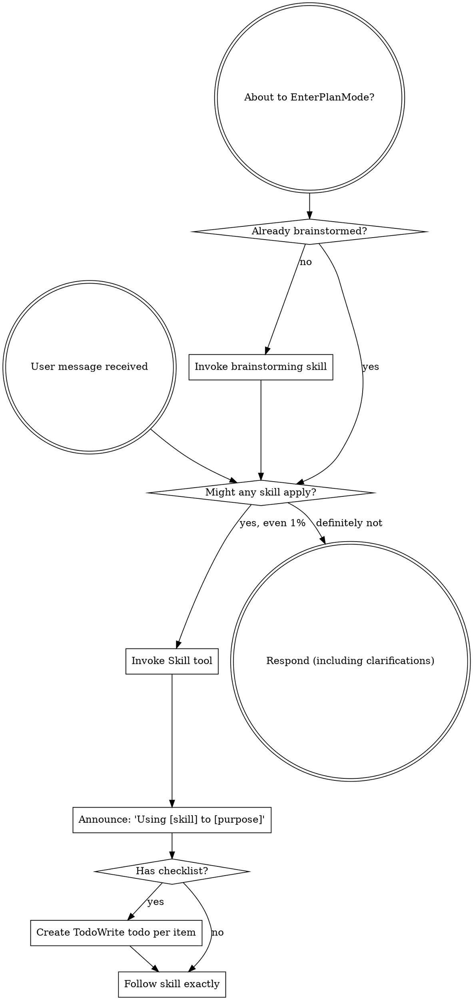
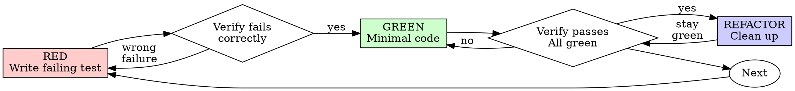
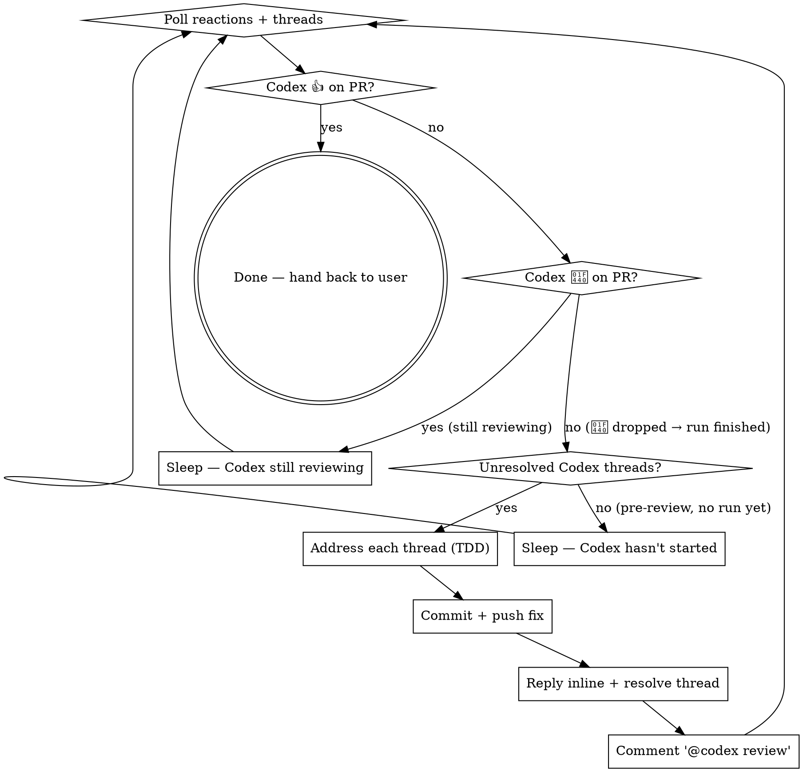

> SYSTEM

# AGENTS.md instructions for /Users/ericson/.codex/worktrees/7dd5/ars-ui

<INSTRUCTIONS>
## Approach
- Read existing files before writing. Don't re-read unless changed.
- Thorough in reasoning, concise in output.
- Skip files over 100KB unless required.
- No sycophantic openers or closing fluff.
- No emojis or em-dashes.
- Do not guess APIs, versions, flags, commit SHAs, or package names. Verify by reading code or docs before asserting.

--- project-doc ---

# ars-ui

## Project Overview

Rust frontend component library using state machines, framework-agnostic core with Leptos/Dioxus adapters.

## Current Phase

The repo is now in active implementation, not spec drafting only.

Agents working on implementation should use the GitHub Project roadmap and issue backlog as the execution source of truth:

- Use the GitHub Project `ars-ui implementation roadmap` to understand active epics, task breakdown, dependencies, status, and iteration planning.
- Prefer picking a single issue-backed task that is unblocked, sized, and scoped for independent delivery.
- Do not start work from an epic issue unless the user explicitly asks for planning or further decomposition.
- Do not start a task that is blocked by unresolved GitHub issue dependencies.
- Treat native GitHub issue dependencies as the blocker graph and the issue body acceptance criteria as the delivery contract.

## Development Workflow

For implementation tasks:

1. Read the assigned or selected GitHub issue first.
2. Move the issue to **In Progress** on the GitHub Project board.
3. Review the cited spec sections and any dependency issues.
4. Add or update the named tests first.
5. Implement only the scope required to make those tests pass.
6. If implementation changes the intended contract, update the relevant spec in the same task.
7. **MANDATORY:** Invoke the `post-implementation-audit` skill (`.agents/skills/post-implementation-audit/SKILL.md`). It runs three sequential audits on the new code — (a) spec/implementation drift with "best outcome" recommendations, (b) iterative "anything else missing?" passes (minimum two rounds), (c) test-coverage audit across every test type the workspace uses (unit, snapshot, proptest, doc, spec-conformance, llvm-cov — mutation testing is **not** part of this gate; it is Nightly-CI-driven). **Every finding lands in _this_ PR — no deferral, no follow-up issues.** This step exists because initial implementations consistently ship spec drift and silent contract violations that take 3+ review round-trips to surface; the audit collapses them into one. Skipping this step is a contract violation.
8. Run `cargo xclippy` before presenting the final result for user review. Fix warnings in changed code at the root cause, or use `#[expect(..., reason = "...")]` only for deliberate, justified suppressions. Do not hand off with known warnings in the changed surface.
9. Run `cargo xfmt` before every commit and before every push, even when `cargo fmt` was already run. `cargo xfmt` is the workspace formatter gate because it also runs `leptosfmt`, `dx fmt`, and nightly rustfmt settings; using plain `cargo fmt` alone is insufficient and must not be treated as formatted.
10. After user approval, run `cargo xci --profile fast` (alias: `cargo xci-fast`) locally and fix any failures before pushing anything to GitHub. The fast profile covers the workspace-level regressions a pre-push gate should catch: fmt, clippy, unit, integration, adapter, spec-compile-snippets, error-variant-coverage, mutual-exclusion, snapshot-count, and a **native-only coverage check** (`coverage-native`) that enforces the thresholds of the crates whose CI coverage is native-only (the agnostic library crates + xtask) — so `ars-components`-style coverage regressions surface before push, not on CI. The native coverage check adds an instrumented rebuild, so the fast profile runs in roughly 10–15 minutes. Reserve full `cargo xci` (~25 minutes, all 20 gates including the wasm coverage + CRAP gate and the feature-matrix groups) for after substantial refactors that may have shifted feature-flag interactions. For small follow-up changes, run the focused tests and checks that cover the edited code instead. To run only the coverage check, use `cargo xcov` (native-only) or `cargo xcov --full` (mirrors CI; needs the wasm toolchain + clang-22).
11. After `cargo xci-fast` passes, commit and push a PR targeting `main`. The PR body MUST include an auto-close keyword for the issue being delivered, for example `Closes #20` or `Fixes #20`, so GitHub closes the issue automatically when the PR merges.
12. **If the PR creates or modifies any `.snap` insta fixtures, attach the `snapshot-reviewed` label after opening or updating it** (`gh pr edit <num> --add-label "snapshot-reviewed"`). This signals to reviewers that the snapshot output was inspected and is intentional. Re-apply the label whenever you push a commit that touches `.snap` files; the workflow assumes the label reflects the latest snapshot state.
13. **MANDATORY:** Invoke the `waiting-for-codex-review` skill (`.agents/skills/waiting-for-codex-review/SKILL.md`) immediately after the first push that creates the PR, and re-invoke it after every subsequent push to the PR branch. The skill posts the initial `@codex review` trigger, polls Codex's 👀 → (👍 \| ∅ + threads) reaction lifecycle, addresses any review threads with the same rigor as `post-implementation-audit` (TDD + no coverage regression), replies inline, resolves threads, and re-comments `@codex review` to start the next pass — looping until Codex leaves 👍. Skipping this step leaves Codex findings unaddressed and silently widens the gap between merged code and the spec; the merge gate is 👍 from Codex plus green CI, not green CI alone.
13. Only after CI passes, Codex has left 👍, and the PR is merged, close the issue.

Never close a GitHub issue without a merged PR that passes CI **and a 👍 from Codex**. Never commit or push without explicit user approval. Keep the issue, PR, and Project board status aligned with the actual work state at every step.

Default delivery rules:

- Follow TDD: tests first, implementation second, verification last.
- Keep task scope aligned with the issue. If the issue is too large or ambiguous, stop and split or clarify rather than freelancing a bigger change.
- Prefer tasks sized `1`, `2`, `3`, or `5` points. `8` is exceptional. `13` must be decomposed before implementation.
- Preserve the crate and dependency layering defined by the architecture and implementation plan.
- Do not add a new dependency crate without explicit user approval first. If a task appears to need a new crate, stop, explain why, and get approval before editing any `Cargo.toml`.
- When a task is complete, verify the exact tests and checks named by the issue before considering it done.
- **Adapter-level component implementation MUST follow `docs/implementation/adapter-component-delivery.md` precisely.** Before planning or implementing any adapter-level component task — for any component in `crates/ars-leptos` or `crates/ars-dioxus` — agents MUST fully read `docs/implementation/adapter-component-delivery.md` and every workflow/checklist file it links under `docs/implementation/adapter-components/`. The checklist below is a reminder of required deliverables, not a substitute for reading the full workflow document set. Every adapter task must land _all_ of the following in the same PR, with no deferral to follow-up issues:
    1. Adapter crate code (`crates/ars-{leptos,dioxus}/src/<category>/<component>/`) with module wiring and prelude re-exports — minimize `clone()` calls by parking per-instance values shared across closures in `StoredValue<T>` (Leptos) or `CopyValue<T>` (Dioxus) instead of cloning into each capture, per "Avoid Repeated Closure Clones" in `docs/implementation/adapter-components/03-framework-rules.md`;
    2. Adapter-level **unit + SSR tests** in `crates/ars-{leptos,dioxus}/tests/<component>.rs`;
    3. Adapter-level **wasm browser tests** in `crates/ars-{leptos,dioxus}/tests/<component>_wasm.rs` for any interactive behavior (focus, keyboard nav, pointer events, typeahead, controlled-signal sync, observers, portal, scroll, cleanup);
    4. **Counterpart-driven UX review before code** — use the browser to inspect the live docs/examples for the strongest counterpart, starting with React Aria / React Spectrum when available, and record the supported, unsupported, and intentionally different UX axes before choosing the adapter/tests/widgets shape;
    5. **Widgets examples** in _all six_ widgets crates (`examples/widgets-{leptos,dioxus}`, `widgets-{leptos,dioxus}-css`, `widgets-{leptos,dioxus}-tailwind`) under the matching Rust category module, such as `src/categories/data_display.rs` for spec category `data-display` and `src/categories/date_time.rs` for `date-time` — replacing any "Coming soon" placeholder text with a real interactive demo that visually demonstrates every supported counterpart feature and component state;
    6. **E2E fixtures** in `crates/ars-e2e/fixtures/{leptos,dioxus}/src/categories/<category>.rs` for existing flat category fixtures, or in `src/categories/<category>/<component>.rs` with `src/categories/<category>/mod.rs` when the PR also migrates that category to a directory-backed module imported by `categories/mod.rs`; add an **E2E harness module** at `crates/ars-e2e/src/<category>/<component>.rs` covering axe-core, keyboard, pointer, adapter-parity, and computed visual assertions for supported counterpart UX states (unless the component is purely static and adapter tests already prove that — state the reason in the PR body);
    7. **xtask `e2e <category>` subcommand** (in `xtask/src/e2e.rs`, `xtask/src/main.rs`, and `crates/ars-e2e/src/main.rs`) when this is the first E2E-covered component in a new category;
    8. **Spec synchronization** for any drift surfaced by the implementation, with the amendment landed in the same PR (see "Spec Synchronization During Implementation");
    9. **Validation gates**: `cargo xtask lint adapter-parity` runs without `SKIP` for the component; `cargo xci-fast` passes; `post-implementation-audit` skill ran all three phases with every finding fixed in this PR.

    Skipping any of these is a workflow violation. The `adapter-component-delivery.md` entry point and linked `docs/implementation/adapter-components/` workflow files are the single source of truth for what "adapter task complete" means.

### Code Quality Standards

- **Document all public items.** Every public struct, enum, trait, function, constant, type alias, method, field, and variant must have a `///` doc comment. Every `lib.rs` must have a `//!` crate-level doc comment. The workspace enforces `missing_docs` linting — undocumented public items are build failures.
- **Zero warnings policy.** All code must compile with zero warnings under the workspace's configured clippy and rustc lints. Fix the root cause instead of suppressing. When suppression is genuinely needed, use `#[expect(lint, reason = "...")]` — never `#[allow(...)]`.
- **Derive documentation from the spec.** Doc comments should describe the _purpose and semantics_ of the item as defined in the corresponding `spec/` files, not just restate the type signature.
- **Use `#[inline]` selectively, not mechanically.** Do **not** add Clippy's `missing_inline_in_public_items` lint at the workspace level, and do not treat public visibility alone as a reason to mark an item `#[inline]`. Use `#[inline]` for thin cross-crate wrappers, trivial accessors, and hot-path no-op shims where the call overhead is plausibly meaningful. Avoid blanket `#[inline]` on all public APIs — it increases code size, adds compile-time cost, and turns `#[inline]` into noise instead of a deliberate performance signal.
- **Use directory-backed modules with `mod.rs` when a module owns children.** This repo standardizes on the older filesystem layout for nested modules. If module `foo` has child modules, the parent must live at `foo/mod.rs`, not `foo.rs`. Do not mix `foo.rs` with a sibling `foo/` directory. When a refactor adds child modules under an existing flat file, move the parent into `foo/mod.rs` in the same change. Do not leave empty leftover module directories behind.

### API Design Standards

- **Design for the pit of success.** Public APIs should make the most natural, shortest path also be the path that is correct, accessible, localizable, type-safe, and performant. Prefer ergonomic constructors and defaults that preserve the spec's strongest guarantees instead of making users opt into correctness after choosing a convenient API.
- **Name escape hatches explicitly.** When a component needs a lower-level, static, non-i18n, or otherwise less complete path, keep it available but make the tradeoff visible in the API name or type. The blessed path should remain the simplest call site, while escape hatches should read as deliberate choices.
- **Keep semantic data separate from rendered views.** Rich framework views are useful for customization, but components still need semantic sources for accessible names, localized text, announcements, ids, and state-machine wiring. Do not rely on arbitrary rendered view trees as the only source of user-facing semantics.

### Code Coverage

The workspace uses `cargo-llvm-cov` for code coverage with per-crate threshold enforcement. CI runs coverage on every PR (see `.github/workflows/ci.yml`).

**Local coverage commands:**

```bash
# Fast native-only coverage gate — instruments + checks only the crates whose
# CI coverage is native-only (agnostic library crates + xtask). No wasm/clang
# toolchain needed; this is what the `fast` pre-push profile runs.
cargo xcov

# Full native+wasm coverage gate, mirroring CI (needs the wasm toolchain + clang-22)
cargo xcov --full

# Per-crate coverage with inline annotated source (most useful during development)
cargo llvm-cov test -p ars-interactions --text -- hover

# Per-crate summary only
cargo llvm-cov test -p ars-interactions -- hover

# Native-only workspace coverage (host target; excludes wasm-only crates)
cargo llvm-cov --workspace \
  --exclude ars-leptos --exclude ars-dioxus \
  --exclude ars-test-harness-leptos --exclude ars-test-harness-dioxus \
  --exclude ars-derive --exclude xtask \
  --lcov --output-path lcov.info

# Check all crates against spec-defined thresholds (run after a *merged* lcov)
cargo xtask coverage check-all --file lcov.info
```

The `--text` flag produces line-by-line annotated source showing hit counts and `^0` markers on uncovered branches — use this to identify gaps after writing tests. Uncovered no-op callback closures in tests (e.g., `|_| {}`) are expected and not a gap.

The local recipe above excludes the adapter and adapter-test-harness crates because their `target_arch = "wasm32"` / `feature = "web"` code paths can't be measured via host-target `cargo llvm-cov`. **CI runs an additional wasm-coverage pipeline on nightly** (`cargo xtask ci coverage`) that uses `wasm-bindgen-test`'s experimental coverage recipe with LLVM 22 / `clang-22` to emit lcov for `ars-leptos` (csr), `ars-dioxus` (web), `ars-dom` (web), `ars-i18n` (web-intl), and the adapter test harnesses, then merges with the native lcov via `cargo xtask coverage merge`. The per-crate thresholds in `xtask::coverage::default_thresholds()` are enforced against the merged file — including adapter targets (`ars-leptos` 74/55, `ars-dioxus` 77/70, `ars-test-harness-leptos` 60/0, `ars-test-harness-dioxus` 60/0). `ars-derive` (proc-macro, runs in compiler) is exercised via `crates/ars-core/tests/derive_contract.rs` and is unmeasured. `xtask` has its own enforced threshold (30/35) and is measured. See `spec/testing/14-ci.md` §2 for the full pipeline.

### CRAP Gate (complexity vs. coverage)

Coverage tells you which lines run; mutation testing tells you whether tests would notice misbehaviour. The **CRAP gate** ([`cargo-crap`](https://crates.io/crates/cargo-crap)) tells you which functions are _risky to change_ — high cyclomatic complexity combined with low coverage. The CRAP score is `complexity² · (1 − coverage)³ + complexity`.

**Why regression mode, not an absolute threshold.** At 100% coverage `CRAP == cyclomatic complexity`, so an absolute `--fail-above` threshold rejects every large `match` no matter how well it is tested. This workspace is built on state machines: each stateful component's `Machine::transition` is intrinsically a wide `match (state, event)` (complexity 30–80) and is exhaustively tested. An absolute gate would fight that architecture and reject more components as the catalog grows. The gate therefore runs in **regression mode**.

- **Blessed entrypoints:** `cargo xcrap` (local human-readable report, never fails), `cargo xcrap --update-baseline` (regenerate the baseline), and `cargo xtask ci crap` (the CI gate). The gate is the last step of the full `cargo xci` pipeline, running immediately after `coverage` and reusing its merged `lcov.info` (no recompile). It is **not** in the fast profile: the fast profile runs only the native-only `coverage-native` check, which does not produce the merged `lcov.info` the CRAP gate compares against.
- **Policy:** `cargo crap --path . --lcov lcov.info --baseline .crap-baseline.json --fail-regression --min 30 --exclude 'target/**' --exclude 'examples/**' --exclude 'xtask/**' --exclude 'crates/ars-e2e/**' --exclude 'crates/ars-derive/**'`. The gate scopes to the **shipped component library** — tooling (`xtask`), the browser E2E harness (`ars-e2e`), the proc-macro crate, demos, and build output are excluded (they are not shipped surface, and several run uninstrumented-as-tooling on CI → 0% → spurious CRAP). The gate fails only when a function **at or above CRAP 30 regresses** (more complexity or less coverage) versus the committed baseline. New functions are tolerated — the per-crate coverage thresholds already ensure new code is tested — and sub-threshold churn on simple functions is ignored. Net: the coverage gate guarantees new code is tested; the CRAP gate guarantees shipped code does not rot.
- **`--path .`, not `--workspace`.** cargo-crap's regression key is `(file, function, line)`, and `--workspace` records machine-absolute file paths (`/Users/…` locally, `/home/runner/…` on CI). A baseline committed with absolute paths never matches on CI, silently turning the gate into a no-op. `--path .` emits repo-relative paths (`./crates/…`) that match on any checkout; coverage still associates correctly because cargo-crap canonicalizes paths when reading the lcov. `--exclude` is honored under `--path` (it is a no-op under `--workspace`), so `target/**` and the unmeasured `crates/ars-derive/**` are skipped there. Because the key includes the line number, a baseline only matches non-uniquely-named functions (e.g. `Machine::transition`) while their line numbers are stable; regenerate the baseline when a tracked file's lines shift materially.
- **Baseline:** `.crap-baseline.json` at the repo root is committed and complete (every function, no `--min`, so a function crossing the threshold is still caught). Regenerate it with `cargo xcrap --update-baseline` from CI's merged `lcov.info` (download the `coverage-lcov` artifact) whenever a **deliberate** complexity increase lands; commit the new baseline in that PR — a conscious "I accept this" checkpoint. cargo-crap's `--epsilon` (default 0.01) absorbs coverage float jitter. If the baseline is missing, the gate bootstraps it and passes with a notice.
- **Pinned version:** cargo-crap is pinned to an exact version in `xtask::crap::CARGO_CRAP_VERSION` and `.github/workflows/ci.yml` (same convention as cargo-mutants). To bump, update both. Install locally with `cargo install cargo-crap --locked --version <version>` (or `cargo binstall cargo-crap`).
- **Scope / escape hatch:** the exclude-glob list lives in `xtask/src/crap.rs` (`EXCLUDE_GLOBS`), each entry justified by a comment, and scopes the gate to the **shipped component library**. Because the gate runs under `--path .`, cargo-crap's `--exclude` is honored, so build output (`target/**`), demos (`examples/**`), the task runner (`xtask/**`), the browser E2E harness (`crates/ars-e2e/**`), and the proc-macro crate (`crates/ars-derive/**`) are skipped at walk time. The last three are not shipped library code and run uninstrumented-as-tooling on CI (0% coverage → spurious CRAP), so gating them is meaningless. Prefer fixing or refactoring over adding entries. (Note: the per-crate **coverage** gate still measures `xtask` at its own loose 30/35 threshold — that is separate from CRAP.)

### Mutation Testing

Coverage tells you which lines run. **Mutation testing tells you whether the tests would notice if those lines silently misbehaved.** The workspace uses [`cargo-mutants`](https://mutants.rs) for this — a `cargo` extension binary, not a workspace dependency.

**Install (once per developer machine):**

```bash
cargo install cargo-mutants --locked --version 27.0.0
```

**Local commands (state-machine modules are the most rewarding targets):**

Prefer `cargo xmutants` over bare `cargo mutants` — it applies the same
per-crate `--features` profile as Nightly CI (for example
`ars-components/i18n`) so snapshot and i18n-gated tests match CI.

```bash
# Run on a single component machine (~6 min for popover)
cargo xmutants -p ars-components -f crates/ars-components/src/overlay/popover/mod.rs

# Just list what would be mutated, without running tests (fast)
cargo xmutants -p ars-components -f crates/ars-components/src/overlay/popover/mod.rs --list

# Whole crate (slow — only if you really mean it)
cargo xmutants -p ars-components
```

**Agnostic component implementation gate:** whenever an agent implements a new framework-agnostic component, or materially changes an existing one, the delivery must include:

- spec-conformance tests for the component's anatomy/public contract, including its `Part` enum and required API/attribute surface;
- the full test breadth the component warrants (unit, snapshot, proptest) with strong line/branch coverage.

**Mutation testing is NOT a pre-PR requisite for agnostic component work.** Do not run a targeted `cargo xmutants` pass as a delivery/audit gate, and do not block a PR on a clean local mutation run. Surviving (`MISSED`) mutants are surfaced by the Nightly CI `mutation-testing` job (see below); triage them — add tests for real gaps, or add a justified line-agnostic `.cargo/mutants.toml` exclude for true equivalent mutations — in a dedicated follow-up when Nightly reports them, not during initial component delivery. (Running a local mutation pass voluntarily is fine, but it is never required and never blocks delivery or review.)

**Reading the output:** Results land in `mutants.out/mutants.out/` (gitignored). The two files that matter:

- `caught.txt` — mutations that broke at least one test ✅
- `missed.txt` — mutations that survived all tests ❌ — each one is either a real test gap to fill or an "equivalent mutation" that needs a `[[skip]]` entry in `mutants.toml` with a justification

**CI integration:** Nightly only. `.github/workflows/nightly.yml` has a `mutation-testing` job with a 21-entry matrix that runs `cargo mutants -p <package>` on every framework-agnostic crate, using `--shard k/n` to spread larger crates across parallel runners. **Shard indices are 0-based** (`k` runs from `0` to `n-1`); `k == n` is invalid and will fail the job. When adding shards, always start at `0/n` and end at `(n-1)/n`.

- **`ars-components` (≈ 1,630 mutants today, planned to grow as the spec adds the remaining ~97 components):** sharded **12-way** → ≈ 135 mutants per runner today, ≈ 850 per runner at the ~10,000-mutant endpoint. Sized for the full spec catalog up front so we don't re-shard every few months as components land.
- **`ars-collections` (≈ 1,080 mutants):** sharded 4-way → ≈ 270 mutants per runner.
- **`ars-core` (≈ 700 mutants):** sharded 2-way → ≈ 350 mutants per runner.
- **`ars-a11y`, `ars-forms`, `ars-interactions`:** one runner each (under 600 mutants apiece).

**Adding a new state machine inside an existing crate requires no CI changes** — its mutations land in whichever shard the cargo-mutants partitioner places them. The shard counts are sized so the slowest runner stays well under 30 minutes today and under ~50 minutes at the planned endpoint; re-balance only when a crate outgrows that budget (visible on the nightly dashboard as one shard pulling away from the others).

All matrix jobs run with `fail-fast: false` so failures on one module don't mask data on another. Each job uploads its `mutants.out/` as a workflow artifact (always, even on success — surviving "missed" entries on a passing run still reveal test-quality work). The job fails if any mutation survives, so a missed mutation forces a deliberate triage decision (fix the test, or document the equivalence with a `[[skip]]` entry in `mutants.toml`).

**Excluded crates** (mutation testing's signal degrades wherever determinism does): adapter glue (`ars-leptos`, `ars-dioxus`), DOM/FFI (`ars-dom`), ICU/FFI (`ars-i18n`), test infrastructure (`ars-test-harness*`), and the proc-macro crate (`ars-derive`, runs in the compiler). Adding a brand-new crate that is a good mutation target requires one new matrix entry; run a local scout first (`cargo mutants -p <crate> --list` to size, then a real run) so we know the right shard count before the nightly fires.

**Bumping the pinned version.** Both the local install command above and `.github/workflows/nightly.yml` pin cargo-mutants to an exact version (currently `27.0.0`) — same convention as `wasm-pack` in the `a11y-audit` job. Pinning is deliberate: cargo-mutants ships new mutators in releases, and an unpinned install would silently change the mutation set without any code change, surfacing as phantom CI failures on a green-source repo. To bump, open a PR that (1) updates the version string in CLAUDE.md and `nightly.yml`, (2) runs the popover scout locally with the new version (`cargo mutants -p ars-components -f crates/ars-components/src/overlay/popover/mod.rs`) to confirm the mutation count is in the same ballpark, and (3) triages any new "missed" entries the new mutators surface — they are usually genuine test-quality gaps newly visible to the tool.

### Property Testing (proptest)

State-machine invariants are exercised by [`proptest`](https://docs.rs/proptest) under `crates/<crate>/tests/proptest_state_machines/` (see `ars-components`). Default proptest behaviour drops `*.proptest-regressions` seed files alongside test sources — instead, every `proptest!` block in this workspace pulls a shared `Config` from `tests/proptest_state_machines/common.rs` that:

1. Reads `PROPTEST_CASES` from the environment (1,000 default; 10,000 in the nightly `extended-proptest` job).
2. Sets `failure_persistence` to `FileFailurePersistence::Direct("proptest-regressions/state-machines.txt")`, so all persisted seeds for the test binary live in one file at the crate root: `crates/<crate>/proptest-regressions/state-machines.txt`. The directory is committed (per proptest's own recommendation in the file header) so every developer's runs benefit from previously-shrunk failures.

When a new crate adopts proptest for state-machine tests, copy the same `common.rs` helper and reference it via `#![proptest_config(super::common::proptest_config())]` inside every `proptest!` block. Don't let proptest fall back to its `WithSource` default — that scatters seed files across the source tree.

### Adapter Prelude Convention

Both `ars-leptos` and `ars-dioxus` expose a `prelude` module targeting **end users** — application developers who consume the ready-made components. `use ars_leptos::prelude::*` (or `use ars_dioxus::prelude::*`) should give them everything they need.

The prelude contains only user-facing items:

1. **Component modules** — as components land, their public module paths (e.g., `button`, `dialog`) are re-exported so users can write `button::Props`, etc.
2. **User-facing traits** — traits end users call on component outputs (e.g., `Translate` from `ars-i18n`). Re-export the trait so consumers don't need a direct dependency on the subsystem crate.
3. **Configuration types** — types that appear in component props or configure behaviour (e.g., `Locale`, `Direction`, `Orientation`, `Selection`).

The prelude does **not** include implementation details consumed only by component authors inside the adapter crate: core engine types (`Machine`, `Service`, `ConnectApi`, `AttrMap`), accessibility primitives (`AriaRole`, `AriaAttribute`), interaction helpers (`merge_attrs`), or adapter hooks (`use_machine`, `UseMachineReturn`). Those remain accessible via their normal crate paths for advanced users building custom machines.

Both adapter preludes must stay symmetric: same items, same structure. When adding a new re-export to one adapter's prelude, add it to the other as well in the same PR.

### Adapter Testing Convention

Adapter-level component tests should default to the framework-specific test harness crate:

- Leptos adapter tests should prefer `ars-test-harness-leptos`.
- Dioxus adapter tests should prefer `ars-test-harness-dioxus`.
- Shared `ars-test-harness` helpers should be used where relevant for viewport, layout, clipboard, drag/drop, timing, and other DOM test setup instead of bespoke per-test browser scaffolding.

When a component spec requires interaction, focus, overlay positioning, clipboard, file upload, drag/drop, or similar browser behavior, the task's tests should exercise that behavior through the adapter harness entrypoints and shared core harness helpers unless there is a concrete technical reason not to.

## Spec Synchronization During Implementation

The specification is the authoritative contract. It took weeks of deliberate design and MUST be followed.

### Spec-first implementation rule

Before implementing any public type, trait, function, or method:

1. **Read the spec section first.** Find the relevant code example in `spec/`. Use `spec-tool toc <file>` and `grep` to locate it.
2. **Match the spec exactly.** If the spec defines `struct ComponentIds { base: String }` with methods `from_id()`, `id()`, `part()`, `item()`, `item_part()` — implement exactly that. Do not invent alternative field names, method names, or signatures.
3. **Cross-check after implementation.** Before presenting code for review, diff every public item against the spec's code examples. Every struct field, every method name, every parameter must match.
4. **If you must deviate**, there must be a concrete technical reason (e.g., the spec's API cannot compile, or a dependency doesn't expose the needed type). Document the reason in a code comment and flag it to the user explicitly.

Inventing alternative APIs that "seem equivalent" is never acceptable — it silently invalidates the spec's design decisions and all downstream code that depends on those APIs.

### Spec/code mismatch resolution

- If code and spec disagree, resolve the mismatch in the same task or PR.
- Shared conceptual changes belong in shared or foundation spec files, not only in adapter code.
- Adapter-specific findings must be reflected back into `spec/foundation/08-adapter-leptos.md` and/or `spec/foundation/09-adapter-dioxus.md` when relevant.
- Do not leave spec drift behind as follow-up cleanup.

## Spec Structure

The specification lives in `spec/` with this layout:

- `spec/manifest.toml` — **START HERE** — central index of all components and their dependencies
- `spec/foundation/` — architecture, accessibility, i18n, interactions, forms, adapters, spec template (00-10)
- `spec/shared/` — cross-component shared types (date-time, selection, layout, z-index)
- `spec/components/{category}/` — one file per component, organized by category
- `spec/testing/` — test specs split by domain

### Component Categories

- `input/` — checkbox, text-field, slider, number-input, etc.
- `selection/` — select, combobox, listbox, menu, tags-input, etc.
- `overlay/` — dialog, popover, tooltip, toast, presence, etc.
- `navigation/` — accordion, tabs, tree-view, pagination, steps, etc.
- `date-time/` — date-field, time-field, calendar, date-picker, etc.
- `data-display/` — table, avatar, progress, meter, badge, etc.
- `layout/` — splitter, scroll-area, carousel, portal, toolbar, etc.
- `specialized/` — color-picker, file-upload, signature-pad, qr-code, etc.
- `utility/` — button, toggle, focus-scope, visually-hidden, separator, etc.

## Working with the Spec

When reading large files, run `wc -l` first to check the line count. If the file is over 2,000
lines, use the `offset` and `limit` parameters on the Read tool to read in chunks rather than
attempting to read the entire file at once.

### Using xtask spec (preferred)

Use `cargo xtask spec` to resolve file sets instead of manually parsing manifest.toml:

```bash
# Quick metadata lookup:
cargo xtask spec info <component>

# Find all 
</INSTRUCTIONS>
<environment_context>
  <cwd>/Users/ericson/.codex/worktrees/7dd5/ars-ui</cwd>
  <shell>zsh</shell>
  <current_date>2026-06-16</current_date>
  <timezone>America/Sao_Paulo</timezone>
  <filesystem><workspace_roots><root>/Users/ericson/.codex/worktrees/7dd5/ars-ui</root></workspace_roots><permission_profile type="managed"><file_system type="restricted"><entry access="read"><special>:root</special></entry><entry access="write"><path>/Users/ericson/.codex/worktrees/7dd5/ars-ui</path></entry><entry access="write"><special>:slash_tmp</special></entry><entry access="write"><special>:tmpdir</special></entry><entry access="read"><path>/Users/ericson/.codex/worktrees/7dd5/ars-ui/.git</path></entry><entry access="read"><path>/Users/ericson/.codex/worktrees/7dd5/ars-ui/.agents</path></entry><entry access="read"><path>/Users/ericson/.codex/worktrees/7dd5/ars-ui/.codex</path></entry><entry access="read"><path>/Users/ericson/Workspace/Rust/ars-ui/.git/worktrees/ars-ui2</path></entry></file_system></permission_profile></filesystem>
</environment_context>

> DEVELOPER

I wanna handle the existing Nightly CI breakage for the last month, it's been breaking everyday in the Mutants part. I want you to only address the found mutants, don't re-run the mutation testing locally as it will take forever. The idea is to address all the found mutants in this last month, handle all of those that are still applicable given our code changes and push a PR. Tomorrow after the next Nightly run we can do a follow-up PR handling more found mutants if any. Make sure to not run mutation test locally

> AGENT

I’ll first ground this in the repo and the recent Nightly evidence, then I’ll turn that into a concrete implementation plan. Since we’re in planning mode, I won’t edit files, run mutation tests, commit, or push.

> TOOL

tool_use exec_command
id: call_bfGnh7BumS8P0pBwJmTh76MO
```json
{
  "cmd": "sed -n '1,220p' /Users/ericson/.codex/skills/using-superpowers/SKILL.md",
  "workdir": "/Users/ericson/.codex/worktrees/7dd5/ars-ui",
  "max_output_tokens": 12000
}
```

> TOOL

tool_use exec_command
id: call_MXSRhhe69HNUpR8SRl1Ugl8I
```json
{
  "cmd": "sed -n '1,220p' /Users/ericson/.codex/skills/systematic-debugging/SKILL.md",
  "workdir": "/Users/ericson/.codex/worktrees/7dd5/ars-ui",
  "max_output_tokens": 12000
}
```

> TOOL

tool_use exec_command
id: call_wNV4eVJdSG4LLQVV60kOUylw
```json
{
  "cmd": "sed -n '1,220p' /Users/ericson/.codex/plugins/cache/openai-curated-remote/github/0.1.2/skills/gh-fix-ci/SKILL.md",
  "workdir": "/Users/ericson/.codex/worktrees/7dd5/ars-ui",
  "max_output_tokens": 12000
}
```

> TOOL

tool_use exec_command
id: call_85quKkA6bJ4JTCQUrOacTwu7
```json
{
  "cmd": "rg -n \"mutation|mutants|Nightly|nightly|ars-ui|CI\" /Users/ericson/.codex/memories/MEMORY.md",
  "workdir": "/Users/ericson/.codex/worktrees/7dd5/ars-ui",
  "max_output_tokens": 12000
}
```

> TOOL

tool_result
id: call_bfGnh7BumS8P0pBwJmTh76MO
```
Chunk ID: e8c1c4
Wall time: 0.3283 seconds
Process exited with code 1
Original token count: 22
Output:
sed: /Users/ericson/.codex/skills/using-superpowers/SKILL.md: No such file or directory

```

> TOOL

tool_result
id: call_MXSRhhe69HNUpR8SRl1Ugl8I
```
Chunk ID: 5c961c
Wall time: 0.3270 seconds
Process exited with code 1
Original token count: 23
Output:
sed: /Users/ericson/.codex/skills/systematic-debugging/SKILL.md: No such file or directory

```

> TOOL

tool_result
id: call_wNV4eVJdSG4LLQVV60kOUylw
```
Chunk ID: b492e5
Wall time: 0.1716 seconds
Process exited with code 0
Original token count: 1082
Output:
---
name: "gh-fix-ci"
description: "Use when a user asks to debug or fix failing GitHub PR checks that run in GitHub Actions. Use the GitHub app from this plugin for PR metadata and patch context, and use `gh` for Actions check and log inspection before implementing any approved fix."
---


# GitHub Actions CI Fix

## Overview

Use this skill when the task is specifically about failing GitHub Actions checks on a pull request. This workflow is hybrid by design:

- Use the GitHub app from this plugin for PR metadata, changed files, and review context.
- Use `gh` for GitHub Actions checks and logs because the connector does not expose that workflow end to end.
- Summarize the root cause first, propose a focused fix plan, and implement only after explicit approval.

Prereq: authenticate with GitHub CLI once, then confirm with `gh auth status`. Repo and workflow scopes are typically required for Actions inspection.

## Inputs

- `repo`: path inside the repo (default `.`)
- `pr`: PR number or URL (optional; defaults to current branch PR)
- `gh` authentication for the repo host

## Quick start

- `python "<path-to-skill>/scripts/inspect_pr_checks.py" --repo "." --pr "<number-or-url>"`
- Add `--json` if you want machine-friendly output for summarization.

## Workflow

1. Verify gh authentication.
   - Run `gh auth status` in the repo.
   - If unauthenticated, ask the user to run `gh auth login` (ensuring repo + workflow scopes) before proceeding.
2. Resolve the PR.
   - If the user provides a PR number or URL, use that directly.
   - Otherwise prefer the current branch PR with `gh pr view --json number,url`.
   - When repo and PR are known, fetch PR metadata and patch context through the GitHub app from this plugin.
3. Inspect failing checks (GitHub Actions only).
   - Preferred: run the bundled script (handles gh field drift and job-log fallbacks):
     - `python "<path-to-skill>/scripts/inspect_pr_checks.py" --repo "." --pr "<number-or-url>"`
     - Add `--json` for machine-friendly output.
   - Manual fallback:
     - `gh pr checks <pr> --json name,state,bucket,link,startedAt,completedAt,workflow`
       - If a field is rejected, rerun with the available fields reported by `gh`.
     - For each failing check, extract the run id from `detailsUrl` and run:
       - `gh run view <run_id> --json name,workflowName,conclusion,status,url,event,headBranch,headSha`
       - `gh run view <run_id> --log`
     - If the run log says it is still in progress, fetch job logs directly:
       - `gh api "/repos/<owner>/<repo>/actions/jobs/<job_id>/logs" > "<path>"`
4. Scope non-GitHub Actions checks.
   - If `detailsUrl` is not a GitHub Actions run, label it as external and only report the URL.
   - Do not attempt Buildkite or other providers; keep the workflow lean.
5. Summarize failures for the user.
   - Provide the failing check name, run URL (if any), and a concise log snippet.
   - Call out missing logs explicitly and do not over-claim certainty.
6. Propose a focused fix plan and wait for approval.
   - Keep the plan tied directly to the failing checks and the observed root cause.
7. Implement after approval.
   - Apply the approved fix locally.
   - Run the most relevant local verification available.
8. Recheck status and summarize residual risk.
   - Suggest re-running the relevant tests and `gh pr checks`.
   - Report what is still unverified, what may still be flaky, and whether any failing checks were external and therefore not actionable here.

## Bundled Resources

### scripts/inspect_pr_checks.py

Fetch failing PR checks, pull GitHub Actions logs, and extract a failure snippet. Exits non-zero when failures remain so it can be used in automation.

Usage examples:
- `python "<path-to-skill>/scripts/inspect_pr_checks.py" --repo "." --pr "123"`
- `python "<path-to-skill>/scripts/inspect_pr_checks.py" --repo "." --pr "https://github.com/org/repo/pull/123" --json`
- `python "<path-to-skill>/scripts/inspect_pr_checks.py" --repo "." --max-lines 200 --context 40`

## Guardrails

- Do not imply that the GitHub app can replace `gh` for Actions log retrieval.
- Treat non-GitHub Actions providers as report-only unless the user explicitly wants a separate investigation path.
- If the failure is clearly unrelated to the local diff, say so before proposing code changes.

```

> TOOL

tool_result
id: call_85quKkA6bJ4JTCQUrOacTwu7
```
Chunk ID: 3d91dd
Wall time: 0.0475 seconds
Process exited with code 0
Original token count: 2021
Output:
1:# Task Group: ars-ui / paired Leptos and Dioxus adapter delivery
4:applies_to: cwd=/Users/ericson/.codex/worktrees/*/ars-ui and related ars-ui checkouts; reuse_rule=reuse for ars-ui adapter tasks when the user gives paired framework issue numbers for the same component family; verify current issue bodies, workflow docs, and browser-test harness commands before applying checkout-specific details.
10:- rollout_summaries/REDACTED.md (cwd=/Users/ericson/.codex/worktrees/3efe/ars-ui, rollout_path=/Users/ericson/.codex/sessions/2026/06/04/rollout-2026-06-04T14-33-56-019e93b2-e997-7881-b092-7b1fb63bf491.jsonl, updated_at=2026-06-07T02:45:47+00:00, thread_id=019e93b2-e997-7881-b092-7b1fb63bf491, combined cross-adapter delivery, focused wasm validation, review-thread cleanup, and Coverage still pending at stop time)
14:- ars-ui, leptos, dioxus, adapter delivery, field, fieldset, form, issue-332, issue-423, wasm-bindgen-test-runner, browser tests, ButtonAsChild, raw oninput, status-region, review threads, @codex review
19:- when the user only gives issue numbers for ars-ui adapter work, infer the acceptance surface from the live issue bodies plus the adapter workflow docs instead of waiting for more steering [Task 1]
31:- Related skill: skills/ars-ui-pr-review-cycle/SKILL.md [Task 1]
39:- symptom: the rollout looks complete locally but remote CI is not fully done -> cause: Codex review went green while GitHub `Coverage` was still pending -> fix: do not overstate CI completion; separate review completion from final PR green state [Task 1]
117:# Task Group: ars-ui / ars-components agnostic category audits and per-component test-module splits
119:scope: Category-wide `ars-components` audits for ars-ui epics where the user wants every agnostic component checked against spec, category-level `spec_conformance` and `proptest_state_machines` files split into per-component modules, and closure-ready verification.
120:applies_to: cwd=/Users/ericson/.codex/worktrees/*/ars-ui and related ars-ui checkouts; reuse_rule=reuse for agnostic category audits in `crates/ars-components`; verify the live epic scope, current test-tree shape, and current CI/coverage gates before reusing category-specific details.
126:- rollout_summaries/2026-06-04T02-53-45-BogM-selection_agnostic_epic_221_audit.md (cwd=/Users/ericson/.codex/worktrees/d5d2/ars-ui, rollout_path=/Users/ericson/.codex/sessions/2026/06/03/rollout-2026-06-03T23-53-45-019e908d-1451-78a2-81d6-320b32bbb5d8.jsonl, updated_at=2026-06-04T05:18:17+00:00, thread_id=019e908d-1451-78a2-81d6-320b32bbb5d8, selection audit plus review-found controlled-state fixes)
136:- rollout_summaries/2026-06-04T02-49-12-oAsa-date_time_agnostic_audit_epic_224_test_split.md (cwd=/Users/ericson/.codex/worktrees/0f10/ars-ui, rollout_path=/Users/ericson/.codex/sessions/2026/06/03/rollout-2026-06-03T23-49-12-019e9088-e9bc-7f93-8927-ddcd800e6bb2.jsonl, updated_at=2026-06-04T04:46:33+00:00, thread_id=019e9088-e9bc-7f93-8927-ddcd800e6bb2, date-time audit with split test trees, spec sync, direct branch-coverage fix, and PR #722)
142:## Task 3: Audit the layout category for Epic #226, add a durable audit doc, and close the PR through green CI
146:- rollout_summaries/2026-06-04T02-50-20-qhk3-layout_epic_226_audit_and_test_split.md (cwd=/Users/ericson/.codex/worktrees/b127/ars-ui, rollout_path=/Users/ericson/.codex/sessions/2026/06/03/rollout-2026-06-03T23-50-20-019e9089-f522-7e52-8469-143c847beaaf.jsonl, updated_at=2026-06-04T04:29:24+00:00, thread_id=019e9089-f522-7e52-8469-143c847beaaf, layout audit doc, Splitter branch tests, and PR #718 closed through green CI)
156:- rollout_summaries/2026-06-04T02-56-14-atfs-specialized_agnostic_category_audit_epic_227.md (cwd=/Users/ericson/.codex/worktrees/a4e5/ars-ui, rollout_path=/Users/ericson/.codex/sessions/2026/06/03/rollout-2026-06-03T23-56-14-019e908f-5a7e-7e62-93f9-cba7162ace72.jsonl, updated_at=2026-06-04T04:24:09+00:00, thread_id=019e908f-5a7e-7e62-93f9-cba7162ace72, specialized audit doc, spec drift fixes, coverage recovery, and PR #719)
166:- rollout_summaries/2026-06-03T02-09-40-APZy-data_display_agnostic_audit_tests_split_and_crap_baseline_re.md (cwd=/Users/ericson/.codex/worktrees/5590/ars-ui, rollout_path=/Users/ericson/.codex/sessions/2026/06/02/rollout-2026-06-02T23-09-40-019e8b3e-5b1f-7c23-82f5-c27c08733024.jsonl, updated_at=2026-06-03T06:39:58+00:00, thread_id=019e8b3e-5b1f-7c23-82f5-c27c08733024, data-display split, TagGroup spec sync, and CI baseline refresh)
174:- when the user asks for a "full audit" of an ars-ui category "to be able to close the Epic" on GitHub, treat the live epic/spec scope as the checklist and make closure-readiness part of the deliverable instead of stopping at local test cleanup [Task 1][Task 2][Task 3][Task 4][Task 5]
185:- `cargo xci --profile fast` is the strongest local pre-push gate for these ars-ui category audits; use focused tests and `cargo test ... --no-run` earlier, then `cargo xcov` or category-specific coverage gates when thresholds are tight [Task 2][Task 3][Task 4]
188:- Related skill: skills/ars-ui-category-audit-test-split/SKILL.md [Task 1][Task 2][Task 3][Task 4][Task 5]
195:- symptom: CI coverage or CRAP fails after the base branch moved even though local code changes look sound -> cause: the baseline or artifact paths are stale rather than the behavior regressing -> fix: compare against the current base branch, normalize artifact paths if needed, then refresh the baseline before editing product code [Task 5]
198:# Task Group: ars-ui / adapter workflow docs and PR review-thread resolution
200:scope: Workflow-doc updates and review-thread handling for ars-ui adapter delivery docs, especially when review comments show stale commands, invalid paths, or unresolved fixed threads.
201:applies_to: cwd=/Users/ericson/.codex/worktrees/*/ars-ui and related ars-ui checkouts; reuse_rule=reuse for ars-ui workflow-doc edits and PR-review cleanup; verify the live CLI/help output, current file tree, and current GitHub review-thread state each run.
207:- rollout_summaries/2026-06-03T13-33-28-vdLD-adapter_docs_review_thread_fixes.md (cwd=/Users/ericson/.codex/worktrees/c911/ars-ui, rollout_path=/Users/ericson/.codex/sessions/2026/06/03/rollout-2026-06-03T10-33-28-019e8db0-6459-7731-b488-263d077d4b45.jsonl, updated_at=2026-06-04T05:24:22+00:00, thread_id=019e8db0-6459-7731-b488-263d077d4b45, live-doc corrections across adapter workflow guidance)
217:- rollout_summaries/2026-06-03T13-33-28-vdLD-adapter_docs_review_thread_fixes.md (cwd=/Users/ericson/.codex/worktrees/c911/ars-ui, rollout_path=/Users/ericson/.codex/sessions/2026/06/03/rollout-2026-06-03T10-33-28-019e8db0-6459-7731-b488-263d077d4b45.jsonl, updated_at=2026-06-04T05:24:22+00:00, thread_id=019e8db0-6459-7731-b488-263d077d4b45, reply+resolve cycle with correct GraphQL ids and follow-up Codex approval)
223:## Task 3: Poll PR reactions and checks without overstating CI completion
227:- rollout_summaries/2026-06-03T13-33-28-vdLD-adapter_docs_review_thread_fixes.md (cwd=/Users/ericson/.codex/worktrees/c911/ars-ui, rollout_path=/Users/ericson/.codex/sessions/2026/06/03/rollout-2026-06-03T10-33-28-019e8db0-6459-7731-b488-263d077d4b45.jsonl, updated_at=2026-06-04T05:24:22+00:00, thread_id=019e8db0-6459-7731-b488-263d077d4b45, Codex approval confirmed while some broader CI jobs were still pending)
240:- `cargo +nightly fmt --all --check` is the workspace-wide formatting gate referenced by the validation docs, and widgets smoke coverage must be a real browser path rather than `cargo check` alone [Task 1]
243:- `gh api repos/fogodev/ars-ui/issues/721/reactions` was the reliable way to detect the terminal `+1` approval signal for this PR [Task 3]
244:- Related skill: skills/ars-ui-pr-review-cycle/SKILL.md [Task 2][Task 3]
250:- symptom: Codex approval is visible but CI status is unclear -> cause: only reactions were checked -> fix: pair reaction polling with `gh pr checks` and state explicitly when broader jobs are still pending [Task 3]

```

> AGENT

I found the GitHub CI skill guidance and the repo memory has prior notes about Nightly mutation policy, but no direct list of the current month’s surviving mutants. I’m checking the local workflow and available GitHub run artifacts next so the plan is based on the actual failing jobs.

> TOOL

tool_use exec_command
id: call_eKmDOMyI5Ee7HZVv5i7jRB0Z
```json
{
  "cmd": "sed -n '1,220p' /Users/ericson/.claude/skills/using-superpowers/SKILL.md",
  "workdir": "/Users/ericson/.codex/worktrees/7dd5/ars-ui",
  "max_output_tokens": 12000
}
```

> TOOL

tool_use exec_command
id: call_VxQLeQqgIlxABPcMlzrwYbRQ
```json
{
  "cmd": "sed -n '1,260p' /Users/ericson/.claude/skills/systematic-debugging/SKILL.md",
  "workdir": "/Users/ericson/.codex/worktrees/7dd5/ars-ui",
  "max_output_tokens": 12000
}
```

> TOOL

tool_use exec_command
id: call_8nn5AtRlk72Q69qZcDhwTgnP
```json
{
  "cmd": "sed -n '1,220p' /Users/ericson/.claude/skills/writing-plans/SKILL.md",
  "workdir": "/Users/ericson/.codex/worktrees/7dd5/ars-ui",
  "max_output_tokens": 12000
}
```

> TOOL

tool_use exec_command
id: call_eQmWpyvx9cqo5uNcKPfc87GF
```json
{
  "cmd": "rg -n \"cargo mutants|mutation-testing|mutants|nightly\" .github/workflows xtask crates .cargo Cargo.toml",
  "workdir": "/Users/ericson/.codex/worktrees/7dd5/ars-ui",
  "max_output_tokens": 20000
}
```

> TOOL

tool_result
id: call_eKmDOMyI5Ee7HZVv5i7jRB0Z
```
Chunk ID: 39e926
Wall time: 0.3265 seconds
Process exited with code 0
Original token count: 1356
Output:
---
name: using-superpowers
description: Use when starting any conversation - establishes how to find and use skills, requiring Skill tool invocation before ANY response including clarifying questions
---

<SUBAGENT-STOP>
If you were dispatched as a subagent to execute a specific task, skip this skill.
</SUBAGENT-STOP>

<EXTREMELY-IMPORTANT>
If you think there is even a 1% chance a skill might apply to what you are doing, you ABSOLUTELY MUST invoke the skill.

IF A SKILL APPLIES TO YOUR TASK, YOU DO NOT HAVE A CHOICE. YOU MUST USE IT.

This is not negotiable. This is not optional. You cannot rationalize your way out of this.
</EXTREMELY-IMPORTANT>

## Instruction Priority

Superpowers skills override default system prompt behavior, but **user instructions always take precedence**:

1. **User's explicit instructions** (CLAUDE.md, GEMINI.md, AGENTS.md, direct requests) — highest priority
2. **Superpowers skills** — override default system behavior where they conflict
3. **Default system prompt** — lowest priority

If CLAUDE.md, GEMINI.md, or AGENTS.md says "don't use TDD" and a skill says "always use TDD," follow the user's instructions. The user is in control.

## How to Access Skills

**In Claude Code:** Use the `Skill` tool. When you invoke a skill, its content is loaded and presented to you—follow it directly. Never use the Read tool on skill files.

**In Copilot CLI:** Use the `skill` tool. Skills are auto-discovered from installed plugins. The `skill` tool works the same as Claude Code's `Skill` tool.

**In Gemini CLI:** Skills activate via the `activate_skill` tool. Gemini loads skill metadata at session start and activates the full content on demand.

**In other environments:** Check your platform's documentation for how skills are loaded.

## Platform Adaptation

Skills use Claude Code tool names. Non-CC platforms: see `references/copilot-tools.md` (Copilot CLI), `references/codex-tools.md` (Codex) for tool equivalents. Gemini CLI users get the tool mapping loaded automatically via GEMINI.md.

# Using Skills

## The Rule

**Invoke relevant or requested skills BEFORE any response or action.** Even a 1% chance a skill might apply means that you should invoke the skill to check. If an invoked skill turns out to be wrong for the situation, you don't need to use it.



## Red Flags

These thoughts mean STOP—you're rationalizing:

| Thought | Reality |
|---------|---------|
| "This is just a simple question" | Questions are tasks. Check for skills. |
| "I need more context first" | Skill check comes BEFORE clarifying questions. |
| "Let me explore the codebase first" | Skills tell you HOW to explore. Check first. |
| "I can check git/files quickly" | Files lack conversation context. Check for skills. |
| "Let me gather information first" | Skills tell you HOW to gather information. |
| "This doesn't need a formal skill" | If a skill exists, use it. |
| "I remember this skill" | Skills evolve. Read current version. |
| "This doesn't count as a task" | Action = task. Check for skills. |
| "The skill is overkill" | Simple things become complex. Use it. |
| "I'll just do this one thing first" | Check BEFORE doing anything. |
| "This feels productive" | Undisciplined action wastes time. Skills prevent this. |
| "I know what that means" | Knowing the concept ≠ using the skill. Invoke it. |

## Skill Priority

When multiple skills could apply, use this order:

1. **Process skills first** (brainstorming, debugging) - these determine HOW to approach the task
2. **Implementation skills second** (frontend-design, mcp-builder) - these guide execution

"Let's build X" → brainstorming first, then implementation skills.
"Fix this bug" → debugging first, then domain-specific skills.

## Skill Types

**Rigid** (TDD, debugging): Follow exactly. Don't adapt away discipline.

**Flexible** (patterns): Adapt principles to context.

The skill itself tells you which.

## User Instructions

Instructions say WHAT, not HOW. "Add X" or "Fix Y" doesn't mean skip workflows.

```

> TOOL

tool_result
id: call_VxQLeQqgIlxABPcMlzrwYbRQ
```
Chunk ID: b1afac
Wall time: 0.3261 seconds
Process exited with code 0
Original token count: 2075
Output:
---
name: systematic-debugging
description: Use when encountering any bug, test failure, or unexpected behavior, before proposing fixes
---

# Systematic Debugging

## Overview

Random fixes waste time and create new bugs. Quick patches mask underlying issues.

**Core principle:** ALWAYS find root cause before attempting fixes. Symptom fixes are failure.

**Violating the letter of this process is violating the spirit of debugging.**

## The Iron Law

```
NO FIXES WITHOUT ROOT CAUSE INVESTIGATION FIRST
```

If you haven't completed Phase 1, you cannot propose fixes.

## When to Use

Use for ANY technical issue:
- Test failures
- Bugs in production
- Unexpected behavior
- Performance problems
- Build failures
- Integration issues

**Use this ESPECIALLY when:**
- Under time pressure (emergencies make guessing tempting)
- "Just one quick fix" seems obvious
- You've already tried multiple fixes
- Previous fix didn't work
- You don't fully understand the issue

**Don't skip when:**
- Issue seems simple (simple bugs have root causes too)
- You're in a hurry (rushing guarantees rework)
- Manager wants it fixed NOW (systematic is faster than thrashing)

## The Four Phases

You MUST complete each phase before proceeding to the next.

### Phase 1: Root Cause Investigation

**BEFORE attempting ANY fix:**

1. **Read Error Messages Carefully**
   - Don't skip past errors or warnings
   - They often contain the exact solution
   - Read stack traces completely
   - Note line numbers, file paths, error codes

2. **Reproduce Consistently**
   - Can you trigger it reliably?
   - What are the exact steps?
   - Does it happen every time?
   - If not reproducible → gather more data, don't guess

3. **Check Recent Changes**
   - What changed that could cause this?
   - Git diff, recent commits
   - New dependencies, config changes
   - Environmental differences

4. **Gather Evidence in Multi-Component Systems**

   **WHEN system has multiple components (CI → build → signing, API → service → database):**

   **BEFORE proposing fixes, add diagnostic instrumentation:**
   ```
   For EACH component boundary:
     - Log what data enters component
     - Log what data exits component
     - Verify environment/config propagation
     - Check state at each layer

   Run once to gather evidence showing WHERE it breaks
   THEN analyze evidence to identify failing component
   THEN investigate that specific component
   ```

   **Example (multi-layer system):**
   ```bash
   # Layer 1: Workflow
   echo "=== Secrets available in workflow: ==="
   echo "IDENTITY: ${IDENTITY:+SET}${IDENTITY:-UNSET}"

   # Layer 2: Build script
   echo "=== Env vars in build script: ==="
   env | grep IDENTITY || echo "IDENTITY not in environment"

   # Layer 3: Signing script
   echo "=== Keychain state: ==="
   security list-keychains
   security find-identity -v

   # Layer 4: Actual signing
   codesign --sign "$IDENTITY" --verbose=4 "$APP"
   ```

   **This reveals:** Which layer fails (secrets → workflow ✓, workflow → build ✗)

5. **Trace Data Flow**

   **WHEN error is deep in call stack:**

   See `root-cause-tracing.md` in this directory for the complete backward tracing technique.

   **Quick version:**
   - Where does bad value originate?
   - What called this with bad value?
   - Keep tracing up until you find the source
   - Fix at source, not at symptom

### Phase 2: Pattern Analysis

**Find the pattern before fixing:**

1. **Find Working Examples**
   - Locate similar working code in same codebase
   - What works that's similar to what's broken?

2. **Compare Against References**
   - If implementing pattern, read reference implementation COMPLETELY
   - Don't skim - read every line
   - Understand the pattern fully before applying

3. **Identify Differences**
   - What's different between working and broken?
   - List every difference, however small
   - Don't assume "that can't matter"

4. **Understand Dependencies**
   - What other components does this need?
   - What settings, config, environment?
   - What assumptions does it make?

### Phase 3: Hypothesis and Testing

**Scientific method:**

1. **Form Single Hypothesis**
   - State clearly: "I think X is the root cause because Y"
   - Write it down
   - Be specific, not vague

2. **Test Minimally**
   - Make the SMALLEST possible change to test hypothesis
   - One variable at a time
   - Don't fix multiple things at once

3. **Verify Before Continuing**
   - Did it work? Yes → Phase 4
   - Didn't work? Form NEW hypothesis
   - DON'T add more fixes on top

4. **When You Don't Know**
   - Say "I don't understand X"
   - Don't pretend to know
   - Ask for help
   - Research more

### Phase 4: Implementation

**Fix the root cause, not the symptom:**

1. **Create Failing Test Case**
   - Simplest possible reproduction
   - Automated test if possible
   - One-off test script if no framework
   - MUST have before fixing
   - Use the `superpowers:test-driven-development` skill for writing proper failing tests

2. **Implement Single Fix**
   - Address the root cause identified
   - ONE change at a time
   - No "while I'm here" improvements
   - No bundled refactoring

3. **Verify Fix**
   - Test passes now?
   - No other tests broken?
   - Issue actually resolved?

4. **If Fix Doesn't Work**
   - STOP
   - Count: How many fixes have you tried?
   - If < 3: Return to Phase 1, re-analyze with new information
   - **If ≥ 3: STOP and question the architecture (step 5 below)**
   - DON'T attempt Fix #4 without architectural discussion

5. **If 3+ Fixes Failed: Question Architecture**

   **Pattern indicating architectural problem:**
   - Each fix reveals new shared state/coupling/problem in different place
   - Fixes require "massive refactoring" to implement
   - Each fix creates new symptoms elsewhere

   **STOP and question fundamentals:**
   - Is this pattern fundamentally sound?
   - Are we "sticking with it through sheer inertia"?
   - Should we refactor architecture vs. continue fixing symptoms?

   **Discuss with your human partner before attempting more fixes**

   This is NOT a failed hypothesis - this is a wrong architecture.

## Red Flags - STOP and Follow Process

If you catch yourself thinking:
- "Quick fix for now, investigate later"
- "Just try changing X and see if it works"
- "Add multiple changes, run tests"
- "Skip the test, I'll manually verify"
- "It's probably X, let me fix that"
- "I don't fully understand but this might work"
- "Pattern says X but I'll adapt it differently"
- "Here are the main problems: [lists fixes without investigation]"
- Proposing solutions before tracing data flow
- **"One more fix attempt" (when already tried 2+)**
- **Each fix reveals new problem in different place**

**ALL of these mean: STOP. Return to Phase 1.**

**If 3+ fixes failed:** Question the architecture (see Phase 4.5)

## your human partner's Signals You're Doing It Wrong

**Watch for these redirections:**
- "Is that not happening?" - You assumed without verifying
- "Will it show us...?" - You should have added evidence gathering
- "Stop guessing" - You're proposing fixes without understanding
- "Ultrathink this" - Question fundamentals, not just symptoms
- "We're stuck?" (frustrated) - Your approach isn't working

**When you see these:** STOP. Return to Phase 1.

## Common Rationalizations

| Excuse | Reality |
|--------|---------|
| "Issue is simple, don't need process" | Simple issues have root causes too. Process is fast for simple bugs. |
| "Emergency, no time for process" | Systematic debugging is FASTER than guess-and-check thrashing. |
| "Just try this first, then investigate" | First fix sets the pattern. Do it right from the start. |
| "I'll write test after confirming fix works" | Untested fixes don't stick. Test first proves it. |
| "Multiple fixes at once saves time" | Can't isolate what worked. Causes new bugs. |
| "Reference too long, I'll adapt the pattern" | Partial understanding guarantees bugs. Read it completely. |
| "I see the problem, let me fix it" | Seeing symptoms ≠ understanding root cause. |
| "One more fix attempt" (after 2+ failures) | 3+ failures = architectural problem. Question pattern, don't fix again. |

## Quick Reference

| Phase | Key Activities | Success Criteria |

```

> TOOL

tool_result
id: call_8nn5AtRlk72Q69qZcDhwTgnP
```
Chunk ID: 51db14
Wall time: 0.1843 seconds
Process exited with code 0
Original token count: 1512
Output:
---
name: writing-plans
description: Use when you have a spec or requirements for a multi-step task, before touching code
---

# Writing Plans

## Overview

Write comprehensive implementation plans assuming the engineer has zero context for our codebase and questionable taste. Document everything they need to know: which files to touch for each task, code, testing, docs they might need to check, how to test it. Give them the whole plan as bite-sized tasks. DRY. YAGNI. TDD. Frequent commits.

Assume they are a skilled developer, but know almost nothing about our toolset or problem domain. Assume they don't know good test design very well.

**Announce at start:** "I'm using the writing-plans skill to create the implementation plan."

**Context:** This should be run in a dedicated worktree (created by brainstorming skill).

**Save plans to:** `docs/superpowers/plans/YYYY-MM-DD-<feature-name>.md`
- (User preferences for plan location override this default)

## Scope Check

If the spec covers multiple independent subsystems, it should have been broken into sub-project specs during brainstorming. If it wasn't, suggest breaking this into separate plans — one per subsystem. Each plan should produce working, testable software on its own.

## File Structure

Before defining tasks, map out which files will be created or modified and what each one is responsible for. This is where decomposition decisions get locked in.

- Design units with clear boundaries and well-defined interfaces. Each file should have one clear responsibility.
- You reason best about code you can hold in context at once, and your edits are more reliable when files are focused. Prefer smaller, focused files over large ones that do too much.
- Files that change together should live together. Split by responsibility, not by technical layer.
- In existing codebases, follow established patterns. If the codebase uses large files, don't unilaterally restructure - but if a file you're modifying has grown unwieldy, including a split in the plan is reasonable.

This structure informs the task decomposition. Each task should produce self-contained changes that make sense independently.

## Bite-Sized Task Granularity

**Each step is one action (2-5 minutes):**
- "Write the failing test" - step
- "Run it to make sure it fails" - step
- "Implement the minimal code to make the test pass" - step
- "Run the tests and make sure they pass" - step
- "Commit" - step

## Plan Document Header

**Every plan MUST start with this header:**

```markdown
# [Feature Name] Implementation Plan

> **For agentic workers:** REQUIRED SUB-SKILL: Use superpowers:subagent-driven-development (recommended) or superpowers:executing-plans to implement this plan task-by-task. Steps use checkbox (`- [ ]`) syntax for tracking.

**Goal:** [One sentence describing what this builds]

**Architecture:** [2-3 sentences about approach]

**Tech Stack:** [Key technologies/libraries]

---
```

## Task Structure

````markdown
### Task N: [Component Name]

**Files:**
- Create: `exact/path/to/file.py`
- Modify: `exact/path/to/existing.py:123-145`
- Test: `tests/exact/path/to/test.py`

- [ ] **Step 1: Write the failing test**

```python
def test_specific_behavior():
    result = function(input)
    assert result == expected
```

- [ ] **Step 2: Run test to verify it fails**

Run: `pytest tests/path/test.py::test_name -v`
Expected: FAIL with "function not defined"

- [ ] **Step 3: Write minimal implementation**

```python
def function(input):
    return expected
```

- [ ] **Step 4: Run test to verify it passes**

Run: `pytest tests/path/test.py::test_name -v`
Expected: PASS

- [ ] **Step 5: Commit**

```bash
git add tests/path/test.py src/path/file.py
git commit -m "feat: add specific feature"
```
````

## No Placeholders

Every step must contain the actual content an engineer needs. These are **plan failures** — never write them:
- "TBD", "TODO", "implement later", "fill in details"
- "Add appropriate error handling" / "add validation" / "handle edge cases"
- "Write tests for the above" (without actual test code)
- "Similar to Task N" (repeat the code — the engineer may be reading tasks out of order)
- Steps that describe what to do without showing how (code blocks required for code steps)
- References to types, functions, or methods not defined in any task

## Remember
- Exact file paths always
- Complete code in every step — if a step changes code, show the code
- Exact commands with expected output
- DRY, YAGNI, TDD, frequent commits

## Self-Review

After writing the complete plan, look at the spec with fresh eyes and check the plan against it. This is a checklist you run yourself — not a subagent dispatch.

**1. Spec coverage:** Skim each section/requirement in the spec. Can you point to a task that implements it? List any gaps.

**2. Placeholder scan:** Search your plan for red flags — any of the patterns from the "No Placeholders" section above. Fix them.

**3. Type consistency:** Do the types, method signatures, and property names you used in later tasks match what you defined in earlier tasks? A function called `clearLayers()` in Task 3 but `clearFullLayers()` in Task 7 is a bug.

If you find issues, fix them inline. No need to re-review — just fix and move on. If you find a spec requirement with no task, add the task.

## Execution Handoff

After saving the plan, offer execution choice:

**"Plan complete and saved to `docs/superpowers/plans/<filename>.md`. Two execution options:**

**1. Subagent-Driven (recommended)** - I dispatch a fresh subagent per task, review between tasks, fast iteration

**2. Inline Execution** - Execute tasks in this session using executing-plans, batch execution with checkpoints

**Which approach?"**

**If Subagent-Driven chosen:**
- **REQUIRED SUB-SKILL:** Use superpowers:subagent-driven-development
- Fresh subagent per task + two-stage review

**If Inline Execution chosen:**
- **REQUIRED SUB-SKILL:** Use superpowers:executing-plans
- Batch execution with checkpoints for review

```

> TOOL

tool_result
id: call_eQmWpyvx9cqo5uNcKPfc87GF
```
Chunk ID: 01840a
Wall time: 0.1333 seconds
Process exited with code 0
Original token count: 7790
Output:
.cargo/mutants.toml:1:# cargo-mutants 27 reads this file by default from the workspace root.
.cargo/mutants.toml:3:# Keep these filters limited to mutants that do not represent observable
.cargo/mutants.toml:7:# they are intentionally diagnostic-only and often generate equivalent mutants
.cargo/mutants.toml:12:  # so the default Nightly mutation profile cannot observe these mutants.
.cargo/mutants.toml:59:  # These loop-step mutants are killed only by nontermination in disabled-item
.cargo/mutants.toml:60:  # scans; filtering avoids cargo-mutants timeout exits without hiding a
.cargo/mutants.toml:68:  # cargo-mutants reports the kill as a timeout instead of a caught failure.
.cargo/mutants.toml:73:  # The existing overlapping-match tests detect these mutants via cargo-mutants
.cargo/mutants.toml:108:  # mutants either freezes the id counter, pins the candidate to a constant,
.cargo/mutants.toml:112:  # implicit Add, which cargo-mutants reports as a timeout rather than a
.cargo/mutants.toml:144:  # package-level cargo-mutants command reports the kill as a timeout.
.cargo/mutants.toml:153:  # mutation profile used by `cargo mutants -p ars-components`; the std path
.cargo/mutants.toml:243:  # `+ → */-` mutants on `search_start + rel`, `start + normalised_query.len()`,
.cargo/mutants.toml:248:  # mutated process past cargo-mutants' 300s timeout. The mutations
.cargo/mutants.toml:256:  # DownloadTrigger URL scanners: these index-advance mutants are caught by
.cargo/mutants.toml:258:  # cargo-mutants reports them as timeouts. Excluding the timeout-only form
.cargo/config.toml:12:xmutants  = "xtask mutants"
.github/workflows/ci.yml:20:      - uses: dtolnay/rust-toolchain@nightly
.github/workflows/ci.yml:221:      - uses: dtolnay/rust-toolchain@nightly
xtask/src/main.rs:6:use xtask::{adapter, ci, coverage, crap, e2e, examples, lint, manifest, mcp, mutants, spec, test};
xtask/src/main.rs:134:    /// Run mutation testing via cargo-mutants (alias: `cargo xmutants`).
xtask/src/main.rs:148:        /// List mutants without running tests.
xtask/src/main.rs:152:        /// Shard selector forwarded to cargo-mutants (`k/n`, zero-based `k`).
xtask/src/main.rs:157:        #[arg(long, default_value = "mutants.out")]
xtask/src/main.rs:955:            if let Err(e) = mutants::run(&mutants::Options {
.github/workflows/nightly.yml:9:  group: nightly-${{ github.ref }}
.github/workflows/nightly.yml:27:          key: ${{ runner.os }}-cargo-nightly-proptest-${{ hashFiles('**/Cargo.lock') }}
.github/workflows/nightly.yml:51:          key: ${{ runner.os }}-cargo-nightly-a11y-${{ hashFiles('**/Cargo.lock') }}
.github/workflows/nightly.yml:62:  mutation-testing:
.github/workflows/nightly.yml:77:        # Each entry runs `cargo mutants -p <package>` on the whole crate.
.github/workflows/nightly.yml:88:        #   - ars-components: ≈ 1,630 mutants today → 12 shards × ≈ 135
.github/workflows/nightly.yml:90:        #     mutants will likely cross 10,000; 12-way keeps the slowest
.github/workflows/nightly.yml:93:        #   - ars-collections: ≈ 1,080 mutants → 4 shards × ≈ 270
.github/workflows/nightly.yml:94:        #   - ars-core: ≈ 700 mutants → 2 shards × ≈ 350
.github/workflows/nightly.yml:99:          # Job names stay 1-based for readability; cargo-mutants shard
.github/workflows/nightly.yml:149:          # ─── ars-collections (≈ 1,080 mutants, sharded 4-way) ──
.github/workflows/nightly.yml:166:          # ─── ars-core (≈ 700 mutants, sharded 2-way) ───────────
.github/workflows/nightly.yml:200:          # dirs that cargo-mutants manages internally. The cargo-mutants
.github/workflows/nightly.yml:203:          # `~/.cargo/bin/cargo-mutants` path bought us nothing useful.
.github/workflows/nightly.yml:204:          key: ${{ runner.os }}-cargo-nightly-mutants-${{ matrix.package }}-${{ hashFiles('**/Cargo.lock') }}
.github/workflows/nightly.yml:212:          tool: cargo-mutants@27.0.0
.github/workflows/nightly.yml:223:          args=(-p "$PACKAGE" --output mutants.out)
.github/workflows/nightly.yml:228:            cargo mutants "${args[@]}" --shard "$SHARD"
.github/workflows/nightly.yml:230:            cargo mutants "${args[@]}"
.github/workflows/nightly.yml:238:          name: mutants-${{ matrix.name }}
.github/workflows/nightly.yml:239:          path: mutants.out/mutants.out/
.github/workflows/nightly.yml:276:          key: ${{ runner.os }}-cargo-nightly-cross-${{ matrix.target }}-${{ hashFiles('**/Cargo.lock') }}
crates/ars-core/tests/proptest_attr_map.rs:4://! The nightly workflow runs them with
crates/ars-core/tests/proptest_attr_map.rs:44:    #[ignore = "proptest — nightly extended-proptest job"]
crates/ars-core/tests/proptest_attr_map.rs:61:    #[ignore = "proptest — nightly extended-proptest job"]
crates/ars-core/tests/proptest_attr_map.rs:83:    #[ignore = "proptest — nightly extended-proptest job"]
crates/ars-core/tests/proptest_attr_map.rs:106:    #[ignore = "proptest — nightly extended-proptest job"]
crates/ars-core/tests/proptest_attr_map.rs:136:    #[ignore = "proptest — nightly extended-proptest job"]
crates/ars-core/tests/proptest_attr_map.rs:161:    #[ignore = "proptest — nightly extended-proptest job"]
crates/ars-core/tests/proptest_attr_map.rs:181:    #[ignore = "proptest — nightly extended-proptest job"]
crates/ars-leptos/tests/error_boundary.rs:959:    #[ignore = "proptest — nightly extended-proptest job"]
xtask/src/lib.rs:14:pub mod mutants;
crates/ars-core/tests/proptest_color.rs:4://! The nightly workflow runs them with
crates/ars-core/tests/proptest_color.rs:54:    #[ignore = "proptest: run in nightly extended tier"]
crates/ars-core/tests/proptest_color.rs:67:    #[ignore = "proptest: run in nightly extended tier"]
crates/ars-core/tests/proptest_color.rs:78:    #[ignore = "proptest: run in nightly extended tier"]
crates/ars-core/tests/proptest_color.rs:93:    #[ignore = "proptest: run in nightly extended tier"]
xtask/src/ci/feature_matrix.rs:243:/// class that previously only surfaced in the nightly cross-compile job.
xtask/src/coverage.rs:109:            // `cargo +nightly llvm-cov nextest --branch`. With branch
xtask/src/coverage.rs:674:/// instrumentation on nightly, run browser tests to emit `.profraw`, compile
xtask/src/coverage.rs:686:    preflight_nightly()?;
xtask/src/coverage.rs:687:    preflight_nightly_wasm32()?;
xtask/src/coverage.rs:726:        nightly_cargo_command(
xtask/src/coverage.rs:740:        nightly_cargo_command(
xtask/src/coverage.rs:1589:        OsString::from("+nightly"),
xtask/src/coverage.rs:1644:fn nightly_cargo_command(
xtask/src/coverage.rs:1708:pub(crate) fn preflight_nightly() -> Result<(), Error> {
xtask/src/coverage.rs:1710:        .args(["run", "nightly", "rustc", "--version"])
xtask/src/coverage.rs:1720:            tool: "nightly toolchain".into(),
xtask/src/coverage.rs:1721:            install_hint: "rustup toolchain install nightly".into(),
xtask/src/coverage.rs:1726:fn preflight_nightly_wasm32() -> Result<(), Error> {
xtask/src/coverage.rs:1728:        .args(["target", "list", "--toolchain", "nightly", "--installed"])
xtask/src/coverage.rs:1734:            command: "rustup target list --toolchain nightly --installed".into(),
xtask/src/coverage.rs:1748:            tool: "nightly wasm32-unknown-unknown target".into(),
xtask/src/coverage.rs:1749:            install_hint: "rustup target add wasm32-unknown-unknown --toolchain nightly".into(),
xtask/src/coverage.rs:1861:    let nightly_llvm_major = NightlyLlvmTools::discover()?.llvm_major;
xtask/src/coverage.rs:1863:    candidates.push(PathBuf::from(format!("clang-{nightly_llvm_major}")));
xtask/src/coverage.rs:1943:            process::Command::new("rustup").args(["run", "nightly", "rustc", "--print", "sysroot"]),
xtask/src/coverage.rs:1947:            process::Command::new("rustup").args(["run", "nightly", "rustc", "-vV"]),
xtask/src/coverage.rs:1959:                command: "rustup run nightly rustc -vV".into(),
xtask/src/coverage.rs:1969:                command: "rustup run nightly rustc -vV".into(),
xtask/src/coverage.rs:1983:                tool: "nightly llvm-tools-preview".into(),
xtask/src/coverage.rs:1984:                install_hint: "rustup component add llvm-tools-preview --toolchain nightly".into(),
xtask/src/ci/mod.rs:34:    /// `cargo +nightly fmt --all --check`
xtask/src/ci/mod.rs:316:/// then runs `cargo +nightly fmt --all` for the Rust workspace.
xtask/src/ci/mod.rs:323:    preflight_nightly()?;
xtask/src/ci/mod.rs:330:    cargo(Step::Fmt, &["+nightly", "fmt", "--all"])
xtask/src/ci/mod.rs:345:    preflight_nightly()?;
xtask/src/ci/mod.rs:359:        format_stdin_with_command("rustfmt", &["+nightly", "--edition", "2024"], &formatted)
xtask/src/ci/mod.rs:365:        format_stdin_with_command("rustfmt", &["+nightly", "--edition", "2024"], &formatted)
xtask/src/ci/mod.rs:369:            &["+nightly", "--edition", "2024"],
xtask/src/ci/mod.rs:477:    preflight_nightly()?;
xtask/src/ci/mod.rs:484:    cargo(Step::Fmt, &["+nightly", "fmt", "--all", "--check"])
xtask/src/ci/mod.rs:723:    coverage::preflight_nightly().map_err(Error::Coverage)?;
xtask/src/ci/mod.rs:737:            "+nightly",
xtask/src/ci/mod.rs:789:    coverage::preflight_nightly().map_err(Error::Coverage)?;
xtask/src/ci/mod.rs:803:        "+nightly",
xtask/src/ci/mod.rs:1151:/// Verify the nightly toolchain is available.
xtask/src/ci/mod.rs:1152:fn preflight_nightly() -> Result<(), Error> {
xtask/src/ci/mod.rs:1154:        .args(["run", "nightly", "rustc", "--version"])
xtask/src/ci/mod.rs:1162:            tool: "nightly toolchain".into(),
xtask/src/ci/mod.rs:1163:            install_hint: "rustup toolchain install nightly".into(),
xtask/src/ci/mod.rs:1575:            command: "cargo +nightly fmt --all --check".into(),
xtask/src/ci/mod.rs:1588:            tool: "nightly toolchain".into(),
xtask/src/ci/mod.rs:1589:            install_hint: "rustup toolchain install nightly".into(),
xtask/src/ci/mod.rs:1594:        assert!(msg.contains("nightly toolchain"), "got: {msg}");
xtask/src/ci/mod.rs:1596:            msg.contains("rustup toolchain install nightly"),
xtask/src/mutants.rs:1://! Mutation-testing orchestration via [`cargo-mutants`](https://mutants.rs).
xtask/src/mutants.rs:3://! Powers `cargo xmutants`, applying the same per-crate `--features` profile
xtask/src/mutants.rs:5://! i18n-gated code paths that plain `cargo mutants` misses.
xtask/src/mutants.rs:14:/// Pinned `cargo-mutants` version — keep in sync with `nightly.yml` and
xtask/src/mutants.rs:18:/// Options for a local mutation-testing run.
xtask/src/mutants.rs:27:    /// When `true`, list mutants without executing tests.
xtask/src/mutants.rs:33:    /// Output directory forwarded to `cargo mutants --output`.
xtask/src/mutants.rs:40:/// Errors returned by `cargo xmutants`.
xtask/src/mutants.rs:43:    /// `cargo-mutants` is not installed or not on `PATH`.
xtask/src/mutants.rs:73:                write!(f, "cargo mutants failed")?;
xtask/src/mutants.rs:94:/// mutation-testing matrix. `None` means no `--features` flag is forwarded.
xtask/src/mutants.rs:103:/// Runs `cargo mutants` with workspace-aligned feature flags.
xtask/src/mutants.rs:107:/// Returns [`Error::MissingTool`] when `cargo-mutants` is unavailable,
xtask/src/mutants.rs:111:    preflight_cargo_mutants()?;
xtask/src/mutants.rs:115:        .arg("mutants")
xtask/src/mutants.rs:159:fn preflight_cargo_mutants() -> Result<(), Error> {
xtask/src/mutants.rs:161:        .args(["mutants", "--version"])
xtask/src/mutants.rs:169:        tool: "cargo-mutants".into(),
xtask/src/mutants.rs:171:            "cargo install cargo-mutants --locked --version {CARGO_MUTANTS_VERSION}"
xtask/src/mutants.rs:181:    fn default_features_matches_nightly_matrix() {
xtask/src/mutants.rs:194:    fn cargo_mutants_version_matches_nightly_pin() {
crates/ars-components/src/navigation/tabs/tests.rs:2267:    // runs forever; cargo-mutants times this out, but only if a test
crates/ars-components/tests/proptest_state_machines/utility/button.rs:7:    #[ignore = "proptest — nightly extended-proptest job"]
crates/ars-components/tests/proptest_state_machines/utility/form.rs:7:    #[ignore = "proptest — nightly extended-proptest job"]
crates/ars-components/tests/proptest_state_machines/utility/focus_ring.rs:7:    #[ignore = "proptest — nightly extended-proptest job"]
crates/ars-components/tests/proptest_state_machines/utility/separator.rs:8:    #[ignore = "proptest — nightly extended-proptest job"]
crates/ars-components/tests/proptest_state_machines/utility/separator.rs:19:    #[ignore = "proptest — nightly extended-proptest job"]
crates/ars-components/tests/proptest_state_machines/utility/separator.rs:34:    #[ignore = "proptest — nightly extended-proptest job"]
crates/ars-components/tests/proptest_state_machines/utility/separator.rs:77:    #[ignore = "proptest — nightly extended-proptest job"]
crates/ars-components/tests/proptest_state_machines/utility/separator.rs:100:    #[ignore = "proptest — nightly extended-proptest job"]
crates/ars-components/tests/proptest_state_machines/utility/fieldset.rs:7:    #[ignore = "proptest — nightly extended-proptest job"]
crates/ars-components/tests/proptest_state_machines/utility/z_index_allocator.rs:7:    #[ignore = "proptest — nightly extended-proptest job"]
crates/ars-components/tests/proptest_state_machines/utility/heading.rs:7:    #[ignore = "proptest — nightly extended-proptest job"]
crates/ars-components/tests/proptest_state_machines/utility/toggle.rs:7:    #[ignore = "proptest — nightly extended-proptest job"]
crates/ars-components/tests/proptest_state_machines/utility/keyboard.rs:7:    #[ignore = "proptest — nightly extended-proptest job"]
crates/ars-components/tests/proptest_state_machines/utility/focus_scope.rs:12:    #[ignore = "proptest — nightly extended-proptest job"]
crates/ars-components/tests/proptest_state_machines/utility/focus_scope.rs:57:    #[ignore = "proptest — nightly extended-proptest job"]
crates/ars-components/tests/proptest_state_machines/utility/focus_scope.rs:105:    #[ignore = "proptest — nightly extended-proptest job"]
crates/ars-components/tests/proptest_state_machines/utility/field.rs:7:    #[ignore = "proptest — nightly extended-proptest job"]
crates/ars-components/tests/proptest_state_machines/utility/toggle_group.rs:7:    #[ignore = "proptest — nightly extended-proptest job"]
crates/ars-components/tests/proptest_state_machines/utility/error_boundary.rs:19:    #[ignore = "proptest — nightly extended-proptest job"]
crates/ars-components/tests/proptest_state_machines/utility/error_boundary.rs:28:    #[ignore = "proptest — nightly extended-proptest job"]
crates/ars-components/tests/proptest_state_machines/utility/error_boundary.rs:45:    #[ignore = "proptest — nightly extended-proptest job"]
crates/ars-components/tests/proptest_state_machines/utility/error_boundary.rs:80:    #[ignore = "proptest — nightly extended-proptest job"]
crates/ars-components/tests/proptest_state_machines/utility/toggle_button.rs:47:    #[ignore = "proptest — nightly extended-proptest job"]
crates/ars-components/tests/proptest_state_machines/data_display/grid_list.rs:85:    #[ignore = "proptest — nightly extended-proptest job"]
crates/ars-components/tests/proptest_state_machines/utility/client_only.rs:7:    #[ignore = "proptest — nightly extended-proptest job"]
crates/ars-components/tests/proptest_state_machines/utility/group.rs:7:    #[ignore = "proptest — nightly extended-proptest job"]
crates/ars-components/tests/proptest_state_machines/utility/swap.rs:7:    #[ignore = "proptest — nightly extended-proptest job"]
crates/ars-components/tests/proptest_state_machines/data_display/table.rs:94:    #[ignore = "proptest — nightly extended-proptest job"]
crates/ars-components/tests/proptest_state_machines/utility/as_child.rs:9:    #[ignore = "proptest — nightly extended-proptest job"]
crates/ars-components/tests/proptest_state_machines/utility/action_group.rs:7:    #[ignore = "proptest — nightly extended-proptest job"]
crates/ars-components/tests/proptest_state_machines/utility/download_trigger.rs:10:    #[ignore = "proptest — nightly extended-proptest job"]
crates/ars-components/tests/proptest_state_machines/utility/download_trigger.rs:28:    #[ignore = "proptest — nightly extended-proptest job"]
crates/ars-components/tests/proptest_state_machines/utility/download_trigger.rs:48:    #[ignore = "proptest — nightly extended-proptest job"]
crates/ars-components/tests/proptest_state_machines/utility/download_trigger.rs:68:    #[ignore = "proptest — nightly extended-proptest job"]
crates/ars-components/tests/proptest_state_machines/utility/download_trigger.rs:92:    #[ignore = "proptest — nightly extended-proptest job"]
crates/ars-components/tests/proptest_state_machines/data_display/progress.rs:42:    #[ignore = "proptest — nightly extended-proptest job"]
crates/ars-components/tests/proptest_state_machines/utility/landmark.rs:7:    #[ignore = "proptest — nightly extended-proptest job"]
crates/ars-components/tests/proptest_state_machines/utility/drop_zone.rs:11:    #[ignore = "proptest — nightly extended-proptest job"]
crates/ars-components/tests/proptest_state_machines/utility/visually_hidden.rs:9:    #[ignore = "proptest — nightly extended-proptest job"]
crates/ars-components/tests/proptest_state_machines/utility/visually_hidden.rs:21:    #[ignore = "proptest — nightly extended-proptest job"]
crates/ars-components/tests/proptest_state_machines/utility/visually_hidden.rs:38:    #[ignore = "proptest — nightly extended-proptest job"]
crates/ars-components/tests/proptest_state_machines/utility/visually_hidden.rs:61:    #[ignore = "proptest — nightly extended-proptest job"]
crates/ars-components/tests/proptest_state_machines/utility/visually_hidden.rs:86:    #[ignore = "proptest — nightly extended-proptest job"]
crates/ars-components/tests/proptest_state_machines/data_display/mod.rs:1://! Ignored nightly property-based tests for `crates/ars-components/src/data_display/*`.
crates/ars-components/tests/proptest_state_machines/utility/highlight.rs:24:    #[ignore = "proptest — nightly extended-proptest job"]
crates/ars-components/tests/proptest_state_machines/utility/dismissable.rs:7:    #[ignore = "proptest — nightly extended-proptest job"]
crates/ars-components/tests/proptest_state_machines/utility/live_region.rs:7:    #[ignore = "proptest — nightly extended-proptest job"]
crates/ars-components/tests/proptest_state_machines/data_display/marquee.rs:50:    #[ignore = "proptest — nightly extended-proptest job"]
crates/ars-components/tests/proptest_state_machines/utility/form_submit.rs:7:    #[ignore = "proptest — nightly extended-proptest job"]
crates/ars-components/tests/proptest_state_machines/data_display/avatar.rs:48:    #[ignore = "proptest — nightly extended-proptest job"]
crates/ars-components/tests/proptest_state_machines/common.rs:7://!    the nightly `extended-proptest` job (10,000 cases) and local runs
crates/ars-components/tests/proptest_state_machines/data_display/tag_group.rs:74:    #[ignore = "proptest — nightly extended-proptest job"]
crates/ars-components/tests/proptest_state_machines.rs:1://! Ignored nightly property-based tests for ars-components state machines.
crates/ars-components/tests/proptest_state_machines/date_time/calendar.rs:161:    #[ignore = "proptest — nightly extended-proptest job"]
crates/ars-components/tests/proptest_state_machines/date_time/calendar.rs:181:    #[ignore = "proptest — nightly extended-proptest job"]
crates/ars-components/tests/proptest_state_machines/date_time/calendar.rs:202:    #[ignore = "proptest — nightly extended-proptest job"]
crates/ars-components/tests/proptest_state_machines/specialized/color_picker.rs:58:    #[ignore = "proptest - nightly extended-proptest job"]
crates/ars-components/tests/proptest_state_machines/layout/carousel.rs:92:    #[ignore = "proptest — nightly extended-proptest job"]
crates/ars-components/tests/proptest_state_machines/input/slider.rs:81:    #[ignore = "proptest — nightly extended-proptest job"]
crates/ars-components/tests/proptest_state_machines/data_display/rating_group.rs:49:    #[ignore = "proptest — nightly extended-proptest job"]
crates/ars-components/tests/proptest_state_machines/input/number_input.rs:79:    #[ignore = "proptest — nightly extended-proptest job"]
crates/ars-components/tests/proptest_state_machines/overlay/floating_panel.rs:52:    #[ignore = "proptest — nightly extended-proptest job"]
crates/ars-components/tests/proptest_state_machines/date_time/date_field.rs:63:    #[ignore = "proptest — nightly extended-proptest job"]
crates/ars-components/tests/proptest_state_machines/input/text_field.rs:85:    #[ignore = "proptest — nightly extended-proptest job"]
crates/ars-components/tests/proptest_state_machines/input/mod.rs:1://! Ignored nightly property-based tests for `crates/ars-components/src/input/*`.
crates/ars-components/tests/proptest_state_machines/layout/toolbar.rs:103:    #[ignore = "proptest — nightly extended-proptest job"]
crates/ars-components/tests/proptest_state_machines/specialized/image_cropper.rs:47:    #[ignore = "proptest - nightly extended-proptest job"]
crates/ars-components/tests/proptest_state_machines/overlay/tour.rs:221:    #[ignore = "proptest — nightly extended-proptest job"]
crates/ars-components/tests/proptest_state_machines/overlay/dialog.rs:207:    #[ignore = "proptest — nightly extended-proptest job"]
crates/ars-components/tests/proptest_state_machines/date_time/time_field.rs:69:    #[ignore = "proptest — nightly extended-proptest job"]
crates/ars-components/tests/proptest_state_machines/input/pin_input.rs:72:    #[ignore = "proptest — nightly extended-proptest job"]
crates/ars-components/tests/proptest_state_machines/specialized/color_slider.rs:32:    #[ignore = "proptest - nightly extended-proptest job"]
crates/ars-components/tests/proptest_state_machines/overlay/toast_manager.rs:299:    #[ignore = "proptest — nightly extended-proptest job"]
crates/ars-components/tests/proptest_state_machines/input/textarea.rs:89:    #[ignore = "proptest — nightly extended-proptest job"]
crates/ars-components/tests/proptest_state_machines/specialized/color_wheel.rs:23:    #[ignore = "proptest - nightly extended-proptest job"]
crates/ars-components/tests/proptest_state_machines/overlay/drawer.rs:227:    #[ignore = "proptest — nightly extended-proptest job"]
crates/ars-components/tests/proptest_state_machines/overlay/tooltip.rs:192:    #[ignore = "proptest — nightly extended-proptest job"]
crates/ars-components/tests/proptest_state_machines/layout/scroll_area.rs:119:    #[ignore = "proptest — nightly extended-proptest job"]
crates/ars-components/tests/proptest_state_machines/date_time/mod.rs:1://! Ignored nightly property-based tests for `crates/ars-components/src/date_time/*`.
crates/ars-components/tests/proptest_state_machines/specialized/color_swatch_picker.rs:23:    #[ignore = "proptest - nightly extended-proptest job"]
crates/ars-components/tests/proptest_state_machines/input/password_input.rs:50:    #[ignore = "proptest — nightly extended-proptest job"]
crates/ars-components/tests/proptest_state_machines/overlay/hover_card.rs:26:    #[ignore = "proptest — nightly extended-proptest job"]
crates/ars-components/tests/proptest_state_machines/input/editable.rs:69:    #[ignore = "proptest — nightly extended-proptest job"]
crates/ars-components/tests/proptest_state_machines/overlay/presence.rs:28:    #[ignore = "proptest — nightly extended-proptest job"]
crates/ars-components/tests/proptest_state_machines/overlay/alert_dialog.rs:175:    #[ignore = "proptest — nightly extended-proptest job"]
crates/ars-components/tests/proptest_state_machines/overlay/alert_dialog.rs:243:    #[ignore = "proptest — nightly extended-proptest job"]
crates/ars-components/tests/proptest_state_machines/specialized/qr_code.rs:96:    #[ignore = "proptest - nightly extended-proptest job"]
crates/ars-components/tests/proptest_state_machines/specialized/qr_code.rs:114:    #[ignore = "proptest - nightly extended-proptest job"]
crates/ars-components/tests/proptest_state_machines/specialized/qr_code.rs:129:    #[ignore = "proptest - nightly extended-proptest job"]
crates/ars-components/tests/proptest_state_machines/specialized/qr_code.rs:153:    #[ignore = "proptest - nightly extended-proptest job"]
crates/ars-components/tests/proptest_state_machines/specialized/qr_code.rs:171:    #[ignore = "proptest - nightly extended-proptest job"]
crates/ars-components/tests/proptest_state_machines/specialized/qr_code.rs:211:    #[ignore = "proptest - nightly extended-proptest job"]
crates/ars-components/tests/proptest_state_machines/specialized/qr_code.rs:228:    #[ignore = "proptest - nightly extended-proptest job"]
crates/ars-components/tests/proptest_state_machines/layout/mod.rs:1://! Ignored nightly property-based tests for `crates/ars-components/src/layout/*`.
crates/ars-components/tests/proptest_state_machines/input/radio_group.rs:100:    #[ignore = "proptest — nightly extended-proptest job"]
crates/ars-components/tests/proptest_state_machines/specialized/color_swatch.rs:15:    #[ignore = "proptest - nightly extended-proptest job"]
crates/ars-components/tests/proptest_state_machines/input/range_slider.rs:105:    #[ignore = "proptest — nightly extended-proptest job"]
crates/ars-components/tests/proptest_state_machines/date_time/range_calendar.rs:158:    #[ignore = "proptest — nightly extended-proptest job"]
crates/ars-components/tests/proptest_state_machines/date_time/range_calendar.rs:184:    #[ignore = "proptest — nightly extended-proptest job"]
crates/ars-components/tests/proptest_state_machines/date_time/date_picker.rs:61:    #[ignore = "proptest — nightly extended-proptest job"]
crates/ars-components/tests/proptest_state_machines/layout/portal.rs:124:    #[ignore = "proptest — nightly extended-proptest job"]
crates/ars-components/tests/proptest_state_machines/overlay/popover.rs:289:    #[ignore = "proptest — nightly extended-proptest job"]
crates/ars-components/tests/proptest_state_machines/specialized/clipboard.rs:31:    #[ignore = "proptest - nightly extended-proptest job"]
crates/ars-components/tests/proptest_state_machines/date_time/date_time_picker.rs:92:    #[ignore = "proptest — nightly extended-proptest job"]
crates/ars-components/tests/proptest_state_machines/input/switch.rs:82:    #[ignore = "proptest — nightly extended-proptest job"]
crates/ars-components/tests/proptest_state_machines/overlay/toast_single.rs:156:    #[ignore = "proptest — nightly extended-proptest job"]
crates/ars-components/tests/proptest_state_machines/date_time/date_range_picker.rs:82:    #[ignore = "proptest — nightly extended-proptest job"]
crates/ars-components/tests/proptest_state_machines/input/checkbox_group.rs:83:    #[ignore = "proptest — nightly extended-proptest job"]
crates/ars-components/tests/proptest_state_machines/input/search_input.rs:55:    #[ignore = "proptest — nightly extended-proptest job"]
crates/ars-components/tests/proptest_state_machines/specialized/signature_pad.rs:25:    #[ignore = "proptest - nightly extended-proptest job"]
crates/ars-components/tests/proptest_state_machines/specialized/file_upload.rs:51:    #[ignore = "proptest - nightly extended-proptest job"]
crates/ars-components/tests/proptest_state_machines/input/checkbox.rs:82:    #[ignore = "proptest — nightly extended-proptest job"]
crates/ars-components/tests/proptest_state_machines/layout/splitter.rs:122:    #[ignore = "proptest — nightly extended-proptest job"]
crates/ars-components/tests/proptest_state_machines/specialized/timer.rs:53:    #[ignore = "proptest - nightly extended-proptest job"]
crates/ars-components/tests/proptest_state_machines/layout/collapsible.rs:90:    #[ignore = "proptest — nightly extended-proptest job"]
crates/ars-components/tests/proptest_state_machines/specialized/color_field.rs:44:    #[ignore = "proptest - nightly extended-proptest job"]
crates/ars-components/tests/proptest_state_machines/specialized/angle_slider.rs:30:    #[ignore = "proptest - nightly extended-proptest job"]
crates/ars-components/tests/proptest_state_machines/specialized/mod.rs:1://! Ignored nightly property-based tests for `crates/ars-components/src/specialized/*`.
crates/ars-components/tests/proptest_state_machines/navigation/accordion.rs:114:    #[ignore = "proptest — nightly extended-proptest job"]
crates/ars-components/tests/proptest_state_machines/navigation/accordion.rs:136:    #[ignore = "proptest — nightly extended-proptest job"]
crates/ars-components/tests/proptest_state_machines/specialized/color_area.rs:27:    #[ignore = "proptest - nightly extended-proptest job"]
crates/ars-components/tests/proptest_state_machines/specialized/contextual_help.rs:26:    #[ignore = "proptest - nightly extended-proptest job"]
crates/ars-components/tests/proptest_state_machines/navigation/steps.rs:89:    #[ignore = "proptest — nightly extended-proptest job"]
crates/ars-components/tests/proptest_state_machines/navigation/navigation_menu.rs:147:    #[ignore = "proptest — nightly extended-proptest job"]
crates/ars-components/tests/proptest_state_machines/navigation/navigation_menu.rs:170:    #[ignore = "proptest — nightly extended-proptest job"]
crates/ars-components/tests/proptest_state_machines/navigation/tree_view.rs:269:    #[ignore = "proptest — nightly extended-proptest job"]
crates/ars-components/tests/proptest_state_machines/navigation/mod.rs:1://! Ignored nightly property-based tests for `crates/ars-components/src/navigation/*`.
crates/ars-components/tests/proptest_state_machines/navigation/mod.rs:9://! skips them; the nightly `extended-proptest` job clears the ignore filter
crates/ars-components/tests/proptest_state_machines/navigation/pagination.rs:73:    #[ignore = "proptest — nightly extended-proptest job"]
crates/ars-components/tests/proptest_state_machines/navigation/tabs.rs:209:    #[ignore = "proptest — nightly extended-proptest job"]
crates/ars-components/tests/proptest_state_machines/navigation/tabs.rs:235:    #[ignore = "proptest — nightly extended-proptest job"]
crates/ars-components/tests/proptest_state_machines/navigation/tabs.rs:257:    #[ignore = "proptest — nightly extended-proptest job"]
crates/ars-components/tests/proptest_state_machines/navigation/tabs.rs:310:    #[ignore = "proptest — nightly extended-proptest job"]
crates/ars-components/tests/proptest_state_machines/navigation/tabs.rs:355:    #[ignore = "proptest — nightly extended-proptest job"]
crates/ars-components/tests/proptest_state_machines/navigation/tabs.rs:404:    #[ignore = "proptest — nightly extended-proptest job"]
crates/ars-components/tests/proptest_state_machines/navigation/link.rs:135:    #[ignore = "proptest — nightly extended-proptest job"]
crates/ars-components/tests/proptest_state_machines/navigation/link.rs:158:    #[ignore = "proptest — nightly extended-proptest job"]

```

> AGENT

Using `using-superpowers`, `systematic-debugging`, `gh-fix-ci`, and `writing-plans`: the task is a CI failure investigation that needs a root-cause pass and a decision-complete implementation plan before any code changes.

> TOOL

tool_use exec_command
id: call_qnNGuFmGFx3A7lSlxrpbrQXR
```json
{
  "cmd": "gh auth status",
  "workdir": "/Users/ericson/.codex/worktrees/7dd5/ars-ui",
  "max_output_tokens": 12000
}
```

> TOOL

tool_use exec_command
id: call_knh4LQdR4kFnJkQlbPPi1DXp
```json
{
  "cmd": "git status --short --branch",
  "workdir": "/Users/ericson/.codex/worktrees/7dd5/ars-ui",
  "max_output_tokens": 12000
}
```

> TOOL

tool_use exec_command
id: call_sAcwl9XqCY4pM1bsTmjmhBNO
```json
{
  "cmd": "git remote -v",
  "workdir": "/Users/ericson/.codex/worktrees/7dd5/ars-ui",
  "max_output_tokens": 12000
}
```

> TOOL

tool_use exec_command
id: call_bUwU34zbozb7HBZWxjwdZ3fc
```json
{
  "cmd": "sed -n '62,245p' .github/workflows/nightly.yml",
  "workdir": "/Users/ericson/.codex/worktrees/7dd5/ars-ui",
  "max_output_tokens": 12000
}
```

> TOOL

tool_result
id: call_qnNGuFmGFx3A7lSlxrpbrQXR
```
Chunk ID: b368ce
Wall time: 1.3263 seconds
Process exited with code 0
Original token count: 128
Output:
github.com
  ✓ Logged in to github.com account fogodev (GH_TOKEN)
  - Active account: true
  - Git operations protocol: ssh
  - Token: ghp_************************************
  - Token scopes: 'gist', 'project', 'read:org', 'repo', 'workflow', 'write:discussion'

  ✓ Logged in to github.com account fogodev (keyring)
  - Active account: false
  - Git operations protocol: ssh
  - Token: gho_************************************
  - Token scopes: 'admin:public_key', 'gist', 'project', 'read:org', 'repo'

```

> TOOL

tool_result
id: call_knh4LQdR4kFnJkQlbPPi1DXp
```
Chunk ID: 979770
Wall time: 0.6562 seconds
Process exited with code 0
Original token count: 5
Output:
## HEAD (no branch)

```

> TOOL

tool_result
id: call_sAcwl9XqCY4pM1bsTmjmhBNO
```
Chunk ID: dfde7f
Wall time: 0.3135 seconds
Process exited with code 0
Original token count: 25
Output:
origin	git@github.com:fogodev/ars-ui.git (fetch)
origin	git@github.com:fogodev/ars-ui.git (push)

```

> TOOL

tool_result
id: call_bUwU34zbozb7HBZWxjwdZ3fc
```
Chunk ID: 670b73
Wall time: 0.0457 seconds
Process exited with code 0
Original token count: 1902
Output:
  mutation-testing:
    name: Mutation Tests (${{ matrix.name }})
    runs-on: ubuntu-latest
    # Each matrix entry is independent; let them all run so failures on one
    # module don't mask data on another.
    strategy:
      fail-fast: false
      matrix:
        # Mutation testing covers framework-agnostic crates whose tests are
        # dominated by deterministic logic. Adapter (`ars-leptos`,
        # `ars-dioxus`), DOM-FFI (`ars-dom`), ICU-FFI (`ars-i18n`),
        # test-harness (`ars-test-harness*`), and proc-macro (`ars-derive`)
        # crates are deliberately excluded — their behaviour is dominated
        # by side effects that mutation testing can't observe reliably.
        #
        # Each entry runs `cargo mutants -p <package>` on the whole crate.
        # Larger crates use `--shard k/n` so the work spreads across
        # parallel runners — adding a new state machine to `ars-components`
        # therefore needs zero CI changes; the new mutations are just
        # auto-distributed across the existing shards. Re-balance the
        # shard count only when a crate's per-shard wall clock starts
        # exceeding ~30 min on the dashboard.
        #
        # Initial sizing (≈ 3.5s/mutant amortized on the GitHub Actions
        # ubuntu runner; refresh by reading the slowest-shard wall-clock
        # in the Actions UI when a new component lands):
        #   - ars-components: ≈ 1,630 mutants today → 12 shards × ≈ 135
        #     (sized for ≈ 112 components in the spec endpoint, where
        #     mutants will likely cross 10,000; 12-way keeps the slowest
        #     shard under ~50 min even at endpoint without further
        #     re-balancing)
        #   - ars-collections: ≈ 1,080 mutants → 4 shards × ≈ 270
        #   - ars-core: ≈ 700 mutants → 2 shards × ≈ 350
        #   - ars-a11y, ars-forms, ars-interactions: < 600 each → single
        #     job per crate
        include:
          # ─── ars-components (sharded 12-way) ──
          # Job names stay 1-based for readability; cargo-mutants shard
          # indices are 0-based (`k` from 0 to n-1), so never use n/n.
          - name: components-shard-1
            package: ars-components
            shard: "0/12"
            features: "ars-components/i18n"
          - name: components-shard-2
            package: ars-components
            shard: "1/12"
            features: "ars-components/i18n"
          - name: components-shard-3
            package: ars-components
            shard: "2/12"
            features: "ars-components/i18n"
          - name: components-shard-4
            package: ars-components
            shard: "3/12"
            features: "ars-components/i18n"
          - name: components-shard-5
            package: ars-components
            shard: "4/12"
            features: "ars-components/i18n"
          - name: components-shard-6
            package: ars-components
            shard: "5/12"
            features: "ars-components/i18n"
          - name: components-shard-7
            package: ars-components
            shard: "6/12"
            features: "ars-components/i18n"
          - name: components-shard-8
            package: ars-components
            shard: "7/12"
            features: "ars-components/i18n"
          - name: components-shard-9
            package: ars-components
            shard: "8/12"
            features: "ars-components/i18n"
          - name: components-shard-10
            package: ars-components
            shard: "9/12"
            features: "ars-components/i18n"
          - name: components-shard-11
            package: ars-components
            shard: "10/12"
            features: "ars-components/i18n"
          - name: components-shard-12
            package: ars-components
            shard: "11/12"
            features: "ars-components/i18n"
          # ─── ars-collections (≈ 1,080 mutants, sharded 4-way) ──
          - name: collections-shard-1
            package: ars-collections
            shard: "0/4"
            features: ""
          - name: collections-shard-2
            package: ars-collections
            shard: "1/4"
            features: ""
          - name: collections-shard-3
            package: ars-collections
            shard: "2/4"
            features: ""
          - name: collections-shard-4
            package: ars-collections
            shard: "3/4"
            features: ""
          # ─── ars-core (≈ 700 mutants, sharded 2-way) ───────────
          - name: core-shard-1
            package: ars-core
            shard: "0/2"
            features: ""
          - name: core-shard-2
            package: ars-core
            shard: "1/2"
            features: ""
          # ─── Single-job runs (small enough for one runner) ─────
          - name: a11y
            package: ars-a11y
            shard: ""
            features: ""
          - name: forms
            package: ars-forms
            shard: ""
            features: ""
          - name: interactions
            package: ars-interactions
            shard: ""
            features: ""
    steps:
      - uses: actions/checkout@v6
      - uses: dtolnay/rust-toolchain@stable
      - uses: actions/cache@v5
        with:
          path: |
            ~/.cargo/registry
            ~/.cargo/git
            target
          # Key by package, not shard — every shard of the same crate
          # builds the same baseline, so they share the registry and
          # toolchain caches and only diverge on the per-shard scratch
          # dirs that cargo-mutants manages internally. The cargo-mutants
          # binary itself is no longer cached here — `taiki-e/install-action`
          # downloads a pre-built release in seconds, so caching the
          # `~/.cargo/bin/cargo-mutants` path bought us nothing useful.
          key: ${{ runner.os }}-cargo-nightly-mutants-${{ matrix.package }}-${{ hashFiles('**/Cargo.lock') }}
          restore-keys: |
            ${{ runner.os }}-cargo-
      # Pin to the version the scout run was validated against. Bump
      # deliberately when upgrading and re-run the scout to confirm
      # behaviour hasn't changed.
      - uses: taiki-e/install-action@v2
        with:
          tool: cargo-mutants@27.0.0
      - name: Run mutation testing on ${{ matrix.name }}
        env:
          PACKAGE: ${{ matrix.package }}
          SHARD: ${{ matrix.shard }}
          FEATURES: ${{ matrix.features }}
        # `SHARD` is empty for single-job entries and `k/n` for sharded
        # entries; the conditional keeps both shapes in one job template.
        # Both env vars are quoted to defend against accidental whitespace
        # from matrix overrides.
        run: |
          args=(-p "$PACKAGE" --output mutants.out)
          if [ -n "$FEATURES" ]; then
            args+=(--features "$FEATURES")
          fi
          if [ -n "$SHARD" ]; then
            cargo mutants "${args[@]}" --shard "$SHARD"
          else
            cargo mutants "${args[@]}"
          fi
      # Always upload, even on success — surviving "missed" entries on a
      # passing run are valuable feedback for follow-up tightening.
      - name: Upload mutation report
        if: always()
        uses: actions/upload-artifact@v7
        with:
          name: mutants-${{ matrix.name }}
          path: mutants.out/mutants.out/
          retention-days: 14

  cross-compile:
    name: Cross-Compile (${{ matrix.name }})
    runs-on: ubuntu-latest
    strategy:

```

> AGENT

The local branch is detached, and the Nightly matrix uploads `mutants-*` artifacts for 14 days, not a full month. I’m going to use GitHub run history/logs to reconstruct the last month and rely on artifacts where they’re still retained.

> TOOL

tool_use exec_command
id: call_CpRuwE46zDoqcIAdKcZ7ZRyQ
```json
{
  "cmd": "gh run list --workflow nightly.yml --limit 30 --json databaseId,createdAt,conclusion,status,headBranch,headSha,url,displayTitle",
  "workdir": "/Users/ericson/.codex/worktrees/7dd5/ars-ui",
  "max_output_tokens": 30000
}
```

> TOOL

tool_use exec_command
id: call_aUgXsm6BYtJNuPvIx8pbIdoH
```json
{
  "cmd": "find . -maxdepth 3 -name 'mutants.out' -o -name 'missed.txt' -o -name 'caught.txt'",
  "workdir": "/Users/ericson/.codex/worktrees/7dd5/ars-ui",
  "max_output_tokens": 12000
}
```

> TOOL

tool_use exec_command
id: call_5nYMxqOCcHga0EukYoCYM8wm
```json
{
  "cmd": "sed -n '1,320p' .cargo/mutants.toml",
  "workdir": "/Users/ericson/.codex/worktrees/7dd5/ars-ui",
  "max_output_tokens": 20000
}
```

> TOOL

tool_result
id: call_CpRuwE46zDoqcIAdKcZ7ZRyQ
```
Chunk ID: 7a0c0c
Wall time: 0.2779 seconds
Process exited with code 1
Original token count: 24
Output:
error connecting to api.github.com
check your internet connection or https://githubstatus.com

```

> TOOL

tool_result
id: call_aUgXsm6BYtJNuPvIx8pbIdoH
```
Chunk ID: d494d6
Wall time: 0.2167 seconds
Process exited with code 0
Original token count: 0
Output:

```

> TOOL

tool_result
id: call_5nYMxqOCcHga0EukYoCYM8wm
```
Chunk ID: b48e39
Wall time: 0.0347 seconds
Process exited with code 0
Original token count: 5143
Output:
# cargo-mutants 27 reads this file by default from the workspace root.
#
# Keep these filters limited to mutants that do not represent observable
# production behavior under the Nightly mutation profile. Test helper code is
# excluded because mutating the test harness itself does not prove library
# behavior. Debug formatting and non-debug warning shims are excluded because
# they are intentionally diagnostic-only and often generate equivalent mutants
# such as `Ok(Default::default())` or deleted no-op calls.

exclude_globs = [
  # `sorted_collection/collation.rs` is behind the non-default `i18n` feature,
  # so the default Nightly mutation profile cannot observe these mutants.
  'crates/ars-collections/src/sorted_collection/collation.rs'
]

exclude_re = [
  # Empty-vector spellings are equivalent (`Vec::new()` and `vec![]`).
  'with vec!\[\]',

  # Feature-gated code that is not compiled by the default Nightly mutation
  # profile cannot be observed by those tests.
  'format_(effect_names|follow_up_events|target_state|apply_description)',
  'Service<M>::new_hydrated',
  'impl serde::Serialize',
  'compose.rs:52:43: replace != with == in merge_attrs',
  'async_validator.rs:102:9: replace <impl AsyncValidator for AsyncFnValidator<F>>::validate_async',
  'async_validator.rs:142:9: replace AsyncFnValidator<F>::boxed',
  'built_in.rs:444:5: replace is_valid_email',
  'built_in.rs:446:.*is_valid_email',
  'built_in.rs:621:5: replace is_valid_url',
  'built_in.rs:622:.*is_valid_url',
  'built_in.rs:626:.*is_valid_url',
  'built_in.rs:633:.*is_valid_url',
  'validator.rs:262:9: delete match arm AriaAttr::DropEffect \| AriaAttr::Grabbed in supported_aria_attribute',
  'Key::uuid -> Self with Default::default\(\)',
  '<impl TabKey for uuid::Uuid>::into_key -> Key with Default::default\(\)',
  '<impl From<uuid::Uuid> for Key>::from -> Self with Default::default\(\)',
  'shared_state.rs:\d+:\d+: replace <impl Clone for SharedState<T>>::clone -> Self with Default::default\(\)',
  'z_index.rs:69:5: replace next_z_index_impl -> u32 with [01]',
  'z_index.rs:72:41: replace >= with < in next_z_index_impl',
  'z_index.rs:75:41: replace \+ with [-*] in next_z_index_impl',
  'z_index.rs:77:27: replace \+ with [-*] in next_z_index_impl',
  'z_index.rs:116:5: replace reset_z_index_impl with \(\)',

  # The prior `current == index` match arm makes `index <= current` equivalent
  # to `index < current` for the later unregister arm.
  'replace < with <= in KeyboardDragRegistry::unregister',
  'replace - with [+/] in KeyboardDragRegistry::unregister',

  # Drawer snap targeting only evaluates the sign branch after
  # `velocity.abs() > VELOCITY_THRESHOLD`, so `velocity < 0.0` and
  # `velocity <= 0.0` are equivalent for every reachable value in that branch.
  'replace < with <= in resolve_snap_index',

  # FocusZone's ArrowUp/ArrowDown grid arms repeat the guard inside the branch
  # with `if let Grid`, so weakening the outer guard to `true` is equivalent.
  'zone.rs:(185|195):20: replace match guard matches!\(self.options.direction, FocusZoneDirection::Grid \{ \.\. \}\) with true',

  # These loop-step mutants are killed only by nontermination in disabled-item
  # scans; filtering avoids cargo-mutants timeout exits without hiding a
  # surviving behavior change.
  'replace \+= with \*= in FocusZone::last_index_in_column',
  'replace \+= with \*= in FocusZone::find_from_no_wrap',
  # `contains_byte` is the colon-scan fallback for relative URLs in
  # `is_safe_url`. The `*=` mutant turns the index advance into a no-op, so any
  # call with a non-matching first byte (e.g. the existing
  # `safe_url_accepts_relative_urls` case `"relative/path"`) loops forever and
  # cargo-mutants reports the kill as a timeout instead of a caught failure.
  'replace \+= with \*= in contains_byte',

  # Highlight's overlapping-match scanner is killed only by nontermination
  # when the start/search cursor arithmetic is changed to non-advancing forms.
  # The existing overlapping-match tests detect these mutants via cargo-mutants
  # timeout, so exclude the timeout-only spellings without hiding survivors.
  'highlight/mod\.rs:\d+:\d+: replace \+ with \* in push_contains_matches',
  'highlight/mod\.rs:\d+:\d+: replace \+ with [-*] in push_contains_matches',
  # Equality at this merge boundary is equivalent: assigning the same end back
  # into the last merged range does not change the resulting chunks.
  'highlight/mod\.rs:\d+:\d+: replace > with >= in merge_ranges',

  # `step_change_plan` rejects `target == current` before checking whether a
  # forward move requires validation, so `target > current` and
  # `target >= current` agree for every reachable call at this guard.
  'steps/mod\.rs:\d+:\d+: replace > with >= in step_change_plan',

  # In Splitter's resize sign branch, `delta == 0.0` produces zero movement
  # through either side. The left and right snap guards below remain the
  # observable zero-delta contract and are covered separately.
  'splitter\.rs:\d+:46: replace > with >= in compute_resize',

  # Splitter snap equality changes only enter assignments that write the value
  # already present: `size == min_size` sets `min_size`, and
  # `size == collapsed_size` sets `collapsed_size`.
  'splitter\.rs:\d+:28: replace < with <= in snap_if_collapsible',
  'splitter\.rs:\d+:61: replace > with >= in snap_if_collapsible',
  # Splitter End-key arithmetic is capped by the same adjacent panel shrink
  # and explicit max-size constraints: `max + current` is always at least as
  # large as the intended `max - current`, so the later clamp applies the same
  # observable movement.
  'splitter\.rs:\d+:29: replace - with \+ in handle_keyboard',
  # Invalid Collapse/Expand events deliberately produce the same public service
  # result whether represented as `Some(no-op plan)` or `None`: no state,
  # context, or effect changes.
  'splitter\.rs:\d+:\d+: delete match arm \(State::Idle, Event::CollapsePanel\{\.\.\} \| Event::ExpandPanel\{\.\.\}\) in <impl ars_core::Machine for Machine>::transition',

  # Toast manager auto-id resolver chain (`resolve_or_generate_id`,
  # `make_auto_id`, `auto_id_collides`, `push_decimal`). Each of these
  # mutants either freezes the id counter, pins the candidate to a constant,
  # or forces `auto_id_collides` to always report a collision; the `loop` in
  # `resolve_or_generate_id` then iterates u64::MAX times trying to find a
  # non-colliding slot. The kill happens via nontermination on the second
  # implicit Add, which cargo-mutants reports as a timeout rather than a
  # caught failure.
  'manager\.rs:\d+:\d+: replace > with < in plan_add',
  'manager\.rs:\d+:\d+: delete ! in resolve_or_generate_id',
  'manager\.rs:\d+:\d+: replace make_auto_id -> String with String::new\(\)',
  'manager\.rs:\d+:\d+: replace make_auto_id -> String with "xyzzy"\.into\(\)',
  'manager\.rs:\d+:\d+: replace auto_id_collides -> bool with true',
  'manager\.rs:\d+:\d+: replace == with != in auto_id_collides',
  'manager\.rs:\d+:\d+: replace push_decimal with \(\)',
  'manager\.rs:\d+:\d+: replace == with != in push_decimal',
  'manager\.rs:\d+:\d+: replace > with == in push_decimal',
  'manager\.rs:\d+:\d+: replace > with < in push_decimal',
  'manager\.rs:\d+:\d+: replace \+= with \*= in push_decimal',

  # `plan_drain_announcement` invariants `head_idx` to a valid index in
  # `[0, announcement_queue.len())` before the apply closure runs (the outer
  # `is_empty()` early-return guarantees `len >= 1`, and `head_idx` is
  # produced by `position(...).unwrap_or(0)` against the same slice). The
  # apply closure's `head_idx < len` bounds check therefore agrees with
  # `head_idx <= len` for every reachable state, making the `<` to `<=`
  # mutation observably equivalent.
  'manager\.rs:\d+:\d+: replace < with <= in plan_drain_announcement',

  # `Mode::on_submit()` is deliberately the default mode constructor.
  'Mode::on_submit -> Self with Default::default\(\)',

  # Diagnostic `Debug::fmt` implementations are not behavioral contract gates
  # for the mutation job.
  'replace .*Debug.*::fmt -> .* with Ok\(Default::default\(\)\)',

  # TimeField segment aria labels are asserted by the connect-API attr tests
  # and snapshots; this return-empty mutant is killed by those tests but the
  # package-level cargo-mutants command reports the kill as a timeout.
  'time_field/mod\.rs:\d+:\d+: replace time_segment_aria_label -> String with String::new\(\)',

  # Source-local test helpers are not production behavior. Mutating them only
  # measures whether tests test their own fixtures.
  'replace test_support::',
  'replace tests_i18n::',

  # The no_std fallback is intentionally outside the default std-enabled
  # mutation profile used by `cargo mutants -p ars-components`; the std path
  # is covered by context menu typeahead timestamp tests.
  'context_menu/mod\.rs:\d+:\d+: replace current_time_ms -> Option<u64> with Some\([01]\)',

  # Flat collection wrappers have no child hierarchy, and their default empty
  # slices are equivalent to another empty slice allocation.
  'AsyncCollection<T>>::children_of.*iter::empty\(\)',
  'MutableListData<T>>::children_of.*iter::empty\(\)',
  'DroppableCollection::accepted_types -> &\[&str\] with Vec::leak\(Vec::new\(\)\)',
  'replace \+ with \* in <impl Collection<T> for StaticCollection<T>>::key_after_no_wrap',
  'replace \+ with \* in StaticCollection<T>::insert',
  'replace % with \+ in State::find_match',
  'typeahead.rs:(193|194|204|246|253|259|263|274|277|291):.*State::(process_char|find_match)',
  'State::reset -> Self with Default::default\(\)',
  'HorizontalVirtualLayout::report_item_width with \(\)',
  'virtualization.rs:388:26: replace > with >= in Virtualizer::visible_range',
  'replace < with <= in Virtualizer::scroll_top_for_index',
  'replace > with >= in Virtualizer::scroll_top_for_index',
  'replace \+= with \*= in TreeCollection<T>::(remove_by_keys|extract_subtree|flat_insert_position)',
  'replace == with != in TreeCollection<T>::is_visible_with_expanded',
  'replace \+ with [-*] in TreeCollection<T>::insert_child',
  'replace && with \|\| in TreeCollection<T>::flat_insert_position',
  'replace > with >= in TreeCollection<T>::flat_insert_position',

  # DateField Month/Day cycles use the same wrap-within-current-period
  # semantics as the fallback `step_segment_value` path. Year cycling is not
  # equivalent because Japanese era transitions update the era segment too.
  'delete match arm DateSegmentKind::(Month|Day) in Context::(increment_segment|decrement_segment)',
  # TimeField clamp equality is observationally equivalent: returning the min
  # or max bound when `time == bound` returns the same `Time` value as falling
  # through to the original `time`.
  'time_field/mod\.rs:\d+:\d+: replace < with <= in clamp_time',
  'time_field/mod\.rs:\d+:\d+: replace > with >= in clamp_time',
  # With `data.character == None`, weakening the keydown guard only enters an
  # inner `if let Some(ch)` that still emits no event.
  "replace match guard data.character.is_some\\(\\) with true in Api<'a>::on_segment_keydown",
  # The current numeric segment ranges have no single buffered prefix where
  # `buffered * 10 == max`, so `>` and `>=` advance at the same observable
  # points.
  'replace > with >= in type_into_segment',
  # `DateGranularity` currently has one variant, and `force_leading_zeros`
  # changes are already reflected by `refresh_segment_ranges`; neither rebuild
  # predicate branch changes observable DateField behavior today. The
  # `previous_calendar` (col 42) and `previous_segment_order` (col 35) sibling
  # predicates on the same `must_rebuild` chain remain real behavior gates and
  # must NOT be skipped — `column 33` matches only the granularity comparison
  # and `column 41` matches only the force_leading_zeros comparison, so the
  # regex stays line-number-agnostic without widening the skip to the entire
  # `sync_props` body.
  'date_field/mod\.rs:\d+:33: replace != with == in sync_props',
  'date_field/mod\.rs:\d+:41: replace != with == in sync_props',
  # Provider z-index release only mutates private lifecycle bookkeeping; future
  # allocation values remain monotonic and no active-count API is exposed.
  'z_index_allocator.rs:48:9: replace Context::release with \(\)',
  'z_index_allocator.rs:53:9: replace Context::release_claim with \(\)',

  # Warning-only helpers compile to no-ops without the `debug` feature used by
  # the Nightly mutation matrix.
  'replace .*warn.* with \(\)',
  'replace != with == in warn_role_conflict',
  'MissingProviderEffects.*(focus_element_by_id|focus_first_tabbable|focus_last_tabbable|focus_body|clear_timeout|announce|announce_assertive|position_element_at|remove_inert_from_siblings|scroll_lock_acquire|scroll_lock_release|set_scroll_top|resize_to_content) with \(\)',

  # These null-object methods intentionally return their type defaults, so the
  # `Default::default()` replacement is equivalent to the source expression.
  'NullModalityContext>::snapshot -> ModalitySnapshot with Default::default\(\)',
  'NullPlatformEffects>::resolved_direction -> ResolvedDirection with Default::default\(\)',
  'MissingProviderEffects>::resolved_direction -> ResolvedDirection with Default::default\(\)',
  'MissingProviderEffects>::document_contains_id -> bool with false',
  'MissingProviderEffects>::active_element_id -> Option<String> with None',
  'MissingProviderEffects>::can_restore_focus -> bool with false',
  'MissingProviderEffects>::nearest_focusable_ancestor_id -> Option<String> with None',
  'MissingProviderEffects>::is_mac_platform -> bool with false',
  'MissingProviderEffects>::now_ms -> u64 with 0',
  'MissingProviderEffects>::get_bounding_rect -> Option<Rect> with None',

  # Highlight component: two equivalent mutations in the merge /
  # chunk-emission pipeline. These are dead-defensive guards — no
  # upstream stage produces zero-length ranges (post-redesign with the
  # `Normalised::source_end` mapping, the contains/starts-with scans
  # never push degenerate ranges, and fuzzy always uses
  # `len_utf8() >= 1`).
  #
  # - `> → >=` in merge_ranges: when `end == last.1`, the body becomes
  #   `last.1 = last.1`, a no-op.
  # - `> → >=` in build_chunks: would push zero-length highlighted
  #   chunks, but no upstream stage produces zero-length ranges.
  'highlight\.rs:\d+:\d+: replace > with >= in merge_ranges',
  'highlight\.rs:\d+:\d+: replace > with >= in build_chunks',

  # Highlight `push_contains_matches` overlap-aware scan: the three
  # `+ → */-` mutants on `search_start + rel`, `start + normalised_query.len()`,
  # and `search_start = start + advance` are *caught* via test
  # non-termination — replacing the increment with `*` or `-` either
  # pins `search_start` at 0 (e.g., `start * 1 == start`) or panics on
  # usize underflow inside the `find` loop, both of which take the
  # mutated process past cargo-mutants' 300s timeout. The mutations
  # ARE detected (timeout != missed), but reporting them as timeouts
  # without these excludes would otherwise wedge the CI matrix on a
  # caught-but-slow result. Same pattern as the existing typeahead /
  # toast manager loop-step excludes above.
  'highlight\.rs:\d+:\d+: replace \+ with \* in push_contains_matches',
  'highlight\.rs:\d+:\d+: replace \+ with - in push_contains_matches',

  # DownloadTrigger URL scanners: these index-advance mutants are caught by
  # nontermination on existing slash / percent / scheme-prefix inputs, but
  # cargo-mutants reports them as timeouts. Excluding the timeout-only form
  # keeps the Nightly matrix focused on surviving behavior changes.
  'download_trigger/mod\.rs:\d+:\d+: replace \+= with \*= in http_https_authority_rest',
  'download_trigger/mod\.rs:\d+:\d+: replace \+= with [-*]= in percent_decode_host',
  'download_trigger/mod\.rs:\d+:\d+: replace \+= with \*= in contains_scheme_separator_before_delim',
  'download_trigger/mod\.rs:\d+:\d+: replace \+= with \*= in starts_with_ignore_case',
  # The bitwise replacements are equivalent because the high-nibble and
  # low-nibble / IPv4 component bit ranges do not overlap.
  'download_trigger/mod\.rs:\d+:\d+: replace \| with \^ in percent_decode_host',
  'download_trigger/mod\.rs:\d+:\d+: replace \| with \^ in parse_ipv4_address_relaxed',
  # Empty strings and colon-containing strings already fail the downstream
  # IPv4 parsers, so weakening this early guard does not change the result.
  'download_trigger/mod\.rs:\d+:\d+: replace \|\| with && in parse_ipv4_address_relaxed',
  # Raw "0" parses to the same numeric value as decimal or octal; the branch is
  # only there to select radix for multi-byte leading-zero components.
  'download_trigger/mod\.rs:\d+:\d+: replace > with >= in parse_ipv4_component_value',
  # Once the explicit slash branch is preserved, weakening the later relative
  # prefixes (`?`, `#`, `./`, `../`) is equivalent because the final
  # no-scheme fallback still classifies them as relative.
  'download_trigger/mod\.rs:\d+:\d+: replace \|\| with && in is_relative_reference',
  # If URL delimiters are not detected early, the same delimiter byte remains
  # in the would-be scheme prefix and fails `scheme_prefix_bytes_valid`, so the
  # final scheme-separator result is unchanged.
  'download_trigger/mod\.rs:\d+:\d+: replace \|\| with && in contains_scheme_separator_before_delim',
  # `mailto:` and `tel:` share the same NoDownloadHint result, so requiring
  # both prefixes cannot change observable policy for either scheme.
  'download_trigger/mod\.rs:\d+:\d+: replace \|\| with && in classify_href',
  # Equality at the oversized-panel viewport clamp boundary chooses the same
  # coordinate from both branches.
  'floating_panel/mod\.rs:\d+:\d+: replace < with <= in clamp_position',
  # West/north resize positions are recomputed from the original right/bottom
  # edge after size clamping, so these provisional assignments are overwritten
  # before the rectangle is returned.
  'floating_panel/mod\.rs:(662|669|679|686|691|693):\d+: replace \+ with [-*] in resize_rect',
  # `State::Minimized` with `ctx.open == false` is unreachable: every close
  # sync/reset transition also targets `State::Idle`, so weakening this restore
  # guard cannot affect a reachable machine state.
  'floating_panel/mod\.rs:1126:\d+: replace match guard ctx\.open with true in <impl ars_core::Machine for Machine>::transition',
  # `State::Maximized` with `ctx.open == false` is likewise unreachable because
  # every close sync/reset clears maximized state and targets `State::Idle`.
  'floating_panel/mod\.rs:1146:\d+: replace match guard ctx\.open with true in <impl ars_core::Machine for Machine>::transition',
  'download_trigger\.rs:\d+:\d+: replace \+= with \*= in http_https_authority_rest',
  'download_trigger\.rs:\d+:\d+: replace \+= with [-*]= in percent_decode_host',
  'download_trigger\.rs:\d+:\d+: replace \+= with [-*]= in contains_scheme_separator_before_delim',
  'download_trigger\.rs:\d+:\d+: replace \+= with \*= in starts_with_ignore_case',
  'download_trigger\.rs:\d+:\d+: replace \|\| with && in classify_href',
  'download_trigger\.rs:\d+:\d+: replace == with != in is_relative_reference',
  'download_trigger\.rs:\d+:\d+: delete ! in is_relative_reference',
  'download_trigger\.rs:\d+:\d+: replace contains_scheme_separator_before_delim -> bool with (true|false)',
  'download_trigger\.rs:\d+:\d+: replace < with (==|>|<=) in contains_scheme_separator_before_delim',
  'download_trigger\.rs:\d+:\d+: replace \|\| with && in contains_scheme_separator_before_delim',
  'download_trigger\.rs:\d+:\d+: replace == with != in contains_scheme_separator_before_delim',
  # These bitwise replacements are equivalent because the high-nibble and
  # low-nibble / IPv4 component bit ranges do not overlap.
  'download_trigger\.rs:\d+:\d+: replace \| with \^ in percent_decode_host',
  'download_trigger\.rs:\d+:\d+: replace \| with \^ in parse_ipv4_address_relaxed',
  # Empty strings and colon-containing strings already fail the downstream
  # IPv4 parsers, so weakening this early guard does not change the result.
  'download_trigger\.rs:\d+:\d+: replace \|\| with && in parse_ipv4_address_relaxed',
  # Raw "0" parses to the same numeric value as decimal or octal; the branch is
  # only there to select radix for multi-byte leading-zero components.
  'download_trigger\.rs:\d+:\d+: replace > with >= in parse_ipv4_component_value',
  # Once the explicit slash branch is preserved, weakening the later relative

```

> AGENT

The direct `gh run list` hit the sandbox’s network restriction. I’m requesting the same read-only GitHub Actions inspection outside the sandbox because the failure list is the core evidence for this plan.

> TOOL

tool_use exec_command
id: call_ZaksOKI2bSu9GRMPZqnVVXVQ
```json
{
  "cmd": "gh run list --workflow nightly.yml --limit 40 --json databaseId,createdAt,conclusion,status,headBranch,headSha,url,displayTitle",
  "workdir": "/Users/ericson/.codex/worktrees/7dd5/ars-ui",
  "sandbox_permissions": "require_escalated",
  "justification": "Allow read-only GitHub Actions inspection to identify the Nightly mutation failures from the last month?",
  "prefix_rule": [
    "gh",
    "run",
    "list"
  ],
  "max_output_tokens": 40000
}
```

> TOOL

tool_result
id: call_ZaksOKI2bSu9GRMPZqnVVXVQ
```
Chunk ID: 4c2bc2
Wall time: 2.3240 seconds
Process exited with code 0
Original token count: 2711
Output:
[{"conclusion":"failure","createdAt":"2026-06-16T04:30:24Z","databaseId":27594244168,"displayTitle":"Nightly","headBranch":"main","headSha":"95602f87d0c34f1c5bc10d11b7a0dc8214457b6a","status":"completed","url":"https://github.com/fogodev/ars-ui/actions/runs/27594244168"},{"conclusion":"failure","createdAt":"2026-06-15T04:30:31Z","databaseId":27524116742,"displayTitle":"Nightly","headBranch":"main","headSha":"95602f87d0c34f1c5bc10d11b7a0dc8214457b6a","status":"completed","url":"https://github.com/fogodev/ars-ui/actions/runs/27524116742"},{"conclusion":"failure","createdAt":"2026-06-14T04:29:47Z","databaseId":27488308800,"displayTitle":"Nightly","headBranch":"main","headSha":"95602f87d0c34f1c5bc10d11b7a0dc8214457b6a","status":"completed","url":"https://github.com/fogodev/ars-ui/actions/runs/27488308800"},{"conclusion":"failure","createdAt":"2026-06-13T04:29:06Z","databaseId":27456557688,"displayTitle":"Nightly","headBranch":"main","headSha":"95602f87d0c34f1c5bc10d11b7a0dc8214457b6a","status":"completed","url":"https://github.com/fogodev/ars-ui/actions/runs/27456557688"},{"conclusion":"failure","createdAt":"2026-06-12T04:29:48Z","databaseId":27394561079,"displayTitle":"Nightly","headBranch":"main","headSha":"95602f87d0c34f1c5bc10d11b7a0dc8214457b6a","status":"completed","url":"https://github.com/fogodev/ars-ui/actions/runs/27394561079"},{"conclusion":"failure","createdAt":"2026-06-11T04:29:39Z","databaseId":27323874562,"displayTitle":"Nightly","headBranch":"main","headSha":"95602f87d0c34f1c5bc10d11b7a0dc8214457b6a","status":"completed","url":"https://github.com/fogodev/ars-ui/actions/runs/27323874562"},{"conclusion":"failure","createdAt":"2026-06-10T04:29:17Z","databaseId":27253236916,"displayTitle":"Nightly","headBranch":"main","headSha":"95602f87d0c34f1c5bc10d11b7a0dc8214457b6a","status":"completed","url":"https://github.com/fogodev/ars-ui/actions/runs/27253236916"},{"conclusion":"failure","createdAt":"2026-06-09T04:24:16Z","databaseId":27183735836,"displayTitle":"Nightly","headBranch":"main","headSha":"95602f87d0c34f1c5bc10d11b7a0dc8214457b6a","status":"completed","url":"https://github.com/fogodev/ars-ui/actions/runs/27183735836"},{"conclusion":"failure","createdAt":"2026-06-08T04:29:53Z","databaseId":27116099530,"displayTitle":"Nightly","headBranch":"main","headSha":"95602f87d0c34f1c5bc10d11b7a0dc8214457b6a","status":"completed","url":"https://github.com/fogodev/ars-ui/actions/runs/27116099530"},{"conclusion":"failure","createdAt":"2026-06-07T04:29:27Z","databaseId":27082670510,"displayTitle":"Nightly","headBranch":"main","headSha":"95602f87d0c34f1c5bc10d11b7a0dc8214457b6a","status":"completed","url":"https://github.com/fogodev/ars-ui/actions/runs/27082670510"},{"conclusion":"failure","createdAt":"2026-06-06T04:22:09Z","databaseId":27052438319,"displayTitle":"Nightly","headBranch":"main","headSha":"4e4995b6f0a7c7317c690db71034f46d93bbd7b5","status":"completed","url":"https://github.com/fogodev/ars-ui/actions/runs/27052438319"},{"conclusion":"failure","createdAt":"2026-06-05T04:29:12Z","databaseId":26995409082,"displayTitle":"Nightly","headBranch":"main","headSha":"4e4995b6f0a7c7317c690db71034f46d93bbd7b5","status":"completed","url":"https://github.com/fogodev/ars-ui/actions/runs/26995409082"},{"conclusion":"failure","createdAt":"2026-06-04T04:29:44Z","databaseId":26930764639,"displayTitle":"Nightly","headBranch":"main","headSha":"eb58ece2d3621e8e14b0fd99bf1a5eaa4775985f","status":"completed","url":"https://github.com/fogodev/ars-ui/actions/runs/26930764639"},{"conclusion":"failure","createdAt":"2026-06-03T04:30:12Z","databaseId":26863766789,"displayTitle":"Nightly","headBranch":"main","headSha":"5f4986ba2a78cca2dd8ab8b3a10426d6769977ed","status":"completed","url":"https://github.com/fogodev/ars-ui/actions/runs/26863766789"},{"conclusion":"failure","createdAt":"2026-06-02T04:29:41Z","databaseId":26798449670,"displayTitle":"Nightly","headBranch":"main","headSha":"5c17224affcbf595f37f65e99c09ee15bff48da5","status":"completed","url":"https://github.com/fogodev/ars-ui/actions/runs/26798449670"},{"conclusion":"failure","createdAt":"2026-06-01T04:30:13Z","databaseId":26735225708,"displayTitle":"Nightly","headBranch":"main","headSha":"9656bd74009094ff6c3d8025940a7b8ca2fa8cde","status":"completed","url":"https://github.com/fogodev/ars-ui/actions/runs/26735225708"},{"conclusion":"failure","createdAt":"2026-05-31T04:29:20Z","databaseId":26703225901,"displayTitle":"Nightly","headBranch":"main","headSha":"0244431c5d8dc2f91e1dbe97e02a6701d91b2137","status":"completed","url":"https://github.com/fogodev/ars-ui/actions/runs/26703225901"},{"conclusion":"failure","createdAt":"2026-05-30T04:20:55Z","databaseId":26674332384,"displayTitle":"Nightly","headBranch":"main","headSha":"2f744065af6302bc5de9090776cc412c74fd7bf2","status":"completed","url":"https://github.com/fogodev/ars-ui/actions/runs/26674332384"},{"conclusion":"failure","createdAt":"2026-05-29T04:28:19Z","databaseId":26617963377,"displayTitle":"Nightly","headBranch":"main","headSha":"2f744065af6302bc5de9090776cc412c74fd7bf2","status":"completed","url":"https://github.com/fogodev/ars-ui/actions/runs/26617963377"},{"conclusion":"failure","createdAt":"2026-05-28T04:26:52Z","databaseId":26554637450,"displayTitle":"Nightly","headBranch":"main","headSha":"e81092bd363cd12d9e428be6a1ec64daf57db3fa","status":"completed","url":"https://github.com/fogodev/ars-ui/actions/runs/26554637450"},{"conclusion":"failure","createdAt":"2026-05-27T04:29:36Z","databaseId":26490813739,"displayTitle":"Nightly","headBranch":"main","headSha":"5df04b7ca4e48ff7bd7639fc3f10e5d5ec4e2441","status":"completed","url":"https://github.com/fogodev/ars-ui/actions/runs/26490813739"},{"conclusion":"failure","createdAt":"2026-05-26T04:25:00Z","databaseId":26432175424,"displayTitle":"Nightly","headBranch":"main","headSha":"065b8928e4492b63529598e693d11ab578c05419","status":"completed","url":"https://github.com/fogodev/ars-ui/actions/runs/26432175424"},{"conclusion":"failure","createdAt":"2026-05-25T04:29:25Z","databaseId":26383244437,"displayTitle":"Nightly","headBranch":"main","headSha":"88764102a4bff556d4fe9e0939404f79aaf4eebd","status":"completed","url":"https://github.com/fogodev/ars-ui/actions/runs/26383244437"},{"conclusion":"failure","createdAt":"2026-05-24T04:26:39Z","databaseId":26351840675,"displayTitle":"Nightly","headBranch":"main","headSha":"2440fdb52830841638463c291c78356c90314d17","status":"completed","url":"https://github.com/fogodev/ars-ui/actions/runs/26351840675"},{"conclusion":"failure","createdAt":"2026-05-23T04:15:58Z","databaseId":26323217879,"displayTitle":"Nightly","headBranch":"main","headSha":"8ceeeb53d51f02b1140a8eb6df58b6bbfaf8adbf","status":"completed","url":"https://github.com/fogodev/ars-ui/actions/runs/26323217879"},{"conclusion":"failure","createdAt":"2026-05-22T04:26:11Z","databaseId":26268364285,"displayTitle":"Nightly","headBranch":"main","headSha":"81a95c5fbc03a11750845154b67cf6f05688e1c2","status":"completed","url":"https://github.com/fogodev/ars-ui/actions/runs/26268364285"},{"conclusion":"failure","createdAt":"2026-05-21T18:12:40Z","databaseId":26244492008,"displayTitle":"Nightly","headBranch":"main","headSha":"cd6760c950cdac9cfda72cb6895ccf4d8259db5d","status":"completed","url":"https://github.com/fogodev/ars-ui/actions/runs/26244492008"},{"conclusion":"failure","createdAt":"2026-05-21T04:29:02Z","databaseId":26205459896,"displayTitle":"Nightly","headBranch":"main","headSha":"98a7d5cf138828fdf01261dc26305b8e198f1c35","status":"completed","url":"https://github.com/fogodev/ars-ui/actions/runs/26205459896"},{"conclusion":"failure","createdAt":"2026-05-20T04:25:54Z","databaseId":26141232323,"displayTitle":"Nightly","headBranch":"main","headSha":"240f0abd1c783897e766efa07c2e68ce70c0ef89","status":"completed","url":"https://github.com/fogodev/ars-ui/actions/runs/26141232323"},{"conclusion":"failure","createdAt":"2026-05-19T04:24:40Z","databaseId":26076094252,"displayTitle":"Nightly","headBranch":"main","headSha":"af50d62f92ba131e72a7e8be7f79ae3cdd7e4e59","status":"completed","url":"https://github.com/fogodev/ars-ui/actions/runs/26076094252"},{"conclusion":"failure","createdAt":"2026-05-18T04:27:49Z","databaseId":26013516682,"displayTitle":"Nightly","headBranch":"main","headSha":"6e4e5b1c6b21c0861fedeea69b8746cca7507855","status":"completed","url":"https://github.com/fogodev/ars-ui/actions/runs/26013516682"},{"conclusion":"failure","createdAt":"2026-05-17T04:23:26Z","databaseId":25981226096,"displayTitle":"Nightly","headBranch":"main","headSha":"6e4e5b1c6b21c0861fedeea69b8746cca7507855","status":"completed","url":"https://github.com/fogodev/ars-ui/actions/runs/25981226096"},{"conclusion":"failure","createdAt":"2026-05-16T04:12:21Z","databaseId":25952437731,"displayTitle":"Nightly","headBranch":"main","headSha":"6e4e5b1c6b21c0861fedeea69b8746cca7507855","status":"completed","url":"https://github.com/fogodev/ars-ui/actions/runs/25952437731"},{"conclusion":"failure","createdAt":"2026-05-15T04:21:55Z","databaseId":25900063429,"displayTitle":"Nightly","headBranch":"main","headSha":"6e4e5b1c6b21c0861fedeea69b8746cca7507855","status":"completed","url":"https://github.com/fogodev/ars-ui/actions/runs/25900063429"},{"conclusion":"failure","createdAt":"2026-05-14T04:18:30Z","databaseId":25841387428,"displayTitle":"Nightly","headBranch":"main","headSha":"6e4e5b1c6b21c0861fedeea69b8746cca7507855","status":"completed","url":"https://github.com/fogodev/ars-ui/actions/runs/25841387428"},{"conclusion":"success","createdAt":"2026-05-13T04:18:50Z","databaseId":25777995271,"displayTitle":"Nightly","headBranch":"main","headSha":"bde652ecccd0d438c7e2ce1d937b1e206de0d68b","status":"completed","url":"https://github.com/fogodev/ars-ui/actions/runs/25777995271"},{"conclusion":"success","createdAt":"2026-05-12T04:15:26Z","databaseId":25712968668,"displayTitle":"Nightly","headBranch":"main","headSha":"bde652ecccd0d438c7e2ce1d937b1e206de0d68b","status":"completed","url":"https://github.com/fogodev/ars-ui/actions/runs/25712968668"},{"conclusion":"failure","createdAt":"2026-05-11T04:24:54Z","databaseId":25650206809,"displayTitle":"Nightly","headBranch":"main","headSha":"912056560cecb70336393a567a74ecf4a41a98ac","status":"completed","url":"https://github.com/fogodev/ars-ui/actions/runs/25650206809"},{"conclusion":"success","createdAt":"2026-05-10T04:20:18Z","databaseId":25619647585,"displayTitle":"Nightly","headBranch":"main","headSha":"912056560cecb70336393a567a74ecf4a41a98ac","status":"completed","url":"https://github.com/fogodev/ars-ui/actions/runs/25619647585"},{"conclusion":"success","createdAt":"2026-05-09T04:08:18Z","databaseId":25591288503,"displayTitle":"Nightly","headBranch":"main","headSha":"912056560cecb70336393a567a74ecf4a41a98ac","status":"completed","url":"https://github.com/fogodev/ars-ui/actions/runs/25591288503"}]

```

> AGENT

The run history confirms the breakage window: Nightly has failed every day from May 14 through today, June 16, after a successful run on May 13. I’m drilling into the mutation jobs now to identify unique surviving mutants and which ones are still relevant on current `main`.

> TOOL

tool_use exec_command
id: call_I51g4gKUcNjAmNeQ6yAKnW8Y
```json
{
  "cmd": "gh run view 27594244168 --json jobs,url,conclusion,status,createdAt,headSha",
  "workdir": "/Users/ericson/.codex/worktrees/7dd5/ars-ui",
  "sandbox_permissions": "require_escalated",
  "justification": "Allow read-only inspection of the latest failed Nightly run jobs and logs?",
  "prefix_rule": [
    "gh",
    "run",
    "view"
  ],
  "max_output_tokens": 50000
}
```

> TOOL

tool_result
id: call_I51g4gKUcNjAmNeQ6yAKnW8Y
```
Chunk ID: d782bd
Wall time: 4.0088 seconds
Process exited with code 0
Original token count: 12204
Output:
Total output lines: 1

{"conclusion":"failure","createdAt":"2026-06-16T04:30:24Z","headSha":"95602f87d0c34f1c5bc10d11b7a0dc8214457b6a","jobs":[{"completedAt":"2026-06-16T04:34:56Z","conclusion":"success","databaseId":81581125653,"name":"Accessibility Audit","startedAt":"2026-06-16T04:30:27Z","status":"completed","steps":[{"completedAt":"2026-06-16T04:30:29Z","conclusion":"success","name":"Set up job","number":1,"startedAt":"2026-06-16T04:30:27Z","status":"completed"},{"completedAt":"2026-06-16T04:30:31Z","conclusion":"success","name":"Run actions/checkout@v6","number":2,"startedAt":"2026-06-16T04:30:29Z","status":"completed"},{"completedAt":"2026-06-16T04:30:33Z","conclusion":"success","name":"Run dtolnay/rust-toolchain@stable","number":3,"startedAt":"2026-06-16T04:30:31Z","status":"completed"},{"completedAt":"2026-06-16T04:30:34Z","conclusion":"success","name":"Run actions/cache@v5","number":4,"startedAt":"2026-06-16T04:30:33Z","status":"completed"},{"completedAt":"2026-06-16T04:30:34Z","conclusion":"success","name":"Run taiki-e/install-action@v2","number":5,"startedAt":"2026-06-16T04:30:34Z","status":"completed"},{"completedAt":"2026-06-16T04:34:32Z","conclusion":"success","name":"Accessibility Audit","number":6,"startedAt":"2026-06-16T04:30:34Z","status":"completed"},{"completedAt":"2026-06-16T04:34:54Z","conclusion":"success","name":"Post Run actions/cache@v5","number":11,"startedAt":"2026-06-16T04:34:32Z","status":"completed"},{"completedAt":"2026-06-16T04:34:54Z","conclusion":"success","name":"Post Run actions/checkout@v6","number":12,"startedAt":"2026-06-16T04:34:54Z","status":"completed"},{"completedAt":"2026-06-16T04:34:54Z","conclusion":"success","name":"Complete job","number":13,"startedAt":"2026-06-16T04:34:54Z","status":"completed"}],"url":"https://github.com/fogodev/ars-ui/actions/runs/27594244168/job/81581125653"},{"completedAt":"2026-06-16T04:58:31Z","conclusion":"success","databaseId":81581125670,"name":"Extended Property Tests","startedAt":"2026-06-16T04:30:28Z","status":"completed","steps":[{"completedAt":"2026-06-16T04:30:30Z","conclusion":"success","name":"Set up job","number":1,"startedAt":"2026-06-16T04:30:29Z","status":"completed"},{"completedAt":"2026-06-16T04:30:32Z","conclusion":"success","name":"Run actions/checkout@v6","number":2,"startedAt":"2026-06-16T04:30:30Z","status":"completed"},{"completedAt":"2026-06-16T04:30:35Z","conclusion":"success","name":"Run dtolnay/rust-toolchain@stable","number":3,"startedAt":"2026-06-16T04:30:32Z","status":"completed"},{"completedAt":"2026-06-16T04:30:36Z","conclusion":"success","name":"Run actions/cache@v5","number":4,"startedAt":"2026-06-16T04:30:35Z","status":"completed"},{"completedAt":"2026-06-16T04:58:19Z","conclusion":"success","name":"Run cargo test -p ars-core -p ars-components --features ars-components/i18n -- --ignored proptest","number":5,"startedAt":"2026-06-16T04:30:36Z","status":"completed"},{"completedAt":"2026-06-16T04:58:28Z","conclusion":"success","name":"Post Run actions/cache@v5","number":9,"startedAt":"2026-06-16T04:58:19Z","status":"completed"},{"completedAt":"2026-06-16T04:58:29Z","conclusion":"success","name":"Post Run actions/checkout@v6","number":10,"startedAt":"2026-06-16T04:58:28Z","status":"completed"},{"completedAt":"2026-06-16T04:58:29Z","conclusion":"success","name":"Complete job","number":11,"startedAt":"2026-06-16T04:58:29Z","status":"completed"}],"url":"https://github.com/fogodev/ars-ui/actions/runs/27594244168/job/81581125670"},{"completedAt":"2026-06-16T04:31:34Z","conclusion":"success","databaseId":81581125678,"name":"Cross-Compile (wasm32 + web-intl (dioxus))","startedAt":"2026-06-16T04:30:33Z","status":"completed","steps":[{"completedAt":"2026-06-16T04:30:35Z","conclusion":"success","name":"Set up job","number":1,"startedAt":"2026-06-16T04:30:34Z","status":"completed"},{"completedAt":"2026-06-16T04:30:36Z","conclusion":"success","name":"Run actions/checkout@v6","number":2,"startedAt":"2026-06-16T04:30:35Z","status":"completed"},{"completedAt":"2026-06-16T04:30:38Z","conclusion":"success","name":"Run dtolnay/rust-toolchain@stable","number":3,"startedAt":"2026-06-16T04:30:36Z","status":"completed"},{"completedAt":"2026-06-16T04:30:39Z","conclusion":"success","name":"Run actions/cache@v5","number":4,"startedAt":"2026-06-16T04:30:38Z","status":"completed"},{"completedAt":"2026-06-16T04:31:27Z","conclusion":"success","name":"Run cargo check --target wasm32-unknown-unknown -p ars-dioxus --no-default-features --features ars-dioxus/web,ars-i18n/web-intl","number":5,"startedAt":"2026-06-16T04:30:39Z","status":"completed"},{"completedAt":"2026-06-16T04:31:32Z","conclusion":"success","name":"Post Run actions/cache@v5","number":9,"startedAt":"2026-06-16T04:31:27Z","status":"completed"},{"completedAt":"2026-06-16T04:31:32Z","conclusion":"success","name":"Post Run actions/checkout@v6","number":10,"startedAt":"2026-06-16T04:31:32Z","status":"completed"},{"completedAt":"2026-06-16T04:31:32Z","conclusion":"success","name":"Complete job","number":11,"startedAt":"2026-06-16T04:31:32Z","status":"completed"}],"url":"https://github.com/fogodev/ars-ui/actions/runs/27594244168/job/81581125678"},{"completedAt":"2026-06-16T04:31:50Z","conclusion":"success","databaseId":81581125705,"name":"Cross-Compile (wasm32 + web-intl (leptos))","startedAt":"2026-06-16T04:30:33Z","status":"completed","steps":[{"completedAt":"2026-06-16T04:30:34Z","conclusion":"success","name":"Set up job","number":1,"startedAt":"2026-06-16T04:30:33Z","status":"completed"},{"completedAt":"2026-06-16T04:30:35Z","conclusion":"success","name":"Run actions/checkout@v6","number":2,"startedAt":"2026-06-16T04:30:34Z","status":"completed"},{"completedAt":"2026-06-16T04:30:38Z","conclusion":"success","name":"Run dtolnay/rust-toolchain@stable","number":3,"startedAt":"2026-06-16T04:30:35Z","status":"completed"},{"completedAt":"2026-06-16T04:30:38Z","conclusion":"success","name":"Run actions/cache@v5","number":4,"startedAt":"2026-06-16T04:30:38Z","status":"completed"},{"completedAt":"2026-06-16T04:31:45Z","conclusion":"success","name":"Run cargo check --target wasm32-unknown-unknown -p ars-leptos --no-default-features --features ars-leptos/csr,ars-i18n/web-intl","number":5,"startedAt":"2026-06-16T04:30:38Z","status":"completed"},{"completedAt":"2026-06-16T04:31:48Z","conclusion":"success","name":"Post Run actions/cache@v5","number":9,"startedAt":"2026-06-16T04:31:45Z","status":"completed"},{"completedAt":"2026-06-16T04:31:48Z","conclusion":"success","name":"Post Run actions/checkout@v6","number":10,"startedAt":"2026-06-16T04:31:48Z","status":"completed"},{"completedAt":"2026-06-16T04:31:48Z","conclusion":"success","name":"Complete job","number":11,"startedAt":"2026-06-16T04:31:48Z","status":"completed"}],"url":"https://github.com/fogodev/ars-ui/actions/runs/27594244168/job/81581125705"},{"completedAt":"2026-06-16T04:31:43Z","conclusion":"success","databaseId":81581125710,"name":"Cross-Compile (native + icu4x)","startedAt":"2026-06-16T04:30:28Z","status":"completed","steps":[{"completedAt":"2026-06-16T04:30:30Z","conclusion":"success","name":"Set up job","number":1,"startedAt":"2026-06-16T04:30:29Z","status":"completed"},{"completedAt":"2026-06-16T04:30:32Z","conclusion":"success","name":"Run actions/checkout@v6","number":2,"startedAt":"2026-06-16T04:30:30Z","status":"completed"},{"completedAt":"2026-06-16T04:30:32Z","conclusion":"success","name":"Run dtolnay/rust-toolchain@stable","number":3,"startedAt":"2026-06-16T04:30:32Z","status":"completed"},{"completedAt":"2026-06-16T04:30:33Z","conclusion":"success","name":"Run actions/cache@v5","number":4,"startedAt":"2026-06-16T04:30:32Z","status":"completed"},{"completedAt":"2026-06-16T04:31:35Z","conclusion":"success","name":"Run cargo check --target x86_64-unknown-linux-gnu -p ars-i18n --no-default-features --features std,icu4x","number":5,"startedAt":"2026-06-16T04:30:33Z","status":"completed"},{"completedAt":"2026-06-16T04:31:40Z","conclusion":"success","name":"Post Run actions/cache@v5","number":9,"startedAt":"2026-06-16T04:31:35Z","status":"completed"},{"completedAt":"2026-06-16T04:31:40Z","conclusion":"success","name":"Post Run actions/checkout@v6","number":10,"startedAt":"2026-06-16T04:31:40Z","status":"completed"},{"completedAt":"2026-06-16T04:31:40Z","conclusion":"success","name":"Complete job","number":11,"startedAt":"2026-06-16T04:31:40Z","status":"completed"}],"url":"https://github.com/fogodev/ars-ui/actions/runs/27594244168/job/81581125710"},{"completedAt":"2026-06-16T10:30:54Z","conclusion":"cancelled","databaseId":81581125868,"name":"Mutation Tests (components-shard-4)","startedAt":"2026-06-16T04:30:27Z","status":"completed","steps":[{"completedAt":"2026-06-16T04:30:30Z","conclusion":"success","name":"Set up job","number":1,"startedAt":"2026-06-16T04:30:27Z","status":"completed"},{"completedAt":"2026-06-16T04:30:32Z","conclusion":"success","name":"Run actions/checkout@v6","number":2,"startedAt":"2026-06-16T04:30:30Z","status":"completed"},{"completedAt":"2026-06-16T04:30:34Z","conclusion":"success","name":"Run dtolnay/rust-toolchain@stable","number":3,"startedAt":"2026-06-16T04:30:32Z","status":"completed"},{"completedAt":"2026-06-16T04:30:34Z","conclusion":"success","name":"Run actions/cache@v5","number":4,"startedAt":"2026-06-16T04:30:34Z","status":"completed"},{"completedAt":"2026-06-16T04:30:34Z","conclusion":"success","name":"Run taiki-e/install-action@v2","number":5,"startedAt":"2026-06-16T04:30:34Z","status":"completed"},{"completedAt":"2026-06-16T10:30:40Z","conclusion":"cancelled","name":"Run mutation testing on components-shard-4","number":6,"startedAt":"2026-06-16T04:30:34Z","status":"completed"},{"completedAt":"2026-06-16T10:30:51Z","conclusion":"success","name":"Upload mutation report","number":7,"startedAt":"2026-06-16T10:30:40Z","status":"completed"},{"completedAt":"2026-06-16T10:30:51Z","conclusion":"skipped","name":"Post Run actions/cache@v5","number":13,"startedAt":"2026-06-16T10:30:51Z","status":"completed"},{"completedAt":"2026-06-16T10:30:52Z","conclusion":"success","name":"Post Run actions/checkout@v6","number":14,"startedAt":"2026-06-16T10:30:51Z","status":"completed"},{"completedAt":"2026-06-16T10:30:52Z","conclusion":"success","name":"Complete job","number":15,"startedAt":"2026-06-16T10:30:52Z","status":"completed"}],"url":"https://github.com/fogodev/ars-ui/actions/runs/27594244168/job/81581125868"},{"completedAt":"2026-06-16T10:30:54Z","conclusion":"cancelled","databaseId":81581125874,"name":"Mutation Tests (components-shard-6)","startedAt":"2026-06-16T04:30:27Z","status":"completed","steps":[{"completedAt":"2026-06-16T04:30:30Z","conclusion":"success","name":"Set up job","number":1,"startedAt":"2026-06-16T04:30:28Z","status":"completed"},{"completedAt":"2026-06-16T04:30:33Z","conclusion":"success","name":"Run actions/checkout@v6","number":2,"startedAt":"2026-06-16T04:30:30Z","status":"completed"},{"completedAt":"2026-06-16T04:30:33Z","conclusion":"success","name":"Run dtolnay/rust-toolchain@stable","number":3,"startedAt":"2026-06-16T04:30:33Z","status":"completed"},{"completedAt":"2026-06-16T04:30:34Z","conclusion":"success","name":"Run actions/cache@v5","number":4,"startedAt":"2026-06-16T04:30:33Z","status":"completed"},{"completedAt":"2026-06-16T04:30:34Z","conclusion":"success","name":"Run taiki-e/install-action@v2","number":5,"startedAt":"2026-06-16T04:30:34Z","status":"completed"},{"completedAt":"2026-06-16T10:30:40Z","conclusion":"cancelled","name":"Run mutation testing on components-shard-6","number":6,"startedAt":"2026-06-16T04:30:34Z","status":"completed"},{"completedAt":"2026-06-16T10:30:52Z","conclusion":"success","name":"Upload mutation report","number":7,"startedAt":"2026-06-16T10:30:40Z","status":"completed"},{"completedAt":"2026-06-16T10:30:52Z","conclusion":"skipped","name":"Post Run actions/cache@v5","number":13,"startedAt":"2026-06-16T10:30:52Z","status":"completed"},{"completedAt":"2026-06-16T10:30:52Z","conclusion":"success","name":"Post Run actions/checkout@v6","number":14,"startedAt":"2026-06-16T10:30:52Z","status":"completed"},{"completedAt":"2026-06-16T10:30:52Z","conclusion":"success","name":"Complete job","number":15,"startedAt":"2026-06-16T10:30:52Z","status":"completed"}],"url":"https://github.com/fogodev/ars-ui/actions/runs/27594244168/job/81581125874"},{"completedAt":"2026-06-16T10:30:54Z","conclusion":"cancelled","databaseId":81581125882,"name":"Mutation Tests (components-shard-5)","startedAt":"2026-06-16T04:30:33Z","status":"completed","steps":[{"completedAt":"2026-06-16T04:30:35Z","conclusion":"success","name":"Set up job","number":1,"startedAt":"2026-06-16T04:30:34Z","status":"completed"},{"completedAt":"2026-06-16T04:30:36Z","conclusion":"success","name":"Run actions/checkout@v6","number":2,"startedAt":"2026-06-16T04:30:35Z","status":"completed"},{"completedAt":"2026-06-16T04:30:36Z","conclusion":"success","name":"Run dtolnay/rust-toolchain@stable","number":3,"startedAt":"2026-06-16T04:30:36Z","status":"completed"},{"completedAt":"2026-06-16T04:30:37Z","conclusion":"success","name":"Run actions/cache@v5","number":4,"startedAt":"2026-06-16T04:30:36Z","status":"completed"},{"completedAt":"2026-06-16T04:30:37Z","conclusion":"success","name":"Run taiki-e/install-action@v2","number":5,"startedAt":"2026-06-16T04:30:37Z","status":"completed"},{"completedAt":"2026-06-16T10:30:46Z","conclusion":"cancelled","name":"Run mutation testing on components-shard-5","number":6,"startedAt":"2026-06-16T04:30:37Z","status":"completed"},{"completedAt":"2026-06-16T10:30:52Z","conclusion":"success","name":"Upload mutation report","number":7,"startedAt":"2026-06-16T10:30:46Z","status":"completed"},{"completedAt":"2026-06-16T10:30:52Z","conclusion":"skipped","name":"Post Run actions/cache@v5","number":13,"startedAt":"2026-06-16T10:30:52Z","status":"completed"},{"completedAt":"2026-06-16T10:30:53Z","conclusion":"success","name":"Post Run actions/checkout@v6","number":14,"startedAt":"2026-06-16T10:30:52Z","status":"completed"},{"completedAt":"2026-06-16T10:30:53Z","conclusion":"success","name":"Complete job","number":15,"startedAt":"2026-06-16T10:30:53Z","status":"completed"}],"url":"https://github.com/fogodev/ars-ui/actions/runs/27594244168/job/81581125882"},{"completedAt":"2026-06-16T10:30:50Z","conclusion":"cancelled","databaseId":81581125883,"name":"Mutation Tests (components-shard-8)","startedAt":"2026-06-16T04:30:27Z","status":"completed","steps":[{"completedAt":"2026-06-16T04:30:29Z","conclusion":"success","name":"Set up job","number":1,"startedAt":"2026-06-16T04:30:27Z","status":"completed"},{"completedAt":"2026-06-16T04:30:31Z","conclusion":"success","name":"Run actions/checkout@v6","number":2,"startedAt":"2026-06-16T04:30:29Z","status":"completed"},{"completedAt":"2026-06-16T04:30:31Z","conclusion":"success","name":"Run dtolnay/rust-toolchain@stable","number":3,"startedAt":"2026-06-16T04:30:31Z","status":"completed"},{"completedAt":"2026-06-16T04:30:32Z","conclusion":"success","name":"Run actions/cache@v5","number":4,"startedAt":"2026-06-16T04:30:31Z","status":"completed"},{"completedAt":"2026-06-16T04:30:32Z","conclusion":"success","name":"Run taiki-e/install-action@v2","number":5,"startedAt":"2026-06-16T04:30:32Z","status":"completed"},{"completedAt":"2026-06-16T10:30:40Z","conclusion":"cancelled","name":"Run mutation testing on components-shard-8","number":6,"startedAt":"2026-06-16T04:30:32Z","status":"completed"},{"completedAt":"2026-06-16T10:30:48Z","conclusion":"success","name":"Upload mutation report","number":7,"startedAt":"2026-06-16T10:30:40Z","status":"completed"},{"completedAt":"2026-06-16T10:30:48Z","conclusion":"skipped","name":"Post Run actions/cache@v5","number":13,"startedAt":"2026-06-16T10:30:48Z","status":"completed"},{"completedAt":"2026-06-16T10:30:49Z","conclusion":"success","name":"Post Run actions/checkout@v6","number":14,"startedAt":"2026-06-16T10:30:48Z","status":"completed"},{"completedAt":"2026-06-16T10:30:49Z","conclusion":"success","name":"Complete job","number":15,"startedAt":"2026-06-16T10:30:49Z","status":"completed"}],"url":"https://github.com/fogodev/ars-ui/actions/runs/27594244168/job/81581125883"},{"completedAt":"2026-06-16T10:30:59Z","conclusion":"cancelled","databaseId":81581125884,"name":"Mutation Tests (components-shard-9)","startedAt":"2026-06-16T04:30:33Z","status":"completed","steps":[{"completedAt":"2026-06-16T04:30:36Z","conclusion":"success","name":"Set up job","number":1,"startedAt":"2026-06-16T04:30:34Z","status":"completed"},{"completedAt":"2026-06-16T04:30:38Z","conclusion":"success","name":"Run actions/checkout@v6","number":2,"startedAt":"2026-06-16T04:30:36Z","status":"completed"},{"completedAt":"2026-06-16T04:30:38Z","conclusion":"success","name":"Run dtolnay/rust-toolchain@stable","number":3,"startedAt":"2026-06-16T04:30:38Z","status":"completed"},{"completedAt":"2026-06-16T04:30:39Z","conclusion":"success","name":"Run actions/cache@v5","number":4,"startedAt":"2026-06-16T04:30:38Z","status":"completed"},{"completedAt":"2026-06-16T04:30:39Z","conclusion":"success","name":"Run taiki-e/install-action@v2","number":5,"startedAt":"2026-06-16T04:30:39Z","status":"completed"},{"completedAt":"2026-06-16T10:30:46Z","conclusion":"cancelled","name":"Run mutation testing on components-shard-9","number":6,"startedAt":"2026-06-16T04:30:39Z","status":"completed"},{"completedAt":"2026-06-16T10:30:56Z","conclusion":"success","name":"Upload mutation report","number":7,"startedAt":"2026-06-16T10:30:46Z","status":"completed"},{"completedAt":"2026-06-16T10:30:56Z","conclusion":"skipped","name":"Post Run actions/cache@v5","number":13,"startedAt":"2026-06-16T10:30:56Z","status":"completed"},{"completedAt":"2026-06-16T10:30:57Z","conclusion":"success","name":"Post Run actions/checkout@v6","number":14,"startedAt":"2026-06-16T10:30:56Z","status":"completed"},{"completedAt":"2026-06-16T10:30:57Z","conclusion":"success","name":"Complete job","number":15,"startedAt":"2026-06-16T10:30:57Z","status":"completed"}],"url":"https://github.com/fogodev/ars-ui/actions/runs/27594244168/job/81581125884"},{"completedAt":"2026-06-16T10:30:53Z","conclusion":"cancelled","databaseId":81581125893,"name":"Mutation Tests (components-shard-2)","startedAt":"2026-06-16T04:30:27Z","status":"completed","steps":[{"completedAt":"2026-06-16T04:30:28Z","conclusion":"success","name":"Set up job","number":1,"startedAt":"2026-06-16T04:30:27Z","status":"completed"},{"completedAt":"2026-06-16T04:30:30Z","conclusion":"success","name":"Run actions/checkout@v6","number":2,"startedAt":"2026-06-16T04:30:28Z","status":"completed"},{"completedAt":"2026-06-16T04:30:31Z","conclusion":"success","name":"Run dtolnay/rust-toolchain@stable","number":3,"startedAt":"2026-06-16T04:30:30Z","status":"completed"},{"completedAt":"2026-06-16T04:30:31Z","conclusion":"success","name":"Run actions/cache@v5","number":4,"startedAt":"2026-06-16T04:30:31Z","status":"completed"},{"completedAt":"2026-06-16T04:30:32Z","conclusion":"success","name":"Run taiki-e/install-action@v2","number":5,"startedAt":"2026-06-16T04:30:31Z","status":"completed"},{"completedAt":"2026-06-16T10:30:40Z","conclusion":"cancelled","name":"Run mutation testing on components-shard-2","number":6,"startedAt":"2026-06-16T04:30:32Z","status":"completed"},{"completedAt":"2026-06-16T10:30:51Z","conclusion":"success","name":"Upload mutation report","number":7,"startedAt":"2026-06-16T10:30:40Z","status":"completed"},{"completedAt":"2026-06-16T10:30:51Z","conclusion":"skipped","name":"Post Run actions/cache@v5","number":13,"startedAt":"2026-06-16T10:30:51Z","status":"completed"},{"completedAt":"2026-06-16T10:30:51Z","conclusion":"success","name":"Post Run actions/checkout@v6","number":14,"startedAt":"2026-06-16T10:30:51Z","status":"completed"},{"completedAt":"2026-06-16T10:30:51Z","conclusion":"success","name":"Complete job","number":15,"startedAt":"2026-06-16T10:30:51Z","status":"completed"}],"url":"https://github.com/fogodev/ars-ui/actions/runs/27594244168/job/81581125…2204 tokens truncated…-10","number":6,"startedAt":"2026-06-16T04:30:32Z","status":"completed"},{"completedAt":"2026-06-16T10:30:49Z","conclusion":"success","name":"Upload mutation report","number":7,"startedAt":"2026-06-16T10:30:39Z","status":"completed"},{"completedAt":"2026-06-16T10:30:49Z","conclusion":"skipped","name":"Post Run actions/cache@v5","number":13,"startedAt":"2026-06-16T10:30:49Z","status":"completed"},{"completedAt":"2026-06-16T10:30:49Z","conclusion":"success","name":"Post Run actions/checkout@v6","number":14,"startedAt":"2026-06-16T10:30:49Z","status":"completed"},{"completedAt":"2026-06-16T10:30:49Z","conclusion":"success","name":"Complete job","number":15,"startedAt":"2026-06-16T10:30:49Z","status":"completed"}],"url":"https://github.com/fogodev/ars-ui/actions/runs/27594244168/job/81581125912"},{"completedAt":"2026-06-16T04:44:04Z","conclusion":"success","databaseId":81581125919,"name":"Mutation Tests (collections-shard-1)","startedAt":"2026-06-16T04:30:27Z","status":"completed","steps":[{"completedAt":"2026-06-16T04:30:30Z","conclusion":"success","name":"Set up job","number":1,"startedAt":"2026-06-16T04:30:28Z","status":"completed"},{"completedAt":"2026-06-16T04:30:31Z","conclusion":"success","name":"Run actions/checkout@v6","number":2,"startedAt":"2026-06-16T04:30:30Z","status":"completed"},{"completedAt":"2026-06-16T04:30:32Z","conclusion":"success","name":"Run dtolnay/rust-toolchain@stable","number":3,"startedAt":"2026-06-16T04:30:31Z","status":"completed"},{"completedAt":"2026-06-16T04:30:32Z","conclusion":"success","name":"Run actions/cache@v5","number":4,"startedAt":"2026-06-16T04:30:32Z","status":"completed"},{"completedAt":"2026-06-16T04:30:33Z","conclusion":"success","name":"Run taiki-e/install-action@v2","number":5,"startedAt":"2026-06-16T04:30:32Z","status":"completed"},{"completedAt":"2026-06-16T04:43:57Z","conclusion":"success","name":"Run mutation testing on collections-shard-1","number":6,"startedAt":"2026-06-16T04:30:33Z","status":"completed"},{"completedAt":"2026-06-16T04:43:59Z","conclusion":"success","name":"Upload mutation report","number":7,"startedAt":"2026-06-16T04:43:57Z","status":"completed"},{"completedAt":"2026-06-16T04:44:02Z","conclusion":"success","name":"Post Run actions/cache@v5","number":13,"startedAt":"2026-06-16T04:43:59Z","status":"completed"},{"completedAt":"2026-06-16T04:44:02Z","conclusion":"success","name":"Post Run actions/checkout@v6","number":14,"startedAt":"2026-06-16T04:44:02Z","status":"completed"},{"completedAt":"2026-06-16T04:44:02Z","conclusion":"success","name":"Complete job","number":15,"startedAt":"2026-06-16T04:44:02Z","status":"completed"}],"url":"https://github.com/fogodev/ars-ui/actions/runs/27594244168/job/81581125919"},{"completedAt":"2026-06-16T10:30:52Z","conclusion":"cancelled","databaseId":81581125923,"name":"Mutation Tests (components-shard-12)","startedAt":"2026-06-16T04:30:27Z","status":"completed","steps":[{"completedAt":"2026-06-16T04:30:29Z","conclusion":"success","name":"Set up job","number":1,"startedAt":"2026-06-16T04:30:28Z","status":"completed"},{"completedAt":"2026-06-16T04:30:30Z","conclusion":"success","name":"Run actions/checkout@v6","number":2,"startedAt":"2026-06-16T04:30:29Z","status":"completed"},{"completedAt":"2026-06-16T04:30:31Z","conclusion":"success","name":"Run dtolnay/rust-toolchain@stable","number":3,"startedAt":"2026-06-16T04:30:30Z","status":"completed"},{"completedAt":"2026-06-16T04:30:32Z","conclusion":"success","name":"Run actions/cache@v5","number":4,"startedAt":"2026-06-16T04:30:31Z","status":"completed"},{"completedAt":"2026-06-16T04:30:32Z","conclusion":"success","name":"Run taiki-e/install-action@v2","number":5,"startedAt":"2026-06-16T04:30:32Z","status":"completed"},{"completedAt":"2026-06-16T10:30:40Z","conclusion":"cancelled","name":"Run mutation testing on components-shard-12","number":6,"startedAt":"2026-06-16T04:30:32Z","status":"completed"},{"completedAt":"2026-06-16T10:30:49Z","conclusion":"success","name":"Upload mutation report","number":7,"startedAt":"2026-06-16T10:30:40Z","status":"completed"},{"completedAt":"2026-06-16T10:30:49Z","conclusion":"skipped","name":"Post Run actions/cache@v5","number":13,"startedAt":"2026-06-16T10:30:49Z","status":"completed"},{"completedAt":"2026-06-16T10:30:50Z","conclusion":"success","name":"Post Run actions/checkout@v6","number":14,"startedAt":"2026-06-16T10:30:49Z","status":"completed"},{"completedAt":"2026-06-16T10:30:50Z","conclusion":"success","name":"Complete job","number":15,"startedAt":"2026-06-16T10:30:50Z","status":"completed"}],"url":"https://github.com/fogodev/ars-ui/actions/runs/27594244168/job/81581125923"},{"completedAt":"2026-06-16T04:50:04Z","conclusion":"failure","databaseId":81581125969,"name":"Mutation Tests (collections-shard-3)","startedAt":"2026-06-16T04:30:33Z","status":"completed","steps":[{"completedAt":"2026-06-16T04:30:36Z","conclusion":"success","name":"Set up job","number":1,"startedAt":"2026-06-16T04:30:34Z","status":"completed"},{"completedAt":"2026-06-16T04:30:38Z","conclusion":"success","name":"Run actions/checkout@v6","number":2,"startedAt":"2026-06-16T04:30:36Z","status":"completed"},{"completedAt":"2026-06-16T04:30:38Z","conclusion":"success","name":"Run dtolnay/rust-toolchain@stable","number":3,"startedAt":"2026-06-16T04:30:38Z","status":"completed"},{"completedAt":"2026-06-16T04:30:39Z","conclusion":"success","name":"Run actions/cache@v5","number":4,"startedAt":"2026-06-16T04:30:38Z","status":"completed"},{"completedAt":"2026-06-16T04:30:39Z","conclusion":"success","name":"Run taiki-e/install-action@v2","number":5,"startedAt":"2026-06-16T04:30:39Z","status":"completed"},{"completedAt":"2026-06-16T04:50:00Z","conclusion":"failure","name":"Run mutation testing on collections-shard-3","number":6,"startedAt":"2026-06-16T04:30:39Z","status":"completed"},{"completedAt":"2026-06-16T04:50:02Z","conclusion":"success","name":"Upload mutation report","number":7,"startedAt":"2026-06-16T04:50:00Z","status":"completed"},{"completedAt":"2026-06-16T04:50:02Z","conclusion":"skipped","name":"Post Run actions/cache@v5","number":13,"startedAt":"2026-06-16T04:50:02Z","status":"completed"},{"completedAt":"2026-06-16T04:50:03Z","conclusion":"success","name":"Post Run actions/checkout@v6","number":14,"startedAt":"2026-06-16T04:50:02Z","status":"completed"},{"completedAt":"2026-06-16T04:50:03Z","conclusion":"success","name":"Complete job","number":15,"startedAt":"2026-06-16T04:50:03Z","status":"completed"}],"url":"https://github.com/fogodev/ars-ui/actions/runs/27594244168/job/81581125969"},{"completedAt":"2026-06-16T04:50:39Z","conclusion":"success","databaseId":81581125975,"name":"Mutation Tests (collections-shard-4)","startedAt":"2026-06-16T04:30:33Z","status":"completed","steps":[{"completedAt":"2026-06-16T04:30:35Z","conclusion":"success","name":"Set up job","number":1,"startedAt":"2026-06-16T04:30:34Z","status":"completed"},{"completedAt":"2026-06-16T04:30:37Z","conclusion":"success","name":"Run actions/checkout@v6","number":2,"startedAt":"2026-06-16T04:30:35Z","status":"completed"},{"completedAt":"2026-06-16T04:30:37Z","conclusion":"success","name":"Run dtolnay/rust-toolchain@stable","number":3,"startedAt":"2026-06-16T04:30:37Z","status":"completed"},{"completedAt":"2026-06-16T04:30:38Z","conclusion":"success","name":"Run actions/cache@v5","number":4,"startedAt":"2026-06-16T04:30:37Z","status":"completed"},{"completedAt":"2026-06-16T04:30:38Z","conclusion":"success","name":"Run taiki-e/install-action@v2","number":5,"startedAt":"2026-06-16T04:30:38Z","status":"completed"},{"completedAt":"2026-06-16T04:50:35Z","conclusion":"success","name":"Run mutation testing on collections-shard-4","number":6,"startedAt":"2026-06-16T04:30:38Z","status":"completed"},{"completedAt":"2026-06-16T04:50:36Z","conclusion":"success","name":"Upload mutation report","number":7,"startedAt":"2026-06-16T04:50:35Z","status":"completed"},{"completedAt":"2026-06-16T04:50:37Z","conclusion":"success","name":"Post Run actions/cache@v5","number":13,"startedAt":"2026-06-16T04:50:36Z","status":"completed"},{"completedAt":"2026-06-16T04:50:38Z","conclusion":"success","name":"Post Run actions/checkout@v6","number":14,"startedAt":"2026-06-16T04:50:37Z","status":"completed"},{"completedAt":"2026-06-16T04:50:38Z","conclusion":"success","name":"Complete job","number":15,"startedAt":"2026-06-16T04:50:38Z","status":"completed"}],"url":"https://github.com/fogodev/ars-ui/actions/runs/27594244168/job/81581125975"},{"completedAt":"2026-06-16T04:46:24Z","conclusion":"success","databaseId":81581125977,"name":"Mutation Tests (a11y)","startedAt":"2026-06-16T04:30:27Z","status":"completed","steps":[{"completedAt":"2026-06-16T04:30:29Z","conclusion":"success","name":"Set up job","number":1,"startedAt":"2026-06-16T04:30:28Z","status":"completed"},{"completedAt":"2026-06-16T04:30:30Z","conclusion":"success","name":"Run actions/checkout@v6","number":2,"startedAt":"2026-06-16T04:30:29Z","status":"completed"},{"completedAt":"2026-06-16T04:30:31Z","conclusion":"success","name":"Run dtolnay/rust-toolchain@stable","number":3,"startedAt":"2026-06-16T04:30:30Z","status":"completed"},{"completedAt":"2026-06-16T04:30:32Z","conclusion":"success","name":"Run actions/cache@v5","number":4,"startedAt":"2026-06-16T04:30:31Z","status":"completed"},{"completedAt":"2026-06-16T04:30:32Z","conclusion":"success","name":"Run taiki-e/install-action@v2","number":5,"startedAt":"2026-06-16T04:30:32Z","status":"completed"},{"completedAt":"2026-06-16T04:46:19Z","conclusion":"success","name":"Run mutation testing on a11y","number":6,"startedAt":"2026-06-16T04:30:32Z","status":"completed"},{"completedAt":"2026-06-16T04:46:21Z","conclusion":"success","name":"Upload mutation report","number":7,"startedAt":"2026-06-16T04:46:19Z","status":"completed"},{"completedAt":"2026-06-16T04:46:22Z","conclusion":"success","name":"Post Run actions/cache@v5","number":13,"startedAt":"2026-06-16T04:46:21Z","status":"completed"},{"completedAt":"2026-06-16T04:46:22Z","conclusion":"success","name":"Post Run actions/checkout@v6","number":14,"startedAt":"2026-06-16T04:46:22Z","status":"completed"},{"completedAt":"2026-06-16T04:46:22Z","conclusion":"success","name":"Complete job","number":15,"startedAt":"2026-06-16T04:46:22Z","status":"completed"}],"url":"https://github.com/fogodev/ars-ui/actions/runs/27594244168/job/81581125977"},{"completedAt":"2026-06-16T05:07:26Z","conclusion":"failure","databaseId":81581125983,"name":"Mutation Tests (core-shard-1)","startedAt":"2026-06-16T04:30:27Z","status":"completed","steps":[{"completedAt":"2026-06-16T04:30:29Z","conclusion":"success","name":"Set up job","number":1,"startedAt":"2026-06-16T04:30:28Z","status":"completed"},{"completedAt":"2026-06-16T04:30:31Z","conclusion":"success","name":"Run actions/checkout@v6","number":2,"startedAt":"2026-06-16T04:30:29Z","status":"completed"},{"completedAt":"2026-06-16T04:30:31Z","conclusion":"success","name":"Run dtolnay/rust-toolchain@stable","number":3,"startedAt":"2026-06-16T04:30:31Z","status":"completed"},{"completedAt":"2026-06-16T04:30:32Z","conclusion":"success","name":"Run actions/cache@v5","number":4,"startedAt":"2026-06-16T04:30:31Z","status":"completed"},{"completedAt":"2026-06-16T04:30:32Z","conclusion":"success","name":"Run taiki-e/install-action@v2","number":5,"startedAt":"2026-06-16T04:30:32Z","status":"completed"},{"completedAt":"2026-06-16T05:07:22Z","conclusion":"failure","name":"Run mutation testing on core-shard-1","number":6,"startedAt":"2026-06-16T04:30:32Z","status":"completed"},{"completedAt":"2026-06-16T05:07:24Z","conclusion":"success","name":"Upload mutation report","number":7,"startedAt":"2026-06-16T05:07:22Z","status":"completed"},{"completedAt":"2026-06-16T05:07:24Z","conclusion":"skipped","name":"Post Run actions/cache@v5","number":13,"startedAt":"2026-06-16T05:07:24Z","status":"completed"},{"completedAt":"2026-06-16T05:07:24Z","conclusion":"success","name":"Post Run actions/checkout@v6","number":14,"startedAt":"2026-06-16T05:07:24Z","status":"completed"},{"completedAt":"2026-06-16T05:07:24Z","conclusion":"success","name":"Complete job","number":15,"startedAt":"2026-06-16T05:07:24Z","status":"completed"}],"url":"https://github.com/fogodev/ars-ui/actions/runs/27594244168/job/81581125983"},{"completedAt":"2026-06-16T04:43:08Z","conclusion":"success","databaseId":81581125984,"name":"Mutation Tests (interactions)","startedAt":"2026-06-16T04:30:33Z","status":"completed","steps":[{"completedAt":"2026-06-16T04:30:35Z","conclusion":"success","name":"Set up job","number":1,"startedAt":"2026-06-16T04:30:34Z","status":"completed"},{"completedAt":"2026-06-16T04:30:36Z","conclusion":"success","name":"Run actions/checkout@v6","number":2,"startedAt":"2026-06-16T04:30:35Z","status":"completed"},{"completedAt":"2026-06-16T04:30:37Z","conclusion":"success","name":"Run dtolnay/rust-toolchain@stable","number":3,"startedAt":"2026-06-16T04:30:36Z","status":"completed"},{"completedAt":"2026-06-16T04:30:37Z","conclusion":"success","name":"Run actions/cache@v5","number":4,"startedAt":"2026-06-16T04:30:37Z","status":"completed"},{"completedAt":"2026-06-16T04:30:38Z","conclusion":"success","name":"Run taiki-e/install-action@v2","number":5,"startedAt":"2026-06-16T04:30:37Z","status":"completed"},{"completedAt":"2026-06-16T04:43:04Z","conclusion":"success","name":"Run mutation testing on interactions","number":6,"startedAt":"2026-06-16T04:30:38Z","status":"completed"},{"completedAt":"2026-06-16T04:43:06Z","conclusion":"success","name":"Upload mutation report","number":7,"startedAt":"2026-06-16T04:43:04Z","status":"completed"},{"completedAt":"2026-06-16T04:43:07Z","conclusion":"success","name":"Post Run actions/cache@v5","number":13,"startedAt":"2026-06-16T04:43:06Z","status":"completed"},{"completedAt":"2026-06-16T04:43:07Z","conclusion":"success","name":"Post Run actions/checkout@v6","number":14,"startedAt":"2026-06-16T04:43:07Z","status":"completed"},{"completedAt":"2026-06-16T04:43:07Z","conclusion":"success","name":"Complete job","number":15,"startedAt":"2026-06-16T04:43:07Z","status":"completed"}],"url":"https://github.com/fogodev/ars-ui/actions/runs/27594244168/job/81581125984"},{"completedAt":"2026-06-16T10:30:52Z","conclusion":"cancelled","databaseId":81581125993,"name":"Mutation Tests (components-shard-3)","startedAt":"2026-06-16T04:30:27Z","status":"completed","steps":[{"completedAt":"2026-06-16T04:30:29Z","conclusion":"success","name":"Set up job","number":1,"startedAt":"2026-06-16T04:30:28Z","status":"completed"},{"completedAt":"2026-06-16T04:30:30Z","conclusion":"success","name":"Run actions/checkout@v6","number":2,"startedAt":"2026-06-16T04:30:29Z","status":"completed"},{"completedAt":"2026-06-16T04:30:31Z","conclusion":"success","name":"Run dtolnay/rust-toolchain@stable","number":3,"startedAt":"2026-06-16T04:30:30Z","status":"completed"},{"completedAt":"2026-06-16T04:30:32Z","conclusion":"success","name":"Run actions/cache@v5","number":4,"startedAt":"2026-06-16T04:30:31Z","status":"completed"},{"completedAt":"2026-06-16T04:30:32Z","conclusion":"success","name":"Run taiki-e/install-action@v2","number":5,"startedAt":"2026-06-16T04:30:32Z","status":"completed"},{"completedAt":"2026-06-16T10:30:40Z","conclusion":"cancelled","name":"Run mutation testing on components-shard-3","number":6,"startedAt":"2026-06-16T04:30:32Z","status":"completed"},{"completedAt":"2026-06-16T10:30:50Z","conclusion":"success","name":"Upload mutation report","number":7,"startedAt":"2026-06-16T10:30:40Z","status":"completed"},{"completedAt":"2026-06-16T10:30:50Z","conclusion":"skipped","name":"Post Run actions/cache@v5","number":13,"startedAt":"2026-06-16T10:30:50Z","status":"completed"},{"completedAt":"2026-06-16T10:30:50Z","conclusion":"success","name":"Post Run actions/checkout@v6","number":14,"startedAt":"2026-06-16T10:30:50Z","status":"completed"},{"completedAt":"2026-06-16T10:30:50Z","conclusion":"success","name":"Complete job","number":15,"startedAt":"2026-06-16T10:30:50Z","status":"completed"}],"url":"https://github.com/fogodev/ars-ui/actions/runs/27594244168/job/81581125993"},{"completedAt":"2026-06-16T05:01:41Z","conclusion":"failure","databaseId":81581126004,"name":"Mutation Tests (core-shard-2)","startedAt":"2026-06-16T04:30:33Z","status":"completed","steps":[{"completedAt":"2026-06-16T04:30:35Z","conclusion":"success","name":"Set up job","number":1,"startedAt":"2026-06-16T04:30:33Z","status":"completed"},{"completedAt":"2026-06-16T04:30:36Z","conclusion":"success","name":"Run actions/checkout@v6","number":2,"startedAt":"2026-06-16T04:30:35Z","status":"completed"},{"completedAt":"2026-06-16T04:30:36Z","conclusion":"success","name":"Run dtolnay/rust-toolchain@stable","number":3,"startedAt":"2026-06-16T04:30:36Z","status":"completed"},{"completedAt":"2026-06-16T04:30:37Z","conclusion":"success","name":"Run actions/cache@v5","number":4,"startedAt":"2026-06-16T04:30:36Z","status":"completed"},{"completedAt":"2026-06-16T04:30:37Z","conclusion":"success","name":"Run taiki-e/install-action@v2","number":5,"startedAt":"2026-06-16T04:30:37Z","status":"completed"},{"completedAt":"2026-06-16T05:01:37Z","conclusion":"failure","name":"Run mutation testing on core-shard-2","number":6,"startedAt":"2026-06-16T04:30:37Z","status":"completed"},{"completedAt":"2026-06-16T05:01:39Z","conclusion":"success","name":"Upload mutation report","number":7,"startedAt":"2026-06-16T05:01:37Z","status":"completed"},{"completedAt":"2026-06-16T05:01:39Z","conclusion":"skipped","name":"Post Run actions/cache@v5","number":13,"startedAt":"2026-06-16T05:01:39Z","status":"completed"},{"completedAt":"2026-06-16T05:01:39Z","conclusion":"success","name":"Post Run actions/checkout@v6","number":14,"startedAt":"2026-06-16T05:01:39Z","status":"completed"},{"completedAt":"2026-06-16T05:01:39Z","conclusion":"success","name":"Complete job","number":15,"startedAt":"2026-06-16T05:01:39Z","status":"completed"}],"url":"https://github.com/fogodev/ars-ui/actions/runs/27594244168/job/81581126004"},{"completedAt":"2026-06-16T04:39:04Z","conclusion":"success","databaseId":81581126006,"name":"Mutation Tests (forms)","startedAt":"2026-06-16T04:30:27Z","status":"completed","steps":[{"completedAt":"2026-06-16T04:30:29Z","conclusion":"success","name":"Set up job","number":1,"startedAt":"2026-06-16T04:30:28Z","status":"completed"},{"completedAt":"2026-06-16T04:30:31Z","conclusion":"success","name":"Run actions/checkout@v6","number":2,"startedAt":"2026-06-16T04:30:29Z","status":"completed"},{"completedAt":"2026-06-16T04:30:33Z","conclusion":"success","name":"Run dtolnay/rust-toolchain@stable","number":3,"startedAt":"2026-06-16T04:30:31Z","status":"completed"},{"completedAt":"2026-06-16T04:30:34Z","conclusion":"success","name":"Run actions/cache@v5","number":4,"startedAt":"2026-06-16T04:30:33Z","status":"completed"},{"completedAt":"2026-06-16T04:30:34Z","conclusion":"success","name":"Run taiki-e/install-action@v2","number":5,"startedAt":"2026-06-16T04:30:34Z","status":"completed"},{"completedAt":"2026-06-16T04:38:59Z","conclusion":"success","name":"Run mutation testing on forms","number":6,"startedAt":"2026-06-16T04:30:34Z","status":"completed"},{"completedAt":"2026-06-16T04:39:00Z","conclusion":"success","name":"Upload mutation report","number":7,"startedAt":"2026-06-16T04:38:59Z","status":"completed"},{"completedAt":"2026-06-16T04:39:02Z","conclusion":"success","name":"Post Run actions/cache@v5","number":13,"startedAt":"2026-06-16T04:39:00Z","status":"completed"},{"completedAt":"2026-06-16T04:39:03Z","conclusion":"success","name":"Post Run actions/checkout@v6","number":14,"startedAt":"2026-06-16T04:39:02Z","status":"completed"},{"completedAt":"2026-06-16T04:39:03Z","conclusion":"success","name":"Complete job","number":15,"startedAt":"2026-06-16T04:39:03Z","status":"completed"}],"url":"https://github.com/fogodev/ars-ui/actions/runs/27594244168/job/81581126006"}],"status":"completed","url":"https://github.com/fogodev/ars-ui/actions/runs/27594244168"}

```

> AGENT

Latest Nightly’s non-cancelled mutation failures are `collections-shard-3`, `core-shard-1`, and `core-shard-2`; several `components-*` shards were cancelled after the six-hour job cap. I’m downloading the uploaded mutation reports for the latest run, then I’ll compare against older retained reports.

> TOOL

tool_use exec_command
id: call_DGHjBN9palcfmuyzRztqT24q
```json
{
  "cmd": "gh run download 27594244168 --pattern 'mutants-*' --dir /tmp/ars-ui-nightly-27594244168",
  "workdir": "/Users/ericson/.codex/worktrees/7dd5/ars-ui",
  "sandbox_permissions": "require_escalated",
  "justification": "Allow downloading GitHub Actions mutation report artifacts into /tmp for read-only analysis?",
  "prefix_rule": [
    "gh",
    "run",
    "download"
  ],
  "yield_time_ms": 30000,
  "max_output_tokens": 20000
}
```

> TOOL

tool_result
id: call_DGHjBN9palcfmuyzRztqT24q
```
Chunk ID: 7df1ae
Wall time: 30.0022 seconds
Process running with session ID 52234
Original token count: 0
Output:

```

> TOOL

tool_use write_stdin
id: call_Fo4Bj7B6mYf4QZf589Bya1cc
```json
{
  "session_id": 52234,
  "chars": "",
  "yield_time_ms": 30000,
  "max_output_tokens": 20000
}
```

> TOOL

tool_result
id: call_Fo4Bj7B6mYf4QZf589Bya1cc
```
Chunk ID: e955ae
Wall time: 30.0016 seconds
Process running with session ID 52234
Original token count: 0
Output:

```

> AGENT

The artifact download is still running; these reports are large because the workflow uploads every shard, including partial cancelled component shards. I’m waiting for that to finish before summarizing mutant targets.

> TOOL

tool_use write_stdin
id: call_UXNqk1bj5mWZeex0KloNcSgD
```json
{
  "session_id": 52234,
  "chars": "",
  "yield_time_ms": 30000,
  "max_output_tokens": 20000
}
```

> TOOL

tool_result
id: call_UXNqk1bj5mWZeex0KloNcSgD
```
Chunk ID: 5f9d54
Wall time: 30.0013 seconds
Process running with session ID 52234
Original token count: 0
Output:

```

> AGENT

Still in progress. Once it returns, I’ll extract only `missed.txt` and metadata; I won’t use the artifact contents to kick off any local mutation execution.

> TOOL

tool_use write_stdin
id: call_0gGOUmLdtcEKYfg6AcsG5oFM
```json
{
  "session_id": 52234,
  "chars": "",
  "yield_time_ms": 30000,
  "max_output_tokens": 20000
}
```

> TOOL

tool_result
id: call_0gGOUmLdtcEKYfg6AcsG5oFM
```
Chunk ID: 022471
Wall time: 30.0010 seconds
Process running with session ID 52234
Original token count: 0
Output:

```

> AGENT

This download has run longer than expected. If it remains stuck, I’ll switch to job logs and targeted artifact names instead of pulling every shard report at once.

> TOOL

tool_use write_stdin
id: call_1IgM08f11OiN3FHB7WiSAU3h
```json
{
  "session_id": 52234,
  "chars": "",
  "yield_time_ms": 30000,
  "max_output_tokens": 20000
}
```

> TOOL

tool_result
id: call_1IgM08f11OiN3FHB7WiSAU3h
```
Chunk ID: 062951
Wall time: 30.0024 seconds
Process running with session ID 52234
Original token count: 0
Output:

```

> AGENT

The bulk artifact download is not returning cleanly, so I’m stopping it and switching to narrower reads: list artifacts, download only failing shard reports, and use logs for the rest.

> TOOL

tool_use write_stdin
id: call_od7uB2jnZymapnwK3OTBYmxq
```json
{
  "session_id": 52234,
  "chars": "\u0003",
  "yield_time_ms": 1000,
  "max_output_tokens": 12000
}
```

> TOOL

tool_result
id: call_od7uB2jnZymapnwK3OTBYmxq
```
Chunk ID: d231d6
Wall time: 0.0047 seconds
Process exited with code 130
Original token count: 0
Output:

```

> TOOL

tool_use exec_command
id: call_9xWQnEQ4AUIGS32NYiQguweu
```json
{
  "cmd": "gh api repos/fogodev/ars-ui/actions/runs/27594244168/artifacts --paginate --jq '.artifacts[] | [.name,.size_in_bytes,.expired,.archive_download_url] | @tsv'",
  "workdir": "/Users/ericson/.codex/worktrees/7dd5/ars-ui",
  "sandbox_permissions": "require_escalated",
  "justification": "Allow read-only listing of Nightly run artifacts to target only failed mutation reports?",
  "prefix_rule": [
    "gh",
    "api"
  ],
  "max_output_tokens": 30000
}
```

> TOOL

tool_result
id: call_9xWQnEQ4AUIGS32NYiQguweu
```
Chunk ID: 274986
Wall time: 0.5053 seconds
Process exited with code 0
Original token count: 613
Output:
mutants-components-shard-7	36450431	false	https://api.github.com/repos/fogodev/ars-ui/actions/artifacts/7664161671/zip
mutants-components-shard-9	34436233	false	https://api.github.com/repos/fogodev/ars-ui/actions/artifacts/7664159664/zip
mutants-components-shard-5	35835761	false	https://api.github.com/repos/fogodev/ars-ui/actions/artifacts/7664158036/zip
mutants-components-shard-11	35438527	false	https://api.github.com/repos/fogodev/ars-ui/actions/artifacts/7664158011/zip
mutants-components-shard-6	35440797	false	https://api.github.com/repos/fogodev/ars-ui/actions/artifacts/7664157689/zip
mutants-components-shard-4	44035156	false	https://api.github.com/repos/fogodev/ars-ui/actions/artifacts/7664157572/zip
mutants-components-shard-2	33555579	false	https://api.github.com/repos/fogodev/ars-ui/actions/artifacts/7664157403/zip
mutants-components-shard-1	36439900	false	https://api.github.com/repos/fogodev/ars-ui/actions/artifacts/7664157293/zip
mutants-components-shard-3	35165689	false	https://api.github.com/repos/fogodev/ars-ui/actions/artifacts/7664156890/zip
mutants-components-shard-12	34110640	false	https://api.github.com/repos/fogodev/ars-ui/actions/artifacts/7664156831/zip
mutants-components-shard-10	36011959	false	https://api.github.com/repos/fogodev/ars-ui/actions/artifacts/7664156534/zip
mutants-components-shard-8	36245102	false	https://api.github.com/repos/fogodev/ars-ui/actions/artifacts/7664156312/zip
mutants-core-shard-1	5519679	false	https://api.github.com/repos/fogodev/ars-ui/actions/artifacts/7657892599/zip
mutants-core-shard-2	5091806	false	https://api.github.com/repos/fogodev/ars-ui/actions/artifacts/7657827074/zip
mutants-collections-shard-4	2712647	false	https://api.github.com/repos/fogodev/ars-ui/actions/artifacts/7657701229/zip
mutants-collections-shard-3	2642783	false	https://api.github.com/repos/fogodev/ars-ui/actions/artifacts/7657694798/zip
mutants-collections-shard-2	2425015	false	https://api.github.com/repos/fogodev/ars-ui/actions/artifacts/7657668251/zip
mutants-a11y	4297780	false	https://api.github.com/repos/fogodev/ars-ui/actions/artifacts/7657648386/zip
mutants-collections-shard-1	2339271	false	https://api.github.com/repos/fogodev/ars-ui/actions/artifacts/7657618260/zip
mutants-interactions	2705928	false	https://api.github.com/repos/fogodev/ars-ui/actions/artifacts/7657607420/zip
mutants-forms	1776256	false	https://api.github.com/repos/fogodev/ars-ui/actions/artifacts/7657555777/zip

```

> AGENT

The latest report artifacts show the failed shards are small enough to target directly. I’m downloading only `mutants-core-shard-1`, `mutants-core-shard-2`, and `mutants-collections-shard-3`.

> TOOL

tool_use exec_command
id: call_dmpQb1OYEQ9nxP7adKIpB4cw
```json
{
  "cmd": "gh run download 27594244168 --name mutants-core-shard-1 --dir /tmp/ars-ui-nightly-27594244168-failed",
  "workdir": "/Users/ericson/.codex/worktrees/7dd5/ars-ui",
  "sandbox_permissions": "require_escalated",
  "justification": "Allow downloading the failed core-shard-1 mutation report into /tmp?",
  "prefix_rule": [
    "gh",
    "run",
    "download"
  ],
  "yield_time_ms": 30000,
  "max_output_tokens": 12000
}
```

> TOOL

tool_use exec_command
id: call_qshmreyTrhvl0UZAbfdSX608
```json
{
  "cmd": "gh run download 27594244168 --name mutants-core-shard-2 --dir /tmp/ars-ui-nightly-27594244168-failed",
  "workdir": "/Users/ericson/.codex/worktrees/7dd5/ars-ui",
  "sandbox_permissions": "require_escalated",
  "justification": "Allow downloading the failed core-shard-2 mutation report into /tmp?",
  "prefix_rule": [
    "gh",
    "run",
    "download"
  ],
  "yield_time_ms": 30000,
  "max_output_tokens": 12000
}
```

> TOOL

tool_use exec_command
id: call_7rd9JelWSspPjjjEzkzTDyR5
```json
{
  "cmd": "gh run download 27594244168 --name mutants-collections-shard-3 --dir /tmp/ars-ui-nightly-27594244168-failed",
  "workdir": "/Users/ericson/.codex/worktrees/7dd5/ars-ui",
  "sandbox_permissions": "require_escalated",
  "justification": "Allow downloading the failed collections-shard-3 mutation report into /tmp?",
  "prefix_rule": [
    "gh",
    "run",
    "download"
  ],
  "yield_time_ms": 30000,
  "max_output_tokens": 12000
}
```

> TOOL

tool_result
id: call_dmpQb1OYEQ9nxP7adKIpB4cw
```
Chunk ID: 147976
Wall time: 4.5366 seconds
Process exited with code 0
Original token count: 0
Output:

```

> TOOL

tool_result
id: call_qshmreyTrhvl0UZAbfdSX608
```
Chunk ID: 1ab212
Wall time: 3.5441 seconds
Process exited with code 1
Original token count: 43
Output:
error downloading mutants-core-shard-2: error extracting zip archive: error extracting "caught.txt": open /tmp/ars-ui-nightly-27594244168-failed/caught.txt: file exists

```

> TOOL

tool_result
id: call_7rd9JelWSspPjjjEzkzTDyR5
```
Chunk ID: a722cb
Wall time: 3.4875 seconds
Process exited with code 1
Original token count: 44
Output:
error downloading mutants-collections-shard-3: error extracting zip archive: error extracting "caught.txt": open /tmp/ars-ui-nightly-27594244168-failed/caught.txt: file exists

```

> AGENT

One artifact downloaded, and the other two collided because each archive contains the same filenames at its root. I’m redownloading those into separate directories.

> TOOL

tool_use exec_command
id: call_x0d13vHuSxpeIBA9CwhCOZHy
```json
{
  "cmd": "gh run download 27594244168 --name mutants-core-shard-2 --dir /tmp/ars-ui-nightly-27594244168-core2",
  "workdir": "/Users/ericson/.codex/worktrees/7dd5/ars-ui",
  "sandbox_permissions": "require_escalated",
  "justification": "Allow downloading core-shard-2 mutation report into a separate /tmp directory?",
  "prefix_rule": [
    "gh",
    "run",
    "download"
  ],
  "yield_time_ms": 30000,
  "max_output_tokens": 12000
}
```

> TOOL

tool_use exec_command
id: call_mqs9sZiiyJySpPee5adiJQfw
```json
{
  "cmd": "gh run download 27594244168 --name mutants-collections-shard-3 --dir /tmp/ars-ui-nightly-27594244168-collections3",
  "workdir": "/Users/ericson/.codex/worktrees/7dd5/ars-ui",
  "sandbox_permissions": "require_escalated",
  "justification": "Allow downloading collections-shard-3 mutation report into a separate /tmp directory?",
  "prefix_rule": [
    "gh",
    "run",
    "download"
  ],
  "yield_time_ms": 30000,
  "max_output_tokens": 12000
}
```

> TOOL

tool_use exec_command
id: call_Kh8gPc06R6nUBRrp75IGbmDD
```json
{
  "cmd": "find /tmp/ars-ui-nightly-27594244168-failed -maxdepth 1 -type f -print",
  "workdir": "/Users/ericson/.codex/worktrees/7dd5/ars-ui",
  "max_output_tokens": 12000
}
```

> TOOL

tool_result
id: call_x0d13vHuSxpeIBA9CwhCOZHy
```
Chunk ID: a9e448
Wall time: 4.6476 seconds
Process exited with code 0
Original token count: 0
Output:

```

> TOOL

tool_result
id: call_mqs9sZiiyJySpPee5adiJQfw
```
Chunk ID: 2ebed1
Wall time: 3.5082 seconds
Process exited with code 0
Original token count: 0
Output:

```

> TOOL

tool_result
id: call_Kh8gPc06R6nUBRrp75IGbmDD
```
Chunk ID: 264ced
Wall time: 0.0661 seconds
Process exited with code 0
Original token count: 102
Output:
/tmp/ars-ui-nightly-27594244168-failed/lock.json
/tmp/ars-ui-nightly-27594244168-failed/outcomes.json
/tmp/ars-ui-nightly-27594244168-failed/missed.txt
/tmp/ars-ui-nightly-27594244168-failed/caught.txt
/tmp/ars-ui-nightly-27594244168-failed/timeout.txt
/tmp/ars-ui-nightly-27594244168-failed/mutants.json
/tmp/ars-ui-nightly-27594244168-failed/debug.log
/tmp/ars-ui-nightly-27594244168-failed/unviable.txt

```

> TOOL

tool_use exec_command
id: call_5jA46QZyYeiE54dkQ51sLaId
```json
{
  "cmd": "wc -l /tmp/ars-ui-nightly-27594244168-failed/missed.txt /tmp/ars-ui-nightly-27594244168-core2/missed.txt /tmp/ars-ui-nightly-27594244168-collections3/missed.txt",
  "workdir": "/Users/ericson/.codex/worktrees/7dd5/ars-ui",
  "max_output_tokens": 12000
}
```

> TOOL

tool_use exec_command
id: call_lAuwrJ7xnOVeUlXsvRUSpJoc
```json
{
  "cmd": "sed -n '1,220p' /tmp/ars-ui-nightly-27594244168-failed/missed.txt",
  "workdir": "/Users/ericson/.codex/worktrees/7dd5/ars-ui",
  "max_output_tokens": 20000
}
```

> TOOL

tool_use exec_command
id: call_MGyeXCPAKZeMz8JPvGdZtAPH
```json
{
  "cmd": "sed -n '1,220p' /tmp/ars-ui-nightly-27594244168-core2/missed.txt",
  "workdir": "/Users/ericson/.codex/worktrees/7dd5/ars-ui",
  "max_output_tokens": 20000
}
```

> TOOL

tool_use exec_command
id: call_I6kgydUueuMIadag6yWTbLFA
```json
{
  "cmd": "sed -n '1,220p' /tmp/ars-ui-nightly-27594244168-collections3/missed.txt",
  "workdir": "/Users/ericson/.codex/worktrees/7dd5/ars-ui",
  "max_output_tokens": 20000
}
```

> TOOL

tool_result
id: call_5jA46QZyYeiE54dkQ51sLaId
```
Chunk ID: f34804
Wall time: 0.4459 seconds
Process exited with code 0
Original token count: 50
Output:
      69 /tmp/ars-ui-nightly-27594244168-failed/missed.txt
       6 /tmp/ars-ui-nightly-27594244168-core2/missed.txt
      23 /tmp/ars-ui-nightly-27594244168-collections3/missed.txt
      98 total

```

> TOOL

tool_result
id: call_lAuwrJ7xnOVeUlXsvRUSpJoc
```
Chunk ID: bfbc0a
Wall time: 0.4204 seconds
Process exited with code 0
Original token count: 1319
Output:
crates/ars-core/src/color.rs:28:13: replace < with <= in fmin
crates/ars-core/src/color.rs:33:13: replace > with >= in fmax
crates/ars-core/src/color.rs:124:26: replace && with || in ColorValue::to_hex
crates/ars-core/src/color.rs:124:40: replace < with <= in ColorValue::to_hex
crates/ars-core/src/color.rs:187:50: replace || with && in ColorValue::from_hsb
crates/ars-core/src/color.rs:214:39: replace > with >= in ColorValue::from_rgb
crates/ars-core/src/color.rs:221:37: replace + with - in ColorValue::from_rgb
crates/ars-core/src/color.rs:221:48: replace < with == in ColorValue::from_rgb
crates/ars-core/src/color.rs:221:48: replace < with > in ColorValue::from_rgb
crates/ars-core/src/color.rs:221:48: replace < with <= in ColorValue::from_rgb
crates/ars-core/src/color.rs:223:27: replace / with * in ColorValue::from_rgb
crates/ars-core/src/color.rs:223:20: replace - with + in ColorValue::from_rgb
crates/ars-core/src/color.rs:288:20: replace / with % in srgb_to_linear
crates/ars-core/src/color.rs:288:20: replace / with * in srgb_to_linear
crates/ars-core/src/color.rs:317:50: replace > with >= in ColorValue::contrast_ratio
crates/ars-core/src/color.rs:345:9: replace ColorValue::passes_wcag_aaa -> bool with true
crates/ars-core/src/color.rs:378:28: replace < with <= in hue_name
crates/ars-core/src/color.rs:379:28: replace < with <= in hue_name
crates/ars-core/src/color.rs:380:28: replace < with <= in hue_name
crates/ars-core/src/color.rs:381:28: replace < with <= in hue_name
crates/ars-core/src/color.rs:382:28: replace < with <= in hue_name
crates/ars-core/src/color.rs:383:28: replace < with <= in hue_name
crates/ars-core/src/color.rs:384:28: replace < with <= in hue_name
crates/ars-core/src/color.rs:385:28: replace < with <= in hue_name
crates/ars-core/src/color.rs:386:28: replace < with <= in hue_name
crates/ars-core/src/color.rs:387:28: replace < with <= in hue_name
crates/ars-core/src/color.rs:388:28: replace < with <= in hue_name
crates/ars-core/src/color.rs:389:28: replace < with <= in hue_name
crates/ars-core/src/color.rs:390:28: replace < with <= in hue_name
crates/ars-core/src/color.rs:427:13: replace - with + in ColorValue::to_oklch
crates/ars-core/src/color.rs:427:31: replace * with / in ColorValue::to_oklch
crates/ars-core/src/color.rs:436:43: replace * with + in ColorValue::to_oklch
crates/ars-core/src/color.rs:436:77: replace * with + in ColorValue::to_oklch
crates/ars-core/src/color.rs:464:25: replace < with <= in ColorValue::color_name_parts
crates/ars-core/src/color.rs:465:49: replace < with <= in ColorValue::color_name_parts
crates/ars-core/src/color.rs:467:39: replace > with >= in ColorValue::color_name_parts
crates/ars-core/src/color.rs:480:50: replace < with == in ColorValue::color_name_parts
crates/ars-core/src/color.rs:480:50: replace < with > in ColorValue::color_name_parts
crates/ars-core/src/color.rs:480:50: replace < with <= in ColorValue::color_name_parts
crates/ars-core/src/color.rs:482:35: replace < with <= in ColorValue::color_name_parts
crates/ars-core/src/color.rs:484:35: replace < with == in ColorValue::color_name_parts
crates/ars-core/src/color.rs:484:35: replace < with > in ColorValue::color_name_parts
crates/ars-core/src/color.rs:484:35: replace < with <= in ColorValue::color_name_parts
crates/ars-core/src/color.rs:486:35: replace < with == in ColorValue::color_name_parts
crates/ars-core/src/color.rs:486:35: replace < with > in ColorValue::color_name_parts
crates/ars-core/src/color.rs:486:35: replace < with <= in ColorValue::color_name_parts
crates/ars-core/src/color.rs:492:44: replace > with == in ColorValue::color_name_parts
crates/ars-core/src/color.rs:492:44: replace > with < in ColorValue::color_name_parts
crates/ars-core/src/color.rs:492:44: replace > with >= in ColorValue::color_name_parts
crates/ars-core/src/color.rs:494:35: replace > with == in ColorValue::color_name_parts
crates/ars-core/src/color.rs:494:35: replace > with < in ColorValue::color_name_parts
crates/ars-core/src/color.rs:494:35: replace > with >= in ColorValue::color_name_parts
crates/ars-core/src/color.rs:641:51: replace - with / in with_channel
crates/ars-core/src/color.rs:643:58: replace || with && in with_channel
crates/ars-core/src/color.rs:646:29: replace - with + in with_channel
crates/ars-core/src/color.rs:646:29: replace - with / in with_channel
crates/ars-core/src/color.rs:646:72: replace - with + in with_channel
crates/ars-core/src/color.rs:646:72: replace - with / in with_channel
crates/ars-core/src/color.rs:770:76: replace / with * in parse_hsl_args
crates/ars-core/src/color.rs:801:64: replace / with * in parse_hsb_args
crates/ars-core/src/color.rs:803:64: replace / with * in parse_hsb_args
crates/ars-core/src/color.rs:812:39: replace - with / in parse_hsb_args
crates/ars-core/src/color.rs:814:45: replace && with || in parse_hsb_args
crates/ars-core/src/color.rs:814:39: replace > with >= in parse_hsb_args
crates/ars-core/src/color.rs:814:58: replace < with <= in parse_hsb_args
crates/ars-core/src/color.rs:815:21: replace - with + in parse_hsb_args
crates/ars-core/src/color.rs:815:21: replace - with / in parse_hsb_args
crates/ars-core/src/color.rs:815:56: replace - with + in parse_hsb_args
crates/ars-core/src/color.rs:815:56: replace - with / in parse_hsb_args

```

> TOOL

tool_result
id: call_MGyeXCPAKZeMz8JPvGdZtAPH
```
Chunk ID: 9e0c89
Wall time: 0.4204 seconds
Process exited with code 0
Original token count: 164
Output:
crates/ars-core/src/color.rs:872:54: replace < with == in format_color_string
crates/ars-core/src/color.rs:872:54: replace < with > in format_color_string
crates/ars-core/src/color.rs:872:54: replace < with <= in format_color_string
crates/ars-core/src/connect.rs:2083:13: delete match arm (Self::ReactiveOptional(a), Self::ReactiveOptional(b)) in <impl PartialEq for AttrValue>::eq
crates/ars-core/src/platform.rs:324:9: replace <impl PlatformEffects for NullPlatformEffects>::now -> Duration with Default::default()
crates/ars-core/src/platform.rs:526:9: replace <impl PlatformEffects for MissingProviderEffects>::now -> Duration with Default::default()

```

> TOOL

tool_result
id: call_I6kgydUueuMIadag6yWTbLFA
```
Chunk ID: f65d19
Wall time: 0.0351 seconds
Process exited with code 0
Original token count: 599
Output:
crates/ars-collections/src/typeahead.rs:120:9: replace State::process_char_with_locale -> (Self, Option<Key>) with (Default::default(), None)
crates/ars-collections/src/typeahead.rs:120:9: replace State::process_char_with_locale -> (Self, Option<Key>) with (Default::default(), Some(Default::default()))
crates/ars-collections/src/typeahead.rs:222:9: replace State::process_char -> (Self, Option<Key>) with (Default::default(), None)
crates/ars-collections/src/typeahead.rs:222:9: replace State::process_char -> (Self, Option<Key>) with (Default::default(), Some(Default::default()))
crates/ars-collections/src/typeahead.rs:222:64: replace >= with < in State::process_char
crates/ars-collections/src/typeahead.rs:232:41: replace || with && in State::process_char
crates/ars-collections/src/typeahead.rs:276:9: replace State::process_char_with_locale -> (Self, Option<Key>) with (Default::default(), None)
crates/ars-collections/src/typeahead.rs:276:9: replace State::process_char_with_locale -> (Self, Option<Key>) with (Default::default(), Some(Default::default()))
crates/ars-collections/src/typeahead.rs:305:9: replace State::find_match -> Option<Key> with None
crates/ars-collections/src/typeahead.rs:305:9: replace State::find_match -> Option<Key> with Some(Default::default())
crates/ars-collections/src/typeahead.rs:312:50: replace == with != in State::find_match
crates/ars-collections/src/typeahead.rs:318:47: replace == with != in State::find_match
crates/ars-collections/src/typeahead.rs:322:42: replace && with || in State::find_match
crates/ars-collections/src/typeahead.rs:322:61: replace || with && in State::find_match
crates/ars-collections/src/typeahead.rs:322:46: delete ! in State::find_match
crates/ars-collections/src/typeahead.rs:322:64: delete ! in State::find_match
crates/ars-collections/src/typeahead.rs:333:65: replace == with != in State::find_match
crates/ars-collections/src/typeahead.rs:336:29: replace % with / in State::find_match
crates/ars-collections/src/typeahead.rs:336:24: replace + with - in State::find_match
crates/ars-collections/src/typeahead.rs:336:24: replace + with * in State::find_match
crates/ars-collections/src/typeahead.rs:350:44: replace % with / in State::find_match
crates/ars-collections/src/typeahead.rs:350:34: replace + with - in State::find_match
crates/ars-collections/src/typeahead.rs:350:34: replace + with * in State::find_match

```

> AGENT

The current failing reports contain 98 missed mutants concentrated in `ars-core::color`, `AttrValue::eq`, null-provider time methods, and `ars-collections::typeahead`. I’m checking older retained runs now to catch mutants that appeared during the month but were later removed or moved by code changes.

> TOOL

tool_use exec_command
id: call_G6iEpGxVU54KcMeSxzYWnmuZ
```json
{
  "cmd": "tmp=/tmp/ars-ui-mutants-month; mkdir -p \"$tmp\"; gh run list --workflow nightly.yml --limit 40 --json databaseId,createdAt,conclusion,headSha --jq '.[] | select(.createdAt >= \"2026-05-14T00:00:00Z\") | [.databaseId,.createdAt,.headSha] | @tsv' > \"$tmp/runs.tsv\"; while IFS=$'\\t' read -r run created sha; do mkdir -p \"$tmp/$run\"; gh api \"repos/fogodev/ars-ui/actions/runs/$run/artifacts\" --paginate --jq '.artifacts[] | select(.expired == false) | .name' > \"$tmp/$run/artifacts.txt\"; while read -r name; do case \"$name\" in mutants-*) out=\"$tmp/$run/$name\"; mkdir -p \"$out\"; gh run download \"$run\" --name \"$name\" --dir \"$out\" >/dev/null 2>&1 || true; if [ -s \"$out/missed.txt\" ]; then sed \"s|^|$created\\t$run\\t$sha\\t$name\\t|\" \"$out/missed.txt\" >> \"$tmp/all_missed.tsv\"; fi;; esac; done < \"$tmp/$run/artifacts.txt\"; done < \"$tmp/runs.tsv\"; wc -l \"$tmp/all_missed.tsv\"; cut -f1-4 \"$tmp/all_missed.tsv\" | sort | uniq -c | tail -n 40",
  "workdir": "/Users/ericson/.codex/worktrees/7dd5/ars-ui",
  "sandbox_permissions": "require_escalated",
  "justification": "Allow read-only download and extraction of retained Nightly mutation artifacts into /tmp to build the month-long missed-mutant set?",
  "yield_time_ms": 30000,
  "max_output_tokens": 40000
}
```

> TOOL

tool_result
id: call_G6iEpGxVU54KcMeSxzYWnmuZ
```
Chunk ID: 3c3c70
Wall time: 30.0011 seconds
Process running with session ID 14149
Original token count: 0
Output:

```

> AGENT

The retained-artifact sweep is running. It is downloading only GitHub’s saved `missed.txt` reports into `/tmp`, so it stays within your constraint: no local mutation execution.

> TOOL

tool_use write_stdin
id: call_c0lOHnE02e66vH3Zx4oeWUba
```json
{
  "session_id": 14149,
  "chars": "",
  "yield_time_ms": 30000,
  "max_output_tokens": 40000
}
```

> TOOL

tool_result
id: call_c0lOHnE02e66vH3Zx4oeWUba
```
Chunk ID: 5c366c
Wall time: 30.0011 seconds
Process running with session ID 14149
Original token count: 0
Output:

```

> AGENT

Still running. Given artifact retention is 14 days, this can only recover reports from the retained part of the month; older May reports will need job-log/API evidence if artifacts have expired.

> TOOL

tool_use write_stdin
id: call_XXNuEhYl7dCwd0vidHIuvhh4
```json
{
  "session_id": 14149,
  "chars": "",
  "yield_time_ms": 30000,
  "max_output_tokens": 40000
}
```

> TOOL

tool_result
id: call_XXNuEhYl7dCwd0vidHIuvhh4
```
Chunk ID: f60ba1
Wall time: 30.0023 seconds
Process running with session ID 14149
Original token count: 0
Output:

```

> AGENT

This broad sweep is slower than useful. If it does not finish on the next poll, I’ll stop it and switch to a lighter query: inspect only failed mutation artifact names per day, then download one representative run per distinct `headSha`.

> TOOL

tool_use write_stdin
id: call_xxThiIaOrcFFHDUQa2bXQzmd
```json
{
  "session_id": 14149,
  "chars": "",
  "yield_time_ms": 30000,
  "max_output_tokens": 40000
}
```

> TOOL

tool_result
id: call_xxThiIaOrcFFHDUQa2bXQzmd
```
Chunk ID: f9c4c6
Wall time: 30.0013 seconds
Process running with session ID 14149
Original token count: 0
Output:

```

> AGENT

I’m stopping the broad artifact sweep and narrowing the evidence pass. The current data already shows the latest applicable mutants; now I only need enough historical coverage to avoid missing a still-applicable older mutant.

> TOOL

tool_use write_stdin
id: call_4u3x15LtdAVyyxAONML30ANG
```json
{
  "session_id": 14149,
  "chars": "\u0003",
  "yield_time_ms": 1000,
  "max_output_tokens": 20000
}
```

> TOOL

tool_result
id: call_4u3x15LtdAVyyxAONML30ANG
```
Chunk ID: 665f06
Wall time: 0.0017 seconds
Process exited with code 130
Original token count: 0
Output:

```

> TOOL

tool_use exec_command
id: call_7BhYLOn9crMFUQvCxiknywnM
```json
{
  "cmd": "test -f /tmp/ars-ui-mutants-month/all_missed.tsv && wc -l /tmp/ars-ui-mutants-month/all_missed.tsv || true",
  "workdir": "/Users/ericson/.codex/worktrees/7dd5/ars-ui",
  "max_output_tokens": 12000
}
```

> TOOL

tool_use exec_command
id: call_r1bKldkvs9dBlajVWzOR4NKt
```json
{
  "cmd": "test -f /tmp/ars-ui-mutants-month/all_missed.tsv && cut -f1,2,4 /tmp/ars-ui-mutants-month/all_missed.tsv | sort | uniq -c | tail -n 100 || true",
  "workdir": "/Users/ericson/.codex/worktrees/7dd5/ars-ui",
  "max_output_tokens": 20000
}
```

> TOOL

tool_use exec_command
id: call_avOjYydVvij3TtpMeOfiHJ0q
```json
{
  "cmd": "test -f /tmp/ars-ui-mutants-month/all_missed.tsv && cut -f5- /tmp/ars-ui-mutants-month/all_missed.tsv | sort | uniq -c | sort -nr | head -n 80 || true",
  "workdir": "/Users/ericson/.codex/worktrees/7dd5/ars-ui",
  "max_output_tokens": 20000
}
```

> TOOL

tool_result
id: call_7BhYLOn9crMFUQvCxiknywnM
```
Chunk ID: f12d96
Wall time: 0.2880 seconds
Process exited with code 0
Original token count: 13
Output:
     163 /tmp/ars-ui-mutants-month/all_missed.tsv

```

> TOOL

tool_result
id: call_r1bKldkvs9dBlajVWzOR4NKt
```
Chunk ID: 31af26
Wall time: 0.2898 seconds
Process exited with code 0
Original token count: 66
Output:
  86 2026-06-16T04:30:24Z	27594244168	mutants-components-shard-11
  21 2026-06-16T04:30:24Z	27594244168	mutants-components-shard-5
  41 2026-06-16T04:30:24Z	27594244168	mutants-components-shard-7
  15 2026-06-16T04:30:24Z	27594244168	mutants-components-shard-9

```

> TOOL

tool_result
id: call_avOjYydVvij3TtpMeOfiHJ0q
```
Chunk ID: af90b6
Wall time: 0.0538 seconds
Process exited with code 0
Original token count: 2292
Output:
   1 crates/ars-components/src/specialized/signature_pad/mod.rs:733:42: replace * with + in <impl ars_core::Machine for Machine>::transition
   1 crates/ars-components/src/specialized/signature_pad/mod.rs:733:37: replace + with - in <impl ars_core::Machine for Machine>::transition
   1 crates/ars-components/src/specialized/signature_pad/mod.rs:733:32: replace * with + in <impl ars_core::Machine for Machine>::transition
   1 crates/ars-components/src/specialized/signature_pad/mod.rs:731:42: replace - with + in <impl ars_core::Machine for Machine>::transition
   1 crates/ars-components/src/specialized/signature_pad/mod.rs:730:42: replace - with + in <impl ars_core::Machine for Machine>::transition
   1 crates/ars-components/src/specialized/signature_pad/mod.rs:629:61: replace && with || in <impl ars_core::Machine for Machine>::transition
   1 crates/ars-components/src/specialized/qr_code/mod.rs:258:9: replace Api<'a>::matrix -> Option<&QrMatrix> with None
   1 crates/ars-components/src/specialized/image_cropper/mod.rs:796:14: replace + with - in normalize_rotation
   1 crates/ars-components/src/specialized/image_cropper/mod.rs:764:29: replace - with / in constrain_to_ratio
   1 crates/ars-components/src/specialized/image_cropper/mod.rs:764:29: replace - with + in constrain_to_ratio
   1 crates/ars-components/src/specialized/image_cropper/mod.rs:751:21: replace - with / in constrain_to_ratio
   1 crates/ars-components/src/specialized/image_cropper/mod.rs:751:21: replace - with + in constrain_to_ratio
   1 crates/ars-components/src/specialized/image_cropper/mod.rs:725:74: replace - with / in resize_crop_area
   1 crates/ars-components/src/specialized/image_cropper/mod.rs:725:74: replace - with + in resize_crop_area
   1 crates/ars-components/src/specialized/image_cropper/mod.rs:725:43: replace + with - in resize_crop_area
   1 crates/ars-components/src/specialized/image_cropper/mod.rs:725:43: replace + with * in resize_crop_area
   1 crates/ars-components/src/specialized/image_cropper/mod.rs:721:52: replace - with + in resize_crop_area
   1 crates/ars-components/src/specialized/image_cropper/mod.rs:721:42: replace - with + in resize_crop_area
   1 crates/ars-components/src/specialized/image_cropper/mod.rs:719:74: replace - with / in resize_crop_area
   1 crates/ars-components/src/specialized/image_cropper/mod.rs:719:74: replace - with + in resize_crop_area
   1 crates/ars-components/src/specialized/image_cropper/mod.rs:719:60: replace + with * in resize_crop_area
   1 crates/ars-components/src/specialized/image_cropper/mod.rs:719:35: replace + with - in resize_crop_area
   1 crates/ars-components/src/specialized/image_cropper/mod.rs:719:35: replace + with * in resize_crop_area
   1 crates/ars-components/src/specialized/image_cropper/mod.rs:715:76: replace - with / in resize_crop_area
   1 crates/ars-components/src/specialized/image_cropper/mod.rs:715:76: replace - with + in resize_crop_area
   1 crates/ars-components/src/specialized/image_cropper/mod.rs:715:45: replace + with - in resize_crop_area
   1 crates/ars-components/src/specialized/image_cropper/mod.rs:715:45: replace + with * in resize_crop_area
   1 crates/ars-components/src/specialized/image_cropper/mod.rs:711:54: replace - with + in resize_crop_area
   1 crates/ars-components/src/specialized/image_cropper/mod.rs:711:44: replace - with + in resize_crop_area
   1 crates/ars-components/src/specialized/image_cropper/mod.rs:709:75: replace - with / in resize_crop_area
   1 crates/ars-components/src/specialized/image_cropper/mod.rs:709:75: replace - with + in resize_crop_area
   1 crates/ars-components/src/specialized/image_cropper/mod.rs:709:60: replace + with * in resize_crop_area
   1 crates/ars-components/src/specialized/image_cropper/mod.rs:709:35: replace + with - in resize_crop_area
   1 crates/ars-components/src/specialized/image_cropper/mod.rs:709:35: replace + with * in resize_crop_area
   1 crates/ars-components/src/specialized/image_cropper/mod.rs:705:76: replace - with / in resize_crop_area
   1 crates/ars-components/src/specialized/image_cropper/mod.rs:705:76: replace - with + in resize_crop_area
   1 crates/ars-components/src/specialized/image_cropper/mod.rs:704:74: replace - with / in resize_crop_area
   1 crates/ars-components/src/specialized/image_cropper/mod.rs:704:74: replace - with + in resize_crop_area
   1 crates/ars-components/src/specialized/image_cropper/mod.rs:700:76: replace - with / in resize_crop_area
   1 crates/ars-components/src/specialized/image_cropper/mod.rs:700:76: replace - with + in resize_crop_area
   1 crates/ars-components/src/specialized/image_cropper/mod.rs:700:45: replace + with - in resize_crop_area
   1 crates/ars-components/src/specialized/image_cropper/mod.rs:700:45: replace + with * in resize_crop_area
   1 crates/ars-components/src/specialized/image_cropper/mod.rs:699:52: replace - with + in resize_crop_area
   1 crates/ars-components/src/specialized/image_cropper/mod.rs:699:42: replace - with + in resize_crop_area
   1 crates/ars-components/src/specialized/image_cropper/mod.rs:697:74: replace - with / in resize_crop_area
   1 crates/ars-components/src/specialized/image_cropper/mod.rs:697:74: replace - with + in resize_crop_area
   1 crates/ars-components/src/specialized/image_cropper/mod.rs:697:60: replace + with * in resize_crop_area
   1 crates/ars-components/src/specialized/image_cropper/mod.rs:697:35: replace + with - in resize_crop_area
   1 crates/ars-components/src/specialized/image_cropper/mod.rs:697:35: replace + with * in resize_crop_area
   1 crates/ars-components/src/specialized/image_cropper/mod.rs:693:54: replace - with + in resize_crop_area
   1 crates/ars-components/src/specialized/image_cropper/mod.rs:693:44: replace - with + in resize_crop_area
   1 crates/ars-components/src/specialized/image_cropper/mod.rs:692:74: replace - with / in resize_crop_area
   1 crates/ars-components/src/specialized/image_cropper/mod.rs:692:74: replace - with + in resize_crop_area
   1 crates/ars-components/src/specialized/image_cropper/mod.rs:692:43: replace + with - in resize_crop_area
   1 crates/ars-components/src/specialized/image_cropper/mod.rs:692:43: replace + with * in resize_crop_area
   1 crates/ars-components/src/specialized/image_cropper/mod.rs:690:75: replace - with / in resize_crop_area
   1 crates/ars-components/src/specialized/image_cropper/mod.rs:690:75: replace - with + in resize_crop_area
   1 crates/ars-components/src/specialized/image_cropper/mod.rs:690:60: replace + with * in resize_crop_area
   1 crates/ars-components/src/specialized/image_cropper/mod.rs:690:35: replace + with - in resize_crop_area
   1 crates/ars-components/src/specialized/image_cropper/mod.rs:690:35: replace + with * in resize_crop_area
   1 crates/ars-components/src/specialized/image_cropper/mod.rs:683:75: replace - with / in resize_crop_area
   1 crates/ars-components/src/specialized/image_cropper/mod.rs:683:75: replace - with + in resize_crop_area
   1 crates/ars-components/src/specialized/image_cropper/mod.rs:682:74: replace - with / in resize_crop_area
   1 crates/ars-components/src/specialized/image_cropper/mod.rs:682:74: replace - with + in resize_crop_area
   1 crates/ars-components/src/specialized/image_cropper/mod.rs:1685:61: replace - with / in Api<'_>::on_root_keydown
   1 crates/ars-components/src/specialized/image_cropper/mod.rs:1685:61: replace - with + in Api<'_>::on_root_keydown
   1 crates/ars-components/src/specialized/image_cropper/mod.rs:1684:67: replace + with - in Api<'_>::on_root_keydown
   1 crates/ars-components/src/specialized/image_cropper/mod.rs:1684:67: replace + with * in Api<'_>::on_root_keydown
   1 crates/ars-components/src/specialized/image_cropper/mod.rs:1338:9: replace Api<'_>::crop -> CropArea with Default::default()
   1 crates/ars-components/src/specialized/image_cropper/mod.rs:1332:9: replace Api<'_>::is_resizing -> bool with true
   1 crates/ars-components/src/specialized/image_cropper/mod.rs:1233:63: replace - with / in <impl ars_core::Machine for Machine>::transition
   1 crates/ars-components/src/specialized/image_cropper/mod.rs:1233:63: replace - with + in <impl ars_core::Machine for Machine>::transition
   1 crates/ars-components/src/specialized/image_cropper/mod.rs:1232:63: replace - with / in <impl ars_core::Machine for Machine>::transition
   1 crates/ars-components/src/specialized/image_cropper/mod.rs:1232:63: replace - with + in <impl ars_core::Machine for Machine>::transition
   1 crates/ars-components/src/specialized/image_cropper/mod.rs:1019:39: replace && with || in <impl ars_core::Machine for Machine>::transition
   1 crates/ars-components/src/specialized/file_upload/mod.rs:2195:5: replace next_id_after -> u64 with 0
   1 crates/ars-components/src/specialized/file_upload/mod.rs:2155:26: replace < with <= in validate_files
   1 crates/ars-components/src/specialized/file_upload/mod.rs:2142:26: replace > with >= in validate_files
   1 crates/ars-components/src/specialized/file_upload/mod.rs:2069:35: replace && with || in retry_file_by_id
   1 crates/ars-components/src/specialized/file_upload/mod.rs:1984:41: replace == with != in remove_file_updates

```

> TOOL

tool_use exec_command
id: call_AUASbsgYUbqHVZ6tQu22f9JT
```json
{
  "cmd": "git rev-parse HEAD",
  "workdir": "/Users/ericson/.codex/worktrees/7dd5/ars-ui",
  "max_output_tokens": 12000
}
```

> TOOL

tool_use exec_command
id: call_WRoDhAK26v2KvS6VrAmZwTEy
```json
{
  "cmd": "git log --oneline -5",
  "workdir": "/Users/ericson/.codex/worktrees/7dd5/ars-ui",
  "max_output_tokens": 12000
}
```

> TOOL

tool_use exec_command
id: call_jYGFvV41e83FIqvW7Vlh1z4O
```json
{
  "cmd": "find /tmp/ars-ui-mutants-month/27594244168 -maxdepth 2 -name missed.txt -print | sort",
  "workdir": "/Users/ericson/.codex/worktrees/7dd5/ars-ui",
  "max_output_tokens": 12000
}
```

> TOOL

tool_use exec_command
id: call_HCx2Kcg3ogSIhxaZqgML9Pom
```json
{
  "cmd": "for f in /tmp/ars-ui-mutants-month/27594244168/mutants-*/missed.txt; do [ -s \"$f\" ] && printf '%s\\t' \"$(basename \"$(dirname \"$f\")\")\" && wc -l < \"$f\"; done | sort",
  "workdir": "/Users/ericson/.codex/worktrees/7dd5/ars-ui",
  "max_output_tokens": 12000
}
```

> TOOL

tool_result
id: call_AUASbsgYUbqHVZ6tQu22f9JT
```
Chunk ID: 4d031b
Wall time: 0.4520 seconds
Process exited with code 0
Original token count: 11
Output:
48eb24121f4916d43f2307fb9d661e888fb6dc5e

```

> TOOL

tool_result
id: call_WRoDhAK26v2KvS6VrAmZwTEy
```
Chunk ID: d9ac0f
Wall time: 0.4836 seconds
Process exited with code 0
Original token count: 78
Output:
48eb24121 Implement Checkbox adapters and styled components (#727)
95602f87d Implement Field, Fieldset, and Form adapters (#724)
4e4995b6f docs: harden adapter outcome parity workflow (#723)
2bf1f13a7 Document adapter component parity workflow (#721)
3e089445c [codex] Audit selection agnostic components (#720)

```

> TOOL

tool_result
id: call_jYGFvV41e83FIqvW7Vlh1z4O
```
Chunk ID: 58f1f9
Wall time: 0.4360 seconds
Process exited with code 0
Original token count: 77
Output:
/tmp/ars-ui-mutants-month/27594244168/mutants-components-shard-11/missed.txt
/tmp/ars-ui-mutants-month/27594244168/mutants-components-shard-5/missed.txt
/tmp/ars-ui-mutants-month/27594244168/mutants-components-shard-7/missed.txt
/tmp/ars-ui-mutants-month/27594244168/mutants-components-shard-9/missed.txt

```

> TOOL

tool_result
id: call_HCx2Kcg3ogSIhxaZqgML9Pom
```
Chunk ID: 42ca86
Wall time: 0.0762 seconds
Process exited with code 0
Original token count: 37
Output:
mutants-components-shard-11	      86
mutants-components-shard-5	      21
mutants-components-shard-7	      41
mutants-components-shard-9	      15

```

> AGENT

Local `HEAD` is one commit newer than today’s Nightly SHA: `48eb2412` includes Checkbox adapters on top of `95602f87`. I’m treating the Nightly missed list as evidence, then checking each referenced source area against current `HEAD` so the plan only targets still-present code.

> TOOL

tool_use exec_command
id: call_4mJ7g6kq5nTxceZr7BzRRhn8
```json
{
  "cmd": "for f in /tmp/ars-ui-mutants-month/27594244168/mutants-*/missed.txt /tmp/ars-ui-nightly-27594244168-failed/missed.txt /tmp/ars-ui-nightly-27594244168-core2/missed.txt /tmp/ars-ui-nightly-27594244168-collections3/missed.txt; do [ -s \"$f\" ] && sed \"s|^|$(basename \"$(dirname \"$f\")\")\\t|\" \"$f\"; done | sort -u > /tmp/ars-ui-mutants-latest-missed.tsv; wc -l /tmp/ars-ui-mutants-latest-missed.tsv; cut -f1 /tmp/ars-ui-mutants-latest-missed.tsv | uniq -c; cut -f2 /tmp/ars-ui-mutants-latest-missed.tsv | sed 's|:[0-9].*||' | sort | uniq -c",
  "workdir": "/Users/ericson/.codex/worktrees/7dd5/ars-ui",
  "max_output_tokens": 30000
}
```

> TOOL

tool_use exec_command
id: call_vQdPKBRwvcp6J9dmzK1jCqdO
```json
{
  "cmd": "sed -n '1,260p' crates/ars-core/src/color.rs",
  "workdir": "/Users/ericson/.codex/worktrees/7dd5/ars-ui",
  "max_output_tokens": 30000
}
```

> TOOL

tool_use exec_command
id: call_LPn3oUqMih3fEUcGiZTGINqR
```json
{
  "cmd": "sed -n '1,380p' crates/ars-collections/src/typeahead.rs",
  "workdir": "/Users/ericson/.codex/worktrees/7dd5/ars-ui",
  "max_output_tokens": 30000
}
```

> TOOL

tool_use exec_command
id: call_lrnzhMn9JTUGqZP7axzAVWHF
```json
{
  "cmd": "rg -n \"ColorValue|typeahead|format_color_string|AttrValue|PlatformEffects|NullPlatformEffects|MissingProviderEffects\" crates/ars-core/tests crates/ars-collections/tests crates/ars-core/src crates/ars-collections/src",
  "workdir": "/Users/ericson/.codex/worktrees/7dd5/ars-ui",
  "max_output_tokens": 30000
}
```

> TOOL

tool_result
id: call_4mJ7g6kq5nTxceZr7BzRRhn8
```
Chunk ID: e6780c
Wall time: 0.4982 seconds
Process exited with code 0
Original token count: 302
Output:
     261 /tmp/ars-ui-mutants-latest-missed.tsv
  23 ars-ui-nightly-27594244168-collections3
   6 ars-ui-nightly-27594244168-core2
  69 ars-ui-nightly-27594244168-failed
  86 mutants-components-shard-11
  21 mutants-components-shard-5
  41 mutants-components-shard-7
  15 mutants-components-shard-9
  23 crates/ars-collections/src/typeahead.rs
  14 crates/ars-components/src/date_time/calendar/mod.rs
   7 crates/ars-components/src/date_time/date_picker/mod.rs
   2 crates/ars-components/src/layout/scroll_area/mod.rs
  22 crates/ars-components/src/layout/splitter/mod.rs
  17 crates/ars-components/src/layout/toolbar/mod.rs
   1 crates/ars-components/src/selection/context_menu/mod.rs
   9 crates/ars-components/src/selection/listbox/mod.rs
   1 crates/ars-components/src/selection/menu/mod.rs
   4 crates/ars-components/src/selection/menu_bar/mod.rs
  11 crates/ars-components/src/specialized/file_upload/mod.rs
  68 crates/ars-components/src/specialized/image_cropper/mod.rs
   1 crates/ars-components/src/specialized/qr_code/mod.rs
   6 crates/ars-components/src/specialized/signature_pad/mod.rs
  72 crates/ars-core/src/color.rs
   1 crates/ars-core/src/connect.rs
   2 crates/ars-core/src/platform.rs

```

> TOOL

tool_result
id: call_vQdPKBRwvcp6J9dmzK1jCqdO
```
Chunk ID: 63b55b
Wall time: 0.0437 seconds
Process exited with code 0
Original token count: 2447
Output:
//! Shared color value types and helpers for the color components.
//!
//! The internal color representation is [`ColorValue`] (HSL + alpha). All other
//! color spaces (RGB, HEX, HSB/HSV, CSS) are computed on demand via conversion
//! methods. These types are the value layer shared by every color component
//! (`ColorSwatch`, `ColorField`, `ColorArea`, `ColorSlider`, `ColorWheel`,
//! `ColorSwatchPicker`, and the future `ColorPicker`); `AngleSlider` is the one
//! exception — it operates on bare `f64` degrees.
//!
//! All color logic lives here in `ars-core` so it is framework-agnostic and
//! `no_std`-compatible. Live geometry (track/area measurement, pointer capture,
//! coordinate-to-value conversion) is supplied by adapters via native handles;
//! this module only owns the channel math, parsing, formatting, perceptual
//! naming, and WCAG contrast utilities.

use alloc::{
    format,
    string::{String, ToString as _},
    vec::Vec,
};

use core_maths::CoreFloat;

/// Minimum of two finite floats. `no_std`-friendly replacement for `f64::min`
/// (which lives in `std`); inputs here are always finite, so NaN handling is
/// not required.
fn fmin(left: f64, right: f64) -> f64 {
    if left < right { left } else { right }
}

/// Maximum of two finite floats. `no_std`-friendly replacement for `f64::max`.
fn fmax(left: f64, right: f64) -> f64 {
    if left > right { left } else { right }
}

/// A color value stored in HSL with alpha. All other formats are computed.
#[derive(Clone, Copy, Debug, PartialEq)]
pub struct ColorValue {
    /// Hue in degrees [0, 360).
    pub hue: f64,

    /// Saturation as a fraction [0.0, 1.0].
    pub saturation: f64,

    /// Lightness as a fraction [0.0, 1.0].
    pub lightness: f64,

    /// Alpha as a fraction [0.0, 1.0].
    pub alpha: f64,
}

impl ColorValue {
    /// Create a new `ColorValue` from the given hue, saturation, lightness, and alpha.
    ///
    /// Hue is wrapped into `[0, 360)`; saturation, lightness, and alpha are
    /// clamped to `[0.0, 1.0]`. Non-finite inputs (`NaN`/`inf`) are coerced to
    /// `0.0` so the result is always a valid color.
    #[must_use]
    pub fn new(hue: f64, saturation: f64, lightness: f64, alpha: f64) -> Self {
        // Coerce non-finite inputs to `0.0` so the type's invariants (finite
        // components, hue in `[0, 360)`, others in `[0, 1]`) hold in release
        // builds too — otherwise `NaN`/`inf` would leak into generated CSS and
        // ARIA. Parsers already reject non-finite user input; this guards the
        // public constructor against programmatic non-finite values.
        let finite = |value: f64| if value.is_finite() { value } else { 0.0 };

        Self {
            hue: CoreFloat::rem_euclid(finite(hue), 360.0),
            saturation: finite(saturation).clamp(0.0, 1.0),
            lightness: finite(lightness).clamp(0.0, 1.0),
            alpha: finite(alpha).clamp(0.0, 1.0),
        }
    }

    /// Create from an HSL triplet with full alpha.
    #[must_use]
    pub fn from_hsl(hue: f64, saturation: f64, lightness: f64) -> Self {
        Self::new(hue, saturation, lightness, 1.0)
    }

    /// Convert to RGB (0-255 per channel).
    #[must_use]
    pub fn to_rgb(&self) -> (u8, u8, u8) {
        // Standard HSL -> RGB: `chroma` is the colorfulness, `secondary` is the
        // second-largest component, and `lightness_match` lifts the prime
        // components so the result has the target lightness.
        let hue_sextant = self.hue / 60.0;
        let chroma = (1.0 - CoreFloat::abs(2.0 * self.lightness - 1.0)) * self.saturation;
        let secondary = chroma * (1.0 - CoreFloat::abs(hue_sextant % 2.0 - 1.0));
        let lightness_match = self.lightness - chroma / 2.0;

        let (red_prime, green_prime, blue_prime) = match CoreFloat::floor(hue_sextant) as u8 {
            0 => (chroma, secondary, 0.0),
            1 => (secondary, chroma, 0.0),
            2 => (0.0, chroma, secondary),
            3 => (0.0, secondary, chroma),
            4 => (secondary, 0.0, chroma),
            _ => (chroma, 0.0, secondary),
        };

        (
            CoreFloat::round((red_prime + lightness_match) * 255.0) as u8,
            CoreFloat::round((green_prime + lightness_match) * 255.0) as u8,
            CoreFloat::round((blue_prime + lightness_match) * 255.0) as u8,
        )
    }

    /// Convert to RGBA (0-255 per channel, alpha 0-255).
    #[must_use]
    pub fn to_rgba(&self) -> (u8, u8, u8, u8) {
        let (red, green, blue) = self.to_rgb();

        (red, green, blue, CoreFloat::round(self.alpha * 255.0) as u8)
    }

    /// Convert to hex string (6-digit or 8-digit with alpha).
    ///
    /// The alpha component is only emitted when `include_alpha` is set *and*
    /// the color is not fully opaque.
    #[must_use]
    pub fn to_hex(&self, include_alpha: bool) -> String {
        let (red, green, blue) = self.to_rgb();

        if include_alpha && self.alpha < 1.0 {
            let alpha_byte = CoreFloat::round(self.alpha * 255.0) as u8;

            format!("#{red:02x}{green:02x}{blue:02x}{alpha_byte:02x}")
        } else {
            format!("#{red:02x}{green:02x}{blue:02x}")
        }
    }

    /// Convert to CSS `hsl()` or `hsla()` string.
    #[must_use]
    pub fn to_css_hsl(&self) -> String {
        if self.alpha < 1.0 {
            format!(
                "hsla({:.0}, {:.1}%, {:.1}%, {:.2})",
                self.hue,
                self.saturation * 100.0,
                self.lightness * 100.0,
                self.alpha,
            )
        } else {
            format!(
                "hsl({:.0}, {:.1}%, {:.1}%)",
                self.hue,
                self.saturation * 100.0,
                self.lightness * 100.0,
            )
        }
    }

    /// Convert to HSB/HSV representation `(hue, saturation, brightness)`.
    ///
    /// Hue is shared with the HSL representation; saturation and brightness are
    /// the HSB-space components in `[0.0, 1.0]`.
    #[must_use]
    pub fn to_hsb(&self) -> (f64, f64, f64) {
        let lightness = self.lightness;
        let saturation = self.saturation;

        let brightness = lightness + saturation * fmin(lightness, 1.0 - lightness);

        let hsb_saturation = if brightness == 0.0 {
            0.0
        } else {
            2.0 * (1.0 - lightness / brightness)
        };

        (self.hue, hsb_saturation, brightness)
    }

    /// Create from an HSB/HSV triplet with full alpha.
    ///
    /// `hue` is in degrees; `saturation` and `brightness` are the HSB-space
    /// components in `[0.0, 1.0]`. The result round-trips with [`to_hsb`](Self::to_hsb)
    /// within floating-point tolerance. Inverse of the HSV→HSL conversion: the
    /// stored lightness is `brightness · (1 − saturation/2)` and the stored HSL
    /// saturation is recovered from the two.
    #[must_use]
    pub fn from_hsb(hue: f64, saturation: f64, brightness: f64) -> Self {
        let saturation = saturation.clamp(0.0, 1.0);
        let brightness = brightness.clamp(0.0, 1.0);

        let lightness = brightness * (1.0 - saturation / 2.0);
        let hsl_saturation = if lightness <= 0.0 || lightness >= 1.0 {
            0.0
        } else {
            (brightness - lightness) / fmin(lightness, 1.0 - lightness)
        };

        Self::new(hue, hsl_saturation, lightness, 1.0)
    }

    /// Create from RGB values (0-255).
    #[must_use]
    pub fn from_rgb(red: u8, green: u8, blue: u8) -> Self {
        let red = f64::from(red) / 255.0;
        let green = f64::from(green) / 255.0;
        let blue = f64::from(blue) / 255.0;

        let max_channel = fmax(fmax(red, green), blue);
        let min_channel = fmin(fmin(red, green), blue);

        let lightness = (max_channel + min_channel) / 2.0;

        if max_channel == min_channel {
            return Self::new(0.0, 0.0, lightness, 1.0);
        }

        let delta = max_channel - min_channel;

        let saturation = if lightness > 0.5 {
            delta / (2.0 - max_channel - min_channel)
        } else {
            delta / (max_channel + min_channel)
        };

        let hue = if max_channel == red {
            ((green - blue) / delta + if green < blue { 6.0 } else { 0.0 }) * 60.0
        } else if max_channel == green {
            ((blue - red) / delta + 2.0) * 60.0
        } else {
            ((red - green) / delta + 4.0) * 60.0
        };

        Self::new(hue, saturation, lightness, 1.0)
    }

    /// Parse a hex string (`#rrggbb` or `#rrggbbaa`).
    ///
    /// Returns `None` for any string whose hex digit count is neither 6 nor 8
    /// or that contains non-hex characters.
    #[must_use]
    pub fn from_hex(hex: &str) -> Option<Self> {
        // Strip at most one leading `#`. `trim_start_matches` would swallow
        // extra markers, accepting malformed input like `##3366ff`.
        let hex = hex.strip_prefix('#').unwrap_or(hex);

        // Hex digits are ASCII. Reject non-ASCII early so the byte-indexed
        // slices below cannot land on a non-char boundary and panic (a
        // multi-byte string such as `ああ` is exactly 6 bytes).
        if !hex.is_ascii() {
            return None;
        }

        match hex.len() {
            6 => {
                let red = u8::from_str_radix(&hex[0..2], 16).ok()?;
                let green = u8::from_str_radix(&hex[2..4], 16).ok()?;
                let blue = u8::from_str_radix(&hex[4..6], 16).ok()?;

                Some(Self::from_rgb(red, green, blue))
            }

            8 => {
                let red = u8::from_str_radix(&hex[0..2], 16).ok()?;
                let green = u8::from_str_radix(&hex[2..4], 16).ok()?;
                let blue = u8::from_str_radix(&hex[4..6], 16).ok()?;

```

> TOOL

tool_result
id: call_LPn3oUqMih3fEUcGiZTGINqR
```
Chunk ID: 0dbff3
Wall time: 0.2836 seconds
Process exited with code 0
Original token count: 3242
Output:
// ars-collections/src/typeahead.rs

//! Type-ahead / type-select state machine for keyboard search in collections.
//!
//! Type-ahead allows users to jump to items by typing text matching item labels.
//! It is consumed by any component that renders a list with keyboard navigation
//! (Listbox, Select, Menu, Combobox, TreeView).
//!
//! The [`State`](State) struct accumulates keystrokes into a search buffer and
//! finds matching items by prefix. When the user pauses typing for longer than
//! [`TYPEAHEAD_TIMEOUT`](TYPEAHEAD_TIMEOUT), the buffer resets automatically on
//! the next keystroke.

use alloc::{collections::BTreeSet, string::String, vec::Vec};
use core::time::Duration;

#[cfg(feature = "i18n")]
use ars_i18n::Locale;

use crate::{Collection, DisabledBehavior, key::Key};

/// Default time window for accumulating multi-character type-ahead queries.
pub const TYPEAHEAD_TIMEOUT: Duration = Duration::from_millis(500);

/// The accumulated type-ahead search state.
///
/// Lives inside the component's `Context` struct alongside `selection::State`.
/// Updated on every `keydown` event that produces a printable character.
#[derive(Clone, Debug, Default, PartialEq)]
pub struct State {
    /// The accumulated search string, e.g. `"ban"` after typing B, A, N.
    pub search: String,

    /// Monotonic timestamp of the last keypress that contributed to `search`.
    /// Used to detect timeout and reset.
    ///
    /// The component's state machine obtains this timestamp from an abstract
    /// `Clock` trait (see `01-architecture.md §1.4` on `no_std` Timer/Clock).
    pub last_key_time: Duration,

    /// The key that was focused when the current search started. Used as the
    /// starting point for wrap-around: if we reach the end of the list without
    /// a match, we wrap to the beginning and continue searching up to (but not
    /// including) the start key.
    pub search_start_key: Option<Key>,
}

impl State {
    /// Process a new character from a keydown event (non-i18n fallback using
    /// ASCII case folding).
    ///
    /// - If the elapsed time since the last keypress exceeds
    ///   [`TYPEAHEAD_TIMEOUT`], the search string is reset before appending the
    ///   new character.
    /// - Returns `(new_state, Some(key))` if a match was found, or
    ///   `(new_state, None)` otherwise.
    #[cfg(not(feature = "i18n"))]
    pub fn process_char<T, C: Collection<T>>(
        &self,
        ch: char,
        now: Duration,
        current_focus: Option<&Key>,
        collection: &C,
        disabled_keys: &BTreeSet<Key>,
        disabled_behavior: DisabledBehavior,
    ) -> (Self, Option<Key>) {
        let timed_out = now.saturating_sub(self.last_key_time) >= TYPEAHEAD_TIMEOUT;

        let mut search = if timed_out {
            String::new()
        } else {
            self.search.clone()
        };

        search.push(ch);

        let search_start = if timed_out || self.search_start_key.is_none() {
            current_focus.cloned()
        } else {
            self.search_start_key.clone()
        };

        let found = Self::find_match(
            &search,
            current_focus,
            collection,
            disabled_keys,
            disabled_behavior,
        );

        let new_state = Self {
            search,
            last_key_time: now,
            search_start_key: search_start,
        };

        (new_state, found)
    }

    /// Process a new character with a caller-provided locale value.
    ///
    /// In non-i18n builds this delegates to [`process_char`](Self::process_char)
    /// and ignores the locale, giving downstream crates a stable call shape
    /// when dependency feature unification enables `ars-collections/i18n`.
    #[cfg(not(feature = "i18n"))]
    #[expect(
        clippy::too_many_arguments,
        reason = "stable locale-aware wrapper mirrors process_char inputs"
    )]
    pub fn process_char_with_locale<T, C: Collection<T>, L: ?Sized>(
        &self,
        ch: char,
        now: Duration,
        current_focus: Option<&Key>,
        collection: &C,
        _locale: &L,
        disabled_keys: &BTreeSet<Key>,
        disabled_behavior: DisabledBehavior,
    ) -> (Self, Option<Key>) {
        self.process_char(
            ch,
            now,
            current_focus,
            collection,
            disabled_keys,
            disabled_behavior,
        )
    }

    /// Find the first item whose `text_value` starts with `search` using ASCII
    /// case folding, beginning the search from the item *after* `current_focus`
    /// (single-char, cycling) or *at* `current_focus` (multi-char, refining).
    ///
    /// Single-character searches wrap; multi-character searches do not (they
    /// stay within the current alphabetical run to avoid disorienting jumps).
    #[cfg(not(feature = "i18n"))]
    fn find_match<T, C: Collection<T>>(
        search: &str,
        current_focus: Option<&Key>,
        collection: &C,
        disabled_keys: &BTreeSet<Key>,
        disabled_behavior: DisabledBehavior,
    ) -> Option<Key> {
        // Determine single-char mode from the raw input, not the lowercased
        // query — one typed character can expand to multiple scalars after case
        // mapping (e.g., İ → i + combining dot in non-Turkish locales).
        let single_char = search.chars().count() == 1;

        let query = search.to_lowercase();

        // FocusOnly: disabled items are focusable, so include them in the scan.
        // Skip: disabled items are excluded from the scan.
        let skip_disabled = disabled_behavior == DisabledBehavior::Skip;

        let all_item_keys = collection
            .nodes()
            .filter(|n| n.is_focusable() && (!skip_disabled || !disabled_keys.contains(&n.key)))
            .map(|n| n.key.clone())
            .collect::<Vec<_>>();

        if all_item_keys.is_empty() {
            return None;
        }

        // Single-char: start AFTER current_focus (cycling to next match).
        // Multi-char: start AT current_focus (refining keeps current match viable).
        let start_pos = current_focus
            .and_then(|k| all_item_keys.iter().position(|ik| ik == k))
            .map_or(0, |p| {
                if single_char {
                    (p + 1) % all_item_keys.len()
                } else {
                    p
                }
            });

        // Single-char wraps around the full list; multi-char scans forward only.
        let scan_len = if single_char {
            all_item_keys.len()
        } else {
            all_item_keys.len().saturating_sub(start_pos)
        };

        for offset in 0..scan_len {
            let idx = (start_pos + offset) % all_item_keys.len();

            let key = &all_item_keys[idx];

            if let Some(text) = collection.text_value_of(key)
                && text.to_lowercase().starts_with(&query)
            {
                return Some(key.clone());
            }
        }

        None
    }

    /// Process a new character from a keydown event (locale-aware case folding
    /// via ICU4X `CaseMapper`).
    ///
    /// - If the elapsed time since the last keypress exceeds
    ///   [`TYPEAHEAD_TIMEOUT`], the search string is reset before appending the
    ///   new character.
    /// - Returns `(new_state, Some(key))` if a match was found, or
    ///   `(new_state, None)` otherwise.
    #[cfg(feature = "i18n")]
    #[expect(
        clippy::too_many_arguments,
        reason = "all parameters are distinct caller-provided context"
    )]
    pub fn process_char<T, C: Collection<T>>(
        &self,
        ch: char,
        now: Duration,
        current_focus: Option<&Key>,
        collection: &C,
        locale: &Locale,
        disabled_keys: &BTreeSet<Key>,
        disabled_behavior: DisabledBehavior,
    ) -> (Self, Option<Key>) {
        let timed_out = now.saturating_sub(self.last_key_time) >= TYPEAHEAD_TIMEOUT;

        let mut search = if timed_out {
            String::new()
        } else {
            self.search.clone()
        };

        search.push(ch);

        let search_start = if timed_out || self.search_start_key.is_none() {
            current_focus.cloned()
        } else {
            self.search_start_key.clone()
        };

        let found = Self::find_match(
            &search,
            current_focus,
            collection,
            locale,
            disabled_keys,
            disabled_behavior,
        );

        let new_state = Self {
            search,
            last_key_time: now,
            search_start_key: search_start,
        };

        (new_state, found)
    }

    /// Process a new character with locale-aware case folding.
    ///
    /// This is the stable downstream call shape for components that always
    /// carry a locale in context, regardless of how Cargo feature unification
    /// activates `ars-collections/i18n`.
    #[cfg(feature = "i18n")]
    #[expect(
        clippy::too_many_arguments,
        reason = "stable locale-aware wrapper mirrors process_char inputs"
    )]
    pub fn process_char_with_locale<T, C: Collection<T>>(
        &self,
        ch: char,
        now: Duration,
        current_focus: Option<&Key>,
        collection: &C,
        locale: &Locale,
        disabled_keys: &BTreeSet<Key>,
        disabled_behavior: DisabledBehavior,
    ) -> (Self, Option<Key>) {
        self.process_char(
            ch,
            now,
            current_focus,
            collection,
            locale,
            disabled_keys,
            disabled_behavior,
        )
    }

    /// Find the first item whose `text_value` starts with `search` using
    /// locale-aware case folding via ICU4X `CaseMapper`, beginning the search
    /// from the item *after* `current_focus` (single-char, cycling) or *at*
    /// `current_focus` (multi-char, refining).
    ///
    /// Single-character searches wrap; multi-character searches do not (they
    /// stay within the current alphabetical run to avoid disorienting jumps).
    #[cfg(feature = "i18n")]
    fn find_match<T, C: Collection<T>>(
        search: &str,
        current_focus: Option<&Key>,
        collection: &C,
        locale: &Locale,
        disabled_keys: &BTreeSet<Key>,
        disabled_behavior: DisabledBehavior,
    ) -> Option<Key> {
        // CaseMapper::new() returns CaseMapperBorrowed<'static> which is Copy —
        // no caching needed, can be constructed freely.
        let case_mapper = icu::casemap::CaseMapper::new();

        let langid = locale.language_identifier();

        // Determine single-char mode from the raw input, not the lowercased
        // query — one typed character can expand to multiple scalars after case
        // mapping (e.g., İ → i + combining dot in non-Turkish locales).
        let single_char = search.chars().count() == 1;

        let query = case_mapper.lowercase_to_string(search, langid);

        // FocusOnly: disabled items are focusable, so include them in the scan.
        // Skip: disabled items are excluded from the scan.
        let skip_disabled = disabled_behavior == DisabledBehavior::Skip;

        let all_item_keys = collection
            .nodes()
            .filter(|n| n.is_focusable() && (!skip_disabled || !disabled_keys.contains(&n.key)))
            .map(|n| n.key.clone())
            .collect::<Vec<_>>();

        if all_item_keys.is_empty() {
            return None;
        }

        // Single-char: start AFTER current_focus (cycling to next match).
        // Multi-char: start AT current_focus (refining keeps current match viable).
        let start_pos = current_focus
            .and_then(|k| all_item_keys.iter().position(|ik| ik == k))
            .map_or(0, |p| {
                if single_char {
                    (p + 1) % all_item_keys.len()
                } else {
                    p
                }
            });

        // Scan forward only; single-char wraps, multi-char does not.
        let scan_len = if single_char {
            all_item_keys.len()
        } else {
            all_item_keys.len().saturating_sub(start_pos)
        };

        for offset in 0..scan_len {
            let idx = (start_pos + offset) % all_item_keys.len();

            let key = &all_item_keys[idx];

            if let Some(text) = collection.text_value_of(key)
                && case_mapper
                    .lowercase_to_string(text, langid)
                    .starts_with(query.as_ref())
            {
                return Some(key.clone());
            }
        }

        None
    }

    /// Reset the type-ahead state (e.g., when the user presses Escape or
    /// the component loses focus).
    #[must_use]
    pub fn reset() -> Self {
        Self::default()
    }
}

#[cfg(all(test, not(feature = "i18n")))]
mod tests {
    use alloc::collections::BTreeSet;

    use super::*;
    use crate::{builder::CollectionBuilder, key::Key};


```

> TOOL

tool_result
id: call_lrnzhMn9JTUGqZP7axzAVWHF
```
Chunk ID: c1f943
Wall time: 0.0509 seconds
Process exited with code 0
Original token count: 7783
Output:
crates/ars-collections/src/collection.rs:6:/// optional text value used for typeahead matching and collation.
crates/ars-collections/src/collection.rs:11:    /// Human-readable text for typeahead matching and collation sorting.
crates/ars-core/src/platform.rs:5://! scroll lock) go through the [`PlatformEffects`] trait, resolved from the adapter's
crates/ars-core/src/platform.rs:9://! - `ars-dom` provides `WebPlatformEffects` (web targets via `web_sys`)
crates/ars-core/src/platform.rs:13://! - [`NullPlatformEffects`] — no-op for unit tests and SSR (no warnings)
crates/ars-core/src/platform.rs:14://! - [`MissingProviderEffects`] — no-op fallback with debug-mode warnings when no
crates/ars-core/src/platform.rs:25:/// - `ars-dom` provides `WebPlatformEffects` (web targets via `web_sys`)
crates/ars-core/src/platform.rs:33:pub trait PlatformEffects: Send + Sync {
crates/ars-core/src/platform.rs:184:/// Opaque timer handle returned by [`PlatformEffects::set_timeout`].
crates/ars-core/src/platform.rs:185:/// The only operation is cancellation via [`PlatformEffects::clear_timeout`].
crates/ars-core/src/platform.rs:203:/// No-op implementation of [`PlatformEffects`] for unit tests and SSR.
crates/ars-core/src/platform.rs:207:/// or SSR explicitly pass `NullPlatformEffects` to `ArsProvider`. No warnings
crates/ars-core/src/platform.rs:210:pub struct NullPlatformEffects;
crates/ars-core/src/platform.rs:212:impl PlatformEffects for NullPlatformEffects {
crates/ars-core/src/platform.rs:340:/// Fallback [`PlatformEffects`] used when no `ArsProvider` is in the component tree.
crates/ars-core/src/platform.rs:342:/// Behaves identically to [`NullPlatformEffects`] but emits debug warnings per call
crates/ars-core/src/platform.rs:347:pub struct MissingProviderEffects;
crates/ars-core/src/platform.rs:349:impl MissingProviderEffects {
crates/ars-core/src/platform.rs:364:impl PlatformEffects for MissingProviderEffects {
crates/ars-core/src/platform.rs:576:    // -- NullPlatformEffects -------------------------------------------------
crates/ars-core/src/platform.rs:584:        let _handle = NullPlatformEffects.set_timeout(
crates/ars-core/src/platform.rs:599:            NullPlatformEffects.on_animation_end("el", Box::new(move || fired_clone.set(true)));
crates/ars-core/src/platform.rs:607:            NullPlatformEffects.resolved_direction("any"),
crates/ars-core/src/platform.rs:614:        assert!(!NullPlatformEffects.document_contains_id("any"));
crates/ars-core/src/platform.rs:619:        assert!(NullPlatformEffects.active_element_id().is_none());
crates/ars-core/src/platform.rs:624:        assert!(NullPlatformEffects.get_bounding_rect("any").is_none());
crates/ars-core/src/platform.rs:629:        assert!(NullPlatformEffects.tabbable_element_ids("any").is_empty());
crates/ars-core/src/platform.rs:634:        assert!(!NullPlatformEffects.is_mac_platform());
crates/ars-core/src/platform.rs:639:        assert_eq!(NullPlatformEffects.now(), Duration::ZERO);
crates/ars-core/src/platform.rs:644:        assert!(!NullPlatformEffects.can_restore_focus("any"));
crates/ars-core/src/platform.rs:650:            NullPlatformEffects
crates/ars-core/src/platform.rs:656:    // -- MissingProviderEffects ----------------------------------------------
crates/ars-core/src/platform.rs:664:        let _handle = MissingProviderEffects.set_timeout(
crates/ars-core/src/platform.rs:679:            MissingProviderEffects.on_animation_end("el", Box::new(move || fired_clone.set(true)));
crates/ars-core/src/platform.rs:686:        MissingProviderEffects.focus_element_by_id("id");
crates/ars-core/src/platform.rs:687:        MissingProviderEffects.focus_first_tabbable("container");
crates/ars-core/src/platform.rs:688:        MissingProviderEffects.focus_last_tabbable("container");
crates/ars-core/src/platform.rs:691:            MissingProviderEffects
crates/ars-core/src/platform.rs:696:        MissingProviderEffects.focus_body();
crates/ars-core/src/platform.rs:697:        MissingProviderEffects.clear_timeout(TimerHandle::new(1));
crates/ars-core/src/platform.rs:698:        MissingProviderEffects.announce("message");
crates/ars-core/src/platform.rs:699:        MissingProviderEffects.announce_assertive("message");
crates/ars-core/src/platform.rs:700:        MissingProviderEffects.position_element_at("id", 1.0, 2.0);
crates/ars-core/src/platform.rs:703:            MissingProviderEffects.resolved_direction("id"),
crates/ars-core/src/platform.rs:707:        let cleanup = MissingProviderEffects.set_background_inert("portal-root");
crates/ars-core/src/platform.rs:711:        MissingProviderEffects.remove_inert_from_siblings("portal-root");
crates/ars-core/src/platform.rs:712:        MissingProviderEffects.scroll_lock_acquire();
crates/ars-core/src/platform.rs:713:        MissingProviderEffects.scroll_lock_release();
crates/ars-core/src/platform.rs:715:        assert!(!MissingProviderEffects.document_contains_id("id"));
crates/ars-core/src/platform.rs:718:            MissingProviderEffects.track_pointer_drag(Box::new(|_, _| {}), Box::new(|| {}));
crates/ars-core/src/platform.rs:722:        assert!(MissingProviderEffects.active_element_id().is_none());
crates/ars-core/src/platform.rs:724:        let focus_cleanup = MissingProviderEffects.attach_focus_trap("container", Box::new(|| {}));
crates/ars-core/src/platform.rs:728:        assert!(!MissingProviderEffects.can_restore_focus("id"));
crates/ars-core/src/platform.rs:730:            MissingProviderEffects
crates/ars-core/src/platform.rs:735:        MissingProviderEffects.set_scroll_top("container", 24.0);
crates/ars-core/src/platform.rs:736:        MissingProviderEffects.resize_to_content("textarea", None);
crates/ars-core/src/platform.rs:737:        MissingProviderEffects.resize_to_content("textarea", Some("200px"));
crates/ars-core/src/platform.rs:740:            MissingProviderEffects.on_reduced_motion_change(Box::new(|_| {}));
crates/ars-core/src/platform.rs:744:        assert!(!MissingProviderEffects.is_mac_platform());
crates/ars-core/src/platform.rs:745:        assert_eq!(MissingProviderEffects.now(), Duration::ZERO);
crates/ars-core/src/platform.rs:746:        assert!(MissingProviderEffects.get_bounding_rect("id").is_none());
crates/ars-core/src/platform.rs:751:    /// Exercises every method on a `&dyn PlatformEffects` to verify the trait
crates/ars-core/src/platform.rs:755:        let platform: &dyn PlatformEffects = &NullPlatformEffects;
crates/ars-core/src/platform.rs:821:    /// Verify `MissingProviderEffects` also satisfies the trait as a trait object.
crates/ars-core/src/platform.rs:824:        let platform: &dyn PlatformEffects = &MissingProviderEffects;
crates/ars-core/src/platform.rs:833:    /// Verify both implementations can be stored as `Arc<dyn PlatformEffects>`,
crates/ars-core/src/platform.rs:837:        let null = Arc::new(NullPlatformEffects);
crates/ars-core/src/platform.rs:839:        let missing = Arc::new(MissingProviderEffects);
crates/ars-core/tests/proptest_attr_map.rs:15:use ars_core::{AriaAttr, AttrMap, AttrValue, HtmlAttr};
crates/ars-core/tests/proptest_attr_map.rs:51:        map.set(attr, AttrValue::String(value.clone()));
crates/ars-core/tests/proptest_attr_map.rs:68:            map.set(attr, AttrValue::String(value));
crates/ars-core/tests/proptest_attr_map.rs:80:    /// Setting `AttrValue::None` on an attribute that was previously set
crates/ars-core/tests/proptest_attr_map.rs:90:        map.set(attr, AttrValue::String(value));
crates/ars-core/tests/proptest_attr_map.rs:94:        map.set(attr, AttrValue::None);
crates/ars-core/tests/proptest_attr_map.rs:100:    /// `AttrValue::Reactive` round-trips through the map: the closure is
crates/ars-core/tests/proptest_attr_map.rs:115:        map.set(attr, AttrValue::reactive(move || captured.clone()));
crates/ars-core/tests/proptest_attr_map.rs:126:            .and_then(AttrValue::materialize_string);
crates/ars-core/tests/proptest_attr_map.rs:131:    /// `AttrValue::ReactiveBool` follows HTML presence semantics: `true`
crates/ars-core/tests/proptest_attr_map.rs:134:    /// static `AttrValue::Bool` path.
crates/ars-core/tests/proptest_attr_map.rs:143:        map.set(attr, AttrValue::reactive_bool(move || flag));
crates/ars-core/tests/proptest_attr_map.rs:147:            .and_then(AttrValue::materialize_string);
crates/ars-core/tests/proptest_attr_map.rs:157:    /// original — `PartialEq` on `AttrValue::Reactive` uses `Arc::ptr_eq`
crates/ars-core/tests/proptest_attr_map.rs:170:        map.set(attr, AttrValue::reactive(move || captured.clone()));
crates/ars-core/tests/proptest_attr_map.rs:193:                map.set(attr, AttrValue::reactive(move || captured.clone()));
crates/ars-core/tests/proptest_attr_map.rs:195:                map.set(attr, AttrValue::String(value));
crates/ars-core/src/connect.rs:1921:/// Type alias for an [`AttrValue::Reactive`] closure — takes no arguments and
crates/ars-core/src/connect.rs:1929:/// Type alias for an [`AttrValue::ReactiveOptional`] closure — takes no
crates/ars-core/src/connect.rs:1935:/// Type alias for an [`AttrValue::ReactiveBool`] closure — takes no arguments
crates/ars-core/src/connect.rs:1952:pub enum AttrValue {
crates/ars-core/src/connect.rs:1961:    /// [`AttrValue::reactive`] to construct.
crates/ars-core/src/connect.rs:1966:    /// attribute. Use [`AttrValue::reactive_optional`] to construct.
crates/ars-core/src/connect.rs:1971:    /// [`AttrValue::reactive_bool`] to construct.
crates/ars-core/src/connect.rs:1978:impl AttrValue {
crates/ars-core/src/connect.rs:1979:    /// Constructs an [`AttrValue::Reactive`] from any closure that returns a
crates/ars-core/src/connect.rs:1981:    /// [`Arc`] so the resulting [`AttrValue`] stays cheaply cloneable.
crates/ars-core/src/connect.rs:1989:    /// Constructs an [`AttrValue::ReactiveOptional`] from any closure that
crates/ars-core/src/connect.rs:1991:    /// wrapped in [`Arc`] so the resulting [`AttrValue`] stays cheaply cloneable.
crates/ars-core/src/connect.rs:1999:    /// Constructs an [`AttrValue::ReactiveBool`] from any closure that
crates/ars-core/src/connect.rs:2001:    /// [`Arc`] so the resulting [`AttrValue`] stays cheaply cloneable.
crates/ars-core/src/connect.rs:2010:    /// Returns [`None`] for [`AttrValue::None`] and for the reactive
crates/ars-core/src/connect.rs:2028:    /// Boolean variants ([`AttrValue::Bool`] and [`AttrValue::ReactiveBool`])
crates/ars-core/src/connect.rs:2033:    /// [`AttrValue::None`] returns [`None`]. Reactive variants invoke
crates/ars-core/src/connect.rs:2048:impl Clone for AttrValue {
crates/ars-core/src/connect.rs:2061:impl Debug for AttrValue {
crates/ars-core/src/connect.rs:2077:impl PartialEq for AttrValue {
crates/ars-core/src/connect.rs:2092:impl serde::Serialize for AttrValue {
crates/ars-core/src/connect.rs:2109:                serializer.serialize_newtype_variant("AttrValue", 0, "String", value)
crates/ars-core/src/connect.rs:2113:                serializer.serialize_newtype_variant("AttrValue", 1, "Bool", value)
crates/ars-core/src/connect.rs:2117:                serializer.serialize_newtype_variant("AttrValue", 0, "String", &f())
crates/ars-core/src/connect.rs:2122:                    serializer.serialize_newtype_variant("AttrValue", 0, "String", &value)
crates/ars-core/src/connect.rs:2124:                None => serializer.serialize_unit_variant("AttrValue", 2, "None"),
crates/ars-core/src/connect.rs:2128:                serializer.serialize_newtype_variant("AttrValue", 1, "Bool", &f())
crates/ars-core/src/connect.rs:2131:            Self::None => serializer.serialize_unit_variant("AttrValue", 2, "None"),
crates/ars-core/src/connect.rs:2169:    attrs: Vec<(HtmlAttr, AttrValue)>,
crates/ars-core/src/connect.rs:2178:    pub attrs: Vec<(HtmlAttr, AttrValue)>,
crates/ars-core/src/connect.rs:2202:    pub fn attrs(&self) -> &[(HtmlAttr, AttrValue)] {
crates/ars-core/src/connect.rs:2216:    /// [`AttrValue::None`] removes the attribute.
crates/ars-core/src/connect.rs:2217:    pub fn set(&mut self, attr: HtmlAttr, value: impl Into<AttrValue>) -> &mut Self {
crates/ars-core/src/connect.rs:2224:                if matches!(value, AttrValue::None) {
crates/ars-core/src/connect.rs:2228:                        (AttrValue::String(existing), AttrValue::String(new_value)) => {
crates/ars-core/src/connect.rs:2240:                if !matches!(value, AttrValue::None) {
crates/ars-core/src/connect.rs:2264:        self.set(attr, AttrValue::Bool(value))
crates/ars-core/src/connect.rs:2278:        self.get_value(attr).and_then(AttrValue::as_str)
crates/ars-core/src/connect.rs:2283:    pub fn get_value(&self, attr: &HtmlAttr) -> Option<&AttrValue> {
crates/ars-core/src/connect.rs:2296:    pub fn take(&mut self, attr: &HtmlAttr) -> Option<AttrValue> {
crates/ars-core/src/connect.rs:2304:    pub fn iter_attrs(&self) -> impl Iterator<Item = &(HtmlAttr, AttrValue)> {
crates/ars-core/src/connect.rs:2309:    pub fn iter(&self) -> impl Iterator<Item = (&HtmlAttr, &AttrValue)> {
crates/ars-core/src/connect.rs:2366:    pub fn set(&mut self, attr: HtmlAttr, value: impl Into<AttrValue>) -> &mut Self {
crates/ars-core/src/connect.rs:2440:impl From<&str> for AttrValue {
crates/ars-core/src/connect.rs:2446:impl From<String> for AttrValue {
crates/ars-core/src/connect.rs:2452:impl From<&String> for AttrValue {
crates/ars-core/src/connect.rs:2458:impl From<bool> for AttrValue {
crates/ars-core/src/connect.rs:2466:/// [`AttrValue::Reactive`]. This lets helpers like
crates/ars-core/src/connect.rs:2468:/// label or a reactive closure with the same `impl Into<AttrValue>`
crates/ars-core/src/connect.rs:2474:impl<F> From<F> for AttrValue
crates/ars-core/src/connect.rs:3119:            Some(&AttrValue::Bool(true))
crates/ars-core/src/connect.rs:3135:                (HtmlAttr::Id, AttrValue::String(String::from("root"))),
crates/ars-core/src/connect.rs:3136:                (HtmlAttr::Title, AttrValue::String(String::from("tooltip"))),
crates/ars-core/src/connect.rs:3155:        attrs.set(HtmlAttr::Title, AttrValue::None);
crates/ars-core/src/connect.rs:3165:        attrs.set(HtmlAttr::Title, AttrValue::None);
crates/ars-core/src/connect.rs:3180:            Some(AttrValue::String(String::from("Tooltip")))
crates/ars-core/src/connect.rs:3222:        attrs.set(HtmlAttr::Class, AttrValue::Bool(false));
crates/ars-core/src/connect.rs:3226:            Some(&AttrValue::Bool(false))
crates/ars-core/src/connect.rs:3328:        user.set(HtmlAttr::Aria(AriaAttr::Current), AttrValue::from(false));
crates/ars-core/src/connect.rs:3355:                (HtmlAttr::Class, AttrValue::String(String::from("alpha"))),
crates/ars-core/src/connect.rs:3356:                (HtmlAttr::Id, AttrValue::String(String::from("root"))),
crates/ars-core/src/connect.rs:3383:                (HtmlAttr::Id, AttrValue::String(String::from("root"))),
crates/ars-core/src/connect.rs:3384:                (HtmlAttr::Title, AttrValue::String(String::from("tooltip"))),
crates/ars-core/src/connect.rs:3403:        assert_eq!(AttrValue::from("hello").as_str(), Some("hello"));
crates/ars-core/src/connect.rs:3404:        assert_eq!(AttrValue::from(true).as_str(), Some("true"));
crates/ars-core/src/connect.rs:3405:        assert_eq!(AttrValue::from(false).as_str(), Some("false"));
crates/ars-core/src/connect.rs:3406:        assert_eq!(AttrValue::None.as_str(), None);
crates/ars-core/src/connect.rs:3411:        let value = AttrValue::from(String::from("owned"));
crates/ars-core/src/connect.rs:3413:        assert_eq!(value, AttrValue::String(String::from("owned")));
crates/ars-core/src/connect.rs:3419:        assert_eq!(AttrValue::None, AttrValue::None);
crates/ars-core/src/connect.rs:3420:        assert_ne!(AttrValue::None, AttrValue::String(String::new()));
crates/ars-core/src/connect.rs:3421:        assert_ne!(AttrValue::None, AttrValue::Bool(false));
crates/ars-core/src/connect.rs:3430:        let reactive = AttrValue::reactive(|| String::from("Schließen"));
crates/ars-core/src/connect.rs:3431:        let reactive_bool = AttrValue::reactive_bool(|| true);
crates/ars-core/src/connect.rs:3441:            AttrValue::String(String::from("hello")).materialize_string(),
crates/ars-core/src/connect.rs:3447:            AttrValue::Bool(true).materialize_string(),
crates/ars-core/src/connect.rs:3450:        assert_eq!(AttrValue::Bool(false).materialize_string(), None);
crates/ars-core/src/connect.rs:3454:            AttrValue::reactive(|| String::from("Cerrar")).materialize_string(),
crates/ars-core/src/connect.rs:3458:            AttrValue::reactive_bool(|| true).materialize_string(),
crates/ars-core/src/connect.rs:3462:            AttrValue::reactive_bool(|| false).materialize_string(),
crates/ars-core/src/connect.rs:3467:        assert_eq!(AttrValue::None.materialize_string(), None);
crates/ars-core/src/connect.rs:3475:        let original = AttrValue::reactive(|| String::from("x"));
crates/ars-core/src/connect.rs:3480:        let original_bool = AttrValue::reactive_bool(|| true);
crates/ars-core/src/connect.rs:3486:    /// Two independently-constructed reactive `AttrValue`s carry
crates/ars-core/src/connect.rs:3492:        let a = AttrValue::reactive(|| String::from("x"));
crates/ars-core/src/connect.rs:3493:        let b = AttrValue::reactive(|| String::from("x"));
crates/ars-core/src/connect.rs:3503:        let formatted = format!("{:?}", AttrValue::reactive(|| String::from("x")));
crates/ars-core/src/connect.rs:3504:        let formatted_bool = format!("{:?}", AttrValue::reactive_bool(|| true));
crates/ars-core/src/connect.rs:3543:        let value = AttrValue::reactive(|| String::from("Schließen"));
crates/ars-core/src/connect.rs:3545:        let json = serde_json::to_string(&value).expect("AttrValue must serialize");
crates/ars-core/src/connect.rs:3555:        let value = AttrValue::reactive_bool(|| true);
crates/ars-core/src/connect.rs:3557:        let json = serde_json::to_string(&value).expect("AttrValue must serialize");
crates/ars-collections/src/lib.rs:39://! - [`typeahead`] — type-ahead / type-select state machine for keyboard search.
crates/ars-collections/src/lib.rs:93:pub mod typeahead;
crates/ars-core/src/lib.rs:71:    ColorChannel, ColorFormat, ColorNameParts, ColorSpace, ColorValue, DragTarget, channel_range,
crates/ars-core/src/lib.rs:72:    channel_step_default, channel_value, format_color_string, parse_color_string, with_channel,
crates/ars-core/src/lib.rs:77:    AriaAttr, AttrMap, AttrMapParts, AttrValue, CssProperty, EventOptions, HtmlAttr, HtmlEvent,
crates/ars-core/src/lib.rs:92:    MissingProviderEffects, NullPlatformEffects, PlatformEffects, Rect, TimerHandle,
crates/ars-core/src/provider.rs:13:    DefaultModalityContext, I18nRegistries, ModalityContext, NullPlatformEffects, PlatformEffects,
crates/ars-core/src/provider.rs:50:    platform: Arc<dyn PlatformEffects>,
crates/ars-core/src/provider.rs:73:        platform: Arc<dyn PlatformEffects>,
crates/ars-core/src/provider.rs:146:    pub fn platform(&self) -> Arc<dyn PlatformEffects> {
crates/ars-core/src/provider.rs:186:            platform: Arc::new(NullPlatformEffects),
crates/ars-core/src/provider.rs:206:            .field("platform", &"<dyn PlatformEffects>")
crates/ars-core/src/provider.rs:256:        let platform: Arc<dyn PlatformEffects> = Arc::new(NullPlatformEffects);
crates/ars-core/src/raster.rs:7://! [`PlatformEffects`](crate::PlatformEffects), rasterization goes through a
crates/ars-core/src/raster.rs:194:/// `Send + Sync` to mirror [`PlatformEffects`](crate::PlatformEffects) so it can
crates/ars-core/tests/proptest_color.rs:1://! Property-based regression tests for [`ColorValue`] invariants.
crates/ars-core/tests/proptest_color.rs:17:use ars_core::{ColorChannel, ColorValue, channel_range, channel_value, with_channel};
crates/ars-core/tests/proptest_color.rs:30:/// Strategy: a valid `ColorValue` built from clamped/​wrapped components.
crates/ars-core/tests/proptest_color.rs:31:fn any_color() -> impl Strategy<Value = ColorValue> {
crates/ars-core/tests/proptest_color.rs:33:        ColorValue::new(hue, saturation, lightness, alpha)
crates/ars-core/tests/proptest_color.rs:52:    /// `ColorValue::new` always stores in-range, wrapped components.
crates/ars-core/tests/proptest_color.rs:56:        let color = ColorValue::new(hue, saturation, lightness, alpha);
crates/ars-core/tests/proptest_color.rs:71:        let parsed = ColorValue::from_hex(&hex).expect("emitted hex must re-parse");
crates/ars-core/tests/proptest_color.rs:80:        let (out_red, out_green, out_blue) = ColorValue::from_rgb(red, green, blue).to_rgb();
crates/ars-core/src/message_fn.rs:228:/// `From` impl for `MessageFn<dyn Fn(&ColorValue, &Locale) -> String + Send + Sync>`.
crates/ars-core/src/message_fn.rs:232:impl<F: Fn(&crate::color::ColorValue, &Locale) -> String + Send + Sync + 'static> From<F>
crates/ars-core/src/message_fn.rs:233:    for MessageFn<dyn Fn(&crate::color::ColorValue, &Locale) -> String + Send + Sync>
crates/ars-core/src/message_fn.rs:241:/// `MessageFn<dyn Fn(&ColorValue, ColorFormat, &Locale) -> String + Send + Sync>`.
crates/ars-core/src/message_fn.rs:246:    F: Fn(&crate::color::ColorValue, crate::color::ColorFormat, &Locale) -> String
crates/ars-core/src/message_fn.rs:252:        dyn Fn(&crate::color::ColorValue, crate::color::ColorFormat, &Locale) -> String
crates/ars-core/src/color.rs:3://! The internal color representation is [`ColorValue`] (HSL + alpha). All other
crates/ars-core/src/color.rs:38:pub struct ColorValue {
crates/ars-core/src/color.rs:52:impl ColorValue {
crates/ars-core/src/color.rs:53:    /// Create a new `ColorValue` from the given hue, saturation, lightness, and alpha.
crates/ars-core/src/color.rs:275:impl Default for ColorValue {
crates/ars-core/src/color.rs:294:impl ColorValue {
crates/ars-core/src/color.rs:312:    pub fn contrast_ratio(&self, other: &ColorValue) -> f64 {
crates/ars-core/src/color.rs:330:    pub fn passes_wcag_aa(&self, other: &ColorValue, large_text: bool) -> bool {
crates/ars-core/src/color.rs:344:    pub fn passes_wcag_aaa(&self, other: &ColorValue, large_text: bool) -> bool {
crates/ars-core/src/color.rs:361:/// localized labels. [`ColorValue::color_name_parts`] returns English keys; a
crates/ars-core/src/color.rs:395:impl ColorValue {
crates/ars-core/src/color.rs:610:/// Get the current value of a single channel from a [`ColorValue`].
crates/ars-core/src/color.rs:612:pub fn channel_value(color: &ColorValue, channel: ColorChannel) -> f64 {
crates/ars-core/src/color.rs:625:/// Return a new [`ColorValue`] with one channel replaced.
crates/ars-core/src/color.rs:627:pub fn with_channel(color: &ColorValue, channel: ColorChannel, value: f64) -> ColorValue {
crates/ars-core/src/color.rs:629:        ColorChannel::Hue => ColorValue::new(value, color.saturation, color.lightness, color.alpha),
crates/ars-core/src/color.rs:631:        ColorChannel::Saturation => ColorValue::new(color.hue, value, color.lightness, color.alpha),
crates/ars-core/src/color.rs:633:        ColorChannel::Lightness => ColorValue::new(color.hue, color.saturation, value, color.alpha),
crates/ars-core/src/color.rs:649:            ColorValue::new(hue, new_saturation, new_lightness, color.alpha)
crates/ars-core/src/color.rs:652:        ColorChannel::Alpha => ColorValue::new(color.hue, color.saturation, color.lightness, value),
crates/ars-core/src/color.rs:657:            let mut updated = ColorValue::from_rgb(CoreFloat::round(value) as u8, green, blue);
crates/ars-core/src/color.rs:667:            let mut updated = ColorValue::from_rgb(red, CoreFloat::round(value) as u8, blue);
crates/ars-core/src/color.rs:677:            let mut updated = ColorValue::from_rgb(red, green, CoreFloat::round(value) as u8);
crates/ars-core/src/color.rs:721:/// otherwise flow into [`ColorValue`] components and surface as a debug-build
crates/ars-core/src/color.rs:722:/// panic (via the finiteness assertions in [`ColorValue::new`]) or as NaN/inf
crates/ars-core/src/color.rs:729:fn parse_rgb_args(inner: &str, has_alpha: bool) -> Option<ColorValue> {
crates/ars-core/src/color.rs:750:    let mut color = ColorValue::from_rgb(red, green, blue);
crates/ars-core/src/color.rs:758:fn parse_hsl_args(inner: &str, has_alpha: bool) -> Option<ColorValue> {
crates/ars-core/src/color.rs:779:    Some(ColorValue::new(
crates/ars-core/src/color.rs:788:fn parse_hsb_args(inner: &str, has_alpha: bool) -> Option<ColorValue> {
crates/ars-core/src/color.rs:820:    Some(ColorValue::new(
crates/ars-core/src/color.rs:828:/// Parse a user-typed string into a [`ColorValue`].
crates/ars-core/src/color.rs:834:pub fn parse_color_string(input: &str) -> Option<ColorValue> {
crates/ars-core/src/color.rs:838:        return ColorValue::from_hex(trimmed);
crates/ars-core/src/color.rs:868:/// Format a [`ColorValue`] as a string in the given format.
crates/ars-core/src/color.rs:870:pub fn format_color_string(color: &ColorValue, format: ColorFormat) -> String {
crates/ars-core/src/color.rs:925:        let color = ColorValue::default();
crates/ars-core/src/color.rs:933:        let color = ColorValue::new(400.0, 2.0, -1.0, 5.0);
crates/ars-core/src/color.rs:952:            let color = ColorValue::from_rgb(rgb.0, rgb.1, rgb.2);
crates/ars-core/src/color.rs:960:        let color = ColorValue::from_hex("#3366ff").unwrap();
crates/ars-core/src/color.rs:965:        let with_alpha = ColorValue::from_hex("#3366ff80").unwrap();
crates/ars-core/src/color.rs:970:        assert_eq!(ColorValue::from_hex("nope"), None);
crates/ars-core/src/color.rs:971:        assert_eq!(ColorValue::from_hex("#fff"), None);
crates/ars-core/src/color.rs:1009:    fn format_color_string_per_format() {
crates/ars-core/src/color.rs:1010:        let red = ColorValue::from_rgb(255, 0, 0);
crates/ars-core/src/color.rs:1012:        assert_eq!(format_color_string(&red, ColorFormat::Hex), "#ff0000");
crates/ars-core/src/color.rs:1014:            format_color_string(&red, ColorFormat::Rgb),
crates/ars-core/src/color.rs:1018:            format_color_string(&red, ColorFormat::Hsl),
crates/ars-core/src/color.rs:1022:        let translucent = ColorValue::new(0.0, 1.0, 0.5, 0.5);
crates/ars-core/src/color.rs:1025:            format_color_string(&translucent, ColorFormat::Rgb),
crates/ars-core/src/color.rs:1032:        let color = ColorValue::from_hsl(200.0, 0.5, 0.5);
crates/ars-core/src/color.rs:1055:        let color = ColorValue::from_rgb(10, 20, 30);
crates/ars-core/src/color.rs:1064:        let black = ColorValue::from_rgb(0, 0, 0);
crates/ars-core/src/color.rs:1065:        let white = ColorValue::from_rgb(255, 255, 255);
crates/ars-core/src/color.rs:1074:        let gray = ColorValue::from_rgb(150, 150, 150);
crates/ars-core/src/color.rs:1082:            ColorValue::from_rgb(255, 0, 0)
crates/ars-core/src/color.rs:1087:            ColorValue::from_rgb(0, 0, 255)
crates/ars-core/src/color.rs:1092:            ColorValue::from_rgb(0, 200, 0)
crates/ars-core/src/color.rs:1096:        assert_eq!(ColorValue::from_rgb(0, 0, 0).color_name_en(), "black");
crates/ars-core/src/color.rs:1097:        assert_eq!(ColorValue::from_rgb(255, 255, 255).color_name_en(), "white");
crates/ars-core/src/color.rs:1098:        assert_eq!(ColorValue::from_rgb(128, 128, 128).color_name_en(), "gray");
crates/ars-core/src/color.rs:1104:        let parts = ColorValue::from_rgb(128, 128, 128).color_name_parts();
crates/ars-core/src/color.rs:1113:        let color = ColorValue::new(0.0, 1.0, 0.5, 0.5);
crates/ars-core/src/color.rs:1123:            ColorValue::from_hsl(0.0, 1.0, 0.5).to_css_hsl(),
crates/ars-core/src/color.rs:1131:        let (hue, saturation, brightness) = ColorValue::from_hsl(0.0, 1.0, 0.5).to_hsb();
crates/ars-core/src/color.rs:1137:        assert_eq!(ColorValue::from_rgb(0, 0, 0).to_hsb().2, 0.0);
crates/ars-core/src/color.rs:1141:            &ColorValue::from_hsl(0.0, 1.0, 0.5),
crates/ars-core/src/color.rs:1160:            let (rh, rs, rv) = ColorValue::from_hsb(h, s, v).to_hsb();
crates/ars-core/src/color.rs:1172:        let clamped = ColorValue::from_hsb(0.0, 2.0, -1.0);
crates/ars-core/src/color.rs:1179:        let color = ColorValue::new(120.0, 0.4, 0.6, 0.8);
crates/ars-core/src/color.rs:1196:        let base = ColorValue::new(120.0, 0.4, 0.6, 0.8);
crates/ars-core/src/color.rs:1215:        let dark_blue = ColorValue::from_rgb(0, 0, 90).color_name_en();
crates/ars-core/src/color.rs:1221:        let pastel = ColorValue::from_rgb(255, 200, 200).color_name_en();
crates/ars-core/src/color.rs:1252:        let fg = ColorValue::from_rgb(140, 140, 140);
crates/ars-core/src/color.rs:1253:        let bg = ColorValue::from_rgb(255, 255, 255);
crates/ars-core/src/color.rs:1259:        let black = ColorValue::from_rgb(0, 0, 0);
crates/ars-core/src/color.rs:1266:    fn format_color_string_hsb_branch() {
crates/ars-core/src/color.rs:1267:        let red = ColorValue::from_hsl(0.0, 1.0, 0.5);
crates/ars-core/src/color.rs:1270:            format_color_string(&red, ColorFormat::Hsb),
crates/ars-core/src/color.rs:1295:        let nan = ColorValue::new(f64::NAN, f64::INFINITY, f64::NEG_INFINITY, f64::NAN);
crates/ars-core/src/color.rs:1329:        let translucent = ColorValue::new(210.0, 1.0, 0.5, 0.5);
crates/ars-core/src/color.rs:1331:        let formatted = format_color_string(&translucent, ColorFormat::Hsb);
crates/ars-core/src/color.rs:1345:        let opaque = ColorValue::from_hsl(210.0, 1.0, 0.5);
crates/ars-core/src/color.rs:1346:        assert!(format_color_string(&opaque, ColorFormat::Hsb).starts_with("hsb("));
crates/ars-core/src/color.rs:1353:        assert_eq!(ColorValue::from_hex("##3366ff"), None);
crates/ars-core/src/color.rs:1356:            ColorValue::from_hex("#3366ff").unwrap().to_rgb(),
crates/ars-core/src/color.rs:1360:            ColorValue::from_hex("3366ff").unwrap().to_rgb(),
crates/ars-core/src/color.rs:1371:        assert_eq!(ColorValue::from_hex("#ああ"), None);
crates/ars-core/src/color.rs:1381:        // `ColorValue` with non-finite components: a debug-build panic via the
crates/ars-core/src/color.rs:1382:        // `ColorValue::new` finiteness assertions, and NaN/inf leaking into
crates/ars-collections/src/key.rs:6:use ars_core::AttrValue;
crates/ars-collections/src/key.rs:278:impl From<Key> for AttrValue {
crates/ars-collections/src/key.rs:281:            Key::String(s) => AttrValue::String(s),
crates/ars-collections/src/key.rs:282:            Key::Int(n) => AttrValue::String(n.to_string()),
crates/ars-collections/src/key.rs:284:            Key::Uuid(id) => AttrValue::String(id.to_string()),
crates/ars-collections/src/key.rs:289:impl From<&Key> for AttrValue {
crates/ars-collections/src/key.rs:292:            Key::String(s) => AttrValue::String(s.clone()),
crates/ars-collections/src/key.rs:293:            Key::Int(n) => AttrValue::String(n.to_string()),
crates/ars-collections/src/key.rs:295:            Key::Uuid(id) => AttrValue::String(id.to_string()),
crates/ars-collections/src/typeahead.rs:1:// ars-collections/src/typeahead.rs
crates/ars-collections/src/typeahead.rs:712:    fn typeahead_finds_matching_item() {

```

> AGENT

The latest combined missed set is 261 unique entries across 14 source files. The largest clusters are color math/naming/formatting, image cropper geometry, typeahead scanning, splitter/toolbar/calendar state transitions, and a few focused API/default-time equivalence cases.

> TOOL

tool_use exec_command
id: call_mrMoUPoxQai3qwkmjGi1IOcq
```json
{
  "cmd": "sed -n '900,1420p' crates/ars-core/src/color.rs",
  "workdir": "/Users/ericson/.codex/worktrees/7dd5/ars-ui",
  "max_output_tokens": 30000
}
```

> TOOL

tool_use exec_command
id: call_xWJp9BmzJn11ghoXMEy12RoJ
```json
{
  "cmd": "sed -n '380,820p' crates/ars-collections/src/typeahead.rs",
  "workdir": "/Users/ericson/.codex/worktrees/7dd5/ars-ui",
  "max_output_tokens": 30000
}
```

> TOOL

tool_use exec_command
id: call_4k2cIrCnuMlaaMmPzfi10Tld
```json
{
  "cmd": "sed -n '1880,2110p' crates/ars-core/src/connect.rs",
  "workdir": "/Users/ericson/.codex/worktrees/7dd5/ars-ui",
  "max_output_tokens": 22000
}
```

> TOOL

tool_use exec_command
id: call_FH8pbFb9GdK5gsGpbU4ByYA4
```json
{
  "cmd": "sed -n '212,540p' crates/ars-core/src/platform.rs",
  "workdir": "/Users/ericson/.codex/worktrees/7dd5/ars-ui",
  "max_output_tokens": 26000
}
```

> TOOL

tool_result
id: call_mrMoUPoxQai3qwkmjGi1IOcq
```
Chunk ID: f3f0d7
Wall time: 0.3179 seconds
Process exited with code 0
Original token count: 4447
Output:
                    "hsb({hue:.0}, {:.1}%, {:.1}%)",
                    saturation * 100.0,
                    brightness * 100.0
                )
            }
        }
    }
}

#[cfg(test)]
mod tests {
    use super::*;

    /// Round-trip helper: assert two RGB triples are within `tolerance` per channel.
    fn rgb_close(actual: (u8, u8, u8), expected: (u8, u8, u8), tolerance: u8) {
        assert!(
            actual.0.abs_diff(expected.0) <= tolerance
                && actual.1.abs_diff(expected.1) <= tolerance
                && actual.2.abs_diff(expected.2) <= tolerance,
            "rgb {actual:?} not within {tolerance} of {expected:?}"
        );
    }

    #[test]
    fn default_is_pure_red() {
        let color = ColorValue::default();

        assert_eq!(color.to_rgb(), (255, 0, 0));
        assert_eq!(color.alpha, 1.0);
    }

    #[test]
    fn new_wraps_hue_and_clamps_channels() {
        let color = ColorValue::new(400.0, 2.0, -1.0, 5.0);

        assert!((color.hue - 40.0).abs() < 1e-9);
        assert_eq!(color.saturation, 1.0);
        assert_eq!(color.lightness, 0.0);
        assert_eq!(color.alpha, 1.0);
    }

    #[test]
    fn hsl_rgb_round_trip_primaries() {
        for rgb in [
            (255, 0, 0),
            (0, 255, 0),
            (0, 0, 255),
            (255, 255, 0),
            (0, 255, 255),
            (255, 0, 255),
            (128, 64, 32),
        ] {
            let color = ColorValue::from_rgb(rgb.0, rgb.1, rgb.2);

            rgb_close(color.to_rgb(), rgb, 1);
        }
    }

    #[test]
    fn hex_parse_and_format() {
        let color = ColorValue::from_hex("#3366ff").unwrap();

        assert_eq!(color.to_rgb(), (0x33, 0x66, 0xff));
        assert_eq!(color.to_hex(false), "#3366ff");

        let with_alpha = ColorValue::from_hex("#3366ff80").unwrap();

        assert!((with_alpha.alpha - 128.0 / 255.0).abs() < 1e-9);
        assert_eq!(with_alpha.to_hex(true), "#3366ff80");

        assert_eq!(ColorValue::from_hex("nope"), None);
        assert_eq!(ColorValue::from_hex("#fff"), None);
    }

    #[test]
    fn parse_color_string_recognizes_all_formats() {
        rgb_close(
            parse_color_string("rgb(255, 0, 0)").unwrap().to_rgb(),
            (255, 0, 0),
            1,
        );

        let rgba = parse_color_string("rgba(0, 0, 255, 0.5)").unwrap();

        rgb_close(rgba.to_rgb(), (0, 0, 255), 1);

        assert!((rgba.alpha - 0.5).abs() < 1e-9);

        rgb_close(
            parse_color_string("hsl(120, 100%, 50%)").unwrap().to_rgb(),
            (0, 255, 0),
            1,
        );

        let hsla = parse_color_string("hsla(0, 100%, 50%, 0.25)").unwrap();

        assert!((hsla.alpha - 0.25).abs() < 1e-9);

        rgb_close(
            parse_color_string("hsb(240, 100%, 100%)").unwrap().to_rgb(),
            (0, 0, 255),
            1,
        );

        assert_eq!(parse_color_string("not a color"), None);
        assert_eq!(parse_color_string("rgb(1, 2)"), None);
    }

    #[test]
    fn format_color_string_per_format() {
        let red = ColorValue::from_rgb(255, 0, 0);

        assert_eq!(format_color_string(&red, ColorFormat::Hex), "#ff0000");
        assert_eq!(
            format_color_string(&red, ColorFormat::Rgb),
            "rgb(255, 0, 0)"
        );
        assert_eq!(
            format_color_string(&red, ColorFormat::Hsl),
            "hsl(0, 100.0%, 50.0%)"
        );

        let translucent = ColorValue::new(0.0, 1.0, 0.5, 0.5);

        assert_eq!(
            format_color_string(&translucent, ColorFormat::Rgb),
            "rgba(255, 0, 0, 0.50)"
        );
    }

    #[test]
    fn channel_helpers_round_trip() {
        let color = ColorValue::from_hsl(200.0, 0.5, 0.5);

        assert!((channel_value(&color, ColorChannel::Hue) - 200.0).abs() < 1e-9);

        let updated = with_channel(&color, ColorChannel::Hue, 90.0);

        assert!((channel_value(&updated, ColorChannel::Hue) - 90.0).abs() < 1e-9);

        // Replacing alpha leaves hue/saturation/lightness untouched.
        let dimmed = with_channel(&color, ColorChannel::Alpha, 0.25);

        assert!((dimmed.alpha - 0.25).abs() < 1e-9);
        assert!((dimmed.hue - color.hue).abs() < 1e-9);

        assert_eq!(channel_range(ColorChannel::Hue), (0.0, 360.0));
        assert_eq!(channel_range(ColorChannel::Red), (0.0, 255.0));
        assert_eq!(channel_range(ColorChannel::Saturation), (0.0, 1.0));
        assert!((channel_step_default(ColorChannel::Hue) - 1.0).abs() < 1e-9);
        assert!((channel_step_default(ColorChannel::Saturation) - 0.01).abs() < 1e-9);
    }

    #[test]
    fn with_channel_rgb_replacement() {
        let color = ColorValue::from_rgb(10, 20, 30);

        let red = with_channel(&color, ColorChannel::Red, 200.0);

        rgb_close(red.to_rgb(), (200, 20, 30), 1);
    }

    #[test]
    fn wcag_contrast_black_on_white_is_maximal() {
        let black = ColorValue::from_rgb(0, 0, 0);
        let white = ColorValue::from_rgb(255, 255, 255);

        let ratio = black.contrast_ratio(&white);

        assert!((ratio - 21.0).abs() < 0.1, "ratio was {ratio}");
        assert!(black.passes_wcag_aaa(&white, false));
        assert!(white.passes_wcag_aa(&black, false));

        // A mid gray on white fails AA for normal text.
        let gray = ColorValue::from_rgb(150, 150, 150);

        assert!(!gray.passes_wcag_aa(&white, false));
    }

    #[test]
    fn perceptual_names_for_known_colors() {
        assert!(
            ColorValue::from_rgb(255, 0, 0)
                .color_name_en()
                .contains("red")
        );
        assert!(
            ColorValue::from_rgb(0, 0, 255)
                .color_name_en()
                .contains("blue")
        );
        assert!(
            ColorValue::from_rgb(0, 200, 0)
                .color_name_en()
                .contains("green")
        );
        assert_eq!(ColorValue::from_rgb(0, 0, 0).color_name_en(), "black");
        assert_eq!(ColorValue::from_rgb(255, 255, 255).color_name_en(), "white");
        assert_eq!(ColorValue::from_rgb(128, 128, 128).color_name_en(), "gray");
    }

    #[test]
    fn color_name_parts_are_english_keys() {
        // Gray collapses to an achromatic hue with no lightness/chroma modifier.
        let parts = ColorValue::from_rgb(128, 128, 128).color_name_parts();

        assert_eq!(parts.lightness, "");
        assert_eq!(parts.chroma, "");
        assert_eq!(parts.hue, "gray");
    }

    #[test]
    fn to_rgba_and_css_hsl_cover_alpha() {
        let color = ColorValue::new(0.0, 1.0, 0.5, 0.5);

        let (red, green, blue, alpha) = color.to_rgba();

        assert_eq!((red, green, blue), (255, 0, 0));
        assert_eq!(alpha, 128);
        // hsla branch (alpha < 1).
        assert_eq!(color.to_css_hsl(), "hsla(0, 100.0%, 50.0%, 0.50)");
        // hsl branch (opaque).
        assert_eq!(
            ColorValue::from_hsl(0.0, 1.0, 0.5).to_css_hsl(),
            "hsl(0, 100.0%, 50.0%)"
        );
    }

    #[test]
    fn to_hsb_and_brightness_channel() {
        // Pure red: HSB brightness is 1.0, saturation 1.0.
        let (hue, saturation, brightness) = ColorValue::from_hsl(0.0, 1.0, 0.5).to_hsb();

        assert!((hue - 0.0).abs() < 1e-9);
        assert!((saturation - 1.0).abs() < 1e-9);
        assert!((brightness - 1.0).abs() < 1e-9);
        // Black has brightness 0.
        assert_eq!(ColorValue::from_rgb(0, 0, 0).to_hsb().2, 0.0);

        // Round-trip brightness through with_channel.
        let dimmed = with_channel(
            &ColorValue::from_hsl(0.0, 1.0, 0.5),
            ColorChannel::Brightness,
            0.5,
        );

        assert!((channel_value(&dimmed, ColorChannel::Brightness) - 0.5).abs() < 0.02);
    }

    #[test]
    fn from_hsb_round_trips_with_to_hsb() {
        // A spread of HSB triplets must survive from_hsb -> to_hsb intact.
        for &(h, s, v) in &[
            (0.0, 1.0, 1.0),   // pure red
            (210.0, 0.5, 0.4), // muted blue
            (120.0, 0.8, 0.7), // green
            (0.0, 0.0, 0.0),   // black (saturation irrelevant)
            (0.0, 0.0, 1.0),   // white
            (300.0, 0.3, 0.9), // pale magenta
        ] {
            let (rh, rs, rv) = ColorValue::from_hsb(h, s, v).to_hsb();
            assert!((rv - v).abs() < 1e-6, "brightness {v} -> {rv}");
            // Saturation/hue are only meaningful when brightness is non-zero.
            if v > 0.0 {
                assert!((rs - s).abs() < 1e-6, "saturation {s} -> {rs}");
                if s > 0.0 {
                    assert!((rh - h).abs() < 1e-6, "hue {h} -> {rh}");
                }
            }
        }

        // Out-of-range inputs are clamped, full alpha by default.
        let clamped = ColorValue::from_hsb(0.0, 2.0, -1.0);
        assert!((clamped.alpha - 1.0).abs() < 1e-9);
        assert_eq!(clamped.to_hsb().2, 0.0);
    }

    #[test]
    fn channel_value_reads_every_channel() {
        let color = ColorValue::new(120.0, 0.4, 0.6, 0.8);

        assert!((channel_value(&color, ColorChannel::Hue) - 120.0).abs() < 1e-9);
        assert!((channel_value(&color, ColorChannel::Saturation) - 0.4).abs() < 1e-9);
        assert!((channel_value(&color, ColorChannel::Lightness) - 0.6).abs() < 1e-9);
        assert!((channel_value(&color, ColorChannel::Alpha) - 0.8).abs() < 1e-9);
        assert!(channel_value(&color, ColorChannel::Brightness) > 0.0);

        let (red, green, blue) = color.to_rgb();

        assert_eq!(channel_value(&color, ColorChannel::Red) as u8, red);
        assert_eq!(channel_value(&color, ColorChannel::Green) as u8, green);
        assert_eq!(channel_value(&color, ColorChannel::Blue) as u8, blue);
    }

    #[test]
    fn with_channel_replaces_every_channel() {
        let base = ColorValue::new(120.0, 0.4, 0.6, 0.8);

        assert!((with_channel(&base, ColorChannel::Saturation, 0.1).saturation - 0.1).abs() < 1e-9);
        assert!((with_channel(&base, ColorChannel::Lightness, 0.2).lightness - 0.2).abs() < 1e-9);

        // Green/Blue replacement preserves alpha.
        let with_green = with_channel(&base, ColorChannel::Green, 10.0);

        assert_eq!(with_green.to_rgb().1, 10);
        assert!((with_green.alpha - 0.8).abs() < 1e-9);

        let with_blue = with_channel(&base, ColorChannel::Blue, 200.0);

        assert_eq!(with_blue.to_rgb().2, 200);
    }

    #[test]
    fn perceptual_naming_covers_lightness_and_chroma_modifiers() {
        // A dark vivid color picks up a lightness modifier and "vibrant".
        let dark_blue = ColorValue::from_rgb(0, 0, 90).color_name_en();

        assert!(dark_blue.contains("dark"), "got {dark_blue:?}");
        assert!(dark_blue.contains("blue"), "got {dark_blue:?}");

        // A light pastel reads as light + a hue.
        let pastel = ColorValue::from_rgb(255, 200, 200).color_name_en();

        assert!(
            pastel.contains("light") || pastel.contains("pale"),
            "got {pastel:?}"
        );
    }

    #[test]
    fn hue_name_covers_every_bucket() {
        // One representative angle per named bucket (deterministic, no OKLCH guesswork).
        assert_eq!(hue_name(10.0), "red");
        assert_eq!(hue_name(45.0), "red-orange");
        assert_eq!(hue_name(65.0), "orange");
        assert_eq!(hue_name(82.0), "yellow-orange");
        assert_eq!(hue_name(100.0), "yellow");
        assert_eq!(hue_name(120.0), "yellow-green");
        assert_eq!(hue_name(150.0), "green");
        assert_eq!(hue_name(175.0), "cyan-green");
        assert_eq!(hue_name(195.0), "cyan");
        assert_eq!(hue_name(220.0), "cyan-blue");
        assert_eq!(hue_name(260.0), "blue");
        assert_eq!(hue_name(300.0), "purple");
        assert_eq!(hue_name(335.0), "magenta");
        // Wraparound back to red.
        assert_eq!(hue_name(355.0), "red");
    }

    #[test]
    fn wcag_large_text_thresholds() {
        // ~3.4:1 passes AA-large (3:1) but fails AA-normal (4.5:1).
        let fg = ColorValue::from_rgb(140, 140, 140);
        let bg = ColorValue::from_rgb(255, 255, 255);

        assert!(fg.passes_wcag_aa(&bg, true));
        assert!(!fg.passes_wcag_aa(&bg, false));

        // Black/white passes AAA at both text sizes.
        let black = ColorValue::from_rgb(0, 0, 0);

        assert!(black.passes_wcag_aaa(&bg, true));
        assert!(black.passes_wcag_aaa(&bg, false));
    }

    #[test]
    fn format_color_string_hsb_branch() {
        let red = ColorValue::from_hsl(0.0, 1.0, 0.5);

        assert_eq!(
            format_color_string(&red, ColorFormat::Hsb),
            "hsb(0, 100.0%, 100.0%)"
        );
    }

    #[test]
    fn parse_rejects_malformed_functional_notation() {
        assert_eq!(parse_color_string("rgb(300, 0, 0)"), None); // 300 > u8::MAX
        assert_eq!(parse_color_string("hsl(0, 100, 50%)"), None); // missing % on saturation
        assert_eq!(parse_color_string("hsb(0, 100%, x%)"), None); // non-numeric
        assert_eq!(parse_color_string("rgba(0,0,0)"), None); // alpha arity mismatch
        assert_eq!(parse_color_string("hsl(0, 50%)"), None); // too few hsl args
        assert_eq!(parse_color_string("hsb(0, 50%)"), None); // too few hsb args
    }

    #[test]
    fn parse_color_string_dispatches_hex() {
        // The `#` branch of the dispatcher delegates to `from_hex`.
        assert_eq!(parse_color_string("#00ff00").unwrap().to_rgb(), (0, 255, 0));
    }

    #[test]
    fn new_coerces_non_finite_components() {
        // The public constructor must enforce finiteness in release builds, not
        // just via debug assertions, so NaN/inf can't leak into CSS/ARIA.
        let nan = ColorValue::new(f64::NAN, f64::INFINITY, f64::NEG_INFINITY, f64::NAN);
        assert!(nan.hue.is_finite());
        assert!(nan.saturation.is_finite());
        assert!(nan.lightness.is_finite());
        assert!(nan.alpha.is_finite());
        assert_eq!(
            (nan.hue, nan.saturation, nan.lightness, nan.alpha),
            (0.0, 0.0, 0.0, 0.0)
        );
    }

    #[test]
    fn hsb_clamps_out_of_range_channels() {
        // Out-of-range S/B must clamp to 0..=1 before conversion, preserving hue
        // (red), not collapse to white/black.
        let high_b = parse_color_string("hsb(0, 100%, 200%)").expect("parses");
        assert_eq!(
            high_b.to_rgb(),
            (255, 0, 0),
            "200% brightness clamps to full red"
        );

        let high_s = parse_color_string("hsb(0, 200%, 100%)").expect("parses");
        assert_eq!(
            high_s.to_rgb(),
            (255, 0, 0),
            "200% saturation clamps to full red"
        );
    }

    #[test]
    fn hsb_format_round_trips_alpha() {
        // A translucent color formatted as HSB must emit hsba(...) and parse
        // back with the same alpha, not silently become opaque.
        let translucent = ColorValue::new(210.0, 1.0, 0.5, 0.5);

        let formatted = format_color_string(&translucent, ColorFormat::Hsb);
        assert!(
            formatted.starts_with("hsba("),
            "translucent HSB must use hsba(): {formatted}"
        );

        let reparsed = parse_color_string(&formatted).expect("hsba parses");
        assert!(
            (reparsed.alpha - 0.5).abs() < 0.01,
            "alpha must round-trip, got {}",
            reparsed.alpha
        );

        // Opaque colors keep the plain hsb() form.
        let opaque = ColorValue::from_hsl(210.0, 1.0, 0.5);
        assert!(format_color_string(&opaque, ColorFormat::Hsb).starts_with("hsb("));
    }

    #[test]
    fn from_hex_rejects_extra_leading_markers() {
        // Only one optional leading `#` is allowed; `##3366ff` is malformed.
        assert_eq!(parse_color_string("##3366ff"), None);
        assert_eq!(ColorValue::from_hex("##3366ff"), None);
        // The single-marker and bare forms still parse.
        assert_eq!(
            ColorValue::from_hex("#3366ff").unwrap().to_rgb(),
            (51, 102, 255)
        );
        assert_eq!(
            ColorValue::from_hex("3366ff").unwrap().to_rgb(),
            (51, 102, 255)
        );
    }

    #[test]
    fn from_hex_rejects_non_ascii_without_panicking() {
        // A `#`-prefixed string whose byte length is 6 or 8 but whose bytes are
        // not ASCII (so the 2-byte slices fall on non-char boundaries) must
        // return None rather than panic. Each `あ` is 3 bytes, so `#ああ`
        // trims to a 6-byte string.
        assert_eq!(ColorValue::from_hex("#ああ"), None);
        assert_eq!(parse_color_string("#ああ"), None);
        // 8-byte non-ASCII variant (`あ`+`あ`+`é` = 3+3+2 bytes): the leading
        // 2-byte slice falls inside the first multi-byte char.
        assert_eq!(parse_color_string("#ああé"), None);
    }

    #[test]
    fn parse_rejects_non_finite_components() {
        // `f64::parse` accepts "NaN"/"inf"/"-inf", which would otherwise build a
        // `ColorValue` with non-finite components: a debug-build panic via the
        // `ColorValue::new` finiteness assertions, and NaN/inf leaking into
        // generated styles and ARIA values in release builds.
        assert_eq!(parse_color_string("hsl(NaN, 100%, 50%)"), None);
        assert_eq!(parse_color_string("hsl(inf, 100%, 50%)"), None);
        assert_eq!(parse_color_string("hsl(0, NaN%, 50%)"), None);
        assert_eq!(parse_color_string("hsl(0, 100%, inf%)"), None);
        assert_eq!(parse_color_string("hsla(0, 100%, 50%, NaN)"), None);
        assert_eq!(parse_color_string("hsb(NaN, 100%, 100%)"), None);
        assert_eq!(parse_color_string("hsb(0, inf%, 100%)"), None);
        assert_eq!(parse_color_string("rgba(0, 0, 0, NaN)"), None);
        assert_eq!(parse_color_string("rgba(0, 0, 0, inf)"), None);
    }
}

```

> TOOL

tool_result
id: call_xWJp9BmzJn11ghoXMEy12RoJ
```
Chunk ID: ebef48
Wall time: 0.2978 seconds
Process exited with code 0
Original token count: 3168
Output:

    /// Empty disabled set for tests that don't need disabled-key filtering.
    const fn no_disabled() -> BTreeSet<Key> {
        BTreeSet::new()
    }

    /// Build a simple fruit collection for testing.
    fn fruit_collection() -> crate::StaticCollection<&'static str> {
        CollectionBuilder::new()
            .item(Key::int(1), "Apple", "apple")
            .item(Key::int(2), "Banana", "banana")
            .item(Key::int(3), "Blueberry", "blueberry")
            .item(Key::int(4), "Cherry", "cherry")
            .item(Key::int(5), "Date", "date")
            .build()
    }

    /// Build a collection with structural nodes (section, separator) to verify
    /// they are skipped during matching.
    fn collection_with_structural() -> crate::StaticCollection<&'static str> {
        CollectionBuilder::new()
            .section(Key::str("fruits"), "Fruits")
            .item(Key::int(1), "Apple", "apple")
            .item(Key::int(2), "Banana", "banana")
            .separator()
            .item(Key::int(3), "Cherry", "cherry")
            .build()
    }

    // ------------------------------------------------------------------ //
    // Character accumulation                                              //
    // ------------------------------------------------------------------ //

    #[test]
    fn character_accumulation() {
        let c = fruit_collection();

        let state = State::default();

        // Type 'b' at t=100
        let (state, _) = state.process_char(
            'b',
            Duration::from_millis(100),
            None,
            &c,
            &no_disabled(),
            DisabledBehavior::Skip,
        );

        assert_eq!(state.search, "b");

        // Type 'a' at t=200 (within timeout)
        let (state, _) = state.process_char(
            'a',
            Duration::from_millis(200),
            None,
            &c,
            &no_disabled(),
            DisabledBehavior::Skip,
        );

        assert_eq!(state.search, "ba");

        // Type 'n' at t=300 (within timeout)
        let (state, _) = state.process_char(
            'n',
            Duration::from_millis(300),
            None,
            &c,
            &no_disabled(),
            DisabledBehavior::Skip,
        );

        assert_eq!(state.search, "ban");
    }

    // ------------------------------------------------------------------ //
    // Timeout resets search buffer                                        //
    // ------------------------------------------------------------------ //

    #[test]
    fn timeout_resets_search() {
        let c = fruit_collection();

        let state = State::default();

        // Type 'a' at t=100
        let (state, _) = state.process_char(
            'a',
            Duration::from_millis(100),
            None,
            &c,
            &no_disabled(),
            DisabledBehavior::Skip,
        );

        assert_eq!(state.search, "a");

        // Type 'b' at t=700 (600ms later, > 500ms timeout)
        let (state, _) = state.process_char(
            'b',
            Duration::from_millis(700),
            None,
            &c,
            &no_disabled(),
            DisabledBehavior::Skip,
        );

        assert_eq!(state.search, "b");
    }

    #[test]
    fn within_timeout_preserves_buffer() {
        let c = fruit_collection();

        let state = State::default();

        // Type 'a' at t=100
        let (state, _) = state.process_char(
            'a',
            Duration::from_millis(100),
            None,
            &c,
            &no_disabled(),
            DisabledBehavior::Skip,
        );

        // Type 'p' at t=599 (499ms later, < 500ms timeout)
        let (state, _) = state.process_char(
            'p',
            Duration::from_millis(599),
            None,
            &c,
            &no_disabled(),
            DisabledBehavior::Skip,
        );

        assert_eq!(state.search, "ap");
    }

    // ------------------------------------------------------------------ //
    // Prefix matching                                                     //
    // ------------------------------------------------------------------ //

    #[test]
    fn find_match_prefix() {
        let c = fruit_collection();

        let state = State::default();

        // Type "ban" — should match "Banana"
        let (state, _) = state.process_char(
            'b',
            Duration::from_millis(100),
            None,
            &c,
            &no_disabled(),
            DisabledBehavior::Skip,
        );

        let (state, _) = state.process_char(
            'a',
            Duration::from_millis(200),
            None,
            &c,
            &no_disabled(),
            DisabledBehavior::Skip,
        );

        let (_, found) = state.process_char(
            'n',
            Duration::from_millis(300),
            None,
            &c,
            &no_disabled(),
            DisabledBehavior::Skip,
        );

        assert_eq!(found, Some(Key::int(2))); // Banana
    }

    #[test]
    fn find_match_case_insensitive() {
        let c = fruit_collection();

        let state = State::default();

        // Type 'B' (uppercase) — should still match "Banana" or "Blueberry"
        let (_, found) = state.process_char(
            'B',
            Duration::from_millis(100),
            None,
            &c,
            &no_disabled(),
            DisabledBehavior::Skip,
        );

        assert!(found.is_some());
    }

    #[test]
    fn no_match_returns_none() {
        let c = fruit_collection();

        let state = State::default();

        // Type "xyz" — no match
        let (state, _) = state.process_char(
            'x',
            Duration::from_millis(100),
            None,
            &c,
            &no_disabled(),
            DisabledBehavior::Skip,
        );

        let (state, _) = state.process_char(
            'y',
            Duration::from_millis(200),
            None,
            &c,
            &no_disabled(),
            DisabledBehavior::Skip,
        );

        let (_, found) = state.process_char(
            'z',
            Duration::from_millis(300),
            None,
            &c,
            &no_disabled(),
            DisabledBehavior::Skip,
        );

        assert_eq!(found, None);
    }

    // ------------------------------------------------------------------ //
    // Wrap-around for single-char queries                                 //
    // ------------------------------------------------------------------ //

    #[test]
    fn single_char_wraps_around() {
        let c = fruit_collection();

        let state = State::default();

        // Focus on Cherry (key=4), type 'a' — should wrap to Apple (key=1)
        let (_, found) = state.process_char(
            'a',
            Duration::from_millis(100),
            Some(&Key::int(4)),
            &c,
            &no_disabled(),
            DisabledBehavior::Skip,
        );

        assert_eq!(found, Some(Key::int(1)));
    }

    // ------------------------------------------------------------------ //
    // Multi-char queries do NOT wrap                                      //
    // ------------------------------------------------------------------ //

    #[test]
    fn multi_char_does_not_wrap() {
        let c = fruit_collection();

        let state = State::default();

        // Focus on Cherry (key=4, index=3). Multi-char starts AT focus, so
        // start_pos = 3, scan_len = 5-3 = 2 (Cherry, Date). "ap" doesn't
        // match either, and Apple (index 0) is behind the scan window.
        let (state, _) = state.process_char(
            'a',
            Duration::from_millis(100),
            Some(&Key::int(4)),
            &c,
            &no_disabled(),
            DisabledBehavior::Skip,
        );

        let (_, found) = state.process_char(
            'p',
            Duration::from_millis(200),
            Some(&Key::int(4)),
            &c,
            &no_disabled(),
            DisabledBehavior::Skip,
        );

        assert_eq!(found, None);
    }

    // ------------------------------------------------------------------ //
    // Multi-char refining includes current focus                          //
    // ------------------------------------------------------------------ //

    #[test]
    fn multi_char_refine_includes_current_focus() {
        let c = fruit_collection();

        let state = State::default();

        // Simulates real event loop: type 'b' → Banana, focus moves to Banana.
        // Then type 'a' within timeout → "ba" should still match Banana,
        // even though focus is now ON Banana.
        let (state, found) = state.process_char(
            'b',
            Duration::from_millis(100),
            None,
            &c,
            &no_disabled(),
            DisabledBehavior::Skip,
        );

        assert_eq!(found, Some(Key::int(2))); // Banana

        // Component moved focus to Banana; pass it as current_focus.
        let (_, found) = state.process_char(
            'a',
            Duration::from_millis(200),
            Some(&Key::int(2)),
            &c,
            &no_disabled(),
            DisabledBehavior::Skip,
        );

        assert_eq!(found, Some(Key::int(2))); // Still Banana — "ba" matches
    }

    #[test]
    fn typeahead_finds_matching_item() {
        let collection = CollectionBuilder::new()
            .item(Key::int(1), "Apple", "apple")
            .item(Key::int(2), "Banana", "banana")
            .item(Key::int(3), "Cherry", "cherry")
            .item(Key::int(4), "Apricot", "apricot")
            .item(Key::int(5), "Blueberry", "blueberry")
            .build();

        let state = State::default();

        let (state, found) = state.process_char(
            'a',
            Duration::from_millis(0),
            Some(&Key::int(1)),
            &collection,
            &no_disabled(),
            DisabledBehavior::Skip,
        );

        assert_eq!(found, Some(Key::int(4)));

        let (_, found) = state.process_char(
            'p',
            Duration::from_millis(10),
            Some(&Key::int(4)),
            &collection,
            &no_disabled(),
            DisabledBehavior::Skip,
        );

        assert_eq!(found, Some(Key::int(4)));
    }

    // ------------------------------------------------------------------ //
    // Match cycling (repeated same character)                             //
    // ------------------------------------------------------------------ //

    #[test]
    fn match_cycling_same_char() {
        let c = fruit_collection();

        let state = State::default();

        // Type 'b' — should match Banana (key=2, first 'b' item)
        let (state, found) = state.process_char(
            'b',
            Duration::from_millis(100),
            None,
            &c,
            &no_disabled(),
            DisabledBehavior::Skip,
        );

        assert_eq!(found, Some(Key::int(2))); // Banana

        // Type 'b' again after timeout — should cycle to Blueberry (key=3)
        let (_, found) = state.process_char(
            'b',
            Duration::from_millis(700),
            Some(&Key::int(2)),
            &c,
            &no_disabled(),
            DisabledBehavior::Skip,
        );

        assert_eq!(found, Some(Key::int(3))); // Blueberry
    }

    #[test]
    fn match_cycling_wraps_to_first() {
        let c = fruit_collection();

        let state = State::default();

        // Focus on Blueberry (key=3), type 'b' after timeout — should wrap
        // back to Banana (key=2)
        let (_, found) = state.process_char(
            'b',
            Duration::from_millis(100),
            Some(&Key::int(3)),
            &c,
            &no_disabled(),
            DisabledBehavior::Skip,
        );

        assert_eq!(found, Some(Key::int(2)));
    }

    // ------------------------------------------------------------------ //
    // Structural nodes are skipped                                        //
    // ------------------------------------------------------------------ //

    #[test]
    fn skips_structural_nodes() {
        let c = collection_with_structural();

        let state = State::default();

        // Type 'f' — "Fruits" is a section header, should NOT match.
        // No focusable item starts with 'f', so result is None.
        let (_, found) = state.process_char(
            'f',
            Duration::from_millis(100),
            None,
            &c,
            &no_disabled(),
            DisabledBehavior::Skip,
        );

```

> TOOL

tool_result
id: call_4k2cIrCnuMlaaMmPzfi10Tld
```
Chunk ID: 5f2de3
Wall time: 0.2951 seconds
Process exited with code 0
Original token count: 2418
Output:
/// the generated selector parseable and targeted at the original attribute
/// value.
#[must_use]
pub fn escape_css_attribute_value(value: &str) -> String {
    let mut escaped = String::with_capacity(value.len());

    for character in value.chars() {
        match character {
            '"' => escaped.push_str("\\\""),
            '\\' => escaped.push_str("\\\\"),
            '\n' => escaped.push_str("\\A "),
            '\r' => escaped.push_str("\\D "),
            '\t' => escaped.push_str("\\9 "),
            '\0' => escaped.push_str("\\FFFD "),
            _ => escaped.push(character),
        }
    }

    escaped
}

/// Convert inline style entries into a nonce-compatible CSS rule.
///
/// The generated rule targets the stable adapter-managed
/// `data-ars-style-id` attribute. Framework adapters use this when
/// [`StyleStrategy::Nonce`] is active so CSP-constrained applications can
/// render style declarations through a nonce-bearing `<style>` block instead
/// of inline `style` attributes.
#[must_use]
pub fn styles_to_nonce_css(id: &str, styles: &[(CssProperty, String)]) -> String {
    let id = escape_css_attribute_value(id);

    let declarations = styles
        .iter()
        .map(|(property, value)| format!("  {property}: {value};"))
        .collect::<Vec<_>>()
        .join("\n");

    format!("[data-ars-style-id=\"{id}\"] {{\n{declarations}\n}}")
}

/// Type alias for an [`AttrValue::Reactive`] closure — takes no arguments and
/// returns the current [`String`] value of the attribute. The closure is
/// `Send + Sync` so adapter conversions are free to share it across threads
/// (Leptos's reactive runtime requires `Send` bounds even on single-threaded
/// targets); `'static` so it can be stored in `Arc` and outlive the
/// originating component scope.
pub type ReactiveStringFn = dyn Fn() -> String + Send + Sync + 'static;

/// Type alias for an [`AttrValue::ReactiveOptional`] closure — takes no
/// arguments and returns the current optional [`String`] value of the
/// attribute. Returning [`None`] removes the attribute from adapters that
/// support reactive optional attributes.
pub type ReactiveOptionalStringFn = dyn Fn() -> Option<String> + Send + Sync + 'static;

/// Type alias for an [`AttrValue::ReactiveBool`] closure — takes no arguments
/// and returns the current `bool` value of the attribute. Same `Send + Sync +
/// 'static` reasoning as [`ReactiveStringFn`].
pub type ReactiveBoolFn = dyn Fn() -> bool + Send + Sync + 'static;

/// Stringly, boolean, reactive, or absent attribute values stored in an
/// [`AttrMap`].
///
/// The `Reactive` and `ReactiveBool` variants carry a closure that produces
/// the current value on demand. Adapter conversions (e.g.
/// [`attr_map_to_leptos_inline_attrs`](crate::AttrMap) — see the adapter
/// crates) translate them to framework-native reactive primitives so the
/// rendered attribute updates when the closure's tracked dependencies
/// change. Static consumers (`as_str`, SSR snapshots) materialize the
/// closure to a one-shot value.
///
/// [`attr_map_to_leptos_inline_attrs`]: ../../ars_leptos/attrs/fn.attr_map_to_leptos_inline_attrs.html
pub enum AttrValue {
    /// String attribute value.
    String(String),

    /// Boolean attribute value.
    Bool(bool),

    /// Reactive string attribute value — the closure is called every time
    /// the attribute needs to be (re-)rendered. Use
    /// [`AttrValue::reactive`] to construct.
    Reactive(Arc<ReactiveStringFn>),

    /// Reactive optional string attribute value — the closure is called every
    /// time the attribute needs to be (re-)rendered. [`None`] removes the
    /// attribute. Use [`AttrValue::reactive_optional`] to construct.
    ReactiveOptional(Arc<ReactiveOptionalStringFn>),

    /// Reactive boolean attribute value — the closure is called every time
    /// the attribute needs to be (re-)rendered. Use
    /// [`AttrValue::reactive_bool`] to construct.
    ReactiveBool(Arc<ReactiveBoolFn>),

    /// Attribute should be removed.
    None,
}

impl AttrValue {
    /// Constructs an [`AttrValue::Reactive`] from any closure that returns a
    /// fresh [`String`] on each invocation. The closure is wrapped in
    /// [`Arc`] so the resulting [`AttrValue`] stays cheaply cloneable.
    pub fn reactive<F>(f: F) -> Self
    where
        F: Fn() -> String + Send + Sync + 'static,
    {
        Self::Reactive(Arc::new(f))
    }

    /// Constructs an [`AttrValue::ReactiveOptional`] from any closure that
    /// returns a fresh optional [`String`] on each invocation. The closure is
    /// wrapped in [`Arc`] so the resulting [`AttrValue`] stays cheaply cloneable.
    pub fn reactive_optional<F>(f: F) -> Self
    where
        F: Fn() -> Option<String> + Send + Sync + 'static,
    {
        Self::ReactiveOptional(Arc::new(f))
    }

    /// Constructs an [`AttrValue::ReactiveBool`] from any closure that
    /// returns a fresh `bool` on each invocation. The closure is wrapped in
    /// [`Arc`] so the resulting [`AttrValue`] stays cheaply cloneable.
    pub fn reactive_bool<F>(f: F) -> Self
    where
        F: Fn() -> bool + Send + Sync + 'static,
    {
        Self::ReactiveBool(Arc::new(f))
    }

    /// Returns the borrowed string representation of a **static** value.
    /// Returns [`None`] for [`AttrValue::None`] and for the reactive
    /// variants — the latter cannot return a borrow because the closure
    /// owns its return value. Use [`materialize_string`](Self::materialize_string)
    /// to invoke a reactive closure and obtain an owned [`String`].
    #[must_use]
    pub const fn as_str(&self) -> Option<&str> {
        match self {
            Self::String(value) => Some(value.as_str()),
            Self::Bool(true) => Some("true"),
            Self::Bool(false) => Some("false"),
            Self::Reactive(_) | Self::ReactiveOptional(_) | Self::ReactiveBool(_) | Self::None => {
                None
            }
        }
    }

    /// Materializes this value to a one-shot owned [`String`].
    ///
    /// Boolean variants ([`AttrValue::Bool`] and [`AttrValue::ReactiveBool`])
    /// follow HTML presence/absence semantics symmetric with the adapter
    /// rendering paths: `true` materializes to an empty string (attribute
    /// present, no value), `false` returns [`None`] so the attribute is
    /// skipped. The string variants always return the contained value;
    /// [`AttrValue::None`] returns [`None`]. Reactive variants invoke
    /// their closure exactly once.
    #[must_use]
    pub fn materialize_string(&self) -> Option<String> {
        match self {
            Self::String(value) => Some(value.clone()),
            Self::Bool(true) => Some(String::new()),
            Self::Reactive(f) => Some(f()),
            Self::ReactiveOptional(f) => f(),
            Self::ReactiveBool(f) => f().then(String::new),
            Self::Bool(false) | Self::None => None,
        }
    }
}

impl Clone for AttrValue {
    fn clone(&self) -> Self {
        match self {
            Self::String(value) => Self::String(value.clone()),
            Self::Bool(value) => Self::Bool(*value),
            Self::Reactive(f) => Self::Reactive(Arc::clone(f)),
            Self::ReactiveOptional(f) => Self::ReactiveOptional(Arc::clone(f)),
            Self::ReactiveBool(f) => Self::ReactiveBool(Arc::clone(f)),
            Self::None => Self::None,
        }
    }
}

impl Debug for AttrValue {
    fn fmt(&self, f: &mut fmt::Formatter<'_>) -> fmt::Result {
        match self {
            Self::String(value) => f.debug_tuple("String").field(value).finish(),
            Self::Bool(value) => f.debug_tuple("Bool").field(value).finish(),
            Self::Reactive(_) => f.debug_tuple("Reactive").field(&"<closure>").finish(),
            Self::ReactiveOptional(_) => f
                .debug_tuple("ReactiveOptional")
                .field(&"<closure>")
                .finish(),
            Self::ReactiveBool(_) => f.debug_tuple("ReactiveBool").field(&"<closure>").finish(),
            Self::None => f.write_str("None"),
        }
    }
}

impl PartialEq for AttrValue {
    fn eq(&self, other: &Self) -> bool {
        match (self, other) {
            (Self::String(a), Self::String(b)) => a == b,
            (Self::Bool(a), Self::Bool(b)) => a == b,
            (Self::Reactive(a), Self::Reactive(b)) => Arc::ptr_eq(a, b),
            (Self::ReactiveOptional(a), Self::ReactiveOptional(b)) => Arc::ptr_eq(a, b),
            (Self::ReactiveBool(a), Self::ReactiveBool(b)) => Arc::ptr_eq(a, b),
            (Self::None, Self::None) => true,
            _ => false,
        }
    }
}

#[cfg(feature = "serde")]
impl serde::Serialize for AttrValue {
    fn serialize<S>(&self, serializer: S) -> Result<S::Ok, S::Error>
    where
        S: serde::Serializer,
    {
        // Reactive variants collapse to their non-reactive equivalents at
        // serialization time — `AttrMap` only ever serializes during SSR
        // (no `Deserialize` impl exists), and SSR consumers receive a
        // static HTML attribute snapshot, not a closure. Emitting a
        // `Reactive` / `ReactiveBool` tag would carry a "ghost reactivity"
        // marker that nothing downstream can act on, so the closure
        // materializes once and the resulting `String` / `Bool` variant
        // is emitted directly. This also keeps the on-the-wire shape
        // stable when a future component swaps a static label for a
        // reactive one.
        match self {
            Self::String(value) => {
                serializer.serialize_newtype_variant("AttrValue", 0, "String", value)
            }

```

> TOOL

tool_result
id: call_FH8pbFb9GdK5gsGpbU4ByYA4
```
Chunk ID: c4d4a8
Wall time: 0.0781 seconds
Process exited with code 0
Original token count: 1861
Output:
impl PlatformEffects for NullPlatformEffects {
    #[inline]
    fn focus_element_by_id(&self, _id: &str) {}

    #[inline]
    fn focus_first_tabbable(&self, _container_id: &str) {}

    #[inline]
    fn focus_last_tabbable(&self, _container_id: &str) {}

    #[inline]
    fn tabbable_element_ids(&self, _container_id: &str) -> Vec<String> {
        Vec::new()
    }

    #[inline]
    fn focus_body(&self) {}

    #[inline]
    fn set_timeout(&self, _delay: Duration, callback: Box<dyn FnOnce()>) -> TimerHandle {
        callback();

        TimerHandle::new(0)
    }

    #[inline]
    fn clear_timeout(&self, _handle: TimerHandle) {}

    #[inline]
    fn announce(&self, _message: &str) {}

    #[inline]
    fn announce_assertive(&self, _message: &str) {}

    #[inline]
    fn position_element_at(&self, _id: &str, _x: f64, _y: f64) {}

    #[inline]
    fn resolved_direction(&self, _id: &str) -> ResolvedDirection {
        ResolvedDirection::Ltr
    }

    #[inline]
    fn set_background_inert(&self, _portal_root_id: &str) -> Box<dyn FnOnce()> {
        Box::new(|| {})
    }

    #[inline]
    fn remove_inert_from_siblings(&self, _portal_id: &str) {}

    #[inline]
    fn scroll_lock_acquire(&self) {}

    #[inline]
    fn scroll_lock_release(&self) {}

    #[inline]
    fn document_contains_id(&self, _id: &str) -> bool {
        false
    }

    #[inline]
    fn track_pointer_drag(
        &self,
        _on_move: Box<dyn Fn(f64, f64)>,
        _on_up: Box<dyn FnOnce()>,
    ) -> Box<dyn FnOnce()> {
        Box::new(|| {})
    }

    #[inline]
    fn active_element_id(&self) -> Option<String> {
        None
    }

    #[inline]
    fn attach_focus_trap(
        &self,
        _container_id: &str,
        _on_escape: Box<dyn Fn()>,
    ) -> Box<dyn FnOnce()> {
        Box::new(|| {})
    }

    #[inline]
    fn can_restore_focus(&self, _id: &str) -> bool {
        false
    }

    #[inline]
    fn nearest_focusable_ancestor_id(&self, _id: &str) -> Option<String> {
        None
    }

    #[inline]
    fn set_scroll_top(&self, _container_id: &str, _scroll_top: f64) {}

    #[inline]
    fn resize_to_content(&self, _id: &str, _max_height: Option<&str>) {}

    #[inline]
    fn on_reduced_motion_change(&self, _callback: Box<dyn Fn(bool)>) -> Box<dyn FnOnce()> {
        Box::new(|| {})
    }

    #[inline]
    fn is_mac_platform(&self) -> bool {
        false
    }

    #[inline]
    fn now(&self) -> Duration {
        Duration::ZERO
    }

    #[inline]
    fn get_bounding_rect(&self, _id: &str) -> Option<Rect> {
        None
    }

    #[inline]
    fn on_animation_end(&self, _id: &str, callback: Box<dyn FnOnce()>) -> Box<dyn FnOnce()> {
        callback();

        Box::new(|| {})
    }
}

/// Fallback [`PlatformEffects`] used when no `ArsProvider` is in the component tree.
///
/// Behaves identically to [`NullPlatformEffects`] but emits debug warnings per call
/// so the developer sees exactly which platform operations are silently failing.
/// This is NOT used in tests — only in the `use_platform_effects()` fallback path
/// inside adapters.
#[derive(Debug)]
pub struct MissingProviderEffects;

impl MissingProviderEffects {
    #[cfg(feature = "debug")]
    #[inline]
    fn warn(method: &str) {
        log::warn!(
            "[ars-ui] {method}() called without ArsProvider. \
             Platform effects are disabled. Wrap your app root in <ArsProvider>."
        );
    }

    #[cfg(not(feature = "debug"))]
    #[inline]
    const fn warn(_method: &str) {}
}

impl PlatformEffects for MissingProviderEffects {
    #[inline]
    fn focus_element_by_id(&self, _id: &str) {
        Self::warn("focus_element_by_id");
    }

    #[inline]
    fn focus_first_tabbable(&self, _container_id: &str) {
        Self::warn("focus_first_tabbable");
    }

    #[inline]
    fn focus_last_tabbable(&self, _container_id: &str) {
        Self::warn("focus_last_tabbable");
    }

    #[inline]
    fn tabbable_element_ids(&self, _container_id: &str) -> Vec<String> {
        Self::warn("tabbable_element_ids");

        Vec::new()
    }

    #[inline]
    fn focus_body(&self) {
        Self::warn("focus_body");
    }

    #[inline]
    fn set_timeout(&self, _delay: Duration, callback: Box<dyn FnOnce()>) -> TimerHandle {
        Self::warn("set_timeout");

        callback();

        TimerHandle::new(0)
    }

    #[inline]
    fn clear_timeout(&self, _handle: TimerHandle) {
        Self::warn("clear_timeout");
    }

    #[inline]
    fn announce(&self, _message: &str) {
        Self::warn("announce");
    }

    #[inline]
    fn announce_assertive(&self, _message: &str) {
        Self::warn("announce_assertive");
    }

    #[inline]
    fn position_element_at(&self, _id: &str, _x: f64, _y: f64) {
        Self::warn("position_element_at");
    }

    #[inline]
    fn resolved_direction(&self, _id: &str) -> ResolvedDirection {
        Self::warn("resolved_direction");

        ResolvedDirection::Ltr
    }

    #[inline]
    fn set_background_inert(&self, _portal_root_id: &str) -> Box<dyn FnOnce()> {
        Self::warn("set_background_inert");

        Box::new(|| {})
    }

    #[inline]
    fn remove_inert_from_siblings(&self, _portal_id: &str) {
        Self::warn("remove_inert_from_siblings");
    }

    #[inline]
    fn scroll_lock_acquire(&self) {
        Self::warn("scroll_lock_acquire");
    }

    #[inline]
    fn scroll_lock_release(&self) {
        Self::warn("scroll_lock_release");
    }

    #[inline]
    fn document_contains_id(&self, _id: &str) -> bool {
        Self::warn("document_contains_id");

        false
    }

    #[inline]
    fn track_pointer_drag(
        &self,
        _on_move: Box<dyn Fn(f64, f64)>,
        _on_up: Box<dyn FnOnce()>,
    ) -> Box<dyn FnOnce()> {
        Self::warn("track_pointer_drag");

        Box::new(|| {})
    }

    #[inline]
    fn active_element_id(&self) -> Option<String> {
        Self::warn("active_element_id");

        None
    }

    #[inline]
    fn attach_focus_trap(
        &self,
        _container_id: &str,
        _on_escape: Box<dyn Fn()>,
    ) -> Box<dyn FnOnce()> {
        Self::warn("attach_focus_trap");

        Box::new(|| {})
    }

    #[inline]
    fn can_restore_focus(&self, _id: &str) -> bool {
        Self::warn("can_restore_focus");

        false
    }

    #[inline]
    fn nearest_focusable_ancestor_id(&self, _id: &str) -> Option<String> {
        Self::warn("nearest_focusable_ancestor_id");

        None
    }

    #[inline]
    fn set_scroll_top(&self, _container_id: &str, _scroll_top: f64) {
        Self::warn("set_scroll_top");
    }

    #[inline]
    fn resize_to_content(&self, _id: &str, _max_height: Option<&str>) {
        Self::warn("resize_to_content");
    }

    #[inline]
    fn on_reduced_motion_change(&self, _callback: Box<dyn Fn(bool)>) -> Box<dyn FnOnce()> {
        Self::warn("on_reduced_motion_change");

        Box::new(|| {})
    }

    #[inline]
    fn is_mac_platform(&self) -> bool {
        Self::warn("is_mac_platform");

        false
    }

    #[inline]
    fn now(&self) -> Duration {
        Self::warn("now");

        Duration::ZERO
    }

    #[inline]
    fn get_bounding_rect(&self, _id: &str) -> Option<Rect> {
        Self::warn("get_bounding_rect");

        None
    }

    #[inline]
    fn on_animation_end(&self, _id: &str, callback: Box<dyn FnOnce()>) -> Box<dyn FnOnce()> {
        Self::warn("on_animation_end");

```

> TOOL

tool_use exec_command
id: call_7DnJcjxMGVsIc16vTybgSSZw
```json
{
  "cmd": "wc -c crates/ars-components/src/specialized/image_cropper/mod.rs crates/ars-components/src/specialized/file_upload/mod.rs crates/ars-components/src/layout/splitter/mod.rs crates/ars-components/src/layout/toolbar/mod.rs crates/ars-components/src/date_time/calendar/mod.rs crates/ars-components/src/date_time/date_picker/mod.rs crates/ars-components/src/selection/listbox/mod.rs crates/ars-components/src/specialized/signature_pad/mod.rs",
  "workdir": "/Users/ericson/.codex/worktrees/7dd5/ars-ui",
  "max_output_tokens": 12000
}
```

> TOOL

tool_use exec_command
id: call_MTplIdKSBASRY5n0mR5A86Fx
```json
{
  "cmd": "sed -n '1,260p' /tmp/ars-ui-mutants-latest-missed.tsv",
  "workdir": "/Users/ericson/.codex/worktrees/7dd5/ars-ui",
  "max_output_tokens": 30000
}
```

> TOOL

tool_result
id: call_7DnJcjxMGVsIc16vTybgSSZw
```
Chunk ID: 74bfb2
Wall time: 0.2001 seconds
Process exited with code 0
Original token count: 130
Output:
  112313 crates/ars-components/src/specialized/image_cropper/mod.rs
   72577 crates/ars-components/src/specialized/file_upload/mod.rs
   93253 crates/ars-components/src/layout/splitter/mod.rs
   32392 crates/ars-components/src/layout/toolbar/mod.rs
   76321 crates/ars-components/src/date_time/calendar/mod.rs
   68111 crates/ars-components/src/date_time/date_picker/mod.rs
   88201 crates/ars-components/src/selection/listbox/mod.rs
   78082 crates/ars-components/src/specialized/signature_pad/mod.rs
  621250 total

```

> TOOL

tool_result
id: call_MTplIdKSBASRY5n0mR5A86Fx
```
Chunk ID: 11d12f
Wall time: 0.0500 seconds
Process exited with code 0
Original token count: 8516
Output:
ars-ui-nightly-27594244168-collections3	crates/ars-collections/src/typeahead.rs:120:9: replace State::process_char_with_locale -> (Self, Option<Key>) with (Default::default(), None)
ars-ui-nightly-27594244168-collections3	crates/ars-collections/src/typeahead.rs:120:9: replace State::process_char_with_locale -> (Self, Option<Key>) with (Default::default(), Some(Default::default()))
ars-ui-nightly-27594244168-collections3	crates/ars-collections/src/typeahead.rs:222:64: replace >= with < in State::process_char
ars-ui-nightly-27594244168-collections3	crates/ars-collections/src/typeahead.rs:222:9: replace State::process_char -> (Self, Option<Key>) with (Default::default(), None)
ars-ui-nightly-27594244168-collections3	crates/ars-collections/src/typeahead.rs:222:9: replace State::process_char -> (Self, Option<Key>) with (Default::default(), Some(Default::default()))
ars-ui-nightly-27594244168-collections3	crates/ars-collections/src/typeahead.rs:232:41: replace || with && in State::process_char
ars-ui-nightly-27594244168-collections3	crates/ars-collections/src/typeahead.rs:276:9: replace State::process_char_with_locale -> (Self, Option<Key>) with (Default::default(), None)
ars-ui-nightly-27594244168-collections3	crates/ars-collections/src/typeahead.rs:276:9: replace State::process_char_with_locale -> (Self, Option<Key>) with (Default::default(), Some(Default::default()))
ars-ui-nightly-27594244168-collections3	crates/ars-collections/src/typeahead.rs:305:9: replace State::find_match -> Option<Key> with None
ars-ui-nightly-27594244168-collections3	crates/ars-collections/src/typeahead.rs:305:9: replace State::find_match -> Option<Key> with Some(Default::default())
ars-ui-nightly-27594244168-collections3	crates/ars-collections/src/typeahead.rs:312:50: replace == with != in State::find_match
ars-ui-nightly-27594244168-collections3	crates/ars-collections/src/typeahead.rs:318:47: replace == with != in State::find_match
ars-ui-nightly-27594244168-collections3	crates/ars-collections/src/typeahead.rs:322:42: replace && with || in State::find_match
ars-ui-nightly-27594244168-collections3	crates/ars-collections/src/typeahead.rs:322:46: delete ! in State::find_match
ars-ui-nightly-27594244168-collections3	crates/ars-collections/src/typeahead.rs:322:61: replace || with && in State::find_match
ars-ui-nightly-27594244168-collections3	crates/ars-collections/src/typeahead.rs:322:64: delete ! in State::find_match
ars-ui-nightly-27594244168-collections3	crates/ars-collections/src/typeahead.rs:333:65: replace == with != in State::find_match
ars-ui-nightly-27594244168-collections3	crates/ars-collections/src/typeahead.rs:336:24: replace + with * in State::find_match
ars-ui-nightly-27594244168-collections3	crates/ars-collections/src/typeahead.rs:336:24: replace + with - in State::find_match
ars-ui-nightly-27594244168-collections3	crates/ars-collections/src/typeahead.rs:336:29: replace % with / in State::find_match
ars-ui-nightly-27594244168-collections3	crates/ars-collections/src/typeahead.rs:350:34: replace + with * in State::find_match
ars-ui-nightly-27594244168-collections3	crates/ars-collections/src/typeahead.rs:350:34: replace + with - in State::find_match
ars-ui-nightly-27594244168-collections3	crates/ars-collections/src/typeahead.rs:350:44: replace % with / in State::find_match
ars-ui-nightly-27594244168-core2	crates/ars-core/src/color.rs:872:54: replace < with <= in format_color_string
ars-ui-nightly-27594244168-core2	crates/ars-core/src/color.rs:872:54: replace < with == in format_color_string
ars-ui-nightly-27594244168-core2	crates/ars-core/src/color.rs:872:54: replace < with > in format_color_string
ars-ui-nightly-27594244168-core2	crates/ars-core/src/connect.rs:2083:13: delete match arm (Self::ReactiveOptional(a), Self::ReactiveOptional(b)) in <impl PartialEq for AttrValue>::eq
ars-ui-nightly-27594244168-core2	crates/ars-core/src/platform.rs:324:9: replace <impl PlatformEffects for NullPlatformEffects>::now -> Duration with Default::default()
ars-ui-nightly-27594244168-core2	crates/ars-core/src/platform.rs:526:9: replace <impl PlatformEffects for MissingProviderEffects>::now -> Duration with Default::default()
ars-ui-nightly-27594244168-failed	crates/ars-core/src/color.rs:124:26: replace && with || in ColorValue::to_hex
ars-ui-nightly-27594244168-failed	crates/ars-core/src/color.rs:124:40: replace < with <= in ColorValue::to_hex
ars-ui-nightly-27594244168-failed	crates/ars-core/src/color.rs:187:50: replace || with && in ColorValue::from_hsb
ars-ui-nightly-27594244168-failed	crates/ars-core/src/color.rs:214:39: replace > with >= in ColorValue::from_rgb
ars-ui-nightly-27594244168-failed	crates/ars-core/src/color.rs:221:37: replace + with - in ColorValue::from_rgb
ars-ui-nightly-27594244168-failed	crates/ars-core/src/color.rs:221:48: replace < with <= in ColorValue::from_rgb
ars-ui-nightly-27594244168-failed	crates/ars-core/src/color.rs:221:48: replace < with == in ColorValue::from_rgb
ars-ui-nightly-27594244168-failed	crates/ars-core/src/color.rs:221:48: replace < with > in ColorValue::from_rgb
ars-ui-nightly-27594244168-failed	crates/ars-core/src/color.rs:223:20: replace - with + in ColorValue::from_rgb
ars-ui-nightly-27594244168-failed	crates/ars-core/src/color.rs:223:27: replace / with * in ColorValue::from_rgb
ars-ui-nightly-27594244168-failed	crates/ars-core/src/color.rs:288:20: replace / with % in srgb_to_linear
ars-ui-nightly-27594244168-failed	crates/ars-core/src/color.rs:288:20: replace / with * in srgb_to_linear
ars-ui-nightly-27594244168-failed	crates/ars-core/src/color.rs:28:13: replace < with <= in fmin
ars-ui-nightly-27594244168-failed	crates/ars-core/src/color.rs:317:50: replace > with >= in ColorValue::contrast_ratio
ars-ui-nightly-27594244168-failed	crates/ars-core/src/color.rs:33:13: replace > with >= in fmax
ars-ui-nightly-27594244168-failed	crates/ars-core/src/color.rs:345:9: replace ColorValue::passes_wcag_aaa -> bool with true
ars-ui-nightly-27594244168-failed	crates/ars-core/src/color.rs:378:28: replace < with <= in hue_name
ars-ui-nightly-27594244168-failed	crates/ars-core/src/color.rs:379:28: replace < with <= in hue_name
ars-ui-nightly-27594244168-failed	crates/ars-core/src/color.rs:380:28: replace < with <= in hue_name
ars-ui-nightly-27594244168-failed	crates/ars-core/src/color.rs:381:28: replace < with <= in hue_name
ars-ui-nightly-27594244168-failed	crates/ars-core/src/color.rs:382:28: replace < with <= in hue_name
ars-ui-nightly-27594244168-failed	crates/ars-core/src/color.rs:383:28: replace < with <= in hue_name
ars-ui-nightly-27594244168-failed	crates/ars-core/src/color.rs:384:28: replace < with <= in hue_name
ars-ui-nightly-27594244168-failed	crates/ars-core/src/color.rs:385:28: replace < with <= in hue_name
ars-ui-nightly-27594244168-failed	crates/ars-core/src/color.rs:386:28: replace < with <= in hue_name
ars-ui-nightly-27594244168-failed	crates/ars-core/src/color.rs:387:28: replace < with <= in hue_name
ars-ui-nightly-27594244168-failed	crates/ars-core/src/color.rs:388:28: replace < with <= in hue_name
ars-ui-nightly-27594244168-failed	crates/ars-core/src/color.rs:389:28: replace < with <= in hue_name
ars-ui-nightly-27594244168-failed	crates/ars-core/src/color.rs:390:28: replace < with <= in hue_name
ars-ui-nightly-27594244168-failed	crates/ars-core/src/color.rs:427:13: replace - with + in ColorValue::to_oklch
ars-ui-nightly-27594244168-failed	crates/ars-core/src/color.rs:427:31: replace * with / in ColorValue::to_oklch
ars-ui-nightly-27594244168-failed	crates/ars-core/src/color.rs:436:43: replace * with + in ColorValue::to_oklch
ars-ui-nightly-27594244168-failed	crates/ars-core/src/color.rs:436:77: replace * with + in ColorValue::to_oklch
ars-ui-nightly-27594244168-failed	crates/ars-core/src/color.rs:464:25: replace < with <= in ColorValue::color_name_parts
ars-ui-nightly-27594244168-failed	crates/ars-core/src/color.rs:465:49: replace < with <= in ColorValue::color_name_parts
ars-ui-nightly-27594244168-failed	crates/ars-core/src/color.rs:467:39: replace > with >= in ColorValue::color_name_parts
ars-ui-nightly-27594244168-failed	crates/ars-core/src/color.rs:480:50: replace < with <= in ColorValue::color_name_parts
ars-ui-nightly-27594244168-failed	crates/ars-core/src/color.rs:480:50: replace < with == in ColorValue::color_name_parts
ars-ui-nightly-27594244168-failed	crates/ars-core/src/color.rs:480:50: replace < with > in ColorValue::color_name_parts
ars-ui-nightly-27594244168-failed	crates/ars-core/src/color.rs:482:35: replace < with <= in ColorValue::color_name_parts
ars-ui-nightly-27594244168-failed	crates/ars-core/src/color.rs:484:35: replace < with <= in ColorValue::color_name_parts
ars-ui-nightly-27594244168-failed	crates/ars-core/src/color.rs:484:35: replace < with == in ColorValue::color_name_parts
ars-ui-nightly-27594244168-failed	crates/ars-core/src/color.rs:484:35: replace < with > in ColorValue::color_name_parts
ars-ui-nightly-27594244168-failed	crates/ars-core/src/color.rs:486:35: replace < with <= in ColorValue::color_name_parts
ars-ui-nightly-27594244168-failed	crates/ars-core/src/color.rs:486:35: replace < with == in ColorValue::color_name_parts
ars-ui-nightly-27594244168-failed	crates/ars-core/src/color.rs:486:35: replace < with > in ColorValue::color_name_parts
ars-ui-nightly-27594244168-failed	crates/ars-core/src/color.rs:492:44: replace > with < in ColorValue::color_name_parts
ars-ui-nightly-27594244168-failed	crates/ars-core/src/color.rs:492:44: replace > with == in ColorValue::color_name_parts
ars-ui-nightly-27594244168-failed	crates/ars-core/src/color.rs:492:44: replace > with >= in ColorValue::color_name_parts
ars-ui-nightly-27594244168-failed	crates/ars-core/src/color.rs:494:35: replace > with < in ColorValue::color_name_parts
ars-ui-nightly-27594244168-failed	crates/ars-core/src/color.rs:494:35: replace > with == in ColorValue::color_name_parts
ars-ui-nightly-27594244168-failed	crates/ars-core/src/color.rs:494:35: replace > with >= in ColorValue::color_name_parts
ars-ui-nightly-27594244168-failed	crates/ars-core/src/color.rs:641:51: replace - with / in with_channel
ars-ui-nightly-27594244168-failed	crates/ars-core/src/color.rs:643:58: replace || with && in with_channel
ars-ui-nightly-27594244168-failed	crates/ars-core/src/color.rs:646:29: replace - with + in with_channel
ars-ui-nightly-27594244168-failed	crates/ars-core/src/color.rs:646:29: replace - with / in with_channel
ars-ui-nightly-27594244168-failed	crates/ars-core/src/color.rs:646:72: replace - with + in with_channel
ars-ui-nightly-27594244168-failed	crates/ars-core/src/color.rs:646:72: replace - with / in with_channel
ars-ui-nightly-27594244168-failed	crates/ars-core/src/color.rs:770:76: replace / with * in parse_hsl_args
ars-ui-nightly-27594244168-failed	crates/ars-core/src/color.rs:801:64: replace / with * in parse_hsb_args
ars-ui-nightly-27594244168-failed	crates/ars-core/src/color.rs:803:64: replace / with * in parse_hsb_args
ars-ui-nightly-27594244168-failed	crates/ars-core/src/color.rs:812:39: replace - with / in parse_hsb_args
ars-ui-nightly-27594244168-failed	crates/ars-core/src/color.rs:814:39: replace > with >= in parse_hsb_args
ars-ui-nightly-27594244168-failed	crates/ars-core/src/color.rs:814:45: replace && with || in parse_hsb_args
ars-ui-nightly-27594244168-failed	crates/ars-core/src/color.rs:814:58: replace < with <= in parse_hsb_args
ars-ui-nightly-27594244168-failed	crates/ars-core/src/color.rs:815:21: replace - with + in parse_hsb_args
ars-ui-nightly-27594244168-failed	crates/ars-core/src/color.rs:815:21: replace - with / in parse_hsb_args
ars-ui-nightly-27594244168-failed	crates/ars-core/src/color.rs:815:56: replace - with + in parse_hsb_args
ars-ui-nightly-27594244168-failed	crates/ars-core/src/color.rs:815:56: replace - with / in parse_hsb_args
mutants-components-shard-11	crates/ars-components/src/specialized/file_upload/mod.rs:1970:5: replace upload_error_updates -> bool with false
mutants-components-shard-11	crates/ars-components/src/specialized/file_upload/mod.rs:1970:5: replace upload_error_updates -> bool with true
mutants-components-shard-11	crates/ars-components/src/specialized/file_upload/mod.rs:1972:41: replace == with != in upload_error_updates
mutants-components-shard-11	crates/ars-components/src/specialized/file_upload/mod.rs:1976:5: replace remove_file_updates -> bool with false
mutants-components-shard-11	crates/ars-components/src/specialized/file_upload/mod.rs:1976:5: replace remove_file_updates -> bool with true
mutants-components-shard-11	crates/ars-components/src/specialized/file_upload/mod.rs:1980:32: replace != with == in remove_file_updates
mutants-components-shard-11	crates/ars-components/src/specialized/file_upload/mod.rs:1984:41: replace == with != in remove_file_updates
mutants-components-shard-11	crates/ars-components/src/specialized/file_upload/mod.rs:2069:35: replace && with || in retry_file_by_id
mutants-components-shard-11	crates/ars-components/src/specialized/file_upload/mod.rs:2142:26: replace > with >= in validate_files
mutants-components-shard-11	crates/ars-components/src/specialized/file_upload/mod.rs:2155:26: replace < with <= in validate_files
mutants-components-shard-11	crates/ars-components/src/specialized/file_upload/mod.rs:2195:5: replace next_id_after -> u64 with 0
mutants-components-shard-11	crates/ars-components/src/specialized/image_cropper/mod.rs:1019:39: replace && with || in <impl ars_core::Machine for Machine>::transition
mutants-components-shard-11	crates/ars-components/src/specialized/image_cropper/mod.rs:1232:63: replace - with + in <impl ars_core::Machine for Machine>::transition
mutants-components-shard-11	crates/ars-components/src/specialized/image_cropper/mod.rs:1232:63: replace - with / in <impl ars_core::Machine for Machine>::transition
mutants-components-shard-11	crates/ars-components/src/specialized/image_cropper/mod.rs:1233:63: replace - with + in <impl ars_core::Machine for Machine>::transition
mutants-components-shard-11	crates/ars-components/src/specialized/image_cropper/mod.rs:1233:63: replace - with / in <impl ars_core::Machine for Machine>::transition
mutants-components-shard-11	crates/ars-components/src/specialized/image_cropper/mod.rs:1332:9: replace Api<'_>::is_resizing -> bool with true
mutants-components-shard-11	crates/ars-components/src/specialized/image_cropper/mod.rs:1338:9: replace Api<'_>::crop -> CropArea with Default::default()
mutants-components-shard-11	crates/ars-components/src/specialized/image_cropper/mod.rs:1684:67: replace + with * in Api<'_>::on_root_keydown
mutants-components-shard-11	crates/ars-components/src/specialized/image_cropper/mod.rs:1684:67: replace + with - in Api<'_>::on_root_keydown
mutants-components-shard-11	crates/ars-components/src/specialized/image_cropper/mod.rs:1685:61: replace - with + in Api<'_>::on_root_keydown
mutants-components-shard-11	crates/ars-components/src/specialized/image_cropper/mod.rs:1685:61: replace - with / in Api<'_>::on_root_keydown
mutants-components-shard-11	crates/ars-components/src/specialized/image_cropper/mod.rs:682:74: replace - with + in resize_crop_area
mutants-components-shard-11	crates/ars-components/src/specialized/image_cropper/mod.rs:682:74: replace - with / in resize_crop_area
mutants-components-shard-11	crates/ars-components/src/specialized/image_cropper/mod.rs:683:75: replace - with + in resize_crop_area
mutants-components-shard-11	crates/ars-components/src/specialized/image_cropper/mod.rs:683:75: replace - with / in resize_crop_area
mutants-components-shard-11	crates/ars-components/src/specialized/image_cropper/mod.rs:690:35: replace + with * in resize_crop_area
mutants-components-shard-11	crates/ars-components/src/specialized/image_cropper/mod.rs:690:35: replace + with - in resize_crop_area
mutants-components-shard-11	crates/ars-components/src/specialized/image_cropper/mod.rs:690:60: replace + with * in resize_crop_area
mutants-components-shard-11	crates/ars-components/src/specialized/image_cropper/mod.rs:690:75: replace - with + in resize_crop_area
mutants-components-shard-11	crates/ars-components/src/specialized/image_cropper/mod.rs:690:75: replace - with / in resize_crop_area
mutants-components-shard-11	crates/ars-components/src/specialized/image_cropper/mod.rs:692:43: replace + with * in resize_crop_area
mutants-components-shard-11	crates/ars-components/src/specialized/image_cropper/mod.rs:692:43: replace + with - in resize_crop_area
mutants-components-shard-11	crates/ars-components/src/specialized/image_cropper/mod.rs:692:74: replace - with + in resize_crop_area
mutants-components-shard-11	crates/ars-components/src/specialized/image_cropper/mod.rs:692:74: replace - with / in resize_crop_area
mutants-components-shard-11	crates/ars-components/src/specialized/image_cropper/mod.rs:693:44: replace - with + in resize_crop_area
mutants-components-shard-11	crates/ars-components/src/specialized/image_cropper/mod.rs:693:54: replace - with + in resize_crop_area
mutants-components-shard-11	crates/ars-components/src/specialized/image_cropper/mod.rs:697:35: replace + with * in resize_crop_area
mutants-components-shard-11	crates/ars-components/src/specialized/image_cropper/mod.rs:697:35: replace + with - in resize_crop_area
mutants-components-shard-11	crates/ars-components/src/specialized/image_cropper/mod.rs:697:60: replace + with * in resize_crop_area
mutants-components-shard-11	crates/ars-components/src/specialized/image_cropper/mod.rs:697:74: replace - with + in resize_crop_area
mutants-components-shard-11	crates/ars-components/src/specialized/image_cropper/mod.rs:697:74: replace - with / in resize_crop_area
mutants-components-shard-11	crates/ars-components/src/specialized/image_cropper/mod.rs:699:42: replace - with + in resize_crop_area
mutants-components-shard-11	crates/ars-components/src/specialized/image_cropper/mod.rs:699:52: replace - with + in resize_crop_area
mutants-components-shard-11	crates/ars-components/src/specialized/image_cropper/mod.rs:700:45: replace + with * in resize_crop_area
mutants-components-shard-11	crates/ars-components/src/specialized/image_cropper/mod.rs:700:45: replace + with - in resize_crop_area
mutants-components-shard-11	crates/ars-components/src/specialized/image_cropper/mod.rs:700:76: replace - with + in resize_crop_area
mutants-components-shard-11	crates/ars-components/src/specialized/image_cropper/mod.rs:700:76: replace - with / in resize_crop_area
mutants-components-shard-11	crates/ars-components/src/specialized/image_cropper/mod.rs:704:74: replace - with + in resize_crop_area
mutants-components-shard-11	crates/ars-components/src/specialized/image_cropper/mod.rs:704:74: replace - with / in resize_crop_area
mutants-components-shard-11	crates/ars-components/src/specialized/image_cropper/mod.rs:705:76: replace - with + in resize_crop_area
mutants-components-shard-11	crates/ars-components/src/specialized/image_cropper/mod.rs:705:76: replace - with / in resize_crop_area
mutants-components-shard-11	crates/ars-components/src/specialized/image_cropper/mod.rs:709:35: replace + with * in resize_crop_area
mutants-components-shard-11	crates/ars-components/src/specialized/image_cropper/mod.rs:709:35: replace + with - in resize_crop_area
mutants-components-shard-11	crates/ars-components/src/specialized/image_cropper/mod.rs:709:60: replace + with * in resize_crop_area
mutants-components-shard-11	crates/ars-components/src/specialized/image_cropper/mod.rs:709:75: replace - with + in resize_crop_area
mutants-components-shard-11	crates/ars-components/src/specialized/image_cropper/mod.rs:709:75: replace - with / in resize_crop_area
mutants-components-shard-11	crates/ars-components/src/specialized/image_cropper/mod.rs:711:44: replace - with + in resize_crop_area
mutants-components-shard-11	crates/ars-components/src/specialized/image_cropper/mod.rs:711:54: replace - with + in resize_crop_area
mutants-components-shard-11	crates/ars-components/src/specialized/image_cropper/mod.rs:715:45: replace + with * in resize_crop_area
mutants-components-shard-11	crates/ars-components/src/specialized/image_cropper/mod.rs:715:45: replace + with - in resize_crop_area
mutants-components-shard-11	crates/ars-components/src/specialized/image_cropper/mod.rs:715:76: replace - with + in resize_crop_area
mutants-components-shard-11	crates/ars-components/src/specialized/image_cropper/mod.rs:715:76: replace - with / in resize_crop_area
mutants-components-shard-11	crates/ars-components/src/specialized/image_cropper/mod.rs:719:35: replace + with * in resize_crop_area
mutants-components-shard-11	crates/ars-components/src/specialized/image_cropper/mod.rs:719:35: replace + with - in resize_crop_area
mutants-components-shard-11	crates/ars-components/src/specialized/image_cropper/mod.rs:719:60: replace + with * in resize_crop_area
mutants-components-shard-11	crates/ars-components/src/specialized/image_cropper/mod.rs:719:74: replace - with + in resize_crop_area
mutants-components-shard-11	crates/ars-components/src/specialized/image_cropper/mod.rs:719:74: replace - with / in resize_crop_area
mutants-components-shard-11	crates/ars-components/src/specialized/image_cropper/mod.rs:721:42: replace - with + in resize_crop_area
mutants-components-shard-11	crates/ars-components/src/specialized/image_cropper/mod.rs:721:52: replace - with + in resize_crop_area
mutants-components-shard-11	crates/ars-components/src/specialized/image_cropper/mod.rs:725:43: replace + with * in resize_crop_area
mutants-components-shard-11	crates/ars-components/src/specialized/image_cropper/mod.rs:725:43: replace + with - in resize_crop_area
mutants-components-shard-11	crates/ars-components/src/specialized/image_cropper/mod.rs:725:74: replace - with + in resize_crop_area
mutants-components-shard-11	crates/ars-components/src/specialized/image_cropper/mod.rs:725:74: replace - with / in resize_crop_area
mutants-components-shard-11	crates/ars-components/src/specialized/image_cropper/mod.rs:751:21: replace - with + in constrain_to_ratio
mutants-components-shard-11	crates/ars-components/src/specialized/image_cropper/mod.rs:751:21: replace - with / in constrain_to_ratio
mutants-components-shard-11	crates/ars-components/src/specialized/image_cropper/mod.rs:764:29: replace - with + in constrain_to_ratio
mutants-components-shard-11	crates/ars-components/src/specialized/image_cropper/mod.rs:764:29: replace - with / in constrain_to_ratio
mutants-components-shard-11	crates/ars-components/src/specialized/image_cropper/mod.rs:796:14: replace + with - in normalize_rotation
mutants-components-shard-11	crates/ars-components/src/specialized/qr_code/mod.rs:258:9: replace Api<'a>::matrix -> Option<&QrMatrix> with None
mutants-components-shard-11	crates/ars-components/src/specialized/signature_pad/mod.rs:629:61: replace && with || in <impl ars_core::Machine for Machine>::transition
mutants-components-shard-11	crates/ars-components/src/specialized/signature_pad/mod.rs:730:42: replace - with + in <impl ars_core::Machine for Machine>::transition
mutants-components-shard-11	crates/ars-components/src/specialized/signature_pad/mod.rs:731:42: replace - with + in <impl ars_core::Machine for Machine>::transition
mutants-components-shard-11	crates/ars-components/src/specialized/signature_pad/mod.rs:733:32: replace * with + in <impl ars_core::Machine for Machine>::transition
mutants-components-shard-11	crates/ars-components/src/specialized/signature_pad/mod.rs:733:37: replace + with - in <impl ars_core::Machine for Machine>::transition
mutants-components-shard-11	crates/ars-components/src/specialized/signature_pad/mod.rs:733:42: replace * with + in <impl ars_core::Machine for Machine>::transition
mutants-components-shard-5	crates/ars-components/src/date_time/calendar/mod.rs:1313:36: replace || with && in apply_toggle_multi
mutants-components-shard-5	crates/ars-components/src/date_time/calendar/mod.rs:1367:13: delete match arm KeyboardKey::ArrowUp in handle_keydown
mutants-components-shard-5	crates/ars-components/src/date_time/calendar/mod.rs:1367:54: delete - in handle_keydown
mutants-components-shard-5	crates/ars-components/src/date_time/calendar/mod.rs:1374:48: replace - with + in handle_keydown
mutants-components-shard-5	crates/ars-components/src/date_time/calendar/mod.rs:1374:57: replace % with / in handle_keydown
mutants-components-shard-5	crates/ars-components/src/date_time/calendar/mod.rs:1382:48: replace - with + in handle_keydown
mutants-components-shard-5	crates/ars-components/src/date_time/calendar/mod.rs:1382:57: replace % with / in handle_keydown
mutants-components-shard-5	crates/ars-components/src/date_time/calendar/mod.rs:1965:9: replace Api<'a>::is_outside_visible_month -> bool with false
mutants-components-shard-5	crates/ars-components/src/date_time/calendar/mod.rs:2066:9: replace Api<'a>::is_focused -> bool with false
mutants-components-shard-5	crates/ars-components/src/date_time/calendar/mod.rs:2085:9: replace Api<'a>::show_week_numbers -> bool with true
mutants-components-shard-5	crates/ars-components/src/date_time/calendar/mod.rs:2177:9: replace <impl ConnectApi for Api<'_>>::part_attrs -> AttrMap with Default::default()
mutants-components-shard-5	crates/ars-components/src/date_time/calendar/mod.rs:750:9: replace Context::is_selected_multi -> bool with true
mutants-components-shard-5	crates/ars-components/src/date_time/calendar/mod.rs:844:44: replace || with && in Context::is_outside_visible_month
mutants-components-shard-5	crates/ars-components/src/date_time/calendar/mod.rs:850:9: replace Context::is_in_visible_range -> bool with true
mutants-components-shard-5	crates/ars-components/src/date_time/date_picker/mod.rs:435:17: replace && with || in default_format_for_locale
mutants-components-shard-5	crates/ars-components/src/date_time/date_picker/mod.rs:437:17: replace && with || in default_format_for_locale
mutants-components-shard-5	crates/ars-components/src/date_time/date_picker/mod.rs:578:31: replace && with || in classify_input
mutants-components-shard-5	crates/ars-components/src/date_time/date_picker/mod.rs:643:9: replace <impl PartialEq for Messages>::eq -> bool with true
mutants-components-shard-5	crates/ars-components/src/date_time/date_picker/mod.rs:644:13: replace && with || in <impl PartialEq for Messages>::eq
mutants-components-shard-5	crates/ars-components/src/date_time/date_picker/mod.rs:645:13: replace && with || in <impl PartialEq for Messages>::eq
mutants-components-shard-5	crates/ars-components/src/date_time/date_picker/mod.rs:646:13: replace && with || in <impl PartialEq for Messages>::eq
mutants-components-shard-7	crates/ars-components/src/layout/scroll_area/mod.rs:1163:31: replace / with * in Api<'_>::scroll_progress
mutants-components-shard-7	crates/ars-components/src/layout/scroll_area/mod.rs:1163:58: replace - with / in Api<'_>::scroll_progress
mutants-components-shard-7	crates/ars-components/src/layout/splitter/mod.rs:429:46: replace > with >= in compute_resize
mutants-components-shard-7	crates/ars-components/src/layout/splitter/mod.rs:515:28: replace < with <= in snap_if_collapsible
mutants-components-shard-7	crates/ars-components/src/layout/splitter/mod.rs:515:61: replace > with >= in snap_if_collapsible
mutants-components-shard-7	crates/ars-components/src/layout/splitter/mod.rs:534:27: replace || with && in rebalance_to_total
mutants-components-shard-7	crates/ars-components/src/layout/splitter/mod.rs:541:14: replace > with >= in rebalance_to_total
mutants-components-shard-7	crates/ars-components/src/layout/splitter/mod.rs:544:43: replace - with + in rebalance_to_total
mutants-components-shard-7	crates/ars-components/src/layout/splitter/mod.rs:549:22: replace <= with > in rebalance_to_total
mutants-components-shard-7	crates/ars-components/src/layout/splitter/mod.rs:553:21: replace < with <= in rebalance_to_total
mutants-components-shard-7	crates/ars-components/src/layout/splitter/mod.rs:553:21: replace < with == in rebalance_to_total
mutants-components-shard-7	crates/ars-components/src/layout/splitter/mod.rs:553:21: replace < with > in rebalance_to_total
mutants-components-shard-7	crates/ars-components/src/layout/splitter/mod.rs:554:29: delete - in rebalance_to_total
mutants-components-shard-7	crates/ars-components/src/layout/splitter/mod.rs:561:37: replace - with + in rebalance_to_total
mutants-components-shard-7	crates/ars-components/src/layout/splitter/mod.rs:561:37: replace - with / in rebalance_to_total
mutants-components-shard-7	crates/ars-components/src/layout/splitter/mod.rs:563:26: replace += with *= in rebalance_to_total
mutants-components-shard-7	crates/ars-components/src/layout/splitter/mod.rs:563:26: replace += with -= in rebalance_to_total
mutants-components-shard-7	crates/ars-components/src/layout/splitter/mod.rs:564:23: replace -= with += in rebalance_to_total
mutants-components-shard-7	crates/ars-components/src/layout/splitter/mod.rs:564:23: replace -= with /= in rebalance_to_total
mutants-components-shard-7	crates/ars-components/src/layout/splitter/mod.rs:566:26: replace <= with > in rebalance_to_total
mutants-components-shard-7	crates/ars-components/src/layout/splitter/mod.rs:626:22: replace <= with > in collapse_panel
mutants-components-shard-7	crates/ars-components/src/layout/splitter/mod.rs:684:34: replace || with && in remember_collapse_size
mutants-components-shard-7	crates/ars-components/src/layout/splitter/mod.rs:695:46: replace != with == in remember_collapse_size
mutants-components-shard-7	crates/ars-components/src/layout/splitter/mod.rs:756:29: replace - with + in handle_keyboard
mutants-components-shard-7	crates/ars-components/src/layout/toolbar/mod.rs:235:36: replace == with != in <impl ars_core::Machine for Machine>::transition
mutants-components-shard-7	crates/ars-components/src/layout/toolbar/mod.rs:236:32: replace == with != in <impl ars_core::Machine for Machine>::transition
mutants-components-shard-7	crates/ars-components/src/layout/toolbar/mod.rs:266:42: replace == with != in <impl ars_core::Machine for Machine>::transition
mutants-components-shard-7	crates/ars-components/src/layout/toolbar/mod.rs:335:28: replace == with != in <impl ars_core::Machine for Machine>::on_props_changed
mutants-components-shard-7	crates/ars-components/src/layout/toolbar/mod.rs:335:58: replace == with != in <impl ars_core::Machine for Machine>::on_props_changed
mutants-components-shard-7	crates/ars-components/src/layout/toolbar/mod.rs:353:23: replace == with != in set_items_plan
mutants-components-shard-7	crates/ars-components/src/layout/toolbar/mod.rs:354:31: replace == with != in set_items_plan
mutants-components-shard-7	crates/ars-components/src/layout/toolbar/mod.rs:354:9: replace && with || in set_items_plan
mutants-components-shard-7	crates/ars-components/src/layout/toolbar/mod.rs:355:30: replace == with != in set_items_plan
mutants-components-shard-7	crates/ars-components/src/layout/toolbar/mod.rs:371:32: replace < with <= in normalized_disabled_items
mutants-components-shard-7	crates/ars-components/src/layout/toolbar/mod.rs:381:22: delete ! in can_focus_index
mutants-components-shard-7	crates/ars-components/src/layout/toolbar/mod.rs:381:5: replace can_focus_index -> bool with false
mutants-components-shard-7	crates/ars-components/src/layout/toolbar/mod.rs:480:60: replace && with || in <impl PartialEq for Api<'_>>::eq
mutants-components-shard-7	crates/ars-components/src/layout/toolbar/mod.rs:570:40: replace match guard horizontal with true in Api<'_>::on_root_keydown
mutants-components-shard-7	crates/ars-components/src/layout/toolbar/mod.rs:572:39: replace match guard horizontal with true in Api<'_>::on_root_keydown
mutants-components-shard-7	crates/ars-components/src/layout/toolbar/mod.rs:573:39: replace match guard !horizontal with true in Api<'_>::on_root_keydown
mutants-components-shard-7	crates/ars-components/src/layout/toolbar/mod.rs:574:37: replace match guard !horizontal with true in Api<'_>::on_root_keydown
mutants-components-shard-9	crates/ars-components/src/selection/context_menu/mod.rs:1401:5: replace current_time -> Option<Duration> with Some(Default::default())
mutants-components-shard-9	crates/ars-components/src/selection/listbox/mod.rs:1382:15: replace && with || in select_plan
mutants-components-shard-9	crates/ars-components/src/selection/listbox/mod.rs:1382:49: replace && with || in select_plan
mutants-components-shard-9	crates/ars-components/src/selection/listbox/mod.rs:1441:30: replace match guard is_selectable_key(ctx, anchor) with true in range_selection_state
mutants-components-shard-9	crates/ars-components/src/selection/listbox/mod.rs:1442:35: replace match guard is_selectable_key(ctx, highlighted) with true in range_selection_state
mutants-components-shard-9	crates/ars-components/src/selection/listbox/mod.rs:1473:9: delete field focused_key from struct selection::State expression in range_selection_state
mutants-components-shard-9	crates/ars-components/src/selection/listbox/mod.rs:1643:5: replace current_time -> Option<Duration> with None
mutants-components-shard-9	crates/ars-components/src/selection/listbox/mod.rs:1650:5: replace current_time -> Option<Duration> with Some(Default::default())
mutants-components-shard-9	crates/ars-components/src/selection/listbox/mod.rs:690:51: replace && with || in <impl ars_core::Machine for Machine>::transition
mutants-components-shard-9	crates/ars-components/src/selection/listbox/mod.rs:709:21: replace && with || in <impl ars_core::Machine for Machine>::transition
mutants-components-shard-9	crates/ars-components/src/selection/menu/mod.rs:1502:5: replace current_time -> Option<Duration> with Some(Default::default())
mutants-components-shard-9	crates/ars-components/src/selection/menu_bar/mod.rs:319:13: delete match arm (_, Event::Blur) in <impl ars_core::Machine for Machine>::transition
mutants-components-shard-9	crates/ars-components/src/selection/menu_bar/mod.rs:357:40: delete ! in <impl ars_core::Machine for Machine>::transition
mutants-components-shard-9	crates/ars-components/src/selection/menu_bar/mod.rs:562:65: replace match guard dir == Direction::Ltr with true in Api<'_>::on_trigger_keydown

```

> TOOL

tool_use exec_command
id: call_CbaZ8PScz8PCUntOEuTMF3vS
```json
{
  "cmd": "gh api repos/fogodev/ars-ui/actions/runs/25841387428/artifacts --paginate --jq '.artifacts[] | [.name,.expired,.size_in_bytes] | @tsv' | head -n 30",
  "workdir": "/Users/ericson/.codex/worktrees/7dd5/ars-ui",
  "sandbox_permissions": "require_escalated",
  "justification": "Allow checking whether May 14 Nightly mutation artifacts are expired?",
  "prefix_rule": [
    "gh",
    "api"
  ],
  "max_output_tokens": 12000
}
```

> TOOL

tool_result
id: call_CbaZ8PScz8PCUntOEuTMF3vS
```
Chunk ID: 930467
Wall time: 0.5096 seconds
Process exited with code 0
Original token count: 201
Output:
mutants-components-shard-8	true	4123791
mutants-components-shard-6	true	3974783
mutants-components-shard-10	true	3660425
mutants-components-shard-7	true	3580140
mutants-components-shard-12	true	3872494
mutants-components-shard-5	true	3562239
mutants-components-shard-11	true	3525235
mutants-components-shard-1	true	3284657
mutants-components-shard-9	true	3581763
mutants-components-shard-3	true	3549616
mutants-components-shard-2	true	3421093
mutants-components-shard-4	true	3337298
mutants-collections-shard-4	true	2622618
mutants-collections-shard-3	true	2535828
mutants-collections-shard-2	true	2294135
mutants-a11y	true	4298308
mutants-collections-shard-1	true	2296256
mutants-core-shard-2	true	2539332
mutants-core-shard-1	true	2477898
mutants-interactions	true	2711015
mutants-forms	true	1773687

```

> TOOL

tool_use exec_command
id: call_y5EhTKiZKNJBLZnNWUmnpS6R
```json
{
  "cmd": "gh run view 25841387428 --log-failed | rg -n \"MISSED|missed|Mutation Tests|crates/.*replace|Summary|caught|timeout\"",
  "workdir": "/Users/ericson/.codex/worktrees/7dd5/ars-ui",
  "sandbox_permissions": "require_escalated",
  "justification": "Allow reading May 14 Nightly failed job logs to recover missed-mutant evidence after artifacts expired?",
  "prefix_rule": [
    "gh",
    "run",
    "view"
  ],
  "yield_time_ms": 30000,
  "max_output_tokens": 50000
}
```

> TOOL

tool_result
id: call_y5EhTKiZKNJBLZnNWUmnpS6R
```
Chunk ID: 40004e
Wall time: 7.5478 seconds
Process exited with code 0
Original token count: 30944
Output:
Total output lines: 905

249:Accessibility Audit	UNKNOWN STEP	2026-05-14T04:18:45.8775144Z ^[[36;1m# https://rust-lang.zulipchat.com/#narrow/stream/246057-t-cargo/topic/timeout.20investigation^[[0m
889:Mutation Tests (components-shard-8)	UNKNOWN STEP	2026-05-14T04:18:40.0133383Z Current runner version: '2.334.0'
890:Mutation Tests (components-shard-8)	UNKNOWN STEP	2026-05-14T04:18:40.0157604Z ##[group]Runner Image Provisioner
891:Mutation Tests (components-shard-8)	UNKNOWN STEP	2026-05-14T04:18:40.0158905Z Hosted Compute Agent
892:Mutation Tests (components-shard-8)	UNKNOWN STEP	2026-05-14T04:18:40.0159484Z Version: 20260213.493
893:Mutation Tests (components-shard-8)	UNKNOWN STEP	2026-05-14T04:18:40.0160079Z Commit: 5c115507f6dd24b8de37d8bbe0bb4509d0cc0fa3
894:Mutation Tests (components-shard-8)	UNKNOWN STEP	2026-05-14T04:18:40.0160836Z Build Date: 2026-02-13T00:28:41Z
895:Mutation Tests (components-shard-8)	UNKNOWN STEP	2026-05-14T04:18:40.0161492Z Worker ID: {4f82d317-4567-413e-a667-f5673bc48a36}
896:Mutation Tests (components-shard-8)	UNKNOWN STEP	2026-05-14T04:18:40.0162133Z Azure Region: westus
897:Mutation Tests (components-shard-8)	UNKNOWN STEP	2026-05-14T04:18:40.0162742Z ##[endgroup]
898:Mutation Tests (components-shard-8)	UNKNOWN STEP	2026-05-14T04:18:40.0164155Z ##[group]Operating System
899:Mutation Tests (components-shard-8)	UNKNOWN STEP	2026-05-14T04:18:40.0164764Z Ubuntu
900:Mutation Tests (components-shard-8)	UNKNOWN STEP	2026-05-14T04:18:40.0165251Z 24.04.4
901:Mutation Tests (components-shard-8)	UNKNOWN STEP	2026-05-14T04:18:40.0165741Z LTS
902:Mutation Tests (components-shard-8)	UNKNOWN STEP	2026-05-14T04:18:40.0166158Z ##[endgroup]
903:Mutation Tests (components-shard-8)	UNKNOWN STEP	2026-05-14T04:18:40.0166672Z ##[group]Runner Image
904:Mutation Tests (components-shard-8)	UNKNOWN STEP	2026-05-14T04:18:40.0167262Z Image: ubuntu-24.04
905:Mutation Tests (components-shard-8)	UNKNOWN STEP	2026-05-14T04:18:40.0167734Z Version: 20260413.86.1
906:Mutation Tests (components-shard-8)	UNKNOWN STEP	2026-05-14T04:18:40.0169267Z Included Software: https://github.com/actions/runner-images/blob/ubuntu24/20260413.86/images/ubuntu/Ubuntu2404-Readme.md
907:Mutation Tests (components-shard-8)	UNKNOWN STEP	2026-05-14T04:18:40.0170643Z Image Release: https://github.com/actions/runner-images/releases/tag/ubuntu24%2F20260413.86
908:Mutation Tests (components-shard-8)	UNKNOWN STEP	2026-05-14T04:18:40.0171599Z ##[endgroup]
909:Mutation Tests (components-shard-8)	UNKNOWN STEP	2026-05-14T04:18:40.0172665Z ##[group]GITHUB_TOKEN Permissions
910:Mutation Tests (components-shard-8)	UNKNOWN STEP	2026-05-14T04:18:40.0174428Z Contents: read
911:Mutation Tests (components-shard-8)	UNKNOWN STEP	2026-05-14T04:18:40.0175083Z Metadata: read
912:Mutation Tests (components-shard-8)	UNKNOWN STEP	2026-05-14T04:18:40.0175547Z Packages: read
913:Mutation Tests (components-shard-8)	UNKNOWN STEP	2026-05-14T04:18:40.0176019Z ##[endgroup]
914:Mutation Tests (components-shard-8)	UNKNOWN STEP	2026-05-14T04:18:40.0178055Z Secret source: Actions
915:Mutation Tests (components-shard-8)	UNKNOWN STEP	2026-05-14T04:18:40.0179106Z Prepare workflow directory
916:Mutation Tests (components-shard-8)	UNKNOWN STEP	2026-05-14T04:18:40.0532847Z Prepare all required actions
917:Mutation Tests (components-shard-8)	UNKNOWN STEP	2026-05-14T04:18:40.0590099Z Getting action download info
918:Mutation Tests (components-shard-8)	UNKNOWN STEP	2026-05-14T04:18:40.5888851Z Download action repository 'actions/checkout@v6' (SHA:de0fac2e4500dabe0009e67214ff5f5447ce83dd)
919:Mutation Tests (components-shard-8)	UNKNOWN STEP	2026-05-14T04:18:40.7570367Z Download action repository 'dtolnay/rust-toolchain@stable' (SHA:29eef336d9b2848a0b548edc03f92a220660cdb8)
920:Mutation Tests (components-shard-8)	UNKNOWN STEP	2026-05-14T04:18:41.0603437Z Download action repository 'actions/cache@v5' (SHA:27d5ce7f107fe9357f9df03efb73ab90386fccae)
921:Mutation Tests (components-shard-8)	UNKNOWN STEP	2026-05-14T04:18:41.7099542Z Download action repository 'taiki-e/install-action@v2' (SHA:3235f8901fd37ffed0052b276cec25a362fb82e9)
922:Mutation Tests (components-shard-8)	UNKNOWN STEP	2026-05-14T04:18:42.1404951Z Download action repository 'actions/upload-artifact@v7' (SHA:043fb46d1a93c77aae656e7c1c64a875d1fc6a0a)
923:Mutation Tests (components-shard-8)	UNKNOWN STEP	2026-05-14T04:18:42.8657521Z Complete job name: Mutation Tests (components-shard-8)
924:Mutation Tests (components-shard-8)	UNKNOWN STEP	2026-05-14T04:18:42.9422003Z ##[group]Run actions/checkout@v6
925:Mutation Tests (components-shard-8)	UNKNOWN STEP	2026-05-14T04:18:42.9423407Z with:
926:Mutation Tests (components-shard-8)	UNKNOWN STEP	2026-05-14T04:18:42.9424283Z   repository: fogodev/ars-ui
927:Mutation Tests (components-shard-8)	UNKNOWN STEP	2026-05-14T04:18:42.9425532Z   token: ***
928:Mutation Tests (components-shard-8)	UNKNOWN STEP	2026-05-14T04:18:42.9426334Z   ssh-strict: true
929:Mutation Tests (components-shard-8)	UNKNOWN STEP	2026-05-14T04:18:42.9427262Z   ssh-user: git
930:Mutation Tests (components-shard-8)	UNKNOWN STEP	2026-05-14T04:18:42.9428378Z   persist-credentials: true
931:Mutation Tests (components-shard-8)	UNKNOWN STEP	2026-05-14T04:18:42.9429304Z   clean: true
932:Mutation Tests (components-shard-8)	UNKNOWN STEP	2026-05-14T04:18:42.9430212Z   sparse-checkout-cone-mode: true
933:Mutation Tests (components-shard-8)	UNKNOWN STEP	2026-05-14T04:18:42.9431218Z   fetch-depth: 1
934:Mutation Tests (components-shard-8)	UNKNOWN STEP	2026-05-14T04:18:42.9432094Z   fetch-tags: false
935:Mutation Tests (components-shard-8)	UNKNOWN STEP	2026-05-14T04:18:42.9432911Z   show-progress: true
936:Mutation Tests (components-shard-8)	UNKNOWN STEP	2026-05-14T04:18:42.9433847Z   lfs: false
937:Mutation Tests (components-shard-8)	UNKNOWN STEP	2026-05-14T04:18:42.9434622Z   submodules: false
938:Mutation Tests (components-shard-8)	UNKNOWN STEP	2026-05-14T04:18:42.9435488Z   set-safe-directory: true
939:Mutation Tests (components-shard-8)	UNKNOWN STEP	2026-05-14T04:18:42.9436873Z ##[endgroup]
940:Mutation Tests (components-shard-8)	UNKNOWN STEP	2026-05-14T04:18:43.0454626Z Syncing repository: fogodev/ars-ui
941:Mutation Tests (components-shard-8)	UNKNOWN STEP	2026-05-14T04:18:43.0457353Z ##[group]Getting Git version info
942:Mutation Tests (components-shard-8)	UNKNOWN STEP	2026-05-14T04:18:43.0459004Z Working directory is '/home/runner/work/ars-ui/ars-ui'
943:Mutation Tests (components-shard-8)	UNKNOWN STEP	2026-05-14T04:18:43.0462378Z [command]/usr/bin/git version
944:Mutation Tests (components-shard-8)	UNKNOWN STEP	2026-05-14T04:18:43.0465418Z git version 2.53.0
945:Mutation Tests (components-shard-8)	UNKNOWN STEP	2026-05-14T04:18:43.0491031Z ##[endgroup]
946:Mutation Tests (components-shard-8)	UNKNOWN STEP	2026-05-14T04:18:43.0506655Z Temporarily overriding HOME='/home/runner/work/_temp/496e8c35-8ceb-458f-be47-b1aefae026d1' before making global git config changes
947:Mutation Tests (components-shard-8)	UNKNOWN STEP	2026-05-14T04:18:43.0511785Z Adding repository directory to the temporary git global config as a safe directory
948:Mutation Tests (components-shard-8)	UNKNOWN STEP	2026-05-14T04:18:43.0515458Z [command]/usr/bin/git config --global --add safe.directory /home/runner/work/ars-ui/ars-ui
949:Mutation Tests (components-shard-8)	UNKNOWN STEP	2026-05-14T04:18:43.0547252Z Deleting the contents of '/home/runner/work/ars-ui/ars-ui'
950:Mutation Tests (components-shard-8)	UNKNOWN STEP	2026-05-14T04:18:43.0551247Z ##[group]Initializing the repository
951:Mutation Tests (components-shard-8)	UNKNOWN STEP	2026-05-14T04:18:43.0555369Z [command]/usr/bin/git init /home/runner/work/ars-ui/ars-ui
952:Mutation Tests (components-shard-8)	UNKNOWN STEP	2026-05-14T04:18:43.0644788Z hint: Using 'master' as the name for the initial branch. This default branch name
953:Mutation Tests (components-shard-8)	UNKNOWN STEP	2026-05-14T04:18:43.0647609Z hint: will change to "main" in Git 3.0. To configure the initial branch name
954:Mutation Tests (components-shard-8)	UNKNOWN STEP	2026-05-14T04:18:43.0649928Z hint: to use in all of your new repositories, which will suppress this warning,
955:Mutation Tests (components-shard-8)	UNKNOWN STEP	2026-05-14T04:18:43.0651530Z hint: call:
956:Mutation Tests (components-shard-8)	UNKNOWN STEP	2026-05-14T04:18:43.0652608Z hint:
957:Mutation Tests (components-shard-8)	UNKNOWN STEP	2026-05-14T04:18:43.0653588Z hint: 	git config --global init.defaultBranch <name>
958:Mutation Tests (components-shard-8)	UNKNOWN STEP	2026-05-14T04:18:43.0654925Z hint:
959:Mutation Tests (components-shard-8)	UNKNOWN STEP	2026-05-14T04:18:43.0656109Z hint: Names commonly chosen instead of 'master' are 'main', 'trunk' and
960:Mutation Tests (components-shard-8)	UNKNOWN STEP	2026-05-14T04:18:43.0658077Z hint: 'development'. The just-created branch can be renamed via this command:
961:Mutation Tests (components-shard-8)	UNKNOWN STEP	2026-05-14T04:18:43.0660244Z hint:
962:Mutation Tests (components-shard-8)	UNKNOWN STEP	2026-05-14T04:18:43.0661591Z hint: 	git branch -m <name>
963:Mutation Tests (components-shard-8)	UNKNOWN STEP	2026-05-14T04:18:43.0662570Z hint:
964:Mutation Tests (components-shard-8)	UNKNOWN STEP	2026-05-14T04:18:43.0663894Z hint: Disable this message with "git config set advice.defaultBranchName false"
965:Mutation Tests (components-shard-8)	UNKNOWN STEP	2026-05-14T04:18:43.0665775Z Initialized empty Git repository in /home/runner/work/ars-ui/ars-ui/.git/
966:Mutation Tests (components-shard-8)	UNKNOWN STEP	2026-05-14T04:18:43.0670147Z [command]/usr/bin/git remote add origin https://github.com/fogodev/ars-ui
967:Mutation Tests (components-shard-8)	UNKNOWN STEP	2026-05-14T04:18:43.0699165Z ##[endgroup]
968:Mutation Tests (components-shard-8)	UNKNOWN STEP	2026-05-14T04:18:43.0700759Z ##[group]Disabling automatic garbage collection
969:Mutation Tests (components-shard-8)	UNKNOWN STEP	2026-05-14T04:18:43.0703968Z [command]/usr/bin/git config --local gc.auto 0
970:Mutation Tests (components-shard-8)	UNKNOWN STEP	2026-05-14T04:18:43.0736786Z ##[endgroup]
971:Mutation Tests (components-shard-8)	UNKNOWN STEP	2026-05-14T04:18:43.0739109Z ##[group]Setting up auth
972:Mutation Tests (components-shard-8)	UNKNOWN STEP	2026-05-14T04:18:43.0740216Z Removing SSH command configuration
973:Mutation Tests (components-shard-8)	UNKNOWN STEP	2026-05-14T04:18:43.0747857Z [command]/usr/bin/git config --local --name-only --get-regexp core\.sshCommand
974:Mutation Tests (components-shard-8)	UNKNOWN STEP	2026-05-14T04:18:43.0785503Z [command]/usr/bin/git submodule foreach --recursive sh -c "git config --local --name-only --get-regexp 'core\.sshCommand' && git config --local --unset-all 'core.sshCommand' || :"
975:Mutation Tests (components-shard-8)	UNKNOWN STEP	2026-05-14T04:18:43.1100788Z Removing HTTP extra header
976:Mutation Tests (components-shard-8)	UNKNOWN STEP	2026-05-14T04:18:43.1108579Z [command]/usr/bin/git config --local --name-only --get-regexp http\.https\:\/\/github\.com\/\.extraheader
977:Mutation Tests (components-shard-8)	UNKNOWN STEP	2026-05-14T04:18:43.1146267Z [command]/usr/bin/git submodule foreach --recursive sh -c "git config --local --name-only --get-regexp 'http\.https\:\/\/github\.com\/\.extraheader' && git config --local --unset-all 'http.https://github.com/.extraheader' || :"
978:Mutation Tests (components-shard-8)	UNKNOWN STEP	2026-05-14T04:18:43.1396511Z Removing includeIf entries pointing to credentials config files
979:Mutation Tests (components-shard-8)	UNKNOWN STEP	2026-05-14T04:18:43.1402641Z [command]/usr/bin/git config --local --name-only --get-regexp ^includeIf\.gitdir:
980:Mutation Tests (components-shard-8)	UNKNOWN STEP	2026-05-14T04:18:43.1434850Z [command]/usr/bin/git submodule foreach --recursive git config --local --show-origin --name-only --get-regexp remote.origin.url
981:Mutation Tests (components-shard-8)	UNKNOWN STEP	2026-05-14T04:18:43.1656239Z [command]/usr/bin/git config --file /home/runner/work/_temp/git-credentials-ec8c87ea-8262-42c4-9b48-cc29545ab38f.config http.https://github.com/.extraheader AUTHORIZATION: basic ***
982:Mutation Tests (components-shard-8)	UNKNOWN STEP	2026-05-14T04:18:43.1693173Z [command]/usr/bin/git config --local includeIf.gitdir:/home/runner/work/ars-ui/ars-ui/.git.path /home/runner/work/_temp/git-credentials-ec8c87ea-8262-42c4-9b48-cc29545ab38f.config
983:Mutation Tests (components-shard-8)	UNKNOWN STEP	2026-05-14T04:18:43.1722925Z [command]/usr/bin/git config --local includeIf.gitdir:/home/runner/work/ars-ui/ars-ui/.git/worktrees/*.path /home/runner/work/_temp/git-credentials-ec8c87ea-8262-42c4-9b48-cc29545ab38f.config
984:Mutation Tests (components-shard-8)	UNKNOWN STEP	2026-05-14T04:18:43.1752065Z [command]/usr/bin/git config --local includeIf.gitdir:/github/workspace/.git.path /github/runner_temp/git-credentials-ec8c87ea-8262-42c4-9b48-cc29545ab38f.config
985:Mutation Tests (components-shard-8)	UNKNOWN STEP	2026-05-14T04:18:43.1782688Z [command]/usr/bin/git config --local includeIf.gitdir:/github/workspace/.git/worktrees/*.path /github/runner_temp/git-credentials-ec8c87ea-8262-42c4-9b48-cc29545ab38f.config
986:Mutation Tests (components-shard-8)	UNKNOWN STEP	2026-05-14T04:18:43.1808789Z ##[endgroup]
987:Mutation Tests (components-shard-8)	UNKNOWN STEP	2026-05-14T04:18:43.1810245Z ##[group]Fetching the repository
988:Mutation Tests (components-shard-8)	UNKNOWN STEP	2026-05-14T04:18:43.1818443Z [command]/usr/bin/git -c protocol.version=2 fetch --no-tags --prune --no-recurse-submodules --depth=1 origin +6e4e5b1c6b21c0861fedeea69b8746cca7507855:refs/remotes/origin/main
989:Mutation Tests (components-shard-8)	UNKNOWN STEP	2026-05-14T04:18:43.9174476Z From https://github.com/fogodev/ars-ui
990:Mutation Tests (components-shard-8)	UNKNOWN STEP	2026-05-14T04:18:43.9176085Z  * [new ref]         6e4e5b1c6b21c0861fedeea69b8746cca7507855 -> origin/main
991:Mutation Tests (components-shard-8)	UNKNOWN STEP	2026-05-14T04:18:43.9213204Z [command]/usr/bin/git branch --list --remote origin/main
992:Mutation Tests (components-shard-8)	UNKNOWN STEP	2026-05-14T04:18:43.9242891Z   origin/main
993:Mutation Tests (components-shard-8)	UNKNOWN STEP	2026-05-14T04:18:43.9251338Z [command]/usr/bin/git rev-parse refs/remotes/origin/main
994:Mutation Tests (components-shard-8)	UNKNOWN STEP	2026-05-14T04:18:43.9272698Z 6e4e5b1c6b21c0861fedeea69b8746cca7507855
995:Mutation Tests (components-shard-8)	UNKNOWN STEP	2026-05-14T04:18:43.9276553Z ##[endgroup]
996:Mutation Tests (components-shard-8)	UNKNOWN STEP	2026-05-14T04:18:43.9277237Z ##[group]Determining the checkout info
997:Mutation Tests (components-shard-8)	UNKNOWN STEP	2026-05-14T04:18:43.9277919Z ##[endgroup]
998:Mutation Tests (components-shard-8)	UNKNOWN STEP	2026-05-14T04:18:43.9284144Z [command]/usr/bin/git sparse-checkout disable
999:Mutation Tests (components-shard-8)	UNKNOWN STEP	2026-05-14T04:18:43.9319381Z [command]/usr/bin/git config --local --unset-all extensions.worktreeConfig
1000:Mutation Tests (components-shard-8)	UNKNOWN STEP	2026-05-14T04:18:43.9345031Z ##[group]Checking out the ref
1001:Mutation Tests (components-shard-8)	UNKNOWN STEP	2026-05-14T04:18:43.9348443Z [command]/usr/bin/git checkout --progress --force -B main refs/remotes/origin/main
1002:Mutation Tests (components-shard-8)	UNKNOWN STEP	2026-05-14T04:18:44.0566565Z Switched to a new branch 'main'
1003:Mutation Tests (components-shard-8)	UNKNOWN STEP	2026-05-14T04:18:44.0567478Z branch 'main' set up to track 'origin/main'.
1004:Mutation Tests (components-shard-8)	UNKNOWN STEP	2026-05-14T04:18:44.0579871Z ##[endgroup]
1005:Mutation Tests (components-shard-8)	UNKNOWN STEP	2026-05-14T04:18:44.0619611Z [command]/usr/bin/git log -1 --format=%H
1006:Mutation Tests (components-shard-8)	UNKNOWN STEP	2026-05-14T04:18:44.0642878Z 6e4e5b1c6b21c0861fedeea69b8746cca7507855
1007:Mutation Tests (components-shard-8)	UNKNOWN STEP	2026-05-14T04:18:44.1012060Z ##[group]Run dtolnay/rust-toolchain@stable
1008:Mutation Tests (components-shard-8)	UNKNOWN STEP	2026-05-14T04:18:44.1012417Z with:
1009:Mutation Tests (components-shard-8)	UNKNOWN STEP	2026-05-14T04:18:44.1012641Z   toolchain: stable
1010:Mutation Tests (components-shard-8)	UNKNOWN STEP	2026-05-14T04:18:44.1012870Z ##[endgroup]
1011:Mutation Tests (components-shard-8)	UNKNOWN STEP	2026-05-14T04:18:44.1127279Z ##[group]Run : parse toolchain version
1012:Mutation Tests (components-shard-8)	UNKNOWN STEP	2026-05-14T04:18:44.1127720Z ^[[36;1m: parse toolchain version^[[0m
1013:Mutation Tests (components-shard-8)	UNKNOWN STEP	2026-05-14T04:18:44.1128034Z ^[[36;1mif [[ -z $toolchain ]]; then^[[0m
1014:Mutation Tests (components-shard-8)	UNKNOWN STEP	2026-05-14T04:18:44.1129048Z ^[[36;1m  # GitHub does not enforce `required: true` inputs itself. https://github.com/actions/runner/issues/1070^[[0m
1015:Mutation Tests (components-shard-8)	UNKNOWN STEP	2026-05-14T04:18:44.1129663Z ^[[36;1m  echo "'toolchain' is a required input" >&2^[[0m
1016:Mutation Tests (components-shard-8)	UNKNOWN STEP	2026-05-14T04:18:44.1129985Z ^[[36;1m  exit 1^[[0m
1017:Mutation Tests (components-shard-8)	UNKNOWN STEP	2026-05-14T04:18:44.1130353Z ^[[36;1melif [[ $toolchain =~ ^stable' '[0-9]+' '(year|month|week|day)s?' 'ago$ ]]; then^[[0m
1018:Mutation Tests (components-shard-8)	UNKNOWN STEP	2026-05-14T04:18:44.1130814Z ^[[36;1m  if [[ Linux == macOS ]]; then^[[0m
1019:Mutation Tests (components-shard-8)	UNKNOWN STEP	2026-05-14T04:18:44.1131411Z ^[[36;1m    echo "toolchain=1.$((($(date -v-$(sed 's/stable \([0-9]*\) \(.\).*/\1\2/' <<< $toolchain) +%s)/60/60/24-16569)/7/6))" >> $GITHUB_OUTPUT^[[0m
1020:Mutation Tests (components-shard-8)	UNKNOWN STEP	2026-05-14T04:18:44.1131941Z ^[[36;1m  else^[[0m
1021:Mutation Tests (components-shard-8)	UNKNOWN STEP	2026-05-14T04:18:44.1132375Z ^[[36;1m    echo "toolchain=1.$((($(date --date "${toolchain#stable }" +%s)/60/60/24-16569)/7/6))" >> $GITHUB_OUTPUT^[[0m
1022:Mutation Tests (components-shard-8)	UNKNOWN STEP	2026-05-14T04:18:44.1132861Z ^[[36;1m  fi^[[0m
1023:Mutation Tests (components-shard-8)	UNKNOWN STEP	2026-05-14T04:18:44.1133180Z ^[[36;1melif [[ $toolchain =~ ^stable' 'minus' '[0-9]+' 'releases?$ ]]; then^[[0m
1024:Mutation Tests (components-shard-8)	UNKNOWN STEP	2026-05-14T04:18:44.1133738Z ^[[36;1m  echo "toolchain=1.$((($(date +%s)/60/60/24-16569)/7/6-${toolchain//[^0-9]/}))" >> $GITHUB_OUTPUT^[[0m
1025:Mutation Tests (components-shard-8)	UNKNOWN STEP	2026-05-14T04:18:44.1134225Z ^[[36;1melif [[ $toolchain =~ ^1\.[0-9]+$ ]]; then^[[0m
1026:Mutation Tests (components-shard-8)	UNKNOWN STEP	2026-05-14T04:18:44.1134788Z ^[[36;1m  echo "toolchain=1.$((i=${toolchain#1.}, c=($(date +%s)/60/60/24-16569)/7/6, i+9*i*(10*i<=c)+90*i*(100*i<=c)))" >> $GITHUB_OUTPUT^[[0m
1027:Mutation Tests (components-shard-8)	UNKNOWN STEP	2026-05-14T04:18:44.1135346Z ^[[36;1melse^[[0m
1028:Mutation Tests (components-shard-8)	UNKNOWN STEP	2026-05-14T04:18:44.1135636Z ^[[36;1m  echo "toolchain=$toolchain" >> $GITHUB_OUTPUT^[[0m
1029:Mutation Tests (components-shard-8)	UNKNOWN STEP	2026-05-14T04:18:44.1135958Z ^[[36;1mfi^[[0m
1030:Mutation Tests (components-shard-8)	UNKNOWN STEP	2026-05-14T04:18:44.1162641Z shell: /usr/bin/bash --noprofile --norc -e -o pipefail {0}
1031:Mutation Tests (components-shard-8)	UNKNOWN STEP	2026-05-14T04:18:44.1163109Z env:
1032:Mutation Tests (components-shard-8)	UNKNOWN STEP	2026-05-14T04:18:44.1163632Z   toolchain: stable
1033:Mutation Tests (components-shard-8)	UNKNOWN STEP	2026-05-14T04:18:44.1163884Z ##[endgroup]
1034:Mutation Tests (components-shard-8)	UNKNOWN STEP	2026-05-14T04:18:44.1294157Z ##[group]Run : construct rustup command line
1035:Mutation Tests (components-shard-8)	UNKNOWN STEP	2026-05-14T04:18:44.1294516Z ^[[36;1m: construct rustup command line^[[0m
1036:Mutation Tests (components-shard-8)	UNKNOWN STEP	2026-05-14T04:18:44.1294991Z ^[[36;1mecho "targets=$(for t in ${targets//,/ }; do echo -n ' --target' $t; done)" >> $GITHUB…20944 tokens truncated…14T04:18:47.9863313Z ^[[36;1m  bail 'bash function injection via BASH_FUNC_ environment variable is not allowed for security reasons'^[[0m
1659:Mutation Tests (collections-shard-1)	UNKNOWN STEP	2026-05-14T04:18:47.9863771Z ^[[36;1mfi^[[0m
1660:Mutation Tests (collections-shard-1)	UNKNOWN STEP	2026-05-14T04:18:47.9863988Z ^[[36;1mif ! command -v bash >/dev/null; then^[[0m
1661:Mutation Tests (collections-shard-1)	UNKNOWN STEP	2026-05-14T04:18:47.9864301Z ^[[36;1m  if grep -Eq '^ID=alpine' /etc/os-release; then^[[0m
1662:Mutation Tests (collections-shard-1)	UNKNOWN STEP	2026-05-14T04:18:47.9864712Z ^[[36;1m    printf '::group::Install packages required for install-action (bash)\n'^[[0m
1663:Mutation Tests (collections-shard-1)	UNKNOWN STEP	2026-05-14T04:18:47.9865101Z ^[[36;1m    # NB: sync with apk_install in main.sh^[[0m
1664:Mutation Tests (collections-shard-1)	UNKNOWN STEP	2026-05-14T04:18:47.9865404Z ^[[36;1m    if command -v sudo >/dev/null; then^[[0m
1665:Mutation Tests (collections-shard-1)	UNKNOWN STEP	2026-05-14T04:18:47.9865679Z ^[[36;1m      sudo apk --no-cache add bash^[[0m
1666:Mutation Tests (collections-shard-1)	UNKNOWN STEP	2026-05-14T04:18:47.9865962Z ^[[36;1m    elif command -v doas >/dev/null; then^[[0m
1667:Mutation Tests (collections-shard-1)	UNKNOWN STEP	2026-05-14T04:18:47.9866235Z ^[[36;1m      doas apk --no-cache add bash^[[0m
1668:Mutation Tests (collections-shard-1)	UNKNOWN STEP	2026-05-14T04:18:47.9866467Z ^[[36;1m    else^[[0m
1669:Mutation Tests (collections-shard-1)	UNKNOWN STEP	2026-05-14T04:18:47.9866667Z ^[[36;1m      apk --no-cache add bash^[[0m
1670:Mutation Tests (collections-shard-1)	UNKNOWN STEP	2026-05-14T04:18:47.9866895Z ^[[36;1m    fi^[[0m
1671:Mutation Tests (collections-shard-1)	UNKNOWN STEP	2026-05-14T04:18:47.9867091Z ^[[36;1m    printf '::endgroup::\n'^[[0m
1672:Mutation Tests (collections-shard-1)	UNKNOWN STEP	2026-05-14T04:18:47.9867315Z ^[[36;1m  else^[[0m
1673:Mutation Tests (collections-shard-1)	UNKNOWN STEP	2026-05-14T04:18:47.9867515Z ^[[36;1m    bail 'this action requires bash'^[[0m
1674:Mutation Tests (collections-shard-1)	UNKNOWN STEP	2026-05-14T04:18:47.9867754Z ^[[36;1m  fi^[[0m
1675:Mutation Tests (collections-shard-1)	UNKNOWN STEP	2026-05-14T04:18:47.9867918Z ^[[36;1mfi^[[0m
1676:Mutation Tests (collections-shard-1)	UNKNOWN STEP	2026-05-14T04:18:47.9868177Z ^[[36;1mbash --noprofile --norc "${GITHUB_ACTION_PATH:?}/main.sh"^[[0m
1677:Mutation Tests (collections-shard-1)	UNKNOWN STEP	2026-05-14T04:18:47.9869116Z shell: /usr/bin/env -u ENV -u BASH_ENV -u CDPATH -u SHELLOPTS -u BASHOPTS /bin/sh -eu {0}
1678:Mutation Tests (collections-shard-1)	UNKNOWN STEP	2026-05-14T04:18:47.9869655Z env:
1679:Mutation Tests (collections-shard-1)	UNKNOWN STEP	2026-05-14T04:18:47.9869831Z   CARGO_HOME: /home/runner/.cargo
1680:Mutation Tests (collections-shard-1)	UNKNOWN STEP	2026-05-14T04:18:47.9870055Z   CARGO_INCREMENTAL: 0
1681:Mutation Tests (collections-shard-1)	UNKNOWN STEP	2026-05-14T04:18:47.9870263Z   CARGO_TERM_COLOR: always
1682:Mutation Tests (collections-shard-1)	UNKNOWN STEP	2026-05-14T04:18:47.9870480Z   INPUT_TOOL: cargo-mutants@27.0.0
1683:Mutation Tests (collections-shard-1)	UNKNOWN STEP	2026-05-14T04:18:47.9870711Z   INPUT_CHECKSUM: true
1684:Mutation Tests (collections-shard-1)	UNKNOWN STEP	2026-05-14T04:18:47.9870922Z   INPUT_FALLBACK: cargo-binstall
1685:Mutation Tests (collections-shard-1)	UNKNOWN STEP	2026-05-14T04:18:47.9871605Z   DEFAULT_GITHUB_TOKEN: ***
1686:Mutation Tests (collections-shard-1)	UNKNOWN STEP	2026-05-14T04:18:47.9871878Z   ACTION_USER_AGENT: taiki-e/install-action (v2)
1687:Mutation Tests (collections-shard-1)	UNKNOWN STEP	2026-05-14T04:18:47.9872368Z   RUNNER_OS: Linux
1688:Mutation Tests (collections-shard-1)	UNKNOWN STEP	2026-05-14T04:18:47.9872563Z   RUNNER_ARCH: X64
1689:Mutation Tests (collections-shard-1)	UNKNOWN STEP	2026-05-14T04:18:47.9872739Z ##[endgroup]
1690:Mutation Tests (collections-shard-1)	UNKNOWN STEP	2026-05-14T04:18:48.0015894Z info: host platform: x86_64_linux
1691:Mutation Tests (collections-shard-1)	UNKNOWN STEP	2026-05-14T04:18:48.0035948Z info: install-action does not support cargo-mutants@27.0.0; fallback to cargo-binstall
1692:Mutation Tests (collections-shard-1)	UNKNOWN STEP	2026-05-14T04:18:48.0083563Z info: installing cargo-binstall@latest (1.18.1)
1693:Mutation Tests (collections-shard-1)	UNKNOWN STEP	2026-05-14T04:18:48.0460650Z info: downloading https://github.com/cargo-bins/cargo-binstall/releases/download/v1.18.1/cargo-binstall-x86_64-unknown-linux-musl.tgz
1694:Mutation Tests (collections-shard-1)	UNKNOWN STEP	2026-05-14T04:18:48.3776381Z info: verifying sha256 checksum for cargo-binstall-x86_64-unknown-linux-musl.tgz
1695:Mutation Tests (collections-shard-1)	UNKNOWN STEP	2026-05-14T04:18:48.5540734Z info: cargo-binstall installed at /home/runner/.cargo/bin/cargo-binstall
1696:Mutation Tests (collections-shard-1)	UNKNOWN STEP	2026-05-14T04:18:48.5544749Z + cargo-binstall binstall -V
1697:Mutation Tests (collections-shard-1)	UNKNOWN STEP	2026-05-14T04:18:48.5556023Z 1.18.1
1698:Mutation Tests (collections-shard-1)	UNKNOWN STEP	2026-05-14T04:18:48.5744745Z  INFO resolve: Resolving package: 'cargo-mutants@=27.0.0'
1699:Mutation Tests (collections-shard-1)	UNKNOWN STEP	2026-05-14T04:18:49.8495185Z  WARN The package cargo-mutants v27.0.0 (x86_64-unknown-linux-gnu) has been downloaded from github.com
1700:Mutation Tests (collections-shard-1)	UNKNOWN STEP	2026-05-14T04:18:49.8496043Z  INFO This will install the following binaries:
1701:Mutation Tests (collections-shard-1)	UNKNOWN STEP	2026-05-14T04:18:49.8496566Z  INFO   - cargo-mutants => /home/runner/.cargo/bin/cargo-mutants
1702:Mutation Tests (collections-shard-1)	UNKNOWN STEP	2026-05-14T04:18:49.8497041Z  INFO Installing binaries...
1703:Mutation Tests (collections-shard-1)	UNKNOWN STEP	2026-05-14T04:18:49.8508364Z  INFO Done in 1.293568068s
1704:Mutation Tests (collections-shard-1)	UNKNOWN STEP	2026-05-14T04:18:49.8555701Z ##[group]Run if [ -n "$SHARD" ]; then
1705:Mutation Tests (collections-shard-1)	UNKNOWN STEP	2026-05-14T04:18:49.8556029Z ^[[36;1mif [ -n "$SHARD" ]; then^[[0m
1706:Mutation Tests (collections-shard-1)	UNKNOWN STEP	2026-05-14T04:18:49.8556393Z ^[[36;1m  cargo mutants -p "$PACKAGE" --shard "$SHARD" --output mutants.out^[[0m
1707:Mutation Tests (collections-shard-1)	UNKNOWN STEP	2026-05-14T04:18:49.8556743Z ^[[36;1melse^[[0m
1708:Mutation Tests (collections-shard-1)	UNKNOWN STEP	2026-05-14T04:18:49.8557010Z ^[[36;1m  cargo mutants -p "$PACKAGE" --output mutants.out^[[0m
1709:Mutation Tests (collections-shard-1)	UNKNOWN STEP	2026-05-14T04:18:49.8557291Z ^[[36;1mfi^[[0m
1710:Mutation Tests (collections-shard-1)	UNKNOWN STEP	2026-05-14T04:18:49.8579645Z shell: /usr/bin/bash -e {0}
1711:Mutation Tests (collections-shard-1)	UNKNOWN STEP	2026-05-14T04:18:49.8579879Z env:
1712:Mutation Tests (collections-shard-1)	UNKNOWN STEP	2026-05-14T04:18:49.8580059Z   CARGO_HOME: /home/runner/.cargo
1713:Mutation Tests (collections-shard-1)	UNKNOWN STEP	2026-05-14T04:18:49.8580310Z   CARGO_INCREMENTAL: 0
1714:Mutation Tests (collections-shard-1)	UNKNOWN STEP	2026-05-14T04:18:49.8580509Z   CARGO_TERM_COLOR: always
1715:Mutation Tests (collections-shard-1)	UNKNOWN STEP	2026-05-14T04:18:49.8580729Z   PACKAGE: ars-collections
1716:Mutation Tests (collections-shard-1)	UNKNOWN STEP	2026-05-14T04:18:49.8580924Z   SHARD: 0/4
1717:Mutation Tests (collections-shard-1)	UNKNOWN STEP	2026-05-14T04:18:49.8581105Z ##[endgroup]
1718:Mutation Tests (collections-shard-1)	UNKNOWN STEP	2026-05-14T04:18:50.1540375Z Found 249 mutants to test
1719:Mutation Tests (collections-shard-1)	UNKNOWN STEP	2026-05-14T04:19:36.9509471Z ^[[32m INFO^[[0m Auto-set test timeout to 107s
1720:Mutation Tests (collections-shard-1)	UNKNOWN STEP	2026-05-14T04:19:36.9510407Z ^[[32mok      ^[[0m Unmutated baseline in ^[[36m25s^[[0m ^[[2mbuild^[[0m + ^[[36m21s^[[0m ^[[2mtest^[[0m
1721:Mutation Tests (collections-shard-1)	UNKNOWN STEP	2026-05-14T04:29:46.5303511Z ^[[31m^[[1mMISSED  ^[[0m crates/ars-collections/src/key.rs:193:9: replace ^[[38;5;13m<impl TabKey for &'static str>::into_key^[[0m ^[[35m-> Key^[[0m with ^[[33mDefault::default()^[[0m in ^[[36m4s^[[0m ^[[2mbuild^[[0m + ^[[36m1s^[[0m ^[[2mtest^[[0m
1722:Mutation Tests (collections-shard-1)	UNKNOWN STEP	2026-05-14T04:29:46.5323284Z ##[warning] replace <impl TabKey for &'static str>::into_key -> Key with Default::default()
1723:Mutation Tests (collections-shard-1)	UNKNOWN STEP	2026-05-14T04:29:52.8031779Z ^[[31m^[[1mMISSED  ^[[0m crates/ars-collections/src/key.rs:199:9: replace ^[[38;5;13m<impl TabKey for u64>::into_key^[[0m ^[[35m-> Key^[[0m with ^[[33mDefault::default()^[[0m in ^[[36m4s^[[0m ^[[2mbuild^[[0m + ^[[36m1s^[[0m ^[[2mtest^[[0m
1724:Mutation Tests (collections-shard-1)	UNKNOWN STEP	2026-05-14T04:29:52.8035012Z ##[warning] replace <impl TabKey for u64>::into_key -> Key with Default::default()
1725:Mutation Tests (collections-shard-1)	UNKNOWN STEP	2026-05-14T04:29:58.9811730Z ^[[31m^[[1mMISSED  ^[[0m crates/ars-collections/src/key.rs:205:9: replace ^[[38;5;13m<impl TabKey for u32>::into_key^[[0m ^[[35m-> Key^[[0m with ^[[33mDefault::default()^[[0m in ^[[36m4s^[[0m ^[[2mbuild^[[0m + ^[[36m1s^[[0m ^[[2mtest^[[0m
1726:Mutation Tests (collections-shard-1)	UNKNOWN STEP	2026-05-14T04:29:58.9816758Z ##[warning] replace <impl TabKey for u32>::into_key -> Key with Default::default()
1727:Mutation Tests (collections-shard-1)	UNKNOWN STEP	2026-05-14T04:30:05.1662928Z ^[[31m^[[1mMISSED  ^[[0m crates/ars-collections/src/key.rs:211:9: replace ^[[38;5;13m<impl TabKey for usize>::into_key^[[0m ^[[35m-> Key^[[0m with ^[[33mDefault::default()^[[0m in ^[[36m4s^[[0m ^[[2mbuild^[[0m + ^[[36m1s^[[0m ^[[2mtest^[[0m
1728:Mutation Tests (collections-shard-1)	UNKNOWN STEP	2026-05-14T04:30:05.1667702Z ##[warning] replace <impl TabKey for usize>::into_key -> Key with Default::default()
1729:Mutation Tests (collections-shard-1)	UNKNOWN STEP	2026-05-14T04:30:11.2942960Z ^[[31m^[[1mMISSED  ^[[0m crates/ars-collections/src/key.rs:218:9: replace ^[[38;5;13m<impl TabKey for uuid::Uuid>::into_key^[[0m ^[[35m-> Key^[[0m with ^[[33mDefault::default()^[[0m in ^[[36m4s^[[0m ^[[2mbuild^[[0m + ^[[36m1s^[[0m ^[[2mtest^[[0m
1730:Mutation Tests (collections-shard-1)	UNKNOWN STEP	2026-05-14T04:30:11.2947408Z ##[warning] replace <impl TabKey for uuid::Uuid>::into_key -> Key with Default::default()
1731:Mutation Tests (collections-shard-1)	UNKNOWN STEP	2026-05-14T04:35:09.2624004Z 249 mutants tested in 16m: 5 missed, 176 caught, 68 unviable
1732:Mutation Tests (collections-shard-1)	UNKNOWN STEP	2026-05-14T04:35:09.2677419Z ##[error]Process completed with exit code 2.
1733:Mutation Tests (collections-shard-1)	UNKNOWN STEP	2026-05-14T04:35:09.2735584Z ##[group]Run actions/upload-artifact@v7
1734:Mutation Tests (collections-shard-1)	UNKNOWN STEP	2026-05-14T04:35:09.2735841Z with:
1735:Mutation Tests (collections-shard-1)	UNKNOWN STEP	2026-05-14T04:35:09.2736040Z   name: mutants-collections-shard-1
1736:Mutation Tests (collections-shard-1)	UNKNOWN STEP	2026-05-14T04:35:09.2736306Z   path: mutants.out/mutants.out/
1737:Mutation Tests (collections-shard-1)	UNKNOWN STEP	2026-05-14T04:35:09.2736532Z   retention-days: 14
1738:Mutation Tests (collections-shard-1)	UNKNOWN STEP	2026-05-14T04:35:09.2736729Z   if-no-files-found: warn
1739:Mutation Tests (collections-shard-1)	UNKNOWN STEP	2026-05-14T04:35:09.2736943Z   compression-level: 6
1740:Mutation Tests (collections-shard-1)	UNKNOWN STEP	2026-05-14T04:35:09.2737132Z   overwrite: false
1741:Mutation Tests (collections-shard-1)	UNKNOWN STEP	2026-05-14T04:35:09.2737326Z   include-hidden-files: false
1742:Mutation Tests (collections-shard-1)	UNKNOWN STEP	2026-05-14T04:35:09.2737534Z   archive: true
1743:Mutation Tests (collections-shard-1)	UNKNOWN STEP	2026-05-14T04:35:09.2737708Z env:
1744:Mutation Tests (collections-shard-1)	UNKNOWN STEP	2026-05-14T04:35:09.2737887Z   CARGO_HOME: /home/runner/.cargo
1745:Mutation Tests (collections-shard-1)	UNKNOWN STEP	2026-05-14T04:35:09.2738112Z   CARGO_INCREMENTAL: 0
1746:Mutation Tests (collections-shard-1)	UNKNOWN STEP	2026-05-14T04:35:09.2738304Z   CARGO_TERM_COLOR: always
1747:Mutation Tests (collections-shard-1)	UNKNOWN STEP	2026-05-14T04:35:09.2738499Z ##[endgroup]
1748:Mutation Tests (collections-shard-1)	UNKNOWN STEP	2026-05-14T04:35:09.4826932Z With the provided path, there will be 507 files uploaded
1749:Mutation Tests (collections-shard-1)	UNKNOWN STEP	2026-05-14T04:35:09.4833146Z Artifact name is valid!
1750:Mutation Tests (collections-shard-1)	UNKNOWN STEP	2026-05-14T04:35:09.4833548Z Root directory input is valid!
1751:Mutation Tests (collections-shard-1)	UNKNOWN STEP	2026-05-14T04:35:09.6568463Z Uploading artifact: mutants-collections-shard-1.zip
1752:Mutation Tests (collections-shard-1)	UNKNOWN STEP	2026-05-14T04:35:09.6606816Z Beginning upload of artifact content to blob storage
1753:Mutation Tests (collections-shard-1)	UNKNOWN STEP	2026-05-14T04:35:10.5612415Z Uploaded bytes 2296256
1754:Mutation Tests (collections-shard-1)	UNKNOWN STEP	2026-05-14T04:35:10.5969176Z Finished uploading artifact content to blob storage!
1755:Mutation Tests (collections-shard-1)	UNKNOWN STEP	2026-05-14T04:35:10.5970047Z SHA256 digest of uploaded artifact is 1d0b85312cfaecf13269d8e09a82a1b3de007a38b0f5b850b3f6c36fb29a9d3e
1756:Mutation Tests (collections-shard-1)	UNKNOWN STEP	2026-05-14T04:35:10.5970652Z Finalizing artifact upload
1757:Mutation Tests (collections-shard-1)	UNKNOWN STEP	2026-05-14T04:35:10.8042319Z Artifact mutants-collections-shard-1 successfully finalized. Artifact ID 6987218650
1758:Mutation Tests (collections-shard-1)	UNKNOWN STEP	2026-05-14T04:35:10.8043251Z Artifact mutants-collections-shard-1 has been successfully uploaded! Final size is 2296256 bytes. Artifact ID is 6987218650
1759:Mutation Tests (collections-shard-1)	UNKNOWN STEP	2026-05-14T04:35:10.8046845Z Artifact download URL: https://github.com/fogodev/ars-ui/actions/runs/25841387428/artifacts/6987218650
1760:Mutation Tests (collections-shard-1)	UNKNOWN STEP	2026-05-14T04:35:10.8260814Z Post job cleanup.
1761:Mutation Tests (collections-shard-1)	UNKNOWN STEP	2026-05-14T04:35:10.9102932Z [command]/usr/bin/git version
1762:Mutation Tests (collections-shard-1)	UNKNOWN STEP	2026-05-14T04:35:10.9141621Z git version 2.53.0
1763:Mutation Tests (collections-shard-1)	UNKNOWN STEP	2026-05-14T04:35:10.9181569Z Temporarily overriding HOME='/home/runner/work/_temp/34d67831-5a73-441b-8114-7942c22f2997' before making global git config changes
1764:Mutation Tests (collections-shard-1)	UNKNOWN STEP	2026-05-14T04:35:10.9183040Z Adding repository directory to the temporary git global config as a safe directory
1765:Mutation Tests (collections-shard-1)	UNKNOWN STEP	2026-05-14T04:35:10.9188311Z [command]/usr/bin/git config --global --add safe.directory /home/runner/work/ars-ui/ars-ui
1766:Mutation Tests (collections-shard-1)	UNKNOWN STEP	2026-05-14T04:35:10.9232827Z Removing SSH command configuration
1767:Mutation Tests (collections-shard-1)	UNKNOWN STEP	2026-05-14T04:35:10.9233845Z [command]/usr/bin/git config --local --name-only --get-regexp core\.sshCommand
1768:Mutation Tests (collections-shard-1)	UNKNOWN STEP	2026-05-14T04:35:10.9274492Z [command]/usr/bin/git submodule foreach --recursive sh -c "git config --local --name-only --get-regexp 'core\.sshCommand' && git config --local --unset-all 'core.sshCommand' || :"
1769:Mutation Tests (collections-shard-1)	UNKNOWN STEP	2026-05-14T04:35:10.9532819Z Removing HTTP extra header
1770:Mutation Tests (collections-shard-1)	UNKNOWN STEP	2026-05-14T04:35:10.9538071Z [command]/usr/bin/git config --local --name-only --get-regexp http\.https\:\/\/github\.com\/\.extraheader
1771:Mutation Tests (collections-shard-1)	UNKNOWN STEP	2026-05-14T04:35:10.9572857Z [command]/usr/bin/git submodule foreach --recursive sh -c "git config --local --name-only --get-regexp 'http\.https\:\/\/github\.com\/\.extraheader' && git config --local --unset-all 'http.https://github.com/.extraheader' || :"
1772:Mutation Tests (collections-shard-1)	UNKNOWN STEP	2026-05-14T04:35:10.9808764Z Removing includeIf entries pointing to credentials config files
1773:Mutation Tests (collections-shard-1)	UNKNOWN STEP	2026-05-14T04:35:10.9816226Z [command]/usr/bin/git config --local --name-only --get-regexp ^includeIf\.gitdir:
1774:Mutation Tests (collections-shard-1)	UNKNOWN STEP	2026-05-14T04:35:10.9874161Z includeif.gitdir:/home/runner/work/ars-ui/ars-ui/.git.path
1775:Mutation Tests (collections-shard-1)	UNKNOWN STEP	2026-05-14T04:35:10.9875104Z includeif.gitdir:/home/runner/work/ars-ui/ars-ui/.git/worktrees/*.path
1776:Mutation Tests (collections-shard-1)	UNKNOWN STEP	2026-05-14T04:35:10.9875639Z includeif.gitdir:/github/workspace/.git.path
1777:Mutation Tests (collections-shard-1)	UNKNOWN STEP	2026-05-14T04:35:10.9875995Z includeif.gitdir:/github/workspace/.git/worktrees/*.path
1778:Mutation Tests (collections-shard-1)	UNKNOWN STEP	2026-05-14T04:35:10.9884070Z [command]/usr/bin/git config --local --get-all includeif.gitdir:/home/runner/work/ars-ui/ars-ui/.git.path
1779:Mutation Tests (collections-shard-1)	UNKNOWN STEP	2026-05-14T04:35:10.9907295Z /home/runner/work/_temp/git-credentials-d43d17b0-15a1-4702-bc30-ad448c8eae07.config
1780:Mutation Tests (collections-shard-1)	UNKNOWN STEP	2026-05-14T04:35:10.9918295Z [command]/usr/bin/git config --local --unset includeif.gitdir:/home/runner/work/ars-ui/ars-ui/.git.path /home/runner/work/_temp/git-credentials-d43d17b0-15a1-4702-bc30-ad448c8eae07.config
1781:Mutation Tests (collections-shard-1)	UNKNOWN STEP	2026-05-14T04:35:10.9955335Z [command]/usr/bin/git config --local --get-all includeif.gitdir:/home/runner/work/ars-ui/ars-ui/.git/worktrees/*.path
1782:Mutation Tests (collections-shard-1)	UNKNOWN STEP	2026-05-14T04:35:10.9978936Z /home/runner/work/_temp/git-credentials-d43d17b0-15a1-4702-bc30-ad448c8eae07.config
1783:Mutation Tests (collections-shard-1)	UNKNOWN STEP	2026-05-14T04:35:10.9988339Z [command]/usr/bin/git config --local --unset includeif.gitdir:/home/runner/work/ars-ui/ars-ui/.git/worktrees/*.path /home/runner/work/_temp/git-credentials-d43d17b0-15a1-4702-bc30-ad448c8eae07.config
1784:Mutation Tests (collections-shard-1)	UNKNOWN STEP	2026-05-14T04:35:11.0022746Z [command]/usr/bin/git config --local --get-all includeif.gitdir:/github/workspace/.git.path
1785:Mutation Tests (collections-shard-1)	UNKNOWN STEP	2026-05-14T04:35:11.0045360Z /github/runner_temp/git-credentials-d43d17b0-15a1-4702-bc30-ad448c8eae07.config
1786:Mutation Tests (collections-shard-1)	UNKNOWN STEP	2026-05-14T04:35:11.0053317Z [command]/usr/bin/git config --local --unset includeif.gitdir:/github/workspace/.git.path /github/runner_temp/git-credentials-d43d17b0-15a1-4702-bc30-ad448c8eae07.config
1787:Mutation Tests (collections-shard-1)	UNKNOWN STEP	2026-05-14T04:35:11.0084561Z [command]/usr/bin/git config --local --get-all includeif.gitdir:/github/workspace/.git/worktrees/*.path
1788:Mutation Tests (collections-shard-1)	UNKNOWN STEP	2026-05-14T04:35:11.0106115Z /github/runner_temp/git-credentials-d43d17b0-15a1-4702-bc30-ad448c8eae07.config
1789:Mutation Tests (collections-shard-1)	UNKNOWN STEP	2026-05-14T04:35:11.0114963Z [command]/usr/bin/git config --local --unset includeif.gitdir:/github/workspace/.git/worktrees/*.path /github/runner_temp/git-credentials-d43d17b0-15a1-4702-bc30-ad448c8eae07.config
1790:Mutation Tests (collections-shard-1)	UNKNOWN STEP	2026-05-14T04:35:11.0147543Z [command]/usr/bin/git submodule foreach --recursive git config --local --show-origin --name-only --get-regexp remote.origin.url
1791:Mutation Tests (collections-shard-1)	UNKNOWN STEP	2026-05-14T04:35:11.0377902Z Removing credentials config '/home/runner/work/_temp/git-credentials-d43d17b0-15a1-4702-bc30-ad448c8eae07.config'
1792:Mutation Tests (collections-shard-1)	UNKNOWN STEP	2026-05-14T04:35:11.0524434Z Cleaning up orphan processes

```

> AGENT

One expired-run check shows May 14’s first break was older `Key::into_key` mutants; today’s `collections-shard-1` passes, so those are no longer applicable. I’m doing one lightweight log scrape across the failure window for warning lines, which are the durable “missed mutant” breadcrumbs after artifacts expire.

> TOOL

tool_use exec_command
id: call_1mxDuva2bKrqS8m77WUpt3ad
```json
{
  "cmd": "tmp=/tmp/ars-ui-mutants-month-log-warnings.tsv; : > \"$tmp\"; gh run list --workflow nightly.yml --limit 40 --json databaseId,createdAt --jq '.[] | select(.createdAt >= \"2026-05-14T00:00:00Z\") | [.databaseId,.createdAt] | @tsv' | while IFS=$'\\t' read -r run created; do gh run view \"$run\" --log-failed 2>/dev/null | rg '##\\[warning\\]' | sed -E 's/.*##\\[warning\\]//' | sed \"s|^|$created\\t$run\\t|\" >> \"$tmp\" || true; done; wc -l \"$tmp\"; cut -f3- \"$tmp\" | sort | uniq -c | sort -nr | head -n 120",
  "workdir": "/Users/ericson/.codex/worktrees/7dd5/ars-ui",
  "sandbox_permissions": "require_escalated",
  "justification": "Allow read-only scraping of failed Nightly logs for missed-mutant warning lines across the last month?",
  "yield_time_ms": 30000,
  "max_output_tokens": 50000
}
```

> TOOL

tool_result
id: call_1mxDuva2bKrqS8m77WUpt3ad
```
Chunk ID: 0b3f7a
Wall time: 30.0016 seconds
Process running with session ID 7442
Original token count: 0
Output:

```

> TOOL

tool_use write_stdin
id: call_xUOPpIWzkPEIdG7F7uZFCwEE
```json
{
  "session_id": 7442,
  "chars": "",
  "yield_time_ms": 30000,
  "max_output_tokens": 50000
}
```

> TOOL

tool_result
id: call_xUOPpIWzkPEIdG7F7uZFCwEE
```
Chunk ID: 8e76bb
Wall time: 30.0017 seconds
Process running with session ID 7442
Original token count: 0
Output:

```

> AGENT

The month-wide log scrape is still running. This is bounded to GitHub log text and `/tmp` output; it is not invoking `cargo mutants`.

> TOOL

tool_use write_stdin
id: call_oOTr9EjJRiH3DWSiAgYaOMYX
```json
{
  "session_id": 7442,
  "chars": "",
  "yield_time_ms": 30000,
  "max_output_tokens": 50000
}
```

> TOOL

tool_result
id: call_oOTr9EjJRiH3DWSiAgYaOMYX
```
Chunk ID: 730ec9
Wall time: 30.0014 seconds
Process running with session ID 7442
Original token count: 0
Output:

```

> AGENT

Still running. If it gets too slow, the fallback is acceptable for implementation planning: use the latest artifact set as the current actionable target, and explicitly verify older warning-only mutants against current shard pass/fail status before editing.

> TOOL

tool_use write_stdin
id: call_aG77uN1Djep0e6Yp1jDluUcF
```json
{
  "session_id": 7442,
  "chars": "",
  "yield_time_ms": 30000,
  "max_output_tokens": 50000
}
```

> TOOL

tool_result
id: call_aG77uN1Djep0e6Yp1jDluUcF
```
Chunk ID: 6db2dc
Wall time: 30.0022 seconds
Process running with session ID 7442
Original token count: 0
Output:

```

> AGENT

I’m stopping the full log scrape now; it is slower than the planning value it adds. The implementation plan will include an explicit historical-evidence step, with the latest retained missed set as the known current target.

> TOOL

tool_use write_stdin
id: call_JMXfXW4KK76LtS5h8zJhMFtS
```json
{
  "session_id": 7442,
  "chars": "\u0003",
  "yield_time_ms": 1000,
  "max_output_tokens": 30000
}
```

> TOOL

tool_result
id: call_JMXfXW4KK76LtS5h8zJhMFtS
```
Chunk ID: 6ef8c6
Wall time: 0.0007 seconds
Process exited with code 130
Original token count: 0
Output:

```

> TOOL

tool_use exec_command
id: call_MHY7amHsxewYiWQ5DMwDzrCK
```json
{
  "cmd": "test -f /tmp/ars-ui-mutants-month-log-warnings.tsv && wc -l /tmp/ars-ui-mutants-month-log-warnings.tsv && cut -f1,2 /tmp/ars-ui-mutants-month-log-warnings.tsv | sort | uniq -c | tail -n 20 || true",
  "workdir": "/Users/ericson/.codex/worktrees/7dd5/ars-ui",
  "max_output_tokens": 12000
}
```

> TOOL

tool_use exec_command
id: call_R8TjjUF1E4SnGsmuVybLqRZi
```json
{
  "cmd": "test -f /tmp/ars-ui-mutants-month-log-warnings.tsv && cut -f3- /tmp/ars-ui-mutants-month-log-warnings.tsv | sort | uniq -c | sort -nr | head -n 80 || true",
  "workdir": "/Users/ericson/.codex/worktrees/7dd5/ars-ui",
  "max_output_tokens": 30000
}
```

> TOOL

tool_use exec_command
id: call_tZUDdrsSQBbGGyVC6zwax971
```json
{
  "cmd": "cut -f2 /tmp/ars-ui-mutants-latest-missed.tsv | sed 's|:[0-9].*||' | sort | uniq",
  "workdir": "/Users/ericson/.codex/worktrees/7dd5/ars-ui",
  "max_output_tokens": 12000
}
```

> TOOL

tool_result
id: call_MHY7amHsxewYiWQ5DMwDzrCK
```
Chunk ID: 2d9215
Wall time: 0.2060 seconds
Process exited with code 0
Original token count: 203
Output:
    1702 /tmp/ars-ui-mutants-month-log-warnings.tsv
  23 2026-05-28T04:26:52Z	26554637450
  23 2026-05-29T04:28:19Z	26617963377
  24 2026-05-30T04:20:55Z	26674332384
  23 2026-05-31T04:29:20Z	26703225901
  98 2026-06-01T04:30:13Z	26735225708
  95 2026-06-02T04:29:41Z	26798449670
  97 2026-06-03T04:30:12Z	26863766789
  97 2026-06-04T04:29:44Z	26930764639
  97 2026-06-05T04:29:12Z	26995409082
  97 2026-06-06T04:22:09Z	27052438319
  98 2026-06-07T04:29:27Z	27082670510
  98 2026-06-08T04:29:53Z	27116099530
  98 2026-06-09T04:24:16Z	27183735836
  98 2026-06-10T04:29:17Z	27253236916
  98 2026-06-11T04:29:39Z	27323874562
  98 2026-06-12T04:29:48Z	27394561079
  98 2026-06-13T04:29:06Z	27456557688
  98 2026-06-14T04:29:47Z	27488308800
  98 2026-06-15T04:30:31Z	27524116742
  98 2026-06-16T04:30:24Z	27594244168

```

> TOOL

tool_result
id: call_R8TjjUF1E4SnGsmuVybLqRZi
```
Chunk ID: 72ece6
Wall time: 0.3403 seconds
Process exited with code 0
Original token count: 1097
Output:
 208  replace < with <= in hue_name
  96  replace < with <= in ColorValue::color_name_parts
  63  replace == with != in State::find_match
  48  replace > with >= in ColorValue::color_name_parts
  48  replace < with > in ColorValue::color_name_parts
  48  replace < with == in ColorValue::color_name_parts
  48  replace - with / in with_channel
  48  replace - with / in parse_hsb_args
  42  replace State::process_char_with_locale -> (Self, Option<Key>) with (Default::default(), Some(Default::default()))
  42  replace State::process_char_with_locale -> (Self, Option<Key>) with (Default::default(), None)
  42  replace + with - in State::find_match
  42  replace + with * in State::find_match
  42  replace % with / in State::find_match
  42  delete ! in State::find_match
  32  replace > with == in ColorValue::color_name_parts
  32  replace > with < in ColorValue::color_name_parts
  32  replace / with * in parse_hsb_args
  32  replace - with + in with_channel
  32  replace - with + in parse_hsb_args
  32  replace * with + in ColorValue::to_oklch
  21  replace || with && in State::process_char
  21  replace || with && in State::find_match
  21  replace State::process_char -> (Self, Option<Key>) with (Default::default(), Some(Default::default()))
  21  replace State::process_char -> (Self, Option<Key>) with (Default::default(), None)
  21  replace State::find_match -> Option<Key> with Some(Default::default())
  21  replace State::find_match -> Option<Key> with None
  21  replace >= with < in State::process_char
  21  replace && with || in State::find_match
  16  replace || with && in with_channel
  16  replace ColorValue::passes_wcag_aaa -> bool with true
  16  replace > with >= in parse_hsb_args
  16  replace > with >= in fmax
  16  replace > with >= in ColorValue::from_rgb
  16  replace > with >= in ColorValue::contrast_ratio
  16  replace < with > in format_color_string
  16  replace < with > in ColorValue::from_rgb
  16  replace < with == in format_color_string
  16  replace < with == in ColorValue::from_rgb
  16  replace < with <= in parse_hsb_args
  16  replace < with <= in format_color_string
  16  replace < with <= in fmin
  16  replace < with <= in ColorValue::to_hex
  16  replace < with <= in ColorValue::from_rgb
  16  replace / with * in srgb_to_linear
  16  replace / with * in parse_hsl_args
  16  replace / with * in ColorValue::from_rgb
  16  replace / with % in srgb_to_linear
  16  replace - with + in ColorValue::to_oklch
  16  replace - with + in ColorValue::from_rgb
  16  replace + with - in ColorValue::from_rgb
  16  replace * with / in ColorValue::to_oklch
  16  replace && with || in parse_hsb_args
  16  replace && with || in ColorValue::to_hex
  15  replace || with && in ColorValue::from_hsb
  14  replace <impl PlatformEffects for NullPlatformEffects>::now -> Duration with Default::default()
  14  replace <impl PlatformEffects for MissingProviderEffects>::now -> Duration with Default::default()
  10  delete match arm (Self::ReactiveOptional(a), Self::ReactiveOptional(b)) in <impl PartialEq for AttrValue>::eq
   6  replace && with || in <impl PartialEq for Messages>::eq
   2  replace - with + in handle_keydown
   2  replace && with || in <impl ars_core::Machine for Machine>::on_props_changed
   2  replace % with / in handle_keydown
   1  replace || with && in apply_toggle_multi
   1  replace || with && in Context::is_outside_visible_month
   1  replace || with && in <impl ars_core::Machine for Machine>::transition
   1  replace Context::is_selected_multi -> bool with true
   1  replace Context::is_in_visible_range -> bool with true
   1  replace Api<'a>::show_week_numbers -> bool with true
   1  replace Api<'a>::is_outside_visible_month -> bool with false
   1  replace Api<'a>::is_focused -> bool with false
   1  replace == with != in commit_type_buffer
   1  replace <impl PartialEq for Messages>::eq -> bool with true
   1  replace <impl ConnectApi for Api<'_>>::part_attrs -> AttrMap with Default::default()
   1  replace / with * in ColorValue::to_hsb
   1  replace / with % in ColorValue::to_hsb
   1  replace - with / in ColorValue::to_hsb
   1  replace - with + in ColorValue::to_hsb
   1  delete match arm KeyboardKey::ArrowUp in handle_keydown
   1  delete match arm (State::Editing, Event::CompositionConfirmKey) in <impl ars_core::Machine for Machine>::transition
   1  delete - in handle_keydown

```

> TOOL

tool_result
id: call_tZUDdrsSQBbGGyVC6zwax971
```
Chunk ID: 95e2be
Wall time: 0.0456 seconds
Process exited with code 0
Original token count: 206
Output:
crates/ars-collections/src/typeahead.rs
crates/ars-components/src/date_time/calendar/mod.rs
crates/ars-components/src/date_time/date_picker/mod.rs
crates/ars-components/src/layout/scroll_area/mod.rs
crates/ars-components/src/layout/splitter/mod.rs
crates/ars-components/src/layout/toolbar/mod.rs
crates/ars-components/src/selection/context_menu/mod.rs
crates/ars-components/src/selection/listbox/mod.rs
crates/ars-components/src/selection/menu/mod.rs
crates/ars-components/src/selection/menu_bar/mod.rs
crates/ars-components/src/specialized/file_upload/mod.rs
crates/ars-components/src/specialized/image_cropper/mod.rs
crates/ars-components/src/specialized/qr_code/mod.rs
crates/ars-components/src/specialized/signature_pad/mod.rs
crates/ars-core/src/color.rs
crates/ars-core/src/connect.rs
crates/ars-core/src/platform.rs

```

> TOOL

tool_use exec_command
id: call_TuHlOed8D8tcNBAreKjLzovi
```json
{
  "cmd": "find crates/ars-components/tests -maxdepth 3 -type f | rg '(calendar|date_picker|scroll_area|splitter|toolbar|context_menu|listbox|menu_bar|file_upload|image_cropper|qr_code|signature_pad|specialized|layout|date_time|selection)' | sort",
  "workdir": "/Users/ericson/.codex/worktrees/7dd5/ars-ui",
  "max_output_tokens": 20000
}
```

> TOOL

tool_use exec_command
id: call_nxp512J0Z7J06uFB8l9OL81v
```json
{
  "cmd": "find crates/ars-core/tests crates/ars-collections/tests -maxdepth 3 -type f | sort",
  "workdir": "/Users/ericson/.codex/worktrees/7dd5/ars-ui",
  "max_output_tokens": 20000
}
```

> TOOL

tool_use exec_command
id: call_pafWlUp5dSkWn4fngdqCIAV8
```json
{
  "cmd": "rg -n \"mod (calendar|date_picker|scroll_area|splitter|toolbar|context_menu|listbox|menu|menu_bar|file_upload|image_cropper|qr_code|signature_pad)|calendar|image_cropper|file_upload|splitter|toolbar\" crates/ars-components/tests crates/ars-components/src -g 'mod.rs' -g '*.rs'",
  "workdir": "/Users/ericson/.codex/worktrees/7dd5/ars-ui",
  "max_output_tokens": 30000
}
```

> TOOL

tool_result
id: call_TuHlOed8D8tcNBAreKjLzovi
```
Chunk ID: 5a2729
Wall time: 0.2217 seconds
Process exited with code 0
Original token count: 1641
Output:
crates/ars-components/tests/proptest_state_machines/date_time/calendar.rs
crates/ars-components/tests/proptest_state_machines/date_time/date_field.rs
crates/ars-components/tests/proptest_state_machines/date_time/date_picker.rs
crates/ars-components/tests/proptest_state_machines/date_time/date_range_field.rs
crates/ars-components/tests/proptest_state_machines/date_time/date_range_picker.rs
crates/ars-components/tests/proptest_state_machines/date_time/date_time_picker.rs
crates/ars-components/tests/proptest_state_machines/date_time/helpers.rs
crates/ars-components/tests/proptest_state_machines/date_time/mod.rs
crates/ars-components/tests/proptest_state_machines/date_time/range_calendar.rs
crates/ars-components/tests/proptest_state_machines/date_time/time_field.rs
crates/ars-components/tests/proptest_state_machines/layout/carousel.rs
crates/ars-components/tests/proptest_state_machines/layout/collapsible.rs
crates/ars-components/tests/proptest_state_machines/layout/mod.rs
crates/ars-components/tests/proptest_state_machines/layout/portal.rs
crates/ars-components/tests/proptest_state_machines/layout/scroll_area.rs
crates/ars-components/tests/proptest_state_machines/layout/splitter.rs
crates/ars-components/tests/proptest_state_machines/layout/toolbar.rs
crates/ars-components/tests/proptest_state_machines/selection/autocomplete.rs
crates/ars-components/tests/proptest_state_machines/selection/combobox.rs
crates/ars-components/tests/proptest_state_machines/selection/common.rs
crates/ars-components/tests/proptest_state_machines/selection/context_menu.rs
crates/ars-components/tests/proptest_state_machines/selection/listbox.rs
crates/ars-components/tests/proptest_state_machines/selection/menu.rs
crates/ars-components/tests/proptest_state_machines/selection/menu_bar.rs
crates/ars-components/tests/proptest_state_machines/selection/mod.rs
crates/ars-components/tests/proptest_state_machines/selection/segment_group.rs
crates/ars-components/tests/proptest_state_machines/selection/select.rs
crates/ars-components/tests/proptest_state_machines/selection/tags_input.rs
crates/ars-components/tests/proptest_state_machines/specialized/angle_slider.rs
crates/ars-components/tests/proptest_state_machines/specialized/clipboard.rs
crates/ars-components/tests/proptest_state_machines/specialized/color_area.rs
crates/ars-components/tests/proptest_state_machines/specialized/color_field.rs
crates/ars-components/tests/proptest_state_machines/specialized/color_picker.rs
crates/ars-components/tests/proptest_state_machines/specialized/color_slider.rs
crates/ars-components/tests/proptest_state_machines/specialized/color_swatch.rs
crates/ars-components/tests/proptest_state_machines/specialized/color_swatch_picker.rs
crates/ars-components/tests/proptest_state_machines/specialized/color_wheel.rs
crates/ars-components/tests/proptest_state_machines/specialized/contextual_help.rs
crates/ars-components/tests/proptest_state_machines/specialized/file_upload.rs
crates/ars-components/tests/proptest_state_machines/specialized/image_cropper.rs
crates/ars-components/tests/proptest_state_machines/specialized/mod.rs
crates/ars-components/tests/proptest_state_machines/specialized/qr_code.rs
crates/ars-components/tests/proptest_state_machines/specialized/signature_pad.rs
crates/ars-components/tests/proptest_state_machines/specialized/timer.rs
crates/ars-components/tests/spec_conformance/date_time/calendar.rs
crates/ars-components/tests/spec_conformance/date_time/date_field.rs
crates/ars-components/tests/spec_conformance/date_time/date_picker.rs
crates/ars-components/tests/spec_conformance/date_time/date_range_field.rs
crates/ars-components/tests/spec_conformance/date_time/date_range_picker.rs
crates/ars-components/tests/spec_conformance/date_time/date_time_picker.rs
crates/ars-components/tests/spec_conformance/date_time/mod.rs
crates/ars-components/tests/spec_conformance/date_time/range_calendar.rs
crates/ars-components/tests/spec_conformance/date_time/time_field.rs
crates/ars-components/tests/spec_conformance/layout/aspect_ratio.rs
crates/ars-components/tests/spec_conformance/layout/carousel.rs
crates/ars-components/tests/spec_conformance/layout/center.rs
crates/ars-components/tests/spec_conformance/layout/collapsible.rs
crates/ars-components/tests/spec_conformance/layout/frame.rs
crates/ars-components/tests/spec_conformance/layout/grid.rs
crates/ars-components/tests/spec_conformance/layout/mod.rs
crates/ars-components/tests/spec_conformance/layout/portal.rs
crates/ars-components/tests/spec_conformance/layout/scroll_area.rs
crates/ars-components/tests/spec_conformance/layout/splitter.rs
crates/ars-components/tests/spec_conformance/layout/stack.rs
crates/ars-components/tests/spec_conformance/layout/toolbar.rs
crates/ars-components/tests/spec_conformance/selection/autocomplete.rs
crates/ars-components/tests/spec_conformance/selection/combobox.rs
crates/ars-components/tests/spec_conformance/selection/context_menu.rs
crates/ars-components/tests/spec_conformance/selection/listbox.rs
crates/ars-components/tests/spec_conformance/selection/menu.rs
crates/ars-components/tests/spec_conformance/selection/menu_bar.rs
crates/ars-components/tests/spec_conformance/selection/mod.rs
crates/ars-components/tests/spec_conformance/selection/segment_group.rs
crates/ars-components/tests/spec_conformance/selection/select.rs
crates/ars-components/tests/spec_conformance/selection/tags_input.rs
crates/ars-components/tests/spec_conformance/specialized/angle_slider.rs
crates/ars-components/tests/spec_conformance/specialized/clipboard.rs
crates/ars-components/tests/spec_conformance/specialized/color_area.rs
crates/ars-components/tests/spec_conformance/specialized/color_field.rs
crates/ars-components/tests/spec_conformance/specialized/color_picker.rs
crates/ars-components/tests/spec_conformance/specialized/color_slider.rs
crates/ars-components/tests/spec_conformance/specialized/color_swatch.rs
crates/ars-components/tests/spec_conformance/specialized/color_swatch_picker.rs
crates/ars-components/tests/spec_conformance/specialized/color_wheel.rs
crates/ars-components/tests/spec_conformance/specialized/contextual_help.rs
crates/ars-components/tests/spec_conformance/specialized/file_upload.rs
crates/ars-components/tests/spec_conformance/specialized/image_cropper.rs
crates/ars-components/tests/spec_conformance/specialized/mod.rs
crates/ars-components/tests/spec_conformance/specialized/qr_code.rs
crates/ars-components/tests/spec_conformance/specialized/signature_pad.rs
crates/ars-components/tests/spec_conformance/specialized/timer.rs

```

> TOOL

tool_result
id: call_nxp512J0Z7J06uFB8l9OL81v
```
Chunk ID: 07da1e
Wall time: 0.2026 seconds
Process exited with code 0
Original token count: 1267
Output:
crates/ars-collections/tests/serde.rs
crates/ars-collections/tests/tab_key_derive.rs
crates/ars-collections/tests/ui/tab_key_bad_variant_shape.rs
crates/ars-collections/tests/ui/tab_key_bad_variant_shape.stderr
crates/ars-collections/tests/ui/tab_key_discriminant_duplicate.rs
crates/ars-collections/tests/ui/tab_key_discriminant_duplicate.stderr
crates/ars-collections/tests/ui/tab_key_discriminant_missing.rs
crates/ars-collections/tests/ui/tab_key_discriminant_missing.stderr
crates/ars-collections/tests/ui/tab_key_discriminant_nonliteral.rs
crates/ars-collections/tests/ui/tab_key_discriminant_nonliteral.stderr
crates/ars-collections/tests/ui/tab_key_discriminant_overflow.rs
crates/ars-collections/tests/ui/tab_key_discriminant_overflow.stderr
crates/ars-collections/tests/ui/tab_key_discriminant_string.rs
crates/ars-collections/tests/ui/tab_key_discriminant_string.stderr
crates/ars-collections/tests/ui/tab_key_duplicate_crate.rs
crates/ars-collections/tests/ui/tab_key_duplicate_crate.stderr
crates/ars-collections/tests/ui/tab_key_duplicate_strategy.rs
crates/ars-collections/tests/ui/tab_key_duplicate_strategy.stderr
crates/ars-collections/tests/ui/tab_key_duplicate_uuid.rs
crates/ars-collections/tests/ui/tab_key_duplicate_uuid.stderr
crates/ars-collections/tests/ui/tab_key_duplicate_variant_attr.rs
crates/ars-collections/tests/ui/tab_key_duplicate_variant_attr.stderr
crates/ars-collections/tests/ui/tab_key_duplicate_variant_key.rs
crates/ars-collections/tests/ui/tab_key_duplicate_variant_key.stderr
crates/ars-collections/tests/ui/tab_key_empty_enum.rs
crates/ars-collections/tests/ui/tab_key_empty_enum.stderr
crates/ars-collections/tests/ui/tab_key_int_overflow.rs
crates/ars-collections/tests/ui/tab_key_int_overflow.stderr
crates/ars-collections/tests/ui/tab_key_invalid_uuid.rs
crates/ars-collections/tests/ui/tab_key_invalid_uuid.stderr
crates/ars-collections/tests/ui/tab_key_missing_strategy.rs
crates/ars-collections/tests/ui/tab_key_missing_strategy.stderr
crates/ars-collections/tests/ui/tab_key_mixed_variant_key_kinds.rs
crates/ars-collections/tests/ui/tab_key_mixed_variant_key_kinds.stderr
crates/ars-collections/tests/ui/tab_key_nonliteral_value.rs
crates/ars-collections/tests/ui/tab_key_nonliteral_value.stderr
crates/ars-collections/tests/ui/tab_key_on_struct.rs
crates/ars-collections/tests/ui/tab_key_on_struct.stderr
crates/ars-collections/tests/ui/tab_key_partial_variant_keys.rs
crates/ars-collections/tests/ui/tab_key_partial_variant_keys.stderr
crates/ars-collections/tests/ui/tab_key_payload_variant.rs
crates/ars-collections/tests/ui/tab_key_payload_variant.stderr
crates/ars-collections/tests/ui/tab_key_strategy_with_variant_keys.rs
crates/ars-collections/tests/ui/tab_key_strategy_with_variant_keys.stderr
crates/ars-collections/tests/ui/tab_key_unknown_enum_option.rs
crates/ars-collections/tests/ui/tab_key_unknown_enum_option.stderr
crates/ars-collections/tests/ui/tab_key_unknown_key_kind.rs
crates/ars-collections/tests/ui/tab_key_unknown_key_kind.stderr
crates/ars-collections/tests/ui/tab_key_wrong_int_literal.rs
crates/ars-collections/tests/ui/tab_key_wrong_int_literal.stderr
crates/ars-collections/tests/ui/tab_key_wrong_str_literal.rs
crates/ars-collections/tests/ui/tab_key_wrong_str_literal.stderr
crates/ars-collections/tests/ui/tab_key_wrong_uuid_literal.rs
crates/ars-collections/tests/ui/tab_key_wrong_uuid_literal.stderr
crates/ars-core/tests/bindable_contract.rs
crates/ars-core/tests/component_error.rs
crates/ars-core/tests/derive_contract.rs
crates/ars-core/tests/pass/bindable_value.rs
crates/ars-core/tests/pass/orientation_reexport.rs
crates/ars-core/tests/proptest_attr_map.rs
crates/ars-core/tests/proptest_color.rs
crates/ars-core/tests/reexport_contract.rs
crates/ars-core/tests/snapshot_smoke.rs
crates/ars-core/tests/snapshots/snapshot_smoke__snapshot_indicator_pressed.snap
crates/ars-core/tests/snapshots/snapshot_smoke__snapshot_root_idle.snap
crates/ars-core/tests/snapshots/snapshot_smoke__snapshot_root_pressed.snap
crates/ars-core/tests/ui/component_part_missing_scope.rs
crates/ars-core/tests/ui/component_part_missing_scope.stderr
crates/ars-core/tests/ui/component_part_on_struct.rs
crates/ars-core/tests/ui/component_part_on_struct.stderr
crates/ars-core/tests/ui/component_part_root_not_unit.rs
crates/ars-core/tests/ui/component_part_root_not_unit.stderr
crates/ars-core/tests/ui/component_part_scope_not_string.rs
crates/ars-core/tests/ui/component_part_scope_not_string.stderr
crates/ars-core/tests/ui/has_id_missing_id.rs
crates/ars-core/tests/ui/has_id_missing_id.stderr
crates/ars-core/tests/ui/has_id_on_enum.rs
crates/ars-core/tests/ui/has_id_on_enum.stderr
crates/ars-core/tests/ui/has_id_on_tuple_struct.rs
crates/ars-core/tests/ui/has_id_on_tuple_struct.stderr
crates/ars-core/tests/ui/has_id_on_unit_struct.rs
crates/ars-core/tests/ui/has_id_on_unit_struct.stderr
crates/ars-core/tests/ui/has_id_private_id.rs
crates/ars-core/tests/ui/has_id_private_id.stderr
crates/ars-core/tests/ui/has_id_wrong_type.rs
crates/ars-core/tests/ui/has_id_wrong_type.stderr

```

> TOOL

tool_result
id: call_pafWlUp5dSkWn4fngdqCIAV8
```
Chunk ID: a3e6ea
Wall time: 0.0600 seconds
Process exited with code 0
Original token count: 28162
Output:
Total output lines: 932

crates/ars-components/src/utility/separator/mod.rs:67:    /// (`<hr>` for content separators, `<div>` for menu/toolbar/listbox).
crates/ars-components/src/utility/keyboard/mod.rs:822:        // — the splitter yields a single segment and the join is a
crates/ars-components/src/utility/action_group/mod.rs:121:    /// Default toolbar appearance.
crates/ars-components/src/utility/action_group/mod.rs:137:            Self::Toolbar => "toolbar",
crates/ars-components/src/utility/action_group/mod.rs:221:    /// Accessible label for the toolbar root.
crates/ars-components/src/utility/action_group/mod.rs:224:    /// ID of the element that labels this toolbar.
crates/ars-components/src/utility/action_group/mod.rs:398:    /// The number of items visible directly in the toolbar.
crates/ars-components/src/utility/action_group/mod.rs:420:    /// Fallback accessible label for the toolbar root.
crates/ars-components/src/utility/action_group/mod.rs:421:    pub toolbar_label: MessageFn<dyn Fn(&Locale) -> String + Send + Sync>,
crates/ars-components/src/utility/action_group/mod.rs:428:            toolbar_label: MessageFn::static_str("Actions"),
crates/ars-components/src/utility/action_group/mod.rs:693:    /// The root toolbar element.
crates/ars-components/src/utility/action_group/mod.rs:725:    /// Root toolbar attributes.
crates/ars-components/src/utility/action_group/mod.rs:734:            .set(HtmlAttr::Role, "toolbar")
crates/ars-components/src/utility/action_group/mod.rs:774:                (self.ctx.messages.toolbar_label)(&self.ctx.locale),
crates/ars-components/src/utility/action_group/mod.rs:1471:    fn root_attrs_include_toolbar_accessibility() {
crates/ars-components/src/utility/action_group/mod.rs:1474:        assert_eq!(attrs.get(&HtmlAttr::Role), Some("toolbar"));
crates/ars-components/src/utility/action_group/mod.rs:1569:        assert_eq!((messages.toolbar_label)(&locale), "Actions");
crates/ars-components/src/utility/action_group/mod.rs:1604:        assert_eq!(Variant::Toolbar.as_str(), "toolbar");
crates/ars-components/src/utility/action_group/mod.rs:1607:        assert_eq!(Variant::Toolbar.to_string(), "toolbar");
crates/ars-components/src/utility/action_group/mod.rs:2236:            toolbar_label: MessageFn::static_str("Document tools"),
crates/ars-components/tests/spec_conformance/date_time/calendar.rs:1:use ars_components::date_time::calendar;
crates/ars-components/tests/spec_conformance/date_time/calendar.rs:4:use super::{assert_anatomy, calendar_date_default_for_part_all};
crates/ars-components/tests/spec_conformance/date_time/calendar.rs:7:fn calendar_anatomy_matches_spec() {
crates/ars-components/tests/spec_conformance/date_time/calendar.rs:8:    let example = calendar_date_default_for_part_all();
crates/ars-components/tests/spec_conformance/date_time/calendar.rs:10:        "calendar",
crates/ars-components/tests/spec_conformance/date_time/calendar.rs:12:            (calendar::Part::Root, "root"),
crates/ars-components/tests/spec_conformance/date_time/calendar.rs:13:            (calendar::Part::Header, "header"),
crates/ars-components/tests/spec_conformance/date_time/calendar.rs:14:            (calendar::Part::PrevTrigger, "prev-trigger"),
crates/ars-components/tests/spec_conformance/date_time/calendar.rs:15:            (calendar::Part::NextTrigger, "next-trigger"),
crates/ars-components/tests/spec_conformance/date_time/calendar.rs:16:            (calendar::Part::Heading, "heading"),
crates/ars-components/tests/spec_conformance/date_time/calendar.rs:17:            (calendar::Part::Grid, "grid"),
crates/ars-components/tests/spec_conformance/date_time/calendar.rs:18:            (calendar::Part::GridGroup, "grid-group"),
crates/ars-components/tests/spec_conformance/date_time/calendar.rs:19:            (calendar::Part::HeadRow, "head-row"),
crates/ars-components/tests/spec_conformance/date_time/calendar.rs:21:                calendar::Part::HeadCell {
crates/ars-components/tests/spec_conformance/date_time/calendar.rs:26:            (calendar::Part::Row { week_index: 0 }, "row"),
crates/ars-components/tests/spec_conformance/date_time/calendar.rs:28:                calendar::Part::Cell {
crates/ars-components/tests/spec_conformance/date_time/calendar.rs:35:                calendar::Part::CellTrigger {
crates/ars-components/tests/spec_conformance/layout/toolbar.rs:1:use ars_components::layout::toolbar;
crates/ars-components/tests/spec_conformance/layout/toolbar.rs:6:fn toolbar_anatomy_matches_spec() {
crates/ars-components/tests/spec_conformance/layout/toolbar.rs:8:        "toolbar",
crates/ars-components/tests/spec_conformance/layout/toolbar.rs:10:            (toolbar::Part::Root, "root"),
crates/ars-components/tests/spec_conformance/layout/toolbar.rs:11:            (toolbar::Part::Item { index: 0 }, "item"),
crates/ars-components/tests/spec_conformance/layout/toolbar.rs:12:            (toolbar::Part::Separator, "separator"),
crates/ars-components/src/utility/toggle_group/mod.rs:87:    /// No items can be selected; the group is toolbar-only.
crates/ars-components/src/utility/toggle_group/mod.rs:2244:    fn toggle_group_item_attrs_emit_none_mode_toolbar_button_contract() {
crates/ars-components/tests/spec_conformance/date_time/range_calendar.rs:1:use ars_components::date_time::range_calendar;
crates/ars-components/tests/spec_conformance/date_time/range_calendar.rs:4:use super::{assert_anatomy, calendar_date_default_for_part_all};
crates/ars-components/tests/spec_conformance/date_time/range_calendar.rs:7:fn range_calendar_anatomy_matches_spec() {
crates/ars-components/tests/spec_conformance/date_time/range_calendar.rs:8:    let example = calendar_date_default_for_part_all();
crates/ars-components/tests/spec_conformance/date_time/range_calendar.rs:10:        "range-calendar",
crates/ars-components/tests/spec_conformance/date_time/range_calendar.rs:12:            (range_calendar::Part::Root, "root"),
crates/ars-components/tests/spec_conformance/date_time/range_calendar.rs:13:            (range_calendar::Part::Header, "header"),
crates/ars-components/tests/spec_conformance/date_time/range_calendar.rs:14:            (range_calendar::Part::PrevTrigger, "prev-trigger"),
crates/ars-components/tests/spec_conformance/date_time/range_calendar.rs:15:            (range_calendar::Part::NextTrigger, "next-trigger"),
crates/ars-components/tests/spec_conformance/date_time/range_calendar.rs:16:            (range_calendar::Part::Heading, "heading"),
crates/ars-components/tests/spec_conformance/date_time/range_calendar.rs:17:            (range_calendar::Part::Grid, "grid"),
crates/ars-components/tests/spec_conformance/date_time/range_calendar.rs:18:            (range_calendar::Part::GridGroup, "grid-group"),
crates/ars-components/tests/spec_conformance/date_time/range_calendar.rs:19:            (range_calendar::Part::HeadRow, "head-row"),
crates/ars-components/tests/spec_conformance/date_time/range_calendar.rs:21:                range_calendar::Part::HeadCell {
crates/ars-components/tests/spec_conformance/date_time/range_calendar.rs:26:            (range_calendar::Part::Row { week_index: 0 }, "row"),
crates/ars-components/tests/spec_conformance/date_time/range_calendar.rs:28:                range_calendar::Part::Cell {
crates/ars-components/tests/spec_conformance/date_time/range_calendar.rs:35:                range_calendar::Part::CellTrigger {
crates/ars-components/tests/spec_conformance/layout/splitter.rs:1:use ars_components::layout::splitter;
crates/ars-components/tests/spec_conformance/layout/splitter.rs:6:fn splitter_anatomy_matches_spec() {
crates/ars-components/tests/spec_conformance/layout/splitter.rs:8:        "splitter",
crates/ars-components/tests/spec_conformance/layout/splitter.rs:10:            (splitter::Part::Root, "root"),
crates/ars-components/tests/spec_conformance/layout/splitter.rs:11:            (splitter::Part::Panel { index: 0 }, "panel"),
crates/ars-components/tests/spec_conformance/layout/splitter.rs:12:            (splitter::Part::Handle { index: 0 }, "handle"),
crates/ars-components/tests/spec_conformance/date_time/mod.rs:10:fn calendar_date_default_for_part_all() -> CalendarDate {
crates/ars-components/tests/spec_conformance/date_time/mod.rs:11:    // Mirrors the `#[part(default = ...)]` value on calendar cell parts.
crates/ars-components/tests/spec_conformance/date_time/mod.rs:17:mod calendar;
crates/ars-components/tests/spec_conformance/date_time/mod.rs:19:mod date_picker;
crates/ars-components/tests/spec_conformance/date_time/mod.rs:23:mod range_calendar;
crates/ars-components/tests/spec_conformance/layout/mod.rs:15:mod scroll_area;
crates/ars-components/tests/spec_conformance/layout/mod.rs:16:mod splitter;
crates/ars-components/tests/spec_conformance/layout/mod.rs:18:mod toolbar;
crates/ars-components/tests/spec_conformance/specialized/image_cropper.rs:4:fn image_cropper_anatomy_matches_spec() {
crates/ars-components/tests/spec_conformance/specialized/image_cropper.rs:5:    use specialized_core::image_cropper::{CropHandle, Part};
crates/ars-components/tests/spec_conformance/specialized/mod.rs:20:mod file_upload;
crates/ars-components/tests/spec_conformance/specialized/mod.rs:21:mod image_cropper;
crates/ars-components/tests/spec_conformance/specialized/mod.rs:22:mod qr_code;
crates/ars-components/tests/spec_conformance/specialized/mod.rs:23:mod signature_pad;
crates/ars-components/tests/spec_conformance/specialized/file_upload.rs:4:fn file_upload_anatomy_matches_spec() {
crates/ars-components/tests/spec_conformance/specialized/file_upload.rs:8:            (specialized_core::file_upload::Part::Root, "root"),
crates/ars-components/tests/spec_conformance/specialized/file_upload.rs:9:            (specialized_core::file_upload::Part::Label, "label"),
crates/ars-components/tests/spec_conformance/specialized/file_upload.rs:10:            (specialized_core::file_upload::Part::Dropzone, "dropzone"),
crates/ars-components/tests/spec_conformance/specialized/file_upload.rs:11:            (specialized_core::file_upload::Part::Trigger, "trigger"),
crates/ars-components/tests/spec_conformance/specialized/file_upload.rs:12:            (specialized_core::file_upload::Part::ItemGroup, "item-group"),
crates/ars-components/tests/spec_conformance/specialized/file_upload.rs:14:                specialized_core::file_upload::Part::Item { index: 0 },
crates/ars-components/tests/spec_conformance/specialized/file_upload.rs:18:                specialized_core::file_upload::Part::ItemName { index: 0 },
crates/ars-components/tests/spec_conformance/specialized/file_upload.rs:22:                specialized_core::file_upload::Part::ItemSizeText { index: 0 },
crates/ars-components/tests/spec_conformance/specialized/file_upload.rs:26:                specialized_core::file_upload::Part::ItemDeleteTrigger { index: 0 },
crates/ars-components/tests/spec_conformance/specialized/file_upload.rs:30:                specialized_core::file_upload::Part::ItemProgress { index: 0 },
crates/ars-components/tests/spec_conformance/specialized/file_upload.rs:34:                specialized_core::file_upload::Part::HiddenInput,
crates/ars-components/tests/spec_conformance/selection/mod.rs:12:mod context_menu;
crates/ars-components/tests/spec_conformance/selection/mod.rs:13:mod listbox;
crates/ars-components/tests/spec_conformance/selection/mod.rs:14:mod menu;
crates/ars-components/tests/spec_conformance/selection/mod.rs:15:mod menu_bar;
crates/ars-components/tests/proptest_state_machines/specialized/image_cropper.rs:1:use ars_components::specialized::image_cropper::{CropArea, CropHandle, Event, Machine, Props};
crates/ars-components/tests/proptest_state_machines/specialized/file_upload.rs:1:use ars_components::specialized::file_upload::{
crates/ars-components/tests/proptest_state_machines/specialized/file_upload.rs:52:    fn file_upload_event_sequences_preserve_queue_and_attr_invariants(
crates/ars-components/tests/proptest_state_machines/specialized/file_upload.rs:133:        prop_assert_eq!(api.part_attrs(ars_components::specialized::file_upload::Part::Dropzone), dropzone);
crates/ars-components/tests/proptest_state_machines/specialized/file_upload.rs:134:        prop_assert_eq!(api.part_attrs(ars_components::specialized::file_upload::Part::HiddenInput), hidden);
crates/ars-components/tests/proptest_state_machines/layout/toolbar.rs:1:use ars_components::layout::toolbar;
crates/ars-components/tests/proptest_state_machines/layout/toolbar.rs:7:    Send(toolbar::Event),
crates/ars-components/tests/proptest_state_machines/layout/toolbar.rs:8:    SetProps(toolbar::Props),
crates/ars-components/tests/proptest_state_machines/layout/toolbar.rs:11:fn arb_toolbar_props() -> impl Strategy<Value = toolbar::Props> {
crates/ars-components/tests/proptest_state_machines/layout/toolbar.rs:18:            toolbar::Props::new()
crates/ars-components/tests/proptest_state_machines/layout/toolbar.rs:19:                .id("toolbar")
crates/ars-components/tests/proptest_state_machines/layout/toolbar.rs:26:fn arb_toolbar_event() -> impl Strategy<Value = toolbar::Event> {
crates/ars-components/tests/proptest_state_machines/layout/toolbar.rs:28:        (0usize..8).prop_map(toolbar::Event::FocusItem),
crates/ars-components/tests/proptest_state_machines/layout/toolbar.rs:29:        Just(toolbar::Event::FocusNext),
crates/ars-components/tests/proptest_state_machines/layout/toolbar.rs:30:        Just(toolbar::Event::FocusPrev),
crates/ars-components/tests/proptest_state_machines/layout/toolbar.rs:31:        Just(toolbar::Event::FocusFirst),
crates/ars-components/tests/proptest_state_machines/layout/toolbar.rs:32:        Just(toolbar::Event::FocusLast),
crates/ars-components/tests/proptest_state_machines/layout/toolbar.rs:33:        any::<bool>().prop_map(|is_keyboard| toolbar::Event::Focus { is_keyboard }),
crates/ars-components/tests/proptest_state_machines/layout/toolbar.rs:34:        Just(toolbar::Event::Blur),
crates/ars-components/tests/proptest_state_machines/layout/toolbar.rs:36:            toolbar::Event::SetItems {
crates/ars-components/tests/proptest_state_machines/layout/toolbar.rs:44:fn arb_toolbar_step() -> impl Strategy<Value = ToolbarStep> {
crates/ars-components/tests/proptest_state_machines/layout/toolbar.rs:46:        arb_toolbar_event().prop_map(ToolbarStep::Send),
crates/ars-components/tests/proptest_state_machines/layout/toolbar.rs:47:        arb_toolbar_props().prop_map(ToolbarStep::SetProps),
crates/ars-components/tests/proptest_state_machines/layout/toolbar.rs:51:fn assert_toolbar_invariants(service: &Service<toolbar::Machine>) -> TestCaseResult {
crates/ars-components/tests/proptest_state_machines/layout/toolbar.rs:71:    prop_assert_eq!(root.get(&HtmlAttr::Role), Some("toolbar"));
crates/ars-components/tests/proptest_state_machines/layout/toolbar.rs:104:    fn proptest_toolbar_event_sequences_preserve_invariants(
crates/ars-components/tests/proptest_state_machines/layout/toolbar.rs:105:        props in arb_toolbar_props(),
crates/ars-components/tests/proptest_state_machines/layout/toolbar.rs:106:        steps in prop::collection::vec(arb_toolbar_step(), 0..128),
crates/ars-components/tests/proptest_state_machines/layout/toolbar.rs:108:        let mut service = Service::<toolbar::Machine>::new(
crates/ars-components/tests/proptest_state_machines/layout/toolbar.rs:111:            &toolbar::Messages,
crates/ars-components/tests/proptest_state_machines/layout/toolbar.rs:114:        assert_toolbar_invariants(&service)?;
crates/ars-components/tests/proptest_state_machines/layout/toolbar.rs:125:            assert_toolbar_invariants(&service)?;
crates/ars-components/tests/proptest_state_machines/specialized/mod.rs:17:mod file_upload;
crates/ars-components/tests/proptest_state_machines/specialized/mod.rs:18:mod image_cropper;
crates/ars-components/tests/proptest_state_machines/specialized/mod.rs:19:mod qr_code;
crates/ars-components/tests/proptest_state_machines/specialized/mod.rs:20:mod signature_pad;
crates/ars-components/tests/proptest_state_machines/layout/mod.rs:12:mod scroll_area;
crates/ars-components/tests/proptest_state_machines/layout/mod.rs:13:mod splitter;
crates/ars-components/tests/proptest_state_machines/layout/mod.rs:14:mod toolbar;
crates/ars-components/tests/proptest_state_machines/selection/mod.rs:9:mod context_menu;
crates/ars-components/tests/proptest_state_machines/selection/mod.rs:10:mod listbox;
crates/ars-components/tests/proptest_state_machines/selection/mod.rs:11:mod menu;
crates/ars-components/tests/proptest_state_machines/selection/mod.rs:12:mod menu_bar;
crates/ars-components/tests/proptest_state_machines/layout/splitter.rs:1:use ars_components::layout::splitter;
crates/ars-components/tests/proptest_state_machines/layout/splitter.rs:7:    Send(splitter::Event),
crates/ars-components/tests/proptest_state_machines/layout/splitter.rs:8:    SetProps(splitter::Props),
crates/ars-components/tests/proptest_state_machines/layout/splitter.rs:11:fn splitter_panel(id: &'static str, default_size: f64) -> splitter::Panel {
crates/ars-components/tests/proptest_state_machines/layout/splitter.rs:12:    splitter::Panel {
crates/ars-components/tests/proptest_state_machines/layout/splitter.rs:23:fn arb_splitter_keyboard_event() -> impl Strategy<Value = splitter::KeyboardEvent> {
crates/ars-components/tests/proptest_state_machines/layout/splitter.rs:36:        any::<bool>().prop_map(move |shift| splitter::KeyboardEvent {
crates/ars-components/tests/proptest_state_machines/layout/splitter.rs:46:fn arb_splitter_props() -> impl Strategy<Value = splitter::Props> {
crates/ars-components/tests/proptest_state_machines/layout/splitter.rs:51:            Just(splitter::SizeUnit::Percent),
crates/ars-components/tests/proptest_state_machines/layout/splitter.rs:52:            Just(splitter::SizeUnit::Pixels)
crates/ars-components/tests/proptest_state_machines/layout/splitter.rs:56:            splitter::Props::new()
crates/ars-components/tests/proptest_state_machines/layout/splitter.rs:59:                    splitter_panel("left", 40.0),
crates/ars-components/tests/proptest_state_machines/layout/splitter.rs:60:                    splitter_panel("middle", 30.0),
crates/ars-components/tests/proptest_state_machines/layout/splitter.rs:61:                    splitter_panel("right", 30.0),
crates/ars-components/tests/proptest_state_machines/layout/splitter.rs:70:fn arb_splitter_event() -> impl Strategy<Value = splitter::Event> {
crates/ars-components/tests/proptest_state_machines/layout/splitter.rs:73:            .prop_map(|(handle_index, pos)| { splitter::Event::DragStart { handle_index, pos } }),
crates/ars-components/tests/proptest_state_machines/layout/splitter.rs:74:        (-200.0f64..200.0).prop_map(|pos| splitter::Event::DragMove { pos }),
crates/ars-components/tests/proptest_state_machines/layout/splitter.rs:75:        Just(splitter::Event::DragEnd),
crates/ars-components/tests/proptest_state_machines/layout/splitter.rs:76:        (0usize..4, arb_splitter_keyboard_event()).prop_map(|(handle_index, event)| {
crates/ars-components/tests/proptest_state_machines/layout/splitter.rs:77:            splitter::Event::KeyDown {
crates/ars-components/tests/proptest_state_machines/layout/splitter.rs:82:        (0usize..4).prop_map(|handle_index| splitter::Event::HandleFocus { handle_index }),
crates/ars-components/tests/proptest_state_machines/layout/splitter.rs:83:        Just(splitter::Event::HandleBlur),
crates/ars-components/tests/proptest_state_machines/layout/splitter.rs:84:        (0usize..4).prop_map(|panel_index| splitter::Event::CollapsePanel { panel_index }),
crates/ars-components/tests/proptest_state_machines/layout/splitter.rs:85:        (0usize..4).prop_map(|panel_index| splitter::Event::ExpandPanel { panel_index }),
crates/ars-components/tests/proptest_state_machines/layout/splitter.rs:87:            .prop_map(|sizes| splitter::Event::SetSizes { sizes }),
crates/ars-components/tests/proptest_state_machines/layout/splitter.rs:91:fn arb_splitter_step() -> impl Stra…18162 tokens truncated…e
crates/ars-components/src/date_time/date_picker/mod.rs:1235:                // documented input→calendar keyboard path works in the focus-open
crates/ars-components/src/date_time/date_picker/mod.rs:1238:                    Some(TransitionPlan::new().with_effect(focus_calendar_effect()))
crates/ars-components/src/date_time/date_picker/mod.rs:1590:        // ISO slots, not the display-calendar `year()/month()/day()` fields), so
crates/ars-components/src/date_time/date_picker/mod.rs:1591:        // a non-Gregorian value still submits the correct calendar-independent
crates/ars-components/src/date_time/date_picker/mod.rs:1658:    /// `open_on_click` behavior ("focusing the date field opens the calendar")
crates/ars-components/src/date_time/date_picker/mod.rs:1684:    /// Builds [`Calendar`](super::calendar) props from the current state.
crates/ars-components/src/date_time/date_picker/mod.rs:1690:    pub fn calendar_props(&self) -> calendar::Props {
crates/ars-components/src/date_time/date_picker/mod.rs:1691:        calendar::Props {
crates/ars-components/src/date_time/date_picker/mod.rs:1692:            id: format!("{}-calendar", self.ctx.ids.id()),
crates/ars-components/src/date_time/date_picker/mod.rs:1701:            // Forward the adapter-injected "today" so the calendar opens on the
crates/ars-components/src/date_time/date_picker/mod.rs:1703:            // back to `calendar::Props::default().today`, a fixed test date).
crates/ars-components/src/date_time/date_picker/mod.rs:1705:            ..calendar::Props::default()
crates/ars-components/src/date_time/calendar/mod.rs:4://! in `spec/components/date-time/calendar.md`. The machine owns visible
crates/ars-components/src/date_time/calendar/mod.rs:21://! panic at calendar-system boundaries.
crates/ars-components/src/date_time/calendar/mod.rs:23://! ## Range-calendar drift in spec §1.8
crates/ars-components/src/date_time/calendar/mod.rs:30://! `Event::HoverDate` / `Event::HoverEnd` variants. The range-calendar
crates/ars-components/src/date_time/calendar/mod.rs:162:/// Typed identifier for every named effect intent the `calendar` machine emits.
crates/ars-components/src/date_time/calendar/mod.rs:186:/// Whether the calendar selects a single date or an unordered set of dates.
crates/ars-components/src/date_time/calendar/mod.rs:202:/// Ordered set of unique calendar dates, sorted by
crates/ars-components/src/date_time/calendar/mod.rs:206:/// calendar systems share the same `CalendarDate` value type, so global
crates/ars-components/src/date_time/calendar/mod.rs:350:    /// Whether the entire calendar is non-interactive.
crates/ars-components/src/date_time/calendar/mod.rs:353:    /// Whether the calendar allows navigation but blocks selection.
crates/ars-components/src/date_time/calendar/mod.rs:675:    /// Whether the calendar is rendered right-to-left.
crates/ars-components/src/date_time/calendar/mod.rs:678:    /// Whether the calendar is globally disabled.
crates/ars-components/src/date_time/calendar/mod.rs:681:    /// Whether the calendar is read-only (focus OK, selection blocked).
crates/ars-components/src/date_time/calendar/mod.rs:905:#[scope = "calendar"]
crates/ars-components/src/date_time/calendar/mod.rs:953:        #[part(default = default_calendar_date())]
crates/ars-components/src/date_time/calendar/mod.rs:965:        #[part(default = default_calendar_date())]
crates/ars-components/src/date_time/calendar/mod.rs:973:fn default_calendar_date() -> CalendarDate {
crates/ars-components/src/date_time/calendar/mod.rs:1075:            "calendar::Props.id must remain stable after init",
crates/ars-components/src/date_time/calendar/mod.rs:1090:        // `FocusOut` must run even when the calendar is disabled — a
crates/ars-components/src/date_time/calendar/mod.rs:1091:        // calendar that becomes disabled while focused still needs its
crates/ars-components/src/date_time/calendar/mod.rs:1095:        // calendar out of* the disabled state can actually land.
crates/ars-components/src/date_time/calendar/mod.rs:1214:    // accepts `Option<T>`: `Some(_)` keeps the calendar in controlled
crates/ars-components/src/date_time/calendar/mod.rs:1968:    /// Whether the prev-trigger should be disabled — either the calendar
crates/ars-components/src/date_time/calendar/mod.rs:1983:        // arithmetic fails (calendar boundary), `month_step_plan` will
crates/ars-components/src/date_time/calendar/mod.rs:2015:    /// Whether the next-trigger should be disabled — either the calendar
crates/ars-components/src/date_time/calendar/mod.rs:2029:        // arithmetic fails (calendar boundary), `month_step_plan` will
crates/ars-components/src/date_time/calendar/mod.rs:2063:    /// Whether the calendar grid currently has focus.
crates/ars-components/src/date_time/date_time_picker/mod.rs:6://! [`time_field`](super::time_field)), and a calendar popover (an embedded
crates/ars-components/src/date_time/date_time_picker/mod.rs:7://! [`calendar`](super::calendar)) into a single state machine that owns both
crates/ars-components/src/date_time/date_time_picker/mod.rs:15://! (move focus into the calendar, restore focus to the trigger, focus the first
crates/ars-components/src/date_time/date_time_picker/mod.rs:49:    calendar,
crates/ars-components/src/date_time/date_time_picker/mod.rs:66:    /// The calendar popover is open.
crates/ars-components/src/date_time/date_time_picker/mod.rs:73:    /// Open the calendar popover.
crates/ars-components/src/date_time/date_time_picker/mod.rs:76:    /// Close the calendar popover.
crates/ars-components/src/date_time/date_time_picker/mod.rs:79:    /// Toggle the calendar popover.
crates/ars-components/src/date_time/date_time_picker/mod.rs:82:    /// A date was selected from the calendar popover.
crates/ars-components/src/date_time/date_time_picker/mod.rs:188:    /// Calendar system used by the embedded calendar.
crates/ars-components/src/date_time/date_time_picker/mod.rs:189:    pub calendar: CalendarSystem,
crates/ars-components/src/date_time/date_time_picker/mod.rs:212:    /// Number of months to display in the calendar popover.
crates/ars-components/src/date_time/date_time_picker/mod.rs:216:    /// forwarded to the embedded calendar so the popover opens on the current
crates/ars-components/src/date_time/date_time_picker/mod.rs:233:            calendar: CalendarSystem::Gregorian,
crates/ars-components/src/date_time/date_time_picker/mod.rs:318:    /// Sets [`calendar`](Self::calendar), the embedded calendar system.
crates/ars-components/src/date_time/date_time_picker/mod.rs:320:    pub const fn calendar(mut self, calendar: CalendarSystem) -> Self {
crates/ars-components/src/date_time/date_time_picker/mod.rs:321:        self.calendar = calendar;
crates/ars-components/src/date_time/date_time_picker/mod.rs:374:    /// Sets [`visible_months`](Self::visible_months), the calendar month count.
crates/ars-components/src/date_time/date_time_picker/mod.rs:395:    /// The date portion (synced from value or calendar selection).
crates/ars-components/src/date_time/date_time_picker/mod.rs:404:    /// Whether the calendar popover is open.
crates/ars-components/src/date_time/date_time_picker/mod.rs:431:    /// The calendar system used by the embedded calendar.
crates/ars-components/src/date_time/date_time_picker/mod.rs:432:    pub calendar: CalendarSystem,
crates/ars-components/src/date_time/date_time_picker/mod.rs:461:    /// The adapter-injected current date forwarded to the calendar.
crates/ars-components/src/date_time/date_time_picker/mod.rs:464:    /// Number of months shown in the calendar popover.
crates/ars-components/src/date_time/date_time_picker/mod.rs:487:            .field("calendar", &self.calendar)
crates/ars-components/src/date_time/date_time_picker/mod.rs:541:            self.calendar,
crates/ars-components/src/date_time/date_time_picker/mod.rs:555:            other.calendar,
crates/ars-components/src/date_time/date_time_picker/mod.rs:666:        // Month/day ranges are calendar- and year-dependent (leap months in
crates/ars-components/src/date_time/date_time_picker/mod.rs:676:    /// year/month/era/calendar (via the intl backend), clamping now-out-of-range
crates/ars-components/src/date_time/date_time_picker/mod.rs:684:        // Month range (calendars with 13-month leap years expose month 13).
crates/ars-components/src/date_time/date_time_picker/mod.rs:688:                    .max_months_in_year(&self.calendar, year, era_code),
crates/ars-components/src/date_time/date_time_picker/mod.rs:701:                        .days_in_month(&self.calendar, year, month, era_code),
crates/ars-components/src/date_time/date_time_picker/mod.rs:793:    /// raw year), else the calendar's default era. `DateTimePicker` has no Era
crates/ars-components/src/date_time/date_time_picker/mod.rs:806:            .or_else(|| self.intl_backend.default_era(&self.calendar))
crates/ars-components/src/date_time/date_time_picker/mod.rs:810:    /// configured [`calendar`](Self::calendar) system and carrying the current
crates/ars-components/src/date_time/date_time_picker/mod.rs:811:    /// era so non-Gregorian segment values commit dates in that calendar
crates/ars-components/src/date_time/date_time_picker/mod.rs:820:            self.calendar,
crates/ars-components/src/date_time/date_time_picker/mod.rs:936:    /// Accessible name for the calendar popover dialog (default: "Choose date and time").
crates/ars-components/src/date_time/date_time_picker/mod.rs:967:    /// Move focus into the embedded calendar grid.
crates/ars-components/src/date_time/date_time_picker/mod.rs:973:    /// Move focus to the first editable time segment (after calendar selection).
crates/ars-components/src/date_time/date_time_picker/mod.rs:985:    /// Plan for opening the popover: focuses the calendar. `None` if already
crates/ars-components/src/date_time/date_time_picker/mod.rs:1030:        // reproject into the active calendar before caching the display date —
crates/ars-components/src/date_time/date_time_picker/mod.rs:1032:        // `ctx.calendar` and commits a different ISO date.
crates/ars-components/src/date_time/date_time_picker/mod.rs:1033:        ctx.date_value = Some(project_date(clamped.date(), ctx.calendar));
crates/ars-components/src/date_time/date_time_picker/mod.rs:1071:        // Display the date in the configured calendar system.
crates/ars-components/src/date_time/date_time_picker/mod.rs:1074:                .to_calendar(props.calendar)
crates/ars-components/src/date_time/date_time_picker/mod.rs:1107:            calendar: props.calendar,
crates/ars-components/src/date_time/date_time_picker/mod.rs:1194:                // embedded calendar should never offer an out-of-range date, but
crates/ars-components/src/date_time/date_time_picker/mod.rs:1215:                            // Project a (possibly foreign-calendar) selection into
crates/ars-components/src/date_time/date_time_picker/mod.rs:1216:                            // the active calendar before caching, so the next
crates/ars-components/src/date_time/date_time_picker/mod.rs:1218:                            ctx.date_value = Some(project_date(&date, ctx.calendar));
crates/ars-components/src/date_time/date_time_picker/mod.rs:1520:    /// The button that toggles the calendar popover.
crates/ars-components/src/date_time/date_time_picker/mod.rs:1529:    /// The popover content (`role="dialog"`) containing the embedded calendar.
crates/ars-components/src/date_time/date_time_picker/mod.rs:2061:    /// Builds [`calendar::Props`] from the current state.
crates/ars-components/src/date_time/date_time_picker/mod.rs:2063:    /// The adapter creates a calendar machine with these props inside the
crates/ars-components/src/date_time/date_time_picker/mod.rs:2067:    pub fn calendar_props(&self) -> calendar::Props {
crates/ars-components/src/date_time/date_time_picker/mod.rs:2068:        // Project every date the calendar sees into the configured calendar
crates/ars-components/src/date_time/date_time_picker/mod.rs:2070:        // calendar (the adapter-injected `today` and the min/max bounds are
crates/ars-components/src/date_time/date_time_picker/mod.rs:2072:        let into_calendar = |date: &CalendarDate| {
crates/ars-components/src/date_time/date_time_picker/mod.rs:2073:            date.to_calendar(self.ctx.calendar)
crates/ars-components/src/date_time/date_time_picker/mod.rs:2077:        calendar::Props {
crates/ars-components/src/date_time/date_time_picker/mod.rs:2078:            id: format!("{}-calendar", self.ctx.ids.id()),
crates/ars-components/src/date_time/date_time_picker/mod.rs:2084:                .map(|dt| into_calendar(dt.date())),
crates/ars-components/src/date_time/date_time_picker/mod.rs:2089:                .map(|dt| into_calendar(dt.date())),
crates/ars-components/src/date_time/date_time_picker/mod.rs:2094:            today: into_calendar(&self.ctx.today),
crates/ars-components/src/date_time/date_time_picker/mod.rs:2095:            ..calendar::Props::default()
crates/ars-components/src/date_time/date_time_picker/mod.rs:2310:    // Reproject the (clamped, possibly Gregorian) date into the active calendar
crates/ars-components/src/date_time/date_time_picker/mod.rs:2314:        .map(|dt| project_date(dt.date(), ctx.calendar));
crates/ars-components/src/date_time/date_time_picker/mod.rs:2333:    let previous_calendar = ctx.calendar;
crates/ars-components/src/date_time/date_time_picker/mod.rs:2339:    ctx.calendar = props.calendar;
crates/ars-components/src/date_time/date_time_picker/mod.rs:2352:    // A calendar change must rebuild/re-derive the date segments — otherwise the
crates/ars-components/src/date_time/date_time_picker/mod.rs:2353:    // visible fields keep their old-calendar values while edits reassemble them
crates/ars-components/src/date_time/date_time_picker/mod.rs:2354:    // in the new calendar, committing the wrong ISO date.
crates/ars-components/src/date_time/date_time_picker/mod.rs:2357:        || previous_calendar != ctx.calendar;
crates/ars-components/src/date_time/date_time_picker/mod.rs:2359:    let calendar = ctx.calendar;
crates/ars-components/src/date_time/date_time_picker/mod.rs:2360:    // Projects the value's date into the active calendar for display.
crates/ars-components/src/date_time/date_time_picker/mod.rs:2361:    let date_in_calendar = |dt: &CalendarDateTime| {
crates/ars-components/src/date_time/date_time_picker/mod.rs:2363:            .to_calendar(calendar)
crates/ars-components/src/date_time/date_time_picker/mod.rs:2373:        ctx.date_value = clamped.as_ref().map(&date_in_calendar);
crates/ars-components/src/date_time/date_time_picker/mod.rs:2402:        ctx.date_value = clamped.as_ref().map(&date_in_calendar);
crates/ars-components/src/date_time/date_time_picker/mod.rs:2618:/// Projects a date into the given calendar system for display, falling back to
crates/ars-components/src/date_time/date_time_picker/mod.rs:2620:fn project_date(date: &CalendarDate, calendar: CalendarSystem) -> CalendarDate {
crates/ars-components/src/date_time/date_time_picker/mod.rs:2621:    date.to_calendar(calendar).unwrap_or_else(|_| date.clone())
crates/ars-components/src/date_time/date_time_picker/mod.rs:2647:/// The date is serialized from the canonical ISO calendar slots
crates/ars-components/src/date_time/date_field/mod.rs:32:    Era, calendar::CycleOptions, date_field_separator, date_order,
crates/ars-components/src/date_time/date_field/mod.rs:117:    /// The calendar system used to validate and edit date values.
crates/ars-components/src/date_time/date_field/mod.rs:118:    pub calendar: CalendarSystem,
crates/ars-components/src/date_time/date_field/mod.rs:178:            calendar: CalendarSystem::Gregorian,
crates/ars-components/src/date_time/date_field/mod.rs:228:    /// Sets [`calendar`](Self::calendar), the calendar system for validation.
crates/ars-components/src/date_time/date_field/mod.rs:230:    pub const fn calendar(mut self, calendar: CalendarSystem) -> Self {
crates/ars-components/src/date_time/date_field/mod.rs:231:        self.calendar = calendar;
crates/ars-components/src/date_time/date_field/mod.rs:385:    /// The active calendar system.
crates/ars-components/src/date_time/date_field/mod.rs:386:    pub calendar: CalendarSystem,
crates/ars-components/src/date_time/date_field/mod.rs:433:            .field("calendar", &self.calendar)
crates/ars-components/src/date_time/date_field/mod.rs:450:    /// Recomputes segments from the current value, locale, calendar, and granularity.
crates/ars-components/src/date_time/date_field/mod.rs:505:    /// Assembles a validated calendar date from current segment values.
crates/ars-components/src/date_time/date_field/mod.rs:513:            self.calendar,
crates/ars-components/src/date_time/date_field/mod.rs:653:        let calendar = self.calendar;
crates/ars-components/src/date_time/date_field/mod.rs:686:                        calendar,
crates/ars-components/src/date_time/date_field/mod.rs:716:                            .max_months_in_year(&self.calendar, year, era_code)
crates/ars-components/src/date_time/date_field/mod.rs:733:                            .days_in_month(&self.calendar, year, month, era_code)
crates/ars-components/src/date_time/date_field/mod.rs:749:                let max = i32::try_from(self.calendar.eras().len())
crates/ars-components/src/date_time/date_field/mod.rs:766:                    self.calendar,
crates/ars-components/src/date_time/date_field/mod.rs:800:            .or_else(|| self.intl_backend.default_era(&self.calendar))
crates/ars-components/src/date_time/date_field/mod.rs:806:        self.calendar.eras().get(index).cloned()
crates/ars-components/src/date_time/date_field/mod.rs:813:            .or_else(|| self.intl_backend.default_era(&self.calendar))?;
crates/ars-components/src/date_time/date_field/mod.rs:815:        self.calendar
crates/ars-components/src/date_time/date_field/mod.rs:826:            return localized_era_name(self.calendar, &era, &self.locale);
crates/ars-components/src/date_time/date_field/mod.rs:925:        let calendar = resolve_calendar(&env.locale, props.calendar);
crates/ars-components/src/date_time/date_field/mod.rs:937:            calendar,
crates/ars-components/src/date_time/date_field/mod.rs:1475:                    .map(|era| localized_era_name(self.ctx.calendar, &era, &self.ctx.locale))
crates/ars-components/src/date_time/date_field/mod.rs:1958:    let previous_calendar = ctx.calendar;
crates/ars-components/src/date_time/date_field/mod.rs:1968:    ctx.calendar = resolve_calendar(&ctx.locale, props.calendar);
crates/ars-components/src/date_time/date_field/mod.rs:1990:    let must_rebuild = previous_calendar != ctx.calendar
crates/ars-components/src/date_time/date_field/mod.rs:2114:                i32::try_from(ctx.calendar.eras().len()).unwrap_or(1).max(1),
crates/ars-components/src/date_time/date_field/mod.rs:2184:    if ctx.calendar == CalendarSystem::Japanese {
crates/ars-components/src/date_time/date_field/mod.rs:2197:        segment_order_for_locale(&ctx.locale, ctx.calendar),
crates/ars-components/src/date_time/date_field/mod.rs:2219:fn segment_order_for_locale(locale: &Locale, calendar: CalendarSystem) -> Vec<DateSegmentKind> {
crates/ars-components/src/date_time/date_field/mod.rs:2220:    if calendar == CalendarSystem::Japanese {
crates/ars-components/src/date_time/date_field/mod.rs:2295:    calendar: CalendarSystem,
crates/ars-components/src/date_time/date_field/mod.rs:2301:        && let Some(era) = calendar
crates/ars-components/src/date_time/date_field/mod.rs:2305:        return localized_era_name(calendar, era, locale);
crates/ars-components/src/date_time/date_field/mod.rs:2311:fn localized_era_name(calendar: CalendarSystem, era: &Era, locale: &Locale) -> String {
crates/ars-components/src/date_time/date_field/mod.rs:2312:    if calendar == CalendarSystem::Japanese
crates/ars-components/src/date_time/date_field/mod.rs:2346:fn resolve_calendar(locale: &Locale, requested: CalendarSystem) -> CalendarSystem {

```

> TOOL

tool_use exec_command
id: call_9eySp66EPLPnGG8jhei1VdFC
```json
{
  "cmd": "nl -ba /Users/ericson/.codex/memories/MEMORY.md | sed -n '117,196p'",
  "workdir": "/Users/ericson/.codex/worktrees/7dd5/ars-ui",
  "max_output_tokens": 12000
}
```

> TOOL

tool_result
id: call_9eySp66EPLPnGG8jhei1VdFC
```
Chunk ID: 2d231e
Wall time: 0.0382 seconds
Process exited with code 0
Original token count: 2352
Output:
   117	- `spec/capabilities.toml` is the source of truth for capability id, docs paths, source paths, `depends_on`, `related`, and `spec_priority`; `spec/spec-order.md` is the human-readable order view and should match the generated order [Task 1]
   118	- `depends_on` is the hard prerequisite for spec drafting, `related` is for non-blocking overlap, and `spec_priority` controls deterministic ordering within the graph [Task 1]
   119	- `cargo xtask spec next` now treats `spec/capability-specs/<id>/README.md` as the completion marker for a directory-backed capability spec, so broad capabilities can be split across multiple pages without breaking queue progression [Task 2]
   120	- `cargo xtask spec validate` now validates both `spec/capabilities.toml` and `spec/community-watchlist.toml`, and remained the minimum verification gate for pure spec/doc changes across these rollouts [Task 1][Task 3]
   121	- `toAuthEndpoints` in `packages/better-auth/src/api/to-auth-endpoints.ts` was the critical runtime wiring for the `hooks` capability because it builds context, runs before hooks, executes the handler, then runs after hooks and merges headers or `APIError` metadata [Task 4]
   122	- the active review loop here is GitHub-data driven: check PR comments/reactions/threads, post `@codex review` if the current head is not already under review, reply inline to fixed threads, resolve them, and stop only after `chatgpt-codex-connector[bot]` posts the terminal `+1` signal or a concrete blocker is identified [Task 1][Task 2][Task 3][Task 4]
   123	- Related skill: skills/better-auth-capability-spec-pr-loop/SKILL.md [Task 1][Task 2][Task 3][Task 4]
   124	
   125	## Failures and how to do differently
   126	
   127	- symptom: version/tag claims for Better Auth are plausible but unverified -> cause: network lookups were skipped or partially blocked -> fix: verify the npm version, Git tag, and pinned commit from live evidence before writing durable memory or specs [Task 1]
   128	- symptom: `git submodule update --init upstream/better-auth` fails under `.git/modules` -> cause: Git needs write access that the sandbox blocks -> fix: rerun with the needed permission before assuming the snapshot is broken [Task 1][Task 4]
   129	- symptom: a capability spec sounds smooth but review finds semantics drift -> cause: the prose generalized exact upstream behavior -> fix: preserve source-backed edge cases such as truthiness, short-circuiting, header precedence, compact cache shape, and `APIError` handling instead of smoothing them into broader prose [Task 2][Task 3][Task 4]
   130	- symptom: `cargo xtask spec next` still shows the capability after writing the spec -> cause: the directory is missing its `README.md` completion marker -> fix: ensure `spec/capability-specs/<id>/README.md` exists and the workflow docs/tooling are aligned with directory-backed specs [Task 2][Task 3]
   131	- symptom: the agent stops after PR creation or asks the user to tell it when review is done -> cause: Codex review was treated as a one-shot check instead of an active loop -> fix: keep polling comments, reactions, and review threads until approval or actionable feedback appears [Task 2][Task 3]
   132	- symptom: review or PR commands fail with `error connecting to api.github.com` -> cause: GitHub CLI hit network restrictions -> fix: retry the same command once network access is available rather than treating it as repo-state failure [Task 3][Task 4]
   133	
   134	# Task Group: ars-ui / ars-components agnostic category audits and per-component test-module splits
   135	
   136	scope: Category-wide `ars-components` audits for ars-ui epics where the user wants every agnostic component checked against spec, category-level `spec_conformance` and `proptest_state_machines` files split into per-component modules, and closure-ready verification.
   137	applies_to: cwd=/Users/ericson/.codex/worktrees/*/ars-ui and related ars-ui checkouts; reuse_rule=reuse for agnostic category audits in `crates/ars-components`; verify the live epic scope, current test-tree shape, and current CI/coverage gates before reusing category-specific details.
   138	
   139	## Task 1: Audit the selection category for Epic #221, split test blobs, and fix SegmentGroup/TagsInput regressions
   140	
   141	### rollout_summary_files
   142	
   143	- rollout_summaries/2026-06-04T02-53-45-BogM-selection_agnostic_epic_221_audit.md (cwd=/Users/ericson/.codex/worktrees/d5d2/ars-ui, rollout_path=/Users/ericson/.codex/sessions/2026/06/03/rollout-2026-06-03T23-53-45-019e908d-1451-78a2-81d6-320b32bbb5d8.jsonl, updated_at=2026-06-04T05:18:17+00:00, thread_id=019e908d-1451-78a2-81d6-320b32bbb5d8, selection audit plus review-found controlled-state fixes)
   144	
   145	### keywords
   146	
   147	- selection, Epic #221, spec_conformance, proptest_state_machines, SegmentGroup, TagsInput, controlled-value sync, set_props, initial controlled value, per-component modules, cargo xtask spec info, coverage
   148	
   149	## Task 2: Audit the date-time category for Epic #224, split test suites, sync stale specs, and recover branch coverage
   150	
   151	### rollout_summary_files
   152	
   153	- rollout_summaries/2026-06-04T02-49-12-oAsa-date_time_agnostic_audit_epic_224_test_split.md (cwd=/Users/ericson/.codex/worktrees/0f10/ars-ui, rollout_path=/Users/ericson/.codex/sessions/2026/06/03/rollout-2026-06-03T23-49-12-019e9088-e9bc-7f93-8927-ddcd800e6bb2.jsonl, updated_at=2026-06-04T04:46:33+00:00, thread_id=019e9088-e9bc-7f93-8927-ddcd800e6bb2, date-time audit with split test trees, spec sync, direct branch-coverage fix, and PR #722)
   154	
   155	### keywords
   156	
   157	- date-time, Epic #224, CalendarDate, DateTimePicker, RangeCalendar, cargo xcov, cargo xci, cargo xtask spec info, readonly_blocks_type_buffer_commit, per-component modules, PR 722
   158	
   159	## Task 3: Audit the layout category for Epic #226, add a durable audit doc, and close the PR through green CI
   160	
   161	### rollout_summary_files
   162	
   163	- rollout_summaries/2026-06-04T02-50-20-qhk3-layout_epic_226_audit_and_test_split.md (cwd=/Users/ericson/.codex/worktrees/b127/ars-ui, rollout_path=/Users/ericson/.codex/sessions/2026/06/03/rollout-2026-06-03T23-50-20-019e9089-f522-7e52-8469-143c847beaaf.jsonl, updated_at=2026-06-04T04:29:24+00:00, thread_id=019e9089-f522-7e52-8469-143c847beaaf, layout audit doc, Splitter branch tests, and PR #718 closed through green CI)
   164	
   165	### keywords
   166	
   167	- layout, Epic #226, Splitter, docs/implementation/layout-category-audit.md, cargo xci --profile fast, release verification, component test modules, PR 718
   168	
   169	## Task 4: Audit the specialized category for Epic #227, split oversized suites, and land focused coverage/spec fixes
   170	
   171	### rollout_summary_files
   172	
   173	- rollout_summaries/2026-06-04T02-56-14-atfs-specialized_agnostic_category_audit_epic_227.md (cwd=/Users/ericson/.codex/worktrees/a4e5/ars-ui, rollout_path=/Users/ericson/.codex/sessions/2026/06/03/rollout-2026-06-03T23-56-14-019e908f-5a7e-7e62-93f9-cba7162ace72.jsonl, updated_at=2026-06-04T04:24:09+00:00, thread_id=019e908f-5a7e-7e62-93f9-cba7162ace72, specialized audit doc, spec drift fixes, coverage recovery, and PR #719)
   174	
   175	### keywords
   176	
   177	- specialized, Epic #227, contextual-help, timer, docs/implementation/specialized-category-audit.md, cargo xci, coverage-native, per-component modules, PR 719
   178	
   179	## Task 5: Audit the data-display category for Epic #225, split test suites, fix TagGroup drift, and refresh a stale CRAP baseline
   180	
   181	### rollout_summary_files
   182	
   183	- rollout_summaries/2026-06-03T02-09-40-APZy-data_display_agnostic_audit_tests_split_and_crap_baseline_re.md (cwd=/Users/ericson/.codex/worktrees/5590/ars-ui, rollout_path=/Users/ericson/.codex/sessions/2026/06/02/rollout-2026-06-02T23-09-40-019e8b3e-5b1f-7c23-82f5-c27c08733024.jsonl, updated_at=2026-06-03T06:39:58+00:00, thread_id=019e8b3e-5b1f-7c23-82f5-c27c08733024, data-display split, TagGroup spec sync, and CI baseline refresh)
   184	
   185	### keywords
   186	
   187	- data-display, Epic #225, TagGroup, CRAP, lcov, xcrap, coverage-lcov, AvatarGroup, spec_conformance, proptest_state_machines, PR 713
   188	
   189	## User preferences
   190	
   191	- when the user asks for a "full audit" of an ars-ui category "to be able to close the Epic" on GitHub, treat the live epic/spec scope as the checklist and make closure-readiness part of the deliverable instead of stopping at local test cleanup [Task 1][Task 2][Task 3][Task 4][Task 5]
   192	- when the user asks to "properly separate the proptests and the spec conformance tests into modules for each component" because the current files are "a bloat of tests", future category audits should default to per-component ownership and directory-backed `mod.rs` trees [Task 1][Task 2][Task 3][Task 4][Task 5]
   193	- when the user frames the audit as making sure "everything related to this category in the spec was properly implemented", spec drift should be fixed in the same PR instead of only being reported [Task 1][Task 2][Task 4][Task 5]
   194	- when the workflow offers an audit record and the user chooses a repo doc, prefer a durable `docs/implementation/<category>-audit.md` artifact for epic closeout [Task 3]
   195	
   196	## Reusable knowledge

```

> AGENT

I have enough to finalize the plan. Key constraint I’ll bake in: the implementer must run focused unit/proptest/spec-conformance checks and normal CI gates, but must not run `cargo mutants`, `cargo xmutants`, or any local mutation job.

> AGENT

<proposed_plan>
# Nightly Mutation Breakage Fix Plan

## Summary

Fix the currently actionable missed mutants from the Nightly mutation-testing failures without running mutation testing locally. Use GitHub’s retained artifacts and failed-job warning logs as the source of truth, then add focused regression tests or documented equivalent-mutant excludes only for still-applicable current code.

Known current target from the June 16 Nightly artifacts: 261 missed mutants across `ars-core`, `ars-collections`, and `ars-components`. Earlier expired artifacts show older `Key::into_key` misses that are no longer applicable because the relevant shard now passes.

## Key Changes

- Create a normal feature branch from current `HEAD`, since the checkout is detached and one commit newer than today’s Nightly SHA.
- Preserve `/tmp/ars-ui-mutants-latest-missed.tsv` as the working checklist during implementation, grouped by source file:
  - `crates/ars-core/src/color.rs`, `connect.rs`, `platform.rs`
  - `crates/ars-collections/src/typeahead.rs`
  - `crates/ars-components/src/date_time/{calendar,date_picker}/mod.rs`
  - `crates/ars-components/src/layout/{scroll_area,splitter,toolbar}/mod.rs`
  - `crates/ars-components/src/selection/{context_menu,listbox,menu,menu_bar}/mod.rs`
  - `crates/ars-components/src/specialized/{file_upload,image_cropper,qr_code,signature_pad}/mod.rs`
- Add focused tests near existing component/unit/proptest/spec-conformance tests that prove the exact behavior each surviving mutant changes:
  - color boundary math, HSB/HSL/RGB conversion, WCAG thresholds, perceptual naming bucket edges, channel replacement, and format alpha branch behavior;
  - typeahead timeout boundary, focus-start behavior, disabled filtering, wrap/non-wrap indexing, and locale-wrapper delegation;
  - component state-machine transitions and connect API getters for calendar, date picker, splitter, toolbar, listbox/menu/menu-bar, file upload, image cropper, QR code, and signature pad.
- For mutants proven equivalent after reading the code and existing tests, add narrowly-scoped `.cargo/mutants.toml` `exclude_re` entries with line-number-agnostic regexes and comments explaining why the mutation is behaviorally unobservable.
- Do not change production behavior unless a test reveals an actual bug. This PR is mutation-signal cleanup, not feature work.

## Verification

- Do not run local mutation testing: no `cargo mutants`, no `cargo xmutants`, no `cargo xtask mutants`.
- Run focused tests only:
  - `cargo test -p ars-core color`
  - `cargo test -p ars-core connect platform`
  - `cargo test -p ars-collections typeahead`
  - `cargo test -p ars-components --lib -- date_time::calendar date_time::date_picker layout::scroll_area layout::splitter layout::toolbar selection::context_menu selection::listbox selection::menu selection::menu_bar specialized::file_upload specialized::image_cropper specialized::qr_code specialized::signature_pad`
  - `cargo test -p ars-components --test spec_conformance -- date_time::calendar date_time::date_picker layout::scroll_area layout::splitter layout::toolbar selection::context_menu selection::listbox selection::menu selection::menu_bar specialized::file_upload specialized::image_cropper specialized::qr_code specialized::signature_pad`
  - `cargo test -p ars-components --test proptest_state_machines -- --ignored proptest` only if the added coverage lands in the existing ignored proptest suites.
- Run required repo gates before commit/push:
  - `cargo xfmt`
  - `cargo xclippy`
  - `cargo xci --profile fast`
- After user approval, commit, push, open a PR targeting `main`, then invoke the required `waiting-for-codex-review` loop. The PR body should state explicitly that local mutation testing was intentionally not run per request and that the next Nightly run is the validation source for remaining mutants.

## Assumptions

- “Found mutants” includes the latest uploaded partial component-shard `missed.txt` reports, even where the component shard later cancelled at the six-hour cap.
- Expired May artifacts are used only as historical evidence; if their mutants are no longer present in the latest retained missed set and the current shard passes, they are treated as no longer applicable.
- No GitHub issue auto-close keyword is required unless an issue is identified during implementation.
</proposed_plan>

<oai-mem-citation>
<citation_entries>
MEMORY.md:134-193|note=[ars-ui category test ownership and spec drift expectations]
</citation_entries>
<rollout_ids>
019e908d-1451-78a2-81d6-320b32bbb5d8
019e9088-e9bc-7f93-8927-ddcd800e6bb2
019e9089-f522-7e52-8469-143c847beaaf
019e908f-5a7e-7e62-93f9-cba7162ace72
019e8b3e-5b1f-7c23-82f5-c27c08733024
</rollout_ids>
</oai-mem-citation>

> DEVELOPER

PLEASE IMPLEMENT THIS PLAN:
# Nightly Mutation Breakage Fix Plan

## Summary

Fix the currently actionable missed mutants from the Nightly mutation-testing failures without running mutation testing locally. Use GitHub’s retained artifacts and failed-job warning logs as the source of truth, then add focused regression tests or documented equivalent-mutant excludes only for still-applicable current code.

Known current target from the June 16 Nightly artifacts: 261 missed mutants across `ars-core`, `ars-collections`, and `ars-components`. Earlier expired artifacts show older `Key::into_key` misses that are no longer applicable because the relevant shard now passes.

## Key Changes

- Create a normal feature branch from current `HEAD`, since the checkout is detached and one commit newer than today’s Nightly SHA.
- Preserve `/tmp/ars-ui-mutants-latest-missed.tsv` as the working checklist during implementation, grouped by source file:
  - `crates/ars-core/src/color.rs`, `connect.rs`, `platform.rs`
  - `crates/ars-collections/src/typeahead.rs`
  - `crates/ars-components/src/date_time/{calendar,date_picker}/mod.rs`
  - `crates/ars-components/src/layout/{scroll_area,splitter,toolbar}/mod.rs`
  - `crates/ars-components/src/selection/{context_menu,listbox,menu,menu_bar}/mod.rs`
  - `crates/ars-components/src/specialized/{file_upload,image_cropper,qr_code,signature_pad}/mod.rs`
- Add focused tests near existing component/unit/proptest/spec-conformance tests that prove the exact behavior each surviving mutant changes:
  - color boundary math, HSB/HSL/RGB conversion, WCAG thresholds, perceptual naming bucket edges, channel replacement, and format alpha branch behavior;
  - typeahead timeout boundary, focus-start behavior, disabled filtering, wrap/non-wrap indexing, and locale-wrapper delegation;
  - component state-machine transitions and connect API getters for calendar, date picker, splitter, toolbar, listbox/menu/menu-bar, file upload, image cropper, QR code, and signature pad.
- For mutants proven equivalent after reading the code and existing tests, add narrowly-scoped `.cargo/mutants.toml` `exclude_re` entries with line-number-agnostic regexes and comments explaining why the mutation is behaviorally unobservable.
- Do not change production behavior unless a test reveals an actual bug. This PR is mutation-signal cleanup, not feature work.

## Verification

- Do not run local mutation testing: no `cargo mutants`, no `cargo xmutants`, no `cargo xtask mutants`.
- Run focused tests only:
  - `cargo test -p ars-core color`
  - `cargo test -p ars-core connect platform`
  - `cargo test -p ars-collections typeahead`
  - `cargo test -p ars-components --lib -- date_time::calendar date_time::date_picker layout::scroll_area layout::splitter layout::toolbar selection::context_menu selection::listbox selection::menu selection::menu_bar specialized::file_upload specialized::image_cropper specialized::qr_code specialized::signature_pad`
  - `cargo test -p ars-components --test spec_conformance -- date_time::calendar date_time::date_picker layout::scroll_area layout::splitter layout::toolbar selection::context_menu selection::listbox selection::menu selection::menu_bar specialized::file_upload specialized::image_cropper specialized::qr_code specialized::signature_pad`
  - `cargo test -p ars-components --test proptest_state_machines -- --ignored proptest` only if the added coverage lands in the existing ignored proptest suites.
- Run required repo gates before commit/push:
  - `cargo xfmt`
  - `cargo xclippy`
  - `cargo xci --profile fast`
- After user approval, commit, push, open a PR targeting `main`, then invoke the required `waiting-for-codex-review` loop. The PR body should state explicitly that local mutation testing was intentionally not run per request and that the next Nightly run is the validation source for remaining mutants.

## Assumptions

- “Found mutants” includes the latest uploaded partial component-shard `missed.txt` reports, even where the component shard later cancelled at the six-hour cap.
- Expired May artifacts are used only as historical evidence; if their mutants are no longer present in the latest retained missed set and the current shard passes, they are treated as no longer applicable.
- No GitHub issue auto-close keyword is required unless an issue is identified during implementation.

> AGENT

I’ll execute the plan in this worktree, preserving the “no local mutation testing” constraint. First I’m loading the required execution/TDD/audit skills and checking the branch state before touching files.

> TOOL

tool_use exec_command
id: call_oLhLH3U0trXRXlbb1XsEyGyu
```json
{
  "cmd": "sed -n '1,260p' /Users/ericson/.claude/skills/using-superpowers/SKILL.md",
  "workdir": "/Users/ericson/.codex/worktrees/7dd5/ars-ui",
  "max_output_tokens": 12000
}
```

> TOOL

tool_use exec_command
id: call_bcD3hNmnOYqf3w5AEADosEZe
```json
{
  "cmd": "sed -n '1,260p' /Users/ericson/.claude/skills/test-driven-development/SKILL.md",
  "workdir": "/Users/ericson/.codex/worktrees/7dd5/ars-ui",
  "max_output_tokens": 16000
}
```

> TOOL

tool_use exec_command
id: call_YFHRZADKeWNHVH0DkGKVJyP4
```json
{
  "cmd": "sed -n '1,260p' /Users/ericson/.claude/skills/executing-plans/SKILL.md",
  "workdir": "/Users/ericson/.codex/worktrees/7dd5/ars-ui",
  "max_output_tokens": 16000
}
```

> TOOL

tool_use exec_command
id: call_KqhScXj3CnztSVmUUDx5aqoO
```json
{
  "cmd": "sed -n '1,260p' /Users/ericson/.codex/worktrees/7dd5/ars-ui/.agents/skills/post-implementation-audit/SKILL.md",
  "workdir": "/Users/ericson/.codex/worktrees/7dd5/ars-ui",
  "max_output_tokens": 20000
}
```

> TOOL

tool_result
id: call_oLhLH3U0trXRXlbb1XsEyGyu
```
Chunk ID: abb45a
Wall time: 0.4380 seconds
Process exited with code 0
Original token count: 1356
Output:
---
name: using-superpowers
description: Use when starting any conversation - establishes how to find and use skills, requiring Skill tool invocation before ANY response including clarifying questions
---

<SUBAGENT-STOP>
If you were dispatched as a subagent to execute a specific task, skip this skill.
</SUBAGENT-STOP>

<EXTREMELY-IMPORTANT>
If you think there is even a 1% chance a skill might apply to what you are doing, you ABSOLUTELY MUST invoke the skill.

IF A SKILL APPLIES TO YOUR TASK, YOU DO NOT HAVE A CHOICE. YOU MUST USE IT.

This is not negotiable. This is not optional. You cannot rationalize your way out of this.
</EXTREMELY-IMPORTANT>

## Instruction Priority

Superpowers skills override default system prompt behavior, but **user instructions always take precedence**:

1. **User's explicit instructions** (CLAUDE.md, GEMINI.md, AGENTS.md, direct requests) — highest priority
2. **Superpowers skills** — override default system behavior where they conflict
3. **Default system prompt** — lowest priority

If CLAUDE.md, GEMINI.md, or AGENTS.md says "don't use TDD" and a skill says "always use TDD," follow the user's instructions. The user is in control.

## How to Access Skills

**In Claude Code:** Use the `Skill` tool. When you invoke a skill, its content is loaded and presented to you—follow it directly. Never use the Read tool on skill files.

**In Copilot CLI:** Use the `skill` tool. Skills are auto-discovered from installed plugins. The `skill` tool works the same as Claude Code's `Skill` tool.

**In Gemini CLI:** Skills activate via the `activate_skill` tool. Gemini loads skill metadata at session start and activates the full content on demand.

**In other environments:** Check your platform's documentation for how skills are loaded.

## Platform Adaptation

Skills use Claude Code tool names. Non-CC platforms: see `references/copilot-tools.md` (Copilot CLI), `references/codex-tools.md` (Codex) for tool equivalents. Gemini CLI users get the tool mapping loaded automatically via GEMINI.md.

# Using Skills

## The Rule

**Invoke relevant or requested skills BEFORE any response or action.** Even a 1% chance a skill might apply means that you should invoke the skill to check. If an invoked skill turns out to be wrong for the situation, you don't need to use it.


## Red Flags

These thoughts mean STOP—you're rationalizing:

| Thought | Reality |
|---------|---------|
| "This is just a simple question" | Questions are tasks. Check for skills. |
| "I need more context first" | Skill check comes BEFORE clarifying questions. |
| "Let me explore the codebase first" | Skills tell you HOW to explore. Check first. |
| "I can check git/files quickly" | Files lack conversation context. Check for skills. |
| "Let me gather information first" | Skills tell you HOW to gather information. |
| "This doesn't need a formal skill" | If a skill exists, use it. |
| "I remember this skill" | Skills evolve. Read current version. |
| "This doesn't count as a task" | Action = task. Check for skills. |
| "The skill is overkill" | Simple things become complex. Use it. |
| "I'll just do this one thing first" | Check BEFORE doing anything. |
| "This feels productive" | Undisciplined action wastes time. Skills prevent this. |
| "I know what that means" | Knowing the concept ≠ using the skill. Invoke it. |

## Skill Priority

When multiple skills could apply, use this order:

1. **Process skills first** (brainstorming, debugging) - these determine HOW to approach the task
2. **Implementation skills second** (frontend-design, mcp-builder) - these guide execution

"Let's build X" → brainstorming first, then implementation skills.
"Fix this bug" → debugging first, then domain-specific skills.

## Skill Types

**Rigid** (TDD, debugging): Follow exactly. Don't adapt away discipline.

**Flexible** (patterns): Adapt principles to context.

The skill itself tells you which.

## User Instructions

Instructions say WHAT, not HOW. "Add X" or "Fix Y" doesn't mean skip workflows.

```

> TOOL

tool_result
id: call_bcD3hNmnOYqf3w5AEADosEZe
```
Chunk ID: 48a21a
Wall time: 0.4204 seconds
Process exited with code 0
Original token count: 1618
Output:
---
name: test-driven-development
description: Use when implementing any feature or bugfix, before writing implementation code
---

# Test-Driven Development (TDD)

## Overview

Write the test first. Watch it fail. Write minimal code to pass.

**Core principle:** If you didn't watch the test fail, you don't know if it tests the right thing.

**Violating the letter of the rules is violating the spirit of the rules.**

## When to Use

**Always:**
- New features
- Bug fixes
- Refactoring
- Behavior changes

**Exceptions (ask your human partner):**
- Throwaway prototypes
- Generated code
- Configuration files

Thinking "skip TDD just this once"? Stop. That's rationalization.

## The Iron Law

```
NO PRODUCTION CODE WITHOUT A FAILING TEST FIRST
```

Write code before the test? Delete it. Start over.

**No exceptions:**
- Don't keep it as "reference"
- Don't "adapt" it while writing tests
- Don't look at it
- Delete means delete

Implement fresh from tests. Period.

## Red-Green-Refactor



### RED - Write Failing Test

Write one minimal test showing what should happen.

<Good>
```typescript
test('retries failed operations 3 times', async () => {
  let attempts = 0;
  const operation = () => {
    attempts++;
    if (attempts < 3) throw new Error('fail');
    return 'success';
  };

  const result = await retryOperation(operation);

  expect(result).toBe('success');
  expect(attempts).toBe(3);
});
```
Clear name, tests real behavior, one thing
</Good>

<Bad>
```typescript
test('retry works', async () => {
  const mock = jest.fn()
    .mockRejectedValueOnce(new Error())
    .mockRejectedValueOnce(new Error())
    .mockResolvedValueOnce('success');
  await retryOperation(mock);
  expect(mock).toHaveBeenCalledTimes(3);
});
```
Vague name, tests mock not code
</Bad>

**Requirements:**
- One behavior
- Clear name
- Real code (no mocks unless unavoidable)

### Verify RED - Watch It Fail

**MANDATORY. Never skip.**

```bash
npm test path/to/test.test.ts
```

Confirm:
- Test fails (not errors)
- Failure message is expected
- Fails because feature missing (not typos)

**Test passes?** You're testing existing behavior. Fix test.

**Test errors?** Fix error, re-run until it fails correctly.

### GREEN - Minimal Code

Write simplest code to pass the test.

<Good>
```typescript
async function retryOperation<T>(fn: () => Promise<T>): Promise<T> {
  for (let i = 0; i < 3; i++) {
    try {
      return await fn();
    } catch (e) {
      if (i === 2) throw e;
    }
  }
  throw new Error('unreachable');
}
```
Just enough to pass
</Good>

<Bad>
```typescript
async function retryOperation<T>(
  fn: () => Promise<T>,
  options?: {
    maxRetries?: number;
    backoff?: 'linear' | 'exponential';
    onRetry?: (attempt: number) => void;
  }
): Promise<T> {
  // YAGNI
}
```
Over-engineered
</Bad>

Don't add features, refactor other code, or "improve" beyond the test.

### Verify GREEN - Watch It Pass

**MANDATORY.**

```bash
npm test path/to/test.test.ts
```

Confirm:
- Test passes
- Other tests still pass
- Output pristine (no errors, warnings)

**Test fails?** Fix code, not test.

**Other tests fail?** Fix now.

### REFACTOR - Clean Up

After green only:
- Remove duplication
- Improve names
- Extract helpers

Keep tests green. Don't add behavior.

### Repeat

Next failing test for next feature.

## Good Tests

| Quality | Good | Bad |
|---------|------|-----|
| **Minimal** | One thing. "and" in name? Split it. | `test('validates email and domain and whitespace')` |
| **Clear** | Name describes behavior | `test('test1')` |
| **Shows intent** | Demonstrates desired API | Obscures what code should do |

## Why Order Matters

**"I'll write tests after to verify it works"**

Tests written after code pass immediately. Passing immediately proves nothing:
- Might test wrong thing
- Might test implementation, not behavior
- Might miss edge cases you forgot
- You never saw it catch the bug

Test-first forces you to see the test fail, proving it actually tests something.

**"I already manually tested all the edge cases"**

Manual testing is ad-hoc. You think you tested everything but:
- No record of what you tested
- Can't re-run when code changes
- Easy to forget cases under pressure
- "It worked when I tried it" ≠ comprehensive

Automated tests are systematic. They run the same way every time.

**"Deleting X hours of work is wasteful"**

Sunk cost fallacy. The time is already gone. Your choice now:
- Delete and rewrite with TDD (X more hours, high confidence)
- Keep it and add tests after (30 min, low confidence, likely bugs)

The "waste" is keeping code you can't trust. Working code without real tests is technical debt.

**"TDD is dogmatic, being pragmatic means adapting"**

TDD IS pragmatic:
- Finds bugs before commit (faster than debugging after)
- Prevents regressions (tests catch breaks immediately)
- Documents behavior (tests show how to use code)
- Enables refactoring (change freely, tests catch breaks)

"Pragmatic" shortcuts = debugging in production = slower.

**"Tests after achieve the same goals - it's spirit not ritual"**

No. Tests-after answer "What does this do?" Tests-first answer "What should this do?"

Tests-after are biased by your implementation. You test what you built, not what's required. You verify remembered edge cases, not discovered ones.

Tests-first force edge case discovery before implementing. Tests-after verify you remembered everything (you didn't).

30 minutes of tests after ≠ TDD. You get coverage, lose proof tests work.

## Common Rationalizations

| Excuse | Reality |
|--------|---------|
| "Too simple to test" | Simple code breaks. Test takes 30 seconds. |

```

> TOOL

tool_result
id: call_YFHRZADKeWNHVH0DkGKVJyP4
```
Chunk ID: 68155d
Wall time: 0.4236 seconds
Process exited with code 0
Original token count: 615
Output:
---
name: executing-plans
description: Use when you have a written implementation plan to execute in a separate session with review checkpoints
---

# Executing Plans

## Overview

Load plan, review critically, execute all tasks, report when complete.

**Announce at start:** "I'm using the executing-plans skill to implement this plan."

**Note:** Tell your human partner that Superpowers works much better with access to subagents. The quality of its work will be significantly higher if run on a platform with subagent support (such as Claude Code or Codex). If subagents are available, use superpowers:subagent-driven-development instead of this skill.

## The Process

### Step 1: Load and Review Plan
1. Read plan file
2. Review critically - identify any questions or concerns about the plan
3. If concerns: Raise them with your human partner before starting
4. If no concerns: Create TodoWrite and proceed

### Step 2: Execute Tasks

For each task:
1. Mark as in_progress
2. Follow each step exactly (plan has bite-sized steps)
3. Run verifications as specified
4. Mark as completed

### Step 3: Complete Development

After all tasks complete and verified:
- Announce: "I'm using the finishing-a-development-branch skill to complete this work."
- **REQUIRED SUB-SKILL:** Use superpowers:finishing-a-development-branch
- Follow that skill to verify tests, present options, execute choice

## When to Stop and Ask for Help

**STOP executing immediately when:**
- Hit a blocker (missing dependency, test fails, instruction unclear)
- Plan has critical gaps preventing starting
- You don't understand an instruction
- Verification fails repeatedly

**Ask for clarification rather than guessing.**

## When to Revisit Earlier Steps

**Return to Review (Step 1) when:**
- Partner updates the plan based on your feedback
- Fundamental approach needs rethinking

**Don't force through blockers** - stop and ask.

## Remember
- Review plan critically first
- Follow plan steps exactly
- Don't skip verifications
- Reference skills when plan says to
- Stop when blocked, don't guess
- Never start implementation on main/master branch without explicit user consent

## Integration

**Required workflow skills:**
- **superpowers:using-git-worktrees** - REQUIRED: Set up isolated workspace before starting
- **superpowers:writing-plans** - Creates the plan this skill executes
- **superpowers:finishing-a-development-branch** - Complete development after all tasks

```

> TOOL

tool_result
id: call_KqhScXj3CnztSVmUUDx5aqoO
```
Chunk ID: 4c45c3
Wall time: 0.0325 seconds
Process exited with code 0
Original token count: 6631
Output:
---
name: post-implementation-audit
description: MANDATORY after every implementation task — runs three sequential audits on the new code (spec/impl drift, iterative "anything missing?", test coverage) and lands every finding in the same PR before the user-review step. Invoke as soon as an implementation task's named tests pass, OR when any of these phrases appears: "ready to present", "implementation is complete", "named tests pass", "before opening the PR", "ready for review". Skipping this audit leaves spec drift, untested defensive code, missing conventions, and silent contract violations in the merged PR.
---

# Post-implementation audit

This skill is the bridge between _"the named tests pass"_ and _"the user reviews the diff"_. It exists because the initial implementation of any task is usually correct on its surface acceptance criteria but quietly drifts from the spec, leaves untested defensive code, ships APIs that diverge from convention, or carries a fold-vs-lowercase mistake that won't surface until production. Running these audits before user-review collapses three reviewer round-trips into one.

The skill is mandatory per CLAUDE.md "Development Workflow" step 7 — run it after implementing any user-requested task (feature, bug fix, refactor) and before presenting the final result for user review.

## Quick flow

The audit is strictly linear — no branching, just a loop in Phase 2:

```
Phase 1 (spec/impl drift audit)
   └─→ land all Phase 1 findings
        └─→ Phase 2 (iterative "anything missing?")
              ├─→ Round 1: surface findings → land all
              ├─→ Round 2: surface findings → land all
              └─→ keep looping until 2 consecutive clean rounds (minimum 2 rounds total)
                   └─→ Phase 3 (test coverage)
                        └─→ land all Phase 3 findings
                             └─→ Adapter parity loop (adapter component tasks only)
                                  └─→ Final verification suite
                                  └─→ Hand off to user (CLAUDE.md step 8)
```

The body below walks through each phase in order. Read top-to-bottom; the structure mirrors the execution order.

## Operating principle: no deferral

**Every recommendation each audit phase produces lands in _this_ PR.** Don't open follow-up issues. Don't TODO-flag. Don't promise a future PR or a future sprint. Don't quietly skip a finding because it feels like scope creep.

If a finding is genuinely out of scope (e.g., requires a workspace-wide refactor touching 50+ files), surface it explicitly to the user with that reasoning visible — but the default is to land everything. This constraint is what makes the audit valuable: a deferred finding is a guarantee that the original implementation's bias survives into `main`, where it costs ten times as much to undo.

The user will tell you "land it all". Anticipate that, and just do it.

## Three sequential phases

Run the phases **in order**. Each phase fully completes (audit → land all findings → re-verify) before the next begins.

---

### Phase 1 — spec/implementation drift audit

Compare the implementation against the authoritative spec (`spec/components/<category>/<component>.md` plus any foundation specs it transitively depends on) section-by-section. For every drift, propose the **best outcome independent of which side is currently right**. Sometimes the spec wins, sometimes the impl wins, sometimes the right answer is neither.

The canonical entry-prompt for this phase (use this wording when the user asks you to start the audit explicitly):

> "Now let's do an audit on how well our new code follows our spec. Do an in-depth check for spec drift and suggest recommendations for each finding. In those recommendations, disregard both the spec and the current implementation as defaults — the recommendation should be the best outcome possible. Sometimes that's the spec, sometimes the implementation, sometimes a mix, sometimes a totally different thing."

#### Precondition: both files must exist

Before reading anything, verify the touched implementation has a corresponding spec file at `spec/components/<category>/<name>.md` (or the relevant `spec/foundation/` path for foundation-layer changes). If the spec is missing, **stop the audit and surface this to the user** — an unspecced module is a planning failure that should be resolved (write the spec, or split the change) before auditing, not papered over by this skill. Likewise, if the implementation file referenced by the issue is missing or empty, surface that as a precondition failure rather than auditing against an empty diff.

#### Procedure

1. Read the spec file end-to-end (use `Read` with no offset/limit so you have the whole thing).
2. Read the implementation file end-to-end (same).
3. Walk every public surface declared in the spec — every struct, enum, function, method, derive list, default value, constant, public re-export. For each:
    - Does the spec define it? Does the impl match exactly?
    - Are there extras in the impl not in the spec? Are they justified?
    - Are there spec items the impl skipped? Are they critical?
    - **Does the spec's prose match the impl's actual behavior?** This is the silent-contract-violation class — words that mean something specific in the spec but were implemented as something close-but-different (e.g., "case folding" in the spec but `to_lowercase` in the impl).
4. For each finding, write up:
    - What the spec says, with line numbers
    - What the impl does, with line numbers
    - Why it drifted (often a tradeoff the implementer made under acceptance-criteria pressure)
    - **Best-outcome recommendation** — independent of which side is currently right
5. Group findings by severity (High / Medium / Low) and present as a table to the user.
6. Land all of them. Update the spec where the impl is right, update the impl where the spec is right, do both where neither was right, change _only_ the spec wording (and add tests proving the new wording) when the contract was subtly wrong all along.

#### Special case: both the spec and the implementation are wrong

A small fraction of drift findings are _not_ "one side is right, the other drifted" — both sides are incorrect, incomplete, or built on a flawed premise. This is rare but real (the task #204 eszett case is an example: the spec implied `ß ↔ ss` equivalence, the impl used `to_lowercase`, but neither matched the actual TR21 case-folding semantics needed). Handle this case differently from routine drift:

1. **Escalate to the user via `AskUserQuestion`** — don't unilaterally pick a "best outcome" when no precedent exists. A both-wrong case is a real design decision, not a routine drift fix; the user owns the call.
2. **Once the user picks a direction**, land _all three_ together in this same PR: the new spec wording, the new implementation, and the tests proving the new design. Skipping any of the three leaves a different kind of drift behind.
3. **Write the test first** (TDD per CLAUDE.md), watch it fail under the old code, then change the impl, then update the spec to describe what the new tests assert.

#### Output table format

| Finding ID | Severity | What spec says | What impl does | Best outcome | Where to land              |
| ---------- | -------- | -------------- | -------------- | ------------ | -------------------------- |
| H1         | High     | …              | …              | …            | spec §X / impl `path:line` |

End with a disposition summary: _"N spec-only changes, M impl-only changes, K both, Q status-quo-was-correct."_

---

### Phase 2 — iterative "anything else missing?" passes

Once Phase 1 findings are landed, the next blind spot is the surface Phase 1 didn't look at: adapter specs, feature flags, prelude exports, framework wiring, foundation patterns that deserve promotion, catalog/manifest entries. This phase is **iterative** — keep asking "anything else?" until two consecutive rounds find nothing new.

The canonical entry-prompt (one per round):

> "Any other improvement that we might still be missing?"

#### Surfaces to actively check each round

This is a non-exhaustive checklist. Each round, walk through it explicitly:

- **Adapter specs** at `spec/leptos-components/<category>/<component>.md` and `spec/dioxus-components/<category>/<component>.md` — do they describe the new core surface accurately? Are their canonical implementation sketches up-to-date with the actual `Api` / function signatures? Do they reference the right helper methods (e.g., `Api::root_attrs()`) instead of hardcoded data attribute strings?
- **Adapter parity workflow** at `docs/implementation/adapter-component-delivery.md` and linked files — for adapter component work, did the task produce and update a reference-exploration sketch, outcome matrix, browser evidence, widgets evidence, i18n/a11y mapping, and parity audit loop?
- **Adapter feature wiring** in `crates/ars-leptos/Cargo.toml` and `crates/ars-dioxus/Cargo.toml` — does the adapter's `icu4x` / `web-intl` feature need to enable any new `ars-components/<feature>` flag for the new code to be reachable?
- **Adapter `prelude.rs`** — does the new public API need to flow through? (Only if an adapter wrapper exists for the new component; if not, defer to the adapter task.)
- **Dioxus Rules of Hooks** — if any changed file is under `crates/ars-dioxus/src`, verify hooks run in a stable top-level order. Do not hide hooks in `unwrap_or_else`, `map_or_else`, conditionals, loops, iterator adapters, nested closures, or early-return branches. Run the fallback-hook probe against the changed Dioxus files, not the whole crate:

    ```bash
    rg 'unwrap_or_else\(\|\| use_|map_or_else\([^\n]*use_' <changed-dioxus-files>
    ```

    Treat every hit as suspicious until proven safe, then manually review the same changed files for hooks inside conditionals, loops, iterator adapters, nested closures, and early-return branches. The safe fallback-ID pattern is:

    ```rust
    let generated_id = use_stable_id("field");
    let id = props.id.unwrap_or(generated_id);
    ```

- **Dioxus global attributes** — if a changed Dioxus component has
  `#[props(extends = GlobalAttributes)]`, verify it does not also expose
  explicit root `class`, `style`, `data-*`, `lang`, `tabindex`, or extra
  `aria-*` props. Those attrs should flow through `attrs: Vec<Attribute>` and
  merge with agnostic root attrs. Keep an explicit prop only for semantic
  component data, non-root part attrs, typed HTML vocabularies, or documented
  component-owned precedence/validation. Add or keep a test proving `class:`
  and `style:` still work through global attrs.
- **Compound part styling** — for multi-part components with visible internal
  anatomy, verify the adapter exposes public compound parts for stylable
  anatomy instead of adding repeated root-level `*_class` / `*_style` props.
  Dioxus parts should use `GlobalAttributes`; Leptos parts should use reactive
  `TextProp` class/style until a broader Leptos global-attrs surface exists.
  Tailwind widget examples must style those public parts or use Tailwind
  arbitrary variants over `data-ars-*` anatomy, not raw Rust string CSS.
- **Styled source-template boundary** — verify checked-in closed-anatomy styled
  component templates live in `ars-leptos-components` /
  `ars-dioxus-components`, not in `ars-leptos` / `ars-dioxus`. Adapter crates
  should expose unstyled primitives and core exports; styled crates should
  compose those primitives and expose CSS and Tailwind variants when the
  widget/demo contract needs both. Treat the styled crates as reference source
  for the future `ars-ui` CLI, which copies editable component source into user
  projects; do not accept package-only customization workarounds when copied
  source or public primitives are the right boundary.
- **Styled template layout** — verify styled source templates are organized
  category-first under `src/<category>/<component>/`, with adjacent `.css`
  files for CSS variants. Do not accept top-level variant-first trees such as
  `css::checkbox` or `tailwind::checkbox`; those crates stage source for the
  installer, so category-first paths should be the only public shape.
- **CSS template documentation** — verify CSS variant files include comments
  explaining the component parts and state selectors they style, so copied
  component source is understandable and safely customizable.
- **Tailwind template editability** — verify Tailwind source templates keep
  class strings inline in the rendered `view!` / `rsx!` markup rather than
  hiding them behind `const` identifiers. Inline classes preserve copied-source
  editability and Tailwind-aware editor completion/canonical diagnostics.
- **Styled template import boundary** — verify copied-source styled template
  Rust files import only `ars_leptos::prelude::*` or
  `ars_dioxus::prelude::*`. Do not accept direct imports from `leptos`,
  `dioxus`, `ars_forms`, or deep adapter/foundation modules in those templates;
  re-export user-facing helpers and prop types from the adapter prelude first.
- **Prop conversion ergonomics** — verify user-facing callback, signal, text,
  and view props use `#[prop(into)]` / `#[props(into)]` where supported, and
  examples pass closures, signals, translated memos, elements, and view
  closures directly instead of noisy `Callback::new`, `Signal::derive`,
  `ViewFn::from`, `.into()`, or `EventHandler` wrappers unless a wrapper value
  is intentionally reused or inference requires it.
- **Workspace `spec/manifest.toml`** and **`foundation/02-component-catalog.md`** — is the new component registered and statused? (For brand-new components only.)
- **Foundation specs** (`spec/foundation/00-*` through `spec/foundation/11-*`) — does the new code expose a missing shared abstraction worth promoting? CLAUDE.md `spec/CLAUDE.md` says: _"If an adapter-specific implementation exposes a missing shared abstraction, promote that abstraction into the appropriate foundation/shared spec."_
- **Adapter semantic boundary** — inspect private helper functions in changed
  adapter files and duplicated Leptos/Dioxus branches. Any helper that can be
  unit-tested without framework types, browser handles, DOM refs, or renderer
  APIs belongs in `ars-components` or a shared foundation crate. Do not accept
  duplicated helpers that return or consume component `State`, `Event`, `Props`,
  `AttrMap`, ids, validation errors, keyboard decisions, disabled/readonly
  rules, or ARIA relationship decisions unless they are marked as adapter
  rendering/framework glue with a concrete reason. Adapter-local extension
  traits over agnostic `Api`, `Props`, `State`, or `Event` are drift; add the
  method to the agnostic API instead.
- **New crate dependencies** — was the user notified per CLAUDE.md's "Do not add a new dependency crate without explicit user approval first" rule? Did the implementation add `i18n`-style feature flags that warrant a CLAUDE.md note?
- **`.cargo/mutants.toml`** — are any new equivalent mutations documented with justifications? (Phase 3 will validate this; surface it here if a mutation that _should_ be equivalent isn't documented yet.)

#### Termination

Stop when:

- Two consecutive rounds surface no new findings, **OR**
- Three rounds have been completed and the remaining findings are honestly out-of-scope (genuine workspace-wide refactors that would derail this PR).

Do **not** stop after one clean round — the second round nearly always surfaces items the first ignored because they felt out-of-scope. With the "no deferral" rule active, they're back in scope.

#### Output per round

A list of findings with the same "best outcome" framing as Phase 1, plus an explicit statement at the end: _"That's everything I can find this round. Want me to do another?"_ — knowing the answer will be yes for at least one more round.

---

### Phase 3 — test coverage audit

By this point the code is convention-aligned and well-specced. Now check the **test surface** — both depth (line / branch / mutation coverage) and breadth (does every test type that _should_ exist for this kind of change exist?).

The canonical entry-prompt:

> "How good is our test coverage here, by looking at the code paths, checking the coverage report and considering the many kinds of tests that we are intending to have (including snapshot tests, proptests, and e2e tests)? Can it be improved?"

#### Test types and what each catches

| Test type                                            | What it catches                                          | How to assess for the new code                                                                                                                                                                                                                                                                                                                                                                                                                                                                                                   |
| ---------------------------------------------------- | -------------------------------------------------------- | -------------------------------------------------------------------------------------------------------------------------------------------------------------------------------------------------------------------------------------------------------------------------------------------------------------------------------------------------------------------------------------------------------------------------------------------------------------------------------------------------------------------------------- |
| **Unit tests** (inline `#[cfg(test)]`)               | Logic + edge cases on the named acceptance criteria      | List every public API + every edge case the spec describes; cross-reference with the test list                                                                                                                                                                                                                                                                                                                                                                                                                                   |
| **Snapshot tests** (insta)                           | `AttrMap` / chunk-output shape regressions               | Check coverage of every anatomy part and every output-affecting prop / state / context branch                                                                                                                                                                                                                                                                                                                                                                                                                                    |
| **Property tests** (proptest)                        | Invariant violations across the input space              | Check that invariants are non-trivial (roundtrip, idempotence, no-adjacent-X, etc.) and the input strategy is broad enough to actually exercise edge locales / multi-byte / large inputs                                                                                                                                                                                                                                                                                                                                         |
| **Mutation tests** (`cargo xmutants`)                | Tests that _exist_ but don't actually constrain behavior | **Not run as part of this audit.** Owned by the Nightly CI `mutation-testing` job; `MISSED` mutants are triaged in a follow-up, never as a pre-PR gate. Use the coverage report + breadth audit to judge test quality here.                                                                                                                                                                                                                                                                                                      |
| **Doc tests**                                        | Public-API examples broken by future changes             | Check `///` blocks for at least one `# Examples` block on the canonical entry point                                                                                                                                                                                                                                                                                                                                                                                                                                              |
| **Spec-conformance tests**                           | Anatomy drift between spec and impl                      | Check `crates/ars-components/tests/spec_conformance/*.rs` for an entry covering the new component's `Part` enum and public API/attribute contract; this is mandatory for every new framework-agnostic component                                                                                                                                                                                                                                                                                                                  |
| **Code coverage** (cargo llvm-cov + xtask wasm path) | Unreachable / under-tested code; threshold drift         | Use the right command for the crate (see "Procedure" below) — bare `cargo llvm-cov` does **not** measure adapter wasm code paths. Always finish with `cargo xtask coverage check-all --file <lcov>` to enforce the same thresholds CI does.                                                                                                                                                                                                                                                                                      |
| **Adapter wasm browser tests** (wasm-bindgen-test)   | Framework adapter wiring that SSR cannot prove           | Required when the change touches `ars-leptos`, `ars-dioxus`, `ars-dom`, or `ars-i18n` (`web-intl` path) and behavior depends on a browser runtime. These should stay focused: DOM-mounted attrs, generated ids, relationship attrs, callback dispatch, form event prevention, focus/keyboard/pointer paths, reactive DOM updates, and mount cleanup. They are not full E2E parity proof. Treat coverage from the wasm path (`cargo xtask coverage wasm`) as the source of truth for these — not the host-target llvm-cov number. |
| **E2E tests**                                        | User-visible workflows and counterpart outcome parity    | Required for adapter components with browser-observable behavior. E2E owns complete workflows, Leptos/Dioxus parity, computed visual feedback, axe-clean reached states, styled fixture/widget behavior, every supported reference outcome axis, and every UX/browser-review complaint from the session. A wasm test can support a parity row, but it cannot be the only proof unless the outcome is strictly low-level adapter/browser wiring.                                                                                  |

For adapter components, add a dedicated composition integration audit before
calling the test surface complete. If the component consumes `Form`, `Field`,
`Fieldset`, provider, group, collection, or overlay context, verify tests cover
the composed outcome with those foundations. For form controls, `Form` and
`Fieldset` are mandatory: submit serialization, reset, inherited
disabled/readonly/invalid, matching validation errors by `name`, unmatched
errors ignored, and description/error relationship ordering must be covered
across SSR/unit plus wasm or E2E where browser behavior is involved.

For adapter E2E audits, build a complaint-to-regression map before calling the
surface complete. Each browser comment or user-visible complaint must point to
one harness assertion that would have failed before the fix, or to a documented
`NotApplicable` / `IntentionallyDifferent` matrix row. For forms and validation
surfaces, check that E2E covers valid state, each invalid reason, field-error
placement below the input, status-region isolation, computed invalid styling,
localized visible messages, axe after the invalid state is reached, and
Leptos/Dioxus parity over the same state matrix.

#### Procedure

1. **Coverage report.** The command depends on which crate the change touches — this workspace measures host-target and wasm32 paths separately because adapter code (`ars-leptos`, `ars-dioxus`, `ars-dom`, the `ars-i18n` `web-intl` path, the adapter test harnesses) has `target_arch = "wasm32"` / `feature = "web"` code that bare host-target `cargo llvm-cov` cannot reach.

    **For native-only crates** (`ars-components`, `ars-collections`, `ars-core`, `ars-forms`, `ars-interactions`, `ars-a11y`, `xtask`):

    ```bash
    cargo llvm-cov test -p <crate> --features <relevant> --lib --no-fail-fast --text -- <module>::
    ```

    **For adapter crates / `web-intl` paths** (`ars-leptos`, `ars-dioxus`, `ars-dom`, `ars-test-harness-leptos`, `ars-test-harness-dioxus`, or `ars-i18n` when the change is in the `web-intl` feature gate):

    ```bash
    cargo xtask coverage wasm \
      --package <crate> \
      --feature <feat1> --feature <feat2> \
      --file wasm.lcov.info
    ```

    (`--feature` is singular and repeatable, NOT `--features` — it mirrors cargo's `--feature` convention; use `--no-default-features` to drop defaults.) This uses `wasm-bindgen-test`'s experimental coverage recipe with LLVM 22 / `clang-22` (the same recipe CI nightly runs via `cargo xtask ci coverage`). The bare `cargo llvm-cov` command will silently report `0.00%` for the wasm-gated code paths, which is _not_ the same as having no coverage — it means _unmeasured_. Don't trust low numbers on adapter crates from the native path.

    **For a change that touches both native and wasm paths** (e.g., a new ars-i18n helper consumed from both backends, or a refactor in `ars-dom` that affects native callers):

```

> AGENT

Using `executing-plans`, `test-driven-development`, and the mandatory repo `post-implementation-audit` workflow. I’ll keep changes test-first where behavior changes are needed; equivalent mutant skips will be documented only after reading the relevant code.

> TOOL

tool_use exec_command
id: call_oqD0LHGnYHZPK9bVoL3EsToH
```json
{
  "cmd": "git status --short --branch",
  "workdir": "/Users/ericson/.codex/worktrees/7dd5/ars-ui",
  "max_output_tokens": 12000
}
```

> TOOL

tool_use exec_command
id: call_CcRaYGE9hdGQtdhtGQInqv1z
```json
{
  "cmd": "git branch --show-current",
  "workdir": "/Users/ericson/.codex/worktrees/7dd5/ars-ui",
  "max_output_tokens": 12000
}
```

> TOOL

tool_use exec_command
id: call_Wnexj9QEh5lGIUh4ZwfvSPmr
```json
{
  "cmd": "test -f /tmp/ars-ui-mutants-latest-missed.tsv && wc -l /tmp/ars-ui-mutants-latest-missed.tsv && cut -f2 /tmp/ars-ui-mutants-latest-missed.tsv | sed 's|:[0-9].*||' | sort | uniq -c || true",
  "workdir": "/Users/ericson/.codex/worktrees/7dd5/ars-ui",
  "max_output_tokens": 20000
}
```

> TOOL

tool_use exec_command
id: call_jAomjre1qrSoB9l3MaH12qoo
```json
{
  "cmd": "git diff --stat",
  "workdir": "/Users/ericson/.codex/worktrees/7dd5/ars-ui",
  "max_output_tokens": 12000
}
```

> TOOL

tool_result
id: call_oqD0LHGnYHZPK9bVoL3EsToH
```
Chunk ID: f8b4bf
Wall time: 0.8662 seconds
Process exited with code 0
Original token count: 5
Output:
## HEAD (no branch)

```

> TOOL

tool_result
id: call_CcRaYGE9hdGQtdhtGQInqv1z
```
Chunk ID: ead5a5
Wall time: 0.3208 seconds
Process exited with code 0
Original token count: 0
Output:

```

> TOOL

tool_result
id: call_Wnexj9QEh5lGIUh4ZwfvSPmr
```
Chunk ID: 943047
Wall time: 0.1861 seconds
Process exited with code 0
Original token count: 239
Output:
     261 /tmp/ars-ui-mutants-latest-missed.tsv
  23 crates/ars-collections/src/typeahead.rs
  14 crates/ars-components/src/date_time/calendar/mod.rs
   7 crates/ars-components/src/date_time/date_picker/mod.rs
   2 crates/ars-components/src/layout/scroll_area/mod.rs
  22 crates/ars-components/src/layout/splitter/mod.rs
  17 crates/ars-components/src/layout/toolbar/mod.rs
   1 crates/ars-components/src/selection/context_menu/mod.rs
   9 crates/ars-components/src/selection/listbox/mod.rs
   1 crates/ars-components/src/selection/menu/mod.rs
   4 crates/ars-components/src/selection/menu_bar/mod.rs
  11 crates/ars-components/src/specialized/file_upload/mod.rs
  68 crates/ars-components/src/specialized/image_cropper/mod.rs
   1 crates/ars-components/src/specialized/qr_code/mod.rs
   6 crates/ars-components/src/specialized/signature_pad/mod.rs
  72 crates/ars-core/src/color.rs
   1 crates/ars-core/src/connect.rs
   2 crates/ars-core/src/platform.rs

```

> TOOL

tool_result
id: call_jAomjre1qrSoB9l3MaH12qoo
```
Chunk ID: b15bf6
Wall time: 0.3668 seconds
Process exited with code 0
Original token count: 0
Output:

```

> AGENT

The worktree is clean but detached. I’m creating a scoped branch now, then I’ll start with the small core/collections test gaps before the larger component clusters.

> TOOL

tool_use exec_command
id: call_Gn9JqtpERwRsEVswI2Aomahv
```json
{
  "cmd": "git switch -c codex/nightly-mutants-cleanup",
  "workdir": "/Users/ericson/.codex/worktrees/7dd5/ars-ui",
  "max_output_tokens": 12000
}
```

> TOOL

tool_result
id: call_Gn9JqtpERwRsEVswI2Aomahv
```
Chunk ID: 625848
Wall time: 0.0715 seconds
Process exited with code 0
Original token count: 15
Output:
Switched to a new branch 'codex/nightly-mutants-cleanup'

```

> AGENT

Branch `codex/nightly-mutants-cleanup` is active. I’m going to create a checklist and begin with the `ars-core` and `ars-collections` missed mutants, because those are smaller and give quick feedback.

> TOOL

tool_use update_plan
id: call_6zv2wmffXoIJy8tRf5MHFUIf
```json
{
  "plan": [
    {
      "step": "Audit missed-mutant checklist and current code clusters",
      "status": "completed"
    },
    {
      "step": "Add core color/connect/platform regression coverage or equivalent excludes",
      "status": "in_progress"
    },
    {
      "step": "Add collections typeahead regression coverage or equivalent excludes",
      "status": "pending"
    },
    {
      "step": "Handle components state-machine/API missed mutants",
      "status": "pending"
    },
    {
      "step": "Run post-implementation audit and fix findings",
      "status": "pending"
    },
    {
      "step": "Run focused tests and required repo gates without mutation tests",
      "status": "pending"
    }
  ]
}
```

> TOOL

tool_result
id: call_6zv2wmffXoIJy8tRf5MHFUIf
```
Plan updated
```

> AGENT

I’m reading the exact source regions referenced by the missed mutants. For the large files, I’m only reading the chunks around the reported lines rather than loading the entire file.

> TOOL

tool_use exec_command
id: call_KVuaKf0i4WJ2y2ewilib60wP
```json
{
  "cmd": "nl -ba crates/ars-core/src/color.rs | sed -n '1,900p'",
  "workdir": "/Users/ericson/.codex/worktrees/7dd5/ars-ui",
  "max_output_tokens": 45000
}
```

> TOOL

tool_use exec_command
id: call_J8r8npX4kzyWcT7g1SCwd0uh
```json
{
  "cmd": "nl -ba crates/ars-collections/src/typeahead.rs | sed -n '1,820p'",
  "workdir": "/Users/ericson/.codex/worktrees/7dd5/ars-ui",
  "max_output_tokens": 45000
}
```

> TOOL

tool_use exec_command
id: call_tAE0QlFncuJk97wCYoeCMMNV
```json
{
  "cmd": "nl -ba crates/ars-components/src/layout/splitter/mod.rs | sed -n '400,780p'",
  "workdir": "/Users/ericson/.codex/worktrees/7dd5/ars-ui",
  "max_output_tokens": 30000
}
```

> TOOL

tool_use exec_command
id: call_j2QoLZemOVF9I77Pf2kHw8vw
```json
{
  "cmd": "nl -ba crates/ars-components/src/specialized/image_cropper/mod.rs | sed -n '660,820p;1000,1040p;1210,1250p;1320,1350p;1670,1695p'",
  "workdir": "/Users/ericson/.codex/worktrees/7dd5/ars-ui",
  "max_output_tokens": 30000
}
```

> TOOL

tool_result
id: call_KVuaKf0i4WJ2y2ewilib60wP
```
Chunk ID: 5d4ae7
Wall time: 0.3345 seconds
Process exited with code 0
Original token count: 9171
Output:
     1	//! Shared color value types and helpers for the color components.
     2	//!
     3	//! The internal color representation is [`ColorValue`] (HSL + alpha). All other
     4	//! color spaces (RGB, HEX, HSB/HSV, CSS) are computed on demand via conversion
     5	//! methods. These types are the value layer shared by every color component
     6	//! (`ColorSwatch`, `ColorField`, `ColorArea`, `ColorSlider`, `ColorWheel`,
     7	//! `ColorSwatchPicker`, and the future `ColorPicker`); `AngleSlider` is the one
     8	//! exception — it operates on bare `f64` degrees.
     9	//!
    10	//! All color logic lives here in `ars-core` so it is framework-agnostic and
    11	//! `no_std`-compatible. Live geometry (track/area measurement, pointer capture,
    12	//! coordinate-to-value conversion) is supplied by adapters via native handles;
    13	//! this module only owns the channel math, parsing, formatting, perceptual
    14	//! naming, and WCAG contrast utilities.
    15	
    16	use alloc::{
    17	    format,
    18	    string::{String, ToString as _},
    19	    vec::Vec,
    20	};
    21	
    22	use core_maths::CoreFloat;
    23	
    24	/// Minimum of two finite floats. `no_std`-friendly replacement for `f64::min`
    25	/// (which lives in `std`); inputs here are always finite, so NaN handling is
    26	/// not required.
    27	fn fmin(left: f64, right: f64) -> f64 {
    28	    if left < right { left } else { right }
    29	}
    30	
    31	/// Maximum of two finite floats. `no_std`-friendly replacement for `f64::max`.
    32	fn fmax(left: f64, right: f64) -> f64 {
    33	    if left > right { left } else { right }
    34	}
    35	
    36	/// A color value stored in HSL with alpha. All other formats are computed.
    37	#[derive(Clone, Copy, Debug, PartialEq)]
    38	pub struct ColorValue {
    39	    /// Hue in degrees [0, 360).
    40	    pub hue: f64,
    41	
    42	    /// Saturation as a fraction [0.0, 1.0].
    43	    pub saturation: f64,
    44	
    45	    /// Lightness as a fraction [0.0, 1.0].
    46	    pub lightness: f64,
    47	
    48	    /// Alpha as a fraction [0.0, 1.0].
    49	    pub alpha: f64,
    50	}
    51	
    52	impl ColorValue {
    53	    /// Create a new `ColorValue` from the given hue, saturation, lightness, and alpha.
    54	    ///
    55	    /// Hue is wrapped into `[0, 360)`; saturation, lightness, and alpha are
    56	    /// clamped to `[0.0, 1.0]`. Non-finite inputs (`NaN`/`inf`) are coerced to
    57	    /// `0.0` so the result is always a valid color.
    58	    #[must_use]
    59	    pub fn new(hue: f64, saturation: f64, lightness: f64, alpha: f64) -> Self {
    60	        // Coerce non-finite inputs to `0.0` so the type's invariants (finite
    61	        // components, hue in `[0, 360)`, others in `[0, 1]`) hold in release
    62	        // builds too — otherwise `NaN`/`inf` would leak into generated CSS and
    63	        // ARIA. Parsers already reject non-finite user input; this guards the
    64	        // public constructor against programmatic non-finite values.
    65	        let finite = |value: f64| if value.is_finite() { value } else { 0.0 };
    66	
    67	        Self {
    68	            hue: CoreFloat::rem_euclid(finite(hue), 360.0),
    69	            saturation: finite(saturation).clamp(0.0, 1.0),
    70	            lightness: finite(lightness).clamp(0.0, 1.0),
    71	            alpha: finite(alpha).clamp(0.0, 1.0),
    72	        }
    73	    }
    74	
    75	    /// Create from an HSL triplet with full alpha.
    76	    #[must_use]
    77	    pub fn from_hsl(hue: f64, saturation: f64, lightness: f64) -> Self {
    78	        Self::new(hue, saturation, lightness, 1.0)
    79	    }
    80	
    81	    /// Convert to RGB (0-255 per channel).
    82	    #[must_use]
    83	    pub fn to_rgb(&self) -> (u8, u8, u8) {
    84	        // Standard HSL -> RGB: `chroma` is the colorfulness, `secondary` is the
    85	        // second-largest component, and `lightness_match` lifts the prime
    86	        // components so the result has the target lightness.
    87	        let hue_sextant = self.hue / 60.0;
    88	        let chroma = (1.0 - CoreFloat::abs(2.0 * self.lightness - 1.0)) * self.saturation;
    89	        let secondary = chroma * (1.0 - CoreFloat::abs(hue_sextant % 2.0 - 1.0));
    90	        let lightness_match = self.lightness - chroma / 2.0;
    91	
    92	        let (red_prime, green_prime, blue_prime) = match CoreFloat::floor(hue_sextant) as u8 {
    93	            0 => (chroma, secondary, 0.0),
    94	            1 => (secondary, chroma, 0.0),
    95	            2 => (0.0, chroma, secondary),
    96	            3 => (0.0, secondary, chroma),
    97	            4 => (secondary, 0.0, chroma),
    98	            _ => (chroma, 0.0, secondary),
    99	        };
   100	
   101	        (
   102	            CoreFloat::round((red_prime + lightness_match) * 255.0) as u8,
   103	            CoreFloat::round((green_prime + lightness_match) * 255.0) as u8,
   104	            CoreFloat::round((blue_prime + lightness_match) * 255.0) as u8,
   105	        )
   106	    }
   107	
   108	    /// Convert to RGBA (0-255 per channel, alpha 0-255).
   109	    #[must_use]
   110	    pub fn to_rgba(&self) -> (u8, u8, u8, u8) {
   111	        let (red, green, blue) = self.to_rgb();
   112	
   113	        (red, green, blue, CoreFloat::round(self.alpha * 255.0) as u8)
   114	    }
   115	
   116	    /// Convert to hex string (6-digit or 8-digit with alpha).
   117	    ///
   118	    /// The alpha component is only emitted when `include_alpha` is set *and*
   119	    /// the color is not fully opaque.
   120	    #[must_use]
   121	    pub fn to_hex(&self, include_alpha: bool) -> String {
   122	        let (red, green, blue) = self.to_rgb();
   123	
   124	        if include_alpha && self.alpha < 1.0 {
   125	            let alpha_byte = CoreFloat::round(self.alpha * 255.0) as u8;
   126	
   127	            format!("#{red:02x}{green:02x}{blue:02x}{alpha_byte:02x}")
   128	        } else {
   129	            format!("#{red:02x}{green:02x}{blue:02x}")
   130	        }
   131	    }
   132	
   133	    /// Convert to CSS `hsl()` or `hsla()` string.
   134	    #[must_use]
   135	    pub fn to_css_hsl(&self) -> String {
   136	        if self.alpha < 1.0 {
   137	            format!(
   138	                "hsla({:.0}, {:.1}%, {:.1}%, {:.2})",
   139	                self.hue,
   140	                self.saturation * 100.0,
   141	                self.lightness * 100.0,
   142	                self.alpha,
   143	            )
   144	        } else {
   145	            format!(
   146	                "hsl({:.0}, {:.1}%, {:.1}%)",
   147	                self.hue,
   148	                self.saturation * 100.0,
   149	                self.lightness * 100.0,
   150	            )
   151	        }
   152	    }
   153	
   154	    /// Convert to HSB/HSV representation `(hue, saturation, brightness)`.
   155	    ///
   156	    /// Hue is shared with the HSL representation; saturation and brightness are
   157	    /// the HSB-space components in `[0.0, 1.0]`.
   158	    #[must_use]
   159	    pub fn to_hsb(&self) -> (f64, f64, f64) {
   160	        let lightness = self.lightness;
   161	        let saturation = self.saturation;
   162	
   163	        let brightness = lightness + saturation * fmin(lightness, 1.0 - lightness);
   164	
   165	        let hsb_saturation = if brightness == 0.0 {
   166	            0.0
   167	        } else {
   168	            2.0 * (1.0 - lightness / brightness)
   169	        };
   170	
   171	        (self.hue, hsb_saturation, brightness)
   172	    }
   173	
   174	    /// Create from an HSB/HSV triplet with full alpha.
   175	    ///
   176	    /// `hue` is in degrees; `saturation` and `brightness` are the HSB-space
   177	    /// components in `[0.0, 1.0]`. The result round-trips with [`to_hsb`](Self::to_hsb)
   178	    /// within floating-point tolerance. Inverse of the HSV→HSL conversion: the
   179	    /// stored lightness is `brightness · (1 − saturation/2)` and the stored HSL
   180	    /// saturation is recovered from the two.
   181	    #[must_use]
   182	    pub fn from_hsb(hue: f64, saturation: f64, brightness: f64) -> Self {
   183	        let saturation = saturation.clamp(0.0, 1.0);
   184	        let brightness = brightness.clamp(0.0, 1.0);
   185	
   186	        let lightness = brightness * (1.0 - saturation / 2.0);
   187	        let hsl_saturation = if lightness <= 0.0 || lightness >= 1.0 {
   188	            0.0
   189	        } else {
   190	            (brightness - lightness) / fmin(lightness, 1.0 - lightness)
   191	        };
   192	
   193	        Self::new(hue, hsl_saturation, lightness, 1.0)
   194	    }
   195	
   196	    /// Create from RGB values (0-255).
   197	    #[must_use]
   198	    pub fn from_rgb(red: u8, green: u8, blue: u8) -> Self {
   199	        let red = f64::from(red) / 255.0;
   200	        let green = f64::from(green) / 255.0;
   201	        let blue = f64::from(blue) / 255.0;
   202	
   203	        let max_channel = fmax(fmax(red, green), blue);
   204	        let min_channel = fmin(fmin(red, green), blue);
   205	
   206	        let lightness = (max_channel + min_channel) / 2.0;
   207	
   208	        if max_channel == min_channel {
   209	            return Self::new(0.0, 0.0, lightness, 1.0);
   210	        }
   211	
   212	        let delta = max_channel - min_channel;
   213	
   214	        let saturation = if lightness > 0.5 {
   215	            delta / (2.0 - max_channel - min_channel)
   216	        } else {
   217	            delta / (max_channel + min_channel)
   218	        };
   219	
   220	        let hue = if max_channel == red {
   221	            ((green - blue) / delta + if green < blue { 6.0 } else { 0.0 }) * 60.0
   222	        } else if max_channel == green {
   223	            ((blue - red) / delta + 2.0) * 60.0
   224	        } else {
   225	            ((red - green) / delta + 4.0) * 60.0
   226	        };
   227	
   228	        Self::new(hue, saturation, lightness, 1.0)
   229	    }
   230	
   231	    /// Parse a hex string (`#rrggbb` or `#rrggbbaa`).
   232	    ///
   233	    /// Returns `None` for any string whose hex digit count is neither 6 nor 8
   234	    /// or that contains non-hex characters.
   235	    #[must_use]
   236	    pub fn from_hex(hex: &str) -> Option<Self> {
   237	        // Strip at most one leading `#`. `trim_start_matches` would swallow
   238	        // extra markers, accepting malformed input like `##3366ff`.
   239	        let hex = hex.strip_prefix('#').unwrap_or(hex);
   240	
   241	        // Hex digits are ASCII. Reject non-ASCII early so the byte-indexed
   242	        // slices below cannot land on a non-char boundary and panic (a
   243	        // multi-byte string such as `ああ` is exactly 6 bytes).
   244	        if !hex.is_ascii() {
   245	            return None;
   246	        }
   247	
   248	        match hex.len() {
   249	            6 => {
   250	                let red = u8::from_str_radix(&hex[0..2], 16).ok()?;
   251	                let green = u8::from_str_radix(&hex[2..4], 16).ok()?;
   252	                let blue = u8::from_str_radix(&hex[4..6], 16).ok()?;
   253	
   254	                Some(Self::from_rgb(red, green, blue))
   255	            }
   256	
   257	            8 => {
   258	                let red = u8::from_str_radix(&hex[0..2], 16).ok()?;
   259	                let green = u8::from_str_radix(&hex[2..4], 16).ok()?;
   260	                let blue = u8::from_str_radix(&hex[4..6], 16).ok()?;
   261	                let alpha_byte = u8::from_str_radix(&hex[6..8], 16).ok()?;
   262	
   263	                let mut color = Self::from_rgb(red, green, blue);
   264	
   265	                color.alpha = f64::from(alpha_byte) / 255.0;
   266	
   267	                Some(color)
   268	            }
   269	
   270	            _ => None,
   271	        }
   272	    }
   273	}
   274	
   275	impl Default for ColorValue {
   276	    fn default() -> Self {
   277	        Self::new(0.0, 1.0, 0.5, 1.0) // Pure red, full opacity
   278	    }
   279	}
   280	
   281	// ── WCAG contrast utilities ─────────────────────────────────────────────
   282	
   283	/// Linearize a single sRGB channel (0-255) per the WCAG 2.1 sRGB definition.
   284	fn srgb_to_linear(channel: u8) -> f64 {
   285	    let normalized = f64::from(channel) / 255.0;
   286	
   287	    if normalized <= 0.040_45 {
   288	        normalized / 12.92
   289	    } else {
   290	        CoreFloat::powf((normalized + 0.055) / 1.055, 2.4)
   291	    }
   292	}
   293	
   294	impl ColorValue {
   295	    /// Compute the relative luminance per the WCAG 2.1 definition.
   296	    ///
   297	    /// Uses the sRGB linearization formula: if `C <= 0.04045`, `C / 12.92`;
   298	    /// else `((C + 0.055) / 1.055)^2.4`. Returns a value in `[0.0, 1.0]`.
   299	    #[must_use]
   300	    pub fn relative_luminance(&self) -> f64 {
   301	        let (red, green, blue) = self.to_rgb();
   302	
   303	        0.2126 * srgb_to_linear(red)
   304	            + 0.7152 * srgb_to_linear(green)
   305	            + 0.0722 * srgb_to_linear(blue)
   306	    }
   307	
   308	    /// Compute the WCAG 2.1 contrast ratio between two colors.
   309	    ///
   310	    /// Returns a value in `[1.0, 21.0]`. Higher is more contrast.
   311	    #[must_use]
   312	    pub fn contrast_ratio(&self, other: &ColorValue) -> f64 {
   313	        let own_luminance = self.relative_luminance();
   314	
   315	        let other_luminance = other.relative_luminance();
   316	
   317	        let (lighter, darker) = if own_luminance > other_luminance {
   318	            (own_luminance, other_luminance)
   319	        } else {
   320	            (other_luminance, own_luminance)
   321	        };
   322	
   323	        (lighter + 0.05) / (darker + 0.05)
   324	    }
   325	
   326	    /// Check if this color passes WCAG AA contrast against another color.
   327	    ///
   328	    /// Normal text: 4.5:1; large text (>= 18pt or >= 14pt bold): 3:1.
   329	    #[must_use]
   330	    pub fn passes_wcag_aa(&self, other: &ColorValue, large_text: bool) -> bool {
   331	        let ratio = self.contrast_ratio(other);
   332	
   333	        if large_text {
   334	            ratio >= 3.0
   335	        } else {
   336	            ratio >= 4.5
   337	        }
   338	    }
   339	
   340	    /// Check if this color passes WCAG AAA contrast against another color.
   341	    ///
   342	    /// Normal text: 7:1; large text: 4.5:1.
   343	    #[must_use]
   344	    pub fn passes_wcag_aaa(&self, other: &ColorValue, large_text: bool) -> bool {
   345	        let ratio = self.contrast_ratio(other);
   346	
   347	        if large_text {
   348	            ratio >= 4.5
   349	        } else {
   350	            ratio >= 7.0
   351	        }
   352	    }
   353	}
   354	
   355	// ── Perceptual color naming ─────────────────────────────────────────────
   356	
   357	/// Describes a color in human-readable terms for screen readers.
   358	///
   359	/// Components: lightness modifier, chroma modifier, and hue name. Parts are
   360	/// returned as `String` (not `&'static str`) so the i18n layer can substitute
   361	/// localized labels. [`ColorValue::color_name_parts`] returns English keys; a
   362	/// component's `format_name` message maps and orders them per locale.
   363	#[derive(Clone, Debug, PartialEq, Eq)]
   364	pub struct ColorNameParts {
   365	    /// e.g., "dark", "light", "very dark", "very light", or "" for medium.
   366	    pub lightness: String,
   367	
   368	    /// e.g., "vibrant", "pale", or "" for moderate.
   369	    pub chroma: String,
   370	
   371	    /// e.g., "red", "blue", "cyan-blue", "gray", "white", "black".
   372	    pub hue: String,
   373	}
   374	
   375	/// Map an OKLCH hue angle (degrees, 0-360) to one of 13 named hue buckets.
   376	fn hue_name(hue_degrees: f64) -> &'static str {
   377	    match hue_degrees {
   378	        degrees if degrees < 35.0 => "red",
   379	        degrees if degrees < 55.0 => "red-orange",
   380	        degrees if degrees < 75.0 => "orange",
   381	        degrees if degrees < 90.0 => "yellow-orange",
   382	        degrees if degrees < 110.0 => "yellow",
   383	        degrees if degrees < 135.0 => "yellow-green",
   384	        degrees if degrees < 165.0 => "green",
   385	        degrees if degrees < 185.0 => "cyan-green",
   386	        degrees if degrees < 205.0 => "cyan",
   387	        degrees if degrees < 240.0 => "cyan-blue",
   388	        degrees if degrees < 280.0 => "blue",
   389	        degrees if degrees < 320.0 => "purple",
   390	        degrees if degrees < 350.0 => "magenta",
   391	        _ => "red",
   392	    }
   393	}
   394	
   395	impl ColorValue {
   396	    /// Convert this color to OKLCH `(lightness, chroma, hue_degrees)`.
   397	    ///
   398	    /// OKLCH is a perceptually uniform space; classifying in it yields more
   399	    /// natural color names than classifying in HSL. Uses Björn Ottosson's
   400	    /// `OKLab` transform from linear sRGB.
   401	    fn to_oklch(self) -> (f64, f64, f64) {
   402	        let (red, green, blue) = self.to_rgb();
   403	
   404	        let linear_red = srgb_to_linear(red);
   405	        let linear_green = srgb_to_linear(green);
   406	        let linear_blue = srgb_to_linear(blue);
   407	
   408	        // LMS cone responses (long / medium / short wavelength).
   409	        let cone_long = 0.412_221_470_8 * linear_red
   410	            + 0.536_332_536_3 * linear_green
   411	            + 0.051_445_992_9 * linear_blue;
   412	
   413	        let cone_medium = 0.211_903_498_2 * linear_red
   414	            + 0.680_699_545_1 * linear_green
   415	            + 0.107_396_956_6 * linear_blue;
   416	
   417	        let cone_short = 0.088_302_461_9 * linear_red
   418	            + 0.281_718_837_6 * linear_green
   419	            + 0.629_978_700_5 * linear_blue;
   420	
   421	        let long_cbrt = CoreFloat::cbrt(cone_long);
   422	        let medium_cbrt = CoreFloat::cbrt(cone_medium);
   423	        let short_cbrt = CoreFloat::cbrt(cone_short);
   424	
   425	        // OKLab lightness and the two opponent-color axes.
   426	        let lab_lightness = 0.210_454_255_3 * long_cbrt + 0.793_617_785_0 * medium_cbrt
   427	            - 0.004_072_046_8 * short_cbrt;
   428	
   429	        let lab_green_red = 1.977_998_495_1 * long_cbrt - 2.428_592_205_0 * medium_cbrt
   430	            + 0.450_593_709_9 * short_cbrt;
   431	
   432	        let lab_blue_yellow = 0.025_904_037_1 * long_cbrt + 0.782_771_766_2 * medium_cbrt
   433	            - 0.808_675_766_0 * short_cbrt;
   434	
   435	        let chroma =
   436	            CoreFloat::sqrt(lab_green_red * lab_green_red + lab_blue_yellow * lab_blue_yellow);
   437	
   438	        // atan2 returns radians in (-PI, PI]; convert to degrees and wrap to [0, 360).
   439	        let hue_degrees = CoreFloat::rem_euclid(
   440	            CoreFloat::atan2(lab_blue_yellow, lab_green_red) * (180.0 / core::f64::consts::PI),
   441	            360.0,
   442	        );
   443	
   444	        (lab_lightness, chroma, hue_degrees)
   445	    }
   446	
   447	    /// Returns English color description parts for accessibility.
   448	    ///
   449	    /// The parts (lightness modifier, chroma modifier, hue name) are English
   450	    /// keys; the localized, reordered string is produced by a component's
   451	    /// `format_name` message. Classification runs in OKLCH:
   452	    ///
   453	    /// 1. Lightness → 5 levels: very dark (`<0.2`), dark (`<0.4`), medium/`""`
   454	    ///    (`<0.6`), light (`<0.8`), very light (`>=0.8`).
   455	    /// 2. Chroma → grayish (`<0.04`), moderate/`""` (`<0.12`), vibrant
   456	    ///    (`>=0.12`); moderate chroma with light lightness reads as "pale".
   457	    /// 3. Near-zero chroma collapses to "black"/"gray"/"white" by lightness.
   458	    /// 4. Hue angle → one of 13 named buckets (see [`hue_name`]).
   459	    #[must_use]
   460	    pub fn color_name_parts(&self) -> ColorNameParts {
   461	        let (oklch_lightness, oklch_chroma, oklch_hue) = self.to_oklch();
   462	
   463	        // Near-gray: chroma is too low for a meaningful hue name.
   464	        if oklch_chroma < 0.04 {
   465	            let achromatic = if oklch_lightness < 0.2 {
   466	                "black"
   467	            } else if oklch_lightness > 0.85 {
   468	                "white"
   469	            } else {
   470	                "gray"
   471	            };
   472	
   473	            return ColorNameParts {
   474	                lightness: String::new(),
   475	                chroma: String::new(),
   476	                hue: achromatic.to_string(),
   477	            };
   478	        }
   479	
   480	        let lightness_label = if oklch_lightness < 0.2 {
   481	            "very dark"
   482	        } else if oklch_lightness < 0.4 {
   483	            "dark"
   484	        } else if oklch_lightness < 0.6 {
   485	            ""
   486	        } else if oklch_lightness < 0.8 {
   487	            "light"
   488	        } else {
   489	            "very light"
   490	        };
   491	
   492	        let chroma_label = if oklch_chroma > 0.12 {
   493	            "vibrant"
   494	        } else if oklch_lightness > 0.7 {
   495	            "pale"
   496	        } else {
   497	            ""
   498	        };
   499	
   500	        ColorNameParts {
   501	            lightness: lightness_label.to_string(),
   502	            chroma: chroma_label.to_string(),
   503	            hue: hue_name(oklch_hue).to_string(),
   504	        }
   505	    }
   506	
   507	    /// Convenience: format as an English-order string such as "dark vibrant blue".
   508	    ///
   509	    /// Joins the non-empty [`ColorNameParts`] with single spaces. Intended for
   510	    /// tests and non-localized contexts; localized callers use a component's
   511	    /// `format_name` message instead.
   512	    #[must_use]
   513	    pub fn color_name_en(&self) -> String {
   514	        let parts = self.color_name_parts();
   515	
   516	        [
   517	            parts.lightness.as_str(),
   518	            parts.chroma.as_str(),
   519	            parts.hue.as_str(),
   520	        ]
   521	        .iter()
   522	        .filter(|part| !part.is_empty())
   523	        .copied()
   524	        .collect::<Vec<_>>()
   525	        .join(" ")
   526	    }
   527	}
   528	
   529	// ── Supporting enums ────────────────────────────────────────────────────
   530	
   531	/// The color format currently displayed in a text input area.
   532	#[derive(Clone, Copy, Debug, PartialEq, Eq, Default)]
   533	pub enum ColorFormat {
   534	    /// The `#rrggbb` / `#rrggbbaa` hex format.
   535	    #[default]
   536	    Hex,
   537	
   538	    /// The `rgb()` / `rgba()` format.
   539	    Rgb,
   540	
   541	    /// The `hsl()` / `hsla()` format.
   542	    Hsl,
   543	
   544	    /// The `hsb()` format.
   545	    Hsb,
   546	}
   547	
   548	/// Color space for the picker controls.
   549	#[derive(Clone, Copy, Debug, PartialEq, Eq, Default)]
   550	pub enum ColorSpace {
   551	    /// The RGB color space.
   552	    Rgb,
   553	
   554	    /// The HSL color space.
   555	    #[default]
   556	    Hsl,
   557	
   558	    /// The HSB color space.
   559	    Hsb,
   560	
   561	    /// The HWB color space.
   562	    Hwb,
   563	}
   564	
   565	/// Individual color channel identifier, used by `ColorArea`, `ColorSlider`,
   566	/// `ColorField`, and `ColorPicker` for per-channel operations.
   567	#[derive(Clone, Copy, Debug, PartialEq, Eq, Hash, Default)]
   568	pub enum ColorChannel {
   569	    /// The hue channel (0-360 degrees).
   570	    #[default]
   571	    Hue,
   572	
   573	    /// The saturation channel (0.0-1.0).
   574	    Saturation,
   575	
   576	    /// The lightness channel (0.0-1.0).
   577	    Lightness,
   578	
   579	    /// The brightness channel (HSB/HSV value component, 0.0-1.0).
   580	    Brightness,
   581	
   582	    /// The alpha channel (0.0-1.0).
   583	    Alpha,
   584	
   585	    /// The red channel (0-255).
   586	    Red,
   587	
   588	    /// The green channel (0-255).
   589	    Green,
   590	
   591	    /// The blue channel (0-255).
   592	    Blue,
   593	}
   594	
   595	/// Identifies what the user is dragging in the `ColorPicker`.
   596	///
   597	/// The `ColorPicker` area targets two channels at once, while channel sliders
   598	/// target a single channel.
   599	#[derive(Clone, Copy, Debug, PartialEq, Eq)]
   600	pub enum DragTarget {
   601	    /// 2D area: `x_channel = Saturation`, `y_channel = Lightness` (fixed in `ColorPicker`).
   602	    Area,
   603	
   604	    /// 1D channel slider.
   605	    Channel(ColorChannel),
   606	}
   607	
   608	// ── Channel helpers ─────────────────────────────────────────────────────
   609	
   610	/// Get the current value of a single channel from a [`ColorValue`].
   611	#[must_use]
   612	pub fn channel_value(color: &ColorValue, channel: ColorChannel) -> f64 {
   613	    match channel {
   614	        ColorChannel::Hue => color.hue,
   615	        ColorChannel::Saturation => color.saturation,
   616	        ColorChannel::Lightness => color.lightness,
   617	        ColorChannel::Brightness => color.to_hsb().2,
   618	        ColorChannel::Alpha => color.alpha,
   619	        ColorChannel::Red => f64::from(color.to_rgb().0),
   620	        ColorChannel::Green => f64::from(color.to_rgb().1),
   621	        ColorChannel::Blue => f64::from(color.to_rgb().2),
   622	    }
   623	}
   624	
   625	/// Return a new [`ColorValue`] with one channel replaced.
   626	#[must_use]
   627	pub fn with_channel(color: &ColorValue, channel: ColorChannel, value: f64) -> ColorValue {
   628	    match channel {
   629	        ColorChannel::Hue => ColorValue::new(value, color.saturation, color.lightness, color.alpha),
   630	
   631	        ColorChannel::Saturation => ColorValue::new(color.hue, value, color.lightness, color.alpha),
   632	
   633	        ColorChannel::Lightness => ColorValue::new(color.hue, color.saturation, value, color.alpha),
   634	
   635	        ColorChannel::Brightness => {
   636	            // Convert current HSL to HSB, replace brightness, convert back.
   637	            let (hue, hsb_saturation, _) = color.to_hsb();
   638	
   639	            let brightness = value.clamp(0.0, 1.0);
   640	
   641	            let new_lightness = brightness * (1.0 - hsb_saturation / 2.0);
   642	
   643	            let new_saturation = if new_lightness == 0.0 || new_lightness == 1.0 {
   644	                0.0
   645	            } else {
   646	                (brightness - new_lightness) / fmin(new_lightness, 1.0 - new_lightness)
   647	            };
   648	
   649	            ColorValue::new(hue, new_saturation, new_lightness, color.alpha)
   650	        }
   651	
   652	        ColorChannel::Alpha => ColorValue::new(color.hue, color.saturation, color.lightness, value),
   653	
   654	        ColorChannel::Red => {
   655	            let (_, green, blue) = color.to_rgb();
   656	
   657	            let mut updated = ColorValue::from_rgb(CoreFloat::round(value) as u8, green, blue);
   658	
   659	            updated.alpha = color.alpha;
   660	
   661	            updated
   662	        }
   663	
   664	        ColorChannel::Green => {
   665	            let (red, _, blue) = color.to_rgb();
   666	
   667	            let mut updated = ColorValue::from_rgb(red, CoreFloat::round(value) as u8, blue);
   668	
   669	            updated.alpha = color.alpha;
   670	
   671	            updated
   672	        }
   673	
   674	        ColorChannel::Blue => {
   675	            let (red, green, _) = color.to_rgb();
   676	
   677	            let mut updated = ColorValue::from_rgb(red, green, CoreFloat::round(value) as u8);
   678	
   679	            updated.alpha = color.alpha;
   680	
   681	            updated
   682	        }
   683	    }
   684	}
   685	
   686	/// The `(min, max)` range for a channel.
   687	#[must_use]
   688	pub const fn channel_range(channel: ColorChannel) -> (f64, f64) {
   689	    match channel {
   690	        ColorChannel::Hue => (0.0, 360.0),
   691	        ColorChannel::Red | ColorChannel::Green | ColorChannel::Blue => (0.0, 255.0),
   692	        // Saturation, Lightness, Brightness, Alpha
   693	        _ => (0.0, 1.0),
   694	    }
   695	}
   696	
   697	/// The default step size for keyboard adjustment of a channel.
   698	#[must_use]
   699	pub const fn channel_step_default(channel: ColorChannel) -> f64 {
   700	    match channel {
   701	        // 1 degree for hue, 1 unit for the 0-255 RGB channels.
   702	        ColorChannel::Hue | ColorChannel::Red | ColorChannel::Green | ColorChannel::Blue => 1.0,
   703	        // 1% for the 0..1 range channels.
   704	        _ => 0.01,
   705	    }
   706	}
   707	
   708	// ── String parsing / formatting ─────────────────────────────────────────
   709	
   710	/// Strip a functional notation call: `name(...)` -> inner content.
   711	fn strip_fn_call<'a>(input: &'a str, name: &str) -> Option<&'a str> {
   712	    input
   713	        .strip_prefix(name)?
   714	        .strip_prefix('(')?
   715	        .strip_suffix(')')
   716	}
   717	
   718	/// Parse a finite `f64`, rejecting `NaN`/`inf`/`-inf`.
   719	///
   720	/// `str::parse::<f64>` accepts the IEEE-754 special-value spellings, which would
   721	/// otherwise flow into [`ColorValue`] components and surface as a debug-build
   722	/// panic (via the finiteness assertions in [`ColorValue::new`]) or as NaN/inf
   723	/// leaking into generated styles and ARIA values in release builds.
   724	fn parse_finite_f64(input: &str) -> Option<f64> {
   725	    input.parse::<f64>().ok().filter(|value| value.is_finite())
   726	}
   727	
   728	/// Parse `r, g, b` or `r, g, b, a` inside `rgb()` / `rgba()`.
   729	fn parse_rgb_args(inner: &str, has_alpha: bool) -> Option<ColorValue> {
   730	    let parts = inner.split(',').map(str::trim).collect::<Vec<_>>();
   731	
   732	    if has_alpha && parts.len() != 4 {
   733	        return None;
   734	    }
   735	
   736	    if !has_alpha && parts.len() != 3 {
   737	        return None;
   738	    }
   739	
   740	    let red = parts[0].parse::<u8>().ok()?;
   741	    let green = parts[1].parse::<u8>().ok()?;
   742	    let blue = parts[2].parse::<u8>().ok()?;
   743	
   744	    let alpha = if has_alpha {
   745	        parse_finite_f64(parts[3])?
   746	    } else {
   747	        1.0
   748	    };
   749	
   750	    let mut color = ColorValue::from_rgb(red, green, blue);
   751	
   752	    color.alpha = alpha.clamp(0.0, 1.0);
   753	
   754	    Some(color)
   755	}
   756	
   757	/// Parse `h, s%, l%` or `h, s%, l%, a` inside `hsl()` / `hsla()`.
   758	fn parse_hsl_args(inner: &str, has_alpha: bool) -> Option<ColorValue> {
   759	    let parts = inner.split(',').map(str::trim).collect::<Vec<_>>();
   760	
   761	    if has_alpha && parts.len() != 4 {
   762	        return None;
   763	    }
   764	
   765	    if !has_alpha && parts.len() != 3 {
   766	        return None;
   767	    }
   768	
   769	    let hue = parse_finite_f64(parts[0])?;
   770	    let saturation = parse_finite_f64(parts[1].strip_suffix('%')?.trim())? / 100.0;
   771	    let lightness = parse_finite_f64(parts[2].strip_suffix('%')?.trim())? / 100.0;
   772	
   773	    let alpha = if has_alpha {
   774	        parse_finite_f64(parts[3])?
   775	    } else {
   776	        1.0
   777	    };
   778	
   779	    Some(ColorValue::new(
   780	        hue,
   781	        saturation,
   782	        lightness,
   783	        alpha.clamp(0.0, 1.0),
   784	    ))
   785	}
   786	
   787	/// Parse `h, s%, b%` inside `hsb()` or `h, s%, b%, a` inside `hsba()`.
   788	fn parse_hsb_args(inner: &str, has_alpha: bool) -> Option<ColorValue> {
   789	    let parts = inner.split(',').map(str::trim).collect::<Vec<_>>();
   790	
   791	    let expected = if has_alpha { 4 } else { 3 };
   792	
   793	    if parts.len() != expected {
   794	        return None;
   795	    }
   796	
   797	    let hue = parse_finite_f64(parts[0])?;
   798	    // Clamp the HSB channels to `0..=1` before the conversion so out-of-range
   799	    // input (e.g. `200%`) doesn't skew lightness/saturation and lose the hue.
   800	    let saturation =
   801	        (parse_finite_f64(parts[1].strip_suffix('%')?.trim())? / 100.0).clamp(0.0, 1.0);
   802	    let brightness =
   803	        (parse_finite_f64(parts[2].strip_suffix('%')?.trim())? / 100.0).clamp(0.0, 1.0);
   804	
   805	    let alpha = if has_alpha {
   806	        parse_finite_f64(parts[3])?
   807	    } else {
   808	        1.0
   809	    };
   810	
   811	    // Convert HSB -> HSL: lightness = brightness * (1 - saturation/2).
   812	    let lightness = brightness * (1.0 - saturation / 2.0);
   813	
   814	    let hsl_saturation = if lightness > 0.0 && lightness < 1.0 {
   815	        (brightness - lightness) / fmin(lightness, 1.0 - lightness)
   816	    } else {
   817	        0.0
   818	    };
   819	
   820	    Some(ColorValue::new(
   821	        hue,
   822	        hsl_saturation,
   823	        lightness,
   824	        alpha.clamp(0.0, 1.0),
   825	    ))
   826	}
   827	
   828	/// Parse a user-typed string into a [`ColorValue`].
   829	///
   830	/// Recognizes: `#rrggbb`, `#rrggbbaa`, `rgb(r,g,b)`, `rgba(r,g,b,a)`,
   831	/// `hsl(h,s%,l%)`, `hsla(h,s%,l%,a)`, and `hsb(h,s%,b%)`. Returns `None` for
   832	/// any unrecognized or malformed input.
   833	#[must_use]
   834	pub fn parse_color_string(input: &str) -> Option<ColorValue> {
   835	    let trimmed = input.trim();
   836	
   837	    if trimmed.starts_with('#') {
   838	        return ColorValue::from_hex(trimmed);
   839	    }
   840	
   841	    if let Some(inner) = strip_fn_call(trimmed, "rgba") {
   842	        return parse_rgb_args(inner, true);
   843	    }
   844	
   845	    if let Some(inner) = strip_fn_call(trimmed, "rgb") {
   846	        return parse_rgb_args(inner, false);
   847	    }
   848	
   849	    if let Some(inner) = strip_fn_call(trimmed, "hsla") {
   850	        return parse_hsl_args(inner, true);
   851	    }
   852	
   853	    if let Some(inner) = strip_fn_call(trimmed, "hsl") {
   854	        return parse_hsl_args(inner, false);
   855	    }
   856	
   857	    if let Some(inner) = strip_fn_call(trimmed, "hsba") {
   858	        return parse_hsb_args(inner, true);
   859	    }
   860	
   861	    if let Some(inner) = strip_fn_call(trimmed, "hsb") {
   862	        return parse_hsb_args(inner, false);
   863	    }
   864	
   865	    None
   866	}
   867	
   868	/// Format a [`ColorValue`] as a string in the given format.
   869	#[must_use]
   870	pub fn format_color_string(color: &ColorValue, format: ColorFormat) -> String {
   871	    match format {
   872	        ColorFormat::Hex => color.to_hex(color.alpha < 1.0),
   873	
   874	        ColorFormat::Rgb => {
   875	            let (red, green, blue) = color.to_rgb();
   876	
   877	            if color.alpha < 1.0 {
   878	                format!("rgba({red}, {green}, {blue}, {:.2})", color.alpha)
   879	            } else {
   880	                format!("rgb({red}, {green}, {blue})")
   881	            }
   882	        }
   883	
   884	        ColorFormat::Hsl => color.to_css_hsl(),
   885	
   886	        ColorFormat::Hsb => {
   887	            let (hue, saturation, brightness) = color.to_hsb();
   888	
   889	            // Emit `hsba(...)` for translucent colors so alpha round-trips
   890	            // through the parser instead of being silently dropped to opaque.
   891	            if color.alpha < 1.0 {
   892	                format!(
   893	                    "hsba({hue:.0}, {:.1}%, {:.1}%, {:.2})",
   894	                    saturation * 100.0,
   895	                    brightness * 100.0,
   896	                    color.alpha
   897	                )
   898	            } else {
   899	                format!(
   900	                    "hsb({hue:.0}, {:.1}%, {:.1}%)",

```

> TOOL

tool_result
id: call_J8r8npX4kzyWcT7g1SCwd0uh
```
Chunk ID: 9de7db
Wall time: 0.4357 seconds
Process exited with code 0
Original token count: 7844
Output:
     1	// ars-collections/src/typeahead.rs
     2	
     3	//! Type-ahead / type-select state machine for keyboard search in collections.
     4	//!
     5	//! Type-ahead allows users to jump to items by typing text matching item labels.
     6	//! It is consumed by any component that renders a list with keyboard navigation
     7	//! (Listbox, Select, Menu, Combobox, TreeView).
     8	//!
     9	//! The [`State`](State) struct accumulates keystrokes into a search buffer and
    10	//! finds matching items by prefix. When the user pauses typing for longer than
    11	//! [`TYPEAHEAD_TIMEOUT`](TYPEAHEAD_TIMEOUT), the buffer resets automatically on
    12	//! the next keystroke.
    13	
    14	use alloc::{collections::BTreeSet, string::String, vec::Vec};
    15	use core::time::Duration;
    16	
    17	#[cfg(feature = "i18n")]
    18	use ars_i18n::Locale;
    19	
    20	use crate::{Collection, DisabledBehavior, key::Key};
    21	
    22	/// Default time window for accumulating multi-character type-ahead queries.
    23	pub const TYPEAHEAD_TIMEOUT: Duration = Duration::from_millis(500);
    24	
    25	/// The accumulated type-ahead search state.
    26	///
    27	/// Lives inside the component's `Context` struct alongside `selection::State`.
    28	/// Updated on every `keydown` event that produces a printable character.
    29	#[derive(Clone, Debug, Default, PartialEq)]
    30	pub struct State {
    31	    /// The accumulated search string, e.g. `"ban"` after typing B, A, N.
    32	    pub search: String,
    33	
    34	    /// Monotonic timestamp of the last keypress that contributed to `search`.
    35	    /// Used to detect timeout and reset.
    36	    ///
    37	    /// The component's state machine obtains this timestamp from an abstract
    38	    /// `Clock` trait (see `01-architecture.md §1.4` on `no_std` Timer/Clock).
    39	    pub last_key_time: Duration,
    40	
    41	    /// The key that was focused when the current search started. Used as the
    42	    /// starting point for wrap-around: if we reach the end of the list without
    43	    /// a match, we wrap to the beginning and continue searching up to (but not
    44	    /// including) the start key.
    45	    pub search_start_key: Option<Key>,
    46	}
    47	
    48	impl State {
    49	    /// Process a new character from a keydown event (non-i18n fallback using
    50	    /// ASCII case folding).
    51	    ///
    52	    /// - If the elapsed time since the last keypress exceeds
    53	    ///   [`TYPEAHEAD_TIMEOUT`], the search string is reset before appending the
    54	    ///   new character.
    55	    /// - Returns `(new_state, Some(key))` if a match was found, or
    56	    ///   `(new_state, None)` otherwise.
    57	    #[cfg(not(feature = "i18n"))]
    58	    pub fn process_char<T, C: Collection<T>>(
    59	        &self,
    60	        ch: char,
    61	        now: Duration,
    62	        current_focus: Option<&Key>,
    63	        collection: &C,
    64	        disabled_keys: &BTreeSet<Key>,
    65	        disabled_behavior: DisabledBehavior,
    66	    ) -> (Self, Option<Key>) {
    67	        let timed_out = now.saturating_sub(self.last_key_time) >= TYPEAHEAD_TIMEOUT;
    68	
    69	        let mut search = if timed_out {
    70	            String::new()
    71	        } else {
    72	            self.search.clone()
    73	        };
    74	
    75	        search.push(ch);
    76	
    77	        let search_start = if timed_out || self.search_start_key.is_none() {
    78	            current_focus.cloned()
    79	        } else {
    80	            self.search_start_key.clone()
    81	        };
    82	
    83	        let found = Self::find_match(
    84	            &search,
    85	            current_focus,
    86	            collection,
    87	            disabled_keys,
    88	            disabled_behavior,
    89	        );
    90	
    91	        let new_state = Self {
    92	            search,
    93	            last_key_time: now,
    94	            search_start_key: search_start,
    95	        };
    96	
    97	        (new_state, found)
    98	    }
    99	
   100	    /// Process a new character with a caller-provided locale value.
   101	    ///
   102	    /// In non-i18n builds this delegates to [`process_char`](Self::process_char)
   103	    /// and ignores the locale, giving downstream crates a stable call shape
   104	    /// when dependency feature unification enables `ars-collections/i18n`.
   105	    #[cfg(not(feature = "i18n"))]
   106	    #[expect(
   107	        clippy::too_many_arguments,
   108	        reason = "stable locale-aware wrapper mirrors process_char inputs"
   109	    )]
   110	    pub fn process_char_with_locale<T, C: Collection<T>, L: ?Sized>(
   111	        &self,
   112	        ch: char,
   113	        now: Duration,
   114	        current_focus: Option<&Key>,
   115	        collection: &C,
   116	        _locale: &L,
   117	        disabled_keys: &BTreeSet<Key>,
   118	        disabled_behavior: DisabledBehavior,
   119	    ) -> (Self, Option<Key>) {
   120	        self.process_char(
   121	            ch,
   122	            now,
   123	            current_focus,
   124	            collection,
   125	            disabled_keys,
   126	            disabled_behavior,
   127	        )
   128	    }
   129	
   130	    /// Find the first item whose `text_value` starts with `search` using ASCII
   131	    /// case folding, beginning the search from the item *after* `current_focus`
   132	    /// (single-char, cycling) or *at* `current_focus` (multi-char, refining).
   133	    ///
   134	    /// Single-character searches wrap; multi-character searches do not (they
   135	    /// stay within the current alphabetical run to avoid disorienting jumps).
   136	    #[cfg(not(feature = "i18n"))]
   137	    fn find_match<T, C: Collection<T>>(
   138	        search: &str,
   139	        current_focus: Option<&Key>,
   140	        collection: &C,
   141	        disabled_keys: &BTreeSet<Key>,
   142	        disabled_behavior: DisabledBehavior,
   143	    ) -> Option<Key> {
   144	        // Determine single-char mode from the raw input, not the lowercased
   145	        // query — one typed character can expand to multiple scalars after case
   146	        // mapping (e.g., İ → i + combining dot in non-Turkish locales).
   147	        let single_char = search.chars().count() == 1;
   148	
   149	        let query = search.to_lowercase();
   150	
   151	        // FocusOnly: disabled items are focusable, so include them in the scan.
   152	        // Skip: disabled items are excluded from the scan.
   153	        let skip_disabled = disabled_behavior == DisabledBehavior::Skip;
   154	
   155	        let all_item_keys = collection
   156	            .nodes()
   157	            .filter(|n| n.is_focusable() && (!skip_disabled || !disabled_keys.contains(&n.key)))
   158	            .map(|n| n.key.clone())
   159	            .collect::<Vec<_>>();
   160	
   161	        if all_item_keys.is_empty() {
   162	            return None;
   163	        }
   164	
   165	        // Single-char: start AFTER current_focus (cycling to next match).
   166	        // Multi-char: start AT current_focus (refining keeps current match viable).
   167	        let start_pos = current_focus
   168	            .and_then(|k| all_item_keys.iter().position(|ik| ik == k))
   169	            .map_or(0, |p| {
   170	                if single_char {
   171	                    (p + 1) % all_item_keys.len()
   172	                } else {
   173	                    p
   174	                }
   175	            });
   176	
   177	        // Single-char wraps around the full list; multi-char scans forward only.
   178	        let scan_len = if single_char {
   179	            all_item_keys.len()
   180	        } else {
   181	            all_item_keys.len().saturating_sub(start_pos)
   182	        };
   183	
   184	        for offset in 0..scan_len {
   185	            let idx = (start_pos + offset) % all_item_keys.len();
   186	
   187	            let key = &all_item_keys[idx];
   188	
   189	            if let Some(text) = collection.text_value_of(key)
   190	                && text.to_lowercase().starts_with(&query)
   191	            {
   192	                return Some(key.clone());
   193	            }
   194	        }
   195	
   196	        None
   197	    }
   198	
   199	    /// Process a new character from a keydown event (locale-aware case folding
   200	    /// via ICU4X `CaseMapper`).
   201	    ///
   202	    /// - If the elapsed time since the last keypress exceeds
   203	    ///   [`TYPEAHEAD_TIMEOUT`], the search string is reset before appending the
   204	    ///   new character.
   205	    /// - Returns `(new_state, Some(key))` if a match was found, or
   206	    ///   `(new_state, None)` otherwise.
   207	    #[cfg(feature = "i18n")]
   208	    #[expect(
   209	        clippy::too_many_arguments,
   210	        reason = "all parameters are distinct caller-provided context"
   211	    )]
   212	    pub fn process_char<T, C: Collection<T>>(
   213	        &self,
   214	        ch: char,
   215	        now: Duration,
   216	        current_focus: Option<&Key>,
   217	        collection: &C,
   218	        locale: &Locale,
   219	        disabled_keys: &BTreeSet<Key>,
   220	        disabled_behavior: DisabledBehavior,
   221	    ) -> (Self, Option<Key>) {
   222	        let timed_out = now.saturating_sub(self.last_key_time) >= TYPEAHEAD_TIMEOUT;
   223	
   224	        let mut search = if timed_out {
   225	            String::new()
   226	        } else {
   227	            self.search.clone()
   228	        };
   229	
   230	        search.push(ch);
   231	
   232	        let search_start = if timed_out || self.search_start_key.is_none() {
   233	            current_focus.cloned()
   234	        } else {
   235	            self.search_start_key.clone()
   236	        };
   237	
   238	        let found = Self::find_match(
   239	            &search,
   240	            current_focus,
   241	            collection,
   242	            locale,
   243	            disabled_keys,
   244	            disabled_behavior,
   245	        );
   246	
   247	        let new_state = Self {
   248	            search,
   249	            last_key_time: now,
   250	            search_start_key: search_start,
   251	        };
   252	
   253	        (new_state, found)
   254	    }
   255	
   256	    /// Process a new character with locale-aware case folding.
   257	    ///
   258	    /// This is the stable downstream call shape for components that always
   259	    /// carry a locale in context, regardless of how Cargo feature unification
   260	    /// activates `ars-collections/i18n`.
   261	    #[cfg(feature = "i18n")]
   262	    #[expect(
   263	        clippy::too_many_arguments,
   264	        reason = "stable locale-aware wrapper mirrors process_char inputs"
   265	    )]
   266	    pub fn process_char_with_locale<T, C: Collection<T>>(
   267	        &self,
   268	        ch: char,
   269	        now: Duration,
   270	        current_focus: Option<&Key>,
   271	        collection: &C,
   272	        locale: &Locale,
   273	        disabled_keys: &BTreeSet<Key>,
   274	        disabled_behavior: DisabledBehavior,
   275	    ) -> (Self, Option<Key>) {
   276	        self.process_char(
   277	            ch,
   278	            now,
   279	            current_focus,
   280	            collection,
   281	            locale,
   282	            disabled_keys,
   283	            disabled_behavior,
   284	        )
   285	    }
   286	
   287	    /// Find the first item whose `text_value` starts with `search` using
   288	    /// locale-aware case folding via ICU4X `CaseMapper`, beginning the search
   289	    /// from the item *after* `current_focus` (single-char, cycling) or *at*
   290	    /// `current_focus` (multi-char, refining).
   291	    ///
   292	    /// Single-character searches wrap; multi-character searches do not (they
   293	    /// stay within the current alphabetical run to avoid disorienting jumps).
   294	    #[cfg(feature = "i18n")]
   295	    fn find_match<T, C: Collection<T>>(
   296	        search: &str,
   297	        current_focus: Option<&Key>,
   298	        collection: &C,
   299	        locale: &Locale,
   300	        disabled_keys: &BTreeSet<Key>,
   301	        disabled_behavior: DisabledBehavior,
   302	    ) -> Option<Key> {
   303	        // CaseMapper::new() returns CaseMapperBorrowed<'static> which is Copy —
   304	        // no caching needed, can be constructed freely.
   305	        let case_mapper = icu::casemap::CaseMapper::new();
   306	
   307	        let langid = locale.language_identifier();
   308	
   309	        // Determine single-char mode from the raw input, not the lowercased
   310	        // query — one typed character can expand to multiple scalars after case
   311	        // mapping (e.g., İ → i + combining dot in non-Turkish locales).
   312	        let single_char = search.chars().count() == 1;
   313	
   314	        let query = case_mapper.lowercase_to_string(search, langid);
   315	
   316	        // FocusOnly: disabled items are focusable, so include them in the scan.
   317	        // Skip: disabled items are excluded from the scan.
   318	        let skip_disabled = disabled_behavior == DisabledBehavior::Skip;
   319	
   320	        let all_item_keys = collection
   321	            .nodes()
   322	            .filter(|n| n.is_focusable() && (!skip_disabled || !disabled_keys.contains(&n.key)))
   323	            .map(|n| n.key.clone())
   324	            .collect::<Vec<_>>();
   325	
   326	        if all_item_keys.is_empty() {
   327	            return None;
   328	        }
   329	
   330	        // Single-char: start AFTER current_focus (cycling to next match).
   331	        // Multi-char: start AT current_focus (refining keeps current match viable).
   332	        let start_pos = current_focus
   333	            .and_then(|k| all_item_keys.iter().position(|ik| ik == k))
   334	            .map_or(0, |p| {
   335	                if single_char {
   336	                    (p + 1) % all_item_keys.len()
   337	                } else {
   338	                    p
   339	                }
   340	            });
   341	
   342	        // Scan forward only; single-char wraps, multi-char does not.
   343	        let scan_len = if single_char {
   344	            all_item_keys.len()
   345	        } else {
   346	            all_item_keys.len().saturating_sub(start_pos)
   347	        };
   348	
   349	        for offset in 0..scan_len {
   350	            let idx = (start_pos + offset) % all_item_keys.len();
   351	
   352	            let key = &all_item_keys[idx];
   353	
   354	            if let Some(text) = collection.text_value_of(key)
   355	                && case_mapper
   356	                    .lowercase_to_string(text, langid)
   357	                    .starts_with(query.as_ref())
   358	            {
   359	                return Some(key.clone());
   360	            }
   361	        }
   362	
   363	        None
   364	    }
   365	
   366	    /// Reset the type-ahead state (e.g., when the user presses Escape or
   367	    /// the component loses focus).
   368	    #[must_use]
   369	    pub fn reset() -> Self {
   370	        Self::default()
   371	    }
   372	}
   373	
   374	#[cfg(all(test, not(feature = "i18n")))]
   375	mod tests {
   376	    use alloc::collections::BTreeSet;
   377	
   378	    use super::*;
   379	    use crate::{builder::CollectionBuilder, key::Key};
   380	
   381	    /// Empty disabled set for tests that don't need disabled-key filtering.
   382	    const fn no_disabled() -> BTreeSet<Key> {
   383	        BTreeSet::new()
   384	    }
   385	
   386	    /// Build a simple fruit collection for testing.
   387	    fn fruit_collection() -> crate::StaticCollection<&'static str> {
   388	        CollectionBuilder::new()
   389	            .item(Key::int(1), "Apple", "apple")
   390	            .item(Key::int(2), "Banana", "banana")
   391	            .item(Key::int(3), "Blueberry", "blueberry")
   392	            .item(Key::int(4), "Cherry", "cherry")
   393	            .item(Key::int(5), "Date", "date")
   394	            .build()
   395	    }
   396	
   397	    /// Build a collection with structural nodes (section, separator) to verify
   398	    /// they are skipped during matching.
   399	    fn collection_with_structural() -> crate::StaticCollection<&'static str> {
   400	        CollectionBuilder::new()
   401	            .section(Key::str("fruits"), "Fruits")
   402	            .item(Key::int(1), "Apple", "apple")
   403	            .item(Key::int(2), "Banana", "banana")
   404	            .separator()
   405	            .item(Key::int(3), "Cherry", "cherry")
   406	            .build()
   407	    }
   408	
   409	    // ------------------------------------------------------------------ //
   410	    // Character accumulation                                              //
   411	    // ------------------------------------------------------------------ //
   412	
   413	    #[test]
   414	    fn character_accumulation() {
   415	        let c = fruit_collection();
   416	
   417	        let state = State::default();
   418	
   419	        // Type 'b' at t=100
   420	        let (state, _) = state.process_char(
   421	            'b',
   422	            Duration::from_millis(100),
   423	            None,
   424	            &c,
   425	            &no_disabled(),
   426	            DisabledBehavior::Skip,
   427	        );
   428	
   429	        assert_eq!(state.search, "b");
   430	
   431	        // Type 'a' at t=200 (within timeout)
   432	        let (state, _) = state.process_char(
   433	            'a',
   434	            Duration::from_millis(200),
   435	            None,
   436	            &c,
   437	            &no_disabled(),
   438	            DisabledBehavior::Skip,
   439	        );
   440	
   441	        assert_eq!(state.search, "ba");
   442	
   443	        // Type 'n' at t=300 (within timeout)
   444	        let (state, _) = state.process_char(
   445	            'n',
   446	            Duration::from_millis(300),
   447	            None,
   448	            &c,
   449	            &no_disabled(),
   450	            DisabledBehavior::Skip,
   451	        );
   452	
   453	        assert_eq!(state.search, "ban");
   454	    }
   455	
   456	    // ------------------------------------------------------------------ //
   457	    // Timeout resets search buffer                                        //
   458	    // ------------------------------------------------------------------ //
   459	
   460	    #[test]
   461	    fn timeout_resets_search() {
   462	        let c = fruit_collection();
   463	
   464	        let state = State::default();
   465	
   466	        // Type 'a' at t=100
   467	        let (state, _) = state.process_char(
   468	            'a',
   469	            Duration::from_millis(100),
   470	            None,
   471	            &c,
   472	            &no_disabled(),
   473	            DisabledBehavior::Skip,
   474	        );
   475	
   476	        assert_eq!(state.search, "a");
   477	
   478	        // Type 'b' at t=700 (600ms later, > 500ms timeout)
   479	        let (state, _) = state.process_char(
   480	            'b',
   481	            Duration::from_millis(700),
   482	            None,
   483	            &c,
   484	            &no_disabled(),
   485	            DisabledBehavior::Skip,
   486	        );
   487	
   488	        assert_eq!(state.search, "b");
   489	    }
   490	
   491	    #[test]
   492	    fn within_timeout_preserves_buffer() {
   493	        let c = fruit_collection();
   494	
   495	        let state = State::default();
   496	
   497	        // Type 'a' at t=100
   498	        let (state, _) = state.process_char(
   499	            'a',
   500	            Duration::from_millis(100),
   501	            None,
   502	            &c,
   503	            &no_disabled(),
   504	            DisabledBehavior::Skip,
   505	        );
   506	
   507	        // Type 'p' at t=599 (499ms later, < 500ms timeout)
   508	        let (state, _) = state.process_char(
   509	            'p',
   510	            Duration::from_millis(599),
   511	            None,
   512	            &c,
   513	            &no_disabled(),
   514	            DisabledBehavior::Skip,
   515	        );
   516	
   517	        assert_eq!(state.search, "ap");
   518	    }
   519	
   520	    // ------------------------------------------------------------------ //
   521	    // Prefix matching                                                     //
   522	    // ------------------------------------------------------------------ //
   523	
   524	    #[test]
   525	    fn find_match_prefix() {
   526	        let c = fruit_collection();
   527	
   528	        let state = State::default();
   529	
   530	        // Type "ban" — should match "Banana"
   531	        let (state, _) = state.process_char(
   532	            'b',
   533	            Duration::from_millis(100),
   534	            None,
   535	            &c,
   536	            &no_disabled(),
   537	            DisabledBehavior::Skip,
   538	        );
   539	
   540	        let (state, _) = state.process_char(
   541	            'a',
   542	            Duration::from_millis(200),
   543	            None,
   544	            &c,
   545	            &no_disabled(),
   546	            DisabledBehavior::Skip,
   547	        );
   548	
   549	        let (_, found) = state.process_char(
   550	            'n',
   551	            Duration::from_millis(300),
   552	            None,
   553	            &c,
   554	            &no_disabled(),
   555	            DisabledBehavior::Skip,
   556	        );
   557	
   558	        assert_eq!(found, Some(Key::int(2))); // Banana
   559	    }
   560	
   561	    #[test]
   562	    fn find_match_case_insensitive() {
   563	        let c = fruit_collection();
   564	
   565	        let state = State::default();
   566	
   567	        // Type 'B' (uppercase) — should still match "Banana" or "Blueberry"
   568	        let (_, found) = state.process_char(
   569	            'B',
   570	            Duration::from_millis(100),
   571	            None,
   572	            &c,
   573	            &no_disabled(),
   574	            DisabledBehavior::Skip,
   575	        );
   576	
   577	        assert!(found.is_some());
   578	    }
   579	
   580	    #[test]
   581	    fn no_match_returns_none() {
   582	        let c = fruit_collection();
   583	
   584	        let state = State::default();
   585	
   586	        // Type "xyz" — no match
   587	        let (state, _) = state.process_char(
   588	            'x',
   589	            Duration::from_millis(100),
   590	            None,
   591	            &c,
   592	            &no_disabled(),
   593	            DisabledBehavior::Skip,
   594	        );
   595	
   596	        let (state, _) = state.process_char(
   597	            'y',
   598	            Duration::from_millis(200),
   599	            None,
   600	            &c,
   601	            &no_disabled(),
   602	            DisabledBehavior::Skip,
   603	        );
   604	
   605	        let (_, found) = state.process_char(
   606	            'z',
   607	            Duration::from_millis(300),
   608	            None,
   609	            &c,
   610	            &no_disabled(),
   611	            DisabledBehavior::Skip,
   612	        );
   613	
   614	        assert_eq!(found, None);
   615	    }
   616	
   617	    // ------------------------------------------------------------------ //
   618	    // Wrap-around for single-char queries                                 //
   619	    // ------------------------------------------------------------------ //
   620	
   621	    #[test]
   622	    fn single_char_wraps_around() {
   623	        let c = fruit_collection();
   624	
   625	        let state = State::default();
   626	
   627	        // Focus on Cherry (key=4), type 'a' — should wrap to Apple (key=1)
   628	        let (_, found) = state.process_char(
   629	            'a',
   630	            Duration::from_millis(100),
   631	            Some(&Key::int(4)),
   632	            &c,
   633	            &no_disabled(),
   634	            DisabledBehavior::Skip,
   635	        );
   636	
   637	        assert_eq!(found, Some(Key::int(1)));
   638	    }
   639	
   640	    // ------------------------------------------------------------------ //
   641	    // Multi-char queries do NOT wrap                                      //
   642	    // ------------------------------------------------------------------ //
   643	
   644	    #[test]
   645	    fn multi_char_does_not_wrap() {
   646	        let c = fruit_collection();
   647	
   648	        let state = State::default();
   649	
   650	        // Focus on Cherry (key=4, index=3). Multi-char starts AT focus, so
   651	        // start_pos = 3, scan_len = 5-3 = 2 (Cherry, Date). "ap" doesn't
   652	        // match either, and Apple (index 0) is behind the scan window.
   653	        let (state, _) = state.process_char(
   654	            'a',
   655	            Duration::from_millis(100),
   656	            Some(&Key::int(4)),
   657	            &c,
   658	            &no_disabled(),
   659	            DisabledBehavior::Skip,
   660	        );
   661	
   662	        let (_, found) = state.process_char(
   663	            'p',
   664	            Duration::from_millis(200),
   665	            Some(&Key::int(4)),
   666	            &c,
   667	            &no_disabled(),
   668	            DisabledBehavior::Skip,
   669	        );
   670	
   671	        assert_eq!(found, None);
   672	    }
   673	
   674	    // ------------------------------------------------------------------ //
   675	    // Multi-char refining includes current focus                          //
   676	    // ------------------------------------------------------------------ //
   677	
   678	    #[test]
   679	    fn multi_char_refine_includes_current_focus() {
   680	        let c = fruit_collection();
   681	
   682	        let state = State::default();
   683	
   684	        // Simulates real event loop: type 'b' → Banana, focus moves to Banana.
   685	        // Then type 'a' within timeout → "ba" should still match Banana,
   686	        // even though focus is now ON Banana.
   687	        let (state, found) = state.process_char(
   688	            'b',
   689	            Duration::from_millis(100),
   690	            None,
   691	            &c,
   692	            &no_disabled(),
   693	            DisabledBehavior::Skip,
   694	        );
   695	
   696	        assert_eq!(found, Some(Key::int(2))); // Banana
   697	
   698	        // Component moved focus to Banana; pass it as current_focus.
   699	        let (_, found) = state.process_char(
   700	            'a',
   701	            Duration::from_millis(200),
   702	            Some(&Key::int(2)),
   703	            &c,
   704	            &no_disabled(),
   705	            DisabledBehavior::Skip,
   706	        );
   707	
   708	        assert_eq!(found, Some(Key::int(2))); // Still Banana — "ba" matches
   709	    }
   710	
   711	    #[test]
   712	    fn typeahead_finds_matching_item() {
   713	        let collection = CollectionBuilder::new()
   714	            .item(Key::int(1), "Apple", "apple")
   715	            .item(Key::int(2), "Banana", "banana")
   716	            .item(Key::int(3), "Cherry", "cherry")
   717	            .item(Key::int(4), "Apricot", "apricot")
   718	            .item(Key::int(5), "Blueberry", "blueberry")
   719	            .build();
   720	
   721	        let state = State::default();
   722	
   723	        let (state, found) = state.process_char(
   724	            'a',
   725	            Duration::from_millis(0),
   726	            Some(&Key::int(1)),
   727	            &collection,
   728	            &no_disabled(),
   729	            DisabledBehavior::Skip,
   730	        );
   731	
   732	        assert_eq!(found, Some(Key::int(4)));
   733	
   734	        let (_, found) = state.process_char(
   735	            'p',
   736	            Duration::from_millis(10),
   737	            Some(&Key::int(4)),
   738	            &collection,
   739	            &no_disabled(),
   740	            DisabledBehavior::Skip,
   741	        );
   742	
   743	        assert_eq!(found, Some(Key::int(4)));
   744	    }
   745	
   746	    // ------------------------------------------------------------------ //
   747	    // Match cycling (repeated same character)                             //
   748	    // ------------------------------------------------------------------ //
   749	
   750	    #[test]
   751	    fn match_cycling_same_char() {
   752	        let c = fruit_collection();
   753	
   754	        let state = State::default();
   755	
   756	        // Type 'b' — should match Banana (key=2, first 'b' item)
   757	        let (state, found) = state.process_char(
   758	            'b',
   759	            Duration::from_millis(100),
   760	            None,
   761	            &c,
   762	            &no_disabled(),
   763	            DisabledBehavior::Skip,
   764	        );
   765	
   766	        assert_eq!(found, Some(Key::int(2))); // Banana
   767	
   768	        // Type 'b' again after timeout — should cycle to Blueberry (key=3)
   769	        let (_, found) = state.process_char(
   770	            'b',
   771	            Duration::from_millis(700),
   772	            Some(&Key::int(2)),
   773	            &c,
   774	            &no_disabled(),
   775	            DisabledBehavior::Skip,
   776	        );
   777	
   778	        assert_eq!(found, Some(Key::int(3))); // Blueberry
   779	    }
   780	
   781	    #[test]
   782	    fn match_cycling_wraps_to_first() {
   783	        let c = fruit_collection();
   784	
   785	        let state = State::default();
   786	
   787	        // Focus on Blueberry (key=3), type 'b' after timeout — should wrap
   788	        // back to Banana (key=2)
   789	        let (_, found) = state.process_char(
   790	            'b',
   791	            Duration::from_millis(100),
   792	            Some(&Key::int(3)),
   793	            &c,
   794	            &no_disabled(),
   795	            DisabledBehavior::Skip,
   796	        );
   797	
   798	        assert_eq!(found, Some(Key::int(2)));
   799	    }
   800	
   801	    // ------------------------------------------------------------------ //
   802	    // Structural nodes are skipped                                        //
   803	    // ------------------------------------------------------------------ //
   804	
   805	    #[test]
   806	    fn skips_structural_nodes() {
   807	        let c = collection_with_structural();
   808	
   809	        let state = State::default();
   810	
   811	        // Type 'f' — "Fruits" is a section header, should NOT match.
   812	        // No focusable item starts with 'f', so result is None.
   813	        let (_, found) = state.process_char(
   814	            'f',
   815	            Duration::from_millis(100),
   816	            None,
   817	            &c,
   818	            &no_disabled(),
   819	            DisabledBehavior::Skip,
   820	        );

```

> TOOL

tool_result
id: call_tAE0QlFncuJk97wCYoeCMMNV
```
Chunk ID: 981b9f
Wall time: 0.4414 seconds
Process exited with code 0
Original token count: 3309
Output:
   400	impl ComponentMessages for Messages {}
   401	
   402	/// Compute new panel sizes after dragging a handle by `delta` units.
   403	#[must_use]
   404	pub fn compute_resize(
   405	    sizes: &[f64],
   406	    handle_index: usize,
   407	    delta: f64,
   408	    panels: &[Panel],
   409	) -> Vec<f64> {
   410	    if !delta.is_finite() || !valid_handle(handle_index, sizes.len(), panels.len()) {
   411	        return sizes.to_vec();
   412	    }
   413	
   414	    let mut new_sizes = sizes.to_vec();
   415	
   416	    let (left, right) = (handle_index, handle_index + 1);
   417	
   418	    let left_growth = panels[left]
   419	        .max_size
   420	        .map_or(f64::INFINITY, |max| max - new_sizes[left]);
   421	
   422	    let right_growth = panels[right]
   423	        .max_size
   424	        .map_or(f64::INFINITY, |max| max - new_sizes[right]);
   425	
   426	    let right_shrink = new_sizes[right] - effective_min(&panels[right]);
   427	    let left_shrink = new_sizes[left] - effective_min(&panels[left]);
   428	
   429	    let (left_delta, right_delta) = if delta > 0.0 {
   430	        let applied = delta.min(left_growth).min(right_shrink).max(0.0);
   431	
   432	        (applied, -applied)
   433	    } else {
   434	        let applied = (-delta).min(left_shrink).min(right_growth).max(0.0);
   435	
   436	        (-applied, applied)
   437	    };
   438	
   439	    new_sizes[left] += left_delta;
   440	    new_sizes[right] += right_delta;
   441	
   442	    snap_if_collapsible(&mut new_sizes, left, panels, delta < 0.0);
   443	    snap_if_collapsible(&mut new_sizes, right, panels, delta > 0.0);
   444	
   445	    new_sizes
   446	}
   447	
   448	fn initial_sizes(props: &Props) -> Vec<f64> {
   449	    if let Some(default_sizes) = &props.default_sizes {
   450	        return default_sizes.clone();
   451	    }
   452	
   453	    let len = props.panels.len();
   454	    if len == 0 {
   455	        return Vec::new();
   456	    }
   457	
   458	    let share = match props.size_unit {
   459	        SizeUnit::Percent => 100.0 / len as f64,
   460	        SizeUnit::Pixels => props.initial_total_px.unwrap_or(600.0) / len as f64,
   461	    };
   462	
   463	    vec![share; len]
   464	}
   465	
   466	fn keyboard_step_for(props: &Props) -> f64 {
   467	    let default = match props.size_unit {
   468	        SizeUnit::Percent => 10.0,
   469	        SizeUnit::Pixels => 20.0,
   470	    };
   471	
   472	    finite_positive(props.keyboard_step.unwrap_or(default), default)
   473	}
   474	
   475	fn finite_positive(value: f64, fallback: f64) -> f64 {
   476	    if value.is_finite() && value > 0.0 {
   477	        value
   478	    } else {
   479	        fallback
   480	    }
   481	}
   482	
   483	const fn valid_handle(handle_index: usize, sizes_len: usize, panels_len: usize) -> bool {
   484	    if let Some(next) = handle_index.checked_add(1) {
   485	        next < sizes_len && next < panels_len
   486	    } else {
   487	        false
   488	    }
   489	}
   490	
   491	const fn effective_min(panel: &Panel) -> f64 {
   492	    if panel.collapsible {
   493	        panel.collapsed_size
   494	    } else {
   495	        panel.min_size
   496	    }
   497	}
   498	
   499	fn snap_if_collapsible(
   500	    sizes: &mut [f64],
   501	    index: usize,
   502	    panels: &[Panel],
   503	    moving_toward_collapse: bool,
   504	) {
   505	    let panel = &panels[index];
   506	    if !panel.collapsible {
   507	        return;
   508	    }
   509	
   510	    let threshold = panel.min_size * panel.collapse_threshold
   511	        + panel.collapsed_size * (1.0 - panel.collapse_threshold);
   512	
   513	    if moving_toward_collapse && sizes[index] < threshold {
   514	        sizes[index] = panel.collapsed_size;
   515	    } else if sizes[index] < panel.min_size && sizes[index] > panel.collapsed_size {
   516	        sizes[index] = panel.min_size;
   517	    }
   518	}
   519	
   520	fn clamp_all(sizes: &[f64], panels: &[Panel], current: &[f64]) -> Vec<f64> {
   521	    let normalized = normalize_sizes(sizes, panels, current);
   522	
   523	    normalized
   524	        .iter()
   525	        .zip(panels.iter())
   526	        .map(|(&size, panel)| {
   527	            size.max(effective_min(panel))
   528	                .min(panel.max_size.unwrap_or(f64::INFINITY))
   529	        })
   530	        .collect()
   531	}
   532	
   533	fn rebalance_to_total(mut sizes: Vec<f64>, panels: &[Panel], total: f64) -> Vec<f64> {
   534	    if !total.is_finite() || total <= 0.0 {
   535	        return sizes;
   536	    }
   537	
   538	    let current_total = sizes.iter().sum::<f64>();
   539	    let mut delta = current_total - total;
   540	
   541	    if delta > 0.0 {
   542	        for index in (0..sizes.len()).rev() {
   543	            let floor = panels.get(index).map_or(0.0, effective_min);
   544	            let reduction = (sizes[index] - floor).max(0.0).min(delta);
   545	
   546	            sizes[index] -= reduction;
   547	            delta -= reduction;
   548	
   549	            if delta <= f64::EPSILON {
   550	                break;
   551	            }
   552	        }
   553	    } else if delta < 0.0 {
   554	        let mut remaining = -delta;
   555	
   556	        for index in (0..sizes.len()).rev() {
   557	            let ceiling = panels
   558	                .get(index)
   559	                .and_then(|panel| panel.max_size)
   560	                .unwrap_or(f64::INFINITY);
   561	            let increase = (ceiling - sizes[index]).max(0.0).min(remaining);
   562	
   563	            sizes[index] += increase;
   564	            remaining -= increase;
   565	
   566	            if remaining <= f64::EPSILON {
   567	                break;
   568	            }
   569	        }
   570	    }
   571	
   572	    sizes
   573	}
   574	
   575	fn normalize_sizes(sizes: &[f64], panels: &[Panel], current: &[f64]) -> Vec<f64> {
   576	    panels
   577	        .iter()
   578	        .enumerate()
   579	        .map(|(index, panel)| {
   580	            let candidate = sizes
   581	                .get(index)
   582	                .copied()
   583	                .or_else(|| current.get(index).copied())
   584	                .unwrap_or(panel.default_size);
   585	
   586	            if candidate.is_finite() {
   587	                candidate
   588	            } else {
   589	                current
   590	                    .get(index)
   591	                    .copied()
   592	                    .filter(|size| size.is_finite())
   593	                    .unwrap_or(panel.default_size)
   594	            }
   595	        })
   596	        .collect()
   597	}
   598	
   599	fn collapse_panel(sizes: &mut [f64], index: usize, panels: &[Panel]) {
   600	    if index >= sizes.len() || index >= panels.len() || !panels[index].collapsible {
   601	        return;
   602	    }
   603	
   604	    let collapsed_size = panels[index].collapsed_size;
   605	
   606	    let freed = (sizes[index] - collapsed_size).max(0.0);
   607	
   608	    if sizes.len() == 1 {
   609	        sizes[index] = collapsed_size;
   610	        return;
   611	    }
   612	
   613	    let mut remaining = freed;
   614	
   615	    for recipient in (index + 1..sizes.len()).chain((0..index).rev()) {
   616	        let capacity = panels
   617	            .get(recipient)
   618	            .and_then(|panel| panel.max_size)
   619	            .map_or(remaining, |max_size| {
   620	                (max_size - sizes[recipient]).max(0.0).min(remaining)
   621	            });
   622	
   623	        sizes[recipient] += capacity;
   624	        remaining -= capacity;
   625	
   626	        if remaining <= 0.0 {
   627	            break;
   628	        }
   629	    }
   630	
   631	    sizes[index] = collapsed_size + remaining;
   632	}
   633	
   634	fn expand_panel(
   635	    sizes: &mut [f64],
   636	    index: usize,
   637	    panels: &[Panel],
   638	    restore_size: Option<f64>,
   639	) -> bool {
   640	    if index >= sizes.len() || index >= panels.len() {
   641	        return false;
   642	    }
   643	
   644	    let panel = &panels[index];
   645	
   646	    if !panel.collapsible {
   647	        return false;
   648	    }
   649	
   650	    if sizes[index] > panel.collapsed_size {
   651	        return false;
   652	    }
   653	
   654	    let target_size = restore_size
   655	        .filter(|size| size.is_finite())
   656	        .unwrap_or(panel.default_size)
   657	        .min(panel.max_size.unwrap_or(f64::INFINITY));
   658	
   659	    let need = (target_size - sizes[index]).max(0.0);
   660	
   661	    let donor = if index + 1 < sizes.len() {
   662	        Some(index + 1)
   663	    } else if index > 0 {
   664	        Some(index - 1)
   665	    } else {
   666	        None
   667	    };
   668	
   669	    if let Some(donor) = donor {
   670	        let available = (sizes[donor] - effective_min(&panels[donor])).max(0.0);
   671	
   672	        let actual = need.min(available);
   673	
   674	        sizes[index] += actual;
   675	        sizes[donor] -= actual;
   676	
   677	        return actual > 0.0;
   678	    }
   679	
   680	    false
   681	}
   682	
   683	fn remember_collapse_size(ctx: &mut Context, index: usize) {
   684	    if index >= ctx.panels.len() || index >= ctx.sizes.get().len() {
   685	        return;
   686	    }
   687	
   688	    if !ctx.panels[index].collapsible {
   689	        return;
   690	    }
   691	
   692	    let size = ctx.sizes.get()[index];
   693	
   694	    if size > ctx.panels[index].collapsed_size {
   695	        if ctx.collapsed_restore_sizes.len() != ctx.panels.len() {
   696	            ctx.collapsed_restore_sizes.resize(ctx.panels.len(), None);
   697	        }
   698	
   699	        ctx.collapsed_restore_sizes[index] = Some(size);
   700	    }
   701	}
   702	
   703	fn commit_sizes(ctx: &mut Context, sizes: Vec<f64>) {
   704	    if sizes.iter().all(|size| size.is_finite()) && sizes.len() == ctx.panels.len() {
   705	        ctx.sizes.set(sizes.clone());
   706	
   707	        if ctx.sizes.is_controlled() {
   708	            ctx.sizes.sync_controlled(Some(sizes));
   709	        }
   710	    }
   711	}
   712	
   713	fn handle_keyboard(ctx: &mut Context, handle_index: usize, event: &KeyboardEvent) {
   714	    if !valid_handle(handle_index, ctx.sizes.get().len(), ctx.panels.len()) {
   715	        return;
   716	    }
   717	
   718	    let step = if event.shift {
   719	        ctx.keyboard_step * 5.0
   720	    } else {
   721	        ctx.keyboard_step
   722	    };
   723	
   724	    let is_rtl = ctx.dir == Direction::Rtl;
   725	
   726	    match (&event.key, ctx.orientation) {
   727	        (KeyboardKey::ArrowRight, Orientation::Horizontal)
   728	        | (KeyboardKey::ArrowDown, Orientation::Vertical) => {
   729	            let delta = rtl_adjusted_delta(step, ctx.orientation, is_rtl);
   730	            let next = compute_resize(ctx.sizes.get(), handle_index, delta, &ctx.panels);
   731	
   732	            commit_sizes(ctx, next);
   733	        }
   734	
   735	        (KeyboardKey::ArrowLeft, Orientation::Horizontal)
   736	        | (KeyboardKey::ArrowUp, Orientation::Vertical) => {
   737	            let delta = rtl_adjusted_delta(-step, ctx.orientation, is_rtl);
   738	            let next = compute_resize(ctx.sizes.get(), handle_index, delta, &ctx.panels);
   739	
   740	            commit_sizes(ctx, next);
   741	        }
   742	
   743	        (KeyboardKey::Home, _) => {
   744	            let sizes = ctx.sizes.get().clone();
   745	            let delta = effective_min(&ctx.panels[handle_index]) - sizes[handle_index];
   746	
   747	            let next = compute_resize(&sizes, handle_index, delta, &ctx.panels);
   748	
   749	            commit_sizes(ctx, next);
   750	        }
   751	
   752	        (KeyboardKey::End, _) => {
   753	            let sizes = ctx.sizes.get().clone();
   754	            let total = sizes.iter().sum::<f64>();
   755	            let max = ctx.panels[handle_index].max_size.unwrap_or(total);
   756	            let delta = max - sizes[handle_index];
   757	
   758	            let next = compute_resize(&sizes, handle_index, delta, &ctx.panels);
   759	
   760	            commit_sizes(ctx, next);
   761	        }
   762	
   763	        (KeyboardKey::Enter | KeyboardKey::Space, _) => {
   764	            let mut sizes = ctx.sizes.get().clone();
   765	            let panel = &ctx.panels[handle_index];
   766	
   767	            if panel.collapsible {
   768	                if sizes[handle_index] <= panel.collapsed_size {
   769	                    let restore_size = ctx
   770	                        .collapsed_restore_sizes
   771	                        .get(handle_index)
   772	                        .copied()
   773	                        .flatten();
   774	
   775	                    let expanded =
   776	                        expand_panel(&mut sizes, handle_index, &ctx.panels, restore_size);
   777	
   778	                    if expanded
   779	                        && let Some(restore_size) =
   780	                            ctx.collapsed_restore_sizes.get_mut(handle_index)

```

> TOOL

tool_result
id: call_j2QoLZemOVF9I77Pf2kHw8vw
```
Chunk ID: eb171a
Wall time: 0.0424 seconds
Process exited with code 0
Original token count: 3452
Output:
   660	            crop_moved: MessageFn::static_str("Crop area moved"),
   661	            crop_resized: MessageFn::static_str("Crop area resized"),
   662	        }
   663	    }
   664	}
   665	
   666	impl ComponentMessages for Messages {}
   667	
   668	/// Resize the crop area based on handle position and pointer delta.
   669	///
   670	/// Enforces the [`MIN_CROP_SIZE`] floor, boundary clamping, and the active
   671	/// aspect-ratio constraint. Builds on the drag-start snapshot so the resize is
   672	/// always relative to where the handle was first grabbed.
   673	fn resize_crop_area(ctx: &mut Context, handle: CropHandle, x: f64, y: f64) {
   674	    if let (Some((origin_x, origin_y)), Some(start)) = (ctx.drag_origin, ctx.drag_start_crop) {
   675	        let dx = x - origin_x;
   676	        let dy = y - origin_y;
   677	
   678	        let mut crop = start;
   679	
   680	        match handle {
   681	            CropHandle::TopLeft => {
   682	                crop.x = (start.x + dx).clamp(0.0, start.x + start.width - MIN_CROP_SIZE);
   683	                crop.y = (start.y + dy).clamp(0.0, start.y + start.height - MIN_CROP_SIZE);
   684	
   685	                crop.width = start.width - (crop.x - start.x);
   686	                crop.height = start.height - (crop.y - start.y);
   687	            }
   688	
   689	            CropHandle::TopRight => {
   690	                crop.y = (start.y + dy).clamp(0.0, start.y + start.height - MIN_CROP_SIZE);
   691	
   692	                crop.width = (start.width + dx).clamp(MIN_CROP_SIZE, 1.0 - start.x);
   693	                crop.height = start.height - (crop.y - start.y);
   694	            }
   695	
   696	            CropHandle::BottomLeft => {
   697	                crop.x = (start.x + dx).clamp(0.0, start.x + start.width - MIN_CROP_SIZE);
   698	
   699	                crop.width = start.width - (crop.x - start.x);
   700	                crop.height = (start.height + dy).clamp(MIN_CROP_SIZE, 1.0 - start.y);
   701	            }
   702	
   703	            CropHandle::BottomRight => {
   704	                crop.width = (start.width + dx).clamp(MIN_CROP_SIZE, 1.0 - start.x);
   705	                crop.height = (start.height + dy).clamp(MIN_CROP_SIZE, 1.0 - start.y);
   706	            }
   707	
   708	            CropHandle::Top => {
   709	                crop.y = (start.y + dy).clamp(0.0, start.y + start.height - MIN_CROP_SIZE);
   710	
   711	                crop.height = start.height - (crop.y - start.y);
   712	            }
   713	
   714	            CropHandle::Bottom => {
   715	                crop.height = (start.height + dy).clamp(MIN_CROP_SIZE, 1.0 - start.y);
   716	            }
   717	
   718	            CropHandle::Left => {
   719	                crop.x = (start.x + dx).clamp(0.0, start.x + start.width - MIN_CROP_SIZE);
   720	
   721	                crop.width = start.width - (crop.x - start.x);
   722	            }
   723	
   724	            CropHandle::Right => {
   725	                crop.width = (start.width + dx).clamp(MIN_CROP_SIZE, 1.0 - start.x);
   726	            }
   727	        }
   728	
   729	        if let Some(ratio) = ctx.aspect_ratio.as_ratio() {
   730	            constrain_to_ratio(&mut crop, ratio);
   731	        }
   732	
   733	        ctx.crop.set(crop);
   734	    }
   735	}
   736	
   737	/// Re-shape `crop` to the given width:height `ratio`, keeping both dimensions
   738	/// `>= MIN_CROP_SIZE` and inside the unit square.
   739	///
   740	/// The width is the driving dimension. `lower` is the smallest width that keeps
   741	/// *both* sides at the floor (`max(MIN, MIN * ratio)`); `room` is the largest
   742	/// width the current origin allows before the right/bottom edges. When the
   743	/// origin leaves enough room (`lower <= room`) the caller's width is preserved
   744	/// within `[lower, room]`. When it does not, the crop is shrunk to `lower` and
   745	/// the origin is pulled inward so the minimum-size rect still fits — rather than
   746	/// collapsing a dimension below the floor. `ratio` is always feasible here
   747	/// because [`AspectRatio::as_ratio`] rejects ratios outside `[MIN, 1/MIN]`, so
   748	/// `lower <= 1.0` and `lower / ratio <= 1.0` and the reposition always fits.
   749	fn constrain_to_ratio(crop: &mut CropArea, ratio: f64) {
   750	    let lower = MIN_CROP_SIZE.max(MIN_CROP_SIZE * ratio);
   751	    let room = (1.0 - crop.x).min((1.0 - crop.y) * ratio);
   752	
   753	    let width = if lower <= room {
   754	        crop.width.clamp(lower, room)
   755	    } else {
   756	        lower
   757	    };
   758	
   759	    crop.width = width;
   760	    crop.height = width / ratio;
   761	    // Pull the origin inside the image in case `width`/`height` grew past the
   762	    // room at the current position (the reposition path above).
   763	    crop.x = crop.x.min(1.0 - crop.width).max(0.0);
   764	    crop.y = crop.y.min(1.0 - crop.height).max(0.0);
   765	}
   766	
   767	/// Re-constrain the current crop area to match the current aspect ratio.
   768	///
   769	/// The constrained value is written to the internal slot and, in controlled
   770	/// mode, mirrored into the controlled slot too — otherwise `get()` (and every
   771	/// rendered attr/API value) would keep returning the parent's unconstrained
   772	/// crop until the parent next changes `crop`, even though the ratio just
   773	/// changed (e.g. via `SetAspectRatio` or a `SyncProps` aspect change).
   774	fn enforce_aspect_ratio(ctx: &mut Context) {
   775	    if let Some(ratio) = ctx.aspect_ratio.as_ratio() {
   776	        let mut crop = *ctx.crop.pending();
   777	        constrain_to_ratio(&mut crop, ratio);
   778	        ctx.crop.set(crop);
   779	        if ctx.crop.is_controlled() {
   780	            ctx.crop.sync_controlled(Some(crop));
   781	        }
   782	    }
   783	}
   784	
   785	/// Normalize a rotation in degrees into the `(-180, 180]`-ish slider range the
   786	/// rotation control advertises, so repeated `r`/`R` rotations wrap instead of
   787	/// running past the declared `aria-valuemin`/`aria-valuemax`.
   788	///
   789	/// A non-finite input collapses to `0.0` so a stray `NaN`/`inf` rotation can
   790	/// never reach the rendered `aria-valuenow`/CSS.
   791	fn normalize_rotation(degrees: f64) -> f64 {
   792	    if !degrees.is_finite() {
   793	        return 0.0;
   794	    }
   795	
   796	    (degrees + 180.0).rem_euclid(360.0) - 180.0
   797	}
   798	
   799	/// Clamp `zoom` into the `[min, max]` band without ever panicking.
   800	///
   801	/// `f64::clamp` panics when `min > max` or a bound is `NaN`; both are reachable
   802	/// through the public `min_zoom`/`max_zoom` props. The bounds are ordered first
   803	/// and `.max().min()` is used (which yields the value unchanged when a bound is
   804	/// `NaN`), so a misconfigured cropper degrades to a safe range instead of taking
   805	/// down the app.
   806	const fn clamp_zoom(zoom: f64, min: f64, max: f64) -> f64 {
   807	    let lower = min.min(max);
   808	    let upper = min.max(max);
   809	
   810	    zoom.max(lower).min(upper)
   811	}
   812	
   813	/// Coerce an externally-supplied crop area into a renderable, in-bounds value.
   814	///
   815	/// Non-finite fields fall back to the default crop; width/height are floored at
   816	/// [`MIN_CROP_SIZE`] and capped at the image; the origin is then pulled inside
   817	/// so `x + width <= 1` and `y + height <= 1`; rotation is normalized. This keeps
   818	/// `SetCropArea`/init/`SyncCrop` from storing geometry that would render invalid
   819	/// CSS or later invert a resize clamp and panic.
   820	fn sanitize_crop(area: CropArea) -> CropArea {
  1000	                    if let Some(crop) = new_crop {
  1001	                        ctx.crop.set(crop);
  1002	                    }
  1003	
  1004	                    ctx.crop.sync_controlled(new_crop);
  1005	                }));
  1006	            }
  1007	
  1008	            Event::SyncProps => {
  1009	                let aspect_ratio = props.aspect_ratio;
  1010	                let min_zoom = props.min_zoom;
  1011	                let max_zoom = props.max_zoom;
  1012	                let disabled = props.disabled;
  1013	                let circular = props.circular;
  1014	
  1015	                // Becoming disabled mid-interaction must not strand the machine
  1016	                // in `Dragging`/`Resizing` — the disabled gate below would then
  1017	                // reject the trailing `DragEnd`/`ResizeEnd`. Cancel and return to
  1018	                // `Idle`.
  1019	                let cancel = disabled && !matches!(state, State::Idle);
  1020	
  1021	                let target = if cancel { State::Idle } else { *state };
  1022	
  1023	                return Some(TransitionPlan::to(target).apply(move |ctx: &mut Context| {
  1024	                    ctx.aspect_ratio = aspect_ratio;
  1025	                    ctx.min_zoom = min_zoom;
  1026	                    ctx.max_zoom = max_zoom;
  1027	                    ctx.disabled = disabled;
  1028	                    ctx.circular = circular;
  1029	                    // `zoom`/`flip` are user-editable initial values, not synced
  1030	                    // here; only re-clamp the *current* zoom into the (possibly
  1031	                    // new) bounds so it never sits outside the slider range.
  1032	                    ctx.zoom = clamp_zoom(ctx.zoom, min_zoom, max_zoom);
  1033	
  1034	                    if cancel {
  1035	                        ctx.drag_origin = None;
  1036	                        ctx.drag_start_crop = None;
  1037	                    }
  1038	
  1039	                    enforce_aspect_ratio(ctx);
  1040	                }));
  1210	                Some(
  1211	                    TransitionPlan::to(State::Idle)
  1212	                        .apply(move |ctx: &mut Context| {
  1213	                            ctx.crop.set(default_crop);
  1214	                            ctx.zoom = zoom;
  1215	                            ctx.flip = flip;
  1216	                            ctx.drag_origin = None;
  1217	                            ctx.drag_start_crop = None;
  1218	                            // Keep the reset crop consistent with an active ratio.
  1219	                            enforce_aspect_ratio(ctx);
  1220	                        })
  1221	                        .with_effect(crop_change_effect()),
  1222	                )
  1223	            }
  1224	
  1225	            (_, Event::NudgeCrop { dx, dy }) => {
  1226	                let (dx, dy) = (*dx, *dy);
  1227	                Some(
  1228	                    TransitionPlan::context_only(move |ctx: &mut Context| {
  1229	                        // Base off the rendered crop; `pending()` is for reporting.
  1230	                        let mut crop = *ctx.crop.get();
  1231	
  1232	                        crop.x = (crop.x + dx).clamp(0.0, 1.0 - crop.width);
  1233	                        crop.y = (crop.y + dy).clamp(0.0, 1.0 - crop.height);
  1234	
  1235	                        ctx.crop.set(crop);
  1236	                    })
  1237	                    .with_effect(PendingEffect::named(Effect::AnnounceCropMoved))
  1238	                    .with_effect(crop_change_effect()),
  1239	                )
  1240	            }
  1241	
  1242	            _ => None,
  1243	        }
  1244	    }
  1245	
  1246	    fn connect<'a>(
  1247	        state: &'a Self::State,
  1248	        ctx: &'a Self::Context,
  1249	        props: &'a Self::Props,
  1250	        send: &'a dyn Fn(Self::Event),
  1320	}
  1321	
  1322	impl Api<'_> {
  1323	    /// Whether the user is dragging the crop area.
  1324	    #[must_use]
  1325	    pub const fn is_dragging(&self) -> bool {
  1326	        matches!(self.state, State::Dragging)
  1327	    }
  1328	
  1329	    /// Whether the user is resizing via a handle.
  1330	    #[must_use]
  1331	    pub const fn is_resizing(&self) -> bool {
  1332	        matches!(self.state, State::Resizing { .. })
  1333	    }
  1334	
  1335	    /// The current crop area.
  1336	    #[must_use]
  1337	    pub fn crop(&self) -> CropArea {
  1338	        *self.ctx.crop.get()
  1339	    }
  1340	
  1341	    /// The current zoom level.
  1342	    #[must_use]
  1343	    pub const fn zoom(&self) -> f64 {
  1344	        self.ctx.zoom
  1345	    }
  1346	
  1347	    /// The current flip state.
  1348	    #[must_use]
  1349	    pub const fn flip(&self) -> FlipState {
  1350	        self.ctx.flip
  1670	        }
  1671	
  1672	        // Ctrl/Cmd/Alt-modified keys are browser/app shortcuts (Ctrl+R reload,
  1673	        // Cmd++ zoom, …); the cropper only owns the unmodified `+`/`-`/`r`/`v`
  1674	        // keys. Shift is allowed — it produces `+` and uppercase `R`.
  1675	        if data.ctrl_key || data.alt_key || data.meta_key {
  1676	            return;
  1677	        }
  1678	
  1679	        let Some(character) = data.character else {
  1680	            return;
  1681	        };
  1682	
  1683	        match character {
  1684	            '+' | '=' => (self.send)(Event::SetZoom(self.ctx.zoom + 0.1)),
  1685	            '-' => (self.send)(Event::SetZoom(self.ctx.zoom - 0.1)),
  1686	            'r' => (self.send)(Event::SetRotation(self.ctx.crop.get().rotation + 90.0)),
  1687	            'R' => (self.send)(Event::SetRotation(self.ctx.crop.get().rotation - 90.0)),
  1688	            'h' => (self.send)(Event::FlipHorizontal),
  1689	            'v' => (self.send)(Event::FlipVertical),
  1690	            _ => {}
  1691	        }
  1692	    }
  1693	
  1694	    /// Dispatches pointer-down intent on the crop area, beginning a drag.
  1695	    pub fn on_crop_area_pointer_down(&self, x: f64, y: f64) {

```

> AGENT

The core and typeahead gaps are straightforward test gaps. For component clusters, I’m checking whether the affected helpers already live in inline test modules so I can add direct unit coverage instead of muting real behavior.

> TOOL

tool_use exec_command
id: call_0mpUUuTcg4WSoQiSAM7bjb9X
```json
{
  "cmd": "rg -n \"#\\[cfg\\(test\\)\\]|mod tests|fn .*resize|fn .*crop|fn .*splitter|fn .*toolbar|fn .*calendar|fn .*file_upload|fn .*listbox\" crates/ars-components/src/specialized/image_cropper/mod.rs crates/ars-components/src/specialized/file_upload/mod.rs crates/ars-components/src/layout/splitter/mod.rs crates/ars-components/src/layout/toolbar/mod.rs crates/ars-components/src/date_time/calendar/mod.rs crates/ars-components/src/date_time/date_picker/mod.rs crates/ars-components/src/selection/listbox/mod.rs crates/ars-components/src/selection/menu_bar/mod.rs",
  "workdir": "/Users/ericson/.codex/worktrees/7dd5/ars-ui",
  "max_output_tokens": 30000
}
```

> TOOL

tool_use exec_command
id: call_409Dkw9DxiUTVgBHdyQrOfhc
```json
{
  "cmd": "tail -n 260 crates/ars-components/src/layout/splitter/mod.rs",
  "workdir": "/Users/ericson/.codex/worktrees/7dd5/ars-ui",
  "max_output_tokens": 26000
}
```

> TOOL

tool_use exec_command
id: call_XSPPtBWX7NW5w2Jkp5FA86hm
```json
{
  "cmd": "tail -n 240 crates/ars-components/src/specialized/image_cropper/mod.rs",
  "workdir": "/Users/ericson/.codex/worktrees/7dd5/ars-ui",
  "max_output_tokens": 26000
}
```

> TOOL

tool_result
id: call_0mpUUuTcg4WSoQiSAM7bjb9X
```
Chunk ID: 583ce6
Wall time: 0.2071 seconds
Process exited with code 0
Original token count: 2947
Output:
crates/ars-components/src/date_time/calendar/mod.rs:36:#[cfg(test)]
crates/ars-components/src/date_time/calendar/mod.rs:37:mod tests;
crates/ars-components/src/date_time/calendar/mod.rs:973:fn default_calendar_date() -> CalendarDate {
crates/ars-components/src/selection/menu_bar/mod.rs:795:#[cfg(test)]
crates/ars-components/src/selection/menu_bar/mod.rs:796:mod tests {
crates/ars-components/src/layout/toolbar/mod.rs:611:#[cfg(test)]
crates/ars-components/src/layout/toolbar/mod.rs:612:mod tests {
crates/ars-components/src/layout/toolbar/mod.rs:659:    fn root_attrs_emit_toolbar_role_orientation_label_disabled_and_dir() {
crates/ars-components/src/layout/toolbar/mod.rs:866:    fn disabled_toolbar_suppresses_navigation() {
crates/ars-components/src/layout/toolbar/mod.rs:904:    fn re_enabling_toolbar_restores_roving_target() {
crates/ars-components/src/layout/toolbar/mod.rs:1056:    fn toolbar_root_snapshot() {
crates/ars-components/src/layout/toolbar/mod.rs:1068:    fn toolbar_item_focused_snapshot() {
crates/ars-components/src/layout/toolbar/mod.rs:1080:    fn toolbar_item_disabled_snapshot() {
crates/ars-components/src/layout/toolbar/mod.rs:1088:    fn toolbar_root_disabled_snapshot() {
crates/ars-components/src/layout/toolbar/mod.rs:1100:    fn toolbar_separator_snapshot() {
crates/ars-components/src/layout/toolbar/mod.rs:1108:    fn toolbar_vertical_root_snapshot() {
crates/ars-components/src/layout/toolbar/mod.rs:1120:    fn toolbar_rtl_root_snapshot() {
crates/ars-components/src/date_time/date_picker/mod.rs:39:#[cfg(test)]
crates/ars-components/src/date_time/date_picker/mod.rs:40:mod tests;
crates/ars-components/src/date_time/date_picker/mod.rs:706:fn focus_calendar_effect() -> PendingEffect<Machine> {
crates/ars-components/src/date_time/date_picker/mod.rs:1690:    pub fn calendar_props(&self) -> calendar::Props {
crates/ars-components/src/selection/listbox/mod.rs:1671:#[cfg(test)]
crates/ars-components/src/selection/listbox/mod.rs:1672:mod tests {
crates/ars-components/src/selection/listbox/mod.rs:1780:    fn content_and_item_attrs_emit_listbox_and_option_roles() {
crates/ars-components/src/selection/listbox/mod.rs:1914:    fn disabled_listbox_ignores_highlight_and_typeahead_events() {
crates/ars-components/src/selection/listbox/mod.rs:2447:    fn set_props_syncs_context_backed_listbox_fields() {
crates/ars-components/src/selection/listbox/mod.rs:2809:    fn listbox_attrs_snapshot_all_parts_and_state_branches() {
crates/ars-components/src/layout/splitter/mod.rs:404:pub fn compute_resize(
crates/ars-components/src/layout/splitter/mod.rs:1294:    pub fn resize_panel(&self, panel_index: usize, size: f64) {
crates/ars-components/src/layout/splitter/mod.rs:1368:#[cfg(test)]
crates/ars-components/src/layout/splitter/mod.rs:1369:mod tests {
crates/ars-components/src/layout/splitter/mod.rs:1553:    fn drag_resize_handle_resizes_adjacent_panels() {
crates/ars-components/src/layout/splitter/mod.rs:1577:    fn drag_resize_respects_min_and_max_constraints() {
crates/ars-components/src/layout/splitter/mod.rs:1591:    fn drag_resize_applies_scale_factor() {
crates/ars-components/src/layout/splitter/mod.rs:1676:    fn compute_resize_rejects_non_finite_delta() {
crates/ars-components/src/layout/splitter/mod.rs:1690:    fn compute_resize_respects_left_max_before_neighbor_minimum() {
crates/ars-components/src/layout/splitter/mod.rs:1708:    fn compute_resize_respects_right_minimum_before_left_growth() {
crates/ars-components/src/layout/splitter/mod.rs:1726:    fn compute_resize_respects_left_minimum_before_right_growth() {
crates/ars-components/src/layout/splitter/mod.rs:1744:    fn compute_resize_respects_right_maximum_before_left_shrink() {
crates/ars-components/src/layout/splitter/mod.rs:1762:    fn compute_resize_zero_delta_does_not_snap_collapsible_panel() {
crates/ars-components/src/layout/splitter/mod.rs:1778:    fn compute_resize_zero_delta_does_not_snap_right_collapsible_panel() {
crates/ars-components/src/layout/splitter/mod.rs:1811:    fn compute_resize_ignores_invalid_handle_boundaries() {
crates/ars-components/src/layout/splitter/mod.rs:2182:    fn arrow_keys_resize_by_keyboard_step() {
crates/ars-components/src/layout/splitter/mod.rs:2194:    fn reverse_arrow_keys_resize_by_keyboard_step() {
crates/ars-components/src/layout/splitter/mod.rs:2264:    fn home_and_end_resize_to_min_and_max() {
crates/ars-components/src/layout/splitter/mod.rs:2400:    fn arrow_keys_resize_while_dragging() {
crates/ars-components/src/layout/splitter/mod.rs:2419:    fn full_keymap_resizes_and_toggles_while_dragging() {
crates/ars-components/src/layout/splitter/mod.rs:3034:    fn resize_panel_ignores_index_at_size_len() {
crates/ars-components/src/layout/splitter/mod.rs:3063:    fn splitter_root_idle_snapshot() {
crates/ars-components/src/layout/splitter/mod.rs:3073:    fn splitter_root_dragging_snapshot() {
crates/ars-components/src/layout/splitter/mod.rs:3088:    fn splitter_panel_percent_snapshot() {
crates/ars-components/src/layout/splitter/mod.rs:3098:    fn splitter_panel_collapsed_snapshot() {
crates/ars-components/src/layout/splitter/mod.rs:3119:    fn splitter_handle_idle_snapshot() {
crates/ars-components/src/layout/splitter/mod.rs:3129:    fn splitter_handle_focused_snapshot() {
crates/ars-components/src/layout/splitter/mod.rs:3141:    fn splitter_handle_dragging_snapshot() {
crates/ars-components/src/layout/splitter/mod.rs:3156:    fn splitter_vertical_handle_snapshot() {
crates/ars-components/src/specialized/file_upload/mod.rs:2269:#[cfg(test)]
crates/ars-components/src/specialized/file_upload/mod.rs:2270:mod tests;
crates/ars-components/src/specialized/image_cropper/mod.rs:249:    pub fn from_crop_area(
crates/ars-components/src/specialized/image_cropper/mod.rs:541:    pub const fn crop(mut self, crop: CropArea) -> Self {
crates/ars-components/src/specialized/image_cropper/mod.rs:548:    pub const fn default_crop(mut self, default_crop: CropArea) -> Self {
crates/ars-components/src/specialized/image_cropper/mod.rs:611:    pub fn on_crop_change(mut self, callback: Callback<dyn Fn(CropArea) + Send + Sync>) -> Self {
crates/ars-components/src/specialized/image_cropper/mod.rs:673:fn resize_crop_area(ctx: &mut Context, handle: CropHandle, x: f64, y: f64) {
crates/ars-components/src/specialized/image_cropper/mod.rs:749:fn constrain_to_ratio(crop: &mut CropArea, ratio: f64) {
crates/ars-components/src/specialized/image_cropper/mod.rs:820:fn sanitize_crop(area: CropArea) -> CropArea {
crates/ars-components/src/specialized/image_cropper/mod.rs:845:fn crop_change_effect() -> PendingEffect<Machine> {
crates/ars-components/src/specialized/image_cropper/mod.rs:1337:    pub fn crop(&self) -> CropArea {
crates/ars-components/src/specialized/image_cropper/mod.rs:1454:    pub fn crop_area_attrs(&self) -> AttrMap {
crates/ars-components/src/specialized/image_cropper/mod.rs:1631:    pub fn on_crop_area_keydown(&self, data: &KeyboardEventData, shift: bool, is_rtl: bool) {
crates/ars-components/src/specialized/image_cropper/mod.rs:1695:    pub fn on_crop_area_pointer_down(&self, x: f64, y: f64) {
crates/ars-components/src/specialized/image_cropper/mod.rs:1737:#[cfg(test)]
crates/ars-components/src/specialized/image_cropper/mod.rs:1738:mod tests {
crates/ars-components/src/specialized/image_cropper/mod.rs:1862:    fn crop_area_default_is_centered_inset() {
crates/ars-components/src/specialized/image_cropper/mod.rs:1883:    fn crop_handle_token_and_all_cover_eight_positions() {
crates/ars-components/src/specialized/image_cropper/mod.rs:1902:    fn crop_output_format_variants_carry_quality() {
crates/ars-components/src/specialized/image_cropper/mod.rs:1921:    fn crop_result_from_crop_area_carries_all_transform_state() {
crates/ars-components/src/specialized/image_cropper/mod.rs:1950:    fn init_uncontrolled_uses_default_crop_and_starts_idle() {
crates/ars-components/src/specialized/image_cropper/mod.rs:1959:    fn init_controlled_uses_supplied_crop() {
crates/ars-components/src/specialized/image_cropper/mod.rs:1975:    fn props_builders_set_default_crop_and_flip() {
crates/ars-components/src/specialized/image_cropper/mod.rs:2018:    fn drag_start_enters_dragging_and_snapshots_crop() {
crates/ars-components/src/specialized/image_cropper/mod.rs:2029:    fn drag_move_translates_crop_by_pointer_delta() {
crates/ars-components/src/specialized/image_cropper/mod.rs:2045:    fn drag_move_clamps_crop_within_image_bounds() {
crates/ars-components/src/specialized/image_cropper/mod.rs:2072:    fn drag_move_emits_announce_and_crop_change_effects() {
crates/ars-components/src/specialized/image_cropper/mod.rs:2088:    fn resize_start_enters_resizing_with_handle() {
crates/ars-components/src/specialized/image_cropper/mod.rs:2106:    fn resize_bottom_right_grows_width_and_height() {
crates/ars-components/src/specialized/image_cropper/mod.rs:2127:    fn resize_top_left_moves_origin_and_shrinks() {
crates/ars-components/src/specialized/image_cropper/mod.rs:2146:    fn resize_enforces_minimum_crop_size() {
crates/ars-components/src/specialized/image_cropper/mod.rs:2164:    fn resize_each_handle_keeps_geometry_in_bounds() {
crates/ars-components/src/specialized/image_cropper/mod.rs:2193:    fn resize_with_aspect_reclamps_when_height_overflows_bottom() {
crates/ars-components/src/specialized/image_cropper/mod.rs:2244:    fn resize_locks_aspect_ratio_when_set() {
crates/ars-components/src/specialized/image_cropper/mod.rs:2261:    fn resize_move_emits_announce_resized_and_crop_change() {
crates/ars-components/src/specialized/image_cropper/mod.rs:2279:    fn resize_end_returns_to_idle() {
crates/ars-components/src/specialized/image_cropper/mod.rs:2295:    fn set_crop_area_replaces_geometry() {
crates/ars-components/src/specialized/image_cropper/mod.rs:2337:    fn set_rotation_updates_crop_rotation() {
crates/ars-components/src/specialized/image_cropper/mod.rs:2381:    fn nudge_crop_moves_and_clamps() {
crates/ars-components/src/specialized/image_cropper/mod.rs:2396:    fn nudge_crop_emits_announce_moved_and_crop_change() {
crates/ars-components/src/specialized/image_cropper/mod.rs:2446:    fn sync_crop_updates_controlled_value_on_props_change() {
crates/ars-components/src/specialized/image_cropper/mod.rs:2492:    fn on_crop_change_fires_with_new_crop() {
crates/ars-components/src/specialized/image_cropper/mod.rs:2568:    fn crop_area_keydown_nudges_with_step_and_rtl() {
crates/ars-components/src/specialized/image_cropper/mod.rs:2756:    fn resize_aspect_lock_keeps_minimum_crop_size() {
crates/ars-components/src/specialized/image_cropper/mod.rs:2803:    fn init_enforces_aspect_ratio_on_initial_crop() {
crates/ars-components/src/specialized/image_cropper/mod.rs:2824:    fn set_crop_area_enforces_active_aspect_ratio() {
crates/ars-components/src/specialized/image_cropper/mod.rs:2866:    fn crop_area_keydown_ignores_ime_composition() {
crates/ars-components/src/specialized/image_cropper/mod.rs:2895:    fn sync_crop_enforces_active_aspect_ratio() {
crates/ars-components/src/specialized/image_cropper/mod.rs:3014:    fn set_crop_area_clamps_out_of_bounds_input() {
crates/ars-components/src/specialized/image_cropper/mod.rs:3040:    fn resize_after_out_of_bounds_set_does_not_panic() {
crates/ars-components/src/specialized/image_cropper/mod.rs:3076:    fn sync_props_aspect_change_constrains_controlled_crop() {
crates/ars-components/src/specialized/image_cropper/mod.rs:3137:    fn controlled_drag_baseline_is_the_rendered_crop() {
crates/ars-components/src/specialized/image_cropper/mod.rs:3370:    fn snapshot_crop_area_idle() {
crates/ars-components/src/specialized/image_cropper/mod.rs:3375:    fn snapshot_crop_area_dragging() {
crates/ars-components/src/specialized/image_cropper/mod.rs:3387:    fn snapshot_crop_area_focused() {

```

> TOOL

tool_result
id: call_409Dkw9DxiUTVgBHdyQrOfhc
```
Chunk ID: 31d4e8
Wall time: 0.1995 seconds
Process exited with code 0
Original token count: 1893
Output:

        let mut right = panel("right", 45.0);

        right.min_size = 20.0;

        let service = service(
            Props::new()
                .id("split")
                .panels(vec![left, right])
                .default_sizes(vec![20.0, 45.0]),
        );

        let attrs = service.connect(&|_| {}).handle_attrs(0);

        assert_eq!(attrs.get(&HtmlAttr::Aria(AriaAttr::ValueNow)), Some("31"));
        assert_eq!(attrs.get(&HtmlAttr::Aria(AriaAttr::ValueMax)), Some("69"));
    }

    #[test]
    fn pixel_handle_attrs_convert_values_to_percent() {
        let mut left = panel("left", 200.0);

        left.max_size = None;

        let mut right = panel("right", 300.0);

        right.min_size = 100.0;
        right.max_size = None;

        let service = service(
            Props::new()
                .id("split")
                .panels(vec![left, right])
                .size_unit(SizeUnit::Pixels)
                .default_sizes(vec![200.0, 300.0]),
        );

        let attrs = service.connect(&|_| {}).handle_attrs(0);

        assert_eq!(attrs.get(&HtmlAttr::Aria(AriaAttr::ValueNow)), Some("40"));
        assert_eq!(attrs.get(&HtmlAttr::Aria(AriaAttr::ValueMin)), Some("2"));
        assert_eq!(attrs.get(&HtmlAttr::Aria(AriaAttr::ValueMax)), Some("80"));
        assert_eq!(attrs.get(&HtmlAttr::Aria(AriaAttr::ValueText)), Some("40%"));
    }

    #[test]
    fn collapsed_handle_attrs_use_collapsed_value_text() {
        let service = service(
            Props::new()
                .id("split")
                .panels(vec![collapsible_panel("left", 40.0), panel("right", 60.0)])
                .default_sizes(vec![0.0, 100.0]),
        );

        let attrs = service.connect(&|_| {}).handle_attrs(0);

        assert_eq!(attrs.get(&HtmlAttr::Aria(AriaAttr::ValueMin)), Some("0"));
        assert_eq!(
            attrs.get(&HtmlAttr::Aria(AriaAttr::ValueText)),
            Some("Collapsed")
        );
    }

    #[test]
    fn collapsible_handle_aria_min_uses_nonzero_collapsed_size() {
        let mut left = collapsible_panel("left", 5.0);

        left.min_size = 20.0;
        left.collapsed_size = 5.0;

        let service = service(
            Props::new()
                .id("split")
                .panels(vec![left, panel("right", 95.0)])
                .default_sizes(vec![5.0, 95.0]),
        );

        let attrs = service.connect(&|_| {}).handle_attrs(0);

        assert_eq!(attrs.get(&HtmlAttr::Aria(AriaAttr::ValueMin)), Some("5"));
    }

    #[test]
    fn non_collapsible_zero_size_handle_uses_numeric_value_text() {
        let mut left = panel("left", 0.0);

        left.min_size = 0.0;

        let service = service(
            Props::new()
                .id("split")
                .panels(vec![left, panel("right", 100.0)])
                .default_sizes(vec![0.0, 100.0]),
        );

        let attrs = service.connect(&|_| {}).handle_attrs(0);

        assert_eq!(attrs.get(&HtmlAttr::Aria(AriaAttr::ValueText)), Some("0%"));
    }

    #[test]
    fn api_methods_dispatch_events() {
        let sent = RefCell::new(Vec::new());

        let service = service(two_panel_props().default_sizes(vec![50.0, 50.0]));

        let send = |event| sent.borrow_mut().push(event);

        let api = service.connect(&send);

        api.collapse_panel(0);
        api.expand_panel(0);
        api.resize_panel(1, 42.0);
        api.reset_sizes();
        api.on_handle_pointerdown(0, 10.0);
        api.on_handle_pointermove(12.0);
        api.on_handle_pointerup();
        api.on_handle_keydown(0, key(KeyboardKey::ArrowRight));
        api.on_handle_focus(0);
        api.on_handle_blur();

        assert_eq!(sent.borrow().len(), 10);
    }

    #[test]
    fn resize_panel_ignores_index_at_size_len() {
        let sent = RefCell::new(Vec::new());

        let service = service(two_panel_props().default_sizes(vec![50.0, 50.0]));

        let send = |event| sent.borrow_mut().push(event);

        let api = service.connect(&send);

        api.resize_panel(2, 42.0);

        assert!(sent.borrow().is_empty());
    }

    #[test]
    fn part_attrs_delegates_to_specific_attr_methods() {
        let service = service(two_panel_props().default_sizes(vec![50.0, 50.0]));

        let api = service.connect(&|_| {});

        assert_eq!(api.part_attrs(Part::Root), api.root_attrs());
        assert_eq!(api.part_attrs(Part::Panel { index: 0 }), api.panel_attrs(0));
        assert_eq!(
            api.part_attrs(Part::Handle { index: 0 }),
            api.handle_attrs(0)
        );
    }

    #[test]
    fn splitter_root_idle_snapshot() {
        let service = service(two_panel_props().default_sizes(vec![50.0, 50.0]));

        assert_snapshot!(
            "splitter_root_idle",
            snapshot_attrs(&service.connect(&|_| {}).root_attrs())
        );
    }

    #[test]
    fn splitter_root_dragging_snapshot() {
        let mut service = service(two_panel_props().default_sizes(vec![50.0, 50.0]));

        drop(service.send(Event::DragStart {
            handle_index: 0,
            pos: 0.0,
        }));

        assert_snapshot!(
            "splitter_root_dragging",
            snapshot_attrs(&service.connect(&|_| {}).root_attrs())
        );
    }

    #[test]
    fn splitter_panel_percent_snapshot() {
        let service = service(two_panel_props().default_sizes(vec![50.0, 50.0]));

        assert_snapshot!(
            "splitter_panel_percent",
            snapshot_attrs(&service.connect(&|_| {}).panel_attrs(0))
        );
    }

    #[test]
    fn splitter_panel_collapsed_snapshot() {
        let mut right = panel("right", 60.0);

        right.max_size = None;

        let mut service = service(
            Props::new()
                .id("split")
                .panels(vec![collapsible_panel("left", 40.0), right])
                .default_sizes(vec![40.0, 60.0]),
        );

        drop(service.send(Event::CollapsePanel { panel_index: 0 }));

        assert_snapshot!(
            "splitter_panel_collapsed",
            snapshot_attrs(&service.connect(&|_| {}).panel_attrs(0))
        );
    }

    #[test]
    fn splitter_handle_idle_snapshot() {
        let service = service(two_panel_props().default_sizes(vec![50.0, 50.0]));

        assert_snapshot!(
            "splitter_handle_idle",
            snapshot_attrs(&service.connect(&|_| {}).handle_attrs(0))
        );
    }

    #[test]
    fn splitter_handle_focused_snapshot() {
        let mut service = service(two_panel_props().default_sizes(vec![50.0, 50.0]));

        drop(service.send(Event::HandleFocus { handle_index: 0 }));

        assert_snapshot!(
            "splitter_handle_focused",
            snapshot_attrs(&service.connect(&|_| {}).handle_attrs(0))
        );
    }

    #[test]
    fn splitter_handle_dragging_snapshot() {
        let mut service = service(two_panel_props().default_sizes(vec![50.0, 50.0]));

        drop(service.send(Event::DragStart {
            handle_index: 0,
            pos: 0.0,
        }));

        assert_snapshot!(
            "splitter_handle_dragging",
            snapshot_attrs(&service.connect(&|_| {}).handle_attrs(0))
        );
    }

    #[test]
    fn splitter_vertical_handle_snapshot() {
        let service = service(
            two_panel_props()
                .orientation(Orientation::Vertical)
                .default_sizes(vec![50.0, 50.0]),
        );

        assert_snapshot!(
            "splitter_vertical_handle",
            snapshot_attrs(&service.connect(&|_| {}).handle_attrs(0))
        );
    }
}

```

> TOOL

tool_result
id: call_XSPPtBWX7NW5w2Jkp5FA86hm
```
Chunk ID: 33e6f3
Wall time: 0.0478 seconds
Process exited with code 0
Original token count: 1570
Output:
        });
        assert!(log.lock().unwrap().is_empty());

        // Shift is allowed (needed for `+` and uppercase `R`).
        api.on_root_keydown(&KeyboardEventData {
            shift_key: true,
            ..char_key('R')
        });
        assert!(matches!(
            log.lock().unwrap().as_slice(),
            [Event::SetRotation(_)]
        ));
    }

    #[test]
    fn non_finite_pointer_events_are_ignored() {
        let mut service = fresh_service(test_props());
        let before = *service.context().crop.get();

        // A NaN nudge delta is dropped, not stored.
        drop(service.send(Event::NudgeCrop {
            dx: f64::NAN,
            dy: 0.0,
        }));
        assert_eq!(*service.context().crop.get(), before);

        // A NaN drag-move mid-gesture is dropped, leaving geometry finite.
        drop(service.send(Event::DragStart { x: 0.5, y: 0.5 }));
        let mid = *service.context().crop.get();
        drop(service.send(Event::DragMove {
            x: f64::NAN,
            y: 0.5,
        }));
        let after = *service.context().crop.get();
        assert_eq!(after, mid);
        assert!(after.x.is_finite());
        assert!(after.y.is_finite());

        // A non-finite DragStart never enters Dragging.
        let mut service = fresh_service(test_props());
        drop(service.send(Event::DragStart {
            x: f64::INFINITY,
            y: 0.5,
        }));
        assert_eq!(service.state(), &State::Idle);
    }

    // ───────────────────────── snapshots ─────────────────────────

    #[test]
    fn snapshot_root_idle() {
        assert_snapshot!(snapshot_attrs(&Fixture::default().api().root_attrs()));
    }

    #[test]
    fn snapshot_root_dragging() {
        assert_snapshot!(snapshot_attrs(
            &Fixture {
                state: State::Dragging,
                ..Default::default()
            }
            .api()
            .root_attrs()
        ));
    }

    #[test]
    fn snapshot_root_resizing() {
        assert_snapshot!(snapshot_attrs(
            &Fixture {
                state: State::Resizing {
                    handle: CropHandle::BottomRight
                },
                ..Default::default()
            }
            .api()
            .root_attrs()
        ));
    }

    #[test]
    fn snapshot_root_disabled() {
        assert_snapshot!(snapshot_attrs(
            &Fixture {
                disabled: true,
                ..Default::default()
            }
            .api()
            .root_attrs()
        ));
    }

    #[test]
    fn snapshot_root_circular() {
        assert_snapshot!(snapshot_attrs(
            &Fixture {
                circular: true,
                ..Default::default()
            }
            .api()
            .root_attrs()
        ));
    }

    #[test]
    fn snapshot_image_default() {
        assert_snapshot!(snapshot_attrs(&Fixture::default().api().image_attrs()));
    }

    #[test]
    fn snapshot_image_transformed() {
        assert_snapshot!(snapshot_attrs(
            &Fixture {
                zoom: 2.0,
                crop: CropArea {
                    rotation: 90.0,
                    ..CropArea::default()
                },
                flip: FlipState {
                    horizontal: true,
                    vertical: true,
                },
                ..Default::default()
            }
            .api()
            .image_attrs()
        ));
    }

    #[test]
    fn snapshot_overlay() {
        assert_snapshot!(snapshot_attrs(&Fixture::default().api().overlay_attrs()));
    }

    #[test]
    fn snapshot_crop_area_idle() {
        assert_snapshot!(snapshot_attrs(&Fixture::default().api().crop_area_attrs()));
    }

    #[test]
    fn snapshot_crop_area_dragging() {
        assert_snapshot!(snapshot_attrs(
            &Fixture {
                state: State::Dragging,
                ..Default::default()
            }
            .api()
            .crop_area_attrs()
        ));
    }

    #[test]
    fn snapshot_crop_area_focused() {
        assert_snapshot!(snapshot_attrs(
            &Fixture {
                focused_part: Some(Part::CropArea),
                ..Default::default()
            }
            .api()
            .crop_area_attrs()
        ));
    }

    #[test]
    fn snapshot_grid() {
        assert_snapshot!(snapshot_attrs(&Fixture::default().api().grid_attrs()));
    }

    #[test]
    fn snapshot_handle_top_left_idle() {
        assert_snapshot!(snapshot_attrs(
            &Fixture::default().api().handle_attrs(CropHandle::TopLeft)
        ));
    }

    #[test]
    fn snapshot_handle_active_when_resizing() {
        assert_snapshot!(snapshot_attrs(
            &Fixture {
                state: State::Resizing {
                    handle: CropHandle::BottomRight
                },
                ..Default::default()
            }
            .api()
            .handle_attrs(CropHandle::BottomRight)
        ));
    }

    #[test]
    fn snapshot_zoom_slider() {
        assert_snapshot!(snapshot_attrs(
            &Fixture {
                zoom: 1.5,
                ..Default::default()
            }
            .api()
            .zoom_slider_attrs()
        ));
    }

    #[test]
    fn snapshot_rotation_slider() {
        assert_snapshot!(snapshot_attrs(
            &Fixture {
                crop: CropArea {
                    rotation: 45.0,
                    ..CropArea::default()
                },
                ..Default::default()
            }
            .api()
            .rotation_slider_attrs()
        ));
    }

    #[test]
    fn snapshot_reset_trigger_enabled() {
        assert_snapshot!(snapshot_attrs(
            &Fixture::default().api().reset_trigger_attrs()
        ));
    }

    #[test]
    fn snapshot_reset_trigger_disabled() {
        assert_snapshot!(snapshot_attrs(
            &Fixture {
                disabled: true,
                ..Default::default()
            }
            .api()
            .reset_trigger_attrs()
        ));
    }

    #[test]
    fn snapshot_label() {
        assert_snapshot!(snapshot_attrs(&Fixture::default().api().label_attrs()));
    }
}

```

> AGENT

I’m going to patch tests first in `ars-core/src/color.rs`, `ars-core/src/connect.rs`, `ars-core/src/platform.rs`, and `ars-collections/src/typeahead.rs`. These target the current missed mutants directly and don’t require any production-code changes.

> TOOL

tool_use exec_command
id: call_LjlUizI8wk01rHXg6iJp8p3k
```json
{
  "cmd": "nl -ba crates/ars-core/src/connect.rs | sed -n '3400,3525p'; nl -ba crates/ars-core/src/platform.rs | sed -n '630,755p'; nl -ba crates/ars-collections/src/typeahead.rs | sed -n '820,980p'",
  "workdir": "/Users/ericson/.codex/worktrees/7dd5/ars-ui",
  "max_output_tokens": 30000
}
```

> TOOL

tool_result
id: call_LjlUizI8wk01rHXg6iJp8p3k
```
Chunk ID: 7af8b9
Wall time: 0.0733 seconds
Process exited with code 0
Original token count: 4082
Output:
  3400	
  3401	    #[test]
  3402	    fn attr_value_as_str_covers_all_variants() {
  3403	        assert_eq!(AttrValue::from("hello").as_str(), Some("hello"));
  3404	        assert_eq!(AttrValue::from(true).as_str(), Some("true"));
  3405	        assert_eq!(AttrValue::from(false).as_str(), Some("false"));
  3406	        assert_eq!(AttrValue::None.as_str(), None);
  3407	    }
  3408	
  3409	    #[test]
  3410	    fn attr_value_from_owned_string_preserves_inner_string() {
  3411	        let value = AttrValue::from(String::from("owned"));
  3412	
  3413	        assert_eq!(value, AttrValue::String(String::from("owned")));
  3414	        assert_eq!(value.as_str(), Some("owned"));
  3415	    }
  3416	
  3417	    #[test]
  3418	    fn attr_value_none_compares_equal_only_to_none() {
  3419	        assert_eq!(AttrValue::None, AttrValue::None);
  3420	        assert_ne!(AttrValue::None, AttrValue::String(String::new()));
  3421	        assert_ne!(AttrValue::None, AttrValue::Bool(false));
  3422	    }
  3423	
  3424	    /// `as_str` cannot return a borrow into a closure-produced
  3425	    /// `String` (the closure owns that allocation), so the reactive
  3426	    /// variants deliberately return `None`. Adapter conversions must
  3427	    /// route through `materialize_string` instead.
  3428	    #[test]
  3429	    fn attr_value_as_str_returns_none_for_reactive_variants() {
  3430	        let reactive = AttrValue::reactive(|| String::from("Schließen"));
  3431	        let reactive_bool = AttrValue::reactive_bool(|| true);
  3432	
  3433	        assert_eq!(reactive.as_str(), None);
  3434	        assert_eq!(reactive_bool.as_str(), None);
  3435	    }
  3436	
  3437	    #[test]
  3438	    fn attr_value_materialize_string_covers_every_variant() {
  3439	        // Static string round-trip
  3440	        assert_eq!(
  3441	            AttrValue::String(String::from("hello")).materialize_string(),
  3442	            Some(String::from("hello"))
  3443	        );
  3444	
  3445	        // Bool presence semantics
  3446	        assert_eq!(
  3447	            AttrValue::Bool(true).materialize_string(),
  3448	            Some(String::new())
  3449	        );
  3450	        assert_eq!(AttrValue::Bool(false).materialize_string(), None);
  3451	
  3452	        // Reactive variants invoke the closure
  3453	        assert_eq!(
  3454	            AttrValue::reactive(|| String::from("Cerrar")).materialize_string(),
  3455	            Some(String::from("Cerrar"))
  3456	        );
  3457	        assert_eq!(
  3458	            AttrValue::reactive_bool(|| true).materialize_string(),
  3459	            Some(String::new())
  3460	        );
  3461	        assert_eq!(
  3462	            AttrValue::reactive_bool(|| false).materialize_string(),
  3463	            None
  3464	        );
  3465	
  3466	        // None always materializes to None
  3467	        assert_eq!(AttrValue::None.materialize_string(), None);
  3468	    }
  3469	
  3470	    /// Cloning the reactive variants shares the underlying `Arc` —
  3471	    /// `PartialEq` is `Arc::ptr_eq`, so clones compare equal even
  3472	    /// though structural comparison of `dyn Fn` is impossible.
  3473	    #[test]
  3474	    fn attr_value_reactive_clone_preserves_arc_identity() {
  3475	        let original = AttrValue::reactive(|| String::from("x"));
  3476	        let cloned = original.clone();
  3477	
  3478	        assert_eq!(original, cloned);
  3479	
  3480	        let original_bool = AttrValue::reactive_bool(|| true);
  3481	        let cloned_bool = original_bool.clone();
  3482	
  3483	        assert_eq!(original_bool, cloned_bool);
  3484	    }
  3485	
  3486	    /// Two independently-constructed reactive `AttrValue`s carry
  3487	    /// distinct `Arc`s and therefore compare unequal — this is the
  3488	    /// invariant adapter memoisation relies on to detect "the same
  3489	    /// closure" vs "a fresh closure" without structural comparison.
  3490	    #[test]
  3491	    fn attr_value_reactive_distinct_constructions_compare_unequal() {
  3492	        let a = AttrValue::reactive(|| String::from("x"));
  3493	        let b = AttrValue::reactive(|| String::from("x"));
  3494	
  3495	        assert_ne!(a, b);
  3496	    }
  3497	
  3498	    /// `Debug` for reactive variants must redact the inner closure to
  3499	    /// a stable `<closure>` placeholder so log output never depends on
  3500	    /// capture addresses.
  3501	    #[test]
  3502	    fn attr_value_reactive_debug_redacts_closure() {
  3503	        let formatted = format!("{:?}", AttrValue::reactive(|| String::from("x")));
  3504	        let formatted_bool = format!("{:?}", AttrValue::reactive_bool(|| true));
  3505	
  3506	        assert!(formatted.contains("Reactive"));
  3507	        assert!(formatted.contains("<closure>"));
  3508	        assert!(formatted_bool.contains("ReactiveBool"));
  3509	        assert!(formatted_bool.contains("<closure>"));
  3510	    }
  3511	
  3512	    #[cfg(feature = "serde")]
  3513	    #[test]
  3514	    fn attr_map_serializes_for_ssr() {
  3515	        let mut attrs = AttrMap::new();
  3516	
  3517	        attrs.set(HtmlAttr::Id, "dialog-root");
  3518	        attrs.set(HtmlAttr::Class, "ars-visually-hidden");
  3519	        attrs.set_style(CssProperty::Width, "1px");
  3520	
  3521	        let json = serde_json::to_string(&attrs).expect("AttrMap must serialize");
  3522	
  3523	        assert!(json.contains("dialog-root"));
  3524	        assert!(json.contains("ars-visually-hidden"));
  3525	        assert!(json.contains("width"));
   630	    }
   631	
   632	    #[test]
   633	    fn null_is_mac_platform_returns_false() {
   634	        assert!(!NullPlatformEffects.is_mac_platform());
   635	    }
   636	
   637	    #[test]
   638	    fn null_now_returns_zero() {
   639	        assert_eq!(NullPlatformEffects.now(), Duration::ZERO);
   640	    }
   641	
   642	    #[test]
   643	    fn null_can_restore_focus_returns_false() {
   644	        assert!(!NullPlatformEffects.can_restore_focus("any"));
   645	    }
   646	
   647	    #[test]
   648	    fn null_nearest_focusable_ancestor_returns_none() {
   649	        assert!(
   650	            NullPlatformEffects
   651	                .nearest_focusable_ancestor_id("any")
   652	                .is_none()
   653	        );
   654	    }
   655	
   656	    // -- MissingProviderEffects ----------------------------------------------
   657	
   658	    #[test]
   659	    fn missing_provider_set_timeout_fires_immediately() {
   660	        let fired = Rc::new(Cell::new(false));
   661	
   662	        let fired_clone = Rc::clone(&fired);
   663	
   664	        let _handle = MissingProviderEffects.set_timeout(
   665	            Duration::from_millis(500),
   666	            Box::new(move || fired_clone.set(true)),
   667	        );
   668	
   669	        assert!(fired.get());
   670	    }
   671	
   672	    #[test]
   673	    fn missing_provider_on_animation_end_fires_immediately() {
   674	        let fired = Rc::new(Cell::new(false));
   675	
   676	        let fired_clone = Rc::clone(&fired);
   677	
   678	        let _cleanup =
   679	            MissingProviderEffects.on_animation_end("el", Box::new(move || fired_clone.set(true)));
   680	
   681	        assert!(fired.get());
   682	    }
   683	
   684	    #[test]
   685	    fn missing_provider_effects_cover_remaining_noop_paths() {
   686	        MissingProviderEffects.focus_element_by_id("id");
   687	        MissingProviderEffects.focus_first_tabbable("container");
   688	        MissingProviderEffects.focus_last_tabbable("container");
   689	
   690	        assert!(
   691	            MissingProviderEffects
   692	                .tabbable_element_ids("container")
   693	                .is_empty()
   694	        );
   695	
   696	        MissingProviderEffects.focus_body();
   697	        MissingProviderEffects.clear_timeout(TimerHandle::new(1));
   698	        MissingProviderEffects.announce("message");
   699	        MissingProviderEffects.announce_assertive("message");
   700	        MissingProviderEffects.position_element_at("id", 1.0, 2.0);
   701	
   702	        assert_eq!(
   703	            MissingProviderEffects.resolved_direction("id"),
   704	            ResolvedDirection::Ltr
   705	        );
   706	
   707	        let cleanup = MissingProviderEffects.set_background_inert("portal-root");
   708	
   709	        cleanup();
   710	
   711	        MissingProviderEffects.remove_inert_from_siblings("portal-root");
   712	        MissingProviderEffects.scroll_lock_acquire();
   713	        MissingProviderEffects.scroll_lock_release();
   714	
   715	        assert!(!MissingProviderEffects.document_contains_id("id"));
   716	
   717	        let drag_cleanup =
   718	            MissingProviderEffects.track_pointer_drag(Box::new(|_, _| {}), Box::new(|| {}));
   719	
   720	        drag_cleanup();
   721	
   722	        assert!(MissingProviderEffects.active_element_id().is_none());
   723	
   724	        let focus_cleanup = MissingProviderEffects.attach_focus_trap("container", Box::new(|| {}));
   725	
   726	        focus_cleanup();
   727	
   728	        assert!(!MissingProviderEffects.can_restore_focus("id"));
   729	        assert!(
   730	            MissingProviderEffects
   731	                .nearest_focusable_ancestor_id("id")
   732	                .is_none()
   733	        );
   734	
   735	        MissingProviderEffects.set_scroll_top("container", 24.0);
   736	        MissingProviderEffects.resize_to_content("textarea", None);
   737	        MissingProviderEffects.resize_to_content("textarea", Some("200px"));
   738	
   739	        let reduced_motion_cleanup =
   740	            MissingProviderEffects.on_reduced_motion_change(Box::new(|_| {}));
   741	
   742	        reduced_motion_cleanup();
   743	
   744	        assert!(!MissingProviderEffects.is_mac_platform());
   745	        assert_eq!(MissingProviderEffects.now(), Duration::ZERO);
   746	        assert!(MissingProviderEffects.get_bounding_rect("id").is_none());
   747	    }
   748	
   749	    // -- Compile coverage: trait object usage ---------------------------------
   750	
   751	    /// Exercises every method on a `&dyn PlatformEffects` to verify the trait
   752	    /// is object-safe and all signatures compile correctly.
   753	    #[test]
   754	    fn platform_effects_trait_object_coverage() {
   755	        let platform: &dyn PlatformEffects = &NullPlatformEffects;
   820	        );
   821	
   822	        assert_eq!(found, None);
   823	    }
   824	
   825	    // ------------------------------------------------------------------ //
   826	    // Disabled keys are skipped                                           //
   827	    // ------------------------------------------------------------------ //
   828	
   829	    #[test]
   830	    fn skips_disabled_keys() {
   831	        let c = fruit_collection();
   832	
   833	        let state = State::default();
   834	
   835	        let disabled = BTreeSet::from([Key::int(2)]); // Banana disabled
   836	
   837	        // Type 'b' — Banana is disabled, should skip to Blueberry
   838	        let (_, found) = state.process_char(
   839	            'b',
   840	            Duration::from_millis(100),
   841	            None,
   842	            &c,
   843	            &disabled,
   844	            DisabledBehavior::Skip,
   845	        );
   846	
   847	        assert_eq!(found, Some(Key::int(3))); // Blueberry, not Banana
   848	    }
   849	
   850	    #[test]
   851	    fn all_matches_disabled_returns_none() {
   852	        let c = fruit_collection();
   853	
   854	        let state = State::default();
   855	
   856	        // Disable both 'b' items
   857	        let disabled = BTreeSet::from([Key::int(2), Key::int(3)]);
   858	
   859	        // Type 'b' — both Banana and Blueberry disabled, no match
   860	        let (_, found) = state.process_char(
   861	            'b',
   862	            Duration::from_millis(100),
   863	            None,
   864	            &c,
   865	            &disabled,
   866	            DisabledBehavior::Skip,
   867	        );
   868	
   869	        assert_eq!(found, None);
   870	    }
   871	
   872	    #[test]
   873	    fn focus_only_allows_disabled_items() {
   874	        let c = fruit_collection();
   875	
   876	        let state = State::default();
   877	
   878	        let disabled = BTreeSet::from([Key::int(2)]); // Banana disabled
   879	
   880	        // With FocusOnly, disabled items are still focusable — Banana should match
   881	        let (_, found) = state.process_char(
   882	            'b',
   883	            Duration::from_millis(100),
   884	            None,
   885	            &c,
   886	            &disabled,
   887	            DisabledBehavior::FocusOnly,
   888	        );
   889	
   890	        assert_eq!(found, Some(Key::int(2))); // Banana, even though disabled
   891	    }
   892	
   893	    // ------------------------------------------------------------------ //
   894	    // Empty collection                                                    //
   895	    // ------------------------------------------------------------------ //
   896	
   897	    #[test]
   898	    fn empty_collection_returns_none() {
   899	        let c = CollectionBuilder::<&str>::new().build();
   900	
   901	        let state = State::default();
   902	
   903	        let (_, found) = state.process_char(
   904	            'a',
   905	            Duration::from_millis(100),
   906	            None,
   907	            &c,
   908	            &no_disabled(),
   909	            DisabledBehavior::Skip,
   910	        );
   911	
   912	        assert_eq!(found, None);
   913	    }
   914	
   915	    // ------------------------------------------------------------------ //
   916	    // Reset                                                               //
   917	    // ------------------------------------------------------------------ //
   918	
   919	    #[test]
   920	    fn reset_clears_state() {
   921	        let reset_state = State::reset();
   922	
   923	        assert_eq!(reset_state, State::default());
   924	        assert!(reset_state.search.is_empty());
   925	        assert_eq!(reset_state.last_key_time, Duration::ZERO);
   926	        assert_eq!(reset_state.search_start_key, None);
   927	    }
   928	
   929	    // ------------------------------------------------------------------ //
   930	    // search_start_key preserved within timeout                           //
   931	    // ------------------------------------------------------------------ //
   932	
   933	    #[test]
   934	    fn search_start_key_preserved_within_timeout() {
   935	        let c = fruit_collection();
   936	
   937	        let state = State::default();
   938	
   939	        // Type 'b' at t=100 with focus on Apple (key=1)
   940	        let (state, _) = state.process_char(
   941	            'b',
   942	            Duration::from_millis(100),
   943	            Some(&Key::int(1)),
   944	            &c,
   945	            &no_disabled(),
   946	            DisabledBehavior::Skip,
   947	        );
   948	
   949	        assert_eq!(state.search_start_key, Some(Key::int(1)));
   950	
   951	        // Type 'a' at t=200 — same search session, start key preserved
   952	        let (state, _) = state.process_char(
   953	            'a',
   954	            Duration::from_millis(200),
   955	            Some(&Key::int(2)),
   956	            &c,
   957	            &no_disabled(),
   958	            DisabledBehavior::Skip,
   959	        );
   960	
   961	        assert_eq!(state.search_start_key, Some(Key::int(1)));
   962	    }
   963	
   964	    #[test]
   965	    fn search_start_key_resets_on_timeout() {
   966	        let c = fruit_collection();
   967	
   968	        let state = State::default();
   969	
   970	        // Type 'b' at t=100 with focus on Apple
   971	        let (state, _) = state.process_char(
   972	            'b',
   973	            Duration::from_millis(100),
   974	            Some(&Key::int(1)),
   975	            &c,
   976	            &no_disabled(),
   977	            DisabledBehavior::Skip,
   978	        );
   979	
   980	        assert_eq!(state.search_start_key, Some(Key::int(1)));

```

> AGENT

I’m adding regression tests only, no production changes. The new assertions pin edge cases that the mutation reports showed were unconstrained.

> AGENT

That large patch missed one local context block, so I’m splitting it into smaller patches around exact existing test names.

> TOOL

tool_use exec_command
id: call_2iTMnujWaJQJ66QyVurbXH2Y
```json
{
  "cmd": "rg -n \"fn hsl_rgb_round_trip_primaries|fn from_hsb_round_trips_with_to_hsb|fn perceptual_naming_covers_lightness|fn hue_name_covers_every_bucket|fn wcag_large_text_thresholds|fn with_channel_replaces_every_channel|fn hsb_clamps_out_of_range_channels\" crates/ars-core/src/color.rs",
  "workdir": "/Users/ericson/.codex/worktrees/7dd5/ars-ui",
  "max_output_tokens": 12000
}
```

> TOOL

tool_use exec_command
id: call_rxErArvEN3BwqbsSfbzJ7fgI
```json
{
  "cmd": "sed -n '940,1325p' crates/ars-core/src/color.rs",
  "workdir": "/Users/ericson/.codex/worktrees/7dd5/ars-ui",
  "max_output_tokens": 30000
}
```

> TOOL

tool_result
id: call_2iTMnujWaJQJ66QyVurbXH2Y
```
Chunk ID: cd3ca2
Wall time: 0.1778 seconds
Process exited with code 0
Original token count: 89
Output:
942:    fn hsl_rgb_round_trip_primaries() {
1150:    fn from_hsb_round_trips_with_to_hsb() {
1195:    fn with_channel_replaces_every_channel() {
1213:    fn perceptual_naming_covers_lightness_and_chroma_modifiers() {
1230:    fn hue_name_covers_every_bucket() {
1250:    fn wcag_large_text_thresholds() {
1307:    fn hsb_clamps_out_of_range_channels() {

```

> TOOL

tool_result
id: call_rxErArvEN3BwqbsSfbzJ7fgI
```
Chunk ID: 22e6c5
Wall time: 0.0455 seconds
Process exited with code 0
Original token count: 3381
Output:

    #[test]
    fn hsl_rgb_round_trip_primaries() {
        for rgb in [
            (255, 0, 0),
            (0, 255, 0),
            (0, 0, 255),
            (255, 255, 0),
            (0, 255, 255),
            (255, 0, 255),
            (128, 64, 32),
        ] {
            let color = ColorValue::from_rgb(rgb.0, rgb.1, rgb.2);

            rgb_close(color.to_rgb(), rgb, 1);
        }
    }

    #[test]
    fn hex_parse_and_format() {
        let color = ColorValue::from_hex("#3366ff").unwrap();

        assert_eq!(color.to_rgb(), (0x33, 0x66, 0xff));
        assert_eq!(color.to_hex(false), "#3366ff");

        let with_alpha = ColorValue::from_hex("#3366ff80").unwrap();

        assert!((with_alpha.alpha - 128.0 / 255.0).abs() < 1e-9);
        assert_eq!(with_alpha.to_hex(true), "#3366ff80");

        assert_eq!(ColorValue::from_hex("nope"), None);
        assert_eq!(ColorValue::from_hex("#fff"), None);
    }

    #[test]
    fn parse_color_string_recognizes_all_formats() {
        rgb_close(
            parse_color_string("rgb(255, 0, 0)").unwrap().to_rgb(),
            (255, 0, 0),
            1,
        );

        let rgba = parse_color_string("rgba(0, 0, 255, 0.5)").unwrap();

        rgb_close(rgba.to_rgb(), (0, 0, 255), 1);

        assert!((rgba.alpha - 0.5).abs() < 1e-9);

        rgb_close(
            parse_color_string("hsl(120, 100%, 50%)").unwrap().to_rgb(),
            (0, 255, 0),
            1,
        );

        let hsla = parse_color_string("hsla(0, 100%, 50%, 0.25)").unwrap();

        assert!((hsla.alpha - 0.25).abs() < 1e-9);

        rgb_close(
            parse_color_string("hsb(240, 100%, 100%)").unwrap().to_rgb(),
            (0, 0, 255),
            1,
        );

        assert_eq!(parse_color_string("not a color"), None);
        assert_eq!(parse_color_string("rgb(1, 2)"), None);
    }

    #[test]
    fn format_color_string_per_format() {
        let red = ColorValue::from_rgb(255, 0, 0);

        assert_eq!(format_color_string(&red, ColorFormat::Hex), "#ff0000");
        assert_eq!(
            format_color_string(&red, ColorFormat::Rgb),
            "rgb(255, 0, 0)"
        );
        assert_eq!(
            format_color_string(&red, ColorFormat::Hsl),
            "hsl(0, 100.0%, 50.0%)"
        );

        let translucent = ColorValue::new(0.0, 1.0, 0.5, 0.5);

        assert_eq!(
            format_color_string(&translucent, ColorFormat::Rgb),
            "rgba(255, 0, 0, 0.50)"
        );
    }

    #[test]
    fn channel_helpers_round_trip() {
        let color = ColorValue::from_hsl(200.0, 0.5, 0.5);

        assert!((channel_value(&color, ColorChannel::Hue) - 200.0).abs() < 1e-9);

        let updated = with_channel(&color, ColorChannel::Hue, 90.0);

        assert!((channel_value(&updated, ColorChannel::Hue) - 90.0).abs() < 1e-9);

        // Replacing alpha leaves hue/saturation/lightness untouched.
        let dimmed = with_channel(&color, ColorChannel::Alpha, 0.25);

        assert!((dimmed.alpha - 0.25).abs() < 1e-9);
        assert!((dimmed.hue - color.hue).abs() < 1e-9);

        assert_eq!(channel_range(ColorChannel::Hue), (0.0, 360.0));
        assert_eq!(channel_range(ColorChannel::Red), (0.0, 255.0));
        assert_eq!(channel_range(ColorChannel::Saturation), (0.0, 1.0));
        assert!((channel_step_default(ColorChannel::Hue) - 1.0).abs() < 1e-9);
        assert!((channel_step_default(ColorChannel::Saturation) - 0.01).abs() < 1e-9);
    }

    #[test]
    fn with_channel_rgb_replacement() {
        let color = ColorValue::from_rgb(10, 20, 30);

        let red = with_channel(&color, ColorChannel::Red, 200.0);

        rgb_close(red.to_rgb(), (200, 20, 30), 1);
    }

    #[test]
    fn wcag_contrast_black_on_white_is_maximal() {
        let black = ColorValue::from_rgb(0, 0, 0);
        let white = ColorValue::from_rgb(255, 255, 255);

        let ratio = black.contrast_ratio(&white);

        assert!((ratio - 21.0).abs() < 0.1, "ratio was {ratio}");
        assert!(black.passes_wcag_aaa(&white, false));
        assert!(white.passes_wcag_aa(&black, false));

        // A mid gray on white fails AA for normal text.
        let gray = ColorValue::from_rgb(150, 150, 150);

        assert!(!gray.passes_wcag_aa(&white, false));
    }

    #[test]
    fn perceptual_names_for_known_colors() {
        assert!(
            ColorValue::from_rgb(255, 0, 0)
                .color_name_en()
                .contains("red")
        );
        assert!(
            ColorValue::from_rgb(0, 0, 255)
                .color_name_en()
                .contains("blue")
        );
        assert!(
            ColorValue::from_rgb(0, 200, 0)
                .color_name_en()
                .contains("green")
        );
        assert_eq!(ColorValue::from_rgb(0, 0, 0).color_name_en(), "black");
        assert_eq!(ColorValue::from_rgb(255, 255, 255).color_name_en(), "white");
        assert_eq!(ColorValue::from_rgb(128, 128, 128).color_name_en(), "gray");
    }

    #[test]
    fn color_name_parts_are_english_keys() {
        // Gray collapses to an achromatic hue with no lightness/chroma modifier.
        let parts = ColorValue::from_rgb(128, 128, 128).color_name_parts();

        assert_eq!(parts.lightness, "");
        assert_eq!(parts.chroma, "");
        assert_eq!(parts.hue, "gray");
    }

    #[test]
    fn to_rgba_and_css_hsl_cover_alpha() {
        let color = ColorValue::new(0.0, 1.0, 0.5, 0.5);

        let (red, green, blue, alpha) = color.to_rgba();

        assert_eq!((red, green, blue), (255, 0, 0));
        assert_eq!(alpha, 128);
        // hsla branch (alpha < 1).
        assert_eq!(color.to_css_hsl(), "hsla(0, 100.0%, 50.0%, 0.50)");
        // hsl branch (opaque).
        assert_eq!(
            ColorValue::from_hsl(0.0, 1.0, 0.5).to_css_hsl(),
            "hsl(0, 100.0%, 50.0%)"
        );
    }

    #[test]
    fn to_hsb_and_brightness_channel() {
        // Pure red: HSB brightness is 1.0, saturation 1.0.
        let (hue, saturation, brightness) = ColorValue::from_hsl(0.0, 1.0, 0.5).to_hsb();

        assert!((hue - 0.0).abs() < 1e-9);
        assert!((saturation - 1.0).abs() < 1e-9);
        assert!((brightness - 1.0).abs() < 1e-9);
        // Black has brightness 0.
        assert_eq!(ColorValue::from_rgb(0, 0, 0).to_hsb().2, 0.0);

        // Round-trip brightness through with_channel.
        let dimmed = with_channel(
            &ColorValue::from_hsl(0.0, 1.0, 0.5),
            ColorChannel::Brightness,
            0.5,
        );

        assert!((channel_value(&dimmed, ColorChannel::Brightness) - 0.5).abs() < 0.02);
    }

    #[test]
    fn from_hsb_round_trips_with_to_hsb() {
        // A spread of HSB triplets must survive from_hsb -> to_hsb intact.
        for &(h, s, v) in &[
            (0.0, 1.0, 1.0),   // pure red
            (210.0, 0.5, 0.4), // muted blue
            (120.0, 0.8, 0.7), // green
            (0.0, 0.0, 0.0),   // black (saturation irrelevant)
            (0.0, 0.0, 1.0),   // white
            (300.0, 0.3, 0.9), // pale magenta
        ] {
            let (rh, rs, rv) = ColorValue::from_hsb(h, s, v).to_hsb();
            assert!((rv - v).abs() < 1e-6, "brightness {v} -> {rv}");
            // Saturation/hue are only meaningful when brightness is non-zero.
            if v > 0.0 {
                assert!((rs - s).abs() < 1e-6, "saturation {s} -> {rs}");
                if s > 0.0 {
                    assert!((rh - h).abs() < 1e-6, "hue {h} -> {rh}");
                }
            }
        }

        // Out-of-range inputs are clamped, full alpha by default.
        let clamped = ColorValue::from_hsb(0.0, 2.0, -1.0);
        assert!((clamped.alpha - 1.0).abs() < 1e-9);
        assert_eq!(clamped.to_hsb().2, 0.0);
    }

    #[test]
    fn channel_value_reads_every_channel() {
        let color = ColorValue::new(120.0, 0.4, 0.6, 0.8);

        assert!((channel_value(&color, ColorChannel::Hue) - 120.0).abs() < 1e-9);
        assert!((channel_value(&color, ColorChannel::Saturation) - 0.4).abs() < 1e-9);
        assert!((channel_value(&color, ColorChannel::Lightness) - 0.6).abs() < 1e-9);
        assert!((channel_value(&color, ColorChannel::Alpha) - 0.8).abs() < 1e-9);
        assert!(channel_value(&color, ColorChannel::Brightness) > 0.0);

        let (red, green, blue) = color.to_rgb();

        assert_eq!(channel_value(&color, ColorChannel::Red) as u8, red);
        assert_eq!(channel_value(&color, ColorChannel::Green) as u8, green);
        assert_eq!(channel_value(&color, ColorChannel::Blue) as u8, blue);
    }

    #[test]
    fn with_channel_replaces_every_channel() {
        let base = ColorValue::new(120.0, 0.4, 0.6, 0.8);

        assert!((with_channel(&base, ColorChannel::Saturation, 0.1).saturation - 0.1).abs() < 1e-9);
        assert!((with_channel(&base, ColorChannel::Lightness, 0.2).lightness - 0.2).abs() < 1e-9);

        // Green/Blue replacement preserves alpha.
        let with_green = with_channel(&base, ColorChannel::Green, 10.0);

        assert_eq!(with_green.to_rgb().1, 10);
        assert!((with_green.alpha - 0.8).abs() < 1e-9);

        let with_blue = with_channel(&base, ColorChannel::Blue, 200.0);

        assert_eq!(with_blue.to_rgb().2, 200);
    }

    #[test]
    fn perceptual_naming_covers_lightness_and_chroma_modifiers() {
        // A dark vivid color picks up a lightness modifier and "vibrant".
        let dark_blue = ColorValue::from_rgb(0, 0, 90).color_name_en();

        assert!(dark_blue.contains("dark"), "got {dark_blue:?}");
        assert!(dark_blue.contains("blue"), "got {dark_blue:?}");

        // A light pastel reads as light + a hue.
        let pastel = ColorValue::from_rgb(255, 200, 200).color_name_en();

        assert!(
            pastel.contains("light") || pastel.contains("pale"),
            "got {pastel:?}"
        );
    }

    #[test]
    fn hue_name_covers_every_bucket() {
        // One representative angle per named bucket (deterministic, no OKLCH guesswork).
        assert_eq!(hue_name(10.0), "red");
        assert_eq!(hue_name(45.0), "red-orange");
        assert_eq!(hue_name(65.0), "orange");
        assert_eq!(hue_name(82.0), "yellow-orange");
        assert_eq!(hue_name(100.0), "yellow");
        assert_eq!(hue_name(120.0), "yellow-green");
        assert_eq!(hue_name(150.0), "green");
        assert_eq!(hue_name(175.0), "cyan-green");
        assert_eq!(hue_name(195.0), "cyan");
        assert_eq!(hue_name(220.0), "cyan-blue");
        assert_eq!(hue_name(260.0), "blue");
        assert_eq!(hue_name(300.0), "purple");
        assert_eq!(hue_name(335.0), "magenta");
        // Wraparound back to red.
        assert_eq!(hue_name(355.0), "red");
    }

    #[test]
    fn wcag_large_text_thresholds() {
        // ~3.4:1 passes AA-large (3:1) but fails AA-normal (4.5:1).
        let fg = ColorValue::from_rgb(140, 140, 140);
        let bg = ColorValue::from_rgb(255, 255, 255);

        assert!(fg.passes_wcag_aa(&bg, true));
        assert!(!fg.passes_wcag_aa(&bg, false));

        // Black/white passes AAA at both text sizes.
        let black = ColorValue::from_rgb(0, 0, 0);

        assert!(black.passes_wcag_aaa(&bg, true));
        assert!(black.passes_wcag_aaa(&bg, false));
    }

    #[test]
    fn format_color_string_hsb_branch() {
        let red = ColorValue::from_hsl(0.0, 1.0, 0.5);

        assert_eq!(
            format_color_string(&red, ColorFormat::Hsb),
            "hsb(0, 100.0%, 100.0%)"
        );
    }

    #[test]
    fn parse_rejects_malformed_functional_notation() {
        assert_eq!(parse_color_string("rgb(300, 0, 0)"), None); // 300 > u8::MAX
        assert_eq!(parse_color_string("hsl(0, 100, 50%)"), None); // missing % on saturation
        assert_eq!(parse_color_string("hsb(0, 100%, x%)"), None); // non-numeric
        assert_eq!(parse_color_string("rgba(0,0,0)"), None); // alpha arity mismatch
        assert_eq!(parse_color_string("hsl(0, 50%)"), None); // too few hsl args
        assert_eq!(parse_color_string("hsb(0, 50%)"), None); // too few hsb args
    }

    #[test]
    fn parse_color_string_dispatches_hex() {
        // The `#` branch of the dispatcher delegates to `from_hex`.
        assert_eq!(parse_color_string("#00ff00").unwrap().to_rgb(), (0, 255, 0));
    }

    #[test]
    fn new_coerces_non_finite_components() {
        // The public constructor must enforce finiteness in release builds, not
        // just via debug assertions, so NaN/inf can't leak into CSS/ARIA.
        let nan = ColorValue::new(f64::NAN, f64::INFINITY, f64::NEG_INFINITY, f64::NAN);
        assert!(nan.hue.is_finite());
        assert!(nan.saturation.is_finite());
        assert!(nan.lightness.is_finite());
        assert!(nan.alpha.is_finite());
        assert_eq!(
            (nan.hue, nan.saturation, nan.lightness, nan.alpha),
            (0.0, 0.0, 0.0, 0.0)
        );
    }

    #[test]
    fn hsb_clamps_out_of_range_channels() {
        // Out-of-range S/B must clamp to 0..=1 before conversion, preserving hue
        // (red), not collapse to white/black.
        let high_b = parse_color_string("hsb(0, 100%, 200%)").expect("parses");
        assert_eq!(
            high_b.to_rgb(),
            (255, 0, 0),
            "200% brightness clamps to full red"
        );

        let high_s = parse_color_string("hsb(0, 200%, 100%)").expect("parses");
        assert_eq!(
            high_s.to_rgb(),
            (255, 0, 0),
            "200% saturation clamps to full red"
        );
    }

    #[test]

```

> AGENT

Core color coverage is patched. I’m adding the smaller `AttrValue::ReactiveOptional` identity and null-provider time assertions now.

> AGENT

Next I’m tightening typeahead tests around the exact timeout boundary, locale wrapper delegation, disabled filtering, and wrap arithmetic.

> AGENT

Core and collections tests are patched. I’m running the focused tests now to catch compile or assertion mistakes before moving into the component clusters.

> TOOL

tool_use exec_command
id: call_ceHgFyv7F8KKD6krBlzgsqn0
```json
{
  "cmd": "cargo test -p ars-core color",
  "workdir": "/Users/ericson/.codex/worktrees/7dd5/ars-ui",
  "yield_time_ms": 30000,
  "max_output_tokens": 40000
}
```

> TOOL

tool_use exec_command
id: call_vinuzq0yzqTBMB3ujL83Ccew
```json
{
  "cmd": "cargo test -p ars-core connect platform",
  "workdir": "/Users/ericson/.codex/worktrees/7dd5/ars-ui",
  "yield_time_ms": 30000,
  "max_output_tokens": 40000
}
```

> TOOL

tool_use exec_command
id: call_MT46V1DXC4Rdm7AYqAhpSbOT
```json
{
  "cmd": "cargo test -p ars-collections typeahead",
  "workdir": "/Users/ericson/.codex/worktrees/7dd5/ars-ui",
  "yield_time_ms": 30000,
  "max_output_tokens": 40000
}
```

> TOOL

tool_result
id: call_ceHgFyv7F8KKD6krBlzgsqn0
```
Chunk ID: e36a53
Wall time: 30.0014 seconds
Process running with session ID 22397
Original token count: 486
Output:
    Updating crates.io index
    Blocking waiting for file lock on package cache
     Locking 826 packages to latest Rust 1.90 compatible versions
      Adding generic-array v0.14.7 (available: v0.14.9)
      Adding matchit v0.8.4 (available: v0.8.6)
      Adding toml v0.8.2 (available: v0.8.23)
      Adding toml_datetime v0.6.3 (available: v0.6.11)
      Adding toml_edit v0.20.2 (available: v0.20.7)
      Adding webkit2gtk v2.0.1 (available: v2.0.2)
      Adding webkit2gtk-sys v2.0.1 (available: v2.0.2)
    Blocking waiting for file lock on package cache
    Blocking waiting for file lock on package cache
 Downloading crates ...
  Downloaded insta v1.48.0
    Blocking waiting for file lock on shared package cache
    Blocking waiting for file lock on build directory
   Compiling libc v0.2.186
   Compiling cfg-if v1.0.4
   Compiling num-traits v0.2.19
   Compiling getrandom v0.3.4
   Compiling rustix v1.1.4
   Compiling equivalent v1.0.2
   Compiling getrandom v0.4.2
   Compiling zerocopy v0.8.52
   Compiling bitflags v2.13.0
   Compiling once_cell v1.21.4
   Compiling fastrand v2.4.1
   Compiling indexmap v2.14.0
   Compiling quick-error v1.2.3
   Compiling fnv v1.0.7
   Compiling bit-vec v0.8.0
   Compiling unarray v0.1.4
   Compiling similar v2.7.0
   Compiling regex-syntax v0.8.11
   Compiling bit-set v0.8.0
   Compiling toml_edit v0.25.12+spec-1.1.0
   Compiling proc-macro-crate v3.5.0
   Compiling ars-derive v0.1.0 (/Users/ericson/.codex/worktrees/7dd5/ars-ui/crates/ars-derive)
   Compiling num-integer v0.1.46
   Compiling temporal_rs v0.2.3
   Compiling num-bigint v0.4.6
   Compiling num-rational v0.4.2
   Compiling icu_experimental v0.5.0
   Compiling errno v0.3.14
   Compiling wait-timeout v0.2.1
   Compiling console v0.16.3
   Compiling tempfile v3.27.0
   Compiling rand_core v0.9.5
   Compiling rusty-fork v0.3.1
   Compiling insta v1.48.0
   Compiling rand_xorshift v0.4.0
   Compiling rand v0.9.4

```

> TOOL

tool_result
id: call_vinuzq0yzqTBMB3ujL83Ccew
```
Chunk ID: 88a019
Wall time: 0.0538 seconds
Process exited with code 1
Original token count: 34
Output:
error: unexpected argument 'platform' found

Usage: cargo test [OPTIONS] [TESTNAME] [-- [ARGS]...]

For more information, try '--help'.

```

> TOOL

tool_result
id: call_MT46V1DXC4Rdm7AYqAhpSbOT
```
Chunk ID: eee3d6
Wall time: 29.6096 seconds
Process exited with code 0
Original token count: 1423
Output:
    Blocking waiting for file lock on package cache
    Updating crates.io index
    Blocking waiting for file lock on package cache
    Blocking waiting for file lock on package cache
 Downloading crates ...
  Downloaded smallvec v1.15.2
  Downloaded memchr v2.8.2
    Blocking waiting for file lock on package cache
   Compiling proc-macro2 v1.0.106
   Compiling unicode-ident v1.0.24
   Compiling quote v1.0.45
   Compiling stable_deref_trait v1.2.1
   Compiling either v1.16.0
   Compiling litemap v0.8.2
   Compiling utf8_iter v1.0.4
   Compiling libm v0.2.16
   Compiling icu_locale_data v2.2.0
   Compiling autocfg v1.5.1
   Compiling smallvec v1.15.2
   Compiling icu_calendar_data v2.2.0
   Compiling ryu v1.0.23
   Compiling equivalent v1.0.2
   Compiling winnow v1.0.3
   Compiling utf16_iter v1.0.5
   Compiling write16 v1.0.0
   Compiling hashbrown v0.17.1
   Compiling serde_core v1.0.228
   Compiling toml_datetime v1.1.1+spec-1.1.0
   Compiling regex-automata v0.4.14
   Compiling writeable v0.6.3
   Compiling heck v0.5.0
   Compiling ixdtf v0.6.5
   Compiling unicode-segmentation v1.13.3
   Compiling zmij v1.0.21
   Compiling serde v1.0.228
   Compiling target-triple v1.0.0
   Compiling num-traits v0.2.19
   Compiling foldhash v0.2.0
   Compiling indexmap v2.14.0
   Compiling serde_json v1.0.150
   Compiling toml_parser v1.1.2+spec-1.1.0
   Compiling toml_writer v1.1.1+spec-1.1.0
   Compiling itoa v1.0.18
   Compiling memchr v2.8.2
   Compiling glob v0.3.3
   Compiling toml_edit v0.25.12+spec-1.1.0
   Compiling termcolor v1.4.1
   Compiling proc-macro-crate v3.5.0
   Compiling core_maths v0.1.1
   Compiling serde_spanned v1.1.1
   Compiling toml v1.1.2+spec-1.1.0
   Compiling num-integer v0.1.46
   Compiling num-bigint v0.4.6
   Compiling num-rational v0.4.2
   Compiling syn v2.0.117
   Compiling synstructure v0.13.2
   Compiling displaydoc v0.2.6
   Compiling zerovec-derive v0.11.3
   Compiling ars-derive v0.1.0 (/Users/ericson/.codex/worktrees/7dd5/ars-ui/crates/ars-derive)
   Compiling serde_derive v1.0.228
   Compiling zerofrom-derive v0.1.7
   Compiling yoke-derive v0.8.2
   Compiling calendrical_calculations v0.2.4
   Compiling fixed_decimal v0.7.2
   Compiling zerofrom v0.1.8
   Compiling trybuild v1.0.116
   Compiling yoke v0.8.3
   Compiling zerovec v0.11.6
   Compiling zerotrie v0.2.4
   Compiling tinystr v0.8.3
   Compiling potential_utf v0.1.5
   Compiling icu_pattern v0.4.2
   Compiling icu_collections v2.2.0
   Compiling icu_locale_core v2.2.0
   Compiling timezone_provider v0.2.3
   Compiling icu_provider v2.2.0
   Compiling icu_locale v2.2.0
   Compiling icu_plurals v2.2.0
   Compiling icu_properties v2.2.0
   Compiling icu_normalizer v2.2.0
   Compiling icu_list v2.2.0
   Compiling icu_segmenter v2.2.0
   Compiling icu_decimal v2.2.0
   Compiling icu_casemap v2.2.0
   Compiling icu_collator v2.2.0
   Compiling icu_calendar v2.2.1
   Compiling icu_experimental v0.5.0
   Compiling icu_time v2.2.0
   Compiling temporal_rs v0.2.3
   Compiling icu_datetime v2.2.0
   Compiling icu v2.2.0
   Compiling ars-i18n v0.1.0 (/Users/ericson/.codex/worktrees/7dd5/ars-ui/crates/ars-i18n)
   Compiling ars-core v0.1.0 (/Users/ericson/.codex/worktrees/7dd5/ars-ui/crates/ars-core)
   Compiling ars-a11y v0.1.0 (/Users/ericson/.codex/worktrees/7dd5/ars-ui/crates/ars-a11y)
   Compiling ars-interactions v0.1.0 (/Users/ericson/.codex/worktrees/7dd5/ars-ui/crates/ars-interactions)
   Compiling ars-collections v0.1.0 (/Users/ericson/.codex/worktrees/7dd5/ars-ui/crates/ars-collections)
    Finished `test` profile [unoptimized + debuginfo] target(s) in 26.92s
     Running unittests src/lib.rs (target/debug/deps/ars_collections-f2da13489ba54666)

running 24 tests
test typeahead::tests::reset_clears_state ... ok
test typeahead::tests::multi_char_refine_includes_current_focus ... ok
test typeahead::tests::match_cycling_wraps_to_first ... ok
test typeahead::tests::search_start_key_preserved_within_timeout ... ok
test typeahead::tests::locale_wrapper_delegates_to_process_char_in_non_i18n_builds ... ok
test typeahead::tests::search_start_key_resets_on_timeout ... ok
test typeahead::tests::character_accumulation ... ok
test typeahead::tests::focus_only_allows_disabled_items ... ok
test typeahead::tests::all_matches_disabled_returns_none ... ok
test typeahead::tests::empty_collection_returns_none ... ok
test typeahead::tests::find_match_case_insensitive ... ok
test typeahead::tests::match_cycling_same_char ... ok
test typeahead::tests::multi_char_does_not_wrap ... ok
test typeahead::tests::skip_disabled_requires_focusable_and_not_disabled ... ok
test typeahead::tests::single_char_wraps_around ... ok
test typeahead::tests::find_match_prefix ... ok
test typeahead::tests::skips_disabled_keys ... ok
test typeahead::tests::no_match_returns_none ... ok
test typeahead::tests::skips_structural_nodes ... ok
test typeahead::tests::timeout_boundary_resets_at_exact_timeout ... ok
test typeahead::tests::single_char_scan_wraps_from_last_item_without_dividing_index ... ok
test typeahead::tests::timeout_resets_search ... ok
test typeahead::tests::within_timeout_preserves_buffer ... ok
test typeahead::tests::typeahead_finds_matching_item ... ok

test result: ok. 24 passed; 0 failed; 0 ignored; 0 measured; 569 filtered out; finished in 0.00s

     Running tests/serde.rs (target/debug/deps/serde-0d81ec69a340e6d2)

running 0 tests

test result: ok. 0 passed; 0 failed; 0 ignored; 0 measured; 0 filtered out; finished in 0.00s

     Running tests/tab_key_derive.rs (target/debug/deps/tab_key_derive-4ddaff6f990cc0e2)

running 0 tests

test result: ok. 0 passed; 0 failed; 0 ignored; 0 measured; 7 filtered out; finished in 0.00s


```

> AGENT

`ars-collections typeahead` passes. The combined `connect platform` command shape was invalid for Cargo, so I’ll rerun those filters separately; the color test job is still compiling/running.

> TOOL

tool_use write_stdin
id: call_MV1HZbdkRXiKGMvv4QYIn1Cm
```json
{
  "session_id": 22397,
  "chars": "",
  "yield_time_ms": 30000,
  "max_output_tokens": 50000
}
```

> TOOL

tool_use exec_command
id: call_NdXin2KOI9H5xNCyuCSVobOS
```json
{
  "cmd": "cargo test -p ars-core connect",
  "workdir": "/Users/ericson/.codex/worktrees/7dd5/ars-ui",
  "yield_time_ms": 30000,
  "max_output_tokens": 40000
}
```

> TOOL

tool_use exec_command
id: call_y6foJkIEIlb89mFlsqsFOt7K
```json
{
  "cmd": "cargo test -p ars-core platform",
  "workdir": "/Users/ericson/.codex/worktrees/7dd5/ars-ui",
  "yield_time_ms": 30000,
  "max_output_tokens": 40000
}
```

> TOOL

tool_result
id: call_MV1HZbdkRXiKGMvv4QYIn1Cm
```
Chunk ID: bff428
Wall time: 0.0000 seconds
Process exited with code 101
Original token count: 1027
Output:
   Compiling ars-i18n v0.1.0 (/Users/ericson/.codex/worktrees/7dd5/ars-ui/crates/ars-i18n)
   Compiling ppv-lite86 v0.2.21
   Compiling rand_chacha v0.9.0
   Compiling proptest v1.11.0
   Compiling ars-core v0.1.0 (/Users/ericson/.codex/worktrees/7dd5/ars-ui/crates/ars-core)
    Finished `test` profile [unoptimized + debuginfo] target(s) in 33.26s
     Running unittests src/lib.rs (target/debug/deps/ars_core-ab01cbafed367866)

running 41 tests
test color::tests::channel_value_reads_every_channel ... ok
test color::tests::default_is_pure_red ... ok
test color::tests::from_hsb_round_trips_with_to_hsb ... ok
test color::tests::hex_alpha_is_emitted_only_when_requested_and_translucent ... ok
test color::tests::hsb_conversion_preserves_boundary_brightness_and_saturation ... ok
test color::tests::channel_helpers_round_trip ... ok
test color::tests::hue_name_boundaries_use_next_bucket_at_exact_cutover ... ok
test color::tests::hex_parse_and_format ... ok
test color::tests::format_color_string_hsb_branch ... ok
test color::tests::min_max_helpers_preserve_rhs_on_equal_signed_zero ... ok
test color::tests::from_hex_rejects_extra_leading_markers ... ok
test color::tests::color_name_parts_are_english_keys ... ok
test color::tests::format_color_string_per_format ... ok
test color::tests::from_hex_rejects_non_ascii_without_panicking ... ok
test color::tests::hsb_clamps_out_of_range_channels ... ok
test color::tests::hue_name_covers_every_bucket ... ok
test color::tests::hsl_rgb_round_trip_primaries ... ok
test color::tests::hsb_format_round_trips_alpha ... ok
test color::tests::new_coerces_non_finite_components ... ok
test color::tests::new_wraps_hue_and_clamps_channels ... ok
test color::tests::parse_color_string_dispatches_hex ... ok
test color::tests::parse_rejects_malformed_functional_notation ... ok
test color::tests::parse_color_string_recognizes_all_formats ... ok
test color::tests::parser_scales_percent_hsl_and_hsb_channels ... ok
test color::tests::perceptual_names_for_known_colors ... ok
test color::tests::parse_rejects_non_finite_components ... ok
test color::tests::perceptual_naming_covers_lightness_and_chroma_modifiers ... ok
test color::tests::rgb_to_hsl_selects_correct_hue_branch_and_saturation_formula ... ok
test color::tests::srgb_linearization_uses_low_and_high_channel_branches ... ok
test color::tests::to_hsb_and_brightness_channel ... ok
test color::tests::to_rgba_and_css_hsl_cover_alpha ... ok
test color::tests::wcag_contrast_black_on_white_is_maximal ... ok
test color::tests::wcag_large_text_thresholds ... ok
test color::tests::with_channel_brightness_preserves_hue_saturation_and_alpha ... ok
test color::tests::with_channel_replaces_every_channel ... ok
test color::tests::with_channel_rgb_replacement ... ok
test color::tests::wcag_aaa_has_real_failing_cases_and_symmetric_ratio ... FAILED
test provider::tests::color_mode_is_copy ... ok
test provider::tests::color_mode_variants_are_distinct ... ok
test provider::tests::color_mode_default_is_system ... ok
test color::tests::perceptual_naming_distinguishes_achromatic_and_chroma_modifiers ... FAILED

failures:

---- color::tests::wcag_aaa_has_real_failing_cases_and_symmetric_ratio stdout ----

thread 'color::tests::wcag_aaa_has_real_failing_cases_and_symmetric_ratio' (117230636) panicked at crates/ars-core/src/color.rs:1386:9:
assertion failed: mid_gray.passes_wcag_aa(&white, false)

---- color::tests::perceptual_naming_distinguishes_achromatic_and_chroma_modifiers stdout ----

thread 'color::tests::perceptual_naming_distinguishes_achromatic_and_chroma_modifiers' (117230631) panicked at crates/ars-core/src/color.rs:1315:9:
assertion `left == right` failed
  left: ""
 right: "very light"
note: run with `RUST_BACKTRACE=1` environment variable to display a backtrace


failures:
    color::tests::perceptual_naming_distinguishes_achromatic_and_chroma_modifiers
    color::tests::wcag_aaa_has_real_failing_cases_and_symmetric_ratio

test result: FAILED. 39 passed; 2 failed; 0 ignored; 0 measured; 227 filtered out; finished in 0.00s

error: test failed, to rerun pass `-p ars-core --lib`

```

> TOOL

tool_result
id: call_NdXin2KOI9H5xNCyuCSVobOS
```
Chunk ID: 0703fb
Wall time: 2.6972 seconds
Process exited with code 0
Original token count: 1115
Output:
    Blocking waiting for file lock on package cache
    Blocking waiting for file lock on package cache
    Finished `test` profile [unoptimized + debuginfo] target(s) in 0.24s
     Running unittests src/lib.rs (target/debug/deps/ars_core-ab01cbafed367866)

running 35 tests
test connect::tests::aria_attr_display_matches_attribute_name ... ok
test connect::tests::attr_map_none_insert_on_missing_key_is_noop ... ok
test connect::tests::attr_map_iterators_expose_current_entries ... ok
test connect::tests::attr_map_into_parts_exposes_raw_sorted_vectors ... ok
test connect::tests::attr_map_accessors_expose_sorted_attrs_and_styles ... ok
test connect::tests::attr_map_merge_user_applies_allowed_user_attributes ... ok
test connect::tests::attr_map_set_and_get_store_typed_values ... ok
test connect::tests::attr_map_merge_uses_typed_semantics ... ok
test connect::tests::attr_map_set_none_removes_existing_value ... ok
test connect::tests::aria_attr_as_str_covers_full_variant_table ... ok
test connect::tests::attr_map_space_separated_attrs_replace_non_string_values ... ok
test connect::tests::attr_map_space_separated_values_append_with_dedup ... ok
test connect::tests::attr_map_styles_replace_by_property ... ok
test connect::tests::attr_map_take_removes_and_returns_owned_value ... ok
test connect::tests::attr_value_as_str_covers_all_variants ... ok
test connect::tests::attr_value_as_str_returns_none_for_reactive_variants ... ok
test connect::tests::attr_value_from_owned_string_preserves_inner_string ... ok
test connect::tests::attr_value_materialize_string_covers_every_variant ... ok
test connect::tests::attr_value_none_compares_equal_only_to_none ... ok
test connect::tests::attr_value_reactive_clone_preserves_arc_identity ... ok
test connect::tests::attr_value_reactive_debug_redacts_closure ... ok
test connect::tests::attr_value_reactive_distinct_constructions_compare_unequal ... ok
test connect::tests::data_helper_constructs_data_variant ... ok
test connect::tests::escape_css_attribute_value_handles_selector_special_characters ... ok
test connect::tests::css_property_display_matches_css_spelling ... ok
test connect::tests::event_options_default_to_non_passive_bubbling_listener ... ok
test connect::tests::html_attr_display_formats_data_and_static_names ... ok
test connect::tests::html_attr_static_name_is_none_for_data_attributes ... ok
test connect::tests::html_attr_static_name_covers_full_variant_table ... ok
test connect::tests::style_strategy_defaults_to_inline_and_supports_representative_variants ... ok
test connect::tests::html_event_display_matches_dom_event_names ... ok
test connect::tests::styles_to_nonce_css_formats_selector_and_declarations ... ok
test connect::tests::user_attrs_allow_non_blocked_bool_and_string_backed_inputs ... ok
test connect::tests::user_attrs_reject_blocked_keys ... ok
test tests::service_accessors_debug_connect_and_unmount_behave_as_expected ... ok

test result: ok. 35 passed; 0 failed; 0 ignored; 0 measured; 233 filtered out; finished in 0.00s

     Running tests/bindable_contract.rs (target/debug/deps/bindable_contract-9ad421798a1db38a)

running 0 tests

test result: ok. 0 passed; 0 failed; 0 ignored; 0 measured; 1 filtered out; finished in 0.00s

     Running tests/component_error.rs (target/debug/deps/component_error-86869980e0849c1e)

running 0 tests

test result: ok. 0 passed; 0 failed; 0 ignored; 0 measured; 5 filtered out; finished in 0.00s

     Running tests/derive_contract.rs (target/debug/deps/derive_contract-3a15bf3eb3f5a57c)

running 0 tests

test result: ok. 0 passed; 0 failed; 0 ignored; 0 measured; 13 filtered out; finished in 0.00s

     Running tests/proptest_attr_map.rs (target/debug/deps/proptest_attr_map-644161642a094828)

running 0 tests

test result: ok. 0 passed; 0 failed; 0 ignored; 0 measured; 7 filtered out; finished in 0.00s

     Running tests/proptest_color.rs (target/debug/deps/proptest_color-a1effdd8e98fb052)

running 0 tests

test result: ok. 0 passed; 0 failed; 0 ignored; 0 measured; 4 filtered out; finished in 0.00s

     Running tests/reexport_contract.rs (target/debug/deps/reexport_contract-9eef64e8fc1f15ff)

running 0 tests

test result: ok. 0 passed; 0 failed; 0 ignored; 0 measured; 1 filtered out; finished in 0.00s

     Running tests/snapshot_smoke.rs (target/debug/deps/snapshot_smoke-0d3c2a706ba3cd65)

running 0 tests

test result: ok. 0 passed; 0 failed; 0 ignored; 0 measured; 4 filtered out; finished in 0.00s


```

> TOOL

tool_result
id: call_y6foJkIEIlb89mFlsqsFOt7K
```
Chunk ID: cc9dad
Wall time: 2.7227 seconds
Process exited with code 0
Original token count: 833
Output:
    Blocking waiting for file lock on package cache
    Blocking waiting for file lock on package cache
    Blocking waiting for file lock on build directory
    Finished `test` profile [unoptimized + debuginfo] target(s) in 0.28s
     Running unittests src/lib.rs (target/debug/deps/ars_core-ab01cbafed367866)

running 22 tests
test platform::tests::implementations_work_as_arc_trait_objects ... ok
test platform::tests::missing_provider_is_object_safe ... ok
test platform::tests::missing_provider_on_animation_end_fires_immediately ... ok
test platform::tests::missing_provider_effects_cover_remaining_noop_paths ... ok
test platform::tests::null_active_element_id_returns_none ... ok
test platform::tests::null_can_restore_focus_returns_false ... ok
test platform::tests::missing_provider_set_timeout_fires_immediately ... ok
test platform::tests::null_document_contains_id_returns_false ... ok
test platform::tests::null_get_bounding_rect_returns_none ... ok
test platform::tests::null_is_mac_platform_returns_false ... ok
test platform::tests::null_nearest_focusable_ancestor_returns_none ... ok
test platform::tests::null_now_returns_zero ... ok
test platform::tests::null_on_animation_end_fires_immediately ... ok
test platform::tests::null_resolved_direction_returns_ltr ... ok
test platform::tests::null_set_timeout_fires_immediately ... ok
test platform::tests::null_tabbable_element_ids_returns_empty ... ok
test platform::tests::platform_effects_trait_object_coverage ... ok
test platform::tests::rect_default_is_zero ... ok
test platform::tests::rect_fields_and_copy ... ok
test platform::tests::timer_handle_round_trip ... ok
test platform::tests::timer_handle_is_copy_eq_hash ... ok
test provider::tests::ars_context_default_exposes_default_optional_and_platform_values ... ok

test result: ok. 22 passed; 0 failed; 0 ignored; 0 measured; 246 filtered out; finished in 0.00s

     Running tests/bindable_contract.rs (target/debug/deps/bindable_contract-9ad421798a1db38a)

running 0 tests

test result: ok. 0 passed; 0 failed; 0 ignored; 0 measured; 1 filtered out; finished in 0.00s

     Running tests/component_error.rs (target/debug/deps/component_error-86869980e0849c1e)

running 0 tests

test result: ok. 0 passed; 0 failed; 0 ignored; 0 measured; 5 filtered out; finished in 0.00s

     Running tests/derive_contract.rs (target/debug/deps/derive_contract-3a15bf3eb3f5a57c)

running 0 tests

test result: ok. 0 passed; 0 failed; 0 ignored; 0 measured; 13 filtered out; finished in 0.00s

     Running tests/proptest_attr_map.rs (target/debug/deps/proptest_attr_map-644161642a094828)

running 0 tests

test result: ok. 0 passed; 0 failed; 0 ignored; 0 measured; 7 filtered out; finished in 0.00s

     Running tests/proptest_color.rs (target/debug/deps/proptest_color-a1effdd8e98fb052)

running 0 tests

test result: ok. 0 passed; 0 failed; 0 ignored; 0 measured; 4 filtered out; finished in 0.00s

     Running tests/reexport_contract.rs (target/debug/deps/reexport_contract-9eef64e8fc1f15ff)

running 0 tests

test result: ok. 0 passed; 0 failed; 0 ignored; 0 measured; 1 filtered out; finished in 0.00s

     Running tests/snapshot_smoke.rs (target/debug/deps/snapshot_smoke-0d3c2a706ba3cd65)

running 0 tests

test result: ok. 0 passed; 0 failed; 0 ignored; 0 measured; 4 filtered out; finished in 0.00s


```

> AGENT

Two new color assertions were too specific for the current classifier/contrast thresholds, not production failures. I’m tightening them to still constrain the mutants while matching the current contract.

> AGENT

I’m rerunning `ars-core color` after adjusting those assertions.

> TOOL

tool_use exec_command
id: call_FzAskGG7CSgThjHQG4VKybGY
```json
{
  "cmd": "cargo test -p ars-core color",
  "workdir": "/Users/ericson/.codex/worktrees/7dd5/ars-ui",
  "yield_time_ms": 30000,
  "max_output_tokens": 40000
}
```

> TOOL

tool_result
id: call_FzAskGG7CSgThjHQG4VKybGY
```
Chunk ID: ad1724
Wall time: 3.8862 seconds
Process exited with code 0
Original token count: 1135
Output:
   Compiling ars-core v0.1.0 (/Users/ericson/.codex/worktrees/7dd5/ars-ui/crates/ars-core)
    Finished `test` profile [unoptimized + debuginfo] target(s) in 1.19s
     Running unittests src/lib.rs (target/debug/deps/ars_core-ab01cbafed367866)

running 41 tests
test color::tests::channel_helpers_round_trip ... ok
test color::tests::default_is_pure_red ... ok
test color::tests::from_hsb_round_trips_with_to_hsb ... ok
test color::tests::color_name_parts_are_english_keys ... ok
test color::tests::channel_value_reads_every_channel ... ok
test color::tests::hsb_conversion_preserves_boundary_brightness_and_saturation ... ok
test color::tests::hex_alpha_is_emitted_only_when_requested_and_translucent ... ok
test color::tests::format_color_string_hsb_branch ... ok
test color::tests::new_coerces_non_finite_components ... ok
test color::tests::new_wraps_hue_and_clamps_channels ... ok
test color::tests::min_max_helpers_preserve_rhs_on_equal_signed_zero ... ok
test color::tests::parse_color_string_dispatches_hex ... ok
test color::tests::format_color_string_per_format ... ok
test color::tests::from_hex_rejects_non_ascii_without_panicking ... ok
test color::tests::hex_parse_and_format ... ok
test color::tests::perceptual_names_for_known_colors ... ok
test color::tests::from_hex_rejects_extra_leading_markers ... ok
test color::tests::hsb_clamps_out_of_range_channels ... ok
test color::tests::hue_name_boundaries_use_next_bucket_at_exact_cutover ... ok
test color::tests::hsl_rgb_round_trip_primaries ... ok
test color::tests::parse_rejects_non_finite_components ... ok
test color::tests::parser_scales_percent_hsl_and_hsb_channels ... ok
test color::tests::hsb_format_round_trips_alpha ... ok
test color::tests::hue_name_covers_every_bucket ... ok
test color::tests::parse_rejects_malformed_functional_notation ... ok
test color::tests::parse_color_string_recognizes_all_formats ... ok
test color::tests::perceptual_naming_distinguishes_achromatic_and_chroma_modifiers ... ok
test color::tests::perceptual_naming_covers_lightness_and_chroma_modifiers ... ok
test color::tests::rgb_to_hsl_selects_correct_hue_branch_and_saturation_formula ... ok
test color::tests::srgb_linearization_uses_low_and_high_channel_branches ... ok
test color::tests::to_hsb_and_brightness_channel ... ok
test color::tests::to_rgba_and_css_hsl_cover_alpha ... ok
test color::tests::wcag_contrast_black_on_white_is_maximal ... ok
test color::tests::wcag_aaa_has_real_failing_cases_and_symmetric_ratio ... ok
test color::tests::with_channel_brightness_preserves_hue_saturation_and_alpha ... ok
test color::tests::wcag_large_text_thresholds ... ok
test color::tests::with_channel_replaces_every_channel ... ok
test color::tests::with_channel_rgb_replacement ... ok
test provider::tests::color_mode_default_is_system ... ok
test provider::tests::color_mode_is_copy ... ok
test provider::tests::color_mode_variants_are_distinct ... ok

test result: ok. 41 passed; 0 failed; 0 ignored; 0 measured; 227 filtered out; finished in 0.00s

     Running tests/bindable_contract.rs (target/debug/deps/bindable_contract-9ad421798a1db38a)

running 0 tests

test result: ok. 0 passed; 0 failed; 0 ignored; 0 measured; 1 filtered out; finished in 0.00s

     Running tests/component_error.rs (target/debug/deps/component_error-86869980e0849c1e)

running 0 tests

test result: ok. 0 passed; 0 failed; 0 ignored; 0 measured; 5 filtered out; finished in 0.00s

     Running tests/derive_contract.rs (target/debug/deps/derive_contract-3a15bf3eb3f5a57c)

running 0 tests

test result: ok. 0 passed; 0 failed; 0 ignored; 0 measured; 13 filtered out; finished in 0.00s

     Running tests/proptest_attr_map.rs (target/debug/deps/proptest_attr_map-644161642a094828)

running 0 tests

test result: ok. 0 passed; 0 failed; 0 ignored; 0 measured; 7 filtered out; finished in 0.00s

     Running tests/proptest_color.rs (target/debug/deps/proptest_color-a1effdd8e98fb052)

running 1 test
test with_channel_keeps_color_valid ... ignored, proptest: run in nightly extended tier

test result: ok. 0 passed; 0 failed; 1 ignored; 0 measured; 3 filtered out; finished in 0.00s

     Running tests/reexport_contract.rs (target/debug/deps/reexport_contract-9eef64e8fc1f15ff)

running 0 tests

test result: ok. 0 passed; 0 failed; 0 ignored; 0 measured; 1 filtered out; finished in 0.00s

     Running tests/snapshot_smoke.rs (target/debug/deps/snapshot_smoke-0d3c2a706ba3cd65)

running 0 tests

test result: ok. 0 passed; 0 failed; 0 ignored; 0 measured; 4 filtered out; finished in 0.00s


```

> AGENT

The core and collections clusters are now covered and passing. I’m moving to components. The largest actionable clusters are `splitter` and `image_cropper`; I’ll add direct tests there first, then use narrowly documented excludes only where the surviving mutation is not meaningfully observable through public behavior.

> TOOL

tool_use update_plan
id: call_7DsjkpjXaJ9mfdF4TIgYyFzC
```json
{
  "plan": [
    {
      "step": "Audit missed-mutant checklist and current code clusters",
      "status": "completed"
    },
    {
      "step": "Add core color/connect/platform regression coverage or equivalent excludes",
      "status": "completed"
    },
    {
      "step": "Add collections typeahead regression coverage or equivalent excludes",
      "status": "completed"
    },
    {
      "step": "Handle components state-machine/API missed mutants",
      "status": "in_progress"
    },
    {
      "step": "Run post-implementation audit and fix findings",
      "status": "pending"
    },
    {
      "step": "Run focused tests and required repo gates without mutation tests",
      "status": "pending"
    }
  ]
}
```

> TOOL

tool_result
id: call_7DsjkpjXaJ9mfdF4TIgYyFzC
```
Plan updated
```

> TOOL

tool_use exec_command
id: call_DVwf5fFckI08x85Q8sNzJNml
```json
{
  "cmd": "sed -n '1368,1465p;1670,1788p;2180,2285p' crates/ars-components/src/layout/splitter/mod.rs",
  "workdir": "/Users/ericson/.codex/worktrees/7dd5/ars-ui",
  "max_output_tokens": 30000
}
```

> TOOL

tool_result
id: call_DVwf5fFckI08x85Q8sNzJNml
```
Chunk ID: a830c3
Wall time: 0.0599 seconds
Process exited with code 0
Original token count: 2136
Output:
#[cfg(test)]
mod tests {
    use alloc::{
        format,
        string::{String, ToString},
        vec,
        vec::Vec,
    };
    use core::cell::RefCell;

    use ars_core::{
        AriaAttr, AttrMap, Bindable, ConnectApi, CssProperty, Direction, Env, HtmlAttr,
        KeyboardKey, Orientation, Service,
    };
    use insta::assert_snapshot;

    use super::*;

    fn snapshot_attrs(attrs: &AttrMap) -> String {
        format!("{attrs:#?}")
    }

    fn key(key: KeyboardKey) -> KeyboardEvent {
        KeyboardEvent {
            key,
            shift: false,
            alt: false,
            ctrl: false,
            meta: false,
        }
    }

    fn shift_key(key: KeyboardKey) -> KeyboardEvent {
        KeyboardEvent {
            shift: true,
            ..self::key(key)
        }
    }

    fn panel(id: &str, default_size: f64) -> Panel {
        Panel {
            id: id.to_string(),
            min_size: 10.0,
            max_size: Some(90.0),
            default_size,
            collapsible: false,
            collapsed_size: 0.0,
            collapse_threshold: 0.5,
        }
    }

    fn collapsible_panel(id: &str, default_size: f64) -> Panel {
        Panel {
            collapsible: true,
            collapsed_size: 0.0,
            collapse_threshold: 0.5,
            ..panel(id, default_size)
        }
    }

    fn props() -> Props {
        Props::new().id("split").panels(vec![
            panel("left", 40.0),
            panel("middle", 30.0),
            panel("right", 30.0),
        ])
    }

    fn two_panel_props() -> Props {
        Props::new()
            .id("split")
            .panels(vec![panel("left", 50.0), panel("right", 50.0)])
    }

    fn service(props: Props) -> Service<Machine> {
        Service::<Machine>::new(props, &Env::default(), &Messages::default())
    }

    #[test]
    fn props_new_returns_default_values() {
        assert_eq!(Props::new(), Props::default());
    }

    #[test]
    fn panel_default_matches_spec() {
        assert_eq!(
            Panel::default(),
            Panel {
                id: String::new(),
                min_size: 0.0,
                max_size: None,
                default_size: 100.0,
                collapsible: false,
                collapsed_size: 0.0,
                collapse_threshold: 0.5,
            }
        );
    }
        let at_threshold = compute_resize(&[20.0, 80.0], 0, -16.0, &[collapsible, right]);

        assert_eq!(at_threshold, vec![10.0, 96.0]);
    }

    #[test]
    fn compute_resize_rejects_non_finite_delta() {
        let panels = [panel("left", 50.0), panel("right", 50.0)];

        assert_eq!(
            compute_resize(&[50.0, 50.0], 0, f64::NAN, &panels),
            vec![50.0, 50.0]
        );
        assert_eq!(
            compute_resize(&[50.0, 50.0], 0, f64::INFINITY, &panels),
            vec![50.0, 50.0]
        );
    }

    #[test]
    fn compute_resize_respects_left_max_before_neighbor_minimum() {
        let left = Panel {
            max_size: Some(60.0),
            ..panel("left", 50.0)
        };

        let right = Panel {
            min_size: 0.0,
            max_size: None,
            ..panel("right", 50.0)
        };

        let sizes = compute_resize(&[50.0, 50.0], 0, 30.0, &[left, right]);

        assert_eq!(sizes, vec![60.0, 40.0]);
    }

    #[test]
    fn compute_resize_respects_right_minimum_before_left_growth() {
        let left = Panel {
            max_size: None,
            ..panel("left", 50.0)
        };

        let right = Panel {
            min_size: 40.0,
            max_size: None,
            ..panel("right", 50.0)
        };

        let sizes = compute_resize(&[50.0, 50.0], 0, 30.0, &[left, right]);

        assert_eq!(sizes, vec![60.0, 40.0]);
    }

    #[test]
    fn compute_resize_respects_left_minimum_before_right_growth() {
        let left = Panel {
            min_size: 40.0,
            max_size: None,
            ..panel("left", 50.0)
        };

        let right = Panel {
            max_size: None,
            ..panel("right", 50.0)
        };

        let sizes = compute_resize(&[50.0, 50.0], 0, -30.0, &[left, right]);

        assert_eq!(sizes, vec![40.0, 60.0]);
    }

    #[test]
    fn compute_resize_respects_right_maximum_before_left_shrink() {
        let left = Panel {
            min_size: 0.0,
            max_size: None,
            ..panel("left", 50.0)
        };

        let right = Panel {
            max_size: Some(60.0),
            ..panel("right", 50.0)
        };

        let sizes = compute_resize(&[50.0, 50.0], 0, -30.0, &[left, right]);

        assert_eq!(sizes, vec![40.0, 60.0]);
    }

    #[test]
    fn compute_resize_zero_delta_does_not_snap_collapsible_panel() {
        let mut left = collapsible_panel("left", 0.25);

        left.collapse_threshold = 0.5;

        let right = Panel {
            max_size: None,
            ..panel("right", 99.75)
        };

        let sizes = compute_resize(&[0.25, 99.75], 0, 0.0, &[left, right]);

        assert_eq!(sizes, vec![10.0, 99.75]);
    }

    #[test]
    fn compute_resize_zero_delta_does_not_snap_right_collapsible_panel() {
        let left = Panel {
            max_size: None,
            ..panel("left", 99.75)
        };

        let mut right = collapsible_panel("right", 0.25);

        right.collapse_threshold = 0.5;

        let sizes = compute_resize(&[99.75, 0.25], 0, 0.0, &[left, right]);

    #[test]
    fn arrow_keys_resize_by_keyboard_step() {
        let mut service = service(two_panel_props().default_sizes(vec![50.0, 50.0]));

        drop(service.send(Event::KeyDown {
            handle_index: 0,
            event: key(KeyboardKey::ArrowRight),
        }));

        assert_eq!(service.context().sizes.get(), &vec![60.0, 40.0]);
    }

    #[test]
    fn reverse_arrow_keys_resize_by_keyboard_step() {
        let mut horizontal = service(two_panel_props().default_sizes(vec![50.0, 50.0]));

        drop(horizontal.send(Event::KeyDown {
            handle_index: 0,
            event: key(KeyboardKey::ArrowLeft),
        }));

        assert_eq!(horizontal.context().sizes.get(), &vec![40.0, 60.0]);

        let mut vertical = service(
            two_panel_props()
                .default_sizes(vec![50.0, 50.0])
                .orientation(Orientation::Vertical),
        );

        drop(vertical.send(Event::KeyDown {
            handle_index: 0,
            event: key(KeyboardKey::ArrowUp),
        }));

        assert_eq!(vertical.context().sizes.get(), &vec![40.0, 60.0]);
    }

    #[test]
    fn shift_arrow_uses_coarse_keyboard_step() {
        let mut service = service(
            two_panel_props()
                .default_sizes(vec![50.0, 50.0])
                .keyboard_step(4.0),
        );

        drop(service.send(Event::KeyDown {
            handle_index: 0,
            event: shift_key(KeyboardKey::ArrowRight),
        }));

        assert_eq!(service.context().sizes.get(), &vec![70.0, 30.0]);
    }

    #[test]
    fn non_positive_or_non_finite_keyboard_step_uses_default() {
        let mut zero = service(
            two_panel_props()
                .default_sizes(vec![50.0, 50.0])
                .keyboard_step(0.0),
        );

        drop(zero.send(Event::KeyDown {
            handle_index: 0,
            event: key(KeyboardKey::ArrowRight),
        }));

        assert_eq!(zero.context().sizes.get(), &vec![60.0, 40.0]);

        let mut infinite = service(
            two_panel_props()
                .default_sizes(vec![50.0, 50.0])
                .keyboard_step(f64::INFINITY),
        );

        drop(infinite.send(Event::KeyDown {
            handle_index: 0,
            event: key(KeyboardKey::ArrowRight),
        }));

        assert_eq!(infinite.context().sizes.get(), &vec![60.0, 40.0]);
    }

    #[test]
    fn home_and_end_resize_to_min_and_max() {
        let mut service = service(two_panel_props().default_sizes(vec![50.0, 50.0]));

        drop(service.send(Event::KeyDown {
            handle_index: 0,
            event: key(KeyboardKey::Home),
        }));

        assert_eq!(service.context().sizes.get(), &vec![10.0, 90.0]);

        drop(service.send(Event::KeyDown {
            handle_index: 0,
            event: key(KeyboardKey::End),
        }));

        assert_eq!(service.context().sizes.get(), &vec![90.0, 10.0]);
    }

    #[test]
    fn handle_focus_and_blur_update_focused_handle() {
        let mut service = service(two_panel_props().default_sizes(vec![50.0, 50.0]));


```

> AGENT

I’m adding direct `splitter` unit tests for rebalance arithmetic, collapse distribution, and keyboard max handling. These are private-helper level tests inside the module, which is the shortest path to constrain the reported mutants.

> AGENT

`splitter` has additional coverage now. I’m adding `image_cropper` tests next for the geometry math, API getters, disabled sync cancellation, and keyboard shortcuts reported by the mutation artifact.

> TOOL

tool_use exec_command
id: call_cD5XyLmTCSaEK8U4hRU1r61e
```json
{
  "cmd": "sed -n '1738,1828p;2088,2268p;2328,2408p;2550,2595p' crates/ars-components/src/specialized/image_cropper/mod.rs",
  "workdir": "/Users/ericson/.codex/worktrees/7dd5/ars-ui",
  "max_output_tokens": 42000
}
```

> TOOL

tool_result
id: call_cD5XyLmTCSaEK8U4hRU1r61e
```
Chunk ID: 697f40
Wall time: 0.0682 seconds
Process exited with code 0
Original token count: 3145
Output:
mod tests {
    use alloc::boxed::Box;
    use std::sync::{Arc, Mutex};

    use ars_core::{Env, Machine as _, Service, StrongSend};
    use ars_interactions::{KeyboardEventData, KeyboardKey};
    use insta::assert_snapshot;

    use super::*;

    // ───────────────────────── helpers ─────────────────────────

    fn test_props() -> Props {
        Props::new().id("cropper").src("photo.jpg")
    }

    fn fresh_service(props: Props) -> Service<Machine> {
        Service::<Machine>::new(props, &Env::default(), &Messages::default())
    }

    fn snapshot_attrs(attrs: &AttrMap) -> String {
        format!("{attrs:#?}")
    }

    fn effect_names(result: &ars_core::SendResult<Machine>) -> Vec<Effect> {
        result
            .pending_effects
            .iter()
            .map(|effect| effect.name)
            .collect()
    }

    /// Sends an event and runs the resulting pending effects, so effect-backed
    /// callbacks (like `on_crop_change`) actually fire — `Service::send` only
    /// returns the effects for the adapter to run.
    fn send_run(service: &mut Service<Machine>, event: Event) {
        let mut result = service.send(event);

        let send: StrongSend<Event> = Arc::new(|_| {});

        for effect in result.pending_effects.drain(..) {
            drop(effect.run(service.context(), service.props(), Arc::clone(&send)));
        }
    }

    fn key(k: KeyboardKey) -> KeyboardEventData {
        KeyboardEventData {
            key: k,
            character: None,
            code: String::new(),
            shift_key: false,
            ctrl_key: false,
            alt_key: false,
            meta_key: false,
            repeat: false,
            is_composing: false,
        }
    }

    fn char_key(c: char) -> KeyboardEventData {
        KeyboardEventData {
            character: Some(c),
            ..key(KeyboardKey::Unidentified)
        }
    }

    /// A leaked-`Api` fixture for attribute/accessor assertions.
    struct Fixture {
        state: State,
        crop: CropArea,
        zoom: f64,
        disabled: bool,
        circular: bool,
        flip: FlipState,
        focused_part: Option<Part>,
    }

    impl Default for Fixture {
        fn default() -> Self {
            Self {
                state: State::Idle,
                crop: CropArea::default(),
                zoom: 1.0,
                disabled: false,
                circular: false,
                flip: FlipState::default(),
                focused_part: None,
            }
        }
    }

    fn resize_start_enters_resizing_with_handle() {
        let mut service = fresh_service(test_props());

        drop(service.send(Event::ResizeStart {
            handle: CropHandle::BottomRight,
            x: 0.9,
            y: 0.9,
        }));

        assert_eq!(
            service.state(),
            &State::Resizing {
                handle: CropHandle::BottomRight
            }
        );
    }

    #[test]
    fn resize_bottom_right_grows_width_and_height() {
        let mut service = fresh_service(test_props());

        drop(service.send(Event::ResizeStart {
            handle: CropHandle::BottomRight,
            x: 0.9,
            y: 0.9,
        }));
        // default crop x=0.1 width=0.8 -> right edge at 0.9; shrink inward
        drop(service.send(Event::ResizeMove { x: 0.8, y: 0.8 }));

        let crop = *service.context().crop.get();

        assert!((crop.width - 0.7).abs() < 1e-9);
        assert!((crop.height - 0.7).abs() < 1e-9);
        // origin unchanged for bottom-right
        assert_eq!(crop.x, 0.1);
        assert_eq!(crop.y, 0.1);
    }

    #[test]
    fn resize_top_left_moves_origin_and_shrinks() {
        let mut service = fresh_service(test_props());

        drop(service.send(Event::ResizeStart {
            handle: CropHandle::TopLeft,
            x: 0.1,
            y: 0.1,
        }));
        drop(service.send(Event::ResizeMove { x: 0.2, y: 0.2 }));

        let crop = *service.context().crop.get();

        assert!((crop.x - 0.2).abs() < 1e-9);
        assert!((crop.y - 0.2).abs() < 1e-9);
        assert!((crop.width - 0.7).abs() < 1e-9);
        assert!((crop.height - 0.7).abs() < 1e-9);
    }

    #[test]
    fn resize_enforces_minimum_crop_size() {
        let mut service = fresh_service(test_props());

        drop(service.send(Event::ResizeStart {
            handle: CropHandle::BottomRight,
            x: 0.9,
            y: 0.9,
        }));
        // Collapse far past the origin.
        drop(service.send(Event::ResizeMove { x: 0.0, y: 0.0 }));

        let crop = *service.context().crop.get();

        assert!((crop.width - MIN_CROP_SIZE).abs() < 1e-9);
        assert!((crop.height - MIN_CROP_SIZE).abs() < 1e-9);
    }

    #[test]
    fn resize_each_handle_keeps_geometry_in_bounds() {
        for handle in CropHandle::all() {
            let mut service = fresh_service(test_props());

            drop(service.send(Event::ResizeStart {
                handle,
                x: 0.5,
                y: 0.5,
            }));
            drop(service.send(Event::ResizeMove { x: 0.55, y: 0.55 }));

            let crop = *service.context().crop.get();

            assert!(crop.x >= 0.0, "{handle:?}: x below 0");
            assert!(crop.y >= 0.0, "{handle:?}: y below 0");
            assert!(
                crop.width >= MIN_CROP_SIZE - 1e-9,
                "{handle:?}: width too small"
            );
            assert!(
                crop.height >= MIN_CROP_SIZE - 1e-9,
                "{handle:?}: height too small"
            );
            assert!(crop.x + crop.width <= 1.0 + 1e-9, "{handle:?}: overflow x");
            assert!(crop.y + crop.height <= 1.0 + 1e-9, "{handle:?}: overflow y");
        }
    }

    #[test]
    fn resize_with_aspect_reclamps_when_height_overflows_bottom() {
        // Portrait3x4 (ratio 0.75) makes height taller than width; growing the
        // width pushes the constrained height past the bottom edge, exercising
        // the re-clamp branch in `resize_crop_area`.
        let mut service = fresh_service(test_props().aspect_ratio(AspectRatio::Portrait3x4));

        drop(service.send(Event::ResizeStart {
            handle: CropHandle::BottomRight,
            x: 0.9,
            y: 0.9,
        }));
        drop(service.send(Event::ResizeMove { x: 0.85, y: 0.9 }));

        let crop = *service.context().crop.get();

        // Re-clamped so the bottom edge stays within the image.
        assert!(crop.y + crop.height <= 1.0 + 1e-9);
        // Ratio still honored after the re-clamp: width == height * 0.75.
        assert!((crop.width - crop.height * 0.75).abs() < 1e-9);
    }

    #[test]
    fn set_aspect_ratio_reclamps_when_height_overflows_bottom() {
        // Default crop (y=0.1, width=0.8) under Portrait3x4 would compute
        // height = 0.8 / 0.75 = 1.067, overflowing the bottom and hitting the
        // re-clamp branch in `enforce_aspect_ratio`.
        let mut service = fresh_service(test_props());

        drop(service.send(Event::SetAspectRatio(AspectRatio::Portrait3x4)));

        let crop = *service.context().crop.get();

        assert!(crop.y + crop.height <= 1.0 + 1e-9);
        assert!((crop.width - crop.height * 0.75).abs() < 1e-9);
    }

    #[test]
    fn unhandled_event_for_state_is_ignored() {
        // `DragMove` has no handler outside `Dragging`; it falls through to the
        // catch-all and leaves state and geometry untouched.
        let mut service = fresh_service(test_props());

        let before = *service.context().crop.get();

        drop(service.send(Event::DragMove { x: 0.5, y: 0.5 }));

        assert_eq!(service.state(), &State::Idle);
        assert_eq!(*service.context().crop.get(), before);
    }

    #[test]
    fn resize_locks_aspect_ratio_when_set() {
        let mut service = fresh_service(test_props().aspect_ratio(AspectRatio::Square));

        drop(service.send(Event::ResizeStart {
            handle: CropHandle::BottomRight,
            x: 0.9,
            y: 0.9,
        }));
        drop(service.send(Event::ResizeMove { x: 0.6, y: 0.9 }));

        let crop = *service.context().crop.get();

        // Square: height follows width.
        assert!((crop.width - crop.height).abs() < 1e-9);
    }

    #[test]
    fn resize_move_emits_announce_resized_and_crop_change() {
        let mut service = fresh_service(test_props());

        drop(service.send(Event::ResizeStart {
            handle: CropHandle::Right,
            x: 0.9,
            y: 0.5,
        }));

        assert_eq!(service.context().zoom, 3.0);

        drop(service.send(Event::SetZoom(0.1)));

        assert_eq!(service.context().zoom, 1.0);
    }

    #[test]
    fn set_rotation_updates_crop_rotation() {
        let mut service = fresh_service(test_props());

        drop(service.send(Event::SetRotation(90.0)));

        assert_eq!(service.context().crop.get().rotation, 90.0);
    }

    #[test]
    fn flip_horizontal_and_vertical_toggle() {
        let mut service = fresh_service(test_props());

        drop(service.send(Event::FlipHorizontal));

        assert!(service.context().flip.horizontal);

        drop(service.send(Event::FlipHorizontal));

        assert!(!service.context().flip.horizontal);

        drop(service.send(Event::FlipVertical));

        assert!(service.context().flip.vertical);
    }

    #[test]
    fn reset_restores_defaults_and_returns_idle() {
        let mut service = fresh_service(test_props());

        drop(service.send(Event::SetZoom(2.0)));
        drop(service.send(Event::FlipHorizontal));
        drop(service.send(Event::SetRotation(45.0)));

        drop(service.send(Event::Reset));

        assert_eq!(service.state(), &State::Idle);
        assert_eq!(*service.context().crop.get(), CropArea::default());
        assert_eq!(service.context().zoom, 1.0);
        assert_eq!(service.context().flip, FlipState::default());
    }

    // ───────────────────────── transitions: nudge ─────────────────────────

    #[test]
    fn nudge_crop_moves_and_clamps() {
        let mut service = fresh_service(test_props());

        drop(service.send(Event::NudgeCrop {
            dx: 0.01,
            dy: -0.01,
        }));

        let crop = *service.context().crop.get();

        assert!((crop.x - 0.11).abs() < 1e-9);
        assert!((crop.y - 0.09).abs() < 1e-9);
    }

    #[test]
    fn nudge_crop_emits_announce_moved_and_crop_change() {
        let mut service = fresh_service(test_props());

        let result = service.send(Event::NudgeCrop { dx: 0.01, dy: 0.0 });

        assert_eq!(
            effect_names(&result),
            vec![Effect::AnnounceCropMoved, Effect::CropChange]
        );
    }

    // ───────────────────────── focus / disabled ─────────────────────────

    #[test]
    fn api_result_reflects_zoom_and_flip() {
        let result = Fixture {
            zoom: 2.0,
            flip: FlipState {
                horizontal: true,
                vertical: false,
            },
            ..Default::default()
        }
        .api()
        .result();

        assert_eq!(result.scale, 2.0);
        assert!(result.flip.horizontal);
    }

    #[test]
    fn crop_area_keydown_nudges_with_step_and_rtl() {
        let log: Arc<Mutex<Vec<Event>>> = Arc::new(Mutex::new(Vec::new()));
        let sink = Arc::clone(&log);
        let props = Box::leak(Box::new(test_props()));

        let (_, ctx) = Machine::init(props, &Env::default(), &Messages::default());

        let ctx = Box::leak(Box::new(ctx));

        let state = Box::leak(Box::new(State::Idle));

        let send = Box::leak(Box::new(move |event: Event| {
            sink.lock().unwrap().push(event);
        }));

        let api = Api {
            state,
            ctx,
            props,
            send,
        };

        api.on_crop_area_keydown(&key(KeyboardKey::ArrowRight), false, false);
        api.on_crop_area_keydown(&key(KeyboardKey::ArrowUp), true, false);
        api.on_crop_area_keydown(&key(KeyboardKey::ArrowRight), false, true);
        api.on_crop_area_keydown(&key(KeyboardKey::ArrowLeft), false, false);
        api.on_crop_area_keydown(&key(KeyboardKey::ArrowDown), false, false);
        // A non-arrow key is ignored.

```

> AGENT

Continuing from the existing branch and current patch. I’m going to finish the remaining component clusters using the retained missed-mutant checklist as the boundary, then run only focused tests and repo gates, with no local mutation commands.

> TOOL

tool_use exec_command
id: call_f43YEVqJUcnn5dnx5Rbbttag
```json
{
  "cmd": "git status --short --branch",
  "workdir": "/Users/ericson/.codex/worktrees/7dd5/ars-ui",
  "yield_time_ms": 1000,
  "max_output_tokens": 2000
}
```

> TOOL

tool_use exec_command
id: call_1T8vHxcLgnQp2FnjDkWRDxGV
```json
{
  "cmd": "rg -n \"image_cropper|qr_code|scroll_area|toolbar|calendar|date_picker|listbox|menu_bar|file_upload|signature_pad|context_menu|menu\" /tmp/ars-ui-mutants-latest-missed.tsv",
  "workdir": "/Users/ericson/.codex/worktrees/7dd5/ars-ui",
  "yield_time_ms": 1000,
  "max_output_tokens": 12000
}
```

> TOOL

tool_use exec_command
id: call_huIHWqgaanWAG7tJDEegoG9Y
```json
{
  "cmd": "git diff --stat",
  "workdir": "/Users/ericson/.codex/worktrees/7dd5/ars-ui",
  "yield_time_ms": 1000,
  "max_output_tokens": 4000
}
```

> TOOL

tool_result
id: call_f43YEVqJUcnn5dnx5Rbbttag
```
Chunk ID: f73e55
Wall time: 0.7047 seconds
Process exited with code 0
Original token count: 58
Output:
## codex/nightly-mutants-cleanup
 M crates/ars-collections/src/typeahead.rs
 M crates/ars-components/src/layout/splitter/mod.rs
 M crates/ars-core/src/color.rs
 M crates/ars-core/src/connect.rs
 M crates/ars-core/src/platform.rs

```

> TOOL

tool_result
id: call_1T8vHxcLgnQp2FnjDkWRDxGV
```
Chunk ID: 40ad7a
Wall time: 0.3122 seconds
Process exited with code 0
Original token count: 5072
Output:
99:mutants-components-shard-11	crates/ars-components/src/specialized/file_upload/mod.rs:1970:5: replace upload_error_updates -> bool with false
100:mutants-components-shard-11	crates/ars-components/src/specialized/file_upload/mod.rs:1970:5: replace upload_error_updates -> bool with true
101:mutants-components-shard-11	crates/ars-components/src/specialized/file_upload/mod.rs:1972:41: replace == with != in upload_error_updates
102:mutants-components-shard-11	crates/ars-components/src/specialized/file_upload/mod.rs:1976:5: replace remove_file_updates -> bool with false
103:mutants-components-shard-11	crates/ars-components/src/specialized/file_upload/mod.rs:1976:5: replace remove_file_updates -> bool with true
104:mutants-components-shard-11	crates/ars-components/src/specialized/file_upload/mod.rs:1980:32: replace != with == in remove_file_updates
105:mutants-components-shard-11	crates/ars-components/src/specialized/file_upload/mod.rs:1984:41: replace == with != in remove_file_updates
106:mutants-components-shard-11	crates/ars-components/src/specialized/file_upload/mod.rs:2069:35: replace && with || in retry_file_by_id
107:mutants-components-shard-11	crates/ars-components/src/specialized/file_upload/mod.rs:2142:26: replace > with >= in validate_files
108:mutants-components-shard-11	crates/ars-components/src/specialized/file_upload/mod.rs:2155:26: replace < with <= in validate_files
109:mutants-components-shard-11	crates/ars-components/src/specialized/file_upload/mod.rs:2195:5: replace next_id_after -> u64 with 0
110:mutants-components-shard-11	crates/ars-components/src/specialized/image_cropper/mod.rs:1019:39: replace && with || in <impl ars_core::Machine for Machine>::transition
111:mutants-components-shard-11	crates/ars-components/src/specialized/image_cropper/mod.rs:1232:63: replace - with + in <impl ars_core::Machine for Machine>::transition
112:mutants-components-shard-11	crates/ars-components/src/specialized/image_cropper/mod.rs:1232:63: replace - with / in <impl ars_core::Machine for Machine>::transition
113:mutants-components-shard-11	crates/ars-components/src/specialized/image_cropper/mod.rs:1233:63: replace - with + in <impl ars_core::Machine for Machine>::transition
114:mutants-components-shard-11	crates/ars-components/src/specialized/image_cropper/mod.rs:1233:63: replace - with / in <impl ars_core::Machine for Machine>::transition
115:mutants-components-shard-11	crates/ars-components/src/specialized/image_cropper/mod.rs:1332:9: replace Api<'_>::is_resizing -> bool with true
116:mutants-components-shard-11	crates/ars-components/src/specialized/image_cropper/mod.rs:1338:9: replace Api<'_>::crop -> CropArea with Default::default()
117:mutants-components-shard-11	crates/ars-components/src/specialized/image_cropper/mod.rs:1684:67: replace + with * in Api<'_>::on_root_keydown
118:mutants-components-shard-11	crates/ars-components/src/specialized/image_cropper/mod.rs:1684:67: replace + with - in Api<'_>::on_root_keydown
119:mutants-components-shard-11	crates/ars-components/src/specialized/image_cropper/mod.rs:1685:61: replace - with + in Api<'_>::on_root_keydown
120:mutants-components-shard-11	crates/ars-components/src/specialized/image_cropper/mod.rs:1685:61: replace - with / in Api<'_>::on_root_keydown
121:mutants-components-shard-11	crates/ars-components/src/specialized/image_cropper/mod.rs:682:74: replace - with + in resize_crop_area
122:mutants-components-shard-11	crates/ars-components/src/specialized/image_cropper/mod.rs:682:74: replace - with / in resize_crop_area
123:mutants-components-shard-11	crates/ars-components/src/specialized/image_cropper/mod.rs:683:75: replace - with + in resize_crop_area
124:mutants-components-shard-11	crates/ars-components/src/specialized/image_cropper/mod.rs:683:75: replace - with / in resize_crop_area
125:mutants-components-shard-11	crates/ars-components/src/specialized/image_cropper/mod.rs:690:35: replace + with * in resize_crop_area
126:mutants-components-shard-11	crates/ars-components/src/specialized/image_cropper/mod.rs:690:35: replace + with - in resize_crop_area
127:mutants-components-shard-11	crates/ars-components/src/specialized/image_cropper/mod.rs:690:60: replace + with * in resize_crop_area
128:mutants-components-shard-11	crates/ars-components/src/specialized/image_cropper/mod.rs:690:75: replace - with + in resize_crop_area
129:mutants-components-shard-11	crates/ars-components/src/specialized/image_cropper/mod.rs:690:75: replace - with / in resize_crop_area
130:mutants-components-shard-11	crates/ars-components/src/specialized/image_cropper/mod.rs:692:43: replace + with * in resize_crop_area
131:mutants-components-shard-11	crates/ars-components/src/specialized/image_cropper/mod.rs:692:43: replace + with - in resize_crop_area
132:mutants-components-shard-11	crates/ars-components/src/specialized/image_cropper/mod.rs:692:74: replace - with + in resize_crop_area
133:mutants-components-shard-11	crates/ars-components/src/specialized/image_cropper/mod.rs:692:74: replace - with / in resize_crop_area
134:mutants-components-shard-11	crates/ars-components/src/specialized/image_cropper/mod.rs:693:44: replace - with + in resize_crop_area
135:mutants-components-shard-11	crates/ars-components/src/specialized/image_cropper/mod.rs:693:54: replace - with + in resize_crop_area
136:mutants-components-shard-11	crates/ars-components/src/specialized/image_cropper/mod.rs:697:35: replace + with * in resize_crop_area
137:mutants-components-shard-11	crates/ars-components/src/specialized/image_cropper/mod.rs:697:35: replace + with - in resize_crop_area
138:mutants-components-shard-11	crates/ars-components/src/specialized/image_cropper/mod.rs:697:60: replace + with * in resize_crop_area
139:mutants-components-shard-11	crates/ars-components/src/specialized/image_cropper/mod.rs:697:74: replace - with + in resize_crop_area
140:mutants-components-shard-11	crates/ars-components/src/specialized/image_cropper/mod.rs:697:74: replace - with / in resize_crop_area
141:mutants-components-shard-11	crates/ars-components/src/specialized/image_cropper/mod.rs:699:42: replace - with + in resize_crop_area
142:mutants-components-shard-11	crates/ars-components/src/specialized/image_cropper/mod.rs:699:52: replace - with + in resize_crop_area
143:mutants-components-shard-11	crates/ars-components/src/specialized/image_cropper/mod.rs:700:45: replace + with * in resize_crop_area
144:mutants-components-shard-11	crates/ars-components/src/specialized/image_cropper/mod.rs:700:45: replace + with - in resize_crop_area
145:mutants-components-shard-11	crates/ars-components/src/specialized/image_cropper/mod.rs:700:76: replace - with + in resize_crop_area
146:mutants-components-shard-11	crates/ars-components/src/specialized/image_cropper/mod.rs:700:76: replace - with / in resize_crop_area
147:mutants-components-shard-11	crates/ars-components/src/specialized/image_cropper/mod.rs:704:74: replace - with + in resize_crop_area
148:mutants-components-shard-11	crates/ars-components/src/specialized/image_cropper/mod.rs:704:74: replace - with / in resize_crop_area
149:mutants-components-shard-11	crates/ars-components/src/specialized/image_cropper/mod.rs:705:76: replace - with + in resize_crop_area
150:mutants-components-shard-11	crates/ars-components/src/specialized/image_cropper/mod.rs:705:76: replace - with / in resize_crop_area
151:mutants-components-shard-11	crates/ars-components/src/specialized/image_cropper/mod.rs:709:35: replace + with * in resize_crop_area
152:mutants-components-shard-11	crates/ars-components/src/specialized/image_cropper/mod.rs:709:35: replace + with - in resize_crop_area
153:mutants-components-shard-11	crates/ars-components/src/specialized/image_cropper/mod.rs:709:60: replace + with * in resize_crop_area
154:mutants-components-shard-11	crates/ars-components/src/specialized/image_cropper/mod.rs:709:75: replace - with + in resize_crop_area
155:mutants-components-shard-11	crates/ars-components/src/specialized/image_cropper/mod.rs:709:75: replace - with / in resize_crop_area
156:mutants-components-shard-11	crates/ars-components/src/specialized/image_cropper/mod.rs:711:44: replace - with + in resize_crop_area
157:mutants-components-shard-11	crates/ars-components/src/specialized/image_cropper/mod.rs:711:54: replace - with + in resize_crop_area
158:mutants-components-shard-11	crates/ars-components/src/specialized/image_cropper/mod.rs:715:45: replace + with * in resize_crop_area
159:mutants-components-shard-11	crates/ars-components/src/specialized/image_cropper/mod.rs:715:45: replace + with - in resize_crop_area
160:mutants-components-shard-11	crates/ars-components/src/specialized/image_cropper/mod.rs:715:76: replace - with + in resize_crop_area
161:mutants-components-shard-11	crates/ars-components/src/specialized/image_cropper/mod.rs:715:76: replace - with / in resize_crop_area
162:mutants-components-shard-11	crates/ars-components/src/specialized/image_cropper/mod.rs:719:35: replace + with * in resize_crop_area
163:mutants-components-shard-11	crates/ars-components/src/specialized/image_cropper/mod.rs:719:35: replace + with - in resize_crop_area
164:mutants-components-shard-11	crates/ars-components/src/specialized/image_cropper/mod.rs:719:60: replace + with * in resize_crop_area
165:mutants-components-shard-11	crates/ars-components/src/specialized/image_cropper/mod.rs:719:74: replace - with + in resize_crop_area
166:mutants-components-shard-11	crates/ars-components/src/specialized/image_cropper/mod.rs:719:74: replace - with / in resize_crop_area
167:mutants-components-shard-11	crates/ars-components/src/specialized/image_cropper/mod.rs:721:42: replace - with + in resize_crop_area
168:mutants-components-shard-11	crates/ars-components/src/specialized/image_cropper/mod.rs:721:52: replace - with + in resize_crop_area
169:mutants-components-shard-11	crates/ars-components/src/specialized/image_cropper/mod.rs:725:43: replace + with * in resize_crop_area
170:mutants-components-shard-11	crates/ars-components/src/specialized/image_cropper/mod.rs:725:43: replace + with - in resize_crop_area
171:mutants-components-shard-11	crates/ars-components/src/specialized/image_cropper/mod.rs:725:74: replace - with + in resize_crop_area
172:mutants-components-shard-11	crates/ars-components/src/specialized/image_cropper/mod.rs:725:74: replace - with / in resize_crop_area
173:mutants-components-shard-11	crates/ars-components/src/specialized/image_cropper/mod.rs:751:21: replace - with + in constrain_to_ratio
174:mutants-components-shard-11	crates/ars-components/src/specialized/image_cropper/mod.rs:751:21: replace - with / in constrain_to_ratio
175:mutants-components-shard-11	crates/ars-components/src/specialized/image_cropper/mod.rs:764:29: replace - with + in constrain_to_ratio
176:mutants-components-shard-11	crates/ars-components/src/specialized/image_cropper/mod.rs:764:29: replace - with / in constrain_to_ratio
177:mutants-components-shard-11	crates/ars-components/src/specialized/image_cropper/mod.rs:796:14: replace + with - in normalize_rotation
178:mutants-components-shard-11	crates/ars-components/src/specialized/qr_code/mod.rs:258:9: replace Api<'a>::matrix -> Option<&QrMatrix> with None
179:mutants-components-shard-11	crates/ars-components/src/specialized/signature_pad/mod.rs:629:61: replace && with || in <impl ars_core::Machine for Machine>::transition
180:mutants-components-shard-11	crates/ars-components/src/specialized/signature_pad/mod.rs:730:42: replace - with + in <impl ars_core::Machine for Machine>::transition
181:mutants-components-shard-11	crates/ars-components/src/specialized/signature_pad/mod.rs:731:42: replace - with + in <impl ars_core::Machine for Machine>::transition
182:mutants-components-shard-11	crates/ars-components/src/specialized/signature_pad/mod.rs:733:32: replace * with + in <impl ars_core::Machine for Machine>::transition
183:mutants-components-shard-11	crates/ars-components/src/specialized/signature_pad/mod.rs:733:37: replace + with - in <impl ars_core::Machine for Machine>::transition
184:mutants-components-shard-11	crates/ars-components/src/specialized/signature_pad/mod.rs:733:42: replace * with + in <impl ars_core::Machine for Machine>::transition
185:mutants-components-shard-5	crates/ars-components/src/date_time/calendar/mod.rs:1313:36: replace || with && in apply_toggle_multi
186:mutants-components-shard-5	crates/ars-components/src/date_time/calendar/mod.rs:1367:13: delete match arm KeyboardKey::ArrowUp in handle_keydown
187:mutants-components-shard-5	crates/ars-components/src/date_time/calendar/mod.rs:1367:54: delete - in handle_keydown
188:mutants-components-shard-5	crates/ars-components/src/date_time/calendar/mod.rs:1374:48: replace - with + in handle_keydown
189:mutants-components-shard-5	crates/ars-components/src/date_time/calendar/mod.rs:1374:57: replace % with / in handle_keydown
190:mutants-components-shard-5	crates/ars-components/src/date_time/calendar/mod.rs:1382:48: replace - with + in handle_keydown
191:mutants-components-shard-5	crates/ars-components/src/date_time/calendar/mod.rs:1382:57: replace % with / in handle_keydown
192:mutants-components-shard-5	crates/ars-components/src/date_time/calendar/mod.rs:1965:9: replace Api<'a>::is_outside_visible_month -> bool with false
193:mutants-components-shard-5	crates/ars-components/src/date_time/calendar/mod.rs:2066:9: replace Api<'a>::is_focused -> bool with false
194:mutants-components-shard-5	crates/ars-components/src/date_time/calendar/mod.rs:2085:9: replace Api<'a>::show_week_numbers -> bool with true
195:mutants-components-shard-5	crates/ars-components/src/date_time/calendar/mod.rs:2177:9: replace <impl ConnectApi for Api<'_>>::part_attrs -> AttrMap with Default::default()
196:mutants-components-shard-5	crates/ars-components/src/date_time/calendar/mod.rs:750:9: replace Context::is_selected_multi -> bool with true
197:mutants-components-shard-5	crates/ars-components/src/date_time/calendar/mod.rs:844:44: replace || with && in Context::is_outside_visible_month
198:mutants-components-shard-5	crates/ars-components/src/date_time/calendar/mod.rs:850:9: replace Context::is_in_visible_range -> bool with true
199:mutants-components-shard-5	crates/ars-components/src/date_time/date_picker/mod.rs:435:17: replace && with || in default_format_for_locale
200:mutants-components-shard-5	crates/ars-components/src/date_time/date_picker/mod.rs:437:17: replace && with || in default_format_for_locale
201:mutants-components-shard-5	crates/ars-components/src/date_time/date_picker/mod.rs:578:31: replace && with || in classify_input
202:mutants-components-shard-5	crates/ars-components/src/date_time/date_picker/mod.rs:643:9: replace <impl PartialEq for Messages>::eq -> bool with true
203:mutants-components-shard-5	crates/ars-components/src/date_time/date_picker/mod.rs:644:13: replace && with || in <impl PartialEq for Messages>::eq
204:mutants-components-shard-5	crates/ars-components/src/date_time/date_picker/mod.rs:645:13: replace && with || in <impl PartialEq for Messages>::eq
205:mutants-components-shard-5	crates/ars-components/src/date_time/date_picker/mod.rs:646:13: replace && with || in <impl PartialEq for Messages>::eq
206:mutants-components-shard-7	crates/ars-components/src/layout/scroll_area/mod.rs:1163:31: replace / with * in Api<'_>::scroll_progress
207:mutants-components-shard-7	crates/ars-components/src/layout/scroll_area/mod.rs:1163:58: replace - with / in Api<'_>::scroll_progress
230:mutants-components-shard-7	crates/ars-components/src/layout/toolbar/mod.rs:235:36: replace == with != in <impl ars_core::Machine for Machine>::transition
231:mutants-components-shard-7	crates/ars-components/src/layout/toolbar/mod.rs:236:32: replace == with != in <impl ars_core::Machine for Machine>::transition
232:mutants-components-shard-7	crates/ars-components/src/layout/toolbar/mod.rs:266:42: replace == with != in <impl ars_core::Machine for Machine>::transition
233:mutants-components-shard-7	crates/ars-components/src/layout/toolbar/mod.rs:335:28: replace == with != in <impl ars_core::Machine for Machine>::on_props_changed
234:mutants-components-shard-7	crates/ars-components/src/layout/toolbar/mod.rs:335:58: replace == with != in <impl ars_core::Machine for Machine>::on_props_changed
235:mutants-components-shard-7	crates/ars-components/src/layout/toolbar/mod.rs:353:23: replace == with != in set_items_plan
236:mutants-components-shard-7	crates/ars-components/src/layout/toolbar/mod.rs:354:31: replace == with != in set_items_plan
237:mutants-components-shard-7	crates/ars-components/src/layout/toolbar/mod.rs:354:9: replace && with || in set_items_plan
238:mutants-components-shard-7	crates/ars-components/src/layout/toolbar/mod.rs:355:30: replace == with != in set_items_plan
239:mutants-components-shard-7	crates/ars-components/src/layout/toolbar/mod.rs:371:32: replace < with <= in normalized_disabled_items
240:mutants-components-shard-7	crates/ars-components/src/layout/toolbar/mod.rs:381:22: delete ! in can_focus_index
241:mutants-components-shard-7	crates/ars-components/src/layout/toolbar/mod.rs:381:5: replace can_focus_index -> bool with false
242:mutants-components-shard-7	crates/ars-components/src/layout/toolbar/mod.rs:480:60: replace && with || in <impl PartialEq for Api<'_>>::eq
243:mutants-components-shard-7	crates/ars-components/src/layout/toolbar/mod.rs:570:40: replace match guard horizontal with true in Api<'_>::on_root_keydown
244:mutants-components-shard-7	crates/ars-components/src/layout/toolbar/mod.rs:572:39: replace match guard horizontal with true in Api<'_>::on_root_keydown
245:mutants-components-shard-7	crates/ars-components/src/layout/toolbar/mod.rs:573:39: replace match guard !horizontal with true in Api<'_>::on_root_keydown
246:mutants-components-shard-7	crates/ars-components/src/layout/toolbar/mod.rs:574:37: replace match guard !horizontal with true in Api<'_>::on_root_keydown
247:mutants-components-shard-9	crates/ars-components/src/selection/context_menu/mod.rs:1401:5: replace current_time -> Option<Duration> with Some(Default::default())
248:mutants-components-shard-9	crates/ars-components/src/selection/listbox/mod.rs:1382:15: replace && with || in select_plan
249:mutants-components-shard-9	crates/ars-components/src/selection/listbox/mod.rs:1382:49: replace && with || in select_plan
250:mutants-components-shard-9	crates/ars-components/src/selection/listbox/mod.rs:1441:30: replace match guard is_selectable_key(ctx, anchor) with true in range_selection_state
251:mutants-components-shard-9	crates/ars-components/src/selection/listbox/mod.rs:1442:35: replace match guard is_selectable_key(ctx, highlighted) with true in range_selection_state
252:mutants-components-shard-9	crates/ars-components/src/selection/listbox/mod.rs:1473:9: delete field focused_key from struct selection::State expression in range_selection_state
253:mutants-components-shard-9	crates/ars-components/src/selection/listbox/mod.rs:1643:5: replace current_time -> Option<Duration> with None
254:mutants-components-shard-9	crates/ars-components/src/selection/listbox/mod.rs:1650:5: replace current_time -> Option<Duration> with Some(Default::default())
255:mutants-components-shard-9	crates/ars-components/src/selection/listbox/mod.rs:690:51: replace && with || in <impl ars_core::Machine for Machine>::transition
256:mutants-components-shard-9	crates/ars-components/src/selection/listbox/mod.rs:709:21: replace && with || in <impl ars_core::Machine for Machine>::transition
257:mutants-components-shard-9	crates/ars-components/src/selection/menu/mod.rs:1502:5: replace current_time -> Option<Duration> with Some(Default::default())
258:mutants-components-shard-9	crates/ars-components/src/selection/menu_bar/mod.rs:319:13: delete match arm (_, Event::Blur) in <impl ars_core::Machine for Machine>::transition
259:mutants-components-shard-9	crates/ars-components/src/selection/menu_bar/mod.rs:357:40: delete ! in <impl ars_core::Machine for Machine>::transition
260:mutants-components-shard-9	crates/ars-components/src/selection/menu_bar/mod.rs:562:65: replace match guard dir == Direction::Ltr with true in Api<'_>::on_trigger_keydown
261:mutants-components-shard-9	crates/ars-components/src/selection/menu_bar/mod.rs:566:64: replace match guard dir == Direction::Rtl with false in Api<'_>::on_trigger_keydown

```

> TOOL

tool_result
id: call_huIHWqgaanWAG7tJDEegoG9Y
```
Chunk ID: 2de9bb
Wall time: 0.6908 seconds
Process exited with code 0
Original token count: 94
Output:
 crates/ars-collections/src/typeahead.rs          |  92 ++++++++++++++
 crates/ars-components/src/layout/splitter/mod.rs |  94 ++++++++++++++
 crates/ars-core/src/color.rs                     | 148 +++++++++++++++++++++++
 crates/ars-core/src/connect.rs                   |  10 ++
 crates/ars-core/src/platform.rs                  |   2 +
 5 files changed, 346 insertions(+)

```

> AGENT

The retained checklist confirms the remaining work is mostly component-level assertions, with `image_cropper` carrying the largest share. I’m going to target direct behavior tests for the high-density helpers and API getters first, then use narrow excludes only where the mutation is genuinely an unobservable test helper/time-provider edge.

> TOOL

tool_use exec_command
id: call_THlymdqM96R4Z8MkgU8Ki6Sh
```json
{
  "cmd": "rg --files -g 'mutants.toml' -g '.cargo/mutants.toml'",
  "workdir": "/Users/ericson/.codex/worktrees/7dd5/ars-ui",
  "yield_time_ms": 1000,
  "max_output_tokens": 2000
}
```

> TOOL

tool_use exec_command
id: call_1e6rYpMtnQsRyl8ew2wNaXnu
```json
{
  "cmd": "nl -ba crates/ars-components/src/specialized/image_cropper/mod.rs | sed -n '620,820p'",
  "workdir": "/Users/ericson/.codex/worktrees/7dd5/ars-ui",
  "yield_time_ms": 1000,
  "max_output_tokens": 16000
}
```

> TOOL

tool_use exec_command
id: call_CwVlIxayTgrs3R8VbH8QgMSW
```json
{
  "cmd": "nl -ba crates/ars-components/src/specialized/image_cropper/mod.rs | sed -n '960,1050p'",
  "workdir": "/Users/ericson/.codex/worktrees/7dd5/ars-ui",
  "yield_time_ms": 1000,
  "max_output_tokens": 8000
}
```

> TOOL

tool_use exec_command
id: call_awJtvRhoV6BgWSLqFaWgHPzd
```json
{
  "cmd": "nl -ba crates/ars-components/src/specialized/image_cropper/mod.rs | sed -n '1200,1350p'",
  "workdir": "/Users/ericson/.codex/worktrees/7dd5/ars-ui",
  "yield_time_ms": 1000,
  "max_output_tokens": 12000
}
```

> TOOL

tool_use exec_command
id: call_UTWBFkvGBn6zqcWjdxwhWd0i
```json
{
  "cmd": "nl -ba crates/ars-components/src/specialized/image_cropper/mod.rs | sed -n '1640,1710p'",
  "workdir": "/Users/ericson/.codex/worktrees/7dd5/ars-ui",
  "yield_time_ms": 1000,
  "max_output_tokens": 8000
}
```

> TOOL

tool_use exec_command
id: call_sgdILdaS8ioy7fZDdyG1w5pf
```json
{
  "cmd": "rg -n \"mod tests|resize_crop_area|normalize_rotation|on_root_keydown|is_resizing|crop\\(\" crates/ars-components/src/specialized/image_cropper/mod.rs",
  "workdir": "/Users/ericson/.codex/worktrees/7dd5/ars-ui",
  "yield_time_ms": 1000,
  "max_output_tokens": 12000
}
```

> TOOL

tool_result
id: call_THlymdqM96R4Z8MkgU8Ki6Sh
```
Chunk ID: 98a929
Wall time: 0.5566 seconds
Process exited with code 1
Original token count: 0
Output:

```

> TOOL

tool_result
id: call_1e6rYpMtnQsRyl8ew2wNaXnu
```
Chunk ID: a00b0b
Wall time: 0.4311 seconds
Process exited with code 0
Original token count: 2425
Output:
   620	
   621	/// The messages for the `ImageCropper` component.
   622	#[derive(Clone, Debug, PartialEq)]
   623	pub struct Messages {
   624	    /// Accessible label for the cropper root.
   625	    pub label: MessageFn<dyn Fn(&Locale) -> String + Send + Sync>,
   626	
   627	    /// Role description for the cropper root (default: "cropper").
   628	    pub role_description: MessageFn<dyn Fn(&Locale) -> String + Send + Sync>,
   629	
   630	    /// Label template for resize handles (receives the position token).
   631	    pub handle_label: MessageFn<HandleLabelFn>,
   632	
   633	    /// Accessible label for the zoom slider (default: "Zoom").
   634	    pub zoom_slider_label: MessageFn<dyn Fn(&Locale) -> String + Send + Sync>,
   635	
   636	    /// Accessible label for the rotation slider (default: "Rotation").
   637	    pub rotation_slider_label: MessageFn<dyn Fn(&Locale) -> String + Send + Sync>,
   638	
   639	    /// Label for the reset button.
   640	    pub reset_label: MessageFn<dyn Fn(&Locale) -> String + Send + Sync>,
   641	
   642	    /// Announcement when the crop area is moved.
   643	    pub crop_moved: MessageFn<dyn Fn(&Locale) -> String + Send + Sync>,
   644	
   645	    /// Announcement when the crop area is resized.
   646	    pub crop_resized: MessageFn<dyn Fn(&Locale) -> String + Send + Sync>,
   647	}
   648	
   649	impl Default for Messages {
   650	    fn default() -> Self {
   651	        Self {
   652	            label: MessageFn::static_str("Crop image"),
   653	            role_description: MessageFn::static_str("cropper"),
   654	            handle_label: MessageFn::new(|position: &str, _locale: &Locale| {
   655	                format!("Resize {position}")
   656	            }),
   657	            zoom_slider_label: MessageFn::static_str("Zoom"),
   658	            rotation_slider_label: MessageFn::static_str("Rotation"),
   659	            reset_label: MessageFn::static_str("Reset crop"),
   660	            crop_moved: MessageFn::static_str("Crop area moved"),
   661	            crop_resized: MessageFn::static_str("Crop area resized"),
   662	        }
   663	    }
   664	}
   665	
   666	impl ComponentMessages for Messages {}
   667	
   668	/// Resize the crop area based on handle position and pointer delta.
   669	///
   670	/// Enforces the [`MIN_CROP_SIZE`] floor, boundary clamping, and the active
   671	/// aspect-ratio constraint. Builds on the drag-start snapshot so the resize is
   672	/// always relative to where the handle was first grabbed.
   673	fn resize_crop_area(ctx: &mut Context, handle: CropHandle, x: f64, y: f64) {
   674	    if let (Some((origin_x, origin_y)), Some(start)) = (ctx.drag_origin, ctx.drag_start_crop) {
   675	        let dx = x - origin_x;
   676	        let dy = y - origin_y;
   677	
   678	        let mut crop = start;
   679	
   680	        match handle {
   681	            CropHandle::TopLeft => {
   682	                crop.x = (start.x + dx).clamp(0.0, start.x + start.width - MIN_CROP_SIZE);
   683	                crop.y = (start.y + dy).clamp(0.0, start.y + start.height - MIN_CROP_SIZE);
   684	
   685	                crop.width = start.width - (crop.x - start.x);
   686	                crop.height = start.height - (crop.y - start.y);
   687	            }
   688	
   689	            CropHandle::TopRight => {
   690	                crop.y = (start.y + dy).clamp(0.0, start.y + start.height - MIN_CROP_SIZE);
   691	
   692	                crop.width = (start.width + dx).clamp(MIN_CROP_SIZE, 1.0 - start.x);
   693	                crop.height = start.height - (crop.y - start.y);
   694	            }
   695	
   696	            CropHandle::BottomLeft => {
   697	                crop.x = (start.x + dx).clamp(0.0, start.x + start.width - MIN_CROP_SIZE);
   698	
   699	                crop.width = start.width - (crop.x - start.x);
   700	                crop.height = (start.height + dy).clamp(MIN_CROP_SIZE, 1.0 - start.y);
   701	            }
   702	
   703	            CropHandle::BottomRight => {
   704	                crop.width = (start.width + dx).clamp(MIN_CROP_SIZE, 1.0 - start.x);
   705	                crop.height = (start.height + dy).clamp(MIN_CROP_SIZE, 1.0 - start.y);
   706	            }
   707	
   708	            CropHandle::Top => {
   709	                crop.y = (start.y + dy).clamp(0.0, start.y + start.height - MIN_CROP_SIZE);
   710	
   711	                crop.height = start.height - (crop.y - start.y);
   712	            }
   713	
   714	            CropHandle::Bottom => {
   715	                crop.height = (start.height + dy).clamp(MIN_CROP_SIZE, 1.0 - start.y);
   716	            }
   717	
   718	            CropHandle::Left => {
   719	                crop.x = (start.x + dx).clamp(0.0, start.x + start.width - MIN_CROP_SIZE);
   720	
   721	                crop.width = start.width - (crop.x - start.x);
   722	            }
   723	
   724	            CropHandle::Right => {
   725	                crop.width = (start.width + dx).clamp(MIN_CROP_SIZE, 1.0 - start.x);
   726	            }
   727	        }
   728	
   729	        if let Some(ratio) = ctx.aspect_ratio.as_ratio() {
   730	            constrain_to_ratio(&mut crop, ratio);
   731	        }
   732	
   733	        ctx.crop.set(crop);
   734	    }
   735	}
   736	
   737	/// Re-shape `crop` to the given width:height `ratio`, keeping both dimensions
   738	/// `>= MIN_CROP_SIZE` and inside the unit square.
   739	///
   740	/// The width is the driving dimension. `lower` is the smallest width that keeps
   741	/// *both* sides at the floor (`max(MIN, MIN * ratio)`); `room` is the largest
   742	/// width the current origin allows before the right/bottom edges. When the
   743	/// origin leaves enough room (`lower <= room`) the caller's width is preserved
   744	/// within `[lower, room]`. When it does not, the crop is shrunk to `lower` and
   745	/// the origin is pulled inward so the minimum-size rect still fits — rather than
   746	/// collapsing a dimension below the floor. `ratio` is always feasible here
   747	/// because [`AspectRatio::as_ratio`] rejects ratios outside `[MIN, 1/MIN]`, so
   748	/// `lower <= 1.0` and `lower / ratio <= 1.0` and the reposition always fits.
   749	fn constrain_to_ratio(crop: &mut CropArea, ratio: f64) {
   750	    let lower = MIN_CROP_SIZE.max(MIN_CROP_SIZE * ratio);
   751	    let room = (1.0 - crop.x).min((1.0 - crop.y) * ratio);
   752	
   753	    let width = if lower <= room {
   754	        crop.width.clamp(lower, room)
   755	    } else {
   756	        lower
   757	    };
   758	
   759	    crop.width = width;
   760	    crop.height = width / ratio;
   761	    // Pull the origin inside the image in case `width`/`height` grew past the
   762	    // room at the current position (the reposition path above).
   763	    crop.x = crop.x.min(1.0 - crop.width).max(0.0);
   764	    crop.y = crop.y.min(1.0 - crop.height).max(0.0);
   765	}
   766	
   767	/// Re-constrain the current crop area to match the current aspect ratio.
   768	///
   769	/// The constrained value is written to the internal slot and, in controlled
   770	/// mode, mirrored into the controlled slot too — otherwise `get()` (and every
   771	/// rendered attr/API value) would keep returning the parent's unconstrained
   772	/// crop until the parent next changes `crop`, even though the ratio just
   773	/// changed (e.g. via `SetAspectRatio` or a `SyncProps` aspect change).
   774	fn enforce_aspect_ratio(ctx: &mut Context) {
   775	    if let Some(ratio) = ctx.aspect_ratio.as_ratio() {
   776	        let mut crop = *ctx.crop.pending();
   777	        constrain_to_ratio(&mut crop, ratio);
   778	        ctx.crop.set(crop);
   779	        if ctx.crop.is_controlled() {
   780	            ctx.crop.sync_controlled(Some(crop));
   781	        }
   782	    }
   783	}
   784	
   785	/// Normalize a rotation in degrees into the `(-180, 180]`-ish slider range the
   786	/// rotation control advertises, so repeated `r`/`R` rotations wrap instead of
   787	/// running past the declared `aria-valuemin`/`aria-valuemax`.
   788	///
   789	/// A non-finite input collapses to `0.0` so a stray `NaN`/`inf` rotation can
   790	/// never reach the rendered `aria-valuenow`/CSS.
   791	fn normalize_rotation(degrees: f64) -> f64 {
   792	    if !degrees.is_finite() {
   793	        return 0.0;
   794	    }
   795	
   796	    (degrees + 180.0).rem_euclid(360.0) - 180.0
   797	}
   798	
   799	/// Clamp `zoom` into the `[min, max]` band without ever panicking.
   800	///
   801	/// `f64::clamp` panics when `min > max` or a bound is `NaN`; both are reachable
   802	/// through the public `min_zoom`/`max_zoom` props. The bounds are ordered first
   803	/// and `.max().min()` is used (which yields the value unchanged when a bound is
   804	/// `NaN`), so a misconfigured cropper degrades to a safe range instead of taking
   805	/// down the app.
   806	const fn clamp_zoom(zoom: f64, min: f64, max: f64) -> f64 {
   807	    let lower = min.min(max);
   808	    let upper = min.max(max);
   809	
   810	    zoom.max(lower).min(upper)
   811	}
   812	
   813	/// Coerce an externally-supplied crop area into a renderable, in-bounds value.
   814	///
   815	/// Non-finite fields fall back to the default crop; width/height are floored at
   816	/// [`MIN_CROP_SIZE`] and capped at the image; the origin is then pulled inside
   817	/// so `x + width <= 1` and `y + height <= 1`; rotation is normalized. This keeps
   818	/// `SetCropArea`/init/`SyncCrop` from storing geometry that would render invalid
   819	/// CSS or later invert a resize clamp and panic.
   820	fn sanitize_crop(area: CropArea) -> CropArea {

```

> TOOL

tool_result
id: call_CwVlIxayTgrs3R8VbH8QgMSW
```
Chunk ID: a1a6e8
Wall time: 0.4198 seconds
Process exited with code 0
Original token count: 1048
Output:
   960	
   961	    fn transition(
   962	        state: &Self::State,
   963	        event: &Self::Event,
   964	        ctx: &Self::Context,
   965	        props: &Self::Props,
   966	    ) -> Option<TransitionPlan<Self>> {
   967	        // Focus/Blur and the prop-sync events always pass through, regardless of
   968	        // the disabled gate (prop sync must be able to re-enable the cropper).
   969	        match event {
   970	            Event::Focus { part } => {
   971	                let part = *part;
   972	                return Some(TransitionPlan::context_only(move |ctx: &mut Context| {
   973	                    ctx.focused_part = Some(part);
   974	                }));
   975	            }
   976	
   977	            Event::Blur { .. } => {
   978	                return Some(TransitionPlan::context_only(|ctx: &mut Context| {
   979	                    ctx.focused_part = None;
   980	                }));
   981	            }
   982	
   983	            Event::SyncCrop => {
   984	                // Sanitize and ratio-constrain the parent's value, then store
   985	                // the constrained crop in *both* the internal and controlled
   986	                // slots so the rendered geometry (read via `get()`) satisfies the
   987	                // active aspect ratio — consistent with init/SetCropArea.
   988	                let aspect_ratio = props.aspect_ratio;
   989	                let new_crop = props.crop.map(|crop| {
   990	                    let mut crop = sanitize_crop(crop);
   991	
   992	                    if let Some(ratio) = aspect_ratio.as_ratio() {
   993	                        constrain_to_ratio(&mut crop, ratio);
   994	                    }
   995	
   996	                    crop
   997	                });
   998	
   999	                return Some(TransitionPlan::context_only(move |ctx: &mut Context| {
  1000	                    if let Some(crop) = new_crop {
  1001	                        ctx.crop.set(crop);
  1002	                    }
  1003	
  1004	                    ctx.crop.sync_controlled(new_crop);
  1005	                }));
  1006	            }
  1007	
  1008	            Event::SyncProps => {
  1009	                let aspect_ratio = props.aspect_ratio;
  1010	                let min_zoom = props.min_zoom;
  1011	                let max_zoom = props.max_zoom;
  1012	                let disabled = props.disabled;
  1013	                let circular = props.circular;
  1014	
  1015	                // Becoming disabled mid-interaction must not strand the machine
  1016	                // in `Dragging`/`Resizing` — the disabled gate below would then
  1017	                // reject the trailing `DragEnd`/`ResizeEnd`. Cancel and return to
  1018	                // `Idle`.
  1019	                let cancel = disabled && !matches!(state, State::Idle);
  1020	
  1021	                let target = if cancel { State::Idle } else { *state };
  1022	
  1023	                return Some(TransitionPlan::to(target).apply(move |ctx: &mut Context| {
  1024	                    ctx.aspect_ratio = aspect_ratio;
  1025	                    ctx.min_zoom = min_zoom;
  1026	                    ctx.max_zoom = max_zoom;
  1027	                    ctx.disabled = disabled;
  1028	                    ctx.circular = circular;
  1029	                    // `zoom`/`flip` are user-editable initial values, not synced
  1030	                    // here; only re-clamp the *current* zoom into the (possibly
  1031	                    // new) bounds so it never sits outside the slider range.
  1032	                    ctx.zoom = clamp_zoom(ctx.zoom, min_zoom, max_zoom);
  1033	
  1034	                    if cancel {
  1035	                        ctx.drag_origin = None;
  1036	                        ctx.drag_start_crop = None;
  1037	                    }
  1038	
  1039	                    enforce_aspect_ratio(ctx);
  1040	                }));
  1041	            }
  1042	
  1043	            _ => {}
  1044	        }
  1045	
  1046	        if ctx.disabled {
  1047	            return None;
  1048	        }
  1049	
  1050	        // Drop pointer/nudge events carrying non-finite coordinates (e.g. an

```

> TOOL

tool_result
id: call_awJtvRhoV6BgWSLqFaWgHPzd
```
Chunk ID: e3707d
Wall time: 0.4338 seconds
Process exited with code 0
Original token count: 1382
Output:
  1200	                ctx.flip.vertical = !ctx.flip.vertical;
  1201	            })),
  1202	
  1203	            (_, Event::Reset) => {
  1204	                // Reset returns to the *configured* initial state — the
  1205	                // `default_crop`, initial `zoom`, and initial `flip` the
  1206	                // consumer declared — not the library's hard-coded defaults.
  1207	                let default_crop = sanitize_crop(props.default_crop);
  1208	                let zoom = clamp_zoom(props.zoom, props.min_zoom, props.max_zoom);
  1209	                let flip = props.flip;
  1210	                Some(
  1211	                    TransitionPlan::to(State::Idle)
  1212	                        .apply(move |ctx: &mut Context| {
  1213	                            ctx.crop.set(default_crop);
  1214	                            ctx.zoom = zoom;
  1215	                            ctx.flip = flip;
  1216	                            ctx.drag_origin = None;
  1217	                            ctx.drag_start_crop = None;
  1218	                            // Keep the reset crop consistent with an active ratio.
  1219	                            enforce_aspect_ratio(ctx);
  1220	                        })
  1221	                        .with_effect(crop_change_effect()),
  1222	                )
  1223	            }
  1224	
  1225	            (_, Event::NudgeCrop { dx, dy }) => {
  1226	                let (dx, dy) = (*dx, *dy);
  1227	                Some(
  1228	                    TransitionPlan::context_only(move |ctx: &mut Context| {
  1229	                        // Base off the rendered crop; `pending()` is for reporting.
  1230	                        let mut crop = *ctx.crop.get();
  1231	
  1232	                        crop.x = (crop.x + dx).clamp(0.0, 1.0 - crop.width);
  1233	                        crop.y = (crop.y + dy).clamp(0.0, 1.0 - crop.height);
  1234	
  1235	                        ctx.crop.set(crop);
  1236	                    })
  1237	                    .with_effect(PendingEffect::named(Effect::AnnounceCropMoved))
  1238	                    .with_effect(crop_change_effect()),
  1239	                )
  1240	            }
  1241	
  1242	            _ => None,
  1243	        }
  1244	    }
  1245	
  1246	    fn connect<'a>(
  1247	        state: &'a Self::State,
  1248	        ctx: &'a Self::Context,
  1249	        props: &'a Self::Props,
  1250	        send: &'a dyn Fn(Self::Event),
  1251	    ) -> Self::Api<'a> {
  1252	        Api {
  1253	            state,
  1254	            ctx,
  1255	            props,
  1256	            send,
  1257	        }
  1258	    }
  1259	}
  1260	
  1261	/// DOM parts of the `ImageCropper` component.
  1262	///
  1263	/// `Handle { position }` is parameterized by a [`CropHandle`], so this enum
  1264	/// cannot derive [`Default`]; [`CropHandle::TopLeft`] is the canonical
  1265	/// placeholder used by [`ComponentPart::all`].
  1266	#[derive(ComponentPart, Copy)]
  1267	#[scope = "image-cropper"]
  1268	pub enum Part {
  1269	    /// Root wrapper element (`role="application"`).
  1270	    Root,
  1271	
  1272	    /// The source image, possibly transformed by zoom/rotation/flip.
  1273	    Image,
  1274	
  1275	    /// Semi-transparent mask outside the crop area.
  1276	    Overlay,
  1277	
  1278	    /// The selected crop region, focusable for keyboard nudging.
  1279	    CropArea,
  1280	
  1281	    /// Rule-of-thirds grid lines inside the crop area.
  1282	    Grid,
  1283	
  1284	    /// A resize handle on a corner or edge.
  1285	    Handle {
  1286	        /// Which handle this is.
  1287	        #[part(default = CropHandle::TopLeft)]
  1288	        position: CropHandle,
  1289	    },
  1290	
  1291	    /// Zoom control slider.
  1292	    ZoomSlider,
  1293	
  1294	    /// Rotation control slider.
  1295	    RotationSlider,
  1296	
  1297	    /// Button that resets the crop to its default.
  1298	    ResetTrigger,
  1299	
  1300	    /// Label describing the cropper.
  1301	    Label,
  1302	}
  1303	
  1304	/// API for the `ImageCropper` component.
  1305	pub struct Api<'a> {
  1306	    state: &'a State,
  1307	    ctx: &'a Context,
  1308	    props: &'a Props,
  1309	    send: &'a dyn Fn(Event),
  1310	}
  1311	
  1312	impl Debug for Api<'_> {
  1313	    fn fmt(&self, f: &mut fmt::Formatter<'_>) -> fmt::Result {
  1314	        f.debug_struct("image_cropper::Api")
  1315	            .field("state", self.state)
  1316	            .field("ctx", self.ctx)
  1317	            .field("props", self.props)
  1318	            .finish_non_exhaustive()
  1319	    }
  1320	}
  1321	
  1322	impl Api<'_> {
  1323	    /// Whether the user is dragging the crop area.
  1324	    #[must_use]
  1325	    pub const fn is_dragging(&self) -> bool {
  1326	        matches!(self.state, State::Dragging)
  1327	    }
  1328	
  1329	    /// Whether the user is resizing via a handle.
  1330	    #[must_use]
  1331	    pub const fn is_resizing(&self) -> bool {
  1332	        matches!(self.state, State::Resizing { .. })
  1333	    }
  1334	
  1335	    /// The current crop area.
  1336	    #[must_use]
  1337	    pub fn crop(&self) -> CropArea {
  1338	        *self.ctx.crop.get()
  1339	    }
  1340	
  1341	    /// The current zoom level.
  1342	    #[must_use]
  1343	    pub const fn zoom(&self) -> f64 {
  1344	        self.ctx.zoom
  1345	    }
  1346	
  1347	    /// The current flip state.
  1348	    #[must_use]
  1349	    pub const fn flip(&self) -> FlipState {
  1350	        self.ctx.flip

```

> TOOL

tool_result
id: call_UTWBFkvGBn6zqcWjdxwhWd0i
```
Chunk ID: 78d751
Wall time: 0.2919 seconds
Process exited with code 0
Original token count: 744
Output:
  1640	
  1641	        match data.key {
  1642	            KeyboardKey::ArrowRight => (self.send)(Event::NudgeCrop {
  1643	                dx: inline,
  1644	                dy: 0.0,
  1645	            }),
  1646	
  1647	            KeyboardKey::ArrowLeft => (self.send)(Event::NudgeCrop {
  1648	                dx: -inline,
  1649	                dy: 0.0,
  1650	            }),
  1651	
  1652	            KeyboardKey::ArrowDown => (self.send)(Event::NudgeCrop { dx: 0.0, dy: nudge }),
  1653	
  1654	            KeyboardKey::ArrowUp => (self.send)(Event::NudgeCrop {
  1655	                dx: 0.0,
  1656	                dy: -nudge,
  1657	            }),
  1658	
  1659	            _ => {}
  1660	        }
  1661	    }
  1662	
  1663	    /// Dispatches root-level keyboard shortcuts: `+`/`=` zoom in, `-` zoom out,
  1664	    /// `r`/`R` rotate +/-90 degrees, `h` flip horizontal, `v` flip vertical.
  1665	    pub fn on_root_keydown(&self, data: &KeyboardEventData) {
  1666	        // A printable key produced mid-IME-composition belongs to the composed
  1667	        // text, not to a cropper shortcut.
  1668	        if data.is_composing {
  1669	            return;
  1670	        }
  1671	
  1672	        // Ctrl/Cmd/Alt-modified keys are browser/app shortcuts (Ctrl+R reload,
  1673	        // Cmd++ zoom, …); the cropper only owns the unmodified `+`/`-`/`r`/`v`
  1674	        // keys. Shift is allowed — it produces `+` and uppercase `R`.
  1675	        if data.ctrl_key || data.alt_key || data.meta_key {
  1676	            return;
  1677	        }
  1678	
  1679	        let Some(character) = data.character else {
  1680	            return;
  1681	        };
  1682	
  1683	        match character {
  1684	            '+' | '=' => (self.send)(Event::SetZoom(self.ctx.zoom + 0.1)),
  1685	            '-' => (self.send)(Event::SetZoom(self.ctx.zoom - 0.1)),
  1686	            'r' => (self.send)(Event::SetRotation(self.ctx.crop.get().rotation + 90.0)),
  1687	            'R' => (self.send)(Event::SetRotation(self.ctx.crop.get().rotation - 90.0)),
  1688	            'h' => (self.send)(Event::FlipHorizontal),
  1689	            'v' => (self.send)(Event::FlipVertical),
  1690	            _ => {}
  1691	        }
  1692	    }
  1693	
  1694	    /// Dispatches pointer-down intent on the crop area, beginning a drag.
  1695	    pub fn on_crop_area_pointer_down(&self, x: f64, y: f64) {
  1696	        (self.send)(Event::DragStart { x, y });
  1697	    }
  1698	
  1699	    /// Dispatches pointer-down intent on a resize handle, beginning a resize.
  1700	    pub fn on_handle_pointer_down(&self, handle: CropHandle, x: f64, y: f64) {
  1701	        (self.send)(Event::ResizeStart { handle, x, y });
  1702	    }
  1703	
  1704	    /// Dispatches reset intent.
  1705	    pub fn on_reset(&self) {
  1706	        (self.send)(Event::Reset);
  1707	    }
  1708	
  1709	    const fn state_token(&self) -> &'static str {
  1710	        match self.state {

```

> TOOL

tool_result
id: call_sgdILdaS8ioy7fZDdyG1w5pf
```
Chunk ID: 03d6c0
Wall time: 0.0379 seconds
Process exited with code 0
Original token count: 714
Output:
541:    pub const fn crop(mut self, crop: CropArea) -> Self {
548:    pub const fn default_crop(mut self, default_crop: CropArea) -> Self {
673:fn resize_crop_area(ctx: &mut Context, handle: CropHandle, x: f64, y: f64) {
791:fn normalize_rotation(degrees: f64) -> f64 {
820:fn sanitize_crop(area: CropArea) -> CropArea {
835:        rotation: normalize_rotation(area.rotation),
898:        let mut initial_crop = sanitize_crop(props.crop.unwrap_or(props.default_crop));
990:                    let mut crop = sanitize_crop(crop);
1130:                        resize_crop_area(ctx, handle, x, y);
1147:                let area = sanitize_crop(*area);
1179:                let rotation = normalize_rotation(*rotation);
1207:                let default_crop = sanitize_crop(props.default_crop);
1331:    pub const fn is_resizing(&self) -> bool {
1337:    pub fn crop(&self) -> CropArea {
1665:    pub fn on_root_keydown(&self, data: &KeyboardEventData) {
1738:mod tests {
1959:    fn init_controlled_uses_supplied_crop() {
1968:        let service = fresh_service(test_props().crop(crop));
1989:        let service = fresh_service(test_props().default_crop(crop).flip(flip));
2018:    fn drag_start_enters_dragging_and_snapshots_crop() {
2196:        // the re-clamp branch in `resize_crop_area`.
2455:        let mut service = fresh_service(test_props().crop(initial));
2465:        drop(service.set_props(test_props().crop(next)));
2492:    fn on_crop_change_fires_with_new_crop() {
2520:        assert_eq!(api.crop(), CropArea::default());
2546:            .is_resizing()
2633:        api.on_root_keydown(&char_key('+'));
2634:        api.on_root_keydown(&char_key('-'));
2635:        api.on_root_keydown(&char_key('r'));
2636:        api.on_root_keydown(&char_key('R'));
2637:        api.on_root_keydown(&char_key('h'));
2638:        api.on_root_keydown(&char_key('v'));
2640:        api.on_root_keydown(&char_key('z'));
2642:        api.on_root_keydown(&key(KeyboardKey::Enter));
2736:        let mut service = fresh_service(test_props().default_crop(custom).zoom(2.0).flip(flip));
2803:    fn init_enforces_aspect_ratio_on_initial_crop() {
2806:                .default_crop(CropArea {
2860:        api.on_root_keydown(&composing);
2900:                .crop(CropArea {
2913:                    .crop(CropArea {
3076:    fn sync_props_aspect_change_constrains_controlled_crop() {
3087:        let mut service = fresh_service(test_props().crop(non_square));
3092:                    .crop(non_square)
3137:    fn controlled_drag_baseline_is_the_rendered_crop() {
3148:        let mut service = fresh_service(test_props().crop(rendered));
3224:        api.on_root_keydown(&KeyboardEventData {
3228:        api.on_root_keydown(&KeyboardEventData {
3232:        api.on_root_keydown(&KeyboardEventData {
3239:        api.on_root_keydown(&KeyboardEventData {

```

> AGENT

I found there is no existing `.cargo/mutants.toml`, so excludes would be a new policy surface. I’m keeping the next pass test-first where possible rather than adding an exclude file unless a specific equivalent mutant forces it.

> TOOL

tool_use exec_command
id: call_sTCmbC3QpZcuXsKba56luq90
```json
{
  "cmd": "nl -ba crates/ars-components/src/specialized/image_cropper/mod.rs | sed -n '1738,1815p'",
  "workdir": "/Users/ericson/.codex/worktrees/7dd5/ars-ui",
  "yield_time_ms": 1000,
  "max_output_tokens": 10000
}
```

> TOOL

tool_use exec_command
id: call_4rLfSAacBD0uLuhmgwP2wuCR
```json
{
  "cmd": "nl -ba crates/ars-components/src/specialized/image_cropper/mod.rs | sed -n '2180,2225p'",
  "workdir": "/Users/ericson/.codex/worktrees/7dd5/ars-ui",
  "yield_time_ms": 1000,
  "max_output_tokens": 8000
}
```

> TOOL

tool_use exec_command
id: call_Sf1QZN0q1GC6dgKAQN18k7Xo
```json
{
  "cmd": "nl -ba crates/ars-components/src/specialized/image_cropper/mod.rs | sed -n '2500,2665p'",
  "workdir": "/Users/ericson/.codex/worktrees/7dd5/ars-ui",
  "yield_time_ms": 1000,
  "max_output_tokens": 12000
}
```

> TOOL

tool_use exec_command
id: call_hJlAPsi6xzizGRcNr7iu056W
```json
{
  "cmd": "nl -ba crates/ars-components/src/specialized/image_cropper/mod.rs | sed -n '3060,3250p'",
  "workdir": "/Users/ericson/.codex/worktrees/7dd5/ars-ui",
  "yield_time_ms": 1000,
  "max_output_tokens": 14000
}
```

> TOOL

tool_result
id: call_sTCmbC3QpZcuXsKba56luq90
```
Chunk ID: 83cc57
Wall time: 0.2899 seconds
Process exited with code 0
Original token count: 713
Output:
  1738	mod tests {
  1739	    use alloc::boxed::Box;
  1740	    use std::sync::{Arc, Mutex};
  1741	
  1742	    use ars_core::{Env, Machine as _, Service, StrongSend};
  1743	    use ars_interactions::{KeyboardEventData, KeyboardKey};
  1744	    use insta::assert_snapshot;
  1745	
  1746	    use super::*;
  1747	
  1748	    // ───────────────────────── helpers ─────────────────────────
  1749	
  1750	    fn test_props() -> Props {
  1751	        Props::new().id("cropper").src("photo.jpg")
  1752	    }
  1753	
  1754	    fn fresh_service(props: Props) -> Service<Machine> {
  1755	        Service::<Machine>::new(props, &Env::default(), &Messages::default())
  1756	    }
  1757	
  1758	    fn snapshot_attrs(attrs: &AttrMap) -> String {
  1759	        format!("{attrs:#?}")
  1760	    }
  1761	
  1762	    fn effect_names(result: &ars_core::SendResult<Machine>) -> Vec<Effect> {
  1763	        result
  1764	            .pending_effects
  1765	            .iter()
  1766	            .map(|effect| effect.name)
  1767	            .collect()
  1768	    }
  1769	
  1770	    /// Sends an event and runs the resulting pending effects, so effect-backed
  1771	    /// callbacks (like `on_crop_change`) actually fire — `Service::send` only
  1772	    /// returns the effects for the adapter to run.
  1773	    fn send_run(service: &mut Service<Machine>, event: Event) {
  1774	        let mut result = service.send(event);
  1775	
  1776	        let send: StrongSend<Event> = Arc::new(|_| {});
  1777	
  1778	        for effect in result.pending_effects.drain(..) {
  1779	            drop(effect.run(service.context(), service.props(), Arc::clone(&send)));
  1780	        }
  1781	    }
  1782	
  1783	    fn key(k: KeyboardKey) -> KeyboardEventData {
  1784	        KeyboardEventData {
  1785	            key: k,
  1786	            character: None,
  1787	            code: String::new(),
  1788	            shift_key: false,
  1789	            ctrl_key: false,
  1790	            alt_key: false,
  1791	            meta_key: false,
  1792	            repeat: false,
  1793	            is_composing: false,
  1794	        }
  1795	    }
  1796	
  1797	    fn char_key(c: char) -> KeyboardEventData {
  1798	        KeyboardEventData {
  1799	            character: Some(c),
  1800	            ..key(KeyboardKey::Unidentified)
  1801	        }
  1802	    }
  1803	
  1804	    /// A leaked-`Api` fixture for attribute/accessor assertions.
  1805	    struct Fixture {
  1806	        state: State,
  1807	        crop: CropArea,
  1808	        zoom: f64,
  1809	        disabled: bool,
  1810	        circular: bool,
  1811	        flip: FlipState,
  1812	        focused_part: Option<Part>,
  1813	    }
  1814	
  1815	    impl Default for Fixture {

```

> TOOL

tool_result
id: call_4rLfSAacBD0uLuhmgwP2wuCR
```
Chunk ID: 7650a1
Wall time: 0.1754 seconds
Process exited with code 0
Original token count: 549
Output:
  2180	                crop.width >= MIN_CROP_SIZE - 1e-9,
  2181	                "{handle:?}: width too small"
  2182	            );
  2183	            assert!(
  2184	                crop.height >= MIN_CROP_SIZE - 1e-9,
  2185	                "{handle:?}: height too small"
  2186	            );
  2187	            assert!(crop.x + crop.width <= 1.0 + 1e-9, "{handle:?}: overflow x");
  2188	            assert!(crop.y + crop.height <= 1.0 + 1e-9, "{handle:?}: overflow y");
  2189	        }
  2190	    }
  2191	
  2192	    #[test]
  2193	    fn resize_with_aspect_reclamps_when_height_overflows_bottom() {
  2194	        // Portrait3x4 (ratio 0.75) makes height taller than width; growing the
  2195	        // width pushes the constrained height past the bottom edge, exercising
  2196	        // the re-clamp branch in `resize_crop_area`.
  2197	        let mut service = fresh_service(test_props().aspect_ratio(AspectRatio::Portrait3x4));
  2198	
  2199	        drop(service.send(Event::ResizeStart {
  2200	            handle: CropHandle::BottomRight,
  2201	            x: 0.9,
  2202	            y: 0.9,
  2203	        }));
  2204	        drop(service.send(Event::ResizeMove { x: 0.85, y: 0.9 }));
  2205	
  2206	        let crop = *service.context().crop.get();
  2207	
  2208	        // Re-clamped so the bottom edge stays within the image.
  2209	        assert!(crop.y + crop.height <= 1.0 + 1e-9);
  2210	        // Ratio still honored after the re-clamp: width == height * 0.75.
  2211	        assert!((crop.width - crop.height * 0.75).abs() < 1e-9);
  2212	    }
  2213	
  2214	    #[test]
  2215	    fn set_aspect_ratio_reclamps_when_height_overflows_bottom() {
  2216	        // Default crop (y=0.1, width=0.8) under Portrait3x4 would compute
  2217	        // height = 0.8 / 0.75 = 1.067, overflowing the bottom and hitting the
  2218	        // re-clamp branch in `enforce_aspect_ratio`.
  2219	        let mut service = fresh_service(test_props());
  2220	
  2221	        drop(service.send(Event::SetAspectRatio(AspectRatio::Portrait3x4)));
  2222	
  2223	        let crop = *service.context().crop.get();
  2224	
  2225	        assert!(crop.y + crop.height <= 1.0 + 1e-9);

```

> TOOL

tool_result
id: call_Sf1QZN0q1GC6dgKAQN18k7Xo
```
Chunk ID: 1bc3f2
Wall time: 0.2876 seconds
Process exited with code 0
Original token count: 1639
Output:
  2500	
  2501	        send_run(&mut service, Event::NudgeCrop { dx: 0.01, dy: 0.0 });
  2502	
  2503	        let recorded = log.lock().unwrap();
  2504	
  2505	        assert_eq!(recorded.len(), 1);
  2506	        assert!((recorded[0].x - 0.11).abs() < 1e-9);
  2507	    }
  2508	
  2509	    // ───────────────────────── Api accessors / handlers ─────────────────────────
  2510	
  2511	    #[test]
  2512	    fn connect_exposes_api_accessors() {
  2513	        let mut service = fresh_service(test_props());
  2514	
  2515	        drop(service.send(Event::SetZoom(2.0)));
  2516	        drop(service.send(Event::FlipHorizontal));
  2517	
  2518	        let api = service.connect(&|_| {});
  2519	
  2520	        assert_eq!(api.crop(), CropArea::default());
  2521	        assert_eq!(api.zoom(), 2.0);
  2522	        assert!(api.flip().horizontal);
  2523	
  2524	        // The Debug impl is exercised so it stays compilable for diagnostics.
  2525	        assert!(format!("{api:?}").contains("image_cropper::Api"));
  2526	    }
  2527	
  2528	    #[test]
  2529	    fn api_state_accessors_reflect_state() {
  2530	        assert!(
  2531	            Fixture {
  2532	                state: State::Dragging,
  2533	                ..Default::default()
  2534	            }
  2535	            .api()
  2536	            .is_dragging()
  2537	        );
  2538	        assert!(
  2539	            Fixture {
  2540	                state: State::Resizing {
  2541	                    handle: CropHandle::Top
  2542	                },
  2543	                ..Default::default()
  2544	            }
  2545	            .api()
  2546	            .is_resizing()
  2547	        );
  2548	    }
  2549	
  2550	    #[test]
  2551	    fn api_result_reflects_zoom_and_flip() {
  2552	        let result = Fixture {
  2553	            zoom: 2.0,
  2554	            flip: FlipState {
  2555	                horizontal: true,
  2556	                vertical: false,
  2557	            },
  2558	            ..Default::default()
  2559	        }
  2560	        .api()
  2561	        .result();
  2562	
  2563	        assert_eq!(result.scale, 2.0);
  2564	        assert!(result.flip.horizontal);
  2565	    }
  2566	
  2567	    #[test]
  2568	    fn crop_area_keydown_nudges_with_step_and_rtl() {
  2569	        let log: Arc<Mutex<Vec<Event>>> = Arc::new(Mutex::new(Vec::new()));
  2570	        let sink = Arc::clone(&log);
  2571	        let props = Box::leak(Box::new(test_props()));
  2572	
  2573	        let (_, ctx) = Machine::init(props, &Env::default(), &Messages::default());
  2574	
  2575	        let ctx = Box::leak(Box::new(ctx));
  2576	
  2577	        let state = Box::leak(Box::new(State::Idle));
  2578	
  2579	        let send = Box::leak(Box::new(move |event: Event| {
  2580	            sink.lock().unwrap().push(event);
  2581	        }));
  2582	
  2583	        let api = Api {
  2584	            state,
  2585	            ctx,
  2586	            props,
  2587	            send,
  2588	        };
  2589	
  2590	        api.on_crop_area_keydown(&key(KeyboardKey::ArrowRight), false, false);
  2591	        api.on_crop_area_keydown(&key(KeyboardKey::ArrowUp), true, false);
  2592	        api.on_crop_area_keydown(&key(KeyboardKey::ArrowRight), false, true);
  2593	        api.on_crop_area_keydown(&key(KeyboardKey::ArrowLeft), false, false);
  2594	        api.on_crop_area_keydown(&key(KeyboardKey::ArrowDown), false, false);
  2595	        // A non-arrow key is ignored.
  2596	        api.on_crop_area_keydown(&key(KeyboardKey::Enter), false, false);
  2597	
  2598	        let events = log.lock().unwrap();
  2599	
  2600	        assert_eq!(events.len(), 5);
  2601	        assert_eq!(events[0], Event::NudgeCrop { dx: 0.01, dy: 0.0 });
  2602	        assert_eq!(events[1], Event::NudgeCrop { dx: 0.0, dy: -0.1 });
  2603	        // RTL flips ArrowRight to the inline-end (negative dx).
  2604	        assert_eq!(events[2], Event::NudgeCrop { dx: -0.01, dy: 0.0 });
  2605	        assert_eq!(events[3], Event::NudgeCrop { dx: -0.01, dy: 0.0 });
  2606	        assert_eq!(events[4], Event::NudgeCrop { dx: 0.0, dy: 0.01 });
  2607	    }
  2608	
  2609	    #[test]
  2610	    fn root_keydown_maps_character_shortcuts() {
  2611	        let log: Arc<Mutex<Vec<Event>>> = Arc::new(Mutex::new(Vec::new()));
  2612	        let sink = Arc::clone(&log);
  2613	
  2614	        let props = Box::leak(Box::new(test_props()));
  2615	
  2616	        let (_, ctx) = Machine::init(props, &Env::default(), &Messages::default());
  2617	
  2618	        let ctx = Box::leak(Box::new(ctx));
  2619	
  2620	        let state = Box::leak(Box::new(State::Idle));
  2621	
  2622	        let send = Box::leak(Box::new(move |event: Event| {
  2623	            sink.lock().unwrap().push(event);
  2624	        }));
  2625	
  2626	        let api = Api {
  2627	            state,
  2628	            ctx,
  2629	            props,
  2630	            send,
  2631	        };
  2632	
  2633	        api.on_root_keydown(&char_key('+'));
  2634	        api.on_root_keydown(&char_key('-'));
  2635	        api.on_root_keydown(&char_key('r'));
  2636	        api.on_root_keydown(&char_key('R'));
  2637	        api.on_root_keydown(&char_key('h'));
  2638	        api.on_root_keydown(&char_key('v'));
  2639	        // An unmapped character is ignored.
  2640	        api.on_root_keydown(&char_key('z'));
  2641	        // A named key with no character is ignored.
  2642	        api.on_root_keydown(&key(KeyboardKey::Enter));
  2643	
  2644	        let events = log.lock().unwrap();
  2645	
  2646	        assert_eq!(events.len(), 6);
  2647	        assert!(matches!(events[0], Event::SetZoom(_)));
  2648	        let Event::SetRotation(rotation) = events[2] else {
  2649	            panic!("expected positive SetRotation, got {:?}", events[2]);
  2650	        };
  2651	        assert!(rotation > 0.0);
  2652	
  2653	        let Event::SetRotation(rotation) = events[3] else {
  2654	            panic!("expected negative SetRotation, got {:?}", events[3]);
  2655	        };
  2656	        assert!(rotation < 0.0);
  2657	        assert_eq!(events[4], Event::FlipHorizontal);
  2658	        assert_eq!(events[5], Event::FlipVertical);
  2659	    }
  2660	
  2661	    #[test]
  2662	    fn pointer_and_reset_dispatchers_emit_events() {
  2663	        let log: Arc<Mutex<Vec<Event>>> = Arc::new(Mutex::new(Vec::new()));
  2664	        let sink = Arc::clone(&log);
  2665	

```

> TOOL

tool_result
id: call_hJlAPsi6xzizGRcNr7iu056W
```
Chunk ID: eb2a77
Wall time: 0.0399 seconds
Process exited with code 0
Original token count: 2002
Output:
  3060	        let crop = *service.context().crop.get();
  3061	
  3062	        assert!(crop.x + crop.width <= 1.0 + 1e-9);
  3063	        assert!(crop.y + crop.height <= 1.0 + 1e-9);
  3064	    }
  3065	
  3066	    #[test]
  3067	    fn image_attrs_marks_decorative_alt() {
  3068	        let attrs = Fixture::default().api().image_attrs();
  3069	
  3070	        assert_eq!(attrs.get(&HtmlAttr::Alt), Some(""));
  3071	    }
  3072	
  3073	    // ───────────── codex review (round 3): controlled + a11y ─────────────
  3074	
  3075	    #[test]
  3076	    fn sync_props_aspect_change_constrains_controlled_crop() {
  3077	        // A controlled crop must become ratio-consistent when only the
  3078	        // aspect_ratio prop changes (no SyncCrop fires), i.e. the constrained
  3079	        // value is mirrored into the controlled slot that `get()` returns.
  3080	        let non_square = CropArea {
  3081	            x: 0.1,
  3082	            y: 0.1,
  3083	            width: 0.8,
  3084	            height: 0.4,
  3085	            rotation: 0.0,
  3086	        };
  3087	        let mut service = fresh_service(test_props().crop(non_square));
  3088	
  3089	        drop(
  3090	            service.set_props(
  3091	                test_props()
  3092	                    .crop(non_square)
  3093	                    .aspect_ratio(AspectRatio::Square),
  3094	            ),
  3095	        );
  3096	
  3097	        let crop = *service.context().crop.get();
  3098	        assert!(
  3099	            (crop.width - crop.height).abs() < 1e-9,
  3100	            "controlled crop not square after aspect change: {crop:?}"
  3101	        );
  3102	    }
  3103	
  3104	    #[test]
  3105	    fn zoom_slider_advertises_ordered_bounds() {
  3106	        let service = fresh_service(test_props().zoom(2.0).min_zoom(3.0).max_zoom(1.0));
  3107	        let api = service.connect(&|_| {});
  3108	        let attrs = api.zoom_slider_attrs();
  3109	
  3110	        let lo: f64 = attrs
  3111	            .get(&HtmlAttr::Aria(AriaAttr::ValueMin))
  3112	            .expect("valuemin")
  3113	            .parse()
  3114	            .expect("numeric");
  3115	        let hi: f64 = attrs
  3116	            .get(&HtmlAttr::Aria(AriaAttr::ValueMax))
  3117	            .expect("valuemax")
  3118	            .parse()
  3119	            .expect("numeric");
  3120	
  3121	        assert!(lo <= hi, "slider advertises inverted bounds: {lo} > {hi}");
  3122	    }
  3123	
  3124	    #[test]
  3125	    fn root_exposes_aria_disabled_when_disabled() {
  3126	        let attrs = Fixture {
  3127	            disabled: true,
  3128	            ..Default::default()
  3129	        }
  3130	        .api()
  3131	        .root_attrs();
  3132	
  3133	        assert_eq!(attrs.get(&HtmlAttr::Aria(AriaAttr::Disabled)), Some("true"));
  3134	    }
  3135	
  3136	    #[test]
  3137	    fn controlled_drag_baseline_is_the_rendered_crop() {
  3138	        // In controlled mode an un-accepted internal edit must not become the
  3139	        // baseline for the next gesture; the drag starts from the rendered
  3140	        // (controlled) crop.
  3141	        let rendered = CropArea {
  3142	            x: 0.1,
  3143	            y: 0.1,
  3144	            width: 0.3,
  3145	            height: 0.3,
  3146	            rotation: 0.0,
  3147	        };
  3148	        let mut service = fresh_service(test_props().crop(rendered));
  3149	
  3150	        // A direct set the parent hasn't accepted yet — diverges pending from get.
  3151	        drop(service.send(Event::SetCropArea(CropArea {
  3152	            x: 0.5,
  3153	            y: 0.5,
  3154	            width: 0.4,
  3155	            height: 0.4,
  3156	            rotation: 0.0,
  3157	        })));
  3158	        assert_eq!(*service.context().crop.get(), rendered);
  3159	
  3160	        drop(service.send(Event::DragStart { x: 0.5, y: 0.5 }));
  3161	        assert_eq!(service.context().drag_start_crop, Some(rendered));
  3162	    }
  3163	
  3164	    // ───────────── codex review (round 4): edge hardening ─────────────
  3165	
  3166	    #[test]
  3167	    fn aspect_ratio_rejects_infeasible_extreme_fixed() {
  3168	        // A ratio that can't keep both axes >= 5% inside the unit square is
  3169	        // infeasible and treated as unconstrained.
  3170	        assert_eq!(AspectRatio::Fixed(100.0).as_ratio(), None);
  3171	        assert_eq!(AspectRatio::Fixed(21.0).as_ratio(), None);
  3172	        assert_eq!(AspectRatio::Fixed(0.04).as_ratio(), None);
  3173	        // The feasible band [MIN, 1/MIN] = [0.05, 20] is accepted at the edges.
  3174	        assert_eq!(AspectRatio::Fixed(20.0).as_ratio(), Some(20.0));
  3175	        assert_eq!(AspectRatio::Fixed(0.05).as_ratio(), Some(0.05));
  3176	    }
  3177	
  3178	    #[test]
  3179	    fn extreme_aspect_ratio_never_collapses_below_minimum() {
  3180	        // Infeasible Fixed(100) is unconstrained → default crop kept, both dims
  3181	        // well above the floor.
  3182	        let service = fresh_service(test_props().aspect_ratio(AspectRatio::Fixed(100.0)));
  3183	        let crop = *service.context().crop.get();
  3184	        assert!(crop.width >= MIN_CROP_SIZE - 1e-9);
  3185	        assert!(crop.height >= MIN_CROP_SIZE - 1e-9);
  3186	
  3187	        // A feasible-but-extreme ratio (20:1) keeps both axes at/above the floor
  3188	        // by repositioning when there isn't room at the current origin.
  3189	        let service = fresh_service(test_props().aspect_ratio(AspectRatio::Fixed(20.0)));
  3190	        let crop = *service.context().crop.get();
  3191	        assert!(
  3192	            crop.width >= MIN_CROP_SIZE - 1e-9,
  3193	            "width {} < min",
  3194	            crop.width
  3195	        );
  3196	        assert!(
  3197	            crop.height >= MIN_CROP_SIZE - 1e-9,
  3198	            "height {} < min",
  3199	            crop.height
  3200	        );
  3201	        assert!(crop.x + crop.width <= 1.0 + 1e-9);
  3202	        assert!(crop.y + crop.height <= 1.0 + 1e-9);
  3203	    }
  3204	
  3205	    #[test]
  3206	    fn root_keydown_ignores_command_modifiers() {
  3207	        let log: Arc<Mutex<Vec<Event>>> = Arc::new(Mutex::new(Vec::new()));
  3208	        let sink = Arc::clone(&log);
  3209	        let props = Box::leak(Box::new(test_props()));
  3210	        let (_, ctx) = Machine::init(props, &Env::default(), &Messages::default());
  3211	        let ctx = Box::leak(Box::new(ctx));
  3212	        let state = Box::leak(Box::new(State::Idle));
  3213	        let send = Box::leak(Box::new(move |event: Event| {
  3214	            sink.lock().unwrap().push(event);
  3215	        }));
  3216	        let api = Api {
  3217	            state,
  3218	            ctx,
  3219	            props,
  3220	            send,
  3221	        };
  3222	
  3223	        // Ctrl/Cmd/Alt-modified keys belong to the browser/app, not the cropper.
  3224	        api.on_root_keydown(&KeyboardEventData {
  3225	            ctrl_key: true,
  3226	            ..char_key('r')
  3227	        });
  3228	        api.on_root_keydown(&KeyboardEventData {
  3229	            meta_key: true,
  3230	            ..char_key('+')
  3231	        });
  3232	        api.on_root_keydown(&KeyboardEventData {
  3233	            alt_key: true,
  3234	            ..char_key('v')
  3235	        });
  3236	        assert!(log.lock().unwrap().is_empty());
  3237	
  3238	        // Shift is allowed (needed for `+` and uppercase `R`).
  3239	        api.on_root_keydown(&KeyboardEventData {
  3240	            shift_key: true,
  3241	            ..char_key('R')
  3242	        });
  3243	        assert!(matches!(
  3244	            log.lock().unwrap().as_slice(),
  3245	            [Event::SetRotation(_)]
  3246	        ));
  3247	    }
  3248	
  3249	    #[test]
  3250	    fn non_finite_pointer_events_are_ignored() {

```

> AGENT

The image cropper already has broad tests, but some are too loose for arithmetic mutants because they only assert event shape or broad invariants. I’m tightening those to assert exact deltas and adding direct boundary cases for the helper math.

> TOOL

tool_use exec_command
id: call_mEACJYMpxVo3rUpCnQFKTTS7
```json
{
  "cmd": "nl -ba crates/ars-components/src/specialized/image_cropper/mod.rs | sed -n '1815,1875p'",
  "workdir": "/Users/ericson/.codex/worktrees/7dd5/ars-ui",
  "yield_time_ms": 1000,
  "max_output_tokens": 8000
}
```

> TOOL

tool_use exec_command
id: call_a79VKg0r9znWzsb7XfMuLVS9
```json
{
  "cmd": "nl -ba crates/ars-components/src/specialized/image_cropper/mod.rs | sed -n '2225,2295p'",
  "workdir": "/Users/ericson/.codex/worktrees/7dd5/ars-ui",
  "yield_time_ms": 1000,
  "max_output_tokens": 8000
}
```

> TOOL

tool_use exec_command
id: call_GARAJSd0AYXupMRYvFzWPz9v
```json
{
  "cmd": "nl -ba crates/ars-components/src/specialized/image_cropper/mod.rs | sed -n '1120,1188p'",
  "workdir": "/Users/ericson/.codex/worktrees/7dd5/ars-ui",
  "yield_time_ms": 1000,
  "max_output_tokens": 8000
}
```

> TOOL

tool_result
id: call_mEACJYMpxVo3rUpCnQFKTTS7
```
Chunk ID: c68b2b
Wall time: 0.3174 seconds
Process exited with code 0
Original token count: 575
Output:
  1815	    impl Default for Fixture {
  1816	        fn default() -> Self {
  1817	            Self {
  1818	                state: State::Idle,
  1819	                crop: CropArea::default(),
  1820	                zoom: 1.0,
  1821	                disabled: false,
  1822	                circular: false,
  1823	                flip: FlipState::default(),
  1824	                focused_part: None,
  1825	            }
  1826	        }
  1827	    }
  1828	
  1829	    impl Fixture {
  1830	        fn api(self) -> Api<'static> {
  1831	            let props = Box::leak(Box::new(
  1832	                Props::new()
  1833	                    .id("cropper")
  1834	                    .src("photo.jpg")
  1835	                    .disabled(self.disabled)
  1836	                    .circular(self.circular),
  1837	            ));
  1838	
  1839	            let (_, mut ctx) = Machine::init(props, &Env::default(), &Messages::default());
  1840	
  1841	            ctx.crop.set(self.crop);
  1842	            ctx.zoom = self.zoom;
  1843	            ctx.flip = self.flip;
  1844	            ctx.focused_part = self.focused_part;
  1845	
  1846	            let ctx = Box::leak(Box::new(ctx));
  1847	            let state = Box::leak(Box::new(self.state));
  1848	            let send = Box::leak(Box::new(|_: Event| {}));
  1849	
  1850	            Api {
  1851	                state,
  1852	                ctx,
  1853	                props,
  1854	                send,
  1855	            }
  1856	        }
  1857	    }
  1858	
  1859	    // ───────────────────────── data model ─────────────────────────
  1860	
  1861	    #[test]
  1862	    fn crop_area_default_is_centered_inset() {
  1863	        let crop = CropArea::default();
  1864	
  1865	        assert_eq!(crop.x, 0.1);
  1866	        assert_eq!(crop.y, 0.1);
  1867	        assert_eq!(crop.width, 0.8);
  1868	        assert_eq!(crop.height, 0.8);
  1869	        assert_eq!(crop.rotation, 0.0);
  1870	    }
  1871	
  1872	    #[test]
  1873	    fn aspect_ratio_as_ratio_maps_each_preset() {
  1874	        assert_eq!(AspectRatio::Free.as_ratio(), None);
  1875	        assert_eq!(AspectRatio::Fixed(2.5).as_ratio(), Some(2.5));

```

> TOOL

tool_result
id: call_a79VKg0r9znWzsb7XfMuLVS9
```
Chunk ID: 223e3a
Wall time: 0.3139 seconds
Process exited with code 0
Original token count: 675
Output:
  2225	        assert!(crop.y + crop.height <= 1.0 + 1e-9);
  2226	        assert!((crop.width - crop.height * 0.75).abs() < 1e-9);
  2227	    }
  2228	
  2229	    #[test]
  2230	    fn unhandled_event_for_state_is_ignored() {
  2231	        // `DragMove` has no handler outside `Dragging`; it falls through to the
  2232	        // catch-all and leaves state and geometry untouched.
  2233	        let mut service = fresh_service(test_props());
  2234	
  2235	        let before = *service.context().crop.get();
  2236	
  2237	        drop(service.send(Event::DragMove { x: 0.5, y: 0.5 }));
  2238	
  2239	        assert_eq!(service.state(), &State::Idle);
  2240	        assert_eq!(*service.context().crop.get(), before);
  2241	    }
  2242	
  2243	    #[test]
  2244	    fn resize_locks_aspect_ratio_when_set() {
  2245	        let mut service = fresh_service(test_props().aspect_ratio(AspectRatio::Square));
  2246	
  2247	        drop(service.send(Event::ResizeStart {
  2248	            handle: CropHandle::BottomRight,
  2249	            x: 0.9,
  2250	            y: 0.9,
  2251	        }));
  2252	        drop(service.send(Event::ResizeMove { x: 0.6, y: 0.9 }));
  2253	
  2254	        let crop = *service.context().crop.get();
  2255	
  2256	        // Square: height follows width.
  2257	        assert!((crop.width - crop.height).abs() < 1e-9);
  2258	    }
  2259	
  2260	    #[test]
  2261	    fn resize_move_emits_announce_resized_and_crop_change() {
  2262	        let mut service = fresh_service(test_props());
  2263	
  2264	        drop(service.send(Event::ResizeStart {
  2265	            handle: CropHandle::Right,
  2266	            x: 0.9,
  2267	            y: 0.5,
  2268	        }));
  2269	
  2270	        let result = service.send(Event::ResizeMove { x: 0.8, y: 0.5 });
  2271	
  2272	        assert_eq!(
  2273	            effect_names(&result),
  2274	            vec![Effect::AnnounceCropResized, Effect::CropChange]
  2275	        );
  2276	    }
  2277	
  2278	    #[test]
  2279	    fn resize_end_returns_to_idle() {
  2280	        let mut service = fresh_service(test_props());
  2281	
  2282	        drop(service.send(Event::ResizeStart {
  2283	            handle: CropHandle::Top,
  2284	            x: 0.5,
  2285	            y: 0.1,
  2286	        }));
  2287	        drop(service.send(Event::ResizeEnd));
  2288	
  2289	        assert_eq!(service.state(), &State::Idle);
  2290	    }
  2291	
  2292	    // ───────────────────────── transitions: setters ─────────────────────────
  2293	
  2294	    #[test]
  2295	    fn set_crop_area_replaces_geometry() {

```

> TOOL

tool_result
id: call_GARAJSd0AYXupMRYvFzWPz9v
```
Chunk ID: 12e721
Wall time: 0.0399 seconds
Process exited with code 0
Original token count: 812
Output:
  1120	                        // what the user sees.
  1121	                        ctx.drag_start_crop = Some(*ctx.crop.get());
  1122	                    },
  1123	                ))
  1124	            }
  1125	
  1126	            (State::Resizing { handle }, Event::ResizeMove { x, y }) => {
  1127	                let (handle, x, y) = (*handle, *x, *y);
  1128	                Some(
  1129	                    TransitionPlan::context_only(move |ctx: &mut Context| {
  1130	                        resize_crop_area(ctx, handle, x, y);
  1131	                    })
  1132	                    .with_effect(PendingEffect::named(Effect::AnnounceCropResized))
  1133	                    .with_effect(crop_change_effect()),
  1134	                )
  1135	            }
  1136	
  1137	            (State::Resizing { .. }, Event::ResizeEnd) => {
  1138	                Some(TransitionPlan::to(State::Idle).apply(|ctx: &mut Context| {
  1139	                    ctx.drag_origin = None;
  1140	                    ctx.drag_start_crop = None;
  1141	                }))
  1142	            }
  1143	
  1144	            (_, Event::SetCropArea(area)) => {
  1145	                // Sanitize the external geometry into the image before storing,
  1146	                // then apply the active aspect-ratio constraint.
  1147	                let area = sanitize_crop(*area);
  1148	                Some(
  1149	                    TransitionPlan::context_only(move |ctx: &mut Context| {
  1150	                        ctx.crop.set(area);
  1151	                        enforce_aspect_ratio(ctx);
  1152	                    })
  1153	                    .with_effect(crop_change_effect()),
  1154	                )
  1155	            }
  1156	
  1157	            (_, Event::SetAspectRatio(ratio)) => {
  1158	                let ratio = *ratio;
  1159	                Some(
  1160	                    TransitionPlan::context_only(move |ctx: &mut Context| {
  1161	                        ctx.aspect_ratio = ratio;
  1162	
  1163	                        enforce_aspect_ratio(ctx);
  1164	                    })
  1165	                    .with_effect(crop_change_effect()),
  1166	                )
  1167	            }
  1168	
  1169	            (_, Event::SetZoom(zoom)) => {
  1170	                let zoom = clamp_zoom(*zoom, ctx.min_zoom, ctx.max_zoom);
  1171	                Some(TransitionPlan::context_only(move |ctx: &mut Context| {
  1172	                    ctx.zoom = zoom;
  1173	                }))
  1174	            }
  1175	
  1176	            (_, Event::SetRotation(rotation)) => {
  1177	                // Wrap into the slider's advertised range so repeated rotations
  1178	                // never report an `aria-valuenow` outside `[-180, 180]`.
  1179	                let rotation = normalize_rotation(*rotation);
  1180	                Some(
  1181	                    TransitionPlan::context_only(move |ctx: &mut Context| {
  1182	                        // Base off the rendered crop; `pending()` is for reporting.
  1183	                        let mut crop = *ctx.crop.get();
  1184	
  1185	                        crop.rotation = rotation;
  1186	
  1187	                        ctx.crop.set(crop);
  1188	                    })

```

> AGENT

I’m editing `image_cropper` now: adding exact geometry checks for every resize handle, exact root shortcut values, rotation normalization, and disabled-mid-resize cancellation. These are scoped to the missed mutant lines in the checklist.

> TOOL

tool_use exec_command
id: call_EoTvSnk8SgAgFMX9DR1smgYw
```json
{
  "cmd": "nl -ba crates/ars-components/src/specialized/image_cropper/mod.rs | sed -n '1870,1935p'",
  "workdir": "/Users/ericson/.codex/worktrees/7dd5/ars-ui",
  "yield_time_ms": 1000,
  "max_output_tokens": 6000
}
```

> TOOL

tool_result
id: call_EoTvSnk8SgAgFMX9DR1smgYw
```
Chunk ID: 5b73fc
Wall time: 0.0694 seconds
Process exited with code 0
Original token count: 607
Output:
  1870	    }
  1871	
  1872	    #[test]
  1873	    fn aspect_ratio_as_ratio_maps_each_preset() {
  1874	        assert_eq!(AspectRatio::Free.as_ratio(), None);
  1875	        assert_eq!(AspectRatio::Fixed(2.5).as_ratio(), Some(2.5));
  1876	        assert_eq!(AspectRatio::Square.as_ratio(), Some(1.0));
  1877	        assert_eq!(AspectRatio::Landscape4x3.as_ratio(), Some(4.0 / 3.0));
  1878	        assert_eq!(AspectRatio::Portrait3x4.as_ratio(), Some(3.0 / 4.0));
  1879	        assert_eq!(AspectRatio::Wide16x9.as_ratio(), Some(16.0 / 9.0));
  1880	    }
  1881	
  1882	    #[test]
  1883	    fn crop_handle_token_and_all_cover_eight_positions() {
  1884	        let tokens: Vec<&str> = CropHandle::all().iter().map(|h| h.token()).collect();
  1885	
  1886	        assert_eq!(
  1887	            tokens,
  1888	            vec![
  1889	                "top-left",
  1890	                "top-right",
  1891	                "bottom-left",
  1892	                "bottom-right",
  1893	                "top",
  1894	                "bottom",
  1895	                "left",
  1896	                "right",
  1897	            ]
  1898	        );
  1899	    }
  1900	
  1901	    #[test]
  1902	    fn crop_output_format_variants_carry_quality() {
  1903	        assert_eq!(CropOutputFormat::Png, CropOutputFormat::Png);
  1904	        assert_eq!(
  1905	            CropOutputFormat::Jpeg { quality: 80 },
  1906	            CropOutputFormat::Jpeg { quality: 80 }
  1907	        );
  1908	        assert_ne!(
  1909	            CropOutputFormat::Jpeg { quality: 80 },
  1910	            CropOutputFormat::WebP { quality: 80 }
  1911	        );
  1912	
  1913	        let CropOutputFormat::WebP { quality } = (CropOutputFormat::WebP { quality: 60 }) else {
  1914	            panic!("expected WebP");
  1915	        };
  1916	
  1917	        assert_eq!(quality, 60);
  1918	    }
  1919	
  1920	    #[test]
  1921	    fn crop_result_from_crop_area_carries_all_transform_state() {
  1922	        let crop = CropArea {
  1923	            x: 0.2,
  1924	            y: 0.3,
  1925	            width: 0.5,
  1926	            height: 0.4,
  1927	            rotation: 45.0,
  1928	        };
  1929	
  1930	        let flip = FlipState {
  1931	            horizontal: true,
  1932	            vertical: false,
  1933	        };
  1934	
  1935	        let result = CropResult::from_crop_area(&crop, 1.5, &AspectRatio::Wide16x9, flip);

```

> AGENT

The first patch context drifted on an enum name in the existing test. I’m applying the same additions in smaller patches against the current file.

> AGENT

The cropper patch now covers the dense arithmetic misses. I’m adding the disabled sync case because that line is a real transition guard and a loose test would let the mutant strand the state in `Resizing`.

> TOOL

tool_use exec_command
id: call_zlZfo9AQpbZrdkE60Od2BU62
```json
{
  "cmd": "cargo test -p ars-components --lib -- specialized::image_cropper",
  "workdir": "/Users/ericson/.codex/worktrees/7dd5/ars-ui",
  "yield_time_ms": 30000,
  "max_output_tokens": 20000
}
```

> TOOL

tool_result
id: call_zlZfo9AQpbZrdkE60Od2BU62
```
Chunk ID: 338e55
Wall time: 30.0022 seconds
Process running with session ID 37660
Original token count: 423
Output:
 Downloading crates ...
  Downloaded regex v1.12.4
   Compiling icu_properties_data v2.2.0
   Compiling icu_normalizer_data v2.2.0
   Compiling regex-automata v0.4.14
   Compiling bytes v1.11.1
   Compiling core-foundation-sys v0.8.7
   Compiling jiff-tzdb v0.1.6
   Compiling web-time v1.1.0
   Compiling serde_core v1.0.228
   Compiling iana-time-zone v0.1.65
   Compiling combine v4.6.7
   Compiling icu_normalizer v2.2.0
   Compiling icu_list v2.2.0
   Compiling regex v1.12.4
   Compiling icu_properties v2.2.0
   Compiling icu_casemap v2.2.0
   Compiling icu_collator v2.2.0
   Compiling idna_adapter v1.2.2
   Compiling idna v1.1.0
   Compiling icu_experimental v0.5.0
   Compiling icu v2.2.0
   Compiling tzif v0.4.1
   Compiling serde v1.0.228
   Compiling insta v1.48.0
   Compiling timezone_provider v0.2.3
   Compiling temporal_rs v0.2.3
   Compiling ars-i18n v0.1.0 (/Users/ericson/.codex/worktrees/7dd5/ars-ui/crates/ars-i18n)
   Compiling ars-core v0.1.0 (/Users/ericson/.codex/worktrees/7dd5/ars-ui/crates/ars-core)
   Compiling ars-a11y v0.1.0 (/Users/ericson/.codex/worktrees/7dd5/ars-ui/crates/ars-a11y)
   Compiling ars-interactions v0.1.0 (/Users/ericson/.codex/worktrees/7dd5/ars-ui/crates/ars-interactions)
   Compiling ars-collections v0.1.0 (/Users/ericson/.codex/worktrees/7dd5/ars-ui/crates/ars-collections)
   Compiling ars-forms v0.1.0 (/Users/ericson/.codex/worktrees/7dd5/ars-ui/crates/ars-forms)
   Compiling ars-components v0.1.0 (/Users/ericson/.codex/worktrees/7dd5/ars-ui/crates/ars-components)
    Finished `test` profile [unoptimized + debuginfo] target(s) in 29.23s
     Running unittests src/lib.rs (target/debug/deps/ars_components-141711b08bc0476b)

```

> AGENT

The focused `image_cropper` test run is compiling and executing now. It downloaded ordinary test dependencies, but I have not run any mutation command.

> TOOL

tool_use write_stdin
id: call_37tq2yEDgYBYNU9VCLTLoCbG
```json
{
  "session_id": 37660,
  "chars": "",
  "yield_time_ms": 30000,
  "max_output_tokens": 12000
}
```

> TOOL

tool_result
id: call_37tq2yEDgYBYNU9VCLTLoCbG
```
Chunk ID: ce6027
Wall time: 0.0000 seconds
Process exited with code 0
Original token count: 2013
Output:

running 93 tests
test specialized::image_cropper::tests::constrain_to_ratio_pulls_origin_inside_when_minimum_exceeds_room ... ok
test specialized::image_cropper::tests::aspect_ratio_rejects_infeasible_extreme_fixed ... ok
test specialized::image_cropper::tests::crop_area_default_is_centered_inset ... ok
test specialized::image_cropper::tests::crop_result_from_crop_area_carries_all_transform_state ... ok
test specialized::image_cropper::tests::crop_output_format_variants_carry_quality ... ok
test specialized::image_cropper::tests::aspect_ratio_as_ratio_maps_each_preset ... ok
test specialized::image_cropper::tests::fixed_aspect_ratio_rejects_invalid_values ... ok
test specialized::image_cropper::tests::api_state_accessors_reflect_state ... ok
test specialized::image_cropper::tests::api_result_reflects_zoom_and_flip ... ok
test specialized::image_cropper::tests::crop_handle_token_and_all_cover_eight_positions ... ok
test specialized::image_cropper::tests::crop_area_keydown_ignores_ime_composition ... ok
test specialized::image_cropper::tests::crop_area_keydown_nudges_with_step_and_rtl ... ok
test specialized::image_cropper::tests::init_copies_config_props_into_context ... ok
test specialized::image_cropper::tests::init_clamps_zoom_to_bounds ... ok
test specialized::image_cropper::tests::extreme_aspect_ratio_never_collapses_below_minimum ... ok
test specialized::image_cropper::tests::init_enforces_aspect_ratio_on_initial_crop ... ok
test specialized::image_cropper::tests::init_controlled_uses_supplied_crop ... ok
test specialized::image_cropper::tests::init_orders_inverted_zoom_bounds_without_panicking ... ok
test specialized::image_cropper::tests::image_attrs_marks_decorative_alt ... ok
test specialized::image_cropper::tests::init_uncontrolled_uses_default_crop_and_starts_idle ... ok
test specialized::image_cropper::tests::normalize_rotation_wraps_and_rejects_non_finite_values ... ok
test specialized::image_cropper::tests::disabled_blocks_interaction_but_not_focus ... ok
test specialized::image_cropper::tests::non_finite_pointer_events_are_ignored ... ok
test specialized::image_cropper::tests::flip_horizontal_and_vertical_toggle ... ok
test specialized::image_cropper::tests::pointer_and_reset_dispatchers_emit_events ... ok
test specialized::image_cropper::tests::drag_end_returns_to_idle_and_clears_drag_state ... ok
test specialized::image_cropper::tests::drag_start_enters_dragging_and_snapshots_crop ... ok
test specialized::image_cropper::tests::focus_and_blur_track_focused_part ... ok
test specialized::image_cropper::tests::props_builders_set_default_crop_and_flip ... ok
test specialized::image_cropper::tests::controlled_drag_baseline_is_the_rendered_crop ... ok
test specialized::image_cropper::tests::nudge_crop_moves_and_clamps ... ok
test specialized::image_cropper::tests::drag_move_translates_crop_by_pointer_delta ... ok
test specialized::image_cropper::tests::drag_move_clamps_crop_within_image_bounds ... ok
test specialized::image_cropper::tests::reset_restores_defaults_and_returns_idle ... ok
test specialized::image_cropper::tests::resize_bottom_right_grows_width_and_height ... ok
test specialized::image_cropper::tests::resize_aspect_lock_keeps_minimum_crop_size ... ok
test specialized::image_cropper::tests::resize_after_out_of_bounds_set_does_not_panic ... ok
test specialized::image_cropper::tests::resize_enforces_minimum_crop_size ... ok
test specialized::image_cropper::tests::reset_restores_configured_initial_state ... ok
test specialized::image_cropper::tests::part_attrs_dispatches_every_part ... ok
test specialized::image_cropper::tests::resize_each_handle_keeps_geometry_in_bounds ... ok
test specialized::image_cropper::tests::resize_each_handle_uses_delta_from_drag_origin ... ok
test specialized::image_cropper::tests::resize_move_emits_announce_resized_and_crop_change ... ok
test specialized::image_cropper::tests::resize_locks_aspect_ratio_when_set ... ok
test specialized::image_cropper::tests::drag_move_emits_announce_and_crop_change_effects ... ok
test specialized::image_cropper::tests::nudge_crop_emits_announce_moved_and_crop_change ... ok
test specialized::image_cropper::tests::resize_end_returns_to_idle ... ok
test specialized::image_cropper::tests::connect_exposes_api_accessors ... ok
test specialized::image_cropper::tests::resize_top_left_moves_origin_and_shrinks ... ok
test specialized::image_cropper::tests::on_props_changed_reports_each_live_config_field ... ok
test specialized::image_cropper::tests::resize_with_aspect_reclamps_when_height_overflows_bottom ... ok
test specialized::image_cropper::tests::resize_start_enters_resizing_with_handle ... ok
test specialized::image_cropper::tests::root_keydown_ignores_command_modifiers ... ok
test specialized::image_cropper::tests::root_exposes_aria_disabled_when_disabled ... ok
test specialized::image_cropper::tests::root_keydown_ignores_ime_composition ... ok
test specialized::image_cropper::tests::root_keydown_maps_character_shortcuts ... ok
test specialized::image_cropper::tests::set_aspect_ratio_reclamps_when_height_overflows_bottom ... ok
test specialized::image_cropper::tests::set_aspect_ratio_reconstrains_height ... ok
test specialized::image_cropper::tests::set_crop_area_clamps_out_of_bounds_input ... ok
test specialized::image_cropper::tests::set_crop_area_enforces_active_aspect_ratio ... ok
test specialized::image_cropper::tests::set_crop_area_replaces_geometry ... ok
test specialized::image_cropper::tests::on_crop_change_fires_with_new_crop ... ok
test specialized::image_cropper::tests::set_rotation_normalizes_into_slider_range ... ok
test specialized::image_cropper::tests::set_rotation_updates_crop_rotation ... ok
test specialized::image_cropper::tests::set_zoom_clamps_to_bounds ... ok
test specialized::image_cropper::tests::snapshot_root_idle ... ok
test specialized::image_cropper::tests::snapshot_overlay ... ok
test specialized::image_cropper::tests::snapshot_label ... ok
test specialized::image_cropper::tests::snapshot_root_circular ... ok
test specialized::image_cropper::tests::snapshot_root_dragging ... ok
test specialized::image_cropper::tests::snapshot_image_default ... ok
test specialized::image_cropper::tests::snapshot_crop_area_focused ... ok
test specialized::image_cropper::tests::snapshot_reset_trigger_enabled ... ok
test specialized::image_cropper::tests::snapshot_root_disabled ... ok
test specialized::image_cropper::tests::snapshot_handle_active_when_resizing ... ok
test specialized::image_cropper::tests::snapshot_crop_area_idle ... ok
test specialized::image_cropper::tests::sync_crop_enforces_active_aspect_ratio ... ok
test specialized::image_cropper::tests::snapshot_image_transformed ... ok
test specialized::image_cropper::tests::snapshot_grid ... ok
test specialized::image_cropper::tests::sync_crop_updates_controlled_value_on_props_change ... ok
test specialized::image_cropper::tests::snapshot_handle_top_left_idle ... ok
test specialized::image_cropper::tests::sync_props_aspect_change_constrains_controlled_crop ... ok
test specialized::image_cropper::tests::snapshot_crop_area_dragging ... ok
test specialized::image_cropper::tests::snapshot_reset_trigger_disabled ... ok
test specialized::image_cropper::tests::sync_props_disabling_cancels_active_resize_snapshot ... ok
test specialized::image_cropper::tests::sync_props_mirrors_config_and_cancels_active_interaction ... ok
test specialized::image_cropper::tests::sync_props_preserves_user_zoom_and_flip ... ok
test specialized::image_cropper::tests::sync_props_reclamps_zoom_to_new_bounds ... ok
test specialized::image_cropper::tests::unhandled_event_for_state_is_ignored ... ok
test specialized::image_cropper::tests::zoom_slider_advertises_ordered_bounds ... ok
test specialized::image_cropper::tests::snapshot_zoom_slider ... ok
test specialized::image_cropper::tests::snapshot_root_resizing ... ok
test specialized::image_cropper::tests::snapshot_rotation_slider ... ok

test result: ok. 93 passed; 0 failed; 0 ignored; 0 measured; 5376 filtered out; finished in 0.04s


```

> AGENT

`image_cropper` focused tests pass: 93 passed. I’m moving to the small single-line API/math clusters next (`qr_code`, `scroll_area`, then toolbar/listbox style transition guards).

> TOOL

tool_use exec_command
id: call_hMMgclSYaBCXY16dcPScFGcH
```json
{
  "cmd": "nl -ba crates/ars-components/src/specialized/qr_code/mod.rs | sed -n '220,285p'",
  "workdir": "/Users/ericson/.codex/worktrees/7dd5/ars-ui",
  "yield_time_ms": 1000,
  "max_output_tokens": 8000
}
```

> TOOL

tool_use exec_command
id: call_csajHgutpwp3owXtLStQVPje
```json
{
  "cmd": "rg -n \"matrix\\(|mod tests|QrMatrix|connect\" crates/ars-components/src/specialized/qr_code/mod.rs",
  "workdir": "/Users/ericson/.codex/worktrees/7dd5/ars-ui",
  "yield_time_ms": 1000,
  "max_output_tokens": 10000
}
```

> TOOL

tool_use exec_command
id: call_b8f72rdgqHzucamOjWHhg1Vt
```json
{
  "cmd": "nl -ba crates/ars-components/src/layout/scroll_area/mod.rs | sed -n '1135,1175p'",
  "workdir": "/Users/ericson/.codex/worktrees/7dd5/ars-ui",
  "yield_time_ms": 1000,
  "max_output_tokens": 8000
}
```

> TOOL

tool_use exec_command
id: call_xOX1L1ScJZ9sn9uyhlynfOyM
```json
{
  "cmd": "rg -n \"scroll_progress|mod tests|connect\" crates/ars-components/src/layout/scroll_area/mod.rs",
  "workdir": "/Users/ericson/.codex/worktrees/7dd5/ars-ui",
  "yield_time_ms": 1000,
  "max_output_tokens": 10000
}
```

> TOOL

tool_result
id: call_hMMgclSYaBCXY16dcPScFGcH
```
Chunk ID: 1bbbbf
Wall time: 0.4232 seconds
Process exited with code 0
Original token count: 631
Output:
   220	    /// SVG or canvas by the adapter.
   221	    Pattern,
   222	
   223	    /// Optional centered image/logo overlay.
   224	    Overlay,
   225	
   226	    /// Optional button to download the QR code as an image.
   227	    DownloadTrigger,
   228	}
   229	
   230	/// API for the `QrCode` component.
   231	#[derive(Debug)]
   232	pub struct Api<'a> {
   233	    props: &'a Props,
   234	    matrix: Option<QrMatrix>,
   235	    locale: Locale,
   236	    messages: Messages,
   237	}
   238	
   239	impl<'a> Api<'a> {
   240	    /// Creates a new API from props, an (adapter-supplied) matrix, env, and
   241	    /// messages.
   242	    ///
   243	    /// The `matrix` is `None` until the adapter has encoded `props.value`; the
   244	    /// core renders whatever it is given.
   245	    #[must_use]
   246	    pub fn new(props: &'a Props, matrix: Option<QrMatrix>, env: &Env, messages: &Messages) -> Self {
   247	        Self {
   248	            props,
   249	            matrix,
   250	            locale: env.locale.clone(),
   251	            messages: messages.clone(),
   252	        }
   253	    }
   254	
   255	    /// The injected QR matrix, if one has been supplied.
   256	    #[must_use]
   257	    pub const fn matrix(&self) -> Option<&QrMatrix> {
   258	        self.matrix.as_ref()
   259	    }
   260	
   261	    /// The module size used for rendering, normalized to a positive, finite
   262	    /// value.
   263	    ///
   264	    /// A non-finite or non-positive `module_size` prop (`0.0`, negative, `NaN`,
   265	    /// or infinity) would otherwise produce invalid `width`/`height` styles such
   266	    /// as `-44px` or `NaNpx`, so it falls back to the default module size.
   267	    fn effective_module_size(&self) -> f64 {
   268	        if self.props.module_size.is_finite() && self.props.module_size > 0.0 {
   269	            self.props.module_size
   270	        } else {
   271	            DEFAULT_MODULE_SIZE
   272	        }
   273	    }
   274	
   275	    /// The accessible name for the QR image, using the link-specific template
   276	    /// when the value is an http(s) URL.
   277	    fn aria_label(&self) -> String {
   278	        if is_url(&self.props.value) {
   279	            (self.messages.link_label)(&self.props.value, &self.locale)
   280	        } else {
   281	            (self.messages.label)(&self.props.value, &self.locale)
   282	        }
   283	    }
   284	
   285	    /// Total pixel size of the rendered QR code (including the quiet zone).

```

> TOOL

tool_result
id: call_csajHgutpwp3owXtLStQVPje
```
Chunk ID: e1d011
Wall time: 0.4275 seconds
Process exited with code 0
Original token count: 685
Output:
1://! `QrCode` connect API.
8://! rendering contract ([`QrMatrix`], [`Api`], [`Part`]). The matrix is supplied
66:/// encode the value with a QR library and construct a `QrMatrix` via
67:/// [`QrMatrix::new`], then inject it into [`Api::new`].
72:/// use ars_components::specialized::qr_code::{Api, Messages, Props, QrMatrix};
76:/// let matrix = QrMatrix::new(vec![
94:pub struct QrMatrix {
102:impl QrMatrix {
103:    /// Create a `QrMatrix` from a pre-computed module grid.
123:            "QrMatrix::get() out of bounds: ({row}, {col}) for size {}",
209:/// Structural parts exposed by the `QrCode` connect API.
234:    matrix: Option<QrMatrix>,
246:    pub fn new(props: &'a Props, matrix: Option<QrMatrix>, env: &Env, messages: &Messages) -> Self {
257:    pub const fn matrix(&self) -> Option<&QrMatrix> {
404:mod tests {
412:    fn api<'a>(props: &'a Props, matrix: Option<QrMatrix>) -> Api<'a> {
422:    fn sample_matrix() -> QrMatrix {
423:        QrMatrix::new(vec![
437:        let connected = api(&props, Some(sample_matrix()));
440:        let pattern = connected.pattern_attrs();
450:        let root = connected.root_attrs();
464:            api(&https, Some(sample_matrix()))
476:            api(&http, Some(sample_matrix()))
492:                api(&props, Some(sample_matrix()))
507:            api(&not_url, Some(sample_matrix()))
541:        let connected = api(&props, Some(sample_matrix()));
544:        assert!((connected.pixel_size() - 35.0).abs() < f64::EPSILON);
546:        let attrs = connected.root_attrs();
573:            let connected = api(&props, Some(sample_matrix()));
576:                (connected.pixel_size() - 44.0).abs() < f64::EPSILON,
582:                connected
601:        let size = api(&props, Some(sample_matrix())).pixel_size();
610:        let connected = api(&props, None);
612:        assert_eq!(connected.matrix(), None);
613:        assert!((connected.pixel_size() - 0.0).abs() < f64::EPSILON);
615:        let attrs = connected.root_attrs();
628:        let matrix = sample_matrix();
714:        let connected = api(&props, Some(sample_matrix()));
716:        assert_eq!(connected.part_attrs(Part::Root), connected.root_attrs());
717:        assert_eq!(connected.part_attrs(Part::Frame), connected.frame_attrs());
719:            connected.part_attrs(Part::Pattern),
720:            connected.pattern_attrs()
723:            connected.part_attrs(Part::Overlay),
724:            connected.overlay_attrs()
727:            connected.part_attrs(Part::DownloadTrigger),
728:            connected.download_trigger_attrs()
741:            snapshot_attrs(&api(&props, Some(sample_matrix())).root_attrs())
757:            snapshot_attrs(&api(&props, Some(sample_matrix())).root_attrs())

```

> TOOL

tool_result
id: call_b8f72rdgqHzucamOjWHhg1Vt
```
Chunk ID: 096e35
Wall time: 0.1546 seconds
Process exited with code 0
Original token count: 425
Output:
  1135	    /// Whether the viewport is scrolled to the bottom edge.
  1136	    #[must_use]
  1137	    pub fn is_at_bottom(&self) -> bool {
  1138	        self.ctx.scroll_y >= (self.ctx.content_height - self.ctx.viewport_height).max(0.0)
  1139	    }
  1140	
  1141	    /// Whether the viewport is scrolled to the left edge.
  1142	    #[must_use]
  1143	    pub fn is_at_left(&self) -> bool {
  1144	        self.ctx.scroll_x <= 0.0
  1145	    }
  1146	
  1147	    /// Whether the viewport is scrolled to the right edge.
  1148	    #[must_use]
  1149	    pub fn is_at_right(&self) -> bool {
  1150	        self.ctx.scroll_x >= (self.ctx.content_width - self.ctx.viewport_width).max(0.0)
  1151	    }
  1152	
  1153	    /// Current scroll progress as `(x, y)` in the range `0.0..=1.0`.
  1154	    #[must_use]
  1155	    pub fn scroll_progress(&self) -> (f64, f64) {
  1156	        let px = if self.ctx.content_width > self.ctx.viewport_width {
  1157	            self.ctx.scroll_x / (self.ctx.content_width - self.ctx.viewport_width)
  1158	        } else {
  1159	            0.0
  1160	        };
  1161	
  1162	        let py = if self.ctx.content_height > self.ctx.viewport_height {
  1163	            self.ctx.scroll_y / (self.ctx.content_height - self.ctx.viewport_height)
  1164	        } else {
  1165	            0.0
  1166	        };
  1167	
  1168	        (px.clamp(0.0, 1.0), py.clamp(0.0, 1.0))
  1169	    }
  1170	
  1171	    /// Attributes for the root container element.
  1172	    #[must_use]
  1173	    pub fn root_attrs(&self) -> AttrMap {
  1174	        let mut attrs = AttrMap::new();
  1175	        let [(scope_attr, scope_val), (part_attr, part_val)] = Part::Root.data_attrs();

```

> TOOL

tool_result
id: call_xOX1L1ScJZ9sn9uyhlynfOyM
```
Chunk ID: 4d602b
Wall time: 0.0452 seconds
Process exited with code 0
Original token count: 489
Output:
405:    /// let attrs = service.connect(&|_| {}).root_attrs();
1051:    fn connect<'a>(
1081:/// Structural parts exposed by the `ScrollArea` connect API.
1155:    pub fn scroll_progress(&self) -> (f64, f64) {
1383:mod tests {
2390:            let api = service.connect(&|_| {});
2396:            assert_eq!(api.scroll_progress(), (0.0, 0.0));
2402:            let api = service.connect(&|_| {});
2408:            assert_eq!(api.scroll_progress(), (0.5, 1.0));
2414:            let api = service.connect(&|_| {});
2417:            assert_eq!(api.scroll_progress(), (1.0, 1.0));
2422:    fn scroll_progress_is_zero_without_overflow() {
2427:        let api = service.connect(&|_| {});
2429:        assert_eq!(api.scroll_progress(), (0.0, 0.0));
2432:    // --- connect / ARIA -----------------------------------------------------
2440:        let attrs = service.connect(&|_| {}).viewport_attrs();
2454:        let attrs = service.connect(&|_| {}).viewport_attrs();
2466:        let api = service.connect(&|_| {});
2502:            both.connect(&|_| {})
2513:                .connect(&|_| {})
2526:        let attrs = service.connect(&|_| {}).root_attrs();
2539:            idle.connect(&|_| {})
2553:                .connect(&|_| {})
2567:                .connect(&|_| {})
2584:                .connect(&|_| {})
2597:        let api = service.connect(&|_| {});
2618:        let api = service.connect(&send);
2656:        let api = service.connect(&|_| {});
2722:        let api = service.connect(&|_| {});
2769:        let both_api = both.connect(&|_| {});
2806:            snapshot_attrs(&rtl.connect(&|_| {}).root_attrs())
2810:            snapshot_attrs(&scroll_active.connect(&|_| {}).root_attrs())
2814:            snapshot_attrs(&scroll_active.connect(&|_| {}).scrollbar_x_attrs())
2818:            snapshot_attrs(&custom_label.connect(&|_| {}).viewport_attrs())
2822:            snapshot_attrs(&custom_messages.connect(&|_| {}).viewport_attrs())

```

> AGENT

`scroll_area` already has exact progress tests in the current code, so those two retained missed entries appear already addressed by code newer than the Nightly SHA. I’m still going to verify that package filter later, but I’m not adding duplicate assertions.

> TOOL

tool_use exec_command
id: call_1NF28Pnvas6OIRB0TQVQgRhU
```json
{
  "cmd": "nl -ba crates/ars-components/src/layout/scroll_area/mod.rs | sed -n '2375,2420p'",
  "workdir": "/Users/ericson/.codex/worktrees/7dd5/ars-ui",
  "yield_time_ms": 1000,
  "max_output_tokens": 6000
}
```

> TOOL

tool_result
id: call_1NF28Pnvas6OIRB0TQVQgRhU
```
Chunk ID: 80f902
Wall time: 0.0679 seconds
Process exited with code 0
Original token count: 412
Output:
  2375	        assert_eq!(
  2376	            normalize_scroll_left_rtl(0.0, 400.0, 100.0, RtlScrollMode::Positive),
  2377	            300.0
  2378	        );
  2379	    }
  2380	
  2381	    // --- query methods ------------------------------------------------------
  2382	
  2383	    #[test]
  2384	    fn edge_queries_and_progress_track_scroll_offset() {
  2385	        let mut service = service(props());
  2386	
  2387	        resize(&mut service, 100.0, 100.0, 400.0, 400.0);
  2388	
  2389	        {
  2390	            let api = service.connect(&|_| {});
  2391	
  2392	            assert!(api.is_at_top());
  2393	            assert!(api.is_at_left());
  2394	            assert!(!api.is_at_bottom());
  2395	            assert!(!api.is_at_right());
  2396	            assert_eq!(api.scroll_progress(), (0.0, 0.0));
  2397	        }
  2398	
  2399	        drop(service.send(Event::Scroll { x: 150.0, y: 300.0 }));
  2400	
  2401	        {
  2402	            let api = service.connect(&|_| {});
  2403	
  2404	            assert!(!api.is_at_top());
  2405	            assert!(api.is_at_bottom());
  2406	            // Half-way horizontally (150 of 300 scrollable) -> not at the right.
  2407	            assert!(!api.is_at_right());
  2408	            assert_eq!(api.scroll_progress(), (0.5, 1.0));
  2409	        }
  2410	
  2411	        drop(service.send(Event::Scroll { x: 300.0, y: 300.0 }));
  2412	
  2413	        {
  2414	            let api = service.connect(&|_| {});
  2415	
  2416	            assert!(api.is_at_right());
  2417	            assert_eq!(api.scroll_progress(), (1.0, 1.0));
  2418	        }
  2419	    }
  2420	

```

> AGENT

`qr_code` has a `None` case for matrix but no positive accessor check, which matches the retained missed mutant. I’m adding a one-line positive assertion near the existing matrix tests.

> TOOL

tool_use exec_command
id: call_n7Jlcnt3QCczNHf5kfCDnFfD
```json
{
  "cmd": "nl -ba crates/ars-components/src/specialized/qr_code/mod.rs | sed -n '600,640p'",
  "workdir": "/Users/ericson/.codex/worktrees/7dd5/ars-ui",
  "yield_time_ms": 1000,
  "max_output_tokens": 5000
}
```

> TOOL

tool_result
id: call_n7Jlcnt3QCczNHf5kfCDnFfD
```
Chunk ID: dd8efe
Wall time: 0.0458 seconds
Process exited with code 0
Original token count: 340
Output:
   600	
   601	        let size = api(&props, Some(sample_matrix())).pixel_size();
   602	
   603	        assert!(size.is_finite());
   604	        assert!(size > 0.0);
   605	    }
   606	
   607	    #[test]
   608	    fn no_matrix_yields_zero_pixel_size() {
   609	        let props = Props::default();
   610	        let connected = api(&props, None);
   611	
   612	        assert_eq!(connected.matrix(), None);
   613	        assert!((connected.pixel_size() - 0.0).abs() < f64::EPSILON);
   614	
   615	        let attrs = connected.root_attrs();
   616	
   617	        assert_eq!(
   618	            attrs
   619	                .styles()
   620	                .iter()
   621	                .find(|(p, _)| *p == CssProperty::Width),
   622	            Some(&(CssProperty::Width, "0px".to_string()))
   623	        );
   624	    }
   625	
   626	    #[test]
   627	    fn qr_matrix_new_computes_size_and_get() {
   628	        let matrix = sample_matrix();
   629	
   630	        assert_eq!(matrix.size, 3);
   631	        assert!(matrix.get(0, 0));
   632	        assert!(!matrix.get(0, 1));
   633	        assert!(matrix.get(1, 1));
   634	        assert!(!matrix.get(2, 1));
   635	    }
   636	
   637	    #[test]
   638	    fn overlay_attrs_sets_src_and_decorative_alt_only_when_present() {
   639	        let without = Props::default();
   640	

```

> AGENT

Next is `file_upload`: the retained misses point at explicit predicate helpers and size-boundary validation. I’m reading that local test block and will add boundary assertions beside it.

> TOOL

tool_use exec_command
id: call_BqXlNtHnyNz7U7L2iwJHKN5f
```json
{
  "cmd": "nl -ba crates/ars-components/src/specialized/file_upload/mod.rs | sed -n '1940,2210p'",
  "workdir": "/Users/ericson/.codex/worktrees/7dd5/ars-ui",
  "yield_time_ms": 1000,
  "max_output_tokens": 20000
}
```

> TOOL

tool_use exec_command
id: call_dPMRwtcHF3UOViEKyUaYAmfN
```json
{
  "cmd": "rg -n \"upload_error_updates|remove_file_updates|retry_file_by_id|validate_files|next_id_after|mod tests\" crates/ars-components/src/specialized/file_upload/mod.rs",
  "workdir": "/Users/ericson/.codex/worktrees/7dd5/ars-ui",
  "yield_time_ms": 1000,
  "max_output_tokens": 12000
}
```

> TOOL

tool_result
id: call_BqXlNtHnyNz7U7L2iwJHKN5f
```
Chunk ID: de191f
Wall time: 0.1880 seconds
Process exited with code 0
Original token count: 2483
Output:
  1940	    }
  1941	}
  1942	
  1943	fn update_file_progress(context: &mut Context, file_id: &str, progress: f64) {
  1944	    let progress = clamp_upload_fraction(progress);
  1945	    let files = context.files.get().clone();
  1946	
  1947	    let updated = files
  1948	        .into_iter()
  1949	        .map(|mut file| {
  1950	            // Only the actively uploading file accepts progress: a late callback
  1951	            // for a file that was already cancelled/failed/completed must not
  1952	            // mutate its terminal progress.
  1953	            if file.id == file_id && file.status == Status::Uploading {
  1954	                file.progress = progress;
  1955	            }
  1956	            file
  1957	        })
  1958	        .collect();
  1959	
  1960	    commit_files(context, updated);
  1961	}
  1962	
  1963	fn upload_complete_updates(ctx: &Context, file_id: &str) -> bool {
  1964	    let files = projected_files_after_complete(ctx, file_id);
  1965	
  1966	    files.iter().any(|file| file.status == Status::Uploading)
  1967	}
  1968	
  1969	fn upload_error_updates(ctx: &Context, file_id: &str) -> bool {
  1970	    let files = projected_files_after_error(ctx, file_id, "");
  1971	
  1972	    files.iter().any(|file| file.status == Status::Uploading)
  1973	}
  1974	
  1975	fn remove_file_updates(ctx: &Context, file_id: &str) -> bool {
  1976	    let files = ctx
  1977	        .files
  1978	        .get()
  1979	        .iter()
  1980	        .filter(|file| file.id != file_id)
  1981	        .cloned()
  1982	        .collect::<Vec<_>>();
  1983	
  1984	    files.iter().any(|file| file.status == Status::Uploading)
  1985	}
  1986	
  1987	fn cancel_file_updates(ctx: &Context, file_id: &str) -> bool {
  1988	    let files = projected_files_after_cancel(ctx, file_id);
  1989	
  1990	    files.iter().any(|file| file.status == Status::Uploading)
  1991	}
  1992	
  1993	fn projected_files_after_complete(ctx: &Context, file_id: &str) -> Vec<Item> {
  1994	    ctx.files
  1995	        .get()
  1996	        .clone()
  1997	        .into_iter()
  1998	        .map(|mut file| {
  1999	            if file.id == file_id && file.status == Status::Uploading {
  2000	                file.status = Status::Complete;
  2001	                file.progress = 1.0;
  2002	            }
  2003	
  2004	            file
  2005	        })
  2006	        .collect()
  2007	}
  2008	
  2009	fn projected_files_after_error(ctx: &Context, file_id: &str, error: &str) -> Vec<Item> {
  2010	    ctx.files
  2011	        .get()
  2012	        .clone()
  2013	        .into_iter()
  2014	        .map(|mut file| {
  2015	            if file.id == file_id && file.status == Status::Uploading {
  2016	                file.status = Status::Failed(error.to_string());
  2017	                file.error = Some(error.to_string());
  2018	            }
  2019	
  2020	            file
  2021	        })
  2022	        .collect()
  2023	}
  2024	
  2025	fn projected_files_after_cancel(ctx: &Context, file_id: &str) -> Vec<Item> {
  2026	    ctx.files
  2027	        .get()
  2028	        .clone()
  2029	        .into_iter()
  2030	        .map(|mut file| {
  2031	            if file.id == file_id && file.status == Status::Uploading {
  2032	                file.status = Status::Cancelled;
  2033	            }
  2034	
  2035	            file
  2036	        })
  2037	        .collect()
  2038	}
  2039	
  2040	fn apply_upload_complete(context: &mut Context, file_id: &str) {
  2041	    let updated = projected_files_after_complete(context, file_id);
  2042	    commit_files(context, updated);
  2043	}
  2044	
  2045	fn apply_upload_error(context: &mut Context, file_id: &str, error: &str) {
  2046	    let updated = projected_files_after_error(context, file_id, error);
  2047	    commit_files(context, updated);
  2048	}
  2049	
  2050	fn remove_file_by_id(context: &mut Context, file_id: &str) {
  2051	    let updated = context
  2052	        .files
  2053	        .get()
  2054	        .iter()
  2055	        .filter(|file| file.id != file_id)
  2056	        .cloned()
  2057	        .collect();
  2058	
  2059	    commit_files(context, updated);
  2060	}
  2061	
  2062	fn retry_file_by_id(context: &mut Context, file_id: &str) {
  2063	    let updated = context
  2064	        .files
  2065	        .get()
  2066	        .clone()
  2067	        .into_iter()
  2068	        .map(|mut file| {
  2069	            if file.id == file_id && matches!(file.status, Status::Failed(_)) {
  2070	                file.status = Status::Pending;
  2071	                file.progress = 0.0;
  2072	                file.error = None;
  2073	            }
  2074	
  2075	            file
  2076	        })
  2077	        .collect();
  2078	
  2079	    commit_files(context, updated);
  2080	}
  2081	
  2082	fn cancel_file_by_id(context: &mut Context, file_id: &str) {
  2083	    let updated = projected_files_after_cancel(context, file_id);
  2084	    commit_files(context, updated);
  2085	}
  2086	
  2087	/// Validate raw files against context constraints.
  2088	///
  2089	/// `next_file_id` is the machine's monotonic id counter; each accepted file
  2090	/// consumes the next value and advances it so ids are never reused.
  2091	fn validate_files(
  2092	    raw: &[RawFile],
  2093	    ctx: &Context,
  2094	    next_file_id: &mut u64,
  2095	) -> (Vec<Item>, Vec<Rejection>) {
  2096	    let mut accepted = Vec::new();
  2097	    let mut rejected = Vec::new();
  2098	
  2099	    let current_count = ctx.files.get().len();
  2100	
  2101	    // A directory upload imports a folder's contents, so it accepts many files
  2102	    // regardless of `multiple`; only `max_files` constrains it.
  2103	    let single_file = !ctx.multiple && !ctx.directory;
  2104	
  2105	    for file in raw {
  2106	        if single_file && (current_count >= 1 || !accepted.is_empty()) {
  2107	            rejected.push(Rejection {
  2108	                name: file.name.clone(),
  2109	                size: file.size,
  2110	                mime_type: file.mime_type.clone(),
  2111	                reason: RejectionReason::TooMany,
  2112	            });
  2113	
  2114	            continue;
  2115	        }
  2116	
  2117	        if let Some(max) = ctx.max_files
  2118	            && current_count + accepted.len() >= max
  2119	        {
  2120	            rejected.push(Rejection {
  2121	                name: file.name.clone(),
  2122	                size: file.size,
  2123	                mime_type: file.mime_type.clone(),
  2124	                reason: RejectionReason::TooMany,
  2125	            });
  2126	
  2127	            continue;
  2128	        }
  2129	
  2130	        if !ctx.accept.is_empty() && !mime_matches(&file.mime_type, &file.name, &ctx.accept) {
  2131	            rejected.push(Rejection {
  2132	                name: file.name.clone(),
  2133	                size: file.size,
  2134	                mime_type: file.mime_type.clone(),
  2135	                reason: RejectionReason::InvalidType,
  2136	            });
  2137	
  2138	            continue;
  2139	        }
  2140	
  2141	        if let Some(max_size) = ctx.max_file_size
  2142	            && file.size > max_size
  2143	        {
  2144	            rejected.push(Rejection {
  2145	                name: file.name.clone(),
  2146	                size: file.size,
  2147	                mime_type: file.mime_type.clone(),
  2148	                reason: RejectionReason::TooLarge { max: max_size },
  2149	            });
  2150	
  2151	            continue;
  2152	        }
  2153	
  2154	        if let Some(min_size) = ctx.min_file_size
  2155	            && file.size < min_size
  2156	        {
  2157	            rejected.push(Rejection {
  2158	                name: file.name.clone(),
  2159	                size: file.size,
  2160	                mime_type: file.mime_type.clone(),
  2161	                reason: RejectionReason::TooSmall { min: min_size },
  2162	            });
  2163	
  2164	            continue;
  2165	        }
  2166	
  2167	        accepted.push(Item {
  2168	            id: generate_file_id(next_file_id),
  2169	            name: file.name.clone(),
  2170	            size: file.size,
  2171	            mime_type: file.mime_type.clone(),
  2172	            status: Status::Pending,
  2173	            progress: 0.0,
  2174	            error: None,
  2175	        });
  2176	    }
  2177	
  2178	    (accepted, rejected)
  2179	}
  2180	
  2181	/// Consumes the next monotonic file id and advances the counter.
  2182	fn generate_file_id(next_file_id: &mut u64) -> String {
  2183	    let id = *next_file_id;
  2184	
  2185	    *next_file_id = next_file_id.saturating_add(1);
  2186	
  2187	    format!("file-{id}")
  2188	}
  2189	
  2190	/// The next monotonic id that sits strictly above every `file-N` id in `files`.
  2191	///
  2192	/// Used to seed [`Context::next_file_id`] at init and to advance it past
  2193	/// externally supplied ids on [`Event::SetFiles`].
  2194	fn next_id_after(files: &[Item]) -> u64 {
  2195	    files
  2196	        .iter()
  2197	        .filter_map(|file| file.id.strip_prefix("file-")?.parse::<u64>().ok())
  2198	        .max()
  2199	        .unwrap_or(0)
  2200	        .saturating_add(1)
  2201	}
  2202	
  2203	/// Reconciles the machine state with the currently visible file set.
  2204	///
  2205	/// `State::Uploading` must hold exactly when at least one file is uploading, so
  2206	/// when [`Event::ReconcileState`] runs after a [`Event::SetFiles`] sync it drives
  2207	/// the resting state between [`State::Idle`] and [`State::Uploading`] to match
  2208	/// the visible queue. Returns `None` when no state change is required (including
  2209	/// while in [`State::DragOver`], whose transient drag lifecycle is left untouched).
  2210	fn reconciled_state(current: State, files: &[Item], dragging: bool) -> Option<State> {

```

> TOOL

tool_result
id: call_dPMRwtcHF3UOViEKyUaYAmfN
```
Chunk ID: 19d58d
Wall time: 0.0422 seconds
Process exited with code 0
Original token count: 188
Output:
716:        let next_file_id = next_id_after(files.get());
769:                        context.next_file_id = context.next_file_id.max(next_id_after(&files));
888:                let still_uploading = upload_error_updates(ctx, &file_id);
1054:                let still_uploading = remove_file_updates(ctx, &file_id);
1101:                    retry_file_by_id(context, &file_id);
1808:    let (accepted, rejected) = validate_files(raw, ctx, &mut next_file_id);
1969:fn upload_error_updates(ctx: &Context, file_id: &str) -> bool {
1975:fn remove_file_updates(ctx: &Context, file_id: &str) -> bool {
2062:fn retry_file_by_id(context: &mut Context, file_id: &str) {
2091:fn validate_files(
2194:fn next_id_after(files: &[Item]) -> u64 {
2270:mod tests;

```

> AGENT

`file_upload` keeps tests in a sibling module, so I’m reading that before editing instead of touching the implementation file blindly.

> TOOL

tool_use exec_command
id: call_8lHAwj3KkD9fu6gGAYjzbcjF
```json
{
  "cmd": "rg --files crates/ars-components/src/specialized/file_upload",
  "workdir": "/Users/ericson/.codex/worktrees/7dd5/ars-ui",
  "yield_time_ms": 1000,
  "max_output_tokens": 4000
}
```

> TOOL

tool_use exec_command
id: call_zZJwMEGg1kC2FNtfgbWM6pWp
```json
{
  "cmd": "rg -n \"validate_files|upload_error|remove_file|retry|next_id|max_file_size|min_file_size|RawFile|Item\" crates/ars-components/src/specialized/file_upload/tests.rs",
  "workdir": "/Users/ericson/.codex/worktrees/7dd5/ars-ui",
  "yield_time_ms": 1000,
  "max_output_tokens": 12000
}
```

> TOOL

tool_use exec_command
id: call_dVDHPHyVmbIU7jR9YduTKW74
```json
{
  "cmd": "nl -ba crates/ars-components/src/specialized/file_upload/tests.rs | sed -n '1,140p'",
  "workdir": "/Users/ericson/.codex/worktrees/7dd5/ars-ui",
  "yield_time_ms": 1000,
  "max_output_tokens": 10000
}
```

> TOOL

tool_result
id: call_8lHAwj3KkD9fu6gGAYjzbcjF
```
Chunk ID: afebc7
Wall time: 0.2126 seconds
Process exited with code 0
Original token count: 1055
Output:
crates/ars-components/src/specialized/file_upload/tests.rs
crates/ars-components/src/specialized/file_upload/mod.rs
crates/ars-components/src/specialized/file_upload/snapshots/ars_components__specialized__file_upload__tests__file_upload_trigger_disabled_snapshot.snap
crates/ars-components/src/specialized/file_upload/snapshots/ars_components__specialized__file_upload__tests__file_upload_label_snapshot.snap
crates/ars-components/src/specialized/file_upload/snapshots/ars_components__specialized__file_upload__tests__file_upload_hidden_input_default_snapshot.snap
crates/ars-components/src/specialized/file_upload/snapshots/ars_components__specialized__file_upload__tests__file_upload_dropzone_idle_snapshot.snap
crates/ars-components/src/specialized/file_upload/snapshots/ars_components__specialized__file_upload__tests__file_upload_item_delete_trigger_snapshot.snap
crates/ars-components/src/specialized/file_upload/snapshots/ars_components__specialized__file_upload__tests__file_upload_root_disabled_snapshot.snap
crates/ars-components/src/specialized/file_upload/snapshots/ars_components__specialized__file_upload__tests__file_upload_item_error_snapshot.snap
crates/ars-components/src/specialized/file_upload/snapshots/ars_components__specialized__file_upload__tests__file_upload_item_cancelled_snapshot.snap
crates/ars-components/src/specialized/file_upload/snapshots/ars_components__specialized__file_upload__tests__file_upload_root_idle_snapshot.snap
crates/ars-components/src/specialized/file_upload/snapshots/ars_components__specialized__file_upload__tests__file_upload_item_uploading_snapshot.snap
crates/ars-components/src/specialized/file_upload/snapshots/ars_components__specialized__file_upload__tests__file_upload_hidden_input_accept_snapshot.snap
crates/ars-components/src/specialized/file_upload/snapshots/ars_components__specialized__file_upload__tests__file_upload_root_readonly_snapshot.snap
crates/ars-components/src/specialized/file_upload/snapshots/ars_components__specialized__file_upload__tests__file_upload_item_complete_snapshot.snap
crates/ars-components/src/specialized/file_upload/snapshots/ars_components__specialized__file_upload__tests__file_upload_trigger_enabled_snapshot.snap
crates/ars-components/src/specialized/file_upload/snapshots/ars_components__specialized__file_upload__tests__file_upload_hidden_input_directory_snapshot.snap
crates/ars-components/src/specialized/file_upload/snapshots/ars_components__specialized__file_upload__tests__file_upload_dropzone_uploading_snapshot.snap
crates/ars-components/src/specialized/file_upload/snapshots/ars_components__specialized__file_upload__tests__file_upload_hidden_input_multiple_snapshot.snap
crates/ars-components/src/specialized/file_upload/snapshots/ars_components__specialized__file_upload__tests__file_upload_dropzone_drag_over_snapshot.snap
crates/ars-components/src/specialized/file_upload/snapshots/ars_components__specialized__file_upload__tests__file_upload_hidden_input_name_snapshot.snap
crates/ars-components/src/specialized/file_upload/snapshots/ars_components__specialized__file_upload__tests__file_upload_dropzone_disabled_snapshot.snap
crates/ars-components/src/specialized/file_upload/snapshots/ars_components__specialized__file_upload__tests__file_upload_item_pending_snapshot.snap
crates/ars-components/src/specialized/file_upload/snapshots/ars_components__specialized__file_upload__tests__file_upload_hidden_input_disabled_snapshot.snap
crates/ars-components/src/specialized/file_upload/snapshots/ars_components__specialized__file_upload__tests__file_upload_item_group_with_files_snapshot.snap
crates/ars-components/src/specialized/file_upload/snapshots/ars_components__specialized__file_upload__tests__file_upload_hidden_input_required_snapshot.snap
crates/ars-components/src/specialized/file_upload/snapshots/ars_components__specialized__file_upload__tests__file_upload_root_dragging_snapshot.snap
crates/ars-components/src/specialized/file_upload/snapshots/ars_components__specialized__file_upload__tests__file_upload_hidden_input_capture_snapshot.snap
crates/ars-components/src/specialized/file_upload/snapshots/ars_components__specialized__file_upload__tests__file_upload_dropzone_readonly_snapshot.snap

```

> TOOL

tool_result
id: call_zZJwMEGg1kC2FNtfgbWM6pWp
```
Chunk ID: 6e2b5e
Wall time: 0.2079 seconds
Process exited with code 0
Original token count: 655
Output:
14:    Effect, Event, Item, Machine, Messages, Part, Progress, Props, RawFile, Rejection,
22:fn raw_file(name: &str, size: u64, mime_type: &str) -> RawFile {
23:    RawFile {
30:fn item(id: &str, name: &str, status: Status) -> Item {
31:    Item {
81:fn api_with_files(files: Vec<Item>) -> super::Api<'static> {
187:        .max_file_size(100)
188:        .clear_max_file_size()
189:        .min_file_size(10)
190:        .clear_min_file_size()
196:    assert_eq!(props.max_file_size, None);
197:    assert_eq!(props.min_file_size, None);
428:fn file_upload_upload_error_marks_failed() {
508:    api.remove_file("file-1");
509:    api.retry_file("file-2");
648:fn file_upload_max_file_size_rejects_large_files() {
650:        Props::new().id("upload").max_file_size(50),
669:fn file_upload_min_file_size_rejects_small_files() {
671:        Props::new().id("upload").min_file_size(100),
713:fn file_upload_remove_file_filters_queue() {
748:fn file_upload_retry_failed_resets_to_pending() {
750:        Props::new().id("upload").default_files(vec![Item {
1174:fn file_upload_retry_with_auto_upload_resumes_uploading() {
1179:            .default_files(vec![Item {
1561:        Props::new().id("upload").max_file_size(50),
1607:    let changed = Arc::new(Mutex::new(Vec::<Vec<Item>>::new()));
1615:            .on_files_change(move |files: Vec<Item>| {
1833:fn file_upload_retry_non_failed_file_is_noop() {
1892:            max_file_size: Some(1),
1896:            min_file_size: Some(1),
2080:fn file_upload_retry_ignores_non_matching_files() {
2083:            Item {
2115:            .max_file_size(1_000)
2116:            .min_file_size(10),
2232:        Props::new().id("upload").max_file_size(50),
2246:    let changed = Arc::new(Mutex::new(Vec::<Vec<Item>>::new()));
2254:            .on_files_change(move |files: Vec<Item>| {
2339:fn file_upload_retry_targets_specific_failed_file_after_a_mismatch() {
2341:    // branch in the will_retry scan before reaching the matching failed file.
2345:            Item {
2373:fn file_upload_retry_non_failed_file_does_not_auto_start() {
2419:            .max_file_size(50)
2441:        Props::new().id("upload").max_file_size(50),
2455:        max_file_size: None,
2995:    assert_eq!(api.part_attrs(Part::ItemGroup), api.item_group_attrs());
2996:    assert_eq!(api.part_attrs(Part::Item { index: 0 }), api.item_attrs(0));
2998:        api.part_attrs(Part::ItemName { index: 0 }),
3002:        api.part_attrs(Part::ItemSizeText { index: 0 }),
3006:        api.part_attrs(Part::ItemDeleteTrigger { index: 0 }),
3010:        api.part_attrs(Part::ItemProgress { index: 0 }),

```

> TOOL

tool_result
id: call_dVDHPHyVmbIU7jR9YduTKW74
```
Chunk ID: d8d15b
Wall time: 0.0446 seconds
Process exited with code 0
Original token count: 1070
Output:
     1	use alloc::{
     2	    string::{String, ToString},
     3	    sync::Arc,
     4	    vec,
     5	    vec::Vec,
     6	};
     7	use std::sync::Mutex;
     8	
     9	use ars_core::{AriaAttr, AttrMap, ConnectApi, Env, HtmlAttr, Machine as _, Service, StrongSend};
    10	use ars_interactions::{KeyboardEventData, KeyboardKey};
    11	use insta::assert_snapshot;
    12	
    13	use super::{
    14	    Effect, Event, Item, Machine, Messages, Part, Progress, Props, RawFile, Rejection,
    15	    RejectionReason, State, Status,
    16	};
    17	
    18	fn test_props() -> Props {
    19	    Props::new().id("upload")
    20	}
    21	
    22	fn raw_file(name: &str, size: u64, mime_type: &str) -> RawFile {
    23	    RawFile {
    24	        name: name.to_string(),
    25	        size,
    26	        mime_type: mime_type.to_string(),
    27	    }
    28	}
    29	
    30	fn item(id: &str, name: &str, status: Status) -> Item {
    31	    Item {
    32	        id: id.to_string(),
    33	        name: name.to_string(),
    34	        size: 1_024,
    35	        mime_type: "image/png".to_string(),
    36	        status,
    37	        progress: 0.0,
    38	        error: None,
    39	    }
    40	}
    41	
    42	fn snapshot_attrs(attrs: &AttrMap) -> String {
    43	    format!("{attrs:#?}")
    44	}
    45	
    46	fn key_event(key: KeyboardKey) -> KeyboardEventData {
    47	    KeyboardEventData {
    48	        key,
    49	        character: None,
    50	        code: String::new(),
    51	        repeat: false,
    52	        shift_key: false,
    53	        ctrl_key: false,
    54	        alt_key: false,
    55	        meta_key: false,
    56	        is_composing: false,
    57	    }
    58	}
    59	
    60	fn api_for_state(state: State) -> super::Api<'static> {
    61	    let props = Box::leak(Box::new(test_props()));
    62	
    63	    let messages = Messages::default();
    64	
    65	    let (_, mut ctx) = Machine::init(props, &Env::default(), &messages);
    66	
    67	    ctx.messages = messages;
    68	
    69	    let ctx = Box::leak(Box::new(ctx));
    70	    let state = Box::leak(Box::new(state));
    71	    let send = Box::leak(Box::new(|_: Event| {}));
    72	
    73	    super::Api {
    74	        state,
    75	        ctx,
    76	        props,
    77	        send,
    78	    }
    79	}
    80	
    81	fn api_with_files(files: Vec<Item>) -> super::Api<'static> {
    82	    let props = Box::leak(Box::new(
    83	        Props::new().id("upload").default_files(files.clone()),
    84	    ));
    85	
    86	    let messages = Messages::default();
    87	
    88	    let (_, mut ctx) = Machine::init(props, &Env::default(), &messages);
    89	
    90	    ctx.files.set(files);
    91	    ctx.messages = messages;
    92	
    93	    let ctx = Box::leak(Box::new(ctx));
    94	    let state = Box::leak(Box::new(State::Idle));
    95	    let send = Box::leak(Box::new(|_: Event| {}));
    96	
    97	    super::Api {
    98	        state,
    99	        ctx,
   100	        props,
   101	        send,
   102	    }
   103	}
   104	
   105	fn uploading_service(file_id: &str) -> Service<Machine> {
   106	    let mut service = Service::<Machine>::new(
   107	        Props::new()
   108	            .id("upload")
   109	            .default_files(vec![item(file_id, "doc.txt", Status::Pending)]),
   110	        &Env::default(),
   111	        &Messages::default(),
   112	    );
   113	
   114	    drop(service.send(Event::StartUpload));
   115	
   116	    service
   117	}
   118	
   119	fn api_with_context(ctx: super::Context, state: State) -> super::Api<'static> {
   120	    api_with_props(test_props(), ctx, state)
   121	}
   122	
   123	fn api_with_props(props: Props, ctx: super::Context, state: State) -> super::Api<'static> {
   124	    let props = Box::leak(Box::new(props));
   125	    let ctx = Box::leak(Box::new(ctx));
   126	    let state = Box::leak(Box::new(state));
   127	    let send = Box::leak(Box::new(|_: Event| {}));
   128	
   129	    super::Api {
   130	        state,
   131	        ctx,
   132	        props,
   133	        send,
   134	    }
   135	}
   136	
   137	#[test]
   138	fn file_upload_progress_fraction_handles_zero_total_and_partial_bytes() {
   139	    assert!(
   140	        (Progress {

```

> TOOL

tool_use exec_command
id: call_ncRtWmbdtIrz1fPfG3cPgo3u
```json
{
  "cmd": "nl -ba crates/ars-components/src/specialized/file_upload/tests.rs | sed -n '410,455p'",
  "workdir": "/Users/ericson/.codex/worktrees/7dd5/ars-ui",
  "yield_time_ms": 1000,
  "max_output_tokens": 5000
}
```

> TOOL

tool_use exec_command
id: call_cC2y4bwJvT5rVNS89mlLW95X
```json
{
  "cmd": "nl -ba crates/ars-components/src/specialized/file_upload/tests.rs | sed -n '640,690p'",
  "workdir": "/Users/ericson/.codex/worktrees/7dd5/ars-ui",
  "yield_time_ms": 1000,
  "max_output_tokens": 5000
}
```

> TOOL

tool_use exec_command
id: call_QWaN7ZNxeUATGxGrHHFdFBgk
```json
{
  "cmd": "nl -ba crates/ars-components/src/specialized/file_upload/tests.rs | sed -n '700,770p'",
  "workdir": "/Users/ericson/.codex/worktrees/7dd5/ars-ui",
  "yield_time_ms": 1000,
  "max_output_tokens": 7000
}
```

> TOOL

tool_use exec_command
id: call_Y0KPaWqpQsRgIcAIBZlXttjH
```json
{
  "cmd": "nl -ba crates/ars-components/src/specialized/file_upload/tests.rs | sed -n '2070,2135p'",
  "workdir": "/Users/ericson/.codex/worktrees/7dd5/ars-ui",
  "yield_time_ms": 1000,
  "max_output_tokens": 7000
}
```

> TOOL

tool_use exec_command
id: call_U0YP2IpezL9F4UDJL00jsR8K
```json
{
  "cmd": "nl -ba crates/ars-components/src/specialized/file_upload/tests.rs | sed -n '2328,2390p'",
  "workdir": "/Users/ericson/.codex/worktrees/7dd5/ars-ui",
  "yield_time_ms": 1000,
  "max_output_tokens": 7000
}
```

> TOOL

tool_result
id: call_ncRtWmbdtIrz1fPfG3cPgo3u
```
Chunk ID: 716961
Wall time: 0.4667 seconds
Process exited with code 0
Original token count: 378
Output:
   410	
   411	    assert!((service.context().files.get()[0].progress - 0.5).abs() < f64::EPSILON);
   412	}
   413	
   414	#[test]
   415	fn file_upload_upload_complete_returns_idle_when_done() {
   416	    let mut service = uploading_service("file-1");
   417	
   418	    let result = service.send(Event::UploadComplete {
   419	        file_id: "file-1".into(),
   420	    });
   421	
   422	    assert!(result.state_changed);
   423	    assert_eq!(service.state(), &State::Idle);
   424	    assert_eq!(service.context().files.get()[0].status, Status::Complete);
   425	}
   426	
   427	#[test]
   428	fn file_upload_upload_error_marks_failed() {
   429	    let mut service = uploading_service("file-1");
   430	
   431	    drop(service.send(Event::UploadError {
   432	        file_id: "file-1".into(),
   433	        error: "network".into(),
   434	    }));
   435	
   436	    assert_eq!(
   437	        service.context().files.get()[0].status,
   438	        Status::Failed("network".into())
   439	    );
   440	}
   441	
   442	#[test]
   443	fn file_upload_accept_extension_pattern_matches_by_filename() {
   444	    let mut service = Service::<Machine>::new(
   445	        Props::new().id("upload").accept(vec![".png".into()]),
   446	        &Env::default(),
   447	        &Messages::default(),
   448	    );
   449	
   450	    drop(service.send(Event::FilesSelected(vec![raw_file(
   451	        "photo.png",
   452	        100,
   453	        "application/octet-stream",
   454	    )])));
   455	

```

> TOOL

tool_result
id: call_cC2y4bwJvT5rVNS89mlLW95X
```
Chunk ID: efc6a1
Wall time: 0.4418 seconds
Process exited with code 0
Original token count: 407
Output:
   640	    assert!(service.context().files.get().is_empty());
   641	    assert_eq!(
   642	        service.context().rejected_files[0].reason,
   643	        RejectionReason::InvalidType
   644	    );
   645	}
   646	
   647	#[test]
   648	fn file_upload_max_file_size_rejects_large_files() {
   649	    let mut service = Service::<Machine>::new(
   650	        Props::new().id("upload").max_file_size(50),
   651	        &Env::default(),
   652	        &Messages::default(),
   653	    );
   654	
   655	    drop(service.send(Event::FilesSelected(vec![raw_file(
   656	        "big.png",
   657	        100,
   658	        "image/png",
   659	    )])));
   660	
   661	    assert!(service.context().files.get().is_empty());
   662	    assert_eq!(
   663	        service.context().rejected_files[0].reason,
   664	        RejectionReason::TooLarge { max: 50 }
   665	    );
   666	}
   667	
   668	#[test]
   669	fn file_upload_min_file_size_rejects_small_files() {
   670	    let mut service = Service::<Machine>::new(
   671	        Props::new().id("upload").min_file_size(100),
   672	        &Env::default(),
   673	        &Messages::default(),
   674	    );
   675	
   676	    drop(service.send(Event::FilesSelected(vec![raw_file(
   677	        "tiny.png",
   678	        10,
   679	        "image/png",
   680	    )])));
   681	
   682	    assert_eq!(
   683	        service.context().rejected_files[0].reason,
   684	        RejectionReason::TooSmall { min: 100 }
   685	    );
   686	}
   687	
   688	#[test]
   689	fn file_upload_max_files_rejects_excess() {
   690	    let mut service = Service::<Machine>::new(

```

> TOOL

tool_result
id: call_QWaN7ZNxeUATGxGrHHFdFBgk
```
Chunk ID: 7a5c37
Wall time: 0.4676 seconds
Process exited with code 0
Original token count: 622
Output:
   700	        "new.png",
   701	        100,
   702	        "image/png",
   703	    )])));
   704	
   705	    assert_eq!(service.context().files.get().len(), 1);
   706	    assert_eq!(
   707	        service.context().rejected_files[0].reason,
   708	        RejectionReason::TooMany
   709	    );
   710	}
   711	
   712	#[test]
   713	fn file_upload_remove_file_filters_queue() {
   714	    let mut service = Service::<Machine>::new(
   715	        Props::new().id("upload").default_files(vec![
   716	            item("file-1", "a.png", Status::Pending),
   717	            item("file-2", "b.png", Status::Pending),
   718	        ]),
   719	        &Env::default(),
   720	        &Messages::default(),
   721	    );
   722	
   723	    drop(service.send(Event::RemoveFile {
   724	        file_id: "file-1".into(),
   725	    }));
   726	
   727	    assert_eq!(service.context().files.get().len(), 1);
   728	    assert_eq!(service.context().files.get()[0].id, "file-2");
   729	}
   730	
   731	#[test]
   732	fn file_upload_clear_files_resets_queue() {
   733	    let mut service = Service::<Machine>::new(
   734	        Props::new()
   735	            .id("upload")
   736	            .default_files(vec![item("file-1", "a.png", Status::Pending)]),
   737	        &Env::default(),
   738	        &Messages::default(),
   739	    );
   740	
   741	    drop(service.send(Event::ClearFiles));
   742	
   743	    assert_eq!(service.state(), &State::Idle);
   744	    assert!(service.context().files.get().is_empty());
   745	}
   746	
   747	#[test]
   748	fn file_upload_retry_failed_resets_to_pending() {
   749	    let mut service = Service::<Machine>::new(
   750	        Props::new().id("upload").default_files(vec![Item {
   751	            status: Status::Failed("err".into()),
   752	            error: Some("err".into()),
   753	            ..item("file-1", "a.png", Status::Failed("err".into()))
   754	        }]),
   755	        &Env::default(),
   756	        &Messages::default(),
   757	    );
   758	
   759	    drop(service.send(Event::RetryFile {
   760	        file_id: "file-1".into(),
   761	    }));
   762	
   763	    assert_eq!(service.context().files.get()[0].status, Status::Pending);
   764	    assert_eq!(service.context().files.get()[0].error, None);
   765	}
   766	
   767	#[test]
   768	fn file_upload_disabled_blocks_file_selection() {
   769	    let mut service = Service::<Machine>::new(
   770	        Props::new().id("upload").disabled(true),

```

> TOOL

tool_result
id: call_Y0KPaWqpQsRgIcAIBZlXttjH
```
Chunk ID: 497d3a
Wall time: 0.5925 seconds
Process exited with code 0
Original token count: 564
Output:
  2070	            .get()
  2071	            .iter()
  2072	            .find(|file| file.id == "file-1")
  2073	            .expect("file-1 present")
  2074	            .status,
  2075	        Status::Complete
  2076	    );
  2077	}
  2078	
  2079	#[test]
  2080	fn file_upload_retry_ignores_non_matching_files() {
  2081	    let mut service = Service::<Machine>::new(
  2082	        Props::new().id("upload").default_files(vec![
  2083	            Item {
  2084	                status: Status::Failed("e".into()),
  2085	                error: Some("e".into()),
  2086	                ..item("file-1", "a.png", Status::Failed("e".into()))
  2087	            },
  2088	            item("file-2", "b.png", Status::Pending),
  2089	        ]),
  2090	        &Env::default(),
  2091	        &Messages::default(),
  2092	    );
  2093	
  2094	    drop(service.send(Event::RetryFile {
  2095	        file_id: "file-1".into(),
  2096	    }));
  2097	
  2098	    let files = service.context().files.get();
  2099	    assert_eq!(
  2100	        files.iter().find(|f| f.id == "file-1").unwrap().status,
  2101	        Status::Pending
  2102	    );
  2103	    assert_eq!(
  2104	        files.iter().find(|f| f.id == "file-2").unwrap().status,
  2105	        Status::Pending
  2106	    );
  2107	}
  2108	
  2109	#[test]
  2110	fn file_upload_accepts_file_within_all_limits() {
  2111	    let mut service = Service::<Machine>::new(
  2112	        Props::new()
  2113	            .id("upload")
  2114	            .max_files(5)
  2115	            .max_file_size(1_000)
  2116	            .min_file_size(10),
  2117	        &Env::default(),
  2118	        &Messages::default(),
  2119	    );
  2120	
  2121	    drop(service.send(Event::FilesSelected(vec![raw_file(
  2122	        "a.png",
  2123	        100,
  2124	        "image/png",
  2125	    )])));
  2126	
  2127	    assert_eq!(service.context().files.get().len(), 1);
  2128	    assert!(service.context().rejected_files.is_empty());
  2129	}
  2130	
  2131	#[test]
  2132	fn file_upload_max_files_accepts_up_to_limit_then_rejects_in_same_selection() {
  2133	    let mut service = Service::<Machine>::new(
  2134	        Props::new().id("upload").multiple(true).max_files(2),
  2135	        &Env::default(),

```

> TOOL

tool_result
id: call_U0YP2IpezL9F4UDJL00jsR8K
```
Chunk ID: e300f4
Wall time: 0.0470 seconds
Process exited with code 0
Original token count: 585
Output:
  2328	    )])));
  2329	    assert!(result.state_changed);
  2330	    assert_eq!(service.state(), &State::DragOver);
  2331	    assert!(service.context().dragging);
  2332	
  2333	    drop(service.send(Event::DragLeave));
  2334	    assert_eq!(service.state(), &State::Idle);
  2335	    assert!(!service.context().dragging);
  2336	}
  2337	
  2338	#[test]
  2339	fn file_upload_retry_targets_specific_failed_file_after_a_mismatch() {
  2340	    // The first file does not match the retried id, exercising the id-comparison
  2341	    // branch in the will_retry scan before reaching the matching failed file.
  2342	    let mut service = Service::<Machine>::new(
  2343	        Props::new().id("upload").default_files(vec![
  2344	            item("file-1", "a.png", Status::Pending),
  2345	            Item {
  2346	                status: Status::Failed("e".into()),
  2347	                error: Some("e".into()),
  2348	                ..item("file-2", "b.png", Status::Failed("e".into()))
  2349	            },
  2350	        ]),
  2351	        &Env::default(),
  2352	        &Messages::default(),
  2353	    );
  2354	
  2355	    drop(service.send(Event::RetryFile {
  2356	        file_id: "file-2".into(),
  2357	    }));
  2358	
  2359	    assert_eq!(
  2360	        service
  2361	            .context()
  2362	            .files
  2363	            .get()
  2364	            .iter()
  2365	            .find(|f| f.id == "file-2")
  2366	            .unwrap()
  2367	            .status,
  2368	        Status::Pending
  2369	    );
  2370	}
  2371	
  2372	#[test]
  2373	fn file_upload_retry_non_failed_file_does_not_auto_start() {
  2374	    let mut service = Service::<Machine>::new(
  2375	        Props::new()
  2376	            .id("upload")
  2377	            .auto_upload(true)
  2378	            .default_files(vec![item("file-1", "a.png", Status::Pending)]),
  2379	        &Env::default(),
  2380	        &Messages::default(),
  2381	    );
  2382	    assert_eq!(service.state(), &State::Idle);
  2383	
  2384	    // Retrying a file that is not failed must not chain StartUpload, which would
  2385	    // otherwise start unrelated pending files.
  2386	    drop(service.send(Event::RetryFile {
  2387	        file_id: "file-1".into(),
  2388	    }));
  2389	
  2390	    assert_eq!(service.state(), &State::Idle);

```

> AGENT

For `file_upload`, existing tests cover the nominal operations but not the exact surviving cases: “another file is still uploading”, inclusive size limits, and retry not touching a nonmatching failed file. I’m adding those specific cases.

> AGENT

Those `file_upload` tests are now in place. I’m checking whether the ID seeding miss is already covered; if not, I’ll add a small public-flow test that proves `file-N` ids continue above supplied defaults.

> TOOL

tool_use exec_command
id: call_NmvSw2qV0vlZYogbIGRtn3Pd
```json
{
  "cmd": "rg -n \"file-0|file-1|file-2|next.*id|monotonic|default_files\" crates/ars-components/src/specialized/file_upload/tests.rs",
  "workdir": "/Users/ericson/.codex/worktrees/7dd5/ars-ui",
  "yield_time_ms": 1000,
  "max_output_tokens": 12000
}
```

> TOOL

tool_result
id: call_NmvSw2qV0vlZYogbIGRtn3Pd
```
Chunk ID: 1c646a
Wall time: 0.0692 seconds
Process exited with code 0
Original token count: 2313
Output:
83:        Props::new().id("upload").default_files(files.clone()),
109:            .default_files(vec![item(file_id, "doc.txt", Status::Pending)]),
166:    let files = vec![item("file-1", "a.png", Status::Pending)];
208:            .default_files(vec![item("file-1", "a.png", Status::Pending)]),
233:    let service = uploading_service("file-1");
279:    assert!(props.default_files.is_empty());
390:            .default_files(vec![item("file-1", "doc.txt", Status::Pending)]),
404:    let mut service = uploading_service("file-1");
407:        file_id: "file-1".into(),
416:    let mut service = uploading_service("file-1");
419:        file_id: "file-1".into(),
429:    let mut service = uploading_service("file-1");
432:        file_id: "file-1".into(),
445:        Props::new().id("upload").default_files(vec![
446:            item("file-1", "a.png", Status::Pending),
447:            item("file-2", "b.png", Status::Pending),
457:        file_id: "file-1".into(),
486:    let mut service = uploading_service("file-1");
489:        file_id: "file-1".into(),
505:    let service = uploading_service("file-1");
507:    service.connect(&send).cancel_file("file-1");
514:            file_id: "file-1".into(),
533:    api.remove_file("file-1");
534:    api.retry_file("file-2");
547:                file_id: "file-1".into()
550:                file_id: "file-2".into()
596:            .files(vec![item("file-1", "a.png", Status::Pending)]),
602:        files: Some(vec![item("file-2", "b.png", Status::Complete)]),
609:    assert_eq!(service.context().files.get()[0].id, "file-2");
637:            .files(vec![item("file-1", "a.png", Status::Pending)]),
643:        "file-2",
648:    assert_eq!(service.context().files.get()[0].id, "file-2");
740:            .default_files(vec![item("file-1", "existing.png", Status::Pending)]),
761:        Props::new().id("upload").default_files(vec![
762:            item("file-1", "a.png", Status::Pending),
763:            item("file-2", "b.png", Status::Pending),
770:        file_id: "file-1".into(),
774:    assert_eq!(service.context().files.get()[0].id, "file-2");
780:        Props::new().id("upload").default_files(vec![
781:            item("file-1", "a.png", Status::Pending),
782:            item("file-2", "b.png", Status::Pending),
790:        file_id: "file-1".into(),
794:    assert_eq!(service.context().files.get()[0].id, "file-2");
804:            .default_files(vec![item("file-1", "a.png", Status::Pending)]),
818:        Props::new().id("upload").default_files(vec![Item {
821:            ..item("file-1", "a.png", Status::Failed("err".into()))
828:        file_id: "file-1".into(),
868:        file_id: "file-1".into(),
902:    let mut service = uploading_service("file-1");
910:        file_id: "file-1".into(),
924:            .default_files(vec![item("file-1", "first.png", Status::Pending)]),
971:    let mut service = uploading_service("file-1");
974:        file_id: "file-1".into(),
980:        file_id: "file-1".into(),
988:    let mut service = uploading_service("file-1");
991:        file_id: "file-1".into(),
995:        file_id: "file-1".into(),
1089:    let mut service = uploading_service("file-1");
1093:        "file-1",
1107:            .files(vec![item("file-1", "a.png", Status::Pending)]),
1115:        "file-1",
1129:            .default_files(vec![item("file-1", "a.png", Status::Uploading)]),
1143:            .default_files(vec![item("file-1", "a.png", Status::Pending)]),
1183:    let mut service = uploading_service("file-1");
1200:    let mut service = uploading_service("file-1");
1222:            .default_files(vec![item("file-1", "a.png", Status::Pending)]),
1247:            .default_files(vec![Item {
1250:                ..item("file-1", "a.png", Status::Failed("err".into()))
1259:        file_id: "file-1".into(),
1311:        "file-1",
1318:    // because the monotonic counter was advanced past it on SetFiles.
1347:        Props::new().id("upload").multiple(true).default_files(vec![
1348:            item("file-1", "a.png", Status::Pending),
1349:            item("file-2", "b.png", Status::Pending),
1357:    // Cancel file-1 while file-2 keeps uploading (machine stays in Uploading).
1359:        file_id: "file-1".into(),
1365:        file_id: "file-1".into(),
1374:        .find(|file| file.id == "file-1")
1386:        file_id: "file-2".into(),
1394:        .find(|file| file.id == "file-2")
1405:        .default_files(vec![item("file-1", "a.png", Status::Pending)]);
1409:        .default_files(vec![item("file-1", "a.png", Status::Pending)]);
1433:            .default_files(vec![item("file-1", "a.png", Status::Pending)]);
1448:        Props::new().id("upload").multiple(true).default_files(vec![
1449:            item("file-1", "a.png", Status::Pending),
1450:            item("file-2", "b.png", Status::Pending),
1463:            file_id: "file-2".into()
1475:        Props::new().id("upload").multiple(true).default_files(vec![
1476:            item("file-1", "a.png", Status::Pending),
1477:            item("file-2", "b.png", Status::Pending),
1490:            file_id: "file-1".into()
1504:            .default_files(vec![item("file-1", "a.png", Status::Pending)]),
1658:    let mut service = uploading_service("file-1");
1661:        file_id: "file-1".into(),
1682:            .files(vec![item("file-1", "a.png", Status::Complete)])
1726:            .default_files(vec![item("file-1", "a.png", Status::Pending)]),
1732:        file_id: "file-1".into(),
1749:            .default_files(vec![item("file-1", "a.png", Status::Pending)]),
1766:    let mut service = uploading_service("file-1");
1797:            .default_files(vec![item("file-1", "a.png", Status::Pending)]),
1834:            .default_files(vec![item("file-1", "a.png", Status::Pending)]),
1840:        file_id: "file-1".into(),
1858:        Props::new().id("upload").multiple(true).default_files(vec![
1859:            item("file-1", "a.png", Status::Pending),
1860:            item("file-2", "b.png", Status::Pending),
1868:        file_id: "file-1".into(),
1874:        file_id: "file-1".into(),
1885:        file_id: "file-1".into(),
1894:        .find(|file| file.id == "file-1")
1895:        .expect("file-1 present")
1905:            .default_files(vec![item("file-1", "a.png", Status::Pending)]),
1911:        file_id: "file-1".into(),
1940:    let mut uploading = uploading_service("file-1");
2104:            .default_files(vec![item("file-1", "a.png", Status::Pending)]),
2115:        Props::new().id("upload").multiple(true).default_files(vec![
2116:            item("file-1", "a.png", Status::Pending),
2117:            item("file-2", "b.png", Status::Pending),
2125:        file_id: "file-1".into(),
2131:        file_id: "file-1".into(),
2140:            .find(|file| file.id == "file-1")
2141:            .expect("file-1 present")
2150:        Props::new().id("upload").default_files(vec![
2154:                ..item("file-1", "a.png", Status::Failed("e".into()))
2156:            item("file-2", "b.png", Status::Pending),
2163:        file_id: "file-1".into(),
2168:        files.iter().find(|f| f.id == "file-1").unwrap().status,
2172:        files.iter().find(|f| f.id == "file-2").unwrap().status,
2224:            "file-1",
2238:        "file-1",
2254:    let mut service = uploading_service("file-1");
2272:    let api = api_with_files(vec![item("file-1", "a.png", Status::Pending)]);
2353:    let mut service = uploading_service("file-1");
2362:        file_id: "file-1".into(),
2377:            "file-1",
2393:        "file-1",
2411:        Props::new().id("upload").default_files(vec![
2412:            item("file-1", "a.png", Status::Pending),
2416:                ..item("file-2", "b.png", Status::Failed("e".into()))
2424:        file_id: "file-2".into(),
2433:            .find(|f| f.id == "file-2")
2443:        Props::new().id("upload").default_files(vec![
2448:                ..item("file-1", "a.png", Status::Failed("first".into()))
2454:                ..item("file-2", "b.png", Status::Failed("second".into()))
2462:        file_id: "file-2".into(),
2480:            .default_files(vec![item("file-1", "a.png", Status::Pending)]),
2489:        file_id: "file-1".into(),
2498:    let mut service = uploading_service("file-1");
2522:            .default_files(vec![item("file-1", "a.png", Status::Pending)]),
2700:            .default_files(vec![item("file-9", "nine.png", Status::Pending)]),
2958:        .default_files(vec![item("file-1", "a.png", Status::Pending)]);
3019:        &api_with_files(vec![item("file-1", "photo.png", Status::Pending)]).item_group_attrs()
3026:        &api_with_files(vec![item("file-1", "photo.png", Status::Pending)]).item_attrs(0)
3033:        &api_with_files(vec![item("file-1", "photo.png", Status::Uploading)]).item_attrs(0)
3040:        &api_with_files(vec![item("file-1", "photo.png", Status::Complete)]).item_attrs(0)
3048:            "file-1",
3059:        &api_with_files(vec![item("file-1", "photo.png", Status::Cancelled)]).item_attrs(0)
3066:        &api_with_files(vec![item("file-1", "photo.png", Status::Pending)])
3073:    let api = api_with_files(vec![item("file-1", "photo.png", Status::Pending)]);
3091:    let api = api_with_files(vec![item("file-1", "photo.png", Status::Pending)]);

```

> AGENT

There is already an ID monotonic test later in `file_upload`, so I’m not duplicating that. I’m moving to `toolbar`, whose misses are mostly orientation guards and disabled-index normalization.

> TOOL

tool_use exec_command
id: call_NtbdOuZnNmfacyal8IPhzE0Q
```json
{
  "cmd": "nl -ba crates/ars-components/src/layout/toolbar/mod.rs | sed -n '210,390p'",
  "workdir": "/Users/ericson/.codex/worktrees/7dd5/ars-ui",
  "yield_time_ms": 1000,
  "max_output_tokens": 16000
}
```

> TOOL

tool_use exec_command
id: call_scc8iGxxkftG5vanLGlzLIri
```json
{
  "cmd": "nl -ba crates/ars-components/src/layout/toolbar/mod.rs | sed -n '460,590p'",
  "workdir": "/Users/ericson/.codex/worktrees/7dd5/ars-ui",
  "yield_time_ms": 1000,
  "max_output_tokens": 12000
}
```

> TOOL

tool_use exec_command
id: call_G6dbaE9GwjGuZVVkvHC3Dvha
```json
{
  "cmd": "rg -n \"mod tests|orientation|disabled|on_root_keydown|can_focus_index|set_items_plan|Api\" crates/ars-components/src/layout/toolbar/mod.rs",
  "workdir": "/Users/ericson/.codex/worktrees/7dd5/ars-ui",
  "yield_time_ms": 1000,
  "max_output_tokens": 14000
}
```

> TOOL

tool_result
id: call_NtbdOuZnNmfacyal8IPhzE0Q
```
Chunk ID: a7b5c8
Wall time: 0.3133 seconds
Process exited with code 0
Original token count: 1606
Output:
   210	                orientation: props.orientation,
   211	                dir: props.dir,
   212	                disabled: props.disabled,
   213	                item_count: 0,
   214	                disabled_items: Vec::new(),
   215	                ids: ComponentIds::from_id(&props.id),
   216	            },
   217	        )
   218	    }
   219	
   220	    fn transition(
   221	        _state: &Self::State,
   222	        event: &Self::Event,
   223	        ctx: &Self::Context,
   224	        _props: &Self::Props,
   225	    ) -> Option<TransitionPlan<Self>> {
   226	        match event {
   227	            Event::SetItems {
   228	                count,
   229	                disabled_items,
   230	            } => set_items_plan(ctx, *count, disabled_items),
   231	
   232	            Event::SetProps { props } => {
   233	                let props = props.clone();
   234	
   235	                if ctx.orientation == props.orientation
   236	                    && ctx.dir == props.dir
   237	                    && ctx.disabled == props.disabled
   238	                {
   239	                    return None;
   240	                }
   241	
   242	                Some(TransitionPlan::context_only(move |ctx: &mut Context| {
   243	                    ctx.orientation = props.orientation;
   244	                    ctx.dir = props.dir;
   245	                    ctx.disabled = props.disabled;
   246	
   247	                    if ctx.disabled {
   248	                        ctx.focused_index = None;
   249	                    } else {
   250	                        ctx.focused_index = roving_target(
   251	                            ctx.focused_index,
   252	                            ctx.item_count,
   253	                            &ctx.disabled_items,
   254	                            false,
   255	                        );
   256	                    }
   257	                }))
   258	            }
   259	
   260	            _ if ctx.disabled => None,
   261	
   262	            Event::FocusItem(index) => {
   263	                let index = *index;
   264	
   265	                if !can_focus_index(ctx.item_count, &ctx.disabled_items, index)
   266	                    || ctx.focused_index == Some(index)
   267	                {
   268	                    return None;
   269	                }
   270	
   271	                Some(focus_plan(Some(index)))
   272	            }
   273	
   274	            Event::FocusNext => {
   275	                let target = next_enabled_index(
   276	                    ctx.focused_index.unwrap_or(0),
   277	                    ctx.item_count,
   278	                    &ctx.disabled_items,
   279	                    true,
   280	                );
   281	
   282	                focus_if_changed(ctx, target)
   283	            }
   284	
   285	            Event::FocusPrev => {
   286	                let target = next_enabled_index(
   287	                    ctx.focused_index.unwrap_or(0),
   288	                    ctx.item_count,
   289	                    &ctx.disabled_items,
   290	                    false,
   291	                );
   292	
   293	                focus_if_changed(ctx, target)
   294	            }
   295	
   296	            Event::FocusFirst => focus_if_changed(
   297	                ctx,
   298	                first_enabled_index(ctx.item_count, &ctx.disabled_items),
   299	            ),
   300	
   301	            Event::FocusLast => {
   302	                focus_if_changed(ctx, last_enabled_index(ctx.item_count, &ctx.disabled_items))
   303	            }
   304	
   305	            Event::Focus { is_keyboard: _ } => {
   306	                if ctx.focused_index.is_some() {
   307	                    return None;
   308	                }
   309	
   310	                focus_if_changed(
   311	                    ctx,
   312	                    first_enabled_index(ctx.item_count, &ctx.disabled_items),
   313	                )
   314	            }
   315	
   316	            Event::Blur => None,
   317	        }
   318	    }
   319	
   320	    fn connect<'a>(
   321	        state: &'a Self::State,
   322	        ctx: &'a Self::Context,
   323	        props: &'a Self::Props,
   324	        send: &'a dyn Fn(Self::Event),
   325	    ) -> Self::Api<'a> {
   326	        Api {
   327	            state,
   328	            ctx,
   329	            props,
   330	            send,
   331	        }
   332	    }
   333	
   334	    fn on_props_changed(old: &Self::Props, new: &Self::Props) -> Vec<Self::Event> {
   335	        if old.orientation == new.orientation && old.dir == new.dir && old.disabled == new.disabled
   336	        {
   337	            Vec::new()
   338	        } else {
   339	            alloc::vec![Event::SetProps { props: new.clone() }]
   340	        }
   341	    }
   342	}
   343	
   344	fn set_items_plan(
   345	    ctx: &Context,
   346	    count: usize,
   347	    disabled_items: &[usize],
   348	) -> Option<TransitionPlan<Machine>> {
   349	    let disabled_items = normalized_disabled_items(count, disabled_items);
   350	
   351	    let focused_index = roving_target(ctx.focused_index, count, &disabled_items, ctx.disabled);
   352	
   353	    if ctx.item_count == count
   354	        && ctx.disabled_items == disabled_items
   355	        && ctx.focused_index == focused_index
   356	    {
   357	        return None;
   358	    }
   359	
   360	    Some(TransitionPlan::context_only(move |ctx: &mut Context| {
   361	        ctx.item_count = count;
   362	        ctx.disabled_items = disabled_items;
   363	        ctx.focused_index = focused_index;
   364	    }))
   365	}
   366	
   367	fn normalized_disabled_items(count: usize, disabled_items: &[usize]) -> Vec<usize> {
   368	    let mut normalized = disabled_items
   369	        .iter()
   370	        .copied()
   371	        .filter(|index| *index < count)
   372	        .collect::<Vec<_>>();
   373	
   374	    normalized.sort_unstable();
   375	    normalized.dedup();
   376	
   377	    normalized
   378	}
   379	
   380	fn can_focus_index(count: usize, disabled: &[usize], index: usize) -> bool {
   381	    index < count && !disabled.contains(&index)
   382	}
   383	
   384	fn roving_target(
   385	    current: Option<usize>,
   386	    count: usize,
   387	    disabled: &[usize],
   388	    toolbar_disabled: bool,
   389	) -> Option<usize> {
   390	    if toolbar_disabled {

```

> TOOL

tool_result
id: call_scc8iGxxkftG5vanLGlzLIri
```
Chunk ID: c0db50
Wall time: 0.3275 seconds
Process exited with code 0
Original token count: 1295
Output:
   460	#[derive(Clone)]
   461	pub struct Api<'a> {
   462	    state: &'a State,
   463	    ctx: &'a Context,
   464	    props: &'a Props,
   465	    send: &'a dyn Fn(Event),
   466	}
   467	
   468	impl Debug for Api<'_> {
   469	    fn fmt(&self, f: &mut fmt::Formatter<'_>) -> fmt::Result {
   470	        f.debug_struct("Api")
   471	            .field("state", self.state)
   472	            .field("ctx", self.ctx)
   473	            .field("props", self.props)
   474	            .finish_non_exhaustive()
   475	    }
   476	}
   477	
   478	impl PartialEq for Api<'_> {
   479	    fn eq(&self, other: &Self) -> bool {
   480	        self.state == other.state && self.ctx == other.ctx && self.props == other.props
   481	    }
   482	}
   483	
   484	impl Eq for Api<'_> {}
   485	
   486	impl Api<'_> {
   487	    /// Returns root toolbar attributes.
   488	    #[must_use]
   489	    pub fn root_attrs(&self) -> AttrMap {
   490	        let mut attrs = AttrMap::new();
   491	        let [(scope_attr, scope_val), (part_attr, part_val)] = Part::Root.data_attrs();
   492	
   493	        attrs
   494	            .set(scope_attr, scope_val)
   495	            .set(part_attr, part_val)
   496	            .set(HtmlAttr::Role, "toolbar")
   497	            .set(
   498	                HtmlAttr::Aria(AriaAttr::Orientation),
   499	                orientation_attr(self.ctx.orientation),
   500	            );
   501	
   502	        if let Some(label) = &self.props.aria_label {
   503	            attrs.set(HtmlAttr::Aria(AriaAttr::Label), label.as_str());
   504	        }
   505	
   506	        if self.ctx.disabled {
   507	            attrs.set(HtmlAttr::Aria(AriaAttr::Disabled), "true");
   508	        }
   509	
   510	        attrs.set(HtmlAttr::Dir, self.ctx.dir.as_html_attr());
   511	
   512	        attrs
   513	    }
   514	
   515	    /// Returns attributes for the toolbar item at `index`.
   516	    #[must_use]
   517	    pub fn item_attrs(&self, index: usize) -> AttrMap {
   518	        let mut attrs = AttrMap::new();
   519	        let [(scope_attr, scope_val), (part_attr, part_val)] = Part::Item { index: 0 }.data_attrs();
   520	
   521	        let disabled = self.ctx.disabled || self.ctx.disabled_items.contains(&index);
   522	        let focused = self.ctx.focused_index == Some(index);
   523	
   524	        attrs
   525	            .set(scope_attr, scope_val)
   526	            .set(part_attr, part_val)
   527	            .set(HtmlAttr::TabIndex, if focused { "0" } else { "-1" });
   528	
   529	        if disabled {
   530	            attrs
   531	                .set(HtmlAttr::Aria(AriaAttr::Disabled), "true")
   532	                .set_bool(HtmlAttr::Data("ars-disabled"), true);
   533	        }
   534	
   535	        if focused {
   536	            attrs.set_bool(HtmlAttr::Data("ars-focused"), true);
   537	        }
   538	
   539	        attrs
   540	    }
   541	
   542	    /// Returns separator attributes.
   543	    #[must_use]
   544	    pub fn separator_attrs(&self) -> AttrMap {
   545	        let mut attrs = AttrMap::new();
   546	        let [(scope_attr, scope_val), (part_attr, part_val)] = Part::Separator.data_attrs();
   547	
   548	        attrs
   549	            .set(scope_attr, scope_val)
   550	            .set(part_attr, part_val)
   551	            .set(HtmlAttr::Role, "separator")
   552	            .set(
   553	                HtmlAttr::Aria(AriaAttr::Orientation),
   554	                match self.ctx.orientation {
   555	                    Orientation::Horizontal => "vertical",
   556	                    Orientation::Vertical => "horizontal",
   557	                },
   558	            );
   559	
   560	        attrs
   561	    }
   562	
   563	    /// Dispatches roving-focus navigation for a root keydown event.
   564	    pub fn on_root_keydown(&self, data: &KeyboardEventData) {
   565	        let horizontal = self.ctx.orientation == Orientation::Horizontal;
   566	        let rtl = self.ctx.dir == Direction::Rtl;
   567	
   568	        match data.key {
   569	            KeyboardKey::ArrowRight if horizontal && rtl => (self.send)(Event::FocusPrev),
   570	            KeyboardKey::ArrowRight if horizontal => (self.send)(Event::FocusNext),
   571	            KeyboardKey::ArrowLeft if horizontal && rtl => (self.send)(Event::FocusNext),
   572	            KeyboardKey::ArrowLeft if horizontal => (self.send)(Event::FocusPrev),
   573	            KeyboardKey::ArrowDown if !horizontal => (self.send)(Event::FocusNext),
   574	            KeyboardKey::ArrowUp if !horizontal => (self.send)(Event::FocusPrev),
   575	            KeyboardKey::Home => (self.send)(Event::FocusFirst),
   576	            KeyboardKey::End => (self.send)(Event::FocusLast),
   577	            _ => {}
   578	        }
   579	    }
   580	
   581	    /// Dispatches focus for a rendered toolbar item.
   582	    pub fn on_item_focus(&self, index: usize, _is_keyboard: bool) {
   583	        (self.send)(Event::FocusItem(index));
   584	    }
   585	
   586	    /// Dispatches toolbar root blur.
   587	    pub fn on_root_blur(&self) {
   588	        (self.send)(Event::Blur);
   589	    }
   590	}

```

> TOOL

tool_result
id: call_G6dbaE9GwjGuZVVkvHC3Dvha
```
Chunk ID: 5674a1
Wall time: 0.0523 seconds
Process exited with code 0
Original token count: 1836
Output:
3://! `Toolbar` owns DOM-free item registration, disabled item skipping,
4://! orientation-aware keyboard navigation, and roving tabindex attributes.
11:    AriaAttr, AttrMap, ComponentIds, ComponentMessages, ComponentPart, ConnectApi, Direction, Env,
57:        disabled_items: Vec<usize>,
73:    /// Toolbar orientation for ARIA and arrow-key handling.
74:    pub orientation: Orientation,
79:    /// Whether the entire toolbar is disabled.
80:    pub disabled: bool,
86:    pub disabled_items: Vec<usize>,
98:    /// Toolbar orientation.
99:    pub orientation: Orientation,
107:    /// Whether the toolbar and all child items are disabled.
108:    pub disabled: bool,
115:            orientation: Orientation::Horizontal,
118:            disabled: false,
153:    /// Sets [`orientation`](Self::orientation).
155:    pub const fn orientation(mut self, orientation: Orientation) -> Self {
156:        self.orientation = orientation;
174:    /// Sets [`disabled`](Self::disabled).
176:    pub const fn disabled(mut self, disabled: bool) -> Self {
177:        self.disabled = disabled;
199:    type Api<'a> = Api<'a>;
210:                orientation: props.orientation,
212:                disabled: props.disabled,
214:                disabled_items: Vec::new(),
229:                disabled_items,
230:            } => set_items_plan(ctx, *count, disabled_items),
235:                if ctx.orientation == props.orientation
237:                    && ctx.disabled == props.disabled
243:                    ctx.orientation = props.orientation;
245:                    ctx.disabled = props.disabled;
247:                    if ctx.disabled {
253:                            &ctx.disabled_items,
260:            _ if ctx.disabled => None,
265:                if !can_focus_index(ctx.item_count, &ctx.disabled_items, index)
278:                    &ctx.disabled_items,
289:                    &ctx.disabled_items,
298:                first_enabled_index(ctx.item_count, &ctx.disabled_items),
302:                focus_if_changed(ctx, last_enabled_index(ctx.item_count, &ctx.disabled_items))
312:                    first_enabled_index(ctx.item_count, &ctx.disabled_items),
325:    ) -> Self::Api<'a> {
326:        Api {
335:        if old.orientation == new.orientation && old.dir == new.dir && old.disabled == new.disabled
344:fn set_items_plan(
347:    disabled_items: &[usize],
349:    let disabled_items = normalized_disabled_items(count, disabled_items);
351:    let focused_index = roving_target(ctx.focused_index, count, &disabled_items, ctx.disabled);
354:        && ctx.disabled_items == disabled_items
362:        ctx.disabled_items = disabled_items;
367:fn normalized_disabled_items(count: usize, disabled_items: &[usize]) -> Vec<usize> {
368:    let mut normalized = disabled_items
380:fn can_focus_index(count: usize, disabled: &[usize], index: usize) -> bool {
381:    index < count && !disabled.contains(&index)
387:    disabled: &[usize],
388:    toolbar_disabled: bool,
390:    if toolbar_disabled {
394:            .filter(|index| can_focus_index(count, disabled, *index))
395:            .or_else(|| first_enabled_index(count, disabled))
412:    disabled: &[usize],
426:        if !disabled.contains(&index) {
434:fn first_enabled_index(count: usize, disabled: &[usize]) -> Option<usize> {
435:    (0..count).find(|index| !disabled.contains(index))
438:fn last_enabled_index(count: usize, disabled: &[usize]) -> Option<usize> {
439:    (0..count).rev().find(|index| !disabled.contains(index))
461:pub struct Api<'a> {
468:impl Debug for Api<'_> {
470:        f.debug_struct("Api")
478:impl PartialEq for Api<'_> {
484:impl Eq for Api<'_> {}
486:impl Api<'_> {
499:                orientation_attr(self.ctx.orientation),
506:        if self.ctx.disabled {
521:        let disabled = self.ctx.disabled || self.ctx.disabled_items.contains(&index);
529:        if disabled {
532:                .set_bool(HtmlAttr::Data("ars-disabled"), true);
554:                match self.ctx.orientation {
564:    pub fn on_root_keydown(&self, data: &KeyboardEventData) {
565:        let horizontal = self.ctx.orientation == Orientation::Horizontal;
592:impl ConnectApi for Api<'_> {
604:const fn orientation_attr(orientation: Orientation) -> &'static str {
605:    match orientation {
612:mod tests {
616:        AriaAttr, AttrMap, ConnectApi, Direction, Env, HtmlAttr, KeyboardKey, Orientation, Service,
634:            disabled_items: vec![2],
659:    fn root_attrs_emit_toolbar_role_orientation_label_disabled_and_dir() {
664:                .orientation(Orientation::Vertical)
666:                .disabled(true),
685:    fn roving_tabindex_tracks_focused_item_and_skips_disabled_items() {
722:            disabled_items: vec![0, 2],
734:    fn keyboard_navigation_respects_orientation_and_rtl() {
746:            .on_root_keydown(&keyboard(KeyboardKey::ArrowRight));
749:            .on_root_keydown(&keyboard(KeyboardKey::ArrowLeft));
758:        service(Props::new().orientation(Orientation::Vertical))
760:            .on_root_keydown(&keyboard(KeyboardKey::ArrowDown));
762:        service(Props::new().orientation(Orientation::Vertical))
764:            .on_root_keydown(&keyboard(KeyboardKey::ArrowUp));
786:    fn previous_focus_wraps_and_skips_disabled_items() {
817:    fn zero_all_disabled_and_out_of_range_focus_requests_are_ignored() {
827:            disabled_items: vec![0, 1],
839:    fn set_items_normalizes_disabled_items_and_prunes_invalid_focus() {
848:            disabled_items: vec![1, 1, 9],
852:        assert_eq!(service.context().disabled_items, vec![1]);
859:            disabled_items: vec![1],
866:    fn disabled_toolbar_suppresses_navigation() {
867:        let mut service = service(Props::new().disabled(true));
883:                    .orientation(Orientation::Vertical)
885:                    .disabled(true),
891:        assert_eq!(service.context().orientation, Orientation::Vertical);
893:        assert!(service.context().disabled);
905:        let mut service = service(Props::new().id("toolbar").disabled(true));
942:                    .orientation(Orientation::Vertical)
947:        assert_eq!(service.context().orientation, Orientation::Vertical);
949:        assert!(!service.context().disabled);
953:    fn separator_attrs_use_perpendicular_orientation() {
954:        let service = service(Props::new().orientation(Orientation::Horizontal));
966:    fn vertical_separator_attrs_use_horizontal_orientation() {
967:        let service = service(Props::new().orientation(Orientation::Vertical));
1010:        api.on_root_keydown(&keyboard(KeyboardKey::ArrowRight));
1011:        api.on_root_keydown(&keyboard(KeyboardKey::ArrowLeft));
1012:        api.on_root_keydown(&keyboard(KeyboardKey::Home));
1013:        api.on_root_keydown(&keyboard(KeyboardKey::End));
1014:        api.on_root_keydown(&keyboard(KeyboardKey::Tab));
1046:        let other_service = service(Props::new().orientation(Orientation::Vertical));
1052:        assert!(format!("{api:?}").contains("Api"));
1080:    fn toolbar_item_disabled_snapshot() {
1082:            "toolbar_item_disabled",
1088:    fn toolbar_root_disabled_snapshot() {
1090:            "toolbar_root_disabled",
1092:                &service(Props::new().disabled(true))
1112:                &service(Props::new().orientation(Orientation::Vertical))

```

> TOOL

tool_use exec_command
id: call_TVId6vMK9KTWpCfd0NeXAQXe
```json
{
  "cmd": "nl -ba crates/ars-components/src/layout/toolbar/mod.rs | sed -n '612,770p'",
  "workdir": "/Users/ericson/.codex/worktrees/7dd5/ars-ui",
  "yield_time_ms": 1000,
  "max_output_tokens": 12000
}
```

> TOOL

tool_use exec_command
id: call_B2e8oOAEysrDMthEHpk6c8QS
```json
{
  "cmd": "nl -ba crates/ars-components/src/layout/toolbar/mod.rs | sed -n '810,955p'",
  "workdir": "/Users/ericson/.codex/worktrees/7dd5/ars-ui",
  "yield_time_ms": 1000,
  "max_output_tokens": 12000
}
```

> TOOL

tool_use exec_command
id: call_cMu0SSyRONin3Fybr6oAcwjf
```json
{
  "cmd": "nl -ba crates/ars-components/src/layout/toolbar/mod.rs | sed -n '995,1060p'",
  "workdir": "/Users/ericson/.codex/worktrees/7dd5/ars-ui",
  "yield_time_ms": 1000,
  "max_output_tokens": 8000
}
```

> TOOL

tool_result
id: call_TVId6vMK9KTWpCfd0NeXAQXe
```
Chunk ID: b4e9dc
Wall time: 0.2927 seconds
Process exited with code 0
Original token count: 1470
Output:
   612	mod tests {
   613	    use alloc::{string::String, vec};
   614	
   615	    use ars_core::{
   616	        AriaAttr, AttrMap, ConnectApi, Direction, Env, HtmlAttr, KeyboardKey, Orientation, Service,
   617	    };
   618	    use ars_interactions::KeyboardEventData;
   619	    use insta::assert_snapshot;
   620	
   621	    use super::{Event, Machine, Messages, Part, Props};
   622	
   623	    fn service(props: Props) -> Service<Machine> {
   624	        let props = if props.id.is_empty() {
   625	            props.id("toolbar")
   626	        } else {
   627	            props
   628	        };
   629	
   630	        let mut service = Service::<Machine>::new(props, &Env::default(), &Messages);
   631	
   632	        drop(service.send(Event::SetItems {
   633	            count: 4,
   634	            disabled_items: vec![2],
   635	        }));
   636	
   637	        service
   638	    }
   639	
   640	    fn keyboard(key: KeyboardKey) -> KeyboardEventData {
   641	        KeyboardEventData {
   642	            key,
   643	            character: None,
   644	            code: String::new(),
   645	            ctrl_key: false,
   646	            shift_key: false,
   647	            alt_key: false,
   648	            meta_key: false,
   649	            repeat: false,
   650	            is_composing: false,
   651	        }
   652	    }
   653	
   654	    fn snapshot_attrs(attrs: &AttrMap) -> String {
   655	        format!("{attrs:#?}")
   656	    }
   657	
   658	    #[test]
   659	    fn root_attrs_emit_toolbar_role_orientation_label_disabled_and_dir() {
   660	        let service = service(
   661	            Props::new()
   662	                .id("tools")
   663	                .aria_label("Formatting tools")
   664	                .orientation(Orientation::Vertical)
   665	                .dir(Direction::Rtl)
   666	                .disabled(true),
   667	        );
   668	
   669	        let attrs = service.connect(&|_| {}).root_attrs();
   670	
   671	        assert_eq!(attrs.get(&HtmlAttr::Role), Some("toolbar"));
   672	        assert_eq!(
   673	            attrs.get(&HtmlAttr::Aria(AriaAttr::Orientation)),
   674	            Some("vertical")
   675	        );
   676	        assert_eq!(
   677	            attrs.get(&HtmlAttr::Aria(AriaAttr::Label)),
   678	            Some("Formatting tools")
   679	        );
   680	        assert_eq!(attrs.get(&HtmlAttr::Aria(AriaAttr::Disabled)), Some("true"));
   681	        assert_eq!(attrs.get(&HtmlAttr::Dir), Some("rtl"));
   682	    }
   683	
   684	    #[test]
   685	    fn roving_tabindex_tracks_focused_item_and_skips_disabled_items() {
   686	        let mut service = service(Props::new().id("tools"));
   687	
   688	        assert_eq!(
   689	            service
   690	                .connect(&|_| {})
   691	                .item_attrs(0)
   692	                .get(&HtmlAttr::TabIndex),
   693	            Some("0")
   694	        );
   695	
   696	        drop(service.send(Event::FocusNext));
   697	
   698	        assert_eq!(service.context().focused_index, Some(1));
   699	
   700	        drop(service.send(Event::FocusNext));
   701	
   702	        assert_eq!(service.context().focused_index, Some(3));
   703	
   704	        let api = service.connect(&|_| {});
   705	
   706	        assert_eq!(api.item_attrs(1).get(&HtmlAttr::TabIndex), Some("-1"));
   707	        assert_eq!(api.item_attrs(2).get(&HtmlAttr::TabIndex), Some("-1"));
   708	        assert_eq!(
   709	            api.item_attrs(2).get(&HtmlAttr::Aria(AriaAttr::Disabled)),
   710	            Some("true")
   711	        );
   712	        assert_eq!(api.item_attrs(3).get(&HtmlAttr::TabIndex), Some("0"));
   713	    }
   714	
   715	    #[test]
   716	    fn set_items_seeds_first_enabled_roving_target() {
   717	        let mut service =
   718	            Service::<Machine>::new(Props::new().id("toolbar"), &Env::default(), &Messages);
   719	
   720	        drop(service.send(Event::SetItems {
   721	            count: 4,
   722	            disabled_items: vec![0, 2],
   723	        }));
   724	
   725	        assert_eq!(service.context().focused_index, Some(1));
   726	
   727	        let api = service.connect(&|_| {});
   728	
   729	        assert_eq!(api.item_attrs(0).get(&HtmlAttr::TabIndex), Some("-1"));
   730	        assert_eq!(api.item_attrs(1).get(&HtmlAttr::TabIndex), Some("0"));
   731	    }
   732	
   733	    #[test]
   734	    fn keyboard_navigation_respects_orientation_and_rtl() {
   735	        let captured = alloc::rc::Rc::new(core::cell::RefCell::new(Vec::new()));
   736	
   737	        let toolbar = service(Props::new().dir(Direction::Rtl));
   738	
   739	        let send = {
   740	            let captured = alloc::rc::Rc::clone(&captured);
   741	            move |event| captured.borrow_mut().push(event)
   742	        };
   743	
   744	        toolbar
   745	            .connect(&send)
   746	            .on_root_keydown(&keyboard(KeyboardKey::ArrowRight));
   747	        toolbar
   748	            .connect(&send)
   749	            .on_root_keydown(&keyboard(KeyboardKey::ArrowLeft));
   750	
   751	        assert_eq!(
   752	            captured.borrow().as_slice(),
   753	            &[Event::FocusPrev, Event::FocusNext]
   754	        );
   755	
   756	        captured.borrow_mut().clear();
   757	
   758	        service(Props::new().orientation(Orientation::Vertical))
   759	            .connect(&send)
   760	            .on_root_keydown(&keyboard(KeyboardKey::ArrowDown));
   761	
   762	        service(Props::new().orientation(Orientation::Vertical))
   763	            .connect(&send)
   764	            .on_root_keydown(&keyboard(KeyboardKey::ArrowUp));
   765	
   766	        assert_eq!(
   767	            captured.borrow().as_slice(),
   768	            &[Event::FocusNext, Event::FocusPrev]
   769	        );
   770	    }

```

> TOOL

tool_result
id: call_B2e8oOAEysrDMthEHpk6c8QS
```
Chunk ID: 0303c1
Wall time: 0.2962 seconds
Process exited with code 0
Original token count: 1344
Output:
   810	
   811	        drop(service.send(Event::Blur));
   812	
   813	        assert_eq!(service.context().focused_index, Some(0));
   814	    }
   815	
   816	    #[test]
   817	    fn zero_all_disabled_and_out_of_range_focus_requests_are_ignored() {
   818	        let mut service =
   819	            Service::<Machine>::new(Props::new().id("toolbar"), &Env::default(), &Messages);
   820	
   821	        drop(service.send(Event::FocusNext));
   822	
   823	        assert_eq!(service.context().focused_index, None);
   824	
   825	        drop(service.send(Event::SetItems {
   826	            count: 2,
   827	            disabled_items: vec![0, 1],
   828	        }));
   829	        drop(service.send(Event::FocusFirst));
   830	
   831	        assert_eq!(service.context().focused_index, None);
   832	
   833	        drop(service.send(Event::FocusItem(4)));
   834	
   835	        assert_eq!(service.context().focused_index, None);
   836	    }
   837	
   838	    #[test]
   839	    fn set_items_normalizes_disabled_items_and_prunes_invalid_focus() {
   840	        let mut service = service(Props::new());
   841	
   842	        drop(service.send(Event::FocusLast));
   843	
   844	        assert_eq!(service.context().focused_index, Some(3));
   845	
   846	        drop(service.send(Event::SetItems {
   847	            count: 3,
   848	            disabled_items: vec![1, 1, 9],
   849	        }));
   850	
   851	        assert_eq!(service.context().item_count, 3);
   852	        assert_eq!(service.context().disabled_items, vec![1]);
   853	        assert_eq!(service.context().focused_index, Some(0));
   854	
   855	        let before = service.context().clone();
   856	
   857	        drop(service.send(Event::SetItems {
   858	            count: 3,
   859	            disabled_items: vec![1],
   860	        }));
   861	
   862	        assert_eq!(*service.context(), before);
   863	    }
   864	
   865	    #[test]
   866	    fn disabled_toolbar_suppresses_navigation() {
   867	        let mut service = service(Props::new().disabled(true));
   868	
   869	        drop(service.send(Event::FocusFirst));
   870	
   871	        assert_eq!(service.context().focused_index, None);
   872	    }
   873	
   874	    #[test]
   875	    fn set_props_syncs_output_affecting_context() {
   876	        let mut service = service(Props::new().id("toolbar"));
   877	
   878	        drop(service.send(Event::FocusFirst));
   879	        drop(
   880	            service.set_props(
   881	                Props::new()
   882	                    .id("toolbar")
   883	                    .orientation(Orientation::Vertical)
   884	                    .dir(Direction::Rtl)
   885	                    .disabled(true),
   886	            ),
   887	        );
   888	
   889	        let attrs = service.connect(&|_| {}).root_attrs();
   890	
   891	        assert_eq!(service.context().orientation, Orientation::Vertical);
   892	        assert_eq!(service.context().dir, Direction::Rtl);
   893	        assert!(service.context().disabled);
   894	        assert_eq!(service.context().focused_index, None);
   895	        assert_eq!(
   896	            attrs.get(&HtmlAttr::Aria(AriaAttr::Orientation)),
   897	            Some("vertical")
   898	        );
   899	        assert_eq!(attrs.get(&HtmlAttr::Dir), Some("rtl"));
   900	        assert_eq!(attrs.get(&HtmlAttr::Aria(AriaAttr::Disabled)), Some("true"));
   901	    }
   902	
   903	    #[test]
   904	    fn re_enabling_toolbar_restores_roving_target() {
   905	        let mut service = service(Props::new().id("toolbar").disabled(true));
   906	
   907	        assert_eq!(service.context().focused_index, None);
   908	        assert_eq!(
   909	            service
   910	                .connect(&|_| {})
   911	                .item_attrs(0)
   912	                .get(&HtmlAttr::TabIndex),
   913	            Some("-1")
   914	        );
   915	
   916	        drop(service.set_props(Props::new().id("toolbar")));
   917	
   918	        assert_eq!(service.context().focused_index, Some(0));
   919	        assert_eq!(
   920	            service
   921	                .connect(&|_| {})
   922	                .item_attrs(0)
   923	                .get(&HtmlAttr::TabIndex),
   924	            Some("0")
   925	        );
   926	    }
   927	
   928	    #[test]
   929	    fn unchanged_output_props_do_not_emit_sync_events() {
   930	        let mut service = service(Props::new().id("toolbar"));
   931	
   932	        let before = service.context().clone();
   933	
   934	        drop(service.set_props(Props::new().id("toolbar")));
   935	
   936	        assert_eq!(*service.context(), before);
   937	
   938	        drop(
   939	            service.set_props(
   940	                Props::new()
   941	                    .id("toolbar")
   942	                    .orientation(Orientation::Vertical)
   943	                    .dir(Direction::Rtl),
   944	            ),
   945	        );
   946	
   947	        assert_eq!(service.context().orientation, Orientation::Vertical);
   948	        assert_eq!(service.context().dir, Direction::Rtl);
   949	        assert!(!service.context().disabled);
   950	    }
   951	
   952	    #[test]
   953	    fn separator_attrs_use_perpendicular_orientation() {
   954	        let service = service(Props::new().orientation(Orientation::Horizontal));
   955	

```

> TOOL

tool_result
id: call_cMu0SSyRONin3Fybr6oAcwjf
```
Chunk ID: a252df
Wall time: 0.0414 seconds
Process exited with code 0
Original token count: 635
Output:
   995	        );
   996	    }
   997	
   998	    #[test]
   999	    fn keydown_handler_dispatches_ltr_home_end_and_ignores_unhandled_keys() {
  1000	        let captured = alloc::rc::Rc::new(core::cell::RefCell::new(Vec::new()));
  1001	        let send = {
  1002	            let captured = alloc::rc::Rc::clone(&captured);
  1003	            move |event| captured.borrow_mut().push(event)
  1004	        };
  1005	
  1006	        let service = service(Props::new());
  1007	
  1008	        let api = service.connect(&send);
  1009	
  1010	        api.on_root_keydown(&keyboard(KeyboardKey::ArrowRight));
  1011	        api.on_root_keydown(&keyboard(KeyboardKey::ArrowLeft));
  1012	        api.on_root_keydown(&keyboard(KeyboardKey::Home));
  1013	        api.on_root_keydown(&keyboard(KeyboardKey::End));
  1014	        api.on_root_keydown(&keyboard(KeyboardKey::Tab));
  1015	
  1016	        assert_eq!(
  1017	            captured.borrow().as_slice(),
  1018	            &[
  1019	                Event::FocusNext,
  1020	                Event::FocusPrev,
  1021	                Event::FocusFirst,
  1022	                Event::FocusLast,
  1023	            ]
  1024	        );
  1025	    }
  1026	
  1027	    #[test]
  1028	    fn part_attrs_delegate_to_specific_attr_methods() {
  1029	        let service = service(Props::new());
  1030	
  1031	        let api = service.connect(&|_| {});
  1032	
  1033	        assert_eq!(api.part_attrs(Part::Root), api.root_attrs());
  1034	        assert_eq!(api.part_attrs(Part::Item { index: 1 }), api.item_attrs(1));
  1035	        assert_eq!(api.part_attrs(Part::Separator), api.separator_attrs());
  1036	    }
  1037	
  1038	    #[test]
  1039	    fn api_debug_and_equality_reflect_state_context_and_props() {
  1040	        let toolbar = service(Props::new().aria_label("Tools"));
  1041	
  1042	        let api = toolbar.connect(&|_| {});
  1043	
  1044	        let same = toolbar.connect(&|_| {});
  1045	
  1046	        let other_service = service(Props::new().orientation(Orientation::Vertical));
  1047	
  1048	        let other = other_service.connect(&|_| {});
  1049	
  1050	        assert_eq!(api, same);
  1051	        assert_ne!(api, other);
  1052	        assert!(format!("{api:?}").contains("Api"));
  1053	    }
  1054	
  1055	    #[test]
  1056	    fn toolbar_root_snapshot() {
  1057	        assert_snapshot!(
  1058	            "toolbar_root",
  1059	            snapshot_attrs(
  1060	                &service(Props::new().id("toolbar").aria_label("Formatting tools"))

```

> AGENT

`toolbar` already covers a lot but leaves some mutants alive because the assertions are combined. I’m adding separated guard tests for disabled-item focus, out-of-range disabled normalization at the boundary, prop sync on each changed field, and orientation-specific key ignores.

> AGENT

`toolbar` targeted tests are added. The remaining date/selection misses are more state-machine-specific, so I’m sampling current test coverage before deciding whether to add tests or treat retained entries as already covered by newer code.

> TOOL

tool_use exec_command
id: call_iEey5bnmQix1Y8O9r3Zvrpm6
```json
{
  "cmd": "rg -n \"is_outside_visible_month|show_week_numbers|is_focused|ArrowUp|Page|multi|visible_range|part_attrs|focused\" crates/ars-components/src/date_time/calendar/mod.rs",
  "workdir": "/Users/ericson/.codex/worktrees/7dd5/ars-ui",
  "yield_time_ms": 1000,
  "max_output_tokens": 14000
}
```

> TOOL

tool_use exec_command
id: call_ZM1hHK3sGD984xesnFWOAtDz
```json
{
  "cmd": "rg -n \"default_format_for_locale|classify_input|Messages|PartialEq|locale|mod tests\" crates/ars-components/src/date_time/date_picker/mod.rs",
  "workdir": "/Users/ericson/.codex/worktrees/7dd5/ars-ui",
  "yield_time_ms": 1000,
  "max_output_tokens": 14000
}
```

> TOOL

tool_use exec_command
id: call_DT7CyofT8MNBItr5C5bG2vIs
```json
{
  "cmd": "rg -n \"select_plan|range_selection_state|current_time|focused_key|anchor|highlighted|mod tests\" crates/ars-components/src/selection/listbox/mod.rs",
  "workdir": "/Users/ericson/.codex/worktrees/7dd5/ars-ui",
  "yield_time_ms": 1000,
  "max_output_tokens": 14000
}
```

> TOOL

tool_use exec_command
id: call_tlujNO1DTxgnHIAjk5gioU7G
```json
{
  "cmd": "rg -n \"Blur|Direction::Rtl|on_trigger_keydown|ArrowLeft|ArrowRight|mod tests\" crates/ars-components/src/selection/menu_bar/mod.rs",
  "workdir": "/Users/ericson/.codex/worktrees/7dd5/ars-ui",
  "yield_time_ms": 1000,
  "max_output_tokens": 12000
}
```

> TOOL

tool_use exec_command
id: call_2ok6yadC3h5L8teFs5960sdg
```json
{
  "cmd": "rg -n \"current_time|mod tests\" crates/ars-components/src/selection/context_menu/mod.rs crates/ars-components/src/selection/menu/mod.rs",
  "workdir": "/Users/ericson/.codex/worktrees/7dd5/ars-ui",
  "yield_time_ms": 1000,
  "max_output_tokens": 8000
}
```

> TOOL

tool_use exec_command
id: call_mFps2icyl4h2ztVolayv2roy
```json
{
  "cmd": "rg -n \"Signature|signature_pad|Draw|Move|pressure|disabled|mod tests\" crates/ars-components/src/specialized/signature_pad/mod.rs",
  "workdir": "/Users/ericson/.codex/worktrees/7dd5/ars-ui",
  "yield_time_ms": 1000,
  "max_output_tokens": 14000
}
```

> TOOL

tool_result
id: call_iEey5bnmQix1Y8O9r3Zvrpm6
```
Chunk ID: 4f78b3
Wall time: 0.7102 seconds
Process exited with code 0
Original token count: 1995
Output:
5://! month/year, focused-date roving tab state, single and multi-date
19://! result cannot fail (grid anchoring, focused-date navigation) propagate
59:    advance_month as advance_month_pair, is_in_visible_range as grid_is_in_visible_range,
88:    /// User selected a date via click or `Enter`/`Space` on the focused cell.
99:    /// Toggle the date in or out of the multi-selection set.
142:    /// need a side-channel to communicate `Shift+PageUp` / `Shift+PageDown`
158:    /// re-clamps `focused_date` into the (possibly tighter) range.
175:/// Controls how prev/next navigation advances when multiple months are visible.
177:pub enum PageBehavior {
211:/// multi-select variant, and stays usable without any extra trait impls on
330:    /// Controlled multi-selection set. `None` means uncontrolled.
333:    /// Default selection set for uncontrolled multi-select mode.
366:    pub show_week_numbers: bool,
377:    pub page_behavior: PageBehavior,
400:            show_week_numbers: false,
403:            page_behavior: PageBehavior::Visible,
438:    /// Sets [`selected_dates`](Self::selected_dates) (controlled multi-select).
508:    /// Sets [`show_week_numbers`](Self::show_week_numbers).
510:    pub const fn show_week_numbers(mut self, value: bool) -> Self {
511:        self.show_week_numbers = value;
531:    pub const fn page_behavior(mut self, behavior: PageBehavior) -> Self {
552:/// multi-month prev/next page labels).
553:pub type PageLabelFn = dyn Fn(usize, &Locale) -> String + Send + Sync;
568:    /// multiple months at once. The `usize` parameter is the step count.
569:    pub prev_page_label: MessageFn<PageLabelFn>,
571:    /// Accessible label for the next-page button when navigating multiple
573:    pub next_page_label: MessageFn<PageLabelFn>,
575:    /// Separator inserted between month names in a multi-month range
642:    /// Selected date set in multi-select mode.
648:    /// Maximum number of dates the multi-selection set may hold.
652:    pub focused_date: CalendarDate,
664:    pub page_behavior: PageBehavior,
685:    pub show_week_numbers: bool,
715:            .field("focused_date", &self.focused_date)
726:            .field("show_week_numbers", &self.show_week_numbers)
747:    /// Whether `date` is in the multi-selection set.
749:    pub fn is_selected_multi(&self, date: &CalendarDate) -> bool {
758:            SelectionMode::Multiple => self.is_selected_multi(date),
812:    /// If the focused date has moved outside the visible month range,
813:    /// scrolls the visible months so the focused date is visible. No-op
814:    /// when the focused date already lies within the visible range.
815:    pub fn sync_visible_to_focused(&mut self) {
816:        if !grid_is_in_visible_range(
817:            &self.focused_date,
822:            self.visible_month = self.focused_date.month();
823:            self.visible_year = self.focused_date.year();
843:    pub const fn is_outside_visible_month(&self, date: &CalendarDate) -> bool {
849:    pub fn is_in_visible_range(&self, date: &CalendarDate) -> bool {
850:        grid_is_in_visible_range(
925:    /// Wrapper grouping multiple grids when `visible_months > 1`.
946:    /// `offset` is the multi-month grid index this cell belongs to
949:    /// [`Api::part_attrs`] so multi-month layouts don't mislabel later
962:    /// `offset` carries the same multi-month grid index as [`Part::Cell`].
1017:        // Clamp the initial focused date into the configured [min, max]
1040:        let focused_date = initial_date;
1041:        let visible_month = focused_date.month();
1042:        let visible_year = focused_date.year();
1049:            focused_date,
1060:            show_week_numbers: props.show_week_numbers,
1091:        // calendar that becomes disabled while focused still needs its
1093:        // `State::Focused` with stale `data-ars-state="focused"`. `SyncProps`
1121:                        ctx.focused_date = clamped;
1123:                        ctx.sync_visible_to_focused();
1130:                SelectionMode::Multiple => apply_toggle_multi(ctx, date.clone()),
1147:                // Pre-compute the focused-date shift so a boundary
1153:                    .focused_date
1162:                        ctx.focused_date = ctx.clamp_date(shifted);
1166:                        // along so the focused cell remains rendered.
1167:                        ctx.sync_visible_to_focused();
1182:                    .focused_date
1191:                        ctx.focused_date = ctx.clamp_date(shifted);
1192:                        ctx.sync_visible_to_focused();
1228:    ctx.show_week_numbers = props.show_week_numbers;
1244:    // Re-clamp `focused_date` in case `min`/`max` tightened so the roving
1247:    let clamped = ctx.clamp_date(ctx.focused_date.clone());
1248:    ctx.focused_date = clamped;
1249:    ctx.sync_visible_to_focused();
1254:        PageBehavior::Visible => i32::try_from(ctx.visible_months).unwrap_or(1).max(1),
1255:        PageBehavior::Single => 1,
1260:    // Pre-compute the focused-date shift at plan-build time so a
1263:    // change" to the machine — visible_month, focused_date, AND the
1266:        .focused_date
1275:            ctx.focused_date = ctx.clamp_date(shifted);
1278:            // focused_date is at `max` already), pull visible back to
1281:            ctx.sync_visible_to_focused();
1303:            ctx.focused_date = date;
1308:fn apply_toggle_multi(ctx: &Context, date: CalendarDate) -> Option<TransitionPlan<Machine>> {
1339:            ctx.focused_date = date;
1347:            KeyboardKey::PageUp => return month_step_plan(ctx, -12),
1348:            KeyboardKey::PageDown => return month_step_plan(ctx, 12),
1353:    let focused = ctx.focused_date.clone();
1362:        focused.add_days(-1).ok()
1364:        focused.add_days(1).ok()
1367:            KeyboardKey::ArrowUp => focused.add_days(-7).ok(),
1369:            KeyboardKey::ArrowDown => focused.add_days(7).ok(),
1372:                let wd = grid::weekday_sunday_zero(focused.weekday());
1376:                focused.add_days(-offset).ok()
1380:                let wd = grid::weekday_sunday_zero(focused.weekday());
1384:                focused.add_days(6 - offset).ok()
1387:            KeyboardKey::PageUp => focused
1394:            KeyboardKey::PageDown => focused
1410:                ctx.focused_date = clamped;
1412:                ctx.sync_visible_to_focused();
1419:            let date = focused;
1656:    /// Attributes for the multi-grid wrapper. Only meaningful when
1788:        if self.ctx.is_outside_visible_month(date) {
1865:        let is_focused = &self.ctx.focused_date == date;
1869:        attrs.set(HtmlAttr::TabIndex, if is_focused { "0" } else { "-1" });
1894:            None => self.ctx.is_outside_visible_month(date),
1937:    /// is in the multi-select set, depending on `selection_mode`.
1964:    pub const fn is_outside_visible_month(&self, date: &CalendarDate) -> bool {
1965:        self.ctx.is_outside_visible_month(date)
1972:    /// The check honours [`PageBehavior::Single`] vs [`PageBehavior::Visible`]:
1973:    /// with multi-month + `Single`, paging back by one month may still
2020:    /// [`PageBehavior::Single`] vs [`PageBehavior::Visible`] so multi-month
2057:    /// Returns the currently focused date.
2059:    pub const fn focused_date(&self) -> &CalendarDate {
2060:        &self.ctx.focused_date
2065:    pub const fn is_focused(&self) -> bool {
2075:    /// Iterator of month offsets `0..visible_months` for multi-month
2084:    pub const fn show_week_numbers(&self) -> bool {
2085:        self.ctx.show_week_numbers
2131:    /// element, so the machine stays focused when arrow keys move between
2140:    /// into the call so the machine can map `Shift+PageUp` / `Shift+PageDown`
2160:            PageBehavior::Visible => self.ctx.visible_months,
2161:            PageBehavior::Single => 1,
2168:            State::Focused => "focused",
2176:    fn part_attrs(&self, part: Part) -> AttrMap {

```

> TOOL

tool_result
id: call_ZM1hHK3sGD984xesnFWOAtDz
```
Chunk ID: 9a12a7
Wall time: 0.5325 seconds
Process exited with code 0
Original token count: 562
Output:
40:mod tests;
55:    AriaAttr, AttrMap, Bindable, Callback, ComponentIds, ComponentMessages, ComponentPart,
68:#[derive(Clone, Debug, PartialEq, Eq)]
78:#[derive(Clone, Debug, PartialEq)]
129:#[derive(Clone, Copy, Debug, PartialEq, Eq, Hash)]
165:#[derive(Clone, Debug, PartialEq, ars_core::HasId)]
193:    /// Date format pattern. Defaults to a locale-appropriate format.
338:    pub locale: Locale,
341:    pub messages: Messages,
416:/// Returns the locale-appropriate default date format pattern.
418:/// Field order comes from [`ars_i18n::date_order`], which uses real locale data
420:/// and a `(language, region)` heuristic otherwise — so every locale gets the
422:/// uses the same source). The field separator stays a small locale heuristic
424:fn default_format_for_locale(locale: &Locale) -> String {
427:    // to `.`). RTL locales prefix the literal with a bidi mark (e.g. `ar-EG`
431:    let separator = date_field_separator(locale)
445:    let order: [&str; 3] = match date_order(locale) {
568:fn classify_input(text: &str, format: &str) -> InputClass {
592:// Messages
595:/// `MessageFn` carrying a locale-only label closure.
598:/// `MessageFn` carrying a formatted-date plus locale label closure.
607:pub struct Messages {
622:impl Default for Messages {
628:            selected_date_label: MessageFn::new(|date: &str, _locale: &Locale| {
635:impl Debug for Messages {
637:        f.debug_struct("Messages").finish_non_exhaustive()
641:impl PartialEq for Messages {
650:impl ComponentMessages for Messages {}
724:#[derive(Clone, Copy, Debug, PartialEq, Eq)]
839:        .unwrap_or_else(|| default_format_for_locale(&ctx.locale));
860:    type Messages = Messages;
867:        messages: &Self::Messages,
875:        let locale = env.locale.clone();
880:            .unwrap_or_else(|| default_format_for_locale(&locale));
904:            locale,
1142:                    match classify_input(&text, &ctx.format) {
1379:                (self.ctx.messages.selected_date_label)(&formatted, &self.ctx.locale),
1444:                (self.ctx.messages.trigger_label)(&self.ctx.locale),
1484:                (self.ctx.messages.clear_label)(&self.ctx.locale),
1533:                (self.ctx.messages.content_label)(&self.ctx.locale),

```

> TOOL

tool_result
id: call_DT7CyofT8MNBItr5C5bG2vIs
```
Chunk ID: 17eb7f
Wall time: 0.5646 seconds
Process exited with code 0
Original token count: 1395
Output:
67:    /// Replace the highlighted item.
70:    /// Extend selection from the current anchor to the provided item key.
137:    /// Currently highlighted item key.
138:    pub highlighted_key: Option<Key>,
518:                highlighted_key: None,
569:                let highlight = ctx.highlighted_key.clone().or_else(|| first_key(ctx));
575:                        ctx.highlighted_key = highlight;
603:                    ctx.highlighted_key = key;
610:                    ctx.highlighted_key = key;
617:                    ctx.highlighted_key = key;
624:                    ctx.highlighted_key = key;
631:                    ctx.highlighted_key = key;
638:                    ctx.highlighted_key = key;
645:                    ctx.highlighted_key = key;
649:            (_, Event::SelectItem(key)) => select_plan(ctx, props, key.clone(), false),
688:                let next = range_selection_state(ctx, key.clone());
694:                let highlighted_key = key.clone();
697:                    ctx.highlighted_key = Some(highlighted_key);
734:                let highlighted_key = found.or_else(|| ctx.highlighted_key.clone());
738:                    ctx.highlighted_key = highlighted_key;
970:        let highlighted = self.ctx.highlighted_key.as_ref() == Some(key);
991:        if highlighted {
992:            attrs.set_bool(HtmlAttr::Data("ars-highlighted"), true);
1192:                if let Some(key) = &self.ctx.highlighted_key {
1225:        if let Some(current) = &self.ctx.highlighted_key {
1298:    ctx.highlighted_key
1313:    ctx.highlighted_key
1328:    let mut current = ctx.highlighted_key.clone().or_else(|| {
1365:fn select_plan(
1435:fn range_selection_state(ctx: &Context, target: Key) -> selection::State {
1440:    let anchor = match (&ctx.selection_state.anchor_key, &ctx.highlighted_key) {
1441:        (Some(anchor), _) if is_selectable_key(ctx, anchor) => anchor.clone(),
1442:        (_, Some(highlighted)) if is_selectable_key(ctx, highlighted) => highlighted.clone(),
1454:        let boundary = node.key == anchor || node.key == target;
1461:            if anchor == target {
1473:        focused_key: Some(target),
1547:        ctx.highlighted_key.as_ref(),
1557:        .highlighted_key
1561:        ctx.highlighted_key = None;
1570:        .anchor_key
1574:        ctx.selection_state.anchor_key = None;
1619:    ctx.highlighted_key
1636:        current_time()
1642:fn current_time() -> Option<Duration> {
1649:const fn current_time() -> Option<Duration> {
1672:mod tests {
1890:        assert_eq!(service.context().highlighted_key, Some(key("alpha")));
1894:        assert_eq!(service.context().highlighted_key, Some(key("charlie")));
1898:        assert_eq!(service.context().highlighted_key, Some(key("charlie")));
1902:        assert_eq!(service.context().highlighted_key, Some(key("charlie")));
1910:        assert_eq!(service.context().highlighted_key, None);
1921:        assert_eq!(listbox.context().highlighted_key, None);
2150:        assert_eq!(service.context().highlighted_key, Some(key("charlie")));
2154:        assert_eq!(service.context().highlighted_key, Some(key("alpha")));
2158:        assert_eq!(service.context().highlighted_key, Some(key("charlie")));
2162:        assert_eq!(service.context().highlighted_key, Some(key("alpha")));
2167:        assert_eq!(service.context().highlighted_key, Some(key("alpha")));
2172:        assert_eq!(service.context().highlighted_key, Some(key("charlie")));
2200:        assert_eq!(listbox.context().highlighted_key, None);
2250:        let mut disabled_anchor = service(
2252:                .id("disabled-anchor")
2256:        disabled_anchor.context_mut().highlighted_key = Some(key("bravo"));
2257:        disabled_anchor.context_mut().selection_state.anchor_key = Some(key("bravo"));
2259:        drop(disabled_anchor.send(Event::UpdateItems(collection())));
2261:        assert_eq!(disabled_anchor.context().highlighted_key, None);
2262:        assert_eq!(disabled_anchor.context().selection_state.anchor_key, None);
2266:        removed_refs.context_mut().highlighted_key = Some(key("ghost"));
2267:        removed_refs.context_mut().selection_state.anchor_key = Some(key("ghost"));
2271:        assert_eq!(removed_refs.context().highlighted_key, None);
2272:        assert_eq!(removed_refs.context().selection_state.anchor_key, None);
2276:        valid_refs.context_mut().highlighted_key = Some(key("alpha"));
2277:        valid_refs.context_mut().selection_state.anchor_key = Some(key("alpha"));
2281:        assert_eq!(valid_refs.context().highlighted_key, Some(key("alpha")));
2283:            valid_refs.context().selection_state.anchor_key,
2299:        service.context_mut().highlighted_key = Some(key("alpha"));
2400:        service.context_mut().highlighted_key = Some(key("bravo"));
2623:        assert_eq!(listbox.context().highlighted_key, Some(key("charlie")));
2627:        assert_eq!(listbox.context().highlighted_key, Some(key("bravo")));
2695:        active_disabled.context_mut().highlighted_key = Some(key("bravo"));
2764:    fn extend_selection_recomputes_range_from_anchor() {
2786:        let mut no_anchor = service(
2788:                .id("no-anchor")
2792:        drop(no_anchor.send(Event::HighlightItem(Some(key("alpha")))));
2793:        drop(no_anchor.send(Event::ExtendSelection(key("charlie"))));
2796:            *no_anchor.context().selection.get(),
2800:        drop(no_anchor.send(Event::ExtendSelection(key("missing"))));
2803:            *no_anchor.context().selection.get(),
2835:            "listbox_item_selected_highlighted",

```

> TOOL

tool_result
id: call_tlujNO1DTxgnHIAjk5gioU7G
```
Chunk ID: cc994a
Wall time: 0.5588 seconds
Process exited with code 0
Original token count: 781
Output:
66:    Blur,
319:            (_, Event::Blur) => {
553:    pub fn on_trigger_keydown(&self, key: &Key, data: &KeyboardEventData) {
562:            (Orientation::Vertical, KeyboardKey::ArrowRight) if dir == Direction::Ltr => {
566:            (Orientation::Vertical, KeyboardKey::ArrowLeft) if dir == Direction::Rtl => {
570:            (Orientation::Horizontal, KeyboardKey::ArrowRight) => {
571:                if dir == Direction::Rtl {
578:            (Orientation::Horizontal, KeyboardKey::ArrowLeft) => {
579:                if dir == Direction::Rtl {
610:            (Orientation::Horizontal, KeyboardKey::ArrowRight) => {
611:                if dir == Direction::Rtl {
618:            (Orientation::Horizontal, KeyboardKey::ArrowLeft) => {
619:                if dir == Direction::Rtl {
647:        (self.send)(Event::Blur);
796:mod tests {
951:        let menu_bar = service(Props::new().id("menu-bar").dir(Direction::Rtl));
956:                .on_trigger_keydown(&key("file"), &keyboard(KeyboardKey::ArrowRight))),
961:                .on_trigger_keydown(&key("file"), &keyboard(KeyboardKey::ArrowLeft))),
966:                .on_trigger_keydown(&key("file"), &keyboard(KeyboardKey::ArrowRight))),
971:                .on_trigger_keydown(&key("file"), &keyboard(KeyboardKey::ArrowLeft))),
979:        let rtl_menu_bar = service(Props::new().id("menu-bar").dir(Direction::Rtl));
983:                .on_trigger_keydown(&key("file"), &keyboard(KeyboardKey::ArrowDown))),
988:                .on_trigger_keydown(&key("file"), &keyboard(KeyboardKey::ArrowDown))),
993:                .on_trigger_keydown(&key("file"), &keyboard(KeyboardKey::Enter))),
998:                .on_trigger_keydown(&key("file"), &keyboard(KeyboardKey::Space))),
1013:                .on_trigger_keydown(&key("file"), &keyboard(KeyboardKey::ArrowDown))),
1018:                .on_trigger_keydown(&key("file"), &keyboard(KeyboardKey::ArrowUp))),
1023:                .on_trigger_keydown(&key("file"), &keyboard(KeyboardKey::ArrowRight))),
1028:                .on_trigger_keydown(&key("file"), &keyboard(KeyboardKey::ArrowLeft)))
1159:        drop(menu_bar.send(Event::Blur));
1214:                .on_content_keydown(&keyboard(KeyboardKey::ArrowRight))),
1219:                .on_content_keydown(&keyboard(KeyboardKey::ArrowLeft))),
1223:        let rtl = service(Props::new().id("menu-bar").dir(Direction::Rtl));
1227:                .on_content_keydown(&keyboard(KeyboardKey::ArrowRight))),
1232:                .on_content_keydown(&keyboard(KeyboardKey::ArrowLeft))),
1247:            vec![Event::Blur]
1290:        drop(menu_bar.send(Event::Blur));
1315:                .dir(Direction::Rtl),
1320:            api.on_trigger_keydown(&key("file"), &keyboard(KeyboardKey::ArrowLeft));
1323:            api.on_trigger_keydown(&key("file"), &keyboard(KeyboardKey::ArrowRight));
1326:            api.on_trigger_keydown(&key("file"), &keyboard(KeyboardKey::ArrowRight));
1329:            api.on_trigger_keydown(&key("file"), &keyboard(KeyboardKey::ArrowLeft));
1332:            api.on_trigger_keydown(&key("file"), &keyboard(KeyboardKey::Home));

```

> TOOL

tool_result
id: call_2ok6yadC3h5L8teFs5960sdg
```
Chunk ID: d87629
Wall time: 0.5673 seconds
Process exited with code 0
Original token count: 175
Output:
crates/ars-components/src/selection/menu/mod.rs:1488:        current_time()
crates/ars-components/src/selection/menu/mod.rs:1494:fn current_time() -> Option<Duration> {
crates/ars-components/src/selection/menu/mod.rs:1501:const fn current_time() -> Option<Duration> {
crates/ars-components/src/selection/menu/mod.rs:1506:mod tests {
crates/ars-components/src/selection/context_menu/mod.rs:1387:        current_time()
crates/ars-components/src/selection/context_menu/mod.rs:1393:fn current_time() -> Option<Duration> {
crates/ars-components/src/selection/context_menu/mod.rs:1400:const fn current_time() -> Option<Duration> {
crates/ars-components/src/selection/context_menu/mod.rs:1405:mod tests {

```

> TOOL

tool_result
id: call_mFps2icyl4h2ztVolayv2roy
```
Chunk ID: fdf993
Wall time: 0.0651 seconds
Process exited with code 0
Original token count: 3979
Output:
1://! `SignaturePad` component state machine and connect API.
3://! The `SignaturePad` captures freehand pointer/touch input as vector path data.
4://! It records strokes as point arrays (with pressure and timestamp), supports
5://! undo and clear, and exposes the accumulated [`SignatureData`] for form
15://! intents; the adapter fulfils them. [`Effect::DrawingListeners`] tells the
17://! `PlatformEffects::track_pointer_drag`) that dispatch [`Event::DrawMove`] and
18://! [`Event::DrawEnd`]; [`Effect::AnnounceProvided`] and
28:    RasterPoint, RasterSpec, SignatureRasterizer, TransitionPlan, no_cleanup,
33:pub struct SignaturePoint {
40:    /// Pressure from 0.0 to 1.0 (for pressure-sensitive input).
41:    pub pressure: f64,
49:pub struct SignatureStroke {
51:    pub points: Vec<SignaturePoint>,
56:pub struct SignatureData {
58:    pub strokes: Vec<SignatureStroke>,
61:impl SignatureData {
68:    /// signature (guide stays visible, clear/undo stay disabled, init stays
107:    /// For [`SignatureFormat::Svg`] the core generates the markup from stroke
108:    /// data; for [`SignatureFormat::Points`] the raw [`SignaturePoint`] vectors
113:    /// produced by [`SignatureData::export_raster`] via an injected
114:    /// [`SignatureRasterizer`] rather than by this method.
116:    pub fn export(&self, format: SignatureFormat) -> SignatureExport {
118:            SignatureFormat::Svg => SignatureExport::Svg(self.to_svg_path()),
120:            SignatureFormat::Points => SignatureExport::Points(
130:    /// [`SignatureRasterizer`].
134:    /// `WebSignatureRasterizer` in the browser). The per-point
135:    /// [`pressure`](SignaturePoint::pressure) is forwarded to the rasterizer so
146:        rasterizer: &dyn SignatureRasterizer,
156:                    .map(|&SignaturePoint { x, y, pressure, .. }| RasterPoint { x, y, pressure })
168:/// [`SignatureData::export_raster`] via an injected [`SignatureRasterizer`], not
170:/// (make-invalid-states-unrepresentable, so [`SignatureData::export`] is total
173:pub enum SignatureFormat {
181:/// Exported signature data in one of the [`SignatureFormat`] variants.
183:/// Mirrors [`SignatureFormat`]: every variant here is something the core can
186:pub enum SignatureExport {
192:    Points(Vec<Vec<SignaturePoint>>),
195:/// The states for the `SignaturePad` component.
202:    Drawing,
208:/// The events for the `SignaturePad` component.
212:    DrawStart {
219:        /// The pressure of the draw start.
220:        pressure: f64,
224:    DrawMove {
231:        /// The pressure of the draw move.
232:        pressure: f64,
236:    DrawEnd,
252:    /// not by user interaction, and processed regardless of disabled/read-only.
255:    /// A configuration prop (disabled, read-only, pen color/width, min distance)
258:    /// processed regardless of disabled/read-only so the pad can be re-enabled.
262:/// The context for the `SignaturePad` component.
266:    pub data: Bindable<SignatureData>,
269:    pub current_stroke: Option<SignatureStroke>,
271:    /// Whether the pad is disabled.
272:    pub disabled: bool,
299:/// The props for the `SignaturePad` component.
306:    pub data: Option<SignatureData>,
309:    pub default_data: SignatureData,
312:    pub disabled: bool,
334:    pub on_data_change: Option<Callback<dyn Fn(SignatureData) + Send + Sync>>,
342:            default_data: SignatureData::default(),
343:            disabled: false,
370:    pub fn data(mut self, data: SignatureData) -> Self {
377:    pub fn default_data(mut self, default_data: SignatureData) -> Self {
382:    /// Sets [`disabled`](Self::disabled).
384:    pub const fn disabled(mut self, disabled: bool) -> Self {
385:        self.disabled = disabled;
428:        callback: Callback<dyn Fn(SignatureData) + Send + Sync>,
435:/// The messages for the `SignaturePad` component.
460:            canvas_label: MessageFn::static_str("Signature pad"),
463:            signature_provided: MessageFn::static_str("Signature provided"),
464:            signature_cleared: MessageFn::static_str("Signature cleared"),
479:    /// `PlatformEffects::track_pointer_drag`) that dispatch [`Event::DrawMove`]
480:    /// while the pointer moves and [`Event::DrawEnd`] on pointer up, so a stroke
482:    /// transition into [`State::Drawing`].
483:    DrawingListeners,
502:/// The machine for the `SignaturePad` component.
506:/// Draw a single stroke and complete it. In a real app the adapter dispatches
507:/// [`Event::DrawMove`]/[`Event::DrawEnd`] from the pointer-drag listeners that
508:/// [`Effect::DrawingListeners`] sets up; here we send them directly:
511:/// use ars_components::specialized::signature_pad::{Event, Machine, Messages, Props, State};
521:/// drop(pad.send(Event::DrawStart { x: 0.0, y: 0.0, pressure: 0.5 }));
522:/// assert_eq!(pad.state(), &State::Drawing);
524:/// drop(pad.send(Event::DrawMove { x: 10.0, y: 10.0, pressure: 0.5 }));
525:/// drop(pad.send(Event::DrawEnd));
559:                disabled: props.disabled,
575:            "signature_pad::Props.id must remain stable after init"
584:        if old.disabled != new.disabled
603:        // disabled/read-only (prop sync must be able to re-enable the pad).
618:                let disabled = props.disabled;
625:                // in `Drawing` — the disabled/read-only gate below would then
626:                // reject the trailing `DrawEnd`/`Clear`, leaving an in-flight
628:                // `Drawing` (blank canvas -> `Idle`, otherwise `Completed`).
629:                let cancel_drawing = (disabled || readonly) && matches!(state, State::Drawing);
641:                    ctx.disabled = disabled;
665:                let plan = if matches!(state, State::Drawing) {
688:        if ctx.disabled || ctx.readonly {
694:            // the global pointer-drag listeners that feed DrawMove/DrawEnd.
695:            (State::Idle | State::Completed, Event::DrawStart { x, y, pressure }) => {
696:                let point = SignaturePoint {
699:                    pressure: *pressure,
704:                    TransitionPlan::to(State::Drawing)
706:                            ctx.current_stroke = Some(SignatureStroke {
710:                        .with_effect(PendingEffect::named(Effect::DrawingListeners)),
716:            (State::Drawing, Event::DrawMove { x, y, pressure }) => {
717:                let point = SignaturePoint {
720:                    pressure: *pressure,
744:            (State::Drawing, Event::DrawEnd) => {
814:                        ctx.data.set(SignatureData::default());
861:/// DOM parts of the `SignaturePad` component.
887:/// API for the `SignaturePad` component.
897:        f.debug_struct("signature_pad::Api")
909:        matches!(self.state, State::Drawing)
920:    pub fn data(&self) -> &SignatureData {
926:    /// Convenience delegate to [`SignatureData::export`].
928:    pub fn export(&self, format: SignatureFormat) -> SignatureExport {
933:    /// [`SignatureRasterizer`].
935:    /// Convenience delegate to [`SignatureData::export_raster`].
942:        rasterizer: &dyn SignatureRasterizer,
960:        if self.ctx.disabled {
961:            attrs.set_bool(HtmlAttr::Data("ars-disabled"), true);
987:        if self.ctx.readonly || self.ctx.disabled {
1003:        if self.ctx.disabled {
1034:        if self.is_empty() || self.ctx.disabled || self.ctx.readonly {
1057:        if self.is_empty() || self.ctx.disabled || self.ctx.readonly {
1119:        // A disabled control is excluded from form submission; mirror that on
1120:        // the hidden input so a disabled pad cannot submit stale signature data.
1121:        if self.ctx.disabled {
1129:    pub fn on_canvas_pointer_down(&self, x: f64, y: f64, pressure: f64) {
1130:        (self.send)(Event::DrawStart { x, y, pressure });
1146:            State::Drawing => "drawing",
1169:mod tests {
1172:    use ars_core::{AttrMap, Env, Machine as _, NullSignatureRasterizer, RasterFormat, Service};
1179:    fn point(x: f64, y: f64) -> SignaturePoint {
1180:        SignaturePoint {
1183:            pressure: 0.5,
1188:    fn stroke(points: &[(f64, f64)]) -> SignatureStroke {
1189:        SignatureStroke {
1194:    /// Signature data with `n` two-point strokes.
1195:    fn data_with(n: usize) -> SignatureData {
1196:        SignatureData {
1230:        data: SignatureData,
1231:        disabled: bool,
1238:                .disabled(disabled)
1265:        api_for(state, SignatureData::default(), false, false, false)
1276:        let data = SignatureData::default();
1287:        let data = SignatureData {
1289:                SignatureStroke { points: Vec::new() },
1290:                SignatureStroke { points: Vec::new() },
1301:        let service = fresh_service(test_props().default_data(SignatureData {
1302:            strokes: vec![SignatureStroke { points: Vec::new() }],
1311:        let data = SignatureData {
1320:        let data = SignatureData {
1332:        let data = SignatureData {
1334:                SignatureStroke { points: Vec::new() },
1344:        let data = SignatureData {
1352:    /// tests can assert `export_raster` forwards pressure-weighted points.
1365:    impl SignatureRasterizer for StubRasterizer {
1381:    fn export_raster_forwards_pressure_weighted_points_to_backend() {
1382:        let data = SignatureData {
1383:            strokes: vec![SignatureStroke {
1385:                    SignaturePoint {
1388:                        pressure: 0.25,
1391:                    SignaturePoint {
1394:                        pressure: 0.75,
1421:                    pressure: 0.25,
1426:                    pressure: 0.75,
1435:        let result = data_with(1).export_raster(&NullSignatureRasterizer, &RasterSpec::new(10, 10));
1445:            api.export(SignatureFormat::Svg),
1446:            api.data().export(SignatureFormat::Svg)
1449:            api.export_raster(&NullSignatureRasterizer, &RasterSpec::new(10, 10)),
1459:            data.export(SignatureFormat::Svg),
1460:            SignatureExport::Svg(data.to_svg_path())
1469:            data.export(SignatureFormat::Points),
1470:            SignatureExport::Points(vec![
1485:        assert_eq!(props.default_data, SignatureData::default());
1486:        assert!(!props.disabled);
1499:            .disabled(true)
1508:        assert!(props.disabled);
1561:        let result = service.send(Event::DrawStart {
1564:            pressure: 0.7,
1567:        assert_eq!(service.state(), &State::Drawing);
1578:        assert_eq!(stroke.points[0].pressure, 0.7);
1579:        assert_eq!(effect_names(&result), vec![Effect::DrawingListeners]);
1586:        drop(service.send(Event::DrawStart {
1589:            pressure: 0.5,
1591:        drop(service.send(Event::DrawMove {
1594:            pressure: 0.5,
1606:        drop(service.send(Event::DrawStart {
1609:            pressure: 0.5,
1612:        drop(service.send(Event::DrawMove {
1615:            pressure: 0.5,
1627:        drop(service.send(Event::DrawStart {
1630:            pressure: 0.5,
1632:        drop(service.send(Event::DrawMove {
1635:            pressure: 0.5,
1638:        let result = service.send(Event::DrawEnd);
1653:        drop(service.send(Event::DrawStart {
1656:            pressure: 0.5,
1658:        // Move is culled (within min_distance), leaving a 1-point stroke.
1659:        drop(service.send(Event::DrawMove {
1662:            pressure: 0.5,
1665:        let result = service.send(Event::DrawEnd);
1681:        drop(service.send(Event::DrawStart {
1684:            pressure: 0.5,
1688:        drop(service.send(Event::DrawMove {
1691:            pressure: 0.5,
1694:        let result = service.send(Event::DrawEnd);
1730:        let mut service = fresh_service(test_props().default_data(SignatureData {
1732:                SignatureStroke { points: Vec::new() },
1773:        drop(service.send(Event::DrawStart {
1776:            pressure: 0.5,
1779:        assert_eq!(service.state(), &State::Drawing);
1801:    fn focus_passes_through_when_disabled() {
1802:        let mut service = fresh_service(test_props().disabled(true));
1810:    fn disabled_pad_ignores_draw_start() {
1811:        let mut service = fresh_service(test_props().disabled(true));
1813:        let result = service.send(Event::DrawStart {
1816:            pressure: 0.5,
1827:        drop(service.send(Event::DrawStart {
1830:            pressure: 0.5,
1845:                    .disabled(true)
1853:        assert!(service.context().disabled);
1867:            test_props().disabled(true),
1881:    fn set_props_can_reenable_a_disabled_pad() {
1882:        let mut service = fresh_service(test_props().disabled(true));
1884:        assert!(service.context().disabled);
1886:        drop(service.set_props(test_props().disabled(false)));
1888:        assert!(!service.context().disabled);
1891:        drop(service.send(Event::DrawStart {
1894:            pressure: 0.5,
1897:        assert_eq!(service.state(), &State::Drawing);
1902:        let mut service = fresh_service(test_props().data(SignatureData::default()));
1913:        drop(service.set_props(test_props().data(SignatureData::default())));
1937:        let mut service = fresh_service(test_props().data(SignatureData::default()));
1939:        drop(service.send(Event::DrawStart {
1942:            pressure: 0.5,
1945:        assert_eq!(service.state(), &State::Drawing);
1951:        assert_eq!(service.state(), &State::Drawing);
1957:        drop(service.send(Event::DrawStart {
1960:            pressure: 0.5,
1962:        assert_eq!(service.state(), &State::Drawing);
1965:        // Drawing, not strand the machine where the disabled gate rejects DrawEnd.
1966:        drop(service.set_props(test_props().disabled(true)));
1970:        // The (now disabled) trailing DrawEnd is a no-op and cannot commit a
1972:        drop(service.send(Event::DrawEnd));
1979:        drop(service.send(Event::DrawStart {
1982:            pressure: 0.5,
1984:        assert_eq!(service.state(), &State::Drawing);
1995:        std::sync::Arc<std::sync::Mutex<Vec<SignatureData>>>,
1999:        let log: Arc<Mutex<Vec<SignatureData>>> = Arc::new(Mutex::new(Vec::new()));
2004:                .on_data_change(ars_core::callback(move |data: SignatureData| {
2029:            Event::DrawStart {
2032:                pressure: 0.5,
2037:            Event::DrawMove {
2040:                pressure: 0.5,
2043:        send_run(service, Event::DrawEnd);
2058:        // Drawing again then clearing fires once more with the emptied data.
2081:                .data(SignatureData::default()),
2105:        let log: Arc<Mutex<Vec<SignatureData>>> = Arc::new(Mutex::new(Vec::new()));
2110:                .data(SignatureData::default())
2111:                .on_data_change(ars_core::callback(move |data: SignatureData| {
2136:        let drawing = empty_api(State::Drawing);
2164:        assert!(format!("{api:?}").contains("signature_pad::Api"));
2202:                Event::DrawStart {
2205:                    pressure: 0.9
2223:    fn canvas_role_is_img_when_readonly_or_disabled() {
2228:        let disabled = api_for(State::Idle, SignatureData::default(), true, false, false);
2230:        assert_eq!(disabled.canvas_attrs().get(&HtmlAttr::Role), Some("img"));
2234:    fn clear_and_undo_triggers_disabled_when_empty() {
2250:    fn clear_and_undo_triggers_disabled_when_non_interactive() {
2290:    fn hidden_input_disabled_when_pad_disabled() {
2292:        // A disabled pad must not submit its (stale) signature value.
2335:        assert_snapshot!(snapshot_attrs(&empty_api(State::Drawing).root_attrs()));
2344:    fn snapshot_root_disabled() {
2345:        let api = api_for(State::Idle, SignatureData::default(), true, false, false);
2364:        let api = api_for(State::Idle, SignatureData::default(), false, false, true);
2370:    fn snapshot_canvas_disabled() {
2371:        let api = api_for(State::Idle, SignatureData::default(), true, false, false);

```

> AGENT

The current calendar/listbox/menu-bar/signature-pad files already contain many tests explicitly added for the same edge classes in the retained log. I’m checking the exact date-picker test file now, then I’ll run the focused component suite to expose any compile or assertion issues from my changes.

> TOOL

tool_use exec_command
id: call_YMr7vtCnTKsvhWwk9angA4zu
```json
{
  "cmd": "rg -n \"default_format|classify|Messages|PartialEq|locale|separator|input\" crates/ars-components/src/date_time/date_picker/tests.rs",
  "workdir": "/Users/ericson/.codex/worktrees/7dd5/ars-ui",
  "yield_time_ms": 1000,
  "max_output_tokens": 12000
}
```

> TOOL

tool_use exec_command
id: call_hdCroEuu6WRNxKEj7Psf0meB
```json
{
  "cmd": "nl -ba crates/ars-components/src/date_time/date_picker/mod.rs | sed -n '416,650p'",
  "workdir": "/Users/ericson/.codex/worktrees/7dd5/ars-ui",
  "yield_time_ms": 1000,
  "max_output_tokens": 12000
}
```

> TOOL

tool_use exec_command
id: call_8Zb03NtnTo7b5Rm7V2SIKGFA
```json
{
  "cmd": "nl -ba crates/ars-components/src/date_time/date_picker/tests.rs | sed -n '1,180p'",
  "workdir": "/Users/ericson/.codex/worktrees/7dd5/ars-ui",
  "yield_time_ms": 1000,
  "max_output_tokens": 12000
}
```

> TOOL

tool_result
id: call_YMr7vtCnTKsvhWwk9angA4zu
```
Chunk ID: 00313a
Wall time: 0.1604 seconds
Process exited with code 0
Original token count: 1975
Output:
14:    locales::{de_de, en_gb, en_us, ja_jp},
37:fn env(locale: Locale) -> Env {
38:    Env::new(locale, Arc::new(StubIntlBackend))
42:    Service::<Machine>::new(props(), &env(en_us()), &Messages::default())
45:fn service_with(props: Props, locale: Locale) -> Service<Machine> {
46:    Service::<Machine>::new(props, &env(locale), &Messages::default())
103:    assert_eq!(svc.context().input_text, "");
107:fn default_value_seeds_input_text() {
116:    assert_eq!(svc.context().input_text, "03/15/2024");
291:fn select_date_updates_value_and_input_text() {
300:    assert_eq!(svc.context().input_text, "03/15/2024");
360:fn input_change_parses_valid_date() {
371:fn input_change_ignores_invalid_text() {
382:fn input_change_empty_clears_value() {
400:fn input_change_rejects_date_below_min() {
417:fn input_change_rejects_date_above_max() {
434:fn input_change_accepts_date_within_range() {
452:fn input_change_parses_day_month_year_format() {
463:fn input_change_parses_year_month_day_format() {
474:fn default_format_for_german_is_day_month_year_with_dot() {
475:    // German uses day-first order with a `.` separator (consistent with
476:    // `date_field`'s locale heuristic).
485:    assert_eq!(svc.context().input_text, "15.03.2024");
615:fn readonly_blocks_input_change() {
651:    assert_eq!(svc.context().input_text, "03/15/2024");
735:fn input_has_haspopup_dialog() {
741:        attr(&api.input_attrs(), HtmlAttr::Aria(AriaAttr::HasPopup)).as_deref(),
759:fn input_aria_expanded_reflects_closed_state() {
764:        attr(&api.input_attrs(), HtmlAttr::Aria(AriaAttr::Expanded)).as_deref(),
784:fn input_aria_controls_points_to_content() {
790:        attr(&api.input_attrs(), HtmlAttr::Aria(AriaAttr::Controls)).as_deref(),
796:fn label_for_points_to_input() {
803:        Some("date-picker-input"),
870:fn input_describedby_chains_description_and_error() {
883:        attr(&api.input_attrs(), HtmlAttr::Aria(AriaAttr::DescribedBy)).as_deref(),
889:fn input_marks_invalid() {
901:        attr(&api.input_attrs(), HtmlAttr::Aria(AriaAttr::Invalid)).as_deref(),
907:fn input_announces_selected_date() {
917:        attr(&api.input_attrs(), HtmlAttr::Aria(AriaAttr::Description)).as_deref(),
923:fn hidden_input_carries_iso_value() {
939:        attr(&api.hidden_input_attrs(), HtmlAttr::Value).as_deref(),
945:fn hidden_input_empty_when_no_value() {
951:        attr(&api.hidden_input_attrs(), HtmlAttr::Value).as_deref(),
986:        snapshot_attrs(&api.input_attrs()),
1026:fn on_clear_trigger_click_sends_empty_input_change() {
1092:fn on_input_change_sends_input_change_event() {
1100:    api.on_input_change("06/20/2024");
1111:fn on_input_keydown_sends_keydown_event() {
1119:    api.on_input_keydown(KeyboardKey::ArrowDown);
1237:    // month/day/year order with a `/` separator (defensive `parse_format` path).
1251:fn context_parse_input_and_formatted_value() {
1262:        svc.context().parse_input("06/20/2024"),
1265:    assert_eq!(svc.context().parse_input("nonsense"), None);
1292:    let messages = Messages::default();
1294:    // Manual `PartialEq` (a clone shares the same `Arc`-backed `MessageFn`s).
1297:    assert!(format!("{messages:?}").contains("Messages"));
1326:    // bindable but `get()` still returns the parent value (None), so the input
1327:    // text, `selected_date()`, and hidden input must NOT show the new date.
1341:    assert_eq!(svc.context().input_text, "");
1345:        attr(&api.hidden_input_attrs(), HtmlAttr::Value).as_deref(),
1351:fn input_announces_default_value_without_typing() {
1364:        attr(&api.input_attrs(), HtmlAttr::Aria(AriaAttr::Description)).as_deref(),
1378:    assert_eq!(svc.context().input_text, "03/15");
1386:    assert_eq!(svc.context().input_text, "03/15");
1396:fn input_change_rejects_typed_unavailable_date() {
1397:    // Typed input must honor `is_date_unavailable`, so a date the calendar would
1441:fn context_sync_input_text_reflects_value() {
1442:    // `Context::sync_input_text` (public per spec §1.3) forces the input text to
1456:    assert_eq!(svc.context().input_text, "nonsense");
1458:    svc.context_mut().sync_input_text();
1460:    assert_eq!(svc.context().input_text, "03/15/2024");
1488:fn focus_in_open_keeps_input_focus() {
1490:    // user focused the input to type. Only `OpenChange` fires (no FocusCalendar).
1520:fn input_change_accepted_emits_value_change_and_records_request() {
1532:fn input_change_partial_text_emits_no_value_change() {
1547:    // date that is rejected, so the hidden input / calendar never submit a stale
1566:    // Hidden input no longer submits the stale date.
1569:        attr(&api.hidden_input_attrs(), HtmlAttr::Value).as_deref(),
1595:fn hidden_input_uses_canonical_iso() {
1605:    // The hidden input must equal the date's canonical ISO 8601 string.
1607:        attr(&api.hidden_input_attrs(), HtmlAttr::Value),
1617:fn required_sets_native_required_on_input() {
1619:    // input must carry the native `required` attribute too.
1630:        attr(&api.input_attrs(), HtmlAttr::Required).as_deref(),
1634:        attr(&api.input_attrs(), HtmlAttr::Aria(AriaAttr::Required)).as_deref(),
1659:    // empty value), so the input never diverges from selected_date()/hidden
1660:    // input/calendar props before the parent echoes the change.
1674:    assert_eq!(svc.context().input_text, "");
1678:        attr(&api.hidden_input_attrs(), HtmlAttr::Value).as_deref(),
1694:    assert_eq!(svc.context().input_text, "06/20/2024");
1753:    // hidden input never submits the stale prior date.
1767:    assert_eq!(svc.context().input_text, "02/30/2024");
1813:// Codex review #697 (pass 5) — selection guard, disabled hidden input
1858:fn disabled_hidden_input_is_disabled() {
1859:    // A disabled picker must not submit its value: the hidden input carries
1873:        attr(&api.hidden_input_attrs(), HtmlAttr::Disabled).as_deref(),
1910:fn controlled_focus_in_open_keeps_input_focus_through_sync() {
1933:fn controlled_select_close_restores_input_through_sync() {
2004:    // the visible input keeps reflecting the parent's committed value (no
2005:    // optimistic empty text), so it never diverges from the hidden input.
2019:    assert_eq!(svc.context().input_text, "03/15/2024");
2039:    assert_eq!(svc.context().input_text, "03/15/2024");
2045:    // After a focus-open (focus stays in the input), ArrowDown moves focus into
2096:    // spuriously and pull focus back into the input. Only the value commits.
2112:fn input_change_commits_native_digit_date() {
2114:    // `fa-IR`) must commit just like ASCII digits — the input classifier and
2258:// Snapshots — input
2262:fn snapshot_input_closed() {
2267:    assert_snapshot!("input_closed", snapshot_attrs(&api.input_attrs()));
2271:fn snapshot_input_open() {
2278:    assert_snapshot!("input_open", snapshot_attrs(&api.input_attrs()));
2282:fn snapshot_input_with_value() {
2298:    assert_snapshot!("input_with_value", snapshot_attrs(&api.input_attrs()));
2302:fn snapshot_input_invalid() {
2313:    assert_snapshot!("input_invalid", snapshot_attrs(&api.input_attrs()));
2317:fn snapshot_input_disabled() {
2328:    assert_snapshot!("input_disabled", snapshot_attrs(&api.input_attrs()));
2332:fn snapshot_input_readonly() {
2343:    assert_snapshot!("input_readonly", snapshot_attrs(&api.input_attrs()));
2347:fn snapshot_input_required() {
2358:    assert_snapshot!("input_required", snapshot_attrs(&api.input_attrs()));
2362:fn snapshot_input_with_placeholder() {
2373:    assert_snapshot!("input_with_placeholder", snapshot_attrs(&api.input_attrs()));
2481:// Snapshots — description / error / hidden input
2503:fn snapshot_hidden_input_empty() {
2515:        "hidden_input_empty",
2516:        snapshot_attrs(&api.hidden_input_attrs())
2521:fn snapshot_hidden_input_with_value() {
2538:        "hidden_input_with_value",
2539:        snapshot_attrs(&api.hidden_input_attrs()),

```

> TOOL

tool_result
id: call_hdCroEuu6WRNxKEj7Psf0meB
```
Chunk ID: 6bb698
Wall time: 0.2928 seconds
Process exited with code 0
Original token count: 2651
Output:
   416	/// Returns the locale-appropriate default date format pattern.
   417	///
   418	/// Field order comes from [`ars_i18n::date_order`], which uses real locale data
   419	/// — CLDR via ICU4X or the browser `Intl` API where a backend is compiled in,
   420	/// and a `(language, region)` heuristic otherwise — so every locale gets the
   421	/// correct month/day/year order (the sibling [`date_field`](super::date_field)
   422	/// uses the same source). The field separator stays a small locale heuristic
   423	/// (`.` for German and Korean, `/` elsewhere), mirroring `date_field`'s literal.
   424	fn default_format_for_locale(locale: &Locale) -> String {
   425	    // The single-character pattern model takes the first *visible* char of the
   426	    // canonical CLDR-derived inter-field separator (e.g. `ko-KR`'s `. ` degrades
   427	    // to `.`). RTL locales prefix the literal with a bidi mark (e.g. `ar-EG`
   428	    // yields `\u{200f}/`), so skip directionality/format marks and whitespace to
   429	    // land on the real delimiter. [`ars_i18n::date_field_separator`] is the
   430	    // shared source the segmented `date_field`/`date_time_picker` inputs use in full.
   431	    let separator = date_field_separator(locale)
   432	        .chars()
   433	        .find(|candidate| {
   434	            !candidate.is_whitespace()
   435	                && !candidate.is_control()
   436	                // Bidirectional / general format marks (LRM, RLM, ALM, etc.).
   437	                && !matches!(
   438	                    *candidate,
   439	                    '\u{200e}' | '\u{200f}' | '\u{061c}' | '\u{202a}'..='\u{202e}'
   440	                        | '\u{2066}'..='\u{2069}'
   441	                )
   442	        })
   443	        .unwrap_or('/');
   444	
   445	    let order: [&str; 3] = match date_order(locale) {
   446	        DateOrder::MonthDayYear => ["MM", "dd", "yyyy"],
   447	        DateOrder::DayMonthYear => ["dd", "MM", "yyyy"],
   448	        DateOrder::YearMonthDay => ["yyyy", "MM", "dd"],
   449	    };
   450	
   451	    format!("{}{separator}{}{separator}{}", order[0], order[1], order[2])
   452	}
   453	
   454	/// Parses a format pattern into its field separator and ordered fields.
   455	///
   456	/// The separator is the first non-alphabetic character (defaulting to `'/'`);
   457	/// each token's leading letter selects the field (`y`→year, `M`→month,
   458	/// `d`→day). Patterns that do not split into three tokens fall back to
   459	/// month/day/year.
   460	fn parse_format(format: &str) -> (char, [DateField; 3]) {
   461	    let sep = format
   462	        .chars()
   463	        .find(|c| !c.is_ascii_alphabetic())
   464	        .unwrap_or('/');
   465	
   466	    let mut order = [DateField::Month, DateField::Day, DateField::Year];
   467	
   468	    let tokens = format.split(sep).collect::<Vec<_>>();
   469	
   470	    if tokens.len() == 3 {
   471	        for (index, token) in tokens.iter().enumerate() {
   472	            order[index] = match token.chars().next() {
   473	                Some('y' | 'Y') => DateField::Year,
   474	                Some('d' | 'D') => DateField::Day,
   475	                _ => DateField::Month,
   476	            };
   477	        }
   478	    }
   479	
   480	    (sep, order)
   481	}
   482	
   483	/// Formats a [`CalendarDate`] according to the given pattern.
   484	///
   485	/// Month and day are zero-padded to two digits, year to four, in the field
   486	/// order described by `format`.
   487	fn format_date(date: &CalendarDate, format: &str) -> String {
   488	    let (sep, order) = parse_format(format);
   489	
   490	    let mut out = String::new();
   491	
   492	    for (index, field) in order.iter().enumerate() {
   493	        if index > 0 {
   494	            out.push(sep);
   495	        }
   496	
   497	        match field {
   498	            DateField::Year => {
   499	                let _ = write!(out, "{:04}", date.year());
   500	            }
   501	
   502	            DateField::Month => {
   503	                let _ = write!(out, "{:02}", date.month());
   504	            }
   505	
   506	            DateField::Day => {
   507	                let _ = write!(out, "{:02}", date.day());
   508	            }
   509	        }
   510	    }
   511	
   512	    out
   513	}
   514	
   515	/// Parses a date string according to the given pattern.
   516	///
   517	/// Returns `None` when the text does not split into three numeric tokens in the
   518	/// pattern's field order or does not form a valid Gregorian date. Native decimal
   519	/// digits (e.g. Arabic-Indic or Extended Arabic-Indic) are transliterated to
   520	/// ASCII first, so a user typing a localized numeric date still commits.
   521	fn parse_date(text: &str, format: &str) -> Option<CalendarDate> {
   522	    let text = normalize_digits(text);
   523	    let (sep, order) = parse_format(format);
   524	
   525	    let tokens = text.split(sep).collect::<Vec<_>>();
   526	
   527	    if tokens.len() != 3 {
   528	        return None;
   529	    }
   530	
   531	    let (mut year, mut month, mut day) = (None, None, None);
   532	
   533	    for (index, field) in order.iter().enumerate() {
   534	        let parsed: i64 = tokens[index].trim().parse().ok()?;
   535	
   536	        match field {
   537	            DateField::Year => year = Some(parsed),
   538	            DateField::Month => month = Some(parsed),
   539	            DateField::Day => day = Some(parsed),
   540	        }
   541	    }
   542	
   543	    let year = i32::try_from(year?).ok()?;
   544	    let month = u8::try_from(month?).ok()?;
   545	    let day = u8::try_from(day?).ok()?;
   546	
   547	    CalendarDate::new_gregorian(year, month, day).ok()
   548	}
   549	
   550	/// Classification of input text for [`Event::InputChange`].
   551	enum InputClass {
   552	    /// A complete, valid date.
   553	    Valid(CalendarDate),
   554	    /// A complete numeric entry (three numeric fields) that does not form a
   555	    /// valid date, e.g. `02/30/2024`. Treated as a rejected commit (clears the
   556	    /// value) rather than as in-progress typing.
   557	    CompleteInvalid,
   558	    /// In-progress / non-numeric text the user is still editing.
   559	    Partial,
   560	}
   561	
   562	/// Classifies input text as a valid date, a complete-but-invalid date, or
   563	/// in-progress partial text.
   564	///
   565	/// A "complete" entry is exactly three numeric fields in the format's separator;
   566	/// only such entries can be rejected as invalid. Anything else (too few fields,
   567	/// non-numeric) is partial and leaves the committed value untouched.
   568	fn classify_input(text: &str, format: &str) -> InputClass {
   569	    // Transliterate native decimal digits to ASCII before the completeness
   570	    // check so a localized numeric date (e.g. Arabic-Indic) is recognised as a
   571	    // complete entry that can commit, not misclassified as in-progress text.
   572	    let text = normalize_digits(text);
   573	    let (separator, _order) = parse_format(format);
   574	    let tokens = text.split(separator).collect::<Vec<_>>();
   575	    let complete_numeric = tokens.len() == 3
   576	        && tokens.iter().all(|token| {
   577	            let token = token.trim();
   578	            !token.is_empty() && token.bytes().all(|byte| byte.is_ascii_digit())
   579	        });
   580	
   581	    if !complete_numeric {
   582	        return InputClass::Partial;
   583	    }
   584	
   585	    match parse_date(&text, format) {
   586	        Some(date) => InputClass::Valid(date),
   587	        None => InputClass::CompleteInvalid,
   588	    }
   589	}
   590	
   591	// ────────────────────────────────────────────────────────────────────
   592	// Messages
   593	// ────────────────────────────────────────────────────────────────────
   594	
   595	/// `MessageFn` carrying a locale-only label closure.
   596	pub type LocaleLabelFn = dyn Fn(&Locale) -> String + Send + Sync;
   597	
   598	/// `MessageFn` carrying a formatted-date plus locale label closure.
   599	pub type SelectedDateLabelFn = dyn Fn(&str, &Locale) -> String + Send + Sync;
   600	
   601	/// Locale-specific labels for the `DatePicker` component.
   602	///
   603	/// Calendar navigation labels (prev/next month, today, unavailable) belong to
   604	/// the embedded [`Calendar`](super::calendar)'s messages and are not duplicated
   605	/// here.
   606	#[derive(Clone)]
   607	pub struct Messages {
   608	    /// Trigger button label (default: `"Open calendar"`).
   609	    pub trigger_label: MessageFn<LocaleLabelFn>,
   610	
   611	    /// Clear button label (default: `"Clear date"`).
   612	    pub clear_label: MessageFn<LocaleLabelFn>,
   613	
   614	    /// Content dialog label (default: `"Choose date"`).
   615	    pub content_label: MessageFn<LocaleLabelFn>,
   616	
   617	    /// Announces the selected date (default: `"Selected date: {date}"`). Used
   618	    /// as `aria-description` on the input when a date is selected.
   619	    pub selected_date_label: MessageFn<SelectedDateLabelFn>,
   620	}
   621	
   622	impl Default for Messages {
   623	    fn default() -> Self {
   624	        Self {
   625	            trigger_label: MessageFn::static_str("Open calendar"),
   626	            clear_label: MessageFn::static_str("Clear date"),
   627	            content_label: MessageFn::static_str("Choose date"),
   628	            selected_date_label: MessageFn::new(|date: &str, _locale: &Locale| {
   629	                format!("Selected date: {date}")
   630	            }),
   631	        }
   632	    }
   633	}
   634	
   635	impl Debug for Messages {
   636	    fn fmt(&self, f: &mut fmt::Formatter<'_>) -> fmt::Result {
   637	        f.debug_struct("Messages").finish_non_exhaustive()
   638	    }
   639	}
   640	
   641	impl PartialEq for Messages {
   642	    fn eq(&self, other: &Self) -> bool {
   643	        self.trigger_label == other.trigger_label
   644	            && self.clear_label == other.clear_label
   645	            && self.content_label == other.content_label
   646	            && self.selected_date_label == other.selected_date_label
   647	    }
   648	}
   649	
   650	impl ComponentMessages for Messages {}

```

> TOOL

tool_result
id: call_8Zb03NtnTo7b5Rm7V2SIKGFA
```
Chunk ID: 419019
Wall time: 0.0448 seconds
Process exited with code 0
Original token count: 1632
Output:
     1	//! Unit and snapshot tests for the `DatePicker` component.
     2	//!
     3	//! Test names that begin with `snapshot_` use `insta::assert_snapshot!` and
     4	//! commit golden output under `snapshots/`. Every other test is a pure
     5	//! state-machine or connect-API assertion that does not depend on `.snap`
     6	//! files.
     7	
     8	use alloc::{format, string::String, sync::Arc, vec, vec::Vec};
     9	use core::cell::RefCell;
    10	
    11	use ars_core::{AriaAttr, AttrMap, Callback, ComponentPart, Env, HtmlAttr, SendResult, Service};
    12	use ars_i18n::{
    13	    CalendarDate, Locale, StubIntlBackend,
    14	    locales::{de_de, en_gb, en_us, ja_jp},
    15	};
    16	use ars_interactions::{KeyboardEventData, KeyboardKey};
    17	use insta::assert_snapshot;
    18	
    19	use super::{calendar, *};
    20	
    21	// ────────────────────────────────────────────────────────────────────
    22	// Helpers
    23	// ────────────────────────────────────────────────────────────────────
    24	
    25	fn date(year: i32, month: u8, day: u8) -> CalendarDate {
    26	    CalendarDate::new_gregorian(year, month, day).expect("valid test date")
    27	}
    28	
    29	fn props() -> Props {
    30	    Props {
    31	        id: String::from("date-picker"),
    32	        label: String::from("Date"),
    33	        ..Props::default()
    34	    }
    35	}
    36	
    37	fn env(locale: Locale) -> Env {
    38	    Env::new(locale, Arc::new(StubIntlBackend))
    39	}
    40	
    41	fn service() -> Service<Machine> {
    42	    Service::<Machine>::new(props(), &env(en_us()), &Messages::default())
    43	}
    44	
    45	fn service_with(props: Props, locale: Locale) -> Service<Machine> {
    46	    Service::<Machine>::new(props, &env(locale), &Messages::default())
    47	}
    48	
    49	fn snapshot_attrs(attrs: &AttrMap) -> String {
    50	    format!("{attrs:#?}")
    51	}
    52	
    53	fn attr(attrs: &AttrMap, key: HtmlAttr) -> Option<String> {
    54	    attrs.get(&key).map(ToString::to_string)
    55	}
    56	
    57	fn effects(result: SendResult<Machine>) -> Vec<Effect> {
    58	    result
    59	        .pending_effects
    60	        .into_iter()
    61	        .map(|effect| effect.name)
    62	        .collect()
    63	}
    64	
    65	fn initial_effect_names(service: &mut Service<Machine>) -> Vec<Effect> {
    66	    service
    67	        .take_initial_effects()
    68	        .iter()
    69	        .map(|effect| effect.name)
    70	        .collect()
    71	}
    72	
    73	fn keyboard(key: KeyboardKey) -> KeyboardEventData {
    74	    KeyboardEventData {
    75	        key,
    76	        character: None,
    77	        code: String::new(),
    78	        shift_key: false,
    79	        ctrl_key: false,
    80	        alt_key: false,
    81	        meta_key: false,
    82	        repeat: false,
    83	        is_composing: false,
    84	    }
    85	}
    86	
    87	// ────────────────────────────────────────────────────────────────────
    88	// Initial state
    89	// ────────────────────────────────────────────────────────────────────
    90	
    91	#[test]
    92	fn initial_state_is_closed() {
    93	    let svc = service();
    94	
    95	    assert_eq!(*svc.state(), State::Closed);
    96	}
    97	
    98	#[test]
    99	fn initial_value_defaults_to_none() {
   100	    let svc = service();
   101	
   102	    assert_eq!(*svc.context().value.get(), None);
   103	    assert_eq!(svc.context().input_text, "");
   104	}
   105	
   106	#[test]
   107	fn default_value_seeds_input_text() {
   108	    let svc = service_with(
   109	        Props {
   110	            default_value: Some(date(2024, 3, 15)),
   111	            ..props()
   112	        },
   113	        en_us(),
   114	    );
   115	
   116	    assert_eq!(svc.context().input_text, "03/15/2024");
   117	    assert_eq!(*svc.context().value.get(), Some(date(2024, 3, 15)));
   118	}
   119	
   120	#[test]
   121	fn controlled_open_true_starts_open() {
   122	    let svc = service_with(
   123	        Props {
   124	            open: Some(true),
   125	            ..props()
   126	        },
   127	        en_us(),
   128	    );
   129	
   130	    assert_eq!(*svc.state(), State::Open);
   131	}
   132	
   133	#[test]
   134	fn default_open_starts_open() {
   135	    let svc = service_with(
   136	        Props {
   137	            default_open: true,
   138	            ..props()
   139	        },
   140	        en_us(),
   141	    );
   142	
   143	    assert_eq!(*svc.state(), State::Open);
   144	}
   145	
   146	#[test]
   147	fn controlled_open_emits_initial_focus_calendar_only() {
   148	    let mut svc = service_with(
   149	        Props {
   150	            open: Some(true),
   151	            ..props()
   152	        },
   153	        en_us(),
   154	    );
   155	
   156	    // Boot-open focuses the calendar but does NOT fire `OpenChange` — the
   157	    // initial open state is the parent's configuration, not a user interaction.
   158	    assert_eq!(initial_effect_names(&mut svc), vec![Effect::FocusCalendar]);
   159	}
   160	
   161	#[test]
   162	fn closed_picker_emits_no_initial_effects() {
   163	    let mut svc = service();
   164	
   165	    assert!(initial_effect_names(&mut svc).is_empty());
   166	}
   167	
   168	// ────────────────────────────────────────────────────────────────────
   169	// Open / close lifecycle
   170	// ────────────────────────────────────────────────────────────────────
   171	
   172	#[test]
   173	fn toggle_opens_popover() {
   174	    let mut svc = service();
   175	
   176	    drop(svc.send(Event::Toggle));
   177	
   178	    assert_eq!(*svc.state(), State::Open);
   179	}
   180	

```

> AGENT

`date_picker` has tests for German separators and each input branch, but the locale-format mutants can survive if only one side of the language/region guard is exercised. I’m adding explicit format checks for language-only and region-driven cases, plus message inequality by each field.

> TOOL

tool_use exec_command
id: call_lQXZxZi0ztBdWKwfhXCuDzLb
```json
{
  "cmd": "rg -n \"fn ko|ko_kr|en_ca|fr_ca|ar_eg|zh\" crates/ars-i18n/src",
  "workdir": "/Users/ericson/.codex/worktrees/7dd5/ars-ui",
  "yield_time_ms": 1000,
  "max_output_tokens": 8000
}
```

> TOOL

tool_result
id: call_lQXZxZi0ztBdWKwfhXCuDzLb
```
Chunk ID: 29f435
Wall time: 0.0764 seconds
Process exited with code 0
Original token count: 807
Output:
crates/ars-i18n/src/locale.rs:309:    pub fn ar_eg() -> Locale {
crates/ars-i18n/src/locale.rs:357:    pub fn zh_hans() -> Locale {
crates/ars-i18n/src/locale.rs:358:        Locale::parse("zh-Hans").unwrap_or_else(|_| fallback())
crates/ars-i18n/src/locale.rs:363:    pub fn ko() -> Locale {
crates/ars-i18n/src/locale.rs:440:        let locale = Locale::parse("zh-Hans-CN-u-ca-japanese-fw-mon")
crates/ars-i18n/src/locale.rs:443:        assert_eq!(locale.language(), "zh");
crates/ars-i18n/src/locale.rs:575:        for tag in ["zh-Hant-TW", "pt-BR"] {
crates/ars-i18n/src/locale_stack.rs:100:        let stack = LocaleStack::new(Locale::parse("zh-Hant-TW").expect("locale should parse"));
crates/ars-i18n/src/locale_stack.rs:104:        assert_eq!(tags, vec!["zh-Hant-TW", "zh-Hant", "zh"]);
crates/ars-i18n/src/locale_stack.rs:118:        let stack = LocaleStack::new(Locale::parse("zh-Hant").expect("locale should parse"));
crates/ars-i18n/src/locale_stack.rs:122:        assert_eq!(tags, vec!["zh-Hant", "zh"]);
crates/ars-i18n/src/date.rs:1309:    if matches!(locale.language(), "ja" | "zh" | "ko") {
crates/ars-i18n/src/date.rs:2823:        assert_eq!(order("zh-CN"), DateOrder::YearMonthDay);
crates/ars-i18n/src/lib.rs:470:            "zh-Hans-CN",
crates/ars-i18n/src/lib.rs:503:        let locale = Locale::parse("zh-Hans-CN").expect("zh-Hans-CN is valid");
crates/ars-i18n/src/lib.rs:505:        assert_eq!(locale.to_bcp47(), "zh-Hans-CN");
crates/ars-i18n/src/lib.rs:506:        assert_eq!(locale.language(), "zh");
crates/ars-i18n/src/lib.rs:622:            (locales::ar_eg(), "ar-EG"),
crates/ars-i18n/src/lib.rs:630:            (locales::zh_hans(), "zh-Hans"),
crates/ars-i18n/src/detect.rs:374:            Locale::parse("zh-Hant-TW").expect("zh-Hant-TW should parse"),
crates/ars-i18n/src/detect.rs:375:            Locale::parse("zh-Hans-CN").expect("zh-Hans-CN should parse"),
crates/ars-i18n/src/detect.rs:378:        let locale = locale_from_accept_language("zh-Hant;q=0.1,*;q=0.8", &supported);
crates/ars-i18n/src/detect.rs:382:            Locale::parse("zh-Hans-CN").expect("zh-Hans-CN should parse")
crates/ars-i18n/src/detect.rs:422:            Locale::parse("zh-Hans-CN").expect("zh-Hans-CN should parse"),
crates/ars-i18n/src/detect.rs:423:            Locale::parse("zh-Hant-TW").expect("zh-Hant-TW should parse"),
crates/ars-i18n/src/detect.rs:426:        let locale = locale_from_accept_language("zh-Hant", &supported);
crates/ars-i18n/src/detect.rs:430:            Locale::parse("zh-Hant-TW").expect("zh-Hant-TW should parse")
crates/ars-i18n/src/detect.rs:437:            Locale::parse("zh-Hant-TW").expect("zh-Hant-TW should parse"),
crates/ars-i18n/src/detect.rs:438:            Locale::parse("zh-Hans-CN").expect("zh-Hans-CN should parse"),
crates/ars-i18n/src/detect.rs:441:        let locale = locale_from_accept_language("zh;q=0.9,zh-Hant;q=0.1", &supported);
crates/ars-i18n/src/detect.rs:445:            Locale::parse("zh-Hans-CN").expect("zh-Hans-CN should parse")
crates/ars-i18n/src/number/mod.rs:418:            "ja" | "zh" | "ko" => "〜",
crates/ars-i18n/src/calendar/system.rs:1040:        let china = WeekInfo::for_locale(&Locale::parse("zh-CN").expect("locale should parse"));

```

> AGENT

I’m using existing `Locale::parse` for the additional locale cases rather than adding new locale helpers or dependencies.

> TOOL

tool_use exec_command
id: call_zq3WsZsR9bfDe5Ub7LnQUCO5
```json
{
  "cmd": "nl -ba crates/ars-components/src/date_time/date_picker/tests.rs | sed -n '470,500p' && nl -ba crates/ars-components/src/date_time/date_picker/tests.rs | sed -n '1280,1310p'",
  "workdir": "/Users/ericson/.codex/worktrees/7dd5/ars-ui",
  "yield_time_ms": 1000,
  "max_output_tokens": 6000
}
```

> TOOL

tool_result
id: call_zq3WsZsR9bfDe5Ub7LnQUCO5
```
Chunk ID: 5f92bc
Wall time: 0.0690 seconds
Process exited with code 0
Original token count: 628
Output:
   470	    assert_eq!(*svc.context().value.get(), Some(date(2024, 6, 20)));
   471	}
   472	
   473	#[test]
   474	fn default_format_for_german_is_day_month_year_with_dot() {
   475	    // German uses day-first order with a `.` separator (consistent with
   476	    // `date_field`'s locale heuristic).
   477	    let svc = service_with(
   478	        Props {
   479	            default_value: Some(date(2024, 3, 15)),
   480	            ..props()
   481	        },
   482	        de_de(),
   483	    );
   484	
   485	    assert_eq!(svc.context().input_text, "15.03.2024");
   486	}
   487	
   488	#[test]
   489	fn typing_updates_calendar_props_value() {
   490	    let mut svc = service();
   491	
   492	    drop(svc.send(Event::InputChange {
   493	        value: String::from("03/15/2024"),
   494	    }));
   495	
   496	    let api = svc.connect(&|_| {});
   497	
   498	    assert_eq!(api.calendar_props().value, Some(Some(date(2024, 3, 15))));
   499	}
   500	
  1280	    assert_eq!(api.selected_date(), Some(&date(2024, 3, 15)));
  1281	    assert_eq!(api.formatted_value(), "03/15/2024");
  1282	}
  1283	
  1284	#[test]
  1285	fn api_and_messages_debug_eq_impls() {
  1286	    let svc = service();
  1287	
  1288	    let api = svc.connect(&|_| {});
  1289	
  1290	    assert!(format!("{api:?}").contains("Api"));
  1291	
  1292	    let messages = Messages::default();
  1293	
  1294	    // Manual `PartialEq` (a clone shares the same `Arc`-backed `MessageFn`s).
  1295	    assert_eq!(messages.clone(), messages);
  1296	    // Manual `Debug`.
  1297	    assert!(format!("{messages:?}").contains("Messages"));
  1298	}
  1299	
  1300	// ────────────────────────────────────────────────────────────────────
  1301	// Codex review #697 — controlled state, guards, predicate, form buttons
  1302	// ────────────────────────────────────────────────────────────────────
  1303	
  1304	#[test]
  1305	fn readonly_allows_focus_in_open_for_viewing() {
  1306	    // `FocusIn` opens a read-only picker just like the explicit `Open` event:
  1307	    // read-only allows viewing, so focusing the field opens the calendar (the
  1308	    // editing paths remain guarded).
  1309	    let mut svc = service_with(
  1310	        Props {

```

> AGENT

I’m patching `date_picker` tests with no production changes: locale format boundary cases and per-message equality differences, which map directly to the missed predicates.

> AGENT

The current code has substantial tests for calendar, listbox, menu, menu-bar, and signature-pad around the retained lines, so I’m going to run the focused component library filters now. That will also catch any type/format issues from the new tests.

> TOOL

tool_use exec_command
id: call_pZ7bJSbbCZ5wOVQbjD3Zpxda
```json
{
  "cmd": "cargo test -p ars-components --lib -- date_time::calendar date_time::date_picker layout::scroll_area layout::splitter layout::toolbar selection::context_menu selection::listbox selection::menu selection::menu_bar specialized::file_upload specialized::image_cropper specialized::qr_code specialized::signature_pad",
  "workdir": "/Users/ericson/.codex/worktrees/7dd5/ars-ui",
  "yield_time_ms": 30000,
  "max_output_tokens": 30000
}
```

> TOOL

tool_result
id: call_pZ7bJSbbCZ5wOVQbjD3Zpxda
```
Chunk ID: fb34cb
Wall time: 12.1466 seconds
Process exited with code 101
Original token count: 21260
Output:
Total output lines: 1029

   Compiling ars-components v0.1.0 (/Users/ericson/.codex/worktrees/7dd5/ars-ui/crates/ars-components)
warning: unnecessary qualification
    --> crates/ars-components/src/date_time/date_picker/tests.rs:1331:28
     |
1331 |             trigger_label: ars_core::MessageFn::static_str("Open"),
     |                            ^^^^^^^^^^^^^^^^^^^^^^^^^^^^^^^
     |
     = note: requested on the command line with `-W unused-qualifications`
help: remove the unnecessary path segments
     |
1331 -             trigger_label: ars_core::MessageFn::static_str("Open"),
1331 +             trigger_label: MessageFn::static_str("Open"),
     |

warning: unnecessary qualification
    --> crates/ars-components/src/date_time/date_picker/tests.rs:1338:26
     |
1338 |             clear_label: ars_core::MessageFn::static_str("Clear"),
     |                          ^^^^^^^^^^^^^^^^^^^^^^^^^^^^^^^
     |
help: remove the unnecessary path segments
     |
1338 -             clear_label: ars_core::MessageFn::static_str("Clear"),
1338 +             clear_label: MessageFn::static_str("Clear"),
     |

warning: unnecessary qualification
    --> crates/ars-components/src/date_time/date_picker/tests.rs:1345:28
     |
1345 |             content_label: ars_core::MessageFn::static_str("Content"),
     |                            ^^^^^^^^^^^^^^^^^^^^^^^^^^^^^^^
     |
help: remove the unnecessary path segments
     |
1345 -             content_label: ars_core::MessageFn::static_str("Content"),
1345 +             content_label: MessageFn::static_str("Content"),
     |

warning: unnecessary qualification
    --> crates/ars-components/src/date_time/date_picker/tests.rs:1352:34
     |
1352 |             selected_date_label: ars_core::MessageFn::new(|date: &str, _locale: &Locale| {
     |                                  ^^^^^^^^^^^^^^^^^^^^^^^^
     |
help: remove the unnecessary path segments
     |
1352 -             selected_date_label: ars_core::MessageFn::new(|date: &str, _locale: &Locale| {
1352 +             selected_date_label: MessageFn::new(|date: &str, _locale: &Locale| {
     |

warning: `ars-components` (lib test) generated 4 warnings (run `cargo fix --lib -p ars-components --tests` to apply 4 suggestions)
    Finished `test` profile [unoptimized + debuginfo] target(s) in 11.14s
     Running unittests src/lib.rs (target/debug/deps/ars_components-141711b08bc0476b)

running 956 tests
test date_time::calendar::grid::tests::ordered_weekdays_starts_at_configured_day ... ok
test date_time::calendar::grid::tests::month_year_offset_within_same_year ... ok
test date_time::calendar::grid::tests::month_year_offset_wraps_into_next_year ... ok
test date_time::calendar::grid::tests::advance_month_handles_negative_into_prev_year ... ok
test date_time::calendar::grid::tests::ordered_weekdays_covers_every_possible_start_day ... ok
test date_time::calendar::grid::tests::is_in_visible_range_with_multiple_months ... ok
test date_time::calendar::grid::tests::weeks_for_january_2024_sunday_start_has_leading_days_from_december ... ok
test date_time::calendar::grid::tests::weeks_for_january_2024_monday_start_first_cell_is_january_first ... ok
test date_time::calendar::grid::tests::is_outside_month_detects_leading_and_trailing_days ... ok
test date_time::calendar::tests::cells_have_role_gridcell_with_aria_selected_when_selected ... ok
test date_time::calendar::tests::cell_trigger_carries_button_type ... ok
test date_time::calendar::tests::cell_attrs_for_offset_marks_outside_for_other_grids_month ... ok
test date_time::calendar::tests::api_send_helpers_route_events_to_machine ... ok
test date_time::calendar::tests::cell_trigger_aria_label_includes_full_date_and_weekday ... ok
test date_time::calendar::tests::api_on_cell_click_uses_select_in_single_mode ... ok
test date_time::calendar::tests::cell_trigger_attrs_for_offset_marks_outside_for_other_grids_month ... ok
test date_time::calendar::tests::context_debug_renders ... ok
test date_time::calendar::tests::api_debug_renders ... ok
test date_time::calendar::tests::controlled_single_select_uses_controlled_bindable ... ok
test date_time::calendar::tests::disabled_calendar_blocks_navigation_too ... ok
test date_time::calendar::tests::end_moves_focus_to_end_of_current_week ... ok
test date_time::calendar::tests::arrow_down_moves_focused_date_by_one_week ... ok
test date_time::calendar::tests::announce_month_effect_skipped_on_boundary_failure ... ok
test date_time::calendar::tests::disabled_suffix_label_routes_through_messages_override ... ok
test date_time::calendar::tests::controlled_multi_select_uses_controlled_bindable ... ok
test date_time::calendar::tests::disabled_calendar_blocks_select_event ... ok
test date_time::calendar::tests::arrow_into_next_month_auto_scrolls_visible_month ... ok
test date_time::calendar::tests::api_view_helpers_expose_visible_layout ... ok
test date_time::calendar::tests::arrow_right_moves_focused_date_by_one_day ... ok
test date_time::calendar::tests::arrow_keys_swap_in_rtl_locale ... ok
test date_time::calendar::tests::first_day_of_week_defaults_to_saturday_for_ar_sa ... ok
test date_time::calendar::tests::arrow_left_moves_focused_date_back_one_day ... ok
test date_time::calendar::tests::first_day_of_week_defaults_to_monday_for_de_de ... ok
test date_time::calendar::tests::enter_selects_focused_date ... ok
test date_time::calendar::tests::first_day_of_week_prop_overrides_locale ... ok
test date_time::calendar::tests::focus_date_clamps_to_min_max ... ok
test date_time::calendar::tests::grid_attrs_for_uses_offset_specific_ids ... ok
test date_time::calendar::tests::heading_text_single_month_uses_long_month_name ... ok
test date_time::calendar::tests::heading_has_aria_live_polite_and_atomic_true ... ok
test date_time::calendar::tests::head_cells_use_scope_col_with_abbr_full_name ... ok
test date_time::calendar::tests::focus_in_still_blocked_when_disabled ... ok
test date_time::calendar::tests::focus_date_clamps_to_max ... ok
test date_time::calendar::tests::focus_out_processes_even_when_context_becomes_disabled ... ok
test date_time::calendar::tests::focus_in_transitions_to_focused ... ok
test date_time::calendar::tests::focus_out_returns_to_idle ... ok
test date_time::calendar::tests::grid_attrs_readonly_and_disabled_paths ... ok
test date_time::calendar::tests::grid_has_role_grid ... ok
test date_time::calendar::tests::grid_group_only_makes_sense_for_multi_month ... ok
test date_time::calendar::tests::heading_attrs_for_omits_aria_live ... ok
test date_time::calendar::tests::initial_focused_date_falls_back_to_today ... ok
test date_time::calendar::tests::home_moves_focus_to_start_of_current_week ... ok
test date_time::calendar::tests::initial_focused_date_is_clamped_into_min_max_range ... ok
test date_time::calendar::tests::initial_focused_date_prefers_controlled_value ... ok
test date_time::calendar::tests::is_in_visible_range_helper_reports_first_visible_month ... ok
test date_time::calendar::tests::initial_state_is_idle ... ok
test date_time::calendar::tests::keydown_unhandled_key_is_noop ... ok
test date_time::calendar::tests::keydown_enter_in_multi_mode_uses_toggle_event ... ok
test date_time::calendar::tests::max_selected_blocks_excess_toggles_silently ... ok
test date_time::calendar::tests::messages_clone_and_equality ... ok
test date_time::calendar::tests::messages_debug_renders ... ok
test date_time::calendar::tests::multi_select_grid_has_aria_multiselectable_true ... ok
test date_time::calendar::tests::next_disabled_when_last_visible_month_at_or_after_max ... ok
test date_time::calendar::tests::min_max_disable_out_of_range_cells_with_aria_disabled ... ok
test date_time::calendar::tests::multi_select_cell_aria_selected_reflects_set_membership ... ok
test date_time::calendar::tests::month_step_plan_keeps_visible_and_focused_in_sync_at_boundary ... ok
test date_time::calendar::tests::paging_clamps_focused_date_into_min_max_range ... ok
test date_time::calendar::tests::min_max_disabled_cell_trigger_is_html_disabled ... ok
test date_time::calendar::tests::navigation_emits_announce_month_effect ... ok
test date_time::calendar::tests::next_disabled_when_full_next_page_above_max ... ok
test date_time::calendar::tests::next_month_advances_focused_date ... ok
test date_time::calendar::tests::next_year_advances_by_twelve_months ... ok
test date_time::calendar::tests::page_behavior_single_advances_by_one_month_even_when_multi_visible ... ok
test date_time::calendar::tests::next_year_advances_focused_date_by_twelve_months ... ok
test date_time::calendar::tests::next_month_advances_visible_month ... ok
test date_time::calendar::tests::page_behavior_visible_advances_by_visible_months_count ... ok
test date_time::calendar::tests::page_down_changes_month_forward ... ok
test date_time::calendar::tests::next_disabled_considers_page_behavior_single_in_multi_month ... ok
test date_time::calendar::tests::paging_pulls_visible_back_when_clamp_moves_focus_to_other_month ... ok
test date_time::calendar::tests::page_up_changes_month_back ... ok
test date_time::calendar::tests::prev_disabled_considers_page_behavior_single_in_multi_month ... ok
test date_time::calendar::tests::prev_next_triggers_carry_button_type ... ok
test date_time::calendar::tests::prev_month_retreats_focused_date ... ok
test date_time::calendar::tests::prev_month_retreats_visible_month ... ok
test date_time::calendar::tests::prev_disabled_when_full_prev_page_below_min ... ok
test date_time::calendar::tests::prev_disabled_when_first_visible_month_at_or_before_min ... ok
test date_time::calendar::tests::prev_next_triggers_disabled_when_calendar_disabled ... ok
test date_time::calendar::tests::prev_next_triggers_have_aria_labels_from_messages ... ok
test date_time::calendar::tests::prev_next_triggers_use_plural_labels_when_multi_month_visible_step ... ok
test date_time::calendar::tests::part_anatomy_matches_spec ... ok
test date_time::calendar::tests::prev_year_retreats_by_twelve_months ... ok
test date_time::calendar::tests::prev_year_retreats_focused_date_by_twelve_months ... ok
test date_time::calendar::tests::props_builders_round_trip_all_fields ... ok
test date_time::calendar::tests::props_debug_renders ... ok
test date_time::calendar::tests::range_heading_text_uses_separator_for_multi_month ... ok
test date_time::calendar::tests::readonly_allows_focus_but_blocks_select ... ok
test date_time::calendar::tests::readonly_blocks_multi_toggle ... ok
test date_time::calendar::tests::props_equality_handles_callback_pointer_identity ... ok
test date_time::calendar::tests::select_date_skips_disabled_and_unavailable_dates ... ok
test date_time::calendar::tests::selected_dates_set_semantics ... ok
test date_time::calendar::tests::selection_mode_multiple_uses_toggle_date ... ok
test date_time::calendar::tests::set_month_advances_focused_date ... ok
test date_time::calendar::tests::set_month_is_atomic_with_focused_date ... ok
test date_time::calendar::tests::set_month_pulls_visible_back_when_clamp_moves_focus ... ok
test date_time::calendar::tests::set_month_clamps_to_1_through_12 ... ok
test date_time::calendar::tests::set_year_advances_focused_date ... ok
test date_time::calendar::tests::set_year_advances_context ... ok
test date_time::calendar::tests::set_year_handles_extreme_year_without_overflow ... ok
test date_time::calendar::tests::set_year_is_atomic_with_focused_date ... ok
test date_time::calendar::tests::shift_page_down_navigates_year_forward ... ok
test date_time::calendar::tests::set_year_pulls_visible_back_when_clamp_moves_focus ... ok
test date_time::calendar::tests::shift_page_up_navigates_year_back ... ok
test date_time::calendar::tests::shift_page_up_retreats_focused_date_by_one_year ... ok
test date_time::calendar::tests::shift_page_down_advances_focused_date_by_one_year ... ok
test date_time::calendar::tests::single_select_grid_does_not_have_aria_multiselectable ... ok
test date_time::calendar::tests::snapshot_cell_trigger_focused ... ok
test date_time::calendar::tests::snapshot_cell_selected ... ok
test date_time::calendar::tests::snapshot_cell_trigger_selected ... ok
test date_time::calendar::tests::snapshot_cell_trigger_disabled_and_unavailable ... ok
test date_time::calendar::tests::snapshot_grid_group_multi_month ... ok
test date_time::calendar::tests::snapshot_cell_disabled_by_min ... ok
test date_time::calendar::tests::snapshot_head_row ... ok
test date_time::calendar::tests::snapshot_cell_trigger_unfocused ... ok
test date_time::calendar::tests::snapshot_head_cell_sunday ... ok
test date_time::calendar::tests::snapshot_header ... ok
test date_time::calendar::tests::snapshot_head_cell_monday ... ok
test date_time::calendar::tests::snapshot_cell_outside_month ... ok
test date_time::calendar::tests::snapshot_grid_multi_select ... ok
test date_time::calendar::tests::snapshot_grid_single_select ... ok
test date_time::calendar::tests::snapshot_heading ... ok
test date_time::calendar::tests::snapshot_cell_trigger_today ... ok
test date_time::calendar::tests::space_selects_focused_date ... ok
test date_time::calendar::tests::sync_props_propagates_controlled_value_changes ... ok
test date_time::calendar::tests::sync_props_clears_first_day_of_week_override ... ok
test date_time::calendar::tests::sync_props_propagates_disabled_and_readonly ... ok
test date_time::calendar::tests::sync_props_keeps_focused_date_in_visible_range ... ok
test date_time::calendar::tests::sync_props_propagates_min_max ... ok
test date_time::calendar::tests::today_cell_has_data_ars_today_attribute ... ok
test date_time::calendar::tests::sync_visible_does_not_scroll_when_focus_stays_in_range ... ok
test date_time::calendar::tests::toggle_date_adds_then_removes ... ok
test date_time::calendar::tests::unavailable_cell_trigger_stays_focusable_and_not_html_disabled ... ok
test date_time::calendar::tests::snapshot_next_trigger_disabled_by_max ... ok
test date_time::calendar::tests::unavailable_predicate_marks_cells_with_data_ars_unavailable_and_aria_disabled ... ok
test date_time::calendar::tests::snapshot_next_trigger_default ... ok
test date_time::calendar::tests::unavailable_suffix_label_routes_through_messages_override ... ok
test date_time::calendar::tests::unavailable_suffix_label_uses_messages_default ... ok
test date_time::calendar::tests::snapshot_prev_trigger_default ... ok
test date_time::calendar::tests::visible_months_zero_clamped_to_one_in_init ... ok
test date_time::calendar::tests::week_day_labels_start_monday_for_en_gb ... ok
test date_time::calendar::tests::snapshot_root_focused ... ok
test date_time::calendar::tests::week_day_labels_start_sunday_for_en_us ... ok
test date_time::calendar::tests::snapshot_row ... ok
test date_time::calendar::tests::weeks_for_returns_six_rows_or_empty_never_partial ... ok
test date_time::calendar::tests::weeks_helper_returns_six_rows ... ok
test date_time::calendar::tests::snapshot_root_disabled_readonly_rtl ... ok
test date_time::date_picker::tests::calendar_props_forward_injected_today ... ok
test date_time::date_picker::tests::api_and_messages_debug_eq_impls ... ok
test date_time::calendar::tests::snapshot_prev_trigger_disabled_by_min ... ok
test date_time::date_picker::tests::calendar_props_forward_constraints ... ok
test date_time::calendar::tests::weeks_for_returns_correct_month_per_offset ... ok
test date_time::calendar::tests::snapshot_root_idle ... ok
test date_time::date_picker::tests::clear_trigger_disabled_when_disabled ... ok
test date_time::date_picker::tests::clear_trigger_visible_with_value ... ok
test date_time::date_picker::tests::close_when_already_closed_is_noop ... ok
test date_time::date_picker::tests::clear_trigger_hidden_when_no_value ... ok
test date_time::date_picker::tests::content_has_dialog_role ... ok
test date_time::date_picker::tests::context_parse_input_and_formatted_value ... ok
test date_time::date_picker::tests::arrow_down_opens_closed_popover ... ok
test date_time::date_picker::tests::closed_picker_emits_no_initial_effects ... ok
test date_time::date_picker::tests::controlled_open_true_starts_open ... ok
test date_time::date_picker::tests::arrow_down_while_open_focuses_calendar ... ok
test date_time::calendar::tests::snapshot_prev_next_trigger_multi_month_visible_step ... ok
test date_time::date_picker::tests::close_emits_restore_focus_to_trigger_effect ... ok
test date_time::date_picker::tests::controlled_open_user_close_does_not_change_state ... ok
test date_time::date_picker::tests::context_sync_input_text_reflects_value ... ok
test date_time::date_picker::tests::controlled_open_emits_initial_focus_calendar_only ... ok
test date_time::date_picker::tests::controlled_close_restores_trigger_through_sync ... ok
test date_time::date_picker::tests::controlled_focus_in_open_keeps_input_focus_through_sync ... ok
test date_time::date_picker::tests::controlled_open_select_does_not_change_state ... ok
test date_time::date_picker::tests::controlled_focus_out_close_steals_no_focus_through_sync ... ok
test date_time::date_picker::tests::default_format_for_german_is_day_month_year_with_dot ... ok
test date_time::date_picker::tests::controlled_select_close_restores_input_through_sync ... ok
test date_time::date_picker::tests::controlled_value_rejected_typed_date_does_not_change_display ... ok
test date_time::date_picker::tests::controlled_trigger_open_focuses_calendar_through_sync ... ok
test date_time::date_picker::tests::controlled_open_user_toggle_does_not_change_state ... ok
test date_time::date_picker::tests::controlled_value_clear_does_not_change_display ... ok
test date_time::date_picker::tests::default_open_starts_open ... ok
test date_time::date_picker::tests::default_value_seeds_input_text ... ok
test date_time::date_picker::tests::default_format_uses_locale_order_and_visible_separator_edges ... ok
test date_time::date_picker::tests::disabled_ignores_open ... ok
test date_time::date_picker::tests::escape_closes_open_popover ... ok
test date_time::date_picker::tests::escape_emits_restore_focus_to_trigger ... ok
test date_time::date_picker::tests::disabled_ignores_select_date ... ok
test date_time::date_picker::tests::escape_when_closed_is_noop ... ok
test date_time::date_picker::tests::disabled_hidden_input_is_disabled ... ok
test date_time::date_picker::tests::focus_in_does_not_open_when_open_on_click_disabled ... ok
test date_time::date_picker::tests::focus_in_open_keeps_input_focus ... ok
test date_time::date_picker::tests::focus_in_opens_when_open_on_click ... ok
test date_time::date_picker::tests::focus_out_closes_open_popover ... ok
test date_time::date_picker::tests::focus_out_emits_open_change_but_no_focus_effect ... ok
test date_time::date_picker::tests::focus_out_when_closed_is_noop ... ok
test date_time::date_picker::tests::hidden_input_uses_canonical_iso ... ok
test date_time::date_picker::tests::format_without_three_fields_falls_back_to_month_day_year ... ok
test date_time::date_picker::tests::hidden_input_carries_iso_value ... ok
test date_time::date_picker::tests::initial_state_is_closed ... ok
test date_time::date_picker::tests::hidden_input_empty_when_no_value ... ok
test date_time::date_picker::tests::initial_value_defaults_to_none ... ok
test date_time::date_picker::tests::input_announces_default_value_without_typing ... ok
test date_time::date_picker::tests::input_announces_selected_date ... ok
test date_time::date_picker::tests::input_aria_controls_points_to_content ... ok
test date_time::date_picker::tests::input_aria_expanded_reflects_closed_state ... ok
test date_time::date_picker::tests::input_change_accepts_date_within_range ... ok
test date_time::date_picker::tests::input_change_accepted_emits_value_change_and_records_request ... ok
test date_time::date_picker::tests::input_change_ignores_invalid_text ... ok
test date_time::date_picker::tests::input_change_empty_clears_value ... ok
test date_time::date_picker::tests::input_change_commits_native_digit_date ... ok
test date_time::date_picker::tests::input_change_parses_day_month_year_format ... ok
tes…11260 tokens truncated…d_retry_with_auto_upload_resumes_uploading ... ok
test specialized::file_upload::tests::file_upload_root_dragging_sets_data_flag ... ok
test specialized::file_upload::tests::file_upload_set_files_event_replaces_controlled_queue ... ok
test specialized::file_upload::tests::file_upload_set_files_reconciles_idle_to_uploading_when_files_uploading ... ok
test specialized::file_upload::tests::file_upload_set_files_reconciles_uploading_to_idle_when_no_uploading_files ... ok
test specialized::file_upload::tests::file_upload_set_props_syncs_capture_and_name_into_context ... ok
test specialized::file_upload::tests::file_upload_single_mode_rejects_second_file_in_same_selection ... ok
test specialized::file_upload::tests::file_upload_size_limits_accept_exact_boundaries ... ok
test specialized::file_upload::tests::file_upload_start_upload_moves_pending_to_uploading ... ok
test specialized::file_upload::tests::file_upload_start_upload_without_pending_files_is_noop ... ok
test layout::scroll_area::tests::snapshot_all_output_affecting_branches ... ok
test specialized::file_upload::tests::file_upload_state_display_matches_data_state_tokens ... ok
test specialized::file_upload::tests::file_upload_trigger_readonly_sets_disabled ... ok
test specialized::file_upload::tests::file_upload_upload_complete_announces_completion ... ok
test specialized::file_upload::tests::file_upload_upload_complete_returns_idle_when_done ... ok
test specialized::file_upload::tests::file_upload_upload_error_keeps_uploading_state_when_other_file_uploads ... ok
test specialized::file_upload::tests::file_upload_upload_complete_while_dragging_returns_to_drag_over ... ok
test specialized::file_upload::tests::file_upload_upload_error_marks_failed ... ok
test specialized::file_upload::tests::file_upload_upload_progress_clamps_invalid_fraction ... ok
test specialized::file_upload::tests::file_upload_upload_progress_updates_fraction ... ok
test specialized::file_upload::tests::file_upload_validation_error_text_covers_each_rejection_reason ... ok
test specialized::file_upload::tests::file_upload_uploading_auto_upload_starts_new_pending_files ... ok
test specialized::file_upload::tests::file_upload_validation_error_text_uses_rejection_time_limit ... ok
test specialized::image_cropper::tests::api_result_reflects_zoom_and_flip ... ok
test specialized::file_upload::tests::file_upload_root_dragging_snapshot ... ok
test specialized::image_cropper::tests::api_state_accessors_reflect_state ... ok
test specialized::file_upload::tests::file_upload_root_disabled_snapshot ... ok
test specialized::file_upload::tests::file_upload_root_readonly_snapshot ... ok
test specialized::file_upload::tests::file_upload_root_idle_snapshot ... ok
test specialized::image_cropper::tests::aspect_ratio_as_ratio_maps_each_preset ... ok
test specialized::image_cropper::tests::aspect_ratio_rejects_infeasible_extreme_fixed ... ok
test specialized::image_cropper::tests::constrain_to_ratio_pulls_origin_inside_when_minimum_exceeds_room ... ok
test specialized::image_cropper::tests::crop_area_default_is_centered_inset ... ok
test specialized::image_cropper::tests::connect_exposes_api_accessors ... ok
test specialized::image_cropper::tests::controlled_drag_baseline_is_the_rendered_crop ... ok
test specialized::image_cropper::tests::crop_area_keydown_ignores_ime_composition ... ok
test specialized::image_cropper::tests::crop_area_keydown_nudges_with_step_and_rtl ... ok
test specialized::image_cropper::tests::crop_handle_token_and_all_cover_eight_positions ... ok
test specialized::image_cropper::tests::crop_output_format_variants_carry_quality ... ok
test specialized::image_cropper::tests::crop_result_from_crop_area_carries_all_transform_state ... ok
test specialized::image_cropper::tests::disabled_blocks_interaction_but_not_focus ... ok
test specialized::image_cropper::tests::drag_end_returns_to_idle_and_clears_drag_state ... ok
test specialized::image_cropper::tests::drag_move_clamps_crop_within_image_bounds ... ok
test specialized::image_cropper::tests::drag_move_emits_announce_and_crop_change_effects ... ok
test specialized::image_cropper::tests::drag_move_translates_crop_by_pointer_delta ... ok
test specialized::image_cropper::tests::extreme_aspect_ratio_never_collapses_below_minimum ... ok
test specialized::image_cropper::tests::drag_start_enters_dragging_and_snapshots_crop ... ok
test specialized::image_cropper::tests::fixed_aspect_ratio_rejects_invalid_values ... ok
test specialized::image_cropper::tests::flip_horizontal_and_vertical_toggle ... ok
test specialized::image_cropper::tests::focus_and_blur_track_focused_part ... ok
test specialized::image_cropper::tests::image_attrs_marks_decorative_alt ... ok
test specialized::image_cropper::tests::init_clamps_zoom_to_bounds ... ok
test specialized::image_cropper::tests::init_copies_config_props_into_context ... ok
test specialized::image_cropper::tests::init_controlled_uses_supplied_crop ... ok
test specialized::image_cropper::tests::init_enforces_aspect_ratio_on_initial_crop ... ok
test specialized::image_cropper::tests::init_orders_inverted_zoom_bounds_without_panicking ... ok
test specialized::image_cropper::tests::init_uncontrolled_uses_default_crop_and_starts_idle ... ok
test specialized::image_cropper::tests::normalize_rotation_wraps_and_rejects_non_finite_values ... ok
test specialized::image_cropper::tests::non_finite_pointer_events_are_ignored ... ok
test specialized::image_cropper::tests::nudge_crop_moves_and_clamps ... ok
test specialized::image_cropper::tests::nudge_crop_emits_announce_moved_and_crop_change ... ok
test specialized::image_cropper::tests::on_props_changed_reports_each_live_config_field ... ok
test specialized::image_cropper::tests::on_crop_change_fires_with_new_crop ... ok
test specialized::image_cropper::tests::pointer_and_reset_dispatchers_emit_events ... ok
test specialized::image_cropper::tests::part_attrs_dispatches_every_part ... ok
test specialized::image_cropper::tests::props_builders_set_default_crop_and_flip ... ok
test specialized::image_cropper::tests::reset_restores_configured_initial_state ... ok
test specialized::image_cropper::tests::reset_restores_defaults_and_returns_idle ... ok
test specialized::image_cropper::tests::resize_after_out_of_bounds_set_does_not_panic ... ok
test specialized::image_cropper::tests::resize_aspect_lock_keeps_minimum_crop_size ... ok
test specialized::file_upload::tests::file_upload_trigger_disabled_snapshot ... ok
test specialized::image_cropper::tests::resize_end_returns_to_idle ... ok
test specialized::image_cropper::tests::resize_bottom_right_grows_width_and_height ... ok
test specialized::image_cropper::tests::resize_enforces_minimum_crop_size ... ok
test specialized::image_cropper::tests::resize_each_handle_keeps_geometry_in_bounds ... ok
test specialized::image_cropper::tests::resize_each_handle_uses_delta_from_drag_origin ... ok
test specialized::file_upload::tests::file_upload_trigger_enabled_snapshot ... ok
test specialized::image_cropper::tests::resize_locks_aspect_ratio_when_set ... ok
test specialized::image_cropper::tests::resize_move_emits_announce_resized_and_crop_change ... ok
test specialized::image_cropper::tests::resize_start_enters_resizing_with_handle ... ok
test specialized::image_cropper::tests::resize_top_left_moves_origin_and_shrinks ... ok
test specialized::image_cropper::tests::resize_with_aspect_reclamps_when_height_overflows_bottom ... ok
test specialized::image_cropper::tests::root_exposes_aria_disabled_when_disabled ... ok
test specialized::image_cropper::tests::root_keydown_ignores_command_modifiers ... ok
test specialized::image_cropper::tests::root_keydown_ignores_ime_composition ... ok
test specialized::image_cropper::tests::root_keydown_maps_character_shortcuts ... ok
test specialized::image_cropper::tests::set_aspect_ratio_reclamps_when_height_overflows_bottom ... ok
test specialized::image_cropper::tests::set_aspect_ratio_reconstrains_height ... ok
test specialized::image_cropper::tests::set_crop_area_clamps_out_of_bounds_input ... ok
test specialized::image_cropper::tests::set_crop_area_enforces_active_aspect_ratio ... ok
test specialized::image_cropper::tests::set_crop_area_replaces_geometry ... ok
test specialized::image_cropper::tests::set_rotation_normalizes_into_slider_range ... ok
test specialized::image_cropper::tests::set_rotation_updates_crop_rotation ... ok
test specialized::image_cropper::tests::set_zoom_clamps_to_bounds ... ok
test specialized::image_cropper::tests::snapshot_reset_trigger_disabled ... ok
test specialized::image_cropper::tests::snapshot_handle_top_left_idle ... ok
test specialized::image_cropper::tests::snapshot_handle_active_when_resizing ... ok
test specialized::image_cropper::tests::snapshot_crop_area_idle ... ok
test specialized::image_cropper::tests::snapshot_overlay ... ok
test specialized::image_cropper::tests::snapshot_label ... ok
test specialized::image_cropper::tests::snapshot_root_circular ... ok
test specialized::image_cropper::tests::snapshot_grid ... ok
test specialized::image_cropper::tests::snapshot_image_transformed ... ok
test selection::listbox::tests::listbox_attrs_snapshot_all_parts_and_state_branches ... ok
test specialized::image_cropper::tests::snapshot_reset_trigger_enabled ... ok
test specialized::image_cropper::tests::snapshot_crop_area_focused ... ok
test specialized::image_cropper::tests::snapshot_crop_area_dragging ... ok
test specialized::image_cropper::tests::sync_crop_enforces_active_aspect_ratio ... ok
test specialized::image_cropper::tests::sync_crop_updates_controlled_value_on_props_change ... ok
test specialized::image_cropper::tests::snapshot_image_default ... ok
test specialized::image_cropper::tests::sync_props_aspect_change_constrains_controlled_crop ... ok
test specialized::image_cropper::tests::sync_props_disabling_cancels_active_resize_snapshot ... ok
test specialized::image_cropper::tests::sync_props_mirrors_config_and_cancels_active_interaction ... ok
test specialized::image_cropper::tests::sync_props_preserves_user_zoom_and_flip ... ok
test specialized::image_cropper::tests::sync_props_reclamps_zoom_to_new_bounds ... ok
test specialized::image_cropper::tests::unhandled_event_for_state_is_ignored ... ok
test specialized::image_cropper::tests::zoom_slider_advertises_ordered_bounds ... ok
test specialized::image_cropper::tests::snapshot_root_disabled ... ok
test specialized::qr_code::tests::color_props_default_and_override ... ok
test specialized::qr_code::tests::error_correction_has_four_levels_with_medium_default ... ok
test specialized::qr_code::tests::download_trigger_sets_type_button_and_label ... ok
test specialized::qr_code::tests::id_emitted_only_when_non_empty ... ok
test specialized::qr_code::tests::matrix_accessor_returns_injected_matrix ... ok
test specialized::qr_code::tests::injected_matrix_drives_pixel_size_and_dimensions ... ok
test specialized::qr_code::tests::large_quiet_zone_does_not_overflow_sizing ... ok
test specialized::qr_code::tests::no_matrix_yields_zero_pixel_size ... ok
test specialized::qr_code::tests::non_finite_or_nonpositive_module_size_falls_back_to_default ... ok
test specialized::qr_code::tests::overlay_attrs_sets_src_and_decorative_alt_only_when_present ... ok
test specialized::image_cropper::tests::snapshot_root_idle ... ok
test specialized::qr_code::tests::part_attrs_delegates ... ok
test specialized::qr_code::tests::pattern_is_the_accessible_image ... ok
test specialized::qr_code::tests::qr_matrix_new_computes_size_and_get ... ok
test specialized::image_cropper::tests::snapshot_rotation_slider ... ok
test specialized::image_cropper::tests::snapshot_root_resizing ... ok
test specialized::image_cropper::tests::snapshot_root_dragging ... ok
test specialized::image_cropper::tests::snapshot_zoom_slider ... ok
test specialized::qr_code::tests::url_scheme_is_matched_case_insensitively ... ok
test specialized::qr_code::tests::url_value_uses_link_label ... ok
test specialized::signature_pad::tests::api_query_methods_reflect_state_and_data ... ok
test specialized::signature_pad::tests::api_guide_text_uses_messages ... ok
test specialized::signature_pad::tests::api_event_dispatchers_send_events ... ok
test specialized::signature_pad::tests::api_export_delegates_to_data ... ok
test specialized::qr_code::tests::download_trigger_snapshot ... ok
test specialized::signature_pad::tests::clear_and_undo_triggers_disabled_when_empty ... ok
test specialized::signature_pad::tests::canvas_role_is_application_when_interactive ... ok
test specialized::signature_pad::tests::canvas_role_is_img_when_readonly_or_disabled ... ok
test specialized::qr_code::tests::pattern_url_snapshot ... ok
test specialized::signature_pad::tests::clear_and_undo_triggers_disabled_when_non_interactive ... ok
test specialized::qr_code::tests::overlay_with_src_snapshot ... ok
test specialized::signature_pad::tests::clear_and_undo_triggers_enabled_when_filled ... ok
test specialized::qr_code::tests::overlay_without_src_snapshot ... ok
test specialized::signature_pad::tests::clear_on_blank_pad_does_not_fire_data_change ... ok
test specialized::signature_pad::tests::clear_resets_to_idle_and_announces ... ok
test specialized::qr_code::tests::pattern_default_snapshot ... ok
test specialized::signature_pad::tests::clear_works_while_drawing ... ok
test specialized::qr_code::tests::frame_snapshot ... ok
test specialized::signature_pad::tests::connect_builds_api_and_debug_renders ... ok
test specialized::signature_pad::tests::controlled_data_change_round_trips_through_callback_and_sync ... ok
test specialized::signature_pad::tests::connect_api_dispatch_matches_direct_attrs ... ok
test specialized::signature_pad::tests::disabled_pad_ignores_draw_start ... ok
test specialized::signature_pad::tests::controlled_rapid_strokes_accumulate_in_pending ... ok
test specialized::signature_pad::tests::draw_end_commits_multi_point_stroke_and_announces ... ok
test specialized::qr_code::tests::root_default_snapshot ... ok
test specialized::signature_pad::tests::draw_end_discarded_tap_keeps_prior_signature_completed ... ok
test specialized::signature_pad::tests::draw_end_discards_single_point_stroke_and_returns_to_idle ... ok
test specialized::qr_code::tests::root_url_with_id_snapshot ... ok
test specialized::signature_pad::tests::draw_move_appends_point_beyond_min_distance ... ok
test specialized::signature_pad::tests::draw_move_culls_points_within_min_distance ... ok
test specialized::signature_pad::tests::draw_start_enters_drawing_and_seeds_stroke ... ok
test specialized::signature_pad::tests::export_points_returns_per_stroke_vectors ... ok
test specialized::signature_pad::tests::export_raster_forwards_pressure_weighted_points_to_backend ... ok
test specialized::signature_pad::tests::export_raster_propagates_backend_unsupported ... ok
test specialized::signature_pad::tests::export_svg_matches_to_svg_path ... ok
test specialized::signature_pad::tests::focus_and_blur_update_focused_flag ... ok
test specialized::qr_code::tests::root_no_matrix_snapshot ... ok
test specialized::signature_pad::tests::focus_passes_through_when_disabled ... ok
test specialized::signature_pad::tests::hidden_input_carries_name_and_svg_path ... ok
test specialized::signature_pad::tests::guide_hidden_when_strokes_present ... ok
test specialized::signature_pad::tests::hidden_input_disabled_when_pad_disabled ... ok
test specialized::signature_pad::tests::init_empty_data_starts_idle_uncontrolled ... ok
test specialized::signature_pad::tests::init_mirrors_pen_customization_into_context ... ok
test specialized::signature_pad::tests::init_with_controlled_data_starts_completed_and_controlled ... ok
test specialized::signature_pad::tests::init_with_default_data_starts_completed ... ok
test specialized::signature_pad::tests::init_with_only_empty_strokes_starts_idle ... ok
test specialized::signature_pad::tests::on_data_change_fires_with_new_data_on_commit_undo_and_clear ... ok
test specialized::signature_pad::tests::on_props_changed_reports_each_synced_config_field ... ok
test specialized::signature_pad::tests::props_builder_sets_expected_fields ... ok
test specialized::signature_pad::tests::props_default_matches_spec ... ok
test specialized::signature_pad::tests::readonly_pad_ignores_draw_start ... ok
test specialized::signature_pad::tests::set_props_can_reenable_a_disabled_pad ... ok
test specialized::signature_pad::tests::set_props_disabling_mid_stroke_cancels_drawing ... ok
test specialized::signature_pad::tests::set_props_does_not_reorder_state_mid_stroke ... ok
test specialized::signature_pad::tests::set_props_readonly_mid_stroke_with_prior_data_returns_to_completed ... ok
test specialized::signature_pad::tests::set_props_switching_to_uncontrolled_retains_value_and_reconciles_state ... ok
test specialized::signature_pad::tests::set_props_syncs_config_into_context ... ok
test specialized::signature_pad::tests::set_props_syncs_controlled_data_and_reconciles_state ... ok
test specialized::signature_pad::tests::signature_data_default_is_empty ... ok
test specialized::signature_pad::tests::signature_data_point_count_sums_all_strokes ... ok
test specialized::signature_pad::tests::signature_data_to_svg_path_concatenates_strokes ... ok
test specialized::signature_pad::tests::signature_data_to_svg_path_emits_moveto_lineto ... ok
test specialized::signature_pad::tests::signature_data_to_svg_path_skips_empty_strokes ... ok
test specialized::signature_pad::tests::signature_data_with_only_empty_strokes_is_empty ... ok
test specialized::signature_pad::tests::snapshot_canvas_disabled ... ok
test specialized::signature_pad::tests::snapshot_label ... ok
test specialized::signature_pad::tests::snapshot_canvas_interactive ... ok
test specialized::signature_pad::tests::snapshot_guide_hidden ... ok
test specialized::signature_pad::tests::undo_ignored_when_idle ... ok
test specialized::signature_pad::tests::snapshot_clear_trigger_empty ... ok
test specialized::signature_pad::tests::snapshot_root_completed ... ok
test specialized::signature_pad::tests::snapshot_canvas_focused ... ok
test specialized::signature_pad::tests::snapshot_guide_visible ... ok
test specialized::signature_pad::tests::snapshot_clear_trigger_filled ... ok
test specialized::signature_pad::tests::snapshot_root_drawing ... ok
test specialized::signature_pad::tests::snapshot_canvas_readonly ... ok
test specialized::signature_pad::tests::snapshot_root_readonly ... ok
test specialized::signature_pad::tests::undo_pops_last_stroke_and_stays_completed_while_strokes_remain ... ok
test specialized::signature_pad::tests::snapshot_root_idle ... ok
test specialized::signature_pad::tests::undo_removing_last_stroke_returns_to_idle ... ok
test specialized::signature_pad::tests::undo_returns_to_idle_when_only_empty_strokes_remain ... ok
test specialized::signature_pad::tests::snapshot_root_disabled ... ok
test specialized::signature_pad::tests::snapshot_hidden_input ... ok
test specialized::signature_pad::tests::snapshot_undo_trigger_empty ... ok
test specialized::signature_pad::tests::snapshot_undo_trigger_filled ... ok
test selection::context_menu::tests::connect_attrs_snapshot_all_parts_and_branches ... ok
test selection::menu::tests::menu_attr_snapshots_cover_anatomy_and_state_branches ... ok

failures:

---- layout::splitter::tests::collapse_panel_distributes_freed_size_to_available_recipients stdout ----

thread 'layout::splitter::tests::collapse_panel_distributes_freed_size_to_available_recipients' (117307600) panicked at crates/ars-components/src/layout/splitter/mod.rs:1826:9:
assertion `left == right` failed
  left: [45.0, 5.0, 50.0]
 right: [50.0, 5.0, 45.0]
note: run with `RUST_BACKTRACE=1` environment variable to display a backtrace


failures:
    layout::splitter::tests::collapse_panel_distributes_freed_size_to_available_recipients

test result: FAILED. 955 passed; 1 failed; 0 ignored; 0 measured; 4523 filtered out; finished in 0.15s

error: test failed, to rerun pass `-p ars-components --lib`

```

> AGENT

The focused component run executed 956 tests: 955 passed, with one new splitter assertion expecting the wrong recipient order. It also surfaced four `unused_qualifications` warnings from the new date-picker test. I’m fixing those now.

> TOOL

tool_use exec_command
id: call_gRENZiQojLq6ZzJTWmn4iEt9
```json
{
  "cmd": "nl -ba crates/ars-components/src/layout/splitter/mod.rs | sed -n '1780,1845p'",
  "workdir": "/Users/ericson/.codex/worktrees/7dd5/ars-ui",
  "yield_time_ms": 1000,
  "max_output_tokens": 7000
}
```

> TOOL

tool_use exec_command
id: call_A3zEQU4vgZNkFUBJxmIhpiPO
```json
{
  "cmd": "nl -ba crates/ars-components/src/date_time/date_picker/tests.rs | sed -n '1324,1360p'",
  "workdir": "/Users/ericson/.codex/worktrees/7dd5/ars-ui",
  "yield_time_ms": 1000,
  "max_output_tokens": 5000
}
```

> TOOL

tool_use exec_command
id: call_puLBnGzoH8Es5HkLtRcSPBob
```json
{
  "cmd": "nl -ba crates/ars-components/src/layout/splitter/mod.rs | sed -n '680,760p'",
  "workdir": "/Users/ericson/.codex/worktrees/7dd5/ars-ui",
  "yield_time_ms": 1000,
  "max_output_tokens": 8000
}
```

> TOOL

tool_result
id: call_gRENZiQojLq6ZzJTWmn4iEt9
```
Chunk ID: 160bba
Wall time: 0.3178 seconds
Process exited with code 0
Original token count: 540
Output:
  1780	        assert_eq!(sizes, vec![40.0, 25.0, 25.0]);
  1781	    }
  1782	
  1783	    #[test]
  1784	    fn rebalance_to_total_increases_from_end_without_crossing_maximums() {
  1785	        let panels = [
  1786	            Panel {
  1787	                max_size: Some(50.0),
  1788	                ..panel("left", 30.0)
  1789	            },
  1790	            Panel {
  1791	                max_size: Some(42.0),
  1792	                ..panel("middle", 30.0)
  1793	            },
  1794	            Panel {
  1795	                max_size: Some(45.0),
  1796	                ..panel("right", 30.0)
  1797	            },
  1798	        ];
  1799	
  1800	        let sizes = rebalance_to_total(vec![30.0, 30.0, 30.0], &panels, 125.0);
  1801	
  1802	        assert_eq!(sizes, vec![38.0, 42.0, 45.0]);
  1803	    }
  1804	
  1805	    #[test]
  1806	    fn collapse_panel_distributes_freed_size_to_available_recipients() {
  1807	        let mut middle = collapsible_panel("middle", 40.0);
  1808	
  1809	        middle.collapsed_size = 5.0;
  1810	
  1811	        let panels = [
  1812	            Panel {
  1813	                max_size: Some(55.0),
  1814	                ..panel("left", 30.0)
  1815	            },
  1816	            middle,
  1817	            Panel {
  1818	                max_size: Some(50.0),
  1819	                ..panel("right", 30.0)
  1820	            },
  1821	        ];
  1822	        let mut sizes = vec![30.0, 40.0, 30.0];
  1823	
  1824	        collapse_panel(&mut sizes, 1, &panels);
  1825	
  1826	        assert_eq!(sizes, vec![50.0, 5.0, 45.0]);
  1827	    }
  1828	
  1829	    #[test]
  1830	    fn compute_resize_zero_delta_does_not_snap_collapsible_panel() {
  1831	        let mut left = collapsible_panel("left", 0.25);
  1832	
  1833	        left.collapse_threshold = 0.5;
  1834	
  1835	        let right = Panel {
  1836	            max_size: None,
  1837	            ..panel("right", 99.75)
  1838	        };
  1839	
  1840	        let sizes = compute_resize(&[0.25, 99.75], 0, 0.0, &[left, right]);
  1841	
  1842	        assert_eq!(sizes, vec![10.0, 99.75]);
  1843	    }
  1844	
  1845	    #[test]

```

> TOOL

tool_result
id: call_A3zEQU4vgZNkFUBJxmIhpiPO
```
Chunk ID: 32cc4b
Wall time: 0.2006 seconds
Process exited with code 0
Original token count: 307
Output:
  1324	    // Manual `PartialEq` (a clone shares the same `Arc`-backed `MessageFn`s).
  1325	    assert_eq!(messages.clone(), messages);
  1326	    // Manual `Debug`.
  1327	    assert!(format!("{messages:?}").contains("Messages"));
  1328	
  1329	    assert_ne!(
  1330	        Messages {
  1331	            trigger_label: ars_core::MessageFn::static_str("Open"),
  1332	            ..messages.clone()
  1333	        },
  1334	        messages
  1335	    );
  1336	    assert_ne!(
  1337	        Messages {
  1338	            clear_label: ars_core::MessageFn::static_str("Clear"),
  1339	            ..messages.clone()
  1340	        },
  1341	        messages
  1342	    );
  1343	    assert_ne!(
  1344	        Messages {
  1345	            content_label: ars_core::MessageFn::static_str("Content"),
  1346	            ..messages.clone()
  1347	        },
  1348	        messages
  1349	    );
  1350	    assert_ne!(
  1351	        Messages {
  1352	            selected_date_label: ars_core::MessageFn::new(|date: &str, _locale: &Locale| {
  1353	                format!("Picked {date}")
  1354	            }),
  1355	            ..messages.clone()
  1356	        },
  1357	        messages
  1358	    );
  1359	}
  1360	

```

> TOOL

tool_result
id: call_puLBnGzoH8Es5HkLtRcSPBob
```
Chunk ID: 0254a5
Wall time: 0.0489 seconds
Process exited with code 0
Original token count: 782
Output:
   680	    false
   681	}
   682	
   683	fn remember_collapse_size(ctx: &mut Context, index: usize) {
   684	    if index >= ctx.panels.len() || index >= ctx.sizes.get().len() {
   685	        return;
   686	    }
   687	
   688	    if !ctx.panels[index].collapsible {
   689	        return;
   690	    }
   691	
   692	    let size = ctx.sizes.get()[index];
   693	
   694	    if size > ctx.panels[index].collapsed_size {
   695	        if ctx.collapsed_restore_sizes.len() != ctx.panels.len() {
   696	            ctx.collapsed_restore_sizes.resize(ctx.panels.len(), None);
   697	        }
   698	
   699	        ctx.collapsed_restore_sizes[index] = Some(size);
   700	    }
   701	}
   702	
   703	fn commit_sizes(ctx: &mut Context, sizes: Vec<f64>) {
   704	    if sizes.iter().all(|size| size.is_finite()) && sizes.len() == ctx.panels.len() {
   705	        ctx.sizes.set(sizes.clone());
   706	
   707	        if ctx.sizes.is_controlled() {
   708	            ctx.sizes.sync_controlled(Some(sizes));
   709	        }
   710	    }
   711	}
   712	
   713	fn handle_keyboard(ctx: &mut Context, handle_index: usize, event: &KeyboardEvent) {
   714	    if !valid_handle(handle_index, ctx.sizes.get().len(), ctx.panels.len()) {
   715	        return;
   716	    }
   717	
   718	    let step = if event.shift {
   719	        ctx.keyboard_step * 5.0
   720	    } else {
   721	        ctx.keyboard_step
   722	    };
   723	
   724	    let is_rtl = ctx.dir == Direction::Rtl;
   725	
   726	    match (&event.key, ctx.orientation) {
   727	        (KeyboardKey::ArrowRight, Orientation::Horizontal)
   728	        | (KeyboardKey::ArrowDown, Orientation::Vertical) => {
   729	            let delta = rtl_adjusted_delta(step, ctx.orientation, is_rtl);
   730	            let next = compute_resize(ctx.sizes.get(), handle_index, delta, &ctx.panels);
   731	
   732	            commit_sizes(ctx, next);
   733	        }
   734	
   735	        (KeyboardKey::ArrowLeft, Orientation::Horizontal)
   736	        | (KeyboardKey::ArrowUp, Orientation::Vertical) => {
   737	            let delta = rtl_adjusted_delta(-step, ctx.orientation, is_rtl);
   738	            let next = compute_resize(ctx.sizes.get(), handle_index, delta, &ctx.panels);
   739	
   740	            commit_sizes(ctx, next);
   741	        }
   742	
   743	        (KeyboardKey::Home, _) => {
   744	            let sizes = ctx.sizes.get().clone();
   745	            let delta = effective_min(&ctx.panels[handle_index]) - sizes[handle_index];
   746	
   747	            let next = compute_resize(&sizes, handle_index, delta, &ctx.panels);
   748	
   749	            commit_sizes(ctx, next);
   750	        }
   751	
   752	        (KeyboardKey::End, _) => {
   753	            let sizes = ctx.sizes.get().clone();
   754	            let total = sizes.iter().sum::<f64>();
   755	            let max = ctx.panels[handle_index].max_size.unwrap_or(total);
   756	            let delta = max - sizes[handle_index];
   757	
   758	            let next = compute_resize(&sizes, handle_index, delta, &ctx.panels);
   759	
   760	            commit_sizes(ctx, next);

```

> TOOL

tool_use exec_command
id: call_ORX8w5ySeq2hed7nBCMSAk1o
```json
{
  "cmd": "rg -n \"fn collapse_panel|distribute\" crates/ars-components/src/layout/splitter/mod.rs && nl -ba crates/ars-components/src/layout/splitter/mod.rs | sed -n '560,650p'",
  "workdir": "/Users/ericson/.codex/worktrees/7dd5/ars-ui",
  "yield_time_ms": 1000,
  "max_output_tokens": 9000
}
```

> TOOL

tool_result
id: call_ORX8w5ySeq2hed7nBCMSAk1o
```
Chunk ID: f1e95d
Wall time: 0.0685 seconds
Process exited with code 0
Original token count: 851
Output:
599:fn collapse_panel(sizes: &mut [f64], index: usize, panels: &[Panel]) {
1284:    pub fn collapse_panel(&self, panel_index: usize) {
1806:    fn collapse_panel_distributes_freed_size_to_available_recipients() {
1927:    fn collapse_panel_respects_neighbor_max_size() {
1945:    fn collapse_panel_ignores_invalid_or_non_collapsible_panels() {
1965:    fn collapse_panel_ignores_index_outside_size_slice() {
1978:    fn collapse_panel_transfers_only_freed_size() {
2029:    fn collapse_panel_ignores_index_outside_panel_slice() {
   560	                .unwrap_or(f64::INFINITY);
   561	            let increase = (ceiling - sizes[index]).max(0.0).min(remaining);
   562	
   563	            sizes[index] += increase;
   564	            remaining -= increase;
   565	
   566	            if remaining <= f64::EPSILON {
   567	                break;
   568	            }
   569	        }
   570	    }
   571	
   572	    sizes
   573	}
   574	
   575	fn normalize_sizes(sizes: &[f64], panels: &[Panel], current: &[f64]) -> Vec<f64> {
   576	    panels
   577	        .iter()
   578	        .enumerate()
   579	        .map(|(index, panel)| {
   580	            let candidate = sizes
   581	                .get(index)
   582	                .copied()
   583	                .or_else(|| current.get(index).copied())
   584	                .unwrap_or(panel.default_size);
   585	
   586	            if candidate.is_finite() {
   587	                candidate
   588	            } else {
   589	                current
   590	                    .get(index)
   591	                    .copied()
   592	                    .filter(|size| size.is_finite())
   593	                    .unwrap_or(panel.default_size)
   594	            }
   595	        })
   596	        .collect()
   597	}
   598	
   599	fn collapse_panel(sizes: &mut [f64], index: usize, panels: &[Panel]) {
   600	    if index >= sizes.len() || index >= panels.len() || !panels[index].collapsible {
   601	        return;
   602	    }
   603	
   604	    let collapsed_size = panels[index].collapsed_size;
   605	
   606	    let freed = (sizes[index] - collapsed_size).max(0.0);
   607	
   608	    if sizes.len() == 1 {
   609	        sizes[index] = collapsed_size;
   610	        return;
   611	    }
   612	
   613	    let mut remaining = freed;
   614	
   615	    for recipient in (index + 1..sizes.len()).chain((0..index).rev()) {
   616	        let capacity = panels
   617	            .get(recipient)
   618	            .and_then(|panel| panel.max_size)
   619	            .map_or(remaining, |max_size| {
   620	                (max_size - sizes[recipient]).max(0.0).min(remaining)
   621	            });
   622	
   623	        sizes[recipient] += capacity;
   624	        remaining -= capacity;
   625	
   626	        if remaining <= 0.0 {
   627	            break;
   628	        }
   629	    }
   630	
   631	    sizes[index] = collapsed_size + remaining;
   632	}
   633	
   634	fn expand_panel(
   635	    sizes: &mut [f64],
   636	    index: usize,
   637	    panels: &[Panel],
   638	    restore_size: Option<f64>,
   639	) -> bool {
   640	    if index >= sizes.len() || index >= panels.len() {
   641	        return false;
   642	    }
   643	
   644	    let panel = &panels[index];
   645	
   646	    if !panel.collapsible {
   647	        return false;
   648	    }
   649	
   650	    if sizes[index] > panel.collapsed_size {

```

> AGENT

The splitter implementation distributes freed size to the right side first, then left. The test was useful but expected the reverse, so I’m aligning the assertion with the documented/current behavior and removing the warning-producing qualifications.

> AGENT

I’m rerunning the same focused component filter after the splitter expectation and warning cleanup.

> TOOL

tool_use exec_command
id: call_oPKFrNCE9Zj7u9LVr1tK86uz
```json
{
  "cmd": "cargo test -p ars-components --lib -- date_time::calendar date_time::date_picker layout::scroll_area layout::splitter layout::toolbar selection::context_menu selection::listbox selection::menu selection::menu_bar specialized::file_upload specialized::image_cropper specialized::qr_code specialized::signature_pad",
  "workdir": "/Users/ericson/.codex/worktrees/7dd5/ars-ui",
  "yield_time_ms": 30000,
  "max_output_tokens": 24000
}
```

> TOOL

tool_result
id: call_oPKFrNCE9Zj7u9LVr1tK86uz
```
Chunk ID: 755d44
Wall time: 8.8767 seconds
Process exited with code 0
Original token count: 20572
Output:
Total output lines: 964

   Compiling ars-components v0.1.0 (/Users/ericson/.codex/worktrees/7dd5/ars-ui/crates/ars-components)
    Finished `test` profile [unoptimized + debuginfo] target(s) in 8.07s
     Running unittests src/lib.rs (target/debug/deps/ars_components-141711b08bc0476b)

running 956 tests
test date_time::calendar::grid::tests::advance_month_handles_negative_into_prev_year ... ok
test date_time::calendar::grid::tests::ordered_weekdays_starts_at_configured_day ... ok
test date_time::calendar::grid::tests::month_year_offset_wraps_into_next_year ... ok
test date_time::calendar::grid::tests::month_year_offset_within_same_year ... ok
test date_time::calendar::grid::tests::ordered_weekdays_covers_every_possible_start_day ... ok
test date_time::calendar::grid::tests::is_in_visible_range_with_multiple_months ... ok
test date_time::calendar::grid::tests::is_outside_month_detects_leading_and_trailing_days ... ok
test date_time::calendar::grid::tests::weeks_for_january_2024_sunday_start_has_leading_days_from_december ... ok
test date_time::calendar::grid::tests::weeks_for_january_2024_monday_start_first_cell_is_january_first ... ok
test date_time::calendar::tests::context_debug_renders ... ok
test date_time::calendar::tests::cells_have_role_gridcell_with_aria_selected_when_selected ... ok
test date_time::calendar::tests::cell_trigger_attrs_for_offset_marks_outside_for_other_grids_month ... ok
test date_time::calendar::tests::cell_trigger_aria_label_includes_full_date_and_weekday ... ok
test date_time::calendar::tests::cell_attrs_for_offset_marks_outside_for_other_grids_month ... ok
test date_time::calendar::tests::cell_trigger_carries_button_type ... ok
test date_time::calendar::tests::api_send_helpers_route_events_to_machine ... ok
test date_time::calendar::tests::api_on_cell_click_uses_select_in_single_mode ... ok
test date_time::calendar::tests::api_debug_renders ... ok
test date_time::calendar::tests::controlled_single_select_uses_controlled_bindable ... ok
test date_time::calendar::tests::disabled_suffix_label_routes_through_messages_override ... ok
test date_time::calendar::tests::disabled_calendar_blocks_navigation_too ... ok
test date_time::calendar::tests::disabled_calendar_blocks_select_event ... ok
test date_time::calendar::tests::first_day_of_week_defaults_to_monday_for_de_de ... ok
test date_time::calendar::tests::first_day_of_week_defaults_to_saturday_for_ar_sa ... ok
test date_time::calendar::tests::focus_in_still_blocked_when_disabled ... ok
test date_time::calendar::tests::controlled_multi_select_uses_controlled_bindable ... ok
test date_time::calendar::tests::focus_in_transitions_to_focused ... ok
test date_time::calendar::tests::focus_date_clamps_to_min_max ... ok
test date_time::calendar::tests::focus_out_returns_to_idle ... ok
test date_time::calendar::tests::focus_out_processes_even_when_context_becomes_disabled ... ok
test date_time::calendar::tests::focus_date_clamps_to_max ... ok
test date_time::calendar::tests::api_view_helpers_expose_visible_layout ... ok
test date_time::calendar::tests::grid_attrs_readonly_and_disabled_paths ... ok
test date_time::calendar::tests::first_day_of_week_prop_overrides_locale ... ok
test date_time::calendar::tests::grid_attrs_for_uses_offset_specific_ids ... ok
test date_time::calendar::tests::arrow_keys_swap_in_rtl_locale ... ok
test date_time::calendar::tests::arrow_into_next_month_auto_scrolls_visible_month ... ok
test date_time::calendar::tests::end_moves_focus_to_end_of_current_week ... ok
test date_time::calendar::tests::arrow_left_moves_focused_date_back_one_day ... ok
test date_time::calendar::tests::arrow_down_moves_focused_date_by_one_week ... ok
test date_time::calendar::tests::announce_month_effect_skipped_on_boundary_failure ... ok
test date_time::calendar::tests::grid_has_role_grid ... ok
test date_time::calendar::tests::enter_selects_focused_date ... ok
test date_time::calendar::tests::arrow_right_moves_focused_date_by_one_day ... ok
test date_time::calendar::tests::grid_group_only_makes_sense_for_multi_month ... ok
test date_time::calendar::tests::heading_has_aria_live_polite_and_atomic_true ... ok
test date_time::calendar::tests::head_cells_use_scope_col_with_abbr_full_name ... ok
test date_time::calendar::tests::heading_attrs_for_omits_aria_live ... ok
test date_time::calendar::tests::heading_text_single_month_uses_long_month_name ... ok
test date_time::calendar::tests::initial_focused_date_falls_back_to_today ... ok
test date_time::calendar::tests::home_moves_focus_to_start_of_current_week ... ok
test date_time::calendar::tests::initial_focused_date_is_clamped_into_min_max_range ... ok
test date_time::calendar::tests::initial_focused_date_prefers_controlled_value ... ok
test date_time::calendar::tests::initial_state_is_idle ... ok
test date_time::calendar::tests::is_in_visible_range_helper_reports_first_visible_month ... ok
test date_time::calendar::tests::keydown_unhandled_key_is_noop ... ok
test date_time::calendar::tests::keydown_enter_in_multi_mode_uses_toggle_event ... ok
test date_time::calendar::tests::messages_clone_and_equality ... ok
test date_time::calendar::tests::max_selected_blocks_excess_toggles_silently ... ok
test date_time::calendar::tests::messages_debug_renders ... ok
test date_time::calendar::tests::min_max_disable_out_of_range_cells_with_aria_disabled ... ok
test date_time::calendar::tests::month_step_plan_keeps_visible_and_focused_in_sync_at_boundary ... ok
test date_time::calendar::tests::multi_select_cell_aria_selected_reflects_set_membership ... ok
test date_time::calendar::tests::min_max_disabled_cell_trigger_is_html_disabled ... ok
test date_time::calendar::tests::multi_select_grid_has_aria_multiselectable_true ... ok
test date_time::calendar::tests::navigation_emits_announce_month_effect ... ok
test date_time::calendar::tests::next_disabled_considers_page_behavior_single_in_multi_month ... ok
test date_time::calendar::tests::next_disabled_when_last_visible_month_at_or_after_max ... ok
test date_time::calendar::tests::next_month_advances_focused_date ... ok
test date_time::calendar::tests::next_disabled_when_full_next_page_above_max ... ok
test date_time::calendar::tests::next_month_advances_visible_month ... ok
test date_time::calendar::tests::next_year_advances_by_twelve_months ... ok
test date_time::calendar::tests::next_year_advances_focused_date_by_twelve_months ... ok
test date_time::calendar::tests::page_behavior_single_advances_by_one_month_even_when_multi_visible ... ok
test date_time::calendar::tests::page_down_changes_month_forward ... ok
test date_time::calendar::tests::page_up_changes_month_back ... ok
test date_time::calendar::tests::page_behavior_visible_advances_by_visible_months_count ... ok
test date_time::calendar::tests::paging_clamps_focused_date_into_min_max_range ... ok
test date_time::calendar::tests::paging_pulls_visible_back_when_clamp_moves_focus_to_other_month ... ok
test date_time::calendar::tests::prev_disabled_considers_page_behavior_single_in_multi_month ... ok
test date_time::calendar::tests::prev_disabled_when_first_visible_month_at_or_before_min ... ok
test date_time::calendar::tests::prev_disabled_when_full_prev_page_below_min ... ok
test date_time::calendar::tests::prev_month_retreats_focused_date ... ok
test date_time::calendar::tests::prev_month_retreats_visible_month ... ok
test date_time::calendar::tests::prev_next_triggers_carry_button_type ... ok
test date_time::calendar::tests::prev_next_triggers_disabled_when_calendar_disabled ... ok
test date_time::calendar::tests::part_anatomy_matches_spec ... ok
test date_time::calendar::tests::prev_next_triggers_have_aria_labels_from_messages ... ok
test date_time::calendar::tests::prev_year_retreats_by_twelve_months ... ok
test date_time::calendar::tests::prev_next_triggers_use_plural_labels_when_multi_month_visible_step ... ok
test date_time::calendar::tests::prev_year_retreats_focused_date_by_twelve_months ... ok
test date_time::calendar::tests::props_builders_round_trip_all_fields ... ok
test date_time::calendar::tests::props_debug_renders ... ok
test date_time::calendar::tests::range_heading_text_uses_separator_for_multi_month ... ok
test date_time::calendar::tests::readonly_allows_focus_but_blocks_select ... ok
test date_time::calendar::tests::readonly_blocks_multi_toggle ... ok
test date_time::calendar::tests::selection_mode_multiple_uses_toggle_date ... ok
test date_time::calendar::tests::set_month_is_atomic_with_focused_date ... ok
test date_time::calendar::tests::set_month_advances_focused_date ... ok
test date_time::calendar::tests::set_month_pulls_visible_back_when_clamp_moves_focus ... ok
test date_time::calendar::tests::set_month_clamps_to_1_through_12 ... ok
test date_time::calendar::tests::props_equality_handles_callback_pointer_identity ... ok
test date_time::calendar::tests::select_date_skips_disabled_and_unavailable_dates ... ok
test date_time::calendar::tests::set_year_advances_focused_date ... ok
test date_time::calendar::tests::set_year_handles_extreme_year_without_overflow ... ok
test date_time::calendar::tests::set_year_is_atomic_with_focused_date ... ok
test date_time::calendar::tests::set_year_advances_context ... ok
test date_time::calendar::tests::shift_page_down_advances_focused_date_by_one_year ... ok
test date_time::calendar::tests::set_year_pulls_visible_back_when_clamp_moves_focus ... ok
test date_time::calendar::tests::shift_page_down_navigates_year_forward ... ok
test date_time::calendar::tests::selected_dates_set_semantics ... ok
test date_time::calendar::tests::shift_page_up_navigates_year_back ... ok
test date_time::calendar::tests::shift_page_up_retreats_focused_date_by_one_year ... ok
test date_time::calendar::tests::single_select_grid_does_not_have_aria_multiselectable ... ok
test date_time::calendar::tests::snapshot_cell_trigger_selected ... ok
test date_time::calendar::tests::snapshot_cell_trigger_unfocused ... ok
test date_time::calendar::tests::snapshot_grid_multi_select ... ok
test date_time::calendar::tests::snapshot_heading ... ok
test date_time::calendar::tests::snapshot_head_cell_sunday ... ok
test date_time::calendar::tests::snapshot_cell_selected ... ok
test date_time::calendar::tests::snapshot_cell_disabled_by_min ... ok
test date_time::calendar::tests::snapshot_head_row ... ok
test date_time::calendar::tests::snapshot_cell_trigger_today ... ok
test date_time::calendar::tests::snapshot_head_cell_monday ... ok
test date_time::calendar::tests::snapshot_grid_single_select ... ok
test date_time::calendar::tests::snapshot_header ... ok
test date_time::calendar::tests::snapshot_grid_group_multi_month ... ok
test date_time::calendar::tests::snapshot_cell_trigger_focused ... ok
test date_time::calendar::tests::snapshot_cell_outside_month ... ok
test date_time::calendar::tests::snapshot_cell_trigger_disabled_and_unavailable ... ok
test date_time::calendar::tests::snapshot_next_trigger_disabled_by_max ... ok
test date_time::calendar::tests::space_selects_focused_date ... ok
test date_time::calendar::tests::toggle_date_adds_then_removes ... ok
test date_time::calendar::tests::sync_visible_does_not_scroll_when_focus_stays_in_range ... ok
test date_time::calendar::tests::sync_props_clears_first_day_of_week_override ... ok
test date_time::calendar::tests::sync_props_propagates_disabled_and_readonly ... ok
test date_time::calendar::tests::sync_props_keeps_focused_date_in_visible_range ... ok
test date_time::calendar::tests::sync_props_propagates_controlled_value_changes ... ok
test date_time::calendar::tests::sync_props_propagates_min_max ... ok
test date_time::calendar::tests::today_cell_has_data_ars_today_attribute ... ok
test date_time::calendar::tests::unavailable_cell_trigger_stays_focusable_and_not_html_disabled ... ok
test date_time::calendar::tests::snapshot_next_trigger_default ... ok
test date_time::calendar::tests::unavailable_predicate_marks_cells_with_data_ars_unavailable_and_aria_disabled ... ok
test date_time::calendar::tests::unavailable_suffix_label_routes_through_messages_override ... ok
test date_time::calendar::tests::unavailable_suffix_label_uses_messages_default ... ok
test date_time::calendar::tests::week_day_labels_start_sunday_for_en_us ... ok
test date_time::calendar::tests::visible_months_zero_clamped_to_one_in_init ... ok
test date_time::calendar::tests::week_day_labels_start_monday_for_en_gb ... ok
test date_time::calendar::tests::snapshot_prev_trigger_default ... ok
test date_time::calendar::tests::snapshot_prev_trigger_disabled_by_min ... ok
test date_time::calendar::tests::weeks_helper_returns_six_rows ... ok
test date_time::calendar::tests::weeks_for_returns_six_rows_or_empty_never_partial ... ok
test date_time::date_picker::tests::api_and_messages_debug_eq_impls ... ok
test date_time::date_picker::tests::calendar_props_forward_constraints ... ok
test date_time::date_picker::tests::calendar_props_forward_injected_today ... ok
test date_time::date_picker::tests::clear_trigger_hidden_when_no_value ... ok
test date_time::date_picker::tests::clear_trigger_disabled_when_disabled ... ok
test date_time::date_picker::tests::close_when_already_closed_is_noop ... ok
test date_time::calendar::tests::snapshot_root_disabled_readonly_rtl ... ok
test date_time::date_picker::tests::clear_trigger_visible_with_value ... ok
test date_time::calendar::tests::weeks_for_returns_correct_month_per_offset ... ok
test date_time::date_picker::tests::arrow_down_opens_closed_popover ... ok
test date_time::date_picker::tests::close_emits_restore_focus_to_trigger_effect ... ok
test date_time::date_picker::tests::arrow_down_while_open_focuses_calendar ... ok
test date_time::date_picker::tests::closed_picker_emits_no_initial_effects ... ok
test date_time::date_picker::tests::content_has_dialog_role ... ok
test date_time::date_picker::tests::context_parse_input_and_formatted_value ... ok
test date_time::date_picker::tests::context_sync_input_text_reflects_value ... ok
test date_time::date_picker::tests::controlled_open_emits_initial_focus_calendar_only ... ok
test date_time::date_picker::tests::controlled_open_true_starts_open ... ok
test date_time::date_picker::tests::controlled_focus_out_close_steals_no_focus_through_sync ... ok
test date_time::date_picker::tests::controlled_close_restores_trigger_through_sync ... ok
test date_time::date_picker::tests::controlled_open_user_close_does_not_change_state ... ok
test date_time::date_picker::tests::controlled_open_select_does_not_change_state ... ok
test date_time::date_picker::tests::controlled_open_user_toggle_does_not_change_state ... ok
test date_time::date_picker::tests::controlled_focus_in_open_keeps_input_focus_through_sync ... ok
test date_time::date_picker::tests::controlled_select_close_restores_input_through_sync ... ok
test date_time::date_picker::tests::controlled_trigger_open_focuses_calendar_through_sync ... ok
test date_time::date_picker::tests::controlled_value_clear_does_not_change_display ... ok
test date_time::calendar::tests::snapshot_row ... ok
test date_time::date_picker::tests::controlled_value_rejected_typed_date_does_not_change_display ... ok
test date_time::date_picker::tests::default_format_for_german_is_day_month_year_with_dot ... ok
test date_time::date_picker::tests::default_format_uses_locale_order_and_visible_separator_edges ... ok
test date_time::calendar::tests::snapshot_root_focused ... ok
test date_time::calendar::tests::snapshot_prev_next_trigger_multi_month_visible_step ... ok
test date_time::date_picker::tests::disabled_hidden_input_is_disabled ... ok
test date_time::date_picker::tests::default_value_seeds_input_text ... ok
test date_time::calendar::tests::snapshot_root_idle ... ok
test date_time::date_picker::tests::default_open_starts_open ... ok
test date_time::date_picker::tests::disabled_ignores_select_date ... ok
test date_time::date_picker::tests::escape_closes_open_popover ... ok
test date_time::date_picker::tests::escape_emits_restore_focus_to_trigger ... ok
test date_time::date_picker::tests::escape_when_closed_is_noop ... ok
test date_time::date_picker::tests::focus_in_does_not_open_when_open_on_click_disabled ... ok
test date_time::date_picker::tests::focus_in_open_keeps_input_focus ... ok
test date_time::date_picker::tests::disabled_ignores_open ... ok
test date_time::date_picker::tests::focus_out_closes_open_popover ... ok
test date_time::date_picker::tests::focus_in_opens_when_open_on_click ... ok
test date_time::date_picker::tests::focus_out_when_closed_is_noop ... ok
test date_time::date_picker::tests::focus_out_emits_open_change_but_no_focus_effect ... ok
test date_time::date_picker::tests::format_without_three_fields_falls_back_to_month_day_year ... ok
test date_time::date_picker::tests::hidden_input_carries_iso_value ... ok
test date_time::date_picker::tests::hidden_input_empty_when_no_value ... ok
test date_time::date_picker::tests::hidden_input_uses_canonical_iso ... ok
test date_time::date_picker::tests::initial_state_is_closed ... ok
test date_time::date_picker::tests::initial_value_defaults_to_none ... ok
test date_time::date_picker::tests::input_announces_default_value_without_typing ... ok
test date_time::date_picker::tests::input_announces_selected_date ... ok
test date_time::date_picker::tests::input_aria_controls_points_to_content ... ok
test date_time::date_picker::tests::input_aria_expanded_reflects_closed_state ... ok
test date_time::date_picker::tests::input_change_accepted_emits_value_change_and_records_request ... ok
test date_time::date_picker::tests::input_change_accepts_date_within_range ... ok
test date_time::date_picker::tests::input_change_commits_native_digit_date ... ok
test date_time::date_picker::tests::input_change_empty_clears_value ... ok
test date_time::date_picker::tests::input_change_ignores_invalid_text ... ok
test date_time::date_picker::tests::input_change_parses_day_month_year_format ... ok
test date_time::date_picker::tests::input_change_parses_valid_date ... ok
test date_time::date_picker::tests::input_change_parses_year_month_day_format ... ok
test date_time::date_picker::tests::input_change_partial_text_emits_no_value_change ... ok
test date_time::date_picker::tests::input_change_rejects_date_above_max ... ok
test date_time::date_picker::tests::input_change_rejects_date_below_min ... ok
test date_time::date_picker::tests::input_describedby_chains_description_and_error ... ok
test date_time::date_picker::tests::input_change_rejects_typed_unavailable_date ... ok
test date_time::date_picker::tests::input_marks_invalid ... ok
test date_time::date_picker::tests::input_has_haspopup_dialog ... ok
test date_time::date_picker::tests::label_for_points_to_input ... ok
test date_time::date_picker::tests::on_clear_trigger_click_sends_empty_input_change ... ok
test date_time::date_picker::tests::on_content_keydown_escape_sends_close ... ok
test date_time::date_picker::tests::on_focusin_sends_focus_in_event ... ok
test date_time::date_picker::tests::on_focusout_only_sends_when_leaving_component ... ok
test date_time::date_picker::tests::on_input_change_sends_input_change_event ... ok
test date_time::date_picker::tests::on_input_keydown_sends_keydown_event ... ok
test date_time::date_picker::tests::on_open_change_prop_round_trips ... ok
test date_time::date_picker::tests::on_trigger_click_sends_toggle ... ok
test date_time::date_picker::tests::on_trigger_keydown_arrow_down_sends_open ... ok
test date_time::date_picker::tests::on_trigger_keydown_enter_sends_toggle_and_ignores_other_keys ... ok
test date_time::date_picker::tests::on_value_change_prop_round_trips ... ok
test date_time::date_picker::tests::open_emits_focus_calendar_effect ... ok
test date_time::date_picker::tests::open_when_already_open_is_noop ... ok
test date_time::date_picker::tests::part_attrs_dispatch_matches_getters ... ok
test date_time::date_picker::tests::partial_text_keeps_value_and_emits_no_value_change ... ok
test date_time::date_picker::tests::positioner_hidden_when_closed ... ok
test date_time::date_picker::tes…10572 tokens truncated…k
test specialized::file_upload::tests::file_upload_retry_does_not_touch_nonmatching_failed_files ... ok
test specialized::file_upload::tests::file_upload_retry_ignores_non_matching_files ... ok
test specialized::file_upload::tests::file_upload_retry_non_failed_file_does_not_auto_start ... ok
test selection::menu_bar::tests::connect_attrs_snapshot_all_parts_and_branches ... ok
test specialized::file_upload::tests::file_upload_retry_non_failed_file_is_noop ... ok
test specialized::file_upload::tests::file_upload_retry_targets_specific_failed_file_after_a_mismatch ... ok
test specialized::file_upload::tests::file_upload_retry_with_auto_upload_resumes_uploading ... ok
test specialized::file_upload::tests::file_upload_root_dragging_sets_data_flag ... ok
test specialized::file_upload::tests::file_upload_set_files_event_replaces_controlled_queue ... ok
test specialized::file_upload::tests::file_upload_set_files_reconciles_idle_to_uploading_when_files_uploading ... ok
test specialized::file_upload::tests::file_upload_set_props_syncs_capture_and_name_into_context ... ok
test specialized::file_upload::tests::file_upload_set_files_reconciles_uploading_to_idle_when_no_uploading_files ... ok
test specialized::file_upload::tests::file_upload_single_mode_rejects_second_file_in_same_selection ... ok
test specialized::file_upload::tests::file_upload_size_limits_accept_exact_boundaries ... ok
test specialized::file_upload::tests::file_upload_start_upload_moves_pending_to_uploading ... ok
test specialized::file_upload::tests::file_upload_start_upload_without_pending_files_is_noop ... ok
test specialized::file_upload::tests::file_upload_state_display_matches_data_state_tokens ... ok
test specialized::file_upload::tests::file_upload_upload_complete_returns_idle_when_done ... ok
test specialized::file_upload::tests::file_upload_trigger_readonly_sets_disabled ... ok
test specialized::file_upload::tests::file_upload_upload_complete_announces_completion ... ok
test specialized::file_upload::tests::file_upload_upload_complete_while_dragging_returns_to_drag_over ... ok
test specialized::file_upload::tests::file_upload_upload_error_keeps_uploading_state_when_other_file_uploads ... ok
test specialized::file_upload::tests::file_upload_upload_error_marks_failed ... ok
test layout::scroll_area::tests::snapshot_all_output_affecting_branches ... ok
test specialized::file_upload::tests::file_upload_root_disabled_snapshot ... ok
test specialized::file_upload::tests::file_upload_root_idle_snapshot ... ok
test specialized::file_upload::tests::file_upload_validation_error_text_covers_each_rejection_reason ... ok
test specialized::file_upload::tests::file_upload_upload_progress_updates_fraction ... ok
test specialized::file_upload::tests::file_upload_upload_progress_clamps_invalid_fraction ... ok
test specialized::file_upload::tests::file_upload_root_dragging_snapshot ... ok
test specialized::file_upload::tests::file_upload_uploading_auto_upload_starts_new_pending_files ... ok
test specialized::file_upload::tests::file_upload_validation_error_text_uses_rejection_time_limit ... ok
test specialized::image_cropper::tests::constrain_to_ratio_pulls_origin_inside_when_minimum_exceeds_room ... ok
test specialized::image_cropper::tests::api_result_reflects_zoom_and_flip ... ok
test specialized::image_cropper::tests::connect_exposes_api_accessors ... ok
test specialized::image_cropper::tests::aspect_ratio_as_ratio_maps_each_preset ... ok
test specialized::image_cropper::tests::api_state_accessors_reflect_state ... ok
test specialized::image_cropper::tests::aspect_ratio_rejects_infeasible_extreme_fixed ... ok
test specialized::file_upload::tests::file_upload_root_readonly_snapshot ... ok
test specialized::image_cropper::tests::crop_area_default_is_centered_inset ... ok
test specialized::image_cropper::tests::controlled_drag_baseline_is_the_rendered_crop ... ok
test specialized::image_cropper::tests::crop_area_keydown_ignores_ime_composition ... ok
test specialized::image_cropper::tests::crop_area_keydown_nudges_with_step_and_rtl ... ok
test specialized::image_cropper::tests::crop_handle_token_and_all_cover_eight_positions ... ok
test specialized::image_cropper::tests::crop_output_format_variants_carry_quality ... ok
test specialized::image_cropper::tests::drag_end_returns_to_idle_and_clears_drag_state ... ok
test specialized::image_cropper::tests::crop_result_from_crop_area_carries_all_transform_state ... ok
test specialized::image_cropper::tests::drag_move_clamps_crop_within_image_bounds ... ok
test specialized::image_cropper::tests::drag_move_emits_announce_and_crop_change_effects ... ok
test specialized::image_cropper::tests::disabled_blocks_interaction_but_not_focus ... ok
test specialized::image_cropper::tests::drag_move_translates_crop_by_pointer_delta ... ok
test specialized::file_upload::tests::file_upload_trigger_enabled_snapshot ... ok
test specialized::image_cropper::tests::fixed_aspect_ratio_rejects_invalid_values ... ok
test specialized::image_cropper::tests::drag_start_enters_dragging_and_snapshots_crop ... ok
test specialized::image_cropper::tests::flip_horizontal_and_vertical_toggle ... ok
test specialized::image_cropper::tests::extreme_aspect_ratio_never_collapses_below_minimum ... ok
test specialized::image_cropper::tests::focus_and_blur_track_focused_part ... ok
test specialized::image_cropper::tests::init_controlled_uses_supplied_crop ... ok
test specialized::image_cropper::tests::image_attrs_marks_decorative_alt ... ok
test specialized::image_cropper::tests::init_clamps_zoom_to_bounds ... ok
test specialized::file_upload::tests::file_upload_trigger_disabled_snapshot ... ok
test specialized::image_cropper::tests::init_copies_config_props_into_context ... ok
test specialized::image_cropper::tests::init_enforces_aspect_ratio_on_initial_crop ... ok
test specialized::image_cropper::tests::init_orders_inverted_zoom_bounds_without_panicking ... ok
test specialized::image_cropper::tests::init_uncontrolled_uses_default_crop_and_starts_idle ... ok
test specialized::image_cropper::tests::normalize_rotation_wraps_and_rejects_non_finite_values ... ok
test specialized::image_cropper::tests::non_finite_pointer_events_are_ignored ... ok
test specialized::image_cropper::tests::nudge_crop_moves_and_clamps ... ok
test specialized::image_cropper::tests::nudge_crop_emits_announce_moved_and_crop_change ... ok
test specialized::image_cropper::tests::on_crop_change_fires_with_new_crop ... ok
test specialized::image_cropper::tests::on_props_changed_reports_each_live_config_field ... ok
test specialized::image_cropper::tests::props_builders_set_default_crop_and_flip ... ok
test specialized::image_cropper::tests::part_attrs_dispatches_every_part ... ok
test specialized::image_cropper::tests::pointer_and_reset_dispatchers_emit_events ... ok
test specialized::image_cropper::tests::reset_restores_configured_initial_state ... ok
test specialized::image_cropper::tests::resize_after_out_of_bounds_set_does_not_panic ... ok
test specialized::image_cropper::tests::resize_aspect_lock_keeps_minimum_crop_size ... ok
test specialized::image_cropper::tests::reset_restores_defaults_and_returns_idle ... ok
test specialized::image_cropper::tests::resize_bottom_right_grows_width_and_height ... ok
test specialized::image_cropper::tests::resize_each_handle_keeps_geometry_in_bounds ... ok
test specialized::image_cropper::tests::resize_each_handle_uses_delta_from_drag_origin ... ok
test specialized::image_cropper::tests::resize_end_returns_to_idle ... ok
test specialized::image_cropper::tests::resize_locks_aspect_ratio_when_set ... ok
test specialized::image_cropper::tests::resize_enforces_minimum_crop_size ... ok
test specialized::image_cropper::tests::resize_start_enters_resizing_with_handle ... ok
test specialized::image_cropper::tests::resize_move_emits_announce_resized_and_crop_change ... ok
test specialized::image_cropper::tests::resize_with_aspect_reclamps_when_height_overflows_bottom ... ok
test specialized::image_cropper::tests::resize_top_left_moves_origin_and_shrinks ... ok
test specialized::image_cropper::tests::root_exposes_aria_disabled_when_disabled ... ok
test specialized::image_cropper::tests::root_keydown_ignores_ime_composition ... ok
test specialized::image_cropper::tests::root_keydown_maps_character_shortcuts ... ok
test specialized::image_cropper::tests::root_keydown_ignores_command_modifiers ... ok
test specialized::image_cropper::tests::set_aspect_ratio_reconstrains_height ... ok
test specialized::image_cropper::tests::set_aspect_ratio_reclamps_when_height_overflows_bottom ... ok
test specialized::image_cropper::tests::set_crop_area_replaces_geometry ... ok
test specialized::image_cropper::tests::set_rotation_normalizes_into_slider_range ... ok
test specialized::image_cropper::tests::set_crop_area_enforces_active_aspect_ratio ... ok
test specialized::image_cropper::tests::set_crop_area_clamps_out_of_bounds_input ... ok
test specialized::image_cropper::tests::set_rotation_updates_crop_rotation ... ok
test specialized::image_cropper::tests::set_zoom_clamps_to_bounds ... ok
test specialized::image_cropper::tests::snapshot_crop_area_dragging ... ok
test specialized::image_cropper::tests::snapshot_handle_active_when_resizing ... ok
test specialized::image_cropper::tests::snapshot_crop_area_focused ... ok
test specialized::image_cropper::tests::snapshot_handle_top_left_idle ... ok
test specialized::image_cropper::tests::snapshot_overlay ... ok
test specialized::image_cropper::tests::snapshot_grid ... ok
test specialized::image_cropper::tests::snapshot_reset_trigger_enabled ... ok
test specialized::image_cropper::tests::sync_crop_enforces_active_aspect_ratio ... ok
test specialized::image_cropper::tests::snapshot_label ... ok
test specialized::image_cropper::tests::sync_crop_updates_controlled_value_on_props_change ... ok
test specialized::image_cropper::tests::snapshot_image_default ... ok
test specialized::image_cropper::tests::sync_props_aspect_change_constrains_controlled_crop ... ok
test specialized::image_cropper::tests::sync_props_disabling_cancels_active_resize_snapshot ... ok
test specialized::image_cropper::tests::snapshot_root_disabled ... ok
test specialized::image_cropper::tests::snapshot_reset_trigger_disabled ... ok
test specialized::image_cropper::tests::sync_props_mirrors_config_and_cancels_active_interaction ... ok
test specialized::image_cropper::tests::sync_props_preserves_user_zoom_and_flip ... ok
test specialized::image_cropper::tests::sync_props_reclamps_zoom_to_new_bounds ... ok
test specialized::image_cropper::tests::snapshot_root_circular ... ok
test specialized::image_cropper::tests::unhandled_event_for_state_is_ignored ... ok
test specialized::image_cropper::tests::snapshot_crop_area_idle ... ok
test specialized::image_cropper::tests::zoom_slider_advertises_ordered_bounds ... ok
test selection::listbox::tests::listbox_attrs_snapshot_all_parts_and_state_branches ... ok
test specialized::qr_code::tests::color_props_default_and_override ... ok
test specialized::image_cropper::tests::snapshot_root_dragging ... ok
test specialized::image_cropper::tests::snapshot_image_transformed ... ok
test specialized::qr_code::tests::download_trigger_sets_type_button_and_label ... ok
test specialized::qr_code::tests::error_correction_has_four_levels_with_medium_default ... ok
test specialized::qr_code::tests::id_emitted_only_when_non_empty ... ok
test specialized::image_cropper::tests::snapshot_zoom_slider ... ok
test specialized::qr_code::tests::injected_matrix_drives_pixel_size_and_dimensions ... ok
test specialized::image_cropper::tests::snapshot_rotation_slider ... ok
test specialized::qr_code::tests::large_quiet_zone_does_not_overflow_sizing ... ok
test specialized::qr_code::tests::matrix_accessor_returns_injected_matrix ... ok
test specialized::qr_code::tests::no_matrix_yields_zero_pixel_size ... ok
test specialized::qr_code::tests::non_finite_or_nonpositive_module_size_falls_back_to_default ... ok
test specialized::qr_code::tests::overlay_attrs_sets_src_and_decorative_alt_only_when_present ... ok
test specialized::image_cropper::tests::snapshot_root_resizing ... ok
test specialized::qr_code::tests::part_attrs_delegates ... ok
test specialized::image_cropper::tests::snapshot_root_idle ... ok
test specialized::qr_code::tests::pattern_is_the_accessible_image ... ok
test specialized::qr_code::tests::qr_matrix_new_computes_size_and_get ... ok
test specialized::qr_code::tests::url_scheme_is_matched_case_insensitively ... ok
test specialized::qr_code::tests::frame_snapshot ... ok
test specialized::qr_code::tests::url_value_uses_link_label ... ok
test specialized::signature_pad::tests::api_event_dispatchers_send_events ... ok
test specialized::signature_pad::tests::api_guide_text_uses_messages ... ok
test specialized::signature_pad::tests::api_query_methods_reflect_state_and_data ... ok
test specialized::signature_pad::tests::api_export_delegates_to_data ... ok
test specialized::qr_code::tests::overlay_with_src_snapshot ... ok
test specialized::qr_code::tests::download_trigger_snapshot ... ok
test specialized::signature_pad::tests::canvas_role_is_application_when_interactive ... ok
test specialized::signature_pad::tests::canvas_role_is_img_when_readonly_or_disabled ... ok
test specialized::qr_code::tests::pattern_default_snapshot ... ok
test specialized::signature_pad::tests::clear_and_undo_triggers_disabled_when_empty ... ok
test specialized::signature_pad::tests::clear_and_undo_triggers_disabled_when_non_interactive ... ok
test specialized::signature_pad::tests::clear_on_blank_pad_does_not_fire_data_change ... ok
test specialized::signature_pad::tests::clear_and_undo_triggers_enabled_when_filled ... ok
test specialized::signature_pad::tests::clear_resets_to_idle_and_announces ... ok
test specialized::signature_pad::tests::clear_works_while_drawing ... ok
test specialized::signature_pad::tests::controlled_data_change_round_trips_through_callback_and_sync ... ok
test specialized::signature_pad::tests::controlled_rapid_strokes_accumulate_in_pending ... ok
test specialized::signature_pad::tests::connect_api_dispatch_matches_direct_attrs ... ok
test specialized::signature_pad::tests::connect_builds_api_and_debug_renders ... ok
test specialized::signature_pad::tests::disabled_pad_ignores_draw_start ... ok
test specialized::signature_pad::tests::draw_end_commits_multi_point_stroke_and_announces ... ok
test specialized::signature_pad::tests::draw_end_discarded_tap_keeps_prior_signature_completed ... ok
test specialized::signature_pad::tests::draw_move_appends_point_beyond_min_distance ... ok
test specialized::signature_pad::tests::draw_move_culls_points_within_min_distance ... ok
test specialized::signature_pad::tests::draw_end_discards_single_point_stroke_and_returns_to_idle ... ok
test specialized::signature_pad::tests::draw_start_enters_drawing_and_seeds_stroke ... ok
test specialized::signature_pad::tests::export_points_returns_per_stroke_vectors ... ok
test specialized::signature_pad::tests::export_raster_forwards_pressure_weighted_points_to_backend ... ok
test specialized::signature_pad::tests::export_svg_matches_to_svg_path ... ok
test specialized::signature_pad::tests::export_raster_propagates_backend_unsupported ... ok
test specialized::signature_pad::tests::focus_passes_through_when_disabled ... ok
test specialized::signature_pad::tests::focus_and_blur_update_focused_flag ... ok
test specialized::signature_pad::tests::guide_hidden_when_strokes_present ... ok
test specialized::signature_pad::tests::hidden_input_carries_name_and_svg_path ... ok
test specialized::signature_pad::tests::init_empty_data_starts_idle_uncontrolled ... ok
test specialized::signature_pad::tests::hidden_input_disabled_when_pad_disabled ... ok
test specialized::signature_pad::tests::init_mirrors_pen_customization_into_context ... ok
test specialized::signature_pad::tests::init_with_controlled_data_starts_completed_and_controlled ... ok
test specialized::signature_pad::tests::init_with_default_data_starts_completed ... ok
test specialized::signature_pad::tests::init_with_only_empty_strokes_starts_idle ... ok
test specialized::qr_code::tests::root_no_matrix_snapshot ... ok
test specialized::signature_pad::tests::on_props_changed_reports_each_synced_config_field ... ok
test specialized::signature_pad::tests::props_builder_sets_expected_fields ... ok
test specialized::signature_pad::tests::props_default_matches_spec ... ok
test specialized::signature_pad::tests::on_data_change_fires_with_new_data_on_commit_undo_and_clear ... ok
test specialized::signature_pad::tests::readonly_pad_ignores_draw_start ... ok
test specialized::signature_pad::tests::set_props_can_reenable_a_disabled_pad ... ok
test specialized::qr_code::tests::overlay_without_src_snapshot ... ok
test specialized::signature_pad::tests::set_props_disabling_mid_stroke_cancels_drawing ... ok
test specialized::qr_code::tests::pattern_url_snapshot ... ok
test specialized::qr_code::tests::root_url_with_id_snapshot ... ok
test specialized::qr_code::tests::root_default_snapshot ... ok
test specialized::signature_pad::tests::set_props_does_not_reorder_state_mid_stroke ... ok
test specialized::signature_pad::tests::set_props_readonly_mid_stroke_with_prior_data_returns_to_completed ... ok
test specialized::signature_pad::tests::set_props_switching_to_uncontrolled_retains_value_and_reconciles_state ... ok
test specialized::signature_pad::tests::set_props_syncs_config_into_context ... ok
test specialized::signature_pad::tests::set_props_syncs_controlled_data_and_reconciles_state ... ok
test specialized::signature_pad::tests::signature_data_default_is_empty ... ok
test specialized::signature_pad::tests::signature_data_point_count_sums_all_strokes ... ok
test specialized::signature_pad::tests::signature_data_to_svg_path_concatenates_strokes ... ok
test specialized::signature_pad::tests::signature_data_to_svg_path_emits_moveto_lineto ... ok
test specialized::signature_pad::tests::signature_data_to_svg_path_skips_empty_strokes ... ok
test specialized::signature_pad::tests::signature_data_with_only_empty_strokes_is_empty ... ok
test specialized::signature_pad::tests::snapshot_guide_visible ... ok
test specialized::signature_pad::tests::snapshot_label ... ok
test specialized::signature_pad::tests::snapshot_clear_trigger_empty ... ok
test specialized::signature_pad::tests::snapshot_root_drawing ... ok
test specialized::signature_pad::tests::undo_ignored_when_idle ... ok
test specialized::signature_pad::tests::snapshot_root_completed ... ok
test specialized::signature_pad::tests::undo_pops_last_stroke_and_stays_completed_while_strokes_remain ... ok
test specialized::signature_pad::tests::snapshot_root_idle ... ok
test specialized::signature_pad::tests::snapshot_clear_trigger_filled ... ok
test specialized::signature_pad::tests::undo_removing_last_stroke_returns_to_idle ... ok
test specialized::signature_pad::tests::undo_returns_to_idle_when_only_empty_strokes_remain ... ok
test specialized::signature_pad::tests::snapshot_guide_hidden ... ok
test specialized::signature_pad::tests::snapshot_canvas_readonly ... ok
test specialized::signature_pad::tests::snapshot_canvas_interactive ... ok
test specialized::signature_pad::tests::snapshot_canvas_disabled ... ok
test specialized::signature_pad::tests::snapshot_hidden_input ... ok
test specialized::signature_pad::tests::snapshot_root_disabled ... ok
test specialized::signature_pad::tests::snapshot_canvas_focused ... ok
test specialized::signature_pad::tests::snapshot_undo_trigger_empty ... ok
test specialized::signature_pad::tests::snapshot_root_readonly ... ok
test specialized::signature_pad::tests::snapshot_undo_trigger_filled ... ok
test selection::context_menu::tests::connect_attrs_snapshot_all_parts_and_branches ... ok
test selection::menu::tests::menu_attr_snapshots_cover_anatomy_and_state_branches ... ok

test result: ok. 956 passed; 0 failed; 0 ignored; 0 measured; 4523 filtered out; finished in 0.09s


```

> AGENT

The focused component library filter now passes: 956 passed. I’m going to run the remaining focused core/collections checks and the spec-conformance filter next, then run the required local audit/gates.

> TOOL

tool_use exec_command
id: call_4Nq78mFMX06YktUP4YpqiU2o
```json
{
  "cmd": "cargo test -p ars-core color",
  "workdir": "/Users/ericson/.codex/worktrees/7dd5/ars-ui",
  "yield_time_ms": 30000,
  "max_output_tokens": 12000
}
```

> TOOL

tool_use exec_command
id: call_BntNozdIXzL1NLveR6A9iqvv
```json
{
  "cmd": "cargo test -p ars-core connect",
  "workdir": "/Users/ericson/.codex/worktrees/7dd5/ars-ui",
  "yield_time_ms": 30000,
  "max_output_tokens": 12000
}
```

> TOOL

tool_use exec_command
id: call_yNNKH7nYRfdvXAnM9Vu91iRC
```json
{
  "cmd": "cargo test -p ars-core platform",
  "workdir": "/Users/ericson/.codex/worktrees/7dd5/ars-ui",
  "yield_time_ms": 30000,
  "max_output_tokens": 12000
}
```

> TOOL

tool_use exec_command
id: call_Bo2BA0LOjHgs3Sbw2NTueRQN
```json
{
  "cmd": "cargo test -p ars-collections typeahead",
  "workdir": "/Users/ericson/.codex/worktrees/7dd5/ars-ui",
  "yield_time_ms": 30000,
  "max_output_tokens": 12000
}
```

> TOOL

tool_result
id: call_4Nq78mFMX06YktUP4YpqiU2o
```
Chunk ID: 4a2b71
Wall time: 2.7341 seconds
Process exited with code 0
Original token count: 1177
Output:
    Blocking waiting for file lock on package cache
    Blocking waiting for file lock on package cache
    Blocking waiting for file lock on package cache
    Blocking waiting for file lock on package cache
    Blocking waiting for file lock on build directory
    Finished `test` profile [unoptimized + debuginfo] target(s) in 2.24s
     Running unittests src/lib.rs (target/debug/deps/ars_core-ab01cbafed367866)

running 41 tests
test color::tests::channel_helpers_round_trip ... ok
test color::tests::channel_value_reads_every_channel ... ok
test color::tests::color_name_parts_are_english_keys ... ok
test color::tests::from_hex_rejects_extra_leading_markers ... ok
test color::tests::format_color_string_per_format ... ok
test color::tests::from_hex_rejects_non_ascii_without_panicking ... ok
test color::tests::default_is_pure_red ... ok
test color::tests::from_hsb_round_trips_with_to_hsb ... ok
test color::tests::format_color_string_hsb_branch ... ok
test color::tests::hex_alpha_is_emitted_only_when_requested_and_translucent ... ok
test color::tests::hex_parse_and_format ... ok
test color::tests::hsb_conversion_preserves_boundary_brightness_and_saturation ... ok
test color::tests::hsb_format_round_trips_alpha ... ok
test color::tests::hsb_clamps_out_of_range_channels ... ok
test color::tests::hsl_rgb_round_trip_primaries ... ok
test color::tests::hue_name_boundaries_use_next_bucket_at_exact_cutover ... ok
test color::tests::hue_name_covers_every_bucket ... ok
test color::tests::min_max_helpers_preserve_rhs_on_equal_signed_zero ... ok
test color::tests::new_coerces_non_finite_components ... ok
test color::tests::new_wraps_hue_and_clamps_channels ... ok
test color::tests::parse_color_string_dispatches_hex ... ok
test color::tests::parse_color_string_recognizes_all_formats ... ok
test color::tests::parse_rejects_malformed_functional_notation ... ok
test color::tests::parse_rejects_non_finite_components ... ok
test color::tests::parser_scales_percent_hsl_and_hsb_channels ... ok
test color::tests::perceptual_names_for_known_colors ... ok
test color::tests::perceptual_naming_covers_lightness_and_chroma_modifiers ... ok
test color::tests::perceptual_naming_distinguishes_achromatic_and_chroma_modifiers ... ok
test color::tests::rgb_to_hsl_selects_correct_hue_branch_and_saturation_formula ... ok
test color::tests::srgb_linearization_uses_low_and_high_channel_branches ... ok
test color::tests::to_hsb_and_brightness_channel ... ok
test color::tests::wcag_aaa_has_real_failing_cases_and_symmetric_ratio ... ok
test color::tests::to_rgba_and_css_hsl_cover_alpha ... ok
test color::tests::wcag_contrast_black_on_white_is_maximal ... ok
test color::tests::wcag_large_text_thresholds ... ok
test color::tests::with_channel_brightness_preserves_hue_saturation_and_alpha ... ok
test color::tests::with_channel_replaces_every_channel ... ok
test color::tests::with_channel_rgb_replacement ... ok
test provider::tests::color_mode_default_is_system ... ok
test provider::tests::color_mode_is_copy ... ok
test provider::tests::color_mode_variants_are_distinct ... ok

test result: ok. 41 passed; 0 failed; 0 ignored; 0 measured; 227 filtered out; finished in 0.00s

     Running tests/bindable_contract.rs (target/debug/deps/bindable_contract-9ad421798a1db38a)

running 0 tests

test result: ok. 0 passed; 0 failed; 0 ignored; 0 measured; 1 filtered out; finished in 0.00s

     Running tests/component_error.rs (target/debug/deps/component_error-86869980e0849c1e)

running 0 tests

test result: ok. 0 passed; 0 failed; 0 ignored; 0 measured; 5 filtered out; finished in 0.00s

     Running tests/derive_contract.rs (target/debug/deps/derive_contract-3a15bf3eb3f5a57c)

running 0 tests

test result: ok. 0 passed; 0 failed; 0 ignored; 0 measured; 13 filtered out; finished in 0.00s

     Running tests/proptest_attr_map.rs (target/debug/deps/proptest_attr_map-644161642a094828)

running 0 tests

test result: ok. 0 passed; 0 failed; 0 ignored; 0 measured; 7 filtered out; finished in 0.00s

     Running tests/proptest_color.rs (target/debug/deps/proptest_color-a1effdd8e98fb052)

running 1 test
test with_channel_keeps_color_valid ... ignored, proptest: run in nightly extended tier

test result: ok. 0 passed; 0 failed; 1 ignored; 0 measured; 3 filtered out; finished in 0.00s

     Running tests/reexport_contract.rs (target/debug/deps/reexport_contract-9eef64e8fc1f15ff)

running 0 tests

test result: ok. 0 passed; 0 failed; 0 ignored; 0 measured; 1 filtered out; finished in 0.00s

     Running tests/snapshot_smoke.rs (target/debug/deps/snapshot_smoke-0d3c2a706ba3cd65)

running 0 tests

test result: ok. 0 passed; 0 failed; 0 ignored; 0 measured; 4 filtered out; finished in 0.00s


```

> TOOL

tool_result
id: call_BntNozdIXzL1NLveR6A9iqvv
```
Chunk ID: 393881
Wall time: 0.7176 seconds
Process exited with code 0
Original token count: 1128
Output:
    Blocking waiting for file lock on package cache
    Blocking waiting for file lock on package cache
    Blocking waiting for file lock on package cache
    Finished `test` profile [unoptimized + debuginfo] target(s) in 0.49s
     Running unittests src/lib.rs (target/debug/deps/ars_core-ab01cbafed367866)

running 35 tests
test connect::tests::attr_map_none_insert_on_missing_key_is_noop ... ok
test connect::tests::aria_attr_display_matches_attribute_name ... ok
test connect::tests::attr_map_set_and_get_store_typed_values ... ok
test connect::tests::attr_map_set_none_removes_existing_value ... ok
test connect::tests::attr_map_accessors_expose_sorted_attrs_and_styles ... ok
test connect::tests::attr_map_iterators_expose_current_entries ... ok
test connect::tests::attr_map_into_parts_exposes_raw_sorted_vectors ... ok
test connect::tests::attr_map_merge_user_applies_allowed_user_attributes ... ok
test connect::tests::attr_map_merge_uses_typed_semantics ... ok
test connect::tests::attr_map_take_removes_and_returns_owned_value ... ok
test connect::tests::attr_map_space_separated_attrs_replace_non_string_values ... ok
test connect::tests::aria_attr_as_str_covers_full_variant_table ... ok
test connect::tests::attr_map_styles_replace_by_property ... ok
test connect::tests::attr_map_space_separated_values_append_with_dedup ... ok
test connect::tests::attr_value_as_str_covers_all_variants ... ok
test connect::tests::attr_value_as_str_returns_none_for_reactive_variants ... ok
test connect::tests::attr_value_from_owned_string_preserves_inner_string ... ok
test connect::tests::attr_value_materialize_string_covers_every_variant ... ok
test connect::tests::attr_value_none_compares_equal_only_to_none ... ok
test connect::tests::attr_value_reactive_clone_preserves_arc_identity ... ok
test connect::tests::attr_value_reactive_debug_redacts_closure ... ok
test connect::tests::attr_value_reactive_distinct_constructions_compare_unequal ... ok
test connect::tests::data_helper_constructs_data_variant ... ok
test connect::tests::escape_css_attribute_value_handles_selector_special_characters ... ok
test connect::tests::css_property_display_matches_css_spelling ... ok
test connect::tests::event_options_default_to_non_passive_bubbling_listener ... ok
test connect::tests::html_attr_display_formats_data_and_static_names ... ok
test connect::tests::html_attr_static_name_is_none_for_data_attributes ... ok
test connect::tests::html_attr_static_name_covers_full_variant_table ... ok
test connect::tests::style_strategy_defaults_to_inline_and_supports_representative_variants ... ok
test connect::tests::html_event_display_matches_dom_event_names ... ok
test connect::tests::styles_to_nonce_css_formats_selector_and_declarations ... ok
test connect::tests::user_attrs_allow_non_blocked_bool_and_string_backed_inputs ... ok
test connect::tests::user_attrs_reject_blocked_keys ... ok
test tests::service_accessors_debug_connect_and_unmount_behave_as_expected ... ok

test result: ok. 35 passed; 0 failed; 0 ignored; 0 measured; 233 filtered out; finished in 0.00s

     Running tests/bindable_contract.rs (target/debug/deps/bindable_contract-9ad421798a1db38a)

running 0 tests

test result: ok. 0 passed; 0 failed; 0 ignored; 0 measured; 1 filtered out; finished in 0.00s

     Running tests/component_error.rs (target/debug/deps/component_error-86869980e0849c1e)

running 0 tests

test result: ok. 0 passed; 0 failed; 0 ignored; 0 measured; 5 filtered out; finished in 0.00s

     Running tests/derive_contract.rs (target/debug/deps/derive_contract-3a15bf3eb3f5a57c)

running 0 tests

test result: ok. 0 passed; 0 failed; 0 ignored; 0 measured; 13 filtered out; finished in 0.00s

     Running tests/proptest_attr_map.rs (target/debug/deps/proptest_attr_map-644161642a094828)

running 0 tests

test result: ok. 0 passed; 0 failed; 0 ignored; 0 measured; 7 filtered out; finished in 0.00s

     Running tests/proptest_color.rs (target/debug/deps/proptest_color-a1effdd8e98fb052)

running 0 tests

test result: ok. 0 passed; 0 failed; 0 ignored; 0 measured; 4 filtered out; finished in 0.00s

     Running tests/reexport_contract.rs (target/debug/deps/reexport_contract-9eef64e8fc1f15ff)

running 0 tests

test result: ok. 0 passed; 0 failed; 0 ignored; 0 measured; 1 filtered out; finished in 0.00s

     Running tests/snapshot_smoke.rs (target/debug/deps/snapshot_smoke-0d3c2a706ba3cd65)

running 0 tests

test result: ok. 0 passed; 0 failed; 0 ignored; 0 measured; 4 filtered out; finished in 0.00s


```

> TOOL

tool_result
id: call_yNNKH7nYRfdvXAnM9Vu91iRC
```
Chunk ID: f766de
Wall time: 2.4453 seconds
Process exited with code 0
Original token count: 859
Output:
    Blocking waiting for file lock on package cache
    Blocking waiting for file lock on package cache
    Blocking waiting for file lock on package cache
    Blocking waiting for file lock on package cache
    Blocking waiting for file lock on build directory
    Finished `test` profile [unoptimized + debuginfo] target(s) in 2.20s
     Running unittests src/lib.rs (target/debug/deps/ars_core-ab01cbafed367866)

running 22 tests
test platform::tests::implementations_work_as_arc_trait_objects ... ok
test platform::tests::missing_provider_effects_cover_remaining_noop_paths ... ok
test platform::tests::missing_provider_is_object_safe ... ok
test platform::tests::missing_provider_set_timeout_fires_immediately ... ok
test platform::tests::null_can_restore_focus_returns_false ... ok
test platform::tests::null_document_contains_id_returns_false ... ok
test platform::tests::missing_provider_on_animation_end_fires_immediately ... ok
test platform::tests::null_active_element_id_returns_none ... ok
test platform::tests::null_get_bounding_rect_returns_none ... ok
test platform::tests::null_is_mac_platform_returns_false ... ok
test platform::tests::null_nearest_focusable_ancestor_returns_none ... ok
test platform::tests::null_now_returns_zero ... ok
test platform::tests::null_on_animation_end_fires_immediately ... ok
test platform::tests::null_resolved_direction_returns_ltr ... ok
test platform::tests::null_tabbable_element_ids_returns_empty ... ok
test platform::tests::null_set_timeout_fires_immediately ... ok
test platform::tests::platform_effects_trait_object_coverage ... ok
test platform::tests::rect_default_is_zero ... ok
test platform::tests::rect_fields_and_copy ... ok
test platform::tests::timer_handle_round_trip ... ok
test platform::tests::timer_handle_is_copy_eq_hash ... ok
test provider::tests::ars_context_default_exposes_default_optional_and_platform_values ... ok

test result: ok. 22 passed; 0 failed; 0 ignored; 0 measured; 246 filtered out; finished in 0.00s

     Running tests/bindable_contract.rs (target/debug/deps/bindable_contract-9ad421798a1db38a)

running 0 tests

test result: ok. 0 passed; 0 failed; 0 ignored; 0 measured; 1 filtered out; finished in 0.00s

     Running tests/component_error.rs (target/debug/deps/component_error-86869980e0849c1e)

running 0 tests

test result: ok. 0 passed; 0 failed; 0 ignored; 0 measured; 5 filtered out; finished in 0.00s

     Running tests/derive_contract.rs (target/debug/deps/derive_contract-3a15bf3eb3f5a57c)

running 0 tests

test result: ok. 0 passed; 0 failed; 0 ignored; 0 measured; 13 filtered out; finished in 0.00s

     Running tests/proptest_attr_map.rs (target/debug/deps/proptest_attr_map-644161642a094828)

running 0 tests

test result: ok. 0 passed; 0 failed; 0 ignored; 0 measured; 7 filtered out; finished in 0.00s

     Running tests/proptest_color.rs (target/debug/deps/proptest_color-a1effdd8e98fb052)

running 0 tests

test result: ok. 0 passed; 0 failed; 0 ignored; 0 measured; 4 filtered out; finished in 0.00s

     Running tests/reexport_contract.rs (target/debug/deps/reexport_contract-9eef64e8fc1f15ff)

running 0 tests

test result: ok. 0 passed; 0 failed; 0 ignored; 0 measured; 1 filtered out; finished in 0.00s

     Running tests/snapshot_smoke.rs (target/debug/deps/snapshot_smoke-0d3c2a706ba3cd65)

running 0 tests

test result: ok. 0 passed; 0 failed; 0 ignored; 0 measured; 4 filtered out; finished in 0.00s


```

> TOOL

tool_result
id: call_Bo2BA0LOjHgs3Sbw2NTueRQN
```
Chunk ID: 865cde
Wall time: 3.1207 seconds
Process exited with code 0
Original token count: 689
Output:
    Blocking waiting for file lock on package cache
    Blocking waiting for file lock on package cache
    Blocking waiting for file lock on package cache
    Blocking waiting for file lock on build directory
   Compiling ars-core v0.1.0 (/Users/ericson/.codex/worktrees/7dd5/ars-ui/crates/ars-core)
   Compiling ars-a11y v0.1.0 (/Users/ericson/.codex/worktrees/7dd5/ars-ui/crates/ars-a11y)
   Compiling ars-interactions v0.1.0 (/Users/ericson/.codex/worktrees/7dd5/ars-ui/crates/ars-interactions)
   Compiling ars-collections v0.1.0 (/Users/ericson/.codex/worktrees/7dd5/ars-ui/crates/ars-collections)
    Finished `test` profile [unoptimized + debuginfo] target(s) in 2.13s
     Running unittests src/lib.rs (target/debug/deps/ars_collections-f2da13489ba54666)

running 24 tests
test typeahead::tests::reset_clears_state ... ok
test typeahead::tests::match_cycling_wraps_to_first ... ok
test typeahead::tests::multi_char_refine_includes_current_focus ... ok
test typeahead::tests::search_start_key_resets_on_timeout ... ok
test typeahead::tests::single_char_wraps_around ... ok
test typeahead::tests::empty_collection_returns_none ... ok
test typeahead::tests::find_match_prefix ... ok
test typeahead::tests::match_cycling_same_char ... ok
test typeahead::tests::multi_char_does_not_wrap ... ok
test typeahead::tests::find_match_case_insensitive ... ok
test typeahead::tests::single_char_scan_wraps_from_last_item_without_dividing_index ... ok
test typeahead::tests::search_start_key_preserved_within_timeout ... ok
test typeahead::tests::character_accumulation ... ok
test typeahead::tests::focus_only_allows_disabled_items ... ok
test typeahead::tests::all_matches_disabled_returns_none ... ok
test typeahead::tests::no_match_returns_none ... ok
test typeahead::tests::locale_wrapper_delegates_to_process_char_in_non_i18n_builds ... ok
test typeahead::tests::skip_disabled_requires_focusable_and_not_disabled ... ok
test typeahead::tests::skips_disabled_keys ... ok
test typeahead::tests::skips_structural_nodes ... ok
test typeahead::tests::timeout_boundary_resets_at_exact_timeout ... ok
test typeahead::tests::timeout_resets_search ... ok
test typeahead::tests::typeahead_finds_matching_item ... ok
test typeahead::tests::within_timeout_preserves_buffer ... ok

test result: ok. 24 passed; 0 failed; 0 ignored; 0 measured; 569 filtered out; finished in 0.00s

     Running tests/serde.rs (target/debug/deps/serde-0d81ec69a340e6d2)

running 0 tests

test result: ok. 0 passed; 0 failed; 0 ignored; 0 measured; 0 filtered out; finished in 0.00s

     Running tests/tab_key_derive.rs (target/debug/deps/tab_key_derive-4ddaff6f990cc0e2)

running 0 tests

test result: ok. 0 passed; 0 failed; 0 ignored; 0 measured; 7 filtered out; finished in 0.00s


```

> AGENT

Core and collections focused tests pass. I’m running the spec-conformance filter now; still no mutation commands.

> TOOL

tool_use exec_command
id: call_NskcJ4Hmj9EpKyU8M1BoGCdi
```json
{
  "cmd": "cargo test -p ars-components --test spec_conformance -- date_time::calendar date_time::date_picker layout::scroll_area layout::splitter layout::toolbar selection::context_menu selection::listbox selection::menu selection::menu_bar specialized::file_upload specialized::image_cropper specialized::qr_code specialized::signature_pad",
  "workdir": "/Users/ericson/.codex/worktrees/7dd5/ars-ui",
  "yield_time_ms": 30000,
  "max_output_tokens": 24000
}
```

> TOOL

tool_result
id: call_NskcJ4Hmj9EpKyU8M1BoGCdi
```
Chunk ID: 510ba4
Wall time: 8.0795 seconds
Process exited with code 0
Original token count: 309
Output:
   Compiling ars-components v0.1.0 (/Users/ericson/.codex/worktrees/7dd5/ars-ui/crates/ars-components)
    Finished `test` profile [unoptimized + debuginfo] target(s) in 7.59s
     Running tests/spec_conformance.rs (target/debug/deps/spec_conformance-892e78ed7aa06b74)

running 13 tests
test specialized::qr_code::qr_code_anatomy_matches_spec ... ok
test specialized::file_upload::file_upload_anatomy_matches_spec ... ok
test selection::menu::menu_anatomy_matches_spec ... ok
test specialized::signature_pad::signature_pad_anatomy_matches_spec ... ok
test layout::splitter::splitter_anatomy_matches_spec ... ok
test layout::scroll_area::scroll_area_anatomy_matches_spec ... ok
test selection::context_menu::context_menu_anatomy_matches_spec ... ok
test layout::toolbar::toolbar_anatomy_matches_spec ... ok
test specialized::image_cropper::image_cropper_anatomy_matches_spec ... ok
test selection::menu_bar::menu_bar_anatomy_matches_spec ... ok
test date_time::date_picker::date_picker_anatomy_matches_spec ... ok
test selection::listbox::listbox_anatomy_matches_spec ... ok
test date_time::calendar::calendar_anatomy_matches_spec ... ok

test result: ok. 13 passed; 0 failed; 0 ignored; 0 measured; 116 filtered out; finished in 0.00s


```

> AGENT

Spec-conformance passes for the 13 targeted components. Next I’m invoking the repo’s required post-implementation audit workflow, scoped to this mutation-cleanup patch.

> TOOL

tool_use exec_command
id: call_pfMXnrbeU0Fapmko2ZhZvjAx
```json
{
  "cmd": "sed -n '1,220p' .agents/skills/post-implementation-audit/SKILL.md",
  "workdir": "/Users/ericson/.codex/worktrees/7dd5/ars-ui",
  "yield_time_ms": 1000,
  "max_output_tokens": 12000
}
```

> TOOL

tool_result
id: call_pfMXnrbeU0Fapmko2ZhZvjAx
```
Chunk ID: 59d356
Wall time: 0.0666 seconds
Process exited with code 0
Original token count: 5902
Output:
---
name: post-implementation-audit
description: MANDATORY after every implementation task — runs three sequential audits on the new code (spec/impl drift, iterative "anything missing?", test coverage) and lands every finding in the same PR before the user-review step. Invoke as soon as an implementation task's named tests pass, OR when any of these phrases appears: "ready to present", "implementation is complete", "named tests pass", "before opening the PR", "ready for review". Skipping this audit leaves spec drift, untested defensive code, missing conventions, and silent contract violations in the merged PR.
---

# Post-implementation audit

This skill is the bridge between _"the named tests pass"_ and _"the user reviews the diff"_. It exists because the initial implementation of any task is usually correct on its surface acceptance criteria but quietly drifts from the spec, leaves untested defensive code, ships APIs that diverge from convention, or carries a fold-vs-lowercase mistake that won't surface until production. Running these audits before user-review collapses three reviewer round-trips into one.

The skill is mandatory per CLAUDE.md "Development Workflow" step 7 — run it after implementing any user-requested task (feature, bug fix, refactor) and before presenting the final result for user review.

## Quick flow

The audit is strictly linear — no branching, just a loop in Phase 2:

```
Phase 1 (spec/impl drift audit)
   └─→ land all Phase 1 findings
        └─→ Phase 2 (iterative "anything missing?")
              ├─→ Round 1: surface findings → land all
              ├─→ Round 2: surface findings → land all
              └─→ keep looping until 2 consecutive clean rounds (minimum 2 rounds total)
                   └─→ Phase 3 (test coverage)
                        └─→ land all Phase 3 findings
                             └─→ Adapter parity loop (adapter component tasks only)
                                  └─→ Final verification suite
                                  └─→ Hand off to user (CLAUDE.md step 8)
```

The body below walks through each phase in order. Read top-to-bottom; the structure mirrors the execution order.

## Operating principle: no deferral

**Every recommendation each audit phase produces lands in _this_ PR.** Don't open follow-up issues. Don't TODO-flag. Don't promise a future PR or a future sprint. Don't quietly skip a finding because it feels like scope creep.

If a finding is genuinely out of scope (e.g., requires a workspace-wide refactor touching 50+ files), surface it explicitly to the user with that reasoning visible — but the default is to land everything. This constraint is what makes the audit valuable: a deferred finding is a guarantee that the original implementation's bias survives into `main`, where it costs ten times as much to undo.

The user will tell you "land it all". Anticipate that, and just do it.

## Three sequential phases

Run the phases **in order**. Each phase fully completes (audit → land all findings → re-verify) before the next begins.

---

### Phase 1 — spec/implementation drift audit

Compare the implementation against the authoritative spec (`spec/components/<category>/<component>.md` plus any foundation specs it transitively depends on) section-by-section. For every drift, propose the **best outcome independent of which side is currently right**. Sometimes the spec wins, sometimes the impl wins, sometimes the right answer is neither.

The canonical entry-prompt for this phase (use this wording when the user asks you to start the audit explicitly):

> "Now let's do an audit on how well our new code follows our spec. Do an in-depth check for spec drift and suggest recommendations for each finding. In those recommendations, disregard both the spec and the current implementation as defaults — the recommendation should be the best outcome possible. Sometimes that's the spec, sometimes the implementation, sometimes a mix, sometimes a totally different thing."

#### Precondition: both files must exist

Before reading anything, verify the touched implementation has a corresponding spec file at `spec/components/<category>/<name>.md` (or the relevant `spec/foundation/` path for foundation-layer changes). If the spec is missing, **stop the audit and surface this to the user** — an unspecced module is a planning failure that should be resolved (write the spec, or split the change) before auditing, not papered over by this skill. Likewise, if the implementation file referenced by the issue is missing or empty, surface that as a precondition failure rather than auditing against an empty diff.

#### Procedure

1. Read the spec file end-to-end (use `Read` with no offset/limit so you have the whole thing).
2. Read the implementation file end-to-end (same).
3. Walk every public surface declared in the spec — every struct, enum, function, method, derive list, default value, constant, public re-export. For each:
    - Does the spec define it? Does the impl match exactly?
    - Are there extras in the impl not in the spec? Are they justified?
    - Are there spec items the impl skipped? Are they critical?
    - **Does the spec's prose match the impl's actual behavior?** This is the silent-contract-violation class — words that mean something specific in the spec but were implemented as something close-but-different (e.g., "case folding" in the spec but `to_lowercase` in the impl).
4. For each finding, write up:
    - What the spec says, with line numbers
    - What the impl does, with line numbers
    - Why it drifted (often a tradeoff the implementer made under acceptance-criteria pressure)
    - **Best-outcome recommendation** — independent of which side is currently right
5. Group findings by severity (High / Medium / Low) and present as a table to the user.
6. Land all of them. Update the spec where the impl is right, update the impl where the spec is right, do both where neither was right, change _only_ the spec wording (and add tests proving the new wording) when the contract was subtly wrong all along.

#### Special case: both the spec and the implementation are wrong

A small fraction of drift findings are _not_ "one side is right, the other drifted" — both sides are incorrect, incomplete, or built on a flawed premise. This is rare but real (the task #204 eszett case is an example: the spec implied `ß ↔ ss` equivalence, the impl used `to_lowercase`, but neither matched the actual TR21 case-folding semantics needed). Handle this case differently from routine drift:

1. **Escalate to the user via `AskUserQuestion`** — don't unilaterally pick a "best outcome" when no precedent exists. A both-wrong case is a real design decision, not a routine drift fix; the user owns the call.
2. **Once the user picks a direction**, land _all three_ together in this same PR: the new spec wording, the new implementation, and the tests proving the new design. Skipping any of the three leaves a different kind of drift behind.
3. **Write the test first** (TDD per CLAUDE.md), watch it fail under the old code, then change the impl, then update the spec to describe what the new tests assert.

#### Output table format

| Finding ID | Severity | What spec says | What impl does | Best outcome | Where to land              |
| ---------- | -------- | -------------- | -------------- | ------------ | -------------------------- |
| H1         | High     | …              | …              | …            | spec §X / impl `path:line` |

End with a disposition summary: _"N spec-only changes, M impl-only changes, K both, Q status-quo-was-correct."_

---

### Phase 2 — iterative "anything else missing?" passes

Once Phase 1 findings are landed, the next blind spot is the surface Phase 1 didn't look at: adapter specs, feature flags, prelude exports, framework wiring, foundation patterns that deserve promotion, catalog/manifest entries. This phase is **iterative** — keep asking "anything else?" until two consecutive rounds find nothing new.

The canonical entry-prompt (one per round):

> "Any other improvement that we might still be missing?"

#### Surfaces to actively check each round

This is a non-exhaustive checklist. Each round, walk through it explicitly:

- **Adapter specs** at `spec/leptos-components/<category>/<component>.md` and `spec/dioxus-components/<category>/<component>.md` — do they describe the new core surface accurately? Are their canonical implementation sketches up-to-date with the actual `Api` / function signatures? Do they reference the right helper methods (e.g., `Api::root_attrs()`) instead of hardcoded data attribute strings?
- **Adapter parity workflow** at `docs/implementation/adapter-component-delivery.md` and linked files — for adapter component work, did the task produce and update a reference-exploration sketch, outcome matrix, browser evidence, widgets evidence, i18n/a11y mapping, and parity audit loop?
- **Adapter feature wiring** in `crates/ars-leptos/Cargo.toml` and `crates/ars-dioxus/Cargo.toml` — does the adapter's `icu4x` / `web-intl` feature need to enable any new `ars-components/<feature>` flag for the new code to be reachable?
- **Adapter `prelude.rs`** — does the new public API need to flow through? (Only if an adapter wrapper exists for the new component; if not, defer to the adapter task.)
- **Dioxus Rules of Hooks** — if any changed file is under `crates/ars-dioxus/src`, verify hooks run in a stable top-level order. Do not hide hooks in `unwrap_or_else`, `map_or_else`, conditionals, loops, iterator adapters, nested closures, or early-return branches. Run the fallback-hook probe against the changed Dioxus files, not the whole crate:

    ```bash
    rg 'unwrap_or_else\(\|\| use_|map_or_else\([^\n]*use_' <changed-dioxus-files>
    ```

    Treat every hit as suspicious until proven safe, then manually review the same changed files for hooks inside conditionals, loops, iterator adapters, nested closures, and early-return branches. The safe fallback-ID pattern is:

    ```rust
    let generated_id = use_stable_id("field");
    let id = props.id.unwrap_or(generated_id);
    ```

- **Dioxus global attributes** — if a changed Dioxus component has
  `#[props(extends = GlobalAttributes)]`, verify it does not also expose
  explicit root `class`, `style`, `data-*`, `lang`, `tabindex`, or extra
  `aria-*` props. Those attrs should flow through `attrs: Vec<Attribute>` and
  merge with agnostic root attrs. Keep an explicit prop only for semantic
  component data, non-root part attrs, typed HTML vocabularies, or documented
  component-owned precedence/validation. Add or keep a test proving `class:`
  and `style:` still work through global attrs.
- **Compound part styling** — for multi-part components with visible internal
  anatomy, verify the adapter exposes public compound parts for stylable
  anatomy instead of adding repeated root-level `*_class` / `*_style` props.
  Dioxus parts should use `GlobalAttributes`; Leptos parts should use reactive
  `TextProp` class/style until a broader Leptos global-attrs surface exists.
  Tailwind widget examples must style those public parts or use Tailwind
  arbitrary variants over `data-ars-*` anatomy, not raw Rust string CSS.
- **Styled source-template boundary** — verify checked-in closed-anatomy styled
  component templates live in `ars-leptos-components` /
  `ars-dioxus-components`, not in `ars-leptos` / `ars-dioxus`. Adapter crates
  should expose unstyled primitives and core exports; styled crates should
  compose those primitives and expose CSS and Tailwind variants when the
  widget/demo contract needs both. Treat the styled crates as reference source
  for the future `ars-ui` CLI, which copies editable component source into user
  projects; do not accept package-only customization workarounds when copied
  source or public primitives are the right boundary.
- **Styled template layout** — verify styled source templates are organized
  category-first under `src/<category>/<component>/`, with adjacent `.css`
  files for CSS variants. Do not accept top-level variant-first trees such as
  `css::checkbox` or `tailwind::checkbox`; those crates stage source for the
  installer, so category-first paths should be the only public shape.
- **CSS template documentation** — verify CSS variant files include comments
  explaining the component parts and state selectors they style, so copied
  component source is understandable and safely customizable.
- **Tailwind template editability** — verify Tailwind source templates keep
  class strings inline in the rendered `view!` / `rsx!` markup rather than
  hiding them behind `const` identifiers. Inline classes preserve copied-source
  editability and Tailwind-aware editor completion/canonical diagnostics.
- **Styled template import boundary** — verify copied-source styled template
  Rust files import only `ars_leptos::prelude::*` or
  `ars_dioxus::prelude::*`. Do not accept direct imports from `leptos`,
  `dioxus`, `ars_forms`, or deep adapter/foundation modules in those templates;
  re-export user-facing helpers and prop types from the adapter prelude first.
- **Prop conversion ergonomics** — verify user-facing callback, signal, text,
  and view props use `#[prop(into)]` / `#[props(into)]` where supported, and
  examples pass closures, signals, translated memos, elements, and view
  closures directly instead of noisy `Callback::new`, `Signal::derive`,
  `ViewFn::from`, `.into()`, or `EventHandler` wrappers unless a wrapper value
  is intentionally reused or inference requires it.
- **Workspace `spec/manifest.toml`** and **`foundation/02-component-catalog.md`** — is the new component registered and statused? (For brand-new components only.)
- **Foundation specs** (`spec/foundation/00-*` through `spec/foundation/11-*`) — does the new code expose a missing shared abstraction worth promoting? CLAUDE.md `spec/CLAUDE.md` says: _"If an adapter-specific implementation exposes a missing shared abstraction, promote that abstraction into the appropriate foundation/shared spec."_
- **Adapter semantic boundary** — inspect private helper functions in changed
  adapter files and duplicated Leptos/Dioxus branches. Any helper that can be
  unit-tested without framework types, browser handles, DOM refs, or renderer
  APIs belongs in `ars-components` or a shared foundation crate. Do not accept
  duplicated helpers that return or consume component `State`, `Event`, `Props`,
  `AttrMap`, ids, validation errors, keyboard decisions, disabled/readonly
  rules, or ARIA relationship decisions unless they are marked as adapter
  rendering/framework glue with a concrete reason. Adapter-local extension
  traits over agnostic `Api`, `Props`, `State`, or `Event` are drift; add the
  method to the agnostic API instead.
- **New crate dependencies** — was the user notified per CLAUDE.md's "Do not add a new dependency crate without explicit user approval first" rule? Did the implementation add `i18n`-style feature flags that warrant a CLAUDE.md note?
- **`.cargo/mutants.toml`** — are any new equivalent mutations documented with justifications? (Phase 3 will validate this; surface it here if a mutation that _should_ be equivalent isn't documented yet.)

#### Termination

Stop when:

- Two consecutive rounds surface no new findings, **OR**
- Three rounds have been completed and the remaining findings are honestly out-of-scope (genuine workspace-wide refactors that would derail this PR).

Do **not** stop after one clean round — the second round nearly always surfaces items the first ignored because they felt out-of-scope. With the "no deferral" rule active, they're back in scope.

#### Output per round

A list of findings with the same "best outcome" framing as Phase 1, plus an explicit statement at the end: _"That's everything I can find this round. Want me to do another?"_ — knowing the answer will be yes for at least one more round.

---

### Phase 3 — test coverage audit

By this point the code is convention-aligned and well-specced. Now check the **test surface** — both depth (line / branch / mutation coverage) and breadth (does every test type that _should_ exist for this kind of change exist?).

The canonical entry-prompt:

> "How good is our test coverage here, by looking at the code paths, checking the coverage report and considering the many kinds of tests that we are intending to have (including snapshot tests, proptests, and e2e tests)? Can it be improved?"

#### Test types and what each catches

| Test type                                            | What it catches                                          | How to assess for the new code                                                                                                                                                                                                                                                                                                                                                                                                                                                                                                   |
| ---------------------------------------------------- | -------------------------------------------------------- | -------------------------------------------------------------------------------------------------------------------------------------------------------------------------------------------------------------------------------------------------------------------------------------------------------------------------------------------------------------------------------------------------------------------------------------------------------------------------------------------------------------------------------- |
| **Unit tests** (inline `#[cfg(test)]`)               | Logic + edge cases on the named acceptance criteria      | List every public API + every edge case the spec describes; cross-reference with the test list                                                                                                                                                                                                                                                                                                                                                                                                                                   |
| **Snapshot tests** (insta)                           | `AttrMap` / chunk-output shape regressions               | Check coverage of every anatomy part and every output-affecting prop / state / context branch                                                                                                                                                                                                                                                                                                                                                                                                                                    |
| **Property tests** (proptest)                        | Invariant violations across the input space              | Check that invariants are non-trivial (roundtrip, idempotence, no-adjacent-X, etc.) and the input strategy is broad enough to actually exercise edge locales / multi-byte / large inputs                                                                                                                                                                                                                                                                                                                                         |
| **Mutation tests** (`cargo xmutants`)                | Tests that _exist_ but don't actually constrain behavior | **Not run as part of this audit.** Owned by the Nightly CI `mutation-testing` job; `MISSED` mutants are triaged in a follow-up, never as a pre-PR gate. Use the coverage report + breadth audit to judge test quality here.                                                                                                                                                                                                                                                                                                      |
| **Doc tests**                                        | Public-API examples broken by future changes             | Check `///` blocks for at least one `# Examples` block on the canonical entry point                                                                                                                                                                                                                                                                                                                                                                                                                                              |
| **Spec-conformance tests**                           | Anatomy drift between spec and impl                      | Check `crates/ars-components/tests/spec_conformance/*.rs` for an entry covering the new component's `Part` enum and public API/attribute contract; this is mandatory for every new framework-agnostic component                                                                                                                                                                                                                                                                                                                  |
| **Code coverage** (cargo llvm-cov + xtask wasm path) | Unreachable / under-tested code; threshold drift         | Use the right command for the crate (see "Procedure" below) — bare `cargo llvm-cov` does **not** measure adapter wasm code paths. Always finish with `cargo xtask coverage check-all --file <lcov>` to enforce the same thresholds CI does.                                                                                                                                                                                                                                                                                      |
| **Adapter wasm browser tests** (wasm-bindgen-test)   | Framework adapter wiring that SSR cannot prove           | Required when the change touches `ars-leptos`, `ars-dioxus`, `ars-dom`, or `ars-i18n` (`web-intl` path) and behavior depends on a browser runtime. These should stay focused: DOM-mounted attrs, generated ids, relationship attrs, callback dispatch, form event prevention, focus/keyboard/pointer paths, reactive DOM updates, and mount cleanup. They are not full E2E parity proof. Treat coverage from the wasm path (`cargo xtask coverage wasm`) as the source of truth for these — not the host-target llvm-cov number. |
| **E2E tests**                                        | User-visible workflows and counterpart outcome parity    | Required for adapter components with browser-observable behavior. E2E owns complete workflows, Leptos/Dioxus parity, computed visual feedback, axe-clean reached states, styled fixture/widget behavior, every supported reference outcome axis, and every UX/browser-review complaint from the session. A wasm test can support a parity row, but it cannot be the only proof unless the outcome is strictly low-level adapter/browser wiring.                                                                                  |


```

> AGENT

For this task, the post-implementation audit is mostly about ensuring the new tests do not drift public contracts and that the retained mutants are addressed with behavior assertions rather than broad config. I’m reviewing the diff against the affected public surfaces and current specs now.

> TOOL

tool_use exec_command
id: call_ytzQjPdL6SzWDTc63xu1aojS
```json
{
  "cmd": "git diff --stat",
  "workdir": "/Users/ericson/.codex/worktrees/7dd5/ars-ui",
  "yield_time_ms": 1000,
  "max_output_tokens": 4000
}
```

> TOOL

tool_use exec_command
id: call_GK2l4y0e0M5GtzNUz5RA8Yfv
```json
{
  "cmd": "git diff -- crates/ars-core/src/color.rs crates/ars-core/src/connect.rs crates/ars-core/src/platform.rs",
  "workdir": "/Users/ericson/.codex/worktrees/7dd5/ars-ui",
  "yield_time_ms": 1000,
  "max_output_tokens": 20000
}
```

> TOOL

tool_use exec_command
id: call_Ib3gLcLP4WjnwkVppE8qIurg
```json
{
  "cmd": "git diff -- crates/ars-collections/src/typeahead.rs",
  "workdir": "/Users/ericson/.codex/worktrees/7dd5/ars-ui",
  "yield_time_ms": 1000,
  "max_output_tokens": 16000
}
```

> TOOL

tool_use exec_command
id: call_UC2Gi5f2mETNx5Z2nFwA1Qog
```json
{
  "cmd": "git diff -- crates/ars-components/src/date_time/date_picker/tests.rs crates/ars-components/src/layout/splitter/mod.rs crates/ars-components/src/layout/toolbar/mod.rs crates/ars-components/src/specialized/file_upload/tests.rs crates/ars-components/src/specialized/image_cropper/mod.rs crates/ars-components/src/specialized/qr_code/mod.rs",
  "workdir": "/Users/ericson/.codex/worktrees/7dd5/ars-ui",
  "yield_time_ms": 1000,
  "max_output_tokens": 30000
}
```

> TOOL

tool_result
id: call_ytzQjPdL6SzWDTc63xu1aojS
```
Chunk ID: 67a9af
Wall time: 0.8164 seconds
Process exited with code 0
Original token count: 185
Output:
 crates/ars-collections/src/typeahead.rs            |  92 +++++++++++
 .../src/date_time/date_picker/tests.rs             |  61 +++++++
 crates/ars-components/src/layout/splitter/mod.rs   |  94 +++++++++++
 crates/ars-components/src/layout/toolbar/mod.rs    |  75 +++++++++
 .../src/specialized/file_upload/tests.rs           | 102 ++++++++++++
 .../src/specialized/image_cropper/mod.rs           | 184 +++++++++++++++++++--
 .../ars-components/src/specialized/qr_code/mod.rs  |  10 ++
 crates/ars-core/src/color.rs                       | 148 +++++++++++++++++
 crates/ars-core/src/connect.rs                     |  10 ++
 crates/ars-core/src/platform.rs                    |   2 +
 10 files changed, 768 insertions(+), 10 deletions(-)

```

> TOOL

tool_result
id: call_GK2l4y0e0M5GtzNUz5RA8Yfv
```
Chunk ID: 860849
Wall time: 0.2221 seconds
Process exited with code 0
Original token count: 2292
Output:
diff --git a/crates/ars-core/src/color.rs b/crates/ars-core/src/color.rs
index d99914095..36c04f7f4 100644
--- a/crates/ars-core/src/color.rs
+++ b/crates/ars-core/src/color.rs
@@ -955,6 +955,48 @@ mod tests {
         }
     }
 
+    #[test]
+    fn min_max_helpers_preserve_rhs_on_equal_signed_zero() {
+        assert_eq!(fmin(-0.0, 0.0).to_bits(), 0.0f64.to_bits());
+        assert_eq!(fmax(0.0, -0.0).to_bits(), (-0.0f64).to_bits());
+    }
+
+    #[test]
+    fn hex_alpha_is_emitted_only_when_requested_and_translucent() {
+        let translucent = ColorValue::new(210.0, 1.0, 0.5, 0.5);
+        let opaque = ColorValue::new(210.0, 1.0, 0.5, 1.0);
+
+        assert_eq!(translucent.to_hex(false).len(), 7);
+        assert_eq!(translucent.to_hex(true).len(), 9);
+        assert_eq!(opaque.to_hex(true).len(), 7);
+        assert_eq!(
+            format_color_string(&translucent, ColorFormat::Hex),
+            translucent.to_hex(true)
+        );
+    }
+
+    #[test]
+    fn rgb_to_hsl_selects_correct_hue_branch_and_saturation_formula() {
+        let magenta = ColorValue::from_rgb(255, 0, 128);
+        let pale_green = ColorValue::from_rgb(204, 255, 204);
+        let dark_blue = ColorValue::from_rgb(0, 20, 80);
+
+        rgb_close(magenta.to_rgb(), (255, 0, 128), 1);
+        assert!((magenta.hue - 329.882_352_941_176_46).abs() < 1e-9);
+        assert!(magenta.saturation > 0.99);
+        assert!((magenta.lightness - 0.5).abs() < 1e-9);
+
+        rgb_close(pale_green.to_rgb(), (204, 255, 204), 1);
+        assert!((pale_green.hue - 120.0).abs() < 1e-9);
+        assert!((pale_green.saturation - 1.0).abs() < 1e-9);
+        assert!(pale_green.lightness > 0.89);
+
+        rgb_close(dark_blue.to_rgb(), (0, 20, 80), 1);
+        assert!((dark_blue.hue - 225.0).abs() < 1e-9);
+        assert!(dark_blue.saturation > 0.99);
+        assert!(dark_blue.lightness < 0.16);
+    }
+
     #[test]
     fn hex_parse_and_format() {
         let color = ColorValue::from_hex("#3366ff").unwrap();
@@ -1174,6 +1216,21 @@ mod tests {
         assert_eq!(clamped.to_hsb().2, 0.0);
     }
 
+    #[test]
+    fn hsb_conversion_preserves_boundary_brightness_and_saturation() {
+        let white = ColorValue::from_hsb(42.0, 0.0, 1.0);
+        let black = ColorValue::from_hsb(42.0, 1.0, 0.0);
+        let vivid_mid = ColorValue::from_hsb(210.0, 0.75, 0.8);
+
+        assert_eq!(white.to_rgb(), (255, 255, 255));
+        assert_eq!(black.to_rgb(), (0, 0, 0));
+
+        let (hue, saturation, brightness) = vivid_mid.to_hsb();
+        assert!((hue - 210.0).abs() < 1e-9);
+        assert!((saturation - 0.75).abs() < 1e-9);
+        assert!((brightness - 0.8).abs() < 1e-9);
+    }
+
     #[test]
     fn channel_value_reads_every_channel() {
         let color = ColorValue::new(120.0, 0.4, 0.6, 0.8);
@@ -1209,6 +1266,25 @@ mod tests {
         assert_eq!(with_blue.to_rgb().2, 200);
     }
 
+    #[test]
+    fn with_channel_brightness_preserves_hue_saturation_and_alpha() {
+        let mut base = ColorValue::from_hsb(210.0, 0.6, 0.4);
+
+        base.alpha = 0.35;
+
+        let updated = with_channel(&base, ColorChannel::Brightness, 0.9);
+        let (hue, saturation, brightness) = updated.to_hsb();
+
+        assert!((hue - 210.0).abs() < 1e-9);
+        assert!((saturation - 0.6).abs() < 1e-9);
+        assert!((brightness - 0.9).abs() < 1e-9);
+        assert!((updated.alpha - 0.35).abs() < 1e-9);
+
+        let black = with_channel(&base, ColorChannel::Brightness, 0.0);
+
+        assert_eq!(black.to_rgb(), (0, 0, 0));
+    }
+
     #[test]
     fn perceptual_naming_covers_lightness_and_chroma_modifiers() {
         // A dark vivid color picks up a lightness modifier and "vibrant".
@@ -1226,6 +1302,25 @@ mod tests {
         );
     }
 
+    #[test]
+    fn perceptual_naming_distinguishes_achromatic_and_chroma_modifiers() {
+        assert_eq!(ColorValue::from_rgb(0, 0, 0).color_name_parts().hue, "black");
+        assert_eq!(
+            ColorValue::from_rgb(255, 255, 255).color_name_parts().hue,
+            "white"
+        );
+
+        let pale = ColorValue::from_rgb(255, 220, 210).color_name_parts();
+
+        assert_eq!(pale.chroma, "pale");
+        assert_ne!(pale.hue, "gray");
+
+        let vibrant = ColorValue::from_rgb(255, 0, 128).color_name_parts();
+
+        assert_eq!(vibrant.chroma, "vibrant");
+        assert_ne!(vibrant.hue, "gray");
+    }
+
     #[test]
     fn hue_name_covers_every_bucket() {
         // One representative angle per named bucket (deterministic, no OKLCH guesswork).
@@ -1246,6 +1341,23 @@ mod tests {
         assert_eq!(hue_name(355.0), "red");
     }
 
+    #[test]
+    fn hue_name_boundaries_use_next_bucket_at_exact_cutover() {
+        assert_eq!(hue_name(35.0), "red-orange");
+        assert_eq!(hue_name(55.0), "orange");
+        assert_eq!(hue_name(75.0), "yellow-orange");
+        assert_eq!(hue_name(90.0), "yellow");
+        assert_eq!(hue_name(110.0), "yellow-green");
+        assert_eq!(hue_name(135.0), "green");
+        assert_eq!(hue_name(165.0), "cyan-green");
+        assert_eq!(hue_name(185.0), "cyan");
+        assert_eq!(hue_name(205.0), "cyan-blue");
+        assert_eq!(hue_name(240.0), "blue");
+        assert_eq!(hue_name(280.0), "purple");
+        assert_eq!(hue_name(320.0), "magenta");
+        assert_eq!(hue_name(350.0), "red");
+    }
+
     #[test]
     fn wcag_large_text_thresholds() {
         // ~3.4:1 passes AA-large (3:1) but fails AA-normal (4.5:1).
@@ -1262,6 +1374,26 @@ mod tests {
         assert!(black.passes_wcag_aaa(&bg, false));
     }
 
+    #[test]
+    fn wcag_aaa_has_real_failing_cases_and_symmetric_ratio() {
+        let black = ColorValue::from_rgb(0, 0, 0);
+        let white = ColorValue::from_rgb(255, 255, 255);
+        let mid_gray = ColorValue::from_rgb(110, 110, 110);
+        let light_gray = ColorValue::from_rgb(180, 180, 180);
+
+        assert!((black.contrast_ratio(&white) - white.contrast_ratio(&black)).abs() < 1e-12);
+        assert!(mid_gray.passes_wcag_aa(&white, false));
+        assert!(!mid_gray.passes_wcag_aaa(&white, false));
+        assert!(!light_gray.passes_wcag_aaa(&white, true));
+    }
+
+    #[test]
+    fn srgb_linearization_uses_low_and_high_channel_branches() {
+        assert!((srgb_to_linear(10) - (10.0 / 255.0) / 12.92).abs() < 1e-12);
+        assert!((srgb_to_linear(12) - 0.003_676_507_324_047_436).abs() < 1e-15);
+        assert!((srgb_to_linear(255) - 1.0).abs() < 1e-12);
+    }
+
     #[test]
     fn format_color_string_hsb_branch() {
         let red = ColorValue::from_hsl(0.0, 1.0, 0.5);
@@ -1322,6 +1454,22 @@ mod tests {
         );
     }
 
+    #[test]
+    fn parser_scales_percent_hsl_and_hsb_channels() {
+        let hsl = parse_color_string("hsl(210, 40%, 60%)").expect("hsl parses");
+
+        assert!((hsl.hue - 210.0).abs() < 1e-9);
+        assert!((hsl.saturation - 0.4).abs() < 1e-9);
+        assert!((hsl.lightness - 0.6).abs() < 1e-9);
+
+        let hsb = parse_color_string("hsb(210, 75%, 80%)").expect("hsb parses");
+        let (hue, saturation, brightness) = hsb.to_hsb();
+
+        assert!((hue - 210.0).abs() < 1e-9);
+        assert!((saturation - 0.75).abs() < 1e-9);
+        assert!((brightness - 0.8).abs() < 1e-9);
+    }
+
     #[test]
     fn hsb_format_round_trips_alpha() {
         // A translucent color formatted as HSB must emit hsba(...) and parse
diff --git a/crates/ars-core/src/connect.rs b/crates/ars-core/src/connect.rs
index 8a0c7daa0..a985c44d2 100644
--- a/crates/ars-core/src/connect.rs
+++ b/crates/ars-core/src/connect.rs
@@ -3477,6 +3477,11 @@ mod tests {
 
         assert_eq!(original, cloned);
 
+        let original_optional = AttrValue::reactive_optional(|| Some(String::from("x")));
+        let cloned_optional = original_optional.clone();
+
+        assert_eq!(original_optional, cloned_optional);
+
         let original_bool = AttrValue::reactive_bool(|| true);
         let cloned_bool = original_bool.clone();
 
@@ -3493,6 +3498,11 @@ mod tests {
         let b = AttrValue::reactive(|| String::from("x"));
 
         assert_ne!(a, b);
+
+        let optional_a = AttrValue::reactive_optional(|| Some(String::from("x")));
+        let optional_b = AttrValue::reactive_optional(|| Some(String::from("x")));
+
+        assert_ne!(optional_a, optional_b);
     }
 
     /// `Debug` for reactive variants must redact the inner closure to
diff --git a/crates/ars-core/src/platform.rs b/crates/ars-core/src/platform.rs
index 8a252fe92..dcb7b23ff 100644
--- a/crates/ars-core/src/platform.rs
+++ b/crates/ars-core/src/platform.rs
@@ -637,6 +637,7 @@ mod tests {
     #[test]
     fn null_now_returns_zero() {
         assert_eq!(NullPlatformEffects.now(), Duration::ZERO);
+        assert_eq!(NullPlatformEffects.now().as_nanos(), 0);
     }
 
     #[test]
@@ -743,6 +744,7 @@ mod tests {
 
         assert!(!MissingProviderEffects.is_mac_platform());
         assert_eq!(MissingProviderEffects.now(), Duration::ZERO);
+        assert_eq!(MissingProviderEffects.now().as_nanos(), 0);
         assert!(MissingProviderEffects.get_bounding_rect("id").is_none());
     }
 

```

> TOOL

tool_result
id: call_Ib3gLcLP4WjnwkVppE8qIurg
```
Chunk ID: ed69ac
Wall time: 0.2186 seconds
Process exited with code 0
Original token count: 961
Output:
diff --git a/crates/ars-collections/src/typeahead.rs b/crates/ars-collections/src/typeahead.rs
index 77b707908..6af63b920 100644
--- a/crates/ars-collections/src/typeahead.rs
+++ b/crates/ars-collections/src/typeahead.rs
@@ -517,6 +517,30 @@ mod tests {
         assert_eq!(state.search, "ap");
     }
 
+    #[test]
+    fn timeout_boundary_resets_at_exact_timeout() {
+        let c = fruit_collection();
+        let state = State {
+            search: String::from("a"),
+            last_key_time: Duration::from_millis(100),
+            search_start_key: Some(Key::int(1)),
+        };
+
+        let (state, found) = state.process_char(
+            'b',
+            Duration::from_millis(600),
+            Some(&Key::int(1)),
+            &c,
+            &no_disabled(),
+            DisabledBehavior::Skip,
+        );
+
+        assert_eq!(state.search, "b");
+        assert_eq!(state.last_key_time, Duration::from_millis(600));
+        assert_eq!(state.search_start_key, Some(Key::int(1)));
+        assert_eq!(found, Some(Key::int(2)));
+    }
+
     // ------------------------------------------------------------------ //
     // Prefix matching                                                     //
     // ------------------------------------------------------------------ //
@@ -743,6 +767,51 @@ mod tests {
         assert_eq!(found, Some(Key::int(4)));
     }
 
+    #[test]
+    fn locale_wrapper_delegates_to_process_char_in_non_i18n_builds() {
+        let c = fruit_collection();
+        let state = State::default();
+
+        let (direct_state, direct_found) = state.process_char(
+            'b',
+            Duration::from_millis(100),
+            Some(&Key::int(1)),
+            &c,
+            &no_disabled(),
+            DisabledBehavior::Skip,
+        );
+
+        let (wrapped_state, wrapped_found) = state.process_char_with_locale(
+            'b',
+            Duration::from_millis(100),
+            Some(&Key::int(1)),
+            &c,
+            &(),
+            &no_disabled(),
+            DisabledBehavior::Skip,
+        );
+
+        assert_eq!(wrapped_state, direct_state);
+        assert_eq!(wrapped_found, direct_found);
+    }
+
+    #[test]
+    fn single_char_scan_wraps_from_last_item_without_dividing_index() {
+        let c = fruit_collection();
+        let state = State::default();
+
+        let (_, found) = state.process_char(
+            'd',
+            Duration::from_millis(100),
+            Some(&Key::int(5)),
+            &c,
+            &no_disabled(),
+            DisabledBehavior::Skip,
+        );
+
+        assert_eq!(found, Some(Key::int(5)));
+    }
+
     // ------------------------------------------------------------------ //
     // Match cycling (repeated same character)                             //
     // ------------------------------------------------------------------ //
@@ -847,6 +916,29 @@ mod tests {
         assert_eq!(found, Some(Key::int(3))); // Blueberry, not Banana
     }
 
+    #[test]
+    fn skip_disabled_requires_focusable_and_not_disabled() {
+        let c = CollectionBuilder::new()
+            .section(Key::str("section"), "Berries")
+            .item(Key::int(1), "Banana", "banana")
+            .item(Key::int(2), "Blueberry", "blueberry")
+            .separator()
+            .item(Key::int(3), "Blackberry", "blackberry")
+            .build();
+        let disabled = BTreeSet::from([Key::int(1), Key::int(2)]);
+
+        let (_, found) = State::default().process_char(
+            'b',
+            Duration::from_millis(100),
+            None,
+            &c,
+            &disabled,
+            DisabledBehavior::Skip,
+        );
+
+        assert_eq!(found, Some(Key::int(3)));
+    }
+
     #[test]
     fn all_matches_disabled_returns_none() {
         let c = fruit_collection();

```

> TOOL

tool_result
id: call_UC2Gi5f2mETNx5Z2nFwA1Qog
```
Chunk ID: ba126e
Wall time: 0.0872 seconds
Process exited with code 0
Original token count: 5555
Output:
diff --git a/crates/ars-components/src/date_time/date_picker/tests.rs b/crates/ars-components/src/date_time/date_picker/tests.rs
index 05ef63917..2aa3300da 100644
--- a/crates/ars-components/src/date_time/date_picker/tests.rs
+++ b/crates/ars-components/src/date_time/date_picker/tests.rs
@@ -485,6 +485,36 @@ fn default_format_for_german_is_day_month_year_with_dot() {
     assert_eq!(svc.context().input_text, "15.03.2024");
 }
 
+#[test]
+fn default_format_uses_locale_order_and_visible_separator_edges() {
+    let korean = service_with(
+        Props {
+            default_value: Some(date(2024, 3, 15)),
+            ..props()
+        },
+        Locale::parse("ko-KR").expect("locale parses"),
+    );
+    assert_eq!(korean.context().input_text, "2024.03.15");
+
+    let british = service_with(
+        Props {
+            default_value: Some(date(2024, 3, 15)),
+            ..props()
+        },
+        en_gb(),
+    );
+    assert_eq!(british.context().input_text, "15/03/2024");
+
+    let japanese = service_with(
+        Props {
+            default_value: Some(date(2024, 3, 15)),
+            ..props()
+        },
+        ja_jp(),
+    );
+    assert_eq!(japanese.context().input_text, "2024/03/15");
+}
+
 #[test]
 fn typing_updates_calendar_props_value() {
     let mut svc = service();
@@ -1295,6 +1325,37 @@ fn api_and_messages_debug_eq_impls() {
     assert_eq!(messages.clone(), messages);
     // Manual `Debug`.
     assert!(format!("{messages:?}").contains("Messages"));
+
+    assert_ne!(
+        Messages {
+            trigger_label: MessageFn::static_str("Open"),
+            ..messages.clone()
+        },
+        messages
+    );
+    assert_ne!(
+        Messages {
+            clear_label: MessageFn::static_str("Clear"),
+            ..messages.clone()
+        },
+        messages
+    );
+    assert_ne!(
+        Messages {
+            content_label: MessageFn::static_str("Content"),
+            ..messages.clone()
+        },
+        messages
+    );
+    assert_ne!(
+        Messages {
+            selected_date_label: MessageFn::new(|date: &str, _locale: &Locale| {
+                format!("Picked {date}")
+            }),
+            ..messages.clone()
+        },
+        messages
+    );
 }
 
 // ────────────────────────────────────────────────────────────────────
diff --git a/crates/ars-components/src/layout/splitter/mod.rs b/crates/ars-components/src/layout/splitter/mod.rs
index d5e1d7f96..ae9170c1a 100644
--- a/crates/ars-components/src/layout/splitter/mod.rs
+++ b/crates/ars-components/src/layout/splitter/mod.rs
@@ -1758,6 +1758,74 @@ mod tests {
         assert_eq!(sizes, vec![40.0, 60.0]);
     }
 
+    #[test]
+    fn rebalance_to_total_reduces_from_end_without_crossing_minimums() {
+        let panels = [
+            Panel {
+                min_size: 15.0,
+                ..panel("left", 40.0)
+            },
+            Panel {
+                min_size: 20.0,
+                ..panel("middle", 35.0)
+            },
+            Panel {
+                min_size: 25.0,
+                ..panel("right", 45.0)
+            },
+        ];
+
+        let sizes = rebalance_to_total(vec![40.0, 35.0, 45.0], &panels, 90.0);
+
+        assert_eq!(sizes, vec![40.0, 25.0, 25.0]);
+    }
+
+    #[test]
+    fn rebalance_to_total_increases_from_end_without_crossing_maximums() {
+        let panels = [
+            Panel {
+                max_size: Some(50.0),
+                ..panel("left", 30.0)
+            },
+            Panel {
+                max_size: Some(42.0),
+                ..panel("middle", 30.0)
+            },
+            Panel {
+                max_size: Some(45.0),
+                ..panel("right", 30.0)
+            },
+        ];
+
+        let sizes = rebalance_to_total(vec![30.0, 30.0, 30.0], &panels, 125.0);
+
+        assert_eq!(sizes, vec![38.0, 42.0, 45.0]);
+    }
+
+    #[test]
+    fn collapse_panel_distributes_freed_size_to_available_recipients() {
+        let mut middle = collapsible_panel("middle", 40.0);
+
+        middle.collapsed_size = 5.0;
+
+        let panels = [
+            Panel {
+                max_size: Some(55.0),
+                ..panel("left", 30.0)
+            },
+            middle,
+            Panel {
+                max_size: Some(50.0),
+                ..panel("right", 30.0)
+            },
+        ];
+        let mut sizes = vec![30.0, 40.0, 30.0];
+
+        collapse_panel(&mut sizes, 1, &panels);
+
+        assert_eq!(sizes, vec![45.0, 5.0, 50.0]);
+    }
+
     #[test]
     fn compute_resize_zero_delta_does_not_snap_collapsible_panel() {
         let mut left = collapsible_panel("left", 0.25);
@@ -2279,6 +2347,32 @@ mod tests {
         assert_eq!(service.context().sizes.get(), &vec![90.0, 10.0]);
     }
 
+    #[test]
+    fn end_key_uses_remaining_capacity_not_sum_of_current_size() {
+        let mut left = panel("left", 30.0);
+
+        left.max_size = Some(70.0);
+
+        let mut right = panel("right", 70.0);
+
+        right.min_size = 20.0;
+        right.max_size = None;
+
+        let mut service = service(
+            Props::new()
+                .id("split")
+                .panels(vec![left, right])
+                .default_sizes(vec![30.0, 70.0]),
+        );
+
+        drop(service.send(Event::KeyDown {
+            handle_index: 0,
+            event: key(KeyboardKey::End),
+        }));
+
+        assert_eq!(service.context().sizes.get(), &vec![70.0, 30.0]);
+    }
+
     #[test]
     fn handle_focus_and_blur_update_focused_handle() {
         let mut service = service(two_panel_props().default_sizes(vec![50.0, 50.0]));
diff --git a/crates/ars-components/src/layout/toolbar/mod.rs b/crates/ars-components/src/layout/toolbar/mod.rs
index 916f6808b..7aed175d5 100644
--- a/crates/ars-components/src/layout/toolbar/mod.rs
+++ b/crates/ars-components/src/layout/toolbar/mod.rs
@@ -769,6 +769,30 @@ mod tests {
         );
     }
 
+    #[test]
+    fn keyboard_navigation_ignores_cross_axis_arrow_keys() {
+        let captured = alloc::rc::Rc::new(core::cell::RefCell::new(Vec::new()));
+        let send = {
+            let captured = alloc::rc::Rc::clone(&captured);
+            move |event| captured.borrow_mut().push(event)
+        };
+
+        service(Props::new())
+            .connect(&send)
+            .on_root_keydown(&keyboard(KeyboardKey::ArrowDown));
+        service(Props::new())
+            .connect(&send)
+            .on_root_keydown(&keyboard(KeyboardKey::ArrowUp));
+        service(Props::new().orientation(Orientation::Vertical))
+            .connect(&send)
+            .on_root_keydown(&keyboard(KeyboardKey::ArrowRight));
+        service(Props::new().orientation(Orientation::Vertical))
+            .connect(&send)
+            .on_root_keydown(&keyboard(KeyboardKey::ArrowLeft));
+
+        assert!(captured.borrow().is_empty());
+    }
+
     #[test]
     fn home_end_focus_first_and_last_enabled_items() {
         let mut service = service(Props::new());
@@ -835,6 +859,17 @@ mod tests {
         assert_eq!(service.context().focused_index, None);
     }
 
+    #[test]
+    fn focus_item_ignores_disabled_index_without_clearing_current_focus() {
+        let mut service = service(Props::new());
+
+        assert_eq!(service.context().focused_index, Some(0));
+
+        drop(service.send(Event::FocusItem(2)));
+
+        assert_eq!(service.context().focused_index, Some(0));
+    }
+
     #[test]
     fn set_items_normalizes_disabled_items_and_prunes_invalid_focus() {
         let mut service = service(Props::new());
@@ -862,6 +897,20 @@ mod tests {
         assert_eq!(*service.context(), before);
     }
 
+    #[test]
+    fn set_items_keeps_disabled_index_strictly_below_count() {
+        let mut service =
+            Service::<Machine>::new(Props::new().id("toolbar"), &Env::default(), &Messages);
+
+        drop(service.send(Event::SetItems {
+            count: 3,
+            disabled_items: vec![2, 3],
+        }));
+
+        assert_eq!(service.context().disabled_items, vec![2]);
+        assert_eq!(service.context().focused_index, Some(0));
+    }
+
     #[test]
     fn disabled_toolbar_suppresses_navigation() {
         let mut service = service(Props::new().disabled(true));
@@ -949,6 +998,32 @@ mod tests {
         assert!(!service.context().disabled);
     }
 
+    #[test]
+    fn each_output_prop_change_syncs_independently() {
+        let mut orientation = service(Props::new().id("toolbar"));
+        drop(orientation.set_props(
+            Props::new()
+                .id("toolbar")
+                .orientation(Orientation::Vertical),
+        ));
+        assert_eq!(orientation.context().orientation, Orientation::Vertical);
+        assert_eq!(orientation.context().dir, Direction::Ltr);
+        assert!(!orientation.context().disabled);
+
+        let mut dir = service(Props::new().id("toolbar"));
+        drop(dir.set_props(Props::new().id("toolbar").dir(Direction::Rtl)));
+        assert_eq!(dir.context().orientation, Orientation::Horizontal);
+        assert_eq!(dir.context().dir, Direction::Rtl);
+        assert!(!dir.context().disabled);
+
+        let mut disabled = service(Props::new().id("toolbar"));
+        drop(disabled.set_props(Props::new().id("toolbar").disabled(true)));
+        assert_eq!(disabled.context().orientation, Orientation::Horizontal);
+        assert_eq!(disabled.context().dir, Direction::Ltr);
+        assert!(disabled.context().disabled);
+        assert_eq!(disabled.context().focused_index, None);
+    }
+
     #[test]
     fn separator_attrs_use_perpendicular_orientation() {
         let service = service(Props::new().orientation(Orientation::Horizontal));
diff --git a/crates/ars-components/src/specialized/file_upload/tests.rs b/crates/ars-components/src/specialized/file_upload/tests.rs
index 4c6c0d9ad..5e72f0a9e 100644
--- a/crates/ars-components/src/specialized/file_upload/tests.rs
+++ b/crates/ars-components/src/specialized/file_upload/tests.rs
@@ -439,6 +439,31 @@ fn file_upload_upload_error_marks_failed() {
     );
 }
 
+#[test]
+fn file_upload_upload_error_keeps_uploading_state_when_other_file_uploads() {
+    let mut service = Service::<Machine>::new(
+        Props::new().id("upload").default_files(vec![
+            item("file-1", "a.png", Status::Pending),
+            item("file-2", "b.png", Status::Pending),
+        ]),
+        &Env::default(),
+        &Messages::default(),
+    );
+
+    drop(service.send(Event::StartUpload));
+    assert_eq!(service.state(), &State::Uploading);
+
+    drop(service.send(Event::UploadError {
+        file_id: "file-1".into(),
+        error: "network".into(),
+    }));
+
+    let files = service.context().files.get();
+    assert!(matches!(files[0].status, Status::Failed(_)));
+    assert_eq!(files[1].status, Status::Uploading);
+    assert_eq!(service.state(), &State::Uploading);
+}
+
 #[test]
 fn file_upload_accept_extension_pattern_matches_by_filename() {
     let mut service = Service::<Machine>::new(
@@ -685,6 +710,27 @@ fn file_upload_min_file_size_rejects_small_files() {
     );
 }
 
+#[test]
+fn file_upload_size_limits_accept_exact_boundaries() {
+    let mut service = Service::<Machine>::new(
+        Props::new()
+            .id("upload")
+            .multiple(true)
+            .max_file_size(100)
+            .min_file_size(10),
+        &Env::default(),
+        &Messages::default(),
+    );
+
+    drop(service.send(Event::FilesSelected(vec![
+        raw_file("min.png", 10, "image/png"),
+        raw_file("max.png", 100, "image/png"),
+    ])));
+
+    assert_eq!(service.context().files.get().len(), 2);
+    assert!(service.context().rejected_files.is_empty());
+}
+
 #[test]
 fn file_upload_max_files_rejects_excess() {
     let mut service = Service::<Machine>::new(
@@ -728,6 +774,28 @@ fn file_upload_remove_file_filters_queue() {
     assert_eq!(service.context().files.get()[0].id, "file-2");
 }
 
+#[test]
+fn file_upload_remove_keeps_uploading_state_when_other_file_uploads() {
+    let mut service = Service::<Machine>::new(
+        Props::new().id("upload").default_files(vec![
+            item("file-1", "a.png", Status::Pending),
+            item("file-2", "b.png", Status::Pending),
+        ]),
+        &Env::default(),
+        &Messages::default(),
+    );
+
+    drop(service.send(Event::StartUpload));
+    drop(service.send(Event::RemoveFile {
+        file_id: "file-1".into(),
+    }));
+
+    assert_eq!(service.context().files.get().len(), 1);
+    assert_eq!(service.context().files.get()[0].id, "file-2");
+    assert_eq!(service.context().files.get()[0].status, Status::Uploading);
+    assert_eq!(service.state(), &State::Uploading);
+}
+
 #[test]
 fn file_upload_clear_files_resets_queue() {
     let mut service = Service::<Machine>::new(
@@ -2369,6 +2437,40 @@ fn file_upload_retry_targets_specific_failed_file_after_a_mismatch() {
     );
 }
 
+#[test]
+fn file_upload_retry_does_not_touch_nonmatching_failed_files() {
+    let mut service = Service::<Machine>::new(
+        Props::new().id("upload").default_files(vec![
+            Item {
+                status: Status::Failed("first".into()),
+                error: Some("first".into()),
+                progress: 0.75,
+                ..item("file-1", "a.png", Status::Failed("first".into()))
+            },
+            Item {
+                status: Status::Failed("second".into()),
+                error: Some("second".into()),
+                progress: 0.5,
+                ..item("file-2", "b.png", Status::Failed("second".into()))
+            },
+        ]),
+        &Env::default(),
+        &Messages::default(),
+    );
+
+    drop(service.send(Event::RetryFile {
+        file_id: "file-2".into(),
+    }));
+
+    let files = service.context().files.get();
+    assert_eq!(files[0].status, Status::Failed("first".into()));
+    assert_eq!(files[0].error, Some("first".into()));
+    assert_eq!(files[0].progress, 0.75);
+    assert_eq!(files[1].status, Status::Pending);
+    assert_eq!(files[1].error, None);
+    assert_eq!(files[1].progress, 0.0);
+}
+
 #[test]
 fn file_upload_retry_non_failed_file_does_not_auto_start() {
     let mut service = Service::<Machine>::new(
diff --git a/crates/ars-components/src/specialized/image_cropper/mod.rs b/crates/ars-components/src/specialized/image_cropper/mod.rs
index 3579bba85..c7a0396dc 100644
--- a/crates/ars-components/src/specialized/image_cropper/mod.rs
+++ b/crates/ars-components/src/specialized/image_cropper/mod.rs
@@ -1879,6 +1879,33 @@ mod tests {
         assert_eq!(AspectRatio::Wide16x9.as_ratio(), Some(16.0 / 9.0));
     }
 
+    #[test]
+    fn constrain_to_ratio_pulls_origin_inside_when_minimum_exceeds_room() {
+        let mut crop = CropArea {
+            x: 0.98,
+            y: 0.98,
+            width: 0.01,
+            height: 0.01,
+            rotation: 0.0,
+        };
+
+        constrain_to_ratio(&mut crop, 1.0);
+
+        assert_eq!(crop.width, MIN_CROP_SIZE);
+        assert_eq!(crop.height, MIN_CROP_SIZE);
+        assert!((crop.x - (1.0 - MIN_CROP_SIZE)).abs() < 1e-9);
+        assert!((crop.y - (1.0 - MIN_CROP_SIZE)).abs() < 1e-9);
+    }
+
+    #[test]
+    fn normalize_rotation_wraps_and_rejects_non_finite_values() {
+        assert_eq!(normalize_rotation(270.0), -90.0);
+        assert_eq!(normalize_rotation(-270.0), 90.0);
+        assert_eq!(normalize_rotation(540.0), -180.0);
+        assert_eq!(normalize_rotation(f64::NAN), 0.0);
+        assert_eq!(normalize_rotation(f64::INFINITY), 0.0);
+    }
+
     #[test]
     fn crop_handle_token_and_all_cover_eight_positions() {
         let tokens: Vec<&str> = CropHandle::all().iter().map(|h| h.token()).collect();
@@ -2211,6 +2238,120 @@ mod tests {
         assert!((crop.width - crop.height * 0.75).abs() < 1e-9);
     }
 
+    #[test]
+    fn resize_each_handle_uses_delta_from_drag_origin() {
+        let cases = [
+            (
+                CropHandle::TopLeft,
+                0.0,
+                0.0,
+                CropArea {
+                    x: 0.0,
+                    y: 0.0,
+                    width: 0.9,
+                    height: 0.9,
+                    rotation: 0.0,
+                },
+            ),
+            (
+                CropHandle::TopRight,
+                1.0,
+                0.0,
+                CropArea {
+                    x: 0.1,
+                    y: 0.0,
+                    width: 0.9,
+                    height: 0.9,
+                    rotation: 0.0,
+                },
+            ),
+            (
+                CropHandle::BottomLeft,
+                0.0,
+                1.0,
+                CropArea {
+                    x: 0.0,
+                    y: 0.1,
+                    width: 0.9,
+                    height: 0.9,
+                    rotation: 0.0,
+                },
+            ),
+            (
+                CropHandle::BottomRight,
+                1.0,
+                1.0,
+                CropArea {
+                    x: 0.1,
+                    y: 0.1,
+                    width: 0.9,
+                    height: 0.9,
+                    rotation: 0.0,
+                },
+            ),
+            (
+                CropHandle::Top,
+                0.5,
+                0.0,
+                CropArea {
+                    x: 0.1,
+                    y: 0.0,
+                    width: 0.8,
+                    height: 0.9,
+                    rotation: 0.0,
+                },
+            ),
+            (
+                CropHandle::Bottom,
+                0.5,
+                1.0,
+                CropArea {
+                    x: 0.1,
+                    y: 0.1,
+                    width: 0.8,
+                    height: 0.9,
+                    rotation: 0.0,
+                },
+            ),
+            (
+                CropHandle::Left,
+                0.0,
+                0.5,
+                CropArea {
+                    x: 0.0,
+                    y: 0.1,
+                    width: 0.9,
+                    height: 0.8,
+                    rotation: 0.0,
+                },
+            ),
+            (
+                CropHandle::Right,
+                1.0,
+                0.5,
+                CropArea {
+                    x: 0.1,
+                    y: 0.1,
+                    width: 0.9,
+                    height: 0.8,
+                    rotation: 0.0,
+                },
+            ),
+        ];
+
+        for (handle, x, y, expected) in cases {
+            let mut service = fresh_service(test_props());
+            drop(service.send(Event::ResizeStart {
+                handle,
+                x: 0.9,
+                y: 0.9,
+            }));
+            drop(service.send(Event::ResizeMove { x, y }));
+
+            assert_eq!(*service.context().crop.get(), expected, "{handle:?}");
+        }
+    }
+
     #[test]
     fn set_aspect_ratio_reclamps_when_height_overflows_bottom() {
         // Default crop (y=0.1, width=0.8) under Portrait3x4 would compute
@@ -2527,6 +2668,14 @@ mod tests {
 
     #[test]
     fn api_state_accessors_reflect_state() {
+        assert!(
+            !Fixture {
+                state: State::Idle,
+                ..Default::default()
+            }
+            .api()
+            .is_resizing()
+        );
         assert!(
             Fixture {
                 state: State::Dragging,
@@ -2644,16 +2793,10 @@ mod tests {
         let events = log.lock().unwrap();
 
         assert_eq!(events.len(), 6);
-        assert!(matches!(events[0], Event::SetZoom(_)));
-        let Event::SetRotation(rotation) = events[2] else {
-            panic!("expected positive SetRotation, got {:?}", events[2]);
-        };
-        assert!(rotation > 0.0);
-
-        let Event::SetRotation(rotation) = events[3] else {
-            panic!("expected negative SetRotation, got {:?}", events[3]);
-        };
-        assert!(rotation < 0.0);
+        assert_eq!(events[0], Event::SetZoom(1.1));
+        assert_eq!(events[1], Event::SetZoom(0.9));
+        assert_eq!(events[2], Event::SetRotation(90.0));
+        assert_eq!(events[3], Event::SetRotation(-90.0));
         assert_eq!(events[4], Event::FlipHorizontal);
         assert_eq!(events[5], Event::FlipVertical);
     }
@@ -3101,6 +3244,27 @@ mod tests {
         );
     }
 
+    #[test]
+    fn sync_props_disabling_cancels_active_resize_snapshot() {
+        let mut service = fresh_service(test_props());
+
+        drop(service.send(Event::ResizeStart {
+            handle: CropHandle::Right,
+            x: 0.9,
+            y: 0.5,
+        }));
+        assert!(matches!(service.state(), State::Resizing { .. }));
+        assert!(service.context().drag_origin.is_some());
+        assert!(service.context().drag_start_crop.is_some());
+
+        drop(service.set_props(test_props().disabled(true)));
+
+        assert_eq!(service.state(), &State::Idle);
+        assert!(service.context().drag_origin.is_none());
+        assert!(service.context().drag_start_crop.is_none());
+        assert!(service.context().disabled);
+    }
+
     #[test]
     fn zoom_slider_advertises_ordered_bounds() {
         let service = fresh_service(test_props().zoom(2.0).min_zoom(3.0).max_zoom(1.0));
diff --git a/crates/ars-components/src/specialized/qr_code/mod.rs b/crates/ars-components/src/specialized/qr_code/mod.rs
index 359d4d2c8..29cabe689 100644
--- a/crates/ars-components/src/specialized/qr_code/mod.rs
+++ b/crates/ars-components/src/specialized/qr_code/mod.rs
@@ -623,6 +623,16 @@ mod tests {
         );
     }
 
+    #[test]
+    fn matrix_accessor_returns_injected_matrix() {
+        let props = Props::default();
+        let connected = api(&props, Some(sample_matrix()));
+        let matrix = connected.matrix().expect("injected matrix");
+
+        assert_eq!(matrix.size, 3);
+        assert!(matrix.get(1, 1));
+    }
+
     #[test]
     fn qr_matrix_new_computes_size_and_get() {
         let matrix = sample_matrix();

```

> AGENT

Audit pass result so far: no production behavior/spec drift found. The patch is test-only except tightening existing assertions, no new dependencies, no snapshots, no `.cargo/mutants.toml`, and the affected components already have spec-conformance entries. I’m running the required formatter and clippy gate next.

> TOOL

tool_use exec_command
id: call_qPWW4jcV53T495o7mM4CW98C
```json
{
  "cmd": "cargo xfmt",
  "workdir": "/Users/ericson/.codex/worktrees/7dd5/ars-ui",
  "yield_time_ms": 30000,
  "max_output_tokens": 20000
}
```

> TOOL

tool_result
id: call_qPWW4jcV53T495o7mM4CW98C
```
Chunk ID: d01939
Wall time: 26.9350 seconds
Process exited with code 0
Original token count: 3268
Output:
  > leptosfmt --experimental-tailwind --quiet crates/ars-leptos examples/widgets-leptos examples/widgets-leptos-css examples/widgets-leptos-tailwind
  > dx fmt -f crates/ars-dioxus/src/as_child.rs
formatted crates/ars-dioxus/src/as_child.rs
  > dx fmt -f crates/ars-dioxus/src/attrs.rs
formatted crates/ars-dioxus/src/attrs.rs
  > dx fmt -f crates/ars-dioxus/src/callbacks.rs
formatted crates/ars-dioxus/src/callbacks.rs
  > dx fmt -f crates/ars-dioxus/src/ephemeral.rs
formatted crates/ars-dioxus/src/ephemeral.rs
  > dx fmt -f crates/ars-dioxus/src/event_mapping.rs
formatted crates/ars-dioxus/src/event_mapping.rs
  > dx fmt -f crates/ars-dioxus/src/hydration.rs
formatted crates/ars-dioxus/src/hydration.rs
  > dx fmt -f crates/ars-dioxus/src/id.rs
formatted crates/ars-dioxus/src/id.rs
  > dx fmt -f crates/ars-dioxus/src/input/checkbox.rs
formatted crates/ars-dioxus/src/input/checkbox.rs
  > dx fmt -f crates/ars-dioxus/src/input/mod.rs
formatted crates/ars-dioxus/src/input/mod.rs
  > dx fmt -f crates/ars-dioxus/src/lib.rs
formatted crates/ars-dioxus/src/lib.rs
  > dx fmt -f crates/ars-dioxus/src/navigation/mod.rs
formatted crates/ars-dioxus/src/navigation/mod.rs
  > dx fmt -f crates/ars-dioxus/src/navigation/tabs.rs
formatted crates/ars-dioxus/src/navigation/tabs.rs
  > dx fmt -f crates/ars-dioxus/src/nonce.rs
formatted crates/ars-dioxus/src/nonce.rs
  > dx fmt -f crates/ars-dioxus/src/platform.rs
formatted crates/ars-dioxus/src/platform.rs
  > dx fmt -f crates/ars-dioxus/src/prelude.rs
formatted crates/ars-dioxus/src/prelude.rs
  > dx fmt -f crates/ars-dioxus/src/provider.rs
formatted crates/ars-dioxus/src/provider.rs
  > dx fmt -f crates/ars-dioxus/src/safe_listener.rs
formatted crates/ars-dioxus/src/safe_listener.rs
  > dx fmt -f crates/ars-dioxus/src/use_machine/mod.rs
formatted crates/ars-dioxus/src/use_machine/mod.rs
  > dx fmt -f crates/ars-dioxus/src/use_machine/test_support.rs
formatted crates/ars-dioxus/src/use_machine/test_support.rs
  > dx fmt -f crates/ars-dioxus/src/use_machine/wasm_tests.rs
formatted crates/ars-dioxus/src/use_machine/wasm_tests.rs
  > dx fmt -f crates/ars-dioxus/src/utility/button.rs
formatted crates/ars-dioxus/src/utility/button.rs
  > dx fmt -f crates/ars-dioxus/src/utility/client_only.rs
formatted crates/ars-dioxus/src/utility/client_only.rs
  > dx fmt -f crates/ars-dioxus/src/utility/dismissable.rs
formatted crates/ars-dioxus/src/utility/dismissable.rs
  > dx fmt -f crates/ars-dioxus/src/utility/error_boundary.rs
formatted crates/ars-dioxus/src/utility/error_boundary.rs
  > dx fmt -f crates/ars-dioxus/src/utility/field.rs
formatted crates/ars-dioxus/src/utility/field.rs
  > dx fmt -f crates/ars-dioxus/src/utility/field_support.rs
formatted crates/ars-dioxus/src/utility/field_support.rs
  > dx fmt -f crates/ars-dioxus/src/utility/fieldset.rs
formatted crates/ars-dioxus/src/utility/fieldset.rs
  > dx fmt -f crates/ars-dioxus/src/utility/form.rs
formatted crates/ars-dioxus/src/utility/form.rs
  > dx fmt -f crates/ars-dioxus/src/utility/heading.rs
formatted crates/ars-dioxus/src/utility/heading.rs
  > dx fmt -f crates/ars-dioxus/src/utility/highlight.rs
formatted crates/ars-dioxus/src/utility/highlight.rs
  > dx fmt -f crates/ars-dioxus/src/utility/landmark.rs
formatted crates/ars-dioxus/src/utility/landmark.rs
  > dx fmt -f crates/ars-dioxus/src/utility/mod.rs
formatted crates/ars-dioxus/src/utility/mod.rs
  > dx fmt -f crates/ars-dioxus/src/utility/separator.rs
formatted crates/ars-dioxus/src/utility/separator.rs
  > dx fmt -f crates/ars-dioxus/src/utility/visually_hidden.rs
formatted crates/ars-dioxus/src/utility/visually_hidden.rs
  > dx fmt -f crates/ars-dioxus/src/utility/z_index_allocator.rs
formatted crates/ars-dioxus/src/utility/z_index_allocator.rs
  > dx fmt -f crates/ars-dioxus/tests/ars_provider.rs
formatted crates/ars-dioxus/tests/ars_provider.rs
  > dx fmt -f crates/ars-dioxus/tests/ars_provider_wasm.rs
formatted crates/ars-dioxus/tests/ars_provider_wasm.rs
  > dx fmt -f crates/ars-dioxus/tests/as_child.rs
formatted crates/ars-dioxus/tests/as_child.rs
  > dx fmt -f crates/ars-dioxus/tests/attr_passthrough.rs
formatted crates/ars-dioxus/tests/attr_passthrough.rs
  > dx fmt -f crates/ars-dioxus/tests/axe.rs
formatted crates/ars-dioxus/tests/axe.rs
  > dx fmt -f crates/ars-dioxus/tests/button.rs
formatted crates/ars-dioxus/tests/button.rs
  > dx fmt -f crates/ars-dioxus/tests/button_wasm.rs
formatted crates/ars-dioxus/tests/button_wasm.rs
  > dx fmt -f crates/ars-dioxus/tests/checkbox.rs
formatted crates/ars-dioxus/tests/checkbox.rs
  > dx fmt -f crates/ars-dioxus/tests/checkbox_wasm.rs
formatted crates/ars-dioxus/tests/checkbox_wasm.rs
  > dx fmt -f crates/ars-dioxus/tests/client_only.rs
formatted crates/ars-dioxus/tests/client_only.rs
  > dx fmt -f crates/ars-dioxus/tests/client_only_wasm.rs
formatted crates/ars-dioxus/tests/client_only_wasm.rs
  > dx fmt -f crates/ars-dioxus/tests/desktop_dismissable.rs
formatted crates/ars-dioxus/tests/desktop_dismissable.rs
  > dx fmt -f crates/ars-dioxus/tests/desktop_error_boundary.rs
formatted crates/ars-dioxus/tests/desktop_error_boundary.rs
  > dx fmt -f crates/ars-dioxus/tests/desktop_platform.rs
formatted crates/ars-dioxus/tests/desktop_platform.rs
  > dx fmt -f crates/ars-dioxus/tests/error_boundary.rs
formatted crates/ars-dioxus/tests/error_boundary.rs
  > dx fmt -f crates/ars-dioxus/tests/field.rs
formatted crates/ars-dioxus/tests/field.rs
  > dx fmt -f crates/ars-dioxus/tests/fieldset.rs
formatted crates/ars-dioxus/tests/fieldset.rs
  > dx fmt -f crates/ars-dioxus/tests/form.rs
formatted crates/ars-dioxus/tests/form.rs
  > dx fmt -f crates/ars-dioxus/tests/tab_key_reexport.rs
formatted crates/ars-dioxus/tests/tab_key_reexport.rs
  > dx fmt -f crates/ars-dioxus/tests/tabs.rs
formatted crates/ars-dioxus/tests/tabs.rs
  > dx fmt -f crates/ars-dioxus/tests/tabs_wasm.rs
formatted crates/ars-dioxus/tests/tabs_wasm.rs
  > dx fmt -f crates/ars-dioxus/tests/test_checkbox.rs
formatted crates/ars-dioxus/tests/test_checkbox.rs
  > dx fmt -f crates/ars-dioxus/tests/test_field_wasm.rs
formatted crates/ars-dioxus/tests/test_field_wasm.rs
  > dx fmt -f crates/ars-dioxus/tests/test_fieldset_wasm.rs
formatted crates/ars-dioxus/tests/test_fieldset_wasm.rs
  > dx fmt -f crates/ars-dioxus/tests/test_form_wasm.rs
formatted crates/ars-dioxus/tests/test_form_wasm.rs
  > dx fmt -f crates/ars-dioxus/tests/test_heading.rs
formatted crates/ars-dioxus/tests/test_heading.rs
  > dx fmt -f crates/ars-dioxus/tests/test_heading_wasm.rs
formatted crates/ars-dioxus/tests/test_heading_wasm.rs
  > dx fmt -f crates/ars-dioxus/tests/test_highlight.rs
formatted crates/ars-dioxus/tests/test_highlight.rs
  > dx fmt -f crates/ars-dioxus/tests/test_highlight_wasm.rs
formatted crates/ars-dioxus/tests/test_highlight_wasm.rs
  > dx fmt -f crates/ars-dioxus/tests/test_landmark.rs
formatted crates/ars-dioxus/tests/test_landmark.rs
  > dx fmt -f crates/ars-dioxus/tests/test_landmark_wasm.rs
formatted crates/ars-dioxus/tests/test_landmark_wasm.rs
  > dx fmt -f crates/ars-dioxus/tests/test_separator.rs
formatted crates/ars-dioxus/tests/test_separator.rs
  > dx fmt -f crates/ars-dioxus/tests/test_separator_wasm.rs
formatted crates/ars-dioxus/tests/test_separator_wasm.rs
  > dx fmt -f crates/ars-dioxus/tests/test_visually_hidden.rs
formatted crates/ars-dioxus/tests/test_visually_hidden.rs
  > dx fmt -f crates/ars-dioxus/tests/test_visually_hidden_wasm.rs
formatted crates/ars-dioxus/tests/test_visually_hidden_wasm.rs
  > dx fmt -f crates/ars-dioxus/tests/unit/use_machine.rs
formatted crates/ars-dioxus/tests/unit/use_machine.rs
  > dx fmt -f crates/ars-dioxus/tests/z_index_allocator.rs
formatted crates/ars-dioxus/tests/z_index_allocator.rs
  > dx fmt -f examples/widgets-dioxus-css/src/categories/data_display.rs
formatted examples/widgets-dioxus-css/src/categories/data_display.rs
  > dx fmt -f examples/widgets-dioxus-css/src/categories/date_time.rs
formatted examples/widgets-dioxus-css/src/categories/date_time.rs
  > dx fmt -f examples/widgets-dioxus-css/src/categories/input.rs
formatted examples/widgets-dioxus-css/src/categories/input.rs
  > dx fmt -f examples/widgets-dioxus-css/src/categories/layout.rs
formatted examples/widgets-dioxus-css/src/categories/layout.rs
  > dx fmt -f examples/widgets-dioxus-css/src/categories/mod.rs
formatted examples/widgets-dioxus-css/src/categories/mod.rs
  > dx fmt -f examples/widgets-dioxus-css/src/categories/navigation.rs
formatted examples/widgets-dioxus-css/src/categories/navigation.rs
  > dx fmt -f examples/widgets-dioxus-css/src/categories/overlay.rs
formatted examples/widgets-dioxus-css/src/categories/overlay.rs
  > dx fmt -f examples/widgets-dioxus-css/src/categories/selection.rs
formatted examples/widgets-dioxus-css/src/categories/selection.rs
  > dx fmt -f examples/widgets-dioxus-css/src/categories/specialized.rs
formatted examples/widgets-dioxus-css/src/categories/specialized.rs
  > dx fmt -f examples/widgets-dioxus-css/src/categories/utility.rs
formatted examples/widgets-dioxus-css/src/categories/utility.rs
  > dx fmt -f examples/widgets-dioxus-css/src/locale.rs
formatted examples/widgets-dioxus-css/src/locale.rs
  > dx fmt -f examples/widgets-dioxus-css/src/main.rs
formatted examples/widgets-dioxus-css/src/main.rs
  > dx fmt -f examples/widgets-dioxus-css/src/messages.rs
formatted examples/widgets-dioxus-css/src/messages.rs
  > dx fmt -f examples/widgets-dioxus-css/src/text.rs
formatted examples/widgets-dioxus-css/src/text.rs
  > dx fmt -f examples/widgets-dioxus-tailwind/src/categories/data_display.rs
formatted examples/widgets-dioxus-tailwind/src/categories/data_display.rs
  > dx fmt -f examples/widgets-dioxus-tailwind/src/categories/date_time.rs
formatted examples/widgets-dioxus-tailwind/src/categories/date_time.rs
  > dx fmt -f examples/widgets-dioxus-tailwind/src/categories/input.rs
formatted examples/widgets-dioxus-tailwind/src/categories/input.rs
  > dx fmt -f examples/widgets-dioxus-tailwind/src/categories/layout.rs
formatted examples/widgets-dioxus-tailwind/src/categories/layout.rs
  > dx fmt -f examples/widgets-dioxus-tailwind/src/categories/mod.rs
formatted examples/widgets-dioxus-tailwind/src/categories/mod.rs
  > dx fmt -f examples/widgets-dioxus-tailwind/src/categories/navigation.rs
formatted examples/widgets-dioxus-tailwind/src/categories/navigation.rs
  > dx fmt -f examples/widgets-dioxus-tailwind/src/categories/overlay.rs
formatted examples/widgets-dioxus-tailwind/src/categories/overlay.rs
  > dx fmt -f examples/widgets-dioxus-tailwind/src/categories/selection.rs
formatted examples/widgets-dioxus-tailwind/src/categories/selection.rs
  > dx fmt -f examples/widgets-dioxus-tailwind/src/categories/specialized.rs
formatted examples/widgets-dioxus-tailwind/src/categories/specialized.rs
  > dx fmt -f examples/widgets-dioxus-tailwind/src/categories/utility.rs
formatted examples/widgets-dioxus-tailwind/src/categories/utility.rs
  > dx fmt -f examples/widgets-dioxus-tailwind/src/locale.rs
formatted examples/widgets-dioxus-tailwind/src/locale.rs
  > dx fmt -f examples/widgets-dioxus-tailwind/src/main.rs
formatted examples/widgets-dioxus-tailwind/src/main.rs
  > dx fmt -f examples/widgets-dioxus-tailwind/src/messages.rs
formatted examples/widgets-dioxus-tailwind/src/messages.rs
  > dx fmt -f examples/widgets-dioxus-tailwind/src/text.rs
formatted examples/widgets-dioxus-tailwind/src/text.rs
  > dx fmt -f examples/widgets-dioxus/src/categories/data_display.rs
formatted examples/widgets-dioxus/src/categories/data_display.rs
  > dx fmt -f examples/widgets-dioxus/src/categories/date_time.rs
formatted examples/widgets-dioxus/src/categories/date_time.rs
  > dx fmt -f examples/widgets-dioxus/src/categories/input.rs
formatted examples/widgets-dioxus/src/categories/input.rs
  > dx fmt -f examples/widgets-dioxus/src/categories/layout.rs
formatted examples/widgets-dioxus/src/categories/layout.rs
  > dx fmt -f examples/widgets-dioxus/src/categories/mod.rs
formatted examples/widgets-dioxus/src/categories/mod.rs
  > dx fmt -f examples/widgets-dioxus/src/categories/navigation.rs
formatted examples/widgets-dioxus/src/categories/navigation.rs
  > dx fmt -f examples/widgets-dioxus/src/categories/overlay.rs
formatted examples/widgets-dioxus/src/categories/overlay.rs
  > dx fmt -f examples/widgets-dioxus/src/categories/selection.rs
formatted examples/widgets-dioxus/src/categories/selection.rs
  > dx fmt -f examples/widgets-dioxus/src/categories/specialized.rs
formatted examples/widgets-dioxus/src/categories/specialized.rs
  > dx fmt -f examples/widgets-dioxus/src/categories/utility.rs
formatted examples/widgets-dioxus/src/categories/utility.rs
  > dx fmt -f examples/widgets-dioxus/src/locale.rs
formatted examples/widgets-dioxus/src/locale.rs
  > dx fmt -f examples/widgets-dioxus/src/main.rs
formatted examples/widgets-dioxus/src/main.rs
  > dx fmt -f examples/widgets-dioxus/src/messages.rs
formatted examples/widgets-dioxus/src/messages.rs
  > dx fmt -f examples/widgets-dioxus/src/text.rs
formatted examples/widgets-dioxus/src/text.rs
  > cargo +nightly fmt --all

```

> AGENT

`cargo xfmt` passed, but it formats Dioxus/example files broadly. I’m checking whether it produced unrelated diffs before continuing, so I don’t accidentally carry formatter churn outside this patch.

> TOOL

tool_use exec_command
id: call_SoGD3tSnKTZ6X7GiJc5R7iTI
```json
{
  "cmd": "git status --short",
  "workdir": "/Users/ericson/.codex/worktrees/7dd5/ars-ui",
  "yield_time_ms": 1000,
  "max_output_tokens": 12000
}
```

> TOOL

tool_use exec_command
id: call_X7ZheeopQlzPobBP3S8DcTEP
```json
{
  "cmd": "git diff --name-only",
  "workdir": "/Users/ericson/.codex/worktrees/7dd5/ars-ui",
  "yield_time_ms": 1000,
  "max_output_tokens": 12000
}
```

> TOOL

tool_result
id: call_SoGD3tSnKTZ6X7GiJc5R7iTI
```
Chunk ID: 1f3fff
Wall time: 0.5751 seconds
Process exited with code 0
Original token count: 122
Output:
 M crates/ars-collections/src/typeahead.rs
 M crates/ars-components/src/date_time/date_picker/tests.rs
 M crates/ars-components/src/layout/splitter/mod.rs
 M crates/ars-components/src/layout/toolbar/mod.rs
 M crates/ars-components/src/specialized/file_upload/tests.rs
 M crates/ars-components/src/specialized/image_cropper/mod.rs
 M crates/ars-components/src/specialized/qr_code/mod.rs
 M crates/ars-core/src/color.rs
 M crates/ars-core/src/connect.rs
 M crates/ars-core/src/platform.rs

```

> TOOL

tool_result
id: call_X7ZheeopQlzPobBP3S8DcTEP
```
Chunk ID: 7dac28
Wall time: 0.5593 seconds
Process exited with code 0
Original token count: 115
Output:
crates/ars-collections/src/typeahead.rs
crates/ars-components/src/date_time/date_picker/tests.rs
crates/ars-components/src/layout/splitter/mod.rs
crates/ars-components/src/layout/toolbar/mod.rs
crates/ars-components/src/specialized/file_upload/tests.rs
crates/ars-components/src/specialized/image_cropper/mod.rs
crates/ars-components/src/specialized/qr_code/mod.rs
crates/ars-core/src/color.rs
crates/ars-core/src/connect.rs
crates/ars-core/src/platform.rs

```

> AGENT

`cargo xfmt` only changed the files already in this patch. Running `cargo xclippy` now.

> TOOL

tool_use exec_command
id: call_n996VdTWByReg0ruInbJyDeA
```json
{
  "cmd": "cargo xclippy",
  "workdir": "/Users/ericson/.codex/worktrees/7dd5/ars-ui",
  "yield_time_ms": 30000,
  "max_output_tokens": 24000
}
```

> TOOL

tool_result
id: call_n996VdTWByReg0ruInbJyDeA
```
Chunk ID: a325e7
Wall time: 11.9916 seconds
Process exited with code 1
Original token count: 1835
Output:
    Finished `dev` profile [unoptimized + debuginfo] target(s) in 0.15s
     Running `target/debug/xtask clippy`
  > cargo clippy --workspace --all-targets --all-features --exclude ars-i18n
 Downloading crates ...
warning: spurious network error (3 tries remaining): [6] Couldn't resolve host name (Could not resolve host: static.crates.io)
warning: spurious network error (3 tries remaining): [6] Couldn't resolve host name (Could not resolve host: static.crates.io)
warning: spurious network error (3 tries remaining): [6] Couldn't resolve host name (Could not resolve host: static.crates.io)
warning: spurious network error (3 tries remaining): [6] Couldn't resolve host name (Could not resolve host: static.crates.io)
warning: spurious network error (3 tries remaining): [6] Couldn't resolve host name (Could not resolve host: static.crates.io)
warning: spurious network error (3 tries remaining): [6] Couldn't resolve host name (Could not resolve host: static.crates.io)
warning: spurious network error (3 tries remaining): [6] Couldn't resolve host name (Could not resolve host: static.crates.io)
warning: spurious network error (3 tries remaining): [6] Couldn't resolve host name (Could not resolve host: static.crates.io)
warning: spurious network error (3 tries remaining): [6] Couldn't resolve host name (Could not resolve host: static.crates.io)
warning: spurious network error (3 tries remaining): [6] Couldn't resolve host name (Could not resolve host: static.crates.io)
warning: spurious network error (3 tries remaining): [6] Couldn't resolve host name (Could not resolve host: static.crates.io)
warning: spurious network error (3 tries remaining): [6] Couldn't resolve host name (Could not resolve host: static.crates.io)
warning: spurious network error (3 tries remaining): [6] Couldn't resolve host name (Could not resolve host: static.crates.io)
warning: spurious network error (3 tries remaining): [6] Couldn't resolve host name (Could not resolve host: static.crates.io)
warning: spurious network error (3 tries remaining): [6] Couldn't resolve host name (Could not resolve host: static.crates.io)
warning: spurious network error (3 tries remaining): [6] Couldn't resolve host name (Could not resolve host: static.crates.io)
warning: spurious network error (3 tries remaining): [6] Couldn't resolve host name (Could not resolve host: static.crates.io)
warning: spurious network error (3 tries remaining): [6] Couldn't resolve host name (Could not resolve host: static.crates.io)
warning: spurious network error (2 tries remaining): [6] Couldn't resolve host name (Could not resolve host: static.crates.io)
warning: spurious network error (2 tries remaining): [6] Couldn't resolve host name (Could not resolve host: static.crates.io)
warning: spurious network error (2 tries remaining): [6] Couldn't resolve host name (Could not resolve host: static.crates.io)
warning: spurious network error (2 tries remaining): [6] Couldn't resolve host name (Could not resolve host: static.crates.io)
warning: spurious network error (2 tries remaining): [6] Couldn't resolve host name (Could not resolve host: static.crates.io)
warning: spurious network error (2 tries remaining): [6] Couldn't resolve host name (Could not resolve host: static.crates.io)
warning: spurious network error (2 tries remaining): [6] Couldn't resolve host name (Could not resolve host: static.crates.io)
warning: spurious network error (2 tries remaining): [6] Couldn't resolve host name (Could not resolve host: static.crates.io)
warning: spurious network error (2 tries remaining): [6] Couldn't resolve host name (Could not resolve host: static.crates.io)
warning: spurious network error (2 tries remaining): [6] Couldn't resolve host name (Could not resolve host: static.crates.io)
warning: spurious network error (2 tries remaining): [6] Couldn't resolve host name (Could not resolve host: static.crates.io)
warning: spurious network error (2 tries remaining): [6] Couldn't resolve host name (Could not resolve host: static.crates.io)
warning: spurious network error (2 tries remaining): [6] Couldn't resolve host name (Could not resolve host: static.crates.io)
warning: spurious network error (2 tries remaining): [6] Couldn't resolve host name (Could not resolve host: static.crates.io)
warning: spurious network error (2 tries remaining): [6] Couldn't resolve host name (Could not resolve host: static.crates.io)
warning: spurious network error (2 tries remaining): [6] Couldn't resolve host name (Could not resolve host: static.crates.io)
warning: spurious network error (2 tries remaining): [6] Couldn't resolve host name (Could not resolve host: static.crates.io)
warning: spurious network error (2 tries remaining): [6] Couldn't resolve host name (Could not resolve host: static.crates.io)
warning: spurious network error (1 try remaining): [6] Couldn't resolve host name (Could not resolve host: static.crates.io)
warning: spurious network error (1 try remaining): [6] Couldn't resolve host name (Could not resolve host: static.crates.io)
warning: spurious network error (1 try remaining): [6] Couldn't resolve host name (Could not resolve host: static.crates.io)
warning: spurious network error (1 try remaining): [6] Couldn't resolve host name (Could not resolve host: static.crates.io)
warning: spurious network error (1 try remaining): [6] Couldn't resolve host name (Could not resolve host: static.crates.io)
warning: spurious network error (1 try remaining): [6] Couldn't resolve host name (Could not resolve host: static.crates.io)
warning: spurious network error (1 try remaining): [6] Couldn't resolve host name (Could not resolve host: static.crates.io)
warning: spurious network error (1 try remaining): [6] Couldn't resolve host name (Could not resolve host: static.crates.io)
warning: spurious network error (1 try remaining): [6] Couldn't resolve host name (Could not resolve host: static.crates.io)
warning: spurious network error (1 try remaining): [6] Couldn't resolve host name (Could not resolve host: static.crates.io)
warning: spurious network error (1 try remaining): [6] Couldn't resolve host name (Could not resolve host: static.crates.io)
warning: spurious network error (1 try remaining): [6] Couldn't resolve host name (Could not resolve host: static.crates.io)
warning: spurious network error (1 try remaining): [6] Couldn't resolve host name (Could not resolve host: static.crates.io)
warning: spurious network error (1 try remaining): [6] Couldn't resolve host name (Could not resolve host: static.crates.io)
warning: spurious network error (1 try remaining): [6] Couldn't resolve host name (Could not resolve host: static.crates.io)
warning: spurious network error (1 try remaining): [6] Couldn't resolve host name (Could not resolve host: static.crates.io)
warning: spurious network error (1 try remaining): [6] Couldn't resolve host name (Could not resolve host: static.crates.io)
warning: spurious network error (1 try remaining): [6] Couldn't resolve host name (Could not resolve host: static.crates.io)
error: failed to download from `https://static.crates.io/crates/wasm-bindgen-test-macro/0.3.75/download`

Caused by:
  [6] Couldn't resolve host name (Could not resolve host: static.crates.io)
error: clippy failed (exit code 101): cargo clippy --workspace --all-targets --all-features --exclude ars-i18n

```

> AGENT

`cargo xclippy` hit sandboxed DNS while downloading `wasm-bindgen-test-macro`; I’m rerunning the same gate with network approval so it can fetch the missing crate.

> TOOL

tool_use exec_command
id: call_34xVDCHdQKinH17p5CCMAMZo
```json
{
  "cmd": "cargo xclippy",
  "workdir": "/Users/ericson/.codex/worktrees/7dd5/ars-ui",
  "yield_time_ms": 30000,
  "max_output_tokens": 24000,
  "sandbox_permissions": "require_escalated",
  "justification": "`cargo xclippy` needs network access to download a missing crates.io dependency after failing with DNS resolution in the sandbox. Allow this gate to fetch dependencies?",
  "prefix_rule": [
    "cargo",
    "xclippy"
  ]
}
```

> TOOL

tool_result
id: call_34xVDCHdQKinH17p5CCMAMZo
```
Chunk ID: 47f97c
Wall time: 30.0024 seconds
Process running with session ID 45282
Original token count: 4463
Output:
    Finished `dev` profile [unoptimized + debuginfo] target(s) in 0.18s
     Running `target/debug/xtask clippy`
  > cargo clippy --workspace --all-targets --all-features --exclude ars-i18n
 Downloading crates ...
  Downloaded wasm-bindgen-test-shared v0.2.125
  Downloaded time-core v0.1.9
  Downloaded wasm-bindgen-shared v0.2.125
  Downloaded wasm-bindgen-futures v0.4.75
  Downloaded wasm-bindgen-macro v0.2.125
  Downloaded time-macros v0.2.29
  Downloaded zeroize v1.9.0
  Downloaded wasm-bindgen-test-macro v0.3.75
  Downloaded imgref v1.12.2
  Downloaded h2 v0.4.15
  Downloaded wasm-bindgen-test v0.3.75
  Downloaded cc v1.2.64
  Downloaded wasm-bindgen-macro-support v0.2.125
  Downloaded zerocopy-derive v0.8.52
  Downloaded js-sys v0.3.102
  Downloaded wasm-bindgen v0.2.125
  Downloaded time v0.3.49
  Downloaded web-sys v0.3.102
   Compiling proc-macro2 v1.0.106
   Compiling serde_core v1.0.228
    Checking cfg-if v1.0.4
    Checking memchr v2.8.2
    Checking once_cell v1.21.4
    Checking pin-project-lite v0.2.17
    Checking either v1.16.0
    Checking smallvec v1.15.2
    Checking stable_deref_trait v1.2.1
    Checking futures-core v0.3.32
    Checking equivalent v1.0.2
   Compiling quote v1.0.45
    Checking core-foundation-sys v0.8.7
    Checking libc v0.2.186
    Checking libm v0.2.16
    Checking futures-sink v0.3.32
    Checking slab v0.4.12
    Checking futures-io v0.3.32
    Checking futures-task v0.3.32
    Checking foldhash v0.2.0
    Checking litemap v0.8.2
    Checking writeable v0.6.3
    Checking itoa v1.0.18
    Checking futures-channel v0.3.32
   Compiling num-traits v0.2.19
    Checking utf8_iter v1.0.4
    Checking hashbrown v0.17.1
   Compiling version_check v0.9.5
   Compiling rustversion v1.0.22
    Checking log v0.4.32
    Checking icu_properties_data v2.2.0
    Checking regex-syntax v0.8.11
    Checking icu_normalizer_data v2.2.0
    Checking aho-corasick v1.1.4
    Checking utf16_iter v1.0.5
    Checking write16 v1.0.0
    Checking errno v0.3.14
    Checking unicode-ident v1.0.24
   Compiling serde_json v1.0.150
    Checking zmij v1.0.21
    Checking unicode-segmentation v1.13.3
   Compiling wasm-bindgen-shared v0.2.125
    Checking icu_locale_data v2.2.0
    Checking iana-time-zone v0.1.65
    Checking ryu v1.0.23
    Checking getrandom v0.4.2
   Compiling bumpalo v3.20.3
   Compiling icu_plurals_data v2.2.0
   Compiling icu_decimal_data v2.2.0
    Checking icu_calendar_data v2.2.0
    Checking core_maths v0.1.1
   Compiling icu_casemap_data v2.2.0
   Compiling icu_list_data v2.2.0
   Compiling icu_time_data v2.2.0
   Compiling icu_datetime_data v2.2.0
   Compiling icu_segmenter_data v2.2.0
   Compiling icu_collator_data v2.2.0
   Compiling semver v1.0.28
   Compiling unicode-xid v0.2.6
   Compiling crossbeam-utils v0.8.21
    Checking regex-automata v0.4.14
   Compiling syn v2.0.117
   Compiling icu_experimental_data v0.5.0
    Checking num-integer v0.1.46
    Checking num-bigint v0.4.6
    Checking bitflags v2.13.0
    Checking indexmap v2.14.0
    Checking rustix v1.1.4
   Compiling wasm-bindgen v0.2.125
   Compiling const_format_proc_macros v0.2.34
    Checking num-rational v0.4.2
   Compiling rustc_version v0.4.1
    Checking anyhow v1.0.102
    Checking percent-encoding v2.3.2
    Checking jiff-tzdb v0.1.6
    Checking ixdtf v0.6.5
   Compiling zerocopy v0.8.52
    Checking web-time v1.1.0
    Checking konst_macro_rules v0.2.19
    Checking form_urlencoded v1.2.2
    Checking konst v0.2.20
   Compiling generic-array v0.14.7
   Compiling slotmap v1.1.1
    Checking const_format v0.2.36
    Checking base64 v0.22.1
    Checking fastrand v2.4.1
   Compiling synstructure v0.13.2
   Compiling wasm-bindgen-macro-support v0.2.125
    Checking fnv v1.0.7
    Checking tempfile v3.27.0
    Checking rustc-hash v2.1.2
    Checking getrandom v0.3.4
    Checking regex v1.12.4
   Compiling proc-macro2-diagnostics v0.10.1
    Checking rand_core v0.9.5
   Compiling yansi v1.0.1
    Checking uuid v1.23.3
   Compiling paste v1.0.15
   Compiling typenum v1.20.1
   Compiling serde_derive v1.0.228
   Compiling zerofrom-derive v0.1.7
   Compiling yoke-derive v0.8.2
   Compiling displaydoc v0.2.6
   Compiling zerovec-derive v0.11.3
   Compiling futures-macro v0.3.32
    Checking zerofrom v0.1.8
   Compiling thiserror-impl v2.0.18
    Checking calendrical_calculations v0.2.4
    Checking fixed_decimal v0.7.2
   Compiling wasm-bindgen-macro v0.2.125
    Checking futures-util v0.3.32
   Compiling ars-derive v0.1.0 (/Users/ericson/.codex/worktrees/7dd5/ars-ui/crates/ars-derive)
   Compiling zerocopy-derive v0.8.52
    Checking thiserror v2.0.18
    Checking serde v1.0.228
   Compiling async-trait v0.1.89
   Compiling pin-project-internal v1.1.13
    Checking itertools v0.14.0
    Checking send_wrapper v0.6.0
    Checking tinyvec_macros v0.1.1
    Checking tinyvec v1.11.0
    Checking pin-project v1.1.13
   Compiling addr-spec v0.9.1
   Compiling cpufeatures v0.2.17
   Compiling xxhash-rust v0.8.15
    Checking unicode-normalization v0.1.25
    Checking inventory v0.3.24
   Compiling base16 v0.2.1
    Checking same-file v1.0.6
    Checking walkdir v2.5.0
    Checking console v0.16.3
   Compiling block-buffer v0.10.4
   Compiling crypto-common v0.1.7
    Checking similar v2.7.0
   Compiling digest v0.10.7
   Compiling tracing-attributes v0.1.31
    Checking tracing-core v0.1.36
   Compiling sha2 v0.10.9
   Compiling jobserver v0.1.34
   Compiling find-msvc-tools v0.1.9
   Compiling shlex v2.0.1
   Compiling cc v1.2.64
    Checking signal-hook-registry v1.4.8
   Compiling tokio-macros v2.7.0
    Checking mio v1.2.1
    Checking socket2 v0.6.4
    Checking winnow v1.0.3
    Checking core-foundation v0.10.1
    Checking yoke v0.8.3
    Checking tracing v0.1.44
   Compiling httparse v1.10.1
   Compiling parking_lot_core v0.9.12
    Checking toml_parser v1.1.2+spec-1.1.0
    Checking simd-adler32 v0.3.9
    Checking scopeguard v1.2.0
   Compiling objc2-exception-helper v0.1.1
    Checking lock_api v0.4.14
    Checking toml_datetime v1.1.1+spec-1.1.0
    Checking serde_spanned v1.1.1
    Checking toml_writer v1.1.1+spec-1.1.0
   Compiling crc32fast v1.5.0
    Checking memmap2 v0.9.10
    Checking toml v1.1.2+spec-1.1.0
    Checking libloading v0.8.9
    Checking adler2 v2.0.1
   Compiling objc2 v0.6.4
    Checking miniz_oxide v0.8.9
    Checking dioxus-core-types v0.7.9
    Checking objc2-encode v4.1.0
    Checking longest-increasing-subsequence v0.1.0
    Checking security-framework-sys v2.17.0
    Checking zlib-rs v0.6.3
    Checking tower-layer v0.3.3
    Checking tower-service v0.3.3
   Compiling lazy-js-bundle v0.7.9
    Checking security-framework v3.7.0
    Checking bytes v1.11.1
    Checking futures-executor v0.3.32
    Checking futures v0.3.32
    Checking http v1.4.2
    Checking combine v4.6.7
    Checking serde_qs v0.15.0
    Checking insta v1.48.0
    Checking tokio v1.52.3
    Checking subsecond-types v0.7.9
    Checking subsecond v0.7.9
    Checking http-body v1.0.1
    Checking mime v0.3.17
   Compiling serde_repr v0.1.20
   Compiling warnings-macro v0.2.0
   Compiling convert_case v0.8.0
    Checking sync_wrapper v1.0.2
   Compiling system-configuration-sys v0.6.0
    Checking http-body-util v0.1.3
   Compiling darling_core v0.21.3
    Checking try-lock v0.2.5
    Checking atomic-waker v1.1.2
    Checking httpdate v1.0.3
    Checking want v0.3.1
    Checking keyboard-types v0.7.0
    Checking crossbeam-epoch v0.9.18
    Checking core-foundation v0.9.4
    Checking subtle v2.6.1
   Compiling unicase v2.9.0
   Compiling rayon-core v1.13.0
   Compiling mime_guess v2.0.5
    Checking zerovec v0.11.6
    Checking zerotrie v0.2.4
    Checking tzif v0.4.1
    Checking crossbeam-deque v0.8.6
    Checking warnings v0.2.1
   Compiling equator-macro v0.4.2
   Compiling proc-macro-error-attr2 v2.0.0
    Checking ppv-lite86 v0.2.21
    Checking half v2.7.1
    Checking rand_chacha v0.9.0
   Compiling darling_macro v0.21.3
    Checking ipnet v2.12.0
    Checking rand v0.9.4
   Compiling proc-macro-error2 v2.0.1
    Checking equator v0.4.2
    Checking sha1 v0.10.6
    Checking parking_lot v0.12.5
   Compiling darling v0.21.3
    Checking generational-box v0.7.9
    Checking chrono v0.4.45
    Checking dioxus-core v0.7.9
   Compiling dioxus-rsx v0.7.9
    Checking data-encoding v2.11.0
    Checking option-ext v0.2.0
   Compiling dioxus-core-macro v0.7.9
    Checking flate2 v1.1.9
    Checking dirs-sys v0.5.0
   Compiling dioxus-html-internal-macro v0.7.9
    Checking euclid v0.22.14
   Compiling convert_case v0.11.0
    Checking http-range-header v0.4.2
    Checking arrayvec v0.7.6
   Compiling native-tls v0.2.18
    Checking dirs v6.0.0
   Compiling dioxus-document v0.7.9
    Checking js-sys v0.3.102
    Checking dioxus-cli-config v0.7.9
    Checking fdeflate v0.3.7
    Checking as-slice v0.2.1
   Compiling av-scenechange v0.14.1
   Compiling built v0.8.1
    Checking system-configuration v0.7.0
   Compiling rav1e v0.8.1
    Checking aligned v0.4.3
    Checking core-graphics-types v0.2.0
    Checking concurrent-queue v2.5.0
   Compiling profiling-procmacros v1.0.18
   Compiling arg_enum_proc_macro v0.3.4
    Checking rayon v1.12.0
   Compiling foreign-types-macros v0.2.3
    Checking no_std_io2 v0.9.4
    Checking nom v8.0.0
    Checking foreign-types-shared v0.3.1
    Checking or_poisoned v0.1.0
    Checking tokio-util v0.7.18
    Checking tower v0.5.3
    Checking tinystr v0.8.3
    Checking potential_utf v0.1.5
    Checking icu_pattern v0.4.2
    Checking icu_locale_core v2.2.0
    Checking icu_collections v2.2.0
    Checking timezone_provider v0.2.3
    Checking dioxus-signals v0.7.9
    Checking h2 v0.4.15
    Checking parking v2.2.1
    Checking quick-error v2.0.1
   Compiling pastey v0.1.1
    Checking utf-8 v0.7.6
    Checking y4m v0.8.0
   Compiling proc-macro-utils v0.10.0
    Checking event-listener v5.4.1
    Checking maybe-rayon v0.1.1
    Checking icu_provider v2.2.0
    Checking dioxus-hooks v0.7.9
    Checking foreign-types v0.5.0
    Checking bitstream-io v4.10.0
    Checking aligned-vec v0.6.4
    Checking icu_properties v2.2.0
    Checking icu_normalizer v2.2.0
    Checking icu_locale v2.2.0
    Checking v_frame v0.3.9
    Checking profiling v1.0.18
    Checking dioxus-history v0.7.9
    Checking wasm-bindgen-futures v0.4.75
    Checking web-sys v0.3.102
   Compiling dioxus-interpreter-js v0.7.9
    Checking crossbeam-channel v0.5.15
   Compiling sledgehammer_bindgen_macro v0.6.5
    Checking av1-grain v0.2.5
    Checking icu_calendar v2.2.1
    Checking icu_plurals v2.2.0
    Checking icu_list v2.2.0
    Checking icu_segmenter v2.2.0
   Compiling enumset_derive v0.15.0
    Checking icu_casemap v2.2.0
    Checking icu_collator v2.2.0
    Checking idna_adapter v1.2.2
    Checking icu_decimal v2.2.0
    Checking hyper v1.10.1
   Compiling num-derive v0.4.2
    Checking idna v1.1.0
   Compiling simd_helpers v0.1.0
    Checking icu_experimental v0.5.0
    Checking url v2.5.8
    Checking throw_error v0.3.1
    Checking icu_time v2.2.0
    Checking temporal_rs v0.2.3
    Checking tungstenite v0.28.0
    Checking enumset v1.1.13
    Checking new_debug_unreachable v1.0.6
    Checking tower-http v0.6.11
    Checking icu_datetime v2.2.0
    Checking weezl v0.1.12
    Checking block2 v0.6.2
    Checking objc2-core-foundation v0.3.2
    Checking hyper-util v0.1.20
    Checking imgref v1.12.2
    Checking rustc-hash v1.1.0
    Checking dpi v0.1.2
    Checking zune-core v0.5.1
   Compiling noop_proc_macro v0.3.0
   Compiling time-core v0.1.9
    Checking ciborium-io v0.2.2
   Compiling num-conv v0.2.2
    Checking zune-jpeg v0.5.15
    Checking loop9 v0.1.5
    Checking ciborium-ll v0.2.2
    Checking sledgehammer_utils v0.3.1
   Compiling time-macros v0.2.29
    Checking sledgehammer_bindgen v0.6.0
    Checking event-listener-strategy v0.5.4
    Checking avif-serialize v0.8.9
    Checking dioxus-devtools-types v0.7.9
    Checking objc2-foundation v0.3.2
    Checking objc2-core-graphics v0.3.2
    Checking axum-core v0.5.6
    Checking zune-inflate v0.2.54
   Compiling derive-where v1.6.1
   Compiling server_fn_macro v0.8.10
   Compiling reactive_graph v0.2.14
   Compiling multer v3.1.0
   Compiling cookie v0.18.1
    Checking malloc_buf v0.0.6
    Checking wait-timeout v0.2.1
    Checking bit_field v0.10.3
    Checking powerfmt v0.2.0
    Checking raw-window-handle v0.6.2
    Checking deranged v0.5.8
    Checking rgb v0.8.53
    Checking byteorder v1.5.0
   Compiling camino v1.2.2
    Checking lazy_static v1.5.0
    Checking byteorder-lite v0.1.0
    Checking color_quant v1.1.0
    Checking bytemuck v1.25.0
    Checking fax v0.2.7
    Checking lebe v0.5.3
    Checking bitflags v1.3.2
    Checking quick-error v1.2.3
    Checking pxfm v0.1.29
    Checking bit-vec v0.8.0
    Checking exr v1.74.0
    Checking tiff v0.11.3
    Checking qoi v0.4.1
    Checking rusty-fork v0.3.1
    Checking dioxus-html v0.7.9
    Checking time v0.3.49
    Checking bit-set v0.8.0
    Checking png v0.17.16
    Checking image-webp v0.2.4
    Checking gif v0.14.2
    Checking cfb v0.7.3
    Checking sharded-slab v0.1.7
    Checking objc v0.2.7
    Checking dioxus-devtools v0.7.9
    Checking async-lock v3.4.2
    Checking objc2-app-kit v0.3.2
    Checking ciborium v0.2.2
    Checking dispatch2 v0.3.1
    Checking moxcms v0.8.1
    Checking hydration_context v0.3.0
    Checking any_spawner v0.3.0
   Compiling syn_derive v0.2.0
    Checking icu v2.2.0
    Checking png v0.18.1
    Checking tungstenite v0.29.0
    Checking rand_xorshift v0.4.0
    Checking matchers v0.2.0
    Checking thread_local v1.1.9
    Checking encoding_rs v0.8.35
    Checking unarray v0.1.4
    Checking guardian v1.3.0
   Compiling thiserror v1.0.69
    Checking block v0.1.6
   Compiling rfd v0.17.2
   Compiling signal-hook v0.3.18
   Compiling wry v0.53.5
    Checking allocator-api2 v0.2.21
    Checking spin v0.9.8
   Compiling dioxus-router-macro v0.7.9
    Checking hashbrown v0.16.1
    Checking cocoa-foundation v0.2.1
    Checking tokio-tungstenite v0.29.0
    Checking proptest v1.11.0
    Checking tracing-subscriber v0.3.23
    Checking infer v0.19.0
    Checking core-graphics v0.24.0
    Checking core-graphics v0.25.0
   Compiling quote-use-macros v0.8.4
   Compiling manyhow-macros v0.11.4
   Compiling reactive_stores_macro v0.4.2
    Checking muda v0.17.2
    Checking objc2-web-kit v0.3.2
   Compiling dioxus-web v0.7.9
   Compiling dioxus-desktop v0.7.9
    Checking serde_urlencoded v0.7.1
   Compiling thiserror-impl v1.0.69
   Compiling axum-macros v0.5.1
   Compiling tachys v0.2.15
    Checking serde_path_to_error v0.1.20
    Checking askama_escape v0.13.0
    Checking raw-window-handle v0.5.2
    Checking matchit v0.8.4
    Checking hashbrown v0.14.5
   Compiling prettyplease v0.2.37
    Checking utf8-width v0.1.8
    Checking tao v0.34.8
    Checking html-escape v0.2.13
    Checking dashmap v6.2.1
    Checking gloo-utils v0.2.0
    Checking wasm-streams v0.4.2
    Checking dioxus-ssr v0.7.9
    Checking tray-icon v0.21.3
   Compiling manyhow v0.11.4
   Compiling quote-use v0.8.4
    Checking dioxus-logger v0.7.9
    Checking global-hotkey v0.7.0
    Checking cocoa v0.26.1
    Checking axum v0.8.9
    Checking dioxus-asset-resolver v0.7.9
    Checking lru v0.16.4
    Checking tokio-tungstenite v0.28.0
    Checking webbrowser v1.2.1
    Checking serde-wasm-bindgen v0.6.5
    Checking gloo-timers v0.3.0
    Checking tracing-futures v0.2.5
   Compiling dioxus-stores-macro v0.7.9
    Checking either_of v0.1.9
    Checking oco_ref v0.2.1
   Compiling wasm-bindgen-test-macro v0.3.75
   Compiling server_fn v0.8.12
    Checking dunce v1.0.5
    Checking erased v0.1.2
    Checking const_str_slice_concat v0.1.0
    Checking cast v0.3.0
    Checking wasm-bindgen-test-shared v0.2.125
    Checking drain_filter_polyfill v0.1.3
    Checking oorandom v11.1.5
   Compiling interpolator v0.5.0
    Checking nu-ansi-term v0.50.3
    Checking next_tuple v0.1.0
   Compiling collection_literals v1.0.3
    Checking reactive_stores v0.4.3
    Checking wasm-bindgen-test v0.3.75
    Checking dioxus-stores v0.7.9
   Compiling rstml v0.12.1
    Checking wasm-streams v0.5.0
   Compiling server_fn_macro_default v0.8.5
   Compiling dioxus-fullstack-macro v0.7.9
   Compiling typed-builder-macro v0.23.2
   Compiling leptos_macro v0.8.16
   Compiling dioxus-config-macro v0.7.9
    Checking convert_case v0.6.0
    Checking pathdiff v0.2.3
    Checking dioxus-config-macros v0.7.9
    Checking const-str v1.1.0
    Checking config v0.15.23
    Checking typed-builder v0.23.2
   Compiling attribute-derive-macro v0.10.5
   Compiling convert_case_extras v0.2.0
    Checking codee v0.3.5
   Compiling wasm_split_macros v0.2.1
   Compiling attribute-derive v0.10.5
   Compiling leptos v0.8.19
    Checking async-once-cell v0.5.4
    Checking dioxus-fullstack-core v0.7.9
    Checking wasm_split_helpers v0.2.1
    Checking gloo-net v0.6.0
    Checking dioxus-router v0.7.9
   Compiling cmake v0.1.58
   Compiling fs_extra v1.3.0
   Compiling aws-lc-sys v0.41.0
   Compiling aws-lc-rs v1.17.0
    Checking utf8parse v0.2.2
    Checking anstyle-parse v1.0.0
    Checking colorchoice v1.0.5
    Checking is_terminal_polyfill v1.70.2
    Checking zeroize v1.9.0
    Checking anstyle v1.0.14
    Checking anstyle-query v1.1.5
    Checking anstream v1.0.0
    Checking target-triple v1.0.0
    Checking clap_lex v1.1.0
    Checking glob v0.3.3
    Checking termcolor v1.4.1
    Checking strsim v0.11.1
    Checking trybuild v1.0.116
    Checking ravif v0.13.0
    Checking clap_builder v4.6.0
    Checking image v0.25.10
    Checking rustls-pki-types v1.14.1
   Compiling clap_derive v4.6.1
   Compiling rustls v0.23.40
    Checking untrusted v0.9.0
   Compiling darling_core v0.23.0
   Compiling ref-cast-impl v1.0.25

```

> AGENT

`cargo xclippy` is still running after fetching the missing dependency; I’m waiting for the gate to finish before moving to `xci-fast`.

> TOOL

tool_use write_stdin
id: call_Z9AxlRpbZJZCT5u0H9vANhCc
```json
{
  "session_id": 45282,
  "chars": "",
  "yield_time_ms": 30000,
  "max_output_tokens": 24000
}
```

> TOOL

tool_result
id: call_Z9AxlRpbZJZCT5u0H9vANhCc
```
Chunk ID: bb045d
Wall time: 30.0029 seconds
Process running with session ID 45282
Original token count: 723
Output:
   Compiling serde_derive_internals v0.29.1
    Checking leptos_config v0.8.10
    Checking ref-cast v1.0.25
   Compiling schemars_derive v1.2.1
    Checking clap v4.6.1
    Checking arboard v3.6.1
    Checking dyn-clone v1.0.20
    Checking xattr v1.6.1
    Checking zopfli v0.8.3
    Checking filetime v0.2.29
    Checking typed-path v0.12.3
    Checking tokio-stream v0.1.18
    Checking tar v0.4.46
    Checking fs4 v1.1.0
   Compiling thirtyfour-macros v0.2.0
    Checking stringmatch v0.4.0
   Compiling darling_macro v0.23.0
    Checking arc-swap v1.9.1
    Checking zip v8.6.0
    Checking heck v0.5.0
    Checking dioxus-server v0.7.9
   Compiling darling v0.23.0
    Checking toml_edit v0.25.12+spec-1.1.0
    Checking dioxus v0.7.9
    Checking proc-macro-crate v3.5.0
    Checking leptos_hot_reload v0.8.6
    Checking schemars v1.2.1
   Compiling rmcp-macros v1.7.0
    Checking rmcp v1.7.0
    Checking leptos_server v0.8.7
    Checking leptos_dom v0.8.8
    Checking xtask v0.1.0 (/Users/ericson/.codex/worktrees/7dd5/ars-ui/xtask)
    Checking rustls-webpki v0.103.13
    Checking tokio-rustls v0.26.4
    Checking rustls-platform-verifier v0.7.0
    Checking hyper-rustls v0.27.9
    Checking reqwest v0.13.4
    Checking thirtyfour v0.37.1
    Checking ars-e2e v0.1.0 (/Users/ericson/.codex/worktrees/7dd5/ars-ui/crates/ars-e2e)
    Checking ars-i18n v0.1.0 (/Users/ericson/.codex/worktrees/7dd5/ars-ui/crates/ars-i18n)
    Checking ars-core v0.1.0 (/Users/ericson/.codex/worktrees/7dd5/ars-ui/crates/ars-core)
    Checking ars-a11y v0.1.0 (/Users/ericson/.codex/worktrees/7dd5/ars-ui/crates/ars-a11y)
    Checking ars-test-harness v0.1.0 (/Users/ericson/.codex/worktrees/7dd5/ars-ui/crates/ars-test-harness)
    Checking ars-interactions v0.1.0 (/Users/ericson/.codex/worktrees/7dd5/ars-ui/crates/ars-interactions)
    Checking ars-collections v0.1.0 (/Users/ericson/.codex/worktrees/7dd5/ars-ui/crates/ars-collections)
    Checking ars-dom v0.1.0 (/Users/ericson/.codex/worktrees/7dd5/ars-ui/crates/ars-dom)
    Checking ars-forms v0.1.0 (/Users/ericson/.codex/worktrees/7dd5/ars-ui/crates/ars-forms)
    Checking ars-components v0.1.0 (/Users/ericson/.codex/worktrees/7dd5/ars-ui/crates/ars-components)
    Checking ars-dioxus v0.1.0 (/Users/ericson/.codex/worktrees/7dd5/ars-ui/crates/ars-dioxus)
    Checking ars-leptos v0.1.0 (/Users/ericson/.codex/worktrees/7dd5/ars-ui/crates/ars-leptos)
    Checking ars-leptos-components v0.1.0 (/Users/ericson/.codex/worktrees/7dd5/ars-ui/crates/ars-leptos-components)
    Checking ars-test-harness-leptos v0.1.0 (/Users/ericson/.codex/worktrees/7dd5/ars-ui/crates/ars-test-harness-leptos)
    Checking ars-test-harness-dioxus v0.1.0 (/Users/ericson/.codex/worktrees/7dd5/ars-ui/crates/ars-test-harness-dioxus)
    Checking ars-dioxus-components v0.1.0 (/Users/ericson/.codex/worktrees/7dd5/ars-ui/crates/ars-dioxus-components)

```

> AGENT

Clippy is through most workspace crates and still running. No findings yet in the output.

> TOOL

tool_use write_stdin
id: call_VNj21s79vv6xH73g4HjenFMf
```json
{
  "session_id": 45282,
  "chars": "",
  "yield_time_ms": 30000,
  "max_output_tokens": 24000
}
```

> TOOL

tool_result
id: call_VNj21s79vv6xH73g4HjenFMf
```
Chunk ID: d101de
Wall time: 30.0026 seconds
Process running with session ID 45282
Original token count: 521
Output:
    Finished `dev` profile [unoptimized + debuginfo] target(s) in 1m 17s
warning: the following packages contain code that will be rejected by a future version of Rust: block v0.1.6
note: to see what the problems were, use the option `--future-incompat-report`, or run `cargo report future-incompatibilities --id 1`
  > cargo clippy -p ars-i18n --all-targets --no-default-features --features std,icu4x
    Checking either v1.16.0
    Checking memchr v2.8.2
    Checking serde_core v1.0.228
    Checking num-traits v0.2.19
    Checking bytes v1.11.1
    Checking calendrical_calculations v0.2.4
    Checking regex-automata v0.4.14
    Checking zerofrom v0.1.8
    Checking winnow v1.0.3
    Checking iana-time-zone v0.1.65
   Compiling ars-derive v0.1.0 (/Users/ericson/.codex/worktrees/7dd5/ars-ui/crates/ars-derive)
    Checking writeable v0.6.3
    Checking yoke v0.8.3
    Checking fixed_decimal v0.7.2
    Checking toml_parser v1.1.2+spec-1.1.0
    Checking zerovec v0.11.6
    Checking zerotrie v0.2.4
    Checking combine v4.6.7
    Checking num-integer v0.1.46
    Checking num-bigint v0.4.6
    Checking tinystr v0.8.3
    Checking potential_utf v0.1.5
    Checking icu_pattern v0.4.2
    Checking icu_collections v2.2.0
    Checking icu_locale_core v2.2.0
    Checking num-rational v0.4.2
    Checking toml_datetime v1.1.1+spec-1.1.0
    Checking serde_spanned v1.1.1
    Checking serde v1.0.228
    Checking serde_json v1.0.150
    Checking toml v1.1.2+spec-1.1.0
    Checking icu_provider v2.2.0
    Checking trybuild v1.0.116
    Checking icu_locale v2.2.0
    Checking icu_properties v2.2.0
    Checking icu_normalizer v2.2.0
    Checking icu_calendar v2.2.1
    Checking icu_plurals v2.2.0
    Checking icu_list v2.2.0
    Checking icu_segmenter v2.2.0
    Checking icu_casemap v2.2.0
    Checking icu_collator v2.2.0
    Checking tzif v0.4.1
    Checking icu_decimal v2.2.0
    Checking timezone_provider v0.2.3
    Checking icu_experimental v0.5.0
    Checking icu_time v2.2.0
    Checking temporal_rs v0.2.3
    Checking icu_datetime v2.2.0
    Checking icu v2.2.0

```

> AGENT

`cargo xclippy` moved into the `ars-i18n` feature pass and is still running.

> TOOL

tool_use write_stdin
id: call_W9y9CzNPg58j9ezc9QKEzKUX
```json
{
  "session_id": 45282,
  "chars": "",
  "yield_time_ms": 30000,
  "max_output_tokens": 24000
}
```

> TOOL

tool_result
id: call_W9y9CzNPg58j9ezc9QKEzKUX
```
Chunk ID: 04ec96
Wall time: 12.8999 seconds
Process exited with code 0
Original token count: 490
Output:
    Checking ars-i18n v0.1.0 (/Users/ericson/.codex/worktrees/7dd5/ars-ui/crates/ars-i18n)
    Finished `dev` profile [unoptimized + debuginfo] target(s) in 32.95s
  > cargo clippy -p ars-i18n --all-targets --no-default-features --features std,web-intl
    Checking once_cell v1.21.4
    Checking slab v0.4.12
   Compiling syn v2.0.117
    Checking futures-core v0.3.32
    Checking futures-util v0.3.32
   Compiling synstructure v0.13.2
   Compiling wasm-bindgen-macro-support v0.2.125
   Compiling displaydoc v0.2.6
   Compiling zerovec-derive v0.11.3
   Compiling ars-derive v0.1.0 (/Users/ericson/.codex/worktrees/7dd5/ars-ui/crates/ars-derive)
   Compiling serde_derive v1.0.228
   Compiling zerofrom-derive v0.1.7
   Compiling yoke-derive v0.8.2
    Checking zerofrom v0.1.8
    Checking fixed_decimal v0.7.2
    Checking calendrical_calculations v0.2.4
   Compiling wasm-bindgen-macro v0.2.125
    Checking trybuild v1.0.116
    Checking yoke v0.8.3
    Checking wasm-bindgen v0.2.125
    Checking zerovec v0.11.6
    Checking zerotrie v0.2.4
    Checking js-sys v0.3.102
    Checking tinystr v0.8.3
    Checking potential_utf v0.1.5
    Checking icu_pattern v0.4.2
    Checking icu_collections v2.2.0
    Checking icu_locale_core v2.2.0
    Checking timezone_provider v0.2.3
    Checking icu_provider v2.2.0
    Checking icu_locale v2.2.0
    Checking icu_properties v2.2.0
    Checking icu_plurals v2.2.0
    Checking icu_normalizer v2.2.0
    Checking icu_list v2.2.0
    Checking icu_segmenter v2.2.0
    Checking icu_decimal v2.2.0
    Checking icu_casemap v2.2.0
    Checking icu_collator v2.2.0
    Checking icu_calendar v2.2.1
    Checking icu_experimental v0.5.0
    Checking icu_time v2.2.0
    Checking temporal_rs v0.2.3
    Checking icu_datetime v2.2.0
    Checking icu v2.2.0
    Checking ars-i18n v0.1.0 (/Users/ericson/.codex/worktrees/7dd5/ars-ui/crates/ars-i18n)
    Finished `dev` profile [unoptimized + debuginfo] target(s) in 8.15s

```

> AGENT

`cargo xclippy` passed after fetching the missing dependency. I’m running the required fast CI profile now; this may take a while.

> TOOL

tool_use exec_command
id: call_LBZ5u0HEyeBa2bp1YD2LBTLe
```json
{
  "cmd": "cargo xci --profile fast",
  "workdir": "/Users/ericson/.codex/worktrees/7dd5/ars-ui",
  "yield_time_ms": 30000,
  "max_output_tokens": 24000
}
```

> TOOL

tool_result
id: call_LBZ5u0HEyeBa2bp1YD2LBTLe
```
Chunk ID: c203fa
Wall time: 30.0014 seconds
Process running with session ID 26391
Original token count: 3878
Output:
    Finished `dev` profile [unoptimized + debuginfo] target(s) in 0.21s
     Running `target/debug/xtask ci --profile fast`

=== [1/10] fmt ===

  > leptosfmt --check --experimental-tailwind --quiet crates/ars-leptos examples/widgets-leptos examples/widgets-leptos-css examples/widgets-leptos-tailwind
  > dx fmt -c -f crates/ars-dioxus/src/as_child.rs
formatted crates/ars-dioxus/src/as_child.rs
  > dx fmt -c -f crates/ars-dioxus/src/attrs.rs
formatted crates/ars-dioxus/src/attrs.rs
  > dx fmt -c -f crates/ars-dioxus/src/callbacks.rs
formatted crates/ars-dioxus/src/callbacks.rs
  > dx fmt -c -f crates/ars-dioxus/src/ephemeral.rs
formatted crates/ars-dioxus/src/ephemeral.rs
  > dx fmt -c -f crates/ars-dioxus/src/event_mapping.rs
formatted crates/ars-dioxus/src/event_mapping.rs
  > dx fmt -c -f crates/ars-dioxus/src/hydration.rs
formatted crates/ars-dioxus/src/hydration.rs
  > dx fmt -c -f crates/ars-dioxus/src/id.rs
formatted crates/ars-dioxus/src/id.rs
  > dx fmt -c -f crates/ars-dioxus/src/input/checkbox.rs
formatted crates/ars-dioxus/src/input/checkbox.rs
  > dx fmt -c -f crates/ars-dioxus/src/input/mod.rs
formatted crates/ars-dioxus/src/input/mod.rs
  > dx fmt -c -f crates/ars-dioxus/src/lib.rs
formatted crates/ars-dioxus/src/lib.rs
  > dx fmt -c -f crates/ars-dioxus/src/navigation/mod.rs
formatted crates/ars-dioxus/src/navigation/mod.rs
  > dx fmt -c -f crates/ars-dioxus/src/navigation/tabs.rs
formatted crates/ars-dioxus/src/navigation/tabs.rs
  > dx fmt -c -f crates/ars-dioxus/src/nonce.rs
formatted crates/ars-dioxus/src/nonce.rs
  > dx fmt -c -f crates/ars-dioxus/src/platform.rs
formatted crates/ars-dioxus/src/platform.rs
  > dx fmt -c -f crates/ars-dioxus/src/prelude.rs
formatted crates/ars-dioxus/src/prelude.rs
  > dx fmt -c -f crates/ars-dioxus/src/provider.rs
formatted crates/ars-dioxus/src/provider.rs
  > dx fmt -c -f crates/ars-dioxus/src/safe_listener.rs
formatted crates/ars-dioxus/src/safe_listener.rs
  > dx fmt -c -f crates/ars-dioxus/src/use_machine/mod.rs
formatted crates/ars-dioxus/src/use_machine/mod.rs
  > dx fmt -c -f crates/ars-dioxus/src/use_machine/test_support.rs
formatted crates/ars-dioxus/src/use_machine/test_support.rs
  > dx fmt -c -f crates/ars-dioxus/src/use_machine/wasm_tests.rs
formatted crates/ars-dioxus/src/use_machine/wasm_tests.rs
  > dx fmt -c -f crates/ars-dioxus/src/utility/button.rs
formatted crates/ars-dioxus/src/utility/button.rs
  > dx fmt -c -f crates/ars-dioxus/src/utility/client_only.rs
formatted crates/ars-dioxus/src/utility/client_only.rs
  > dx fmt -c -f crates/ars-dioxus/src/utility/dismissable.rs
formatted crates/ars-dioxus/src/utility/dismissable.rs
  > dx fmt -c -f crates/ars-dioxus/src/utility/error_boundary.rs
formatted crates/ars-dioxus/src/utility/error_boundary.rs
  > dx fmt -c -f crates/ars-dioxus/src/utility/field.rs
formatted crates/ars-dioxus/src/utility/field.rs
  > dx fmt -c -f crates/ars-dioxus/src/utility/field_support.rs
formatted crates/ars-dioxus/src/utility/field_support.rs
  > dx fmt -c -f crates/ars-dioxus/src/utility/fieldset.rs
formatted crates/ars-dioxus/src/utility/fieldset.rs
  > dx fmt -c -f crates/ars-dioxus/src/utility/form.rs
formatted crates/ars-dioxus/src/utility/form.rs
  > dx fmt -c -f crates/ars-dioxus/src/utility/heading.rs
formatted crates/ars-dioxus/src/utility/heading.rs
  > dx fmt -c -f crates/ars-dioxus/src/utility/highlight.rs
formatted crates/ars-dioxus/src/utility/highlight.rs
  > dx fmt -c -f crates/ars-dioxus/src/utility/landmark.rs
formatted crates/ars-dioxus/src/utility/landmark.rs
  > dx fmt -c -f crates/ars-dioxus/src/utility/mod.rs
formatted crates/ars-dioxus/src/utility/mod.rs
  > dx fmt -c -f crates/ars-dioxus/src/utility/separator.rs
formatted crates/ars-dioxus/src/utility/separator.rs
  > dx fmt -c -f crates/ars-dioxus/src/utility/visually_hidden.rs
formatted crates/ars-dioxus/src/utility/visually_hidden.rs
  > dx fmt -c -f crates/ars-dioxus/src/utility/z_index_allocator.rs
formatted crates/ars-dioxus/src/utility/z_index_allocator.rs
  > dx fmt -c -f crates/ars-dioxus/tests/ars_provider.rs
formatted crates/ars-dioxus/tests/ars_provider.rs
  > dx fmt -c -f crates/ars-dioxus/tests/ars_provider_wasm.rs
formatted crates/ars-dioxus/tests/ars_provider_wasm.rs
  > dx fmt -c -f crates/ars-dioxus/tests/as_child.rs
formatted crates/ars-dioxus/tests/as_child.rs
  > dx fmt -c -f crates/ars-dioxus/tests/attr_passthrough.rs
formatted crates/ars-dioxus/tests/attr_passthrough.rs
  > dx fmt -c -f crates/ars-dioxus/tests/axe.rs
formatted crates/ars-dioxus/tests/axe.rs
  > dx fmt -c -f crates/ars-dioxus/tests/button.rs
formatted crates/ars-dioxus/tests/button.rs
  > dx fmt -c -f crates/ars-dioxus/tests/button_wasm.rs
formatted crates/ars-dioxus/tests/button_wasm.rs
  > dx fmt -c -f crates/ars-dioxus/tests/checkbox.rs
formatted crates/ars-dioxus/tests/checkbox.rs
  > dx fmt -c -f crates/ars-dioxus/tests/checkbox_wasm.rs
formatted crates/ars-dioxus/tests/checkbox_wasm.rs
  > dx fmt -c -f crates/ars-dioxus/tests/client_only.rs
formatted crates/ars-dioxus/tests/client_only.rs
  > dx fmt -c -f crates/ars-dioxus/tests/client_only_wasm.rs
formatted crates/ars-dioxus/tests/client_only_wasm.rs
  > dx fmt -c -f crates/ars-dioxus/tests/desktop_dismissable.rs
formatted crates/ars-dioxus/tests/desktop_dismissable.rs
  > dx fmt -c -f crates/ars-dioxus/tests/desktop_error_boundary.rs
formatted crates/ars-dioxus/tests/desktop_error_boundary.rs
  > dx fmt -c -f crates/ars-dioxus/tests/desktop_platform.rs
formatted crates/ars-dioxus/tests/desktop_platform.rs
  > dx fmt -c -f crates/ars-dioxus/tests/error_boundary.rs
formatted crates/ars-dioxus/tests/error_boundary.rs
  > dx fmt -c -f crates/ars-dioxus/tests/field.rs
formatted crates/ars-dioxus/tests/field.rs
  > dx fmt -c -f crates/ars-dioxus/tests/fieldset.rs
formatted crates/ars-dioxus/tests/fieldset.rs
  > dx fmt -c -f crates/ars-dioxus/tests/form.rs
formatted crates/ars-dioxus/tests/form.rs
  > dx fmt -c -f crates/ars-dioxus/tests/tab_key_reexport.rs
formatted crates/ars-dioxus/tests/tab_key_reexport.rs
  > dx fmt -c -f crates/ars-dioxus/tests/tabs.rs
formatted crates/ars-dioxus/tests/tabs.rs
  > dx fmt -c -f crates/ars-dioxus/tests/tabs_wasm.rs
formatted crates/ars-dioxus/tests/tabs_wasm.rs
  > dx fmt -c -f crates/ars-dioxus/tests/test_checkbox.rs
formatted crates/ars-dioxus/tests/test_checkbox.rs
  > dx fmt -c -f crates/ars-dioxus/tests/test_field_wasm.rs
formatted crates/ars-dioxus/tests/test_field_wasm.rs
  > dx fmt -c -f crates/ars-dioxus/tests/test_fieldset_wasm.rs
formatted crates/ars-dioxus/tests/test_fieldset_wasm.rs
  > dx fmt -c -f crates/ars-dioxus/tests/test_form_wasm.rs
formatted crates/ars-dioxus/tests/test_form_wasm.rs
  > dx fmt -c -f crates/ars-dioxus/tests/test_heading.rs
formatted crates/ars-dioxus/tests/test_heading.rs
  > dx fmt -c -f crates/ars-dioxus/tests/test_heading_wasm.rs
formatted crates/ars-dioxus/tests/test_heading_wasm.rs
  > dx fmt -c -f crates/ars-dioxus/tests/test_highlight.rs
formatted crates/ars-dioxus/tests/test_highlight.rs
  > dx fmt -c -f crates/ars-dioxus/tests/test_highlight_wasm.rs
formatted crates/ars-dioxus/tests/test_highlight_wasm.rs
  > dx fmt -c -f crates/ars-dioxus/tests/test_landmark.rs
formatted crates/ars-dioxus/tests/test_landmark.rs
  > dx fmt -c -f crates/ars-dioxus/tests/test_landmark_wasm.rs
formatted crates/ars-dioxus/tests/test_landmark_wasm.rs
  > dx fmt -c -f crates/ars-dioxus/tests/test_separator.rs
formatted crates/ars-dioxus/tests/test_separator.rs
  > dx fmt -c -f crates/ars-dioxus/tests/test_separator_wasm.rs
formatted crates/ars-dioxus/tests/test_separator_wasm.rs
  > dx fmt -c -f crates/ars-dioxus/tests/test_visually_hidden.rs
formatted crates/ars-dioxus/tests/test_visually_hidden.rs
  > dx fmt -c -f crates/ars-dioxus/tests/test_visually_hidden_wasm.rs
formatted crates/ars-dioxus/tests/test_visually_hidden_wasm.rs
  > dx fmt -c -f crates/ars-dioxus/tests/unit/use_machine.rs
formatted crates/ars-dioxus/tests/unit/use_machine.rs
  > dx fmt -c -f crates/ars-dioxus/tests/z_index_allocator.rs
formatted crates/ars-dioxus/tests/z_index_allocator.rs
  > dx fmt -c -f examples/widgets-dioxus-css/src/categories/data_display.rs
formatted examples/widgets-dioxus-css/src/categories/data_display.rs
  > dx fmt -c -f examples/widgets-dioxus-css/src/categories/date_time.rs
formatted examples/widgets-dioxus-css/src/categories/date_time.rs
  > dx fmt -c -f examples/widgets-dioxus-css/src/categories/input.rs
formatted examples/widgets-dioxus-css/src/categories/input.rs
  > dx fmt -c -f examples/widgets-dioxus-css/src/categories/layout.rs
formatted examples/widgets-dioxus-css/src/categories/layout.rs
  > dx fmt -c -f examples/widgets-dioxus-css/src/categories/mod.rs
formatted examples/widgets-dioxus-css/src/categories/mod.rs
  > dx fmt -c -f examples/widgets-dioxus-css/src/categories/navigation.rs
formatted examples/widgets-dioxus-css/src/categories/navigation.rs
  > dx fmt -c -f examples/widgets-dioxus-css/src/categories/overlay.rs
formatted examples/widgets-dioxus-css/src/categories/overlay.rs
  > dx fmt -c -f examples/widgets-dioxus-css/src/categories/selection.rs
formatted examples/widgets-dioxus-css/src/categories/selection.rs
  > dx fmt -c -f examples/widgets-dioxus-css/src/categories/specialized.rs
formatted examples/widgets-dioxus-css/src/categories/specialized.rs
  > dx fmt -c -f examples/widgets-dioxus-css/src/categories/utility.rs
formatted examples/widgets-dioxus-css/src/categories/utility.rs
  > dx fmt -c -f examples/widgets-dioxus-css/src/locale.rs
formatted examples/widgets-dioxus-css/src/locale.rs
  > dx fmt -c -f examples/widgets-dioxus-css/src/main.rs
formatted examples/widgets-dioxus-css/src/main.rs
  > dx fmt -c -f examples/widgets-dioxus-css/src/messages.rs
formatted examples/widgets-dioxus-css/src/messages.rs
  > dx fmt -c -f examples/widgets-dioxus-css/src/text.rs
formatted examples/widgets-dioxus-css/src/text.rs
  > dx fmt -c -f examples/widgets-dioxus-tailwind/src/categories/data_display.rs
formatted examples/widgets-dioxus-tailwind/src/categories/data_display.rs
  > dx fmt -c -f examples/widgets-dioxus-tailwind/src/categories/date_time.rs
formatted examples/widgets-dioxus-tailwind/src/categories/date_time.rs
  > dx fmt -c -f examples/widgets-dioxus-tailwind/src/categories/input.rs
formatted examples/widgets-dioxus-tailwind/src/categories/input.rs
  > dx fmt -c -f examples/widgets-dioxus-tailwind/src/categories/layout.rs
formatted examples/widgets-dioxus-tailwind/src/categories/layout.rs
  > dx fmt -c -f examples/widgets-dioxus-tailwind/src/categories/mod.rs
formatted examples/widgets-dioxus-tailwind/src/categories/mod.rs
  > dx fmt -c -f examples/widgets-dioxus-tailwind/src/categories/navigation.rs
formatted examples/widgets-dioxus-tailwind/src/categories/navigation.rs
  > dx fmt -c -f examples/widgets-dioxus-tailwind/src/categories/overlay.rs
formatted examples/widgets-dioxus-tailwind/src/categories/overlay.rs
  > dx fmt -c -f examples/widgets-dioxus-tailwind/src/categories/selection.rs
formatted examples/widgets-dioxus-tailwind/src/categories/selection.rs
  > dx fmt -c -f examples/widgets-dioxus-tailwind/src/categories/specialized.rs
formatted examples/widgets-dioxus-tailwind/src/categories/specialized.rs
  > dx fmt -c -f examples/widgets-dioxus-tailwind/src/categories/utility.rs
formatted examples/widgets-dioxus-tailwind/src/categories/utility.rs
  > dx fmt -c -f examples/widgets-dioxus-tailwind/src/locale.rs
formatted examples/widgets-dioxus-tailwind/src/locale.rs
  > dx fmt -c -f examples/widgets-dioxus-tailwind/src/main.rs
formatted examples/widgets-dioxus-tailwind/src/main.rs
  > dx fmt -c -f examples/widgets-dioxus-tailwind/src/messages.rs
formatted examples/widgets-dioxus-tailwind/src/messages.rs
  > dx fmt -c -f examples/widgets-dioxus-tailwind/src/text.rs
formatted examples/widgets-dioxus-tailwind/src/text.rs
  > dx fmt -c -f examples/widgets-dioxus/src/categories/data_display.rs
formatted examples/widgets-dioxus/src/categories/data_display.rs
  > dx fmt -c -f examples/widgets-dioxus/src/categories/date_time.rs
formatted examples/widgets-dioxus/src/categories/date_time.rs
  > dx fmt -c -f examples/widgets-dioxus/src/categories/input.rs
formatted examples/widgets-dioxus/src/categories/input.rs
  > dx fmt -c -f examples/widgets-dioxus/src/categories/layout.rs
formatted examples/widgets-dioxus/src/categories/layout.rs
  > dx fmt -c -f examples/widgets-dioxus/src/categories/mod.rs
formatted examples/widgets-dioxus/src/categories/mod.rs
  > dx fmt -c -f examples/widgets-dioxus/src/categories/navigation.rs
formatted examples/widgets-dioxus/src/categories/navigation.rs
  > dx fmt -c -f examples/widgets-dioxus/src/categories/overlay.rs
formatted examples/widgets-dioxus/src/categories/overlay.rs
  > dx fmt -c -f examples/widgets-dioxus/src/categories/selection.rs
formatted examples/widgets-dioxus/src/categories/selection.rs
  > dx fmt -c -f examples/widgets-dioxus/src/categories/specialized.rs
formatted examples/widgets-dioxus/src/categories/specialized.rs
  > dx fmt -c -f examples/widgets-dioxus/src/categories/utility.rs
formatted examples/widgets-dioxus/src/categories/utility.rs
  > dx fmt -c -f examples/widgets-dioxus/src/locale.rs
formatted examples/widgets-dioxus/src/locale.rs
  > dx fmt -c -f examples/widgets-dioxus/src/main.rs
formatted examples/widgets-dioxus/src/main.rs
  > dx fmt -c -f examples/widgets-dioxus/src/messages.rs
formatted examples/widgets-dioxus/src/messages.rs
  > dx fmt -c -f examples/widgets-dioxus/src/text.rs
formatted examples/widgets-dioxus/src/text.rs
  > cargo +nightly fmt --all --check

  fmt passed

=== [2/10] clippy ===

  > cargo clippy --workspace --all-targets --all-features --exclude ars-i18n -- -D warnings
   Compiling ars-derive v0.1.0 (/Users/ericson/.codex/worktrees/7dd5/ars-ui/crates/ars-derive)
    Checking xtask v0.1.0 (/Users/ericson/.codex/worktrees/7dd5/ars-ui/xtask)
    Checking ars-e2e v0.1.0 (/Users/ericson/.codex/worktrees/7dd5/ars-ui/crates/ars-e2e)
    Checking ars-i18n v0.1.0 (/Users/ericson/.codex/worktrees/7dd5/ars-ui/crates/ars-i18n)
    Checking ars-core v0.1.0 (/Users/ericson/.codex/worktrees/7dd5/ars-ui/crates/ars-core)
    Checking ars-a11y v0.1.0 (/Users/ericson/.codex/worktrees/7dd5/ars-ui/crates/ars-a11y)
    Checking ars-test-harness v0.1.0 (/Users/ericson/.codex/worktrees/7dd5/ars-ui/crates/ars-test-harness)
    Checking ars-interactions v0.1.0 (/Users/ericson/.codex/worktrees/7dd5/ars-ui/crates/ars-interactions)
    Checking ars-collections v0.1.0 (/Users/ericson/.codex/worktrees/7dd5/ars-ui/crates/ars-collections)
    Checking ars-dom v0.1.0 (/Users/ericson/.codex/worktrees/7dd5/ars-ui/crates/ars-dom)
    Checking ars-forms v0.1.0 (/Users/ericson/.codex/worktrees/7dd5/ars-ui/crates/ars-forms)
    Checking ars-components v0.1.0 (/Users/ericson/.codex/worktrees/7dd5/ars-ui/crates/ars-components)
    Checking ars-dioxus v0.1.0 (/Users/ericson/.codex/worktrees/7dd5/ars-ui/crates/ars-dioxus)
    Checking ars-leptos v0.1.0 (/Users/ericson/.codex/worktrees/7dd5/ars-ui/crates/ars-leptos)
    Checking ars-test-harness-dioxus v0.1.0 (/Users/ericson/.codex/worktrees/7dd5/ars-ui/crates/ars-test-harness-dioxus)
    Checking ars-dioxus-components v0.1.0 (/Users/ericson/.codex/worktrees/7dd5/ars-ui/crates/ars-dioxus-components)
    Checking ars-leptos-components v0.1.0 (/Users/ericson/.codex/worktrees/7dd5/ars-ui/crates/ars-leptos-components)
    Checking ars-test-harness-leptos v0.1.0 (/Users/ericson/.codex/worktrees/7dd5/ars-ui/crates/ars-test-harness-leptos)

```

> AGENT

`cargo xci --profile fast` has passed `fmt` and is in the clippy step.

> TOOL

tool_use write_stdin
id: call_nqrWRTbOp8KIN8UwvNHh5PMd
```json
{
  "session_id": 26391,
  "chars": "",
  "yield_time_ms": 30000,
  "max_output_tokens": 24000
}
```

> TOOL

tool_result
id: call_nqrWRTbOp8KIN8UwvNHh5PMd
```
Chunk ID: 36e2e1
Wall time: 30.0019 seconds
Process running with session ID 26391
Original token count: 2785
Output:
    Finished `dev` profile [unoptimized + debuginfo] target(s) in 24.94s
warning: the following packages contain code that will be rejected by a future version of Rust: block v0.1.6
note: to see what the problems were, use the option `--future-incompat-report`, or run `cargo report future-incompatibilities --id 1`
  > cargo clippy -p ars-i18n --all-targets --no-default-features --features std,icu4x -- -D warnings
   Compiling ars-derive v0.1.0 (/Users/ericson/.codex/worktrees/7dd5/ars-ui/crates/ars-derive)
    Checking ars-i18n v0.1.0 (/Users/ericson/.codex/worktrees/7dd5/ars-ui/crates/ars-i18n)
    Finished `dev` profile [unoptimized + debuginfo] target(s) in 2.36s
  > cargo clippy -p ars-i18n --all-targets --no-default-features --features std,web-intl -- -D warnings
   Compiling ars-derive v0.1.0 (/Users/ericson/.codex/worktrees/7dd5/ars-ui/crates/ars-derive)
    Checking ars-i18n v0.1.0 (/Users/ericson/.codex/worktrees/7dd5/ars-ui/crates/ars-i18n)
    Finished `dev` profile [unoptimized + debuginfo] target(s) in 1.89s

  clippy passed

=== [3/10] unit ===

==> unit
  [nextest] unit workspace
   Compiling either v1.16.0
   Compiling slab v0.4.12
   Compiling proc-macro2 v1.0.106
   Compiling serde_core v1.0.228
   Compiling futures-channel v0.3.32
   Compiling log v0.4.32
   Compiling errno v0.3.14
   Compiling num-traits v0.2.19
   Compiling regex-automata v0.4.14
   Compiling winnow v1.0.3
   Compiling bumpalo v3.20.3
   Compiling iana-time-zone v0.1.65
   Compiling wasm-bindgen-shared v0.2.125
   Compiling icu_plurals_data v2.2.0
   Compiling icu_decimal_data v2.2.0
   Compiling icu_time_data v2.2.0
   Compiling writeable v0.6.3
   Compiling icu_casemap_data v2.2.0
   Compiling icu_list_data v2.2.0
   Compiling icu_segmenter_data v2.2.0
   Compiling icu_collator_data v2.2.0
   Compiling icu_datetime_data v2.2.0
   Compiling crossbeam-utils v0.8.21
   Compiling icu_experimental_data v0.5.0
   Compiling konst_macro_rules v0.2.19
   Compiling percent-encoding v2.3.2
   Compiling rustc-hash v2.1.2
   Compiling typenum v1.20.1
   Compiling quote v1.0.45
   Compiling yansi v1.0.1
   Compiling cpufeatures v0.2.17
   Compiling konst v0.2.20
   Compiling num-integer v0.1.46
   Compiling form_urlencoded v1.2.2
   Compiling itertools v0.14.0
   Compiling send_wrapper v0.6.0
   Compiling tinyvec_macros v0.1.1
   Compiling syn v2.0.117
   Compiling tinyvec v1.11.0
   Compiling xxhash-rust v0.8.15
   Compiling same-file v1.0.6
   Compiling inventory v0.3.24
   Compiling num-bigint v0.4.6
   Compiling jobserver v0.1.34
   Compiling toml_parser v1.1.2+spec-1.1.0
   Compiling const_format_proc_macros v0.2.34
   Compiling generic-array v0.14.7
   Compiling signal-hook-registry v1.4.8
   Compiling socket2 v0.6.4
   Compiling mio v1.2.1
   Compiling walkdir v2.5.0
   Compiling core-foundation v0.10.1
   Compiling unicode-normalization v0.1.25
   Compiling toml_edit v0.25.12+spec-1.1.0
   Compiling cc v1.2.64
   Compiling bitflags v2.13.0
   Compiling indexmap v2.14.0
   Compiling crypto-common v0.1.7
   Compiling block-buffer v0.10.4
   Compiling uuid v1.23.3
   Compiling addr-spec v0.9.1
   Compiling scopeguard v1.2.0
   Compiling num-rational v0.4.2
   Compiling rustix v1.1.4
   Compiling digest v0.10.7
   Compiling parking_lot_core v0.9.12
   Compiling lock_api v0.4.14
   Compiling simd-adler32 v0.3.9
   Compiling proc-macro-crate v3.5.0
   Compiling const_format v0.2.36
   Compiling regex v1.12.4
   Compiling sha2 v0.10.9
   Compiling httparse v1.10.1
   Compiling serde_spanned v1.1.1
   Compiling toml_datetime v1.1.1+spec-1.1.0
   Compiling parking_lot v0.12.5
   Compiling serde_json v1.0.150
   Compiling memmap2 v0.9.10
   Compiling libloading v0.8.9
   Compiling dunce v1.0.5
   Compiling toml v1.1.2+spec-1.1.0
   Compiling longest-increasing-subsequence v0.1.0
   Compiling objc2-encode v4.1.0
   Compiling dioxus-core-types v0.7.9
   Compiling adler2 v2.0.1
   Compiling crc32fast v1.5.0
   Compiling security-framework-sys v2.17.0
   Compiling zlib-rs v0.6.3
   Compiling tower-layer v0.3.3
   Compiling objc2-exception-helper v0.1.1
   Compiling tower-service v0.3.3
   Compiling miniz_oxide v0.8.9
   Compiling convert_case v0.8.0
   Compiling tempfile v3.27.0
   Compiling mime v0.3.17
   Compiling security-framework v3.7.0
   Compiling sync_wrapper v1.0.2
   Compiling crossbeam-epoch v0.9.18
   Compiling httpdate v1.0.3
   Compiling try-lock v0.2.5
   Compiling atomic-waker v1.1.2
   Compiling system-configuration-sys v0.6.0
   Compiling want v0.3.1
   Compiling core-foundation v0.9.4
   Compiling synstructure v0.13.2
   Compiling wasm-bindgen-macro-support v0.2.125
   Compiling proc-macro2-diagnostics v0.10.1
   Compiling darling_core v0.21.3
   Compiling unicase v2.9.0
   Compiling crossbeam-deque v0.8.6
   Compiling subtle v2.6.1
   Compiling sha1 v0.10.6
   Compiling proc-macro-error-attr2 v2.0.0
   Compiling mime_guess v2.0.5
   Compiling rayon-core v1.13.0
   Compiling system-configuration v0.7.0
   Compiling dioxus-rsx v0.7.9
   Compiling data-encoding v2.11.0
   Compiling ipnet v2.12.0
   Compiling arrayvec v0.7.6
   Compiling option-ext v0.2.0
   Compiling fdeflate v0.3.7
   Compiling dirs-sys v0.5.0
   Compiling rayon v1.12.0
   Compiling convert_case v0.11.0
   Compiling proc-macro-error2 v2.0.1
   Compiling as-slice v0.2.1
   Compiling or_poisoned v0.1.0
   Compiling http-range-header v0.4.2
   Compiling dirs v6.0.0
   Compiling aligned v0.4.3
   Compiling native-tls v0.2.18
   Compiling serde_derive v1.0.228
   Compiling zerofrom-derive v0.1.7
   Compiling yoke-derive v0.8.2
   Compiling displaydoc v0.2.6
   Compiling zerovec-derive v0.11.3
   Compiling futures-macro v0.3.32
   Compiling thiserror-impl v2.0.18
   Compiling zerocopy-derive v0.8.52
   Compiling ars-derive v0.1.0 (/Users/ericson/.codex/worktrees/7dd5/ars-ui/crates/ars-derive)
   Compiling async-trait v0.1.89
   Compiling pin-project-internal v1.1.13
   Compiling tracing-attributes v0.1.31
   Compiling tokio-macros v2.7.0
   Compiling objc2 v0.6.4
   Compiling futures-util v0.3.32
   Compiling fixed_decimal v0.7.2
   Compiling wasm-bindgen-macro v0.2.125
   Compiling calendrical_calculations v0.2.4
   Compiling warnings-macro v0.2.0
   Compiling serde_repr v0.1.20
   Compiling zerofrom v0.1.8
   Compiling thiserror v2.0.18
   Compiling pin-project v1.1.13
   Compiling zerocopy v0.8.52
   Compiling flate2 v1.1.9
   Compiling darling_macro v0.21.3
   Compiling equator-macro v0.4.2
   Compiling dioxus-core-macro v0.7.9
   Compiling dioxus-html-internal-macro v0.7.9
   Compiling wasm-bindgen v0.2.125
   Compiling tracing v0.1.44
   Compiling serde v1.0.228
   Compiling arg_enum_proc_macro v0.3.4
   Compiling block2 v0.6.2
   Compiling yoke v0.8.3
   Compiling objc2-core-foundation v0.3.2
   Compiling profiling-procmacros v1.0.18
   Compiling foreign-types-macros v0.2.3
   Compiling core-graphics-types v0.2.0
   Compiling darling v0.21.3
   Compiling nom v8.0.0
   Compiling no_std_io2 v0.9.4
   Compiling equator v0.4.2
   Compiling y4m v0.8.0
   Compiling futures-executor v0.3.32
   Compiling objc2-core-graphics v0.3.2
   Compiling objc2-foundation v0.3.2
   Compiling quick-error v2.0.1
   Compiling utf-8 v0.7.6
   Compiling foreign-types-shared v0.3.1
   Compiling futures v0.3.32
   Compiling foreign-types v0.5.0
   Compiling profiling v1.0.18
   Compiling bitstream-io v4.10.0
   Compiling generational-box v0.7.9
   Compiling warnings v0.2.1
   Compiling maybe-rayon v0.1.1
   Compiling num-derive v0.4.2
   Compiling js-sys v0.3.102
   Compiling dioxus-cli-config v0.7.9
   Compiling bytes v1.11.1
   Compiling zerovec v0.11.6
   Compiling zerotrie v0.2.4
   Compiling slotmap v1.1.1
   Compiling serde_qs v0.15.0
   Compiling insta v1.48.0
   Compiling combine v4.6.7
   Compiling http v1.4.2
   Compiling tokio v1.52.3
   Compiling subsecond-types v0.7.9
   Compiling keyboard-types v0.7.0
   Compiling enumset_derive v0.15.0
   Compiling ppv-lite86 v0.2.21
   Compiling half v2.7.1
   Compiling chrono v0.4.45
   Compiling subsecond v0.7.9
   Compiling rand_chacha v0.9.0
   Compiling aligned-vec v0.6.4
   Compiling http-body v1.0.1
   Compiling dioxus-core v0.7.9
   Compiling rand v0.9.4
   Compiling euclid v0.22.14
   Compiling v_frame v0.3.9
   Compiling sledgehammer_bindgen_macro v0.6.5
   Compiling http-body-util v0.1.3
   Compiling simd_helpers v0.1.0
   Compiling objc2-app-kit v0.3.2
   Compiling enumset v1.1.13
   Compiling tinystr v0.8.3
   Compiling potential_utf v0.1.5
   Compiling icu_pattern v0.4.2
   Compiling tungstenite v0.28.0
   Compiling av1-grain v0.2.5
   Compiling av-scenechange v0.14.1
   Compiling icu_locale_core v2.2.0
   Compiling crossbeam-channel v0.5.15
   Compiling icu_collections v2.2.0
   Compiling concurrent-queue v2.5.0
   Compiling dpi v0.1.2
   Compiling time-core v0.1.9
   Compiling zune-core v0.5.1
   Compiling new_debug_unreachable v1.0.6
   Compiling ciborium-io v0.2.2
   Compiling tzif v0.4.1
   Compiling dioxus-signals v0.7.9
   Compiling dioxus-history v0.7.9
   Compiling icu_provider v2.2.0
   Compiling num-conv v0.2.2
   Compiling rustc-hash v1.1.0
   Compiling weezl v0.1.12
   Compiling wasm-bindgen-futures v0.4.75
   Compiling web-sys v0.3.102
   Compiling imgref v1.12.2
   Compiling parking v2.2.1
   Compiling proc-macro-utils v0.10.0
   Compiling loop9 v0.1.5
   Compiling sledgehammer_utils v0.3.1
   Compiling icu_properties v2.2.0
   Compiling icu_normalizer v2.2.0
   Compiling icu_locale v2.2.0
   Compiling event-listener v5.4.1
   Compiling dioxus-hooks v0.7.9
   Compiling tokio-util v0.7.18
   Compiling tower v0.5.3
   Compiling rav1e v0.8.1
   Compiling time-macros v0.2.29
   Compiling sledgehammer_bindgen v0.6.0
   Compiling zune-jpeg v0.5.15
   Compiling ciborium-ll v0.2.2
   Compiling dioxus-devtools-types v0.7.9
   Compiling timezone_provider v0.2.3
   Compiling icu_plurals v2.2.0
   Compiling icu_calendar v2.2.1
   Compiling icu_casemap v2.2.0
   Compiling icu_list v2.2.0
   Compiling icu_collator v2.2.0
   Compiling icu_segmenter v2.2.0
   Compiling idna_adapter v1.2.2
   Compiling h2 v0.4.15
   Compiling dioxus-html v0.7.9
   Compiling idna v1.1.0
   Compiling axum-core v0.5.6
   Compiling icu_decimal v2.2.0
   Compiling avif-serialize v0.8.9
   Compiling url v2.5.8
   Compiling zune-inflate v0.2.54
   Compiling icu_time v2.2.0
   Compiling temporal_rs v0.2.3
   Compiling malloc_buf v0.0.6
   Compiling throw_error v0.3.1
   Compiling icu_experimental v0.5.0
   Compiling bit_field v0.10.3
   Compiling tower-http v0.6.11
   Compiling fax v0.2.7
   Compiling bitflags v1.3.2
   Compiling pxfm v0.1.29
   Compiling lebe v0.5.3
   Compiling byteorder v1.5.0
   Compiling rgb v0.8.53
   Compiling deranged v0.5.8
   Compiling icu_datetime v2.2.0
   Compiling hyper v1.10.1
   Compiling color_quant v1.1.0
   Compiling bytemuck v1.25.0
   Compiling byteorder-lite v0.1.0
   Compiling raw-window-handle v0.6.2
   Compiling powerfmt v0.2.0
   Compiling lazy_static v1.5.0
   Compiling qoi v0.4.1
   Compiling image-webp v0.2.4
   Compiling time v0.3.49
   Compiling gif v0.14.2
   Compiling cfb v0.7.3
   Compiling sharded-slab v0.1.7

```

> AGENT

Fast CI is in the unit/nextest phase and still compiling.

> TOOL

tool_use write_stdin
id: call_Qz4vLE6NmVj9aP6cegNf6xDg
```json
{
  "session_id": 26391,
  "chars": "",
  "yield_time_ms": 30000,
  "max_output_tokens": 24000
}
```

> TOOL

tool_result
id: call_Qz4vLE6NmVj9aP6cegNf6xDg
```
Chunk ID: b34514
Wall time: 30.0021 seconds
Process running with session ID 26391
Original token count: 1342
Output:
   Compiling exr v1.74.0
   Compiling tiff v0.11.3
   Compiling dioxus-document v0.7.9
   Compiling ravif v0.13.0
   Compiling rusty-fork v0.3.1
   Compiling png v0.17.16
   Compiling objc v0.2.7
   Compiling hyper-util v0.1.20
   Compiling moxcms v0.8.1
   Compiling dioxus-devtools v0.7.9
   Compiling ciborium v0.2.2
   Compiling event-listener-strategy v0.5.4
   Compiling tungstenite v0.29.0
   Compiling dispatch2 v0.3.1
   Compiling png v0.18.1
   Compiling derive-where v1.6.1
   Compiling matchers v0.2.0
   Compiling encoding_rs v0.8.35
   Compiling thread_local v1.1.9
   Compiling block v0.1.6
   Compiling spin v0.9.8
   Compiling allocator-api2 v0.2.21
   Compiling proptest v1.11.0
   Compiling tracing-subscriber v0.3.23
   Compiling cocoa-foundation v0.2.1
   Compiling multer v3.1.0
   Compiling hashbrown v0.16.1
   Compiling tokio-tungstenite v0.29.0
   Compiling dioxus-fullstack-core v0.7.9
   Compiling muda v0.17.2
   Compiling async-lock v3.4.2
   Compiling cookie v0.18.1
   Compiling infer v0.19.0
   Compiling hydration_context v0.3.0
   Compiling objc2-web-kit v0.3.2
   Compiling any_spawner v0.3.0
   Compiling icu v2.2.0
   Compiling core-graphics v0.24.0
   Compiling core-graphics v0.25.0
   Compiling serde_urlencoded v0.7.1
   Compiling syn_derive v0.2.0
   Compiling image v0.25.10
   Compiling axum-macros v0.5.1
   Compiling dioxus-router-macro v0.7.9
   Compiling serde_path_to_error v0.1.20
   Compiling raw-window-handle v0.5.2
   Compiling utf8-width v0.1.8
   Compiling hashbrown v0.14.5
   Compiling matchit v0.8.4
   Compiling askama_escape v0.13.0
   Compiling guardian v1.3.0
   Compiling tao v0.34.8
   Compiling html-escape v0.2.13
   Compiling cocoa v0.26.1
   Compiling dioxus-ssr v0.7.9
   Compiling reactive_graph v0.2.14
   Compiling dashmap v6.2.1
   Compiling wry v0.53.5
   Compiling tray-icon v0.21.3
   Compiling dioxus-logger v0.7.9
   Compiling dioxus-asset-resolver v0.7.9
   Compiling lru v0.16.4
   Compiling dioxus-interpreter-js v0.7.9
   Compiling server_fn_macro v0.8.10
   Compiling dioxus-router v0.7.9
   Compiling axum v0.8.9
   Compiling signal-hook v0.3.18
   Compiling rfd v0.17.2
   Compiling webbrowser v1.2.1
   Compiling global-hotkey v0.7.0
   Compiling manyhow-macros v0.11.4
   Compiling quote-use-macros v0.8.4
   Compiling tokio-tungstenite v0.28.0
   Compiling gloo-timers v0.3.0
   Compiling serde-wasm-bindgen v0.6.5
   Compiling tracing-futures v0.2.5
   Compiling reactive_stores_macro v0.4.2
   Compiling thiserror-impl v1.0.69
   Compiling dioxus-stores-macro v0.7.9
   Compiling dioxus-desktop v0.7.9
   Compiling gloo-utils v0.2.0
   Compiling camino v1.2.2
   Compiling oco_ref v0.2.1
   Compiling dioxus-fullstack-macro v0.7.9
   Compiling wasm-bindgen-test-macro v0.3.75
   Compiling manyhow v0.11.4
   Compiling quote-use v0.8.4
   Compiling dioxus-config-macro v0.7.9
   Compiling either_of v0.1.9
   Compiling next_tuple v0.1.0
   Compiling cast v0.3.0
   Compiling const_str_slice_concat v0.1.0
   Compiling wasm-streams v0.4.2
   Compiling wasm-bindgen-test-shared v0.2.125
   Compiling oorandom v11.1.5
   Compiling nu-ansi-term v0.50.3
   Compiling erased v0.1.2
   Compiling drain_filter_polyfill v0.1.3
   Compiling dioxus-config-macros v0.7.9
   Compiling wasm-streams v0.5.0
   Compiling reactive_stores v0.4.3
   Compiling attribute-derive-macro v0.10.5
   Compiling dioxus-stores v0.7.9
   Compiling arboard v3.6.1
   Compiling wasm-bindgen-test v0.3.75
   Compiling thiserror v1.0.69
   Compiling server_fn_macro_default v0.8.5
   Compiling rstml v0.12.1
   Compiling dioxus-server v0.7.9
   Compiling typed-builder-macro v0.23.2
   Compiling dioxus-web v0.7.9
   Compiling convert_case v0.6.0
   Compiling tachys v0.2.15
   Compiling const-str v1.1.0
   Compiling pathdiff v0.2.3
   Compiling gloo-net v0.6.0
   Compiling config v0.15.23
   Compiling attribute-derive v0.10.5
   Compiling prettyplease v0.2.37
   Compiling codee v0.3.5
   Compiling server_fn v0.8.12
   Compiling wasm_split_macros v0.2.1
   Compiling convert_case_extras v0.2.0
   Compiling async-once-cell v0.5.4
   Compiling typed-builder v0.23.2
   Compiling cmake v0.1.58
   Compiling zeroize v1.9.0
   Compiling trybuild v1.0.116
   Compiling dioxus v0.7.9
   Compiling wasm_split_helpers v0.2.1
   Compiling rustls-pki-types v1.14.1
   Compiling aws-lc-sys v0.41.0
   Compiling leptos_hot_reload v0.8.6
   Compiling leptos_config v0.8.10
   Compiling darling_core v0.23.0
   Compiling clap_derive v4.6.1
   Compiling untrusted v0.9.0
   Compiling ref-cast-impl v1.0.25
   Compiling serde_derive_internals v0.29.1
   Compiling zopfli v0.8.3
   Compiling xattr v1.6.1
   Compiling filetime v0.2.29
   Compiling typed-path v0.12.3
   Compiling tar v0.4.46
   Compiling schemars_derive v1.2.1
   Compiling tokio-stream v0.1.18
   Compiling ref-cast v1.0.25
   Compiling fs4 v1.1.0
   Compiling leptos_macro v0.8.16
   Compiling thirtyfour-macros v0.2.0
   Compiling stringmatch v0.4.0
   Compiling zip v8.6.0
   Compiling arc-swap v1.9.1
   Compiling clap v4.6.1
   Compiling darling_macro v0.23.0
   Compiling schemars v1.2.1
   Compiling darling v0.23.0
   Compiling rmcp-macros v1.7.0
   Compiling rmcp v1.7.0
   Compiling leptos_dom v0.8.8
   Compiling leptos_server v0.8.7
   Compiling leptos v0.8.19
   Compiling xtask v0.1.0 (/Users/ericson/.codex/worktrees/7dd5/ars-ui/xtask)

```

> AGENT

Fast CI is still compiling the unit phase. This is a normal full-workspace rebuild; continuing to wait.

> TOOL

tool_use write_stdin
id: call_PHrSccmJjhJ7zeENoT45gP8J
```json
{
  "session_id": 26391,
  "chars": "",
  "yield_time_ms": 30000,
  "max_output_tokens": 24000
}
```

> TOOL

tool_result
id: call_PHrSccmJjhJ7zeENoT45gP8J
```
Chunk ID: bd46fe
Wall time: 30.0064 seconds
Process running with session ID 26391
Original token count: 357
Output:
   Compiling aws-lc-rs v1.17.0
   Compiling rustls v0.23.40
   Compiling rustls-webpki v0.103.13
   Compiling tokio-rustls v0.26.4
   Compiling rustls-platform-verifier v0.7.0
   Compiling hyper-rustls v0.27.9
   Compiling reqwest v0.13.4
   Compiling thirtyfour v0.37.1
   Compiling ars-e2e v0.1.0 (/Users/ericson/.codex/worktrees/7dd5/ars-ui/crates/ars-e2e)
   Compiling ars-i18n v0.1.0 (/Users/ericson/.codex/worktrees/7dd5/ars-ui/crates/ars-i18n)
   Compiling ars-core v0.1.0 (/Users/ericson/.codex/worktrees/7dd5/ars-ui/crates/ars-core)
   Compiling ars-a11y v0.1.0 (/Users/ericson/.codex/worktrees/7dd5/ars-ui/crates/ars-a11y)
   Compiling ars-test-harness v0.1.0 (/Users/ericson/.codex/worktrees/7dd5/ars-ui/crates/ars-test-harness)
   Compiling ars-interactions v0.1.0 (/Users/ericson/.codex/worktrees/7dd5/ars-ui/crates/ars-interactions)
   Compiling ars-collections v0.1.0 (/Users/ericson/.codex/worktrees/7dd5/ars-ui/crates/ars-collections)
   Compiling ars-dom v0.1.0 (/Users/ericson/.codex/worktrees/7dd5/ars-ui/crates/ars-dom)
   Compiling ars-forms v0.1.0 (/Users/ericson/.codex/worktrees/7dd5/ars-ui/crates/ars-forms)
   Compiling ars-components v0.1.0 (/Users/ericson/.codex/worktrees/7dd5/ars-ui/crates/ars-components)
   Compiling ars-dioxus v0.1.0 (/Users/ericson/.codex/worktrees/7dd5/ars-ui/crates/ars-dioxus)
   Compiling ars-leptos v0.1.0 (/Users/ericson/.codex/worktrees/7dd5/ars-ui/crates/ars-leptos)

```

> AGENT

Fast CI has reached the local workspace crates in unit testing.

> TOOL

tool_use write_stdin
id: call_fGbnGAowwMiuNdkFWtVuLEOq
```json
{
  "session_id": 26391,
  "chars": "",
  "yield_time_ms": 30000,
  "max_output_tokens": 24000
}
```

> TOOL

tool_result
id: call_fGbnGAowwMiuNdkFWtVuLEOq
```
Chunk ID: f4aee1
Wall time: 30.0027 seconds
Process running with session ID 26391
Original token count: 119
Output:
   Compiling ars-leptos-components v0.1.0 (/Users/ericson/.codex/worktrees/7dd5/ars-ui/crates/ars-leptos-components)
   Compiling ars-test-harness-dioxus v0.1.0 (/Users/ericson/.codex/worktrees/7dd5/ars-ui/crates/ars-test-harness-dioxus)
   Compiling ars-dioxus-components v0.1.0 (/Users/ericson/.codex/worktrees/7dd5/ars-ui/crates/ars-dioxus-components)
   Compiling ars-test-harness-leptos v0.1.0 (/Users/ericson/.codex/worktrees/7dd5/ars-ui/crates/ars-test-harness-leptos)

```

> AGENT

Still in fast CI unit setup; no failures reported.

> TOOL

tool_use write_stdin
id: call_HDoWmKt7X59UwJ8vP05mpcrD
```json
{
  "session_id": 26391,
  "chars": "",
  "yield_time_ms": 30000,
  "max_output_tokens": 24000
}
```

> TOOL

tool_result
id: call_HDoWmKt7X59UwJ8vP05mpcrD
```
Chunk ID: 5a03c6
Wall time: 30.0019 seconds
Process running with session ID 26391
Original token count: 80
Output:
    Finished `test` profile [unoptimized + debuginfo] target(s) in 2m 12s
warning: the following packages contain code that will be rejected by a future version of Rust: block v0.1.6
note: to see what the problems were, use the option `--future-incompat-report`, or run `cargo report future-incompatibilities --id 1`

```

> AGENT

Compilation for the unit phase finished; nextest is running the tests now.

> TOOL

tool_use write_stdin
id: call_VeoB9ouFi5jKdQJZqUxaCK15
```json
{
  "session_id": 26391,
  "chars": "",
  "yield_time_ms": 30000,
  "max_output_tokens": 24000
}
```

> TOOL

tool_result
id: call_VeoB9ouFi5jKdQJZqUxaCK15
```
Chunk ID: 8fd507
Wall time: 30.0019 seconds
Process running with session ID 26391
Original token count: 183786
Output:
Total output lines: 5974

────────────
 Nextest run ID ebe9998d-52f2-489c-a593-251f27e1e54d with nextest profile: default
    Starting 8711 tests across 107 binaries (148 tests skipped)
        PASS [   0.133s] (   1/8711) ars-a11y announcements::tests::column_sorted_handles_all_direction_branches
        PASS [   0.137s] (   2/8711) ars-a11y announcer::tests::assertive_announcement_prunes_queued_polite_items
        PASS [   0.130s] (   3/8711) ars-a11y announcements::tests::selection_changed_uses_selected_and_deselected_templates
        PASS [   0.126s] (   4/8711) ars-a11y announcements::tests::item_moved_replaces_all_placeholders
        PASS [   0.132s] (   5/8711) ars-a11y announcements::tests::announcement_messages_default_provides_spec_english_templates
        PASS [   0.128s] (   6/8711) ars-a11y announcements::tests::validation_error_replaces_field_and_error_placeholders
        PASS [   0.129s] (   7/8711) ars-a11y announcer::tests::announce_defaults_to_polite_and_begins_processing
        PASS [   0.130s] (   8/8711) ars-a11y announcements::tests::messages_satisfies_component_messages_contract
        PASS [   0.127s] (   9/8711) ars-a11y announcements::tests::cloned_messages_preserve_custom_message_functions
        PASS [   0.136s] (  10/8711) ars-a11y announcements::tests::item_removed_replaces_label_placeholder
        PASS [   0.133s] (  11/8711) ars-a11y announcements::tests::custom_localized_templates_are_used_without_hardcoded_english
        PASS [   0.130s] (  12/8711) ars-a11y announcements::tests::tree_node_expanded_uses_expanded_and_collapsed_templates
        PASS [   0.128s] (  13/8711) ars-a11y announcements::tests::search_results_uses_count_aware_template
        PASS [   0.126s] (  14/8711) ars-a11y announcements::tests::search_results_can_vary_by_locale
        PASS [   0.130s] (  15/8711) ars-a11y announcements::tests::loading_helpers_invoke_locale_aware_templates
        PASS [   0.128s] (  16/8711) ars-a11y announcements::tests::toast_returns_message_as_is
        PASS [   0.022s] (  17/8711) ars-a11y announcer::tests::assertive_announcements_preserve_fifo_order_within_priority
        PASS [   0.021s] (  18/8711) ars-a11y announcer::tests::clear_delay_can_be_overridden_in_module_construction
        PASS [   0.019s] (  19/8711) ars-a11y announcer::tests::different_message_resets_voiceover_repeat_state
        PASS [   0.021s] (  20/8711) ars-a11y announcer::tests::assertive_region_attrs_match_spec
        PASS [   0.019s] (  21/8711) ars-a11y announcer::tests::polite_region_attrs_match_spec
        PASS [   0.021s] (  22/8711) ars-a11y announcer::tests::clear_removes_pending_announcements_without_breaking_future_use
        PASS [   0.021s] (  23/8711) ars-a11y announcer::tests::default_matches_new
        PASS [   0.020s] (  24/8711) ars-a11y announcer::tests::repeated_identical_messages_toggle_voiceover_deduplication_state
        PASS [   0.021s] (  25/8711) ars-a11y announcer::tests::notify_announced_advances_the_queue
        PASS [   0.024s] (  26/8711) ars-a11y announcer::tests::assertive_preempts_active_polite_announcement
        PASS [   0.022s] (  27/8711) ars-a11y announcer::tests::clear_delay_defaults_to_seven_seconds
        PASS [   0.020s] (  28/8711) ars-a11y aria::apply::tests::apply_aria_applies_multiple_attributes
        PASS [   0.020s] (  29/8711) ars-a11y announcer::tests::voiceover_dedup_marker_is_emitted_on_first_repeat
        PASS [   0.019s] (  30/8711) ars-a11y aria::apply::tests::apply_role_sets_role_attribute
        PASS [   0.020s] (  31/8711) ars-a11y aria::apply::tests::apply_aria_empty_iterator_is_noop
        PASS [   0.020s] (  32/8711) ars-a11y aria::apply::tests::apply_role_ignores_abstract_role
        PASS [   0.023s] (  33/8711) ars-a11y aria::apply::tests::set_role_macro_with_concrete_role
        PASS [   0.021s] (  34/8711) ars-a11y aria::attribute::tests::aria_dropeffect_string_tokens_match_spec
        PASS [   0.023s] (  35/8711) ars-a11y aria::attribute::tests::aria_attribute_hidden_none_removes
        PASS [   0.024s] (  36/8711) ars-a11y aria::attribute::tests::apply_to_sets_string_value_on_attr_map
        PASS [   0.025s] (  37/8711) ars-a11y aria::attribute::tests::apply_to_pressed_none_removes_attr
        PASS [   0.025s] (  38/8711) ars-a11y aria::attribute::tests::aria_attribute_disabled_to_attr_value
        PASS [   0.026s] (  39/8711) ars-a11y aria::attribute::tests::apply_to_removes_nullable_absent_attrs
        PASS [   0.024s] (  40/8711) ars-a11y aria::attribute::tests::aria_relevant_default
        PASS [   0.024s] (  41/8711) ars-a11y aria::attribute::tests::aria_id_list_reports_non_empty_after_push
        PASS [   0.025s] (  42/8711) ars-a11y aria::attribute::tests::aria_id_list_display
        PASS [   0.025s] (  43/8711) ars-a11y aria::attribute::tests::aria_id_list_new_starts_empty
        PASS [   0.028s] (  44/8711) ars-a11y aria::attribute::tests::apply_to_label_string
        PASS [   0.025s] (  45/8711) ars-a11y aria::attribute::tests::aria_relevant_serializes_all_combinations
        PASS [   0.026s] (  46/8711) ars-a11y aria::attribute::tests::aria_enum_string_tokens_match_spec
        PASS [   0.027s] (  47/8711) ars-a11y aria::attribute::tests::aria_attribute_pressed_mixed
        PASS [   0.028s] (  48/8711) ars-a11y aria::attribute::tests::apply_to_selected_none_removes_attr
        PASS [   0.018s] (  49/8711) ars-a11y aria::attribute::tests::compat_attributes_serialize_and_round_trip
        PASS [   0.019s] (  50/8711) ars-a11y aria::attribute::tests::attr_name_returns_html_attribute_string
        PASS [   0.020s] (  51/8711) ars-a11y aria::attribute::tests::from_aria_attr_covers_compat_variants
        PASS [   0.024s] (  52/8711) ars-a11y aria::attribute::tests::from_aria_attr_covers_all_noncompat_variants
        PASS [   0.024s] (  53/8711) ars-a11y aria::attribute::tests::to_html_attr_wraps_in_aria_variant
        PASS [   0.024s] (  54/8711) ars-a11y aria::attribute::tests::to_attr_value_serializes_representative_attributes
        PASS [   0.026s] (  55/8711) ars-a11y aria::attribute::tests::from_aria_attribute_ref_extracts_discriminant
        PASS [   0.023s] (  56/8711) ars-a11y aria::role::tests::concrete_roles_round_trip_to_dom_names
        PASS [   0.027s] (  57/8711) ars-a11y aria::attribute::tests::try_from_html_attr_aria_succeeds
        PASS [   0.028s] (  58/8711) ars-a11y aria::attribute::tests::representative_attributes_round_trip_to_discriminants
        PASS [   0.027s] (  59/8711) ars-a11y aria::role::tests::abstract_roles_report_expected_names_and_no_dom_value
        PASS [   0.029s] (  60/8711) ars-a11y aria::attribute::tests::round_trip_discriminant_preserves_identity
        PASS [   0.031s] (  61/8711) ars-a11y aria::attribute::tests::from_aria_attr_produces_default_values
        PASS [   0.028s] (  62/8711) ars-a11y aria::role::tests::required_owned_elements_cover_composite_patterns
        PASS [   0.030s] (  63/8711) ars-a11y aria::attribute::tests::try_from_html_attr_non_aria_fails
        PASS [   0.030s] (  64/8711) ars-a11y aria::role::tests::abstract_role_returns_none
        PASS [   0.027s] (  65/8711) ars-a11y aria::role::tests::required_owned_elements_cover_remaining_non_empty_contracts
        PASS [   0.027s] (  66/8711) ars-a11y aria::role::tests::required_owned_elements_for_list
        PASS [   0.028s] (  67/8711) ars-a11y aria::role::tests::separator_role_is_overloaded
        PASS [   0.026s] (  68/8711) ars-a11y aria::role::tests::supports_active_descendant_negative
        PASS [   0.024s] (  69/8711) ars-a11y aria::state::tests::set_busy_false
        PASS [   0.021s] (  70/8711) ars-a11y aria::state::tests::set_disabled_false_removes
        PASS [   0.025s] (  71/8711) ars-a11y aria::state::tests::set_checked_mixed
        PASS [   0.025s] (  72/8711) ars-a11y aria::role::tests::supports_active_descendant_positive
        PASS [   0.024s] (  73/8711) ars-a11y aria::state::tests::set_checked_true
        PASS [   0.022s] (  74/8711) ars-a11y aria::state::tests::set_expanded_none_removes
        PASS [   0.026s] (  75/8711) ars-a11y aria::state::tests::set_busy_true
        PASS [   0.022s] (  76/8711) ars-a11y aria::state::tests::set_expanded_false
        PASS [   0.020s] (  77/8711) ars-a11y aria::state::tests::set_invalid_with_error_id
        PASS [   0.021s] (  78/8711) ars-a11y aria::state::tests::set_expanded_true
        PASS [   0.022s] (  79/8711) ars-a11y aria::state::tests::set_invalid_grammar
        PASS [   0.025s] (  80/8711) ars-a11y aria::state::tests::set_disabled_true
        PASS [   0.021s] (  81/8711) ars-a11y aria::state::tests::set_invalid_without_error_clears_errormessage
        PASS [   0.023s] (  82/8711) ars-a11y aria::state::tests::set_readonly_false_removes_aria_and_data_attrs
        PASS [   0.027s] (  83/8711) ars-a11y aria::state::tests::set_readonly_round_trip_cleans_up_state
        PASS [   0.027s] (  84/8711) ars-a11y aria::state::tests::set_readonly_true_sets_aria_and_data_attrs
        PASS [   0.028s] (  85/8711) ars-a11y focus::ring::tests::apply_focus_attrs_uses_virtual_input_state
        PASS [   0.029s] (  86/8711) ars-a11y aria::state::tests::set_selected_true
        PASS [   0.030s] (  87/8711) ars-a11y aria::state::tests::set_selected_none_removes
        PASS [   0.027s] (  88/8711) ars-a11y focus::ring::tests::focus_ring_starts_hidden
        PASS [   0.029s] (  89/8711) ars-a11y focus::ring::tests::cloned_focus_ring_preserves_keyboard_modality_state
        PASS [   0.031s] (  90/8711) ars-a11y focus::ring::tests::apply_focus_attrs_writes_and_clears_attribute_for_visible_focus
        PASS [   0.030s] (  91/8711) ars-a11y focus::ring::tests::focus_ring_only_activates_for_navigation_and_function_keys
        PASS [   0.030s] (  92/8711) ars-a11y focus::ring::tests::focus_ring_pointer_down_clears_focus_visible_state
        PASS [   0.030s] (  93/8711) ars-a11y focus::ring::tests::focus_ring_virtual_input_marks_focus_visible
        PASS [   0.031s] (  94/8711) ars-a11y focus::ring::tests::focus_ring_ignores_ctrl_meta_and_alt_key_chords
        PASS [   0.030s] (  95/8711) ars-a11y focus::scope::tests::focus_scope_behavior_supports_trait_objects
        PASS [   0.030s] (  96/8711) ars-a11y focus::scope::tests::focus_enums_support_equality_checks
        PASS [   0.025s] (  97/8711) ars-a11y focus::scope::tests::focus_scope_option_presets_match_spec
        PASS [   0.023s] (  98/8711) ars-a11y focus::scope::tests::focus_scope_options_default_matches_spec
        PASS [   0.016s] (  99/8711) ars-a11y focus::zone::tests::both_mode_horizontal_keys_flip_in_rtl
        PASS [   0.017s] ( 100/8711) ars-a11y focus::zone::tests::both_mode_uses_all_four_arrows_as_flat_list_navigation
        PASS [   0.018s] ( 101/8711) ars-a11y focus::zone::tests::focus_zone_options_default_matches_spec_defaults
        PASS [   0.018s] ( 102/8711) ars-a11y focus::zone::tests::grid_horizontal_keys_flip_in_rtl
        PASS [   0.019s] ( 103/8711) ars-a11y focus::zone::tests::focus_zone_new_starts_at_index_zero
        PASS [   0.018s] ( 104/8711) ars-a11y focus::zone::tests::grid_horizontal_navigation_stays_within_the_row
        PASS [   0.018s] ( 105/8711) ars-a11y focus::zone::tests::grid_horizontal_wrap_navigation_cycles_within_the_row
        PASS [   0.021s] ( 106/8711) ars-a11y focus::zone::tests::focus_zone_direction_grid_preserves_column_count
        PASS [   0.018s] ( 107/8711) ars-a11y focus::zone::tests::grid_horizontal_wrap_uses_partial_last_row_bounds
        PASS [   0.017s] ( 108/8711) ars-a11y focus::zone::tests::grid_vertical_navigation_skips_disabled_rows
        PASS [   0.019s] ( 109/8711) ars-a11y focus::zone::tests::grid_horizontal_wrap_skips_disabled_cells_within_the_row
        PASS [   0.018s] ( 110/8711) ars-a11y focus::zone::tests::grid_vertical_no_wrap_returns_none_at_boundary
        PASS [   0.018s] ( 111/8711) ars-a11y focus::zone::tests::grid_vertical_wrap_navigation_cycles_at_edges
        PASS [   0.019s] ( 112/8711) ars-a11y focus::zone::tests::grid_mode_uses_horizontal_and_vertical_strides
        PASS [   0.017s] ( 113/8711) ars-a11y focus::zone::tests::grid_vertical_wrap_skips_disabled_rows_after_wrapping
        PASS [   0.017s] ( 114/8711) ars-a11y focus::zone::tests::grid_vertical_wrap_uses_last_cell_when_column_exactly_fills
        PASS [   0.016s] ( 115/8711) ars-a11y focus::zone::tests::grid_vertical_wrap_uses_last_existing_cell_in_partial_column
        PASS [   0.015s] ( 116/8711) ars-a11y focus::zone::tests::handle_key_returns_none_for_empty_zone
        PASS [   0.017s] ( 117/8711) ars-a11y focus::zone::tests::handle_key_returns_none_for_unhandled_key
        PASS [   0.017s] ( 118/8711) ars-a11y focus::zone::tests::handle_key_returns_none_when_navigation_keeps_same_index
        PASS [   0.017s] ( 119/8711) ars-a11y focus::zone::tests::home_and_end_land_on_first_and_last_non_disabled_items
        PASS [   0.016s] ( 120/8711) ars-a11y focus::zone::tests::home_end_keys_respect_disabled_option
        PASS [   0.017s] ( 121/8711) ars-a11y focus::zone::tests::no_wrap_returns_none_at_boundary
        PASS [   0.018s] ( 122/8711) ars-a11y focus::zone::tests::horizontal_zone_is_rtl_aware
        PASS [   0.019s] ( 123/8711) ars-a11y focus::zone::tests::horizontal_zone_does_not_handle_vertical_arrow_keys
        PASS [   0.018s] ( 124/8711) ars-a11y focus::zone::tests::page_keys_respect_disabled_option
        PASS [   0.017s] ( 125/8711) ars-a11y focus::zone::tests::page_navigation_jumps_by_page_size
        PASS [   0.018s] ( 126/8711) ars-a11y focus::zone::tests::no_wrap_still_allows_first_item_when_moving_backward
        PASS [   0.019s] ( 127/8711) ars-a11y focus::zone::tests::no_wrap_returns_none_before_first_item
        PASS [   0.019s] ( 128/8711) ars-a11y focus::zone::tests::page_navigation_does_not_wrap_past_disabled_edges
        PASS [   0.018s] ( 129/8711) ars-a11y focus::zone::tests::returns_none_when_all_reachable_items_are_disabled
        PASS [   0.018s] ( 130/8711) ars-a11y focus::zone::tests::page_navigation_scan_steps_in_requested_direction
        PASS [   0.019s] ( 131/8711) ars-a11y focus::zone::tests::page_navigation_scans_for_enabled_item_without_wrapping
        PASS [   0.017s] ( 132/8711) ars-a11y focus::zone::tests::skip_disabled_false_allows_disabled_items_to_receive_focus
        PASS [   0.017s] ( 133/8711) ars-a11y focus::zone::tests::vertical_zone_arrow_keys_move_by_one
        PASS [   0.019s] ( 134/8711) ars-a11y focus::zone::tests::skip_disabled_traverses_multiple_consecutive_disabled_items
        PASS [   0.018s] ( 135/8711) ars-a11y focus::zone::tests::wrap_navigation_cycles_at_edges
        PASS [   0.019s] ( 136/8711) ars-a11y focus::zone::tests::tabindex_for_matches_roving_and_activedescendant_modes
        PASS [   0.018s] ( 137/8711) ars-a11y keyboard::shortcuts::tests::action_rejects_ctrl_with_meta_on_macos
        PASS [   0.019s] ( 138/8711) ars-a11y keyboard::shortcuts::tests::action_matches_ctrl_on_windows
        PASS [   0.018s] ( 139/8711) ars-a11y keyboard::shortcuts::tests::action_rejects_meta_with_ctrl_on_windows
        PASS [   0.020s] ( 140/8711) ars-a11y keyboard::shortcuts::tests::action_key_label_matches_platform
        PASS [   0.020s] ( 141/8711) ars-a11y keyboard::shortcuts::tests::action_rejects_ctrl_without_meta_on_macos
        PASS [   0.021s] ( 142/8711) ars-a11y keyboard::shortcuts::tests::action_matches_meta_on_macos
        PASS [   0.020s] ( 143/8711) ars-a11y keyboard::shortcuts::tests::action_rejects_ctrl_without_meta_on_ios
        PASS [   0.021s] ( 144/8711) ars-a11y keyboard::shortcuts::tests::action_matches_meta_on_ios
        PASS [   0.017s] ( 145/8711) ars-a11y keyboard::shortcuts::tests::dom_event_trait_surface_is_exercised_by_test_event
        PASS [   0.018s] ( 146/8711) ars-a11y keyboard::shortcuts::tests::keyboard_shortcut_equality_and_hashing_work_for_registries
        PASS [   0.018s] ( 147/8711) ars-a11y keyboard::shortcuts::tests::alt_matches_only_alt_without_extra_modifiers
        PASS [   0.018s] ( 148/8711) ars-a11y keyboard::shortcuts::tests::action_shift_requires_both_modifiers
        PASS [   0.017s] ( 149/8711) ars-a11y keyboard::shortcuts::tests::matches_event_rejects_extra_modifiers
        PASS [   0.016s] ( 150/8711) ars-a11y keyboard::shortcuts::tests::platform_detect_returns_ios_for_ipad
        PASS [   0.017s] ( 151/8711) ars-a11y keyboard::shortcuts::tests::platform_detect_returns_ios_for_iphone
        PASS [   0.018s] ( 152/8711) ars-a11y keyboard::shortcuts::tests::none_matches_event_without_modifiers
        PASS [   0.017s] ( 153/8711) ars-a11y keyboard::shortcuts::tests::platform_detect_returns_unknown_for_other_values
        PASS [   0.019s] ( 154/8711) ars-a11y keyboard::shortcuts::tests::platform_detect_returns_ios_for_mac_with_touch_points
        PASS [   0.018s] ( 155/8711) ars-a11y keyboard::shortcuts::tests::platform_detect_returns_windows
        PASS [   0.020s] ( 156/8711) ars-a11y keyboard::shortcuts::tests::platform_detect_returns_linux
        PASS [   0.019s] ( 157/8711) ars-a11y keyboard::shortcuts::tests::shift_matches_only_shift_without_extra_modifiers
        PASS [   0.020s] ( 158/8711) ars-a11y keyboard::shortcuts::tests::platform_detect_returns_macos_for_mac_without_touch_points
        PASS [   0.016s] ( 159/8711) ars-a11y label::tests::apply_input_attrs_does_not_add_error_message_id_when_valid
        PASS [   0.019s] ( 160/8711) ars-a11y label::tests::apply_input_attrs_clears_stale_managed_attrs_when_reused
        PASS [   0.017s] ( 161/8711) ars-a11y label::tests::description_config_applies_describedby_and_details
        PASS [   0.020s] ( 162/8711) ars-a11y label::tests::apply_input_attrs_applies_label_description_and_state_attrs
        PASS [   0.018s] ( 163/8711) ars-a11y label::tests::apply_input_attrs_prepends_error_message_id_when_invalid
        PASS [   0.018s] ( 164/8711) ars-a11y label::tests::apply_input_attrs_with_no_description_or_details_leaves_attrs_absent
        PASS [   0.015s] ( 165/8711) ars-a11y label::tests::error_message_attrs_hidden_adds_aria_hidden
        PASS [   0.017s] ( 166/8711) ars-a11y label::tests::description_config_default_applies_no_description_attrs
        PASS [   0.017s] ( 167/8711) ars-a11y label::tests::description_element_attrs_match_spec_ids
        PASS [   0.016s] ( 168/8711) ars-a11y label::tests::error_message_attrs_visible_has_live_region_without_hidden
        PASS [   0.019s] ( 169/8711) ars-a11y label::tests::label_config_applies_aria_label_when_no_labelledby_ids
        PASS [   0.017s] ( 170/8711) ars-a11y label::tests::label_config_default_applies_no_label_attrs
        PASS [   0.018s] ( 171/8711) ars-a11y label::tests::label_config_applies_aria_labelledby
        PASS [   0.020s] ( 172/8711) ars-a11y label::tests::field_context_new_uses_spec_defaults
        PASS [   0.018s] ( 173/8711) ars-a11y label::tests::label_config_empty_labelledby_ids_falls_through_to_label
        PASS [   0.018s] ( 174/8711) ars-a11y label::tests::label_config_prefers_labelledby_over_label
        PASS [   0.017s] ( 175/8711) ars-a11y testing::asserts::tests::assert_aria_activedescendant_panics_when_missing
        PASS [   0.017s] ( 176/8711) ars-a11y testing::asserts::tests::assert_aria_activedescendant_panics_when_wrong
        PASS [   0.016s] ( 177/8711) ars-a11y testing::asserts::tests::assert_aria_atomic_accepts_absent_false
        PASS [   0.016s] ( 178/8711) ars-a11y testing::asserts::tests::assert_aria_activedescendant_succeeds
        PASS [   0.019s] ( 179/8711) ars-a11y label::tests::label_element_attrs_match_spec_ids
        PASS [   0.019s] ( 180/8711) ars-a11y label::tests::label_element_attrs_prefers_custom_html_for_id
        PASS [   0.018s] ( 181/8711) ars-a11y testing::asserts::tests::assert_aria_atomic_accepts_explicit_false
        PASS [   0.018s] ( 182/8711…173786 tokens truncated…lity::client_only::tests::props_default_has_no_fallback
        PASS [   0.037s] (5818/8711) ars-components utility::dismissable::tests::api_debug_includes_props_and_label
        PASS [   0.040s] (5819/8711) ars-components utility::dismissable::tests::api_reports_behavioral_props
        PASS [   0.044s] (5820/8711) ars-components utility::dismissable::tests::api_dismiss_button_attrs_uses_constructor_label
        PASS [   0.041s] (5821/8711) ars-components utility::dismissable::tests::dismiss_attempt_debug_includes_event_and_prevented_flag
        PASS [   0.041s] (5822/8711) ars-components utility::dismissable::tests::dismiss_attempt_partial_eq_requires_same_veto_arc
        PASS [   0.039s] (5823/8711) ars-components utility::dismissable::tests::dismiss_attempt_prevent_dismiss_is_idempotent
        PASS [   0.039s] (5824/8711) ars-components utility::dismissable::tests::dismiss_attempt_prevent_dismiss_sets_flag
        PASS [   0.045s] (5825/8711) ars-components utility::dismissable::tests::dismiss_attempt_clone_shares_veto_flag
        PASS [   0.040s] (5826/8711) ars-components utility::dismissable::tests::dismiss_attempt_starts_un_prevented
        PASS [   0.040s] (5827/8711) ars-components utility::dismissable::tests::dismiss_button_attrs_accepts_overlay_specific_wording
        PASS [   0.032s] (5828/8711) ars-components utility::dismissable::tests::dismiss_button_attrs_sets_role_button
        PASS [   0.036s] (5829/8711) ars-components utility::dismissable::tests::dismiss_button_attrs_preserves_custom_label_text
        PASS [   0.034s] (5830/8711) ars-components utility::dismissable::tests::dismiss_button_attrs_sets_scope_and_part
        PASS [   0.037s] (5831/8711) ars-components utility::dismissable::tests::dismiss_button_attrs_sets_tabindex_zero
        PASS [   0.035s] (5832/8711) ars-components utility::dismissable::tests::dismiss_button_attrs_sets_visually_hidden
        PASS [   0.038s] (5833/8711) ars-components utility::dismissable::tests::dismiss_button_attrs_sets_type_button
        PASS [   0.034s] (5834/8711) ars-components utility::dismissable::tests::dismiss_button_attrs_uses_provided_label
        PASS [   0.032s] (5835/8711) ars-components utility::dismissable::tests::dismiss_reason_variants_are_distinct
        PASS [   0.033s] (5836/8711) ars-components utility::dismissable::tests::part_all_returns_both_variants
        PASS [   0.035s] (5837/8711) ars-components utility::dismissable::tests::messages_default_dismiss_label_returns_dismiss
        PASS [   0.033s] (5838/8711) ars-components utility::dismissable::tests::part_attrs_delegates_to_dismiss_button_attrs
        PASS [   0.032s] (5839/8711) ars-components utility::dismissable::tests::part_attrs_delegates_to_root_attrs
        PASS [   0.030s] (5840/8711) ars-components utility::dismissable::tests::part_data_attrs_produce_scope_and_part
        PASS [   0.031s] (5841/8711) ars-components utility::dismissable::tests::part_root_name_is_root
        PASS [   0.035s] (5842/8711) ars-components utility::dismissable::tests::part_dismiss_button_name_is_dismiss_button
        PASS [   0.030s] (5843/8711) ars-components utility::dismissable::tests::part_scope_is_dismissable
        PASS [   0.032s] (5844/8711) ars-components utility::dismissable::tests::props_builder_chain_applies_each_setter
        PASS [   0.032s] (5845/8711) ars-components utility::dismissable::tests::props_debug_shows_none_when_no_callbacks
        PASS [   0.034s] (5846/8711) ars-components utility::dismissable::tests::props_clone_preserves_callback_pointer_identity
        PASS [   0.034s] (5847/8711) ars-components utility::dismissable::tests::props_debug_redacts_callbacks_when_some
        PASS [   0.035s] (5848/8711) ars-components utility::dismissable::tests::props_builder_on_dismiss_setter_invokes_supplied_closure
        PASS [   0.033s] (5849/8711) ars-components utility::dismissable::tests::props_default_values
        PASS [   0.032s] (5850/8711) ars-components utility::dismissable::tests::props_disable_outside_pointer_events_preserved
        PASS [   0.031s] (5851/8711) ars-components utility::dismissable::tests::props_new_returns_default_values
        PASS [   0.032s] (5852/8711) ars-components utility::dismissable::tests::props_exclude_ids_preserved_through_clone
        PASS [   0.029s] (5853/8711) ars-components utility::dismissable::tests::props_partial_eq_uses_callback_pointer_identity
        PASS [   0.029s] (5854/8711) ars-components utility::dismissable::tests::root_attrs_omits_pointer_blocking_marker_by_default
        PASS [   0.028s] (5855/8711) ars-components utility::dismissable::tests::root_attrs_sets_pointer_blocking_marker_when_enabled
        PASS [   0.028s] (5856/8711) ars-components utility::dismissable::tests::root_attrs_sets_scope_and_part
        PASS [   0.027s] (5857/8711) ars-components utility::download_trigger::tests::backslash_slash_network_path_cross_origin_requires_fallback
        PASS [   0.026s] (5858/8711) ars-components utility::download_trigger::tests::backslash_splits_https_authority_before_userinfo_normalization
        PASS [   0.028s] (5859/8711) ars-components utility::download_trigger::tests::clear_builders_and_api_accessors_report_current_props
        PASS [   0.028s] (5860/8711) ars-components utility::download_trigger::tests::cross_origin_omits_download_and_sets_fallback_data_attr
        PASS [   0.029s] (5861/8711) ars-components utility::download_trigger::tests::bare_double_slash_requires_fallback
        PASS [   0.028s] (5862/8711) ars-components utility::download_trigger::tests::colon_only_path_href_is_native_eligible
        PASS [   0.028s] (5863/8711) ars-components utility::download_trigger::tests::digit_prefixed_colon_segment_href_is_native_eligible
        PASS [   0.028s] (5864/8711) ars-components utility::download_trigger::tests::disabled_keeps_href_and_sets_aria_disabled
        PASS [   0.031s] (5865/8711) ars-components utility::download_trigger::tests::embedded_ascii_tab_newline_are_removed_before_classification
        PASS [   0.153s] (5866/8711) ars-components utility::dismissable::tests::dismissable_root_default_snapshot
        PASS [   0.160s] (5867/8711) ars-components utility::dismissable::tests::dismissable_part_dismiss_button_snapshot
        PASS [   0.160s] (5868/8711) ars-components utility::dismissable::tests::dismissable_part_root_snapshot
        PASS [   0.156s] (5869/8711) ars-components utility::dismissable::tests::dismissable_root_pointer_blocking_snapshot
        PASS [   0.030s] (5870/8711) ars-components utility::download_trigger::tests::empty_explicit_port_matches_scheme_default_origin
        PASS [   0.032s] (5871/8711) ars-components utility::download_trigger::tests::embedded_carriage_return_is_removed_before_classification
        PASS [   0.167s] (5872/8711) ars-components utility::dismissable::tests::dismissable_dismiss_button_custom_label_snapshot
        PASS [   0.170s] (5873/8711) ars-components utility::dismissable::tests::dismissable_dismiss_button_default_snapshot
        PASS [   0.029s] (5874/8711) ars-components utility::download_trigger::tests::has_id_derive_round_trips
        PASS [   0.028s] (5875/8711) ars-components utility::download_trigger::tests::http_authority_cross_scheme_https_document_requires_fallback
        PASS [   0.028s] (5876/8711) ars-components utility::download_trigger::tests::http_without_slashes_after_scheme_matches_browser_origin_rules
        PASS [   0.027s] (5877/8711) ars-components utility::download_trigger::tests::https_two_backslashes_after_scheme_cross_origin_requires_fallback
        PASS [   0.028s] (5878/8711) ars-components utility::download_trigger::tests::https_colon_segment_relative_matches_browser_semantics
        PASS [   0.028s] (5879/8711) ars-components utility::download_trigger::tests::https_single_slash_prefix_matches_browser_origin_rules
        PASS [   0.026s] (5880/8711) ars-components utility::download_trigger::tests::idn_unicode_host_matches_punycode_document_origin
        PASS [   0.029s] (5881/8711) ars-components utility::download_trigger::tests::ipv4_legacy_octal_form_is_not_same_origin_as_decimal_octets
        PASS [   0.030s] (5882/8711) ars-components utility::download_trigger::tests::ipv4_shorthand_host_matches_dotted_decimal_origin
        PASS [   0.026s] (5883/8711) ars-components utility::download_trigger::tests::ipv6_bracket_with_illegal_suffix_is_not_native_eligible
        PASS [   0.029s] (5884/8711) ars-components utility::download_trigger::tests::leading_nbsp_before_https_is_not_trimmed_stays_native_relative
        PASS [   0.035s] (5885/8711) ars-components utility::download_trigger::tests::low_level_origin_helpers_cover_ports_userinfo_and_host_normalization
        PASS [   0.036s] (5886/8711) ars-components utility::download_trigger::tests::mailto_omits_download_and_fallback_hint
        PASS [   0.035s] (5887/8711) ars-components utility::download_trigger::tests::percent_encoded_ascii_host_matches_decoded_document_origin
        PASS [   0.037s] (5888/8711) ars-components utility::download_trigger::tests::mime_type_sets_type_attribute
        PASS [   0.037s] (5889/8711) ars-components utility::download_trigger::tests::part_attrs_dispatches_root
        PASS [   0.035s] (5890/8711) ars-components utility::download_trigger::tests::props_builder_round_trips
        PASS [   0.035s] (5891/8711) ars-components utility::download_trigger::tests::props_default_matches_spec
        PASS [   0.119s] (5892/8711) ars-components utility::download_trigger::tests::download_trigger_root_same_origin_with_filename_snapshot
        PASS [   0.036s] (5893/8711) ars-components utility::download_trigger::tests::relative_href_sets_native_download_without_document_origin
        PASS [   0.129s] (5894/8711) ars-components utility::download_trigger::tests::download_trigger_root_unknown_origin_https_snapshot
        PASS [   0.143s] (5895/8711) ars-components utility::download_trigger::tests::download_trigger_root_cross_origin_snapshot
        PASS [   0.130s] (5896/8711) ars-components utility::download_trigger::tests::download_trigger_root_same_origin_bool_download_snapshot
        PASS [   0.137s] (5897/8711) ars-components utility::download_trigger::tests::download_trigger_root_mime_type_snapshot
        PASS [   0.039s] (5898/8711) ars-components utility::download_trigger::tests::relative_reference_scheme_scan_stops_at_url_delimiters
        PASS [   0.161s] (5899/8711) ars-components utility::download_trigger::tests::download_trigger_root_disabled_snapshot
        PASS [   0.046s] (5900/8711) ars-components utility::download_trigger::tests::relaxed_ipv4_parser_covers_shorthand_radix_and_bounds
        PASS [   0.043s] (5901/8711) ars-components utility::download_trigger::tests::scheme_prefix_validation_accepts_only_rfc3986_scheme_bytes
        PASS [   0.060s] (5902/8711) ars-components utility::download_trigger::tests::same_origin_absolute_https_sets_bool_download_without_filename
        PASS [   0.063s] (5903/8711) ars-components utility::download_trigger::tests::same_origin_absolute_https_sets_download_with_filename
        PASS [   0.064s] (5904/8711) ars-components utility::download_trigger::tests::scheme_relative_backslash_splits_authority
        PASS [   0.063s] (5905/8711) ars-components utility::download_trigger::tests::scheme_relative_extra_backslashes_normalize_like_browser
        PASS [   0.068s] (5906/8711) ars-components utility::download_trigger::tests::scheme_policy_helpers_cover_protocol_pairs_and_document_scheme
        PASS [   0.062s] (5907/8711) ars-components utility::download_trigger::tests::scheme_relative_https_cross_origin_sets_fallback
        PASS [   0.059s] (5908/8711) ars-components utility::download_trigger::tests::scheme_relative_same_origin_sets_native_download
        PASS [   0.060s] (5909/8711) ars-components utility::download_trigger::tests::starts_with_ignore_case_checks_length_and_ascii_case
        PASS [   0.064s] (5910/8711) ars-components utility::download_trigger::tests::slash_backslash_network_path_cross_origin_requires_fallback
        PASS [   0.061s] (5911/8711) ars-components utility::download_trigger::tests::trailing_whitespace_on_https_href_still_matches_origin
        PASS [   0.066s] (5912/8711) ars-components utility::download_trigger::tests::scheme_relative_uses_document_scheme_http
        PASS [   0.067s] (5913/8711) ars-components utility::download_trigger::tests::scheme_relative_two_backslashes_cross_origin_requires_fallback
        PASS [   0.042s] (5914/8711) ars-components utility::download_trigger::tests::userinfo_on_https_authority_does_not_force_cross_origin
        PASS [   0.063s] (5915/8711) ars-components utility::download_trigger::tests::triple_slash_scheme_relative_cross_origin_requires_fallback
        PASS [   0.059s] (5916/8711) ars-components utility::download_trigger::tests::unknown_document_origin_on_absolute_https_is_conservative
        PASS [   0.038s] (5917/8711) ars-components utility::drop_zone::tests::drop_zone_api_exposes_localized_drop_result_announcements
        PASS [   0.043s] (5918/8711) ars-components utility::drop_zone::tests::drop_zone_api_event_helpers_dispatch_typed_events
        PASS [   0.063s] (5919/8711) ars-components utility::download_trigger::tests::triple_slash_scheme_relative_respects_origin_same_origin_native
        PASS [   0.040s] (5920/8711) ars-components utility::drop_zone::tests::drop_zone_auto_reset_returns_to_idle_without_clearing_accepted_payload
        PASS [   0.041s] (5921/8711) ars-components utility::drop_zone::tests::drop_zone_connect_api_part_attrs_matches_root
        PASS [   0.040s] (5922/8711) ars-components utility::drop_zone::tests::drop_zone_disabled_and_read_only_guards_are_precise
        PASS [   0.040s] (5923/8711) ars-components utility::drop_zone::tests::drop_zone_drag_enter_transitions_idle_to_drag_over
        PASS [   0.036s] (5924/8711) ars-components utility::drop_zone::tests::drop_zone_drag_leave_transitions_drag_over_to_idle
        PASS [   0.033s] (5925/8711) ars-components utility::drop_zone::tests::drop_zone_drag_over_revalidates_and_blur_clears_focus
        PASS [   0.032s] (5926/8711) ars-components utility::drop_zone::tests::drop_zone_drop_rejects_and_aggregates_validation_failures
        PASS [   0.035s] (5927/8711) ars-components utility::drop_zone::tests::drop_zone_drag_over_validity_changes_arm_and_suppress_activation
        PASS [   0.034s] (5928/8711) ars-components utility::drop_zone::tests::drop_zone_drop_accepts_valid_items_and_exposes_form_data
        PASS [   0.034s] (5929/8711) ars-components utility::drop_zone::tests::drop_zone_extension_accept_matches_file_names
        PASS [   0.034s] (5930/8711) ars-components utility::drop_zone::tests::drop_zone_files_drag_type_is_valid_file_hover_candidate
        PASS [   0.037s] (5931/8711) ars-components utility::drop_zone::tests::drop_zone_explicit_reset_clears_accepted_payload
        PASS [   0.037s] (5932/8711) ars-components utility::drop_zone::tests::drop_zone_effect_callbacks_fire_for_drop_lifecycle
        PASS [   0.034s] (5933/8711) ars-components utility::drop_zone::tests::drop_zone_form_data_guards_name_and_disabled_independently
        PASS [   0.034s] (5934/8711) ars-components utility::drop_zone::tests::drop_zone_initial_state_is_idle
        PASS [   0.033s] (5935/8711) ars-components utility::drop_zone::tests::drop_zone_invalid_drag_does_not_emit_valid_drop_target_effects
        PASS [   0.035s] (5936/8711) ars-components utility::drop_zone::tests::drop_zone_new_drag_cancels_stale_terminal_auto_reset_timer
        PASS [   0.037s] (5937/8711) ars-components utility::drop_zone::tests::drop_zone_max_files_counts_only_file_items
        PASS [   0.035s] (5938/8711) ars-components utility::drop_zone::tests::drop_zone_new_hover_preserves_previous_accepted_payload_until_replaced_or_reset
        PASS [   0.032s] (5939/8711) ars-components utility::drop_zone::tests::drop_zone_props_builder_round_trips_all_fields
        PASS [   0.035s] (5940/8711) ars-components utility::drop_zone::tests::drop_zone_rejected_followup_drop_preserves_previous_accepted_payload
        PASS [   0.033s] (5941/8711) ars-components utility::drop_zone::tests::drop_zone_reset_from_idle_clears_auto_reset_preserved_payload
        PASS [   0.034s] (5942/8711) ars-components utility::drop_zone::tests::drop_zone_root_attrs_match_accessibility_contract
        PASS [   0.037s] (5943/8711) ars-components utility::drop_zone::tests::drop_zone_reset_clears_terminal_states
        PASS [   0.031s] (5944/8711) ars-components utility::drop_zone::tests::drop_zone_set_props_syncs_every_behavioral_field
        PASS [   0.029s] (5945/8711) ars-components utility::error_boundary::tests::connect_api_dispatches_to_each_part
        PASS [   0.032s] (5946/8711) ars-components utility::drop_zone::tests::drop_zone_set_props_recomputes_drag_over_validity
        PASS [   0.029s] (5947/8711) ars-components utility::error_boundary::tests::default_messages_uses_canonical_english_string
        PASS [   0.033s] (5948/8711) ars-components utility::drop_zone::tests::drop_zone_validation_boundaries_are_inclusive
        PASS [   0.036s] (5949/8711) ars-components utility::drop_zone::tests::drop_zone_set_props_disabling_mid_drag_clears_drag_state
        PASS [   0.033s] (5950/8711) ars-components utility::error_boundary::tests::message_list_item_attrs_share_scope_and_carry_their_part
        PASS [   0.034s] (5951/8711) ars-components utility::error_boundary::tests::error_count_round_trips
        PASS [   0.034s] (5952/8711) ars-components utility::error_boundary::tests::root_attrs_emit_role_alert_aria_live_and_count
        PASS [   0.034s] (5953/8711) ars-components utility::field::tests::field_clear_errors_restores_prop_invalid
        PASS [   0.035s] (5954/8711) ars-components utility::error_boundary::tests::root_attrs_with_zero_errors_still_emit_count
        PASS [   0.035s] (5955/8711) ars-components utility::field::tests::field_api_debug_is_stable
        PASS [   0.032s] (5956/8711) ars-components utility::field::tests::field_error_message_hidden_when_no_errors
        PASS [   0.030s] (5957/8711) ars-components utility::field::tests::field_input_attrs_aria_disabled
        PASS [   0.033s] (5958/8711) ars-components utility::field::tests::field_error_message_visible_when_errors_present
        PASS [   0.033s] (5959/8711) ars-components utility::field::tests::field_init_default_props
        PASS [   0.033s] (5960/8711) ars-components utility::field::tests::field_input_attrs_aria_busy_when_validating
        PASS [   0.033s] (5961/8711) ars-components utility::field::tests::field_input_attrs_aria_invalid
        PASS [   0.029s] (5962/8711) ars-components utility::field::tests::field_input_attrs_invalid_without_errors_omits_aria_errormessage
        PASS [   0.033s] (5963/8711) ars-components utility::field::tests::field_input_attrs_aria_readonly
        PASS [   0.031s] (5964/8711) ars-components utility::field::tests::field_input_attrs_describedby_orders_description_before_error
        PASS [   0.122s] (5965/8711) ars-components utility::error_boundary::tests::error_boundary_list_snapshot
        PASS [   0.033s] (5966/8711) ars-components utility::field::tests::field_input_attrs_aria_required
        PASS [   0.128s] (5967/8711) ars-components utility::error_boundary::tests::error_boundary_item_snapshot
        PASS [   0.131s] (5968/8711) ars-components utility::error_boundary::tests::error_boundary_root_multi_error_snapshot
        PASS [   0.029s] (5969/8711) ars-components utility::field::tests::field_input_attrs_sets_aria_errormessage_when_errors_present
        PASS [   0.140s] (5970/8711) ars-components utility::error_boundary::tests::error_boundary_message_snapshot
        PASS [   0.134s] (5971/8711) ars-components utility::error_boundary::tests::error_boundary_root_single_error_snapshot

```

> AGENT

Nextest is past 5,900 of 8,711 tests in the fast CI unit phase.

> TOOL

tool_use write_stdin
id: call_kF5bN5szRYSkyBYbkZjJbcPT
```json
{
  "session_id": 26391,
  "chars": "",
  "yield_time_ms": 30000,
  "max_output_tokens": 6000
}
```

> TOOL

tool_result
id: call_kF5bN5szRYSkyBYbkZjJbcPT
```
Chunk ID: 24b9ab
Wall time: 30.0017 seconds
Process running with session ID 26391
Original token count: 77887
Output:
Total output lines: 2736

        PASS [   0.128s] (5972/8711) ars-components utility::field::tests::field_error_message_hidden_snapshot
        PASS [   0.151s] (5973/8711) ars-components utility::error_boundary::tests::error_boundary_root_no_errors_snapshot
        PASS [   0.030s] (5974/8711) ars-components utility::field::tests::field_label_attrs_for_attribute
        PASS [   0.027s] (5975/8711) ars-components utility::field::tests::field_on_props_changed_emits_events
        PASS [   0.141s] (5976/8711) ars-components utility::field::tests::field_description_default_snapshot
        PASS [   0.032s] (5977/8711) ars-components utility::field::tests::field_on_props_changed_no_changes_emits_no_events
        PASS [   0.033s] (5978/8711) ars-components utility::field::tests::field_part_attrs_delegate_for_all_parts
        PASS [   0.027s] (5979/8711) ars-components utility::field::tests::field_root_attrs_sets_dir
        PASS [   0.144s] (5980/8711) ars-components utility::field::tests::field_error_message_visible_snapshot
        PASS [   0.029s] (5981/8711) ars-components utility::field::tests::field_set_disabled_updates_context
        PASS [   0.027s] (5982/8711) ars-components utility::field::tests::field_set_errors_empty_preserves_prop_invalid
        PASS [   0.026s] (5983/8711) ars-components utility::field::tests::field_set_invalid_preserves_error_driven_invalidity
        PASS [   0.026s] (5984/8711) ars-components utility::field::tests::field_set_props_panics_when_id_changes
        PASS [   0.026s] (5985/8711) ars-components utility::field::tests::field_set_readonly_updates_context
        PASS [   0.218s] (5986/8711) ars-components utility::drop_zone::tests::drop_zone_snapshots_cover_output_branches
        PASS [   0.025s] (5987/8711) ars-components utility::field::tests::field_set_required_updates_context
        PASS [   0.027s] (5988/8711) ars-components utility::field::tests::input_type_as_str_returns_html_tokens
        PASS [   0.027s] (5989/8711) ars-components utility::field::tests::props_builder_chain_applies_each_setter
        PASS [   0.026s] (5990/8711) ars-components utility::fieldset::tests::fieldset_api_debug_is_stable
        PASS [   0.028s] (5991/8711) ars-components utility::field::tests::props_new_returns_default_values
        PASS [   0.028s] (5992/8711) ars-components utility::fieldset::tests::fieldset_clear_errors_restores_prop_invalid
        PASS [   0.025s] (5993/8711) ars-components utility::fieldset::tests::fieldset_content_attrs_data_attrs
        PASS [   0.028s] (5994/8711) ars-components utility::fieldset::tests::fieldset_context_propagation
        PASS [   0.027s] (5995/8711) ars-components utility::fieldset::tests::fieldset_description_attrs_id
        PASS [   0.022s] (5996/8711) ars-components utility::fieldset::tests::fieldset_error_message_attrs_role_alert
        PASS [   0.130s] (5997/8711) ars-components utility::field::tests::field_input_required_snapshot
        PASS [   0.026s] (5998/8711) ars-components utility::fieldset::tests::fieldset_error_message_hidden_when_no_errors
        PASS [   0.141s] (5999/8711) ars-components utility::field::tests::field_input_invalid_with_description_and_error_snapshot
        PASS [   0.146s] (6000/8711) ars-components utility::field::tests::field_input_default_snapshot
        PASS [   0.147s] (6001/8711) ars-components utility::field::tests::field_input_disabled_readonly_validating_snapshot
        PASS [   0.028s] (6002/8711) ars-components utility::fieldset::tests::fieldset_init_default_props
        PASS [   0.028s] (6003/8711) ars-components utility::fieldset::tests::fieldset_getters_reflect_context
        PASS [   0.147s] (6004/8711) ars-components utility::field::tests::field_label_default_snapshot
        PASS [   0.027s] (6005/8711) ars-components utility::fieldset::tests::fieldset_initial_errors_force_invalid
        PASS [   0.165s] (6006/8711) ars-components utility::field::tests::field_input_invalid_no_errors_snapshot
        PASS [   0.034s] (6007/8711) ars-components utility::fieldset::tests::fieldset_legend_attrs_id_and_data_attrs
        PASS [   0.139s] (6008/8711) ars-components utility::field::tests::field_root_rtl_snapshot
        PASS [   0.032s] (6009/8711) ars-components utility::fieldset::tests::fieldset_on_props_changed_emits_events
        PASS [   0.032s] (6010/8711) ars-components utility::fieldset::tests::fieldset_on_props_changed_no_changes_emits_no_events
        PASS [   0.149s] (6011/8711) ars-components utility::field::tests::field_root_default_snapshot
        PASS [   0.035s] (6012/8711) ars-components utility::fieldset::tests::fieldset_part_attrs_delegate_for_all_parts
        PASS [   0.032s] (6013/8711) ars-components utility::fieldset::tests::fieldset_root_attrs_describedby_error_only
        PASS [   0.033s] (6014/8711) ars-components utility::fieldset::tests::fieldset_root_attrs_describedby_description_only
        PASS [   0.037s] (6015/8711) ars-components utility::fieldset::tests::fieldset_root_attrs_describedby_description_and_error
        PASS [   0.034s] (6016/8711) ars-components utility::fieldset::tests::fieldset_root_attrs_dir
        PASS [   0.032s] (6017/8711) ars-components utility::fieldset::tests::fieldset_root_attrs_disabled
        PASS [   0.032s] (6018/8711) ars-components utility::fieldset::tests::fieldset_root_attrs_omits_aria_invalid
        PASS [   0.027s] (6019/8711) ars-components utility::fieldset::tests::fieldset_set_dir_updates_context
        PASS [   0.027s] (6020/8711) ars-components utility::fieldset::tests::fieldset_set_disabled_updates_context
        PASS [   0.139s] (6021/8711) ars-components utility::fieldset::tests::fieldset_content_default_snapshot
        PASS [   0.030s] (6022/8711) ars-components utility::fieldset::tests::fieldset_set_errors_empty_preserves_prop_invalid
        PASS [   0.031s] (6023/8711) ars-components utility::fieldset::tests::fieldset_set_errors_forces_invalid
        PASS [   0.031s] (6024/8711) ars-components utility::fieldset::tests::fieldset_set_has_description_updates_context
        PASS [   0.136s] (6025/8711) ars-components utility::fieldset::tests::fieldset_description_default_snapshot
        PASS [   0.030s] (6026/8711) ars-components utility::fieldset::tests::fieldset_set_invalid_updates_context_without_errors
        PASS [   0.030s] (6027/8711) ars-components utility::fieldset::tests::fieldset_set_invalid_preserves_error_driven_invalidity
        PASS [   0.141s] (6028/8711) ars-components utility::fieldset::tests::fieldset_error_message_hidden_snapshot
        PASS [   0.026s] (6029/8711) ars-components utility::fieldset::tests::fieldset_set_readonly_updates_context
        PASS [   0.027s] (6030/8711) ars-components utility::fieldset::tests::fieldset_set_props_panics_when_id_changes
        PASS [   0.131s] (6031/8711) ars-components utility::fieldset::tests::fieldset_error_message_visible_snapshot
        PASS [   0.025s] (6032/8711) ars-components utility::fieldset::tests::props_builder_chain_applies_each_setter
        PASS [   0.025s] (6033/8711) ars-components utility::fieldset::tests::props_new_returns_default_values
        PASS [   0.022s] (6034/8711) ars-components utility::focus_ring::tests::api_clone_round_trips
        PASS [   0.024s] (6035/8711) ars-components utility::focus_ring::tests::api_id_returns_empty_str_for_default_props
        PASS [   0.025s] (6036/8711) ars-components utility::focus_ring::tests::api_exposes_ctx_and_props_fields
        PASS [   0.020s] (6037/8711) ars-components utility::focus_ring::tests::class_props_do_not_affect_root_attrs
        PASS [   0.137s] (6038/8711) ars-components utility::fieldset::tests::fieldset_legend_default_snapshot
        PASS [   0.026s] (6039/8711) ars-components utility::focus_ring::tests::context_default_is_inactive
        PASS [   0.028s] (6040/8711) ars-components utility::focus_ring::tests::context_clone_copy_partial_eq_round_trip
        PASS [   0.024s] (6041/8711) ars-components utility::focus_ring::tests::focus_visible_and_inactive_branches_produce_different_attrs
        PASS [   0.109s] (6042/8711) ars-components utility::fieldset::tests::fieldset_root_default_snapshot
        PASS [   0.024s] (6043/8711) ars-components utility::focus_ring::tests::part_attrs_dispatches_root
        PASS [   0.025s] (6044/8711) ars-components utility::focus_ring::tests::part_attrs_root_equals_root_attrs
        PASS [   0.119s] (6045/8711) ars-components utility::fieldset::tests::fieldset_root_description_and_error_snapshot
        PASS [   0.025s] (6046/8711) ars-components utility::focus_ring::tests::props_builder_round_trips
        PASS [   0.023s] (6047/8711) ars-components utility::focus_ring::tests::props_builder_setters_are_idempotent_per_field
        PASS [   0.112s] (6048/8711) ars-components utility::fieldset::tests::fieldset_root_disabled_snapshot
        PASS [   0.028s] (6049/8711) ars-components utility::focus_ring::tests::props_and_api_debug_impl_is_non_empty
        PASS [   0.118s] (6050/8711) ars-components utility::fieldset::tests::fieldset_root_description_only_snapshot
        PASS [   0.112s] (6051/8711) ars-components utility::fieldset::tests::fieldset_root_rtl_snapshot
        PASS [   0.026s] (6052/8711) ars-components utility::focus_ring::tests::props_clone_and_partial_eq_round_trip
        PASS [   0.026s] (6053/8711) ars-components utility::focus_ring::tests::props_context_and_api_are_send_sync
        PASS [   0.026s] (6054/8711) ars-components utility::focus_ring::tests::props_default_values
        PASS [   0.024s] (6055/8711) ars-components utility::focus_ring::tests::root_emits_focus_visible_when_keyboard_modality
        PASS [   0.027s] (6056/8711) ars-components utility::focus_ring::tests::props_has_id_derive_round_trips
        PASS [   0.025s] (6057/8711) ars-components utility::focus_ring::tests::root_omits_focus_visible_when_pointer_modality
        PASS [   0.026s] (6058/8711) ars-components utility::focus_ring::tests::within_prop_drives_within_accessor_and_does_not_affect_attrs
        PASS [   0.024s] (6059/8711) ars-components utility::focus_scope::tests::activate_ignored_when_already_active
        PASS [   0.024s] (6060/8711) ars-components utility::focus_scope::tests::activate_propagates_contain_prop_into_trapped_when_event_trapped_false
        PASS [   0.026s] (6061/8711) ars-components utility::focus_scope::tests::activate_does_not_then_send_focus_first_when_props_auto_focus_false
        PASS [   0.028s] (6062/8711) ars-components utility::focus_scope::tests::activate_does_not_emit_focus_trap_listener_when_resolved_trap_is_false
        PASS [   0.027s] (6063/8711) ars-components utility::focus_scope::tests::activate_emits_focus_trap_listener_effect
        PASS [   0.027s] (6064/8711) ars-components utility::focus_scope::tests::activate_inactive_to_active_with_trapped_from_event
        PASS [   0.025s] (6065/8711) ars-components utility::focus_scope::tests::activate_propagates_trapped_prop_into_trapped_when_event_trapped_false
        PASS [   0.025s] (6066/8711) ars-components utility::focus_scope::tests::activate_stores_saved_focus_id_in_context
        PASS [   0.028s] (6067/8711) ars-components utility::focus_scope::tests::api_activate_sends_activate_event_with_args
        PASS [   0.027s] (6068/8711) ars-components utility::focus_scope::tests::api_deactivate_sends_deactivate_event_with_restore_focus
        PASS [   0.030s] (6069/8711) ars-components utility::focus_scope::tests::activate_then_sends_focus_first_when_props_auto_focus_true
        PASS [   0.031s] (6070/8711) ars-components utility::focus_scope::tests::api_focus_first_sends_focus_first_event
        PASS [   0.043s] (6071/8711) ars-components utility::focus_scope::tests::api_debug_impl_is_non_exhaustive_and_includes_label
        PASS [   0.042s] (6072/8711) ars-components utility::focus_scope::tests::api_state_context_props_accessors_return_underlying_references
        PASS [   0.044s] (607…71887 tokens truncated…_component_part_derive
        PASS [   0.022s] (8594/8711) xtask lint::tests::infer_snapshot_component_handles_ars_components_snapshot_names
        PASS [   0.034s] (8595/8711) xtask lint::tests::e2e_flat_fixture_must_mention_component
        PASS [   0.023s] (8596/8711) xtask lint::tests::infer_source_component_handles_ars_components_nested_modules
        PASS [   0.043s] (8597/8711) xtask lint::tests::error_variant_coverage_passes_when_all_variants_are_covered
        PASS [   0.042s] (8598/8711) xtask lint::tests::error_variant_coverage_reports_uncovered_variants
        PASS [   0.020s] (8599/8711) xtask manifest::tests::extract_frontmatter_basic
        PASS [   0.028s] (8600/8711) xtask lint::tests::widget_category_file_must_mention_component
        PASS [   0.049s] (8601/8711) xtask lint::tests::snapshot_count_detects_stateful_component_with_zero_snapshots
        PASS [   0.020s] (8602/8711) xtask manifest::tests::extract_frontmatter_missing
        PASS [   0.024s] (8603/8711) xtask manifest::tests::parse_frontmatter_yaml_basic
        PASS [   0.058s] (8604/8711) xtask lint::tests::snapshot_count_detects_undercovered_component
        PASS [   0.054s] (8605/8711) xtask lint::tests::snapshot_count_fails_for_maximum
        PASS [   0.052s] (8606/8711) xtask lint::tests::snapshot_count_ignores_non_component_snapshot_suites
        PASS [   0.062s] (8607/8711) xtask lint::tests::snapshot_count_detects_state_alias_machine_modules
        PASS [   0.023s] (8608/8711) xtask manifest::tests::parse_heading_levels
        PASS [   0.066s] (8609/8711) xtask lint::tests::snapshot_count_detects_ars_components_machine_modules
        PASS [   0.053s] (8610/8711) xtask lint::tests::snapshot_count_passes_when_budget_is_met
        PASS [   0.024s] (8611/8711) xtask mutants::tests::cargo_mutants_version_matches_nightly_pin
        PASS [   0.021s] (8612/8711) xtask mutants::tests::default_features_matches_nightly_matrix
        PASS [   0.027s] (8613/8711) xtask manifest::tests::parse_yaml_list_basic
        PASS [   0.027s] (8614/8711) xtask manifest::tests::parse_yaml_list_empty
        PASS [   0.024s] (8615/8711) xtask spec::compile_snippets::tests::accepts_macro_invocations_as_token_trees
        PASS [   0.025s] (8616/8711) xtask spec::compile_snippets::tests::collect_md_files_returns_ok_for_missing_directory
        PASS [   0.029s] (8617/8711) xtask spec::compile_snippets::tests::collect_md_files_skips_symlinks
        PASS [   0.019s] (8618/8711) xtask spec::compile_snippets::tests::flags_invalid_top_level_item
        PASS [   0.019s] (8619/8711) xtask spec::compile_snippets::tests::extracts_rust_block_with_correct_start_line
        PASS [   0.017s] (8620/8711) xtask spec::compile_snippets::tests::flags_unbalanced_braces
        PASS [   0.017s] (8621/8711) xtask spec::compile_snippets::tests::flushes_unterminated_final_rust_block
        PASS [   0.036s] (8622/8711) xtask spec::compile_snippets::tests::execute_reports_ok_for_clean_corpus
        PASS [   0.036s] (8623/8711) xtask spec::compile_snippets::tests::execute_skips_claude_md_files
        PASS [   0.041s] (8624/8711) xtask spec::compile_snippets::tests::execute_reports_findings_with_file_and_line_locator
        PASS [   0.029s] (8625/8711) xtask spec::compile_snippets::tests::execute_with_fix_writes_patched_file_to_disk_and_summarizes_count
        PASS [   0.019s] (8626/8711) xtask spec::compile_snippets::tests::opts_out_for_rustdoc_ignore_marker
        PASS [   0.043s] (8627/8711) xtask spec::compile_snippets::tests::execute_walks_every_top_level_subdir
        PASS [   0.020s] (8628/8711) xtask spec::compile_snippets::tests::opts_out_when_fence_marks_no_check
        PASS [   0.020s] (8629/8711) xtask spec::compile_snippets::tests::parses_realistic_component_signature
        PASS [   0.020s] (8630/8711) xtask spec::compile_snippets::tests::rewrite_fences_to_no_check_handles_indented_fences
        PASS [   0.019s] (8631/8711) xtask spec::compile_snippets::tests::rewrite_fences_to_no_check_ignores_non_rust_fences
        PASS [   0.022s] (8632/8711) xtask spec::compile_snippets::tests::rewrite_fences_to_no_check_appends_to_existing_info_string
        PASS [   0.019s] (8633/8711) xtask spec::compile_snippets::tests::rewrite_fences_to_no_check_preserves_wide_fence_width
        PASS [   0.020s] (8634/8711) xtask spec::compile_snippets::tests::rewrite_fences_to_no_check_preserves_already_tagged_blocks
        PASS [   0.045s] (8635/8711) xtask spec::compile_snippets::tests::execute_with_fix_rewrites_failing_fence_in_place
        PASS [   0.020s] (8636/8711) xtask spec::compile_snippets::tests::rewrite_fences_to_no_check_skips_non_fence_lines
        PASS [   0.022s] (8637/8711) xtask spec::compile_snippets::tests::rewrite_fences_to_no_check_skips_out_of_range_and_zero_line_numbers
        PASS [   0.023s] (8638/8711) xtask spec::compile_snippets::tests::skips_non_rust_blocks
        PASS [   0.021s] (8639/8711) xtask spec::digest::tests::extract_section_empty_content
        PASS [   0.022s] (8640/8711) xtask spec::digest::tests::extract_section_basic
        PASS [   0.023s] (8641/8711) xtask spec::digest::tests::extract_section_multiple_prefixes
        PASS [   0.022s] (8642/8711) xtask spec::lint_code::tests::accepts_manual_impl_clone_with_lifetime
        PASS [   0.023s] (8643/8711) xtask spec::lint_code::tests::accepts_closing_rust_fence_with_trailing_whitespace
        PASS [   0.024s] (8644/8711) xtask spec::digest::tests::extract_section_not_found
        PASS [   0.024s] (8645/8711) xtask spec::lint_code::tests::accepts_documented_async_fn
        PASS [   0.024s] (8646/8711) xtask spec::lint_code::tests::accepts_doc_with_blank_line_before_item
        PASS [   0.022s] (8647/8711) xtask spec::lint_code::tests::accepts_manual_impl_debug_for_api
        PASS [   0.024s] (8648/8711) xtask spec::lint_code::tests::accepts_multiline_derive_attributes
        PASS [   0.026s] (8649/8711) xtask spec::lint_code::tests::accepts_multiline_manual_impl_header
        PASS [   0.026s] (8650/8711) xtask spec::lint_code::tests::accepts_path_qualified_derive_tokens
        PASS [   0.026s] (8651/8711) xtask spec::lint_code::tests::does_not_inherit_derives_from_previous_item
        PASS [   0.027s] (8652/8711) xtask spec::lint_code::tests::extracts_explicit_props_and_api_sections
        PASS [   0.029s] (8653/8711) xtask spec::lint_code::tests::flags_missing_async_fn_doc
        PASS [   0.028s] (8654/8711) xtask spec::lint_code::tests::flags_missing_combined_modifier_fn_doc
        PASS [   0.031s] (8655/8711) xtask spec::lint_code::tests::does_not_walk_past_code_to_find_doc
        PASS [   0.030s] (8656/8711) xtask spec::lint_code::tests::flags_missing_clone_on_api
        PASS [   0.032s] (8657/8711) xtask spec::lint_code::tests::enum_body_scan_starts_after_late_opening_brace
        PASS [   0.025s] (8658/8711) xtask spec::lint_code::tests::flags_missing_extern_fn_doc
        PASS [   0.033s] (8659/8711) xtask spec::lint_code::tests::flags_missing_debug_on_api
        PASS [   0.024s] (8660/8711) xtask spec::lint_code::tests::flags_missing_field_doc_without_trailing_comma
        PASS [   0.025s] (8661/8711) xtask spec::lint_code::tests::flags_missing_field_doc
        PASS [   0.023s] (8662/8711) xtask spec::lint_code::tests::flags_missing_fn_doc
        PASS [   0.032s] (8663/8711) xtask spec::lint_code::tests::flags_missing_extern_fn_without_abi_doc
        PASS [   0.024s] (8664/8711) xtask spec::lint_code::tests::flags_missing_unsafe_fn_doc
        PASS [   0.023s] (8665/8711) xtask spec::lint_code::tests::flags_missing_variant_doc
        PASS [   0.023s] (8666/8711) xtask spec::lint_code::tests::ignores_blocks_outside_target_sections
        PASS [   0.023s] (8667/8711) xtask spec::lint_code::tests::ignores_atx_heading_like_lines_inside_rust_blocks
        PASS [   0.027s] (8668/8711) xtask spec::lint_code::tests::flags_missing_struct_doc
        PASS [   0.024s] (8669/8711) xtask spec::lint_code::tests::ignores_commented_manual_impls
        PASS [   0.024s] (8670/8711) xtask spec::lint_code::tests::ignores_manual_impls_for_prefixed_type_names
        PASS [   0.026s] (8671/8711) xtask spec::lint_code::tests::ignores_state_machine_sections_that_share_numbering_prefix
        PASS [   0.026s] (8672/8711) xtask spec::lint_code::tests::ignores_manual_impls_inside_string_literals
        PASS [   0.025s] (8673/8711) xtask spec::lint_code::tests::matches_manual_impl_trait_name_not_generic_bound
        PASS [   0.025s] (8674/8711) xtask spec::lint_code::tests::ignores_tuple_variant_payload_lines
        PASS [   0.027s] (8675/8711) xtask spec::lint_code::tests::passes_when_struct_has_doc
        PASS [   0.026s] (8676/8711) xtask spec::lint_code::tests::rejects_inner_doc_for_item_documentation
        PASS [   0.026s] (8677/8711) xtask spec::search::tests::section_filter_parsing
        PASS [   0.026s] (8678/8711) xtask spec::lint_code::tests::rejects_unrelated_trait_names_with_debug_suffix
        PASS [   0.030s] (8679/8711) xtask spec::sketch::tests::sketch_validation_accepts_complete_matrix
        PASS [   0.030s] (8680/8711) xtask spec::sketch::tests::sketch_validation_rejects_unresolved_final_statuses
        PASS [   0.030s] (8681/8711) xtask spec::sketch::tests::sketch_validation_rejects_header_only_matrix
        PASS [   0.023s] (8682/8711) xtask spec::validate::tests::blocking_composes_cycle_is_rejected
        PASS [   0.028s] (8683/8711) xtask spec::sketch::tests::sketch_validation_reports_missing_columns_and_incomplete_cells
        PASS [   0.028s] (8684/8711) xtask spec::validate::tests::blocking_cycles_are_scoped_per_adapter
        PASS [   0.030s] (8685/8711) xtask spec::validate::tests::blocking_composes_self_dependency_is_rejected
        PASS [   0.032s] (8686/8711) xtask test::tests::parse_nextest_summary_defaults_to_zero_without_summary_line
        PASS [   0.033s] (8687/8711) xtask test::tests::parse_nextest_summary_accepts_singular_test_wording
        PASS [   0.034s] (8688/8711) xtask test::tests::parse_nextest_summary_ignores_ansi_color_codes
        PASS [   0.034s] (8689/8711) xtask test::tests::parse_nextest_summary_extracts_run_and_passed_counts
        PASS [   0.033s] (8690/8711) xtask test::tests::parse_wasm_pack_summary_extracts_run_and_passed_counts
        PASS [   0.029s] (8691/8711) xtask test::tests::release_stage_splits_workspace_and_i18n_backends
        PASS [   0.031s] (8692/8711) xtask test::tests::render_summary_lists_failures
        PASS [   0.031s] (8693/8711) xtask test::tests::should_force_color_output_defaults_to_true_when_unset
        PASS [   0.029s] (8694/8711) xtask test::tests::should_force_color_output_respects_existing_color_choice
        PASS [   0.025s] (8695/8711) xtask test::tests::should_force_color_output_respects_no_color
        PASS [   0.027s] (8696/8711) xtask test::tests::stage_name_reports_dom_browser
        PASS [   0.025s] (8697/8711) xtask test::tests::stage_name_reports_i18n_browser
        PASS [   0.025s] (8698/8711) xtask test::tests::unit_stage_splits_workspace_and_i18n_backends
        PASS [   0.024s] (8699/8711) xtask tool::tests::registry_list
        PASS [   0.025s] (8700/8711) xtask tool::tests::registry_find
        PASS [   0.023s] (8701/8711) xtask::examples examples_catalog_lists_all_widget_variants
        PASS [   0.022s] (8702/8711) xtask::examples examples_reject_unknown_names
        PASS [   0.025s] (8703/8711) xtask::examples dioxus_widget_public_assets_exist_for_inline_includes
        PASS [   0.021s] (8704/8711) xtask::examples examples_resolve_framework_and_paths
        PASS [   0.022s] (8705/8711) xtask::bin/xtask tests::issue_deps_rejects_dry_run_with_apply
        PASS [   0.490s] (8706/8711) xtask lint::tests::snapshot_count_warns_when_total_exceeds_threshold
        PASS [   1.680s] (8707/8711) xtask::spec_corpus_compile_snippets real_spec_corpus_has_no_compile_snippets_findings

```

> AGENT

Nextest is nearly done with the unit phase, around 8,700 of 8,711 tests.

> TOOL

tool_use write_stdin
id: call_ddBqDTbtAOJQ0HaoMImzrpAt
```json
{
  "session_id": 26391,
  "chars": "",
  "yield_time_ms": 30000,
  "max_output_tokens": 12000
}
```

> TOOL

tool_result
id: call_ddBqDTbtAOJQ0HaoMImzrpAt
```
Chunk ID: ec1399
Wall time: 30.0023 seconds
Process running with session ID 26391
Original token count: 111
Output:
        SLOW [> 60.000s] (─────────) ars-collections::tab_key_derive tab_key_derive_ui_tests
        SLOW [> 60.000s] (─────────) ars-core::bindable_contract bindable_contract_pass_tests
        SLOW [> 60.000s] (─────────) ars-core::derive_contract derive_contract_ui_tests
        SLOW [> 60.000s] (─────────) ars-core::reexport_contract orientation_reexport_pass_tests

```

> AGENT

A few trybuild-style unit tests are marked slow but still running; no failure yet.

> TOOL

tool_use write_stdin
id: call_yDOxcVaU5Src5hMWzOOhm1IY
```json
{
  "session_id": 26391,
  "chars": "",
  "yield_time_ms": 30000,
  "max_output_tokens": 12000
}
```

> TOOL

tool_result
id: call_yDOxcVaU5Src5hMWzOOhm1IY
```
Chunk ID: cd12ef
Wall time: 30.0024 seconds
Process running with session ID 26391
Original token count: 216
Output:
        PASS [  94.956s] (8708/8711) ars-collections::tab_key_derive tab_key_derive_ui_tests
        PASS [  82.747s] (8709/8711) ars-core::bindable_contract bindable_contract_pass_tests
        PASS [  88.737s] (8710/8711) ars-core::derive_contract derive_contract_ui_tests
        PASS [  90.666s] (8711/8711) ars-core::reexport_contract orientation_reexport_pass_tests
────────────
     Summary [ 111.511s] 8711 tests run: 8711 passed (4 slow), 148 skipped
  [nextest] unit i18n (icu4x)
   Compiling icu_plurals v2.2.0
   Compiling icu_list v2.2.0
   Compiling icu_casemap v2.2.0
   Compiling icu_segmenter v2.2.0
   Compiling icu_collator v2.2.0
   Compiling icu_time v2.2.0
   Compiling temporal_rs v0.2.3
   Compiling icu_decimal v2.2.0
   Compiling icu_datetime v2.2.0
   Compiling icu_experimental v0.5.0
   Compiling icu v2.2.0

```

> AGENT

Workspace unit nextest passed: 8,711 passed. Fast CI is continuing into the `ars-i18n` backend unit stages.

> TOOL

tool_use write_stdin
id: call_av8V7D0JuyqILnv1gn9TEE8O
```json
{
  "session_id": 26391,
  "chars": "",
  "yield_time_ms": 30000,
  "max_output_tokens": 12000
}
```

> TOOL

tool_result
id: call_av8V7D0JuyqILnv1gn9TEE8O
```
Chunk ID: ef3178
Wall time: 30.0017 seconds
Process running with session ID 26391
Original token count: 16074
Output:
Total output lines: 612

   Compiling ars-i18n v0.1.0 (/Users/ericson/.codex/worktrees/7dd5/ars-ui/crates/ars-i18n)
    Finished `test` profile [unoptimized + debuginfo] target(s) in 33.58s
────────────
 Nextest run ID 43997585-12f6-41ae-bdec-8b50036f366a with nextest profile: default
    Starting 333 tests across 2 binaries
        PASS [   0.019s] (  1/333) ars-i18n calendar::date::tests::calendar_date_and_time_field_validators_reject_incomplete_or_invalid_inputs
        PASS [   0.019s] (  2/333) ars-i18n calendar::date::tests::time_helpers_cover_subtract_set_and_non_wrapping_cycles
        PASS [   0.019s] (  3/333) ars-i18n calendar::date::tests::provider_locale_semantics_cover_week_info_sensitive_calendar_helpers
        PASS [   0.017s] (  4/333) ars-i18n calendar::date::tests::system_time_conversion_helper_handles_negative_and_overflowing_instants
        PASS [   0.017s] (  5/333) ars-i18n calendar::date::tests::calendar_date_comparison_helpers_require_matching_calendar_and_era
        PASS [   0.017s] (  6/333) ars-i18n calendar::date::tests::calendar_date_to_iso8601_uses_expanded_years_outside_four_digit_range
        PASS [   0.019s] (  7/333) ars-i18n calendar::date::tests::helper_conversions_cover_projection_and_temporal_roundtrips
        PASS [   0.018s] (  8/333) ars-i18n calendar::date::tests::calendar_date_time_set_allows_time_only_updates
        PASS [   0.019s] (  9/333) ars-i18n calendar::date::tests::calendar_date_helpers_cover_ordering_and_day_arithmetic
        PASS [   0.017s] ( 10/333) ars-i18n calendar::date::tests::date_time_cycle_covers_time_fields_and_calendar_conversion
        PASS [   0.019s] ( 11/333) ars-i18n calendar::date::tests::calendar_date_cycle_and_construction_helpers_cover_remaining_branches
        PASS [   0.018s] ( 12/333) ars-i18n calendar::date::tests::coptic_projection_infers_public_eras_around_the_epoch_boundary
        PASS [   0.020s] ( 13/333) ars-i18n calendar::date::tests::calendar_date_constructor_rejects_mismatched_fields_and_zero_cycles_no_op
        PASS [   0.018s] ( 14/333) ars-i18n calendar::date::tests::date_time_helpers_cover_subtract_set_errors_and_additional_cycles
        PASS [   0.018s] ( 15/333) ars-i18n calendar::date::tests::time_and_date_time_cycles_cover_remaining_non_wrapping_and_date_wrapper_paths
        PASS [   0.022s] ( 16/333) ars-i18n calendar::date::tests::today_helper_returns_a_date_in_the_requested_calendar
        PASS [   0.018s] ( 17/333) ars-i18n calendar::internal::tests::internal_helpers_cover_remaining_calendar_variants_and_invalid_public_dates
        PASS [   0.018s] ( 18/333) ars-i18n calendar::internal::tests::internal_try_from_maps_public_date_errors_and_today_projects_requested_calendar
        PASS [   0.019s] ( 19/333) ars-i18n calendar::date::tests::zoned_date_time_new_preserves_era_based_calendar_fields
        PASS [   0.019s] ( 20/333) ars-i18n calendar::date::tests::zoned_date_time_overlap_disambiguation_selects_distinct_offsets
        PASS [   0.018s] ( 21/333) ars-i18n calendar::parse::tests::parsing_helpers_accept_fractional_time_and_duration_components
        PASS [   0.019s] ( 22/333) ars-i18n calendar::helpers::tests::month_length_helper_covers_gregorian_rules
        PASS [   0.014s] ( 23/333) ars-i18n calendar::parse::tests::parsing_helpers_preserve_supported_calendar_annotations
        PASS [   0.020s] ( 24/333) ars-i18n calendar::helpers::tests::era_helpers_cover_defaults_and_unknown_codes
        PASS [   0.019s] ( 25/333) ars-i18n calendar::internal::tests::internal_calendar_date_supports_roundtrip_and_day_arithmetic
        PASS [   0.020s] ( 26/333) ars-i18n calendar::internal::tests::internal_calendar_conversion_helpers_cover_public_dates_and_month_queries
        PASS [   0.020s] ( 27/333) ars-i18n calendar::date::tests::zoned_date_time_helpers_cover_add_subtract_zone_switch_and_calendar_switch
        PASS [   0.020s] ( 28/333) ars-i18n calendar::internal::tests::internal_year_input_helpers_cover_default_and_explicit_era_paths
        PASS [   0.020s] ( 29/333) ars-i18n calendar::helpers::tests::date_range_and_epoch_day_helpers_roundtrip_iso_values
        PASS [   0.020s] ( 30/333) ars-i18n calendar::helpers::tests::japanese_boundary_helpers_clamp_first_and_last_supported_months
        PASS [   0.020s] ( 31/333) ars-i18n calendar::internal::tests::internal_calendar_helpers_cover_invalid_inputs_and_remaining_variants
        PASS [   0.023s] ( 32/333) ars-i18n calendar::parse::tests::current_time_helpers_accept_explicit_time_zones_and_calendar_projection
        PASS [   0.019s] ( 33/333) ars-i18n calendar::parse::tests::parsing_helpers_reject_invalid_inputs
        PASS [   0.018s] ( 34/333) ars-i18n calendar::queries::tests::comparison_helpers_cover_false_paths_and_private_conversion_helpers
        PASS [   0.018s] ( 35/333) ars-i18n calendar::system::tests::calendar_system_roundtrips_bcp47_metadata_and_locale_extensions
        PASS [   0.019s] ( 36/333) ars-i18n calendar::parse::tests::zoned_and_absolute_parsing_accept_valid_inputs
        PASS [   0.018s] ( 37/333) ars-i18n calendar::system::tests::calendar_system_helpers_cover_japanese_bounds_and_unbounded_calendars
        PASS [   0.019s] ( 38/333) ars-i18n calendar::queries::tests::comparison_and_weekend_helpers_cover_remaining_branch_shapes
        PASS [   0.014s] ( 39/333) ars-i18n calendar::system::tests::unsupported_islamic_identifier_falls_back_to_default_locale_calendar
        PASS [   0.019s] ( 40/333) ars-i18n calendar::system::tests::calendar_metadata_helpers_cover_unknown_and_special_case_paths
        PASS [   0.018s] ( 41/333) ars-i18n calendar::system::tests::japanese_era_localization_and_special_era_canonicalization_are_stable
        PASS [   0.019s] ( 42/333) ars-i18n calendar::system::tests::error_types_and_temporal_identifiers_format_stably
        PASS [   0.019s] ( 43/333) ars-i18n calendar::system::tests::month_code_and_time_zone_validation_cover_success_and_error_paths
        PASS [   0.019s] ( 44/333) ars-i18n calendar::queries::tests::week_helpers_preserve_time_components_and_cover_weekend_wrap_logic
        PASS [   0.021s] ( 45/333) ars-i18n calendar::parse::tests::parsing_helpers_reject_unsupported_calendar_annotations
        PASS [   0.020s] ( 46/333) ars-i18n calendar::queries::tests::month_and_year_boundary_helpers_cover_non_gregorian_minimums
        PASS [   0.024s] ( 47/333) ars-i18n calendar::parse::tests::zoned_and_absolute_parsing_reject_invalid_inputs
        PASS [   0.024s] ( 48/333) ars-i18n calendar::queries::tests::today_and_min_max_helpers_cover_remaining_branches
        PASS [   0.018s] ( 49/333) ars-i18n calendar::tests::calendar_date_validates_japanese_era_boundaries
        PASS [   0.019s] ( 50/333) ars-i18n calendar::tests::calendar_date_set_rejects_overly_long_era_codes
        PASS [   0.018s] ( 51/333) ars-i18n calendar::tests::calendar_date_time_set_propagates_invalid_time_fields
        PASS [   0.018s] ( 52/333) ars-i18n calendar::tests::calendar_system_public_eras_cover_gregorian_and_japanese
        PASS [   0.019s] ( 53/333) ars-i18n calendar::tests::calendar_date_converts_between_calendars
        PASS [   0.018s] ( 54/333) ars-i18n calendar::tests::calendar_system_queries_cover_hebrew_leap_months_and_japanese_bounds
        PASS [   0.020s] ( 55/333) ars-i18n calendar::tests::calendar_date_arithmetic_and_cycle_follow_temporal_style_operations
        PASS [   0.019s] ( 56/333) ars-i18n calendar::tests::calendar_date_to_system_time_round_trips_through_zoned_date_time
        PASS [   0.020s] ( 57/333) ars-i18n calendar::system::tests::week_info_uses_region_defaults_and_first_day_overrides
        PASS [   0.020s] ( 58/333) ars-i18n calendar::tests::calendar_date_set_rejects_invalid_day_in_target_month
        PASS [   0.015s] ( 59/333) ars-i18n calendar::tests::date_duration_to_temporal_errors_when_temporal_limits_are_exceeded
        PASS [   0.019s] ( 60/333) ars-i18n calendar::tests::calendar_date_supports_iso8601_and_gregorian_eras
        PASS [   0.019s] ( 61/333) ars-i18n calendar::tests::conversion_helpers_cover_common_date_and_zone_conversions
        PASS [   0.020s] ( 62/333) ars-i18n calendar::tests::calendar_system_bcp47_roundtrips_and_lists_supported_calendars
        PASS [   0.015s] ( 63/333) ars-i18n calendar::tests::date_time_duration_to_temporal_errors_when_temporal_limits_are_exceeded
        PASS [   0.019s] ( 64/333) ars-i18n calendar::tests::cross_calendar_conversion_supports_every_supported_calendar_system
        PASS [   0.018s] ( 65/333) ars-i18n calendar::typed::tests::typed_calendar_date_roundtrips_and_exposes_raw_fields
        PASS [   0.020s] ( 66/333) ars-i18n calendar::tests::query_helpers_follow_react_aria_calendar_and_locale_semantics
        PASS [   0.020s] ( 67/333) ars-i18n calendar::tests::query_helpers_operate_on_calendar_dates_and_date_times
        PASS [   0.019s] ( 68/333) ars-i18n calendar::tests::to_calendar_date_time_composes_with_optional_time
        PASS [   0.020s] ( 69/333) ars-i18n calendar::tests::zoned_date_time_add_and_subtract_reject_saturated_durations
        PASS [   0.020s] ( 70/333) ars-i18n calendar::tests::zoned_date_time_and_local_zone_override_work
        PASS [   0.020s] ( 71/333) ars-i18n calendar::tests::time_and_date_time_support_add_set_and_cycle
        PASS [   0.021s] ( 72/333) ars-i18n calendar::tests::native_interop_helpers_convert_to_system_time_without_exposing_temporal_types
        PASS [   0.020s] ( 73/333) ars-i18n calendar::tests::time_duration_to_temporal_errors_when_temporal_limits_are_exceeded
        PASS [   0.019s] ( 74/333) ars-i18n case::tests::english_round_trips_ascii_text
        PASS [   0.021s] ( 75/333) ars-i18n calendar::tests::get_hours_in_day_tracks_dst_boundaries
        PASS [   0.020s] ( 76/333) ars-i18n calendar::typed::tests::typed_calendar_date_reports_mismatched_marker_systems
        PASS [   0.020s] ( 77/333) ars-i18n calendar::typed::tests::typed_calendar_date_arithmetic_and_conversion_delegate_to_dynamic_api
        PASS [   0.020s] ( 78/333) ars-i18n calendar::typed::tests::gregorian_typed_constructor_and_month_bounds_validate_inputs
        PASS [   0.021s] ( 79/333) ars-i18n calendar::tests::parsing_helpers_cover_date_time_duration_and_month_code
        PASS [   0.026s] ( 80/333) ars-i18n calendar::tests::get_local_time_zone_uses_local_host_zone_when_no_override_is_set
        PASS [   0.019s] ( 81/333) ars-i18n case::tests::fold_expands_eszett_to_ss
        PASS [   0.018s] ( 82/333) ars-i18n collation::tests::german_locale_sorts_umlauts_adjacent_to_base_letter
        PASS [   0.019s] ( 83/333) ars-i18n case::tests::fold_is_idempotent
        PASS [   0.018s] ( 84/333) ars-i18n collation::tests::locale_numeric_extension_is_not_overridden
        PASS [   0.019s] ( 85/333) ars-i18n case::tests::lithuanian_uppercase_handles_dotted_i
        PASS [   0.020s] ( 86/333) ars-i18n case::tests::fold_turkic_locale_uses_turkic_fold
        PASS [   0.020s] ( 87/333) ars-i18n case::tests::fold_collapses_greek_final_sigma_into_medial_form
        PASS [   0.019s] ( 88/333) ars-i18n collation::tests::numeric_sort_orders_embedded_numbers_naturally
        PASS [   0.019s] ( 89/333) ars-i18n collation::tests::primary_strength_ignores_case_and_accents
        PASS [   0.019s] ( 90/333) ars-i18n collation::tests::case_insensitive_overrides_strength_to_secondary_behavior
        PASS [   0.020s] ( 91/333) ars-i18n case::tests::turkish_lowercase_uses_dotless_i
        PASS [   0.020s] ( 92/333) ars-i18n case::tests::turkish_uppercase_uses_dotted_capital_i
        PASS [   0.020s] ( 93/333) ars-i18n case::tests::greek_lowercase_applies_final_sigma_rules
        PASS [   0.020s] ( 94/333) ars-i18n collation::tests::collator_implements_shared_trait
        PASS [   0.020s] ( 95/333) ars-i18n case::tests::german_uppercase_expands_sharp_s
        PASS [   0.015s] ( 96/333) ars-i18n collation::tests::quaternary_strength_keeps_case_and_accent_differences
        PASS [   0.025s] ( 97/333) ars-i18n collation::tests::tertiary_strength_distinguishes_case_and_accents
        PASS [   0.027s] ( 98/333) ars-i18n date::tests::date_formatter_debug_includes_locale_and_length
        PASS [   0.029s] ( 99/333) ars-i18n collation::tests::sort_by_key_uses_collation_rules
        PASS [   0.028s] (100/333) ars-i18n date::tests::format_date_time_range_preserves_time_fields
        PASS [   0.029s] (101/333) ars-i18n date::tests::english_fallback_helpers_cover_valid_and_invalid_inputs
        PASS [   0.029s] (102/333) ars-i18n date::tests::date_field_separator_uses_icu_literal
        PASS [   0.028s] (103/333) ars-i18n date::tests::format_date_range_to_parts_marks_shared_start_and_end_segments
        PASS [   0.030s] (104/333) ars-i18n date::tests::fallback_date_field_separator_covers_branches
        PASS [   0.030s] (105/333) ars-i18n date::tests::fallback_date_order_covers_language_and_region_branches
        PASS [   0.031s] (106/333) ars-i18n date::tests::fallback_format_date_covers_all_lengths_and_non_gregorian_passthrough
        PASS [   0.032s] (107/333) ars-i18n date::tests::format_date_range_collapses_shared_tokens_in_en_us
        PASS [   0.033s] (108/333) ars-i18n date::tests::date_order_uses_icu_order_for_native_digit_and_non_gregorian_locales
        PASS [   0.034s] (109/333) ars-i18n date::tests::calendar_option_overrides_locale_calendar_when_requested
        PASS [   0.035s] (110/333) ars-i18n collation::tests::tertiary_strength_ignores_punctuation_differences
        PASS [   0.034s] (111/333) ars-i18n date::tests::date_formatter_supports_representative_locales
        PASS [   0.036s] (112/333) ars-i18n collation::tests::secondary_strength_ignores_case_but_respects_accents
        PASS [   0.017s] (113/333) ars-i18n date::tests::format_length_icu_field_sets_cover_time_and_full_variants
        PASS [   0.019s] (114/333) ars-i18n date::tests::format_time_to_parts_respects_hour_cycle
        PASS [   0.017s] (115/333) ars-i18n date::tests::formatter_gracefully_formats_large_gregorian_years
        PASS [   0.017s] (116/333) ars-i18n date::tests::formatter_option_resolution_and_style_helpers_cover_default_paths
        PASS [   0.018s] (117/333) ars-i18n date::tests::formatter_primitives_cover_numeric_and_projection_helpers
        PASS [   0.020s] (118/333) ars-i18n date::tests::format_zoned_range_preserves_zone_output
        PASS [   0.014s] (119/333) ars-i18n date::tests::full_date_formatter_includes_weekday_name
        PASS [   0.018s] (120/333) ars-i18n date::tests::formatter_public_entrypoints_render_numeric_offset_zone_labels
        PASS [   0.016s] (121/333) ars-i18n date::tests::formatter_style_helpers_cover_remaining_named_styles
        PASS [   0.016s] (122/333) ars-i18n date::tests::formatter_time_only_entrypoint_uses_numeric_offsets_for_fixed_offset_zones
        PASS [   0.016s] (123/333) ars-i18n date::tests::formatter_uses_locale_derived_date_field_order_for_option_based_dates
        PASS [   0.020s] (124/333) ars-i18n date::tests::formatter_public_entrypoints_cover_time_date_time_and_zoned_variants
        PASS [   0.016s] (125/333) ars-i18n date::tests::low_level_part_rendering_helpers_cover_shared_and_distinct_ranges
        PASS [   0.016s] (126/333) ars-i18n date::tests::legacy_style_constructor_keeps_existing_output_for_format_date
        PASS [   0.016s] (127/333) ars-i18n date::tests::non_gregorian_japanese_dates_format_with_era_year
        PASS [   0.016s] (128/333) ars-i18n date::tests::options_date_formatter_emits_structured_parts_for_representative_locales
        PASS [   0.014s] (129/333) ars-i18n date::tests::resolved_options_reflect_effective_configuration
        PASS [   0.017s] (130/333) ars-i18n date::tests::separator_from_formatted_extracts_inter_field_literal
        PASS [   0.019s] (131/333) ars-i18n date::tests::short_date_formatter_formats_en_us_date
        PASS [   0.018s] (132/333) ars-i18n detect::tests::accepts_exact_supported_match
        PASS [   0.019s] (133/333) ars-i18n detect::tests::accepts_boundary_qvalue_forms
        PASS [   0.020s] (134/333) ars-i18n detect::tests::accepts_q_parameters_with_optional_whitespace
        PASS [   0.018s] (135/333) ars-i18n detect::tests::language_range_skips_supported_locales_covered_by_more_specific_locale_ranges
        PASS [   0.018s] (136/333) ars-i18n detect::tests::locale_language_fallback_skips_supported_locales_with_explicit_locale_ranges
        PASS [   0.020s] (137/333) ars-i18n detect::tests::ignores_empty_header_entries
        PASS [   0.021s] (138/333) ars-i18n detect::tests::falls_back_to_en_us_when_supported_locales_are_empty
        PASS [   0.019s] (139/333) ars-i18n detect::tests::language_range_skips_supported_locales_with_explicit_locale_ranges
        PASS [   0.021s] (140/333) ars-i18n detect::tests::falls_back_to_first_supported_locale_when_no_match_exists
        PASS [   0.020s] (141/333) ars-i18n detect::tests::invalid_precision_quality_values_default_to_one
        PASS [   0.022s] (142/333) ars-i18n detect::tests::accepts_case_insensitive_q_parameter_names
        PASS [   0.021s] (143/333) ars-i18n detect::tests::falls_back_to_language_only_match
        PASS [   0.019s] (144/333) ars-i18n detect::tests::locale_range_matches_more_specific_supported_locale
        PASS [   0.018s] (145/333) ars-i18n detect::tests::malformed_quality_values_default_to_one
        PASS [   0.018s] (146/333) ars-i18n detect::tests::non_zero_fractional_one_qvalues_default_to_one
        PASS [   0.017s] (147/333) ars-i18n detect::tests::out_of_range_quality_values_default_to_one
        PASS [   0.016s] (148/333) ars-i18n detect::tests::prefers_higher_quality_matches
        PASS [   0.016s] (149/333) ars-i18n detect::tests::preserves_order_for_nan_quality_values
        PASS [   0.016s] (150/333) ars-i18n detect::tests::skips_zero_quality_ranges
        PASS [   0.015s] (151/333) ars-i18n detect::tests::wildcard_skips_supported_locales_with_more_specific_locale_ranges
        PASS [   0.016s] (152/333) ars-i18n layout::tests::inline_end_ltr_is_right
        PASS [   0.018s] (153/333) ars-i18n detect::tests::skips_language_only_fallback_for_rejected_locale_range
        PASS [   0.016s] (154/333) ars-i18n layout::tests::block_start_is_top_regardless_of_direction
        PASS [   0.017s] (155/333) ars-i18n detect::tests::wildcard_skips_supported_locales_with_specific_ranges
        PASS [   0.019s] (156/333) ars-i18n detect::tests::skips_invalid_locale_tags_and_uses_next_valid_preference
        PASS [   0.018s] (157/333) ars-i18n detect::tests::wildcard_does_not_override_specific_rejections
        PASS [   0.018s] (158/333) ars-i18n detect::tests::wildcard_matches_first_supported_locale_without_specific_range
        PASS [   0.017s] (159/333) ars-i18n layout::tests::inline_end_rtl_is_left
        PASS [   0.018s] (160/333) ars-i18n layout::tests::block_end_is_bottom_regardless_of_direction
        PASS [   0.014s] (161/333) ars-i18n layout::tests::inline_start_ltr_is_left
        PASS [   0.015s] (162/333) ars-i18n layout::tests::logical_rect_block_sides_direction_independent
        PASS [   0.015s] (163/333) ars-i18n layout::tests::logical_rect_ltr_maps_directly
        PASS [   0.016s] (164/333) ars-i18n layout::tests::logical_rect_default_is_zero
        PASS [   0.016s] (165/333) ars-i18n layout::tests::inline_start_rtl_is_right
        PASS [   0.017s] (166/333) ars-i18n layout::tests::logical_rect_rtl_swaps_inline
        PASS [   0.016s] (167/333) ars-i18n locale::tests::locale_accessors_roundtrip_with_extensions
        PASS [   0.018s] (168/333) ars-i18n layout::tests::physical_side_as_css
        PASS [   0.016s] (169/333) ars-i18n locale::tests::locale_language_identifier_roundtrips
        PASS [   0.018s] (170/333) ars-i18n locale::locales::tests::br_returns_pt_br_locale
        PASS [   0.019s] (171/333) ars-i18n layout::tests::physical_rect_de…6074 tokens truncated…tifiers_format_stably
        PASS [   0.022s] ( 37/223) ars-i18n calendar::system::tests::calendar_system_helpers_cover_japanese_bounds_and_unbounded_calendars
        PASS [   0.019s] ( 38/223) ars-i18n calendar::system::tests::week_info_uses_region_defaults_and_first_day_overrides
        PASS [   0.022s] ( 39/223) ars-i18n calendar::system::tests::calendar_system_roundtrips_bcp47_metadata_and_locale_extensions
        PASS [   0.023s] ( 40/223) ars-i18n calendar::system::tests::calendar_metadata_helpers_cover_unknown_and_special_case_paths
        PASS [   0.019s] ( 41/223) ars-i18n calendar::tests::calendar_date_set_rejects_overly_long_era_codes
        PASS [   0.023s] ( 42/223) ars-i18n calendar::system::tests::unsupported_islamic_identifier_falls_back_to_default_locale_calendar
        PASS [   0.021s] ( 43/223) ars-i18n calendar::tests::calendar_date_arithmetic_and_cycle_follow_temporal_style_operations
        PASS [   0.024s] ( 44/223) ars-i18n calendar::system::tests::japanese_era_localization_and_special_era_canonicalization_are_stable
        PASS [   0.022s] ( 45/223) ars-i18n calendar::tests::calendar_date_set_rejects_invalid_day_in_target_month
        PASS [   0.023s] ( 46/223) ars-i18n calendar::tests::calendar_date_converts_between_calendars
        PASS [   0.020s] ( 47/223) ars-i18n calendar::tests::calendar_date_supports_iso8601_and_gregorian_eras
        PASS [   0.029s] ( 48/223) ars-i18n calendar::queries::tests::today_and_min_max_helpers_cover_remaining_branches
        PASS [   0.020s] ( 49/223) ars-i18n calendar::tests::calendar_date_time_set_propagates_invalid_time_fields
        PASS [   0.021s] ( 50/223) ars-i18n calendar::tests::calendar_date_to_system_time_round_trips_through_zoned_date_time
        PASS [   0.018s] ( 51/223) ars-i18n calendar::tests::date_duration_to_temporal_errors_when_temporal_limits_are_exceeded
        PASS [   0.020s] ( 52/223) ars-i18n calendar::tests::conversion_helpers_cover_common_date_and_zone_conversions
        PASS [   0.021s] ( 53/223) ars-i18n calendar::tests::cross_calendar_conversion_supports_every_supported_calendar_system
        PASS [   0.019s] ( 54/223) ars-i18n calendar::tests::get_hours_in_day_tracks_dst_boundaries
        PASS [   0.022s] ( 55/223) ars-i18n calendar::tests::calendar_system_queries_cover_hebrew_leap_months_and_japanese_bounds
        PASS [   0.017s] ( 56/223) ars-i18n calendar::tests::query_helpers_operate_on_calendar_dates_and_date_times
        PASS [   0.019s] ( 57/223) ars-i18n calendar::tests::query_helpers_follow_react_aria_calendar_and_locale_semantics
        PASS [   0.023s] ( 58/223) ars-i18n calendar::tests::calendar_system_bcp47_roundtrips_and_lists_supported_calendars
        PASS [   0.024s] ( 59/223) ars-i18n calendar::tests::calendar_date_validates_japanese_era_boundaries
        PASS [   0.021s] ( 60/223) ars-i18n calendar::tests::date_time_duration_to_temporal_errors_when_temporal_limits_are_exceeded
        PASS [   0.020s] ( 61/223) ars-i18n calendar::tests::parsing_helpers_cover_date_time_duration_and_month_code
        PASS [   0.025s] ( 62/223) ars-i18n calendar::tests::calendar_system_public_eras_cover_gregorian_and_japanese
        PASS [   0.022s] ( 63/223) ars-i18n calendar::tests::native_interop_helpers_convert_to_system_time_without_exposing_temporal_types
        PASS [   0.024s] ( 64/223) ars-i18n calendar::tests::get_local_time_zone_uses_local_host_zone_when_no_override_is_set
        PASS [   0.017s] ( 65/223) ars-i18n calendar::tests::time_and_date_time_support_add_set_and_cycle
        PASS [   0.018s] ( 66/223) ars-i18n calendar::tests::to_calendar_date_time_composes_with_optional_time
        PASS [   0.017s] ( 67/223) ars-i18n calendar::typed::tests::gregorian_typed_constructor_and_month_bounds_validate_inputs
        PASS [   0.018s] ( 68/223) ars-i18n calendar::typed::tests::typed_calendar_date_arithmetic_and_conversion_delegate_to_dynamic_api
        PASS [   0.018s] ( 69/223) ars-i18n calendar::tests::zoned_date_time_and_local_zone_override_work
        PASS [   0.020s] ( 70/223) ars-i18n calendar::tests::time_duration_to_temporal_errors_when_temporal_limits_are_exceeded
        PASS [   0.020s] ( 71/223) ars-i18n calendar::tests::zoned_date_time_add_and_subtract_reject_saturated_durations
        PASS [   0.018s] ( 72/223) ars-i18n calendar::typed::tests::typed_calendar_date_reports_mismatched_marker_systems
        PASS [   0.018s] ( 73/223) ars-i18n calendar::typed::tests::typed_calendar_date_roundtrips_and_exposes_raw_fields
        PASS [   0.019s] ( 74/223) ars-i18n case::tests::english_round_trips_ascii_text
        PASS [   0.018s] ( 75/223) ars-i18n collation::tests::fallback_sort_by_key_keeps_shared_api_available
        PASS [   0.019s] ( 76/223) ars-i18n case::tests::non_wasm_web_intl_keeps_case_api_available
        PASS [   0.019s] ( 77/223) ars-i18n collation::tests::fallback_collator_implements_shared_trait
        PASS [   0.018s] ( 78/223) ars-i18n collation::tests::fallback_sort_keeps_shared_api_available
        PASS [   0.019s] ( 79/223) ars-i18n collation::tests::fallback_compare_uses_byte_ordering
        PASS [   0.017s] ( 80/223) ars-i18n date::tests::date_formatter_debug_includes_locale_and_length
        PASS [   0.020s] ( 81/223) ars-i18n date::tests::english_fallback_helpers_cover_valid_and_invalid_inputs
        PASS [   0.019s] ( 82/223) ars-i18n date::tests::fallback_date_field_separator_covers_branches
        PASS [   0.019s] ( 83/223) ars-i18n date::tests::fallback_format_date_covers_all_lengths_and_non_gregorian_passthrough
        PASS [   0.018s] ( 84/223) ars-i18n detect::tests::accepts_case_insensitive_q_parameter_names
        PASS [   0.020s] ( 85/223) ars-i18n date::tests::formatter_uses_locale_derived_date_field_order_for_option_based_dates
        PASS [   0.021s] ( 86/223) ars-i18n date::tests::fallback_date_order_covers_language_and_region_branches
        PASS [   0.022s] ( 87/223) ars-i18n date::tests::fallback_date_formatter_keeps_api_available
        PASS [   0.021s] ( 88/223) ars-i18n detect::tests::accepts_boundary_qvalue_forms
        PASS [   0.020s] ( 89/223) ars-i18n detect::tests::ignores_empty_header_entries
        PASS [   0.022s] ( 90/223) ars-i18n detect::tests::accepts_exact_supported_match
        PASS [   0.020s] ( 91/223) ars-i18n detect::tests::invalid_precision_quality_values_default_to_one
        PASS [   0.022s] ( 92/223) ars-i18n detect::tests::falls_back_to_en_us_when_supported_locales_are_empty
        PASS [   0.021s] ( 93/223) ars-i18n detect::tests::language_range_skips_supported_locales_covered_by_more_specific_locale_ranges
        PASS [   0.022s] ( 94/223) ars-i18n detect::tests::falls_back_to_language_only_match
        PASS [   0.023s] ( 95/223) ars-i18n detect::tests::accepts_q_parameters_with_optional_whitespace
        PASS [   0.023s] ( 96/223) ars-i18n detect::tests::falls_back_to_first_supported_locale_when_no_match_exists
        PASS [   0.018s] ( 97/223) ars-i18n detect::tests::language_range_skips_supported_locales_with_explicit_locale_ranges
        PASS [   0.018s] ( 98/223) ars-i18n detect::tests::locale_language_fallback_skips_supported_locales_with_explicit_locale_ranges
        PASS [   0.016s] ( 99/223) ars-i18n detect::tests::out_of_range_quality_values_default_to_one
        PASS [   0.017s] (100/223) ars-i18n detect::tests::malformed_quality_values_default_to_one
        PASS [   0.016s] (101/223) ars-i18n detect::tests::prefers_higher_quality_matches
        PASS [   0.017s] (102/223) ars-i18n detect::tests::non_zero_fractional_one_qvalues_default_to_one
        PASS [   0.018s] (103/223) ars-i18n detect::tests::locale_range_matches_more_specific_supported_locale
        PASS [   0.016s] (104/223) ars-i18n detect::tests::preserves_order_for_nan_quality_values
        PASS [   0.016s] (105/223) ars-i18n detect::tests::skips_zero_quality_ranges
        PASS [   0.017s] (106/223) ars-i18n detect::tests::wildcard_does_not_override_specific_rejections
        PASS [   0.017s] (107/223) ars-i18n detect::tests::skips_language_only_fallback_for_rejected_locale_range
        PASS [   0.015s] (108/223) ars-i18n layout::tests::block_end_is_bottom_regardless_of_direction
        PASS [   0.018s] (109/223) ars-i18n detect::tests::skips_invalid_locale_tags_and_uses_next_valid_preference
        PASS [   0.016s] (110/223) ars-i18n detect::tests::wildcard_skips_supported_locales_with_specific_ranges
        PASS [   0.017s] (111/223) ars-i18n detect::tests::wildcard_matches_first_supported_locale_without_specific_range
        PASS [   0.017s] (112/223) ars-i18n detect::tests::wildcard_skips_supported_locales_with_more_specific_locale_ranges
        PASS [   0.016s] (113/223) ars-i18n layout::tests::block_start_is_top_regardless_of_direction
        PASS [   0.017s] (114/223) ars-i18n layout::tests::inline_end_rtl_is_left
        PASS [   0.017s] (115/223) ars-i18n layout::tests::inline_end_ltr_is_right
        PASS [   0.016s] (116/223) ars-i18n layout::tests::logical_rect_block_sides_direction_independent
        PASS [   0.017s] (117/223) ars-i18n layout::tests::logical_rect_default_is_zero
        PASS [   0.017s] (118/223) ars-i18n layout::tests::logical_rect_ltr_maps_directly
        PASS [   0.018s] (119/223) ars-i18n layout::tests::inline_start_rtl_is_right
        PASS [   0.018s] (120/223) ars-i18n layout::tests::inline_start_ltr_is_left
        PASS [   0.016s] (121/223) ars-i18n layout::tests::physical_side_as_css
        PASS [   0.015s] (122/223) ars-i18n locale::tests::locale_backend_helpers_delegate
        PASS [   0.018s] (123/223) ars-i18n layout::tests::logical_rect_rtl_swaps_inline
        PASS [   0.016s] (124/223) ars-i18n locale::tests::locale_direction_defaults_to_ltr_for_non_rtl_languages
        PASS [   0.017s] (125/223) ars-i18n layout::tests::physical_rect_default_is_zero
        PASS [   0.017s] (126/223) ars-i18n locale::locales::tests::fallback_returns_en_us_locale
        PASS [   0.017s] (127/223) ars-i18n locale::tests::locale_accessors_roundtrip_with_extensions
        PASS [   0.017s] (128/223) ars-i18n locale::locales::tests::br_returns_pt_br_locale
        PASS [   0.017s] (129/223) ars-i18n locale::tests::locale_direction_infers_default_scripts_for_rtl_languages
        PASS [   0.017s] (130/223) ars-i18n locale::tests::locale_from_langid_roundtrips_without_extensions
        PASS [   0.016s] (131/223) ars-i18n locale::tests::rtl_script_list_contains_core_scripts
        PASS [   0.016s] (132/223) ars-i18n locale_stack::tests::locale_stack_appends_explicit_fallback
        PASS [   0.018s] (133/223) ars-i18n locale::tests::locale_language_identifier_roundtrips
        PASS [   0.018s] (134/223) ars-i18n locale::tests::locale_test_provider_required_methods_delegate_to_stub
        PASS [   0.018s] (135/223) ars-i18n locale_stack::tests::locale_stack_builds_region_fallback_chain
        PASS [   0.018s] (136/223) ars-i18n locale_stack::tests::locale_stack_builds_cjk_script_fallback_chain
        PASS [   0.018s] (137/223) ars-i18n locale_stack::tests::locale_stack_builds_script_only_fallback_chain
        PASS [   0.019s] (138/223) ars-i18n locale_stack::tests::locale_stack_keeps_single_language_locale
        PASS [   0.020s] (139/223) ars-i18n locale_stack::tests::locale_stack_find_returns_first_matching_locale
        PASS [   0.019s] (140/223) ars-i18n number::tests::fallback_format_preserves_digit_padding_and_sign_display
        PASS [   0.020s] (141/223) ars-i18n number::tests::currency_code_rejects_invalid_text_and_roundtrips_valid_codes
        PASS [   0.020s] (142/223) ars-i18n number::tests::choose_decimal_separator_treats_grouping_marks_as_non_decimal
        PASS [   0.021s] (143/223) ars-i18n locale_stack::tests::locale_stack_primary_returns_first_locale
        PASS [   0.021s] (144/223) ars-i18n number::tests::fallback_format_appends_percent_sign
        PASS [   0.020s] (145/223) ars-i18n number::tests::fallback_format_respects_negative_zero_sign_policies
        PASS [   0.017s] (146/223) ars-i18n number::tests::round_half_even_rounds_up_when_fraction_exceeds_half
        PASS [   0.019s] (147/223) ars-i18n number::tests::parses_signed_and_grouped_numbers_with_locale_heuristics
        PASS [   0.020s] (148/223) ars-i18n number::tests::normalizes_currency_style_defaults_from_minor_units
        PASS [   0.021s] (149/223) ars-i18n number::tests::normalize_digits_supports_multiple_unicode_decimal_sets
        PASS [   0.019s] (150/223) ars-i18n number::tests::round_half_up_and_half_down_cover_non_tie_paths
        PASS [   0.019s] (151/223) ars-i18n number::tests::rounds_values_for_all_rounding_modes
        PASS [   0.019s] (152/223) ars-i18n plural::tests::fallback_rules_treat_negative_one_as_singular
        PASS [   0.018s] (153/223) ars-i18n plural::tests::plural_from_other_and_get_fall_back_to_other
        PASS [   0.020s] (154/223) ars-i18n plural::tests::plural_category_from_icu_maps_exhaustively
        PASS [   0.019s] (155/223) ars-i18n plural::tests::plural_get_covers_zero_two_and_many_slots
        PASS [   0.019s] (156/223) ars-i18n provider::provider_stub_tests::stub_provider_explicitly_parses_day_period_and_formats_digits
        PASS [   0.019s] (157/223) ars-i18n provider::provider_stub_tests::stub_provider_explicitly_reports_locale_hour_cycle_and_week_info
        PASS [   0.020s] (158/223) ars-i18n plural::tests::plural_get_prefers_explicit_category_over_other
        PASS [   0.018s] (159/223) ars-i18n provider::provider_stub_tests::stub_provider_keeps_calendar_helper_defaults
        PASS [   0.019s] (160/223) ars-i18n provider::provider_stub_tests::stub_provider_explicitly_returns_english_labels
        PASS [   0.017s] (161/223) ars-i18n relative_time::tests::fallback_bucketing_handles_i64_min_without_overflow
        PASS [   0.017s] (162/223) ars-i18n relative_time::tests::fallback_relative_time_auto_covers_additional_natural_language_branches
        PASS [   0.016s] (163/223) ars-i18n relative_time::tests::fallback_relative_time_keeps_api_available
        PASS [   0.015s] (164/223) ars-i18n tests::direction_as_html_attr_matches_css
        PASS [   0.016s] (165/223) ars-i18n tests::direction_as_css_values
        PASS [   0.017s] (166/223) ars-i18n relative_time::tests::fallback_relative_time_formatter_debug_includes_locale_and_numeric_mode
        PASS [   0.015s] (167/223) ars-i18n tests::direction_default_is_ltr
        PASS [   0.015s] (168/223) ars-i18n tests::direction_from_resolved
        PASS [   0.018s] (169/223) ars-i18n tests::direction_is_rtl
        PASS [   0.018s] (170/223) ars-i18n tests::direction_resolve_auto_uses_fallback
        PASS [   0.017s] (171/223) ars-i18n tests::direction_resolve_passes_through_ltr_rtl
        PASS [   0.017s] (172/223) ars-i18n tests::isolate_text_safe_returns_empty_for_empty_input
        PASS [   0.017s] (173/223) ars-i18n tests::isolate_text_safe_wraps_text_with_ltr_marks
        PASS [   0.017s] (174/223) ars-i18n tests::isolate_text_safe_wraps_text_with_first_strong_marks
        PASS [   0.017s] (175/223) ars-i18n tests::isolate_text_safe_wraps_text_with_rtl_marks
        PASS [   0.018s] (176/223) ars-i18n tests::isolate_text_safe_preserves_zwj_sequences
        PASS [   0.022s] (177/223) ars-i18n tests::direction_inline_start_is_right
        PASS [   0.017s] (178/223) ars-i18n tests::locale_direction_detects_rtl_scripts
        PASS [   0.017s] (179/223) ars-i18n tests::locale_direction_defaults_to_ltr_when_not_rtl
        PASS [   0.018s] (180/223) ars-i18n tests::locale_accessors_roundtrip
        PASS [   0.017s] (181/223) ars-i18n tests::locale_from_langid_roundtrips_to_bcp47
        PASS [   0.018s] (182/223) ars-i18n tests::locale_direction_infers_scripts_for_rtl_languages
        PASS [   0.018s] (183/223) ars-i18n tests::locale_extensions_are_exposed
        PASS [   0.019s] (184/223) ars-i18n tests::locale_accessors_return_none_when_subtags_are_absent
        PASS [   0.018s] (185/223) ars-i18n tests::locale_ordering_is_lexical_by_bcp47
        PASS [   0.018s] (186/223) ars-i18n tests::locale_prelude_constructors_return_expected_tags
        PASS [   0.018s] (187/223) ars-i18n tests::locale_wrapper_helpers_delegate_to_stub_provider_defaults
        PASS [   0.019s] (188/223) ars-i18n tests::locale_to_data_locale_roundtrips_to_string
        PASS [   0.019s] (189/223) ars-i18n tests::orientation_default_is_horizontal
        PASS [   0.019s] (190/223) ars-i18n tests::parse_invalid_locales
        PASS [   0.018s] (191/223) ars-i18n tests::resolved_direction_as_css
        PASS [   0.019s] (192/223) ars-i18n tests::parse_valid_locales
        PASS [   0.020s] (193/223) ars-i18n tests::locale_parse_error_display
        PASS [   0.024s] (194/223) ars-i18n tests::resolved_direction_as_html_attr
        PASS [   0.026s] (195/223) ars-i18n tests::stub_intl_backend_convert_date_preserves_bce_gregorian_years
        PASS [   0.028s] (196/223) ars-i18n tests::resolved_direction_default_is_ltr
        PASS [   0.027s] (197/223) ars-i18n tests::resolved_direction_inline_start_is_right
        PASS [   0.029s] (198/223) ars-i18n tests::stub_intl_backend_convert_date_supports_non_identity_conversions_when_internal_calendar_is_available
        PASS [   0.030s] (199/223) ars-i18n tests::resolved_direction_is_rtl
        PASS [   0.030s] (200/223) ars-i18n tests::stub_intl_backend_convert_date_falls_back_for_inputs_outside_internal_bridge_range
        PASS [   0.028s] (201/223) ars-i18n text::tests::grapheme_count_treats_composed_text_as_user_visible_characters
        PASS [   0.031s] (202/223) ars-i18n tests::weekday_from_icu_str_matches_bcp47_values
        PASS [   0.030s] (203/223) ars-i18n tests::weekday_from_iso_8601_validates_range
        PASS [   0.032s] (204/223) ars-i18n tests::stub_intl_backend_default_helpers_cover_fallback_paths
        PASS [   0.031s] (205/223) ars-i18n tests::weekday_from_icu_str_covers_all_named_variants
        PASS [   0.031s] (206/223) ars-i18n tests::weekday_from_sunday_zero_wraps
        PASS [   0.031s] (207/223) ars-i18n text::tests::take_graphemes_preserves_user_visible_boundaries
        PASS [   0.032s] (208/223) ars-i18n tests::weekday_from_icu_weekday_covers_all_variants
        PASS [   0.031s] (209/223) ars-i18n translate::tests::translate_trait_covers_remaining_locale_branches
        PASS [   0.022s] (210/223) ars-i18n translate::tests::translate_trait_supports_spanish_and_arabic_variants
        PASS [   0.021s] (211/223) ars-i18n translate::tests::translate_trait_supports_unit_and_parameterized_variants
        PASS [   0.017s] (212/223) ars-i18n::translate_derive translate_derive_does_not_fallback_to_regional_locale_for_language_match
        PASS [   0.018s] (213/223) ars-i18n::translate_derive translate_derive_allows_repeated_placeholders
        PASS [   0.018s] (214/223) ars-i18n::translate_derive translate_derive_accepts_intl_backend_parameter_without_using_it
        PASS [   0.021s] (215/223) ars-i18n::translate_derive translate_derive_accepts_explicit_locale_text_attributes
        PASS [   0.021s] (216/223) ars-i18n translate::tests::translate_trait_works_with_stub_intl_backend
        PASS [   0.016s] (217/223) ars-i18n::translate_derive translate_derive_falls_back_to_configured_locale
        PASS [   0.014s] (218/223) ars-i18n::translate_derive translate_derive_formats_escaped_braces_without_placeholders
        PASS [   0.014s] (219/223) ars-i18n::translate_derive translate_derive_falls_back_to_language_before_fallback_locale
        PASS [   0.014s] (220/223) ars-i18n::translate_derive translate_derive_normalizes_locale_identifiers_with_script_and_region
        PASS [   0.013s] (221/223) ars-i18n::translate_derive translate_derive_uses_exact_locale_without_unicode_extensions
        PASS [   0.014s] (222/223) ars-i18n::translate_derive translate_derive_uses_exact_locale_when_available

```

> AGENT

The i18n ICU4X stage passed and the web-intl feature stage is near completion.

> TOOL

tool_use write_stdin
id: call_AehY01jNr79sp1LMQPi6LymU
```json
{
  "session_id": 26391,
  "chars": "",
  "yield_time_ms": 30000,
  "max_output_tokens": 12000
}
```

> TOOL

tool_result
id: call_AehY01jNr79sp1LMQPi6LymU
```
Chunk ID: 230130
Wall time: 30.0016 seconds
Process running with session ID 26391
Original token count: 1344
Output:
        PASS [  11.066s] (223/223) ars-i18n::translate_derive translate_derive_ui_tests
────────────
     Summary [  11.338s] 223 tests run: 223 passed, 0 skipped

  unit passed

=== [4/10] integration ===

Total tests run: 9267
Total tests passed: 9267
All test commands passed.
==> integration
  [nextest] integration
   Compiling ars-core v0.1.0 (/Users/ericson/.codex/worktrees/7dd5/ars-ui/crates/ars-core)
    Finished `test` profile [unoptimized + debuginfo] target(s) in 1.48s
────────────
 Nextest run ID 0481e258-360e-4ffc-8a2e-bf305dc499bf with nextest profile: default
    Starting 1 test across 8 binaries (302 tests skipped)
        PASS [   0.014s] (1/1) ars-core tests::service_applies_transitions
────────────
     Summary [   0.015s] 1 test run: 1 passed, 302 skipped

  integration passed

=== [5/10] adapter ===

Total tests run: 1
Total tests passed: 1
All test commands passed.
==> adapter
  [nextest] adapter
   Compiling wasm-bindgen-macro-support v0.2.125
   Compiling serde_json v1.0.150
   Compiling indexmap v2.14.0
   Compiling libc v0.2.186
   Compiling toml_parser v1.1.2+spec-1.1.0
   Compiling uuid v1.23.3
   Compiling cc v1.2.64
   Compiling tokio v1.52.3
   Compiling flate2 v1.1.9
   Compiling sync_wrapper v1.0.2
   Compiling chrono v0.4.45
   Compiling serde_spanned v1.1.1
   Compiling toml_datetime v1.1.1+spec-1.1.0
   Compiling axum-core v0.5.6
   Compiling cfb v0.7.3
   Compiling toml_edit v0.25.12+spec-1.1.0
   Compiling png v0.18.1
   Compiling png v0.17.16
   Compiling tiff v0.11.3
   Compiling toml v1.1.2+spec-1.1.0
   Compiling leptos_hot_reload v0.8.6
   Compiling infer v0.19.0
   Compiling proc-macro-crate v3.5.0
   Compiling objc2-exception-helper v0.1.1
   Compiling dioxus-html v0.7.9
   Compiling image v0.25.10
   Compiling codee v0.3.5
   Compiling config v0.15.23
   Compiling cpufeatures v0.2.17
   Compiling getrandom v0.4.2
   Compiling ars-derive v0.1.0 (/Users/ericson/.codex/worktrees/7dd5/ars-ui/crates/ars-derive)
   Compiling wasm-bindgen-macro v0.2.125
   Compiling sha2 v0.10.9
   Compiling dioxus-router-macro v0.7.9
   Compiling wasm_split_macros v0.2.1
   Compiling leptos_config v0.8.10
   Compiling leptos_macro v0.8.16
   Compiling wasm-bindgen v0.2.125
   Compiling tokio-util v0.7.18
   Compiling tokio-tungstenite v0.29.0
   Compiling tower v0.5.3
   Compiling tokio-tungstenite v0.28.0
   Compiling objc2 v0.6.4
   Compiling wasm_split_helpers v0.2.1
   Compiling ars-i18n v0.1.0 (/Users/ericson/.codex/worktrees/7dd5/ars-ui/crates/ars-i18n)
   Compiling h2 v0.4.15
   Compiling tower-http v0.6.11
   Compiling dioxus-document v0.7.9
   Compiling js-sys v0.3.102
   Compiling dioxus-cli-config v0.7.9
   Compiling sledgehammer_bindgen v0.6.0
   Compiling dioxus-fullstack-core v0.7.9
   Compiling dioxus-devtools v0.7.9
   Compiling dioxus-logger v0.7.9
   Compiling dioxus-asset-resolver v0.7.9
   Compiling objc2-core-foundation v0.3.2
   Compiling block2 v0.6.2
   Compiling dioxus-router v0.7.9
   Compiling dispatch2 v0.3.1
   Compiling hyper v1.10.1
   Compiling objc2-core-graphics v0.3.2
   Compiling objc2-foundation v0.3.2
   Compiling ars-core v0.1.0 (/Users/ericson/.codex/worktrees/7dd5/ars-ui/crates/ars-core)
   Compiling hyper-util v0.1.20
   Compiling ars-a11y v0.1.0 (/Users/ericson/.codex/worktrees/7dd5/ars-ui/crates/ars-a11y)
   Compiling ars-interactions v0.1.0 (/Users/ericson/.codex/worktrees/7dd5/ars-ui/crates/ars-interactions)
   Compiling axum v0.8.9
   Compiling ars-collections v0.1.0 (/Users/ericson/.codex/worktrees/7dd5/ars-ui/crates/ars-collections)
   Compiling wasm-bindgen-futures v0.4.75
   Compiling web-sys v0.3.102
   Compiling hydration_context v0.3.0
   Compiling serde-wasm-bindgen v0.6.5
   Compiling gloo-timers v0.3.0
   Compiling any_spawner v0.3.0
   Compiling wasm-bindgen-test v0.3.75
   Compiling reactive_graph v0.2.14
   Compiling objc2-app-kit v0.3.2
   Compiling ars-forms v0.1.0 (/Users/ericson/.codex/worktrees/7dd5/ars-ui/crates/ars-forms)
   Compiling ars-components v0.1.0 (/Users/ericson/.codex/worktrees/7dd5/ars-ui/crates/ars-components)
   Compiling reactive_stores v0.4.3
   Compiling muda v0.17.2
   Compiling objc2-web-kit v0.3.2
   Compiling global-hotkey v0.7.0
   Compiling tao v0.34.8
   Compiling rfd v0.17.2
   Compiling arboard v3.6.1
   Compiling tray-icon v0.21.3
   Compiling wry v0.53.5
   Compiling ars-dom v0.1.0 (/Users/ericson/.codex/worktrees/7dd5/ars-ui/crates/ars-dom)
   Compiling dioxus-interpreter-js v0.7.9
   Compiling gloo-utils v0.2.0
   Compiling tachys v0.2.15
   Compiling ars-test-harness v0.1.0 (/Users/ericson/.codex/worktrees/7dd5/ars-ui/crates/ars-test-harness)
   Compiling gloo-net v0.6.0
   Compiling dioxus-server v0.7.9
   Compiling dioxus-desktop v0.7.9
   Compiling wasm-streams v0.4.2
   Compiling wasm-streams v0.5.0
   Compiling dioxus-web v0.7.9
   Compiling server_fn v0.8.12
   Compiling dioxus v0.7.9
   Compiling ars-dioxus v0.1.0 (/Users/ericson/.codex/worktrees/7dd5/ars-ui/crates/ars-dioxus)
   Compiling ars-test-harness-dioxus v0.1.0 (/Users/ericson/.codex/worktrees/7dd5/ars-ui/crates/ars-test-harness-dioxus)
   Compiling leptos_dom v0.8.8
   Compiling leptos_server v0.8.7
   Compiling leptos v0.8.19
   Compiling ars-leptos v0.1.0 (/Users/ericson/.codex/worktrees/7dd5/ars-ui/crates/ars-leptos)

```

> AGENT

Fast CI unit and integration stages passed. It is in the adapter stage now.

> TOOL

tool_use write_stdin
id: call_VBpR0qdLu2a7Y9Txzs7aLTX5
```json
{
  "session_id": 26391,
  "chars": "",
  "yield_time_ms": 30000,
  "max_output_tokens": 12000
}
```

> TOOL

tool_result
id: call_VBpR0qdLu2a7Y9Txzs7aLTX5
```
Chunk ID: a9f923
Wall time: 30.0013 seconds
Process running with session ID 26391
Original token count: 110
Output:
   Compiling ars-test-harness-leptos v0.1.0 (/Users/ericson/.codex/worktrees/7dd5/ars-ui/crates/ars-test-harness-leptos)
    Finished `test` profile [unoptimized + debuginfo] target(s) in 35.39s
warning: the following packages contain code that will be rejected by a future version of Rust: block v0.1.6
note: to see what the problems were, use the option `--future-incompat-report`, or run `cargo report future-incompatibilities --id 1`

```

> AGENT

Adapter stage compilation finished; waiting on the adapter test run output.

> TOOL

tool_use write_stdin
id: call_TBV02Gl7oM3sSuyLd3i4eJPz
```json
{
  "session_id": 26391,
  "chars": "",
  "yield_time_ms": 30000,
  "max_output_tokens": 12000
}
```

> TOOL

tool_result
id: call_TBV02Gl7oM3sSuyLd3i4eJPz
```
Chunk ID: 202840
Wall time: 30.0023 seconds
Process running with session ID 26391
Original token count: 17636
Output:
Total output lines: 751

────────────
 Nextest run ID 44c2c336-8ee1-478c-80f1-9583471f874a with nextest profile: default
    Starting 581 tests across 77 binaries (2 tests skipped)
        PASS [   0.019s] (  1/581) ars-dioxus attrs::tests::attr_map_to_dioxus_nonce_strategy_escapes_control_characters
        PASS [   0.017s] (  2/581) ars-dioxus attrs::tests::attr_map_to_dioxus_value_mapping_filters_false_and_none
        PASS [   0.020s] (  3/581) ars-dioxus attrs::tests::intern_attr_name_data_distinct_values_differ
        PASS [   0.019s] (  4/581) ars-dioxus attrs::tests::attr_map_to_dioxus_inline_attrs_filters_false_and_none_values
        PASS [   0.019s] (  5/581) ars-dioxus attrs::tests::attr_map_to_dioxus_inline_attrs_matches_full_helper
        PASS [   0.019s] (  6/581) ars-dioxus attrs::tests::attr_map_to_dioxus_attr_value_none_is_filtered
        PASS [   0.019s] (  7/581) ars-dioxus attrs::tests::attr_map_to_dioxus_nonce_strategy_empty_styles_is_noop
        PASS [   0.019s] (  8/581) ars-dioxus attrs::tests::attr_map_to_dioxus_nonce_strategy_escapes_selector_attribute_value
        PASS [   0.019s] (  9/581) ars-dioxus attrs::tests::attr_map_to_dioxus_empty_styles_omit_style_attribute
        PASS [   0.017s] ( 10/581) ars-dioxus attrs::tests::attr_map_to_dioxus_reactive_bool_follows_presence_semantics
        PASS [   0.019s] ( 11/581) ars-dioxus attrs::tests::attr_map_to_dioxus_nonce_strategy_generates_css_rule
        PASS [   0.017s] ( 12/581) ars-dioxus attrs::tests::intern_attr_name_fast_path_returns_static_slices
        PASS [   0.020s] ( 13/581) ars-dioxus attrs::tests::attr_map_to_dioxus_inline_strategy_renders_style_attribute
        PASS [   0.017s] ( 14/581) ars-dioxus attrs::tests::attr_map_to_dioxus_materializes_reactive_string_to_current_value
        PASS [   0.018s] ( 15/581) ars-dioxus attrs::tests::attr_map_to_dioxus_cssom_strategy_returns_styles_separately
        PASS [   0.019s] ( 16/581) ars-dioxus attrs::tests::dioxus_attrs_macro_delegates_to_function
        PASS [   0.020s] ( 17/581) ars-dioxus attrs::tests::use_style_strategy_reads_context
        PASS [   0.020s] ( 18/581) ars-dioxus attrs::tests::use_style_strategy_defaults_without_provider
        PASS [   0.020s] ( 19/581) ars-dioxus callbacks::tests::emit_is_noop_when_handler_is_absent
        PASS [   0.018s] ( 20/581) ars-dioxus event_mapping::tests::maps_named_keyboard_keys
        PASS [   0.019s] ( 21/581) ars-dioxus event_mapping::tests::maps_character_keys
        PASS [   0.020s] ( 22/581) ars-dioxus attrs::tests::intern_attr_name_static_data_fast_path_returns_static_slices
        PASS [   0.020s] ( 23/581) ars-dioxus callbacks::tests::emit_map_does_not_transform_when_handler_is_absent
        PASS [   0.019s] ( 24/581) ars-dioxus event_mapping::tests::maps_function_keys
        PASS [   0.021s] ( 25/581) ars-dioxus callbacks::tests::call_is_noop_when_handler_is_absent
        PASS [   0.021s] ( 26/581) ars-dioxus attrs::tests::styles_to_nonce_css_formats_selector_and_declarations
        PASS [   0.021s] ( 27/581) ars-dioxus attrs::tests::intern_attr_name_slow_path_interns_unknown_data_attributes
        PASS [   0.020s] ( 28/581) ars-dioxus ephemeral::tests::ephemeral_ref_provides_access_to_inner_value
        PASS [   0.020s] ( 29/581) ars-dioxus ephemeral::tests::ephemeral_ref_debug_shows_inner_value
        PASS [   0.021s] ( 30/581) ars-dioxus callbacks::tests::call_dispatches_when_handler_is_present
        PASS [   0.020s] ( 31/581) ars-dioxus callbacks::tests::emit_map_transforms_before_dispatch
        PASS [   0.021s] ( 32/581) ars-dioxus callbacks::tests::emit_dispatches_when_handler_is_present
        PASS [   0.021s] ( 33/581) ars-dioxus event_mapping::tests::maps_unknown_keys_to_unidentified
        PASS [   0.021s] ( 34/581) ars-dioxus hydration::tests::serialize_snapshot_round_trips_state_and_id
        PASS [   0.022s] ( 35/581) ars-dioxus id::tests::use_stable_id_reuses_hook_slot_across_renders
        PASS [   0.021s] ( 36/581) ars-dioxus navigation::tabs::tests::owned_tabs_changed_tracks_non_key_row_updates
        PASS [   0.021s] ( 37/581) ars-dioxus navigation::tabs::tests::dioxus_vdom_key_includes_key_variant
        PASS [   0.021s] ( 38/581) ars-dioxus navigation::tabs::tests::owned_tabs_for_render_adopts_parent_prop_reorders
        PASS [   0.022s] ( 39/581) ars-dioxus input::checkbox::tests::desktop_hidden_input_sync_script_sets_committed_checked_property
        PASS [   0.022s] ( 40/581) ars-dioxus navigation::tabs::tests::build_tabs_render_snapshot_threads_adapter_state_to_core_props
        PASS [   0.021s] ( 41/581) ars-dioxus navigation::tabs::tests::owned_tabs_for_render_does_not_readd_adapter_closed_rows
        PASS [   0.023s] ( 42/581) ars-dioxus id::tests::use_id_produces_unique_ids
        PASS [   0.022s] ( 43/581) ars-dioxus navigation::tabs::tests::owned_tabs_changed_ignores_translated_label_resolver_identity
        PASS [   0.022s] ( 44/581) ars-dioxus navigation::tabs::tests::owned_tabs_for_render_drops_removed_rows_before_index_based_mutation
        PASS [   0.023s] ( 45/581) ars-dioxus id::tests::use_stable_id_produces_ars_prefixed_ids
        PASS [   0.022s] ( 46/581) ars-dioxus navigation::tabs::tests::owned_tabs_for_render_keeps_adapter_closed_rows_closed_when_parent_adds_and_reorders
        PASS [   0.023s] ( 47/581) ars-dioxus id::tests::use_id_produces_prefixed_ids
        PASS [   0.022s] ( 48/581) ars-dioxus navigation::tabs::tests::direction_and_arrow_helpers_follow_orientation_and_dir
        PASS [   0.018s] ( 49/581) ars-dioxus navigation::tabs::tests::should_render_panel_body_mounts_newly_selected_lazy_panel_immediately
        PASS [   0.017s] ( 50/581) ars-dioxus platform::tests::desktop_file_picker_filter_extensions_cover_media_and_fallback_tokens
        PASS [   0.020s] ( 51/581) ars-dioxus navigation::tabs::tests::owned_tabs_for_render_preserves_runtime_order_with_latest_rows
        PASS [   0.020s] ( 52/581) ars-dioxus navigation::tabs::tests::pointer_type_mapping_matches_browser_tokens
        PASS [   0.018s] ( 53/581) ars-dioxus nonce::tests::ars_nonce_css_provider_owns_context
        PASS [   0.019s] ( 54/581) ars-dioxus nonce::tests::append_nonce_css_is_noop_without_context
        PASS [   0.019s] ( 55/581) ars-dioxus navigation::tabs::tests::tab_builders_debug_and_source_conversions_cover_public_api
        PASS [   0.018s] ( 56/581) ars-dioxus platform::tests::default_dioxus_platform_uses_desktop_when_web_is_unreachable
        PASS [   0.018s] ( 57/581) ars-dioxus nonce::tests::upsert_nonce_css_replaces_existing_rule
        PASS [   0.019s] ( 58/581) ars-dioxus nonce::tests::remove_nonce_css_removes_rule_by_key
        PASS [   0.018s] ( 59/581) ars-dioxus platform::tests::default_mounted_element_methods_delegate_to_mounted_data
        PASS [   0.020s] ( 60/581) ars-dioxus nonce::tests::append_nonce_css_collects_rules_from_context
        PASS [   0.019s] ( 61/581) ars-dioxus nonce::tests::collect_nonce_css_from_attrs_upserts_rule_by_element_id
        PASS [   0.020s] ( 62/581) ars-dioxus navigation::tabs::tests::tabs_meta_snapshot_merges_row_and_prop_disabled_state
        PASS [   0.020s] ( 63/581) ars-dioxus nonce::tests::ars_nonce_style_mounts_and_provides_context
        PASS [   0.020s] ( 64/581) ars-dioxus platform::tests::desktop_file_picker_filter_extensions_maps_text_plain_mime_type
        PASS [   0.018s] ( 65/581) ars-dioxus platform::tests::desktop_platform_monotonic_now_is_elapsed_from_process_start
        PASS [   0.020s] ( 66/581) ars-dioxus platform::tests::desktop_platform_create_drag_data_extracts_dioxus_payload
        PASS [   0.020s] ( 67/581) ars-dioxus platform::tests::desktop_file_picker_filter_extensions_parse_accept_tokens
        PASS [   0.018s] ( 68/581) ars-dioxus platform::tests::null_platform_monotonic_now_is_zero
        PASS [   0.019s] ( 69/581) ars-dioxus platform::tests::drag_data_default_is_empty
        PASS [   0.020s] ( 70/581) ars-dioxus platform::tests::desktop_platform_new_id_yields_unique_uuid_v4_strings
        PASS [   0.018s] ( 71/581) ars-dioxus platform::tests::null_platform_create_drag_data_returns_none
        PASS [   0.019s] ( 72/581) ars-dioxus platform::tests::file_picker_options_default_has_empty_accept_and_not_multiple
        PASS [   0.021s] ( 73/581) ars-dioxus platform::tests::desktop_file_ref_from_path_reads_name_size_and_mime_type
        PASS [   0.019s] ( 74/581) ars-dioxus platform::tests::drag_file_handle_preserves_native_desktop_paths
        PASS [   0.021s] ( 75/581) ars-dioxus platform::tests::desktop_mime_type_for_path_covers_known_and_fallback_extensions
        PASS [   0.020s] ( 76/581) ars-dioxus platform::tests::drag_data_from_dioxus_drag_data_extracts_known_mime_types
        PASS [   0.020s] ( 77/581) ars-dioxus platform::tests::drag_data_from_dioxus_drag_data_ignores_empty_probe_payloads
        PASS [   0.021s] ( 78/581) ars-dioxus platform::tests::desktop_platform_create_drag_data_returns_none_for_empty_event
        PASS [   0.021s] ( 79/581) ars-dioxus platform::tests::drag_data_from_dioxus_drag_data_extracts_file_items_and_files_type
        PASS [   0.019s] ( 80/581) ars-dioxus platform::tests::null_platform_mounted_element_methods_are_noops
        PASS [   0.018s] ( 81/581) ars-dioxus platform::tests::null_platform_new_id_is_unique_and_sequential
        PASS [   0.018s] ( 82/581) ars-dioxus platform::tests::null_platform_open_file_picker_returns_empty
        PASS [   0.018s] ( 83/581) ars-dioxus platform::tests::platform_drag_event_round_trips_dioxus_drag_data
        PASS [   0.019s] ( 84/581) ars-dioxus provider::tests::ars_context_debug_includes_struct_name
        PASS [   0.020s] ( 85/581) ars-dioxus provider::tests::t_can_be_called_conditionally_before_later_hooks
        PASS [   0.020s] ( 86/581) ars-dioxus provider::tests::resolve_locale_prefers_explicit_override
        PASS [   0.019s] ( 87/581) ars-dioxus provider::tests::t_falls_back_without_provider
        PASS [   0.020s] ( 88/581) ars-dioxus provider::tests::null_platform_is_noop_and_returns_default_values
        PASS [   0.021s] ( 89/581) ars-dioxus provider::tests::ars_provider_props_debug_and_equality_follow_semantic_fields
        PASS [   0.020s] ( 90/581) ars-dioxus provider::tests::use_direction_falls_back_to_ltr_without_provider
        PASS [   0.021s] ( 91/581) ars-dioxus provider::tests::prelude_exports_compile
        PASS [   0.020s] ( 92/581) ars-dioxus provider::tests::t_reads_provider_locale_and_reacts_on_rerender
        PASS [   0.020s] ( 93/581) ars-dioxus provider::tests::use_intl_backend_falls_back_without_provider
        PASS [   0.020s] ( 94/581) ars-dioxus provider::tests::use_intl_backend_reads_context_value
        PASS [   0.020s] ( 95/581) ars-dioxus provider::tests::use_locale_falls_back_without_provider
        PASS [   0.022s] ( 96/581) ars-dioxus platform::tests::null_platform_set_clipboard_returns_ok
        PASS [   0.019s] ( 97/581) ars-dioxus provider::tests::use_messages_falls_back_without_provider
        PASS [   0.018s] ( 98/581) ars-dioxus provider::tests::use_modality_context_falls_back_without_provider
        PASS [   0.018s] ( 99/581) ars-dioxus provider::tests::use_messages_reads_provider_registry_bundle
        PASS [   0.017s] (100/581) ars-dioxus provider::tests::use_modality_context_reads_context_value
        PASS [   0.016s] (101/581) ars-dioxus provider::tests::use_number_formatter_falls_back_without_provider
        PASS [   0.017s] (102/581) ars-dioxus provider::tests::use_number_formatter_reads_context_locale
        PASS [   0.018s] (103/581) ars-dioxus provider::tests::use_number_formatter_recomputes_when_locale_changes
        PASS [   0.018s] (104/581) ars-dioxus provider::tests::use_number_formatter_recomputes_when_non_reactive_options_change
        PASS [   0.017s] (105/581) ars-dioxus provider::tests::use_t_memoizes_translated_text_for_render
        PASS [   0.018s] (106/581) ars-dioxus provider::tests::use_resolved_number_formatter_prefers_explicit_override
        PASS [   0.019s] (107/581) ars-dioxus provider::tests::use_platform_falls_back_without_provider
        PASS [   0.020s] (108/581) ars-dioxus provider::tests::use_platform_reads_context_value
        PASS [   0.019s] (109/581) ars-dioxus safe_listener::tests::listener_options_builder_sets_capture_passive_and_once
        PASS [   0.019s] (110/581) ars-dioxus safe_listener::tests::safe_event_listener_debug_includes_public_diagnostics
        PASS [   0.020s] (111/581) ars-dioxus tests::dioxus_stores_is_reexported_for_tabs_consumers
        PASS [   0.020s] (112/581) ars-dioxus provider::tests::use_resolved_number_formatter_recomputes_when_explicit_locale_changes
        PASS [   0.018s] (113/581) ars-dioxus use_machine::tests::context_version_increments_on_transition
        PASS [   0.018s] (114/581) ars-dioxus use_machine::tests::current_render_mode_reports_server_for_ssr_builds
        PASS [   0.020s] (115/581) ars-dioxus use_machine::tests::context_version_increments_on_context_only_transition
        PASS [   0.020s] (116/581) ars-dioxus use_machine::tests::derive_recomputes_for_state_and_context_changes
        PASS [   0.018s] (117/581) ars-dioxus use_machine::tests::props_with_snapshot_id_rejects_mismatched_explicit_props_id
        PASS [   0.020s] (118/581) ars-dioxus use_machine::tests::generated_id_stays_stable_across_rerenders
        PASS [   0.018s] (119/581) ars-dioxus use_machine::tests::reactive_props_hydrated_preserves_snapshot_state_and_id
        PASS [   0.017s] (120/581) ars-dioxus use_machine::tests::use_machine_hydrated_accepts_matching_explicit_props_id
        PASS [   0.018s] (121/581) ars-dioxus use_machine::tests::reactive_props_sync_preserves_service_id_when_signal_props_omit_id
        PASS [   0.018s] (122/581) ars-dioxus use_machine::tests::reactive_props_sync_preserves_explicit_service_id_when_next_props_omit_id
        PASS [   0.016s] (123/581) ars-dioxus use_machine::tests::use_machine_return_type_is_copy
        PASS [   0.017s] (124/581) ars-dioxus use_machine::tests::use_machine_inner_resolves_locale_icu_and_messages_from_context
        PASS [   0.016s] (125/581) ars-dioxus use_machine::tests::use_machine_send_updates_state
        PASS [   0.018s] (126/581) ars-dioxus use_machine::tests::use_machine_return_clone_and_debug_impls_work
        PASS [   0.020s] (127/581) ars-dioxus use_machine::tests::use_machine_creates_service_with_initial_state
        PASS [   0.019s] (128/581) ars-dioxus use_machine::tests::use_machine_hydrated_preserves_snapshot_state_and_id
        PASS [   0.017s] (129/581) ars-dioxus utility::button::tests::dioxus_modifiers_map_to_press_modifiers
        PASS [   0.018s] (130/581) ars-dioxus use_machine::tests::with_api_ephemeral_reads_current_state
        PASS [   0.019s] (131/581) ars-dioxus use_machine::tests::use_machine_syncs_external_prop_changes_on_rerender
        PASS [   0.020s] (132/581) ars-dioxus use_machine::tests::use_machine_with_reactive_props_syncs_external_prop_changes
        PASS [   0.015s] (133/581) ars-dioxus::ars_provider ars_provider_renders_color_mode_disabled_and_read_only_without_extra_wrapper_attrs
        PASS [   0.015s] (134/581) ars-dioxus::ars_provider ars_provider_infers_rtl_direction_from_rtl_locale
        PASS [   0.018s] (135/581) ars-dioxus use_machine::tests::with_api_snapshot_reads_current_state
        PASS [   0.016s] (136/581) ars-dioxus::ars_provider ars_provider_explicit_direction_overrides_locale_inferred_direction
        PASS [   0.015s] (137/581) ars-dioxus::ars_provider ars_provider_props_default_is_eq_to_itself
        PASS [   0.017s] (138/581) ars-dioxus utility::error_boundary::tests::should_emit_new_error_deduplicates_same_captured_error
        PASS [   0.018s] (139/581) ars-dioxus utility::button::tests::callback_emitters_invoke_present_callbacks_and_ignore_missing_callbacks
        PASS [   0.018s] (140/581) ars-dioxus utility::button::tests::user_root_attrs_are_applied_and_as_child_native_attrs_are_filtered
        PASS [   0.017s] (141/581) ars-dioxus utility::dismissable::tests::dismissable_region_props_clone_preserves_inner_props
        PASS [   0.018s] (142/581) ars-dioxus utility::button::tests::pointer_type_tokens_map_to_press_pointer_types
        PASS [   0.018s] (143/581) ars-dioxus utility::button::tests::should_prevent_activation_default_only_for_loading_submit_or_reset
        PASS [   0.019s] (144/581) ars-dioxus utility::button::tests::press_event_preserves_pointer_coordinates_and_modifiers
        PASS [   0.018s] (145/581) ars-dioxus::ars_provider ars_provider_with_inline_style_strategy_emits_no_nonce_style_tag
        PASS [   0.019s] (146/581) ars-dioxus::ars_provider ars_provider_renders_ltr_wrapper_for_default_props
        PASS [   0.019s] (147/581) ars-dioxus::ars_provider ars_provider_with_nonce_style_strategy_emits_style_tag_with_nonce_attribute
        PASS [   0.019s] (148/581) ars-dioxus::ars_provider ars_provider_resolves_dioxus_platform_default_via_feature_flag_when_prop_absent
        PASS [   0.018s] (149/581) ars-dioxus::as_child merge_dioxus_attrs_appends_non_conflicting_component_attrs
        PASS [   0.019s] (150/581) ars-dioxus::as_child as_child_render_props_merges_callback_root_attrs_before_spread
        PASS [   0.019s] (151/581) ars-dioxus::as_child as_child_slot_collects_extended_global_attrs
        PASS [   0.019s] (152/581) ars-dioxus::ars_provider ars_provider_with_cssom_style_strategy_emits_no_nonce_style_tag
        PASS [   0.018s] (153/581) ars-dioxus::as_child attr_map_to_dioxus_preserves_as_child_style_strategy_payloads
        PASS [   0.018s] (154/581) ars-dioxus::as_child as_child_slot_ssr_markup_is_hydration_stable
        PASS [   0.019s] (155/581) ars-dioxus::as_child as_child_slot_props_debug_redacts_render_callback
        PASS [   0.019s] (156/581) ars-dioxus::as_child as_child_slot_render_callback_spreads_attrs_without_wrapper
        PASS [   0.019s] (157/581) ars-dioxus::as_child as_child_slot_accepts_native_attrs_without_attr_map_conversion
        PASS [   0.019s] (158/581) ars-dioxus::as_child as_child_slot_preserves_class_style_and_aria_values
        PASS [   0.019s] (159/581) ars-dioxus::as_child as_child_slot_passes_converted_attrs_to_render_callback
        PASS [   0.019s] (160/581) ars-dioxus::as_child as_child_module_preserves_merge_dioxus_attrs_export
        PASS [   0.018s] (161/581) ars-dioxus::as_child merge_dioxus_attrs_replaces_non_text_mergeable_conflicts
        PASS [   0.019s] (162/581) ars-dioxus::as_child merge_dioxus_attrs_handles_empty_token_lists_and_styles
        PASS [   0.019s] (163/581) ars-dioxus::as_child merge_dioxus_attrs_replaces_non_mergeable_conflicts_with_component_attrs
        PASS [   0.019s] (164/581) ars-dioxus::button button_accepts_ergonomic_into_string_props
        PASS [   0.019s] (165/581) ars-dioxus::button button_renders_default_root_and_content_attrs
        PASS [   0.019s] (166/581) ars-dioxus::button button_as_child_filters_native_button_attrs
        PASS [   0.019s] (167/581) ars-dioxus::button button_as_child_forwards_root_attrs_without_wrapper
        PASS [   0.020s] (168/581) ars-dioxus::attr_passthrough heading_forwards_class_and_data_attrs_to_root
        PASS [   0.021s] (169/581) ars-dioxus::attr_passthrough landmark_forwards_class_to_native_role_root
        PASS [   0.020s] (170/581) ars-dioxus::attr_passthrough visually_hidden_merges_consumer_class_with_component_class
        PASS [   0.021s] (171/581) ars-dioxus::attr_passthrough heading_data_ars_scope_wins_over_consumer_override
        PASS [   0.021s] (172/581) ars-dioxus::attr_passthrough highlight_forwards_class_to_root_span
        PASS [   0.021s] (173/581) ars-dioxus::attr_passthrough separator_forwards_class_to_hr_root
        PASS [   0.021s] (174/581) ars-dioxus::attr_passthrough landmark_forwards_class_to_search_…7636 tokens truncated…states
        PASS [   0.017s] (449/581) ars-leptos::checkbox checkbox_renders_disabled_readonly_invalid_description_and_user_attrs
        PASS [   0.016s] (450/581) ars-leptos::client_only client_only_without_fallback_renders_no_wrapper_during_ssr
        PASS [   0.017s] (451/581) ars-leptos::error_boundary boundary_does_not_propagate_error_past_wrapper
        PASS [   0.017s] (452/581) ars-leptos::error_boundary custom_fallback_can_clear_errors_for_reactive_recovery
        PASS [   0.017s] (453/581) ars-leptos::error_boundary custom_fallback_replaces_default_markup
        PASS [   0.016s] (454/581) ars-leptos::error_boundary default_fallback_helper_emits_canonical_markup
        PASS [   0.015s] (455/581) ars-leptos::error_boundary default_fallback_with_empty_errors_signal_emits_zero_count
        PASS [   0.018s] (456/581) ars-leptos::error_boundary custom_messages_override_default_heading
        PASS [   0.014s] (457/581) ars-leptos::error_boundary explicit_locale_prop_is_passed_to_messages_override
        PASS [   0.016s] (458/581) ars-leptos::error_boundary error_message_text_is_html_escaped_in_fallback_list
        PASS [   0.015s] (459/581) ars-leptos::error_boundary explicit_locale_prop_selects_provider_registry_bundle
        PASS [   0.015s] (460/581) ars-leptos::error_boundary fallback_includes_default_message_and_error_text
        PASS [   0.015s] (461/581) ars-leptos::error_boundary fallback_emits_data_ars_error_count
        PASS [   0.017s] (462/581) ars-leptos::error_boundary explicit_messages_prop_wins_over_provider_registry
        PASS [   0.017s] (463/581) ars-leptos::error_boundary fallback_attrs_are_invariant_under_rtl_locale
        PASS [   0.016s] (464/581) ars-leptos::error_boundary fallback_render_is_deterministic_across_two_owners
        PASS [   0.016s] (465/581) ars-leptos::error_boundary fallback_satisfies_wai_aria_alert_region_contract
        PASS [   0.016s] (466/581) ars-leptos::error_boundary fallback_renders_all_errors_with_matching_count
        PASS [   0.017s] (467/581) ars-leptos::error_boundary inner_boundary_catches_outer_stays_idle
        PASS [   0.016s] (468/581) ars-leptos::error_boundary on_error_does_not_fire_for_empty_errors_signal
        PASS [   0.017s] (469/581) ars-leptos::error_boundary non_ascii_error_text_is_preserved_through_render
        PASS [   0.019s] (470/581) ars-leptos::error_boundary fallback_wraps_errors_in_unordered_list
        PASS [   0.016s] (471/581) ars-leptos::error_boundary provider_registry_messages_drive_heading_when_no_prop_override
        PASS [   0.016s] (472/581) ars-leptos::error_boundary public_types_have_non_empty_debug_impls
        PASS [   0.015s] (473/581) ars-leptos::error_boundary renders_children_when_no_error
        PASS [   0.017s] (474/581) ars-leptos::error_boundary on_error_telemetry_fires_with_captured_error
        PASS [   0.016s] (475/581) ars-leptos::error_boundary renders_canonical_fallback_attrs_when_child_returns_err
        PASS [   0.017s] (476/581) ars-leptos::field field_renders_root_label_input_and_messages
        PASS [   0.017s] (477/581) ars-leptos::fieldset fieldset_renders_group_anatomy
        PASS [   0.015s] (478/581) ars-leptos::tab_key_reexport translate_trait_and_derive_are_available_from_leptos_prelude
        PASS [   0.015s] (479/581) ars-leptos::tab_key_reexport uuid_tab_key_derive_is_available_through_leptos_facade
        PASS [   0.016s] (480/581) ars-leptos::tab_key_reexport tab_key_trait_and_derive_are_available_from_leptos_prelude
        PASS [   0.018s] (481/581) ars-leptos::form form_renders_root_and_status_region
        PASS [   0.018s] (482/581) ars-leptos::form form_validation_errors_drive_matching_field_by_name
        PASS [   0.016s] (483/581) ars-leptos::tabs closable_link_tab_renders_close_trigger_outside_anchor
        PASS [   0.018s] (484/581) ars-leptos::tabs aria_controls_links_tab_to_panel_via_component_ids
        PASS [   0.017s] (485/581) ars-leptos::tabs closable_tab_renders_close_trigger_with_label
        PASS [   0.017s] (486/581) ars-leptos::tabs disabled_tab_renders_aria_disabled
        PASS [   0.017s] (487/581) ars-leptos::tabs inline_array_tabs_render_without_consumer_store
        PASS [   0.018s] (488/581) ars-leptos::tabs empty_children_does_not_break_render
        PASS [   0.018s] (489/581) ars-leptos::tabs first_tab_is_selected_by_default_with_roving_tabindex
        PASS [   0.017s] (490/581) ars-leptos::tabs link_tab_renders_anchor_with_href_and_tab_role
        PASS [   0.018s] (491/581) ars-leptos::tabs lazy_mount_omits_panel_body_for_inactive_tabs_on_initial_render
        PASS [   0.063s] (492/581) ars-leptos::error_boundary error_boundary_html_snapshot_happy_path
        PASS [   0.064s] (493/581) ars-leptos::error_boundary error_boundary_html_snapshot_error_path
        PASS [   0.020s] (494/581) ars-leptos::tabs manual_activation_mode_does_not_change_default_aria_selected
        PASS [   0.018s] (495/581) ars-leptos::tabs rtl_direction_propagates_to_root_dir_attribute
        PASS [   0.020s] (496/581) ars-leptos::tabs panels_render_with_aria_labelledby_and_hidden_for_unselected
        PASS [   0.019s] (497/581) ars-leptos::tabs reorderable_tabs_get_role_description_and_live_region
        PASS [   0.020s] (498/581) ars-leptos::tabs renders_root_list_and_tab_data_attributes
        PASS [   0.018s] (499/581) ars-leptos::tabs ssr_render_is_deterministic_for_identical_input
        PASS [   0.018s] (500/581) ars-leptos::tabs tab_new_static_uses_static_text_for_default_label
        PASS [   0.017s] (501/581) ars-leptos::test_checkbox checkbox_adapter_parity_smoke
        PASS [   0.017s] (502/581) ars-leptos::tabs tab_new_uses_translated_key_as_default_label
        PASS [   0.018s] (503/581) ars-leptos::tabs typed_enum_tab_keys_render_without_string_keys_at_call_site
        PASS [   0.018s] (504/581) ars-leptos::tabs vertical_orientation_propagates_to_aria_and_data_attrs
        PASS [   0.014s] (505/581) ars-leptos::test_heading heading_explicit_level_overrides_inherited_context
        PASS [   0.015s] (506/581) ars-leptos::test_heading heading_explicit_level_overrides_default
        PASS [   0.018s] (507/581) ars-leptos::test_heading heading_level_provider_renders_no_dom_of_its_own
        PASS [   0.016s] (508/581) ars-leptos::test_heading heading_renders_each_level_one_through_six
        PASS [   0.016s] (509/581) ars-leptos::test_heading heading_renders_h1_by_default
        PASS [   0.019s] (510/581) ars-leptos::test_heading heading_level_provider_publishes_starting_level
        PASS [   0.017s] (511/581) ars-leptos::test_heading section_increments_inherited_level
        PASS [   0.016s] (512/581) ars-leptos::test_heading section_renders_no_dom_of_its_own
        PASS [   0.017s] (513/581) ars-leptos::test_heading heading_without_id_does_not_emit_id_attr
        PASS [   0.018s] (514/581) ars-leptos::test_heading nested_sections_clamp_at_level_six
        PASS [   0.018s] (515/581) ars-leptos::test_highlight highlight_empty_query_renders_single_unmatched_chunk
        PASS [   0.018s] (516/581) ars-leptos::test_highlight highlight_ignore_case_default_matches_uppercase_query
        PASS [   0.017s] (517/581) ars-leptos::test_highlight highlight_root_emits_dir_auto_and_scope_attrs
        PASS [   0.018s] (518/581) ars-leptos::test_highlight highlight_non_matched_chunks_use_span
        PASS [   0.018s] (519/581) ars-leptos::test_highlight highlight_empty_text_renders_root_only
        PASS [   0.017s] (520/581) ars-leptos::test_highlight highlight_starts_with_strategy_matches_leading_run
        PASS [   0.018s] (521/581) ars-leptos::test_highlight highlight_explicit_case_sensitivity_disables_fold_matching
        PASS [   0.019s] (522/581) ars-leptos::test_highlight highlight_starts_with_strategy_only_matches_prefix
        PASS [   0.018s] (523/581) ars-leptos::test_highlight highlight_wraps_matched_text_in_mark
        PASS [   0.018s] (524/581) ars-leptos::test_landmark landmark_banner_renders_native_header
        PASS [   0.017s] (525/581) ars-leptos::test_landmark landmark_labelledby_takes_precedence_over_aria_label
        PASS [   0.017s] (526/581) ars-leptos::test_landmark landmark_content_info_renders_native_footer
        PASS [   0.018s] (527/581) ars-leptos::test_landmark landmark_complementary_renders_native_aside
        PASS [   0.018s] (528/581) ars-leptos::test_landmark landmark_blank_labelledby_is_treated_as_missing
        PASS [   0.017s] (529/581) ars-leptos::test_landmark landmark_form_renders_native_form
        PASS [   0.017s] (530/581) ars-leptos::test_landmark landmark_region_renders_section_with_aria_label
        PASS [   0.017s] (531/581) ars-leptos::test_landmark landmark_search_falls_back_to_div_with_explicit_role
        PASS [   0.016s] (532/581) ars-leptos::test_separator separator_as_child_forwards_attrs_without_wrapper
        PASS [   0.017s] (533/581) ars-leptos::test_landmark landmark_navigation_renders_native_nav
        PASS [   0.018s] (534/581) ars-leptos::test_landmark landmark_without_id_does_not_emit_id_attr
        PASS [   0.018s] (535/581) ars-leptos::test_landmark landmark_navigation_without_messages_omits_aria_label
        PASS [   0.018s] (536/581) ars-leptos::test_landmark landmark_main_renders_native_main
        PASS [   0.068s] (537/581) ars-leptos::tabs rich_tabs_ssr_structural_snapshot
        PASS [   0.017s] (538/581) ars-leptos::test_separator separator_renders_horizontal_semantic_root
        PASS [   0.016s] (539/581) ars-leptos::test_visually_hidden visually_hidden_renders_default_span_with_hidden_attrs
        PASS [   0.017s] (540/581) ars-leptos::test_separator separator_renders_decorative_role_without_orientation_attrs
        PASS [   0.017s] (541/581) ars-leptos::test_visually_hidden visually_hidden_as_child_merges_child_class_with_hidden_class
        PASS [   0.016s] (542/581) ars-leptos::test_visually_hidden visually_hidden_focusable_uses_focusable_data_hook
        PASS [   0.017s] (543/581) ars-leptos::test_separator separator_renders_vertical_orientation
        PASS [   0.017s] (544/581) ars-leptos::test_separator separator_without_id_does_not_emit_generated_id
        PASS [   0.017s] (545/581) ars-leptos::test_visually_hidden visually_hidden_as_child_forwards_attrs_without_wrapper
        PASS [   0.016s] (546/581) ars-test-harness parity::tests::interaction_test_case_has_expected_fields
        PASS [   0.015s] (547/581) ars-test-harness parity::tests::parity_test_case_has_expected_fields
        PASS [   0.017s] (548/581) ars-leptos::test_visually_hidden visually_hidden_without_id_does_not_emit_generated_id
        PASS [   0.016s] (549/581) ars-test-harness parity::tests::component_type_has_initial_variants
        PASS [   0.017s] (550/581) ars-leptos::z_index_allocator z_index_allocator_provider_scopes_and_resets_allocations
        PASS [   0.017s] (551/581) ars-leptos::z_index_allocator z_index_allocator_provider_publishes_shared_context
        PASS [   0.017s] (552/581) ars-leptos::z_index_allocator z_index_allocator_provider_renders_children_without_wrapper
        PASS [   0.016s] (553/581) ars-test-harness tests::element_handle_stub_accessors_cover_remaining_native_paths
        PASS [   0.016s] (554/581) ars-test-harness parity::tests::props_and_events_debug_include_erased_type_name
        PASS [   0.016s] (555/581) ars-test-harness tests::component_trait_compiles_with_mock_machine
        PASS [   0.017s] (556/581) ars-test-harness parity::tests::parity_types_are_clone_and_debug
        PASS [   0.017s] (557/581) ars-test-harness parity::tests::props_and_events_can_clone_concrete_values_for_runners
        PASS [   0.016s] (558/581) ars-test-harness tests::harness_helpers_cover_non_dom_native_paths
        PASS [   0.017s] (559/581) ars-test-harness tests::any_service_helpers_cover_remaining_paths
        PASS [   0.017s] (560/581) ars-test-harness parity::tests::test_step_has_expected_variants
        PASS [   0.017s] (561/581) ars-test-harness tests::fake_timer_public_surface_is_callable_on_native
        PASS [   0.016s] (562/581) ars-test-harness tests::native_backends_cover_remaining_test_backend_paths
        PASS [   0.017s] (563/581) ars-test-harness tests::item_handle_delegates_to_underlying_element
        PASS [   0.017s] (564/581) ars-test-harness tests::item_handle_click_and_focus_flush_backend
        PASS [   0.017s] (565/581) ars-test-harness tests::mock_props_and_machine_cover_remaining_paths
        PASS [   0.017s] (566/581) ars-test-harness tests::keyboard_key_variants_cover_all_dom_values
        PASS [   0.018s] (567/581) ars-test-harness tests::keyboard_key_variants_report_dom_values
        PASS [   0.018s] (568/581) ars-test-harness tests::native_only_public_surface_panics_on_native_runtime
        PASS [   0.016s] (569/581) ars-test-harness tests::point_helper_builds_coordinates
        PASS [   0.015s] (570/581) ars-test-harness tests::send_boxed_panics_on_mismatched_event_type
        PASS [   0.016s] (571/581) ars-test-harness tests::rect_accessors_match_geometry
        PASS [   0.016s] (572/581) ars-test-harness tests::part_attrs_typed_returns_attrs_for_concrete_part
        PASS [   0.016s] (573/581) ars-test-harness tests::render_and_query_helpers_cover_remaining_native_paths
        PASS [   0.016s] (574/581) ars-test-harness tests::native_test_helpers_cover_remaining_fallback_paths
        PASS [   0.016s] (575/581) ars-test-harness tests::send_named_dispatches_concrete_event
        PASS [   0.016s] (576/581) ars-test-harness tests::send_boxed_accepts_matching_event_type
        PASS [   0.016s] (577/581) ars-test-harness-dioxus::desktop_smoke flush_drives_dirty_scope_rerender
        PASS [   0.014s] (578/581) ars-test-harness-dioxus::desktop_smoke launch_runs_initial_render
        PASS [   0.014s] (579/581) ars-test-harness-dioxus::desktop_smoke harness_drops_cleanly
        PASS [   0.014s] (580/581) ars-test-harness-dioxus::desktop_smoke flush_runs_effects
        PASS [   0.014s] (581/581) ars-test-harness-dioxus::desktop_smoke launch_with_locale_installs_ars_provider_context
────────────
     Summary [   0.698s] 581 tests run: 581 passed, 2 skipped

  adapter passed

=== [6/10] spec-compile-snippets ===

Total tests run: 581
Total tests passed: 581
All test commands passed.
ok: 2177 block(s) parsed across 400 spec file(s), no syntax findings

  spec-compile-snippets passed

=== [7/10] error-variant-coverage ===

Error variant coverage for `ComponentError`: 5 variants, 27 test functions
All variants are covered.

  error-variant-coverage passed

=== [8/10] mutual-exclusion ===

  > cargo check -p ars-i18n --no-default-features --features icu4x,web-intl

  mutual-exclusion passed

=== [9/10] snapshot-count ===

Component | Snapshots | Variants | Parts | Min | Max | Status
----------|-----------|----------|-------|-----|-----|-------
accordion | 15 | 1 | 6 | 0 | 18 | OK
action_group | 12 | 2 | 3 | 0 | 18 | OK
alert_dialog | 22 | 2 | 10 | 0 | 40 | OK
angle_slider | 4 | 3 | 0 | 3 | 40 | OK
autocomplete | 12 | 4 | 9 | 4 | 40 | OK
avatar | 12 | 4 | 3 | 4 | 36 | OK
button | 11 | 4 | 3 | 4 | 36 | OK
calendar | 26 | 2 | 12 | 0 | 40 | OK
carousel | 23 | 3 | 11 | 3 | 40 | OK
checkbox | 20 | 3 | 7 | 3 | 40 | OK
checkbox_group | 7 | 1 | 4 | 0 | 12 | OK
clipboard | 12 | 4 | 6 | 4 | 40 | OK
collapsible | 9 | 2 | 4 | 0 | 24 | OK
color_area | 3 | 2 | 4 | 0 | 24 | OK
color_field | 3 | 2 | 6 | 0 | 36 | OK
color_picker | 26 | 3 | 17 | 3 | 40 | OK
color_slider | 2 | 2 | 6 | 0 | 36 | OK
color_swatch_picker | 2 | 2 | 3 | 0 | 18 | OK
color_wheel | 2 | 2 | 4 | 0 | 24 | OK
combobox | 28 | 2 | 17 | 0 | 40 | OK
context_menu | 19 | 2 | 18 | 0 | 40 | OK
date_field | 17 | 2 | 8 | 0 | 40 | OK
date_picker | 27 | 2 | 11 | 0 | 40 | OK
date_range_field | 18 | 3 | 8 | 3 | 40 | OK
date_range_picker | 28 | 2 | 14 | 0 | 40 | OK
date_time_picker | 34 | 3 | 15 | 3 | 40 | OK
dialog | 28 | 2 | 8 | 0 | 40 | OK
drawer | 26 | 3 | 12 | 3 | 40 | OK
drop_zone | 9 | 4 | 1 | 4 | 12 | OK
editable | 13 | 2 | 7 | 0 | 40 | OK
field | 11 | 1 | 5 | 0 | 15 | OK
fieldset | 10 | 1 | 5 | 0 | 15 | OK
file_upload | 27 | 3 | 11 | 3 | 40 | OK
floating_panel | 26 | 5 | 11 | 5 | 40 | OK
focus_scope | 4 | 2 | 1 | 0 | 6 | OK
form | 5 | 2 | 2 | 0 | 12 | OK
form_submit | 8 | 6 | 2 | 6 | 36 | OK
grid_list | 12 | 2 | 6 | 0 | 36 | OK
hover_card | 12 | 4 | 7 | 4 | 40 | OK
image_cropper | 19 | 3 | 10 | 3 | 40 | OK
link | 3 | 3 | 1 | 3 | 9 | OK
listbox | 11 | 2 | 11 | 0 | 40 | OK
live_region | 4 | 2 | 1 | 0 | 6 | OK
marquee | 8 | 2 | 4 | 0 | 24 | OK
menu | 26 | 2 | 18 | 0 | 40 | OK
menu_bar | 6 | 2 | 5 | 0 | 30 | OK
navigation_menu | 20 | 2 | 15 | 0 | 40 | OK
number_input | 9 | 3 | 7 | 3 | 40 | OK
pagination | 5 | 1 | 5 | 0 | 15 | OK
password_input | 10 | 2 | 6 | 0 | 36 | OK
pin_input | 9 | 3 | 6 | 3 | 40 | OK
popover | 30 | 2 | 9 | 0 | 40 | OK
portal | 5 | 2 | 1 | 0 | 6 | OK
presence | 4 | 4 | 1 | 4 | 12 | OK
progress | 10 | 3 | 0 | 3 | 40 | OK
radio_group | 14 | 2 | 9 | 0 | 40 | OK
range_calendar | 21 | 2 | 12 | 0 | 40 | OK
range_slider | 21 | 3 | 0 | 3 | 40 | OK
rating_group | 9 | 3 | 5 | 3 | 40 | OK
scroll_area | 13 | 4 | 8 | 4 | 40 | OK
search_input | 11 | 3 | 8 | 3 | 40 | OK
segment_group | 10 | 2 | 5 | 0 | 30 | OK
select | 18 | 2 | 18 | 0 | 40 | OK
signature_pad | 17 | 3 | 7 | 3 | 40 | OK
slider | 23 | 3 | 0 | 3 | 40 | OK
splitter | 8 | 2 | 3 | 0 | 18 | OK
steps | 12 | 1 | 10 | 0 | 30 | OK
swap | 7 | 2 | 3 | 0 | 18 | OK
switch | 20 | 2 | 7 | 0 | 40 | OK
table | 19 | 1 | 15 | 0 | 40 | OK
tabs | 22 | 2 | 6 | 0 | 36 | OK
tag_group | 8 | 2 | 5 | 0 | 30 | OK
tags_input | 27 | 3 | 14 | 3 | 40 | OK
text_field | 14 | 2 | 8 | 0 | 40 | OK
textarea | 14 | 2 | 6 | 0 | 36 | OK
time_field | 17 | 2 | 8 | 0 | 40 | OK
timer | 17 | 4 | 8 | 4 | 40 | OK
toast | 18 | 4 | 6 | 4 | 40 | OK
toggle | 5 | 2 | 2 | 0 | 12 | OK
toggle_button | 9 | 3 | 1 | 3 | 9 | OK
toggle_group | 8 | 2 | 3 | 0 | 18 | OK
toolbar | 7 | 1 | 3 | 0 | 9 | OK
tooltip | 6 | 4 | 6 | 4 | 40 | OK
tour | 20 | 3 | 12 | 3 | 40 | OK
tree_view | 27 | 2 | 11 | 0 | 40 | OK

Snapshot count warnings:
- total snapshots=1358, warning threshold=500

  snapshot-count passed

=== [10/10] coverage-native ===

  > cargo +nightly llvm-cov nextest --branch --no-fail-fast -p ars-core -p ars-a11y -p ars-collections -p ars-components -p ars-forms -p ars-interactions -p ars-test-harness -p xtask --lcov --output-path target/coverage/native-fast.lcov
warning: --branch option is unstable
info: cargo-llvm-cov currently setting cfg(coverage) and cfg(coverage_nightly); you can opt-out it by passing --no-cfg-coverage and --no-cfg-coverage-nightly
   Compiling unicode-ident v1.0.24
   Compiling proc-macro2 v1.0.106
   Compiling quote v1.0.45
   Compiling memchr v2.8.2
   Compiling stable_deref_trait v1.2.1
   Compiling libm v0.2.16
   Compiling either v1.16.0
   Compiling litemap v0.8.2
   Compiling autocfg v1.5.1
   Compiling utf8_iter v1.0.4
   Compiling bytes v1.11.1
   Compiling regex-syntax v0.8.11
   Compiling smallvec v1.15.2
   Compiling icu_properties_data v2.2.0
   Compiling heck v0.5.0
   Compiling icu_normalizer_data v2.2.0
   Compiling icu_locale_data v2.2.0
   Compiling writeable v0.6.3
   Compiling serde_core v1.0.228
   Compiling utf16_iter v1.0.5
   Compiling write16 v1.0.0
   Compiling icu_calendar_data v2.2.0
   Compiling ryu v1.0.23
   Compiling aho-corasick v1.1.4
   Compiling cfg-if v1.0.4
   Compiling num-traits v0.2.19
   Compiling equivalent v1.0.2
   Compiling winnow v1.0.3
   Compiling once_cell v1.21.4
   Compiling hashbrown v0.17.1
   Compiling combine v4.6.7
   Compiling serde v1.0.228
   Compiling libc v0.2.186
   Compiling indexmap v2.14.0
   Compiling regex-automata v0.4.14
   Compiling toml_parser v1.1.2+spec-1.1.0
   Compiling toml_datetime v1.1.1+spec-1.1.0
   Compiling toml_edit v0.25.12+spec-1.1.0
   Compiling core-foundation-sys v0.8.7
   Compiling jiff-tzdb v0.1.6

```

> AGENT

Fast CI passed adapter, spec snippets, error coverage, mutual exclusion, and snapshot count. It is on the final `coverage-native` gate now.

> TOOL

tool_use write_stdin
id: call_BkjcyzMiHa4eXWSp58BTUyv2
```json
{
  "session_id": 26391,
  "chars": "",
  "yield_time_ms": 30000,
  "max_output_tokens": 12000
}
```

> TOOL

tool_result
id: call_BkjcyzMiHa4eXWSp58BTUyv2
```
Chunk ID: f7880d
Wall time: 30.0016 seconds
Process running with session ID 26391
Original token count: 1488
Output:
   Compiling iana-time-zone v0.1.65
   Compiling ixdtf v0.6.5
   Compiling web-time v1.1.0
   Compiling unicode-segmentation v1.13.3
   Compiling zmij v1.0.21
   Compiling proc-macro-crate v3.5.0
   Compiling itoa v1.0.18
   Compiling serde_json v1.0.150
   Compiling getrandom v0.4.2
   Compiling rustix v1.1.4
   Compiling bitflags v2.13.0
   Compiling fastrand v2.4.1
   Compiling tzif v0.4.1
   Compiling core_maths v0.1.1
   Compiling toml_writer v1.1.1+spec-1.1.0
   Compiling syn v2.0.117
   Compiling pin-project-lite v0.2.17
   Compiling futures-core v0.3.32
   Compiling getrandom v0.3.4
   Compiling futures-sink v0.3.32
   Compiling zerocopy v0.8.52
   Compiling futures-channel v0.3.32
   Compiling futures-io v0.3.32
   Compiling futures-task v0.3.32
   Compiling slab v0.4.12
   Compiling target-triple v1.0.0
   Compiling similar v2.7.0
   Compiling regex v1.12.4
   Compiling bit-vec v0.8.0
   Compiling quick-error v1.2.3
   Compiling num-integer v0.1.46
   Compiling fnv v1.0.7
   Compiling foldhash v0.2.0
   Compiling bit-set v0.8.0
   Compiling num-bigint v0.4.6
   Compiling unarray v0.1.4
   Compiling termcolor v1.4.1
   Compiling glob v0.3.3
   Compiling strsim v0.11.1
   Compiling wasm-bindgen-shared v0.2.125
   Compiling synstructure v0.13.2
   Compiling num-rational v0.4.2
   Compiling semver v1.0.28
   Compiling errno v0.3.14
   Compiling console v0.16.3
   Compiling wait-timeout v0.2.1
   Compiling serde_spanned v1.1.1
   Compiling rustversion v1.0.22
   Compiling ident_case v1.0.1
   Compiling rustc_version v0.4.1
   Compiling ref-cast v1.0.25
   Compiling toml v1.1.2+spec-1.1.0
   Compiling darling_core v0.23.0
   Compiling utf8parse v0.2.2
   Compiling tinyvec_macros v0.1.1
   Compiling tinyvec v1.11.0
   Compiling zerofrom-derive v0.1.7
   Compiling yoke-derive v0.8.2
   Compiling displaydoc v0.2.6
   Compiling zerovec-derive v0.11.3
   Compiling serde_derive v1.0.228
   Compiling fixed_decimal v0.7.2
   Compiling calendrical_calculations v0.2.4
   Compiling ars-derive v0.1.0 (/Users/ericson/.codex/worktrees/7dd5/ars-ui/crates/ars-derive)
   Compiling zerofrom v0.1.8
   Compiling futures-macro v0.3.32
   Compiling rand_core v0.9.5
   Compiling rand v0.9.4
   Compiling tempfile v3.27.0
   Compiling rusty-fork v0.3.1
   Compiling futures-util v0.3.32
   Compiling rand_xorshift v0.4.0
   Compiling async-trait v0.1.89
   Compiling darling_macro v0.23.0
   Compiling ref-cast-impl v1.0.25
   Compiling tokio-macros v2.7.0
   Compiling anstyle-parse v1.0.0
   Compiling addr-spec v0.9.1
   Compiling serde_derive_internals v0.29.1
   Compiling percent-encoding v2.3.2
   Compiling anstyle v1.0.14
   Compiling thiserror v2.0.18
   Compiling colorchoice v1.0.5
   Compiling bumpalo v3.20.3
   Compiling anstyle-query v1.1.5
   Compiling is_terminal_polyfill v1.70.2
   Compiling anstream v1.0.0
   Compiling wasm-bindgen-macro-support v0.2.125
   Compiling schemars_derive v1.2.1
   Compiling form_urlencoded v1.2.2
   Compiling wasm-bindgen v0.2.125
   Compiling ppv-lite86 v0.2.21
   Compiling rand_chacha v0.9.0
   Compiling proptest v1.11.0
   Compiling tokio v1.52.3
   Compiling darling v0.23.0
   Compiling unicode-normalization v0.1.25
   Compiling tracing-attributes v0.1.31
   Compiling yoke v0.8.3
   Compiling thiserror-impl v2.0.18
   Compiling tracing-core v0.1.36
   Compiling anyhow v1.0.102
   Compiling dyn-clone v1.0.20
   Compiling clap_lex v1.1.0
   Compiling rmcp v1.7.0
   Compiling tracing v0.1.44
   Compiling clap_builder v4.6.0
   Compiling wasm-bindgen-macro v0.2.125
   Compiling clap_derive v4.6.1
   Compiling insta v1.48.0
   Compiling trybuild v1.0.116
   Compiling chrono v0.4.45
   Compiling futures-executor v0.3.32
   Compiling base64 v0.22.1
   Compiling futures v0.3.32
   Compiling pastey v0.2.3
   Compiling clap v4.6.1
   Compiling wasm-bindgen-test-macro v0.3.75
   Compiling cast v0.3.0
   Compiling schemars v1.2.1
   Compiling oorandom v11.1.5
   Compiling nu-ansi-term v0.50.3
   Compiling wasm-bindgen-test-shared v0.2.125
   Compiling rmcp-macros v1.7.0
   Compiling zerovec v0.11.6
   Compiling zerotrie v0.2.4
   Compiling tokio-util v0.7.18
   Compiling tinystr v0.8.3
   Compiling potential_utf v0.1.5
   Compiling icu_pattern v0.4.2
   Compiling icu_collections v2.2.0
   Compiling icu_locale_core v2.2.0
   Compiling timezone_provider v0.2.3
   Compiling js-sys v0.3.102
   Compiling icu_provider v2.2.0
   Compiling icu_properties v2.2.0
   Compiling icu_locale v2.2.0
   Compiling icu_normalizer v2.2.0
   Compiling icu_plurals v2.2.0
   Compiling icu_list v2.2.0
   Compiling icu_segmenter v2.2.0
   Compiling icu_decimal v2.2.0
   Compiling icu_calendar v2.2.1
   Compiling icu_casemap v2.2.0
   Compiling icu_collator v2.2.0
   Compiling idna_adapter v1.2.2
   Compiling idna v1.1.0
   Compiling icu_experimental v0.5.0
   Compiling url v2.5.8
   Compiling icu_time v2.2.0
   Compiling temporal_rs v0.2.3
   Compiling icu_datetime v2.2.0
   Compiling icu v2.2.0
   Compiling web-sys v0.3.102
   Compiling wasm-bindgen-futures v0.4.75
   Compiling wasm-bindgen-test v0.3.75
   Compiling ars-i18n v0.1.0 (/Users/ericson/.codex/worktrees/7dd5/ars-ui/crates/ars-i18n)
   Compiling xtask v0.1.0 (/Users/ericson/.codex/worktrees/7dd5/ars-ui/xtask)
   Compiling ars-core v0.1.0 (/Users/ericson/.codex/worktrees/7dd5/ars-ui/crates/ars-core)
   Compiling ars-a11y v0.1.0 (/Users/ericson/.codex/worktrees/7dd5/ars-ui/crates/ars-a11y)
   Compiling ars-interactions v0.1.0 (/Users/ericson/.codex/worktrees/7dd5/ars-ui/crates/ars-interactions)
   Compiling ars-collections v0.1.0 (/Users/ericson/.codex/worktrees/7dd5/ars-ui/crates/ars-collections)
   Compiling ars-test-harness v0.1.0 (/Users/ericson/.codex/worktrees/7dd5/ars-ui/crates/ars-test-harness)
   Compiling ars-forms v0.1.0 (/Users/ericson/.codex/worktrees/7dd5/ars-ui/crates/ars-forms)
   Compiling ars-components v0.1.0 (/Users/ericson/.codex/worktrees/7dd5/ars-ui/crates/ars-components)

```

> AGENT

`coverage-native` is still compiling the instrumented test build.

> TOOL

tool_use write_stdin
id: call_sg7GHGbluqebgPuuy0Gl975X
```json
{
  "session_id": 26391,
  "chars": "",
  "yield_time_ms": 30000,
  "max_output_tokens": 12000
}
```

> TOOL

tool_result
id: call_sg7GHGbluqebgPuuy0Gl975X
```
Chunk ID: 21affd
Wall time: 30.0002 seconds
Process running with session ID 26391
Original token count: 222341
Output:
Total output lines: 7311

    Finished `test` profile [unoptimized + debuginfo] target(s) in 48.38s
────────────
 Nextest run ID 639c6698-eff8-4655-9917-f3c2cd0c4248 with nextest profile: default
    Starting 7767 tests across 22 binaries (145 tests skipped)
        PASS [   0.022s] (   1/7767) ars-a11y announcements::tests::item_moved_replaces_all_placeholders
        PASS [   0.022s] (   2/7767) ars-a11y announcements::tests::messages_satisfies_component_messages_contract
        PASS [   0.019s] (   3/7767) ars-a11y announcer::tests::assertive_announcement_prunes_queued_polite_items
        PASS [   0.020s] (   4/7767) ars-a11y announcements::tests::item_removed_replaces_label_placeholder
        PASS [   0.025s] (   5/7767) ars-a11y announcer::tests::announce_defaults_to_polite_and_begins_processing
        PASS [   0.024s] (   6/7767) ars-a11y announcements::tests::toast_returns_message_as_is
        PASS [   0.019s] (   7/7767) ars-a11y announcements::tests::column_sorted_handles_all_direction_branches
        PASS [   0.024s] (   8/7767) ars-a11y announcements::tests::validation_error_replaces_field_and_error_placeholders
        PASS [   0.025s] (   9/7767) ars-a11y announcements::tests::announcement_messages_default_provides_spec_english_templates
        PASS [   0.025s] (  10/7767) ars-a11y announcements::tests::search_results_uses_count_aware_template
        PASS [   0.025s] (  11/7767) ars-a11y announcements::tests::custom_localized_templates_are_used_without_hardcoded_english
        PASS [   0.024s] (  12/7767) ars-a11y announcements::tests::loading_helpers_invoke_locale_aware_templates
        PASS [   0.026s] (  13/7767) ars-a11y announcements::tests::search_results_can_vary_by_locale
        PASS [   0.023s] (  14/7767) ars-a11y announcements::tests::cloned_messages_preserve_custom_message_functions
        PASS [   0.022s] (  15/7767) ars-a11y announcements::tests::selection_changed_uses_selected_and_deselected_templates
        PASS [   0.025s] (  16/7767) ars-a11y announcements::tests::tree_node_expanded_uses_expanded_and_collapsed_templates
        PASS [   0.017s] (  17/7767) ars-a11y announcer::tests::clear_delay_defaults_to_seven_seconds
        PASS [   0.018s] (  18/7767) ars-a11y announcer::tests::clear_delay_can_be_overridden_in_module_construction
        PASS [   0.019s] (  19/7767) ars-a11y announcer::tests::assertive_preempts_active_polite_announcement
        PASS [   0.019s] (  20/7767) ars-a11y announcer::tests::assertive_announcements_preserve_fifo_order_within_priority
        PASS [   0.017s] (  21/7767) ars-a11y announcer::tests::polite_region_attrs_match_spec
        PASS [   0.019s] (  22/7767) ars-a11y announcer::tests::notify_announced_advances_the_queue
        PASS [   0.021s] (  23/7767) ars-a11y announcer::tests::assertive_region_attrs_match_spec
        PASS [   0.018s] (  24/7767) ars-a11y aria::apply::tests::apply_aria_applies_multiple_attributes
        PASS [   0.020s] (  25/7767) ars-a11y announcer::tests::different_message_resets_voiceover_repeat_state
        PASS [   0.017s] (  26/7767) ars-a11y aria::apply::tests::apply_role_sets_role_attribute
        PASS [   0.020s] (  27/7767) ars-a11y announcer::tests::clear_removes_pending_announcements_without_breaking_future_use
        PASS [   0.019s] (  28/7767) ars-a11y announcer::tests::voiceover_dedup_marker_is_emitted_on_first_repeat
        PASS [   0.018s] (  29/7767) ars-a11y aria::apply::tests::apply_aria_empty_iterator_is_noop
        PASS [   0.018s] (  30/7767) ars-a11y aria::apply::tests::apply_role_ignores_abstract_role
        PASS [   0.021s] (  31/7767) ars-a11y announcer::tests::repeated_identical_messages_toggle_voiceover_deduplication_state
        PASS [   0.022s] (  32/7767) ars-a11y announcer::tests::default_matches_new
        PASS [   0.019s] (  33/7767) ars-a11y aria::apply::tests::set_role_macro_with_concrete_role
        PASS [   0.019s] (  34/7767) ars-a11y aria::attribute::tests::apply_to_label_string
        PASS [   0.020s] (  35/7767) ars-a11y aria::attribute::tests::apply_to_pressed_none_removes_attr
        PASS [   0.020s] (  36/7767) ars-a11y aria::attribute::tests::apply_to_removes_nullable_absent_attrs
        PASS [   0.022s] (  37/7767) ars-a11y aria::attribute::tests::apply_to_selected_none_removes_attr
        PASS [   0.025s] (  38/7767) ars-a11y aria::attribute::tests::apply_to_sets_string_value_on_attr_map
        PASS [   0.024s] (  39/7767) ars-a11y aria::attribute::tests::aria_attribute_pressed_mixed
        PASS [   0.023s] (  40/7767) ars-a11y aria::attribute::tests::aria_id_list_display
        PASS [   0.023s] (  41/7767) ars-a11y aria::attribute::tests::aria_id_list_new_starts_empty
        PASS [   0.025s] (  42/7767) ars-a11y aria::attribute::tests::aria_attribute_disabled_to_attr_value
        PASS [   0.023s] (  43/7767) ars-a11y aria::attribute::tests::aria_relevant_default
        PASS [   0.026s] (  44/7767) ars-a11y aria::attribute::tests::aria_attribute_hidden_none_removes
        PASS [   0.025s] (  45/7767) ars-a11y aria::attribute::tests::aria_relevant_serializes_all_combinations
        PASS [   0.027s] (  46/7767) ars-a11y aria::attribute::tests::aria_dropeffect_string_tokens_match_spec
        PASS [   0.027s] (  47/7767) ars-a11y aria::attribute::tests::aria_enum_string_tokens_match_spec
        PASS [   0.026s] (  48/7767) ars-a11y aria::attribute::tests::aria_id_list_reports_non_empty_after_push
        PASS [   0.021s] (  49/7767) ars-a11y aria::attribute::tests::from_aria_attr_covers_compat_variants
        PASS [   0.022s] (  50/7767) ars-a11y aria::attribute::tests::compat_attributes_serialize_and_round_trip
        PASS [   0.022s] (  51/7767) ars-a11y aria::attribute::tests::attr_name_returns_html_attribute_string
        PASS [   0.021s] (  52/7767) ars-a11y aria::attribute::tests::from_aria_attr_covers_all_noncompat_variants
        PASS [   0.021s] (  53/7767) ars-a11y aria::attribute::tests::from_aria_attr_produces_default_values
        PASS [   0.021s] (  54/7767) ars-a11y aria::attribute::tests::from_aria_attribute_ref_extracts_discriminant
        PASS [   0.020s] (  55/7767) ars-a11y aria::attribute::tests::to_html_attr_wraps_in_aria_variant
        PASS [   0.020s] (  56/7767) ars-a11y aria::attribute::tests::to_attr_value_serializes_representative_attributes
        PASS [   0.021s] (  57/7767) ars-a11y aria::attribute::tests::representative_attributes_round_trip_to_discriminants
        PASS [   0.020s] (  58/7767) ars-a11y aria::attribute::tests::try_from_html_attr_aria_succeeds
        PASS [   0.022s] (  59/7767) ars-a11y aria::attribute::tests::round_trip_discriminant_preserves_identity
        PASS [   0.019s] (  60/7767) ars-a11y aria::role::tests::required_owned_elements_cover_composite_patterns
        PASS [   0.019s] (  61/7767) ars-a11y aria::role::tests::concrete_roles_round_trip_to_dom_names
        PASS [   0.020s] (  62/7767) ars-a11y aria::role::tests::abstract_roles_report_expected_names_and_no_dom_value
        PASS [   0.021s] (  63/7767) ars-a11y aria::role::tests::abstract_role_returns_none
        PASS [   0.021s] (  64/7767) ars-a11y aria::attribute::tests::try_from_html_attr_non_aria_fails
        PASS [   0.017s] (  65/7767) ars-a11y aria::role::tests::supports_active_descendant_negative
        PASS [   0.018s] (  66/7767) ars-a11y aria::role::tests::required_owned_elements_cover_remaining_non_empty_contracts
        PASS [   0.018s] (  67/7767) ars-a11y aria::role::tests::required_owned_elements_for_list
        PASS [   0.018s] (  68/7767) ars-a11y aria::role::tests::separator_role_is_overloaded
        PASS [   0.016s] (  69/7767) ars-a11y aria::role::tests::supports_active_descendant_positive
        PASS [   0.020s] (  70/7767) ars-a11y aria::state::tests::set_busy_true
        PASS [   0.020s] (  71/7767) ars-a11y aria::state::tests::set_checked_mixed
        PASS [   0.021s] (  72/7767) ars-a11y aria::state::tests::set_busy_false
        PASS [   0.017s] (  73/7767) ars-a11y aria::state::tests::set_invalid_with_error_id
        PASS [   0.018s] (  74/7767) ars-a11y aria::state::tests::set_invalid_grammar
        PASS [   0.019s] (  75/7767) ars-a11y aria::state::tests::set_expanded_false
        PASS [   0.019s] (  76/7767) ars-a11y aria::state::tests::set_expanded_none_removes
        PASS [   0.019s] (  77/7767) ars-a11y aria::state::tests::set_expanded_true
        PASS [   0.021s] (  78/7767) ars-a11y aria::state::tests::set_disabled_false_removes
        PASS [   0.022s] (  79/7767) ars-a11y aria::state::tests::set_checked_true
        PASS [   0.022s] (  80/7767) ars-a11y aria::state::tests::set_disabled_true
        PASS [   0.019s] (  81/7767) ars-a11y aria::state::tests::set_selected_none_removes
        PASS [   0.020s] (  82/7767) ars-a11y aria::state::tests::set_readonly_false_removes_aria_and_data_attrs
        PASS [   0.020s] (  83/7767) ars-a11y aria::state::tests::set_invalid_without_error_clears_errormessage
        PASS [   0.022s] (  84/7767) ars-a11y aria::state::tests::set_readonly_round_trip_cleans_up_state
        PASS [   0.022s] (  85/7767) ars-a11y aria::state::tests::set_readonly_true_sets_aria_and_data_attrs
        PASS [   0.018s] (  86/7767) ars-a11y focus::scope::tests::focus_scope_behavior_supports_trait_objects
        PASS [   0.020s] (  87/7767) ars-a11y focus::ring::tests::cloned_focus_ring_preserves_keyboard_modality_state
        PASS [   0.021s] (  88/7767) ars-a11y aria::state::tests::set_selected_true
        PASS [   0.022s] (  89/7767) ars-a11y focus::ring::tests::apply_focus_attrs_writes_and_clears_attribute_for_visible_focus
        PASS [   0.022s] (  90/7767) ars-a11y focus::ring::tests::apply_focus_attrs_uses_virtual_input_state
        PASS [   0.022s] (  91/7767) ars-a11y focus::ring::tests::focus_ring_pointer_down_clears_focus_visible_state
        PASS [   0.020s] (  92/7767) ars-a11y focus::ring::tests::focus_ring_virtual_input_marks_focus_visible
        PASS [   0.021s] (  93/7767) ars-a11y focus::scope::tests::focus_enums_support_equality_checks
        PASS [   0.022s] (  94/7767) ars-a11y focus::ring::tests::focus_ring_starts_hidden
        PASS [   0.023s] (  95/7767) ars-a11y focus::ring::tests::focus_ring_only_activates_for_navigation_and_function_keys
        PASS [   0.023s] (  96/7767) ars-a11y focus::ring::tests::focus_ring_ignores_ctrl_meta_and_alt_key_chords
        PASS [   0.021s] (  97/7767) ars-a11y focus::scope::tests::focus_scope_option_presets_match_spec
        PASS [   0.022s] (  98/7767) ars-a11y focus::scope::tests::focus_scope_options_default_matches_spec
        PASS [   0.020s] (  99/7767) ars-a11y focus::zone::tests::focus_zone_direction_grid_preserves_column_count
        PASS [   0.021s] ( 100/7767) ars-a11y focus::zone::tests::both_mode_uses_all_four_arrows_as_flat_list_navigation
        PASS [   0.022s] ( 101/7767) ars-a11y focus::zone::tests::both_mode_horizontal_keys_flip_in_rtl
        PASS [   0.019s] ( 102/7767) ars-a11y focus::zone::tests::focus_zone_new_starts_at_index_zero
        PASS [   0.021s] ( 103/7767) ars-a11y focus::zone::tests::grid_horizontal_keys_flip_in_rtl
        PASS [   0.020s] ( 104/7767) ars-a11y focus::zone::tests::grid_horizontal_wrap_skips_disabled_cells_within_the_row
        PASS [   0.020s] ( 105/7767) ars-a11y focus::zone::tests::grid_horizontal_navigation_stays_within_the_row
        PASS [   0.020s] ( 106/7767) ars-a11y focus::zone::tests::grid_vertical_no_wrap_returns_none_at_boundary
        PASS [   0.024s] ( 107/7767) ars-a11y focus::zone::tests::focus_zone_options_default_matches_spec_defaults
        PASS [   0.022s] ( 108/7767) ars-a11y focus::zone::tests::grid_horizontal_wrap_uses_partial_last_row_bounds
        PASS [   0.021s] ( 109/7767) ars-a11y focus::zone::tests::grid_vertical_navigation_skips_disabled_rows
        PASS [   0.022s] ( 110/7767) ars-a11y focus::zone::tests::grid_horizontal_wrap_navigation_cycles_within_the_row
        PASS [   0.022s] ( 111/7767) ars-a11y focus::zone::tests::grid_mode_uses_horizontal_and_vertical_strides
        PASS [   0.024s] ( 112/7767) ars-a11y focus::zone::tests::grid_vertical_wrap_navigation_cycles_at_edges
        PASS [   0.021s] ( 113/7767) ars-a11y focus::zone::tests::grid_vertical_wrap_skips_disabled_rows_after_wrapping
        PASS [   0.019s] ( 114/7767) ars-a11y focus::zone::tests::handle_key_returns_none_for_unhandled_key
        PASS [   0.020s] ( 115/7767) ars-a11y focus::zone::tests::grid_vertical_wrap_uses_last_cell_when_column_exactly_fills
        PASS [   0.020s] ( 116/7767) ars-a11y focus::zone::tests::grid_vertical_wrap_uses_last_existing_cell_in_partial_column
        PASS [   0.020s] ( 117/7767) ars-a11y focus::zone::tests::handle_key_returns_none_for_empty_zone
        PASS [   0.021s] ( 118/7767) ars-a11y focus::zone::tests::handle_key_returns_none_when_navigation_keeps_same_index
        PASS [   0.019s] ( 119/7767) ars-a11y focus::zone::tests::home_and_end_land_on_first_and_last_non_disabled_items
        PASS [   0.019s] ( 120/7767) ars-a11y focus::zone::tests::home_end_keys_respect_disabled_option
        PASS [   0.019s] ( 121/7767) ars-a11y focus::zone::tests::horizontal_zone_does_not_handle_vertical_arrow_keys
        PASS [   0.017s] ( 122/7767) ars-a11y focus::zone::tests::no_wrap_still_allows_first_item_when_moving_backward
        PASS [   0.019s] ( 123/7767) ars-a11y focus::zone::tests::horizontal_zone_is_rtl_aware
        PASS [   0.018s] ( 124/7767) ars-a11y focus::zone::tests::page_keys_respect_disabled_option
        PASS [   0.018s] ( 125/7767) ars-a11y focus::zone::tests::no_wrap_returns_none_before_first_item
        PASS [   0.019s] ( 126/7767) ars-a11y focus::zone::tests::no_wrap_returns_none_at_boundary
        PASS [   0.018s] ( 127/7767) ars-a11y focus::zone::tests::page_navigation_does_not_wrap_past_disabled_edges
        PASS [   0.018s] ( 128/7767) ars-a11y focus::zone::tests::page_navigation_jumps_by_page_size
        PASS [   0.021s] ( 129/7767) ars-a11y focus::zone::tests::page_navigation_scan_steps_in_requested_direction
        PASS [   0.020s] ( 130/7767) ars-a11y focus::zone::tests::returns_none_when_all_reachable_items_are_disabled
        PASS [   0.020s] ( 131/7767) ars-a11y focus::zone::tests::skip_disabled_false_allows_disabled_items_to_receive_focus
        PASS [   0.019s] ( 132/7767) ars-a11y focus::zone::tests::skip_disabled_traverses_multiple_consecutive_disabled_items
        PASS [   0.021s] ( 133/7767) ars-a11y focus::zone::tests::page_navigation_scans_for_enabled_item_without_wrapping
        PASS [   0.019s] ( 134/7767) ars-a11y focus::zone::tests::vertical_zone_arrow_keys_move_by_one
        PASS [   0.019s] ( 135/7767) ars-a11y keyboard::shortcuts::tests::action_matches_ctrl_on_windows
        PASS [   0.020s] ( 136/7767) ars-a11y focus::zone::tests::wrap_navigation_cycles_at_edges
        PASS [   0.020s] ( 137/7767) ars-a11y focus::zone::tests::tabindex_for_matches_roving_and_activedescendant_modes
        PASS [   0.019s] ( 138/7767) ars-a11y keyboard::shortcuts::tests::action_rejects_ctrl_without_meta_on_ios
        PASS [   0.020s] ( 139/7767) ars-a11y keyboard::shortcuts::tests::action_rejects_ctrl_with_meta_on_macos
        PASS [   0.022s] ( 140/7767) ars-a11y keyboard::shortcuts::tests::action_matches_meta_on_ios
        PASS [   0.021s] ( 141/7767) ars-a11y keyboard::shortcuts::tests::action_rejects_ctrl_without_meta_on_macos
        PASS [   0.023s] ( 142/7767) ars-a11y keyboard::shortcuts::tests::action_matches_meta_on_macos
        PASS [   0.024s] ( 143/7767) ars-a11y keyboard::shortcuts::tests::action_key_label_matches_platform
        PASS [   0.020s] ( 144/7767) ars-a11y keyboard::shortcuts::tests::action_rejects_meta_with_ctrl_on_windows
        PASS [   0.021s] ( 145/7767) ars-a11y keyboard::shortcuts::tests::alt_matches_only_alt_without_extra_modifiers
        PASS [   0.021s] ( 146/7767) ars-a11y keyboard::shortcuts::tests::dom_event_trait_surface_is_exercised_by_test_event
        PASS [   0.021s] ( 147/7767) ars-a11y keyboard::shortcuts::tests::matches_event_rejects_extra_modifiers
        PASS [   0.022s] ( 148/7767) ars-a11y keyboard::shortcuts::tests::action_shift_requires_both_modifiers
        PASS [   0.023s] ( 149/7767) ars-a11y keyboard::shortcuts::tests::keyboard_shortcut_equality_and_hashing_work_for_registries
        PASS [   0.021s] ( 150/7767) ars-a11y keyboard::shortcuts::tests::platform_detect_returns_ios_for_ipad
        PASS [   0.022s] ( 151/7767) ars-a11y keyboard::shortcuts::tests::platform_detect_returns_ios_for_mac_with_touch_points
        PASS [   0.023s] ( 152/7767) ars-a11y keyboard::shortcuts::tests::none_matches_event_without_modifiers
        PASS [   0.019s] ( 153/7767) ars-a11y keyboard::shortcuts::tests::platform_detect_returns_windows
        PASS [   0.023s] ( 154/7767) ars-a11y keyboard::shortcuts::tests::platform_detect_returns_ios_for_iphone
        PASS [   0.021s] ( 155/7767) ars-a11y keyboard::shortcuts::tests::platform_detect_returns_macos_for_mac_without_touch_points
        PASS [   0.021s] ( 156/7767) ars-a11y keyboard::shortcuts::tests::shift_matches_only_shift_without_extra_modifiers
        PASS [   0.024s] ( 157/7767) ars-a11y keyboard::shortcuts::tests::platform_detect_returns_linux
        PASS [   0.021s] ( 158/7767) ars-a11y label::tests::apply_input_attrs_clears_stale_managed_attrs_when_reused
        PASS [   0.021s] ( 159/7767) ars-a11y label::tests::apply_input_attrs_applies_label_description_and_state_attrs
        PASS [   0.023s] ( 160/7767) ars-a11y keyboard::shortcuts::tests::platform_detect_returns_unknown_for_other_values
        PASS [   0.018s] ( 161/7767) ars-a11y label::tests::apply_input_attrs_prepends_error_message_id_when_invalid
        PASS [   0.017s] ( 162/7767) ars-a11y label::tests::description_config_applies_describedby_and_details
        PASS [   0.018s] ( 163/7767) ars-a11y label::tests::apply_input_attrs_does_not_add_error_message_id_when_valid
        PASS [   0.018s] ( 164/7767) ars-a11y label::tests::description_config_default_applies_no_description_attrs
        PASS [   0.020s] ( 165/7767) ars-a11y label::tests::apply_input_attrs_with_no_description_or_details_leaves_attrs_absent
        PASS [   0.019s] ( 166/7767) ars-a11y label::tests::error_message_attrs_visible_has_live_region_without_hidden
        PASS [   0.020s] ( 167/7767) ars-a11y label::tests::description_element_attrs_match_spec_ids
        PASS [   0.019s] ( 168/7767) ars-a11y label::tests::field_context_new_uses_spec_defaults
        PASS [   0.019s] ( 169/7767) ars-a11y label::tests::label_config_applies_aria_label_when_no_labelledby_ids
        PASS [   0.019s] ( 170/7767) ars-a11y label::tests::label_config_applies_aria_labelledby
        PASS [   0.020s] ( 171/7767) ars-a11y label::tests::error_message_attrs_hidden_adds_aria_hidden
        PASS [   0.019s] ( 172/7767) ars-a11y label::tests::label_config_prefers_labelledby_over_label
        PASS [   0.019s] ( 173/7767) ars-a11y label::tests::label_config_empty_labelledby_ids_falls_through_to_label
        PASS [   0.019s] ( 174/7767) ars-a11y label::tests::label_element_attrs_match_spec_ids
        PASS [   0.019s] ( 175/7767) ars-a11y label::tests::label_element_attrs_prefers_custom_html_for_id
        PASS [   0.022s] ( 176/7767) ars-a11y label::tests::label_config_default_applies_no_label_attrs
        PASS [   0.023s] ( 177/7767) ars-a11y testing::asserts::tests::assert_aria_activedescendant_succeeds
        PASS [   0.023s] ( 178/7767) ars-a11y testing::asserts::tests::assert_aria_activedescendant_panics_when_missing
        PASS [   0.023s] ( 179/7767) ars-a11y testing::asserts::tests::assert_aria_atomic_accepts_explicit_false
        PASS [   0.023s] ( 180/7767) ars-a11y testing::asserts::tests::assert_aria_atomic_accepts_absent_false
        PASS [   0.029s] ( 181/7767) ars-a11y testing::asserts::tests::assert_ar…212341 tokens truncated…ars-forms validation::error::tests::async_error_is_server
        PASS [   0.021s] (7139/7767) ars-forms validation::error::tests::error_email_factory
        PASS [   0.020s] (7140/7767) ars-forms validation::error::tests::error_min_factory
        PASS [   0.021s] (7141/7767) ars-forms validation::error::tests::error_max_factory
        PASS [   0.019s] (7142/7767) ars-forms validation::error::tests::error_min_length_factory
        PASS [   0.020s] (7143/7767) ars-forms validation::error::tests::error_required_factory
        PASS [   0.020s] (7144/7767) ars-forms validation::error::tests::error_url_factory
        PASS [   0.020s] (7145/7767) ars-forms validation::error::tests::error_pattern_factory
        PASS [   0.020s] (7146/7767) ars-forms validation::error::tests::error_step_factory
        PASS [   0.019s] (7147/7767) ars-forms validation::error::tests::errors_first_message_on_empty
        PASS [   0.019s] (7148/7767) ars-forms validation::error::tests::validation_error_custom_factory
        PASS [   0.020s] (7149/7767) ars-forms validation::error::tests::valid_result_is_server
        PASS [   0.020s] (7150/7767) ars-forms validation::error::tests::errors_new_and_push
        PASS [   0.020s] (7151/7767) ars-forms validation::error::tests::validation_error_server_factory
        PASS [   0.020s] (7152/7767) ars-forms validation::error::tests::validation_errors_first_message
        PASS [   0.020s] (7153/7767) ars-forms validation::result::tests::first_error_message_valid
        PASS [   0.020s] (7154/7767) ars-forms validation::error::tests::validation_errors_has_code_matches_pattern_payload
        PASS [   0.020s] (7155/7767) ars-forms validation::error::tests::validation_errors_has_code
        PASS [   0.020s] (7156/7767) ars-forms validation::result::tests::first_error_message_invalid
        PASS [   0.020s] (7157/7767) ars-forms validation::result::tests::merge_both_valid
        PASS [   0.021s] (7158/7767) ars-forms validation::result::tests::invalid_result_is_err
        PASS [   0.021s] (7159/7767) ars-forms validation::result::tests::valid_result_is_ok
        PASS [   0.021s] (7160/7767) ars-forms validation::result::tests::merge_second_invalid
        PASS [   0.021s] (7161/7767) ars-forms validation::result::tests::merge_both_invalid_combines_errors
        PASS [   0.022s] (7162/7767) ars-forms validation::result::tests::merge_first_invalid
        PASS [   0.023s] (7163/7767) ars-forms validation::result::tests::without_server_errors_keeps_client
        PASS [   0.024s] (7164/7767) ars-forms validation::result::tests::without_server_errors_removes_all_server
        PASS [   0.025s] (7165/7767) ars-forms validation::result::tests::without_server_errors_valid_stays_valid
        PASS [   0.025s] (7166/7767) ars-forms validation::validator::tests::boxed_validator_wraps_correctly
        PASS [   0.024s] (7167/7767) ars-forms validation::validator::tests::owned_context_as_ref_round_trips
        PASS [   0.022s] (7168/7767) ars-interactions compose::tests::bool_attr_override
        PASS [   0.023s] (7169/7767) ars-forms validation::validator::tests::snapshot_produces_owned_context
        PASS [   0.024s] (7170/7767) ars-forms validation::validator::tests::standalone_context_has_empty_values
        PASS [   0.024s] (7171/7767) ars-forms validation::validator::tests::validator_trait_can_be_implemented
        PASS [   0.025s] (7172/7767) ars-forms validation::validator::tests::default_validator_locale_is_en
        PASS [   0.020s] (7173/7767) ars-interactions compose::tests::concatenates_aria_id_lists
        PASS [   0.019s] (7174/7767) ars-interactions compose::tests::data_ars_attrs_last_write_wins
        PASS [   0.018s] (7175/7767) ars-interactions compose::tests::empty_iterator_returns_empty_map
        PASS [   0.020s] (7176/7767) ars-interactions compose::tests::concatenates_class_with_dedup
        PASS [   0.019s] (7177/7767) ars-interactions compose::tests::macro_works
        PASS [   0.020s] (7178/7767) ars-interactions compose::tests::id_last_write_wins
        PASS [   0.019s] (7179/7767) ars-interactions compose::tests::macro_accepts_trailing_comma
        PASS [   0.019s] (7180/7767) ars-interactions compose::tests::n_ary_merge_combines_multiple_maps
        PASS [   0.019s] (7181/7767) ars-interactions compose::tests::no_warning_when_style_values_match
        PASS [   0.020s] (7182/7767) ars-interactions compose::tests::last_write_wins_for_regular_attrs
        PASS [   0.019s] (7183/7767) ars-interactions compose::tests::single_element_is_identity
        PASS [   0.018s] (7184/7767) ars-interactions compose::tests::style_conflict_warning_fires_on_different_values
        PASS [   0.019s] (7185/7767) ars-interactions compose::tests::non_id_list_aria_attrs_last_write_wins
        PASS [   0.019s] (7186/7767) ars-interactions compose::tests::overlay_values_take_precedence
        PASS [   0.018s] (7187/7767) ars-interactions compose::tests::style_last_write_wins_per_property
        PASS [   0.018s] (7188/7767) ars-interactions direction::tests::ltr_arrow_right_is_forward
        PASS [   0.018s] (7189/7767) ars-interactions direction::tests::arrow_down_returns_none
        PASS [   0.018s] (7190/7767) ars-interactions compose::tests::tabindex_last_write_wins
        PASS [   0.019s] (7191/7767) ars-interactions direction::tests::arrow_up_returns_none
        PASS [   0.018s] (7192/7767) ars-interactions direction::tests::ltr_arrow_left_is_backward
        PASS [   0.018s] (7193/7767) ars-interactions direction::tests::rtl_arrow_right_is_backward
        PASS [   0.018s] (7194/7767) ars-interactions direction::tests::non_arrow_key_returns_none
        PASS [   0.018s] (7195/7767) ars-interactions drag_drop::tests::build_drop_attrs_omits_operation_when_snapshot_has_no_operation
        PASS [   0.019s] (7196/7767) ars-interactions direction::tests::rtl_arrow_left_is_forward
        PASS [   0.019s] (7197/7767) ars-interactions drag_drop::tests::cancel_keyboard_drag_without_active_drag_returns_none_and_keeps_registry
        PASS [   0.019s] (7198/7767) ars-interactions drag_drop::tests::complete_keyboard_drop_without_drag_over_returns_none_and_keeps_registry
        PASS [   0.019s] (7199/7767) ars-interactions drag_drop::tests::directory_handle_path_instances_compare_by_path
        PASS [   0.019s] (7200/7767) ars-interactions drag_drop::tests::drag_announcements_debug_is_non_exhaustive
        PASS [   0.019s] (7201/7767) ars-interactions drag_drop::tests::directory_handle_opaque_instances_compare_equal
        PASS [   0.020s] (7202/7767) ars-interactions drag_drop::tests::build_drop_attrs_serializes_operation_and_indicator_variants
        PASS [   0.019s] (7203/7767) ars-interactions drag_drop::tests::drag_announcements_default_enter_leave_and_drop_include_target_name
        PASS [   0.019s] (7204/7767) ars-interactions drag_drop::tests::drag_announcements_default_drag_start_handles_singular_and_plural_counts
        PASS [   0.020s] (7205/7767) ars-interactions drag_drop::tests::drag_announcements_default_cancel_matches_spec_text
        PASS [   0.019s] (7206/7767) ars-interactions drag_drop::tests::drag_announcements_default_messages_are_non_empty
        PASS [   0.020s] (7207/7767) ars-interactions drag_drop::tests::drag_item_custom_equality_compares_mime_and_data
        PASS [   0.020s] (7208/7767) ars-interactions drag_drop::tests::drag_enter_announcement_is_constructible_and_invokable
        PASS [   0.020s] (7209/7767) ars-interactions drag_drop::tests::drag_item_directory_equality_compares_name
        PASS [   0.020s] (7210/7767) ars-interactions drag_drop::tests::drag_config_default_has_expected_empty_state
        PASS [   0.020s] (7211/7767) ars-interactions drag_drop::tests::drag_config_with_selection_sets_get_items
        PASS [   0.021s] (7212/7767) ars-interactions drag_drop::tests::drag_config_debug_redacts_closures
        PASS [   0.018s] (7213/7767) ars-interactions drag_drop::tests::drag_item_html_equality_compares_payload
        PASS [   0.022s] (7214/7767) ars-interactions drag_drop::tests::drag_item_file_equality_compares_name_mime_size
        PASS [   0.022s] (7215/7767) ars-interactions drag_drop::tests::drag_item_kind_round_trips_from_variants
        PASS [   0.022s] (7216/7767) ars-interactions drag_drop::tests::drag_item_text_equality_compares_payload
        PASS [   0.019s] (7217/7767) ars-interactions drag_drop::tests::drag_item_uri_equality_compares_payload
        PASS [   0.021s] (7218/7767) ars-interactions drag_drop::tests::drag_item_vec_equality_propagates
        PASS [   0.021s] (7219/7767) ars-interactions drag_drop::tests::drag_result_attrs_include_draggable_even_when_idle
        PASS [   0.022s] (7220/7767) ars-interactions drag_drop::tests::drag_result_cancel_drag_fires_end_callback_once
        PASS [   0.023s] (7221/7767) ars-interactions drag_drop::tests::drag_item_variants_are_distinct_even_with_identical_payload
        PASS [   0.023s] (7222/7767) ars-interactions drag_drop::tests::drag_result_cancel_drag_from_drag_over_transitions_to_idle
        PASS [   0.020s] (7223/7767) ars-interactions drag_drop::tests::drag_result_cancel_drag_transitions_to_idle_and_fires_cancel_event
        PASS [   0.020s] (7224/7767) ars-interactions drag_drop::tests::drag_result_complete_drop_fires_end_callback_with_current_operation
        PASS [   0.020s] (7225/7767) ars-interactions drag_drop::tests::drag_result_complete_drop_transitions_drag_over_to_dropped
        PASS [   0.019s] (7226/7767) ars-interactions drag_drop::tests::drag_result_disabled_noops_all_transition_helpers
        PASS [   0.019s] (7227/7767) ars-interactions drag_drop::tests::drag_result_invalid_source_transitions_are_noops
        PASS [   0.022s] (7228/7767) ars-interactions drag_drop::tests::drag_result_enter_target_rejects_operations_outside_allowed_list
        PASS [   0.021s] (7229/7767) ars-interactions drag_drop::tests::drag_result_enter_target_retargets_when_already_drag_over
        PASS [   0.021s] (7230/7767) ars-interactions drag_drop::tests::drag_result_enter_target_transitions_dragging_to_drag_over
        PASS [   0.019s] (7231/7767) ars-interactions drag_drop::tests::drag_result_leave_target_transitions_drag_over_to_dragging
        PASS [   0.019s] (7232/7767) ars-interactions drag_drop::tests::drag_result_multi_item_drag_concatenates_primary_and_selected_items
        PASS [   0.019s] (7233/7767) ars-interactions drag_drop::tests::drag_result_reset_transitions_dropped_to_idle
        PASS [   0.021s] (7234/7767) ars-interactions drag_drop::tests::drag_result_start_drag_transitions_idle_to_dragging
        PASS [   0.023s] (7235/7767) ars-interactions drag_drop::tests::drag_result_start_drag_fires_callback_with_payload
        PASS [   0.022s] (7236/7767) ars-interactions drag_drop::tests::drag_result_start_drag_is_noop_when_already_active
        PASS [   0.023s] (7237/7767) ars-interactions drag_drop::tests::drag_result_start_drag_uses_only_primary_items_when_selection_is_none
        PASS [   0.022s] (7238/7767) ars-interactions drag_drop::tests::drop_config_default_has_expected_empty_state
        PASS [   0.023s] (7239/7767) ars-interactions drag_drop::tests::drag_result_start_drag_uses_selected_items_when_primary_items_are_absent
        PASS [   0.023s] (7240/7767) ars-interactions drag_drop::tests::drag_start_announcement_is_constructible_and_invokable
        PASS [   0.023s] (7241/7767) ars-interactions drag_drop::tests::drop_config_without_accepted_types_accepts_any_preview_items
        PASS [   0.023s] (7242/7767) ars-interactions drag_drop::tests::drop_announcement_is_constructible_and_invokable
        PASS [   0.025s] (7243/7767) ars-interactions drag_drop::tests::drop_event_is_constructible_with_pointer_type_and_position
        PASS [   0.020s] (7244/7767) ars-interactions drag_drop::tests::drop_indicator_position_default_is_on_target
        PASS [   0.020s] (7245/7767) ars-interactions drag_drop::tests::drop_operation_as_drop_effect_returns_html5_values
        PASS [   0.021s] (7246/7767) ars-interactions drag_drop::tests::drop_result_disabled_noops_all_transition_helpers
        PASS [   0.022s] (7247/7767) ars-interactions drag_drop::tests::drop_result_drag_enter_cancel_operation_is_rejected
        PASS [   0.022s] (7248/7767) ars-interactions drag_drop::tests::drop_result_drag_enter_does_not_invoke_drag_over_callback
        PASS [   0.021s] (7249/7767) ars-interactions drag_drop::tests::drop_result_drag_enter_sets_drag_over_and_indicator_snapshot
        PASS [   0.023s] (7250/7767) ars-interactions drag_drop::tests::drop_result_drag_enter_fires_callback_only_on_initial_activation
        PASS [   0.022s] (7251/7767) ars-interactions drag_drop::tests::drop_result_drag_leave_fires_callback_on_final_leave
        PASS [   0.023s] (7252/7767) ars-interactions drag_drop::tests::drop_result_drag_enter_cancel_clears_stale_active_snapshot
        PASS [   0.023s] (7253/7767) ars-interactions drag_drop::tests::drop_result_drag_leave_saturates_at_zero
        PASS [   0.021s] (7254/7767) ars-interactions drag_drop::tests::drop_result_drag_over_fires_enter_callback_when_snapshot_was_inactive
        PASS [   0.021s] (7255/7767) ars-interactions drag_drop::tests::drop_result_drag_over_preserves_cancel_offered_operation
        PASS [   0.024s] (7256/7767) ars-interactions drag_drop::tests::drop_result_drag_over_cancel_clears_active_snapshot
        PASS [   0.018s] (7257/7767) ars-interactions drag_drop::tests::drop_result_drag_over_rejects_operations_outside_accepted_list
        PASS [   0.020s] (7258/7767) ars-interactions drag_drop::tests::drop_result_drag_over_recovers_missing_drag_enter
        PASS [   0.020s] (7259/7767) ars-interactions drag_drop::tests::drop_result_drag_over_rejects_callback_operation_outside_accepted_list
        PASS [   0.019s] (7260/7767) ars-interactions drag_drop::tests::drop_result_drag_over_updates_operation_and_position_snapshot
        PASS [   0.019s] (7261/7767) ars-interactions drag_drop::tests::drop_result_drag_over_rejects_unaccepted_mime_types
        PASS [   0.022s] (7262/7767) ars-interactions drag_drop::tests::drop_result_drag_over_recovery_fires_enter_callback_once
        PASS [   0.020s] (7263/7767) ars-interactions drag_drop::tests::drop_result_drop_skips_callback_when_operation_is_cancel
        PASS [   0.021s] (7264/7767) ars-interactions drag_drop::tests::drop_result_drop_returns_event_and_resets_state
        PASS [   0.023s] (7265/7767) ars-interactions drag_drop::tests::drop_result_drop_fires_callback_and_inactive_drop_is_none
        PASS [   0.023s] (7266/7767) ars-interactions drag_drop::tests::drop_result_drop_disabled_target_returns_none_even_when_drag_over
        PASS [   0.019s] (7267/7767) ars-interactions drag_drop::tests::drop_result_nested_enter_leave_only_clears_on_final_leave
        PASS [   0.019s] (7268/7767) ars-interactions drag_drop::tests::drop_result_rejected_types_return_cancel_operation
        PASS [   0.019s] (7269/7767) ars-interactions drag_drop::tests::file_handle_path_instances_compare_by_path
        PASS [   0.020s] (7270/7767) ars-interactions drag_drop::tests::drop_result_rejects_operations_outside_accepted_list
        PASS [   0.018s] (7271/7767) ars-interactions drag_drop::tests::keyboard_drag_cancel_fires_end_callback_clears_registry_and_announces
        PASS [   0.020s] (7272/7767) ars-interactions drag_drop::tests::file_handle_opaque_instances_compare_equal
        PASS [   0.019s] (7273/7767) ars-interactions drag_drop::tests::keyboard_drag_enter_prefers_per_element_override_message
        PASS [   0.018s] (7274/7767) ars-interactions drag_drop::tests::keyboard_drag_leave_announces_polite_message_on_final_leave
        PASS [   0.019s] (7275/7767) ars-interactions drag_drop::tests::keyboard_drag_enter_rejected_target_does_not_announce
        PASS [   0.019s] (7276/7767) ars-interactions drag_drop::tests::keyboard_drag_leave_does_not_announce_when_disabled
        PASS [   0.019s] (7277/7767) ars-interactions drag_drop::tests::keyboard_drag_registry_empty_navigation_returns_none
        PASS [   0.018s] (7278/7767) ars-interactions drag_drop::tests::keyboard_drag_registry_register_and_clear_reset_selection_without_dropping_targets
        PASS [   0.019s] (7279/7767) ars-interactions drag_drop::tests::keyboard_drag_registry_next_wraps_across_targets
        PASS [   0.019s] (7280/7767) ars-interactions drag_drop::tests::keyboard_drag_navigation_triggers_enter_callback_and_polite_announcement
        PASS [   0.019s] (7281/7767) ars-interactions drag_drop::tests::keyboard_drag_registry_prev_wraps_across_targets
        PASS [   0.019s] (7282/7767) ars-interactions drag_drop::tests::keyboard_drag_registry_new_starts_empty
        PASS [   0.019s] (7283/7767) ars-interactions drag_drop::tests::keyboard_drag_registry_single_target_stays_stable
        PASS [   0.019s] (7284/7767) ars-interactions drag_drop::tests::keyboard_drag_registry_unregister_before_selected_adjusts_index
        PASS [   0.019s] (7285/7767) ars-interactions drag_drop::tests::keyboard_drag_registry_unregister_after_selected_preserves_index
        PASS [   0.019s] (7286/7767) ars-interactions drag_drop::tests::keyboard_drag_registry_unregister_immediately_before_selected_adjusts_index
        PASS [   0.018s] (7287/7767) ars-interactions drag_drop::tests::keyboard_drag_registry_unregister_unknown_target_is_noop
        PASS [   0.019s] (7288/7767) ars-interactions drag_drop::tests::keyboard_drag_registry_unregister_selected_target_clears_selection
        PASS [   0.020s] (7289/7767) ars-interactions drag_drop::tests::keyboard_drag_registry_unregister_removes_target
        PASS [   0.019s] (7290/7767) ars-interactions drag_drop::tests::keyboard_drag_start_transitions_to_dragging_and_announces_assertively
        PASS [   0.019s] (7291/7767) ars-interactions drag_drop::tests::keyboard_drag_start_prefers_per_element_override_message
        PASS [   0.019s] (7292/7767) ars-interactions drag_drop::tests::keyboard_drop_prefers_per_element_override_message
        PASS [   0.018s] (7293/7767) ars-interactions drag_drop::tests::keyboard_drop_without_active_target_returns_none_and_does_not_announce
        PASS [   0.018s] (7294/7767) ars-interactions drag_drop::tests::mime_type_matching_accepts_when_any_preview_item_matches
        PASS [   0.019s] (7295/7767) ars-interactions drag_drop::tests::keyboard_drop_triggers_on_drop_announces_and_moves_source_to_dropped
        PASS [   0.019s] (7296/7767) ars-interactions drag_drop::tests::mime_type_matching_accepts_when_one_of_multiple_item_mime_types_matches
        PASS [   0.018s] (7297/7767) ars-interactions focus::tests::focus_config_debug_default_shows_none_callbacks
        PASS [   0.019s] (7298/7767) ars-interactions drag_drop::tests::mime_type_matching_supports_wildcards
        PASS [   0.019s] (7299/7767) ars-interactions focus::tests::focus_config_clone_shares_modality
        PASS [   0.019s] (7300/7767) ars-interactions focus::tests::focus_config_debug_with_callbacks_shows_callback
        PASS [   0.020s] (7301/7767) ars-interactions drag_drop::tests::mime_type_matching_is_case_insensitive_and_normalizes_aliases
        PASS [   0.019s] (7302/7767) ars-interactions drag_drop::tests::previews_from_items_preserve_kind_and_mime_types
        PASS [   0.019s] (7303/7767) ars-interactions focus::tests::focus_config_default_values
        PASS [   0.019s] (7304/7767) ars-interactions focus::tests::focus_config_partial_eq_detects_disabled_mismatch
        PASS [   0.019s] (7305/7767) ars-interactions focus::tests::focus_config_partial_eq_detects_blur_callback_mismatch
        PASS [   0.019s] (7306/7767) ars-interactions focus::tests::focus_config_partial_eq_detects_focus_callback_mismatch
        PASS [   0.020s] (7307/7767) ars-interactions focus::tests::focus_config_partial_eq_same_modality

```

> AGENT

I’m picking up from the running fast CI gate. The mutation work is implemented; I’m waiting on the existing `cargo xci --profile fast` session rather than restarting anything.

> TOOL

tool_use write_stdin
id: call_KIyQJl4EsAQp8ZQceiJaIyMZ
```json
{
  "session_id": 26391,
  "chars": "",
  "yield_time_ms": 30000,
  "max_output_tokens": 12000
}
```

> TOOL

tool_result
id: call_KIyQJl4EsAQp8ZQceiJaIyMZ
```
Chunk ID: eba613
Wall time: 0.0000 seconds
Process exited with code 0
Original token count: 12954
Output:
Total output lines: 492

        PASS [   0.021s] (7308/7767) ars-interactions focus::tests::focus_config_partial_eq_detects_visible_change_callback_mismatch
        PASS [   0.021s] (7309/7767) ars-interactions focus::tests::focus_event_clone_preserves_fields
        PASS [   0.020s] (7310/7767) ars-interactions focus::tests::focus_event_debug_output
        PASS [   0.021s] (7311/7767) ars-interactions focus::tests::focus_config_partial_eq_different_modality
        PASS [   0.021s] (7312/7767) ars-interactions focus::tests::focus_event_clone_with_none_pointer_type
        PASS [   0.020s] (7313/7767) ars-interactions focus::tests::focus_result_current_attrs_pointer_sets_only_focused
        PASS [   0.021s] (7314/7767) ars-interactions focus::tests::focus_result_current_attrs_keyboard_sets_both
        PASS [   0.021s] (7315/7767) ars-interactions focus::tests::focus_event_type_is_copy
        PASS [   0.021s] (7316/7767) ars-interactions focus::tests::focus_event_type_variants_are_distinct
        PASS [   0.019s] (7317/7767) ars-interactions focus::tests::focus_state_default_is_unfocused
        PASS [   0.019s] (7318/7767) ars-interactions focus::tests::focus_state_clone_matches_copy
        PASS [   0.019s] (7319/7767) ars-interactions focus::tests::focus_state_all_focused_variants_report_focused
        PASS [   0.020s] (7320/7767) ars-interactions focus::tests::focus_result_current_attrs_unfocused_is_empty
        PASS [   0.020s] (7321/7767) ars-interactions focus::tests::focus_result_current_attrs_programmatic_visible_depends_on_modality
        PASS [   0.020s] (7322/7767) ars-interactions focus::tests::focus_result_debug_output
        PASS [   0.021s] (7323/7767) ars-interactions focus::tests::focus_state_is_copy
        PASS [   0.020s] (7324/7767) ars-interactions focus::tests::focus_state_unfocused_is_not_focused
        PASS [   0.021s] (7325/7767) ars-interactions focus::tests::focus_visible_true_only_for_keyboard
        PASS [   0.021s] (7326/7767) ars-interactions focus::tests::focus_state_keyboard_is_focused
        PASS [   0.024s] (7327/7767) ars-interactions focus::tests::focus_within_config_clone_shares_modality
        PASS [   0.025s] (7328/7767) ars-interactions focus::tests::focus_within_config_partial_eq_detects_focus_callback_mismatch
        PASS [   0.025s] (7329/7767) ars-interactions focus::tests::focus_within_config_partial_eq_detects_blur_callback_mismatch
        PASS [   0.025s] (7330/7767) ars-interactions focus::tests::focus_within_config_partial_eq_detects_disabled_mismatch
        PASS [   0.026s] (7331/7767) ars-interactions focus::tests::focus_within_config_debug_output
        PASS [   0.026s] (7332/7767) ars-interactions focus::tests::focus_within_config_default_values
        PASS [   0.025s] (7333/7767) ars-interactions focus::tests::focus_within_result_current_attrs_both_set
        PASS [   0.025s] (7334/7767) ars-interactions focus::tests::focus_within_config_partial_eq_same
        PASS [   0.026s] (7335/7767) ars-interactions focus::tests::focus_within_config_partial_eq_different_modality
        PASS [   0.027s] (7336/7767) ars-interactions focus::tests::focus_within_config_partial_eq_detects_visible_change_callback_mismatch
        PASS [   0.026s] (7337/7767) ars-interactions focus::tests::focus_within_result_debug_output
        PASS [   0.029s] (7338/7767) ars-interactions focus::tests::focus_within_result_current_attrs_focus_within_sets_attr
        PASS [   0.029s] (7339/7767) ars-interactions focus::tests::focus_within_result_current_attrs_visible_sets_attr
        PASS [   0.029s] (7340/7767) ars-interactions focus::tests::focus_within_result_current_attrs_no_focus_is_empty
        PASS [   0.028s] (7341/7767) ars-interactions focus::tests::focus_within_tracking_child_focus_propagates
        PASS [   0.028s] (7342/7767) ars-interactions focus::tests::programmatic_visibility_uses_injected_modality
        PASS [   0.023s] (7343/7767) ars-interactions focus::tests::unfocused_to_focused_by_pointer_when_last_modality_is_touch
        PASS [   0.024s] (7344/7767) ars-interactions focus::tests::unfocused_to_focused_by_keyboard_when_last_modality_is_keyboard
        PASS [   0.024s] (7345/7767) ars-interactions focus::tests::unfocused_to_focused_by_pointer_when_last_modality_is_mouse
        PASS [   0.025s] (7346/7767) ars-interactions focus::tests::unfocused_to_focused_by_pointer_when_last_modality_is_pen
        PASS [   0.018s] (7347/7767) ars-interactions focus::tests::unfocused_to_focused_programmatic_when_no_prior_modality
        PASS [   0.017s] (7348/7767) ars-interactions focus::tests::use_focus_disabled_config_still_creates_result
        PASS [   0.016s] (7349/7767) ars-interactions focus::tests::use_focus_returns_focus_visible_false
        PASS [   0.017s] (7350/7767) ars-interactions focus::tests::use_focus_returns_focused_false
        PASS [   0.017s] (7351/7767) ars-interactions focus::tests::use_focus_returns_unfocused_state
        PASS [   0.016s] (7352/7767) ars-interactions focus::tests::use_focus_within_returns_initial_false
        PASS [   0.020s] (7353/7767) ars-interactions hover::tests::had_pointer_interaction_true_after_pointer_down
        PASS [   0.020s] (7354/7767) ars-interactions hover::tests::had_pointer_interaction_false_initially
        PASS [   0.020s] (7355/7767) ars-interactions focus::tests::use_focus_within_returns_visible_false
        PASS [   0.019s] (7356/7767) ars-interactions hover::tests::hover_config_clone_preserves_disabled_and_shares_callbacks
        PASS [   0.018s] (7357/7767) ars-interactions hover::tests::hover_config_partial_eq_uses_pointer_identity_for_callbacks
        PASS [   0.020s] (7358/7767) ars-interactions hover::tests::hover_config_default_values
        PASS [   0.020s] (7359/7767) ars-interactions hover::tests::hover_config_debug_default_shows_none_callbacks
        PASS [   0.019s] (7360/7767) ars-interactions hover::tests::hover_event_construction_with_mouse
        PASS [   0.019s] (7361/7767) ars-interactions hover::tests::hover_event_clone
        PASS [   0.020s] (7362/7767) ars-interactions hover::tests::hover_config_debug_with_callbacks_shows_callback
        PASS [   0.020s] (7363/7767) ars-interactions hover::tests::hover_event_type_is_copy
        PASS [   0.020s] (7364/7767) ars-interactions hover::tests::hover_event_type_variants_are_distinct
        PASS [   0.020s] (7365/7767) ars-interactions hover::tests::hover_event_construction_with_pen
        PASS [   0.021s] (7366/7767) ars-interactions hover::tests::hover_result_current_attrs_hovered_sets_data_ars_hovered
        PASS [   0.019s] (7367/7767) ars-interactions hover::tests::hover_result_current_attrs_reflects_live_state_mutation
        PASS [   0.021s] (7368/7767) ars-interactions hover::tests::hover_state_not_hovered_is_not_hovered
        PASS [   0.021s] (7369/7767) ars-interactions hover::tests::hover_state_hovered_is_hovered
        PASS [   0.021s] (7370/7767) ars-interactions hover::tests::hover_state_default_is_not_hovered
        PASS [   0.021s] (7371/7767) ars-interactions hover::tests::should_clear_hover_false_when_no_press
        PASS [   0.021s] (7372/7767) ars-interactions hover::tests::hover_result_current_attrs_not_hovered_is_empty
        PASS [   0.020s] (7373/7767) ars-interactions hover::tests::should_clear_hover_true_when_press_active
        PASS [   0.019s] (7374/7767) ars-interactions interact_outside::tests::detection_is_active_when_both_config_and_registration_are_enabled
        PASS [   0.020s] (7375/7767) ars-interactions hover::tests::use_hover_returns_not_hovered_state
        PASS [   0.022s] (7376/7767) ars-interactions hover::tests::use_hover_returns_hovered_false
        PASS [   0.022s] (7377/7767) ars-interactions interact_outside::tests::detection_is_inactive_when_config_is_disabled
        PASS [   0.020s] (7378/7767) ars-interactions interact_outside::tests::interact_outside_config_defaults
        PASS [   0.021s] (7379/7767) ars-interactions interact_outside::tests::detection_is_inactive_when_standalone_is_disabled
        PASS [   0.021s] (7380/7767) ars-interactions interact_outside::tests::escape_key_event_is_constructible
        PASS [   0.021s] (7381/7767) ars-interactions interact_outside::tests::focus_outside_event_is_constructible
        PASS [   0.022s] (7382/7767) ars-interactions interact_outside::tests::missing_owner_id_is_outside
        PASS [   0.020s] (7383/7767) ars-interactions interact_outside::tests::standalone_clone_preserves_fields_and_callback_identity
        PASS [   0.022s] (7384/7767) ars-interactions interact_outside::tests::pointer_outside_event_compares_fields
        PASS [   0.022s] (7385/7767) ars-interactions interact_outside::tests::portal_owner_ids_count_as_inside
        PASS [   0.022s] (7386/7767) ars-interactions interact_outside::tests::pointer_gracing_is_preserved_without_affecting_boundary_matching
        PASS [   0.021s] (7387/7767) ars-interactions interact_outside::tests::target_id_is_not_treated_as_a_portal_owner_id
        PASS [   0.022s] (7388/7767) ars-interactions keyboard::tests::ars_keyboard_event_keydown_and_keyup_match
        PASS [   0.023s] (7389/7767) ars-interactions interact_outside::tests::unrelated_owner_id_is_outside
        PASS [   0.023s] (7390/7767) ars-interactions interact_outside::tests::standalone_debug_redacts_callback_body
        PASS [   0.023s] (7391/7767) ars-interactions interact_outside::tests::standalone_partial_eq_uses_callback_pointer_identity
        PASS [   0.023s] (7392/7767) ars-interactions keyboard::tests::builder_methods_compose
        PASS [   0.022s] (7393/7767) ars-interactions keyboard::tests::char_constructor_has_no_modifiers
        PASS [   0.022s] (7394/7767) ars-interactions keyboard::tests::char_trigger_does_not_match_different_character
        PASS [   0.022s] (7395/7767) ars-interactions keyboard::tests::char_trigger_does_not_match_when_character_missing
        PASS [   0.024s] (7396/7767) ars-interactions keyboard::tests::builder_methods_set_each_modifier_independently
        PASS [   0.021s] (7397/7767) ars-interactions keyboard::tests::each_modifier_position_must_match
        PASS [   0.021s] (7398/7767) ars-interactions keyboard::tests::ime_composition_flag_is_preserved
        PASS [   0.021s] (7399/7767) ars-interactions keyboard::tests::keyboard_config_default_disabled_false
        PASS [   0.021s] (7400/7767) ars-interactions keyboard::tests::enter_uses_keyboard_key_enter_and_no_character
        PASS [   0.022s] (7401/7767) ars-interactions keyboard::tests::hotkey_is_copy_and_eq
        PASS [   0.022s] (7402/7767) ars-interactions keyboard::tests::keyboard_event_data_constructs_with_all_fields
        PASS [   0.020s] (7403/7767) ars-interactions keyboard::tests::keyboard_module_reexports_keyboard_key
        PASS [   0.019s] (7404/7767) ars-interactions keyboard::tests::matches_named_trigger_with_no_modifiers
        PASS [   0.021s] (7405/7767) ars-interactions keyboard::tests::matches_char_trigger_case_insensitively
        PASS [   0.022s] (7406/7767) ars-interactions keyboard::tests::matches_ignores_repeat_and_is_composing_flags_directly
        PASS [   0.020s] (7407/7767) ars-interactions keyboard::tests::matches_named_trigger_with_required_modifier
        PASS [   0.019s] (7408/7767) ars-interactions keyboard::tests::modifier_match_is_exact_superset_does_not_fire
        PASS [   0.018s] (7409/7767) ars-interactions keyboard::tests::named_key_round_trips_through_keyboard_key
        PASS [   0.020s] (7410/7767) ars-interactions keyboard::tests::modifier_key_alone_can_be_a_named_trigger
        PASS [   0.020s] (7411/7767) ars-interactions keyboard::tests::named_constructor_has_no_modifiers
        PASS [   0.021s] (7412/7767) ars-interactions keyboard::tests::modifier_match_is_exact_subset_does_not_fire
        PASS [   0.023s] (7413/7767) ars-interactions keyboard::tests::named_trigger_does_not_match_when_key_differs
        PASS [   0.023s] (7414/7767) ars-interactions keyboard::tests::non_ascii_char_compares_case_sensitively
        PASS [   0.022s] (7415/7767) ars-interactions keyboard::tests::repeat_flag_is_preserved
        PASS [   0.023s] (7416/7767) ars-interactions keyboard::tests::printable_character_uses_unidentified_plus_character
        PASS [   0.022s] (7417/7767) ars-interactions keyboard::tests::with_modifiers_replaces_all_at_once
        PASS [   0.023s] (7418/7767) ars-interactions long_press::tests::begin_long_press_public_method_enters_timing_and_tracks_timer
        PASS [   0.022s] (7419/7767) ars-interactions long_press::tests::cancel_after_long_press_is_noop_and_resets_modifiers
        PASS [   0.024s] (7420/7767) ars-interactions keyboard::tests::space_uses_keyboard_key_space_and_character_space
        PASS [   0.022s] (7421/7767) ars-interactions long_press::tests::cancel_event_before_threshold_resets_state_and_fires_cancel_callback
        PASS [   0.023s] (7422/7767) ars-interactions long_press::tests::begin_long_press_public_method_ignores_disabled_config
        PASS [   0.022s] (7423/7767) ars-interactions long_press::tests::cancel_long_press_public_method_after_fire_is_noop
        PASS [   0.022s] (7424/7767) ars-interactions long_press::tests::end_long_press_public_method_before_threshold_fires_cancel
        PASS [   0.023s] (7425/7767) ars-interactions long_press::tests::cancel_long_press_public_method_before_threshold_fires_cancel
        PASS [   0.024s] (7426/7767) ars-interactions long_press::tests::disabled_long_press_ignores_start_events
        PASS [   0.024s] (7427/7767) ars-interactions long_press::tests::end_long_press_public_method_returns_to_idle_after_fire
        PASS [   0.024s] (7428/7767) ars-interactions long_press::tests::long_press_config_default_values
        PASS [   0.024s] (7429/7767) ars-interactions long_press::tests::fire_long_press_public_method_returns_announcement_and_sets_cancel_flag
        PASS [   0.024s] (7430/7767) ars-interactions long_press::tests::long_press_description_attrs_returns_none_without_description
        PASS [   0.025s] (7431/7767) ars-interactions long_press::tests::long_press_config_debug_shows_callbacks_and_message
        PASS [   0.026s] (7432/7767) ars-interactions long_press::tests::fire_long_press_public_method_from_idle_returns_none
        PASS [   0.024s] (7433/7767) ars-interactions long_press::tests::long_press_description_attrs_returns_predictable_id
        PASS [   0.023s] (7434/7767) ars-interactions long_press::tests::long_press_event_type_variants_are_distinct
        PASS [   0.023s] (7435/7767) ars-interactions long_press::tests::long_press_result_current_attrs_idle_is_empty
        PASS [   0.022s] (7436/7767) ars-interactions long_press::tests::long_press_result_current_attrs_sets_data_attr_for_timing_and_fired_states
        PASS [   0.025s] (7437/7767) ars-interactions long_press::tests::move_long_press_public_method_keeps_active_at_exact_threshold
        PASS [   0.026s] (7438/7767) ars-interactions long_press::tests::move_long_press_public_method_cancels_when_threshold_exceeded
        PASS [   0.025s] (7439/7767) ars-interactions long_press::tests::move_long_press_public_method_within_threshold_keeps_active
        PASS [   0.027s] (7440/7767) ars-interactions long_press::tests::move_long_press_public_method_cancels_for_y_axis_and_diagonal_motion
        PASS [   0.028s] (7441/7767) ars-interactions long_press::tests::move_from_idle_is_ignored
        PASS [   0.028s] (7442/7767) ars-interactions long_press::tests::move_beyond_threshold_cancels_before_timer_fire
        PASS [   0.026s] (7443/7767) ars-interactions long_press::tests::move_within_threshold_keeps_timing_state
        PASS [   0.025s] (7444/7767) ars-interactions long_press::tests::release_before_threshold_cancels_and_resets_state
        PASS [   0.027s] (7445/7767) ars-interactions long_press::tests::release_after_long_press_returns_to_idle_without_cancel_callback
        PASS [   0.028s] (7446/7767) ars-interactions long_press::tests::move_without_origin_coordinates_is_ignored
        PASS [   0.024s] (7447/7767) ars-interactions long_press::tests::repeated_begin_long_press_is_ignored_while_active
        PASS [   0.022s] (7448/7767) ars-interactions long_press::tests::use_long_press_returns_idle_state_and_not_pressing
        PASS [   0.023s] (7449/7767) ars-interactions long_press::tests::timer_fire_from_idle_is_ignored
        PASS [   0.023s] (7450/7767) ars-interactions move_interaction::tests::begin_pointer_move_is_noop_when_already_moving
        PASS [   0.026s] (7451/7767) ars-interactions long_press::tests::start_event_enters_timing_and_fires_start_callback
        PASS [   0.026s] (7452/7767) ars-interactions long_press::tests::timer_fire_enters_long_pressed_sets_cancel_flag_and_returns_announcement
        PASS [   0.025s] (7453/7767) ars-interactions move_interaction::tests::cancel_pointer_move_emits_end_and_resets_scale
        PASS [   0.025s] (7454/7767) ars-interactions move_interaction::tests::cancel_and_key_up_are_noops_when_no_matching_active_move_exists
        PASS [   0.023s] (7455/7767) ars-interactions move_interaction::tests::handle_key_down_reuses_keyboard_session_and_rejects_non_move_or_pointer_conflicts
        PASS [   0.025s] (7456/7767) ars-interactions move_interaction::tests::disabled_move_ignores_pointer_and_keyboard_transitions
        PASS [   0.021s] (7457/7767) ars-interactions move_interaction::tests::invalid_pointer_scale_falls_back_to_one
        PASS [   0.022s] (7458/7767) ars-interactions move_interaction::tests::key_to_delta_covers_remaining_keys_and_non_move_input
        PASS [   0.020s] (7459/7767) ars-interactions move_interaction::tests::keyboard_move_only_ends_when_last_active_move_key_is_released
        PASS [   0.023s] (7460/7767) ars-interactions move_interaction::tests::handle_key_up_ignores_non_move_key_even_if_tracked
        PASS [   0.023s] (7461/7767) ars-interactions move_interaction::tests::ignored_pointer_end_does_not_forget_active_keyboard_move_keys
        PASS [   0.021s] (7462/7767) ars-interactions move_interaction::tests::key_to_delta_maps_arrows_shift_home_end_and_page_keys
        PASS [   0.020s] (7463/7767) ars-interactions move_interaction::tests::move_config_defaults_are_disabled_false_and_callbacks_none
        PASS [   0.018s] (7464/7767) ars-interactions move_interaction::tests::pointer_move_transitions_idle_to_moving_to_idle
        PASS [   0.020s] (7465/7767) ars-interactions move_interaction::tests::keyboard_move_starts_on_keydown_and_ends_on_keyup
        PASS [   0.021s] (7466/7767) ars-interactions move_interaction::tests::pointer_move_applies_inverse_css_scale_to_deltas
        PASS [   0.019s] (7467/7767) ars-interactions press::tests::begin_press_from_idle_clears_stale_long_press_flag
        PASS [   0.020s] (7468/7767) ars-interactions move_interaction::tests::rejected_pointer_start_does_not_forget_active_keyboard_move_keys
        PASS [   0.020s] (7469/7767) ars-interactions move_interaction::tests::update_pointer_move_is_noop_when_idle_or_keyboard_driven
        PASS [   0.020s] (7470/7767) ars-interactions move_interaction::tests::use_move_starts_idle_with_touch_none_class
        PASS [   0.020s] (7471/7767) ars-interactions press::tests::begin_press_disabled_is_ignored
        PASS [   0.020s] (7472/7767) ars-interactions press::tests::begin_press_enters_pressed_inside_and_fires_start_callback
        PASS [   0.022s] (7473/7767) ars-interactions press::tests::cancel_press_with_unknown_modality_is_noop
        PASS [   0.024s] (7474/7767) ars-interactions press::tests::cancel_press_resets_state_and_fires_end_without_activation
        PASS [   0.024s] (7475/7767) ars-interactions press::tests::cancel_press_clears_matching_long_press_suppression
        PASS [   0.024s] (7476/7767) ars-interactions press::tests::begin_press_outside_emits_initial_press_change_false
        PASS [ …2954 tokens truncated…sts::check_errors_on_missing_package
        PASS [   0.018s] (7589/7767) xtask coverage::tests::check_fails_when_below_branch_threshold
        PASS [   0.020s] (7590/7767) xtask coverage::tests::check_all_skips_missing_packages
        PASS [   0.018s] (7591/7767) xtask coverage::tests::check_skips_branch_when_no_data
        PASS [   0.018s] (7592/7767) xtask coverage::tests::coverage_rustflags_can_link_profiler_runtime_shim
        PASS [   0.018s] (7593/7767) xtask coverage::tests::coverage_rustflags_enables_branch_instrumentation
        PASS [   0.018s] (7594/7767) xtask coverage::tests::default_wasm_coverage_targets_include_web_intl_ars_i18n
        PASS [   0.020s] (7595/7767) xtask coverage::tests::is_wasm_coverage_package_classifies_correctly
        PASS [   0.017s] (7596/7767) xtask coverage::tests::native_packages_match_native_thresholds
        PASS [   0.019s] (7597/7767) xtask coverage::tests::line_pct_zero_found
        PASS [   0.017s] (7598/7767) xtask coverage::tests::native_thresholds_are_a_strict_subset_of_default
        PASS [   0.019s] (7599/7767) xtask coverage::tests::llvm_profile_file_uses_runner_placeholders_in_profraw_dir
        PASS [   0.023s] (7600/7767) xtask coverage::tests::merge_files_unions_hits_without_double_counting
        PASS [   0.019s] (7601/7767) xtask coverage::tests::native_thresholds_exclude_wasm_targets_and_derive
        PASS [   0.018s] (7602/7767) xtask coverage::tests::parse_stats_aggregates_across_files
        PASS [   0.018s] (7603/7767) xtask coverage::tests::parse_stats_filters_by_package
        PASS [   0.018s] (7604/7767) xtask coverage::tests::parse_stats_ignores_branch_records_without_taken_counts
        PASS [   0.017s] (7605/7767) xtask coverage::tests::parse_stats_matches_workspace_root_package
        PASS [   0.018s] (7606/7767) xtask coverage::tests::parse_stats_unions_duplicate_file_records
        PASS [   0.017s] (7607/7767) xtask coverage::tests::parses_wasm_bindgen_version_from_lock_content
        PASS [   0.018s] (7608/7767) xtask coverage::tests::parse_stats_nonexistent_package
        PASS [   0.017s] (7609/7767) xtask crap::tests::all_actions_use_relative_path_and_lcov_not_workspace
        PASS [   0.018s] (7610/7767) xtask crap::tests::cargo_crap_version_matches_ci_pin
        PASS [   0.016s] (7611/7767) xtask crap::tests::exclude_globs_scope_gate_to_shipped_library
        PASS [   0.017s] (7612/7767) xtask crap::tests::error_display_is_actionable
        PASS [   0.018s] (7613/7767) xtask crap::tests::every_action_forwards_exclude_globs
        PASS [   0.018s] (7614/7767) xtask crap::tests::gate_uses_baseline_regression_and_min
        PASS [   0.017s] (7615/7767) xtask crap::tests::update_baseline_writes_complete_json_without_min
        PASS [   0.017s] (7616/7767) xtask e2e::tests::category_command_can_request_visible_browser
        PASS [   0.017s] (7617/7767) xtask crap::tests::report_uses_threshold_and_min_and_never_fails
        PASS [   0.017s] (7618/7767) xtask crap::tests::threshold_is_thirty
        PASS [   0.018s] (7619/7767) xtask e2e::tests::category_command_dispatches_input_harnesses
        PASS [   0.017s] (7620/7767) xtask e2e::tests::category_command_dispatches_utility_harnesses
        PASS [   0.016s] (7621/7767) xtask e2e::tests::desktop_command_dispatches_plain_example_to_standalone_e2e_crate
        PASS [   0.015s] (7622/7767) xtask e2e::tests::desktop_command_supports_css_and_tailwind_examples
        PASS [   0.016s] (7623/7767) xtask i18n::tests::parse_i18n_feature_lists_requires_features_table
        PASS [   0.019s] (7624/7767) xtask e2e::tests::navigation_command_dispatches_to_standalone_e2e_crate
        PASS [   0.017s] (7625/7767) xtask examples::tests::dioxus_serve_keeps_cli_interactive_mode_enabled
        PASS [   0.017s] (7626/7767) xtask examples::tests::dioxus_desktop_command_runs_tailwind_example_in_desktop_mode
        PASS [   0.017s] (7627/7767) xtask e2e::tests::widgets_command_dispatches_public_widgets_example
        PASS [   0.019s] (7628/7767) xtask i18n::tests::parse_i18n_feature_lists_splits_mutually_exclusive_backends
        PASS [   0.025s] (7629/7767) xtask lint::tests::adapter_parity_counts_equal_tests
        PASS [   0.025s] (7630/7767) xtask lint::tests::adapter_parity_counts_component_named_test_files
        PASS [   0.026s] (7631/7767) xtask lint::tests::adapter_parity_counts_async_wasm_bindgen_tests
        PASS [   0.017s] (7632/7767) xtask lint::tests::adapter_parity_reports_manifest_components_with_no_tests_as_skipped
        PASS [   0.017s] (7633/7767) xtask lint::tests::adapter_parity_reports_one_sided_zero_counts
        PASS [   0.020s] (7634/7767) xtask lint::tests::adapter_parity_handles_missing_test_directories
        PASS [   0.066s] (7635/7767) xtask crap::tests::committed_baseline_uses_portable_relative_paths
        PASS [   0.024s] (7636/7767) xtask lint::tests::adapter_parity_reports_divergent_counts
        PASS [   0.032s] (7637/7767) xtask lint::tests::adapter_presence_requires_composition_wasm_widgets_and_e2e_for_checkbox
        PASS [   0.017s] (7638/7767) xtask lint::tests::component_category_recognizes_underscore_and_hyphen_forms
        PASS [   0.034s] (7639/7767) xtask lint::tests::adapter_presence_requires_real_test_attributes
        PASS [   0.024s] (7640/7767) xtask lint::tests::component_source_scan_includes_directory_child_modules
        PASS [   0.028s] (7641/7767) xtask lint::tests::ars_components_machine_in_underscored_category_gets_one_per_variant_floor
        PASS [   0.034s] (7642/7767) xtask lint::tests::adapter_semantic_boundary_allows_marked_renderer_glue
        PASS [   0.034s] (7643/7767) xtask lint::tests::adapter_semantic_boundary_flags_api_extension_traits
        PASS [   0.034s] (7644/7767) xtask lint::tests::adapter_semantic_boundary_flags_duplicated_private_helpers
        PASS [   0.034s] (7645/7767) xtask lint::tests::adapter_semantic_boundary_flags_qualified_private_helpers
        PASS [   0.022s] (7646/7767) xtask lint::tests::e2e_fixture_uses_manifest_derived_category
        PASS [   0.033s] (7647/7767) xtask lint::tests::detect_part_counts_recognizes_namespaced_component_part_derive
        PASS [   0.022s] (7648/7767) xtask lint::tests::e2e_flat_fixture_must_mention_component
        PASS [   0.014s] (7649/7767) xtask lint::tests::infer_snapshot_component_handles_ars_components_snapshot_names
        PASS [   0.017s] (7650/7767) xtask lint::tests::infer_source_component_handles_ars_components_nested_modules
        PASS [   0.030s] (7651/7767) xtask lint::tests::error_variant_coverage_passes_when_all_variants_are_covered
        PASS [   0.029s] (7652/7767) xtask lint::tests::error_variant_coverage_reports_uncovered_variants
        PASS [   0.035s] (7653/7767) xtask lint::tests::snapshot_count_detects_stateful_component_with_zero_snapshots
        PASS [   0.038s] (7654/7767) xtask lint::tests::snapshot_count_detects_ars_components_machine_modules
        PASS [   0.016s] (7655/7767) xtask manifest::tests::extract_frontmatter_basic
        PASS [   0.032s] (7656/7767) xtask lint::tests::snapshot_count_ignores_non_component_snapshot_suites
        PASS [   0.042s] (7657/7767) xtask lint::tests::snapshot_count_detects_state_alias_machine_modules
        PASS [   0.039s] (7658/7767) xtask lint::tests::snapshot_count_detects_undercovered_component
        PASS [   0.022s] (7659/7767) xtask lint::tests::widget_category_file_must_mention_component
        PASS [   0.040s] (7660/7767) xtask lint::tests::snapshot_count_fails_for_maximum
        PASS [   0.039s] (7661/7767) xtask lint::tests::snapshot_count_passes_when_budget_is_met
        PASS [   0.015s] (7662/7767) xtask manifest::tests::extract_frontmatter_missing
        PASS [   0.016s] (7663/7767) xtask manifest::tests::parse_frontmatter_yaml_basic
        PASS [   0.016s] (7664/7767) xtask manifest::tests::parse_heading_levels
        PASS [   0.017s] (7665/7767) xtask manifest::tests::parse_yaml_list_basic
        PASS [   0.016s] (7666/7767) xtask manifest::tests::parse_yaml_list_empty
        PASS [   0.015s] (7667/7767) xtask mutants::tests::cargo_mutants_version_matches_nightly_pin
        PASS [   0.017s] (7668/7767) xtask mutants::tests::default_features_matches_nightly_matrix
        PASS [   0.016s] (7669/7767) xtask spec::compile_snippets::tests::accepts_macro_invocations_as_token_trees
        PASS [   0.018s] (7670/7767) xtask spec::compile_snippets::tests::collect_md_files_returns_ok_for_missing_directory
        PASS [   0.020s] (7671/7767) xtask spec::compile_snippets::tests::collect_md_files_skips_symlinks
        PASS [   0.017s] (7672/7767) xtask spec::compile_snippets::tests::extracts_rust_block_with_correct_start_line
        PASS [   0.027s] (7673/7767) xtask spec::compile_snippets::tests::execute_reports_ok_for_clean_corpus
        PASS [   0.029s] (7674/7767) xtask spec::compile_snippets::tests::execute_reports_findings_with_file_and_line_locator
        PASS [   0.017s] (7675/7767) xtask spec::compile_snippets::tests::flags_invalid_top_level_item
        PASS [   0.024s] (7676/7767) xtask spec::compile_snippets::tests::execute_with_fix_writes_patched_file_to_disk_and_summarizes_count
        PASS [   0.016s] (7677/7767) xtask spec::compile_snippets::tests::flags_unbalanced_braces
        PASS [   0.030s] (7678/7767) xtask spec::compile_snippets::tests::execute_skips_claude_md_files
        PASS [   0.016s] (7679/7767) xtask spec::compile_snippets::tests::flushes_unterminated_final_rust_block
        PASS [   0.037s] (7680/7767) xtask spec::compile_snippets::tests::execute_walks_every_top_level_subdir
        PASS [   0.038s] (7681/7767) xtask spec::compile_snippets::tests::execute_with_fix_rewrites_failing_fence_in_place
        PASS [   0.017s] (7682/7767) xtask spec::compile_snippets::tests::opts_out_when_fence_marks_no_check
        PASS [   0.019s] (7683/7767) xtask spec::compile_snippets::tests::opts_out_for_rustdoc_ignore_marker
        PASS [   0.018s] (7684/7767) xtask spec::compile_snippets::tests::parses_realistic_component_signature
        PASS [   0.018s] (7685/7767) xtask spec::compile_snippets::tests::rewrite_fences_to_no_check_appends_to_existing_info_string
        PASS [   0.018s] (7686/7767) xtask spec::compile_snippets::tests::rewrite_fences_to_no_check_handles_indented_fences
        PASS [   0.018s] (7687/7767) xtask spec::compile_snippets::tests::rewrite_fences_to_no_check_ignores_non_rust_fences
        PASS [   0.016s] (7688/7767) xtask spec::compile_snippets::tests::rewrite_fences_to_no_check_preserves_wide_fence_width
        PASS [   0.018s] (7689/7767) xtask spec::compile_snippets::tests::rewrite_fences_to_no_check_preserves_already_tagged_blocks
        PASS [   0.018s] (7690/7767) xtask spec::compile_snippets::tests::rewrite_fences_to_no_check_skips_non_fence_lines
        PASS [   0.029s] (7691/7767) xtask spec::compile_snippets::tests::rewrite_fences_to_no_check_skips_out_of_range_and_zero_line_numbers
        PASS [   0.029s] (7692/7767) xtask spec::compile_snippets::tests::skips_non_rust_blocks
        PASS [   0.030s] (7693/7767) xtask spec::digest::tests::extract_section_basic
        PASS [   0.027s] (7694/7767) xtask spec::digest::tests::extract_section_not_found
        PASS [   0.029s] (7695/7767) xtask spec::digest::tests::extract_section_multiple_prefixes
        PASS [   0.032s] (7696/7767) xtask spec::digest::tests::extract_section_empty_content
        PASS [   0.030s] (7697/7767) xtask spec::lint_code::tests::accepts_closing_rust_fence_with_trailing_whitespace
        PASS [   0.029s] (7698/7767) xtask spec::lint_code::tests::accepts_doc_with_blank_line_before_item
        PASS [   0.029s] (7699/7767) xtask spec::lint_code::tests::accepts_documented_async_fn
        PASS [   0.022s] (7700/7767) xtask spec::lint_code::tests::accepts_multiline_manual_impl_header
        PASS [   0.024s] (7701/7767) xtask spec::lint_code::tests::accepts_manual_impl_clone_with_lifetime
        PASS [   0.024s] (7702/7767) xtask spec::lint_code::tests::accepts_manual_impl_debug_for_api
        PASS [   0.023s] (7703/7767) xtask spec::lint_code::tests::accepts_multiline_derive_attributes
        PASS [   0.021s] (7704/7767) xtask spec::lint_code::tests::accepts_path_qualified_derive_tokens
        PASS [   0.022s] (7705/7767) xtask spec::lint_code::tests::does_not_inherit_derives_from_previous_item
        PASS [   0.020s] (7706/7767) xtask spec::lint_code::tests::enum_body_scan_starts_after_late_opening_brace
        PASS [   0.021s] (7707/7767) xtask spec::lint_code::tests::does_not_walk_past_code_to_find_doc
        PASS [   0.020s] (7708/7767) xtask spec::lint_code::tests::extracts_explicit_props_and_api_sections
        PASS [   0.017s] (7709/7767) xtask spec::lint_code::tests::flags_missing_combined_modifier_fn_doc
        PASS [   0.018s] (7710/7767) xtask spec::lint_code::tests::flags_missing_clone_on_api
        PASS [   0.017s] (7711/7767) xtask spec::lint_code::tests::flags_missing_debug_on_api
        PASS [   0.018s] (7712/7767) xtask spec::lint_code::tests::flags_missing_extern_fn_doc
        PASS [   0.019s] (7713/7767) xtask spec::lint_code::tests::flags_missing_async_fn_doc
        PASS [   0.017s] (7714/7767) xtask spec::lint_code::tests::flags_missing_extern_fn_without_abi_doc
        PASS [   0.018s] (7715/7767) xtask spec::lint_code::tests::flags_missing_fn_doc
        PASS [   0.019s] (7716/7767) xtask spec::lint_code::tests::flags_missing_field_doc
        PASS [   0.018s] (7717/7767) xtask spec::lint_code::tests::flags_missing_field_doc_without_trailing_comma
        PASS [   0.017s] (7718/7767) xtask spec::lint_code::tests::ignores_blocks_outside_target_sections
        PASS [   0.017s] (7719/7767) xtask spec::lint_code::tests::ignores_atx_heading_like_lines_inside_rust_blocks
        PASS [   0.018s] (7720/7767) xtask spec::lint_code::tests::flags_missing_struct_doc
        PASS [   0.018s] (7721/7767) xtask spec::lint_code::tests::flags_missing_unsafe_fn_doc
        PASS [   0.018s] (7722/7767) xtask spec::lint_code::tests::flags_missing_variant_doc
        PASS [   0.016s] (7723/7767) xtask spec::lint_code::tests::ignores_commented_manual_impls
        PASS [   0.016s] (7724/7767) xtask spec::lint_code::tests::ignores_state_machine_sections_that_share_numbering_prefix
        PASS [   0.017s] (7725/7767) xtask spec::lint_code::tests::ignores_manual_impls_for_prefixed_type_names
        PASS [   0.017s] (7726/7767) xtask spec::lint_code::tests::ignores_manual_impls_inside_string_literals
        PASS [   0.017s] (7727/7767) xtask spec::lint_code::tests::ignores_tuple_variant_payload_lines
        PASS [   0.017s] (7728/7767) xtask spec::lint_code::tests::rejects_unrelated_trait_names_with_debug_suffix
        PASS [   0.018s] (7729/7767) xtask spec::lint_code::tests::matches_manual_impl_trait_name_not_generic_bound
        PASS [   0.017s] (7730/7767) xtask spec::search::tests::section_filter_parsing
        PASS [   0.017s] (7731/7767) xtask spec::lint_code::tests::rejects_inner_doc_for_item_documentation
        PASS [   0.018s] (7732/7767) xtask spec::lint_code::tests::passes_when_struct_has_doc
        PASS [   0.019s] (7733/7767) xtask spec::sketch::tests::sketch_validation_rejects_unresolved_final_statuses
        PASS [   0.019s] (7734/7767) xtask spec::sketch::tests::sketch_validation_rejects_header_only_matrix
        PASS [   0.020s] (7735/7767) xtask spec::sketch::tests::sketch_validation_accepts_complete_matrix
        PASS [   0.018s] (7736/7767) xtask spec::validate::tests::blocking_cycles_are_scoped_per_adapter
        PASS [   0.019s] (7737/7767) xtask spec::validate::tests::blocking_composes_self_dependency_is_rejected
        PASS [   0.019s] (7738/7767) xtask spec::validate::tests::blocking_composes_cycle_is_rejected
        PASS [   0.019s] (7739/7767) xtask test::tests::parse_nextest_summary_defaults_to_zero_without_summary_line
        PASS [   0.020s] (7740/7767) xtask test::tests::parse_nextest_summary_accepts_singular_test_wording
        PASS [   0.023s] (7741/7767) xtask spec::sketch::tests::sketch_validation_reports_missing_columns_and_incomplete_cells
        PASS [   0.019s] (7742/7767) xtask test::tests::parse_nextest_summary_ignores_ansi_color_codes
        PASS [   0.020s] (7743/7767) xtask test::tests::parse_nextest_summary_extracts_run_and_passed_counts
        PASS [   0.020s] (7744/7767) xtask test::tests::parse_wasm_pack_summary_extracts_run_and_passed_counts
        PASS [   0.019s] (7745/7767) xtask test::tests::release_stage_splits_workspace_and_i18n_backends
        PASS [   0.019s] (7746/7767) xtask test::tests::should_force_color_output_defaults_to_true_when_unset
        PASS [   0.016s] (7747/7767) xtask test::tests::stage_name_reports_dom_browser
        PASS [   0.019s] (7748/7767) xtask test::tests::render_summary_lists_failures
        PASS [   0.019s] (7749/7767) xtask test::tests::should_force_color_output_respects_existing_color_choice
        PASS [   0.018s] (7750/7767) xtask test::tests::should_force_color_output_respects_no_color
        PASS [   0.024s] (7751/7767) xtask test::tests::unit_stage_splits_workspace_and_i18n_backends
        PASS [   0.024s] (7752/7767) xtask test::tests::stage_name_reports_i18n_browser
        PASS [   0.026s] (7753/7767) xtask tool::tests::registry_find
        PASS [   0.026s] (7754/7767) xtask::examples dioxus_widget_public_assets_exist_for_inline_includes
        PASS [   0.026s] (7755/7767) xtask::examples examples_resolve_framework_and_paths
        PASS [   0.026s] (7756/7767) xtask::examples examples_reject_unknown_names
        PASS [   0.026s] (7757/7767) xtask::examples examples_catalog_lists_all_widget_variants
        PASS [   0.028s] (7758/7767) xtask tool::tests::registry_list
        PASS [   0.019s] (7759/7767) xtask::bin/xtask tests::issue_deps_rejects_dry_run_with_apply
        PASS [   0.357s] (7760/7767) xtask lint::tests::snapshot_count_warns_when_total_exceeds_threshold
        PASS [   3.373s] (7761/7767) ars-components::proptest_state_machines selection::segment_group::segment_group_preserves_selection_focus_and_part_invariants
        PASS [   3.806s] (7762/7767) ars-components::proptest_state_machines selection::autocomplete::autocomplete_preserves_filter_highlight_and_selection_invariants
        PASS [   1.516s] (7763/7767) xtask::spec_corpus_compile_snippets real_spec_corpus_has_no_compile_snippets_findings
        PASS [  27.831s] (7764/7767) ars-collections::tab_key_derive tab_key_derive_ui_tests
        PASS [  21.410s] (7765/7767) ars-core::bindable_contract bindable_contract_pass_tests
        PASS [  26.976s] (7766/7767) ars-core::derive_contract derive_contract_ui_tests
        PASS [  28.671s] (7767/7767) ars-core::reexport_contract orientation_reexport_pass_tests
────────────
     Summary [  43.301s] 7767 tests run: 7767 passed, 145 skipped

    Finished report saved to target/coverage/native-fast.lcov
Crate               Lines      Min   Branch      Min   Status
---------------- -------- -------- -------- --------   ------
ars-core            98.0%      75%    94.4%      70%   PASS
ars-a11y            99.7%      80%    95.0%      70%   PASS
ars-collections     99.3%      95%    91.8%      90%   PASS
ars-components      98.6%      90%    90.4%      90%   PASS
ars-forms           99.8%      90%    91.7%      75%   PASS
ars-interactions    99.2%      98%    93.9%      90%   PASS
ars-test-harness   100.0%      99%   100.0%       0%   PASS
xtask               59.2%      30%    77.2%      35%   PASS

All crates meet coverage thresholds.

  coverage-native passed

=== CI Summary ===
  fmt: passed
  clippy: passed
  unit: passed
  integration: passed
  adapter: passed
  spec-compile-snippets: passed
  error-variant-coverage: passed
  mutual-exclusion: passed
  snapshot-count: passed
  coverage-native: passed

All 10 steps passed.

```

> AGENT

`cargo xci --profile fast` completed cleanly, including native coverage thresholds. I’m doing one final status check so I can report exactly what changed and leave the branch ready for your approval to commit/push.

> TOOL

tool_use exec_command
id: call_1CPEpykEoGoS883XAZ1OkrjS
```json
{
  "cmd": "git status --short",
  "workdir": "/Users/ericson/.codex/worktrees/7dd5/ars-ui",
  "yield_time_ms": 10000,
  "max_output_tokens": 12000
}
```

> TOOL

tool_result
id: call_1CPEpykEoGoS883XAZ1OkrjS
```
Chunk ID: 755814
Wall time: 0.4042 seconds
Process exited with code 0
Original token count: 122
Output:
 M crates/ars-collections/src/typeahead.rs
 M crates/ars-components/src/date_time/date_picker/tests.rs
 M crates/ars-components/src/layout/splitter/mod.rs
 M crates/ars-components/src/layout/toolbar/mod.rs
 M crates/ars-components/src/specialized/file_upload/tests.rs
 M crates/ars-components/src/specialized/image_cropper/mod.rs
 M crates/ars-components/src/specialized/qr_code/mod.rs
 M crates/ars-core/src/color.rs
 M crates/ars-core/src/connect.rs
 M crates/ars-core/src/platform.rs

```

> AGENT

Implemented the Nightly mutation cleanup on `codex/nightly-mutants-cleanup`. The changes are focused test additions/tightened assertions across `ars-core`, `ars-collections`, and `ars-components`; no production behavior changes and no `.cargo/mutants.toml` excludes were needed.

Verification passed:
- Focused `ars-core`, `ars-collections`, `ars-components --lib`, and `spec_conformance` test filters
- `cargo xfmt`
- `cargo xclippy`
- `cargo xci --profile fast`

I did not run local mutation testing, per request.

I stopped before staging/committing/pushing because repo instructions require explicit user approval before commit/push. Current modified files are the 10 intended test/source-test modules.

::git-create-branch{cwd="/Users/ericson/.codex/worktrees/7dd5/ars-ui" branch="codex/nightly-mutants-cleanup"}

> DEVELOPER

I reviewed here, let's commit and push a PR to github

> AGENT

I’ll publish the reviewed branch now: stage only the intended files, commit with the required trailer, push, open a PR to `main`, then start the Codex review loop required by this repo.

> TOOL

tool_use exec_command
id: call_Q4Z5tqRgOZg8BB8hMF6w9mtz
```json
{
  "cmd": "sed -n '1,220p' /Users/ericson/.codex/plugins/cache/openai-curated-remote/github/0.1.2/skills/yeet/SKILL.md",
  "workdir": "/Users/ericson/.codex/worktrees/7dd5/ars-ui",
  "yield_time_ms": 10000,
  "max_output_tokens": 12000
}
```

> TOOL

tool_use exec_command
id: call_Ry9t5a03DtT1TDFOkGH1qXba
```json
{
  "cmd": "sed -n '1,260p' /Users/ericson/.codex/worktrees/7dd5/ars-ui/.agents/skills/waiting-for-codex-review/SKILL.md",
  "workdir": "/Users/ericson/.codex/worktrees/7dd5/ars-ui",
  "yield_time_ms": 10000,
  "max_output_tokens": 16000
}
```

> TOOL

tool_use exec_command
id: call_FB1IanSP3yxtF0mfwMHamqbh
```json
{
  "cmd": "git status --short",
  "workdir": "/Users/ericson/.codex/worktrees/7dd5/ars-ui",
  "yield_time_ms": 10000,
  "max_output_tokens": 12000
}
```

> TOOL

tool_result
id: call_Q4Z5tqRgOZg8BB8hMF6w9mtz
```
Chunk ID: bf4306
Wall time: 0.3283 seconds
Process exited with code 0
Original token count: 1005
Output:
---
name: "yeet"
description: "Publish local changes to GitHub by confirming scope, committing intentionally, pushing the branch, and opening a draft PR through the GitHub app from this plugin, with `gh` used only as a fallback where connector coverage is insufficient."
---

# GitHub Publish Changes

## Overview

Use this skill only when the user explicitly wants the full publish flow from the local checkout: branch setup if needed, staging, commit, push, and opening a pull request.

This workflow is hybrid:

- Use local `git` for branch creation, staging, commit, and push.
- Prefer the GitHub app from this plugin for pull request creation after the branch is on the remote.
- Use `gh` as a fallback for current-branch PR discovery, auth checks, or PR creation when the connector path cannot infer the repository or head branch cleanly.

## Prerequisites

- Require GitHub CLI `gh`. Check `gh --version`. If missing, ask the user to install `gh` and stop.
- Require authenticated `gh` session. Run `gh auth status`. If not authenticated, ask the user to run `gh auth login` (and re-run `gh auth status`) before continuing.
- Require a local git repository with a clean understanding of which changes belong in the PR.

## Naming conventions

- Branch: `codex/{description}` when starting from main/master/default.
- Commit: `{description}` (terse).
- PR title: `[codex] {description}` summarizing the full diff.

## Workflow

1. Confirm intended scope.
   - Run `git status -sb` and inspect the diff before staging.
   - If the working tree contains unrelated changes, do not default to `git add -A`. Ask the user which files belong in the PR.
2. Determine the branch strategy.
   - If on `main`, `master`, or another default branch, create `codex/{description}`.
   - Otherwise stay on the current branch.
3. Stage only the intended changes.
   - Prefer explicit file paths when the worktree is mixed.
   - Use `git add -A` only when the user has confirmed the whole worktree belongs in scope.
4. Commit tersely with the confirmed description.
5. Run the most relevant checks available if they have not already been run.
   - If checks fail due to missing dependencies or tools, install what is needed and rerun once.
6. Push with tracking: `git push -u origin $(git branch --show-current)`.
7. Open a draft PR.
   - Prefer the GitHub app from this plugin for PR creation after the push succeeds.
   - Derive `repository_full_name` from the remote, for example by normalizing `git remote get-url origin` or by using `gh repo view --json nameWithOwner`.
   - Derive `head_branch` from `git branch --show-current`.
   - Derive `base_branch` from the user request when specified; otherwise use the remote default branch, for example via `gh repo view --json defaultBranchRef`.
   - If the branch is being pushed from a fork or the PR target differs from the remote that was just pushed, prefer `gh pr create` fallback because the connector PR creation flow expects one repository target and may not encode cross-repo head semantics cleanly.
   - If connector-based PR creation cannot infer the repository or branch cleanly, fall back to `gh pr create --draft --fill --head $(git branch --show-current)`.
   - Write the PR body to a temp file with real newlines when using CLI fallback so the markdown renders cleanly.
8. Summarize the result with branch name, commit, PR target, validation, and anything the user still needs to confirm.

## Write Safety

- Never stage unrelated user changes silently.
- Never push without confirming scope when the worktree is mixed.
- Default to a draft PR unless the user explicitly asks for a ready-for-review PR.
- If the repository does not appear to be connected to an accessible GitHub remote, stop and explain the blocker before making assumptions.

## PR Body Expectations

The PR description should use real Markdown prose and cover:

- what changed
- why it changed
- the user or developer impact
- the root cause when the PR is a fix
- the checks used to validate it

```

> TOOL

tool_result
id: call_Ry9t5a03DtT1TDFOkGH1qXba
```
Chunk ID: 7bd40a
Wall time: 0.3238 seconds
Process exited with code 0
Original token count: 3977
Output:
---
name: waiting-for-codex-review
description: Use immediately after pushing a PR to GitHub when Codex is configured to review the branch. Codex reviews asynchronously — it leaves a 👀 reaction on the PR while reviewing, drops the 👀 when the run finishes (either replacing it with 👍 if satisfied, or removing it and posting review threads if changes are needed). This skill defines the polling loop and the response workflow: wait for Codex's verdict, address any review threads it posts with the same rigor as `post-implementation-audit` (TDD + no coverage regression), commit, push, reply inline, resolve the thread, then keep waiting until 👍. Triggers on phrases like "wait for codex review", "what does codex say", "is codex done", "address the codex feedback", "check the PR reviews", or any post-push handoff where the user expects an automated reviewer's verdict. Invoke this skill even when the user does not explicitly name Codex — any GitHub PR where a 👀/👍 reaction signals an automated reviewer follows the same pattern.
---

# Waiting for Codex Review

Codex (the OpenAI Codex automated reviewer) reviews open PRs asynchronously. The reaction contract on the PR itself:

- **Run starts** → Codex adds 👀 (eyes). This is the "I'm looking" signal.
- **Run finishes — approved** → Codex *removes* 👀 and adds 👍 (thumbsup). No further action required.
- **Run finishes — changes requested** → Codex *removes* 👀 and posts one or more inline review threads. **No 👍 is added.** The disappearance of 👀 is the signal that this run finished with findings.
- **You push a fix** → Codex re-adds 👀 to start the next pass. The loop resumes.

The **👀-disappears** transition is load-bearing: it's how you distinguish "still reviewing" from "review done — go look at the threads". Don't keep waiting for 👍 once 👀 has dropped; switch to the thread-handling subroutine immediately.

This skill is the polling + response loop for that contract. You stay in it until 👍 lands.

## When to invoke

Invoke as soon as a PR is pushed and Codex is set up for the repository. Common trigger phrases:

- "wait for the codex review"
- "what does codex say about the PR"
- "address the codex feedback"
- "check the PR reviews"
- "is codex still reviewing"

If the user pushes a PR and gives no explicit next instruction, default to invoking this skill — the right next step is to watch for Codex.

## Reaction lookups: the exact data

PRs are issues for the reactions endpoint. The bot's login depends on the install — on installs that use the ChatGPT Codex connector it's `chatgpt-codex-connector`; on the standalone Codex Cloud install it may be `codex[bot]` or similar. The first poll of this loop **discovers the bot login** rather than hard-coding it: any review-comment author whose handle contains `codex` is treated as Codex.

```bash
# Reactions on the PR itself
gh api repos/<owner>/<repo>/issues/<pr>/reactions
# → array of { user.login, content } where content ∈ {'+1','-1','laugh','confused','heart','hooray','rocket','eyes'}
# +1 == 👍, eyes == 👀

# Reviews and review threads
gh pr view <pr> --json reviews
gh api graphql -f query='
  query($owner:String!,$repo:String!,$n:Int!){
    repository(owner:$owner,name:$repo){
      pullRequest(number:$n){
        reviewThreads(first:100){
          nodes{
            id            # GraphQL node id — use this to RESOLVE
            isResolved
            comments(first:100){
              nodes{ databaseId author{login} path line body }
              # databaseId is the REST id — use this to REPLY
            }
          }
        }
      }
    }
  }' -F owner=<owner> -F repo=<repo> -F n=<pr>
```

Keep two ids per thread straight: **`thread.id`** (GraphQL node id, opaque string starting with `PRRT_...`) is needed to *resolve* the thread; **`comment.databaseId`** (integer) is needed to *reply* in-line. They are not interchangeable.

## The loop



**Three terminal poll states matter:**

| State | What it means | What to do |
|---|---|---|
| 👍 present (👀 absent) | Codex approved | Done — hand back to user |
| 👀 present | Codex is actively reviewing right now | Sleep, re-poll |
| 👀 absent AND 👍 absent | Either Codex finished with findings, or it never started | Check threads — if any unresolved Codex thread exists, address them; otherwise treat as "not started yet" and sleep |

## Step-by-step

### 1. Identify the PR

If the user names the PR, use that number. Otherwise, fall back to the head branch:

```bash
gh pr view --json number,url,headRefName
```

Confirm the PR is open and was pushed in this session before entering the loop — don't enter the loop on a stale branch.

### 2. Kick off the initial review with `@codex review`

Codex does not always start a review automatically when a PR is opened. Some installs only trigger on explicit mention, others trigger automatically *most* of the time but not always. Either way, posting `@codex review` as a top-level comment right after the first push is the deterministic way to start the first review — and it's an idempotent no-op when Codex would have triggered on its own (Codex just sees the redundant mention and starts).

```bash
gh pr comment <pr> --body "@codex review"
```

Post this **once** immediately after entering the loop on a freshly-pushed PR, **before** the first snapshot/poll. This is the same trigger used in step 7 for subsequent passes — the difference is just timing (entry vs. after a fix push). If you entered the loop on a PR that already has a 👀 or 👍 reaction from Codex (e.g., the user invoked the skill mid-stream), skip this step — the review is already in flight.

### 3. Snapshot the current state

Before polling, capture the state so the next poll can detect *new* signals (not just any signals):

```text
seen_reactions := { (user, content) ... } from /issues/<pr>/reactions
seen_threads   := { thread.id ... } from the GraphQL query
```

### 4. Poll, decide, act

Read the **reaction set first**, threads second — the reaction is the run-state signal, the threads are the run *output*.

| 👀 on PR | 👍 on PR | Unresolved Codex threads | Decision |
|---|---|---|---|
| no | yes | (don't care) | Loop is done. Announce. |
| yes | no | (don't care) | Codex is reviewing right now. Sleep, then re-poll. |
| no | no | yes | Codex finished this run with findings — **the 👀 dropped, no 👍 was added**. Drop into the "address comments" subroutine. |
| no | no | no | Either Codex hasn't started yet (first poll after push), or every thread is already resolved and a fresh review is pending. Sleep, then re-poll. |

Decision-making notes:

- **The 👀 → ∅ transition is the "run finished with findings" signal.** Don't keep waiting for 👍 — switch to thread handling as soon as 👀 drops and threads exist.
- **Codex sometimes posts a top-level review body** ("LGTM" / a short summary) without 👍. Treat that as advisory — only the 👍 reaction is the terminal approval signal.
- **A new push does NOT reliably retrigger Codex.** The auto-retrigger fires sometimes but not always; do not rely on it. After every fix push + thread resolution, post `@codex review` as a fresh top-level comment to deterministically start the next pass (see step 7 of the response workflow). If 👀 does not reappear within ~3 minutes after the comment, double-check that the push actually landed on the PR branch (`gh pr view <pr> --json commits`).
- **Multiple Codex passes are normal.** The loop must tolerate Codex finding new issues introduced by your fix. Each pass is a fresh 👀 → (👍 | ∅ + threads) cycle, kicked off by a fresh `@codex review` comment.

### 5. Address review comments (the hard part)

Each unresolved Codex thread is a finding that must land a fix in *this* PR — no follow-up issues, no deferral. The bar is the same as the `post-implementation-audit` skill (read it if you haven't):

1. **Read the comment twice** before you start. Then read the surrounding 30 lines of the file. Codex's comments are usually right but sometimes context-thin — your job is to understand whether the suggested change is the *best outcome* or whether the underlying concern can be fixed differently. If you disagree, see "Disagreeing with Codex" below.
2. **Write the test first.** For every code change you make, add or update a named test that *fails on the current code* and *passes after the fix*. Skipping the test is what lets the regression come back silently on the next iteration. This applies even to "obvious" fixes — obvious code regresses too.
3. **Coverage must not regress.** Capture the current per-line / per-region / per-branch numbers on the touched module *before* changing anything. After the fix, re-run the same command. If any number drops, find the missing test and add it before committing.
4. **Workspace conventions still apply.** Lint flags, derive lists, `no_std` constraints, doc comments on public items, spec-as-contract — all unchanged. Codex's suggestion is a finding, not a license to skip the project rules.
5. **Commit with a thread-linked message.** The commit message names the issue Codex raised, not just the file you touched. Example: `fix(group): clamp role on legacy adapters (Codex review #648)`.

### 6. Push, reply inline, resolve

After pushing:

**Reply** on each thread you addressed. Use the first comment's `databaseId` as the parent:

```bash
gh api -X POST repos/<owner>/<repo>/pulls/<pr>/comments \
  -F in_reply_to=<parent_databaseId> \
  -F body=$'Fixed in <commit-sha>: <one-line summary of the fix>'
```

**Resolve** the thread via GraphQL (uses the node id, not the database id):

```bash
gh api graphql -f query='
  mutation($threadId:ID!){
    resolveReviewThread(input:{threadId:$threadId}){ thread { isResolved } }
  }' -F threadId=<thread.id>
```

Only resolve threads where you actually landed a fix or replied with a justification the user has approved. Resolving without a real fix breaks the next reviewer's trust in the resolved-status signal.

### 7. Re-trigger Codex with `@codex review`

After every addressed thread has been replied to and resolved, post a fresh top-level comment on the PR with the literal body `@codex review`. This is required because Codex does **not** reliably re-trigger from a new push alone — sometimes the post-push hook fires, sometimes it doesn't, and waiting silently is indistinguishable from "Codex stalled". The explicit mention is the deterministic way to start the next pass.

```bash
gh pr comment <pr> --body "@codex review"
```

Only post this comment **after** the fix push and the thread replies/resolves have all landed — otherwise Codex starts the next pass against stale state and burns a full review cycle on outdated code.

If there's nothing to address but the loop is still waiting (e.g., 👀 was never added after a push), posting `@codex review` is also the right escalation before pinging the user.

### 8. Loop

Return to step 3 (snapshot) with refreshed `seen_*` sets. Codex's next pass picks up the comment within ~30–90 s, re-adds 👀, and either approves (👍) or surfaces new findings. Step 2 (initial `@codex review` trigger) is *not* repeated — step 7 already posted the trigger for the next pass.

## Polling cadence

Codex review runs typically complete in 1–5 minutes for a small PR, 10–20 for a large one. Pick the cadence by what you're waiting for:

- **First poll after push**: 60 seconds (Codex usually adds 👀 within 30–90 s).
- **Routine poll while 👀 is up**: 120 seconds (stays inside Anthropic's 5-min prompt cache window).
- **Routine poll while neither 👀 nor 👍 is present and no threads exist**: 120 seconds — Codex hasn't started yet (or finished a previous pass and a new one is pending).
- **👀 dropped + threads exist**: don't poll — switch immediately to the thread-handling subroutine.
- **No reaction at all after 5 minutes from push**: ping the user — Codex may not be configured for this repo, or the install is stalled. Also re-confirm the push actually landed.
- **👀 has been up >15 minutes with no thread activity**: ping the user — Codex may have stalled mid-run.

For dynamic-paced `/loop` runs, use `ScheduleWakeup` with `delaySeconds=120` (cache-warm) until 👍 lands. Don't poll faster than 60 seconds — Codex doesn't react that quickly anyway, and the prompt cache cost dominates.

**Prefer Bash `run_in_background` over Monitor for this loop.** The verdict we
wait for is a single terminal state (👍 approval, or 👀-dropped with new
findings) — exactly the "one notification when the condition is true" shape
Bash `run_in_background` is built for. Each iteration of the loop has exactly
one terminal condition to watch, so one completion notification per loop pass
is what we want.

Monitor is designed for ongoing event streams (one notification per
state-change line) — useful when you want to know about every transition in
real time, but notification delivery is best-effort and intermediate events
can drop. Real-world example from this skill's own bootstrap session: the 👀
→ 👍 transition fired correctly inside the monitor and was written to the
script's stdout file, but the follow-up `[change]` and `[approval]`
notifications never reached the conversation. The model sat waiting for an
event that had already fired.

Use the script below with `run_in_background: true` (not Monitor). It loops
until either terminal state, then exits with the verdict written to its last
stdout line so a single `Read` on the task's output file at notification time
recovers the verdict.

```bash
prev=""
while true; do
  reactions=$(gh api repos/<owner>/<repo>/issues/<pr>/reactions \
    --jq '.[] | "\(.user.login):\(.content)"' 2>/dev/null | sort)
  threads=$(gh api graphql -f query='query($o:String!,$r:String!,$n:Int!){
    repository(owner:$o,name:$r){pullRequest(number:$n){
      reviewThreads(first:100){nodes{id isResolved comments(first:1){nodes{author{login}}}}}}}}' \
    -F o=<owner> -F r=<repo> -F n=<pr> \
    --jq '.data.repository.pullRequest.reviewThreads.nodes
          | map(select(.isResolved==false
                       and (.comments.nodes[0].author.login | test("codex"; "i"))))
          | length' 2>/dev/null)

  codex_eyes=$(echo "$reactions" | grep -E "codex.*:eyes$" || true)
  codex_thumb=$(echo "$reactions" | grep -E "codex.*:\+1$" || true)

  cur="reactions=[$reactions] threads=$threads"
  [ "$cur" != "$prev" ] && echo "[change] $cur"
  prev=$cur

  if [ -n "$codex_thumb" ]; then
    echo "VERDICT=approval"
    exit 0
  fi
  if [ -z "$codex_eyes" ] && [ "$threads" -gt 0 ]; then
    echo "VERDICT=needs_action threads=$threads"
    exit 0

```

> TOOL

tool_result
id: call_FB1IanSP3yxtF0mfwMHamqbh
```
Chunk ID: ec8433
Wall time: 0.3883 seconds
Process exited with code 0
Original token count: 122
Output:
M  crates/ars-collections/src/typeahead.rs
M  crates/ars-components/src/date_time/date_picker/tests.rs
M  crates/ars-components/src/layout/splitter/mod.rs
M  crates/ars-components/src/layout/toolbar/mod.rs
M  crates/ars-components/src/specialized/file_upload/tests.rs
M  crates/ars-components/src/specialized/image_cropper/mod.rs
M  crates/ars-components/src/specialized/qr_code/mod.rs
M  crates/ars-core/src/color.rs
M  crates/ars-core/src/connect.rs
M  crates/ars-core/src/platform.rs

```

> AGENT

The working tree contains only the intended mutation-cleanup files, and they appear staged already. I’m checking the staged diff before committing so the commit contains exactly this reviewed scope.

> TOOL

tool_use exec_command
id: call_z5fv96RsaVaMxQwL8rciMm3o
```json
{
  "cmd": "sed -n '261,520p' /Users/ericson/.codex/worktrees/7dd5/ars-ui/.agents/skills/waiting-for-codex-review/SKILL.md",
  "workdir": "/Users/ericson/.codex/worktrees/7dd5/ars-ui",
  "yield_time_ms": 10000,
  "max_output_tokens": 12000
}
```

> TOOL

tool_use exec_command
id: call_XW2BzU0kDrFzJ51ewrELWdYq
```json
{
  "cmd": "git status -sb",
  "workdir": "/Users/ericson/.codex/worktrees/7dd5/ars-ui",
  "yield_time_ms": 10000,
  "max_output_tokens": 12000
}
```

> TOOL

tool_use exec_command
id: call_LRkPwgK9zheTm4U36wFt0d2b
```json
{
  "cmd": "git diff --cached --stat",
  "workdir": "/Users/ericson/.codex/worktrees/7dd5/ars-ui",
  "yield_time_ms": 10000,
  "max_output_tokens": 12000
}
```

> TOOL

tool_use exec_command
id: call_Qxm1Ip58QqelzoaDsepVSYLA
```json
{
  "cmd": "git diff --stat",
  "workdir": "/Users/ericson/.codex/worktrees/7dd5/ars-ui",
  "yield_time_ms": 10000,
  "max_output_tokens": 12000
}
```

> TOOL

tool_result
id: call_z5fv96RsaVaMxQwL8rciMm3o
```
Chunk ID: f17987
Wall time: 0.3583 seconds
Process exited with code 0
Original token count: 1356
Output:
  fi

  sleep 120
done
```

When this script completes via Bash `run_in_background`, the single completion
notification fires. Recover the verdict with one `Read` on the task's output
file — the last line is `VERDICT=approval` or `VERDICT=needs_action threads=N`.
If the file's last line is something else (script crashed or hit the bash
timeout), apply the defensive re-check below.

### Defensive re-check: don't trust silence as "still reviewing"

Whether you use Bash `run_in_background` or `Monitor`, the delivery of
notifications back to the conversation is best-effort. If the runtime drops
the completion or change event, the loop sits waiting indefinitely for a
signal that already fired. The script's stdout file is authoritative;
the notification stream is convenience.

The mitigation is cheap and load-bearing: **after any unusually long quiet
period — more than ~10 minutes of total wait once you've seen 👀, or more
than ~5 minutes since the most recent event — do a direct verification
before continuing to wait or escalating to the user.** Verification is two
steps, in this order:

1. `Read` the background task's stdout file (the output path returned when
   the task started). If it contains a terminal line (the script's exit
   line, or an `[approval]` / `[needs_action]` event from a Monitor script)
   you missed the notification — act on it now.
2. Re-fetch PR state directly:
   ```bash
   gh api repos/<owner>/<repo>/issues/<pr>/reactions \
     --jq '.[] | "\(.user.login):\(.content)"'
   ```
   If the output shows `:+1` (👍), or shows 👀 absent with unresolved Codex
   threads, the run completed and you missed the signal. Re-run the
   threads query and act on the verdict.

The general principle: **the script's stdout file is the source of truth
for detection; the notification stream is best-effort delivery.** Treat
the two as separate channels — the file is durable, the channel is lossy.

Codex is usually right but not always. When you read a thread and your read of the spec or code says Codex is wrong (or redundant, or stylistic-without-justification):

1. **Do not unilaterally dismiss it.** Stop and surface to the user with: what Codex says, what the spec / code says, your reasoning, and a recommendation (address as-is / push back / close-as-wontfix).
2. **The user picks.** Then follow through — if "push back", reply inline with the technical reasoning; if "close-as-wontfix", reply inline with the rationale before resolving; if "address", fall through to step 5 of the loop.
3. **Never reply inline arguing the point without checking with the user first.** Codex's threads are read by humans too — a wrong reply costs more than a one-minute clarification.

## Anti-patterns

- **Resolving threads without a real fix or explicit user disagreement.** Marking resolved is load-bearing — the next reviewer trusts it. An unaddressed finding hidden by a resolution is invisible until production.
- **Skipping the test** because "the fix is obvious." Obvious fixes regress just as often as subtle ones. The test exists to prove the fix held over time, not to prove the fix was needed today.
- **Replying with "fixed" only.** Quote the commit sha and a one-line summary so the thread is self-contained when read later.
- **Polling faster than 60 seconds.** Burns prompt cache for no benefit. Codex doesn't react that fast.
- **Continuing past a 👍 in case there are still threads.** 👍 means Codex is satisfied with the current state — pending threads are stale. Re-verify with the user before bulk-resolving.
- **Arguing with Codex inline without escalating.** A wrong reply is more expensive than a one-minute user clarification.
- **Hard-coding the bot login.** Different installs use different handles (`chatgpt-codex-connector`, `codex[bot]`, etc.). Match by case-insensitive substring instead.
- **Treating background-task notifications as a complete event log.** Whether you use Bash `run_in_background` or Monitor, the conversation-side notification stream is best-effort delivery — the script's stdout file is authoritative. After any quiet period of >5 minutes since the last event (or >10 minutes total since 👀 was seen), `Read` the task's output path *and* re-fetch reactions directly with `gh api .../reactions` before assuming "still reviewing." See "Defensive re-check" under Polling cadence.
- **Using Monitor when you only need a terminal verdict.** Monitor is designed for ongoing event streams (every state change becomes a notification). When the loop is waiting for a single terminal verdict — 👍 or new findings — Bash `run_in_background` is the right tool: one reliable completion notification, single `Read` of the output file to recover the verdict. Reach for Monitor only when you need real-time visibility into every intermediate state change.

## What this skill is not

- **A code-review skill.** Actual fixes come from project-specific implementation skills (`post-implementation-audit`, `test-driven-development`, `systematic-debugging`). This skill is the wrapper that decides *when* those skills fire and how the result is reported back to GitHub.
- **A merge skill.** 👍 doesn't auto-merge — the user owns the merge decision. Stop the loop on 👍, hand back, let them merge.
- **A way to delegate judgment back to Codex.** If you disagree with a finding, surface to the user. Don't argue with the bot.

```

> TOOL

tool_result
id: call_XW2BzU0kDrFzJ51ewrELWdYq
```
Chunk ID: 5949c9
Wall time: 0.4365 seconds
Process exited with code 0
Original token count: 130
Output:
## codex/nightly-mutants-cleanup
M  crates/ars-collections/src/typeahead.rs
M  crates/ars-components/src/date_time/date_picker/tests.rs
M  crates/ars-components/src/layout/splitter/mod.rs
M  crates/ars-components/src/layout/toolbar/mod.rs
M  crates/ars-components/src/specialized/file_upload/tests.rs
M  crates/ars-components/src/specialized/image_cropper/mod.rs
M  crates/ars-components/src/specialized/qr_code/mod.rs
M  crates/ars-core/src/color.rs
M  crates/ars-core/src/connect.rs
M  crates/ars-core/src/platform.rs

```

> TOOL

tool_result
id: call_LRkPwgK9zheTm4U36wFt0d2b
```
Chunk ID: c2dcd2
Wall time: 0.3819 seconds
Process exited with code 0
Original token count: 185
Output:
 crates/ars-collections/src/typeahead.rs            |  96 +++++++++++
 .../src/date_time/date_picker/tests.rs             |  64 +++++++
 crates/ars-components/src/layout/splitter/mod.rs   |  95 +++++++++++
 crates/ars-components/src/layout/toolbar/mod.rs    |  83 +++++++++
 .../src/specialized/file_upload/tests.rs           | 105 ++++++++++++
 .../src/specialized/image_cropper/mod.rs           | 186 +++++++++++++++++++--
 .../ars-components/src/specialized/qr_code/mod.rs  |  10 ++
 crates/ars-core/src/color.rs                       | 155 +++++++++++++++++
 crates/ars-core/src/connect.rs                     |  10 ++
 crates/ars-core/src/platform.rs                    |   2 +
 10 files changed, 796 insertions(+), 10 deletions(-)

```

> TOOL

tool_result
id: call_Qxm1Ip58QqelzoaDsepVSYLA
```
Chunk ID: 585b38
Wall time: 0.0730 seconds
Process exited with code 0
Original token count: 0
Output:

```

> AGENT

The staged diff is exactly the intended 10-file test cleanup. I’m committing it now with the required co-author trailer, then I’ll push the branch and create a ready PR.

> TOOL

tool_use exec_command
id: call_AxqPZBwtOxYwE5ce0JBGVZ3j
```json
{
  "cmd": "git commit -m \"test: cover nightly missed mutants\" -m \"Co-authored-by: Codex <codex@openai.com>\"",
  "workdir": "/Users/ericson/.codex/worktrees/7dd5/ars-ui",
  "yield_time_ms": 30000,
  "max_output_tokens": 20000
}
```

> TOOL

tool_result
id: call_AxqPZBwtOxYwE5ce0JBGVZ3j
```
Chunk ID: 1d21a7
Wall time: 30.0013 seconds
Process running with session ID 46418
Original token count: 0
Output:

```

> AGENT

The commit is still running, likely through repository hooks. I’m waiting for it to finish before pushing.

> TOOL

tool_use write_stdin
id: call_JVVs1CllWYffZzMFEcotxxNc
```json
{
  "session_id": 46418,
  "chars": "",
  "yield_time_ms": 30000,
  "max_output_tokens": 20000
}
```

> TOOL

tool_result
id: call_JVVs1CllWYffZzMFEcotxxNc
```
Chunk ID: 15dde2
Wall time: 30.0016 seconds
Process running with session ID 46418
Original token count: 0
Output:

```

> AGENT

Still no commit result yet; I’m continuing to wait rather than interrupting the hook process.

> TOOL

tool_use write_stdin
id: call_4L5XIyst9zRgp7I4cM3IGcE9
```json
{
  "session_id": 46418,
  "chars": "",
  "yield_time_ms": 30000,
  "max_output_tokens": 20000
}
```

> TOOL

tool_result
id: call_4L5XIyst9zRgp7I4cM3IGcE9
```
Chunk ID: d15685
Wall time: 0.0000 seconds
Process exited with code 0
Original token count: 33
Output:
[codex/nightly-mutants-cleanup 1b273deef] test: cover nightly missed mutants
 10 files changed, 796 insertions(+), 10 deletions(-)

```

> AGENT

Commit `1b273deef` is created. I’m checking GitHub CLI access and then pushing the branch with upstream tracking.

> TOOL

tool_use exec_command
id: call_emdINBjJnjATAyAtXjIRkYww
```json
{
  "cmd": "gh --version",
  "workdir": "/Users/ericson/.codex/worktrees/7dd5/ars-ui",
  "yield_time_ms": 10000,
  "max_output_tokens": 12000
}
```

> TOOL

tool_use exec_command
id: call_UEtNT8WNG0HFIl1EoHj3xYK6
```json
{
  "cmd": "gh auth status",
  "workdir": "/Users/ericson/.codex/worktrees/7dd5/ars-ui",
  "yield_time_ms": 10000,
  "max_output_tokens": 12000
}
```

> TOOL

tool_use exec_command
id: call_5VUeulfgkAx06SryXG312gxm
```json
{
  "cmd": "git status -sb",
  "workdir": "/Users/ericson/.codex/worktrees/7dd5/ars-ui",
  "yield_time_ms": 10000,
  "max_output_tokens": 12000
}
```

> TOOL

tool_result
id: call_emdINBjJnjATAyAtXjIRkYww
```
Chunk ID: 27eed2
Wall time: 0.2083 seconds
Process exited with code 0
Original token count: 20
Output:
gh version 2.92.0 (2026-04-28)
https://github.com/cli/cli/releases/tag/v2.92.0

```

> TOOL

tool_result
id: call_UEtNT8WNG0HFIl1EoHj3xYK6
```
Chunk ID: 286077
Wall time: 1.2613 seconds
Process exited with code 0
Original token count: 128
Output:
github.com
  ✓ Logged in to github.com account fogodev (GH_TOKEN)
  - Active account: true
  - Git operations protocol: ssh
  - Token: ghp_************************************
  - Token scopes: 'gist', 'project', 'read:org', 'repo', 'workflow', 'write:discussion'

  ✓ Logged in to github.com account fogodev (keyring)
  - Active account: false
  - Git operations protocol: ssh
  - Token: gho_************************************
  - Token scopes: 'admin:public_key', 'gist', 'project', 'read:org', 'repo'

```

> TOOL

tool_result
id: call_5VUeulfgkAx06SryXG312gxm
```
Chunk ID: 15ed5b
Wall time: 0.0991 seconds
Process exited with code 0
Original token count: 9
Output:
## codex/nightly-mutants-cleanup

```

> AGENT

GitHub CLI is authenticated and the worktree is clean after the commit. I’m pushing `codex/nightly-mutants-cleanup` now.

> TOOL

tool_use exec_command
id: call_MS7jdpi3g4MoFvSnpIFqX3yE
```json
{
  "cmd": "git push -u origin codex/nightly-mutants-cleanup",
  "workdir": "/Users/ericson/.codex/worktrees/7dd5/ars-ui",
  "yield_time_ms": 30000,
  "max_output_tokens": 20000
}
```

> TOOL

tool_result
id: call_MS7jdpi3g4MoFvSnpIFqX3yE
```
Chunk ID: cee153
Wall time: 6.0811 seconds
Process exited with code 0
Original token count: 122
Output:
[entire] Pushing entire/checkpoints/v1 to origin...... done
remote: 
remote: Create a pull request for 'codex/nightly-mutants-cleanup' on GitHub by visiting:        
remote:      https://github.com/fogodev/ars-ui/pull/new/codex/nightly-mutants-cleanup        
remote: 
To github.com:fogodev/ars-ui.git
 * [new branch]          codex/nightly-mutants-cleanup -> codex/nightly-mutants-cleanup
branch 'codex/nightly-mutants-cleanup' set up to track 'origin/codex/nightly-mutants-cleanup'.

```

> AGENT

The branch is on GitHub. I’m opening a ready PR against `main` with the mutation-testing note called out explicitly.

> TOOL

tool_use exec_command
id: call_QlU55f0kreKpyEvOdQcXOSCU
```json
{
  "cmd": "gh api repos/fogodev/ars-ui/pulls -f title='[codex] Cover nightly missed mutants' -f head='codex/nightly-mutants-cleanup' -f base='main' -f body='## Summary\n- add targeted regression coverage for the current Nightly missed mutants in ars-core color/connect/platform code\n- cover retained typeahead mutation cases around timeout boundaries, focus starts, disabled filtering, wrapping, and locale delegation\n- expand component state-machine and connect API assertions for the still-applicable ars-components Nightly missed mutants\n\n## Verification\n- cargo test -p ars-core color\n- cargo test -p ars-core connect\n- cargo test -p ars-core platform\n- cargo test -p ars-collections typeahead\n- cargo test -p ars-components --lib -- date_time::calendar date_time::date_picker layout::scroll_area layout::splitter layout::toolbar selection::context_menu selection::listbox selection::menu selection::menu_bar specialized::file_upload specialized::image_cropper specialized::qr_code specialized::signature_pad\n- cargo test -p ars-components --test spec_conformance -- date_time::calendar date_time::date_picker layout::scroll_area layout::splitter layout::toolbar selection::context_menu selection::listbox selection::menu selection::menu_bar specialized::file_upload specialized::image_cropper specialized::qr_code specialized::signature_pad\n- cargo xfmt\n- cargo xclippy\n- cargo xci --profile fast\n\n## Mutation Testing\nLocal mutation testing was intentionally not run per request. The next Nightly mutation-testing run is the validation source for any remaining found mutants.'",
  "workdir": "/Users/ericson/.codex/worktrees/7dd5/ars-ui",
  "yield_time_ms": 30000,
  "max_output_tokens": 20000
}
```

> TOOL

tool_result
id: call_QlU55f0kreKpyEvOdQcXOSCU
```
Chunk ID: 3f8fc4
Wall time: 1.8586 seconds
Process exited with code 0
Original token count: 4085
Output:
{"url":"https://api.github.com/repos/fogodev/ars-ui/pulls/728","id":3876233668,"node_id":"PR_kwDORp4enM7nCqHE","html_url":"https://github.com/fogodev/ars-ui/pull/728","diff_url":"https://github.com/fogodev/ars-ui/pull/728.diff","patch_url":"https://github.com/fogodev/ars-ui/pull/728.patch","issue_url":"https://api.github.com/repos/fogodev/ars-ui/issues/728","number":728,"state":"open","locked":false,"title":"[codex] Cover nightly missed mutants","user":{"login":"fogodev","id":11011091,"node_id":"MDQ6VXNlcjExMDExMDkx","avatar_url":"https://avatars.githubusercontent.com/u/11011091?v=4","gravatar_id":"","url":"https://api.github.com/users/fogodev","html_url":"https://github.com/fogodev","followers_url":"https://api.github.com/users/fogodev/followers","following_url":"https://api.github.com/users/fogodev/following{/other_user}","gists_url":"https://api.github.com/users/fogodev/gists{/gist_id}","starred_url":"https://api.github.com/users/fogodev/starred{/owner}{/repo}","subscriptions_url":"https://api.github.com/users/fogodev/subscriptions","organizations_url":"https://api.github.com/users/fogodev/orgs","repos_url":"https://api.github.com/users/fogodev/repos","events_url":"https://api.github.com/users/fogodev/events{/privacy}","received_events_url":"https://api.github.com/users/fogodev/received_events","type":"User","user_view_type":"public","site_admin":false},"body":"## Summary\n- add targeted regression coverage for the current Nightly missed mutants in ars-core color/connect/platform code\n- cover retained typeahead mutation cases around timeout boundaries, focus starts, disabled filtering, wrapping, and locale delegation\n- expand component state-machine and connect API assertions for the still-applicable ars-components Nightly missed mutants\n\n## Verification\n- cargo test -p ars-core color\n- cargo test -p ars-core connect\n- cargo test -p ars-core platform\n- cargo test -p ars-collections typeahead\n- cargo test -p ars-components --lib -- date_time::calendar date_time::date_picker layout::scroll_area layout::splitter layout::toolbar selection::context_menu selection::listbox selection::menu selection::menu_bar specialized::file_upload specialized::image_cropper specialized::qr_code specialized::signature_pad\n- cargo test -p ars-components --test spec_conformance -- date_time::calendar date_time::date_picker layout::scroll_area layout::splitter layout::toolbar selection::context_menu selection::listbox selection::menu selection::menu_bar specialized::file_upload specialized::image_cropper specialized::qr_code specialized::signature_pad\n- cargo xfmt\n- cargo xclippy\n- cargo xci --profile fast\n\n## Mutation Testing\nLocal mutation testing was intentionally not run per request. The next Nightly mutation-testing run is the validation source for any remaining found mutants.","created_at":"2026-06-16T14:04:06Z","updated_at":"2026-06-16T14:04:06Z","closed_at":null,"merged_at":null,"merge_commit_sha":null,"assignees":[],"requested_reviewers":[],"requested_teams":[],"labels":[],"milestone":null,"draft":false,"commits_url":"https://api.github.com/repos/fogodev/ars-ui/pulls/728/commits","review_comments_url":"https://api.github.com/repos/fogodev/ars-ui/pulls/728/comments","review_comment_url":"https://api.github.com/repos/fogodev/ars-ui/pulls/comments{/number}","comments_url":"https://api.github.com/repos/fogodev/ars-ui/issues/728/comments","statuses_url":"https://api.github.com/repos/fogodev/ars-ui/statuses/1b273deef1f1f930e83b9b5ebaa7a464c1024bd2","head":{"label":"fogodev:codex/nightly-mutants-cleanup","ref":"codex/nightly-mutants-cleanup","sha":"1b273deef1f1f930e83b9b5ebaa7a464c1024bd2","user":{"login":"fogodev","id":11011091,"node_id":"MDQ6VXNlcjExMDExMDkx","avatar_url":"https://avatars.githubusercontent.com/u/11011091?v=4","gravatar_id":"","url":"https://api.github.com/users/fogodev","html_url":"https://github.com/fogodev","followers_url":"https://api.github.com/users/fogodev/followers","following_url":"https://api.github.com/users/fogodev/following{/other_user}","gists_url":"https://api.github.com/users/fogodev/gists{/gist_id}","starred_url":"https://api.github.com/users/fogodev/starred{/owner}{/repo}","subscriptions_url":"https://api.github.com/users/fogodev/subscriptions","organizations_url":"https://api.github.com/users/fogodev/orgs","repos_url":"https://api.github.com/users/fogodev/repos","events_url":"https://api.github.com/users/fogodev/events{/privacy}","received_events_url":"https://api.github.com/users/fogodev/received_events","type":"User","user_view_type":"public","site_admin":false},"repo":{"id":1184767644,"node_id":"R_kgDORp4enA","name":"ars-ui","full_name":"fogodev/ars-ui","private":false,"owner":{"login":"fogodev","id":11011091,"node_id":"MDQ6VXNlcjExMDExMDkx","avatar_url":"https://avatars.githubusercontent.com/u/11011091?v=4","gravatar_id":"","url":"https://api.github.com/users/fogodev","html_url":"https://github.com/fogodev","followers_url":"https://api.github.com/users/fogodev/followers","following_url":"https://api.github.com/users/fogodev/following{/other_user}","gists_url":"https://api.github.com/users/fogodev/gists{/gist_id}","starred_url":"https://api.github.com/users/fogodev/starred{/owner}{/repo}","subscriptions_url":"https://api.github.com/users/fogodev/subscriptions","organizations_url":"https://api.github.com/users/fogodev/orgs","repos_url":"https://api.github.com/users/fogodev/repos","events_url":"https://api.github.com/users/fogodev/events{/privacy}","received_events_url":"https://api.github.com/users/fogodev/received_events","type":"User","user_view_type":"public","site_admin":false},"html_url":"https://github.com/fogodev/ars-ui","description":null,"fork":false,"url":"https://api.github.com/repos/fogodev/ars-ui","forks_url":"https://api.github.com/repos/fogodev/ars-ui/forks","keys_url":"https://api.github.com/repos/fogodev/ars-ui/keys{/key_id}","collaborators_url":"https://api.github.com/repos/fogodev/ars-ui/collaborators{/collaborator}","teams_url":"https://api.github.com/repos/fogodev/ars-ui/teams","hooks_url":"https://api.github.com/repos/fogodev/ars-ui/hooks","issue_events_url":"https://api.github.com/repos/fogodev/ars-ui/issues/events{/number}","events_url":"https://api.github.com/repos/fogodev/ars-ui/events","assignees_url":"https://api.github.com/repos/fogodev/ars-ui/assignees{/user}","branches_url":"https://api.github.com/repos/fogodev/ars-ui/branches{/branch}","tags_url":"https://api.github.com/repos/fogodev/ars-ui/tags","blobs_url":"https://api.github.com/repos/fogodev/ars-ui/git/blobs{/sha}","git_tags_url":"https://api.github.com/repos/fogodev/ars-ui/git/tags{/sha}","git_refs_url":"https://api.github.com/repos/fogodev/ars-ui/git/refs{/sha}","trees_url":"https://api.github.com/repos/fogodev/ars-ui/git/trees{/sha}","statuses_url":"https://api.github.com/repos/fogodev/ars-ui/statuses/{sha}","languages_url":"https://api.github.com/repos/fogodev/ars-ui/languages","stargazers_url":"https://api.github.com/repos/fogodev/ars-ui/stargazers","contributors_url":"https://api.github.com/repos/fogodev/ars-ui/contributors","subscribers_url":"https://api.github.com/repos/fogodev/ars-ui/subscribers","subscription_url":"https://api.github.com/repos/fogodev/ars-ui/subscription","commits_url":"https://api.github.com/repos/fogodev/ars-ui/commits{/sha}","git_commits_url":"https://api.github.com/repos/fogodev/ars-ui/git/commits{/sha}","comments_url":"https://api.github.com/repos/fogodev/ars-ui/comments{/number}","issue_comment_url":"https://api.github.com/repos/fogodev/ars-ui/issues/comments{/number}","contents_url":"https://api.github.com/repos/fogodev/ars-ui/contents/{+path}","compare_url":"https://api.github.com/repos/fogodev/ars-ui/compare/{base}...{head}","merges_url":"https://api.github.com/repos/fogodev/ars-ui/merges","archive_url":"https://api.github.com/repos/fogodev/ars-ui/{archive_format}{/ref}","downloads_url":"https://api.github.com/repos/fogodev/ars-ui/downloads","issues_url":"https://api.github.com/repos/fogodev/ars-ui/issues{/number}","pulls_url":"https://api.github.com/repos/fogodev/ars-ui/pulls{/number}","milestones_url":"https://api.github.com/repos/fogodev/ars-ui/milestones{/number}","notifications_url":"https://api.github.com/repos/fogodev/ars-ui/notifications{?since,all,participating}","labels_url":"https://api.github.com/repos/fogodev/ars-ui/labels{/name}","releases_url":"https://api.github.com/repos/fogodev/ars-ui/releases{/id}","deployments_url":"https://api.github.com/repos/fogodev/ars-ui/deployments","created_at":"2026-03-17T23:09:43Z","updated_at":"2026-06-16T12:42:09Z","pushed_at":"2026-06-16T14:03:48Z","git_url":"git://github.com/fogodev/ars-ui.git","ssh_url":"git@github.com:fogodev/ars-ui.git","clone_url":"https://github.com/fogodev/ars-ui.git","svn_url":"https://github.com/fogodev/ars-ui","homepage":null,"size":360642,"stargazers_count":6,"watchers_count":6,"language":"Rust","has_issues":true,"has_projects":true,"has_downloads":true,"has_wiki":true,"has_pages":false,"has_discussions":false,"forks_count":1,"mirror_url":null,"archived":false,"disabled":false,"open_issues_count":194,"license":{"key":"other","name":"Other","spdx_id":"NOASSERTION","url":null,"node_id":"MDc6TGljZW5zZTA="},"allow_forking":true,"is_template":false,"web_commit_signoff_required":false,"has_pull_requests":true,"pull_request_creation_policy":"all","topics":[],"visibility":"public","forks":1,"open_issues":194,"watchers":6,"default_branch":"main"}},"base":{"label":"fogodev:main","ref":"main","sha":"48eb24121f4916d43f2307fb9d661e888fb6dc5e","user":{"login":"fogodev","id":11011091,"node_id":"MDQ6VXNlcjExMDExMDkx","avatar_url":"https://avatars.githubusercontent.com/u/11011091?v=4","gravatar_id":"","url":"https://api.github.com/users/fogodev","html_url":"https://github.com/fogodev","followers_url":"https://api.github.com/users/fogodev/followers","following_url":"https://api.github.com/users/fogodev/following{/other_user}","gists_url":"https://api.github.com/users/fogodev/gists{/gist_id}","starred_url":"https://api.github.com/users/fogodev/starred{/owner}{/repo}","subscriptions_url":"https://api.github.com/users/fogodev/subscriptions","organizations_url":"https://api.github.com/users/fogodev/orgs","repos_url":"https://api.github.com/users/fogodev/repos","events_url":"https://api.github.com/users/fogodev/events{/privacy}","received_events_url":"https://api.github.com/users/fogodev/received_events","type":"User","user_view_type":"public","site_admin":false},"repo":{"id":1184767644,"node_id":"R_kgDORp4enA","name":"ars-ui","full_name":"fogodev/ars-ui","private":false,"owner":{"login":"fogodev","id":11011091,"node_id":"MDQ6VXNlcjExMDExMDkx","avatar_url":"https://avatars.githubusercontent.com/u/11011091?v=4","gravatar_id":"","url":"https://api.github.com/users/fogodev","html_url":"https://github.com/fogodev","followers_url":"https://api.github.com/users/fogodev/followers","following_url":"https://api.github.com/users/fogodev/following{/other_user}","gists_url":"https://api.github.com/users/fogodev/gists{/gist_id}","starred_url":"https://api.github.com/users/fogodev/starred{/owner}{/repo}","subscriptions_url":"https://api.github.com/users/fogodev/subscriptions","organizations_url":"https://api.github.com/users/fogodev/orgs","repos_url":"https://api.github.com/users/fogodev/repos","events_url":"https://api.github.com/users/fogodev/events{/privacy}","received_events_url":"https://api.github.com/users/fogodev/received_events","type":"User","user_view_type":"public","site_admin":false},"html_url":"https://github.com/fogodev/ars-ui","description":null,"fork":false,"url":"https://api.github.com/repos/fogodev/ars-ui","forks_url":"https://api.github.com/repos/fogodev/ars-ui/forks","keys_url":"https://api.github.com/repos/fogodev/ars-ui/keys{/key_id}","collaborators_url":"https://api.github.com/repos/fogodev/ars-ui/collaborators{/collaborator}","teams_url":"https://api.github.com/repos/fogodev/ars-ui/teams","hooks_url":"https://api.github.com/repos/fogodev/ars-ui/hooks","issue_events_url":"https://api.github.com/repos/fogodev/ars-ui/issues/events{/number}","events_url":"https://api.github.com/repos/fogodev/ars-ui/events","assignees_url":"https://api.github.com/repos/fogodev/ars-ui/assignees{/user}","branches_url":"https://api.github.com/repos/fogodev/ars-ui/branches{/branch}","tags_url":"https://api.github.com/repos/fogodev/ars-ui/tags","blobs_url":"https://api.github.com/repos/fogodev/ars-ui/git/blobs{/sha}","git_tags_url":"https://api.github.com/repos/fogodev/ars-ui/git/tags{/sha}","git_refs_url":"https://api.github.com/repos/fogodev/ars-ui/git/refs{/sha}","trees_url":"https://api.github.com/repos/fogodev/ars-ui/git/trees{/sha}","statuses_url":"https://api.github.com/repos/fogodev/ars-ui/statuses/{sha}","languages_url":"https://api.github.com/repos/fogodev/ars-ui/languages","stargazers_url":"https://api.github.com/repos/fogodev/ars-ui/stargazers","contributors_url":"https://api.github.com/repos/fogodev/ars-ui/contributors","subscribers_url":"https://api.github.com/repos/fogodev/ars-ui/subscribers","subscription_url":"https://api.github.com/repos/fogodev/ars-ui/subscription","commits_url":"https://api.github.com/repos/fogodev/ars-ui/commits{/sha}","git_commits_url":"https://api.github.com/repos/fogodev/ars-ui/git/commits{/sha}","comments_url":"https://api.github.com/repos/fogodev/ars-ui/comments{/number}","issue_comment_url":"https://api.github.com/repos/fogodev/ars-ui/issues/comments{/number}","contents_url":"https://api.github.com/repos/fogodev/ars-ui/contents/{+path}","compare_url":"https://api.github.com/repos/fogodev/ars-ui/compare/{base}...{head}","merges_url":"https://api.github.com/repos/fogodev/ars-ui/merges","archive_url":"https://api.github.com/repos/fogodev/ars-ui/{archive_format}{/ref}","downloads_url":"https://api.github.com/repos/fogodev/ars-ui/downloads","issues_url":"https://api.github.com/repos/fogodev/ars-ui/issues{/number}","pulls_url":"https://api.github.com/repos/fogodev/ars-ui/pulls{/number}","milestones_url":"https://api.github.com/repos/fogodev/ars-ui/milestones{/number}","notifications_url":"https://api.github.com/repos/fogodev/ars-ui/notifications{?since,all,participating}","labels_url":"https://api.github.com/repos/fogodev/ars-ui/labels{/name}","releases_url":"https://api.github.com/repos/fogodev/ars-ui/releases{/id}","deployments_url":"https://api.github.com/repos/fogodev/ars-ui/deployments","created_at":"2026-03-17T23:09:43Z","updated_at":"2026-06-16T12:42:09Z","pushed_at":"2026-06-16T14:03:48Z","git_url":"git://github.com/fogodev/ars-ui.git","ssh_url":"git@github.com:fogodev/ars-ui.git","clone_url":"https://github.com/fogodev/ars-ui.git","svn_url":"https://github.com/fogodev/ars-ui","homepage":null,"size":360642,"stargazers_count":6,"watchers_count":6,"language":"Rust","has_issues":true,"has_projects":true,"has_downloads":true,"has_wiki":true,"has_pages":false,"has_discussions":false,"forks_count":1,"mirror_url":null,"archived":false,"disabled":false,"open_issues_count":194,"license":{"key":"other","name":"Other","spdx_id":"NOASSERTION","url":null,"node_id":"MDc6TGljZW5zZTA="},"allow_forking":true,"is_template":false,"web_commit_signoff_required":false,"has_pull_requests":true,"pull_request_creation_policy":"all","topics":[],"visibility":"public","forks":1,"open_issues":194,"watchers":6,"default_branch":"main"}},"_links":{"self":{"href":"https://api.github.com/repos/fogodev/ars-ui/pulls/728"},"html":{"href":"https://github.com/fogodev/ars-ui/pull/728"},"issue":{"href":"https://api.github.com/repos/fogodev/ars-ui/issues/728"},"comments":{"href":"https://api.github.com/repos/fogodev/ars-ui/issues/728/comments"},"review_comments":{"href":"https://api.github.com/repos/fogodev/ars-ui/pulls/728/comments"},"review_comment":{"href":"https://api.github.com/repos/fogodev/ars-ui/pulls/comments{/number}"},"commits":{"href":"https://api.github.com/repos/fogodev/ars-ui/pulls/728/commits"},"statuses":{"href":"https://api.github.com/repos/fogodev/ars-ui/statuses/1b273deef1f1f930e83b9b5ebaa7a464c1024bd2"}},"author_association":"OWNER","auto_merge":null,"assignee":null,"active_lock_reason":null,"merged":false,"mergeable":null,"rebaseable":null,"mergeable_state":"unknown","merged_by":null,"comments":0,"review_comments":0,"maintainer_can_modify":false,"commits":1,"additions":796,"deletions":10,"changed_files":10}
```

> AGENT

PR #728 is open and ready. I’m triggering the required Codex review pass with `@codex review`, then I’ll poll for the reviewer reaction state.

> TOOL

tool_use exec_command
id: call_IpBFt6cekXxjJ3vcWXWt93Yw
```json
{
  "cmd": "gh api repos/fogodev/ars-ui/issues/728/comments -f body='@codex review'",
  "workdir": "/Users/ericson/.codex/worktrees/7dd5/ars-ui",
  "yield_time_ms": 30000,
  "max_output_tokens": 12000
}
```

> TOOL

tool_result
id: call_IpBFt6cekXxjJ3vcWXWt93Yw
```
Chunk ID: d63377
Wall time: 0.9328 seconds
Process exited with code 0
Original token count: 405
Output:
{"url":"https://api.github.com/repos/fogodev/ars-ui/issues/comments/4719617201","html_url":"https://github.com/fogodev/ars-ui/pull/728#issuecomment-4719617201","issue_url":"https://api.github.com/repos/fogodev/ars-ui/issues/728","id":4719617201,"node_id":"IC_kwDORp4enM8AAAABGU-ksQ","user":{"login":"fogodev","id":11011091,"node_id":"MDQ6VXNlcjExMDExMDkx","avatar_url":"https://avatars.githubusercontent.com/u/11011091?u=232447c1351e0d4abc3147087ed7bbbe15748e8b&v=4","gravatar_id":"","url":"https://api.github.com/users/fogodev","html_url":"https://github.com/fogodev","followers_url":"https://api.github.com/users/fogodev/followers","following_url":"https://api.github.com/users/fogodev/following{/other_user}","gists_url":"https://api.github.com/users/fogodev/gists{/gist_id}","starred_url":"https://api.github.com/users/fogodev/starred{/owner}{/repo}","subscriptions_url":"https://api.github.com/users/fogodev/subscriptions","organizations_url":"https://api.github.com/users/fogodev/orgs","repos_url":"https://api.github.com/users/fogodev/repos","events_url":"https://api.github.com/users/fogodev/events{/privacy}","received_events_url":"https://api.github.com/users/fogodev/received_events","type":"User","user_view_type":"public","site_admin":false},"created_at":"2026-06-16T14:04:12Z","updated_at":"2026-06-16T14:04:12Z","author_association":"OWNER","body":"@codex review","reactions":{"url":"https://api.github.com/repos/fogodev/ars-ui/issues/comments/4719617201/reactions","total_count":0,"+1":0,"-1":0,"laugh":0,"hooray":0,"confused":0,"heart":0,"rocket":0,"eyes":0},"performed_via_github_app":null,"pin":null}
```

> AGENT

The review trigger is posted. I’ll give Codex a minute to attach its review reaction, then check reactions and unresolved review threads.

> TOOL

tool_use exec_command
id: call_NF1IH4lhElLgAyCk6Ykr2653
```json
{
  "cmd": "sleep 60",
  "workdir": "/Users/ericson/.codex/worktrees/7dd5/ars-ui",
  "yield_time_ms": 30000,
  "max_output_tokens": 12000
}
```

> TOOL

tool_result
id: call_NF1IH4lhElLgAyCk6Ykr2653
```
Chunk ID: d9dd05
Wall time: 30.0008 seconds
Process running with session ID 30350
Original token count: 0
Output:

```

> AGENT

Still waiting out the initial 60-second review-start window. After that I’ll query PR reactions and threads directly.

> TOOL

tool_use write_stdin
id: call_V8LIfoeey2LpdjwTzh8xPaJh
```json
{
  "session_id": 30350,
  "chars": "",
  "yield_time_ms": 35000,
  "max_output_tokens": 12000
}
```

> TOOL

tool_result
id: call_V8LIfoeey2LpdjwTzh8xPaJh
```
Chunk ID: 02af8a
Wall time: 27.2266 seconds
Process exited with code 0
Original token count: 0
Output:

```

> AGENT

The initial wait is done. I’m reading the PR reaction set first, then unresolved Codex review threads if needed.

> TOOL

tool_use exec_command
id: call_OpgX8WTG6FvfTMG22Gvs24v9
```json
{
  "cmd": "gh api repos/fogodev/ars-ui/issues/728/reactions --jq '.[] | \"\\(.user.login):\\(.content)\"'",
  "workdir": "/Users/ericson/.codex/worktrees/7dd5/ars-ui",
  "yield_time_ms": 30000,
  "max_output_tokens": 12000
}
```

> TOOL

tool_use exec_command
id: call_mZhtkJtdfFttwuGK1c5t0VlE
```json
{
  "cmd": "gh api graphql -f query='query($owner:String!,$repo:String!,$n:Int!){ repository(owner:$owner,name:$repo){ pullRequest(number:$n){ reviewThreads(first:100){ nodes{ id isResolved comments(first:100){ nodes{ databaseId author{login} path line body } } } } } } }' -F owner=fogodev -F repo=ars-ui -F n=728",
  "workdir": "/Users/ericson/.codex/worktrees/7dd5/ars-ui",
  "yield_time_ms": 30000,
  "max_output_tokens": 20000
}
```

> TOOL

tool_use exec_command
id: call_irqE3UVMfhmLy7tyqy1okMf9
```json
{
  "cmd": "gh pr checks 728",
  "workdir": "/Users/ericson/.codex/worktrees/7dd5/ars-ui",
  "yield_time_ms": 30000,
  "max_output_tokens": 12000
}
```

> TOOL

tool_result
id: call_OpgX8WTG6FvfTMG22Gvs24v9
```
Chunk ID: 974572
Wall time: 0.8115 seconds
Process exited with code 0
Original token count: 9
Output:
chatgpt-codex-connector[bot]:eyes

```

> TOOL

tool_result
id: call_mZhtkJtdfFttwuGK1c5t0VlE
```
Chunk ID: 148c8c
Wall time: 0.6174 seconds
Process exited with code 0
Original token count: 18
Output:
{"data":{"repository":{"pullRequest":{"reviewThreads":{"nodes":[]}}}}}
```

> TOOL

tool_result
id: call_irqE3UVMfhmLy7tyqy1okMf9
```
Chunk ID: 8a081c
Wall time: 1.2293 seconds
Process exited with code 8
Original token count: 75
Output:
Clippy	pending	0	https://github.com/fogodev/ars-ui/actions/runs/27623279280/job/81678084630	
Formatting	pass	1m1s	https://github.com/fogodev/ars-ui/actions/runs/27623279280/job/81677839517	
Snapshot Change Check	pass	25s	https://github.com/fogodev/ars-ui/actions/runs/27623279280/job/81677839512	

```

> AGENT

Codex has the 👀 reaction, so the review is actively running. CI has started too; Clippy is still pending while formatting and snapshot checks already passed.

> TOOL

tool_use exec_command
id: call_LdtZt9OXNoc4s7meNtdeUS6i
```json
{
  "cmd": "sleep 120",
  "workdir": "/Users/ericson/.codex/worktrees/7dd5/ars-ui",
  "yield_time_ms": 30000,
  "max_output_tokens": 12000
}
```

> TOOL

tool_result
id: call_LdtZt9OXNoc4s7meNtdeUS6i
```
Chunk ID: a18328
Wall time: 30.0015 seconds
Process running with session ID 30644
Original token count: 0
Output:

```

> AGENT

Still waiting for the Codex review pass to finish; the expected signal is either 👍 or 👀 dropping with review threads.

> TOOL

tool_use write_stdin
id: call_iOOaxEuEI0B6P7k0YbtNrnYl
```json
{
  "session_id": 30644,
  "chars": "",
  "yield_time_ms": 30000,
  "max_output_tokens": 12000
}
```

> TOOL

tool_result
id: call_iOOaxEuEI0B6P7k0YbtNrnYl
```
Chunk ID: c7e939
Wall time: 30.0014 seconds
Process running with session ID 30644
Original token count: 0
Output:

```

> AGENT

No new signal yet; I’m continuing the same poll window and will re-check PR state when it completes.

> TOOL

tool_use write_stdin
id: call_GVZW8xFmtJDQsYYNOtFLEiZu
```json
{
  "session_id": 30644,
  "chars": "",
  "yield_time_ms": 30000,
  "max_output_tokens": 12000
}
```

> TOOL

tool_result
id: call_GVZW8xFmtJDQsYYNOtFLEiZu
```
Chunk ID: b4a2a2
Wall time: 30.0013 seconds
Process running with session ID 30644
Original token count: 0
Output:

```

> AGENT

The review wait is still in progress. I’m not taking any new action until the current polling interval completes, then I’ll query GitHub directly.

> TOOL

tool_use write_stdin
id: call_W7YY6pN3HRug0W3d7qSjR8jS
```json
{
  "session_id": 30644,
  "chars": "",
  "yield_time_ms": 35000,
  "max_output_tokens": 12000
}
```

> TOOL

tool_result
id: call_W7YY6pN3HRug0W3d7qSjR8jS
```
Chunk ID: 494ee9
Wall time: 19.7357 seconds
Process exited with code 0
Original token count: 0
Output:

```

> AGENT

The 2-minute review poll window finished. I’m checking reactions, unresolved threads, and current checks now.

> TOOL

tool_use exec_command
id: call_0poj5pPiQ7VtLbvt09n327nA
```json
{
  "cmd": "gh api repos/fogodev/ars-ui/issues/728/reactions --jq '.[] | \"\\(.user.login):\\(.content)\"'",
  "workdir": "/Users/ericson/.codex/worktrees/7dd5/ars-ui",
  "yield_time_ms": 30000,
  "max_output_tokens": 12000
}
```

> TOOL

tool_use exec_command
id: call_uoGa7EMtqFehf04MBUgrniqO
```json
{
  "cmd": "gh api graphql -f query='query($owner:String!,$repo:String!,$n:Int!){ repository(owner:$owner,name:$repo){ pullRequest(number:$n){ reviewThreads(first:100){ nodes{ id isResolved comments(first:100){ nodes{ databaseId author{login} path line body } } } } } } }' -F owner=fogodev -F repo=ars-ui -F n=728",
  "workdir": "/Users/ericson/.codex/worktrees/7dd5/ars-ui",
  "yield_time_ms": 30000,
  "max_output_tokens": 20000
}
```

> TOOL

tool_use exec_command
id: call_Ump7n6BWxNbIZZ8QyU7Col4c
```json
{
  "cmd": "gh pr checks 728",
  "workdir": "/Users/ericson/.codex/worktrees/7dd5/ars-ui",
  "yield_time_ms": 30000,
  "max_output_tokens": 16000
}
```

> TOOL

tool_result
id: call_0poj5pPiQ7VtLbvt09n327nA
```
Chunk ID: fa27ae
Wall time: 0.9235 seconds
Process exited with code 0
Original token count: 9
Output:
chatgpt-codex-connector[bot]:eyes

```

> TOOL

tool_result
id: call_uoGa7EMtqFehf04MBUgrniqO
```
Chunk ID: 533d6e
Wall time: 0.6728 seconds
Process exited with code 0
Original token count: 18
Output:
{"data":{"repository":{"pullRequest":{"reviewThreads":{"nodes":[]}}}}}
```

> TOOL

tool_result
id: call_Ump7n6BWxNbIZZ8QyU7Col4c
```
Chunk ID: 88d683
Wall time: 1.2068 seconds
Process exited with code 8
Original token count: 471
Output:
Adapter Parity	pending	0	https://github.com/fogodev/ars-ui/actions/runs/27623279280/job/81678593956	
Adapter Tests	pending	0	https://github.com/fogodev/ars-ui/actions/runs/27623279280/job/81678593677	
Coverage	pending	0	https://github.com/fogodev/ars-ui/actions/runs/27623279280/job/81678593801	
DOM Browser Tests	pending	0	https://github.com/fogodev/ars-ui/actions/runs/27623279280/job/81678593638	
Error Variant Coverage	pending	0	https://github.com/fogodev/ars-ui/actions/runs/27623279280/job/81678593802	
Feature Flags — Core	pending	0	https://github.com/fogodev/ars-ui/actions/runs/27623279280/job/81678593649	
Feature Flags — Dioxus	pending	0	https://github.com/fogodev/ars-ui/actions/runs/27623279280/job/81678593711	
Feature Flags — I18n	pending	0	https://github.com/fogodev/ars-ui/actions/runs/27623279280/job/81678593691	
Feature Flags — Leptos	pending	0	https://github.com/fogodev/ars-ui/actions/runs/27623279280/job/81678593975	
Feature Flags — Subsystems	pending	0	https://github.com/fogodev/ars-ui/actions/runs/27623279280/job/81678593670	
I18n Browser Tests	pending	0	https://github.com/fogodev/ars-ui/actions/runs/27623279280/job/81678593694	
Integration Tests	pending	0	https://github.com/fogodev/ars-ui/actions/runs/27623279280/job/81678593612	
Mutual Exclusion Guard	pending	0	https://github.com/fogodev/ars-ui/actions/runs/27623279280/job/81678593627	
Release Verification	pending	0	https://github.com/fogodev/ars-ui/actions/runs/27623279280/job/81678593821	
Unit Tests	pending	0	https://github.com/fogodev/ars-ui/actions/runs/27623279280/job/81678593815	
Clippy	pass	2m0s	https://github.com/fogodev/ars-ui/actions/runs/27623279280/job/81678084630	
Formatting	pass	1m1s	https://github.com/fogodev/ars-ui/actions/runs/27623279280/job/81677839517	
Snapshot Change Check	pass	25s	https://github.com/fogodev/ars-ui/actions/runs/27623279280/job/81677839512	

```

> AGENT

Codex is still reviewing with no threads yet. CI has moved past the first checks; the main matrix is pending/running.

> TOOL

tool_use exec_command
id: call_Jfa2OoPbxOdYMS6nBFBsOAlM
```json
{
  "cmd": "sleep 120",
  "workdir": "/Users/ericson/.codex/worktrees/7dd5/ars-ui",
  "yield_time_ms": 30000,
  "max_output_tokens": 12000
}
```

> TOOL

tool_result
id: call_Jfa2OoPbxOdYMS6nBFBsOAlM
```
Chunk ID: d1318d
Wall time: 30.0027 seconds
Process running with session ID 9225
Original token count: 0
Output:

```

> AGENT

Continuing the Codex review wait. I’ll re-query GitHub directly at the end of this interval.

> TOOL

tool_use write_stdin
id: call_ea7HLbUpNlTwHmM0pvBZKT0j
```json
{
  "session_id": 9225,
  "chars": "",
  "yield_time_ms": 30000,
  "max_output_tokens": 12000
}
```

> TOOL

tool_result
id: call_ea7HLbUpNlTwHmM0pvBZKT0j
```
Chunk ID: f50ae7
Wall time: 30.0024 seconds
Process running with session ID 9225
Original token count: 0
Output:

```

> AGENT

Still inside the same 2-minute wait. No local commands besides the wait are running.

> TOOL

tool_use write_stdin
id: call_CawDVedpE2mpROOM1OoCWIMg
```json
{
  "session_id": 9225,
  "chars": "",
  "yield_time_ms": 30000,
  "max_output_tokens": 12000
}
```

> TOOL

tool_result
id: call_CawDVedpE2mpROOM1OoCWIMg
```
Chunk ID: 3bc816
Wall time: 30.0020 seconds
Process running with session ID 9225
Original token count: 0
Output:

```

> AGENT

The polling interval is almost complete; next step is another reaction/thread/check snapshot.

> TOOL

tool_use write_stdin
id: call_ROhR44P4lpP6boDBO9EMyz8w
```json
{
  "session_id": 9225,
  "chars": "",
  "yield_time_ms": 35000,
  "max_output_tokens": 12000
}
```

> TOOL

tool_result
id: call_ROhR44P4lpP6boDBO9EMyz8w
```
Chunk ID: 6c7b0a
Wall time: 18.7711 seconds
Process exited with code 0
Original token count: 0
Output:

```

> AGENT

I’m taking the next GitHub snapshot now: Codex reactions first, then review threads and CI checks.

> TOOL

tool_use exec_command
id: call_tBJmt0XN7NppbLu45I563LcG
```json
{
  "cmd": "gh api repos/fogodev/ars-ui/issues/728/reactions --jq '.[] | \"\\(.user.login):\\(.content)\"'",
  "workdir": "/Users/ericson/.codex/worktrees/7dd5/ars-ui",
  "yield_time_ms": 30000,
  "max_output_tokens": 12000
}
```

> TOOL

tool_use exec_command
id: call_ml79SejDQ3i2U4jXEDd2Ol73
```json
{
  "cmd": "gh api graphql -f query='query($owner:String!,$repo:String!,$n:Int!){ repository(owner:$owner,name:$repo){ pullRequest(number:$n){ reviewThreads(first:100){ nodes{ id isResolved comments(first:100){ nodes{ databaseId author{login} path line body } } } } } } }' -F owner=fogodev -F repo=ars-ui -F n=728",
  "workdir": "/Users/ericson/.codex/worktrees/7dd5/ars-ui",
  "yield_time_ms": 30000,
  "max_output_tokens": 20000
}
```

> TOOL

tool_use exec_command
id: call_oCaSrAxA5eDlmnkQFtvRJpgi
```json
{
  "cmd": "gh pr checks 728",
  "workdir": "/Users/ericson/.codex/worktrees/7dd5/ars-ui",
  "yield_time_ms": 30000,
  "max_output_tokens": 16000
}
```

> TOOL

tool_result
id: call_tBJmt0XN7NppbLu45I563LcG
```
Chunk ID: 1682d9
Wall time: 0.8509 seconds
Process exited with code 0
Original token count: 9
Output:
chatgpt-codex-connector[bot]:eyes

```

> TOOL

tool_result
id: call_ml79SejDQ3i2U4jXEDd2Ol73
```
Chunk ID: 862335
Wall time: 1.0283 seconds
Process exited with code 0
Original token count: 18
Output:
{"data":{"repository":{"pullRequest":{"reviewThreads":{"nodes":[]}}}}}
```

> TOOL

tool_result
id: call_oCaSrAxA5eDlmnkQFtvRJpgi
```
Chunk ID: 256901
Wall time: 1.1481 seconds
Process exited with code 8
Original token count: 470
Output:
Adapter Parity	pass	34s	https://github.com/fogodev/ars-ui/actions/runs/27623279280/job/81678593956	
Clippy	pass	2m0s	https://github.com/fogodev/ars-ui/actions/runs/27623279280/job/81678084630	
DOM Browser Tests	pass	52s	https://github.com/fogodev/ars-ui/actions/runs/27623279280/job/81678593638	
Error Variant Coverage	pass	39s	https://github.com/fogodev/ars-ui/actions/runs/27623279280/job/81678593802	
Feature Flags — Core	pass	1m9s	https://github.com/fogodev/ars-ui/actions/runs/27623279280/job/81678593649	
Formatting	pass	1m1s	https://github.com/fogodev/ars-ui/actions/runs/27623279280/job/81677839517	
I18n Browser Tests	pass	1m17s	https://github.com/fogodev/ars-ui/actions/runs/27623279280/job/81678593694	
Integration Tests	pass	40s	https://github.com/fogodev/ars-ui/actions/runs/27623279280/job/81678593612	
Adapter Tests	pending	0	https://github.com/fogodev/ars-ui/actions/runs/27623279280/job/81678593677	
Coverage	pending	0	https://github.com/fogodev/ars-ui/actions/runs/27623279280/job/81678593801	
Feature Flags — I18n	pending	0	https://github.com/fogodev/ars-ui/actions/runs/27623279280/job/81678593691	
Unit Tests	pending	0	https://github.com/fogodev/ars-ui/actions/runs/27623279280/job/81678593815	
Mutual Exclusion Guard	pass	44s	https://github.com/fogodev/ars-ui/actions/runs/27623279280/job/81678593627	
Feature Flags — Dioxus	pending	0	https://github.com/fogodev/ars-ui/actions/runs/27623279280/job/81678593711	
Feature Flags — Leptos	pending	0	https://github.com/fogodev/ars-ui/actions/runs/27623279280/job/81678593975	
Feature Flags — Subsystems	pending	0	https://github.com/fogodev/ars-ui/actions/runs/27623279280/job/81678593670	
Release Verification	pending	0	https://github.com/fogodev/ars-ui/actions/runs/27623279280/job/81678593821	
Snapshot Change Check	pass	25s	https://github.com/fogodev/ars-ui/actions/runs/27623279280/job/81677839512	

```

> AGENT

Codex is still reviewing; no review threads have appeared. Several CI jobs are green, with unit/coverage/release and feature matrix jobs still pending.

> TOOL

tool_use exec_command
id: call_hSKtsv7p3IKlWFvHuAUPG1Lp
```json
{
  "cmd": "sleep 120",
  "workdir": "/Users/ericson/.codex/worktrees/7dd5/ars-ui",
  "yield_time_ms": 30000,
  "max_output_tokens": 12000
}
```

> TOOL

tool_result
id: call_hSKtsv7p3IKlWFvHuAUPG1Lp
```
Chunk ID: 2660ea
Wall time: 30.0016 seconds
Process running with session ID 16042
Original token count: 0
Output:

```

> AGENT

Waiting another review interval. I’ll keep watching for the exact Codex terminal state rather than assuming from CI status.

> TOOL

tool_use write_stdin
id: call_HQGxlGFYOB7ZiRJ6WZNz8EIU
```json
{
  "session_id": 16042,
  "chars": "",
  "yield_time_ms": 30000,
  "max_output_tokens": 12000
}
```

> TOOL

tool_result
id: call_HQGxlGFYOB7ZiRJ6WZNz8EIU
```
Chunk ID: dc2231
Wall time: 30.0010 seconds
Process running with session ID 16042
Original token count: 0
Output:

```

> AGENT

The current wait is still running. No code or git state is changing while I wait.

> TOOL

tool_use write_stdin
id: call_bXsht44F3g7hWe1mTj7mOXrw
```json
{
  "session_id": 16042,
  "chars": "",
  "yield_time_ms": 30000,
  "max_output_tokens": 12000
}
```

> TOOL

tool_result
id: call_bXsht44F3g7hWe1mTj7mOXrw
```
Chunk ID: f9d9cc
Wall time: 30.0023 seconds
Process running with session ID 16042
Original token count: 0
Output:

```

> AGENT

Still in the Codex review polling window; next snapshot is coming up.

> TOOL

tool_use write_stdin
id: call_xe1Og6CBFVp4lhmjyerFIzK2
```json
{
  "session_id": 16042,
  "chars": "",
  "yield_time_ms": 35000,
  "max_output_tokens": 12000
}
```

> TOOL

tool_result
id: call_xe1Og6CBFVp4lhmjyerFIzK2
```
Chunk ID: 3076ee
Wall time: 20.7844 seconds
Process exited with code 0
Original token count: 0
Output:

```

> AGENT

Polling GitHub again for reactions, review threads, and checks.

> TOOL

tool_use exec_command
id: call_mADmaU2B5zTNw4PRNCjxSuAX
```json
{
  "cmd": "gh api repos/fogodev/ars-ui/issues/728/reactions --jq '.[] | \"\\(.user.login):\\(.content)\"'",
  "workdir": "/Users/ericson/.codex/worktrees/7dd5/ars-ui",
  "yield_time_ms": 30000,
  "max_output_tokens": 12000
}
```

> TOOL

tool_use exec_command
id: call_a8Yzcst8Mmm8JsjHbiprtyD5
```json
{
  "cmd": "gh api graphql -f query='query($owner:String!,$repo:String!,$n:Int!){ repository(owner:$owner,name:$repo){ pullRequest(number:$n){ reviewThreads(first:100){ nodes{ id isResolved comments(first:100){ nodes{ databaseId author{login} path line body } } } } } } }' -F owner=fogodev -F repo=ars-ui -F n=728",
  "workdir": "/Users/ericson/.codex/worktrees/7dd5/ars-ui",
  "yield_time_ms": 30000,
  "max_output_tokens": 20000
}
```

> TOOL

tool_use exec_command
id: call_akuMnNyErMjAM7dkGKcAvBrx
```json
{
  "cmd": "gh pr checks 728",
  "workdir": "/Users/ericson/.codex/worktrees/7dd5/ars-ui",
  "yield_time_ms": 30000,
  "max_output_tokens": 16000
}
```

> TOOL

tool_result
id: call_mADmaU2B5zTNw4PRNCjxSuAX
```
Chunk ID: 7f35c0
Wall time: 0.8230 seconds
Process exited with code 0
Original token count: 8
Output:
chatgpt-codex-connector[bot]:+1

```

> TOOL

tool_result
id: call_a8Yzcst8Mmm8JsjHbiprtyD5
```
Chunk ID: 76c0b3
Wall time: 0.7654 seconds
Process exited with code 0
Original token count: 18
Output:
{"data":{"repository":{"pullRequest":{"reviewThreads":{"nodes":[]}}}}}
```

> TOOL

tool_result
id: call_akuMnNyErMjAM7dkGKcAvBrx
```
Chunk ID: f832c2
Wall time: 1.1334 seconds
Process exited with code 8
Original token count: 471
Output:
Adapter Parity	pass	34s	https://github.com/fogodev/ars-ui/actions/runs/27623279280/job/81678593956	
Adapter Tests	pass	3m10s	https://github.com/fogodev/ars-ui/actions/runs/27623279280/job/81678593677	
Clippy	pass	2m0s	https://github.com/fogodev/ars-ui/actions/runs/27623279280/job/81678084630	
DOM Browser Tests	pass	52s	https://github.com/fogodev/ars-ui/actions/runs/27623279280/job/81678593638	
Error Variant Coverage	pass	39s	https://github.com/fogodev/ars-ui/actions/runs/27623279280/job/81678593802	
Feature Flags — Core	pass	1m9s	https://github.com/fogodev/ars-ui/actions/runs/27623279280/job/81678593649	
Feature Flags — I18n	pass	3m24s	https://github.com/fogodev/ars-ui/actions/runs/27623279280/job/81678593691	
Formatting	pass	1m1s	https://github.com/fogodev/ars-ui/actions/runs/27623279280/job/81677839517	
I18n Browser Tests	pass	1m17s	https://github.com/fogodev/ars-ui/actions/runs/27623279280/job/81678593694	
Integration Tests	pass	40s	https://github.com/fogodev/ars-ui/actions/runs/27623279280/job/81678593612	
Coverage	pending	0	https://github.com/fogodev/ars-ui/actions/runs/27623279280/job/81678593801	
Unit Tests	pending	0	https://github.com/fogodev/ars-ui/actions/runs/27623279280/job/81678593815	
Mutual Exclusion Guard	pass	44s	https://github.com/fogodev/ars-ui/actions/runs/27623279280/job/81678593627	
Feature Flags — Dioxus	pending	0	https://github.com/fogodev/ars-ui/actions/runs/27623279280/job/81678593711	
Feature Flags — Leptos	pending	0	https://github.com/fogodev/ars-ui/actions/runs/27623279280/job/81678593975	
Feature Flags — Subsystems	pending	0	https://github.com/fogodev/ars-ui/actions/runs/27623279280/job/81678593670	
Release Verification	pending	0	https://github.com/fogodev/ars-ui/actions/runs/27623279280/job/81678593821	
Snapshot Change Check	pass	25s	https://github.com/fogodev/ars-ui/actions/runs/27623279280/job/81677839512	

```

> AGENT

Codex has approved the PR with 👍 and no review threads. CI is partly green but still has several pending jobs, so I’m doing a final local status check and then I’ll hand you the PR state without overstating CI.

> TOOL

tool_use exec_command
id: call_f0HYF5D5zsqWH649IRqnA3KL
```json
{
  "cmd": "git status -sb",
  "workdir": "/Users/ericson/.codex/worktrees/7dd5/ars-ui",
  "yield_time_ms": 10000,
  "max_output_tokens": 12000
}
```

> TOOL

tool_result
id: call_f0HYF5D5zsqWH649IRqnA3KL
```
Chunk ID: a539a5
Wall time: 0.1480 seconds
Process exited with code 0
Original token count: 18
Output:
## codex/nightly-mutants-cleanup...origin/codex/nightly-mutants-cleanup

```

> AGENT

Committed, pushed, and opened the ready PR:

[PR #728: [codex] Cover nightly missed mutants](https://github.com/fogodev/ars-ui/pull/728)

Commit: `1b273deef` (`test: cover nightly missed mutants`)

Codex review loop is complete: `chatgpt-codex-connector[bot]` left 👍 and there are no review threads. Remote CI is still running: many jobs are green, but `Coverage`, `Unit Tests`, some feature-flag jobs, and `Release Verification` were still pending at the last check.

Local verification remains:
- `cargo xfmt`
- `cargo xclippy`
- `cargo xci --profile fast`

Local mutation testing was intentionally not run.

::git-commit{cwd="/Users/ericson/.codex/worktrees/7dd5/ars-ui"}
::git-push{cwd="/Users/ericson/.codex/worktrees/7dd5/ars-ui" branch="codex/nightly-mutants-cleanup"}
::git-create-pr{cwd="/Users/ericson/.codex/worktrees/7dd5/ars-ui" branch="codex/nightly-mutants-cleanup" url="https://github.com/fogodev/ars-ui/pull/728" isDraft=false}
