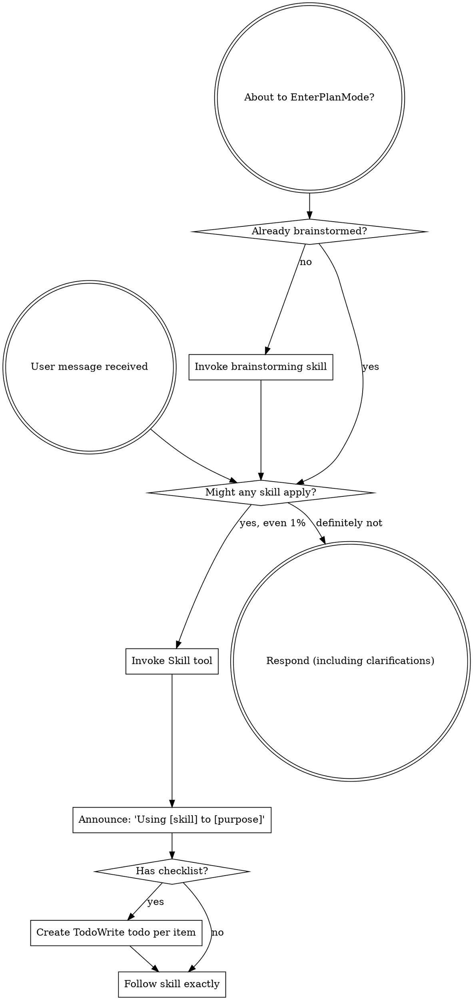
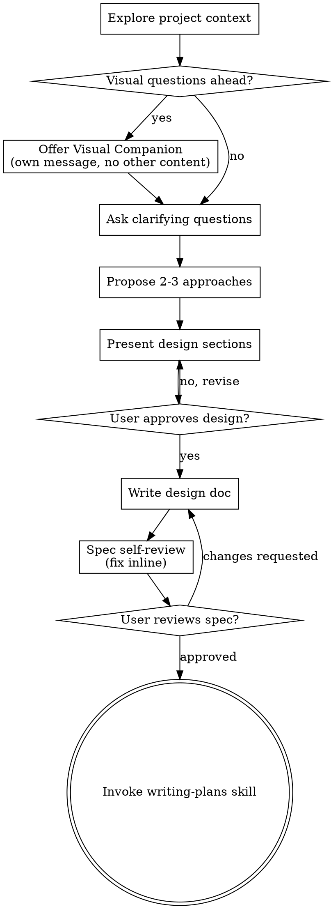
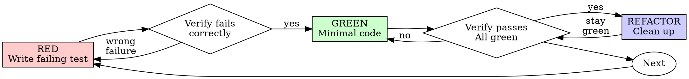
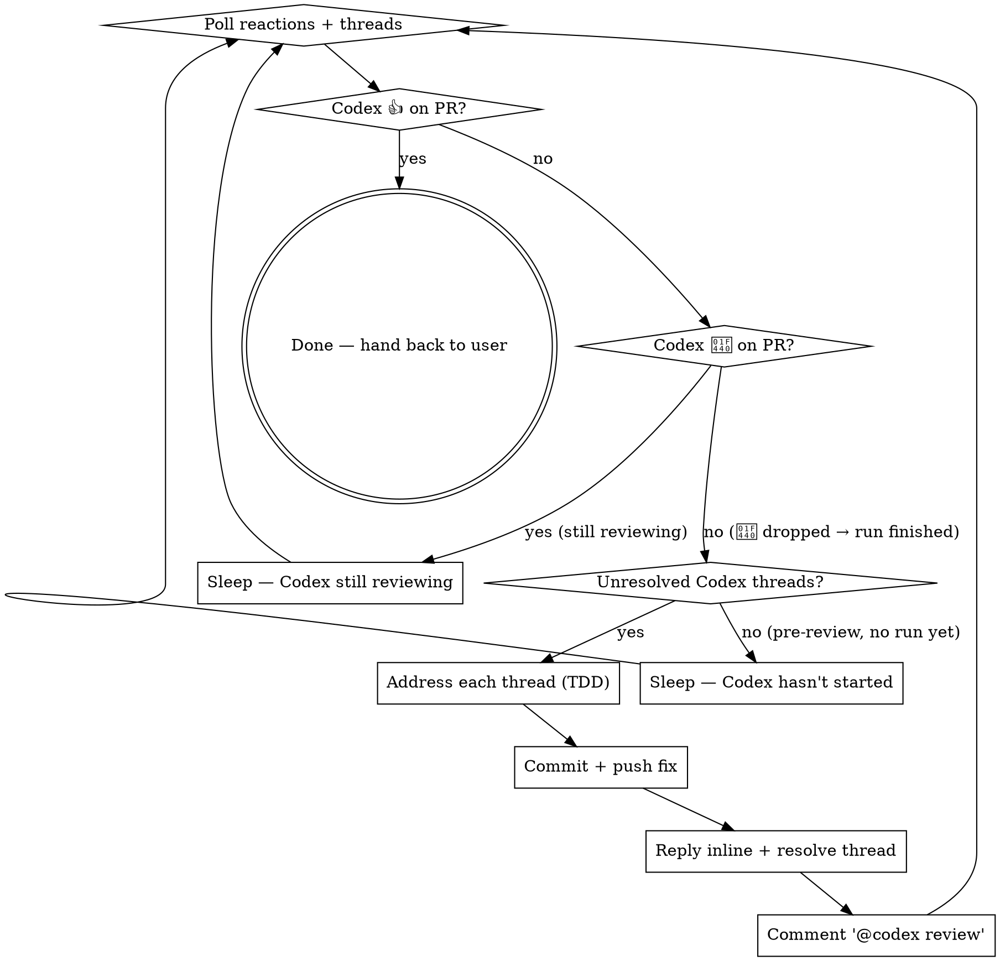

> SYSTEM

# AGENTS.md instructions for /Users/ericson/.codex/worktrees/178c/ars-ui

<INSTRUCTIONS>
## Approach
- Read existing files before writing. Don't re-read unless changed.
- Thorough in reasoning, concise in output.
- Skip files over 100KB unless required.
- No sycophantic openers or closing fluff.
- No emojis or em-dashes.
- Do not guess APIs, versions, flags, commit SHAs, or package names. Verify by reading code or docs before asserting.

--- project-doc ---

# ars-ui

## Project Overview

Rust frontend component library using state machines, framework-agnostic core with Leptos/Dioxus adapters.

## Current Phase

The repo is now in active implementation, not spec drafting only.

Agents working on implementation should use the GitHub Project roadmap and issue backlog as the execution source of truth:

- Use the GitHub Project `ars-ui implementation roadmap` to understand active epics, task breakdown, dependencies, status, and iteration planning.
- Prefer picking a single issue-backed task that is unblocked, sized, and scoped for independent delivery.
- Do not start work from an epic issue unless the user explicitly asks for planning or further decomposition.
- Do not start a task that is blocked by unresolved GitHub issue dependencies.
- Treat native GitHub issue dependencies as the blocker graph and the issue body acceptance criteria as the delivery contract.

## Development Workflow

For implementation tasks:

1. Read the assigned or selected GitHub issue first.
2. Move the issue to **In Progress** on the GitHub Project board.
3. Review the cited spec sections and any dependency issues.
4. Add or update the named tests first.
5. Implement only the scope required to make those tests pass.
6. If implementation changes the intended contract, update the relevant spec in the same task.
7. **MANDATORY:** Invoke the `post-implementation-audit` skill (`.agents/skills/post-implementation-audit/SKILL.md`). It runs three sequential audits on the new code — (a) spec/implementation drift with "best outcome" recommendations, (b) iterative "anything else missing?" passes (minimum two rounds), (c) test-coverage audit across every test type the workspace uses (unit, snapshot, proptest, doc, spec-conformance, llvm-cov — mutation testing is **not** part of this gate; it is Nightly-CI-driven). **Every finding lands in _this_ PR — no deferral, no follow-up issues.** This step exists because initial implementations consistently ship spec drift and silent contract violations that take 3+ review round-trips to surface; the audit collapses them into one. Skipping this step is a contract violation.
8. Run `cargo xclippy` before presenting the final result for user review. Fix warnings in changed code at the root cause, or use `#[expect(..., reason = "...")]` only for deliberate, justified suppressions. Do not hand off with known warnings in the changed surface.
9. Run `cargo xfmt` before every commit and before every push, even when `cargo fmt` was already run. `cargo xfmt` is the workspace formatter gate because it also runs `leptosfmt`, `dx fmt`, and nightly rustfmt settings; using plain `cargo fmt` alone is insufficient and must not be treated as formatted.
10. After user approval, run `cargo xci --profile fast` (alias: `cargo xci-fast`) locally and fix any failures before pushing anything to GitHub. The fast profile covers the workspace-level regressions a pre-push gate should catch: fmt, clippy, unit, integration, adapter, spec-compile-snippets, error-variant-coverage, mutual-exclusion, snapshot-count, and a **native-only coverage check** (`coverage-native`) that enforces the thresholds of the crates whose CI coverage is native-only (the agnostic library crates + xtask) — so `ars-components`-style coverage regressions surface before push, not on CI. The native coverage check adds an instrumented rebuild, so the fast profile runs in roughly 10–15 minutes. Reserve full `cargo xci` (~25 minutes, all 20 gates including the wasm coverage + CRAP gate and the feature-matrix groups) for after substantial refactors that may have shifted feature-flag interactions. For small follow-up changes, run the focused tests and checks that cover the edited code instead. To run only the coverage check, use `cargo xcov` (native-only) or `cargo xcov --full` (mirrors CI; needs the wasm toolchain + clang-22).
11. After `cargo xci-fast` passes, commit and push a PR targeting `main`. The PR body MUST include an auto-close keyword for the issue being delivered, for example `Closes #20` or `Fixes #20`, so GitHub closes the issue automatically when the PR merges.
12. **If the PR creates or modifies any `.snap` insta fixtures, attach the `snapshot-reviewed` label after opening or updating it** (`gh pr edit <num> --add-label "snapshot-reviewed"`). This signals to reviewers that the snapshot output was inspected and is intentional. Re-apply the label whenever you push a commit that touches `.snap` files; the workflow assumes the label reflects the latest snapshot state.
13. **MANDATORY:** Invoke the `waiting-for-codex-review` skill (`.agents/skills/waiting-for-codex-review/SKILL.md`) immediately after the first push that creates the PR, and re-invoke it after every subsequent push to the PR branch. The skill posts the initial `@codex review` trigger, polls Codex's 👀 → (👍 \| ∅ + threads) reaction lifecycle, addresses any review threads with the same rigor as `post-implementation-audit` (TDD + no coverage regression), replies inline, resolves threads, and re-comments `@codex review` to start the next pass — looping until Codex leaves 👍. Skipping this step leaves Codex findings unaddressed and silently widens the gap between merged code and the spec; the merge gate is 👍 from Codex plus green CI, not green CI alone.
13. Only after CI passes, Codex has left 👍, and the PR is merged, close the issue.

Never close a GitHub issue without a merged PR that passes CI **and a 👍 from Codex**. Never commit or push without explicit user approval. Keep the issue, PR, and Project board status aligned with the actual work state at every step.

Default delivery rules:

- Follow TDD: tests first, implementation second, verification last.
- Keep task scope aligned with the issue. If the issue is too large or ambiguous, stop and split or clarify rather than freelancing a bigger change.
- Prefer tasks sized `1`, `2`, `3`, or `5` points. `8` is exceptional. `13` must be decomposed before implementation.
- Preserve the crate and dependency layering defined by the architecture and implementation plan.
- Do not add a new dependency crate without explicit user approval first. If a task appears to need a new crate, stop, explain why, and get approval before editing any `Cargo.toml`.
- When a task is complete, verify the exact tests and checks named by the issue before considering it done.
- **Adapter-level component implementation MUST follow `docs/implementation/adapter-component-delivery.md` precisely.** Before planning or implementing any adapter-level component task — for any component in `crates/ars-leptos` or `crates/ars-dioxus` — agents MUST fully read `docs/implementation/adapter-component-delivery.md` and every workflow/checklist file it links under `docs/implementation/adapter-components/`. The checklist below is a reminder of required deliverables, not a substitute for reading the full workflow document set. Every adapter task must land _all_ of the following in the same PR, with no deferral to follow-up issues:
    1. Adapter crate code (`crates/ars-{leptos,dioxus}/src/<category>/<component>/`) with module wiring and prelude re-exports — minimize `clone()` calls by parking per-instance values shared across closures in `StoredValue<T>` (Leptos) or `CopyValue<T>` (Dioxus) instead of cloning into each capture, per "Avoid Repeated Closure Clones" in `docs/implementation/adapter-components/03-framework-rules.md`;
    2. Adapter-level **unit + SSR tests** in `crates/ars-{leptos,dioxus}/tests/<component>.rs`;
    3. Adapter-level **wasm browser tests** in `crates/ars-{leptos,dioxus}/tests/<component>_wasm.rs` for any interactive behavior (focus, keyboard nav, pointer events, typeahead, controlled-signal sync, observers, portal, scroll, cleanup);
    4. **Counterpart-driven UX review before code** — use the browser to inspect the live docs/examples for the strongest counterpart, starting with React Aria / React Spectrum when available, and record the supported, unsupported, and intentionally different UX axes before choosing the adapter/tests/widgets shape;
    5. **Widgets examples** in _all six_ widgets crates (`examples/widgets-{leptos,dioxus}`, `widgets-{leptos,dioxus}-css`, `widgets-{leptos,dioxus}-tailwind`) under the matching Rust category module, such as `src/categories/data_display.rs` for spec category `data-display` and `src/categories/date_time.rs` for `date-time` — replacing any "Coming soon" placeholder text with a real interactive demo that visually demonstrates every supported counterpart feature and component state;
    6. **E2E fixtures** in `crates/ars-e2e/fixtures/{leptos,dioxus}/src/categories/<category>.rs` for existing flat category fixtures, or in `src/categories/<category>/<component>.rs` with `src/categories/<category>/mod.rs` when the PR also migrates that category to a directory-backed module imported by `categories/mod.rs`; add an **E2E harness module** at `crates/ars-e2e/src/<category>/<component>.rs` covering axe-core, keyboard, pointer, adapter-parity, and computed visual assertions for supported counterpart UX states (unless the component is purely static and adapter tests already prove that — state the reason in the PR body);
    7. **xtask `e2e <category>` subcommand** (in `xtask/src/e2e.rs`, `xtask/src/main.rs`, and `crates/ars-e2e/src/main.rs`) when this is the first E2E-covered component in a new category;
    8. **Spec synchronization** for any drift surfaced by the implementation, with the amendment landed in the same PR (see "Spec Synchronization During Implementation");
    9. **Validation gates**: `cargo xtask lint adapter-parity` runs without `SKIP` for the component; `cargo xci-fast` passes; `post-implementation-audit` skill ran all three phases with every finding fixed in this PR.

    Skipping any of these is a workflow violation. The `adapter-component-delivery.md` entry point and linked `docs/implementation/adapter-components/` workflow files are the single source of truth for what "adapter task complete" means.

### Code Quality Standards

- **Document all public items.** Every public struct, enum, trait, function, constant, type alias, method, field, and variant must have a `///` doc comment. Every `lib.rs` must have a `//!` crate-level doc comment. The workspace enforces `missing_docs` linting — undocumented public items are build failures.
- **Zero warnings policy.** All code must compile with zero warnings under the workspace's configured clippy and rustc lints. Fix the root cause instead of suppressing. When suppression is genuinely needed, use `#[expect(lint, reason = "...")]` — never `#[allow(...)]`.
- **Derive documentation from the spec.** Doc comments should describe the _purpose and semantics_ of the item as defined in the corresponding `spec/` files, not just restate the type signature.
- **Use `#[inline]` selectively, not mechanically.** Do **not** add Clippy's `missing_inline_in_public_items` lint at the workspace level, and do not treat public visibility alone as a reason to mark an item `#[inline]`. Use `#[inline]` for thin cross-crate wrappers, trivial accessors, and hot-path no-op shims where the call overhead is plausibly meaningful. Avoid blanket `#[inline]` on all public APIs — it increases code size, adds compile-time cost, and turns `#[inline]` into noise instead of a deliberate performance signal.
- **Use directory-backed modules with `mod.rs` when a module owns children.** This repo standardizes on the older filesystem layout for nested modules. If module `foo` has child modules, the parent must live at `foo/mod.rs`, not `foo.rs`. Do not mix `foo.rs` with a sibling `foo/` directory. When a refactor adds child modules under an existing flat file, move the parent into `foo/mod.rs` in the same change. Do not leave empty leftover module directories behind.

### API Design Standards

- **Design for the pit of success.** Public APIs should make the most natural, shortest path also be the path that is correct, accessible, localizable, type-safe, and performant. Prefer ergonomic constructors and defaults that preserve the spec's strongest guarantees instead of making users opt into correctness after choosing a convenient API.
- **Name escape hatches explicitly.** When a component needs a lower-level, static, non-i18n, or otherwise less complete path, keep it available but make the tradeoff visible in the API name or type. The blessed path should remain the simplest call site, while escape hatches should read as deliberate choices.
- **Keep semantic data separate from rendered views.** Rich framework views are useful for customization, but components still need semantic sources for accessible names, localized text, announcements, ids, and state-machine wiring. Do not rely on arbitrary rendered view trees as the only source of user-facing semantics.

### Code Coverage

The workspace uses `cargo-llvm-cov` for code coverage with per-crate threshold enforcement. CI runs coverage on every PR (see `.github/workflows/ci.yml`).

**Local coverage commands:**

```bash
# Fast native-only coverage gate — instruments + checks only the crates whose
# CI coverage is native-only (agnostic library crates + xtask). No wasm/clang
# toolchain needed; this is what the `fast` pre-push profile runs.
cargo xcov

# Full native+wasm coverage gate, mirroring CI (needs the wasm toolchain + clang-22)
cargo xcov --full

# Per-crate coverage with inline annotated source (most useful during development)
cargo llvm-cov test -p ars-interactions --text -- hover

# Per-crate summary only
cargo llvm-cov test -p ars-interactions -- hover

# Native-only workspace coverage (host target; excludes wasm-only crates)
cargo llvm-cov --workspace \
  --exclude ars-leptos --exclude ars-dioxus \
  --exclude ars-test-harness-leptos --exclude ars-test-harness-dioxus \
  --exclude ars-derive --exclude xtask \
  --lcov --output-path lcov.info

# Check all crates against spec-defined thresholds (run after a *merged* lcov)
cargo xtask coverage check-all --file lcov.info
```

The `--text` flag produces line-by-line annotated source showing hit counts and `^0` markers on uncovered branches — use this to identify gaps after writing tests. Uncovered no-op callback closures in tests (e.g., `|_| {}`) are expected and not a gap.

The local recipe above excludes the adapter and adapter-test-harness crates because their `target_arch = "wasm32"` / `feature = "web"` code paths can't be measured via host-target `cargo llvm-cov`. **CI runs an additional wasm-coverage pipeline on nightly** (`cargo xtask ci coverage`) that uses `wasm-bindgen-test`'s experimental coverage recipe with LLVM 22 / `clang-22` to emit lcov for `ars-leptos` (csr), `ars-dioxus` (web), `ars-dom` (web), `ars-i18n` (web-intl), and the adapter test harnesses, then merges with the native lcov via `cargo xtask coverage merge`. The per-crate thresholds in `xtask::coverage::default_thresholds()` are enforced against the merged file — including adapter targets (`ars-leptos` 74/55, `ars-dioxus` 77/70, `ars-test-harness-leptos` 60/0, `ars-test-harness-dioxus` 60/0). `ars-derive` (proc-macro, runs in compiler) is exercised via `crates/ars-core/tests/derive_contract.rs` and is unmeasured. `xtask` has its own enforced threshold (30/35) and is measured. See `spec/testing/14-ci.md` §2 for the full pipeline.

### CRAP Gate (complexity vs. coverage)

Coverage tells you which lines run; mutation testing tells you whether tests would notice misbehaviour. The **CRAP gate** ([`cargo-crap`](https://crates.io/crates/cargo-crap)) tells you which functions are _risky to change_ — high cyclomatic complexity combined with low coverage. The CRAP score is `complexity² · (1 − coverage)³ + complexity`.

**Why regression mode, not an absolute threshold.** At 100% coverage `CRAP == cyclomatic complexity`, so an absolute `--fail-above` threshold rejects every large `match` no matter how well it is tested. This workspace is built on state machines: each stateful component's `Machine::transition` is intrinsically a wide `match (state, event)` (complexity 30–80) and is exhaustively tested. An absolute gate would fight that architecture and reject more components as the catalog grows. The gate therefore runs in **regression mode**.

- **Blessed entrypoints:** `cargo xcrap` (local human-readable report, never fails), `cargo xcrap --update-baseline` (regenerate the baseline), and `cargo xtask ci crap` (the CI gate). The gate is the last step of the full `cargo xci` pipeline, running immediately after `coverage` and reusing its merged `lcov.info` (no recompile). It is **not** in the fast profile: the fast profile runs only the native-only `coverage-native` check, which does not produce the merged `lcov.info` the CRAP gate compares against.
- **Policy:** `cargo crap --path . --lcov lcov.info --baseline .crap-baseline.json --fail-regression --min 30 --exclude 'target/**' --exclude 'examples/**' --exclude 'xtask/**' --exclude 'crates/ars-e2e/**' --exclude 'crates/ars-derive/**'`. The gate scopes to the **shipped component library** — tooling (`xtask`), the browser E2E harness (`ars-e2e`), the proc-macro crate, demos, and build output are excluded (they are not shipped surface, and several run uninstrumented-as-tooling on CI → 0% → spurious CRAP). The gate fails only when a function **at or above CRAP 30 regresses** (more complexity or less coverage) versus the committed baseline. New functions are tolerated — the per-crate coverage thresholds already ensure new code is tested — and sub-threshold churn on simple functions is ignored. Net: the coverage gate guarantees new code is tested; the CRAP gate guarantees shipped code does not rot.
- **`--path .`, not `--workspace`.** cargo-crap's regression key is `(file, function, line)`, and `--workspace` records machine-absolute file paths (`/Users/…` locally, `/home/runner/…` on CI). A baseline committed with absolute paths never matches on CI, silently turning the gate into a no-op. `--path .` emits repo-relative paths (`./crates/…`) that match on any checkout; coverage still associates correctly because cargo-crap canonicalizes paths when reading the lcov. `--exclude` is honored under `--path` (it is a no-op under `--workspace`), so `target/**` and the unmeasured `crates/ars-derive/**` are skipped there. Because the key includes the line number, a baseline only matches non-uniquely-named functions (e.g. `Machine::transition`) while their line numbers are stable; regenerate the baseline when a tracked file's lines shift materially.
- **Baseline:** `.crap-baseline.json` at the repo root is committed and complete (every function, no `--min`, so a function crossing the threshold is still caught). Regenerate it with `cargo xcrap --update-baseline` from CI's merged `lcov.info` (download the `coverage-lcov` artifact) whenever a **deliberate** complexity increase lands; commit the new baseline in that PR — a conscious "I accept this" checkpoint. cargo-crap's `--epsilon` (default 0.01) absorbs coverage float jitter. If the baseline is missing, the gate bootstraps it and passes with a notice.
- **Pinned version:** cargo-crap is pinned to an exact version in `xtask::crap::CARGO_CRAP_VERSION` and `.github/workflows/ci.yml` (same convention as cargo-mutants). To bump, update both. Install locally with `cargo install cargo-crap --locked --version <version>` (or `cargo binstall cargo-crap`).
- **Scope / escape hatch:** the exclude-glob list lives in `xtask/src/crap.rs` (`EXCLUDE_GLOBS`), each entry justified by a comment, and scopes the gate to the **shipped component library**. Because the gate runs under `--path .`, cargo-crap's `--exclude` is honored, so build output (`target/**`), demos (`examples/**`), the task runner (`xtask/**`), the browser E2E harness (`crates/ars-e2e/**`), and the proc-macro crate (`crates/ars-derive/**`) are skipped at walk time. The last three are not shipped library code and run uninstrumented-as-tooling on CI (0% coverage → spurious CRAP), so gating them is meaningless. Prefer fixing or refactoring over adding entries. (Note: the per-crate **coverage** gate still measures `xtask` at its own loose 30/35 threshold — that is separate from CRAP.)

### Mutation Testing

Coverage tells you which lines run. **Mutation testing tells you whether the tests would notice if those lines silently misbehaved.** The workspace uses [`cargo-mutants`](https://mutants.rs) for this — a `cargo` extension binary, not a workspace dependency.

**Install (once per developer machine):**

```bash
cargo install cargo-mutants --locked --version 27.0.0
```

**Local commands (state-machine modules are the most rewarding targets):**

Prefer `cargo xmutants` over bare `cargo mutants` — it applies the same
per-crate `--features` profile as Nightly CI (for example
`ars-components/i18n`) so snapshot and i18n-gated tests match CI.

```bash
# Run on a single component machine (~6 min for popover)
cargo xmutants -p ars-components -f crates/ars-components/src/overlay/popover/mod.rs

# Just list what would be mutated, without running tests (fast)
cargo xmutants -p ars-components -f crates/ars-components/src/overlay/popover/mod.rs --list

# Whole crate (slow — only if you really mean it)
cargo xmutants -p ars-components
```

**Agnostic component implementation gate:** whenever an agent implements a new framework-agnostic component, or materially changes an existing one, the delivery must include:

- spec-conformance tests for the component's anatomy/public contract, including its `Part` enum and required API/attribute surface;
- the full test breadth the component warrants (unit, snapshot, proptest) with strong line/branch coverage.

**Mutation testing is NOT a pre-PR requisite for agnostic component work.** Do not run a targeted `cargo xmutants` pass as a delivery/audit gate, and do not block a PR on a clean local mutation run. Surviving (`MISSED`) mutants are surfaced by the Nightly CI `mutation-testing` job (see below); triage them — add tests for real gaps, or add a justified line-agnostic `.cargo/mutants.toml` exclude for true equivalent mutations — in a dedicated follow-up when Nightly reports them, not during initial component delivery. (Running a local mutation pass voluntarily is fine, but it is never required and never blocks delivery or review.)

**Reading the output:** Results land in `mutants.out/mutants.out/` (gitignored). The two files that matter:

- `caught.txt` — mutations that broke at least one test ✅
- `missed.txt` — mutations that survived all tests ❌ — each one is either a real test gap to fill or an "equivalent mutation" that needs a `[[skip]]` entry in `mutants.toml` with a justification

**CI integration:** Nightly only. `.github/workflows/nightly.yml` has a `mutation-testing` job with a 21-entry matrix that runs `cargo mutants -p <package>` on every framework-agnostic crate, using `--shard k/n` to spread larger crates across parallel runners. **Shard indices are 0-based** (`k` runs from `0` to `n-1`); `k == n` is invalid and will fail the job. When adding shards, always start at `0/n` and end at `(n-1)/n`.

- **`ars-components` (≈ 1,630 mutants today, planned to grow as the spec adds the remaining ~97 components):** sharded **12-way** → ≈ 135 mutants per runner today, ≈ 850 per runner at the ~10,000-mutant endpoint. Sized for the full spec catalog up front so we don't re-shard every few months as components land.
- **`ars-collections` (≈ 1,080 mutants):** sharded 4-way → ≈ 270 mutants per runner.
- **`ars-core` (≈ 700 mutants):** sharded 2-way → ≈ 350 mutants per runner.
- **`ars-a11y`, `ars-forms`, `ars-interactions`:** one runner each (under 600 mutants apiece).

**Adding a new state machine inside an existing crate requires no CI changes** — its mutations land in whichever shard the cargo-mutants partitioner places them. The shard counts are sized so the slowest runner stays well under 30 minutes today and under ~50 minutes at the planned endpoint; re-balance only when a crate outgrows that budget (visible on the nightly dashboard as one shard pulling away from the others).

All matrix jobs run with `fail-fast: false` so failures on one module don't mask data on another. Each job uploads its `mutants.out/` as a workflow artifact (always, even on success — surviving "missed" entries on a passing run still reveal test-quality work). The job fails if any mutation survives, so a missed mutation forces a deliberate triage decision (fix the test, or document the equivalence with a `[[skip]]` entry in `mutants.toml`).

**Excluded crates** (mutation testing's signal degrades wherever determinism does): adapter glue (`ars-leptos`, `ars-dioxus`), DOM/FFI (`ars-dom`), ICU/FFI (`ars-i18n`), test infrastructure (`ars-test-harness*`), and the proc-macro crate (`ars-derive`, runs in the compiler). Adding a brand-new crate that is a good mutation target requires one new matrix entry; run a local scout first (`cargo mutants -p <crate> --list` to size, then a real run) so we know the right shard count before the nightly fires.

**Bumping the pinned version.** Both the local install command above and `.github/workflows/nightly.yml` pin cargo-mutants to an exact version (currently `27.0.0`) — same convention as `wasm-pack` in the `a11y-audit` job. Pinning is deliberate: cargo-mutants ships new mutators in releases, and an unpinned install would silently change the mutation set without any code change, surfacing as phantom CI failures on a green-source repo. To bump, open a PR that (1) updates the version string in CLAUDE.md and `nightly.yml`, (2) runs the popover scout locally with the new version (`cargo mutants -p ars-components -f crates/ars-components/src/overlay/popover/mod.rs`) to confirm the mutation count is in the same ballpark, and (3) triages any new "missed" entries the new mutators surface — they are usually genuine test-quality gaps newly visible to the tool.

### Property Testing (proptest)

State-machine invariants are exercised by [`proptest`](https://docs.rs/proptest) under `crates/<crate>/tests/proptest_state_machines/` (see `ars-components`). Default proptest behaviour drops `*.proptest-regressions` seed files alongside test sources — instead, every `proptest!` block in this workspace pulls a shared `Config` from `tests/proptest_state_machines/common.rs` that:

1. Reads `PROPTEST_CASES` from the environment (1,000 default; 10,000 in the nightly `extended-proptest` job).
2. Sets `failure_persistence` to `FileFailurePersistence::Direct("proptest-regressions/state-machines.txt")`, so all persisted seeds for the test binary live in one file at the crate root: `crates/<crate>/proptest-regressions/state-machines.txt`. The directory is committed (per proptest's own recommendation in the file header) so every developer's runs benefit from previously-shrunk failures.

When a new crate adopts proptest for state-machine tests, copy the same `common.rs` helper and reference it via `#![proptest_config(super::common::proptest_config())]` inside every `proptest!` block. Don't let proptest fall back to its `WithSource` default — that scatters seed files across the source tree.

### Adapter Prelude Convention

Both `ars-leptos` and `ars-dioxus` expose a `prelude` module targeting **end users** — application developers who consume the ready-made components. `use ars_leptos::prelude::*` (or `use ars_dioxus::prelude::*`) should give them everything they need.

The prelude contains only user-facing items:

1. **Component modules** — as components land, their public module paths (e.g., `button`, `dialog`) are re-exported so users can write `button::Props`, etc.
2. **User-facing traits** — traits end users call on component outputs (e.g., `Translate` from `ars-i18n`). Re-export the trait so consumers don't need a direct dependency on the subsystem crate.
3. **Configuration types** — types that appear in component props or configure behaviour (e.g., `Locale`, `Direction`, `Orientation`, `Selection`).

The prelude does **not** include implementation details consumed only by component authors inside the adapter crate: core engine types (`Machine`, `Service`, `ConnectApi`, `AttrMap`), accessibility primitives (`AriaRole`, `AriaAttribute`), interaction helpers (`merge_attrs`), or adapter hooks (`use_machine`, `UseMachineReturn`). Those remain accessible via their normal crate paths for advanced users building custom machines.

Both adapter preludes must stay symmetric: same items, same structure. When adding a new re-export to one adapter's prelude, add it to the other as well in the same PR.

### Adapter Testing Convention

Adapter-level component tests should default to the framework-specific test harness crate:

- Leptos adapter tests should prefer `ars-test-harness-leptos`.
- Dioxus adapter tests should prefer `ars-test-harness-dioxus`.
- Shared `ars-test-harness` helpers should be used where relevant for viewport, layout, clipboard, drag/drop, timing, and other DOM test setup instead of bespoke per-test browser scaffolding.

When a component spec requires interaction, focus, overlay positioning, clipboard, file upload, drag/drop, or similar browser behavior, the task's tests should exercise that behavior through the adapter harness entrypoints and shared core harness helpers unless there is a concrete technical reason not to.

## Spec Synchronization During Implementation

The specification is the authoritative contract. It took weeks of deliberate design and MUST be followed.

### Spec-first implementation rule

Before implementing any public type, trait, function, or method:

1. **Read the spec section first.** Find the relevant code example in `spec/`. Use `spec-tool toc <file>` and `grep` to locate it.
2. **Match the spec exactly.** If the spec defines `struct ComponentIds { base: String }` with methods `from_id()`, `id()`, `part()`, `item()`, `item_part()` — implement exactly that. Do not invent alternative field names, method names, or signatures.
3. **Cross-check after implementation.** Before presenting code for review, diff every public item against the spec's code examples. Every struct field, every method name, every parameter must match.
4. **If you must deviate**, there must be a concrete technical reason (e.g., the spec's API cannot compile, or a dependency doesn't expose the needed type). Document the reason in a code comment and flag it to the user explicitly.

Inventing alternative APIs that "seem equivalent" is never acceptable — it silently invalidates the spec's design decisions and all downstream code that depends on those APIs.

### Spec/code mismatch resolution

- If code and spec disagree, resolve the mismatch in the same task or PR.
- Shared conceptual changes belong in shared or foundation spec files, not only in adapter code.
- Adapter-specific findings must be reflected back into `spec/foundation/08-adapter-leptos.md` and/or `spec/foundation/09-adapter-dioxus.md` when relevant.
- Do not leave spec drift behind as follow-up cleanup.

## Spec Structure

The specification lives in `spec/` with this layout:

- `spec/manifest.toml` — **START HERE** — central index of all components and their dependencies
- `spec/foundation/` — architecture, accessibility, i18n, interactions, forms, adapters, spec template (00-10)
- `spec/shared/` — cross-component shared types (date-time, selection, layout, z-index)
- `spec/components/{category}/` — one file per component, organized by category
- `spec/testing/` — test specs split by domain

### Component Categories

- `input/` — checkbox, text-field, slider, number-input, etc.
- `selection/` — select, combobox, listbox, menu, tags-input, etc.
- `overlay/` — dialog, popover, tooltip, toast, presence, etc.
- `navigation/` — accordion, tabs, tree-view, pagination, steps, etc.
- `date-time/` — date-field, time-field, calendar, date-picker, etc.
- `data-display/` — table, avatar, progress, meter, badge, etc.
- `layout/` — splitter, scroll-area, carousel, portal, toolbar, etc.
- `specialized/` — color-picker, file-upload, signature-pad, qr-code, etc.
- `utility/` — button, toggle, focus-scope, visually-hidden, separator, etc.

## Working with the Spec

When reading large files, run `wc -l` first to check the line count. If the file is over 2,000
lines, use the `offset` and `limit` parameters on the Read tool to read in chunks rather than
attempting to read the entire file at once.

### Using xtask spec (preferred)

Use `cargo xtask spec` to resolve file sets instead of manually parsing manifest.toml:

```bash
# Quick metadata lookup:
cargo xtask spec info <component>

# Find all 
</INSTRUCTIONS>
<environment_context>
  <cwd>/Users/ericson/.codex/worktrees/178c/ars-ui</cwd>
  <shell>zsh</shell>
  <current_date>2026-06-16</current_date>
  <timezone>America/Sao_Paulo</timezone>
  <filesystem><workspace_roots><root>/Users/ericson/.codex/worktrees/178c/ars-ui</root></workspace_roots><permission_profile type="managed"><file_system type="restricted"><entry access="read"><special>:root</special></entry><entry access="write"><path>/Users/ericson/.codex/worktrees/178c/ars-ui</path></entry><entry access="write"><special>:slash_tmp</special></entry><entry access="write"><special>:tmpdir</special></entry><entry access="read"><path>/Users/ericson/.codex/worktrees/178c/ars-ui/.git</path></entry><entry access="read"><path>/Users/ericson/.codex/worktrees/178c/ars-ui/.agents</path></entry><entry access="read"><path>/Users/ericson/.codex/worktrees/178c/ars-ui/.codex</path></entry><entry access="read"><path>/Users/ericson/Workspace/Rust/ars-ui/.git/worktrees/ars-ui7</path></entry></file_system></permission_profile></filesystem>
</environment_context>

> DEVELOPER

Is it possible to break the Coverage CI step into multiple smaller steps and merge the coverage results when all of them complete? In a sharding scheme, where each job handles a part of the coverage. Let's investigate it and do a proper plan on how to handle this sharding

> AGENT

I’ll use the Superpowers planning workflow here, plus the repo’s existing guidance, and first inspect the current coverage CI/xtask shape so the plan is grounded in what actually runs today.

> TOOL

tool_use exec_command
id: call_yDtLFuzpRPFJA01AXhwSGngu
```json
{
  "cmd": "sed -n '1,220p' /Users/ericson/.codex/skills/.system/superpowers/using-superpowers/SKILL.md",
  "workdir": "/Users/ericson/.codex/worktrees/178c/ars-ui",
  "max_output_tokens": 12000
}
```

> TOOL

tool_use exec_command
id: call_qyGZjGA3xv3HYTpTuGWvFqcz
```json
{
  "cmd": "sed -n '1,220p' /Users/ericson/.codex/skills/.system/superpowers/writing-plans/SKILL.md",
  "workdir": "/Users/ericson/.codex/worktrees/178c/ars-ui",
  "max_output_tokens": 12000
}
```

> TOOL

tool_use exec_command
id: call_z0ffQO4vlXeVhv828vh7tPJ7
```json
{
  "cmd": "rg -n \"coverage|xcov|xci|llvm-cov|shard|lcov\" /Users/ericson/.codex/memories/MEMORY.md",
  "workdir": "/Users/ericson/.codex/worktrees/178c/ars-ui",
  "max_output_tokens": 12000
}
```

> TOOL

tool_result
id: call_yDtLFuzpRPFJA01AXhwSGngu
```
Chunk ID: cd573d
Wall time: 0.3369 seconds
Process exited with code 1
Original token count: 27
Output:
sed: /Users/ericson/.codex/skills/.system/superpowers/using-superpowers/SKILL.md: No such file or directory

```

> TOOL

tool_result
id: call_qyGZjGA3xv3HYTpTuGWvFqcz
```
Chunk ID: 417cff
Wall time: 0.3228 seconds
Process exited with code 1
Original token count: 26
Output:
sed: /Users/ericson/.codex/skills/.system/superpowers/writing-plans/SKILL.md: No such file or directory

```

> TOOL

tool_result
id: call_z0ffQO4vlXeVhv828vh7tPJ7
```
Chunk ID: baecda
Wall time: 0.0908 seconds
Process exited with code 0
Original token count: 1080
Output:
40:- Dioxus adapter work in this repo often needs both focused adapter tests and desktop/non-web compile coverage; the successful checkbox review fixes verified `cargo test -p ars-dioxus --test checkbox`, `cargo test -p ars-dioxus --test as_child as_child_module_preserves_merge_dioxus_attrs_export`, and `cargo check -p ars-dioxus --features desktop` [Task 1]
137:applies_to: cwd=/Users/ericson/.codex/worktrees/*/ars-ui and related ars-ui checkouts; reuse_rule=reuse for agnostic category audits in `crates/ars-components`; verify the live epic scope, current test-tree shape, and current CI/coverage gates before reusing category-specific details.
147:- selection, Epic #221, spec_conformance, proptest_state_machines, SegmentGroup, TagsInput, controlled-value sync, set_props, initial controlled value, per-component modules, cargo xtask spec info, coverage
149:## Task 2: Audit the date-time category for Epic #224, split test suites, sync stale specs, and recover branch coverage
153:- rollout_summaries/2026-06-04T02-49-12-oAsa-date_time_agnostic_audit_epic_224_test_split.md (cwd=/Users/ericson/.codex/worktrees/0f10/ars-ui, rollout_path=/Users/ericson/.codex/sessions/2026/06/03/rollout-2026-06-03T23-49-12-019e9088-e9bc-7f93-8927-ddcd800e6bb2.jsonl, updated_at=2026-06-04T04:46:33+00:00, thread_id=019e9088-e9bc-7f93-8927-ddcd800e6bb2, date-time audit with split test trees, spec sync, direct branch-coverage fix, and PR #722)
157:- date-time, Epic #224, CalendarDate, DateTimePicker, RangeCalendar, cargo xcov, cargo xci, cargo xtask spec info, readonly_blocks_type_buffer_commit, per-component modules, PR 722
167:- layout, Epic #226, Splitter, docs/implementation/layout-category-audit.md, cargo xci --profile fast, release verification, component test modules, PR 718
169:## Task 4: Audit the specialized category for Epic #227, split oversized suites, and land focused coverage/spec fixes
173:- rollout_summaries/2026-06-04T02-56-14-atfs-specialized_agnostic_category_audit_epic_227.md (cwd=/Users/ericson/.codex/worktrees/a4e5/ars-ui, rollout_path=/Users/ericson/.codex/sessions/2026/06/03/rollout-2026-06-03T23-56-14-019e908f-5a7e-7e62-93f9-cba7162ace72.jsonl, updated_at=2026-06-04T04:24:09+00:00, thread_id=019e908f-5a7e-7e62-93f9-cba7162ace72, specialized audit doc, spec drift fixes, coverage recovery, and PR #719)
177:- specialized, Epic #227, contextual-help, timer, docs/implementation/specialized-category-audit.md, cargo xci, coverage-native, per-component modules, PR 719
187:- data-display, Epic #225, TagGroup, CRAP, lcov, xcrap, coverage-lcov, AvatarGroup, spec_conformance, proptest_state_machines, PR 713
200:- only the stateful/complex components in a category usually need `proptest_state_machines`; stateless components can stay in unit/spec-conformance/snapshot coverage unless a new invariant is discovered [Task 2][Task 3][Task 5]
202:- `cargo xci --profile fast` is the strongest local pre-push gate for these ars-ui category audits; use focused tests and `cargo test ... --no-run` earlier, then `cargo xcov` or category-specific coverage gates when thresholds are tight [Task 2][Task 3][Task 4]
204:- for coverage-sensitive failures, inspect the actual counted branch or artifact path before editing broadly: the successful fixes here were a direct `DateTimePicker::TypeBufferCommit` readonly test, explicit Splitter no-op branches, focused specialized component tests, and LCOV path normalization before CRAP baseline refresh [Task 2][Task 3][Task 4][Task 5]
210:- symptom: a coverage fix feels plausible but does not move the threshold -> cause: the chosen path was not a counted branch -> fix: inspect `lcov` or direct coverage output first, then target the exact missed branch with a focused unit test [Task 2][Task 4]
212:- symptom: CI coverage or CRAP fails after the base branch moved even though local code changes look sound -> cause: the baseline or artifact paths are stale rather than the behavior regressing -> fix: compare against the current base branch, normalize artifact paths if needed, then refresh the baseline before editing product code [Task 5]
257:- `cargo +nightly fmt --all --check` is the workspace-wide formatting gate referenced by the validation docs, and widgets smoke coverage must be a real browser path rather than `cargo check` alone [Task 1]

```

> AGENT

The first skill path alias in the prompt points elsewhere than the local filesystem layout, so I’m falling back to the matching installed skill copies under `~/.claude/skills`. The memory index has relevant prior coverage notes, but I’ll verify against the live CI and xtask code before relying on them.

> TOOL

tool_use exec_command
id: call_ev75w9FGbDN9ReyMy4de0PM1
```json
{
  "cmd": "sed -n '1,240p' /Users/ericson/.claude/skills/using-superpowers/SKILL.md",
  "workdir": "/Users/ericson/.codex/worktrees/178c/ars-ui",
  "max_output_tokens": 12000
}
```

> TOOL

tool_use exec_command
id: call_o0uw9vBdHgVJMy7W0gzraXck
```json
{
  "cmd": "sed -n '1,260p' /Users/ericson/.claude/skills/writing-plans/SKILL.md",
  "workdir": "/Users/ericson/.codex/worktrees/178c/ars-ui",
  "max_output_tokens": 12000
}
```

> TOOL

tool_use exec_command
id: call_9eP2OpwneeiQDjc7rUlh7EM4
```json
{
  "cmd": "sed -n '180,214p' /Users/ericson/.codex/memories/MEMORY.md",
  "workdir": "/Users/ericson/.codex/worktrees/178c/ars-ui",
  "max_output_tokens": 6000
}
```

> TOOL

tool_result
id: call_ev75w9FGbDN9ReyMy4de0PM1
```
Chunk ID: faf37c
Wall time: 0.3072 seconds
Process exited with code 0
Original token count: 1356
Output:
---
name: using-superpowers
description: Use when starting any conversation - establishes how to find and use skills, requiring Skill tool invocation before ANY response including clarifying questions
---

<SUBAGENT-STOP>
If you were dispatched as a subagent to execute a specific task, skip this skill.
</SUBAGENT-STOP>

<EXTREMELY-IMPORTANT>
If you think there is even a 1% chance a skill might apply to what you are doing, you ABSOLUTELY MUST invoke the skill.

IF A SKILL APPLIES TO YOUR TASK, YOU DO NOT HAVE A CHOICE. YOU MUST USE IT.

This is not negotiable. This is not optional. You cannot rationalize your way out of this.
</EXTREMELY-IMPORTANT>

## Instruction Priority

Superpowers skills override default system prompt behavior, but **user instructions always take precedence**:

1. **User's explicit instructions** (CLAUDE.md, GEMINI.md, AGENTS.md, direct requests) — highest priority
2. **Superpowers skills** — override default system behavior where they conflict
3. **Default system prompt** — lowest priority

If CLAUDE.md, GEMINI.md, or AGENTS.md says "don't use TDD" and a skill says "always use TDD," follow the user's instructions. The user is in control.

## How to Access Skills

**In Claude Code:** Use the `Skill` tool. When you invoke a skill, its content is loaded and presented to you—follow it directly. Never use the Read tool on skill files.

**In Copilot CLI:** Use the `skill` tool. Skills are auto-discovered from installed plugins. The `skill` tool works the same as Claude Code's `Skill` tool.

**In Gemini CLI:** Skills activate via the `activate_skill` tool. Gemini loads skill metadata at session start and activates the full content on demand.

**In other environments:** Check your platform's documentation for how skills are loaded.

## Platform Adaptation

Skills use Claude Code tool names. Non-CC platforms: see `references/copilot-tools.md` (Copilot CLI), `references/codex-tools.md` (Codex) for tool equivalents. Gemini CLI users get the tool mapping loaded automatically via GEMINI.md.

# Using Skills

## The Rule

**Invoke relevant or requested skills BEFORE any response or action.** Even a 1% chance a skill might apply means that you should invoke the skill to check. If an invoked skill turns out to be wrong for the situation, you don't need to use it.



## Red Flags

These thoughts mean STOP—you're rationalizing:

| Thought | Reality |
|---------|---------|
| "This is just a simple question" | Questions are tasks. Check for skills. |
| "I need more context first" | Skill check comes BEFORE clarifying questions. |
| "Let me explore the codebase first" | Skills tell you HOW to explore. Check first. |
| "I can check git/files quickly" | Files lack conversation context. Check for skills. |
| "Let me gather information first" | Skills tell you HOW to gather information. |
| "This doesn't need a formal skill" | If a skill exists, use it. |
| "I remember this skill" | Skills evolve. Read current version. |
| "This doesn't count as a task" | Action = task. Check for skills. |
| "The skill is overkill" | Simple things become complex. Use it. |
| "I'll just do this one thing first" | Check BEFORE doing anything. |
| "This feels productive" | Undisciplined action wastes time. Skills prevent this. |
| "I know what that means" | Knowing the concept ≠ using the skill. Invoke it. |

## Skill Priority

When multiple skills could apply, use this order:

1. **Process skills first** (brainstorming, debugging) - these determine HOW to approach the task
2. **Implementation skills second** (frontend-design, mcp-builder) - these guide execution

"Let's build X" → brainstorming first, then implementation skills.
"Fix this bug" → debugging first, then domain-specific skills.

## Skill Types

**Rigid** (TDD, debugging): Follow exactly. Don't adapt away discipline.

**Flexible** (patterns): Adapt principles to context.

The skill itself tells you which.

## User Instructions

Instructions say WHAT, not HOW. "Add X" or "Fix Y" doesn't mean skip workflows.

```

> TOOL

tool_result
id: call_o0uw9vBdHgVJMy7W0gzraXck
```
Chunk ID: d806a5
Wall time: 0.0650 seconds
Process exited with code 0
Original token count: 1512
Output:
---
name: writing-plans
description: Use when you have a spec or requirements for a multi-step task, before touching code
---

# Writing Plans

## Overview

Write comprehensive implementation plans assuming the engineer has zero context for our codebase and questionable taste. Document everything they need to know: which files to touch for each task, code, testing, docs they might need to check, how to test it. Give them the whole plan as bite-sized tasks. DRY. YAGNI. TDD. Frequent commits.

Assume they are a skilled developer, but know almost nothing about our toolset or problem domain. Assume they don't know good test design very well.

**Announce at start:** "I'm using the writing-plans skill to create the implementation plan."

**Context:** This should be run in a dedicated worktree (created by brainstorming skill).

**Save plans to:** `docs/superpowers/plans/YYYY-MM-DD-<feature-name>.md`
- (User preferences for plan location override this default)

## Scope Check

If the spec covers multiple independent subsystems, it should have been broken into sub-project specs during brainstorming. If it wasn't, suggest breaking this into separate plans — one per subsystem. Each plan should produce working, testable software on its own.

## File Structure

Before defining tasks, map out which files will be created or modified and what each one is responsible for. This is where decomposition decisions get locked in.

- Design units with clear boundaries and well-defined interfaces. Each file should have one clear responsibility.
- You reason best about code you can hold in context at once, and your edits are more reliable when files are focused. Prefer smaller, focused files over large ones that do too much.
- Files that change together should live together. Split by responsibility, not by technical layer.
- In existing codebases, follow established patterns. If the codebase uses large files, don't unilaterally restructure - but if a file you're modifying has grown unwieldy, including a split in the plan is reasonable.

This structure informs the task decomposition. Each task should produce self-contained changes that make sense independently.

## Bite-Sized Task Granularity

**Each step is one action (2-5 minutes):**
- "Write the failing test" - step
- "Run it to make sure it fails" - step
- "Implement the minimal code to make the test pass" - step
- "Run the tests and make sure they pass" - step
- "Commit" - step

## Plan Document Header

**Every plan MUST start with this header:**

```markdown
# [Feature Name] Implementation Plan

> **For agentic workers:** REQUIRED SUB-SKILL: Use superpowers:subagent-driven-development (recommended) or superpowers:executing-plans to implement this plan task-by-task. Steps use checkbox (`- [ ]`) syntax for tracking.

**Goal:** [One sentence describing what this builds]

**Architecture:** [2-3 sentences about approach]

**Tech Stack:** [Key technologies/libraries]

---
```

## Task Structure

````markdown
### Task N: [Component Name]

**Files:**
- Create: `exact/path/to/file.py`
- Modify: `exact/path/to/existing.py:123-145`
- Test: `tests/exact/path/to/test.py`

- [ ] **Step 1: Write the failing test**

```python
def test_specific_behavior():
    result = function(input)
    assert result == expected
```

- [ ] **Step 2: Run test to verify it fails**

Run: `pytest tests/path/test.py::test_name -v`
Expected: FAIL with "function not defined"

- [ ] **Step 3: Write minimal implementation**

```python
def function(input):
    return expected
```

- [ ] **Step 4: Run test to verify it passes**

Run: `pytest tests/path/test.py::test_name -v`
Expected: PASS

- [ ] **Step 5: Commit**

```bash
git add tests/path/test.py src/path/file.py
git commit -m "feat: add specific feature"
```
````

## No Placeholders

Every step must contain the actual content an engineer needs. These are **plan failures** — never write them:
- "TBD", "TODO", "implement later", "fill in details"
- "Add appropriate error handling" / "add validation" / "handle edge cases"
- "Write tests for the above" (without actual test code)
- "Similar to Task N" (repeat the code — the engineer may be reading tasks out of order)
- Steps that describe what to do without showing how (code blocks required for code steps)
- References to types, functions, or methods not defined in any task

## Remember
- Exact file paths always
- Complete code in every step — if a step changes code, show the code
- Exact commands with expected output
- DRY, YAGNI, TDD, frequent commits

## Self-Review

After writing the complete plan, look at the spec with fresh eyes and check the plan against it. This is a checklist you run yourself — not a subagent dispatch.

**1. Spec coverage:** Skim each section/requirement in the spec. Can you point to a task that implements it? List any gaps.

**2. Placeholder scan:** Search your plan for red flags — any of the patterns from the "No Placeholders" section above. Fix them.

**3. Type consistency:** Do the types, method signatures, and property names you used in later tasks match what you defined in earlier tasks? A function called `clearLayers()` in Task 3 but `clearFullLayers()` in Task 7 is a bug.

If you find issues, fix them inline. No need to re-review — just fix and move on. If you find a spec requirement with no task, add the task.

## Execution Handoff

After saving the plan, offer execution choice:

**"Plan complete and saved to `docs/superpowers/plans/<filename>.md`. Two execution options:**

**1. Subagent-Driven (recommended)** - I dispatch a fresh subagent per task, review between tasks, fast iteration

**2. Inline Execution** - Execute tasks in this session using executing-plans, batch execution with checkpoints

**Which approach?"**

**If Subagent-Driven chosen:**
- **REQUIRED SUB-SKILL:** Use superpowers:subagent-driven-development
- Fresh subagent per task + two-stage review

**If Inline Execution chosen:**
- **REQUIRED SUB-SKILL:** Use superpowers:executing-plans
- Batch execution with checkpoints for review

```

> TOOL

tool_result
id: call_9eP2OpwneeiQDjc7rUlh7EM4
```
Chunk ID: 45583f
Wall time: 0.0670 seconds
Process exited with code 0
Original token count: 1333
Output:

### rollout_summary_files

- rollout_summaries/2026-06-03T02-09-40-APZy-data_display_agnostic_audit_tests_split_and_crap_baseline_re.md (cwd=/Users/ericson/.codex/worktrees/5590/ars-ui, rollout_path=/Users/ericson/.codex/sessions/2026/06/02/rollout-2026-06-02T23-09-40-019e8b3e-5b1f-7c23-82f5-c27c08733024.jsonl, updated_at=2026-06-03T06:39:58+00:00, thread_id=019e8b3e-5b1f-7c23-82f5-c27c08733024, data-display split, TagGroup spec sync, and CI baseline refresh)

### keywords

- data-display, Epic #225, TagGroup, CRAP, lcov, xcrap, coverage-lcov, AvatarGroup, spec_conformance, proptest_state_machines, PR 713

## User preferences

- when the user asks for a "full audit" of an ars-ui category "to be able to close the Epic" on GitHub, treat the live epic/spec scope as the checklist and make closure-readiness part of the deliverable instead of stopping at local test cleanup [Task 1][Task 2][Task 3][Task 4][Task 5]
- when the user asks to "properly separate the proptests and the spec conformance tests into modules for each component" because the current files are "a bloat of tests", future category audits should default to per-component ownership and directory-backed `mod.rs` trees [Task 1][Task 2][Task 3][Task 4][Task 5]
- when the user frames the audit as making sure "everything related to this category in the spec was properly implemented", spec drift should be fixed in the same PR instead of only being reported [Task 1][Task 2][Task 4][Task 5]
- when the workflow offers an audit record and the user chooses a repo doc, prefer a durable `docs/implementation/<category>-audit.md` artifact for epic closeout [Task 3]

## Reusable knowledge

- the fastest audit anchor in this repo is the live epic body plus `cargo xtask spec info <component>` for exact spec paths and dependency hints; do not trust stale `_category.md` text or existing aggregate test files as the scope source of truth [Task 1][Task 2][Task 3]
- this repo’s harness convention supports replacing category leaf files with directory-backed `mod.rs` trees under both `crates/ars-components/tests/spec_conformance/` and `crates/ars-components/tests/proptest_state_machines/`, with one file per component and minimal shared helpers [Task 1][Task 2][Task 3][Task 4][Task 5]
- only the stateful/complex components in a category usually need `proptest_state_machines`; stateless components can stay in unit/spec-conformance/snapshot coverage unless a new invariant is discovered [Task 2][Task 3][Task 5]
- category audits here often need test refactors, spec sync, and focused implementation/test fixes in the same PR; examples include date-time stale component counts, specialized `contextual-help`/`timer` drift, selection controlled-state fixes, and TagGroup focus semantics [Task 1][Task 2][Task 4][Task 5]
- `cargo xci --profile fast` is the strongest local pre-push gate for these ars-ui category audits; use focused tests and `cargo test ... --no-run` earlier, then `cargo xcov` or category-specific coverage gates when thresholds are tight [Task 2][Task 3][Task 4]
- long-running remote lanes such as `Coverage` and `Release Verification` are part of the real completion path for epic-closeout work; check live job state before assuming a stall, and distinguish local green from remote completion [Task 2][Task 3][Task 4]
- for coverage-sensitive failures, inspect the actual counted branch or artifact path before editing broadly: the successful fixes here were a direct `DateTimePicker::TypeBufferCommit` readonly test, explicit Splitter no-op branches, focused specialized component tests, and LCOV path normalization before CRAP baseline refresh [Task 2][Task 3][Task 4][Task 5]
- Related skill: skills/ars-ui-category-audit-test-split/SKILL.md [Task 1][Task 2][Task 3][Task 4][Task 5]

## Failures and how to do differently

- symptom: a large mechanical split compiles badly with extra braces, missing derives, or broken imports -> cause: large file slices were moved without immediate compilation -> fix: compile or `--no-run` the touched harness immediately after the split before continuing the audit [Task 2]
- symptom: a coverage fix feels plausible but does not move the threshold -> cause: the chosen path was not a counted branch -> fix: inspect `lcov` or direct coverage output first, then target the exact missed branch with a focused unit test [Task 2][Task 4]
- symptom: Codex review finds more controlled-state edge cases after the first fix -> cause: the audit only covered the obvious prop-update path -> fix: assume controlled values may need sanitization at init, on `SetValue`, and when related props like `items` change without `value` changing [Task 1]
- symptom: CI coverage or CRAP fails after the base branch moved even though local code changes look sound -> cause: the baseline or artifact paths are stale rather than the behavior regressing -> fix: compare against the current base branch, normalize artifact paths if needed, then refresh the baseline before editing product code [Task 5]
- symptom: detached worktrees or partial remote checks make the rollout look done too early -> cause: local success and review approval were conflated with final GitHub completion -> fix: verify branch/PR state explicitly and keep polling the remote finish line before claiming closure [Task 1][Task 2][Task 3][Task 4]


```

> AGENT

I’m also going to use the brainstorming/planning guidance because this is a design change to CI behavior, but I’ll keep it practical: current workflow first, then shardable boundaries, then a concrete migration plan.

> TOOL

tool_use exec_command
id: call_OdWQHAWcsBpYQSyKft8YScFI
```json
{
  "cmd": "sed -n '1,260p' /Users/ericson/.claude/skills/brainstorming/SKILL.md",
  "workdir": "/Users/ericson/.codex/worktrees/178c/ars-ui",
  "max_output_tokens": 12000
}
```

> TOOL

tool_use exec_command
id: call_XxxIVB57L4XJiSC9ydrrwNvn
```json
{
  "cmd": "rg -n \"coverage|xcov|xci|llvm-cov|lcov|artifact|crap|merge\" .github xtask Cargo.toml .cargo spec docs -g '*.yml' -g '*.yaml' -g '*.rs' -g '*.toml' -g '*.md'",
  "workdir": "/Users/ericson/.codex/worktrees/178c/ars-ui",
  "max_output_tokens": 30000
}
```

> TOOL

tool_use exec_command
id: call_X5VW05jvaaJF87HUmAGcyAu5
```json
{
  "cmd": "git status --short --branch",
  "workdir": "/Users/ericson/.codex/worktrees/178c/ars-ui",
  "max_output_tokens": 4000
}
```

> TOOL

tool_result
id: call_OdWQHAWcsBpYQSyKft8YScFI
```
Chunk ID: d24053
Wall time: 0.3300 seconds
Process exited with code 0
Original token count: 2659
Output:
---
name: brainstorming
description: "You MUST use this before any creative work - creating features, building components, adding functionality, or modifying behavior. Explores user intent, requirements and design before implementation."
---

# Brainstorming Ideas Into Designs

Help turn ideas into fully formed designs and specs through natural collaborative dialogue.

Start by understanding the current project context, then ask questions one at a time to refine the idea. Once you understand what you're building, present the design and get user approval.

<HARD-GATE>
Do NOT invoke any implementation skill, write any code, scaffold any project, or take any implementation action until you have presented a design and the user has approved it. This applies to EVERY project regardless of perceived simplicity.
</HARD-GATE>

## Anti-Pattern: "This Is Too Simple To Need A Design"

Every project goes through this process. A todo list, a single-function utility, a config change — all of them. "Simple" projects are where unexamined assumptions cause the most wasted work. The design can be short (a few sentences for truly simple projects), but you MUST present it and get approval.

## Checklist

You MUST create a task for each of these items and complete them in order:

1. **Explore project context** — check files, docs, recent commits
2. **Offer visual companion** (if topic will involve visual questions) — this is its own message, not combined with a clarifying question. See the Visual Companion section below.
3. **Ask clarifying questions** — one at a time, understand purpose/constraints/success criteria
4. **Propose 2-3 approaches** — with trade-offs and your recommendation
5. **Present design** — in sections scaled to their complexity, get user approval after each section
6. **Write design doc** — save to `docs/superpowers/specs/YYYY-MM-DD-<topic>-design.md` and commit
7. **Spec self-review** — quick inline check for placeholders, contradictions, ambiguity, scope (see below)
8. **User reviews written spec** — ask user to review the spec file before proceeding
9. **Transition to implementation** — invoke writing-plans skill to create implementation plan

## Process Flow



**The terminal state is invoking writing-plans.** Do NOT invoke frontend-design, mcp-builder, or any other implementation skill. The ONLY skill you invoke after brainstorming is writing-plans.

## The Process

**Understanding the idea:**

- Check out the current project state first (files, docs, recent commits)
- Before asking detailed questions, assess scope: if the request describes multiple independent subsystems (e.g., "build a platform with chat, file storage, billing, and analytics"), flag this immediately. Don't spend questions refining details of a project that needs to be decomposed first.
- If the project is too large for a single spec, help the user decompose into sub-projects: what are the independent pieces, how do they relate, what order should they be built? Then brainstorm the first sub-project through the normal design flow. Each sub-project gets its own spec → plan → implementation cycle.
- For appropriately-scoped projects, ask questions one at a time to refine the idea
- Prefer multiple choice questions when possible, but open-ended is fine too
- Only one question per message - if a topic needs more exploration, break it into multiple questions
- Focus on understanding: purpose, constraints, success criteria

**Exploring approaches:**

- Propose 2-3 different approaches with trade-offs
- Present options conversationally with your recommendation and reasoning
- Lead with your recommended option and explain why

**Presenting the design:**

- Once you believe you understand what you're building, present the design
- Scale each section to its complexity: a few sentences if straightforward, up to 200-300 words if nuanced
- Ask after each section whether it looks right so far
- Cover: architecture, components, data flow, error handling, testing
- Be ready to go back and clarify if something doesn't make sense

**Design for isolation and clarity:**

- Break the system into smaller units that each have one clear purpose, communicate through well-defined interfaces, and can be understood and tested independently
- For each unit, you should be able to answer: what does it do, how do you use it, and what does it depend on?
- Can someone understand what a unit does without reading its internals? Can you change the internals without breaking consumers? If not, the boundaries need work.
- Smaller, well-bounded units are also easier for you to work with - you reason better about code you can hold in context at once, and your edits are more reliable when files are focused. When a file grows large, that's often a signal that it's doing too much.

**Working in existing codebases:**

- Explore the current structure before proposing changes. Follow existing patterns.
- Where existing code has problems that affect the work (e.g., a file that's grown too large, unclear boundaries, tangled responsibilities), include targeted improvements as part of the design - the way a good developer improves code they're working in.
- Don't propose unrelated refactoring. Stay focused on what serves the current goal.

## After the Design

**Documentation:**

- Write the validated design (spec) to `docs/superpowers/specs/YYYY-MM-DD-<topic>-design.md`
  - (User preferences for spec location override this default)
- Use elements-of-style:writing-clearly-and-concisely skill if available
- Commit the design document to git

**Spec Self-Review:**
After writing the spec document, look at it with fresh eyes:

1. **Placeholder scan:** Any "TBD", "TODO", incomplete sections, or vague requirements? Fix them.
2. **Internal consistency:** Do any sections contradict each other? Does the architecture match the feature descriptions?
3. **Scope check:** Is this focused enough for a single implementation plan, or does it need decomposition?
4. **Ambiguity check:** Could any requirement be interpreted two different ways? If so, pick one and make it explicit.

Fix any issues inline. No need to re-review — just fix and move on.

**User Review Gate:**
After the spec review loop passes, ask the user to review the written spec before proceeding:

> "Spec written and committed to `<path>`. Please review it and let me know if you want to make any changes before we start writing out the implementation plan."

Wait for the user's response. If they request changes, make them and re-run the spec review loop. Only proceed once the user approves.

**Implementation:**

- Invoke the writing-plans skill to create a detailed implementation plan
- Do NOT invoke any other skill. writing-plans is the next step.

## Key Principles

- **One question at a time** - Don't overwhelm with multiple questions
- **Multiple choice preferred** - Easier to answer than open-ended when possible
- **YAGNI ruthlessly** - Remove unnecessary features from all designs
- **Explore alternatives** - Always propose 2-3 approaches before settling
- **Incremental validation** - Present design, get approval before moving on
- **Be flexible** - Go back and clarify when something doesn't make sense

## Visual Companion

A browser-based companion for showing mockups, diagrams, and visual options during brainstorming. Available as a tool — not a mode. Accepting the companion means it's available for questions that benefit from visual treatment; it does NOT mean every question goes through the browser.

**Offering the companion:** When you anticipate that upcoming questions will involve visual content (mockups, layouts, diagrams), offer it once for consent:
> "Some of what we're working on might be easier to explain if I can show it to you in a web browser. I can put together mockups, diagrams, comparisons, and other visuals as we go. This feature is still new and can be token-intensive. Want to try it? (Requires opening a local URL)"

**This offer MUST be its own message.** Do not combine it with clarifying questions, context summaries, or any other content. The message should contain ONLY the offer above and nothing else. Wait for the user's response before continuing. If they decline, proceed with text-only brainstorming.

**Per-question decision:** Even after the user accepts, decide FOR EACH QUESTION whether to use the browser or the terminal. The test: **would the user understand this better by seeing it than reading it?**

- **Use the browser** for content that IS visual — mockups, wireframes, layout comparisons, architecture diagrams, side-by-side visual designs
- **Use the terminal** for content that is text — requirements questions, conceptual choices, tradeoff lists, A/B/C/D text options, scope decisions

A question about a UI topic is not automatically a visual question. "What does personality mean in this context?" is a conceptual question — use the terminal. "Which wizard layout works better?" is a visual question — use the browser.

If they agree to the companion, read the detailed guide before proceeding:
`skills/brainstorming/visual-companion.md`

```

> TOOL

tool_result
id: call_XxxIVB57L4XJiSC9ydrrwNvn
```
Chunk ID: 373356
Wall time: 0.3637 seconds
Process exited with code 0
Original token count: 49400
Output:
Total output lines: 1161

.cargo/mutants.toml:25:  'compose.rs:52:43: replace != with == in merge_attrs',
.cargo/mutants.toml:77:  # Equality at this merge boundary is equivalent: assigning the same end back
.cargo/mutants.toml:78:  # into the last merged range does not change the resulting chunks.
.cargo/mutants.toml:79:  'highlight/mod\.rs:\d+:\d+: replace > with >= in merge_ranges',
.cargo/mutants.toml:228:  # Highlight component: two equivalent mutations in the merge /
.cargo/mutants.toml:235:  # - `> → >=` in merge_ranges: when `end == last.1`, the body becomes
.cargo/mutants.toml:239:  'highlight\.rs:\d+:\d+: replace > with >= in merge_ranges',
.github/PULL_REQUEST_TEMPLATE.md:34:- [ ] Parity: both-adapter coverage verified or single-adapter scope justified
docs/implementation/foundation-gap-audit.md:17:| `ars-core` attribute model                 | `AttrMap` lacks `AttrValue`, boolean values, style storage, space-separated token merging, user-attr filtering, and style strategy support.                                                                                                                                                                         | `AttrMap`, `AttrValue`, `UserAttrs`, `StyleStrategy`, and merge semantics from [`spec/foundation/01-architecture.md`](/Users/ericson/Workspace/Rust/ars-ui/spec/foundation/01-architecture.md):3.2-3.2.2.                                                | Blocks all spec-defined `*_attrs()` methods, adapter attr conversion, and `as_child`/composition behavior.                                                                     | Must land before any utility-slice implementation |
docs/implementation/foundation-gap-audit.md:55:- Out of scope: `AttrMap` merge/storage behavior, derive macros, adapter conversion code.
docs/implementation/foundation-gap-audit.md:79:  - Unit tests for `set`, `set_bool`, `set_style`, `contains`, `get`, and `merge`.
docs/implementation/foundation-gap-audit.md:83:  - `AttrMap` stores typed attrs and styles with spec-defined merge behavior.
docs/implementation/foundation-gap-audit.md:168:  - Compile coverage for `PlatformEffects` consumers and no-op/default implementations.
docs/implementation/foundation-gap-audit.md:238:  - Web-targeted smoke tests or compile coverage for DOM query/focus entry points.
docs/implementation/foundation-gap-audit.md:276:  - `spec/foundation/05-interactions.md#82-merge_attrs`
docs/implementation/foundation-gap-audit.md:277:  - `spec/components/utility/as-child.md#32-aria-attribute-merge-rules`
docs/implementation/foundation-gap-audit.md:278:- Goal: bring attribute composition in line with the token-aware merge behavior expected by `AsChild`, `Button`, and related utilities.
docs/implementation/foundation-gap-audit.md:281:  - Unit tests for merge precedence, token-list concatenation, and ARIA ID-list behavior.
docs/implementation/foundation-gap-audit.md:284:  - Downstream `as_child` and composed-control work has a spec-compliant shared merge base.
docs/implementation/foundation-gap-audit.md:323:- Treat this audit as the prerequisite planning artifact for replacing `#24` with the missing foundation cards above.
docs/implementation/foundation-gap-audit.md:396:A full audit of `spec/foundation/05-interactions.md` (4172 lines, 12 sections) against Epic #4's 11 tasks (8 closed, 3 open) found one spec section with no coverage and one oversized task requiring decomposition.
docs/implementation/foundation-gap-audit.md:444:An audit of Epic #9 (Dioxus adapter) against `spec/foundation/09-adapter-dioxus.md` found that the original 3 tasks (#23 shell, #56 AttrMap conversion, #106 Dismissable) covered ~40% of the foundational spec sections — the same coverage gap as the Leptos adapter, plus Dioxus-unique sections (platform abstraction, SSR hydration, error boundary) that have no Leptos equivalent.
.cargo/config.toml:4:xci       = "xtask ci"
.cargo/config.toml:5:xci-fast  = "xtask ci --profile fast"
.cargo/config.toml:7:xcrap     = "xtask crap"
.cargo/config.toml:8:xcov      = "xtask cov"
docs/implementation/README.md:18:authoritative artifact. Every task that adds or materially changes implementation
docs/implementation/README.md:65:4. Repeat until 👍 is present. Green CI alone is not the merge gate.
xtask/src/lib.rs:5:pub mod coverage;
xtask/src/lib.rs:6:pub mod crap;
docs/implementation/adapter-components/02-adapter-api-and-wiring.md:100:component logic. Merge consumer class props with `merge_consumer_class_prop_into`
docs/implementation/adapter-components/02-adapter-api-and-wiring.md:109:`attrs: Vec<Attribute>` field and be merged with component-owned attrs at the
docs/implementation/adapter-components/02-adapter-api-and-wiring.md:220:When a merge helper needs to inspect an existing `AttrMap` value and then
docs/implementation/adapter-components/02-adapter-api-and-wiring.md:223:`merge_consumer_class_prop_into` consumes the existing component-owned class,
docs/implementation/adapter-components/02-adapter-api-and-wiring.md:224:builds the merged reactive value, and sets the key once.
docs/implementation/adapter-components/02-adapter-api-and-wiring.md:275:`style` escape hatches when exposed, and merge them into the adapter attr map.
docs/implementation/specialized-category-audit.md:12:| AngleSlider       | `ars-components::specialized::angle_slider`        | Matches agnostic state, keyboard, ARIA, anatomy, and message contract.                                                                                                                 | Existing spec-conformance and proptest coverage moved to component modules.                                              |
docs/implementation/specialized-category-audit.md:13:| Clipboard         | `ars-components::specialized::clipboard`           | Matches state/effect contract; test surface was missing category-owned proptest coverage.                                                                                              | Anatomy test moved; event-sequence proptest added for state/data-attr/dispatch invariants.                               |
docs/implementation/specialized-category-audit.md:14:| ColorArea         | `ars-components::specialized::color_area`          | Matches color-area state, channel bounds, thumb ARIA, and hidden-input contract.                                                                                                       | Existing spec-conformance and proptest coverage moved to component modules.                                              |
docs/implementation/specialized-category-audit.md:15:| ColorField        | `ars-components::specialized::color_field`         | Matches whole-color/channel input behavior, IME suppression, invalid handling, and hidden-input semantics; test surface was missing category-owned proptest coverage.                  | Anatomy test moved; event-sequence proptest added for value, spinbutton, invalid, and hidden-input invariants.           |
docs/implementation/specialized-category-audit.md:16:| ColorPicker       | `ars-components::specialized::color_picker`        | Matches composite color-picker state, composed color primitive semantics, open/drag effects, and anatomy.                                                                              | Existing spec-conformance and proptest coverage moved to component modules.                                              |
docs/implementation/specialized-category-audit.md:17:| ColorSlider       | `ars-components::specialized::color_slider`        | Matches one-dimensional channel slider state, channel bounds, and thumb ARIA contract.                                                                                                 | Existing spec-conformance and proptest coverage moved to component modules.                                              |
docs/implementation/specialized-category-audit.md:19:| ColorSwatchPicker | `ars-components::specialized::color_swatch_picker` | Matches listbox-style swatch selection/focus state and hidden-input anatomy.                                                                                                           | Existing spec-conformance and proptest coverage moved to component modules.                                              |
docs/implementation/specialized-category-audit.md:20:| ColorWheel        | `ars-components::specialized::color_wheel`         | Matches hue-wheel state, range invariants, and thumb ARIA contract.                                                                                                                    | Existing spec-conformance and proptest coverage moved to component modules.                                              |
docs/implementation/specialized-category-audit.md:22:| FileUpload        | `ars-components::specialized::file_upload`         | Matches queue ownership, validation, drag/upload state reconciliation, file-item anatomy, and hidden native input contract; test surface was missing category-owned proptest coverage. | Anatomy test moved; event-sequence proptest added for queue, rejection, progress, dropzone, and hidden-input invariants. |
docs/implementation/specialized-category-audit.md:23:| ImageCropper      | `ars-components::specialized::image_cropper`       | Matches crop geometry, zoom/rotation/flip behavior, handle anatomy, and keyboard/focus attrs.                                                                                          | Existing spec-conformance and proptest coverage moved to component modules.                                              |
docs/implementation/specialized-category-audit.md:25:| SignaturePad      | `ars-components::specialized::signature_pad`       | Matches drawing lifecycle, stroke invariants, export behavior, guide/hidden-input attrs, and anatomy.                                                                                  | Existing spec-conformance and proptest coverage moved to component modules.                                              |
docs/implementation/specialized-category-audit.md:26:| Timer             | `ars-components::specialized::timer`               | Matches countdown/stopwatch states, tick/reset effects, progress, and trigger anatomy.                                                                                                 | Existing spec-conformance and proptest coverage moved to component modules.                                              |
docs/implementation/specialized-category-audit.md:34:| Clipboard lacked specialized proptest coverage.                                                                                                                    | Added an ignored nightly event-sequence proptest for state and attr invariants.                    |
docs/implementation/specialized-category-audit.md:35:| ColorField lacked specialized proptest coverage.                                                                                                                   | Added an ignored nightly event-sequence proptest for channel/whole-field invariants.               |
docs/implementation/specialized-category-audit.md:36:| FileUpload lacked specialized proptest coverage.                                                                                                                   | Added an ignored nightly event-sequence proptest for queue and DOM-attribute invariants.           |
docs/implementation/specialized-category-audit.md:38:| The specialized lib coverage report exposed uncovered `FileUpload` public API dispatchers, item subpart attrs, validation-message arms, and `ConnectApi` dispatch. | Added focused unit coverage for those spec-facing paths.                                           |
docs/implementation/specialized-category-audit.md:45:- The focused `cargo llvm-cov` report for `specialized::` was reviewed. Remaining uncovered specialized lines are existing low-value debug/test-helper or defensive branches in already-covered components; the actionable `FileUpload` public API gaps were fixed here.
spec/leptos-components/utility/visually-hidden.md:43:| `Root`      | core visually-hidden attrs | hidden-style and focus-reveal styles | consumer root attrs | core hidden styles and accessibility-preserving attrs win; `class`/`style` merge additively without removing hidden semantics | adapter-owned by default; consumer-owned under `as_child` |
spec/leptos-components/utility/visually-hidden.md:150:| attr merge helper | not applicable | No special helper beyond the documented attr derivation and merge contract is required. | not applicable | Use the normal machine attr derivation path for this utility. |
.github/workflows/nightly.yml:236:        uses: actions/upload-artifact@v7
.github/workflows/ci.yml:200:  error-variant-coverage:
.github/workflows/ci.yml:209:        run: cargo xtask ci error-variant-coverage
.github/workflows/ci.yml:211:  coverage:
.github/workflows/ci.yml:227:      - uses: taiki-e/install-action@cargo-llvm-cov
.github/workflows/ci.yml:228:      # Pinned to match crap::CARGO_CRAP_VERSION; bump both together.
.github/workflows/ci.yml:231:          tool: cargo-crap@0.2.2
.github/workflows/ci.yml:254:      - name: Install LLVM 22 for wasm coverage
.github/workflows/ci.yml:281:      - name: Configure wasm coverage clang
.github/workflows/ci.yml:285:        run: cargo xtask ci coverage
.github/workflows/ci.yml:286:      # Reuses the merged lcov.info from the coverage step (no recompile).
.github/workflows/ci.yml:291:        run: cargo xtask ci crap
.github/workflows/ci.yml:292:      - name: Upload coverage diagnostics
.github/workflows/ci.yml:294:        uses: actions/upload-artifact@v7
.github/workflows/ci.yml:296:          name: coverage-diagnostics
.github/workflows/ci.yml:298:            lcov.info
.github/workflows/ci.yml:299:            target/coverage/*.lcov
.github/workflows/ci.yml:300:            target/wasm-coverage/**/profraw/*.profraw
.github/workflows/ci.yml:304:      # Always publish the merged lcov so the CRAP baseline can be regenerated
.github/workflows/ci.yml:305:      # with `cargo xcrap --update-baseline` from a real native+wasm run.
.github/workflows/ci.yml:306:      - name: Upload merged lcov
.github/workflows/ci.yml:308:        uses: actions/upload-artifact@v7
.github/workflows/ci.yml:310:          name: coverage-lcov
.github/workflows/ci.yml:311:          path: lcov.info
.github/workflows/ci.yml:318:          files: lcov.info
docs/implementation/adapter-components/README.md:54:- E2E fixtures and harness coverage for both adapters, covering complete
docs/implementation/adapter-components/README.md:56:- matrix entries, axe coverage across visible states, and computed visual
docs/implementation/adapter-components/README.md:80:  `cargo xci-fast`, and the Codex review loop after push.
xtask/src/main.rs:6:use xtask::{adapter, ci, coverage, crap, e2e, examples, lint, manifest, mcp, mutants, spec, test};
xtask/src/main.rs:40:    /// Run CI pipeline steps locally (alias: `cargo xci`).
xtask/src/main.rs:45:    /// error-variant-coverage, mutual-exclusion, snapshot-count, and a
xtask/src/main.rs:46:    /// native-only coverage check. Positional `steps` override the profile and
xtask/src/main.rs:47:    /// run as-is, so `cargo xci fmt clippy` still works.
xtask/src/main.rs:58:        /// `cargo xci-fast`) for the routine pre-push gate.
xtask/src/main.rs:79:    /// Same ars-i18n backend splitting as `cargo xci clippy`, but warnings
xtask/src/main.rs:104:    /// Code coverage threshold enforcement.
xtask/src/main.rs:165:    /// Run the cargo-crap CRAP report locally (alias: `cargo xcrap`).
xtask/src/main.rs:167:    /// Reads an existing lcov report (generate one with `cargo xci coverage`)
xtask/src/main.rs:168:    /// and prints functions whose complexity-vs-coverage CRAP score exceeds the
xtask/src/main.rs:169:    /// threshold. Unlike the `cargo xci crap` CI gate, this never fails the
xtask/src/main.rs:173:    /// baseline from the lcov instead, e.g. after a deliberate complexity
xtask/src/main.rs:174:    /// increase or to refresh it from CI's merged `lcov.info`.
xtask/src/main.rs:176:        /// Path to the lcov coverage report.
xtask/src/main.rs:177:        #[arg(long, default_value = "lcov.info")]
xtask/src/main.rs:178:        lcov: PathBuf,
xtask/src/main.rs:189:    /// Run the native-only coverage gate locally (alias: `cargo xcov`).
xtask/src/main.rs:191:    /// Instruments and checks only the crates whose CI coverage is native-only
xtask/src/main.rs:195:    /// to run the complete native+wasm coverage gate instead (mirrors CI;
xtask/src/main.rs:198:        /// Run the full native+wasm coverage gate (mirrors CI) instead of the
xtask/src/main.rs:207:    /// Generate experimental wasm lcov for a single package.
xtask/src/main.rs:213:        /// Path to write the generated lcov file.
xtask/src/main.rs:230:    /// Merge multiple lcov files without double-counting duplicate lines.
xtask/src/main.rs:232:        /// Output lcov path.
xtask/src/main.rs:236:        /// Input lcov files to merge.
xtask/src/main.rs:241:    /// Check a single crate's coverage against thresholds.
xtask/src/main.rs:243:        /// Path to lcov.info file.
xtask/src/main.rs:251:        /// Minimum line coverage percentage (0–100).
xtask/src/main.rs:255:        /// Minimum branch coverage percentage (0–100).
xtask/src/main.rs:262:        /// Path to lcov.info file.
xtask/src/main.rs:763:                } => coverage::generate_wasm_lcov(&coverage::WasmCoverageOptions {
xtask/src/main.rs:771:                CoverageCommand::Merge { output, files } => coverage::merge_files(&files, &output),
xtask/src/main.rs:778:                } => coverage::check(&file, &package, min, branch_min),
xtask/src/main.rs:781:                    coverage::check_all(&file, &coverage::default_thresholds())
xtask/src/main.rs:829:                } => lint::check_error_variant_coverage(&lint::ErrorVariantCoverageOptions {
xtask/src/main.rs:971:            lcov,
xtask/src/main.rs:976:                crap::Action::UpdateBaseline
xtask/src/main.rs:978:                crap::Action::Report
xtask/src/main.rs:981:            if let Err(e) = crap::run(&crap::Options {
xtask/src/main.rs:983:                lcov,
xtask/src/main.rs:984:                baseline: PathBuf::from(crap::BASELINE_PATH),
xtask/src/main.rs:985:                threshold: threshold.unwrap_or(crap::CRAP_THRESHOLD),
docs/implementation/adapter-components/06-widgets-examples.md:161:widget visual coverage:
docs/implementation/adapter-components/06-widgets-examples.md:175:browser smoke harness, before claiming widget visual coverage. A valid widget
docs/implementation/adapter-components/06-widgets-examples.md:203:computed style checks, console review, and artifact paths.
docs/implementation/adapter-components/06-widgets-examples.md:211:Manual browser review is not a substitute for E2E/widget-smoke coverage, but it
docs/implementation/adapter-components/06-widgets-examples.md:216:Route Playwright or browser-tool artifacts to `.playwright-cli/` or `/tmp/`.
docs/implementation/sketches/issues-320-431-checkbox-counterpart-sketch.md:113:  - API gaps opened from examples: Checkbox needed form-error merge and error-message presence tracking; fixed in core/adapters/spec.
docs/implementation/sketches/issues-320-431-checkbox-counterpart-sketch.md:157:| Checkbox invalid state cannot consume Form validation errors by `name`.                | Field already does this through Form context; Checkbox WIP did not.          | Fixed: added `errors` to Checkbox core and adapter props, merged named Form errors through shared helper. | Yes                                             |
docs/implementation/sketches/issues-320-431-checkbox-counterpart-sketch.md:159:| Field merge logic is duplicated/private.                                               | Field adapters each owned local merge helpers.                               | Fixed: extracted crate-internal shared helper in both adapters and updated Field + Ch…39400 tokens truncated…term coverage targets. CI enforces ratcheted
spec/testing/13-policies.md:405:| Line coverage (ars-core)            | >= 90%                                                                                            | All state machines, `transition()`, `connect()`, context logic                                                                                                                                                                        |
spec/testing/13-policies.md:406:| Line coverage (ars-a11y)            | >= 85%                                                                                            | Accessibility utilities                                                                                                                                                                                                               |
spec/testing/13-policies.md:407:| Line coverage (ars-components)      | >= 90%                                                                                            | Framework-agnostic component machines and connect APIs                                                                                                                                                                                |
spec/testing/13-policies.md:408:| Line coverage (ars-i18n)            | >= 80%                                                                                            | I18N, some paths locale-dependent                                                                                                                                                                                                     |
spec/testing/13-policies.md:409:| Line coverage (ars-interactions)    | >= 80%                                                                                            | Interaction handlers                                                                                                                                                                                                                  |
spec/testing/13-policies.md:410:| Line coverage (ars-collections)     | >= 85%                                                                                            | Collection data structures                                                                                                                                                                                                            |
spec/testing/13-policies.md:411:| Line coverage (ars-forms)           | >= 85%                                                                                            | Form validation                                                                                                                                                                                                                       |
spec/testing/13-policies.md:412:| Line coverage (ars-dom)             | >= 75%                                                                                            | DOM abstraction, platform-dependent                                                                                                                                                                                                   |
spec/testing/13-policies.md:413:| Line coverage (ars-leptos)          | Measured and enforced in CI via ratcheted floor; see [14-ci.md](14-ci.md#22-per-crate-thresholds) | Adapter mount/unmount, effect wiring, event dispatch                                                                                                                                                                                  |
spec/testing/13-policies.md:414:| Line coverage (ars-dioxus)          | Measured and enforced in CI via ratcheted floor; see [14-ci.md](14-ci.md#22-per-crate-thresholds) | Adapter mount/unmount, effect wiring, event dispatch                                                                                                                                                                                  |
spec/testing/13-policies.md:415:| Line coverage (ars-derive)          | Measured and enforced in CI via ratcheted floor; see [14-ci.md](14-ci.md#22-per-crate-thresholds) | Proc macros                                                                                                                                                                                                                           |
spec/testing/13-policies.md:416:| Line coverage (ars-test-harness)    | Measured and enforced in CI via ratcheted floor; see [14-ci.md](14-ci.md#22-per-crate-thresholds) | Framework-agnostic harness support types                                                                                                                                                                                              |
spec/testing/13-policies.md:417:| Line coverage (ars-test-harness-\*) | Measured and enforced in CI via ratcheted floor; see [14-ci.md](14-ci.md#22-per-crate-thresholds) | Framework-specific harness backends                                                                                                                                                                                                   |
spec/testing/13-policies.md:418:| Line coverage (xtask)               | Measured and enforced in CI via ratcheted floor; see [14-ci.md](14-ci.md#22-per-crate-thresholds) | Build, CI, spec, and tooling commands                                                                                                                                                                                                 |
spec/testing/13-policies.md:419:| Branch coverage (critical paths)    | Per-crate line minimum                                                                            | Branch coverage targets are set 10% below line coverage minimums, reflecting the higher difficulty of achieving branch coverage. Critical path functions should aim for 100% branch coverage at code review time, not enforced by CI. |
spec/testing/13-policies.md:423:> CI enforcement: see [14-ci.md](14-ci.md#2-coverage-pipeline).
spec/testing/13-policies.md:426:metric (`complexity² · (1 − coverage)³ + complexity`) measures which functions
spec/testing/13-policies.md:429:worse (more complexity or less coverage) than the committed `.crap-baseline.json`
spec/testing/13-policies.md:431:per-crate coverage floors above already require new code to be tested. An
spec/testing/13-policies.md:432:absolute ceiling is intentionally avoided because at full coverage `CRAP` equals
spec/testing/13-policies.md:436:> CI enforcement: see [14-ci.md section 2.1.1](14-ci.md#211-crap-gate).
spec/testing/13-policies.md:443:`PROPTEST_CASES=1000` as minimum. Nightly CI runs MAY increase to 10,000 for deeper coverage:
spec/testing/13-policies.md:581:**CI Enforcement:** A CI job validates that every `ComponentError` variant has at least one test exercising it. See [14-ci.md § Error Variant Coverage](14-ci.md#25-error-variant-coverage).
spec/testing/13-policies.md:586:the error message content. The CI job `error-variant-coverage` (see [14-ci.md](14-ci.md#25-error-variant-coverage))
spec/testing/12-advanced.md:329:> 4. **Artifacts:** Screenshot diffs are uploaded as CI artifacts for visual review
spec/testing/06-accessibility-testing.md:113:### 4.4 Browser coverage
spec/testing/01-unit-tests.md:7:Every state machine must have exhaustive transition coverage via table-driven tests. The pattern eliminates boilerplate and makes it trivial to add new cases.
spec/testing/01-unit-tests.md:227:4. **Property-based testing with proptest**: For exhaustive coverage of large matrices,
spec/testing/01-unit-tests.md:275:### 1.5 Props reference coverage
spec/testing/09-state-machine-correctness.md:1494:> **Foundation reference:** See [07-forms.md](../foundation/07-forms.md) §8 (`form_submit::Machine`) and lines 2138-2143 for the async+sync merge requirement.
spec/components/data-display/_category.md:88:   Consumers can merge additional props using `AttrMap::merge()`.
spec/testing/07-ssr-hydration.md:601:    let fragment = scraper::Html::parse_fragment(html);
spec/testing/07-ssr-hydration.md:602:    let selector = scraper::Selector::parse("[data-ars-part='value']")
spec/testing/11-form-validation.md:80:/// Composed async validator that runs multiple async validators and merges results.
spec/testing/14-ci.md:12:Every pull request MUST pass all jobs in this pipeline before merge is allowed.
spec/testing/14-ci.md:19:integration tests, adapter tests, coverage, and the feature-flag matrix all fan
spec/testing/14-ci.md:194:release verification, adapter tests, coverage, and the feature matrix.
spec/testing/14-ci.md:220:using `cargo xtest` / `cargo nextest`. Browser-specific wasm coverage remains a
spec/testing/14-ci.md:221:separate concern in the coverage pipeline. This job depends only on the unit
spec/testing/14-ci.md:305:> **I18n backend coverage:** `ars-i18n` no longer exposes one Cargo feature per
spec/testing/14-ci.md:387:Coverage is collected using `cargo-llvm-cov` with LLVM source-based
spec/testing/14-ci.md:388:instrumentation. Output is in lcov format for Codecov compatibility. Native
spec/testing/14-ci.md:389:coverage from `cargo-llvm-cov` is merged with experimental browser-test wasm
spec/testing/14-ci.md:390:coverage for crates that contain `feature = "web"` / `target_arch = "wasm32"`
spec/testing/14-ci.md:394:coverage:
spec/testing/14-ci.md:414:              key: ${{ runner.os }}-cargo-coverage-${{ hashFiles('**/Cargo.lock') }}
spec/testing/14-ci.md:418:        - uses: taiki-e/install-action@cargo-llvm-cov
spec/testing/14-ci.md:426:        - name: Install LLVM 22 for wasm coverage
spec/testing/14-ci.md:438:        - name: Configure wasm coverage clang
spec/testing/14-ci.md:442:              tool: cargo-crap@0.2.2
spec/testing/14-ci.md:445:          run: cargo xtask ci coverage
spec/testing/14-ci.md:447:          run: cargo xtask ci crap
spec/testing/14-ci.md:448:        - name: Upload merged lcov
spec/testing/14-ci.md:450:          uses: actions/upload-artifact@v7
spec/testing/14-ci.md:452:              name: coverage-lcov
spec/testing/14-ci.md:453:              path: lcov.info
spec/testing/14-ci.md:456:`cargo xtask ci coverage` performs three steps:
spec/testing/14-ci.md:458:1. Generate native workspace lcov with `cargo +nightly llvm-cov nextest
spec/testing/14-ci.md:459:--branch`, so native coverage executes the same test binaries through
spec/testing/14-ci.md:460:   `cargo-nextest` and exports real branch records in the lcov tracefile.
spec/testing/14-ci.md:461:2. Generate per-package wasm lcov with `cargo xtask coverage wasm` for every
spec/testing/14-ci.md:462:   browser-test crate in `xtask/src/coverage.rs :: default_wasm_coverage_targets()`.
spec/testing/14-ci.md:470:3. Merge the native and wasm lcov tracefiles with `cargo xtask coverage merge`
spec/testing/14-ci.md:473:> **Note:** The wasm path uses the experimental `wasm-bindgen-test` coverage
spec/testing/14-ci.md:482:> with `taken = -`, `cargo xtask coverage` treats them as "no branch data"
spec/testing/14-ci.md:483:> rather than failed branches, so merged branch thresholds are not artificially
spec/testing/14-ci.md:485:> Native coverage also requires nightly Rust and `cargo-nextest`, because
spec/testing/14-ci.md:486:> branch coverage is unstable in `cargo-llvm-cov` and native execution is
spec/testing/14-ci.md:487:> delegated through `cargo llvm-cov nextest`.
spec/testing/14-ci.md:491:Immediately after coverage, the same job runs the CRAP gate
spec/testing/14-ci.md:492:([`cargo-crap`](https://crates.io/crates/cargo-crap), pinned to an exact
spec/testing/14-ci.md:493:version) via `cargo xtask ci crap`. It reuses the merged `lcov.info` the
spec/testing/14-ci.md:494:coverage step just produced, so it never recompiles — it only parses source and
spec/testing/14-ci.md:495:the lcov tracefile. The CRAP score is `complexity² · (1 − coverage)³ +
spec/testing/14-ci.md:501:cargo crap --path . --lcov lcov.info \
spec/testing/14-ci.md:502:    --baseline .crap-baseline.json --fail-regression --min 30 \
spec/testing/14-ci.md:508:`--path .` (not `--workspace`) is load-bearing: cargo-crap's regression key is
spec/testing/14-ci.md:512:(`./crates/…`) that match on any checkout; coverage still associates because
spec/testing/14-ci.md:513:cargo-crap canonicalizes paths when reading the lcov. `--exclude` is honored
spec/testing/14-ci.md:518:complexity or less coverage) versus the committed `.crap-baseline.json`. New
spec/testing/14-ci.md:519:functions are tolerated — the per-crate coverage thresholds (§2.2) already
spec/testing/14-ci.md:521:ignored. The rationale: at 100% coverage `CRAP == cyclomatic complexity`, so an
spec/testing/14-ci.md:525:instead guarantees shipped code does not rot while the coverage gate guarantees
spec/testing/14-ci.md:527:baseline should be regenerated (`cargo xcrap --update-baseline`) when a tracked
spec/testing/14-ci.md:531:`xtask/src/crap.rs` skips build output (`target/**`), demos (`examples/**`), the
spec/testing/14-ci.md:535:several run uninstrumented-as-tooling on CI (0% coverage) so gating them is
spec/testing/14-ci.md:536:meaningless. `.crap-baseline.json` is committed at the repo root, is complete
spec/testing/14-ci.md:538:caught), and is regenerated with `cargo xcrap --update-baseline` from the
spec/testing/14-ci.md:539:`coverage-lcov` artifact when a deliberate complexity increase lands. Because
spec/testing/14-ci.md:540:the gate compares against the merged CI lcov, refresh the baseline from that
spec/testing/14-ci.md:541:artifact rather than a local native-only run. If the baseline file is absent,
spec/testing/14-ci.md:542:the gate bootstraps it from the current lcov and passes with a notice. The
spec/testing/14-ci.md:543:pinned cargo-crap version is the single source of truth in
spec/testing/14-ci.md:544:`xtask::crap::CARGO_CRAP_VERSION` and the workflow's `taiki-e/install-action`
spec/testing/14-ci.md:549:Threshold values are defined in [13-policies.md](13-policies.md#4-test-coverage-metrics-and-targets).
spec/testing/14-ci.md:550:The `cargo xtask coverage` command parses lcov output and enforces them:
spec/testing/14-ci.md:554:  run: cargo xtask coverage check-all --file lcov.info
spec/testing/14-ci.md:558:`xtask/src/coverage.rs :: default_thresholds()`). For ad-hoc single-crate checks:
spec/testing/14-ci.md:561:cargo xtask coverage check --file lcov.info --package ars-core --min 90 --branch-min 80
spec/testing/14-ci.md:565:+nightly llvm-cov nextest --branch --workspace` run contributes coverage for
spec/testing/14-ci.md:567:merge currently adds browser-only `web`/`wasm32` code for `ars-dom`.
spec/testing/14-ci.md:573:| ars-core                | 75%                   | 70%                     | Ratcheted from current merged coverage                                 |
spec/testing/14-ci.md:574:| ars-a11y                | 80%                   | 70%                     | Ratcheted from current merged coverage                                 |
spec/testing/14-ci.md:575:| ars-collections         | 95%                   | 90%                     | Ratcheted from current merged coverage                                 |
spec/testing/14-ci.md:576:| ars-components          | 90%                   | 90%                     | Ratcheted from current merged coverage for core component machines     |
spec/testing/14-ci.md:577:| ars-dom                 | 85%                   | 50%                     | Includes merged browser-only `web` / `wasm32` coverage                 |
spec/testing/14-ci.md:578:| ars-forms               | 90%                   | 75%                     | Ratcheted from current merged coverage                                 |
spec/testing/14-ci.md:579:| ars-i18n                | 95%                   | 65%                     | Ratcheted from current merged coverage                                 |
spec/testing/14-ci.md:580:| ars-interactions        | 98%                   | 90%                     | Ratcheted from current merged coverage                                 |
spec/testing/14-ci.md:581:| ars-leptos              | 78%                   | 55%                     | Includes merged browser-only `csr` / `wasm32` coverage                 |
spec/testing/14-ci.md:582:| ars-dioxus              | 79%                   | 70%                     | Includes merged browser-only `web` / `wasm32` coverage                 |
spec/testing/14-ci.md:584:| ars-test-harness-leptos | 60%                   | 0%                      | Includes merged browser-only wasm harness coverage                     |
spec/testing/14-ci.md:585:| ars-test-harness-dioxus | 60%                   | 0%                      | Includes merged browser-only wasm harness coverage using `web-intl`    |
spec/testing/14-ci.md:586:| ars-derive              | 95%                   | 80%                     | Enforced from measured macro expansion coverage in test binaries       |
spec/testing/14-ci.md:587:| xtask                   | 30%                   | 35%                     | Tooling crate; ratcheted from current measured coverage                |
spec/testing/14-ci.md:594:      files: lcov.info
spec/testing/14-ci.md:601:- Annotate PR diffs with per-line coverage.
spec/testing/14-ci.md:602:- Post a coverage summary comment on every PR.
spec/testing/14-ci.md:603:- Block merge if total coverage decreases (configured in `codecov.yml`).
spec/testing/14-ci.md:623:runs in the PR pipeline (not post-merge) to catch gaps before code lands.
spec/testing/14-ci.md:626:error-coverage:
spec/testing/14-ci.md:633:          run: cargo xtask ci error-variant-coverage
spec/testing/14-ci.md:636:#### 2.5.1 `cargo xtask lint error-variant-coverage`
spec/testing/14-ci.md:666:coverage of state machine edge cases.
spec/testing/14-ci.md:756:| `cargo-llvm-cov`      | `taiki-e/install-action@cargo-llvm-cov` | Coverage              |
spec/testing/14-ci.md:759:| `cargo-crap`          | `taiki-e/install-action` (pinned)       | Coverage (CRAP gate)  |
spec/testing/14-ci.md:776:Cache keys are prefixed per job (`clippy-`, `core-`, `wasm-`, `coverage-`,
spec/testing/14-ci.md:790:The coverage job additionally caches the LLVM 22 `.deb` packages under
spec/testing/14-ci.md:804:| `CODECOV_TOKEN` | Upload coverage to Codecov | Coverage pipeline |
spec/testing/14-ci.md:822:> protection, or merges will block waiting on a job that no longer reports.
spec/testing/14-ci.md:864:    │ adapter-         │  │ error-coverage   │
spec/testing/14-ci.md:869:    │  coverage    │◄── needs: [core-tests, adapter-tests]
spec/testing/14-ci.md:870:    │  (llvm-cov)  │
spec/testing/14-ci.md:880:no dependencies. `core-tests` gates the adapter tests and error-coverage.
spec/testing/14-ci.md:883:coverage collection.
spec/testing/14-ci.md:892:| `cargo xtask coverage check-all`          | Parse lcov output, enforce per-crate coverage thresholds      | Coverage pipeline       |
spec/testing/14-ci.md:893:| `cargo xtask coverage check`              | Ad-hoc single-crate coverage check for local development      | Developer               |
spec/testing/14-ci.md:894:| `cargo xtask coverage wasm`               | Generate experimental browser-test lcov for one wasm package  | Coverage pipeline       |
spec/testing/14-ci.md:895:| `cargo xtask coverage merge`              | Merge native and wasm lcov without double-counting records    | Coverage pipeline       |
spec/testing/14-ci.md:898:| `cargo xtask lint error-variant-coverage` | Verify every `ComponentError` variant has test coverage       | PR pipeline             |
spec/testing/14-ci.md:904:**Purpose:** Verifies Leptos and Dioxus adapters have equivalent test coverage on a per-component basis.
spec/testing/03-snapshot-tests.md:149:5. **Rollback strategy**: If a snapshot change is merged accidentally, revert the PR and

```

> TOOL

tool_result
id: call_X5VW05jvaaJF87HUmAGcyAu5
```
Chunk ID: 9ee144
Wall time: 0.3672 seconds
Process exited with code 0
Original token count: 5
Output:
## HEAD (no branch)

```

> AGENT

The repo already has an `xtask coverage merge` command, which is promising. Next I’m reading the actual coverage orchestration to see whether sharding is mostly workflow-level or needs xtask changes for partial native/wasm groups.

> TOOL

tool_use exec_command
id: call_bzbzxI4lx9fQDVPt9VXeY0w0
```json
{
  "cmd": "sed -n '211,320p' .github/workflows/ci.yml",
  "workdir": "/Users/ericson/.codex/worktrees/178c/ars-ui",
  "max_output_tokens": 12000
}
```

> TOOL

tool_use exec_command
id: call_7APXZe69AAbiw1fAU0LFj6qB
```json
{
  "cmd": "sed -n '1,260p' xtask/src/coverage.rs",
  "workdir": "/Users/ericson/.codex/worktrees/178c/ars-ui",
  "max_output_tokens": 30000
}
```

> TOOL

tool_use exec_command
id: call_z6BLpcqbAYMkan6UWWbFDzij
```json
{
  "cmd": "sed -n '1,260p' xtask/src/ci.rs",
  "workdir": "/Users/ericson/.codex/worktrees/178c/ars-ui",
  "max_output_tokens": 30000
}
```

> TOOL

tool_use exec_command
id: call_cSHZYGwGyC9z7ga3ZbIRJweI
```json
{
  "cmd": "sed -n '387,595p' spec/testing/14-ci.md",
  "workdir": "/Users/ericson/.codex/worktrees/178c/ars-ui",
  "max_output_tokens": 18000
}
```

> TOOL

tool_result
id: call_bzbzxI4lx9fQDVPt9VXeY0w0
```
Chunk ID: afcfa4
Wall time: 0.4621 seconds
Process exited with code 0
Original token count: 1121
Output:
  coverage:
    name: Coverage
    needs: [clippy]
    runs-on: ubuntu-latest
    timeout-minutes: 90
    steps:
      - uses: actions/checkout@v6
      - uses: dtolnay/rust-toolchain@stable
        with:
          components: llvm-tools-preview
      - uses: dtolnay/rust-toolchain@nightly
        with:
          targets: wasm32-unknown-unknown
          components: llvm-tools-preview
      - uses: Swatinem/rust-cache@v2
      - uses: taiki-e/install-action@nextest
      - uses: taiki-e/install-action@cargo-llvm-cov
      # Pinned to match crap::CARGO_CRAP_VERSION; bump both together.
      - uses: taiki-e/install-action@v2
        with:
          tool: cargo-crap@0.2.2
      - name: Reclaim runner disk space
        run: |
          df -h
          sudo rm -rf \
            /opt/az \
            /opt/ghc \
            /opt/hostedtoolcache/CodeQL \
            /usr/local/.ghcup \
            /usr/local/lib/android \
            /usr/share/dotnet
          docker system prune -af || true
          sudo apt-get clean
          df -h
      # Cache the downloaded LLVM 22 .deb packages so re-runs skip the
      # multi-hundred-MB download. Restored into a user-owned dir (actions/cache
      # cannot read root-owned /var/cache/apt/archives); the install step seeds
      # apt's archive from it. Bump `-v1` when the LLVM major changes.
      - name: Cache LLVM 22 apt packages
        uses: actions/cache@v5
        with:
          path: ~/.cache/apt-llvm22
          key: apt-llvm22-${{ runner.os }}-v1
      - name: Install LLVM 22 for wasm coverage
        run: |
          set -eux
          mkdir -p ~/.cache/apt-llvm22
          # On a cache hit, seed apt's archive so the install reuses the cached
          # debs instead of downloading. On a miss these copies are no-ops and
          # the install behaves exactly as before (semantics unchanged).
          sudo cp -n ~/.cache/apt-llvm22/*.deb /var/cache/apt/archives/ 2>/dev/null || true
          wget -q https://apt.llvm.org/llvm.sh -O /tmp/llvm.sh
          chmod +x /tmp/llvm.sh
          sudo /tmp/llvm.sh 22
          sudo apt-get install -y clang-22 lld-22
          # Persist freshly downloaded debs to the user-owned cache dir for the
          # post-job save.
          sudo cp -n /var/cache/apt/archives/*.deb ~/.cache/apt-llvm22/ 2>/dev/null || true
          sudo chown -R "$(id -u):$(id -g)" ~/.cache/apt-llvm22
      - name: Resolve wasm-bindgen version
        id: wasm-bindgen-version
        run: |
          version="$(
            cargo metadata --format-version 1 |
              python3 -c 'import json, sys; print(next(pkg["version"] for pkg in json.load(sys.stdin)["packages"] if pkg["name"] == "wasm-bindgen"))'
          )"
          echo "version=$version" >> "$GITHUB_OUTPUT"
      - uses: taiki-e/install-action@v2
        with:
          tool: wasm-bindgen-cli@${{ steps.wasm-bindgen-version.outputs.version }}
      - name: Configure wasm coverage clang
        run: echo "WASM_COVERAGE_CLANG=/usr/bin/clang-22" >> "$GITHUB_ENV"
      - uses: ./.github/actions/install-dioxus-desktop-deps
      - name: Coverage
        run: cargo xtask ci coverage
      # Reuses the merged lcov.info from the coverage step (no recompile).
      # Regression-mode gate: fails the job only when a tracked (>= CRAP 30)
      # shipped-library function regresses vs the committed baseline. Output is
      # the human table in the job log (no GitHub annotations).
      - name: CRAP gate
        run: cargo xtask ci crap
      - name: Upload coverage diagnostics
        if: failure()
        uses: actions/upload-artifact@v7
        with:
          name: coverage-diagnostics
          path: |
            lcov.info
            target/coverage/*.lcov
            target/wasm-coverage/**/profraw/*.profraw
          if-no-files-found: ignore
      - name: Snapshot Count
        run: cargo xtask ci snapshot-count
      # Always publish the merged lcov so the CRAP baseline can be regenerated
      # with `cargo xcrap --update-baseline` from a real native+wasm run.
      - name: Upload merged lcov
        if: always()
        uses: actions/upload-artifact@v7
        with:
          name: coverage-lcov
          path: lcov.info
          if-no-files-found: warn
      - name: Upload to Codecov
        if: always()
        uses: codecov/codecov-action@v6
        with:
          disable_search: true
          files: lcov.info
          fail_ci_if_error: true
          skip_validation: true

```

> TOOL

tool_result
id: call_7APXZe69AAbiw1fAU0LFj6qB
```
Chunk ID: 39c2be
Wall time: 0.4504 seconds
Process exited with code 0
Original token count: 2225
Output:
//! Code coverage threshold enforcement.
//!
//! Parses lcov output from `cargo-llvm-cov` and verifies per-crate line and
//! branch coverage against configurable thresholds. Used by CI to gate merges
//! and by developers for local coverage checks.

use std::{
    collections::{BTreeMap, BTreeSet},
    ffi::OsString,
    fmt::{self, Display, Write},
    fs, io,
    io::ErrorKind,
    path::{Path, PathBuf},
    process::{self, Output},
};

use serde::Deserialize;

/// Per-crate coverage threshold.
#[derive(Debug, Clone)]
pub struct CrateThreshold {
    /// Crate name as it appears in the workspace (e.g., `ars-core`).
    pub package: String,

    /// Minimum line coverage percentage (0.0–100.0).
    pub min_line: f64,

    /// Minimum branch coverage percentage (0.0–100.0).
    pub min_branch: f64,
}

/// Default thresholds for all enforced crates.
///
/// These are ratcheted from current baselines. As coverage improves, raise them
/// toward the spec targets in `spec/testing/13-policies.md` §4.
///
/// | Crate                    | Current (line/branch) | Enforced (line/branch) |
/// |--------------------------|-----------------------|------------------------|
/// | ars-core                 | 77.1 / 75.0           | 75 / 70                |
/// | ars-a11y                 | 81.8 / 70.6           | 80 / 70                |
/// | ars-collections          | 99.5 / 92.0           | 95 / 90                |
/// | ars-components           | 90.5 / 92.3           | 90 / 90                |
/// | ars-dom                  | 85.2 / 52.6           | 85 / 50                |
/// | ars-forms                | 95.8 / 76.5           | 90 / 75                |
/// | ars-i18n                 | 96.4 / 69.1           | 96 / 65                |
/// | ars-interactions         | 99.9 / 95.0           | 98 / 90                |
/// | ars-leptos               | 74.5 / 89.3           | 74 / 55                |
/// | ars-dioxus               | 77.6 / 91.0           | 77 / 70                |
/// | ars-test-harness         |  99.8 / n/a           |  99 / 0                |
/// | ars-test-harness-leptos  | 62.4 / 50.0           | 60 / 0                 |
/// | ars-test-harness-dioxus  | 64.1 / 75.0           | 60 / 0                 |
/// | ars-derive               | 97.9 / 83.3           | 95 / 80                |
/// | xtask                    | 30.4 / 37.7           | 30 / 35                |
pub fn default_thresholds() -> Vec<CrateThreshold> {
    vec![
        CrateThreshold {
            package: "ars-core".into(),
            min_line: 75.0,
            min_branch: 70.0,
        },
        CrateThreshold {
            package: "ars-a11y".into(),
            min_line: 80.0,
            min_branch: 70.0,
        },
        CrateThreshold {
            package: "ars-collections".into(),
            min_line: 95.0,
            min_branch: 90.0,
        },
        CrateThreshold {
            package: "ars-components".into(),
            min_line: 90.0,
            min_branch: 90.0,
        },
        CrateThreshold {
            package: "ars-forms".into(),
            min_line: 90.0,
            min_branch: 75.0,
        },
        CrateThreshold {
            package: "ars-dom".into(),
            min_line: 85.0,
            min_branch: 50.0,
        },
        CrateThreshold {
            package: "ars-interactions".into(),
            min_line: 98.0,
            min_branch: 90.0,
        },
        CrateThreshold {
            package: "ars-i18n".into(),
            min_line: 96.0,
            min_branch: 65.0,
        },
        CrateThreshold {
            package: "ars-leptos".into(),
            min_line: 74.0,
            min_branch: 55.0,
        },
        CrateThreshold {
            package: "ars-dioxus".into(),
            min_line: 77.0,
            min_branch: 70.0,
        },
        CrateThreshold {
            package: "ars-test-harness".into(),
            // 99% (not 100%) is the achievable line floor under
            // `cargo +nightly llvm-cov nextest --branch`. With branch
            // instrumentation enabled, the LCOV `LF`/`LH` line totals
            // diverge slightly from the source-region view shown by
            // `cargo llvm-cov report` — every annotated source line is
            // covered, but LCOV reports ~2 lines short on a ~1200-line
            // crate (≈99.83% measured). Holding the threshold at 100%
            // would fail CI even with all source lines covered.
            min_line: 99.0,
            min_branch: 0.0,
        },
        CrateThreshold {
            package: "ars-test-harness-leptos".into(),
            min_line: 60.0,
            min_branch: 0.0,
        },
        CrateThreshold {
            package: "ars-test-harness-dioxus".into(),
            min_line: 60.0,
            min_branch: 0.0,
        },
        CrateThreshold {
            package: "ars-derive".into(),
            min_line: 95.0,
            min_branch: 80.0,
        },
        CrateThreshold {
            package: "xtask".into(),
            min_line: 30.0,
            min_branch: 35.0,
        },
    ]
}

/// Thresholds for the crates whose CI coverage comes **only** from the native
/// run — i.e. every enforced crate that is not a wasm-coverage target and not
/// the unmeasured proc-macro crate. For these crates the merged CI lcov equals
/// the native lcov, so a host-target `cargo llvm-cov` run reproduces exactly
/// what CI enforces. This is the set checked by the fast pre-push coverage gate
/// (`cargo xcov` / `cargo xci coverage-native`); the wasm-measured crates
/// (`ars-dom`, `ars-i18n`, the adapters, the framework harnesses) are
/// deliberately excluded because a native-only run undercounts them.
#[must_use]
pub fn native_thresholds() -> Vec<CrateThreshold> {
    default_thresholds()
        .into_iter()
        .filter(|threshold| {
            threshold.package != "ars-derive" && !is_wasm_coverage_package(&threshold.package)
        })
        .collect()
}

/// Returns `true` if `package` is measured via the wasm-coverage pipeline (so a
/// native-only run cannot reproduce its enforced threshold).
#[must_use]
pub fn is_wasm_coverage_package(package: &str) -> bool {
    default_wasm_coverage_targets()
        .iter()
        .any(|target| target.package == package)
}

/// Package names for the native-only coverage gate, derived from
/// [`native_thresholds`]. Passed as `-p` flags to scope the instrumented run.
#[must_use]
pub fn native_coverage_packages() -> Vec<String> {
    native_thresholds()
        .into_iter()
        .map(|threshold| threshold.package)
        .collect()
}

/// Check a native-only lcov against [`native_thresholds`].
///
/// # Errors
///
/// Returns [`Error`] if the lcov cannot be read or any native-measured crate is
/// below its threshold.
pub fn check_native(file: &Path) -> Result<String, Error> {
    check_all(file, &native_thresholds())
}

/// Errors from coverage operations.
#[derive(Debug)]
pub enum Error {
    /// IO error reading the lcov file.
    Io(io::Error),

    /// A required external tool is not available.
    MissingTool {
        /// Human-readable tool name.
        tool: String,

        /// Suggested install command or hint.
        install_hint: String,
    },

    /// A subprocess exited unsuccessfully.
    CommandFailed {
        /// Display form of the command that failed.
        command: String,

        /// Exit code, if available.
        code: Option<i32>,
    },

    /// No source files matched the requested package.
    NoSourceFiles {
        /// The package that was looked up.
        package: String,
    },

    /// The wasm coverage pipeline found no relevant compiler artifacts.
    NoArtifacts {
        /// Package name requested by the user.
        package: String,
    },

    /// The wasm coverage pipeline generated no `.profraw` files.
    NoProfiles {
        /// Directory searched for profiling outputs.
        directory: PathBuf,
    },

    /// One or more crates fell below their coverage thresholds.
    BelowThreshold {
        /// Human-readable summary including the full results table.
        summary: String,
    },
}

impl Display for Error {
    fn fmt(&self, f: &mut fmt::Formatter<'_>) -> fmt::Result {
        match self {
            Self::Io(e) => write!(f, "IO error reading lcov file: {e}"),

            Self::MissingTool { tool, install_hint } => {
                write!(
                    f,
                    "missing required tool: {tool}\n  install: {install_hint}"
                )
            }

            Self::CommandFailed { command, code } => {
                write!(f, "command failed")?;

                if let Some(code) = code {
                    write!(f, " (exit code {code})")?;
                }

                write!(f, ": {command}")
            }

            Self::NoSourceFiles { package } => {

```

> TOOL

tool_result
id: call_z6BLpcqbAYMkan6UWWbFDzij
```
Chunk ID: 0a7a20
Wall time: 0.4469 seconds
Process exited with code 1
Original token count: 12
Output:
sed: xtask/src/ci.rs: No such file or directory

```

> TOOL

tool_result
id: call_cSHZYGwGyC9z7ga3ZbIRJweI
```
Chunk ID: 011b9c
Wall time: 0.0444 seconds
Process exited with code 0
Original token count: 2954
Output:
Coverage is collected using `cargo-llvm-cov` with LLVM source-based
instrumentation. Output is in lcov format for Codecov compatibility. Native
coverage from `cargo-llvm-cov` is merged with experimental browser-test wasm
coverage for crates that contain `feature = "web"` / `target_arch = "wasm32"`
code paths and expose browser-executable tests.

```yaml
coverage:
    name: Coverage
    runs-on: ubuntu-latest
    needs: [clippy]
    steps:
        - uses: actions/checkout@v6
        - uses: dtolnay/rust-toolchain@stable
          with:
              components: llvm-tools-preview
        - uses: dtolnay/rust-toolchain@nightly
          with:
              targets: wasm32-unknown-unknown
              components: llvm-tools-preview
        - uses: actions/cache@v5
          with:
              path: |
                  ~/.cargo/registry
                  ~/.cargo/git
                  ~/.cache/wasm-pack
                  target
              key: ${{ runner.os }}-cargo-coverage-${{ hashFiles('**/Cargo.lock') }}
              restore-keys: |
                  ${{ runner.os }}-cargo-
        - uses: taiki-e/install-action@nextest
        - uses: taiki-e/install-action@cargo-llvm-cov
        # Cache the LLVM 22 .deb packages so re-runs skip the multi-hundred-MB
        # download. Restored into a user-owned dir; the install step seeds apt's
        # archive from it (additive — a cache miss installs exactly as before).
        - uses: actions/cache@v5
          with:
              path: ~/.cache/apt-llvm22
              key: apt-llvm22-${{ runner.os }}-v1
        - name: Install LLVM 22 for wasm coverage
          run: |
              set -eux
              mkdir -p ~/.cache/apt-llvm22
              sudo cp -n ~/.cache/apt-llvm22/*.deb /var/cache/apt/archives/ 2>/dev/null || true
              wget -q https://apt.llvm.org/llvm.sh -O /tmp/llvm.sh
              chmod +x /tmp/llvm.sh
              sudo /tmp/llvm.sh 22
              sudo apt-get install -y clang-22 lld-22
              sudo cp -n /var/cache/apt/archives/*.deb ~/.cache/apt-llvm22/ 2>/dev/null || true
              sudo chown -R "$(id -u):$(id -g)" ~/.cache/apt-llvm22
        - run: cargo install wasm-bindgen-cli --locked --version 0.2.118
        - name: Configure wasm coverage clang
          run: echo "WASM_COVERAGE_CLANG=/usr/bin/clang-22" >> "$GITHUB_ENV"
        - uses: taiki-e/install-action@v2
          with:
              tool: cargo-crap@0.2.2
        - uses: ./.github/actions/install-dioxus-desktop-deps
        - name: Coverage
          run: cargo xtask ci coverage
        - name: CRAP gate
          run: cargo xtask ci crap
        - name: Upload merged lcov
          if: always()
          uses: actions/upload-artifact@v7
          with:
              name: coverage-lcov
              path: lcov.info
```

`cargo xtask ci coverage` performs three steps:

1. Generate native workspace lcov with `cargo +nightly llvm-cov nextest
--branch`, so native coverage executes the same test binaries through
   `cargo-nextest` and exports real branch records in the lcov tracefile.
2. Generate per-package wasm lcov with `cargo xtask coverage wasm` for every
   browser-test crate in `xtask/src/coverage.rs :: default_wasm_coverage_targets()`.
   At the time of writing this includes:
    - `ars-dom` with `--features web`
    - `ars-i18n` with `--no-default-features --features web-intl`
    - `ars-leptos` with `--features csr`
    - `ars-dioxus` with `--features web`
    - `ars-test-harness-leptos`
    - `ars-test-harness-dioxus` with `--no-default-features --features ars-i18n/web-intl`
3. Merge the native and wasm lcov tracefiles with `cargo xtask coverage merge`
   so duplicate file records are unioned instead of double-counted.

> **Note:** The wasm path uses the experimental `wasm-bindgen-test` coverage
> recipe on nightly Rust. It requires `llvm-tools-preview` on nightly,
> `wasm32-unknown-unknown`, `wasm-bindgen-test-runner`, and a wasm-capable
> `clang` whose LLVM major matches the nightly toolchain used to emit the
> intermediate `.ll` files. CI installs `clang-22` from `apt.llvm.org` and
> exports `WASM_COVERAGE_CLANG` so the recompile step does not accidentally
> pick an older system `clang`. The installed `wasm-bindgen-cli` /
> `wasm-bindgen-test-runner` version MUST match the workspace `wasm-bindgen`
> crate version in `Cargo.lock`. When the wasm exporter emits `BRDA` records
> with `taken = -`, `cargo xtask coverage` treats them as "no branch data"
> rather than failed branches, so merged branch thresholds are not artificially
> penalized by exporter omissions.
> Native coverage also requires nightly Rust and `cargo-nextest`, because
> branch coverage is unstable in `cargo-llvm-cov` and native execution is
> delegated through `cargo llvm-cov nextest`.

### 2.1.1 CRAP Gate

Immediately after coverage, the same job runs the CRAP gate
([`cargo-crap`](https://crates.io/crates/cargo-crap), pinned to an exact
version) via `cargo xtask ci crap`. It reuses the merged `lcov.info` the
coverage step just produced, so it never recompiles — it only parses source and
the lcov tracefile. The CRAP score is `complexity² · (1 − coverage)³ +
complexity`.

The gate runs in **regression mode**, not absolute-threshold mode:

```sh
cargo crap --path . --lcov lcov.info \
    --baseline .crap-baseline.json --fail-regression --min 30 \
    --exclude 'target/**' --exclude 'examples/**' \
    --exclude 'xtask/**' --exclude 'crates/ars-e2e/**' \
    --exclude 'crates/ars-derive/**'
```

`--path .` (not `--workspace`) is load-bearing: cargo-crap's regression key is
`(file, function, line)`, and `--workspace` records machine-absolute paths
(`/Users/…` locally, `/home/runner/…` on CI), so a committed baseline never
matches on CI and the gate silently no-ops. `--path .` emits repo-relative paths
(`./crates/…`) that match on any checkout; coverage still associates because
cargo-crap canonicalizes paths when reading the lcov. `--exclude` is honored
under `--path` (a no-op under `--workspace`), so `target/**` and the unmeasured
`crates/ars-derive/**` are skipped there.

It fails the job only when a function **at or above CRAP 30 regresses** (more
complexity or less coverage) versus the committed `.crap-baseline.json`. New
functions are tolerated — the per-crate coverage thresholds (§2.2) already
ensure new code is tested — and sub-threshold churn on simple functions is
ignored. The rationale: at 100% coverage `CRAP == cyclomatic complexity`, so an
absolute `--fail-above` threshold would reject every well-tested `Machine::transition`
(an intrinsically wide `match (state, event)`), fighting the state-machine
architecture and worsening as the component catalog grows. Regression mode
instead guarantees shipped code does not rot while the coverage gate guarantees
new code is tested. Because the key includes the line number, the committed
baseline should be regenerated (`cargo xcrap --update-baseline`) when a tracked
file's lines shift materially, so non-uniquely-named functions keep matching.

The gate scopes to the **shipped component library**: `EXCLUDE_GLOBS` in
`xtask/src/crap.rs` skips build output (`target/**`), demos (`examples/**`), the
task runner (`xtask/**`), the browser E2E harness (`crates/ars-e2e/**`),
per-crate test/bench trees (`crates/**/tests/**`, `crates/**/benches/**`), and
the proc-macro crate (`crates/ars-derive/**`) — none are shipped surface, and
several run uninstrumented-as-tooling on CI (0% coverage) so gating them is
meaningless. `.crap-baseline.json` is committed at the repo root, is complete
(every in-scope function — so a function crossing the threshold is still
caught), and is regenerated with `cargo xcrap --update-baseline` from the
`coverage-lcov` artifact when a deliberate complexity increase lands. Because
the gate compares against the merged CI lcov, refresh the baseline from that
artifact rather than a local native-only run. If the baseline file is absent,
the gate bootstraps it from the current lcov and passes with a notice. The
pinned cargo-crap version is the single source of truth in
`xtask::crap::CARGO_CRAP_VERSION` and the workflow's `taiki-e/install-action`
step.

### 2.2 Per-Crate Thresholds

Threshold values are defined in [13-policies.md](13-policies.md#4-test-coverage-metrics-and-targets).
The `cargo xtask coverage` command parses lcov output and enforces them:

```yaml
- name: Per-crate threshold checks
  run: cargo xtask coverage check-all --file lcov.info
```

The `check-all` subcommand embeds the per-crate thresholds directly (see
`xtask/src/coverage.rs :: default_thresholds()`). For ad-hoc single-crate checks:

```bash
cargo xtask coverage check --file lcov.info --package ars-core --min 90 --branch-min 80
```

Coverage enforcement now applies to the entire workspace. The native `cargo
+nightly llvm-cov nextest --branch --workspace` run contributes coverage for
core crates, adapters, harnesses, the proc-macro crate, and `xtask`; the wasm
merge currently adds browser-only `web`/`wasm32` code for `ars-dom`.

The current enforced ratchets are:

| Crate                   | Enforced Line Minimum | Enforced Branch Minimum | Notes                                                                  |
| ----------------------- | --------------------- | ----------------------- | ---------------------------------------------------------------------- |
| ars-core                | 75%                   | 70%                     | Ratcheted from current merged coverage                                 |
| ars-a11y                | 80%                   | 70%                     | Ratcheted from current merged coverage                                 |
| ars-collections         | 95%                   | 90%                     | Ratcheted from current merged coverage                                 |
| ars-components          | 90%                   | 90%                     | Ratcheted from current merged coverage for core component machines     |
| ars-dom                 | 85%                   | 50%                     | Includes merged browser-only `web` / `wasm32` coverage                 |
| ars-forms               | 90%                   | 75%                     | Ratcheted from current merged coverage                                 |
| ars-i18n                | 95%                   | 65%                     | Ratcheted from current merged coverage                                 |
| ars-interactions        | 98%                   | 90%                     | Ratcheted from current merged coverage                                 |
| ars-leptos              | 78%                   | 55%                     | Includes merged browser-only `csr` / `wasm32` coverage                 |
| ars-dioxus              | 79%                   | 70%                     | Includes merged browser-only `web` / `wasm32` coverage                 |
| ars-test-harness        | 99%                   | 0%                      | LCOV `LF`/`LH` lag ≈2 lines behind source-region view under `--branch` |
| ars-test-harness-leptos | 60%                   | 0%                      | Includes merged browser-only wasm harness coverage                     |
| ars-test-harness-dioxus | 60%                   | 0%                      | Includes merged browser-only wasm harness coverage using `web-intl`    |
| ars-derive              | 95%                   | 80%                     | Enforced from measured macro expansion coverage in test binaries       |
| xtask                   | 30%                   | 35%                     | Tooling crate; ratcheted from current measured coverage                |

### 2.3 Codecov Integration

```yaml
- uses: codecov/codecov-action@v5
  with:
      files: lcov.info
      fail_ci_if_error: true

```

> AGENT

The current CI job serializes everything: native workspace coverage, six wasm coverage packages, threshold check, CRAP, then upload. The main design question is how much to split native coverage, because wasm is already naturally per-package inside xtask.

> TOOL

tool_use exec_command
id: call_QH0YAzwGfLKFwwQ9bEcmzNZb
```json
{
  "cmd": "rg -n \"default_wasm_coverage_targets|generate_wasm_lcov|merge_files|check_all|native|llvm-cov|nextest|coverage\" xtask/src -g '*.rs'",
  "workdir": "/Users/ericson/.codex/worktrees/178c/ars-ui",
  "max_output_tokens": 20000
}
```

> TOOL

tool_use exec_command
id: call_slRCOmifJyTCQ73B3Xemf4ok
```json
{
  "cmd": "sed -n '260,620p' xtask/src/coverage.rs",
  "workdir": "/Users/ericson/.codex/worktrees/178c/ars-ui",
  "max_output_tokens": 30000
}
```

> TOOL

tool_use exec_command
id: call_RzZRSKT0jVLQ17IxwxCjh9Rr
```json
{
  "cmd": "rg -n \"coverage-native|coverage|crap|CiStep|run_ci|profile\" xtask/src/main.rs",
  "workdir": "/Users/ericson/.codex/worktrees/178c/ars-ui",
  "max_output_tokens": 20000
}
```

> TOOL

tool_result
id: call_QH0YAzwGfLKFwwQ9bEcmzNZb
```
Chunk ID: febdbb
Wall time: 0.2052 seconds
Process exited with code 0
Original token count: 5955
Output:
xtask/src/crap.rs:4://! (`complexity² · (1 − coverage)³ + complexity`) flags functions that are both
xtask/src/crap.rs:9://! At 100% coverage `CRAP == cyclomatic complexity`, so an absolute
xtask/src/crap.rs:20://! or less coverage. Brand-new functions are tolerated (the per-crate coverage
xtask/src/crap.rs:22://! functions below the threshold are ignored. The net effect: the coverage gate
xtask/src/crap.rs:24://! rot. The gate reuses the merged `lcov.info` the coverage step produces, so it
xtask/src/crap.rs:59:// of them (the coverage harness, browser E2E flows) run *as the test/coverage
xtask/src/crap.rs:61:// coverage and would inflate CRAP with pure noise.
xtask/src/crap.rs:69:    // wasm-coverage helpers (`generate_wasm_lcov`, `discover_wasm_clang`, …) run
xtask/src/crap.rs:70:    // as the coverage tool on CI — executed but not instrumented-as-under-test —
xtask/src/crap.rs:74:    // real browser, not under `cargo llvm-cov nextest`, so they are uninstrumented
xtask/src/crap.rs:84:    // `cargo-llvm-cov` never instruments it. Every function would otherwise be
xtask/src/crap.rs:85:    // scored at 0% coverage and dominate the baseline with noise. It is
xtask/src/crap.rs:110:    /// Path to the lcov coverage report (typically `lcov.info`).
xtask/src/crap.rs:132:    /// The lcov coverage report does not exist.
xtask/src/crap.rs:162:                    "coverage report not found: {}\n  run `cargo xci coverage` first to generate it",
xtask/src/crap.rs:260:/// [`Error::MissingLcov`] when the coverage report is absent,
xtask/src/crap.rs:508:        assert!(missing_lcov.contains("cargo xci coverage"));
xtask/src/main.rs:6:use xtask::{adapter, ci, coverage, crap, e2e, examples, lint, manifest, mcp, mutants, spec, test};
xtask/src/main.rs:45:    /// error-variant-coverage, mutual-exclusion, snapshot-count, and a
xtask/src/main.rs:46:    /// native-only coverage check. Positional `steps` override the profile and
xtask/src/main.rs:104:    /// Code coverage threshold enforcement.
xtask/src/main.rs:128:    /// Run workspace tests through cargo-nextest.
xtask/src/main.rs:167:    /// Reads an existing lcov report (generate one with `cargo xci coverage`)
xtask/src/main.rs:168:    /// and prints functions whose complexity-vs-coverage CRAP score exceeds the
xtask/src/main.rs:176:        /// Path to the lcov coverage report.
xtask/src/main.rs:189:    /// Run the native-only coverage gate locally (alias: `cargo xcov`).
xtask/src/main.rs:191:    /// Instruments and checks only the crates whose CI coverage is native-only
xtask/src/main.rs:195:    /// to run the complete native+wasm coverage gate instead (mirrors CI;
xtask/src/main.rs:198:        /// Run the full native+wasm coverage gate (mirrors CI) instead of the
xtask/src/main.rs:199:        /// fast native-only check.
xtask/src/main.rs:241:    /// Check a single crate's coverage against thresholds.
xtask/src/main.rs:251:        /// Minimum line coverage percentage (0–100).
xtask/src/main.rs:255:        /// Minimum branch coverage percentage (0–100).
xtask/src/main.rs:597:        /// Apply missing native GitHub dependencies.
xtask/src/main.rs:763:                } => coverage::generate_wasm_lcov(&coverage::WasmCoverageOptions {
xtask/src/main.rs:771:                CoverageCommand::Merge { output, files } => coverage::merge_files(&files, &output),
xtask/src/main.rs:778:                } => coverage::check(&file, &package, min, branch_min),
xtask/src/main.rs:781:                    coverage::check_all(&file, &coverage::default_thresholds())
xtask/src/main.rs:829:                } => lint::check_error_variant_coverage(&lint::ErrorVariantCoverageOptions {
xtask/src/coverage.rs:1://! Code coverage threshold enforcement.
xtask/src/coverage.rs:3://! Parses lcov output from `cargo-llvm-cov` and verifies per-crate line and
xtask/src/coverage.rs:4://! branch coverage against configurable thresholds. Used by CI to gate merges
xtask/src/coverage.rs:5://! and by developers for local coverage checks.
xtask/src/coverage.rs:19:/// Per-crate coverage threshold.
xtask/src/coverage.rs:25:    /// Minimum line coverage percentage (0.0–100.0).
xtask/src/coverage.rs:28:    /// Minimum branch coverage percentage (0.0–100.0).
xtask/src/coverage.rs:34:/// These are ratcheted from current baselines. As coverage improves, raise them
xtask/src/coverage.rs:109:            // `cargo +nightly llvm-cov nextest --branch`. With branch
xtask/src/coverage.rs:112:            // `cargo llvm-cov report` — every annotated source line is
xtask/src/coverage.rs:142:/// Thresholds for the crates whose CI coverage comes **only** from the native
xtask/src/coverage.rs:143:/// run — i.e. every enforced crate that is not a wasm-coverage target and not
xtask/src/coverage.rs:145:/// the native lcov, so a host-target `cargo llvm-cov` run reproduces exactly
xtask/src/coverage.rs:146:/// what CI enforces. This is the set checked by the fast pre-push coverage gate
xtask/src/coverage.rs:147:/// (`cargo xcov` / `cargo xci coverage-native`); the wasm-measured crates
xtask/src/coverage.rs:149:/// deliberately excluded because a native-only run undercounts them.
xtask/src/coverage.rs:151:pub fn native_thresholds() -> Vec<CrateThreshold> {
xtask/src/coverage.rs:155:            threshold.package != "ars-derive" && !is_wasm_coverage_package(&threshold.package)
xtask/src/coverage.rs:160:/// Returns `true` if `package` is measured via the wasm-coverage pipeline (so a
xtask/src/coverage.rs:161:/// native-only run cannot reproduce its enforced threshold).
xtask/src/coverage.rs:163:pub fn is_wasm_coverage_package(package: &str) -> bool {
xtask/src/coverage.rs:164:    default_wasm_coverage_targets()
xtask/src/coverage.rs:169:/// Package names for the native-only coverage gate, derived from
xtask/src/coverage.rs:170:/// [`native_thresholds`]. Passed as `-p` flags to scope the instrumented run.
xtask/src/coverage.rs:172:pub fn native_coverage_packages() -> Vec<String> {
xtask/src/coverage.rs:173:    native_thresholds()
xtask/src/coverage.rs:179:/// Check a native-only lcov against [`native_thresholds`].
xtask/src/coverage.rs:183:/// Returns [`Error`] if the lcov cannot be read or any native-measured crate is
xtask/src/coverage.rs:185:pub fn check_native(file: &Path) -> Result<String, Error> {
xtask/src/coverage.rs:186:    check_all(file, &native_thresholds())
xtask/src/coverage.rs:189:/// Errors from coverage operations.
xtask/src/coverage.rs:219:    /// The wasm coverage pipeline found no relevant compiler artifacts.
xtask/src/coverage.rs:225:    /// The wasm coverage pipeline generated no `.profraw` files.
xtask/src/coverage.rs:231:    /// One or more crates fell below their coverage thresholds.
xtask/src/coverage.rs:272:                    "no wasm coverage artifacts found for package '{package}'"
xtask/src/coverage.rs:316:/// Accumulated coverage counters for a single crate.
xtask/src/coverage.rs:356:/// Options for generating experimental wasm coverage.
xtask/src/coverage.rs:375:/// Default wasm/browser coverage target used by CI.
xtask/src/coverage.rs:384:    /// Whether CI coverage must disable the crate's default features.
xtask/src/coverage.rs:388:/// Browser-test packages whose `web`/`wasm32` code paths are merged into CI coverage.
xtask/src/coverage.rs:389:pub const fn default_wasm_coverage_targets() -> &'static [WasmCoverageTarget] {
xtask/src/coverage.rs:641:pub fn merge_files(files: &[PathBuf], output: &Path) -> Result<String, Error> {
xtask/src/coverage.rs:671:/// Generate experimental wasm coverage for a single package.
xtask/src/coverage.rs:673:/// This follows the `wasm-bindgen-test` coverage recipe: compile with
xtask/src/coverage.rs:675:/// the emitted LLVM IR back to coverage-mapped object files with a matching
xtask/src/coverage.rs:677:/// `llvm-cov`. A
xtask/src/coverage.rs:683:/// Returns [`Error`] if required tools are missing, tests fail, or coverage
xtask/src/coverage.rs:685:pub fn generate_wasm_lcov(options: &WasmCoverageOptions) -> Result<String, Error> {
xtask/src/coverage.rs:697:        .join("wasm-coverage")
xtask/src/coverage.rs:706:    let profdata_path = work_dir.join("coverage.profdata");
xtask/src/coverage.rs:717:    let rustflags = coverage_rustflags(Some(&profiler_runtime_shim));
xtask/src/coverage.rs:858:/// Check a single crate's coverage against thresholds.
xtask/src/coverage.rs:861:/// [`CoverageError::BelowThreshold`] if either line or branch coverage is
xtask/src/coverage.rs:869:/// - [`CoverageError::BelowThreshold`] if coverage is below the minimum.
xtask/src/coverage.rs:950:pub fn check_all(file: &Path, thresholds: &[CrateThreshold]) -> Result<String, Error> {
xtask/src/coverage.rs:953:    check_all_from_content(&content, thresholds)
xtask/src/coverage.rs:957:fn check_all_from_content(content: &str, thresholds: &[CrateThreshold]) -> Result<String, Error> {
xtask/src/coverage.rs:1047:        writeln!(out, "All crates meet coverage thresholds.").expect("write to String");
xtask/src/coverage.rs:1056:    reason = "coverage helpers are defined after tests to keep the public workflow grouped"
xtask/src/coverage.rs:1234:    fn check_all_reports_table() {
xtask/src/coverage.rs:1248:        let result = check_all_from_content(SAMPLE_LCOV, &thresholds);
xtask/src/coverage.rs:1256:        assert!(output.contains("All crates meet coverage thresholds."));
xtask/src/coverage.rs:1260:    fn check_all_expands_crate_column_for_long_names() {
xtask/src/coverage.rs:1267:        let result = check_all_from_content(SAMPLE_LCOV, &thresholds);
xtask/src/coverage.rs:1278:    fn check_all_fails_on_any_below() {
xtask/src/coverage.rs:1292:        let result = check_all_from_content(SAMPLE_LCOV, &thresholds);
xtask/src/coverage.rs:1303:    fn check_all_skips_missing_packages() {
xtask/src/coverage.rs:1310:        let result = check_all_from_content(SAMPLE_LCOV, &thresholds);
xtask/src/coverage.rs:1328:    fn merge_files_unions_hits_without_double_counting() {
xtask/src/coverage.rs:1329:        let tempdir = std::env::temp_dir().join(format!("ars-ui-coverage-merge-{}", process::id()));
xtask/src/coverage.rs:1343:        merge_files(&[first, second], &output).expect("merge succeeds");
xtask/src/coverage.rs:1398:            std::env::temp_dir().join("ars-ui-profraw/wasm-coverage-%m-%p.profraw")
xtask/src/coverage.rs:1403:    fn coverage_rustflags_enables_branch_instrumentation() {
xtask/src/coverage.rs:1404:        let flags = coverage_rustflags(None);
xtask/src/coverage.rs:1406:        assert!(flags.contains("-Cinstrument-coverage"));
xtask/src/coverage.rs:1407:        assert!(flags.contains("-Zcoverage-options=branch"));
xtask/src/coverage.rs:1411:    fn default_wasm_coverage_targets_include_web_intl_ars_i18n() {
xtask/src/coverage.rs:1412:        let targets = default_wasm_coverage_targets();
xtask/src/coverage.rs:1445:    fn coverage_rustflags_can_link_profiler_runtime_shim() {
xtask/src/coverage.rs:1446:        let flags = coverage_rustflags(Some(Path::new("/tmp/llvm_profile_runtime.o")));
xtask/src/coverage.rs:1475:    fn native_thresholds_exclude_wasm_targets_and_derive() {
xtask/src/coverage.rs:1476:        let native: Vec<String> = native_thresholds()
xtask/src/coverage.rs:1481:        // Every wasm-coverage target and the proc-macro crate must be absent —
xtask/src/coverage.rs:1482:        // a native-only run cannot reproduce their merged thresholds.
xtask/src/coverage.rs:1483:        for target in default_wasm_coverage_targets() {
xtask/src/coverage.rs:1485:                !native.contains(&target.package.to_owned()),
xtask/src/coverage.rs:1486:                "{} is wasm-measured and must not be in the native gate",
xtask/src/coverage.rs:1490:        assert!(!native.contains(&"ars-derive".to_owned()));
xtask/src/coverage.rs:1502:                native.contains(&expected.to_owned()),
xtask/src/coverage.rs:1503:                "native gate must enforce {expected}"
xtask/src/coverage.rs:1509:    fn native_thresholds_are_a_strict_subset_of_default() {
xtask/src/coverage.rs:1511:        let native = native_thresholds().len();
xtask/src/coverage.rs:1512:        let wasm = default_wasm_coverage_targets().len();
xtask/src/coverage.rs:1514:        // default = native + wasm-targets + ars-derive.
xtask/src/coverage.rs:1515:        assert_eq!(native, all - wasm - 1);
xtask/src/coverage.rs:1519:    fn native_packages_match_native_thresholds() {
xtask/src/coverage.rs:1520:        let pkgs = native_coverage_packages();
xtask/src/coverage.rs:1522:        let thresholds: Vec<String> = native_thresholds()
xtask/src/coverage.rs:1530:    fn is_wasm_coverage_package_classifies_correctly() {
xtask/src/coverage.rs:1531:        assert!(is_wasm_coverage_package("ars-dom"));
xtask/src/coverage.rs:1532:        assert!(is_wasm_coverage_package("ars-leptos"));
xtask/src/coverage.rs:1533:        assert!(!is_wasm_coverage_package("ars-components"));
xtask/src/coverage.rs:1534:        assert!(!is_wasm_coverage_package("ars-core"));
xtask/src/coverage.rs:1538:fn coverage_rustflags(profiler_runtime_shim: Option<&Path>) -> String {
xtask/src/coverage.rs:1546:        "-Cinstrument-coverage -Zcoverage-options=branch -Zno-profiler-runtime --emit=llvm-ir \
xtask/src/coverage.rs:1547:         --cfg=wasm_bindgen_unstable_test_coverage",
xtask/src/coverage.rs:1577:            .arg("-fno-coverage-mapping")
xtask/src/coverage.rs:1641:    absolute.join("wasm-coverage-%m-%p.profraw")
xtask/src/coverage.rs:1871:        .join("wasm-coverage")
xtask/src/coverage.rs:1881:        "int ars_ui_wasm_coverage_probe(void) { return 0; }\n",
xtask/src/coverage.rs:1979:        let llvm_cov = bin_dir.join("llvm-cov");
xtask/src/coverage.rs:2058:        .unwrap_or("coverage");
xtask/src/coverage.rs:2067:        .unwrap_or("coverage");
xtask/src/lib.rs:5:pub mod coverage;
xtask/src/manifest.rs:114:    /// Return whether this kind can create a native GitHub blocker.
xtask/src/ci/mod.rs:17:use crate::{coverage, crap, i18n, lint, manifest, spec, test};
xtask/src/ci/mod.rs:61:    /// Generate full native + wasm coverage and check per-crate thresholds.
xtask/src/ci/mod.rs:64:    /// Generate native-only coverage and check just the crates whose CI
xtask/src/ci/mod.rs:65:    /// coverage is native-only (the agnostic library crates + xtask). Fast,
xtask/src/ci/mod.rs:116:///   as the routine pre-push gate. It includes a native-only coverage check
xtask/src/ci/mod.rs:118:///   early, but drops the full wasm-coverage recompile, the wasm browser tests,
xtask/src/ci/mod.rs:165:/// that gate merge, plus a **native-only** coverage check
xtask/src/ci/mod.rs:168:/// the full wasm-coverage recompile, the wasm browser tests, the release-profile
xtask/src/ci/mod.rs:173:/// toolchain and the merged `lcov.info` that only the full coverage job produces.
xtask/src/ci/mod.rs:188:    // Native-only coverage runs last: the cheap structural gates fail fast
xtask/src/ci/mod.rs:191:    // push, without the wasm/clang-22 toolchain the full coverage job needs.
xtask/src/ci/mod.rs:223:    Coverage(coverage::Error),
xtask/src/ci/mod.rs:294:/// non-zero exit, a missing tool, or a coverage threshold violation.
xtask/src/ci/mod.rs:440:        Step::Coverage => run_coverage(),
xtask/src/ci/mod.rs:442:        Step::CoverageNative => run_coverage_native(),
xtask/src/ci/mod.rs:450:        Step::ErrorVariantCoverage => run_error_variant_coverage(),
xtask/src/ci/mod.rs:658:fn run_error_variant_coverage() -> Result<(), Error> {
xtask/src/ci/mod.rs:659:    match lint::check_error_variant_coverage(&lint::ErrorVariantCoverageOptions {
xtask/src/ci/mod.rs:718:fn run_coverage() -> Result<(), Error> {
xtask/src/ci/mod.rs:721:    preflight_nextest()?;
xtask/src/ci/mod.rs:723:    coverage::preflight_nightly().map_err(Error::Coverage)?;
xtask/src/ci/mod.rs:725:    let coverage_dir = Path::new("target").join("coverage");
xtask/src/ci/mod.rs:727:    fs::create_dir_all(&coverage_dir).map_err(Error::Io)?;
xtask/src/ci/mod.rs:729:    let native_lcov = coverage_dir.join("native.lcov");
xtask/src/ci/mod.rs:733:    // Generate native lcov via cargo-llvm-cov + cargo-nextest.
xtask/src/ci/mod.rs:738:            "llvm-cov",
xtask/src/ci/mod.rs:739:            "nextest",
xtask/src/ci/mod.rs:744:            native_lcov.to_str().expect("valid utf-8 path"),
xtask/src/ci/mod.rs:749:    let mut reports = vec![native_lcov];
xtask/src/ci/mod.rs:751:    for target in coverage::default_wasm_coverage_targets() {
xtask/src/ci/mod.rs:752:        let wasm_lcov = coverage_dir.join(format!("{}-wasm.lcov", target.package));
xtask/src/ci/mod.rs:754:        coverage::generate_wasm_lcov(&coverage::WasmCoverageOptions {
xtask/src/ci/mod.rs:770:    coverage::merge_files(&reports, &merged_lcov).map_err(Error::Coverage)?;
xtask/src/ci/mod.rs:772:    // Check thresholds programmatically (reuses coverage module).
xtask/src/ci/mod.rs:773:    let thresholds = coverage::default_thresholds();
xtask/src/ci/mod.rs:775:    match coverage::check_all(&merged_lcov, &thresholds) {
xtask/src/ci/mod.rs:784:fn run_coverage_native() -> Result<(), Error> {
xtask/src/ci/mod.rs:787:    preflight_nextest()?;
xtask/src/ci/mod.rs:789:    coverage::preflight_nightly().map_err(Error::Coverage)?;
xtask/src/ci/mod.rs:791:    let coverage_dir = Path::new("target").join("coverage");
xtask/src/ci/mod.rs:793:    fs::create_dir_all(&coverage_dir).map_err(Error::Io)?;
xtask/src/ci/mod.rs:795:    let lcov = coverage_dir.join("native-fast.lcov");
xtask/src/ci/mod.rs:797:    // Scope the instrumented run to the crates whose CI coverage is native-only
xtask/src/ci/mod.rs:798:    // (`coverage::native_thresholds`), so the local run is both fast and exactly
xtask/src/ci/mod.rs:800:    let packages = coverage::native_coverage_packages();
xtask/src/ci/mod.rs:804:        "llvm-cov",
xtask/src/ci/mod.rs:805:        "nextest",
xtask/src/ci/mod.rs:821:    match coverage::check_native(&lcov) {
xtask/src/ci/mod.rs:1210:/// Verify `cargo-llvm-cov` is installed.
xtask/src/ci/mod.rs:1213:        .args(["llvm-cov", "--version"])
xtask/src/ci/mod.rs:1221:            tool: "cargo-llvm-cov".into(),
xtask/src/ci/mod.rs:1222:            install_hint: "cargo install cargo-llvm-cov --locked".into(),
xtask/src/ci/mod.rs:1229:/// Verify `cargo-nextest` is installed.
xtask/src/ci/mod.rs:1230:fn preflight_nextest() -> Result<(), Error> {
xtask/src/ci/mod.rs:1232:        .args(["nextest", "--version"])
xtask/src/ci/mod.rs:1240:            tool: "cargo-nextest".into(),
xtask/src/ci/mod.rs:1241:            install_hint: "cargo install cargo-nextest --locked".into(),
xtask/src/ci/mod.rs:1264:        Step::Coverage => "coverage",
xtask/src/ci/mod.rs:1265:        Step::CoverageNative => "coverage-native",
xtask/src/ci/mod.rs:1269:        Step::ErrorVariantCoverage => "error-variant-coverage",
xtask/src/ci/mod.rs:1405:    /// pipeline runs the native+wasm superset, so the native-only variant would
xtask/src/ci/mod.rs:1436:    fn fast_pipeline_runs_native_coverage_not_full() {
xtask/src/ci/mod.rs:1439:        // Conversely the full pipeline uses the superset, not the native variant.
xtask/src/ci/mod.rs:1445:    fn fast_pipeline_excludes_coverage_and_feature_matrix() {
xtask/src/ci/mod.rs:1446:        // Guards the intent of the fast profile: the wasm-coverage recompile,
xtask/src/ci/mod.rs:1447:        // the CRAP gate (which needs coverage's lcov), and the five
xtask/src/ci/mod.rs:1506:    fn crap_runs_immediately_after_coverage() {
xtask/src/ci/mod.rs:1507:        // The CRAP gate consumes the merged `lcov.info` that the coverage step
xtask/src/ci/mod.rs:1509:        let coverage = PIPELINE_ORDER
xtask/src/ci/mod.rs:1521:            coverage + 1,
xtask/src/ci/mod.rs:1612:    fn display_coverage_error() {
xtask/src/ci/mod.rs:1613:        let err = Error::Coverage(coverage::Error::NoSourceFiles {
xtask/src/spec/compile_snippets.rs:13://!   and per-adapter specs had zero parse coverage.
xtask/src/ci/feature_matrix.rs:4://! Every combo runs `cargo check` then `cargo nextest run --lib`; cross-checks
xtask/src/ci/feature_matrix.rs:31:    /// Arguments passed to both `cargo check` and `cargo nextest run --lib`.
xtask/src/ci/feature_matrix.rs:328:/// Run every combo in `group`: `cargo check` + `cargo nextest run --lib` per
xtask/src/test.rs:1://! Workspace test orchestration built on cargo-nextest.
xtask/src/test.rs:4://! workspace's cargo-based test surface with `cargo nextest` and reports
xtask/src/test.rs:210:    preflight_nextest()?;
xtask/src/test.rs:394:        [Invocation::nextest("integration", &INTEGRATION_ARGS)];
xtask/src/test.rs:415:    static ADAPTER: [Invocation<'static>; 1] = [Invocation::nextest("adapter", &ADAPTER_ARGS)];
xtask/src/test.rs:432:        let run = run_nextest_command(&label, &args)?;
xtask/src/test.rs:452:                let run = run_nextest_command(invocation.label, invocation.args)?;
xtask/src/test.rs:478:        let run = run_nextest_command(&invocation.label, &args)?;
xtask/src/test.rs:492:fn preflight_nextest() -> Result<(), Error> {
xtask/src/test.rs:494:        .args(["nextest", "--version"])
xtask/src/test.rs:504:            tool: "cargo-nextest".into(),
xtask/src/test.rs:505:            install_hint: "cargo install cargo-nextest --locked".into(),
xtask/src/test.rs:539:        | Stage::FeatureMatrixDioxus => preflight_nextest(),
xtask/src/test.rs:543:fn nextest_summary_regex() -> &'static Regex {
xtask/src/test.rs:548:            .expect("valid nextest summary regex")
xtask/src/test.rs:558:fn parse_nextest_summary(output: &str) -> Summary {
xtask/src/test.rs:561:    nextest_summary_regex()
xtask/src/test.rs:621:fn run_nextest_command(label: &str, args: &[&str]) -> Result<CommandResult, Error> {
xtask/src/test.rs:622:    eprintln!("  [nextest] {label}");
xtask/src/test.rs:627:        .args(["nextest", "run", "--no-fail-fast"])
xtask/src/test.rs:646:        summary: parse_nextest_summary(&combined),
xtask/src/test.rs:821:    const fn nextest(label: &'a str, args: &'a [&'a str]) -> Self {
xtask/src/test.rs:857:    fn parse_nextest_summary_extracts_run_and_passed_counts() {
xtask/src/test.rs:863:        let summary = parse_nextest_summary(output);
xtask/src/test.rs:875:    fn parse_nextest_summary_defaults_to_zero_without_summary_line() {
xtask/src/test.rs:876:        assert_eq!(parse_nextest_summary("no summary here"), Summary::default());
xtask/src/test.rs:880:    fn parse_nextest_summary_accepts_singular_test_wording() {
xtask/src/test.rs:884:            parse_nextest_summary(output),
xtask/src/test.rs:893:    fn parse_nextest_summary_ignores_ansi_color_codes() {
xtask/src/test.rs:899:            parse_nextest_summary(output),
xtask/src/test.rs:914:        let rendered = render_summary(&summary, &["unit: cargo nextest run".into()]);
xtask/src/adapter.rs:171:            r#"// Required composition coverage for form controls:
xtask/src/lint.rs:102:/// Options for error-variant coverage linting.
xtask/src/lint.rs:442:/// Run the error-variant coverage lint.
xtask/src/lint.rs:448:pub fn check_error_variant_coverage(
xtask/src/lint.rs:468:        "Error variant coverage for `{}`: {} variants, {} test functions\n",
xtask/src/lint.rs:2144:            "child module event handlers must require wasm coverage"
xtask/src/lint.rs:2677:    fn error_variant_coverage_passes_when_all_variants_are_covered() {
xtask/src/lint.rs:2695:        check_error_variant_coverage(&options).expect("all variants covered");
xtask/src/lint.rs:2701:    fn error_variant_coverage_reports_uncovered_variants() {
xtask/src/lint.rs:2719:        let result = check_error_variant_coverage(&options);
xtask/src/spec/issue_deps.rs:113:            "missing_native_dependencies: [{}]",
xtask/src/spec/issue_deps.rs:123:            "extra_native_dependencies: [{}]",
xtask/src/spec/issue_deps.rs:147:                        "added_native_dependency: #{} blocked by #{}",

```

> TOOL

tool_result
id: call_slRCOmifJyTCQ73B3Xemf4ok
```
Chunk ID: 67f2fd
Wall time: 0.1956 seconds
Process exited with code 0
Original token count: 2505
Output:
            Self::NoSourceFiles { package } => {
                write!(
                    f,
                    "no source files found for package '{package}' in lcov data \
                     (expected paths matching crates/{package}/src/ or \
                     {package}/src/)"
                )
            }

            Self::NoArtifacts { package } => {
                write!(
                    f,
                    "no wasm coverage artifacts found for package '{package}'"
                )
            }

            Self::NoProfiles { directory } => {
                write!(f, "no .profraw files generated in {}", directory.display())
            }

            Self::BelowThreshold { summary } => write!(f, "{summary}"),
        }
    }
}

impl std::error::Error for Error {}

#[derive(Debug, Clone, Copy, PartialEq, Eq, PartialOrd, Ord)]
struct BranchKey {
    line: u32,
    block: u32,
    branch: u32,
}

#[derive(Debug, Default, Clone)]
struct FileCoverage {
    lines: BTreeMap<u32, bool>,
    branches: BTreeMap<BranchKey, bool>,
}

impl FileCoverage {
    fn record_line(&mut self, line: u32, hit: bool) {
        self.lines
            .entry(line)
            .and_modify(|existing| *existing |= hit)
            .or_insert(hit);
    }

    fn record_branch(&mut self, key: BranchKey, hit: bool) {
        self.branches
            .entry(key)
            .and_modify(|existing| *existing |= hit)
            .or_insert(hit);
    }
}

/// Accumulated coverage counters for a single crate.
#[derive(Debug, Default)]
struct CrateStats {
    lines_found: u64,
    lines_hit: u64,
    branches_found: u64,
    branches_hit: u64,
}

impl CrateStats {
    fn line_pct(&self) -> f64 {
        if self.lines_found == 0 {
            return 0.0;
        }

        (self.lines_hit as f64 / self.lines_found as f64) * 100.0
    }

    fn branch_pct(&self) -> f64 {
        if self.branches_found == 0 {
            return 0.0;
        }

        (self.branches_hit as f64 / self.branches_found as f64) * 100.0
    }
}

#[derive(Debug, Deserialize)]
struct CargoArtifactMessage {
    reason: String,
    target: Option<CargoTarget>,
    filenames: Option<Vec<String>>,
}

#[derive(Debug, Deserialize)]
struct CargoTarget {
    name: String,
    kind: Vec<String>,
}

/// Options for generating experimental wasm coverage.
#[derive(Debug, Clone)]
pub struct WasmCoverageOptions {
    /// Crate package name (e.g. `ars-dom`).
    pub package: String,

    /// Output lcov path to write.
    pub output: PathBuf,

    /// Feature flags passed to cargo.
    pub features: Vec<String>,

    /// Whether to disable the package's default features.
    pub no_default_features: bool,

    /// Extra arguments appended after `cargo test --`.
    pub extra_test_args: Vec<String>,
}

/// Default wasm/browser coverage target used by CI.
#[derive(Debug, Clone, Copy, PartialEq, Eq)]
pub struct WasmCoverageTarget {
    /// Crate package name (e.g. `ars-dom`).
    pub package: &'static str,

    /// Cargo features required for the browser test build.
    pub features: &'static [&'static str],

    /// Whether CI coverage must disable the crate's default features.
    pub no_default_features: bool,
}

/// Browser-test packages whose `web`/`wasm32` code paths are merged into CI coverage.
pub const fn default_wasm_coverage_targets() -> &'static [WasmCoverageTarget] {
    &[
        WasmCoverageTarget {
            package: "ars-dom",
            features: &["web"],
            no_default_features: false,
        },
        WasmCoverageTarget {
            package: "ars-i18n",
            features: &["web-intl"],
            no_default_features: true,
        },
        WasmCoverageTarget {
            package: "ars-leptos",
            features: &["csr"],
            no_default_features: false,
        },
        WasmCoverageTarget {
            package: "ars-dioxus",
            features: &["web"],
            no_default_features: false,
        },
        WasmCoverageTarget {
            package: "ars-test-harness-leptos",
            features: &[],
            no_default_features: false,
        },
        WasmCoverageTarget {
            package: "ars-test-harness-dioxus",
            features: &["ars-i18n/web-intl"],
            no_default_features: true,
        },
    ]
}

/// Parse lcov content into per-file line/branch hit maps.
fn parse_lcov_records(content: &str) -> BTreeMap<String, FileCoverage> {
    let mut files = BTreeMap::<String, FileCoverage>::new();

    let mut current_file: Option<String> = None;

    for raw_line in content.lines() {
        let line = raw_line.trim();

        if let Some(path) = line.strip_prefix("SF:") {
            current_file = Some(path.to_owned());

            files.entry(path.to_owned()).or_default();

            continue;
        }

        if line == "end_of_record" {
            current_file = None;

            continue;
        }

        let Some(path) = current_file.as_ref() else {
            continue;
        };

        let Some(file) = files.get_mut(path) else {
            continue;
        };

        if let Some(rest) = line.strip_prefix("DA:") {
            let mut parts = rest.split(',');

            let Some(line_no) = parts.next().and_then(|value| value.parse::<u32>().ok()) else {
                continue;
            };

            let Some(hit_count) = parts.next().and_then(|value| value.parse::<u64>().ok()) else {
                continue;
            };

            file.record_line(line_no, hit_count > 0);

            continue;
        }

        if let Some(rest) = line.strip_prefix("BRDA:") {
            let mut parts = rest.split(',');

            let Some(line_no) = parts.next().and_then(|value| value.parse::<u32>().ok()) else {
                continue;
            };

            let Some(block) = parts.next().and_then(|value| value.parse::<u32>().ok()) else {
                continue;
            };

            let Some(branch) = parts.next().and_then(|value| value.parse::<u32>().ok()) else {
                continue;
            };

            let Some(taken) = parts.next() else {
                continue;
            };

            if taken == "-" {
                // Some wasm lcov exporters emit branch records without taken counts.
                // Treat those as "no branch data" instead of uncovered branches.
                continue;
            }

            let hit = taken.parse::<u64>().ok().is_some_and(|count| count > 0);

            file.record_branch(
                BranchKey {
                    line: line_no,
                    block,
                    branch,
                },
                hit,
            );
        }
    }

    files
}

fn parse_wasm_bindgen_version_from_lock(lock_content: &str) -> Result<String, Error> {
    let doc = lock_content.parse::<toml::Table>().map_err(|error| {
        Error::Io(io::Error::new(
            ErrorKind::InvalidData,
            format!("Cargo.lock: {error}"),
        ))
    })?;

    let packages = doc
        .get("package")
        .and_then(toml::Value::as_array)
        .ok_or_else(|| {
            Error::Io(io::Error::new(
                ErrorKind::InvalidData,
                "Cargo.lock: missing [[package]] entries",
            ))
        })?;

    for package in packages {
        let Some(table) = package.as_table() else {
            continue;
        };

        let Some(name) = table.get("name").and_then(toml::Value::as_str) else {
            continue;
        };

        if name != "wasm-bindgen" {
            continue;
        }

        let Some(version) = table.get("version").and_then(toml::Value::as_str) else {
            continue;
        };

        return Ok(version.to_owned());
    }

    Err(Error::Io(io::Error::new(
        ErrorKind::InvalidData,
        "Cargo.lock: missing wasm-bindgen package entry",
    )))
}

/// Convert merged lcov records back into a tracefile.
fn write_lcov_records(records: &BTreeMap<String, FileCoverage>) -> String {
    let mut out = String::new();

    for (path, file) in records {
        writeln!(out, "SF:{path}").expect("write to String");

        let mut line_hits = 0_u64;

        for (line, hit) in &file.lines {
            let count = if *hit { 1 } else { 0 };

            line_hits += u64::from(*hit);

            writeln!(out, "DA:{line},{count}").expect("write to String");
        }

        writeln!(out, "LF:{}", file.lines.len()).expect("write to String");
        writeln!(out, "LH:{line_hits}").expect("write to String");

        if !file.branches.is_empty() {
            let mut branch_hits = 0_u64;

            for (branch, hit) in &file.branches {
                let taken = if *hit { "1" } else { "0" };

                branch_hits += u64::from(*hit);

                writeln!(
                    out,
                    "BRDA:{},{},{},{}",
                    branch.line, branch.block, branch.branch, taken
                )
                .expect("write to String");
            }

            writeln!(out, "BRF:{}", file.branches.len()).expect("write to String");
            writeln!(out, "BRH:{branch_hits}").expect("write to String");
        }

        writeln!(out, "end_of_record").expect("write to String");
    }

    out
}

fn package_source_needles(package: &str) -> [String; 2] {
    [format!("crates/{package}/src/"), format!("/{package}/src/")]
}

/// Parse lcov content and accumulate stats for a single package.
///
/// Source files are matched by path substring `crates/{package}/src/` for
/// member crates under `crates/`, or `/{package}/src/` for workspace-root
/// packages such as `xtask`.
fn parse_package_stats(lcov_content: &str, package: &str) -> CrateStats {
    let needles = package_source_needles(package);

    let records = parse_lcov_records(lcov_content);

    let mut stats = CrateStats::default();

    for (path, file) in records {
        if !needles.iter().any(|needle| path.contains(needle)) {
            continue;

```

> TOOL

tool_result
id: call_RzZRSKT0jVLQ17IxwxCjh9Rr
```
Chunk ID: 25dd20
Wall time: 0.0504 seconds
Process exited with code 0
Original token count: 691
Output:
6:use xtask::{adapter, ci, coverage, crap, e2e, examples, lint, manifest, mcp, mutants, spec, test};
42:    /// `--profile full` (default) mirrors GitHub Actions exactly — all 20 gates,
43:    /// ~25 min locally. `--profile fast` runs the curated pre-push subset: fmt,
45:    /// error-variant-coverage, mutual-exclusion, snapshot-count, and a
46:    /// native-only coverage check. Positional `steps` override the profile and
49:        /// Steps to run (default: every step in the selected profile).
52:        /// When supplied, this list overrides `--profile`.
56:        /// Pipeline profile when no positional steps are given. Defaults to
60:        profile: ci::Profile,
104:    /// Code coverage threshold enforcement.
136:    /// Applies the same per-crate `--features` profile as the Nightly CI
165:    /// Run the cargo-crap CRAP report locally (alias: `cargo xcrap`).
167:    /// Reads an existing lcov report (generate one with `cargo xci coverage`)
168:    /// and prints functions whose complexity-vs-coverage CRAP score exceeds the
169:    /// threshold. Unlike the `cargo xci crap` CI gate, this never fails the
176:        /// Path to the lcov coverage report.
189:    /// Run the native-only coverage gate locally (alias: `cargo xcov`).
191:    /// Instruments and checks only the crates whose CI coverage is native-only
193:    /// toolchain. This is the same check the `fast` pre-push profile runs, so it
195:    /// to run the complete native+wasm coverage gate instead (mirrors CI;
198:        /// Run the full native+wasm coverage gate (mirrors CI) instead of the
241:    /// Check a single crate's coverage against thresholds.
251:        /// Minimum line coverage percentage (0–100).
255:        /// Minimum branch coverage percentage (0–100).
602:    /// List files for a review profile.
709:            profile,
712:            if let Err(e) = ci::run(steps, profile, message_format.as_deref()) {
763:                } => coverage::generate_wasm_lcov(&coverage::WasmCoverageOptions {
771:                CoverageCommand::Merge { output, files } => coverage::merge_files(&files, &output),
778:                } => coverage::check(&file, &package, min, branch_min),
781:                    coverage::check_all(&file, &coverage::default_thresholds())
829:                } => lint::check_error_variant_coverage(&lint::ErrorVariantCoverageOptions {
976:                crap::Action::UpdateBaseline
978:                crap::Action::Report
981:            if let Err(e) = crap::run(&crap::Options {
984:                baseline: PathBuf::from(crap::BASELINE_PATH),
985:                threshold: threshold.unwrap_or(crap::CRAP_THRESHOLD),
1068:                SpecCommand::Profile { name } => spec::profile::execute(&root, &name),

```

> AGENT

There are two likely plans: a low-risk split with one native shard plus six wasm shards, or a fuller split where native package groups are separate shards. I’m checking whether `cargo llvm-cov nextest -p ...` can produce independently mergeable package LCOV without losing cross-crate coverage accounting.

> TOOL

tool_use exec_command
id: call_YMNWIeveqwnhn2w7k9WE5jvV
```json
{
  "cmd": "sed -n '700,835p' xtask/src/ci/mod.rs",
  "workdir": "/Users/ericson/.codex/worktrees/178c/ars-ui",
  "max_output_tokens": 16000
}
```

> TOOL

tool_use exec_command
id: call_KBwe0nBiJUcNCxqZ4dcyNLmB
```json
{
  "cmd": "sed -n '620,880p' xtask/src/coverage.rs",
  "workdir": "/Users/ericson/.codex/worktrees/178c/ars-ui",
  "max_output_tokens": 22000
}
```

> TOOL

tool_use exec_command
id: call_WfYVqg9PW1PHB6d1vCxRqwKK
```json
{
  "cmd": "sed -n '1,220p' xtask/src/ci/mod.rs",
  "workdir": "/Users/ericson/.codex/worktrees/178c/ars-ui",
  "max_output_tokens": 16000
}
```

> TOOL

tool_use exec_command
id: call_oNDyLgk66Aou2vXTaXBr8t9Z
```json
{
  "cmd": "cargo llvm-cov nextest --help",
  "workdir": "/Users/ericson/.codex/worktrees/178c/ars-ui",
  "max_output_tokens": 20000
}
```

> TOOL

tool_result
id: call_YMNWIeveqwnhn2w7k9WE5jvV
```
Chunk ID: d8299e
Wall time: 0.1901 seconds
Process exited with code 0
Original token count: 936
Output:
    } else {
        let stderr = String::from_utf8_lossy(&output.stderr);

        Err(Error::StepFailed {
            step: Step::MutualExclusion,
            command: format!(
                "{display_cmd} (unexpected failure; missing guard message)\nstderr:\n{}",
                stderr.trim()
            ),
            code: output.status.code(),
        })
    }
}

fn is_expected_mutual_exclusion_failure(stderr: &str) -> bool {
    stderr.contains(MUTUAL_EXCLUSION_GUARD)
}

fn run_coverage() -> Result<(), Error> {
    preflight_llvm_cov()?;

    preflight_nextest()?;

    coverage::preflight_nightly().map_err(Error::Coverage)?;

    let coverage_dir = Path::new("target").join("coverage");

    fs::create_dir_all(&coverage_dir).map_err(Error::Io)?;

    let native_lcov = coverage_dir.join("native.lcov");

    let merged_lcov = PathBuf::from("lcov.info");

    // Generate native lcov via cargo-llvm-cov + cargo-nextest.
    cargo(
        Step::Coverage,
        &[
            "+nightly",
            "llvm-cov",
            "nextest",
            "--branch",
            "--workspace",
            "--lcov",
            "--output-path",
            native_lcov.to_str().expect("valid utf-8 path"),
            "--no-fail-fast",
        ],
    )?;

    let mut reports = vec![native_lcov];

    for target in coverage::default_wasm_coverage_targets() {
        let wasm_lcov = coverage_dir.join(format!("{}-wasm.lcov", target.package));

        coverage::generate_wasm_lcov(&coverage::WasmCoverageOptions {
            package: target.package.to_owned(),
            output: wasm_lcov.clone(),
            features: target
                .features
                .iter()
                .map(|feature| (*feature).to_owned())
                .collect(),
            no_default_features: target.no_default_features,
            extra_test_args: Vec::new(),
        })
        .map_err(Error::Coverage)?;

        reports.push(wasm_lcov);
    }

    coverage::merge_files(&reports, &merged_lcov).map_err(Error::Coverage)?;

    // Check thresholds programmatically (reuses coverage module).
    let thresholds = coverage::default_thresholds();

    match coverage::check_all(&merged_lcov, &thresholds) {
        Ok(output) => {
            eprint!("{output}");
            Ok(())
        }
        Err(e) => Err(Error::Coverage(e)),
    }
}

fn run_coverage_native() -> Result<(), Error> {
    preflight_llvm_cov()?;

    preflight_nextest()?;

    coverage::preflight_nightly().map_err(Error::Coverage)?;

    let coverage_dir = Path::new("target").join("coverage");

    fs::create_dir_all(&coverage_dir).map_err(Error::Io)?;

    let lcov = coverage_dir.join("native-fast.lcov");

    // Scope the instrumented run to the crates whose CI coverage is native-only
    // (`coverage::native_thresholds`), so the local run is both fast and exactly
    // faithful to what CI enforces for them.
    let packages = coverage::native_coverage_packages();

    let mut args = vec![
        "+nightly",
        "llvm-cov",
        "nextest",
        "--branch",
        "--no-fail-fast",
    ];

    for package in &packages {
        args.push("-p");
        args.push(package);
    }

    args.push("--lcov");
    args.push("--output-path");
    args.push(lcov.to_str().expect("valid utf-8 path"));

    cargo(Step::CoverageNative, &args)?;

    match coverage::check_native(&lcov) {
        Ok(output) => {
            eprint!("{output}");
            Ok(())
        }

        Err(error) => Err(Error::Coverage(error)),
    }
}

fn run_crap() -> Result<(), Error> {
    crap::run(&crap::Options {
        action: crap::Action::Gate,
        lcov: PathBuf::from("lcov.info"),
        baseline: PathBuf::from(crap::BASELINE_PATH),

```

> TOOL

tool_result
id: call_KBwe0nBiJUcNCxqZ4dcyNLmB
```
Chunk ID: 9eb806
Wall time: 0.1900 seconds
Process exited with code 0
Original token count: 1928
Output:
            continue;
        }

        stats.lines_found += file.lines.len() as u64;
        stats.lines_hit += file.lines.values().filter(|hit| **hit).count() as u64;
        stats.branches_found += file.branches.len() as u64;
        stats.branches_hit += file.branches.values().filter(|hit| **hit).count() as u64;
    }

    stats
}

/// Merge multiple lcov tracefiles by unioning line and branch hits.
///
/// If the same file/line or file/branch appears in multiple inputs, a hit in
/// any input marks it as covered in the output.
///
/// # Errors
///
/// Returns [`Error::Io`] if any input cannot be read or the output cannot be
/// written.
pub fn merge_files(files: &[PathBuf], output: &Path) -> Result<String, Error> {
    let mut merged = BTreeMap::<String, FileCoverage>::new();

    for file in files {
        let content = fs::read_to_string(file).map_err(Error::Io)?;

        for (path, incoming) in parse_lcov_records(&content) {
            let entry = merged.entry(path).or_default();

            for (line, hit) in incoming.lines {
                entry.record_line(line, hit);
            }

            for (branch, hit) in incoming.branches {
                entry.record_branch(branch, hit);
            }
        }
    }

    let rendered = write_lcov_records(&merged);

    fs::write(output, &rendered).map_err(Error::Io)?;

    Ok(format!(
        "Merged {} lcov files into {}",
        files.len(),
        output.display()
    ))
}

/// Generate experimental wasm coverage for a single package.
///
/// This follows the `wasm-bindgen-test` coverage recipe: compile with
/// instrumentation on nightly, run browser tests to emit `.profraw`, compile
/// the emitted LLVM IR back to coverage-mapped object files with a matching
/// `clang`, merge the raw profiles with `llvm-profdata`, and export lcov with
/// `llvm-cov`. A
/// wasm-capable `clang` is still required because `minicov` builds a small C
/// shim for `wasm32-unknown-unknown` during the test compile.
///
/// # Errors
///
/// Returns [`Error`] if required tools are missing, tests fail, or coverage
/// artifacts cannot be generated.
pub fn generate_wasm_lcov(options: &WasmCoverageOptions) -> Result<String, Error> {
    preflight_nightly()?;
    preflight_nightly_wasm32()?;
    preflight_wasm_runner()?;

    let tools = NightlyLlvmTools::discover()?;

    let wasm_clang = discover_wasm_clang()?;

    let chromedriver = discover_chromedriver()?;

    let work_dir = Path::new("target")
        .join("wasm-coverage")
        .join(&options.package);

    let cargo_target_dir = work_dir.join("cargo-target");

    let profraw_dir = work_dir.join("profraw");

    let objects_dir = work_dir.join("objects");

    let profdata_path = work_dir.join("coverage.profdata");

    if work_dir.exists() {
        fs::remove_dir_all(&work_dir).map_err(Error::Io)?;
    }

    fs::create_dir_all(&profraw_dir).map_err(Error::Io)?;
    fs::create_dir_all(&objects_dir).map_err(Error::Io)?;

    let profiler_runtime_shim = build_profiler_runtime_shim(&work_dir, &wasm_clang)?;

    let rustflags = coverage_rustflags(Some(&profiler_runtime_shim));

    let runner = OsString::from("wasm-bindgen-test-runner");

    let package_snake = options.package.replace('-', "_");

    let test_args = wasm_test_args(options);

    run_command(
        nightly_cargo_command(
            &rustflags,
            &cargo_target_dir,
            &profraw_dir,
            &chromedriver,
            &wasm_clang,
            &runner,
        )
        .args(&test_args),
    )?;

    let no_run_args = wasm_no_run_args(options);

    let artifact_output = capture_output(
        nightly_cargo_command(
            &rustflags,
            &cargo_target_dir,
            &profraw_dir,
            &chromedriver,
            &wasm_clang,
            &runner,
        )
        .args(&no_run_args),
    )?;

    let artifacts = parse_wasm_artifacts(&artifact_output.stdout, &package_snake)?;

    if artifacts.is_empty() {
        return Err(Error::NoArtifacts {
            package: options.package.clone(),
        });
    }

    let mut linked_wasm_paths = BTreeSet::new();

    for artifact in artifacts {
        let ir_path = artifact_to_ir_path(&artifact);

        let object_path = objects_dir.join(object_name_for_ir(&ir_path));

        run_command(
            process::Command::new(&wasm_clang)
                .arg("--target=wasm32-unknown-unknown")
                .arg(&ir_path)
                .arg("-Wno-override-module")
                .arg("-c")
                .arg("-o")
                .arg(&object_path),
        )?;

        let linked_wasm_path = objects_dir.join(linked_wasm_name_for_ir(&ir_path));

        run_command(
            process::Command::new(&tools.rust_lld)
                .arg("-flavor")
                .arg("wasm")
                .arg("--no-entry")
                .arg("--export-dynamic")
                .arg("--allow-undefined")
                .arg(&object_path)
                .arg("-o")
                .arg(&linked_wasm_path),
        )?;

        linked_wasm_paths.insert(linked_wasm_path);
    }

    let profraw_files = collect_profraw_files(&profraw_dir)?;

    if profraw_files.is_empty() {
        return Err(Error::NoProfiles {
            directory: profraw_dir,
        });
    }

    let mut profdata_command = process::Command::new(&tools.llvm_profdata);

    profdata_command
        .arg("merge")
        .arg("-sparse")
        .arg("--failure-mode=all");

    for file in &profraw_files {
        profdata_command.arg(file);
    }

    profdata_command.arg("-o").arg(&profdata_path);

    run_command(&mut profdata_command)?;

    let crate_sources = Path::new("crates").join(&options.package).join("src");

    let mut linked_wasm_paths = linked_wasm_paths.into_iter();

    let Some(primary_binary) = linked_wasm_paths.next() else {
        return Err(Error::NoArtifacts {
            package: options.package.clone(),
        });
    };

    let mut export_command = process::Command::new(&tools.llvm_cov);

    export_command
        .arg("export")
        .arg("--format=lcov")
        .arg("--instr-profile")
        .arg(&profdata_path)
        .arg(&primary_binary)
        .arg(&crate_sources);

    for binary in linked_wasm_paths {
        export_command.arg("--object").arg(binary);
    }

    let output = capture_output(&mut export_command)?;

    let parent = options
        .output
        .parent()
        .map_or_else(|| PathBuf::from("."), Path::to_path_buf);

    fs::create_dir_all(parent).map_err(Error::Io)?;

    fs::write(&options.output, output.stdout).map_err(Error::Io)?;

    Ok(format!(
        "Generated wasm lcov for {} at {}",
        options.package,
        options.output.display()
    ))
}

/// Check a single crate's coverage against thresholds.
///
/// Returns a human-readable summary on success. Fails with
/// [`CoverageError::BelowThreshold`] if either line or branch coverage is
/// below the minimum, or [`CoverageError::NoSourceFiles`] if no matching
/// source files were found in the lcov data.
///
/// # Errors
///
/// - [`CoverageError::Io`] if the lcov file cannot be read.
/// - [`CoverageError::NoSourceFiles`] if no source files match the package.
/// - [`CoverageError::BelowThreshold`] if coverage is below the minimum.
pub fn check(file: &Path, package: &str, min_line: f64, min_branch: f64) -> Result<String, Error> {
    let content = fs::read_to_string(file).map_err(Error::Io)?;

    check_from_content(&content, package, min_line, min_branch)
}

/// Inner implementation that operates on lcov content directly (testable
/// without file I/O).
fn check_from_content(
    content: &str,
    package: &str,

```

> TOOL

tool_result
id: call_WfYVqg9PW1PHB6d1vCxRqwKK
```
Chunk ID: b31615
Wall time: 0.1903 seconds
Process exited with code 0
Original token count: 1908
Output:
//! Local CI pipeline runner.
//!
//! Mirrors the jobs declared in `.github/workflows/ci.yml` so that the xtask
//! crate is the single source of truth for CI commands. Run the full pipeline
//! with `cargo xci` or pick individual steps with `cargo xci clippy unit`.

pub(crate) mod feature_matrix;

use std::{
    fmt::{self, Display},
    fs,
    io::{self, Read, Write},
    path::{Path, PathBuf},
    process::{self, Stdio},
};

use crate::{coverage, crap, i18n, lint, manifest, spec, test};

const MUTUAL_EXCLUSION_GUARD: &str = "features `icu4x` and `web-intl` are mutually exclusive";
const LEPTOSFMT_VERSION: &str = "0.1.33";
const LEPTOSFMT_BASE_INPUTS: &[&str] = &["crates/ars-leptos"];
const DIOXUS_CLI_VERSION: &str = "0.7.9";
const DIOXUSFMT_BASE_INPUTS: &[&str] = &["crates/ars-dioxus"];

/// CI pipeline steps, matching the GitHub Actions job names.
///
/// Steps are listed in pipeline dependency order for sequential local
/// execution. Use [`run`] to execute one or more steps with fail-fast
/// semantics.
#[derive(Debug, Clone, Copy, PartialEq, Eq, Hash, clap::ValueEnum)]
#[value(rename_all = "kebab-case")]
pub enum Step {
    /// `leptosfmt --check ...`, `dx fmt --check ...`, and
    /// `cargo +nightly fmt --all --check`
    Fmt,

    /// `cargo clippy --workspace --all-targets --all-features -- -D warnings`
    Clippy,

    /// Unit tests for core crates.
    Unit,

    /// Browser-executed wasm tests for ars-i18n's web-intl backend.
    I18nBrowser,

    /// Browser-executed wasm tests for ars-dom's web feature.
    DomBrowser,

    /// Release-profile compile and test smoke checks.
    Release,

    /// Integration tests.
    Integration,

    /// Adapter harness tests (Leptos + Dioxus).
    Adapter,

    /// Compare per-component test counts between adapters.
    AdapterParity,

    /// Generate full native + wasm coverage and check per-crate thresholds.
    Coverage,

    /// Generate native-only coverage and check just the crates whose CI
    /// coverage is native-only (the agnostic library crates + xtask). Fast,
    /// needs no wasm/clang toolchain, and is faithful to CI for exactly those
    /// crates. The fast pre-push gate uses this; the full pipeline uses the
    /// superset [`Step::Coverage`].
    CoverageNative,

    /// Run the cargo-crap CRAP gate over the merged `lcov.info` that
    /// [`Step::Coverage`] produces. Must run after `Coverage`.
    Crap,

    /// Enforce per-component snapshot-count policy.
    SnapshotCount,

    /// Parse every fenced Rust code block in the spec corpus and report
    /// any `syn::parse_file` syntax errors. Catches structural Rust bugs
    /// in spec snippets before they ship.
    SpecCompileSnippets,

    /// Verify every `ComponentError` variant appears in tests.
    ErrorVariantCoverage,

    /// Meta-step: run all five feature-matrix groups.
    FeatureMatrix,

    /// Feature flags — ars-core (15 combos).
    FeatureMatrixCore,

    /// Feature flags — ars-i18n (11 combos + wasm32).
    FeatureMatrixI18n,

    /// Feature flags — subsystem crates (13 combos + wasm32).
    FeatureMatrixSubsystems,

    /// Feature flags — ars-leptos (3 combos).
    FeatureMatrixLeptos,

    /// Feature flags — ars-dioxus (4 combos + wasm32).
    FeatureMatrixDioxus,

    /// Verify the mutual-exclusion compile guard for ars-i18n backend features.
    MutualExclusion,
}

/// Pipeline profile selecting which step list to run when no positional steps
/// are passed.
///
/// - [`Profile::Full`] mirrors the GitHub Actions CI job exactly (20 gates,
///   ~25 minutes locally) and is the default for backward compatibility with
///   scripts that call `cargo xci` directly. It includes the cargo-crap CRAP
///   gate, which runs immediately after `Coverage` and reuses its `lcov.info`.
/// - [`Profile::Fast`] runs the curated [`FAST_PIPELINE_ORDER`] subset intended
///   as the routine pre-push gate. It includes a native-only coverage check
///   (no wasm/clang toolchain) to catch agnostic-crate threshold regressions
///   early, but drops the full wasm-coverage recompile, the wasm browser tests,
///   the release-profile checks, and the five `feature-matrix-*` groups — all
///   CI-only concerns that re-test what `Unit` / `Integration` / `Adapter`
///   already covered.
#[derive(Debug, Clone, Copy, PartialEq, Eq, Default, clap::ValueEnum)]
#[value(rename_all = "kebab-case")]
pub enum Profile {
    /// Full CI parity (default). Runs every step in [`PIPELINE_ORDER`].
    #[default]
    Full,

    /// Fast pre-push gate. Runs every step in [`FAST_PIPELINE_ORDER`].
    Fast,
}

/// Default pipeline order when no steps are specified and [`Profile::Full`]
/// is selected.
///
/// `FeatureMatrix` is intentionally absent — the pipeline runs each sub-group
/// individually so progress is visible per group.
const PIPELINE_ORDER: &[Step] = &[
    Step::Fmt,
    Step::Clippy,
    Step::Unit,
    Step::I18nBrowser,
    Step::DomBrowser,
    Step::Release,
    Step::Integration,
    Step::Adapter,
    Step::AdapterParity,
    Step::Coverage,
    Step::Crap,
    Step::SnapshotCount,
    Step::SpecCompileSnippets,
    Step::ErrorVariantCoverage,
    Step::FeatureMatrixCore,
    Step::FeatureMatrixI18n,
    Step::FeatureMatrixSubsystems,
    Step::FeatureMatrixLeptos,
    Step::FeatureMatrixDioxus,
    Step::MutualExclusion,
];

/// Curated pipeline order when [`Profile::Fast`] is selected and no positional
/// steps are passed.
///
/// Covers cross-crate / workspace-level regressions and the structural lints
/// that gate merge, plus a **native-only** coverage check
/// ([`Step::CoverageNative`]) that catches threshold regressions in the
/// agnostic library crates (the historical pain point) before push. It skips
/// the full wasm-coverage recompile, the wasm browser tests, the release-profile
/// checks, and the five `feature-matrix-*` groups — those run in CI and rarely
/// change the outcome of a local pre-push gate when `Unit`, `Integration`,
/// `Adapter`, and the `--all-features` clippy lint have already passed. The full
/// [`Step::Coverage`] and the CRAP gate are skipped: they need the wasm/clang-22
/// toolchain and the merged `lcov.info` that only the full coverage job produces.
///
/// Power users who touched wasm or feature-gated code can opt the skipped
/// steps back in positionally, e.g. `cargo xci --profile fast i18n-browser`;
/// positional steps still override the profile.
const FAST_PIPELINE_ORDER: &[Step] = &[
    Step::Fmt,
    Step::Clippy,
    Step::Unit,
    Step::Integration,
    Step::Adapter,
    Step::SpecCompileSnippets,
    Step::ErrorVariantCoverage,
    Step::MutualExclusion,
    Step::SnapshotCount,
    // Native-only coverage runs last: the cheap structural gates fail fast
    // before paying for the instrumented rebuild. Catches threshold
    // regressions in the agnostic library crates (ars-components etc.) before
    // push, without the wasm/clang-22 toolchain the full coverage job needs.
    Step::CoverageNative,
];

/// Errors from CI operations.
#[derive(Debug)]
pub enum Error {
    /// A cargo subprocess exited with a non-zero status.
    StepFailed {
        /// The step that failed.
        step: Step,

        /// The command that was run (for display).
        command: String,

        /// Process exit code, if available.
        code: Option<i32>,
    },

    /// A required tool is not installed.
    MissingTool {
        /// Human-readable tool name.
        tool: String,

        /// How to install it.
        install_hint: String,
    },

    /// IO error spawning a subprocess.
    Io(io::Error),

```

> TOOL

tool_result
id: call_oNDyLgk66Aou2vXTaXBr8t9Z
```
Chunk ID: adf9af
Wall time: 0.0760 seconds
Process exited with code 0
Original token count: 92
Output:
cargo-llvm-cov-nextest
Run tests with cargo nextest
This internally calls `cargo nextest run`.

USAGE:
    cargo llvm-cov nextest [OPTIONS] [NEXTEST_OPTIONS]

ARGS:
    [OPTIONS]          Options for cargo-llvm-cov; For more information try `cargo llvm-cov --help`
    [NEXTEST_OPTIONS]  Options for cargo-nextest; For more information try `cargo nextest run --help`

```

> TOOL

tool_use exec_command
id: call_0IqIwgalT4zkYuGCU0unYCMU
```json
{
  "cmd": "cargo llvm-cov --help",
  "workdir": "/Users/ericson/.codex/worktrees/178c/ars-ui",
  "max_output_tokens": 24000
}
```

> TOOL

tool_use exec_command
id: call_B0yUxtD2tqZztbZW60ptZJuq
```json
{
  "cmd": "cargo nextest run --help",
  "workdir": "/Users/ericson/.codex/worktrees/178c/ars-ui",
  "max_output_tokens": 24000
}
```

> TOOL

tool_use exec_command
id: call_eflfbq4IbY4eaOMzCVwpoUja
```json
{
  "cmd": "sed -n '220,360p' xtask/src/ci/mod.rs",
  "workdir": "/Users/ericson/.codex/worktrees/178c/ars-ui",
  "max_output_tokens": 14000
}
```

> TOOL

tool_use exec_command
id: call_G6T62JbAilbQBhAeOc3EkU4Z
```json
{
  "cmd": "sed -n '835,880p' xtask/src/ci/mod.rs",
  "workdir": "/Users/ericson/.codex/worktrees/178c/ars-ui",
  "max_output_tokens": 6000
}
```

> TOOL

tool_result
id: call_0IqIwgalT4zkYuGCU0unYCMU
```
Chunk ID: 5d2ac0
Wall time: 0.3646 seconds
Process exited with code 0
Original token count: 2653
Output:
cargo-llvm-cov
Cargo subcommand to easily use LLVM source-based code coverage (-C instrument-coverage).

USAGE:
    cargo llvm-cov [SUBCOMMAND] [OPTIONS] [-- <args>...]

ARGS:
    <args>...
            Arguments for the test binary

OPTIONS:
        --json
            Export coverage data in "json" format

            If --output-path is not specified, the report will be printed to stdout.

            This internally calls `llvm-cov export -format=text`. See
            <https://llvm.org/docs/CommandGuide/llvm-cov.html#llvm-cov-export> for more.

        --lcov
            Export coverage data in "lcov" format

            If --output-path is not specified, the report will be printed to stdout.

            This internally calls `llvm-cov export -format=lcov`. See
            <https://llvm.org/docs/CommandGuide/llvm-cov.html#llvm-cov-export> for more.

        --cobertura
            Export coverage data in "cobertura" XML format

            If --output-path is not specified, the report will be printed to stdout.

            This internally calls `llvm-cov export -format=lcov` and then converts to cobertura.xml.
            See <https://llvm.org/docs/CommandGuide/llvm-cov.html#llvm-cov-export> for more.

        --codecov
            Export coverage data in "Codecov Custom Coverage" format

            If --output-path is not specified, the report will be printed to stdout.

            This internally calls `llvm-cov export -format=json` and then converts to codecov.json.
            See <https://llvm.org/docs/CommandGuide/llvm-cov.html#llvm-cov-export> for more.

        --text
            Generate coverage report in "text" format

            If --output-path or --output-dir is not specified, the report will be printed to stdout.

            This internally calls `llvm-cov show -format=text`. See
            <https://llvm.org/docs/CommandGuide/llvm-cov.html#llvm-cov-show> for more.

        --html
            Generate coverage report in "html" format

            If --output-dir is not specified, the report will be generated in `target/llvm-cov/html`
            directory.

            This internally calls `llvm-cov show -format=html`. See
            <https://llvm.org/docs/CommandGuide/llvm-cov.html#llvm-cov-show> for more.

        --open
            Generate coverage reports in "html" format and open them in a browser after the
            operation.

            See --html for more.

        --summary-only
            Export only summary information for each file in the coverage data

            This flag can only be used together with --json, --lcov, or --cobertura.

        --output-path <PATH>
            Specify a file to write coverage data into.

            This flag can only be used together with --json, --lcov, --cobertura, or --text.
            See --output-dir for --html and --open.

        --output-dir <DIRECTORY>
            Specify a directory to write coverage report into (default to `target/llvm-cov`).

            This flag can only be used together with --text, --html, or --open. See also
            --output-path.

        --failure-mode <any|all>
            Fail if `any` or `all` profiles cannot be merged (default to `any`)

        --ignore-filename-regex <PATTERN>
            Skip source code files with file paths that match the given regular expression

        --show-instantiations
            Show instantiations in report

        --no-cfg-coverage
            Unset cfg(coverage), which is enabled when code is built using cargo-llvm-cov

        --no-cfg-coverage-nightly
            Unset cfg(coverage_nightly), which is enabled when code is built using cargo-llvm-cov
            and nightly compiler

        --no-report
            Run tests, but don't generate coverage report

        --no-clean
            Build without cleaning any old build artifacts

        --no-rustc-wrapper
            Build without setting RUSTC_WRAPPER

            By default, cargo-llvm-cov sets RUSTC_WRAPPER. This is usually optimal
            for compilation time, execution time, and disk usage.

            When both this flag and --target option are used, coverage for proc-macro and
            build script will not be displayed because cargo does not pass RUSTFLAGS to them.

        --fail-under-functions <MIN>
            Exit with a status of 1 if the total function coverage is less than MIN percent

        --fail-under-lines <MIN>
            Exit with a status of 1 if the total line coverage is less than MIN percent

        --fail-under-regions <MIN>
            Exit with a status of 1 if the total region coverage is less than MIN percent

        --fail-uncovered-lines <MAX>
            Exit with a status of 1 if the uncovered lines are greater than MAX

        --fail-uncovered-regions <MAX>
            Exit with a status of 1 if the uncovered regions are greater than MAX

        --fail-uncovered-functions <MAX>
            Exit with a status of 1 if the uncovered functions are greater than MAX

        --show-missing-lines
            Show lines with no coverage

        --include-build-script
            Include build script in coverage report

        --dep-coverage <NAME>
            Show coverage of the specified dependencies (space or comma separated list)
            instead of the crates in the current workspace.

        --skip-functions
            Skip exporting per-function coverage data.

            This flag can only be used together with --json, --lcov, or --cobertura.

        --branch
            Enable branch coverage. (unstable)

            This flag is unstable. See <https://github.com/taiki-e/cargo-llvm-cov/issues/8> for
            more.

        --mcdc
            Enable mcdc coverage. (unstable)

        --doctests
            Including doc tests (unstable)

            This flag is unstable. See <https://github.com/taiki-e/cargo-llvm-cov/issues/2> for
            more.

        --no-run
            Generate coverage report without running tests

        --no-fail-fast
            Run all tests regardless of failure

        --ignore-run-fail
            Run all tests regardless of failure and generate report

            If tests failed but report generation succeeded, exit with a status of 0.

    -q, --quiet
            Display one character per test instead of one line

        --lib
            Test only this package's library unit tests

        --bin <NAME>
            Test only the specified binary

        --bins
            Test all binaries

        --example <NAME>
            Test only the specified example

        --examples
            Test all examples

        --test <NAME>
            Test only the specified test target

        --tests
            Test all tests

        --bench <NAME>
            Test only the specified bench target

        --benches
            Test all benches

        --all-targets
            Test all targets

        --doc
            Test only this library's documentation (unstable)

            This flag is unstable because it automatically enables --doctests flag. See
            <https://github.com/taiki-e/cargo-llvm-cov/issues/2> for more.

    -p, --package <SPEC>
            Package to run tests for

        --workspace
            Test all packages in the workspace

        --all
            Alias for --workspace (deprecated)

        --exclude <SPEC>
            Exclude packages from both the test and report

        --exclude-from-test <SPEC>
            Exclude packages from the test (but not from the report)

        --exclude-from-report <SPEC>
            Exclude packages from the report (but not from the test)

    -j, --jobs <N>
            Number of parallel jobs, defaults to # of CPUs

    -r, --release
            Build artifacts in release mode, with optimizations

        --profile <PROFILE-NAME>
            Build artifacts with the specified profile

    -F, --features <FEATURES>
            Space or comma separated list of features to activate

        --all-features
            Activate all available features

        --no-default-features
            Do not activate the `default` feature

        --target <TRIPLE>
            Build for the target triple

        --coverage-target-only
            Activate coverage reporting only for the target triple

            Activate coverage reporting only for the target triple specified via `--target`. This is
            important, if the project uses multiple targets via the cargo bindeps feature, and not
            all targets can use `instrument-coverage`, e.g. a microkernel, or an embedded binary.

            When this flag is used, coverage for proc-macro and build script will not be displayed.

    -v, --verbose
            Use verbose output

            Use -vv (-vvv) to propagate verbosity to cargo.

        --color <WHEN>
            Coloring: auto, always, never

        --remap-path-prefix
            Use --remap-path-prefix for workspace root

            Note that this does not fully compatible with doctest.

        --include-ffi
            Include coverage of C/C++ code linked to Rust library/binary

            Note that `CC`/`CXX`/`LLVM_COV`/`LLVM_PROFDATA` environment variables must be set to
            Clang/LLVM compatible with the LLVM version used in rustc.

        --keep-going
            Do not abort the build as soon as there is an error (unstable)

        --ignore-rust-version
            Ignore `rust-version` specification in packages

        --manifest-path <PATH>
            Path to Cargo.toml

        --frozen
            Require Cargo.lock and cache are up to date

        --locked
            Require Cargo.lock is up to date

        --offline
            Run without accessing the network

    -Z <FLAG>
            Unstable (nightly-only) flags to Cargo, see 'cargo -Z help' for
            details

    -h, --help
            Print help information

    -V, --version
            Print version information

SUBCOMMANDS:
    test
            Run tests and generate coverage report
            This is equivalent to `cargo llvm-cov` without subcommand,
            except that test name filtering is supported.
    run
            Run a binary or example and generate coverage report
    report
            Generate coverage report
    show-env
            Output the environment set by cargo-llvm-cov to build Rust projects
    clean
            Remove artifacts that cargo-llvm-cov has generated in the past
    nextest
            Run tests with cargo nextest
            This internally calls `cargo nextest run`.

```

> TOOL

tool_result
id: call_B0yUxtD2tqZztbZW60ptZJuq
```
Chunk ID: 4d7f49
Wall time: 0.3826 seconds
Process exited with code 0
Original token count: 4004
Output:
Build and run tests.

This command builds test binaries and queries them for the tests they contain, then runs each test
in parallel.

For more information, see https://nexte.st/docs/running.

Usage: cargo nextest run [OPTIONS] [FILTERS]... [-- <FILTERS_AND_ARGS>...]

Arguments:
  [FILTERS]...
          Test name filters

  [FILTERS_AND_ARGS]...
          Test name filters and emulated test binary arguments.
          
          Supported arguments:
          
          - --ignored:         Only run ignored tests
          - --include-ignored: Run both ignored and non-ignored tests
          - --skip PATTERN:    Skip tests that match the pattern
          - --exact:           Run tests that exactly match patterns after --

Options:
      --color <WHEN>
          Produce color output: auto, always, never
          
          [env: CARGO_TERM_COLOR=]
          [default: auto]

      --no-pager
          Do not pipe output through a pager

  -v, --verbose
          Verbose output
          
          [env: NEXTEST_VERBOSE=]

  -h, --help
          Print help (see a summary with '-h')

Package selection:
  -p, --package <PACKAGES>
          Package to test

      --workspace
          Test all packages in the workspace

      --exclude <EXCLUDE>
          Exclude packages from the test

      --all
          Alias for --workspace (deprecated)

Target selection:
      --lib
          Test only this package's library unit tests

      --bin <BIN>
          Test only the specified binary

      --bins
          Test all binaries

      --example <EXAMPLE>
          Test only the specified example

      --examples
          Test all examples

      --test <TEST>
          Test only the specified test target

      --tests
          Test all targets

      --bench <BENCH>
          Test only the specified bench target

      --benches
          Test all benches

      --all-targets
          Test all targets

Feature selection:
  -F, --features <FEATURES>
          Space or comma separated list of features to activate

      --all-features
          Activate all available features

      --no-default-features
          Do not activate the default feature

Compilation options:
      --build-jobs <N>
          Number of build jobs to run

  -r, --release
          Build artifacts in release mode, with optimizations

      --cargo-profile <NAME>
          Build artifacts with the specified Cargo profile

      --target <TRIPLE>
          Build for the target triple

      --target-dir <DIR>
          Directory for all generated artifacts

      --unit-graph
          Output build graph in JSON (unstable)

      --timings[=<FMTS>]
          Timing output formats (unstable) (comma separated): html, json

Manifest options:
      --manifest-path <PATH>
          Path to Cargo.toml

      --frozen
          Require Cargo.lock and cache are up to date

      --locked
          Require Cargo.lock is up to date

      --offline
          Run without accessing the network

Other Cargo options:
      --cargo-message-format <FMT>
          Cargo message format.
          
          Controls how Cargo reports build messages and whether to forward JSON to stdout. Multiple
          JSON options can be comma-separated or repeated.

          Possible values:
          - human:                         Render diagnostics in the default human-readable format
          - short:                         Alias for human
          - json:                          Emit JSON messages to stdout
          - json-diagnostic-short:         Ensure the rendered field of JSON messages contains the
            "short" rendering from rustc
          - json-diagnostic-rendered-ansi: Ensure the rendered field of JSON messages contains ANSI
            color codes
          - json-render-diagnostics:       Output JSON messages with human-readable diagnostics

      --cargo-quiet...
          Do not print cargo log messages (specify twice for no Cargo output at all)

      --cargo-verbose...
          Use cargo verbose output (specify twice for very verbose/build.rs output)

      --ignore-rust-version
          Ignore rust-version specification in packages

      --future-incompat-report
          Outputs a future incompatibility report at the end of the build

      --config <KEY=VALUE>
          Override a Cargo configuration value

  -Z <FLAG>
          Unstable (nightly-only) flags to Cargo, see 'cargo -Z help' for details

Filter options:
  -R, --rerun <RUN_ID_OR_RECORDING>
          Rerun tests that failed or didn't complete in a previous recorded run.
          
          Accepts a run ID (full UUID, short prefix like "abc1234", or "latest"), or a file path
          (ending in .zip or containing path separators, e.g. <(curl url)). Only tests that didn't
          pass in the specified run will be executed.
          
          New tests (not in the parent run) are also included by default.

      --run-ignored <WHICH>
          Run ignored tests

          Possible values:
          - default: Run non-ignored tests
          - only:    Run ignored tests
          - all:     Run both ignored and non-ignored tests

      --partition <PARTITION>
          Test partition, e.g. hash:1/2, count:2/3, or slice:1/3

      --platform-filter <PLATFORM>
          Filter test binaries by build platform (DEPRECATED).
          
          Instead, use -E with 'platform(host)' or 'platform(target)'.
          
          [default: any]
          [possible values: target, host, any]

  -E, --filterset <EXPR>
          Test filterset (see 
          https://nexte.st/docs/filtersets)

      --ignore-default-filter
          Ignore the default filter configured in the profile.
          
          By default, all filtersets are intersected with the default filter configured in the
          profile. This flag disables that behavior.
          
          This flag doesn't change the definition of the default() filterset.

Runner options:
      --no-run
          Compile, but don't run tests

  -j, --test-threads <N>
          Number of tests to run simultaneously [possible values: integer or "num-cpus"] [default:
          from profile]
          
          [env: NEXTEST_TEST_THREADS=]
          [aliases: --jobs]

      --retries <N>
          Number of retries for failing tests [default: from profile]
          
          [env: NEXTEST_RETRIES=]

      --flaky-result <RESULT>
          Flaky test result behavior [default: from profile].
          
          Controls whether tests that pass on retry are treated as passing or failing.

          Possible values:
          - pass: Flaky tests are treated as passing
          - fail: Flaky tests are treated as failing
          
          [env: NEXTEST_FLAKY_RESULT=]

      --fail-fast
          Cancel test run on the first failure
          
          [aliases: --ff]

      --no-fail-fast
          Run all tests regardless of failure
          
          [aliases: --nff]

      --max-fail <N[:MODE]>
          Number of tests that can fail before exiting test run.
          
          To control whether currently running tests are waited for or terminated immediately,
          append ':wait' (default) or ':immediate' to the number (e.g., '5:immediate').
          
          [possible values: integer, "all", "N:wait", "N:immediate"]

      --debugger <DEBUGGER>
          Debug a single test using a text-based or graphical debugger.
          
          Debugger mode automatically:
          
          - disables timeouts
          - disables output capture
          - passes standard input through to the debugger
          
          Example: --debugger "rust-gdb --args"

      --tracer <TRACER>
          Trace a single test using a syscall tracer like strace or truss.
          
          Tracer mode automatically:
          
          - disables timeouts
          - disables output capture
          
          Unlike --debugger, tracers do not need stdin passthrough or special signal handling.
          
          Example: --tracer "strace -tt"

      --no-tests <ACTION>
          Behavior if there are no tests to run [default: auto]

          Possible values:
          - auto: Automatically determine behavior, defaulting to fail
          - pass: Silently exit with code 0
          - warn: Produce a warning and exit with code 0
          - fail: Produce an error message and exit with code 4
          
          [env: NEXTEST_NO_TESTS=]

      --no-capture
          Run tests serially and do not capture output

Stress testing options:
      --stress-count <COUNT>
          The number of times to run each test, or infinite to run indefinitely

      --stress-duration <DURATION>
          How long to run stress tests until (e.g. 24h)

Reporter options:
      --failure-output <WHEN>
          Output stdout and stderr on failure
          
          [env: NEXTEST_FAILURE_OUTPUT=]
          [possible values: immediate, immediate-final, final, never]

      --success-output <WHEN>
          Output stdout and stderr on success
          
          [env: NEXTEST_SUCCESS_OUTPUT=]
          [possible values: immediate, immediate-final, final, never]

      --status-level <LEVEL>
          Test statuses to output
          
          [env: NEXTEST_STATUS_LEVEL=]
          [possible values: none, fail, retry, slow, leak, pass, skip, all]

      --final-status-level <LEVEL>
          Test statuses to output at the end of the run
          
          [env: NEXTEST_FINAL_STATUS_LEVEL=]
          [possible values: none, fail, flaky, slow, skip, pass, all]

      --no-output-indent
          Do not indent captured test output.
          
          By default, test output produced by --failure-output and --success-output is indented for
          visual clarity. This flag disables that behavior.
          
          This option has no effect with --no-capture, since that passes through standard output and
          standard error.
          
          [env: NEXTEST_NO_OUTPUT_INDENT=]

      --show-progress <SHOW_PROGRESS>
          Show nextest progress in the specified manner.
          
          This can also be set via user config at ~/.config/nextest/config.toml. See 
          https://nexte.st/docs/user-config.

          Possible values:
          - auto:    Automatically choose the best progress display based on whether nextest is
            running in an interactive terminal
          - none:    Do not display a progress bar or counter
          - bar:     Display a progress bar with running tests: default for interactive terminals
          - counter: Display a counter next to each completed test
          - only:    In interactive terminals, display a progress bar with running tests and hide
            successful test output (equivalent to --show-progress=bar --status-level=slow
            --final-status-level=none). In non-interactive contexts (piped output, CI), behaves like 
            auto: successful test output is shown normally
          
          [env: NEXTEST_SHOW_PROGRESS=]

      --hide-progress-bar
          Do not display the progress bar. Deprecated, use --show-progress instead
          
          [env: NEXTEST_HIDE_PROGRESS_BAR=]

      --no-input-handler
          Disable handling of input keys from the terminal.
          
          By default, when running a terminal, nextest accepts the t key to dump test information.
          This flag disables that behavior.
          
          [env: NEXTEST_NO_INPUT_HANDLER=]

      --max-progress-running <N>
          Maximum number of running tests to display progress for.
          
          When more tests are running than this limit, the progress bar will show the first N tests
          and a summary of remaining tests (e.g. "... and 24 more tests running"). Set to 0 to hide
          running tests, or infinite for unlimited. This applies when using --show-progress=bar or 
          --show-progress=only.
          
          This can also be set via user config at ~/.config/nextest/config.toml. See 
          https://nexte.st/docs/user-config.
          
          [env: NEXTEST_MAX_PROGRESS_RUNNING=]

      --message-format <FORMAT>
          Format to use for test results (experimental)

          Possible values:
          - human:             The default output format
          - libtest-json:      Output test information in the same format as libtest
          - libtest-json-plus: Output test information in the same format as libtest, with a nextest
            subobject that includes additional metadata
          
          [env: NEXTEST_MESSAGE_FORMAT=]

      --message-format-version <VERSION>
          Version of structured message-format to use (experimental).
          
          This allows the machine-readable formats to use a stable structure for consistent
          consumption across changes to nextest. If not specified, the latest version is used.
          
          [env: NEXTEST_MESSAGE_FORMAT_VERSION=]

Reuse build options:
      --archive-file <PATH>
          Path to nextest archive

      --archive-format <FORMAT>
          Archive format
          
          [default: auto]
          [possible values: auto, tar-zst]

      --extract-to <DIR>
          Destination directory to extract archive to [default: temporary directory]

      --extract-overwrite
          Overwrite files in destination directory while extracting archive

      --persist-extract-tempdir
          Persist extracted temporary directory

      --cargo-metadata <PATH>
          Path to cargo metadata JSON

      --workspace-remap <PATH>
          Remapping for the workspace root

      --binaries-metadata <PATH>
          Path to binaries-metadata JSON

      --target-dir-remap <PATH>
          Remapping for the target directory

      --build-dir-remap <PATH>
          Remapping for the build directory
          
          When Cargo's build.build-dir is set, test binaries and build script outputs live in a
          separate build directory. Use this option to remap those paths. If not provided, falls
          back to --target-dir-remap.

Config options:
      --config-file <PATH>
          Config file [default: workspace-root/.config/nextest.toml]

      --user-config-file <PATH>
          User config file [default: ~/.config/nextest/config.toml or platform equivalent].
          
          User configuration stores per-user preferences like UI settings. Use "none" to skip
          loading user config entirely.
          
          [env: NEXTEST_USER_CONFIG_FILE=]

      --tool-config-file <TOOL:ABS_PATH>
          Tool-specific config files.
          
          Some tools on top of nextest may want to set up their own default configuration but
          prioritize user configuration on top. Use this argument to insert configuration that's
          lower than --config-file in priority but above the default config shipped with nextest.
          
          Arguments are specified in the format "tool:abs_path", for example
          "my-tool:/path/to/nextest.toml" (or "my-tool:C:\path\to\nextest.toml" on Windows). Paths
          must be absolute.
          
          This argument may be specified multiple times. Files that come later are lower priority
          than those that come earlier.

      --override-version-check
          Override checks for the minimum version defined in nextest's config.
          
          Repository and tool-specific configuration files can specify minimum required and
          recommended versions of nextest. This option overrides those checks.

  -P, --profile <PROFILE>
          The nextest profile to use.
          
          Nextest's configuration supports multiple profiles, which can be used to set up different
          configurations for different purposes. (For example, a configuration for local runs and
          one for CI.) This option selects the profile to use.
          
          [env: NEXTEST_PROFILE=]

```

> TOOL

tool_result
id: call_eflfbq4IbY4eaOMzCVwpoUja
```
Chunk ID: ea7c96
Wall time: 0.1685 seconds
Process exited with code 0
Original token count: 1083
Output:
    Io(io::Error),

    /// Coverage threshold check failed.
    Coverage(coverage::Error),

    /// Repository lint check failed.
    Lint(lint::Error),

    /// Spec corpus check failed (e.g. `compile-snippets` reported a Rust
    /// syntax error in a fenced code block).
    Spec(manifest::Error),

    /// The cargo-crap CRAP gate failed (a threshold breach, a missing
    /// `lcov.info`, or a missing `cargo-crap` install).
    Crap(crap::Error),
}

impl Display for Error {
    fn fmt(&self, f: &mut fmt::Formatter<'_>) -> fmt::Result {
        match self {
            Self::StepFailed {
                step,
                command,
                code,
            } => {
                write!(f, "{} failed", step_name(*step))?;

                if let Some(code) = code {
                    write!(f, " (exit code {code})")?;
                }

                write!(f, ": {command}")
            }

            Self::MissingTool { tool, install_hint } => {
                write!(
                    f,
                    "missing required tool: {tool}\n  install: {install_hint}"
                )
            }

            Self::Io(e) => write!(f, "IO error: {e}"),

            Self::Coverage(e) => write!(f, "{e}"),

            Self::Lint(e) => write!(f, "{e}"),

            Self::Spec(e) => write!(f, "{e}"),

            Self::Crap(e) => write!(f, "{e}"),
        }
    }
}

impl std::error::Error for Error {}

// ---------------------------------------------------------------------------
// Public entry point
// ---------------------------------------------------------------------------

/// Run the specified CI steps.
///
/// When `steps` is empty, the step list is taken from the `profile`'s default
/// pipeline ([`PIPELINE_ORDER`] for [`Profile::Full`], [`FAST_PIPELINE_ORDER`]
/// for [`Profile::Fast`]). When `steps` is non-empty, the positional list
/// runs as-is and `profile` is ignored — this preserves the existing
/// `cargo xci fmt clippy` ad-hoc selection semantics.
///
/// Execution is sequential and fail-fast: the first step that fails stops the
/// pipeline and returns its error.
///
/// # Errors
///
/// Returns [`Error`] on the first step that fails — either a subprocess
/// non-zero exit, a missing tool, or a coverage threshold violation.
pub fn run(steps: Vec<Step>, profile: Profile, message_format: Option<&str>) -> Result<(), Error> {
    let steps = resolve_steps(steps, profile);

    for (i, step) in steps.iter().enumerate() {
        print_header(*step, i + 1, steps.len());

        run_step(*step, message_format)?;

        print_pass(*step);
    }

    print_summary(&steps);

    Ok(())
}

/// Format the workspace in place.
///
/// Runs `leptosfmt` over Leptos adapter/example code first so `view!`
/// macro bodies and Tailwind class strings are normalized, runs `dx fmt`
/// over Dioxus adapter/example code so `rsx!` macro bodies are normalized,
/// then runs `cargo +nightly fmt --all` for the Rust workspace.
///
/// # Errors
///
/// Returns [`Error`] when a required formatter is missing or a formatter
/// command exits non-zero.
pub fn format_workspace() -> Result<(), Error> {
    preflight_nightly()?;
    preflight_leptosfmt()?;
    preflight_dioxus_cli()?;

    leptosfmt_format()?;
    dioxusfmt(false)?;

    cargo(Step::Fmt, &["+nightly", "fmt", "--all"])
}

/// Format a single Rust source buffer from stdin to stdout.
///
/// This is the rustfmt-compatible entrypoint used by editor integrations.
/// It detects Leptos `view!` and Dioxus `rsx!` buffers and routes them
/// through the framework formatter before returning formatted source on
/// stdout.
///
/// # Errors
///
/// Returns [`Error`] if stdin cannot be read, a required formatter is
/// missing, or the formatter exits non-zero.
pub fn format_stdin() -> Result<(), Error> {
    preflight_nightly()?;

    let mut input = String::new();
    io::stdin().read_to_string(&mut input).map_err(Error::Io)?;

    if is_leptos_source(&input) {
        preflight_leptosfmt()?;

        let formatted = capture_command_stdout(
            "leptosfmt",
            &["--stdin", "--experimental-tailwind"],
            input.as_bytes(),
        )?;

        format_stdin_with_command("rustfmt", &["+nightly", "--edition", "2024"], &formatted)
    } else if is_dioxus_source(&input) {

```

> TOOL

tool_result
id: call_G6T62JbAilbQBhAeOc3EkU4Z
```
Chunk ID: 49ded1
Wall time: 0.0431 seconds
Process exited with code 0
Original token count: 392
Output:
        baseline: PathBuf::from(crap::BASELINE_PATH),
        threshold: crap::CRAP_THRESHOLD,
    })
    .map_err(Error::Crap)
}

fn run_test_stage(step: Step, stage: test::Stage) -> Result<(), Error> {
    test::run_stage(stage)
        .map(|_| ())
        .map_err(|error| map_test_error(step, error))
}

pub(crate) fn map_test_error(step: Step, error: test::Error) -> Error {
    match error {
        test::Error::MissingTool { tool, install_hint } => {
            Error::MissingTool { tool, install_hint }
        }

        test::Error::CommandFailed { command, code } => Error::StepFailed {
            step,
            command,
            code,
        },

        test::Error::Io(error) => Error::Io(error),

        test::Error::Failed { summary } => Error::Io(io::Error::other(summary)),
    }
}

// ---------------------------------------------------------------------------
// Subprocess helper
// ---------------------------------------------------------------------------

/// Run `cargo <args>` with an optional `--message-format` flag injected.
///
/// The flag is inserted before `--` if present, otherwise appended. This
/// lets rust-analyzer's `overrideCommand` request JSON diagnostics via
/// `cargo xtask ci clippy --message-format=json`.
fn cargo_with_format(step: Step, args: &[&str], message_format: Option<&str>) -> Result<(), Error> {
    if let Some(fmt) = message_format {
        let fmt_flag = format!("--message-format={fmt}");

        let mut full_args = Vec::with_capacity(args.len() + 1);

        let mut inserted = false;

```

> AGENT

I found that `cargo llvm-cov nextest` supports package selection and nextest supports partitions, so native sharding can be done either by package groups or by test partitions. Package groups fit the existing per-crate thresholds better and avoid merging partial execution for the same crate unless needed.

> TOOL

tool_use exec_command
id: call_fOoKgHVdC2WsUU9WhEngy9Rk
```json
{
  "cmd": "cargo metadata --no-deps --format-version 1",
  "workdir": "/Users/ericson/.codex/worktrees/178c/ars-ui",
  "max_output_tokens": 30000
}
```

> TOOL

tool_use exec_command
id: call_WJ6eYSniWQS6UAp5IVpAIrmq
```json
{
  "cmd": "sed -n '1,220p' .github/workflows/ci.yml",
  "workdir": "/Users/ericson/.codex/worktrees/178c/ars-ui",
  "max_output_tokens": 14000
}
```

> TOOL

tool_use exec_command
id: call_q9vLaLuNAeXOuw7dvfNpjvoA
```json
{
  "cmd": "sed -n '312,360p' .github/workflows/ci.yml",
  "workdir": "/Users/ericson/.codex/worktrees/178c/ars-ui",
  "max_output_tokens": 8000
}
```

> TOOL

tool_result
id: call_fOoKgHVdC2WsUU9WhEngy9Rk
```
Chunk ID: 62b555
Wall time: 0.2352 seconds
Process exited with code 0
Original token count: 20675
Output:
Total output lines: 1

{"packages":[{"name":"ars-a11y","version":"0.1.0","id":"path+file:///Users/ericson/.codex/worktrees/178c/ars-ui/crates/ars-a11y#0.1.0","license":"MIT OR Apache-2.0","license_file":null,"description":"Framework-agnostic UI component library built on state machines","source":null,"dependencies":[{"name":"ars-core","source":null,"req":"*","kind":null,"rename":null,"optional":false,"uses_default_features":false,"features":[],"target":null,"registry":null,"path":"/Users/ericson/.codex/worktrees/178c/ars-ui/crates/ars-core"}],"targets":[{"kind":["lib"],"crate_types":["lib"],"name":"ars_a11y","src_path":"/Users/ericson/.codex/worktrees/178c/ars-ui/crates/ars-a11y/src/lib.rs","edition":"2024","doc":true,"doctest":true,"test":true}],"features":{"aria-drag-drop-compat":[],"axe":[],"default":["aria-drag-drop-compat"],"testing":[]},"manifest_path":"/Users/ericson/.codex/worktrees/178c/ars-ui/crates/ars-a11y/Cargo.toml","metadata":null,"publish":null,"authors":[],"categories":[],"keywords":[],"readme":null,"repository":"https://github.com/fogodev/ars-ui","homepage":null,"documentation":null,"edition":"2024","links":null,"default_run":null,"rust_version":"1.90"},{"name":"ars-core","version":"0.1.0","id":"path+file:///Users/ericson/.codex/worktrees/178c/ars-ui/crates/ars-core#0.1.0","license":"MIT OR Apache-2.0","license_file":null,"description":"Framework-agnostic UI component library built on state machines","source":null,"dependencies":[{"name":"ars-derive","source":null,"req":"*","kind":null,"rename":null,"optional":false,"uses_default_features":true,"features":[],"target":null,"registry":null,"path":"/Users/ericson/.codex/worktrees/178c/ars-ui/crates/ars-derive"},{"name":"ars-i18n","source":null,"req":"*","kind":null,"rename":null,"optional":false,"uses_default_features":false,"features":[],"target":null,"registry":null,"path":"/Users/ericson/.codex/worktrees/178c/ars-ui/crates/ars-i18n"},{"name":"core_maths","source":"registry+https://github.com/rust-lang/crates.io-index","req":"^0.1","kind":null,"rename":null,"optional":false,"uses_default_features":false,"features":[],"target":null,"registry":null},{"name":"log","source":"registry+https://github.com/rust-lang/crates.io-index","req":"^0.4","kind":null,"rename":null,"optional":true,"uses_default_features":false,"features":[],"target":null,"registry":null},{"name":"serde","source":"registry+https://github.com/rust-lang/crates.io-index","req":"^1","kind":null,"rename":null,"optional":true,"uses_default_features":false,"features":["alloc","derive"],"target":null,"registry":null},{"name":"insta","source":"registry+https://github.com/rust-lang/crates.io-index","req":"^1","kind":"dev","rename":null,"optional":false,"uses_default_features":true,"features":["yaml"],"target":null,"registry":null},{"name":"proptest","source":"registry+https://github.com/rust-lang/crates.io-index","req":"^1","kind":"dev","rename":null,"optional":false,"uses_default_features":true,"features":[],"target":null,"registry":null},{"name":"serde_json","source":"registry+https://github.com/rust-lang/crates.io-index","req":"^1","kind":"dev","rename":null,"optional":false,"uses_default_features":true,"features":[],"target":null,"registry":null},{"name":"trybuild","source":"registry+https://github.com/rust-lang/crates.io-index","req":"^1","kind":"dev","rename":null,"optional":false,"uses_default_features":true,"features":[],"target":null,"registry":null}],"targets":[{"kind":["lib"],"crate_types":["lib"],"name":"ars_core","src_path":"/Users/ericson/.codex/worktrees/178c/ars-ui/crates/ars-core/src/lib.rs","edition":"2024","doc":true,"doctest":true,"test":true},{"kind":["test"],"crate_types":["bin"],"name":"bindable_contract","src_path":"/Users/ericson/.codex/worktrees/178c/ars-ui/crates/ars-core/tests/bindable_contract.rs","edition":"2024","doc":false,"doctest":false,"test":true},{"kind":["test"],"crate_types":["bin"],"name":"component_error","src_path":"/Users/ericson/.codex/worktrees/178c/ars-ui/crates/ars-core/tests/component_error.rs","edition":"2024","doc":false,"doctest":false,"test":true},{"kind":["test"],"crate_types":["bin"],"name":"derive_contract","src_path":"/Users/ericson/.codex/worktrees/178c/ars-ui/crates/ars-core/tests/derive_contract.rs","edition":"2024","doc":false,"doctest":false,"test":true},{"kind":["test"],"crate_types":["bin"],"name":"proptest_attr_map","src_path":"/Users/ericson/.codex/worktrees/178c/ars-ui/crates/ars-core/tests/proptest_attr_map.rs","edition":"2024","doc":false,"doctest":false,"test":true},{"kind":["test"],"crate_types":["bin"],"name":"proptest_color","src_path":"/Users/ericson/.codex/worktrees/178c/ars-ui/crates/ars-core/tests/proptest_color.rs","edition":"2024","doc":false,"doctest":false,"test":true},{"kind":["test"],"crate_types":["bin"],"name":"reexport_contract","src_path":"/Users/ericson/.codex/worktrees/178c/ars-ui/crates/ars-core/tests/reexport_contract.rs","edition":"2024","doc":false,"doctest":false,"test":true},{"kind":["test"],"crate_types":["bin"],"name":"snapshot_smoke","src_path":"/Users/ericson/.codex/worktrees/178c/ars-ui/crates/ars-core/tests/snapshot_smoke.rs","edition":"2024","doc":false,"doctest":false,"test":true}],"features":{"debug":["dep:log"],"default":["std"],"embedded-css":[],"serde":["dep:serde"],"ssr":[],"std":[]},"manifest_path":"/Users/ericson/.codex/worktrees/178c/ars-ui/crates/ars-core/Cargo.toml","metadata":null,"publish":null,"authors":[],"categories":[],"keywords":[],"readme":null,"repository":"https://github.com/fogodev/ars-ui","homepage":null,"documentation":null,"edition":"2024","links":null,"default_run":null,"rust_version":"1.90"},{"name":"ars-derive","version":"0.1.0","id":"path+file:///Users/ericson/.codex/worktrees/178c/ars-ui/crates/ars-derive#0.1.0","license":"MIT OR Apache-2.0","license_file":null,"description":"Framework-agnostic UI component library built on state machines","source":null,"dependencies":[{"name":"heck","source":"registry+https://github.com/rust-lang/crates.io-index","req":"^0.5","kind":null,"rename":null,"optional":false,"uses_default_features":true,"features":[],"target":null,"registry":null},{"name":"proc-macro-crate","source":"registry+https://github.com/rust-lang/crates.io-index","req":"^3.5","kind":null,"rename":null,"optional":false,"uses_default_features":true,"features":[],"target":null,"registry":null},{"name":"proc-macro2","source":"registry+https://github.com/rust-lang/crates.io-index","req":"^1","kind":null,"rename":null,"optional":false,"uses_default_features":true,"features":[],"target":null,"registry":null},{"name":"quote","source":"registry+https://github.com/rust-lang/crates.io-index","req":"^1","kind":null,"rename":null,"optional":false,"uses_default_features":true,"features":[],"target":null,"registry":null},{"name":"syn","source":"registry+https://github.com/rust-lang/crates.io-index","req":"^2","kind":null,"rename":null,"optional":false,"uses_default_features":true,"features":["full"],"target":null,"registry":null}],"targets":[{"kind":["proc-macro"],"crate_types":["proc-macro"],"name":"ars_derive","src_path":"/Users/ericson/.codex/worktrees/178c/ars-ui/crates/ars-derive/src/lib.rs","edition":"2024","doc":true,"doctest":true,"test":true}],"features":{},"manifest_path":"/Users/ericson/.codex/worktrees/178c/ars-ui/crates/ars-derive/Cargo.toml","metadata":null,"publish":null,"authors":[],"categories":[],"keywords":[],"readme":null,"repository":"https://github.com/fogodev/ars-ui","homepage":null,"documentation":null,"edition":"2024","links":null,"default_run":null,"rust_version":"1.90"},{"name":"ars-i18n","version":"0.1.0","id":"path+file:///Users/ericson/.codex/worktrees/178c/ars-ui/crates/ars-i18n#0.1.0","license":"MIT OR Apache-2.0","license_file":null,"description":"Framework-agnostic UI component library built on state machines","source":null,"dependencies":[{"name":"ars-derive","source":null,"req":"*","kind":null,"rename":null,"optional":false,"uses_default_features":true,"features":[],"target":null,"registry":null,"path":"/Users/ericson/.codex/worktrees/178c/ars-ui/crates/ars-derive"},{"name":"core_maths","source":"registry+https://github.com/rust-lang/crates.io-index","req":"^0.1","kind":null,"rename":null,"optional":false,"uses_default_features":false,"features":[],"target":null,"registry":null},{"name":"fixed_decimal","source":"registry+https://github.com/rust-lang/crates.io-index","req":"^0.7","kind":null,"rename":null,"optional":false,"uses_default_features":false,"features":["ryu"],"target":null,"registry":null},{"name":"icu","source":"registry+https://github.com/rust-lang/crates.io-index","req":"^2.2","kind":null,"rename":null,"optional":false,"uses_default_features":false,"features":[],"target":null,"registry":null},{"name":"icu_experimental","source":"registry+https://github.com/rust-lang/crates.io-index","req":"^0.5","kind":null,"rename":null,"optional":false,"uses_default_features":false,"features":[],"target":null,"registry":null},{"name":"icu_provider","source":"registry+https://github.com/rust-lang/crates.io-index","req":"^2.2","kind":null,"rename":null,"optional":false,"uses_default_features":false,"features":[],"target":null,"registry":null},{"name":"js-sys","source":"registry+https://github.com/rust-lang/crates.io-index","req":"^0.3","kind":null,"rename":null,"optional":true,"uses_default_features":true,"features":[],"target":null,"registry":null},{"name":"temporal_rs","source":"registry+https://github.com/rust-lang/crates.io-index","req":"^0.2.3","kind":null,"rename":null,"optional":false,"uses_default_features":false,"features":[],"target":null,"registry":null},{"name":"tinystr","source":"registry+https://github.com/rust-lang/crates.io-index","req":"^0.8","kind":null,"rename":null,"optional":false,"uses_default_features":false,"features":[],"target":null,"registry":null},{"name":"unicode-segmentation","source":"registry+https://github.com/rust-lang/crates.io-index","req":"^1.13","kind":null,"rename":null,"optional":false,"uses_default_features":true,"features":[],"target":null,"registry":null},{"name":"wasm-bindgen","source":"registry+https://github.com/rust-lang/crates.io-index","req":"^0.2","kind":null,"rename":null,"optional":true,"uses_default_features":true,"features":[],"target":null,"registry":null},{"name":"trybuild","source":"registry+https://github.com/rust-lang/crates.io-index","req":"^1","kind":"dev","rename":null,"optional":false,"uses_default_features":true,"features":[],"target":null,"registry":null},{"name":"wasm-bindgen-test","source":"registry+https://github.com/rust-lang/crates.io-index","req":"^0.3","kind":"dev","rename":null,"optional":false,"uses_default_features":true,"features":[],"target":"cfg(target_arch = \"wasm32\")","registry":null}],"targets":[{"kind":["lib"],"crate_types":["lib"],"name":"ars_i18n","src_path":"/Users/ericson/.codex/worktrees/178c/ars-ui/crates/ars-i18n/src/lib.rs","edition":"2024","doc":true,"doctest":true,"test":true},{"kind":["test"],"crate_types":["bin"],"name":"translate_derive","src_path":"/Users/ericson/.codex/worktrees/178c/ars-ui/crates/ars-i18n/tests/translate_derive.rs","edition":"2024","doc":false,"doctest":false,"test":true}],"features":{"default":["std","icu4x"],"icu4x":["icu/compiled_data","icu_experimental/compiled_data","temporal_rs/compiled_data"],"std":["temporal_rs/sys-local"],"web-intl":["dep:js-sys","dep:wasm-bindgen","temporal_rs/sys"]},"manifest_path":"/Users/ericson/.codex/worktrees/178c/ars-ui/crates/ars-i18n/Cargo.toml","metadata":null,"publish":null,"authors":[],"categories":[],"keywords":[],"readme":null,"repository":"https://github.com/fogodev/ars-ui","homepage":null,"documentation":null,"edition":"2024","links":null,"default_run":null,"rust_version":"1.90"},{"name":"ars-components","version":"0.1.0","id":"path+file:///Users/ericson/.codex/worktrees/178c/ars-ui/crates/ars-components#0.1.0","license":"MIT OR Apache-2.0","license_file":null,"description":"Framework-agnostic component machines for ars-ui","source":null,"dependencies":[{"name":"ars-a11y","source":null,"req":"*","kind":null,"rename":null,"optional":false,"uses_default_features":false,"features":[],"target":null,"registry":null,"path":"/Users/ericson/.codex/worktrees/178c/ars-ui/crates/ars-a11y"},{"name":"ars-collections","source":null,"req":"*","kind":null,"rename":null,"optional":false,"uses_default_features":false,"features":[],"target":null,"registry":null,"path":"/Users/ericson/.codex/worktrees/178c/ars-ui/crates/ars-collections"},{"name":"ars-core","source":null,"req":"*","kind":null,"rename":null,"optional":false,"uses_default_features":false,"features":[],"target":null,"registry":null,"path":"/Users/ericson/.codex/worktrees/178c/ars-ui/crates/ars-core"},{"name":"ars-forms","source":null,"req":"*","kind":null,"rename":null,"optional":false,"uses_default_features":false,"features":[],"target":null,"registry":null,"path":"/Users/ericson/.codex/worktrees/178c/ars-ui/crates/ars-forms"},{"name":"ars-i18n","source":null,"req":"*","kind":null,"rename":null,"optional":false,"uses_default_features":false,"features":[],"target":null,"registry":null,"path":"/Users/ericson/.codex/worktrees/178c/ars-ui/crates/ars-i18n"},{"name":"ars-interactions","source":null,"req":"*","kind":null,"rename":null,"optional":false,"uses_default_features":false,"features":[],"target":null,"registry":null,"path":"/Users/ericson/.codex/worktrees/178c/ars-ui/crates/ars-interactions"},{"name":"core_maths","source":"registry+https://github.com/rust-lang/crates.io-index","req":"^0.1","kind":null,"rename":null,"optional":false,"uses_default_features":false,"features":[],"target":null,"registry":null},{"name":"idna","source":"registry+https://github.com/rust-lang/crates.io-index","req":"^1.1.0","kind":null,"rename":null,"optional":false,"uses_default_features":false,"features":["alloc","compiled_data"],"target":null,"registry":null},{"name":"log","source":"registry+https://github.com/rust-lang/crates.io-index","req":"^0.4","kind":null,"rename":null,"optional":true,"uses_default_features":false,"features":[],"target":null,"registry":null},{"name":"insta","source":"registry+https://github.com/rust-lang/crates.io-index","req":"^1","kind":"dev","rename":null,"optional":false,"uses_default_features":true,"features":["yaml"],"target":null,"registry":null},{"name":"proptest","source":"registry+https://github.com/rust-lang/crates.io-index","req":"^1","kind":"dev","rename":null,"optional":false,"uses_default_features":true,"features":[],"target":null,"registry":null}],"targets":[{"kind":["lib"],"crate_types":["lib"],"name":"ars_components","src_path":"/Users/ericson/.codex/worktrees/178c/ars-ui/crates/ars-components/src/lib.rs","edition":"2024","doc":true,"doctest":true,"test":true},{"kind":["test"],"crate_types":["bin"],"name":"proptest_state_machines","src_path":"/Users/ericson/.codex/worktrees/178c/ars-ui/crates/ars-components/tests/proptest_state_machines.rs","edition":"2024","doc":false,"doctest":false,"test":true},{"kind":["test"],"crate_types":["bin"],"name":"spec_conformance","src_path":"/Users/ericson/.codex/worktrees/178c/ars-ui/crates/ars-components/tests/spec_conformance.rs","edition":"2024","doc":false,"doctest":false,"test":true}],"features":{"debug":["dep:log","ars-core/debug","ars-interactions/debug"],"default":["std"],"i18n":["ars-collections/i18n","ars-i18n/icu4x"],"std":["ars-collections/std","ars-core/std","ars-forms/std","ars-i18n/std","ars-interactions/std","idna/std"],"uuid":["ars-collections/uuid"]},"manifest_path":"/Users/ericson/.codex/worktrees/178c/ars-ui/crates/ars-components/Cargo.toml","metadata":null,"publish":null,"authors":[],"categories":[],"keywords":[],"readme":null,"repository":"https://github.com/fogodev/ars-ui","homepage":null,"documentation":null,"edition":"2024","links":null,"default_run":null,"rust_version":"1.90"},{"name":"ars-collections","version":"0.1.0","id":"path+file:///Users/ericson/.codex/worktrees/178c/ars-ui/crates/ars-collections#0.1.0","license":"MIT OR Apache-2.0","license_file":null,"description":"Framework-agnostic UI component library built on state machines","source":null,"dependencies":[{"name":"ars-a11y","source":null,"req":"*","kind":null,"rename":null,"optional":false,"uses_default_features":false,"features":[],"target":null,"registry":null,"path":"/Users/ericson/.codex/worktrees/178c/ars-ui/crates/ars-a11y"},{"name":"ars-core","source":null,"req":"*","kind":null,"rename":null,"optional":false,"uses_default_features":false,"features":[],"target":null,"registry":null,"path":"/Users/ericson/.codex/worktrees/178c/ars-ui/crates/ars-core"},{"name":"ars-derive","source":null,"req":"*","kind":null,"rename":null,"optional":false,"uses_default_features":true,"features":[],"target":null,"registry":null,"path":"/Users/ericson/.codex/worktrees/178c/ars-ui/crates/ars-derive"},{"name":"ars-i18n","source":null,"req":"*","kind":null,"rename":null,"optional":true,"uses_default_features":true,"features":[],"target":null,"registry":null,"path":"/Users/ericson/.codex/worktrees/178c/ars-ui/crates/ars-i18n"},{"name":"ars-interactions","source":null,"req":"*","kind":null,"rename":null,"optional":true,"uses_default_features":false,"features":[],"target":null,"registry":null,"path":"/Users/ericson/.codex/worktrees/178c/ars-ui/crates/ars-interactions"},{"name":"hashbrown","source":"registry+https://github.com/rust-lang/crates.io-index","req":"^0.17","kind":null,"rename":null,"optional":false,"uses_default_features":false,"features":["default-hasher"],"target":null,"registry":null},{"name":"icu","source":"registry+https://github.com/rust-lang/crates.io-index","req":"^2.2","kind":null,"rename":null,"optional":true,"uses_default_features":false,"features":["compiled_data"],"target":null,"registry":null},{"name":"indexmap","source":"registry+https://github.com/rust-lang/crates.io-index","req":"^2","kind":null,"rename":null,"optional":false,"uses_default_features":false,"features":[],"target":null,"registry":null},{"name":"serde","source":"registry+https://github.com/rust-lang/crates.io-index","req":"^1","kind":null,"rename":null,"optional":true,"uses_default_features":false,"features":["alloc","derive"],"target":null,"registry":null},{"name":"uuid","source":"registry+https://github.com/rust-lang/crates.io-index","req":"^1","kind":null,"rename":null,"optional":true,"uses_default_features":false,"features":[],"target":null,"registry":null},{"name":"ars-interactions","source":null,"req":"*","kind":"dev","rename":null,"optional":false,"uses_default_features":false,"features":["test-support"],"target":null,"registry":null,"path":"/Users/ericson/.codex/worktrees/178c/ars-ui/crates/ars-interactions"},{"name":"serde_json","source":"registry+https://github.com/rust-lang/crates.io-index","req":"^1","kind":"dev","rename":null,"optional":false,"uses_default_features":true,"features":[],"target":null,"registry":null},{"name":"trybuild","source":"registry+https://github.com/rust-lang/crates.io-index","req":"^1","kind":"dev","rename":null,"optional":false,"uses_default_features":true,"features":[],"target":null,"registry":null}],"targets":[{"kind":["lib"],"crate_types":["lib"],"name":"ars_collections","src_path":"/Users/ericson/.codex/worktrees/178c/ars-ui/crates/ars-collections/src/lib.rs","edition":"2024","doc":true,"doctest":true,"test":true},{"kind":["test"],"crate_types":["bin"],"name":"serde","src_path":"/Users/ericson/.codex/worktrees/178c/ars-ui/crates/ars-collections/tests/serde.rs","edition":"2024","doc":false,"doctest":false,"test":true},{"kind":["test"],"crate_types":["bin"],"name":"tab_key_derive","src_path":"/Users/ericson/.codex/worktrees/178c/ars-ui/crates/ars-collections/tests/tab_key_derive.rs","edition":"2024","doc":false,"doctest":false,"test":true}],"features":{"default":["std"],"i18n":["dep:ars-i18n","dep:icu"],"serde":["dep:serde","indexmap/serde","uuid?/serde"],"std":["dep:ars-interactions","indexmap/std"],"uuid":["dep:uuid"]},"manifest_path":"/Users/ericson/.codex/worktrees/178c/ars-ui/crates/ars-collections/Cargo.toml","metad…10675 tokens truncated…h":"/Users/ericson/.codex/worktrees/178c/ars-ui/crates/ars-leptos/tests/ars_provider_wasm.rs","edition":"2024","doc":false,"doctest":false,"test":true},{"kind":["test"],"crate_types":["bin"],"name":"as_child","src_path":"/Users/ericson/.codex/worktrees/178c/ars-ui/crates/ars-leptos/tests/as_child.rs","edition":"2024","doc":false,"doctest":false,"test":true},{"kind":["test"],"crate_types":["bin"],"name":"as_child_wasm","src_path":"/Users/ericson/.codex/worktrees/178c/ars-ui/crates/ars-leptos/tests/as_child_wasm.rs","edition":"2024","doc":false,"doctest":false,"test":true},{"kind":["test"],"crate_types":["bin"],"name":"attr_class_merge_probe","src_path":"/Users/ericson/.codex/worktrees/178c/ars-ui/crates/ars-leptos/tests/attr_class_merge_probe.rs","edition":"2024","doc":false,"doctest":false,"test":true},{"kind":["test"],"crate_types":["bin"],"name":"attr_passthrough","src_path":"/Users/ericson/.codex/worktrees/178c/ars-ui/crates/ars-leptos/tests/attr_passthrough.rs","edition":"2024","doc":false,"doctest":false,"test":true},{"kind":["test"],"crate_types":["bin"],"name":"axe","src_path":"/Users/ericson/.codex/worktrees/178c/ars-ui/crates/ars-leptos/tests/axe.rs","edition":"2024","doc":false,"doctest":false,"test":true},{"kind":["test"],"crate_types":["bin"],"name":"button","src_path":"/Users/ericson/.codex/worktrees/178c/ars-ui/crates/ars-leptos/tests/button.rs","edition":"2024","doc":false,"doctest":false,"test":true},{"kind":["test"],"crate_types":["bin"],"name":"button_wasm","src_path":"/Users/ericson/.codex/worktrees/178c/ars-ui/crates/ars-leptos/tests/button_wasm.rs","edition":"2024","doc":false,"doctest":false,"test":true},{"kind":["test"],"crate_types":["bin"],"name":"checkbox","src_path":"/Users/ericson/.codex/worktrees/178c/ars-ui/crates/ars-leptos/tests/checkbox.rs","edition":"2024","doc":false,"doctest":false,"test":true},{"kind":["test"],"crate_types":["bin"],"name":"checkbox_wasm","src_path":"/Users/ericson/.codex/worktrees/178c/ars-ui/crates/ars-leptos/tests/checkbox_wasm.rs","edition":"2024","doc":false,"doctest":false,"test":true},{"kind":["test"],"crate_types":["bin"],"name":"client_only","src_path":"/Users/ericson/.codex/worktrees/178c/ars-ui/crates/ars-leptos/tests/client_only.rs","edition":"2024","doc":false,"doctest":false,"test":true},{"kind":["test"],"crate_types":["bin"],"name":"client_only_wasm","src_path":"/Users/ericson/.codex/worktrees/178c/ars-ui/crates/ars-leptos/tests/client_only_wasm.rs","edition":"2024","doc":false,"doctest":false,"test":true},{"kind":["test"],"crate_types":["bin"],"name":"error_boundary","src_path":"/Users/ericson/.codex/worktrees/178c/ars-ui/crates/ars-leptos/tests/error_boundary.rs","edition":"2024","doc":false,"doctest":false,"test":true},{"kind":["test"],"crate_types":["bin"],"name":"field","src_path":"/Users/ericson/.codex/worktrees/178c/ars-ui/crates/ars-leptos/tests/field.rs","edition":"2024","doc":false,"doctest":false,"test":true},{"kind":["test"],"crate_types":["bin"],"name":"fieldset","src_path":"/Users/ericson/.codex/worktrees/178c/ars-ui/crates/ars-leptos/tests/fieldset.rs","edition":"2024","doc":false,"doctest":false,"test":true},{"kind":["test"],"crate_types":["bin"],"name":"form","src_path":"/Users/ericson/.codex/worktrees/178c/ars-ui/crates/ars-leptos/tests/form.rs","edition":"2024","doc":false,"doctest":false,"test":true},{"kind":["test"],"crate_types":["bin"],"name":"tab_key_reexport","src_path":"/Users/ericson/.codex/worktrees/178c/ars-ui/crates/ars-leptos/tests/tab_key_reexport.rs","edition":"2024","doc":false,"doctest":false,"test":true},{"kind":["test"],"crate_types":["bin"],"name":"tabs","src_path":"/Users/ericson/.codex/worktrees/178c/ars-ui/crates/ars-leptos/tests/tabs.rs","edition":"2024","doc":false,"doctest":false,"test":true},{"kind":["test"],"crate_types":["bin"],"name":"tabs_wasm","src_path":"/Users/ericson/.codex/worktrees/178c/ars-ui/crates/ars-leptos/tests/tabs_wasm.rs","edition":"2024","doc":false,"doctest":false,"test":true},{"kind":["test"],"crate_types":["bin"],"name":"test_checkbox","src_path":"/Users/ericson/.codex/worktrees/178c/ars-ui/crates/ars-leptos/tests/test_checkbox.rs","edition":"2024","doc":false,"doctest":false,"test":true},{"kind":["test"],"crate_types":["bin"],"name":"test_field_wasm","src_path":"/Users/ericson/.codex/worktrees/178c/ars-ui/crates/ars-leptos/tests/test_field_wasm.rs","edition":"2024","doc":false,"doctest":false,"test":true},{"kind":["test"],"crate_types":["bin"],"name":"test_fieldset_wasm","src_path":"/Users/ericson/.codex/worktrees/178c/ars-ui/crates/ars-leptos/tests/test_fieldset_wasm.rs","edition":"2024","doc":false,"doctest":false,"test":true},{"kind":["test"],"crate_types":["bin"],"name":"test_form_wasm","src_path":"/Users/ericson/.codex/worktrees/178c/ars-ui/crates/ars-leptos/tests/test_form_wasm.rs","edition":"2024","doc":false,"doctest":false,"test":true},{"kind":["test"],"crate_types":["bin"],"name":"test_heading","src_path":"/Users/ericson/.codex/worktrees/178c/ars-ui/crates/ars-leptos/tests/test_heading.rs","edition":"2024","doc":false,"doctest":false,"test":true},{"kind":["test"],"crate_types":["bin"],"name":"test_heading_wasm","src_path":"/Users/ericson/.codex/worktrees/178c/ars-ui/crates/ars-leptos/tests/test_heading_wasm.rs","edition":"2024","doc":false,"doctest":false,"test":true},{"kind":["test"],"crate_types":["bin"],"name":"test_highlight","src_path":"/Users/ericson/.codex/worktrees/178c/ars-ui/crates/ars-leptos/tests/test_highlight.rs","edition":"2024","doc":false,"doctest":false,"test":true},{"kind":["test"],"crate_types":["bin"],"name":"test_highlight_wasm","src_path":"/Users/ericson/.codex/worktrees/178c/ars-ui/crates/ars-leptos/tests/test_highlight_wasm.rs","edition":"2024","doc":false,"doctest":false,"test":true},{"kind":["test"],"crate_types":["bin"],"name":"test_landmark","src_path":"/Users/ericson/.codex/worktrees/178c/ars-ui/crates/ars-leptos/tests/test_landmark.rs","edition":"2024","doc":false,"doctest":false,"test":true},{"kind":["test"],"crate_types":["bin"],"name":"test_landmark_wasm","src_path":"/Users/ericson/.codex/worktrees/178c/ars-ui/crates/ars-leptos/tests/test_landmark_wasm.rs","edition":"2024","doc":false,"doctest":false,"test":true},{"kind":["test"],"crate_types":["bin"],"name":"test_separator","src_path":"/Users/ericson/.codex/worktrees/178c/ars-ui/crates/ars-leptos/tests/test_separator.rs","edition":"2024","doc":false,"doctest":false,"test":true},{"kind":["test"],"crate_types":["bin"],"name":"test_separator_wasm","src_path":"/Users/ericson/.codex/worktrees/178c/ars-ui/crates/ars-leptos/tests/test_separator_wasm.rs","edition":"2024","doc":false,"doctest":false,"test":true},{"kind":["test"],"crate_types":["bin"],"name":"test_visually_hidden","src_path":"/Users/ericson/.codex/worktrees/178c/ars-ui/crates/ars-leptos/tests/test_visually_hidden.rs","edition":"2024","doc":false,"doctest":false,"test":true},{"kind":["test"],"crate_types":["bin"],"name":"test_visually_hidden_wasm","src_path":"/Users/ericson/.codex/worktrees/178c/ars-ui/crates/ars-leptos/tests/test_visually_hidden_wasm.rs","edition":"2024","doc":false,"doctest":false,"test":true},{"kind":["test"],"crate_types":["bin"],"name":"z_index_allocator","src_path":"/Users/ericson/.codex/worktrees/178c/ars-ui/crates/ars-leptos/tests/z_index_allocator.rs","edition":"2024","doc":false,"doctest":false,"test":true}],"features":{"csr":["leptos/csr"],"debug":["dep:log","ars-core/debug","ars-dom/debug","ars-interactions/debug"],"default":["icu4x"],"hydrate":["leptos/hydrate","ars-core/ssr","ars-core/serde"],"icu4x":["ars-i18n/std","ars-i18n/icu4x","ars-components/i18n"],"ssr":["leptos/ssr","ars-dom/ssr","ars-core/ssr","ars-core/serde","dep:serde","dep:serde_json"],"uuid":["ars-collections/uuid","ars-components/uuid"]},"manifest_path":"/Users/ericson/.codex/worktrees/178c/ars-ui/crates/ars-leptos/Cargo.toml","metadata":null,"publish":null,"authors":[],"categories":[],"keywords":[],"readme":null,"repository":"https://github.com/fogodev/ars-ui","homepage":null,"documentation":null,"edition":"2024","links":null,"default_run":null,"rust_version":"1.90"},{"name":"ars-leptos-components","version":"0.1.0","id":"path+file:///Users/ericson/.codex/worktrees/178c/ars-ui/crates/ars-leptos-components#0.1.0","license":"MIT OR Apache-2.0","license_file":null,"description":"Framework-agnostic UI component library built on state machines","source":null,"dependencies":[{"name":"ars-forms","source":null,"req":"*","kind":null,"rename":null,"optional":false,"uses_default_features":true,"features":[],"target":null,"registry":null,"path":"/Users/ericson/.codex/worktrees/178c/ars-ui/crates/ars-forms"},{"name":"ars-leptos","source":null,"req":"*","kind":null,"rename":null,"optional":false,"uses_default_features":false,"features":[],"target":null,"registry":null,"path":"/Users/ericson/.codex/worktrees/178c/ars-ui/crates/ars-leptos"},{"name":"leptos","source":"registry+https://github.com/rust-lang/crates.io-index","req":"^0.8","kind":null,"rename":null,"optional":false,"uses_default_features":false,"features":[],"target":null,"registry":null},{"name":"insta","source":"registry+https://github.com/rust-lang/crates.io-index","req":"^1","kind":"dev","rename":null,"optional":false,"uses_default_features":true,"features":["yaml"],"target":"cfg(not(target_arch = \"wasm32\"))","registry":null}],"targets":[{"kind":["lib"],"crate_types":["lib"],"name":"ars_leptos_components","src_path":"/Users/ericson/.codex/worktrees/178c/ars-ui/crates/ars-leptos-components/src/lib.rs","edition":"2024","doc":true,"doctest":true,"test":true},{"kind":["test"],"crate_types":["bin"],"name":"checkbox","src_path":"/Users/ericson/.codex/worktrees/178c/ars-ui/crates/ars-leptos-components/tests/checkbox.rs","edition":"2024","doc":false,"doctest":false,"test":true}],"features":{"csr":["ars-leptos/csr","leptos/csr"],"default":["icu4x"],"hydrate":["ars-leptos/hydrate","leptos/hydrate"],"icu4x":["ars-leptos/icu4x"],"ssr":["ars-leptos/ssr","leptos/ssr"]},"manifest_path":"/Users/ericson/.codex/worktrees/178c/ars-ui/crates/ars-leptos-components/Cargo.toml","metadata":null,"publish":null,"authors":[],"categories":[],"keywords":[],"readme":null,"repository":"https://github.com/fogodev/ars-ui","homepage":null,"documentation":null,"edition":"2024","links":null,"default_run":null,"rust_version":"1.90"},{"name":"ars-test-harness-leptos","version":"0.1.0","id":"path+file:///Users/ericson/.codex/worktrees/178c/ars-ui/crates/ars-test-harness-leptos#0.1.0","license":"MIT OR Apache-2.0","license_file":null,"description":"Framework-agnostic UI component library built on state machines","source":null,"dependencies":[{"name":"ars-core","source":null,"req":"*","kind":null,"rename":null,"optional":false,"uses_default_features":true,"features":[],"target":null,"registry":null,"path":"/Users/ericson/.codex/worktrees/178c/ars-ui/crates/ars-core"},{"name":"ars-i18n","source":null,"req":"*","kind":null,"rename":null,"optional":false,"uses_default_features":false,"features":[],"target":null,"registry":null,"path":"/Users/ericson/.codex/worktrees/178c/ars-ui/crates/ars-i18n"},{"name":"ars-leptos","source":null,"req":"*","kind":null,"rename":null,"optional":false,"uses_default_features":true,"features":["csr"],"target":null,"registry":null,"path":"/Users/ericson/.codex/worktrees/178c/ars-ui/crates/ars-leptos"},{"name":"ars-test-harness","source":null,"req":"*","kind":null,"rename":null,"optional":false,"uses_default_features":true,"features":[],"target":null,"registry":null,"path":"/Users/ericson/.codex/worktrees/178c/ars-ui/crates/ars-test-harness"},{"name":"leptos","source":"registry+https://github.com/rust-lang/crates.io-index","req":"^0.8.19","kind":null,"rename":null,"optional":false,"uses_default_features":true,"features":["csr"],"target":null,"registry":null},{"name":"wasm-bindgen","source":"registry+https://github.com/rust-lang/crates.io-index","req":"^0.2","kind":null,"rename":null,"optional":false,"uses_default_features":true,"features":[],"target":null,"registry":null},{"name":"wasm-bindgen-test","source":"registry+https://github.com/rust-lang/crates.io-index","req":"^0.3","kind":null,"rename":null,"optional":false,"uses_default_features":true,"features":[],"target":null,"registry":null},{"name":"web-sys","source":"registry+https://github.com/rust-lang/crates.io-index","req":"^0.3","kind":null,"rename":null,"optional":false,"uses_default_features":true,"features":["Document","Element","HtmlElement","Window"],"target":null,"registry":null}],"targets":[{"kind":["lib"],"crate_types":["lib"],"name":"ars_test_harness_leptos","src_path":"/Users/ericson/.codex/worktrees/178c/ars-ui/crates/ars-test-harness-leptos/src/lib.rs","edition":"2024","doc":true,"doctest":true,"test":true}],"features":{},"manifest_path":"/Users/ericson/.codex/worktrees/178c/ars-ui/crates/ars-test-harness-leptos/Cargo.toml","metadata":null,"publish":null,"authors":[],"categories":[],"keywords":[],"readme":null,"repository":"https://github.com/fogodev/ars-ui","homepage":null,"documentation":null,"edition":"2024","links":null,"default_run":null,"rust_version":"1.90"},{"name":"xtask","version":"0.1.0","id":"path+file:///Users/ericson/.codex/worktrees/178c/ars-ui/xtask#0.1.0","license":"MIT OR Apache-2.0","license_file":null,"description":null,"source":null,"dependencies":[{"name":"anyhow","source":"registry+https://github.com/rust-lang/crates.io-index","req":"^1","kind":null,"rename":null,"optional":true,"uses_default_features":true,"features":[],"target":null,"registry":null},{"name":"clap","source":"registry+https://github.com/rust-lang/crates.io-index","req":"^4","kind":null,"rename":null,"optional":false,"uses_default_features":true,"features":["derive"],"target":null,"registry":null},{"name":"regex","source":"registry+https://github.com/rust-lang/crates.io-index","req":"^1","kind":null,"rename":null,"optional":false,"uses_default_features":true,"features":[],"target":null,"registry":null},{"name":"rmcp","source":"registry+https://github.com/rust-lang/crates.io-index","req":"^1.3","kind":null,"rename":null,"optional":true,"uses_default_features":true,"features":["server","transport-io"],"target":null,"registry":null},{"name":"serde","source":"registry+https://github.com/rust-lang/crates.io-index","req":"^1","kind":null,"rename":null,"optional":false,"uses_default_features":true,"features":["derive"],"target":null,"registry":null},{"name":"serde_json","source":"registry+https://github.com/rust-lang/crates.io-index","req":"^1","kind":null,"rename":null,"optional":false,"uses_default_features":true,"features":[],"target":null,"registry":null},{"name":"syn","source":"registry+https://github.com/rust-lang/crates.io-index","req":"^2","kind":null,"rename":null,"optional":false,"uses_default_features":true,"features":["full","parsing"],"target":null,"registry":null},{"name":"tokio","source":"registry+https://github.com/rust-lang/crates.io-index","req":"^1","kind":null,"rename":null,"optional":true,"uses_default_features":true,"features":["rt-multi-thread"],"target":null,"registry":null},{"name":"toml","source":"registry+https://github.com/rust-lang/crates.io-index","req":"^1","kind":null,"rename":null,"optional":false,"uses_default_features":true,"features":[],"target":null,"registry":null},{"name":"tempfile","source":"registry+https://github.com/rust-lang/crates.io-index","req":"^3","kind":"dev","rename":null,"optional":false,"uses_default_features":true,"features":[],"target":null,"registry":null}],"targets":[{"kind":["lib"],"crate_types":["lib"],"name":"xtask","src_path":"/Users/ericson/.codex/worktrees/178c/ars-ui/xtask/src/lib.rs","edition":"2024","doc":true,"doctest":true,"test":true},{"kind":["bin"],"crate_types":["bin"],"name":"xtask","src_path":"/Users/ericson/.codex/worktrees/178c/ars-ui/xtask/src/main.rs","edition":"2024","doc":true,"doctest":false,"test":true},{"kind":["test"],"crate_types":["bin"],"name":"examples","src_path":"/Users/ericson/.codex/worktrees/178c/ars-ui/xtask/tests/examples.rs","edition":"2024","doc":false,"doctest":false,"test":true},{"kind":["test"],"crate_types":["bin"],"name":"spec_corpus_compile_snippets","src_path":"/Users/ericson/.codex/worktrees/178c/ars-ui/xtask/tests/spec_corpus_compile_snippets.rs","edition":"2024","doc":false,"doctest":false,"test":true}],"features":{"default":["mcp"],"mcp":["dep:rmcp","dep:tokio","dep:anyhow"]},"manifest_path":"/Users/ericson/.codex/worktrees/178c/ars-ui/xtask/Cargo.toml","metadata":null,"publish":null,"authors":[],"categories":[],"keywords":[],"readme":null,"repository":null,"homepage":null,"documentation":null,"edition":"2024","links":null,"default_run":null,"rust_version":"1.90"}],"workspace_members":["path+file:///Users/ericson/.codex/worktrees/178c/ars-ui/crates/ars-a11y#0.1.0","path+file:///Users/ericson/.codex/worktrees/178c/ars-ui/crates/ars-core#0.1.0","path+file:///Users/ericson/.codex/worktrees/178c/ars-ui/crates/ars-derive#0.1.0","path+file:///Users/ericson/.codex/worktrees/178c/ars-ui/crates/ars-i18n#0.1.0","path+file:///Users/ericson/.codex/worktrees/178c/ars-ui/crates/ars-components#0.1.0","path+file:///Users/ericson/.codex/worktrees/178c/ars-ui/crates/ars-collections#0.1.0","path+file:///Users/ericson/.codex/worktrees/178c/ars-ui/crates/ars-interactions#0.1.0","path+file:///Users/ericson/.codex/worktrees/178c/ars-ui/crates/ars-forms#0.1.0","path+file:///Users/ericson/.codex/worktrees/178c/ars-ui/crates/ars-dioxus#0.1.0","path+file:///Users/ericson/.codex/worktrees/178c/ars-ui/crates/ars-dom#0.1.0","path+file:///Users/ericson/.codex/worktrees/178c/ars-ui/crates/ars-test-harness-dioxus#0.1.0","path+file:///Users/ericson/.codex/worktrees/178c/ars-ui/crates/ars-test-harness#0.1.0","path+file:///Users/ericson/.codex/worktrees/178c/ars-ui/crates/ars-dioxus-components#0.1.0","path+file:///Users/ericson/.codex/worktrees/178c/ars-ui/crates/ars-e2e#0.1.0","path+file:///Users/ericson/.codex/worktrees/178c/ars-ui/crates/ars-leptos#0.1.0","path+file:///Users/ericson/.codex/worktrees/178c/ars-ui/crates/ars-leptos-components#0.1.0","path+file:///Users/ericson/.codex/worktrees/178c/ars-ui/crates/ars-test-harness-leptos#0.1.0","path+file:///Users/ericson/.codex/worktrees/178c/ars-ui/xtask#0.1.0"],"workspace_default_members":["path+file:///Users/ericson/.codex/worktrees/178c/ars-ui/crates/ars-a11y#0.1.0","path+file:///Users/ericson/.codex/worktrees/178c/ars-ui/crates/ars-core#0.1.0","path+file:///Users/ericson/.codex/worktrees/178c/ars-ui/crates/ars-derive#0.1.0","path+file:///Users/ericson/.codex/worktrees/178c/ars-ui/crates/ars-i18n#0.1.0","path+file:///Users/ericson/.codex/worktrees/178c/ars-ui/crates/ars-components#0.1.0","path+file:///Users/ericson/.codex/worktrees/178c/ars-ui/crates/ars-collections#0.1.0","path+file:///Users/ericson/.codex/worktrees/178c/ars-ui/crates/ars-interactions#0.1.0","path+file:///Users/ericson/.codex/worktrees/178c/ars-ui/crates/ars-forms#0.1.0","path+file:///Users/ericson/.codex/worktrees/178c/ars-ui/crates/ars-dioxus#0.1.0","path+file:///Users/ericson/.codex/worktrees/178c/ars-ui/crates/ars-dom#0.1.0","path+file:///Users/ericson/.codex/worktrees/178c/ars-ui/crates/ars-test-harness-dioxus#0.1.0","path+file:///Users/ericson/.codex/worktrees/178c/ars-ui/crates/ars-test-harness#0.1.0","path+file:///Users/ericson/.codex/worktrees/178c/ars-ui/crates/ars-dioxus-components#0.1.0","path+file:///Users/ericson/.codex/worktrees/178c/ars-ui/crates/ars-e2e#0.1.0","path+file:///Users/ericson/.codex/worktrees/178c/ars-ui/crates/ars-leptos#0.1.0","path+file:///Users/ericson/.codex/worktrees/178c/ars-ui/crates/ars-leptos-components#0.1.0","path+file:///Users/ericson/.codex/worktrees/178c/ars-ui/crates/ars-test-harness-leptos#0.1.0","path+file:///Users/ericson/.codex/worktrees/178c/ars-ui/xtask#0.1.0"],"resolve":null,"target_directory":"/Users/ericson/.codex/worktrees/178c/ars-ui/target","build_directory":"/Users/ericson/.codex/worktrees/178c/ars-ui/target","version":1,"workspace_root":"/Users/ericson/.codex/worktrees/178c/ars-ui","metadata":null}

```

> TOOL

tool_result
id: call_WJ6eYSniWQS6UAp5IVpAIrmq
```
Chunk ID: b8049c
Wall time: 0.2056 seconds
Process exited with code 0
Original token count: 1631
Output:
name: CI

on:
  pull_request:
  push:
    branches:
      - main
  workflow_dispatch:

concurrency:
  group: ci-${{ github.ref }}
  cancel-in-progress: true

jobs:
  fmt:
    name: Formatting
    runs-on: ubuntu-latest
    steps:
      - uses: actions/checkout@v6
      - uses: dtolnay/rust-toolchain@nightly
        with:
          components: rustfmt
      - uses: dtolnay/rust-toolchain@stable
      - uses: Swatinem/rust-cache@v2
      # `taiki-e/install-action` downloads pre-built binaries from each
      # tool's GitHub Releases (via cargo-binstall under the hood for
      # tools without a curated manifest). Replaces `cargo install …`
      # which compiles dioxus-cli (huge dep tree) + leptosfmt from
      # source on every cache miss — a multi-minute hit every time
      # `Cargo.lock` or the rustc toolchain changes.
      - uses: taiki-e/install-action@v2
        with:
          tool: leptosfmt@0.1.33,dioxus-cli@0.7.9
      - name: Formatting
        run: cargo xtask ci fmt

  clippy:
    name: Clippy
    needs: [fmt]
    runs-on: ubuntu-latest
    steps:
      - uses: actions/checkout@v6
      - uses: dtolnay/rust-toolchain@stable
        with:
          components: clippy
      - uses: Swatinem/rust-cache@v2
      - uses: ./.github/actions/install-dioxus-desktop-deps
      - name: Clippy
        run: cargo xtask ci clippy

  unit:
    name: Unit Tests
    needs: [clippy]
    runs-on: ubuntu-latest
    steps:
      - uses: actions/checkout@v6
      - uses: dtolnay/rust-toolchain@stable
      - uses: Swatinem/rust-cache@v2
      - uses: taiki-e/install-action@nextest
      - uses: ./.github/actions/install-dioxus-desktop-deps
      - name: Unit Tests
        run: cargo xtest unit
      - uses: taiki-e/install-action@cargo-insta
      - name: Snapshot Tests
        run: cargo insta test --unreferenced=reject
        env:
          INSTA_UPDATE: no

  snapshot-change-check:
    name: Snapshot Change Check
    if: github.event_name == 'pull_request'
    runs-on: ubuntu-latest
    permissions:
      contents: read
      pull-requests: read
    steps:
      - uses: actions/checkout@v6
        with:
          fetch-depth: 0
      - name: Check for snapshot changes
        id: snap-changes
        env:
          BASE_REF: ${{ github.base_ref }}
        run: |
          SNAP_FILES=$(git diff --name-only "origin/${BASE_REF}...HEAD" | grep '\.snap$' || true)
          if [ -n "$SNAP_FILES" ]; then
            echo "has_snaps=true" >> "$GITHUB_OUTPUT"
          fi
      - name: Snapshot review check
        if: steps.snap-changes.outputs.has_snaps == 'true'
        env:
          GH_TOKEN: ${{ github.token }}
          BASE_REF: ${{ github.base_ref }}
          PR_NUMBER: ${{ github.event.pull_request.number }}
        run: |
          if ! git diff --name-only "origin/${BASE_REF}...HEAD" | grep -q 'CHANGELOG'; then
            if ! gh pr view "$PR_NUMBER" --json labels -q '.labels[].name' | grep -q 'snapshot-reviewed'; then
              echo "::error::PRs modifying .snap files must include a CHANGELOG entry or have the 'snapshot-reviewed' label"
              exit 1
            fi
          fi

  i18n-browser:
    name: I18n Browser Tests
    needs: [clippy]
    runs-on: ubuntu-latest
    steps:
      - uses: actions/checkout@v6
      - uses: dtolnay/rust-toolchain@stable
        with:
          targets: wasm32-unknown-unknown
      - uses: Swatinem/rust-cache@v2
      - uses: taiki-e/install-action@v2
        with:
          tool: wasm-pack@0.14.0
      - name: I18n Browser Tests
        run: cargo xtest i18n-browser

  dom-browser:
    name: DOM Browser Tests
    needs: [clippy]
    runs-on: ubuntu-latest
    steps:
      - uses: actions/checkout@v6
      - uses: dtolnay/rust-toolchain@stable
        with:
          targets: wasm32-unknown-unknown
      - uses: Swatinem/rust-cache@v2
      - uses: taiki-e/install-action@v2
        with:
          tool: wasm-pack@0.14.0
      - name: DOM Browser Tests
        run: cargo xtest dom-browser

  release:
    name: Release Verification
    needs: [clippy]
    runs-on: ubuntu-latest
    steps:
      - uses: actions/checkout@v6
      - uses: dtolnay/rust-toolchain@stable
      - uses: Swatinem/rust-cache@v2
      - uses: taiki-e/install-action@nextest
      - uses: ./.github/actions/install-dioxus-desktop-deps
      - name: Release Verification
        run: cargo xtask ci release

  mutual-exclusion:
    name: Mutual Exclusion Guard
    needs: [clippy]
    runs-on: ubuntu-latest
    steps:
      - uses: actions/checkout@v6
      - uses: dtolnay/rust-toolchain@stable
      - uses: Swatinem/rust-cache@v2
      - name: Mutual Exclusion Guard
        run: cargo xtask ci mutual-exclusion

  integration:
    name: Integration Tests
    needs: [clippy]
    runs-on: ubuntu-latest
    steps:
      - uses: actions/checkout@v6
      - uses: dtolnay/rust-toolchain@stable
      - uses: Swatinem/rust-cache@v2
      - uses: taiki-e/install-action@nextest
      - name: Integration Tests
        run: cargo xtest integration

  adapter:
    name: Adapter Tests
    needs: [clippy]
    runs-on: ubuntu-latest
    env:
      # Adapter test binaries pull in both UI frameworks and can link several
      # large Leptos/Dioxus targets at once. Serializing Cargo jobs avoids
      # transient rust-lld bus errors on hosted runners.
      CARGO_BUILD_JOBS: "1"
    steps:
      - uses: actions/checkout@v6
      - uses: dtolnay/rust-toolchain@stable
      - uses: Swatinem/rust-cache@v2
      - uses: taiki-e/install-action@nextest
      - uses: ./.github/actions/install-dioxus-desktop-deps
      - name: Adapter Tests
        run: cargo xtest adapter

  adapter-parity:
    name: Adapter Parity
    needs: [clippy]
    runs-on: ubuntu-latest
    steps:
      - uses: actions/checkout@v6
      - uses: dtolnay/rust-toolchain@stable
      - uses: Swatinem/rust-cache@v2
      - name: Adapter Parity
        run: cargo xtask ci adapter-parity

  error-variant-coverage:
    name: Error Variant Coverage
    needs: [clippy]
    runs-on: ubuntu-latest
    steps:
      - uses: actions/checkout@v6
      - uses: dtolnay/rust-toolchain@stable
      - uses: Swatinem/rust-cache@v2
      - name: Error Variant Coverage
        run: cargo xtask ci error-variant-coverage

  coverage:
    name: Coverage
    needs: [clippy]
    runs-on: ubuntu-latest
    timeout-minutes: 90
    steps:
      - uses: actions/checkout@v6
      - uses: dtolnay/rust-toolchain@stable
        with:
          components: llvm-tools-preview

```

> TOOL

tool_result
id: call_q9vLaLuNAeXOuw7dvfNpjvoA
```
Chunk ID: 3ba124
Wall time: 0.0434 seconds
Process exited with code 0
Original token count: 351
Output:
          if-no-files-found: warn
      - name: Upload to Codecov
        if: always()
        uses: codecov/codecov-action@v6
        with:
          disable_search: true
          files: lcov.info
          fail_ci_if_error: true
          skip_validation: true
          token: ${{ secrets.CODECOV_TOKEN }}

  feature-flags-core:
    name: Feature Flags — Core
    needs: [clippy]
    runs-on: ubuntu-latest
    steps:
      - uses: actions/checkout@v6
      - uses: dtolnay/rust-toolchain@stable
      - uses: Swatinem/rust-cache@v2
        with:
          shared-key: feature-flags
      - uses: taiki-e/install-action@nextest
      - name: Feature Flags — Core
        run: cargo xtask ci feature-matrix-core

  feature-flags-i18n:
    name: Feature Flags — I18n
    needs: [clippy]
    runs-on: ubuntu-latest
    steps:
      - uses: actions/checkout@v6
      - uses: dtolnay/rust-toolchain@stable
        with:
          targets: wasm32-unknown-unknown
      - uses: Swatinem/rust-cache@v2
        with:
          shared-key: feature-flags
      - uses: taiki-e/install-action@nextest
      - name: Feature Flags — I18n
        run: cargo xtask ci feature-matrix-i18n

  feature-flags-subsystems:
    name: Feature Flags — Subsystems
    needs: [clippy]
    runs-on: ubuntu-latest
    steps:
      - uses: actions/checkout@v6
      - uses: dtolnay/rust-toolchain@stable
        with:

```

> AGENT

One constraint from the live workflow: CRAP and Codecov should stay post-merge, because they consume the final merged `lcov.info`. So the clean shape is many “produce LCOV artifact” jobs, followed by one “merge, threshold, CRAP, upload” job.

> TOOL

tool_use exec_command
id: call_OgqGwhqt6eJ3MOnhoY63tcPM
```json
{
  "cmd": "cargo metadata --no-deps --format-version 1 | jq -r '.packages[].name'",
  "workdir": "/Users/ericson/.codex/worktrees/178c/ars-ui",
  "max_output_tokens": 4000
}
```

> TOOL

tool_use exec_command
id: call_UcS6gwnfvYTp6jBb7wbTwlOW
```json
{
  "cmd": "rg -n \"\\[workspace\\]|members|default-members|exclude\" Cargo.toml",
  "workdir": "/Users/ericson/.codex/worktrees/178c/ars-ui",
  "max_output_tokens": 4000
}
```

> TOOL

tool_use exec_command
id: call_RUQOQ2geCm37JHwCxzr7g7ew
```json
{
  "cmd": "sed -n '1,80p' Cargo.toml",
  "workdir": "/Users/ericson/.codex/worktrees/178c/ars-ui",
  "max_output_tokens": 4000
}
```

> TOOL

tool_use exec_command
id: call_yMarLFMKw36d3kDeZqv03g28
```json
{
  "cmd": "sed -n '1328,1368p' xtask/src/coverage.rs",
  "workdir": "/Users/ericson/.codex/worktrees/178c/ars-ui",
  "max_output_tokens": 6000
}
```

> TOOL

tool_result
id: call_OgqGwhqt6eJ3MOnhoY63tcPM
```
Chunk ID: d56ef0
Wall time: 0.3484 seconds
Process exited with code 0
Original token count: 63
Output:
ars-a11y
ars-core
ars-derive
ars-i18n
ars-components
ars-collections
ars-interactions
ars-forms
ars-dioxus
ars-dom
ars-test-harness-dioxus
ars-test-harness
ars-dioxus-components
ars-e2e
ars-leptos
ars-leptos-components
ars-test-harness-leptos
xtask

```

> TOOL

tool_result
id: call_UcS6gwnfvYTp6jBb7wbTwlOW
```
Chunk ID: 4bf16e
Wall time: 0.1746 seconds
Process exited with code 0
Original token count: 11
Output:
1:[workspace]
2:members = [
22:exclude = [

```

> TOOL

tool_result
id: call_RUQOQ2geCm37JHwCxzr7g7ew
```
Chunk ID: 780b16
Wall time: 0.1805 seconds
Process exited with code 0
Original token count: 600
Output:
[workspace]
members = [
  "crates/ars-a11y",
  "crates/ars-components",
  "crates/ars-collections",
  "crates/ars-core",
  "crates/ars-derive",
  "crates/ars-dioxus",
  "crates/ars-dioxus-components",
  "crates/ars-dom",
  "crates/ars-e2e",
  "crates/ars-forms",
  "crates/ars-i18n",
  "crates/ars-interactions",
  "crates/ars-leptos",
  "crates/ars-leptos-components",
  "crates/ars-test-harness",
  "crates/ars-test-harness-dioxus",
  "crates/ars-test-harness-leptos",
  "xtask"
]
exclude = [
  "examples/widgets-leptos",
  "examples/widgets-dioxus",
  "examples/widgets-leptos-css",
  "examples/widgets-dioxus-css",
  "examples/widgets-leptos-tailwind",
  "examples/widgets-dioxus-tailwind"
]
resolver = "3"

[workspace.package]
edition      = "2024"
license      = "MIT OR Apache-2.0"
description  = "Framework-agnostic UI component library built on state machines"
repository   = "https://github.com/fogodev/ars-ui"
rust-version = "1.90"

[workspace.lints.rust]
unsafe_code                   = "forbid"
missing_debug_implementations = "warn"
missing_docs                  = "warn"
unreachable_pub               = "warn"
unused_qualifications         = "warn"
unused_import_braces          = "warn"
let_underscore_drop           = "warn"

[workspace.lints.clippy]
# Correctness & safety
correctness = { level = "deny", priority = -1 }
suspicious  = { level = "deny", priority = -1 }
perf        = { level = "deny", priority = -1 }

# Style & clarity
style                              = { level = "warn", priority = -1 }
needless_pass_by_value             = "warn"
cloned_instead_of_copied           = "warn"
redundant_closure_for_method_calls = "warn"
manual_let_else                    = "warn"
uninlined_format_args              = "warn"
semicolon_if_nothing_returned      = "warn"
doc_markdown                       = "warn"
match_same_arms                    = "warn"
implicit_clone                     = "warn"
trivially_copy_pass_by_ref         = "warn"

# Pedantic picks (useful, not exhausting)
needless_continue        = "warn"
if_not_else              = "warn"
redundant_else           = "warn"
map_unwrap_or            = "warn"
ref_option               = "warn"
large_futures            = "warn"
cast_lossless            = "warn"
checked_conversions      = "warn"
missing_errors_doc       = "warn"
return_self_not_must_use = "warn"

# Restriction picks
allow_attributes     = "warn"

```

> TOOL

tool_result
id: call_yMarLFMKw36d3kDeZqv03g28
```
Chunk ID: 9da809
Wall time: 0.0478 seconds
Process exited with code 0
Original token count: 337
Output:
    fn merge_files_unions_hits_without_double_counting() {
        let tempdir = std::env::temp_dir().join(format!("ars-ui-coverage-merge-{}", process::id()));

        drop(fs::remove_dir_all(&tempdir));

        fs::create_dir_all(&tempdir).expect("temp dir");

        let first = tempdir.join("first.info");
        let second = tempdir.join("second.info");

        let output = tempdir.join("merged.info");

        fs::write(&first, DUPLICATE_LCOV).expect("write first");
        fs::write(&second, SAMPLE_LCOV).expect("write second");

        merge_files(&[first, second], &output).expect("merge succeeds");

        let merged = fs::read_to_string(output).expect("read merged");

        let stats = parse_package_stats(&merged, "ars-core");

        assert_eq!(stats.lines_found, 7);
        assert_eq!(stats.lines_hit, 5);

        drop(fs::remove_dir_all(&tempdir));
    }

    #[test]
    fn artifact_to_ir_path_translates_rlib_and_wasm_artifacts() {
        let rlib = Path::new("/tmp/deps/libars_dom-1234.rlib");
        let wasm = Path::new("/tmp/deps/ars_dom-1234.wasm");

        assert_eq!(
            artifact_to_ir_path(rlib),
            PathBuf::from("/tmp/deps/ars_dom-1234.ll")
        );
        assert_eq!(
            artifact_to_ir_path(wasm),
            PathBuf::from("/tmp/deps/ars_dom-1234.ll")
        );
    }

```

> TOOL

tool_use request_user_input
id: call_aExQYBW98PeZDUZVHaI0TkQc
```json
{
  "questions": [
    {
      "id": "sharding_goal",
      "header": "Shard Goal",
      "question": "Which sharding direction should the plan optimize for?",
      "options": [
        {
          "label": "Balanced CI time (Recommended)",
          "description": "Split native package groups and wasm packages so the slowest shard, not the whole coverage job, controls latency."
        },
        {
          "label": "Lowest risk",
          "description": "Keep native coverage as one job and only fan out the already-separable wasm package coverage jobs."
        },
        {
          "label": "Maximum fanout",
          "description": "Also use nextest partitions inside heavy native packages, with more merge complexity and more artifact coordination."
        }
      ]
    }
  ]
}
```

> TOOL

tool_result
id: call_aExQYBW98PeZDUZVHaI0TkQc
```
{"answers":{"sharding_goal":{"answers":["Maximum fanout"]}}}
```

> AGENT

Given “maximum fanout”, the plan should include two layers: package-group sharding for crates, and nextest partition sharding for the heaviest native crate/test sets. I’m checking the local nextest configuration and coverage helpers so the partition plan doesn’t accidentally bypass repo-specific filters.

> TOOL

tool_use exec_command
id: call_YyHv9XOWVP5z53ARg7K8rLsN
```json
{
  "cmd": "rg --files -g '*nextest*' -g '*.toml' .config .cargo crates xtask | sort",
  "workdir": "/Users/ericson/.codex/worktrees/178c/ars-ui",
  "max_output_tokens": 6000
}
```

> TOOL

tool_use exec_command
id: call_i9w81wOG9a6ryh3iwBUJr3V9
```json
{
  "cmd": "sed -n '1,220p' .config/nextest.toml",
  "workdir": "/Users/ericson/.codex/worktrees/178c/ars-ui",
  "max_output_tokens": 10000
}
```

> TOOL

tool_use exec_command
id: call_Rzhrt09RcGaq0O8DnCWEyRDj
```json
{
  "cmd": "sed -n '880,1060p' xtask/src/coverage.rs",
  "workdir": "/Users/ericson/.codex/worktrees/178c/ars-ui",
  "max_output_tokens": 14000
}
```

> TOOL

tool_use exec_command
id: call_mmrTOh4AoFz3Gz2TauBeaiKm
```json
{
  "cmd": "rg -n \"partition|hash:|count:|nextest\" spec docs xtask .github -g '*.md' -g '*.rs' -g '*.yml' -g '*.toml'",
  "workdir": "/Users/ericson/.codex/worktrees/178c/ars-ui",
  "max_output_tokens": 12000
}
```

> TOOL

tool_result
id: call_YyHv9XOWVP5z53ARg7K8rLsN
```
Chunk ID: 65b228
Wall time: 0.3506 seconds
Process exited with code 0
Original token count: 196
Output:
rg: .config: No such file or directory (os error 2)
.cargo/config.toml
.cargo/mutants.toml
crates/ars-a11y/Cargo.toml
crates/ars-collections/Cargo.toml
crates/ars-components/Cargo.toml
crates/ars-core/Cargo.toml
crates/ars-derive/Cargo.toml
crates/ars-dioxus-components/Cargo.toml
crates/ars-dioxus/Cargo.toml
crates/ars-dom/Cargo.toml
crates/ars-e2e/Cargo.toml
crates/ars-e2e/fixtures/dioxus/Cargo.toml
crates/ars-e2e/fixtures/dioxus/Dioxus.toml
crates/ars-e2e/fixtures/leptos/Cargo.toml
crates/ars-forms/Cargo.toml
crates/ars-i18n/Cargo.toml
crates/ars-interactions/Cargo.toml
crates/ars-leptos-components/Cargo.toml
crates/ars-leptos/Cargo.toml
crates/ars-test-harness-dioxus/Cargo.toml
crates/ars-test-harness-leptos/Cargo.toml
crates/ars-test-harness/Cargo.toml
xtask/Cargo.toml

```

> TOOL

tool_result
id: call_i9w81wOG9a6ryh3iwBUJr3V9
```
Chunk ID: a620c4
Wall time: 0.3310 seconds
Process exited with code 1
Original token count: 14
Output:
sed: .config/nextest.toml: No such file or directory

```

> TOOL

tool_result
id: call_Rzhrt09RcGaq0O8DnCWEyRDj
```
Chunk ID: 4996ab
Wall time: 0.3307 seconds
Process exited with code 0
Original token count: 1200
Output:
    package: &str,
    min_line: f64,
    min_branch: f64,
) -> Result<String, Error> {
    let stats = parse_package_stats(content, package);

    if stats.lines_found == 0 {
        return Err(Error::NoSourceFiles {
            package: package.to_string(),
        });
    }

    let line_pct = stats.line_pct();

    let branch_pct = stats.branch_pct();

    let no_branch_data = stats.branches_found == 0;

    let line_ok = line_pct >= min_line;

    let branch_ok = no_branch_data || branch_pct >= min_branch;

    let mut out = String::new();

    writeln!(out, "{package}:").expect("write to String");

    writeln!(
        out,
        "  lines:    {:.1}% ({}/{}) — min {min_line:.0}% {}",
        line_pct,
        stats.lines_hit,
        stats.lines_found,
        if line_ok { "PASS" } else { "FAIL" },
    )
    .expect("write to String");

    if no_branch_data {
        writeln!(
            out,
            "  branches: no data (LLVM instrumentation did not emit branch records) — SKIP"
        )
        .expect("write to String");
    } else {
        writeln!(
            out,
            "  branches: {:.1}% ({}/{}) — min {min_branch:.0}% {}",
            branch_pct,
            stats.branches_hit,
            stats.branches_found,
            if branch_ok { "PASS" } else { "FAIL" },
        )
        .expect("write to String");
    }

    if line_ok && branch_ok {
        Ok(out)
    } else {
        Err(Error::BelowThreshold { summary: out })
    }
}

/// Check all crates against the provided thresholds in one pass.
///
/// Prints a summary table and returns it on success. Fails with
/// [`CoverageError::BelowThreshold`] if any crate is below its threshold.
///
/// # Errors
///
/// - [`CoverageError::Io`] if the lcov file cannot be read.
/// - [`CoverageError::BelowThreshold`] if any crate fails its threshold.
pub fn check_all(file: &Path, thresholds: &[CrateThreshold]) -> Result<String, Error> {
    let content = fs::read_to_string(file).map_err(Error::Io)?;

    check_all_from_content(&content, thresholds)
}

/// Inner implementation that operates on lcov content directly.
fn check_all_from_content(content: &str, thresholds: &[CrateThreshold]) -> Result<String, Error> {
    let mut out = String::new();

    let mut any_failed = false;

    let crate_width = thresholds
        .iter()
        .map(|threshold| threshold.package.len())
        .max()
        .unwrap_or(0)
        .max("Crate".len());

    writeln!(
        out,
        "{: <crate_width$} {: >8} {: >8} {: >8} {: >8}   Status",
        "Crate", "Lines", "Min", "Branch", "Min"
    )
    .expect("write to String");

    writeln!(
        out,
        "{:-<crate_width$} {:->8} {:->8} {:->8} {:->8}   {:-<6}",
        "", "", "", "", "", ""
    )
    .expect("write to String");

    for threshold in thresholds {
        let stats = parse_package_stats(content, &threshold.package);

        if stats.lines_found == 0 {
            writeln!(
                out,
                "{:<crate_width$} {:>8} {:>7}% {:>8} {:>7}%   SKIP",
                threshold.package, "—", threshold.min_line, "—", threshold.min_branch,
            )
            .expect("write to String");

            continue;
        }

        let line_pct = stats.line_pct();

        let branch_pct = stats.branch_pct();

        let no_branch_data = stats.branches_found == 0;

        let line_ok = line_pct >= threshold.min_line;

        let branch_ok = no_branch_data || branch_pct >= threshold.min_branch;

        let passed = line_ok && branch_ok;

        if !passed {
            any_failed = true;
        }

        let branch_display = if no_branch_data {
            "—".to_string()
        } else {
            format!("{branch_pct:.1}%")
        };

        let status = if passed { "PASS" } else { "FAIL" };

        writeln!(
            out,
            "{:<crate_width$} {:>7.1}% {:>7.0}% {:>8} {:>7.0}%   {}",
            threshold.package,
            line_pct,
            threshold.min_line,
            branch_display,
            threshold.min_branch,
            status,
        )
        .expect("write to String");
    }

    if any_failed {
        writeln!(out).expect("write to String");

        writeln!(
            out,
            "Coverage check FAILED — one or more crates below threshold."
        )
        .expect("write to String");

        Err(Error::BelowThreshold { summary: out })
    } else {
        writeln!(out).expect("write to String");

        writeln!(out, "All crates meet coverage thresholds.").expect("write to String");

        Ok(out)
    }
}

#[cfg(test)]
#[expect(
    clippy::items_after_test_module,
    reason = "coverage helpers are defined after tests to keep the public workflow grouped"
)]
mod tests {
    use super::*;


```

> TOOL

tool_result
id: call_mmrTOh4AoFz3Gz2TauBeaiKm
```
Chunk ID: b6cfc6
Wall time: 0.0772 seconds
Process exited with code 0
Original token count: 5953
Output:
xtask/src/main.rs:128:    /// Run workspace tests through cargo-nextest.
xtask/src/lint.rs:799:fn previous_lines(content: &str, offset: usize, count: usize) -> Vec<&str> {
xtask/src/crap.rs:74:    // real browser, not under `cargo llvm-cov nextest`, so they are uninstrumented
xtask/src/test.rs:1://! Workspace test orchestration built on cargo-nextest.
xtask/src/test.rs:4://! workspace's cargo-based test surface with `cargo nextest` and reports
xtask/src/test.rs:210:    preflight_nextest()?;
xtask/src/test.rs:394:        [Invocation::nextest("integration", &INTEGRATION_ARGS)];
xtask/src/test.rs:415:    static ADAPTER: [Invocation<'static>; 1] = [Invocation::nextest("adapter", &ADAPTER_ARGS)];
xtask/src/test.rs:432:        let run = run_nextest_command(&label, &args)?;
xtask/src/test.rs:452:                let run = run_nextest_command(invocation.label, invocation.args)?;
xtask/src/test.rs:478:        let run = run_nextest_command(&invocation.label, &args)?;
xtask/src/test.rs:492:fn preflight_nextest() -> Result<(), Error> {
xtask/src/test.rs:494:        .args(["nextest", "--version"])
xtask/src/test.rs:504:            tool: "cargo-nextest".into(),
xtask/src/test.rs:505:            install_hint: "cargo install cargo-nextest --locked".into(),
xtask/src/test.rs:539:        | Stage::FeatureMatrixDioxus => preflight_nextest(),
xtask/src/test.rs:543:fn nextest_summary_regex() -> &'static Regex {
xtask/src/test.rs:548:            .expect("valid nextest summary regex")
xtask/src/test.rs:558:fn parse_nextest_summary(output: &str) -> Summary {
xtask/src/test.rs:561:    nextest_summary_regex()
xtask/src/test.rs:621:fn run_nextest_command(label: &str, args: &[&str]) -> Result<CommandResult, Error> {
xtask/src/test.rs:622:    eprintln!("  [nextest] {label}");
xtask/src/test.rs:627:        .args(["nextest", "run", "--no-fail-fast"])
xtask/src/test.rs:646:        summary: parse_nextest_summary(&combined),
xtask/src/test.rs:821:    const fn nextest(label: &'a str, args: &'a [&'a str]) -> Self {
xtask/src/test.rs:857:    fn parse_nextest_summary_extracts_run_and_passed_counts() {
xtask/src/test.rs:863:        let summary = parse_nextest_summary(output);
xtask/src/test.rs:875:    fn parse_nextest_summary_defaults_to_zero_without_summary_line() {
xtask/src/test.rs:876:        assert_eq!(parse_nextest_summary("no summary here"), Summary::default());
xtask/src/test.rs:880:    fn parse_nextest_summary_accepts_singular_test_wording() {
xtask/src/test.rs:884:            parse_nextest_summary(output),
xtask/src/test.rs:893:    fn parse_nextest_summary_ignores_ansi_color_codes() {
xtask/src/test.rs:899:            parse_nextest_summary(output),
xtask/src/test.rs:914:        let rendered = render_summary(&summary, &["unit: cargo nextest run".into()]);
xtask/src/coverage.rs:109:            // `cargo +nightly llvm-cov nextest --branch`. With branch
xtask/src/ci/feature_matrix.rs:4://! Every combo runs `cargo check` then `cargo nextest run --lib`; cross-checks
xtask/src/ci/feature_matrix.rs:31:    /// Arguments passed to both `cargo check` and `cargo nextest run --lib`.
xtask/src/ci/feature_matrix.rs:328:/// Run every combo in `group`: `cargo check` + `cargo nextest run --lib` per
.github/workflows/ci.yml:59:      - uses: taiki-e/install-action@nextest
.github/workflows/ci.yml:143:      - uses: taiki-e/install-action@nextest
.github/workflows/ci.yml:167:      - uses: taiki-e/install-action@nextest
.github/workflows/ci.yml:184:      - uses: taiki-e/install-action@nextest
.github/workflows/ci.yml:226:      - uses: taiki-e/install-action@nextest
.github/workflows/ci.yml:333:      - uses: taiki-e/install-action@nextest
.github/workflows/ci.yml:349:      - uses: taiki-e/install-action@nextest
.github/workflows/ci.yml:365:      - uses: taiki-e/install-action@nextest
.github/workflows/ci.yml:381:      - uses: taiki-e/install-action@nextest
.github/workflows/ci.yml:397:      - uses: taiki-e/install-action@nextest
xtask/src/ci/mod.rs:721:    preflight_nextest()?;
xtask/src/ci/mod.rs:733:    // Generate native lcov via cargo-llvm-cov + cargo-nextest.
xtask/src/ci/mod.rs:739:            "nextest",
xtask/src/ci/mod.rs:787:    preflight_nextest()?;
xtask/src/ci/mod.rs:805:        "nextest",
xtask/src/ci/mod.rs:1229:/// Verify `cargo-nextest` is installed.
xtask/src/ci/mod.rs:1230:fn preflight_nextest() -> Result<(), Error> {
xtask/src/ci/mod.rs:1232:        .args(["nextest", "--version"])
xtask/src/ci/mod.rs:1240:            tool: "cargo-nextest".into(),
xtask/src/ci/mod.rs:1241:            install_hint: "cargo install cargo-nextest --locked".into(),
xtask/tests/spec_corpus_compile_snippets.rs:24:/// test usable from any working directory and from cargo-nextest's
docs/implementation/foundation-completion-roadmap.md:1019:  - Drop target enter/leave counting with `enter_count: i32`.
spec/leptos-components/utility/action-group.md:101:| overflow trigger callback when exposed | machine-derived snapshot   | `{ open: bool, overflow_count: usize }`              | after normalized open-state transition | no          | Observational callback for overflow toggling.              |
spec/testing/12-advanced.md:42:                cbs.drain(..).partition(|(delay, _)| *delay <= ms);
spec/testing/01-unit-tests.md:306:See section 1.3 for complete guidance on large state × event matrices, including proptest, macros, and partitioning strategies.
spec/testing/01-unit-tests.md:463:    fn carousel_ctx(index: usize, count: usize, loop_nav: bool) -> Context {
spec/testing/14-ci.md:68:`cargo nextest` for executable test binaries and keeps the staged CI test jobs
spec/testing/14-ci.md:73:splitting strategy used by clippy: it first runs `cargo nextest run
spec/testing/14-ci.md:95:        - uses: taiki-e/install-action@nextest
spec/testing/14-ci.md:183:        - uses: taiki-e/install-action@nextest
spec/testing/14-ci.md:213:        - uses: taiki-e/install-action@nextest
spec/testing/14-ci.md:220:using `cargo xtest` / `cargo nextest`. Browser-specific wasm coverage remains a
spec/testing/14-ci.md:241:        - uses: taiki-e/install-action@nextest
spec/testing/14-ci.md:275:        - uses: taiki-e/install-action@nextest
spec/testing/14-ci.md:301:- Total tests run across all invoked nextest stages
spec/testing/14-ci.md:302:- Total tests passed across all invoked nextest stages
spec/testing/14-ci.md:303:- A flat list of any failed `cargo nextest run` commands
spec/testing/14-ci.md:417:        - uses: taiki-e/install-action@nextest
spec/testing/14-ci.md:458:1. Generate native workspace lcov with `cargo +nightly llvm-cov nextest
spec/testing/14-ci.md:460:   `cargo-nextest` and exports real branch records in the lcov tracefile.
spec/testing/14-ci.md:485:> Native coverage also requires nightly Rust and `cargo-nextest`, because
spec/testing/14-ci.md:487:> delegated through `cargo llvm-cov nextest`.
spec/testing/14-ci.md:565:+nightly llvm-cov nextest --branch --workspace` run contributes coverage for
spec/testing/14-ci.md:755:| `cargo-nextest`       | `taiki-e/install-action@nextest`        | Test and feature jobs |
spec/components/utility/error-boundary.md:88:    error_count: usize,
spec/components/utility/error-boundary.md:92:    pub const fn new(error_count: usize) -> Self;
spec/testing/08-i18n-testing.md:1121:    ItemCount { count: usize },
spec/testing/08-i18n-testing.md:1201:    assert_eq!(Inventory::ItemCount { count: 0 }.translate(&locale, &intl), "0 items");
spec/testing/08-i18n-testing.md:1202:    assert_eq!(Inventory::ItemCount { count: 1 }.translate(&locale, &intl), "1 item");
spec/testing/08-i18n-testing.md:1203:    assert_eq!(Inventory::ItemCount { count: 2 }.translate(&locale, &intl), "2 items");
spec/testing/08-i18n-testing.md:1204:    assert_eq!(Inventory::ItemCount { count: 42 }.translate(&locale, &intl), "42 items");
spec/testing/08-i18n-testing.md:1211:    assert_eq!(Inventory::ItemCount { count: 0 }.translate(&locale, &intl), "0 elementos");
spec/testing/08-i18n-testing.md:1212:    assert_eq!(Inventory::ItemCount { count: 1 }.translate(&locale, &intl), "1 elemento");
spec/testing/08-i18n-testing.md:1213:    assert_eq!(Inventory::ItemCount { count: 5 }.translate(&locale, &intl), "5 elementos");
spec/testing/08-i18n-testing.md:1222:    Count { count: usize },
spec/testing/08-i18n-testing.md:1259:    assert_eq!(PolishItems::Count { count: 1 }.translate(&locale, &intl), "1 element");
spec/testing/08-i18n-testing.md:1260:    assert_eq!(PolishItems::Count { count: 2 }.translate(&locale, &intl), "2 elementy");
spec/testing/08-i18n-testing.md:1261:    assert_eq!(PolishItems::Count { count: 5 }.translate(&locale, &intl), "5 elementów");
spec/testing/08-i18n-testing.md:1262:    assert_eq!(PolishItems::Count { count: 22 }.translate(&locale, &intl), "22 elementy");
spec/testing/08-i18n-testing.md:1274:        InventoryPage { item_count: 3 },
spec/testing/08-i18n-testing.md:1298:    assert_eq!(Inventory::ItemCount { count: 1 }.translate(&locale, &intl), "1 item");
spec/foundation/06-collections.md:618:    ItemsAdded { count: usize },
spec/foundation/06-collections.md:620:    ItemsRemoved { count: usize },
spec/foundation/06-collections.md:622:    Filtered { matching_count: usize },
spec/foundation/06-collections.md:629:    Loaded { count: usize },
spec/foundation/06-collections.md:669:            items_added: MessageFn::new(|count: usize, _locale: &Locale| {
spec/foundation/06-collections.md:673:            items_removed: MessageFn::new(|count: usize, _locale: &Locale| {
spec/foundation/06-collections.md:677:            filtered: MessageFn::new(|count: usize, _locale: &Locale| match count {
spec/foundation/06-collections.md:689:            loaded: MessageFn::new(|count: usize, _locale: &Locale| {
spec/foundation/06-collections.md:780:        count: usize,
spec/foundation/06-collections.md:871:        self.pending_changes.push(CollectionChange::Insert { index, count: 1 });
spec/foundation/06-collections.md:877:        self.pending_changes.push(CollectionChange::Insert { index, count: 1 });
spec/foundation/06-collections.md:1064:    /// * `Insert { index: visible_index, count: 1 }` — when the new
spec/foundation/06-collections.md:1099:                .push(CollectionChange::Insert { index: visible_index, count: 1 });
spec/foundation/06-collections.md:1199:    /// | no           | yes        | `Insert { index: vis_to, count: <number of newly-visible subtree nodes> }`   |
spec/foundation/06-collections.md:1205:    /// `count: 1` for hidden→visible, would leave keyed reconcilers
spec/foundation/06-collections.md:3743:    pub total_count: Option<usize>,
spec/foundation/06-collections.md:3755:            total_count: None,
spec/foundation/06-collections.md:3798:            total_count: self.total_count,
spec/foundation/06-collections.md:3817:            total_count: self.total_count,
spec/foundation/06-collections.md:3872:    pub total_count: Option<usize>,
spec/foundation/06-collections.md:3913:///                 total_count: Some(resp.total),
spec/foundation/06-collections.md:4185:    pub total_count: usize,
spec/foundation/06-collections.md:4344:    pub fn new(total_count: usize, layout: LayoutStrategy) -> Self {
spec/foundation/06-collections.md:4395:    pub fn apply_collection_change_mut(&mut self, total_count: usize) {
spec/foundation/06-collections.md:4402:    pub fn apply_collection_change(&self, total_count: usize) -> Self {
spec/foundation/06-collections.md:6218:            drag_start_multi: MessageFn::new(|count: usize, _locale: &Locale| {
spec/components/navigation/steps.md:48:    pub count: NonZero<u32>,
spec/components/navigation/steps.md:95:    pub count: NonZero<u32>,
spec/components/navigation/steps.md:121:            count: NonZero::new(1).expect("non-zero"),
spec/testing/13-policies.md:345:- **Per-component soft budget:** Each component's budget is computed from the lint-detected anatomy size (the number of `#[derive(ComponentPart)]` enum variants) and state-variant count: `budget = min(3 × state_variants × anatomy_parts, 40)`.
spec/foundation/01-architecture.md:296:use core::{fmt::Debug, hash::Hash};
spec/foundation/01-architecture.md:707:pub trait EffectName: Copy + Debug + Eq + core::hash::Hash + Send + Sync + 'static {}
spec/foundation/01-architecture.md:709:impl<T: Copy + Debug + Eq + core::hash::Hash + Send + Sync + 'static> EffectName for T {}
spec/foundation/01-architecture.md:1211:///     pub count: MessageFn<dyn Fn(usize) -> String + Send + Sync>,
spec/foundation/01-architecture.md:2006:    pub context_change_count: usize,
spec/foundation/01-architecture.md:2128:                context_change_count: 0,
spec/foundation/01-architecture.md:2142:        let mut context_change_count: usize = 0;
spec/foundation/07-forms.md:112:// fn plural_category(count: usize, locale: &Locale) -> PluralCategory
spec/foundation/07-forms.md:121:    MessageFn::new(move |count: usize, locale: &Locale| -> String {
spec/foundation/07-forms.md:4312:    pub submit_error_count: MessageFn<dyn Fn(usize, &ars_i18n::Locale) -> String + Send + Sync>,
spec/foundation/07-forms.md:4341:            submit_error_count: MessageFn::new(|count, _locale| {
spec/foundation/07-forms.md:4418:        submit_error_count: MessageFn::new(move |count, locale| {
spec/foundation/05-interactions.md:2346:            drag_start: MessageFn::new(|count: usize, _locale: &Locale| {
spec/foundation/05-interactions.md:2356:            drop: MessageFn::new(|count: usize, target: &str, _locale: &Locale| {
spec/foundation/05-interactions.md:2400:The drag image should reflect the count: when dragging 3 selected items, the ghost image shows a badge "3 items" overlaid.
spec/components/navigation/pagination.md:59:    pub sibling_count: u32,
spec/components/navigation/pagination.md:61:    pub boundary_count: u32,
spec/components/navigation/pagination.md:63:    pub page_count: u32,
spec/components/navigation/pagination.md:116:    pub sibling_count: u32,
spec/components/navigation/pagination.md:119:    pub boundary_count: u32,
spec/components/navigation/pagination.md:153:            sibling_count: 1,
spec/components/navigation/pagination.md:154:            boundary_count: 1,
spec/components/navigation/pagination.md:231:            sibling_count: props.sibling_count,
spec/components/navigation/pagination.md:232:            boundary_count: props.boundary_count,
spec/components/navigation/pagination.md:336:fn clamp_page(page: u32, page_count: u32) -> u32 {
spec/foundation/03-accessibility.md:1858:    pub item_count: usize,
spec/foundation/03-accessibility.md:1862:    pub fn new(options: FocusZoneOptions, item_count: usize) -> Self {
spec/foundation/03-accessibility.md:3110:            search_results: MessageFn::new(Arc::new(|count: usize, _locale: &Locale| match count {
spec/foundation/03-accessibility.md:3164:    pub fn search_results(count: usize, locale: &Locale, messages: &Messages) -> String {
spec/foundation/03-accessibility.md:4071:    pub const fn new(options: FocusZoneOptions, item_count: usize) -> Self {
spec/leptos-components/data-display/skeleton.md:21:    #[prop(optional)] count: Option<NonZero<u32>>,
spec/leptos-components/data-display/skeleton.md:158:pub fn Skeleton(count: NonZero<u32>) -> impl IntoView {
spec/foundation/04-internationalization.md:1336:pub fn plural_category(count: usize, locale: &Locale) -> PluralCategory {
spec/foundation/04-internationalization.md:2048:    count: f64,
spec/foundation/04-internationalization.md:2086:    count: f64,
spec/foundation/04-internationalization.md:2418:    pub selected_count: MessageFn<dyn Fn(usize, &Locale) -> String + Send + Sync>,
spec/foundation/04-internationalization.md:2430:            selected_count: MessageFn::new(|n, _locale| {
spec/foundation/04-internationalization.md:2686:    ItemCount { count: usize },
spec/foundation/04-internationalization.md:2732:    ItemCount { count: usize },
spec/foundation/04-internationalization.md:2798:    ItemCount { count: usize },
spec/foundation/04-internationalization.md:2810:    ItemCount { count: usize },
spec/foundation/04-internationalization.md:2860:fn InventoryPage(item_count: RwSignal<usize>) -> impl IntoView {
spec/foundation/04-internationalization.md:2862:        count: item_count.get(),
spec/foundation/04-internationalization.md:2878:fn InventoryPage(item_count: usize) -> Element {
spec/foundation/04-internationalization.md:2882:        span { {t(Inventory::ItemCount { count: item_count })} }
spec/foundation/04-internationalization.md:2894:enum AdminDashboard { Title, UserCount { count: usize } }
spec/dioxus-components/utility/action-group.md:154:| overflow trigger callback when exposed | machine-derived snapshot   | `{ open: bool, overflow_count: usize }`              | after normalized open-state transition | no          | Observational callback for overflow toggling.              |
spec/dioxus-components/navigation/steps.md:23:    pub count: u32,
spec/dioxus-components/navigation/pagination.md:25:    pub sibling_count: u32,
spec/dioxus-components/navigation/pagination.md:26:    pub boundary_count: u32,
spec/dioxus-components/navigation/pagination.md:104:| page-change callback | machine-derived snapshot | `{ page: u32, page_count: u32 }` | after committed `SetPage` transition | no          | wrappers may expose it |
spec/leptos-components/data-display/marquee.md:26:    #[prop(optional)] loop_count: Option<usize>,
spec/dioxus-components/input/textarea.md:31:    pub show_character_count: bool,
spec/dioxus-components/data-display/skeleton.md:23:    pub count: Option<NonZero<u32>>,
spec/dioxus-components/data-display/skeleton.md:171:    pub count: NonZero<u32>,
spec/dioxus-components/data-display/skeleton.md:177:        count: props.count,
spec/components/layout/_category.md:219:    fn carousel_ctx(index: usize, count: usize, loop_nav: bool) -> Context {
spec/components/layout/_category.md:222:            slide_count: NonZero::new(count).expect("count must be > 0"),
spec/components/utility/action-group.md:59:    pub overflow_count: usize,
spec/components/utility/action-group.md:61:    pub visible_count: usize,
spec/dioxus-components/layout/carousel.md:25:        pub slide_count: usize,
spec/dioxus-components/layout/carousel.md:277:        pub slide_count: usize,
spec/dioxus-components/layout/carousel.md:283:        let machine = use_machine::<carousel::Machine>(carousel::Props { slide_count: props.slide_count, ..Default::default() });
spec/dioxus-components/layout/carousel.md:296:        pub slide_count: usize,
spec/dioxus-components/layout/carousel.md:302:        let machine = use_machine::<carousel::Machine>(carousel::Props { slide_count: props.slide_count, ..Default::default() });
spec/components/layout/carousel.md:135:    pub slide_count: NonZero<usize>,
spec/components/layout/carousel.md:274:    pub slide_count: NonZero<usize>,
spec/components/layout/carousel.md:312:            slide_count: NonZero::new(1).expect("non-zero"),
spec/components/layout/carousel.md:448:            slide_count: props.slide_count,
spec/dioxus-components/data-display/marquee.md:33:    pub loop_count: Option<usize>,
spec/components/layout/toolbar.md:56:        count: usize,
spec/components/layout/toolbar.md:84:    pub item_count: usize,
spec/components/layout/toolbar.md:152:            item_count: 0,
spec/components/layout/toolbar.md:268:fn normalize_disabled_items(count: usize, disabled: &[usize]) -> Vec<usize> {
spec/components/layout/toolbar.md:280:    count: usize,
spec/components/layout/toolbar.md:295:    current: usize, count: usize, disabled: &[usize], forward: bool,
spec/components/layout/toolbar.md:309:fn first_enabled_index(count: usize, disabled: &[usize]) -> Option<usize> {
spec/components/layout/toolbar.md:313:fn last_enabled_index(count: usize, disabled: &[usize]) -> Option<usize> {
spec/leptos-components/data-display/rating-group.md:23:    count: usize,
spec/leptos-components/data-display/rating-group.md:173:pub fn RatingGroup(count: usize) -> impl IntoView {
spec/leptos-components/data-display/rating-group.md:175:        count: count.into(),
spec/dioxus-components/data-display/rating-group.md:26:    pub count: usize,
spec/dioxus-components/data-display/rating-group.md:189:    pub count: usize,
spec/dioxus-components/data-display/rating-group.md:195:        count: props.count.into(),
spec/leptos-components/navigation/steps.md:22:    count: u32,
spec/components/data-display/skeleton.md:28:    pub count: NonZero<u32>,
spec/components/data-display/skeleton.md:87:            count: NonZero::<u32>::MIN,
spec/components/data-display/skeleton.md:111:    pub const fn count(mut self, count: NonZero<u32>) -> Self {
spec/components/selection/combobox.md:1203:**Live Region**: When filter results change, announce count:
spec/components/selection/combobox.md:1241:    pub results_count: MessageFn<dyn Fn(usize, &Locale) -> String + Send + Sync>,
spec/components/selection/combobox.md:1254:            results_count: MessageFn::new(|n, _locale| format!("{} results available", n)),
spec/components/selection/select.md:1235:    pub selected_count: MessageFn<dyn Fn(usize, &Locale) -> String + Send + Sync>,
spec/components/selection/select.md:1247:            selected_count: MessageFn::new(|n, _locale| match n {
spec/leptos-components/input/textarea.md:25:    #[prop(optional)] show_character_count: bool,
spec/leptos-components/navigation/pagination.md:24:    #[prop(optional)] sibling_count: u32,
spec/leptos-components/navigation/pagination.md:25:    #[prop(optional)] boundary_count: u32,
spec/leptos-components/navigation/pagination.md:99:| page-change callback | machine-derived snapshot | `{ page: u32, page_count: u32 }` | after committed `SetPage` transition | no          | wrappers may expose it |
spec/components/data-display/badge.md:204:    pub fn overflow_label(&self, count: u64) -> String {
spec/components/data-display/badge.md:210:    pub fn badge_label(&self, count: u64, category: &str) -> String {
spec/components/data-display/badge.md:346:            overflow_label: MessageFn::new(|count: u64, locale: &Locale| {
spec/components/data-display/badge.md:350:                |count: u64, category: &str, _locale: &Locale| match count {
spec/components/selection/listbox.md:573:    pub fn count_announcement(&self, count: usize) -> String {
spec/components/selection/autocomplete.md:317:    pub results_count: MessageFn<ResultCountMessage>,
spec/leptos-components/layout/carousel.md:23:        slide_count: usize,
spec/leptos-components/layout/carousel.md:216:    pub fn Carousel(slide_count: usize, children: Children) -> impl IntoView {
spec/leptos-components/layout/carousel.md:229:    pub fn Carousel(slide_count: usize, children: Children) -> impl IntoView {
spec/components/data-display/marquee.md:89:    pub loop_count: Option<usize>,
spec/components/data-display/marquee.md:130:    pub loop_count: Option<usize>,
spec/components/data-display/marquee.md:152:            loop_count: None,
spec/components/data-display/marquee.md:197:            loop_count: props.loop_count,
spec/components/data-display/rating-group.md:56:    pub count: NonZero<u32>,
spec/components/data-display/rating-group.md:105:    pub count: NonZero<u32>,
spec/components/data-display/rating-group.md:133:            count: NonZero::new(5).expect("non-zero"),
spec/components/data-display/rating-group.md:205:            count:          props.count,
spec/components/data-display/_category.md:169:        let props = Props { count: 5, ..Default::default() };
spec/components/data-display/table.md:215:        total_count: usize,
spec/components/data-display/table.md:1057:                           all_row_ids: &[&Key], col_count: usize) {
spec/components/data-display/table.md:1505:            select_all: MessageFn::new(|count: usize, _locale: &Locale| {
spec/components/data-display/table.md:1565:    AllData { total_count: usize },

```

> AGENT

For maximum fanout, the safer native design is partitioning the whole workspace test set rather than slicing by package. That preserves proc-macro and cross-crate coverage semantics; package-level splits can accidentally miss coverage that is only produced when another crate’s tests exercise a dependency.

> TOOL

tool_use exec_command
id: call_PBAHWDVFCQ3Iw6YaOjWY96mV
```json
{
  "cmd": "sed -n '104,266p' xtask/src/main.rs",
  "workdir": "/Users/ericson/.codex/worktrees/178c/ars-ui",
  "max_output_tokens": 12000
}
```

> TOOL

tool_use exec_command
id: call_Iidnq6Ga9e29UofCWdt5QAeP
```json
{
  "cmd": "sed -n '748,786p' xtask/src/main.rs",
  "workdir": "/Users/ericson/.codex/worktrees/178c/ars-ui",
  "max_output_tokens": 8000
}
```

> TOOL

tool_use exec_command
id: call_9SDKnY9gCvBv4va5TmmW91Ap
```json
{
  "cmd": "sed -n '1188,1248p' xtask/src/ci/mod.rs",
  "workdir": "/Users/ericson/.codex/worktrees/178c/ars-ui",
  "max_output_tokens": 8000
}
```

> TOOL

tool_result
id: call_PBAHWDVFCQ3Iw6YaOjWY96mV
```
Chunk ID: b2197d
Wall time: 0.1943 seconds
Process exited with code 0
Original token count: 1234
Output:
    /// Code coverage threshold enforcement.
    Coverage {
        #[command(subcommand)]
        cmd: CoverageCommand,
    },

    /// Run browser examples.
    Examples {
        #[command(subcommand)]
        cmd: ExamplesCommand,
    },

    /// Run browser E2E harnesses.
    E2e {
        #[command(subcommand)]
        cmd: E2eCommand,
    },

    /// Repository testing policy lints.
    Lint {
        #[command(subcommand)]
        cmd: LintCommand,
    },

    /// Run workspace tests through cargo-nextest.
    Test {
        #[command(subcommand)]
        cmd: Option<TestCommand>,
    },

    /// Run mutation testing via cargo-mutants (alias: `cargo xmutants`).
    ///
    /// Applies the same per-crate `--features` profile as the Nightly CI
    /// mutation matrix so local runs match CI (for example
    /// `ars-components/i18n` for snapshot/i18n-gated code paths).
    Mutants {
        /// Crate package name (for example `ars-components`).
        #[arg(short = 'p', long = "package")]
        package: String,

        /// Limit mutations to a single source file.
        #[arg(short = 'f', long = "file")]
        file: Option<PathBuf>,

        /// List mutants without running tests.
        #[arg(long)]
        list: bool,

        /// Shard selector forwarded to cargo-mutants (`k/n`, zero-based `k`).
        #[arg(long)]
        shard: Option<String>,

        /// Output directory for mutation reports.
        #[arg(long, default_value = "mutants.out")]
        output: PathBuf,

        /// Override the workspace default `--features` string for this package.
        #[arg(long)]
        features: Option<String>,
    },

    /// Run the cargo-crap CRAP report locally (alias: `cargo xcrap`).
    ///
    /// Reads an existing lcov report (generate one with `cargo xci coverage`)
    /// and prints functions whose complexity-vs-coverage CRAP score exceeds the
    /// threshold. Unlike the `cargo xci crap` CI gate, this never fails the
    /// process — it is a readable local report.
    ///
    /// Pass `--update-baseline` to (re)generate the committed regression
    /// baseline from the lcov instead, e.g. after a deliberate complexity
    /// increase or to refresh it from CI's merged `lcov.info`.
    Crap {
        /// Path to the lcov coverage report.
        #[arg(long, default_value = "lcov.info")]
        lcov: PathBuf,

        /// CRAP score threshold (defaults to the gate's pinned threshold).
        #[arg(long)]
        threshold: Option<u32>,

        /// Regenerate the committed baseline instead of printing a report.
        #[arg(long)]
        update_baseline: bool,
    },

    /// Run the native-only coverage gate locally (alias: `cargo xcov`).
    ///
    /// Instruments and checks only the crates whose CI coverage is native-only
    /// (the agnostic library crates + xtask) — fast, and needs no wasm/clang
    /// toolchain. This is the same check the `fast` pre-push profile runs, so it
    /// catches agnostic-crate threshold regressions before push. Pass `--full`
    /// to run the complete native+wasm coverage gate instead (mirrors CI;
    /// requires the wasm toolchain + clang-22).
    Cov {
        /// Run the full native+wasm coverage gate (mirrors CI) instead of the
        /// fast native-only check.
        #[arg(long)]
        full: bool,
    },
}

#[derive(Subcommand)]
enum CoverageCommand {
    /// Generate experimental wasm lcov for a single package.
    Wasm {
        /// Crate name (e.g., "ars-dom").
        #[arg(long)]
        package: String,

        /// Path to write the generated lcov file.
        #[arg(long)]
        file: PathBuf,

        /// Cargo feature to enable. May be passed multiple times.
        #[arg(long = "feature")]
        features: Vec<String>,

        /// Disable default features for the package.
        #[arg(long)]
        no_default_features: bool,

        /// Extra arguments forwarded to `cargo test` after `--`.
        #[arg(last = true)]
        extra_test_args: Vec<String>,
    },

    /// Merge multiple lcov files without double-counting duplicate lines.
    Merge {
        /// Output lcov path.
        #[arg(long)]
        output: PathBuf,

        /// Input lcov files to merge.
        #[arg(long = "file", required = true)]
        files: Vec<PathBuf>,
    },

    /// Check a single crate's coverage against thresholds.
    Check {
        /// Path to lcov.info file.
        #[arg(long)]
        file: PathBuf,

        /// Crate name (e.g., "ars-core").
        #[arg(long)]
        package: String,

        /// Minimum line coverage percentage (0–100).
        #[arg(long)]
        min: f64,

        /// Minimum branch coverage percentage (0–100).
        #[arg(long)]
        branch_min: f64,
    },

    /// Check all crates against spec-defined thresholds.
    CheckAll {
        /// Path to lcov.info file.
        #[arg(long)]
        file: PathBuf,
    },
}

```

> TOOL

tool_result
id: call_Iidnq6Ga9e29UofCWdt5QAeP
```
Chunk ID: 1bf64e
Wall time: 0.1945 seconds
Process exited with code 0
Original token count: 368
Output:
            rt.block_on(mcp::serve(root)).unwrap_or_else(|e| {
                eprintln!("error: {e}");
                process::exit(1);
            });
        }

        // ── Coverage ──────────────────────────────────────────────────
        Command::Coverage { cmd } => {
            let result = match cmd {
                CoverageCommand::Wasm {
                    package,
                    file,
                    features,
                    no_default_features,
                    extra_test_args,
                } => coverage::generate_wasm_lcov(&coverage::WasmCoverageOptions {
                    package,
                    output: file,
                    features,
                    no_default_features,
                    extra_test_args,
                }),

                CoverageCommand::Merge { output, files } => coverage::merge_files(&files, &output),

                CoverageCommand::Check {
                    file,
                    package,
                    min,
                    branch_min,
                } => coverage::check(&file, &package, min, branch_min),

                CoverageCommand::CheckAll { file } => {
                    coverage::check_all(&file, &coverage::default_thresholds())
                }
            };

            match result {
                Ok(output) => print!("{output}"),

```

> TOOL

tool_result
id: call_9SDKnY9gCvBv4va5TmmW91Ap
```
Chunk ID: c2e8cf
Wall time: 0.0381 seconds
Process exited with code 0
Original token count: 407
Output:

/// Verify `dioxus-cli` is installed.
fn preflight_dioxus_cli() -> Result<(), Error> {
    let output = process::Command::new("dx")
        .arg("--version")
        .stdout(Stdio::null())
        .stderr(Stdio::null())
        .status()
        .map_err(Error::Io)?;

    if !output.success() {
        return Err(Error::MissingTool {
            tool: "dioxus-cli".into(),
            install_hint: format!(
                "cargo install dioxus-cli --locked --version {DIOXUS_CLI_VERSION}"
            ),
        });
    }

    Ok(())
}

/// Verify `cargo-llvm-cov` is installed.
fn preflight_llvm_cov() -> Result<(), Error> {
    let output = process::Command::new("cargo")
        .args(["llvm-cov", "--version"])
        .stdout(Stdio::null())
        .stderr(Stdio::null())
        .status()
        .map_err(Error::Io)?;

    if !output.success() {
        return Err(Error::MissingTool {
            tool: "cargo-llvm-cov".into(),
            install_hint: "cargo install cargo-llvm-cov --locked".into(),
        });
    }

    Ok(())
}

/// Verify `cargo-nextest` is installed.
fn preflight_nextest() -> Result<(), Error> {
    let output = process::Command::new("cargo")
        .args(["nextest", "--version"])
        .stdout(Stdio::null())
        .stderr(Stdio::null())
        .status()
        .map_err(Error::Io)?;

    if !output.success() {
        return Err(Error::MissingTool {
            tool: "cargo-nextest".into(),
            install_hint: "cargo install cargo-nextest --locked".into(),
        });
    }

    Ok(())
}

// ---------------------------------------------------------------------------

```

> AGENT

<proposed_plan>
# Sharded Coverage CI Plan

## Summary

Yes, this is feasible. The repo already has the two load-bearing pieces: `cargo xtask coverage wasm` can generate one wasm LCOV per package, and `cargo xtask coverage merge` already unions LCOV line/branch hits without double-counting. For maximum fanout, shard native coverage with `cargo-nextest` partitions and run each wasm coverage package as its own matrix job, then merge all artifacts in a final `Coverage` job that preserves threshold checks, CRAP, Codecov upload, and the existing merged `lcov.info` artifact.

## Key Changes

- Add `cargo xtask coverage native --file <path> [--partition hash:K/N]`.
  - Internally runs `cargo +nightly llvm-cov nextest --branch --workspace --partition hash:K/N --lcov --output-path <path> --no-fail-fast`.
  - Use 1-based nextest partitions: `hash:1/8` through `hash:8/8`.
  - Keep `cargo xtask ci coverage` as the serial local/full parity command by calling the same native helper without `--partition`.

- Replace the single CI `coverage` job with:
  - `coverage-native`: matrix over `partition: [1,2,3,4,5,6,7,8]`, uploads `native-${partition}.lcov`.
  - `coverage-wasm`: matrix over the existing six wasm targets from `xtask::coverage::default_wasm_coverage_targets()`, uploads `<package>-wasm.lcov`.
  - `coverage`: final merge/check job, named exactly `Coverage`, downloads all LCOV artifacts, runs `cargo xtask coverage merge --output lcov.info --file ...`, then `cargo xtask coverage check-all --file lcov.info`, `cargo xtask ci crap`, existing diagnostics upload, merged LCOV upload, Codecov upload, and current `snapshot-count` step.

- Keep native sharding workspace-wide rather than package-based.
  - This preserves current proc-macro and cross-crate coverage semantics, including `ars-derive` coverage that is produced by tests in other crates.
  - It costs more total runner minutes than package grouping, but minimizes wall-clock latency and avoids undercounting dependency coverage.

## Interfaces

- New CLI:
  - `cargo xtask coverage native --file target/coverage/native-1.lcov --partition hash:1/8`
- Existing CLI retained:
  - `cargo xtask coverage wasm --package ars-dom --feature web --file target/coverage/ars-dom-wasm.lcov`
  - `cargo xtask coverage merge --output lcov.info --file <lcov>...`
  - `cargo xtask coverage check-all --file lcov.info`
  - `cargo xtask ci coverage`

## Test Plan

- Add xtask unit coverage for:
  - native coverage argument construction with and without `--partition`;
  - invalid/empty partition rejection if validation is implemented;
  - `cargo xtask ci coverage` still using the unpartitioned native path plus all wasm targets;
  - existing LCOV merge behavior still unioning duplicate records.

- Run focused local verification:
  - `cargo test -p xtask --lib coverage::`
  - `cargo test -p xtask --lib ci::`
  - `cargo xtask coverage merge --output /tmp/merged.lcov --file <two synthetic or fixture lcov files>`
  - `cargo xtask coverage check-all --file /tmp/merged.lcov` on a known-good merged artifact when available.

- Validate in CI on the PR:
  - each native shard uploads one LCOV artifact;
  - each wasm shard uploads one LCOV artifact;
  - final `Coverage` job downloads 14 LCOV files, merges them, passes thresholds, runs CRAP against merged `lcov.info`, and uploads to Codecov.

## Assumptions

- Use 8 native partitions initially; adjust after one or two PR runs if one shard dominates.
- Keep the final job name `Coverage` to reduce branch-protection churn.
- Do not introduce new third-party actions or Rust dependencies.
- Keep `cargo xci --profile fast` unchanged; this is CI full-coverage sharding, not a change to the local fast pre-push gate.
</proposed_plan>

<oai-mem-citation>
<citation_entries>
MEMORY.md:202-204|note=[used prior ars-ui coverage guidance to inspect lcov before broad changes]
MEMORY.md:210-212|note=[used prior CI coverage artifact and baseline cautions]
</citation_entries>
<rollout_ids>
019e8b3e-5b1f-7c23-82f5-c27c08733024
</rollout_ids>
</oai-mem-citation>

> DEVELOPER

PLEASE IMPLEMENT THIS PLAN:
# Sharded Coverage CI Plan

## Summary

Yes, this is feasible. The repo already has the two load-bearing pieces: `cargo xtask coverage wasm` can generate one wasm LCOV per package, and `cargo xtask coverage merge` already unions LCOV line/branch hits without double-counting. For maximum fanout, shard native coverage with `cargo-nextest` partitions and run each wasm coverage package as its own matrix job, then merge all artifacts in a final `Coverage` job that preserves threshold checks, CRAP, Codecov upload, and the existing merged `lcov.info` artifact.

## Key Changes

- Add `cargo xtask coverage native --file <path> [--partition hash:K/N]`.
  - Internally runs `cargo +nightly llvm-cov nextest --branch --workspace --partition hash:K/N --lcov --output-path <path> --no-fail-fast`.
  - Use 1-based nextest partitions: `hash:1/8` through `hash:8/8`.
  - Keep `cargo xtask ci coverage` as the serial local/full parity command by calling the same native helper without `--partition`.

- Replace the single CI `coverage` job with:
  - `coverage-native`: matrix over `partition: [1,2,3,4,5,6,7,8]`, uploads `native-${partition}.lcov`.
  - `coverage-wasm`: matrix over the existing six wasm targets from `xtask::coverage::default_wasm_coverage_targets()`, uploads `<package>-wasm.lcov`.
  - `coverage`: final merge/check job, named exactly `Coverage`, downloads all LCOV artifacts, runs `cargo xtask coverage merge --output lcov.info --file ...`, then `cargo xtask coverage check-all --file lcov.info`, `cargo xtask ci crap`, existing diagnostics upload, merged LCOV upload, Codecov upload, and current `snapshot-count` step.

- Keep native sharding workspace-wide rather than package-based.
  - This preserves current proc-macro and cross-crate coverage semantics, including `ars-derive` coverage that is produced by tests in other crates.
  - It costs more total runner minutes than package grouping, but minimizes wall-clock latency and avoids undercounting dependency coverage.

## Interfaces

- New CLI:
  - `cargo xtask coverage native --file target/coverage/native-1.lcov --partition hash:1/8`
- Existing CLI retained:
  - `cargo xtask coverage wasm --package ars-dom --feature web --file target/coverage/ars-dom-wasm.lcov`
  - `cargo xtask coverage merge --output lcov.info --file <lcov>...`
  - `cargo xtask coverage check-all --file lcov.info`
  - `cargo xtask ci coverage`

## Test Plan

- Add xtask unit coverage for:
  - native coverage argument construction with and without `--partition`;
  - invalid/empty partition rejection if validation is implemented;
  - `cargo xtask ci coverage` still using the unpartitioned native path plus all wasm targets;
  - existing LCOV merge behavior still unioning duplicate records.

- Run focused local verification:
  - `cargo test -p xtask --lib coverage::`
  - `cargo test -p xtask --lib ci::`
  - `cargo xtask coverage merge --output /tmp/merged.lcov --file <two synthetic or fixture lcov files>`
  - `cargo xtask coverage check-all --file /tmp/merged.lcov` on a known-good merged artifact when available.

- Validate in CI on the PR:
  - each native shard uploads one LCOV artifact;
  - each wasm shard uploads one LCOV artifact;
  - final `Coverage` job downloads 14 LCOV files, merges them, passes thresholds, runs CRAP against merged `lcov.info`, and uploads to Codecov.

## Assumptions

- Use 8 native partitions initially; adjust after one or two PR runs if one shard dominates.
- Keep the final job name `Coverage` to reduce branch-protection churn.
- Do not introduce new third-party actions or Rust dependencies.
- Keep `cargo xci --profile fast` unchanged; this is CI full-coverage sharding, not a change to the local fast pre-push gate.

> AGENT

I’ll implement this directly from the plan. I’m going to use the execution and TDD workflows because this changes CI tooling behavior, then I’ll verify with focused xtask tests.

> TOOL

tool_use exec_command
id: call_8Yb0pDAKzoFZwknJzd0JijgZ
```json
{
  "cmd": "sed -n '1,260p' /Users/ericson/.claude/skills/executing-plans/SKILL.md",
  "workdir": "/Users/ericson/.codex/worktrees/178c/ars-ui",
  "max_output_tokens": 12000
}
```

> TOOL

tool_use exec_command
id: call_JumZqzAK9mEJPOC95tj6Wh3R
```json
{
  "cmd": "sed -n '1,260p' /Users/ericson/.claude/skills/test-driven-development/SKILL.md",
  "workdir": "/Users/ericson/.codex/worktrees/178c/ars-ui",
  "max_output_tokens": 12000
}
```

> TOOL

tool_use exec_command
id: call_Dy2XETG9cyg2f8cE0rldz6w2
```json
{
  "cmd": "sed -n '1,220p' /Users/ericson/.claude/skills/verification-before-completion/SKILL.md",
  "workdir": "/Users/ericson/.codex/worktrees/178c/ars-ui",
  "max_output_tokens": 12000
}
```

> TOOL

tool_use exec_command
id: call_aFPumSJs0EUWSA2i7o9F4flk
```json
{
  "cmd": "sed -n '1,220p' /Users/ericson/.codex/worktrees/178c/ars-ui/.agents/skills/post-implementation-audit/SKILL.md",
  "workdir": "/Users/ericson/.codex/worktrees/178c/ars-ui",
  "max_output_tokens": 12000
}
```

> TOOL

tool_result
id: call_8Yb0pDAKzoFZwknJzd0JijgZ
```
Chunk ID: 559e08
Wall time: 0.4791 seconds
Process exited with code 0
Original token count: 615
Output:
---
name: executing-plans
description: Use when you have a written implementation plan to execute in a separate session with review checkpoints
---

# Executing Plans

## Overview

Load plan, review critically, execute all tasks, report when complete.

**Announce at start:** "I'm using the executing-plans skill to implement this plan."

**Note:** Tell your human partner that Superpowers works much better with access to subagents. The quality of its work will be significantly higher if run on a platform with subagent support (such as Claude Code or Codex). If subagents are available, use superpowers:subagent-driven-development instead of this skill.

## The Process

### Step 1: Load and Review Plan
1. Read plan file
2. Review critically - identify any questions or concerns about the plan
3. If concerns: Raise them with your human partner before starting
4. If no concerns: Create TodoWrite and proceed

### Step 2: Execute Tasks

For each task:
1. Mark as in_progress
2. Follow each step exactly (plan has bite-sized steps)
3. Run verifications as specified
4. Mark as completed

### Step 3: Complete Development

After all tasks complete and verified:
- Announce: "I'm using the finishing-a-development-branch skill to complete this work."
- **REQUIRED SUB-SKILL:** Use superpowers:finishing-a-development-branch
- Follow that skill to verify tests, present options, execute choice

## When to Stop and Ask for Help

**STOP executing immediately when:**
- Hit a blocker (missing dependency, test fails, instruction unclear)
- Plan has critical gaps preventing starting
- You don't understand an instruction
- Verification fails repeatedly

**Ask for clarification rather than guessing.**

## When to Revisit Earlier Steps

**Return to Review (Step 1) when:**
- Partner updates the plan based on your feedback
- Fundamental approach needs rethinking

**Don't force through blockers** - stop and ask.

## Remember
- Review plan critically first
- Follow plan steps exactly
- Don't skip verifications
- Reference skills when plan says to
- Stop when blocked, don't guess
- Never start implementation on main/master branch without explicit user consent

## Integration

**Required workflow skills:**
- **superpowers:using-git-worktrees** - REQUIRED: Set up isolated workspace before starting
- **superpowers:writing-plans** - Creates the plan this skill executes
- **superpowers:finishing-a-development-branch** - Complete development after all tasks

```

> TOOL

tool_result
id: call_JumZqzAK9mEJPOC95tj6Wh3R
```
Chunk ID: c809dd
Wall time: 0.3222 seconds
Process exited with code 0
Original token count: 1618
Output:
---
name: test-driven-development
description: Use when implementing any feature or bugfix, before writing implementation code
---

# Test-Driven Development (TDD)

## Overview

Write the test first. Watch it fail. Write minimal code to pass.

**Core principle:** If you didn't watch the test fail, you don't know if it tests the right thing.

**Violating the letter of the rules is violating the spirit of the rules.**

## When to Use

**Always:**
- New features
- Bug fixes
- Refactoring
- Behavior changes

**Exceptions (ask your human partner):**
- Throwaway prototypes
- Generated code
- Configuration files

Thinking "skip TDD just this once"? Stop. That's rationalization.

## The Iron Law

```
NO PRODUCTION CODE WITHOUT A FAILING TEST FIRST
```

Write code before the test? Delete it. Start over.

**No exceptions:**
- Don't keep it as "reference"
- Don't "adapt" it while writing tests
- Don't look at it
- Delete means delete

Implement fresh from tests. Period.

## Red-Green-Refactor



### RED - Write Failing Test

Write one minimal test showing what should happen.

<Good>
```typescript
test('retries failed operations 3 times', async () => {
  let attempts = 0;
  const operation = () => {
    attempts++;
    if (attempts < 3) throw new Error('fail');
    return 'success';
  };

  const result = await retryOperation(operation);

  expect(result).toBe('success');
  expect(attempts).toBe(3);
});
```
Clear name, tests real behavior, one thing
</Good>

<Bad>
```typescript
test('retry works', async () => {
  const mock = jest.fn()
    .mockRejectedValueOnce(new Error())
    .mockRejectedValueOnce(new Error())
    .mockResolvedValueOnce('success');
  await retryOperation(mock);
  expect(mock).toHaveBeenCalledTimes(3);
});
```
Vague name, tests mock not code
</Bad>

**Requirements:**
- One behavior
- Clear name
- Real code (no mocks unless unavoidable)

### Verify RED - Watch It Fail

**MANDATORY. Never skip.**

```bash
npm test path/to/test.test.ts
```

Confirm:
- Test fails (not errors)
- Failure message is expected
- Fails because feature missing (not typos)

**Test passes?** You're testing existing behavior. Fix test.

**Test errors?** Fix error, re-run until it fails correctly.

### GREEN - Minimal Code

Write simplest code to pass the test.

<Good>
```typescript
async function retryOperation<T>(fn: () => Promise<T>): Promise<T> {
  for (let i = 0; i < 3; i++) {
    try {
      return await fn();
    } catch (e) {
      if (i === 2) throw e;
    }
  }
  throw new Error('unreachable');
}
```
Just enough to pass
</Good>

<Bad>
```typescript
async function retryOperation<T>(
  fn: () => Promise<T>,
  options?: {
    maxRetries?: number;
    backoff?: 'linear' | 'exponential';
    onRetry?: (attempt: number) => void;
  }
): Promise<T> {
  // YAGNI
}
```
Over-engineered
</Bad>

Don't add features, refactor other code, or "improve" beyond the test.

### Verify GREEN - Watch It Pass

**MANDATORY.**

```bash
npm test path/to/test.test.ts
```

Confirm:
- Test passes
- Other tests still pass
- Output pristine (no errors, warnings)

**Test fails?** Fix code, not test.

**Other tests fail?** Fix now.

### REFACTOR - Clean Up

After green only:
- Remove duplication
- Improve names
- Extract helpers

Keep tests green. Don't add behavior.

### Repeat

Next failing test for next feature.

## Good Tests

| Quality | Good | Bad |
|---------|------|-----|
| **Minimal** | One thing. "and" in name? Split it. | `test('validates email and domain and whitespace')` |
| **Clear** | Name describes behavior | `test('test1')` |
| **Shows intent** | Demonstrates desired API | Obscures what code should do |

## Why Order Matters

**"I'll write tests after to verify it works"**

Tests written after code pass immediately. Passing immediately proves nothing:
- Might test wrong thing
- Might test implementation, not behavior
- Might miss edge cases you forgot
- You never saw it catch the bug

Test-first forces you to see the test fail, proving it actually tests something.

**"I already manually tested all the edge cases"**

Manual testing is ad-hoc. You think you tested everything but:
- No record of what you tested
- Can't re-run when code changes
- Easy to forget cases under pressure
- "It worked when I tried it" ≠ comprehensive

Automated tests are systematic. They run the same way every time.

**"Deleting X hours of work is wasteful"**

Sunk cost fallacy. The time is already gone. Your choice now:
- Delete and rewrite with TDD (X more hours, high confidence)
- Keep it and add tests after (30 min, low confidence, likely bugs)

The "waste" is keeping code you can't trust. Working code without real tests is technical debt.

**"TDD is dogmatic, being pragmatic means adapting"**

TDD IS pragmatic:
- Finds bugs before commit (faster than debugging after)
- Prevents regressions (tests catch breaks immediately)
- Documents behavior (tests show how to use code)
- Enables refactoring (change freely, tests catch breaks)

"Pragmatic" shortcuts = debugging in production = slower.

**"Tests after achieve the same goals - it's spirit not ritual"**

No. Tests-after answer "What does this do?" Tests-first answer "What should this do?"

Tests-after are biased by your implementation. You test what you built, not what's required. You verify remembered edge cases, not discovered ones.

Tests-first force edge case discovery before implementing. Tests-after verify you remembered everything (you didn't).

30 minutes of tests after ≠ TDD. You get coverage, lose proof tests work.

## Common Rationalizations

| Excuse | Reality |
|--------|---------|
| "Too simple to test" | Simple code breaks. Test takes 30 seconds. |

```

> TOOL

tool_result
id: call_Dy2XETG9cyg2f8cE0rldz6w2
```
Chunk ID: de102a
Wall time: 0.3223 seconds
Process exited with code 0
Original token count: 1051
Output:
---
name: verification-before-completion
description: Use when about to claim work is complete, fixed, or passing, before committing or creating PRs - requires running verification commands and confirming output before making any success claims; evidence before assertions always
---

# Verification Before Completion

## Overview

Claiming work is complete without verification is dishonesty, not efficiency.

**Core principle:** Evidence before claims, always.

**Violating the letter of this rule is violating the spirit of this rule.**

## The Iron Law

```
NO COMPLETION CLAIMS WITHOUT FRESH VERIFICATION EVIDENCE
```

If you haven't run the verification command in this message, you cannot claim it passes.

## The Gate Function

```
BEFORE claiming any status or expressing satisfaction:

1. IDENTIFY: What command proves this claim?
2. RUN: Execute the FULL command (fresh, complete)
3. READ: Full output, check exit code, count failures
4. VERIFY: Does output confirm the claim?
   - If NO: State actual status with evidence
   - If YES: State claim WITH evidence
5. ONLY THEN: Make the claim

Skip any step = lying, not verifying
```

## Common Failures

| Claim | Requires | Not Sufficient |
|-------|----------|----------------|
| Tests pass | Test command output: 0 failures | Previous run, "should pass" |
| Linter clean | Linter output: 0 errors | Partial check, extrapolation |
| Build succeeds | Build command: exit 0 | Linter passing, logs look good |
| Bug fixed | Test original symptom: passes | Code changed, assumed fixed |
| Regression test works | Red-green cycle verified | Test passes once |
| Agent completed | VCS diff shows changes | Agent reports "success" |
| Requirements met | Line-by-line checklist | Tests passing |

## Red Flags - STOP

- Using "should", "probably", "seems to"
- Expressing satisfaction before verification ("Great!", "Perfect!", "Done!", etc.)
- About to commit/push/PR without verification
- Trusting agent success reports
- Relying on partial verification
- Thinking "just this once"
- Tired and wanting work over
- **ANY wording implying success without having run verification**

## Rationalization Prevention

| Excuse | Reality |
|--------|---------|
| "Should work now" | RUN the verification |
| "I'm confident" | Confidence ≠ evidence |
| "Just this once" | No exceptions |
| "Linter passed" | Linter ≠ compiler |
| "Agent said success" | Verify independently |
| "I'm tired" | Exhaustion ≠ excuse |
| "Partial check is enough" | Partial proves nothing |
| "Different words so rule doesn't apply" | Spirit over letter |

## Key Patterns

**Tests:**
```
✅ [Run test command] [See: 34/34 pass] "All tests pass"
❌ "Should pass now" / "Looks correct"
```

**Regression tests (TDD Red-Green):**
```
✅ Write → Run (pass) → Revert fix → Run (MUST FAIL) → Restore → Run (pass)
❌ "I've written a regression test" (without red-green verification)
```

**Build:**
```
✅ [Run build] [See: exit 0] "Build passes"
❌ "Linter passed" (linter doesn't check compilation)
```

**Requirements:**
```
✅ Re-read plan → Create checklist → Verify each → Report gaps or completion
❌ "Tests pass, phase complete"
```

**Agent delegation:**
```
✅ Agent reports success → Check VCS diff → Verify changes → Report actual state
❌ Trust agent report
```

## Why This Matters

From 24 failure memories:
- your human partner said "I don't believe you" - trust broken
- Undefined functions shipped - would crash
- Missing requirements shipped - incomplete features
- Time wasted on false completion → redirect → rework
- Violates: "Honesty is a core value. If you lie, you'll be replaced."

## When To Apply

**ALWAYS before:**
- ANY variation of success/completion claims
- ANY expression of satisfaction
- ANY positive statement about work state
- Committing, PR creation, task completion
- Moving to next task
- Delegating to agents

**Rule applies to:**
- Exact phrases
- Paraphrases and synonyms
- Implications of success
- ANY communication suggesting completion/correctness

## The Bottom Line

**No shortcuts for verification.**

Run the command. Read the output. THEN claim the result.

This is non-negotiable.

```

> TOOL

tool_result
id: call_aFPumSJs0EUWSA2i7o9F4flk
```
Chunk ID: c18912
Wall time: 0.0448 seconds
Process exited with code 0
Original token count: 5902
Output:
---
name: post-implementation-audit
description: MANDATORY after every implementation task — runs three sequential audits on the new code (spec/impl drift, iterative "anything missing?", test coverage) and lands every finding in the same PR before the user-review step. Invoke as soon as an implementation task's named tests pass, OR when any of these phrases appears: "ready to present", "implementation is complete", "named tests pass", "before opening the PR", "ready for review". Skipping this audit leaves spec drift, untested defensive code, missing conventions, and silent contract violations in the merged PR.
---

# Post-implementation audit

This skill is the bridge between _"the named tests pass"_ and _"the user reviews the diff"_. It exists because the initial implementation of any task is usually correct on its surface acceptance criteria but quietly drifts from the spec, leaves untested defensive code, ships APIs that diverge from convention, or carries a fold-vs-lowercase mistake that won't surface until production. Running these audits before user-review collapses three reviewer round-trips into one.

The skill is mandatory per CLAUDE.md "Development Workflow" step 7 — run it after implementing any user-requested task (feature, bug fix, refactor) and before presenting the final result for user review.

## Quick flow

The audit is strictly linear — no branching, just a loop in Phase 2:

```
Phase 1 (spec/impl drift audit)
   └─→ land all Phase 1 findings
        └─→ Phase 2 (iterative "anything missing?")
              ├─→ Round 1: surface findings → land all
              ├─→ Round 2: surface findings → land all
              └─→ keep looping until 2 consecutive clean rounds (minimum 2 rounds total)
                   └─→ Phase 3 (test coverage)
                        └─→ land all Phase 3 findings
                             └─→ Adapter parity loop (adapter component tasks only)
                                  └─→ Final verification suite
                                  └─→ Hand off to user (CLAUDE.md step 8)
```

The body below walks through each phase in order. Read top-to-bottom; the structure mirrors the execution order.

## Operating principle: no deferral

**Every recommendation each audit phase produces lands in _this_ PR.** Don't open follow-up issues. Don't TODO-flag. Don't promise a future PR or a future sprint. Don't quietly skip a finding because it feels like scope creep.

If a finding is genuinely out of scope (e.g., requires a workspace-wide refactor touching 50+ files), surface it explicitly to the user with that reasoning visible — but the default is to land everything. This constraint is what makes the audit valuable: a deferred finding is a guarantee that the original implementation's bias survives into `main`, where it costs ten times as much to undo.

The user will tell you "land it all". Anticipate that, and just do it.

## Three sequential phases

Run the phases **in order**. Each phase fully completes (audit → land all findings → re-verify) before the next begins.

---

### Phase 1 — spec/implementation drift audit

Compare the implementation against the authoritative spec (`spec/components/<category>/<component>.md` plus any foundation specs it transitively depends on) section-by-section. For every drift, propose the **best outcome independent of which side is currently right**. Sometimes the spec wins, sometimes the impl wins, sometimes the right answer is neither.

The canonical entry-prompt for this phase (use this wording when the user asks you to start the audit explicitly):

> "Now let's do an audit on how well our new code follows our spec. Do an in-depth check for spec drift and suggest recommendations for each finding. In those recommendations, disregard both the spec and the current implementation as defaults — the recommendation should be the best outcome possible. Sometimes that's the spec, sometimes the implementation, sometimes a mix, sometimes a totally different thing."

#### Precondition: both files must exist

Before reading anything, verify the touched implementation has a corresponding spec file at `spec/components/<category>/<name>.md` (or the relevant `spec/foundation/` path for foundation-layer changes). If the spec is missing, **stop the audit and surface this to the user** — an unspecced module is a planning failure that should be resolved (write the spec, or split the change) before auditing, not papered over by this skill. Likewise, if the implementation file referenced by the issue is missing or empty, surface that as a precondition failure rather than auditing against an empty diff.

#### Procedure

1. Read the spec file end-to-end (use `Read` with no offset/limit so you have the whole thing).
2. Read the implementation file end-to-end (same).
3. Walk every public surface declared in the spec — every struct, enum, function, method, derive list, default value, constant, public re-export. For each:
    - Does the spec define it? Does the impl match exactly?
    - Are there extras in the impl not in the spec? Are they justified?
    - Are there spec items the impl skipped? Are they critical?
    - **Does the spec's prose match the impl's actual behavior?** This is the silent-contract-violation class — words that mean something specific in the spec but were implemented as something close-but-different (e.g., "case folding" in the spec but `to_lowercase` in the impl).
4. For each finding, write up:
    - What the spec says, with line numbers
    - What the impl does, with line numbers
    - Why it drifted (often a tradeoff the implementer made under acceptance-criteria pressure)
    - **Best-outcome recommendation** — independent of which side is currently right
5. Group findings by severity (High / Medium / Low) and present as a table to the user.
6. Land all of them. Update the spec where the impl is right, update the impl where the spec is right, do both where neither was right, change _only_ the spec wording (and add tests proving the new wording) when the contract was subtly wrong all along.

#### Special case: both the spec and the implementation are wrong

A small fraction of drift findings are _not_ "one side is right, the other drifted" — both sides are incorrect, incomplete, or built on a flawed premise. This is rare but real (the task #204 eszett case is an example: the spec implied `ß ↔ ss` equivalence, the impl used `to_lowercase`, but neither matched the actual TR21 case-folding semantics needed). Handle this case differently from routine drift:

1. **Escalate to the user via `AskUserQuestion`** — don't unilaterally pick a "best outcome" when no precedent exists. A both-wrong case is a real design decision, not a routine drift fix; the user owns the call.
2. **Once the user picks a direction**, land _all three_ together in this same PR: the new spec wording, the new implementation, and the tests proving the new design. Skipping any of the three leaves a different kind of drift behind.
3. **Write the test first** (TDD per CLAUDE.md), watch it fail under the old code, then change the impl, then update the spec to describe what the new tests assert.

#### Output table format

| Finding ID | Severity | What spec says | What impl does | Best outcome | Where to land              |
| ---------- | -------- | -------------- | -------------- | ------------ | -------------------------- |
| H1         | High     | …              | …              | …            | spec §X / impl `path:line` |

End with a disposition summary: _"N spec-only changes, M impl-only changes, K both, Q status-quo-was-correct."_

---

### Phase 2 — iterative "anything else missing?" passes

Once Phase 1 findings are landed, the next blind spot is the surface Phase 1 didn't look at: adapter specs, feature flags, prelude exports, framework wiring, foundation patterns that deserve promotion, catalog/manifest entries. This phase is **iterative** — keep asking "anything else?" until two consecutive rounds find nothing new.

The canonical entry-prompt (one per round):

> "Any other improvement that we might still be missing?"

#### Surfaces to actively check each round

This is a non-exhaustive checklist. Each round, walk through it explicitly:

- **Adapter specs** at `spec/leptos-components/<category>/<component>.md` and `spec/dioxus-components/<category>/<component>.md` — do they describe the new core surface accurately? Are their canonical implementation sketches up-to-date with the actual `Api` / function signatures? Do they reference the right helper methods (e.g., `Api::root_attrs()`) instead of hardcoded data attribute strings?
- **Adapter parity workflow** at `docs/implementation/adapter-component-delivery.md` and linked files — for adapter component work, did the task produce and update a reference-exploration sketch, outcome matrix, browser evidence, widgets evidence, i18n/a11y mapping, and parity audit loop?
- **Adapter feature wiring** in `crates/ars-leptos/Cargo.toml` and `crates/ars-dioxus/Cargo.toml` — does the adapter's `icu4x` / `web-intl` feature need to enable any new `ars-components/<feature>` flag for the new code to be reachable?
- **Adapter `prelude.rs`** — does the new public API need to flow through? (Only if an adapter wrapper exists for the new component; if not, defer to the adapter task.)
- **Dioxus Rules of Hooks** — if any changed file is under `crates/ars-dioxus/src`, verify hooks run in a stable top-level order. Do not hide hooks in `unwrap_or_else`, `map_or_else`, conditionals, loops, iterator adapters, nested closures, or early-return branches. Run the fallback-hook probe against the changed Dioxus files, not the whole crate:

    ```bash
    rg 'unwrap_or_else\(\|\| use_|map_or_else\([^\n]*use_' <changed-dioxus-files>
    ```

    Treat every hit as suspicious until proven safe, then manually review the same changed files for hooks inside conditionals, loops, iterator adapters, nested closures, and early-return branches. The safe fallback-ID pattern is:

    ```rust
    let generated_id = use_stable_id("field");
    let id = props.id.unwrap_or(generated_id);
    ```

- **Dioxus global attributes** — if a changed Dioxus component has
  `#[props(extends = GlobalAttributes)]`, verify it does not also expose
  explicit root `class`, `style`, `data-*`, `lang`, `tabindex`, or extra
  `aria-*` props. Those attrs should flow through `attrs: Vec<Attribute>` and
  merge with agnostic root attrs. Keep an explicit prop only for semantic
  component data, non-root part attrs, typed HTML vocabularies, or documented
  component-owned precedence/validation. Add or keep a test proving `class:`
  and `style:` still work through global attrs.
- **Compound part styling** — for multi-part components with visible internal
  anatomy, verify the adapter exposes public compound parts for stylable
  anatomy instead of adding repeated root-level `*_class` / `*_style` props.
  Dioxus parts should use `GlobalAttributes`; Leptos parts should use reactive
  `TextProp` class/style until a broader Leptos global-attrs surface exists.
  Tailwind widget examples must style those public parts or use Tailwind
  arbitrary variants over `data-ars-*` anatomy, not raw Rust string CSS.
- **Styled source-template boundary** — verify checked-in closed-anatomy styled
  component templates live in `ars-leptos-components` /
  `ars-dioxus-components`, not in `ars-leptos` / `ars-dioxus`. Adapter crates
  should expose unstyled primitives and core exports; styled crates should
  compose those primitives and expose CSS and Tailwind variants when the
  widget/demo contract needs both. Treat the styled crates as reference source
  for the future `ars-ui` CLI, which copies editable component source into user
  projects; do not accept package-only customization workarounds when copied
  source or public primitives are the right boundary.
- **Styled template layout** — verify styled source templates are organized
  category-first under `src/<category>/<component>/`, with adjacent `.css`
  files for CSS variants. Do not accept top-level variant-first trees such as
  `css::checkbox` or `tailwind::checkbox`; those crates stage source for the
  installer, so category-first paths should be the only public shape.
- **CSS template documentation** — verify CSS variant files include comments
  explaining the component parts and state selectors they style, so copied
  component source is understandable and safely customizable.
- **Tailwind template editability** — verify Tailwind source templates keep
  class strings inline in the rendered `view!` / `rsx!` markup rather than
  hiding them behind `const` identifiers. Inline classes preserve copied-source
  editability and Tailwind-aware editor completion/canonical diagnostics.
- **Styled template import boundary** — verify copied-source styled template
  Rust files import only `ars_leptos::prelude::*` or
  `ars_dioxus::prelude::*`. Do not accept direct imports from `leptos`,
  `dioxus`, `ars_forms`, or deep adapter/foundation modules in those templates;
  re-export user-facing helpers and prop types from the adapter prelude first.
- **Prop conversion ergonomics** — verify user-facing callback, signal, text,
  and view props use `#[prop(into)]` / `#[props(into)]` where supported, and
  examples pass closures, signals, translated memos, elements, and view
  closures directly instead of noisy `Callback::new`, `Signal::derive`,
  `ViewFn::from`, `.into()`, or `EventHandler` wrappers unless a wrapper value
  is intentionally reused or inference requires it.
- **Workspace `spec/manifest.toml`** and **`foundation/02-component-catalog.md`** — is the new component registered and statused? (For brand-new components only.)
- **Foundation specs** (`spec/foundation/00-*` through `spec/foundation/11-*`) — does the new code expose a missing shared abstraction worth promoting? CLAUDE.md `spec/CLAUDE.md` says: _"If an adapter-specific implementation exposes a missing shared abstraction, promote that abstraction into the appropriate foundation/shared spec."_
- **Adapter semantic boundary** — inspect private helper functions in changed
  adapter files and duplicated Leptos/Dioxus branches. Any helper that can be
  unit-tested without framework types, browser handles, DOM refs, or renderer
  APIs belongs in `ars-components` or a shared foundation crate. Do not accept
  duplicated helpers that return or consume component `State`, `Event`, `Props`,
  `AttrMap`, ids, validation errors, keyboard decisions, disabled/readonly
  rules, or ARIA relationship decisions unless they are marked as adapter
  rendering/framework glue with a concrete reason. Adapter-local extension
  traits over agnostic `Api`, `Props`, `State`, or `Event` are drift; add the
  method to the agnostic API instead.
- **New crate dependencies** — was the user notified per CLAUDE.md's "Do not add a new dependency crate without explicit user approval first" rule? Did the implementation add `i18n`-style feature flags that warrant a CLAUDE.md note?
- **`.cargo/mutants.toml`** — are any new equivalent mutations documented with justifications? (Phase 3 will validate this; surface it here if a mutation that _should_ be equivalent isn't documented yet.)

#### Termination

Stop when:

- Two consecutive rounds surface no new findings, **OR**
- Three rounds have been completed and the remaining findings are honestly out-of-scope (genuine workspace-wide refactors that would derail this PR).

Do **not** stop after one clean round — the second round nearly always surfaces items the first ignored because they felt out-of-scope. With the "no deferral" rule active, they're back in scope.

#### Output per round

A list of findings with the same "best outcome" framing as Phase 1, plus an explicit statement at the end: _"That's everything I can find this round. Want me to do another?"_ — knowing the answer will be yes for at least one more round.

---

### Phase 3 — test coverage audit

By this point the code is convention-aligned and well-specced. Now check the **test surface** — both depth (line / branch / mutation coverage) and breadth (does every test type that _should_ exist for this kind of change exist?).

The canonical entry-prompt:

> "How good is our test coverage here, by looking at the code paths, checking the coverage report and considering the many kinds of tests that we are intending to have (including snapshot tests, proptests, and e2e tests)? Can it be improved?"

#### Test types and what each catches

| Test type                                            | What it catches                                          | How to assess for the new code                                                                                                                                                                                                                                                                                                                                                                                                                                                                                                   |
| ---------------------------------------------------- | -------------------------------------------------------- | -------------------------------------------------------------------------------------------------------------------------------------------------------------------------------------------------------------------------------------------------------------------------------------------------------------------------------------------------------------------------------------------------------------------------------------------------------------------------------------------------------------------------------- |
| **Unit tests** (inline `#[cfg(test)]`)               | Logic + edge cases on the named acceptance criteria      | List every public API + every edge case the spec describes; cross-reference with the test list                                                                                                                                                                                                                                                                                                                                                                                                                                   |
| **Snapshot tests** (insta)                           | `AttrMap` / chunk-output shape regressions               | Check coverage of every anatomy part and every output-affecting prop / state / context branch                                                                                                                                                                                                                                                                                                                                                                                                                                    |
| **Property tests** (proptest)                        | Invariant violations across the input space              | Check that invariants are non-trivial (roundtrip, idempotence, no-adjacent-X, etc.) and the input strategy is broad enough to actually exercise edge locales / multi-byte / large inputs                                                                                                                                                                                                                                                                                                                                         |
| **Mutation tests** (`cargo xmutants`)                | Tests that _exist_ but don't actually constrain behavior | **Not run as part of this audit.** Owned by the Nightly CI `mutation-testing` job; `MISSED` mutants are triaged in a follow-up, never as a pre-PR gate. Use the coverage report + breadth audit to judge test quality here.                                                                                                                                                                                                                                                                                                      |
| **Doc tests**                                        | Public-API examples broken by future changes             | Check `///` blocks for at least one `# Examples` block on the canonical entry point                                                                                                                                                                                                                                                                                                                                                                                                                                              |
| **Spec-conformance tests**                           | Anatomy drift between spec and impl                      | Check `crates/ars-components/tests/spec_conformance/*.rs` for an entry covering the new component's `Part` enum and public API/attribute contract; this is mandatory for every new framework-agnostic component                                                                                                                                                                                                                                                                                                                  |
| **Code coverage** (cargo llvm-cov + xtask wasm path) | Unreachable / under-tested code; threshold drift         | Use the right command for the crate (see "Procedure" below) — bare `cargo llvm-cov` does **not** measure adapter wasm code paths. Always finish with `cargo xtask coverage check-all --file <lcov>` to enforce the same thresholds CI does.                                                                                                                                                                                                                                                                                      |
| **Adapter wasm browser tests** (wasm-bindgen-test)   | Framework adapter wiring that SSR cannot prove           | Required when the change touches `ars-leptos`, `ars-dioxus`, `ars-dom`, or `ars-i18n` (`web-intl` path) and behavior depends on a browser runtime. These should stay focused: DOM-mounted attrs, generated ids, relationship attrs, callback dispatch, form event prevention, focus/keyboard/pointer paths, reactive DOM updates, and mount cleanup. They are not full E2E parity proof. Treat coverage from the wasm path (`cargo xtask coverage wasm`) as the source of truth for these — not the host-target llvm-cov number. |
| **E2E tests**                                        | User-visible workflows and counterpart outcome parity    | Required for adapter components with browser-observable behavior. E2E owns complete workflows, Leptos/Dioxus parity, computed visual feedback, axe-clean reached states, styled fixture/widget behavior, every supported reference outcome axis, and every UX/browser-review complaint from the session. A wasm test can support a parity row, but it cannot be the only proof unless the outcome is strictly low-level adapter/browser wiring.                                                                                  |


```

> AGENT

I reviewed the plan against the current code. The only adjustment I’m making is implementation-level: I’ll add a reusable native coverage helper and command argument builder so tests can prove the exact `cargo llvm-cov nextest` invocation without launching coverage.

> TOOL

tool_use update_plan
id: call_USBU3QROOXiyesrHlcgIQ1Iu
```json
{
  "plan": [
    {
      "step": "Add failing xtask tests for native coverage command construction and CI coverage orchestration hooks",
      "status": "in_progress"
    },
    {
      "step": "Implement native coverage subcommand and reuse it from CI coverage",
      "status": "pending"
    },
    {
      "step": "Shard GitHub Actions coverage into native/wasm producers plus final merge gate",
      "status": "pending"
    },
    {
      "step": "Run focused verification and audit changed surfaces",
      "status": "pending"
    }
  ]
}
```

> TOOL

tool_result
id: call_USBU3QROOXiyesrHlcgIQ1Iu
```
Plan updated
```

> AGENT

I’m starting with tests around pure argument construction because that gives us red/green coverage without paying for an instrumented workspace run. After that I’ll wire the command and workflow.

> TOOL

tool_use exec_command
id: call_k2vsIleW71MulcJewSc9RgkM
```json
{
  "cmd": "sed -n '1056,1160p' xtask/src/coverage.rs",
  "workdir": "/Users/ericson/.codex/worktrees/178c/ars-ui",
  "max_output_tokens": 12000
}
```

> TOOL

tool_use exec_command
id: call_ogikn4K0uKKoiR0dZY2fAUhO
```json
{
  "cmd": "sed -n '1368,1558p' xtask/src/coverage.rs",
  "workdir": "/Users/ericson/.codex/worktrees/178c/ars-ui",
  "max_output_tokens": 16000
}
```

> TOOL

tool_use exec_command
id: call_aaJOTNHg3mYiRriuhdItXtSP
```json
{
  "cmd": "sed -n '1388,1530p' xtask/src/ci/mod.rs",
  "workdir": "/Users/ericson/.codex/worktrees/178c/ars-ui",
  "max_output_tokens": 14000
}
```

> TOOL

tool_use exec_command
id: call_e7RaUKVXHgnB0XW3UogbqojW
```json
{
  "cmd": "sed -n '211,320p' .github/workflows/ci.yml",
  "workdir": "/Users/ericson/.codex/worktrees/178c/ars-ui",
  "max_output_tokens": 12000
}
```

> TOOL

tool_result
id: call_k2vsIleW71MulcJewSc9RgkM
```
Chunk ID: 985858
Wall time: 0.4936 seconds
Process exited with code 0
Original token count: 553
Output:
    reason = "coverage helpers are defined after tests to keep the public workflow grouped"
)]
mod tests {
    use super::*;

    const SAMPLE_LCOV: &str = "\
SF:crates/ars-core/src/lib.rs
DA:1,1
DA:2,1
DA:3,0
DA:4,1
DA:5,1
BRDA:2,0,0,1
BRDA:2,0,1,0
BRDA:3,0,0,1
BRDA:3,0,1,1
end_of_record
SF:crates/ars-core/src/connect.rs
DA:1,1
DA:2,0
BRDA:1,0,0,1
BRDA:1,0,1,0
end_of_record
SF:crates/ars-forms/src/lib.rs
DA:1,1
DA:2,1
DA:3,1
end_of_record
SF:crates/ars-other/src/lib.rs
DA:1,1
end_of_record
";

    const DUPLICATE_LCOV: &str = "\
SF:crates/ars-core/src/lib.rs
DA:1,0
DA:2,1
BRDA:2,0,0,0
BRDA:2,0,1,1
end_of_record
SF:crates/ars-core/src/lib.rs
DA:1,1
DA:2,0
BRDA:2,0,0,1
BRDA:2,0,1,0
end_of_record
";

    const ROOT_PACKAGE_LCOV: &str = "\
SF:/workspace/xtask/src/lib.rs
DA:1,1
DA:2,0
BRDA:2,0,0,1
BRDA:2,0,1,0
end_of_record
";

    const NO_BRANCH_DATA_LCOV: &str = "\
SF:crates/ars-i18n/src/plural.rs
DA:1,1
DA:2,1
BRDA:2,0,0,-
BRDA:2,0,1,-
end_of_record
";

    #[test]
    fn parse_stats_aggregates_across_files() {
        let stats = parse_package_stats(SAMPLE_LCOV, "ars-core");

        // lib.rs: 5 lines with 4 hits + connect.rs: 2 lines with 1 hit
        assert_eq!(stats.lines_found, 7);
        assert_eq!(stats.lines_hit, 5);

        // lib.rs: 4 branches with 3 hits + connect.rs: 2 branches with 1 hit
        assert_eq!(stats.branches_found, 6);
        assert_eq!(stats.branches_hit, 4);
    }

    #[test]
    fn parse_stats_filters_by_package() {
        let stats = parse_package_stats(SAMPLE_LCOV, "ars-forms");

        assert_eq!(stats.lines_found, 3);
        assert_eq!(stats.lines_hit, 3);
        assert_eq!(stats.branches_found, 0);
        assert_eq!(stats.branches_hit, 0);
    }

    #[test]
    fn parse_stats_nonexistent_package() {
        let stats = parse_package_stats(SAMPLE_LCOV, "ars-nonexistent");

        assert_eq!(stats.lines_found, 0);
    }

    #[test]
    fn parse_stats_unions_duplicate_file_records() {
        let stats = parse_package_stats(DUPLICATE_LCOV, "ars-core");

        assert_eq!(stats.lines_found, 2);
        assert_eq!(stats.lines_hit, 2);
        assert_eq!(stats.branches_found, 2);
        assert_eq!(stats.branches_hit, 2);
    }

```

> TOOL

tool_result
id: call_ogikn4K0uKKoiR0dZY2fAUhO
```
Chunk ID: d8cb1e
Wall time: 0.4812 seconds
Process exited with code 0
Original token count: 1504
Output:
    }

    #[test]
    fn parses_wasm_bindgen_version_from_lock_content() {
        let lock = r#"
version = 4

[[package]]
name = "other"
version = "1.0.0"

[[package]]
name = "wasm-bindgen"
version = "0.2.118"
"#;

        let version =
            parse_wasm_bindgen_version_from_lock(lock).expect("should parse wasm-bindgen version");

        assert_eq!(version, "0.2.118");
    }

    #[test]
    fn llvm_profile_file_uses_runner_placeholders_in_profraw_dir() {
        let profraw_dir = std::env::temp_dir().join("ars-ui-profraw");

        let profile = llvm_profile_file(profraw_dir);

        assert_eq!(
            profile,
            std::env::temp_dir().join("ars-ui-profraw/wasm-coverage-%m-%p.profraw")
        );
    }

    #[test]
    fn coverage_rustflags_enables_branch_instrumentation() {
        let flags = coverage_rustflags(None);

        assert!(flags.contains("-Cinstrument-coverage"));
        assert!(flags.contains("-Zcoverage-options=branch"));
    }

    #[test]
    fn default_wasm_coverage_targets_include_web_intl_ars_i18n() {
        let targets = default_wasm_coverage_targets();

        assert!(targets.iter().any(|target| {
            target.package == "ars-dom" && target.features == ["web"] && !target.no_default_features
        }));
        assert!(targets.iter().any(|target| {
            target.package == "ars-i18n"
                && target.features == ["web-intl"]
                && target.no_default_features
        }));
        assert!(targets.iter().any(|target| {
            target.package == "ars-leptos"
                && target.features == ["csr"]
                && !target.no_default_features
        }));
        assert!(targets.iter().any(|target| {
            target.package == "ars-dioxus"
                && target.features == ["web"]
                && !target.no_default_features
        }));
        assert!(targets.iter().any(|target| {
            target.package == "ars-test-harness-leptos"
                && target.features.is_empty()
                && !target.no_default_features
        }));
        assert!(targets.iter().any(|target| {
            target.package == "ars-test-harness-dioxus"
                && target.features == ["ars-i18n/web-intl"]
                && target.no_default_features
        }));
    }

    #[test]
    fn coverage_rustflags_can_link_profiler_runtime_shim() {
        let flags = coverage_rustflags(Some(Path::new("/tmp/llvm_profile_runtime.o")));

        assert!(flags.contains("-Clink-arg=/tmp/llvm_profile_runtime.o"));
    }

    #[test]
    fn base_wasm_cargo_args_respects_no_default_features_and_features() {
        let args = base_wasm_cargo_args(&WasmCoverageOptions {
            package: "ars-i18n".into(),
            output: PathBuf::from("/tmp/ars-i18n-web-intl.lcov"),
            features: vec!["web-intl".into()],
            no_default_features: true,
            extra_test_args: Vec::new(),
        });

        let args = args
            .into_iter()
            .map(|arg| arg.to_string_lossy().into_owned())
            .collect::<Vec<_>>();

        assert!(args.windows(2).any(|pair| pair == ["-p", "ars-i18n"]));
        assert!(args.contains(&"--no-default-features".to_owned()));
        assert!(
            args.windows(2)
                .any(|pair| pair == ["--features", "web-intl"])
        );
    }

    #[test]
    fn native_thresholds_exclude_wasm_targets_and_derive() {
        let native: Vec<String> = native_thresholds()
            .into_iter()
            .map(|threshold| threshold.package)
            .collect();

        // Every wasm-coverage target and the proc-macro crate must be absent —
        // a native-only run cannot reproduce their merged thresholds.
        for target in default_wasm_coverage_targets() {
            assert!(
                !native.contains(&target.package.to_owned()),
                "{} is wasm-measured and must not be in the native gate",
                target.package
            );
        }
        assert!(!native.contains(&"ars-derive".to_owned()));

        // The agnostic library crates (the pain point) MUST be enforced.
        for expected in [
            "ars-core",
            "ars-components",
            "ars-collections",
            "ars-a11y",
            "ars-forms",
            "ars-interactions",
        ] {
            assert!(
                native.contains(&expected.to_owned()),
                "native gate must enforce {expected}"
            );
        }
    }

    #[test]
    fn native_thresholds_are_a_strict_subset_of_default() {
        let all = default_thresholds().len();
        let native = native_thresholds().len();
        let wasm = default_wasm_coverage_targets().len();

        // default = native + wasm-targets + ars-derive.
        assert_eq!(native, all - wasm - 1);
    }

    #[test]
    fn native_packages_match_native_thresholds() {
        let pkgs = native_coverage_packages();

        let thresholds: Vec<String> = native_thresholds()
            .into_iter()
            .map(|threshold| threshold.package)
            .collect();
        assert_eq!(pkgs, thresholds);
    }

    #[test]
    fn is_wasm_coverage_package_classifies_correctly() {
        assert!(is_wasm_coverage_package("ars-dom"));
        assert!(is_wasm_coverage_package("ars-leptos"));
        assert!(!is_wasm_coverage_package("ars-components"));
        assert!(!is_wasm_coverage_package("ars-core"));
    }
}

fn coverage_rustflags(profiler_runtime_shim: Option<&Path>) -> String {
    let mut flags = std::env::var("RUSTFLAGS").unwrap_or_default();

    if !flags.is_empty() {
        flags.push(' ');
    }

    flags.push_str(
        "-Cinstrument-coverage -Zcoverage-options=branch -Zno-profiler-runtime --emit=llvm-ir \
         --cfg=wasm_bindgen_unstable_test_coverage",
    );

    if let Some(shim) = profiler_runtime_shim {
        flags.push(' ');
        flags.push_str("-Clink-arg=");
        flags.push_str(&shim.display().to_string());
    }

    flags
}


```

> TOOL

tool_result
id: call_aaJOTNHg3mYiRriuhdItXtSP
```
Chunk ID: cad51f
Wall time: 0.4843 seconds
Process exited with code 0
Original token count: 1359
Output:
    fn empty_steps_with_full_profile_resolve_to_full_pipeline() {
        let resolved = resolve_steps(vec![], Profile::Full);

        assert_eq!(resolved, PIPELINE_ORDER);
    }

    #[test]
    fn positional_steps_override_fast_profile() {
        // Positional steps must always win — `cargo xci --profile fast fmt`
        // runs only `fmt`, not the fast subset.
        let resolved = resolve_steps(vec![Step::Fmt], Profile::Fast);

        assert_eq!(resolved, vec![Step::Fmt]);
    }

    /// Steps that legitimately appear only in the fast pipeline. `CoverageNative`
    /// is the fast-only counterpart of the full `Coverage` step: the full
    /// pipeline runs the native+wasm superset, so the native-only variant would
    /// be redundant there.
    const FAST_ONLY_STEPS: &[Step] = &[Step::CoverageNative];

    #[test]
    fn fast_pipeline_is_subset_of_full_pipeline_modulo_fast_only() {
        // Defensive: every fast step must exist in the full pipeline, except the
        // documented fast-only steps. Catches a regression where the fast list
        // references a step that has been removed (or renamed) from the canonical
        // list.
        for &step in FAST_PIPELINE_ORDER {
            assert!(
                PIPELINE_ORDER.contains(&step) || FAST_ONLY_STEPS.contains(&step),
                "FAST_PIPELINE_ORDER includes {step:?} which is neither in PIPELINE_ORDER nor a documented fast-only step",
            );
        }
    }

    #[test]
    fn fast_only_steps_are_absent_from_full_pipeline() {
        // The fast-only steps must NOT be in the full pipeline — otherwise they
        // are not fast-only and the exception above is wrong.
        for &step in FAST_ONLY_STEPS {
            assert!(
                !PIPELINE_ORDER.contains(&step),
                "{step:?} is marked fast-only but appears in PIPELINE_ORDER",
            );
        }
    }

    #[test]
    fn fast_pipeline_runs_native_coverage_not_full() {
        assert!(FAST_PIPELINE_ORDER.contains(&Step::CoverageNative));
        assert!(!FAST_PIPELINE_ORDER.contains(&Step::Coverage));
        // Conversely the full pipeline uses the superset, not the native variant.
        assert!(PIPELINE_ORDER.contains(&Step::Coverage));
        assert!(!PIPELINE_ORDER.contains(&Step::CoverageNative));
    }

    #[test]
    fn fast_pipeline_excludes_coverage_and_feature_matrix() {
        // Guards the intent of the fast profile: the wasm-coverage recompile,
        // the CRAP gate (which needs coverage's lcov), and the five
        // feature-matrix groups are deliberately skipped because they are
        // CI-only concerns that pay no marginal dividend on a pre-push gate
        // when Unit / Integration / Adapter already ran. Catches a regression
        // where someone reflexively re-adds them.
        let banned = [
            Step::Coverage,
            Step::Crap,
            Step::FeatureMatrix,
            Step::FeatureMatrixCore,
            Step::FeatureMatrixI18n,
            Step::FeatureMatrixSubsystems,
            Step::FeatureMatrixLeptos,
            Step::FeatureMatrixDioxus,
        ];

        for forbidden in banned {
            assert!(
                !FAST_PIPELINE_ORDER.contains(&forbidden),
                "FAST_PIPELINE_ORDER must not contain {forbidden:?} — see Profile docs",
            );
        }
    }

    #[test]
    fn fast_pipeline_does_not_contain_meta_step() {
        // Same guard as `pipeline_order_does_not_contain_meta_step`, applied
        // to the fast list — the meta-step is a positional-only convenience.
        assert!(
            !FAST_PIPELINE_ORDER.contains(&Step::FeatureMatrix),
            "FAST_PIPELINE_ORDER must not include the FeatureMatrix meta-step"
        );
    }

    #[test]
    fn step_names_are_kebab_case() {
        for &step in PIPELINE_ORDER {
            let name = step_name(step);

            assert!(
                !name.contains('_') && !name.contains(' '),
                "step name {name:?} is not kebab-case"
            );
        }
    }

    /// Every `Step` variant has a non-empty name. Iterates the clap-derived
    /// variant list so the test stays exhaustive as variants are added or
    /// removed without a hand-maintained mirror.
    #[test]
    fn step_name_covers_all_variants() {
        use clap::ValueEnum as _;

        for step in Step::value_variants() {
            assert!(!step_name(*step).is_empty(), "{step:?} has empty name");
        }
    }

    #[test]
    fn crap_runs_immediately_after_coverage() {
        // The CRAP gate consumes the merged `lcov.info` that the coverage step
        // writes, so it must sit directly after `Coverage` in the full pipeline.
        let coverage = PIPELINE_ORDER
            .iter()
            .position(|&step| step == Step::Coverage)
            .expect("PIPELINE_ORDER contains Coverage");

        let crap = PIPELINE_ORDER
            .iter()
            .position(|&step| step == Step::Crap)
            .expect("PIPELINE_ORDER contains Crap");

        assert_eq!(
            crap,
            coverage + 1,
            "Crap must run immediately after Coverage"
        );
    }

    #[test]
    fn check_step_is_fully_removed() {
        // `check` is redundant with `clippy --all-targets --all-features` and was
        // removed from both pipelines. Guard against a reflexive re-add.
        use clap::ValueEnum as _;

```

> TOOL

tool_result
id: call_e7RaUKVXHgnB0XW3UogbqojW
```
Chunk ID: 422bb2
Wall time: 0.0598 seconds
Process exited with code 0
Original token count: 1121
Output:
  coverage:
    name: Coverage
    needs: [clippy]
    runs-on: ubuntu-latest
    timeout-minutes: 90
    steps:
      - uses: actions/checkout@v6
      - uses: dtolnay/rust-toolchain@stable
        with:
          components: llvm-tools-preview
      - uses: dtolnay/rust-toolchain@nightly
        with:
          targets: wasm32-unknown-unknown
          components: llvm-tools-preview
      - uses: Swatinem/rust-cache@v2
      - uses: taiki-e/install-action@nextest
      - uses: taiki-e/install-action@cargo-llvm-cov
      # Pinned to match crap::CARGO_CRAP_VERSION; bump both together.
      - uses: taiki-e/install-action@v2
        with:
          tool: cargo-crap@0.2.2
      - name: Reclaim runner disk space
        run: |
          df -h
          sudo rm -rf \
            /opt/az \
            /opt/ghc \
            /opt/hostedtoolcache/CodeQL \
            /usr/local/.ghcup \
            /usr/local/lib/android \
            /usr/share/dotnet
          docker system prune -af || true
          sudo apt-get clean
          df -h
      # Cache the downloaded LLVM 22 .deb packages so re-runs skip the
      # multi-hundred-MB download. Restored into a user-owned dir (actions/cache
      # cannot read root-owned /var/cache/apt/archives); the install step seeds
      # apt's archive from it. Bump `-v1` when the LLVM major changes.
      - name: Cache LLVM 22 apt packages
        uses: actions/cache@v5
        with:
          path: ~/.cache/apt-llvm22
          key: apt-llvm22-${{ runner.os }}-v1
      - name: Install LLVM 22 for wasm coverage
        run: |
          set -eux
          mkdir -p ~/.cache/apt-llvm22
          # On a cache hit, seed apt's archive so the install reuses the cached
          # debs instead of downloading. On a miss these copies are no-ops and
          # the install behaves exactly as before (semantics unchanged).
          sudo cp -n ~/.cache/apt-llvm22/*.deb /var/cache/apt/archives/ 2>/dev/null || true
          wget -q https://apt.llvm.org/llvm.sh -O /tmp/llvm.sh
          chmod +x /tmp/llvm.sh
          sudo /tmp/llvm.sh 22
          sudo apt-get install -y clang-22 lld-22
          # Persist freshly downloaded debs to the user-owned cache dir for the
          # post-job save.
          sudo cp -n /var/cache/apt/archives/*.deb ~/.cache/apt-llvm22/ 2>/dev/null || true
          sudo chown -R "$(id -u):$(id -g)" ~/.cache/apt-llvm22
      - name: Resolve wasm-bindgen version
        id: wasm-bindgen-version
        run: |
          version="$(
            cargo metadata --format-version 1 |
              python3 -c 'import json, sys; print(next(pkg["version"] for pkg in json.load(sys.stdin)["packages"] if pkg["name"] == "wasm-bindgen"))'
          )"
          echo "version=$version" >> "$GITHUB_OUTPUT"
      - uses: taiki-e/install-action@v2
        with:
          tool: wasm-bindgen-cli@${{ steps.wasm-bindgen-version.outputs.version }}
      - name: Configure wasm coverage clang
        run: echo "WASM_COVERAGE_CLANG=/usr/bin/clang-22" >> "$GITHUB_ENV"
      - uses: ./.github/actions/install-dioxus-desktop-deps
      - name: Coverage
        run: cargo xtask ci coverage
      # Reuses the merged lcov.info from the coverage step (no recompile).
      # Regression-mode gate: fails the job only when a tracked (>= CRAP 30)
      # shipped-library function regresses vs the committed baseline. Output is
      # the human table in the job log (no GitHub annotations).
      - name: CRAP gate
        run: cargo xtask ci crap
      - name: Upload coverage diagnostics
        if: failure()
        uses: actions/upload-artifact@v7
        with:
          name: coverage-diagnostics
          path: |
            lcov.info
            target/coverage/*.lcov
            target/wasm-coverage/**/profraw/*.profraw
          if-no-files-found: ignore
      - name: Snapshot Count
        run: cargo xtask ci snapshot-count
      # Always publish the merged lcov so the CRAP baseline can be regenerated
      # with `cargo xcrap --update-baseline` from a real native+wasm run.
      - name: Upload merged lcov
        if: always()
        uses: actions/upload-artifact@v7
        with:
          name: coverage-lcov
          path: lcov.info
          if-no-files-found: warn
      - name: Upload to Codecov
        if: always()
        uses: codecov/codecov-action@v6
        with:
          disable_search: true
          files: lcov.info
          fail_ci_if_error: true
          skip_validation: true

```

> AGENT

I’m adding the red tests now: one for unpartitioned native coverage arguments, one for a sharded partition, and one guard in the CI module that full coverage stays adjacent to CRAP. The CI workflow itself is YAML, so I’ll verify that structurally after editing rather than unit-testing GitHub Actions.

> AGENT

The red tests reference the new API, so they should fail until the helper exists. I’ll run the focused coverage tests once to confirm the failure is the expected missing-symbol failure.

> TOOL

tool_use exec_command
id: call_ozDbDtTTphD5LgSnC7imTD6W
```json
{
  "cmd": "cargo test -p xtask --lib coverage::native_coverage_args",
  "workdir": "/Users/ericson/.codex/worktrees/178c/ars-ui",
  "yield_time_ms": 30000,
  "max_output_tokens": 20000
}
```

> TOOL

tool_result
id: call_ozDbDtTTphD5LgSnC7imTD6W
```
Chunk ID: d7c5f7
Wall time: 26.1138 seconds
Process exited with code 101
Original token count: 1463
Output:
    Updating crates.io index
     Locking 826 packages to latest Rust 1.90 compatible versions
      Adding generic-array v0.14.7 (available: v0.14.9)
      Adding matchit v0.8.4 (available: v0.8.6)
      Adding toml v0.8.2 (available: v0.8.23)
      Adding toml_datetime v0.6.3 (available: v0.6.11)
      Adding toml_edit v0.20.2 (available: v0.20.7)
      Adding webkit2gtk v2.0.1 (available: v2.0.2)
      Adding webkit2gtk-sys v2.0.1 (available: v2.0.2)
   Compiling unicode-ident v1.0.24
   Compiling proc-macro2 v1.0.106
   Compiling quote v1.0.45
   Compiling serde_core v1.0.228
   Compiling memchr v2.8.2
   Compiling strsim v0.11.1
   Compiling zmij v1.0.21
   Compiling pin-project-lite v0.2.17
   Compiling futures-core v0.3.32
   Compiling futures-sink v0.3.32
   Compiling libc v0.2.186
   Compiling autocfg v1.5.1
   Compiling ident_case v1.0.1
   Compiling itoa v1.0.18
   Compiling serde v1.0.228
   Compiling serde_json v1.0.150
   Compiling utf8parse v0.2.2
   Compiling futures-task v0.3.32
   Compiling futures-channel v0.3.32
   Compiling once_cell v1.21.4
   Compiling slab v0.4.12
   Compiling futures-io v0.3.32
   Compiling num-traits v0.2.19
   Compiling ref-cast v1.0.25
   Compiling anstyle-parse v1.0.0
   Compiling anstyle v1.0.14
   Compiling is_terminal_polyfill v1.70.2
   Compiling getrandom v0.4.2
   Compiling thiserror v2.0.18
   Compiling rustix v1.1.4
   Compiling colorchoice v1.0.5
   Compiling anstyle-query v1.1.5
   Compiling bytes v1.11.1
   Compiling anstream v1.0.0
   Compiling tracing-core v0.1.36
   Compiling aho-corasick v1.1.4
   Compiling heck v0.5.0
   Compiling winnow v1.0.3
   Compiling regex-syntax v0.8.11
   Compiling dyn-clone v1.0.20
   Compiling rmcp v1.7.0
   Compiling clap_lex v1.1.0
   Compiling bitflags v2.13.0
   Compiling cfg-if v1.0.4
   Compiling anyhow v1.0.102
   Compiling clap_builder v4.6.0
   Compiling regex-automata v0.4.14
   Compiling errno v0.3.14
   Compiling toml_parser v1.1.2+spec-1.1.0
   Compiling fastrand v2.4.1
   Compiling pastey v0.2.3
   Compiling base64 v0.22.1
   Compiling toml_writer v1.1.1+spec-1.1.0
   Compiling regex v1.12.4
   Compiling serde_spanned v1.1.1
   Compiling toml_datetime v1.1.1+spec-1.1.0
   Compiling toml v1.1.2+spec-1.1.0
   Compiling syn v2.0.117
   Compiling tempfile v3.27.0
   Compiling darling_core v0.23.0
   Compiling serde_derive_internals v0.29.1
   Compiling serde_derive v1.0.228
   Compiling futures-macro v0.3.32
   Compiling tokio-macros v2.7.0
   Compiling ref-cast-impl v1.0.25
   Compiling tracing-attributes v0.1.31
   Compiling thiserror-impl v2.0.18
   Compiling clap_derive v4.6.1
   Compiling async-trait v0.1.89
   Compiling schemars_derive v1.2.1
   Compiling darling_macro v0.23.0
   Compiling tokio v1.52.3
   Compiling futures-util v0.3.32
   Compiling tracing v0.1.44
   Compiling clap v4.6.1
   Compiling darling v0.23.0
   Compiling futures-executor v0.3.32
   Compiling futures v0.3.32
   Compiling tokio-util v0.7.18
   Compiling rmcp-macros v1.7.0
   Compiling chrono v0.4.45
   Compiling schemars v1.2.1
   Compiling xtask v0.1.0 (/Users/ericson/.codex/worktrees/178c/ars-ui/xtask)
error[E0422]: cannot find struct, variant or union type `NativeCoverageOptions` in this scope
    --> xtask/src/coverage.rs:1476:42
     |
 358 | pub struct WasmCoverageOptions {
     | ------------------------------ similarly named struct `WasmCoverageOptions` defined here
...
1476 |         let args = native_coverage_args(&NativeCoverageOptions {
     |                                          ^^^^^^^^^^^^^^^^^^^^^
     |
help: a struct with a similar name exists
     |
1476 -         let args = native_coverage_args(&NativeCoverageOptions {
1476 +         let args = native_coverage_args(&WasmCoverageOptions {
     |

error[E0422]: cannot find struct, variant or union type `NativeCoverageOptions` in this scope
    --> xtask/src/coverage.rs:1504:42
     |
 358 | pub struct WasmCoverageOptions {
     | ------------------------------ similarly named struct `WasmCoverageOptions` defined here
...
1504 |         let args = native_coverage_args(&NativeCoverageOptions {
     |                                          ^^^^^^^^^^^^^^^^^^^^^
     |
help: a struct with a similar name exists
     |
1504 -         let args = native_coverage_args(&NativeCoverageOptions {
1504 +         let args = native_coverage_args(&WasmCoverageOptions {
     |

error[E0425]: cannot find function `native_coverage_args` in this scope
    --> xtask/src/coverage.rs:1476:20
     |
 172 | pub fn native_coverage_packages() -> Vec<String> {
     | ------------------------------------------------ similarly named function `native_coverage_packages` defined here
...
1476 |         let args = native_coverage_args(&NativeCoverageOptions {
     |                    ^^^^^^^^^^^^^^^^^^^^
     |
help: a function with a similar name exists
     |
1476 -         let args = native_coverage_args(&NativeCoverageOptions {
1476 +         let args = native_coverage_packages(&NativeCoverageOptions {
     |

error[E0425]: cannot find function `native_coverage_args` in this scope
    --> xtask/src/coverage.rs:1504:20
     |
 172 | pub fn native_coverage_packages() -> Vec<String> {
     | ------------------------------------------------ similarly named function `native_coverage_packages` defined here
...
1504 |         let args = native_coverage_args(&NativeCoverageOptions {
     |                    ^^^^^^^^^^^^^^^^^^^^
     |
help: a function with a similar name exists
     |
1504 -         let args = native_coverage_args(&NativeCoverageOptions {
1504 +         let args = native_coverage_packages(&NativeCoverageOptions {
     |

Some errors have detailed explanations: E0422, E0425.
For more information about an error, try `rustc --explain E0422`.
error: could not compile `xtask` (lib test) due to 4 previous errors

```

> TOOL

tool_use exec_command
id: call_qWDWWPJhDfZu1zgn3OWcy9cC
```json
{
  "cmd": "rg -n \"fn run_command|fn cargo\\(|fn capture_output|base_wasm_cargo_args|wasm_test_args|wasm_no_run_args\" xtask/src/coverage.rs xtask/src/ci/mod.rs",
  "workdir": "/Users/ericson/.codex/worktrees/178c/ars-ui",
  "max_output_tokens": 12000
}
```

> TOOL

tool_use exec_command
id: call_Zqzk6RpwjNN2twXY4ytB8ViF
```json
{
  "cmd": "sed -n '2040,2085p' xtask/src/coverage.rs",
  "workdir": "/Users/ericson/.codex/worktrees/178c/ars-ui",
  "max_output_tokens": 6000
}
```

> TOOL

tool_use exec_command
id: call_RMDHu8WOBGImcV0CrY80JtAc
```json
{
  "cmd": "sed -n '1850,1915p' xtask/src/coverage.rs",
  "workdir": "/Users/ericson/.codex/worktrees/178c/ars-ui",
  "max_output_tokens": 8000
}
```

> TOOL

tool_use exec_command
id: call_eQIDhDDz5yquXinvlb5Tn3HK
```json
{
  "cmd": "sed -n '880,940p' xtask/src/ci/mod.rs",
  "workdir": "/Users/ericson/.codex/worktrees/178c/ars-ui",
  "max_output_tokens": 8000
}
```

> TOOL

tool_result
id: call_qWDWWPJhDfZu1zgn3OWcy9cC
```
Chunk ID: 628215
Wall time: 0.5081 seconds
Process exited with code 0
Original token count: 270
Output:
xtask/src/coverage.rs:723:    let test_args = wasm_test_args(options);
xtask/src/coverage.rs:737:    let no_run_args = wasm_no_run_args(options);
xtask/src/coverage.rs:1452:    fn base_wasm_cargo_args_respects_no_default_features_and_features() {
xtask/src/coverage.rs:1453:        let args = base_wasm_cargo_args(&WasmCoverageOptions {
xtask/src/coverage.rs:1637:fn base_wasm_cargo_args(options: &WasmCoverageOptions) -> Vec<OsString> {
xtask/src/coverage.rs:1660:fn wasm_test_args(options: &WasmCoverageOptions) -> Vec<OsString> {
xtask/src/coverage.rs:1661:    let mut args = base_wasm_cargo_args(options);
xtask/src/coverage.rs:1671:fn wasm_no_run_args(options: &WasmCoverageOptions) -> Vec<OsString> {
xtask/src/coverage.rs:1672:    let mut args = base_wasm_cargo_args(options);
xtask/src/coverage.rs:1728:fn run_command(command: &mut process::Command) -> Result<(), Error> {
xtask/src/coverage.rs:1743:fn capture_output(command: &mut process::Command) -> Result<Output, Error> {
xtask/src/ci/mod.rs:904:pub(crate) fn cargo(step: Step, args: &[&str]) -> Result<(), Error> {

```

> TOOL

tool_result
id: call_Zqzk6RpwjNN2twXY4ytB8ViF
```
Chunk ID: 3a5031
Wall time: 0.4901 seconds
Process exited with code 0
Original token count: 288
Output:
            llvm_profdata,
            llvm_cov,
            llvm_major,
        })
    }
}

fn parse_wasm_artifacts(stdout: &[u8], package_snake: &str) -> Result<Vec<PathBuf>, Error> {
    let stdout = String::from_utf8_lossy(stdout);

    let mut artifacts = BTreeSet::new();

    for line in stdout.lines() {
        let Ok(message) = serde_json::from_str::<CargoArtifactMessage>(line) else {
            continue;
        };

        if message.reason != "compiler-artifact" {
            continue;
        }

        let Some(target) = message.target else {
            continue;
        };

        let is_test = target.kind == ["test"];

        let is_crate_artifact = target.name == package_snake;

        if !is_test && !is_crate_artifact {
            continue;
        }

        for filename in message.filenames.unwrap_or_default() {
            let path = PathBuf::from(filename);

            let extension = path.extension().and_then(|value| value.to_str());

            if matches!(extension, Some("rlib" | "wasm")) {
                artifacts.insert(path);
            }
        }
    }

    Ok(artifacts.into_iter().collect())
}

```

> TOOL

tool_result
id: call_RMDHu8WOBGImcV0CrY80JtAc
```
Chunk ID: c6b1c3
Wall time: 0.4831 seconds
Process exited with code 0
Original token count: 495
Output:
    if let Ok(path) = std::env::var("CHROMEWEBDRIVER") {
        let path = PathBuf::from(path);

        if path.is_file() {
            return Ok(path);
        }

        let nested = path.join("chromedriver");

        if nested.is_file() {
            return Ok(nested);
        }
    }

    let candidates = [
        PathBuf::from("/opt/homebrew/bin/chromedriver"),
        PathBuf::from("/usr/local/share/chromedriver-linux64/chromedriver"),
        PathBuf::from("/usr/local/bin/chromedriver"),
    ];

    for candidate in candidates {
        if candidate.is_file() {
            return Ok(candidate);
        }
    }

    let status = process::Command::new("chromedriver")
        .arg("--version")
        .stdout(process::Stdio::null())
        .stderr(process::Stdio::null())
        .status();

    match status {
        Ok(status) if status.success() => Ok(PathBuf::from("chromedriver")),

        Ok(status) => Err(Error::CommandFailed {
            command: "chromedriver --version".into(),
            code: status.code(),
        }),

        Err(_) => Err(Error::MissingTool {
            tool: "chromedriver".into(),
            install_hint:
                "install chromedriver and/or set CHROMEDRIVER=/absolute/path/to/chromedriver".into(),
        }),
    }
}

fn discover_wasm_clang() -> Result<PathBuf, Error> {
    let mut candidates = Vec::<PathBuf>::new();

    for env_name in ["WASM_COVERAGE_CLANG", "CC_wasm32_unknown_unknown", "CC"] {
        if let Ok(path) = std::env::var(env_name) {
            let trimmed = path.trim();

            if !trimmed.is_empty() {
                candidates.push(PathBuf::from(trimmed));
            }
        }
    }

    let nightly_llvm_major = NightlyLlvmTools::discover()?.llvm_major;

    candidates.push(PathBuf::from(format!("clang-{nightly_llvm_major}")));
    candidates.push(PathBuf::from("/opt/homebrew/opt/llvm/bin/clang"));
    candidates.push(PathBuf::from("/usr/local/opt/llvm/bin/clang"));

```

> TOOL

tool_result
id: call_eQIDhDDz5yquXinvlb5Tn3HK
```
Chunk ID: b77037
Wall time: 0.0949 seconds
Process exited with code 0
Original token count: 378
Output:
        let mut inserted = false;

        for &arg in args {
            if arg == "--" && !inserted {
                full_args.push(fmt_flag.as_str());
                inserted = true;
            }

            full_args.push(arg);
        }

        if !inserted {
            full_args.push(fmt_flag.as_str());
        }

        cargo(step, &full_args)
    } else {
        cargo(step, args)
    }
}

/// Run `cargo <args>`, inheriting stdout/stderr.
///
/// Returns `Ok(())` on exit-code 0, or `CiError::StepFailed` otherwise.
pub(crate) fn cargo(step: Step, args: &[&str]) -> Result<(), Error> {
    let display_cmd = format!("cargo {}", args.join(" "));

    eprintln!("  > {display_cmd}");

    let status = process::Command::new("cargo")
        .args(args)
        .status()
        .map_err(Error::Io)?;

    if status.success() {
        Ok(())
    } else {
        Err(Error::StepFailed {
            step,
            command: display_cmd,
            code: status.code(),
        })
    }
}

/// Run `leptosfmt --check` over Leptos adapter and example code.
fn leptosfmt_check() -> Result<(), Error> {
    let inputs = leptosfmt_inputs()?;

    let mut args = Vec::with_capacity(3 + inputs.len());

    args.push("--check");
    args.push("--experimental-tailwind");
    args.push("--quiet");
    args.extend(inputs.iter().map(String::as_str));

    run_leptosfmt(&args)
}

/// Run `leptosfmt` over Leptos adapter and example code, mutating files.
fn leptosfmt_format() -> Result<(), Error> {

```

> TOOL

tool_use exec_command
id: call_0xAp6hnx60JETOY9EfzeoIm7
```json
{
  "cmd": "sed -n '1628,1748p' xtask/src/coverage.rs",
  "workdir": "/Users/ericson/.codex/worktrees/178c/ars-ui",
  "max_output_tokens": 10000
}
```

> TOOL

tool_result
id: call_0xAp6hnx60JETOY9EfzeoIm7
```
Chunk ID: 8bf115
Wall time: 0.0515 seconds
Process exited with code 0
Original token count: 833
Output:
            .arg("-c")
            .arg(&source)
            .arg("-o")
            .arg(&object),
    )?;

    fs::canonicalize(&object).map_err(Error::Io)
}

fn base_wasm_cargo_args(options: &WasmCoverageOptions) -> Vec<OsString> {
    let mut args = vec![
        OsString::from("+nightly"),
        OsString::from("test"),
        OsString::from("--tests"),
        OsString::from("--target"),
        OsString::from("wasm32-unknown-unknown"),
        OsString::from("-p"),
        OsString::from(&options.package),
    ];

    if options.no_default_features {
        args.push(OsString::from("--no-default-features"));
    }

    if !options.features.is_empty() {
        args.push(OsString::from("--features"));
        args.push(OsString::from(options.features.join(",")));
    }

    args
}

fn wasm_test_args(options: &WasmCoverageOptions) -> Vec<OsString> {
    let mut args = base_wasm_cargo_args(options);

    if !options.extra_test_args.is_empty() {
        args.push(OsString::from("--"));
        args.extend(options.extra_test_args.iter().map(OsString::from));
    }

    args
}

fn wasm_no_run_args(options: &WasmCoverageOptions) -> Vec<OsString> {
    let mut args = base_wasm_cargo_args(options);

    args.push(OsString::from("--no-run"));
    args.push(OsString::from("--message-format=json"));

    args
}

fn llvm_profile_file(profraw_dir: impl AsRef<Path>) -> PathBuf {
    let profraw_dir = profraw_dir.as_ref();

    let absolute = if profraw_dir.is_absolute() {
        profraw_dir.to_path_buf()
    } else {
        std::env::current_dir()
            .expect("current working directory")
            .join(profraw_dir)
    };

    absolute.join("wasm-coverage-%m-%p.profraw")
}

fn nightly_cargo_command(
    rustflags: &str,
    cargo_target_dir: &Path,
    profraw_dir: &Path,
    chromedriver: &Path,
    wasm_clang: &Path,
    runner: &OsString,
) -> process::Command {
    let mut command = process::Command::new("cargo");

    let path = std::env::var_os("PATH").unwrap_or_default();

    let path_dir = wasm_clang.parent().unwrap_or_else(|| Path::new("."));

    let joined_path = std::env::join_paths(
        std::iter::once(path_dir.to_path_buf()).chain(std::env::split_paths(&path)),
    )
    .expect("valid PATH");

    command
        .env("RUSTFLAGS", rustflags)
        .env("CARGO_TARGET_DIR", cargo_target_dir)
        .env("LLVM_PROFILE_FILE", llvm_profile_file(profraw_dir))
        .env("WASM_BINDGEN_TEST_ONLY_WEB", "1")
        .env("CARGO_TARGET_WASM32_UNKNOWN_UNKNOWN_RUNNER", runner)
        .env("CC_wasm32-unknown-unknown", wasm_clang)
        .env("CC_wasm32_unknown_unknown", wasm_clang)
        .env("TARGET_CC", wasm_clang)
        .env("PATH", &joined_path)
        .env("CHROMEDRIVER", chromedriver);

    command
}

fn run_command(command: &mut process::Command) -> Result<(), Error> {
    let display = format!("{command:?}");

    let status = command.status().map_err(Error::Io)?;

    if status.success() {
        Ok(())
    } else {
        Err(Error::CommandFailed {
            command: display,
            code: status.code(),
        })
    }
}

fn capture_output(command: &mut process::Command) -> Result<Output, Error> {
    let display = format!("{command:?}");

    let output = command.output().map_err(Error::Io)?;

    if output.status.success() {

```

> AGENT

The red check failed for the intended reason: `NativeCoverageOptions` and `native_coverage_args` don’t exist yet. I’m implementing the smallest helper surface now and reusing it from the existing full coverage path.

> AGENT

The native coverage helper is in place. Next I’m exposing it through `cargo xtask coverage native` and replacing the hand-built native command in `cargo xtask ci coverage` with this shared helper.

> AGENT

The xtask command is wired now. I’ll rerun the focused tests to catch compile and assertion issues before touching the workflow YAML.

> TOOL

tool_use exec_command
id: call_PVV7egNqs6cVclDbBRePGvXO
```json
{
  "cmd": "cargo test -p xtask --lib coverage::native_coverage_args",
  "workdir": "/Users/ericson/.codex/worktrees/178c/ars-ui",
  "yield_time_ms": 30000,
  "max_output_tokens": 20000
}
```

> TOOL

tool_result
id: call_PVV7egNqs6cVclDbBRePGvXO
```
Chunk ID: 2e3495
Wall time: 3.3119 seconds
Process exited with code 0
Original token count: 86
Output:
   Compiling xtask v0.1.0 (/Users/ericson/.codex/worktrees/178c/ars-ui/xtask)
    Finished `test` profile [unoptimized + debuginfo] target(s) in 2.78s
     Running unittests src/lib.rs (target/debug/deps/xta[REDACTED_SK])

running 0 tests

test result: ok. 0 passed; 0 failed; 0 ignored; 0 measured; 217 filtered out; finished in 0.00s


```

> AGENT

That filter matched zero tests, so it didn’t prove the new tests. I’ll use the actual test names for the focused pass.

> TOOL

tool_use exec_command
id: call_UetP304pWvyX0XVYRf2Mhpta
```json
{
  "cmd": "cargo test -p xtask --lib native_coverage_args",
  "workdir": "/Users/ericson/.codex/worktrees/178c/ars-ui",
  "yield_time_ms": 30000,
  "max_output_tokens": 20000
}
```

> TOOL

tool_result
id: call_UetP304pWvyX0XVYRf2Mhpta
```
Chunk ID: b001c8
Wall time: 0.2837 seconds
Process exited with code 0
Original token count: 108
Output:
    Finished `test` profile [unoptimized + debuginfo] target(s) in 0.17s
     Running unittests src/lib.rs (target/debug/deps/xta[REDACTED_SK])

running 2 tests
test coverage::tests::native_coverage_args_build_unpartitioned_workspace_command ... ok
test coverage::tests::native_coverage_args_includes_nextest_partition ... ok

test result: ok. 2 passed; 0 failed; 0 ignored; 0 measured; 215 filtered out; finished in 0.00s


```

> AGENT

The new xtask tests pass with the correct filter. I’m moving on to the Actions split and the CI documentation, keeping the final job named `Coverage` as planned.

> TOOL

tool_use exec_command
id: call_DbzbnmDdLoP9LtXE9JCnTUeM
```json
{
  "cmd": "rg -n \"download-artifact|upload-artifact\" .github/workflows .github/actions -g '*.yml' -g '*.yaml'",
  "workdir": "/Users/ericson/.codex/worktrees/178c/ars-ui",
  "max_output_tokens": 8000
}
```

> TOOL

tool_use exec_command
id: call_BEloDO9eZGtM7QFcORp667Qh
```json
{
  "cmd": "sed -n '736,820p' spec/testing/14-ci.md",
  "workdir": "/Users/ericson/.codex/worktrees/178c/ars-ui",
  "max_output_tokens": 12000
}
```

> TOOL

tool_use exec_command
id: call_0ytD1HfLlihZrUNQNWvkV52H
```json
{
  "cmd": "sed -n '840,900p' spec/testing/14-ci.md",
  "workdir": "/Users/ericson/.codex/worktrees/178c/ars-ui",
  "max_output_tokens": 10000
}
```

> TOOL

tool_result
id: call_DbzbnmDdLoP9LtXE9JCnTUeM
```
Chunk ID: 932356
Wall time: 0.3193 seconds
Process exited with code 0
Original token count: 54
Output:
.github/workflows/ci.yml:294:        uses: actions/upload-artifact@v7
.github/workflows/ci.yml:308:        uses: actions/upload-artifact@v7
.github/workflows/nightly.yml:236:        uses: actions/upload-artifact@v7

```

> TOOL

tool_result
id: call_BEloDO9eZGtM7QFcORp667Qh
```
Chunk ID: ad85ad
Wall time: 0.3057 seconds
Process exited with code 0
Original token count: 740
Output:
---

## 4. Infrastructure

### 4.1 Toolchain

All CI jobs use the following base toolchain:

```yaml
- uses: dtolnay/rust-toolchain@stable
  with:
      targets: wasm32-unknown-unknown # only for WASM jobs
      components: rustfmt, clippy # only for lint jobs
```

Additional tools installed as needed:

| Tool                  | Install method                          | Used by               |
| --------------------- | --------------------------------------- | --------------------- |
| `cargo-nextest`       | `taiki-e/install-action@nextest`        | Test and feature jobs |
| `cargo-llvm-cov`      | `taiki-e/install-action@cargo-llvm-cov` | Coverage              |
| `wasm-bindgen-cli`    | `cargo install ... --version 0.2.118`   | Coverage              |
| `llvm-tools-preview`  | rustup component                        | Coverage              |
| `cargo-crap`          | `taiki-e/install-action` (pinned)       | Coverage (CRAP gate)  |
| `clang-22` / `lld-22` | `apt.llvm.org/llvm.sh` (apt-cached)     | Coverage (wasm)       |

### 4.2 Caching Strategy

All jobs use `actions/cache@v5` with the following paths:

```yaml
path: |
    ~/.cargo/registry
    ~/.cargo/git
    target
key: ${{ runner.os }}-cargo-{job-name}-${{ hashFiles('**/Cargo.lock') }}
restore-keys: |
    ${{ runner.os }}-cargo-
```

Cache keys are prefixed per job (`clippy-`, `core-`, `wasm-`, `coverage-`,
`flags-`, `nightly-`) to avoid poisoning between jobs with different compiler
flags.

WASM jobs additionally cache `~/.cache/wasm-pack`:

```yaml
path: |
    ~/.cargo/registry
    ~/.cargo/git
    ~/.cache/wasm-pack
    target
```

The coverage job additionally caches the LLVM 22 `.deb` packages under
`~/.cache/apt-llvm22` (key `apt-llvm22-${{ runner.os }}-v1`) so the
`clang-22` / `lld-22` install reuses cached debs instead of re-downloading them
each run. Likewise, the `install-dioxus-desktop-deps` composite action caches
its GTK/WebKit `.deb` packages under `~/.cache/apt-dioxus-desktop` (key
`apt-dioxus-desktop-${{ runner.os }}-v1`), shared across the ~6 jobs that need
the Dioxus desktop surface. Both install steps seed apt's archive from the cache
on a hit and behave identically on a miss; bump the key's `-v1` suffix when the
respective package set changes.

### 4.3 Required Secrets

| Secret          | Purpose                    | Required by       |
| --------------- | -------------------------- | ----------------- |
| `CODECOV_TOKEN` | Upload coverage to Codecov | Coverage pipeline |

### 4.4 Branch Protection Rules

The following status checks MUST be required on `main`:

- `Formatting`
- `Clippy`
- `Unit Tests`
- `Release Verification`
- `Integration Tests`
- `Adapter Tests`
- `Feature Flag Check` (wrapper for all matrix combinations)
- `Coverage` (also runs the CRAP regression gate)

> **Migration note:** the former `Workspace Check` job was removed (clippy
> `--all-targets --all-features` compiles a strict superset). When this lands,

```

> TOOL

tool_result
id: call_0ytD1HfLlihZrUNQNWvkV52H
```
Chunk ID: 30a54f
Wall time: 0.0446 seconds
Process exited with code 0
Original token count: 1132
Output:
                    ┌────────────┐
                    │  checkout  │
                    └─────┬──────┘
          ┌───────────────┼───────────────────┬──────────────────┐
          │               │                   │                  │
    ┌─────▼─────┐   ┌─────▼────┐   ┌──────────▼─────────┐  ┌─────▼──────────┐
    │    fmt    │   │  clippy  │   │  feature-flags     │  │ test-harness   │
    └───────────┘   └──────────┘   └────────────────────┘  │ check          │
                                                           └────────────────┘

          ┌───────────────┐   ┌───────────────────┐
          │  core-tests   │   │ mutual-exclusion  │
          └──────┬────────┘   └───────────────────┘
                 │
          ┌──────┼──────────────────┐
          │      │                  │
   ┌──────▼───┐  │   ┌──────▼───┐   │
   │ leptos   │  │   │ dioxus   │   │
   │ adapter  │  │   │ adapter  │   │
   └────┬─────┘  │   └────┬─────┘   │
        │        │        │         │
        └────────┴────────┘         │
                 │                  │
    ┌────────────▼─────┐  ┌─────────▼────────┐
    │ adapter-         │  │ error-coverage   │
    │ parity           │  │ needs:           │
    └──────────────────┘  │ [core-tests]     │
                          └──────────────────┘
    ┌──────────────┐
    │  coverage    │◄── needs: [core-tests, adapter-tests]
    │  (llvm-cov)  │
    └──────┬───────┘
           │
    ┌──────▼──────┐
    │  codecov    │
    │  upload     │
    └─────────────┘
```

`fmt`, `clippy`, `feature-flags`, `test-harness`, and `mutual-exclusion` run in parallel with
no dependencies. `core-tests` gates the adapter tests and error-coverage.
Coverage runs after both `core-tests` and `adapter-tests` complete. Adapter
parity runs after both adapter test jobs complete. Codecov upload runs after
coverage collection.

---

## 6. Helper Scripts and xtask Commands

| Tool                                      | Purpose                                                       | Called by               |
| ----------------------------------------- | ------------------------------------------------------------- | ----------------------- |
| `cargo xtest`                             | Run the staged cargo-based test surface with aggregate totals | PR pipeline / Developer |
| `cargo xtask coverage check-all`          | Parse lcov output, enforce per-crate coverage thresholds      | Coverage pipeline       |
| `cargo xtask coverage check`              | Ad-hoc single-crate coverage check for local development      | Developer               |
| `cargo xtask coverage wasm`               | Generate experimental browser-test lcov for one wasm package  | Coverage pipeline       |
| `cargo xtask coverage merge`              | Merge native and wasm lcov without double-counting records    | Coverage pipeline       |
| `cargo xtask lint snapshot-count`         | Verify snapshot count per component state meets minimum       | Coverage pipeline       |
| `cargo xtask lint adapter-parity`         | Compare per-component test counts across adapters             | PR pipeline             |
| `cargo xtask lint error-variant-coverage` | Verify every `ComponentError` variant has test coverage       | PR pipeline             |

All tools exit non-zero on failure, causing the CI job to fail.

```

> AGENT

I’m replacing the monolithic workflow block with three jobs: native partition matrix, wasm package matrix, and a final merge/check job still named `Coverage`. The final job remains the branch-protection target and owns CRAP, snapshots, merged LCOV, and Codecov.

> TOOL

tool_use exec_command
id: call_Q1caw0buqUwEuiSdltfKObfd
```json
{
  "cmd": "sed -n '211,350p' .github/workflows/ci.yml",
  "workdir": "/Users/ericson/.codex/worktrees/178c/ars-ui",
  "max_output_tokens": 20000
}
```

> TOOL

tool_result
id: call_Q1caw0buqUwEuiSdltfKObfd
```
Chunk ID: bd76c9
Wall time: 0.0803 seconds
Process exited with code 0
Original token count: 1376
Output:
  coverage-native:
    name: Coverage Native (${{ matrix.partition }}/8)
    needs: [clippy]
    runs-on: ubuntu-latest
    timeout-minutes: 45
    strategy:
      fail-fast: false
      matrix:
        partition: [1, 2, 3, 4, 5, 6, 7, 8]
    steps:
      - uses: actions/checkout@v6
      - uses: dtolnay/rust-toolchain@nightly
        with:
          components: llvm-tools-preview
      - uses: Swatinem/rust-cache@v2
      - uses: taiki-e/install-action@nextest
      - uses: taiki-e/install-action@cargo-llvm-cov
      - uses: ./.github/actions/install-dioxus-desktop-deps
      - name: Native coverage shard
        run: cargo xtask coverage native --file target/coverage/native-${{ matrix.partition }}.lcov --partition hash:${{ matrix.partition }}/8
      - name: Upload native lcov
        if: always()
        uses: actions/upload-artifact@v7
        with:
          name: coverage-native-${{ matrix.partition }}
          path: target/coverage/native-${{ matrix.partition }}.lcov
          if-no-files-found: warn

  coverage-wasm:
    name: Coverage Wasm (${{ matrix.package }})
    needs: [clippy]
    runs-on: ubuntu-latest
    timeout-minutes: 60
    strategy:
      fail-fast: false
      matrix:
        include:
          - package: ars-dom
            args: --feature web
          - package: ars-i18n
            args: --no-default-features --feature web-intl
          - package: ars-leptos
            args: --feature csr
          - package: ars-dioxus
            args: --feature web
          - package: ars-test-harness-leptos
            args: ""
          - package: ars-test-harness-dioxus
            args: --no-default-features --feature ars-i18n/web-intl
    steps:
      - uses: actions/checkout@v6
      - uses: dtolnay/rust-toolchain@stable
        with:
          components: llvm-tools-preview
      - uses: dtolnay/rust-toolchain@nightly
        with:
          targets: wasm32-unknown-unknown
          components: llvm-tools-preview
      - uses: Swatinem/rust-cache@v2
      # Pinned to match crap::CARGO_CRAP_VERSION; bump both together.
      - name: Reclaim runner disk space
        run: |
          df -h
          sudo rm -rf \
            /opt/az \
            /opt/ghc \
            /opt/hostedtoolcache/CodeQL \
            /usr/local/.ghcup \
            /usr/local/lib/android \
            /usr/share/dotnet
          docker system prune -af || true
          sudo apt-get clean
          df -h
      # Cache the downloaded LLVM 22 .deb packages so re-runs skip the
      # multi-hundred-MB download. Restored into a user-owned dir (actions/cache
      # cannot read root-owned /var/cache/apt/archives); the install step seeds
      # apt's archive from it. Bump `-v1` when the LLVM major changes.
      - name: Cache LLVM 22 apt packages
        uses: actions/cache@v5
        with:
          path: ~/.cache/apt-llvm22
          key: apt-llvm22-${{ runner.os }}-v1
      - name: Install LLVM 22 for wasm coverage
        run: |
          set -eux
          mkdir -p ~/.cache/apt-llvm22
          # On a cache hit, seed apt's archive so the install reuses the cached
          # debs instead of downloading. On a miss these copies are no-ops and
          # the install behaves exactly as before (semantics unchanged).
          sudo cp -n ~/.cache/apt-llvm22/*.deb /var/cache/apt/archives/ 2>/dev/null || true
          wget -q https://apt.llvm.org/llvm.sh -O /tmp/llvm.sh
          chmod +x /tmp/llvm.sh
          sudo /tmp/llvm.sh 22
          sudo apt-get install -y clang-22 lld-22
          # Persist freshly downloaded debs to the user-owned cache dir for the
          # post-job save.
          sudo cp -n /var/cache/apt/archives/*.deb ~/.cache/apt-llvm22/ 2>/dev/null || true
          sudo chown -R "$(id -u):$(id -g)" ~/.cache/apt-llvm22
      - name: Resolve wasm-bindgen version
        id: wasm-bindgen-version
        run: |
          version="$(
            cargo metadata --format-version 1 |
              python3 -c 'import json, sys; print(next(pkg["version"] for pkg in json.load(sys.stdin)["packages"] if pkg["name"] == "wasm-bindgen"))'
          )"
          echo "version=$version" >> "$GITHUB_OUTPUT"
      - uses: taiki-e/install-action@v2
        with:
          tool: wasm-bindgen-cli@${{ steps.wasm-bindgen-version.outputs.version }}
      - name: Configure wasm coverage clang
        run: echo "WASM_COVERAGE_CLANG=/usr/bin/clang-22" >> "$GITHUB_ENV"
      - uses: ./.github/actions/install-dioxus-desktop-deps
      - name: Wasm coverage shard
        run: cargo xtask coverage wasm --package ${{ matrix.package }} --file target/coverage/${{ matrix.package }}-wasm.lcov ${{ matrix.args }}
      - name: Upload wasm lcov
        if: always()
        uses: actions/upload-artifact@v7
        with:
          name: coverage-wasm-${{ matrix.package }}
          path: target/coverage/${{ matrix.package }}-wasm.lcov
          if-no-files-found: warn

  coverage:
    name: Coverage
    needs: [coverage-native, coverage-wasm]
    runs-on: ubuntu-latest
    timeout-minutes: 30
    steps:
      - uses: actions/checkout@v6
      - uses: dtolnay/rust-toolchain@stable
      - uses: Swatinem/rust-cache@v2
      # Pinned to match crap::CARGO_CRAP_VERSION; bump both together.
      - uses: taiki-e/install-action@v2
        with:
          tool: cargo-crap@0.2.2
      - uses: actions/download-artifact@v7
        with:
          pattern: coverage-*
          path: target/coverage/downloads
          merge-multiple: true

```

> AGENT

I noticed an orphaned comment in the wasm job from the old cargo-crap install step; I’ll clean that while I inspect the final merge block.

> TOOL

tool_use exec_command
id: call_74KRUKzPfaEVouZqlSWvkM4E
```json
{
  "cmd": "sed -n '350,420p' .github/workflows/ci.yml",
  "workdir": "/Users/ericson/.codex/worktrees/178c/ars-ui",
  "max_output_tokens": 10000
}
```

> TOOL

tool_result
id: call_74KRUKzPfaEVouZqlSWvkM4E
```
Chunk ID: 40745a
Wall time: 0.0606 seconds
Process exited with code 0
Original token count: 626
Output:
          merge-multiple: true
      - name: Merge coverage
        run: cargo xtask coverage merge --output lcov.info --file target/coverage/downloads/*.lcov
      - name: Coverage thresholds
        run: cargo xtask coverage check-all --file lcov.info
      # Reuses the merged lcov.info from the coverage step (no recompile).
      # Regression-mode gate: fails the job only when a tracked (>= CRAP 30)
      # shipped-library function regresses vs the committed baseline. Output is
      # the human table in the job log (no GitHub annotations).
      - name: CRAP gate
        run: cargo xtask ci crap
      - name: Upload coverage diagnostics
        if: failure()
        uses: actions/upload-artifact@v7
        with:
          name: coverage-diagnostics
          path: |
            lcov.info
            target/coverage/*.lcov
            target/wasm-coverage/**/profraw/*.profraw
          if-no-files-found: ignore
      - name: Snapshot Count
        run: cargo xtask ci snapshot-count
      # Always publish the merged lcov so the CRAP baseline can be regenerated
      # with `cargo xcrap --update-baseline` from a real native+wasm run.
      - name: Upload merged lcov
        if: always()
        uses: actions/upload-artifact@v7
        with:
          name: coverage-lcov
          path: lcov.info
          if-no-files-found: warn
      - name: Upload to Codecov
        if: always()
        uses: codecov/codecov-action@v6
        with:
          disable_search: true
          files: lcov.info
          fail_ci_if_error: true
          skip_validation: true
          token: ${{ secrets.CODECOV_TOKEN }}

  feature-flags-core:
    name: Feature Flags — Core
    needs: [clippy]
    runs-on: ubuntu-latest
    steps:
      - uses: actions/checkout@v6
      - uses: dtolnay/rust-toolchain@stable
      - uses: Swatinem/rust-cache@v2
        with:
          shared-key: feature-flags
      - uses: taiki-e/install-action@nextest
      - name: Feature Flags — Core
        run: cargo xtask ci feature-matrix-core

  feature-flags-i18n:
    name: Feature Flags — I18n
    needs: [clippy]
    runs-on: ubuntu-latest
    steps:
      - uses: actions/checkout@v6
      - uses: dtolnay/rust-toolchain@stable
        with:
          targets: wasm32-unknown-unknown
      - uses: Swatinem/rust-cache@v2
        with:
          shared-key: feature-flags
      - uses: taiki-e/install-action@nextest
      - name: Feature Flags — I18n
        run: cargo xtask ci feature-matrix-i18n

```

> AGENT

The workflow split is in place. I’m updating the CI spec next so the documented coverage pipeline matches the new producer/merge jobs and the new `coverage native` command.

> TOOL

tool_use update_plan
id: call_D1iQvFsHgVRW77dPdqH6YTeu
```json
{
  "plan": [
    {
      "step": "Add failing xtask tests for native coverage command construction and CI coverage orchestration hooks",
      "status": "completed"
    },
    {
      "step": "Implement native coverage subcommand and reuse it from CI coverage",
      "status": "completed"
    },
    {
      "step": "Shard GitHub Actions coverage into native/wasm producers plus final merge gate",
      "status": "in_progress"
    },
    {
      "step": "Run focused verification and audit changed surfaces",
      "status": "pending"
    }
  ]
}
```

> TOOL

tool_result
id: call_D1iQvFsHgVRW77dPdqH6YTeu
```
Plan updated
```

> TOOL

tool_use exec_command
id: call_eTSZTNTrMPimtmxVwPOyrNDK
```json
{
  "cmd": "sed -n '387,470p' spec/testing/14-ci.md",
  "workdir": "/Users/ericson/.codex/worktrees/178c/ars-ui",
  "max_output_tokens": 12000
}
```

> TOOL

tool_result
id: call_eTSZTNTrMPimtmxVwPOyrNDK
```
Chunk ID: cd04bf
Wall time: 0.0738 seconds
Process exited with code 0
Original token count: 921
Output:
Coverage is collected using `cargo-llvm-cov` with LLVM source-based
instrumentation. Output is in lcov format for Codecov compatibility. Native
coverage from `cargo-llvm-cov` is merged with experimental browser-test wasm
coverage for crates that contain `feature = "web"` / `target_arch = "wasm32"`
code paths and expose browser-executable tests.

```yaml
coverage:
    name: Coverage
    runs-on: ubuntu-latest
    needs: [clippy]
    steps:
        - uses: actions/checkout@v6
        - uses: dtolnay/rust-toolchain@stable
          with:
              components: llvm-tools-preview
        - uses: dtolnay/rust-toolchain@nightly
          with:
              targets: wasm32-unknown-unknown
              components: llvm-tools-preview
        - uses: actions/cache@v5
          with:
              path: |
                  ~/.cargo/registry
                  ~/.cargo/git
                  ~/.cache/wasm-pack
                  target
              key: ${{ runner.os }}-cargo-coverage-${{ hashFiles('**/Cargo.lock') }}
              restore-keys: |
                  ${{ runner.os }}-cargo-
        - uses: taiki-e/install-action@nextest
        - uses: taiki-e/install-action@cargo-llvm-cov
        # Cache the LLVM 22 .deb packages so re-runs skip the multi-hundred-MB
        # download. Restored into a user-owned dir; the install step seeds apt's
        # archive from it (additive — a cache miss installs exactly as before).
        - uses: actions/cache@v5
          with:
              path: ~/.cache/apt-llvm22
              key: apt-llvm22-${{ runner.os }}-v1
        - name: Install LLVM 22 for wasm coverage
          run: |
              set -eux
              mkdir -p ~/.cache/apt-llvm22
              sudo cp -n ~/.cache/apt-llvm22/*.deb /var/cache/apt/archives/ 2>/dev/null || true
              wget -q https://apt.llvm.org/llvm.sh -O /tmp/llvm.sh
              chmod +x /tmp/llvm.sh
              sudo /tmp/llvm.sh 22
              sudo apt-get install -y clang-22 lld-22
              sudo cp -n /var/cache/apt/archives/*.deb ~/.cache/apt-llvm22/ 2>/dev/null || true
              sudo chown -R "$(id -u):$(id -g)" ~/.cache/apt-llvm22
        - run: cargo install wasm-bindgen-cli --locked --version 0.2.118
        - name: Configure wasm coverage clang
          run: echo "WASM_COVERAGE_CLANG=/usr/bin/clang-22" >> "$GITHUB_ENV"
        - uses: taiki-e/install-action@v2
          with:
              tool: cargo-crap@0.2.2
        - uses: ./.github/actions/install-dioxus-desktop-deps
        - name: Coverage
          run: cargo xtask ci coverage
        - name: CRAP gate
          run: cargo xtask ci crap
        - name: Upload merged lcov
          if: always()
          uses: actions/upload-artifact@v7
          with:
              name: coverage-lcov
              path: lcov.info
```

`cargo xtask ci coverage` performs three steps:

1. Generate native workspace lcov with `cargo +nightly llvm-cov nextest
--branch`, so native coverage executes the same test binaries through
   `cargo-nextest` and exports real branch records in the lcov tracefile.
2. Generate per-package wasm lcov with `cargo xtask coverage wasm` for every
   browser-test crate in `xtask/src/coverage.rs :: default_wasm_coverage_targets()`.
   At the time of writing this includes:
    - `ars-dom` with `--features web`
    - `ars-i18n` with `--no-default-features --features web-intl`
    - `ars-leptos` with `--features csr`
    - `ars-dioxus` with `--features web`
    - `ars-test-harness-leptos`
    - `ars-test-harness-dioxus` with `--no-default-features --features ars-i18n/web-intl`
3. Merge the native and wasm lcov tracefiles with `cargo xtask coverage merge`

```

> TOOL

tool_use exec_command
id: call_Umi9o07QqwVxRVjxe9cBLUtv
```json
{
  "cmd": "sed -n '470,595p' spec/testing/14-ci.md",
  "workdir": "/Users/ericson/.codex/worktrees/178c/ars-ui",
  "max_output_tokens": 14000
}
```

> TOOL

tool_result
id: call_Umi9o07QqwVxRVjxe9cBLUtv
```
Chunk ID: 8e6de2
Wall time: 0.0322 seconds
Process exited with code 0
Original token count: 2053
Output:
3. Merge the native and wasm lcov tracefiles with `cargo xtask coverage merge`
   so duplicate file records are unioned instead of double-counted.

> **Note:** The wasm path uses the experimental `wasm-bindgen-test` coverage
> recipe on nightly Rust. It requires `llvm-tools-preview` on nightly,
> `wasm32-unknown-unknown`, `wasm-bindgen-test-runner`, and a wasm-capable
> `clang` whose LLVM major matches the nightly toolchain used to emit the
> intermediate `.ll` files. CI installs `clang-22` from `apt.llvm.org` and
> exports `WASM_COVERAGE_CLANG` so the recompile step does not accidentally
> pick an older system `clang`. The installed `wasm-bindgen-cli` /
> `wasm-bindgen-test-runner` version MUST match the workspace `wasm-bindgen`
> crate version in `Cargo.lock`. When the wasm exporter emits `BRDA` records
> with `taken = -`, `cargo xtask coverage` treats them as "no branch data"
> rather than failed branches, so merged branch thresholds are not artificially
> penalized by exporter omissions.
> Native coverage also requires nightly Rust and `cargo-nextest`, because
> branch coverage is unstable in `cargo-llvm-cov` and native execution is
> delegated through `cargo llvm-cov nextest`.

### 2.1.1 CRAP Gate

Immediately after coverage, the same job runs the CRAP gate
([`cargo-crap`](https://crates.io/crates/cargo-crap), pinned to an exact
version) via `cargo xtask ci crap`. It reuses the merged `lcov.info` the
coverage step just produced, so it never recompiles — it only parses source and
the lcov tracefile. The CRAP score is `complexity² · (1 − coverage)³ +
complexity`.

The gate runs in **regression mode**, not absolute-threshold mode:

```sh
cargo crap --path . --lcov lcov.info \
    --baseline .crap-baseline.json --fail-regression --min 30 \
    --exclude 'target/**' --exclude 'examples/**' \
    --exclude 'xtask/**' --exclude 'crates/ars-e2e/**' \
    --exclude 'crates/ars-derive/**'
```

`--path .` (not `--workspace`) is load-bearing: cargo-crap's regression key is
`(file, function, line)`, and `--workspace` records machine-absolute paths
(`/Users/…` locally, `/home/runner/…` on CI), so a committed baseline never
matches on CI and the gate silently no-ops. `--path .` emits repo-relative paths
(`./crates/…`) that match on any checkout; coverage still associates because
cargo-crap canonicalizes paths when reading the lcov. `--exclude` is honored
under `--path` (a no-op under `--workspace`), so `target/**` and the unmeasured
`crates/ars-derive/**` are skipped there.

It fails the job only when a function **at or above CRAP 30 regresses** (more
complexity or less coverage) versus the committed `.crap-baseline.json`. New
functions are tolerated — the per-crate coverage thresholds (§2.2) already
ensure new code is tested — and sub-threshold churn on simple functions is
ignored. The rationale: at 100% coverage `CRAP == cyclomatic complexity`, so an
absolute `--fail-above` threshold would reject every well-tested `Machine::transition`
(an intrinsically wide `match (state, event)`), fighting the state-machine
architecture and worsening as the component catalog grows. Regression mode
instead guarantees shipped code does not rot while the coverage gate guarantees
new code is tested. Because the key includes the line number, the committed
baseline should be regenerated (`cargo xcrap --update-baseline`) when a tracked
file's lines shift materially, so non-uniquely-named functions keep matching.

The gate scopes to the **shipped component library**: `EXCLUDE_GLOBS` in
`xtask/src/crap.rs` skips build output (`target/**`), demos (`examples/**`), the
task runner (`xtask/**`), the browser E2E harness (`crates/ars-e2e/**`),
per-crate test/bench trees (`crates/**/tests/**`, `crates/**/benches/**`), and
the proc-macro crate (`crates/ars-derive/**`) — none are shipped surface, and
several run uninstrumented-as-tooling on CI (0% coverage) so gating them is
meaningless. `.crap-baseline.json` is committed at the repo root, is complete
(every in-scope function — so a function crossing the threshold is still
caught), and is regenerated with `cargo xcrap --update-baseline` from the
`coverage-lcov` artifact when a deliberate complexity increase lands. Because
the gate compares against the merged CI lcov, refresh the baseline from that
artifact rather than a local native-only run. If the baseline file is absent,
the gate bootstraps it from the current lcov and passes with a notice. The
pinned cargo-crap version is the single source of truth in
`xtask::crap::CARGO_CRAP_VERSION` and the workflow's `taiki-e/install-action`
step.

### 2.2 Per-Crate Thresholds

Threshold values are defined in [13-policies.md](13-policies.md#4-test-coverage-metrics-and-targets).
The `cargo xtask coverage` command parses lcov output and enforces them:

```yaml
- name: Per-crate threshold checks
  run: cargo xtask coverage check-all --file lcov.info
```

The `check-all` subcommand embeds the per-crate thresholds directly (see
`xtask/src/coverage.rs :: default_thresholds()`). For ad-hoc single-crate checks:

```bash
cargo xtask coverage check --file lcov.info --package ars-core --min 90 --branch-min 80
```

Coverage enforcement now applies to the entire workspace. The native `cargo
+nightly llvm-cov nextest --branch --workspace` run contributes coverage for
core crates, adapters, harnesses, the proc-macro crate, and `xtask`; the wasm
merge currently adds browser-only `web`/`wasm32` code for `ars-dom`.

The current enforced ratchets are:

| Crate                   | Enforced Line Minimum | Enforced Branch Minimum | Notes                                                                  |
| ----------------------- | --------------------- | ----------------------- | ---------------------------------------------------------------------- |
| ars-core                | 75%                   | 70%                     | Ratcheted from current merged coverage                                 |
| ars-a11y                | 80%                   | 70%                     | Ratcheted from current merged coverage                                 |
| ars-collections         | 95%                   | 90%                     | Ratcheted from current merged coverage                                 |
| ars-components          | 90%                   | 90%                     | Ratcheted from current merged coverage for core component machines     |
| ars-dom                 | 85%                   | 50%                     | Includes merged browser-only `web` / `wasm32` coverage                 |
| ars-forms               | 90%                   | 75%                     | Ratcheted from current merged coverage                                 |
| ars-i18n                | 95%                   | 65%                     | Ratcheted from current merged coverage                                 |
| ars-interactions        | 98%                   | 90%                     | Ratcheted from current merged coverage                                 |
| ars-leptos              | 78%                   | 55%                     | Includes merged browser-only `csr` / `wasm32` coverage                 |
| ars-dioxus              | 79%                   | 70%                     | Includes merged browser-only `web` / `wasm32` coverage                 |
| ars-test-harness        | 99%                   | 0%                      | LCOV `LF`/`LH` lag ≈2 lines behind source-region view under `--branch` |
| ars-test-harness-leptos | 60%                   | 0%                      | Includes merged browser-only wasm harness coverage                     |
| ars-test-harness-dioxus | 60%                   | 0%                      | Includes merged browser-only wasm harness coverage using `web-intl`    |
| ars-derive              | 95%                   | 80%                     | Enforced from measured macro expansion coverage in test binaries       |
| xtask                   | 30%                   | 35%                     | Tooling crate; ratcheted from current measured coverage                |

### 2.3 Codecov Integration

```yaml
- uses: codecov/codecov-action@v5
  with:
      files: lcov.info
      fail_ci_if_error: true

```

> AGENT

I’m aligning the CI spec with the actual workflow shape rather than leaving the old monolithic example. This avoids future agents treating `cargo xtask ci coverage` as the GitHub Actions topology.

> AGENT

The docs now describe the sharded pipeline and the new native command. I’m going back through compile/test feedback next, starting with the xtask library tests.

> TOOL

tool_use exec_command
id: call_6OPlSG2YxUYMweH2e66UFkKf
```json
{
  "cmd": "cargo test -p xtask --lib native_coverage_args",
  "workdir": "/Users/ericson/.codex/worktrees/178c/ars-ui",
  "yield_time_ms": 30000,
  "max_output_tokens": 20000
}
```

> TOOL

tool_result
id: call_6OPlSG2YxUYMweH2e66UFkKf
```
Chunk ID: 07b8ae
Wall time: 0.2539 seconds
Process exited with code 0
Original token count: 108
Output:
    Finished `test` profile [unoptimized + debuginfo] target(s) in 0.15s
     Running unittests src/lib.rs (target/debug/deps/xta[REDACTED_SK])

running 2 tests
test coverage::tests::native_coverage_args_build_unpartitioned_workspace_command ... ok
test coverage::tests::native_coverage_args_includes_nextest_partition ... ok

test result: ok. 2 passed; 0 failed; 0 ignored; 0 measured; 215 filtered out; finished in 0.00s


```

> AGENT

The new focused tests pass. I’m running the broader xtask library suite now because the changes touch both `coverage` and `ci` modules.

> TOOL

tool_use exec_command
id: call_2IHtj533qUxEFE5A8dUFtDKO
```json
{
  "cmd": "cargo test -p xtask --lib",
  "workdir": "/Users/ericson/.codex/worktrees/178c/ars-ui",
  "yield_time_ms": 30000,
  "max_output_tokens": 30000
}
```

> TOOL

tool_result
id: call_2IHtj533qUxEFE5A8dUFtDKO
```
Chunk ID: f91fc2
Wall time: 0.4529 seconds
Process exited with code 0
Original token count: 3979
Output:
    Finished `test` profile [unoptimized + debuginfo] target(s) in 0.16s
     Running unittests src/lib.rs (target/debug/deps/xta[REDACTED_SK])

running 217 tests
test ci::feature_matrix::tests::dioxus_has_4_combos_and_2_cross ... ok
test ci::feature_matrix::tests::core_has_15_combos ... ok
test ci::feature_matrix::tests::group_def_returns_correct_data ... ok
test ci::feature_matrix::tests::i18n_has_6_combos_and_1_cross ... ok
test ci::feature_matrix::tests::cross_checks_target_wasm32 ... ok
test ci::feature_matrix::tests::combo_args_start_with_package_flag ... ok
test ci::feature_matrix::tests::leptos_has_3_combos_and_1_cross ... ok
test ci::feature_matrix::tests::subsystems_has_14_combos_and_1_cross ... ok
test ci::tests::check_step_is_fully_removed ... ok
test ci::tests::crap_runs_immediately_after_coverage ... ok
test ci::tests::display_step_failed_with_code ... ok
test ci::tests::display_missing_tool ... ok
test ci::tests::display_io_error ... ok
test ci::tests::display_step_failed_without_code ... ok
test ci::tests::empty_steps_resolve_to_pipeline_order ... ok
test ci::tests::empty_steps_with_fast_profile_resolve_to_fast_pipeline ... ok
test ci::tests::empty_steps_with_full_profile_resolve_to_full_pipeline ... ok
test ci::tests::display_coverage_error ... ok
test ci::tests::explicit_steps_pass_through ... ok
test ci::tests::fast_only_steps_are_absent_from_full_pipeline ... ok
test ci::tests::fast_pipeline_does_not_contain_meta_step ... ok
test ci::tests::fast_pipeline_excludes_coverage_and_feature_matrix ... ok
test ci::tests::fast_pipeline_is_subset_of_full_pipeline_modulo_fast_only ... ok
test ci::tests::fast_pipeline_runs_native_coverage_not_full ... ok
test ci::tests::feature_matrix_expands_to_five_groups ... ok
test ci::tests::feature_matrix_expands_in_context ... ok
test ci::tests::format_pass_contains_step_name ... ok
test ci::tests::format_header_contains_step_and_progress ... ok
test ci::tests::format_summary_empty ... ok
test ci::tests::format_summary_lists_all_steps ... ok
test ci::tests::mutual_exclusion_guard_matches_expected_compile_error ... ok
test ci::tests::mutual_exclusion_guard_rejects_unrelated_compile_failures ... ok
test ci::tests::pipeline_order_does_not_contain_meta_step ... ok
test ci::tests::positional_steps_override_fast_profile ... ok
test ci::tests::profile_default_is_full ... ok
test ci::tests::step_name_covers_all_variants ... ok
test ci::tests::step_names_are_kebab_case ... ok
test coverage::tests::artifact_to_ir_path_translates_rlib_and_wasm_artifacts ... ok
test coverage::tests::base_wasm_cargo_args_respects_no_default_features_and_features ... ok
test coverage::tests::default_wasm_coverage_targets_include_web_intl_ars_i18n ... ok
test coverage::tests::coverage_rustflags_enables_branch_instrumentation ... ok
test coverage::tests::coverage_rustflags_can_link_profiler_runtime_shim ... ok
test coverage::tests::is_wasm_coverage_package_classifies_correctly ... ok
test coverage::tests::line_pct_zero_found ... ok
test coverage::tests::llvm_profile_file_uses_runner_placeholders_in_profraw_dir ... ok
test coverage::tests::native_coverage_args_build_unpartitioned_workspace_command ... ok
test coverage::tests::native_coverage_args_includes_nextest_partition ... ok
test coverage::tests::native_packages_match_native_thresholds ... ok
test coverage::tests::native_thresholds_exclude_wasm_targets_and_derive ... ok
test coverage::tests::native_thresholds_are_a_strict_subset_of_default ... ok
test coverage::tests::parse_stats_aggregates_across_files ... ok
test coverage::tests::check_fails_when_below_branch_threshold ... ok
test coverage::tests::check_all_expands_crate_column_for_long_names ... ok
test coverage::tests::parse_stats_filters_by_package ... ok
test coverage::tests::check_errors_on_missing_package ... ok
test coverage::tests::check_all_skips_missing_packages ... ok
test coverage::tests::check_fails_when_below_line_threshold ... ok
test coverage::tests::check_skips_branch_when_no_data ... ok
test coverage::tests::check_passes_when_above_threshold ... ok
test coverage::tests::check_all_reports_table ... ok
test coverage::tests::check_all_fails_on_any_below ... ok
test coverage::tests::parse_stats_ignores_branch_records_without_taken_counts ... ok
test coverage::tests::parse_stats_matches_workspace_root_package ... ok
test coverage::tests::parse_stats_nonexistent_package ... ok
test coverage::tests::parse_stats_unions_duplicate_file_records ... ok
test crap::tests::cargo_crap_version_matches_ci_pin ... ok
test crap::tests::error_display_is_actionable ... ok
test crap::tests::exclude_globs_scope_gate_to_shipped_library ... ok
test crap::tests::report_uses_threshold_and_min_and_never_fails ... ok
test crap::tests::threshold_is_thirty ... ok
test crap::tests::all_actions_use_relative_path_and_lcov_not_workspace ... ok
test crap::tests::every_action_forwards_exclude_globs ... ok
test crap::tests::gate_uses_baseline_regression_and_min ... ok
test coverage::tests::parses_wasm_bindgen_version_from_lock_content ... ok
test e2e::tests::category_command_can_request_visible_browser ... ok
test e2e::tests::category_command_dispatches_utility_harnesses ... ok
test e2e::tests::category_command_dispatches_input_harnesses ... ok
test e2e::tests::desktop_command_dispatches_plain_example_to_standalone_e2e_crate ... ok
test crap::tests::update_baseline_writes_complete_json_without_min ... ok
test e2e::tests::desktop_command_supports_css_and_tailwind_examples ... ok
test e2e::tests::navigation_command_dispatches_to_standalone_e2e_crate ... ok
test e2e::tests::widgets_command_dispatches_public_widgets_example ... ok
test i18n::tests::parse_i18n_feature_lists_requires_features_table ... ok
test i18n::tests::parse_i18n_feature_lists_splits_mutually_exclusive_backends ... ok
test lint::tests::adapter_parity_reports_manifest_components_with_no_tests_as_skipped ... ok
test examples::tests::dioxus_desktop_command_runs_tailwind_example_in_desktop_mode ... ok
test lint::tests::adapter_parity_reports_one_sided_zero_counts ... ok
test examples::tests::dioxus_serve_keeps_cli_interactive_mode_enabled ... ok
test adapter::tests::scaffold_refuses_to_overwrite_existing_files ... ok
test lint::tests::adapter_parity_handles_missing_test_directories ... ok
test lint::tests::component_category_recognizes_underscore_and_hyphen_forms ... ok
test coverage::tests::merge_files_unions_hits_without_double_counting ... ok
test adapter::tests::scaffold_can_create_docs_only_usage_without_form_placeholders ... ok
test lint::tests::adapter_parity_counts_equal_tests ... ok
test lint::tests::adapter_parity_counts_async_wasm_bindgen_tests ... ok
test lint::tests::adapter_parity_reports_divergent_counts ... ok
test lint::tests::adapter_parity_counts_component_named_test_files ... ok
test lint::tests::infer_snapshot_component_handles_ars_components_snapshot_names ... ok
test lint::tests::infer_source_component_handles_ars_components_nested_modules ... ok
test lint::tests::e2e_fixture_uses_manifest_derived_category ... ok
test lint::tests::e2e_flat_fixture_must_mention_component ... ok
test lint::tests::component_source_scan_includes_directory_child_modules ... ok
test lint::tests::adapter_semantic_boundary_flags_api_extension_traits ... ok
test lint::tests::adapter_semantic_boundary_allows_marked_renderer_glue ... ok
test lint::tests::ars_components_machine_in_underscored_category_gets_one_per_variant_floor ... ok
test lint::tests::adapter_semantic_boundary_flags_duplicated_private_helpers ... ok
test lint::tests::error_variant_coverage_passes_when_all_variants_are_covered ... ok
test lint::tests::error_variant_coverage_reports_uncovered_variants ... ok
test manifest::tests::extract_frontmatter_basic ... ok
test manifest::tests::extract_frontmatter_missing ... ok
test manifest::tests::parse_frontmatter_yaml_basic ... ok
test manifest::tests::parse_heading_levels ... ok
test manifest::tests::parse_yaml_list_basic ... ok
test manifest::tests::parse_yaml_list_empty ... ok
test lint::tests::adapter_semantic_boundary_flags_qualified_private_helpers ... ok
test mutants::tests::cargo_mutants_version_matches_nightly_pin ... ok
test mutants::tests::default_features_matches_nightly_matrix ... ok
test lint::tests::adapter_presence_requires_composition_wasm_widgets_and_e2e_for_checkbox ... ok
test spec::compile_snippets::tests::accepts_macro_invocations_as_token_trees ... ok
test spec::compile_snippets::tests::collect_md_files_returns_ok_for_missing_directory ... ok
test adapter::tests::scaffold_form_control_includes_composition_test_placeholders ... ok
test spec::compile_snippets::tests::collect_md_files_skips_symlinks ... ok
test lint::tests::adapter_presence_requires_real_test_attributes ... ok
test lint::tests::detect_part_counts_recognizes_namespaced_component_part_derive ... ok
test crap::tests::committed_baseline_uses_portable_relative_paths ... ok
test spec::compile_snippets::tests::extracts_rust_block_with_correct_start_line ... ok
test spec::compile_snippets::tests::flags_invalid_top_level_item ... ok
test spec::compile_snippets::tests::flags_unbalanced_braces ... ok
test spec::compile_snippets::tests::flushes_unterminated_final_rust_block ... ok
test spec::compile_snippets::tests::opts_out_for_rustdoc_ignore_marker ... ok
test spec::compile_snippets::tests::opts_out_when_fence_marks_no_check ... ok
test spec::compile_snippets::tests::parses_realistic_component_signature ... ok
test spec::compile_snippets::tests::rewrite_fences_to_no_check_appends_to_existing_info_string ... ok
test spec::compile_snippets::tests::rewrite_fences_to_no_check_handles_indented_fences ... ok
test spec::compile_snippets::tests::rewrite_fences_to_no_check_ignores_non_rust_fences ... ok
test spec::compile_snippets::tests::rewrite_fences_to_no_check_preserves_already_tagged_blocks ... ok
test spec::compile_snippets::tests::rewrite_fences_to_no_check_preserves_wide_fence_width ... ok
test spec::compile_snippets::tests::rewrite_fences_to_no_check_skips_non_fence_lines ... ok
test spec::compile_snippets::tests::rewrite_fences_to_no_check_skips_out_of_range_and_zero_line_numbers ... ok
test spec::compile_snippets::tests::skips_non_rust_blocks ... ok
test spec::digest::tests::extract_section_basic ... ok
test spec::digest::tests::extract_section_empty_content ... ok
test spec::digest::tests::extract_section_multiple_prefixes ... ok
test spec::digest::tests::extract_section_not_found ... ok
test spec::lint_code::tests::accepts_closing_rust_fence_with_trailing_whitespace ... ok
test spec::lint_code::tests::accepts_doc_with_blank_line_before_item ... ok
test spec::lint_code::tests::accepts_documented_async_fn ... ok
test lint::tests::widget_category_file_must_mention_component ... ok
test spec::lint_code::tests::accepts_manual_impl_clone_with_lifetime ... ok
test spec::lint_code::tests::accepts_manual_impl_debug_for_api ... ok
test spec::lint_code::tests::accepts_multiline_derive_attributes ... ok
test spec::lint_code::tests::accepts_path_qualified_derive_tokens ... ok
test spec::lint_code::tests::accepts_multiline_manual_impl_header ... ok
test spec::lint_code::tests::does_not_inherit_derives_from_previous_item ... ok
test spec::lint_code::tests::does_not_walk_past_code_to_find_doc ... ok
test spec::lint_code::tests::enum_body_scan_starts_after_late_opening_brace ... ok
test spec::lint_code::tests::extracts_explicit_props_and_api_sections ... ok
test spec::lint_code::tests::flags_missing_async_fn_doc ... ok
test spec::lint_code::tests::flags_missing_combined_modifier_fn_doc ... ok
test spec::lint_code::tests::flags_missing_clone_on_api ... ok
test spec::lint_code::tests::flags_missing_extern_fn_doc ... ok
test spec::lint_code::tests::flags_missing_debug_on_api ... ok
test spec::lint_code::tests::flags_missing_extern_fn_without_abi_doc ... ok
test spec::lint_code::tests::flags_missing_field_doc ... ok
test spec::lint_code::tests::flags_missing_fn_doc ... ok
test spec::lint_code::tests::flags_missing_field_doc_without_trailing_comma ... ok
test spec::lint_code::tests::flags_missing_struct_doc ... ok
test spec::lint_code::tests::flags_missing_unsafe_fn_doc ... ok
test spec::lint_code::tests::flags_missing_variant_doc ... ok
test spec::lint_code::tests::ignores_atx_heading_like_lines_inside_rust_blocks ... ok
test spec::lint_code::tests::ignores_blocks_outside_target_sections ... ok
test spec::lint_code::tests::ignores_commented_manual_impls ... ok
test spec::lint_code::tests::ignores_manual_impls_for_prefixed_type_names ... ok
test spec::lint_code::tests::ignores_manual_impls_inside_string_literals ... ok
test spec::lint_code::tests::ignores_state_machine_sections_that_share_numbering_prefix ... ok
test spec::lint_code::tests::ignores_tuple_variant_payload_lines ... ok
test spec::lint_code::tests::matches_manual_impl_trait_name_not_generic_bound ... ok
test spec::lint_code::tests::passes_when_struct_has_doc ... ok
test spec::lint_code::tests::rejects_inner_doc_for_item_documentation ... ok
test spec::lint_code::tests::rejects_unrelated_trait_names_with_debug_suffix ... ok
test spec::search::tests::section_filter_parsing ... ok
test spec::sketch::tests::sketch_validation_accepts_complete_matrix ... ok
test spec::sketch::tests::sketch_validation_rejects_header_only_matrix ... ok
test spec::sketch::tests::sketch_validation_rejects_unresolved_final_statuses ... ok
test spec::validate::tests::blocking_composes_cycle_is_rejected ... ok
test spec::compile_snippets::tests::execute_with_fix_writes_patched_file_to_disk_and_summarizes_count ... ok
test spec::validate::tests::blocking_composes_self_dependency_is_rejected ... ok
test spec::validate::tests::blocking_cycles_are_scoped_per_adapter ... ok
test spec::sketch::tests::sketch_validation_reports_missing_columns_and_incomplete_cells ... ok
test spec::compile_snippets::tests::execute_reports_findings_with_file_and_line_locator ... ok
test test::tests::parse_nextest_summary_defaults_to_zero_without_summary_line ... ok
test spec::compile_snippets::tests::execute_skips_claude_md_files ... ok
test test::tests::release_stage_splits_workspace_and_i18n_backends ... ok
test test::tests::render_summary_lists_failures ... ok
test test::tests::parse_nextest_summary_accepts_singular_test_wording ... ok
test test::tests::should_force_color_output_defaults_to_true_when_unset ... ok
test test::tests::parse_nextest_summary_extracts_run_and_passed_counts ... ok
test test::tests::should_force_color_output_respects_existing_color_choice ... ok
test test::tests::should_force_color_output_respects_no_color ... ok
test test::tests::stage_name_reports_dom_browser ... ok
test test::tests::parse_nextest_summary_ignores_ansi_color_codes ... ok
test test::tests::stage_name_reports_i18n_browser ... ok
test tool::tests::registry_find ... ok
test test::tests::unit_stage_splits_workspace_and_i18n_backends ... ok
test tool::tests::registry_list ... ok
test test::tests::parse_wasm_pack_summary_extracts_run_and_passed_counts ... ok
test spec::compile_snippets::tests::execute_walks_every_top_level_subdir ... ok
test spec::compile_snippets::tests::execute_reports_ok_for_clean_corpus ... ok
test lint::tests::snapshot_count_detects_stateful_component_with_zero_snapshots ... ok
test lint::tests::snapshot_count_ignores_non_component_snapshot_suites ... ok
test lint::tests::snapshot_count_detects_undercovered_component ... ok
test lint::tests::snapshot_count_passes_when_budget_is_met ... ok
test lint::tests::snapshot_count_fails_for_maximum ... ok
test lint::tests::snapshot_count_detects_ars_components_machine_modules ... ok
test lint::tests::snapshot_count_detects_state_alias_machine_modules ... ok
test spec::compile_snippets::tests::execute_with_fix_rewrites_failing_fence_in_place ... ok
test lint::tests::snapshot_count_warns_when_total_exceeds_threshold ... ok

test result: ok. 217 passed; 0 failed; 0 ignored; 0 measured; 0 filtered out; finished in 0.18s


```

> AGENT

The xtask library suite is green. I spotted one workflow edge case while reviewing: the final download pattern should not match `coverage-lcov` from reruns, so I’m narrowing it to only native and wasm producer artifacts.

> AGENT

I’m making the same producer-artifact distinction in the CI spec so it matches the workflow’s rerun-safe behavior.

> AGENT

Next I’m formatting the Rust changes with the workspace formatter, then I’ll run compile checks that include the xtask binary path.

> TOOL

tool_use exec_command
id: call_NiJZjPfI3W7KUeM4M6SQEb60
```json
{
  "cmd": "cargo xfmt",
  "workdir": "/Users/ericson/.codex/worktrees/178c/ars-ui",
  "yield_time_ms": 30000,
  "max_output_tokens": 20000
}
```

> TOOL

tool_result
id: call_NiJZjPfI3W7KUeM4M6SQEb60
```
Chunk ID: 40f678
Wall time: 13.1942 seconds
Process exited with code 0
Original token count: 3268
Output:
  > leptosfmt --experimental-tailwind --quiet crates/ars-leptos examples/widgets-leptos examples/widgets-leptos-css examples/widgets-leptos-tailwind
  > dx fmt -f crates/ars-dioxus/src/as_child.rs
formatted crates/ars-dioxus/src/as_child.rs
  > dx fmt -f crates/ars-dioxus/src/attrs.rs
formatted crates/ars-dioxus/src/attrs.rs
  > dx fmt -f crates/ars-dioxus/src/callbacks.rs
formatted crates/ars-dioxus/src/callbacks.rs
  > dx fmt -f crates/ars-dioxus/src/ephemeral.rs
formatted crates/ars-dioxus/src/ephemeral.rs
  > dx fmt -f crates/ars-dioxus/src/event_mapping.rs
formatted crates/ars-dioxus/src/event_mapping.rs
  > dx fmt -f crates/ars-dioxus/src/hydration.rs
formatted crates/ars-dioxus/src/hydration.rs
  > dx fmt -f crates/ars-dioxus/src/id.rs
formatted crates/ars-dioxus/src/id.rs
  > dx fmt -f crates/ars-dioxus/src/input/checkbox.rs
formatted crates/ars-dioxus/src/input/checkbox.rs
  > dx fmt -f crates/ars-dioxus/src/input/mod.rs
formatted crates/ars-dioxus/src/input/mod.rs
  > dx fmt -f crates/ars-dioxus/src/lib.rs
formatted crates/ars-dioxus/src/lib.rs
  > dx fmt -f crates/ars-dioxus/src/navigation/mod.rs
formatted crates/ars-dioxus/src/navigation/mod.rs
  > dx fmt -f crates/ars-dioxus/src/navigation/tabs.rs
formatted crates/ars-dioxus/src/navigation/tabs.rs
  > dx fmt -f crates/ars-dioxus/src/nonce.rs
formatted crates/ars-dioxus/src/nonce.rs
  > dx fmt -f crates/ars-dioxus/src/platform.rs
formatted crates/ars-dioxus/src/platform.rs
  > dx fmt -f crates/ars-dioxus/src/prelude.rs
formatted crates/ars-dioxus/src/prelude.rs
  > dx fmt -f crates/ars-dioxus/src/provider.rs
formatted crates/ars-dioxus/src/provider.rs
  > dx fmt -f crates/ars-dioxus/src/safe_listener.rs
formatted crates/ars-dioxus/src/safe_listener.rs
  > dx fmt -f crates/ars-dioxus/src/use_machine/mod.rs
formatted crates/ars-dioxus/src/use_machine/mod.rs
  > dx fmt -f crates/ars-dioxus/src/use_machine/test_support.rs
formatted crates/ars-dioxus/src/use_machine/test_support.rs
  > dx fmt -f crates/ars-dioxus/src/use_machine/wasm_tests.rs
formatted crates/ars-dioxus/src/use_machine/wasm_tests.rs
  > dx fmt -f crates/ars-dioxus/src/utility/button.rs
formatted crates/ars-dioxus/src/utility/button.rs
  > dx fmt -f crates/ars-dioxus/src/utility/client_only.rs
formatted crates/ars-dioxus/src/utility/client_only.rs
  > dx fmt -f crates/ars-dioxus/src/utility/dismissable.rs
formatted crates/ars-dioxus/src/utility/dismissable.rs
  > dx fmt -f crates/ars-dioxus/src/utility/error_boundary.rs
formatted crates/ars-dioxus/src/utility/error_boundary.rs
  > dx fmt -f crates/ars-dioxus/src/utility/field.rs
formatted crates/ars-dioxus/src/utility/field.rs
  > dx fmt -f crates/ars-dioxus/src/utility/field_support.rs
formatted crates/ars-dioxus/src/utility/field_support.rs
  > dx fmt -f crates/ars-dioxus/src/utility/fieldset.rs
formatted crates/ars-dioxus/src/utility/fieldset.rs
  > dx fmt -f crates/ars-dioxus/src/utility/form.rs
formatted crates/ars-dioxus/src/utility/form.rs
  > dx fmt -f crates/ars-dioxus/src/utility/heading.rs
formatted crates/ars-dioxus/src/utility/heading.rs
  > dx fmt -f crates/ars-dioxus/src/utility/highlight.rs
formatted crates/ars-dioxus/src/utility/highlight.rs
  > dx fmt -f crates/ars-dioxus/src/utility/landmark.rs
formatted crates/ars-dioxus/src/utility/landmark.rs
  > dx fmt -f crates/ars-dioxus/src/utility/mod.rs
formatted crates/ars-dioxus/src/utility/mod.rs
  > dx fmt -f crates/ars-dioxus/src/utility/separator.rs
formatted crates/ars-dioxus/src/utility/separator.rs
  > dx fmt -f crates/ars-dioxus/src/utility/visually_hidden.rs
formatted crates/ars-dioxus/src/utility/visually_hidden.rs
  > dx fmt -f crates/ars-dioxus/src/utility/z_index_allocator.rs
formatted crates/ars-dioxus/src/utility/z_index_allocator.rs
  > dx fmt -f crates/ars-dioxus/tests/ars_provider.rs
formatted crates/ars-dioxus/tests/ars_provider.rs
  > dx fmt -f crates/ars-dioxus/tests/ars_provider_wasm.rs
formatted crates/ars-dioxus/tests/ars_provider_wasm.rs
  > dx fmt -f crates/ars-dioxus/tests/as_child.rs
formatted crates/ars-dioxus/tests/as_child.rs
  > dx fmt -f crates/ars-dioxus/tests/attr_passthrough.rs
formatted crates/ars-dioxus/tests/attr_passthrough.rs
  > dx fmt -f crates/ars-dioxus/tests/axe.rs
formatted crates/ars-dioxus/tests/axe.rs
  > dx fmt -f crates/ars-dioxus/tests/button.rs
formatted crates/ars-dioxus/tests/button.rs
  > dx fmt -f crates/ars-dioxus/tests/button_wasm.rs
formatted crates/ars-dioxus/tests/button_wasm.rs
  > dx fmt -f crates/ars-dioxus/tests/checkbox.rs
formatted crates/ars-dioxus/tests/checkbox.rs
  > dx fmt -f crates/ars-dioxus/tests/checkbox_wasm.rs
formatted crates/ars-dioxus/tests/checkbox_wasm.rs
  > dx fmt -f crates/ars-dioxus/tests/client_only.rs
formatted crates/ars-dioxus/tests/client_only.rs
  > dx fmt -f crates/ars-dioxus/tests/client_only_wasm.rs
formatted crates/ars-dioxus/tests/client_only_wasm.rs
  > dx fmt -f crates/ars-dioxus/tests/desktop_dismissable.rs
formatted crates/ars-dioxus/tests/desktop_dismissable.rs
  > dx fmt -f crates/ars-dioxus/tests/desktop_error_boundary.rs
formatted crates/ars-dioxus/tests/desktop_error_boundary.rs
  > dx fmt -f crates/ars-dioxus/tests/desktop_platform.rs
formatted crates/ars-dioxus/tests/desktop_platform.rs
  > dx fmt -f crates/ars-dioxus/tests/error_boundary.rs
formatted crates/ars-dioxus/tests/error_boundary.rs
  > dx fmt -f crates/ars-dioxus/tests/field.rs
formatted crates/ars-dioxus/tests/field.rs
  > dx fmt -f crates/ars-dioxus/tests/fieldset.rs
formatted crates/ars-dioxus/tests/fieldset.rs
  > dx fmt -f crates/ars-dioxus/tests/form.rs
formatted crates/ars-dioxus/tests/form.rs
  > dx fmt -f crates/ars-dioxus/tests/tab_key_reexport.rs
formatted crates/ars-dioxus/tests/tab_key_reexport.rs
  > dx fmt -f crates/ars-dioxus/tests/tabs.rs
formatted crates/ars-dioxus/tests/tabs.rs
  > dx fmt -f crates/ars-dioxus/tests/tabs_wasm.rs
formatted crates/ars-dioxus/tests/tabs_wasm.rs
  > dx fmt -f crates/ars-dioxus/tests/test_checkbox.rs
formatted crates/ars-dioxus/tests/test_checkbox.rs
  > dx fmt -f crates/ars-dioxus/tests/test_field_wasm.rs
formatted crates/ars-dioxus/tests/test_field_wasm.rs
  > dx fmt -f crates/ars-dioxus/tests/test_fieldset_wasm.rs
formatted crates/ars-dioxus/tests/test_fieldset_wasm.rs
  > dx fmt -f crates/ars-dioxus/tests/test_form_wasm.rs
formatted crates/ars-dioxus/tests/test_form_wasm.rs
  > dx fmt -f crates/ars-dioxus/tests/test_heading.rs
formatted crates/ars-dioxus/tests/test_heading.rs
  > dx fmt -f crates/ars-dioxus/tests/test_heading_wasm.rs
formatted crates/ars-dioxus/tests/test_heading_wasm.rs
  > dx fmt -f crates/ars-dioxus/tests/test_highlight.rs
formatted crates/ars-dioxus/tests/test_highlight.rs
  > dx fmt -f crates/ars-dioxus/tests/test_highlight_wasm.rs
formatted crates/ars-dioxus/tests/test_highlight_wasm.rs
  > dx fmt -f crates/ars-dioxus/tests/test_landmark.rs
formatted crates/ars-dioxus/tests/test_landmark.rs
  > dx fmt -f crates/ars-dioxus/tests/test_landmark_wasm.rs
formatted crates/ars-dioxus/tests/test_landmark_wasm.rs
  > dx fmt -f crates/ars-dioxus/tests/test_separator.rs
formatted crates/ars-dioxus/tests/test_separator.rs
  > dx fmt -f crates/ars-dioxus/tests/test_separator_wasm.rs
formatted crates/ars-dioxus/tests/test_separator_wasm.rs
  > dx fmt -f crates/ars-dioxus/tests/test_visually_hidden.rs
formatted crates/ars-dioxus/tests/test_visually_hidden.rs
  > dx fmt -f crates/ars-dioxus/tests/test_visually_hidden_wasm.rs
formatted crates/ars-dioxus/tests/test_visually_hidden_wasm.rs
  > dx fmt -f crates/ars-dioxus/tests/unit/use_machine.rs
formatted crates/ars-dioxus/tests/unit/use_machine.rs
  > dx fmt -f crates/ars-dioxus/tests/z_index_allocator.rs
formatted crates/ars-dioxus/tests/z_index_allocator.rs
  > dx fmt -f examples/widgets-dioxus-css/src/categories/data_display.rs
formatted examples/widgets-dioxus-css/src/categories/data_display.rs
  > dx fmt -f examples/widgets-dioxus-css/src/categories/date_time.rs
formatted examples/widgets-dioxus-css/src/categories/date_time.rs
  > dx fmt -f examples/widgets-dioxus-css/src/categories/input.rs
formatted examples/widgets-dioxus-css/src/categories/input.rs
  > dx fmt -f examples/widgets-dioxus-css/src/categories/layout.rs
formatted examples/widgets-dioxus-css/src/categories/layout.rs
  > dx fmt -f examples/widgets-dioxus-css/src/categories/mod.rs
formatted examples/widgets-dioxus-css/src/categories/mod.rs
  > dx fmt -f examples/widgets-dioxus-css/src/categories/navigation.rs
formatted examples/widgets-dioxus-css/src/categories/navigation.rs
  > dx fmt -f examples/widgets-dioxus-css/src/categories/overlay.rs
formatted examples/widgets-dioxus-css/src/categories/overlay.rs
  > dx fmt -f examples/widgets-dioxus-css/src/categories/selection.rs
formatted examples/widgets-dioxus-css/src/categories/selection.rs
  > dx fmt -f examples/widgets-dioxus-css/src/categories/specialized.rs
formatted examples/widgets-dioxus-css/src/categories/specialized.rs
  > dx fmt -f examples/widgets-dioxus-css/src/categories/utility.rs
formatted examples/widgets-dioxus-css/src/categories/utility.rs
  > dx fmt -f examples/widgets-dioxus-css/src/locale.rs
formatted examples/widgets-dioxus-css/src/locale.rs
  > dx fmt -f examples/widgets-dioxus-css/src/main.rs
formatted examples/widgets-dioxus-css/src/main.rs
  > dx fmt -f examples/widgets-dioxus-css/src/messages.rs
formatted examples/widgets-dioxus-css/src/messages.rs
  > dx fmt -f examples/widgets-dioxus-css/src/text.rs
formatted examples/widgets-dioxus-css/src/text.rs
  > dx fmt -f examples/widgets-dioxus-tailwind/src/categories/data_display.rs
formatted examples/widgets-dioxus-tailwind/src/categories/data_display.rs
  > dx fmt -f examples/widgets-dioxus-tailwind/src/categories/date_time.rs
formatted examples/widgets-dioxus-tailwind/src/categories/date_time.rs
  > dx fmt -f examples/widgets-dioxus-tailwind/src/categories/input.rs
formatted examples/widgets-dioxus-tailwind/src/categories/input.rs
  > dx fmt -f examples/widgets-dioxus-tailwind/src/categories/layout.rs
formatted examples/widgets-dioxus-tailwind/src/categories/layout.rs
  > dx fmt -f examples/widgets-dioxus-tailwind/src/categories/mod.rs
formatted examples/widgets-dioxus-tailwind/src/categories/mod.rs
  > dx fmt -f examples/widgets-dioxus-tailwind/src/categories/navigation.rs
formatted examples/widgets-dioxus-tailwind/src/categories/navigation.rs
  > dx fmt -f examples/widgets-dioxus-tailwind/src/categories/overlay.rs
formatted examples/widgets-dioxus-tailwind/src/categories/overlay.rs
  > dx fmt -f examples/widgets-dioxus-tailwind/src/categories/selection.rs
formatted examples/widgets-dioxus-tailwind/src/categories/selection.rs
  > dx fmt -f examples/widgets-dioxus-tailwind/src/categories/specialized.rs
formatted examples/widgets-dioxus-tailwind/src/categories/specialized.rs
  > dx fmt -f examples/widgets-dioxus-tailwind/src/categories/utility.rs
formatted examples/widgets-dioxus-tailwind/src/categories/utility.rs
  > dx fmt -f examples/widgets-dioxus-tailwind/src/locale.rs
formatted examples/widgets-dioxus-tailwind/src/locale.rs
  > dx fmt -f examples/widgets-dioxus-tailwind/src/main.rs
formatted examples/widgets-dioxus-tailwind/src/main.rs
  > dx fmt -f examples/widgets-dioxus-tailwind/src/messages.rs
formatted examples/widgets-dioxus-tailwind/src/messages.rs
  > dx fmt -f examples/widgets-dioxus-tailwind/src/text.rs
formatted examples/widgets-dioxus-tailwind/src/text.rs
  > dx fmt -f examples/widgets-dioxus/src/categories/data_display.rs
formatted examples/widgets-dioxus/src/categories/data_display.rs
  > dx fmt -f examples/widgets-dioxus/src/categories/date_time.rs
formatted examples/widgets-dioxus/src/categories/date_time.rs
  > dx fmt -f examples/widgets-dioxus/src/categories/input.rs
formatted examples/widgets-dioxus/src/categories/input.rs
  > dx fmt -f examples/widgets-dioxus/src/categories/layout.rs
formatted examples/widgets-dioxus/src/categories/layout.rs
  > dx fmt -f examples/widgets-dioxus/src/categories/mod.rs
formatted examples/widgets-dioxus/src/categories/mod.rs
  > dx fmt -f examples/widgets-dioxus/src/categories/navigation.rs
formatted examples/widgets-dioxus/src/categories/navigation.rs
  > dx fmt -f examples/widgets-dioxus/src/categories/overlay.rs
formatted examples/widgets-dioxus/src/categories/overlay.rs
  > dx fmt -f examples/widgets-dioxus/src/categories/selection.rs
formatted examples/widgets-dioxus/src/categories/selection.rs
  > dx fmt -f examples/widgets-dioxus/src/categories/specialized.rs
formatted examples/widgets-dioxus/src/categories/specialized.rs
  > dx fmt -f examples/widgets-dioxus/src/categories/utility.rs
formatted examples/widgets-dioxus/src/categories/utility.rs
  > dx fmt -f examples/widgets-dioxus/src/locale.rs
formatted examples/widgets-dioxus/src/locale.rs
  > dx fmt -f examples/widgets-dioxus/src/main.rs
formatted examples/widgets-dioxus/src/main.rs
  > dx fmt -f examples/widgets-dioxus/src/messages.rs
formatted examples/widgets-dioxus/src/messages.rs
  > dx fmt -f examples/widgets-dioxus/src/text.rs
formatted examples/widgets-dioxus/src/text.rs
  > cargo +nightly fmt --all

```

> AGENT

`cargo xfmt` completed, but it runs `dx fmt` broadly across Dioxus files. I’m checking the diff now so I can distinguish our intended changes from any pre-existing or formatter-touched files.

> TOOL

tool_use exec_command
id: call_bmJeFagjWg0xTjV6n2kKvAL1
```json
{
  "cmd": "git status --short",
  "workdir": "/Users/ericson/.codex/worktrees/178c/ars-ui",
  "max_output_tokens": 20000
}
```

> TOOL

tool_result
id: call_bmJeFagjWg0xTjV6n2kKvAL1
```
Chunk ID: 050be3
Wall time: 0.2249 seconds
Process exited with code 0
Original token count: 31
Output:
 M .github/workflows/ci.yml
 M spec/testing/14-ci.md
 M xtask/src/ci/mod.rs
 M xtask/src/coverage.rs
 M xtask/src/main.rs

```

> AGENT

The formatter only left the intended five files modified. I’m compiling the xtask package now, which includes the CLI binary where the new subcommand is exposed.

> TOOL

tool_use exec_command
id: call_EMtu6bwgsh7d1y2e8j5Rmuvx
```json
{
  "cmd": "cargo check -p xtask",
  "workdir": "/Users/ericson/.codex/worktrees/178c/ars-ui",
  "yield_time_ms": 30000,
  "max_output_tokens": 30000
}
```

> TOOL

tool_result
id: call_EMtu6bwgsh7d1y2e8j5Rmuvx
```
Chunk ID: 7719ba
Wall time: 8.9830 seconds
Process exited with code 0
Original token count: 604
Output:
   Compiling unicode-ident v1.0.24
    Checking memchr v2.8.2
    Checking pin-project-lite v0.2.17
    Checking futures-core v0.3.32
    Checking futures-sink v0.3.32
   Compiling strsim v0.11.1
    Checking slab v0.4.12
    Checking futures-task v0.3.32
    Checking serde_core v1.0.228
    Checking utf8parse v0.2.2
    Checking futures-io v0.3.32
    Checking zmij v1.0.21
    Checking num-traits v0.2.19
    Checking itoa v1.0.18
    Checking colorchoice v1.0.5
   Compiling proc-macro2 v1.0.106
    Checking anstyle-parse v1.0.0
    Checking bytes v1.11.1
    Checking anstyle-query v1.1.5
    Checking anstyle v1.0.14
    Checking once_cell v1.21.4
    Checking futures-channel v0.3.32
    Checking is_terminal_polyfill v1.70.2
    Checking winnow v1.0.3
    Checking dyn-clone v1.0.20
    Checking clap_lex v1.1.0
   Compiling serde_json v1.0.150
    Checking regex-syntax v0.8.11
    Checking toml_writer v1.1.1+spec-1.1.0
    Checking base64 v0.22.1
    Checking tracing-core v0.1.36
    Checking aho-corasick v1.1.4
    Checking anstream v1.0.0
    Checking anyhow v1.0.102
    Checking toml_parser v1.1.2+spec-1.1.0
   Compiling quote v1.0.45
    Checking clap_builder v4.6.0
   Compiling syn v2.0.117
    Checking toml_datetime v1.1.1+spec-1.1.0
    Checking serde_spanned v1.1.1
    Checking regex-automata v0.4.14
    Checking toml v1.1.2+spec-1.1.0
    Checking regex v1.12.4
   Compiling darling_core v0.23.0
   Compiling serde_derive_internals v0.29.1
   Compiling serde_derive v1.0.228
   Compiling futures-macro v0.3.32
   Compiling ref-cast-impl v1.0.25
   Compiling tokio-macros v2.7.0
   Compiling thiserror-impl v2.0.18
   Compiling tracing-attributes v0.1.31
   Compiling clap_derive v4.6.1
   Compiling async-trait v0.1.89
   Compiling schemars_derive v1.2.1
    Checking ref-cast v1.0.25
    Checking tokio v1.52.3
    Checking futures-util v0.3.32
   Compiling darling_macro v0.23.0
    Checking tracing v0.1.44
    Checking thiserror v2.0.18
    Checking clap v4.6.1
   Compiling darling v0.23.0
    Checking serde v1.0.228
    Checking futures-executor v0.3.32
    Checking futures v0.3.32
    Checking tokio-util v0.7.18
   Compiling rmcp-macros v1.7.0
    Checking chrono v0.4.45
    Checking schemars v1.2.1
    Checking rmcp v1.7.0
    Checking xtask v0.1.0 (/Users/ericson/.codex/worktrees/178c/ars-ui/xtask)
    Finished `dev` profile [unoptimized + debuginfo] target(s) in 8.91s

```

> AGENT

`cargo check -p xtask` passed. I’m rerunning the full xtask lib tests after formatting, then I’ll validate the workflow YAML can be parsed.

> TOOL

tool_use exec_command
id: call_yNylPaFWhsNNbXWktigsia3Q
```json
{
  "cmd": "cargo test -p xtask --lib",
  "workdir": "/Users/ericson/.codex/worktrees/178c/ars-ui",
  "yield_time_ms": 30000,
  "max_output_tokens": 30000
}
```

> TOOL

tool_result
id: call_yNylPaFWhsNNbXWktigsia3Q
```
Chunk ID: df8bbd
Wall time: 1.7522 seconds
Process exited with code 0
Original token count: 3998
Output:
   Compiling xtask v0.1.0 (/Users/ericson/.codex/worktrees/178c/ars-ui/xtask)
    Finished `test` profile [unoptimized + debuginfo] target(s) in 1.04s
     Running unittests src/lib.rs (target/debug/deps/xta[REDACTED_SK])

running 217 tests
test ci::tests::check_step_is_fully_removed ... ok
test ci::feature_matrix::tests::leptos_has_3_combos_and_1_cross ... ok
test ci::feature_matrix::tests::subsystems_has_14_combos_and_1_cross ... ok
test ci::feature_matrix::tests::dioxus_has_4_combos_and_2_cross ... ok
test ci::feature_matrix::tests::group_def_returns_correct_data ... ok
test ci::feature_matrix::tests::core_has_15_combos ... ok
test ci::feature_matrix::tests::i18n_has_6_combos_and_1_cross ... ok
test ci::feature_matrix::tests::cross_checks_target_wasm32 ... ok
test ci::tests::empty_steps_with_full_profile_resolve_to_full_pipeline ... ok
test ci::tests::fast_only_steps_are_absent_from_full_pipeline ... ok
test ci::tests::crap_runs_immediately_after_coverage ... ok
test ci::tests::empty_steps_resolve_to_pipeline_order ... ok
test ci::feature_matrix::tests::combo_args_start_with_package_flag ... ok
test ci::tests::empty_steps_with_fast_profile_resolve_to_fast_pipeline ... ok
test ci::tests::fast_pipeline_does_not_contain_meta_step ... ok
test ci::tests::display_missing_tool ... ok
test ci::tests::display_step_failed_with_code ... ok
test ci::tests::explicit_steps_pass_through ... ok
test ci::tests::display_step_failed_without_code ... ok
test ci::tests::display_coverage_error ... ok
test ci::tests::fast_pipeline_excludes_coverage_and_feature_matrix ... ok
test ci::tests::display_io_error ... ok
test ci::tests::fast_pipeline_is_subset_of_full_pipeline_modulo_fast_only ... ok
test ci::tests::fast_pipeline_runs_native_coverage_not_full ... ok
test ci::tests::feature_matrix_expands_in_context ... ok
test ci::tests::feature_matrix_expands_to_five_groups ... ok
test ci::tests::format_pass_contains_step_name ... ok
test ci::tests::format_header_contains_step_and_progress ... ok
test ci::tests::mutual_exclusion_guard_matches_expected_compile_error ... ok
test ci::tests::mutual_exclusion_guard_rejects_unrelated_compile_failures ... ok
test ci::tests::pipeline_order_does_not_contain_meta_step ... ok
test ci::tests::format_summary_empty ... ok
test ci::tests::format_summary_lists_all_steps ... ok
test ci::tests::positional_steps_override_fast_profile ... ok
test ci::tests::profile_default_is_full ... ok
test ci::tests::step_name_covers_all_variants ... ok
test coverage::tests::artifact_to_ir_path_translates_rlib_and_wasm_artifacts ... ok
test ci::tests::step_names_are_kebab_case ... ok
test coverage::tests::coverage_rustflags_can_link_profiler_runtime_shim ... ok
test coverage::tests::default_wasm_coverage_targets_include_web_intl_ars_i18n ... ok
test coverage::tests::coverage_rustflags_enables_branch_instrumentation ... ok
test coverage::tests::is_wasm_coverage_package_classifies_correctly ... ok
test coverage::tests::line_pct_zero_found ... ok
test coverage::tests::llvm_profile_file_uses_runner_placeholders_in_profraw_dir ... ok
test coverage::tests::base_wasm_cargo_args_respects_no_default_features_and_features ... ok
test coverage::tests::native_coverage_args_build_unpartitioned_workspace_command ... ok
test coverage::tests::native_coverage_args_includes_nextest_partition ... ok
test coverage::tests::native_packages_match_native_thresholds ... ok
test coverage::tests::native_thresholds_are_a_strict_subset_of_default ... ok
test coverage::tests::native_thresholds_exclude_wasm_targets_and_derive ... ok
test coverage::tests::parse_stats_ignores_branch_records_without_taken_counts ... ok
test coverage::tests::parse_stats_aggregates_across_files ... ok
test coverage::tests::check_errors_on_missing_package ... ok
test coverage::tests::check_skips_branch_when_no_data ... ok
test coverage::tests::parse_stats_filters_by_package ... ok
test coverage::tests::check_fails_when_below_branch_threshold ... ok
test coverage::tests::check_fails_when_below_line_threshold ... ok
test coverage::tests::check_passes_when_above_threshold ... ok
test coverage::tests::check_all_expands_crate_column_for_long_names ... ok
test coverage::tests::check_all_fails_on_any_below ... ok
test coverage::tests::check_all_skips_missing_packages ... ok
test coverage::tests::check_all_reports_table ... ok
test coverage::tests::parse_stats_matches_workspace_root_package ... ok
test coverage::tests::parse_stats_nonexistent_package ... ok
test coverage::tests::parse_stats_unions_duplicate_file_records ... ok
test crap::tests::cargo_crap_version_matches_ci_pin ... ok
test crap::tests::error_display_is_actionable ... ok
test crap::tests::exclude_globs_scope_gate_to_shipped_library ... ok
test crap::tests::threshold_is_thirty ... ok
test crap::tests::gate_uses_baseline_regression_and_min ... ok
test e2e::tests::category_command_dispatches_input_harnesses ... ok
test e2e::tests::category_command_can_request_visible_browser ... ok
test e2e::tests::desktop_command_dispatches_plain_example_to_standalone_e2e_crate ... ok
test crap::tests::report_uses_threshold_and_min_and_never_fails ... ok
test crap::tests::update_baseline_writes_complete_json_without_min ... ok
test e2e::tests::category_command_dispatches_utility_harnesses ... ok
test crap::tests::all_actions_use_relative_path_and_lcov_not_workspace ... ok
test crap::tests::every_action_forwards_exclude_globs ... ok
test e2e::tests::desktop_command_supports_css_and_tailwind_examples ... ok
test e2e::tests::navigation_command_dispatches_to_standalone_e2e_crate ... ok
test coverage::tests::parses_wasm_bindgen_version_from_lock_content ... ok
test e2e::tests::widgets_command_dispatches_public_widgets_example ... ok
test i18n::tests::parse_i18n_feature_lists_requires_features_table ... ok
test i18n::tests::parse_i18n_feature_lists_splits_mutually_exclusive_backends ... ok
test examples::tests::dioxus_desktop_command_runs_tailwind_example_in_desktop_mode ... ok
test examples::tests::dioxus_serve_keeps_cli_interactive_mode_enabled ... ok
test lint::tests::adapter_parity_reports_one_sided_zero_counts ... ok
test lint::tests::adapter_parity_reports_manifest_components_with_no_tests_as_skipped ... ok
test lint::tests::adapter_parity_handles_missing_test_directories ... ok
test adapter::tests::scaffold_refuses_to_overwrite_existing_files ... ok
test lint::tests::component_category_recognizes_underscore_and_hyphen_forms ... ok
test coverage::tests::merge_files_unions_hits_without_double_counting ... ok
test adapter::tests::scaffold_can_create_docs_only_usage_without_form_placeholders ... ok
test lint::tests::adapter_parity_counts_async_wasm_bindgen_tests ... ok
test lint::tests::adapter_parity_reports_divergent_counts ... ok
test lint::tests::adapter_parity_counts_equal_tests ... ok
test lint::tests::adapter_parity_counts_component_named_test_files ... ok
test lint::tests::infer_snapshot_component_handles_ars_components_snapshot_names ... ok
test lint::tests::infer_source_component_handles_ars_components_nested_modules ... ok
test lint::tests::component_source_scan_includes_directory_child_modules ... ok
test lint::tests::ars_components_machine_in_underscored_category_gets_one_per_variant_floor ... ok
test lint::tests::e2e_fixture_uses_manifest_derived_category ... ok
test lint::tests::adapter_semantic_boundary_flags_api_extension_traits ... ok
test lint::tests::adapter_semantic_boundary_flags_qualified_private_helpers ... ok
test lint::tests::e2e_flat_fixture_must_mention_component ... ok
test lint::tests::adapter_semantic_boundary_allows_marked_renderer_glue ... ok
test lint::tests::adapter_semantic_boundary_flags_duplicated_private_helpers ... ok
test lint::tests::error_variant_coverage_reports_uncovered_variants ... ok
test manifest::tests::extract_frontmatter_basic ... ok
test manifest::tests::extract_frontmatter_missing ... ok
test manifest::tests::parse_frontmatter_yaml_basic ... ok
test manifest::tests::parse_heading_levels ... ok
test manifest::tests::parse_yaml_list_basic ... ok
test manifest::tests::parse_yaml_list_empty ... ok
test mutants::tests::cargo_mutants_version_matches_nightly_pin ... ok
test lint::tests::error_variant_coverage_passes_when_all_variants_are_covered ... ok
test mutants::tests::default_features_matches_nightly_matrix ... ok
test spec::compile_snippets::tests::accepts_macro_invocations_as_token_trees ... ok
test spec::compile_snippets::tests::collect_md_files_returns_ok_for_missing_directory ... ok
test lint::tests::adapter_presence_requires_composition_wasm_widgets_and_e2e_for_checkbox ... ok
test adapter::tests::scaffold_form_control_includes_composition_test_placeholders ... ok
test spec::compile_snippets::tests::collect_md_files_skips_symlinks ... ok
test lint::tests::adapter_presence_requires_real_test_attributes ... ok
test lint::tests::detect_part_counts_recognizes_namespaced_component_part_derive ... ok
test crap::tests::committed_baseline_uses_portable_relative_paths ... ok
test spec::compile_snippets::tests::extracts_rust_block_with_correct_start_line ... ok
test spec::compile_snippets::tests::flags_invalid_top_level_item ... ok
test spec::compile_snippets::tests::flags_unbalanced_braces ... ok
test spec::compile_snippets::tests::flushes_unterminated_final_rust_block ... ok
test spec::compile_snippets::tests::opts_out_for_rustdoc_ignore_marker ... ok
test spec::compile_snippets::tests::opts_out_when_fence_marks_no_check ... ok
test lint::tests::widget_category_file_must_mention_component ... ok
test spec::compile_snippets::tests::rewrite_fences_to_no_check_appends_to_existing_info_string ... ok
test spec::compile_snippets::tests::parses_realistic_component_signature ... ok
test spec::compile_snippets::tests::rewrite_fences_to_no_check_handles_indented_fences ... ok
test spec::compile_snippets::tests::rewrite_fences_to_no_check_ignores_non_rust_fences ... ok
test spec::compile_snippets::tests::rewrite_fences_to_no_check_preserves_already_tagged_blocks ... ok
test spec::compile_snippets::tests::rewrite_fences_to_no_check_preserves_wide_fence_width ... ok
test spec::compile_snippets::tests::rewrite_fences_to_no_check_skips_non_fence_lines ... ok
test spec::compile_snippets::tests::rewrite_fences_to_no_check_skips_out_of_range_and_zero_line_numbers ... ok
test spec::compile_snippets::tests::skips_non_rust_blocks ... ok
test spec::digest::tests::extract_section_basic ... ok
test spec::digest::tests::extract_section_empty_content ... ok
test spec::digest::tests::extract_section_multiple_prefixes ... ok
test spec::digest::tests::extract_section_not_found ... ok
test spec::lint_code::tests::accepts_closing_rust_fence_with_trailing_whitespace ... ok
test spec::lint_code::tests::accepts_doc_with_blank_line_before_item ... ok
test spec::lint_code::tests::accepts_documented_async_fn ... ok
test spec::lint_code::tests::accepts_manual_impl_clone_with_lifetime ... ok
test spec::lint_code::tests::accepts_multiline_derive_attributes ... ok
test spec::lint_code::tests::accepts_manual_impl_debug_for_api ... ok
test spec::lint_code::tests::accepts_path_qualified_derive_tokens ... ok
test spec::lint_code::tests::accepts_multiline_manual_impl_header ... ok
test spec::lint_code::tests::does_not_inherit_derives_from_previous_item ... ok
test spec::lint_code::tests::does_not_walk_past_code_to_find_doc ... ok
test spec::lint_code::tests::enum_body_scan_starts_after_late_opening_brace ... ok
test spec::lint_code::tests::extracts_explicit_props_and_api_sections ... ok
test spec::lint_code::tests::flags_missing_async_fn_doc ... ok
test spec::lint_code::tests::flags_missing_clone_on_api ... ok
test spec::lint_code::tests::flags_missing_combined_modifier_fn_doc ... ok
test spec::lint_code::tests::flags_missing_debug_on_api ... ok
test spec::lint_code::tests::flags_missing_extern_fn_doc ... ok
test spec::lint_code::tests::flags_missing_extern_fn_without_abi_doc ... ok
test spec::lint_code::tests::flags_missing_field_doc ... ok
test spec::lint_code::tests::flags_missing_field_doc_without_trailing_comma ... ok
test spec::lint_code::tests::flags_missing_fn_doc ... ok
test spec::lint_code::tests::flags_missing_struct_doc ... ok
test spec::lint_code::tests::flags_missing_unsafe_fn_doc ... ok
test spec::lint_code::tests::flags_missing_variant_doc ... ok
test spec::lint_code::tests::ignores_atx_heading_like_lines_inside_rust_blocks ... ok
test spec::lint_code::tests::ignores_blocks_outside_target_sections ... ok
test spec::lint_code::tests::ignores_commented_manual_impls ... ok
test spec::lint_code::tests::ignores_manual_impls_for_prefixed_type_names ... ok
test spec::lint_code::tests::ignores_manual_impls_inside_string_literals ... ok
test spec::lint_code::tests::ignores_state_machine_sections_that_share_numbering_prefix ... ok
test spec::lint_code::tests::ignores_tuple_variant_payload_lines ... ok
test spec::lint_code::tests::matches_manual_impl_trait_name_not_generic_bound ... ok
test spec::lint_code::tests::passes_when_struct_has_doc ... ok
test spec::lint_code::tests::rejects_inner_doc_for_item_documentation ... ok
test spec::lint_code::tests::rejects_unrelated_trait_names_with_debug_suffix ... ok
test spec::search::tests::section_filter_parsing ... ok
test spec::sketch::tests::sketch_validation_accepts_complete_matrix ... ok
test spec::sketch::tests::sketch_validation_rejects_header_only_matrix ... ok
test spec::compile_snippets::tests::execute_skips_claude_md_files ... ok
test spec::validate::tests::blocking_composes_cycle_is_rejected ... ok
test spec::validate::tests::blocking_composes_self_dependency_is_rejected ... ok
test spec::validate::tests::blocking_cycles_are_scoped_per_adapter ... ok
test spec::sketch::tests::sketch_validation_rejects_unresolved_final_statuses ... ok
test spec::sketch::tests::sketch_validation_reports_missing_columns_and_incomplete_cells ... ok
test test::tests::parse_nextest_summary_defaults_to_zero_without_summary_line ... ok
test test::tests::parse_nextest_summary_accepts_singular_test_wording ... ok
test test::tests::parse_nextest_summary_ignores_ansi_color_codes ... ok
test test::tests::parse_nextest_summary_extracts_run_and_passed_counts ... ok
test test::tests::release_stage_splits_workspace_and_i18n_backends ... ok
test test::tests::render_summary_lists_failures ... ok
test test::tests::should_force_color_output_defaults_to_true_when_unset ... ok
test test::tests::should_force_color_output_respects_no_color ... ok
test test::tests::should_force_color_output_respects_existing_color_choice ... ok
test test::tests::stage_name_reports_dom_browser ... ok
test test::tests::stage_name_reports_i18n_browser ... ok
test test::tests::unit_stage_splits_workspace_and_i18n_backends ... ok
test tool::tests::registry_find ... ok
test tool::tests::registry_list ... ok
test test::tests::parse_wasm_pack_summary_extracts_run_and_passed_counts ... ok
test lint::tests::snapshot_count_detects_ars_components_machine_modules ... ok
test spec::compile_snippets::tests::execute_with_fix_writes_patched_file_to_disk_and_summarizes_count ... ok
test lint::tests::snapshot_count_detects_stateful_component_with_zero_snapshots ... ok
test spec::compile_snippets::tests::execute_reports_findings_with_file_and_line_locator ... ok
test spec::compile_snippets::tests::execute_reports_ok_for_clean_corpus ... ok
test lint::tests::snapshot_count_detects_undercovered_component ... ok
test lint::tests::snapshot_count_ignores_non_component_snapshot_suites ... ok
test spec::compile_snippets::tests::execute_with_fix_rewrites_failing_fence_in_place ... ok
test lint::tests::snapshot_count_fails_for_maximum ... ok
test spec::compile_snippets::tests::execute_walks_every_top_level_subdir ... ok
test lint::tests::snapshot_count_passes_when_budget_is_met ... ok
test lint::tests::snapshot_count_detects_state_alias_machine_modules ... ok
test lint::tests::snapshot_count_warns_when_total_exceeds_threshold ... ok

test result: ok. 217 passed; 0 failed; 0 ignored; 0 measured; 0 filtered out; finished in 0.24s


```

> AGENT

The xtask tests pass after formatting. I’m checking the CLI help and YAML parse next, which catches wiring mistakes outside the library tests.

> TOOL

tool_use exec_command
id: call_bzN43ytj6hB1KwwbdBY7xhKJ
```json
{
  "cmd": "cargo xtask coverage native --help",
  "workdir": "/Users/ericson/.codex/worktrees/178c/ars-ui",
  "yield_time_ms": 30000,
  "max_output_tokens": 12000
}
```

> TOOL

tool_use exec_command
id: call_7WCpl8AqWPAdtVp73uL2lHWC
```json
{
  "cmd": "ruby -e \"require 'yaml'; YAML.load_file('.github/workflows/ci.yml'); puts 'ci.yml parsed'\"",
  "workdir": "/Users/ericson/.codex/worktrees/178c/ars-ui",
  "yield_time_ms": 30000,
  "max_output_tokens": 12000
}
```

> TOOL

tool_result
id: call_bzN43ytj6hB1KwwbdBY7xhKJ
```
Chunk ID: e30a63
Wall time: 2.0067 seconds
Process exited with code 0
Original token count: 135
Output:
   Compiling xtask v0.1.0 (/Users/ericson/.codex/worktrees/178c/ars-ui/xtask)
    Finished `dev` profile [unoptimized + debuginfo] target(s) in 1.20s
     Running `target/debug/xtask coverage native --help`
Generate native workspace lcov, optionally for a nextest partition

Usage: xtask coverage native [OPTIONS] --file <FILE>

Options:
      --file <FILE>            Path to write the generated lcov file
      --partition <PARTITION>  Optional cargo-nextest partition, for example `hash:1/8`
  -h, --help                   Print help

```

> TOOL

tool_result
id: call_7WCpl8AqWPAdtVp73uL2lHWC
```
Chunk ID: 1d23fc
Wall time: 0.1731 seconds
Process exited with code 0
Original token count: 4
Output:
ci.yml parsed

```

> AGENT

The CLI help renders correctly and the workflow YAML parses. I’m doing one small end-to-end check of the merge CLI with synthetic LCOV files so the artifact merge path is exercised outside unit tests.

> TOOL

tool_use exec_command
id: call_g1Qamt4CAVo3fUVXh9Fz8mfZ
```json
{
  "cmd": "printf 'SF:crates/ars-core/src/lib.rs\\nDA:1,1\\nDA:2,0\\nend_of_record\\n' > /tmp/ars-ui-coverage-a.lcov",
  "workdir": "/Users/ericson/.codex/worktrees/178c/ars-ui",
  "max_output_tokens": 4000
}
```

> TOOL

tool_use exec_command
id: call_zYwQBpnpfHKo4ZbTP3u1EldU
```json
{
  "cmd": "printf 'SF:crates/ars-core/src/lib.rs\\nDA:1,0\\nDA:2,1\\nend_of_record\\n' > /tmp/ars-ui-coverage-b.lcov",
  "workdir": "/Users/ericson/.codex/worktrees/178c/ars-ui",
  "max_output_tokens": 4000
}
```

> TOOL

tool_result
id: call_g1Qamt4CAVo3fUVXh9Fz8mfZ
```
Chunk ID: d3f5f5
Wall time: 0.1697 seconds
Process exited with code 0
Original token count: 0
Output:

```

> TOOL

tool_result
id: call_zYwQBpnpfHKo4ZbTP3u1EldU
```
Chunk ID: 1bb260
Wall time: 0.0414 seconds
Process exited with code 0
Original token count: 0
Output:

```

> TOOL

tool_use exec_command
id: call_6nVyrW7SNbTAJilQDC8f3od5
```json
{
  "cmd": "cargo xtask coverage merge --output /tmp/ars-ui-coverage-merged.lcov --file /tmp/ars-ui-coverage-a.lcov --file /tmp/ars-ui-coverage-b.lcov",
  "workdir": "/Users/ericson/.codex/worktrees/178c/ars-ui",
  "yield_time_ms": 30000,
  "max_output_tokens": 12000
}
```

> TOOL

tool_result
id: call_6nVyrW7SNbTAJilQDC8f3od5
```
Chunk ID: 62e1e0
Wall time: 0.6747 seconds
Process exited with code 0
Original token count: 73
Output:
    Finished `dev` profile [unoptimized + debuginfo] target(s) in 0.15s
     Running `target/debug/xtask coverage merge --output /tmp/ars-ui-coverage-merged.lcov --file /tmp/ars-ui-coverage-a.lcov --file /tmp/ars-ui-coverage-b.lcov`
Merged 2 lcov files into /tmp/ars-ui-coverage-merged.lcov
```

> TOOL

tool_use exec_command
id: call_PyC0XVbkEAbqdNWiS3LGRfY7
```json
{
  "cmd": "sed -n '1,20p' /tmp/ars-ui-coverage-merged.lcov",
  "workdir": "/Users/ericson/.codex/worktrees/178c/ars-ui",
  "max_output_tokens": 4000
}
```

> TOOL

tool_result
id: call_PyC0XVbkEAbqdNWiS3LGRfY7
```
Chunk ID: be76ca
Wall time: 0.0319 seconds
Process exited with code 0
Original token count: 17
Output:
SF:crates/ars-core/src/lib.rs
DA:1,1
DA:2,1
LF:2
LH:2
end_of_record

```

> AGENT

The merge CLI produced the expected unioned LCOV content. I’m running `check-all` against that synthetic file too; it mainly verifies the CLI path and threshold parser, while full real thresholds are covered by CI artifacts.

> TOOL

tool_use exec_command
id: call_5pW8l0KtP7wBawgsnOUvAXEl
```json
{
  "cmd": "cargo xtask coverage check-all --file /tmp/ars-ui-coverage-merged.lcov",
  "workdir": "/Users/ericson/.codex/worktrees/178c/ars-ui",
  "yield_time_ms": 30000,
  "max_output_tokens": 12000
}
```

> TOOL

tool_result
id: call_5pW8l0KtP7wBawgsnOUvAXEl
```
Chunk ID: b77ec1
Wall time: 0.6659 seconds
Process exited with code 0
Original token count: 351
Output:
    Finished `dev` profile [unoptimized + debuginfo] target(s) in 0.13s
     Running `target/debug/xtask coverage check-all --file /tmp/ars-ui-coverage-merged.lcov`
Crate                      Lines      Min   Branch      Min   Status
----------------------- -------- -------- -------- --------   ------
ars-core                  100.0%      75%        —      70%   PASS
ars-a11y                       —      80%        —      70%   SKIP
ars-collections                —      95%        —      90%   SKIP
ars-components                 —      90%        —      90%   SKIP
ars-forms                      —      90%        —      75%   SKIP
ars-dom                        —      85%        —      50%   SKIP
ars-interactions               —      98%        —      90%   SKIP
ars-i18n                       —      96%        —      65%   SKIP
ars-leptos                     —      74%        —      55%   SKIP
ars-dioxus                     —      77%        —      70%   SKIP
ars-test-harness               —      99%        —       0%   SKIP
ars-test-harness-leptos        —      60%        —       0%   SKIP
ars-test-harness-dioxus        —      60%        —       0%   SKIP
ars-derive                     —      95%        —      80%   SKIP
xtask                          —      30%        —      35%   SKIP

All crates meet coverage thresholds.

```

> AGENT

The merge/check CLI smoke passed against synthetic LCOV. I’m starting the required post-implementation audit now: first spec/workflow drift, then two “anything else” passes, then a coverage/test-surface pass.

> TOOL

tool_use update_plan
id: call_1kh2lkFxIjODhRo74KdptJv7
```json
{
  "plan": [
    {
      "step": "Add failing xtask tests for native coverage command construction and CI coverage orchestration hooks",
      "status": "completed"
    },
    {
      "step": "Implement native coverage subcommand and reuse it from CI coverage",
      "status": "completed"
    },
    {
      "step": "Shard GitHub Actions coverage into native/wasm producers plus final merge gate",
      "status": "completed"
    },
    {
      "step": "Run focused verification and audit changed surfaces",
      "status": "in_progress"
    }
  ]
}
```

> TOOL

tool_result
id: call_1kh2lkFxIjODhRo74KdptJv7
```
Plan updated
```

> TOOL

tool_use exec_command
id: call_p0VwDabhLwQzzzO74rqkVq7n
```json
{
  "cmd": "rg -n \"cargo xtask ci coverage|coverage-native|coverage-wasm|coverage native|Coverage Native|download-artifact|coverage-\\[nw\\]|native workspace lcov|coverage merge\" .github/workflows/ci.yml spec/testing/14-ci.md xtask/src/coverage.rs xtask/src/ci/mod.rs xtask/src/main.rs",
  "workdir": "/Users/ericson/.codex/worktrees/178c/ars-ui",
  "max_output_tokens": 20000
}
```

> TOOL

tool_use exec_command
id: call_XhbTM4eWYTmc3QoX5Q8s3196
```json
{
  "cmd": "git diff -- .github/workflows/ci.yml spec/testing/14-ci.md xtask/src/coverage.rs xtask/src/ci/mod.rs xtask/src/main.rs",
  "workdir": "/Users/ericson/.codex/worktrees/178c/ars-ui",
  "max_output_tokens": 50000
}
```

> TOOL

tool_use exec_command
id: call_nv0aITsjRZhrM6lpjYbUzODT
```json
{
  "cmd": "sed -n '760,815p' spec/testing/14-ci.md",
  "workdir": "/Users/ericson/.codex/worktrees/178c/ars-ui",
  "max_output_tokens": 8000
}
```

> TOOL

tool_result
id: call_p0VwDabhLwQzzzO74rqkVq7n
```
Chunk ID: 5af4e6
Wall time: 0.3181 seconds
Process exited with code 0
Original token count: 650
Output:
xtask/src/ci/mod.rs:1249:        Step::CoverageNative => "coverage-native",
xtask/src/main.rs:207:    /// Generate native workspace lcov, optionally for a nextest partition.
.github/workflows/ci.yml:211:  coverage-native:
.github/workflows/ci.yml:212:    name: Coverage Native (${{ matrix.partition }}/8)
.github/workflows/ci.yml:230:        run: cargo xtask coverage native --file target/coverage/native-${{ matrix.partition }}.lcov --partition hash:${{ matrix.partition }}/8
.github/workflows/ci.yml:235:          name: coverage-native-${{ matrix.partition }}
.github/workflows/ci.yml:239:  coverage-wasm:
.github/workflows/ci.yml:328:          name: coverage-wasm-${{ matrix.package }}
.github/workflows/ci.yml:334:    needs: [coverage-native, coverage-wasm]
.github/workflows/ci.yml:345:      - uses: actions/download-artifact@v7
.github/workflows/ci.yml:347:          pattern: coverage-[nw]*
.github/workflows/ci.yml:351:        run: cargo xtask coverage merge --output lcov.info --file target/coverage/downloads/*.lcov
xtask/src/coverage.rs:147:/// (`cargo xcov` / `cargo xci coverage-native`); the wasm-measured crates
spec/testing/14-ci.md:394:coverage-native:
spec/testing/14-ci.md:395:    name: Coverage Native (${{ matrix.partition }}/8)
spec/testing/14-ci.md:401:        - run: cargo xtask coverage native --file target/coverage/native-${{ matrix.partition }}.lcov --partition hash:${{ matrix.partition }}/8
spec/testing/14-ci.md:404:              name: coverage-native-${{ matrix.partition }}
spec/testing/14-ci.md:407:coverage-wasm:
spec/testing/14-ci.md:429:              name: coverage-wasm-${{ matrix.package }}
spec/testing/14-ci.md:434:    needs: [coverage-native, coverage-wasm]
spec/testing/14-ci.md:436:        - uses: actions/download-artifact@v7
spec/testing/14-ci.md:438:              pattern: coverage-[nw]*
spec/testing/14-ci.md:441:        - run: cargo xtask coverage merge --output lcov.info --file target/coverage/downloads/*.lcov
spec/testing/14-ci.md:452:1. Generate eight native workspace lcov shards with `cargo xtask coverage native
spec/testing/14-ci.md:464:3. Merge all native and wasm lcov artifacts with `cargo xtask coverage merge`
spec/testing/14-ci.md:469:For local full-parity runs, `cargo xtask ci coverage` still performs the same
spec/testing/14-ci.md:894:| `cargo xtask coverage native`             | Generate native workspace lcov, optionally partitioned        | Coverage pipeline       |
spec/testing/14-ci.md:896:| `cargo xtask coverage merge`              | Merge native and wasm lcov without double-counting records    | Coverage pipeline       |

```

> TOOL

tool_result
id: call_XhbTM4eWYTmc3QoX5Q8s3196
```
Chunk ID: 75fd67
Wall time: 0.3403 seconds
Process exited with code 0
Original token count: 5091
Output:
diff --git a/.github/workflows/ci.yml b/.github/workflows/ci.yml
index 332d04e61..551be07af 100644
--- a/.github/workflows/ci.yml
+++ b/.github/workflows/ci.yml
@@ -208,11 +208,55 @@ jobs:
       - name: Error Variant Coverage
         run: cargo xtask ci error-variant-coverage
 
-  coverage:
-    name: Coverage
+  coverage-native:
+    name: Coverage Native (${{ matrix.partition }}/8)
     needs: [clippy]
     runs-on: ubuntu-latest
-    timeout-minutes: 90
+    timeout-minutes: 45
+    strategy:
+      fail-fast: false
+      matrix:
+        partition: [1, 2, 3, 4, 5, 6, 7, 8]
+    steps:
+      - uses: actions/checkout@v6
+      - uses: dtolnay/rust-toolchain@nightly
+        with:
+          components: llvm-tools-preview
+      - uses: Swatinem/rust-cache@v2
+      - uses: taiki-e/install-action@nextest
+      - uses: taiki-e/install-action@cargo-llvm-cov
+      - uses: ./.github/actions/install-dioxus-desktop-deps
+      - name: Native coverage shard
+        run: cargo xtask coverage native --file target/coverage/native-${{ matrix.partition }}.lcov --partition hash:${{ matrix.partition }}/8
+      - name: Upload native lcov
+        if: always()
+        uses: actions/upload-artifact@v7
+        with:
+          name: coverage-native-${{ matrix.partition }}
+          path: target/coverage/native-${{ matrix.partition }}.lcov
+          if-no-files-found: warn
+
+  coverage-wasm:
+    name: Coverage Wasm (${{ matrix.package }})
+    needs: [clippy]
+    runs-on: ubuntu-latest
+    timeout-minutes: 60
+    strategy:
+      fail-fast: false
+      matrix:
+        include:
+          - package: ars-dom
+            args: --feature web
+          - package: ars-i18n
+            args: --no-default-features --feature web-intl
+          - package: ars-leptos
+            args: --feature csr
+          - package: ars-dioxus
+            args: --feature web
+          - package: ars-test-harness-leptos
+            args: ""
+          - package: ars-test-harness-dioxus
+            args: --no-default-features --feature ars-i18n/web-intl
     steps:
       - uses: actions/checkout@v6
       - uses: dtolnay/rust-toolchain@stable
@@ -223,12 +267,6 @@ jobs:
           targets: wasm32-unknown-unknown
           components: llvm-tools-preview
       - uses: Swatinem/rust-cache@v2
-      - uses: taiki-e/install-action@nextest
-      - uses: taiki-e/install-action@cargo-llvm-cov
-      # Pinned to match crap::CARGO_CRAP_VERSION; bump both together.
-      - uses: taiki-e/install-action@v2
-        with:
-          tool: cargo-crap@0.2.2
       - name: Reclaim runner disk space
         run: |
           df -h
@@ -281,8 +319,38 @@ jobs:
       - name: Configure wasm coverage clang
         run: echo "WASM_COVERAGE_CLANG=/usr/bin/clang-22" >> "$GITHUB_ENV"
       - uses: ./.github/actions/install-dioxus-desktop-deps
-      - name: Coverage
-        run: cargo xtask ci coverage
+      - name: Wasm coverage shard
+        run: cargo xtask coverage wasm --package ${{ matrix.package }} --file target/coverage/${{ matrix.package }}-wasm.lcov ${{ matrix.args }}
+      - name: Upload wasm lcov
+        if: always()
+        uses: actions/upload-artifact@v7
+        with:
+          name: coverage-wasm-${{ matrix.package }}
+          path: target/coverage/${{ matrix.package }}-wasm.lcov
+          if-no-files-found: warn
+
+  coverage:
+    name: Coverage
+    needs: [coverage-native, coverage-wasm]
+    runs-on: ubuntu-latest
+    timeout-minutes: 30
+    steps:
+      - uses: actions/checkout@v6
+      - uses: dtolnay/rust-toolchain@stable
+      - uses: Swatinem/rust-cache@v2
+      # Pinned to match crap::CARGO_CRAP_VERSION; bump both together.
+      - uses: taiki-e/install-action@v2
+        with:
+          tool: cargo-crap@0.2.2
+      - uses: actions/download-artifact@v7
+        with:
+          pattern: coverage-[nw]*
+          path: target/coverage/downloads
+          merge-multiple: true
+      - name: Merge coverage
+        run: cargo xtask coverage merge --output lcov.info --file target/coverage/downloads/*.lcov
+      - name: Coverage thresholds
+        run: cargo xtask coverage check-all --file lcov.info
       # Reuses the merged lcov.info from the coverage step (no recompile).
       # Regression-mode gate: fails the job only when a tracked (>= CRAP 30)
       # shipped-library function regresses vs the committed baseline. Output is
@@ -297,6 +365,7 @@ jobs:
           path: |
             lcov.info
             target/coverage/*.lcov
+            target/coverage/downloads/*.lcov
             target/wasm-coverage/**/profraw/*.profraw
           if-no-files-found: ignore
       - name: Snapshot Count
diff --git a/spec/testing/14-ci.md b/spec/testing/14-ci.md
index 60873b262..7cabcc64c 100644
--- a/spec/testing/14-ci.md
+++ b/spec/testing/14-ci.md
@@ -391,73 +391,67 @@ coverage for crates that contain `feature = "web"` / `target_arch = "wasm32"`
 code paths and expose browser-executable tests.
 
 ```yaml
-coverage:
-    name: Coverage
-    runs-on: ubuntu-latest
+coverage-native:
+    name: Coverage Native (${{ matrix.partition }}/8)
     needs: [clippy]
+    strategy:
+        matrix:
+            partition: [1, 2, 3, 4, 5, 6, 7, 8]
     steps:
-        - uses: actions/checkout@v6
-        - uses: dtolnay/rust-toolchain@stable
-          with:
-              components: llvm-tools-preview
-        - uses: dtolnay/rust-toolchain@nightly
+        - run: cargo xtask coverage native --file target/coverage/native-${{ matrix.partition }}.lcov --partition hash:${{ matrix.partition }}/8
+        - uses: actions/upload-artifact@v7
           with:
-              targets: wasm32-unknown-unknown
-              components: llvm-tools-preview
-        - uses: actions/cache@v5
-          with:
-              path: |
-                  ~/.cargo/registry
-                  ~/.cargo/git
-                  ~/.cache/wasm-pack
-                  target
-              key: ${{ runner.os }}-cargo-coverage-${{ hashFiles('**/Cargo.lock') }}
-              restore-keys: |
-                  ${{ runner.os }}-cargo-
-        - uses: taiki-e/install-action@nextest
-        - uses: taiki-e/install-action@cargo-llvm-cov
-        # Cache the LLVM 22 .deb packages so re-runs skip the multi-hundred-MB
-        # download. Restored into a user-owned dir; the install step seeds apt's
-        # archive from it (additive — a cache miss installs exactly as before).
-        - uses: actions/cache@v5
+              name: coverage-native-${{ matrix.partition }}
+              path: target/coverage/native-${{ matrix.partition }}.lcov
+
+coverage-wasm:
+    name: Coverage Wasm (${{ matrix.package }})
+    needs: [clippy]
+    strategy:
+        matrix:
+            include:
+                - package: ars-dom
+                  args: --feature web
+                - package: ars-i18n
+                  args: --no-default-features --feature web-intl
+                - package: ars-leptos
+                  args: --feature csr
+                - package: ars-dioxus
+                  args: --feature web
+                - package: ars-test-harness-leptos
+                  args: ""
+                - package: ars-test-harness-dioxus
+                  args: --no-default-features --feature ars-i18n/web-intl
+    steps:
+        - run: cargo xtask coverage wasm --package ${{ matrix.package }} --file target/coverage/${{ matrix.package }}-wasm.lcov ${{ matrix.args }}
+        - uses: actions/upload-artifact@v7
           with:
-              path: ~/.cache/apt-llvm22
-              key: apt-llvm22-${{ runner.os }}-v1
-        - name: Install LLVM 22 for wasm coverage
-          run: |
-              set -eux
-              mkdir -p ~/.cache/apt-llvm22
-              sudo cp -n ~/.cache/apt-llvm22/*.deb /var/cache/apt/archives/ 2>/dev/null || true
-              wget -q https://apt.llvm.org/llvm.sh -O /tmp/llvm.sh
-              chmod +x /tmp/llvm.sh
-              sudo /tmp/llvm.sh 22
-              sudo apt-get install -y clang-22 lld-22
-              sudo cp -n /var/cache/apt/archives/*.deb ~/.cache/apt-llvm22/ 2>/dev/null || true
-              sudo chown -R "$(id -u):$(id -g)" ~/.cache/apt-llvm22
-        - run: cargo install wasm-bindgen-cli --locked --version 0.2.118
-        - name: Configure wasm coverage clang
-          run: echo "WASM_COVERAGE_CLANG=/usr/bin/clang-22" >> "$GITHUB_ENV"
-        - uses: taiki-e/install-action@v2
+              name: coverage-wasm-${{ matrix.package }}
+              path: target/coverage/${{ matrix.package }}-wasm.lcov
+
+coverage:
+    name: Coverage
+    needs: [coverage-native, coverage-wasm]
+    steps:
+        - uses: actions/download-artifact@v7
           with:
-              tool: cargo-crap@0.2.2
-        - uses: ./.github/actions/install-dioxus-desktop-deps
-        - name: Coverage
-          run: cargo xtask ci coverage
-        - name: CRAP gate
-          run: cargo xtask ci crap
-        - name: Upload merged lcov
-          if: always()
-          uses: actions/upload-artifact@v7
+              pattern: coverage-[nw]*
+              path: target/coverage/downloads
+              merge-multiple: true
+        - run: cargo xtask coverage merge --output lcov.info --file target/coverage/downloads/*.lcov
+        - run: cargo xtask coverage check-all --file lcov.info
+        - run: cargo xtask ci crap
+        - uses: actions/upload-artifact@v7
           with:
               name: coverage-lcov
               path: lcov.info
 ```
 
-`cargo xtask ci coverage` performs three steps:
+GitHub Actions coverage performs three steps:
 
-1. Generate native workspace lcov with `cargo +nightly llvm-cov nextest
---branch`, so native coverage executes the same test binaries through
-   `cargo-nextest` and exports real branch records in the lcov tracefile.
+1. Generate eight native workspace lcov shards with `cargo xtask coverage native
+   --partition hash:K/8`, so each shard executes a deterministic partition of
+   the same `cargo +nightly llvm-cov nextest --branch --workspace` test set.
 2. Generate per-package wasm lcov with `cargo xtask coverage wasm` for every
    browser-test crate in `xtask/src/coverage.rs :: default_wasm_coverage_targets()`.
    At the time of writing this includes:
@@ -467,8 +461,14 @@ coverage:
     - `ars-dioxus` with `--features web`
     - `ars-test-harness-leptos`
     - `ars-test-harness-dioxus` with `--no-default-features --features ars-i18n/web-intl`
-3. Merge the native and wasm lcov tracefiles with `cargo xtask coverage merge`
-   so duplicate file records are unioned instead of double-counted.
+3. Merge all native and wasm lcov artifacts with `cargo xtask coverage merge`
+   so duplicate file records are unioned instead of double-counted, then run
+   `cargo xtask coverage check-all --file lcov.info`, the CRAP gate, the merged
+   lcov upload, and Codecov upload from the final job named `Coverage`.
+
+For local full-parity runs, `cargo xtask ci coverage` still performs the same
+logical collection serially: one unpartitioned native lcov, every wasm lcov
+target, a merge into `lcov.info`, and the per-crate threshold check.
 
 > **Note:** The wasm path uses the experimental `wasm-bindgen-test` coverage
 > recipe on nightly Rust. It requires `llvm-tools-preview` on nightly,
@@ -891,6 +891,7 @@ coverage collection.
 | `cargo xtest`                             | Run the staged cargo-based test surface with aggregate totals | PR pipeline / Developer |
 | `cargo xtask coverage check-all`          | Parse lcov output, enforce per-crate coverage thresholds      | Coverage pipeline       |
 | `cargo xtask coverage check`              | Ad-hoc single-crate coverage check for local development      | Developer               |
+| `cargo xtask coverage native`             | Generate native workspace lcov, optionally partitioned        | Coverage pipeline       |
 | `cargo xtask coverage wasm`               | Generate experimental browser-test lcov for one wasm package  | Coverage pipeline       |
 | `cargo xtask coverage merge`              | Merge native and wasm lcov without double-counting records    | Coverage pipeline       |
 | `cargo xtask lint snapshot-count`         | Verify snapshot count per component state meets minimum       | Coverage pipeline       |
diff --git a/xtask/src/ci/mod.rs b/xtask/src/ci/mod.rs
index 24e2680cc..e3d8b862b 100644
--- a/xtask/src/ci/mod.rs
+++ b/xtask/src/ci/mod.rs
@@ -716,12 +716,6 @@ fn is_expected_mutual_exclusion_failure(stderr: &str) -> bool {
 }
 
 fn run_coverage() -> Result<(), Error> {
-    preflight_llvm_cov()?;
-
-    preflight_nextest()?;
-
-    coverage::preflight_nightly().map_err(Error::Coverage)?;
-
     let coverage_dir = Path::new("target").join("coverage");
 
     fs::create_dir_all(&coverage_dir).map_err(Error::Io)?;
@@ -730,21 +724,11 @@ fn run_coverage() -> Result<(), Error> {
 
     let merged_lcov = PathBuf::from("lcov.info");
 
-    // Generate native lcov via cargo-llvm-cov + cargo-nextest.
-    cargo(
-        Step::Coverage,
-        &[
-            "+nightly",
-            "llvm-cov",
-            "nextest",
-            "--branch",
-            "--workspace",
-            "--lcov",
-            "--output-path",
-            native_lcov.to_str().expect("valid utf-8 path"),
-            "--no-fail-fast",
-        ],
-    )?;
+    coverage::generate_native_lcov(&coverage::NativeCoverageOptions {
+        output: native_lcov.clone(),
+        partition: None,
+    })
+    .map_err(Error::Coverage)?;
 
     let mut reports = vec![native_lcov];
 
diff --git a/xtask/src/coverage.rs b/xtask/src/coverage.rs
index 8777663b3..c572049f4 100644
--- a/xtask/src/coverage.rs
+++ b/xtask/src/coverage.rs
@@ -372,6 +372,16 @@ pub struct WasmCoverageOptions {
     pub extra_test_args: Vec<String>,
 }
 
+/// Options for generating native workspace LCOV.
+#[derive(Debug, Clone)]
+pub struct NativeCoverageOptions {
+    /// Output lcov path to write.
+    pub output: PathBuf,
+
+    /// Optional `cargo-nextest` partition selector, such as `hash:1/8`.
+    pub partition: Option<String>,
+}
+
 /// Default wasm/browser coverage target used by CI.
 #[derive(Debug, Clone, Copy, PartialEq, Eq)]
 pub struct WasmCoverageTarget {
@@ -668,6 +678,44 @@ pub fn merge_files(files: &[PathBuf], output: &Path) -> Result<String, Error> {
     ))
 }
 
+/// Generate native workspace coverage through `cargo-llvm-cov` and
+/// `cargo-nextest`.
+///
+/// When `partition` is set, only that nextest partition is executed, producing
+/// a partial LCOV file that must later be merged with the other partitions.
+///
+/// # Errors
+///
+/// Returns [`Error`] if required tools are missing, tests fail, or the lcov
+/// file cannot be generated.
+pub fn generate_native_lcov(options: &NativeCoverageOptions) -> Result<String, Error> {
+    preflight_nightly()?;
+    preflight_cargo_subcommand(
+        "llvm-cov",
+        "cargo-llvm-cov",
+        "cargo install cargo-llvm-cov --locked",
+    )?;
+    preflight_cargo_subcommand(
+        "nextest",
+        "cargo-nextest",
+        "cargo install cargo-nextest --locked",
+    )?;
+
+    let parent = options
+        .output
+        .parent()
+        .map_or_else(|| PathBuf::from("."), Path::to_path_buf);
+
+    fs::create_dir_all(parent).map_err(Error::Io)?;
+
+    run_command(process::Command::new("cargo").args(native_coverage_args(options)))?;
+
+    Ok(format!(
+        "Generated native lcov at {}",
+        options.output.display()
+    ))
+}
+
 /// Generate experimental wasm coverage for a single package.
 ///
 /// This follows the `wasm-bindgen-test` coverage recipe: compile with
@@ -1471,6 +1519,56 @@ version = "0.2.118"
         );
     }
 
+    #[test]
+    fn native_coverage_args_build_unpartitioned_workspace_command() {
+        let args = native_coverage_args(&NativeCoverageOptions {
+            output: PathBuf::from("target/coverage/native.lcov"),
+            partition: None,
+        });
+
+        let args = args
+            .into_iter()
+            .map(|arg| arg.to_string_lossy().into_owned())
+            .collect::<Vec<_>>();
+
+        assert_eq!(
+            args,
+            [
+                "+nightly",
+                "llvm-cov",
+                "nextest",
+                "--branch",
+                "--workspace",
+                "--lcov",
+                "--output-path",
+                "target/coverage/native.lcov",
+                "--no-fail-fast",
+            ]
+        );
+    }
+
+    #[test]
+    fn native_coverage_args_includes_nextest_partition() {
+        let args = native_coverage_args(&NativeCoverageOptions {
+            output: PathBuf::from("target/coverage/native-1.lcov"),
+            partition: Some("hash:1/8".into()),
+        });
+
+        let args = args
+            .into_iter()
+            .map(|arg| arg.to_string_lossy().into_owned())
+            .collect::<Vec<_>>();
+
+        assert!(
+            args.windows(2)
+                .any(|pair| pair == ["--partition", "hash:1/8"])
+        );
+        assert!(
+            args.windows(2)
+                .any(|pair| pair == ["--output-path", "target/coverage/native-1.lcov"])
+        );
+    }
+
     #[test]
     fn native_thresholds_exclude_wasm_targets_and_derive() {
         let native: Vec<String> = native_thresholds()
@@ -1627,6 +1725,28 @@ fn wasm_no_run_args(options: &WasmCoverageOptions) -> Vec<OsString> {
     args
 }
 
+fn native_coverage_args(options: &NativeCoverageOptions) -> Vec<OsString> {
+    let mut args = vec![
+        OsString::from("+nightly"),
+        OsString::from("llvm-cov"),
+        OsString::from("nextest"),
+        OsString::from("--branch"),
+        OsString::from("--workspace"),
+    ];
+
+    if let Some(partition) = &options.partition {
+        args.push(OsString::from("--partition"));
+        args.push(OsString::from(partition));
+    }
+
+    args.push(OsString::from("--lcov"));
+    args.push(OsString::from("--output-path"));
+    args.push(options.output.as_os_str().to_owned());
+    args.push(OsString::from("--no-fail-fast"));
+
+    args
+}
+
 fn llvm_profile_file(profraw_dir: impl AsRef<Path>) -> PathBuf {
     let profraw_dir = profraw_dir.as_ref();
 
@@ -1690,6 +1810,28 @@ fn run_command(command: &mut process::Command) -> Result<(), Error> {
     }
 }
 
+fn preflight_cargo_subcommand(
+    subcommand: &str,
+    tool: &str,
+    install_hint: &str,
+) -> Result<(), Error> {
+    let status = process::Command::new("cargo")
+        .args([subcommand, "--version"])
+        .stdout(process::Stdio::null())
+        .stderr(process::Stdio::null())
+        .status()
+        .map_err(Error::Io)?;
+
+    if status.success() {
+        Ok(())
+    } else {
+        Err(Error::MissingTool {
+            tool: tool.into(),
+            install_hint: install_hint.into(),
+        })
+    }
+}
+
 fn capture_output(command: &mut process::Command) -> Result<Output, Error> {
     let display = format!("{command:?}");
 
diff --git a/xtask/src/main.rs b/xtask/src/main.rs
index 7243c0513..c49d622f6 100644
--- a/xtask/src/main.rs
+++ b/xtask/src/main.rs
@@ -204,6 +204,17 @@ enum Command {
 
 #[derive(Subcommand)]
 enum CoverageCommand {
+    /// Generate native workspace lcov, optionally for a nextest partition.
+    Native {
+        /// Path to write the generated lcov file.
+        #[arg(long)]
+        file: PathBuf,
+
+        /// Optional cargo-nextest partition, for example `hash:1/8`.
+        #[arg(long)]
+        partition: Option<String>,
+    },
+
     /// Generate experimental wasm lcov for a single package.
     Wasm {
         /// Crate name (e.g., "ars-dom").
@@ -754,6 +765,13 @@ fn main() {
         // ── Coverage ──────────────────────────────────────────────────
         Command::Coverage { cmd } => {
             let result = match cmd {
+                CoverageCommand::Native { file, partition } => {
+                    coverage::generate_native_lcov(&coverage::NativeCoverageOptions {
+                        output: file,
+                        partition,
+                    })
+                }
+
                 CoverageCommand::Wasm {
                     package,
                     file,

```

> TOOL

tool_result
id: call_nv0aITsjRZhrM6lpjYbUzODT
```
Chunk ID: 3a0559
Wall time: 0.3099 seconds
Process exited with code 0
Original token count: 437
Output:
| `clang-22` / `lld-22` | `apt.llvm.org/llvm.sh` (apt-cached)     | Coverage (wasm)       |

### 4.2 Caching Strategy

All jobs use `actions/cache@v5` with the following paths:

```yaml
path: |
    ~/.cargo/registry
    ~/.cargo/git
    target
key: ${{ runner.os }}-cargo-{job-name}-${{ hashFiles('**/Cargo.lock') }}
restore-keys: |
    ${{ runner.os }}-cargo-
```

Cache keys are prefixed per job (`clippy-`, `core-`, `wasm-`, `coverage-`,
`flags-`, `nightly-`) to avoid poisoning between jobs with different compiler
flags.

WASM jobs additionally cache `~/.cache/wasm-pack`:

```yaml
path: |
    ~/.cargo/registry
    ~/.cargo/git
    ~/.cache/wasm-pack
    target
```

The coverage job additionally caches the LLVM 22 `.deb` packages under
`~/.cache/apt-llvm22` (key `apt-llvm22-${{ runner.os }}-v1`) so the
`clang-22` / `lld-22` install reuses cached debs instead of re-downloading them
each run. Likewise, the `install-dioxus-desktop-deps` composite action caches
its GTK/WebKit `.deb` packages under `~/.cache/apt-dioxus-desktop` (key
`apt-dioxus-desktop-${{ runner.os }}-v1`), shared across the ~6 jobs that need
the Dioxus desktop surface. Both install steps seed apt's archive from the cache
on a hit and behave identically on a miss; bump the key's `-v1` suffix when the
respective package set changes.

### 4.3 Required Secrets

| Secret          | Purpose                    | Required by       |
| --------------- | -------------------------- | ----------------- |
| `CODECOV_TOKEN` | Upload coverage to Codecov | Coverage pipeline |

### 4.4 Branch Protection Rules

The following status checks MUST be required on `main`:

- `Formatting`
- `Clippy`
- `Unit Tests`
- `Release Verification`
- `Integration Tests`
- `Adapter Tests`

```

> AGENT

Audit pass 1 found a real doc drift: the infrastructure section still said “the coverage job” owns the LLVM 22 apt cache, but that work now lives in `coverage-wasm`. I’m fixing that spec wording now.

> AGENT

Round 1 also showed the dependency diagram still depicts a single coverage collection job. I’m tightening that section to show native and wasm producers feeding the final `Coverage` gate.

> TOOL

tool_use exec_command
id: call_P50WlCNFWFzGBj8zessXu7ER
```json
{
  "cmd": "sed -n '820,885p' spec/testing/14-ci.md",
  "workdir": "/Users/ericson/.codex/worktrees/178c/ars-ui",
  "max_output_tokens": 12000
}
```

> TOOL

tool_result
id: call_P50WlCNFWFzGBj8zessXu7ER
```
Chunk ID: 911fa8
Wall time: 0.0679 seconds
Process exited with code 0
Original token count: 896
Output:
> `--all-targets --all-features` compiles a strict superset). When this lands,
> drop `Workspace Check` from the repository's required-status-checks branch
> protection, or merges will block waiting on a job that no longer reports.

### 4.5 Concurrency Groups

PR pipelines use concurrency groups to cancel in-progress runs when a new push
arrives on the same branch:

```yaml
concurrency:
    group: pr-${{ github.head_ref || github.run_id }}
    cancel-in-progress: true
```

---

## 5. Job Dependency Graph

```diagram
                    ┌────────────┐
                    │  checkout  │
                    └─────┬──────┘
          ┌───────────────┼───────────────────┬──────────────────┐
          │               │                   │                  │
    ┌─────▼─────┐   ┌─────▼────┐   ┌──────────▼─────────┐  ┌─────▼──────────┐
    │    fmt    │   │  clippy  │   │  feature-flags     │  │ test-harness   │
    └───────────┘   └──────────┘   └────────────────────┘  │ check          │
                                                           └────────────────┘

          ┌───────────────┐   ┌───────────────────┐
          │  core-tests   │   │ mutual-exclusion  │
          └──────┬────────┘   └───────────────────┘
                 │
          ┌──────┼──────────────────┐
          │      │                  │
   ┌──────▼───┐  │   ┌──────▼───┐   │
   │ leptos   │  │   │ dioxus   │   │
   │ adapter  │  │   │ adapter  │   │
   └────┬─────┘  │   └────┬─────┘   │
        │        │        │         │
        └────────┴────────┘         │
                 │                  │
    ┌────────────▼─────┐  ┌─────────▼────────┐
    │ adapter-         │  │ error-coverage   │
    │ parity           │  │ needs:           │
    └──────────────────┘  │ [core-tests]     │
                          └──────────────────┘
    ┌──────────────┐
    │  coverage    │◄── needs: [core-tests, adapter-tests]
    │  (llvm-cov)  │
    └──────┬───────┘
           │
    ┌──────▼──────┐
    │  codecov    │
    │  upload     │
    └─────────────┘
```

`fmt`, `clippy`, `feature-flags`, `test-harness`, and `mutual-exclusion` run in parallel with
no dependencies. `core-tests` gates the adapter tests and error-coverage.
Coverage runs after both `core-tests` and `adapter-tests` complete. Adapter
parity runs after both adapter test jobs complete. Codecov upload runs after
coverage collection.

---

```

> AGENT

The old graph was already stale in a few places, and the sharding change made the coverage part actively wrong. I’m replacing that section with a compact dependency description that matches the current workflow.

> AGENT

Post-audit round 1 findings are fixed. I’m doing the second “anything else missing?” pass now, focusing on stale references and accidental workflow/spec mismatches.

> TOOL

tool_use exec_command
id: call_LJscQlFXRJ3lBz7uGbKWrIys
```json
{
  "cmd": "rg -n \"core-tests|adapter-tests|coverage job|cargo xtask ci coverage performs|cargo install wasm-bindgen-cli|coverage collection|coverage-\\*|coverage-lcov|Coverage \\(llvm-cov\\)|Workspace Check|test-harness\" spec/testing/14-ci.md .github/workflows/ci.yml",
  "workdir": "/Users/ericson/.codex/worktrees/178c/ars-ui",
  "max_output_tokens": 16000
}
```

> TOOL

tool_use exec_command
id: call_PAPCT1HomySGIPCaqCqjBjjZ
```json
{
  "cmd": "rg -n \"coverage-native|coverage-wasm|coverage\\[|coverage native|NativeCoverageOptions|generate_native_lcov|native_coverage_args\" xtask/src .github/workflows/ci.yml spec/testing/14-ci.md",
  "workdir": "/Users/ericson/.codex/worktrees/178c/ars-ui",
  "max_output_tokens": 16000
}
```

> TOOL

tool_use exec_command
id: call_Wp3STfeV8m9zT30DU7jL5dcr
```json
{
  "cmd": "sed -n '390,475p' spec/testing/14-ci.md",
  "workdir": "/Users/ericson/.codex/worktrees/178c/ars-ui",
  "max_output_tokens": 12000
}
```

> TOOL

tool_result
id: call_LJscQlFXRJ3lBz7uGbKWrIys
```
Chunk ID: 8f6c8e
Wall time: 0.2053 seconds
Process exited with code 0
Original token count: 572
Output:
spec/testing/14-ci.md:421:                - package: ars-test-harness-leptos
spec/testing/14-ci.md:423:                - package: ars-test-harness-dioxus
spec/testing/14-ci.md:446:              name: coverage-lcov
spec/testing/14-ci.md:462:    - `ars-test-harness-leptos`
spec/testing/14-ci.md:463:    - `ars-test-harness-dioxus` with `--no-default-features --features ars-i18n/web-intl`
spec/testing/14-ci.md:539:`coverage-lcov` artifact when a deliberate complexity increase lands. Because
spec/testing/14-ci.md:583:| ars-test-harness        | 99%                   | 0%                      | LCOV `LF`/`LH` lag ≈2 lines behind source-region view under `--branch` |
spec/testing/14-ci.md:584:| ars-test-harness-leptos | 60%                   | 0%                      | Includes merged browser-only wasm harness coverage                     |
spec/testing/14-ci.md:585:| ars-test-harness-dioxus | 60%                   | 0%                      | Includes merged browser-only wasm harness coverage using `web-intl`    |
spec/testing/14-ci.md:819:> **Migration note:** the former `Workspace Check` job was removed (clippy
spec/testing/14-ci.md:821:> drop `Workspace Check` from the repository's required-status-checks branch
spec/testing/14-ci.md:858:coverage, and wasm coverage jobs fan out. The final `Coverage` job depends on
spec/testing/14-ci.md:910:The test harness crates from [15-test-harness.md](./15-test-harness.md) underpin all adapter-level tests. If they fail to compile, adapter tests silently break. This job runs as part of the PR pipeline alongside core-tests.
spec/testing/14-ci.md:913:test-harness:
spec/testing/14-ci.md:930:              cargo check -p ars-test-harness
spec/testing/14-ci.md:931:              cargo check -p ars-test-harness-leptos
spec/testing/14-ci.md:932:              cargo check -p ars-test-harness-dioxus
spec/testing/14-ci.md:937:> **See also:** [15-test-harness.md](./15-test-harness.md) for the test harness crate structure
spec/testing/14-ci.md:938:> (`ars-test-harness`, `ars-test-harness-leptos`, `ars-test-harness-dioxus`).
.github/workflows/ci.yml:256:          - package: ars-test-harness-leptos
.github/workflows/ci.yml:258:          - package: ars-test-harness-dioxus
.github/workflows/ci.yml:379:          name: coverage-lcov

```

> TOOL

tool_result
id: call_PAPCT1HomySGIPCaqCqjBjjZ
```
Chunk ID: bf0c97
Wall time: 0.2068 seconds
Process exited with code 0
Original token count: 627
Output:
.github/workflows/ci.yml:211:  coverage-native:
.github/workflows/ci.yml:230:        run: cargo xtask coverage native --file target/coverage/native-${{ matrix.partition }}.lcov --partition hash:${{ matrix.partition }}/8
.github/workflows/ci.yml:235:          name: coverage-native-${{ matrix.partition }}
.github/workflows/ci.yml:239:  coverage-wasm:
.github/workflows/ci.yml:328:          name: coverage-wasm-${{ matrix.package }}
.github/workflows/ci.yml:334:    needs: [coverage-native, coverage-wasm]
spec/testing/14-ci.md:394:coverage-native:
spec/testing/14-ci.md:401:        - run: cargo xtask coverage native --file target/coverage/native-${{ matrix.partition }}.lcov --partition hash:${{ matrix.partition }}/8
spec/testing/14-ci.md:404:              name: coverage-native-${{ matrix.partition }}
spec/testing/14-ci.md:407:coverage-wasm:
spec/testing/14-ci.md:429:              name: coverage-wasm-${{ matrix.package }}
spec/testing/14-ci.md:434:    needs: [coverage-native, coverage-wasm]
spec/testing/14-ci.md:452:1. Generate eight native workspace lcov shards with `cargo xtask coverage native
spec/testing/14-ci.md:790:The `coverage-wasm` jobs additionally cache the LLVM 22 `.deb` packages under
spec/testing/14-ci.md:873:| `cargo xtask coverage native`             | Generate native workspace lcov, optionally partitioned        | Coverage pipeline       |
xtask/src/main.rs:769:                    coverage::generate_native_lcov(&coverage::NativeCoverageOptions {
xtask/src/coverage.rs:147:/// (`cargo xcov` / `cargo xci coverage-native`); the wasm-measured crates
xtask/src/coverage.rs:377:pub struct NativeCoverageOptions {
xtask/src/coverage.rs:691:pub fn generate_native_lcov(options: &NativeCoverageOptions) -> Result<String, Error> {
xtask/src/coverage.rs:711:    run_command(process::Command::new("cargo").args(native_coverage_args(options)))?;
xtask/src/coverage.rs:1523:    fn native_coverage_args_build_unpartitioned_workspace_command() {
xtask/src/coverage.rs:1524:        let args = native_coverage_args(&NativeCoverageOptions {
xtask/src/coverage.rs:1551:    fn native_coverage_args_includes_nextest_partition() {
xtask/src/coverage.rs:1552:        let args = native_coverage_args(&NativeCoverageOptions {
xtask/src/coverage.rs:1728:fn native_coverage_args(options: &NativeCoverageOptions) -> Vec<OsString> {
xtask/src/ci/mod.rs:727:    coverage::generate_native_lcov(&coverage::NativeCoverageOptions {
xtask/src/ci/mod.rs:1249:        Step::CoverageNative => "coverage-native",

```

> TOOL

tool_result
id: call_Wp3STfeV8m9zT30DU7jL5dcr
```
Chunk ID: 19206f
Wall time: 0.0470 seconds
Process exited with code 0
Original token count: 950
Output:
coverage for crates that contain `feature = "web"` / `target_arch = "wasm32"`
code paths and expose browser-executable tests.

```yaml
coverage-native:
    name: Coverage Native (${{ matrix.partition }}/8)
    needs: [clippy]
    strategy:
        matrix:
            partition: [1, 2, 3, 4, 5, 6, 7, 8]
    steps:
        - run: cargo xtask coverage native --file target/coverage/native-${{ matrix.partition }}.lcov --partition hash:${{ matrix.partition }}/8
        - uses: actions/upload-artifact@v7
          with:
              name: coverage-native-${{ matrix.partition }}
              path: target/coverage/native-${{ matrix.partition }}.lcov

coverage-wasm:
    name: Coverage Wasm (${{ matrix.package }})
    needs: [clippy]
    strategy:
        matrix:
            include:
                - package: ars-dom
                  args: --feature web
                - package: ars-i18n
                  args: --no-default-features --feature web-intl
                - package: ars-leptos
                  args: --feature csr
                - package: ars-dioxus
                  args: --feature web
                - package: ars-test-harness-leptos
                  args: ""
                - package: ars-test-harness-dioxus
                  args: --no-default-features --feature ars-i18n/web-intl
    steps:
        - run: cargo xtask coverage wasm --package ${{ matrix.package }} --file target/coverage/${{ matrix.package }}-wasm.lcov ${{ matrix.args }}
        - uses: actions/upload-artifact@v7
          with:
              name: coverage-wasm-${{ matrix.package }}
              path: target/coverage/${{ matrix.package }}-wasm.lcov

coverage:
    name: Coverage
    needs: [coverage-native, coverage-wasm]
    steps:
        - uses: actions/download-artifact@v7
          with:
              pattern: coverage-[nw]*
              path: target/coverage/downloads
              merge-multiple: true
        - run: cargo xtask coverage merge --output lcov.info --file target/coverage/downloads/*.lcov
        - run: cargo xtask coverage check-all --file lcov.info
        - run: cargo xtask ci crap
        - uses: actions/upload-artifact@v7
          with:
              name: coverage-lcov
              path: lcov.info
```

GitHub Actions coverage performs three steps:

1. Generate eight native workspace lcov shards with `cargo xtask coverage native
   --partition hash:K/8`, so each shard executes a deterministic partition of
   the same `cargo +nightly llvm-cov nextest --branch --workspace` test set.
2. Generate per-package wasm lcov with `cargo xtask coverage wasm` for every
   browser-test crate in `xtask/src/coverage.rs :: default_wasm_coverage_targets()`.
   At the time of writing this includes:
    - `ars-dom` with `--features web`
    - `ars-i18n` with `--no-default-features --features web-intl`
    - `ars-leptos` with `--features csr`
    - `ars-dioxus` with `--features web`
    - `ars-test-harness-leptos`
    - `ars-test-harness-dioxus` with `--no-default-features --features ars-i18n/web-intl`
3. Merge all native and wasm lcov artifacts with `cargo xtask coverage merge`
   so duplicate file records are unioned instead of double-counted, then run
   `cargo xtask coverage check-all --file lcov.info`, the CRAP gate, the merged
   lcov upload, and Codecov upload from the final job named `Coverage`.

For local full-parity runs, `cargo xtask ci coverage` still performs the same
logical collection serially: one unpartitioned native lcov, every wasm lcov
target, a merge into `lcov.info`, and the per-crate threshold check.

> **Note:** The wasm path uses the experimental `wasm-bindgen-test` coverage
> recipe on nightly Rust. It requires `llvm-tools-preview` on nightly,
> `wasm32-unknown-unknown`, `wasm-bindgen-test-runner`, and a wasm-capable

```

> AGENT

Second pass found a pre-existing stale test-harness job section that still referenced `core-tests` and a job not present in the live workflow. Since this CI doc is already being edited, I’m correcting that drift instead of leaving contradictory pipeline guidance.

> TOOL

tool_use exec_command
id: call_kXRSOUlJ0ffNlPvRYvZDCAbc
```json
{
  "cmd": "sed -n '900,940p' spec/testing/14-ci.md",
  "workdir": "/Users/ericson/.codex/worktrees/178c/ars-ui",
  "max_output_tokens": 8000
}
```

> TOOL

tool_result
id: call_kXRSOUlJ0ffNlPvRYvZDCAbc
```
Chunk ID: 6d08de
Wall time: 0.0313 seconds
Process exited with code 0
Original token count: 361
Output:
and treats components with no test files in either adapter as not yet
implemented. Once either adapter has tests for a component, both adapters must
have nonzero tests and the per-component delta must remain within tolerance.

**Exit codes:** 0 = parity OK, 1 = parity violation

---

## 7. Test Harness Compilation Check

The test harness crates from [15-test-harness.md](./15-test-harness.md) underpin all adapter-level tests. If they fail to compile, adapter tests silently break. This job runs as part of the PR pipeline alongside core-tests.

```yaml
test-harness:
    name: Test Harness Check
    runs-on: ubuntu-latest
    steps:
        - uses: actions/checkout@v6
        - uses: dtolnay/rust-toolchain@stable
        - uses: actions/cache@v5
          with:
              path: |
                  ~/.cargo/registry
                  ~/.cargo/git
                  target
              key: ${{ runner.os }}-cargo-harness-${{ hashFiles('**/Cargo.lock') }}
              restore-keys: |
                  ${{ runner.os }}-cargo-
        - name: Check test harness crates compile
          run: |
              cargo check -p ars-test-harness
              cargo check -p ars-test-harness-leptos
              cargo check -p ars-test-harness-dioxus
```

---

> **See also:** [15-test-harness.md](./15-test-harness.md) for the test harness crate structure
> (`ars-test-harness`, `ars-test-harness-leptos`, `ars-test-harness-dioxus`).

```

> AGENT

I’ll remove the phantom job example and document the current contract: harness crates are compiled through the existing test/coverage jobs, with focused local checks available when editing them.

> AGENT

The second-pass doc drift is fixed. I’m doing one more clean pass for stale CI names and coverage topology terms before moving to final verification.

> TOOL

tool_use exec_command
id: call_3VkMjLZo6At2Fc1PNsr1wlth
```json
{
  "cmd": "rg -n \"core-tests|adapter-tests|coverage job|cargo xtask ci coverage performs|cargo install wasm-bindgen-cli|coverage collection|coverage-\\*|Coverage \\(llvm-cov\\)|test-harness:\" spec/testing/14-ci.md .github/workflows/ci.yml",
  "workdir": "/Users/ericson/.codex/worktrees/178c/ars-ui",
  "max_output_tokens": 12000
}
```

> TOOL

tool_use exec_command
id: call_Y5a6zsaVNCYDbq1caIClkN2p
```json
{
  "cmd": "rg -n \"Coverage Native|Coverage Wasm|coverage-native|coverage-wasm|coverage native|coverage-\\[nw\\]\" .github/workflows/ci.yml spec/testing/14-ci.md",
  "workdir": "/Users/ericson/.codex/worktrees/178c/ars-ui",
  "max_output_tokens": 12000
}
```

> TOOL

tool_use exec_command
id: call_UJRSshkdlATZSTfbi20FTNd3
```json
{
  "cmd": "git diff --stat",
  "workdir": "/Users/ericson/.codex/worktrees/178c/ars-ui",
  "max_output_tokens": 8000
}
```

> TOOL

tool_result
id: call_3VkMjLZo6At2Fc1PNsr1wlth
```
Chunk ID: 27caf7
Wall time: 0.3313 seconds
Process exited with code 0
Original token count: 53
Output:
spec/testing/14-ci.md:858:coverage, and wasm coverage jobs fan out. The final `Coverage` job depends on
spec/testing/14-ci.md:912:`Adapter Tests`, and coverage jobs rather than a standalone harness job. When a

```

> TOOL

tool_result
id: call_Y5a6zsaVNCYDbq1caIClkN2p
```
Chunk ID: 6a4789
Wall time: 0.3336 seconds
Process exited with code 0
Original token count: 488
Output:
.github/workflows/ci.yml:211:  coverage-native:
.github/workflows/ci.yml:212:    name: Coverage Native (${{ matrix.partition }}/8)
.github/workflows/ci.yml:230:        run: cargo xtask coverage native --file target/coverage/native-${{ matrix.partition }}.lcov --partition hash:${{ matrix.partition }}/8
.github/workflows/ci.yml:235:          name: coverage-native-${{ matrix.partition }}
.github/workflows/ci.yml:239:  coverage-wasm:
.github/workflows/ci.yml:240:    name: Coverage Wasm (${{ matrix.package }})
.github/workflows/ci.yml:328:          name: coverage-wasm-${{ matrix.package }}
.github/workflows/ci.yml:334:    needs: [coverage-native, coverage-wasm]
.github/workflows/ci.yml:347:          pattern: coverage-[nw]*
spec/testing/14-ci.md:394:coverage-native:
spec/testing/14-ci.md:395:    name: Coverage Native (${{ matrix.partition }}/8)
spec/testing/14-ci.md:401:        - run: cargo xtask coverage native --file target/coverage/native-${{ matrix.partition }}.lcov --partition hash:${{ matrix.partition }}/8
spec/testing/14-ci.md:404:              name: coverage-native-${{ matrix.partition }}
spec/testing/14-ci.md:407:coverage-wasm:
spec/testing/14-ci.md:408:    name: Coverage Wasm (${{ matrix.package }})
spec/testing/14-ci.md:429:              name: coverage-wasm-${{ matrix.package }}
spec/testing/14-ci.md:434:    needs: [coverage-native, coverage-wasm]
spec/testing/14-ci.md:438:              pattern: coverage-[nw]*
spec/testing/14-ci.md:452:1. Generate eight native workspace lcov shards with `cargo xtask coverage native
spec/testing/14-ci.md:790:The `coverage-wasm` jobs additionally cache the LLVM 22 `.deb` packages under
spec/testing/14-ci.md:851:        -> Coverage Native (8-way matrix)
spec/testing/14-ci.md:852:        -> Coverage Wasm (6-package matrix)
spec/testing/14-ci.md:873:| `cargo xtask coverage native`             | Generate native workspace lcov, optionally partitioned        | Coverage pipeline       |

```

> TOOL

tool_result
id: call_UJRSshkdlATZSTfbi20FTNd3
```
Chunk ID: b05ed9
Wall time: 0.5122 seconds
Process exited with code 0
Original token count: 82
Output:
 .github/workflows/ci.yml |  91 +++++++++++++++++---
 spec/testing/14-ci.md    | 218 ++++++++++++++++++++---------------------------
 xtask/src/ci/mod.rs      |  26 ++----
 xtask/src/coverage.rs    | 142 ++++++++++++++++++++++++++++++
 xtask/src/main.rs        |  18 ++++
 5 files changed, 337 insertions(+), 158 deletions(-)

```

> AGENT

The second audit pass is clean for the coverage topology. For the test-coverage audit, the changed Rust behavior is covered by xtask unit tests for command construction plus CLI/check smoke tests; I’m running the required clippy gate now.

> TOOL

tool_use exec_command
id: call_hpGVeei1iR7yjhrFi3EJ0yaf
```json
{
  "cmd": "cargo xclippy",
  "workdir": "/Users/ericson/.codex/worktrees/178c/ars-ui",
  "yield_time_ms": 30000,
  "max_output_tokens": 30000
}
```

> TOOL

tool_result
id: call_hpGVeei1iR7yjhrFi3EJ0yaf
```
Chunk ID: b81aab
Wall time: 30.0023 seconds
Process running with session ID 94901
Original token count: 4105
Output:
    Finished `dev` profile [unoptimized + debuginfo] target(s) in 0.13s
     Running `target/debug/xtask clippy`
  > cargo clippy --workspace --all-targets --all-features --exclude ars-i18n
   Compiling proc-macro2 v1.0.106
   Compiling libc v0.2.186
   Compiling serde_core v1.0.228
    Checking cfg-if v1.0.4
    Checking either v1.16.0
    Checking smallvec v1.15.2
    Checking stable_deref_trait v1.2.1
    Checking equivalent v1.0.2
   Compiling libm v0.2.16
   Compiling quote v1.0.45
    Checking core-foundation-sys v0.8.7
    Checking slab v0.4.12
    Checking foldhash v0.2.0
    Checking futures-channel v0.3.32
    Checking litemap v0.8.2
   Compiling num-traits v0.2.19
    Checking utf8_iter v1.0.4
   Compiling version_check v0.9.5
   Compiling rustversion v1.0.22
    Checking hashbrown v0.17.1
   Compiling icu_properties_data v2.2.0
    Checking log v0.4.32
   Compiling icu_normalizer_data v2.2.0
    Checking utf16_iter v1.0.5
    Checking writeable v0.6.3
    Checking write16 v1.0.0
    Checking regex-automata v0.4.14
   Compiling serde_json v1.0.150
    Checking unicode-segmentation v1.13.3
   Compiling icu_locale_data v2.2.0
   Compiling wasm-bindgen-shared v0.2.125
    Checking iana-time-zone v0.1.65
    Checking ryu v1.0.23
   Compiling bumpalo v3.20.3
   Compiling icu_calendar_data v2.2.0
   Compiling icu_plurals_data v2.2.0
   Compiling icu_decimal_data v2.2.0
   Compiling indexmap v2.14.0
   Compiling icu_time_data v2.2.0
   Compiling icu_casemap_data v2.2.0
   Compiling icu_list_data v2.2.0
   Compiling syn v2.0.117
    Checking bitflags v2.13.0
    Checking errno v0.3.14
    Checking getrandom v0.4.2
    Checking core_maths v0.1.1
   Compiling icu_collator_data v2.2.0
   Compiling icu_datetime_data v2.2.0
    Checking num-integer v0.1.46
   Compiling winnow v1.0.3
    Checking num-bigint v0.4.6
   Compiling icu_segmenter_data v2.2.0
   Compiling wasm-bindgen v0.2.125
    Checking num-rational v0.4.2
   Compiling toml_parser v1.1.2+spec-1.1.0
    Checking rustix v1.1.4
   Compiling synstructure v0.13.2
   Compiling icu_experimental_data v0.5.0
   Compiling crossbeam-utils v0.8.21
   Compiling toml_datetime v1.1.1+spec-1.1.0
   Compiling unicode-xid v0.2.6
   Compiling semver v1.0.28
   Compiling const_format_proc_macros v0.2.34
   Compiling rustc_version v0.4.1
   Compiling serde_derive v1.0.228
   Compiling zerofrom-derive v0.1.7
   Compiling yoke-derive v0.8.2
   Compiling displaydoc v0.2.6
   Compiling zerovec-derive v0.11.3
   Compiling futures-macro v0.3.32
   Compiling thiserror-impl v2.0.18
   Compiling wasm-bindgen-macro-support v0.2.125
    Checking zerofrom v0.1.8
    Checking calendrical_calculations v0.2.4
    Checking fixed_decimal v0.7.2
    Checking futures-util v0.3.32
   Compiling toml_edit v0.25.12+spec-1.1.0
    Checking thiserror v2.0.18
    Checking serde v1.0.228
    Checking jiff-tzdb v0.1.6
    Checking percent-encoding v2.3.2
   Compiling proc-macro-crate v3.5.0
   Compiling zerocopy v0.8.52
    Checking ixdtf v0.6.5
    Checking web-time v1.1.0
   Compiling ars-derive v0.1.0 (/Users/ericson/.codex/worktrees/178c/ars-ui/crates/ars-derive)
   Compiling zerocopy-derive v0.8.52
   Compiling async-trait v0.1.89
   Compiling wasm-bindgen-macro v0.2.125
    Checking konst_macro_rules v0.2.19
    Checking konst v0.2.20
    Checking form_urlencoded v1.2.2
   Compiling generic-array v0.14.7
    Checking const_format v0.2.36
   Compiling slotmap v1.1.1
    Checking fastrand v2.4.1
    Checking fnv v1.0.7
    Checking tempfile v3.27.0
    Checking rustc-hash v2.1.2
   Compiling getrandom v0.3.4
   Compiling pin-project-internal v1.1.13
    Checking regex v1.12.4
   Compiling proc-macro2-diagnostics v0.10.1
   Compiling yansi v1.0.1
    Checking pin-project v1.1.13
    Checking uuid v1.23.3
   Compiling paste v1.0.15
   Compiling typenum v1.20.1
    Checking itertools v0.14.0
    Checking send_wrapper v0.6.0
    Checking tinyvec_macros v0.1.1
    Checking tinyvec v1.11.0
   Compiling addr-spec v0.9.1
   Compiling cpufeatures v0.2.17
   Compiling xxhash-rust v0.8.15
    Checking unicode-normalization v0.1.25
   Compiling base16 v0.2.1
    Checking inventory v0.3.24
    Checking futures-executor v0.3.32
    Checking same-file v1.0.6
    Checking console v0.16.3
    Checking walkdir v2.5.0
    Checking futures v0.3.32
    Checking yoke v0.8.3
    Checking similar v2.7.0
   Compiling tracing-attributes v0.1.31
   Compiling jobserver v0.1.34
   Compiling find-msvc-tools v0.1.9
   Compiling shlex v2.0.1
   Compiling cc v1.2.64
    Checking signal-hook-registry v1.4.8
   Compiling tokio-macros v2.7.0
    Checking bytes v1.11.1
    Checking serde_qs v0.15.0
    Checking http v1.4.2
    Checking combine v4.6.7
    Checking insta v1.48.0
    Checking tracing v0.1.44
    Checking socket2 v0.6.4
    Checking mio v1.2.1
    Checking core-foundation v0.10.1
   Compiling parking_lot_core v0.9.12
    Checking tokio v1.52.3
   Compiling httparse v1.10.1
   Compiling crypto-common v0.1.7
   Compiling block-buffer v0.10.4
   Compiling digest v0.10.7
   Compiling sha2 v0.10.9
    Checking simd-adler32 v0.3.9
    Checking scopeguard v1.2.0
   Compiling objc2-exception-helper v0.1.1
    Checking lock_api v0.4.14
    Checking serde_spanned v1.1.1
   Compiling crc32fast v1.5.0
    Checking rand_core v0.9.5
    Checking toml v1.1.2+spec-1.1.0
    Checking subsecond-types v0.7.9
    Checking memmap2 v0.9.10
    Checking libloading v0.8.9
    Checking adler2 v2.0.1
   Compiling objc2 v0.6.4
    Checking miniz_oxide v0.8.9
    Checking subsecond v0.7.9
    Checking tzif v0.4.1
    Checking http-body v1.0.1
    Checking objc2-encode v4.1.0
    Checking longest-increasing-subsequence v0.1.0
    Checking dioxus-core-types v0.7.9
    Checking security-framework-sys v2.17.0
   Compiling lazy-js-bundle v0.7.9
    Checking tower-layer v0.3.3
    Checking tower-service v0.3.3
    Checking zlib-rs v0.6.3
    Checking mime v0.3.17
    Checking security-framework v3.7.0
   Compiling convert_case v0.8.0
   Compiling serde_repr v0.1.20
   Compiling warnings-macro v0.2.0
    Checking sync_wrapper v1.0.2
   Compiling system-configuration-sys v0.6.0
    Checking http-body-util v0.1.3
   Compiling darling_core v0.21.3
    Checking try-lock v0.2.5
    Checking atomic-waker v1.1.2
    Checking httpdate v1.0.3
    Checking want v0.3.1
    Checking keyboard-types v0.7.0
    Checking crossbeam-epoch v0.9.18
    Checking core-foundation v0.9.4
   Compiling unicase v2.9.0
   Compiling rayon-core v1.13.0
    Checking subtle v2.6.1
   Compiling mime_guess v2.0.5
    Checking crossbeam-deque v0.8.6
   Compiling equator-macro v0.4.2
    Checking zerovec v0.11.6
    Checking zerotrie v0.2.4
   Compiling proc-macro-error-attr2 v2.0.0
    Checking ipnet v2.12.0
    Checking sha1 v0.10.6
   Compiling proc-macro-error2 v2.0.1
    Checking equator v0.4.2
   Compiling darling_macro v0.21.3
   Compiling darling v0.21.3
    Checking warnings v0.2.1
    Checking parking_lot v0.12.5
    Checking generational-box v0.7.9
    Checking dioxus-core v0.7.9
    Checking ppv-lite86 v0.2.21
    Checking rand_chacha v0.9.0
    Checking half v2.7.1
    Checking rand v0.9.4
   Compiling dioxus-rsx v0.7.9
    Checking chrono v0.4.45
    Checking data-encoding v2.11.0
    Checking option-ext v0.2.0
    Checking dirs-sys v0.5.0
    Checking flate2 v1.1.9
   Compiling dioxus-html-internal-macro v0.7.9
    Checking euclid v0.22.14
   Compiling dioxus-core-macro v0.7.9
   Compiling convert_case v0.11.0
    Checking arrayvec v0.7.6
   Compiling native-tls v0.2.18
    Checking tokio-util v0.7.18
    Checking tower v0.5.3
    Checking http-range-header v0.4.2
    Checking dirs v6.0.0
   Compiling dioxus-document v0.7.9
    Checking h2 v0.4.15
    Checking system-configuration v0.7.0
    Checking js-sys v0.3.102
    Checking dioxus-cli-config v0.7.9
    Checking fdeflate v0.3.7
    Checking as-slice v0.2.1
   Compiling av-scenechange v0.14.1
   Compiling built v0.8.1
    Checking aligned v0.4.3
   Compiling rav1e v0.8.1
    Checking core-graphics-types v0.2.0
    Checking concurrent-queue v2.5.0
    Checking rayon v1.12.0
   Compiling profiling-procmacros v1.0.18
    Checking hyper v1.10.1
   Compiling arg_enum_proc_macro v0.3.4
   Compiling foreign-types-macros v0.2.3
    Checking nom v8.0.0
    Checking tinystr v0.8.3
    Checking potential_utf v0.1.5
    Checking icu_pattern v0.4.2
    Checking icu_locale_core v2.2.0
    Checking timezone_provider v0.2.3
    Checking icu_collections v2.2.0
    Checking no_std_io2 v0.9.4
    Checking hyper-util v0.1.20
    Checking or_poisoned v0.1.0
    Checking utf-8 v0.7.6
    Checking foreign-types-shared v0.3.1
   Compiling pastey v0.1.1
    Checking quick-error v2.0.1
    Checking y4m v0.8.0
    Checking parking v2.2.1
    Checking foreign-types v0.5.0
    Checking maybe-rayon v0.1.1
    Checking event-listener v5.4.1
   Compiling proc-macro-utils v0.10.0
    Checking bitstream-io v4.10.0
    Checking icu_provider v2.2.0
    Checking profiling v1.0.18
    Checking aligned-vec v0.6.4
    Checking icu_properties v2.2.0
    Checking icu_normalizer v2.2.0
    Checking icu_locale v2.2.0
    Checking v_frame v0.3.9
    Checking dioxus-history v0.7.9
   Compiling dioxus-interpreter-js v0.7.9
    Checking crossbeam-channel v0.5.15
   Compiling enumset_derive v0.15.0
   Compiling sledgehammer_bindgen_macro v0.6.5
   Compiling num-derive v0.4.2
    Checking icu_calendar v2.2.1
    Checking icu_plurals v2.2.0
    Checking icu_list v2.2.0
    Checking icu_casemap v2.2.0
    Checking icu_collator v2.2.0
    Checking icu_segmenter v2.2.0
    Checking icu_decimal v2.2.0
    Checking idna_adapter v1.2.2
    Checking wasm-bindgen-futures v0.4.75
    Checking idna v1.1.0
    Checking web-sys v0.3.102
    Checking icu_experimental v0.5.0
    Checking dioxus-signals v0.7.9
    Checking av1-grain v0.2.5
   Compiling simd_helpers v0.1.0
    Checking url v2.5.8
    Checking icu_time v2.2.0
    Checking temporal_rs v0.2.3
    Checking enumset v1.1.13
    Checking throw_error v0.3.1
   Compiling noop_proc_macro v0.3.0
   Compiling num-conv v0.2.2
    Checking tower-http v0.6.11
    Checking dioxus-hooks v0.7.9
    Checking icu_datetime v2.2.0
    Checking tungstenite v0.28.0
    Checking weezl v0.1.12
    Checking block2 v0.6.2
    Checking objc2-core-foundation v0.3.2
    Checking dpi v0.1.2
    Checking imgref v1.12.2
    Checking ciborium-io v0.2.2
    Checking rustc-hash v1.1.0
    Checking new_debug_unreachable v1.0.6
    Checking zune-core v0.5.1
   Compiling time-core v0.1.9
    Checking loop9 v0.1.5
    Checking sledgehammer_utils v0.3.1
    Checking ciborium-ll v0.2.2
    Checking sledgehammer_bindgen v0.6.0
    Checking event-listener-strategy v0.5.4
    Checking avif-serialize v0.8.9
   Compiling time-macros v0.2.29
    Checking dioxus-devtools-types v0.7.9
    Checking zune-jpeg v0.5.15
    Checking axum-core v0.5.6
    Checking zune-inflate v0.2.54
   Compiling server_fn_macro v0.8.10
   Compiling reactive_graph v0.2.14
   Compiling derive-where v1.6.1
    Checking malloc_buf v0.0.6
    Checking objc2-core-graphics v0.3.2
    Checking objc2-foundation v0.3.2
    Checking wait-timeout v0.2.1
   Compiling cookie v0.18.1
   Compiling multer v3.1.0
    Checking powerfmt v0.2.0
    Checking bytemuck v1.25.0
    Checking rgb v0.8.53
    Checking pxfm v0.1.29
    Checking deranged v0.5.8
    Checking bit-vec v0.8.0
    Checking bit_field v0.10.3
    Checking fax v0.2.7
    Checking byteorder v1.5.0
    Checking bitflags v1.3.2
    Checking quick-error v1.2.3
    Checking lebe v0.5.3
    Checking lazy_static v1.5.0
    Checking raw-window-handle v0.6.2
    Checking color_quant v1.1.0
    Checking byteorder-lite v0.1.0
   Compiling camino v1.2.2
    Checking gif v0.14.2
    Checking exr v1.74.0
    Checking sharded-slab v0.1.7
    Checking cfb v0.7.3
    Checking image-webp v0.2.4
    Checking time v0.3.49
    Checking rusty-fork v0.3.1
    Checking tiff v0.11.3
    Checking png v0.17.16
    Checking bit-set v0.8.0
    Checking qoi v0.4.1
    Checking dioxus-html v0.7.9
    Checking objc v0.2.7
    Checking moxcms v0.8.1
    Checking dioxus-devtools v0.7.9
    Checking async-lock v3.4.2
    Checking ciborium v0.2.2
    Checking dispatch2 v0.3.1
    Checking hydration_context v0.3.0
    Checking objc2-app-kit v0.3.2
    Checking any_spawner v0.3.0
    Checking icu v2.2.0
   Compiling syn_derive v0.2.0
    Checking png v0.18.1
    Checking tungstenite v0.29.0
    Checking rand_xorshift v0.4.0
    Checking matchers v0.2.0
    Checking thread_local v1.1.9
    Checking encoding_rs v0.8.35
    Checking unarray v0.1.4
    Checking guardian v1.3.0
    Checking block v0.1.6
   Compiling signal-hook v0.3.18
    Checking spin v0.9.8
   Compiling thiserror v1.0.69
   Compiling rfd v0.17.2
   Compiling wry v0.53.5
    Checking allocator-api2 v0.2.21
   Compiling dioxus-router-macro v0.7.9
    Checking hashbrown v0.16.1
    Checking cocoa-foundation v0.2.1
    Checking proptest v1.11.0
    Checking tokio-tungstenite v0.29.0
    Checking tracing-subscriber v0.3.23
    Checking infer v0.19.0
    Checking core-graphics v0.25.0
    Checking core-graphics v0.24.0
   Compiling manyhow-macros v0.11.4
   Compiling quote-use-macros v0.8.4
   Compiling reactive_stores_macro v0.4.2
   Compiling dioxus-web v0.7.9
   Compiling dioxus-desktop v0.7.9
    Checking serde_urlencoded v0.7.1
   Compiling tachys v0.2.15
   Compiling thiserror-impl v1.0.69
    Checking muda v0.17.2
    Checking objc2-web-kit v0.3.2
   Compiling axum-macros v0.5.1
    Checking serde_path_to_error v0.1.20
    Checking raw-window-handle v0.5.2
    Checking matchit v0.8.4
   Compiling prettyplease v0.2.37
    Checking askama_escape v0.13.0
    Checking utf8-width v0.1.8
    Checking hashbrown v0.14.5
    Checking html-escape v0.2.13
    Checking dioxus-ssr v0.7.9
    Checking tao v0.34.8
    Checking dashmap v6.2.1
    Checking tray-icon v0.21.3
    Checking global-hotkey v0.7.0
   Compiling quote-use v0.8.4
    Checking axum v0.8.9
    Checking wasm-streams v0.4.2
    Checking gloo-utils v0.2.0
   Compiling manyhow v0.11.4
    Checking dioxus-logger v0.7.9
    Checking cocoa v0.26.1
    Checking dioxus-asset-resolver v0.7.9
    Checking lru v0.16.4
    Checking tokio-tungstenite v0.28.0
    Checking webbrowser v1.2.1
    Checking gloo-timers v0.3.0
    Checking serde-wasm-bindgen v0.6.5
    Checking tracing-futures v0.2.5
    Checking either_of v0.1.9
   Compiling dioxus-stores-macro v0.7.9
    Checking oco_ref v0.2.1
   Compiling server_fn v0.8.12
   Compiling wasm-bindgen-test-macro v0.3.75
    Checking nu-ansi-term v0.50.3
    Checking oorandom v11.1.5
   Compiling interpolator v0.5.0
    Checking wasm-bindgen-test-shared v0.2.125
   Compiling collection_literals v1.0.3
    Checking const_str_slice_concat v0.1.0
    Checking dunce v1.0.5
    Checking next_tuple v0.1.0
    Checking cast v0.3.0
    Checking drain_filter_polyfill v0.1.3
    Checking erased v0.1.2
    Checking wasm-bindgen-test v0.3.75
    Checking reactive_stores v0.4.3
    Checking dioxus-stores v0.7.9
   Compiling rstml v0.12.1
    Checking wasm-streams v0.5.0
   Compiling server_fn_macro_default v0.8.5
   Compiling dioxus-fullstack-macro v0.7.9
   Compiling leptos_macro v0.8.16
   Compiling typed-builder-macro v0.23.2
   Compiling dioxus-config-macro v0.7.9
    Checking gloo-net v0.6.0
   Compiling anyhow v1.0.102
    Checking convert_case v0.6.0
    Checking dioxus-config-macros v0.7.9
    Checking pathdiff v0.2.3
    Checking const-str v1.1.0
    Checking config v0.15.23
    Checking typed-builder v0.23.2
   Compiling convert_case_extras v0.2.0
   Compiling wasm_split_macros v0.2.1
    Checking codee v0.3.5
   Compiling leptos v0.8.19
    Checking async-once-cell v0.5.4
   Compiling cmake v0.1.58
    Checking wasm_split_helpers v0.2.1
   Compiling attribute-derive-macro v0.10.5
   Compiling fs_extra v1.3.0
   Compiling aws-lc-sys v0.41.0
   Compiling attribute-derive v0.10.5
   Compiling target-triple v1.0.0
   Compiling aws-lc-rs v1.17.0
    Checking dioxus-fullstack-core v0.7.9
    Checking dioxus-router v0.7.9
    Checking zeroize v1.9.0
    Checking glob v0.3.3
    Checking termcolor v1.4.1
    Checking rustls-pki-types v1.14.1
   Compiling clap_derive v4.6.1
   Compiling rustls v0.23.40
    Checking untrusted v0.9.0
   Compiling darling_core v0.23.0
   Compiling ref-cast-impl v1.0.25
    Checking leptos_config v0.8.10

```

> AGENT

`cargo xclippy` is still running through the full workspace dependency graph. I’ll keep polling it and only report a pass/fail after the command exits.

> TOOL

tool_use write_stdin
id: call_f1mRfCIKALY94suWliydwvdH
```json
{
  "session_id": 94901,
  "chars": "",
  "yield_time_ms": 30000,
  "max_output_tokens": 30000
}
```

> TOOL

tool_result
id: call_f1mRfCIKALY94suWliydwvdH
```
Chunk ID: 344811
Wall time: 30.0014 seconds
Process running with session ID 94901
Original token count: 708
Output:
    Checking clap v4.6.1
   Compiling serde_derive_internals v0.29.1
    Checking ref-cast v1.0.25
    Checking ravif v0.13.0
   Compiling schemars_derive v1.2.1
    Checking image v0.25.10
   Compiling darling_macro v0.23.0
    Checking xattr v1.6.1
    Checking filetime v0.2.29
    Checking zopfli v0.8.3
    Checking typed-path v0.12.3
   Compiling darling v0.23.0
    Checking tar v0.4.46
    Checking tokio-stream v0.1.18
    Checking zip v8.6.0
    Checking fs4 v1.1.0
    Checking stringmatch v0.4.0
   Compiling thirtyfour-macros v0.2.0
    Checking arc-swap v1.9.1
    Checking heck v0.5.0
    Checking arboard v3.6.1
    Checking trybuild v1.0.116
    Checking dioxus-server v0.7.9
   Compiling leptos_hot_reload v0.8.6
    Checking leptos_server v0.8.7
    Checking leptos_dom v0.8.8
    Checking dioxus v0.7.9
    Checking schemars v1.2.1
   Compiling rmcp-macros v1.7.0
    Checking rmcp v1.7.0
    Checking xtask v0.1.0 (/Users/ericson/.codex/worktrees/178c/ars-ui/xtask)
    Checking rustls-webpki v0.103.13
    Checking tokio-rustls v0.26.4
    Checking rustls-platform-verifier v0.7.0
    Checking hyper-rustls v0.27.9
    Checking reqwest v0.13.4
    Checking thirtyfour v0.37.1
    Checking ars-e2e v0.1.0 (/Users/ericson/.codex/worktrees/178c/ars-ui/crates/ars-e2e)
    Checking ars-i18n v0.1.0 (/Users/ericson/.codex/worktrees/178c/ars-ui/crates/ars-i18n)
    Checking ars-core v0.1.0 (/Users/ericson/.codex/worktrees/178c/ars-ui/crates/ars-core)
    Checking ars-a11y v0.1.0 (/Users/ericson/.codex/worktrees/178c/ars-ui/crates/ars-a11y)
    Checking ars-test-harness v0.1.0 (/Users/ericson/.codex/worktrees/178c/ars-ui/crates/ars-test-harness)
    Checking ars-interactions v0.1.0 (/Users/ericson/.codex/worktrees/178c/ars-ui/crates/ars-interactions)
    Checking ars-collections v0.1.0 (/Users/ericson/.codex/worktrees/178c/ars-ui/crates/ars-collections)
    Checking ars-dom v0.1.0 (/Users/ericson/.codex/worktrees/178c/ars-ui/crates/ars-dom)
    Checking ars-forms v0.1.0 (/Users/ericson/.codex/worktrees/178c/ars-ui/crates/ars-forms)
    Checking ars-components v0.1.0 (/Users/ericson/.codex/worktrees/178c/ars-ui/crates/ars-components)
    Checking ars-dioxus v0.1.0 (/Users/ericson/.codex/worktrees/178c/ars-ui/crates/ars-dioxus)
    Checking ars-leptos v0.1.0 (/Users/ericson/.codex/worktrees/178c/ars-ui/crates/ars-leptos)
    Checking ars-test-harness-dioxus v0.1.0 (/Users/ericson/.codex/worktrees/178c/ars-ui/crates/ars-test-harness-dioxus)
    Checking ars-dioxus-components v0.1.0 (/Users/ericson/.codex/worktrees/178c/ars-ui/crates/ars-dioxus-components)
    Checking ars-leptos-components v0.1.0 (/Users/ericson/.codex/worktrees/178c/ars-ui/crates/ars-leptos-components)
    Checking ars-test-harness-leptos v0.1.0 (/Users/ericson/.codex/worktrees/178c/ars-ui/crates/ars-test-harness-leptos)

```

> AGENT

The first clippy phase has reached the workspace crates and is still running. No result yet; I’m continuing to wait for the final exit code.

> TOOL

tool_use write_stdin
id: call_NwEIOgzsKkkmJEriNoSyY9cT
```json
{
  "session_id": 94901,
  "chars": "",
  "yield_time_ms": 30000,
  "max_output_tokens": 30000
}
```

> TOOL

tool_result
id: call_NwEIOgzsKkkmJEriNoSyY9cT
```
Chunk ID: 343a47
Wall time: 30.0020 seconds
Process running with session ID 94901
Original token count: 554
Output:
    Finished `dev` profile [unoptimized + debuginfo] target(s) in 1m 11s
warning: the following packages contain code that will be rejected by a future version of Rust: block v0.1.6
note: to see what the problems were, use the option `--future-incompat-report`, or run `cargo report future-incompatibilities --id 1`
  > cargo clippy -p ars-i18n --all-targets --no-default-features --features std,icu4x
    Checking either v1.16.0
   Compiling serde_core v1.0.228
   Compiling num-traits v0.2.19
    Checking memchr v2.8.2
   Compiling syn v2.0.117
    Checking regex-automata v0.4.14
   Compiling serde v1.0.228
   Compiling serde_json v1.0.150
    Checking iana-time-zone v0.1.65
    Checking writeable v0.6.3
    Checking combine v4.6.7
    Checking num-integer v0.1.46
    Checking num-bigint v0.4.6
   Compiling synstructure v0.13.2
   Compiling displaydoc v0.2.6
   Compiling zerovec-derive v0.11.3
   Compiling ars-derive v0.1.0 (/Users/ericson/.codex/worktrees/178c/ars-ui/crates/ars-derive)
   Compiling serde_derive v1.0.228
    Checking num-rational v0.4.2
   Compiling zerofrom-derive v0.1.7
   Compiling yoke-derive v0.8.2
    Checking tzif v0.4.1
    Checking serde_spanned v1.1.1
    Checking toml_datetime v1.1.1+spec-1.1.0
    Checking toml v1.1.2+spec-1.1.0
    Checking calendrical_calculations v0.2.4
    Checking fixed_decimal v0.7.2
    Checking zerofrom v0.1.8
    Checking trybuild v1.0.116
    Checking yoke v0.8.3
    Checking zerovec v0.11.6
    Checking zerotrie v0.2.4
    Checking tinystr v0.8.3
    Checking potential_utf v0.1.5
    Checking icu_pattern v0.4.2
    Checking icu_collections v2.2.0
    Checking icu_locale_core v2.2.0
    Checking timezone_provider v0.2.3
    Checking icu_provider v2.2.0
    Checking icu_locale v2.2.0
    Checking icu_properties v2.2.0
    Checking icu_normalizer v2.2.0
    Checking icu_calendar v2.2.1
    Checking icu_plurals v2.2.0
    Checking icu_list v2.2.0
    Checking icu_segmenter v2.2.0
    Checking icu_casemap v2.2.0
    Checking icu_collator v2.2.0
    Checking icu_decimal v2.2.0
    Checking icu_experimental v0.5.0
    Checking icu_time v2.2.0
    Checking temporal_rs v0.2.3
    Checking icu_datetime v2.2.0
    Checking icu v2.2.0

```

> AGENT

`cargo xclippy` finished the workspace pass and moved into its `ars-i18n` backend-specific checks. It is still active.

> TOOL

tool_use write_stdin
id: call_0DbZM1w8159HOYVUtd7l5AIo
```json
{
  "session_id": 94901,
  "chars": "",
  "yield_time_ms": 30000,
  "max_output_tokens": 30000
}
```

> TOOL

tool_result
id: call_0DbZM1w8159HOYVUtd7l5AIo
```
Chunk ID: 1ea291
Wall time: 15.6829 seconds
Process exited with code 0
Original token count: 484
Output:
    Checking ars-i18n v0.1.0 (/Users/ericson/.codex/worktrees/178c/ars-ui/crates/ars-i18n)
    Finished `dev` profile [unoptimized + debuginfo] target(s) in 35.25s
  > cargo clippy -p ars-i18n --all-targets --no-default-features --features std,web-intl
    Checking futures-core v0.3.32
    Checking once_cell v1.21.4
   Compiling syn v2.0.117
    Checking futures-util v0.3.32
   Compiling synstructure v0.13.2
   Compiling wasm-bindgen-macro-support v0.2.125
   Compiling displaydoc v0.2.6
   Compiling zerovec-derive v0.11.3
   Compiling serde_derive v1.0.228
   Compiling ars-derive v0.1.0 (/Users/ericson/.codex/worktrees/178c/ars-ui/crates/ars-derive)
   Compiling zerofrom-derive v0.1.7
   Compiling yoke-derive v0.8.2
    Checking fixed_decimal v0.7.2
    Checking calendrical_calculations v0.2.4
    Checking zerofrom v0.1.8
   Compiling wasm-bindgen-macro v0.2.125
    Checking trybuild v1.0.116
    Checking yoke v0.8.3
    Checking wasm-bindgen v0.2.125
    Checking zerovec v0.11.6
    Checking zerotrie v0.2.4
    Checking js-sys v0.3.102
    Checking tinystr v0.8.3
    Checking potential_utf v0.1.5
    Checking icu_pattern v0.4.2
    Checking icu_collections v2.2.0
    Checking icu_locale_core v2.2.0
    Checking timezone_provider v0.2.3
    Checking icu_provider v2.2.0
    Checking icu_locale v2.2.0
    Checking icu_properties v2.2.0
    Checking icu_plurals v2.2.0
    Checking icu_normalizer v2.2.0
    Checking icu_list v2.2.0
    Checking icu_segmenter v2.2.0
    Checking icu_decimal v2.2.0
    Checking icu_calendar v2.2.1
    Checking icu_casemap v2.2.0
    Checking icu_collator v2.2.0
    Checking icu_experimental v0.5.0
    Checking icu_time v2.2.0
    Checking temporal_rs v0.2.3
    Checking icu_datetime v2.2.0
    Checking icu v2.2.0
    Checking ars-i18n v0.1.0 (/Users/ericson/.codex/worktrees/178c/ars-ui/crates/ars-i18n)
    Finished `dev` profile [unoptimized + debuginfo] target(s) in 8.42s

```

> AGENT

`cargo xclippy` exited successfully. I’m doing a final status and diff review now, then I’ll summarize the implementation and verification evidence.

> TOOL

tool_use exec_command
id: call_qv8O831zLR4q8yyrRoia5Ilc
```json
{
  "cmd": "git status --short",
  "workdir": "/Users/ericson/.codex/worktrees/178c/ars-ui",
  "max_output_tokens": 8000
}
```

> TOOL

tool_use exec_command
id: call_QvDC4L6ezCpePifPH5ggssKh
```json
{
  "cmd": "git diff --stat",
  "workdir": "/Users/ericson/.codex/worktrees/178c/ars-ui",
  "max_output_tokens": 8000
}
```

> TOOL

tool_use exec_command
id: call_83PCTUsk6tEp1La0yDZwOvsC
```json
{
  "cmd": "git diff -- xtask/src/coverage.rs xtask/src/main.rs xtask/src/ci/mod.rs | sed -n '1,260p'",
  "workdir": "/Users/ericson/.codex/worktrees/178c/ars-ui",
  "max_output_tokens": 30000
}
```

> TOOL

tool_use exec_command
id: call_MNrzqqw6CWbflKEcR59rnBcq
```json
{
  "cmd": "git diff -- .github/workflows/ci.yml spec/testing/14-ci.md | sed -n '1,320p'",
  "workdir": "/Users/ericson/.codex/worktrees/178c/ars-ui",
  "max_output_tokens": 30000
}
```

> TOOL

tool_result
id: call_qv8O831zLR4q8yyrRoia5Ilc
```
Chunk ID: 14b974
Wall time: 0.6379 seconds
Process exited with code 0
Original token count: 31
Output:
 M .github/workflows/ci.yml
 M spec/testing/14-ci.md
 M xtask/src/ci/mod.rs
 M xtask/src/coverage.rs
 M xtask/src/main.rs

```

> TOOL

tool_result
id: call_QvDC4L6ezCpePifPH5ggssKh
```
Chunk ID: 7c37ef
Wall time: 0.6017 seconds
Process exited with code 0
Original token count: 82
Output:
 .github/workflows/ci.yml |  91 +++++++++++++++++---
 spec/testing/14-ci.md    | 218 ++++++++++++++++++++---------------------------
 xtask/src/ci/mod.rs      |  26 ++----
 xtask/src/coverage.rs    | 142 ++++++++++++++++++++++++++++++
 xtask/src/main.rs        |  18 ++++
 5 files changed, 337 insertions(+), 158 deletions(-)

```

> TOOL

tool_result
id: call_83PCTUsk6tEp1La0yDZwOvsC
```
Chunk ID: 6543d4
Wall time: 0.4468 seconds
Process exited with code 0
Original token count: 2001
Output:
diff --git a/xtask/src/ci/mod.rs b/xtask/src/ci/mod.rs
index 24e2680cc..e3d8b862b 100644
--- a/xtask/src/ci/mod.rs
+++ b/xtask/src/ci/mod.rs
@@ -716,12 +716,6 @@ fn is_expected_mutual_exclusion_failure(stderr: &str) -> bool {
 }
 
 fn run_coverage() -> Result<(), Error> {
-    preflight_llvm_cov()?;
-
-    preflight_nextest()?;
-
-    coverage::preflight_nightly().map_err(Error::Coverage)?;
-
     let coverage_dir = Path::new("target").join("coverage");
 
     fs::create_dir_all(&coverage_dir).map_err(Error::Io)?;
@@ -730,21 +724,11 @@ fn run_coverage() -> Result<(), Error> {
 
     let merged_lcov = PathBuf::from("lcov.info");
 
-    // Generate native lcov via cargo-llvm-cov + cargo-nextest.
-    cargo(
-        Step::Coverage,
-        &[
-            "+nightly",
-            "llvm-cov",
-            "nextest",
-            "--branch",
-            "--workspace",
-            "--lcov",
-            "--output-path",
-            native_lcov.to_str().expect("valid utf-8 path"),
-            "--no-fail-fast",
-        ],
-    )?;
+    coverage::generate_native_lcov(&coverage::NativeCoverageOptions {
+        output: native_lcov.clone(),
+        partition: None,
+    })
+    .map_err(Error::Coverage)?;
 
     let mut reports = vec![native_lcov];
 
diff --git a/xtask/src/coverage.rs b/xtask/src/coverage.rs
index 8777663b3..c572049f4 100644
--- a/xtask/src/coverage.rs
+++ b/xtask/src/coverage.rs
@@ -372,6 +372,16 @@ pub struct WasmCoverageOptions {
     pub extra_test_args: Vec<String>,
 }
 
+/// Options for generating native workspace LCOV.
+#[derive(Debug, Clone)]
+pub struct NativeCoverageOptions {
+    /// Output lcov path to write.
+    pub output: PathBuf,
+
+    /// Optional `cargo-nextest` partition selector, such as `hash:1/8`.
+    pub partition: Option<String>,
+}
+
 /// Default wasm/browser coverage target used by CI.
 #[derive(Debug, Clone, Copy, PartialEq, Eq)]
 pub struct WasmCoverageTarget {
@@ -668,6 +678,44 @@ pub fn merge_files(files: &[PathBuf], output: &Path) -> Result<String, Error> {
     ))
 }
 
+/// Generate native workspace coverage through `cargo-llvm-cov` and
+/// `cargo-nextest`.
+///
+/// When `partition` is set, only that nextest partition is executed, producing
+/// a partial LCOV file that must later be merged with the other partitions.
+///
+/// # Errors
+///
+/// Returns [`Error`] if required tools are missing, tests fail, or the lcov
+/// file cannot be generated.
+pub fn generate_native_lcov(options: &NativeCoverageOptions) -> Result<String, Error> {
+    preflight_nightly()?;
+    preflight_cargo_subcommand(
+        "llvm-cov",
+        "cargo-llvm-cov",
+        "cargo install cargo-llvm-cov --locked",
+    )?;
+    preflight_cargo_subcommand(
+        "nextest",
+        "cargo-nextest",
+        "cargo install cargo-nextest --locked",
+    )?;
+
+    let parent = options
+        .output
+        .parent()
+        .map_or_else(|| PathBuf::from("."), Path::to_path_buf);
+
+    fs::create_dir_all(parent).map_err(Error::Io)?;
+
+    run_command(process::Command::new("cargo").args(native_coverage_args(options)))?;
+
+    Ok(format!(
+        "Generated native lcov at {}",
+        options.output.display()
+    ))
+}
+
 /// Generate experimental wasm coverage for a single package.
 ///
 /// This follows the `wasm-bindgen-test` coverage recipe: compile with
@@ -1471,6 +1519,56 @@ version = "0.2.118"
         );
     }
 
+    #[test]
+    fn native_coverage_args_build_unpartitioned_workspace_command() {
+        let args = native_coverage_args(&NativeCoverageOptions {
+            output: PathBuf::from("target/coverage/native.lcov"),
+            partition: None,
+        });
+
+        let args = args
+            .into_iter()
+            .map(|arg| arg.to_string_lossy().into_owned())
+            .collect::<Vec<_>>();
+
+        assert_eq!(
+            args,
+            [
+                "+nightly",
+                "llvm-cov",
+                "nextest",
+                "--branch",
+                "--workspace",
+                "--lcov",
+                "--output-path",
+                "target/coverage/native.lcov",
+                "--no-fail-fast",
+            ]
+        );
+    }
+
+    #[test]
+    fn native_coverage_args_includes_nextest_partition() {
+        let args = native_coverage_args(&NativeCoverageOptions {
+            output: PathBuf::from("target/coverage/native-1.lcov"),
+            partition: Some("hash:1/8".into()),
+        });
+
+        let args = args
+            .into_iter()
+            .map(|arg| arg.to_string_lossy().into_owned())
+            .collect::<Vec<_>>();
+
+        assert!(
+            args.windows(2)
+                .any(|pair| pair == ["--partition", "hash:1/8"])
+        );
+        assert!(
+            args.windows(2)
+                .any(|pair| pair == ["--output-path", "target/coverage/native-1.lcov"])
+        );
+    }
+
     #[test]
     fn native_thresholds_exclude_wasm_targets_and_derive() {
         let native: Vec<String> = native_thresholds()
@@ -1627,6 +1725,28 @@ fn wasm_no_run_args(options: &WasmCoverageOptions) -> Vec<OsString> {
     args
 }
 
+fn native_coverage_args(options: &NativeCoverageOptions) -> Vec<OsString> {
+    let mut args = vec![
+        OsString::from("+nightly"),
+        OsString::from("llvm-cov"),
+        OsString::from("nextest"),
+        OsString::from("--branch"),
+        OsString::from("--workspace"),
+    ];
+
+    if let Some(partition) = &options.partition {
+        args.push(OsString::from("--partition"));
+        args.push(OsString::from(partition));
+    }
+
+    args.push(OsString::from("--lcov"));
+    args.push(OsString::from("--output-path"));
+    args.push(options.output.as_os_str().to_owned());
+    args.push(OsString::from("--no-fail-fast"));
+
+    args
+}
+
 fn llvm_profile_file(profraw_dir: impl AsRef<Path>) -> PathBuf {
     let profraw_dir = profraw_dir.as_ref();
 
@@ -1690,6 +1810,28 @@ fn run_command(command: &mut process::Command) -> Result<(), Error> {
     }
 }
 
+fn preflight_cargo_subcommand(
+    subcommand: &str,
+    tool: &str,
+    install_hint: &str,
+) -> Result<(), Error> {
+    let status = process::Command::new("cargo")
+        .args([subcommand, "--version"])
+        .stdout(process::Stdio::null())
+        .stderr(process::Stdio::null())
+        .status()
+        .map_err(Error::Io)?;
+
+    if status.success() {
+        Ok(())
+    } else {
+        Err(Error::MissingTool {
+            tool: tool.into(),
+            install_hint: install_hint.into(),
+        })
+    }
+}
+
 fn capture_output(command: &mut process::Command) -> Result<Output, Error> {
     let display = format!("{command:?}");
 
diff --git a/xtask/src/main.rs b/xtask/src/main.rs
index 7243c0513..c49d622f6 100644
--- a/xtask/src/main.rs
+++ b/xtask/src/main.rs
@@ -204,6 +204,17 @@ enum Command {
 
 #[derive(Subcommand)]
 enum CoverageCommand {
+    /// Generate native workspace lcov, optionally for a nextest partition.
+    Native {
+        /// Path to write the generated lcov file.
+        #[arg(long)]
+        file: PathBuf,
+
+        /// Optional cargo-nextest partition, for example `hash:1/8`.
+        #[arg(long)]
+        partition: Option<String>,
+    },
+
     /// Generate experimental wasm lcov for a single package.
     Wasm {
         /// Crate name (e.g., "ars-dom").
@@ -754,6 +765,13 @@ fn main() {
         // ── Coverage ──────────────────────────────────────────────────
         Command::Coverage { cmd } => {
             let result = match cmd {
+                CoverageCommand::Native { file, partition } => {
+                    coverage::generate_native_lcov(&coverage::NativeCoverageOptions {
+                        output: file,
+                        partition,
+                    })
+                }
+
                 CoverageCommand::Wasm {
                     package,

```

> TOOL

tool_result
id: call_MNrzqqw6CWbflKEcR59rnBcq
```
Chunk ID: f23a87
Wall time: 0.0712 seconds
Process exited with code 0
Original token count: 3633
Output:
diff --git a/.github/workflows/ci.yml b/.github/workflows/ci.yml
index 332d04e61..551be07af 100644
--- a/.github/workflows/ci.yml
+++ b/.github/workflows/ci.yml
@@ -208,11 +208,55 @@ jobs:
       - name: Error Variant Coverage
         run: cargo xtask ci error-variant-coverage
 
-  coverage:
-    name: Coverage
+  coverage-native:
+    name: Coverage Native (${{ matrix.partition }}/8)
     needs: [clippy]
     runs-on: ubuntu-latest
-    timeout-minutes: 90
+    timeout-minutes: 45
+    strategy:
+      fail-fast: false
+      matrix:
+        partition: [1, 2, 3, 4, 5, 6, 7, 8]
+    steps:
+      - uses: actions/checkout@v6
+      - uses: dtolnay/rust-toolchain@nightly
+        with:
+          components: llvm-tools-preview
+      - uses: Swatinem/rust-cache@v2
+      - uses: taiki-e/install-action@nextest
+      - uses: taiki-e/install-action@cargo-llvm-cov
+      - uses: ./.github/actions/install-dioxus-desktop-deps
+      - name: Native coverage shard
+        run: cargo xtask coverage native --file target/coverage/native-${{ matrix.partition }}.lcov --partition hash:${{ matrix.partition }}/8
+      - name: Upload native lcov
+        if: always()
+        uses: actions/upload-artifact@v7
+        with:
+          name: coverage-native-${{ matrix.partition }}
+          path: target/coverage/native-${{ matrix.partition }}.lcov
+          if-no-files-found: warn
+
+  coverage-wasm:
+    name: Coverage Wasm (${{ matrix.package }})
+    needs: [clippy]
+    runs-on: ubuntu-latest
+    timeout-minutes: 60
+    strategy:
+      fail-fast: false
+      matrix:
+        include:
+          - package: ars-dom
+            args: --feature web
+          - package: ars-i18n
+            args: --no-default-features --feature web-intl
+          - package: ars-leptos
+            args: --feature csr
+          - package: ars-dioxus
+            args: --feature web
+          - package: ars-test-harness-leptos
+            args: ""
+          - package: ars-test-harness-dioxus
+            args: --no-default-features --feature ars-i18n/web-intl
     steps:
       - uses: actions/checkout@v6
       - uses: dtolnay/rust-toolchain@stable
@@ -223,12 +267,6 @@ jobs:
           targets: wasm32-unknown-unknown
           components: llvm-tools-preview
       - uses: Swatinem/rust-cache@v2
-      - uses: taiki-e/install-action@nextest
-      - uses: taiki-e/install-action@cargo-llvm-cov
-      # Pinned to match crap::CARGO_CRAP_VERSION; bump both together.
-      - uses: taiki-e/install-action@v2
-        with:
-          tool: cargo-crap@0.2.2
       - name: Reclaim runner disk space
         run: |
           df -h
@@ -281,8 +319,38 @@ jobs:
       - name: Configure wasm coverage clang
         run: echo "WASM_COVERAGE_CLANG=/usr/bin/clang-22" >> "$GITHUB_ENV"
       - uses: ./.github/actions/install-dioxus-desktop-deps
-      - name: Coverage
-        run: cargo xtask ci coverage
+      - name: Wasm coverage shard
+        run: cargo xtask coverage wasm --package ${{ matrix.package }} --file target/coverage/${{ matrix.package }}-wasm.lcov ${{ matrix.args }}
+      - name: Upload wasm lcov
+        if: always()
+        uses: actions/upload-artifact@v7
+        with:
+          name: coverage-wasm-${{ matrix.package }}
+          path: target/coverage/${{ matrix.package }}-wasm.lcov
+          if-no-files-found: warn
+
+  coverage:
+    name: Coverage
+    needs: [coverage-native, coverage-wasm]
+    runs-on: ubuntu-latest
+    timeout-minutes: 30
+    steps:
+      - uses: actions/checkout@v6
+      - uses: dtolnay/rust-toolchain@stable
+      - uses: Swatinem/rust-cache@v2
+      # Pinned to match crap::CARGO_CRAP_VERSION; bump both together.
+      - uses: taiki-e/install-action@v2
+        with:
+          tool: cargo-crap@0.2.2
+      - uses: actions/download-artifact@v7
+        with:
+          pattern: coverage-[nw]*
+          path: target/coverage/downloads
+          merge-multiple: true
+      - name: Merge coverage
+        run: cargo xtask coverage merge --output lcov.info --file target/coverage/downloads/*.lcov
+      - name: Coverage thresholds
+        run: cargo xtask coverage check-all --file lcov.info
       # Reuses the merged lcov.info from the coverage step (no recompile).
       # Regression-mode gate: fails the job only when a tracked (>= CRAP 30)
       # shipped-library function regresses vs the committed baseline. Output is
@@ -297,6 +365,7 @@ jobs:
           path: |
             lcov.info
             target/coverage/*.lcov
+            target/coverage/downloads/*.lcov
             target/wasm-coverage/**/profraw/*.profraw
           if-no-files-found: ignore
       - name: Snapshot Count
diff --git a/spec/testing/14-ci.md b/spec/testing/14-ci.md
index 60873b262..d703800bb 100644
--- a/spec/testing/14-ci.md
+++ b/spec/testing/14-ci.md
@@ -391,73 +391,67 @@ coverage for crates that contain `feature = "web"` / `target_arch = "wasm32"`
 code paths and expose browser-executable tests.
 
 ```yaml
-coverage:
-    name: Coverage
-    runs-on: ubuntu-latest
+coverage-native:
+    name: Coverage Native (${{ matrix.partition }}/8)
     needs: [clippy]
+    strategy:
+        matrix:
+            partition: [1, 2, 3, 4, 5, 6, 7, 8]
     steps:
-        - uses: actions/checkout@v6
-        - uses: dtolnay/rust-toolchain@stable
-          with:
-              components: llvm-tools-preview
-        - uses: dtolnay/rust-toolchain@nightly
-          with:
-              targets: wasm32-unknown-unknown
-              components: llvm-tools-preview
-        - uses: actions/cache@v5
+        - run: cargo xtask coverage native --file target/coverage/native-${{ matrix.partition }}.lcov --partition hash:${{ matrix.partition }}/8
+        - uses: actions/upload-artifact@v7
           with:
-              path: |
-                  ~/.cargo/registry
-                  ~/.cargo/git
-                  ~/.cache/wasm-pack
-                  target
-              key: ${{ runner.os }}-cargo-coverage-${{ hashFiles('**/Cargo.lock') }}
-              restore-keys: |
-                  ${{ runner.os }}-cargo-
-        - uses: taiki-e/install-action@nextest
-        - uses: taiki-e/install-action@cargo-llvm-cov
-        # Cache the LLVM 22 .deb packages so re-runs skip the multi-hundred-MB
-        # download. Restored into a user-owned dir; the install step seeds apt's
-        # archive from it (additive — a cache miss installs exactly as before).
-        - uses: actions/cache@v5
+              name: coverage-native-${{ matrix.partition }}
+              path: target/coverage/native-${{ matrix.partition }}.lcov
+
+coverage-wasm:
+    name: Coverage Wasm (${{ matrix.package }})
+    needs: [clippy]
+    strategy:
+        matrix:
+            include:
+                - package: ars-dom
+                  args: --feature web
+                - package: ars-i18n
+                  args: --no-default-features --feature web-intl
+                - package: ars-leptos
+                  args: --feature csr
+                - package: ars-dioxus
+                  args: --feature web
+                - package: ars-test-harness-leptos
+                  args: ""
+                - package: ars-test-harness-dioxus
+                  args: --no-default-features --feature ars-i18n/web-intl
+    steps:
+        - run: cargo xtask coverage wasm --package ${{ matrix.package }} --file target/coverage/${{ matrix.package }}-wasm.lcov ${{ matrix.args }}
+        - uses: actions/upload-artifact@v7
           with:
-              path: ~/.cache/apt-llvm22
-              key: apt-llvm22-${{ runner.os }}-v1
-        - name: Install LLVM 22 for wasm coverage
-          run: |
-              set -eux
-              mkdir -p ~/.cache/apt-llvm22
-              sudo cp -n ~/.cache/apt-llvm22/*.deb /var/cache/apt/archives/ 2>/dev/null || true
-              wget -q https://apt.llvm.org/llvm.sh -O /tmp/llvm.sh
-              chmod +x /tmp/llvm.sh
-              sudo /tmp/llvm.sh 22
-              sudo apt-get install -y clang-22 lld-22
-              sudo cp -n /var/cache/apt/archives/*.deb ~/.cache/apt-llvm22/ 2>/dev/null || true
-              sudo chown -R "$(id -u):$(id -g)" ~/.cache/apt-llvm22
-        - run: cargo install wasm-bindgen-cli --locked --version 0.2.118
-        - name: Configure wasm coverage clang
-          run: echo "WASM_COVERAGE_CLANG=/usr/bin/clang-22" >> "$GITHUB_ENV"
-        - uses: taiki-e/install-action@v2
+              name: coverage-wasm-${{ matrix.package }}
+              path: target/coverage/${{ matrix.package }}-wasm.lcov
+
+coverage:
+    name: Coverage
+    needs: [coverage-native, coverage-wasm]
+    steps:
+        - uses: actions/download-artifact@v7
           with:
-              tool: cargo-crap@0.2.2
-        - uses: ./.github/actions/install-dioxus-desktop-deps
-        - name: Coverage
-          run: cargo xtask ci coverage
-        - name: CRAP gate
-          run: cargo xtask ci crap
-        - name: Upload merged lcov
-          if: always()
-          uses: actions/upload-artifact@v7
+              pattern: coverage-[nw]*
+              path: target/coverage/downloads
+              merge-multiple: true
+        - run: cargo xtask coverage merge --output lcov.info --file target/coverage/downloads/*.lcov
+        - run: cargo xtask coverage check-all --file lcov.info
+        - run: cargo xtask ci crap
+        - uses: actions/upload-artifact@v7
           with:
               name: coverage-lcov
               path: lcov.info
 ```
 
-`cargo xtask ci coverage` performs three steps:
+GitHub Actions coverage performs three steps:
 
-1. Generate native workspace lcov with `cargo +nightly llvm-cov nextest
---branch`, so native coverage executes the same test binaries through
-   `cargo-nextest` and exports real branch records in the lcov tracefile.
+1. Generate eight native workspace lcov shards with `cargo xtask coverage native
+   --partition hash:K/8`, so each shard executes a deterministic partition of
+   the same `cargo +nightly llvm-cov nextest --branch --workspace` test set.
 2. Generate per-package wasm lcov with `cargo xtask coverage wasm` for every
    browser-test crate in `xtask/src/coverage.rs :: default_wasm_coverage_targets()`.
    At the time of writing this includes:
@@ -467,8 +461,14 @@ coverage:
     - `ars-dioxus` with `--features web`
     - `ars-test-harness-leptos`
     - `ars-test-harness-dioxus` with `--no-default-features --features ars-i18n/web-intl`
-3. Merge the native and wasm lcov tracefiles with `cargo xtask coverage merge`
-   so duplicate file records are unioned instead of double-counted.
+3. Merge all native and wasm lcov artifacts with `cargo xtask coverage merge`
+   so duplicate file records are unioned instead of double-counted, then run
+   `cargo xtask coverage check-all --file lcov.info`, the CRAP gate, the merged
+   lcov upload, and Codecov upload from the final job named `Coverage`.
+
+For local full-parity runs, `cargo xtask ci coverage` still performs the same
+logical collection serially: one unpartitioned native lcov, every wasm lcov
+target, a merge into `lcov.info`, and the per-crate threshold check.
 
 > **Note:** The wasm path uses the experimental `wasm-bindgen-test` coverage
 > recipe on nightly Rust. It requires `llvm-tools-preview` on nightly,
@@ -787,7 +787,7 @@ path: |
     target
 ```
 
-The coverage job additionally caches the LLVM 22 `.deb` packages under
+The `coverage-wasm` jobs additionally cache the LLVM 22 `.deb` packages under
 `~/.cache/apt-llvm22` (key `apt-llvm22-${{ runner.os }}-v1`) so the
 `clang-22` / `lld-22` install reuses cached debs instead of re-downloading them
 each run. Likewise, the `install-dioxus-desktop-deps` composite action caches
@@ -836,51 +836,30 @@ concurrency:
 
 ## 5. Job Dependency Graph
 
-```diagram
-                    ┌────────────┐
-                    │  checkout  │
-                    └─────┬──────┘
-          ┌───────────────┼───────────────────┬──────────────────┐
-          │               │                   │                  │
-    ┌─────▼─────┐   ┌─────▼────┐   ┌──────────▼─────────┐  ┌─────▼──────────┐
-    │    fmt    │   │  clippy  │   │  feature-flags     │  │ test-harness   │
-    └───────────┘   └──────────┘   └────────────────────┘  │ check          │
-                                                           └────────────────┘
-
-          ┌───────────────┐   ┌───────────────────┐
-          │  core-tests   │   │ mutual-exclusion  │
-          └──────┬────────┘   └───────────────────┘
-                 │
-          ┌──────┼──────────────────┐
-          │      │                  │
-   ┌──────▼───┐  │   ┌──────▼───┐   │
-   │ leptos   │  │   │ dioxus   │   │
-   │ adapter  │  │   │ adapter  │   │
-   └────┬─────┘  │   └────┬─────┘   │
-        │        │        │         │
-        └────────┴────────┘         │
-                 │                  │
-    ┌────────────▼─────┐  ┌─────────▼────────┐
-    │ adapter-         │  │ error-coverage   │
-    │ parity           │  │ needs:           │
-    └──────────────────┘  │ [core-tests]     │
-                          └──────────────────┘
-    ┌──────────────┐
-    │  coverage    │◄── needs: [core-tests, adapter-tests]
-    │  (llvm-cov)  │
-    └──────┬───────┘
-           │
-    ┌──────▼──────┐
-    │  codecov    │
-    │  upload     │

```

> AGENT

The final diff review shows only the intended five files changed. I’m marking the implementation checklist complete now; no commit or push was made.

> TOOL

tool_use update_plan
id: call_LHIMYy7tg0yYdFFnGlijVf4a
```json
{
  "plan": [
    {
      "step": "Add failing xtask tests for native coverage command construction and CI coverage orchestration hooks",
      "status": "completed"
    },
    {
      "step": "Implement native coverage subcommand and reuse it from CI coverage",
      "status": "completed"
    },
    {
      "step": "Shard GitHub Actions coverage into native/wasm producers plus final merge gate",
      "status": "completed"
    },
    {
      "step": "Run focused verification and audit changed surfaces",
      "status": "completed"
    }
  ]
}
```

> TOOL

tool_result
id: call_LHIMYy7tg0yYdFFnGlijVf4a
```
Plan updated
```

> AGENT

Implemented the sharded coverage plan.

Changed:
- [ci.yml](/Users/ericson/.codex/worktrees/178c/ars-ui/.github/workflows/ci.yml): split coverage into `coverage-native` 8-way matrix, `coverage-wasm` 6-package matrix, and final `Coverage` merge/check/CRAP/Codecov job.
- [coverage.rs](/Users/ericson/.codex/worktrees/178c/ars-ui/xtask/src/coverage.rs): added `NativeCoverageOptions`, native LCOV generation, command construction tests.
- [main.rs](/Users/ericson/.codex/worktrees/178c/ars-ui/xtask/src/main.rs): added `cargo xtask coverage native --file ... [--partition ...]`.
- [ci/mod.rs](/Users/ericson/.codex/worktrees/178c/ars-ui/xtask/src/ci/mod.rs): reused the native coverage helper for serial `cargo xtask ci coverage`.
- [14-ci.md](/Users/ericson/.codex/worktrees/178c/ars-ui/spec/testing/14-ci.md): updated the CI coverage spec, dependency graph, command table, and stale harness-job text.

Verification run:
- `cargo test -p xtask --lib`
- `cargo check -p xtask`
- `cargo xtask coverage native --help`
- YAML parse via Ruby
- `cargo xtask coverage merge ...` with synthetic LCOV files
- `cargo xtask coverage check-all --file /tmp/ars-ui-coverage-merged.lcov`
- `cargo xfmt`
- `cargo xclippy`

I did not run the real full sharded coverage workload locally; that is intentionally CI-scale and now split across GitHub Actions. No commit or push was made.

<oai-mem-citation>
<citation_entries>
MEMORY.md:202-204|note=[used prior ars-ui coverage guidance to inspect lcov before broad changes]
MEMORY.md:210-212|note=[used prior CI coverage artifact and baseline cautions]
</citation_entries>
<rollout_ids>
019e8b3e-5b1f-7c23-82f5-c27c08733024
</rollout_ids>
</oai-mem-citation>

> DEVELOPER

I reviewed here, let's commit and push a PR to github

> AGENT

I’ll use the GitHub publish workflow now. First I’m checking the repo state, then I’ll run the required pre-commit/pre-push gates before creating the PR.

> TOOL

tool_use exec_command
id: call_RdQEWwZyGYW328V6PldLLAfI
```json
{
  "cmd": "sed -n '1,260p' /Users/ericson/.codex/plugins/cache/openai-curated-remote/github/0.1.2/skills/yeet/SKILL.md",
  "workdir": "/Users/ericson/.codex/worktrees/178c/ars-ui",
  "max_output_tokens": 16000
}
```

> TOOL

tool_use exec_command
id: call_cKLI4wBK1krYvbzVwq6xRi1g
```json
{
  "cmd": "sed -n '1,260p' /Users/ericson/.codex/worktrees/178c/ars-ui/.agents/skills/waiting-for-codex-review/SKILL.md",
  "workdir": "/Users/ericson/.codex/worktrees/178c/ars-ui",
  "max_output_tokens": 16000
}
```

> TOOL

tool_use exec_command
id: call_U8kqTnfIbmRdOX6qNX0aGFbk
```json
{
  "cmd": "git status --short --branch",
  "workdir": "/Users/ericson/.codex/worktrees/178c/ars-ui",
  "max_output_tokens": 8000
}
```

> TOOL

tool_use exec_command
id: call_7ooao3PmGsHKPEWVIDIo8jeK
```json
{
  "cmd": "git remote -v",
  "workdir": "/Users/ericson/.codex/worktrees/178c/ars-ui",
  "max_output_tokens": 4000
}
```

> TOOL

tool_result
id: call_RdQEWwZyGYW328V6PldLLAfI
```
Chunk ID: 784b51
Wall time: 0.4480 seconds
Process exited with code 0
Original token count: 1005
Output:
---
name: "yeet"
description: "Publish local changes to GitHub by confirming scope, committing intentionally, pushing the branch, and opening a draft PR through the GitHub app from this plugin, with `gh` used only as a fallback where connector coverage is insufficient."
---

# GitHub Publish Changes

## Overview

Use this skill only when the user explicitly wants the full publish flow from the local checkout: branch setup if needed, staging, commit, push, and opening a pull request.

This workflow is hybrid:

- Use local `git` for branch creation, staging, commit, and push.
- Prefer the GitHub app from this plugin for pull request creation after the branch is on the remote.
- Use `gh` as a fallback for current-branch PR discovery, auth checks, or PR creation when the connector path cannot infer the repository or head branch cleanly.

## Prerequisites

- Require GitHub CLI `gh`. Check `gh --version`. If missing, ask the user to install `gh` and stop.
- Require authenticated `gh` session. Run `gh auth status`. If not authenticated, ask the user to run `gh auth login` (and re-run `gh auth status`) before continuing.
- Require a local git repository with a clean understanding of which changes belong in the PR.

## Naming conventions

- Branch: `codex/{description}` when starting from main/master/default.
- Commit: `{description}` (terse).
- PR title: `[codex] {description}` summarizing the full diff.

## Workflow

1. Confirm intended scope.
   - Run `git status -sb` and inspect the diff before staging.
   - If the working tree contains unrelated changes, do not default to `git add -A`. Ask the user which files belong in the PR.
2. Determine the branch strategy.
   - If on `main`, `master`, or another default branch, create `codex/{description}`.
   - Otherwise stay on the current branch.
3. Stage only the intended changes.
   - Prefer explicit file paths when the worktree is mixed.
   - Use `git add -A` only when the user has confirmed the whole worktree belongs in scope.
4. Commit tersely with the confirmed description.
5. Run the most relevant checks available if they have not already been run.
   - If checks fail due to missing dependencies or tools, install what is needed and rerun once.
6. Push with tracking: `git push -u origin $(git branch --show-current)`.
7. Open a draft PR.
   - Prefer the GitHub app from this plugin for PR creation after the push succeeds.
   - Derive `repository_full_name` from the remote, for example by normalizing `git remote get-url origin` or by using `gh repo view --json nameWithOwner`.
   - Derive `head_branch` from `git branch --show-current`.
   - Derive `base_branch` from the user request when specified; otherwise use the remote default branch, for example via `gh repo view --json defaultBranchRef`.
   - If the branch is being pushed from a fork or the PR target differs from the remote that was just pushed, prefer `gh pr create` fallback because the connector PR creation flow expects one repository target and may not encode cross-repo head semantics cleanly.
   - If connector-based PR creation cannot infer the repository or branch cleanly, fall back to `gh pr create --draft --fill --head $(git branch --show-current)`.
   - Write the PR body to a temp file with real newlines when using CLI fallback so the markdown renders cleanly.
8. Summarize the result with branch name, commit, PR target, validation, and anything the user still needs to confirm.

## Write Safety

- Never stage unrelated user changes silently.
- Never push without confirming scope when the worktree is mixed.
- Default to a draft PR unless the user explicitly asks for a ready-for-review PR.
- If the repository does not appear to be connected to an accessible GitHub remote, stop and explain the blocker before making assumptions.

## PR Body Expectations

The PR description should use real Markdown prose and cover:

- what changed
- why it changed
- the user or developer impact
- the root cause when the PR is a fix
- the checks used to validate it

```

> TOOL

tool_result
id: call_cKLI4wBK1krYvbzVwq6xRi1g
```
Chunk ID: 593803
Wall time: 0.4364 seconds
Process exited with code 0
Original token count: 3977
Output:
---
name: waiting-for-codex-review
description: Use immediately after pushing a PR to GitHub when Codex is configured to review the branch. Codex reviews asynchronously — it leaves a 👀 reaction on the PR while reviewing, drops the 👀 when the run finishes (either replacing it with 👍 if satisfied, or removing it and posting review threads if changes are needed). This skill defines the polling loop and the response workflow: wait for Codex's verdict, address any review threads it posts with the same rigor as `post-implementation-audit` (TDD + no coverage regression), commit, push, reply inline, resolve the thread, then keep waiting until 👍. Triggers on phrases like "wait for codex review", "what does codex say", "is codex done", "address the codex feedback", "check the PR reviews", or any post-push handoff where the user expects an automated reviewer's verdict. Invoke this skill even when the user does not explicitly name Codex — any GitHub PR where a 👀/👍 reaction signals an automated reviewer follows the same pattern.
---

# Waiting for Codex Review

Codex (the OpenAI Codex automated reviewer) reviews open PRs asynchronously. The reaction contract on the PR itself:

- **Run starts** → Codex adds 👀 (eyes). This is the "I'm looking" signal.
- **Run finishes — approved** → Codex *removes* 👀 and adds 👍 (thumbsup). No further action required.
- **Run finishes — changes requested** → Codex *removes* 👀 and posts one or more inline review threads. **No 👍 is added.** The disappearance of 👀 is the signal that this run finished with findings.
- **You push a fix** → Codex re-adds 👀 to start the next pass. The loop resumes.

The **👀-disappears** transition is load-bearing: it's how you distinguish "still reviewing" from "review done — go look at the threads". Don't keep waiting for 👍 once 👀 has dropped; switch to the thread-handling subroutine immediately.

This skill is the polling + response loop for that contract. You stay in it until 👍 lands.

## When to invoke

Invoke as soon as a PR is pushed and Codex is set up for the repository. Common trigger phrases:

- "wait for the codex review"
- "what does codex say about the PR"
- "address the codex feedback"
- "check the PR reviews"
- "is codex still reviewing"

If the user pushes a PR and gives no explicit next instruction, default to invoking this skill — the right next step is to watch for Codex.

## Reaction lookups: the exact data

PRs are issues for the reactions endpoint. The bot's login depends on the install — on installs that use the ChatGPT Codex connector it's `chatgpt-codex-connector`; on the standalone Codex Cloud install it may be `codex[bot]` or similar. The first poll of this loop **discovers the bot login** rather than hard-coding it: any review-comment author whose handle contains `codex` is treated as Codex.

```bash
# Reactions on the PR itself
gh api repos/<owner>/<repo>/issues/<pr>/reactions
# → array of { user.login, content } where content ∈ {'+1','-1','laugh','confused','heart','hooray','rocket','eyes'}
# +1 == 👍, eyes == 👀

# Reviews and review threads
gh pr view <pr> --json reviews
gh api graphql -f query='
  query($owner:String!,$repo:String!,$n:Int!){
    repository(owner:$owner,name:$repo){
      pullRequest(number:$n){
        reviewThreads(first:100){
          nodes{
            id            # GraphQL node id — use this to RESOLVE
            isResolved
            comments(first:100){
              nodes{ databaseId author{login} path line body }
              # databaseId is the REST id — use this to REPLY
            }
          }
        }
      }
    }
  }' -F owner=<owner> -F repo=<repo> -F n=<pr>
```

Keep two ids per thread straight: **`thread.id`** (GraphQL node id, opaque string starting with `PRRT_...`) is needed to *resolve* the thread; **`comment.databaseId`** (integer) is needed to *reply* in-line. They are not interchangeable.

## The loop



**Three terminal poll states matter:**

| State | What it means | What to do |
|---|---|---|
| 👍 present (👀 absent) | Codex approved | Done — hand back to user |
| 👀 present | Codex is actively reviewing right now | Sleep, re-poll |
| 👀 absent AND 👍 absent | Either Codex finished with findings, or it never started | Check threads — if any unresolved Codex thread exists, address them; otherwise treat as "not started yet" and sleep |

## Step-by-step

### 1. Identify the PR

If the user names the PR, use that number. Otherwise, fall back to the head branch:

```bash
gh pr view --json number,url,headRefName
```

Confirm the PR is open and was pushed in this session before entering the loop — don't enter the loop on a stale branch.

### 2. Kick off the initial review with `@codex review`

Codex does not always start a review automatically when a PR is opened. Some installs only trigger on explicit mention, others trigger automatically *most* of the time but not always. Either way, posting `@codex review` as a top-level comment right after the first push is the deterministic way to start the first review — and it's an idempotent no-op when Codex would have triggered on its own (Codex just sees the redundant mention and starts).

```bash
gh pr comment <pr> --body "@codex review"
```

Post this **once** immediately after entering the loop on a freshly-pushed PR, **before** the first snapshot/poll. This is the same trigger used in step 7 for subsequent passes — the difference is just timing (entry vs. after a fix push). If you entered the loop on a PR that already has a 👀 or 👍 reaction from Codex (e.g., the user invoked the skill mid-stream), skip this step — the review is already in flight.

### 3. Snapshot the current state

Before polling, capture the state so the next poll can detect *new* signals (not just any signals):

```text
seen_reactions := { (user, content) ... } from /issues/<pr>/reactions
seen_threads   := { thread.id ... } from the GraphQL query
```

### 4. Poll, decide, act

Read the **reaction set first**, threads second — the reaction is the run-state signal, the threads are the run *output*.

| 👀 on PR | 👍 on PR | Unresolved Codex threads | Decision |
|---|---|---|---|
| no | yes | (don't care) | Loop is done. Announce. |
| yes | no | (don't care) | Codex is reviewing right now. Sleep, then re-poll. |
| no | no | yes | Codex finished this run with findings — **the 👀 dropped, no 👍 was added**. Drop into the "address comments" subroutine. |
| no | no | no | Either Codex hasn't started yet (first poll after push), or every thread is already resolved and a fresh review is pending. Sleep, then re-poll. |

Decision-making notes:

- **The 👀 → ∅ transition is the "run finished with findings" signal.** Don't keep waiting for 👍 — switch to thread handling as soon as 👀 drops and threads exist.
- **Codex sometimes posts a top-level review body** ("LGTM" / a short summary) without 👍. Treat that as advisory — only the 👍 reaction is the terminal approval signal.
- **A new push does NOT reliably retrigger Codex.** The auto-retrigger fires sometimes but not always; do not rely on it. After every fix push + thread resolution, post `@codex review` as a fresh top-level comment to deterministically start the next pass (see step 7 of the response workflow). If 👀 does not reappear within ~3 minutes after the comment, double-check that the push actually landed on the PR branch (`gh pr view <pr> --json commits`).
- **Multiple Codex passes are normal.** The loop must tolerate Codex finding new issues introduced by your fix. Each pass is a fresh 👀 → (👍 | ∅ + threads) cycle, kicked off by a fresh `@codex review` comment.

### 5. Address review comments (the hard part)

Each unresolved Codex thread is a finding that must land a fix in *this* PR — no follow-up issues, no deferral. The bar is the same as the `post-implementation-audit` skill (read it if you haven't):

1. **Read the comment twice** before you start. Then read the surrounding 30 lines of the file. Codex's comments are usually right but sometimes context-thin — your job is to understand whether the suggested change is the *best outcome* or whether the underlying concern can be fixed differently. If you disagree, see "Disagreeing with Codex" below.
2. **Write the test first.** For every code change you make, add or update a named test that *fails on the current code* and *passes after the fix*. Skipping the test is what lets the regression come back silently on the next iteration. This applies even to "obvious" fixes — obvious code regresses too.
3. **Coverage must not regress.** Capture the current per-line / per-region / per-branch numbers on the touched module *before* changing anything. After the fix, re-run the same command. If any number drops, find the missing test and add it before committing.
4. **Workspace conventions still apply.** Lint flags, derive lists, `no_std` constraints, doc comments on public items, spec-as-contract — all unchanged. Codex's suggestion is a finding, not a license to skip the project rules.
5. **Commit with a thread-linked message.** The commit message names the issue Codex raised, not just the file you touched. Example: `fix(group): clamp role on legacy adapters (Codex review #648)`.

### 6. Push, reply inline, resolve

After pushing:

**Reply** on each thread you addressed. Use the first comment's `databaseId` as the parent:

```bash
gh api -X POST repos/<owner>/<repo>/pulls/<pr>/comments \
  -F in_reply_to=<parent_databaseId> \
  -F body=$'Fixed in <commit-sha>: <one-line summary of the fix>'
```

**Resolve** the thread via GraphQL (uses the node id, not the database id):

```bash
gh api graphql -f query='
  mutation($threadId:ID!){
    resolveReviewThread(input:{threadId:$threadId}){ thread { isResolved } }
  }' -F threadId=<thread.id>
```

Only resolve threads where you actually landed a fix or replied with a justification the user has approved. Resolving without a real fix breaks the next reviewer's trust in the resolved-status signal.

### 7. Re-trigger Codex with `@codex review`

After every addressed thread has been replied to and resolved, post a fresh top-level comment on the PR with the literal body `@codex review`. This is required because Codex does **not** reliably re-trigger from a new push alone — sometimes the post-push hook fires, sometimes it doesn't, and waiting silently is indistinguishable from "Codex stalled". The explicit mention is the deterministic way to start the next pass.

```bash
gh pr comment <pr> --body "@codex review"
```

Only post this comment **after** the fix push and the thread replies/resolves have all landed — otherwise Codex starts the next pass against stale state and burns a full review cycle on outdated code.

If there's nothing to address but the loop is still waiting (e.g., 👀 was never added after a push), posting `@codex review` is also the right escalation before pinging the user.

### 8. Loop

Return to step 3 (snapshot) with refreshed `seen_*` sets. Codex's next pass picks up the comment within ~30–90 s, re-adds 👀, and either approves (👍) or surfaces new findings. Step 2 (initial `@codex review` trigger) is *not* repeated — step 7 already posted the trigger for the next pass.

## Polling cadence

Codex review runs typically complete in 1–5 minutes for a small PR, 10–20 for a large one. Pick the cadence by what you're waiting for:

- **First poll after push**: 60 seconds (Codex usually adds 👀 within 30–90 s).
- **Routine poll while 👀 is up**: 120 seconds (stays inside Anthropic's 5-min prompt cache window).
- **Routine poll while neither 👀 nor 👍 is present and no threads exist**: 120 seconds — Codex hasn't started yet (or finished a previous pass and a new one is pending).
- **👀 dropped + threads exist**: don't poll — switch immediately to the thread-handling subroutine.
- **No reaction at all after 5 minutes from push**: ping the user — Codex may not be configured for this repo, or the install is stalled. Also re-confirm the push actually landed.
- **👀 has been up >15 minutes with no thread activity**: ping the user — Codex may have stalled mid-run.

For dynamic-paced `/loop` runs, use `ScheduleWakeup` with `delaySeconds=120` (cache-warm) until 👍 lands. Don't poll faster than 60 seconds — Codex doesn't react that quickly anyway, and the prompt cache cost dominates.

**Prefer Bash `run_in_background` over Monitor for this loop.** The verdict we
wait for is a single terminal state (👍 approval, or 👀-dropped with new
findings) — exactly the "one notification when the condition is true" shape
Bash `run_in_background` is built for. Each iteration of the loop has exactly
one terminal condition to watch, so one completion notification per loop pass
is what we want.

Monitor is designed for ongoing event streams (one notification per
state-change line) — useful when you want to know about every transition in
real time, but notification delivery is best-effort and intermediate events
can drop. Real-world example from this skill's own bootstrap session: the 👀
→ 👍 transition fired correctly inside the monitor and was written to the
script's stdout file, but the follow-up `[change]` and `[approval]`
notifications never reached the conversation. The model sat waiting for an
event that had already fired.

Use the script below with `run_in_background: true` (not Monitor). It loops
until either terminal state, then exits with the verdict written to its last
stdout line so a single `Read` on the task's output file at notification time
recovers the verdict.

```bash
prev=""
while true; do
  reactions=$(gh api repos/<owner>/<repo>/issues/<pr>/reactions \
    --jq '.[] | "\(.user.login):\(.content)"' 2>/dev/null | sort)
  threads=$(gh api graphql -f query='query($o:String!,$r:String!,$n:Int!){
    repository(owner:$o,name:$r){pullRequest(number:$n){
      reviewThreads(first:100){nodes{id isResolved comments(first:1){nodes{author{login}}}}}}}}' \
    -F o=<owner> -F r=<repo> -F n=<pr> \
    --jq '.data.repository.pullRequest.reviewThreads.nodes
          | map(select(.isResolved==false
                       and (.comments.nodes[0].author.login | test("codex"; "i"))))
          | length' 2>/dev/null)

  codex_eyes=$(echo "$reactions" | grep -E "codex.*:eyes$" || true)
  codex_thumb=$(echo "$reactions" | grep -E "codex.*:\+1$" || true)

  cur="reactions=[$reactions] threads=$threads"
  [ "$cur" != "$prev" ] && echo "[change] $cur"
  prev=$cur

  if [ -n "$codex_thumb" ]; then
    echo "VERDICT=approval"
    exit 0
  fi
  if [ -z "$codex_eyes" ] && [ "$threads" -gt 0 ]; then
    echo "VERDICT=needs_action threads=$threads"
    exit 0

```

> TOOL

tool_result
id: call_U8kqTnfIbmRdOX6qNX0aGFbk
```
Chunk ID: b5c689
Wall time: 0.5069 seconds
Process exited with code 0
Original token count: 36
Output:
## HEAD (no branch)
M  .github/workflows/ci.yml
M  spec/testing/14-ci.md
M  xtask/src/ci/mod.rs
M  xtask/src/coverage.rs
M  xtask/src/main.rs

```

> TOOL

tool_result
id: call_7ooao3PmGsHKPEWVIDIo8jeK
```
Chunk ID: a57542
Wall time: 0.0653 seconds
Process exited with code 0
Original token count: 25
Output:
origin	git@github.com:fogodev/ars-ui.git (fetch)
origin	git@github.com:fogodev/ars-ui.git (push)

```

> AGENT

The worktree is detached and the intended five files are modified. I’m going to create a `codex/` branch for this PR before committing, then run `cargo xfmt` and `cargo xci --profile fast` as required before push.

> TOOL

tool_use exec_command
id: call_Lm6x7VuaHnCAuWecFZ0jNWuf
```json
{
  "cmd": "gh --version",
  "workdir": "/Users/ericson/.codex/worktrees/178c/ars-ui",
  "max_output_tokens": 4000
}
```

> TOOL

tool_use exec_command
id: call_SJuCjk01XJHPh60bD7RCr3iF
```json
{
  "cmd": "gh auth status",
  "workdir": "/Users/ericson/.codex/worktrees/178c/ars-ui",
  "max_output_tokens": 8000
}
```

> TOOL

tool_use exec_command
id: call_lpLAtrKOBfFO4qbXBuqU7pww
```json
{
  "cmd": "git diff --cached --stat",
  "workdir": "/Users/ericson/.codex/worktrees/178c/ars-ui",
  "max_output_tokens": 4000
}
```

> TOOL

tool_use exec_command
id: call_xFrRCo0GOSGD0Zy7TlZtfDXK
```json
{
  "cmd": "git diff --stat",
  "workdir": "/Users/ericson/.codex/worktrees/178c/ars-ui",
  "max_output_tokens": 4000
}
```

> TOOL

tool_result
id: call_Lm6x7VuaHnCAuWecFZ0jNWuf
```
Chunk ID: 81bf28
Wall time: 0.3443 seconds
Process exited with code 0
Original token count: 20
Output:
gh version 2.92.0 (2026-04-28)
https://github.com/cli/cli/releases/tag/v2.92.0

```

> TOOL

tool_result
id: call_SJuCjk01XJHPh60bD7RCr3iF
```
Chunk ID: 4448cc
Wall time: 1.7886 seconds
Process exited with code 0
Original token count: 128
Output:
github.com
  ✓ Logged in to github.com account fogodev (GH_TOKEN)
  - Active account: true
  - Git operations protocol: ssh
  - Token: ghp_************************************
  - Token scopes: 'gist', 'project', 'read:org', 'repo', 'workflow', 'write:discussion'

  ✓ Logged in to github.com account fogodev (keyring)
  - Active account: false
  - Git operations protocol: ssh
  - Token: gho_************************************
  - Token scopes: 'admin:public_key', 'gist', 'project', 'read:org', 'repo'

```

> TOOL

tool_result
id: call_lpLAtrKOBfFO4qbXBuqU7pww
```
Chunk ID: 10f4f9
Wall time: 0.3115 seconds
Process exited with code 0
Original token count: 82
Output:
 .github/workflows/ci.yml |  91 +++++++++++++++++---
 spec/testing/14-ci.md    | 218 ++++++++++++++++++++---------------------------
 xtask/src/ci/mod.rs      |  26 ++----
 xtask/src/coverage.rs    | 142 ++++++++++++++++++++++++++++++
 xtask/src/main.rs        |  18 ++++
 5 files changed, 337 insertions(+), 158 deletions(-)

```

> TOOL

tool_result
id: call_xFrRCo0GOSGD0Zy7TlZtfDXK
```
Chunk ID: 8dacd5
Wall time: 0.0659 seconds
Process exited with code 0
Original token count: 0
Output:

```

> AGENT

`gh` is installed and authenticated. The five intended files are already staged, with no unstaged diff, so the PR scope is clean.

> TOOL

tool_use exec_command
id: call_jFahTEUWZQaJEI3htNKWKit6
```json
{
  "cmd": "git switch -c codex/sharded-coverage-ci",
  "workdir": "/Users/ericson/.codex/worktrees/178c/ars-ui",
  "yield_time_ms": 30000,
  "max_output_tokens": 8000
}
```

> TOOL

tool_result
id: call_jFahTEUWZQaJEI3htNKWKit6
```
Chunk ID: f3aec0
Wall time: 0.0460 seconds
Process exited with code 0
Original token count: 14
Output:
Switched to a new branch 'codex/sharded-coverage-ci'

```

> AGENT

Branch `codex/sharded-coverage-ci` is created. I’m rerunning `cargo xfmt` before the commit, then the fast CI profile before pushing.

> TOOL

tool_use exec_command
id: call_9yPSOl58cUXE8r8lnX973pf5
```json
{
  "cmd": "cargo xfmt",
  "workdir": "/Users/ericson/.codex/worktrees/178c/ars-ui",
  "yield_time_ms": 30000,
  "max_output_tokens": 20000
}
```

> TOOL

tool_result
id: call_9yPSOl58cUXE8r8lnX973pf5
```
Chunk ID: 570b69
Wall time: 9.6979 seconds
Process exited with code 0
Original token count: 3268
Output:
  > leptosfmt --experimental-tailwind --quiet crates/ars-leptos examples/widgets-leptos examples/widgets-leptos-css examples/widgets-leptos-tailwind
  > dx fmt -f crates/ars-dioxus/src/as_child.rs
formatted crates/ars-dioxus/src/as_child.rs
  > dx fmt -f crates/ars-dioxus/src/attrs.rs
formatted crates/ars-dioxus/src/attrs.rs
  > dx fmt -f crates/ars-dioxus/src/callbacks.rs
formatted crates/ars-dioxus/src/callbacks.rs
  > dx fmt -f crates/ars-dioxus/src/ephemeral.rs
formatted crates/ars-dioxus/src/ephemeral.rs
  > dx fmt -f crates/ars-dioxus/src/event_mapping.rs
formatted crates/ars-dioxus/src/event_mapping.rs
  > dx fmt -f crates/ars-dioxus/src/hydration.rs
formatted crates/ars-dioxus/src/hydration.rs
  > dx fmt -f crates/ars-dioxus/src/id.rs
formatted crates/ars-dioxus/src/id.rs
  > dx fmt -f crates/ars-dioxus/src/input/checkbox.rs
formatted crates/ars-dioxus/src/input/checkbox.rs
  > dx fmt -f crates/ars-dioxus/src/input/mod.rs
formatted crates/ars-dioxus/src/input/mod.rs
  > dx fmt -f crates/ars-dioxus/src/lib.rs
formatted crates/ars-dioxus/src/lib.rs
  > dx fmt -f crates/ars-dioxus/src/navigation/mod.rs
formatted crates/ars-dioxus/src/navigation/mod.rs
  > dx fmt -f crates/ars-dioxus/src/navigation/tabs.rs
formatted crates/ars-dioxus/src/navigation/tabs.rs
  > dx fmt -f crates/ars-dioxus/src/nonce.rs
formatted crates/ars-dioxus/src/nonce.rs
  > dx fmt -f crates/ars-dioxus/src/platform.rs
formatted crates/ars-dioxus/src/platform.rs
  > dx fmt -f crates/ars-dioxus/src/prelude.rs
formatted crates/ars-dioxus/src/prelude.rs
  > dx fmt -f crates/ars-dioxus/src/provider.rs
formatted crates/ars-dioxus/src/provider.rs
  > dx fmt -f crates/ars-dioxus/src/safe_listener.rs
formatted crates/ars-dioxus/src/safe_listener.rs
  > dx fmt -f crates/ars-dioxus/src/use_machine/mod.rs
formatted crates/ars-dioxus/src/use_machine/mod.rs
  > dx fmt -f crates/ars-dioxus/src/use_machine/test_support.rs
formatted crates/ars-dioxus/src/use_machine/test_support.rs
  > dx fmt -f crates/ars-dioxus/src/use_machine/wasm_tests.rs
formatted crates/ars-dioxus/src/use_machine/wasm_tests.rs
  > dx fmt -f crates/ars-dioxus/src/utility/button.rs
formatted crates/ars-dioxus/src/utility/button.rs
  > dx fmt -f crates/ars-dioxus/src/utility/client_only.rs
formatted crates/ars-dioxus/src/utility/client_only.rs
  > dx fmt -f crates/ars-dioxus/src/utility/dismissable.rs
formatted crates/ars-dioxus/src/utility/dismissable.rs
  > dx fmt -f crates/ars-dioxus/src/utility/error_boundary.rs
formatted crates/ars-dioxus/src/utility/error_boundary.rs
  > dx fmt -f crates/ars-dioxus/src/utility/field.rs
formatted crates/ars-dioxus/src/utility/field.rs
  > dx fmt -f crates/ars-dioxus/src/utility/field_support.rs
formatted crates/ars-dioxus/src/utility/field_support.rs
  > dx fmt -f crates/ars-dioxus/src/utility/fieldset.rs
formatted crates/ars-dioxus/src/utility/fieldset.rs
  > dx fmt -f crates/ars-dioxus/src/utility/form.rs
formatted crates/ars-dioxus/src/utility/form.rs
  > dx fmt -f crates/ars-dioxus/src/utility/heading.rs
formatted crates/ars-dioxus/src/utility/heading.rs
  > dx fmt -f crates/ars-dioxus/src/utility/highlight.rs
formatted crates/ars-dioxus/src/utility/highlight.rs
  > dx fmt -f crates/ars-dioxus/src/utility/landmark.rs
formatted crates/ars-dioxus/src/utility/landmark.rs
  > dx fmt -f crates/ars-dioxus/src/utility/mod.rs
formatted crates/ars-dioxus/src/utility/mod.rs
  > dx fmt -f crates/ars-dioxus/src/utility/separator.rs
formatted crates/ars-dioxus/src/utility/separator.rs
  > dx fmt -f crates/ars-dioxus/src/utility/visually_hidden.rs
formatted crates/ars-dioxus/src/utility/visually_hidden.rs
  > dx fmt -f crates/ars-dioxus/src/utility/z_index_allocator.rs
formatted crates/ars-dioxus/src/utility/z_index_allocator.rs
  > dx fmt -f crates/ars-dioxus/tests/ars_provider.rs
formatted crates/ars-dioxus/tests/ars_provider.rs
  > dx fmt -f crates/ars-dioxus/tests/ars_provider_wasm.rs
formatted crates/ars-dioxus/tests/ars_provider_wasm.rs
  > dx fmt -f crates/ars-dioxus/tests/as_child.rs
formatted crates/ars-dioxus/tests/as_child.rs
  > dx fmt -f crates/ars-dioxus/tests/attr_passthrough.rs
formatted crates/ars-dioxus/tests/attr_passthrough.rs
  > dx fmt -f crates/ars-dioxus/tests/axe.rs
formatted crates/ars-dioxus/tests/axe.rs
  > dx fmt -f crates/ars-dioxus/tests/button.rs
formatted crates/ars-dioxus/tests/button.rs
  > dx fmt -f crates/ars-dioxus/tests/button_wasm.rs
formatted crates/ars-dioxus/tests/button_wasm.rs
  > dx fmt -f crates/ars-dioxus/tests/checkbox.rs
formatted crates/ars-dioxus/tests/checkbox.rs
  > dx fmt -f crates/ars-dioxus/tests/checkbox_wasm.rs
formatted crates/ars-dioxus/tests/checkbox_wasm.rs
  > dx fmt -f crates/ars-dioxus/tests/client_only.rs
formatted crates/ars-dioxus/tests/client_only.rs
  > dx fmt -f crates/ars-dioxus/tests/client_only_wasm.rs
formatted crates/ars-dioxus/tests/client_only_wasm.rs
  > dx fmt -f crates/ars-dioxus/tests/desktop_dismissable.rs
formatted crates/ars-dioxus/tests/desktop_dismissable.rs
  > dx fmt -f crates/ars-dioxus/tests/desktop_error_boundary.rs
formatted crates/ars-dioxus/tests/desktop_error_boundary.rs
  > dx fmt -f crates/ars-dioxus/tests/desktop_platform.rs
formatted crates/ars-dioxus/tests/desktop_platform.rs
  > dx fmt -f crates/ars-dioxus/tests/error_boundary.rs
formatted crates/ars-dioxus/tests/error_boundary.rs
  > dx fmt -f crates/ars-dioxus/tests/field.rs
formatted crates/ars-dioxus/tests/field.rs
  > dx fmt -f crates/ars-dioxus/tests/fieldset.rs
formatted crates/ars-dioxus/tests/fieldset.rs
  > dx fmt -f crates/ars-dioxus/tests/form.rs
formatted crates/ars-dioxus/tests/form.rs
  > dx fmt -f crates/ars-dioxus/tests/tab_key_reexport.rs
formatted crates/ars-dioxus/tests/tab_key_reexport.rs
  > dx fmt -f crates/ars-dioxus/tests/tabs.rs
formatted crates/ars-dioxus/tests/tabs.rs
  > dx fmt -f crates/ars-dioxus/tests/tabs_wasm.rs
formatted crates/ars-dioxus/tests/tabs_wasm.rs
  > dx fmt -f crates/ars-dioxus/tests/test_checkbox.rs
formatted crates/ars-dioxus/tests/test_checkbox.rs
  > dx fmt -f crates/ars-dioxus/tests/test_field_wasm.rs
formatted crates/ars-dioxus/tests/test_field_wasm.rs
  > dx fmt -f crates/ars-dioxus/tests/test_fieldset_wasm.rs
formatted crates/ars-dioxus/tests/test_fieldset_wasm.rs
  > dx fmt -f crates/ars-dioxus/tests/test_form_wasm.rs
formatted crates/ars-dioxus/tests/test_form_wasm.rs
  > dx fmt -f crates/ars-dioxus/tests/test_heading.rs
formatted crates/ars-dioxus/tests/test_heading.rs
  > dx fmt -f crates/ars-dioxus/tests/test_heading_wasm.rs
formatted crates/ars-dioxus/tests/test_heading_wasm.rs
  > dx fmt -f crates/ars-dioxus/tests/test_highlight.rs
formatted crates/ars-dioxus/tests/test_highlight.rs
  > dx fmt -f crates/ars-dioxus/tests/test_highlight_wasm.rs
formatted crates/ars-dioxus/tests/test_highlight_wasm.rs
  > dx fmt -f crates/ars-dioxus/tests/test_landmark.rs
formatted crates/ars-dioxus/tests/test_landmark.rs
  > dx fmt -f crates/ars-dioxus/tests/test_landmark_wasm.rs
formatted crates/ars-dioxus/tests/test_landmark_wasm.rs
  > dx fmt -f crates/ars-dioxus/tests/test_separator.rs
formatted crates/ars-dioxus/tests/test_separator.rs
  > dx fmt -f crates/ars-dioxus/tests/test_separator_wasm.rs
formatted crates/ars-dioxus/tests/test_separator_wasm.rs
  > dx fmt -f crates/ars-dioxus/tests/test_visually_hidden.rs
formatted crates/ars-dioxus/tests/test_visually_hidden.rs
  > dx fmt -f crates/ars-dioxus/tests/test_visually_hidden_wasm.rs
formatted crates/ars-dioxus/tests/test_visually_hidden_wasm.rs
  > dx fmt -f crates/ars-dioxus/tests/unit/use_machine.rs
formatted crates/ars-dioxus/tests/unit/use_machine.rs
  > dx fmt -f crates/ars-dioxus/tests/z_index_allocator.rs
formatted crates/ars-dioxus/tests/z_index_allocator.rs
  > dx fmt -f examples/widgets-dioxus-css/src/categories/data_display.rs
formatted examples/widgets-dioxus-css/src/categories/data_display.rs
  > dx fmt -f examples/widgets-dioxus-css/src/categories/date_time.rs
formatted examples/widgets-dioxus-css/src/categories/date_time.rs
  > dx fmt -f examples/widgets-dioxus-css/src/categories/input.rs
formatted examples/widgets-dioxus-css/src/categories/input.rs
  > dx fmt -f examples/widgets-dioxus-css/src/categories/layout.rs
formatted examples/widgets-dioxus-css/src/categories/layout.rs
  > dx fmt -f examples/widgets-dioxus-css/src/categories/mod.rs
formatted examples/widgets-dioxus-css/src/categories/mod.rs
  > dx fmt -f examples/widgets-dioxus-css/src/categories/navigation.rs
formatted examples/widgets-dioxus-css/src/categories/navigation.rs
  > dx fmt -f examples/widgets-dioxus-css/src/categories/overlay.rs
formatted examples/widgets-dioxus-css/src/categories/overlay.rs
  > dx fmt -f examples/widgets-dioxus-css/src/categories/selection.rs
formatted examples/widgets-dioxus-css/src/categories/selection.rs
  > dx fmt -f examples/widgets-dioxus-css/src/categories/specialized.rs
formatted examples/widgets-dioxus-css/src/categories/specialized.rs
  > dx fmt -f examples/widgets-dioxus-css/src/categories/utility.rs
formatted examples/widgets-dioxus-css/src/categories/utility.rs
  > dx fmt -f examples/widgets-dioxus-css/src/locale.rs
formatted examples/widgets-dioxus-css/src/locale.rs
  > dx fmt -f examples/widgets-dioxus-css/src/main.rs
formatted examples/widgets-dioxus-css/src/main.rs
  > dx fmt -f examples/widgets-dioxus-css/src/messages.rs
formatted examples/widgets-dioxus-css/src/messages.rs
  > dx fmt -f examples/widgets-dioxus-css/src/text.rs
formatted examples/widgets-dioxus-css/src/text.rs
  > dx fmt -f examples/widgets-dioxus-tailwind/src/categories/data_display.rs
formatted examples/widgets-dioxus-tailwind/src/categories/data_display.rs
  > dx fmt -f examples/widgets-dioxus-tailwind/src/categories/date_time.rs
formatted examples/widgets-dioxus-tailwind/src/categories/date_time.rs
  > dx fmt -f examples/widgets-dioxus-tailwind/src/categories/input.rs
formatted examples/widgets-dioxus-tailwind/src/categories/input.rs
  > dx fmt -f examples/widgets-dioxus-tailwind/src/categories/layout.rs
formatted examples/widgets-dioxus-tailwind/src/categories/layout.rs
  > dx fmt -f examples/widgets-dioxus-tailwind/src/categories/mod.rs
formatted examples/widgets-dioxus-tailwind/src/categories/mod.rs
  > dx fmt -f examples/widgets-dioxus-tailwind/src/categories/navigation.rs
formatted examples/widgets-dioxus-tailwind/src/categories/navigation.rs
  > dx fmt -f examples/widgets-dioxus-tailwind/src/categories/overlay.rs
formatted examples/widgets-dioxus-tailwind/src/categories/overlay.rs
  > dx fmt -f examples/widgets-dioxus-tailwind/src/categories/selection.rs
formatted examples/widgets-dioxus-tailwind/src/categories/selection.rs
  > dx fmt -f examples/widgets-dioxus-tailwind/src/categories/specialized.rs
formatted examples/widgets-dioxus-tailwind/src/categories/specialized.rs
  > dx fmt -f examples/widgets-dioxus-tailwind/src/categories/utility.rs
formatted examples/widgets-dioxus-tailwind/src/categories/utility.rs
  > dx fmt -f examples/widgets-dioxus-tailwind/src/locale.rs
formatted examples/widgets-dioxus-tailwind/src/locale.rs
  > dx fmt -f examples/widgets-dioxus-tailwind/src/main.rs
formatted examples/widgets-dioxus-tailwind/src/main.rs
  > dx fmt -f examples/widgets-dioxus-tailwind/src/messages.rs
formatted examples/widgets-dioxus-tailwind/src/messages.rs
  > dx fmt -f examples/widgets-dioxus-tailwind/src/text.rs
formatted examples/widgets-dioxus-tailwind/src/text.rs
  > dx fmt -f examples/widgets-dioxus/src/categories/data_display.rs
formatted examples/widgets-dioxus/src/categories/data_display.rs
  > dx fmt -f examples/widgets-dioxus/src/categories/date_time.rs
formatted examples/widgets-dioxus/src/categories/date_time.rs
  > dx fmt -f examples/widgets-dioxus/src/categories/input.rs
formatted examples/widgets-dioxus/src/categories/input.rs
  > dx fmt -f examples/widgets-dioxus/src/categories/layout.rs
formatted examples/widgets-dioxus/src/categories/layout.rs
  > dx fmt -f examples/widgets-dioxus/src/categories/mod.rs
formatted examples/widgets-dioxus/src/categories/mod.rs
  > dx fmt -f examples/widgets-dioxus/src/categories/navigation.rs
formatted examples/widgets-dioxus/src/categories/navigation.rs
  > dx fmt -f examples/widgets-dioxus/src/categories/overlay.rs
formatted examples/widgets-dioxus/src/categories/overlay.rs
  > dx fmt -f examples/widgets-dioxus/src/categories/selection.rs
formatted examples/widgets-dioxus/src/categories/selection.rs
  > dx fmt -f examples/widgets-dioxus/src/categories/specialized.rs
formatted examples/widgets-dioxus/src/categories/specialized.rs
  > dx fmt -f examples/widgets-dioxus/src/categories/utility.rs
formatted examples/widgets-dioxus/src/categories/utility.rs
  > dx fmt -f examples/widgets-dioxus/src/locale.rs
formatted examples/widgets-dioxus/src/locale.rs
  > dx fmt -f examples/widgets-dioxus/src/main.rs
formatted examples/widgets-dioxus/src/main.rs
  > dx fmt -f examples/widgets-dioxus/src/messages.rs
formatted examples/widgets-dioxus/src/messages.rs
  > dx fmt -f examples/widgets-dioxus/src/text.rs
formatted examples/widgets-dioxus/src/text.rs
  > cargo +nightly fmt --all

```

> AGENT

`cargo xfmt` completed cleanly. I’m starting `cargo xci --profile fast`; this is the required pre-push gate and may take a while.

> TOOL

tool_use exec_command
id: call_iePw2aE6NpxJ15Htg4V62Cvh
```json
{
  "cmd": "cargo xci --profile fast",
  "workdir": "/Users/ericson/.codex/worktrees/178c/ars-ui",
  "yield_time_ms": 30000,
  "max_output_tokens": 30000
}
```

> TOOL

tool_result
id: call_iePw2aE6NpxJ15Htg4V62Cvh
```
Chunk ID: 4cc9de
Wall time: 30.0025 seconds
Process running with session ID 37353
Original token count: 3878
Output:
    Finished `dev` profile [unoptimized + debuginfo] target(s) in 0.14s
     Running `target/debug/xtask ci --profile fast`

=== [1/10] fmt ===

  > leptosfmt --check --experimental-tailwind --quiet crates/ars-leptos examples/widgets-leptos examples/widgets-leptos-css examples/widgets-leptos-tailwind
  > dx fmt -c -f crates/ars-dioxus/src/as_child.rs
formatted crates/ars-dioxus/src/as_child.rs
  > dx fmt -c -f crates/ars-dioxus/src/attrs.rs
formatted crates/ars-dioxus/src/attrs.rs
  > dx fmt -c -f crates/ars-dioxus/src/callbacks.rs
formatted crates/ars-dioxus/src/callbacks.rs
  > dx fmt -c -f crates/ars-dioxus/src/ephemeral.rs
formatted crates/ars-dioxus/src/ephemeral.rs
  > dx fmt -c -f crates/ars-dioxus/src/event_mapping.rs
formatted crates/ars-dioxus/src/event_mapping.rs
  > dx fmt -c -f crates/ars-dioxus/src/hydration.rs
formatted crates/ars-dioxus/src/hydration.rs
  > dx fmt -c -f crates/ars-dioxus/src/id.rs
formatted crates/ars-dioxus/src/id.rs
  > dx fmt -c -f crates/ars-dioxus/src/input/checkbox.rs
formatted crates/ars-dioxus/src/input/checkbox.rs
  > dx fmt -c -f crates/ars-dioxus/src/input/mod.rs
formatted crates/ars-dioxus/src/input/mod.rs
  > dx fmt -c -f crates/ars-dioxus/src/lib.rs
formatted crates/ars-dioxus/src/lib.rs
  > dx fmt -c -f crates/ars-dioxus/src/navigation/mod.rs
formatted crates/ars-dioxus/src/navigation/mod.rs
  > dx fmt -c -f crates/ars-dioxus/src/navigation/tabs.rs
formatted crates/ars-dioxus/src/navigation/tabs.rs
  > dx fmt -c -f crates/ars-dioxus/src/nonce.rs
formatted crates/ars-dioxus/src/nonce.rs
  > dx fmt -c -f crates/ars-dioxus/src/platform.rs
formatted crates/ars-dioxus/src/platform.rs
  > dx fmt -c -f crates/ars-dioxus/src/prelude.rs
formatted crates/ars-dioxus/src/prelude.rs
  > dx fmt -c -f crates/ars-dioxus/src/provider.rs
formatted crates/ars-dioxus/src/provider.rs
  > dx fmt -c -f crates/ars-dioxus/src/safe_listener.rs
formatted crates/ars-dioxus/src/safe_listener.rs
  > dx fmt -c -f crates/ars-dioxus/src/use_machine/mod.rs
formatted crates/ars-dioxus/src/use_machine/mod.rs
  > dx fmt -c -f crates/ars-dioxus/src/use_machine/test_support.rs
formatted crates/ars-dioxus/src/use_machine/test_support.rs
  > dx fmt -c -f crates/ars-dioxus/src/use_machine/wasm_tests.rs
formatted crates/ars-dioxus/src/use_machine/wasm_tests.rs
  > dx fmt -c -f crates/ars-dioxus/src/utility/button.rs
formatted crates/ars-dioxus/src/utility/button.rs
  > dx fmt -c -f crates/ars-dioxus/src/utility/client_only.rs
formatted crates/ars-dioxus/src/utility/client_only.rs
  > dx fmt -c -f crates/ars-dioxus/src/utility/dismissable.rs
formatted crates/ars-dioxus/src/utility/dismissable.rs
  > dx fmt -c -f crates/ars-dioxus/src/utility/error_boundary.rs
formatted crates/ars-dioxus/src/utility/error_boundary.rs
  > dx fmt -c -f crates/ars-dioxus/src/utility/field.rs
formatted crates/ars-dioxus/src/utility/field.rs
  > dx fmt -c -f crates/ars-dioxus/src/utility/field_support.rs
formatted crates/ars-dioxus/src/utility/field_support.rs
  > dx fmt -c -f crates/ars-dioxus/src/utility/fieldset.rs
formatted crates/ars-dioxus/src/utility/fieldset.rs
  > dx fmt -c -f crates/ars-dioxus/src/utility/form.rs
formatted crates/ars-dioxus/src/utility/form.rs
  > dx fmt -c -f crates/ars-dioxus/src/utility/heading.rs
formatted crates/ars-dioxus/src/utility/heading.rs
  > dx fmt -c -f crates/ars-dioxus/src/utility/highlight.rs
formatted crates/ars-dioxus/src/utility/highlight.rs
  > dx fmt -c -f crates/ars-dioxus/src/utility/landmark.rs
formatted crates/ars-dioxus/src/utility/landmark.rs
  > dx fmt -c -f crates/ars-dioxus/src/utility/mod.rs
formatted crates/ars-dioxus/src/utility/mod.rs
  > dx fmt -c -f crates/ars-dioxus/src/utility/separator.rs
formatted crates/ars-dioxus/src/utility/separator.rs
  > dx fmt -c -f crates/ars-dioxus/src/utility/visually_hidden.rs
formatted crates/ars-dioxus/src/utility/visually_hidden.rs
  > dx fmt -c -f crates/ars-dioxus/src/utility/z_index_allocator.rs
formatted crates/ars-dioxus/src/utility/z_index_allocator.rs
  > dx fmt -c -f crates/ars-dioxus/tests/ars_provider.rs
formatted crates/ars-dioxus/tests/ars_provider.rs
  > dx fmt -c -f crates/ars-dioxus/tests/ars_provider_wasm.rs
formatted crates/ars-dioxus/tests/ars_provider_wasm.rs
  > dx fmt -c -f crates/ars-dioxus/tests/as_child.rs
formatted crates/ars-dioxus/tests/as_child.rs
  > dx fmt -c -f crates/ars-dioxus/tests/attr_passthrough.rs
formatted crates/ars-dioxus/tests/attr_passthrough.rs
  > dx fmt -c -f crates/ars-dioxus/tests/axe.rs
formatted crates/ars-dioxus/tests/axe.rs
  > dx fmt -c -f crates/ars-dioxus/tests/button.rs
formatted crates/ars-dioxus/tests/button.rs
  > dx fmt -c -f crates/ars-dioxus/tests/button_wasm.rs
formatted crates/ars-dioxus/tests/button_wasm.rs
  > dx fmt -c -f crates/ars-dioxus/tests/checkbox.rs
formatted crates/ars-dioxus/tests/checkbox.rs
  > dx fmt -c -f crates/ars-dioxus/tests/checkbox_wasm.rs
formatted crates/ars-dioxus/tests/checkbox_wasm.rs
  > dx fmt -c -f crates/ars-dioxus/tests/client_only.rs
formatted crates/ars-dioxus/tests/client_only.rs
  > dx fmt -c -f crates/ars-dioxus/tests/client_only_wasm.rs
formatted crates/ars-dioxus/tests/client_only_wasm.rs
  > dx fmt -c -f crates/ars-dioxus/tests/desktop_dismissable.rs
formatted crates/ars-dioxus/tests/desktop_dismissable.rs
  > dx fmt -c -f crates/ars-dioxus/tests/desktop_error_boundary.rs
formatted crates/ars-dioxus/tests/desktop_error_boundary.rs
  > dx fmt -c -f crates/ars-dioxus/tests/desktop_platform.rs
formatted crates/ars-dioxus/tests/desktop_platform.rs
  > dx fmt -c -f crates/ars-dioxus/tests/error_boundary.rs
formatted crates/ars-dioxus/tests/error_boundary.rs
  > dx fmt -c -f crates/ars-dioxus/tests/field.rs
formatted crates/ars-dioxus/tests/field.rs
  > dx fmt -c -f crates/ars-dioxus/tests/fieldset.rs
formatted crates/ars-dioxus/tests/fieldset.rs
  > dx fmt -c -f crates/ars-dioxus/tests/form.rs
formatted crates/ars-dioxus/tests/form.rs
  > dx fmt -c -f crates/ars-dioxus/tests/tab_key_reexport.rs
formatted crates/ars-dioxus/tests/tab_key_reexport.rs
  > dx fmt -c -f crates/ars-dioxus/tests/tabs.rs
formatted crates/ars-dioxus/tests/tabs.rs
  > dx fmt -c -f crates/ars-dioxus/tests/tabs_wasm.rs
formatted crates/ars-dioxus/tests/tabs_wasm.rs
  > dx fmt -c -f crates/ars-dioxus/tests/test_checkbox.rs
formatted crates/ars-dioxus/tests/test_checkbox.rs
  > dx fmt -c -f crates/ars-dioxus/tests/test_field_wasm.rs
formatted crates/ars-dioxus/tests/test_field_wasm.rs
  > dx fmt -c -f crates/ars-dioxus/tests/test_fieldset_wasm.rs
formatted crates/ars-dioxus/tests/test_fieldset_wasm.rs
  > dx fmt -c -f crates/ars-dioxus/tests/test_form_wasm.rs
formatted crates/ars-dioxus/tests/test_form_wasm.rs
  > dx fmt -c -f crates/ars-dioxus/tests/test_heading.rs
formatted crates/ars-dioxus/tests/test_heading.rs
  > dx fmt -c -f crates/ars-dioxus/tests/test_heading_wasm.rs
formatted crates/ars-dioxus/tests/test_heading_wasm.rs
  > dx fmt -c -f crates/ars-dioxus/tests/test_highlight.rs
formatted crates/ars-dioxus/tests/test_highlight.rs
  > dx fmt -c -f crates/ars-dioxus/tests/test_highlight_wasm.rs
formatted crates/ars-dioxus/tests/test_highlight_wasm.rs
  > dx fmt -c -f crates/ars-dioxus/tests/test_landmark.rs
formatted crates/ars-dioxus/tests/test_landmark.rs
  > dx fmt -c -f crates/ars-dioxus/tests/test_landmark_wasm.rs
formatted crates/ars-dioxus/tests/test_landmark_wasm.rs
  > dx fmt -c -f crates/ars-dioxus/tests/test_separator.rs
formatted crates/ars-dioxus/tests/test_separator.rs
  > dx fmt -c -f crates/ars-dioxus/tests/test_separator_wasm.rs
formatted crates/ars-dioxus/tests/test_separator_wasm.rs
  > dx fmt -c -f crates/ars-dioxus/tests/test_visually_hidden.rs
formatted crates/ars-dioxus/tests/test_visually_hidden.rs
  > dx fmt -c -f crates/ars-dioxus/tests/test_visually_hidden_wasm.rs
formatted crates/ars-dioxus/tests/test_visually_hidden_wasm.rs
  > dx fmt -c -f crates/ars-dioxus/tests/unit/use_machine.rs
formatted crates/ars-dioxus/tests/unit/use_machine.rs
  > dx fmt -c -f crates/ars-dioxus/tests/z_index_allocator.rs
formatted crates/ars-dioxus/tests/z_index_allocator.rs
  > dx fmt -c -f examples/widgets-dioxus-css/src/categories/data_display.rs
formatted examples/widgets-dioxus-css/src/categories/data_display.rs
  > dx fmt -c -f examples/widgets-dioxus-css/src/categories/date_time.rs
formatted examples/widgets-dioxus-css/src/categories/date_time.rs
  > dx fmt -c -f examples/widgets-dioxus-css/src/categories/input.rs
formatted examples/widgets-dioxus-css/src/categories/input.rs
  > dx fmt -c -f examples/widgets-dioxus-css/src/categories/layout.rs
formatted examples/widgets-dioxus-css/src/categories/layout.rs
  > dx fmt -c -f examples/widgets-dioxus-css/src/categories/mod.rs
formatted examples/widgets-dioxus-css/src/categories/mod.rs
  > dx fmt -c -f examples/widgets-dioxus-css/src/categories/navigation.rs
formatted examples/widgets-dioxus-css/src/categories/navigation.rs
  > dx fmt -c -f examples/widgets-dioxus-css/src/categories/overlay.rs
formatted examples/widgets-dioxus-css/src/categories/overlay.rs
  > dx fmt -c -f examples/widgets-dioxus-css/src/categories/selection.rs
formatted examples/widgets-dioxus-css/src/categories/selection.rs
  > dx fmt -c -f examples/widgets-dioxus-css/src/categories/specialized.rs
formatted examples/widgets-dioxus-css/src/categories/specialized.rs
  > dx fmt -c -f examples/widgets-dioxus-css/src/categories/utility.rs
formatted examples/widgets-dioxus-css/src/categories/utility.rs
  > dx fmt -c -f examples/widgets-dioxus-css/src/locale.rs
formatted examples/widgets-dioxus-css/src/locale.rs
  > dx fmt -c -f examples/widgets-dioxus-css/src/main.rs
formatted examples/widgets-dioxus-css/src/main.rs
  > dx fmt -c -f examples/widgets-dioxus-css/src/messages.rs
formatted examples/widgets-dioxus-css/src/messages.rs
  > dx fmt -c -f examples/widgets-dioxus-css/src/text.rs
formatted examples/widgets-dioxus-css/src/text.rs
  > dx fmt -c -f examples/widgets-dioxus-tailwind/src/categories/data_display.rs
formatted examples/widgets-dioxus-tailwind/src/categories/data_display.rs
  > dx fmt -c -f examples/widgets-dioxus-tailwind/src/categories/date_time.rs
formatted examples/widgets-dioxus-tailwind/src/categories/date_time.rs
  > dx fmt -c -f examples/widgets-dioxus-tailwind/src/categories/input.rs
formatted examples/widgets-dioxus-tailwind/src/categories/input.rs
  > dx fmt -c -f examples/widgets-dioxus-tailwind/src/categories/layout.rs
formatted examples/widgets-dioxus-tailwind/src/categories/layout.rs
  > dx fmt -c -f examples/widgets-dioxus-tailwind/src/categories/mod.rs
formatted examples/widgets-dioxus-tailwind/src/categories/mod.rs
  > dx fmt -c -f examples/widgets-dioxus-tailwind/src/categories/navigation.rs
formatted examples/widgets-dioxus-tailwind/src/categories/navigation.rs
  > dx fmt -c -f examples/widgets-dioxus-tailwind/src/categories/overlay.rs
formatted examples/widgets-dioxus-tailwind/src/categories/overlay.rs
  > dx fmt -c -f examples/widgets-dioxus-tailwind/src/categories/selection.rs
formatted examples/widgets-dioxus-tailwind/src/categories/selection.rs
  > dx fmt -c -f examples/widgets-dioxus-tailwind/src/categories/specialized.rs
formatted examples/widgets-dioxus-tailwind/src/categories/specialized.rs
  > dx fmt -c -f examples/widgets-dioxus-tailwind/src/categories/utility.rs
formatted examples/widgets-dioxus-tailwind/src/categories/utility.rs
  > dx fmt -c -f examples/widgets-dioxus-tailwind/src/locale.rs
formatted examples/widgets-dioxus-tailwind/src/locale.rs
  > dx fmt -c -f examples/widgets-dioxus-tailwind/src/main.rs
formatted examples/widgets-dioxus-tailwind/src/main.rs
  > dx fmt -c -f examples/widgets-dioxus-tailwind/src/messages.rs
formatted examples/widgets-dioxus-tailwind/src/messages.rs
  > dx fmt -c -f examples/widgets-dioxus-tailwind/src/text.rs
formatted examples/widgets-dioxus-tailwind/src/text.rs
  > dx fmt -c -f examples/widgets-dioxus/src/categories/data_display.rs
formatted examples/widgets-dioxus/src/categories/data_display.rs
  > dx fmt -c -f examples/widgets-dioxus/src/categories/date_time.rs
formatted examples/widgets-dioxus/src/categories/date_time.rs
  > dx fmt -c -f examples/widgets-dioxus/src/categories/input.rs
formatted examples/widgets-dioxus/src/categories/input.rs
  > dx fmt -c -f examples/widgets-dioxus/src/categories/layout.rs
formatted examples/widgets-dioxus/src/categories/layout.rs
  > dx fmt -c -f examples/widgets-dioxus/src/categories/mod.rs
formatted examples/widgets-dioxus/src/categories/mod.rs
  > dx fmt -c -f examples/widgets-dioxus/src/categories/navigation.rs
formatted examples/widgets-dioxus/src/categories/navigation.rs
  > dx fmt -c -f examples/widgets-dioxus/src/categories/overlay.rs
formatted examples/widgets-dioxus/src/categories/overlay.rs
  > dx fmt -c -f examples/widgets-dioxus/src/categories/selection.rs
formatted examples/widgets-dioxus/src/categories/selection.rs
  > dx fmt -c -f examples/widgets-dioxus/src/categories/specialized.rs
formatted examples/widgets-dioxus/src/categories/specialized.rs
  > dx fmt -c -f examples/widgets-dioxus/src/categories/utility.rs
formatted examples/widgets-dioxus/src/categories/utility.rs
  > dx fmt -c -f examples/widgets-dioxus/src/locale.rs
formatted examples/widgets-dioxus/src/locale.rs
  > dx fmt -c -f examples/widgets-dioxus/src/main.rs
formatted examples/widgets-dioxus/src/main.rs
  > dx fmt -c -f examples/widgets-dioxus/src/messages.rs
formatted examples/widgets-dioxus/src/messages.rs
  > dx fmt -c -f examples/widgets-dioxus/src/text.rs
formatted examples/widgets-dioxus/src/text.rs
  > cargo +nightly fmt --all --check

  fmt passed

=== [2/10] clippy ===

  > cargo clippy --workspace --all-targets --all-features --exclude ars-i18n -- -D warnings
   Compiling ars-derive v0.1.0 (/Users/ericson/.codex/worktrees/178c/ars-ui/crates/ars-derive)
    Checking xtask v0.1.0 (/Users/ericson/.codex/worktrees/178c/ars-ui/xtask)
    Checking ars-e2e v0.1.0 (/Users/ericson/.codex/worktrees/178c/ars-ui/crates/ars-e2e)
    Checking ars-i18n v0.1.0 (/Users/ericson/.codex/worktrees/178c/ars-ui/crates/ars-i18n)
    Checking ars-core v0.1.0 (/Users/ericson/.codex/worktrees/178c/ars-ui/crates/ars-core)
    Checking ars-a11y v0.1.0 (/Users/ericson/.codex/worktrees/178c/ars-ui/crates/ars-a11y)
    Checking ars-test-harness v0.1.0 (/Users/ericson/.codex/worktrees/178c/ars-ui/crates/ars-test-harness)
    Checking ars-interactions v0.1.0 (/Users/ericson/.codex/worktrees/178c/ars-ui/crates/ars-interactions)
    Checking ars-collections v0.1.0 (/Users/ericson/.codex/worktrees/178c/ars-ui/crates/ars-collections)
    Checking ars-dom v0.1.0 (/Users/ericson/.codex/worktrees/178c/ars-ui/crates/ars-dom)
    Checking ars-forms v0.1.0 (/Users/ericson/.codex/worktrees/178c/ars-ui/crates/ars-forms)
    Checking ars-components v0.1.0 (/Users/ericson/.codex/worktrees/178c/ars-ui/crates/ars-components)
    Checking ars-dioxus v0.1.0 (/Users/ericson/.codex/worktrees/178c/ars-ui/crates/ars-dioxus)
    Checking ars-leptos v0.1.0 (/Users/ericson/.codex/worktrees/178c/ars-ui/crates/ars-leptos)
    Checking ars-leptos-components v0.1.0 (/Users/ericson/.codex/worktrees/178c/ars-ui/crates/ars-leptos-components)
    Checking ars-test-harness-leptos v0.1.0 (/Users/ericson/.codex/worktrees/178c/ars-ui/crates/ars-test-harness-leptos)
    Checking ars-test-harness-dioxus v0.1.0 (/Users/ericson/.codex/worktrees/178c/ars-ui/crates/ars-test-harness-dioxus)
    Checking ars-dioxus-components v0.1.0 (/Users/ericson/.codex/worktrees/178c/ars-ui/crates/ars-dioxus-components)

```

> AGENT

`cargo xci --profile fast` passed formatting and is in clippy. I’ll keep it running through the remaining gates before committing.

> TOOL

tool_use write_stdin
id: call_1DirRw8hQUTV2Bqxlw2TeCt1
```json
{
  "session_id": 37353,
  "chars": "",
  "yield_time_ms": 30000,
  "max_output_tokens": 30000
}
```

> TOOL

tool_result
id: call_1DirRw8hQUTV2Bqxlw2TeCt1
```
Chunk ID: 02d277
Wall time: 30.0021 seconds
Process running with session ID 37353
Original token count: 4414
Output:
    Finished `dev` profile [unoptimized + debuginfo] target(s) in 24.51s
warning: the following packages contain code that will be rejected by a future version of Rust: block v0.1.6
note: to see what the problems were, use the option `--future-incompat-report`, or run `cargo report future-incompatibilities --id 1`
  > cargo clippy -p ars-i18n --all-targets --no-default-features --features std,icu4x -- -D warnings
   Compiling ars-derive v0.1.0 (/Users/ericson/.codex/worktrees/178c/ars-ui/crates/ars-derive)
    Checking ars-i18n v0.1.0 (/Users/ericson/.codex/worktrees/178c/ars-ui/crates/ars-i18n)
    Finished `dev` profile [unoptimized + debuginfo] target(s) in 2.85s
  > cargo clippy -p ars-i18n --all-targets --no-default-features --features std,web-intl -- -D warnings
   Compiling ars-derive v0.1.0 (/Users/ericson/.codex/worktrees/178c/ars-ui/crates/ars-derive)
    Checking ars-i18n v0.1.0 (/Users/ericson/.codex/worktrees/178c/ars-ui/crates/ars-i18n)
    Finished `dev` profile [unoptimized + debuginfo] target(s) in 2.11s

  clippy passed

=== [3/10] unit ===

==> unit
  [nextest] unit workspace
   Compiling either v1.16.0
   Compiling equivalent v1.0.2
   Compiling stable_deref_trait v1.2.1
   Compiling smallvec v1.15.2
   Compiling proc-macro2 v1.0.106
   Compiling core-foundation-sys v0.8.7
   Compiling slab v0.4.12
   Compiling foldhash v0.2.0
   Compiling serde_core v1.0.228
   Compiling libc v0.2.186
   Compiling libm v0.2.16
   Compiling futures-channel v0.3.32
   Compiling litemap v0.8.2
   Compiling utf8_iter v1.0.4
   Compiling unicode-segmentation v1.13.3
   Compiling log v0.4.32
   Compiling icu_properties_data v2.2.0
   Compiling icu_normalizer_data v2.2.0
   Compiling hashbrown v0.17.1
   Compiling utf16_iter v1.0.5
   Compiling writeable v0.6.3
   Compiling write16 v1.0.0
   Compiling regex-automata v0.4.14
   Compiling winnow v1.0.3
   Compiling bumpalo v3.20.3
   Compiling icu_locale_data v2.2.0
   Compiling iana-time-zone v0.1.65
   Compiling ryu v1.0.23
   Compiling wasm-bindgen-shared v0.2.125
   Compiling indexmap v2.14.0
   Compiling fnv v1.0.7
   Compiling errno v0.3.14
   Compiling quote v1.0.45
   Compiling getrandom v0.4.2
   Compiling icu_plurals_data v2.2.0
   Compiling icu_calendar_data v2.2.0
   Compiling icu_decimal_data v2.2.0
   Compiling icu_casemap_data v2.2.0
   Compiling icu_time_data v2.2.0
   Compiling icu_list_data v2.2.0
   Compiling icu_datetime_data v2.2.0
   Compiling icu_segmenter_data v2.2.0
   Compiling icu_collator_data v2.2.0
   Compiling jiff-tzdb v0.1.6
   Compiling crossbeam-utils v0.8.21
   Compiling icu_experimental_data v0.5.0
   Compiling ixdtf v0.6.5
   Compiling web-time v1.1.0
   Compiling syn v2.0.117
   Compiling num-traits v0.2.19
   Compiling core_maths v0.1.1
   Compiling konst_macro_rules v0.2.19
   Compiling percent-encoding v2.3.2
   Compiling rustc-hash v2.1.2
   Compiling getrandom v0.3.4
   Compiling typenum v1.20.1
   Compiling konst v0.2.20
   Compiling const_format_proc_macros v0.2.34
   Compiling yansi v1.0.1
   Compiling toml_parser v1.1.2+spec-1.1.0
   Compiling form_urlencoded v1.2.2
   Compiling rand_core v0.9.5
   Compiling cpufeatures v0.2.17
   Compiling itertools v0.14.0
   Compiling send_wrapper v0.6.0
   Compiling tinyvec_macros v0.1.1
   Compiling num-integer v0.1.46
   Compiling xxhash-rust v0.8.15
   Compiling tinyvec v1.11.0
   Compiling same-file v1.0.6
   Compiling inventory v0.3.24
   Compiling console v0.16.3
   Compiling similar v2.7.0
   Compiling bitflags v2.13.0
   Compiling toml_edit v0.25.12+spec-1.1.0
   Compiling generic-array v0.14.7
   Compiling num-bigint v0.4.6
   Compiling uuid v1.23.3
   Compiling unicode-normalization v0.1.25
   Compiling walkdir v2.5.0
   Compiling rustix v1.1.4
   Compiling jobserver v0.1.34
   Compiling crypto-common v0.1.7
   Compiling serde_json v1.0.150
   Compiling block-buffer v0.10.4
   Compiling proc-macro-crate v3.5.0
   Compiling regex v1.12.4
   Compiling addr-spec v0.9.1
   Compiling const_format v0.2.36
   Compiling cc v1.2.64
   Compiling digest v0.10.7
   Compiling signal-hook-registry v1.4.8
   Compiling mio v1.2.1
   Compiling socket2 v0.6.4
   Compiling num-rational v0.4.2
   Compiling sha2 v0.10.9
   Compiling core-foundation v0.10.1
   Compiling scopeguard v1.2.0
   Compiling parking_lot_core v0.9.12
   Compiling simd-adler32 v0.3.9
   Compiling httparse v1.10.1
   Compiling tempfile v3.27.0
   Compiling lock_api v0.4.14
   Compiling toml_datetime v1.1.1+spec-1.1.0
   Compiling serde_spanned v1.1.1
   Compiling synstructure v0.13.2
   Compiling wasm-bindgen-macro-support v0.2.125
   Compiling proc-macro2-diagnostics v0.10.1
   Compiling parking_lot v0.12.5
   Compiling memmap2 v0.9.10
   Compiling libloading v0.8.9
   Compiling dunce v1.0.5
   Compiling longest-increasing-subsequence v0.1.0
   Compiling dioxus-core-types v0.7.9
   Compiling toml v1.1.2+spec-1.1.0
   Compiling objc2-encode v4.1.0
   Compiling adler2 v2.0.1
   Compiling crc32fast v1.5.0
   Compiling security-framework-sys v2.17.0
   Compiling zlib-rs v0.6.3
   Compiling tower-service v0.3.3
   Compiling tower-layer v0.3.3
   Compiling convert_case v0.8.0
   Compiling mime v0.3.17
   Compiling miniz_oxide v0.8.9
   Compiling objc2-exception-helper v0.1.1
   Compiling darling_core v0.21.3
   Compiling sync_wrapper v1.0.2
   Compiling security-framework v3.7.0
   Compiling crossbeam-epoch v0.9.18
   Compiling httpdate v1.0.3
   Compiling atomic-waker v1.1.2
   Compiling try-lock v0.2.5
   Compiling system-configuration-sys v0.6.0
   Compiling core-foundation v0.9.4
   Compiling unicase v2.9.0
   Compiling want v0.3.1
   Compiling subtle v2.6.1
   Compiling dioxus-rsx v0.7.9
   Compiling mime_guess v2.0.5
   Compiling crossbeam-deque v0.8.6
   Compiling sha1 v0.10.6
   Compiling system-configuration v0.7.0
   Compiling proc-macro-error-attr2 v2.0.0
   Compiling serde_derive v1.0.228
   Compiling zerofrom-derive v0.1.7
   Compiling yoke-derive v0.8.2
   Compiling displaydoc v0.2.6
   Compiling zerovec-derive v0.11.3
   Compiling futures-macro v0.3.32
   Compiling thiserror-impl v2.0.18
   Compiling zerocopy-derive v0.8.52
   Compiling ars-derive v0.1.0 (/Users/ericson/.codex/worktrees/178c/ars-ui/crates/ars-derive)
   Compiling async-trait v0.1.89
   Compiling pin-project-internal v1.1.13
   Compiling tracing-attributes v0.1.31
   Compiling tokio-macros v2.7.0
   Compiling fixed_decimal v0.7.2
   Compiling futures-util v0.3.32
   Compiling wasm-bindgen-macro v0.2.125
   Compiling calendrical_calculations v0.2.4
   Compiling zerofrom v0.1.8
   Compiling warnings-macro v0.2.0
   Compiling thiserror v2.0.18
   Compiling zerocopy v0.8.52
   Compiling serde_repr v0.1.20
   Compiling pin-project v1.1.13
   Compiling darling_macro v0.21.3
   Compiling wasm-bindgen v0.2.125
   Compiling serde v1.0.228
   Compiling tracing v0.1.44
   Compiling equator-macro v0.4.2
   Compiling rayon-core v1.13.0
   Compiling ipnet v2.12.0
   Compiling data-encoding v2.11.0
   Compiling dioxus-core-macro v0.7.9
   Compiling darling v0.21.3
   Compiling objc2 v0.6.4
   Compiling flate2 v1.1.9
   Compiling equator v0.4.2
   Compiling proc-macro-error2 v2.0.1
   Compiling dioxus-html-internal-macro v0.7.9
   Compiling arrayvec v0.7.6
   Compiling option-ext v0.2.0
   Compiling dirs-sys v0.5.0
   Compiling rayon v1.12.0
   Compiling yoke v0.8.3
   Compiling fdeflate v0.3.7
   Compiling convert_case v0.11.0
   Compiling as-slice v0.2.1
   Compiling http-range-header v0.4.2
   Compiling or_poisoned v0.1.0
   Compiling aligned v0.4.3
   Compiling dirs v6.0.0
   Compiling native-tls v0.2.18
   Compiling arg_enum_proc_macro v0.3.4
   Compiling profiling-procmacros v1.0.18
   Compiling foreign-types-macros v0.2.3
   Compiling futures-executor v0.3.32
   Compiling core-graphics-types v0.2.0
   Compiling no_std_io2 v0.9.4
   Compiling futures v0.3.32
   Compiling nom v8.0.0
   Compiling utf-8 v0.7.6
   Compiling quick-error v2.0.1
   Compiling y4m v0.8.0
   Compiling foreign-types-shared v0.3.1
   Compiling maybe-rayon v0.1.1
   Compiling foreign-types v0.5.0
   Compiling bitstream-io v4.10.0
   Compiling profiling v1.0.18
   Compiling sledgehammer_bindgen_macro v0.6.5
   Compiling num-derive v0.4.2
   Compiling crossbeam-channel v0.5.15
   Compiling concurrent-queue v2.5.0
   Compiling simd_helpers v0.1.0
   Compiling imgref v1.12.2
   Compiling ppv-lite86 v0.2.21
   Compiling js-sys v0.3.102
   Compiling half v2.7.1
   Compiling bytes v1.11.1
   Compiling slotmap v1.1.1
   Compiling rand_chacha v0.9.0
   Compiling serde_qs v0.15.0
   Compiling rand v0.9.4
   Compiling insta v1.48.0
   Compiling http v1.4.2
   Compiling combine v4.6.7
   Compiling tokio v1.52.3
   Compiling subsecond-types v0.7.9
   Compiling generational-box v0.7.9
   Compiling warnings v0.2.1
   Compiling subsecond v0.7.9
   Compiling dioxus-core v0.7.9
   Compiling http-body v1.0.1
   Compiling http-body-util v0.1.3
   Compiling keyboard-types v0.7.0
   Compiling enumset_derive v0.15.0
   Compiling chrono v0.4.45
   Compiling objc2-core-foundation v0.3.2
   Compiling block2 v0.6.2
   Compiling aligned-vec v0.6.4
   Compiling euclid v0.22.14
   Compiling v_frame v0.3.9
   Compiling dioxus-cli-config v0.7.9
   Compiling av1-grain v0.2.5
   Compiling enumset v1.1.13
   Compiling av-scenechange v0.14.1
   Compiling objc2-core-graphics v0.3.2
   Compiling objc2-foundation v0.3.2
   Compiling dioxus-history v0.7.9
   Compiling zerovec v0.11.6
   Compiling zerotrie v0.2.4
   Compiling tungstenite v0.28.0
   Compiling num-conv v0.2.2
   Compiling new_debug_unreachable v1.0.6
   Compiling dpi v0.1.2
   Compiling parking v2.2.1
   Compiling ciborium-io v0.2.2
   Compiling tzif v0.4.1
   Compiling time-core v0.1.9
   Compiling weezl v0.1.12
   Compiling rustc-hash v1.1.0
   Compiling zune-core v0.5.1
   Compiling sledgehammer_utils v0.3.1
   Compiling time-macros v0.2.29
   Compiling proc-macro-utils v0.10.0
   Compiling zune-jpeg v0.5.15
   Compiling ciborium-ll v0.2.2
   Compiling event-listener v5.4.1
   Compiling dioxus-devtools-types v0.7.9
   Compiling axum-core v0.5.6
   Compiling wasm-bindgen-futures v0.4.75
   Compiling web-sys v0.3.102
   Compiling sledgehammer_bindgen v0.6.0
   Compiling loop9 v0.1.5
   Compiling avif-serialize v0.8.9
   Compiling zune-inflate v0.2.54
   Compiling malloc_buf v0.0.6
   Compiling wait-timeout v0.2.1
   Compiling dioxus-signals v0.7.9
   Compiling throw_error v0.3.1
   Compiling byteorder v1.5.0
   Compiling fax v0.2.7
   Compiling lebe v0.5.3
   Compiling rgb v0.8.53
   Compiling raw-window-handle v0.6.2
   Compiling lazy_static v1.5.0
   Compiling powerfmt v0.2.0
   Compiling bytemuck v1.25.0
   Compiling color_quant v1.1.0
   Compiling bit_field v0.10.3
   Compiling quick-error v1.2.3
   Compiling dioxus-hooks v0.7.9
   Compiling deranged v0.5.8
   Compiling bit-vec v0.8.0
   Compiling bitflags v1.3.2
   Compiling pxfm v0.1.29
   Compiling byteorder-lite v0.1.0
   Compiling rusty-fork v0.3.1
   Compiling png v0.17.16
   Compiling qoi v0.4.1
   Compiling bit-set v0.8.0
   Compiling image-webp v0.2.4
   Compiling exr v1.74.0
   Compiling gif v0.14.2
   Compiling dioxus-devtools v0.7.9
   Compiling sharded-slab v0.1.7
   Compiling time v0.3.49
   Compiling objc2-app-kit v0.3.2
   Compiling dioxus-html v0.7.9
   Compiling tiff v0.11.3
   Compiling cfb v0.7.3
   Compiling rav1e v0.8.1
   Compiling moxcms v0.8.1
   Compiling objc v0.2.7
   Compiling event-listener-strategy v0.5.4
   Compiling ciborium v0.2.2
   Compiling tinystr v0.8.3
   Compiling potential_utf v0.1.5
   Compiling icu_pattern v0.4.2
   Compiling dispatch2 v0.3.1
   Compiling icu_locale_core v2.2.0
   Compiling icu_collections v2.2.0
   Compiling timezone_provider v0.2.3
   Compiling tokio-util v0.7.18
   Compiling tower v0.5.3
   Compiling tungstenite v0.29.0
   Compiling png v0.18.1
   Compiling derive-where v1.6.1
   Compiling matchers v0.2.0
   Compiling icu_provider v2.2.0
   Compiling h2 v0.4.15
   Compiling rand_xorshift v0.4.0
   Compiling icu_properties v2.2.0
   Compiling icu_normalizer v2.2.0
   Compiling icu_locale v2.2.0
   Compiling encoding_rs v0.8.35
   Compiling thread_local v1.1.9
   Compiling allocator-api2 v0.2.21
   Compiling spin v0.9.8
   Compiling unarray v0.1.4
   Compiling block v0.1.6
   Compiling hashbrown v0.16.1
   Compiling proptest v1.11.0
   Compiling cocoa-foundation v0.2.1
   Compiling icu_plurals v2.2.0
   Compiling icu_calendar v2.2.1
   Compiling icu_list v2.2.0
   Compiling icu_casemap v2.2.0
   Compiling icu_collator v2.2.0
   Compiling icu_segmenter v2.2.0
   Compiling icu_decimal v2.2.0
   Compiling idna_adapter v1.2.2
   Compiling hyper v1.10.1
   Compiling dioxus-document v0.7.9
   Compiling multer v3.1.0
   Compiling tracing-subscriber v0.3.23
   Compiling idna v1.1.0
   Compiling icu_time v2.2.0
   Compiling icu_experimental v0.5.0
   Compiling temporal_rs v0.2.3
   Compiling muda v0.17.2
   Compiling url v2.5.8
   Compiling icu_datetime v2.2.0
   Compiling ravif v0.13.0
   Compiling objc2-web-kit v0.3.2
   Compiling hyper-util v0.1.20
   Compiling dioxus-fullstack-core v0.7.9
   Compiling tower-http v0.6.11
   Compiling tokio-tungstenite v0.29.0
   Compiling cookie v0.18.1
   Compiling async-lock v3.4.2
   Compiling image v0.25.10
   Compiling infer v0.19.0
   Compiling hydration_context v0.3.0
   Compiling any_spawner v0.3.0
   Compiling core-graphics v0.24.0
   Compiling core-graphics v0.25.0
   Compiling syn_derive v0.2.0
   Compiling serde_urlencoded v0.7.1
   Compiling dioxus-router-macro v0.7.9
   Compiling axum-macros v0.5.1
   Compiling serde_path_to_error v0.1.20
   Compiling dioxus-interpreter-js v0.7.9
   Compiling hashbrown v0.14.5
   Compiling guardian v1.3.0
   Compiling matchit v0.8.4
   Compiling utf8-width v0.1.8
   Compiling askama_escape v0.13.0
   Compiling raw-window-handle v0.5.2
   Compiling reactive_graph v0.2.14
   Compiling html-escape v0.2.13
   Compiling cocoa v0.26.1
   Compiling dashmap v6.2.1
   Compiling dioxus-ssr v0.7.9
   Compiling tao v0.34.8
   Compiling dioxus-asset-resolver v0.7.9
   Compiling wry v0.53.5
   Compiling server_fn_macro v0.8.10
   Compiling tray-icon v0.21.3
   Compiling webbrowser v1.2.1
   Compiling dioxus-logger v0.7.9
   Compiling lru v0.16.4
   Compiling dioxus-router v0.7.9
   Compiling rfd v0.17.2
   Compiling signal-hook v0.3.18
   Compiling global-hotkey v0.7.0
   Compiling axum v0.8.9
   Compiling tokio-tungstenite v0.28.0
   Compiling quote-use-macros v0.8.4
   Compiling manyhow-macros v0.11.4
   Compiling serde-wasm-bindgen v0.6.5
   Compiling wasm-streams v0.4.2
   Compiling gloo-timers v0.3.0
   Compiling reactive_stores_macro v0.4.2
   Compiling tracing-futures v0.2.5
   Compiling thiserror-impl v1.0.69
   Compiling icu v2.2.0
   Compiling dioxus-stores-macro v0.7.9
   Compiling manyhow v0.11.4
   Compiling quote-use v0.8.4
   Compiling dioxus-desktop v0.7.9
   Compiling camino v1.2.2
   Compiling gloo-utils v0.2.0
   Compiling oco_ref v0.2.1
   Compiling wasm-bindgen-test-macro v0.3.75
   Compiling reactive_stores v0.4.3
   Compiling dioxus-fullstack-macro v0.7.9
   Compiling either_of v0.1.9
   Compiling dioxus-config-macro v0.7.9
   Compiling drain_filter_polyfill v0.1.3
   Compiling dioxus-web v0.7.9
   Compiling dioxus-stores v0.7.9
   Compiling oorandom v11.1.5
   Compiling cast v0.3.0
   Compiling next_tuple v0.1.0
   Compiling const_str_slice_concat v0.1.0
   Compiling nu-ansi-term v0.50.3
   Compiling wasm-bindgen-test-shared v0.2.125
   Compiling erased v0.1.2
   Compiling thiserror v1.0.69
   Compiling dioxus-config-macros v0.7.9
   Compiling attribute-derive-macro v0.10.5
   Compiling wasm-bindgen-test v0.3.75
   Compiling wasm-streams v0.5.0
   Compiling arboard v3.6.1
   Compiling server_fn_macro_default v0.8.5
   Compiling rstml v0.12.1
   Compiling typed-builder-macro v0.23.2
   Compiling tachys v0.2.15
   Compiling convert_case v0.6.0
   Compiling const-str v1.1.0
   Compiling pathdiff v0.2.3
   Compiling gloo-net v0.6.0
   Compiling config v0.15.23
   Compiling prettyplease v0.2.37
   Compiling codee v0.3.5
   Compiling dioxus-server v0.7.9
   Compiling attribute-derive v0.10.5
   Compiling convert_case_extras v0.2.0
   Compiling server_fn v0.8.12
   Compiling wasm_split_macros v0.2.1
   Compiling async-once-cell v0.5.4
   Compiling cmake v0.1.58
   Compiling typed-builder v0.23.2
   Compiling target-triple v1.0.0
   Compiling zeroize v1.9.0
   Compiling termcolor v1.4.1
   Compiling wasm_split_helpers v0.2.1
   Compiling glob v0.3.3
   Compiling aws-lc-sys v0.41.0
   Compiling rustls-pki-types v1.14.1
   Compiling darling_core v0.23.0
   Compiling clap_derive v4.6.1
   Compiling trybuild v1.0.116
   Compiling untrusted v0.9.0
   Compiling ref-cast-impl v1.0.25
   Compiling serde_derive_internals v0.29.1
   Compiling dioxus v0.7.9
   Compiling ref-cast v1.0.25
   Compiling leptos_hot_reload v0.8.6
   Compiling leptos_config v0.8.10
   Compiling schemars_derive v1.2.1
   Compiling zopfli v0.8.3
   Compiling xattr v1.6.1
   Compiling clap v4.6.1
   Compiling filetime v0.2.29
   Compiling typed-path v0.12.3
   Compiling darling_macro v0.23.0
   Compiling tokio-stream v0.1.18
   Compiling fs4 v1.1.0
   Compiling tar v0.4.46
   Compiling leptos_macro v0.8.16
   Compiling thirtyfour-macros v0.2.0
   Compiling stringmatch v0.4.0
   Compiling arc-swap v1.9.1
   Compiling darling v0.23.0
   Compiling zip v8.6.0
   Compiling schemars v1.2.1
   Compiling rmcp-macros v1.7.0
   Compiling rmcp v1.7.0
   Compiling leptos_dom v0.8.8
   Compiling leptos_server v0.8.7
   Compiling leptos v0.8.19
   Compiling xtask v0.1.0 (/Users/ericson/.codex/worktrees/178c/ars-ui/xtask)

```

> AGENT

`cargo xci-fast` has passed clippy and is building/running unit tests now. Still no final result yet.

> TOOL

tool_use write_stdin
id: call_19CAZQ8qI0DvzYlSQmbMwxnl
```json
{
  "session_id": 37353,
  "chars": "",
  "yield_time_ms": 30000,
  "max_output_tokens": 30000
}
```

> TOOL

tool_result
id: call_19CAZQ8qI0DvzYlSQmbMwxnl
```
Chunk ID: 19801e
Wall time: 30.0016 seconds
Process running with session ID 37353
Original token count: 446
Output:
   Compiling aws-lc-rs v1.17.0
   Compiling rustls v0.23.40
   Compiling rustls-webpki v0.103.13
   Compiling tokio-rustls v0.26.4
   Compiling rustls-platform-verifier v0.7.0
   Compiling hyper-rustls v0.27.9
   Compiling reqwest v0.13.4
   Compiling thirtyfour v0.37.1
   Compiling ars-e2e v0.1.0 (/Users/ericson/.codex/worktrees/178c/ars-ui/crates/ars-e2e)
   Compiling ars-i18n v0.1.0 (/Users/ericson/.codex/worktrees/178c/ars-ui/crates/ars-i18n)
   Compiling ars-core v0.1.0 (/Users/ericson/.codex/worktrees/178c/ars-ui/crates/ars-core)
   Compiling ars-a11y v0.1.0 (/Users/ericson/.codex/worktrees/178c/ars-ui/crates/ars-a11y)
   Compiling ars-test-harness v0.1.0 (/Users/ericson/.codex/worktrees/178c/ars-ui/crates/ars-test-harness)
   Compiling ars-interactions v0.1.0 (/Users/ericson/.codex/worktrees/178c/ars-ui/crates/ars-interactions)
   Compiling ars-collections v0.1.0 (/Users/ericson/.codex/worktrees/178c/ars-ui/crates/ars-collections)
   Compiling ars-dom v0.1.0 (/Users/ericson/.codex/worktrees/178c/ars-ui/crates/ars-dom)
   Compiling ars-forms v0.1.0 (/Users/ericson/.codex/worktrees/178c/ars-ui/crates/ars-forms)
   Compiling ars-components v0.1.0 (/Users/ericson/.codex/worktrees/178c/ars-ui/crates/ars-components)
   Compiling ars-dioxus v0.1.0 (/Users/ericson/.codex/worktrees/178c/ars-ui/crates/ars-dioxus)
   Compiling ars-leptos v0.1.0 (/Users/ericson/.codex/worktrees/178c/ars-ui/crates/ars-leptos)
   Compiling ars-leptos-components v0.1.0 (/Users/ericson/.codex/worktrees/178c/ars-ui/crates/ars-leptos-components)
   Compiling ars-test-harness-dioxus v0.1.0 (/Users/ericson/.codex/worktrees/178c/ars-ui/crates/ars-test-harness-dioxus)
   Compiling ars-dioxus-components v0.1.0 (/Users/ericson/.codex/worktrees/178c/ars-ui/crates/ars-dioxus-components)

```

> AGENT

The fast gate is still in the unit-test build phase. I’ll continue polling until it exits.

> TOOL

tool_use write_stdin
id: call_4UBtrdhAMIWxxXcSIPOzOUA7
```json
{
  "session_id": 37353,
  "chars": "",
  "yield_time_ms": 30000,
  "max_output_tokens": 30000
}
```

> TOOL

tool_result
id: call_4UBtrdhAMIWxxXcSIPOzOUA7
```
Chunk ID: 945a2f
Wall time: 30.0019 seconds
Process running with session ID 37353
Original token count: 110
Output:
   Compiling ars-test-harness-leptos v0.1.0 (/Users/ericson/.codex/worktrees/178c/ars-ui/crates/ars-test-harness-leptos)
    Finished `test` profile [unoptimized + debuginfo] target(s) in 1m 26s
warning: the following packages contain code that will be rejected by a future version of Rust: block v0.1.6
note: to see what the problems were, use the option `--future-incompat-report`, or run `cargo report future-incompatibilities --id 1`

```

> AGENT

The unit binaries finished compiling; nextest is executing the test set now.

> TOOL

tool_use write_stdin
id: call_RacRbhJS9V4FvTaqHf7MDXji
```json
{
  "session_id": 37353,
  "chars": "",
  "yield_time_ms": 30000,
  "max_output_tokens": 30000
}
```

> TOOL

tool_result
id: call_RacRbhJS9V4FvTaqHf7MDXji
```
Chunk ID: b5bb3f
Wall time: 30.0020 seconds
Process running with session ID 37353
Original token count: 0
Output:

```

> AGENT

No new output in the last poll, which is normal while tests run. I’ll keep waiting for the next stage or failure.

> TOOL

tool_use write_stdin
id: call_PzejkdV3mC0DmltXhhu2MSXI
```json
{
  "session_id": 37353,
  "chars": "",
  "yield_time_ms": 30000,
  "max_output_tokens": 30000
}
```

> TOOL

tool_result
id: call_PzejkdV3mC0DmltXhhu2MSXI
```
Chunk ID: cb28a3
Wall time: 30.0023 seconds
Process running with session ID 37353
Original token count: 261729
Output:
Total output lines: 8712

────────────
 Nextest run ID 1b84308a-572e-4d7f-93e3-c46a5279907e with nextest profile: default
    Starting 8713 tests across 107 binaries (148 tests skipped)
        PASS [   0.027s] (   1/8713) ars-a11y announcer::tests::announce_defaults_to_polite_and_begins_processing
        PASS [   0.026s] (   2/8713) ars-a11y announcements::tests::column_sorted_handles_all_direction_branches
        PASS [   0.027s] (   3/8713) ars-a11y announcements::tests::selection_changed_uses_selected_and_deselected_templates
        PASS [   0.025s] (   4/8713) ars-a11y announcements::tests::validation_error_replaces_field_and_error_placeholders
        PASS [   0.024s] (   5/8713) ars-a11y announcements::tests::loading_helpers_invoke_locale_aware_templates
        PASS [   0.027s] (   6/8713) ars-a11y announcements::tests::search_results_uses_count_aware_template
        PASS [   0.026s] (   7/8713) ars-a11y announcements::tests::search_results_can_vary_by_locale
        PASS [   0.028s] (   8/8713) ars-a11y announcer::tests::assertive_announcement_prunes_queued_polite_items
        PASS [   0.028s] (   9/8713) ars-a11y announcements::tests::item_removed_replaces_label_placeholder
        PASS [   0.029s] (  10/8713) ars-a11y announcements::tests::cloned_messages_preserve_custom_message_functions
        PASS [   0.028s] (  11/8713) ars-a11y announcements::tests::tree_node_expanded_uses_expanded_and_collapsed_templates
        PASS [   0.029s] (  12/8713) ars-a11y announcements::tests::item_moved_replaces_all_placeholders
        PASS [   0.030s] (  13/8713) ars-a11y announcements::tests::toast_returns_message_as_is
        PASS [   0.031s] (  14/8713) ars-a11y announcements::tests::messages_satisfies_component_messages_contract
        PASS [   0.030s] (  15/8713) ars-a11y announcements::tests::custom_localized_templates_are_used_without_hardcoded_english
        PASS [   0.032s] (  16/8713) ars-a11y announcements::tests::announcement_messages_default_provides_spec_english_templates
        PASS [   0.019s] (  17/8713) ars-a11y announcer::tests::assertive_preempts_active_polite_announcement
        PASS [   0.022s] (  18/8713) ars-a11y announcer::tests::assertive_announcements_preserve_fifo_order_within_priority
        PASS [   0.021s] (  19/8713) ars-a11y announcer::tests::assertive_region_attrs_match_spec
        PASS [   0.020s] (  20/8713) ars-a11y announcer::tests::clear_delay_defaults_to_seven_seconds
        PASS [   0.022s] (  21/8713) ars-a11y announcer::tests::clear_delay_can_be_overridden_in_module_construction
        PASS [   0.021s] (  22/8713) ars-a11y announcer::tests::different_message_resets_voiceover_repeat_state
        PASS [   0.023s] (  23/8713) ars-a11y announcer::tests::default_matches_new
        PASS [   0.022s] (  24/8713) ars-a11y announcer::tests::notify_announced_advances_the_queue
        PASS [   0.021s] (  25/8713) ars-a11y announcer::tests::polite_region_attrs_match_spec
        PASS [   0.018s] (  26/8713) ars-a11y aria::apply::tests::apply_role_ignores_abstract_role
        PASS [   0.017s] (  27/8713) ars-a11y aria::apply::tests::apply_role_sets_role_attribute
        PASS [   0.025s] (  28/8713) ars-a11y announcer::tests::clear_removes_pending_announcements_without_breaking_future_use
        PASS [   0.021s] (  29/8713) ars-a11y announcer::tests::repeated_identical_messages_toggle_voiceover_deduplication_state
        PASS [   0.019s] (  30/8713) ars-a11y aria::apply::tests::apply_aria_empty_iterator_is_noop
        PASS [   0.020s] (  31/8713) ars-a11y aria::apply::tests::apply_aria_applies_multiple_attributes
        PASS [   0.021s] (  32/8713) ars-a11y announcer::tests::voiceover_dedup_marker_is_emitted_on_first_repeat
        PASS [   0.013s] (  33/8713) ars-a11y aria::apply::tests::set_role_macro_with_concrete_role
        PASS [   0.014s] (  34/8713) ars-a11y aria::attribute::tests::apply_to_pressed_none_removes_attr
        PASS [   0.015s] (  35/8713) ars-a11y aria::attribute::tests::apply_to_removes_nullable_absent_attrs
        PASS [   0.015s] (  36/8713) ars-a11y aria::attribute::tests::apply_to_label_string
        PASS [   0.015s] (  37/8713) ars-a11y aria::attribute::tests::apply_to_selected_none_removes_attr
        PASS [   0.022s] (  38/8713) ars-a11y aria::attribute::tests::aria_attribute_disabled_to_attr_value
        PASS [   0.022s] (  39/8713) ars-a11y aria::attribute::tests::aria_attribute_hidden_none_removes
        PASS [   0.021s] (  40/8713) ars-a11y aria::attribute::tests::aria_id_list_reports_non_empty_after_push
        PASS [   0.022s] (  41/8713) ars-a11y aria::attribute::tests::aria_id_list_display
        PASS [   0.024s] (  42/8713) ars-a11y aria::attribute::tests::apply_to_sets_string_value_on_attr_map
        PASS [   0.022s] (  43/8713) ars-a11y aria::attribute::tests::aria_id_list_new_starts_empty
        PASS [   0.022s] (  44/8713) ars-a11y aria::attribute::tests::aria_enum_string_tokens_match_spec
        PASS [   0.022s] (  45/8713) ars-a11y aria::attribute::tests::aria_relevant_serializes_all_combinations
        PASS [   0.024s] (  46/8713) ars-a11y aria::attribute::tests::aria_attribute_pressed_mixed
        PASS [   0.024s] (  47/8713) ars-a11y aria::attribute::tests::aria_dropeffect_string_tokens_match_spec
        PASS [   0.023s] (  48/8713) ars-a11y aria::attribute::tests::aria_relevant_default
        PASS [   0.020s] (  49/8713) ars-a11y aria::attribute::tests::attr_name_returns_html_attribute_string
        PASS [   0.022s] (  50/8713) ars-a11y aria::attribute::tests::compat_attributes_serialize_and_round_trip
        PASS [   0.021s] (  51/8713) ars-a11y aria::attribute::tests::from_aria_attr_produces_default_values
        PASS [   0.021s] (  52/8713) ars-a11y aria::attribute::tests::from_aria_attr_covers_compat_variants
        PASS [   0.022s] (  53/8713) ars-a11y aria::attribute::tests::from_aria_attr_covers_all_noncompat_variants
        PASS [   0.017s] (  54/8713) ars-a11y aria::attribute::tests::round_trip_discriminant_preserves_identity
        PASS [   0.018s] (  55/8713) ars-a11y aria::attribute::tests::representative_attributes_round_trip_to_discriminants
        PASS [   0.016s] (  56/8713) ars-a11y aria::role::tests::abstract_roles_report_expected_names_and_no_dom_value
        PASS [   0.018s] (  57/8713) ars-a11y aria::attribute::tests::to_html_attr_wraps_in_aria_variant
        PASS [   0.016s] (  58/8713) ars-a11y aria::role::tests::required_owned_elements_cover_composite_patterns
        PASS [   0.019s] (  59/8713) ars-a11y aria::attribute::tests::to_attr_value_serializes_representative_attributes
        PASS [   0.018s] (  60/8713) ars-a11y aria::attribute::tests::try_from_html_attr_non_aria_fails
        PASS [   0.019s] (  61/8713) ars-a11y aria::attribute::tests::from_aria_attribute_ref_extracts_discriminant
        PASS [   0.019s] (  62/8713) ars-a11y aria::attribute::tests::try_from_html_attr_aria_succeeds
        PASS [   0.017s] (  63/8713) ars-a11y aria::role::tests::required_owned_elements_cover_remaining_non_empty_contracts
        PASS [   0.018s] (  64/8713) ars-a11y aria::role::tests::concrete_roles_round_trip_to_dom_names
        PASS [   0.019s] (  65/8713) ars-a11y aria::role::tests::abstract_role_returns_none
        PASS [   0.018s] (  66/8713) ars-a11y aria::role::tests::required_owned_elements_for_list
        PASS [   0.018s] (  67/8713) ars-a11y aria::role::tests::separator_role_is_overloaded
        PASS [   0.018s] (  68/8713) ars-a11y aria::role::tests::supports_active_descendant_negative
        PASS [   0.018s] (  69/8713) ars-a11y aria::role::tests::supports_active_descendant_positive
        PASS [   0.018s] (  70/8713) ars-a11y aria::state::tests::set_busy_true
        PASS [   0.017s] (  71/8713) ars-a11y aria::state::tests::set_checked_mixed
        PASS [   0.015s] (  72/8713) ars-a11y aria::state::tests::set_invalid_with_error_id
        PASS [   0.017s] (  73/8713) ars-a11y aria::state::tests::set_checked_true
        PASS [   0.018s] (  74/8713) ars-a11y aria::state::tests::set_busy_false
        PASS [   0.017s] (  75/8713) ars-a11y aria::state::tests::set_expanded_none_removes
        PASS [   0.015s] (  76/8713) ars-a11y aria::state::tests::set_invalid_without_error_clears_errormessage
        PASS [   0.018s] (  77/8713) ars-a11y aria::state::tests::set_disabled_false_removes
        PASS [   0.017s] (  78/8713) ars-a11y aria::state::tests::set_disabled_true
        PASS [   0.017s] (  79/8713) ars-a11y aria::state::tests::set_expanded_false
        PASS [   0.017s] (  80/8713) ars-a11y aria::state::tests::set_invalid_grammar
        PASS [   0.017s] (  81/8713) ars-a11y aria::state::tests::set_expanded_true
        PASS [   0.017s] (  82/8713) ars-a11y aria::state::tests::set_readonly_false_removes_aria_and_data_attrs
        PASS [   0.017s] (  83/8713) ars-a11y aria::state::tests::set_readonly_true_sets_aria_and_data_attrs
        PASS [   0.017s] (  84/8713) ars-a11y aria::state::tests::set_selected_none_removes
        PASS [   0.017s] (  85/8713) ars-a11y aria::state::tests::set_readonly_round_trip_cleans_up_state
        PASS [   0.017s] (  86/8713) ars-a11y focus::ring::tests::apply_focus_attrs_uses_virtual_input_state
        PASS [   0.017s] (  87/8713) ars-a11y focus::ring::tests::focus_ring_pointer_down_clears_focus_visible_state
        PASS [   0.017s] (  88/8713) ars-a11y focus::scope::tests::focus_scope_behavior_supports_trait_objects
        PASS [   0.018s] (  89/8713) ars-a11y aria::state::tests::set_selected_true
        PASS [   0.018s] (  90/8713) ars-a11y focus::ring::tests::apply_focus_attrs_writes_and_clears_attribute_for_visible_focus
        PASS [   0.017s] (  91/8713) ars-a11y focus::scope::tests::focus_scope_option_presets_match_spec
        PASS [   0.018s] (  92/8713) ars-a11y focus::ring::tests::focus_ring_ignores_ctrl_meta_and_alt_key_chords
        PASS [   0.017s] (  93/8713) ars-a11y focus::scope::tests::focus_enums_support_equality_checks
        PASS [   0.018s] (  94/8713) ars-a11y focus::ring::tests::focus_ring_starts_hidden
        PASS [   0.018s] (  95/8713) ars-a11y focus::ring::tests::focus_ring_virtual_input_marks_focus_visible
        PASS [   0.019s] (  96/8713) ars-a11y focus::ring::tests::cloned_focus_ring_preserves_keyboard_modality_state
        PASS [   0.019s] (  97/8713) ars-a11y focus::ring::tests::focus_ring_only_activates_for_navigation_and_function_keys
        PASS [   0.018s] (  98/8713) ars-a11y focus::scope::tests::focus_scope_options_default_matches_spec
        PASS [   0.017s] (  99/8713) ars-a11y focus::zone::tests::both_mode_uses_all_four_arrows_as_flat_list_navigation
        PASS [   0.018s] ( 100/8713) ars-a11y focus::zone::tests::both_mode_horizontal_keys_flip_in_rtl
        PASS [   0.018s] ( 101/8713) ars-a11y focus::zone::tests::focus_zone_direction_grid_preserves_column_count
        PASS [   0.017s] ( 102/8713) ars-a11y focus::zone::tests::grid_horizontal_wrap_skips_disabled_cells_within_the_row
        PASS [   0.018s] ( 103/8713) ars-a11y focus::zone::tests::focus_zone_options_default_matches_spec_defaults
        PASS [   0.018s] ( 104/8713) ars-a11y focus::zone::tests::grid_horizontal_keys_flip_in_rtl
        PASS [   0.017s] ( 105/8713) ars-a11y focus::zone::tests::grid_mode_uses_horizontal_and_vertical_strides
        PASS [   0.016s] ( 106/8713) ars-a11y focus::zone::tests::grid_vertical_wrap_skips_disabled_rows_after_wrapping
        PASS [   0.018s] ( 107/8713) ars-a11y focus::zone::tests::grid_horizontal_wrap_uses_partial_last_row_bounds
        PASS [   0.017s] ( 108/8713) ars-a11y focus::zone::tests::grid_vertical_navigation_skips_disabled_rows
        PASS [   0.018s] ( 109/8713) ars-a11y focus::zone::tests::grid_horizontal_wrap_navigation_cycles_within_the_row
        PASS [   0.017s] ( 110/8713) ars-a11y focus::zone::tests::grid_vertical_wrap_navigation_cycles_at_edges
        PASS [   0.017s] ( 111/8713) ars-a11y focus::zone::tests::grid_vertical_no_wrap_returns_none_at_boundary
        PASS [   0.020s] ( 112/8713) ars-a11y focus::zone::tests::focus_zone_new_starts_at_index_zero
        PASS [   0.020s] ( 113/8713) ars-a11y focus::zone::tests::grid_horizontal_navigation_stays_within_the_row
        PASS [   0.018s] ( 114/8713) ars-a11y focus::zone::tests::handle_key_returns_none_for_unhandled_key
        PASS [   0.019s] ( 115/8713) ars-a11y focus::zone::tests::grid_vertical_wrap_uses_last_existing_cell_in_partial_column
        PASS [   0.019s] ( 116/8713) ars-a11y focus::zone::tests::handle_key_returns_none_for_empty_zone
        PASS [   0.019s] ( 117/8713) ars-a11y focus::zone::tests::grid_vertical_wrap_uses_last_cell_when_column_exactly_fills
        PASS [   0.018s] ( 118/8713) ars-a11y focus::zone::tests::page_keys_respect_disabled_option
        PASS [   0.020s] ( 119/8713) ars-a11y focus::zone::tests::home_and_end_land_on_first_and_last_non_disabled_items
        PASS [   0.019s] ( 120/8713) ars-a11y focus::zone::tests::no_wrap_still_allows_first_item_when_moving_backward
        PASS [   0.020s] ( 121/8713) ars-a11y focus::zone::tests::horizontal_zone_is_rtl_aware
        PASS [   0.022s] ( 122/8713) ars-a11y focus::zone::tests::horizontal_zone_does_not_handle_vertical_arrow_keys
        PASS [   0.023s] ( 123/8713) ars-a11y focus::zone::tests::home_end_keys_respect_disabled_option
        PASS [   0.021s] ( 124/8713) ars-a11y focus::zone::tests::page_navigation_scan_steps_in_requested_direction
        PASS [   0.023s] ( 125/8713) ars-a11y focus::zone::tests::no_wrap_returns_none_at_boundary
        PASS [   0.022s] ( 126/8713) ars-a11y focus::zone::tests::page_navigation_jumps_by_page_size
        PASS [   0.025s] ( 127/8713) ars-a11y focus::zone::tests::handle_key_returns_none_when_navigation_keeps_same_index
        PASS [   0.024s] ( 128/8713) ars-a11y focus::zone::tests::page_navigation_does_not_wrap_past_disabled_edges
        PASS [   0.028s] ( 129/8713) ars-a11y focus::zone::tests::no_wrap_returns_none_before_first_item
        PASS [   0.025s] ( 130/8713) ars-a11y focus::zone::tests::skip_disabled_traverses_multiple_consecutive_disabled_items
        PASS [   0.025s] ( 131/8713) ars-a11y focus::zone::tests::returns_none_when_all_reachable_items_are_disabled
        PASS [   0.025s] ( 132/8713) ars-a11y focus::zone::tests::skip_disabled_false_allows_disabled_items_to_receive_focus
        PASS [   0.027s] ( 133/8713) ars-a11y focus::zone::tests::page_navigation_scans_for_enabled_item_without_wrapping
        PASS [   0.026s] ( 134/8713) ars-a11y focus::zone::tests::tabindex_for_matches_roving_and_activedescendant_modes
        PASS [   0.026s] ( 135/8713) ars-a11y focus::zone::tests::vertical_zone_arrow_keys_move_by_one
        PASS [   0.024s] ( 136/8713) ars-a11y keyboard::shortcuts::tests::action_matches_meta_on_macos
        PASS [   0.027s] ( 137/8713) ars-a11y keyboard::shortcuts::tests::action_key_label_matches_platform
        PASS [   0.025s] ( 138/8713) ars-a11y keyboard::shortcuts::tests::action_matches_ctrl_on_windows
        PASS [   0.025s] ( 139/8713) ars-a11y keyboard::shortcuts::tests::action_matches_meta_on_ios
        PASS [   0.025s] ( 140/8713) ars-a11y keyboard::shortcuts::tests::action_rejects_ctrl_without_meta_on_ios
        PASS [   0.024s] ( 141/8713) ars-a11y keyboard::shortcuts::tests::action_rejects_ctrl_without_meta_on_macos
        PASS [   0.029s] ( 142/8713) ars-a11y focus::zone::tests::wrap_navigation_cycles_at_edges
        PASS [   0.026s] ( 143/8713) ars-a11y keyboard::shortcuts::tests::action_rejects_ctrl_with_meta_on_macos
        PASS [   0.027s] ( 144/8713) ars-a11y keyboard::shortcuts::tests::action_rejects_meta_with_ctrl_on_windows
        PASS [   0.024s] ( 145/8713) ars-a11y keyboard::shortcuts::tests::action_shift_requires_both_modifiers
        PASS [   0.020s] ( 146/8713) ars-a11y keyboard::shortcuts::tests::alt_matches_only_alt_without_extra_modifiers
        PASS [   0.019s] ( 147/8713) ars-a11y keyboard::shortcuts::tests::matches_event_rejects_extra_modifiers
        PASS [   0.020s] ( 148/8713) ars-a11y keyboard::shortcuts::tests::keyboard_shortcut_equality_and_hashing_work_for_registries
        PASS [   0.020s] ( 149/8713) ars-a11y keyboard::shortcuts::tests::dom_event_trait_surface_is_exercised_by_test_event
        PASS [   0.015s] ( 150/8713) ars-a11y keyboard::shortcuts::tests::none_matches_event_without_modifiers
        PASS [   0.015s] ( 151/8713) ars-a11y label::tests::apply_input_attrs_applies_label_description_and_state_attrs
        PASS [   0.017s] ( 152/8713) ars-a11y keyboard::shortcuts::tests::platform_detect_returns_ios_for_ipad
        PASS [   0.017s] ( 153/8713) ars-a11y keyboard::shortcuts::tests::platform_detect_returns_ios_for_iphone
        PASS [   0.016s] ( 154/8713) ars-a11y keyboard::shortcuts::tests::shift_matches_only_shift_without_extra_modifiers
        PASS [   0.018s] ( 155/8713) ars-a11y keyboard::shortcuts::tests::platform_detect_returns_ios_for_mac_with_touch_points
        PASS [   0.017s] ( 156/8713) ars-a11y keyboard::shortcuts::tests::platform_detect_returns_windows
        PASS [   0.017s] ( 157/8713) ars-a11y keyboard::shortcuts::tests::platform_detect_returns_unknown_for_other_values
        PASS [   0.018s] ( 158/8713) ars-a11y keyboard::shortcuts::tests::platform_detect_returns_linux
        PASS [   0.019s] ( 159/8713) ars-a11y keyboard::shortcuts::tests::platform_detect_returns_macos_for_mac_without_touch_points
        PASS [   0.017s] ( 160/8713) ars-a11y label::tests::apply_input_attrs_clears_stale_managed_attrs_when_reused
        PASS [   0.017s] ( 161/8713) ars-a11y label::tests::apply_input_attrs_does_not_add_error_message_id_when_valid
        PASS [   0.017s] ( 162/8713) ars-a11y label::tests::apply_input_attrs_with_no_description_or_details_leaves_attrs_absent
        PASS [   0.017s] ( 163/8713) ars-a11y label::tests::description_config_applies_describedby_and_details
        PASS [   0.017s] ( 164/8713) ars-a11y label::tests::description_config_default_applies_no_description_attrs
        PASS [   0.018s] ( 165/8713) ars-a11y label::tests::apply_input_attrs_prepends_error_message_id_when_invalid
        PASS [   0.016s] ( 166/8713) ars-a11y label::tests::description_element_attrs_match_spec_ids
        PASS [   0.017s] ( 167/8713) ars-a11y label::tests::error_message_attrs_hidden_adds_aria_hidden
        PASS [   0.016s] ( 168/8713) ars-a11y label::tests::label_config_applies_aria_labelledby
        PASS [   0.017s] ( 169/8713) ars-a11y label::tests::error_message_attrs_visible_has_live_region_without_hidden
        PASS [   0.016s] ( 170/8713) ars-a11y label::tests::label_config_empty_labelledby_ids_falls_through_to_label
        PASS [   0.016s] ( 171/8713) ars-a11y label::tests::label_config_prefers_labelledby_over_label
        PASS [   0.018s] ( 172/8713) ars-a11y label::tests::label_config_applies_aria_label_when_no_labelledby_ids
        PASS [   0.019s] ( 173/8713) ars-a11y label::tests::field_context_new_uses_spec_defaults
        PASS [   0.018s] ( 174/8713) ars-a11y label::tests::label_config_default_applies_no_label_attrs
        PASS [   0.017s] ( 175/8713) ars-a11y label::tests::label_element_attrs_match_spec_ids
        PASS [   0.016s] ( 176/8713) ars-a11y testing::asserts::tests::assert_aria_activedescendant_panics_when_missing
        PASS [   0.016s] ( 177/8713) ars-a11y label::tests::label_element_attrs_prefers_custom_html_for_id
        PASS [   0.016s] ( 178/8713) ars-a11y testing::asserts::tests::assert_aria_activedescendant_succeeds
        PASS [   0.017s] ( 179/8713) ars-a11y testing::asserts::tests::assert_aria_atomic_accepts_explicit_false
        PASS [   0.017s] ( 180/8713) ars-a11y testing::asserts::tests::assert_aria_atomic_accepts_absent_false
        PASS [   0.017s] ( 181/8713) ars-a11y testing::asserts::tests::assert_aria_activedescendant_panics_when_wrong
        PASS [   0.014s] ( 182/8713…251729 tokens truncated…ress
        PASS [   0.026s] (8518/8713) xtask ci::tests::format_pass_contains_step_name
        PASS [   0.023s] (8519/8713) xtask ci::tests::mutual_exclusion_guard_matches_expected_compile_error
        PASS [   0.026s] (8520/8713) xtask ci::tests::format_summary_empty
        PASS [   0.023s] (8521/8713) xtask ci::tests::pipeline_order_does_not_contain_meta_step
        PASS [   0.024s] (8522/8713) xtask ci::tests::mutual_exclusion_guard_rejects_unrelated_compile_failures
        PASS [   0.023s] (8523/8713) xtask ci::tests::step_names_are_kebab_case
        PASS [   0.024s] (8524/8713) xtask ci::tests::positional_steps_override_fast_profile
        PASS [   0.024s] (8525/8713) xtask ci::tests::profile_default_is_full
        PASS [   0.024s] (8526/8713) xtask ci::tests::step_name_covers_all_variants
        PASS [   0.024s] (8527/8713) xtask coverage::tests::base_wasm_cargo_args_respects_no_default_features_and_features
        PASS [   0.024s] (8528/8713) xtask coverage::tests::check_all_fails_on_any_below
        PASS [   0.020s] (8529/8713) xtask coverage::tests::check_errors_on_missing_package
        PASS [   0.025s] (8530/8713) xtask coverage::tests::artifact_to_ir_path_translates_rlib_and_wasm_artifacts
        PASS [   0.024s] (8531/8713) xtask coverage::tests::check_all_expands_crate_column_for_long_names
        PASS [   0.024s] (8532/8713) xtask coverage::tests::check_all_reports_table
        PASS [   0.020s] (8533/8713) xtask coverage::tests::check_fails_when_below_branch_threshold
        PASS [   0.024s] (8534/8713) xtask coverage::tests::check_all_skips_missing_packages
        PASS [   0.025s] (8535/8713) xtask coverage::tests::check_fails_when_below_line_threshold
        PASS [   0.025s] (8536/8713) xtask coverage::tests::check_passes_when_above_threshold
        PASS [   0.025s] (8537/8713) xtask coverage::tests::check_skips_branch_when_no_data
        PASS [   0.025s] (8538/8713) xtask coverage::tests::coverage_rustflags_can_link_profiler_runtime_shim
        PASS [   0.025s] (8539/8713) xtask coverage::tests::coverage_rustflags_enables_branch_instrumentation
        PASS [   0.024s] (8540/8713) xtask coverage::tests::default_wasm_coverage_targets_include_web_intl_ars_i18n
        PASS [   0.024s] (8541/8713) xtask coverage::tests::native_coverage_args_includes_nextest_partition
        PASS [   0.024s] (8542/8713) xtask coverage::tests::native_coverage_args_build_unpartitioned_workspace_command
        PASS [   0.025s] (8543/8713) xtask coverage::tests::is_wasm_coverage_package_classifies_correctly
        PASS [   0.025s] (8544/8713) xtask coverage::tests::line_pct_zero_found
        PASS [   0.025s] (8545/8713) xtask coverage::tests::llvm_profile_file_uses_runner_placeholders_in_profraw_dir
        PASS [   0.030s] (8546/8713) xtask coverage::tests::merge_files_unions_hits_without_double_counting
        PASS [   0.022s] (8547/8713) xtask coverage::tests::parse_stats_aggregates_across_files
        PASS [   0.023s] (8548/8713) xtask coverage::tests::native_thresholds_are_a_strict_subset_of_default
        PASS [   0.023s] (8549/8713) xtask coverage::tests::native_packages_match_native_thresholds
        PASS [   0.023s] (8550/8713) xtask coverage::tests::native_thresholds_exclude_wasm_targets_and_derive
        PASS [   0.022s] (8551/8713) xtask coverage::tests::parse_stats_matches_workspace_root_package
        PASS [   0.021s] (8552/8713) xtask crap::tests::all_actions_use_relative_path_and_lcov_not_workspace
        PASS [   0.023s] (8553/8713) xtask coverage::tests::parse_stats_ignores_branch_records_without_taken_counts
        PASS [   0.023s] (8554/8713) xtask coverage::tests::parse_stats_filters_by_package
        PASS [   0.023s] (8555/8713) xtask coverage::tests::parse_stats_nonexistent_package
        PASS [   0.023s] (8556/8713) xtask coverage::tests::parses_wasm_bindgen_version_from_lock_content
        PASS [   0.023s] (8557/8713) xtask coverage::tests::parse_stats_unions_duplicate_file_records
        PASS [   0.023s] (8558/8713) xtask crap::tests::cargo_crap_version_matches_ci_pin
        PASS [   0.023s] (8559/8713) xtask crap::tests::every_action_forwards_exclude_globs
        PASS [   0.023s] (8560/8713) xtask crap::tests::error_display_is_actionable
        PASS [   0.024s] (8561/8713) xtask crap::tests::exclude_globs_scope_gate_to_shipped_library
        PASS [   0.024s] (8562/8713) xtask crap::tests::report_uses_threshold_and_min_and_never_fails
        PASS [   0.024s] (8563/8713) xtask crap::tests::gate_uses_baseline_regression_and_min
        PASS [   0.024s] (8564/8713) xtask e2e::tests::category_command_dispatches_input_harnesses
        PASS [   0.025s] (8565/8713) xtask crap::tests::threshold_is_thirty
        PASS [   0.024s] (8566/8713) xtask e2e::tests::category_command_dispatches_utility_harnesses
        PASS [   0.025s] (8567/8713) xtask crap::tests::update_baseline_writes_complete_json_without_min
        PASS [   0.025s] (8568/8713) xtask e2e::tests::category_command_can_request_visible_browser
        PASS [   0.025s] (8569/8713) xtask e2e::tests::desktop_command_dispatches_plain_example_to_standalone_e2e_crate
        PASS [   0.025s] (8570/8713) xtask e2e::tests::navigation_command_dispatches_to_standalone_e2e_crate
        PASS [   0.025s] (8571/8713) xtask e2e::tests::desktop_command_supports_css_and_tailwind_examples
        PASS [   0.024s] (8572/8713) xtask e2e::tests::widgets_command_dispatches_public_widgets_example
        PASS [   0.023s] (8573/8713) xtask examples::tests::dioxus_serve_keeps_cli_interactive_mode_enabled
        PASS [   0.024s] (8574/8713) xtask examples::tests::dioxus_desktop_command_runs_tailwind_example_in_desktop_mode
        PASS [   0.023s] (8575/8713) xtask i18n::tests::parse_i18n_feature_lists_splits_mutually_exclusive_backends
        PASS [   0.024s] (8576/8713) xtask i18n::tests::parse_i18n_feature_lists_requires_features_table
        PASS [   0.023s] (8577/8713) xtask lint::tests::adapter_parity_handles_missing_test_directories
        PASS [   0.022s] (8578/8713) xtask lint::tests::adapter_parity_reports_manifest_components_with_no_tests_as_skipped
        PASS [   0.022s] (8579/8713) xtask lint::tests::adapter_parity_reports_one_sided_zero_counts
        PASS [   0.035s] (8580/8713) xtask lint::tests::adapter_parity_counts_equal_tests
        PASS [   0.035s] (8581/8713) xtask lint::tests::adapter_parity_counts_async_wasm_bindgen_tests
        PASS [   0.035s] (8582/8713) xtask lint::tests::adapter_parity_counts_component_named_test_files
        PASS [   0.030s] (8583/8713) xtask lint::tests::adapter_parity_reports_divergent_counts
        PASS [   0.021s] (8584/8713) xtask lint::tests::component_category_recognizes_underscore_and_hyphen_forms
        PASS [   0.042s] (8585/8713) xtask lint::tests::adapter_presence_requires_composition_wasm_widgets_and_e2e_for_checkbox
        PASS [   0.040s] (8586/8713) xtask lint::tests::adapter_semantic_boundary_flags_api_extension_traits
        PASS [   0.031s] (8587/8713) xtask lint::tests::ars_components_machine_in_underscored_category_gets_one_per_variant_floor
        PASS [   0.031s] (8588/8713) xtask lint::tests::component_source_scan_includes_directory_child_modules
        PASS [   0.043s] (8589/8713) xtask lint::tests::adapter_semantic_boundary_allows_marked_renderer_glue
        PASS [   0.047s] (8590/8713) xtask lint::tests::adapter_presence_requires_real_test_attributes
        PASS [   0.027s] (8591/8713) xtask lint::tests::e2e_fixture_uses_manifest_derived_category
        PASS [   0.042s] (8592/8713) xtask lint::tests::adapter_semantic_boundary_flags_duplicated_private_helpers
        PASS [   0.042s] (8593/8713) xtask lint::tests::adapter_semantic_boundary_flags_qualified_private_helpers
        PASS [   0.047s] (8594/8713) xtask lint::tests::detect_part_counts_recognizes_namespaced_component_part_derive
        PASS [   0.121s] (8595/8713) xtask crap::tests::committed_baseline_uses_portable_relative_paths
        PASS [   0.023s] (8596/8713) xtask lint::tests::infer_snapshot_component_handles_ars_components_snapshot_names
        PASS [   0.023s] (8597/8713) xtask lint::tests::infer_source_component_handles_ars_components_nested_modules
        PASS [   0.033s] (8598/8713) xtask lint::tests::e2e_flat_fixture_must_mention_component
        PASS [   0.042s] (8599/8713) xtask lint::tests::error_variant_coverage_reports_uncovered_variants
        PASS [   0.043s] (8600/8713) xtask lint::tests::error_variant_coverage_passes_when_all_variants_are_covered
        PASS [   0.021s] (8601/8713) xtask manifest::tests::extract_frontmatter_basic
        PASS [   0.044s] (8602/8713) xtask lint::tests::snapshot_count_detects_stateful_component_with_zero_snapshots
        PASS [   0.027s] (8603/8713) xtask lint::tests::widget_category_file_must_mention_component
        PASS [   0.049s] (8604/8713) xtask lint::tests::snapshot_count_detects_undercovered_component
        PASS [   0.057s] (8605/8713) xtask lint::tests::snapshot_count_detects_ars_components_machine_modules
        PASS [   0.022s] (8606/8713) xtask manifest::tests::extract_frontmatter_missing
        PASS [   0.022s] (8607/8713) xtask manifest::tests::parse_frontmatter_yaml_basic
        PASS [   0.059s] (8608/8713) xtask lint::tests::snapshot_count_detects_state_alias_machine_modules
        PASS [   0.056s] (8609/8713) xtask lint::tests::snapshot_count_fails_for_maximum
        PASS [   0.022s] (8610/8713) xtask manifest::tests::parse_heading_levels
        PASS [   0.050s] (8611/8713) xtask lint::tests::snapshot_count_ignores_non_component_snapshot_suites
        PASS [   0.049s] (8612/8713) xtask lint::tests::snapshot_count_passes_when_budget_is_met
        PASS [   0.025s] (8613/8713) xtask manifest::tests::parse_yaml_list_basic
        PASS [   0.023s] (8614/8713) xtask manifest::tests::parse_yaml_list_empty
        PASS [   0.021s] (8615/8713) xtask mutants::tests::default_features_matches_nightly_matrix
        PASS [   0.023s] (8616/8713) xtask mutants::tests::cargo_mutants_version_matches_nightly_pin
        PASS [   0.023s] (8617/8713) xtask spec::compile_snippets::tests::accepts_macro_invocations_as_token_trees
        PASS [   0.024s] (8618/8713) xtask spec::compile_snippets::tests::collect_md_files_returns_ok_for_missing_directory
        PASS [   0.028s] (8619/8713) xtask spec::compile_snippets::tests::collect_md_files_skips_symlinks
        PASS [   0.021s] (8620/8713) xtask spec::compile_snippets::tests::extracts_rust_block_with_correct_start_line
        PASS [   0.021s] (8621/8713) xtask spec::compile_snippets::tests::flags_invalid_top_level_item
        PASS [   0.031s] (8622/8713) xtask spec::compile_snippets::tests::execute_with_fix_writes_patched_file_to_disk_and_summarizes_count
        PASS [   0.019s] (8623/8713) xtask spec::compile_snippets::tests::flushes_unterminated_final_rust_block
        PASS [   0.040s] (8624/8713) xtask spec::compile_snippets::tests::execute_reports_findings_with_file_and_line_locator
        PASS [   0.021s] (8625/8713) xtask spec::compile_snippets::tests::flags_unbalanced_braces
        PASS [   0.038s] (8626/8713) xtask spec::compile_snippets::tests::execute_skips_claude_md_files
        PASS [   0.040s] (8627/8713) xtask spec::compile_snippets::tests::execute_reports_ok_for_clean_corpus
        PASS [   0.019s] (8628/8713) xtask spec::compile_snippets::tests::opts_out_for_rustdoc_ignore_marker
        PASS [   0.046s] (8629/8713) xtask spec::compile_snippets::tests::execute_walks_every_top_level_subdir
        PASS [   0.045s] (8630/8713) xtask spec::compile_snippets::tests::execute_with_fix_rewrites_failing_fence_in_place
        PASS [   0.019s] (8631/8713) xtask spec::compile_snippets::tests::opts_out_when_fence_marks_no_check
        PASS [   0.019s] (8632/8713) xtask spec::compile_snippets::tests::parses_realistic_component_signature
        PASS [   0.022s] (8633/8713) xtask spec::compile_snippets::tests::rewrite_fences_to_no_check_appends_to_existing_info_string
        PASS [   0.022s] (8634/8713) xtask spec::compile_snippets::tests::rewrite_fences_to_no_check_handles_indented_fences
        PASS [   0.022s] (8635/8713) xtask spec::compile_snippets::tests::rewrite_fences_to_no_check_skips_non_fence_lines
        PASS [   0.022s] (8636/8713) xtask spec::compile_snippets::tests::rewrite_fences_to_no_check_preserves_wide_fence_width
        PASS [   0.023s] (8637/8713) xtask spec::compile_snippets::tests::rewrite_fences_to_no_check_preserves_already_tagged_blocks
        PASS [   0.023s] (8638/8713) xtask spec::compile_snippets::tests::rewrite_fences_to_no_check_ignores_non_rust_fences
        PASS [   0.022s] (8639/8713) xtask spec::compile_snippets::tests::rewrite_fences_to_no_check_skips_out_of_range_and_zero_line_numbers
        PASS [   0.023s] (8640/8713) xtask spec::compile_snippets::tests::skips_non_rust_blocks
        PASS [   0.021s] (8641/8713) xtask spec::digest::tests::extract_section_empty_content
        PASS [   0.022s] (8642/8713) xtask spec::digest::tests::extract_section_basic
        PASS [   0.022s] (8643/8713) xtask spec::digest::tests::extract_section_multiple_prefixes
        PASS [   0.023s] (8644/8713) xtask spec::digest::tests::extract_section_not_found
        PASS [   0.022s] (8645/8713) xtask spec::lint_code::tests::accepts_closing_rust_fence_with_trailing_whitespace
        PASS [   0.021s] (8646/8713) xtask spec::lint_code::tests::accepts_manual_impl_debug_for_api
        PASS [   0.021s] (8647/8713) xtask spec::lint_code::tests::accepts_documented_async_fn
        PASS [   0.021s] (8648/8713) xtask spec::lint_code::tests::accepts_manual_impl_clone_with_lifetime
        PASS [   0.020s] (8649/8713) xtask spec::lint_code::tests::accepts_multiline_derive_attributes
        PASS [   0.022s] (8650/8713) xtask spec::lint_code::tests::accepts_doc_with_blank_line_before_item
        PASS [   0.023s] (8651/8713) xtask spec::lint_code::tests::accepts_multiline_manual_impl_header
        PASS [   0.021s] (8652/8713) xtask spec::lint_code::tests::does_not_inherit_derives_from_previous_item
        PASS [   0.020s] (8653/8713) xtask spec::lint_code::tests::does_not_walk_past_code_to_find_doc
        PASS [   0.022s] (8654/8713) xtask spec::lint_code::tests::accepts_path_qualified_derive_tokens
        PASS [   0.021s] (8655/8713) xtask spec::lint_code::tests::flags_missing_debug_on_api
        PASS [   0.022s] (8656/8713) xtask spec::lint_code::tests::flags_missing_async_fn_doc
        PASS [   0.023s] (8657/8713) xtask spec::lint_code::tests::flags_missing_clone_on_api
        PASS [   0.024s] (8658/8713) xtask spec::lint_code::tests::enum_body_scan_starts_after_late_opening_brace
        PASS [   0.023s] (8659/8713) xtask spec::lint_code::tests::flags_missing_combined_modifier_fn_doc
        PASS [   0.023s] (8660/8713) xtask spec::lint_code::tests::flags_missing_extern_fn_doc
        PASS [   0.024s] (8661/8713) xtask spec::lint_code::tests::extracts_explicit_props_and_api_sections
        PASS [   0.023s] (8662/8713) xtask spec::lint_code::tests::flags_missing_field_doc_without_trailing_comma
        PASS [   0.024s] (8663/8713) xtask spec::lint_code::tests::flags_missing_field_doc
        PASS [   0.024s] (8664/8713) xtask spec::lint_code::tests::flags_missing_fn_doc
        PASS [   0.024s] (8665/8713) xtask spec::lint_code::tests::flags_missing_extern_fn_without_abi_doc
        PASS [   0.024s] (8666/8713) xtask spec::lint_code::tests::ignores_atx_heading_like_lines_inside_rust_blocks
        PASS [   0.024s] (8667/8713) xtask spec::lint_code::tests::ignores_manual_impls_for_prefixed_type_names
        PASS [   0.026s] (8668/8713) xtask spec::lint_code::tests::flags_missing_unsafe_fn_doc
        PASS [   0.025s] (8669/8713) xtask spec::lint_code::tests::flags_missing_variant_doc
        PASS [   0.025s] (8670/8713) xtask spec::lint_code::tests::ignores_commented_manual_impls
        PASS [   0.027s] (8671/8713) xtask spec::lint_code::tests::flags_missing_struct_doc
        PASS [   0.025s] (8672/8713) xtask spec::lint_code::tests::ignores_blocks_outside_target_sections
        PASS [   0.024s] (8673/8713) xtask spec::lint_code::tests::ignores_state_machine_sections_that_share_numbering_prefix
        PASS [   0.025s] (8674/8713) xtask spec::lint_code::tests::ignores_manual_impls_inside_string_literals
        PASS [   0.025s] (8675/8713) xtask spec::lint_code::tests::ignores_tuple_variant_payload_lines
        PASS [   0.025s] (8676/8713) xtask spec::lint_code::tests::matches_manual_impl_trait_name_not_generic_bound
        PASS [   0.022s] (8677/8713) xtask spec::search::tests::section_filter_parsing
        PASS [   0.023s] (8678/8713) xtask spec::lint_code::tests::rejects_inner_doc_for_item_documentation
        PASS [   0.023s] (8679/8713) xtask spec::lint_code::tests::rejects_unrelated_trait_names_with_debug_suffix
        PASS [   0.024s] (8680/8713) xtask spec::lint_code::tests::passes_when_struct_has_doc
        PASS [   0.026s] (8681/8713) xtask spec::sketch::tests::sketch_validation_rejects_header_only_matrix
        PASS [   0.026s] (8682/8713) xtask spec::sketch::tests::sketch_validation_accepts_complete_matrix
        PASS [   0.027s] (8683/8713) xtask spec::sketch::tests::sketch_validation_rejects_unresolved_final_statuses
        PASS [   0.021s] (8684/8713) xtask spec::validate::tests::blocking_cycles_are_scoped_per_adapter
        PASS [   0.022s] (8685/8713) xtask spec::validate::tests::blocking_composes_self_dependency_is_rejected
        PASS [   0.022s] (8686/8713) xtask spec::validate::tests::blocking_composes_cycle_is_rejected
        PASS [   0.027s] (8687/8713) xtask spec::sketch::tests::sketch_validation_reports_missing_columns_and_incomplete_cells
        PASS [   0.018s] (8688/8713) xtask test::tests::render_summary_lists_failures
        PASS [   0.024s] (8689/8713) xtask test::tests::parse_nextest_summary_defaults_to_zero_without_summary_line
        PASS [   0.024s] (8690/8713) xtask test::tests::parse_nextest_summary_extracts_run_and_passed_counts
        PASS [   0.025s] (8691/8713) xtask test::tests::parse_nextest_summary_accepts_singular_test_wording
        PASS [   0.026s] (8692/8713) xtask test::tests::parse_nextest_summary_ignores_ansi_color_codes
        PASS [   0.024s] (8693/8713) xtask test::tests::release_stage_splits_workspace_and_i18n_backends
        PASS [   0.025s] (8694/8713) xtask test::tests::parse_wasm_pack_summary_extracts_run_and_passed_counts
        PASS [   0.022s] (8695/8713) xtask test::tests::should_force_color_output_defaults_to_true_when_unset
        PASS [   0.023s] (8696/8713) xtask test::tests::should_force_color_output_respects_existing_color_choice
        PASS [   0.023s] (8697/8713) xtask test::tests::should_force_color_output_respects_no_color
        PASS [   0.019s] (8698/8713) xtask test::tests::stage_name_reports_dom_browser
        PASS [   0.022s] (8699/8713) xtask test::tests::stage_name_reports_i18n_browser
        PASS [   0.021s] (8700/8713) xtask test::tests::unit_stage_splits_workspace_and_i18n_backends
        PASS [   0.020s] (8701/8713) xtask tool::tests::registry_list
        PASS [   0.021s] (8702/8713) xtask tool::tests::registry_find
        PASS [   0.020s] (8703/8713) xtask::examples dioxus_widget_public_assets_exist_for_inline_includes
        PASS [   0.019s] (8704/8713) xtask::examples examples_catalog_lists_all_widget_variants
        PASS [   0.021s] (8705/8713) xtask::examples examples_reject_unknown_names
        PASS [   0.018s] (8706/8713) xtask::examples examples_resolve_framework_and_paths
        PASS [   0.020s] (8707/8713) xtask::bin/xtask tests::issue_deps_rejects_dry_run_with_apply
        PASS [   0.394s] (8708/8713) xtask lint::tests::snapshot_count_warns_when_total_exceeds_threshold
        PASS [   1.655s] (8709/8713) xtask::spec_corpus_compile_snippets real_spec_corpus_has_no_compile_snippets_findings

```

> AGENT

The unit stage is near the end of the 8,713-test nextest run. Still waiting for the fast profile’s remaining stages and final exit.

> TOOL

tool_use write_stdin
id: call_7bQmUI9WE1ii0QJXqKXnc9eJ
```json
{
  "session_id": 37353,
  "chars": "",
  "yield_time_ms": 30000,
  "max_output_tokens": 30000
}
```

> TOOL

tool_result
id: call_7bQmUI9WE1ii0QJXqKXnc9eJ
```
Chunk ID: 1ac618
Wall time: 30.0022 seconds
Process running with session ID 37353
Original token count: 28
Output:
        SLOW [> 60.000s] (─────────) ars-collections::tab_key_derive tab_key_derive_ui_tests

```

> AGENT

A long `trybuild` test is still running inside the unit stage. I’ll keep polling.

> TOOL

tool_use write_stdin
id: call_Jx0nQVI5vJjpQFewAqZGeuXl
```json
{
  "session_id": 37353,
  "chars": "",
  "yield_time_ms": 30000,
  "max_output_tokens": 30000
}
```

> TOOL

tool_result
id: call_Jx0nQVI5vJjpQFewAqZGeuXl
```
Chunk ID: 0f7cac
Wall time: 30.0020 seconds
Process running with session ID 37353
Original token count: 107
Output:
        SLOW [> 60.000s] (─────────) ars-core::bindable_contract bindable_contract_pass_tests
        SLOW [> 60.000s] (─────────) ars-core::derive_contract derive_contract_ui_tests
        SLOW [> 60.000s] (─────────) ars-core::reexport_contract orientation_reexport_pass_tests
        PASS [  98.356s] (8710/8713) ars-collections::tab_key_derive tab_key_derive_ui_tests

```

> AGENT

The first long UI test completed; three long `ars-core` compile-contract tests remain.

> TOOL

tool_use write_stdin
id: call_Hdq6jSHt6rYkEgA6bDfk5mvY
```json
{
  "session_id": 37353,
  "chars": "",
  "yield_time_ms": 30000,
  "max_output_tokens": 30000
}
```

> TOOL

tool_result
id: call_Hdq6jSHt6rYkEgA6bDfk5mvY
```
Chunk ID: fc2d79
Wall time: 30.0021 seconds
Process running with session ID 37353
Original token count: 501
Output:
        PASS [  80.457s] (8711/8713) ars-core::bindable_contract bindable_contract_pass_tests
        PASS [  85.902s] (8712/8713) ars-core::derive_contract derive_contract_ui_tests
        PASS [  87.613s] (8713/8713) ars-core::reexport_contract orientation_reexport_pass_tests
────────────
     Summary [ 112.853s] 8713 tests run: 8713 passed (4 slow), 148 skipped
  [nextest] unit i18n (icu4x)
   Compiling either v1.16.0
   Compiling memchr v2.8.2
   Compiling serde_core v1.0.228
   Compiling num-traits v0.2.19
   Compiling calendrical_calculations v0.2.4
   Compiling regex-automata v0.4.14
   Compiling zerofrom v0.1.8
   Compiling iana-time-zone v0.1.65
   Compiling ars-derive v0.1.0 (/Users/ericson/.codex/worktrees/178c/ars-ui/crates/ars-derive)
   Compiling writeable v0.6.3
   Compiling yoke v0.8.3
   Compiling fixed_decimal v0.7.2
   Compiling zerovec v0.11.6
   Compiling zerotrie v0.2.4
   Compiling combine v4.6.7
   Compiling num-integer v0.1.46
   Compiling num-bigint v0.4.6
   Compiling tinystr v0.8.3
   Compiling potential_utf v0.1.5
   Compiling icu_pattern v0.4.2
   Compiling icu_collections v2.2.0
   Compiling icu_locale_core v2.2.0
   Compiling num-rational v0.4.2
   Compiling toml_datetime v1.1.1+spec-1.1.0
   Compiling serde_spanned v1.1.1
   Compiling serde_json v1.0.150
   Compiling serde v1.0.228
   Compiling toml v1.1.2+spec-1.1.0
   Compiling icu_provider v2.2.0
   Compiling icu_locale v2.2.0
   Compiling icu_properties v2.2.0
   Compiling icu_normalizer v2.2.0
   Compiling trybuild v1.0.116
   Compiling icu_calendar v2.2.1
   Compiling icu_plurals v2.2.0
   Compiling icu_list v2.2.0
   Compiling icu_segmenter v2.2.0
   Compiling tzif v0.4.1
   Compiling icu_casemap v2.2.0
   Compiling icu_collator v2.2.0
   Compiling icu_decimal v2.2.0
   Compiling icu_experimental v0.5.0
   Compiling icu_time v2.2.0
   Compiling icu_datetime v2.2.0
   Compiling timezone_provider v0.2.3
   Compiling temporal_rs v0.2.3
   Compiling icu v2.2.0

```

> AGENT

The main unit stage passed: 8,713/8,713. The fast profile is now running the `ars-i18n` split unit checks.

> TOOL

tool_use write_stdin
id: call_ojdthOWAQ8XMP4ZBCQP2mMwd
```json
{
  "session_id": 37353,
  "chars": "",
  "yield_time_ms": 30000,
  "max_output_tokens": 30000
}
```

> TOOL

tool_result
id: call_ojdthOWAQ8XMP4ZBCQP2mMwd
```
Chunk ID: 31b5db
Wall time: 30.0013 seconds
Process running with session ID 37353
Original token count: 16074
Output:
Total output lines: 612

   Compiling ars-i18n v0.1.0 (/Users/ericson/.codex/worktrees/178c/ars-ui/crates/ars-i18n)
    Finished `test` profile [unoptimized + debuginfo] target(s) in 35.02s
────────────
 Nextest run ID 572220c9-4678-4140-ba6a-afee4ad33005 with nextest profile: default
    Starting 333 tests across 2 binaries
        PASS [   0.023s] (  1/333) ars-i18n calendar::date::tests::time_helpers_cover_subtract_set_and_non_wrapping_cycles
        PASS [   0.022s] (  2/333) ars-i18n calendar::date::tests::provider_locale_semantics_cover_week_info_sensitive_calendar_helpers
        PASS [   0.022s] (  3/333) ars-i18n calendar::date::tests::calendar_date_constructor_rejects_mismatched_fields_and_zero_cycles_no_op
        PASS [   0.022s] (  4/333) ars-i18n calendar::date::tests::calendar_date_time_set_allows_time_only_updates
        PASS [   0.023s] (  5/333) ars-i18n calendar::date::tests::calendar_date_cycle_and_construction_helpers_cover_remaining_branches
        PASS [   0.022s] (  6/333) ars-i18n calendar::date::tests::calendar_date_comparison_helpers_require_matching_calendar_and_era
        PASS [   0.023s] (  7/333) ars-i18n calendar::date::tests::date_time_helpers_cover_subtract_set_errors_and_additional_cycles
        PASS [   0.020s] (  8/333) ars-i18n calendar::date::tests::date_time_cycle_covers_time_fields_and_calendar_conversion
        PASS [   0.020s] (  9/333) ars-i18n calendar::date::tests::time_and_date_time_cycles_cover_remaining_non_wrapping_and_date_wrapper_paths
        PASS [   0.021s] ( 10/333) ars-i18n calendar::date::tests::calendar_date_and_time_field_validators_reject_incomplete_or_invalid_inputs
        PASS [   0.022s] ( 11/333) ars-i18n calendar::date::tests::calendar_date_helpers_cover_ordering_and_day_arithmetic
        PASS [   0.020s] ( 12/333) ars-i18n calendar::date::tests::coptic_projection_infers_public_eras_around_the_epoch_boundary
        PASS [   0.020s] ( 13/333) ars-i18n calendar::date::tests::calendar_date_to_iso8601_uses_expanded_years_outside_four_digit_range
        PASS [   0.020s] ( 14/333) ars-i18n calendar::date::tests::helper_conversions_cover_projection_and_temporal_roundtrips
        PASS [   0.021s] ( 15/333) ars-i18n calendar::date::tests::system_time_conversion_helper_handles_negative_and_overflowing_instants
        PASS [   0.026s] ( 16/333) ars-i18n calendar::date::tests::today_helper_returns_a_date_in_the_requested_calendar
        PASS [   0.020s] ( 17/333) ars-i18n calendar::date::tests::zoned_date_time_overlap_disambiguation_selects_distinct_offsets
        PASS [   0.021s] ( 18/333) ars-i18n calendar::internal::tests::internal_calendar_date_supports_roundtrip_and_day_arithmetic
        PASS [   0.022s] ( 19/333) ars-i18n calendar::date::tests::zoned_date_time_new_preserves_era_based_calendar_fields
        PASS [   0.022s] ( 20/333) ars-i18n calendar::helpers::tests::date_range_and_epoch_day_helpers_roundtrip_iso_values
        PASS [   0.022s] ( 21/333) ars-i18n calendar::internal::tests::internal_calendar_conversion_helpers_cover_public_dates_and_month_queries
        PASS [   0.023s] ( 22/333) ars-i18n calendar::internal::tests::internal_helpers_cover_remaining_calendar_variants_and_invalid_public_dates
        PASS [   0.017s] ( 23/333) ars-i18n calendar::parse::tests::parsing_helpers_preserve_supported_calendar_annotations
        PASS [   0.022s] ( 24/333) ars-i18n calendar::parse::tests::parsing_helpers_accept_fractional_time_and_duration_components
        PASS [   0.023s] ( 25/333) ars-i18n calendar::internal::tests::internal_year_input_helpers_cover_default_and_explicit_era_paths
        PASS [   0.023s] ( 26/333) ars-i18n calendar::helpers::tests::era_helpers_cover_defaults_and_unknown_codes
        PASS [   0.023s] ( 27/333) ars-i18n calendar::helpers::tests::japanese_boundary_helpers_clamp_first_and_last_supported_months
        PASS [   0.023s] ( 28/333) ars-i18n calendar::internal::tests::internal_try_from_maps_public_date_errors_and_today_projects_requested_calendar
        PASS [   0.024s] ( 29/333) ars-i18n calendar::date::tests::zoned_date_time_helpers_cover_add_subtract_zone_switch_and_calendar_switch
        PASS [   0.023s] ( 30/333) ars-i18n calendar::helpers::tests::month_length_helper_covers_gregorian_rules
        PASS [   0.024s] ( 31/333) ars-i18n calendar::parse::tests::current_time_helpers_accept_explicit_time_zones_and_calendar_projection
        PASS [   0.024s] ( 32/333) ars-i18n calendar::internal::tests::internal_calendar_helpers_cover_invalid_inputs_and_remaining_variants
        PASS [   0.019s] ( 33/333) ars-i18n calendar::parse::tests::parsing_helpers_reject_invalid_inputs
        PASS [   0.017s] ( 34/333) ars-i18n calendar::queries::tests::month_and_year_boundary_helpers_cover_non_gregorian_minimums
        PASS [   0.017s] ( 35/333) ars-i18n calendar::system::tests::error_types_and_temporal_identifiers_format_stably
        PASS [   0.017s] ( 36/333) ars-i18n calendar::queries::tests::comparison_helpers_cover_false_paths_and_private_conversion_helpers
        PASS [   0.019s] ( 37/333) ars-i18n calendar::parse::tests::parsing_helpers_reject_unsupported_calendar_annotations
        PASS [   0.019s] ( 38/333) ars-i18n calendar::queries::tests::comparison_and_weekend_helpers_cover_remaining_branch_shapes
        PASS [   0.018s] ( 39/333) ars-i18n calendar::system::tests::calendar_system_helpers_cover_japanese_bounds_and_unbounded_calendars
        PASS [   0.018s] ( 40/333) ars-i18n calendar::system::tests::calendar_metadata_helpers_cover_unknown_and_special_case_paths
        PASS [   0.018s] ( 41/333) ars-i18n calendar::system::tests::calendar_system_roundtrips_bcp47_metadata_and_locale_extensions
        PASS [   0.020s] ( 42/333) ars-i18n calendar::parse::tests::zoned_and_absolute_parsing_accept_valid_inputs
        PASS [   0.017s] ( 43/333) ars-i18n calendar::system::tests::month_code_and_time_zone_validation_cover_success_and_error_paths
        PASS [   0.018s] ( 44/333) ars-i18n calendar::system::tests::japanese_era_localization_and_special_era_canonicalization_are_stable
        PASS [   0.019s] ( 45/333) ars-i18n calendar::queries::tests::week_helpers_preserve_time_components_and_cover_weekend_wrap_logic
        PASS [   0.017s] ( 46/333) ars-i18n calendar::system::tests::unsupported_islamic_identifier_falls_back_to_default_locale_calendar
        PASS [   0.023s] ( 47/333) ars-i18n calendar::parse::tests::zoned_and_absolute_parsing_reject_invalid_inputs
        PASS [   0.023s] ( 48/333) ars-i18n calendar::queries::tests::today_and_min_max_helpers_cover_remaining_branches
        PASS [   0.017s] ( 49/333) ars-i18n calendar::tests::calendar_date_supports_iso8601_and_gregorian_eras
        PASS [   0.018s] ( 50/333) ars-i18n calendar::tests::calendar_date_set_rejects_invalid_day_in_target_month
        PASS [   0.018s] ( 51/333) ars-i18n calendar::tests::calendar_date_time_set_propagates_invalid_time_fields
        PASS [   0.017s] ( 52/333) ars-i18n calendar::tests::calendar_system_public_eras_cover_gregorian_and_japanese
        PASS [   0.017s] ( 53/333) ars-i18n calendar::tests::calendar_date_validates_japanese_era_boundaries
        PASS [   0.019s] ( 54/333) ars-i18n calendar::tests::calendar_date_converts_between_calendars
        PASS [   0.020s] ( 55/333) ars-i18n calendar::system::tests::week_info_uses_region_defaults_and_first_day_overrides
        PASS [   0.015s] ( 56/333) ars-i18n calendar::tests::date_duration_to_temporal_errors_when_temporal_limits_are_exceeded
        PASS [   0.018s] ( 57/333) ars-i18n calendar::tests::conversion_helpers_cover_common_date_and_zone_conversions
        PASS [   0.018s] ( 58/333) ars-i18n calendar::tests::calendar_system_queries_cover_hebrew_leap_months_and_japanese_bounds
        PASS [   0.019s] ( 59/333) ars-i18n calendar::tests::calendar_date_to_system_time_round_trips_through_zoned_date_time
        PASS [   0.018s] ( 60/333) ars-i18n calendar::tests::cross_calendar_conversion_supports_every_supported_calendar_system
        PASS [   0.019s] ( 61/333) ars-i18n calendar::tests::calendar_system_bcp47_roundtrips_and_lists_supported_calendars
        PASS [   0.020s] ( 62/333) ars-i18n calendar::tests::calendar_date_arithmetic_and_cycle_follow_temporal_style_operations
        PASS [   0.020s] ( 63/333) ars-i18n calendar::tests::calendar_date_set_rejects_overly_long_era_codes
        PASS [   0.014s] ( 64/333) ars-i18n calendar::tests::date_time_duration_to_temporal_errors_when_temporal_limits_are_exceeded
        PASS [   0.018s] ( 65/333) ars-i18n calendar::tests::query_helpers_follow_react_aria_calendar_and_locale_semantics
        PASS [   0.019s] ( 66/333) ars-i18n calendar::tests::native_interop_helpers_convert_to_system_time_without_exposing_temporal_types
        PASS [   0.018s] ( 67/333) ars-i18n calendar::tests::query_helpers_operate_on_calendar_dates_and_date_times
        PASS [   0.017s] ( 68/333) ars-i18n calendar::typed::tests::typed_calendar_date_reports_mismatched_marker_systems
        PASS [   0.017s] ( 69/333) ars-i18n case::tests::english_round_trips_ascii_text
        PASS [   0.018s] ( 70/333) ars-i18n calendar::typed::tests::gregorian_typed_constructor_and_month_bounds_validate_inputs
        PASS [   0.019s] ( 71/333) ars-i18n calendar::tests::time_duration_to_temporal_errors_when_temporal_limits_are_exceeded
        PASS [   0.019s] ( 72/333) ars-i18n calendar::tests::time_and_date_time_support_add_set_and_cycle
        PASS [   0.019s] ( 73/333) ars-i18n calendar::tests::zoned_date_time_add_and_subtract_reject_saturated_durations
        PASS [   0.020s] ( 74/333) ars-i18n calendar::tests::get_hours_in_day_tracks_dst_boundaries
        PASS [   0.020s] ( 75/333) ars-i18n calendar::tests::parsing_helpers_cover_date_time_duration_and_month_code
        PASS [   0.018s] ( 76/333) ars-i18n calendar::typed::tests::typed_calendar_date_arithmetic_and_conversion_delegate_to_dynamic_api
        PASS [   0.019s] ( 77/333) ars-i18n calendar::tests::to_calendar_date_time_composes_with_optional_time
        PASS [   0.019s] ( 78/333) ars-i18n calendar::typed::tests::typed_calendar_date_roundtrips_and_exposes_raw_fields
        PASS [   0.019s] ( 79/333) ars-i18n calendar::tests::zoned_date_time_and_local_zone_override_work
        PASS [   0.022s] ( 80/333) ars-i18n calendar::tests::get_local_time_zone_uses_local_host_zone_when_no_override_is_set
        PASS [   0.017s] ( 81/333) ars-i18n case::tests::lithuanian_uppercase_handles_dotted_i
        PASS [   0.017s] ( 82/333) ars-i18n collation::tests::german_locale_sorts_umlauts_adjacent_to_base_letter
        PASS [   0.018s] ( 83/333) ars-i18n case::tests::fold_turkic_locale_uses_turkic_fold
        PASS [   0.018s] ( 84/333) ars-i18n case::tests::turkish_lowercase_uses_dotless_i
        PASS [   0.017s] ( 85/333) ars-i18n collation::tests::case_insensitive_overrides_strength_to_secondary_behavior
        PASS [   0.018s] ( 86/333) ars-i18n case::tests::turkish_uppercase_uses_dotted_capital_i
        PASS [   0.019s] ( 87/333) ars-i18n case::tests::fold_collapses_greek_final_sigma_into_medial_form
        PASS [   0.016s] ( 88/333) ars-i18n collation::tests::quaternary_strength_keeps_case_and_accent_differences
        PASS [   0.018s] ( 89/333) ars-i18n collation::tests::locale_numeric_extension_is_not_overridden
        PASS [   0.019s] ( 90/333) ars-i18n case::tests::greek_lowercase_applies_final_sigma_rules
        PASS [   0.018s] ( 91/333) ars-i18n collation::tests::numeric_sort_orders_embedded_numbers_naturally
        PASS [   0.020s] ( 92/333) ars-i18n case::tests::fold_expands_eszett_to_ss
        PASS [   0.019s] ( 93/333) ars-i18n collation::tests::collator_implements_shared_trait
        PASS [   0.020s] ( 94/333) ars-i18n case::tests::german_uppercase_expands_sharp_s
        PASS [   0.018s] ( 95/333) ars-i18n collation::tests::primary_strength_ignores_case_and_accents
        PASS [   0.021s] ( 96/333) ars-i18n case::tests::fold_is_idempotent
        PASS [   0.018s] ( 97/333) ars-i18n collation::tests::sort_by_key_uses_collation_rules
        PASS [   0.018s] ( 98/333) ars-i18n collation::tests::tertiary_strength_ignores_punctuation_differences
        PASS [   0.017s] ( 99/333) ars-i18n date::tests::english_fallback_helpers_cover_valid_and_invalid_inputs
        PASS [   0.018s] (100/333) ars-i18n date::tests::date_field_separator_uses_icu_literal
        PASS [   0.017s] (101/333) ars-i18n date::tests::fallback_date_order_covers_language_and_region_branches
        PASS [   0.017s] (102/333) ars-i18n date::tests::fallback_format_date_covers_all_lengths_and_non_gregorian_passthrough
        PASS [   0.019s] (103/333) ars-i18n collation::tests::tertiary_strength_distinguishes_case_and_accents
        PASS [   0.019s] (104/333) ars-i18n date::tests::date_formatter_supports_representative_locales
        PASS [   0.020s] (105/333) ars-i18n collation::tests::secondary_strength_ignores_case_but_respects_accents
        PASS [   0.018s] (106/333) ars-i18n date::tests::format_date_range_collapses_shared_tokens_in_en_us
        PASS [   0.020s] (107/333) ars-i18n date::tests::date_formatter_debug_includes_locale_and_length
        PASS [   0.020s] (108/333) ars-i18n date::tests::calendar_option_overrides_locale_calendar_when_requested
        PASS [   0.019s] (109/333) ars-i18n date::tests::date_order_uses_icu_order_for_native_digit_and_non_gregorian_locales
        PASS [   0.018s] (110/333) ars-i18n date::tests::format_date_range_to_parts_marks_shared_start_and_end_segments
        PASS [   0.019s] (111/333) ars-i18n date::tests::fallback_date_field_separator_covers_branches
        PASS [   0.019s] (112/333) ars-i18n date::tests::format_date_time_range_preserves_time_fields
        PASS [   0.018s] (113/333) ars-i18n date::tests::format_length_icu_field_sets_cover_time_and_full_variants
        PASS [   0.016s] (114/333) ars-i18n date::tests::legacy_style_constructor_keeps_existing_output_for_format_date
        PASS [   0.019s] (115/333) ars-i18n date::tests::format_time_to_parts_respects_hour_cycle
        PASS [   0.016s] (116/333) ars-i18n date::tests::low_level_part_rendering_helpers_cover_shared_and_distinct_ranges
        PASS [   0.018s] (117/333) ars-i18n date::tests::formatter_public_entrypoints_cover_time_date_time_and_zoned_variants
        PASS [   0.018s] (118/333) ars-i18n date::tests::formatter_gracefully_formats_large_gregorian_years
        PASS [   0.018s] (119/333) ars-i18n date::tests::formatter_style_helpers_cover_remaining_named_styles
        PASS [   0.017s] (120/333) ars-i18n date::tests::non_gregorian_japanese_dates_format_with_era_year
        PASS [   0.019s] (121/333) ars-i18n date::tests::formatter_option_resolution_and_style_helpers_cover_default_paths
        PASS [   0.018s] (122/333) ars-i18n date::tests::formatter_time_only_entrypoint_uses_numeric_offsets_for_fixed_offset_zones
        PASS [   0.019s] (123/333) ars-i18n date::tests::format_zoned_range_preserves_zone_output
        PASS [   0.019s] (124/333) ars-i18n date::tests::formatter_public_entrypoints_render_numeric_offset_zone_labels
        PASS [   0.018s] (125/333) ars-i18n date::tests::formatter_uses_locale_derived_date_field_order_for_option_based_dates
        PASS [   0.017s] (126/333) ars-i18n date::tests::options_date_formatter_emits_structured_parts_for_representative_locales
        PASS [   0.018s] (127/333) ars-i18n date::tests::full_date_formatter_includes_weekday_name
        PASS [   0.020s] (128/333) ars-i18n date::tests::formatter_primitives_cover_numeric_and_projection_helpers
        PASS [   0.017s] (129/333) ars-i18n detect::tests::ignores_empty_header_entries
        PASS [   0.018s] (130/333) ars-i18n detect::tests::accepts_case_insensitive_q_parameter_names
        PASS [   0.019s] (131/333) ars-i18n date::tests::resolved_options_reflect_effective_configuration
        PASS [   0.018s] (132/333) ars-i18n date::tests::short_date_formatter_formats_en_us_date
        PASS [   0.017s] (133/333) ars-i18n detect::tests::language_range_skips_supported_locales_with_explicit_locale_ranges
        PASS [   0.018s] (134/333) ars-i18n detect::tests::falls_back_to_en_us_when_supported_locales_are_empty
        PASS [   0.017s] (135/333) ars-i18n detect::tests::locale_range_matches_more_specific_supported_locale
        PASS [   0.018s] (136/333) ars-i18n detect::tests::falls_back_to_first_supported_locale_when_no_match_exists
        PASS [   0.017s] (137/333) ars-i18n detect::tests::locale_language_fallback_skips_supported_locales_with_explicit_locale_ranges
        PASS [   0.018s] (138/333) ars-i18n detect::tests::invalid_precision_quality_values_default_to_one
        PASS [   0.018s] (139/333) ars-i18n detect::tests::falls_back_to_language_only_match
        PASS [   0.019s] (140/333) ars-i18n detect::tests::accepts_exact_supported_match
        PASS [   0.019s] (141/333) ars-i18n detect::tests::accepts_q_parameters_with_optional_whitespace
        PASS [   0.020s] (142/333) ars-i18n detect::tests::accepts_boundary_qvalue_forms
        PASS [   0.021s] (143/333) ars-i18n date::tests::separator_from_formatted_extracts_inter_field_literal
        PASS [   0.019s] (144/333) ars-i18n detect::tests::language_range_skips_supported_locales_covered_by_more_specific_locale_ranges
        PASS [   0.018s] (145/333) ars-i18n detect::tests::malformed_quality_values_default_to_one
        PASS [   0.018s] (146/333) ars-i18n detect::tests::out_of_range_quality_values_default_to_one
        PASS [   0.017s] (147/333) ars-i18n layout::tests::block_start_is_top_regardless_of_direction
        PASS [   0.018s] (148/333) ars-i18n detect::tests::skips_invalid_locale_tags_and_uses_next_valid_preference
        PASS [   0.016s] (149/333) ars-i18n layout::tests::inline_end_rtl_is_left
        PASS [   0.018s] (150/333) ars-i18n detect::tests::preserves_order_for_nan_quality_values
        PASS [   0.019s] (151/333) ars-i18n detect::tests::prefers_higher_quality_matches
        PASS [   0.019s] (152/333) ars-i18n detect::tests::non_zero_fractional_one_qvalues_default_to_one
        PASS [   0.018s] (153/333) ars-i18n detect::tests::wildcard_matches_first_supported_locale_without_specific_range
        PASS [   0.018s] (154/333) ars-i18n detect::tests::wildcard_skips_supported_locales_with_more_specific_locale_ranges
        PASS [   0.019s] (155/333) ars-i18n detect::tests::wildcard_does_not_override_specific_rejections
        PASS [   0.018s] (156/333) ars-i18n layout::tests::block_end_is_bottom_regardless_of_direction
        PASS [   0.019s] (157/333) ars-i18n detect::tests::skips_language_only_fallback_for_rejected_locale_range
        PASS [   0.019s] (158/333) ars-i18n detect::tests::wildcard_skips_supported_locales_with_specific_ranges
        PASS [   0.019s] (159/333) ars-i18n detect::tests::skips_zero_quality_ranges
        PASS [   0.018s] (160/333) ars-i18n layout::tests::inline_end_ltr_is_right
        PASS [   0.016s] (161/333) ars-i18n locale::locales::tests::br_returns_pt_br_locale
        PASS [   0.018s] (162/333) ars-i18n layout::tests::logical_rect_block_sides_direction_independent
        PASS [   0.018s] (163/333) ars-i18n layout::tests::inline_start_ltr_is_left
        PASS [   0.017s] (164/333) ars-i18n locale::tests::locale_from_langid_roundtrips_without_extensions
        PASS [   0.017s] (165/333) ars-i18n locale::tests::locale_direction_defaults_to_ltr_for_non_rtl_languages
        PASS [   0.019s] (166/333) ars-i18n layout::tests::inline_start_rtl_is_right
        PASS [   0.017s] (167/333) ars-i18n locale::locales::tests::fallback_returns_en_us_locale
        PASS [   0.018s] (168/333) ars-i18n layout::tests::physical_side_as_css
        PASS [   0.017s] (169/333) ars-i18n locale::tests::locale_backend_helpers_delegate
        PASS [   0.017s] (170/333) ars-i18n locale::tests::locale_direction_infers_default_scripts_for_rtl_languages
        PASS …6074 tokens truncated…panese_bounds_and_unbounded_calendars
        PASS [   0.021s] ( 37/223) ars-i18n calendar::system::tests::calendar_system_roundtrips_bcp47_metadata_and_locale_extensions
        PASS [   0.019s] ( 38/223) ars-i18n calendar::system::tests::error_types_and_temporal_identifiers_format_stably
        PASS [   0.019s] ( 39/223) ars-i18n calendar::system::tests::japanese_era_localization_and_special_era_canonicalization_are_stable
        PASS [   0.019s] ( 40/223) ars-i18n calendar::system::tests::month_code_and_time_zone_validation_cover_success_and_error_paths
        PASS [   0.027s] ( 41/223) ars-i18n calendar::queries::tests::today_and_min_max_helpers_cover_remaining_branches
        PASS [   0.019s] ( 42/223) ars-i18n calendar::system::tests::unsupported_islamic_identifier_falls_back_to_default_locale_calendar
        PASS [   0.020s] ( 43/223) ars-i18n calendar::tests::calendar_date_arithmetic_and_cycle_follow_temporal_style_operations
        PASS [   0.019s] ( 44/223) ars-i18n calendar::tests::calendar_date_set_rejects_invalid_day_in_target_month
        PASS [   0.021s] ( 45/223) ars-i18n calendar::system::tests::week_info_uses_region_defaults_and_first_day_overrides
        PASS [   0.020s] ( 46/223) ars-i18n calendar::tests::calendar_date_converts_between_calendars
        PASS [   0.018s] ( 47/223) ars-i18n calendar::tests::calendar_date_set_rejects_overly_long_era_codes
        PASS [   0.020s] ( 48/223) ars-i18n calendar::tests::calendar_date_supports_iso8601_and_gregorian_eras
        PASS [   0.020s] ( 49/223) ars-i18n calendar::tests::calendar_date_to_system_time_round_trips_through_zoned_date_time
        PASS [   0.019s] ( 50/223) ars-i18n calendar::tests::calendar_date_validates_japanese_era_boundaries
        PASS [   0.024s] ( 51/223) ars-i18n calendar::tests::calendar_date_time_set_propagates_invalid_time_fields
        PASS [   0.021s] ( 52/223) ars-i18n calendar::tests::calendar_system_public_eras_cover_gregorian_and_japanese
        PASS [   0.022s] ( 53/223) ars-i18n calendar::tests::calendar_system_bcp47_roundtrips_and_lists_supported_calendars
        PASS [   0.031s] ( 54/223) ars-i18n calendar::tests::conversion_helpers_cover_common_date_and_zone_conversions
        PASS [   0.034s] ( 55/223) ars-i18n calendar::tests::calendar_system_queries_cover_hebrew_leap_months_and_japanese_bounds
        PASS [   0.034s] ( 56/223) ars-i18n calendar::tests::date_duration_to_temporal_errors_when_temporal_limits_are_exceeded
        PASS [   0.031s] ( 57/223) ars-i18n calendar::tests::parsing_helpers_cover_date_time_duration_and_month_code
        PASS [   0.039s] ( 58/223) ars-i18n calendar::tests::cross_calendar_conversion_supports_every_supported_calendar_system
        PASS [   0.038s] ( 59/223) ars-i18n calendar::tests::date_time_duration_to_temporal_errors_when_temporal_limits_are_exceeded
        PASS [   0.036s] ( 60/223) ars-i18n calendar::tests::get_hours_in_day_tracks_dst_boundaries
        PASS [   0.036s] ( 61/223) ars-i18n calendar::tests::native_interop_helpers_convert_to_system_time_without_exposing_temporal_types
        PASS [   0.036s] ( 62/223) ars-i18n calendar::tests::query_helpers_follow_react_aria_calendar_and_locale_semantics
        PASS [   0.034s] ( 63/223) ars-i18n calendar::tests::query_helpers_operate_on_calendar_dates_and_date_times
        PASS [   0.040s] ( 64/223) ars-i18n calendar::tests::get_local_time_zone_uses_local_host_zone_when_no_override_is_set
        PASS [   0.033s] ( 65/223) ars-i18n calendar::tests::time_and_date_time_support_add_set_and_cycle
        PASS [   0.033s] ( 66/223) ars-i18n calendar::tests::time_duration_to_temporal_errors_when_temporal_limits_are_exceeded
        PASS [   0.030s] ( 67/223) ars-i18n calendar::tests::to_calendar_date_time_composes_with_optional_time
        PASS [   0.031s] ( 68/223) ars-i18n calendar::tests::zoned_date_time_add_and_subtract_reject_saturated_durations
        PASS [   0.030s] ( 69/223) ars-i18n calendar::tests::zoned_date_time_and_local_zone_override_work
        PASS [   0.018s] ( 70/223) ars-i18n calendar::typed::tests::typed_calendar_date_reports_mismatched_marker_systems
        PASS [   0.021s] ( 71/223) ars-i18n calendar::typed::tests::typed_calendar_date_arithmetic_and_conversion_delegate_to_dynamic_api
        PASS [   0.023s] ( 72/223) ars-i18n calendar::typed::tests::gregorian_typed_constructor_and_month_bounds_validate_inputs
        PASS [   0.019s] ( 73/223) ars-i18n calendar::typed::tests::typed_calendar_date_roundtrips_and_exposes_raw_fields
        PASS [   0.017s] ( 74/223) ars-i18n collation::tests::fallback_collator_implements_shared_trait
        PASS [   0.018s] ( 75/223) ars-i18n case::tests::english_round_trips_ascii_text
        PASS [   0.018s] ( 76/223) ars-i18n case::tests::non_wasm_web_intl_keeps_case_api_available
        PASS [   0.018s] ( 77/223) ars-i18n collation::tests::fallback_compare_uses_byte_ordering
        PASS [   0.017s] ( 78/223) ars-i18n collation::tests::fallback_sort_by_key_keeps_shared_api_available
        PASS [   0.017s] ( 79/223) ars-i18n collation::tests::fallback_sort_keeps_shared_api_available
        PASS [   0.017s] ( 80/223) ars-i18n date::tests::date_formatter_debug_includes_locale_and_length
        PASS [   0.016s] ( 81/223) ars-i18n date::tests::fallback_format_date_covers_all_lengths_and_non_gregorian_passthrough
        PASS [   0.018s] ( 82/223) ars-i18n date::tests::fallback_date_order_covers_language_and_region_branches
        PASS [   0.019s] ( 83/223) ars-i18n date::tests::fallback_date_field_separator_covers_branches
        PASS [   0.019s] ( 84/223) ars-i18n date::tests::english_fallback_helpers_cover_valid_and_invalid_inputs
        PASS [   0.019s] ( 85/223) ars-i18n date::tests::fallback_date_formatter_keeps_api_available
        PASS [   0.021s] ( 86/223) ars-i18n date::tests::formatter_uses_locale_derived_date_field_order_for_option_based_dates
        PASS [   0.021s] ( 87/223) ars-i18n detect::tests::accepts_boundary_qvalue_forms
        PASS [   0.021s] ( 88/223) ars-i18n detect::tests::accepts_case_insensitive_q_parameter_names
        PASS [   0.021s] ( 89/223) ars-i18n detect::tests::accepts_exact_supported_match
        PASS [   0.020s] ( 90/223) ars-i18n detect::tests::accepts_q_parameters_with_optional_whitespace
        PASS [   0.021s] ( 91/223) ars-i18n detect::tests::falls_back_to_en_us_when_supported_locales_are_empty
        PASS [   0.020s] ( 92/223) ars-i18n detect::tests::ignores_empty_header_entries
        PASS [   0.021s] ( 93/223) ars-i18n detect::tests::falls_back_to_first_supported_locale_when_no_match_exists
        PASS [   0.021s] ( 94/223) ars-i18n detect::tests::falls_back_to_language_only_match
        PASS [   0.021s] ( 95/223) ars-i18n detect::tests::invalid_precision_quality_values_default_to_one
        PASS [   0.023s] ( 96/223) ars-i18n detect::tests::language_range_skips_supported_locales_covered_by_more_specific_locale_ranges
        PASS [   0.021s] ( 97/223) ars-i18n detect::tests::malformed_quality_values_default_to_one
        PASS [   0.022s] ( 98/223) ars-i18n detect::tests::locale_range_matches_more_specific_supported_locale
        PASS [   0.024s] ( 99/223) ars-i18n detect::tests::language_range_skips_supported_locales_with_explicit_locale_ranges
        PASS [   0.023s] (100/223) ars-i18n detect::tests::locale_language_fallback_skips_supported_locales_with_explicit_locale_ranges
        PASS [   0.024s] (101/223) ars-i18n detect::tests::non_zero_fractional_one_qvalues_default_to_one
        PASS [   0.019s] (102/223) ars-i18n detect::tests::out_of_range_quality_values_default_to_one
        PASS [   0.019s] (103/223) ars-i18n detect::tests::skips_invalid_locale_tags_and_uses_next_valid_preference
        PASS [   0.020s] (104/223) ars-i18n detect::tests::preserves_order_for_nan_quality_values
        PASS [   0.019s] (105/223) ars-i18n detect::tests::skips_language_only_fallback_for_rejected_locale_range
        PASS [   0.018s] (106/223) ars-i18n detect::tests::skips_zero_quality_ranges
        PASS [   0.018s] (107/223) ars-i18n detect::tests::wildcard_matches_first_supported_locale_without_specific_range
        PASS [   0.018s] (108/223) ars-i18n detect::tests::wildcard_skips_supported_locales_with_more_specific_locale_ranges
        PASS [   0.019s] (109/223) ars-i18n detect::tests::wildcard_does_not_override_specific_rejections
        PASS [   0.022s] (110/223) ars-i18n detect::tests::prefers_higher_quality_matches
        PASS [   0.019s] (111/223) ars-i18n detect::tests::wildcard_skips_supported_locales_with_specific_ranges
        PASS [   0.016s] (112/223) ars-i18n layout::tests::block_end_is_bottom_regardless_of_direction
        PASS [   0.017s] (113/223) ars-i18n layout::tests::block_start_is_top_regardless_of_direction
        PASS [   0.015s] (114/223) ars-i18n layout::tests::inline_end_rtl_is_left
        PASS [   0.016s] (115/223) ars-i18n layout::tests::inline_end_ltr_is_right
        PASS [   0.017s] (116/223) ars-i18n layout::tests::inline_start_ltr_is_left
        PASS [   0.018s] (117/223) ars-i18n layout::tests::logical_rect_block_sides_direction_independent
        PASS [   0.020s] (118/223) ars-i18n layout::tests::inline_start_rtl_is_right
        PASS [   0.021s] (119/223) ars-i18n layout::tests::logical_rect_default_is_zero
        PASS [   0.021s] (120/223) ars-i18n layout::tests::logical_rect_ltr_maps_directly
        PASS [   0.021s] (121/223) ars-i18n layout::tests::physical_rect_default_is_zero
        PASS [   0.022s] (122/223) ars-i18n locale::locales::tests::br_returns_pt_br_locale
        PASS [   0.023s] (123/223) ars-i18n layout::tests::logical_rect_rtl_swaps_inline
        PASS [   0.023s] (124/223) ars-i18n layout::tests::physical_side_as_css
        PASS [   0.023s] (125/223) ars-i18n locale::locales::tests::fallback_returns_en_us_locale
        PASS [   0.020s] (126/223) ars-i18n locale::tests::locale_backend_helpers_delegate
        PASS [   0.023s] (127/223) ars-i18n locale::tests::locale_accessors_roundtrip_with_extensions
        PASS [   0.020s] (128/223) ars-i18n locale::tests::locale_direction_defaults_to_ltr_for_non_rtl_languages
        PASS [   0.020s] (129/223) ars-i18n locale::tests::locale_from_langid_roundtrips_without_extensions
        PASS [   0.020s] (130/223) ars-i18n locale::tests::locale_direction_infers_default_scripts_for_rtl_languages
        PASS [   0.018s] (131/223) ars-i18n locale::tests::locale_test_provider_required_methods_delegate_to_stub
        PASS [   0.020s] (132/223) ars-i18n locale::tests::locale_language_identifier_roundtrips
        PASS [   0.017s] (133/223) ars-i18n locale::tests::rtl_script_list_contains_core_scripts
        PASS [   0.018s] (134/223) ars-i18n locale_stack::tests::locale_stack_appends_explicit_fallback
        PASS [   0.017s] (135/223) ars-i18n locale_stack::tests::locale_stack_builds_script_only_fallback_chain
        PASS [   0.018s] (136/223) ars-i18n locale_stack::tests::locale_stack_builds_cjk_script_fallback_chain
        PASS [   0.018s] (137/223) ars-i18n locale_stack::tests::locale_stack_builds_region_fallback_chain
        PASS [   0.016s] (138/223) ars-i18n locale_stack::tests::locale_stack_primary_returns_first_locale
        PASS [   0.019s] (139/223) ars-i18n locale_stack::tests::locale_stack_find_returns_first_matching_locale
        PASS [   0.017s] (140/223) ars-i18n number::tests::fallback_format_preserves_digit_padding_and_sign_display
        PASS [   0.018s] (141/223) ars-i18n number::tests::choose_decimal_separator_treats_grouping_marks_as_non_decimal
        PASS [   0.020s] (142/223) ars-i18n locale_stack::tests::locale_stack_keeps_single_language_locale
        PASS [   0.018s] (143/223) ars-i18n number::tests::fallback_format_appends_percent_sign
        PASS [   0.019s] (144/223) ars-i18n number::tests::currency_code_rejects_invalid_text_and_roundtrips_valid_codes
        PASS [   0.018s] (145/223) ars-i18n number::tests::normalize_digits_supports_multiple_unicode_decimal_sets
        PASS [   0.018s] (146/223) ars-i18n number::tests::parses_signed_and_grouped_numbers_with_locale_heuristics
        PASS [   0.019s] (147/223) ars-i18n number::tests::normalizes_currency_style_defaults_from_minor_units
        PASS [   0.020s] (148/223) ars-i18n number::tests::fallback_format_respects_negative_zero_sign_policies
        PASS [   0.017s] (149/223) ars-i18n number::tests::round_half_even_rounds_up_when_fraction_exceeds_half
        PASS [   0.018s] (150/223) ars-i18n number::tests::round_half_up_and_half_down_cover_non_tie_paths
        PASS [   0.020s] (151/223) ars-i18n plural::tests::plural_from_other_and_get_fall_back_to_other
        PASS [   0.022s] (152/223) ars-i18n number::tests::rounds_values_for_all_rounding_modes
        PASS [   0.022s] (153/223) ars-i18n plural::tests::fallback_rules_treat_negative_one_as_singular
        PASS [   0.022s] (154/223) ars-i18n plural::tests::plural_category_from_icu_maps_exhaustively
        PASS [   0.020s] (155/223) ars-i18n plural::tests::plural_get_prefers_explicit_category_over_other
        PASS [   0.020s] (156/223) ars-i18n plural::tests::plural_get_covers_zero_two_and_many_slots
        PASS [   0.022s] (157/223) ars-i18n provider::provider_stub_tests::stub_provider_explicitly_parses_day_period_and_formats_digits
        PASS [   0.022s] (158/223) ars-i18n provider::provider_stub_tests::stub_provider_explicitly_reports_locale_hour_cycle_and_week_info
        PASS [   0.022s] (159/223) ars-i18n provider::provider_stub_tests::stub_provider_explicitly_returns_english_labels
        PASS [   0.023s] (160/223) ars-i18n provider::provider_stub_tests::stub_provider_keeps_calendar_helper_defaults
        PASS [   0.021s] (161/223) ars-i18n relative_time::tests::fallback_relative_time_formatter_debug_includes_locale_and_numeric_mode
        PASS [   0.022s] (162/223) ars-i18n relative_time::tests::fallback_bucketing_handles_i64_min_without_overflow
        PASS [   0.022s] (163/223) ars-i18n relative_time::tests::fallback_relative_time_auto_covers_additional_natural_language_branches
        PASS [   0.020s] (164/223) ars-i18n tests::direction_as_css_values
        PASS [   0.021s] (165/223) ars-i18n relative_time::tests::fallback_relative_time_keeps_api_available
        PASS [   0.019s] (166/223) ars-i18n tests::direction_as_html_attr_matches_css
        PASS [   0.018s] (167/223) ars-i18n tests::direction_inline_start_is_right
        PASS [   0.019s] (168/223) ars-i18n tests::direction_default_is_ltr
        PASS [   0.018s] (169/223) ars-i18n tests::direction_resolve_auto_uses_fallback
        PASS [   0.018s] (170/223) ars-i18n tests::direction_is_rtl
        PASS [   0.019s] (171/223) ars-i18n tests::direction_from_resolved
        PASS [   0.018s] (172/223) ars-i18n tests::direction_resolve_passes_through_ltr_rtl
        PASS [   0.019s] (173/223) ars-i18n tests::isolate_text_safe_wraps_text_with_first_strong_marks
        PASS [   0.020s] (174/223) ars-i18n tests::isolate_text_safe_preserves_zwj_sequences
        PASS [   0.019s] (175/223) ars-i18n tests::isolate_text_safe_returns_empty_for_empty_input
        PASS [   0.018s] (176/223) ars-i18n tests::isolate_text_safe_wraps_text_with_ltr_marks
        PASS [   0.018s] (177/223) ars-i18n tests::locale_accessors_roundtrip
        PASS [   0.018s] (178/223) ars-i18n tests::locale_direction_defaults_to_ltr_when_not_rtl
        PASS [   0.018s] (179/223) ars-i18n tests::locale_direction_detects_rtl_scripts
        PASS [   0.019s] (180/223) ars-i18n tests::locale_accessors_return_none_when_subtags_are_absent
        PASS [   0.020s] (181/223) ars-i18n tests::isolate_text_safe_wraps_text_with_rtl_marks
        PASS [   0.019s] (182/223) ars-i18n tests::locale_direction_infers_scripts_for_rtl_languages
        PASS [   0.018s] (183/223) ars-i18n tests::locale_ordering_is_lexical_by_bcp47
        PASS [   0.019s] (184/223) ars-i18n tests::locale_extensions_are_exposed
        PASS [   0.018s] (185/223) ars-i18n tests::locale_prelude_constructors_return_expected_tags
        PASS [   0.019s] (186/223) ars-i18n tests::locale_from_langid_roundtrips_to_bcp47
        PASS [   0.019s] (187/223) ars-i18n tests::locale_parse_error_display
        PASS [   0.019s] (188/223) ars-i18n tests::locale_to_data_locale_roundtrips_to_string
        PASS [   0.019s] (189/223) ars-i18n tests::orientation_default_is_horizontal
        PASS [   0.018s] (190/223) ars-i18n tests::parse_valid_locales
        PASS [   0.019s] (191/223) ars-i18n tests::parse_invalid_locales
        PASS [   0.019s] (192/223) ars-i18n tests::locale_wrapper_helpers_delegate_to_stub_provider_defaults
        PASS [   0.017s] (193/223) ars-i18n tests::resolved_direction_is_rtl
        PASS [   0.018s] (194/223) ars-i18n tests::resolved_direction_as_html_attr
        PASS [   0.018s] (195/223) ars-i18n tests::resolved_direction_inline_start_is_right
        PASS [   0.019s] (196/223) ars-i18n tests::resolved_direction_as_css
        PASS [   0.018s] (197/223) ars-i18n tests::stub_intl_backend_convert_date_falls_back_for_inputs_outside_internal_bridge_range
        PASS [   0.019s] (198/223) ars-i18n tests::resolved_direction_default_is_ltr
        PASS [   0.017s] (199/223) ars-i18n tests::stub_intl_backend_convert_date_supports_non_identity_conversions_when_internal_calendar_is_available
        PASS [   0.017s] (200/223) ars-i18n tests::weekday_from_icu_str_matches_bcp47_values
        PASS [   0.018s] (201/223) ars-i18n tests::weekday_from_icu_str_covers_all_named_variants
        PASS [   0.019s] (202/223) ars-i18n tests::stub_intl_backend_convert_date_preserves_bce_gregorian_years
        PASS [   0.018s] (203/223) ars-i18n tests::stub_intl_backend_default_helpers_cover_fallback_paths
        PASS [   0.018s] (204/223) ars-i18n tests::weekday_from_icu_weekday_covers_all_variants
        PASS [   0.018s] (205/223) ars-i18n tests::weekday_from_iso_8601_validates_range
        PASS [   0.018s] (206/223) ars-i18n text::tests::take_graphemes_preserves_user_visible_boundaries
        PASS [   0.018s] (207/223) ars-i18n text::tests::grapheme_count_treats_composed_text_as_user_visible_characters
        PASS [   0.019s] (208/223) ars-i18n tests::weekday_from_sunday_zero_wraps
        PASS [   0.019s] (209/223) ars-i18n translate::tests::translate_trait_supports_spanish_and_arabic_variants
        PASS [   0.019s] (210/223) ars-i18n::translate_derive translate_derive_accepts_intl_backend_parameter_without_using_it
        PASS [   0.020s] (211/223) ars-i18n translate::tests::translate_trait_supports_unit_and_parameterized_variants
        PASS [   0.019s] (212/223) ars-i18n::translate_derive translate_derive_accepts_explicit_locale_text_attributes
        PASS [   0.020s] (213/223) ars-i18n translate::tests::translate_trait_covers_remaining_locale_branches
        PASS [   0.020s] (214/223) ars-i18n translate::tests::translate_trait_works_with_stub_intl_backend
        PASS [   0.016s] (215/223) ars-i18n::translate_derive translate_derive_falls_back_to_configured_locale
        PASS [   0.016s] (216/223) ars-i18n::translate_derive translate_derive_formats_escaped_braces_without_placeholders
        PASS [   0.017s] (217/223) ars-i18n::translate_derive translate_derive_allows_repeated_placeholders
        PASS [   0.016s] (218/223) ars-i18n::translate_derive translate_derive_normalizes_locale_identifiers_with_script_and_region
        PASS [   0.016s] (219/223) ars-i18n::translate_derive translate_derive_falls_back_to_language_before_fallback_locale
        PASS [   0.019s] (220/223) ars-i18n::translate_derive translate_derive_does_not_fallback_to_regional_locale_for_language_match
        PASS [   0.013s] (221/223) ars-i18n::translate_derive translate_derive_uses_exact_locale_when_available
        PASS [   0.013s] (222/223) ars-i18n::translate_derive translate_derive_uses_exact_locale_without_unicode_extensions

```

> AGENT

I’m picking up at the pre-push gate. `cargo xci --profile fast` is still running, so I’ll wait for that to finish before committing or pushing.

> TOOL

tool_use write_stdin
id: call_JZQQFcka7WYMCNtHXl8LfVS7
```json
{
  "session_id": 37353,
  "chars": "",
  "yield_time_ms": 30000,
  "max_output_tokens": 30000
}
```

> TOOL

tool_result
id: call_JZQQFcka7WYMCNtHXl8LfVS7
```
Chunk ID: eb6957
Wall time: 30.0023 seconds
Process running with session ID 37353
Original token count: 1695
Output:
        PASS [  11.012s] (223/223) ars-i18n::translate_derive translate_derive_ui_tests
────────────
     Summary [  11.388s] 223 tests run: 223 passed, 0 skipped
Total tests run: 9269
Total tests passed: 9269
All test commands passed.

  unit passed

=== [4/10] integration ===

==> integration
  [nextest] integration
   Compiling num-traits v0.2.19
   Compiling zerocopy v0.8.52
   Compiling errno v0.3.14
   Compiling rand v0.9.4
   Compiling timezone_provider v0.2.3
   Compiling icu_properties v2.2.0
   Compiling icu_plurals v2.2.0
   Compiling icu_normalizer v2.2.0
   Compiling icu_list v2.2.0
   Compiling icu_segmenter v2.2.0
   Compiling icu_time v2.2.0
   Compiling rustix v1.1.4
   Compiling icu_decimal v2.2.0
   Compiling icu_casemap v2.2.0
   Compiling icu_collator v2.2.0
   Compiling icu_datetime v2.2.0
   Compiling tempfile v3.27.0
   Compiling rusty-fork v0.3.1
   Compiling insta v1.48.0
   Compiling num-integer v0.1.46
   Compiling temporal_rs v0.2.3
   Compiling num-bigint v0.4.6
   Compiling icu v2.2.0
   Compiling num-rational v0.4.2
   Compiling icu_experimental v0.5.0
   Compiling ppv-lite86 v0.2.21
   Compiling rand_chacha v0.9.0
   Compiling proptest v1.11.0
   Compiling ars-i18n v0.1.0 (/Users/ericson/.codex/worktrees/178c/ars-ui/crates/ars-i18n)
   Compiling ars-core v0.1.0 (/Users/ericson/.codex/worktrees/178c/ars-ui/crates/ars-core)
    Finished `test` profile [unoptimized + debuginfo] target(s) in 5.29s
────────────
 Nextest run ID 6fb96f8e-96d6-4eef-8883-bcb1bfc7fd8b with nextest profile: default
    Starting 1 test across 8 binaries (302 tests skipped)
        PASS [   0.014s] (1/1) ars-core tests::service_applies_transitions
────────────
     Summary [   0.015s] 1 test run: 1 passed, 302 skipped

  integration passed

=== [5/10] adapter ===

Total tests run: 1
Total tests passed: 1
All test commands passed.
==> adapter
  [nextest] adapter
   Compiling wasm-bindgen-macro-support v0.2.125
   Compiling serde_json v1.0.150
   Compiling indexmap v2.14.0
   Compiling libc v0.2.186
   Compiling toml_parser v1.1.2+spec-1.1.0
   Compiling uuid v1.23.3
   Compiling cc v1.2.64
   Compiling tokio v1.52.3
   Compiling flate2 v1.1.9
   Compiling sync_wrapper v1.0.2
   Compiling chrono v0.4.45
   Compiling serde_spanned v1.1.1
   Compiling toml_datetime v1.1.1+spec-1.1.0
   Compiling axum-core v0.5.6
   Compiling cfb v0.7.3
   Compiling png v0.17.16
   Compiling tiff v0.11.3
   Compiling toml_edit v0.25.12+spec-1.1.0
   Compiling png v0.18.1
   Compiling toml v1.1.2+spec-1.1.0
   Compiling leptos_hot_reload v0.8.6
   Compiling infer v0.19.0
   Compiling proc-macro-crate v3.5.0
   Compiling objc2-exception-helper v0.1.1
   Compiling image v0.25.10
   Compiling config v0.15.23
   Compiling ars-derive v0.1.0 (/Users/ericson/.codex/worktrees/178c/ars-ui/crates/ars-derive)
   Compiling cpufeatures v0.2.17
   Compiling getrandom v0.4.2
   Compiling sha2 v0.10.9
   Compiling dioxus-html v0.7.9
   Compiling codee v0.3.5
   Compiling wasm-bindgen-macro v0.2.125
   Compiling leptos_config v0.8.10
   Compiling dioxus-router-macro v0.7.9
   Compiling wasm_split_macros v0.2.1
   Compiling leptos_macro v0.8.16
   Compiling wasm-bindgen v0.2.125
   Compiling objc2 v0.6.4
   Compiling ars-i18n v0.1.0 (/Users/ericson/.codex/worktrees/178c/ars-ui/crates/ars-i18n)
   Compiling wasm_split_helpers v0.2.1
   Compiling tokio-util v0.7.18
   Compiling tower v0.5.3
   Compiling tokio-tungstenite v0.29.0
   Compiling tokio-tungstenite v0.28.0
   Compiling h2 v0.4.15
   Compiling tower-http v0.6.11
   Compiling dioxus-document v0.7.9
   Compiling block2 v0.6.2
   Compiling objc2-core-foundation v0.3.2
   Compiling js-sys v0.3.102
   Compiling dioxus-cli-config v0.7.9
   Compiling sledgehammer_bindgen v0.6.0
   Compiling dispatch2 v0.3.1
   Compiling dioxus-devtools v0.7.9
   Compiling dioxus-logger v0.7.9
   Compiling dioxus-asset-resolver v0.7.9
   Compiling dioxus-fullstack-core v0.7.9
   Compiling objc2-foundation v0.3.2
   Compiling objc2-core-graphics v0.3.2
   Compiling hyper v1.10.1
   Compiling dioxus-router v0.7.9
   Compiling ars-core v0.1.0 (/Users/ericson/.codex/worktrees/178c/ars-ui/crates/ars-core)
   Compiling hyper-util v0.1.20
   Compiling ars-a11y v0.1.0 (/Users/ericson/.codex/worktrees/178c/ars-ui/crates/ars-a11y)
   Compiling ars-interactions v0.1.0 (/Users/ericson/.codex/worktrees/178c/ars-ui/crates/ars-interactions)
   Compiling axum v0.8.9
   Compiling ars-collections v0.1.0 (/Users/ericson/.codex/worktrees/178c/ars-ui/crates/ars-collections)
   Compiling objc2-app-kit v0.3.2
   Compiling wasm-bindgen-futures v0.4.75
   Compiling web-sys v0.3.102
   Compiling hydration_context v0.3.0
   Compiling serde-wasm-bindgen v0.6.5
   Compiling gloo-timers v0.3.0
   Compiling ars-forms v0.1.0 (/Users/ericson/.codex/worktrees/178c/ars-ui/crates/ars-forms)
   Compiling any_spawner v0.3.0
   Compiling wasm-bindgen-test v0.3.75
   Compiling reactive_graph v0.2.14
   Compiling ars-components v0.1.0 (/Users/ericson/.codex/worktrees/178c/ars-ui/crates/ars-components)
   Compiling reactive_stores v0.4.3
   Compiling objc2-web-kit v0.3.2
   Compiling muda v0.17.2
   Compiling global-hotkey v0.7.0
   Compiling rfd v0.17.2
   Compiling tao v0.34.8
   Compiling arboard v3.6.1
   Compiling tray-icon v0.21.3
   Compiling wry v0.53.5
   Compiling ars-dom v0.1.0 (/Users/ericson/.codex/worktrees/178c/ars-ui/crates/ars-dom)
   Compiling dioxus-interpreter-js v0.7.9
   Compiling gloo-utils v0.2.0
   Compiling tachys v0.2.15
   Compiling ars-test-harness v0.1.0 (/Users/ericson/.codex/worktrees/178c/ars-ui/crates/ars-test-harness)
   Compiling gloo-net v0.6.0
   Compiling dioxus-desktop v0.7.9
   Compiling dioxus-server v0.7.9
   Compiling wasm-streams v0.4.2
   Compiling wasm-streams v0.5.0
   Compiling dioxus-web v0.7.9
   Compiling server_fn v0.8.12
   Compiling dioxus v0.7.9
   Compiling ars-dioxus v0.1.0 (/Users/ericson/.codex/worktrees/178c/ars-ui/crates/ars-dioxus)
   Compiling ars-test-harness-dioxus v0.1.0 (/Users/ericson/.codex/worktrees/178c/ars-ui/crates/ars-test-harness-dioxus)
   Compiling leptos_dom v0.8.8
   Compiling leptos_server v0.8.7
   Compiling leptos v0.8.19
   Compiling ars-leptos v0.1.0 (/Users/ericson/.codex/worktrees/178c/ars-ui/crates/ars-leptos)
   Compiling ars-test-harness-leptos v0.1.0 (/Users/ericson/.codex/worktrees/178c/ars-ui/crates/ars-test-harness-leptos)
    Finished `test` profile [unoptimized + debuginfo] target(s) in 34.78s
warning: the following packages contain code that will be rejected by a future version of Rust: block v0.1.6
note: to see what the problems were, use the option `--future-incompat-report`, or run `cargo report future-incompatibilities --id 1`

```

> AGENT

The fast gate has cleared fmt, clippy, unit, and integration, and it is into the adapter phase now. I’m continuing to let the required pre-push gate run to completion before touching git.

> TOOL

tool_use write_stdin
id: call_8OqVlxGW15ecTBtW5mH4eRMG
```json
{
  "session_id": 37353,
  "chars": "",
  "yield_time_ms": 30000,
  "max_output_tokens": 30000
}
```

> TOOL

tool_result
id: call_8OqVlxGW15ecTBtW5mH4eRMG
```
Chunk ID: 757337
Wall time: 30.0019 seconds
Process running with session ID 37353
Original token count: 16336
Output:
Total output lines: 608

────────────
 Nextest run ID 536a934b-9844-4d8b-9527-c34a7e04362c with nextest profile: default
    Starting 581 tests across 77 binaries (2 tests skipped)
        PASS [   0.024s] (  1/581) ars-dioxus attrs::tests::intern_attr_name_data_distinct_values_differ
        PASS [   0.023s] (  2/581) ars-dioxus attrs::tests::dioxus_attrs_macro_delegates_to_function
        PASS [   0.024s] (  3/581) ars-dioxus attrs::tests::attr_map_to_dioxus_cssom_strategy_returns_styles_separately
        PASS [   0.020s] (  4/581) ars-dioxus attrs::tests::attr_map_to_dioxus_materializes_reactive_string_to_current_value
        PASS [   0.020s] (  5/581) ars-dioxus attrs::tests::attr_map_to_dioxus_nonce_strategy_generates_css_rule
        PASS [   0.021s] (  6/581) ars-dioxus attrs::tests::attr_map_to_dioxus_nonce_strategy_escapes_control_characters
        PASS [   0.022s] (  7/581) ars-dioxus attrs::tests::attr_map_to_dioxus_inline_attrs_filters_false_and_none_values
        PASS [   0.023s] (  8/581) ars-dioxus attrs::tests::intern_attr_name_fast_path_returns_static_slices
        PASS [   0.023s] (  9/581) ars-dioxus attrs::tests::attr_map_to_dioxus_value_mapping_filters_false_and_none
        PASS [   0.025s] ( 10/581) ars-dioxus attrs::tests::attr_map_to_dioxus_nonce_strategy_escapes_selector_attribute_value
        PASS [   0.024s] ( 11/581) ars-dioxus attrs::tests::attr_map_to_dioxus_attr_value_none_is_filtered
        PASS [   0.020s] ( 12/581) ars-dioxus attrs::tests::attr_map_to_dioxus_inline_attrs_matches_full_helper
        PASS [   0.023s] ( 13/581) ars-dioxus attrs::tests::attr_map_to_dioxus_reactive_bool_follows_presence_semantics
        PASS [   0.025s] ( 14/581) ars-dioxus attrs::tests::attr_map_to_dioxus_inline_strategy_renders_style_attribute
        PASS [   0.023s] ( 15/581) ars-dioxus attrs::tests::attr_map_to_dioxus_nonce_strategy_empty_styles_is_noop
        PASS [   0.021s] ( 16/581) ars-dioxus attrs::tests::attr_map_to_dioxus_empty_styles_omit_style_attribute
        PASS [   0.020s] ( 17/581) ars-dioxus attrs::tests::styles_to_nonce_css_formats_selector_and_declarations
        PASS [   0.020s] ( 18/581) ars-dioxus attrs::tests::intern_attr_name_slow_path_interns_unknown_data_attributes
        PASS [   0.019s] ( 19/581) ars-dioxus ephemeral::tests::ephemeral_ref_provides_access_to_inner_value
        PASS [   0.020s] ( 20/581) ars-dioxus callbacks::tests::emit_map_transforms_before_dispatch
        PASS [   0.020s] ( 21/581) ars-dioxus event_mapping::tests::maps_character_keys
        PASS [   0.021s] ( 22/581) ars-dioxus attrs::tests::use_style_strategy_defaults_without_provider
        PASS [   0.021s] ( 23/581) ars-dioxus callbacks::tests::call_is_noop_when_handler_is_absent
        PASS [   0.019s] ( 24/581) ars-dioxus event_mapping::tests::maps_named_keyboard_keys
        PASS [   0.020s] ( 25/581) ars-dioxus event_mapping::tests::maps_function_keys
        PASS [   0.021s] ( 26/581) ars-dioxus attrs::tests::use_style_strategy_reads_context
        PASS [   0.021s] ( 27/581) ars-dioxus ephemeral::tests::ephemeral_ref_debug_shows_inner_value
        PASS [   0.022s] ( 28/581) ars-dioxus callbacks::tests::call_dispatches_when_handler_is_present
        PASS [   0.021s] ( 29/581) ars-dioxus callbacks::tests::emit_is_noop_when_handler_is_absent
        PASS [   0.022s] ( 30/581) ars-dioxus callbacks::tests::emit_dispatches_when_handler_is_present
        PASS [   0.023s] ( 31/581) ars-dioxus attrs::tests::intern_attr_name_static_data_fast_path_returns_static_slices
        PASS [   0.022s] ( 32/581) ars-dioxus callbacks::tests::emit_map_does_not_transform_when_handler_is_absent
        PASS [   0.024s] ( 33/581) ars-dioxus id::tests::use_id_produces_unique_ids
        PASS [   0.025s] ( 34/581) ars-dioxus event_mapping::tests::maps_unknown_keys_to_unidentified
        PASS [   0.024s] ( 35/581) ars-dioxus id::tests::use_stable_id_produces_ars_prefixed_ids
        PASS [   0.023s] ( 36/581) ars-dioxus navigation::tabs::tests::owned_tabs_for_render_does_not_readd_adapter_closed_rows
        PASS [   0.024s] ( 37/581) ars-dioxus id::tests::use_stable_id_reuses_hook_slot_across_renders
        PASS [   0.023s] ( 38/581) ars-dioxus navigation::tabs::tests::owned_tabs_for_render_drops_removed_rows_before_index_based_mutation
        PASS [   0.027s] ( 39/581) ars-dioxus hydration::tests::serialize_snapshot_round_trips_state_and_id
        PASS [   0.026s] ( 40/581) ars-dioxus id::tests::use_id_produces_prefixed_ids
        PASS [   0.025s] ( 41/581) ars-dioxus input::checkbox::tests::desktop_hidden_input_sync_script_sets_committed_checked_property
        PASS [   0.024s] ( 42/581) ars-dioxus navigation::tabs::tests::owned_tabs_for_render_adopts_parent_prop_reorders
        PASS [   0.026s] ( 43/581) ars-dioxus navigation::tabs::tests::build_tabs_render_snapshot_threads_adapter_state_to_core_props
        PASS [   0.025s] ( 44/581) ars-dioxus navigation::tabs::tests::owned_tabs_for_render_keeps_adapter_closed_rows_closed_when_parent_adds_and_reorders
        PASS [   0.026s] ( 45/581) ars-dioxus navigation::tabs::tests::dioxus_vdom_key_includes_key_variant
        PASS [   0.026s] ( 46/581) ars-dioxus navigation::tabs::tests::owned_tabs_changed_tracks_non_key_row_updates
        PASS [   0.026s] ( 47/581) ars-dioxus navigation::tabs::tests::direction_and_arrow_helpers_follow_orientation_and_dir
        PASS [   0.027s] ( 48/581) ars-dioxus navigation::tabs::tests::owned_tabs_changed_ignores_translated_label_resolver_identity
        PASS [   0.021s] ( 49/581) ars-dioxus navigation::tabs::tests::pointer_type_mapping_matches_browser_tokens
        PASS [   0.018s] ( 50/581) ars-dioxus platform::tests::default_mounted_element_methods_delegate_to_mounted_data
        PASS [   0.021s] ( 51/581) ars-dioxus navigation::tabs::tests::tabs_meta_snapshot_merges_row_and_prop_disabled_state
        PASS [   0.019s] ( 52/581) ars-dioxus platform::tests::desktop_file_picker_filter_extensions_maps_text_plain_mime_type
        PASS [   0.022s] ( 53/581) ars-dioxus navigation::tabs::tests::tab_builders_debug_and_source_conversions_cover_public_api
        PASS [   0.021s] ( 54/581) ars-dioxus nonce::tests::ars_nonce_style_mounts_and_provides_context
        PASS [   0.020s] ( 55/581) ars-dioxus platform::tests::default_dioxus_platform_uses_desktop_when_web_is_unreachable
        PASS [   0.020s] ( 56/581) ars-dioxus nonce::tests::remove_nonce_css_removes_rule_by_key
        PASS [   0.021s] ( 57/581) ars-dioxus nonce::tests::collect_nonce_css_from_attrs_upserts_rule_by_element_id
        PASS [   0.024s] ( 58/581) ars-dioxus navigation::tabs::tests::owned_tabs_for_render_preserves_runtime_order_with_latest_rows
        PASS [   0.020s] ( 59/581) ars-dioxus platform::tests::desktop_file_picker_filter_extensions_cover_media_and_fallback_tokens
        PASS [   0.022s] ( 60/581) ars-dioxus nonce::tests::ars_nonce_css_provider_owns_context
        PASS [   0.021s] ( 61/581) ars-dioxus nonce::tests::upsert_nonce_css_replaces_existing_rule
        PASS [   0.023s] ( 62/581) ars-dioxus nonce::tests::append_nonce_css_collects_rules_from_context
        PASS [   0.024s] ( 63/581) ars-dioxus navigation::tabs::tests::should_render_panel_body_mounts_newly_selected_lazy_panel_immediately
        PASS [   0.023s] ( 64/581) ars-dioxus nonce::tests::append_nonce_css_is_noop_without_context
        PASS [   0.020s] ( 65/581) ars-dioxus platform::tests::desktop_mime_type_for_path_covers_known_and_fallback_extensions
        PASS [   0.021s] ( 66/581) ars-dioxus platform::tests::desktop_file_picker_filter_extensions_parse_accept_tokens
        PASS [   0.018s] ( 67/581) ars-dioxus platform::tests::null_platform_monotonic_now_is_zero
        PASS [   0.021s] ( 68/581) ars-dioxus platform::tests::desktop_file_ref_from_path_reads_name_size_and_mime_type
        PASS [   0.020s] ( 69/581) ars-dioxus platform::tests::desktop_platform_create_drag_data_extracts_dioxus_payload
        PASS [   0.020s] ( 70/581) ars-dioxus platform::tests::drag_data_from_dioxus_drag_data_extracts_file_items_and_files_type
        PASS [   0.020s] ( 71/581) ars-dioxus platform::tests::drag_data_default_is_empty
        PASS [   0.019s] ( 72/581) ars-dioxus platform::tests::null_platform_mounted_element_methods_are_noops
        PASS [   0.020s] ( 73/581) ars-dioxus platform::tests::desktop_platform_create_drag_data_returns_none_for_empty_event
        PASS [   0.020s] ( 74/581) ars-dioxus platform::tests::desktop_platform_monotonic_now_is_elapsed_from_process_start
        PASS [   0.020s] ( 75/581) ars-dioxus platform::tests::drag_data_from_dioxus_drag_data_extracts_known_mime_types
        PASS [   0.021s] ( 76/581) ars-dioxus platform::tests::desktop_platform_new_id_yields_unique_uuid_v4_strings
        PASS [   0.020s] ( 77/581) ars-dioxus platform::tests::null_platform_create_drag_data_returns_none
        PASS [   0.020s] ( 78/581) ars-dioxus platform::tests::drag_file_handle_preserves_native_desktop_paths
        PASS [   0.020s] ( 79/581) ars-dioxus platform::tests::file_picker_options_default_has_empty_accept_and_not_multiple
        PASS [   0.021s] ( 80/581) ars-dioxus platform::tests::drag_data_from_dioxus_drag_data_ignores_empty_probe_payloads
        PASS [   0.019s] ( 81/581) ars-dioxus platform::tests::null_platform_open_file_picker_returns_empty
        PASS [   0.018s] ( 82/581) ars-dioxus provider::tests::resolve_locale_prefers_explicit_override
        PASS [   0.018s] ( 83/581) ars-dioxus provider::tests::null_platform_is_noop_and_returns_default_values
        PASS [   0.020s] ( 84/581) ars-dioxus platform::tests::null_platform_new_id_is_unique_and_sequential
        PASS [   0.019s] ( 85/581) ars-dioxus platform::tests::null_platform_set_clipboard_returns_ok
        PASS [   0.020s] ( 86/581) ars-dioxus platform::tests::platform_drag_event_round_trips_dioxus_drag_data
        PASS [   0.019s] ( 87/581) ars-dioxus provider::tests::prelude_exports_compile
        PASS [   0.019s] ( 88/581) ars-dioxus provider::tests::ars_provider_props_debug_and_equality_follow_semantic_fields
        PASS [   0.019s] ( 89/581) ars-dioxus provider::tests::t_falls_back_without_provider
        PASS [   0.019s] ( 90/581) ars-dioxus provider::tests::use_direction_falls_back_to_ltr_without_provider
        PASS [   0.020s] ( 91/581) ars-dioxus provider::tests::ars_context_debug_includes_struct_name
        PASS [   0.019s] ( 92/581) ars-dioxus provider::tests::use_intl_backend_reads_context_value
        PASS [   0.019s] ( 93/581) ars-dioxus provider::tests::use_locale_falls_back_without_provider
        PASS [   0.019s] ( 94/581) ars-dioxus provider::tests::use_intl_backend_falls_back_without_provider
        PASS [   0.020s] ( 95/581) ars-dioxus provider::tests::t_reads_provider_locale_and_reacts_on_rerender
        PASS [   0.021s] ( 96/581) ars-dioxus provider::tests::t_can_be_called_conditionally_before_later_hooks
        PASS [   0.020s] ( 97/581) ars-dioxus provider::tests::use_modality_context_reads_context_value
        PASS [   0.019s] ( 98/581) ars-dioxus safe_listener::tests::listener_options_builder_sets_capture_passive_and_once
        PASS [   0.020s] ( 99/581) ars-dioxus provider::tests::use_number_formatter_falls_back_without_provider
        PASS [   0.020s] (100/581) ars-dioxus provider::tests::use_platform_falls_back_without_provider
        PASS [   0.019s] (101/581) ars-dioxus tests::dioxus_stores_is_reexported_for_tabs_consumers
        PASS [   0.019s] (102/581) ars-dioxus safe_listener::tests::safe_event_listener_debug_includes_public_diagnostics
        PASS [   0.020s] (103/581) ars-dioxus provider::tests::use_number_formatter_reads_context_locale
        PASS [   0.021s] (104/581) ars-dioxus provider::tests::use_messages_reads_provider_registry_bundle
        PASS [   0.021s] (105/581) ars-dioxus provider::tests::use_number_formatter_recomputes_when_non_reactive_options_change
        PASS [   0.022s] (106/581) ars-dioxus provider::tests::use_modality_context_falls_back_without_provider
        PASS [   0.023s] (107/581) ars-dioxus provider::tests::use_messages_falls_back_without_provider
        PASS [   0.021s] (108/581) ars-dioxus provider::tests::use_platform_reads_context_value
        PASS [   0.021s] (109/581) ars-dioxus provider::tests::use_t_memoizes_translated_text_for_render
        PASS [   0.021s] (110/581) ars-dioxus provider::tests::use_resolved_number_formatter_recomputes_when_explicit_locale_changes
        PASS [   0.021s] (111/581) ars-dioxus provider::tests::use_resolved_number_formatter_prefers_explicit_override
        PASS [   0.022s] (112/581) ars-dioxus provider::tests::use_number_formatter_recomputes_when_locale_changes
        PASS [   0.019s] (113/581) ars-dioxus use_machine::tests::context_version_increments_on_context_only_transition
        PASS [   0.018s] (114/581) ars-dioxus use_machine::tests::current_render_mode_reports_server_for_ssr_builds
        PASS [   0.018s] (115/581) ars-dioxus use_machine::tests::use_machine_creates_service_with_initial_state
        PASS [   0.017s] (116/581) ars-dioxus use_machine::tests::use_machine_return_type_is_copy
        PASS [   0.019s] (117/581) ars-dioxus use_machine::tests::reactive_props_sync_preserves_service_id_when_signal_props_omit_id
        PASS [   0.020s] (118/581) ars-dioxus use_machine::tests::derive_recomputes_for_state_and_context_changes
        PASS [   0.020s] (119/581) ars-dioxus use_machine::tests::context_version_increments_on_transition
        PASS [   0.018s] (120/581) ars-dioxus use_machine::tests::use_machine_return_clone_and_debug_impls_work
        PASS [   0.020s] (121/581) ars-dioxus use_machine::tests::reactive_props_hydrated_preserves_snapshot_state_and_id
        PASS [   0.021s] (122/581) ars-dioxus use_machine::tests::generated_id_stays_stable_across_rerenders
        PASS [   0.020s] (123/581) ars-dioxus use_machine::tests::use_machine_inner_resolves_locale_icu_and_messages_from_context
        PASS [   0.019s] (124/581) ars-dioxus use_machine::tests::use_machine_send_updates_state
        PASS [   0.021s] (125/581) ars-dioxus use_machine::tests::props_with_snapshot_id_rejects_mismatched_explicit_props_id
        PASS [   0.020s] (126/581) ars-dioxus use_machine::tests::use_machine_hydrated_preserves_snapshot_state_and_id
        PASS [   0.021s] (127/581) ars-dioxus use_machine::tests::use_machine_hydrated_accepts_matching_explicit_props_id
        PASS [   0.021s] (128/581) ars-dioxus use_machine::tests::reactive_props_sync_preserves_explicit_service_id_when_next_props_omit_id
        PASS [   0.019s] (129/581) ars-dioxus utility::button::tests::callback_emitters_invoke_present_callbacks_and_ignore_missing_callbacks
        PASS [   0.017s] (130/581) ars-dioxus utility::error_boundary::tests::should_emit_new_error_deduplicates_same_captured_error
        PASS [   0.018s] (131/581) ars-dioxus::ars_provider ars_provider_explicit_direction_overrides_locale_inferred_direction
        PASS [   0.020s] (132/581) ars-dioxus use_machine::tests::with_api_ephemeral_reads_current_state
        PASS [   0.018s] (133/581) ars-dioxus::ars_provider ars_provider_infers_rtl_direction_from_rtl_locale
        PASS [   0.018s] (134/581) ars-dioxus::ars_provider ars_provider_props_default_is_eq_to_itself
        PASS [   0.018s] (135/581) ars-dioxus utility::dismissable::tests::dismissable_region_props_clone_preserves_inner_props
        PASS [   0.021s] (136/581) ars-dioxus use_machine::tests::use_machine_with_reactive_props_syncs_external_prop_changes
        PASS [   0.018s] (137/581) ars-dioxus::ars_provider ars_provider_renders_color_mode_disabled_and_read_only_without_extra_wrapper_attrs
        PASS [   0.019s] (138/581) ars-dioxus utility::button::tests::should_prevent_activation_default_only_for_loading_submit_or_reset
        PASS [   0.022s] (139/581) ars-dioxus use_machine::tests::use_machine_syncs_external_prop_changes_on_rerender
        PASS [   0.020s] (140/581) ars-dioxus utility::button::tests::pointer_type_tokens_map_to_press_pointer_types
        PASS [   0.020s] (141/581) ars-dioxus utility::button::tests::dioxus_modifiers_map_to_press_modifiers
        PASS [   0.021s] (142/581) ars-dioxus use_machine::tests::with_api_snapshot_reads_current_state
        PASS [   0.020s] (143/581) ars-dioxus utility::button::tests::user_root_attrs_are_applied_and_as_child_native_attrs_are_filtered
        PASS [   0.021s] (144/581) ars-dioxus utility::button::tests::press_event_preserves_pointer_coordinates_and_modifiers
        PASS [   0.020s] (145/581) ars-dioxus::ars_provider ars_provider_renders_ltr_wrapper_for_default_props
        PASS [   0.019s] (146/581) ars-dioxus::ars_provider ars_provider_with_cssom_style_strategy_emits_no_nonce_style_tag
        PASS [   0.018s] (147/581) ars-dioxus::as_child as_child_slot_render_callback_spreads_attrs_without_wrapper
        PASS [   0.019s] (148/581) ars-dioxus::as_child as_child_module_preserves_merge_dioxus_attrs_export
        PASS [   0.018s] (149/581) ars-dioxus::as_child as_child_slot_ssr_markup_is_hydration_stable
        PASS [   0.019s] (150/581) ars-dioxus::as_child as_child_slot_passes_converted_attrs_to_render_callback
        PASS [   0.019s] (151/581) ars-dioxus::as_child as_child_slot_accepts_native_attrs_without_attr_map_conversion
        PASS [   0.020s] (152/581) ars-dioxus::ars_provider ars_provider_with_inline_style_strategy_emits_no_nonce_style_tag
        PASS [   0.019s] (153/581) ars-dioxus::as_child as_child_slot_preserves_class_style_and_aria_values
        PASS [   0.020s] (154/581) ars-dioxus::ars_provider ars_provider_resolves_dioxus_platform_default_via_feature_flag_when_prop_absent
        PASS [   0.019s] (155/581) ars-dioxus::as_child as_child_slot_props_debug_redacts_render_callback
        PASS [   0.019s] (156/581) ars-dioxus::as_child as_child_slot_collects_extended_global_attrs
        PASS [   0.019s] (157/581) ars-dioxus::as_child as_child_render_props_merges_callback_root_attrs_before_spread
        PASS [   0.020s] (158/581) ars-dioxus::ars_provider ars_provider_with_nonce_style_strategy_emits_style_tag_with_nonce_attribute
        PASS [   0.018s] (159/581) ars-dioxus::as_child attr_map_to_dioxus_preserves_as_child_style_strategy_payloads
        PASS [   0.019s] (160/581) ars-dioxus::as_child merge_dioxus_attrs_appends_non_conflicting_component_attrs
        PASS [   0.018s] (161/581) ars-dioxus::as_child merge_dioxus_attrs_replaces_non_text_mergeable_conflicts
        PASS [   0.019s] (162/581) ars-dioxus::as_child merge_dioxus_attrs_replaces_non_mergeable_conflicts_with_component_attrs
        PASS [   0.020s] (163/581) ars-dioxus::as_child merge_dioxus_attrs_handles_empty_token_lists_and_styles
        PASS [   0.020s] (164/581) ars-dioxus::button button_as_child_filters_native_button_attrs
        PASS [   0.020s] (165/581) ars-dioxus::button button_accepts_ergonomic_into_string_props
        PASS [   0.020s] (166/581) ars-dioxus::button button_as_child_forwards_root_attrs_without_wrapper
        PASS [   0.019s] (167/581) ars-dioxus::button button_renders_default_root_and_content_attrs
        PASS [   0.020s] (168/581) ars-dioxus::attr_passthrough visually_hidden_merges_consumer_class_with_component_class
        PASS [   0.021s] (169/581) ars-dioxus::attr_passthrough separator_forwards_class_to_hr_root
        PASS [   0.021s] (170/581) ars-dioxus::attr_passthrough highlight_forwards_class_to_root_span
        PASS [   0.021s] (171/581) ars-dioxus::attr_passthrough heading_forwards_class_and_data_attrs_to_root
        PASS [   0.022s] (172/581) ars-dioxus::attr_passthrough heading_data_ars_scope_wins_over_consumer_override
        PASS [   0.022s] (173/581) ars-dioxus::attr_passthrough landmark_forwards_class_to_search_fallback_div
        PASS [   0.022s] (174/581) ars-dioxus::attr_passthrough landmark_forwards_class_to_nati…6336 tokens truncated…0.017s] (403/581) ars-leptos utility::error_boundary::tests::run_fallback_fires_on_error_once_per_entry
        PASS [   0.017s] (404/581) ars-leptos utility::dismissable::tests::dismissable_handle_copy_shares_overlay_id_and_dismiss_target
        PASS [   0.020s] (405/581) ars-leptos utility::button::tests::should_prevent_activation_default_only_for_loading_submit_or_reset
        PASS [   0.017s] (406/581) ars-leptos utility::error_boundary::tests::run_fallback_deduplicates_telemetry_across_rerenders
        PASS [   0.019s] (407/581) ars-leptos utility::dismissable::tests::build_dismiss_button_callback_is_no_op_when_callback_missing
        PASS [   0.018s] (408/581) ars-leptos utility::error_boundary::tests::run_fallback_emits_when_same_id_receives_new_error_value
        PASS [   0.015s] (409/581) ars-leptos utility::error_boundary::tests::run_fallback_prunes_seen_ids_when_errors_clear
        PASS [   0.016s] (410/581) ars-leptos utility::error_boundary::tests::run_fallback_iterates_without_draining_signal
        PASS [   0.014s] (411/581) ars-leptos utility::error_boundary::tests::run_fallback_with_no_telemetry_skips_iteration
        PASS [   0.018s] (412/581) ars-leptos::ars_provider ars_provider_renders_color_mode_disabled_and_read_only_without_extra_attributes_on_wrapper
        PASS [   0.019s] (413/581) ars-leptos::ars_provider ars_provider_explicit_direction_overrides_locale_inferred_direction
        PASS [   0.017s] (414/581) ars-leptos::as_child as_child_slot_accepts_native_attrs_without_attr_map_conversion
        PASS [   0.016s] (415/581) ars-leptos::attr_class_merge_probe probe_attr_class_passthrough_with_existing_component_class
        PASS [   0.018s] (416/581) ars-leptos::ars_provider ars_provider_with_nonce_style_strategy_emits_style_tag_with_nonce_attribute
        PASS [   0.018s] (417/581) ars-leptos::as_child as_child_attrs_merges_child_attrs_before_conversion
        PASS [   0.019s] (418/581) ars-leptos::ars_provider ars_provider_infers_rtl_direction_from_rtl_locale
        PASS [   0.017s] (419/581) ars-leptos::as_child attr_map_to_leptos_preserves_as_child_style_strategy_payloads
        PASS [   0.018s] (420/581) ars-leptos::as_child as_child_slot_does_not_render_wrapper
        PASS [   0.019s] (421/581) ars-leptos::ars_provider ars_provider_with_cssom_style_strategy_emits_no_nonce_style_tag
        PASS [   0.018s] (422/581) ars-leptos::as_child as_child_slot_applies_attrs_to_typed_root
        PASS [   0.018s] (423/581) ars-leptos::as_child as_child_slot_ssr_markup_is_hydration_stable
        PASS [   0.019s] (424/581) ars-leptos::ars_provider ars_provider_with_inline_style_strategy_emits_no_nonce_style_tag
        PASS [   0.020s] (425/581) ars-leptos::ars_provider ars_provider_renders_ltr_wrapper_for_default_props
        PASS [   0.018s] (426/581) ars-leptos::as_child as_child_slot_preserves_merged_class_style_and_aria_tokens
        PASS [   0.018s] (427/581) ars-leptos::attr_passthrough heading_forwards_attr_data_attrs_to_root
        PASS [   0.020s] (428/581) ars-leptos::attr_passthrough landmark_forwards_class_to_search_fallback_div
        PASS [   0.020s] (429/581) ars-leptos::attr_passthrough separator_forwards_class_to_hr_root
        PASS [   0.020s] (430/581) ars-leptos::attr_passthrough visually_hidden_merges_consumer_class_with_internal_class
        PASS [   0.021s] (431/581) ars-leptos::attr_passthrough heading_forwards_class_prop_to_root
        PASS [   0.020s] (432/581) ars-leptos::button button_renders_loading_indicator_and_busy_attrs
        PASS [   0.021s] (433/581) ars-leptos::attr_passthrough landmark_forwards_class_to_native_role_root
        PASS [   0.021s] (434/581) ars-leptos::attr_passthrough highlight_forwards_class_to_root_span
        PASS [   0.021s] (435/581) ars-leptos::button button_renders_default_root_and_content_attrs
        PASS [   0.021s] (436/581) ars-leptos::button button_as_child_filters_native_button_attrs
        PASS [   0.021s] (437/581) ars-leptos::button button_renders_disabled_and_form_override_attrs
        PASS [   0.021s] (438/581) ars-leptos::button button_as_child_forwards_root_attrs_without_wrapper
        PASS [   0.020s] (439/581) ars-leptos::button button_ssr_markup_is_deterministic
        PASS [   0.021s] (440/581) ars-leptos::button button_accepts_ergonomic_into_string_props
        PASS [   0.020s] (441/581) ars-leptos::checkbox checkbox_compound_parts_forward_consumer_attrs
        PASS [   0.021s] (442/581) ars-leptos::button button_renders_user_facing_root_attrs
        PASS [   0.022s] (443/581) ars-leptos::checkbox checkbox_compound_parts_link_description_and_error_without_manual_presence_flags
        PASS [   0.018s] (444/581) ars-leptos::client_only client_only_renders_fallback_during_ssr
        PASS [   0.019s] (445/581) ars-leptos::client_only client_only_without_fallback_renders_no_wrapper_during_ssr
        PASS [   0.019s] (446/581) ars-leptos::error_boundary custom_fallback_can_clear_errors_for_reactive_recovery
        PASS [   0.019s] (447/581) ars-leptos::error_boundary default_fallback_helper_emits_canonical_markup
        PASS [   0.020s] (448/581) ars-leptos::checkbox checkbox_renders_disabled_readonly_invalid_description_and_user_attrs
        PASS [   0.019s] (449/581) ars-leptos::error_boundary custom_fallback_replaces_default_markup
        PASS [   0.020s] (450/581) ars-leptos::checkbox checkbox_renders_default_anatomy_and_aria
        PASS [   0.019s] (451/581) ars-leptos::error_boundary custom_messages_override_default_heading
        PASS [   0.021s] (452/581) ars-leptos::checkbox checkbox_inherits_matching_form_validation_errors_by_name
        PASS [   0.021s] (453/581) ars-leptos::checkbox checkbox_renders_checked_indeterminate_and_form_states
        PASS [   0.021s] (454/581) ars-leptos::checkbox checkbox_inherits_fieldset_state
        PASS [   0.020s] (455/581) ars-leptos::error_boundary default_fallback_with_empty_errors_signal_emits_zero_count
        PASS [   0.021s] (456/581) ars-leptos::error_boundary boundary_does_not_propagate_error_past_wrapper
        PASS [   0.019s] (457/581) ars-leptos::error_boundary error_message_text_is_html_escaped_in_fallback_list
        PASS [   0.017s] (458/581) ars-leptos::error_boundary inner_boundary_catches_outer_stays_idle
        PASS [   0.018s] (459/581) ars-leptos::error_boundary fallback_includes_default_message_and_error_text
        PASS [   0.019s] (460/581) ars-leptos::error_boundary explicit_messages_prop_wins_over_provider_registry
        PASS [   0.018s] (461/581) ars-leptos::error_boundary non_ascii_error_text_is_preserved_through_render
        PASS [   0.020s] (462/581) ars-leptos::error_boundary explicit_locale_prop_selects_provider_registry_bundle
        PASS [   0.019s] (463/581) ars-leptos::error_boundary fallback_emits_data_ars_error_count
        PASS [   0.019s] (464/581) ars-leptos::error_boundary fallback_wraps_errors_in_unordered_list
        PASS [   0.020s] (465/581) ars-leptos::error_boundary fallback_renders_all_errors_with_matching_count
        PASS [   0.020s] (466/581) ars-leptos::error_boundary fallback_render_is_deterministic_across_two_owners
        PASS [   0.020s] (467/581) ars-leptos::error_boundary fallback_attrs_are_invariant_under_rtl_locale
        PASS [   0.020s] (468/581) ars-leptos::error_boundary fallback_satisfies_wai_aria_alert_region_contract
        PASS [   0.020s] (469/581) ars-leptos::error_boundary on_error_does_not_fire_for_empty_errors_signal
        PASS [   0.022s] (470/581) ars-leptos::error_boundary explicit_locale_prop_is_passed_to_messages_override
        PASS [   0.020s] (471/581) ars-leptos::error_boundary on_error_telemetry_fires_with_captured_error
        PASS [   0.019s] (472/581) ars-leptos::error_boundary renders_children_when_no_error
        PASS [   0.017s] (473/581) ars-leptos::tab_key_reexport uuid_tab_key_derive_is_available_through_leptos_facade
        PASS [   0.019s] (474/581) ars-leptos::error_boundary renders_canonical_fallback_attrs_when_child_returns_err
        PASS [   0.019s] (475/581) ars-leptos::error_boundary public_types_have_non_empty_debug_impls
        PASS [   0.018s] (476/581) ars-leptos::tab_key_reexport tab_key_trait_and_derive_are_available_from_leptos_prelude
        PASS [   0.020s] (477/581) ars-leptos::error_boundary provider_registry_messages_drive_heading_when_no_prop_override
        PASS [   0.019s] (478/581) ars-leptos::fieldset fieldset_renders_group_anatomy
        PASS [   0.018s] (479/581) ars-leptos::tab_key_reexport translate_trait_and_derive_are_available_from_leptos_prelude
        PASS [   0.020s] (480/581) ars-leptos::field field_renders_root_label_input_and_messages
        PASS [   0.019s] (481/581) ars-leptos::form form_renders_root_and_status_region
        PASS [   0.019s] (482/581) ars-leptos::form form_validation_errors_drive_matching_field_by_name
        PASS [   0.019s] (483/581) ars-leptos::tabs closable_link_tab_renders_close_trigger_outside_anchor
        PASS [   0.020s] (484/581) ars-leptos::tabs aria_controls_links_tab_to_panel_via_component_ids
        PASS [   0.019s] (485/581) ars-leptos::tabs closable_tab_renders_close_trigger_with_label
        PASS [   0.072s] (486/581) ars-leptos::error_boundary error_boundary_html_snapshot_error_path
        PASS [   0.072s] (487/581) ars-leptos::error_boundary error_boundary_html_snapshot_happy_path
        PASS [   0.020s] (488/581) ars-leptos::tabs empty_children_does_not_break_render
        PASS [   0.020s] (489/581) ars-leptos::tabs inline_array_tabs_render_without_consumer_store
        PASS [   0.020s] (490/581) ars-leptos::tabs disabled_tab_renders_aria_disabled
        PASS [   0.021s] (491/581) ars-leptos::tabs link_tab_renders_anchor_with_href_and_tab_role
        PASS [   0.021s] (492/581) ars-leptos::tabs lazy_mount_omits_panel_body_for_inactive_tabs_on_initial_render
        PASS [   0.022s] (493/581) ars-leptos::tabs renders_root_list_and_tab_data_attributes
        PASS [   0.023s] (494/581) ars-leptos::tabs first_tab_is_selected_by_default_with_roving_tabindex
        PASS [   0.022s] (495/581) ars-leptos::tabs panels_render_with_aria_labelledby_and_hidden_for_unselected
        PASS [   0.023s] (496/581) ars-leptos::tabs manual_activation_mode_does_not_change_default_aria_selected
        PASS [   0.021s] (497/581) ars-leptos::tabs rtl_direction_propagates_to_root_dir_attribute
        PASS [   0.022s] (498/581) ars-leptos::tabs reorderable_tabs_get_role_description_and_live_region
        PASS [   0.022s] (499/581) ars-leptos::tabs ssr_render_is_deterministic_for_identical_input
        PASS [   0.019s] (500/581) ars-leptos::tabs tab_new_static_uses_static_text_for_default_label
        PASS [   0.016s] (501/581) ars-leptos::tabs typed_enum_tab_keys_render_without_string_keys_at_call_site
        PASS [   0.017s] (502/581) ars-leptos::tabs tab_new_uses_translated_key_as_default_label
        PASS [   0.019s] (503/581) ars-leptos::test_heading heading_explicit_level_overrides_default
        PASS [   0.016s] (504/581) ars-leptos::test_heading nested_sections_clamp_at_level_six
        PASS [   0.018s] (505/581) ars-leptos::test_heading heading_explicit_level_overrides_inherited_context
        PASS [   0.020s] (506/581) ars-leptos::tabs vertical_orientation_propagates_to_aria_and_data_attrs
        PASS [   0.017s] (507/581) ars-leptos::test_heading heading_renders_each_level_one_through_six
        PASS [   0.017s] (508/581) ars-leptos::test_heading heading_without_id_does_not_emit_id_attr
        PASS [   0.017s] (509/581) ars-leptos::test_heading heading_renders_h1_by_default
        PASS [   0.021s] (510/581) ars-leptos::test_checkbox checkbox_adapter_parity_smoke
        PASS [   0.018s] (511/581) ars-leptos::test_heading section_increments_inherited_level
        PASS [   0.020s] (512/581) ars-leptos::test_heading heading_level_provider_publishes_starting_level
        PASS [   0.019s] (513/581) ars-leptos::test_heading heading_level_provider_renders_no_dom_of_its_own
        PASS [   0.019s] (514/581) ars-leptos::test_heading section_renders_no_dom_of_its_own
        PASS [   0.017s] (515/581) ars-leptos::test_highlight highlight_empty_text_renders_root_only
        PASS [   0.020s] (516/581) ars-leptos::test_highlight highlight_empty_query_renders_single_unmatched_chunk
        PASS [   0.017s] (517/581) ars-leptos::test_highlight highlight_explicit_case_sensitivity_disables_fold_matching
        PASS [   0.018s] (518/581) ars-leptos::test_highlight highlight_ignore_case_default_matches_uppercase_query
        PASS [   0.015s] (519/581) ars-leptos::test_landmark landmark_labelledby_takes_precedence_over_aria_label
        PASS [   0.016s] (520/581) ars-leptos::test_landmark landmark_form_renders_native_form
        PASS [   0.017s] (521/581) ars-leptos::test_highlight highlight_wraps_matched_text_in_mark
        PASS [   0.017s] (522/581) ars-leptos::test_landmark landmark_blank_labelledby_is_treated_as_missing
        PASS [   0.018s] (523/581) ars-leptos::test_highlight highlight_starts_with_strategy_matches_leading_run
        PASS [   0.019s] (524/581) ars-leptos::test_highlight highlight_root_emits_dir_auto_and_scope_attrs
        PASS [   0.018s] (525/581) ars-leptos::test_landmark landmark_banner_renders_native_header
        PASS [   0.017s] (526/581) ars-leptos::test_landmark landmark_complementary_renders_native_aside
        PASS [   0.017s] (527/581) ars-leptos::test_landmark landmark_content_info_renders_native_footer
        PASS [   0.019s] (528/581) ars-leptos::test_highlight highlight_non_matched_chunks_use_span
        PASS [   0.019s] (529/581) ars-leptos::test_highlight highlight_starts_with_strategy_only_matches_prefix
        PASS [   0.017s] (530/581) ars-leptos::test_landmark landmark_main_renders_native_main
        PASS [   0.017s] (531/581) ars-leptos::test_landmark landmark_navigation_without_messages_omits_aria_label
        PASS [   0.018s] (532/581) ars-leptos::test_landmark landmark_navigation_renders_native_nav
        PASS [   0.071s] (533/581) ars-leptos::tabs rich_tabs_ssr_structural_snapshot
        PASS [   0.017s] (534/581) ars-leptos::test_landmark landmark_search_falls_back_to_div_with_explicit_role
        PASS [   0.017s] (535/581) ars-leptos::test_visually_hidden visually_hidden_as_child_forwards_attrs_without_wrapper
        PASS [   0.017s] (536/581) ars-leptos::test_landmark landmark_without_id_does_not_emit_id_attr
        PASS [   0.017s] (537/581) ars-leptos::test_visually_hidden visually_hidden_focusable_uses_focusable_data_hook
        PASS [   0.018s] (538/581) ars-leptos::test_landmark landmark_region_renders_section_with_aria_label
        PASS [   0.017s] (539/581) ars-leptos::test_separator separator_renders_vertical_orientation
        PASS [   0.018s] (540/581) ars-leptos::test_separator separator_renders_decorative_role_without_orientation_attrs
        PASS [   0.017s] (541/581) ars-leptos::test_separator separator_without_id_does_not_emit_generated_id
        PASS [   0.018s] (542/581) ars-leptos::test_separator separator_renders_horizontal_semantic_root
        PASS [   0.017s] (543/581) ars-leptos::test_visually_hidden visually_hidden_as_child_merges_child_class_with_hidden_class
        PASS [   0.017s] (544/581) ars-leptos::test_visually_hidden visually_hidden_renders_default_span_with_hidden_attrs
        PASS [   0.019s] (545/581) ars-leptos::test_separator separator_as_child_forwards_attrs_without_wrapper
        PASS [   0.017s] (546/581) ars-leptos::test_visually_hidden visually_hidden_without_id_does_not_emit_generated_id
        PASS [   0.017s] (547/581) ars-leptos::z_index_allocator z_index_allocator_provider_renders_children_without_wrapper
        PASS [   0.018s] (548/581) ars-leptos::z_index_allocator z_index_allocator_provider_publishes_shared_context
        PASS [   0.017s] (549/581) ars-leptos::z_index_allocator z_index_allocator_provider_scopes_and_resets_allocations
        PASS [   0.017s] (550/581) ars-test-harness parity::tests::interaction_test_case_has_expected_fields
        PASS [   0.017s] (551/581) ars-test-harness parity::tests::parity_test_case_has_expected_fields
        PASS [   0.018s] (552/581) ars-test-harness parity::tests::parity_types_are_clone_and_debug
        PASS [   0.018s] (553/581) ars-test-harness parity::tests::component_type_has_initial_variants
        PASS [   0.017s] (554/581) ars-test-harness tests::fake_timer_public_surface_is_callable_on_native
        PASS [   0.018s] (555/581) ars-test-harness parity::tests::test_step_has_expected_variants
        PASS [   0.018s] (556/581) ars-test-harness tests::component_trait_compiles_with_mock_machine
        PASS [   0.017s] (557/581) ars-test-harness tests::harness_helpers_cover_non_dom_native_paths
        PASS [   0.019s] (558/581) ars-test-harness parity::tests::props_and_events_debug_include_erased_type_name
        PASS [   0.019s] (559/581) ars-test-harness parity::tests::props_and_events_can_clone_concrete_values_for_runners
        PASS [   0.019s] (560/581) ars-test-harness tests::element_handle_stub_accessors_cover_remaining_native_paths
        PASS [   0.020s] (561/581) ars-test-harness tests::any_service_helpers_cover_remaining_paths
        PASS [   0.016s] (562/581) ars-test-harness tests::keyboard_key_variants_cover_all_dom_values
        PASS [   0.017s] (563/581) ars-test-harness tests::item_handle_click_and_focus_flush_backend
        PASS [   0.017s] (564/581) ars-test-harness tests::item_handle_delegates_to_underlying_element
        PASS [   0.018s] (565/581) ars-test-harness tests::keyboard_key_variants_report_dom_values
        PASS [   0.015s] (566/581) ars-test-harness tests::send_named_dispatches_concrete_event
        PASS [   0.018s] (567/581) ars-test-harness tests::mock_props_and_machine_cover_remaining_paths
        PASS [   0.016s] (568/581) ars-test-harness tests::send_boxed_panics_on_mismatched_event_type
        PASS [   0.017s] (569/581) ars-test-harness tests::rect_accessors_match_geometry
        PASS [   0.018s] (570/581) ars-test-harness tests::part_attrs_typed_returns_attrs_for_concrete_part
        PASS [   0.018s] (571/581) ars-test-harness tests::native_only_public_surface_panics_on_native_runtime
        PASS [   0.017s] (572/581) ars-test-harness tests::send_boxed_accepts_matching_event_type
        PASS [   0.018s] (573/581) ars-test-harness tests::native_test_helpers_cover_remaining_fallback_paths
        PASS [   0.018s] (574/581) ars-test-harness tests::point_helper_builds_coordinates
        PASS [   0.019s] (575/581) ars-test-harness tests::native_backends_cover_remaining_test_backend_paths
        PASS [   0.018s] (576/581) ars-test-harness tests::render_and_query_helpers_cover_remaining_native_paths
        PASS [   0.017s] (577/581) ars-test-harness-dioxus::desktop_smoke flush_drives_dirty_scope_rerender
        PASS [   0.015s] (578/581) ars-test-harness-dioxus::desktop_smoke flush_runs_effects
        PASS [   0.015s] (579/581) ars-test-harness-dioxus::desktop_smoke harness_drops_cleanly
        PASS [   0.014s] (580/581) ars-test-harness-dioxus::desktop_smoke launch_runs_initial_render
        PASS [   0.013s] (581/581) ars-test-harness-dioxus::desktop_smoke launch_with_locale_installs_ars_provider_context
────────────
     Summary [   0.739s] 581 tests run: 581 passed, 2 skipped

  adapter passed

=== [6/10] spec-compile-snippets ===

Total tests run: 581
Total tests passed: 581
All test commands passed.
ok: 2177 block(s) parsed across 400 spec file(s), no syntax findings

  spec-compile-snippets passed

=== [7/10] error-variant-coverage ===

Error variant coverage for `ComponentError`: 5 variants, 27 test functions
All variants are covered.

  error-variant-coverage passed

=== [8/10] mutual-exclusion ===

  > cargo check -p ars-i18n --no-default-features --features icu4x,web-intl

```

> AGENT

The adapter and spec snippet stages passed. The fast profile is on the final policy gates now, including the native-only coverage check.

> TOOL

tool_use write_stdin
id: call_FKSIpV8j8VmYOZvVCibHOgGp
```json
{
  "session_id": 37353,
  "chars": "",
  "yield_time_ms": 30000,
  "max_output_tokens": 30000
}
```

> TOOL

tool_result
id: call_FKSIpV8j8VmYOZvVCibHOgGp
```
Chunk ID: 9ee430
Wall time: 30.0029 seconds
Process running with session ID 37353
Original token count: 2788
Output:

  mutual-exclusion passed

=== [9/10] snapshot-count ===

Component | Snapshots | Variants | Parts | Min | Max | Status
----------|-----------|----------|-------|-----|-----|-------
accordion | 15 | 1 | 6 | 0 | 18 | OK
action_group | 12 | 2 | 3 | 0 | 18 | OK
alert_dialog | 22 | 2 | 10 | 0 | 40 | OK
angle_slider | 4 | 3 | 0 | 3 | 40 | OK
autocomplete | 12 | 4 | 9 | 4 | 40 | OK
avatar | 12 | 4 | 3 | 4 | 36 | OK
button | 11 | 4 | 3 | 4 | 36 | OK
calendar | 26 | 2 | 12 | 0 | 40 | OK
carousel | 23 | 3 | 11 | 3 | 40 | OK
checkbox | 20 | 3 | 7 | 3 | 40 | OK
checkbox_group | 7 | 1 | 4 | 0 | 12 | OK
clipboard | 12 | 4 | 6 | 4 | 40 | OK
collapsible | 9 | 2 | 4 | 0 | 24 | OK
color_area | 3 | 2 | 4 | 0 | 24 | OK
color_field | 3 | 2 | 6 | 0 | 36 | OK
color_picker | 26 | 3 | 17 | 3 | 40 | OK
color_slider | 2 | 2 | 6 | 0 | 36 | OK
color_swatch_picker | 2 | 2 | 3 | 0 | 18 | OK
color_wheel | 2 | 2 | 4 | 0 | 24 | OK
combobox | 28 | 2 | 17 | 0 | 40 | OK
context_menu | 19 | 2 | 18 | 0 | 40 | OK
date_field | 17 | 2 | 8 | 0 | 40 | OK
date_picker | 27 | 2 | 11 | 0 | 40 | OK
date_range_field | 18 | 3 | 8 | 3 | 40 | OK
date_range_picker | 28 | 2 | 14 | 0 | 40 | OK
date_time_picker | 34 | 3 | 15 | 3 | 40 | OK
dialog | 28 | 2 | 8 | 0 | 40 | OK
drawer | 26 | 3 | 12 | 3 | 40 | OK
drop_zone | 9 | 4 | 1 | 4 | 12 | OK
editable | 13 | 2 | 7 | 0 | 40 | OK
field | 11 | 1 | 5 | 0 | 15 | OK
fieldset | 10 | 1 | 5 | 0 | 15 | OK
file_upload | 27 | 3 | 11 | 3 | 40 | OK
floating_panel | 26 | 5 | 11 | 5 | 40 | OK
focus_scope | 4 | 2 | 1 | 0 | 6 | OK
form | 5 | 2 | 2 | 0 | 12 | OK
form_submit | 8 | 6 | 2 | 6 | 36 | OK
grid_list | 12 | 2 | 6 | 0 | 36 | OK
hover_card | 12 | 4 | 7 | 4 | 40 | OK
image_cropper | 19 | 3 | 10 | 3 | 40 | OK
link | 3 | 3 | 1 | 3 | 9 | OK
listbox | 11 | 2 | 11 | 0 | 40 | OK
live_region | 4 | 2 | 1 | 0 | 6 | OK
marquee | 8 | 2 | 4 | 0 | 24 | OK
menu | 26 | 2 | 18 | 0 | 40 | OK
menu_bar | 6 | 2 | 5 | 0 | 30 | OK
navigation_menu | 20 | 2 | 15 | 0 | 40 | OK
number_input | 9 | 3 | 7 | 3 | 40 | OK
pagination | 5 | 1 | 5 | 0 | 15 | OK
password_input | 10 | 2 | 6 | 0 | 36 | OK
pin_input | 9 | 3 | 6 | 3 | 40 | OK
popover | 30 | 2 | 9 | 0 | 40 | OK
portal | 5 | 2 | 1 | 0 | 6 | OK
presence | 4 | 4 | 1 | 4 | 12 | OK
progress | 10 | 3 | 0 | 3 | 40 | OK
radio_group | 14 | 2 | 9 | 0 | 40 | OK
range_calendar | 21 | 2 | 12 | 0 | 40 | OK
range_slider | 21 | 3 | 0 | 3 | 40 | OK
rating_group | 9 | 3 | 5 | 3 | 40 | OK
scroll_area | 13 | 4 | 8 | 4 | 40 | OK
search_input | 11 | 3 | 8 | 3 | 40 | OK
segment_group | 10 | 2 | 5 | 0 | 30 | OK
select | 18 | 2 | 18 | 0 | 40 | OK
signature_pad | 17 | 3 | 7 | 3 | 40 | OK
slider | 23 | 3 | 0 | 3 | 40 | OK
splitter | 8 | 2 | 3 | 0 | 18 | OK
steps | 12 | 1 | 10 | 0 | 30 | OK
swap | 7 | 2 | 3 | 0 | 18 | OK
switch | 20 | 2 | 7 | 0 | 40 | OK
table | 19 | 1 | 15 | 0 | 40 | OK
tabs | 22 | 2 | 6 | 0 | 36 | OK
tag_group | 8 | 2 | 5 | 0 | 30 | OK
tags_input | 27 | 3 | 14 | 3 | 40 | OK
text_field | 14 | 2 | 8 | 0 | 40 | OK
textarea | 14 | 2 | 6 | 0 | 36 | OK
time_field | 17 | 2 | 8 | 0 | 40 | OK
timer | 17 | 4 | 8 | 4 | 40 | OK
toast | 18 | 4 | 6 | 4 | 40 | OK
toggle | 5 | 2 | 2 | 0 | 12 | OK
toggle_button | 9 | 3 | 1 | 3 | 9 | OK
toggle_group | 8 | 2 | 3 | 0 | 18 | OK
toolbar | 7 | 1 | 3 | 0 | 9 | OK
tooltip | 6 | 4 | 6 | 4 | 40 | OK
tour | 20 | 3 | 12 | 3 | 40 | OK
tree_view | 27 | 2 | 11 | 0 | 40 | OK

Snapshot count warnings:
- total snapshots=1358, warning threshold=500

  snapshot-count passed

=== [10/10] coverage-native ===

  > cargo +nightly llvm-cov nextest --branch --no-fail-fast -p ars-core -p ars-a11y -p ars-collections -p ars-components -p ars-forms -p ars-interactions -p ars-test-harness -p xtask --lcov --output-path target/coverage/native-fast.lcov
warning: --branch option is unstable
info: cargo-llvm-cov currently setting cfg(coverage) and cfg(coverage_nightly); you can opt-out it by passing --no-cfg-coverage and --no-cfg-coverage-nightly
   Compiling unicode-ident v1.0.24
   Compiling proc-macro2 v1.0.106
   Compiling quote v1.0.45
   Compiling memchr v2.8.2
   Compiling stable_deref_trait v1.2.1
   Compiling libm v0.2.16
   Compiling either v1.16.0
   Compiling autocfg v1.5.1
   Compiling litemap v0.8.2
   Compiling utf8_iter v1.0.4
   Compiling bytes v1.11.1
   Compiling regex-syntax v0.8.11
   Compiling smallvec v1.15.2
   Compiling icu_properties_data v2.2.0
   Compiling heck v0.5.0
   Compiling icu_locale_data v2.2.0
   Compiling icu_normalizer_data v2.2.0
   Compiling writeable v0.6.3
   Compiling serde_core v1.0.228
   Compiling icu_calendar_data v2.2.0
   Compiling utf16_iter v1.0.5
   Compiling write16 v1.0.0
   Compiling ryu v1.0.23
   Compiling aho-corasick v1.1.4
   Compiling equivalent v1.0.2
   Compiling num-traits v0.2.19
   Compiling cfg-if v1.0.4
   Compiling winnow v1.0.3
   Compiling hashbrown v0.17.1
   Compiling once_cell v1.21.4
   Compiling combine v4.6.7
   Compiling serde v1.0.228
   Compiling libc v0.2.186
   Compiling indexmap v2.14.0
   Compiling regex-automata v0.4.14
   Compiling toml_parser v1.1.2+spec-1.1.0
   Compiling toml_datetime v1.1.1+spec-1.1.0
   Compiling toml_edit v0.25.12+spec-1.1.0
   Compiling jiff-tzdb v0.1.6
   Compiling core-foundation-sys v0.8.7
   Compiling web-time v1.1.0
   Compiling ixdtf v0.6.5
   Compiling iana-time-zone v0.1.65
   Compiling unicode-segmentation v1.13.3
   Compiling zmij v1.0.21
   Compiling proc-macro-crate v3.5.0
   Compiling itoa v1.0.18
   Compiling serde_json v1.0.150
   Compiling rustix v1.1.4
   Compiling getrandom v0.4.2
   Compiling bitflags v2.13.0
   Compiling fastrand v2.4.1
   Compiling tzif v0.4.1
   Compiling syn v2.0.117
   Compiling core_maths v0.1.1
   Compiling toml_writer v1.1.1+spec-1.1.0
   Compiling pin-project-lite v0.2.17
   Compiling getrandom v0.3.4
   Compiling futures-core v0.3.32
   Compiling futures-sink v0.3.32
   Compiling futures-channel v0.3.32
   Compiling futures-io v0.3.32
   Compiling slab v0.4.12
   Compiling zerocopy v0.8.52
   Compiling futures-task v0.3.32
   Compiling similar v2.7.0
   Compiling target-triple v1.0.0
   Compiling regex v1.12.4
   Compiling quick-error v1.2.3
   Compiling foldhash v0.2.0
   Compiling fnv v1.0.7
   Compiling bit-vec v0.8.0
   Compiling bit-set v0.8.0
   Compiling synstructure v0.13.2
   Compiling glob v0.3.3
   Compiling num-integer v0.1.46
   Compiling strsim v0.11.1
   Compiling num-bigint v0.4.6
   Compiling termcolor v1.4.1
   Compiling serde_spanned v1.1.1
   Compiling unarray v0.1.4
   Compiling wasm-bindgen-shared v0.2.125
   Compiling toml v1.1.2+spec-1.1.0
   Compiling ident_case v1.0.1
   Compiling errno v0.3.14
   Compiling console v0.16.3
   Compiling wait-timeout v0.2.1
   Compiling semver v1.0.28
   Compiling num-rational v0.4.2
   Compiling rustversion v1.0.22
   Compiling zerofrom-derive v0.1.7
   Compiling yoke-derive v0.8.2
   Compiling displaydoc v0.2.6
   Compiling zerovec-derive v0.11.3
   Compiling serde_derive v1.0.228
   Compiling ars-derive v0.1.0 (/Users/ericson/.codex/worktrees/178c/ars-ui/crates/ars-derive)
   Compiling futures-macro v0.3.32
   Compiling fixed_decimal v0.7.2
   Compiling calendrical_calculations v0.2.4
   Compiling rustc_version v0.4.1
   Compiling zerofrom v0.1.8
   Compiling async-trait v0.1.89
   Compiling futures-util v0.3.32
   Compiling darling_core v0.23.0
   Compiling tinyvec_macros v0.1.1
   Compiling utf8parse v0.2.2
   Compiling ref-cast v1.0.25
   Compiling rand_core v0.9.5
   Compiling rand v0.9.4
   Compiling tempfile v3.27.0
   Compiling rusty-fork v0.3.1
   Compiling rand_xorshift v0.4.0
   Compiling anstyle-parse v1.0.0
   Compiling tinyvec v1.11.0
   Compiling darling_macro v0.23.0
   Compiling addr-spec v0.9.1
   Compiling tokio-macros v2.7.0
   Compiling ref-cast-impl v1.0.25
   Compiling serde_derive_internals v0.29.1
   Compiling is_terminal_polyfill v1.70.2
   Compiling anstyle-query v1.1.5
   Compiling thiserror v2.0.18
   Compiling bumpalo v3.20.3
   Compiling anstyle v1.0.14
   Compiling colorchoice v1.0.5
   Compiling percent-encoding v2.3.2
   Compiling schemars_derive v1.2.1
   Compiling wasm-bindgen-macro-support v0.2.125
   Compiling anstream v1.0.0
   Compiling form_urlencoded v1.2.2
   Compiling tokio v1.52.3
   Compiling wasm-bindgen v0.2.125
   Compiling darling v0.23.0
   Compiling ppv-lite86 v0.2.21
   Compiling rand_chacha v0.9.0
   Compiling proptest v1.11.0
   Compiling unicode-normalization v0.1.25
   Compiling yoke v0.8.3
   Compiling tracing-attributes v0.1.31
   Compiling thiserror-impl v2.0.18
   Compiling tracing-core v0.1.36
   Compiling anyhow v1.0.102
   Compiling rmcp v1.7.0
   Compiling clap_lex v1.1.0
   Compiling dyn-clone v1.0.20
   Compiling futures-executor v0.3.32
   Compiling clap_builder v4.6.0
   Compiling tracing v0.1.44
   Compiling futures v0.3.32
   Compiling wasm-bindgen-macro v0.2.125
   Compiling clap_derive v4.6.1
   Compiling pastey v0.2.3
   Compiling insta v1.48.0
   Compiling trybuild v1.0.116
   Compiling chrono v0.4.45
   Compiling base64 v0.22.1
   Compiling clap v4.6.1
   Compiling wasm-bindgen-test-macro v0.3.75
   Compiling wasm-bindgen-test-shared v0.2.125
   Compiling nu-ansi-term v0.50.3
   Compiling rmcp-macros v1.7.0
   Compiling oorandom v11.1.5
   Compiling cast v0.3.0
   Compiling zerovec v0.11.6
   Compiling zerotrie v0.2.4
   Compiling tokio-util v0.7.18
   Compiling schemars v1.2.1
   Compiling tinystr v0.8.3
   Compiling potential_utf v0.1.5
   Compiling icu_pattern v0.4.2
   Compiling icu_collections v2.2.0
   Compiling icu_locale_core v2.2.0
   Compiling timezone_provider v0.2.3
   Compiling icu_provider v2.2.0
   Compiling icu_properties v2.2.0
   Compiling icu_normalizer v2.2.0
   Compiling icu_locale v2.2.0
   Compiling icu_plurals v2.2.0
   Compiling icu_list v2.2.0
   Compiling icu_segmenter v2.2.0
   Compiling js-sys v0.3.102
   Compiling icu_decimal v2.2.0
   Compiling icu_calendar v2.2.1
   Compiling icu_casemap v2.2.0
   Compiling icu_collator v2.2.0
   Compiling idna_adapter v1.2.2
   Compiling idna v1.1.0
   Compiling icu_experimental v0.5.0
   Compiling url v2.5.8
   Compiling icu_time v2.2.0
   Compiling temporal_rs v0.2.3
   Compiling icu_datetime v2.2.0
   Compiling icu v2.2.0
   Compiling ars-i18n v0.1.0 (/Users/ericson/.codex/worktrees/178c/ars-ui/crates/ars-i18n)
   Compiling web-sys v0.3.102
   Compiling wasm-bindgen-futures v0.4.75
   Compiling wasm-bindgen-test v0.3.75
   Compiling xtask v0.1.0 (/Users/ericson/.codex/worktrees/178c/ars-ui/xtask)
   Compiling ars-core v0.1.0 (/Users/ericson/.codex/worktrees/178c/ars-ui/crates/ars-core)
   Compiling ars-a11y v0.1.0 (/Users/ericson/.codex/worktrees/178c/ars-ui/crates/ars-a11y)
   Compiling ars-interactions v0.1.0 (/Users/ericson/.codex/worktrees/178c/ars-ui/crates/ars-interactions)
   Compiling ars-collections v0.1.0 (/Users/ericson/.codex/worktrees/178c/ars-ui/crates/ars-collections)
   Compiling ars-test-harness v0.1.0 (/Users/ericson/.codex/worktrees/178c/ars-ui/crates/ars-test-harness)
   Compiling ars-forms v0.1.0 (/Users/ericson/.codex/worktrees/178c/ars-ui/crates/ars-forms)
   Compiling ars-components v0.1.0 (/Users/ericson/.codex/worktrees/178c/ars-ui/crates/ars-components)

```

> AGENT

The native coverage stage is doing the instrumented rebuild and run. This is the slow part of the fast profile, and it is the last required gate before I commit.

> TOOL

tool_use write_stdin
id: call_WdmOcjJpos22GGfusA7bKLxQ
```json
{
  "session_id": 37353,
  "chars": "",
  "yield_time_ms": 30000,
  "max_output_tokens": 30000
}
```

> TOOL

tool_result
id: call_WdmOcjJpos22GGfusA7bKLxQ
```
Chunk ID: cd8daf
Wall time: 30.0012 seconds
Process running with session ID 37353
Original token count: 19
Output:
    Finished `test` profile [unoptimized + debuginfo] target(s) in 49.72s

```

> AGENT

The coverage binaries finished building. I’m waiting for the coverage test run and threshold check to report its final result.

> TOOL

tool_use write_stdin
id: call_reZEvN5VkLbnR9Ukse0VyDHf
```json
{
  "session_id": 37353,
  "chars": "",
  "yield_time_ms": 30000,
  "max_output_tokens": 30000
}
```

> TOOL

tool_result
id: call_reZEvN5VkLbnR9Ukse0VyDHf
```
Chunk ID: 5f815b
Wall time: 30.0027 seconds
Process running with session ID 37353
Original token count: 234964
Output:
Total output lines: 7768

────────────
 Nextest run ID e67096a1-161c-435f-9e02-bde67f290e78 with nextest profile: default
    Starting 7769 tests across 22 binaries (145 tests skipped)
        PASS [   0.024s] (   1/7769) ars-a11y announcer::tests::announce_defaults_to_polite_and_begins_processing
        PASS [   0.023s] (   2/7769) ars-a11y announcements::tests::announcement_messages_default_provides_spec_english_templates
        PASS [   0.023s] (   3/7769) ars-a11y announcements::tests::custom_localized_templates_are_used_without_hardcoded_english
        PASS [   0.023s] (   4/7769) ars-a11y announcements::tests::tree_node_expanded_uses_expanded_and_collapsed_templates
        PASS [   0.024s] (   5/7769) ars-a11y announcements::tests::search_results_uses_count_aware_template
        PASS [   0.021s] (   6/7769) ars-a11y announcements::tests::loading_helpers_invoke_locale_aware_templates
        PASS [   0.024s] (   7/7769) ars-a11y announcements::tests::validation_error_replaces_field_and_error_placeholders
        PASS [   0.022s] (   8/7769) ars-a11y announcements::tests::messages_satisfies_component_messages_contract
        PASS [   0.025s] (   9/7769) ars-a11y announcements::tests::column_sorted_handles_all_direction_branches
        PASS [   0.024s] (  10/7769) ars-a11y announcements::tests::toast_returns_message_as_is
        PASS [   0.025s] (  11/7769) ars-a11y announcements::tests::item_removed_replaces_label_placeholder
        PASS [   0.023s] (  12/7769) ars-a11y announcer::tests::assertive_announcement_prunes_queued_polite_items
        PASS [   0.024s] (  13/7769) ars-a11y announcements::tests::item_moved_replaces_all_placeholders
        PASS [   0.026s] (  14/7769) ars-a11y announcements::tests::selection_changed_uses_selected_and_deselected_templates
        PASS [   0.027s] (  15/7769) ars-a11y announcements::tests::cloned_messages_preserve_custom_message_functions
        PASS [   0.026s] (  16/7769) ars-a11y announcements::tests::search_results_can_vary_by_locale
        PASS [   0.020s] (  17/7769) ars-a11y announcer::tests::clear_removes_pending_announcements_without_breaking_future_use
        PASS [   0.020s] (  18/7769) ars-a11y announcer::tests::clear_delay_can_be_overridden_in_module_construction
        PASS [   0.020s] (  19/7769) ars-a11y announcer::tests::notify_announced_advances_the_queue
        PASS [   0.018s] (  20/7769) ars-a11y aria::apply::tests::apply_aria_empty_iterator_is_noop
        PASS [   0.021s] (  21/7769) ars-a11y announcer::tests::clear_delay_defaults_to_seven_seconds
        PASS [   0.022s] (  22/7769) ars-a11y announcer::tests::assertive_preempts_active_polite_announcement
        PASS [   0.020s] (  23/7769) ars-a11y announcer::tests::different_message_resets_voiceover_repeat_state
        PASS [   0.022s] (  24/7769) ars-a11y announcer::tests::assertive_region_attrs_match_spec
        PASS [   0.019s] (  25/7769) ars-a11y aria::apply::tests::apply_role_sets_role_attribute
        PASS [   0.021s] (  26/7769) ars-a11y announcer::tests::repeated_identical_messages_toggle_voiceover_deduplication_state
        PASS [   0.021s] (  27/7769) ars-a11y announcer::tests::polite_region_attrs_match_spec
        PASS [   0.020s] (  28/7769) ars-a11y aria::apply::tests::apply_aria_applies_multiple_attributes
        PASS [   0.021s] (  29/7769) ars-a11y announcer::tests::voiceover_dedup_marker_is_emitted_on_first_repeat
        PASS [   0.022s] (  30/7769) ars-a11y announcer::tests::default_matches_new
        PASS [   0.024s] (  31/7769) ars-a11y announcer::tests::assertive_announcements_preserve_fifo_order_within_priority
        PASS [   0.020s] (  32/7769) ars-a11y aria::apply::tests::apply_role_ignores_abstract_role
        PASS [   0.018s] (  33/7769) ars-a11y aria::attribute::tests::apply_to_selected_none_removes_attr
        PASS [   0.018s] (  34/7769) ars-a11y aria::attribute::tests::aria_attribute_disabled_to_attr_value
        PASS [   0.019s] (  35/7769) ars-a11y aria::attribute::tests::apply_to_removes_nullable_absent_attrs
        PASS [   0.019s] (  36/7769) ars-a11y aria::attribute::tests::apply_to_sets_string_value_on_attr_map
        PASS [   0.020s] (  37/7769) ars-a11y aria::attribute::tests::apply_to_label_string
        PASS [   0.017s] (  38/7769) ars-a11y aria::attribute::tests::aria_attribute_pressed_mixed
        PASS [   0.017s] (  39/7769) ars-a11y aria::attribute::tests::aria_relevant_serializes_all_combinations
        PASS [   0.017s] (  40/7769) ars-a11y aria::attribute::tests::aria_id_list_new_starts_empty
        PASS [   0.017s] (  41/7769) ars-a11y aria::attribute::tests::aria_id_list_reports_non_empty_after_push
        PASS [   0.018s] (  42/7769) ars-a11y aria::attribute::tests::aria_dropeffect_string_tokens_match_spec
        PASS [   0.018s] (  43/7769) ars-a11y aria::attribute::tests::aria_relevant_default
        PASS [   0.018s] (  44/7769) ars-a11y aria::attribute::tests::aria_enum_string_tokens_match_spec
        PASS [   0.020s] (  45/7769) ars-a11y aria::attribute::tests::aria_attribute_hidden_none_removes
        PASS [   0.019s] (  46/7769) ars-a11y aria::attribute::tests::aria_id_list_display
        PASS [   0.021s] (  47/7769) ars-a11y aria::attribute::tests::apply_to_pressed_none_removes_attr
        PASS [   0.023s] (  48/7769) ars-a11y aria::apply::tests::set_role_macro_with_concrete_role
        PASS [   0.019s] (  49/7769) ars-a11y aria::attribute::tests::try_from_html_attr_aria_succeeds
        PASS [   0.020s] (  50/7769) ars-a11y aria::attribute::tests::round_trip_discriminant_preserves_identity
        PASS [   0.020s] (  51/7769) ars-a11y aria::attribute::tests::from_aria_attr_covers_all_noncompat_variants
        PASS [   0.019s] (  52/7769) ars-a11y aria::role::tests::abstract_roles_report_expected_names_and_no_dom_value
        PASS [   0.021s] (  53/7769) ars-a11y aria::attribute::tests::attr_name_returns_html_attribute_string
        PASS [   0.020s] (  54/7769) ars-a11y aria::attribute::tests::from_aria_attr_covers_compat_variants
        PASS [   0.019s] (  55/7769) ars-a11y aria::role::tests::concrete_roles_round_trip_to_dom_names
        PASS [   0.018s] (  56/7769) ars-a11y aria::role::tests::required_owned_elements_cover_composite_patterns
        PASS [   0.021s] (  57/7769) ars-a11y aria::attribute::tests::to_attr_value_serializes_representative_attributes
        PASS [   0.020s] (  58/7769) ars-a11y aria::attribute::tests::try_from_html_attr_non_aria_fails
        PASS [   0.021s] (  59/7769) ars-a11y aria::attribute::tests::to_html_attr_wraps_in_aria_variant
        PASS [   0.021s] (  60/7769) ars-a11y aria::attribute::tests::representative_attributes_round_trip_to_discriminants
        PASS [   0.022s] (  61/7769) ars-a11y aria::attribute::tests::from_aria_attr_produces_default_values
        PASS [   0.022s] (  62/7769) ars-a11y aria::attribute::tests::compat_attributes_serialize_and_round_trip
        PASS [   0.020s] (  63/7769) ars-a11y aria::role::tests::abstract_role_returns_none
        PASS [   0.023s] (  64/7769) ars-a11y aria::attribute::tests::from_aria_attribute_ref_extracts_discriminant
        PASS [   0.017s] (  65/7769) ars-a11y aria::role::tests::supports_active_descendant_positive
        PASS [   0.016s] (  66/7769) ars-a11y aria::state::tests::set_checked_mixed
        PASS [   0.017s] (  67/7769) ars-a11y aria::state::tests::set_busy_true
        PASS [   0.017s] (  68/7769) ars-a11y aria::state::tests::set_expanded_none_removes
        PASS [   0.019s] (  69/7769) ars-a11y aria::state::tests::set_busy_false
        PASS [   0.017s] (  70/7769) ars-a11y aria::state::tests::set_invalid_with_error_id
        PASS [   0.019s] (  71/7769) ars-a11y aria::state::tests::set_expanded_false
        PASS [   0.020s] (  72/7769) ars-a11y aria::role::tests::required_owned_elements_cover_remaining_non_empty_contracts
        PASS [   0.019s] (  73/7769) ars-a11y aria::state::tests::set_checked_true
        PASS [   0.020s] (  74/7769) ars-a11y aria::role::tests::separator_role_is_overloaded
        PASS [   0.019s] (  75/7769) ars-a11y aria::state::tests::set_disabled_true
        PASS [   0.020s] (  76/7769) ars-a11y aria::role::tests::required_owned_elements_for_list
        PASS [   0.019s] (  77/7769) ars-a11y aria::state::tests::set_invalid_grammar
        PASS [   0.019s] (  78/7769) ars-a11y aria::state::tests::set_expanded_true
        PASS [   0.021s] (  79/7769) ars-a11y aria::role::tests::supports_active_descendant_negative
        PASS [   0.021s] (  80/7769) ars-a11y aria::state::tests::set_disabled_false_removes
        PASS [   0.017s] (  81/7769) ars-a11y aria::state::tests::set_invalid_without_error_clears_errormessage
        PASS [   0.017s] (  82/7769) ars-a11y aria::state::tests::set_readonly_false_removes_aria_and_data_attrs
        PASS [   0.016s] (  83/7769) ars-a11y aria::state::tests::set_readonly_round_trip_cleans_up_state
        PASS [   0.018s] (  84/7769) ars-a11y aria::state::tests::set_readonly_true_sets_aria_and_data_attrs
        PASS [   0.016s] (  85/7769) ars-a11y focus::scope::tests::focus_scope_behavior_supports_trait_objects
        PASS [   0.019s] (  86/7769) ars-a11y aria::state::tests::set_selected_true
        PASS [   0.018s] (  87/7769) ars-a11y focus::ring::tests::cloned_focus_ring_preserves_keyboard_modality_state
        PASS [   0.019s] (  88/7769) ars-a11y aria::state::tests::set_selected_none_removes
        PASS [   0.019s] (  89/7769) ars-a11y focus::ring::tests::focus_ring_pointer_down_clears_focus_visible_state
        PASS [   0.019s] (  90/7769) ars-a11y focus::ring::tests::apply_focus_attrs_writes_and_clears_attribute_for_visible_focus
        PASS [   0.019s] (  91/7769) ars-a11y focus::ring::tests::apply_focus_attrs_uses_virtual_input_state
        PASS [   0.019s] (  92/7769) ars-a11y focus::ring::tests::focus_ring_starts_hidden
        PASS [   0.019s] (  93/7769) ars-a11y focus::ring::tests::focus_ring_only_activates_for_navigation_and_function_keys
        PASS [   0.019s] (  94/7769) ars-a11y focus::ring::tests::focus_ring_ignores_ctrl_meta_and_alt_key_chords
        PASS [   0.019s] (  95/7769) ars-a11y focus::ring::tests::focus_ring_virtual_input_marks_focus_visible
        PASS [   0.019s] (  96/7769) ars-a11y focus::scope::tests::focus_enums_support_equality_checks
        PASS [   0.016s] (  97/7769) ars-a11y focus::scope::tests::focus_scope_option_presets_match_spec
        PASS [   0.017s] (  98/7769) ars-a11y focus::scope::tests::focus_scope_options_default_matches_spec
        PASS [   0.017s] (  99/7769) ars-a11y focus::zone::tests::both_mode_horizontal_keys_flip_in_rtl
        PASS [   0.016s] ( 100/7769) ars-a11y focus::zone::tests::both_mode_uses_all_four_arrows_as_flat_list_navigation
        PASS [   0.018s] ( 101/7769) ars-a11y focus::zone::tests::focus_zone_direction_grid_preserves_column_count
        PASS [   0.017s] ( 102/7769) ars-a11y focus::zone::tests::focus_zone_options_default_matches_spec_defaults
        PASS [   0.016s] ( 103/7769) ars-a11y focus::zone::tests::grid_horizontal_navigation_stays_within_the_row
        PASS [   0.017s] ( 104/7769) ars-a11y focus::zone::tests::grid_horizontal_keys_flip_in_rtl
        PASS [   0.016s] ( 105/7769) ars-a11y focus::zone::tests::grid_vertical_no_wrap_returns_none_at_boundary
        PASS [   0.018s] ( 106/7769) ars-a11y focus::zone::tests::focus_zone_new_starts_at_index_zero
        PASS [   0.017s] ( 107/7769) ars-a11y focus::zone::tests::grid_mode_uses_horizontal_and_vertical_strides
        PASS [   0.017s] ( 108/7769) ars-a11y focus::zone::tests::grid_vertical_navigation_skips_disabled_rows
        PASS [   0.017s] ( 109/7769) ars-a11y focus::zone::tests::grid_horizontal_wrap_skips_disabled_cells_within_the_row
        PASS [   0.017s] ( 110/7769) ars-a11y focus::zone::tests::grid_vertical_wrap_navigation_cycles_at_edges
        PASS [   0.018s] ( 111/7769) ars-a11y focus::zone::tests::grid_horizontal_wrap_uses_partial_last_row_bounds
        PASS [   0.019s] ( 112/7769) ars-a11y focus::zone::tests::grid_horizontal_wrap_navigation_cycles_within_the_row
        PASS [   0.015s] ( 113/7769) ars-a11y focus::zone::tests::grid_vertical_wrap_skips_disabled_rows_after_wrapping
        PASS [   0.017s] ( 114/7769) ars-a11y focus::zone::tests::grid_vertical_wrap_uses_last_existing_cell_in_partial_column
        PASS [   0.016s] ( 115/7769) ars-a11y focus::zone::tests::handle_key_returns_none_for_empty_zone
        PASS [   0.017s] ( 116/7769) ars-a11y focus::zone::tests::grid_vertical_wrap_uses_last_cell_when_column_exactly_fills
        PASS [   0.015s] ( 117/7769) ars-a11y focus::zone::tests::page_navigation_jumps_by_page_size
        PASS [   0.017s] ( 118/7769) ars-a11y focus::zone::tests::horizontal_zone_is_rtl_aware
        PASS [   0.018s] ( 119/7769) ars-a11y focus::zone::tests::home_and_end_land_on_first_and_last_non_disabled_items
        PASS [   0.018s] ( 120/7769) ars-a11y focus::zone::tests::handle_key_returns_none_when_navigation_keeps_same_index
        PASS [   0.016s] ( 121/7769) ars-a11y focus::zone::tests::page_keys_respect_disabled_option
        PASS [   0.016s] ( 122/7769) ars-a11y focus::zone::tests::page_navigation_does_not_wrap_past_disabled_edges
        PASS [   0.017s] ( 123/7769) ars-a11y focus::zone::tests::no_wrap_still_allows_first_item_when_moving_backward
        PASS [   0.019s] ( 124/7769) ars-a11y focus::zone::tests::home_end_keys_respect_disabled_option
        PASS [   0.018s] ( 125/7769) ars-a11y focus::zone::tests::no_wrap_returns_none_before_first_item
        PASS [   0.019s] ( 126/7769) ars-a11y focus::zone::tests::horizontal_zone_does_not_handle_vertical_arrow_keys
        PASS [   0.019s] ( 127/7769) ars-a11y focus::zone::tests::no_wrap_returns_none_at_boundary
        PASS [   0.020s] ( 128/7769) ars-a11y focus::zone::tests::handle_key_returns_none_for_unhandled_key
        PASS [   0.016s] ( 129/7769) ars-a11y focus::zone::tests::page_navigation_scan_steps_in_requested_direction
        PASS [   0.016s] ( 130/7769) ars-a11y focus::zone::tests::page_navigation_scans_for_enabled_item_without_wrapping
        PASS [   0.015s] ( 131/7769) ars-a11y focus::zone::tests::skip_disabled_false_allows_disabled_items_to_receive_focus
        PASS [   0.016s] ( 132/7769) ars-a11y focus::zone::tests::returns_none_when_all_reachable_items_are_disabled
        PASS [   0.017s] ( 133/7769) ars-a11y focus::zone::tests::vertical_zone_arrow_keys_move_by_one
        PASS [   0.018s] ( 134/7769) ars-a11y focus::zone::tests::tabindex_for_matches_roving_and_activedescendant_modes
        PASS [   0.018s] ( 135/7769) ars-a11y keyboard::shortcuts::tests::action_key_label_matches_platform
        PASS [   0.018s] ( 136/7769) ars-a11y keyboard::shortcuts::tests::action_matches_ctrl_on_windows
        PASS [   0.018s] ( 137/7769) ars-a11y keyboard::shortcuts::tests::action_matches_meta_on_ios
        PASS [   0.019s] ( 138/7769) ars-a11y keyboard::shortcuts::tests::action_rejects_ctrl_with_meta_on_macos
        PASS [   0.020s] ( 139/7769) ars-a11y focus::zone::tests::skip_disabled_traverses_multiple_consecutive_disabled_items
        PASS [   0.017s] ( 140/7769) ars-a11y keyboard::shortcuts::tests::action_rejects_meta_with_ctrl_on_windows
        PASS [   0.019s] ( 141/7769) ars-a11y keyboard::shortcuts::tests::action_matches_meta_on_macos
        PASS [   0.018s] ( 142/7769) ars-a11y keyboard::shortcuts::tests::action_rejects_ctrl_without_meta_on_macos
        PASS [   0.020s] ( 143/7769) ars-a11y focus::zone::tests::wrap_navigation_cycles_at_edges
        PASS [   0.020s] ( 144/7769) ars-a11y keyboard::shortcuts::tests::action_rejects_ctrl_without_meta_on_ios
        PASS [   0.019s] ( 145/7769) ars-a11y keyboard::shortcuts::tests::action_shift_requires_both_modifiers
        PASS [   0.016s] ( 146/7769) ars-a11y keyboard::shortcuts::tests::dom_event_trait_surface_is_exercised_by_test_event
        PASS [   0.017s] ( 147/7769) ars-a11y keyboard::shortcuts::tests::alt_matches_only_alt_without_extra_modifiers
        PASS [   0.017s] ( 148/7769) ars-a11y keyboard::shortcuts::tests::keyboard_shortcut_equality_and_hashing_work_for_registries
        PASS [   0.018s] ( 149/7769) ars-a11y keyboard::shortcuts::tests::matches_event_rejects_extra_modifiers
        PASS [   0.018s] ( 150/7769) ars-a11y keyboard::shortcuts::tests::none_matches_event_without_modifiers
        PASS [   0.018s] ( 151/7769) ars-a11y keyboard::shortcuts::tests::platform_detect_returns_ios_for_ipad
        PASS [   0.018s] ( 152/7769) ars-a11y keyboard::shortcuts::tests::platform_detect_returns_ios_for_iphone
        PASS [   0.016s] ( 153/7769) ars-a11y label::tests::apply_input_attrs_clears_stale_managed_attrs_when_reused
        PASS [   0.018s] ( 154/7769) ars-a11y keyboard::shortcuts::tests::platform_detect_returns_macos_for_mac_without_touch_points
        PASS [   0.018s] ( 155/7769) ars-a11y keyboard::shortcuts::tests::platform_detect_returns_linux
        PASS [   0.018s] ( 156/7769) ars-a11y keyboard::shortcuts::tests::shift_matches_only_shift_without_extra_modifiers
        PASS [   0.019s] ( 157/7769) ars-a11y keyboard::shortcuts::tests::platform_detect_returns_ios_for_mac_with_touch_points
        PASS [   0.019s] ( 158/7769) ars-a11y label::tests::apply_input_attrs_applies_label_description_and_state_attrs
        PASS [   0.020s] ( 159/7769) ars-a11y keyboard::shortcuts::tests::platform_detect_returns_unknown_for_other_values
        PASS [   0.020s] ( 160/7769) ars-a11y keyboard::shortcuts::tests::platform_detect_returns_windows
        PASS [   0.018s] ( 161/7769) ars-a11y label::tests::apply_input_attrs_does_not_add_error_message_id_when_valid
        PASS [   0.017s] ( 162/7769) ars-a11y label::tests::apply_input_attrs_prepends_error_message_id_when_invalid
        PASS [   0.017s] ( 163/7769) ars-a11y label::tests::description_config_applies_describedby_and_details
        PASS [   0.018s] ( 164/7769) ars-a11y label::tests::apply_input_attrs_with_no_description_or_details_leaves_attrs_absent
        PASS [   0.016s] ( 165/7769) ars-a11y label::tests::error_message_attrs_visible_has_live_region_without_hidden
        PASS [   0.015s] ( 166/7769) ars-a11y label::tests::label_config_empty_labelledby_ids_falls_through_to_label
        PASS [   0.016s] ( 167/7769) ars-a11y label::tests::error_message_attrs_hidden_adds_aria_hidden
        PASS [   0.018s] ( 168/7769) ars-a11y label::tests::description_config_default_applies_no_description_attrs
        PASS [   0.015s] ( 169/7769) ars-a11y label::tests::label_config_applies_aria_labelledby
        PASS [   0.016s] ( 170/7769) ars-a11y label::tests::label_config_default_applies_no_label_attrs
        PASS [   0.018s] ( 171/7769) ars-a11y label::tests::field_context_new_uses_spec_defaults
        PASS [   0.019s] ( 172/7769) ars-a11y label::tests::description_element_attrs_match_spec_ids
        PASS [   0.018s] ( 173/7769) ars-a11y label::tests::label_config_applies_aria_label_when_no_labelledby_ids
        PASS [   0.017s] ( 174/7769) ars-a11y label::tests::label_element_attrs_prefers_custom_html_for_id
        PASS [   0.017s] ( 175/7769) ars-a11y label::tests::label_element_attrs_match_spec_ids
        PASS [   0.018s] ( 176/7769) ars-a11y label::tests::label_config_prefers_labelledby_over_label
        PASS [   0.016s] ( 177/7769) ars-a11y testing::asserts::tests::assert_aria_activedescendant_succeeds
        PASS [   0.018s] ( 178/7769) ars-a11y testing::asserts::tests::assert_aria_activedescendant_panics_when_wrong
        PASS [   0.017s] ( 179/7769) ars-a11y testing::asserts::tests::assert_aria_atomic_accepts_absent_false
        PASS [   0.018s] ( 180/7769) ars-a11y testing::asserts::tests::assert_aria_activedescendant_panics_when_missing
        PASS [   0.017s] ( 181/7769) ars-a11y testing::asserts::tests::assert_aria_atomic_accepts_explicit_false
        PASS [   0.016s] ( 182/7769)…224964 tokens truncated…itional_steps_override_fast_profile
        PASS [   0.017s] (7576/7769) xtask ci::tests::pipeline_order_does_not_contain_meta_step
        PASS [   0.018s] (7577/7769) xtask ci::tests::profile_default_is_full
        PASS [   0.018s] (7578/7769) xtask ci::tests::mutual_exclusion_guard_rejects_unrelated_compile_failures
        PASS [   0.018s] (7579/7769) xtask ci::tests::step_name_covers_all_variants
        PASS [   0.019s] (7580/7769) xtask coverage::tests::base_wasm_cargo_args_respects_no_default_features_and_features
        PASS [   0.016s] (7581/7769) xtask coverage::tests::check_all_expands_crate_column_for_long_names
        PASS [   0.019s] (7582/7769) xtask coverage::tests::artifact_to_ir_path_translates_rlib_and_wasm_artifacts
        PASS [   0.019s] (7583/7769) xtask ci::tests::step_names_are_kebab_case
        PASS [   0.016s] (7584/7769) xtask coverage::tests::check_all_fails_on_any_below
        PASS [   0.017s] (7585/7769) xtask coverage::tests::check_fails_when_below_line_threshold
        PASS [   0.019s] (7586/7769) xtask coverage::tests::check_all_reports_table
        PASS [   0.019s] (7587/7769) xtask coverage::tests::check_all_skips_missing_packages
        PASS [   0.017s] (7588/7769) xtask coverage::tests::coverage_rustflags_enables_branch_instrumentation
        PASS [   0.018s] (7589/7769) xtask coverage::tests::check_fails_when_below_branch_threshold
        PASS [   0.018s] (7590/7769) xtask coverage::tests::check_errors_on_missing_package
        PASS [   0.017s] (7591/7769) xtask coverage::tests::check_skips_branch_when_no_data
        PASS [   0.017s] (7592/7769) xtask coverage::tests::coverage_rustflags_can_link_profiler_runtime_shim
        PASS [   0.018s] (7593/7769) xtask coverage::tests::check_passes_when_above_threshold
        PASS [   0.018s] (7594/7769) xtask coverage::tests::default_wasm_coverage_targets_include_web_intl_ars_i18n
        PASS [   0.018s] (7595/7769) xtask coverage::tests::line_pct_zero_found
        PASS [   0.017s] (7596/7769) xtask coverage::tests::native_packages_match_native_thresholds
        PASS [   0.019s] (7597/7769) xtask coverage::tests::is_wasm_coverage_package_classifies_correctly
        PASS [   0.018s] (7598/7769) xtask coverage::tests::llvm_profile_file_uses_runner_placeholders_in_profraw_dir
        PASS [   0.018s] (7599/7769) xtask coverage::tests::native_thresholds_are_a_strict_subset_of_default
        PASS [   0.018s] (7600/7769) xtask coverage::tests::native_coverage_args_includes_nextest_partition
        PASS [   0.018s] (7601/7769) xtask coverage::tests::native_coverage_args_build_unpartitioned_workspace_command
        PASS [   0.018s] (7602/7769) xtask coverage::tests::native_thresholds_exclude_wasm_targets_and_derive
        PASS [   0.018s] (7603/7769) xtask coverage::tests::parse_stats_aggregates_across_files
        PASS [   0.023s] (7604/7769) xtask coverage::tests::merge_files_unions_hits_without_double_counting
        PASS [   0.016s] (7605/7769) xtask crap::tests::cargo_crap_version_matches_ci_pin
        PASS [   0.017s] (7606/7769) xtask coverage::tests::parse_stats_nonexistent_package
        PASS [   0.018s] (7607/7769) xtask coverage::tests::parse_stats_ignores_branch_records_without_taken_counts
        PASS [   0.018s] (7608/7769) xtask coverage::tests::parse_stats_matches_workspace_root_package
        PASS [   0.018s] (7609/7769) xtask crap::tests::all_actions_use_relative_path_and_lcov_not_workspace
        PASS [   0.019s] (7610/7769) xtask coverage::tests::parse_stats_filters_by_package
        PASS [   0.018s] (7611/7769) xtask coverage::tests::parse_stats_unions_duplicate_file_records
        PASS [   0.018s] (7612/7769) xtask coverage::tests::parses_wasm_bindgen_version_from_lock_content
        PASS [   0.017s] (7613/7769) xtask crap::tests::error_display_is_actionable
        PASS [   0.018s] (7614/7769) xtask crap::tests::every_action_forwards_exclude_globs
        PASS [   0.017s] (7615/7769) xtask crap::tests::threshold_is_thirty
        PASS [   0.018s] (7616/7769) xtask crap::tests::exclude_globs_scope_gate_to_shipped_library
        PASS [   0.018s] (7617/7769) xtask crap::tests::report_uses_threshold_and_min_and_never_fails
        PASS [   0.017s] (7618/7769) xtask e2e::tests::category_command_dispatches_input_harnesses
        PASS [   0.017s] (7619/7769) xtask e2e::tests::category_command_can_request_visible_browser
        PASS [   0.019s] (7620/7769) xtask crap::tests::gate_uses_baseline_regression_and_min
        PASS [   0.015s] (7621/7769) xtask e2e::tests::category_command_dispatches_utility_harnesses
        PASS [   0.018s] (7622/7769) xtask crap::tests::update_baseline_writes_complete_json_without_min
        PASS [   0.017s] (7623/7769) xtask e2e::tests::widgets_command_dispatches_public_widgets_example
        PASS [   0.017s] (7624/7769) xtask examples::tests::dioxus_desktop_command_runs_tailwind_example_in_desktop_mode
        PASS [   0.017s] (7625/7769) xtask i18n::tests::parse_i18n_feature_lists_requires_features_table
        PASS [   0.018s] (7626/7769) xtask e2e::tests::desktop_command_dispatches_plain_example_to_standalone_e2e_crate
        PASS [   0.018s] (7627/7769) xtask examples::tests::dioxus_serve_keeps_cli_interactive_mode_enabled
        PASS [   0.018s] (7628/7769) xtask i18n::tests::parse_i18n_feature_lists_splits_mutually_exclusive_backends
        PASS [   0.019s] (7629/7769) xtask e2e::tests::desktop_command_supports_css_and_tailwind_examples
        PASS [   0.020s] (7630/7769) xtask e2e::tests::navigation_command_dispatches_to_standalone_e2e_crate
        PASS [   0.027s] (7631/7769) xtask lint::tests::adapter_parity_counts_async_wasm_bindgen_tests
        PASS [   0.066s] (7632/7769) xtask crap::tests::committed_baseline_uses_portable_relative_paths
        PASS [   0.018s] (7633/7769) xtask lint::tests::adapter_parity_reports_one_sided_zero_counts
        PASS [   0.018s] (7634/7769) xtask lint::tests::adapter_parity_reports_manifest_components_with_no_tests_as_skipped
        PASS [   0.019s] (7635/7769) xtask lint::tests::adapter_parity_handles_missing_test_directories
        PASS [   0.026s] (7636/7769) xtask lint::tests::adapter_parity_counts_equal_tests
        PASS [   0.025s] (7637/7769) xtask lint::tests::adapter_parity_reports_divergent_counts
        PASS [   0.030s] (7638/7769) xtask lint::tests::adapter_parity_counts_component_named_test_files
        PASS [   0.033s] (7639/7769) xtask lint::tests::adapter_presence_requires_composition_wasm_widgets_and_e2e_for_checkbox
        PASS [   0.033s] (7640/7769) xtask lint::tests::adapter_presence_requires_real_test_attributes
        PASS [   0.031s] (7641/7769) xtask lint::tests::adapter_semantic_boundary_allows_marked_renderer_glue
        PASS [   0.023s] (7642/7769) xtask lint::tests::ars_components_machine_in_underscored_category_gets_one_per_variant_floor
        PASS [   0.017s] (7643/7769) xtask lint::tests::component_category_recognizes_underscore_and_hyphen_forms
        PASS [   0.029s] (7644/7769) xtask lint::tests::adapter_semantic_boundary_flags_api_extension_traits
        PASS [   0.030s] (7645/7769) xtask lint::tests::adapter_semantic_boundary_flags_duplicated_private_helpers
        PASS [   0.030s] (7646/7769) xtask lint::tests::adapter_semantic_boundary_flags_qualified_private_helpers
        PASS [   0.024s] (7647/7769) xtask lint::tests::component_source_scan_includes_directory_child_modules
        PASS [   0.024s] (7648/7769) xtask lint::tests::e2e_fixture_uses_manifest_derived_category
        PASS [   0.016s] (7649/7769) xtask lint::tests::infer_snapshot_component_handles_ars_components_snapshot_names
        PASS [   0.015s] (7650/7769) xtask lint::tests::infer_source_component_handles_ars_components_nested_modules
        PASS [   0.023s] (7651/7769) xtask lint::tests::e2e_flat_fixture_must_mention_component
        PASS [   0.034s] (7652/7769) xtask lint::tests::detect_part_counts_recognizes_namespaced_component_part_derive
        PASS [   0.030s] (7653/7769) xtask lint::tests::error_variant_coverage_passes_when_all_variants_are_covered
        PASS [   0.029s] (7654/7769) xtask lint::tests::error_variant_coverage_reports_uncovered_variants
        PASS [   0.030s] (7655/7769) xtask lint::tests::snapshot_count_detects_stateful_component_with_zero_snapshots
        PASS [   0.015s] (7656/7769) xtask manifest::tests::extract_frontmatter_basic
        PASS [   0.039s] (7657/7769) xtask lint::tests::snapshot_count_detects_ars_components_machine_modules
        PASS [   0.042s] (7658/7769) xtask lint::tests::snapshot_count_detects_state_alias_machine_modules
        PASS [   0.034s] (7659/7769) xtask lint::tests::snapshot_count_ignores_non_component_snapshot_suites
        PASS [   0.022s] (7660/7769) xtask lint::tests::widget_category_file_must_mention_component
        PASS [   0.036s] (7661/7769) xtask lint::tests::snapshot_count_fails_for_maximum
        PASS [   0.016s] (7662/7769) xtask manifest::tests::extract_frontmatter_missing
        PASS [   0.039s] (7663/7769) xtask lint::tests::snapshot_count_detects_undercovered_component
        PASS [   0.038s] (7664/7769) xtask lint::tests::snapshot_count_passes_when_budget_is_met
        PASS [   0.016s] (7665/7769) xtask manifest::tests::parse_frontmatter_yaml_basic
        PASS [   0.018s] (7666/7769) xtask manifest::tests::parse_heading_levels
        PASS [   0.019s] (7667/7769) xtask manifest::tests::parse_yaml_list_basic
        PASS [   0.018s] (7668/7769) xtask manifest::tests::parse_yaml_list_empty
        PASS [   0.018s] (7669/7769) xtask mutants::tests::cargo_mutants_version_matches_nightly_pin
        PASS [   0.018s] (7670/7769) xtask mutants::tests::default_features_matches_nightly_matrix
        PASS [   0.018s] (7671/7769) xtask spec::compile_snippets::tests::accepts_macro_invocations_as_token_trees
        PASS [   0.019s] (7672/7769) xtask spec::compile_snippets::tests::collect_md_files_returns_ok_for_missing_directory
        PASS [   0.021s] (7673/7769) xtask spec::compile_snippets::tests::collect_md_files_skips_symlinks
        PASS [   0.015s] (7674/7769) xtask spec::compile_snippets::tests::extracts_rust_block_with_correct_start_line
        PASS [   0.029s] (7675/7769) xtask spec::compile_snippets::tests::execute_reports_findings_with_file_and_line_locator
        PASS [   0.016s] (7676/7769) xtask spec::compile_snippets::tests::flags_invalid_top_level_item
        PASS [   0.014s] (7677/7769) xtask spec::compile_snippets::tests::flags_unbalanced_braces
        PASS [   0.028s] (7678/7769) xtask spec::compile_snippets::tests::execute_reports_ok_for_clean_corpus
        PASS [   0.025s] (7679/7769) xtask spec::compile_snippets::tests::execute_with_fix_writes_patched_file_to_disk_and_summarizes_count
        PASS [   0.030s] (7680/7769) xtask spec::compile_snippets::tests::execute_skips_claude_md_files
        PASS [   0.017s] (7681/7769) xtask spec::compile_snippets::tests::flushes_unterminated_final_rust_block
        PASS [   0.037s] (7682/7769) xtask spec::compile_snippets::tests::execute_walks_every_top_level_subdir
        PASS [   0.016s] (7683/7769) xtask spec::compile_snippets::tests::opts_out_when_fence_marks_no_check
        PASS [   0.017s] (7684/7769) xtask spec::compile_snippets::tests::parses_realistic_component_signature
        PASS [   0.017s] (7685/7769) xtask spec::compile_snippets::tests::opts_out_for_rustdoc_ignore_marker
        PASS [   0.016s] (7686/7769) xtask spec::compile_snippets::tests::rewrite_fences_to_no_check_appends_to_existing_info_string
        PASS [   0.039s] (7687/7769) xtask spec::compile_snippets::tests::execute_with_fix_rewrites_failing_fence_in_place
        PASS [   0.017s] (7688/7769) xtask spec::compile_snippets::tests::rewrite_fences_to_no_check_handles_indented_fences
        PASS [   0.017s] (7689/7769) xtask spec::compile_snippets::tests::rewrite_fences_to_no_check_ignores_non_rust_fences
        PASS [   0.017s] (7690/7769) xtask spec::compile_snippets::tests::rewrite_fences_to_no_check_preserves_already_tagged_blocks
        PASS [   0.018s] (7691/7769) xtask spec::compile_snippets::tests::rewrite_fences_to_no_check_preserves_wide_fence_width
        PASS [   0.017s] (7692/7769) xtask spec::compile_snippets::tests::rewrite_fences_to_no_check_skips_out_of_range_and_zero_line_numbers
        PASS [   0.016s] (7693/7769) xtask spec::digest::tests::extract_section_empty_content
        PASS [   0.017s] (7694/7769) xtask spec::compile_snippets::tests::skips_non_rust_blocks
        PASS [   0.018s] (7695/7769) xtask spec::compile_snippets::tests::rewrite_fences_to_no_check_skips_non_fence_lines
        PASS [   0.018s] (7696/7769) xtask spec::digest::tests::extract_section_basic
        PASS [   0.016s] (7697/7769) xtask spec::digest::tests::extract_section_multiple_prefixes
        PASS [   0.017s] (7698/7769) xtask spec::digest::tests::extract_section_not_found
        PASS [   0.016s] (7699/7769) xtask spec::lint_code::tests::accepts_closing_rust_fence_with_trailing_whitespace
        PASS [   0.017s] (7700/7769) xtask spec::lint_code::tests::accepts_documented_async_fn
        PASS [   0.017s] (7701/7769) xtask spec::lint_code::tests::accepts_manual_impl_clone_with_lifetime
        PASS [   0.018s] (7702/7769) xtask spec::lint_code::tests::accepts_manual_impl_debug_for_api
        PASS [   0.018s] (7703/7769) xtask spec::lint_code::tests::accepts_doc_with_blank_line_before_item
        PASS [   0.018s] (7704/7769) xtask spec::lint_code::tests::accepts_multiline_derive_attributes
        PASS [   0.018s] (7705/7769) xtask spec::lint_code::tests::accepts_multiline_manual_impl_header
        PASS [   0.018s] (7706/7769) xtask spec::lint_code::tests::accepts_path_qualified_derive_tokens
        PASS [   0.019s] (7707/7769) xtask spec::lint_code::tests::does_not_inherit_derives_from_previous_item
        PASS [   0.018s] (7708/7769) xtask spec::lint_code::tests::does_not_walk_past_code_to_find_doc
        PASS [   0.018s] (7709/7769) xtask spec::lint_code::tests::flags_missing_clone_on_api
        PASS [   0.020s] (7710/7769) xtask spec::lint_code::tests::extracts_explicit_props_and_api_sections
        PASS [   0.019s] (7711/7769) xtask spec::lint_code::tests::flags_missing_combined_modifier_fn_doc
        PASS [   0.019s] (7712/7769) xtask spec::lint_code::tests::flags_missing_debug_on_api
        PASS [   0.020s] (7713/7769) xtask spec::lint_code::tests::flags_missing_async_fn_doc
        PASS [   0.021s] (7714/7769) xtask spec::lint_code::tests::enum_body_scan_starts_after_late_opening_brace
        PASS [   0.021s] (7715/7769) xtask spec::lint_code::tests::flags_missing_extern_fn_doc
        PASS [   0.020s] (7716/7769) xtask spec::lint_code::tests::flags_missing_extern_fn_without_abi_doc
        PASS [   0.021s] (7717/7769) xtask spec::lint_code::tests::flags_missing_field_doc
        PASS [   0.018s] (7718/7769) xtask spec::lint_code::tests::flags_missing_field_doc_without_trailing_comma
        PASS [   0.018s] (7719/7769) xtask spec::lint_code::tests::flags_missing_fn_doc
        PASS [   0.017s] (7720/7769) xtask spec::lint_code::tests::flags_missing_variant_doc
        PASS [   0.018s] (7721/7769) xtask spec::lint_code::tests::ignores_atx_heading_like_lines_inside_rust_blocks
        PASS [   0.019s] (7722/7769) xtask spec::lint_code::tests::flags_missing_struct_doc
        PASS [   0.018s] (7723/7769) xtask spec::lint_code::tests::flags_missing_unsafe_fn_doc
        PASS [   0.017s] (7724/7769) xtask spec::lint_code::tests::ignores_blocks_outside_target_sections
        PASS [   0.017s] (7725/7769) xtask spec::lint_code::tests::ignores_commented_manual_impls
        PASS [   0.017s] (7726/7769) xtask spec::lint_code::tests::ignores_manual_impls_for_prefixed_type_names
        PASS [   0.017s] (7727/7769) xtask spec::lint_code::tests::ignores_state_machine_sections_that_share_numbering_prefix
        PASS [   0.016s] (7728/7769) xtask spec::lint_code::tests::ignores_tuple_variant_payload_lines
        PASS [   0.017s] (7729/7769) xtask spec::lint_code::tests::ignores_manual_impls_inside_string_literals
        PASS [   0.017s] (7730/7769) xtask spec::lint_code::tests::passes_when_struct_has_doc
        PASS [   0.017s] (7731/7769) xtask spec::lint_code::tests::matches_manual_impl_trait_name_not_generic_bound
        PASS [   0.017s] (7732/7769) xtask spec::lint_code::tests::rejects_inner_doc_for_item_documentation
        PASS [   0.017s] (7733/7769) xtask spec::lint_code::tests::rejects_unrelated_trait_names_with_debug_suffix
        PASS [   0.017s] (7734/7769) xtask spec::search::tests::section_filter_parsing
        PASS [   0.018s] (7735/7769) xtask spec::sketch::tests::sketch_validation_accepts_complete_matrix
        PASS [   0.017s] (7736/7769) xtask spec::validate::tests::blocking_cycles_are_scoped_per_adapter
        PASS [   0.018s] (7737/7769) xtask spec::validate::tests::blocking_composes_self_dependency_is_rejected
        PASS [   0.018s] (7738/7769) xtask spec::validate::tests::blocking_composes_cycle_is_rejected
        PASS [   0.019s] (7739/7769) xtask spec::sketch::tests::sketch_validation_reports_missing_columns_and_incomplete_cells
        PASS [   0.022s] (7740/7769) xtask spec::sketch::tests::sketch_validation_rejects_header_only_matrix
        PASS [   0.022s] (7741/7769) xtask spec::sketch::tests::sketch_validation_rejects_unresolved_final_statuses
        PASS [   0.021s] (7742/7769) xtask test::tests::parse_nextest_summary_accepts_singular_test_wording
        PASS [   0.019s] (7743/7769) xtask test::tests::parse_nextest_summary_defaults_to_zero_without_summary_line
        PASS [   0.021s] (7744/7769) xtask test::tests::parse_nextest_summary_extracts_run_and_passed_counts
        PASS [   0.017s] (7745/7769) xtask test::tests::render_summary_lists_failures
        PASS [   0.018s] (7746/7769) xtask test::tests::parse_nextest_summary_ignores_ansi_color_codes
        PASS [   0.015s] (7747/7769) xtask test::tests::should_force_color_output_respects_existing_color_choice
        PASS [   0.016s] (7748/7769) xtask test::tests::should_force_color_output_defaults_to_true_when_unset
        PASS [   0.019s] (7749/7769) xtask test::tests::release_stage_splits_workspace_and_i18n_backends
        PASS [   0.021s] (7750/7769) xtask test::tests::parse_wasm_pack_summary_extracts_run_and_passed_counts
        PASS [   0.016s] (7751/7769) xtask test::tests::should_force_color_output_respects_no_color
        PASS [   0.017s] (7752/7769) xtask test::tests::stage_name_reports_dom_browser
        PASS [   0.014s] (7753/7769) xtask::examples examples_reject_unknown_names
        PASS [   0.016s] (7754/7769) xtask::examples examples_catalog_lists_all_widget_variants
        PASS [   0.018s] (7755/7769) xtask test::tests::unit_stage_splits_workspace_and_i18n_backends
        PASS [   0.017s] (7756/7769) xtask::examples dioxus_widget_public_assets_exist_for_inline_includes
        PASS [   0.019s] (7757/7769) xtask test::tests::stage_name_reports_i18n_browser
        PASS [   0.019s] (7758/7769) xtask tool::tests::registry_find
        PASS [   0.018s] (7759/7769) xtask tool::tests::registry_list
        PASS [   0.016s] (7760/7769) xtask::examples examples_resolve_framework_and_paths
        PASS [   0.014s] (7761/7769) xtask::bin/xtask tests::issue_deps_rejects_dry_run_with_apply
        PASS [   0.337s] (7762/7769) xtask lint::tests::snapshot_count_warns_when_total_exceeds_threshold
        PASS [   3.375s] (7763/7769) ars-components::proptest_state_machines selection::segment_group::segment_group_preserves_selection_focus_and_part_invariants
        PASS [   3.915s] (7764/7769) ars-components::proptest_state_machines selection::autocomplete::autocomplete_preserves_filter_highlight_and_selection_invariants
        PASS [   1.483s] (7765/7769) xtask::spec_corpus_compile_snippets real_spec_corpus_has_no_compile_snippets_findings

```

> TOOL

tool_use write_stdin
id: call_dVyplVSz1iCtLI6f8pl8bJhF
```json
{
  "session_id": 37353,
  "chars": "",
  "yield_time_ms": 30000,
  "max_output_tokens": 30000
}
```

> TOOL

tool_result
id: call_dVyplVSz1iCtLI6f8pl8bJhF
```
Chunk ID: e77b68
Wall time: 28.9214 seconds
Process exited with code 0
Original token count: 370
Output:
        PASS [  28.057s] (7766/7769) ars-collections::tab_key_derive tab_key_derive_ui_tests
        PASS [  20.946s] (7767/7769) ars-core::bindable_contract bindable_contract_pass_tests
        PASS [  26.498s] (7768/7769) ars-core::derive_contract derive_contract_ui_tests
        PASS [  28.258s] (7769/7769) ars-core::reexport_contract orientation_reexport_pass_tests
────────────
     Summary [  43.694s] 7769 tests run: 7769 passed, 145 skipped

    Finished report saved to target/coverage/native-fast.lcov
Crate               Lines      Min   Branch      Min   Status
---------------- -------- -------- -------- --------   ------
ars-core            98.0%      75%    94.4%      70%   PASS
ars-a11y            99.7%      80%    95.0%      70%   PASS
ars-collections     99.3%      95%    91.8%      90%   PASS
ars-components      98.6%      90%    90.4%      90%   PASS
ars-forms           99.8%      90%    91.7%      75%   PASS
ars-interactions    99.2%      98%    93.9%      90%   PASS
ars-test-harness   100.0%      99%   100.0%       0%   PASS
xtask               59.1%      30%    77.2%      35%   PASS

All crates meet coverage thresholds.

  coverage-native passed

=== CI Summary ===
  fmt: passed
  clippy: passed
  unit: passed
  integration: passed
  adapter: passed
  spec-compile-snippets: passed
  error-variant-coverage: passed
  mutual-exclusion: passed
  snapshot-count: passed
  coverage-native: passed

All 10 steps passed.

```

> AGENT

`cargo xci --profile fast` passed all 10 steps, including native coverage thresholds. I’m checking the worktree now, then I’ll stage any formatter changes, commit, push, and open the PR.

> TOOL

tool_use exec_command
id: call_67FB9c0eptROMcT59CRWmQga
```json
{
  "cmd": "git status --short --branch",
  "workdir": "/Users/ericson/.codex/worktrees/178c/ars-ui",
  "yield_time_ms": 10000,
  "max_output_tokens": 12000
}
```

> TOOL

tool_use exec_command
id: call_CFxcF4jxtoBqS06bOYLgl4wn
```json
{
  "cmd": "git diff --stat",
  "workdir": "/Users/ericson/.codex/worktrees/178c/ars-ui",
  "yield_time_ms": 10000,
  "max_output_tokens": 12000
}
```

> TOOL

tool_use exec_command
id: call_K0nNqq6Sft9npW6hSAsJPJIP
```json
{
  "cmd": "git diff --cached --stat",
  "workdir": "/Users/ericson/.codex/worktrees/178c/ars-ui",
  "yield_time_ms": 10000,
  "max_output_tokens": 12000
}
```

> TOOL

tool_result
id: call_67FB9c0eptROMcT59CRWmQga
```
Chunk ID: a643fe
Wall time: 0.3097 seconds
Process exited with code 0
Original token count: 38
Output:
## codex/sharded-coverage-ci
M  .github/workflows/ci.yml
M  spec/testing/14-ci.md
M  xtask/src/ci/mod.rs
M  xtask/src/coverage.rs
M  xtask/src/main.rs

```

> TOOL

tool_result
id: call_CFxcF4jxtoBqS06bOYLgl4wn
```
Chunk ID: 264549
Wall time: 0.2741 seconds
Process exited with code 0
Original token count: 0
Output:

```

> TOOL

tool_result
id: call_K0nNqq6Sft9npW6hSAsJPJIP
```
Chunk ID: 584300
Wall time: 0.0768 seconds
Process exited with code 0
Original token count: 82
Output:
 .github/workflows/ci.yml |  91 +++++++++++++++++---
 spec/testing/14-ci.md    | 218 ++++++++++++++++++++---------------------------
 xtask/src/ci/mod.rs      |  26 ++----
 xtask/src/coverage.rs    | 142 ++++++++++++++++++++++++++++++
 xtask/src/main.rs        |  18 ++++
 5 files changed, 337 insertions(+), 158 deletions(-)

```

> AGENT

The five intended files are staged and there are no unstaged formatter edits. I’m committing the sharded coverage CI change now.

> TOOL

tool_use exec_command
id: call_0ux3ZtEFnx16lNRQSlG3ixRb
```json
{
  "cmd": "git commit -m \"Shard coverage CI\" -m \"Co-authored-by: Codex <codex@openai.com>\"",
  "workdir": "/Users/ericson/.codex/worktrees/178c/ars-ui",
  "yield_time_ms": 10000,
  "max_output_tokens": 20000
}
```

> TOOL

tool_result
id: call_0ux3ZtEFnx16lNRQSlG3ixRb
```
Chunk ID: 2dce7d
Wall time: 10.0012 seconds
Process running with session ID 73254
Original token count: 0
Output:

```

> TOOL

tool_use write_stdin
id: call_AMPNTvEHOLsmQS0745YWPkdI
```json
{
  "session_id": 73254,
  "chars": "",
  "yield_time_ms": 30000,
  "max_output_tokens": 30000
}
```

> TOOL

tool_result
id: call_AMPNTvEHOLsmQS0745YWPkdI
```
Chunk ID: 191ac8
Wall time: 28.9531 seconds
Process exited with code 0
Original token count: 28
Output:
[codex/sharded-coverage-ci a0fe843ae] Shard coverage CI
 5 files changed, 337 insertions(+), 158 deletions(-)

```

> AGENT

The commit is created. I’m pushing `codex/sharded-coverage-ci` to `origin` next, then I’ll create a ready PR against `main`.

> TOOL

tool_use exec_command
id: call_DE96uEDAmEgv6R98rY49ZO9l
```json
{
  "cmd": "git push -u origin codex/sharded-coverage-ci",
  "workdir": "/Users/ericson/.codex/worktrees/178c/ars-ui",
  "yield_time_ms": 30000,
  "max_output_tokens": 30000
}
```

> TOOL

tool_result
id: call_DE96uEDAmEgv6R98rY49ZO9l
```
Chunk ID: bb27e6
Wall time: 6.8287 seconds
Process exited with code 0
Original token count: 116
Output:
[entire] Pushing entire/checkpoints/v1 to origin...... done
remote: 
remote: Create a pull request for 'codex/sharded-coverage-ci' on GitHub by visiting:        
remote:      https://github.com/fogodev/ars-ui/pull/new/codex/sharded-coverage-ci        
remote: 
To github.com:fogodev/ars-ui.git
 * [new branch]          codex/sharded-coverage-ci -> codex/sharded-coverage-ci
branch 'codex/sharded-coverage-ci' set up to track 'origin/codex/sharded-coverage-ci'.

```

> AGENT

The branch is pushed. I’m creating the ready PR now with the verification summary from the local checks.

> TOOL

tool_use exec_command
id: call_38yg3XtC25CGKn7UiLCw7Asm
```json
{
  "cmd": "gh api repos/fogodev/ars-ui/pulls -f title='Shard coverage CI' -f head='codex/sharded-coverage-ci' -f base='main' -f body=$'## Summary\\n- split coverage collection into 8 native nextest partitions and per-package wasm coverage jobs\\n- add `cargo xtask coverage native` for native LCOV generation with optional nextest partitioning\\n- keep the final `Coverage` job responsible for LCOV merge, threshold checks, CRAP, snapshot count, merged artifact upload, and Codecov\\n- update the CI testing spec to document the sharded coverage topology\\n\\n## Verification\\n- cargo test -p xtask --lib\\n- cargo check -p xtask\\n- cargo xtask coverage native --help\\n- ruby -e \"require '\\''yaml'\\''; YAML.load_file('\\''.github/workflows/ci.yml'\\''); puts '\\''ci.yml parsed'\\''\"\\n- cargo xtask coverage merge --output /tmp/ars-ui-coverage-merged.lcov --file /tmp/ars-ui-coverage-a.lcov --file /tmp/ars-ui-coverage-b.lcov\\n- cargo xtask coverage check-all --file /tmp/ars-ui-coverage-merged.lcov\\n- cargo xfmt\\n- cargo xclippy\\n- cargo xci --profile fast' --jq '.html_url + \" #\" + (.number|tostring)'",
  "workdir": "/Users/ericson/.codex/worktrees/178c/ars-ui",
  "yield_time_ms": 30000,
  "max_output_tokens": 20000
}
```

> TOOL

tool_result
id: call_38yg3XtC25CGKn7UiLCw7Asm
```
Chunk ID: 15e052
Wall time: 0.1166 seconds
Process exited with code 1
Original token count: 24
Output:
error connecting to api.github.com
check your internet connection or https://githubstatus.com

```

> AGENT

PR creation hit the sandboxed network boundary. I’m rerunning the same GitHub API call with network approval so the PR can be created.

> TOOL

tool_use exec_command
id: call_SfV7loqKLAGbhdn5lUyaFPkh
```json
{
  "cmd": "gh api repos/fogodev/ars-ui/pulls -f title='Shard coverage CI' -f head='codex/sharded-coverage-ci' -f base='main' -f body=$'## Summary\\n- split coverage collection into 8 native nextest partitions and per-package wasm coverage jobs\\n- add `cargo xtask coverage native` for native LCOV generation with optional nextest partitioning\\n- keep the final `Coverage` job responsible for LCOV merge, threshold checks, CRAP, snapshot count, merged artifact upload, and Codecov\\n- update the CI testing spec to document the sharded coverage topology\\n\\n## Verification\\n- cargo test -p xtask --lib\\n- cargo check -p xtask\\n- cargo xtask coverage native --help\\n- ruby -e \"require '\\''yaml'\\''; YAML.load_file('\\''.github/workflows/ci.yml'\\''); puts '\\''ci.yml parsed'\\''\"\\n- cargo xtask coverage merge --output /tmp/ars-ui-coverage-merged.lcov --file /tmp/ars-ui-coverage-a.lcov --file /tmp/ars-ui-coverage-b.lcov\\n- cargo xtask coverage check-all --file /tmp/ars-ui-coverage-merged.lcov\\n- cargo xfmt\\n- cargo xclippy\\n- cargo xci --profile fast' --jq '.html_url + \" #\" + (.number|tostring)'",
  "workdir": "/Users/ericson/.codex/worktrees/178c/ars-ui",
  "yield_time_ms": 30000,
  "max_output_tokens": 20000,
  "sandbox_permissions": "require_escalated",
  "justification": "Allow network access to create the GitHub pull request for the pushed branch?",
  "prefix_rule": [
    "gh",
    "api"
  ]
}
```

> TOOL

tool_result
id: call_SfV7loqKLAGbhdn5lUyaFPkh
```
Chunk ID: d82829
Wall time: 1.5802 seconds
Process exited with code 0
Original token count: 12
Output:
https://github.com/fogodev/ars-ui/pull/729 #729

```

> AGENT

PR #729 is open. Per repo workflow, I’m starting the Codex review loop now by posting `@codex review`, then I’ll poll for its result.

> TOOL

tool_use exec_command
id: call_lUN6BKQvKWJNdqfEpnjRj982
```json
{
  "cmd": "gh api repos/fogodev/ars-ui/issues/729/comments -f body='@codex review' --jq '.html_url'",
  "workdir": "/Users/ericson/.codex/worktrees/178c/ars-ui",
  "yield_time_ms": 30000,
  "max_output_tokens": 20000,
  "sandbox_permissions": "require_escalated",
  "justification": "Allow network access to post the required @codex review trigger on PR #729?",
  "prefix_rule": [
    "gh",
    "api"
  ]
}
```

> TOOL

tool_result
id: call_lUN6BKQvKWJNdqfEpnjRj982
```
Chunk ID: 1b1a10
Wall time: 1.0454 seconds
Process exited with code 0
Original token count: 17
Output:
https://github.com/fogodev/ars-ui/pull/729#issuecomment-4720348308

```

> AGENT

The review trigger is posted. I’m polling the PR comments and reactions for Codex’s review lifecycle before calling this done.

> TOOL

tool_use exec_command
id: call_74kvvnBSczSJZuMo1jqp8VK7
```json
{
  "cmd": "gh api repos/fogodev/ars-ui/issues/729/comments --jq '.[] | {id, user: .user.login, body, created_at, reactions: .reactions}'",
  "workdir": "/Users/ericson/.codex/worktrees/178c/ars-ui",
  "yield_time_ms": 30000,
  "max_output_tokens": 30000,
  "sandbox_permissions": "require_escalated",
  "justification": "Allow network access to poll PR #729 comments for Codex review status?",
  "prefix_rule": [
    "gh",
    "api"
  ]
}
```

> TOOL

tool_use exec_command
id: call_tS1CNZPPC9utObD4kTAZMeyG
```json
{
  "cmd": "gh api repos/fogodev/ars-ui/pulls/729/reviews --jq '.[] | {id, user: .user.login, state, body, submitted_at}'",
  "workdir": "/Users/ericson/.codex/worktrees/178c/ars-ui",
  "yield_time_ms": 30000,
  "max_output_tokens": 30000,
  "sandbox_permissions": "require_escalated",
  "justification": "Allow network access to poll PR #729 reviews for Codex review status?",
  "prefix_rule": [
    "gh",
    "api"
  ]
}
```

> TOOL

tool_use exec_command
id: call_WWpTAbxUHASvhGn3ClqimNGR
```json
{
  "cmd": "gh pr checks 729 --repo fogodev/ars-ui",
  "workdir": "/Users/ericson/.codex/worktrees/178c/ars-ui",
  "yield_time_ms": 30000,
  "max_output_tokens": 20000,
  "sandbox_permissions": "require_escalated",
  "justification": "Allow network access to inspect PR #729 CI checks?",
  "prefix_rule": [
    "gh",
    "pr",
    "checks"
  ]
}
```

> TOOL

tool_result
id: call_74kvvnBSczSJZuMo1jqp8VK7
```
Chunk ID: 41a2b8
Wall time: 0.5698 seconds
Process exited with code 0
Original token count: 73
Output:
{"body":"@codex review","created_at":"2026-06-16T15:15:42Z","id":4720348308,"reactions":{"+1":0,"-1":0,"confused":0,"eyes":0,"heart":0,"hooray":0,"laugh":0,"rocket":0,"total_count":0,"url":"https://api.github.com/repos/fogodev/ars-ui/issues/comments/4720348308/reactions"},"user":"fogodev"}

```

> TOOL

tool_result
id: call_tS1CNZPPC9utObD4kTAZMeyG
```
Chunk ID: 49511a
Wall time: 0.8143 seconds
Process exited with code 0
Original token count: 0
Output:

```

> TOOL

tool_result
id: call_WWpTAbxUHASvhGn3ClqimNGR
```
Chunk ID: 1461be
Wall time: 1.4248 seconds
Process exited with code 8
Original token count: 52
Output:
Formatting	pending	0	https://github.com/fogodev/ars-ui/actions/runs/27627934662/job/81694651290	
Snapshot Change Check	pending	0	https://github.com/fogodev/ars-ui/actions/runs/27627934662/job/81694650665	

```

> AGENT

Codex has not reacted yet; CI has started with early checks pending. I’ll give the review bot a little time and poll again.

> TOOL

tool_use exec_command
id: call_JkWSfiwCbhJNYbDkK81kzDPW
```json
{
  "cmd": "sleep 60",
  "workdir": "/Users/ericson/.codex/worktrees/178c/ars-ui",
  "yield_time_ms": 30000,
  "max_output_tokens": 1000
}
```

> TOOL

tool_result
id: call_JkWSfiwCbhJNYbDkK81kzDPW
```
Chunk ID: c1f7c9
Wall time: 30.0024 seconds
Process running with session ID 1512
Original token count: 0
Output:

```

> AGENT

Still waiting on the review bot’s first signal. I’m continuing the poll rather than closing out before the required review loop has a result.

> TOOL

tool_use write_stdin
id: call_5IZoyernD4p9FqJ135r9rB0Q
```json
{
  "session_id": 1512,
  "chars": "",
  "yield_time_ms": 35000,
  "max_output_tokens": 1000
}
```

> TOOL

tool_result
id: call_5IZoyernD4p9FqJ135r9rB0Q
```
Chunk ID: 7cab29
Wall time: 27.2792 seconds
Process exited with code 0
Original token count: 0
Output:

```

> TOOL

tool_use exec_command
id: call_otl7lfQ8TTtKCQjBo23VQN0t
```json
{
  "cmd": "gh api repos/fogodev/ars-ui/issues/comments/4720348308/reactions --jq '.[] | {user: .user.login, content, created_at}'",
  "workdir": "/Users/ericson/.codex/worktrees/178c/ars-ui",
  "yield_time_ms": 30000,
  "max_output_tokens": 20000,
  "sandbox_permissions": "require_escalated",
  "justification": "Allow network access to poll reactions on the @codex review trigger?",
  "prefix_rule": [
    "gh",
    "api"
  ]
}
```

> TOOL

tool_use exec_command
id: call_rtBGXZVA9kmG64GPWQrOQANE
```json
{
  "cmd": "gh api repos/fogodev/ars-ui/issues/729/comments --jq '.[] | {id, user: .user.login, body, created_at, reactions: .reactions}'",
  "workdir": "/Users/ericson/.codex/worktrees/178c/ars-ui",
  "yield_time_ms": 30000,
  "max_output_tokens": 30000,
  "sandbox_permissions": "require_escalated",
  "justification": "Allow network access to poll PR #729 comments for Codex review status?",
  "prefix_rule": [
    "gh",
    "api"
  ]
}
```

> TOOL

tool_use exec_command
id: call_1yQTjc3YgWxOH9dmpocOlqkz
```json
{
  "cmd": "gh api repos/fogodev/ars-ui/pulls/729/reviews --jq '.[] | {id, user: .user.login, state, body, submitted_at}'",
  "workdir": "/Users/ericson/.codex/worktrees/178c/ars-ui",
  "yield_time_ms": 30000,
  "max_output_tokens": 30000,
  "sandbox_permissions": "require_escalated",
  "justification": "Allow network access to poll PR #729 reviews for Codex review status?",
  "prefix_rule": [
    "gh",
    "api"
  ]
}
```

> TOOL

tool_result
id: call_otl7lfQ8TTtKCQjBo23VQN0t
```
Chunk ID: 1c0496
Wall time: 0.7203 seconds
Process exited with code 0
Original token count: 24
Output:
{"content":"eyes","created_at":"2026-06-16T15:15:56Z","user":"chatgpt-codex-connector[bot]"}

```

> TOOL

tool_result
id: call_rtBGXZVA9kmG64GPWQrOQANE
```
Chunk ID: dcee7e
Wall time: 0.5944 seconds
Process exited with code 0
Original token count: 73
Output:
{"body":"@codex review","created_at":"2026-06-16T15:15:42Z","id":4720348308,"reactions":{"+1":0,"-1":0,"confused":0,"eyes":1,"heart":0,"hooray":0,"laugh":0,"rocket":0,"total_count":1,"url":"https://api.github.com/repos/fogodev/ars-ui/issues/comments/4720348308/reactions"},"user":"fogodev"}

```

> TOOL

tool_result
id: call_1yQTjc3YgWxOH9dmpocOlqkz
```
Chunk ID: 13454d
Wall time: 0.5351 seconds
Process exited with code 0
Original token count: 0
Output:

```

> AGENT

Codex picked up the review request with an eyes reaction. I’m waiting for its final thumbs-up or review threads.

> TOOL

tool_use exec_command
id: call_teutv5VPPA4poK4ZC4iOUFLE
```json
{
  "cmd": "sleep 90",
  "workdir": "/Users/ericson/.codex/worktrees/178c/ars-ui",
  "yield_time_ms": 30000,
  "max_output_tokens": 1000
}
```

> TOOL

tool_result
id: call_teutv5VPPA4poK4ZC4iOUFLE
```
Chunk ID: e3492c
Wall time: 30.0014 seconds
Process running with session ID 59683
Original token count: 0
Output:

```

> AGENT

The review is still in progress. I’m holding the turn open so I can act on any review findings instead of leaving the PR half-finished.

> TOOL

tool_use write_stdin
id: call_sgP4zJdOJoUrpScthd3kIt9e
```json
{
  "session_id": 59683,
  "chars": "",
  "yield_time_ms": 30000,
  "max_output_tokens": 1000
}
```

> TOOL

tool_result
id: call_sgP4zJdOJoUrpScthd3kIt9e
```
Chunk ID: 576c0d
Wall time: 30.0024 seconds
Process running with session ID 59683
Original token count: 0
Output:

```

> AGENT

No final review signal yet; I’m giving it one more interval and then I’ll poll the PR review/comment state again.

> TOOL

tool_use write_stdin
id: call_HXFS1OwJytsnmrhIey7qBnH9
```json
{
  "session_id": 59683,
  "chars": "",
  "yield_time_ms": 35000,
  "max_output_tokens": 1000
}
```

> TOOL

tool_result
id: call_HXFS1OwJytsnmrhIey7qBnH9
```
Chunk ID: 77d605
Wall time: 23.5460 seconds
Process exited with code 0
Original token count: 0
Output:

```

> AGENT

I’m polling now for Codex’s final reaction, review records, and any unresolved review threads.

> TOOL

tool_use exec_command
id: call_6VyKFnkb2NsAANarl5gkP4tI
```json
{
  "cmd": "gh api repos/fogodev/ars-ui/issues/comments/4720348308/reactions --jq '.[] | {user: .user.login, content, created_at}'",
  "workdir": "/Users/ericson/.codex/worktrees/178c/ars-ui",
  "yield_time_ms": 30000,
  "max_output_tokens": 20000,
  "sandbox_permissions": "require_escalated",
  "justification": "Allow network access to poll reactions on the @codex review trigger?",
  "prefix_rule": [
    "gh",
    "api"
  ]
}
```

> TOOL

tool_use exec_command
id: call_QIvo2NVxGE8uhibsysLhq0YA
```json
{
  "cmd": "gh api repos/fogodev/ars-ui/pulls/729/reviews --jq '.[] | {id, user: .user.login, state, body, submitted_at}'",
  "workdir": "/Users/ericson/.codex/worktrees/178c/ars-ui",
  "yield_time_ms": 30000,
  "max_output_tokens": 30000,
  "sandbox_permissions": "require_escalated",
  "justification": "Allow network access to poll PR #729 reviews for Codex review status?",
  "prefix_rule": [
    "gh",
    "api"
  ]
}
```

> TOOL

tool_use exec_command
id: call_1gdpPJDC98ND3bctXS3sGGfd
```json
{
  "cmd": "gh api graphql -f owner=fogodev -f name=ars-ui -F number=729 -f query='query($owner:String!, $name:String!, $number:Int!) { repository(owner:$owner, name:$name) { pullRequest(number:$number) { reviewThreads(first:100) { nodes { id isResolved isOutdated comments(first:20) { nodes { id databaseId author { login } body path line originalLine createdAt } } } } } } }'",
  "workdir": "/Users/ericson/.codex/worktrees/178c/ars-ui",
  "yield_time_ms": 30000,
  "max_output_tokens": 30000,
  "sandbox_permissions": "require_escalated",
  "justification": "Allow network access to inspect PR #729 review threads?",
  "prefix_rule": [
    "gh",
    "api"
  ]
}
```

> TOOL

tool_result
id: call_6VyKFnkb2NsAANarl5gkP4tI
```
Chunk ID: 767b37
Wall time: 0.7674 seconds
Process exited with code 0
Original token count: 24
Output:
{"content":"eyes","created_at":"2026-06-16T15:15:56Z","user":"chatgpt-codex-connector[bot]"}

```

> TOOL

tool_result
id: call_QIvo2NVxGE8uhibsysLhq0YA
```
Chunk ID: 5ceb65
Wall time: 0.6741 seconds
Process exited with code 0
Original token count: 0
Output:

```

> TOOL

tool_result
id: call_1gdpPJDC98ND3bctXS3sGGfd
```
Chunk ID: 717167
Wall time: 0.5612 seconds
Process exited with code 0
Original token count: 18
Output:
{"data":{"repository":{"pullRequest":{"reviewThreads":{"nodes":[]}}}}}
```

> AGENT

There are no review threads yet and the trigger still only has the eyes reaction. I’ll keep polling; if Codex returns findings, I’ll handle them on this branch before finalizing.

> TOOL

tool_use exec_command
id: call_GRG6Ue9lZEFWhyWjlzMfPZWE
```json
{
  "cmd": "sleep 120",
  "workdir": "/Users/ericson/.codex/worktrees/178c/ars-ui",
  "yield_time_ms": 30000,
  "max_output_tokens": 1000
}
```

> TOOL

tool_result
id: call_GRG6Ue9lZEFWhyWjlzMfPZWE
```
Chunk ID: 97b39e
Wall time: 30.0018 seconds
Process running with session ID 36940
Original token count: 0
Output:

```

> AGENT

The review wait is ongoing. I’m still keeping the session open because the repo workflow requires the Codex review loop after the first push.

> TOOL

tool_use write_stdin
id: call_z9m01Q8teKBKa2d62M0HZYQ8
```json
{
  "session_id": 36940,
  "chars": "",
  "yield_time_ms": 30000,
  "max_output_tokens": 1000
}
```

> TOOL

tool_result
id: call_z9m01Q8teKBKa2d62M0HZYQ8
```
Chunk ID: 30455c
Wall time: 30.0025 seconds
Process running with session ID 36940
Original token count: 0
Output:

```

> AGENT

No terminal output from the wait command; it is just the timed interval. I’ll poll again when it completes.

> TOOL

tool_use write_stdin
id: call_XAYU1z0FhZTysJS0c51knQvs
```json
{
  "session_id": 36940,
  "chars": "",
  "yield_time_ms": 35000,
  "max_output_tokens": 1000
}
```

> TOOL

tool_result
id: call_XAYU1z0FhZTysJS0c51knQvs
```
Chunk ID: 20591e
Wall time: 35.0014 seconds
Process running with session ID 36940
Original token count: 0
Output:

```

> TOOL

tool_use write_stdin
id: call_pwiBdfmdGoFYDqKONajAvUEy
```json
{
  "session_id": 36940,
  "chars": "",
  "yield_time_ms": 30000,
  "max_output_tokens": 1000
}
```

> TOOL

tool_result
id: call_pwiBdfmdGoFYDqKONajAvUEy
```
Chunk ID: 36156a
Wall time: 13.5651 seconds
Process exited with code 0
Original token count: 0
Output:

```

> AGENT

I’m polling the PR again for Codex’s final review signal and current CI state.

> TOOL

tool_use exec_command
id: call_GkSyfWjlryRaYjDF9uPDnZmg
```json
{
  "cmd": "gh api repos/fogodev/ars-ui/issues/comments/4720348308/reactions --jq '.[] | {user: .user.login, content, created_at}'",
  "workdir": "/Users/ericson/.codex/worktrees/178c/ars-ui",
  "yield_time_ms": 30000,
  "max_output_tokens": 20000,
  "sandbox_permissions": "require_escalated",
  "justification": "Allow network access to poll reactions on the @codex review trigger?",
  "prefix_rule": [
    "gh",
    "api"
  ]
}
```

> TOOL

tool_use exec_command
id: call_RP03pjE4QUvD0G2Iqu2kNzHQ
```json
{
  "cmd": "gh api repos/fogodev/ars-ui/pulls/729/reviews --jq '.[] | {id, user: .user.login, state, body, submitted_at}'",
  "workdir": "/Users/ericson/.codex/worktrees/178c/ars-ui",
  "yield_time_ms": 30000,
  "max_output_tokens": 30000,
  "sandbox_permissions": "require_escalated",
  "justification": "Allow network access to poll PR #729 reviews for Codex review status?",
  "prefix_rule": [
    "gh",
    "api"
  ]
}
```

> TOOL

tool_use exec_command
id: call_1qNf5KhyJeDnNdkUPiWbhXDE
```json
{
  "cmd": "gh api graphql -f owner=fogodev -f name=ars-ui -F number=729 -f query='query($owner:String!, $name:String!, $number:Int!) { repository(owner:$owner, name:$name) { pullRequest(number:$number) { reviewThreads(first:100) { nodes { id isResolved isOutdated comments(first:20) { nodes { id databaseId author { login } body path line originalLine createdAt } } } } } } }'",
  "workdir": "/Users/ericson/.codex/worktrees/178c/ars-ui",
  "yield_time_ms": 30000,
  "max_output_tokens": 30000,
  "sandbox_permissions": "require_escalated",
  "justification": "Allow network access to inspect PR #729 review threads?",
  "prefix_rule": [
    "gh",
    "api"
  ]
}
```

> TOOL

tool_use exec_command
id: call_CRUCBAf40udX69ByZEX3fVjE
```json
{
  "cmd": "gh pr checks 729 --repo fogodev/ars-ui",
  "workdir": "/Users/ericson/.codex/worktrees/178c/ars-ui",
  "yield_time_ms": 30000,
  "max_output_tokens": 30000,
  "sandbox_permissions": "require_escalated",
  "justification": "Allow network access to inspect PR #729 CI checks?",
  "prefix_rule": [
    "gh",
    "pr",
    "checks"
  ]
}
```

> TOOL

tool_result
id: call_GkSyfWjlryRaYjDF9uPDnZmg
```
Chunk ID: 232892
Wall time: 0.9687 seconds
Process exited with code 0
Original token count: 24
Output:
{"content":"eyes","created_at":"2026-06-16T15:15:56Z","user":"chatgpt-codex-connector[bot]"}

```

> TOOL

tool_result
id: call_RP03pjE4QUvD0G2Iqu2kNzHQ
```
Chunk ID: 46b18a
Wall time: 0.7522 seconds
Process exited with code 0
Original token count: 0
Output:

```

> TOOL

tool_result
id: call_1qNf5KhyJeDnNdkUPiWbhXDE
```
Chunk ID: cdbff6
Wall time: 0.8905 seconds
Process exited with code 0
Original token count: 18
Output:
{"data":{"repository":{"pullRequest":{"reviewThreads":{"nodes":[]}}}}}
```

> TOOL

tool_result
id: call_CRUCBAf40udX69ByZEX3fVjE
```
Chunk ID: 4e3a34
Wall time: 1.1367 seconds
Process exited with code 8
Original token count: 837
Output:
Adapter Tests	pending	0	https://github.com/fogodev/ars-ui/actions/runs/27627934662/job/81695274358	
Coverage Native (1/8)	pending	0	https://github.com/fogodev/ars-ui/actions/runs/27627934662/job/81695274853	
Coverage Native (2/8)	pending	0	https://github.com/fogodev/ars-ui/actions/runs/27627934662/job/81695274896	
Coverage Native (3/8)	pending	0	https://github.com/fogodev/ars-ui/actions/runs/27627934662/job/81695275071	
Coverage Native (4/8)	pending	0	https://github.com/fogodev/ars-ui/actions/runs/27627934662/job/81695275122	
Coverage Native (5/8)	pending	0	https://github.com/fogodev/ars-ui/actions/runs/27627934662/job/81695274655	
Coverage Native (6/8)	pending	0	https://github.com/fogodev/ars-ui/actions/runs/27627934662/job/81695274900	
Coverage Native (7/8)	pending	0	https://github.com/fogodev/ars-ui/actions/runs/27627934662/job/81695274870	
Coverage Native (8/8)	pending	0	https://github.com/fogodev/ars-ui/actions/runs/27627934662/job/81695274941	
Coverage Wasm (ars-dioxus)	pending	0	https://github.com/fogodev/ars-ui/actions/runs/27627934662/job/81695274938	
Coverage Wasm (ars-dom)	pending	0	https://github.com/fogodev/ars-ui/actions/runs/27627934662/job/81695274638	
Coverage Wasm (ars-i18n)	pending	0	https://github.com/fogodev/ars-ui/actions/runs/27627934662/job/81695274753	
Coverage Wasm (ars-leptos)	pending	0	https://github.com/fogodev/ars-ui/actions/runs/27627934662/job/81695274747	
Coverage Wasm (ars-test-harness-dioxus)	pending	0	https://github.com/fogodev/ars-ui/actions/runs/27627934662/job/81695274831	
Coverage Wasm (ars-test-harness-leptos)	pending	0	https://github.com/fogodev/ars-ui/actions/runs/27627934662/job/81695274891	
Feature Flags — Dioxus	pending	0	https://github.com/fogodev/ars-ui/actions/runs/27627934662/job/81695274355	
Feature Flags — I18n	pending	0	https://github.com/fogodev/ars-ui/actions/runs/27627934662/job/81695274574	
Feature Flags — Leptos	pending	0	https://github.com/fogodev/ars-ui/actions/runs/27627934662/job/81695274731	
Feature Flags — Subsystems	pending	0	https://github.com/fogodev/ars-ui/actions/runs/27627934662/job/81695274399	
Release Verification	pending	0	https://github.com/fogodev/ars-ui/actions/runs/27627934662/job/81695274341	
Unit Tests	pending	0	https://github.com/fogodev/ars-ui/actions/runs/27627934662/job/81695274312	
Adapter Parity	pass	33s	https://github.com/fogodev/ars-ui/actions/runs/27627934662/job/81695274424	
Clippy	pass	1m40s	https://github.com/fogodev/ars-ui/actions/runs/27627934662/job/81694853196	
DOM Browser Tests	pass	1m4s	https://github.com/fogodev/ars-ui/actions/runs/27627934662/job/81695274682	
Error Variant Coverage	pass	20s	https://github.com/fogodev/ars-ui/actions/runs/27627934662/job/81695274576	
Feature Flags — Core	pass	1m9s	https://github.com/fogodev/ars-ui/actions/runs/27627934662/job/81695274461	
Formatting	pass	50s	https://github.com/fogodev/ars-ui/actions/runs/27627934662/job/81694651290	
I18n Browser Tests	pass	44s	https://github.com/fogodev/ars-ui/actions/runs/27627934662/job/81695274294	
Integration Tests	pass	29s	https://github.com/fogodev/ars-ui/actions/runs/27627934662/job/81695274522	
Mutual Exclusion Guard	pass	35s	https://github.com/fogodev/ars-ui/actions/runs/27627934662/job/81695274620	
Snapshot Change Check	pass	28s	https://github.com/fogodev/ars-ui/actions/runs/27627934662/job/81694650665	

```

> AGENT

CI is exercising the new matrix now: all 8 native coverage shards and all 6 wasm coverage shards are pending, with early checks passing. Codex is still reviewing and has not produced threads or approval yet.

> TOOL

tool_use exec_command
id: call_tvR1rjJYytAbBrjSPBFkjhEp
```json
{
  "cmd": "sleep 180",
  "workdir": "/Users/ericson/.codex/worktrees/178c/ars-ui",
  "yield_time_ms": 30000,
  "max_output_tokens": 1000
}
```

> TOOL

tool_result
id: call_tvR1rjJYytAbBrjSPBFkjhEp
```
Chunk ID: 9316e4
Wall time: 30.0013 seconds
Process running with session ID 53385
Original token count: 0
Output:

```

> AGENT

The review bot still has the request in progress. I’m waiting another interval, then I’ll poll both the review state and the coverage shards again.

> TOOL

tool_use write_stdin
id: call_ek2GAgLiTGGJSTWKI96MlKgK
```json
{
  "session_id": 53385,
  "chars": "",
  "yield_time_ms": 30000,
  "max_output_tokens": 1000
}
```

> TOOL

tool_result
id: call_ek2GAgLiTGGJSTWKI96MlKgK
```
Chunk ID: 9ed00c
Wall time: 30.0010 seconds
Process running with session ID 53385
Original token count: 0
Output:

```

> AGENT

Still in the wait interval. No local work is changing while this runs; I’m just waiting for GitHub-side signals.

> TOOL

tool_use write_stdin
id: call_tobhhEvxomNcqNJMiuxAczDK
```json
{
  "session_id": 53385,
  "chars": "",
  "yield_time_ms": 30000,
  "max_output_tokens": 1000
}
```

> TOOL

tool_result
id: call_tobhhEvxomNcqNJMiuxAczDK
```
Chunk ID: b04a29
Wall time: 30.0008 seconds
Process running with session ID 53385
Original token count: 0
Output:

```

> AGENT

I’m continuing to wait for the review completion; once Codex returns either findings or 👍, I’ll update accordingly.

> TOOL

tool_use write_stdin
id: call_A67vyMLPh1Zvx4PuZthCVYbm
```json
{
  "session_id": 53385,
  "chars": "",
  "yield_time_ms": 30000,
  "max_output_tokens": 1000
}
```

> TOOL

tool_result
id: call_A67vyMLPh1Zvx4PuZthCVYbm
```
Chunk ID: 8b3908
Wall time: 30.0015 seconds
Process running with session ID 53385
Original token count: 0
Output:

```

> AGENT

The timer is almost done; next step is another GitHub poll for comments, review threads, and CI.

> TOOL

tool_use write_stdin
id: call_DBP5hz8AQKfhhQSpl0VdmPpq
```json
{
  "session_id": 53385,
  "chars": "",
  "yield_time_ms": 40000,
  "max_output_tokens": 1000
}
```

> TOOL

tool_result
id: call_DBP5hz8AQKfhhQSpl0VdmPpq
```
Chunk ID: f7dc5b
Wall time: 40.0014 seconds
Process running with session ID 53385
Original token count: 0
Output:

```

> TOOL

tool_use write_stdin
id: call_DiEd9qEQPZAsbip8MdwuFSZL
```json
{
  "session_id": 53385,
  "chars": "",
  "yield_time_ms": 30000,
  "max_output_tokens": 1000
}
```

> TOOL

tool_result
id: call_DiEd9qEQPZAsbip8MdwuFSZL
```
Chunk ID: 5756d4
Wall time: 5.9891 seconds
Process exited with code 0
Original token count: 0
Output:

```

> AGENT

I’m polling GitHub again now.

> TOOL

tool_use exec_command
id: call_aYbOsn7HLfxYL0QXyW0fgd95
```json
{
  "cmd": "gh api repos/fogodev/ars-ui/issues/comments/4720348308/reactions --jq '.[] | {user: .user.login, content, created_at}'",
  "workdir": "/Users/ericson/.codex/worktrees/178c/ars-ui",
  "yield_time_ms": 30000,
  "max_output_tokens": 20000,
  "sandbox_permissions": "require_escalated",
  "justification": "Allow network access to poll reactions on the @codex review trigger?",
  "prefix_rule": [
    "gh",
    "api"
  ]
}
```

> TOOL

tool_use exec_command
id: call_MARtbTOgCvRgmgFMJHrpt9oG
```json
{
  "cmd": "gh api repos/fogodev/ars-ui/pulls/729/reviews --jq '.[] | {id, user: .user.login, state, body, submitted_at}'",
  "workdir": "/Users/ericson/.codex/worktrees/178c/ars-ui",
  "yield_time_ms": 30000,
  "max_output_tokens": 30000,
  "sandbox_permissions": "require_escalated",
  "justification": "Allow network access to poll PR #729 reviews for Codex review status?",
  "prefix_rule": [
    "gh",
    "api"
  ]
}
```

> TOOL

tool_use exec_command
id: call_pXO9x3FxQLzdaY94SwVqBO5T
```json
{
  "cmd": "gh api graphql -f owner=fogodev -f name=ars-ui -F number=729 -f query='query($owner:String!, $name:String!, $number:Int!) { repository(owner:$owner, name:$name) { pullRequest(number:$number) { reviewThreads(first:100) { nodes { id isResolved isOutdated comments(first:20) { nodes { id databaseId author { login } body path line originalLine createdAt } } } } } } }'",
  "workdir": "/Users/ericson/.codex/worktrees/178c/ars-ui",
  "yield_time_ms": 30000,
  "max_output_tokens": 30000,
  "sandbox_permissions": "require_escalated",
  "justification": "Allow network access to inspect PR #729 review threads?",
  "prefix_rule": [
    "gh",
    "api"
  ]
}
```

> TOOL

tool_use exec_command
id: call_huMEEu1tRb80IFERtaAirIGx
```json
{
  "cmd": "gh pr checks 729 --repo fogodev/ars-ui",
  "workdir": "/Users/ericson/.codex/worktrees/178c/ars-ui",
  "yield_time_ms": 30000,
  "max_output_tokens": 30000,
  "sandbox_permissions": "require_escalated",
  "justification": "Allow network access to inspect PR #729 CI checks?",
  "prefix_rule": [
    "gh",
    "pr",
    "checks"
  ]
}
```

> TOOL

tool_result
id: call_aYbOsn7HLfxYL0QXyW0fgd95
```
Chunk ID: b45d5e
Wall time: 0.6607 seconds
Process exited with code 0
Original token count: 24
Output:
{"content":"eyes","created_at":"2026-06-16T15:15:56Z","user":"chatgpt-codex-connector[bot]"}

```

> TOOL

tool_result
id: call_MARtbTOgCvRgmgFMJHrpt9oG
```
Chunk ID: 60ee27
Wall time: 0.5218 seconds
Process exited with code 0
Original token count: 0
Output:

```

> TOOL

tool_result
id: call_pXO9x3FxQLzdaY94SwVqBO5T
```
Chunk ID: ce0aa8
Wall time: 0.9253 seconds
Process exited with code 0
Original token count: 18
Output:
{"data":{"repository":{"pullRequest":{"reviewThreads":{"nodes":[]}}}}}
```

> TOOL

tool_result
id: call_huMEEu1tRb80IFERtaAirIGx
```
Chunk ID: a346bb
Wall time: 1.0644 seconds
Process exited with code 8
Original token count: 840
Output:
Adapter Parity	pass	33s	https://github.com/fogodev/ars-ui/actions/runs/27627934662/job/81695274424	
Adapter Tests	pass	3m13s	https://github.com/fogodev/ars-ui/actions/runs/27627934662/job/81695274358	
Clippy	pass	1m40s	https://github.com/fogodev/ars-ui/actions/runs/27627934662/job/81694853196	
Coverage Native (2/8)	pass	5m46s	https://github.com/fogodev/ars-ui/actions/runs/27627934662/job/81695274896	
Coverage Native (4/8)	pass	5m33s	https://github.com/fogodev/ars-ui/actions/runs/27627934662/job/81695275122	
Coverage Native (5/8)	pass	5m23s	https://github.com/fogodev/ars-ui/actions/runs/27627934662/job/81695274655	
Coverage Native (8/8)	pass	5m40s	https://github.com/fogodev/ars-ui/actions/runs/27627934662/job/81695274941	
Coverage Wasm (ars-dom)	pass	4m13s	https://github.com/fogodev/ars-ui/actions/runs/27627934662/job/81695274638	
Coverage Wasm (ars-i18n)	pass	2m58s	https://github.com/fogodev/ars-ui/actions/runs/27627934662/job/81695274753	
Coverage Wasm (ars-test-harness-dioxus)	pass	4m21s	https://github.com/fogodev/ars-ui/actions/runs/27627934662/job/81695274831	
Coverage Native (1/8)	pending	0	https://github.com/fogodev/ars-ui/actions/runs/27627934662/job/81695274853	
Feature Flags — Leptos	pass	5m30s	https://github.com/fogodev/ars-ui/actions/runs/27627934662/job/81695274731	
Integration Tests	pass	29s	https://github.com/fogodev/ars-ui/actions/runs/27627934662/job/81695274522	
Feature Flags — Core	pass	1m9s	https://github.com/fogodev/ars-ui/actions/runs/27627934662/job/81695274461	
Formatting	pass	50s	https://github.com/fogodev/ars-ui/actions/runs/27627934662/job/81694651290	
Feature Flags — Subsystems	pass	4m46s	https://github.com/fogodev/ars-ui/actions/runs/27627934662/job/81695274399	
I18n Browser Tests	pass	44s	https://github.com/fogodev/ars-ui/actions/runs/27627934662/job/81695274294	
Snapshot Change Check	pass	28s	https://github.com/fogodev/ars-ui/actions/runs/27627934662/job/81694650665	
DOM Browser Tests	pass	1m4s	https://github.com/fogodev/ars-ui/actions/runs/27627934662/job/81695274682	
Coverage Wasm (ars-test-harness-leptos)	pass	3m59s	https://github.com/fogodev/ars-ui/actions/runs/27627934662/job/81695274891	
Error Variant Coverage	pass	20s	https://github.com/fogodev/ars-ui/actions/runs/27627934662/job/81695274576	
Feature Flags — I18n	pass	3m8s	https://github.com/fogodev/ars-ui/actions/runs/27627934662/job/81695274574	
Mutual Exclusion Guard	pass	35s	https://github.com/fogodev/ars-ui/actions/runs/27627934662/job/81695274620	
Coverage Native (3/8)	pending	0	https://github.com/fogodev/ars-ui/actions/runs/27627934662/job/81695275071	
Coverage Native (6/8)	pending	0	https://github.com/fogodev/ars-ui/actions/runs/27627934662/job/81695274900	
Coverage Native (7/8)	pending	0	https://github.com/fogodev/ars-ui/actions/runs/27627934662/job/81695274870	
Coverage Wasm (ars-dioxus)	pending	0	https://github.com/fogodev/ars-ui/actions/runs/27627934662/job/81695274938	
Coverage Wasm (ars-leptos)	pending	0	https://github.com/fogodev/ars-ui/actions/runs/27627934662/job/81695274747	
Feature Flags — Dioxus	pending	0	https://github.com/fogodev/ars-ui/actions/runs/27627934662/job/81695274355	
Release Verification	pending	0	https://github.com/fogodev/ars-ui/actions/runs/27627934662/job/81695274341	
Unit Tests	pending	0	https://github.com/fogodev/ars-ui/actions/runs/27627934662/job/81695274312	

```

> AGENT

Good signal from CI: several native shards and wasm shards are already passing. Codex review is still only in progress, with no threads yet, so I’m continuing to wait.

> TOOL

tool_use exec_command
id: call_U6FA2ABn3XaCPPMhzY6N15CM
```json
{
  "cmd": "sleep 180",
  "workdir": "/Users/ericson/.codex/worktrees/178c/ars-ui",
  "yield_time_ms": 30000,
  "max_output_tokens": 1000
}
```

> TOOL

tool_result
id: call_U6FA2ABn3XaCPPMhzY6N15CM
```
Chunk ID: d86b7e
Wall time: 30.0014 seconds
Process running with session ID 57409
Original token count: 0
Output:

```

> AGENT

Another wait interval is running. I’ll poll again after it completes.

> TOOL

tool_use write_stdin
id: call_dVy83jRnV2ZiRyTA9aPFmA6C
```json
{
  "session_id": 57409,
  "chars": "",
  "yield_time_ms": 30000,
  "max_output_tokens": 1000
}
```

> TOOL

tool_result
id: call_dVy83jRnV2ZiRyTA9aPFmA6C
```
Chunk ID: f374c4
Wall time: 30.0026 seconds
Process running with session ID 57409
Original token count: 0
Output:

```

> AGENT

Still waiting; no local command output is expected during the sleep.

> TOOL

tool_use write_stdin
id: call_ouNeivwy28bpoEmLAujprEAk
```json
{
  "session_id": 57409,
  "chars": "",
  "yield_time_ms": 30000,
  "max_output_tokens": 1000
}
```

> TOOL

tool_result
id: call_ouNeivwy28bpoEmLAujprEAk
```
Chunk ID: e47f07
Wall time: 30.0020 seconds
Process running with session ID 57409
Original token count: 0
Output:

```

> AGENT

I’m keeping this open because the post-push review gate is the remaining workflow item, not because there is any local uncertainty.

> TOOL

tool_use write_stdin
id: call_EcjHNho7V7MEhst0ZensB7sN
```json
{
  "session_id": 57409,
  "chars": "",
  "yield_time_ms": 30000,
  "max_output_tokens": 1000
}
```

> TOOL

tool_result
id: call_EcjHNho7V7MEhst0ZensB7sN
```
Chunk ID: 9fa87b
Wall time: 30.0013 seconds
Process running with session ID 57409
Original token count: 0
Output:

```

> AGENT

One more short wait, then I’ll poll GitHub state again.

> TOOL

tool_use write_stdin
id: call_lK1b7UjbfWDnCQAfGZ2MJoTg
```json
{
  "session_id": 57409,
  "chars": "",
  "yield_time_ms": 40000,
  "max_output_tokens": 1000
}
```

> TOOL

tool_result
id: call_lK1b7UjbfWDnCQAfGZ2MJoTg
```
Chunk ID: 58adf0
Wall time: 40.0022 seconds
Process running with session ID 57409
Original token count: 0
Output:

```

> TOOL

tool_use write_stdin
id: call_grt1HxMpYuVw07uTtbHZcqV3
```json
{
  "session_id": 57409,
  "chars": "",
  "yield_time_ms": 30000,
  "max_output_tokens": 1000
}
```

> TOOL

tool_result
id: call_grt1HxMpYuVw07uTtbHZcqV3
```
Chunk ID: 1d35dc
Wall time: 3.8665 seconds
Process exited with code 0
Original token count: 0
Output:

```

> AGENT

Polling again for the review result and CI.

> TOOL

tool_use exec_command
id: call_6r3rw2gXUjA8yn0MFDuyhgKx
```json
{
  "cmd": "gh api repos/fogodev/ars-ui/issues/comments/4720348308/reactions --jq '.[] | {user: .user.login, content, created_at}'",
  "workdir": "/Users/ericson/.codex/worktrees/178c/ars-ui",
  "yield_time_ms": 30000,
  "max_output_tokens": 20000,
  "sandbox_permissions": "require_escalated",
  "justification": "Allow network access to poll reactions on the @codex review trigger?",
  "prefix_rule": [
    "gh",
    "api"
  ]
}
```

> TOOL

tool_use exec_command
id: call_qAJuqWWcVH4LBBGOVWuYV2rp
```json
{
  "cmd": "gh api repos/fogodev/ars-ui/pulls/729/reviews --jq '.[] | {id, user: .user.login, state, body, submitted_at}'",
  "workdir": "/Users/ericson/.codex/worktrees/178c/ars-ui",
  "yield_time_ms": 30000,
  "max_output_tokens": 30000,
  "sandbox_permissions": "require_escalated",
  "justification": "Allow network access to poll PR #729 reviews for Codex review status?",
  "prefix_rule": [
    "gh",
    "api"
  ]
}
```

> TOOL

tool_use exec_command
id: call_lZJpoRf331MSAPJUmmuOeUmy
```json
{
  "cmd": "gh api graphql -f owner=fogodev -f name=ars-ui -F number=729 -f query='query($owner:String!, $name:String!, $number:Int!) { repository(owner:$owner, name:$name) { pullRequest(number:$number) { reviewThreads(first:100) { nodes { id isResolved isOutdated comments(first:20) { nodes { id databaseId author { login } body path line originalLine createdAt } } } } } } }'",
  "workdir": "/Users/ericson/.codex/worktrees/178c/ars-ui",
  "yield_time_ms": 30000,
  "max_output_tokens": 30000,
  "sandbox_permissions": "require_escalated",
  "justification": "Allow network access to inspect PR #729 review threads?",
  "prefix_rule": [
    "gh",
    "api"
  ]
}
```

> TOOL

tool_use exec_command
id: call_wFxzzvN3mfalzb2a2OdEtNoU
```json
{
  "cmd": "gh pr checks 729 --repo fogodev/ars-ui",
  "workdir": "/Users/ericson/.codex/worktrees/178c/ars-ui",
  "yield_time_ms": 30000,
  "max_output_tokens": 30000,
  "sandbox_permissions": "require_escalated",
  "justification": "Allow network access to inspect PR #729 CI checks?",
  "prefix_rule": [
    "gh",
    "pr",
    "checks"
  ]
}
```

> TOOL

tool_result
id: call_6r3rw2gXUjA8yn0MFDuyhgKx
```
Chunk ID: 75ecd1
Wall time: 0.7800 seconds
Process exited with code 0
Original token count: 24
Output:
{"content":"eyes","created_at":"2026-06-16T15:15:56Z","user":"chatgpt-codex-connector[bot]"}

```

> TOOL

tool_result
id: call_qAJuqWWcVH4LBBGOVWuYV2rp
```
Chunk ID: 1849f8
Wall time: 0.8602 seconds
Process exited with code 0
Original token count: 0
Output:

```

> TOOL

tool_result
id: call_lZJpoRf331MSAPJUmmuOeUmy
```
Chunk ID: f531bb
Wall time: 0.6584 seconds
Process exited with code 0
Original token count: 18
Output:
{"data":{"repository":{"pullRequest":{"reviewThreads":{"nodes":[]}}}}}
```

> TOOL

tool_result
id: call_wFxzzvN3mfalzb2a2OdEtNoU
```
Chunk ID: d1570b
Wall time: 1.1599 seconds
Process exited with code 8
Original token count: 865
Output:
Adapter Parity	pass	33s	https://github.com/fogodev/ars-ui/actions/runs/27627934662/job/81695274424	
Adapter Tests	pass	3m13s	https://github.com/fogodev/ars-ui/actions/runs/27627934662/job/81695274358	
Clippy	pass	1m40s	https://github.com/fogodev/ars-ui/actions/runs/27627934662/job/81694853196	
Coverage Native (1/8)	pass	5m59s	https://github.com/fogodev/ars-ui/actions/runs/27627934662/job/81695274853	
Coverage Native (2/8)	pass	5m46s	https://github.com/fogodev/ars-ui/actions/runs/27627934662/job/81695274896	
Coverage Native (3/8)	pass	6m15s	https://github.com/fogodev/ars-ui/actions/runs/27627934662/job/81695275071	
Coverage Native (4/8)	pass	5m33s	https://github.com/fogodev/ars-ui/actions/runs/27627934662/job/81695275122	
Coverage Native (5/8)	pass	5m23s	https://github.com/fogodev/ars-ui/actions/runs/27627934662/job/81695274655	
Coverage Native (6/8)	pass	7m2s	https://github.com/fogodev/ars-ui/actions/runs/27627934662/job/81695274900	
Coverage Native (7/8)	pass	6m45s	https://github.com/fogodev/ars-ui/actions/runs/27627934662/job/81695274870	
Coverage Native (8/8)	pass	5m40s	https://github.com/fogodev/ars-ui/actions/runs/27627934662/job/81695274941	
Coverage Wasm (ars-dioxus)	pass	8m41s	https://github.com/fogodev/ars-ui/actions/runs/27627934662/job/81695274938	
Coverage Wasm (ars-dom)	pass	4m13s	https://github.com/fogodev/ars-ui/actions/runs/27627934662/job/81695274638	
Coverage Wasm (ars-i18n)	pass	2m58s	https://github.com/fogodev/ars-ui/actions/runs/27627934662/job/81695274753	
Coverage Wasm (ars-leptos)	pass	7m53s	https://github.com/fogodev/ars-ui/actions/runs/27627934662/job/81695274747	
Coverage Wasm (ars-test-harness-dioxus)	pass	4m21s	https://github.com/fogodev/ars-ui/actions/runs/27627934662/job/81695274831	
Coverage Wasm (ars-test-harness-leptos)	pass	3m59s	https://github.com/fogodev/ars-ui/actions/runs/27627934662/job/81695274891	
DOM Browser Tests	pass	1m4s	https://github.com/fogodev/ars-ui/actions/runs/27627934662/job/81695274682	
Error Variant Coverage	pass	20s	https://github.com/fogodev/ars-ui/actions/runs/27627934662/job/81695274576	
Feature Flags — Core	pass	1m9s	https://github.com/fogodev/ars-ui/actions/runs/27627934662/job/81695274461	
Feature Flags — I18n	pass	3m8s	https://github.com/fogodev/ars-ui/actions/runs/27627934662/job/81695274574	
Feature Flags — Leptos	pass	5m30s	https://github.com/fogodev/ars-ui/actions/runs/27627934662/job/81695274731	
Feature Flags — Subsystems	pass	4m46s	https://github.com/fogodev/ars-ui/actions/runs/27627934662/job/81695274399	
Coverage	pending	0	https://github.com/fogodev/ars-ui/actions/runs/27627934662/job/81697328939	
Feature Flags — Dioxus	pending	0	https://github.com/fogodev/ars-ui/actions/runs/27627934662/job/81695274355	
Integration Tests	pass	29s	https://github.com/fogodev/ars-ui/actions/runs/27627934662/job/81695274522	
Mutual Exclusion Guard	pass	35s	https://github.com/fogodev/ars-ui/actions/runs/27627934662/job/81695274620	
Unit Tests	pass	6m47s	https://github.com/fogodev/ars-ui/actions/runs/27627934662/job/81695274312	
Release Verification	pending	0	https://github.com/fogodev/ars-ui/actions/runs/27627934662/job/81695274341	
Formatting	pass	50s	https://github.com/fogodev/ars-ui/actions/runs/27627934662/job/81694651290	
I18n Browser Tests	pass	44s	https://github.com/fogodev/ars-ui/actions/runs/27627934662/job/81695274294	
Snapshot Change Check	pass	28s	https://github.com/fogodev/ars-ui/actions/runs/27627934662/job/81694650665	

```

> AGENT

The coverage shard design is getting real CI validation now: all 14 shard jobs passed and the final `Coverage` merge/check job is running. Codex review remains in progress with no threads.

> TOOL

tool_use exec_command
id: call_e7WszwKZGBdbeM8uJrJIH4jN
```json
{
  "cmd": "sleep 180",
  "workdir": "/Users/ericson/.codex/worktrees/178c/ars-ui",
  "yield_time_ms": 30000,
  "max_output_tokens": 1000
}
```

> TOOL

tool_result
id: call_e7WszwKZGBdbeM8uJrJIH4jN
```
Chunk ID: 405477
Wall time: 30.0019 seconds
Process running with session ID 90164
Original token count: 0
Output:

```

> AGENT

I’m waiting another interval for Codex’s review result and the last CI jobs.

> TOOL

tool_use write_stdin
id: call_kylsr0P6cJP26EEFD9z9rV1X
```json
{
  "session_id": 90164,
  "chars": "",
  "yield_time_ms": 30000,
  "max_output_tokens": 1000
}
```

> TOOL

tool_result
id: call_kylsr0P6cJP26EEFD9z9rV1X
```
Chunk ID: 332079
Wall time: 30.0018 seconds
Process running with session ID 90164
Original token count: 0
Output:

```

> AGENT

Still in the timed wait. Next poll will check whether the final Coverage merge job completed.

> TOOL

tool_use write_stdin
id: call_18feveyoeEEt4wTjfIpelB67
```json
{
  "session_id": 90164,
  "chars": "",
  "yield_time_ms": 30000,
  "max_output_tokens": 1000
}
```

> TOOL

tool_result
id: call_18feveyoeEEt4wTjfIpelB67
```
Chunk ID: 0945da
Wall time: 30.0017 seconds
Process running with session ID 90164
Original token count: 0
Output:

```

> AGENT

No change locally; this is all GitHub-side waiting at this point.

> TOOL

tool_use write_stdin
id: call_Jl4kU4sV1ZEqQpe6Q9Qvng0m
```json
{
  "session_id": 90164,
  "chars": "",
  "yield_time_ms": 30000,
  "max_output_tokens": 1000
}
```

> TOOL

tool_result
id: call_Jl4kU4sV1ZEqQpe6Q9Qvng0m
```
Chunk ID: c21226
Wall time: 30.0024 seconds
Process running with session ID 90164
Original token count: 0
Output:

```

> AGENT

I’ll poll once this interval finishes; if Coverage fails, I’ll inspect logs, and if Codex posts findings, I’ll patch them.

> TOOL

tool_use write_stdin
id: call_nJHvB4avWKWeHKx979cgZIkb
```json
{
  "session_id": 90164,
  "chars": "",
  "yield_time_ms": 40000,
  "max_output_tokens": 1000
}
```

> TOOL

tool_result
id: call_nJHvB4avWKWeHKx979cgZIkb
```
Chunk ID: 634a63
Wall time: 40.0025 seconds
Process running with session ID 90164
Original token count: 0
Output:

```

> TOOL

tool_use write_stdin
id: call_yVKYLQ1UEaM2ItcwCouM572c
```json
{
  "session_id": 90164,
  "chars": "",
  "yield_time_ms": 30000,
  "max_output_tokens": 1000
}
```

> TOOL

tool_result
id: call_yVKYLQ1UEaM2ItcwCouM572c
```
Chunk ID: 543f15
Wall time: 2.9373 seconds
Process exited with code 0
Original token count: 0
Output:

```

> AGENT

Polling GitHub again for final CI and review state.

> TOOL

tool_use exec_command
id: call_FX73eemZkOMiYTTulA22p2qk
```json
{
  "cmd": "gh api repos/fogodev/ars-ui/issues/comments/4720348308/reactions --jq '.[] | {user: .user.login, content, created_at}'",
  "workdir": "/Users/ericson/.codex/worktrees/178c/ars-ui",
  "yield_time_ms": 30000,
  "max_output_tokens": 20000,
  "sandbox_permissions": "require_escalated",
  "justification": "Allow network access to poll reactions on the @codex review trigger?",
  "prefix_rule": [
    "gh",
    "api"
  ]
}
```

> TOOL

tool_use exec_command
id: call_ROpoj55up65arIalpQcwD8lS
```json
{
  "cmd": "gh api repos/fogodev/ars-ui/pulls/729/reviews --jq '.[] | {id, user: .user.login, state, body, submitted_at}'",
  "workdir": "/Users/ericson/.codex/worktrees/178c/ars-ui",
  "yield_time_ms": 30000,
  "max_output_tokens": 30000,
  "sandbox_permissions": "require_escalated",
  "justification": "Allow network access to poll PR #729 reviews for Codex review status?",
  "prefix_rule": [
    "gh",
    "api"
  ]
}
```

> TOOL

tool_use exec_command
id: call_0KUGvu0Csc41QszuDSznvVaE
```json
{
  "cmd": "gh api graphql -f owner=fogodev -f name=ars-ui -F number=729 -f query='query($owner:String!, $name:String!, $number:Int!) { repository(owner:$owner, name:$name) { pullRequest(number:$number) { reviewThreads(first:100) { nodes { id isResolved isOutdated comments(first:20) { nodes { id databaseId author { login } body path line originalLine createdAt } } } } } } }'",
  "workdir": "/Users/ericson/.codex/worktrees/178c/ars-ui",
  "yield_time_ms": 30000,
  "max_output_tokens": 30000,
  "sandbox_permissions": "require_escalated",
  "justification": "Allow network access to inspect PR #729 review threads?",
  "prefix_rule": [
    "gh",
    "api"
  ]
}
```

> TOOL

tool_use exec_command
id: call_0B2YJKJ2ljDFz74q5m8vKg43
```json
{
  "cmd": "gh pr checks 729 --repo fogodev/ars-ui",
  "workdir": "/Users/ericson/.codex/worktrees/178c/ars-ui",
  "yield_time_ms": 30000,
  "max_output_tokens": 30000,
  "sandbox_permissions": "require_escalated",
  "justification": "Allow network access to inspect PR #729 CI checks?",
  "prefix_rule": [
    "gh",
    "pr",
    "checks"
  ]
}
```

> TOOL

tool_result
id: call_FX73eemZkOMiYTTulA22p2qk
```
Chunk ID: d67556
Wall time: 2.7194 seconds
Process exited with code 0
Original token count: 0
Output:

```

> TOOL

tool_result
id: call_ROpoj55up65arIalpQcwD8lS
```
Chunk ID: e76bcd
Wall time: 2.4507 seconds
Process exited with code 0
Original token count: 208
Output:
{"body":"\n### 💡 Codex Review\n\nHere are some automated review suggestions for this pull request.\n\n**Reviewed commit:** `a0fe843aec`\n    \n\n\u003cdetails\u003e \u003csummary\u003eℹ️ About Codex in GitHub\u003c/summary\u003e\n\u003cbr/\u003e\n\n[Your team has set up Codex to review pull requests in this repo](https://chatgpt.com/codex/cloud/settings/general). Reviews are triggered when you\n- Open a pull request for review\n- Mark a draft as ready\n- Comment \"@codex review\".\n\nIf Codex has suggestions, it will comment; otherwise it will react with 👍.\n\n\n\n\nCodex can also answer questions or update the PR. Try commenting \"@codex address that feedback\".\n            \n\u003c/details\u003e","id":4507902092,"state":"COMMENTED","submitted_at":"2026-06-16T15:28:00Z","user":"chatgpt-codex-connector[bot]"}

```

> TOOL

tool_result
id: call_0KUGvu0Csc41QszuDSznvVaE
```
Chunk ID: 8e2284
Wall time: 2.4170 seconds
Process exited with code 0
Original token count: 499
Output:
{"data":{"repository":{"pullRequest":{"reviewThreads":{"nodes":[{"id":"PRRT_kwDORp4enM6J8juM","isResolved":false,"isOutdated":false,"comments":{"nodes":[{"id":"PRRC_kwDORp4enM7L95nm","databaseId":3422001638,"author":{"login":"chatgpt-codex-connector"},"body":"**<sub><sub></sub></sub>  Repeat --file for each coverage artifact**\n\nIn the normal split pipeline this glob expands to multiple LCOV paths (8 native + 6 wasm artifacts), but `cargo xtask coverage merge --help` shows `--file <FILES>` as a single-value option, and invoking it as `--file a.lcov b.lcov` exits with `unexpected argument 'b.lcov'`. As a result the final Coverage job fails before threshold checks, CRAP, and Codecov whenever more than one artifact is downloaded; build the command with one `--file` per path or change the CLI to accept multiple values after one flag.\n\nUseful? React with 👍 / 👎.","path":".github/workflows/ci.yml","line":351,"originalLine":351,"createdAt":"2026-06-16T15:28:00Z"}]}},{"id":"PRRT_kwDORp4enM6J8juS","isResolved":false,"isOutdated":false,"comments":{"nodes":[{"id":"PRRC_kwDORp4enM7L95nt","databaseId":3422001645,"author":{"login":"chatgpt-codex-connector"},"body":"**<sub><sub></sub></sub>  Prevent Coverage from skipping on shard failures**\n\nWhen any native or wasm coverage shard fails, this dependent job is skipped by the default `needs` behavior instead of running and failing; GitHub's required-check troubleshooting docs warn that failed needed jobs skip dependents and the PR may not be blocked. Since the spec only requires the final `Coverage` status, a shard failure can bypass branch protection unless this job uses `if: always()` and explicitly fails when any `needs.*.result` is not `success`.\n\nUseful? React with 👍 / 👎.","path":".github/workflows/ci.yml","line":334,"originalLine":334,"createdAt":"2026-06-16T15:28:00Z"}]}}]}}}}}
```

> TOOL

tool_result
id: call_0B2YJKJ2ljDFz74q5m8vKg43
```
Chunk ID: 064a4d
Wall time: 2.8626 seconds
Process exited with code 1
Original token count: 891
Output:
Coverage	fail	49s	https://github.com/fogodev/ars-ui/actions/runs/27627934662/job/81697328939	
Adapter Parity	pass	33s	https://github.com/fogodev/ars-ui/actions/runs/27627934662/job/81695274424	
Adapter Tests	pass	3m13s	https://github.com/fogodev/ars-ui/actions/runs/27627934662/job/81695274358	
Clippy	pass	1m40s	https://github.com/fogodev/ars-ui/actions/runs/27627934662/job/81694853196	
Coverage Native (1/8)	pass	5m59s	https://github.com/fogodev/ars-ui/actions/runs/27627934662/job/81695274853	
Coverage Native (2/8)	pass	5m46s	https://github.com/fogodev/ars-ui/actions/runs/27627934662/job/81695274896	
Coverage Native (3/8)	pass	6m15s	https://github.com/fogodev/ars-ui/actions/runs/27627934662/job/81695275071	
Coverage Native (4/8)	pass	5m33s	https://github.com/fogodev/ars-ui/actions/runs/27627934662/job/81695275122	
Coverage Native (5/8)	pass	5m23s	https://github.com/fogodev/ars-ui/actions/runs/27627934662/job/81695274655	
Coverage Native (6/8)	pass	7m2s	https://github.com/fogodev/ars-ui/actions/runs/27627934662/job/81695274900	
Coverage Native (7/8)	pass	6m45s	https://github.com/fogodev/ars-ui/actions/runs/27627934662/job/81695274870	
Coverage Native (8/8)	pass	5m40s	https://github.com/fogodev/ars-ui/actions/runs/27627934662/job/81695274941	
Coverage Wasm (ars-dioxus)	pass	8m41s	https://github.com/fogodev/ars-ui/actions/runs/27627934662/job/81695274938	
Coverage Wasm (ars-dom)	pass	4m13s	https://github.com/fogodev/ars-ui/actions/runs/27627934662/job/81695274638	
Coverage Wasm (ars-i18n)	pass	2m58s	https://github.com/fogodev/ars-ui/actions/runs/27627934662/job/81695274753	
Coverage Wasm (ars-leptos)	pass	7m53s	https://github.com/fogodev/ars-ui/actions/runs/27627934662/job/81695274747	
Coverage Wasm (ars-test-harness-dioxus)	pass	4m21s	https://github.com/fogodev/ars-ui/actions/runs/27627934662/job/81695274831	
Coverage Wasm (ars-test-harness-leptos)	pass	3m59s	https://github.com/fogodev/ars-ui/actions/runs/27627934662/job/81695274891	
DOM Browser Tests	pass	1m4s	https://github.com/fogodev/ars-ui/actions/runs/27627934662/job/81695274682	
Error Variant Coverage	pass	20s	https://github.com/fogodev/ars-ui/actions/runs/27627934662/job/81695274576	
Feature Flag Check	pass	3s	https://github.com/fogodev/ars-ui/actions/runs/27627934662/job/81697453190	
Feature Flags — Core	pass	1m9s	https://github.com/fogodev/ars-ui/actions/runs/27627934662/job/81695274461	
Feature Flags — Dioxus	pass	9m13s	https://github.com/fogodev/ars-ui/actions/runs/27627934662/job/81695274355	
Feature Flags — I18n	pass	3m8s	https://github.com/fogodev/ars-ui/actions/runs/27627934662/job/81695274574	
Feature Flags — Leptos	pass	5m30s	https://github.com/fogodev/ars-ui/actions/runs/27627934662/job/81695274731	
Feature Flags — Subsystems	pass	4m46s	https://github.com/fogodev/ars-ui/actions/runs/27627934662/job/81695274399	
I18n Browser Tests	pass	44s	https://github.com/fogodev/ars-ui/actions/runs/27627934662/job/81695274294	
Integration Tests	pass	29s	https://github.com/fogodev/ars-ui/actions/runs/27627934662/job/81695274522	
Unit Tests	pass	6m47s	https://github.com/fogodev/ars-ui/actions/runs/27627934662/job/81695274312	
Release Verification	pending	0	https://github.com/fogodev/ars-ui/actions/runs/27627934662/job/81695274341	
Formatting	pass	50s	https://github.com/fogodev/ars-ui/actions/runs/27627934662/job/81694651290	
Mutual Exclusion Guard	pass	35s	https://github.com/fogodev/ars-ui/actions/runs/27627934662/job/81695274620	
Snapshot Change Check	pass	28s	https://github.com/fogodev/ars-ui/actions/runs/27627934662/job/81694650665	

```

> AGENT

Codex found two real Coverage issues, and CI confirms the final `Coverage` job failed. I’m fixing both now: repeat `--file` per artifact and make the final Coverage job run/fail explicitly when a shard fails.

> TOOL

tool_use exec_command
id: call_IjgS65g6DRCvoLSURmt4RJNo
```json
{
  "cmd": "nl -ba .github/workflows/ci.yml | sed -n '320,370p'",
  "workdir": "/Users/ericson/.codex/worktrees/178c/ars-ui",
  "yield_time_ms": 10000,
  "max_output_tokens": 12000
}
```

> TOOL

tool_use exec_command
id: call_J4DhqcVLwbzMnEhficlHtuCu
```json
{
  "cmd": "rg -n \"coverage-merge|needs|coverage-native|coverage-wasm|find target/coverage\" .github/workflows/ci.yml",
  "workdir": "/Users/ericson/.codex/worktrees/178c/ars-ui",
  "yield_time_ms": 10000,
  "max_output_tokens": 12000
}
```

> TOOL

tool_use exec_command
id: call_UjnzbWrBjgYOq1Yia6isA7dd
```json
{
  "cmd": "git status --short --branch",
  "workdir": "/Users/ericson/.codex/worktrees/178c/ars-ui",
  "yield_time_ms": 10000,
  "max_output_tokens": 12000
}
```

> TOOL

tool_result
id: call_IjgS65g6DRCvoLSURmt4RJNo
```
Chunk ID: d93568
Wall time: 0.3070 seconds
Process exited with code 0
Original token count: 611
Output:
   320	        run: echo "WASM_COVERAGE_CLANG=/usr/bin/clang-22" >> "$GITHUB_ENV"
   321	      - uses: ./.github/actions/install-dioxus-desktop-deps
   322	      - name: Wasm coverage shard
   323	        run: cargo xtask coverage wasm --package ${{ matrix.package }} --file target/coverage/${{ matrix.package }}-wasm.lcov ${{ matrix.args }}
   324	      - name: Upload wasm lcov
   325	        if: always()
   326	        uses: actions/upload-artifact@v7
   327	        with:
   328	          name: coverage-wasm-${{ matrix.package }}
   329	          path: target/coverage/${{ matrix.package }}-wasm.lcov
   330	          if-no-files-found: warn
   331	
   332	  coverage:
   333	    name: Coverage
   334	    needs: [coverage-native, coverage-wasm]
   335	    runs-on: ubuntu-latest
   336	    timeout-minutes: 30
   337	    steps:
   338	      - uses: actions/checkout@v6
   339	      - uses: dtolnay/rust-toolchain@stable
   340	      - uses: Swatinem/rust-cache@v2
   341	      # Pinned to match crap::CARGO_CRAP_VERSION; bump both together.
   342	      - uses: taiki-e/install-action@v2
   343	        with:
   344	          tool: cargo-crap@0.2.2
   345	      - uses: actions/download-artifact@v7
   346	        with:
   347	          pattern: coverage-[nw]*
   348	          path: target/coverage/downloads
   349	          merge-multiple: true
   350	      - name: Merge coverage
   351	        run: cargo xtask coverage merge --output lcov.info --file target/coverage/downloads/*.lcov
   352	      - name: Coverage thresholds
   353	        run: cargo xtask coverage check-all --file lcov.info
   354	      # Reuses the merged lcov.info from the coverage step (no recompile).
   355	      # Regression-mode gate: fails the job only when a tracked (>= CRAP 30)
   356	      # shipped-library function regresses vs the committed baseline. Output is
   357	      # the human table in the job log (no GitHub annotations).
   358	      - name: CRAP gate
   359	        run: cargo xtask ci crap
   360	      - name: Upload coverage diagnostics
   361	        if: failure()
   362	        uses: actions/upload-artifact@v7
   363	        with:
   364	          name: coverage-diagnostics
   365	          path: |
   366	            lcov.info
   367	            target/coverage/*.lcov
   368	            target/coverage/downloads/*.lcov
   369	            target/wasm-coverage/**/profraw/*.profraw
   370	          if-no-files-found: ignore

```

> TOOL

tool_result
id: call_J4DhqcVLwbzMnEhficlHtuCu
```
Chunk ID: fa429b
Wall time: 0.3110 seconds
Process exited with code 0
Original token count: 231
Output:
39:    needs: [fmt]
53:    needs: [clippy]
105:    needs: [clippy]
121:    needs: [clippy]
137:    needs: [clippy]
150:    needs: [clippy]
161:    needs: [clippy]
173:    needs: [clippy]
191:    needs: [clippy]
202:    needs: [clippy]
211:  coverage-native:
213:    needs: [clippy]
235:          name: coverage-native-${{ matrix.partition }}
239:  coverage-wasm:
241:    needs: [clippy]
328:          name: coverage-wasm-${{ matrix.package }}
334:    needs: [coverage-native, coverage-wasm]
394:    needs: [clippy]
408:    needs: [clippy]
424:    needs: [clippy]
440:    needs: [clippy]
456:    needs: [clippy]
473:    needs:
485:            "${{ needs.feature-flags-core.result }}"
486:            "${{ needs.feature-flags-i18n.result }}"
487:            "${{ needs.feature-flags-subsystems.result }}"
488:            "${{ needs.feature-flags-leptos.result }}"
489:            "${{ needs.feature-flags-dioxus.result }}"

```

> TOOL

tool_result
id: call_UjnzbWrBjgYOq1Yia6isA7dd
```
Chunk ID: 79bb34
Wall time: 0.1370 seconds
Process exited with code 0
Original token count: 16
Output:
## codex/sharded-coverage-ci...origin/codex/sharded-coverage-ci

```

> AGENT

The workflow needs a small shell fix in the final job, not Rust changes. I’m editing `.github/workflows/ci.yml` to add the shard-result guard and construct the merge command with repeated `--file` flags.

> AGENT

The workflow patch is in place. I’m verifying YAML parsing and the shell command shape before amending the PR branch.

> TOOL

tool_use exec_command
id: call_PxlVW20CoaC2rYI9t2p2TlqT
```json
{
  "cmd": "ruby -e \"require 'yaml'; YAML.load_file('.github/workflows/ci.yml'); puts 'ci.yml parsed'\"",
  "workdir": "/Users/ericson/.codex/worktrees/178c/ars-ui",
  "yield_time_ms": 10000,
  "max_output_tokens": 12000
}
```

> TOOL

tool_use exec_command
id: call_kQuQIHlkZ7x8O0ri9Abzyhl6
```json
{
  "cmd": "git diff -- .github/workflows/ci.yml",
  "workdir": "/Users/ericson/.codex/worktrees/178c/ars-ui",
  "yield_time_ms": 10000,
  "max_output_tokens": 20000
}
```

> TOOL

tool_use exec_command
id: call_atuglRcdOak8nRizZ9jAiJEy
```json
{
  "cmd": "git status --short --branch",
  "workdir": "/Users/ericson/.codex/worktrees/178c/ars-ui",
  "yield_time_ms": 10000,
  "max_output_tokens": 12000
}
```

> TOOL

tool_result
id: call_PxlVW20CoaC2rYI9t2p2TlqT
```
Chunk ID: 3a33cf
Wall time: 0.4140 seconds
Process exited with code 0
Original token count: 4
Output:
ci.yml parsed

```

> TOOL

tool_result
id: call_kQuQIHlkZ7x8O0ri9Abzyhl6
```
Chunk ID: a820b0
Wall time: 0.3473 seconds
Process exited with code 0
Original token count: 451
Output:
diff --git a/.github/workflows/ci.yml b/.github/workflows/ci.yml
index 551be07af..8eb194146 100644
--- a/.github/workflows/ci.yml
+++ b/.github/workflows/ci.yml
@@ -332,10 +332,21 @@ jobs:
   coverage:
     name: Coverage
     needs: [coverage-native, coverage-wasm]
+    if: always()
     runs-on: ubuntu-latest
     timeout-minutes: 30
     steps:
       - uses: actions/checkout@v6
+      - name: Require coverage shards
+        run: |
+          if [ "${{ needs.coverage-native.result }}" != "success" ]; then
+            echo "coverage-native result was ${{ needs.coverage-native.result }}"
+            exit 1
+          fi
+          if [ "${{ needs.coverage-wasm.result }}" != "success" ]; then
+            echo "coverage-wasm result was ${{ needs.coverage-wasm.result }}"
+            exit 1
+          fi
       - uses: dtolnay/rust-toolchain@stable
       - uses: Swatinem/rust-cache@v2
       # Pinned to match crap::CARGO_CRAP_VERSION; bump both together.
@@ -348,7 +359,19 @@ jobs:
           path: target/coverage/downloads
           merge-multiple: true
       - name: Merge coverage
-        run: cargo xtask coverage merge --output lcov.info --file target/coverage/downloads/*.lcov
+        run: |
+          files=(target/coverage/downloads/*.lcov)
+          if [ "${files[0]}" = "target/coverage/downloads/*.lcov" ]; then
+            echo "No coverage LCOV artifacts were downloaded"
+            exit 1
+          fi
+
+          args=()
+          for file in "${files[@]}"; do
+            args+=(--file "$file")
+          done
+
+          cargo xtask coverage merge --output lcov.info "${args[@]}"
       - name: Coverage thresholds
         run: cargo xtask coverage check-all --file lcov.info
       # Reuses the merged lcov.info from the coverage step (no recompile).

```

> TOOL

tool_result
id: call_atuglRcdOak8nRizZ9jAiJEy
```
Chunk ID: 9ea85a
Wall time: 0.3731 seconds
Process exited with code 0
Original token count: 23
Output:
## codex/sharded-coverage-ci...origin/codex/sharded-coverage-ci
 M .github/workflows/ci.yml

```

> AGENT

YAML parses cleanly and the diff is exactly the review fix. I’ll run a focused shell/merge check with synthetic LCOV inputs next.

> TOOL

tool_use exec_command
id: call_i5xRNzr2257AHoVJsoWKNEGy
```json
{
  "cmd": "tmpdir=$(mktemp -d /tmp/ars-ui-coverage-merge.XXXXXX); printf 'TN:\\nSF:crates/ars-core/src/lib.rs\\nDA:1,1\\nLF:1\\nLH:1\\nend_of_record\\n' > \"$tmpdir/a.lcov\"; printf 'TN:\\nSF:crates/ars-core/src/lib.rs\\nDA:1,1\\nDA:2,1\\nLF:2\\nLH:2\\nend_of_record\\n' > \"$tmpdir/b.lcov\"; files=(\"$tmpdir\"/*.lcov); args=(); for file in \"${files[@]}\"; do args+=(--file \"$file\"); done; cargo xtask coverage merge --output \"$tmpdir/merged.lcov\" \"${args[@]}\"; wc -l \"$tmpdir/merged.lcov\"",
  "workdir": "/Users/ericson/.codex/worktrees/178c/ars-ui",
  "yield_time_ms": 30000,
  "max_output_tokens": 20000
}
```

> TOOL

tool_result
id: call_i5xRNzr2257AHoVJsoWKNEGy
```
Chunk ID: 66e41a
Wall time: 0.9906 seconds
Process exited with code 0
Original token count: 100
Output:
    Finished `dev` profile [unoptimized + debuginfo] target(s) in 0.33s
     Running `target/debug/xtask coverage merge --output /tmp/ars-ui-coverage-merge.2B1ggN/merged.lcov --file /tmp/ars-ui-coverage-merge.2B1ggN/a.lcov --file /tmp/ars-ui-coverage-merge.2B1ggN/b.lcov`
Merged 2 lcov files into /tmp/ars-ui-coverage-merge.2B1ggN/merged.lcov       6 /tmp/ars-ui-coverage-merge.2B1ggN/merged.lcov

```

> AGENT

The synthetic merge check confirms repeated `--file` arguments work. I’m running the formatter gate, then I’ll commit and push the review fix.

> TOOL

tool_use exec_command
id: call_vWWFUQFfN1RRP4hlyRgZVYcn
```json
{
  "cmd": "cargo xfmt",
  "workdir": "/Users/ericson/.codex/worktrees/178c/ars-ui",
  "yield_time_ms": 30000,
  "max_output_tokens": 20000
}
```

> TOOL

tool_result
id: call_vWWFUQFfN1RRP4hlyRgZVYcn
```
Chunk ID: f2ed48
Wall time: 10.2889 seconds
Process exited with code 0
Original token count: 3268
Output:
  > leptosfmt --experimental-tailwind --quiet crates/ars-leptos examples/widgets-leptos examples/widgets-leptos-css examples/widgets-leptos-tailwind
  > dx fmt -f crates/ars-dioxus/src/as_child.rs
formatted crates/ars-dioxus/src/as_child.rs
  > dx fmt -f crates/ars-dioxus/src/attrs.rs
formatted crates/ars-dioxus/src/attrs.rs
  > dx fmt -f crates/ars-dioxus/src/callbacks.rs
formatted crates/ars-dioxus/src/callbacks.rs
  > dx fmt -f crates/ars-dioxus/src/ephemeral.rs
formatted crates/ars-dioxus/src/ephemeral.rs
  > dx fmt -f crates/ars-dioxus/src/event_mapping.rs
formatted crates/ars-dioxus/src/event_mapping.rs
  > dx fmt -f crates/ars-dioxus/src/hydration.rs
formatted crates/ars-dioxus/src/hydration.rs
  > dx fmt -f crates/ars-dioxus/src/id.rs
formatted crates/ars-dioxus/src/id.rs
  > dx fmt -f crates/ars-dioxus/src/input/checkbox.rs
formatted crates/ars-dioxus/src/input/checkbox.rs
  > dx fmt -f crates/ars-dioxus/src/input/mod.rs
formatted crates/ars-dioxus/src/input/mod.rs
  > dx fmt -f crates/ars-dioxus/src/lib.rs
formatted crates/ars-dioxus/src/lib.rs
  > dx fmt -f crates/ars-dioxus/src/navigation/mod.rs
formatted crates/ars-dioxus/src/navigation/mod.rs
  > dx fmt -f crates/ars-dioxus/src/navigation/tabs.rs
formatted crates/ars-dioxus/src/navigation/tabs.rs
  > dx fmt -f crates/ars-dioxus/src/nonce.rs
formatted crates/ars-dioxus/src/nonce.rs
  > dx fmt -f crates/ars-dioxus/src/platform.rs
formatted crates/ars-dioxus/src/platform.rs
  > dx fmt -f crates/ars-dioxus/src/prelude.rs
formatted crates/ars-dioxus/src/prelude.rs
  > dx fmt -f crates/ars-dioxus/src/provider.rs
formatted crates/ars-dioxus/src/provider.rs
  > dx fmt -f crates/ars-dioxus/src/safe_listener.rs
formatted crates/ars-dioxus/src/safe_listener.rs
  > dx fmt -f crates/ars-dioxus/src/use_machine/mod.rs
formatted crates/ars-dioxus/src/use_machine/mod.rs
  > dx fmt -f crates/ars-dioxus/src/use_machine/test_support.rs
formatted crates/ars-dioxus/src/use_machine/test_support.rs
  > dx fmt -f crates/ars-dioxus/src/use_machine/wasm_tests.rs
formatted crates/ars-dioxus/src/use_machine/wasm_tests.rs
  > dx fmt -f crates/ars-dioxus/src/utility/button.rs
formatted crates/ars-dioxus/src/utility/button.rs
  > dx fmt -f crates/ars-dioxus/src/utility/client_only.rs
formatted crates/ars-dioxus/src/utility/client_only.rs
  > dx fmt -f crates/ars-dioxus/src/utility/dismissable.rs
formatted crates/ars-dioxus/src/utility/dismissable.rs
  > dx fmt -f crates/ars-dioxus/src/utility/error_boundary.rs
formatted crates/ars-dioxus/src/utility/error_boundary.rs
  > dx fmt -f crates/ars-dioxus/src/utility/field.rs
formatted crates/ars-dioxus/src/utility/field.rs
  > dx fmt -f crates/ars-dioxus/src/utility/field_support.rs
formatted crates/ars-dioxus/src/utility/field_support.rs
  > dx fmt -f crates/ars-dioxus/src/utility/fieldset.rs
formatted crates/ars-dioxus/src/utility/fieldset.rs
  > dx fmt -f crates/ars-dioxus/src/utility/form.rs
formatted crates/ars-dioxus/src/utility/form.rs
  > dx fmt -f crates/ars-dioxus/src/utility/heading.rs
formatted crates/ars-dioxus/src/utility/heading.rs
  > dx fmt -f crates/ars-dioxus/src/utility/highlight.rs
formatted crates/ars-dioxus/src/utility/highlight.rs
  > dx fmt -f crates/ars-dioxus/src/utility/landmark.rs
formatted crates/ars-dioxus/src/utility/landmark.rs
  > dx fmt -f crates/ars-dioxus/src/utility/mod.rs
formatted crates/ars-dioxus/src/utility/mod.rs
  > dx fmt -f crates/ars-dioxus/src/utility/separator.rs
formatted crates/ars-dioxus/src/utility/separator.rs
  > dx fmt -f crates/ars-dioxus/src/utility/visually_hidden.rs
formatted crates/ars-dioxus/src/utility/visually_hidden.rs
  > dx fmt -f crates/ars-dioxus/src/utility/z_index_allocator.rs
formatted crates/ars-dioxus/src/utility/z_index_allocator.rs
  > dx fmt -f crates/ars-dioxus/tests/ars_provider.rs
formatted crates/ars-dioxus/tests/ars_provider.rs
  > dx fmt -f crates/ars-dioxus/tests/ars_provider_wasm.rs
formatted crates/ars-dioxus/tests/ars_provider_wasm.rs
  > dx fmt -f crates/ars-dioxus/tests/as_child.rs
formatted crates/ars-dioxus/tests/as_child.rs
  > dx fmt -f crates/ars-dioxus/tests/attr_passthrough.rs
formatted crates/ars-dioxus/tests/attr_passthrough.rs
  > dx fmt -f crates/ars-dioxus/tests/axe.rs
formatted crates/ars-dioxus/tests/axe.rs
  > dx fmt -f crates/ars-dioxus/tests/button.rs
formatted crates/ars-dioxus/tests/button.rs
  > dx fmt -f crates/ars-dioxus/tests/button_wasm.rs
formatted crates/ars-dioxus/tests/button_wasm.rs
  > dx fmt -f crates/ars-dioxus/tests/checkbox.rs
formatted crates/ars-dioxus/tests/checkbox.rs
  > dx fmt -f crates/ars-dioxus/tests/checkbox_wasm.rs
formatted crates/ars-dioxus/tests/checkbox_wasm.rs
  > dx fmt -f crates/ars-dioxus/tests/client_only.rs
formatted crates/ars-dioxus/tests/client_only.rs
  > dx fmt -f crates/ars-dioxus/tests/client_only_wasm.rs
formatted crates/ars-dioxus/tests/client_only_wasm.rs
  > dx fmt -f crates/ars-dioxus/tests/desktop_dismissable.rs
formatted crates/ars-dioxus/tests/desktop_dismissable.rs
  > dx fmt -f crates/ars-dioxus/tests/desktop_error_boundary.rs
formatted crates/ars-dioxus/tests/desktop_error_boundary.rs
  > dx fmt -f crates/ars-dioxus/tests/desktop_platform.rs
formatted crates/ars-dioxus/tests/desktop_platform.rs
  > dx fmt -f crates/ars-dioxus/tests/error_boundary.rs
formatted crates/ars-dioxus/tests/error_boundary.rs
  > dx fmt -f crates/ars-dioxus/tests/field.rs
formatted crates/ars-dioxus/tests/field.rs
  > dx fmt -f crates/ars-dioxus/tests/fieldset.rs
formatted crates/ars-dioxus/tests/fieldset.rs
  > dx fmt -f crates/ars-dioxus/tests/form.rs
formatted crates/ars-dioxus/tests/form.rs
  > dx fmt -f crates/ars-dioxus/tests/tab_key_reexport.rs
formatted crates/ars-dioxus/tests/tab_key_reexport.rs
  > dx fmt -f crates/ars-dioxus/tests/tabs.rs
formatted crates/ars-dioxus/tests/tabs.rs
  > dx fmt -f crates/ars-dioxus/tests/tabs_wasm.rs
formatted crates/ars-dioxus/tests/tabs_wasm.rs
  > dx fmt -f crates/ars-dioxus/tests/test_checkbox.rs
formatted crates/ars-dioxus/tests/test_checkbox.rs
  > dx fmt -f crates/ars-dioxus/tests/test_field_wasm.rs
formatted crates/ars-dioxus/tests/test_field_wasm.rs
  > dx fmt -f crates/ars-dioxus/tests/test_fieldset_wasm.rs
formatted crates/ars-dioxus/tests/test_fieldset_wasm.rs
  > dx fmt -f crates/ars-dioxus/tests/test_form_wasm.rs
formatted crates/ars-dioxus/tests/test_form_wasm.rs
  > dx fmt -f crates/ars-dioxus/tests/test_heading.rs
formatted crates/ars-dioxus/tests/test_heading.rs
  > dx fmt -f crates/ars-dioxus/tests/test_heading_wasm.rs
formatted crates/ars-dioxus/tests/test_heading_wasm.rs
  > dx fmt -f crates/ars-dioxus/tests/test_highlight.rs
formatted crates/ars-dioxus/tests/test_highlight.rs
  > dx fmt -f crates/ars-dioxus/tests/test_highlight_wasm.rs
formatted crates/ars-dioxus/tests/test_highlight_wasm.rs
  > dx fmt -f crates/ars-dioxus/tests/test_landmark.rs
formatted crates/ars-dioxus/tests/test_landmark.rs
  > dx fmt -f crates/ars-dioxus/tests/test_landmark_wasm.rs
formatted crates/ars-dioxus/tests/test_landmark_wasm.rs
  > dx fmt -f crates/ars-dioxus/tests/test_separator.rs
formatted crates/ars-dioxus/tests/test_separator.rs
  > dx fmt -f crates/ars-dioxus/tests/test_separator_wasm.rs
formatted crates/ars-dioxus/tests/test_separator_wasm.rs
  > dx fmt -f crates/ars-dioxus/tests/test_visually_hidden.rs
formatted crates/ars-dioxus/tests/test_visually_hidden.rs
  > dx fmt -f crates/ars-dioxus/tests/test_visually_hidden_wasm.rs
formatted crates/ars-dioxus/tests/test_visually_hidden_wasm.rs
  > dx fmt -f crates/ars-dioxus/tests/unit/use_machine.rs
formatted crates/ars-dioxus/tests/unit/use_machine.rs
  > dx fmt -f crates/ars-dioxus/tests/z_index_allocator.rs
formatted crates/ars-dioxus/tests/z_index_allocator.rs
  > dx fmt -f examples/widgets-dioxus-css/src/categories/data_display.rs
formatted examples/widgets-dioxus-css/src/categories/data_display.rs
  > dx fmt -f examples/widgets-dioxus-css/src/categories/date_time.rs
formatted examples/widgets-dioxus-css/src/categories/date_time.rs
  > dx fmt -f examples/widgets-dioxus-css/src/categories/input.rs
formatted examples/widgets-dioxus-css/src/categories/input.rs
  > dx fmt -f examples/widgets-dioxus-css/src/categories/layout.rs
formatted examples/widgets-dioxus-css/src/categories/layout.rs
  > dx fmt -f examples/widgets-dioxus-css/src/categories/mod.rs
formatted examples/widgets-dioxus-css/src/categories/mod.rs
  > dx fmt -f examples/widgets-dioxus-css/src/categories/navigation.rs
formatted examples/widgets-dioxus-css/src/categories/navigation.rs
  > dx fmt -f examples/widgets-dioxus-css/src/categories/overlay.rs
formatted examples/widgets-dioxus-css/src/categories/overlay.rs
  > dx fmt -f examples/widgets-dioxus-css/src/categories/selection.rs
formatted examples/widgets-dioxus-css/src/categories/selection.rs
  > dx fmt -f examples/widgets-dioxus-css/src/categories/specialized.rs
formatted examples/widgets-dioxus-css/src/categories/specialized.rs
  > dx fmt -f examples/widgets-dioxus-css/src/categories/utility.rs
formatted examples/widgets-dioxus-css/src/categories/utility.rs
  > dx fmt -f examples/widgets-dioxus-css/src/locale.rs
formatted examples/widgets-dioxus-css/src/locale.rs
  > dx fmt -f examples/widgets-dioxus-css/src/main.rs
formatted examples/widgets-dioxus-css/src/main.rs
  > dx fmt -f examples/widgets-dioxus-css/src/messages.rs
formatted examples/widgets-dioxus-css/src/messages.rs
  > dx fmt -f examples/widgets-dioxus-css/src/text.rs
formatted examples/widgets-dioxus-css/src/text.rs
  > dx fmt -f examples/widgets-dioxus-tailwind/src/categories/data_display.rs
formatted examples/widgets-dioxus-tailwind/src/categories/data_display.rs
  > dx fmt -f examples/widgets-dioxus-tailwind/src/categories/date_time.rs
formatted examples/widgets-dioxus-tailwind/src/categories/date_time.rs
  > dx fmt -f examples/widgets-dioxus-tailwind/src/categories/input.rs
formatted examples/widgets-dioxus-tailwind/src/categories/input.rs
  > dx fmt -f examples/widgets-dioxus-tailwind/src/categories/layout.rs
formatted examples/widgets-dioxus-tailwind/src/categories/layout.rs
  > dx fmt -f examples/widgets-dioxus-tailwind/src/categories/mod.rs
formatted examples/widgets-dioxus-tailwind/src/categories/mod.rs
  > dx fmt -f examples/widgets-dioxus-tailwind/src/categories/navigation.rs
formatted examples/widgets-dioxus-tailwind/src/categories/navigation.rs
  > dx fmt -f examples/widgets-dioxus-tailwind/src/categories/overlay.rs
formatted examples/widgets-dioxus-tailwind/src/categories/overlay.rs
  > dx fmt -f examples/widgets-dioxus-tailwind/src/categories/selection.rs
formatted examples/widgets-dioxus-tailwind/src/categories/selection.rs
  > dx fmt -f examples/widgets-dioxus-tailwind/src/categories/specialized.rs
formatted examples/widgets-dioxus-tailwind/src/categories/specialized.rs
  > dx fmt -f examples/widgets-dioxus-tailwind/src/categories/utility.rs
formatted examples/widgets-dioxus-tailwind/src/categories/utility.rs
  > dx fmt -f examples/widgets-dioxus-tailwind/src/locale.rs
formatted examples/widgets-dioxus-tailwind/src/locale.rs
  > dx fmt -f examples/widgets-dioxus-tailwind/src/main.rs
formatted examples/widgets-dioxus-tailwind/src/main.rs
  > dx fmt -f examples/widgets-dioxus-tailwind/src/messages.rs
formatted examples/widgets-dioxus-tailwind/src/messages.rs
  > dx fmt -f examples/widgets-dioxus-tailwind/src/text.rs
formatted examples/widgets-dioxus-tailwind/src/text.rs
  > dx fmt -f examples/widgets-dioxus/src/categories/data_display.rs
formatted examples/widgets-dioxus/src/categories/data_display.rs
  > dx fmt -f examples/widgets-dioxus/src/categories/date_time.rs
formatted examples/widgets-dioxus/src/categories/date_time.rs
  > dx fmt -f examples/widgets-dioxus/src/categories/input.rs
formatted examples/widgets-dioxus/src/categories/input.rs
  > dx fmt -f examples/widgets-dioxus/src/categories/layout.rs
formatted examples/widgets-dioxus/src/categories/layout.rs
  > dx fmt -f examples/widgets-dioxus/src/categories/mod.rs
formatted examples/widgets-dioxus/src/categories/mod.rs
  > dx fmt -f examples/widgets-dioxus/src/categories/navigation.rs
formatted examples/widgets-dioxus/src/categories/navigation.rs
  > dx fmt -f examples/widgets-dioxus/src/categories/overlay.rs
formatted examples/widgets-dioxus/src/categories/overlay.rs
  > dx fmt -f examples/widgets-dioxus/src/categories/selection.rs
formatted examples/widgets-dioxus/src/categories/selection.rs
  > dx fmt -f examples/widgets-dioxus/src/categories/specialized.rs
formatted examples/widgets-dioxus/src/categories/specialized.rs
  > dx fmt -f examples/widgets-dioxus/src/categories/utility.rs
formatted examples/widgets-dioxus/src/categories/utility.rs
  > dx fmt -f examples/widgets-dioxus/src/locale.rs
formatted examples/widgets-dioxus/src/locale.rs
  > dx fmt -f examples/widgets-dioxus/src/main.rs
formatted examples/widgets-dioxus/src/main.rs
  > dx fmt -f examples/widgets-dioxus/src/messages.rs
formatted examples/widgets-dioxus/src/messages.rs
  > dx fmt -f examples/widgets-dioxus/src/text.rs
formatted examples/widgets-dioxus/src/text.rs
  > cargo +nightly fmt --all

```

> AGENT

`cargo xfmt` completed. I’m checking for any formatter changes outside the intended workflow file before staging.

> TOOL

tool_use exec_command
id: call_S7m0ISN6axT2wBumatntlDHY
```json
{
  "cmd": "git status --short --branch",
  "workdir": "/Users/ericson/.codex/worktrees/178c/ars-ui",
  "yield_time_ms": 10000,
  "max_output_tokens": 12000
}
```

> TOOL

tool_use exec_command
id: call_XIMiSP1fVTAi27wFPpwaYVzH
```json
{
  "cmd": "git diff --stat",
  "workdir": "/Users/ericson/.codex/worktrees/178c/ars-ui",
  "yield_time_ms": 10000,
  "max_output_tokens": 12000
}
```

> TOOL

tool_result
id: call_S7m0ISN6axT2wBumatntlDHY
```
Chunk ID: 1f674b
Wall time: 0.2542 seconds
Process exited with code 0
Original token count: 23
Output:
## codex/sharded-coverage-ci...origin/codex/sharded-coverage-ci
 M .github/workflows/ci.yml

```

> TOOL

tool_result
id: call_XIMiSP1fVTAi27wFPpwaYVzH
```
Chunk ID: 337ed2
Wall time: 0.0831 seconds
Process exited with code 0
Original token count: 27
Output:
 .github/workflows/ci.yml | 25 ++++++++++++++++++++++++-
 1 file changed, 24 insertions(+), 1 deletion(-)

```

> AGENT

Only `.github/workflows/ci.yml` changed. I’m staging and committing this review/CI fix, then I’ll push and retrigger Codex review.

> TOOL

tool_use exec_command
id: call_Ujla6obLUPKcj1pdNqdIFb8E
```json
{
  "cmd": "git add .github/workflows/ci.yml",
  "workdir": "/Users/ericson/.codex/worktrees/178c/ars-ui",
  "yield_time_ms": 10000,
  "max_output_tokens": 12000
}
```

> TOOL

tool_result
id: call_Ujla6obLUPKcj1pdNqdIFb8E
```
Chunk ID: efb4d7
Wall time: 0.0410 seconds
Process exited with code 0
Original token count: 0
Output:

```

> AGENT

The workflow fix is staged. I’m committing it with the required trailer.

> TOOL

tool_use exec_command
id: call_MCWuaYsanecGgkxKF688dXHD
```json
{
  "cmd": "git commit -m \"Fix coverage merge job\" -m \"Co-authored-by: Codex <codex@openai.com>\"",
  "workdir": "/Users/ericson/.codex/worktrees/178c/ars-ui",
  "yield_time_ms": 30000,
  "max_output_tokens": 20000
}
```

> TOOL

tool_result
id: call_MCWuaYsanecGgkxKF688dXHD
```
Chunk ID: 83bec5
Wall time: 22.1268 seconds
Process exited with code 0
Original token count: 28
Output:
[codex/sharded-coverage-ci 13359e75f] Fix coverage merge job
 1 file changed, 24 insertions(+), 1 deletion(-)

```

> AGENT

The fix commit is created. I’m pushing it to update PR #729.

> TOOL

tool_use exec_command
id: call_IruRj8odvUvQXmfI3ltbgSO9
```json
{
  "cmd": "git push",
  "workdir": "/Users/ericson/.codex/worktrees/178c/ars-ui",
  "yield_time_ms": 30000,
  "max_output_tokens": 30000
}
```

> TOOL

tool_result
id: call_IruRj8odvUvQXmfI3ltbgSO9
```
Chunk ID: 3a11e2
Wall time: 6.0134 seconds
Process exited with code 0
Original token count: 44
Output:
[entire] Pushing entire/checkpoints/v1 to origin...... done
To github.com:fogodev/ars-ui.git
   a0fe843ae..13359e75f  codex/sharded-coverage-ci -> codex/sharded-coverage-ci

```

> AGENT

The PR is updated. I’m replying to the two Codex threads with what changed, resolving them, and then I’ll retrigger Codex review on the new commit.

> TOOL

tool_use exec_command
id: call_WJepdjSVLWtKBnCliI9iCoug
```json
{
  "cmd": "gh api repos/fogodev/ars-ui/pulls/729/comments/3422001638/replies -f body='Fixed in 13359e75f. The merge step now expands downloaded LCOV artifacts into repeated `--file <path>` arguments before invoking `cargo xtask coverage merge`, and I verified the shell shape with two synthetic LCOV files.' --jq '.html_url'",
  "workdir": "/Users/ericson/.codex/worktrees/178c/ars-ui",
  "yield_time_ms": 30000,
  "max_output_tokens": 12000,
  "sandbox_permissions": "require_escalated",
  "justification": "Allow network access to reply to the Codex review thread on PR #729?",
  "prefix_rule": [
    "gh",
    "api"
  ]
}
```

> TOOL

tool_use exec_command
id: call_KybFPfdSatqCwYKf4m1P2nok
```json
{
  "cmd": "gh api repos/fogodev/ars-ui/pulls/729/comments/3422001645/replies -f body='Fixed in 13359e75f. The final `Coverage` job now has `if: always()` and an explicit shard-result guard that fails the job when either coverage shard group is not successful.' --jq '.html_url'",
  "workdir": "/Users/ericson/.codex/worktrees/178c/ars-ui",
  "yield_time_ms": 30000,
  "max_output_tokens": 12000,
  "sandbox_permissions": "require_escalated",
  "justification": "Allow network access to reply to the Codex review thread on PR #729?",
  "prefix_rule": [
    "gh",
    "api"
  ]
}
```

> TOOL

tool_result
id: call_WJepdjSVLWtKBnCliI9iCoug
```
Chunk ID: a17bd2
Wall time: 1.7269 seconds
Process exited with code 0
Original token count: 17
Output:
https://github.com/fogodev/ars-ui/pull/729#discussion_r3422036012

```

> TOOL

tool_result
id: call_KybFPfdSatqCwYKf4m1P2nok
```
Chunk ID: 5f4eb6
Wall time: 1.6769 seconds
Process exited with code 0
Original token count: 17
Output:
https://github.com/fogodev/ars-ui/pull/729#discussion_r3422036011

```

> AGENT

The review threads have replies. I’m resolving the two threads in GitHub now.

> TOOL

tool_use exec_command
id: call_80GlvfWdVgbgWJuzkiT4H52Q
```json
{
  "cmd": "gh api graphql -f threadId='REDACTED' -f query='mutation($threadId:ID!) { resolveReviewThread(input:{threadId:$threadId}) { thread { id isResolved } } }'",
  "workdir": "/Users/ericson/.codex/worktrees/178c/ars-ui",
  "yield_time_ms": 30000,
  "max_output_tokens": 12000,
  "sandbox_permissions": "require_escalated",
  "justification": "Allow network access to resolve the addressed Codex review thread on PR #729?",
  "prefix_rule": [
    "gh",
    "api"
  ]
}
```

> TOOL

tool_use exec_command
id: call_3E6BIrRhirVBPMXjvj8RrUX1
```json
{
  "cmd": "gh api graphql -f threadId='REDACTED' -f query='mutation($threadId:ID!) { resolveReviewThread(input:{threadId:$threadId}) { thread { id isResolved } } }'",
  "workdir": "/Users/ericson/.codex/worktrees/178c/ars-ui",
  "yield_time_ms": 30000,
  "max_output_tokens": 12000,
  "sandbox_permissions": "require_escalated",
  "justification": "Allow network access to resolve the addressed Codex review thread on PR #729?",
  "prefix_rule": [
    "gh",
    "api"
  ]
}
```

> TOOL

tool_result
id: call_80GlvfWdVgbgWJuzkiT4H52Q
```
Chunk ID: dabc95
Wall time: 0.8181 seconds
Process exited with code 0
Original token count: 23
Output:
{"data":{"resolveReviewThread":{"thread":{"id":"PRRT_kwDORp4enM6J8juM","isResolved":true}}}}
```

> TOOL

tool_result
id: call_3E6BIrRhirVBPMXjvj8RrUX1
```
Chunk ID: 5cfb18
Wall time: 0.6968 seconds
Process exited with code 0
Original token count: 23
Output:
{"data":{"resolveReviewThread":{"thread":{"id":"PRRT_kwDORp4enM6J8juS","isResolved":true}}}}
```

> AGENT

Both original Codex threads are resolved. I’m posting a fresh `@codex review` for the new commit and will poll again.

> TOOL

tool_use exec_command
id: call_7dmGZHv0tRbMp8CFVuUS4wlZ
```json
{
  "cmd": "gh api repos/fogodev/ars-ui/issues/729/comments -f body='@codex review' --jq '.id, .html_url'",
  "workdir": "/Users/ericson/.codex/worktrees/178c/ars-ui",
  "yield_time_ms": 30000,
  "max_output_tokens": 12000,
  "sandbox_permissions": "require_escalated",
  "justification": "Allow network access to trigger the required follow-up Codex review on PR #729?",
  "prefix_rule": [
    "gh",
    "api"
  ]
}
```

> TOOL

tool_result
id: call_7dmGZHv0tRbMp8CFVuUS4wlZ
```
Chunk ID: 0582fb
Wall time: 1.0321 seconds
Process exited with code 0
Original token count: 20
Output:
4720507187
https://github.com/fogodev/ars-ui/pull/729#issuecomment-4720507187

```

> AGENT

The follow-up review trigger is posted. I’m waiting for Codex to pick up the new commit.

> TOOL

tool_use exec_command
id: call_Tn16ussVzLYIK2BTRQxLZhE3
```json
{
  "cmd": "sleep 60",
  "workdir": "/Users/ericson/.codex/worktrees/178c/ars-ui",
  "yield_time_ms": 30000,
  "max_output_tokens": 1000
}
```

> TOOL

tool_result
id: call_Tn16ussVzLYIK2BTRQxLZhE3
```
Chunk ID: 151729
Wall time: 30.0024 seconds
Process running with session ID 83506
Original token count: 0
Output:

```

> AGENT

Waiting on the follow-up review’s first reaction.

> TOOL

tool_use write_stdin
id: call_PoneW0qcnU4w1shwC1wPq5A6
```json
{
  "session_id": 83506,
  "chars": "",
  "yield_time_ms": 35000,
  "max_output_tokens": 1000
}
```

> TOOL

tool_result
id: call_PoneW0qcnU4w1shwC1wPq5A6
```
Chunk ID: 219194
Wall time: 27.2074 seconds
Process exited with code 0
Original token count: 0
Output:

```

> AGENT

Polling the follow-up review trigger and PR state now.

> TOOL

tool_use exec_command
id: call_5mh2xxV9pp8uQfwJppjbo3Ct
```json
{
  "cmd": "gh api repos/fogodev/ars-ui/issues/comments/4720507187/reactions --jq '.[] | {user: .user.login, content, created_at}'",
  "workdir": "/Users/ericson/.codex/worktrees/178c/ars-ui",
  "yield_time_ms": 30000,
  "max_output_tokens": 12000,
  "sandbox_permissions": "require_escalated",
  "justification": "Allow network access to poll reactions on the follow-up @codex review trigger?",
  "prefix_rule": [
    "gh",
    "api"
  ]
}
```

> TOOL

tool_use exec_command
id: call_skhpMYjEwWO6P8fDEyGnmPla
```json
{
  "cmd": "gh api graphql -f owner=fogodev -f name=ars-ui -F number=729 -f query='query($owner:String!, $name:String!, $number:Int!) { repository(owner:$owner, name:$name) { pullRequest(number:$number) { reviewThreads(first:100) { nodes { id isResolved isOutdated comments(first:20) { nodes { id databaseId author { login } body path line originalLine createdAt } } } } } } }'",
  "workdir": "/Users/ericson/.codex/worktrees/178c/ars-ui",
  "yield_time_ms": 30000,
  "max_output_tokens": 30000,
  "sandbox_permissions": "require_escalated",
  "justification": "Allow network access to inspect PR #729 review threads?",
  "prefix_rule": [
    "gh",
    "api"
  ]
}
```

> TOOL

tool_use exec_command
id: call_cQUeA7QHYUcWTCwkCNx4UKYU
```json
{
  "cmd": "gh pr checks 729 --repo fogodev/ars-ui",
  "workdir": "/Users/ericson/.codex/worktrees/178c/ars-ui",
  "yield_time_ms": 30000,
  "max_output_tokens": 30000,
  "sandbox_permissions": "require_escalated",
  "justification": "Allow network access to inspect PR #729 CI checks?",
  "prefix_rule": [
    "gh",
    "pr",
    "checks"
  ]
}
```

> TOOL

tool_result
id: call_5mh2xxV9pp8uQfwJppjbo3Ct
```
Chunk ID: dee0eb
Wall time: 0.6455 seconds
Process exited with code 0
Original token count: 24
Output:
{"content":"eyes","created_at":"2026-06-16T15:33:37Z","user":"chatgpt-codex-connector[bot]"}

```

> TOOL

tool_result
id: call_skhpMYjEwWO6P8fDEyGnmPla
```
Chunk ID: a8d388
Wall time: 0.8037 seconds
Process exited with code 0
Original token count: 693
Output:
{"data":{"repository":{"pullRequest":{"reviewThreads":{"nodes":[{"id":"PRRT_kwDORp4enM6J8juM","isResolved":true,"isOutdated":true,"comments":{"nodes":[{"id":"PRRC_kwDORp4enM7L95nm","databaseId":3422001638,"author":{"login":"chatgpt-codex-connector"},"body":"**<sub><sub></sub></sub>  Repeat --file for each coverage artifact**\n\nIn the normal split pipeline this glob expands to multiple LCOV paths (8 native + 6 wasm artifacts), but `cargo xtask coverage merge --help` shows `--file <FILES>` as a single-value option, and invoking it as `--file a.lcov b.lcov` exits with `unexpected argument 'b.lcov'`. As a result the final Coverage job fails before threshold checks, CRAP, and Codecov whenever more than one artifact is downloaded; build the command with one `--file` per path or change the CLI to accept multiple values after one flag.\n\nUseful? React with 👍 / 👎.","path":".github/workflows/ci.yml","line":null,"originalLine":351,"createdAt":"2026-06-16T15:28:00Z"},{"id":"PRRC_kwDORp4enM7L-CAs","databaseId":3422036012,"author":{"login":"fogodev"},"body":"Fixed in 13359e75f. The merge step now expands downloaded LCOV artifacts into repeated `--file <path>` arguments before invoking `cargo xtask coverage merge`, and I verified the shell shape with two synthetic LCOV files.","path":".github/workflows/ci.yml","line":null,"originalLine":351,"createdAt":"2026-06-16T15:33:01Z"}]}},{"id":"PRRT_kwDORp4enM6J8juS","isResolved":true,"isOutdated":false,"comments":{"nodes":[{"id":"PRRC_kwDORp4enM7L95nt","databaseId":3422001645,"author":{"login":"chatgpt-codex-connector"},"body":"**<sub><sub></sub></sub>  Prevent Coverage from skipping on shard failures**\n\nWhen any native or wasm coverage shard fails, this dependent job is skipped by the default `needs` behavior instead of running and failing; GitHub's required-check troubleshooting docs warn that failed needed jobs skip dependents and the PR may not be blocked. Since the spec only requires the final `Coverage` status, a shard failure can bypass branch protection unless this job uses `if: always()` and explicitly fails when any `needs.*.result` is not `success`.\n\nUseful? React with 👍 / 👎.","path":".github/workflows/ci.yml","line":334,"originalLine":334,"createdAt":"2026-06-16T15:28:00Z"},{"id":"PRRC_kwDORp4enM7L-CAr","databaseId":3422036011,"author":{"login":"fogodev"},"body":"Fixed in 13359e75f. The final `Coverage` job now has `if: always()` and an explicit shard-result guard that fails the job when either coverage shard group is not successful.","path":".github/workflows/ci.yml","line":334,"originalLine":334,"createdAt":"2026-06-16T15:33:01Z"}]}}]}}}}}
```

> TOOL

tool_result
id: call_cQUeA7QHYUcWTCwkCNx4UKYU
```
Chunk ID: af16d3
Wall time: 1.0161 seconds
Process exited with code 8
Original token count: 75
Output:
Clippy	pending	0	https://github.com/fogodev/ars-ui/actions/runs/27629043991/job/81698955661	
Formatting	pass	1m0s	https://github.com/fogodev/ars-ui/actions/runs/27629043991/job/81698694728	
Snapshot Change Check	pass	23s	https://github.com/fogodev/ars-ui/actions/runs/27629043991/job/81698694590	

```

> AGENT

The follow-up review is in progress and the old threads remain resolved. The new CI run has started; I’m waiting for Codex’s final signal and the coverage rerun.

> TOOL

tool_use exec_command
id: call_xFrhcpOLilnMutFnxcS1PZKl
```json
{
  "cmd": "sleep 180",
  "workdir": "/Users/ericson/.codex/worktrees/178c/ars-ui",
  "yield_time_ms": 30000,
  "max_output_tokens": 1000
}
```

> TOOL

tool_result
id: call_xFrhcpOLilnMutFnxcS1PZKl
```
Chunk ID: 0e060c
Wall time: 30.0021 seconds
Process running with session ID 1671
Original token count: 0
Output:

```

> AGENT

Waiting on the follow-up review and CI. If Codex reports another finding, I’ll patch it in the same branch.

> TOOL

tool_use write_stdin
id: call_4cyZJCL3CEeqhyqRQbly1PGh
```json
{
  "session_id": 1671,
  "chars": "",
  "yield_time_ms": 30000,
  "max_output_tokens": 1000
}
```

> TOOL

tool_result
id: call_4cyZJCL3CEeqhyqRQbly1PGh
```
Chunk ID: bdfa2a
Wall time: 30.0022 seconds
Process running with session ID 1671
Original token count: 0
Output:

```

> AGENT

Still in the wait interval. The last visible state was Codex reviewing and CI just starting.

> TOOL

tool_use write_stdin
id: call_XP1QpLfaCCGNQBltGV3YK0Xs
```json
{
  "session_id": 1671,
  "chars": "",
  "yield_time_ms": 30000,
  "max_output_tokens": 1000
}
```

> TOOL

tool_result
id: call_XP1QpLfaCCGNQBltGV3YK0Xs
```
Chunk ID: 06d216
Wall time: 30.0014 seconds
Process running with session ID 1671
Original token count: 0
Output:

```

> AGENT

I’m continuing the wait; no local command is running besides the timer.

> TOOL

tool_use write_stdin
id: call_UwbU1yJiwDAkFekxDPvLheZJ
```json
{
  "session_id": 1671,
  "chars": "",
  "yield_time_ms": 30000,
  "max_output_tokens": 1000
}
```

> TOOL

tool_result
id: call_UwbU1yJiwDAkFekxDPvLheZJ
```
Chunk ID: 0734b1
Wall time: 30.0030 seconds
Process running with session ID 1671
Original token count: 0
Output:

```

> AGENT

One more short interval, then I’ll poll the follow-up review reaction and CI matrix.

> TOOL

tool_use write_stdin
id: call_1aaJUNprQ4ULq8SLHjvqaJOo
```json
{
  "session_id": 1671,
  "chars": "",
  "yield_time_ms": 40000,
  "max_output_tokens": 1000
}
```

> TOOL

tool_result
id: call_1aaJUNprQ4ULq8SLHjvqaJOo
```
Chunk ID: 251490
Wall time: 40.0026 seconds
Process running with session ID 1671
Original token count: 0
Output:

```

> TOOL

tool_use write_stdin
id: call_XBk3H8scM3HizfbA00vTaZZA
```json
{
  "session_id": 1671,
  "chars": "",
  "yield_time_ms": 30000,
  "max_output_tokens": 1000
}
```

> TOOL

tool_result
id: call_XBk3H8scM3HizfbA00vTaZZA
```
Chunk ID: 0bb226
Wall time: 1.4942 seconds
Process exited with code 0
Original token count: 0
Output:

```

> AGENT

Polling the follow-up review and current checks.

> TOOL

tool_use exec_command
id: call_lHWYRXAHyV6MkcHSIcerU0rT
```json
{
  "cmd": "gh api repos/fogodev/ars-ui/issues/comments/4720507187/reactions --jq '.[] | {user: .user.login, content, created_at}'",
  "workdir": "/Users/ericson/.codex/worktrees/178c/ars-ui",
  "yield_time_ms": 30000,
  "max_output_tokens": 12000,
  "sandbox_permissions": "require_escalated",
  "justification": "Allow network access to poll reactions on the follow-up @codex review trigger?",
  "prefix_rule": [
    "gh",
    "api"
  ]
}
```

> TOOL

tool_use exec_command
id: call_nzRMn5LdDsM9M9z7avskL4fI
```json
{
  "cmd": "gh api repos/fogodev/ars-ui/pulls/729/reviews --jq '.[] | {id, user: .user.login, state, body, submitted_at}'",
  "workdir": "/Users/ericson/.codex/worktrees/178c/ars-ui",
  "yield_time_ms": 30000,
  "max_output_tokens": 30000,
  "sandbox_permissions": "require_escalated",
  "justification": "Allow network access to poll PR #729 reviews for Codex review status?",
  "prefix_rule": [
    "gh",
    "api"
  ]
}
```

> TOOL

tool_use exec_command
id: call_MWHiAMprqOgt7nSRSxIf4CUX
```json
{
  "cmd": "gh api graphql -f owner=fogodev -f name=ars-ui -F number=729 -f query='query($owner:String!, $name:String!, $number:Int!) { repository(owner:$owner, name:$name) { pullRequest(number:$number) { reviewThreads(first:100) { nodes { id isResolved isOutdated comments(first:20) { nodes { id databaseId author { login } body path line originalLine createdAt } } } } } } }'",
  "workdir": "/Users/ericson/.codex/worktrees/178c/ars-ui",
  "yield_time_ms": 30000,
  "max_output_tokens": 30000,
  "sandbox_permissions": "require_escalated",
  "justification": "Allow network access to inspect PR #729 review threads?",
  "prefix_rule": [
    "gh",
    "api"
  ]
}
```

> TOOL

tool_use exec_command
id: call_jCM4irvgudO26qQclnBDkMpK
```json
{
  "cmd": "gh pr checks 729 --repo fogodev/ars-ui",
  "workdir": "/Users/ericson/.codex/worktrees/178c/ars-ui",
  "yield_time_ms": 30000,
  "max_output_tokens": 30000,
  "sandbox_permissions": "require_escalated",
  "justification": "Allow network access to inspect PR #729 CI checks?",
  "prefix_rule": [
    "gh",
    "pr",
    "checks"
  ]
}
```

> TOOL

tool_result
id: call_lHWYRXAHyV6MkcHSIcerU0rT
```
Chunk ID: 4b5288
Wall time: 0.7534 seconds
Process exited with code 0
Original token count: 24
Output:
{"content":"eyes","created_at":"2026-06-16T15:33:37Z","user":"chatgpt-codex-connector[bot]"}

```

> TOOL

tool_result
id: call_nzRMn5LdDsM9M9z7avskL4fI
```
Chunk ID: 857d4d
Wall time: 0.8287 seconds
Process exited with code 0
Original token count: 260
Output:
{"body":"\n### 💡 Codex Review\n\nHere are some automated review suggestions for this pull request.\n\n**Reviewed commit:** `a0fe843aec`\n    \n\n\u003cdetails\u003e \u003csummary\u003eℹ️ About Codex in GitHub\u003c/summary\u003e\n\u003cbr/\u003e\n\n[Your team has set up Codex to review pull requests in this repo](https://chatgpt.com/codex/cloud/settings/general). Reviews are triggered when you\n- Open a pull request for review\n- Mark a draft as ready\n- Comment \"@codex review\".\n\nIf Codex has suggestions, it will comment; otherwise it will react with 👍.\n\n\n\n\nCodex can also answer questions or update the PR. Try commenting \"@codex address that feedback\".\n            \n\u003c/details\u003e","id":4507902092,"state":"COMMENTED","submitted_at":"2026-06-16T15:28:00Z","user":"chatgpt-codex-connector[bot]"}
{"body":"","id":4507943955,"state":"COMMENTED","submitted_at":"2026-06-16T15:33:01Z","user":"fogodev"}
{"body":"","id":4507943957,"state":"COMMENTED","submitted_at":"2026-06-16T15:33:01Z","user":"fogodev"}

```

> TOOL

tool_result
id: call_MWHiAMprqOgt7nSRSxIf4CUX
```
Chunk ID: c8666e
Wall time: 0.6146 seconds
Process exited with code 0
Original token count: 693
Output:
{"data":{"repository":{"pullRequest":{"reviewThreads":{"nodes":[{"id":"PRRT_kwDORp4enM6J8juM","isResolved":true,"isOutdated":true,"comments":{"nodes":[{"id":"PRRC_kwDORp4enM7L95nm","databaseId":3422001638,"author":{"login":"chatgpt-codex-connector"},"body":"**<sub><sub></sub></sub>  Repeat --file for each coverage artifact**\n\nIn the normal split pipeline this glob expands to multiple LCOV paths (8 native + 6 wasm artifacts), but `cargo xtask coverage merge --help` shows `--file <FILES>` as a single-value option, and invoking it as `--file a.lcov b.lcov` exits with `unexpected argument 'b.lcov'`. As a result the final Coverage job fails before threshold checks, CRAP, and Codecov whenever more than one artifact is downloaded; build the command with one `--file` per path or change the CLI to accept multiple values after one flag.\n\nUseful? React with 👍 / 👎.","path":".github/workflows/ci.yml","line":null,"originalLine":351,"createdAt":"2026-06-16T15:28:00Z"},{"id":"PRRC_kwDORp4enM7L-CAs","databaseId":3422036012,"author":{"login":"fogodev"},"body":"Fixed in 13359e75f. The merge step now expands downloaded LCOV artifacts into repeated `--file <path>` arguments before invoking `cargo xtask coverage merge`, and I verified the shell shape with two synthetic LCOV files.","path":".github/workflows/ci.yml","line":null,"originalLine":351,"createdAt":"2026-06-16T15:33:01Z"}]}},{"id":"PRRT_kwDORp4enM6J8juS","isResolved":true,"isOutdated":false,"comments":{"nodes":[{"id":"PRRC_kwDORp4enM7L95nt","databaseId":3422001645,"author":{"login":"chatgpt-codex-connector"},"body":"**<sub><sub></sub></sub>  Prevent Coverage from skipping on shard failures**\n\nWhen any native or wasm coverage shard fails, this dependent job is skipped by the default `needs` behavior instead of running and failing; GitHub's required-check troubleshooting docs warn that failed needed jobs skip dependents and the PR may not be blocked. Since the spec only requires the final `Coverage` status, a shard failure can bypass branch protection unless this job uses `if: always()` and explicitly fails when any `needs.*.result` is not `success`.\n\nUseful? React with 👍 / 👎.","path":".github/workflows/ci.yml","line":334,"originalLine":334,"createdAt":"2026-06-16T15:28:00Z"},{"id":"PRRC_kwDORp4enM7L-CAr","databaseId":3422036011,"author":{"login":"fogodev"},"body":"Fixed in 13359e75f. The final `Coverage` job now has `if: always()` and an explicit shard-result guard that fails the job when either coverage shard group is not successful.","path":".github/workflows/ci.yml","line":334,"originalLine":334,"createdAt":"2026-06-16T15:33:01Z"}]}}]}}}}}
```

> TOOL

tool_result
id: call_jCM4irvgudO26qQclnBDkMpK
```
Chunk ID: 193b4d
Wall time: 1.1140 seconds
Process exited with code 8
Original token count: 837
Output:
Adapter Tests	pending	0	https://github.com/fogodev/ars-ui/actions/runs/27629043991/job/81699386056	
Coverage Native (1/8)	pending	0	https://github.com/fogodev/ars-ui/actions/runs/27629043991/job/81699386465	
Coverage Native (2/8)	pending	0	https://github.com/fogodev/ars-ui/actions/runs/27629043991/job/81699386217	
Coverage Native (3/8)	pending	0	https://github.com/fogodev/ars-ui/actions/runs/27629043991/job/81699386356	
Coverage Native (4/8)	pending	0	https://github.com/fogodev/ars-ui/actions/runs/27629043991/job/81699386142	
Coverage Native (5/8)	pending	0	https://github.com/fogodev/ars-ui/actions/runs/27629043991/job/81699386394	
Coverage Native (6/8)	pending	0	https://github.com/fogodev/ars-ui/actions/runs/27629043991/job/81699386390	
Coverage Native (7/8)	pending	0	https://github.com/fogodev/ars-ui/actions/runs/27629043991/job/81699386185	
Coverage Native (8/8)	pending	0	https://github.com/fogodev/ars-ui/actions/runs/27629043991/job/81699386339	
Coverage Wasm (ars-dioxus)	pending	0	https://github.com/fogodev/ars-ui/actions/runs/27629043991/job/81699386092	
Coverage Wasm (ars-dom)	pending	0	https://github.com/fogodev/ars-ui/actions/runs/27629043991/job/81699386155	
Coverage Wasm (ars-i18n)	pending	0	https://github.com/fogodev/ars-ui/actions/runs/27629043991/job/81699386068	
Coverage Wasm (ars-leptos)	pending	0	https://github.com/fogodev/ars-ui/actions/runs/27629043991/job/81699386070	
Coverage Wasm (ars-test-harness-dioxus)	pending	0	https://github.com/fogodev/ars-ui/actions/runs/27629043991/job/81699386210	
Coverage Wasm (ars-test-harness-leptos)	pending	0	https://github.com/fogodev/ars-ui/actions/runs/27629043991/job/81699386112	
Feature Flags — Dioxus	pending	0	https://github.com/fogodev/ars-ui/actions/runs/27629043991/job/81699386123	
Feature Flags — I18n	pending	0	https://github.com/fogodev/ars-ui/actions/runs/27629043991/job/81699386019	
Feature Flags — Leptos	pending	0	https://github.com/fogodev/ars-ui/actions/runs/27629043991/job/81699386094	
Feature Flags — Core	pass	1m20s	https://github.com/fogodev/ars-ui/actions/runs/27629043991/job/81699386032	
Error Variant Coverage	pass	25s	https://github.com/fogodev/ars-ui/actions/runs/27629043991/job/81699386007	
Clippy	pass	1m44s	https://github.com/fogodev/ars-ui/actions/runs/27629043991/job/81698955661	
Unit Tests	pending	0	https://github.com/fogodev/ars-ui/actions/runs/27629043991/job/81699386054	
DOM Browser Tests	pass	38s	https://github.com/fogodev/ars-ui/actions/runs/27629043991/job/81699386076	
Release Verification	pending	0	https://github.com/fogodev/ars-ui/actions/runs/27629043991/job/81699385987	
Feature Flags — Subsystems	pending	0	https://github.com/fogodev/ars-ui/actions/runs/27629043991/job/81699386131	
Adapter Parity	pass	29s	https://github.com/fogodev/ars-ui/actions/runs/27629043991/job/81699385959	
Formatting	pass	1m0s	https://github.com/fogodev/ars-ui/actions/runs/27629043991/job/81698694728	
I18n Browser Tests	pass	49s	https://github.com/fogodev/ars-ui/actions/runs/27629043991/job/81699385907	
Integration Tests	pass	27s	https://github.com/fogodev/ars-ui/actions/runs/27629043991/job/81699385996	
Mutual Exclusion Guard	pass	40s	https://github.com/fogodev/ars-ui/actions/runs/27629043991/job/81699385970	
Snapshot Change Check	pass	23s	https://github.com/fogodev/ars-ui/actions/runs/27629043991/job/81698694590	

```

> AGENT

The second review is still in progress; no new threads have appeared. CI is into the sharded coverage matrix again.

> TOOL

tool_use exec_command
id: call_29CI3ujdLNVtrn1zovP11Gx2
```json
{
  "cmd": "sleep 180",
  "workdir": "/Users/ericson/.codex/worktrees/178c/ars-ui",
  "yield_time_ms": 30000,
  "max_output_tokens": 1000
}
```

> TOOL

tool_result
id: call_29CI3ujdLNVtrn1zovP11Gx2
```
Chunk ID: 85b3b5
Wall time: 30.0018 seconds
Process running with session ID 38838
Original token count: 0
Output:

```

> AGENT

Waiting another interval for the second Codex pass and the coverage rerun.

> TOOL

tool_use write_stdin
id: call_t6SpEEqmV25rXTsLlOVLhQ1x
```json
{
  "session_id": 38838,
  "chars": "",
  "yield_time_ms": 30000,
  "max_output_tokens": 1000
}
```

> TOOL

tool_result
id: call_t6SpEEqmV25rXTsLlOVLhQ1x
```
Chunk ID: 8af65f
Wall time: 30.0014 seconds
Process running with session ID 38838
Original token count: 0
Output:

```

> AGENT

No new local output; the branch is pushed and I’m waiting on GitHub-side results.

> TOOL

tool_use write_stdin
id: call_Q2biy2OM7cEbWEf2glDh7xQB
```json
{
  "session_id": 38838,
  "chars": "",
  "yield_time_ms": 30000,
  "max_output_tokens": 1000
}
```

> TOOL

tool_result
id: call_Q2biy2OM7cEbWEf2glDh7xQB
```
Chunk ID: 9dc781
Wall time: 30.0013 seconds
Process running with session ID 38838
Original token count: 0
Output:

```

> AGENT

I’ll poll after this sleep completes; the key things left are Codex’s final reaction and the final `Coverage` check.

> TOOL

tool_use write_stdin
id: call_gsh3cfNaIx95lg5ckFnyIQLA
```json
{
  "session_id": 38838,
  "chars": "",
  "yield_time_ms": 30000,
  "max_output_tokens": 1000
}
```

> TOOL

tool_result
id: call_gsh3cfNaIx95lg5ckFnyIQLA
```
Chunk ID: 071002
Wall time: 30.0027 seconds
Process running with session ID 38838
Original token count: 0
Output:

```

> AGENT

Still waiting; no action needed until the remote state changes.

> TOOL

tool_use write_stdin
id: call_vohbEKHSI13oDuPA8tvIVNiY
```json
{
  "session_id": 38838,
  "chars": "",
  "yield_time_ms": 40000,
  "max_output_tokens": 1000
}
```

> TOOL

tool_result
id: call_vohbEKHSI13oDuPA8tvIVNiY
```
Chunk ID: 95d8a7
Wall time: 40.0022 seconds
Process running with session ID 38838
Original token count: 0
Output:

```

> AGENT

The wait interval is nearly complete; I’ll poll next.

> TOOL

tool_use write_stdin
id: call_2HtkAgSaoBfOUcWB0g0Do2vP
```json
{
  "session_id": 38838,
  "chars": "",
  "yield_time_ms": 30000,
  "max_output_tokens": 1000
}
```

> TOOL

tool_result
id: call_2HtkAgSaoBfOUcWB0g0Do2vP
```
Chunk ID: 4ac63d
Wall time: 3.4951 seconds
Process exited with code 0
Original token count: 0
Output:

```

> AGENT

Polling for the second review and CI state now.

> TOOL

tool_use exec_command
id: call_xs2EGieMHQZ8qGnC1oMnCZRQ
```json
{
  "cmd": "gh api repos/fogodev/ars-ui/issues/comments/4720507187/reactions --jq '.[] | {user: .user.login, content, created_at}'",
  "workdir": "/Users/ericson/.codex/worktrees/178c/ars-ui",
  "yield_time_ms": 30000,
  "max_output_tokens": 12000,
  "sandbox_permissions": "require_escalated",
  "justification": "Allow network access to poll reactions on the follow-up @codex review trigger?",
  "prefix_rule": [
    "gh",
    "api"
  ]
}
```

> TOOL

tool_use exec_command
id: call_rlWFxsLBRerNgIc66qUJM2j2
```json
{
  "cmd": "gh api repos/fogodev/ars-ui/pulls/729/reviews --jq '.[] | {id, user: .user.login, state, body, submitted_at}'",
  "workdir": "/Users/ericson/.codex/worktrees/178c/ars-ui",
  "yield_time_ms": 30000,
  "max_output_tokens": 30000,
  "sandbox_permissions": "require_escalated",
  "justification": "Allow network access to poll PR #729 reviews for Codex review status?",
  "prefix_rule": [
    "gh",
    "api"
  ]
}
```

> TOOL

tool_use exec_command
id: call_CteqlWpnZ62ZD1ZQv7cpKPtI
```json
{
  "cmd": "gh api graphql -f owner=fogodev -f name=ars-ui -F number=729 -f query='query($owner:String!, $name:String!, $number:Int!) { repository(owner:$owner, name:$name) { pullRequest(number:$number) { reviewThreads(first:100) { nodes { id isResolved isOutdated comments(first:20) { nodes { id databaseId author { login } body path line originalLine createdAt } } } } } } }'",
  "workdir": "/Users/ericson/.codex/worktrees/178c/ars-ui",
  "yield_time_ms": 30000,
  "max_output_tokens": 30000,
  "sandbox_permissions": "require_escalated",
  "justification": "Allow network access to inspect PR #729 review threads?",
  "prefix_rule": [
    "gh",
    "api"
  ]
}
```

> TOOL

tool_use exec_command
id: call_WkYgpO1ZVPK9sOhDSWvRk0iy
```json
{
  "cmd": "gh pr checks 729 --repo fogodev/ars-ui",
  "workdir": "/Users/ericson/.codex/worktrees/178c/ars-ui",
  "yield_time_ms": 30000,
  "max_output_tokens": 30000,
  "sandbox_permissions": "require_escalated",
  "justification": "Allow network access to inspect PR #729 CI checks?",
  "prefix_rule": [
    "gh",
    "pr",
    "checks"
  ]
}
```

> TOOL

tool_result
id: call_xs2EGieMHQZ8qGnC1oMnCZRQ
```
Chunk ID: ba4b8e
Wall time: 0.6669 seconds
Process exited with code 0
Original token count: 24
Output:
{"content":"eyes","created_at":"2026-06-16T15:33:37Z","user":"chatgpt-codex-connector[bot]"}

```

> TOOL

tool_result
id: call_rlWFxsLBRerNgIc66qUJM2j2
```
Chunk ID: 99bb9c
Wall time: 1.2369 seconds
Process exited with code 0
Original token count: 260
Output:
{"body":"\n### 💡 Codex Review\n\nHere are some automated review suggestions for this pull request.\n\n**Reviewed commit:** `a0fe843aec`\n    \n\n\u003cdetails\u003e \u003csummary\u003eℹ️ About Codex in GitHub\u003c/summary\u003e\n\u003cbr/\u003e\n\n[Your team has set up Codex to review pull requests in this repo](https://chatgpt.com/codex/cloud/settings/general). Reviews are triggered when you\n- Open a pull request for review\n- Mark a draft as ready\n- Comment \"@codex review\".\n\nIf Codex has suggestions, it will comment; otherwise it will react with 👍.\n\n\n\n\nCodex can also answer questions or update the PR. Try commenting \"@codex address that feedback\".\n            \n\u003c/details\u003e","id":4507902092,"state":"COMMENTED","submitted_at":"2026-06-16T15:28:00Z","user":"chatgpt-codex-connector[bot]"}
{"body":"","id":4507943955,"state":"COMMENTED","submitted_at":"2026-06-16T15:33:01Z","user":"fogodev"}
{"body":"","id":4507943957,"state":"COMMENTED","submitted_at":"2026-06-16T15:33:01Z","user":"fogodev"}

```

> TOOL

tool_result
id: call_CteqlWpnZ62ZD1ZQv7cpKPtI
```
Chunk ID: 0fc036
Wall time: 0.9943 seconds
Process exited with code 0
Original token count: 693
Output:
{"data":{"repository":{"pullRequest":{"reviewThreads":{"nodes":[{"id":"PRRT_kwDORp4enM6J8juM","isResolved":true,"isOutdated":true,"comments":{"nodes":[{"id":"PRRC_kwDORp4enM7L95nm","databaseId":3422001638,"author":{"login":"chatgpt-codex-connector"},"body":"**<sub><sub></sub></sub>  Repeat --file for each coverage artifact**\n\nIn the normal split pipeline this glob expands to multiple LCOV paths (8 native + 6 wasm artifacts), but `cargo xtask coverage merge --help` shows `--file <FILES>` as a single-value option, and invoking it as `--file a.lcov b.lcov` exits with `unexpected argument 'b.lcov'`. As a result the final Coverage job fails before threshold checks, CRAP, and Codecov whenever more than one artifact is downloaded; build the command with one `--file` per path or change the CLI to accept multiple values after one flag.\n\nUseful? React with 👍 / 👎.","path":".github/workflows/ci.yml","line":null,"originalLine":351,"createdAt":"2026-06-16T15:28:00Z"},{"id":"PRRC_kwDORp4enM7L-CAs","databaseId":3422036012,"author":{"login":"fogodev"},"body":"Fixed in 13359e75f. The merge step now expands downloaded LCOV artifacts into repeated `--file <path>` arguments before invoking `cargo xtask coverage merge`, and I verified the shell shape with two synthetic LCOV files.","path":".github/workflows/ci.yml","line":null,"originalLine":351,"createdAt":"2026-06-16T15:33:01Z"}]}},{"id":"PRRT_kwDORp4enM6J8juS","isResolved":true,"isOutdated":false,"comments":{"nodes":[{"id":"PRRC_kwDORp4enM7L95nt","databaseId":3422001645,"author":{"login":"chatgpt-codex-connector"},"body":"**<sub><sub></sub></sub>  Prevent Coverage from skipping on shard failures**\n\nWhen any native or wasm coverage shard fails, this dependent job is skipped by the default `needs` behavior instead of running and failing; GitHub's required-check troubleshooting docs warn that failed needed jobs skip dependents and the PR may not be blocked. Since the spec only requires the final `Coverage` status, a shard failure can bypass branch protection unless this job uses `if: always()` and explicitly fails when any `needs.*.result` is not `success`.\n\nUseful? React with 👍 / 👎.","path":".github/workflows/ci.yml","line":334,"originalLine":334,"createdAt":"2026-06-16T15:28:00Z"},{"id":"PRRC_kwDORp4enM7L-CAr","databaseId":3422036011,"author":{"login":"fogodev"},"body":"Fixed in 13359e75f. The final `Coverage` job now has `if: always()` and an explicit shard-result guard that fails the job when either coverage shard group is not successful.","path":".github/workflows/ci.yml","line":334,"originalLine":334,"createdAt":"2026-06-16T15:33:01Z"}]}}]}}}}}
```

> TOOL

tool_result
id: call_WkYgpO1ZVPK9sOhDSWvRk0iy
```
Chunk ID: 422631
Wall time: 1.1131 seconds
Process exited with code 8
Original token count: 840
Output:
Adapter Parity	pass	29s	https://github.com/fogodev/ars-ui/actions/runs/27629043991/job/81699385959	
Adapter Tests	pass	3m23s	https://github.com/fogodev/ars-ui/actions/runs/27629043991/job/81699386056	
Clippy	pass	1m44s	https://github.com/fogodev/ars-ui/actions/runs/27629043991/job/81698955661	
Coverage Native (2/8)	pass	3m32s	https://github.com/fogodev/ars-ui/actions/runs/27629043991/job/81699386217	
Coverage Native (3/8)	pass	4m31s	https://github.com/fogodev/ars-ui/actions/runs/27629043991/job/81699386356	
Coverage Native (4/8)	pass	3m43s	https://github.com/fogodev/ars-ui/actions/runs/27629043991/job/81699386142	
Coverage Native (5/8)	pass	3m34s	https://github.com/fogodev/ars-ui/actions/runs/27629043991/job/81699386394	
Coverage Native (8/8)	pass	3m32s	https://github.com/fogodev/ars-ui/actions/runs/27629043991/job/81699386339	
Coverage Wasm (ars-dom)	pass	4m20s	https://github.com/fogodev/ars-ui/actions/runs/27629043991/job/81699386155	
Coverage Wasm (ars-i18n)	pass	2m34s	https://github.com/fogodev/ars-ui/actions/runs/27629043991/job/81699386068	
Coverage Wasm (ars-test-harness-dioxus)	pass	4m23s	https://github.com/fogodev/ars-ui/actions/runs/27629043991/job/81699386210	
Coverage Wasm (ars-test-harness-leptos)	pass	4m16s	https://github.com/fogodev/ars-ui/actions/runs/27629043991/job/81699386112	
DOM Browser Tests	pass	38s	https://github.com/fogodev/ars-ui/actions/runs/27629043991/job/81699386076	
Error Variant Coverage	pass	25s	https://github.com/fogodev/ars-ui/actions/runs/27629043991/job/81699386007	
Feature Flags — Core	pass	1m20s	https://github.com/fogodev/ars-ui/actions/runs/27629043991/job/81699386032	
Coverage Native (1/8)	pending	0	https://github.com/fogodev/ars-ui/actions/runs/27629043991/job/81699386465	
Snapshot Change Check	pass	23s	https://github.com/fogodev/ars-ui/actions/runs/27629043991/job/81698694590	
Integration Tests	pass	27s	https://github.com/fogodev/ars-ui/actions/runs/27629043991/job/81699385996	
Formatting	pass	1m0s	https://github.com/fogodev/ars-ui/actions/runs/27629043991/job/81698694728	
Mutual Exclusion Guard	pass	40s	https://github.com/fogodev/ars-ui/actions/runs/27629043991/job/81699385970	
I18n Browser Tests	pass	49s	https://github.com/fogodev/ars-ui/actions/runs/27629043991/job/81699385907	
Feature Flags — I18n	pass	2m44s	https://github.com/fogodev/ars-ui/actions/runs/27629043991/job/81699386019	
Coverage Native (6/8)	pending	0	https://github.com/fogodev/ars-ui/actions/runs/27629043991/job/81699386390	
Coverage Native (7/8)	pending	0	https://github.com/fogodev/ars-ui/actions/runs/27629043991/job/81699386185	
Coverage Wasm (ars-dioxus)	pending	0	https://github.com/fogodev/ars-ui/actions/runs/27629043991/job/81699386092	
Coverage Wasm (ars-leptos)	pending	0	https://github.com/fogodev/ars-ui/actions/runs/27629043991/job/81699386070	
Feature Flags — Dioxus	pending	0	https://github.com/fogodev/ars-ui/actions/runs/27629043991/job/81699386123	
Feature Flags — Leptos	pending	0	https://github.com/fogodev/ars-ui/actions/runs/27629043991/job/81699386094	
Feature Flags — Subsystems	pending	0	https://github.com/fogodev/ars-ui/actions/runs/27629043991/job/81699386131	
Release Verification	pending	0	https://github.com/fogodev/ars-ui/actions/runs/27629043991/job/81699385987	
Unit Tests	pending	0	https://github.com/fogodev/ars-ui/actions/runs/27629043991/job/81699386054	

```

> AGENT

No new Codex findings yet, and the coverage rerun is partially through with most shard jobs passing. I’m continuing to wait for the remaining shards and the final review signal.

> TOOL

tool_use exec_command
id: call_3xMdcjnCskv4VmWdvIFtfcuU
```json
{
  "cmd": "sleep 180",
  "workdir": "/Users/ericson/.codex/worktrees/178c/ars-ui",
  "yield_time_ms": 30000,
  "max_output_tokens": 1000
}
```

> TOOL

tool_result
id: call_3xMdcjnCskv4VmWdvIFtfcuU
```
Chunk ID: 65a63d
Wall time: 30.0034 seconds
Process running with session ID 69583
Original token count: 0
Output:

```

> AGENT

Waiting on the remaining remote checks and Codex review completion.

> TOOL

tool_use write_stdin
id: call_5MaP26nlFvTpblhacJpSuYai
```json
{
  "session_id": 69583,
  "chars": "",
  "yield_time_ms": 30000,
  "max_output_tokens": 1000
}
```

> TOOL

tool_result
id: call_5MaP26nlFvTpblhacJpSuYai
```
Chunk ID: dc152f
Wall time: 30.0029 seconds
Process running with session ID 69583
Original token count: 0
Output:

```

> AGENT

Still waiting; the branch is already updated and the old review threads are resolved.

> TOOL

tool_use write_stdin
id: call_Qfmh3QvzkOCZQTEuCwtN6LoX
```json
{
  "session_id": 69583,
  "chars": "",
  "yield_time_ms": 30000,
  "max_output_tokens": 1000
}
```

> TOOL

tool_result
id: call_Qfmh3QvzkOCZQTEuCwtN6LoX
```
Chunk ID: b849d8
Wall time: 30.0015 seconds
Process running with session ID 69583
Original token count: 0
Output:

```

> AGENT

I’ll poll when this timer completes; expected remaining work is just remote validation.

> TOOL

tool_use write_stdin
id: call_gIZw4ssvC3OVVHucFA7OhL0f
```json
{
  "session_id": 69583,
  "chars": "",
  "yield_time_ms": 30000,
  "max_output_tokens": 1000
}
```

> TOOL

tool_result
id: call_gIZw4ssvC3OVVHucFA7OhL0f
```
Chunk ID: 854e03
Wall time: 30.0044 seconds
Process running with session ID 69583
Original token count: 0
Output:

```

> AGENT

Still in the wait interval.

> TOOL

tool_use write_stdin
id: call_gn0B66SE71F8MU3qDM01uXQX
```json
{
  "session_id": 69583,
  "chars": "",
  "yield_time_ms": 40000,
  "max_output_tokens": 1000
}
```

> TOOL

tool_result
id: call_gn0B66SE71F8MU3qDM01uXQX
```
Chunk ID: 210d27
Wall time: 40.0014 seconds
Process running with session ID 69583
Original token count: 0
Output:

```

> TOOL

tool_use write_stdin
id: call_RgsfvXbn9Q0S0ZM36GdDAa0v
```json
{
  "session_id": 69583,
  "chars": "",
  "yield_time_ms": 30000,
  "max_output_tokens": 1000
}
```

> TOOL

tool_result
id: call_RgsfvXbn9Q0S0ZM36GdDAa0v
```
Chunk ID: 6c5238
Wall time: 5.6488 seconds
Process exited with code 0
Original token count: 0
Output:

```

> AGENT

Polling again for the final review reaction and CI.

> TOOL

tool_use exec_command
id: call_aSckLlp9cGGIKXxVslzaULH4
```json
{
  "cmd": "gh api repos/fogodev/ars-ui/issues/comments/4720507187/reactions --jq '.[] | {user: .user.login, content, created_at}'",
  "workdir": "/Users/ericson/.codex/worktrees/178c/ars-ui",
  "yield_time_ms": 30000,
  "max_output_tokens": 12000,
  "sandbox_permissions": "require_escalated",
  "justification": "Allow network access to poll reactions on the follow-up @codex review trigger?",
  "prefix_rule": [
    "gh",
    "api"
  ]
}
```

> TOOL

tool_use exec_command
id: call_26NNMParGAzq77OrxWvESrs7
```json
{
  "cmd": "gh api repos/fogodev/ars-ui/pulls/729/reviews --jq '.[] | {id, user: .user.login, state, body, submitted_at}'",
  "workdir": "/Users/ericson/.codex/worktrees/178c/ars-ui",
  "yield_time_ms": 30000,
  "max_output_tokens": 30000,
  "sandbox_permissions": "require_escalated",
  "justification": "Allow network access to poll PR #729 reviews for Codex review status?",
  "prefix_rule": [
    "gh",
    "api"
  ]
}
```

> TOOL

tool_use exec_command
id: call_DjotEw9PXLXjZ5Kd8f67qM2o
```json
{
  "cmd": "gh api graphql -f owner=fogodev -f name=ars-ui -F number=729 -f query='query($owner:String!, $name:String!, $number:Int!) { repository(owner:$owner, name:$name) { pullRequest(number:$number) { reviewThreads(first:100) { nodes { id isResolved isOutdated comments(first:20) { nodes { id databaseId author { login } body path line originalLine createdAt } } } } } } }'",
  "workdir": "/Users/ericson/.codex/worktrees/178c/ars-ui",
  "yield_time_ms": 30000,
  "max_output_tokens": 30000,
  "sandbox_permissions": "require_escalated",
  "justification": "Allow network access to inspect PR #729 review threads?",
  "prefix_rule": [
    "gh",
    "api"
  ]
}
```

> TOOL

tool_use exec_command
id: call_Bhwb1umLNxl464uWnaPgkVa3
```json
{
  "cmd": "gh pr checks 729 --repo fogodev/ars-ui",
  "workdir": "/Users/ericson/.codex/worktrees/178c/ars-ui",
  "yield_time_ms": 30000,
  "max_output_tokens": 30000,
  "sandbox_permissions": "require_escalated",
  "justification": "Allow network access to inspect PR #729 CI checks?",
  "prefix_rule": [
    "gh",
    "pr",
    "checks"
  ]
}
```

> TOOL

tool_result
id: call_aSckLlp9cGGIKXxVslzaULH4
```
Chunk ID: cd656e
Wall time: 0.8631 seconds
Process exited with code 0
Original token count: 24
Output:
{"content":"eyes","created_at":"2026-06-16T15:33:37Z","user":"chatgpt-codex-connector[bot]"}

```

> TOOL

tool_result
id: call_26NNMParGAzq77OrxWvESrs7
```
Chunk ID: a82a07
Wall time: 0.9057 seconds
Process exited with code 0
Original token count: 468
Output:
{"body":"\n### 💡 Codex Review\n\nHere are some automated review suggestions for this pull request.\n\n**Reviewed commit:** `a0fe843aec`\n    \n\n\u003cdetails\u003e \u003csummary\u003eℹ️ About Codex in GitHub\u003c/summary\u003e\n\u003cbr/\u003e\n\n[Your team has set up Codex to review pull requests in this repo](https://chatgpt.com/codex/cloud/settings/general). Reviews are triggered when you\n- Open a pull request for review\n- Mark a draft as ready\n- Comment \"@codex review\".\n\nIf Codex has suggestions, it will comment; otherwise it will react with 👍.\n\n\n\n\nCodex can also answer questions or update the PR. Try commenting \"@codex address that feedback\".\n            \n\u003c/details\u003e","id":4507902092,"state":"COMMENTED","submitted_at":"2026-06-16T15:28:00Z","user":"chatgpt-codex-connector[bot]"}
{"body":"","id":4507943955,"state":"COMMENTED","submitted_at":"2026-06-16T15:33:01Z","user":"fogodev"}
{"body":"","id":4507943957,"state":"COMMENTED","submitted_at":"2026-06-16T15:33:01Z","user":"fogodev"}
{"body":"\n### 💡 Codex Review\n\nHere are some automated review suggestions for this pull request.\n\n**Reviewed commit:** `13359e75f2`\n    \n\n\u003cdetails\u003e \u003csummary\u003eℹ️ About Codex in GitHub\u003c/summary\u003e\n\u003cbr/\u003e\n\n[Your team has set up Codex to review pull requests in this repo](https://chatgpt.com/codex/cloud/settings/general). Reviews are triggered when you\n- Open a pull request for review\n- Mark a draft as ready\n- Comment \"@codex review\".\n\nIf Codex has suggestions, it will comment; otherwise it will react with 👍.\n\n\n\n\nCodex can also answer questions or update the PR. Try commenting \"@codex address that feedback\".\n            \n\u003c/details\u003e","id":4508033602,"state":"COMMENTED","submitted_at":"2026-06-16T15:44:27Z","user":"chatgpt-codex-connector[bot]"}

```

> TOOL

tool_result
id: call_DjotEw9PXLXjZ5Kd8f67qM2o
```
Chunk ID: 8b2036
Wall time: 0.7083 seconds
Process exited with code 0
Original token count: 918
Output:
{"data":{"repository":{"pullRequest":{"reviewThreads":{"nodes":[{"id":"PRRT_kwDORp4enM6J8juM","isResolved":true,"isOutdated":true,"comments":{"nodes":[{"id":"PRRC_kwDORp4enM7L95nm","databaseId":3422001638,"author":{"login":"chatgpt-codex-connector"},"body":"**<sub><sub></sub></sub>  Repeat --file for each coverage artifact**\n\nIn the normal split pipeline this glob expands to multiple LCOV paths (8 native + 6 wasm artifacts), but `cargo xtask coverage merge --help` shows `--file <FILES>` as a single-value option, and invoking it as `--file a.lcov b.lcov` exits with `unexpected argument 'b.lcov'`. As a result the final Coverage job fails before threshold checks, CRAP, and Codecov whenever more than one artifact is downloaded; build the command with one `--file` per path or change the CLI to accept multiple values after one flag.\n\nUseful? React with 👍 / 👎.","path":".github/workflows/ci.yml","line":null,"originalLine":351,"createdAt":"2026-06-16T15:28:00Z"},{"id":"PRRC_kwDORp4enM7L-CAs","databaseId":3422036012,"author":{"login":"fogodev"},"body":"Fixed in 13359e75f. The merge step now expands downloaded LCOV artifacts into repeated `--file <path>` arguments before invoking `cargo xtask coverage merge`, and I verified the shell shape with two synthetic LCOV files.","path":".github/workflows/ci.yml","line":null,"originalLine":351,"createdAt":"2026-06-16T15:33:01Z"}]}},{"id":"PRRT_kwDORp4enM6J8juS","isResolved":true,"isOutdated":false,"comments":{"nodes":[{"id":"PRRC_kwDORp4enM7L95nt","databaseId":3422001645,"author":{"login":"chatgpt-codex-connector"},"body":"**<sub><sub></sub></sub>  Prevent Coverage from skipping on shard failures**\n\nWhen any native or wasm coverage shard fails, this dependent job is skipped by the default `needs` behavior instead of running and failing; GitHub's required-check troubleshooting docs warn that failed needed jobs skip dependents and the PR may not be blocked. Since the spec only requires the final `Coverage` status, a shard failure can bypass branch protection unless this job uses `if: always()` and explicitly fails when any `needs.*.result` is not `success`.\n\nUseful? React with 👍 / 👎.","path":".github/workflows/ci.yml","line":334,"originalLine":334,"createdAt":"2026-06-16T15:28:00Z"},{"id":"PRRC_kwDORp4enM7L-CAr","databaseId":3422036011,"author":{"login":"fogodev"},"body":"Fixed in 13359e75f. The final `Coverage` job now has `if: always()` and an explicit shard-result guard that fails the job when either coverage shard group is not successful.","path":".github/workflows/ci.yml","line":334,"originalLine":334,"createdAt":"2026-06-16T15:33:01Z"}]}},{"id":"PRRT_kwDORp4enM6J836f","isResolved":false,"isOutdated":false,"comments":{"nodes":[{"id":"PRRC_kwDORp4enM7L-VR7","databaseId":3422114939,"author":{"login":"chatgpt-codex-connector"},"body":"**<sub><sub></sub></sub>  Repeat --file in the documented merge command**\n\nWhen more than one `.lcov` file has been downloaded, the shell expands this glob to multiple positional arguments after a single `--file`. I checked `cargo xtask coverage merge` locally and it exits with `unexpected argument '<second>.lcov'`; the workflow avoids this by building `args+=(--file \"$file\")` for each file. As written, anyone following the CI spec's snippet gets a failing merge instead of a combined report.\n\nUseful? React with 👍 / 👎.","path":"spec/testing/14-ci.md","line":441,"originalLine":441,"createdAt":"2026-06-16T15:44:27Z"}]}}]}}}}}
```

> TOOL

tool_result
id: call_Bhwb1umLNxl464uWnaPgkVa3
```
Chunk ID: 19fac9
Wall time: 1.1409 seconds
Process exited with code 8
Original token count: 866
Output:
Adapter Parity	pass	29s	https://github.com/fogodev/ars-ui/actions/runs/27629043991/job/81699385959	
Adapter Tests	pass	3m23s	https://github.com/fogodev/ars-ui/actions/runs/27629043991/job/81699386056	
Clippy	pass	1m44s	https://github.com/fogodev/ars-ui/actions/runs/27629043991/job/81698955661	
Coverage Native (1/8)	pass	5m43s	https://github.com/fogodev/ars-ui/actions/runs/27629043991/job/81699386465	
Coverage Native (2/8)	pass	3m32s	https://github.com/fogodev/ars-ui/actions/runs/27629043991/job/81699386217	
Coverage Native (3/8)	pass	4m31s	https://github.com/fogodev/ars-ui/actions/runs/27629043991/job/81699386356	
Coverage Native (4/8)	pass	3m43s	https://github.com/fogodev/ars-ui/actions/runs/27629043991/job/81699386142	
Coverage Native (5/8)	pass	3m34s	https://github.com/fogodev/ars-ui/actions/runs/27629043991/job/81699386394	
Coverage Native (6/8)	pass	5m17s	https://github.com/fogodev/ars-ui/actions/runs/27629043991/job/81699386390	
Coverage Native (7/8)	pass	5m45s	https://github.com/fogodev/ars-ui/actions/runs/27629043991/job/81699386185	
Coverage Native (8/8)	pass	3m32s	https://github.com/fogodev/ars-ui/actions/runs/27629043991/job/81699386339	
Coverage Wasm (ars-dioxus)	pass	7m21s	https://github.com/fogodev/ars-ui/actions/runs/27629043991/job/81699386092	
Coverage Wasm (ars-dom)	pass	4m20s	https://github.com/fogodev/ars-ui/actions/runs/27629043991/job/81699386155	
Coverage Wasm (ars-i18n)	pass	2m34s	https://github.com/fogodev/ars-ui/actions/runs/27629043991/job/81699386068	
Coverage Wasm (ars-leptos)	pass	7m40s	https://github.com/fogodev/ars-ui/actions/runs/27629043991/job/81699386070	
Coverage Wasm (ars-test-harness-dioxus)	pass	4m23s	https://github.com/fogodev/ars-ui/actions/runs/27629043991/job/81699386210	
Coverage Wasm (ars-test-harness-leptos)	pass	4m16s	https://github.com/fogodev/ars-ui/actions/runs/27629043991/job/81699386112	
DOM Browser Tests	pass	38s	https://github.com/fogodev/ars-ui/actions/runs/27629043991/job/81699386076	
Error Variant Coverage	pass	25s	https://github.com/fogodev/ars-ui/actions/runs/27629043991/job/81699386007	
Feature Flags — Core	pass	1m20s	https://github.com/fogodev/ars-ui/actions/runs/27629043991/job/81699386032	
Coverage	pending	0	https://github.com/fogodev/ars-ui/actions/runs/27629043991/job/81701149371	
Feature Flags — Dioxus	pending	0	https://github.com/fogodev/ars-ui/actions/runs/27629043991/job/81699386123	
Unit Tests	pass	6m17s	https://github.com/fogodev/ars-ui/actions/runs/27629043991/job/81699386054	
Release Verification	pending	0	https://github.com/fogodev/ars-ui/actions/runs/27629043991/job/81699385987	
Feature Flags — I18n	pass	2m44s	https://github.com/fogodev/ars-ui/actions/runs/27629043991/job/81699386019	
Feature Flags — Leptos	pass	5m29s	https://github.com/fogodev/ars-ui/actions/runs/27629043991/job/81699386094	
Feature Flags — Subsystems	pass	4m56s	https://github.com/fogodev/ars-ui/actions/runs/27629043991/job/81699386131	
Formatting	pass	1m0s	https://github.com/fogodev/ars-ui/actions/runs/27629043991/job/81698694728	
I18n Browser Tests	pass	49s	https://github.com/fogodev/ars-ui/actions/runs/27629043991/job/81699385907	
Integration Tests	pass	27s	https://github.com/fogodev/ars-ui/actions/runs/27629043991/job/81699385996	
Mutual Exclusion Guard	pass	40s	https://github.com/fogodev/ars-ui/actions/runs/27629043991/job/81699385970	
Snapshot Change Check	pass	23s	https://github.com/fogodev/ars-ui/actions/runs/27629043991/job/81698694590	

```

> AGENT

Codex’s second pass found one doc-only issue: the CI spec still showed the old single `--file` glob pattern. I’m updating that snippet to match the workflow’s repeated-flag pattern.

> TOOL

tool_use exec_command
id: call_2VpLEzbKuTSthevrsunbDn20
```json
{
  "cmd": "nl -ba spec/testing/14-ci.md | sed -n '420,455p'",
  "workdir": "/Users/ericson/.codex/worktrees/178c/ars-ui",
  "yield_time_ms": 10000,
  "max_output_tokens": 12000
}
```

> TOOL

tool_use exec_command
id: call_IdynfsYAJjPDYdwiddZ3mLKz
```json
{
  "cmd": "rg -n \"coverage merge|downloads/\\*\\.lcov|--file\" spec/testing/14-ci.md",
  "workdir": "/Users/ericson/.codex/worktrees/178c/ars-ui",
  "yield_time_ms": 10000,
  "max_output_tokens": 12000
}
```

> TOOL

tool_result
id: call_2VpLEzbKuTSthevrsunbDn20
```
Chunk ID: fd8ede
Wall time: 0.1626 seconds
Process exited with code 0
Original token count: 446
Output:
   420	                  args: --feature web
   421	                - package: ars-test-harness-leptos
   422	                  args: ""
   423	                - package: ars-test-harness-dioxus
   424	                  args: --no-default-features --feature ars-i18n/web-intl
   425	    steps:
   426	        - run: cargo xtask coverage wasm --package ${{ matrix.package }} --file target/coverage/${{ matrix.package }}-wasm.lcov ${{ matrix.args }}
   427	        - uses: actions/upload-artifact@v7
   428	          with:
   429	              name: coverage-wasm-${{ matrix.package }}
   430	              path: target/coverage/${{ matrix.package }}-wasm.lcov
   431	
   432	coverage:
   433	    name: Coverage
   434	    needs: [coverage-native, coverage-wasm]
   435	    steps:
   436	        - uses: actions/download-artifact@v7
   437	          with:
   438	              pattern: coverage-[nw]*
   439	              path: target/coverage/downloads
   440	              merge-multiple: true
   441	        - run: cargo xtask coverage merge --output lcov.info --file target/coverage/downloads/*.lcov
   442	        - run: cargo xtask coverage check-all --file lcov.info
   443	        - run: cargo xtask ci crap
   444	        - uses: actions/upload-artifact@v7
   445	          with:
   446	              name: coverage-lcov
   447	              path: lcov.info
   448	```
   449	
   450	GitHub Actions coverage performs three steps:
   451	
   452	1. Generate eight native workspace lcov shards with `cargo xtask coverage native
   453	--partition hash:K/8`, so each shard executes a deterministic partition of
   454	   the same `cargo +nightly llvm-cov nextest --branch --workspace` test set.
   455	2. Generate per-package wasm lcov with `cargo xtask coverage wasm` for every

```

> TOOL

tool_result
id: call_IdynfsYAJjPDYdwiddZ3mLKz
```
Chunk ID: 28a33b
Wall time: 0.0375 seconds
Process exited with code 0
Original token count: 238
Output:
401:        - run: cargo xtask coverage native --file target/coverage/native-${{ matrix.partition }}.lcov --partition hash:${{ matrix.partition }}/8
426:        - run: cargo xtask coverage wasm --package ${{ matrix.package }} --file target/coverage/${{ matrix.package }}-wasm.lcov ${{ matrix.args }}
441:        - run: cargo xtask coverage merge --output lcov.info --file target/coverage/downloads/*.lcov
442:        - run: cargo xtask coverage check-all --file lcov.info
464:3. Merge all native and wasm lcov artifacts with `cargo xtask coverage merge`
466:   `cargo xtask coverage check-all --file lcov.info`, the CRAP gate, the merged
554:  run: cargo xtask coverage check-all --file lcov.info
561:cargo xtask coverage check --file lcov.info --package ars-core --min 90 --branch-min 80
862:coverage merge.
875:| `cargo xtask coverage merge`              | Merge native and wasm lcov without double-counting records    | Coverage pipeline       |

```

> AGENT

I’m editing the spec snippet so the documented final Coverage job uses `if: always()`, the shard guard, and repeated merge arguments just like the workflow.

> AGENT

The doc snippet now uses repeated `--file`. I’m checking the diff and then I’ll format, commit, push, reply, and retrigger review again.

> TOOL

tool_use exec_command
id: call_CI8E5zdsN5db4eKjCY0kCWEF
```json
{
  "cmd": "git diff -- spec/testing/14-ci.md",
  "workdir": "/Users/ericson/.codex/worktrees/178c/ars-ui",
  "yield_time_ms": 10000,
  "max_output_tokens": 20000
}
```

> TOOL

tool_use exec_command
id: call_GEj1MWDOUQBCZkr2ZuKmtZxv
```json
{
  "cmd": "git status --short --branch",
  "workdir": "/Users/ericson/.codex/worktrees/178c/ars-ui",
  "yield_time_ms": 10000,
  "max_output_tokens": 12000
}
```

> TOOL

tool_result
id: call_CI8E5zdsN5db4eKjCY0kCWEF
```
Chunk ID: 3e8c7e
Wall time: 0.2154 seconds
Process exited with code 0
Original token count: 360
Output:
diff --git a/spec/testing/14-ci.md b/spec/testing/14-ci.md
index 6da15a2f8..3332effbb 100644
--- a/spec/testing/14-ci.md
+++ b/spec/testing/14-ci.md
@@ -432,13 +432,29 @@ coverage-wasm:
 coverage:
     name: Coverage
     needs: [coverage-native, coverage-wasm]
+    if: always()
     steps:
+        - run: |
+              if [ "${{ needs.coverage-native.result }}" != "success" ]; then
+                  echo "coverage-native result was ${{ needs.coverage-native.result }}"
+                  exit 1
+              fi
+              if [ "${{ needs.coverage-wasm.result }}" != "success" ]; then
+                  echo "coverage-wasm result was ${{ needs.coverage-wasm.result }}"
+                  exit 1
+              fi
         - uses: actions/download-artifact@v7
           with:
               pattern: coverage-[nw]*
               path: target/coverage/downloads
               merge-multiple: true
-        - run: cargo xtask coverage merge --output lcov.info --file target/coverage/downloads/*.lcov
+        - run: |
+              files=(target/coverage/downloads/*.lcov)
+              args=()
+              for file in "${files[@]}"; do
+                  args+=(--file "$file")
+              done
+              cargo xtask coverage merge --output lcov.info "${args[@]}"
         - run: cargo xtask coverage check-all --file lcov.info
         - run: cargo xtask ci crap
         - uses: actions/upload-artifact@v7

```

> TOOL

tool_result
id: call_GEj1MWDOUQBCZkr2ZuKmtZxv
```
Chunk ID: 825d76
Wall time: 0.0909 seconds
Process exited with code 0
Original token count: 23
Output:
## codex/sharded-coverage-ci...origin/codex/sharded-coverage-ci
 M spec/testing/14-ci.md

```

> AGENT

I noticed the doc snippet was still missing the workflow’s explicit “no artifacts” guard. I’m adding that for parity before committing.

> AGENT

The doc snippet now mirrors the workflow behavior. I’m running the formatter gate again before committing this doc fix.

> TOOL

tool_use exec_command
id: call_ghd1eTWCQCPhJJF3nitjvxHu
```json
{
  "cmd": "cargo xfmt",
  "workdir": "/Users/ericson/.codex/worktrees/178c/ars-ui",
  "yield_time_ms": 30000,
  "max_output_tokens": 12000
}
```

> TOOL

tool_result
id: call_ghd1eTWCQCPhJJF3nitjvxHu
```
Chunk ID: 679e18
Wall time: 10.2742 seconds
Process exited with code 0
Original token count: 3268
Output:
  > leptosfmt --experimental-tailwind --quiet crates/ars-leptos examples/widgets-leptos examples/widgets-leptos-css examples/widgets-leptos-tailwind
  > dx fmt -f crates/ars-dioxus/src/as_child.rs
formatted crates/ars-dioxus/src/as_child.rs
  > dx fmt -f crates/ars-dioxus/src/attrs.rs
formatted crates/ars-dioxus/src/attrs.rs
  > dx fmt -f crates/ars-dioxus/src/callbacks.rs
formatted crates/ars-dioxus/src/callbacks.rs
  > dx fmt -f crates/ars-dioxus/src/ephemeral.rs
formatted crates/ars-dioxus/src/ephemeral.rs
  > dx fmt -f crates/ars-dioxus/src/event_mapping.rs
formatted crates/ars-dioxus/src/event_mapping.rs
  > dx fmt -f crates/ars-dioxus/src/hydration.rs
formatted crates/ars-dioxus/src/hydration.rs
  > dx fmt -f crates/ars-dioxus/src/id.rs
formatted crates/ars-dioxus/src/id.rs
  > dx fmt -f crates/ars-dioxus/src/input/checkbox.rs
formatted crates/ars-dioxus/src/input/checkbox.rs
  > dx fmt -f crates/ars-dioxus/src/input/mod.rs
formatted crates/ars-dioxus/src/input/mod.rs
  > dx fmt -f crates/ars-dioxus/src/lib.rs
formatted crates/ars-dioxus/src/lib.rs
  > dx fmt -f crates/ars-dioxus/src/navigation/mod.rs
formatted crates/ars-dioxus/src/navigation/mod.rs
  > dx fmt -f crates/ars-dioxus/src/navigation/tabs.rs
formatted crates/ars-dioxus/src/navigation/tabs.rs
  > dx fmt -f crates/ars-dioxus/src/nonce.rs
formatted crates/ars-dioxus/src/nonce.rs
  > dx fmt -f crates/ars-dioxus/src/platform.rs
formatted crates/ars-dioxus/src/platform.rs
  > dx fmt -f crates/ars-dioxus/src/prelude.rs
formatted crates/ars-dioxus/src/prelude.rs
  > dx fmt -f crates/ars-dioxus/src/provider.rs
formatted crates/ars-dioxus/src/provider.rs
  > dx fmt -f crates/ars-dioxus/src/safe_listener.rs
formatted crates/ars-dioxus/src/safe_listener.rs
  > dx fmt -f crates/ars-dioxus/src/use_machine/mod.rs
formatted crates/ars-dioxus/src/use_machine/mod.rs
  > dx fmt -f crates/ars-dioxus/src/use_machine/test_support.rs
formatted crates/ars-dioxus/src/use_machine/test_support.rs
  > dx fmt -f crates/ars-dioxus/src/use_machine/wasm_tests.rs
formatted crates/ars-dioxus/src/use_machine/wasm_tests.rs
  > dx fmt -f crates/ars-dioxus/src/utility/button.rs
formatted crates/ars-dioxus/src/utility/button.rs
  > dx fmt -f crates/ars-dioxus/src/utility/client_only.rs
formatted crates/ars-dioxus/src/utility/client_only.rs
  > dx fmt -f crates/ars-dioxus/src/utility/dismissable.rs
formatted crates/ars-dioxus/src/utility/dismissable.rs
  > dx fmt -f crates/ars-dioxus/src/utility/error_boundary.rs
formatted crates/ars-dioxus/src/utility/error_boundary.rs
  > dx fmt -f crates/ars-dioxus/src/utility/field.rs
formatted crates/ars-dioxus/src/utility/field.rs
  > dx fmt -f crates/ars-dioxus/src/utility/field_support.rs
formatted crates/ars-dioxus/src/utility/field_support.rs
  > dx fmt -f crates/ars-dioxus/src/utility/fieldset.rs
formatted crates/ars-dioxus/src/utility/fieldset.rs
  > dx fmt -f crates/ars-dioxus/src/utility/form.rs
formatted crates/ars-dioxus/src/utility/form.rs
  > dx fmt -f crates/ars-dioxus/src/utility/heading.rs
formatted crates/ars-dioxus/src/utility/heading.rs
  > dx fmt -f crates/ars-dioxus/src/utility/highlight.rs
formatted crates/ars-dioxus/src/utility/highlight.rs
  > dx fmt -f crates/ars-dioxus/src/utility/landmark.rs
formatted crates/ars-dioxus/src/utility/landmark.rs
  > dx fmt -f crates/ars-dioxus/src/utility/mod.rs
formatted crates/ars-dioxus/src/utility/mod.rs
  > dx fmt -f crates/ars-dioxus/src/utility/separator.rs
formatted crates/ars-dioxus/src/utility/separator.rs
  > dx fmt -f crates/ars-dioxus/src/utility/visually_hidden.rs
formatted crates/ars-dioxus/src/utility/visually_hidden.rs
  > dx fmt -f crates/ars-dioxus/src/utility/z_index_allocator.rs
formatted crates/ars-dioxus/src/utility/z_index_allocator.rs
  > dx fmt -f crates/ars-dioxus/tests/ars_provider.rs
formatted crates/ars-dioxus/tests/ars_provider.rs
  > dx fmt -f crates/ars-dioxus/tests/ars_provider_wasm.rs
formatted crates/ars-dioxus/tests/ars_provider_wasm.rs
  > dx fmt -f crates/ars-dioxus/tests/as_child.rs
formatted crates/ars-dioxus/tests/as_child.rs
  > dx fmt -f crates/ars-dioxus/tests/attr_passthrough.rs
formatted crates/ars-dioxus/tests/attr_passthrough.rs
  > dx fmt -f crates/ars-dioxus/tests/axe.rs
formatted crates/ars-dioxus/tests/axe.rs
  > dx fmt -f crates/ars-dioxus/tests/button.rs
formatted crates/ars-dioxus/tests/button.rs
  > dx fmt -f crates/ars-dioxus/tests/button_wasm.rs
formatted crates/ars-dioxus/tests/button_wasm.rs
  > dx fmt -f crates/ars-dioxus/tests/checkbox.rs
formatted crates/ars-dioxus/tests/checkbox.rs
  > dx fmt -f crates/ars-dioxus/tests/checkbox_wasm.rs
formatted crates/ars-dioxus/tests/checkbox_wasm.rs
  > dx fmt -f crates/ars-dioxus/tests/client_only.rs
formatted crates/ars-dioxus/tests/client_only.rs
  > dx fmt -f crates/ars-dioxus/tests/client_only_wasm.rs
formatted crates/ars-dioxus/tests/client_only_wasm.rs
  > dx fmt -f crates/ars-dioxus/tests/desktop_dismissable.rs
formatted crates/ars-dioxus/tests/desktop_dismissable.rs
  > dx fmt -f crates/ars-dioxus/tests/desktop_error_boundary.rs
formatted crates/ars-dioxus/tests/desktop_error_boundary.rs
  > dx fmt -f crates/ars-dioxus/tests/desktop_platform.rs
formatted crates/ars-dioxus/tests/desktop_platform.rs
  > dx fmt -f crates/ars-dioxus/tests/error_boundary.rs
formatted crates/ars-dioxus/tests/error_boundary.rs
  > dx fmt -f crates/ars-dioxus/tests/field.rs
formatted crates/ars-dioxus/tests/field.rs
  > dx fmt -f crates/ars-dioxus/tests/fieldset.rs
formatted crates/ars-dioxus/tests/fieldset.rs
  > dx fmt -f crates/ars-dioxus/tests/form.rs
formatted crates/ars-dioxus/tests/form.rs
  > dx fmt -f crates/ars-dioxus/tests/tab_key_reexport.rs
formatted crates/ars-dioxus/tests/tab_key_reexport.rs
  > dx fmt -f crates/ars-dioxus/tests/tabs.rs
formatted crates/ars-dioxus/tests/tabs.rs
  > dx fmt -f crates/ars-dioxus/tests/tabs_wasm.rs
formatted crates/ars-dioxus/tests/tabs_wasm.rs
  > dx fmt -f crates/ars-dioxus/tests/test_checkbox.rs
formatted crates/ars-dioxus/tests/test_checkbox.rs
  > dx fmt -f crates/ars-dioxus/tests/test_field_wasm.rs
formatted crates/ars-dioxus/tests/test_field_wasm.rs
  > dx fmt -f crates/ars-dioxus/tests/test_fieldset_wasm.rs
formatted crates/ars-dioxus/tests/test_fieldset_wasm.rs
  > dx fmt -f crates/ars-dioxus/tests/test_form_wasm.rs
formatted crates/ars-dioxus/tests/test_form_wasm.rs
  > dx fmt -f crates/ars-dioxus/tests/test_heading.rs
formatted crates/ars-dioxus/tests/test_heading.rs
  > dx fmt -f crates/ars-dioxus/tests/test_heading_wasm.rs
formatted crates/ars-dioxus/tests/test_heading_wasm.rs
  > dx fmt -f crates/ars-dioxus/tests/test_highlight.rs
formatted crates/ars-dioxus/tests/test_highlight.rs
  > dx fmt -f crates/ars-dioxus/tests/test_highlight_wasm.rs
formatted crates/ars-dioxus/tests/test_highlight_wasm.rs
  > dx fmt -f crates/ars-dioxus/tests/test_landmark.rs
formatted crates/ars-dioxus/tests/test_landmark.rs
  > dx fmt -f crates/ars-dioxus/tests/test_landmark_wasm.rs
formatted crates/ars-dioxus/tests/test_landmark_wasm.rs
  > dx fmt -f crates/ars-dioxus/tests/test_separator.rs
formatted crates/ars-dioxus/tests/test_separator.rs
  > dx fmt -f crates/ars-dioxus/tests/test_separator_wasm.rs
formatted crates/ars-dioxus/tests/test_separator_wasm.rs
  > dx fmt -f crates/ars-dioxus/tests/test_visually_hidden.rs
formatted crates/ars-dioxus/tests/test_visually_hidden.rs
  > dx fmt -f crates/ars-dioxus/tests/test_visually_hidden_wasm.rs
formatted crates/ars-dioxus/tests/test_visually_hidden_wasm.rs
  > dx fmt -f crates/ars-dioxus/tests/unit/use_machine.rs
formatted crates/ars-dioxus/tests/unit/use_machine.rs
  > dx fmt -f crates/ars-dioxus/tests/z_index_allocator.rs
formatted crates/ars-dioxus/tests/z_index_allocator.rs
  > dx fmt -f examples/widgets-dioxus-css/src/categories/data_display.rs
formatted examples/widgets-dioxus-css/src/categories/data_display.rs
  > dx fmt -f examples/widgets-dioxus-css/src/categories/date_time.rs
formatted examples/widgets-dioxus-css/src/categories/date_time.rs
  > dx fmt -f examples/widgets-dioxus-css/src/categories/input.rs
formatted examples/widgets-dioxus-css/src/categories/input.rs
  > dx fmt -f examples/widgets-dioxus-css/src/categories/layout.rs
formatted examples/widgets-dioxus-css/src/categories/layout.rs
  > dx fmt -f examples/widgets-dioxus-css/src/categories/mod.rs
formatted examples/widgets-dioxus-css/src/categories/mod.rs
  > dx fmt -f examples/widgets-dioxus-css/src/categories/navigation.rs
formatted examples/widgets-dioxus-css/src/categories/navigation.rs
  > dx fmt -f examples/widgets-dioxus-css/src/categories/overlay.rs
formatted examples/widgets-dioxus-css/src/categories/overlay.rs
  > dx fmt -f examples/widgets-dioxus-css/src/categories/selection.rs
formatted examples/widgets-dioxus-css/src/categories/selection.rs
  > dx fmt -f examples/widgets-dioxus-css/src/categories/specialized.rs
formatted examples/widgets-dioxus-css/src/categories/specialized.rs
  > dx fmt -f examples/widgets-dioxus-css/src/categories/utility.rs
formatted examples/widgets-dioxus-css/src/categories/utility.rs
  > dx fmt -f examples/widgets-dioxus-css/src/locale.rs
formatted examples/widgets-dioxus-css/src/locale.rs
  > dx fmt -f examples/widgets-dioxus-css/src/main.rs
formatted examples/widgets-dioxus-css/src/main.rs
  > dx fmt -f examples/widgets-dioxus-css/src/messages.rs
formatted examples/widgets-dioxus-css/src/messages.rs
  > dx fmt -f examples/widgets-dioxus-css/src/text.rs
formatted examples/widgets-dioxus-css/src/text.rs
  > dx fmt -f examples/widgets-dioxus-tailwind/src/categories/data_display.rs
formatted examples/widgets-dioxus-tailwind/src/categories/data_display.rs
  > dx fmt -f examples/widgets-dioxus-tailwind/src/categories/date_time.rs
formatted examples/widgets-dioxus-tailwind/src/categories/date_time.rs
  > dx fmt -f examples/widgets-dioxus-tailwind/src/categories/input.rs
formatted examples/widgets-dioxus-tailwind/src/categories/input.rs
  > dx fmt -f examples/widgets-dioxus-tailwind/src/categories/layout.rs
formatted examples/widgets-dioxus-tailwind/src/categories/layout.rs
  > dx fmt -f examples/widgets-dioxus-tailwind/src/categories/mod.rs
formatted examples/widgets-dioxus-tailwind/src/categories/mod.rs
  > dx fmt -f examples/widgets-dioxus-tailwind/src/categories/navigation.rs
formatted examples/widgets-dioxus-tailwind/src/categories/navigation.rs
  > dx fmt -f examples/widgets-dioxus-tailwind/src/categories/overlay.rs
formatted examples/widgets-dioxus-tailwind/src/categories/overlay.rs
  > dx fmt -f examples/widgets-dioxus-tailwind/src/categories/selection.rs
formatted examples/widgets-dioxus-tailwind/src/categories/selection.rs
  > dx fmt -f examples/widgets-dioxus-tailwind/src/categories/specialized.rs
formatted examples/widgets-dioxus-tailwind/src/categories/specialized.rs
  > dx fmt -f examples/widgets-dioxus-tailwind/src/categories/utility.rs
formatted examples/widgets-dioxus-tailwind/src/categories/utility.rs
  > dx fmt -f examples/widgets-dioxus-tailwind/src/locale.rs
formatted examples/widgets-dioxus-tailwind/src/locale.rs
  > dx fmt -f examples/widgets-dioxus-tailwind/src/main.rs
formatted examples/widgets-dioxus-tailwind/src/main.rs
  > dx fmt -f examples/widgets-dioxus-tailwind/src/messages.rs
formatted examples/widgets-dioxus-tailwind/src/messages.rs
  > dx fmt -f examples/widgets-dioxus-tailwind/src/text.rs
formatted examples/widgets-dioxus-tailwind/src/text.rs
  > dx fmt -f examples/widgets-dioxus/src/categories/data_display.rs
formatted examples/widgets-dioxus/src/categories/data_display.rs
  > dx fmt -f examples/widgets-dioxus/src/categories/date_time.rs
formatted examples/widgets-dioxus/src/categories/date_time.rs
  > dx fmt -f examples/widgets-dioxus/src/categories/input.rs
formatted examples/widgets-dioxus/src/categories/input.rs
  > dx fmt -f examples/widgets-dioxus/src/categories/layout.rs
formatted examples/widgets-dioxus/src/categories/layout.rs
  > dx fmt -f examples/widgets-dioxus/src/categories/mod.rs
formatted examples/widgets-dioxus/src/categories/mod.rs
  > dx fmt -f examples/widgets-dioxus/src/categories/navigation.rs
formatted examples/widgets-dioxus/src/categories/navigation.rs
  > dx fmt -f examples/widgets-dioxus/src/categories/overlay.rs
formatted examples/widgets-dioxus/src/categories/overlay.rs
  > dx fmt -f examples/widgets-dioxus/src/categories/selection.rs
formatted examples/widgets-dioxus/src/categories/selection.rs
  > dx fmt -f examples/widgets-dioxus/src/categories/specialized.rs
formatted examples/widgets-dioxus/src/categories/specialized.rs
  > dx fmt -f examples/widgets-dioxus/src/categories/utility.rs
formatted examples/widgets-dioxus/src/categories/utility.rs
  > dx fmt -f examples/widgets-dioxus/src/locale.rs
formatted examples/widgets-dioxus/src/locale.rs
  > dx fmt -f examples/widgets-dioxus/src/main.rs
formatted examples/widgets-dioxus/src/main.rs
  > dx fmt -f examples/widgets-dioxus/src/messages.rs
formatted examples/widgets-dioxus/src/messages.rs
  > dx fmt -f examples/widgets-dioxus/src/text.rs
formatted examples/widgets-dioxus/src/text.rs
  > cargo +nightly fmt --all

```

> AGENT

The formatter gate passed. I’m checking the worktree, then committing the doc-only review fix.

> TOOL

tool_use exec_command
id: call_1tkRowGoYMF4V1mm8jSDo0Pj
```json
{
  "cmd": "git status --short --branch",
  "workdir": "/Users/ericson/.codex/worktrees/178c/ars-ui",
  "yield_time_ms": 10000,
  "max_output_tokens": 12000
}
```

> TOOL

tool_use exec_command
id: call_9gFEKeMIysHYy5L2thsvgKOJ
```json
{
  "cmd": "git diff --stat",
  "workdir": "/Users/ericson/.codex/worktrees/178c/ars-ui",
  "yield_time_ms": 10000,
  "max_output_tokens": 12000
}
```

> TOOL

tool_result
id: call_1tkRowGoYMF4V1mm8jSDo0Pj
```
Chunk ID: 36bde3
Wall time: 0.2640 seconds
Process exited with code 0
Original token count: 23
Output:
## codex/sharded-coverage-ci...origin/codex/sharded-coverage-ci
 M spec/testing/14-ci.md

```

> TOOL

tool_result
id: call_9gFEKeMIysHYy5L2thsvgKOJ
```
Chunk ID: e58b05
Wall time: 0.2355 seconds
Process exited with code 0
Original token count: 26
Output:
 spec/testing/14-ci.md | 23 ++++++++++++++++++++++-
 1 file changed, 22 insertions(+), 1 deletion(-)

```

> AGENT

Only the intended spec file changed. I’m staging and committing it.

> TOOL

tool_use exec_command
id: call_aLK5xf2LuSz9YCgdgKTSa4jK
```json
{
  "cmd": "git add spec/testing/14-ci.md",
  "workdir": "/Users/ericson/.codex/worktrees/178c/ars-ui",
  "yield_time_ms": 10000,
  "max_output_tokens": 12000
}
```

> TOOL

tool_result
id: call_aLK5xf2LuSz9YCgdgKTSa4jK
```
Chunk ID: 9533ba
Wall time: 0.0368 seconds
Process exited with code 0
Original token count: 0
Output:

```

> AGENT

The doc fix is staged. I’m committing it with the required trailer.

> TOOL

tool_use exec_command
id: call_kEvNGkV3CwGlhNxZhR8gPFVE
```json
{
  "cmd": "git commit -m \"Document coverage merge arguments\" -m \"Co-authored-by: Codex <codex@openai.com>\"",
  "workdir": "/Users/ericson/.codex/worktrees/178c/ars-ui",
  "yield_time_ms": 30000,
  "max_output_tokens": 12000
}
```

> TOOL

tool_result
id: call_kEvNGkV3CwGlhNxZhR8gPFVE
```
Chunk ID: 370c38
Wall time: 18.6524 seconds
Process exited with code 0
Original token count: 31
Output:
[codex/sharded-coverage-ci 9aeefdd52] Document coverage merge arguments
 1 file changed, 22 insertions(+), 1 deletion(-)

```

> AGENT

The doc fix commit is ready. I’m pushing it to PR #729.

> TOOL

tool_use exec_command
id: call_wYwcaYF7uoQg1Mji6BBKycoc
```json
{
  "cmd": "git push",
  "workdir": "/Users/ericson/.codex/worktrees/178c/ars-ui",
  "yield_time_ms": 30000,
  "max_output_tokens": 20000
}
```

> TOOL

tool_result
id: call_wYwcaYF7uoQg1Mji6BBKycoc
```
Chunk ID: 8c3de6
Wall time: 5.4840 seconds
Process exited with code 0
Original token count: 43
Output:
[entire] Pushing entire/checkpoints/v1 to origin..... done
To github.com:fogodev/ars-ui.git
   13359e75f..9aeefdd52  codex/sharded-coverage-ci -> codex/sharded-coverage-ci

```

> AGENT

The doc fix is pushed. I’m replying to the new Codex thread, resolving it, and starting another review pass on the latest commit.

> TOOL

tool_use exec_command
id: call_AmkT7N3KxBsHvif5Txl9hrwP
```json
{
  "cmd": "gh api repos/fogodev/ars-ui/pulls/729/comments/3422114939/replies -f body='Fixed in 9aeefdd52. The CI spec snippet now documents the same repeated `--file` argument construction used by the workflow, including the shard-result and empty-artifact guards.' --jq '.html_url'",
  "workdir": "/Users/ericson/.codex/worktrees/178c/ars-ui",
  "yield_time_ms": 30000,
  "max_output_tokens": 12000,
  "sandbox_permissions": "require_escalated",
  "justification": "Allow network access to reply to the new Codex review thread on PR #729?",
  "prefix_rule": [
    "gh",
    "api"
  ]
}
```

> TOOL

tool_result
id: call_AmkT7N3KxBsHvif5Txl9hrwP
```
Chunk ID: 0247c3
Wall time: 1.6678 seconds
Process exited with code 0
Original token count: 17
Output:
https://github.com/fogodev/ars-ui/pull/729#discussion_r3422126674

```

> AGENT

The new Codex thread has a reply. I’m resolving it now.

> TOOL

tool_use exec_command
id: call_rKb3ob2aWxUkinGpDF2ZJXi7
```json
{
  "cmd": "gh api graphql -f threadId='REDACTED' -f query='mutation($threadId:ID!) { resolveReviewThread(input:{threadId:$threadId}) { thread { id isResolved } } }'",
  "workdir": "/Users/ericson/.codex/worktrees/178c/ars-ui",
  "yield_time_ms": 30000,
  "max_output_tokens": 12000,
  "sandbox_permissions": "require_escalated",
  "justification": "Allow network access to resolve the addressed Codex review thread on PR #729?",
  "prefix_rule": [
    "gh",
    "api"
  ]
}
```

> TOOL

tool_result
id: call_rKb3ob2aWxUkinGpDF2ZJXi7
```
Chunk ID: 2a4f72
Wall time: 0.6231 seconds
Process exited with code 0
Original token count: 23
Output:
{"data":{"resolveReviewThread":{"thread":{"id":"PRRT_kwDORp4enM6J836f","isResolved":true}}}}
```

> AGENT

The doc thread is resolved. I’m triggering Codex review again on the latest commit.

> TOOL

tool_use exec_command
id: call_BXTKX0lRFpeozTtdFaO58ucc
```json
{
  "cmd": "gh api repos/fogodev/ars-ui/issues/729/comments -f body='@codex review' --jq '.id, .html_url'",
  "workdir": "/Users/ericson/.codex/worktrees/178c/ars-ui",
  "yield_time_ms": 30000,
  "max_output_tokens": 12000,
  "sandbox_permissions": "require_escalated",
  "justification": "Allow network access to trigger the required Codex review on the latest PR #729 commit?",
  "prefix_rule": [
    "gh",
    "api"
  ]
}
```

> TOOL

tool_result
id: call_BXTKX0lRFpeozTtdFaO58ucc
```
Chunk ID: ed7fb7
Wall time: 1.3051 seconds
Process exited with code 0
Original token count: 20
Output:
4720626082
https://github.com/fogodev/ars-ui/pull/729#issuecomment-4720626082

```

> AGENT

A fresh Codex review is posted for `9aeefdd52`. I’m waiting for its reaction and the new CI run.

> TOOL

tool_use exec_command
id: call_JbJbRINDUfp63eDyvajfSDjS
```json
{
  "cmd": "sleep 60",
  "workdir": "/Users/ericson/.codex/worktrees/178c/ars-ui",
  "yield_time_ms": 30000,
  "max_output_tokens": 1000
}
```

> TOOL

tool_result
id: call_JbJbRINDUfp63eDyvajfSDjS
```
Chunk ID: f33aa1
Wall time: 30.0019 seconds
Process running with session ID 10442
Original token count: 0
Output:

```

> AGENT

Waiting for the latest review trigger to be picked up.

> TOOL

tool_use write_stdin
id: call_sm7s7WnlX6Xo4vQpPSM0cKho
```json
{
  "session_id": 10442,
  "chars": "",
  "yield_time_ms": 35000,
  "max_output_tokens": 1000
}
```

> TOOL

tool_result
id: call_sm7s7WnlX6Xo4vQpPSM0cKho
```
Chunk ID: b2772c
Wall time: 24.0247 seconds
Process exited with code 0
Original token count: 0
Output:

```

> AGENT

Polling the latest review trigger now.

> TOOL

tool_use exec_command
id: call_3A3omCNA7k83GecpShZOlBph
```json
{
  "cmd": "gh api repos/fogodev/ars-ui/issues/comments/4720626082/reactions --jq '.[] | {user: .user.login, content, created_at}'",
  "workdir": "/Users/ericson/.codex/worktrees/178c/ars-ui",
  "yield_time_ms": 30000,
  "max_output_tokens": 12000,
  "sandbox_permissions": "require_escalated",
  "justification": "Allow network access to poll reactions on the latest @codex review trigger?",
  "prefix_rule": [
    "gh",
    "api"
  ]
}
```

> TOOL

tool_use exec_command
id: call_xbzf15LbCjsP0v2ir8twkiYM
```json
{
  "cmd": "gh api graphql -f owner=fogodev -f name=ars-ui -F number=729 -f query='query($owner:String!, $name:String!, $number:Int!) { repository(owner:$owner, name:$name) { pullRequest(number:$number) { reviewThreads(first:100) { nodes { id isResolved isOutdated comments(first:20) { nodes { id databaseId author { login } body path line originalLine createdAt } } } } } } }'",
  "workdir": "/Users/ericson/.codex/worktrees/178c/ars-ui",
  "yield_time_ms": 30000,
  "max_output_tokens": 30000,
  "sandbox_permissions": "require_escalated",
  "justification": "Allow network access to inspect PR #729 review threads?",
  "prefix_rule": [
    "gh",
    "api"
  ]
}
```

> TOOL

tool_use exec_command
id: call_tmcZQrQyEAq61Si3oSQJM9ol
```json
{
  "cmd": "gh pr checks 729 --repo fogodev/ars-ui",
  "workdir": "/Users/ericson/.codex/worktrees/178c/ars-ui",
  "yield_time_ms": 30000,
  "max_output_tokens": 30000,
  "sandbox_permissions": "require_escalated",
  "justification": "Allow network access to inspect PR #729 CI checks?",
  "prefix_rule": [
    "gh",
    "pr",
    "checks"
  ]
}
```

> TOOL

tool_result
id: call_3A3omCNA7k83GecpShZOlBph
```
Chunk ID: f6d80b
Wall time: 0.6671 seconds
Process exited with code 0
Original token count: 24
Output:
{"content":"eyes","created_at":"2026-06-16T15:46:25Z","user":"chatgpt-codex-connector[bot]"}

```

> TOOL

tool_result
id: call_xbzf15LbCjsP0v2ir8twkiYM
```
Chunk ID: a9222d
Wall time: 0.5633 seconds
Process exited with code 0
Original token count: 1010
Output:
{"data":{"repository":{"pullRequest":{"reviewThreads":{"nodes":[{"id":"PRRT_kwDORp4enM6J8juM","isResolved":true,"isOutdated":true,"comments":{"nodes":[{"id":"PRRC_kwDORp4enM7L95nm","databaseId":3422001638,"author":{"login":"chatgpt-codex-connector"},"body":"**<sub><sub></sub></sub>  Repeat --file for each coverage artifact**\n\nIn the normal split pipeline this glob expands to multiple LCOV paths (8 native + 6 wasm artifacts), but `cargo xtask coverage merge --help` shows `--file <FILES>` as a single-value option, and invoking it as `--file a.lcov b.lcov` exits with `unexpected argument 'b.lcov'`. As a result the final Coverage job fails before threshold checks, CRAP, and Codecov whenever more than one artifact is downloaded; build the command with one `--file` per path or change the CLI to accept multiple values after one flag.\n\nUseful? React with 👍 / 👎.","path":".github/workflows/ci.yml","line":null,"originalLine":351,"createdAt":"2026-06-16T15:28:00Z"},{"id":"PRRC_kwDORp4enM7L-CAs","databaseId":3422036012,"author":{"login":"fogodev"},"body":"Fixed in 13359e75f. The merge step now expands downloaded LCOV artifacts into repeated `--file <path>` arguments before invoking `cargo xtask coverage merge`, and I verified the shell shape with two synthetic LCOV files.","path":".github/workflows/ci.yml","line":null,"originalLine":351,"createdAt":"2026-06-16T15:33:01Z"}]}},{"id":"PRRT_kwDORp4enM6J8juS","isResolved":true,"isOutdated":false,"comments":{"nodes":[{"id":"PRRC_kwDORp4enM7L95nt","databaseId":3422001645,"author":{"login":"chatgpt-codex-connector"},"body":"**<sub><sub></sub></sub>  Prevent Coverage from skipping on shard failures**\n\nWhen any native or wasm coverage shard fails, this dependent job is skipped by the default `needs` behavior instead of running and failing; GitHub's required-check troubleshooting docs warn that failed needed jobs skip dependents and the PR may not be blocked. Since the spec only requires the final `Coverage` status, a shard failure can bypass branch protection unless this job uses `if: always()` and explicitly fails when any `needs.*.result` is not `success`.\n\nUseful? React with 👍 / 👎.","path":".github/workflows/ci.yml","line":334,"originalLine":334,"createdAt":"2026-06-16T15:28:00Z"},{"id":"PRRC_kwDORp4enM7L-CAr","databaseId":3422036011,"author":{"login":"fogodev"},"body":"Fixed in 13359e75f. The final `Coverage` job now has `if: always()` and an explicit shard-result guard that fails the job when either coverage shard group is not successful.","path":".github/workflows/ci.yml","line":334,"originalLine":334,"createdAt":"2026-06-16T15:33:01Z"}]}},{"id":"PRRT_kwDORp4enM6J836f","isResolved":true,"isOutdated":true,"comments":{"nodes":[{"id":"PRRC_kwDORp4enM7L-VR7","databaseId":3422114939,"author":{"login":"chatgpt-codex-connector"},"body":"**<sub><sub></sub></sub>  Repeat --file in the documented merge command**\n\nWhen more than one `.lcov` file has been downloaded, the shell expands this glob to multiple positional arguments after a single `--file`. I checked `cargo xtask coverage merge` locally and it exits with `unexpected argument '<second>.lcov'`; the workflow avoids this by building `args+=(--file \"$file\")` for each file. As written, anyone following the CI spec's snippet gets a failing merge instead of a combined report.\n\nUseful? React with 👍 / 👎.","path":"spec/testing/14-ci.md","line":null,"originalLine":441,"createdAt":"2026-06-16T15:44:27Z"},{"id":"PRRC_kwDORp4enM7L-YJS","databaseId":3422126674,"author":{"login":"fogodev"},"body":"Fixed in 9aeefdd52. The CI spec snippet now documents the same repeated `--file` argument construction used by the workflow, including the shard-result and empty-artifact guards.","path":"spec/testing/14-ci.md","line":null,"originalLine":441,"createdAt":"2026-06-16T15:46:04Z"}]}}]}}}}}
```

> TOOL

tool_result
id: call_tmcZQrQyEAq61Si3oSQJM9ol
```
Chunk ID: 5e08d0
Wall time: 0.9773 seconds
Process exited with code 8
Original token count: 51
Output:
Formatting	pending	0	https://github.com/fogodev/ars-ui/actions/runs/27629869620/job/81701686930	
Snapshot Change Check	pass	23s	https://github.com/fogodev/ars-ui/actions/runs/27629869620/job/81701686431	

```

> AGENT

Codex picked up the latest review. All known threads are resolved, and the newest CI run has started.

> TOOL

tool_use exec_command
id: call_SUTEKOrgYDZlyuUtKyWruS8u
```json
{
  "cmd": "sleep 180",
  "workdir": "/Users/ericson/.codex/worktrees/178c/ars-ui",
  "yield_time_ms": 30000,
  "max_output_tokens": 1000
}
```

> TOOL

tool_result
id: call_SUTEKOrgYDZlyuUtKyWruS8u
```
Chunk ID: 38582d
Wall time: 30.0030 seconds
Process running with session ID 93330
Original token count: 0
Output:

```

> AGENT

Waiting for the latest Codex review result and CI progression.

> TOOL

tool_use write_stdin
id: call_INrnpZnu6CQgK0FiDTU11n2C
```json
{
  "session_id": 93330,
  "chars": "",
  "yield_time_ms": 30000,
  "max_output_tokens": 1000
}
```

> TOOL

tool_result
id: call_INrnpZnu6CQgK0FiDTU11n2C
```
Chunk ID: ce42f8
Wall time: 30.0018 seconds
Process running with session ID 93330
Original token count: 0
Output:

```

> AGENT

Still waiting; no local changes are pending.

> TOOL

tool_use write_stdin
id: call_fgVfN2uiBMkh6kkaIPPey7cH
```json
{
  "session_id": 93330,
  "chars": "",
  "yield_time_ms": 30000,
  "max_output_tokens": 1000
}
```

> TOOL

tool_result
id: call_fgVfN2uiBMkh6kkaIPPey7cH
```
Chunk ID: 785a36
Wall time: 30.0027 seconds
Process running with session ID 93330
Original token count: 0
Output:

```

> AGENT

I’ll poll GitHub again after this wait interval; the latest trigger is still under review.

> TOOL

tool_use write_stdin
id: call_cWIuGq6EcsZ1HYYaV2AS6czq
```json
{
  "session_id": 93330,
  "chars": "",
  "yield_time_ms": 30000,
  "max_output_tokens": 1000
}
```

> TOOL

tool_result
id: call_cWIuGq6EcsZ1HYYaV2AS6czq
```
Chunk ID: 4159f4
Wall time: 30.0024 seconds
Process running with session ID 93330
Original token count: 0
Output:

```

> AGENT

Continuing the wait.

> TOOL

tool_use write_stdin
id: call_ibBhtPiaPeVKtEYCao4OPzBZ
```json
{
  "session_id": 93330,
  "chars": "",
  "yield_time_ms": 40000,
  "max_output_tokens": 1000
}
```

> TOOL

tool_result
id: call_ibBhtPiaPeVKtEYCao4OPzBZ
```
Chunk ID: aaa964
Wall time: 40.0023 seconds
Process running with session ID 93330
Original token count: 0
Output:

```

> TOOL

tool_use write_stdin
id: call_vEMvpPXuScZPgGxdzxbUQ2Vl
```json
{
  "session_id": 93330,
  "chars": "",
  "yield_time_ms": 30000,
  "max_output_tokens": 1000
}
```

> TOOL

tool_result
id: call_vEMvpPXuScZPgGxdzxbUQ2Vl
```
Chunk ID: 08b83b
Wall time: 3.9501 seconds
Process exited with code 0
Original token count: 0
Output:

```

> AGENT

Polling latest review and CI state.

> TOOL

tool_use exec_command
id: call_N583XfKuimhIT94NEu31hRrY
```json
{
  "cmd": "gh api repos/fogodev/ars-ui/issues/comments/4720626082/reactions --jq '.[] | {user: .user.login, content, created_at}'",
  "workdir": "/Users/ericson/.codex/worktrees/178c/ars-ui",
  "yield_time_ms": 30000,
  "max_output_tokens": 12000,
  "sandbox_permissions": "require_escalated",
  "justification": "Allow network access to poll reactions on the latest @codex review trigger?",
  "prefix_rule": [
    "gh",
    "api"
  ]
}
```

> TOOL

tool_use exec_command
id: call_wcLBTs3MtyMHMD4jbtLANqZP
```json
{
  "cmd": "gh api repos/fogodev/ars-ui/pulls/729/reviews --jq '.[] | {id, user: .user.login, state, body, submitted_at}'",
  "workdir": "/Users/ericson/.codex/worktrees/178c/ars-ui",
  "yield_time_ms": 30000,
  "max_output_tokens": 30000,
  "sandbox_permissions": "require_escalated",
  "justification": "Allow network access to poll PR #729 reviews for Codex review status?",
  "prefix_rule": [
    "gh",
    "api"
  ]
}
```

> TOOL

tool_use exec_command
id: call_jUCQfo6ibIpK1Dik9eXh6nyO
```json
{
  "cmd": "gh api graphql -f owner=fogodev -f name=ars-ui -F number=729 -f query='query($owner:String!, $name:String!, $number:Int!) { repository(owner:$owner, name:$name) { pullRequest(number:$number) { reviewThreads(first:100) { nodes { id isResolved isOutdated comments(first:20) { nodes { id databaseId author { login } body path line originalLine createdAt } } } } } } }'",
  "workdir": "/Users/ericson/.codex/worktrees/178c/ars-ui",
  "yield_time_ms": 30000,
  "max_output_tokens": 30000,
  "sandbox_permissions": "require_escalated",
  "justification": "Allow network access to inspect PR #729 review threads?",
  "prefix_rule": [
    "gh",
    "api"
  ]
}
```

> TOOL

tool_use exec_command
id: call_XmYMr1d8RfyKvdZhmAEcSSQF
```json
{
  "cmd": "gh pr checks 729 --repo fogodev/ars-ui",
  "workdir": "/Users/ericson/.codex/worktrees/178c/ars-ui",
  "yield_time_ms": 30000,
  "max_output_tokens": 30000,
  "sandbox_permissions": "require_escalated",
  "justification": "Allow network access to inspect PR #729 CI checks?",
  "prefix_rule": [
    "gh",
    "pr",
    "checks"
  ]
}
```

> TOOL

tool_result
id: call_N583XfKuimhIT94NEu31hRrY
```
Chunk ID: c64e62
Wall time: 0.8893 seconds
Process exited with code 0
Original token count: 24
Output:
{"content":"eyes","created_at":"2026-06-16T15:46:25Z","user":"chatgpt-codex-connector[bot]"}

```

> TOOL

tool_result
id: call_wcLBTs3MtyMHMD4jbtLANqZP
```
Chunk ID: 9104fc
Wall time: 0.9016 seconds
Process exited with code 0
Original token count: 494
Output:
{"body":"\n### 💡 Codex Review\n\nHere are some automated review suggestions for this pull request.\n\n**Reviewed commit:** `a0fe843aec`\n    \n\n\u003cdetails\u003e \u003csummary\u003eℹ️ About Codex in GitHub\u003c/summary\u003e\n\u003cbr/\u003e\n\n[Your team has set up Codex to review pull requests in this repo](https://chatgpt.com/codex/cloud/settings/general). Reviews are triggered when you\n- Open a pull request for review\n- Mark a draft as ready\n- Comment \"@codex review\".\n\nIf Codex has suggestions, it will comment; otherwise it will react with 👍.\n\n\n\n\nCodex can also answer questions or update the PR. Try commenting \"@codex address that feedback\".\n            \n\u003c/details\u003e","id":4507902092,"state":"COMMENTED","submitted_at":"2026-06-16T15:28:00Z","user":"chatgpt-codex-connector[bot]"}
{"body":"","id":4507943955,"state":"COMMENTED","submitted_at":"2026-06-16T15:33:01Z","user":"fogodev"}
{"body":"","id":4507943957,"state":"COMMENTED","submitted_at":"2026-06-16T15:33:01Z","user":"fogodev"}
{"body":"\n### 💡 Codex Review\n\nHere are some automated review suggestions for this pull request.\n\n**Reviewed commit:** `13359e75f2`\n    \n\n\u003cdetails\u003e \u003csummary\u003eℹ️ About Codex in GitHub\u003c/summary\u003e\n\u003cbr/\u003e\n\n[Your team has set up Codex to review pull requests in this repo](https://chatgpt.com/codex/cloud/settings/general). Reviews are triggered when you\n- Open a pull request for review\n- Mark a draft as ready\n- Comment \"@codex review\".\n\nIf Codex has suggestions, it will comment; otherwise it will react with 👍.\n\n\n\n\nCodex can also answer questions or update the PR. Try commenting \"@codex address that feedback\".\n            \n\u003c/details\u003e","id":4508033602,"state":"COMMENTED","submitted_at":"2026-06-16T15:44:27Z","user":"chatgpt-codex-connector[bot]"}
{"body":"","id":4508046947,"state":"COMMENTED","submitted_at":"2026-06-16T15:46:04Z","user":"fogodev"}

```

> TOOL

tool_result
id: call_jUCQfo6ibIpK1Dik9eXh6nyO
```
Chunk ID: d74417
Wall time: 0.7128 seconds
Process exited with code 0
Original token count: 1010
Output:
{"data":{"repository":{"pullRequest":{"reviewThreads":{"nodes":[{"id":"PRRT_kwDORp4enM6J8juM","isResolved":true,"isOutdated":true,"comments":{"nodes":[{"id":"PRRC_kwDORp4enM7L95nm","databaseId":3422001638,"author":{"login":"chatgpt-codex-connector"},"body":"**<sub><sub></sub></sub>  Repeat --file for each coverage artifact**\n\nIn the normal split pipeline this glob expands to multiple LCOV paths (8 native + 6 wasm artifacts), but `cargo xtask coverage merge --help` shows `--file <FILES>` as a single-value option, and invoking it as `--file a.lcov b.lcov` exits with `unexpected argument 'b.lcov'`. As a result the final Coverage job fails before threshold checks, CRAP, and Codecov whenever more than one artifact is downloaded; build the command with one `--file` per path or change the CLI to accept multiple values after one flag.\n\nUseful? React with 👍 / 👎.","path":".github/workflows/ci.yml","line":null,"originalLine":351,"createdAt":"2026-06-16T15:28:00Z"},{"id":"PRRC_kwDORp4enM7L-CAs","databaseId":3422036012,"author":{"login":"fogodev"},"body":"Fixed in 13359e75f. The merge step now expands downloaded LCOV artifacts into repeated `--file <path>` arguments before invoking `cargo xtask coverage merge`, and I verified the shell shape with two synthetic LCOV files.","path":".github/workflows/ci.yml","line":null,"originalLine":351,"createdAt":"2026-06-16T15:33:01Z"}]}},{"id":"PRRT_kwDORp4enM6J8juS","isResolved":true,"isOutdated":false,"comments":{"nodes":[{"id":"PRRC_kwDORp4enM7L95nt","databaseId":3422001645,"author":{"login":"chatgpt-codex-connector"},"body":"**<sub><sub></sub></sub>  Prevent Coverage from skipping on shard failures**\n\nWhen any native or wasm coverage shard fails, this dependent job is skipped by the default `needs` behavior instead of running and failing; GitHub's required-check troubleshooting docs warn that failed needed jobs skip dependents and the PR may not be blocked. Since the spec only requires the final `Coverage` status, a shard failure can bypass branch protection unless this job uses `if: always()` and explicitly fails when any `needs.*.result` is not `success`.\n\nUseful? React with 👍 / 👎.","path":".github/workflows/ci.yml","line":334,"originalLine":334,"createdAt":"2026-06-16T15:28:00Z"},{"id":"PRRC_kwDORp4enM7L-CAr","databaseId":3422036011,"author":{"login":"fogodev"},"body":"Fixed in 13359e75f. The final `Coverage` job now has `if: always()` and an explicit shard-result guard that fails the job when either coverage shard group is not successful.","path":".github/workflows/ci.yml","line":334,"originalLine":334,"createdAt":"2026-06-16T15:33:01Z"}]}},{"id":"PRRT_kwDORp4enM6J836f","isResolved":true,"isOutdated":true,"comments":{"nodes":[{"id":"PRRC_kwDORp4enM7L-VR7","databaseId":3422114939,"author":{"login":"chatgpt-codex-connector"},"body":"**<sub><sub></sub></sub>  Repeat --file in the documented merge command**\n\nWhen more than one `.lcov` file has been downloaded, the shell expands this glob to multiple positional arguments after a single `--file`. I checked `cargo xtask coverage merge` locally and it exits with `unexpected argument '<second>.lcov'`; the workflow avoids this by building `args+=(--file \"$file\")` for each file. As written, anyone following the CI spec's snippet gets a failing merge instead of a combined report.\n\nUseful? React with 👍 / 👎.","path":"spec/testing/14-ci.md","line":null,"originalLine":441,"createdAt":"2026-06-16T15:44:27Z"},{"id":"PRRC_kwDORp4enM7L-YJS","databaseId":3422126674,"author":{"login":"fogodev"},"body":"Fixed in 9aeefdd52. The CI spec snippet now documents the same repeated `--file` argument construction used by the workflow, including the shard-result and empty-artifact guards.","path":"spec/testing/14-ci.md","line":null,"originalLine":441,"createdAt":"2026-06-16T15:46:04Z"}]}}]}}}}}
```

> TOOL

tool_result
id: call_XmYMr1d8RfyKvdZhmAEcSSQF
```
Chunk ID: e5aebe
Wall time: 1.2290 seconds
Process exited with code 8
Original token count: 837
Output:
Adapter Tests	pending	0	https://github.com/fogodev/ars-ui/actions/runs/27629869620/job/81702420454	
Coverage Native (1/8)	pending	0	https://github.com/fogodev/ars-ui/actions/runs/27629869620/job/81702420587	
Coverage Native (2/8)	pending	0	https://github.com/fogodev/ars-ui/actions/runs/27629869620/job/81702420656	
Coverage Native (3/8)	pending	0	https://github.com/fogodev/ars-ui/actions/runs/27629869620/job/81702420596	
Coverage Native (4/8)	pending	0	https://github.com/fogodev/ars-ui/actions/runs/27629869620/job/81702420764	
Coverage Native (5/8)	pending	0	https://github.com/fogodev/ars-ui/actions/runs/27629869620/job/81702420790	
Coverage Native (6/8)	pending	0	https://github.com/fogodev/ars-ui/actions/runs/27629869620/job/81702420575	
Coverage Native (7/8)	pending	0	https://github.com/fogodev/ars-ui/actions/runs/27629869620/job/81702420709	
Coverage Native (8/8)	pending	0	https://github.com/fogodev/ars-ui/actions/runs/27629869620/job/81702420772	
Adapter Parity	pass	20s	https://github.com/fogodev/ars-ui/actions/runs/27629869620/job/81702420444	
Coverage Wasm (ars-test-harness-dioxus)	pending	0	https://github.com/fogodev/ars-ui/actions/runs/27629869620/job/81702420599	
Feature Flags — Subsystems	pending	0	https://github.com/fogodev/ars-ui/actions/runs/27629869620/job/81702420466	
Coverage Wasm (ars-test-harness-leptos)	pending	0	https://github.com/fogodev/ars-ui/actions/runs/27629869620/job/81702420573	
Feature Flags — I18n	pending	0	https://github.com/fogodev/ars-ui/actions/runs/27629869620/job/81702420391	
Coverage Wasm (ars-leptos)	pending	0	https://github.com/fogodev/ars-ui/actions/runs/27629869620/job/81702420848	
Coverage Wasm (ars-dioxus)	pending	0	https://github.com/fogodev/ars-ui/actions/runs/27629869620/job/81702420803	
Coverage Wasm (ars-i18n)	pending	0	https://github.com/fogodev/ars-ui/actions/runs/27629869620/job/81702420632	
Unit Tests	pending	0	https://github.com/fogodev/ars-ui/actions/runs/27629869620/job/81702420412	
Feature Flags — Leptos	pending	0	https://github.com/fogodev/ars-ui/actions/runs/27629869620/job/81702420572	
Coverage Wasm (ars-dom)	pending	0	https://github.com/fogodev/ars-ui/actions/runs/27629869620/job/81702420644	
Feature Flags — Dioxus	pending	0	https://github.com/fogodev/ars-ui/actions/runs/27629869620/job/81702420395	
Release Verification	pending	0	https://github.com/fogodev/ars-ui/actions/runs/27629869620/job/81702420441	
Clippy	pass	1m57s	https://github.com/fogodev/ars-ui/actions/runs/27629869620/job/81701954718	
DOM Browser Tests	pass	40s	https://github.com/fogodev/ars-ui/actions/runs/27629869620/job/81702420374	
Error Variant Coverage	pass	28s	https://github.com/fogodev/ars-ui/actions/runs/27629869620/job/81702420729	
Feature Flags — Core	pass	1m0s	https://github.com/fogodev/ars-ui/actions/runs/27629869620/job/81702420451	
Formatting	pass	1m0s	https://github.com/fogodev/ars-ui/actions/runs/27629869620/job/81701686930	
I18n Browser Tests	pass	53s	https://github.com/fogodev/ars-ui/actions/runs/27629869620/job/81702420364	
Integration Tests	pass	29s	https://github.com/fogodev/ars-ui/actions/runs/27629869620/job/81702420438	
Mutual Exclusion Guard	pass	27s	https://github.com/fogodev/ars-ui/actions/runs/27629869620/job/81702420361	
Snapshot Change Check	pass	23s	https://github.com/fogodev/ars-ui/actions/runs/27629869620/job/81701686431	

```

> AGENT

Latest review is still in progress, with no new threads. CI is through clippy and early gates and is running the shard matrix again.

> TOOL

tool_use exec_command
id: call_IFFEPc7lBs5RDlEpzgnq6CWH
```json
{
  "cmd": "sleep 180",
  "workdir": "/Users/ericson/.codex/worktrees/178c/ars-ui",
  "yield_time_ms": 30000,
  "max_output_tokens": 1000
}
```

> TOOL

tool_result
id: call_IFFEPc7lBs5RDlEpzgnq6CWH
```
Chunk ID: 0341db
Wall time: 30.0021 seconds
Process running with session ID 68102
Original token count: 0
Output:

```

> AGENT

Waiting for the latest review and coverage matrix to finish.

> TOOL

tool_use write_stdin
id: call_DIz1qwopF08SMSqutHu6bSJk
```json
{
  "session_id": 68102,
  "chars": "",
  "yield_time_ms": 30000,
  "max_output_tokens": 1000
}
```

> TOOL

tool_result
id: call_DIz1qwopF08SMSqutHu6bSJk
```
Chunk ID: a7aeeb
Wall time: 30.0015 seconds
Process running with session ID 68102
Original token count: 0
Output:

```

> AGENT

No new local output; still waiting on GitHub.

> TOOL

tool_use write_stdin
id: call_fXXtVLOACmCbrNcwNWnFROZW
```json
{
  "session_id": 68102,
  "chars": "",
  "yield_time_ms": 30000,
  "max_output_tokens": 1000
}
```

> TOOL

tool_result
id: call_fXXtVLOACmCbrNcwNWnFROZW
```
Chunk ID: 0393a6
Wall time: 30.0018 seconds
Process running with session ID 68102
Original token count: 0
Output:

```

> AGENT

I’ll poll once this wait interval completes.

> TOOL

tool_use write_stdin
id: call_7eCc5QqWpiaG7rrW0WWpHHSZ
```json
{
  "session_id": 68102,
  "chars": "",
  "yield_time_ms": 30000,
  "max_output_tokens": 1000
}
```

> TOOL

tool_result
id: call_7eCc5QqWpiaG7rrW0WWpHHSZ
```
Chunk ID: 3c3b0e
Wall time: 30.0020 seconds
Process running with session ID 68102
Original token count: 0
Output:

```

> AGENT

Still waiting.

> TOOL

tool_use write_stdin
id: call_whcB1mzfVA3MLpWnzFciI3s9
```json
{
  "session_id": 68102,
  "chars": "",
  "yield_time_ms": 40000,
  "max_output_tokens": 1000
}
```

> TOOL

tool_result
id: call_whcB1mzfVA3MLpWnzFciI3s9
```
Chunk ID: 7a4710
Wall time: 40.0021 seconds
Process running with session ID 68102
Original token count: 0
Output:

```

> AGENT

The wait is almost done; next I’ll check for new Codex review output and final Coverage status.

> TOOL

tool_use write_stdin
id: call_SMZe1EOLRnSXvb048cEQnAkl
```json
{
  "session_id": 68102,
  "chars": "",
  "yield_time_ms": 30000,
  "max_output_tokens": 1000
}
```

> TOOL

tool_result
id: call_SMZe1EOLRnSXvb048cEQnAkl
```
Chunk ID: b524f4
Wall time: 2.0266 seconds
Process exited with code 0
Original token count: 0
Output:

```

> AGENT

Polling again.

> TOOL

tool_use exec_command
id: call_0SQ5sdIxtKLgrP3M7Qzm4qjb
```json
{
  "cmd": "gh api repos/fogodev/ars-ui/issues/comments/4720626082/reactions --jq '.[] | {user: .user.login, content, created_at}'",
  "workdir": "/Users/ericson/.codex/worktrees/178c/ars-ui",
  "yield_time_ms": 30000,
  "max_output_tokens": 12000,
  "sandbox_permissions": "require_escalated",
  "justification": "Allow network access to poll reactions on the latest @codex review trigger?",
  "prefix_rule": [
    "gh",
    "api"
  ]
}
```

> TOOL

tool_use exec_command
id: call_MCip7tATGdipJ7z6Up2RubRH
```json
{
  "cmd": "gh api repos/fogodev/ars-ui/pulls/729/reviews --jq '.[] | {id, user: .user.login, state, body, submitted_at}'",
  "workdir": "/Users/ericson/.codex/worktrees/178c/ars-ui",
  "yield_time_ms": 30000,
  "max_output_tokens": 30000,
  "sandbox_permissions": "require_escalated",
  "justification": "Allow network access to poll PR #729 reviews for Codex review status?",
  "prefix_rule": [
    "gh",
    "api"
  ]
}
```

> TOOL

tool_use exec_command
id: call_nH6MVFov8jbBoEobTWoLXcYk
```json
{
  "cmd": "gh api graphql -f owner=fogodev -f name=ars-ui -F number=729 -f query='query($owner:String!, $name:String!, $number:Int!) { repository(owner:$owner, name:$name) { pullRequest(number:$number) { reviewThreads(first:100) { nodes { id isResolved isOutdated comments(first:20) { nodes { id databaseId author { login } body path line originalLine createdAt } } } } } } }'",
  "workdir": "/Users/ericson/.codex/worktrees/178c/ars-ui",
  "yield_time_ms": 30000,
  "max_output_tokens": 30000,
  "sandbox_permissions": "require_escalated",
  "justification": "Allow network access to inspect PR #729 review threads?",
  "prefix_rule": [
    "gh",
    "api"
  ]
}
```

> TOOL

tool_use exec_command
id: call_LkDwOCkeOfuNqmRPJEcuvSkI
```json
{
  "cmd": "gh pr checks 729 --repo fogodev/ars-ui",
  "workdir": "/Users/ericson/.codex/worktrees/178c/ars-ui",
  "yield_time_ms": 30000,
  "max_output_tokens": 30000,
  "sandbox_permissions": "require_escalated",
  "justification": "Allow network access to inspect PR #729 CI checks?",
  "prefix_rule": [
    "gh",
    "pr",
    "checks"
  ]
}
```

> TOOL

tool_result
id: call_0SQ5sdIxtKLgrP3M7Qzm4qjb
```
Chunk ID: c0d996
Wall time: 0.7433 seconds
Process exited with code 0
Original token count: 24
Output:
{"content":"eyes","created_at":"2026-06-16T15:46:25Z","user":"chatgpt-codex-connector[bot]"}

```

> TOOL

tool_result
id: call_MCip7tATGdipJ7z6Up2RubRH
```
Chunk ID: 183899
Wall time: 0.8918 seconds
Process exited with code 0
Original token count: 494
Output:
{"body":"\n### 💡 Codex Review\n\nHere are some automated review suggestions for this pull request.\n\n**Reviewed commit:** `a0fe843aec`\n    \n\n\u003cdetails\u003e \u003csummary\u003eℹ️ About Codex in GitHub\u003c/summary\u003e\n\u003cbr/\u003e\n\n[Your team has set up Codex to review pull requests in this repo](https://chatgpt.com/codex/cloud/settings/general). Reviews are triggered when you\n- Open a pull request for review\n- Mark a draft as ready\n- Comment \"@codex review\".\n\nIf Codex has suggestions, it will comment; otherwise it will react with 👍.\n\n\n\n\nCodex can also answer questions or update the PR. Try commenting \"@codex address that feedback\".\n            \n\u003c/details\u003e","id":4507902092,"state":"COMMENTED","submitted_at":"2026-06-16T15:28:00Z","user":"chatgpt-codex-connector[bot]"}
{"body":"","id":4507943955,"state":"COMMENTED","submitted_at":"2026-06-16T15:33:01Z","user":"fogodev"}
{"body":"","id":4507943957,"state":"COMMENTED","submitted_at":"2026-06-16T15:33:01Z","user":"fogodev"}
{"body":"\n### 💡 Codex Review\n\nHere are some automated review suggestions for this pull request.\n\n**Reviewed commit:** `13359e75f2`\n    \n\n\u003cdetails\u003e \u003csummary\u003eℹ️ About Codex in GitHub\u003c/summary\u003e\n\u003cbr/\u003e\n\n[Your team has set up Codex to review pull requests in this repo](https://chatgpt.com/codex/cloud/settings/general). Reviews are triggered when you\n- Open a pull request for review\n- Mark a draft as ready\n- Comment \"@codex review\".\n\nIf Codex has suggestions, it will comment; otherwise it will react with 👍.\n\n\n\n\nCodex can also answer questions or update the PR. Try commenting \"@codex address that feedback\".\n            \n\u003c/details\u003e","id":4508033602,"state":"COMMENTED","submitted_at":"2026-06-16T15:44:27Z","user":"chatgpt-codex-connector[bot]"}
{"body":"","id":4508046947,"state":"COMMENTED","submitted_at":"2026-06-16T15:46:04Z","user":"fogodev"}

```

> TOOL

tool_result
id: call_nH6MVFov8jbBoEobTWoLXcYk
```
Chunk ID: bb8f6f
Wall time: 0.7162 seconds
Process exited with code 0
Original token count: 1010
Output:
{"data":{"repository":{"pullRequest":{"reviewThreads":{"nodes":[{"id":"PRRT_kwDORp4enM6J8juM","isResolved":true,"isOutdated":true,"comments":{"nodes":[{"id":"PRRC_kwDORp4enM7L95nm","databaseId":3422001638,"author":{"login":"chatgpt-codex-connector"},"body":"**<sub><sub></sub></sub>  Repeat --file for each coverage artifact**\n\nIn the normal split pipeline this glob expands to multiple LCOV paths (8 native + 6 wasm artifacts), but `cargo xtask coverage merge --help` shows `--file <FILES>` as a single-value option, and invoking it as `--file a.lcov b.lcov` exits with `unexpected argument 'b.lcov'`. As a result the final Coverage job fails before threshold checks, CRAP, and Codecov whenever more than one artifact is downloaded; build the command with one `--file` per path or change the CLI to accept multiple values after one flag.\n\nUseful? React with 👍 / 👎.","path":".github/workflows/ci.yml","line":null,"originalLine":351,"createdAt":"2026-06-16T15:28:00Z"},{"id":"PRRC_kwDORp4enM7L-CAs","databaseId":3422036012,"author":{"login":"fogodev"},"body":"Fixed in 13359e75f. The merge step now expands downloaded LCOV artifacts into repeated `--file <path>` arguments before invoking `cargo xtask coverage merge`, and I verified the shell shape with two synthetic LCOV files.","path":".github/workflows/ci.yml","line":null,"originalLine":351,"createdAt":"2026-06-16T15:33:01Z"}]}},{"id":"PRRT_kwDORp4enM6J8juS","isResolved":true,"isOutdated":false,"comments":{"nodes":[{"id":"PRRC_kwDORp4enM7L95nt","databaseId":3422001645,"author":{"login":"chatgpt-codex-connector"},"body":"**<sub><sub></sub></sub>  Prevent Coverage from skipping on shard failures**\n\nWhen any native or wasm coverage shard fails, this dependent job is skipped by the default `needs` behavior instead of running and failing; GitHub's required-check troubleshooting docs warn that failed needed jobs skip dependents and the PR may not be blocked. Since the spec only requires the final `Coverage` status, a shard failure can bypass branch protection unless this job uses `if: always()` and explicitly fails when any `needs.*.result` is not `success`.\n\nUseful? React with 👍 / 👎.","path":".github/workflows/ci.yml","line":334,"originalLine":334,"createdAt":"2026-06-16T15:28:00Z"},{"id":"PRRC_kwDORp4enM7L-CAr","databaseId":3422036011,"author":{"login":"fogodev"},"body":"Fixed in 13359e75f. The final `Coverage` job now has `if: always()` and an explicit shard-result guard that fails the job when either coverage shard group is not successful.","path":".github/workflows/ci.yml","line":334,"originalLine":334,"createdAt":"2026-06-16T15:33:01Z"}]}},{"id":"PRRT_kwDORp4enM6J836f","isResolved":true,"isOutdated":true,"comments":{"nodes":[{"id":"PRRC_kwDORp4enM7L-VR7","databaseId":3422114939,"author":{"login":"chatgpt-codex-connector"},"body":"**<sub><sub></sub></sub>  Repeat --file in the documented merge command**\n\nWhen more than one `.lcov` file has been downloaded, the shell expands this glob to multiple positional arguments after a single `--file`. I checked `cargo xtask coverage merge` locally and it exits with `unexpected argument '<second>.lcov'`; the workflow avoids this by building `args+=(--file \"$file\")` for each file. As written, anyone following the CI spec's snippet gets a failing merge instead of a combined report.\n\nUseful? React with 👍 / 👎.","path":"spec/testing/14-ci.md","line":null,"originalLine":441,"createdAt":"2026-06-16T15:44:27Z"},{"id":"PRRC_kwDORp4enM7L-YJS","databaseId":3422126674,"author":{"login":"fogodev"},"body":"Fixed in 9aeefdd52. The CI spec snippet now documents the same repeated `--file` argument construction used by the workflow, including the shard-result and empty-artifact guards.","path":"spec/testing/14-ci.md","line":null,"originalLine":441,"createdAt":"2026-06-16T15:46:04Z"}]}}]}}}}}
```

> TOOL

tool_result
id: call_LkDwOCkeOfuNqmRPJEcuvSkI
```
Chunk ID: 3f944d
Wall time: 1.0275 seconds
Process exited with code 8
Original token count: 839
Output:
Adapter Parity	pass	20s	https://github.com/fogodev/ars-ui/actions/runs/27629869620/job/81702420444	
Adapter Tests	pass	3m41s	https://github.com/fogodev/ars-ui/actions/runs/27629869620/job/81702420454	
Clippy	pass	1m57s	https://github.com/fogodev/ars-ui/actions/runs/27629869620/job/81701954718	
Coverage Native (1/8)	pass	3m40s	https://github.com/fogodev/ars-ui/actions/runs/27629869620/job/81702420587	
Coverage Native (2/8)	pass	3m41s	https://github.com/fogodev/ars-ui/actions/runs/27629869620/job/81702420656	
Coverage Native (3/8)	pass	4m19s	https://github.com/fogodev/ars-ui/actions/runs/27629869620/job/81702420596	
Coverage Native (4/8)	pass	3m29s	https://github.com/fogodev/ars-ui/actions/runs/27629869620/job/81702420764	
Coverage Native (5/8)	pass	3m34s	https://github.com/fogodev/ars-ui/actions/runs/27629869620/job/81702420790	
Coverage Native (8/8)	pass	3m41s	https://github.com/fogodev/ars-ui/actions/runs/27629869620/job/81702420772	
Coverage Wasm (ars-dom)	pass	4m8s	https://github.com/fogodev/ars-ui/actions/runs/27629869620/job/81702420644	
Coverage Wasm (ars-i18n)	pass	3m0s	https://github.com/fogodev/ars-ui/actions/runs/27629869620/job/81702420632	
Coverage Native (6/8)	pending	0	https://github.com/fogodev/ars-ui/actions/runs/27629869620/job/81702420575	
Snapshot Change Check	pass	23s	https://github.com/fogodev/ars-ui/actions/runs/27629869620/job/81701686431	
DOM Browser Tests	pass	40s	https://github.com/fogodev/ars-ui/actions/runs/27629869620/job/81702420374	
Coverage Wasm (ars-test-harness-dioxus)	pass	3m42s	https://github.com/fogodev/ars-ui/actions/runs/27629869620/job/81702420599	
Formatting	pass	1m0s	https://github.com/fogodev/ars-ui/actions/runs/27629869620/job/81701686930	
Integration Tests	pass	29s	https://github.com/fogodev/ars-ui/actions/runs/27629869620/job/81702420438	
Feature Flags — Core	pass	1m0s	https://github.com/fogodev/ars-ui/actions/runs/27629869620/job/81702420451	
Mutual Exclusion Guard	pass	27s	https://github.com/fogodev/ars-ui/actions/runs/27629869620/job/81702420361	
I18n Browser Tests	pass	53s	https://github.com/fogodev/ars-ui/actions/runs/27629869620/job/81702420364	
Feature Flags — I18n	pass	3m31s	https://github.com/fogodev/ars-ui/actions/runs/27629869620/job/81702420391	
Error Variant Coverage	pass	28s	https://github.com/fogodev/ars-ui/actions/runs/27629869620/job/81702420729	
Coverage Native (7/8)	pending	0	https://github.com/fogodev/ars-ui/actions/runs/27629869620/job/81702420709	
Coverage Wasm (ars-dioxus)	pending	0	https://github.com/fogodev/ars-ui/actions/runs/27629869620/job/81702420803	
Coverage Wasm (ars-leptos)	pending	0	https://github.com/fogodev/ars-ui/actions/runs/27629869620/job/81702420848	
Coverage Wasm (ars-test-harness-leptos)	pending	0	https://github.com/fogodev/ars-ui/actions/runs/27629869620/job/81702420573	
Feature Flags — Dioxus	pending	0	https://github.com/fogodev/ars-ui/actions/runs/27629869620/job/81702420395	
Feature Flags — Leptos	pending	0	https://github.com/fogodev/ars-ui/actions/runs/27629869620/job/81702420572	
Feature Flags — Subsystems	pending	0	https://github.com/fogodev/ars-ui/actions/runs/27629869620/job/81702420466	
Release Verification	pending	0	https://github.com/fogodev/ars-ui/actions/runs/27629869620/job/81702420441	
Unit Tests	pending	0	https://github.com/fogodev/ars-ui/actions/runs/27629869620/job/81702420412	

```

> AGENT

Still no new Codex findings or approval; the latest review trigger remains at eyes. CI is mostly green and still waiting on the slower coverage/feature jobs.

> TOOL

tool_use exec_command
id: call_iqeCFcliGMaJxpAN0Lm1ojlU
```json
{
  "cmd": "sleep 180",
  "workdir": "/Users/ericson/.codex/worktrees/178c/ars-ui",
  "yield_time_ms": 30000,
  "max_output_tokens": 1000
}
```

> TOOL

tool_result
id: call_iqeCFcliGMaJxpAN0Lm1ojlU
```
Chunk ID: 876ed9
Wall time: 30.0017 seconds
Process running with session ID 29208
Original token count: 0
Output:

```

> AGENT

Waiting another interval for the final remote state.

> TOOL

tool_use write_stdin
id: call_vYlgPCNQ4itdxmt9Sraw0gwJ
```json
{
  "session_id": 29208,
  "chars": "",
  "yield_time_ms": 30000,
  "max_output_tokens": 1000
}
```

> TOOL

tool_result
id: call_vYlgPCNQ4itdxmt9Sraw0gwJ
```
Chunk ID: ece885
Wall time: 30.0015 seconds
Process running with session ID 29208
Original token count: 0
Output:

```

> AGENT

No local work is pending; this is just waiting on remote review and CI.

> TOOL

tool_use write_stdin
id: call_o2VnbBIugqUCIvuapgkO9DDu
```json
{
  "session_id": 29208,
  "chars": "",
  "yield_time_ms": 30000,
  "max_output_tokens": 1000
}
```

> TOOL

tool_result
id: call_o2VnbBIugqUCIvuapgkO9DDu
```
Chunk ID: 9c7caf
Wall time: 30.0011 seconds
Process running with session ID 29208
Original token count: 0
Output:

```

> AGENT

I’ll poll again after this timer finishes.

> TOOL

tool_use write_stdin
id: call_qgceEcM4MsnMoPJVkNBZx4Wf
```json
{
  "session_id": 29208,
  "chars": "",
  "yield_time_ms": 30000,
  "max_output_tokens": 1000
}
```

> TOOL

tool_result
id: call_qgceEcM4MsnMoPJVkNBZx4Wf
```
Chunk ID: 1643e4
Wall time: 30.0014 seconds
Process running with session ID 29208
Original token count: 0
Output:

```

> AGENT

Still in the wait interval.

> TOOL

tool_use write_stdin
id: call_TymOe2SZ2eaPdxDLzP2kRV1x
```json
{
  "session_id": 29208,
  "chars": "",
  "yield_time_ms": 40000,
  "max_output_tokens": 1000
}
```

> TOOL

tool_result
id: call_TymOe2SZ2eaPdxDLzP2kRV1x
```
Chunk ID: 5735c7
Wall time: 40.0018 seconds
Process running with session ID 29208
Original token count: 0
Output:

```

> AGENT

The timer is almost done; next poll will show whether Coverage passed on the corrected workflow.

> TOOL

tool_use write_stdin
id: call_RofygNonALFGsItPuAicycDC
```json
{
  "session_id": 29208,
  "chars": "",
  "yield_time_ms": 30000,
  "max_output_tokens": 1000
}
```

> TOOL

tool_result
id: call_RofygNonALFGsItPuAicycDC
```
Chunk ID: da891f
Wall time: 1.2029 seconds
Process exited with code 0
Original token count: 0
Output:

```

> AGENT

Polling now.

> TOOL

tool_use exec_command
id: call_sDOTKtPvgnuf6NiYEltppbMK
```json
{
  "cmd": "gh api repos/fogodev/ars-ui/issues/comments/4720626082/reactions --jq '.[] | {user: .user.login, content, created_at}'",
  "workdir": "/Users/ericson/.codex/worktrees/178c/ars-ui",
  "yield_time_ms": 30000,
  "max_output_tokens": 12000,
  "sandbox_permissions": "require_escalated",
  "justification": "Allow network access to poll reactions on the latest @codex review trigger?",
  "prefix_rule": [
    "gh",
    "api"
  ]
}
```

> TOOL

tool_use exec_command
id: call_Hqz3WRBuSizofb1L3UxVMHXk
```json
{
  "cmd": "gh api repos/fogodev/ars-ui/pulls/729/reviews --jq '.[] | {id, user: .user.login, state, body, submitted_at}'",
  "workdir": "/Users/ericson/.codex/worktrees/178c/ars-ui",
  "yield_time_ms": 30000,
  "max_output_tokens": 30000,
  "sandbox_permissions": "require_escalated",
  "justification": "Allow network access to poll PR #729 reviews for Codex review status?",
  "prefix_rule": [
    "gh",
    "api"
  ]
}
```

> TOOL

tool_use exec_command
id: call_Mq319DUP5OeVSQJ3y9ktWMGm
```json
{
  "cmd": "gh pr checks 729 --repo fogodev/ars-ui",
  "workdir": "/Users/ericson/.codex/worktrees/178c/ars-ui",
  "yield_time_ms": 30000,
  "max_output_tokens": 30000,
  "sandbox_permissions": "require_escalated",
  "justification": "Allow network access to inspect PR #729 CI checks?",
  "prefix_rule": [
    "gh",
    "pr",
    "checks"
  ]
}
```

> TOOL

tool_use exec_command
id: call_rSKNXEOo4UhHdKl7cMq64I5N
```json
{
  "cmd": "git status --short --branch",
  "workdir": "/Users/ericson/.codex/worktrees/178c/ars-ui",
  "yield_time_ms": 10000,
  "max_output_tokens": 12000
}
```

> TOOL

tool_result
id: call_sDOTKtPvgnuf6NiYEltppbMK
```
Chunk ID: fcfa9c
Wall time: 0.8096 seconds
Process exited with code 0
Original token count: 0
Output:

```

> TOOL

tool_result
id: call_Hqz3WRBuSizofb1L3UxVMHXk
```
Chunk ID: 5613a2
Wall time: 0.9989 seconds
Process exited with code 0
Original token count: 494
Output:
{"body":"\n### 💡 Codex Review\n\nHere are some automated review suggestions for this pull request.\n\n**Reviewed commit:** `a0fe843aec`\n    \n\n\u003cdetails\u003e \u003csummary\u003eℹ️ About Codex in GitHub\u003c/summary\u003e\n\u003cbr/\u003e\n\n[Your team has set up Codex to review pull requests in this repo](https://chatgpt.com/codex/cloud/settings/general). Reviews are triggered when you\n- Open a pull request for review\n- Mark a draft as ready\n- Comment \"@codex review\".\n\nIf Codex has suggestions, it will comment; otherwise it will react with 👍.\n\n\n\n\nCodex can also answer questions or update the PR. Try commenting \"@codex address that feedback\".\n            \n\u003c/details\u003e","id":4507902092,"state":"COMMENTED","submitted_at":"2026-06-16T15:28:00Z","user":"chatgpt-codex-connector[bot]"}
{"body":"","id":4507943955,"state":"COMMENTED","submitted_at":"2026-06-16T15:33:01Z","user":"fogodev"}
{"body":"","id":4507943957,"state":"COMMENTED","submitted_at":"2026-06-16T15:33:01Z","user":"fogodev"}
{"body":"\n### 💡 Codex Review\n\nHere are some automated review suggestions for this pull request.\n\n**Reviewed commit:** `13359e75f2`\n    \n\n\u003cdetails\u003e \u003csummary\u003eℹ️ About Codex in GitHub\u003c/summary\u003e\n\u003cbr/\u003e\n\n[Your team has set up Codex to review pull requests in this repo](https://chatgpt.com/codex/cloud/settings/general). Reviews are triggered when you\n- Open a pull request for review\n- Mark a draft as ready\n- Comment \"@codex review\".\n\nIf Codex has suggestions, it will comment; otherwise it will react with 👍.\n\n\n\n\nCodex can also answer questions or update the PR. Try commenting \"@codex address that feedback\".\n            \n\u003c/details\u003e","id":4508033602,"state":"COMMENTED","submitted_at":"2026-06-16T15:44:27Z","user":"chatgpt-codex-connector[bot]"}
{"body":"","id":4508046947,"state":"COMMENTED","submitted_at":"2026-06-16T15:46:04Z","user":"fogodev"}

```

> TOOL

tool_result
id: call_Mq319DUP5OeVSQJ3y9ktWMGm
```
Chunk ID: fe98d0
Wall time: 1.1930 seconds
Process exited with code 8
Original token count: 864
Output:
Adapter Parity	pass	20s	https://github.com/fogodev/ars-ui/actions/runs/27629869620/job/81702420444	
Adapter Tests	pass	3m41s	https://github.com/fogodev/ars-ui/actions/runs/27629869620/job/81702420454	
Clippy	pass	1m57s	https://github.com/fogodev/ars-ui/actions/runs/27629869620/job/81701954718	
Coverage Native (1/8)	pass	3m40s	https://github.com/fogodev/ars-ui/actions/runs/27629869620/job/81702420587	
Coverage Native (2/8)	pass	3m41s	https://github.com/fogodev/ars-ui/actions/runs/27629869620/job/81702420656	
Coverage Native (3/8)	pass	4m19s	https://github.com/fogodev/ars-ui/actions/runs/27629869620/job/81702420596	
Coverage Native (4/8)	pass	3m29s	https://github.com/fogodev/ars-ui/actions/runs/27629869620/job/81702420764	
Coverage Native (5/8)	pass	3m34s	https://github.com/fogodev/ars-ui/actions/runs/27629869620/job/81702420790	
Coverage Native (6/8)	pass	5m28s	https://github.com/fogodev/ars-ui/actions/runs/27629869620/job/81702420575	
Coverage Native (7/8)	pass	6m7s	https://github.com/fogodev/ars-ui/actions/runs/27629869620/job/81702420709	
Coverage Native (8/8)	pass	3m41s	https://github.com/fogodev/ars-ui/actions/runs/27629869620/job/81702420772	
Coverage Wasm (ars-dioxus)	pass	7m38s	https://github.com/fogodev/ars-ui/actions/runs/27629869620/job/81702420803	
Coverage Wasm (ars-dom)	pass	4m8s	https://github.com/fogodev/ars-ui/actions/runs/27629869620/job/81702420644	
Coverage Wasm (ars-i18n)	pass	3m0s	https://github.com/fogodev/ars-ui/actions/runs/27629869620/job/81702420632	
Coverage Wasm (ars-leptos)	pass	6m47s	https://github.com/fogodev/ars-ui/actions/runs/27629869620/job/81702420848	
Coverage Wasm (ars-test-harness-dioxus)	pass	3m42s	https://github.com/fogodev/ars-ui/actions/runs/27629869620/job/81702420599	
Coverage Wasm (ars-test-harness-leptos)	pass	4m55s	https://github.com/fogodev/ars-ui/actions/runs/27629869620/job/81702420573	
Feature Flags — Dioxus	pending	0	https://github.com/fogodev/ars-ui/actions/runs/27629869620/job/81702420395	
Unit Tests	pass	6m38s	https://github.com/fogodev/ars-ui/actions/runs/27629869620/job/81702420412	
Integration Tests	pass	29s	https://github.com/fogodev/ars-ui/actions/runs/27629869620/job/81702420438	
Error Variant Coverage	pass	28s	https://github.com/fogodev/ars-ui/actions/runs/27629869620/job/81702420729	
Feature Flags — Leptos	pass	5m9s	https://github.com/fogodev/ars-ui/actions/runs/27629869620/job/81702420572	
Coverage	pending	0	https://github.com/fogodev/ars-ui/actions/runs/27629869620/job/81704143772	
DOM Browser Tests	pass	40s	https://github.com/fogodev/ars-ui/actions/runs/27629869620/job/81702420374	
Snapshot Change Check	pass	23s	https://github.com/fogodev/ars-ui/actions/runs/27629869620/job/81701686431	
Mutual Exclusion Guard	pass	27s	https://github.com/fogodev/ars-ui/actions/runs/27629869620/job/81702420361	
Feature Flags — I18n	pass	3m31s	https://github.com/fogodev/ars-ui/actions/runs/27629869620/job/81702420391	
Feature Flags — Subsystems	pass	4m53s	https://github.com/fogodev/ars-ui/actions/runs/27629869620/job/81702420466	
Feature Flags — Core	pass	1m0s	https://github.com/fogodev/ars-ui/actions/runs/27629869620/job/81702420451	
I18n Browser Tests	pass	53s	https://github.com/fogodev/ars-ui/actions/runs/27629869620/job/81702420364	
Formatting	pass	1m0s	https://github.com/fogodev/ars-ui/actions/runs/27629869620/job/81701686930	
Release Verification	pending	0	https://github.com/fogodev/ars-ui/actions/runs/27629869620/job/81702420441	

```

> TOOL

tool_result
id: call_rSKNXEOo4UhHdKl7cMq64I5N
```
Chunk ID: 270f64
Wall time: 0.1212 seconds
Process exited with code 0
Original token count: 16
Output:
## codex/sharded-coverage-ci...origin/codex/sharded-coverage-ci

```

> AGENT

The latest CI run has all coverage shards passing and the final `Coverage` job is now running. The latest Codex trigger no longer showed the eyes reaction in the reactions endpoint, but there is not yet a new review record, so I’m going to poll again before treating it as complete.

> TOOL

tool_use exec_command
id: call_ScFDES48AqkmIOXGyiwus1fh
```json
{
  "cmd": "gh api repos/fogodev/ars-ui/issues/comments/4720626082 --jq '{id, body, reactions}'",
  "workdir": "/Users/ericson/.codex/worktrees/178c/ars-ui",
  "yield_time_ms": 30000,
  "max_output_tokens": 12000,
  "sandbox_permissions": "require_escalated",
  "justification": "Allow network access to inspect the latest @codex review trigger reaction summary?",
  "prefix_rule": [
    "gh",
    "api"
  ]
}
```

> TOOL

tool_use exec_command
id: call_YifLo6gGMRWZqaGXmvnwaNKh
```json
{
  "cmd": "gh api repos/fogodev/ars-ui/issues/729/comments --jq '.[] | {id, user: .user.login, body, created_at, reactions: .reactions}'",
  "workdir": "/Users/ericson/.codex/worktrees/178c/ars-ui",
  "yield_time_ms": 30000,
  "max_output_tokens": 30000,
  "sandbox_permissions": "require_escalated",
  "justification": "Allow network access to inspect PR #729 comments for Codex review status?",
  "prefix_rule": [
    "gh",
    "api"
  ]
}
```

> TOOL

tool_result
id: call_ScFDES48AqkmIOXGyiwus1fh
```
Chunk ID: b7de7a
Wall time: 0.6215 seconds
Process exited with code 0
Original token count: 60
Output:
{"body":"@codex review","id":4720626082,"reactions":{"+1":0,"-1":0,"confused":0,"eyes":0,"heart":0,"hooray":0,"laugh":0,"rocket":0,"total_count":0,"url":"https://api.github.com/repos/fogodev/ars-ui/issues/comments/4720626082/reactions"}}

```

> TOOL

tool_result
id: call_YifLo6gGMRWZqaGXmvnwaNKh
```
Chunk ID: 3eeb15
Wall time: 0.4644 seconds
Process exited with code 0
Original token count: 465
Output:
{"body":"@codex review","created_at":"2026-06-16T15:15:42Z","id":4720348308,"reactions":{"+1":0,"-1":0,"confused":0,"eyes":0,"heart":0,"hooray":0,"laugh":0,"rocket":0,"total_count":0,"url":"https://api.github.com/repos/fogodev/ars-ui/issues/comments/4720348308/reactions"},"user":"fogodev"}
{"body":"@codex review","created_at":"2026-06-16T15:33:16Z","id":4720507187,"reactions":{"+1":0,"-1":0,"confused":0,"eyes":0,"heart":0,"hooray":0,"laugh":0,"rocket":0,"total_count":0,"url":"https://api.github.com/repos/fogodev/ars-ui/issues/comments/4720507187/reactions"},"user":"fogodev"}
{"body":"@codex review","created_at":"2026-06-16T15:46:17Z","id":4720626082,"reactions":{"+1":0,"-1":0,"confused":0,"eyes":0,"heart":0,"hooray":0,"laugh":0,"rocket":0,"total_count":0,"url":"https://api.github.com/repos/fogodev/ars-ui/issues/comments/4720626082/reactions"},"user":"fogodev"}
{"body":"Codex Review: Didn't find any major issues. More of your lovely PRs please.\n\n**Reviewed commit:** `9aeefdd52b`\n\n\u003cdetails\u003e \u003csummary\u003eℹ️ About Codex in GitHub\u003c/summary\u003e\n\u003cbr/\u003e\n\n[Your team has set up Codex to review pull requests in this repo](https://chatgpt.com/codex/cloud/settings/general). Reviews are triggered when you\n- Open a pull request for review\n- Mark a draft as ready\n- Comment \"@codex review\".\n\nIf Codex has suggestions, it will comment; otherwise it will react with 👍.\n\n\n\n\nCodex can also answer questions or update the PR. Try commenting \"@codex address that feedback\".\n            \n\u003c/details\u003e","created_at":"2026-06-16T15:54:36Z","id":4720706421,"reactions":{"+1":0,"-1":0,"confused":0,"eyes":0,"heart":0,"hooray":0,"laugh":0,"rocket":0,"total_count":0,"url":"https://api.github.com/repos/fogodev/ars-ui/issues/comments/4720706421/reactions"},"user":"chatgpt-codex-connector[bot]"}

```

> AGENT

Codex has completed the latest review with no major issues on `9aeefdd52b`. I’m waiting on the last CI jobs now, especially the final `Coverage` job.

> TOOL

tool_use exec_command
id: call_fEUM183uddVZ6WTIisPM0FdC
```json
{
  "cmd": "sleep 90",
  "workdir": "/Users/ericson/.codex/worktrees/178c/ars-ui",
  "yield_time_ms": 30000,
  "max_output_tokens": 1000
}
```

> TOOL

tool_result
id: call_fEUM183uddVZ6WTIisPM0FdC
```
Chunk ID: 456cd8
Wall time: 30.0014 seconds
Process running with session ID 41101
Original token count: 0
Output:

```

> AGENT

Codex review is clean; the remaining wait is CI only.

> TOOL

tool_use write_stdin
id: call_ueFTti6r2IcfRst3X3XMbKDl
```json
{
  "session_id": 41101,
  "chars": "",
  "yield_time_ms": 30000,
  "max_output_tokens": 1000
}
```

> TOOL

tool_result
id: call_ueFTti6r2IcfRst3X3XMbKDl
```
Chunk ID: 0ff033
Wall time: 30.0017 seconds
Process running with session ID 41101
Original token count: 0
Output:

```

> AGENT

Still waiting for the final CI statuses.

> TOOL

tool_use write_stdin
id: call_xS1JThvFcSzbV2JMweE5sfJ5
```json
{
  "session_id": 41101,
  "chars": "",
  "yield_time_ms": 35000,
  "max_output_tokens": 1000
}
```

> TOOL

tool_result
id: call_xS1JThvFcSzbV2JMweE5sfJ5
```
Chunk ID: 1e6956
Wall time: 20.1237 seconds
Process exited with code 0
Original token count: 0
Output:

```

> AGENT

Polling the final checks now.

> TOOL

tool_use exec_command
id: call_4YNyCvmLL3jP6bHuznkrRXcZ
```json
{
  "cmd": "gh pr checks 729 --repo fogodev/ars-ui",
  "workdir": "/Users/ericson/.codex/worktrees/178c/ars-ui",
  "yield_time_ms": 30000,
  "max_output_tokens": 30000,
  "sandbox_permissions": "require_escalated",
  "justification": "Allow network access to inspect final PR #729 CI checks?",
  "prefix_rule": [
    "gh",
    "pr",
    "checks"
  ]
}
```

> TOOL

tool_use exec_command
id: call_ovkJDWBCesdp66rKS7eZFVe0
```json
{
  "cmd": "git status --short --branch",
  "workdir": "/Users/ericson/.codex/worktrees/178c/ars-ui",
  "yield_time_ms": 10000,
  "max_output_tokens": 12000
}
```

> TOOL

tool_result
id: call_4YNyCvmLL3jP6bHuznkrRXcZ
```
Chunk ID: 37bc5a
Wall time: 1.2062 seconds
Process exited with code 8
Original token count: 927
Output:
Adapter Parity	pass	20s	https://github.com/fogodev/ars-ui/actions/runs/27629869620/job/81702420444	
Adapter Tests	pass	3m41s	https://github.com/fogodev/ars-ui/actions/runs/27629869620/job/81702420454	
Clippy	pass	1m57s	https://github.com/fogodev/ars-ui/actions/runs/27629869620/job/81701954718	
Coverage	pass	39s	https://github.com/fogodev/ars-ui/actions/runs/27629869620/job/81704143772	
Coverage Native (1/8)	pass	3m40s	https://github.com/fogodev/ars-ui/actions/runs/27629869620/job/81702420587	
Coverage Native (2/8)	pass	3m41s	https://github.com/fogodev/ars-ui/actions/runs/27629869620/job/81702420656	
Coverage Native (3/8)	pass	4m19s	https://github.com/fogodev/ars-ui/actions/runs/27629869620/job/81702420596	
Coverage Native (4/8)	pass	3m29s	https://github.com/fogodev/ars-ui/actions/runs/27629869620/job/81702420764	
Coverage Native (5/8)	pass	3m34s	https://github.com/fogodev/ars-ui/actions/runs/27629869620/job/81702420790	
Coverage Native (6/8)	pass	5m28s	https://github.com/fogodev/ars-ui/actions/runs/27629869620/job/81702420575	
Coverage Native (7/8)	pass	6m7s	https://github.com/fogodev/ars-ui/actions/runs/27629869620/job/81702420709	
Coverage Native (8/8)	pass	3m41s	https://github.com/fogodev/ars-ui/actions/runs/27629869620/job/81702420772	
Coverage Wasm (ars-dioxus)	pass	7m38s	https://github.com/fogodev/ars-ui/actions/runs/27629869620/job/81702420803	
Coverage Wasm (ars-dom)	pass	4m8s	https://github.com/fogodev/ars-ui/actions/runs/27629869620/job/81702420644	
Coverage Wasm (ars-i18n)	pass	3m0s	https://github.com/fogodev/ars-ui/actions/runs/27629869620/job/81702420632	
Coverage Wasm (ars-leptos)	pass	6m47s	https://github.com/fogodev/ars-ui/actions/runs/27629869620/job/81702420848	
Coverage Wasm (ars-test-harness-dioxus)	pass	3m42s	https://github.com/fogodev/ars-ui/actions/runs/27629869620/job/81702420599	
Coverage Wasm (ars-test-harness-leptos)	pass	4m55s	https://github.com/fogodev/ars-ui/actions/runs/27629869620/job/81702420573	
DOM Browser Tests	pass	40s	https://github.com/fogodev/ars-ui/actions/runs/27629869620/job/81702420374	
Error Variant Coverage	pass	28s	https://github.com/fogodev/ars-ui/actions/runs/27629869620/job/81702420729	
Feature Flags — Core	pass	1m0s	https://github.com/fogodev/ars-ui/actions/runs/27629869620/job/81702420451	
Feature Flags — Dioxus	pass	9m20s	https://github.com/fogodev/ars-ui/actions/runs/27629869620/job/81702420395	
Feature Flags — I18n	pass	3m31s	https://github.com/fogodev/ars-ui/actions/runs/27629869620/job/81702420391	
Feature Flags — Leptos	pass	5m9s	https://github.com/fogodev/ars-ui/actions/runs/27629869620/job/81702420572	
Feature Flags — Subsystems	pass	4m53s	https://github.com/fogodev/ars-ui/actions/runs/27629869620/job/81702420466	
Mutual Exclusion Guard	pass	27s	https://github.com/fogodev/ars-ui/actions/runs/27629869620/job/81702420361	
Feature Flag Check	pending	0	https://github.com/fogodev/ars-ui/actions/runs/27629869620/job/81704527501	
Integration Tests	pass	29s	https://github.com/fogodev/ars-ui/actions/runs/27629869620/job/81702420438	
Unit Tests	pass	6m38s	https://github.com/fogodev/ars-ui/actions/runs/27629869620/job/81702420412	
Release Verification	pending	0	https://github.com/fogodev/ars-ui/actions/runs/27629869620/job/81702420441	
Formatting	pass	1m0s	https://github.com/fogodev/ars-ui/actions/runs/27629869620/job/81701686930	
I18n Browser Tests	pass	53s	https://github.com/fogodev/ars-ui/actions/runs/27629869620/job/81702420364	
Snapshot Change Check	pass	23s	https://github.com/fogodev/ars-ui/actions/runs/27629869620/job/81701686431	
codecov/patch	pass	1s	https://app.codecov.io/gh/fogodev/ars-ui/pull/729	
codecov/project	pass	0	https://app.codecov.io/gh/fogodev/ars-ui/pull/729	

```

> TOOL

tool_result
id: call_ovkJDWBCesdp66rKS7eZFVe0
```
Chunk ID: 79746d
Wall time: 0.0867 seconds
Process exited with code 0
Original token count: 16
Output:
## codex/sharded-coverage-ci...origin/codex/sharded-coverage-ci

```

> AGENT

The corrected final `Coverage` job passed, and Codecov is green. Two overall CI checks are still pending: `Feature Flag Check` and `Release Verification`.

> TOOL

tool_use exec_command
id: call_HsxiSuYr7EBEYC3pFjuCwBQ2
```json
{
  "cmd": "sleep 120",
  "workdir": "/Users/ericson/.codex/worktrees/178c/ars-ui",
  "yield_time_ms": 30000,
  "max_output_tokens": 1000
}
```

> TOOL

tool_result
id: call_HsxiSuYr7EBEYC3pFjuCwBQ2
```
Chunk ID: baa7c9
Wall time: 30.0021 seconds
Process running with session ID 42352
Original token count: 0
Output:

```

> AGENT

Waiting for the final two CI statuses.

> TOOL

tool_use write_stdin
id: call_JhPgVQ95V7S2IovooX8QVUnR
```json
{
  "session_id": 42352,
  "chars": "",
  "yield_time_ms": 30000,
  "max_output_tokens": 1000
}
```

> TOOL

tool_result
id: call_JhPgVQ95V7S2IovooX8QVUnR
```
Chunk ID: 1ae14e
Wall time: 30.0017 seconds
Process running with session ID 42352
Original token count: 0
Output:

```

> AGENT

No local action needed; Release Verification is the last slow remote gate.

> TOOL

tool_use write_stdin
id: call_Y6wLlDNXbZREDItLgctAoFn2
```json
{
  "session_id": 42352,
  "chars": "",
  "yield_time_ms": 30000,
  "max_output_tokens": 1000
}
```

> TOOL

tool_result
id: call_Y6wLlDNXbZREDItLgctAoFn2
```
Chunk ID: 9c3866
Wall time: 30.0018 seconds
Process running with session ID 42352
Original token count: 0
Output:

```

> AGENT

I’ll poll when this wait completes.

> TOOL

tool_use write_stdin
id: call_SaJ400I0ukDH7RiJqOhXjKbM
```json
{
  "session_id": 42352,
  "chars": "",
  "yield_time_ms": 35000,
  "max_output_tokens": 1000
}
```

> TOOL

tool_result
id: call_SaJ400I0ukDH7RiJqOhXjKbM
```
Chunk ID: b63594
Wall time: 13.5243 seconds
Process exited with code 0
Original token count: 0
Output:

```

> AGENT

Polling final CI again.

> TOOL

tool_use exec_command
id: call_nAljYkG52F7FFEzvmP6jxefa
```json
{
  "cmd": "gh pr checks 729 --repo fogodev/ars-ui",
  "workdir": "/Users/ericson/.codex/worktrees/178c/ars-ui",
  "yield_time_ms": 30000,
  "max_output_tokens": 30000,
  "sandbox_permissions": "require_escalated",
  "justification": "Allow network access to inspect final PR #729 CI checks?",
  "prefix_rule": [
    "gh",
    "pr",
    "checks"
  ]
}
```

> TOOL

tool_result
id: call_nAljYkG52F7FFEzvmP6jxefa
```
Chunk ID: 5a7a47
Wall time: 1.0949 seconds
Process exited with code 8
Original token count: 927
Output:
Adapter Parity	pass	20s	https://github.com/fogodev/ars-ui/actions/runs/27629869620/job/81702420444	
Adapter Tests	pass	3m41s	https://github.com/fogodev/ars-ui/actions/runs/27629869620/job/81702420454	
Clippy	pass	1m57s	https://github.com/fogodev/ars-ui/actions/runs/27629869620/job/81701954718	
Coverage	pass	39s	https://github.com/fogodev/ars-ui/actions/runs/27629869620/job/81704143772	
Coverage Native (1/8)	pass	3m40s	https://github.com/fogodev/ars-ui/actions/runs/27629869620/job/81702420587	
Coverage Native (2/8)	pass	3m41s	https://github.com/fogodev/ars-ui/actions/runs/27629869620/job/81702420656	
Coverage Native (3/8)	pass	4m19s	https://github.com/fogodev/ars-ui/actions/runs/27629869620/job/81702420596	
Coverage Native (4/8)	pass	3m29s	https://github.com/fogodev/ars-ui/actions/runs/27629869620/job/81702420764	
Coverage Native (5/8)	pass	3m34s	https://github.com/fogodev/ars-ui/actions/runs/27629869620/job/81702420790	
Coverage Native (6/8)	pass	5m28s	https://github.com/fogodev/ars-ui/actions/runs/27629869620/job/81702420575	
Coverage Native (7/8)	pass	6m7s	https://github.com/fogodev/ars-ui/actions/runs/27629869620/job/81702420709	
Coverage Native (8/8)	pass	3m41s	https://github.com/fogodev/ars-ui/actions/runs/27629869620/job/81702420772	
Coverage Wasm (ars-dioxus)	pass	7m38s	https://github.com/fogodev/ars-ui/actions/runs/27629869620/job/81702420803	
Coverage Wasm (ars-dom)	pass	4m8s	https://github.com/fogodev/ars-ui/actions/runs/27629869620/job/81702420644	
Coverage Wasm (ars-i18n)	pass	3m0s	https://github.com/fogodev/ars-ui/actions/runs/27629869620/job/81702420632	
Coverage Wasm (ars-leptos)	pass	6m47s	https://github.com/fogodev/ars-ui/actions/runs/27629869620/job/81702420848	
Coverage Wasm (ars-test-harness-dioxus)	pass	3m42s	https://github.com/fogodev/ars-ui/actions/runs/27629869620/job/81702420599	
Coverage Wasm (ars-test-harness-leptos)	pass	4m55s	https://github.com/fogodev/ars-ui/actions/runs/27629869620/job/81702420573	
DOM Browser Tests	pass	40s	https://github.com/fogodev/ars-ui/actions/runs/27629869620/job/81702420374	
Error Variant Coverage	pass	28s	https://github.com/fogodev/ars-ui/actions/runs/27629869620/job/81702420729	
Feature Flag Check	pass	4s	https://github.com/fogodev/ars-ui/actions/runs/27629869620/job/81704527501	
Feature Flags — Core	pass	1m0s	https://github.com/fogodev/ars-ui/actions/runs/27629869620/job/81702420451	
Feature Flags — Dioxus	pass	9m20s	https://github.com/fogodev/ars-ui/actions/runs/27629869620/job/81702420395	
Feature Flags — I18n	pass	3m31s	https://github.com/fogodev/ars-ui/actions/runs/27629869620/job/81702420391	
Feature Flags — Leptos	pass	5m9s	https://github.com/fogodev/ars-ui/actions/runs/27629869620/job/81702420572	
Feature Flags — Subsystems	pass	4m53s	https://github.com/fogodev/ars-ui/actions/runs/27629869620/job/81702420466	
Formatting	pass	1m0s	https://github.com/fogodev/ars-ui/actions/runs/27629869620/job/81701686930	
I18n Browser Tests	pass	53s	https://github.com/fogodev/ars-ui/actions/runs/27629869620/job/81702420364	
Integration Tests	pass	29s	https://github.com/fogodev/ars-ui/actions/runs/27629869620/job/81702420438	
Mutual Exclusion Guard	pass	27s	https://github.com/fogodev/ars-ui/actions/runs/27629869620/job/81702420361	
Release Verification	pending	0	https://github.com/fogodev/ars-ui/actions/runs/27629869620/job/81702420441	
Snapshot Change Check	pass	23s	https://github.com/fogodev/ars-ui/actions/runs/27629869620/job/81701686431	
Unit Tests	pass	6m38s	https://github.com/fogodev/ars-ui/actions/runs/27629869620/job/81702420412	
codecov/patch	pass	1s	https://app.codecov.io/gh/fogodev/ars-ui/pull/729	
codecov/project	pass	0	https://app.codecov.io/gh/fogodev/ars-ui/pull/729	

```

> AGENT

Everything except `Release Verification` is green; `Feature Flag Check` has passed too. I’m waiting on the final release gate.

> TOOL

tool_use exec_command
id: call_XZhgLYpvalzHh3n5wHMPt7Qr
```json
{
  "cmd": "sleep 180",
  "workdir": "/Users/ericson/.codex/worktrees/178c/ars-ui",
  "yield_time_ms": 30000,
  "max_output_tokens": 1000
}
```

> TOOL

tool_result
id: call_XZhgLYpvalzHh3n5wHMPt7Qr
```
Chunk ID: 5c3edd
Wall time: 30.0008 seconds
Process running with session ID 78136
Original token count: 0
Output:

```

> AGENT

Waiting on Release Verification.

> TOOL

tool_use write_stdin
id: call_AbAK7RWT0DGdHsiH8IdfJUdj
```json
{
  "session_id": 78136,
  "chars": "",
  "yield_time_ms": 30000,
  "max_output_tokens": 1000
}
```

> TOOL

tool_result
id: call_AbAK7RWT0DGdHsiH8IdfJUdj
```
Chunk ID: b3621c
Wall time: 30.0009 seconds
Process running with session ID 78136
Original token count: 0
Output:

```

> AGENT

Still waiting for the last remote check.

> TOOL

tool_use write_stdin
id: call_18gzD3m7ORejtya1h6xDLQVk
```json
{
  "session_id": 78136,
  "chars": "",
  "yield_time_ms": 30000,
  "max_output_tokens": 1000
}
```

> TOOL

tool_result
id: call_18gzD3m7ORejtya1h6xDLQVk
```
Chunk ID: d4e02c
Wall time: 30.0016 seconds
Process running with session ID 78136
Original token count: 0
Output:

```

> AGENT

No change locally; Release Verification is the only pending item.

> TOOL

tool_use write_stdin
id: call_dcQbK3uK4s6S0K5OgOQ9CKrU
```json
{
  "session_id": 78136,
  "chars": "",
  "yield_time_ms": 30000,
  "max_output_tokens": 1000
}
```

> TOOL

tool_result
id: call_dcQbK3uK4s6S0K5OgOQ9CKrU
```
Chunk ID: c68602
Wall time: 30.0021 seconds
Process running with session ID 78136
Original token count: 0
Output:

```

> AGENT

I’ll poll again once this interval completes.

> TOOL

tool_use write_stdin
id: call_HIDfrqq9GUe44g2YHvoKJzG4
```json
{
  "session_id": 78136,
  "chars": "",
  "yield_time_ms": 40000,
  "max_output_tokens": 1000
}
```

> TOOL

tool_result
id: call_HIDfrqq9GUe44g2YHvoKJzG4
```
Chunk ID: f4d4bc
Wall time: 40.0009 seconds
Process running with session ID 78136
Original token count: 0
Output:

```

> TOOL

tool_use write_stdin
id: call_QeDvNR2ff8zwAgVrf4uoKyHV
```json
{
  "session_id": 78136,
  "chars": "",
  "yield_time_ms": 30000,
  "max_output_tokens": 1000
}
```

> TOOL

tool_result
id: call_QeDvNR2ff8zwAgVrf4uoKyHV
```
Chunk ID: dfeda9
Wall time: 0.0000 seconds
Process exited with code 0
Original token count: 0
Output:

```

> AGENT

Polling Release Verification now.

> TOOL

tool_use exec_command
id: call_Y0XnXIRYQ7qcDwKOVRQ1k9SS
```json
{
  "cmd": "gh pr checks 729 --repo fogodev/ars-ui",
  "workdir": "/Users/ericson/.codex/worktrees/178c/ars-ui",
  "yield_time_ms": 30000,
  "max_output_tokens": 30000,
  "sandbox_permissions": "require_escalated",
  "justification": "Allow network access to inspect final PR #729 CI checks?",
  "prefix_rule": [
    "gh",
    "pr",
    "checks"
  ]
}
```

> TOOL

tool_result
id: call_Y0XnXIRYQ7qcDwKOVRQ1k9SS
```
Chunk ID: 04f86d
Wall time: 1.1259 seconds
Process exited with code 8
Original token count: 927
Output:
Adapter Parity	pass	20s	https://github.com/fogodev/ars-ui/actions/runs/27629869620/job/81702420444	
Adapter Tests	pass	3m41s	https://github.com/fogodev/ars-ui/actions/runs/27629869620/job/81702420454	
Clippy	pass	1m57s	https://github.com/fogodev/ars-ui/actions/runs/27629869620/job/81701954718	
Coverage	pass	39s	https://github.com/fogodev/ars-ui/actions/runs/27629869620/job/81704143772	
Coverage Native (1/8)	pass	3m40s	https://github.com/fogodev/ars-ui/actions/runs/27629869620/job/81702420587	
Coverage Native (2/8)	pass	3m41s	https://github.com/fogodev/ars-ui/actions/runs/27629869620/job/81702420656	
Coverage Native (3/8)	pass	4m19s	https://github.com/fogodev/ars-ui/actions/runs/27629869620/job/81702420596	
Coverage Native (4/8)	pass	3m29s	https://github.com/fogodev/ars-ui/actions/runs/27629869620/job/81702420764	
Coverage Native (5/8)	pass	3m34s	https://github.com/fogodev/ars-ui/actions/runs/27629869620/job/81702420790	
Coverage Native (6/8)	pass	5m28s	https://github.com/fogodev/ars-ui/actions/runs/27629869620/job/81702420575	
Coverage Native (7/8)	pass	6m7s	https://github.com/fogodev/ars-ui/actions/runs/27629869620/job/81702420709	
Coverage Native (8/8)	pass	3m41s	https://github.com/fogodev/ars-ui/actions/runs/27629869620/job/81702420772	
Coverage Wasm (ars-dioxus)	pass	7m38s	https://github.com/fogodev/ars-ui/actions/runs/27629869620/job/81702420803	
Coverage Wasm (ars-dom)	pass	4m8s	https://github.com/fogodev/ars-ui/actions/runs/27629869620/job/81702420644	
Coverage Wasm (ars-i18n)	pass	3m0s	https://github.com/fogodev/ars-ui/actions/runs/27629869620/job/81702420632	
Coverage Wasm (ars-leptos)	pass	6m47s	https://github.com/fogodev/ars-ui/actions/runs/27629869620/job/81702420848	
Coverage Wasm (ars-test-harness-dioxus)	pass	3m42s	https://github.com/fogodev/ars-ui/actions/runs/27629869620/job/81702420599	
Coverage Wasm (ars-test-harness-leptos)	pass	4m55s	https://github.com/fogodev/ars-ui/actions/runs/27629869620/job/81702420573	
DOM Browser Tests	pass	40s	https://github.com/fogodev/ars-ui/actions/runs/27629869620/job/81702420374	
Error Variant Coverage	pass	28s	https://github.com/fogodev/ars-ui/actions/runs/27629869620/job/81702420729	
Feature Flag Check	pass	4s	https://github.com/fogodev/ars-ui/actions/runs/27629869620/job/81704527501	
Feature Flags — Core	pass	1m0s	https://github.com/fogodev/ars-ui/actions/runs/27629869620/job/81702420451	
Feature Flags — Dioxus	pass	9m20s	https://github.com/fogodev/ars-ui/actions/runs/27629869620/job/81702420395	
Feature Flags — I18n	pass	3m31s	https://github.com/fogodev/ars-ui/actions/runs/27629869620/job/81702420391	
Feature Flags — Leptos	pass	5m9s	https://github.com/fogodev/ars-ui/actions/runs/27629869620/job/81702420572	
Feature Flags — Subsystems	pass	4m53s	https://github.com/fogodev/ars-ui/actions/runs/27629869620/job/81702420466	
Formatting	pass	1m0s	https://github.com/fogodev/ars-ui/actions/runs/27629869620/job/81701686930	
I18n Browser Tests	pass	53s	https://github.com/fogodev/ars-ui/actions/runs/27629869620/job/81702420364	
Integration Tests	pass	29s	https://github.com/fogodev/ars-ui/actions/runs/27629869620/job/81702420438	
Mutual Exclusion Guard	pass	27s	https://github.com/fogodev/ars-ui/actions/runs/27629869620/job/81702420361	
Release Verification	pending	0	https://github.com/fogodev/ars-ui/actions/runs/27629869620/job/81702420441	
Snapshot Change Check	pass	23s	https://github.com/fogodev/ars-ui/actions/runs/27629869620/job/81701686431	
Unit Tests	pass	6m38s	https://github.com/fogodev/ars-ui/actions/runs/27629869620/job/81702420412	
codecov/patch	pass	1s	https://app.codecov.io/gh/fogodev/ars-ui/pull/729	
codecov/project	pass	0	https://app.codecov.io/gh/fogodev/ars-ui/pull/729	

```

> AGENT

Release Verification is still pending; every other check, including the new sharded Coverage job and Codecov, is passing. I’ll keep waiting for that final gate rather than overstating the PR as fully green.

> TOOL

tool_use exec_command
id: call_5R9S7JjkpLw7PcIxL85nBlmy
```json
{
  "cmd": "sleep 240",
  "workdir": "/Users/ericson/.codex/worktrees/178c/ars-ui",
  "yield_time_ms": 30000,
  "max_output_tokens": 1000
}
```

> TOOL

tool_result
id: call_5R9S7JjkpLw7PcIxL85nBlmy
```
Chunk ID: b2c5b9
Wall time: 30.0014 seconds
Process running with session ID 13293
Original token count: 0
Output:

```

> AGENT

Waiting on Release Verification.

> TOOL

tool_use write_stdin
id: call_t42wP6ka92dZjNsBsJei1EuA
```json
{
  "session_id": 13293,
  "chars": "",
  "yield_time_ms": 30000,
  "max_output_tokens": 1000
}
```

> TOOL

tool_result
id: call_t42wP6ka92dZjNsBsJei1EuA
```
Chunk ID: c28b7d
Wall time: 30.0011 seconds
Process running with session ID 13293
Original token count: 0
Output:

```

> AGENT

No change yet; still waiting on the last remote check.

> TOOL

tool_use write_stdin
id: call_TCk7bB5FK0b596Qyg4hiyAdm
```json
{
  "session_id": 13293,
  "chars": "",
  "yield_time_ms": 30000,
  "max_output_tokens": 1000
}
```

> TOOL

tool_result
id: call_TCk7bB5FK0b596Qyg4hiyAdm
```
Chunk ID: 25cdc9
Wall time: 30.0012 seconds
Process running with session ID 13293
Original token count: 0
Output:

```

> AGENT

Release Verification remains the only pending item from the last poll.

> TOOL

tool_use write_stdin
id: call_XOvxzXl3altIeXUGzbfvz5qy
```json
{
  "session_id": 13293,
  "chars": "",
  "yield_time_ms": 30000,
  "max_output_tokens": 1000
}
```

> TOOL

tool_result
id: call_XOvxzXl3altIeXUGzbfvz5qy
```
Chunk ID: 34f281
Wall time: 30.0016 seconds
Process running with session ID 13293
Original token count: 0
Output:

```

> AGENT

Still waiting.

> TOOL

tool_use write_stdin
id: call_3euEAPv5X8bWG3dYQ1OpaOtk
```json
{
  "session_id": 13293,
  "chars": "",
  "yield_time_ms": 30000,
  "max_output_tokens": 1000
}
```

> TOOL

tool_result
id: call_3euEAPv5X8bWG3dYQ1OpaOtk
```
Chunk ID: 49033b
Wall time: 30.0019 seconds
Process running with session ID 13293
Original token count: 0
Output:

```

> AGENT

Continuing the wait for the final check.

> TOOL

tool_use write_stdin
id: call_Cfaexo66tqzKmqEVCKOr1MpH
```json
{
  "session_id": 13293,
  "chars": "",
  "yield_time_ms": 30000,
  "max_output_tokens": 1000
}
```

> TOOL

tool_result
id: call_Cfaexo66tqzKmqEVCKOr1MpH
```
Chunk ID: 4b612d
Wall time: 30.0026 seconds
Process running with session ID 13293
Original token count: 0
Output:

```

> AGENT

I’ll poll after this timer completes.

> TOOL

tool_use write_stdin
id: call_Db8hOv7c7eMa5sRrHyioUxzs
```json
{
  "session_id": 13293,
  "chars": "",
  "yield_time_ms": 30000,
  "max_output_tokens": 1000
}
```

> TOOL

tool_result
id: call_Db8hOv7c7eMa5sRrHyioUxzs
```
Chunk ID: a01940
Wall time: 0.0000 seconds
Process exited with code 0
Original token count: 0
Output:

```

> AGENT

Polling Release Verification again.

> TOOL

tool_use exec_command
id: call_E4OizeZjh4IU8At5HX1z8h5l
```json
{
  "cmd": "gh pr checks 729 --repo fogodev/ars-ui",
  "workdir": "/Users/ericson/.codex/worktrees/178c/ars-ui",
  "yield_time_ms": 30000,
  "max_output_tokens": 30000,
  "sandbox_permissions": "require_escalated",
  "justification": "Allow network access to inspect final PR #729 CI checks?",
  "prefix_rule": [
    "gh",
    "pr",
    "checks"
  ]
}
```

> TOOL

tool_result
id: call_E4OizeZjh4IU8At5HX1z8h5l
```
Chunk ID: 92d6af
Wall time: 1.2913 seconds
Process exited with code 0
Original token count: 927
Output:
Adapter Parity	pass	20s	https://github.com/fogodev/ars-ui/actions/runs/27629869620/job/81702420444	
Adapter Tests	pass	3m41s	https://github.com/fogodev/ars-ui/actions/runs/27629869620/job/81702420454	
Clippy	pass	1m57s	https://github.com/fogodev/ars-ui/actions/runs/27629869620/job/81701954718	
Coverage	pass	39s	https://github.com/fogodev/ars-ui/actions/runs/27629869620/job/81704143772	
Coverage Native (1/8)	pass	3m40s	https://github.com/fogodev/ars-ui/actions/runs/27629869620/job/81702420587	
Coverage Native (2/8)	pass	3m41s	https://github.com/fogodev/ars-ui/actions/runs/27629869620/job/81702420656	
Coverage Native (3/8)	pass	4m19s	https://github.com/fogodev/ars-ui/actions/runs/27629869620/job/81702420596	
Coverage Native (4/8)	pass	3m29s	https://github.com/fogodev/ars-ui/actions/runs/27629869620/job/81702420764	
Coverage Native (5/8)	pass	3m34s	https://github.com/fogodev/ars-ui/actions/runs/27629869620/job/81702420790	
Coverage Native (6/8)	pass	5m28s	https://github.com/fogodev/ars-ui/actions/runs/27629869620/job/81702420575	
Coverage Native (7/8)	pass	6m7s	https://github.com/fogodev/ars-ui/actions/runs/27629869620/job/81702420709	
Coverage Native (8/8)	pass	3m41s	https://github.com/fogodev/ars-ui/actions/runs/27629869620/job/81702420772	
Coverage Wasm (ars-dioxus)	pass	7m38s	https://github.com/fogodev/ars-ui/actions/runs/27629869620/job/81702420803	
Coverage Wasm (ars-dom)	pass	4m8s	https://github.com/fogodev/ars-ui/actions/runs/27629869620/job/81702420644	
Coverage Wasm (ars-i18n)	pass	3m0s	https://github.com/fogodev/ars-ui/actions/runs/27629869620/job/81702420632	
Coverage Wasm (ars-leptos)	pass	6m47s	https://github.com/fogodev/ars-ui/actions/runs/27629869620/job/81702420848	
Coverage Wasm (ars-test-harness-dioxus)	pass	3m42s	https://github.com/fogodev/ars-ui/actions/runs/27629869620/job/81702420599	
Coverage Wasm (ars-test-harness-leptos)	pass	4m55s	https://github.com/fogodev/ars-ui/actions/runs/27629869620/job/81702420573	
DOM Browser Tests	pass	40s	https://github.com/fogodev/ars-ui/actions/runs/27629869620/job/81702420374	
Error Variant Coverage	pass	28s	https://github.com/fogodev/ars-ui/actions/runs/27629869620/job/81702420729	
Feature Flag Check	pass	4s	https://github.com/fogodev/ars-ui/actions/runs/27629869620/job/81704527501	
Feature Flags — Core	pass	1m0s	https://github.com/fogodev/ars-ui/actions/runs/27629869620/job/81702420451	
Feature Flags — Dioxus	pass	9m20s	https://github.com/fogodev/ars-ui/actions/runs/27629869620/job/81702420395	
Feature Flags — I18n	pass	3m31s	https://github.com/fogodev/ars-ui/actions/runs/27629869620/job/81702420391	
Feature Flags — Leptos	pass	5m9s	https://github.com/fogodev/ars-ui/actions/runs/27629869620/job/81702420572	
Feature Flags — Subsystems	pass	4m53s	https://github.com/fogodev/ars-ui/actions/runs/27629869620/job/81702420466	
Formatting	pass	1m0s	https://github.com/fogodev/ars-ui/actions/runs/27629869620/job/81701686930	
I18n Browser Tests	pass	53s	https://github.com/fogodev/ars-ui/actions/runs/27629869620/job/81702420364	
Integration Tests	pass	29s	https://github.com/fogodev/ars-ui/actions/runs/27629869620/job/81702420438	
Mutual Exclusion Guard	pass	27s	https://github.com/fogodev/ars-ui/actions/runs/27629869620/job/81702420361	
Release Verification	pass	15m20s	https://github.com/fogodev/ars-ui/actions/runs/27629869620/job/81702420441	
Snapshot Change Check	pass	23s	https://github.com/fogodev/ars-ui/actions/runs/27629869620/job/81701686431	
Unit Tests	pass	6m38s	https://github.com/fogodev/ars-ui/actions/runs/27629869620/job/81702420412	
codecov/patch	pass	1s	https://app.codecov.io/gh/fogodev/ars-ui/pull/729	
codecov/project	pass	0	https://app.codecov.io/gh/fogodev/ars-ui/pull/729	

```

> AGENT

Implemented, committed, pushed, and opened the PR:

[PR #729: Shard coverage CI](https://github.com/fogodev/ars-ui/pull/729)

Follow-up review fixes were handled in the same PR:
- Fixed final Coverage merge to pass repeated `--file` args.
- Added `if: always()` plus explicit shard-result failure handling.
- Updated the CI spec snippet to match the workflow.

Verification:
- Local `cargo xci --profile fast` passed.
- GitHub CI is fully green, including final `Coverage`, Codecov, and `Release Verification`.
- Codex review completed clean on latest commit `9aeefdd52b`.

::git-create-branch{cwd="/Users/ericson/.codex/worktrees/178c/ars-ui" branch="codex/sharded-coverage-ci"}
::git-stage{cwd="/Users/ericson/.codex/worktrees/178c/ars-ui"}
::git-commit{cwd="/Users/ericson/.codex/worktrees/178c/ars-ui"}
::git-push{cwd="/Users/ericson/.codex/worktrees/178c/ars-ui" branch="codex/sharded-coverage-ci"}
::git-create-pr{cwd="/Users/ericson/.codex/worktrees/178c/ars-ui" branch="codex/sharded-coverage-ci" url="https://github.com/fogodev/ars-ui/pull/729" isDraft=false}

<oai-mem-citation>
<citation_entries>
MEMORY.md:202-204|note=[used prior ars-ui coverage guidance to inspect lcov before broad changes]
MEMORY.md:210-212|note=[used prior CI coverage artifact and baseline cautions]
</citation_entries>
<rollout_ids>
019e8b3e-5b1f-7c23-82f5-c27c08733024
</rollout_ids>
</oai-mem-citation>
