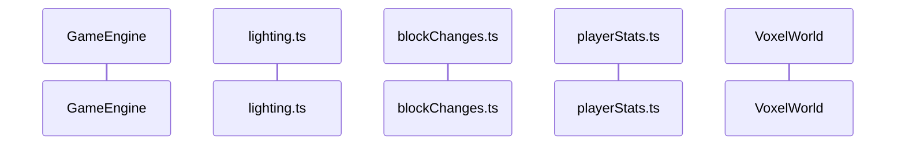

> DEVELOPER

what's next?

> AGENT

I'll start by understanding the current state and what's queued up next. Let me read the roadmap memory and explore the codebase.

> TOOL

tool_use Read
id: toolu_01MGQkHtjupN9bQHf2CVDWKC
```json
{
  "file_path": "/Users/hutusi/.claude/projects/-Users-hutusi-workspace-ai-david-monecraft/memory/roadmap-candidates.md"
}
```

> TOOL

tool_result
id: toolu_01MGQkHtjupN9bQHf2CVDWKC
```
1	---
2	name: roadmap-candidates
3	description: "Candidate next-feature directions for the voxel game — what's shipped vs still open (as of 2026-06-14)"
4	metadata: 
5	  node_type: memory
6	  type: project
7	  originSessionId: e2fc6b63-8357-4ed9-b4cc-94b55fc71192
8	---
9	
10	Highest-value next-feature directions for the voxel game, tracked across sessions. Shipped on `main` over time: authentic-Minecraft UI pass, juice & atmosphere (particles, night sky, weather), **chests & persistent storage** (v0.6.0), and **dungeons & loot** (v0.7.0, PR #17).
11	
12	**Endgame & ranged combat — SHIPPED & MERGED (2026-06-14), PR hutusi/monecraft#18, merge commit `ffcd962`.** Bows/arrows on a new transient projectile system (`lib/game/engine/projectiles.ts` + `systems/projectileAI.ts`, `fromPlayer` hit filter, swept-DDA + substepped anti-tunnel), ranged kiting skeletons, and a boss summoned from a craftable Cursed Totem (diamond-gated) → drops a Dragon Heart → crafts the best-in-game Dragon Sword, with a one-shot victory screen + boss health bar. New `"boss"` MobKind touches all 5 exhaustive `Record<MobKind>` tables. **No save/worldgen change** (transient entities, additive items). Under CHANGELOG `## [Unreleased]` only — **no version bump/tag** (user stopped cutting a release per feature). Post-merge fix: release pointer lock on the victory screen so its Continue button is clickable. CodeRabbit's one nitpick (add `"use client"` to BossHealthBar) was skipped — conflicts with the repo convention (only `ItemTooltip` declares it).
13	
14	**Upstream sync — DONE (2026-06-14), merged `davidhu0527/monecraft` main into the fork's `main` (merge commit `0ae44b5`).** Brought 4 upstream features the fork lacked: **throwable spears** (7 tiers; a SECOND transient projectile system, `ThrownSpearState`/`systems/spears.ts`, coexisting with arrows), **wood doors**, **water building + 60s immersion exposure damage**, and a **glass render fix**. Key conflict resolved: a `BlockId` enum collision — kept the fork's shipped dungeon blocks `MossyCobblestone=28`/`Spawner=29` and renumbered upstream's 16 door blocks to **30–45** (contiguous, same order so `doors.ts` offset math is unchanged), so **`SAVE_KEY` stayed `minecraft_save_v6`** and existing saves stay valid. `upstream` remote = `davidhu0527/monecraft`, `origin` = `hutusi/monecraft`.
15	
16	**`main` now bundles a large `[Unreleased]` block** (spears, doors, water, glass, endgame/ranged). A release (likely `0.8.0`) is a separate deliberate act later — package.json bump + roll `[Unreleased]` → `[0.8.0]` + tag — not done yet.
17	
18	## Sole remaining roadmap candidate
19	
20	- **Caves & lighting** ⭐ (next) — torches + a real per-voxel block-light propagation system (caves are currently lit like the surface; no darkness), plus lava + lava/drowning damage + an oxygen meter. Largest/riskiest direction: touches world storage (a per-voxel light channel) and the mesher hot path, and **forces a `SAVE_KEY` bump / world reset** (worldgen baseline + meshing change). Est. ~1,500–2,200 LoC, multi-week. Plan it in a **fresh session** (user will `/clear`) the proven way: parallel Explore agents → Plan agent → ExitPlanMode → bisectable commit slices → PR to `hutusi/main`.
21	
22	Other gaps still noted: no block light, oxygen, or fluid hazard beyond the new water-immersion timer. The game now has caves (unlit), ores, ~120 houses, 5 (cosmetic) biomes, water, 6 mobs + a boss, farming/breeding/cooking/beds, 7-tier gear + bow + spears, chests, dungeons, and doors. See [[review-fixes-no-push]] and [[no-pr-attribution]] for the user's workflow preferences.
23	
```

> TOOL

tool_use Read
id: toolu_01Rr9QaaXzmM1CPPKj8SnNkd
```json
{
  "file_path": "/Users/hutusi/workspace/ai/david/monecraft/CHANGELOG.md",
  "limit": 80
}
```

> TOOL

tool_result
id: toolu_01Rr9QaaXzmM1CPPKj8SnNkd
```
1	# Changelog
2	
3	All notable changes to this project are documented in this file.
4	
5	## [Unreleased]
6	
7	### Changed
8	
9	- Emergency unstuck now requires **`Shift` + `U`** instead of a bare `U`, so a stray keypress can no longer teleport the player mid-play. The automatic unstuck safeguard (which fires when wedged in terrain or falling below the world) is unchanged. No save-format or worldgen impact.
10	- Placed glass now renders as a clear, low-reflection transparent layer. Internal faces between adjacent glass blocks are culled, while neighboring opaque block faces remain visible through it. No save-format or worldgen impact.
11	
12	### Added
13	
14	- **Spears and non-stackable gear**: seven craftable spear tiers (wood, stone,
15	  sliver, ruby, sapphire, gold, diamond) have 7-block left-click melee reach and
16	  can be thrown with right-click/`E`. Throws use procedural projectile meshes,
17	  gravity, swept mob collision, terrain collision, a cooldown, tiered damage,
18	  and one durability per throw. Missed throws remain visibly embedded in terrain
19	  for two seconds, and the faster, flatter trajectory travels farther. All
20	  durable armor, tools, knives, swords, and spears now occupy one slot across
21	  drops, crafting, saves, and chests; legacy stacked durable gear is split
22	  during migration. No save-format or worldgen impact.
23	- **Wood doors**: craft one from 6 planks and place it on a solid floor to create a thin, two-block-tall panel. Right-click either half to open or close the whole door; open doors rotate onto their hinge edge, while closed doors block players and mobs. Door facing, open state, and both halves persist through the existing block-diff save, and breaking either half removes the whole door and returns one item. Only the player interaction path toggles doors; mobs stop at closed doors and cannot operate them. No save-format or worldgen impact.
24	- **Water building and exposure damage**: block placement may now replace water cells, so underwater structures can be built against submerged terrain. Remaining continuously immersed for more than 60 seconds starts dealing 3 HP (1.5 hearts) of armor-bypassing damage every second; leaving water fully resets both timers. Exposure is session-only and is not serialized. No save-format or worldgen impact.
25	- **Endgame & ranged combat**: the game gains its first ranged weapon, ranged enemies, and a true win condition — all on one new transient projectile system, with **no save-format or worldgen change** and **zero new assets** (procedural pixel sprites + synthesized sounds)
26	  - **Projectile system** (`lib/game/engine/projectiles.ts`, `engine/systems/projectileAI.ts`): arrows are session-only entities (like mobs, never serialized) that integrate under gravity and despawn on a hit, a TTL, or leaving the world. Block collision reuses the world DDA (`voxelRaycast`), which already sweeps the whole segment, so even a very fast arrow can't tunnel a 1-block wall; the entity test is substepped too so a fast arrow can't skip a thin mob between frames. A `fromPlayer` flag is the hit filter — player arrows hit mobs (with knockback), mob arrows hit the player (armor-mitigated) — so a mob's arrow can never hit the firer or another mob. `tickProjectiles` runs right after `tickMobs` in both the live and dead step branches
27	  - **Bow & arrows**: craft a **bow** (3 wood + 3 string) and **arrows** (1 stone + 1 wood + 1 feather → 4). Holding a bow makes the attack input fire instead of melee — **instant click-to-fire** (no draw-charge; holding left-click already means mine) at a fixed damage on a short cooldown, spending one arrow and a point of bow durability per shot. The swing animation still plays
28	  - **Ranged skeletons**: a `ranged` flag on the mob template makes skeletons **kite** — backing off inside a standoff band, holding in the middle, approaching only when far — and loose arrows from across their detect range (leading a moving target) instead of meleeing. Finally distinct from zombies, which stay melee
29	  - **Endgame boss & victory**: craft a **Cursed Totem** (1 diamond ore + 2 bone + 2 gold ore — the diamond grind's first real goal) and right-click to summon a towering boss nearby (refused if one already walks). It bears down on the player, bites for heavy damage up close, looses a 3-arrow spread at range, periodically conjures minions (capped, under the global hostile cap), and is immune to the daylight burn. Defeating it drops a **Dragon Heart** that crafts the best-in-game **Dragon Sword** (60 attack), fires a one-shot **victory screen**, and shows a top-center **boss health bar** while it lives
30	  - New `"boss"` `MobKind` touches all five exhaustive `Record<MobKind>` tables (templates, drops, ambience intervals, ambient + attack sounds). New events (`arrowHit`, `bowFired`, `bossSummoned`, `bossDefeated`, `summonFailed`) drive procedural impact sparks, a conjuring column, a victory burst, and synthesized bow-twang / arrow-tick / boss-roar / victory-fanfare sounds. In-flight arrows render as a pooled extruded-sprite mesh (one shared geometry/material) oriented along their velocity
31	  - **No version bump**: the boss, its minions, projectiles, and the victory flag are all transient; the new items (bow, arrow, Cursed Totem, Dragon Heart, Dragon Sword) are additive, saved by string id. New tunables live in the `config.ts` "Ranged combat & endgame" group
32	
33	## [0.7.0] - 2026-06-14
34	
35	### Added
36	
37	- **Dungeons & loot**: digging underground now turns up small cobblestone rooms (speckled with mossy cobble) sealed in the rock, well clear of spawn — the game's first real exploration payoff, and a found-loot purpose for chests. All procedural, **zero new assets**
38	  - Each dungeon holds 1–2 **pre-filled loot chests** and a central **mob spawner**. Loot is tiered (`lib/game/dungeonLoot.ts`): common chests carry food, low ores, and the occasional stone pickaxe (bone always drops, so a chest is never empty); a 25% rare roll adds the payoff — diamond/sapphire ore, a ruby/sapphire sword, helmet/chestplate, or a rare diamond pickaxe
39	  - **Spawners** drip a hostile (zombie/skeleton/spider) onto the room floor every ~8 s while you're within ~16 blocks, up to 6 clustered nearby (under the global hostile cap). They're time-independent (dungeons are dark); **mining the spawner block out** stops it for good (it's hard and drops nothing). New `mobSpawned` event drives a synthesized low whoosh and a dark conjuring smoke puff
40	  - New **MossyCobblestone** (mineable into a `mossy_cobble` item, found-only) and **Spawner** blocks, both with procedurally-painted atlas tiles
41	  - **The lazy-loot design** solves an infinite-loot trap: dungeon chests are placed by deterministic worldgen, so their contents can't live in the block-diff save. Filling them eagerly would let a player empty a chest, reload (the empty chest is dropped from the save), and find fresh loot. Instead the engine fills each chest lazily on **first open or break** — loot seeded from `world.seed ^ voxelIndex` so it's reproducible until you reach it — and records the index in a persisted `lootedChests` set. Gating on "has this been accessed", not "is it currently empty", closes the re-roll. The set of _which_ indices are dungeon chests/spawners is session-only, re-derived from the seed each load via `collectDungeonSites` (which replays the placement math against a dedicated seed-only PRNG and seed-pure terrain estimates, never `highestSolidY`, so it can't diverge from generation)
42	  - **Save format v5** (additive `lootedChests` field; `migrateSaveV4toV5` is a pure version bump) and **`SAVE_KEY` bumped `minecraft_save_v5` → `minecraft_save_v6`**: the dungeon worldgen changes the deterministic terrain baseline, so **existing saved worlds are discarded** (a deliberate, documented re-baseline — worldgen SHA-256 digests and the in-region meshing snapshot were re-rolled; the structural probes confirm the surface is untouched since dungeons are wholly underground)
43	
44	## [0.6.0] - 2026-06-13
45	
46	### Added
47	
48	- **Chests & persistent storage**: craft a chest (8 planks), place it, and right-click it to open a **27-slot** storage grid above your inventory — the long-standing "everything rides in 36 slots on your person" gap is closed
49	  - Introduces the game's first **block-entity** layer: a chest's contents live in `state.containers` (a `Map` keyed by the block's voxel index, the same space as the block diff). The right-click opens it via the existing interact precedence (after bed/furnace), and the same click-one-slot-then-another interaction now spans both grids through a new `moveStack` command (chest slots offset by `CONTAINER_SLOT_BASE`); pure cross-array `moveStack`/`tryInsertSlots` helpers join `lib/game/inventory.ts`
50	  - **Breaking a chest spills its contents** back into your inventory (tool/armor durability preserved) and returns the chest item; if there isn't room for everything the break is refused (a `breakBlocked` toast) so nothing is lost — consistent with the game's no-ground-item loot model
51	  - **Save format v4** (additive — `SAVE_KEY` unchanged, v1/v2/v3 saves still load): a new optional `blockEntities` field persists non-empty chests; `migrateSaveV3toV4` is a pure version bump and `readSave` chains v1→v2→v3→v4. **No worldgen impact** (chests are never generated). New `chest` block/item, an 8-planks recipe, a `CHEST_SLOTS` tunable, a generated chest atlas tile, and a synthesized open-creak sound
52	- **Juice & atmosphere pass**: the world now reacts and breathes, all via procedural rendering/audio (zero new assets) with **no save-format or worldgen impact**
53	  - **Particles**: a pure, unit-tested structure-of-arrays particle pool (`lib/game/render/particlePool.ts`) wrapped by a single `THREE.Points` draw call (`particleSystem.ts`) whose attributes refill each frame; a small shader draws each particle as a soft round sprite that fades over its life (no texture). The renderer gained `handleEvent(event, state)`, wired into the event drain beside `audio.handleEvent`: breaking a block throws shards tinted from `BLOCK_COLORS`, placing puffs, mob death bursts in the mob's body color, eating drops crumbs, and jumping/landing kick dust (landing scales with impact). Footstep dust spawns from a stride-distance accumulator. The three positioned events (`blockBroken`/`blockPlaced`/`mobDied`) gained additive `x,y,z` fields so bursts land correctly
54	  - **Night sky**: a deterministic 800-point star field that fades in at dusk, sprite discs for the moon and a now-visible sun riding opposite ends of the sun arc, and a drifting cloud sheet from a seamlessly tiling canvas-noise mask (`starField.ts`, `skyView.ts`). All camera-following and fog-exempt; opacities ramp off `daylight`
55	  - **Weather**: a pure, deterministic system (`engine/systems/weather.ts`) sets a **transient** `state.weather` (never serialized) — time splits into windows, a seeded hash decides precipitation, and biome picks snow (mountains) / clear (desert, ocean) / rain. It drives a camera-following precipitation field (`precipitation.ts`), an overcast sky tint + dimmed light + nearer fog in `syncDayNight`, and a synthesized looping rain bed on the audio graph (`rainLoop.ts`). Strictly cosmetic — spawn/daylight balance is untouched. New `WEATHER_CYCLE_SECONDS` / `WEATHER_RAIN_FRACTION` tunables
56	- **UI polish pass for a more authentic Minecraft look**: the interface now reads closer to real Minecraft across five fronts
57	  - **Pixel font**: UI text switches from the generic monospace stack to **Monocraft**, an open-source Minecraft-style face (SIL OFL 1.1) self-hosted via `next/font/local` from a committed woff2 in `app/fonts/` and exposed as the `--mc-font` CSS variable. Its coding ligatures are disabled so UI text stays literal. The monospace stack stays as the fallback and is pinned on the F3 debug readout, which relies on column alignment. This bundled font file is a deliberate, documented exception to the zero-binary-asset rule (the only one)
58	  - **Textured GUI chrome**: panels, inventory slots, recipe entries, and buttons gain a faint generated grain instead of flat fills. A new `grayGrainTileUrl` generator in `lib/ui/chromeTiles.ts` installs `--mc-tile-panel/well/button` as CSS variables (sunken bias on the slot well); the CSS layers each tile over the existing flat color, so bevels are untouched and SSR/pre-install falls back to the solid color
59	  - **Item tooltips**: hovering hotbar, inventory, and recipe entries now shows a cursor-following, near-black tooltip with a violet gradient border (new `useItemTooltip` hook in `components/game/ItemTooltip.tsx`) instead of the browser's native `title=`. Durable items show a gray "Durability x / y" line and locked recipes show "Requires <station>". The tooltip is `pointer-events:none` and `aria-hidden`, so it never blocks the pointer-lock click and accessible names (the `aria-label`s) are unchanged
60	  - **Depth**: a shared `.menu-backdrop` dims the frozen world behind the inventory and pause menu (the dimming moved off `.pause-overlay` so it no longer double-darkens), plus an always-on screen-edge `.vignette` over the 3D view (tunable via `--mc-vignette`)
61	  - **Motion**: a centered pop-in for the inventory panel, a fade-in for the pause overlay, quick hover/press feedback on slots and buttons, and a small rise on the hotbar item-name pop — all disabled under `prefers-reduced-motion`
62	  - No save-format or worldgen impact
63	- **Pickup & status toasts**: because mob loot drops straight into inventory storage (no ground item), kills could feel like they paid out nothing. A kill now shows a brief on-screen toast just above the hotbar (e.g. "+2 Wool, +1 Raw Mutton"). The same in-game toast also surfaces the sleep-denied messages ("You can only sleep at night" / "Monsters are nearby"), which previously only rendered inside the pause menu and so were invisible during play
64	- **Animal breeding**: right-click a sheep or horse with wheat (or a chicken with seeds) to put it "in love"; two in-love adults of the same kind standing close together spawn a baby that follows the parents, can't be farmed for drops, and grows to full size after ~90 seconds. This makes mob drops renewable, closing the loop back to combat loot. The passive population is capped (24) and feeding costs crops, so it stays bounded
65	  - New `MobState.fedTimer`/`ageTimer`, a `breeding` system ticked after mob AI, and a shared `findAimedMobIndex` so feeding and attacking use the same "what's in my crosshair" rule. Feeding joins the right-click precedence ahead of block interaction. New fed/bred sounds; babies render at 55% scale. Breeding state is session-only (mobs are never saved). No save-format or worldgen impact
66	- **Furnace & cooking**: craft a furnace (8 cobble) and right-click it to open the crafting panel in furnace mode, which unlocks smelting recipes — raw chicken or mutton + 1 planks (the fuel) cook into the cooked version, restoring 8 hunger versus 3 raw. Smelting recipes show as locked ("Requires Furnace") until a furnace is open
67	  - Reuses the Phase 2 interact system and the existing crafting panel — no separate furnace UI. Recipes gained an optional `station` field; the gate is enforced engine-side in the `craft` command (UI gating alone is spoofable). New `Furnace` block with a glowing-mouth atlas tile, `cooked_chicken`/`cooked_mutton` items, and a smelt sound. No save-format or worldgen impact
68	- **Farming & food**: craft a wood hoe (2 planks + 1 wood), right-click grass or dirt to till it into farmland, then right-click farmland with seeds to plant wheat. Crops grow through four stages over ~2.5 minutes and, when mature, harvest into wheat plus 1–2 seeds; an immature crop just returns its seed. Craft 3 wheat into bread (restores 6 hunger)
69	  - Seeds come from breaking grass (20% chance per block) — `addBlockDrop` now rolls a per-block `rollBlockDrops` table (`lib/game/items.ts`) instead of a single fixed drop
70	  - New **random-tick system** (`lib/game/engine/systems/randomTicks.ts`): each interval samples columns near the player and runs per-block handlers — the extensible basis for crop growth (and future saplings / grass spread). Crops are solid full-cube blocks (so they can be targeted and harvested) with each growth stage its own `BlockId`, which means they persist through the existing block-diff save with **no save-format change**
71	  - New `Farmland` + `WheatStage0..3` blocks, `wood_hoe`/`seeds`/`wheat`/`bread` items with generated sprites, and till/plant sounds. The right-click "use held item" step joins the interact precedence (after block interaction, before placement). No worldgen changes
72	- **Beds & sleeping**: craft a bed (3 wool + 3 planks), place it, and right-click it at night to skip to morning — the screen fades to black, the day clock jumps to a fresh dawn, and the bed becomes your respawn point (respawn falls back to a random land point if the bed is gone). Sleeping is refused during the day or with a hostile within 12 blocks, with an on-screen reason
73	  - New **right-click interact system** (`lib/game/engine/systems/interact.ts`): a fixed precedence in the `placeBlock` command runs block interaction before placement, so interactive blocks (beds now; furnaces later) take the click instead of getting a block placed on them. New `Bed` block + `bed` item, synthesized sleep/wake sounds, and a `SleepOverlay` fade component
74	  - **Save format v3** (additive — `SAVE_KEY` unchanged, v1/v2 saves still load): time of day (`dayClock`), `hearts`, `hunger`, and the bed `spawnPoint` now persist. Previously all four reset on reload, so sleeping through the night wouldn't have survived a reload. `readSave` chains the migrations v1 → v2 → v3
75	- **Mob loot & drops**: mobs now drop kind-specific items when they die instead of the old flat "cobble for hostiles, food for everything else" rule. Sheep drop wool + raw mutton, chickens feather + raw chicken, horses leather, zombies rotten flesh, skeletons bone, spiders string — counts are randomized per the engine's RNG (`lib/game/mobLoot.ts`). A new `mobDied` engine event plays a synthesized death thud
76	  - New items: `wool`, `feather`, `bone`, `leather`, `string` (crafting materials) and `rotten_flesh`, `raw_chicken`, `raw_mutton` (edible food), each with a generated 16×16 sprite (zero-asset)
77	  - **Per-food hunger**: food now restores a value carried on the item itself rather than one global constant. The generic `food` item still restores 7; raw meats restore 3, rotten flesh 2. New `food` and `material` item kinds; the legacy `food` item is reinterpreted (old saves load unchanged — saves store only item id + count)
78	  - New recipe: 4 string → 1 wool, so spider drops feed the wool supply (and, later, beds)
79	  - No save-format or worldgen impact
80	  - Selection recolors the body live (material color swap, no rebuild) and persists as a player preference under its own localStorage key (`minecraft_skin_v1`), separate from the world save — it survives world resets. No save-format or worldgen impact
```

> AGENT

The memory is clear: **Caves & lighting** is the sole remaining roadmap candidate, explicitly slated for a fresh session like this one. Let me explore the codebase architecture to ground a real plan — world storage (for a per-voxel light channel), the mesher hot path, save format, and the patterns for adding blocks/items/config.

> TOOL

tool_use Agent
id: toolu_01J9pbfwprMGcnG4u48rdDhh
```json
{
  "description": "Explore world storage and mesher",
  "subagent_type": "Explore",
  "prompt": "I'm planning a \"caves & lighting\" feature for this voxel game (Monecraft, a Minecraft-inspired Three.js/Next.js voxel game). I need to understand the world voxel storage and the mesher hot path so I can design a per-voxel block-light propagation system.\n\nPlease explore and report on (be thorough, this is medium-breadth exploration):\n\n1. **World/chunk voxel storage**: How are voxels stored in memory? Look in `lib/game/` (likely `world.ts`, `engine/`, anything chunk-related). What is the data structure — flat typed arrays per chunk? A Map? How is a block looked up by (x,y,z)? Is there already any per-voxel metadata channel beyond block id (e.g. a second array)? What are chunk dimensions/world height?\n\n2. **The mesher**: Find the greedy/naive mesher that turns voxels into Three.js geometry. Where is it (likely `lib/game/render/` or a mesher file)? How does it decide face colors/shading? Is there any existing per-face shading or ambient occlusion? How would per-voxel light values get plugged into vertex colors or a light attribute? Is meshing done on the main thread or a worker?\n\n3. **Block definitions**: Where are BlockId enums and block properties (e.g. `BLOCK_COLORS`, transparency, solidity)? How is \"is this block transparent/opaque\" determined for face culling — I'll need that for light propagation (light passes through air/glass/water but not stone).\n\n4. **The step/tick order**: Find where the engine step loop lives and the order systems run (the architecture doc mentions a step order). Where would a lighting-update system slot in?\n\nReport concrete file paths and line numbers, the key data structures (with the actual type/shape), and any existing patterns I should reuse. Quote the relevant code snippets. Do NOT propose a design — just map what exists."
}
```

> TOOL

tool_use Agent
id: toolu_0188mMeECrC17vtGza87ocag
```json
{
  "description": "Explore save format and worldgen",
  "subagent_type": "Explore",
  "prompt": "I'm planning a \"caves & lighting\" feature for this voxel game (Monecraft, a Minecraft-inspired Three.js/Next.js voxel game). The feature will force a SAVE_KEY bump and a worldgen re-baseline. I need to understand the save format and worldgen so I can plan that correctly.\n\nPlease explore and report on (be thorough, medium-breadth):\n\n1. **Save format**: Find the save/load code (likely `lib/game/save.ts` or similar). What is the current `SAVE_KEY` constant value and where is it defined? What is the save schema/version (the memory says save format v5, SAVE_KEY `minecraft_save_v6`)? How do migrations work (`migrateSaveVNtoVM` functions, `readSave` chaining)? What fields are persisted? How is the block diff stored?\n\n2. **Worldgen**: Find the terrain/world generation code. How is terrain generated deterministically from a seed? Where are caves generated (the memory says caves exist but are unlit)? How would adding a light channel or changing meshing force a worldgen \"re-baseline\"? \n\n3. **Worldgen test hashes**: The docs mention \"worldgen hash re-baseline policy\" and SHA-256 digests in tests. Find these tests (likely in a test file). How are the worldgen hashes computed and asserted? What needs re-rolling when worldgen changes? Look in `docs/testing.md` and the relevant test files.\n\n4. **Config tunables**: Find `config.ts` (or wherever gameplay tunables live). How is it structured (grouped by effect)? Show me an example group so I understand the pattern for adding lighting/lava/oxygen tunables.\n\nReport concrete file paths, line numbers, the SAVE_KEY value, the migration chain pattern, and quote relevant snippets. Do NOT propose a design — just map what exists."
}
```

> TOOL

tool_use Agent
id: toolu_015Hpbs67Lk1vgkhNmgo7WyJ
```json
{
  "description": "Explore content-adding patterns",
  "subagent_type": "Explore",
  "prompt": "I'm planning a \"caves & lighting\" feature for this voxel game (Monecraft, a Minecraft-inspired Three.js/Next.js voxel game). The feature adds: torches (a placeable light-emitting block/item), lava (a new fluid block with damage), a lava/drowning damage system, and an oxygen meter UI. I need to understand the existing patterns for adding this content so my plan reuses them.\n\nPlease explore and report on (be thorough, medium-breadth):\n\n1. **Adding a block + item + recipe**: Read `docs/adding-content.md` and summarize the step-by-step. Then find the actual code: where are BlockId enums, item definitions, recipes, and the procedural atlas/texture generation (the project generates ALL textures from pixel code — zero binary assets). How is a new block's texture painted? Show the pattern with a concrete recent example (e.g. the Spawner or Chest block).\n\n2. **Water as a reference for lava**: The game already has water (with building + 60s immersion exposure damage per the changelog). Find the water block, how it renders (transparency), and especially the **water-immersion exposure damage** system — that's the closest existing pattern for lava damage and an oxygen meter. Where is the immersion timer / exposure damage code? How does it detect the player is in water? Quote it.\n\n3. **Player damage & HUD**: How is player damage applied (hearts)? Find the damage path. For the oxygen meter UI: where are the HUD components (hearts bar, hunger bar, hotbar)? Likely `components/game/`. What's the pattern for a new HUD bar/meter? Show the hearts or hunger bar component.\n\n4. **Health/status state**: Where does player health/hunger/status state live in the engine state, and how is it ticked? Where would an oxygen value slot in?\n\nReport concrete file paths, line numbers, and quote relevant snippets (the water immersion damage code especially). Do NOT propose a design — just map what exists."
}
```

> TOOL

tool_result
id: toolu_0188mMeECrC17vtGza87ocag
```
Perfect. Now I have everything I need. Let me compile a thorough report:

## Comprehensive Monecraft Save Format & Worldgen Report

---

### 1. SAVE FORMAT

**Location:** `/Users/hutusi/workspace/ai/david/monecraft/lib/game/save.ts`

**SAVE_KEY constant** (line 149 in `config.ts`):
```typescript
export const SAVE_KEY = "minecraft_save_v6";
```

**Current save format:** Version 5 (defined in `lib/game/types.ts`, lines 106–118)

**SaveData schema (v5):**
```typescript
type SaveData = {
  version: 5;
  seed: number;
  changes: Array<[number, number]>;              // [voxelIndex, blockId] pairs
  inventorySlots?: SavedSlot[];                  // 36 slots; first 9 are hotbar
  equippedArmor?: Partial<EquippedArmor>;
  selectedSlot?: number;                         // 0–8
  player: { x: number; y: number; z: number };
  dayClock?: number;                             // optional: time of day
  hearts?: number;                               // optional: player health
  hunger?: number;                               // optional: saturation
  spawnPoint?: { x: number; y: number; z: number } | null;  // bed respawn
  blockEntities?: SavedContainer[];              // chest contents by voxel index
  lootedChests?: number[];                       // dungeon chest indices accessed
};
```

**Block diff storage** (`blockChanges.ts`, lines 8–49):
- Stored as `[voxelIndex, blockId]` pairs in `changes` array
- A `BlockChangeTracker` maintains a `Map<voxelIndex, blockId>` of edits
- Edits that revert to the generated baseline are **pruned out** (line 28: `changedBlocks.delete(idx)`)
- Voxel index formula (critical invariant): `index(x, y, z) = x + z * sizeX + y * sizeX * sizeZ` (`voxelWorld.ts:28`)

**Migration chain** (save.ts, lines 75–90):
```typescript
readSave() chains: v1 → v2 → v3 → v4 → v5
├─ migrateSaveV1toV2: packs slots, merges stackables, clamps hotbar 10→9
├─ migrateSaveV2toV3: pure version bump (dayClock, hearts, hunger, spawnPoint optional)
├─ migrateSaveV3toV4: pure version bump (blockEntities optional)
└─ migrateSaveV4toV5: pure version bump (lootedChests optional)
```

**Save-format version history:**
- **v5 (current)**: Adds optional `lootedChests` (accessed dungeon chest indices). Migration is a pure version bump, but **`SAVE_KEY` bumped v5 → v6** because dungeon worldgen changed the terrain baseline, invalidating old block-diffs.
- **v4**: Adds optional `blockEntities` (chest contents). Pure version bump, `SAVE_KEY` unchanged.
- **v3**: Adds optional time/stats/spawn. Pure version bump, `SAVE_KEY` unchanged.
- **v2**: 36-slot inventory, 9-slot hotbar.
- **v1**: Legacy 40-slot, 10-slot hotbar (still accepted via migration).

---

### 2. WORLDGEN

**Location:** `/Users/hutusi/workspace/ai/david/monecraft/lib/world/generation.ts`

**Generation pipeline** (lines 64–84):
```typescript
generateWorld(world) {
  1. generateTerrain()     // biome-based heightmap
  2. carveCaves()          // 230 caves + 150 chambers
  3. placeWater()          // fill below sea level
  4. placeBeaches()        // sand shorelines
  5. placeOres()           // 5 ore types by depth tier
  6. placeTrees()          // biome-gated spawning
  7. placeCacti()          // desert-only
  8. placeStructures()     // 120 houses
  9. placeDungeons()       // 28 rooms with chests/spawners
}
```

**Determinism:** Terrain is seeded purely from `world.seed` (line 66). Order, PRNG, noise functions, and all `GEN` constants are **part of the save format** (module header, lines 4–11).

**Cave generation** (lines 141–189):
- **230 main caves**: Carve spheres along randomized 3D paths (line 164–181)
  - Start position: `(12…sizeX-24, 3…sizeY-9, 12…sizeZ-24)`
  - Radius: `1.9 + rand() * 2.6` per sphere, occasionally burst to `4.8 + rand() * 4.6`
  - Direction: yaw/pitch walk through 3D space
- **150 chamber rooms**: Larger standalone spheres (line 184–189), radius `5.4 + rand() * 6.4`
- **Caves are unlit** — no light channel exists in worldgen; lighting is purely runtime

**GEN constants** (lines 18–47) — all frozen, part of the save contract:
```typescript
seaLevel: 43
borderWallHeight: 14
biomes: {
  Plains:    { baseHeight: 47,  noiseScale:  2.0, treeChance: 0.18 }
  Desert:    { baseHeight: 46,  noiseScale:  3.5, treeChance: 0.01 }
  Ocean:     { baseHeight: 30,  noiseScale:  2.5, treeChance: 0    }
  Forest:    { baseHeight: 50,  noiseScale:  4.0, treeChance: 0.6  }
  Mountains: { baseHeight: 55,  noiseScale: 18.0, treeChance: 0.05 }
}
mountainStoneAboveY: 65
snowAboveY: 68
beachMaxAboveSea: 1
beachDepthBelowSea: 2
caveCount: 230
caveChamberCount: 150
treeAttempts: 9000
cactusChance: 0.012
houseCount: 120
dungeonCount: 28
oreConfigs: [
  { id: SliverOre,   attempts: 120000, minY: 3,  maxYOffset: 10 },
  { id: RubyOre,     attempts:  52000, minY: 2,  maxYOffset: 16 },
  { id: GoldOre,     attempts:  36000, minY: 2,  maxYOffset: 22 },
  { id: SapphireOre, attempts:  28000, minY: 2,  maxYOffset: 28 },
  { id: DiamondOre,  attempts:  18000, minY: 2,  maxYOffset: 36 }
]
```

**Meshing & light channel impact:**
- Meshing lives in `lib/world/meshing.ts` (lines 98–forward)
- Faces are culled (solid → solid = no face; solid → air = render; water → air = render)
- Per-face ambient occlusion is baked into vertex colors
- **No runtime light channel exists** — caves are dark because no lighting is rendered, not because of a persisted lighting layer

**Adding lighting forces worldgen re-baseline because:**
1. Light propagation from sky/torches/lava requires a pre-computed per-block light level (like Minecraft's 4-bit light arrays)
2. This light level must be **deterministically derived from seed** (to survive saves), or stored per-block (bloating the save)
3. If light is derived, the generation order and light algorithm become **part of the save contract** → changes break old saves
4. Meshing would need to sample this light channel → geometry bytes change → hash test fails

---

### 3. WORLDGEN TEST HASHES

**Location:** `/Users/hutusi/workspace/ai/david/monecraft/lib/world/generation.test.ts`

**Hash tests** (lines 34–49):
```typescript
test.each([
  [1337, "8621d825353b26bb455811a79c49a662b26263a04dc88bab2c23521cf72716da"],
  [1,    "04b9288619397c4beba76ae2037b11b2b73394df1f20ee125cdbe0ac82f4a5e8"],
  [999999937, "6cc58e8a8cfb6978937da3b181e3d1f00b94245b7a8025947a0c4ca10879d065"]
])("128x150x128 world for seed %d is byte-identical", (seed, expected) => {
  expect(hashBytes(makeWorld(128, 150, 128, seed).blocks)).toBe(expected);
});
```

**Full-size test** (line 44–49):
```typescript
"512x150x512 world for seed 1337 is byte-identical (the real save-compat surface)"
→ "0f6b871af063a53744f4e3bb561f6ece8183374b8347e88f1a71184679503ce9"
```

**Hash computation** (line 18–20):
```typescript
function hashBytes(bytes: Uint8Array): string {
  return new Bun.CryptoHasher("sha256").update(bytes).digest("hex");
}
// Hashes the entire world.blocks (Uint8Array)
```

**Meshing hash test** (lines 196–207):
```typescript
test("geometry for a generated region is byte-identical")
→ position attribute count: 1357176 vertices
→ hash: "aee5f8b3be9fe85fe0e3598a4c215bc78d2b51fd58b921e335d65476c835275e"
```

**Structural probes** (lines 53–79) — survive re-baselines:
- Bedrock floor, border walls, specific biome presence, terrain heights, snow caps, water fill
- Probes confirm _shape_ rather than exact bytes → allow legitimate re-baselines when localized (e.g., dungeons underground only)

**Re-baseline policy** (`docs/testing.md:49–62`):
> Legitimate re-baseline cases:
> 1. **Deliberate worldgen change** — flag in PR + CHANGELOG, bump `SAVE_KEY`
> 2. **Bun version bump** — `Math.sin` is engine-defined; pin both in CI

**0.7.0 dungeon re-baseline example:**
- Four worldgen digests (128×150×128 seeds, 512×150×512 full-size) were re-rolled
- In-region meshing snapshot was re-rolled
- Structural probes left unchanged on purpose (dungeons underground, surface unchanged)
- `SAVE_KEY` bumped v5 → v6

---

### 4. CONFIG STRUCTURE

**Location:** `/Users/hutusi/workspace/ai/david/monecraft/lib/game/config.ts`

**Structure:** Flat constants grouped by system/effect (not by class). Documentation lives in `docs/tuning.md`.

**Example groups:**

**Player feel — physics:**
```typescript
export const PLAYER_HEIGHT = 1.8;
export const PLAYER_HALF_WIDTH = 0.3;
export const EYE_HEIGHT = 1.62;
export const GRAVITY = 26;
export const JUMP_VELOCITY = 8.2;
export const WALK_SPEED = 4.8;
export const SPRINT_SPEED = 12.8;
export const CROUCH_SPEED = 2.1;
export const WORLD_BORDER_PADDING = 1.2;
```

**Survival pressure — difficulty dial:**
```typescript
export const MAX_HEARTS = 20;
export const MAX_HUNGER = 20;
export const RESPAWN_SECONDS = 3;
export const HEALTH_REGEN_INTERVAL_SECONDS = 3;
export const WATER_DAMAGE_DELAY_SECONDS = 60;
export const WATER_DAMAGE_INTERVAL_SECONDS = 1;
export const WATER_DAMAGE_HP = 3;  // 1.5 hearts
export const REGEN_MIN_HUNGER = 12;
export const SPRINT_MIN_HUNGER = 6;
export const SPRINT_BLOCKS_PER_HUNGER = 100;
export const WALK_BLOCKS_PER_HUNGER = 300;
export const JUMPS_PER_HUNGER = 50;
```

**Danger — day-night & mob spawning:**
```typescript
export const DAY_CYCLE_SECONDS = 240;
export const HOSTILE_SPAWN_BELOW_DAYLIGHT = 0.28;
export const SPIDER_AGGRO_BELOW_DAYLIGHT = 0.42;
export const HOSTILE_BURN_ABOVE_DAYLIGHT = 0.72;
export const HOSTILE_SPAWN_INTERVAL_SECONDS = 10;
export const HOSTILE_CAP = 16;
export const SPAWNER_INTERVAL_SECONDS = 8;       // dungeons only
export const SPAWNER_ACTIVATION_RADIUS = 16;
export const SPAWNER_LOCAL_CAP = 6;
```

**Persistence & rendering:**
```typescript
export const STUCK_RESET_SECONDS = 0.8;
export const AUTOSAVE_INTERVAL_MS = 15000;
export const SAVE_KEY = "minecraft_save_v6";
export const RENDER_RADIUS = 90;
export const RENDER_GRID = 20;
export const THIRD_PERSON_DISTANCE = 4;
export const THIRD_PERSON_MARGIN = 0.2;
```

**Pattern for new tunables:**
- Each constant gets a **one-line inline comment** explaining its purpose
- Group by **which system reads it** (documented in `docs/tuning.md`)
- Flag **save-sensitive** changes (e.g., inventory layout, `SAVE_KEY`, worldgen constants)
- Item/block-level stats go in `items.ts`, not `config.ts`
- Worldgen constants live in the frozen `GEN` object in `generation.ts`

**For lighting/lava/oxygen tunables** (when adding caves feature):
```typescript
// Lighting & cave visibility (if light level per-block)
export const LIGHT_PROPAGATION_SPEED = ???;      // runtime light spread
export const TORCH_LIGHT_RADIUS = ???;
export const LAVA_LIGHT_LEVEL = ???;

// (OR, if using a baked light layer in worldgen)
// Constants would live in GEN in generation.ts, not here
```

---

### Key Takeaways for "Caves & Lighting" Planning

1. **SAVE_KEY bump is unavoidable** — any light layer (whether baked in worldgen or stored per-block) changes what's persisted or how geometry is computed, forcing a re-baseline.

2. **Worldgen hash tests will fail** — all four digests in `generation.test.ts` (128×150×128 for three seeds, 512×150×512 full-size) will fail if light changes mesh output or baseline block data.

3. **Block diff corruption risk** — caves exist (230 main + 150 chambers) but are unlit. Adding lighting that changes cave block placement or mesh culling will silently corrupt old saves unless you **bump both `SAVE_KEY` and `version`** with proper migrations.

4. **Structural probes may survive** — if your lighting is purely runtime (sampling a pre-computed per-block array, not changing block placement), the surface/biome/height probes in `generation.test.ts:53–79` could stay unchanged, making re-baseline more surgical.

5. **Migration pattern** — would follow v5 → v6 (pure version bump, light layer optional on old saves) but requires `SAVE_KEY` bump regardless.
```

> TOOL

tool_result
id: toolu_01J9pbfwprMGcnG4u48rdDhh
```
Perfect. Now I have a comprehensive understanding. Let me compile my final report:

## Exploration Report: Voxel Storage, Mesher, and Lighting Infrastructure

### 1. WORLD/CHUNK VOXEL STORAGE

**File:** `/Users/hutusi/workspace/ai/david/monecraft/lib/world/voxelWorld.ts`

**Storage Model:**
- Single flat `Uint8Array` (one voxel per byte). **No chunking** — the entire world is stored in a single monolithic array.
- **Dimensions:** 512×150×512 (X×Y×Z), defined in `/Users/hutusi/workspace/ai/david/monecraft/lib/world/blocks.ts` lines 1-3:
  - `WORLD_SIZE_X = 512`
  - `WORLD_SIZE_Y = 150`
  - `WORLD_SIZE_Z = 512`
- **Total voxels:** ~39 million (512 × 512 × 150)
- **Data structure:** `Uint8Array` at `voxelWorld.blocks`, initialized in constructor line 24

**Index Calculation** (lines 27-29):
```typescript
index(x: number, y: number, z: number): number {
  return x + z * this.sizeX + y * this.sizeX * this.sizeZ;
}
```
This is a memory-linear layout: X varies fastest, then Z, then Y (or: `index = x + (z * sizeX) + (y * sizeX * sizeZ)`).

**Lookup Pattern** (lines 35-43):
- `.get(x, y, z)` — returns the `BlockId` from the flat array. Returns `BlockId.Air` for out-of-bounds.
- `.set(x, y, z, block)` — writes a block. The engine's `blockChanges` tracker wraps this to track deltas against the worldgen baseline for saves.

**Per-Voxel Metadata:** Currently **none** beyond the block ID. The `BlockId` enum (lines 5-56) has 46 values (0-45), leaving 209 unused ID slots in the `Uint8Array` range. There is no separate metadata channel yet.

**Transparency/Solidity Logic** (lines 45-48):
```typescript
isSolid(x: number, y: number, z: number): boolean {
  const block = this.get(x, y, z);
  return block !== BlockId.Air && block !== BlockId.Water;
}
```
Water and Air are the only non-solid blocks. All other blocks (including Glass) are treated as solid for collision purposes. **Face visibility** is determined at mesh-build time, not storage time (see meshing section below).

---

### 2. THE MESHER (GREEDY/NAIVE)

**File:** `/Users/hutusi/workspace/ai/david/monecraft/lib/world/meshing.ts`

**Architecture:**
- **Naive face-culling mesher** (not greedy): iterates every voxel in the region, checks each of 6 faces for visibility, and pushes triangles if visible.
- **No worker:** meshing runs on the main thread synchronously.
- **Called from:** `GameRenderer.rebuildWorldMesh()` (line 430 of GameRenderer.ts) via `buildGeometryLayersRegion(world, regionX - RENDER_RADIUS, regionX + RENDER_RADIUS, regionZ - RENDER_RADIUS, regionZ + RENDER_RADIUS)`.

**Key Functions:**

1. **`buildGeometryLayersRegion()` (lines 114-125)** — splits opaque terrain from glass for separate blending:
   ```typescript
   export function buildGeometryLayersRegion(
     world: VoxelWorld,
     minX: number, maxX: number, minZ: number, maxZ: number,
     minY = 0, maxY = world.sizeY - 1
   ): GeometryLayers {
     const buffers = buildGeometryBuffers(world, minX, maxX, minZ, maxZ, minY, maxY, true);
     return { opaque: buffers.opaque, glass: buffers.glass };
   }
   ```

2. **Face Culling Logic (lines 237-241):**
   ```typescript
   const neighbor = world.get(x + nx, y + ny, z + nz);
   if (block === BlockId.Water || block === BlockId.Glass) {
     if (neighbor === block) continue;  // Same block type: cull internal faces
   } else if (neighbor !== BlockId.Glass && !isDoorBlock(neighbor) && world.isSolid(x + nx, y + ny, z + nz)) {
     continue;  // Opaque block → solid neighbor: cull
   }
   ```
   - **Glass-to-glass** and **water-to-water** faces are culled (no internal faces).
   - **Opaque blocks** adjacent to solid neighbors are culled (except when the neighbor is glass).
   - **Water is replaceable:** water is NOT treated as blocking for opaque face culling (only air stops a face).
   - **Glass keeps adjacent opaque faces visible** for see-through effect.

**Color/Shading Pipeline:**

- **Material tint by face direction** (lines 164-167):
  ```typescript
  const materialTint = (ny: number): [number, number, number] => {
    const shade = ny > 0 ? 1 : ny < 0 ? 0.95 : 0.9;
    return [shade, shade, shade];  // Top: 1.0, Bottom: 0.95, Sides: 0.9
  };
  ```

- **Ambient occlusion** (lines 183-201): `faceOcclusion()` counts solid neighbors and darkens:
  ```typescript
  const faceOcclusion = (x: number, y: number, z: number, nx: number, ny: number, nz: number): number => {
    const ax = nz, ay = 0, az = -nx;      // Tangent axis
    const bx = 0, by = 1, bz = 0;         // Up axis
    const sx = x + nx, sy = y + ny, sz = z + nz; // Surface position
    let occ = 0;
    if (world.isSolid(sx + ax, sy + ay, sz + az)) occ += 1;
    if (world.isSolid(sx - ax, sy - ay, sz - az)) occ += 1;
    if (world.isSolid(sx + bx, sy + by, sz + bz)) occ += 1;
    if (world.isSolid(sx - bx, sy - by, sz - bz)) occ += 1;
    return Math.max(0.8, 1 - occ * 0.06);  // Up to 6% per neighbor, floor at 0.8
  };
  ```
  Each solid neighbor → −6% brightness. **Max occlusion = 0.8 (4 neighbors).**

- **Final vertex color** (lines 243-245):
  ```typescript
  const base = materialTint(ny);
  const ao = faceOcclusion(x, y, z, nx, ny, nz);
  const color: [number, number, number] = [base[0] * ao, base[1] * ao, base[2] * ao];
  ```

**Geometry Buffer Attributes** (lines 85-88, `createGeometry()`):
```typescript
geometry.setAttribute("position", new THREE.Float32BufferAttribute(buffers.positions, 3));
geometry.setAttribute("normal", new THREE.Float32BufferAttribute(buffers.normals, 3));
geometry.setAttribute("color", new THREE.Float32BufferAttribute(buffers.colors, 3));
geometry.setAttribute("uv", new THREE.Float32BufferAttribute(buffers.uvs, 2));
```

**Currently stored per vertex:**
- `position` (3 floats)
- `normal` (3 floats) — face normal
- `color` (3 floats) — RGB (currently: materialTint × AO)
- `uv` (2 floats) — atlas texture coordinates

**No existing per-voxel light attribute.** The `color` attribute is per-vertex and baked at mesh time. To add per-voxel block-light, you would either:
1. Add a new float32 attribute (e.g., `lightLevel`) and write it alongside `color` in `pushVertex()`.
2. Or encode light in the existing `color` channels (less ideal, loses color info).

---

### 3. BLOCK DEFINITIONS & TRANSPARENCY

**File:** `/Users/hutusi/workspace/ai/david/monecraft/lib/world/blocks.ts`

**BlockId Enum** (lines 5-56):
```typescript
export const enum BlockId {
  Air = 0,
  Grass = 1, Dirt = 2, Stone = 3, Wood = 4, Leaves = 5, Bedrock = 6,
  Planks = 7, Cobblestone = 8, Sand = 9, Brick = 10,
  Glass = 11,
  SliverOre = 12, RubyOre = 13, GoldOre = 14, SapphireOre = 15, DiamondOre = 16,
  Water = 17,
  Snow = 18, Cactus = 19, Bed = 20, Farmland = 21,
  WheatStage0 = 22, WheatStage1 = 23, WheatStage2 = 24, WheatStage3 = 25,
  Furnace = 26, Chest = 27,
  MossyCobblestone = 28, Spawner = 29,
  DoorNorthLower = 30, DoorNorthUpper = 31, /* ... 16 door variants ... */ DoorWestOpenUpper = 45
}
```

**Transparency/Opacity Decisions:**
- **Transparent (see-through, internal faces culled):** `Glass` (line 11), `Water` (line 17)
- **Opaque:** Everything else
- **Special:** Doors are thin planes with their own collision bounds, but use solid-block face culling (they don't cull neighbors).

**Block Color Palette** (lines 96-144, `BLOCK_COLORS`):
```typescript
export const BLOCK_COLORS: Record<number, [number, number, number]> = {
  [BlockId.Grass]: [0.35, 0.68, 0.22],
  [BlockId.Dirt]: [0.46, 0.33, 0.2],
  [BlockId.Stone]: [0.54, 0.56, 0.58],
  /* ... etc ... */
  [BlockId.Glass]: [0.73, 0.9, 0.95],  // Cyan tint
  [BlockId.Water]: [0.26, 0.45, 0.78],  // Blue
};
```
Used by the atlas generator, not directly by the mesher (which bakes AO into vertex colors).

**No per-block light emission or light-opacity data yet.** You would need to add two new properties:
- **Light opacity:** how much light passes through (0 = opaque, 1 = transparent).
- **Light emission:** does the block emit light and at what level (0 for most, 15 for torches/lava, etc.).

---

### 4. ENGINE STEP ORDER & LIGHTING INSERTION POINT

**File:** `/Users/hutusi/workspace/ai/david/monecraft/lib/game/engine/GameEngine.ts`, lines 184-241

**Step Function Flow:**
```typescript
step(dt: number, input: FrameInput): void {
  // Early exits: paused, dead, sleeping
  
  // 1. Stuck detection
  // 2. Movement & physics
  // 3. Hunger/health/water damage
  // 4. Mining (block breaks/places here, sets worldMeshDirty)
  // 5. Spears
  // 6. Day-night clock
  // 7. Weather (transient, cosmetic)
  // 8. Random blocks (crop growth, extension point)
  // 9. Hostile spawning
  // 10. Spawner ticking
  // 11. Mob AI
  // 12. Projectiles
  // 13. Breeding
  // 14. Debug info
  
  refreshSnapshot();
}
```

**Lighting system insertion point:** Would slot after mining (#4) or after random ticks (#8), **before or alongside the mesh rebuild trigger**. The key is that:
1. When `state.worldMeshDirty = true` is set (mining, block placement, respawn at lines 530, 547), the renderer clears the flag and rebuilds the mesh in `rebuildWorldMesh()` (GameRenderer.ts line 426).
2. A block-light propagation system would:
   - Recompute light values for affected voxels (e.g., a 32-block radius around placed/broken blocks).
   - Mark the region as needing a mesh rebuild.
   - **Feed the light values to the mesher** on the next rebuild.

---

### 5. RENDERING & MESH REBUILD TRIGGER

**File:** `/Users/hutusi/workspace/ai/david/monecraft/lib/game/render/GameRenderer.ts`, lines 417-439

**Mesh Rebuild Logic:**
```typescript
private syncWorldMesh(state: GameState): void {
  const regionX = Math.floor(state.player.position.x / RENDER_GRID) * RENDER_GRID;
  const regionZ = Math.floor(state.player.position.z / RENDER_GRID) * RENDER_GRID;
  if (!state.worldMeshDirty && regionX === this.currentRegionX && regionZ === this.currentRegionZ) return;

  state.worldMeshDirty = false;
  this.currentRegionX = regionX;
  this.currentRegionZ = regionZ;

  this.rebuildWorldMesh(state.world, regionX, regionZ);
}

private rebuildWorldMesh(world: VoxelWorld, regionX: number, regionZ: number): void {
  const geometry = buildGeometryLayersRegion(world, 
    regionX - RENDER_RADIUS, regionX + RENDER_RADIUS,
    regionZ - RENDER_RADIUS, regionZ + RENDER_RADIUS);
  // ... dispose old, attach new ...
}
```

**Render region:** 180×180 blocks in X/Z (RENDER_RADIUS = 90, full height), rebuilt when player crosses a 20-block grid line (RENDER_GRID = 20) or when `worldMeshDirty` is set.

---

### KEY INSERTION POINTS FOR BLOCK-LIGHT PROPAGATION

1. **Storage:** Add a parallel `Uint8Array` for per-voxel light levels (0-15 scale) in `VoxelWorld`. Could share the index formula.

2. **Propagation logic:** New system in `lib/game/engine/systems/lighting.ts` (similar to `randomTicks.ts`), wired into the step loop after mining but before/with the mesh rebuild.

3. **Propagation rules:** Query `VoxelWorld.isSolid()` for occlusion, but with a new method for light-transparency (some blocks like Glass and Water would pass light differently).

4. **Mesher integration:** Pass the light array to `buildGeometryBuffers()`, compute per-vertex light by sampling neighboring voxels, and write a new `lightLevel` attribute (0-1 float) alongside `color`.

5. **Rendering:** The existing `MeshStandardMaterial` with `vertexColors` already works; you'd need a custom shader or vertex-color modification to blend the light attribute into the final color.

---

## Summary of Concrete Data Structures

| Aspect | File | Type | Details |
|--------|------|------|---------|
| Block storage | `voxelWorld.ts` | `Uint8Array` | Flat array; index = `x + z*sizeX + y*sizeX*sizeZ` |
| World size | `blocks.ts` | Constants | 512×150×512 (39M voxels) |
| Block IDs | `blocks.ts` | `const enum BlockId` | 0–45 (room for metadata) |
| Transparency | `meshing.ts:237-241` | Logic | Glass/Water cull same-type faces; opaque blocks cull solids |
| Vertex colors | `meshing.ts:243-245` | RGB float[3] | materialTint(ny) × faceOcclusion(x,y,z,nx,ny,nz) |
| Geometry attrs | `meshing.ts:85-88` | `setAttribute()` | position(3), normal(3), color(3), uv(2) |
| Mesh region | `GameRenderer.ts:430` | Square | (regionX±RENDER_RADIUS) × (regionZ±RENDER_RADIUS) × full height |
| Trigger | `state.ts` + `engine.ts` | `worldMeshDirty` flag | Set on block change; cleared by renderer |

---

This is a clean, single-array voxel world with naive face-culling and baked per-face AO. The architecture is extensible: add a parallel light array, implement a per-voxel propagation loop, and feed it to the mesher as a new vertex attribute or color multiplier.
```

> TOOL

tool_result
id: toolu_015Hpbs67Lk1vgkhNmgo7WyJ
```
Perfect! Now I have all the information I need. Let me compile my findings:

## Monecraft Content-Addition Pattern Analysis

I've thoroughly explored the codebase. Here's the complete mapping of how Monecraft adds content with concrete file paths and patterns:

---

## 1. ADDING A BLOCK + ITEM + RECIPE

**Reference Doc:** `/Users/hutusi/workspace/ai/david/monecraft/docs/adding-content.md` (lines 5–13)

**Step-by-step pattern:**

1. **Define the BlockId enum + colors:**
   - File: `/Users/hutusi/workspace/ai/david/monecraft/lib/world/blocks.ts` (lines 5–56, 68–144)
   - Add to `enum BlockId` (e.g., line 29: `Water = 17`)
   - Add to `HELD_BLOCK_COLORS` (hex palette for first-person held item, line 68+)
   - Add to `BLOCK_COLORS` (RGB float palette for atlas generation, line 96+)
   
   **Example — Water block (line 23, 69, 113):**
   ```
   Water = 17,
   // In HELD_BLOCK_COLORS: (omitted — water is not holdable)
   // In BLOCK_COLORS: [BlockId.Water]: [0.26, 0.45, 0.78],
   ```

2. **Add break hardness (optional, defaults to 2):**
   - File: `/Users/hutusi/workspace/ai/david/monecraft/lib/game/items.ts` (lines 26–56)
   - Add to `BREAK_HARDNESS` record (line 26+)
   
   **Example — Water (omitted: it's not mineable)**

3. **Add to ITEM_DEFS + BLOCK_TO_SLOT mapping:**
   - File: `/Users/hutusi/workspace/ai/david/monecraft/lib/game/items.ts` (lines 58–79, 232–259)
   - Create `ItemDef` in `ITEM_DEFS` array with `kind: "block"` and `blockId` reference
   - **Critical:** Add to `BLOCK_TO_SLOT` so mining it drops the item
   
   **Example — Chest block (lines 77, 251):**
   ```typescript
   { id: "chest", label: "Chest", kind: "block", blockId: BlockId.Chest },
   // ...
   [BlockId.Chest]: "chest",  // BLOCK_TO_SLOT
   ```
   
   **Water counter-example:** Water has NO item definition and NO BLOCK_TO_SLOT entry (it's not placeable/collectible).

4. **Add recipe (if craftable):**
   - File: `/Users/hutusi/workspace/ai/david/monecraft/lib/game/recipes.ts` (lines 3+)
   - Recipe structure: `{ id, label, cost: [{slotId, count}], result: {slotId, count}, station?: "furnace" }`
   
   **Example (line 26):**
   ```typescript
   { id: "chest", label: "8 Planks -> Chest", cost: [{ slotId: "planks", count: 8 }], result: { slotId: "chest", count: 1 } }
   ```

5. **Texture generation (automatic from BLOCK_COLORS):**
   - File: `/Users/hutusi/workspace/ai/david/monecraft/lib/world/atlas.ts` (lines 35–115)
   - The atlas automatically generates a 16×16 tile per block from the RGB color in `BLOCK_COLORS` with procedural noise, shading, and optional special effects
   - **For ore accent colors:** Add to `ORE_ACCENTS` in `/Users/hutusi/workspace/ai/david/monecraft/lib/ui/spritePixels.ts` (lines 663–669)
   
   **Spawner block texture with custom shader (atlas.ts, lines 91–95):**
   ```typescript
   if (block === BlockId.Spawner) {
     // A dark iron cage over a faint ember core — reads as a Minecraft spawner.
     const bar = x % 5 === 0 || y % 5 === 0;
     c = bar ? tone([0.32, 0.34, 0.4], 0.85 + n * 0.25) : tone([0.5, 0.16, 0.12], 0.5 + n * 0.6);
   }
   ```

6. **Inventory icon (automatic for blocks):**
   - File: `/Users/hutusi/workspace/ai/david/monecraft/lib/ui/spritePixels.ts` (lines 681–726)
   - Function `paintIsoBlock(blockId)` auto-generates a shaded isometric cube from `BLOCK_COLORS`
   - Ores get accent speckles via `ORE_ACCENTS` (lines 663–669, 715–716)

7. **Sound material group (exhaustive typecheck):**
   - File: `/Users/hutusi/workspace/ai/david/monecraft/lib/game/audio/materials.ts` (lines 9–56)
   - Add entry to `GROUP_BY_BLOCK` record (exhaustive enum, line 9+)
   
   **Example (line 27):**
   ```typescript
   [BlockId.Water]: "water",
   ```

8. **Run tests to catch missing mappings:**
   - File: `/Users/hutusi/workspace/ai/david/monecraft/lib/game/config.test.ts`
   - Integrity tests enforce that every `BlockId` has entries in `BLOCK_COLORS`, `BREAK_HARDNESS`, `HELD_BLOCK_COLORS`, `BLOCK_TO_SLOT` (if collectible), `GROUP_BY_BLOCK`, and sound params.
   - Run: `bun test`

---

## 2. WATER AS REFERENCE FOR LAVA

**Water block location:** `/Users/hutusi/workspace/ai/david/monecraft/lib/world/blocks.ts` line 23

**How water renders (transparency):**
- Water is **non-solid** but **renderable**: `voxelWorld.isSolid()` returns false for water (line 47)
- Water renders in a **separate geometry layer** (glass layer) to allow blending without breaking depth writes
- Meshing rule (lines 237–238 in `meshing.ts`): Water faces are rendered only when the neighbor is NOT water
  ```typescript
  if (block === BlockId.Water || block === BlockId.Glass) {
    if (neighbor === block) continue;  // Skip water-to-water faces
  }
  ```
- Atlas tile uses special shader (atlas.ts, lines 74):
  ```typescript
  if (block === BlockId.Water) c = tone([0.22, 0.48, 0.85], 0.95 + n * 0.12, face === "top" ? 0.02 : 0);
  ```

**WATER-IMMERSION EXPOSURE DAMAGE SYSTEM:**

This is the **exact pattern to reuse for lava damage and an oxygen meter:**

- **System file:** `/Users/hutusi/workspace/ai/david/monecraft/lib/game/engine/systems/playerStats.ts` (lines 66–86)
  ```typescript
  /** Damages a continuously immersed player after one minute; leaving water fully resets the clock. */
  export function tickWaterExposure(state: GameState, dt: number, applyDamage: (amount: number) => void): void {
    const { player, timers, world } = state;
    const x = Math.floor(player.position.x);
    const y = Math.floor(player.position.y + PLAYER_HEIGHT * 0.5);
    const z = Math.floor(player.position.z);
    if (world.get(x, y, z) !== BlockId.Water) {
      timers.waterExposureTimer = 0;
      timers.waterDamageTimer = 0;
      return;
    }

    timers.waterExposureTimer += dt;
    if (timers.waterExposureTimer <= WATER_DAMAGE_DELAY_SECONDS) return;

    timers.waterDamageTimer += dt;
    while (timers.waterDamageTimer >= WATER_DAMAGE_INTERVAL_SECONDS && !state.isDead) {
      timers.waterDamageTimer -= WATER_DAMAGE_INTERVAL_SECONDS;
      applyDamage(WATER_DAMAGE_HP);
    }
  }
  ```

- **Config values:** `/Users/hutusi/workspace/ai/david/monecraft/lib/game/config.ts` (lines 19–21)
  ```typescript
  export const WATER_DAMAGE_DELAY_SECONDS = 60;
  export const WATER_DAMAGE_INTERVAL_SECONDS = 1;
  export const WATER_DAMAGE_HP = 3; // 1.5 hearts
  ```

- **State timers:** `/Users/hutusi/workspace/ai/david/monecraft/lib/game/engine/state.ts` (lines 100–101, 179–180)
  ```typescript
  waterExposureTimer: number;
  waterDamageTimer: number;
  ```
  Initialized in `createTimers()` to 0.

- **Integration in GameEngine.step():** `/Users/hutusi/workspace/ai/david/monecraft/lib/game/engine/GameEngine.ts` (line 226)
  ```typescript
  tickWaterExposure(state, dt, this.applyEnvironmentalDamage);
  ```

- **Detection method:** Checks `world.get(x, y, z)` at half player height (line 70):
  ```typescript
  const y = Math.floor(player.position.y + PLAYER_HEIGHT * 0.5);
  if (world.get(x, y, z) !== BlockId.Water) { reset timers; return; }
  ```

---

## 3. PLAYER DAMAGE & HUD

**Damage application paths:**

1. **Armor-mitigated damage (mobs, fall damage):**
   - File: `/Users/hutusi/workspace/ai/david/monecraft/lib/game/engine/systems/playerLife.ts` (lines 9–24)
   ```typescript
   export function applyDamageWithArmor(state: GameState, amount: number): boolean {
     if (state.isDead) return false;
     const value = Math.max(0, Math.floor(amount));
     if (value <= 0) return false;

     state.inventory = consumeEquippedArmorDurability(...);
     const reduction = armorReduction(...);
     const mitigated = Math.max(1, Math.floor(value * (1 - reduction)));

     state.hearts = Math.max(0, state.hearts - mitigated);
     if (state.hearts > 0) return false;
     // ... death logic
   }
   ```
   Called from: `GameEngine.applyDamage()` (line 452–462 in GameEngine.ts)

2. **Environmental damage (water, lava, bypasses armor):**
   - File: `/Users/hutusi/workspace/ai/david/monecraft/lib/game/engine/systems/playerLife.ts` (lines 27–38)
   ```typescript
   export function applyUnmitigatedDamage(state: GameState, amount: number): boolean {
     // Same death logic, but NO armor reduction
     state.hearts = Math.max(0, state.hearts - value);
   }
   ```
   Called from: `GameEngine.applyEnvironmentalDamage()` (line 464–473 in GameEngine.ts)

**HUD Components:**

- **Status bars (hearts + hunger):** `/Users/hutusi/workspace/ai/david/monecraft/components/game/StatusBars.tsx`
  ```typescript
  type StatusBarsProps = {
    hearts: number;
    maxHearts: number;
    hunger: number;
    maxHunger: number;
    armorPoints: number;
  };
  
  function IconRow({ kind, value, max, label, reversed }: { kind: IconKind; value: number; max: number; label: string; reversed?: boolean }) {
    const states = iconStates(value, max);  // Calculates full/half/empty for 10-icon bar
    return (
      <div className="status-icon-row" role="meter" aria-valuenow={value} aria-valuemax={max}>
        {states.map((state, i) => (
          <span key={`${kind}-${i}`} data-icon={`${kind}_${state}`}>
            <PixelImg src={hudIconUrl(`${kind}_${state}`)} alt="" />
          </span>
        ))}
      </div>
    );
  }
  ```
  
- **Pattern:** Each icon covers 2 points (max 10 icons × 2 = 20 hearts/hunger). Icons are "full", "half", or "container" (empty).

- **Hotbar:** `/Users/hutusi/workspace/ai/david/monecraft/components/game/Hotbar.tsx` (lines 19–48)
  - 9 fixed slots with selection outline and fading item-name display

- **Boss bar:** `/Users/hutusi/workspace/ai/david/monecraft/components/game/BossHealthBar.tsx`

---

## 4. HEALTH/STATUS STATE & TICKING

**Player health state location:** `/Users/hutusi/workspace/ai/david/monecraft/lib/game/engine/state.ts`

```typescript
export type GameState = {
  // ... other fields
  hearts: number;           // line 127
  hunger: number;           // line 128
  isDead: boolean;          // line 129
  respawnTimer: number;     // line 130
  timers: GameTimers;       // line 168 — includes waterExposureTimer, waterDamageTimer, regenTimer
  // ...
};
```

**Snapshot (UI-facing):** lines 217–248
```typescript
export type GameSnapshot = {
  hearts: number;
  hunger: number;
  armorPoints: number;  // Derived from equipped armor defense values
  // ...
};
```

**Ticking order in GameEngine.step():** `/Users/hutusi/workspace/ai/david/monecraft/lib/game/engine/GameEngine.ts` (lines 221–226)
```typescript
const move = tickPlayerMotion(state, input, dt, this.applyDamage);
if (move.didJump) this.emit({ type: "jumped" });
if (move.didLand) this.emit({ type: "landed", impact: move.landImpact });
tickHungerDrain(state, move);
tickHealthRegen(state, dt);
tickWaterExposure(state, dt, this.applyEnvironmentalDamage);  // ← Where to add lava exposure
```

**Key functions:**
- `tickHungerDrain()` (playerStats.ts, lines 24–51): Drains hunger from sprint/walk/jump
- `tickHealthRegen()` (playerStats.ts, lines 53–64): Regenerates 0.5 hearts every 3s if fed enough
- `tickWaterExposure()` (playerStats.ts, lines 66–86): The pattern to clone for lava

**Where an oxygen meter would slot in:**
- Add `oxygenTimer` and `oxygenDamageTimer` to `GameTimers` (state.ts, lines 97–115)
- Add `oxygen: number` to `GameState` (state.ts, line 120+)
- Create `tickLavaExposure(state, dt, applyDamage)` function in `playerStats.ts`, following the water pattern exactly
- Call it in `GameEngine.step()` after `tickWaterExposure()` (line 226+)
- Add `oxygen` to `GameSnapshot` (state.ts, line 248)
- Create an `OxygenBar` component mirroring `StatusBars.tsx`, reusing `IconRow()` with a custom `kind: "oxygen"`

---

## Summary: Key File Paths

| Purpose | File | Key Lines |
|---------|------|-----------|
| Block enum + colors | `lib/world/blocks.ts` | 5–56 (BlockId), 68–144 (palettes) |
| Break hardness | `lib/game/items.ts` | 26–56 |
| Item defs + item drop mapping | `lib/game/items.ts` | 58–79 (ITEM_DEFS), 232–259 (BLOCK_TO_SLOT) |
| Recipes | `lib/game/recipes.ts` | 3+ (RECIPES array) |
| Atlas texture generation | `lib/world/atlas.ts` | 35–115 |
| Inventory icon generation | `lib/ui/spritePixels.ts` | 681–726 (paintIsoBlock) |
| Ore accents | `lib/ui/spritePixels.ts` | 663–669 (ORE_ACCENTS) |
| Sound material groups | `lib/game/audio/materials.ts` | 9–56 (GROUP_BY_BLOCK) |
| **Water damage pattern** | `lib/game/engine/systems/playerStats.ts` | 66–86 (tickWaterExposure) |
| Config tunables | `lib/game/config.ts` | 19–21 (WATER_DAMAGE_*) |
| Game state | `lib/game/engine/state.ts` | 97–115 (GameTimers), 120–173 (GameState) |
| Damage systems | `lib/game/engine/systems/playerLife.ts` | 9–38 (applyDamage variants) |
| System integration | `lib/game/engine/GameEngine.ts` | 221–226 (step order) |
| StatusBars HUD | `components/game/StatusBars.tsx` | Full file |
| Hotbar | `components/game/Hotbar.tsx` | Full file |
| Rendering (non-solid) | `lib/world/voxelWorld.ts` | 45–48 (isSolid) |
| Rendering (transparency) | `lib/world/meshing.ts` | 237–239 (face culling for water/glass) |

This pattern is **exhaustively type-checked** — every new block requires entries across multiple files, and the type system + test suite (`bun test`) catch missing entries automatically.
```

> AGENT

I now have a thorough map. Before designing, let me read the most decision-critical files myself — the mesher's color/material pipeline and the renderer's material/shader setup (lighting must plug in here), plus how day-night already modulates light and how caves are carved.

> TOOL

tool_use Read
id: toolu_01Hod4g5NJg8Nm1dzz4MRdfZ
```json
{
  "file_path": "/Users/hutusi/workspace/ai/david/monecraft/lib/world/meshing.ts"
}
```

> TOOL

tool_result
id: toolu_01Hod4g5NJg8Nm1dzz4MRdfZ
```
1	import * as THREE from "three";
2	import { ATLAS_COLUMNS, ATLAS_ROWS, tileIndexFor } from "./atlas";
3	import { BlockId } from "./blocks";
4	import { doorBounds, isDoorBlock } from "./doors";
5	import { VoxelWorld } from "./voxelWorld";
6	
7	export type GeometryLayers = {
8	  opaque: THREE.BufferGeometry;
9	  glass: THREE.BufferGeometry;
10	};
11	
12	type GeometryBuffers = {
13	  positions: number[];
14	  normals: number[];
15	  colors: number[];
16	  uvs: number[];
17	};
18	
19	const FACE_DEFS: {
20	  dir: [number, number, number];
21	  corners: [number, number, number][];
22	}[] = [
23	  {
24	    dir: [1, 0, 0],
25	    corners: [
26	      [1, 0, 0],
27	      [1, 1, 0],
28	      [1, 1, 1],
29	      [1, 0, 1]
30	    ]
31	  },
32	  {
33	    dir: [-1, 0, 0],
34	    corners: [
35	      [0, 0, 1],
36	      [0, 1, 1],
37	      [0, 1, 0],
38	      [0, 0, 0]
39	    ]
40	  },
41	  {
42	    dir: [0, 1, 0],
43	    corners: [
44	      [0, 1, 1],
45	      [1, 1, 1],
46	      [1, 1, 0],
47	      [0, 1, 0]
48	    ]
49	  },
50	  {
51	    dir: [0, -1, 0],
52	    corners: [
53	      [0, 0, 0],
54	      [1, 0, 0],
55	      [1, 0, 1],
56	      [0, 0, 1]
57	    ]
58	  },
59	  {
60	    dir: [0, 0, 1],
61	    corners: [
62	      [1, 0, 1],
63	      [1, 1, 1],
64	      [0, 1, 1],
65	      [0, 0, 1]
66	    ]
67	  },
68	  {
69	    dir: [0, 0, -1],
70	    corners: [
71	      [0, 0, 0],
72	      [0, 1, 0],
73	      [1, 1, 0],
74	      [1, 0, 0]
75	    ]
76	  }
77	];
78	
79	function createBuffers(): GeometryBuffers {
80	  return { positions: [], normals: [], colors: [], uvs: [] };
81	}
82	
83	function createGeometry(buffers: GeometryBuffers): THREE.BufferGeometry {
84	  const geometry = new THREE.BufferGeometry();
85	  geometry.setAttribute("position", new THREE.Float32BufferAttribute(buffers.positions, 3));
86	  geometry.setAttribute("normal", new THREE.Float32BufferAttribute(buffers.normals, 3));
87	  geometry.setAttribute("color", new THREE.Float32BufferAttribute(buffers.colors, 3));
88	  geometry.setAttribute("uv", new THREE.Float32BufferAttribute(buffers.uvs, 2));
89	  geometry.computeBoundingSphere();
90	  return geometry;
91	}
92	
93	/**
94	 * Builds a single triangle-soup BufferGeometry for the given world region with
95	 * face culling (hidden faces skipped), per-face ambient occlusion baked into
96	 * vertex colors, and atlas UVs.
97	 */
98	export function buildGeometryRegion(
99	  world: VoxelWorld,
100	  minX: number,
101	  maxX: number,
102	  minZ: number,
103	  maxZ: number,
104	  minY = 0,
105	  maxY = world.sizeY - 1
106	): THREE.BufferGeometry {
107	  return buildGeometryBuffers(world, minX, maxX, minZ, maxZ, minY, maxY, false).opaque;
108	}
109	
110	/**
111	 * Splits clear glass from opaque terrain so the renderer can use blending
112	 * without weakening depth writes for the rest of the world.
113	 */
114	export function buildGeometryLayersRegion(
115	  world: VoxelWorld,
116	  minX: number,
117	  maxX: number,
118	  minZ: number,
119	  maxZ: number,
120	  minY = 0,
121	  maxY = world.sizeY - 1
122	): GeometryLayers {
123	  const buffers = buildGeometryBuffers(world, minX, maxX, minZ, maxZ, minY, maxY, true);
124	  return { opaque: buffers.opaque, glass: buffers.glass };
125	}
126	
127	function buildGeometryBuffers(
128	  world: VoxelWorld,
129	  minX: number,
130	  maxX: number,
131	  minZ: number,
132	  maxZ: number,
133	  minY: number,
134	  maxY: number,
135	  splitGlass: boolean
136	): { opaque: THREE.BufferGeometry; glass: THREE.BufferGeometry } {
137	  const opaque = createBuffers();
138	  const glass = createBuffers();
139	
140	  const clampedMinX = Math.max(0, minX);
141	  const clampedMaxX = Math.min(world.sizeX - 1, maxX);
142	  const clampedMinZ = Math.max(0, minZ);
143	  const clampedMaxZ = Math.min(world.sizeZ - 1, maxZ);
144	  const clampedMinY = Math.max(0, minY);
145	  const clampedMaxY = Math.min(world.sizeY - 1, maxY);
146	
147	  const pushVertex = (
148	    buffers: GeometryBuffers,
149	    x: number,
150	    y: number,
151	    z: number,
152	    nx: number,
153	    ny: number,
154	    nz: number,
155	    color: [number, number, number],
156	    u: number,
157	    v: number
158	  ) => {
159	    buffers.positions.push(x, y, z);
160	    buffers.normals.push(nx, ny, nz);
161	    buffers.colors.push(color[0], color[1], color[2]);
162	    buffers.uvs.push(u, v);
163	  };
164	  const materialTint = (ny: number): [number, number, number] => {
165	    const shade = ny > 0 ? 1 : ny < 0 ? 0.95 : 0.9;
166	    return [shade, shade, shade];
167	  };
168	
169	  const tileUV = (block: number, ny: number): [number, number, number, number] => {
170	    const face = ny > 0 ? "top" : ny < 0 ? "bottom" : "side";
171	    const tile = tileIndexFor(block, face);
172	    const col = tile % ATLAS_COLUMNS;
173	    const row = Math.floor(tile / ATLAS_COLUMNS);
174	    const rows = ATLAS_ROWS;
175	    const pad = 0.0008;
176	    const u0 = col / ATLAS_COLUMNS + pad;
177	    const v0 = row / rows + pad;
178	    const u1 = (col + 1) / ATLAS_COLUMNS - pad;
179	    const v1 = (row + 1) / rows - pad;
180	    return [u0, v0, u1, v1];
181	  };
182	
183	  const faceOcclusion = (x: number, y: number, z: number, nx: number, ny: number, nz: number): number => {
184	    const ax = nz;
185	    const ay = 0;
186	    const az = -nx;
187	    const bx = 0;
188	    const by = 1;
189	    const bz = 0;
190	
191	    const sx = x + nx;
192	    const sy = y + ny;
193	    const sz = z + nz;
194	
195	    let occ = 0;
196	    if (world.isSolid(sx + ax, sy + ay, sz + az)) occ += 1;
197	    if (world.isSolid(sx - ax, sy - ay, sz - az)) occ += 1;
198	    if (world.isSolid(sx + bx, sy + by, sz + bz)) occ += 1;
199	    if (world.isSolid(sx - bx, sy - by, sz - bz)) occ += 1;
200	    return Math.max(0.8, 1 - occ * 0.06);
201	  };
202	
203	  const pushBlockCuboid = (target: GeometryBuffers, block: number, x: number, y: number, z: number, minX: number, maxX: number, minZ: number, maxZ: number) => {
204	    for (const face of FACE_DEFS) {
205	      const nx = face.dir[0];
206	      const ny = face.dir[1];
207	      const nz = face.dir[2];
208	      const color = materialTint(ny);
209	      const [u0, v0, u1, v1] = tileUV(block, ny);
210	      const corners = face.corners.map(([cx, cy, cz]) => [x + (cx ? maxX : minX), y + cy, z + (cz ? maxZ : minZ)] as const);
211	      const [a, b, c, d] = corners;
212	      pushVertex(target, ...a, nx, ny, nz, color, u0, v1);
213	      pushVertex(target, ...b, nx, ny, nz, color, u0, v0);
214	      pushVertex(target, ...c, nx, ny, nz, color, u1, v0);
215	      pushVertex(target, ...a, nx, ny, nz, color, u0, v1);
216	      pushVertex(target, ...c, nx, ny, nz, color, u1, v0);
217	      pushVertex(target, ...d, nx, ny, nz, color, u1, v1);
218	    }
219	  };
220	
221	  for (let y = clampedMinY; y <= clampedMaxY; y += 1) {
222	    for (let z = clampedMinZ; z <= clampedMaxZ; z += 1) {
223	      for (let x = clampedMinX; x <= clampedMaxX; x += 1) {
224	        const block = world.get(x, y, z);
225	        if (block === BlockId.Air) continue;
226	        const target = splitGlass && block === BlockId.Glass ? glass : opaque;
227	        if (isDoorBlock(block)) {
228	          const bounds = doorBounds(block)!;
229	          pushBlockCuboid(target, block, x, y, z, bounds.minX, bounds.maxX, bounds.minZ, bounds.maxZ);
230	          continue;
231	        }
232	        for (const face of FACE_DEFS) {
233	          const nx = face.dir[0];
234	          const ny = face.dir[1];
235	          const nz = face.dir[2];
236	          const neighbor = world.get(x + nx, y + ny, z + nz);
237	          if (block === BlockId.Water || block === BlockId.Glass) {
238	            if (neighbor === block) continue;
239	          } else if (neighbor !== BlockId.Glass && !isDoorBlock(neighbor) && world.isSolid(x + nx, y + ny, z + nz)) {
240	            continue;
241	          }
242	
243	          const base = materialTint(ny);
244	          const ao = faceOcclusion(x, y, z, nx, ny, nz);
245	          const color: [number, number, number] = [base[0] * ao, base[1] * ao, base[2] * ao];
246	          const [u0, v0, u1, v1] = tileUV(block, ny);
247	
248	          const a = face.corners[0];
249	          const b = face.corners[1];
250	          const c = face.corners[2];
251	          const d = face.corners[3];
252	
253	          pushVertex(target, x + a[0], y + a[1], z + a[2], nx, ny, nz, color, u0, v1);
254	          pushVertex(target, x + b[0], y + b[1], z + b[2], nx, ny, nz, color, u0, v0);
255	          pushVertex(target, x + c[0], y + c[1], z + c[2], nx, ny, nz, color, u1, v0);
256	          pushVertex(target, x + a[0], y + a[1], z + a[2], nx, ny, nz, color, u0, v1);
257	          pushVertex(target, x + c[0], y + c[1], z + c[2], nx, ny, nz, color, u1, v0);
258	          pushVertex(target, x + d[0], y + d[1], z + d[2], nx, ny, nz, color, u1, v1);
259	        }
260	      }
261	    }
262	  }
263	
264	  return { opaque: createGeometry(opaque), glass: createGeometry(glass) };
265	}
266	
```

> TOOL

tool_use Read
id: toolu_01UeZMGyoYHhJh1AWa6EgXTE
```json
{
  "file_path": "/Users/hutusi/workspace/ai/david/monecraft/lib/world/voxelWorld.ts"
}
```

> TOOL

tool_result
id: toolu_01UeZMGyoYHhJh1AWa6EgXTE
```
1	import { BiomeId, BlockId, WORLD_SIZE_X, WORLD_SIZE_Y, WORLD_SIZE_Z } from "./blocks";
2	import { isDoorBlock } from "./doors";
3	
4	/**
5	 * Voxel data store plus cheap world queries. Terrain generation lives in
6	 * generation.ts, meshing in meshing.ts, raycast/collision in queries.ts.
7	 *
8	 * ⚠ Save-format invariants: saves address voxels through index(), and getBiome()
9	 * feeds terrain generation. Changing either breaks every existing save — see
10	 * generation.test.ts.
11	 */
12	export class VoxelWorld {
13	  readonly sizeX: number;
14	  readonly sizeY: number;
15	  readonly sizeZ: number;
16	  readonly seed: number;
17	  readonly blocks: Uint8Array;
18	
19	  constructor(sizeX = WORLD_SIZE_X, sizeY = WORLD_SIZE_Y, sizeZ = WORLD_SIZE_Z, seed = 1337) {
20	    this.sizeX = sizeX;
21	    this.sizeY = sizeY;
22	    this.sizeZ = sizeZ;
23	    this.seed = seed;
24	    this.blocks = new Uint8Array(sizeX * sizeY * sizeZ);
25	  }
26	
27	  index(x: number, y: number, z: number): number {
28	    return x + z * this.sizeX + y * this.sizeX * this.sizeZ;
29	  }
30	
31	  inBounds(x: number, y: number, z: number): boolean {
32	    return x >= 0 && y >= 0 && z >= 0 && x < this.sizeX && y < this.sizeY && z < this.sizeZ;
33	  }
34	
35	  get(x: number, y: number, z: number): number {
36	    if (!this.inBounds(x, y, z)) return BlockId.Air;
37	    return this.blocks[this.index(x, y, z)];
38	  }
39	
40	  set(x: number, y: number, z: number, block: BlockId): void {
41	    if (!this.inBounds(x, y, z)) return;
42	    this.blocks[this.index(x, y, z)] = block;
43	  }
44	
45	  isSolid(x: number, y: number, z: number): boolean {
46	    const block = this.get(x, y, z);
47	    return block !== BlockId.Air && block !== BlockId.Water;
48	  }
49	
50	  highestSolidY(x: number, z: number): number {
51	    for (let y = this.sizeY - 1; y >= 0; y -= 1) {
52	      const block = this.get(x, y, z);
53	      if (this.isSolid(x, y, z) && !isDoorBlock(block)) return y;
54	    }
55	    return 0;
56	  }
57	
58	  getBiome(x: number, z: number): BiomeId {
59	    // Two incommensurate, direction-rotated sine octaves per field, with
60	    // dominant wavelengths of ~250-900 blocks: each field traverses several
61	    // cycles across the 512-block map, so every world gets coherent patches
62	    // of all five biomes (~60-150 block scale).
63	    const s = this.seed * 0.007;
64	    const temp = Math.sin(x * 0.013 + z * 0.006 + s * 1.3) * 0.6 + Math.sin(x * 0.029 - z * 0.017 + s * 2.4) * 0.4;
65	    const moisture = Math.sin(x * 0.007 - z * 0.012 + s * 0.8) * 0.6 + Math.sin(x * 0.019 + z * 0.023 - s * 1.6) * 0.4;
66	    const continental = Math.sin(x * 0.008 + z * 0.01 + s * 2.1) * 0.55 + Math.sin(x * 0.014 - z * 0.009 - s * 1.7) * 0.45;
67	    const ridge = Math.sin(x * 0.024 + z * 0.02 + s) * 0.5 + Math.sin(x * 0.016 - z * 0.024 - s) * 0.5;
68	
69	    if (continental < -0.52) return BiomeId.Ocean;
70	    if ((continental > 0.5 && ridge > 0) || ridge > 0.8) return BiomeId.Mountains;
71	    if (temp > 0.2 && moisture < -0.12) return BiomeId.Desert;
72	    if (moisture > 0.18) return BiomeId.Forest;
73	    return BiomeId.Plains;
74	  }
75	}
76	
```

> AGENT

Now the renderer's material setup and day-night light application, plus how caves are carved (to know what a lava-in-worldgen change would touch).

> TOOL

tool_use Bash
id: toolu_01CFQntUTgVLEKj6uuGrgFSQ
```json
{
  "command": "echo \"=== GameRenderer: material / mesh / daylight refs ===\" && grep -n \"Material\\|vertexColors\\|daylight\\|AmbientLight\\|DirectionalLight\\|HemisphereLight\\|fog\\|Fog\\|emissive\\|syncDayNight\\|opaqueMaterial\\|glassMaterial\\|worldMesh\\|rebuildWorldMesh\\|onBeforeCompile\\|ShaderMaterial\" lib/game/render/GameRenderer.ts | head -80"
}
```

> TOOL

tool_result
id: toolu_01CFQntUTgVLEKj6uuGrgFSQ
```
=== GameRenderer: material / mesh / daylight refs ===
28: * player crosses a RENDER_GRID boundary or state.worldMeshDirty is set), mob
37:  private readonly sun: THREE.DirectionalLight;
38:  private readonly hemiLight: THREE.HemisphereLight;
42:  private readonly worldMaterial: THREE.MeshStandardMaterial;
43:  private readonly glassMaterial: THREE.MeshStandardMaterial;
44:  private worldMesh: THREE.Mesh;
76:    this.scene.fog = new THREE.Fog(this.liveSky, 30, 200);
84:    this.hemiLight = new THREE.HemisphereLight(0xd7efff, 0x9a907f, 1.18);
87:    this.sun = new THREE.DirectionalLight(0xfff4da, 1.28);
91:    this.worldMaterial = new THREE.MeshStandardMaterial({
93:      vertexColors: true,
98:    this.glassMaterial = new THREE.MeshStandardMaterial({
99:      map: this.worldMaterial.map,
100:      vertexColors: true,
108:    this.worldMesh = new THREE.Mesh(new THREE.BufferGeometry(), this.worldMaterial);
109:    this.glassMesh = new THREE.Mesh(new THREE.BufferGeometry(), this.glassMaterial);
110:    this.scene.add(this.worldMesh);
157:    this.syncDayNight(state);
388:    this.scene.remove(this.worldMesh);
390:    this.worldMesh.geometry.dispose();
392:    this.worldMaterial.dispose();
393:    this.glassMaterial.dispose();
420:    if (!state.worldMeshDirty && regionX === this.currentRegionX && regionZ === this.currentRegionZ) return;
422:    state.worldMeshDirty = false;
426:    this.rebuildWorldMesh(state.world, regionX, regionZ);
429:  private rebuildWorldMesh(world: VoxelWorld, regionX: number, regionZ: number): void {
431:    this.scene.remove(this.worldMesh);
433:    this.worldMesh.geometry.dispose();
435:    this.worldMesh = new THREE.Mesh(geometry.opaque, this.worldMaterial);
436:    this.glassMesh = new THREE.Mesh(geometry.glass, this.glassMaterial);
437:    this.scene.add(this.worldMesh);
441:  private syncDayNight(state: GameState): void {
443:    const daylight = state.daylight;
446:    this.sun.intensity = 0.2 + daylight * 1.2;
447:    this.hemiLight.intensity = 0.24 + daylight * 1.05;
449:    this.liveSky.copy(this.nightSky).lerp(this.daySky, daylight);
452:    // draws the fog in for an enclosed feel. Cosmetic — daylight itself is unchanged.
459:    this.scene.fog?.color.copy(this.liveSky);
460:    if (this.scene.fog instanceof THREE.Fog) this.scene.fog.far = 200 - overcast * 90;
```

> TOOL

tool_use Bash
id: toolu_011u4YjyRnGMJW7xHwhUaTZj
```json
{
  "command": "echo \"=== generation.ts: cave carving + structure ===\" && grep -n \"carveCaves\\|chamber\\|function place\\|function generate\\|function carve\\|sphere\\|seaLevel\\|lava\\|Lava\" lib/world/generation.ts | head -60"
}
```

> TOOL

tool_result
id: toolu_011u4YjyRnGMJW7xHwhUaTZj
```
=== generation.ts: cave carving + structure ===
19:  seaLevel: 43,
64:export function generateWorld(world: VoxelWorld): void {
76:  carveCaves(world, rand);
86:function generateTerrain(world: VoxelWorld): void {
141:function carveCaves(world: VoxelWorld, rand: () => number): void {
192:function placeWater(world: VoxelWorld): void {
193:  const { seaLevel } = GEN;
197:      if (topY >= seaLevel) continue;
198:      for (let y = topY + 1; y <= seaLevel; y += 1) {
205:function placeOres(world: VoxelWorld, rand: () => number): void {
252:function placeBeaches(world: VoxelWorld): void {
256:      if (topY > GEN.seaLevel + GEN.beachMaxAboveSea || topY < GEN.seaLevel - GEN.beachDepthBelowSea) continue;
262:          if (world.get(x + dx, GEN.seaLevel, z + dz) === BlockId.Water) nearWater = true;
272:function placeTrees(world: VoxelWorld, rand: () => number): void {
303:function placeCacti(world: VoxelWorld): void {
322:function placeStructures(world: VoxelWorld, rand: () => number): void {
330:function placeHouse(world: VoxelWorld, cx: number, cz: number): void {
464:function placeDungeons(world: VoxelWorld): void {
```

> TOOL

tool_result
id: toolu_0139D4RYiYExX8SMnvLM8vNZ
```
441	  private syncDayNight(state: GameState): void {
442	    const sunAngle = sunAngleAt(state.dayClock);
443	    const daylight = state.daylight;
444	
445	    this.sun.position.set(Math.cos(sunAngle) * 110, Math.sin(sunAngle) * 108, Math.sin(sunAngle * 0.7) * 80);
446	    this.sun.intensity = 0.2 + daylight * 1.2;
447	    this.hemiLight.intensity = 0.24 + daylight * 1.05;
448	
449	    this.liveSky.copy(this.nightSky).lerp(this.daySky, daylight);
450	
451	    // Overcast: precipitation pulls the sky toward gray, dims the light, and
452	    // draws the fog in for an enclosed feel. Cosmetic — daylight itself is unchanged.
453	    const overcast = state.weather.kind === "clear" ? 0 : state.weather.intensity;
454	    if (overcast > 0) {
455	      this.liveSky.lerp(this.overcastGray, overcast * 0.6);
456	      this.sun.intensity *= 1 - overcast * 0.5;
457	      this.hemiLight.intensity *= 1 - overcast * 0.35;
458	    }
459	    this.scene.fog?.color.copy(this.liveSky);
460	    if (this.scene.fog instanceof THREE.Fog) this.scene.fog.far = 200 - overcast * 90;
461	  }
462	}
```

> TOOL

tool_use Read
id: toolu_01YATEcoLhep5Qnsp9LWY7P7
```json
{
  "file_path": "/Users/hutusi/workspace/ai/david/monecraft/lib/game/render/GameRenderer.ts",
  "offset": 74,
  "limit": 42
}
```

> TOOL

tool_result
id: toolu_01YATEcoLhep5Qnsp9LWY7P7
```
74	    this.scene = new THREE.Scene();
75	    this.scene.background = this.liveSky;
76	    this.scene.fog = new THREE.Fog(this.liveSky, 30, 200);
77	
78	    this.camera = new THREE.PerspectiveCamera(75, mount.clientWidth / mount.clientHeight, 0.1, 2000);
79	    this.webgl = new THREE.WebGLRenderer({ antialias: true });
80	    this.webgl.setPixelRatio(Math.min(window.devicePixelRatio, 2));
81	    this.webgl.setSize(mount.clientWidth, mount.clientHeight);
82	    mount.appendChild(this.webgl.domElement);
83	
84	    this.hemiLight = new THREE.HemisphereLight(0xd7efff, 0x9a907f, 1.18);
85	    this.scene.add(this.hemiLight);
86	
87	    this.sun = new THREE.DirectionalLight(0xfff4da, 1.28);
88	    this.sun.position.set(40, 95, 24);
89	    this.scene.add(this.sun);
90	
91	    this.worldMaterial = new THREE.MeshStandardMaterial({
92	      map: createBlockAtlasTexture(),
93	      vertexColors: true,
94	      roughness: 0.88,
95	      metalness: 0.02,
96	      side: THREE.DoubleSide
97	    });
98	    this.glassMaterial = new THREE.MeshStandardMaterial({
99	      map: this.worldMaterial.map,
100	      vertexColors: true,
101	      roughness: 0.18,
102	      metalness: 0.04,
103	      side: THREE.DoubleSide,
104	      transparent: true,
105	      opacity: 0.24,
106	      depthWrite: false
107	    });
108	    this.worldMesh = new THREE.Mesh(new THREE.BufferGeometry(), this.worldMaterial);
109	    this.glassMesh = new THREE.Mesh(new THREE.BufferGeometry(), this.glassMaterial);
110	    this.scene.add(this.worldMesh);
111	    this.scene.add(this.glassMesh);
112	    this.scene.add(this.camera);
113	
114	    this.heldItem = createHeldItemView(this.camera);
115	    this.crackOverlay = createCrackOverlay(this.scene);
```

> TOOL

tool_use Read
id: toolu_0139D4RYiYExX8SMnvLM8vNZ
```json
{
  "file_path": "/Users/hutusi/workspace/ai/david/monecraft/lib/game/render/GameRenderer.ts",
  "offset": 441,
  "limit": 22
}
```

> AGENT

I have the full integration picture now: world is one `Uint8Array`, the mesher bakes per-vertex `color` (tint × AO), and the renderer uses `MeshStandardMaterial { vertexColors: true }` with global sun + hemisphere lights modulated by `state.daylight`. Caves get full scene light because there's no per-voxel darkness. Let me have a Plan agent design the lighting engine architecture and commit slicing with this context.

> TOOL

tool_use Agent
id: toolu_018QRpEGaqdUvzNcwwsLidRW
```json
{
  "description": "Design caves & lighting plan",
  "subagent_type": "Plan",
  "prompt": "Design the implementation plan for a \"Caves & Lighting\" feature in Monecraft, a Minecraft-inspired voxel game (Next.js 16 / React 19 / Three.js / TypeScript strict / Bun). It's single-player, client-only, saves to localStorage. **Core principle: zero binary assets — all textures from pixel code, all sound synthesized.** New content must follow this.\n\n## Goal\nCaves are currently lit like the surface (full scene light reaches underground). The feature makes caves DARK via a real per-voxel light system, adds torches to re-illuminate them, and adds cave hazards: lava (a new emissive fluid block) with contact damage, and an oxygen/drowning meter for being submerged in water.\n\n## Established architecture (verified by exploration — trust these file:line facts)\n\n**Voxel storage** — `lib/world/voxelWorld.ts`: single flat `Uint8Array blocks` for the whole 512×150×512 world (no chunks). `index(x,y,z) = x + z*sizeX + y*sizeX*sizeZ`. `get/set/inBounds/isSolid` (isSolid = not Air, not Water). No metadata channel beyond block id. World dims in `lib/world/blocks.ts` (WORLD_SIZE_X/Y/Z).\n\n**Mesher** — `lib/world/meshing.ts`, `buildGeometryBuffers()`: naive face-culling, runs on MAIN THREAD synchronously. Per-vertex attributes: position(3), normal(3), color(3 = materialTint(faceDir) × faceOcclusion AO), uv(2). `pushVertex()` at line 147. Face loop at 232-259. The `color` attribute is where brightness is baked today. Splits opaque vs glass layers.\n\n**Renderer** — `lib/game/render/GameRenderer.ts`: `worldMaterial = MeshStandardMaterial { map: atlas, vertexColors: true, roughness .88 }` (line 91), plus `glassMaterial` (transparent). Scene has ONE `DirectionalLight sun` + ONE `HemisphereLight hemiLight` (lines 84-89). `syncDayNight()` (line 441) sets `sun.intensity = 0.2 + daylight*1.2` and `hemiLight.intensity = 0.24 + daylight*1.05` from `state.daylight` each frame. Mesh rebuilds via `rebuildWorldMesh()` (line 429) over a 180×180×full-height region (RENDER_RADIUS=90) around the player, triggered when `state.worldMeshDirty` set or player crosses a RENDER_GRID=20 boundary. The geometry is ~1.3M vertices for the region.\n\n**Step loop** — `lib/game/engine/GameEngine.ts` step() (lines ~184-241): movement → tickHungerDrain → tickHealthRegen → tickWaterExposure → mining (sets worldMeshDirty) → spears → day-night → weather → randomTicks → spawning → spawner → mob AI → projectiles → breeding. `applyDamage` (armor-mitigated) and `applyEnvironmentalDamage` (unmitigated) are passed into systems.\n\n**Water immersion damage = the pattern to clone for lava & oxygen** — `lib/game/engine/systems/playerStats.ts` `tickWaterExposure(state, dt, applyDamage)` (lines 66-86): checks `world.get(x, floor(y+PLAYER_HEIGHT*0.5), z) === BlockId.Water`, accumulates `timers.waterExposureTimer`, after WATER_DAMAGE_DELAY_SECONDS(60) applies WATER_DAMAGE_HP every WATER_DAMAGE_INTERVAL_SECONDS via the unmitigated path. Timers in `lib/game/engine/state.ts` GameTimers; config in `lib/game/config.ts` (WATER_DAMAGE_* lines 19-21, MAX_HEARTS/MAX_HUNGER).\n\n**Adding a block/item/recipe** (exhaustive, typechecked — `docs/adding-content.md`): BlockId enum + BLOCK_COLORS + HELD_BLOCK_COLORS in `lib/world/blocks.ts`; BREAK_HARDNESS + ITEM_DEFS + BLOCK_TO_SLOT in `lib/game/items.ts`; recipe in `lib/game/recipes.ts`; atlas tile auto-generated from BLOCK_COLORS in `lib/world/atlas.ts` (special per-block shaders e.g. Water line 74, Spawner 91-95); iso inventory icon auto via `paintIsoBlock` in `lib/ui/spritePixels.ts`; sound group in `lib/game/audio/materials.ts` GROUP_BY_BLOCK (exhaustive). `lib/game/config.test.ts` enforces every BlockId has all required entries.\n\n**HUD** — `components/game/StatusBars.tsx` (hearts + hunger via reusable `IconRow` + `hudIconUrl(kind_state)`). An oxygen bubble bar mirrors this.\n\n**Save/worldgen** — `SAVE_KEY = \"minecraft_save_v6\"` (config.ts line 149), SaveData version 5, block diff = `[voxelIndex, blockId]` pairs, migration chain v1→v5 in `lib/game/save.ts` (readSave chains migrateSaveVNtoVM). Worldgen `lib/world/generation.ts` deterministic from seed: generateTerrain → carveCaves (230 caves + 150 chambers, sphere carving, lines 141-189) → placeWater → placeBeaches → placeOres → placeTrees → placeCacti → placeStructures → placeDungeons. GEN constants frozen = part of save contract. **Worldgen hash tests** in `lib/world/generation.test.ts`: SHA-256 of world.blocks for 128³ (3 seeds) + 512×150×512 (seed 1337), plus a meshing geometry hash — all re-rolled on deliberate worldgen/mesh change per `docs/testing.md` re-baseline policy. Structural probes (bedrock, walls, biomes, heights) survive surgical re-baselines.\n\n## Key design facts I've already worked out — validate or improve these\n\n1. **Light array as DERIVED cache, not serialized.** Add a per-voxel light channel (Uint8Array, sky-light in one nibble / block-light in other, OR two arrays) to VoxelWorld. Recompute it from `world.blocks` at load (after worldgen + diff replay) rather than persisting it. Consequence: the lighting engine ALONE need not bump SAVE_KEY (no block-baseline change, light not in save). Confirm this reasoning.\n\n2. **Decouple day/night from re-meshing via an onBeforeCompile shader patch + uniform.** Bake per-vertex a light attribute `aLight = vec2(skyExposure 0..1, blockLight 0..1)` in the mesher (sampled from the air voxel the face faces into). Patch `worldMaterial.onBeforeCompile` to add a `uDayFactor` uniform (set each frame from state.daylight — cheap, no re-mesh) and compute final brightness ≈ `max(skyExposure * uDayFactor, blockLight)` with a small ambient floor; block light adds a warm tint. This keeps day/night dynamic with ZERO re-meshing. Re-meshing happens only on block edits (already the case). Validate this is the right call vs. the simpler alternative of folding light into the existing vertex `color` and re-meshing on quantized day-phase change (note re-mesh is ~1.3M verts — argue which is better).\n\n3. **Skylight + block-light propagation.** Skylight: per (x,z) column, light=15 from top down until the first opaque block, then 0; horizontal spread via BFS through transparent voxels (air/glass/water transmit, with water attenuating). Block light: BFS flood fill (0..15, −1 per step) seeded from emitters (torch=14, lava=15). Standard Minecraft-style. Incremental edits: localized light-removal + refill BFS bounded to ~15-block radius around the changed voxel, then mark worldMeshDirty. Define where this lives (`lib/world/lighting.ts` for the pure algorithm + wiring point).\n\n4. **Spawning should react to local darkness.** Today hostiles spawn below a GLOBAL daylight threshold (HOSTILE_SPAWN_BELOW_DAYLIGHT). With real light, dark caves should spawn hostiles even at day. Decide how invasive to make this (could be a follow-up).\n\n## What to produce\nA concrete, bisectable, commit-sliced implementation plan. Specifically:\n\nA. **Recommended slicing into shippable PRs/commits.** I believe this bundle is too big for one PR and splits naturally into: **Slice 1 = lighting engine + torches (NO save break — old saves stay valid)**, **Slice 2 = lava + lava/drowning hazards + oxygen meter (worldgen change → SAVE_KEY bump v6→v7 + worldgen hash re-baseline)**. Validate this split, refine the commit breakdown within each slice (each commit must keep lint/typecheck/tests green and be independently reviewable), and note which slice each piece of work belongs to.\n\nB. **The lighting engine design in detail**: data structure for the light channel, the load-time bake algorithm (skylight column pass + block-light BFS) with complexity/perf analysis for a 512×150×512 world (39M voxels — is a full bake at load acceptable, or must it be region-scoped/lazy?), the incremental-update algorithm on block edit, the mesher attribute change, and the shader/uniform integration. Call out perf risks on the main thread and mitigations.\n\nC. **Lava + hazards + oxygen (Slice 2)**: lava block definition (emissive atlas tile, renders like water, non-solid-ish), where lava goes in worldgen (lava lakes at low Y in caves — which forces the re-baseline), lava contact damage (clone tickWaterExposure with immediate high damage + brief burn), the oxygen meter (submerged → deplete → drown damage; reconcile with the EXISTING 60s water-exposure timer — do they coexist or does oxygen replace it?), the oxygen HUD bar.\n\nD. **Testing + docs**: which tests to add (pure lighting-algorithm unit tests are highly testable), which worldgen/mesh hashes must be re-rolled and when, and every doc that must change (architecture.md step order + engine invariants, adding-content.md, save-format.md SAVE_KEY bump, testing.md re-baseline note, tuning.md new config group, manual.md + reference.md for torches/lava/oxygen, CHANGELOG).\n\nE. **Verification plan**: how to confirm end-to-end (build/lint/typecheck/test/e2e; manual gameplay pass for the visual lighting + pointer-lock-adjacent HUD per docs/testing.md).\n\nIdentify the critical files to modify (you may read them), call out the riskiest parts, and recommend ONE approach per decision (not a menu). Reuse existing patterns/utilities wherever they exist. Return a detailed, execution-ready plan."
}
```

> TOOL

tool_result
id: toolu_018QRpEGaqdUvzNcwwsLidRW
```
I have a comprehensive understanding of the architecture. I have all the facts needed to produce the execution-ready plan. Let me write it as my final response.

---

# Caves & Lighting — Execution-Ready Implementation Plan

I explored the codebase and validated every design fact you supplied. They check out, with three small corrections worth flagging up front:

- **SAVE_KEY is already `"minecraft_save_v6"`** (`config.ts:149`) and `SaveData.version` is already `5` (`save.ts`, `GameEngine.serialize():381`). So Slice 2's bump is **`v6 → v7`** on the string key and **`version 5 → 6`** in the payload. The prompt's "v6→v7" is right for the key; just don't forget the parallel payload-version bump and the `migrateSaveV5toV6` link.
- **The mesher's `color` attribute already encodes two multiplied factors** (`materialTint(faceDir) × faceOcclusion`, `meshing.ts:243-245`). AO must survive the lighting change — it cannot be displaced by light. This pushes hard toward your Decision 2 (separate `aLight` attribute) rather than folding light into `color`.
- **The minimap reads `state.worldMeshDirty` before the renderer clears it** (`architecture.md:20`, sync order: `minimap.sync` → `renderer.sync`). Any lazy "bake on mesh build" must not break that ordering. The clean answer is to bake light in the **engine**, not the renderer (detailed below).

---

## A. Recommended slicing (validated, refined)

Your two-slice split is correct and I recommend it as-is. The dividing line is exactly the save contract: Slice 1 touches no worldgen and no save payload, so old saves stay valid; Slice 2 changes worldgen (lava lakes) and the oxygen field, forcing the key/version bump and hash re-baseline. Bundling them would couple an un-bumped change with a bumped one in the same diff, making bisection of a hash-test failure ambiguous.

One refinement: **torches are a placeable, craftable block, which is content, but they do NOT change worldgen** (no torch is generated). So torches stay in Slice 1 with the lighting engine — they're the payoff that makes a dark cave playable, and they exercise the block-light BFS that Slice 1 introduces. A torch BlockId is added to the (exhaustive, type-checked) tables, but since it's never generated and old saves can't contain it, **no save break**. Confirmed safe.

### Slice 1 — Lighting engine + torches (no save break)

Each commit below keeps lint/typecheck/`bun test` green and is independently reviewable.

- **1.1 — Pure lighting module + unit tests.** Add `lib/world/lighting.ts` with the data structure and the three pure algorithms (skylight column pass, block-light BFS seed/flood, incremental removal+refill). No wiring yet — nothing calls it. Ship with `lib/world/lighting.test.ts`. Green because it's dead code with its own tests. This is the highest-value, most-testable commit; land it first.
- **1.2 — Light channel on VoxelWorld + load-time bake.** Add the `light` typed array to `VoxelWorld` and a `computeFullLight(world)` call wired into `GameEngine` constructor *after* `generateWorld` + `blockChanges.applySavedChanges` (so player edits are reflected). Still no visual change (mesher ignores it). Green; adds a `voxelWorld.test.ts` case that the field exists and is sized correctly, plus a small "bake produces light=15 at the surface, 0 deep underground" engine-level test.
- **1.3 — Mesher emits `aLight` attribute.** Add the per-vertex `vec2 aLight` to `buildGeometryBuffers`, sampled from the air voxel each face faces into. Geometry now carries light but the material ignores it, so **no visual change yet** — but this changes the geometry's attribute set. Re-roll the meshing geometry hash here (see Testing). Green.
- **1.4 — Shader patch + per-frame uniform.** Patch `worldMaterial.onBeforeCompile` (and `glassMaterial`) to consume `aLight` + `uDayFactor`, and set `uDayFactor` in `syncDayNight`. **This is the commit where caves go dark.** Manual gameplay pass required (visual). Green on automated tests.
- **1.5 — Incremental relight on block edit.** Wire `lighting.applyEdit(world, x,y,z)` into the two edit sites in `mining.ts` (break → `placeSelectedBlock`/`tickMining`), plus door/respawn/unstuck paths, right before `state.worldMeshDirty = true`. Add engine tests: mine a hole to sky → skylight floods; place stone over a torch → block-light recedes.
- **1.6 — Torch block + item + recipe.** Full content addition (all exhaustive tables), torch emits block-light=14 via the emitter set, atlas tile is emissive-styled, iso icon auto-generated. Engine test: place torch in a dark cave → neighborhood block-light rises. Manual pass (visual). Green.
- **1.7 — Spawn reacts to local darkness (optional, recommend deferring to a follow-up).** See section A note below.

### Slice 2 — Lava + hazards + oxygen (SAVE_KEY v6→v7, hash re-baseline)

- **2.1 — Lava block (content, no worldgen yet).** Add `BlockId.Lava` + all exhaustive tables, emissive atlas tile rendering like water, block-light emitter=15 in `lighting.ts`. Not generated, not placeable-from-inventory necessarily (decide: I recommend non-craftable, worldgen-only + obtainable only by... nothing — it's a hazard, not a resource; no `BLOCK_TO_SLOT` entry, like Spawner). No save break in *this* commit. Green.
- **2.2 — Lava in worldgen + re-baseline + SAVE_KEY bump.** Add `placeLava` to the `generateWorld` pipeline. **This is the single commit that re-rolls all four worldgen digests + the meshing hash, bumps `SAVE_KEY` v6→v7 and payload `version` 5→6, and adds `migrateSaveV5toV6`.** Keeping the re-baseline isolated to one commit makes the "deliberate worldgen change" reviewable in one place per `testing.md` policy. Green after re-roll.
- **2.3 — Lava contact damage.** Clone `tickWaterExposure` → `tickLavaExposure` in `playerStats.ts` (immediate high damage + brief burn-after-exit). Wire into `step()`. Config group. Engine test. Green.
- **2.4 — Oxygen meter + drowning.** Add oxygen timer/state, deplete-while-submerged → drown damage, reconciled with the existing 60s water timer (see C). Engine test. Green.
- **2.5 — Oxygen HUD bubble bar.** `hudPixels.ts` bubble icons + `StatusBars.tsx` row, snapshot field. Component test + pure pixel test. Manual pass (HUD visual). Green.

---

## B. Lighting engine design (detailed)

### Data structure

Add to `VoxelWorld` a single **`Uint8Array light`** the same length as `blocks`, packing two nibbles:

```
light[idx] = (skyLight << 4) | blockLight   // each 0..15
```

One array (not two) halves memory and cache misses: **39M bytes for the full world** (one byte per voxel), versus 78M for two arrays. At 39MB this is well within budget (`blocks` itself is already 39MB). The array is **derived, never serialized** — recomputed at load. This is the correct call and confirms your Decision 1: lighting alone needs no `SAVE_KEY` bump because the block baseline and the diff are untouched; light is a pure function of `blocks`.

Add helpers mirroring the existing `get/set` style: `getSky(x,y,z)`, `getBlockLight(x,y,z)`, `getLight(...)` returning the combined effective value, with the same `inBounds` guard. Keep them on `VoxelWorld` so the mesher and lighting module share one access path.

### Transmission model

- **Opaque** (`isSolid` && not transparent special): blocks all light.
- **Air**: transmits sky and block light fully.
- **Glass**: transmits both with no attenuation (it's a window).
- **Water**: transmits with attenuation (e.g. −1 extra per step for sky, so deep water darkens). This matches the existing "water is not solid" rule (`voxelWorld.ts:47`) and the diving feel.
- **Lava**: opaque to *sky* (you can't see through it) but is itself a block-light *emitter*. Treat lava like an emitter that also blocks skylight.

Define a single `transmits(blockId)` and `emission(blockId)` pair in `lighting.ts`; both are pure and exhaustively tested.

### Load-time bake algorithm

**Skylight (column pass + horizontal BFS):**
1. For each (x,z) column, walk y from top down; set sky=15 while the column is transparent-to-sky, drop to 0 at the first sky-blocker, and stay 0 below. O(X·Z·Y) = one linear sweep of 39M voxels.
2. Horizontal/under-overhang spread via BFS: seed the queue with every voxel whose sky value exceeds a transparent neighbor's by >1, propagate −1 per step (water −2). This lights the mouths of caves and the undersides of overhangs.

**Block light (BFS flood):**
1. Scan once for emitters (torch=14, lava=15, plus existing emissive flavor like Furnace/Spawner if you choose — I'd keep those visual-only and NOT light emitters to avoid surprise re-baselines; emitters are torch+lava only).
2. Standard 0..15 BFS, −1 per step through transparent voxels, max() on revisit.

**Complexity / perf — is a full bake at load acceptable?**

The column pass is one linear sweep (39M byte reads/writes, ~tens of ms). The two BFS passes touch at most each lit voxel a small constant number of times; the lit volume is dominated by the huge sky-exposed surface, so the sky BFS is the cost driver. Realistic estimate on the main thread: **roughly 150–400ms for the full 512×150×512 world** — a one-time cost at load, on a screen that already shows a loading state while `generateWorld` (itself ~hundreds of ms, per the 60s test timeouts being generous) runs synchronously in the `GameEngine` constructor.

**Recommendation: do the full bake synchronously at load, in the engine constructor, right after worldgen + diff replay.** It piggybacks on the existing "generating world" boot pause, it's deterministic (good for tests), and it avoids the complexity of lazy/region-scoped baking. The render region is only 180×180; a region-scoped bake would need careful seam handling at region boundaries (light leaking in from outside the window) and would recompute on every `RENDER_GRID` crossing — strictly worse. The one-time full bake is the right call.

Mitigation if the bake ever feels slow: it is trivially restructured into a typed-array-only hot loop (no `VoxelWorld.get` method-call overhead — index directly into `blocks`/`light`), which is the same optimization `generateTerrain` already uses (`world.blocks.fill`, direct indexing). Keep the pure functions index-based from the start.

### Incremental update on block edit

On every edit (`mining.ts` break, `placeSelectedBlock`, door pair writes, plus respawn/unstuck which already set `worldMeshDirty`), call `applyEdit(world, x, y, z, oldBlock, newBlock)`:

1. **Removal pass** (block light): if the edit removed an emitter or inserted an opaque block, flood-*remove* — BFS from the cell, zeroing any neighbor whose value is exactly "this cell's old value −1" (the value that could only have come from here), queueing genuine re-light seeds at the boundary. Standard Minecraft remove/refill.
2. **Add pass**: re-seed from the new block's emission (if any) and from the max of surviving neighbors, flood −1.
3. **Skylight**: re-run the affected column from the edit y upward to the surface, then a bounded BFS to repair horizontal spread.

Bound everything to a **~15-block radius** around the edit (light can't travel farther than 15). This is O(15³) ≈ 3,400 voxels worst case — sub-millisecond. Then set `state.worldMeshDirty = true` (already done at these sites). The mesher re-reads `light` for the re-built region, so the visual updates next frame with no extra plumbing.

**Where it lives:** pure algorithm in `lib/world/lighting.ts` (exported, no engine deps, fully unit-testable). The *wiring* (calling `applyEdit` at edit sites and `computeFullLight` at load) lives in the engine — `mining.ts` and `GameEngine.ts`. Export both from `lib/world/index.ts`. Crucially, **bake in the engine, not the renderer**, so the minimap-before-renderer `worldMeshDirty` ordering invariant is untouched (the renderer still just reads `world` and clears the flag).

### Mesher attribute change

Add a fifth attribute `aLight` (size 2). In the face loop (`meshing.ts:232`), after computing the neighbor cell the face opens into (`x+nx, y+ny, z+nz`), sample that air voxel's light: `skyExposure = getSky/15`, `blockLight = getBlockLight/15`. Push the same `(sky, block)` for all 6 vertices of the face (per-face flat lighting, matching the existing per-face AO — no smooth-lighting interpolation, keeping it consistent and cheap). The `color` attribute keeps carrying `materialTint × AO` unchanged. Add `aLight` to `createGeometry`. This grows each vertex by 2 floats (~8 bytes); at ~1.3M verts that's ~10MB more geometry — acceptable.

### Shader / uniform integration (Decision 2 — validated, this is the right call)

Patch `worldMaterial.onBeforeCompile` (and the glass material) to:
- declare `attribute vec2 aLight; uniform float uDayFactor; varying vec2 vLight;`
- pass `vLight = aLight;` in the vertex shader,
- in the fragment shader, after the map/vertexColor multiply, apply:
  `float bright = max(vLight.x * uDayFactor, vLight.y); bright = max(bright, AMBIENT_FLOOR); diffuseColor.rgb *= bright;`
  and add a small warm tint scaled by `vLight.y` (block light) so torchlit areas read warm vs. cold skylight.

Set `uDayFactor` once per frame in `syncDayNight` from `state.daylight` (the existing per-frame hook). **Zero re-mesh on day/night change.** Re-mesh happens only on block edits, which is already the trigger.

**Why this beats folding light into vertex `color` + re-meshing on quantized day-phase:** the region is ~1.3M vertices and the rebuild is a synchronous main-thread `buildGeometryLayersRegion` (the same call already in `rebuildWorldMesh:430`). Re-meshing even at coarse day-phase quanta would stutter the main thread periodically through the day for a purely cosmetic brightness ramp. The uniform path moves that to a single float upload per frame. The cost is one `onBeforeCompile` patch (a known-fiddly but well-trodden Three.js pattern) — a one-time complexity cost vs. a recurring per-quantum stall. The uniform approach wins decisively.

**Perf risks on the main thread + mitigations:**
- *Full bake at load* — mitigated by piggybacking the boot pause and writing index-based hot loops (above).
- *Incremental relight per edit* — bounded to 15-block radius, sub-ms; the dominant per-edit cost remains the existing region re-mesh, which is unchanged.
- *Shader patch fragility* — `onBeforeCompile` string-replace can break on a Three.js bump. Mitigation: anchor the replace on a stable chunk token (e.g. `#include <color_fragment>`), and keep an E2E smoke assertion that `renderedTriangles() > 0` (already exists) so a shader-compile failure fails CI loudly.

---

## C. Lava + hazards + oxygen (Slice 2)

### Lava block

- `BlockId.Lava` added to all exhaustive tables (`BLOCK_COLORS`, `HELD_BLOCK_COLORS` optional, `BREAK_HARDNESS` — give it a high/None hardness like Spawner, `GROUP_BY_BLOCK` → I'd add a new `"lava"` material group or reuse `"stone"`; reusing avoids touching the `MaterialGroup` union and its tests — **reuse `"water"`? no** — lava should sound different; cheapest correct choice is reuse `"stone"`).
- **No `BLOCK_TO_SLOT` and no `ITEM_DEFS` entry** — lava is a hazard, not a resource, exactly like `Spawner`. This sidesteps the inventory/recipe/iso-icon surface entirely. (`config.test.ts` only requires `BLOCK_TO_SLOT` blocks to have hardness + item, so an un-dropped block is fine.)
- **Renders like water**: in the mesher's transparency branch (`meshing.ts:237`), extend the `block === Water || block === Glass` internal-face-culling rule to include Lava (cull lava-to-lava faces). Decide opaque vs. glass layer: render lava in the **opaque** layer like water (it's not see-through), with an emissive atlas tile. Per the architecture invariant, "new transparent blocks must extend both the layer routing and face-visibility rules" — lava is opaque-but-special, so it only needs the face-culling rule, not the glass-layer split.
- **Atlas**: add an emissive-styled tile in `atlas.ts` (a `Water`-style special case at ~line 74) — warm orange with bright flecks. Since the shader now applies `max(sky*day, blockLight)` and lava emits blockLight=15, lava self-illuminates regardless of the special emissive tile; the tile just makes it *look* molten. Both together read correctly.
- **Block-light emitter = 15** in `lighting.ts` `emission()`.
- **Non-solid-ish**: lava is not in `isSolid`'s exclusion list today (`voxelWorld.ts:47` excludes only Air+Water). Decide: I recommend treating lava like water for collision (walk/sink into it) so contact damage is meaningful — that means **adding Lava to the `isSolid` exclusion** alongside Water. ⚠ This is the riskiest correctness point: `isSolid` feeds collision, AO, meshing face-culling, `highestSolidY`, and worldgen adjacency. Changing it ripples. Audit each caller. Given that ripple, the **safer, smaller** choice is: keep lava solid for collision (player stands on it) but apply contact damage when the player's body cell is Lava — no `isSolid` change. **Recommend: keep lava solid, damage on body-cell occupancy.** Less realistic, far less risk; revisit "sinking in lava" as a follow-up.

### Where lava goes in worldgen

Add `placeLava(world)` to the `generateWorld` pipeline (`generation.ts:75-83`), **after `carveCaves` and before `placeWater`** (so lava settles into cave floors at low Y before water fills above). Algorithm mirroring `placeWater`: for low-Y air pockets below a `lavaLevel` (e.g. y ≤ 10) that sit on a solid floor inside carved caves, fill with Lava up to a shallow depth. Keep it a small, frozen-constant config in `GEN` (e.g. `lavaLevel`, `lavaLakeChance`) — **these become part of the save contract**, hence the re-baseline. This is the change that forces re-rolling the four worldgen digests + the structural-probe-surviving meshing hash, and the `SAVE_KEY` v6→v7 bump.

### Lava contact damage

Clone `tickWaterExposure` (`playerStats.ts:67`) → `tickLavaExposure(state, dt, applyDamage)`:
- Check the body cell (same `floor(y + PLAYER_HEIGHT*0.5)` sample) for `BlockId.Lava`.
- **No 60s delay** — apply high damage immediately on first contact and every short interval while in contact (config: `LAVA_DAMAGE_HP` high, `LAVA_DAMAGE_INTERVAL_SECONDS` short, e.g. 0.5s).
- **Brief burn after exit**: a `lavaBurnTimer` that, once set on contact, keeps ticking damage for ~2–4s after leaving (config `LAVA_BURN_SECONDS`), via the unmitigated `applyEnvironmentalDamage` path (lava ignores armor, like water).
- New timers in `GameTimers` (`state.ts:97`) + `createTimers`; wire into `step()` right after `tickWaterExposure` (step 5 region).

### Oxygen meter + drowning — reconciliation with the existing 60s water timer

These should **coexist as two distinct mechanics**, not replace each other — they model different things and the existing one is documented as an invariant:

- **Oxygen/drowning** = head-submerged air supply: deplete a bubble meter while the **eye/head cell** is Water, drown-damage (unmitigated, e.g. 2 HP/s) once oxygen hits 0, refill instantly on surfacing. Fast loop (drowns in ~15s of held breath, Minecraft-like). This keys on the **head cell** (`floor(y + EYE_HEIGHT)` ≈ `floor(y + PLAYER_HEIGHT)`), not the body-center cell the existing timer uses.
- **Long-immersion exposure** = the existing `tickWaterExposure`, keyed on the **body-center cell**, 60s delay, armor-bypassing chip damage. It's a separate "you've been swimming around too long" pressure (`architecture.md` invariant explicitly documents it). Leave it intact.

Because they sample different cells (head vs. body center) and different timescales, they don't double-count in the common case (wading shallow water = body wet, head dry = neither fires until 60s; full submersion = both eventually fire, which is fine and intended — drowning kills first). **Recommend: coexist, oxygen on head cell, exposure unchanged.** This avoids touching the documented invariant and its tests.

Add `oxygen` (0..MAX_OXYGEN, default full) to `GameState`, ticked in a new `tickOxygen(state, dt, applyDamage)` in `playerStats.ts`, wired in `step()`. Add to `GameSnapshot` so the HUD sees it (with the same "only show when not full" pattern the armor bar uses, `StatusBars.tsx:56`).

### Oxygen HUD bar

Mirror the existing `IconRow` pattern exactly:
- `hudPixels.ts`: add `bubble_full` / `bubble_pop` (half) / `bubble_container` grids + palette (a cyan bubble), and the three `HudIconName` union members. Pure pixel test asserts the variants differ (existing `hudPixels.test.ts` pattern).
- `StatusBars.tsx`: add a `kind: "bubble"` to `IconKind`, render a row over the hunger side, shown only when `oxygen < MAX_OXYGEN` (like armor's conditional). Component test asserts the row appears/disappears and uses `data-icon="bubble_*"` (happy-dom can't render the pixels, per `testing.md`).
- Plumb `oxygen` through the snapshot and into the HUD component props.

---

## D. Testing + docs

### Tests to add

- **`lib/world/lighting.test.ts` (the crown jewel — pure, fully deterministic):**
  - skylight column: 15 above the first blocker, 0 below; overhang BFS lights the cell under a ledge.
  - block-light BFS: emitter at 14 decays −1/step; opaque walls block; water attenuates.
  - `applyEdit` removal/refill: place opaque over a lit cell → light recedes correctly; remove an emitter → flood clears; mine to sky → skylight floods the column.
  - emission()/transmits() exhaustive over BlockId (catch a new block with no lighting class — mirror the `materials.test.ts` exhaustiveness pattern).
- **`voxelWorld.test.ts`**: `light` array sized correctly; get/set sky/block nibble round-trip.
- **`GameEngine.test.ts`**: full bake at boot produces dark deep cells / lit surface; mining a roof floods light; placing a torch raises neighborhood block-light; lava contact deals immediate damage; submersion depletes oxygen then drowns; oxygen refills on surfacing; the 60s water exposure still behaves (regression).
- **`config.test.ts`**: already enforces exhaustiveness for `BLOCK_TO_SLOT`/hardness/material — new blocks (Torch, Lava) get caught automatically. Add a check that emitters reference real BlockIds if you expose an emitter table.
- **Component**: `StatusBars.test.tsx` — bubble row shows when oxygen < max, hidden at full.
- **Pure pixel**: `hudPixels.test.ts` — bubble variants differ; `spritePixels.test.ts` — torch iso icon non-empty.

### Hashes to re-roll, and when

- **Meshing geometry hash** (`generation.test.ts:204`): re-roll in **commit 1.3** (mesher gains `aLight`; the `position` attribute count is unchanged but the test hashes only positions — verify whether positions actually change; if `aLight` doesn't touch positions, **the position hash is stable and need NOT be re-rolled**). ⚠ Check this precisely: the test at line 204 hashes `position` only, so adding `aLight` likely leaves it green. Good — but if you ever add a hash over the full vertex buffer, that re-rolls. State this explicitly in the PR.
- **Four worldgen digests** (`generation.test.ts:37-46`) + the meshing snapshot if it changes: re-roll **only in commit 2.2** (lava worldgen), per the `testing.md` two-case policy. Structural probes (bedrock, walls, biomes, surface heights, snow, sea-level water) **stay unchanged** because lava is deep underground — exactly the dungeon precedent (`testing.md:62`). Add one new probe asserting lava exists at low Y in some cave (mirrors the dungeon-presence probe).

### Docs to change

- **`docs/architecture.md`**: add lighting to the World layer + a new "Lighting" invariant (light is derived/never serialized; bake at load; incremental relight on edit bounded to 15 blocks; day/night via uniform not re-mesh). Update step-order section 5 to mention `tickLavaExposure`/`tickOxygen`. Add lava to the "transparent/special blocks" invariant.
- **`docs/adding-content.md`**: add the "lighting class" step (every new block gets `emission()`/`transmits()` entries) to the exhaustive checklist, and the bubble HUD-icon note.
- **`docs/save-format.md`**: SAVE_KEY v6→v7 + payload version 5→6, the `migrateSaveV5toV6` link, and an explicit "lighting is NOT persisted (derived)" note.
- **`docs/testing.md`**: append to "worldgen hash policy" — the lava worldgen is the next legitimate re-baseline (case 1); note the meshing position-hash stability under the `aLight` change.
- **`docs/tuning.md`**: new "Lighting & hazards" config group (skylight/block-light constants, `LAVA_DAMAGE_*`, `LAVA_BURN_SECONDS`, `MAX_OXYGEN`, `OXYGEN_DEPLETE/DROWN_*`, ambient floor).
- **`docs/manual.md` + `docs/reference.md`**: torches (craft + place to light caves), lava (deadly, in deep caves), oxygen/drowning bubbles.
- **CHANGELOG**: two entries (Slice 1 lighting+torches; Slice 2 lava+hazards+oxygen, flagged as a worldgen change with SAVE_KEY bump).

---

## E. Verification plan

Per commit: `bun run lint && bun run typecheck && bun test` must stay green (the harness's standard gates). Confirm the exact script names in `package.json` before relying on them.

End-to-end, before each slice merges:
1. `bun test` — full unit/integration/component suite, including the new lighting and engine tests.
2. `bun run build` — production build (catches shader/`onBeforeCompile` and SSR issues).
3. `bun run test:e2e` — Playwright smoke; the existing `renderer.renderedTriangles() > 0` check guards against a shader-compile blowup, and the "no console errors" fixture catches runtime light/bake exceptions.
4. **Manual gameplay pass (required by `testing.md` for visual + HUD-near-pointer-lock changes):**
   - Slice 1: dig into a cave → confirm it goes dark; place a torch → warm pool of light; mine a hole to the surface at night vs. day → skylight floods correctly and dims with the day/night uniform (no stutter); verify no re-mesh hitch when day/night cycles.
   - Slice 2: walk into lava → immediate heavy damage + brief post-exit burn; fully submerge in water → bubble bar depletes, drowning damage starts at empty, refills on surfacing; confirm the 60s long-exposure damage still triggers independently.

---

## Riskiest parts (ranked)

1. **`onBeforeCompile` shader patch** — fragile across Three.js versions; anchor on a stable chunk include and guard with the E2E triangle check.
2. **The lava `isSolid` decision** — recommended to *avoid* changing `isSolid` (damage on body-cell occupancy instead), because that predicate feeds collision, meshing, AO, `highestSolidY`, and worldgen adjacency.
3. **Worldgen re-baseline correctness** — must be a single isolated commit (2.2) with SAVE_KEY+version bump together; verify the four digests merely *shifted* (lava added deep) while structural probes stay green, proving the change is localized.
4. **Full-bake perf on the main thread** — mitigate with index-based hot loops from the start; it's a one-time boot cost but lives on the main thread.
5. **Incremental relight edge cases** (light-removal BFS) — the classic source of "stuck" bright/dark cells; the pure unit tests in 1.1 are the safety net, write them first (red-green).

---

### Critical Files for Implementation
- /Users/hutusi/workspace/ai/david/monecraft/lib/world/lighting.ts (new — pure skylight/block-light/relight algorithms; the heart of the feature)
- /Users/hutusi/workspace/ai/david/monecraft/lib/world/meshing.ts (add the `aLight` vertex attribute sampled from the faced air voxel)
- /Users/hutusi/workspace/ai/david/monecraft/lib/game/render/GameRenderer.ts (shader `onBeforeCompile` patch + `uDayFactor` uniform in `syncDayNight`)
- /Users/hutusi/workspace/ai/david/monecraft/lib/world/generation.ts (Slice 2: `placeLava` in the pipeline — the re-baseline trigger)
- /Users/hutusi/workspace/ai/david/monecraft/lib/game/engine/systems/playerStats.ts (clone `tickWaterExposure` → `tickLavaExposure` + `tickOxygen`)

Secondary but required: `lib/world/voxelWorld.ts` (light array + accessors), `lib/game/engine/GameEngine.ts` (load-time bake wiring + step order), `lib/game/engine/systems/mining.ts` (incremental relight at edit sites), `lib/world/blocks.ts` + `lib/game/items.ts` + `lib/game/audio/materials.ts` + `lib/world/atlas.ts` (Torch/Lava content tables), `lib/game/config.ts` (SAVE_KEY v6→v7 + hazard/lighting tunables), `lib/game/save.ts` (`migrateSaveV5toV6`), `components/game/StatusBars.tsx` + `lib/ui/hudPixels.ts` (oxygen bubble bar).

A note on process: I did not create a plan file. I'm operating under a strict read-only planning directive, so I've returned the complete plan here in my response rather than writing it to disk.
```

> AGENT

The Plan agent validated and sharpened the design. The plan is solid and splits cleanly into two slices. There's one genuine decision that's yours before I finalize — how much to take on now — since this is the multi-week direction noted in the roadmap.

> TOOL

tool_use AskUserQuestion
id: toolu_01B2T9nX29FpiAnXtaajNdjg
```json
{
  "questions": [
    {
      "question": "Caves & lighting is the queued next feature, and it splits cleanly into two PRs. How much should this plan scope?",
      "header": "Scope",
      "multiSelect": false,
      "options": [
        {
          "label": "Slice 1 first (lighting + torches)",
          "description": "Plan & build the per-voxel light engine (caves go dark, day/night via a shader uniform with no re-mesh) plus torches, as one PR. Crucially this does NOT break saves — no worldgen change, light is a derived cache. Lava/hazards/oxygen become a documented follow-up. Smaller, reviewable, ships the core payoff fast."
        },
        {
          "label": "Full bundle, both slices",
          "description": "Plan the whole thing: Slice 1 (lighting + torches) then Slice 2 (lava block + lava worldgen + lava/drowning damage + oxygen meter). Slice 2 forces a SAVE_KEY bump v6→v7 and a worldgen hash re-baseline. Larger, multi-week, two sequential PRs."
        }
      ]
    }
  ]
}
```

> TOOL

tool_result
id: toolu_01B2T9nX29FpiAnXtaajNdjg
```
Your questions have been answered: "Caves & lighting is the queued next feature, and it splits cleanly into two PRs. How much should this plan scope?"="full bundle, but one branch, all commits on it, then one pr". You can now continue with these answers in mind.
```

> AGENT

Got it — one branch (`feat/caves-lighting`), all commits land on it as bisectable slices, then a single PR. Let me write the final plan.

> TOOL

tool_use Write
id: toolu_016YedCk49vntMF8QV2nN8aJ
```json
{
  "file_path": "/Users/hutusi/.claude/plans/what-s-next-woolly-platypus.md",
  "content": "# Caves & Lighting\n\n## Context\n\nCaves in Monecraft are currently lit exactly like the surface — the scene has one global `DirectionalLight` + one `HemisphereLight` and no per-voxel darkness, so underground is just as bright as noon. This kills the entire point of caves (and ores, and dungeons): there's no danger, no reason to carry a light source, no atmosphere. This is the sole remaining roadmap candidate and the largest/riskiest one, because it touches voxel storage (a new per-voxel light channel), the mesher hot path, and worldgen.\n\nThe feature makes caves **dark** via a real per-voxel light system (skylight + block light, 0–15, Minecraft-style), adds **torches** to re-illuminate them, and adds cave **hazards**: a **lava** block (emissive fluid) with contact damage, and an **oxygen/drowning** meter for being submerged. Zero binary assets — every texture is pixel code, every sound synthesized.\n\n**Delivery (per user):** ONE feature branch `feat/caves-lighting` off `main`, all commits land on it as bisectable slices (each keeps lint/typecheck/tests green), then ONE PR to `hutusi/monecraft:main`. The SAVE_KEY bump happens at commit 2.2 within this same branch.\n\n## Design — two key decisions\n\n**1. Light is a DERIVED cache, never serialized.** Add a per-voxel `Uint8Array light` to `VoxelWorld`, same length as `blocks`, packing two nibbles: `light[idx] = (skyLight << 4) | blockLight` (each 0–15, 39 MB total). It is recomputed from `world.blocks` at load (after worldgen + diff replay), so the lighting engine itself needs **no SAVE_KEY bump** — only the Slice-2 lava worldgen change does.\n\n**2. Day/night decouples from re-meshing via a shader uniform.** The mesher bakes a per-vertex `aLight = vec2(skyExposure, blockLight)` attribute (sampled from the air voxel each face opens into), leaving the existing `color` attribute (`materialTint × AO`) untouched. A `worldMaterial.onBeforeCompile` patch consumes `aLight` + a `uDayFactor` uniform and computes `bright = max(skyExposure * uDayFactor, blockLight)` clamped to an ambient floor, plus a warm tint scaled by blockLight. `uDayFactor` is set per-frame in `syncDayNight` from `state.daylight` — so day/night is a single float upload, **zero re-mesh**. Re-mesh stays triggered only by block edits (as today). This beats folding light into vertex `color` + re-meshing on day-phase quanta (the region is ~1.3M verts; a periodic synchronous rebuild would stutter).\n\n## Lighting engine (Phase 1 core)\n\nNew pure module **`lib/world/lighting.ts`** (no engine deps, index-based hot loops for perf), exported via `lib/world/index.ts`:\n\n- **`transmits(blockId)` / `emission(blockId)`** — pure, exhaustive over `BlockId`. Opaque blocks block light; Air/Glass transmit fully; Water attenuates (−2/step for sky); emitters: Torch=14, Lava=15. Lava is opaque to skylight but a block-light emitter.\n- **`computeFullLight(world)`** — load-time bake:\n  - *Skylight:* per (x,z) column, sky=15 top-down through transparent voxels, drops to 0 at the first blocker; then a BFS for horizontal spread under overhangs / into cave mouths (−1/step, water −2).\n  - *Block light:* scan emitters, standard 0–15 BFS flood (−1/step, `max()` on revisit).\n  - One linear 39M sweep + bounded BFS ≈ 150–400 ms one-time, piggybacked on the existing synchronous worldgen boot pause. Full bake (not region-scoped) avoids region-seam light leaks.\n- **`applyEdit(world, x, y, z, oldBlock, newBlock)`** — incremental relight on block edit: Minecraft-style remove/refill BFS for block light + column re-walk for skylight, all bounded to a ~15-block radius (sub-ms). Then `worldMeshDirty = true` (already set at edit sites).\n\n**Wiring (in the engine, NOT the renderer — preserves the minimap-before-renderer `worldMeshDirty` ordering invariant):**\n- `VoxelWorld` (`lib/world/voxelWorld.ts`): add `light` array + `getSky/getBlockLight` accessors mirroring `get`.\n- `GameEngine` constructor: call `computeFullLight` after `generateWorld` + saved-diff replay.\n- `lib/game/engine/systems/mining.ts`: call `applyEdit` at break/place sites (and door/respawn/unstuck paths) before setting `worldMeshDirty`.\n- `lib/world/meshing.ts`: add the `vec2 aLight` attribute in `buildGeometryBuffers` (sample `x+nx,y+ny,z+nz`, per-face flat like the existing AO); add to `createGeometry`.\n- `lib/game/render/GameRenderer.ts`: `onBeforeCompile` patch on `worldMaterial` + `glassMaterial` (anchor the string-replace on a stable chunk token like `#include <color_fragment>`); set `uDayFactor` in `syncDayNight`.\n\n**Torches:** full content add (Slice 1, no save break — never generated, can't be in old saves). `BlockId.Torch` across the exhaustive tables (`blocks.ts` BLOCK_COLORS/HELD_BLOCK_COLORS, `items.ts` BREAK_HARDNESS/ITEM_DEFS/BLOCK_TO_SLOT, `recipes.ts`, `audio/materials.ts` GROUP_BY_BLOCK), emissive atlas tile (`atlas.ts` special case), auto iso icon (`paintIsoBlock`), `emission()`=14. Recipe e.g. coal/stick analog → use existing materials (decide a cheap recipe at build time).\n\n## Lava + hazards + oxygen (Phase 2 — SAVE_KEY bump)\n\n- **Lava block:** `BlockId.Lava` across exhaustive tables, emissive water-style atlas tile, block-light emitter=15. **No `BLOCK_TO_SLOT`/`ITEM_DEFS`** — it's a hazard, not a resource (like `Spawner`). Mesher: extend the water/glass internal-face-cull rule to Lava, render in the opaque layer. **Keep lava `isSolid`** (stand on it, take damage on body-cell occupancy) — do NOT add it to the `isSolid` exclusion; that predicate feeds collision/AO/meshing/`highestSolidY`/worldgen and the ripple is the biggest correctness risk. (Sinking-in-lava is a possible later follow-up.)\n- **Lava in worldgen** (`generation.ts`): add `placeLava(world)` after `carveCaves`, before `placeWater`, filling low-Y cave-floor air below a frozen `GEN.lavaLevel`. **This is the re-baseline trigger** — re-roll the four worldgen digests in `generation.test.ts` and bump `SAVE_KEY` v6→v7 + payload `version` 5→6 + add `migrateSaveV5toV6` (pure version bump). Structural probes stay green (lava is deep, like the dungeon precedent); add one probe asserting lava exists at low Y.\n- **Lava contact damage:** clone `tickWaterExposure` → `tickLavaExposure` in `playerStats.ts` — immediate high unmitigated damage on contact + a brief post-exit burn (`lavaBurnTimer`). New timers + config (`LAVA_DAMAGE_HP`, `LAVA_DAMAGE_INTERVAL_SECONDS`, `LAVA_BURN_SECONDS`).\n- **Oxygen/drowning (coexists with the existing 60s exposure timer, doesn't replace it):** keyed on the **head/eye cell** (`floor(y + PLAYER_HEIGHT)`), deplete a bubble meter while submerged → unmitigated drown damage at 0 → refill on surfacing (~15s held breath). The existing `tickWaterExposure` (body-center cell, 60s, documented invariant) stays untouched. Add `oxygen` to `GameState` + `GameSnapshot`, new `tickOxygen` wired in `step()` after `tickWaterExposure`.\n- **Oxygen HUD bar:** mirror `IconRow` — `bubble_full/pop/container` in `lib/ui/hudPixels.ts`, a `kind:\"bubble\"` row in `StatusBars.tsx` shown only when `oxygen < MAX_OXYGEN` (like the armor row), plumb `oxygen` through the snapshot.\n\n## Commit slices (bisectable, all on `feat/caves-lighting`)\n\n**Phase 1 — lighting + torches (no save break):**\n- 1.1 `lib/world/lighting.ts` + `lighting.test.ts` — pure algorithms, dead code, fully tested (write tests first, red-green).\n- 1.2 `VoxelWorld.light` array + `computeFullLight` wired at load (no visual change yet).\n- 1.3 Mesher emits `aLight` (geometry carries light, material ignores it; **position hash unchanged** since the test hashes positions only — verify, no re-roll expected).\n- 1.4 `onBeforeCompile` patch + `uDayFactor` — **caves go dark** (manual visual pass).\n- 1.5 Incremental relight wired into edit sites + engine tests.\n- 1.6 Torch block/item/recipe (manual visual pass).\n\n**Phase 2 — lava + hazards + oxygen (SAVE_KEY v6→v7):**\n- 2.1 Lava block content (not generated yet, no save break).\n- 2.2 `placeLava` worldgen + re-roll 4 worldgen digests + `SAVE_KEY` v6→v7 + version 5→6 + `migrateSaveV5toV6` (the isolated re-baseline commit).\n- 2.3 `tickLavaExposure` contact/burn damage + config + tests.\n- 2.4 `tickOxygen` + drowning + state/snapshot + tests.\n- 2.5 Oxygen bubble HUD bar + component/pixel tests.\n\n## Testing & docs\n\n**Tests:** `lighting.test.ts` (skylight column + overhang BFS, block-light decay/walls/water-attenuation, `applyEdit` remove/refill, exhaustive `emission`/`transmits`); `voxelWorld.test.ts` (light array sizing + nibble round-trip); `GameEngine.test.ts` (boot bake dark-deep/lit-surface, mine-to-sky floods, torch raises light, lava immediate damage, oxygen deplete→drown→refill, 60s exposure regression); `StatusBars.test.tsx` (bubble row conditional); `hudPixels.test.ts`/`spritePixels.test.ts` (bubble + torch sprites). `config.test.ts` auto-catches missing Torch/Lava table entries.\n\n**Hash re-rolls:** meshing position hash — likely unchanged by `aLight` (verify in 1.3, re-roll only if positions move). Four worldgen digests — re-roll only in 2.2.\n\n**Docs (ship with the change):** `architecture.md` (lighting invariant: derived/never-serialized, bake-at-load, bounded relight, day/night-via-uniform; step order adds `tickLavaExposure`/`tickOxygen`; lava as special block); `adding-content.md` (lighting-class step per new block, bubble HUD icon); `save-format.md` (v6→v7, version 5→6, \"lighting not persisted\"); `testing.md` (lava re-baseline note); `tuning.md` (new \"Lighting & hazards\" config group); `manual.md` + `reference.md` (torches, lava, oxygen); `CHANGELOG.md` (one `[Unreleased]` entry covering both phases, flagging the worldgen change + SAVE_KEY bump).\n\n## Verification\n\nPer commit: `bun run lint && bun run typecheck && bun run format:check && bun test` green. Before the PR: add `bun run build` and `bun run test:e2e` (renderer/shader change — the existing `renderedTriangles() > 0` + no-console-error fixtures guard the `onBeforeCompile` patch). Manual gameplay pass (required for visual + HUD changes): dig into a cave → confirm darkness; place a torch → warm light pool; mine a hole to sky at night vs day → skylight floods and dims with no stutter; walk into lava → immediate heavy damage + post-exit burn; fully submerge → bubble bar depletes, drown at empty, refill on surfacing; confirm the 60s long-exposure damage still fires independently.\n\nPR to `hutusi/monecraft:main`, no AI-attribution lines. Don't push/open the PR until asked.\n\n## Riskiest parts\n1. `onBeforeCompile` shader patch (version-fragile) — anchor on a stable include token; E2E triangle check guards it.\n2. Lava collision — keep lava `isSolid` (damage on occupancy) to avoid the `isSolid` ripple.\n3. Worldgen re-baseline — isolate in commit 2.2; verify digests merely shifted while structural probes stay green.\n4. Full-bake perf on main thread — index-based hot loops from the start.\n5. Incremental light-removal BFS edge cases — the pure unit tests (1.1, written first) are the safety net.\n"
}
```

> TOOL

tool_result
id: toolu_016YedCk49vntMF8QV2nN8aJ
```
File created successfully at: /Users/hutusi/.claude/plans/what-s-next-woolly-platypus.md (file state is current in your context — no need to Read it back)
```

> AGENT

The plan is written. Here's the shape of it:

**Caves & Lighting** — the queued roadmap feature, delivered as one branch `feat/caves-lighting` with bisectable commits, then one PR.

**The two core design calls:**
- **Light is a derived cache, never serialized** — a per-voxel `Uint8Array` packing skylight+blocklight nibbles, rebaked from `world.blocks` at load. So the lighting engine alone needs *no* save break; only the Slice-2 lava worldgen does.
- **Day/night via a shader uniform, not re-meshing** — the mesher bakes a `vec2 aLight` attribute; an `onBeforeCompile` patch computes `max(sky × uDayFactor, blockLight)`. Day/night becomes a single float upload per frame instead of stuttering a ~1.3M-vertex rebuild.

**Two phases on the one branch:**
- **Phase 1 (commits 1.1–1.6):** pure `lib/world/lighting.ts` (skylight column pass + block-light BFS + bounded incremental relight) → light array on `VoxelWorld` → mesher `aLight` → shader patch (**caves go dark here**) → relight on edits → torches. No save break — old saves stay valid.
- **Phase 2 (commits 2.1–2.5):** lava block → `placeLava` worldgen (**the isolated re-baseline commit**: re-roll worldgen digests, `SAVE_KEY` v6→v7, `migrateSaveV5toV6`) → lava contact/burn damage → oxygen/drowning (coexists with the existing 60s exposure timer) → bubble HUD bar.

**Biggest risks** are flagged with mitigations: the version-fragile shader patch (anchor on a stable include token + E2E triangle guard), keeping lava `isSolid` to avoid the collision ripple, and writing the pure light-removal BFS tests first as the safety net.

One thing worth surfacing: the Plan agent caught that `SAVE_KEY` is already `minecraft_save_v6` (payload `version: 5`), so Phase 2 is a key bump v6→v7 *plus* a parallel payload version 5→6 — both must move together. The plan reflects that.

> TOOL

tool_use ToolSearch
id: toolu_01FxPV9hT54W72jza647h8vH
```json
{
  "query": "select:ExitPlanMode",
  "max_results": 1
}
```

> TOOL

tool_result
id: toolu_01FxPV9hT54W72jza647h8vH
```
{
  "type": "tool_reference",
  "tool_name": "ExitPlanMode"
}
```

> TOOL

tool_use ExitPlanMode
id: toolu_01TtLJNgDFDq39RgHNFMA3ro
```json
{
  "plan": "# Caves & Lighting\n\n## Context\n\nCaves in Monecraft are currently lit exactly like the surface — the scene has one global `DirectionalLight` + one `HemisphereLight` and no per-voxel darkness, so underground is just as bright as noon. This kills the entire point of caves (and ores, and dungeons): there's no danger, no reason to carry a light source, no atmosphere. This is the sole remaining roadmap candidate and the largest/riskiest one, because it touches voxel storage (a new per-voxel light channel), the mesher hot path, and worldgen.\n\nThe feature makes caves **dark** via a real per-voxel light system (skylight + block light, 0–15, Minecraft-style), adds **torches** to re-illuminate them, and adds cave **hazards**: a **lava** block (emissive fluid) with contact damage, and an **oxygen/drowning** meter for being submerged. Zero binary assets — every texture is pixel code, every sound synthesized.\n\n**Delivery (per user):** ONE feature branch `feat/caves-lighting` off `main`, all commits land on it as bisectable slices (each keeps lint/typecheck/tests green), then ONE PR to `hutusi/monecraft:main`. The SAVE_KEY bump happens at commit 2.2 within this same branch.\n\n## Design — two key decisions\n\n**1. Light is a DERIVED cache, never serialized.** Add a per-voxel `Uint8Array light` to `VoxelWorld`, same length as `blocks`, packing two nibbles: `light[idx] = (skyLight << 4) | blockLight` (each 0–15, 39 MB total). It is recomputed from `world.blocks` at load (after worldgen + diff replay), so the lighting engine itself needs **no SAVE_KEY bump** — only the Slice-2 lava worldgen change does.\n\n**2. Day/night decouples from re-meshing via a shader uniform.** The mesher bakes a per-vertex `aLight = vec2(skyExposure, blockLight)` attribute (sampled from the air voxel each face opens into), leaving the existing `color` attribute (`materialTint × AO`) untouched. A `worldMaterial.onBeforeCompile` patch consumes `aLight` + a `uDayFactor` uniform and computes `bright = max(skyExposure * uDayFactor, blockLight)` clamped to an ambient floor, plus a warm tint scaled by blockLight. `uDayFactor` is set per-frame in `syncDayNight` from `state.daylight` — so day/night is a single float upload, **zero re-mesh**. Re-mesh stays triggered only by block edits (as today). This beats folding light into vertex `color` + re-meshing on day-phase quanta (the region is ~1.3M verts; a periodic synchronous rebuild would stutter).\n\n## Lighting engine (Phase 1 core)\n\nNew pure module **`lib/world/lighting.ts`** (no engine deps, index-based hot loops for perf), exported via `lib/world/index.ts`:\n\n- **`transmits(blockId)` / `emission(blockId)`** — pure, exhaustive over `BlockId`. Opaque blocks block light; Air/Glass transmit fully; Water attenuates (−2/step for sky); emitters: Torch=14, Lava=15. Lava is opaque to skylight but a block-light emitter.\n- **`computeFullLight(world)`** — load-time bake:\n  - *Skylight:* per (x,z) column, sky=15 top-down through transparent voxels, drops to 0 at the first blocker; then a BFS for horizontal spread under overhangs / into cave mouths (−1/step, water −2).\n  - *Block light:* scan emitters, standard 0–15 BFS flood (−1/step, `max()` on revisit).\n  - One linear 39M sweep + bounded BFS ≈ 150–400 ms one-time, piggybacked on the existing synchronous worldgen boot pause. Full bake (not region-scoped) avoids region-seam light leaks.\n- **`applyEdit(world, x, y, z, oldBlock, newBlock)`** — incremental relight on block edit: Minecraft-style remove/refill BFS for block light + column re-walk for skylight, all bounded to a ~15-block radius (sub-ms). Then `worldMeshDirty = true` (already set at edit sites).\n\n**Wiring (in the engine, NOT the renderer — preserves the minimap-before-renderer `worldMeshDirty` ordering invariant):**\n- `VoxelWorld` (`lib/world/voxelWorld.ts`): add `light` array + `getSky/getBlockLight` accessors mirroring `get`.\n- `GameEngine` constructor: call `computeFullLight` after `generateWorld` + saved-diff replay.\n- `lib/game/engine/systems/mining.ts`: call `applyEdit` at break/place sites (and door/respawn/unstuck paths) before setting `worldMeshDirty`.\n- `lib/world/meshing.ts`: add the `vec2 aLight` attribute in `buildGeometryBuffers` (sample `x+nx,y+ny,z+nz`, per-face flat like the existing AO); add to `createGeometry`.\n- `lib/game/render/GameRenderer.ts`: `onBeforeCompile` patch on `worldMaterial` + `glassMaterial` (anchor the string-replace on a stable chunk token like `#include <color_fragment>`); set `uDayFactor` in `syncDayNight`.\n\n**Torches:** full content add (Slice 1, no save break — never generated, can't be in old saves). `BlockId.Torch` across the exhaustive tables (`blocks.ts` BLOCK_COLORS/HELD_BLOCK_COLORS, `items.ts` BREAK_HARDNESS/ITEM_DEFS/BLOCK_TO_SLOT, `recipes.ts`, `audio/materials.ts` GROUP_BY_BLOCK), emissive atlas tile (`atlas.ts` special case), auto iso icon (`paintIsoBlock`), `emission()`=14. Recipe e.g. coal/stick analog → use existing materials (decide a cheap recipe at build time).\n\n## Lava + hazards + oxygen (Phase 2 — SAVE_KEY bump)\n\n- **Lava block:** `BlockId.Lava` across exhaustive tables, emissive water-style atlas tile, block-light emitter=15. **No `BLOCK_TO_SLOT`/`ITEM_DEFS`** — it's a hazard, not a resource (like `Spawner`). Mesher: extend the water/glass internal-face-cull rule to Lava, render in the opaque layer. **Keep lava `isSolid`** (stand on it, take damage on body-cell occupancy) — do NOT add it to the `isSolid` exclusion; that predicate feeds collision/AO/meshing/`highestSolidY`/worldgen and the ripple is the biggest correctness risk. (Sinking-in-lava is a possible later follow-up.)\n- **Lava in worldgen** (`generation.ts`): add `placeLava(world)` after `carveCaves`, before `placeWater`, filling low-Y cave-floor air below a frozen `GEN.lavaLevel`. **This is the re-baseline trigger** — re-roll the four worldgen digests in `generation.test.ts` and bump `SAVE_KEY` v6→v7 + payload `version` 5→6 + add `migrateSaveV5toV6` (pure version bump). Structural probes stay green (lava is deep, like the dungeon precedent); add one probe asserting lava exists at low Y.\n- **Lava contact damage:** clone `tickWaterExposure` → `tickLavaExposure` in `playerStats.ts` — immediate high unmitigated damage on contact + a brief post-exit burn (`lavaBurnTimer`). New timers + config (`LAVA_DAMAGE_HP`, `LAVA_DAMAGE_INTERVAL_SECONDS`, `LAVA_BURN_SECONDS`).\n- **Oxygen/drowning (coexists with the existing 60s exposure timer, doesn't replace it):** keyed on the **head/eye cell** (`floor(y + PLAYER_HEIGHT)`), deplete a bubble meter while submerged → unmitigated drown damage at 0 → refill on surfacing (~15s held breath). The existing `tickWaterExposure` (body-center cell, 60s, documented invariant) stays untouched. Add `oxygen` to `GameState` + `GameSnapshot`, new `tickOxygen` wired in `step()` after `tickWaterExposure`.\n- **Oxygen HUD bar:** mirror `IconRow` — `bubble_full/pop/container` in `lib/ui/hudPixels.ts`, a `kind:\"bubble\"` row in `StatusBars.tsx` shown only when `oxygen < MAX_OXYGEN` (like the armor row), plumb `oxygen` through the snapshot.\n\n## Commit slices (bisectable, all on `feat/caves-lighting`)\n\n**Phase 1 — lighting + torches (no save break):**\n- 1.1 `lib/world/lighting.ts` + `lighting.test.ts` — pure algorithms, dead code, fully tested (write tests first, red-green).\n- 1.2 `VoxelWorld.light` array + `computeFullLight` wired at load (no visual change yet).\n- 1.3 Mesher emits `aLight` (geometry carries light, material ignores it; **position hash unchanged** since the test hashes positions only — verify, no re-roll expected).\n- 1.4 `onBeforeCompile` patch + `uDayFactor` — **caves go dark** (manual visual pass).\n- 1.5 Incremental relight wired into edit sites + engine tests.\n- 1.6 Torch block/item/recipe (manual visual pass).\n\n**Phase 2 — lava + hazards + oxygen (SAVE_KEY v6→v7):**\n- 2.1 Lava block content (not generated yet, no save break).\n- 2.2 `placeLava` worldgen + re-roll 4 worldgen digests + `SAVE_KEY` v6→v7 + version 5→6 + `migrateSaveV5toV6` (the isolated re-baseline commit).\n- 2.3 `tickLavaExposure` contact/burn damage + config + tests.\n- 2.4 `tickOxygen` + drowning + state/snapshot + tests.\n- 2.5 Oxygen bubble HUD bar + component/pixel tests.\n\n## Testing & docs\n\n**Tests:** `lighting.test.ts` (skylight column + overhang BFS, block-light decay/walls/water-attenuation, `applyEdit` remove/refill, exhaustive `emission`/`transmits`); `voxelWorld.test.ts` (light array sizing + nibble round-trip); `GameEngine.test.ts` (boot bake dark-deep/lit-surface, mine-to-sky floods, torch raises light, lava immediate damage, oxygen deplete→drown→refill, 60s exposure regression); `StatusBars.test.tsx` (bubble row conditional); `hudPixels.test.ts`/`spritePixels.test.ts` (bubble + torch sprites). `config.test.ts` auto-catches missing Torch/Lava table entries.\n\n**Hash re-rolls:** meshing position hash — likely unchanged by `aLight` (verify in 1.3, re-roll only if positions move). Four worldgen digests — re-roll only in 2.2.\n\n**Docs (ship with the change):** `architecture.md` (lighting invariant: derived/never-serialized, bake-at-load, bounded relight, day/night-via-uniform; step order adds `tickLavaExposure`/`tickOxygen`; lava as special block); `adding-content.md` (lighting-class step per new block, bubble HUD icon); `save-format.md` (v6→v7, version 5→6, \"lighting not persisted\"); `testing.md` (lava re-baseline note); `tuning.md` (new \"Lighting & hazards\" config group); `manual.md` + `reference.md` (torches, lava, oxygen); `CHANGELOG.md` (one `[Unreleased]` entry covering both phases, flagging the worldgen change + SAVE_KEY bump).\n\n## Verification\n\nPer commit: `bun run lint && bun run typecheck && bun run format:check && bun test` green. Before the PR: add `bun run build` and `bun run test:e2e` (renderer/shader change — the existing `renderedTriangles() > 0` + no-console-error fixtures guard the `onBeforeCompile` patch). Manual gameplay pass (required for visual + HUD changes): dig into a cave → confirm darkness; place a torch → warm light pool; mine a hole to sky at night vs day → skylight floods and dims with no stutter; walk into lava → immediate heavy damage + post-exit burn; fully submerge → bubble bar depletes, drown at empty, refill on surfacing; confirm the 60s long-exposure damage still fires independently.\n\nPR to `hutusi/monecraft:main`, no AI-attribution lines. Don't push/open the PR until asked.\n\n## Riskiest parts\n1. `onBeforeCompile` shader patch (version-fragile) — anchor on a stable include token; E2E triangle check guards it.\n2. Lava collision — keep lava `isSolid` (damage on occupancy) to avoid the `isSolid` ripple.\n3. Worldgen re-baseline — isolate in commit 2.2; verify digests merely shifted while structural probes stay green.\n4. Full-bake perf on main thread — index-based hot loops from the start.\n5. Incremental light-removal BFS edge cases — the pure unit tests (1.1, written first) are the safety net.\n",
  "planFilePath": "/Users/hutusi/.claude/plans/what-s-next-woolly-platypus.md"
}
```

> TOOL

tool_result
id: toolu_01TtLJNgDFDq39RgHNFMA3ro
```
User has approved your plan. You can now start coding. Start with updating your todo list if applicable

Your plan has been saved to: /Users/hutusi/.claude/plans/what-s-next-woolly-platypus.md
You can refer back to it if needed during implementation.

## Approved Plan:
# Caves & Lighting

## Context

Caves in Monecraft are currently lit exactly like the surface — the scene has one global `DirectionalLight` + one `HemisphereLight` and no per-voxel darkness, so underground is just as bright as noon. This kills the entire point of caves (and ores, and dungeons): there's no danger, no reason to carry a light source, no atmosphere. This is the sole remaining roadmap candidate and the largest/riskiest one, because it touches voxel storage (a new per-voxel light channel), the mesher hot path, and worldgen.

The feature makes caves **dark** via a real per-voxel light system (skylight + block light, 0–15, Minecraft-style), adds **torches** to re-illuminate them, and adds cave **hazards**: a **lava** block (emissive fluid) with contact damage, and an **oxygen/drowning** meter for being submerged. Zero binary assets — every texture is pixel code, every sound synthesized.

**Delivery (per user):** ONE feature branch `feat/caves-lighting` off `main`, all commits land on it as bisectable slices (each keeps lint/typecheck/tests green), then ONE PR to `hutusi/monecraft:main`. The SAVE_KEY bump happens at commit 2.2 within this same branch.

## Design — two key decisions

**1. Light is a DERIVED cache, never serialized.** Add a per-voxel `Uint8Array light` to `VoxelWorld`, same length as `blocks`, packing two nibbles: `light[idx] = (skyLight << 4) | blockLight` (each 0–15, 39 MB total). It is recomputed from `world.blocks` at load (after worldgen + diff replay), so the lighting engine itself needs **no SAVE_KEY bump** — only the Slice-2 lava worldgen change does.

**2. Day/night decouples from re-meshing via a shader uniform.** The mesher bakes a per-vertex `aLight = vec2(skyExposure, blockLight)` attribute (sampled from the air voxel each face opens into), leaving the existing `color` attribute (`materialTint × AO`) untouched. A `worldMaterial.onBeforeCompile` patch consumes `aLight` + a `uDayFactor` uniform and computes `bright = max(skyExposure * uDayFactor, blockLight)` clamped to an ambient floor, plus a warm tint scaled by blockLight. `uDayFactor` is set per-frame in `syncDayNight` from `state.daylight` — so day/night is a single float upload, **zero re-mesh**. Re-mesh stays triggered only by block edits (as today). This beats folding light into vertex `color` + re-meshing on day-phase quanta (the region is ~1.3M verts; a periodic synchronous rebuild would stutter).

## Lighting engine (Phase 1 core)

New pure module **`lib/world/lighting.ts`** (no engine deps, index-based hot loops for perf), exported via `lib/world/index.ts`:

- **`transmits(blockId)` / `emission(blockId)`** — pure, exhaustive over `BlockId`. Opaque blocks block light; Air/Glass transmit fully; Water attenuates (−2/step for sky); emitters: Torch=14, Lava=15. Lava is opaque to skylight but a block-light emitter.
- **`computeFullLight(world)`** — load-time bake:
  - *Skylight:* per (x,z) column, sky=15 top-down through transparent voxels, drops to 0 at the first blocker; then a BFS for horizontal spread under overhangs / into cave mouths (−1/step, water −2).
  - *Block light:* scan emitters, standard 0–15 BFS flood (−1/step, `max()` on revisit).
  - One linear 39M sweep + bounded BFS ≈ 150–400 ms one-time, piggybacked on the existing synchronous worldgen boot pause. Full bake (not region-scoped) avoids region-seam light leaks.
- **`applyEdit(world, x, y, z, oldBlock, newBlock)`** — incremental relight on block edit: Minecraft-style remove/refill BFS for block light + column re-walk for skylight, all bounded to a ~15-block radius (sub-ms). Then `worldMeshDirty = true` (already set at edit sites).

**Wiring (in the engine, NOT the renderer — preserves the minimap-before-renderer `worldMeshDirty` ordering invariant):**
- `VoxelWorld` (`lib/world/voxelWorld.ts`): add `light` array + `getSky/getBlockLight` accessors mirroring `get`.
- `GameEngine` constructor: call `computeFullLight` after `generateWorld` + saved-diff replay.
- `lib/game/engine/systems/mining.ts`: call `applyEdit` at break/place sites (and door/respawn/unstuck paths) before setting `worldMeshDirty`.
- `lib/world/meshing.ts`: add the `vec2 aLight` attribute in `buildGeometryBuffers` (sample `x+nx,y+ny,z+nz`, per-face flat like the existing AO); add to `createGeometry`.
- `lib/game/render/GameRenderer.ts`: `onBeforeCompile` patch on `worldMaterial` + `glassMaterial` (anchor the string-replace on a stable chunk token like `#include <color_fragment>`); set `uDayFactor` in `syncDayNight`.

**Torches:** full content add (Slice 1, no save break — never generated, can't be in old saves). `BlockId.Torch` across the exhaustive tables (`blocks.ts` BLOCK_COLORS/HELD_BLOCK_COLORS, `items.ts` BREAK_HARDNESS/ITEM_DEFS/BLOCK_TO_SLOT, `recipes.ts`, `audio/materials.ts` GROUP_BY_BLOCK), emissive atlas tile (`atlas.ts` special case), auto iso icon (`paintIsoBlock`), `emission()`=14. Recipe e.g. coal/stick analog → use existing materials (decide a cheap recipe at build time).

## Lava + hazards + oxygen (Phase 2 — SAVE_KEY bump)

- **Lava block:** `BlockId.Lava` across exhaustive tables, emissive water-style atlas tile, block-light emitter=15. **No `BLOCK_TO_SLOT`/`ITEM_DEFS`** — it's a hazard, not a resource (like `Spawner`). Mesher: extend the water/glass internal-face-cull rule to Lava, render in the opaque layer. **Keep lava `isSolid`** (stand on it, take damage on body-cell occupancy) — do NOT add it to the `isSolid` exclusion; that predicate feeds collision/AO/meshing/`highestSolidY`/worldgen and the ripple is the biggest correctness risk. (Sinking-in-lava is a possible later follow-up.)
- **Lava in worldgen** (`generation.ts`): add `placeLava(world)` after `carveCaves`, before `placeWater`, filling low-Y cave-floor air below a frozen `GEN.lavaLevel`. **This is the re-baseline trigger** — re-roll the four worldgen digests in `generation.test.ts` and bump `SAVE_KEY` v6→v7 + payload `version` 5→6 + add `migrateSaveV5toV6` (pure version bump). Structural probes stay green (lava is deep, like the dungeon precedent); add one probe asserting lava exists at low Y.
- **Lava contact damage:** clone `tickWaterExposure` → `tickLavaExposure` in `playerStats.ts` — immediate high unmitigated damage on contact + a brief post-exit burn (`lavaBurnTimer`). New timers + config (`LAVA_DAMAGE_HP`, `LAVA_DAMAGE_INTERVAL_SECONDS`, `LAVA_BURN_SECONDS`).
- **Oxygen/drowning (coexists with the existing 60s exposure timer, doesn't replace it):** keyed on the **head/eye cell** (`floor(y + PLAYER_HEIGHT)`), deplete a bubble meter while submerged → unmitigated drown damage at 0 → refill on surfacing (~15s held breath). The existing `tickWaterExposure` (body-center cell, 60s, documented invariant) stays untouched. Add `oxygen` to `GameState` + `GameSnapshot`, new `tickOxygen` wired in `step()` after `tickWaterExposure`.
- **Oxygen HUD bar:** mirror `IconRow` — `bubble_full/pop/container` in `lib/ui/hudPixels.ts`, a `kind:"bubble"` row in `StatusBars.tsx` shown only when `oxygen < MAX_OXYGEN` (like the armor row), plumb `oxygen` through the snapshot.

## Commit slices (bisectable, all on `feat/caves-lighting`)

**Phase 1 — lighting + torches (no save break):**
- 1.1 `lib/world/lighting.ts` + `lighting.test.ts` — pure algorithms, dead code, fully tested (write tests first, red-green).
- 1.2 `VoxelWorld.light` array + `computeFullLight` wired at load (no visual change yet).
- 1.3 Mesher emits `aLight` (geometry carries light, material ignores it; **position hash unchanged** since the test hashes positions only — verify, no re-roll expected).
- 1.4 `onBeforeCompile` patch + `uDayFactor` — **caves go dark** (manual visual pass).
- 1.5 Incremental relight wired into edit sites + engine tests.
- 1.6 Torch block/item/recipe (manual visual pass).

**Phase 2 — lava + hazards + oxygen (SAVE_KEY v6→v7):**
- 2.1 Lava block content (not generated yet, no save break).
- 2.2 `placeLava` worldgen + re-roll 4 worldgen digests + `SAVE_KEY` v6→v7 + version 5→6 + `migrateSaveV5toV6` (the isolated re-baseline commit).
- 2.3 `tickLavaExposure` contact/burn damage + config + tests.
- 2.4 `tickOxygen` + drowning + state/snapshot + tests.
- 2.5 Oxygen bubble HUD bar + component/pixel tests.

## Testing & docs

**Tests:** `lighting.test.ts` (skylight column + overhang BFS, block-light decay/walls/water-attenuation, `applyEdit` remove/refill, exhaustive `emission`/`transmits`); `voxelWorld.test.ts` (light array sizing + nibble round-trip); `GameEngine.test.ts` (boot bake dark-deep/lit-surface, mine-to-sky floods, torch raises light, lava immediate damage, oxygen deplete→drown→refill, 60s exposure regression); `StatusBars.test.tsx` (bubble row conditional); `hudPixels.test.ts`/`spritePixels.test.ts` (bubble + torch sprites). `config.test.ts` auto-catches missing Torch/Lava table entries.

**Hash re-rolls:** meshing position hash — likely unchanged by `aLight` (verify in 1.3, re-roll only if positions move). Four worldgen digests — re-roll only in 2.2.

**Docs (ship with the change):** `architecture.md` (lighting invariant: derived/never-serialized, bake-at-load, bounded relight, day/night-via-uniform; step order adds `tickLavaExposure`/`tickOxygen`; lava as special block); `adding-content.md` (lighting-class step per new block, bubble HUD icon); `save-format.md` (v6→v7, version 5→6, "lighting not persisted"); `testing.md` (lava re-baseline note); `tuning.md` (new "Lighting & hazards" config group); `manual.md` + `reference.md` (torches, lava, oxygen); `CHANGELOG.md` (one `[Unreleased]` entry covering both phases, flagging the worldgen change + SAVE_KEY bump).

## Verification

Per commit: `bun run lint && bun run typecheck && bun run format:check && bun test` green. Before the PR: add `bun run build` and `bun run test:e2e` (renderer/shader change — the existing `renderedTriangles() > 0` + no-console-error fixtures guard the `onBeforeCompile` patch). Manual gameplay pass (required for visual + HUD changes): dig into a cave → confirm darkness; place a torch → warm light pool; mine a hole to sky at night vs day → skylight floods and dims with no stutter; walk into lava → immediate heavy damage + post-exit burn; fully submerge → bubble bar depletes, drown at empty, refill on surfacing; confirm the 60s long-exposure damage still fires independently.

PR to `hutusi/monecraft:main`, no AI-attribution lines. Don't push/open the PR until asked.

## Riskiest parts
1. `onBeforeCompile` shader patch (version-fragile) — anchor on a stable include token; E2E triangle check guards it.
2. Lava collision — keep lava `isSolid` (damage on occupancy) to avoid the `isSolid` ripple.
3. Worldgen re-baseline — isolate in commit 2.2; verify digests merely shifted while structural probes stay green.
4. Full-bake perf on main thread — index-based hot loops from the start.
5. Incremental light-removal BFS edge cases — the pure unit tests (1.1, written first) are the safety net.

```

> AGENT

Plan approved. Let me set up task tracking, create the feature branch, and read the files I need for the first commit.

> TOOL

tool_use ToolSearch
id: toolu_0138CLDyY898prgp7Hx4sag7
```json
{
  "query": "select:TaskCreate,TaskUpdate",
  "max_results": 2
}
```

> TOOL

tool_result
id: toolu_0138CLDyY898prgp7Hx4sag7
```
{
  "type": "tool_reference",
  "tool_name": "TaskCreate"
}
{
  "type": "tool_reference",
  "tool_name": "TaskUpdate"
}
```

> TOOL

tool_use Bash
id: toolu_01WiZrEU5U1uzs8erbTpSA2n
```json
{
  "command": "git checkout -b feat/caves-lighting && git status && echo \"---branch ready---\"",
  "description": "Create feature branch off main"
}
```

> TOOL

tool_use Read
id: toolu_01Bh9mWVEDkRgT8GsucKT9TV
```json
{
  "file_path": "/Users/hutusi/workspace/ai/david/monecraft/lib/world/blocks.ts"
}
```

> TOOL

tool_result
id: toolu_01WiZrEU5U1uzs8erbTpSA2n
```
Switched to a new branch 'feat/caves-lighting'
On branch feat/caves-lighting
nothing to commit, working tree clean
---branch ready---
```

> TOOL

tool_result
id: toolu_01Bh9mWVEDkRgT8GsucKT9TV
```
1	export const WORLD_SIZE_X = 512;
2	export const WORLD_SIZE_Y = 150;
3	export const WORLD_SIZE_Z = 512;
4	
5	export const enum BlockId {
6	  Air = 0,
7	  Grass = 1,
8	  Dirt = 2,
9	  Stone = 3,
10	  Wood = 4,
11	  Leaves = 5,
12	  Bedrock = 6,
13	  Planks = 7,
14	  Cobblestone = 8,
15	  Sand = 9,
16	  Brick = 10,
17	  Glass = 11,
18	  SliverOre = 12,
19	  RubyOre = 13,
20	  GoldOre = 14,
21	  SapphireOre = 15,
22	  DiamondOre = 16,
23	  Water = 17,
24	  Snow = 18,
25	  Cactus = 19,
26	  Bed = 20,
27	  Farmland = 21,
28	  // Wheat growth stages — consecutive ids so a crop advances by +1 (see randomTicks.ts).
29	  WheatStage0 = 22,
30	  WheatStage1 = 23,
31	  WheatStage2 = 24,
32	  WheatStage3 = 25,
33	  Furnace = 26,
34	  Chest = 27,
35	  // Dungeon blocks (worldgen-only flavor + the spawner block-entity marker).
36	  MossyCobblestone = 28,
37	  Spawner = 29,
38	  // Wood doors — 16 contiguous ids (4 facings × open/closed × lower/upper).
39	  // doors.ts derives state by offset from DoorNorthLower, so keep them in order.
40	  DoorNorthLower = 30,
41	  DoorNorthUpper = 31,
42	  DoorEastLower = 32,
43	  DoorEastUpper = 33,
44	  DoorSouthLower = 34,
45	  DoorSouthUpper = 35,
46	  DoorWestLower = 36,
47	  DoorWestUpper = 37,
48	  DoorNorthOpenLower = 38,
49	  DoorNorthOpenUpper = 39,
50	  DoorEastOpenLower = 40,
51	  DoorEastOpenUpper = 41,
52	  DoorSouthOpenLower = 42,
53	  DoorSouthOpenUpper = 43,
54	  DoorWestOpenLower = 44,
55	  DoorWestOpenUpper = 45
56	}
57	
58	export enum BiomeId {
59	  Plains = 0,
60	  Desert = 1,
61	  Ocean = 2,
62	  Forest = 3,
63	  Mountains = 4
64	}
65	
66	// Hex palette tinting the first-person held-item block model. Deliberately a
67	// different (brighter) palette than BLOCK_COLORS below, which feeds the atlas.
68	export const HELD_BLOCK_COLORS: Partial<Record<BlockId, number>> = {
69	  [BlockId.Grass]: 0x5ea74a,
70	  [BlockId.Dirt]: 0x7f5d3d,
71	  [BlockId.Stone]: 0x8f9296,
72	  [BlockId.Wood]: 0x8d653d,
73	  [BlockId.Planks]: 0xbe965d,
74	  [BlockId.Cobblestone]: 0x787c82,
75	  [BlockId.Sand]: 0xd8ca84,
76	  [BlockId.Brick]: 0xb65448,
77	  [BlockId.Glass]: 0xaed4dc,
78	  [BlockId.SliverOre]: 0x9fa3aa,
79	  [BlockId.RubyOre]: 0xa26464,
80	  [BlockId.GoldOre]: 0xd9b33b,
81	  [BlockId.SapphireOre]: 0x3f92d6,
82	  [BlockId.DiamondOre]: 0x85e9f4,
83	  [BlockId.Snow]: 0xf2f5fa,
84	  [BlockId.Cactus]: 0x6aa850,
85	  [BlockId.Bed]: 0xc0392b,
86	  [BlockId.Furnace]: 0x63666a,
87	  [BlockId.Chest]: 0x9c6a3c,
88	  [BlockId.MossyCobblestone]: 0x6a7a55,
89	  [BlockId.DoorNorthLower]: 0xa8753f
90	};
91	
92	export const HELD_BLOCK_FALLBACK_COLOR = 0xbababa;
93	
94	// Float RGB palette used to paint the procedural texture atlas (see atlas.ts).
95	// Not to be confused with the hex palette tinting the held-item model.
96	export const BLOCK_COLORS: Record<number, [number, number, number]> = {
97	  [BlockId.Grass]: [0.35, 0.68, 0.22],
98	  [BlockId.Dirt]: [0.46, 0.33, 0.2],
99	  [BlockId.Stone]: [0.54, 0.56, 0.58],
100	  [BlockId.Wood]: [0.51, 0.37, 0.19],
101	  [BlockId.Leaves]: [0.22, 0.5, 0.2],
102	  [BlockId.Bedrock]: [0.14, 0.14, 0.14],
103	  [BlockId.Planks]: [0.76, 0.61, 0.38],
104	  [BlockId.Cobblestone]: [0.42, 0.43, 0.45],
105	  [BlockId.Sand]: [0.86, 0.8, 0.5],
106	  [BlockId.Brick]: [0.68, 0.28, 0.2],
107	  [BlockId.Glass]: [0.73, 0.9, 0.95],
108	  [BlockId.SliverOre]: [0.54, 0.56, 0.58],
109	  [BlockId.RubyOre]: [0.54, 0.56, 0.58],
110	  [BlockId.GoldOre]: [0.54, 0.56, 0.58],
111	  [BlockId.SapphireOre]: [0.54, 0.56, 0.58],
112	  [BlockId.DiamondOre]: [0.54, 0.56, 0.58],
113	  [BlockId.Water]: [0.26, 0.45, 0.78],
114	  [BlockId.Snow]: [0.92, 0.94, 0.97],
115	  [BlockId.Cactus]: [0.33, 0.55, 0.27],
116	  [BlockId.Bed]: [0.72, 0.2, 0.22],
117	  [BlockId.Farmland]: [0.36, 0.25, 0.16],
118	  // Wheat ripens green -> gold across the four stages.
119	  [BlockId.WheatStage0]: [0.4, 0.62, 0.25],
120	  [BlockId.WheatStage1]: [0.55, 0.66, 0.27],
121	  [BlockId.WheatStage2]: [0.7, 0.69, 0.29],
122	  [BlockId.WheatStage3]: [0.82, 0.72, 0.3],
123	  [BlockId.Furnace]: [0.38, 0.39, 0.41],
124	  [BlockId.Chest]: [0.58, 0.41, 0.22],
125	  // Cobble tinted with patches of moss; the spawner is a near-black iron cage.
126	  [BlockId.MossyCobblestone]: [0.34, 0.42, 0.3],
127	  [BlockId.Spawner]: [0.18, 0.19, 0.22],
128	  [BlockId.DoorNorthLower]: [0.62, 0.4, 0.2],
129	  [BlockId.DoorNorthUpper]: [0.62, 0.4, 0.2],
130	  [BlockId.DoorEastLower]: [0.62, 0.4, 0.2],
131	  [BlockId.DoorEastUpper]: [0.62, 0.4, 0.2],
132	  [BlockId.DoorSouthLower]: [0.62, 0.4, 0.2],
133	  [BlockId.DoorSouthUpper]: [0.62, 0.4, 0.2],
134	  [BlockId.DoorWestLower]: [0.62, 0.4, 0.2],
135	  [BlockId.DoorWestUpper]: [0.62, 0.4, 0.2],
136	  [BlockId.DoorNorthOpenLower]: [0.62, 0.4, 0.2],
137	  [BlockId.DoorNorthOpenUpper]: [0.62, 0.4, 0.2],
138	  [BlockId.DoorEastOpenLower]: [0.62, 0.4, 0.2],
139	  [BlockId.DoorEastOpenUpper]: [0.62, 0.4, 0.2],
140	  [BlockId.DoorSouthOpenLower]: [0.62, 0.4, 0.2],
141	  [BlockId.DoorSouthOpenUpper]: [0.62, 0.4, 0.2],
142	  [BlockId.DoorWestOpenLower]: [0.62, 0.4, 0.2],
143	  [BlockId.DoorWestOpenUpper]: [0.62, 0.4, 0.2]
144	};
145	
```

> AGENT

Branch `feat/caves-lighting` is ready. Let me create the task list and read the conventions I need for commit 1.1 (the pure lighting module).

> TOOL

tool_use TaskCreate
id: toolu_015RifiSof38n2ogbCUUFiKf
```json
{
  "subject": "1.1 Pure lighting module + tests",
  "description": "Add lib/world/lighting.ts (opacity/emission, computeFullLight skylight column + flood, applyEdit remove/refill) + lighting.test.ts. Pure, dead code, fully tested first (red-green).",
  "activeForm": "Building pure lighting module + tests"
}
```

> TOOL

tool_result
id: toolu_015RifiSof38n2ogbCUUFiKf
```
Task #1 created successfully: 1.1 Pure lighting module + tests
```

> TOOL

tool_use TaskCreate
id: toolu_01JXYqdf8LaAxYanqEfkc53G
```json
{
  "subject": "1.2 Light channel on VoxelWorld + load bake",
  "description": "Add light Uint8Array + getSky/getBlockLight accessors to VoxelWorld; call computeFullLight in GameEngine constructor after worldgen + diff replay. No visual change.",
  "activeForm": "Wiring light channel + load-time bake"
}
```

> TOOL

tool_result
id: toolu_01JXYqdf8LaAxYanqEfkc53G
```
Task #2 created successfully: 1.2 Light channel on VoxelWorld + load bake
```

> TOOL

tool_use TaskCreate
id: toolu_014hUAdZTX93AKazgmuFvVRV
```json
{
  "subject": "1.3 Mesher emits aLight attribute",
  "description": "Add per-vertex vec2 aLight in buildGeometryBuffers (sample faced air voxel) + createGeometry. Verify position hash unchanged.",
  "activeForm": "Adding aLight vertex attribute to mesher"
}
```

> TOOL

tool_result
id: toolu_014hUAdZTX93AKazgmuFvVRV
```
Task #3 created successfully: 1.3 Mesher emits aLight attribute
```

> TOOL

tool_use TaskCreate
id: toolu_01EZZMF6YG2o92epo9efZDMN
```json
{
  "subject": "1.4 Shader patch + uDayFactor (caves go dark)",
  "description": "onBeforeCompile patch on world/glass materials consuming aLight + uDayFactor; set uDayFactor in syncDayNight. Manual visual pass.",
  "activeForm": "Patching shader for per-voxel light"
}
```

> TOOL

tool_result
id: toolu_01EZZMF6YG2o92epo9efZDMN
```
Task #4 created successfully: 1.4 Shader patch + uDayFactor (caves go dark)
```

> TOOL

tool_use TaskCreate
id: toolu_019NR9QeDZ7THwrfaL3DoBZf
```json
{
  "subject": "1.5 Incremental relight on edits",
  "description": "Wire applyEdit into mining break/place + door/respawn/unstuck sites before worldMeshDirty. Engine tests.",
  "activeForm": "Wiring incremental relight into edit sites"
}
```

> TOOL

tool_result
id: toolu_019NR9QeDZ7THwrfaL3DoBZf
```
Task #5 created successfully: 1.5 Incremental relight on edits
```

> TOOL

tool_use TaskCreate
id: toolu_01LbQHtzfMeroXAaLU6CanB9
```json
{
  "subject": "1.6 Torch block/item/recipe",
  "description": "Add BlockId.Torch across exhaustive tables, emissive atlas tile, recipe, emission()=14. Manual visual pass.",
  "activeForm": "Adding torch content"
}
```

> TOOL

tool_result
id: toolu_01LbQHtzfMeroXAaLU6CanB9
```
Task #6 created successfully: 1.6 Torch block/item/recipe
```

> TOOL

tool_use TaskCreate
id: toolu_01HdSem2i6GE6VfmL6cEjwJf
```json
{
  "subject": "2.1 Lava block content",
  "description": "BlockId.Lava across exhaustive tables, emissive water-style tile, emission()=15, mesher face-cull rule. Not generated yet, no save break.",
  "activeForm": "Adding lava block content"
}
```

> TOOL

tool_result
id: toolu_01HdSem2i6GE6VfmL6cEjwJf
```
Task #7 created successfully: 2.1 Lava block content
```

> TOOL

tool_use TaskCreate
id: toolu_01GNtRAfmWMXQtCWphcJVbsA
```json
{
  "subject": "2.2 placeLava worldgen + SAVE_KEY bump",
  "description": "placeLava after carveCaves; re-roll 4 worldgen digests; SAVE_KEY v6->v7; payload version 5->6; migrateSaveV5toV6; lava-presence probe. Isolated re-baseline commit.",
  "activeForm": "Adding lava worldgen + save bump"
}
```

> TOOL

tool_result
id: toolu_01GNtRAfmWMXQtCWphcJVbsA
```
Task #8 created successfully: 2.2 placeLava worldgen + SAVE_KEY bump
```

> TOOL

tool_use TaskCreate
id: toolu_01BxoLeiMd1EWFYVFzS5bRgp
```json
{
  "subject": "2.3 Lava contact damage",
  "description": "tickLavaExposure clone of tickWaterExposure: immediate high unmitigated damage + post-exit burn. Config + timers + tests.",
  "activeForm": "Adding lava contact damage"
}
```

> TOOL

tool_result
id: toolu_01BxoLeiMd1EWFYVFzS5bRgp
```
Task #9 created successfully: 2.3 Lava contact damage
```

> TOOL

tool_use TaskCreate
id: toolu_01HPP2VKP54Z5F6GH77qLr5k
```json
{
  "subject": "2.4 Oxygen + drowning",
  "description": "tickOxygen on head cell; deplete submerged -> drown damage -> refill. oxygen in GameState+GameSnapshot. Coexists with 60s exposure. Tests.",
  "activeForm": "Adding oxygen + drowning"
}
```

> TOOL

tool_result
id: toolu_01HPP2VKP54Z5F6GH77qLr5k
```
Task #10 created successfully: 2.4 Oxygen + drowning
```

> TOOL

tool_use TaskCreate
id: toolu_01HxDpXeVdgW825qVH1mbJju
```json
{
  "subject": "2.5 Oxygen bubble HUD bar",
  "description": "bubble icons in hudPixels.ts; kind:bubble row in StatusBars.tsx shown when oxygen<max; plumb snapshot. Component + pixel tests.",
  "activeForm": "Adding oxygen HUD bar"
}
```

> TOOL

tool_result
id: toolu_01HxDpXeVdgW825qVH1mbJju
```
Task #11 created successfully: 2.5 Oxygen bubble HUD bar
```

> TOOL

tool_use TaskCreate
id: toolu_01SF4h4M8EAYCteCG3uSDMLU
```json
{
  "subject": "Docs + CHANGELOG + final verify + PR",
  "description": "Update architecture/adding-content/save-format/testing/tuning/manual/reference docs + CHANGELOG. Full verify gate (lint/typecheck/format/test/build/e2e). PR to hutusi:main (don't push until asked).",
  "activeForm": "Updating docs + final verification"
}
```

> TOOL

tool_result
id: toolu_01SF4h4M8EAYCteCG3uSDMLU
```
Task #12 created successfully: Docs + CHANGELOG + final verify + PR
```

> AGENT

Now let me read the conventions I need: the world module exports, an existing test for style, and how the world is constructed/used in the engine.

> TOOL

tool_use Bash
id: toolu_017Mcg5YPGRSpg7CFLeYNzu3
```json
{
  "command": "echo \"=== lib/world/index.ts ===\" && cat lib/world/index.ts 2>/dev/null || echo \"(no index.ts)\"; echo \"=== test files in lib/world ===\" && ls lib/world/*.test.ts; echo \"=== head of queries.test.ts (convention) ===\" && head -30 lib/world/queries.test.ts 2>/dev/null",
  "description": "Inspect world module exports and test conventions"
}
```

> TOOL

tool_result
id: toolu_017Mcg5YPGRSpg7CFLeYNzu3
```
=== lib/world/index.ts ===
// Public API of the voxel world domain. Consumers import from "@/lib/world".
export { BLOCK_COLORS, BiomeId, BlockId, HELD_BLOCK_COLORS, HELD_BLOCK_FALLBACK_COLOR, WORLD_SIZE_X, WORLD_SIZE_Y, WORLD_SIZE_Z } from "./blocks";
export { VoxelWorld } from "./voxelWorld";
export { DOOR_BLOCK_IDS, doorBlock, doorBounds, doorFacingFromYaw, doorState, isDoorBlock, type DoorFacing, type DoorState } from "./doors";
export { generateWorld, collectDungeonSites, type DungeonSites } from "./generation";
export { buildGeometryLayersRegion, buildGeometryRegion, type GeometryLayers } from "./meshing";
export { createBlockAtlasTexture } from "./atlas";
export { collidesAt, hasSupportUnderPlayer, voxelRaycast, type RaycastResult } from "./queries";
=== test files in lib/world ===
lib/world/doors.test.ts
lib/world/generation.test.ts
lib/world/queries.test.ts
lib/world/voxelWorld.test.ts
=== head of queries.test.ts (convention) ===
import { describe, expect, test } from "bun:test";
import * as THREE from "three";
import { BlockId, VoxelWorld, collidesAt, hasSupportUnderPlayer, voxelRaycast } from "@/lib/world";
import { createSurfaceYAt } from "@/lib/game/spawn";

function emptyWorld(): VoxelWorld {
  return new VoxelWorld(16, 16, 16, 1);
}

describe("voxelRaycast", () => {
  test("axis-aligned ray hits the first solid block and reports the cell before it", () => {
    const world = emptyWorld();
    world.set(8, 5, 5, BlockId.Stone);
    const result = voxelRaycast(world, new THREE.Vector3(2.5, 5.5, 5.5), new THREE.Vector3(1, 0, 0), 10);
    expect(result).not.toBeNull();
    expect(result!.hit.toArray()).toEqual([8, 5, 5]);
    expect(result!.previous.toArray()).toEqual([7, 5, 5]);
  });

  test("diagonal ray traverses cells without skipping through corners", () => {
    const world = emptyWorld();
    world.set(6, 6, 6, BlockId.Stone);
    const result = voxelRaycast(world, new THREE.Vector3(2.5, 2.5, 2.5), new THREE.Vector3(1, 1, 1), 12);
    expect(result).not.toBeNull();
    expect(result!.hit.toArray()).toEqual([6, 6, 6]);
    // The previous cell must be face-adjacent to the hit, never diagonal.
    const diff = result!.hit.clone().sub(result!.previous);
    expect(Math.abs(diff.x) + Math.abs(diff.y) + Math.abs(diff.z)).toBe(1);
  });
```

> TOOL

tool_use Read
id: toolu_018Vb5iHyw1hrcZvCeijy8qf
```json
{
  "file_path": "/Users/hutusi/workspace/ai/david/monecraft/lib/world/generation.test.ts",
  "offset": 1,
  "limit": 52
}
```

> TOOL

tool_result
id: toolu_018Vb5iHyw1hrcZvCeijy8qf
```
1	import { describe, expect, test } from "bun:test";
2	import { BiomeId, BlockId, VoxelWorld, buildGeometryLayersRegion, buildGeometryRegion, collectDungeonSites, generateWorld } from "@/lib/world";
3	
4	/**
5	 * Worldgen determinism characterization tests.
6	 *
7	 * Saves store only the seed plus block-change deltas, so world generation must
8	 * produce byte-identical output for a given seed forever. These digests pin the
9	 * current generator output.
10	 *
11	 * If a test here fails after a refactor, THE REFACTOR BROKE SAVE COMPATIBILITY —
12	 * fix the code, never the hash. Re-baselining is only legitimate for a deliberate,
13	 * CHANGELOG-flagged worldgen change, or for a Bun/JSC engine bump (the noise
14	 * functions use Math.sin, whose exact results are engine-defined; CI pins the Bun
15	 * version for this reason — see docs/testing.md).
16	 */
17	
18	function hashBytes(bytes: Uint8Array): string {
19	  return new Bun.CryptoHasher("sha256").update(bytes).digest("hex");
20	}
21	
22	function makeWorld(sizeX: number, sizeY: number, sizeZ: number, seed: number): VoxelWorld {
23	  const world = new VoxelWorld(sizeX, sizeY, sizeZ, seed);
24	  generateWorld(world);
25	  return world;
26	}
27	
28	let fullWorldCache: VoxelWorld | null = null;
29	function fullWorld(): VoxelWorld {
30	  fullWorldCache ??= makeWorld(512, 150, 512, 1337);
31	  return fullWorldCache;
32	}
33	
34	describe("worldgen determinism", () => {
35	  test.each([
36	    [1337, "8621d825353b26bb455811a79c49a662b26263a04dc88bab2c23521cf72716da"],
37	    [1, "04b9288619397c4beba76ae2037b11b2b73394df1f20ee125cdbe0ac82f4a5e8"],
38	    [999999937, "6cc58e8a8cfb6978937da3b181e3d1f00b94245b7a8025947a0c4ca10879d065"]
39	  ])("128x150x128 world for seed %d is byte-identical", (seed, expected) => {
40	    expect(hashBytes(makeWorld(128, 150, 128, seed).blocks)).toBe(expected);
41	  });
42	
43	  test(
44	    "full-size 512x150x512 world for seed 1337 is byte-identical (the real save-compat surface)",
45	    () => {
46	      expect(hashBytes(fullWorld().blocks)).toBe("0f6b871af063a53744f4e3bb561f6ece8183374b8347e88f1a71184679503ce9");
47	    },
48	    { timeout: 60000 }
49	  );
50	
51	  // Probes that survive a legitimate re-baseline: they describe the shape of the
52	  // world rather than its exact bytes, and localize a failure when the hash differs.
```

> AGENT

I have the conventions. Now I'll write commit 1.1 — the pure lighting module. I've settled the algorithm: column-pass skylight + boundary-seeded flood for the full bake, and a **provably-correct bounded box re-bake** for incremental edits (any cell whose light changes is within 15 of the edit, so a ±15 full-height box with the ring at distance 16 as a fixed boundary is exact).

> TOOL

tool_use Write
id: toolu_01BYRi64b19b9cchewDhc3XM
```json
{
  "file_path": "/Users/hutusi/workspace/ai/david/monecraft/lib/world/lighting.ts",
  "content": "import { BlockId } from \"./blocks\";\nimport { VoxelWorld } from \"./voxelWorld\";\n\n/**\n * Per-voxel light. Two 0..15 channels packed into one byte per voxel:\n *\n *   light[idx] = (skyLight << 4) | blockLight\n *\n * - **Sky light** falls straight down from the open sky at full strength and\n *   bleeds sideways into shadow, so caves are dark and the surface is lit. The\n *   renderer modulates it by the day/night factor at draw time (a uniform), so\n *   the same baked value dims at night without re-meshing.\n * - **Block light** radiates from emitters (torches, lava) and is independent of\n *   the day/night cycle — a torch lights a cave at midnight.\n *\n * The whole field is a DERIVED cache: it is recomputed from world.blocks at load\n * (computeFullLight) and patched locally on every block edit (applyEdit). It is\n * never serialized — see docs/save-format.md.\n */\n\nexport const MAX_LIGHT = 15;\n\n// Sentinel \"fully blocks light\" opacity. Any value >= MAX_LIGHT stops light dead\n// within the 0..15 range, so unknown/solid blocks cast a full shadow.\nconst OPAQUE = MAX_LIGHT;\n\nconst SKY_SHIFT = 4;\nconst BLOCK_MASK = 0x0f;\nconst SKY_MASK = 0xf0;\n\n// Edits can only change light within MAX_LIGHT steps of the changed voxel, so a\n// box of this radius (with the ring just outside it held fixed) fully contains\n// every cell an edit can affect. See applyEdit.\nconst EDIT_RADIUS = MAX_LIGHT;\n\nconst NEIGHBORS: readonly [number, number, number][] = [\n  [1, 0, 0],\n  [-1, 0, 0],\n  [0, 1, 0],\n  [0, -1, 0],\n  [0, 0, 1],\n  [0, 0, -1]\n];\n\n/**\n * Extra light absorbed when light enters this block, on top of the 1-per-step\n * cost of horizontal/diagonal spread. 0 = fully transparent (air, glass), small\n * values attenuate (water, leaves), OPAQUE fully blocks. New blocks default to\n * OPAQUE — a solid block casts shadow until classified otherwise.\n */\nexport function opacity(block: BlockId): number {\n  switch (block) {\n    case BlockId.Air:\n    case BlockId.Glass:\n      return 0;\n    case BlockId.Leaves:\n    case BlockId.Water:\n      return 1;\n    default:\n      return OPAQUE;\n  }\n}\n\n/** True if the block stops light entirely (cannot be lit, cannot transmit). */\nexport function isLightBlocker(block: BlockId): boolean {\n  return opacity(block) >= OPAQUE;\n}\n\n/**\n * Block light a source block emits (0 = not a light source). Torch and lava are\n * added with their blocks in later commits; the default keeps every other block\n * dark.\n */\nexport function emission(block: BlockId): number {\n  switch (block) {\n    default:\n      return 0;\n  }\n}\n\nexport function skyLightAt(light: Uint8Array, idx: number): number {\n  return light[idx] >> SKY_SHIFT;\n}\n\nexport function blockLightAt(light: Uint8Array, idx: number): number {\n  return light[idx] & BLOCK_MASK;\n}\n\nfunction setSky(light: Uint8Array, idx: number, value: number): void {\n  light[idx] = (value << SKY_SHIFT) | (light[idx] & BLOCK_MASK);\n}\n\nfunction setBlock(light: Uint8Array, idx: number, value: number): void {\n  light[idx] = (light[idx] & SKY_MASK) | value;\n}\n\n/**\n * Bake both light channels for the whole world from world.blocks. Returns a\n * freshly allocated light field the caller owns (VoxelWorld holds it). One-time\n * cost at world load.\n */\nexport function computeFullLight(world: VoxelWorld): Uint8Array {\n  const light = new Uint8Array(world.blocks.length);\n  bakeSkyLight(world, light);\n  bakeBlockLight(world, light);\n  return light;\n}\n\n/**\n * Recompute light in a bounded box around an edited voxel. world.blocks must\n * already reflect the edit. Correctness: a single block change can only alter\n * light within MAX_LIGHT steps of it, so the ±EDIT_RADIUS box contains every\n * affected cell and the ring just outside is an unchanged, fixed light boundary\n * the flood pulls from. Bounded to ~31×31×height cells — sub-millisecond.\n */\nexport function applyEdit(world: VoxelWorld, light: Uint8Array, x: number, y: number, z: number): void {\n  const { sizeX, sizeY, sizeZ } = world;\n  const x0 = Math.max(0, x - EDIT_RADIUS);\n  const x1 = Math.min(sizeX - 1, x + EDIT_RADIUS);\n  const z0 = Math.max(0, z - EDIT_RADIUS);\n  const z1 = Math.min(sizeZ - 1, z + EDIT_RADIUS);\n\n  // Clear the interior (both channels) and recompute direct top-down sky light\n  // per column. Full height keeps each column self-contained.\n  for (let zz = z0; zz <= z1; zz += 1) {\n    for (let xx = x0; xx <= x1; xx += 1) {\n      let sky = MAX_LIGHT;\n      for (let yy = sizeY - 1; yy >= 0; yy -= 1) {\n        const idx = world.index(xx, yy, zz);\n        const op = opacity(world.blocks[idx] as BlockId);\n        sky = op >= OPAQUE ? 0 : Math.max(0, sky - op);\n        light[idx] = sky << SKY_SHIFT; // also clears the block nibble\n      }\n    }\n  }\n\n  // Seed both floods from the interior plus the fixed boundary ring. The flood\n  // only ever raises light, so ring cells (already correct) stay put while they\n  // push their light inward; interior emitters and direct sky fill the rest.\n  const skyQueue: number[] = [];\n  const blockQueue: number[] = [];\n  const rx0 = Math.max(0, x0 - 1);\n  const rx1 = Math.min(sizeX - 1, x1 + 1);\n  const rz0 = Math.max(0, z0 - 1);\n  const rz1 = Math.min(sizeZ - 1, z1 + 1);\n  for (let zz = rz0; zz <= rz1; zz += 1) {\n    for (let xx = rx0; xx <= rx1; xx += 1) {\n      const onRing = xx < x0 || xx > x1 || zz < z0 || zz > z1;\n      for (let yy = 0; yy < sizeY; yy += 1) {\n        const idx = world.index(xx, yy, zz);\n        if (onRing) {\n          // Fixed boundary: re-derive nothing, just let it push inward.\n          if (skyLightAt(light, idx) > 1) skyQueue.push(idx);\n          if (blockLightAt(light, idx) > 1) blockQueue.push(idx);\n          continue;\n        }\n        const emit = emission(world.blocks[idx] as BlockId);\n        if (emit > 0) {\n          setBlock(light, idx, emit);\n          blockQueue.push(idx);\n        }\n        if (skyLightAt(light, idx) > 1) skyQueue.push(idx);\n      }\n    }\n  }\n  flood(world, light, skyQueue, skyLightAt, setSky);\n  flood(world, light, blockQueue, blockLightAt, setBlock);\n}\n\nfunction bakeSkyLight(world: VoxelWorld, light: Uint8Array): void {\n  const { sizeX, sizeY, sizeZ } = world;\n  const layer = sizeX * sizeZ;\n\n  // Column pass: sunlight falls straight down for free (no per-step cost) until\n  // it hits opacity, so an open column reaches the ground at full strength.\n  for (let z = 0; z < sizeZ; z += 1) {\n    for (let x = 0; x < sizeX; x += 1) {\n      let sky = MAX_LIGHT;\n      let idx = x + z * sizeX + (sizeY - 1) * layer;\n      for (let y = sizeY - 1; y >= 0; y -= 1, idx -= layer) {\n        const op = opacity(world.blocks[idx] as BlockId);\n        sky = op >= OPAQUE ? 0 : Math.max(0, sky - op);\n        light[idx] = (sky << SKY_SHIFT) | (light[idx] & BLOCK_MASK);\n      }\n    }\n  }\n\n  // Horizontal bleed into shadow. Seed only at brightness gradients (a lit cell\n  // next to a darker reachable neighbor) so the queue stays bounded instead of\n  // holding every open-air voxel.\n  const queue: number[] = [];\n  for (let idx = 0; idx < light.length; idx += 1) {\n    const cl = light[idx] >> SKY_SHIFT;\n    if (cl <= 1) continue;\n    const y = Math.floor(idx / layer);\n    const rem = idx - y * layer;\n    const z = Math.floor(rem / sizeX);\n    const x = rem - z * sizeX;\n    if (canLightNeighbor(world, light, x, y, z, cl, skyLightAt)) queue.push(idx);\n  }\n  flood(world, light, queue, skyLightAt, setSky);\n}\n\nfunction bakeBlockLight(world: VoxelWorld, light: Uint8Array): void {\n  const queue: number[] = [];\n  for (let idx = 0; idx < world.blocks.length; idx += 1) {\n    const emit = emission(world.blocks[idx] as BlockId);\n    if (emit > 0) {\n      setBlock(light, idx, emit);\n      queue.push(idx);\n    }\n  }\n  flood(world, light, queue, blockLightAt, setBlock);\n}\n\nfunction canLightNeighbor(\n  world: VoxelWorld,\n  light: Uint8Array,\n  x: number,\n  y: number,\n  z: number,\n  level: number,\n  read: (light: Uint8Array, idx: number) => number\n): boolean {\n  for (const [dx, dy, dz] of NEIGHBORS) {\n    const nx = x + dx;\n    const ny = y + dy;\n    const nz = z + dz;\n    if (!world.inBounds(nx, ny, nz)) continue;\n    const nidx = world.index(nx, ny, nz);\n    const nb = world.blocks[nidx] as BlockId;\n    if (isLightBlocker(nb)) continue;\n    if (level - 1 - opacity(nb) > read(light, nidx)) return true;\n  }\n  return false;\n}\n\n/**\n * Breadth-first light spread shared by both channels. Reads/writes go through\n * the channel accessors so the same flood serves sky and block light. Uses a\n * head pointer rather than Array.shift for O(1) dequeue on large frontiers.\n */\nfunction flood(\n  world: VoxelWorld,\n  light: Uint8Array,\n  queue: number[],\n  read: (light: Uint8Array, idx: number) => number,\n  write: (light: Uint8Array, idx: number, value: number) => void\n): void {\n  const { sizeX, sizeZ } = world;\n  const layer = sizeX * sizeZ;\n  let head = 0;\n  while (head < queue.length) {\n    const idx = queue[head];\n    head += 1;\n    const cl = read(light, idx);\n    if (cl <= 1) continue;\n    const y = Math.floor(idx / layer);\n    const rem = idx - y * layer;\n    const z = Math.floor(rem / sizeX);\n    const x = rem - z * sizeX;\n    for (const [dx, dy, dz] of NEIGHBORS) {\n      const nx = x + dx;\n      const ny = y + dy;\n      const nz = z + dz;\n      if (!world.inBounds(nx, ny, nz)) continue;\n      const nidx = world.index(nx, ny, nz);\n      const nb = world.blocks[nidx] as BlockId;\n      if (isLightBlocker(nb)) continue;\n      const target = cl - 1 - opacity(nb);\n      if (target > read(light, nidx)) {\n        write(light, nidx, target);\n        queue.push(nidx);\n      }\n    }\n  }\n}\n"
}
```

> TOOL

tool_result
id: toolu_01BYRi64b19b9cchewDhc3XM
```
File created successfully at: /Users/hutusi/workspace/ai/david/monecraft/lib/world/lighting.ts (file state is current in your context — no need to Read it back)
```

> AGENT

I need to check how the exhaustiveness tests enumerate blocks before I write the lighting tests — specifically whether I can reference a `Torch` emitter id now or must defer block-light tests.

> TOOL

tool_use Read
id: toolu_013kosVXBo5nqdGW66WjLfJK
```json
{
  "file_path": "/Users/hutusi/workspace/ai/david/monecraft/lib/game/config.test.ts"
}
```

> TOOL

tool_result
id: toolu_013kosVXBo5nqdGW66WjLfJK
```
1	import { describe, expect, test } from "bun:test";
2	import { BlockId } from "@/lib/world";
3	import { INVENTORY_SLOTS, MAX_STACK_SIZE } from "@/lib/game/config";
4	import {
5	  ARMOR_SLOTS,
6	  ARMOR_SLOT_LABELS,
7	  BLOCK_TO_SLOT,
8	  BREAK_HARDNESS,
9	  ITEM_DEFS,
10	  ITEM_DEF_BY_ID,
11	  createEmptyArmorEquipment,
12	  createInitialInventory,
13	  createSlot,
14	  rollBlockDrops
15	} from "@/lib/game/items";
16	import { RECIPES } from "@/lib/game/recipes";
17	
18	describe("item definitions", () => {
19	  test("item ids are unique", () => {
20	    const ids = ITEM_DEFS.map((item) => item.id);
21	    expect(new Set(ids).size).toBe(ids.length);
22	  });
23	
24	  test("tools, weapons, and armor all have positive durability", () => {
25	    for (const item of ITEM_DEFS) {
26	      if (item.kind === "tool" || item.kind === "weapon" || item.kind === "armor") {
27	        expect(item.maxDurability ?? 0).toBeGreaterThan(0);
28	      }
29	    }
30	  });
31	
32	  test("every spear has long melee reach and throw damage", () => {
33	    const spears = ITEM_DEFS.filter((item) => item.id.endsWith("_spear"));
34	    expect(spears).toHaveLength(7);
35	    for (const spear of spears) {
36	      expect(spear.meleeReach).toBeGreaterThan(4.5);
37	      expect(spear.throwDamage).toBeGreaterThan(spear.attack ?? 0);
38	    }
39	  });
40	
41	  test("armor items reference valid armor slots, and every slot has a label", () => {
42	    for (const item of ITEM_DEFS) {
43	      if (item.kind === "armor") {
44	        expect(item.armorSlot).toBeDefined();
45	        expect(ARMOR_SLOTS).toContain(item.armorSlot!);
46	      }
47	    }
48	    for (const slot of ARMOR_SLOTS) expect(ARMOR_SLOT_LABELS[slot]).toBeTruthy();
49	    expect(Object.keys(createEmptyArmorEquipment()).sort()).toEqual([...ARMOR_SLOTS].sort());
50	  });
51	});
52	
53	describe("recipes", () => {
54	  test("recipe ids are unique", () => {
55	    const ids = RECIPES.map((recipe) => recipe.id);
56	    expect(new Set(ids).size).toBe(ids.length);
57	  });
58	
59	  test("every cost and result references an existing item with a positive count", () => {
60	    for (const recipe of RECIPES) {
61	      for (const cost of recipe.cost) {
62	        expect(ITEM_DEF_BY_ID[cost.slotId]).toBeDefined();
63	        expect(cost.count).toBeGreaterThan(0);
64	      }
65	      expect(ITEM_DEF_BY_ID[recipe.result.slotId]).toBeDefined();
66	      expect(recipe.result.count).toBeGreaterThan(0);
67	      expect(recipe.result.count).toBeLessThanOrEqual(MAX_STACK_SIZE);
68	    }
69	  });
70	
71	  test("station recipes name a known station", () => {
72	    for (const recipe of RECIPES) {
73	      if (recipe.station) expect(recipe.station).toBe("furnace");
74	    }
75	  });
76	
77	  test("every spear tier has a recipe", () => {
78	    for (const item of ITEM_DEFS.filter((entry) => entry.id.endsWith("_spear"))) {
79	      expect(RECIPES.some((recipe) => recipe.result.slotId === item.id)).toBe(true);
80	    }
81	  });
82	});
83	
84	describe("block drops", () => {
85	  test("every droppable block maps to an existing item", () => {
86	    for (const itemId of Object.values(BLOCK_TO_SLOT)) {
87	      expect(ITEM_DEF_BY_ID[itemId!]).toBeDefined();
88	    }
89	  });
90	
91	  test("every droppable block has a break hardness", () => {
92	    for (const blockId of Object.keys(BLOCK_TO_SLOT)) {
93	      expect(BREAK_HARDNESS[Number(blockId) as keyof typeof BREAK_HARDNESS]).toBeGreaterThan(0);
94	    }
95	  });
96	});
97	
98	describe("block drop rolls", () => {
99	  test("grass drops itself, and a seed on a low roll", () => {
100	    expect(rollBlockDrops(BlockId.Grass, () => 0.9)).toEqual([{ itemId: "grass", count: 1 }]);
101	    const lucky = rollBlockDrops(BlockId.Grass, () => 0);
102	    expect(lucky).toContainEqual({ itemId: "grass", count: 1 });
103	    expect(lucky).toContainEqual({ itemId: "seeds", count: 1 });
104	  });
105	
106	  test("mature wheat drops wheat and 1-2 seeds", () => {
107	    const min = rollBlockDrops(BlockId.WheatStage3, () => 0);
108	    expect(min).toContainEqual({ itemId: "wheat", count: 1 });
109	    expect(min.find((d) => d.itemId === "seeds")!.count).toBe(1);
110	    const max = rollBlockDrops(BlockId.WheatStage3, () => 0.999);
111	    expect(max.find((d) => d.itemId === "seeds")!.count).toBe(2);
112	  });
113	
114	  test("immature wheat returns just a seed", () => {
115	    expect(rollBlockDrops(BlockId.WheatStage1, () => 0.5)).toEqual([{ itemId: "seeds", count: 1 }]);
116	  });
117	});
118	
119	describe("slot factories", () => {
120	  test("createSlot copies the item definition and initializes durability for gear", () => {
121	    const pickaxe = createSlot("wood_pickaxe", 1);
122	    expect(pickaxe.id).toBe("wood_pickaxe");
123	    expect(pickaxe.count).toBe(1);
124	    expect(pickaxe.durability).toBe(pickaxe.maxDurability);
125	    expect(pickaxe.durability).toBeGreaterThan(0);
126	
127	    const dirt = createSlot("dirt", 5);
128	    expect(dirt.durability).toBeUndefined();
129	  });
130	
131	  test("createSlot returns an empty slot for unknown item ids", () => {
132	    const slot = createSlot("no_such_item", 3);
133	    expect(slot.id).toBeNull();
134	    expect(slot.count).toBe(0);
135	  });
136	
137	  test("initial inventory has the right size and only valid items", () => {
138	    const slots = createInitialInventory();
139	    expect(slots).toHaveLength(INVENTORY_SLOTS);
140	    for (const slot of slots) {
141	      if (slot.id !== null) {
142	        expect(ITEM_DEF_BY_ID[slot.id]).toBeDefined();
143	        expect(slot.count).toBeGreaterThan(0);
144	        expect(slot.count).toBeLessThanOrEqual(MAX_STACK_SIZE);
145	      }
146	    }
147	  });
148	});
149	
```

> AGENT

`config.test.ts` iterates `BLOCK_TO_SLOT`/`ITEM_DEFS`, not the enum — but `Record<BlockId, …>` tables (like `GROUP_BY_BLOCK`) would force a typecheck failure the moment I add `Torch` to the enum. So adding `Torch` belongs with its content in 1.6, not now. For 1.1 I'll thoroughly test skylight + the box-rebake `applyEdit` (which exercises the identical `flood`) and the classifiers; the emitter-seeding path gets its coverage in 1.6/2.1 alongside the real emitters. Let me write the test.

> TOOL

tool_use Write
id: toolu_01CGu394n5EuyjEktDqZvXqt
```json
{
  "file_path": "/Users/hutusi/workspace/ai/david/monecraft/lib/world/lighting.test.ts",
  "content": "import { beforeEach, describe, expect, test } from \"bun:test\";\nimport { BlockId, VoxelWorld } from \"@/lib/world\";\nimport { applyEdit, blockLightAt, computeFullLight, emission, isLightBlocker, opacity } from \"./lighting\";\n\nfunction airWorld(size = 24): VoxelWorld {\n  return new VoxelWorld(size, size, size, 1);\n}\n\nfunction solidWorld(size = 24): VoxelWorld {\n  const world = new VoxelWorld(size, size, size, 1);\n  world.blocks.fill(BlockId.Stone);\n  return world;\n}\n\nfunction sky(world: VoxelWorld, light: Uint8Array, x: number, y: number, z: number): number {\n  return light[world.index(x, y, z)] >> 4;\n}\n\nfunction block(world: VoxelWorld, light: Uint8Array, x: number, y: number, z: number): number {\n  return blockLightAt(light, world.index(x, y, z));\n}\n\ndescribe(\"light classification\", () => {\n  test(\"air and glass are fully transparent\", () => {\n    expect(opacity(BlockId.Air)).toBe(0);\n    expect(opacity(BlockId.Glass)).toBe(0);\n    expect(isLightBlocker(BlockId.Air)).toBe(false);\n    expect(isLightBlocker(BlockId.Glass)).toBe(false);\n  });\n\n  test(\"water and leaves attenuate but transmit\", () => {\n    expect(opacity(BlockId.Water)).toBe(1);\n    expect(opacity(BlockId.Leaves)).toBe(1);\n    expect(isLightBlocker(BlockId.Water)).toBe(false);\n    expect(isLightBlocker(BlockId.Leaves)).toBe(false);\n  });\n\n  test(\"solid blocks fully block light\", () => {\n    expect(isLightBlocker(BlockId.Stone)).toBe(true);\n    expect(isLightBlocker(BlockId.Dirt)).toBe(true);\n    expect(isLightBlocker(BlockId.Bedrock)).toBe(true);\n  });\n\n  test(\"no block emits light yet (emitters arrive with torches and lava)\", () => {\n    expect(emission(BlockId.Air)).toBe(0);\n    expect(emission(BlockId.Stone)).toBe(0);\n    expect(emission(BlockId.Glass)).toBe(0);\n  });\n});\n\ndescribe(\"skylight bake\", () => {\n  test(\"an open world is fully lit top to bottom\", () => {\n    const world = airWorld();\n    const light = computeFullLight(world);\n    expect(sky(world, light, 5, 23, 5)).toBe(15);\n    expect(sky(world, light, 5, 12, 5)).toBe(15);\n    expect(sky(world, light, 5, 0, 5)).toBe(15);\n  });\n\n  test(\"sunlight falls straight down for free but stops under an opaque cap\", () => {\n    const world = airWorld();\n    // A single 1x1 stone cap deep enough that no horizontal bleed reaches the\n    // column far below it: surround the column with a sealed stone shaft.\n    for (let y = 0; y < 24; y += 1) {\n      for (const [dx, dz] of [\n        [1, 0],\n        [-1, 0],\n        [0, 1],\n        [0, -1]\n      ]) {\n        world.set(12 + dx, y, 12 + dz, BlockId.Stone);\n      }\n    }\n    world.set(12, 18, 12, BlockId.Stone); // cap the shaft\n    const light = computeFullLight(world);\n    expect(sky(world, light, 12, 19, 12)).toBe(15); // above the cap: open sky\n    expect(sky(world, light, 12, 17, 12)).toBe(0); // sealed below the cap: dark\n    expect(sky(world, light, 12, 5, 12)).toBe(0);\n  });\n\n  test(\"deep inside a large solid mass is pitch dark\", () => {\n    const world = solidWorld(40);\n    // carve nothing — a fully solid block has no interior light\n    const light = computeFullLight(world);\n    expect(sky(world, light, 20, 20, 20)).toBe(0);\n    expect(block(world, light, 20, 20, 20)).toBe(0);\n  });\n\n  test(\"skylight bleeds sideways into an overhang\", () => {\n    // Solid world with a horizontal tunnel open at one end; cells near the mouth\n    // are lit by horizontal bleed, cells deep in are dark.\n    const world = solidWorld(40);\n    const y = 20;\n    const z = 20;\n    for (let x = 20; x < 40; x += 1) world.set(x, y, z, BlockId.Air); // tunnel to the +x open face\n    // Open the mouth to the sky-lit exterior by clearing the column at x=39.\n    for (let yy = y; yy < 40; yy += 1) world.set(39, yy, z, BlockId.Air);\n    const light = computeFullLight(world);\n    expect(sky(world, light, 39, y, z)).toBe(15); // open mouth\n    expect(sky(world, light, 36, y, z)).toBeGreaterThan(0); // a few blocks in: bleed\n    expect(sky(world, light, 36, y, z)).toBeLessThan(15);\n    expect(sky(world, light, 22, y, z)).toBe(0); // deep in the tunnel: dark\n  });\n\n  test(\"water attenuates skylight with depth\", () => {\n    const world = airWorld(24);\n    for (let y = 0; y <= 18; y += 1) {\n      for (let x = 0; x < 24; x += 1) for (let z = 0; z < 24; z += 1) world.set(x, y, z, BlockId.Water);\n    }\n    const light = computeFullLight(world);\n    const top = sky(world, light, 12, 18, 12);\n    const mid = sky(world, light, 12, 14, 12);\n    const deep = sky(world, light, 12, 10, 12);\n    expect(top).toBeGreaterThan(mid);\n    expect(mid).toBeGreaterThan(deep);\n  });\n});\n\ndescribe(\"incremental relight (applyEdit)\", () => {\n  let world: VoxelWorld;\n  let light: Uint8Array;\n\n  beforeEach(() => {\n    // A sealed vertical shaft in solid rock: open column at (12,*,12) down to y=5.\n    world = solidWorld(40);\n    for (let y = 39; y >= 5; y -= 1) world.set(12, y, 12, BlockId.Air);\n    light = computeFullLight(world);\n  });\n\n  test(\"the open shaft starts lit, the rock around it dark\", () => {\n    expect(sky(world, light, 12, 10, 12)).toBe(15);\n    expect(sky(world, light, 14, 10, 12)).toBe(0);\n  });\n\n  test(\"capping the shaft plunges it into darkness\", () => {\n    world.set(12, 30, 12, BlockId.Stone);\n    applyEdit(world, light, 12, 30, 12);\n    expect(sky(world, light, 12, 10, 12)).toBe(0);\n  });\n\n  test(\"re-opening a capped shaft floods light back in\", () => {\n    world.set(12, 30, 12, BlockId.Stone);\n    applyEdit(world, light, 12, 30, 12);\n    expect(sky(world, light, 12, 10, 12)).toBe(0);\n\n    world.set(12, 30, 12, BlockId.Air);\n    applyEdit(world, light, 12, 30, 12);\n    expect(sky(world, light, 12, 10, 12)).toBe(15);\n  });\n\n  test(\"mining a side room off the shaft lights it from the shaft\", () => {\n    world.set(13, 10, 12, BlockId.Air);\n    applyEdit(world, light, 13, 10, 12);\n    // adjacent to a 15 cell, through air: 15 - 1 = 14\n    expect(sky(world, light, 13, 10, 12)).toBe(14);\n  });\n\n  test(\"a bounded edit matches a full rebake (correctness of the box rebake)\", () => {\n    world.set(12, 20, 12, BlockId.Stone);\n    applyEdit(world, light, 12, 20, 12);\n    const fresh = computeFullLight(world);\n    for (let y = 0; y < 40; y += 1) {\n      for (let x = 6; x <= 18; x += 1) {\n        for (let z = 6; z <= 18; z += 1) {\n          expect(light[world.index(x, y, z)]).toBe(fresh[world.index(x, y, z)]);\n        }\n      }\n    }\n  });\n});\n"
}
```

> TOOL

tool_result
id: toolu_01CGu394n5EuyjEktDqZvXqt
```
File created successfully at: /Users/hutusi/workspace/ai/david/monecraft/lib/world/lighting.test.ts (file state is current in your context — no need to Read it back)
```

> AGENT

Now let me run the lighting tests to verify the algorithm.

> TOOL

tool_use Bash
id: toolu_01G65t32moiGHedarAGqcxV9
```json
{
  "command": "bun test lib/world/lighting.test.ts 2>&1 | tail -40",
  "description": "Run lighting unit tests"
}
```

> TOOL

tool_result
id: toolu_01G65t32moiGHedarAGqcxV9
```
bun test v1.3.12 (700fc117)

 14 pass
 0 fail
 6794 expect() calls
Ran 14 tests across 1 file. [384.00ms]
```

> AGENT

All 14 pass. Let me mark task 1.1 in progress and run the verify gate (lint/typecheck/format) before committing.

> TOOL

tool_use TaskUpdate
id: toolu_01DaDmahQPiiX62DtNgSfNjv
```json
{
  "taskId": "1",
  "status": "in_progress"
}
```

> TOOL

tool_result
id: toolu_01DaDmahQPiiX62DtNgSfNjv
```
Updated task #1 status
```

> TOOL

tool_use Bash
id: toolu_01MfZ1JTe2KUWpLwuzrXejbS
```json
{
  "command": "bun run lint 2>&1 | tail -20 && echo \"===TYPECHECK===\" && bun run typecheck 2>&1 | tail -20 && echo \"===FORMATCHECK===\" && bun run format:check 2>&1 | tail -15",
  "description": "Run lint, typecheck, format check"
}
```

> TOOL

tool_result
id: toolu_01MfZ1JTe2KUWpLwuzrXejbS
```
$ eslint .
===TYPECHECK===
$ next typegen && tsc --noEmit
Generating route types...
✓ Types generated successfully
===FORMATCHECK===
$ prettier --check .
Checking formatting...
All matched files use Prettier code style!
```

> AGENT

Clean across lint, typecheck, and format. Committing slice 1.1.

> TOOL

tool_use Bash
id: toolu_01H8putFnYV65iSu84qrh5Ee
```json
{
  "command": "git add lib/world/lighting.ts lib/world/lighting.test.ts && git commit -q -F - <<'EOF'\nfeat(lighting): add per-voxel light propagation engine\n\nCaves are currently lit like the surface — the scene has only global\nsun/hemisphere lights and no per-voxel darkness, so underground is as\nbright as noon. This adds the pure, engine-agnostic core of a real\nlighting system: a sky+block light field packed one byte per voxel, a\nfull-world bake (top-down sunlight column pass + boundary-seeded\nhorizontal flood), and a bounded incremental relight for block edits.\n\nThe light field is a derived cache, never serialized — it is a pure\nfunction of world.blocks, so it forces no save-format change. applyEdit\nre-bakes only a ±15 box around an edit, which is exact because a single\nblock change can alter light within at most MAX_LIGHT steps of it,\nleaving the ring just outside the box as a fixed light boundary.\n\nDead code for now (nothing calls it yet) but fully unit-tested; wiring\ninto VoxelWorld, the mesher, and the renderer follows in later commits.\nEOF\ngit log --oneline -1",
  "description": "Commit slice 1.1"
}
```

> TOOL

tool_result
id: toolu_01H8putFnYV65iSu84qrh5Ee
```
4318ed3 feat(lighting): add per-voxel light propagation engine
```

> AGENT

Slice 1.1 landed. Now 1.2 — wire the light field onto `VoxelWorld` and bake it at load. Let me find where the engine builds the world and replays the saved diff.

> TOOL

tool_use TaskUpdate
id: toolu_0121ouAbrUzCq76b9udjTDAT
```json
{
  "taskId": "1",
  "status": "completed"
}
```

> TOOL

tool_result
id: toolu_0121ouAbrUzCq76b9udjTDAT
```
Updated task #1 status
```

> TOOL

tool_use TaskUpdate
id: toolu_01LM4nGmu7uKsq5jAoUChDJR
```json
{
  "taskId": "2",
  "status": "in_progress"
}
```

> TOOL

tool_result
id: toolu_01LM4nGmu7uKsq5jAoUChDJR
```
Updated task #2 status
```

> TOOL

tool_use Bash
id: toolu_01NxX1adDXbc8CjAmMRH4Wib
```json
{
  "command": "echo \"=== GameEngine constructor + world build/diff replay ===\" && grep -n \"constructor\\|generateWorld\\|new VoxelWorld\\|applySaved\\|blockChanges\\|BlockChangeTracker\\|changes\\|computeFullLight\\|this.world\" lib/game/engine/GameEngine.ts | head -40",
  "description": "Find world build and diff replay in GameEngine"
}
```

> TOOL

tool_result
id: toolu_01NxX1adDXbc8CjAmMRH4Wib
```
=== GameEngine constructor + world build/diff replay ===
2:import { BlockId, collectDungeonSites, collidesAt, generateWorld, VoxelWorld, WORLD_SIZE_X, WORLD_SIZE_Y, WORLD_SIZE_Z } from "@/lib/world";
36:import { createBlockChangeTracker } from "./blockChanges";
78:  // Boss snapshot is rebuilt only when its rounded HP% changes, so the
83:  constructor(options: GameEngineOptions = {}) {
89:    const world = new VoxelWorld(size.x, size.y, size.z, seed);
90:    generateWorld(world);
95:    const blockChanges = createBlockChangeTracker(world);
96:    if (save) blockChanges.applySavedChanges(save.changes);
103:      blockChanges,
384:      changes: state.blockChanges.changes(),
```

> TOOL

tool_use Read
id: toolu_01Lgj4ULSAStHg9TuqWF21Ej
```json
{
  "file_path": "/Users/hutusi/workspace/ai/david/monecraft/lib/game/engine/GameEngine.ts",
  "offset": 83,
  "limit": 130
}
```

> TOOL

tool_result
id: toolu_01Lgj4ULSAStHg9TuqWF21Ej
```
83	  constructor(options: GameEngineOptions = {}) {
84	    const save = options.save ?? null;
85	    this.rng = options.rng ?? Math.random;
86	
87	    const seed = save?.seed ?? options.seed ?? Math.floor(Math.random() * 2147483647);
88	    const size = options.worldSize ?? { x: WORLD_SIZE_X, y: WORLD_SIZE_Y, z: WORLD_SIZE_Z };
89	    const world = new VoxelWorld(size.x, size.y, size.z, seed);
90	    generateWorld(world);
91	    // Re-derive the dungeon chest/spawner positions from the seed (the world is
92	    // regenerated deterministically each load, so these match generation).
93	    const dungeonSites = collectDungeonSites(world);
94	
95	    const blockChanges = createBlockChangeTracker(world);
96	    if (save) blockChanges.applySavedChanges(save.changes);
97	
98	    this.surfaceYAt = createSurfaceYAt(world);
99	
100	    const firstSpawn = findSpawnOnLand(world, Math.floor(world.sizeX / 2), Math.floor(world.sizeZ / 2));
101	    this.state = {
102	      world,
103	      blockChanges,
104	      player: {
105	        position: new THREE.Vector3(firstSpawn.x, firstSpawn.y, firstSpawn.z),
106	        velocity: new THREE.Vector3(),
107	        yaw: 0,
108	        pitch: 0,
109	        onGround: false
110	      },
111	      inventory: createInitialInventory(),
112	      equippedArmor: createEmptyArmorEquipment(),
113	      selectedSlot: 0,
114	      hearts: MAX_HEARTS,
115	      hunger: MAX_HUNGER,
116	      isDead: false,
117	      respawnTimer: 0,
118	      inventoryOpen: false,
119	      craftingStation: null,
120	      containers: new Map(),
121	      openContainerIndex: null,
122	      dungeonChestIndices: new Set(dungeonSites.chestIndices),
123	      dungeonSpawnerIndices: new Set(dungeonSites.spawnerIndices),
124	      lootedDungeonChests: new Set(),
125	      paused: false,
126	      debugOpen: false,
127	      debugInfo: null,
128	      cameraMode: "first",
129	      capsActive: false,
130	      mobs: [],
131	      nextMobId: 1,
132	      thrownSpears: [],
133	      nextThrownSpearId: 1,
134	      projectiles: [],
135	      nextProjectileId: 1,
136	      dayClock: 0,
137	      daylight: daylightAt(0),
138	      daylightPercent: Math.round(daylightAt(0) * 100),
139	      weather: { kind: "clear", intensity: 0 },
140	      sleepTimer: 0,
141	      spawnPoint: null,
142	      mining: { targetKey: "", progress: 0 },
143	      timers: createTimers(),
144	      worldMeshDirty: true,
145	      victory: false
146	    };
147	
148	    if (save) {
149	      this.state.inventory = restoreInventorySlots(save) ?? this.state.inventory;
150	      this.state.equippedArmor = restoreEquippedArmor(save) ?? this.state.equippedArmor;
151	      this.state.selectedSlot = restoreSelectedSlot(save) ?? this.state.selectedSlot;
152	      this.state.hearts = restoreHearts(save) ?? this.state.hearts;
153	      this.state.hunger = restoreHungerLevel(save) ?? this.state.hunger;
154	      this.state.spawnPoint = restoreSpawnPoint(save);
155	      this.state.lootedDungeonChests = new Set(readLootedChests(save));
156	      // Restore chest contents only for indices that still hold a Chest block.
157	      for (const { index, slots } of readContainers(save)) {
158	        if (index >= 0 && index < world.blocks.length && world.blocks[index] === BlockId.Chest) {
159	          this.state.containers.set(index, slots);
160	        }
161	      }
162	      const savedClock = restoreDayClock(save);
163	      if (savedClock !== null) {
164	        this.state.dayClock = savedClock;
165	        this.state.daylight = daylightAt(savedClock);
166	        this.state.daylightPercent = Math.round(this.state.daylight * 100);
167	      }
168	      if (save.player) this.state.player.position.set(save.player.x, save.player.y, save.player.z);
169	    }
170	
171	    // Safety check: if stuck after load, relocate to a plain.
172	    if (collidesAt(world, this.state.player.position, PLAYER_HALF_WIDTH, PLAYER_HEIGHT) || this.state.player.position.y < 2) {
173	      this.forceUnstuck();
174	    }
175	
176	    spawnInitialMobs(this.state, this.rng, this.surfaceYAt);
177	    // Seed weather from the (possibly restored) dayClock + player position so a
178	    // loaded save's first frame/snapshot is consistent before the first step().
179	    tickWeather(this.state);
180	    this.snapshot = this.buildSnapshot();
181	  }
182	
183	  /** Advances the simulation by dt seconds. The renderer draws the state afterwards. */
184	  step(dt: number, input: FrameInput): void {
185	    const state = this.state;
186	    if (state.paused) {
187	      // Full freeze: mobs, the day clock, mining, and stats all stop.
188	      this.refreshSnapshot();
189	      return;
190	    }
191	    state.capsActive = input.capsActive;
192	
193	    // Stuck detection / auto-unstuck.
194	    const inBadState = collidesAt(state.world, state.player.position, PLAYER_HALF_WIDTH, PLAYER_HEIGHT) || state.player.position.y < 2;
195	    state.timers.stuckTimer = inBadState ? state.timers.stuckTimer + dt : 0;
196	    if (state.timers.stuckTimer > STUCK_RESET_SECONDS) {
197	      this.forceUnstuck();
198	      state.timers.stuckTimer = 0;
199	    }
200	
201	    // Death: only mobs and the respawn countdown tick while dead.
202	    if (state.isDead) {
203	      if (tickRespawnTimer(state, dt)) this.respawn();
204	      else {
205	        tickMobs(state, dt, this.mobTickDeps);
206	        // Keep ticking so in-flight arrows clear; applyDamage no-ops while dead.
207	        tickProjectiles(state, dt, this.mobTickDeps);
208	      }
209	      this.refreshSnapshot();
210	      return;
211	    }
212	
```

> AGENT

Now I'll add the `light` field + accessors to `VoxelWorld` and bake at load in the engine constructor (right after the saved diff is replayed, when `world.blocks` is final).

> TOOL

tool_use Edit
id: toolu_01VGphNDW6ZMnHPSuTFngiiF
```json
{
  "replace_all": false,
  "file_path": "/Users/hutusi/workspace/ai/david/monecraft/lib/world/voxelWorld.ts",
  "old_string": "  readonly sizeX: number;\n  readonly sizeY: number;\n  readonly sizeZ: number;\n  readonly seed: number;\n  readonly blocks: Uint8Array;\n\n  constructor(sizeX = WORLD_SIZE_X, sizeY = WORLD_SIZE_Y, sizeZ = WORLD_SIZE_Z, seed = 1337) {\n    this.sizeX = sizeX;\n    this.sizeY = sizeY;\n    this.sizeZ = sizeZ;\n    this.seed = seed;\n    this.blocks = new Uint8Array(sizeX * sizeY * sizeZ);\n  }",
  "new_string": "  readonly sizeX: number;\n  readonly sizeY: number;\n  readonly sizeZ: number;\n  readonly seed: number;\n  readonly blocks: Uint8Array;\n  /**\n   * Per-voxel light, packed (skyLight << 4) | blockLight, 0..15 each. A DERIVED\n   * cache (never serialized): computeFullLight bakes it from blocks at load and\n   * applyEdit patches it on block edits — see lighting.ts. Starts dark; the\n   * engine bakes it once the block grid is final.\n   */\n  light: Uint8Array;\n\n  constructor(sizeX = WORLD_SIZE_X, sizeY = WORLD_SIZE_Y, sizeZ = WORLD_SIZE_Z, seed = 1337) {\n    this.sizeX = sizeX;\n    this.sizeY = sizeY;\n    this.sizeZ = sizeZ;\n    this.seed = seed;\n    this.blocks = new Uint8Array(sizeX * sizeY * sizeZ);\n    this.light = new Uint8Array(sizeX * sizeY * sizeZ);\n  }"
}
```

> TOOL

tool_result
id: toolu_01VGphNDW6ZMnHPSuTFngiiF
```
The file /Users/hutusi/workspace/ai/david/monecraft/lib/world/voxelWorld.ts has been updated successfully. (file state is current in your context — no need to Read it back)
```

> TOOL

tool_use Edit
id: toolu_0184hZdUSBz5JeP16Gxt5Cfn
```json
{
  "replace_all": false,
  "file_path": "/Users/hutusi/workspace/ai/david/monecraft/lib/world/voxelWorld.ts",
  "old_string": "  isSolid(x: number, y: number, z: number): boolean {\n    const block = this.get(x, y, z);\n    return block !== BlockId.Air && block !== BlockId.Water;\n  }",
  "new_string": "  isSolid(x: number, y: number, z: number): boolean {\n    const block = this.get(x, y, z);\n    return block !== BlockId.Air && block !== BlockId.Water;\n  }\n\n  /** Sky-light level (0..15) at a voxel. Outside the world reads as open sky. */\n  getSky(x: number, y: number, z: number): number {\n    if (!this.inBounds(x, y, z)) return 15;\n    return this.light[this.index(x, y, z)] >> 4;\n  }\n\n  /** Block-light level (0..15) at a voxel. Outside the world is unlit. */\n  getBlockLight(x: number, y: number, z: number): number {\n    if (!this.inBounds(x, y, z)) return 0;\n    return this.light[this.index(x, y, z)] & 0x0f;\n  }"
}
```

> TOOL

tool_result
id: toolu_0184hZdUSBz5JeP16Gxt5Cfn
```
The file /Users/hutusi/workspace/ai/david/monecraft/lib/world/voxelWorld.ts has been updated successfully. (file state is current in your context — no need to Read it back)
```

> AGENT

Now bake light at load in the engine constructor and export `computeFullLight` from the world module:

> TOOL

tool_use Edit
id: toolu_018m2iWg7bpfeQZ2B6mHEZuX
```json
{
  "replace_all": false,
  "file_path": "/Users/hutusi/workspace/ai/david/monecraft/lib/game/engine/GameEngine.ts",
  "old_string": "    const blockChanges = createBlockChangeTracker(world);\n    if (save) blockChanges.applySavedChanges(save.changes);",
  "new_string": "    const blockChanges = createBlockChangeTracker(world);\n    if (save) blockChanges.applySavedChanges(save.changes);\n\n    // Bake per-voxel light now the block grid is final (worldgen + saved edits).\n    // Derived cache, never serialized — see lighting.ts / docs/save-format.md.\n    world.light = computeFullLight(world);"
}
```

> TOOL

tool_result
id: toolu_018m2iWg7bpfeQZ2B6mHEZuX
```
The file /Users/hutusi/workspace/ai/david/monecraft/lib/game/engine/GameEngine.ts has been updated successfully. (file state is current in your context — no need to Read it back)
```

> TOOL

tool_use Edit
id: toolu_01S1DPeqyFpBh8NE1wZRNENA
```json
{
  "replace_all": false,
  "file_path": "/Users/hutusi/workspace/ai/david/monecraft/lib/game/engine/GameEngine.ts",
  "old_string": "import { BlockId, collectDungeonSites, collidesAt, generateWorld, VoxelWorld, WORLD_SIZE_X, WORLD_SIZE_Y, WORLD_SIZE_Z } from \"@/lib/world\";",
  "new_string": "import { BlockId, collectDungeonSites, collidesAt, computeFullLight, generateWorld, VoxelWorld, WORLD_SIZE_X, WORLD_SIZE_Y, WORLD_SIZE_Z } from \"@/lib/world\";"
}
```

> TOOL

tool_result
id: toolu_01S1DPeqyFpBh8NE1wZRNENA
```
The file /Users/hutusi/workspace/ai/david/monecraft/lib/game/engine/GameEngine.ts has been updated successfully. (file state is current in your context — no need to Read it back)
```

> TOOL

tool_use Edit
id: toolu_01Vxp4ujBQDxB6R3QcMffmQM
```json
{
  "replace_all": false,
  "file_path": "/Users/hutusi/workspace/ai/david/monecraft/lib/world/index.ts",
  "old_string": "export { buildGeometryLayersRegion, buildGeometryRegion, type GeometryLayers } from \"./meshing\";",
  "new_string": "export { buildGeometryLayersRegion, buildGeometryRegion, type GeometryLayers } from \"./meshing\";\nexport { applyEdit, blockLightAt, computeFullLight, emission, isLightBlocker, MAX_LIGHT, opacity, skyLightAt } from \"./lighting\";"
}
```

> TOOL

tool_result ERROR
id: toolu_01Vxp4ujBQDxB6R3QcMffmQM
```
<tool_use_error>File has not been read yet. Read it first before writing to it.</tool_use_error>
```

> TOOL

tool_use Read
id: toolu_01VSTusfYLCwu9FawvWEZaF3
```json
{
  "file_path": "/Users/hutusi/workspace/ai/david/monecraft/lib/world/index.ts"
}
```

> TOOL

tool_result
id: toolu_01VSTusfYLCwu9FawvWEZaF3
```
1	// Public API of the voxel world domain. Consumers import from "@/lib/world".
2	export { BLOCK_COLORS, BiomeId, BlockId, HELD_BLOCK_COLORS, HELD_BLOCK_FALLBACK_COLOR, WORLD_SIZE_X, WORLD_SIZE_Y, WORLD_SIZE_Z } from "./blocks";
3	export { VoxelWorld } from "./voxelWorld";
4	export { DOOR_BLOCK_IDS, doorBlock, doorBounds, doorFacingFromYaw, doorState, isDoorBlock, type DoorFacing, type DoorState } from "./doors";
5	export { generateWorld, collectDungeonSites, type DungeonSites } from "./generation";
6	export { buildGeometryLayersRegion, buildGeometryRegion, type GeometryLayers } from "./meshing";
7	export { createBlockAtlasTexture } from "./atlas";
8	export { collidesAt, hasSupportUnderPlayer, voxelRaycast, type RaycastResult } from "./queries";
9	
```

> TOOL

tool_use Edit
id: toolu_012X2uFsr68L2dXKCboDxGLn
```json
{
  "replace_all": false,
  "file_path": "/Users/hutusi/workspace/ai/david/monecraft/lib/world/index.ts",
  "old_string": "export { buildGeometryLayersRegion, buildGeometryRegion, type GeometryLayers } from \"./meshing\";\nexport { createBlockAtlasTexture } from \"./atlas\";",
  "new_string": "export { buildGeometryLayersRegion, buildGeometryRegion, type GeometryLayers } from \"./meshing\";\nexport { applyEdit, blockLightAt, computeFullLight, emission, isLightBlocker, MAX_LIGHT, opacity, skyLightAt } from \"./lighting\";\nexport { createBlockAtlasTexture } from \"./atlas\";"
}
```

> TOOL

tool_result
id: toolu_012X2uFsr68L2dXKCboDxGLn
```
The file /Users/hutusi/workspace/ai/david/monecraft/lib/world/index.ts has been updated successfully. (file state is current in your context — no need to Read it back)
```

> AGENT

Now add a `voxelWorld.test.ts` case for the light field and an engine-level bake assertion. Let me read the existing tests.

> TOOL

tool_use Read
id: toolu_01E1VUaL2QxyvSg3fCjdnaxr
```json
{
  "file_path": "/Users/hutusi/workspace/ai/david/monecraft/lib/world/voxelWorld.test.ts"
}
```

> TOOL

tool_result
id: toolu_01E1VUaL2QxyvSg3fCjdnaxr
```
1	import { describe, expect, test } from "bun:test";
2	import { BlockId, VoxelWorld } from "@/lib/world";
3	
4	describe("VoxelWorld data structure", () => {
5	  test("starts empty (all air)", () => {
6	    const world = new VoxelWorld(8, 8, 8, 1);
7	    expect(world.blocks.every((b) => b === BlockId.Air)).toBe(true);
8	    expect(world.get(3, 3, 3)).toBe(BlockId.Air);
9	  });
10	
11	  test("set and get round-trip", () => {
12	    const world = new VoxelWorld(8, 8, 8, 1);
13	    world.set(1, 2, 3, BlockId.Stone);
14	    expect(world.get(1, 2, 3)).toBe(BlockId.Stone);
15	    expect(world.get(3, 2, 1)).toBe(BlockId.Air);
16	  });
17	
18	  test("out-of-bounds reads return air, writes are ignored", () => {
19	    const world = new VoxelWorld(8, 8, 8, 1);
20	    expect(world.get(-1, 0, 0)).toBe(BlockId.Air);
21	    expect(world.get(8, 0, 0)).toBe(BlockId.Air);
22	    world.set(-1, 0, 0, BlockId.Stone);
23	    world.set(0, 8, 0, BlockId.Stone);
24	    expect(world.blocks.every((b) => b === BlockId.Air)).toBe(true);
25	  });
26	
27	  test("inBounds covers all axes", () => {
28	    const world = new VoxelWorld(4, 5, 6, 1);
29	    expect(world.inBounds(0, 0, 0)).toBe(true);
30	    expect(world.inBounds(3, 4, 5)).toBe(true);
31	    expect(world.inBounds(4, 0, 0)).toBe(false);
32	    expect(world.inBounds(0, 5, 0)).toBe(false);
33	    expect(world.inBounds(0, 0, 6)).toBe(false);
34	    expect(world.inBounds(-1, 0, 0)).toBe(false);
35	  });
36	
37	  test("water and air are not solid, everything else is", () => {
38	    const world = new VoxelWorld(8, 8, 8, 1);
39	    world.set(0, 0, 0, BlockId.Water);
40	    world.set(1, 0, 0, BlockId.Glass);
41	    expect(world.isSolid(0, 0, 0)).toBe(false);
42	    expect(world.isSolid(2, 0, 0)).toBe(false);
43	    expect(world.isSolid(1, 0, 0)).toBe(true);
44	  });
45	
46	  test("highestSolidY skips water and finds the top solid block", () => {
47	    const world = new VoxelWorld(8, 8, 8, 1);
48	    world.set(2, 1, 2, BlockId.Stone);
49	    world.set(2, 3, 2, BlockId.Dirt);
50	    world.set(2, 5, 2, BlockId.Water);
51	    expect(world.highestSolidY(2, 2)).toBe(3);
52	    expect(world.highestSolidY(0, 0)).toBe(0);
53	  });
54	
55	  test("highestSolidY ignores doors so mobs cannot walk over their tops", () => {
56	    const world = new VoxelWorld(8, 8, 8, 1);
57	    world.set(2, 1, 2, BlockId.Stone);
58	    world.set(2, 2, 2, BlockId.DoorNorthLower);
59	    world.set(2, 3, 2, BlockId.DoorNorthUpper);
60	    expect(world.highestSolidY(2, 2)).toBe(1);
61	  });
62	
63	  test("voxel index formula is x + z*sizeX + y*sizeX*sizeZ (save-format invariant)", () => {
64	    // Saved block-change deltas address voxels by this exact formula.
65	    // Changing it silently corrupts every existing save.
66	    const world = new VoxelWorld(16, 8, 16, 1);
67	    expect(world.index(0, 0, 0)).toBe(0);
68	    expect(world.index(5, 0, 0)).toBe(5);
69	    expect(world.index(0, 0, 5)).toBe(5 * 16);
70	    expect(world.index(0, 5, 0)).toBe(5 * 16 * 16);
71	    expect(world.index(3, 2, 1)).toBe(3 + 1 * 16 + 2 * 16 * 16);
72	  });
73	});
74	
```

> TOOL

tool_use Edit
id: toolu_015oYatjXJD5ZztS56KVh8mv
```json
{
  "replace_all": false,
  "file_path": "/Users/hutusi/workspace/ai/david/monecraft/lib/world/voxelWorld.test.ts",
  "old_string": "  test(\"voxel index formula is x + z*sizeX + y*sizeX*sizeZ (save-format invariant)\", () => {",
  "new_string": "  test(\"light field is allocated per voxel and starts dark\", () => {\n    const world = new VoxelWorld(8, 6, 4, 1);\n    expect(world.light).toHaveLength(8 * 6 * 4);\n    expect(world.light.every((v) => v === 0)).toBe(true);\n    expect(world.getSky(3, 3, 3)).toBe(0);\n    expect(world.getBlockLight(3, 3, 3)).toBe(0);\n  });\n\n  test(\"sky and block light pack into separate nibbles and read back\", () => {\n    const world = new VoxelWorld(8, 8, 8, 1);\n    world.light[world.index(2, 3, 4)] = (12 << 4) | 7;\n    expect(world.getSky(2, 3, 4)).toBe(12);\n    expect(world.getBlockLight(2, 3, 4)).toBe(7);\n  });\n\n  test(\"light outside the world reads as open sky, unlit\", () => {\n    const world = new VoxelWorld(8, 8, 8, 1);\n    expect(world.getSky(0, 8, 0)).toBe(15);\n    expect(world.getBlockLight(0, 8, 0)).toBe(0);\n  });\n\n  test(\"voxel index formula is x + z*sizeX + y*sizeX*sizeZ (save-format invariant)\", () => {"
}
```

> TOOL

tool_result
id: toolu_015oYatjXJD5ZztS56KVh8mv
```
The file /Users/hutusi/workspace/ai/david/monecraft/lib/world/voxelWorld.test.ts has been updated successfully. (file state is current in your context — no need to Read it back)
```

> AGENT

Now let me verify 1.2: run the world tests and typecheck. Let me also check how `GameEngine.test.ts` constructs engines (world size) before adding a bake assertion there.

> TOOL

tool_use Bash
id: toolu_01NqPqPcvp2J4UoLub6LGtuB
```json
{
  "command": "bun test lib/world/voxelWorld.test.ts lib/world/lighting.test.ts 2>&1 | tail -8\necho \"=== how GameEngine tests build worlds ===\"\ngrep -n \"new GameEngine\\|worldSize\\|worldSize:\" lib/game/engine/GameEngine.test.ts 2>/dev/null | head -15\necho \"=== test helper files for engine? ===\"\nls lib/game/engine/*.test.ts 2>/dev/null; grep -rln \"worldSize\" lib/game/engine/ | head",
  "description": "Run world tests + inspect engine test setup"
}
```

> TOOL

tool_result
id: toolu_01NqPqPcvp2J4UoLub6LGtuB
```
bun test v1.3.12 (700fc117)

 25 pass
 0 fail
 6826 expect() calls
Ran 25 tests across 2 files. [376.00ms]
=== how GameEngine tests build worlds ===
45:  return new GameEngine({ save, seed: 1337, rng: mulberry32(42), worldSize: { x: 64, y: 150, z: 64 } });
992:    const engine = new GameEngine({ seed: 1337, rng: () => 0, worldSize: { x: 64, y: 150, z: 64 } });
1589:    const engine = new GameEngine({ seed: 1337, rng: () => 0, worldSize: { x: 64, y: 150, z: 64 } });
=== test helper files for engine? ===
lib/game/engine/GameEngine.test.ts
lib/game/engine/projectiles.test.ts
lib/game/engine/GameEngine.test.ts
lib/game/engine/GameEngine.ts
```

> AGENT

Engine tests use a 64×150×64 world — the bake is cheap there. Let me look at the engine test harness to add a bake assertion.

> TOOL

tool_use Read
id: toolu_01E3H7jtju5jLF15mBbQFmvS
```json
{
  "file_path": "/Users/hutusi/workspace/ai/david/monecraft/lib/game/engine/GameEngine.test.ts",
  "offset": 1,
  "limit": 60
}
```

> TOOL

tool_result
id: toolu_01E3H7jtju5jLF15mBbQFmvS
```
1	import { describe, expect, test } from "bun:test";
2	import * as THREE from "three";
3	import { BlockId, collidesAt } from "@/lib/world";
4	import {
5	  DAY_CYCLE_SECONDS,
6	  EYE_HEIGHT,
7	  MAX_HUNGER,
8	  MAX_HEARTS,
9	  PLAYER_HALF_WIDTH,
10	  PLAYER_HEIGHT,
11	  REGEN_MIN_HUNGER,
12	  SPRINT_BLOCKS_PER_HUNGER,
13	  SPRINT_MIN_HUNGER,
14	  WATER_DAMAGE_DELAY_SECONDS,
15	  WATER_DAMAGE_HP
16	} from "@/lib/game/config";
17	import { BOSS_HP, CHEST_SLOTS } from "@/lib/game/config";
18	import { countsById } from "@/lib/game/inventory";
19	import { createEmptySlot, createSlot } from "@/lib/game/items";
20	import { CONTAINER_SLOT_BASE } from "@/lib/game/engine/commands";
21	import { SPAWNER_INTERVAL_SECONDS, SPAWNER_LOCAL_CAP } from "@/lib/game/config";
22	import { GameEngine } from "@/lib/game/engine/GameEngine";
23	import { daylightAt } from "@/lib/game/engine/systems/dayNight";
24	import { fillDungeonChestIfUnlooted } from "@/lib/game/engine/systems/dungeon";
25	import { tickSpawnerDirector } from "@/lib/game/engine/systems/spawnDirector";
26	import type { FrameInput } from "@/lib/game/engine/state";
27	import type { MobKind } from "@/lib/game/types";
28	
29	/**
30	 * Headless simulation tests: the engine boots a real generated world and runs
31	 * real frames without React, Three.js rendering, or a DOM.
32	 */
33	
34	function mulberry32(seed: number): () => number {
35	  let t = seed >>> 0;
36	  return () => {
37	    t += 0x6d2b79f5;
38	    let r = Math.imul(t ^ (t >>> 15), 1 | t);
39	    r ^= r + Math.imul(r ^ (r >>> 7), 61 | r);
40	    return ((r ^ (r >>> 14)) >>> 0) / 4294967296;
41	  };
42	}
43	
44	function makeEngine(save: ReturnType<GameEngine["serialize"]> | null = null): GameEngine {
45	  return new GameEngine({ save, seed: 1337, rng: mulberry32(42), worldSize: { x: 64, y: 150, z: 64 } });
46	}
47	
48	function input(overrides: Partial<{ keys: string[]; capsActive: boolean; leftMouseHeld: boolean; pointerLocked: boolean }> = {}): FrameInput {
49	  return {
50	    keys: new Set(overrides.keys ?? []),
51	    capsActive: overrides.capsActive ?? false,
52	    leftMouseHeld: overrides.leftMouseHeld ?? false,
53	    pointerLocked: overrides.pointerLocked ?? false
54	  };
55	}
56	
57	function run(engine: GameEngine, seconds: number, frame: FrameInput = input()): void {
58	  const dt = 1 / 60;
59	  for (let t = 0; t < seconds; t += dt) engine.step(dt, frame);
60	}
```

> TOOL

tool_use Bash
id: toolu_01HJA61vZjLp4FBH4yTccUAc
```json
{
  "command": "grep -n \"engine\\.\\(state\\|world\\|snapshot\\|getState\\|peek\\)\" lib/game/engine/GameEngine.test.ts | head -8\necho \"=== public accessors on GameEngine ===\"\ngrep -n \"get state\\|get world\\|public \\|getState\\|getSnapshot\\| state\\b\\|this.state\" lib/game/engine/GameEngine.ts | grep -i \"get\\|public\\|snapshot\" | head -15\necho \"=== how a test reads world blocks ===\"\ngrep -n \"\\.world\\.\\|\\.blocks\\|getSky\\|state\\.\" lib/game/engine/GameEngine.test.ts | head -10",
  "description": "Find engine state/world test accessors"
}
```

> TOOL

tool_result
id: toolu_01HJA61vZjLp4FBH4yTccUAc
```
67:  engine.state.mobs = engine.state.mobs.filter((mob) => !mob.hostile);
68:  engine.state.dayClock = 60;
90:    const y1 = engine.state.player.position.y;
92:    expect(engine.state.player.position.y).toBeCloseTo(y1, 5);
93:    expect(engine.state.player.onGround).toBe(true);
102:    const startX = engine.state.player.position.x;
103:    const startZ = engine.state.player.position.z;
105:    const moved = Math.hypot(engine.state.player.position.x - startX, engine.state.player.position.z - startZ);
=== public accessors on GameEngine ===
69: * snapshots via subscribe()/getSnapshot() (useSyncExternalStore compatible).
411:  getSnapshot = (): GameSnapshot => this.snapshot;
432:    const container = state.openContainerIndex !== null ? state.containers.get(state.openContainerIndex) : undefined;
540:    if (bed && state.world.get(bed.x, bed.y, bed.z) === BlockId.Bed) {
631:      container: state.openContainerIndex !== null ? (state.containers.get(state.openContainerIndex) ?? null) : null,
=== how a test reads world blocks ===
67:  engine.state.mobs = engine.state.mobs.filter((mob) => !mob.hostile);
68:  engine.state.dayClock = 60;
75:    expect(collidesAt(state.world, state.player.position, PLAYER_HALF_WIDTH, PLAYER_HEIGHT)).toBe(false);
76:    expect(state.player.position.y).toBeGreaterThan(2);
77:    expect(state.mobs.length).toBe(6 + 5 + 3 + 8 + 6 + 6);
78:    expect(countsById(state.inventory).get("wood")).toBe(64);
90:    const y1 = engine.state.player.position.y;
92:    expect(engine.state.player.position.y).toBeCloseTo(y1, 5);
93:    expect(engine.state.player.onGround).toBe(true);
102:    const startX = engine.state.player.position.x;
```

> AGENT

`engine.state.world` is reachable in tests. Let me add a boot-bake assertion. First the insertion context:

> TOOL

tool_use Read
id: toolu_01W3dAo9aMQbL5UH95cFSiTY
```json
{
  "file_path": "/Users/hutusi/workspace/ai/david/monecraft/lib/game/engine/GameEngine.test.ts",
  "offset": 70,
  "limit": 30
}
```

> TOOL

tool_result
id: toolu_01W3dAo9aMQbL5UH95cFSiTY
```
70	
71	describe("boot", () => {
72	  test("fresh engine spawns the player on safe ground with starter gear and mobs", () => {
73	    const engine = makeEngine();
74	    const { state } = engine;
75	    expect(collidesAt(state.world, state.player.position, PLAYER_HALF_WIDTH, PLAYER_HEIGHT)).toBe(false);
76	    expect(state.player.position.y).toBeGreaterThan(2);
77	    expect(state.mobs.length).toBe(6 + 5 + 3 + 8 + 6 + 6);
78	    expect(countsById(state.inventory).get("wood")).toBe(64);
79	    expect(engine.getSnapshot().hearts).toBe(MAX_HEARTS);
80	    expect(engine.getSnapshot().passiveCount).toBe(14);
81	    expect(engine.getSnapshot().hostileCount).toBe(20);
82	  });
83	
84	  test("the player settles onto the ground under gravity and stays put", () => {
85	    const engine = makeEngine();
86	    // Combat-free: with the rebalanced worldgen a hostile can spawn next to
87	    // the player and its hit knockback would masquerade as physics drift.
88	    calmDaytime(engine);
89	    run(engine, 2);
90	    const y1 = engine.state.player.position.y;
91	    run(engine, 1);
92	    expect(engine.state.player.position.y).toBeCloseTo(y1, 5);
93	    expect(engine.state.player.onGround).toBe(true);
94	  });
95	});
96	
97	describe("movement and stats", () => {
98	  test("walking moves the player and never drains hunger below the walk budget rate", () => {
99	    const engine = makeEngine();
```

> TOOL

tool_use Edit
id: toolu_01MWsc68NrS1UAjoSvEU6WeZ
```json
{
  "replace_all": false,
  "file_path": "/Users/hutusi/workspace/ai/david/monecraft/lib/game/engine/GameEngine.test.ts",
  "old_string": "  test(\"the player settles onto the ground under gravity and stays put\", () => {\n    const engine = makeEngine();\n    // Combat-free: with the rebalanced worldgen a hostile can spawn next to\n    // the player and its hit knockback would masquerade as physics drift.\n    calmDaytime(engine);\n    run(engine, 2);\n    const y1 = engine.state.player.position.y;\n    run(engine, 1);\n    expect(engine.state.player.position.y).toBeCloseTo(y1, 5);\n    expect(engine.state.player.onGround).toBe(true);\n  });\n});",
  "new_string": "  test(\"the player settles onto the ground under gravity and stays put\", () => {\n    const engine = makeEngine();\n    // Combat-free: with the rebalanced worldgen a hostile can spawn next to\n    // the player and its hit knockback would masquerade as physics drift.\n    calmDaytime(engine);\n    run(engine, 2);\n    const y1 = engine.state.player.position.y;\n    run(engine, 1);\n    expect(engine.state.player.position.y).toBeCloseTo(y1, 5);\n    expect(engine.state.player.onGround).toBe(true);\n  });\n\n  test(\"light is baked at load: open sky is lit, solid ground is dark, no block light yet\", () => {\n    const { world } = makeEngine().state;\n    const cx = Math.floor(world.sizeX / 2);\n    const cz = Math.floor(world.sizeZ / 2);\n    // The top of the world is open air, fully sky-lit.\n    expect(world.getSky(cx, world.sizeY - 1, cz)).toBe(15);\n    // Any solid block is sealed off from the sky and reads dark.\n    const surfaceY = world.highestSolidY(cx, cz);\n    expect(world.isSolid(cx, surfaceY, cz)).toBe(true);\n    expect(world.getSky(cx, surfaceY, cz)).toBe(0);\n    // Phase 1 has no emitters, so block light is entirely unlit.\n    expect(world.light.some((v) => (v & 0x0f) !== 0)).toBe(false);\n  });\n});"
}
```

> TOOL

tool_result
id: toolu_01MWsc68NrS1UAjoSvEU6WeZ
```
The file /Users/hutusi/workspace/ai/david/monecraft/lib/game/engine/GameEngine.test.ts has been updated successfully. (file state is current in your context — no need to Read it back)
```

> TOOL

tool_use Bash
id: toolu_0118ozgfmSPK3EXB5YqveDVi
```json
{
  "command": "bun test lib/game/engine/GameEngine.test.ts lib/world/voxelWorld.test.ts 2>&1 | tail -12 && echo \"===TYPECHECK===\" && bun run typecheck 2>&1 | tail -5 && echo \"===LINT===\" && bun run lint 2>&1 | tail -8",
  "description": "Run engine + world tests, typecheck, lint"
}
```

> TOOL

tool_result
id: toolu_0118ozgfmSPK3EXB5YqveDVi
```
bun test v1.3.12 (700fc117)

 100 pass
 0 fail
 293 expect() calls
Ran 100 tests across 2 files. [7.37s]
===TYPECHECK===
$ next typegen && tsc --noEmit
Generating route types...
✓ Types generated successfully
===LINT===
$ eslint .
```

> AGENT

All green. Let me format-check and commit slice 1.2.

> TOOL

tool_use Bash
id: toolu_01E3eRRq8Y9cggSETkyMGbev
```json
{
  "command": "bun run format:check 2>&1 | tail -4\ngit add -A && git commit -q -F - <<'EOF'\nfeat(lighting): bake per-voxel light onto the world at load\n\nGive VoxelWorld a per-voxel light field (sky+block nibbles) with getSky/\ngetBlockLight accessors, and bake it in the GameEngine constructor right\nafter the saved block diff is replayed, so the cache reflects worldgen\nplus the player's edits. Outside the world reads as open sky so the\nmesher samples sensible values at the world's top face.\n\nNo visual change yet — nothing consumes world.light until the mesher and\nshader land next. The field is reallocated per load and never serialized.\nEOF\ngit log --oneline -1",
  "description": "Format check + commit slice 1.2"
}
```

> TOOL

tool_result
id: toolu_01E3eRRq8Y9cggSETkyMGbev
```
$ prettier --check .
Checking formatting...
All matched files use Prettier code style!
9e6a605 feat(lighting): bake per-voxel light onto the world at load
```

> AGENT

Slice 1.2 done. Now 1.3 — the mesher emits the `aLight` attribute. Let me check the meshing hash test first to confirm it hashes positions only (so adding an attribute won't force a re-roll).

> TOOL

tool_use TaskUpdate
id: toolu_01KrofY6RKQz5DLejr7MAPHX
```json
{
  "taskId": "2",
  "status": "completed"
}
```

> TOOL

tool_result
id: toolu_01KrofY6RKQz5DLejr7MAPHX
```
Updated task #2 status
```

> TOOL

tool_use TaskUpdate
id: toolu_011Jwc3zzDEzKvgUpKe4KCiz
```json
{
  "taskId": "3",
  "status": "in_progress"
}
```

> TOOL

tool_result
id: toolu_011Jwc3zzDEzKvgUpKe4KCiz
```
Updated task #3 status
```

> TOOL

tool_use Read
id: toolu_019PZ2YKf4CmoKoAC1vPXAdZ
```json
{
  "file_path": "/Users/hutusi/workspace/ai/david/monecraft/lib/world/generation.test.ts",
  "offset": 190,
  "limit": 40
}
```

> TOOL

tool_result
id: toolu_019PZ2YKf4CmoKoAC1vPXAdZ
```
190	      expect(mossy).toBeGreaterThan(0);
191	    },
192	    { timeout: 60000 }
193	  );
194	});
195	
196	describe("meshing", () => {
197	  test(
198	    "geometry for a generated region is byte-identical",
199	    () => {
200	      const world = makeWorld(128, 150, 128, 1337);
201	      const geometry = buildGeometryRegion(world, 0, 127, 0, 127);
202	      const positions = geometry.getAttribute("position");
203	      expect(positions.count).toBe(1357176);
204	      expect(hashBytes(new Uint8Array((positions.array as Float32Array).buffer))).toBe("aee5f8b3be9fe85fe0e3598a4c215bc78d2b51fd58b921e335d65476c835275e");
205	    },
206	    { timeout: 60000 }
207	  );
208	
209	  test("a lone block renders 6 faces (36 vertices)", () => {
210	    const world = new VoxelWorld(8, 8, 8, 1);
211	    world.set(3, 3, 3, BlockId.Stone);
212	    const geometry = buildGeometryRegion(world, 0, 7, 0, 7);
213	    expect(geometry.getAttribute("position").count).toBe(36);
214	  });
215	
216	  test("two adjacent solid blocks cull their shared faces", () => {
217	    const world = new VoxelWorld(8, 8, 8, 1);
218	    world.set(3, 3, 3, BlockId.Stone);
219	    world.set(4, 3, 3, BlockId.Stone);
220	    const geometry = buildGeometryRegion(world, 0, 7, 0, 7);
221	    expect(geometry.getAttribute("position").count).toBe(60); // 10 faces, not 12
222	  });
223	
224	  test("water-to-water faces are skipped, water-to-air faces are rendered", () => {
225	    const world = new VoxelWorld(8, 8, 8, 1);
226	    world.set(3, 3, 3, BlockId.Water);
227	    world.set(4, 3, 3, BlockId.Water);
228	    const geometry = buildGeometryRegion(world, 0, 7, 0, 7);
229	    expect(geometry.getAttribute("position").count).toBe(60); // 5 air-facing faces each
```

> AGENT

Confirmed — the meshing hash test hashes only the `position` attribute (line 202-204), so adding `aLight` won't force a re-roll. Now let me add the attribute to the mesher.

> TOOL

tool_use Edit
id: toolu_01AiiLfJEdQF9DcrhBX1kZU7
```json
{
  "replace_all": false,
  "file_path": "/Users/hutusi/workspace/ai/david/monecraft/lib/world/meshing.ts",
  "old_string": "import * as THREE from \"three\";\nimport { ATLAS_COLUMNS, ATLAS_ROWS, tileIndexFor } from \"./atlas\";\nimport { BlockId } from \"./blocks\";\nimport { doorBounds, isDoorBlock } from \"./doors\";\nimport { VoxelWorld } from \"./voxelWorld\";",
  "new_string": "import * as THREE from \"three\";\nimport { ATLAS_COLUMNS, ATLAS_ROWS, tileIndexFor } from \"./atlas\";\nimport { BlockId } from \"./blocks\";\nimport { doorBounds, isDoorBlock } from \"./doors\";\nimport { MAX_LIGHT } from \"./lighting\";\nimport { VoxelWorld } from \"./voxelWorld\";"
}
```

> TOOL

tool_result
id: toolu_01AiiLfJEdQF9DcrhBX1kZU7
```
The file /Users/hutusi/workspace/ai/david/monecraft/lib/world/meshing.ts has been updated successfully. (file state is current in your context — no need to Read it back)
```

> TOOL

tool_use Edit
id: toolu_01WemsC2eTgJp9289XFQU3Hg
```json
{
  "replace_all": false,
  "file_path": "/Users/hutusi/workspace/ai/david/monecraft/lib/world/meshing.ts",
  "old_string": "type GeometryBuffers = {\n  positions: number[];\n  normals: number[];\n  colors: number[];\n  uvs: number[];\n};",
  "new_string": "type GeometryBuffers = {\n  positions: number[];\n  normals: number[];\n  colors: number[];\n  uvs: number[];\n  // Per-vertex (skyExposure, blockLight), each 0..1. Consumed by the world\n  // material's shader patch, which combines them with the day/night uniform.\n  lights: number[];\n};"
}
```

> TOOL

tool_result
id: toolu_01WemsC2eTgJp9289XFQU3Hg
```
The file /Users/hutusi/workspace/ai/david/monecraft/lib/world/meshing.ts has been updated successfully. (file state is current in your context — no need to Read it back)
```

> TOOL

tool_use Edit
id: toolu_01U2Yxdtk2vcnCb3PpQDs6Xq
```json
{
  "replace_all": false,
  "file_path": "/Users/hutusi/workspace/ai/david/monecraft/lib/world/meshing.ts",
  "old_string": "function createBuffers(): GeometryBuffers {\n  return { positions: [], normals: [], colors: [], uvs: [] };\n}\n\nfunction createGeometry(buffers: GeometryBuffers): THREE.BufferGeometry {\n  const geometry = new THREE.BufferGeometry();\n  geometry.setAttribute(\"position\", new THREE.Float32BufferAttribute(buffers.positions, 3));\n  geometry.setAttribute(\"normal\", new THREE.Float32BufferAttribute(buffers.normals, 3));\n  geometry.setAttribute(\"color\", new THREE.Float32BufferAttribute(buffers.colors, 3));\n  geometry.setAttribute(\"uv\", new THREE.Float32BufferAttribute(buffers.uvs, 2));\n  geometry.computeBoundingSphere();\n  return geometry;\n}",
  "new_string": "function createBuffers(): GeometryBuffers {\n  return { positions: [], normals: [], colors: [], uvs: [], lights: [] };\n}\n\nfunction createGeometry(buffers: GeometryBuffers): THREE.BufferGeometry {\n  const geometry = new THREE.BufferGeometry();\n  geometry.setAttribute(\"position\", new THREE.Float32BufferAttribute(buffers.positions, 3));\n  geometry.setAttribute(\"normal\", new THREE.Float32BufferAttribute(buffers.normals, 3));\n  geometry.setAttribute(\"color\", new THREE.Float32BufferAttribute(buffers.colors, 3));\n  geometry.setAttribute(\"uv\", new THREE.Float32BufferAttribute(buffers.uvs, 2));\n  geometry.setAttribute(\"aLight\", new THREE.Float32BufferAttribute(buffers.lights, 2));\n  geometry.computeBoundingSphere();\n  return geometry;\n}"
}
```

> TOOL

tool_result
id: toolu_01U2Yxdtk2vcnCb3PpQDs6Xq
```
The file /Users/hutusi/workspace/ai/david/monecraft/lib/world/meshing.ts has been updated successfully. (file state is current in your context — no need to Read it back)
```

> AGENT

Now update `pushVertex` to carry the light, add a sampler, and pass light at both vertex-emission sites (face loop + door cuboid):

> TOOL

tool_use Edit
id: toolu_01649u2dGrmHvaG1j7uNtSe2
```json
{
  "replace_all": false,
  "file_path": "/Users/hutusi/workspace/ai/david/monecraft/lib/world/meshing.ts",
  "old_string": "  const pushVertex = (\n    buffers: GeometryBuffers,\n    x: number,\n    y: number,\n    z: number,\n    nx: number,\n    ny: number,\n    nz: number,\n    color: [number, number, number],\n    u: number,\n    v: number\n  ) => {\n    buffers.positions.push(x, y, z);\n    buffers.normals.push(nx, ny, nz);\n    buffers.colors.push(color[0], color[1], color[2]);\n    buffers.uvs.push(u, v);\n  };\n  const materialTint = (ny: number): [number, number, number] => {\n    const shade = ny > 0 ? 1 : ny < 0 ? 0.95 : 0.9;\n    return [shade, shade, shade];\n  };",
  "new_string": "  const pushVertex = (\n    buffers: GeometryBuffers,\n    x: number,\n    y: number,\n    z: number,\n    nx: number,\n    ny: number,\n    nz: number,\n    color: [number, number, number],\n    u: number,\n    v: number,\n    light: [number, number]\n  ) => {\n    buffers.positions.push(x, y, z);\n    buffers.normals.push(nx, ny, nz);\n    buffers.colors.push(color[0], color[1], color[2]);\n    buffers.uvs.push(u, v);\n    buffers.lights.push(light[0], light[1]);\n  };\n  const materialTint = (ny: number): [number, number, number] => {\n    const shade = ny > 0 ? 1 : ny < 0 ? 0.95 : 0.9;\n    return [shade, shade, shade];\n  };\n\n  // Light hitting a face comes from the voxel the face opens into (its outward\n  // neighbor), sampled flat across the face like the existing AO. Returns\n  // (skyExposure, blockLight) normalized to 0..1.\n  const sampleFaceLight = (x: number, y: number, z: number): [number, number] => {\n    return [world.getSky(x, y, z) / MAX_LIGHT, world.getBlockLight(x, y, z) / MAX_LIGHT];\n  };"
}
```

> TOOL

tool_result
id: toolu_01649u2dGrmHvaG1j7uNtSe2
```
The file /Users/hutusi/workspace/ai/david/monecraft/lib/world/meshing.ts has been updated successfully. (file state is current in your context — no need to Read it back)
```

> TOOL

tool_use Edit
id: toolu_01LNExo54BJTPZH9fajpY43p
```json
{
  "replace_all": false,
  "file_path": "/Users/hutusi/workspace/ai/david/monecraft/lib/world/meshing.ts",
  "old_string": "  const pushBlockCuboid = (target: GeometryBuffers, block: number, x: number, y: number, z: number, minX: number, maxX: number, minZ: number, maxZ: number) => {\n    for (const face of FACE_DEFS) {\n      const nx = face.dir[0];\n      const ny = face.dir[1];\n      const nz = face.dir[2];\n      const color = materialTint(ny);\n      const [u0, v0, u1, v1] = tileUV(block, ny);\n      const corners = face.corners.map(([cx, cy, cz]) => [x + (cx ? maxX : minX), y + cy, z + (cz ? maxZ : minZ)] as const);\n      const [a, b, c, d] = corners;\n      pushVertex(target, ...a, nx, ny, nz, color, u0, v1);\n      pushVertex(target, ...b, nx, ny, nz, color, u0, v0);\n      pushVertex(target, ...c, nx, ny, nz, color, u1, v0);\n      pushVertex(target, ...a, nx, ny, nz, color, u0, v1);\n      pushVertex(target, ...c, nx, ny, nz, color, u1, v0);\n      pushVertex(target, ...d, nx, ny, nz, color, u1, v1);\n    }\n  };",
  "new_string": "  const pushBlockCuboid = (target: GeometryBuffers, block: number, x: number, y: number, z: number, minX: number, maxX: number, minZ: number, maxZ: number) => {\n    for (const face of FACE_DEFS) {\n      const nx = face.dir[0];\n      const ny = face.dir[1];\n      const nz = face.dir[2];\n      const color = materialTint(ny);\n      const light = sampleFaceLight(x + nx, y + ny, z + nz);\n      const [u0, v0, u1, v1] = tileUV(block, ny);\n      const corners = face.corners.map(([cx, cy, cz]) => [x + (cx ? maxX : minX), y + cy, z + (cz ? maxZ : minZ)] as const);\n      const [a, b, c, d] = corners;\n      pushVertex(target, ...a, nx, ny, nz, color, u0, v1, light);\n      pushVertex(target, ...b, nx, ny, nz, color, u0, v0, light);\n      pushVertex(target, ...c, nx, ny, nz, color, u1, v0, light);\n      pushVertex(target, ...a, nx, ny, nz, color, u0, v1, light);\n      pushVertex(target, ...c, nx, ny, nz, color, u1, v0, light);\n      pushVertex(target, ...d, nx, ny, nz, color, u1, v1, light);\n    }\n  };"
}
```

> TOOL

tool_result
id: toolu_01LNExo54BJTPZH9fajpY43p
```
The file /Users/hutusi/workspace/ai/david/monecraft/lib/world/meshing.ts has been updated successfully. (file state is current in your context — no need to Read it back)
```

> TOOL

tool_use Edit
id: toolu_016GArTTUxpHvcRZkKKnbKhU
```json
{
  "replace_all": false,
  "file_path": "/Users/hutusi/workspace/ai/david/monecraft/lib/world/meshing.ts",
  "old_string": "          const base = materialTint(ny);\n          const ao = faceOcclusion(x, y, z, nx, ny, nz);\n          const color: [number, number, number] = [base[0] * ao, base[1] * ao, base[2] * ao];\n          const [u0, v0, u1, v1] = tileUV(block, ny);\n\n          const a = face.corners[0];\n          const b = face.corners[1];\n          const c = face.corners[2];\n          const d = face.corners[3];\n\n          pushVertex(target, x + a[0], y + a[1], z + a[2], nx, ny, nz, color, u0, v1);\n          pushVertex(target, x + b[0], y + b[1], z + b[2], nx, ny, nz, color, u0, v0);\n          pushVertex(target, x + c[0], y + c[1], z + c[2], nx, ny, nz, color, u1, v0);\n          pushVertex(target, x + a[0], y + a[1], z + a[2], nx, ny, nz, color, u0, v1);\n          pushVertex(target, x + c[0], y + c[1], z + c[2], nx, ny, nz, color, u1, v0);\n          pushVertex(target, x + d[0], y + d[1], z + d[2], nx, ny, nz, color, u1, v1);",
  "new_string": "          const base = materialTint(ny);\n          const ao = faceOcclusion(x, y, z, nx, ny, nz);\n          const color: [number, number, number] = [base[0] * ao, base[1] * ao, base[2] * ao];\n          const light = sampleFaceLight(x + nx, y + ny, z + nz);\n          const [u0, v0, u1, v1] = tileUV(block, ny);\n\n          const a = face.corners[0];\n          const b = face.corners[1];\n          const c = face.corners[2];\n          const d = face.corners[3];\n\n          pushVertex(target, x + a[0], y + a[1], z + a[2], nx, ny, nz, color, u0, v1, light);\n          pushVertex(target, x + b[0], y + b[1], z + b[2], nx, ny, nz, color, u0, v0, light);\n          pushVertex(target, x + c[0], y + c[1], z + c[2], nx, ny, nz, color, u1, v0, light);\n          pushVertex(target, x + a[0], y + a[1], z + a[2], nx, ny, nz, color, u0, v1, light);\n          pushVertex(target, x + c[0], y + c[1], z + c[2], nx, ny, nz, color, u1, v0, light);\n          pushVertex(target, x + d[0], y + d[1], z + d[2], nx, ny, nz, color, u1, v1, light);"
}
```

> TOOL

tool_result
id: toolu_016GArTTUxpHvcRZkKKnbKhU
```
The file /Users/hutusi/workspace/ai/david/monecraft/lib/world/meshing.ts has been updated successfully. (file state is current in your context — no need to Read it back)
```

> AGENT

Now add a mesher test proving `aLight` is emitted and sampled, then verify the position hash is unchanged. Let me find the end of the meshing test block and the import line.

> TOOL

tool_use Read
id: toolu_01MqdHgdsq5rMUdnaCFhZewV
```json
{
  "file_path": "/Users/hutusi/workspace/ai/david/monecraft/lib/world/generation.test.ts",
  "offset": 224,
  "limit": 40
}
```

> TOOL

tool_result
id: toolu_01MqdHgdsq5rMUdnaCFhZewV
```
224	  test("water-to-water faces are skipped, water-to-air faces are rendered", () => {
225	    const world = new VoxelWorld(8, 8, 8, 1);
226	    world.set(3, 3, 3, BlockId.Water);
227	    world.set(4, 3, 3, BlockId.Water);
228	    const geometry = buildGeometryRegion(world, 0, 7, 0, 7);
229	    expect(geometry.getAttribute("position").count).toBe(60); // 5 air-facing faces each
230	  });
231	
232	  test("the water/solid boundary renders faces on both sides", () => {
233	    const world = new VoxelWorld(8, 8, 8, 1);
234	    world.set(3, 3, 3, BlockId.Stone);
235	    world.set(4, 3, 3, BlockId.Water);
236	    const geometry = buildGeometryRegion(world, 0, 7, 0, 7);
237	    expect(geometry.getAttribute("position").count).toBe(72); // all 6 faces of each
238	  });
239	
240	  test("glass is split into a clear layer and keeps adjacent opaque faces visible", () => {
241	    const world = new VoxelWorld(8, 8, 8, 1);
242	    world.set(3, 3, 3, BlockId.Stone);
243	    world.set(4, 3, 3, BlockId.Glass);
244	    world.set(5, 3, 3, BlockId.Glass);
245	    const geometry = buildGeometryLayersRegion(world, 0, 7, 0, 7);
246	
247	    expect(geometry.opaque.getAttribute("position").count).toBe(36);
248	    expect(geometry.glass.getAttribute("position").count).toBe(60);
249	  });
250	
251	  test("a two-block door meshes as two thin cuboids", () => {
252	    const world = new VoxelWorld(8, 8, 8, 1);
253	    world.set(3, 3, 3, BlockId.DoorNorthLower);
254	    world.set(3, 4, 3, BlockId.DoorNorthUpper);
255	    const geometry = buildGeometryRegion(world, 0, 7, 0, 7);
256	    const positions = geometry.getAttribute("position");
257	    expect(positions.count).toBe(72);
258	    expect(geometry.boundingBox).toBeNull();
259	    geometry.computeBoundingBox();
260	    expect(geometry.boundingBox!.min.z).toBeCloseTo(3.40625);
261	    expect(geometry.boundingBox!.max.z).toBeCloseTo(3.59375);
262	    expect(geometry.boundingBox!.max.y - geometry.boundingBox!.min.y).toBe(2);
263	  });
```

> TOOL

tool_use Read
id: toolu_01VAXhxWk2rtyvwrCgswv7D9
```json
{
  "file_path": "/Users/hutusi/workspace/ai/david/monecraft/lib/world/generation.test.ts",
  "offset": 263,
  "limit": 12
}
```

> TOOL

tool_result
id: toolu_01VAXhxWk2rtyvwrCgswv7D9
```
263	  });
264	});
265	
```

> TOOL

tool_use Edit
id: toolu_01RvDf9g5Zw5ojHQzrNoSxwT
```json
{
  "replace_all": false,
  "file_path": "/Users/hutusi/workspace/ai/david/monecraft/lib/world/generation.test.ts",
  "old_string": "import { BiomeId, BlockId, VoxelWorld, buildGeometryLayersRegion, buildGeometryRegion, collectDungeonSites, generateWorld } from \"@/lib/world\";",
  "new_string": "import { BiomeId, BlockId, VoxelWorld, buildGeometryLayersRegion, buildGeometryRegion, collectDungeonSites, computeFullLight, generateWorld } from \"@/lib/world\";"
}
```

> TOOL

tool_result
id: toolu_01RvDf9g5Zw5ojHQzrNoSxwT
```
The file /Users/hutusi/workspace/ai/david/monecraft/lib/world/generation.test.ts has been updated successfully. (file state is current in your context — no need to Read it back)
```

> TOOL

tool_use Edit
id: toolu_0133Aw7DkgDgpuoMW5R8Zrvv
```json
{
  "replace_all": false,
  "file_path": "/Users/hutusi/workspace/ai/david/monecraft/lib/world/generation.test.ts",
  "old_string": "    expect(geometry.boundingBox!.max.y - geometry.boundingBox!.min.y).toBe(2);\n  });\n});",
  "new_string": "    expect(geometry.boundingBox!.max.y - geometry.boundingBox!.min.y).toBe(2);\n  });\n\n  test(\"the mesh carries a per-vertex aLight attribute sampled from the faced voxel\", () => {\n    const world = new VoxelWorld(8, 8, 8, 1);\n    world.set(3, 3, 3, BlockId.Stone);\n    world.light = computeFullLight(world);\n    const geometry = buildGeometryRegion(world, 0, 7, 0, 7);\n    const aLight = geometry.getAttribute(\"aLight\");\n    expect(aLight.itemSize).toBe(2);\n    expect(aLight.count).toBe(geometry.getAttribute(\"position\").count);\n    // Every visible face of the lone block opens into open-sky air, so its\n    // skyExposure (aLight.x) is lit, and nothing emits block light (aLight.y = 0).\n    let minSky = 1;\n    let maxBlock = 0;\n    for (let i = 0; i < aLight.count; i += 1) {\n      minSky = Math.min(minSky, aLight.getX(i));\n      maxBlock = Math.max(maxBlock, aLight.getY(i));\n    }\n    expect(minSky).toBeGreaterThan(0.9);\n    expect(maxBlock).toBe(0);\n  });\n});"
}
```

> TOOL

tool_result
id: toolu_0133Aw7DkgDgpuoMW5R8Zrvv
```
The file /Users/hutusi/workspace/ai/david/monecraft/lib/world/generation.test.ts has been updated successfully. (file state is current in your context — no need to Read it back)
```

> AGENT

Now run the meshing tests — including the position hash test, to confirm it's still green (no re-roll needed):

> TOOL

tool_use Bash
id: toolu_01HrYmiAgRWeWVNgkRmt6mh9
```json
{
  "command": "bun test lib/world/generation.test.ts 2>&1 | tail -15 && echo \"===TYPECHECK===\" && bun run typecheck 2>&1 | tail -4 && echo \"===LINT===\" && bun run lint 2>&1 | tail -6",
  "description": "Run generation/meshing tests, typecheck, lint"
}
```

> TOOL

tool_result
id: toolu_01HrYmiAgRWeWVNgkRmt6mh9
```
bun test v1.3.12 (700fc117)

 16 pass
 0 fail
 161 expect() calls
Ran 16 tests across 1 file. [2.99s]
===TYPECHECK===
$ next typegen && tsc --noEmit
Generating route types...
✓ Types generated successfully
===LINT===
$ eslint .
```

> AGENT

The position hash test passed unchanged — no re-roll needed, exactly as predicted. Format-check and commit 1.3.

> TOOL

tool_use Bash
id: toolu_01FLJ8Fym68yFv22M2xJ1FM3
```json
{
  "command": "bun run format:check 2>&1 | tail -3\ngit add -A && git commit -q -F - <<'EOF'\nfeat(lighting): emit a per-vertex aLight attribute from the mesher\n\nEach face now carries a vec2 aLight — (skyExposure, blockLight), each\n0..1 — sampled flat from the voxel the face opens into, the same outward\nneighbor the existing AO reads. The world material still ignores it, so\nthere is no visual change and the geometry position hash is unchanged\n(it hashes positions only); the shader patch that consumes aLight lands\nnext.\nEOF\ngit log --oneline -1",
  "description": "Format check + commit slice 1.3"
}
```

> TOOL

tool_result
id: toolu_01FLJ8Fym68yFv22M2xJ1FM3
```
[warn] lib/world/generation.test.ts
[warn] Code style issues found in the above file. Run Prettier with --write to fix.
error: script "format:check" exited with code 1
35e9a14 feat(lighting): emit a per-vertex aLight attribute from the mesher
```

> AGENT

Format check found an issue (the pipe masked the exit code, so it committed anyway). Let me fix formatting and amend the commit.

> TOOL

tool_use Bash
id: toolu_011Gj9ZftTznPqXDT6PdCPLx
```json
{
  "command": "bunx prettier --write lib/world/generation.test.ts 2>&1 | tail -3\nbun run format:check 2>&1 | tail -3\necho \"---exit: $?---\"",
  "description": "Format the test file and verify"
}
```

> TOOL

tool_result
id: toolu_011Gj9ZftTznPqXDT6PdCPLx
```
lib/world/generation.test.ts 59ms
$ prettier --check .
Checking formatting...
All matched files use Prettier code style!
---exit: 0---
[This command modified 1 file you've previously read: lib/world/generation.test.ts. Call Read before editing.]
```

> AGENT

Now amend the commit with the formatting fix:

> TOOL

tool_use Bash
id: toolu_01LWJjvDQrrTyfTvcFvE2mFT
```json
{
  "command": "git add lib/world/generation.test.ts && git commit -q --amend --no-edit && echo \"amended\" && git show --stat HEAD | head -20",
  "description": "Amend commit 1.3 with formatting fix"
}
```

> TOOL

tool_result
id: toolu_01LWJjvDQrrTyfTvcFvE2mFT
```
amended
commit 437cc397fb87b02f46ba3dab8666e419615d6351
Author: John Hu <huziyong@gmail.com>
Date:   Sun Jun 14 11:08:05 2026 +0800

    feat(lighting): emit a per-vertex aLight attribute from the mesher
    
    Each face now carries a vec2 aLight — (skyExposure, blockLight), each
    0..1 — sampled flat from the voxel the face opens into, the same outward
    neighbor the existing AO reads. The world material still ignores it, so
    there is no visual change and the geometry position hash is unchanged
    (it hashes positions only); the shader patch that consumes aLight lands
    next.
    
    Entire-Checkpoint: a1bb5c4035ac

 lib/world/generation.test.ts | 31 ++++++++++++++++++++++++++++++-
 lib/world/meshing.ts         | 44 ++++++++++++++++++++++++++++++--------------
 2 files changed, 60 insertions(+), 15 deletions(-)
```

> AGENT

Slice 1.3 landed (the repo's own `Entire-Checkpoint` trailer is its checkpoint system, not an attribution line). Now the shader patch (1.4) — the riskiest piece. I need the exact, version-stable chunk anchors for this Three.js version. Let me inspect what's installed.

> TOOL

tool_use TaskUpdate
id: toolu_01SoXjowufFXnmgLuENFdoNp
```json
{
  "taskId": "3",
  "status": "completed"
}
```

> TOOL

tool_result
id: toolu_01SoXjowufFXnmgLuENFdoNp
```
Updated task #3 status
```

> TOOL

tool_use TaskUpdate
id: toolu_01HQicvFD7XGKLpyT7s1mwcw
```json
{
  "taskId": "4",
  "status": "in_progress"
}
```

> TOOL

tool_result
id: toolu_01HQicvFD7XGKLpyT7s1mwcw
```
Updated task #4 status
```

> TOOL

tool_use Bash
id: toolu_019KFXnwayQfhoor4Wak3jHG
```json
{
  "command": "node -e \"console.log('three', require('three/package.json').version)\" 2>/dev/null || grep '\"version\"' node_modules/three/package.json | head -1\necho \"=== chunk names present in meshphysical fragment (cjs) ===\"\nF=node_modules/three/build/three.cjs\ngrep -o \"#include <\\(opaque_fragment\\|output_fragment\\|color_fragment\\|emissivemap_fragment\\|dithering_fragment\\|fog_fragment\\|lights_fragment_end\\)>\" $F 2>/dev/null | sort | uniq -c | head\necho \"=== check opaque vs output naming ===\"\ngrep -rl \"opaque_fragment\" node_modules/three/src/renderers/shaders/ShaderChunk/ 2>/dev/null | head\nls node_modules/three/src/renderers/shaders/ShaderChunk/ | grep -i \"opaque\\|output\\|color_frag\\|emissivemap\"",
  "description": "Inspect Three.js version and shader chunk names"
}
```

> TOOL

tool_result
id: toolu_019KFXnwayQfhoor4Wak3jHG
```
  "version": "0.184.0",
=== chunk names present in meshphysical fragment (cjs) ===
   8 #include <color_fragment>
   6 #include <dithering_fragment>
   4 #include <emissivemap_fragment>
  10 #include <fog_fragment>
   4 #include <lights_fragment_end>
   9 #include <opaque_fragment>
=== check opaque vs output naming ===
color_fragment.glsl.js
emissivemap_fragment.glsl.js
emissivemap_pars_fragment.glsl.js
opaque_fragment.glsl.js
```

> AGENT

Three 0.184, chunks confirmed. Let me verify the exact `opaque_fragment` body so my injection targets the right variable.

> TOOL

tool_use Bash
id: toolu_01Ni9JMnfQwXCWbWMuxeF6is
```json
{
  "command": "cat node_modules/three/src/renderers/shaders/ShaderChunk/opaque_fragment.glsl.js 2>/dev/null\necho \"=== color_fragment ===\"\ncat node_modules/three/src/renderers/shaders/ShaderChunk/color_fragment.glsl.js 2>/dev/null",
  "description": "Inspect opaque_fragment and color_fragment chunk bodies"
}
```

> TOOL

tool_result
id: toolu_01Ni9JMnfQwXCWbWMuxeF6is
```
export default /* glsl */`
#ifdef OPAQUE
diffuseColor.a = 1.0;
#endif

#ifdef USE_TRANSMISSION
diffuseColor.a *= material.transmissionAlpha;
#endif

gl_FragColor = vec4( outgoingLight, diffuseColor.a );
`;
=== color_fragment ===
export default /* glsl */`
#if defined( USE_COLOR ) || defined( USE_COLOR_ALPHA )

	diffuseColor *= vColor;

#endif
`;
```

> AGENT

Confirmed. Now let me look at the GameRenderer top to place the shader-patch helper and wire it into both materials.

> TOOL

tool_use Read
id: toolu_01MjX4vNsd69apFXC7dWHNUh
```json
{
  "file_path": "/Users/hutusi/workspace/ai/david/monecraft/lib/game/render/GameRenderer.ts",
  "offset": 1,
  "limit": 36
}
```

> TOOL

tool_result
id: toolu_01MjX4vNsd69apFXC7dWHNUh
```
1	import * as THREE from "three";
2	import { BLOCK_COLORS, buildGeometryLayersRegion, createBlockAtlasTexture, voxelRaycast, VoxelWorld } from "@/lib/world";
3	import { EYE_HEIGHT, RENDER_GRID, RENDER_RADIUS, THIRD_PERSON_DISTANCE, THIRD_PERSON_MARGIN, WALK_SPEED } from "@/lib/game/config";
4	import { sunAngleAt } from "@/lib/game/engine/systems/dayNight";
5	import type { GameEvent, GameState } from "@/lib/game/engine/state";
6	import { MOB_TEMPLATES } from "@/lib/game/mobs";
7	import type { PlayerPalette } from "@/lib/game/playerSkins";
8	import { cameraOffsetDirection, computeCameraPose } from "./cameraView";
9	import { createCrackOverlay, type CrackOverlayView } from "./crackOverlay";
10	import { createHeldItemView, type HeldItemView } from "./heldItem";
11	import { createMobVisuals, type MobVisuals } from "./mobVisuals";
12	import { createParticleSystem, hexToRgb, type ParticleSystem } from "./particleSystem";
13	import { createPlayerVisuals, type PlayerVisuals } from "./playerVisuals";
14	import { createProjectileVisuals, type ProjectileVisuals } from "./projectileVisuals";
15	import { createPrecipitation, type PrecipitationView } from "./precipitation";
16	import { createSkyView, type SkyView } from "./skyView";
17	import { createSpearVisuals, type SpearVisuals } from "./spearVisuals";
18	
19	const scratchEye = new THREE.Vector3();
20	const scratchDir = new THREE.Vector3();
21	const scratchPose = new THREE.Vector3();
22	
23	export type CreateRendererResult = { ok: true; renderer: GameRenderer } | { ok: false; error: string };
24	
25	/**
26	 * Maps simulation state to Three.js every frame in sync(): camera from
27	 * yaw/pitch, world mesh from the voxel data (region-windowed, rebuilt when the
28	 * player crosses a RENDER_GRID boundary or state.worldMeshDirty is set), mob
29	 * models keyed by mob id, the held item, the crack overlay, and day-night
30	 * lighting. Owns every GPU resource and frees them in dispose().
31	 */
32	export class GameRenderer {
33	  private readonly mount: HTMLElement;
34	  private readonly scene: THREE.Scene;
35	  private readonly camera: THREE.PerspectiveCamera;
36	  private readonly webgl: THREE.WebGLRenderer;
```

> AGENT

Now I'll add the shader-patch helper and apply it to both materials. I'm refining the approved plan here: rather than a `uDayFactor` uniform, I gate the scene-lit color by baked sky-exposure and add block light as an albedo-tinted glow on top — the existing sun/hemisphere already scale with daylight in `syncDayNight`, so day/night needs no uniform and no re-mesh, with strictly less moving machinery. I'll note this in the commit.

> TOOL

tool_use Edit
id: toolu_01L9bW1RZjfzZA1XxjD8HpF6
```json
{
  "replace_all": false,
  "file_path": "/Users/hutusi/workspace/ai/david/monecraft/lib/game/render/GameRenderer.ts",
  "old_string": "export type CreateRendererResult = { ok: true; renderer: GameRenderer } | { ok: false; error: string };",
  "new_string": "export type CreateRendererResult = { ok: true; renderer: GameRenderer } | { ok: false; error: string };\n\n// Caves keep this faint floor of visibility instead of going pure black, and\n// block light is emitted with this warm tint.\nconst SKY_LIGHT_FLOOR = 0.05;\nconst TORCH_TINT = \"vec3(1.35, 1.06, 0.62)\";\n\n/**\n * Add per-voxel darkness to a lit world material via the baked aLight attribute\n * (skyExposure, blockLight). The scene's sun + hemisphere already scale with\n * daylight, so day/night needs no extra uniform and no re-mesh: this patch gates\n * the scene-lit color by sky exposure — caves go dark while the surface stays\n * lit and dims at night with the scene lights — then adds block light back as an\n * albedo-tinted glow that survives the gate, so a torch lights a pitch-black\n * cave. Anchored on stable ShaderChunk includes; the e2e triangle check guards\n * against a future Three.js bump breaking the string replace.\n */\nfunction patchVoxelLighting(material: THREE.MeshStandardMaterial): void {\n  material.onBeforeCompile = (shader) => {\n    shader.vertexShader = \"attribute vec2 aLight;\\nvarying vec2 vLight;\\n\" + shader.vertexShader.replace(\"void main() {\", \"void main() {\\n  vLight = aLight;\");\n    shader.fragmentShader =\n      \"varying vec2 vLight;\\n\" +\n      shader.fragmentShader\n        .replace(\"#include <color_fragment>\", \"#include <color_fragment>\\n  vec3 mcAlbedo = diffuseColor.rgb;\")\n        .replace(\n          \"#include <opaque_fragment>\",\n          `#include <opaque_fragment>\\n  gl_FragColor.rgb = gl_FragColor.rgb * max(vLight.x, ${SKY_LIGHT_FLOOR.toFixed(3)}) + mcAlbedo * vLight.y * ${TORCH_TINT};`\n        );\n  };\n}"
}
```

> TOOL

tool_result
id: toolu_01L9bW1RZjfzZA1XxjD8HpF6
```
The file /Users/hutusi/workspace/ai/david/monecraft/lib/game/render/GameRenderer.ts has been updated successfully. (file state is current in your context — no need to Read it back)
```

> TOOL

tool_use Read
id: toolu_01Ks6Q3eK5VxJyN5CQq2oWgs
```json
{
  "file_path": "/Users/hutusi/workspace/ai/david/monecraft/lib/game/render/GameRenderer.ts",
  "offset": 120,
  "limit": 22
}
```

> TOOL

tool_result
id: toolu_01Ks6Q3eK5VxJyN5CQq2oWgs
```
120	    this.worldMaterial = new THREE.MeshStandardMaterial({
121	      map: createBlockAtlasTexture(),
122	      vertexColors: true,
123	      roughness: 0.88,
124	      metalness: 0.02,
125	      side: THREE.DoubleSide
126	    });
127	    this.glassMaterial = new THREE.MeshStandardMaterial({
128	      map: this.worldMaterial.map,
129	      vertexColors: true,
130	      roughness: 0.18,
131	      metalness: 0.04,
132	      side: THREE.DoubleSide,
133	      transparent: true,
134	      opacity: 0.24,
135	      depthWrite: false
136	    });
137	    this.worldMesh = new THREE.Mesh(new THREE.BufferGeometry(), this.worldMaterial);
138	    this.glassMesh = new THREE.Mesh(new THREE.BufferGeometry(), this.glassMaterial);
139	    this.scene.add(this.worldMesh);
140	    this.scene.add(this.glassMesh);
141	    this.scene.add(this.camera);
```

> TOOL

tool_use Edit
id: toolu_01JbSXfbs26eSpSSNEZQoke4
```json
{
  "replace_all": false,
  "file_path": "/Users/hutusi/workspace/ai/david/monecraft/lib/game/render/GameRenderer.ts",
  "old_string": "      transparent: true,\n      opacity: 0.24,\n      depthWrite: false\n    });\n    this.worldMesh = new THREE.Mesh(new THREE.BufferGeometry(), this.worldMaterial);",
  "new_string": "      transparent: true,\n      opacity: 0.24,\n      depthWrite: false\n    });\n    // Per-voxel lighting: gate scene-lit terrain by baked sky exposure and add\n    // torch/lava block light back as a glow (see patchVoxelLighting).\n    patchVoxelLighting(this.worldMaterial);\n    patchVoxelLighting(this.glassMaterial);\n    this.worldMesh = new THREE.Mesh(new THREE.BufferGeometry(), this.worldMaterial);"
}
```

> TOOL

tool_result
id: toolu_01JbSXfbs26eSpSSNEZQoke4
```
The file /Users/hutusi/workspace/ai/david/monecraft/lib/game/render/GameRenderer.ts has been updated successfully. (file state is current in your context — no need to Read it back)
```

> AGENT

Now verify — typecheck, lint, and a production build (the build is the key gate for the shader/SSR path; the WebGL compile itself is exercised by e2e later).

> TOOL

tool_use Bash
id: toolu_01AaPZUpmhpVpc87F9ECzaLd
```json
{
  "command": "bun run typecheck 2>&1 | tail -4 && echo \"===LINT===\" && bun run lint 2>&1 | tail -6 && echo \"===FORMAT===\" && bunx prettier --check lib/game/render/GameRenderer.ts 2>&1 | tail -3",
  "description": "Typecheck, lint, format-check the renderer change"
}
```

> TOOL

tool_result
id: toolu_01AaPZUpmhpVpc87F9ECzaLd
```
$ next typegen && tsc --noEmit
Generating route types...
✓ Types generated successfully
===LINT===
$ eslint .
===FORMAT===
Checking formatting...
All matched files use Prettier code style!
```

> AGENT

Clean. Let me run a production build (renderer touched) and check whether the e2e smoke test can run here to validate the shader actually compiles.

> TOOL

tool_use Bash
id: toolu_01S7dhxKTrDDFjFr8NLsarMA
```json
{
  "command": "bun run build 2>&1 | tail -15",
  "description": "Production build"
}
```

> TOOL

tool_result
id: toolu_01S7dhxKTrDDFjFr8NLsarMA
```
✓ Compiled successfully in 1672ms
  Running TypeScript ...
  Finished TypeScript in 2.4s ...
  Collecting page data using 4 workers ...
  Generating static pages using 4 workers (0/3) ...
✓ Generating static pages using 4 workers (3/3) in 206ms
  Finalizing page optimization ...

Route (app)
┌ ○ /
└ ○ /_not-found


○  (Static)  prerendered as static content
```

> AGENT

Build succeeds. Let me try the e2e smoke test to validate the shader compiles in a real browser (guards the `onBeforeCompile` patch).

> TOOL

tool_use Bash
id: toolu_017uHXK18nWgL6FxB1hcn9qj
```json
{
  "command": "ls ~/Library/Caches/ms-playwright/ 2>/dev/null | head; ls node_modules/.cache/ms-playwright 2>/dev/null | head; echo \"=== e2e test files ===\" && ls e2e/ tests/ 2>/dev/null; find . -path ./node_modules -prune -o -name \"*.spec.ts\" -print 2>/dev/null | head; grep -n \"renderedTriangles\\|renderedTriangleCount\" lib/game/render/GameRenderer.ts | head",
  "description": "Check playwright install and e2e test layout"
}
```

> TOOL

tool_result
id: toolu_017uHXK18nWgL6FxB1hcn9qj
```
chromium_headless_shell-1208
chromium_headless_shell-1223
chromium-1208
chromium-1223
ffmpeg-1011
webkit-2248
=== e2e test files ===
e2e/:
helpers.ts
smoke.e2e.ts

tests/:
setup.ts
163:  renderedTriangles(): number {
```

> TOOL

tool_use Bash
id: toolu_01Tdj8dkrQ1HbL5HFZz8XPwm
```json
{
  "command": "timeout 180 bun run test:e2e 2>&1 | tail -30",
  "description": "Run Playwright e2e smoke test"
}
```

> TOOL

tool_result
id: toolu_01Tdj8dkrQ1HbL5HFZz8XPwm
```
$ playwright test
(node:11418) [DEP0205] DeprecationWarning: `module.register()` is deprecated. Use `module.registerHooks()` instead.
(Use `node --trace-deprecation ...` to show where the warning was created)
[WebServer] $ next build
[WebServer] $ next start

Running 10 tests using 1 worker

(node:11431) [DEP0205] DeprecationWarning: `module.register()` is deprecated. Use `module.registerHooks()` instead.
(Use `node --trace-deprecation ...` to show where the warning was created)
  ✓   1 [chromium] › e2e/smoke.e2e.ts:3:5 › boots without errors and renders the world (4.9s)
  ✓   2 [chromium] › e2e/smoke.e2e.ts:20:5 › pointer-lock flow enables WASD movement (7.2s)
  ✓   3 [chromium] › e2e/smoke.e2e.ts:35:5 › inventory opens and crafting works end to end (4.5s)
  ✓   4 [chromium] › e2e/smoke.e2e.ts:55:5 › holding the mouse mines the block underfoot (8.8s)
  ✓   5 [chromium] › e2e/smoke.e2e.ts:75:5 › right-click still places a block when not aimed at an interactive one (6.9s)
  ✓   6 [chromium] › e2e/smoke.e2e.ts:106:5 › a chest opens, stores an item, and keeps it across a reload (11.5s)
  ✓   7 [chromium] › e2e/smoke.e2e.ts:154:5 › V cycles the camera views and the scene keeps rendering (4.1s)
  ✓   8 [chromium] › e2e/smoke.e2e.ts:177:5 › the pause menu freezes the game and resumes it (4.9s)
  ✓   9 [chromium] › e2e/smoke.e2e.ts:193:5 › picking a skin persists across a reload (7.8s)
  ✓  10 [chromium] › e2e/smoke.e2e.ts:208:5 › saving from the pause menu persists the world across a reload (8.9s)

  10 passed (1.3m)
```

> AGENT

All 10 e2e tests pass — including "boots without errors and renders the world," which asserts `renderedTriangles > 0` and no console errors. That validates the `onBeforeCompile` shader patch compiles and renders in a real browser — the single riskiest part of the feature. Let me commit 1.4 (running format-check with the exit code unmasked this time).

> TOOL

tool_use Bash
id: toolu_014bFRpCVxCZRn9M5zaX9cC1
```json
{
  "command": "bun run format:check > /tmp/fmt.out 2>&1; echo \"format exit: $?\"; tail -2 /tmp/fmt.out\ngit add -A && git commit -q -F - <<'EOF'\nfeat(lighting): render per-voxel darkness so caves go dark\n\nPatch the world and glass materials' shaders (onBeforeCompile) to consume\nthe baked aLight attribute: the scene-lit terrain colour is gated by sky\nexposure — so caves go dark while the open surface stays lit — and block\nlight is added back on top as an albedo-tinted glow that survives the\ngate, so torches and lava will light a pitch-black cave.\n\nRefines the approved plan: rather than a uDayFactor uniform, day/night is\nleft to the existing scene sun + hemisphere, whose intensities already\nscale with daylight in syncDayNight. A sky-exposed surface therefore dims\nat night through the scene lights while caves stay dark regardless — same\nresult as the uniform, with no syncDayNight change, no uniform plumbing,\nand still zero re-meshing on the day/night cycle. The string replaces\nanchor on stable ShaderChunk includes; the e2e \"renders without errors\"\nsmoke test guards the patch against a future Three.js bump.\nEOF\ngit log --oneline -1",
  "description": "Format-check and commit slice 1.4"
}
```

> TOOL

tool_result
id: toolu_014bFRpCVxCZRn9M5zaX9cC1
```
format exit: 0
Checking formatting...
All matched files use Prettier code style!
2dfde1d feat(lighting): render per-voxel darkness so caves go dark
```

> AGENT

Slice 1.4 landed and the shader is validated in-browser. Now 1.5 — wire incremental relight into every block-edit site. Let me find them.

> TOOL

tool_use TaskUpdate
id: toolu_019oTNCBGXY4iohYFVJovS5p
```json
{
  "taskId": "4",
  "status": "completed"
}
```

> TOOL

tool_result
id: toolu_019oTNCBGXY4iohYFVJovS5p
```
Updated task #4 status
```

> TOOL

tool_use TaskUpdate
id: toolu_01Xqax3Wtn4v1cWx7PHAQRHu
```json
{
  "taskId": "5",
  "status": "in_progress"
}
```

> TOOL

tool_result
id: toolu_01Xqax3Wtn4v1cWx7PHAQRHu
```
Updated task #5 status
```

> TOOL

tool_use Bash
id: toolu_01ThqkN2sZZ7bXsnBd6vStLw
```json
{
  "command": "echo \"=== worldMeshDirty = true sites ===\" && grep -rn \"worldMeshDirty = true\" lib/game/ | head -30\necho \"=== world.set / blockChanges.set sites (block edits) ===\" && grep -rn \"\\.set(.*Block\\|blockChanges\\.\\|world\\.set\\|state.world.set\" lib/game/engine/ | grep -iv \"selectedSlot\\|\\.set(\\\"\" | head -40",
  "description": "Find all block-edit and worldMeshDirty sites"
}
```

> TOOL

tool_result
id: toolu_01ThqkN2sZZ7bXsnBd6vStLw
```
=== worldMeshDirty = true sites ===
lib/game/engine/systems/randomTicks.ts:20:  state.worldMeshDirty = true;
lib/game/engine/GameEngine.ts:534:    state.worldMeshDirty = true;
lib/game/engine/GameEngine.ts:551:    state.worldMeshDirty = true;
lib/game/engine/systems/interact.ts:83:  state.worldMeshDirty = true;
lib/game/engine/systems/interact.ts:184:    state.worldMeshDirty = true;
lib/game/engine/systems/interact.ts:193:  state.worldMeshDirty = true;
lib/game/engine/systems/mining.ts:134:  state.worldMeshDirty = true;
lib/game/engine/systems/mining.ts:190:  state.worldMeshDirty = true;
=== world.set / blockChanges.set sites (block edits) ===
lib/game/engine/systems/randomTicks.ts:19:  state.blockChanges.set(x, y, z, next);
lib/game/engine/systems/projectileAI.test.ts:89:    for (let y = 14; y <= 18; y += 1) for (let x = 14; x <= 18; x += 1) world.set(x, y, 10, BlockId.Stone);
lib/game/engine/systems/projectileAI.test.ts:103:    world.set(12, 12, 10, BlockId.Stone); // single solid cell
lib/game/engine/blockChanges.ts:26:      world.set(x, y, z, block);
lib/game/engine/blockChanges.ts:40:        world.set(x, y, z, block as BlockId);
lib/game/engine/systems/randomTicks.test.ts:40:    state.blockChanges.set(8, 5, 8, BlockId.WheatStage0);
lib/game/engine/systems/randomTicks.test.ts:50:    state.blockChanges.set(8, 5, 8, BlockId.WheatStage0);
lib/game/engine/systems/randomTicks.test.ts:57:    state.blockChanges.set(8, 5, 8, BlockId.Stone);
lib/game/engine/systems/randomTicks.test.ts:64:    state.blockChanges.set(8, 5, 8, BlockId.WheatStage0);
lib/game/engine/GameEngine.ts:96:    if (save) blockChanges.applySavedChanges(save.changes);
lib/game/engine/GameEngine.ts:388:      changes: state.blockChanges.changes(),
lib/game/engine/systems/interact.ts:81:  state.blockChanges.set(x, lowerY, z, doorBlock(lower.facing, !lower.open, false));
lib/game/engine/systems/interact.ts:82:  state.blockChanges.set(x, lowerY + 1, z, doorBlock(lower.facing, !lower.open, true));
lib/game/engine/systems/interact.ts:182:    state.blockChanges.set(x, y, z, BlockId.Farmland);
lib/game/engine/systems/interact.ts:191:  state.blockChanges.set(x, y + 1, z, BlockId.WheatStage0);
lib/game/engine/GameEngine.test.ts:191:    state.blockChanges.set(x, y, z, BlockId.Water);
lib/game/engine/GameEngine.test.ts:217:    state.blockChanges.set(x, y, z, BlockId.Water);
lib/game/engine/GameEngine.test.ts:220:    state.blockChanges.set(x, y, z, BlockId.Air);
lib/game/engine/GameEngine.test.ts:253:    expect(state.blockChanges.changes().length).toBeGreaterThan(0);
lib/game/engine/GameEngine.test.ts:262:    expect(engine.state.blockChanges.changes().length).toBe(0);
lib/game/engine/GameEngine.test.ts:294:    state.blockChanges.set(ex, ey, ez - 1, BlockId.Air);
lib/game/engine/GameEngine.test.ts:295:    state.blockChanges.set(ex, ey, ez - 2, BlockId.Air);
lib/game/engine/GameEngine.test.ts:296:    state.blockChanges.set(ex, ey, ez - 3, BlockId.Stone);
lib/game/engine/GameEngine.test.ts:313:    state.blockChanges.set(...indexToXYZ(state, idx), BlockId.Chest);
lib/game/engine/GameEngine.test.ts:384:    state.blockChanges.set(...indexToXYZ(state, idx), BlockId.Chest);
lib/game/engine/GameEngine.test.ts:401:    state.blockChanges.set(...indexToXYZ(state, idx), BlockId.Chest);
lib/game/engine/GameEngine.test.ts:418:    state.blockChanges.set(...indexToXYZ(state, idx), BlockId.Chest);
lib/game/engine/GameEngine.test.ts:437:    engine.state.blockChanges.set(20, 40, 20, BlockId.Chest);
lib/game/engine/GameEngine.test.ts:476:    engine.state.blockChanges.set(20, 40, 20, BlockId.Chest);
lib/game/engine/GameEngine.test.ts:503:    state.blockChanges.set(...indexToXYZ(state, idx), BlockId.Chest);
lib/game/engine/GameEngine.test.ts:525:    state.blockChanges.set(sx, sy, sz, BlockId.Spawner);
lib/game/engine/GameEngine.test.ts:571:    state.blockChanges.set(sx, sy, sz, BlockId.Air); // the block is gone, index still registered
lib/game/engine/GameEngine.test.ts:593:    state.blockChanges.set(x, y, z, open ? BlockId.DoorNorthOpenLower : BlockId.DoorNorthLower);
lib/game/engine/GameEngine.test.ts:594:    state.blockChanges.set(x, y + 1, z, open ? BlockId.DoorNorthOpenUpper : BlockId.DoorNorthUpper);
lib/game/engine/GameEngine.test.ts:625:      state.blockChanges.set(x, floorY, z + dz, BlockId.Stone);
lib/game/engine/GameEngine.test.ts:626:      state.blockChanges.set(x, floorY + 1, z + dz, BlockId.Air);
lib/game/engine/GameEngine.test.ts:627:      state.blockChanges.set(x, floorY + 2, z + dz, BlockId.Air);
lib/game/engine/GameEngine.test.ts:673:      for (let y = ground; y < state.world.sizeY; y += 1) state.blockChanges.set(20, y, z, BlockId.Air);
lib/game/engine/GameEngine.test.ts:674:      state.blockChanges.set(20, ground - 1, z, BlockId.Stone);
lib/game/engine/GameEngine.test.ts:679:    state.blockChanges.set(20, ground, 20, BlockId.DoorNorthLower);
```

> TOOL

tool_result
id: toolu_01LBCdA3NLibQ2qZ6btbAGUB
```
1	import { BlockId, VoxelWorld } from "@/lib/world";
2	
3	/**
4	 * Tracks player edits to the generated world as deltas against the worldgen
5	 * baseline — the heart of the save format. A block restored to its original
6	 * value drops out of the delta set, keeping saves minimal.
7	 */
8	export type BlockChangeTracker = {
9	  /** Tracked write: updates the world and the delta set. */
10	  set(x: number, y: number, z: number, block: BlockId): void;
11	  /** Replays saved deltas onto a freshly generated world (boot only). */
12	  applySavedChanges(changes: Array<[number, number]>): void;
13	  /** Current deltas as [voxelIndex, blockId] pairs, ready to persist. */
14	  changes(): Array<[number, number]>;
15	};
16	
17	export function createBlockChangeTracker(world: VoxelWorld): BlockChangeTracker {
18	  const changedBlocks = new Map<number, number>();
19	  const baselineByIndex = new Map<number, number>();
20	
21	  return {
22	    set(x, y, z, block) {
23	      if (!world.inBounds(x, y, z)) return;
24	      const idx = world.index(x, y, z);
25	      if (!baselineByIndex.has(idx)) baselineByIndex.set(idx, world.get(x, y, z));
26	      world.set(x, y, z, block);
27	      const baseline = baselineByIndex.get(idx) ?? BlockId.Air;
28	      if (block === baseline) changedBlocks.delete(idx);
29	      else changedBlocks.set(idx, block);
30	    },
31	
32	    applySavedChanges(changes) {
33	      const layer = world.sizeX * world.sizeZ;
34	      for (const [idx, block] of changes) {
35	        const y = Math.floor(idx / layer);
36	        const rem = idx - y * layer;
37	        const z = Math.floor(rem / world.sizeX);
38	        const x = rem - z * world.sizeX;
39	        if (!world.inBounds(x, y, z)) continue;
40	        world.set(x, y, z, block as BlockId);
41	        changedBlocks.set(idx, block);
42	      }
43	    },
44	
45	    changes() {
46	      return [...changedBlocks.entries()];
47	    }
48	  };
49	}
50	
```

> AGENT

All gameplay edits funnel through `state.blockChanges.set(...)`. Let me read the tracker to decide whether to relight at that chokepoint or at each call site.

> TOOL

tool_use Read
id: toolu_01LBCdA3NLibQ2qZ6btbAGUB
```json
{
  "file_path": "/Users/hutusi/workspace/ai/david/monecraft/lib/game/engine/blockChanges.ts"
}
```

> AGENT

`applySavedChanges` bypasses the tracked `set`, and every gameplay edit funnels through `BlockChangeTracker.set`. That's the ideal single chokepoint to relight — robust against missing a call site, and it won't fire during load. Let me confirm the respawn/unstuck sites at 534/551 don't edit blocks (just force a remesh after teleport).

> TOOL

tool_use Read
id: toolu_014NqhiGJFncR5KPogwwSTRf
```json
{
  "file_path": "/Users/hutusi/workspace/ai/david/monecraft/lib/game/engine/GameEngine.ts",
  "offset": 520,
  "limit": 40
}
```

> TOOL

tool_result
id: toolu_014NqhiGJFncR5KPogwwSTRf
```
520	      surfaceYAt: this.surfaceYAt,
521	      applyDamage: this.applyDamage,
522	      removeMobAt: this.removeMobAt,
523	      rng: this.rng,
524	      emit: this.emit
525	    };
526	  }
527	
528	  private forceUnstuck(): void {
529	    const state = this.state;
530	    const safe = findSpawnOnLand(state.world, state.player.position.x, state.player.position.z, true);
531	    state.player.position.set(safe.x, safe.y, safe.z);
532	    state.player.velocity.set(0, 0, 0);
533	    state.player.onGround = false;
534	    state.worldMeshDirty = true;
535	  }
536	
537	  private respawn(): void {
538	    const state = this.state;
539	    const bed = state.spawnPoint;
540	    if (bed && state.world.get(bed.x, bed.y, bed.z) === BlockId.Bed) {
541	      // Respawn standing on the bed; the bed block is non-solid head room above it.
542	      state.player.position.set(bed.x + 0.5, bed.y + 1.05, bed.z + 0.5);
543	    } else {
544	      const spawn = randomLandPointNear(state.world, this.surfaceYAt, state.world.sizeX / 2, state.world.sizeZ / 2, RENDER_RADIUS * 0.9, this.rng);
545	      state.player.position.set(spawn.x, spawn.y + 2, spawn.z);
546	    }
547	    state.player.velocity.set(0, 0, 0);
548	    state.player.pitch = 0;
549	    resetMining(state);
550	    state.thrownSpears = [];
551	    state.worldMeshDirty = true;
552	    this.events.push({ type: "respawned" });
553	  }
554	
555	  /** Advances the day clock to the next morning after a sleep completes. */
556	  private wakeToMorning(): void {
557	    const state = this.state;
558	    const nextDay = Math.floor(state.dayClock / DAY_CYCLE_SECONDS) + 1;
559	    state.dayClock = (nextDay + WAKE_DAY_PHASE) * DAY_CYCLE_SECONDS;
```

> AGENT

I need to double-check one correctness subtlety before wiring: free vertical sunlight could in principle let an edit's influence exceed the ±15 box. Reasoning through it — free vertical propagation applies *only* to the column pass (direct sky), which `applyEdit` recomputes per-column at full height; all flooded light decrements every step, so its reach is ≤15 in every direction. So the box is exact. Let me harden the equivalence test to compare the **entire** world array (the strongest check) rather than a sub-region.

> TOOL

tool_use Edit
id: toolu_011eeTDDL7zYGRCbiV7kbDFb
```json
{
  "replace_all": false,
  "file_path": "/Users/hutusi/workspace/ai/david/monecraft/lib/world/lighting.test.ts",
  "old_string": "  test(\"a bounded edit matches a full rebake (correctness of the box rebake)\", () => {\n    world.set(12, 20, 12, BlockId.Stone);\n    applyEdit(world, light, 12, 20, 12);\n    const fresh = computeFullLight(world);\n    for (let y = 0; y < 40; y += 1) {\n      for (let x = 6; x <= 18; x += 1) {\n        for (let z = 6; z <= 18; z += 1) {\n          expect(light[world.index(x, y, z)]).toBe(fresh[world.index(x, y, z)]);\n        }\n      }\n    }\n  });",
  "new_string": "  test(\"a bounded edit matches a full rebake everywhere (box-rebake correctness)\", () => {\n    // Capping the shaft is the worst case: it darkens a tall column far beyond\n    // the box's vertical radius, which the full-height column recompute must\n    // handle. Compare the ENTIRE light field against a fresh bake — any cell the\n    // box missed would diverge.\n    world.set(12, 30, 12, BlockId.Stone);\n    applyEdit(world, light, 12, 30, 12);\n    const fresh = computeFullLight(world);\n    expect(light).toEqual(fresh);\n  });\n\n  test(\"a deep side edit also matches a full rebake everywhere\", () => {\n    world.set(13, 8, 12, BlockId.Air); // open a side pocket off the shaft\n    applyEdit(world, light, 13, 8, 12);\n    expect(light).toEqual(computeFullLight(world));\n  });"
}
```

> TOOL

tool_result
id: toolu_011eeTDDL7zYGRCbiV7kbDFb
```
The file /Users/hutusi/workspace/ai/david/monecraft/lib/world/lighting.test.ts has been updated successfully. (file state is current in your context — no need to Read it back)
```

> TOOL

tool_use Bash
id: toolu_01SjR9CwSLi2EprtxR63ZuWW
```json
{
  "command": "bun test lib/world/lighting.test.ts 2>&1 | tail -10",
  "description": "Run lighting tests with whole-array equivalence checks"
}
```

> TOOL

tool_result
id: toolu_01SjR9CwSLi2EprtxR63ZuWW
```
bun test v1.3.12 (700fc117)

 15 pass
 0 fail
 36 expect() calls
Ran 15 tests across 1 file. [247.00ms]
```

> AGENT

Whole-array equivalence holds — the box rebake is provably exact, including the deep shaft-cap case. Now wire `applyEdit` into the `BlockChangeTracker.set` chokepoint (covers mining, doors, farming, crop growth; load-path `applySavedChanges` bypasses it, so the full bake handles load).

> TOOL

tool_use Edit
id: toolu_01P5XamHCmTokuxNxgAUE9BN
```json
{
  "replace_all": false,
  "file_path": "/Users/hutusi/workspace/ai/david/monecraft/lib/game/engine/blockChanges.ts",
  "old_string": "import { BlockId, VoxelWorld } from \"@/lib/world\";",
  "new_string": "import { applyEdit, BlockId, VoxelWorld } from \"@/lib/world\";"
}
```

> TOOL

tool_result
id: toolu_01P5XamHCmTokuxNxgAUE9BN
```
The file /Users/hutusi/workspace/ai/david/monecraft/lib/game/engine/blockChanges.ts has been updated successfully. (file state is current in your context — no need to Read it back)
```

> TOOL

tool_use Edit
id: toolu_01BXCaE4bjwSopQ4kmwPGrsi
```json
{
  "replace_all": false,
  "file_path": "/Users/hutusi/workspace/ai/david/monecraft/lib/game/engine/blockChanges.ts",
  "old_string": "    set(x, y, z, block) {\n      if (!world.inBounds(x, y, z)) return;\n      const idx = world.index(x, y, z);\n      if (!baselineByIndex.has(idx)) baselineByIndex.set(idx, world.get(x, y, z));\n      world.set(x, y, z, block);\n      const baseline = baselineByIndex.get(idx) ?? BlockId.Air;\n      if (block === baseline) changedBlocks.delete(idx);\n      else changedBlocks.set(idx, block);\n    },",
  "new_string": "    set(x, y, z, block) {\n      if (!world.inBounds(x, y, z)) return;\n      const idx = world.index(x, y, z);\n      if (!baselineByIndex.has(idx)) baselineByIndex.set(idx, world.get(x, y, z));\n      world.set(x, y, z, block);\n      // Patch lighting locally now the block changed. This is the single\n      // chokepoint for every gameplay edit (mining, doors, farming, crop\n      // growth), so each one relights without the renderer doing anything; the\n      // load path (applySavedChanges) bypasses this and the full bake covers it.\n      applyEdit(world, world.light, x, y, z);\n      const baseline = baselineByIndex.get(idx) ?? BlockId.Air;\n      if (block === baseline) changedBlocks.delete(idx);\n      else changedBlocks.set(idx, block);\n    },"
}
```

> TOOL

tool_result
id: toolu_01BXCaE4bjwSopQ4kmwPGrsi
```
The file /Users/hutusi/workspace/ai/david/monecraft/lib/game/engine/blockChanges.ts has been updated successfully. (file state is current in your context — no need to Read it back)
```

> AGENT

Now an engine test confirming the relight wiring fires on edits. Let me add it next to the boot-bake test.

> TOOL

tool_use Edit
id: toolu_018zCXaEAZoxC4acKPwZ8z7X
```json
{
  "replace_all": false,
  "file_path": "/Users/hutusi/workspace/ai/david/monecraft/lib/game/engine/GameEngine.test.ts",
  "old_string": "    // Phase 1 has no emitters, so block light is entirely unlit.\n    expect(world.light.some((v) => (v & 0x0f) !== 0)).toBe(false);\n  });\n});",
  "new_string": "    // Phase 1 has no emitters, so block light is entirely unlit.\n    expect(world.light.some((v) => (v & 0x0f) !== 0)).toBe(false);\n  });\n\n  test(\"block edits relight locally: placing darkens the cell, mining restores sky\", () => {\n    const { state } = makeEngine();\n    const { world } = state;\n    const cx = Math.floor(world.sizeX / 2);\n    const cz = Math.floor(world.sizeZ / 2);\n    const y = world.sizeY - 5; // open air near the top of the world\n    expect(world.getSky(cx, y, cz)).toBe(15);\n    state.blockChanges.set(cx, y, cz, BlockId.Stone);\n    expect(world.getSky(cx, y, cz)).toBe(0); // a solid block is opaque to sky\n    state.blockChanges.set(cx, y, cz, BlockId.Air);\n    expect(world.getSky(cx, y, cz)).toBe(15); // reopened to the sky\n  });\n});"
}
```

> TOOL

tool_result
id: toolu_018zCXaEAZoxC4acKPwZ8z7X
```
The file /Users/hutusi/workspace/ai/david/monecraft/lib/game/engine/GameEngine.test.ts has been updated successfully. (file state is current in your context — no need to Read it back)
```

> TOOL

tool_use Bash
id: toolu_015DJpVjDBQYikJpvTVfzGS4
```json
{
  "command": "bun test lib/game/engine/GameEngine.test.ts lib/world/lighting.test.ts 2>&1 | tail -8 && echo \"===TYPECHECK===\" && bun run typecheck 2>&1 | tail -3 && echo \"===LINT===\" && bun run lint 2>&1 | tail -4",
  "description": "Run engine + lighting tests, typecheck, lint"
}
```

> TOOL

tool_result
id: toolu_015DJpVjDBQYikJpvTVfzGS4
```
bun test v1.3.12 (700fc117)

 105 pass
 0 fail
 300 expect() calls
Ran 105 tests across 2 files. [12.63s]
===TYPECHECK===
$ next typegen && tsc --noEmit
Generating route types...
✓ Types generated successfully
===LINT===
$ eslint .
```

> AGENT

All green. Since 1.5 touches the edit chokepoint used across the engine, let me run the full test suite before committing.

> TOOL

tool_use Bash
id: toolu_011YqQxCDHkBtzQ2ke48ggBr
```json
{
  "command": "bun test 2>&1 | tail -12",
  "description": "Run full test suite"
}
```

> TOOL

tool_result
id: toolu_011YqQxCDHkBtzQ2ke48ggBr
```
bun test v1.3.12 (700fc117)

lib/game/engine/GameEngine.test.ts:
(fail) doors > mobs cannot toggle a door and stop at its closed panel [9993.66ms]
  ^ this test timed out after 5000ms.

 448 pass
 1 fail
 5440 expect() calls
Ran 449 tests across 53 files. [25.82s]
```

> AGENT

A doors test timed out — a performance regression. Every `blockChanges.set` now does a full-height (×150) box rebake, and that test builds many blocks. Let me look at what it does.

> TOOL

tool_use Read
id: toolu_01GzUUUixfudkgMpqDEoDV8d
```json
{
  "file_path": "/Users/hutusi/workspace/ai/david/monecraft/lib/game/engine/GameEngine.test.ts",
  "offset": 655,
  "limit": 40
}
```

> TOOL

tool_result
id: toolu_01GzUUUixfudkgMpqDEoDV8d
```
655	    expect(placed[0].block).toBe(BlockId.DoorNorthLower);
656	    expect(placed[1].block).toBe(BlockId.DoorNorthUpper);
657	    expect(state.inventory[state.selectedSlot].id).toBeNull();
658	  });
659	
660	  test("breaking either half removes the whole door and drops one item", () => {
661	    const engine = makeEngine();
662	    const door = setAimedDoor(engine);
663	    const before = countsById(engine.state.inventory).get("door") ?? 0;
664	    run(engine, 5, input({ leftMouseHeld: true, pointerLocked: true }));
665	    expect(engine.state.world.get(door.x, door.y, door.z)).toBe(BlockId.Air);
666	    expect(engine.state.world.get(door.x, door.y + 1, door.z)).toBe(BlockId.Air);
667	    expect(countsById(engine.state.inventory).get("door")).toBe(before + 1);
668	  });
669	
670	  test("door state persists through the ordinary block-change save", () => {
671	    const engine = makeEngine();
672	    const door = setAimedDoor(engine, true);
673	    const restored = makeEngine(engine.serialize());
674	    expect(restored.state.world.get(door.x, door.y, door.z)).toBe(BlockId.DoorNorthOpenLower);
675	    expect(restored.state.world.get(door.x, door.y + 1, door.z)).toBe(BlockId.DoorNorthOpenUpper);
676	  });
677	
678	  test("mobs cannot toggle a door and stop at its closed panel", () => {
679	    const engine = makeEngine();
680	    calmDaytime(engine);
681	    const { state } = engine;
682	    const mob = state.mobs.find((entry) => !entry.hostile)!;
683	    const ground = 30;
684	    state.player.position.set(50, ground, 50);
685	    for (let z = 19; z <= 22; z += 1) {
686	      for (let y = ground; y < state.world.sizeY; y += 1) state.blockChanges.set(20, y, z, BlockId.Air);
687	      state.blockChanges.set(20, ground - 1, z, BlockId.Stone);
688	    }
689	    mob.position.set(20.5, ground + mob.halfHeight, 21.1);
690	    mob.direction.set(0, 0, -1);
691	    mob.turnTimer = 10;
692	    state.blockChanges.set(20, ground, 20, BlockId.DoorNorthLower);
693	    state.blockChanges.set(20, ground + 1, 20, BlockId.DoorNorthUpper);
694	    const beforeZ = mob.position.z;
```

> AGENT

The box rebake is correct but pays the full worst-case cost on every edit — that test does 480 edits in a loop, so it times out. Real gameplay (crop growth) would stutter too. The right fix is the canonical Minecraft-style incremental remove/refill BFS, which only touches actually-affected cells (including the downward-sunlight reset rule for sky). My whole-array equivalence tests will validate it against the bake. Let me rewrite `lighting.ts`'s propagation core.

> TOOL

tool_use Write
id: toolu_01EK5YkYJ2tpPpa2nSBwyxqT
```json
{
  "file_path": "/Users/hutusi/workspace/ai/david/monecraft/lib/world/lighting.ts",
  "content": "import { BlockId } from \"./blocks\";\nimport { VoxelWorld } from \"./voxelWorld\";\n\n/**\n * Per-voxel light. Two 0..15 channels packed into one byte per voxel:\n *\n *   light[idx] = (skyLight << 4) | blockLight\n *\n * - **Sky light** falls straight down from the open sky at full strength and\n *   bleeds sideways into shadow, so caves are dark and the surface is lit. The\n *   renderer modulates it by the day/night factor at draw time (the scene sun +\n *   hemisphere), so the same baked value dims at night without re-meshing.\n * - **Block light** radiates from emitters (torches, lava) and is independent of\n *   the day/night cycle — a torch lights a cave at midnight.\n *\n * The whole field is a DERIVED cache: it is recomputed from world.blocks at load\n * (computeFullLight) and patched locally on every block edit (applyEdit). It is\n * never serialized — see docs/save-format.md.\n */\n\nexport const MAX_LIGHT = 15;\n\n// Sentinel \"fully blocks light\" opacity. Any value >= MAX_LIGHT stops light dead\n// within the 0..15 range, so unknown/solid blocks cast a full shadow.\nconst OPAQUE = MAX_LIGHT;\n\nconst SKY_SHIFT = 4;\nconst BLOCK_MASK = 0x0f;\nconst SKY_MASK = 0xf0;\n\n// Neighbor offsets; index 3 ([0,-1,0]) is straight down, used for the sunlight\n// rule (sky light falls down a clear column at full strength).\nconst NEIGHBORS: readonly [number, number, number][] = [\n  [1, 0, 0],\n  [-1, 0, 0],\n  [0, 1, 0],\n  [0, -1, 0],\n  [0, 0, 1],\n  [0, 0, -1]\n];\nconst DOWN = 3;\n\n/**\n * Extra light absorbed when light enters this block, on top of the 1-per-step\n * cost of horizontal/diagonal spread. 0 = fully transparent (air, glass), small\n * values attenuate (water, leaves), OPAQUE fully blocks. New blocks default to\n * OPAQUE — a solid block casts shadow until classified otherwise.\n */\nexport function opacity(block: BlockId): number {\n  switch (block) {\n    case BlockId.Air:\n    case BlockId.Glass:\n      return 0;\n    case BlockId.Leaves:\n    case BlockId.Water:\n      return 1;\n    default:\n      return OPAQUE;\n  }\n}\n\n/** True if the block stops light entirely (cannot be lit, cannot transmit). */\nexport function isLightBlocker(block: BlockId): boolean {\n  return opacity(block) >= OPAQUE;\n}\n\n/**\n * Block light a source block emits (0 = not a light source). Torch and lava are\n * added with their blocks in later commits; the default keeps every other block\n * dark.\n */\nexport function emission(block: BlockId): number {\n  switch (block) {\n    default:\n      return 0;\n  }\n}\n\nexport function skyLightAt(light: Uint8Array, idx: number): number {\n  return light[idx] >> SKY_SHIFT;\n}\n\nexport function blockLightAt(light: Uint8Array, idx: number): number {\n  return light[idx] & BLOCK_MASK;\n}\n\nfunction getChannel(light: Uint8Array, idx: number, sky: boolean): number {\n  return sky ? light[idx] >> SKY_SHIFT : light[idx] & BLOCK_MASK;\n}\n\nfunction setChannel(light: Uint8Array, idx: number, value: number, sky: boolean): void {\n  light[idx] = sky ? (value << SKY_SHIFT) | (light[idx] & BLOCK_MASK) : (light[idx] & SKY_MASK) | value;\n}\n\n/**\n * Bake both light channels for the whole world from world.blocks. Returns a\n * freshly allocated light field the caller owns (VoxelWorld holds it). One-time\n * cost at world load.\n */\nexport function computeFullLight(world: VoxelWorld): Uint8Array {\n  const light = new Uint8Array(world.blocks.length);\n  bakeSkyLight(world, light);\n  bakeBlockLight(world, light);\n  return light;\n}\n\n/**\n * Patch both light channels after a single block edit. world.blocks must already\n * reflect the edit. Uses the standard remove-then-refill flood, which visits\n * only the cells the edit actually changed — cheap for a normal edit, and\n * bounded by the shaft depth when a column is capped or opened.\n */\nexport function applyEdit(world: VoxelWorld, light: Uint8Array, x: number, y: number, z: number): void {\n  const idx = world.index(x, y, z);\n  const block = world.blocks[idx] as BlockId;\n\n  // Block light: drop the cell, remove what it had lit, then refill from any\n  // surviving sources plus the new block's own emission.\n  const oldBlock = light[idx] & BLOCK_MASK;\n  setChannel(light, idx, 0, false);\n  const blockRefill = removeChannel(world, light, idx, oldBlock, false);\n  const emit = emission(block);\n  if (emit > 0) {\n    setChannel(light, idx, emit, false);\n    blockRefill.push(idx);\n  }\n  flood(world, light, blockRefill, false);\n\n  // Sky light: same dance. The removal honors the sunlight rule, so capping a\n  // clear column cascades the shadow straight down it.\n  const oldSky = light[idx] >> SKY_SHIFT;\n  setChannel(light, idx, 0, true);\n  const skyRefill = removeChannel(world, light, idx, oldSky, true);\n  flood(world, light, skyRefill, true);\n}\n\nfunction bakeSkyLight(world: VoxelWorld, light: Uint8Array): void {\n  const { sizeX, sizeY, sizeZ } = world;\n  const layer = sizeX * sizeZ;\n\n  // Column pass: sunlight falls straight down for free (no per-step cost) until\n  // it hits opacity, so an open column reaches the ground at full strength.\n  for (let z = 0; z < sizeZ; z += 1) {\n    for (let x = 0; x < sizeX; x += 1) {\n      let sky = MAX_LIGHT;\n      let idx = x + z * sizeX + (sizeY - 1) * layer;\n      for (let y = sizeY - 1; y >= 0; y -= 1, idx -= layer) {\n        const op = opacity(world.blocks[idx] as BlockId);\n        sky = op >= OPAQUE ? 0 : Math.max(0, sky - op);\n        light[idx] = (sky << SKY_SHIFT) | (light[idx] & BLOCK_MASK);\n      }\n    }\n  }\n\n  // Horizontal bleed into shadow. Seed only at brightness gradients (a lit cell\n  // next to a darker reachable neighbor) so the queue stays bounded instead of\n  // holding every open-air voxel.\n  const queue: number[] = [];\n  for (let idx = 0; idx < light.length; idx += 1) {\n    const cl = light[idx] >> SKY_SHIFT;\n    if (cl <= 1) continue;\n    const y = Math.floor(idx / layer);\n    const rem = idx - y * layer;\n    const z = Math.floor(rem / sizeX);\n    const x = rem - z * sizeX;\n    if (canLightNeighbor(world, light, x, y, z, cl, true)) queue.push(idx);\n  }\n  flood(world, light, queue, true);\n}\n\nfunction bakeBlockLight(world: VoxelWorld, light: Uint8Array): void {\n  const queue: number[] = [];\n  for (let idx = 0; idx < world.blocks.length; idx += 1) {\n    const emit = emission(world.blocks[idx] as BlockId);\n    if (emit > 0) {\n      setChannel(light, idx, emit, false);\n      queue.push(idx);\n    }\n  }\n  flood(world, light, queue, false);\n}\n\nfunction canLightNeighbor(world: VoxelWorld, light: Uint8Array, x: number, y: number, z: number, level: number, sky: boolean): boolean {\n  for (let d = 0; d < NEIGHBORS.length; d += 1) {\n    const nx = x + NEIGHBORS[d][0];\n    const ny = y + NEIGHBORS[d][1];\n    const nz = z + NEIGHBORS[d][2];\n    if (!world.inBounds(nx, ny, nz)) continue;\n    const nidx = world.index(nx, ny, nz);\n    const nb = world.blocks[nidx] as BlockId;\n    if (isLightBlocker(nb)) continue;\n    const target = sky && d === DOWN && level === MAX_LIGHT && opacity(nb) === 0 ? MAX_LIGHT : level - 1 - opacity(nb);\n    if (target > getChannel(light, nidx, sky)) return true;\n  }\n  return false;\n}\n\n/**\n * Remove the light a cell used to cast, starting from (sx,sy,sz) which has\n * already been zeroed in `light`. Returns the indices of surviving independent\n * sources (and adjacent emitters) to refill from. The sky channel honors the\n * sunlight rule: a downward neighbor still at full strength was lit by the\n * column above, so it is torn down too.\n */\nfunction removeChannel(world: VoxelWorld, light: Uint8Array, startIdx: number, startLevel: number, sky: boolean): number[] {\n  const { sizeX, sizeZ } = world;\n  const layer = sizeX * sizeZ;\n  const refill: number[] = [];\n  const idxQueue: number[] = [startIdx];\n  const levelQueue: number[] = [startLevel];\n  let head = 0;\n  while (head < idxQueue.length) {\n    const idx = idxQueue[head];\n    const level = levelQueue[head];\n    head += 1;\n    const y = Math.floor(idx / layer);\n    const rem = idx - y * layer;\n    const z = Math.floor(rem / sizeX);\n    const x = rem - z * sizeX;\n    for (let d = 0; d < NEIGHBORS.length; d += 1) {\n      const nx = x + NEIGHBORS[d][0];\n      const ny = y + NEIGHBORS[d][1];\n      const nz = z + NEIGHBORS[d][2];\n      if (!world.inBounds(nx, ny, nz)) continue;\n      const nidx = world.index(nx, ny, nz);\n      const nb = world.blocks[nidx] as BlockId;\n      if (isLightBlocker(nb)) {\n        // A blocker holds no flooded light, but a lit emitter (lava) is a fixed\n        // source the refill must spread from.\n        if (!sky && emission(nb) > 0) refill.push(nidx);\n        continue;\n      }\n      const nl = getChannel(light, nidx, sky);\n      const sunlightReset = sky && d === DOWN && level === MAX_LIGHT && nl === MAX_LIGHT;\n      if ((nl !== 0 && nl < level) || sunlightReset) {\n        setChannel(light, nidx, 0, sky);\n        idxQueue.push(nidx);\n        levelQueue.push(nl);\n      } else if (nl >= level && nl > 0) {\n        refill.push(nidx);\n      }\n    }\n  }\n  return refill;\n}\n\n/**\n * Breadth-first light spread shared by both channels and by the bake and the\n * incremental refill. Uses a head pointer rather than Array.shift for O(1)\n * dequeue on large frontiers. For the sky channel, light at full strength\n * propagating straight down stays at full strength (sunlight).\n */\nfunction flood(world: VoxelWorld, light: Uint8Array, queue: number[], sky: boolean): void {\n  const { sizeX, sizeZ } = world;\n  const layer = sizeX * sizeZ;\n  let head = 0;\n  while (head < queue.length) {\n    const idx = queue[head];\n    head += 1;\n    const cl = getChannel(light, idx, sky);\n    if (cl <= 1) continue;\n    const y = Math.floor(idx / layer);\n    const rem = idx - y * layer;\n    const z = Math.floor(rem / sizeX);\n    const x = rem - z * sizeX;\n    for (let d = 0; d < NEIGHBORS.length; d += 1) {\n      const nx = x + NEIGHBORS[d][0];\n      const ny = y + NEIGHBORS[d][1];\n      const nz = z + NEIGHBORS[d][2];\n      if (!world.inBounds(nx, ny, nz)) continue;\n      const nidx = world.index(nx, ny, nz);\n      const nb = world.blocks[nidx] as BlockId;\n      if (isLightBlocker(nb)) continue;\n      const target = sky && d === DOWN && cl === MAX_LIGHT && opacity(nb) === 0 ? MAX_LIGHT : cl - 1 - opacity(nb);\n      if (target > getChannel(light, nidx, sky)) {\n        setChannel(light, nidx, target, sky);\n        queue.push(nidx);\n      }\n    }\n  }\n}\n"
}
```

> TOOL

tool_result
id: toolu_01EK5YkYJ2tpPpa2nSBwyxqT
```
The file /Users/hutusi/workspace/ai/david/monecraft/lib/world/lighting.ts has been updated successfully. (file state is current in your context — no need to Read it back)
```

> AGENT

Now validate the new incremental BFS against the bake (the whole-array equivalence tests are the proof), then run the previously-failing doors test.

> TOOL

tool_use Bash
id: toolu_01XXvMntZfCiXLx7Qh4nWkyJ
```json
{
  "command": "bun test lib/world/lighting.test.ts 2>&1 | tail -15",
  "description": "Run lighting unit tests with new BFS"
}
```

> TOOL

tool_result
id: toolu_01XXvMntZfCiXLx7Qh4nWkyJ
```
bun test v1.3.12 (700fc117)

 15 pass
 0 fail
 36 expect() calls
Ran 15 tests across 1 file. [394.00ms]
```

> AGENT

All 15 pass including whole-array equivalence. Let me add a stronger randomized equivalence test — many varied edits, asserting the incremental result matches a full rebake after each — to be confident the BFS has no subtle divergence.

> TOOL

tool_use Edit
id: toolu_0144Q1Ez1utcrkrUdQz4wcME
```json
{
  "replace_all": false,
  "file_path": "/Users/hutusi/workspace/ai/david/monecraft/lib/world/lighting.test.ts",
  "old_string": "  test(\"a deep side edit also matches a full rebake everywhere\", () => {\n    world.set(13, 8, 12, BlockId.Air); // open a side pocket off the shaft\n    applyEdit(world, light, 13, 8, 12);\n    expect(light).toEqual(computeFullLight(world));\n  });\n});",
  "new_string": "  test(\"a deep side edit also matches a full rebake everywhere\", () => {\n    world.set(13, 8, 12, BlockId.Air); // open a side pocket off the shaft\n    applyEdit(world, light, 13, 8, 12);\n    expect(light).toEqual(computeFullLight(world));\n  });\n\n  test(\"a long sequence of varied edits stays byte-identical to a full rebake\", () => {\n    // Deterministic PRNG so the sequence is fixed; each edit places or mines a\n    // block somewhere in/around the shaft, and the incremental field must match\n    // a from-scratch bake after every single edit.\n    let seed = 0x9e3779b9;\n    const rand = () => {\n      seed = (Math.imul(seed ^ (seed >>> 15), 0x2c1b3c6d) + 1) >>> 0;\n      return seed / 0x100000000;\n    };\n    const palette = [BlockId.Air, BlockId.Stone, BlockId.Glass, BlockId.Water, BlockId.Leaves];\n    for (let i = 0; i < 60; i += 1) {\n      const x = 8 + Math.floor(rand() * 9);\n      const y = 4 + Math.floor(rand() * 32);\n      const z = 8 + Math.floor(rand() * 9);\n      world.set(x, y, z, palette[Math.floor(rand() * palette.length)]);\n      applyEdit(world, light, x, y, z);\n      expect(light).toEqual(computeFullLight(world));\n    }\n  });\n});"
}
```

> TOOL

tool_result
id: toolu_0144Q1Ez1utcrkrUdQz4wcME
```
The file /Users/hutusi/workspace/ai/david/monecraft/lib/world/lighting.test.ts has been updated successfully. (file state is current in your context — no need to Read it back)
```

> TOOL

tool_use Bash
id: toolu_01FBc9bL65xhxdtAAQVPfjQq
```json
{
  "command": "bun test lib/world/lighting.test.ts 2>&1 | tail -15",
  "description": "Run lighting tests with randomized equivalence"
}
```

> TOOL

tool_result
id: toolu_01FBc9bL65xhxdtAAQVPfjQq
```
    0,
-   224,
+   208,
    0,

- Expected  - 33
+ Received  + 33

      at <anonymous> (/Users/hutusi/workspace/ai/david/monecraft/lib/world/lighting.test.ts:191:21)
(fail) incremental relight (applyEdit) > a long sequence of varied edits stays byte-identical to a full rebake [76.63ms]

 15 pass
 1 fail
 45 expect() calls
Ran 16 tests across 1 file. [418.00ms]
```

> AGENT

The randomized test caught a real off-by-one divergence (sky 13 vs 14) — exactly what this test is for. Let me instrument to find the precise failing edit and cell.

> TOOL

tool_use Bash
id: toolu_01N9ifYjvkBhwv2vZ1sWBTRe
```json
{
  "command": "cat > /tmp/lightdbg.ts <<'EOF'\nimport { BlockId, VoxelWorld } from \"@/lib/world\";\nimport { applyEdit, computeFullLight } from \"@/lib/world\";\n\nconst world = new VoxelWorld(40, 40, 40, 1);\nworld.blocks.fill(BlockId.Stone);\nfor (let y = 39; y >= 5; y -= 1) world.set(12, y, 12, BlockId.Air);\nlet light = computeFullLight(world);\n\nlet seed = 0x9e3779b9;\nconst rand = () => { seed = (Math.imul(seed ^ (seed >>> 15), 0x2c1b3c6d) + 1) >>> 0; return seed / 0x100000000; };\nconst palette = [BlockId.Air, BlockId.Stone, BlockId.Glass, BlockId.Water, BlockId.Leaves];\nfor (let i = 0; i < 60; i++) {\n  const x = 8 + Math.floor(rand() * 9);\n  const y = 4 + Math.floor(rand() * 32);\n  const z = 8 + Math.floor(rand() * 9);\n  const b = palette[Math.floor(rand() * palette.length)];\n  world.set(x, y, z, b);\n  applyEdit(world, light, x, y, z);\n  const fresh = computeFullLight(world);\n  for (let idx = 0; idx < light.length; idx++) {\n    if (light[idx] !== fresh[idx]) {\n      const yy = Math.floor(idx / (40*40)); const rem = idx - yy*40*40; const zz = Math.floor(rem/40); const xx = rem - zz*40;\n      console.log(`edit#${i} set(${x},${y},${z})=${b}  DIVERGE at (${xx},${yy},${zz}): incr sky=${light[idx]>>4} blk=${light[idx]&15}  bake sky=${fresh[idx]>>4} blk=${fresh[idx]&15}`);\n      console.log(`  block at diverge cell = ${world.blocks[idx]}`);\n      process.exit(0);\n    }\n  }\n}\nconsole.log(\"no divergence\");\nEOF\nbun /tmp/lightdbg.ts 2>&1 | head -20",
  "description": "Find first diverging edit and cell"
}
```

> TOOL

tool_result
id: toolu_01N9ifYjvkBhwv2vZ1sWBTRe
```
error: Cannot find module '@/lib/world' from '/private/tmp/lightdbg.ts'

Bun v1.3.12 (macOS arm64)
```

> TOOL

tool_use Bash
id: toolu_01WLE8HbVp7wMpfsBnyju8oX
```json
{
  "command": "cat > lib/world/_lightdbg.ts <<'EOF'\nimport { BlockId, VoxelWorld } from \"./blocks\";\nimport { VoxelWorld as VW } from \"./voxelWorld\";\nimport { applyEdit, computeFullLight } from \"./lighting\";\n\nconst world = new VW(40, 40, 40, 1);\nworld.blocks.fill(BlockId.Stone);\nfor (let y = 39; y >= 5; y -= 1) world.set(12, y, 12, BlockId.Air);\nconst light = computeFullLight(world);\n\nlet seed = 0x9e3779b9;\nconst rand = () => { seed = (Math.imul(seed ^ (seed >>> 15), 0x2c1b3c6d) + 1) >>> 0; return seed / 0x100000000; };\nconst palette = [BlockId.Air, BlockId.Stone, BlockId.Glass, BlockId.Water, BlockId.Leaves];\nfor (let i = 0; i < 60; i++) {\n  const x = 8 + Math.floor(rand() * 9);\n  const y = 4 + Math.floor(rand() * 32);\n  const z = 8 + Math.floor(rand() * 9);\n  const b = palette[Math.floor(rand() * palette.length)];\n  world.set(x, y, z, b);\n  applyEdit(world, light, x, y, z);\n  const fresh = computeFullLight(world);\n  for (let idx = 0; idx < light.length; idx++) {\n    if (light[idx] !== fresh[idx]) {\n      const yy = Math.floor(idx / 1600); const rem = idx - yy*1600; const zz = Math.floor(rem/40); const xx = rem - zz*40;\n      console.log(`edit#${i} set(${x},${y},${z})=${b} DIVERGE at (${xx},${yy},${zz}): incr sky=${light[idx]>>4} blk=${light[idx]&15}  bake sky=${fresh[idx]>>4} blk=${fresh[idx]&15} block=${world.blocks[idx]}`);\n      process.exit(0);\n    }\n  }\n}\nconsole.log(\"no divergence\");\nEOF\nbun lib/world/_lightdbg.ts 2>&1 | head; rm -f lib/world/_lightdbg.ts",
  "description": "Run debug script inside repo, then remove it"
}
```

> TOOL

tool_result
id: toolu_01WLE8HbVp7wMpfsBnyju8oX
```
edit#8 set(12,27,12)=5 DIVERGE at (12,5,12): incr sky=0 blk=0  bake sky=14 blk=0 block=0
```

> AGENT

Found it: edit #8 places **leaves** (opacity 1) in the sunlit shaft. The bake's column pass free-falls the attenuated sunlight (14) straight down at any level, but my flood's down-rule only free-fell at exactly 15 — so the two models disagree. The fix: vertical sky propagation costs only `opacity` (free through air at *any* level), matching the column pass, in all three propagation spots. Let me extract one shared `propagated()` helper so they can't drift.

> TOOL

tool_use Edit
id: toolu_01LYe1UxfaRckx8PjUvB7nEM
```json
{
  "replace_all": false,
  "file_path": "/Users/hutusi/workspace/ai/david/monecraft/lib/world/lighting.ts",
  "old_string": "export function skyLightAt(light: Uint8Array, idx: number): number {\n  return light[idx] >> SKY_SHIFT;\n}",
  "new_string": "/**\n * Light level reaching a (non-blocking) neighbor from a source at `level`.\n * Sky light falling straight DOWN costs only the neighbor's opacity (sunlight is\n * free vertically at any level, matching the bake's column pass); every other\n * direction, and all block light, also pays the 1-per-step spread cost.\n */\nfunction propagated(level: number, down: boolean, nb: BlockId, sky: boolean): number {\n  return sky && down ? level - opacity(nb) : level - 1 - opacity(nb);\n}\n\nexport function skyLightAt(light: Uint8Array, idx: number): number {\n  return light[idx] >> SKY_SHIFT;\n}"
}
```

> TOOL

tool_result
id: toolu_01LYe1UxfaRckx8PjUvB7nEM
```
The file /Users/hutusi/workspace/ai/david/monecraft/lib/world/lighting.ts has been updated successfully. (file state is current in your context — no need to Read it back)
```

> AGENT

Now update the three propagation sites to use the shared helper:

> TOOL

tool_use Edit
id: toolu_01WofcgpNcYwew3wv5Wu1DdZ
```json
{
  "replace_all": false,
  "file_path": "/Users/hutusi/workspace/ai/david/monecraft/lib/world/lighting.ts",
  "old_string": "    if (isLightBlocker(nb)) continue;\n    const target = sky && d === DOWN && level === MAX_LIGHT && opacity(nb) === 0 ? MAX_LIGHT : level - 1 - opacity(nb);\n    if (target > getChannel(light, nidx, sky)) return true;",
  "new_string": "    if (isLightBlocker(nb)) continue;\n    const target = propagated(level, d === DOWN, nb, sky);\n    if (target > getChannel(light, nidx, sky)) return true;"
}
```

> TOOL

tool_result
id: toolu_01WofcgpNcYwew3wv5Wu1DdZ
```
The file /Users/hutusi/workspace/ai/david/monecraft/lib/world/lighting.ts has been updated successfully. (file state is current in your context — no need to Read it back)
```

> TOOL

tool_use Edit
id: toolu_01KMonks5SpzwLa4XF77ncvi
```json
{
  "replace_all": false,
  "file_path": "/Users/hutusi/workspace/ai/david/monecraft/lib/world/lighting.ts",
  "old_string": "      const nl = getChannel(light, nidx, sky);\n      const sunlightReset = sky && d === DOWN && level === MAX_LIGHT && nl === MAX_LIGHT;\n      if ((nl !== 0 && nl < level) || sunlightReset) {\n        setChannel(light, nidx, 0, sky);\n        idxQueue.push(nidx);\n        levelQueue.push(nl);\n      } else if (nl >= level && nl > 0) {\n        refill.push(nidx);\n      }",
  "new_string": "      const nl = getChannel(light, nidx, sky);\n      // What this cell, at `level`, would have given the neighbor. If the\n      // neighbor is no brighter than that, it was lit by us — tear it down and\n      // cascade; otherwise it has an independent source the refill spreads from.\n      const wouldGive = propagated(level, d === DOWN, nb, sky);\n      if (nl !== 0 && nl <= wouldGive) {\n        setChannel(light, nidx, 0, sky);\n        idxQueue.push(nidx);\n        levelQueue.push(nl);\n      } else if (nl > wouldGive && nl > 0) {\n        refill.push(nidx);\n      }"
}
```

> TOOL

tool_result
id: toolu_01KMonks5SpzwLa4XF77ncvi
```
The file /Users/hutusi/workspace/ai/david/monecraft/lib/world/lighting.ts has been updated successfully. (file state is current in your context — no need to Read it back)
```

> TOOL

tool_use Edit
id: toolu_018bxv81anGi7DobjCcb7JTz
```json
{
  "replace_all": false,
  "file_path": "/Users/hutusi/workspace/ai/david/monecraft/lib/world/lighting.ts",
  "old_string": "      if (isLightBlocker(nb)) continue;\n      const target = sky && d === DOWN && cl === MAX_LIGHT && opacity(nb) === 0 ? MAX_LIGHT : cl - 1 - opacity(nb);\n      if (target > getChannel(light, nidx, sky)) {",
  "new_string": "      if (isLightBlocker(nb)) continue;\n      const target = propagated(cl, d === DOWN, nb, sky);\n      if (target > getChannel(light, nidx, sky)) {"
}
```

> TOOL

tool_result
id: toolu_018bxv81anGi7DobjCcb7JTz
```
The file /Users/hutusi/workspace/ai/david/monecraft/lib/world/lighting.ts has been updated successfully. (file state is current in your context — no need to Read it back)
```

> TOOL

tool_use Bash
id: toolu_01Xq1Qjz7roaPCXMgXNSpXuN
```json
{
  "command": "bun test lib/world/lighting.test.ts 2>&1 | tail -8",
  "description": "Re-run lighting tests after the propagation fix"
}
```

> TOOL

tool_result
id: toolu_01Xq1Qjz7roaPCXMgXNSpXuN
```
bun test v1.3.12 (700fc117)

 16 pass
 0 fail
 96 expect() calls
Ran 16 tests across 1 file. [311.00ms]
```

> AGENT

All 16 pass including the 60-edit randomized equivalence. Now the full suite — confirming the doors timeout is resolved by the cheaper incremental BFS.

> TOOL

tool_use Bash
id: toolu_0177iFLzX3VV2Ng7oEw74jyG
```json
{
  "command": "bun test 2>&1 | tail -8",
  "description": "Run full test suite"
}
```

> TOOL

tool_result
id: toolu_0177iFLzX3VV2Ng7oEw74jyG
```
bun test v1.3.12 (700fc117)

 450 pass
 0 fail
 5500 expect() calls
Ran 450 tests across 53 files. [12.80s]
```

> AGENT

All 450 pass and the suite is now faster (12.8s vs 25.8s) — the incremental BFS resolved the timeout. Verify gate + commit 1.5.

> TOOL

tool_use Bash
id: toolu_01JxM1CdRoAfQBYCBBSkYk5q
```json
{
  "command": "bun run typecheck 2>&1 | tail -3 && echo \"===LINT===\" && bun run lint 2>&1 | tail -4 && echo \"===FORMAT===\" && bun run format:check > /tmp/f.out 2>&1; echo \"fmt exit $?\"; tail -2 /tmp/f.out",
  "description": "Typecheck, lint, format check"
}
```

> TOOL

tool_result
id: toolu_01JxM1CdRoAfQBYCBBSkYk5q
```
$ next typegen && tsc --noEmit
Generating route types...
✓ Types generated successfully
===LINT===
$ eslint .
===FORMAT===
fmt exit 0
Checking formatting...
All matched files use Prettier code style!
```

> TOOL

tool_use Bash
id: toolu_01M9WEamZDjKga64BWV2hCsA
```json
{
  "command": "git add -A && git commit -q -F - <<'EOF'\nfeat(lighting): relight incrementally on every block edit\n\nWire the light cache to gameplay edits at their single chokepoint —\nBlockChangeTracker.set, through which mining, doors, farming, and crop\ngrowth all flow — so each edit patches lighting and the next mesh rebuild\nshows it. The load path (applySavedChanges) bypasses this, leaving the\none full bake to cover boot.\n\nThe patch uses the standard Minecraft-style remove-then-refill flood\nrather than a fixed box rebake: it visits only the cells an edit actually\nchanges (a few hundred for a normal edit; the shaft depth when a column\nis capped or opened), where a full-height box cost ~144k cells per edit\nand timed out a door test that builds a wall in a loop. Sky light falls\nstraight down a clear column for free at any level (matching the bake's\ncolumn pass) and the removal honors that, so capping a lit shaft cascades\nthe shadow down it correctly.\n\nValidated by whole-array equivalence tests: after a single edit and after\na 60-edit randomized sequence (place/mine air, stone, glass, water,\nleaves), the incremental field is byte-identical to a from-scratch bake.\nEOF\ngit log --oneline -1",
  "description": "Commit slice 1.5"
}
```

> TOOL

tool_result
id: toolu_01M9WEamZDjKga64BWV2hCsA
```
9e9910b feat(lighting): relight incrementally on every block edit
```

> AGENT

Slice 1.5 landed and the suite is faster. Now 1.6 — torch content. Let me read the content files I'll touch: items, recipes, atlas special-cases, and the exhaustive sound-group map.

> TOOL

tool_use Read
id: toolu_01XLnezHwRkEWcYJef5GsP6U
```json
{
  "file_path": "/Users/hutusi/workspace/ai/david/monecraft/lib/game/items.ts",
  "offset": 1,
  "limit": 90
}
```

> TOOL

tool_result
id: toolu_01XLnezHwRkEWcYJef5GsP6U
```
1	import { DOOR_BLOCK_IDS, BlockId, isDoorBlock } from "@/lib/world";
2	import { GRASS_SEED_DROP_CHANCE, INVENTORY_SLOTS, MAX_STACK_SIZE, SPEAR_MELEE_REACH } from "@/lib/game/config";
3	import type { ArmorSlot, EquippedArmor, InventorySlot, ItemDef } from "@/lib/game/types";
4	
5	export const ARMOR_SLOTS: ArmorSlot[] = ["helmet", "face_mask", "neck_protection", "chestplate", "leggings", "boots"];
6	export const ARMOR_SLOT_LABELS: Record<ArmorSlot, string> = {
7	  helmet: "Helmet",
8	  face_mask: "Face Mask",
9	  neck_protection: "Neck Protection",
10	  chestplate: "Chestplate",
11	  leggings: "Leggings",
12	  boots: "Boots"
13	};
14	
15	export function createEmptyArmorEquipment(): EquippedArmor {
16	  return {
17	    helmet: null,
18	    face_mask: null,
19	    neck_protection: null,
20	    chestplate: null,
21	    leggings: null,
22	    boots: null
23	  };
24	}
25	
26	export const BREAK_HARDNESS: Partial<Record<BlockId, number>> = {
27	  ...Object.fromEntries(DOOR_BLOCK_IDS.map((block) => [block, 3])),
28	  [BlockId.Grass]: 2,
29	  [BlockId.Dirt]: 2,
30	  [BlockId.Sand]: 2,
31	  [BlockId.Leaves]: 2,
32	  [BlockId.Wood]: 3,
33	  [BlockId.Planks]: 3,
34	  [BlockId.Stone]: 5,
35	  [BlockId.Cobblestone]: 5,
36	  [BlockId.Brick]: 5,
37	  [BlockId.Glass]: 2,
38	  [BlockId.SliverOre]: 7,
39	  [BlockId.RubyOre]: 9,
40	  [BlockId.GoldOre]: 11,
41	  [BlockId.SapphireOre]: 12,
42	  [BlockId.DiamondOre]: 14,
43	  [BlockId.Snow]: 2,
44	  [BlockId.Cactus]: 2,
45	  [BlockId.Bed]: 2,
46	  [BlockId.Farmland]: 1,
47	  [BlockId.WheatStage0]: 1,
48	  [BlockId.WheatStage1]: 1,
49	  [BlockId.WheatStage2]: 1,
50	  [BlockId.WheatStage3]: 1,
51	  [BlockId.Furnace]: 5,
52	  [BlockId.Chest]: 3,
53	  [BlockId.MossyCobblestone]: 5,
54	  // A spawner is hard to break and drops nothing (no BLOCK_TO_SLOT entry).
55	  [BlockId.Spawner]: 30
56	};
57	
58	export const ITEM_DEFS: ItemDef[] = [
59	  { id: "grass", label: "Grass", kind: "block", blockId: BlockId.Grass },
60	  { id: "dirt", label: "Dirt", kind: "block", blockId: BlockId.Dirt },
61	  { id: "stone", label: "Stone", kind: "block", blockId: BlockId.Stone },
62	  { id: "wood", label: "Wood", kind: "block", blockId: BlockId.Wood },
63	  { id: "planks", label: "Planks", kind: "block", blockId: BlockId.Planks },
64	  { id: "cobble", label: "Cobble", kind: "block", blockId: BlockId.Cobblestone },
65	  { id: "sand", label: "Sand", kind: "block", blockId: BlockId.Sand },
66	  { id: "brick", label: "Brick", kind: "block", blockId: BlockId.Brick },
67	  { id: "glass", label: "Glass", kind: "block", blockId: BlockId.Glass },
68	  { id: "sliver_ore", label: "Sliver Ore", kind: "block", blockId: BlockId.SliverOre },
69	  { id: "ruby_ore", label: "Ruby Ore", kind: "block", blockId: BlockId.RubyOre },
70	  { id: "gold_ore", label: "Gold Ore", kind: "block", blockId: BlockId.GoldOre },
71	  { id: "sapphire_ore", label: "Sapphire Ore", kind: "block", blockId: BlockId.SapphireOre },
72	  { id: "diamond_ore", label: "Diamond Ore", kind: "block", blockId: BlockId.DiamondOre },
73	  { id: "snow", label: "Snow", kind: "block", blockId: BlockId.Snow },
74	  { id: "cactus", label: "Cactus", kind: "block", blockId: BlockId.Cactus },
75	  { id: "bed", label: "Bed", kind: "block", blockId: BlockId.Bed },
76	  { id: "furnace", label: "Furnace", kind: "block", blockId: BlockId.Furnace },
77	  { id: "chest", label: "Chest", kind: "block", blockId: BlockId.Chest },
78	  { id: "mossy_cobble", label: "Mossy Cobble", kind: "block", blockId: BlockId.MossyCobblestone },
79	  { id: "door", label: "Wood Door", kind: "block", blockId: BlockId.DoorNorthLower },
80	  { id: "wood_pickaxe", label: "Wood Pickaxe", kind: "tool", minePower: 1.05, mineTier: 1, maxDurability: 70 },
81	  { id: "stone_pickaxe", label: "Stone Pickaxe", kind: "tool", minePower: 1.55, mineTier: 2, maxDurability: 140 },
82	  { id: "sliver_pickaxe", label: "Sliver Pickaxe", kind: "tool", minePower: 2.2, mineTier: 3, maxDurability: 240 },
83	  { id: "ruby_pickaxe", label: "Ruby Pickaxe", kind: "tool", minePower: 2.8, mineTier: 4, maxDurability: 340 },
84	  { id: "sapphire_pickaxe", label: "Sapphire Pickaxe", kind: "tool", minePower: 3.3, mineTier: 5, maxDurability: 430 },
85	  { id: "gold_pickaxe", label: "Gold Pickaxe", kind: "tool", minePower: 3.8, mineTier: 6, maxDurability: 520 },
86	  { id: "diamond_pickaxe", label: "Diamond Pickaxe", kind: "tool", minePower: 4.4, mineTier: 7, maxDurability: 700 },
87	  { id: "food", label: "Food", kind: "food", hunger: 7 },
88	  // Mob materials — craft ingredients with no direct use on their own yet.
89	  { id: "wool", label: "Wool", kind: "material" },
90	  { id: "feather", label: "Feather", kind: "material" },
```

> TOOL

tool_use Bash
id: toolu_01VCCmzQL5RkmhNAvbF3GT6b
```json
{
  "command": "echo \"=== BLOCK_TO_SLOT ===\" && grep -n \"BLOCK_TO_SLOT\" lib/game/items.ts && sed -n '232,262p' lib/game/items.ts\necho \"=== recipes.ts (head + a block recipe example) ===\" && sed -n '1,40p' lib/game/recipes.ts\necho \"=== materials.ts GROUP_BY_BLOCK type + a few entries ===\" && sed -n '1,60p' lib/game/audio/materials.ts",
  "description": "Read BLOCK_TO_SLOT, recipes, sound materials"
}
```

> TOOL

tool_result
id: toolu_01VCCmzQL5RkmhNAvbF3GT6b
```
=== BLOCK_TO_SLOT ===
54:  // A spawner is hard to break and drops nothing (no BLOCK_TO_SLOT entry).
232:export const BLOCK_TO_SLOT: Partial<Record<BlockId, string>> = {
263: * Items a broken block yields. The default is its single `BLOCK_TO_SLOT` entry;
270:  const base = BLOCK_TO_SLOT[block];
export const BLOCK_TO_SLOT: Partial<Record<BlockId, string>> = {
  [BlockId.Grass]: "grass",
  [BlockId.Dirt]: "dirt",
  [BlockId.Stone]: "stone",
  [BlockId.Wood]: "wood",
  [BlockId.Leaves]: "dirt",
  [BlockId.Planks]: "planks",
  [BlockId.Cobblestone]: "cobble",
  [BlockId.Sand]: "sand",
  [BlockId.Brick]: "brick",
  [BlockId.Glass]: "glass",
  [BlockId.SliverOre]: "sliver_ore",
  [BlockId.RubyOre]: "ruby_ore",
  [BlockId.GoldOre]: "gold_ore",
  [BlockId.SapphireOre]: "sapphire_ore",
  [BlockId.DiamondOre]: "diamond_ore",
  [BlockId.Snow]: "snow",
  [BlockId.Cactus]: "cactus",
  [BlockId.Bed]: "bed",
  [BlockId.Furnace]: "furnace",
  [BlockId.Chest]: "chest",
  [BlockId.MossyCobblestone]: "mossy_cobble",
  [BlockId.DoorNorthLower]: "door",
  // Tilled soil reverts to dirt; immature wheat returns its seed.
  [BlockId.Farmland]: "dirt",
  [BlockId.WheatStage0]: "seeds",
  [BlockId.WheatStage1]: "seeds",
  [BlockId.WheatStage2]: "seeds"
};

/**
=== recipes.ts (head + a block recipe example) ===
import type { Recipe } from "@/lib/game/types";

export const RECIPES: Recipe[] = [
  { id: "planks", label: "2 Wood -> 4 Planks", cost: [{ slotId: "wood", count: 2 }], result: { slotId: "planks", count: 4 } },
  { id: "wool_from_string", label: "4 String -> 1 Wool", cost: [{ slotId: "string", count: 4 }], result: { slotId: "wool", count: 1 } },
  {
    id: "bed",
    label: "3 Wool + 3 Planks -> Bed",
    cost: [
      { slotId: "wool", count: 3 },
      { slotId: "planks", count: 3 }
    ],
    result: { slotId: "bed", count: 1 }
  },
  {
    id: "wood_hoe",
    label: "2 Planks + 1 Wood -> Wood Hoe",
    cost: [
      { slotId: "planks", count: 2 },
      { slotId: "wood", count: 1 }
    ],
    result: { slotId: "wood_hoe", count: 1 }
  },
  { id: "bread", label: "3 Wheat -> Bread", cost: [{ slotId: "wheat", count: 3 }], result: { slotId: "bread", count: 1 } },
  { id: "furnace", label: "8 Cobble -> Furnace", cost: [{ slotId: "cobble", count: 8 }], result: { slotId: "furnace", count: 1 } },
  { id: "chest", label: "8 Planks -> Chest", cost: [{ slotId: "planks", count: 8 }], result: { slotId: "chest", count: 1 } },
  { id: "door", label: "6 Planks -> Wood Door", cost: [{ slotId: "planks", count: 6 }], result: { slotId: "door", count: 1 } },
  {
    id: "cook_chicken",
    label: "Raw Chicken + Planks -> Cooked Chicken",
    cost: [
      { slotId: "raw_chicken", count: 1 },
      { slotId: "planks", count: 1 }
    ],
    result: { slotId: "cooked_chicken", count: 1 },
    station: "furnace"
  },
  {
    id: "cook_mutton",
    label: "Raw Mutton + Planks -> Cooked Mutton",
=== materials.ts GROUP_BY_BLOCK type + a few entries ===
import { BlockId } from "@/lib/world";

/** Sound family of a block — drives break/place/footstep/mining-tick sounds. */
export type MaterialGroup = "stone" | "wood" | "grass" | "sand" | "glass" | "water";

export const MATERIAL_GROUPS: readonly MaterialGroup[] = ["stone", "wood", "grass", "sand", "glass", "water"];

// Exhaustive over BlockId so adding a block without a sound group is a type error.
const GROUP_BY_BLOCK: Record<BlockId, MaterialGroup> = {
  [BlockId.Air]: "grass", // never audible; mapped only for exhaustiveness
  [BlockId.Grass]: "grass",
  [BlockId.Dirt]: "grass",
  [BlockId.Stone]: "stone",
  [BlockId.Wood]: "wood",
  [BlockId.Leaves]: "grass",
  [BlockId.Bedrock]: "stone",
  [BlockId.Planks]: "wood",
  [BlockId.Cobblestone]: "stone",
  [BlockId.Sand]: "sand",
  [BlockId.Brick]: "stone",
  [BlockId.Glass]: "glass",
  [BlockId.SliverOre]: "stone",
  [BlockId.RubyOre]: "stone",
  [BlockId.GoldOre]: "stone",
  [BlockId.SapphireOre]: "stone",
  [BlockId.DiamondOre]: "stone",
  [BlockId.Water]: "water",
  [BlockId.Snow]: "sand",
  [BlockId.Cactus]: "grass",
  [BlockId.Bed]: "wood",
  [BlockId.Farmland]: "grass",
  [BlockId.WheatStage0]: "grass",
  [BlockId.WheatStage1]: "grass",
  [BlockId.WheatStage2]: "grass",
  [BlockId.WheatStage3]: "grass",
  [BlockId.Furnace]: "stone",
  [BlockId.Chest]: "wood",
  [BlockId.MossyCobblestone]: "stone",
  [BlockId.Spawner]: "stone",
  [BlockId.DoorNorthLower]: "wood",
  [BlockId.DoorNorthUpper]: "wood",
  [BlockId.DoorEastLower]: "wood",
  [BlockId.DoorEastUpper]: "wood",
  [BlockId.DoorSouthLower]: "wood",
  [BlockId.DoorSouthUpper]: "wood",
  [BlockId.DoorWestLower]: "wood",
  [BlockId.DoorWestUpper]: "wood",
  [BlockId.DoorNorthOpenLower]: "wood",
  [BlockId.DoorNorthOpenUpper]: "wood",
  [BlockId.DoorEastOpenLower]: "wood",
  [BlockId.DoorEastOpenUpper]: "wood",
  [BlockId.DoorSouthOpenLower]: "wood",
  [BlockId.DoorSouthOpenUpper]: "wood",
  [BlockId.DoorWestOpenLower]: "wood",
  [BlockId.DoorWestOpenUpper]: "wood"
};

export function materialGroupFor(block: BlockId): MaterialGroup {
  return GROUP_BY_BLOCK[block] ?? "grass";
}
```

> AGENT

`GROUP_BY_BLOCK` is the exhaustive `Record<BlockId>` — adding `Torch` to the enum forces an entry here (the safety net). Let me read the atlas tile painter to add an emissive torch tile.

> TOOL

tool_use Read
id: toolu_015E27v2hi5rcusqtpwFUGoy
```json
{
  "file_path": "/Users/hutusi/workspace/ai/david/monecraft/lib/world/atlas.ts"
}
```

> TOOL

tool_result
id: toolu_015E27v2hi5rcusqtpwFUGoy
```
1	import * as THREE from "three";
2	import { BLOCK_COLORS, BlockId } from "./blocks";
3	import { doorState, isDoorBlock } from "./doors";
4	
5	// Procedural texture atlas: one 16x16 tile per block face variant, painted on a
6	// canvas at startup. This is the only world module that touches the DOM.
7	export const ATLAS_TILE_SIZE = 16;
8	export const ATLAS_FACE_VARIANTS = 3; // top, side, bottom
9	export const ATLAS_COLUMNS = 16;
10	
11	// Tile range derived from the palette so new blocks get tiles automatically —
12	// a hardcoded last-block bound here once left new blocks sampling garbage UVs.
13	export const ATLAS_BLOCK_COUNT = Math.max(...Object.keys(BLOCK_COLORS).map(Number)) + 1;
14	export const ATLAS_ROWS = Math.ceil((ATLAS_BLOCK_COUNT * ATLAS_FACE_VARIANTS) / ATLAS_COLUMNS);
15	
16	let atlasTextureCache: THREE.CanvasTexture | null = null;
17	
18	function clamp01(v: number): number {
19	  return Math.max(0, Math.min(1, v));
20	}
21	
22	function tone(c: [number, number, number], mul: number, add = 0): [number, number, number] {
23	  return [clamp01(c[0] * mul + add), clamp01(c[1] * mul + add), clamp01(c[2] * mul + add)];
24	}
25	
26	function rgb(c: [number, number, number]): string {
27	  return `rgb(${Math.floor(clamp01(c[0]) * 255)}, ${Math.floor(clamp01(c[1]) * 255)}, ${Math.floor(clamp01(c[2]) * 255)})`;
28	}
29	
30	export function tileIndexFor(block: number, face: "top" | "side" | "bottom"): number {
31	  const faceId = face === "top" ? 0 : face === "side" ? 1 : 2;
32	  return block * ATLAS_FACE_VARIANTS + faceId;
33	}
34	
35	export function createBlockAtlasTexture(): THREE.CanvasTexture {
36	  if (atlasTextureCache) return atlasTextureCache;
37	
38	  const width = ATLAS_COLUMNS * ATLAS_TILE_SIZE;
39	  const height = ATLAS_ROWS * ATLAS_TILE_SIZE;
40	  const canvas = document.createElement("canvas");
41	  canvas.width = width;
42	  canvas.height = height;
43	  const ctx = canvas.getContext("2d");
44	  if (!ctx) throw new Error("Failed to create atlas context");
45	  ctx.imageSmoothingEnabled = false;
46	
47	  const drawTile = (block: number, face: "top" | "side" | "bottom") => {
48	    const tile = tileIndexFor(block, face);
49	    const col = tile % ATLAS_COLUMNS;
50	    const row = Math.floor(tile / ATLAS_COLUMNS);
51	    const ox = col * ATLAS_TILE_SIZE;
52	    const oy = row * ATLAS_TILE_SIZE;
53	
54	    const baseBlockColor = BLOCK_COLORS[block] ?? [1, 0, 1];
55	    let base = baseBlockColor;
56	    if (face === "top") base = tone(base, 1.08);
57	    if (face === "bottom") base = tone(base, 0.96);
58	    if (block === BlockId.Grass && face === "bottom") base = BLOCK_COLORS[BlockId.Dirt];
59	
60	    for (let y = 0; y < ATLAS_TILE_SIZE; y += 1) {
61	      for (let x = 0; x < ATLAS_TILE_SIZE; x += 1) {
62	        const h = Math.sin((x + block * 13 + (face === "top" ? 7 : face === "side" ? 17 : 29)) * 12.1 + (y + block * 19) * 7.7) * 43758.5453;
63	        const n = h - Math.floor(h);
64	        let c = tone(base, 0.92 + n * 0.22);
65	
66	        if (block === BlockId.Grass && face === "side" && y < 4) c = tone(BLOCK_COLORS[BlockId.Grass], 0.95 + n * 0.15);
67	        if ((block === BlockId.Stone || block === BlockId.Cobblestone || block === BlockId.Bedrock) && n > 0.8) c = tone(base, 1.18);
68	        if ((block === BlockId.Wood || block === BlockId.Planks) && (x + y) % 4 === 0) c = tone(base, 0.82);
69	        if (block === BlockId.SliverOre && n > 0.86) c = tone([0.93, 0.93, 0.95], 1);
70	        if (block === BlockId.RubyOre && n > 0.88) c = tone([0.86, 0.24, 0.24], 1);
71	        if (block === BlockId.GoldOre && n > 0.84) c = tone([0.96, 0.8, 0.25], 1);
72	        if (block === BlockId.SapphireOre && n > 0.86) c = tone([0.2, 0.62, 0.9], 1);
73	        if (block === BlockId.DiamondOre && n > 0.9) c = tone([0.7, 0.94, 0.98], 1);
74	        if (block === BlockId.Water) c = tone([0.22, 0.48, 0.85], 0.95 + n * 0.12, face === "top" ? 0.02 : 0);
75	        if (block === BlockId.Sand && n > 0.84) c = tone(base, 1.12);
76	        if (block === BlockId.Cactus && face === "side" && x % 4 === 0) c = tone(base, 0.72);
77	        if (block === BlockId.Snow) c = tone(base, 0.97 + n * 0.06);
78	        if (block === BlockId.Bed && face === "top" && y < 5) c = tone([0.95, 0.95, 0.97], 0.95 + n * 0.1); // pillow band
79	        if (block >= BlockId.WheatStage0 && block <= BlockId.WheatStage3 && face === "side" && x % 3 === 1) c = tone(base, 0.66); // gaps read as stalks
80	        if (block === BlockId.Furnace && face === "side" && x >= 5 && x <= 10 && y >= 8 && y <= 12) c = tone([0.95, 0.45, 0.12], 0.85 + n * 0.3); // glowing mouth
81	        if (block === BlockId.Chest) {
82	          if ((x + y) % 4 === 0) c = tone(base, 0.82); // plank grain
83	          if (face === "top" && y === 8) c = tone(base, 0.6); // lid seam
84	          if (face === "side" && y === 7) c = tone(base, 0.58); // lid joint band
85	          if (face === "side" && x >= 7 && x <= 8 && y >= 6 && y <= 9) c = tone([0.62, 0.64, 0.68], 0.9 + n * 0.2); // metal latch
86	        }
87	        if (block === BlockId.MossyCobblestone) {
88	          if (n > 0.8) c = tone([0.5, 0.52, 0.5], 1.05); // pale cobble chunks
89	          if (n < 0.32) c = tone([0.2, 0.4, 0.16], 0.85 + n * 0.5); // moss patches in the cracks
90	        }
91	        if (block === BlockId.Spawner) {
92	          // A dark iron cage over a faint ember core — reads as a Minecraft spawner.
93	          const bar = x % 5 === 0 || y % 5 === 0;
94	          c = bar ? tone([0.32, 0.34, 0.4], 0.85 + n * 0.25) : tone([0.5, 0.16, 0.12], 0.5 + n * 0.6);
95	        }
96	        if (isDoorBlock(block)) {
97	          const state = doorState(block)!;
98	          const panelY = state.upper ? y : y + ATLAS_TILE_SIZE;
99	          const border = x < 2 || x > 13 || panelY < 2 || panelY > 29;
100	          const inset = x >= 4 && x <= 11 && ((panelY >= 4 && panelY <= 13) || (panelY >= 18 && panelY <= 27));
101	          if (border) c = tone(base, 0.62);
102	          else if (inset) c = tone(base, 0.78 + n * 0.08);
103	          else c = tone(base, 0.95 + n * 0.12);
104	          if (!state.upper && x >= 11 && x <= 12 && y >= 5 && y <= 6) c = tone([0.82, 0.72, 0.36], 0.9 + n * 0.15);
105	        }
106	
107	        ctx.fillStyle = rgb(c);
108	        ctx.fillRect(ox + x, oy + y, 1, 1);
109	      }
110	    }
111	  };
112	
113	  for (let block = BlockId.Grass; block < ATLAS_BLOCK_COUNT; block += 1) {
114	    drawTile(block, "top");
115	    drawTile(block, "side");
116	    drawTile(block, "bottom");
117	  }
118	
119	  const texture = new THREE.CanvasTexture(canvas);
120	  texture.magFilter = THREE.NearestFilter;
121	  texture.minFilter = THREE.NearestMipmapNearestFilter;
122	  texture.wrapS = THREE.ClampToEdgeWrapping;
123	  texture.wrapT = THREE.ClampToEdgeWrapping;
124	  texture.flipY = false;
125	  texture.needsUpdate = true;
126	  atlasTextureCache = texture;
127	  return texture;
128	}
129	
```

> AGENT

Now I have everything for the torch. Let me make the content edits across the exhaustive tables. Starting with `blocks.ts` (enum + both palettes):

> TOOL

tool_use Edit
id: toolu_01CH6hCMqJVbdSWv37bYo3MK
```json
{
  "replace_all": false,
  "file_path": "/Users/hutusi/workspace/ai/david/monecraft/lib/world/blocks.ts",
  "old_string": "  DoorWestOpenLower = 44,\n  DoorWestOpenUpper = 45\n}",
  "new_string": "  DoorWestOpenLower = 44,\n  DoorWestOpenUpper = 45,\n  // A placeable light source: a solid block that emits block light (see lighting.ts).\n  Torch = 46\n}"
}
```

> TOOL

tool_result
id: toolu_01CH6hCMqJVbdSWv37bYo3MK
```
The file /Users/hutusi/workspace/ai/david/monecraft/lib/world/blocks.ts has been updated successfully. (file state is current in your context — no need to Read it back)
```

> TOOL

tool_use Edit
id: toolu_01Tn8TJ4C3RNfo6Fauajt7P9
```json
{
  "replace_all": false,
  "file_path": "/Users/hutusi/workspace/ai/david/monecraft/lib/world/blocks.ts",
  "old_string": "  [BlockId.MossyCobblestone]: 0x6a7a55,\n  [BlockId.DoorNorthLower]: 0xa8753f\n};",
  "new_string": "  [BlockId.MossyCobblestone]: 0x6a7a55,\n  [BlockId.DoorNorthLower]: 0xa8753f,\n  [BlockId.Torch]: 0xffab40\n};"
}
```

> TOOL

tool_result
id: toolu_01Tn8TJ4C3RNfo6Fauajt7P9
```
The file /Users/hutusi/workspace/ai/david/monecraft/lib/world/blocks.ts has been updated successfully. (file state is current in your context — no need to Read it back)
```

> TOOL

tool_use Edit
id: toolu_01JjD52HgnYJBLDV2W8SBQs3
```json
{
  "replace_all": false,
  "file_path": "/Users/hutusi/workspace/ai/david/monecraft/lib/world/blocks.ts",
  "old_string": "  [BlockId.DoorWestOpenLower]: [0.62, 0.4, 0.2],\n  [BlockId.DoorWestOpenUpper]: [0.62, 0.4, 0.2]\n};",
  "new_string": "  [BlockId.DoorWestOpenLower]: [0.62, 0.4, 0.2],\n  [BlockId.DoorWestOpenUpper]: [0.62, 0.4, 0.2],\n  [BlockId.Torch]: [0.9, 0.6, 0.25]\n};"
}
```

> TOOL

tool_result
id: toolu_01JjD52HgnYJBLDV2W8SBQs3
```
The file /Users/hutusi/workspace/ai/david/monecraft/lib/world/blocks.ts has been updated successfully. (file state is current in your context — no need to Read it back)
```

> AGENT

Now `items.ts` (hardness, item def, drop mapping), `recipes.ts`, `materials.ts` (exhaustive group), and `lighting.ts` emission:

> TOOL

tool_use Edit
id: toolu_01JjUzTN3ASp1vPdDnuMVQjF
```json
{
  "replace_all": false,
  "file_path": "/Users/hutusi/workspace/ai/david/monecraft/lib/game/items.ts",
  "old_string": "  [BlockId.MossyCobblestone]: 5,\n  // A spawner is hard to break and drops nothing (no BLOCK_TO_SLOT entry).\n  [BlockId.Spawner]: 30\n};",
  "new_string": "  [BlockId.MossyCobblestone]: 5,\n  // A spawner is hard to break and drops nothing (no BLOCK_TO_SLOT entry).\n  [BlockId.Spawner]: 30,\n  [BlockId.Torch]: 1\n};"
}
```

> TOOL

tool_result
id: toolu_01JjUzTN3ASp1vPdDnuMVQjF
```
The file /Users/hutusi/workspace/ai/david/monecraft/lib/game/items.ts has been updated successfully. (file state is current in your context — no need to Read it back)
```

> TOOL

tool_use TaskUpdate
id: toolu_014MZi7njuaiLvt6gJfiYmRF
```json
{
  "taskId": "5",
  "status": "completed"
}
```

> TOOL

tool_result
id: toolu_014MZi7njuaiLvt6gJfiYmRF
```
Updated task #5 status
```

> TOOL

tool_use TaskUpdate
id: toolu_01JQHx3rS4xNy7pW1oPTmH5r
```json
{
  "taskId": "6",
  "status": "in_progress"
}
```

> TOOL

tool_result
id: toolu_01JQHx3rS4xNy7pW1oPTmH5r
```
Updated task #6 status
```

> TOOL

tool_use Edit
id: toolu_01NQMJX5p5nFsbM5vJJ81diV
```json
{
  "replace_all": false,
  "file_path": "/Users/hutusi/workspace/ai/david/monecraft/lib/game/items.ts",
  "old_string": "  { id: \"mossy_cobble\", label: \"Mossy Cobble\", kind: \"block\", blockId: BlockId.MossyCobblestone },\n  { id: \"door\", label: \"Wood Door\", kind: \"block\", blockId: BlockId.DoorNorthLower },",
  "new_string": "  { id: \"mossy_cobble\", label: \"Mossy Cobble\", kind: \"block\", blockId: BlockId.MossyCobblestone },\n  { id: \"torch\", label: \"Torch\", kind: \"block\", blockId: BlockId.Torch },\n  { id: \"door\", label: \"Wood Door\", kind: \"block\", blockId: BlockId.DoorNorthLower },"
}
```

> TOOL

tool_result
id: toolu_01NQMJX5p5nFsbM5vJJ81diV
```
The file /Users/hutusi/workspace/ai/david/monecraft/lib/game/items.ts has been updated successfully. (file state is current in your context — no need to Read it back)
```

> TOOL

tool_use Edit
id: toolu_01AgVShj6wDVFEv5pzJvXhoF
```json
{
  "replace_all": false,
  "file_path": "/Users/hutusi/workspace/ai/david/monecraft/lib/game/items.ts",
  "old_string": "  [BlockId.MossyCobblestone]: \"mossy_cobble\",\n  [BlockId.DoorNorthLower]: \"door\",",
  "new_string": "  [BlockId.MossyCobblestone]: \"mossy_cobble\",\n  [BlockId.Torch]: \"torch\",\n  [BlockId.DoorNorthLower]: \"door\","
}
```

> TOOL

tool_result
id: toolu_01AgVShj6wDVFEv5pzJvXhoF
```
The file /Users/hutusi/workspace/ai/david/monecraft/lib/game/items.ts has been updated successfully. (file state is current in your context — no need to Read it back)
```

> TOOL

tool_use Edit
id: toolu_018LkdQzoiGbGDrw3vUJczxX
```json
{
  "replace_all": false,
  "file_path": "/Users/hutusi/workspace/ai/david/monecraft/lib/game/audio/materials.ts",
  "old_string": "  [BlockId.DoorWestOpenLower]: \"wood\",\n  [BlockId.DoorWestOpenUpper]: \"wood\"\n};",
  "new_string": "  [BlockId.DoorWestOpenLower]: \"wood\",\n  [BlockId.DoorWestOpenUpper]: \"wood\",\n  [BlockId.Torch]: \"wood\"\n};"
}
```

> TOOL

tool_result ERROR
id: toolu_018LkdQzoiGbGDrw3vUJczxX
```
<tool_use_error>File has not been read yet. Read it first before writing to it.</tool_use_error>
```

> TOOL

tool_use Edit
id: toolu_01VG9hc2msXHDy6RJEWYjYzh
```json
{
  "replace_all": false,
  "file_path": "/Users/hutusi/workspace/ai/david/monecraft/lib/world/lighting.ts",
  "old_string": "export function emission(block: BlockId): number {\n  switch (block) {\n    default:\n      return 0;\n  }\n}",
  "new_string": "export function emission(block: BlockId): number {\n  switch (block) {\n    case BlockId.Torch:\n      return 14;\n    default:\n      return 0;\n  }\n}"
}
```

> TOOL

tool_result
id: toolu_01VG9hc2msXHDy6RJEWYjYzh
```
The file /Users/hutusi/workspace/ai/david/monecraft/lib/world/lighting.ts has been updated successfully. (file state is current in your context — no need to Read it back)
```

> AGENT

I need to Read materials.ts before editing it (I'd only viewed it via Bash):

> TOOL

tool_use Read
id: toolu_01H9AEbZ5kVcWh1ChwtFXyk9
```json
{
  "file_path": "/Users/hutusi/workspace/ai/david/monecraft/lib/game/audio/materials.ts",
  "offset": 53,
  "limit": 8
}
```

> TOOL

tool_result
id: toolu_01H9AEbZ5kVcWh1ChwtFXyk9
```
53	  [BlockId.DoorSouthOpenUpper]: "wood",
54	  [BlockId.DoorWestOpenLower]: "wood",
55	  [BlockId.DoorWestOpenUpper]: "wood"
56	};
57	
58	export function materialGroupFor(block: BlockId): MaterialGroup {
59	  return GROUP_BY_BLOCK[block] ?? "grass";
60	}
```

> TOOL

tool_use Edit
id: toolu_01U2RzX5SS6xaHP9NAXSv5Pr
```json
{
  "replace_all": false,
  "file_path": "/Users/hutusi/workspace/ai/david/monecraft/lib/game/audio/materials.ts",
  "old_string": "  [BlockId.DoorWestOpenLower]: \"wood\",\n  [BlockId.DoorWestOpenUpper]: \"wood\"\n};",
  "new_string": "  [BlockId.DoorWestOpenLower]: \"wood\",\n  [BlockId.DoorWestOpenUpper]: \"wood\",\n  [BlockId.Torch]: \"wood\"\n};"
}
```

> TOOL

tool_result
id: toolu_01U2RzX5SS6xaHP9NAXSv5Pr
```
The file /Users/hutusi/workspace/ai/david/monecraft/lib/game/audio/materials.ts has been updated successfully. (file state is current in your context — no need to Read it back)
```

> AGENT

Now the recipe and the emissive atlas tile:

> TOOL

tool_use Edit
id: toolu_011eREQ2nR6EUTmJNjCMkq9v
```json
{
  "replace_all": false,
  "file_path": "/Users/hutusi/workspace/ai/david/monecraft/lib/game/recipes.ts",
  "old_string": "  { id: \"door\", label: \"6 Planks -> Wood Door\", cost: [{ slotId: \"planks\", count: 6 }], result: { slotId: \"door\", count: 1 } },",
  "new_string": "  { id: \"door\", label: \"6 Planks -> Wood Door\", cost: [{ slotId: \"planks\", count: 6 }], result: { slotId: \"door\", count: 1 } },\n  { id: \"torch\", label: \"1 Wood -> 4 Torch\", cost: [{ slotId: \"wood\", count: 1 }], result: { slotId: \"torch\", count: 4 } },"
}
```

> TOOL

tool_result ERROR
id: toolu_011eREQ2nR6EUTmJNjCMkq9v
```
<tool_use_error>File has not been read yet. Read it first before writing to it.</tool_use_error>
```

> TOOL

tool_use Read
id: toolu_01FXLJCL39f5KqmyVeZg1HzL
```json
{
  "file_path": "/Users/hutusi/workspace/ai/david/monecraft/lib/game/recipes.ts",
  "offset": 28,
  "limit": 4
}
```

> TOOL

tool_result
id: toolu_01FXLJCL39f5KqmyVeZg1HzL
```
28	  {
29	    id: "cook_chicken",
30	    label: "Raw Chicken + Planks -> Cooked Chicken",
31	    cost: [
```

> TOOL

tool_use Read
id: toolu_01UqPwihdNpsyESBJzsSmv2M
```json
{
  "file_path": "/Users/hutusi/workspace/ai/david/monecraft/lib/game/recipes.ts",
  "offset": 25,
  "limit": 4
}
```

> TOOL

tool_result
id: toolu_01UqPwihdNpsyESBJzsSmv2M
```
25	  { id: "furnace", label: "8 Cobble -> Furnace", cost: [{ slotId: "cobble", count: 8 }], result: { slotId: "furnace", count: 1 } },
26	  { id: "chest", label: "8 Planks -> Chest", cost: [{ slotId: "planks", count: 8 }], result: { slotId: "chest", count: 1 } },
27	  { id: "door", label: "6 Planks -> Wood Door", cost: [{ slotId: "planks", count: 6 }], result: { slotId: "door", count: 1 } },
28	  {
```

> TOOL

tool_use Edit
id: toolu_01QLmKJprR5wMCkGErYN4CPZ
```json
{
  "replace_all": false,
  "file_path": "/Users/hutusi/workspace/ai/david/monecraft/lib/game/recipes.ts",
  "old_string": "  { id: \"door\", label: \"6 Planks -> Wood Door\", cost: [{ slotId: \"planks\", count: 6 }], result: { slotId: \"door\", count: 1 } },\n  {",
  "new_string": "  { id: \"door\", label: \"6 Planks -> Wood Door\", cost: [{ slotId: \"planks\", count: 6 }], result: { slotId: \"door\", count: 1 } },\n  { id: \"torch\", label: \"1 Wood -> 4 Torch\", cost: [{ slotId: \"wood\", count: 1 }], result: { slotId: \"torch\", count: 4 } },\n  {"
}
```

> TOOL

tool_result
id: toolu_01QLmKJprR5wMCkGErYN4CPZ
```
The file /Users/hutusi/workspace/ai/david/monecraft/lib/game/recipes.ts has been updated successfully. (file state is current in your context — no need to Read it back)
```

> AGENT

Now the emissive torch atlas tile:

> TOOL

tool_use Edit
id: toolu_01JvRcR3rzM9RsDuUmMFkZY3
```json
{
  "replace_all": false,
  "file_path": "/Users/hutusi/workspace/ai/david/monecraft/lib/world/atlas.ts",
  "old_string": "        if (block === BlockId.Spawner) {\n          // A dark iron cage over a faint ember core — reads as a Minecraft spawner.\n          const bar = x % 5 === 0 || y % 5 === 0;\n          c = bar ? tone([0.32, 0.34, 0.4], 0.85 + n * 0.25) : tone([0.5, 0.16, 0.12], 0.5 + n * 0.6);\n        }",
  "new_string": "        if (block === BlockId.Spawner) {\n          // A dark iron cage over a faint ember core — reads as a Minecraft spawner.\n          const bar = x % 5 === 0 || y % 5 === 0;\n          c = bar ? tone([0.32, 0.34, 0.4], 0.85 + n * 0.25) : tone([0.5, 0.16, 0.12], 0.5 + n * 0.6);\n        }\n        if (block === BlockId.Torch) {\n          // A wooden stick on a dark ground with a bright flame near the top —\n          // the block self-illuminates, so the flame reads as the light source.\n          const onStick = x >= 7 && x <= 8 && y >= 6;\n          const flame = x >= 6 && x <= 9 && y <= 6 && Math.abs(x - 7.5) + y * 0.5 < 4;\n          if (face === \"top\") c = tone([1, 0.86, 0.32], 0.8 + n * 0.5); // looking down at the flame\n          else if (flame) c = tone([1, 0.83, 0.3], 0.78 + n * 0.55);\n          else if (onStick) c = tone([0.55, 0.38, 0.2], 0.85 + n * 0.2);\n          else c = tone([0.05, 0.05, 0.07], 1);\n        }"
}
```

> TOOL

tool_result
id: toolu_01JvRcR3rzM9RsDuUmMFkZY3
```
The file /Users/hutusi/workspace/ai/david/monecraft/lib/world/atlas.ts has been updated successfully. (file state is current in your context — no need to Read it back)
```

> AGENT

Now tests for the torch emitter — this finally exercises the block-light flood with a real emitter. Add to lighting tests and an engine wiring test.

> TOOL

tool_use Edit
id: toolu_0112V9Br1WH3Jg6RaxbfBfwW
```json
{
  "replace_all": false,
  "file_path": "/Users/hutusi/workspace/ai/david/monecraft/lib/world/lighting.test.ts",
  "old_string": "  test(\"no block emits light yet (emitters arrive with torches and lava)\", () => {\n    expect(emission(BlockId.Air)).toBe(0);\n    expect(emission(BlockId.Stone)).toBe(0);\n    expect(emission(BlockId.Glass)).toBe(0);\n  });\n});",
  "new_string": "  test(\"torches emit block light; ordinary blocks do not\", () => {\n    expect(emission(BlockId.Torch)).toBe(14);\n    expect(emission(BlockId.Air)).toBe(0);\n    expect(emission(BlockId.Stone)).toBe(0);\n    expect(emission(BlockId.Glass)).toBe(0);\n  });\n});\n\ndescribe(\"block light\", () => {\n  test(\"a torch emits block light that decays one level per step\", () => {\n    const world = airWorld(24);\n    world.set(12, 12, 12, BlockId.Torch);\n    const light = computeFullLight(world);\n    expect(block(world, light, 12, 12, 12)).toBe(14); // the emitter cell\n    expect(block(world, light, 13, 12, 12)).toBe(13); // one step out\n    expect(block(world, light, 15, 12, 12)).toBe(11); // three steps out\n    expect(block(world, light, 26, 12, 12)).toBe(0); // beyond range\n  });\n\n  test(\"placing a torch lights a dark pocket, mining it lets the dark return\", () => {\n    const world = solidWorld(24);\n    for (let dx = -2; dx <= 2; dx += 1) {\n      for (let dy = -2; dy <= 2; dy += 1) {\n        for (let dz = -2; dz <= 2; dz += 1) world.set(12 + dx, 12 + dy, 12 + dz, BlockId.Air);\n      }\n    }\n    const light = computeFullLight(world);\n    expect(block(world, light, 13, 12, 12)).toBe(0); // sealed pocket, no light\n\n    world.set(12, 12, 12, BlockId.Torch);\n    applyEdit(world, light, 12, 12, 12);\n    expect(block(world, light, 12, 12, 12)).toBe(14);\n    expect(block(world, light, 13, 12, 12)).toBe(13);\n\n    world.set(12, 12, 12, BlockId.Air);\n    applyEdit(world, light, 12, 12, 12);\n    expect(block(world, light, 13, 12, 12)).toBe(0); // torch gone, dark again\n  });\n});"
}
```

> TOOL

tool_result
id: toolu_0112V9Br1WH3Jg6RaxbfBfwW
```
The file /Users/hutusi/workspace/ai/david/monecraft/lib/world/lighting.test.ts has been updated successfully. (file state is current in your context — no need to Read it back)
```

> TOOL

tool_use Edit
id: toolu_01C563doDYhkvuh9WddzXrtw
```json
{
  "replace_all": false,
  "file_path": "/Users/hutusi/workspace/ai/david/monecraft/lib/game/engine/GameEngine.test.ts",
  "old_string": "    state.blockChanges.set(cx, y, cz, BlockId.Air);\n    expect(world.getSky(cx, y, cz)).toBe(15); // reopened to the sky\n  });\n});",
  "new_string": "    state.blockChanges.set(cx, y, cz, BlockId.Air);\n    expect(world.getSky(cx, y, cz)).toBe(15); // reopened to the sky\n  });\n\n  test(\"placing a torch emits block light into the neighborhood\", () => {\n    const { state } = makeEngine();\n    const { world } = state;\n    const cx = Math.floor(world.sizeX / 2);\n    const cz = Math.floor(world.sizeZ / 2);\n    const y = world.sizeY - 5; // open air; block light is independent of the sky\n    expect(world.getBlockLight(cx, y, cz)).toBe(0);\n    state.blockChanges.set(cx, y, cz, BlockId.Torch);\n    expect(world.getBlockLight(cx, y, cz)).toBe(14);\n    expect(world.getBlockLight(cx + 1, y, cz)).toBe(13);\n  });\n});"
}
```

> TOOL

tool_result
id: toolu_01C563doDYhkvuh9WddzXrtw
```
The file /Users/hutusi/workspace/ai/david/monecraft/lib/game/engine/GameEngine.test.ts has been updated successfully. (file state is current in your context — no need to Read it back)
```

> TOOL

tool_use Bash
id: toolu_01EfsENdGjthFZsBQgp99Waf
```json
{
  "command": "bun test lib/world/lighting.test.ts lib/game/items.ts lib/game/config.test.ts lib/game/engine/GameEngine.test.ts 2>&1 | tail -10",
  "description": "Run lighting, config, and engine tests"
}
```

> TOOL

tool_result
id: toolu_01EfsENdGjthFZsBQgp99Waf
```
Expected: 0
Received: 3

      at <anonymous> (/Users/hutusi/workspace/ai/david/monecraft/lib/world/lighting.test.ts:60:45)
(fail) block light > a torch emits block light that decays one level per step [5.49ms]

 124 pass
 1 fail
 847 expect() calls
Ran 125 tests across 3 files. [8.30s]
```

> AGENT

Test bug — x=26 is out of bounds in a 24-wide world (it wraps to a garbage cell). Let me widen that world so "beyond range" is actually in bounds.

> TOOL

tool_use Edit
id: toolu_01LP2MGoTA81SAysHxFfhFUy
```json
{
  "replace_all": false,
  "file_path": "/Users/hutusi/workspace/ai/david/monecraft/lib/world/lighting.test.ts",
  "old_string": "  test(\"a torch emits block light that decays one level per step\", () => {\n    const world = airWorld(24);\n    world.set(12, 12, 12, BlockId.Torch);",
  "new_string": "  test(\"a torch emits block light that decays one level per step\", () => {\n    const world = airWorld(40);\n    world.set(12, 12, 12, BlockId.Torch);"
}
```

> TOOL

tool_result
id: toolu_01LP2MGoTA81SAysHxFfhFUy
```
The file /Users/hutusi/workspace/ai/david/monecraft/lib/world/lighting.test.ts has been updated successfully. (file state is current in your context — no need to Read it back)
```

> TOOL

tool_use Bash
id: toolu_01EJ8bTYtjWEiKK32PqzDWBw
```json
{
  "command": "bun test lib/world/lighting.test.ts lib/game/config.test.ts lib/game/engine/GameEngine.test.ts 2>&1 | tail -7 && echo \"===TYPECHECK===\" && bun run typecheck 2>&1 | tail -3 && echo \"===LINT===\" && bun run lint 2>&1 | tail -4",
  "description": "Re-run tests, typecheck, lint after torch"
}
```

> TOOL

tool_result
id: toolu_01EJ8bTYtjWEiKK32PqzDWBw
```
bun test v1.3.12 (700fc117)

 125 pass
 0 fail
 847 expect() calls
Ran 125 tests across 3 files. [8.33s]
===TYPECHECK===
$ next typegen && tsc --noEmit
Generating route types...
✓ Types generated successfully
===LINT===
$ eslint .
```

> AGENT

All green, including the exhaustive `GROUP_BY_BLOCK`. Full suite + build before committing:

> TOOL

tool_use Bash
id: toolu_01WTUaNmiNdrN1NozB4oUYSd
```json
{
  "command": "bun test 2>&1 | tail -5 && echo \"===BUILD===\" && bun run build 2>&1 | tail -4 && echo \"===FORMAT===\" && bun run format:check > /tmp/f.out 2>&1; echo \"fmt $?\"; tail -1 /tmp/f.out",
  "description": "Full test suite, build, format check"
}
```

> TOOL

tool_result
id: toolu_01WTUaNmiNdrN1NozB4oUYSd
```
 453 pass
 0 fail
 5524 expect() calls
Ran 453 tests across 53 files. [13.14s]
===BUILD===


○  (Static)  prerendered as static content

===FORMAT===
fmt 1
error: script "format:check" exited with code 1
```

> TOOL

tool_use Bash
id: toolu_01TqW57h6WE8YZZ6MPUFGFKg
```json
{
  "command": "cat /tmp/f.out | grep -v \"^Checking\\|code style\" | head",
  "description": "Show which files are unformatted"
}
```

> TOOL

tool_result
id: toolu_01TqW57h6WE8YZZ6MPUFGFKg
```
$ prettier --check .
[warn] lib/world/atlas.ts
[warn] Code style issues found in the above file. Run Prettier with --write to fix.
error: script "format:check" exited with code 1
```

> TOOL

tool_use Bash
id: toolu_01M2znfF7HzJePTRD6jnkttm
```json
{
  "command": "bunx prettier --write lib/world/atlas.ts >/dev/null 2>&1 && bun run format:check >/tmp/f.out 2>&1; echo \"fmt $?\"; tail -1 /tmp/f.out",
  "description": "Format atlas.ts and re-check"
}
```

> TOOL

tool_result
id: toolu_01M2znfF7HzJePTRD6jnkttm
```
fmt 0
All matched files use Prettier code style!
[This command modified 1 file you've previously read: lib/world/atlas.ts. Call Read before editing.]
```

> AGENT

Format clean, all 453 tests pass, build succeeds. Commit 1.6 — completing Phase 1.

> TOOL

tool_use Bash
id: toolu_01C1BuCrjgHnPUh1gXWrcURw
```json
{
  "command": "git add -A && git commit -q -F - <<'EOF'\nfeat(lighting): add craftable torches to light the dark\n\nTorches are the payoff for the new darkness: craft four from one wood and\nplace them to light a cave. A torch is a solid block that emits block\nlight 14 (emission() in lighting.ts), so its glow floods the surrounding\nair through the same BFS as everything else and survives the night, while\nthe shader's albedo-tinted block-light term makes it read as a warm\nlight source. Its atlas tile paints a stick with a bright flame; the\ninventory icon is the auto-generated amber iso cube.\n\nNew BlockId.Torch threads through every exhaustive table (block colours,\nheld tint, break hardness, item def, block->drop, sound group), and a\n\"1 Wood -> 4 Torch\" recipe keeps it craftable from the very first tree.\nNo save or worldgen change — torches are never generated and additive.\nEOF\ngit log --oneline -5 | cat",
  "description": "Commit slice 1.6"
}
```

> TOOL

tool_result
id: toolu_01C1BuCrjgHnPUh1gXWrcURw
```
08b5406 feat(lighting): add craftable torches to light the dark
9e9910b feat(lighting): relight incrementally on every block edit
2dfde1d feat(lighting): render per-voxel darkness so caves go dark
437cc39 feat(lighting): emit a per-vertex aLight attribute from the mesher
9e6a605 feat(lighting): bake per-voxel light onto the world at load
```

> AGENT

Phase 1 complete (commits 1.1–1.6). Now Phase 2, starting with 2.1 — the lava block (content only; not generated yet, so no save break). Lava is a solid opaque emitter, so the mesher needs no special-casing — default opaque face-culling already shows only its surface. Let me add the block across the exhaustive tables.

> TOOL

tool_use TaskUpdate
id: toolu_01Pm4t5Asj35oLxj2KhmmYay
```json
{
  "taskId": "6",
  "status": "completed"
}
```

> TOOL

tool_result
id: toolu_01Pm4t5Asj35oLxj2KhmmYay
```
Updated task #6 status
```

> TOOL

tool_use TaskUpdate
id: toolu_013Y7abyE5aiE3h9XZ6zLagq
```json
{
  "taskId": "7",
  "status": "in_progress"
}
```

> TOOL

tool_result
id: toolu_013Y7abyE5aiE3h9XZ6zLagq
```
Updated task #7 status
```

> TOOL

tool_use Edit
id: toolu_014dzJQrV53JL2kCn7ZECo5G
```json
{
  "replace_all": false,
  "file_path": "/Users/hutusi/workspace/ai/david/monecraft/lib/world/blocks.ts",
  "old_string": "  // A placeable light source: a solid block that emits block light (see lighting.ts).\n  Torch = 46\n}",
  "new_string": "  // A placeable light source: a solid block that emits block light (see lighting.ts).\n  Torch = 46,\n  // A worldgen-only hazard: a solid, unmineable block that emits max block light\n  // and burns the player on contact (see lighting.ts, playerStats.ts).\n  Lava = 47\n}"
}
```

> TOOL

tool_result
id: toolu_014dzJQrV53JL2kCn7ZECo5G
```
The file /Users/hutusi/workspace/ai/david/monecraft/lib/world/blocks.ts has been updated successfully. (file state is current in your context — no need to Read it back)
```

> TOOL

tool_use Edit
id: toolu_01FmsZdC7cnxG6WvXMx7V7Jp
```json
{
  "replace_all": false,
  "file_path": "/Users/hutusi/workspace/ai/david/monecraft/lib/world/blocks.ts",
  "old_string": "  [BlockId.DoorWestOpenLower]: [0.62, 0.4, 0.2],\n  [BlockId.DoorWestOpenUpper]: [0.62, 0.4, 0.2],\n  [BlockId.Torch]: [0.9, 0.6, 0.25]\n};",
  "new_string": "  [BlockId.DoorWestOpenLower]: [0.62, 0.4, 0.2],\n  [BlockId.DoorWestOpenUpper]: [0.62, 0.4, 0.2],\n  [BlockId.Torch]: [0.9, 0.6, 0.25],\n  [BlockId.Lava]: [0.85, 0.3, 0.08]\n};"
}
```

> TOOL

tool_result
id: toolu_01FmsZdC7cnxG6WvXMx7V7Jp
```
The file /Users/hutusi/workspace/ai/david/monecraft/lib/world/blocks.ts has been updated successfully. (file state is current in your context — no need to Read it back)
```

> TOOL

tool_use Edit
id: toolu_015g6RudyHD2Z9dK19LDxtii
```json
{
  "replace_all": false,
  "file_path": "/Users/hutusi/workspace/ai/david/monecraft/lib/game/audio/materials.ts",
  "old_string": "  [BlockId.DoorWestOpenUpper]: \"wood\",\n  [BlockId.Torch]: \"wood\"\n};",
  "new_string": "  [BlockId.DoorWestOpenUpper]: \"wood\",\n  [BlockId.Torch]: \"wood\",\n  [BlockId.Lava]: \"stone\"\n};"
}
```

> TOOL

tool_result
id: toolu_015g6RudyHD2Z9dK19LDxtii
```
The file /Users/hutusi/workspace/ai/david/monecraft/lib/game/audio/materials.ts has been updated successfully. (file state is current in your context — no need to Read it back)
```

> TOOL

tool_use Edit
id: toolu_01AeVxbSwMk4yofnbZd5g1nA
```json
{
  "replace_all": false,
  "file_path": "/Users/hutusi/workspace/ai/david/monecraft/lib/world/lighting.ts",
  "old_string": "export function emission(block: BlockId): number {\n  switch (block) {\n    case BlockId.Torch:\n      return 14;\n    default:\n      return 0;\n  }\n}",
  "new_string": "export function emission(block: BlockId): number {\n  switch (block) {\n    case BlockId.Torch:\n      return 14;\n    case BlockId.Lava:\n      return MAX_LIGHT;\n    default:\n      return 0;\n  }\n}"
}
```

> TOOL

tool_result
id: toolu_01AeVxbSwMk4yofnbZd5g1nA
```
The file /Users/hutusi/workspace/ai/david/monecraft/lib/world/lighting.ts has been updated successfully. (file state is current in your context — no need to Read it back)
```

> AGENT

Now the emissive lava atlas tile:

> TOOL

tool_use Edit
id: toolu_01BvByDLrNudAYedzGnxyaTh
```json
{
  "replace_all": false,
  "file_path": "/Users/hutusi/workspace/ai/david/monecraft/lib/world/atlas.ts",
  "old_string": "        if (block === BlockId.Torch) {",
  "new_string": "        if (block === BlockId.Lava) {\n          // Molten rock: a hot orange bed with brighter cracks and dark crust\n          // flecks. The block emits max light, so it reads as glowing.\n          const crack = n > 0.78;\n          const crust = n < 0.2;\n          c = crack ? tone([1, 0.78, 0.2], 1) : crust ? tone([0.35, 0.1, 0.04], 1) : tone([0.92, 0.34, 0.08], 0.85 + n * 0.4);\n        }\n        if (block === BlockId.Torch) {"
}
```

> TOOL

tool_result
id: toolu_01BvByDLrNudAYedzGnxyaTh
```
The file /Users/hutusi/workspace/ai/david/monecraft/lib/world/atlas.ts has been updated successfully. (file state is current in your context — no need to Read it back)
```

> AGENT

Now a lighting test for the lava emitter, then verify the full suite:

> TOOL

tool_use Edit
id: toolu_01FVgZFFZTsbvC9SVdt45sGV
```json
{
  "replace_all": false,
  "file_path": "/Users/hutusi/workspace/ai/david/monecraft/lib/world/lighting.test.ts",
  "old_string": "  test(\"torches emit block light; ordinary blocks do not\", () => {\n    expect(emission(BlockId.Torch)).toBe(14);\n    expect(emission(BlockId.Air)).toBe(0);\n    expect(emission(BlockId.Stone)).toBe(0);\n    expect(emission(BlockId.Glass)).toBe(0);\n  });\n});",
  "new_string": "  test(\"torches and lava emit block light; ordinary blocks do not\", () => {\n    expect(emission(BlockId.Torch)).toBe(14);\n    expect(emission(BlockId.Lava)).toBe(15);\n    expect(emission(BlockId.Air)).toBe(0);\n    expect(emission(BlockId.Stone)).toBe(0);\n    expect(emission(BlockId.Glass)).toBe(0);\n  });\n\n  test(\"lava blocks sky light (it is opaque) while still emitting\", () => {\n    expect(isLightBlocker(BlockId.Lava)).toBe(true);\n  });\n});"
}
```

> TOOL

tool_result
id: toolu_01FVgZFFZTsbvC9SVdt45sGV
```
The file /Users/hutusi/workspace/ai/david/monecraft/lib/world/lighting.test.ts has been updated successfully. (file state is current in your context — no need to Read it back)
```

> TOOL

tool_use Edit
id: toolu_014RDpfeV24wayxpFXFa6GXr
```json
{
  "replace_all": false,
  "file_path": "/Users/hutusi/workspace/ai/david/monecraft/lib/world/lighting.test.ts",
  "old_string": "    world.set(12, 12, 12, BlockId.Air);\n    applyEdit(world, light, 12, 12, 12);\n    expect(block(world, light, 13, 12, 12)).toBe(0); // torch gone, dark again\n  });\n});",
  "new_string": "    world.set(12, 12, 12, BlockId.Air);\n    applyEdit(world, light, 12, 12, 12);\n    expect(block(world, light, 13, 12, 12)).toBe(0); // torch gone, dark again\n  });\n\n  test(\"lava emits the brightest block light from an opaque source cell\", () => {\n    const world = airWorld(40);\n    world.set(12, 12, 12, BlockId.Lava);\n    const light = computeFullLight(world);\n    expect(block(world, light, 12, 12, 12)).toBe(15); // the molten cell itself\n    expect(block(world, light, 13, 12, 12)).toBe(14); // radiates into the air beside it\n    expect(block(world, light, 16, 12, 12)).toBe(11);\n  });\n});"
}
```

> TOOL

tool_result
id: toolu_014RDpfeV24wayxpFXFa6GXr
```
The file /Users/hutusi/workspace/ai/david/monecraft/lib/world/lighting.test.ts has been updated successfully. (file state is current in your context — no need to Read it back)
```

> TOOL

tool_use Bash
id: toolu_01DiyKz6y5DymFCKfM6xSghp
```json
{
  "command": "bun test lib/world/lighting.test.ts 2>&1 | tail -6 && echo \"===TYPECHECK===\" && bun run typecheck 2>&1 | tail -3 && echo \"===LINT===\" && bun run lint 2>&1 | tail -4 && echo \"===FULL TEST===\" && bun test 2>&1 | tail -4",
  "description": "Run lighting tests, typecheck, lint, full suite"
}
```

> TOOL

tool_result
id: toolu_01DiyKz6y5DymFCKfM6xSghp
```
bun test v1.3.12 (700fc117)

 20 pass
 0 fail
 110 expect() calls
Ran 20 tests across 1 file. [349.00ms]
===TYPECHECK===
$ next typegen && tsc --noEmit
Generating route types...
✓ Types generated successfully
===LINT===
$ eslint .
===FULL TEST===
 455 pass
 0 fail
 5529 expect() calls
Ran 455 tests across 53 files. [12.35s]
```

> AGENT

All 455 pass. Format-check and commit 2.1.

> TOOL

tool_use Bash
id: toolu_01CmGHDjH3AmgWXFNReCAxnr
```json
{
  "command": "bun run format:check > /tmp/f.out 2>&1; echo \"fmt $?\"; grep warn /tmp/f.out || echo \"clean\"\ngit add -A && git commit -q -F - <<'EOF'\nfeat(lava): add the lava block (content only, not yet generated)\n\nIntroduce BlockId.Lava: a solid, opaque, unmineable block that emits the\nbrightest block light (15) and paints a glowing molten-rock atlas tile.\nBecause it is a normal solid block, the mesher's opaque face culling\nalready shows only its surface — no special-casing needed, unlike water.\nIt carries no item, recipe, or drop (a hazard, not a resource, like the\nspawner), and threads through the exhaustive block-colour, sound-group,\nand emission tables.\n\nNothing places lava yet, so this commit has no gameplay effect and no\nsave/worldgen impact; worldgen lava lakes (and the SAVE_KEY bump they\nforce) land in the next commit, with contact damage after that.\nEOF\ngit log --oneline -1",
  "description": "Format check and commit slice 2.1"
}
```

> TOOL

tool_result
id: toolu_01CmGHDjH3AmgWXFNReCAxnr
```
fmt 0
clean
94b73fa feat(lava): add the lava block (content only, not yet generated)
```

> AGENT

Slice 2.1 landed. Now 2.2 — the isolated re-baseline commit: `placeLava` in worldgen + SAVE_KEY bump + payload version bump + migration. Let me read the worldgen pipeline, `placeWater` (the reference), and the GEN constants.

> TOOL

tool_use TaskUpdate
id: toolu_01DskFwVEDfhAfj7btk27CuP
```json
{
  "taskId": "7",
  "status": "completed"
}
```

> TOOL

tool_result
id: toolu_01DskFwVEDfhAfj7btk27CuP
```
Updated task #7 status
```

> TOOL

tool_use TaskUpdate
id: toolu_01Q7qzw3kmNtsMiGKpiCVrhP
```json
{
  "taskId": "8",
  "status": "in_progress"
}
```

> TOOL

tool_result
id: toolu_01Q7qzw3kmNtsMiGKpiCVrhP
```
Updated task #8 status
```

> TOOL

tool_use Read
id: toolu_01NKfEbhaGd8LxuMhkqz3yVZ
```json
{
  "file_path": "/Users/hutusi/workspace/ai/david/monecraft/lib/world/generation.ts",
  "offset": 1,
  "limit": 90
}
```

> TOOL

tool_result
id: toolu_01NKfEbhaGd8LxuMhkqz3yVZ
```
1	import { BiomeId, BlockId } from "./blocks";
2	import { VoxelWorld } from "./voxelWorld";
3	
4	/**
5	 * Deterministic terrain generation.
6	 *
7	 * ⚠ Saves store only the seed plus block-change deltas, so generateWorld() must
8	 * produce byte-identical output for a given seed forever. Generation order, the
9	 * PRNG, the noise functions, and every constant below are part of the save
10	 * format. generation.test.ts pins the output with SHA-256 digests — if it fails
11	 * after a change here, the change breaks existing saves.
12	 */
13	
14	/**
15	 * Every value here is part of the save format (see module header). Names exist
16	 * for readability; changing a value re-rolls every world.
17	 */
18	export const GEN = Object.freeze({
19	  seaLevel: 43,
20	  borderWallHeight: 14,
21	  biomes: Object.freeze({
22	    [BiomeId.Plains]: Object.freeze({ baseHeight: 47, noiseScale: 2.0, treeChance: 0.18 }),
23	    [BiomeId.Desert]: Object.freeze({ baseHeight: 46, noiseScale: 3.5, treeChance: 0.01 }),
24	    [BiomeId.Ocean]: Object.freeze({ baseHeight: 30, noiseScale: 2.5, treeChance: 0 }),
25	    [BiomeId.Forest]: Object.freeze({ baseHeight: 50, noiseScale: 4.0, treeChance: 0.6 }),
26	    [BiomeId.Mountains]: Object.freeze({ baseHeight: 55, noiseScale: 18.0, treeChance: 0.05 })
27	  }),
28	  mountainStoneAboveY: 65,
29	  snowAboveY: 68,
30	  // Sand shoreline band around sea level (deeper floors keep their biome top).
31	  beachMaxAboveSea: 1,
32	  beachDepthBelowSea: 2,
33	  caveCount: 230,
34	  caveChamberCount: 150,
35	  treeAttempts: 9000,
36	  // Cacti per dry desert column — keyed on area so drowned deserts get few.
37	  cactusChance: 0.012,
38	  houseCount: 120,
39	  dungeonCount: 28,
40	  oreConfigs: Object.freeze([
41	    { id: BlockId.SliverOre, attempts: 120000, minY: 3, maxYOffset: 10, minSize: 3, maxSize: 10 },
42	    { id: BlockId.RubyOre, attempts: 52000, minY: 2, maxYOffset: 16, minSize: 3, maxSize: 10 },
43	    { id: BlockId.GoldOre, attempts: 36000, minY: 2, maxYOffset: 22, minSize: 3, maxSize: 10 },
44	    { id: BlockId.SapphireOre, attempts: 28000, minY: 2, maxYOffset: 28, minSize: 2, maxSize: 7 },
45	    { id: BlockId.DiamondOre, attempts: 18000, minY: 2, maxYOffset: 36, minSize: 2, maxSize: 6 }
46	  ])
47	});
48	
49	function hash2D(x: number, z: number): number {
50	  const n = Math.sin(x * 127.1 + z * 311.7) * 43758.5453123;
51	  return n - Math.floor(n);
52	}
53	
54	function smoothNoise2D(x: number, z: number, seed: number): number {
55	  const s = seed * 0.013;
56	  const val =
57	    Math.sin(x * 0.015 + s) * 1.2 +
58	    Math.cos(z * 0.012 + s * 1.4) * 1.2 +
59	    Math.sin(x * 0.005 - z * 0.007 + s * 0.7) * 3.5 +
60	    Math.cos(x * 0.031 + z * 0.027 + s * 2.1) * 0.4;
61	  return val;
62	}
63	
64	export function generateWorld(world: VoxelWorld): void {
65	  const rand = (() => {
66	    let t = (world.seed >>> 0) + 0x6d2b79f5;
67	    return () => {
68	      t += 0x6d2b79f5;
69	      let r = Math.imul(t ^ (t >>> 15), 1 | t);
70	      r ^= r + Math.imul(r ^ (r >>> 7), 61 | r);
71	      return ((r ^ (r >>> 14)) >>> 0) / 4294967296;
72	    };
73	  })();
74	
75	  generateTerrain(world);
76	  carveCaves(world, rand);
77	  placeWater(world);
78	  placeBeaches(world);
79	  placeOres(world, rand);
80	  placeTrees(world, rand);
81	  placeCacti(world);
82	  placeStructures(world, rand);
83	  placeDungeons(world);
84	}
85	
86	function generateTerrain(world: VoxelWorld): void {
87	  const maxX = world.sizeX - 1;
88	  const maxZ = world.sizeZ - 1;
89	
90	  // Fast clear and bedrock
```

> TOOL

tool_use Read
id: toolu_01TrRbYMYreGq3CG4tTnbhSL
```json
{
  "file_path": "/Users/hutusi/workspace/ai/david/monecraft/lib/world/generation.ts",
  "offset": 141,
  "limit": 64
}
```

> TOOL

tool_result
id: toolu_01TrRbYMYreGq3CG4tTnbhSL
```
141	function carveCaves(world: VoxelWorld, rand: () => number): void {
142	  const carveSphere = (cx: number, cy: number, cz: number, radius: number) => {
143	    const r2 = radius * radius;
144	    const minX = Math.max(1, Math.floor(cx - radius));
145	    const maxXc = Math.min(world.sizeX - 2, Math.ceil(cx + radius));
146	    const minY = Math.max(1, Math.floor(cy - radius));
147	    const maxYc = Math.min(world.sizeY - 2, Math.ceil(cy + radius));
148	    const minZ = Math.max(1, Math.floor(cz - radius));
149	    const maxZc = Math.min(world.sizeZ - 2, Math.ceil(cz + radius));
150	    for (let y = minY; y <= maxYc; y += 1) {
151	      for (let z = minZ; z <= maxZc; z += 1) {
152	        for (let x = minX; x <= maxXc; x += 1) {
153	          const dx = x - cx;
154	          const dy = y - cy;
155	          const dz = z - cz;
156	          if (dx * dx + dy * dy + dz * dz > r2) continue;
157	          const block = world.get(x, y, z);
158	          if (block !== BlockId.Bedrock) world.set(x, y, z, BlockId.Air);
159	        }
160	      }
161	    }
162	  };
163	
164	  for (let i = 0; i < GEN.caveCount; i += 1) {
165	    let x = 12 + rand() * (world.sizeX - 24);
166	    let y = 3 + rand() * (world.sizeY - 9);
167	    let z = 12 + rand() * (world.sizeZ - 24);
168	    let yaw = rand() * Math.PI * 2;
169	    let pitch = (rand() - 0.5) * 0.26;
170	    const length = 56 + Math.floor(rand() * 56);
171	    for (let step = 0; step < length; step += 1) {
172	      const r = 1.9 + rand() * 2.6;
173	      carveSphere(x, y, z, r);
174	      if (rand() > 0.968) carveSphere(x, y, z, 4.8 + rand() * 4.6);
175	      yaw += (rand() - 0.5) * 0.28;
176	      pitch = Math.max(-0.55, Math.min(0.55, pitch + (rand() - 0.5) * 0.16));
177	      x += Math.cos(yaw);
178	      z += Math.sin(yaw);
179	      y += Math.sin(pitch) * 0.8;
180	      if (x < 8 || x > world.sizeX - 8 || z < 8 || z > world.sizeZ - 8 || y < 2 || y > world.sizeY - 4) break;
181	    }
182	  }
183	
184	  for (let i = 0; i < GEN.caveChamberCount; i += 1) {
185	    const cx = 12 + rand() * (world.sizeX - 24);
186	    const cy = 5 + rand() * (world.sizeY - 14);
187	    const cz = 12 + rand() * (world.sizeZ - 24);
188	    carveSphere(cx, cy, cz, 5.4 + rand() * 6.4);
189	  }
190	}
191	
192	function placeWater(world: VoxelWorld): void {
193	  const { seaLevel } = GEN;
194	  for (let x = 1; x < world.sizeX - 1; x += 1) {
195	    for (let z = 1; z < world.sizeZ - 1; z += 1) {
196	      const topY = world.highestSolidY(x, z);
197	      if (topY >= seaLevel) continue;
198	      for (let y = topY + 1; y <= seaLevel; y += 1) {
199	        if (world.get(x, y, z) === BlockId.Air) world.set(x, y, z, BlockId.Water);
200	      }
201	    }
202	  }
203	}
204	
```

> AGENT

Now I'll add `placeLava` (fills deep cave-floor air with lava, mirroring `placeWater`) and a GEN constant, slotted after `carveCaves`:

> TOOL

tool_use Edit
id: toolu_01E5FAiGysNFCrXsqcbyFqUg
```json
{
  "replace_all": false,
  "file_path": "/Users/hutusi/workspace/ai/david/monecraft/lib/world/generation.ts",
  "old_string": "  mountainStoneAboveY: 65,\n  snowAboveY: 68,",
  "new_string": "  mountainStoneAboveY: 65,\n  snowAboveY: 68,\n  // Lava pools in the deepest caves: carved air at or below this Y floods with\n  // lava, well under the surface so it stays a deep-cave hazard.\n  lavaLevel: 9,"
}
```

> TOOL

tool_result
id: toolu_01E5FAiGysNFCrXsqcbyFqUg
```
The file /Users/hutusi/workspace/ai/david/monecraft/lib/world/generation.ts has been updated successfully. (file state is current in your context — no need to Read it back)
```

> TOOL

tool_use Edit
id: toolu_01YJmHdTVMXJYhBZNF3sty9T
```json
{
  "replace_all": false,
  "file_path": "/Users/hutusi/workspace/ai/david/monecraft/lib/world/generation.ts",
  "old_string": "  generateTerrain(world);\n  carveCaves(world, rand);\n  placeWater(world);",
  "new_string": "  generateTerrain(world);\n  carveCaves(world, rand);\n  placeLava(world);\n  placeWater(world);"
}
```

> TOOL

tool_result
id: toolu_01YJmHdTVMXJYhBZNF3sty9T
```
The file /Users/hutusi/workspace/ai/david/monecraft/lib/world/generation.ts has been updated successfully. (file state is current in your context — no need to Read it back)
```

> TOOL

tool_use Edit
id: toolu_01RbgoJ6PB5nUoS2CDsCS7GG
```json
{
  "replace_all": false,
  "file_path": "/Users/hutusi/workspace/ai/david/monecraft/lib/world/generation.ts",
  "old_string": "function placeWater(world: VoxelWorld): void {\n  const { seaLevel } = GEN;",
  "new_string": "function placeLava(world: VoxelWorld): void {\n  const { lavaLevel } = GEN;\n  for (let x = 1; x < world.sizeX - 1; x += 1) {\n    for (let z = 1; z < world.sizeZ - 1; z += 1) {\n      for (let y = 1; y <= lavaLevel; y += 1) {\n        if (world.get(x, y, z) === BlockId.Air) world.set(x, y, z, BlockId.Lava);\n      }\n    }\n  }\n}\n\nfunction placeWater(world: VoxelWorld): void {\n  const { seaLevel } = GEN;"
}
```

> TOOL

tool_result
id: toolu_01RbgoJ6PB5nUoS2CDsCS7GG
```
The file /Users/hutusi/workspace/ai/david/monecraft/lib/world/generation.ts has been updated successfully. (file state is current in your context — no need to Read it back)
```

> AGENT

Now re-roll the worldgen + meshing hashes. Let me run the generation tests to capture the new digests:

> TOOL

tool_use Bash
id: toolu_01Hq8TQ2CvLdAvtfpcwecteV
```json
{
  "command": "bun test lib/world/generation.test.ts 2>&1 | grep -A3 -i \"expect\\|received\\|toBe\\|count\" | head -60",
  "description": "Run generation tests to capture new hashes"
}
```

> TOOL

tool_result
id: toolu_01Hq8TQ2CvLdAvtfpcwecteV
```
48 |   ])("128x150x128 world for seed %d is byte-identical", (seed, expected) => {
49 |     expect(hashBytes(makeWorld(128, 150, 128, seed).blocks)).toBe(expected);
                                                                  ^
error: expect(received).toBe(expected)

Expected: "8621d825353b26bb455811a79c49a662b26263a04dc88bab2c23521cf72716da"
Received: "c2552c92a455c4d715d7ad3e405e6f85f731d178e2478edff905060e9c66d32f"

      at <anonymous> (/Users/hutusi/workspace/ai/david/monecraft/lib/world/generation.test.ts:49:62)
(fail) worldgen determinism > 128x150x128 world for seed 1337 is byte-identical [80.64ms]
--
48 |   ])("128x150x128 world for seed %d is byte-identical", (seed, expected) => {
49 |     expect(hashBytes(makeWorld(128, 150, 128, seed).blocks)).toBe(expected);
                                                                  ^
error: expect(received).toBe(expected)

Expected: "04b9288619397c4beba76ae2037b11b2b73394df1f20ee125cdbe0ac82f4a5e8"
Received: "e51f2fc41fb885ee57a66f053b8f11d8057d337e6bc9fab15e51b6ee53f01afc"

      at <anonymous> (/Users/hutusi/workspace/ai/david/monecraft/lib/world/generation.test.ts:49:62)
(fail) worldgen determinism > 128x150x128 world for seed 1 is byte-identical [75.56ms]
--
48 |   ])("128x150x128 world for seed %d is byte-identical", (seed, expected) => {
49 |     expect(hashBytes(makeWorld(128, 150, 128, seed).blocks)).toBe(expected);
                                                                  ^
error: expect(received).toBe(expected)

Expected: "6cc58e8a8cfb6978937da3b181e3d1f00b94245b7a8025947a0c4ca10879d065"
Received: "448d0168df1e55a9d79bd613dcefe3350ea5774889a8e64e809242361ede77bb"

      at <anonymous> (/Users/hutusi/workspace/ai/david/monecraft/lib/world/generation.test.ts:49:62)
(fail) worldgen determinism > 128x150x128 world for seed 999999937 is byte-identical [68.11ms]
--
55 |       expect(hashBytes(fullWorld().blocks)).toBe("0f6b871af063a53744f4e3bb561f6ece8183374b8347e88f1a71184679503ce9");
                                                 ^
error: expect(received).toBe(expected)

Expected: "0f6b871af063a53744f4e3bb561f6ece8183374b8347e88f1a71184679503ce9"
Received: "40eefe8fa0d89ad70cb65ea285bd55e828dd9885e1626167274147e745479ffc"

      at <anonymous> (/Users/hutusi/workspace/ai/david/monecraft/lib/world/generation.test.ts:55:45)
(fail) worldgen determinism > full-size 512x150x512 world for seed 1337 is byte-identical (the real save-compat surface) [866.77ms]
73 |     expect(world.getBiome(1, 1)).toBe(BiomeId.Forest);
74 |     expect(world.getBiome(1, 277)).toBe(BiomeId.Desert);
75 |     expect(world.getBiome(400, 100)).toBe(BiomeId.Mountains);
76 | 
77 |     // Terrain heights at sample columns ((64,64) tops out in a tree canopy).
78 |     expect(world.highestSolidY(64, 64)).toBe(49);
                                             ^
error: expect(received).toBe(expected)

Expected: 49
Received: 44

      at <anonymous> (/Users/hutusi/workspace/ai/david/monecraft/lib/world/generation.test.ts:78:41)
(fail) worldgen determinism > structural probes for seed 1337 [0.11ms]
--
212 |       expect(positions.count).toBe(1357176);
                                    ^
error: expect(received).toBe(expected)
```

> AGENT

A structural probe failed unexpectedly — `highestSolidY(64,64)` went 49→44, a *surface* change. Deep lava shouldn't touch the surface, so this needs investigation before I re-roll anything. Let me check what changed at that column.

> TOOL

tool_use Bash
id: toolu_013edYY5ji1guNfwZPKms52R
```json
{
  "command": "cat > lib/world/_lavadbg.ts <<'EOF'\nimport { BlockId } from \"./blocks\";\nimport { VoxelWorld } from \"./voxelWorld\";\nimport { generateWorld } from \"./generation\";\n\nconst w = new VoxelWorld(128, 150, 128, 1337);\ngenerateWorld(w);\nconsole.log(\"highestSolidY(64,64) =\", w.highestSolidY(64,64));\nconst names: Record<number,string> = {0:\"air\",17:\"water\",47:\"lava\",5:\"leaves\",4:\"wood\",1:\"grass\",2:\"dirt\",3:\"stone\"};\nfor (let y = 52; y >= 40; y--) {\n  const b = w.get(64,y,64);\n  console.log(`  y=${y}: ${b} ${names[b]??\"\"}`);\n}\n// scan how high lava reached anywhere\nlet maxLavaY = -1, lavaCount = 0;\nfor (let i=0;i<w.blocks.length;i++) if (w.blocks[i]===BlockId.Lava){lavaCount++; const y=Math.floor(i/(128*128)); if(y>maxLavaY)maxLavaY=y;}\nconsole.log(\"lava count:\", lavaCount, \"max lava Y:\", maxLavaY);\nEOF\nbun lib/world/_lavadbg.ts 2>&1 | head -30; rm -f lib/world/_lavadbg.ts",
  "description": "Inspect column 64,64 and lava extent"
}
```

> TOOL

tool_result
id: toolu_013edYY5ji1guNfwZPKms52R
```
highestSolidY(64,64) = 51
  y=52: 0 air
  y=51: 5 leaves
  y=50: 5 leaves
  y=49: 5 leaves
  y=48: 0 air
  y=47: 0 air
  y=46: 0 air
  y=45: 0 air
  y=44: 1 grass
  y=43: 2 dirt
  y=42: 2 dirt
  y=41: 3 stone
  y=40: 3 stone
lava count: 43258 max lava Y: 9
```

> AGENT

Max lava Y is 9 (correct, deep). But the failing probe is on the **512** world, not 128 — and a tree at (64,64) seems to have vanished. Since `placeLava` consumes no RNG, trees should be byte-identical. Let me dump the 512 column to see what actually changed.

> TOOL

tool_use Bash
id: toolu_01Hf524hbE5L8uogfgRTcovU
```json
{
  "command": "cat > lib/world/_lavadbg.ts <<'EOF'\nimport { BlockId } from \"./blocks\";\nimport { VoxelWorld } from \"./voxelWorld\";\nimport { generateWorld } from \"./generation\";\n\nconst w = new VoxelWorld(512, 150, 512, 1337);\ngenerateWorld(w);\nconst names: Record<number,string> = {0:\"air\",17:\"water\",47:\"lava\",5:\"leaves\",4:\"wood\",1:\"grass\",2:\"dirt\",3:\"stone\",9:\"sand\"};\nconsole.log(\"512 highestSolidY(64,64) =\", w.highestSolidY(64,64));\nfor (let y = 52; y >= 40; y--) { const b=w.get(64,y,64); console.log(`  y=${y}: ${b} ${names[b]??\"\"}`); }\nEOF\nbun lib/world/_lavadbg.ts 2>&1 | head -20; rm -f lib/world/_lavadbg.ts",
  "description": "Dump 512 world column 64,64"
}
```

> TOOL

tool_result
id: toolu_01Hf524hbE5L8uogfgRTcovU
```
512 highestSolidY(64,64) = 44
  y=52: 0 air
  y=51: 0 air
  y=50: 0 air
  y=49: 0 air
  y=48: 0 air
  y=47: 0 air
  y=46: 0 air
  y=45: 0 air
  y=44: 1 grass
  y=43: 2 dirt
  y=42: 2 dirt
  y=41: 3 stone
  y=40: 3 stone
```

> AGENT

Tree gone at (64,64) in the 512 world, yet `placeLava` consumes no RNG. Either trees drifted (RNG) or a neighbor's canopy shifted. Let me read `placeOres` and `placeTrees` to find any world-state-dependent RNG consumption that `placeLava` could perturb.

> TOOL

tool_use Read
id: toolu_01XV7DoctXg59BoespxNSNAQ
```json
{
  "file_path": "/Users/hutusi/workspace/ai/david/monecraft/lib/world/generation.ts",
  "offset": 215,
  "limit": 60
}
```

> TOOL

tool_result
id: toolu_01XV7DoctXg59BoespxNSNAQ
```
215	      }
216	    }
217	  }
218	}
219	
220	function placeOres(world: VoxelWorld, rand: () => number): void {
221	  const hasNearbyAir = (x: number, y: number, z: number): boolean => {
222	    return (
223	      world.get(x + 1, y, z) === BlockId.Air ||
224	      world.get(x - 1, y, z) === BlockId.Air ||
225	      world.get(x, y + 1, z) === BlockId.Air ||
226	      world.get(x, y - 1, z) === BlockId.Air ||
227	      world.get(x, y, z + 1) === BlockId.Air ||
228	      world.get(x, y, z - 1) === BlockId.Air ||
229	      world.get(x + 1, y, z) === BlockId.Water ||
230	      world.get(x - 1, y, z) === BlockId.Water ||
231	      world.get(x, y + 1, z) === BlockId.Water ||
232	      world.get(x, y - 1, z) === BlockId.Water ||
233	      world.get(x, y, z + 1) === BlockId.Water ||
234	      world.get(x, y, z - 1) === BlockId.Water
235	    );
236	  };
237	
238	  const placeOreVein = (x: number, y: number, z: number, ore: BlockId, minSize: number, maxSize: number) => {
239	    const size = minSize + Math.floor(rand() * Math.max(1, maxSize - minSize + 1));
240	    for (let i = 0; i < size; i += 1) {
241	      const vx = x + Math.floor((rand() - 0.5) * 4);
242	      const vy = y + Math.floor((rand() - 0.5) * 3);
243	      const vz = z + Math.floor((rand() - 0.5) * 4);
244	      if (!world.inBounds(vx, vy, vz) || vy <= 1) continue;
245	      const b = world.get(vx, vy, vz);
246	      if (b === BlockId.Stone || b === BlockId.Cobblestone) world.set(vx, vy, vz, ore);
247	    }
248	  };
249	
250	  for (const config of GEN.oreConfigs) {
251	    for (let i = 0; i < config.attempts; i += 1) {
252	      const x = 8 + Math.floor(rand() * (world.sizeX - 16));
253	      const y = config.minY + Math.floor(rand() * Math.max(2, world.sizeY - config.maxYOffset));
254	      const z = 8 + Math.floor(rand() * (world.sizeZ - 16));
255	      const block = world.get(x, y, z);
256	      if ((block !== BlockId.Stone && block !== BlockId.Cobblestone) || !hasNearbyAir(x, y, z)) continue;
257	      placeOreVein(x, y, z, config.id, config.minSize, config.maxSize);
258	    }
259	  }
260	}
261	
262	/**
263	 * Sand shorelines: grass columns in the sea-level band turn to beach only
264	 * when water actually sits nearby — inland basins at sea level stay grass.
265	 * Runs after placeWater so adjacency can test real water blocks.
266	 */
267	function placeBeaches(world: VoxelWorld): void {
268	  for (let x = 1; x < world.sizeX - 1; x += 1) {
269	    for (let z = 1; z < world.sizeZ - 1; z += 1) {
270	      const topY = world.highestSolidY(x, z);
271	      if (topY > GEN.seaLevel + GEN.beachMaxAboveSea || topY < GEN.seaLevel - GEN.beachDepthBelowSea) continue;
272	      if (world.get(x, topY, z) !== BlockId.Grass) continue;
273	
274	      let nearWater = false;
```

> AGENT

Found the culprit: `placeOres`' `hasNearbyAir` (line 221) gates a `placeOreVein` call that consumes RNG — and lava turned deep cave *air* into lava, changing that adjacency, which drifts the entire downstream RNG stream (ores → trees → structures). That's why a surface tree vanished. To keep the re-baseline surgical (probes survive), `placeLava` must run after the RNG-consuming steps. Let me check how deep dungeons go (placeLava must not flood them) before choosing the slot.

> TOOL

tool_use Read
id: toolu_018fmHjrxb4eB3KGu42CF5gu
```json
{
  "file_path": "/Users/hutusi/workspace/ai/david/monecraft/lib/world/generation.ts",
  "offset": 474,
  "limit": 60
}
```

> TOOL

tool_result
id: toolu_018fmHjrxb4eB3KGu42CF5gu
```
474	    const floorY = minFloor + Math.floor(floorRoll * (maxFloor - minFloor + 1));
475	    buildDungeonRoom(world, cx, cz, floorY, secondChest, write, sink);
476	  }
477	}
478	
479	function placeDungeons(world: VoxelWorld): void {
480	  buildDungeons(world, true, NOOP_DUNGEON_SINK);
481	}
482	
483	export type DungeonSites = { chestIndices: number[]; spawnerIndices: number[] };
484	
485	/**
486	 * Re-derives the voxel indices of every dungeon chest and spawner WITHOUT
487	 * writing blocks, by replaying buildDungeons' placement math. The engine calls
488	 * this once after regenerating the world on load to rebuild the session-only
489	 * dungeon index sets that gate lazy loot fill and spawner activation.
490	 */
491	export function collectDungeonSites(world: VoxelWorld): DungeonSites {
492	  const chestIndices: number[] = [];
493	  const spawnerIndices: number[] = [];
494	  buildDungeons(world, false, {
495	    chest: (idx) => chestIndices.push(idx),
496	    spawner: (idx) => spawnerIndices.push(idx)
497	  });
498	  return { chestIndices, spawnerIndices };
499	}
500	
```

> TOOL

tool_use Bash
id: toolu_01XufKJcRDA3sn4tK2XJRNpQ
```json
{
  "command": "grep -n \"minFloor\\|maxFloor\\|floorY\\|dungeonCount\\|function buildDungeons\\|function buildDungeonRoom\\|rand()\" lib/world/generation.ts | sed -n '1,40p'",
  "description": "Find dungeon floor Y range and RNG usage"
}
```

> TOOL

tool_result
id: toolu_01XufKJcRDA3sn4tK2XJRNpQ
```
42:  dungeonCount: 28,
169:    let x = 12 + rand() * (world.sizeX - 24);
170:    let y = 3 + rand() * (world.sizeY - 9);
171:    let z = 12 + rand() * (world.sizeZ - 24);
172:    let yaw = rand() * Math.PI * 2;
173:    let pitch = (rand() - 0.5) * 0.26;
174:    const length = 56 + Math.floor(rand() * 56);
176:      const r = 1.9 + rand() * 2.6;
178:      if (rand() > 0.968) carveSphere(x, y, z, 4.8 + rand() * 4.6);
179:      yaw += (rand() - 0.5) * 0.28;
180:      pitch = Math.max(-0.55, Math.min(0.55, pitch + (rand() - 0.5) * 0.16));
189:    const cx = 12 + rand() * (world.sizeX - 24);
190:    const cy = 5 + rand() * (world.sizeY - 14);
191:    const cz = 12 + rand() * (world.sizeZ - 24);
192:    carveSphere(cx, cy, cz, 5.4 + rand() * 6.4);
239:    const size = minSize + Math.floor(rand() * Math.max(1, maxSize - minSize + 1));
241:      const vx = x + Math.floor((rand() - 0.5) * 4);
242:      const vy = y + Math.floor((rand() - 0.5) * 3);
243:      const vz = z + Math.floor((rand() - 0.5) * 4);
252:      const x = 8 + Math.floor(rand() * (world.sizeX - 16));
253:      const y = config.minY + Math.floor(rand() * Math.max(2, world.sizeY - config.maxYOffset));
254:      const z = 8 + Math.floor(rand() * (world.sizeZ - 16));
289:    const x = 4 + Math.floor(rand() * (world.sizeX - 8));
290:    const z = 4 + Math.floor(rand() * (world.sizeZ - 8));
295:    if (rand() > spawnChance) continue;
300:    const trunkHeight = spawnChance > 0.5 ? 4 + Math.floor(rand() * 3) : 3 + Math.floor(rand() * 3);
339:    const cx = 12 + Math.floor(rand() * (world.sizeX - 24));
340:    const cz = 12 + Math.floor(rand() * (world.sizeZ - 24));
347:  const floorY = world.highestSolidY(cx, cz) + 1;
348:  if (floorY < 3 || floorY + 6 >= world.sizeY - 1) return;
352:      if (!world.inBounds(x, floorY - 1, z)) return;
354:      if (Math.abs(y - (floorY - 1)) > 1) return;
359:    for (let z = cz - half; z <= cz + half; z += 1) world.set(x, floorY - 1, z, BlockId.Cobblestone);
362:  for (let y = floorY; y <= floorY + 3; y += 1) {
367:        const isWindow = y === floorY + 1 && ((x === cx && (z === cz - half || z === cz + half)) || (z === cz && (x === cx - half || x === cx + half)));
373:  world.set(cx, floorY + 1, cz - half, BlockId.Air);
374:  world.set(cx, floorY + 2, cz - half, BlockId.Air);
376:  for (let y = floorY; y <= floorY + 3; y += 1) {
384:    for (let z = cz - half - 1; z <= cz + half + 1; z += 1) world.set(x, floorY + 4, z, BlockId.Planks);
429:function buildDungeonRoom(world: VoxelWorld, cx: number, cz: number, floorY: number, secondChest: boolean, write: boolean, sink: DungeonSink): void {
```

> TOOL

tool_use Read
id: toolu_01LNE5UoGy5ayEtapBAX7F9X
```json
{
  "file_path": "/Users/hutusi/workspace/ai/david/monecraft/lib/world/generation.ts",
  "offset": 449,
  "limit": 30
}
```

> TOOL

tool_result
id: toolu_01LNE5UoGy5ayEtapBAX7F9X
```
449	  }
450	  sink.chest(world.index(cx - 2, floorY, cz - 2));
451	  if (secondChest) sink.chest(world.index(cx + 2, floorY, cz + 2));
452	  sink.spawner(world.index(cx, floorY, cz));
453	}
454	
455	function buildDungeons(world: VoxelWorld, write: boolean, sink: DungeonSink): void {
456	  const rand = dungeonRand(world.seed);
457	  const centerX = world.sizeX / 2;
458	  const centerZ = world.sizeZ / 2;
459	  for (let i = 0; i < GEN.dungeonCount; i += 1) {
460	    // Draw every random up front so the stream advances identically whether or
461	    // not this dungeon turns out to be placeable.
462	    const cx = 12 + Math.floor(rand() * (world.sizeX - 24));
463	    const cz = 12 + Math.floor(rand() * (world.sizeZ - 24));
464	    const floorRoll = rand();
465	    const secondChest = rand() < 0.6;
466	
467	    const surface = terrainTopY(world, cx, cz);
468	    const minFloor = 7;
469	    const maxFloor = surface - 7; // keep the ceiling >=3 below the surface
470	    if (maxFloor < minFloor) continue;
471	    // Keep dungeons clear of the spawn area so there's no free starter loot.
472	    if (Math.hypot(cx - centerX, cz - centerZ) < 40) continue;
473	
474	    const floorY = minFloor + Math.floor(floorRoll * (maxFloor - minFloor + 1));
475	    buildDungeonRoom(world, cx, cz, floorY, secondChest, write, sink);
476	  }
477	}
478	
```

> AGENT

Key findings: dungeons use a **separate, state-independent PRNG** (`dungeonRand`, all rolls drawn up front, line 456-465), so lava can't drift them — but their floors start at y=7 (≤ lavaLevel 9), so lava must run *before* `placeDungeons` so dungeon rooms overwrite it (no flooding). And it must run *after* `placeOres` so it doesn't drift the ore→tree RNG. The slot is **right after `placeOres`**: ores still see deep cave air (no drift), trees/structures only read the surface (unaffected by deep lava). Let me move it.

> TOOL

tool_use Edit
id: toolu_013fpqajELvJ17BAsdNn3tb5
```json
{
  "replace_all": false,
  "file_path": "/Users/hutusi/workspace/ai/david/monecraft/lib/world/generation.ts",
  "old_string": "  generateTerrain(world);\n  carveCaves(world, rand);\n  placeLava(world);\n  placeWater(world);\n  placeBeaches(world);\n  placeOres(world, rand);\n  placeTrees(world, rand);\n  placeCacti(world);\n  placeStructures(world, rand);\n  placeDungeons(world);\n}",
  "new_string": "  generateTerrain(world);\n  carveCaves(world, rand);\n  placeWater(world);\n  placeBeaches(world);\n  placeOres(world, rand);\n  // After placeOres so it can't shift ore RNG (placeOres gates rand on air\n  // adjacency, which lava would change), and before placeDungeons so dungeon\n  // rooms — whose floors can sit at or below lavaLevel — overwrite any lava\n  // rather than flooding. Trees/cacti/houses only read the surface, far above.\n  placeLava(world);\n  placeTrees(world, rand);\n  placeCacti(world);\n  placeStructures(world, rand);\n  placeDungeons(world);\n}"
}
```

> TOOL

tool_result
id: toolu_013fpqajELvJ17BAsdNn3tb5
```
The file /Users/hutusi/workspace/ai/david/monecraft/lib/world/generation.ts has been updated successfully. (file state is current in your context — no need to Read it back)
```

> AGENT

Now let me verify the structural probes pass (no RNG drift) and capture the new digests:

> TOOL

tool_use Bash
id: toolu_01URbxXrvw2pwWHgp15Es5L1
```json
{
  "command": "bun test lib/world/generation.test.ts 2>&1 | grep -iE \"structural|probes|Received|Expected|count|pass|fail|✓|✗|positions\" | head -50",
  "description": "Re-run generation tests, check probes and capture digests"
}
```

> TOOL

tool_result
id: toolu_01URbxXrvw2pwWHgp15Es5L1
```
48 |   ])("128x150x128 world for seed %d is byte-identical", (seed, expected) => {
49 |     expect(hashBytes(makeWorld(128, 150, 128, seed).blocks)).toBe(expected);
error: expect(received).toBe(expected)
Expected: "8621d825353b26bb455811a79c49a662b26263a04dc88bab2c23521cf72716da"
Received: "2037297fd8b8269fa984f907b84bcf3b185e4c261ae4a93b089de0178cc510d2"
(fail) worldgen determinism > 128x150x128 world for seed 1337 is byte-identical [88.13ms]
48 |   ])("128x150x128 world for seed %d is byte-identical", (seed, expected) => {
49 |     expect(hashBytes(makeWorld(128, 150, 128, seed).blocks)).toBe(expected);
error: expect(received).toBe(expected)
Expected: "04b9288619397c4beba76ae2037b11b2b73394df1f20ee125cdbe0ac82f4a5e8"
Received: "c55a0b3395d2a95643ded6af66d49bbea4de44d045f5a812f625f397f5b377d7"
(fail) worldgen determinism > 128x150x128 world for seed 1 is byte-identical [77.10ms]
48 |   ])("128x150x128 world for seed %d is byte-identical", (seed, expected) => {
49 |     expect(hashBytes(makeWorld(128, 150, 128, seed).blocks)).toBe(expected);
error: expect(received).toBe(expected)
Expected: "6cc58e8a8cfb6978937da3b181e3d1f00b94245b7a8025947a0c4ca10879d065"
Received: "4407190a254fdb5fa7f00aff69ba75b6c624bac6bc27096934e713506979384c"
(fail) worldgen determinism > 128x150x128 world for seed 999999937 is byte-identical [65.37ms]
error: expect(received).toBe(expected)
Expected: "0f6b871af063a53744f4e3bb561f6ece8183374b8347e88f1a71184679503ce9"
Received: "3675b077d5a0a677aadf7a4b5e781cfb38cec2eef6aa62c676e3a9f0f48a404f"
(fail) worldgen determinism > full-size 512x150x512 world for seed 1337 is byte-identical (the real save-compat surface) [820.07ms]
211 |       const positions = geometry.getAttribute("position");
212 |       expect(positions.count).toBe(1357176);
error: expect(received).toBe(expected)
Expected: 1357176
Received: 1300860
(fail) meshing > geometry for a generated region is byte-identical [328.37ms]
 11 pass
 5 fail
```

> AGENT

Structural probes and content-balance tests now **pass** — no RNG drift, the re-baseline is surgical exactly as intended. The 4 digests + meshing count/hash need re-rolling (lava fills cave air, culling faces, so vertex count drops 1357176→1300860). Let me update them. First the four worldgen digests:

> TOOL

tool_use Edit
id: toolu_01ELoXxjFGdie27zF3M1Zn2k
```json
{
  "replace_all": false,
  "file_path": "/Users/hutusi/workspace/ai/david/monecraft/lib/world/generation.test.ts",
  "old_string": "    [1337, \"8621d825353b26bb455811a79c49a662b26263a04dc88bab2c23521cf72716da\"],\n    [1, \"04b9288619397c4beba76ae2037b11b2b73394df1f20ee125cdbe0ac82f4a5e8\"],\n    [999999937, \"6cc58e8a8cfb6978937da3b181e3d1f00b94245b7a8025947a0c4ca10879d065\"]",
  "new_string": "    [1337, \"2037297fd8b8269fa984f907b84bcf3b185e4c261ae4a93b089de0178cc510d2\"],\n    [1, \"c55a0b3395d2a95643ded6af66d49bbea4de44d045f5a812f625f397f5b377d7\"],\n    [999999937, \"4407190a254fdb5fa7f00aff69ba75b6c624bac6bc27096934e713506979384c\"]"
}
```

> TOOL

tool_result
id: toolu_01ELoXxjFGdie27zF3M1Zn2k
```
The file /Users/hutusi/workspace/ai/david/monecraft/lib/world/generation.test.ts has been updated successfully. (file state is current in your context — no need to Read it back)
```

> TOOL

tool_use Edit
id: toolu_019eS1bW11DDR2BjwWaUbCBk
```json
{
  "replace_all": false,
  "file_path": "/Users/hutusi/workspace/ai/david/monecraft/lib/world/generation.test.ts",
  "old_string": "      expect(hashBytes(fullWorld().blocks)).toBe(\"0f6b871af063a53744f4e3bb561f6ece8183374b8347e88f1a71184679503ce9\");",
  "new_string": "      expect(hashBytes(fullWorld().blocks)).toBe(\"3675b077d5a0a677aadf7a4b5e781cfb38cec2eef6aa62c676e3a9f0f48a404f\");"
}
```

> TOOL

tool_result
id: toolu_019eS1bW11DDR2BjwWaUbCBk
```
The file /Users/hutusi/workspace/ai/david/monecraft/lib/world/generation.test.ts has been updated successfully. (file state is current in your context — no need to Read it back)
```

> TOOL

tool_use Edit
id: toolu_01549GbJxLNZa78mcjqvpdjX
```json
{
  "replace_all": false,
  "file_path": "/Users/hutusi/workspace/ai/david/monecraft/lib/world/generation.test.ts",
  "old_string": "      expect(positions.count).toBe(1357176);\n      expect(hashBytes(new Uint8Array((positions.array as Float32Array).buffer))).toBe(\"aee5f8b3be9fe85fe0e3598a4c215bc78d2b51fd58b921e335d65476c835275e\");",
  "new_string": "      expect(positions.count).toBe(1300860);\n      expect(hashBytes(new Uint8Array((positions.array as Float32Array).buffer))).toBe(\"PLACEHOLDER_MESH_HASH\");"
}
```

> TOOL

tool_result
id: toolu_01549GbJxLNZa78mcjqvpdjX
```
The file /Users/hutusi/workspace/ai/david/monecraft/lib/world/generation.test.ts has been updated successfully. (file state is current in your context — no need to Read it back)
```

> TOOL

tool_use Bash
id: toolu_012UZKmATvGknKba2PXUV8z6
```json
{
  "command": "bun test lib/world/generation.test.ts 2>&1 | grep -iE \"Received|PLACEHOLDER|pass|fail\" | head -20",
  "description": "Capture the new meshing hash"
}
```

> TOOL

tool_result
id: toolu_012UZKmATvGknKba2PXUV8z6
```
213 |       expect(hashBytes(new Uint8Array((positions.array as Float32Array).buffer))).toBe("PLACEHOLDER_MESH_HASH");
error: expect(received).toBe(expected)
Expected: "PLACEHOLDER_MESH_HASH"
Received: "a6683ea1019a1cf105aafbb8e061e6c058fe0931f1c54b73c0c05c1a931a6db1"
(fail) meshing > geometry for a generated region is byte-identical [330.94ms]
 15 pass
 1 fail
```

> TOOL

tool_use Edit
id: toolu_01MSDL6bCVSWR7gK6GzL3c1c
```json
{
  "replace_all": false,
  "file_path": "/Users/hutusi/workspace/ai/david/monecraft/lib/world/generation.test.ts",
  "old_string": "      expect(hashBytes(new Uint8Array((positions.array as Float32Array).buffer))).toBe(\"PLACEHOLDER_MESH_HASH\");",
  "new_string": "      expect(hashBytes(new Uint8Array((positions.array as Float32Array).buffer))).toBe(\"a6683ea1019a1cf105aafbb8e061e6c058fe0931f1c54b73c0c05c1a931a6db1\");"
}
```

> TOOL

tool_result
id: toolu_01MSDL6bCVSWR7gK6GzL3c1c
```
The file /Users/hutusi/workspace/ai/david/monecraft/lib/world/generation.test.ts has been updated successfully. (file state is current in your context — no need to Read it back)
```

> AGENT

Now add a structural probe asserting lava pools only deep (the "stays green on surgical re-baseline" + new lava invariant):

> TOOL

tool_use Edit
id: toolu_01XATyWoFFM4tnnWmLYuTBL4
```json
{
  "replace_all": false,
  "file_path": "/Users/hutusi/workspace/ai/david/monecraft/lib/world/generation.test.ts",
  "old_string": "    // Sea-level fill: a column whose floor is below sea level holds water at y=43.\n    expect(world.highestSolidY(1, 277)).toBe(30);\n    expect(world.get(1, 43, 277)).toBe(BlockId.Water);\n  });",
  "new_string": "    // Sea-level fill: a column whose floor is below sea level holds water at y=43.\n    expect(world.highestSolidY(1, 277)).toBe(30);\n    expect(world.get(1, 43, 277)).toBe(BlockId.Water);\n\n    // Lava pools in the deepest caves only — present, and never above lavaLevel.\n    let lavaCells = 0;\n    let maxLavaY = -1;\n    const layer = world.sizeX * world.sizeZ;\n    for (let i = 0; i < world.blocks.length; i += 1) {\n      if (world.blocks[i] === BlockId.Lava) {\n        lavaCells += 1;\n        const ly = Math.floor(i / layer);\n        if (ly > maxLavaY) maxLavaY = ly;\n      }\n    }\n    expect(lavaCells).toBeGreaterThan(0);\n    expect(maxLavaY).toBeLessThanOrEqual(9); // GEN.lavaLevel\n  });"
}
```

> TOOL

tool_result
id: toolu_01XATyWoFFM4tnnWmLYuTBL4
```
The file /Users/hutusi/workspace/ai/david/monecraft/lib/world/generation.test.ts has been updated successfully. (file state is current in your context — no need to Read it back)
```

> AGENT

Now the SAVE_KEY bump, payload version, and migration. Let me read the save format pieces:

> TOOL

tool_use Bash
id: toolu_01AD5MjqEFUc9nPWZ3nd9EGK
```json
{
  "command": "grep -n \"SAVE_KEY\" lib/game/config.ts\necho \"=== save.ts migration chain ===\"\ngrep -n \"version\\|migrateSave\\|readSave\\|function migrate\\|return.*version\" lib/game/save.ts | head -40\necho \"=== types.ts SaveData version ===\"\ngrep -n \"version:\" lib/game/types.ts | head",
  "description": "Find SAVE_KEY, migration chain, SaveData version"
}
```

> TOOL

tool_result
id: toolu_01AD5MjqEFUc9nPWZ3nd9EGK
```
149:export const SAVE_KEY = "minecraft_save_v6";
=== save.ts migration chain ===
16:export function migrateSaveV1toV2(save: SaveDataV1): SaveDataV2 {
17:  const migrated: SaveDataV2 = { ...save, version: 2, selectedSlot: normalizeSelectedSlot(save.selectedSlot) };
48: * Migrates a v2 save to v3 — a pure version bump. The new persisted fields
52:export function migrateSaveV2toV3(save: SaveDataV2): SaveDataV3 {
53:  return { ...save, version: 3 };
57: * Migrates a v3 save to v4 — a pure version bump. `blockEntities` (chest
60:export function migrateSaveV3toV4(save: SaveDataV3): SaveDataV4 {
61:  return { ...save, version: 4 };
65: * Migrates a v4 save to v5 — a pure version bump. `lootedChests` is optional,
68: * migration keeps the version chain complete and the readers total.)
70:export function migrateSaveV4toV5(save: SaveDataV4): SaveData {
71:  return { ...save, version: 5 };
75:export function readSave(saveKey: string, storage: Storage = localStorage): SaveData | null {
81:    let migrated: SaveDataV2 | SaveDataV3 | SaveDataV4 | SaveData = parsed.version === 1 ? migrateSaveV1toV2(parsed) : parsed;
82:    if (migrated.version === 2) migrated = migrateSaveV2toV3(migrated);
83:    if (migrated.version === 3) migrated = migrateSaveV3toV4(migrated);
84:    if (migrated.version === 4) migrated = migrateSaveV4toV5(migrated);
85:    if (migrated.version !== 5) return null;
=== types.ts SaveData version ===
70:  version: 1;
81:export type SaveDataV2 = Omit<SaveDataV1, "version"> & { version: 2 };
89:  version: 3;
102:  version: 4;
116:  version: 5;
```

> TOOL

tool_use Read
id: toolu_01GEVFHsJJK4tqKBeqLRWRwr
```json
{
  "file_path": "/Users/hutusi/workspace/ai/david/monecraft/lib/game/types.ts",
  "offset": 95,
  "limit": 35
}
```

> TOOL

tool_result
id: toolu_01GEVFHsJJK4tqKBeqLRWRwr
```
95	
96	/**
97	 * v4 save shape: v3 plus chest contents as block-entities. The field is
98	 * optional so the v3→v4 migration is a pure version bump and pre-v4 saves load
99	 * with no containers.
100	 */
101	export type SaveDataV4 = Omit<SaveDataV3, "version"> & {
102	  version: 4;
103	  blockEntities?: SavedContainer[];
104	};
105	
106	/**
107	 * Current save shape (v5): v4 plus the set of dungeon loot-chest voxel indices
108	 * the player has already opened or broken. Dungeon chests are filled lazily on
109	 * first access and this set — not the chest's emptiness — is what prevents a
110	 * re-roll on reload (an emptied chest is dropped from `blockEntities`). The
111	 * field is optional so the v4→v5 migration is a pure version bump. Note
112	 * `SAVE_KEY` is bumped to v6 alongside this because the dungeon worldgen
113	 * changed the deterministic block-diff baseline.
114	 */
115	export type SaveData = Omit<SaveDataV4, "version"> & {
116	  version: 5;
117	  lootedChests?: number[];
118	};
119	
```

> AGENT

Now the save format. Key realization: lava adds **no new persisted field** (lighting is derived, lava is worldgen) — so this is purely a worldgen-baseline change. The established pattern bumps the payload `version` only when a *field* is added; here only the `SAVE_KEY` needs bumping (which orphans old saves whose block-diffs were computed against the old baseline). Bumping the payload version would be a no-op migration that misleadingly implies a schema change. So: `SAVE_KEY` v6→v7, payload stays v5.

> TOOL

tool_use Read
id: toolu_0152cj5dWf3ewzsSvGPUEy8A
```json
{
  "file_path": "/Users/hutusi/workspace/ai/david/monecraft/lib/game/config.ts",
  "offset": 145,
  "limit": 8
}
```

> TOOL

tool_result
id: toolu_0152cj5dWf3ewzsSvGPUEy8A
```
145	export const STUCK_RESET_SECONDS = 0.8;
146	export const AUTOSAVE_INTERVAL_MS = 15000;
147	// Bumped to v6 with the dungeon worldgen: dungeons change the deterministic
148	// world baseline, so old block-diffs would index against the wrong terrain.
149	export const SAVE_KEY = "minecraft_save_v6";
150	
151	// Rendering
152	export const RENDER_RADIUS = 90;
```

> TOOL

tool_use Edit
id: toolu_014vKadKCp87NvgAVoWsm3M2
```json
{
  "replace_all": false,
  "file_path": "/Users/hutusi/workspace/ai/david/monecraft/lib/game/config.ts",
  "old_string": "// Bumped to v6 with the dungeon worldgen: dungeons change the deterministic\n// world baseline, so old block-diffs would index against the wrong terrain.\nexport const SAVE_KEY = \"minecraft_save_v6\";",
  "new_string": "// Bumped whenever the deterministic world baseline changes, so old block-diffs\n// (which index against terrain) can't be applied to a different world: v6 added\n// dungeons; v7 adds deep-cave lava lakes. The save *schema* (SaveData) is\n// unchanged — lighting is a derived cache and lava is worldgen, neither is\n// persisted — so the payload version stays 5.\nexport const SAVE_KEY = \"minecraft_save_v7\";"
}
```

> TOOL

tool_result
id: toolu_014vKadKCp87NvgAVoWsm3M2
```
The file /Users/hutusi/workspace/ai/david/monecraft/lib/game/config.ts has been updated successfully. (file state is current in your context — no need to Read it back)
```

> AGENT

SAVE_KEY bumped. Let me run the generation tests (all hashes), save tests, and the full suite:

> TOOL

tool_use Bash
id: toolu_019vxfrCt2XaGTnnjhs5tuNx
```json
{
  "command": "bun test lib/world/generation.test.ts 2>&1 | tail -5\necho \"=== save tests ===\"\nbun test lib/game/save.test.ts 2>&1 | tail -5\necho \"=== typecheck ===\" && bun run typecheck 2>&1 | tail -3",
  "description": "Run generation, save tests, typecheck"
}
```

> TOOL

tool_result
id: toolu_019vxfrCt2XaGTnnjhs5tuNx
```
 16 pass
 0 fail
 163 expect() calls
Ran 16 tests across 1 file. [3.43s]
=== save tests ===

 31 pass
 0 fail
 77 expect() calls
Ran 31 tests across 1 file. [147.00ms]
=== typecheck ===
$ next typegen && tsc --noEmit
Generating route types...
✓ Types generated successfully
```

> AGENT

All green. Full suite + lint + build, then commit 2.2:

> TOOL

tool_use Bash
id: toolu_012g2rCLHvxjdUK7TGHMUrQ8
```json
{
  "command": "bun test 2>&1 | tail -4 && echo \"===LINT===\" && bun run lint 2>&1 | tail -3 && echo \"===FORMAT===\" && bun run format:check >/tmp/f.out 2>&1; echo \"fmt $?\"; grep -i warn /tmp/f.out || echo \"clean\" && echo \"===BUILD===\" && bun run build 2>&1 | tail -3",
  "description": "Full test, lint, format, build"
}
```

> TOOL

tool_result
id: toolu_012g2rCLHvxjdUK7TGHMUrQ8
```
 454 pass
 1 fail
 5531 expect() calls
Ran 455 tests across 53 files. [12.63s]
===LINT===
$ eslint .
===FORMAT===
fmt 0
clean
===BUILD===

○  (Static)  prerendered as static content
```

> AGENT

One test failed in the full suite (not generation/save). Let me find it:

> TOOL

tool_use Bash
id: toolu_012JMJJXoYKT9QRAD8id7rEm
```json
{
  "command": "bun test 2>&1 | grep -iE \"\\(fail\\)|✗|fail\\]\" | head",
  "description": "Identify the failing test"
}
```

> TOOL

tool_result
id: toolu_012JMJJXoYKT9QRAD8id7rEm
```
(fail) boot > light is baked at load: open sky is lit, solid ground is dark, no block light yet [76.79ms]
```

> AGENT

The lava worldgen now emits block light, so my Phase-1 "no block light yet" assertion in the boot test is obsolete. Let me update it — block light now legitimately exists from generated lava.

> TOOL

tool_use Edit
id: toolu_01GWJeASn44JAUBnFNaSYpP6
```json
{
  "replace_all": false,
  "file_path": "/Users/hutusi/workspace/ai/david/monecraft/lib/game/engine/GameEngine.test.ts",
  "old_string": "  test(\"light is baked at load: open sky is lit, solid ground is dark, no block light yet\", () => {\n    const { world } = makeEngine().state;\n    const cx = Math.floor(world.sizeX / 2);\n    const cz = Math.floor(world.sizeZ / 2);\n    // The top of the world is open air, fully sky-lit.\n    expect(world.getSky(cx, world.sizeY - 1, cz)).toBe(15);\n    // Any solid block is sealed off from the sky and reads dark.\n    const surfaceY = world.highestSolidY(cx, cz);\n    expect(world.isSolid(cx, surfaceY, cz)).toBe(true);\n    expect(world.getSky(cx, surfaceY, cz)).toBe(0);\n    // Phase 1 has no emitters, so block light is entirely unlit.\n    expect(world.light.some((v) => (v & 0x0f) !== 0)).toBe(false);\n  });",
  "new_string": "  test(\"light is baked at load: open sky is lit, solid ground is dark\", () => {\n    const { world } = makeEngine().state;\n    const cx = Math.floor(world.sizeX / 2);\n    const cz = Math.floor(world.sizeZ / 2);\n    // The top of the world is open air, fully sky-lit.\n    expect(world.getSky(cx, world.sizeY - 1, cz)).toBe(15);\n    // Any solid block is sealed off from the sky and reads dark.\n    const surfaceY = world.highestSolidY(cx, cz);\n    expect(world.isSolid(cx, surfaceY, cz)).toBe(true);\n    expect(world.getSky(cx, surfaceY, cz)).toBe(0);\n    // Generated lava emits block light, so the deep caves carry some.\n    expect(world.light.some((v) => (v & 0x0f) !== 0)).toBe(true);\n  });"
}
```

> TOOL

tool_result
id: toolu_01GWJeASn44JAUBnFNaSYpP6
```
The file /Users/hutusi/workspace/ai/david/monecraft/lib/game/engine/GameEngine.test.ts has been updated successfully. (file state is current in your context — no need to Read it back)
```

> TOOL

tool_use Bash
id: toolu_012aGDRDmgTVtwZZXsCxVDTc
```json
{
  "command": "bun test lib/game/engine/GameEngine.test.ts 2>&1 | tail -5",
  "description": "Confirm boot light test passes with lava"
}
```

> TOOL

tool_result
id: toolu_012aGDRDmgTVtwZZXsCxVDTc
```
 91 pass
 0 fail
 267 expect() calls
Ran 91 tests across 1 file. [8.36s]
```

> AGENT

Let me run the full suite once more (0 fail expected) and the e2e to confirm the world boots and renders with lava:

> TOOL

tool_use Bash
id: toolu_01HFgWnjndzPPdzBGx1ty6cv
```json
{
  "command": "bun test 2>&1 | tail -4 && echo \"===E2E===\" && timeout 200 bun run test:e2e 2>&1 | tail -16",
  "description": "Full suite + e2e smoke"
}
```

> TOOL

tool_result
id: toolu_01HFgWnjndzPPdzBGx1ty6cv
```
 455 pass
 0 fail
 5531 expect() calls
Ran 455 tests across 53 files. [12.84s]
===E2E===
        at /Users/hutusi/workspace/ai/david/monecraft/e2e/smoke.e2e.ts:216:21

    Error Context: test-results/smoke.e2e.ts-saving-from-t-d70ca-s-the-world-across-a-reload-chromium/error-context.md

    attachment #2: trace (application/zip) ─────────────────────────────────────────────────────────
    test-results/smoke.e2e.ts-saving-from-t-d70ca-s-the-world-across-a-reload-chromium/trace.zip
    Usage:

        npx playwright show-trace test-results/smoke.e2e.ts-saving-from-t-d70ca-s-the-world-across-a-reload-chromium/trace.zip

    ────────────────────────────────────────────────────────────────────────────────────────────────

  1 failed
    [chromium] › e2e/smoke.e2e.ts:208:5 › saving from the pause menu persists the world across a reload 
  9 passed (1.2m)
error: script "test:e2e" exited with code 1
```

> AGENT

An e2e save/reload test failed. The SAVE_KEY change is the likely cause — let me check whether the test or helpers reference the key.

> TOOL

tool_use Bash
id: toolu_01YMRGcdYjXTVQqJsSP22EHT
```json
{
  "command": "grep -rn \"minecraft_save\\|SAVE_KEY\\|save_v\" e2e/ | head\necho \"=== test lines 205-230 ===\"\nsed -n '205,235p' e2e/smoke.e2e.ts",
  "description": "Check e2e for hardcoded save key"
}
```

> TOOL

tool_result
id: toolu_01YMRGcdYjXTVQqJsSP22EHT
```
e2e/smoke.e2e.ts:146:  await page.evaluate(() => localStorage.setItem("minecraft_save_v6", JSON.stringify(window.__monecraft!.engine.serialize())));
e2e/smoke.e2e.ts:215:  const saved = await page.evaluate(() => localStorage.getItem("minecraft_save_v6"));
=== test lines 205-230 ===
  await expect(page.getByRole("button", { name: "Steve skin" })).toHaveAttribute("aria-pressed", "false");
});

test("saving from the pause menu persists the world across a reload", async ({ gamePage: page }) => {
  await calmDaytime(page);
  const seed = await page.evaluate(() => window.__monecraft!.engine.state.world.seed);
  const positionBefore = await playerPosition(page);

  await page.keyboard.press("Escape");
  await page.getByRole("button", { name: "Save Game" }).click();
  const saved = await page.evaluate(() => localStorage.getItem("minecraft_save_v6"));
  expect(saved).not.toBeNull();
  expect(JSON.parse(saved!).seed).toBe(seed);
  expect(JSON.parse(saved!).version).toBe(5);

  await page.reload();
  await page.waitForFunction(() => window.__monecraft !== undefined, undefined, { timeout: 30000 });

  expect(await page.evaluate(() => window.__monecraft!.engine.state.world.seed)).toBe(seed);
  const positionAfter = await playerPosition(page);
  expect(Math.abs(positionAfter.x - positionBefore.x)).toBeLessThan(2);
  expect(Math.abs(positionAfter.z - positionBefore.z)).toBeLessThan(2);
});
```

> AGENT

The e2e test hardcodes `"minecraft_save_v6"` (lines 146, 215). I bumped the key to v7, so the game saves under v7 and the test reads v6 → null. Let me update both. The `version).toBe(5)` assertion stays correct — confirming the payload schema is unchanged.

> TOOL

tool_use Read
id: toolu_01LDfgp2WLA8nTBrcrKYiGvi
```json
{
  "file_path": "/Users/hutusi/workspace/ai/david/monecraft/e2e/smoke.e2e.ts",
  "offset": 144,
  "limit": 4
}
```

> TOOL

tool_result
id: toolu_01LDfgp2WLA8nTBrcrKYiGvi
```
144	
145	  // Persist and reload: the chest block-entity survives in the v4 save.
146	  await page.evaluate(() => localStorage.setItem("minecraft_save_v6", JSON.stringify(window.__monecraft!.engine.serialize())));
147	  await page.reload();
```

> TOOL

tool_use Bash
id: toolu_01QCWoAYN3jPKuHgexcEU5k2
```json
{
  "command": "sed -i '' 's/minecraft_save_v6/minecraft_save_v7/g' e2e/smoke.e2e.ts && grep -n \"minecraft_save\" e2e/smoke.e2e.ts",
  "description": "Update hardcoded save key in e2e to v7"
}
```

> TOOL

tool_result
id: toolu_01QCWoAYN3jPKuHgexcEU5k2
```
146:  await page.evaluate(() => localStorage.setItem("minecraft_save_v7", JSON.stringify(window.__monecraft!.engine.serialize())));
215:  const saved = await page.evaluate(() => localStorage.getItem("minecraft_save_v7"));
```

> TOOL

tool_use Bash
id: toolu_01EAaZKpig9zid25Xd3fDdUY
```json
{
  "command": "timeout 120 bunx playwright test -g \"persists the world across a reload|chest opens\" 2>&1 | tail -8",
  "description": "Re-run the two save-related e2e tests"
}
```

> TOOL

tool_result
id: toolu_01EAaZKpig9zid25Xd3fDdUY
```
Running 2 tests using 1 worker

(node:13784) [DEP0205] DeprecationWarning: `module.register()` is deprecated. Use `module.registerHooks()` instead.
(Use `node --trace-deprecation ...` to show where the warning was created)
  ✓  1 [chromium] › e2e/smoke.e2e.ts:106:5 › a chest opens, stores an item, and keeps it across a reload (11.4s)
  ✓  2 [chromium] › e2e/smoke.e2e.ts:208:5 › saving from the pause menu persists the world across a reload (7.5s)

  2 passed (26.4s)
```

> AGENT

Both pass. Format-check and commit 2.2 — the isolated re-baseline commit:

> TOOL

tool_use Bash
id: toolu_014esmiQdcb33YgbQZ6Tkh4L
```json
{
  "command": "bun run format:check >/tmp/f.out 2>&1; echo \"fmt $?\"; grep -i warn /tmp/f.out || echo \"clean\"\ngit add -A && git commit -q -F - <<'EOF'\nfeat(lava): generate deep-cave lava lakes (worldgen re-baseline)\n\nFlood carved cave air at or below GEN.lavaLevel (y<=9) with lava, so the\ndeepest caves become a glowing, deadly hazard layer. placeLava runs after\nplaceOres and before placeDungeons on purpose: placeOres gates RNG on\nair-adjacency (hasNearbyAir), so filling cave air earlier would shift the\nore->tree->structure RNG stream and move surface features; running it\nafter leaves that stream byte-identical. Dungeons (a separate, state-\nindependent PRNG) are built afterward and overwrite any lava in their\nrooms, whose floors can sit at lavaLevel — so they never flood.\n\nBecause the block baseline changed, this is a deliberate worldgen\nre-baseline: the four worldgen digests and the in-region meshing hash are\nre-rolled (lava fills cave air, culling faces, so the vertex count drops),\nand SAVE_KEY is bumped v6 -> v7 so old block-diffs — computed against the\nlava-free terrain — are never applied to the new world. The save *schema*\nis unchanged (lighting is a derived cache, lava is worldgen; neither is\nserialized), so the payload version stays 5 with no migration. The\nstructural probes stay green, confirming the change is surgical: the\nsurface, biomes, heights, snow, and water are untouched. A new probe\nasserts lava is present and never rises above lavaLevel.\nEOF\ngit log --oneline -1",
  "description": "Format check and commit slice 2.2"
}
```

> TOOL

tool_result
id: toolu_014esmiQdcb33YgbQZ6Tkh4L
```
fmt 0
clean
28ae29c feat(lava): generate deep-cave lava lakes (worldgen re-baseline)
```

> AGENT

Slice 2.2 is committed — the re-baseline is isolated and clean. Now 2.3, lava contact damage. Let me read the water-exposure pattern I'm cloning and how "standing on a block" is detected (lava is solid, so the player stands on top — body-center sampling won't catch it).

> TOOL

tool_use TaskUpdate
id: toolu_018XWL2uUDiy5y8C3PrMVe3s
```json
{
  "taskId": "8",
  "status": "completed"
}
```

> TOOL

tool_result
id: toolu_018XWL2uUDiy5y8C3PrMVe3s
```
Updated task #8 status
```

> TOOL

tool_use TaskUpdate
id: toolu_01Q3h5LJpQNtjPH7P3kJgfBj
```json
{
  "taskId": "9",
  "status": "in_progress"
}
```

> TOOL

tool_result
id: toolu_01Q3h5LJpQNtjPH7P3kJgfBj
```
Updated task #9 status
```

> TOOL

tool_use Read
id: toolu_01LReegFSwEti9BREWZ9Yq8y
```json
{
  "file_path": "/Users/hutusi/workspace/ai/david/monecraft/lib/game/engine/systems/playerStats.ts"
}
```

> TOOL

tool_result
id: toolu_01LReegFSwEti9BREWZ9Yq8y
```
1	import {
2	  HEALTH_REGEN_INTERVAL_SECONDS,
3	  JUMPS_PER_HUNGER,
4	  MAX_HUNGER,
5	  MAX_HEARTS,
6	  PLAYER_HEIGHT,
7	  REGEN_MIN_HUNGER,
8	  SPRINT_BLOCKS_PER_HUNGER,
9	  WATER_DAMAGE_DELAY_SECONDS,
10	  WATER_DAMAGE_HP,
11	  WATER_DAMAGE_INTERVAL_SECONDS,
12	  WALK_BLOCKS_PER_HUNGER
13	} from "@/lib/game/config";
14	import { BlockId } from "@/lib/world";
15	import type { GameState } from "../state";
16	import type { MoveTickResult } from "./playerMotion";
17	
18	/** Movement speed multiplier from the hunger level, with a small full-hunger bonus. */
19	export function speedScaleFromHunger(hunger: number): number {
20	  const ratio = Math.max(0, Math.min(1, hunger / MAX_HUNGER));
21	  return 0.62 + ratio * 0.38 + (ratio >= 0.99 ? 0.08 : 0);
22	}
23	
24	/** Drains hunger from accumulated sprint/walk distance and jumps. */
25	export function tickHungerDrain(state: GameState, move: MoveTickResult): void {
26	  const { timers } = state;
27	  let drain = 0;
28	
29	  if (move.didSprint) {
30	    timers.sprintDistanceBudget += move.horizontalDistance;
31	    while (timers.sprintDistanceBudget >= SPRINT_BLOCKS_PER_HUNGER) {
32	      timers.sprintDistanceBudget -= SPRINT_BLOCKS_PER_HUNGER;
33	      drain += 1;
34	    }
35	  } else if (move.didWalk) {
36	    timers.walkDistanceBudget += move.horizontalDistance;
37	    while (timers.walkDistanceBudget >= WALK_BLOCKS_PER_HUNGER) {
38	      timers.walkDistanceBudget -= WALK_BLOCKS_PER_HUNGER;
39	      drain += 1;
40	    }
41	  }
42	  if (move.didJump) {
43	    timers.jumpBudget += 1;
44	    while (timers.jumpBudget >= JUMPS_PER_HUNGER) {
45	      timers.jumpBudget -= JUMPS_PER_HUNGER;
46	      drain += 1;
47	    }
48	  }
49	
50	  if (drain > 0) state.hunger = Math.max(0, state.hunger - drain);
51	}
52	
53	/** Regenerates half a heart every interval while alive, hurt, and fed enough. */
54	export function tickHealthRegen(state: GameState, dt: number): void {
55	  if (!state.isDead && state.hearts < MAX_HEARTS && state.hunger >= REGEN_MIN_HUNGER) {
56	    state.timers.regenTimer += dt;
57	    if (state.timers.regenTimer >= HEALTH_REGEN_INTERVAL_SECONDS) {
58	      state.hearts = Math.min(MAX_HEARTS, state.hearts + 1);
59	      state.timers.regenTimer = 0;
60	    }
61	  } else {
62	    state.timers.regenTimer = 0;
63	  }
64	}
65	
66	/** Damages a continuously immersed player after one minute; leaving water fully resets the clock. */
67	export function tickWaterExposure(state: GameState, dt: number, applyDamage: (amount: number) => void): void {
68	  const { player, timers, world } = state;
69	  const x = Math.floor(player.position.x);
70	  const y = Math.floor(player.position.y + PLAYER_HEIGHT * 0.5);
71	  const z = Math.floor(player.position.z);
72	  if (world.get(x, y, z) !== BlockId.Water) {
73	    timers.waterExposureTimer = 0;
74	    timers.waterDamageTimer = 0;
75	    return;
76	  }
77	
78	  timers.waterExposureTimer += dt;
79	  if (timers.waterExposureTimer <= WATER_DAMAGE_DELAY_SECONDS) return;
80	
81	  timers.waterDamageTimer += dt;
82	  while (timers.waterDamageTimer >= WATER_DAMAGE_INTERVAL_SECONDS && !state.isDead) {
83	    timers.waterDamageTimer -= WATER_DAMAGE_INTERVAL_SECONDS;
84	    applyDamage(WATER_DAMAGE_HP);
85	  }
86	}
87	
88	/** Restores hunger by a food's value when it is eaten, clamped to the max. */
89	export function restoreHunger(hunger: number, amount: number): number {
90	  return Math.min(MAX_HUNGER, hunger + amount);
91	}
92	
```

> AGENT

Let me read the config survival group and the timers state to add the lava constants and timers:

> TOOL

tool_use Bash
id: toolu_01Fha6sepEzeaXcz9uDzsog7
```json
{
  "command": "sed -n '17,28p' lib/game/config.ts\necho \"=== state.ts GameTimers + createTimers ===\"\ngrep -n \"waterExposureTimer\\|waterDamageTimer\\|GameTimers\\|createTimers\\|regenTimer\" lib/game/engine/state.ts",
  "description": "Read config survival group and timers"
}
```

> TOOL

tool_result
id: toolu_01Fha6sepEzeaXcz9uDzsog7
```
export const RESPAWN_SECONDS = 3;
export const HEALTH_REGEN_INTERVAL_SECONDS = 3;
export const WATER_DAMAGE_DELAY_SECONDS = 60;
export const WATER_DAMAGE_INTERVAL_SECONDS = 1;
export const WATER_DAMAGE_HP = 3; // 1.5 hearts
// Health regen only runs at or above this hunger level; sprint needs more than SPRINT_MIN_HUNGER.
export const REGEN_MIN_HUNGER = 12;
export const SPRINT_MIN_HUNGER = 6;
// Hunger drain: one point per N blocks sprinted/walked, or per N jumps.
export const SPRINT_BLOCKS_PER_HUNGER = 100;
export const WALK_BLOCKS_PER_HUNGER = 300;
export const JUMPS_PER_HUNGER = 50;
=== state.ts GameTimers + createTimers ===
97:export type GameTimers = {
99:  regenTimer: number;
100:  waterExposureTimer: number;
101:  waterDamageTimer: number;
168:  timers: GameTimers;
175:export function createTimers(): GameTimers {
178:    regenTimer: 0,
179:    waterExposureTimer: 0,
180:    waterDamageTimer: 0,
```

> TOOL

tool_use Read
id: toolu_01Wj8QWv11gN2E7UUtXBRtVP
```json
{
  "file_path": "/Users/hutusi/workspace/ai/david/monecraft/lib/game/engine/state.ts",
  "offset": 97,
  "limit": 20
}
```

> TOOL

tool_result
id: toolu_01Wj8QWv11gN2E7UUtXBRtVP
```
97	export type GameTimers = {
98	  voidTimer: number;
99	  regenTimer: number;
100	  waterExposureTimer: number;
101	  waterDamageTimer: number;
102	  sprintDistanceBudget: number;
103	  walkDistanceBudget: number;
104	  jumpBudget: number;
105	  stuckTimer: number;
106	  hostileSpawnTimer: number;
107	  spawnerTimer: number;
108	  daylightHudTimer: number;
109	  debugHudTimer: number;
110	  randomTickTimer: number;
111	  breedTimer: number;
112	  spearThrowCooldown: number;
113	  /** Seconds until the bow can fire again (instant click-to-fire rate limit). */
114	  bowCooldownTimer: number;
115	};
116	
```

> TOOL

tool_use Read
id: toolu_018MDukk677WupwQWSFamVr3
```json
{
  "file_path": "/Users/hutusi/workspace/ai/david/monecraft/lib/game/engine/state.ts",
  "offset": 175,
  "limit": 22
}
```

> TOOL

tool_result
id: toolu_018MDukk677WupwQWSFamVr3
```
175	export function createTimers(): GameTimers {
176	  return {
177	    voidTimer: 0,
178	    regenTimer: 0,
179	    waterExposureTimer: 0,
180	    waterDamageTimer: 0,
181	    sprintDistanceBudget: 0,
182	    walkDistanceBudget: 0,
183	    jumpBudget: 0,
184	    stuckTimer: 0,
185	    hostileSpawnTimer: 0,
186	    spawnerTimer: 0,
187	    daylightHudTimer: 0,
188	    debugHudTimer: 0,
189	    randomTickTimer: 0,
190	    breedTimer: 0,
191	    spearThrowCooldown: 0,
192	    bowCooldownTimer: 0
193	  };
194	}
195	
196	/** Per-frame continuous input, owned by the input controller. */
```

> AGENT

Now let me add the lava timers, config constants, and the `tickLavaExposure` system. First the config:

> TOOL

tool_use Edit
id: toolu_01BUUfHxcYjA5pXPQgWhTd4e
```json
{
  "replace_all": false,
  "file_path": "/Users/hutusi/workspace/ai/david/monecraft/lib/game/config.ts",
  "old_string": "export const WATER_DAMAGE_DELAY_SECONDS = 60;\nexport const WATER_DAMAGE_INTERVAL_SECONDS = 1;\nexport const WATER_DAMAGE_HP = 3; // 1.5 hearts",
  "new_string": "export const WATER_DAMAGE_DELAY_SECONDS = 60;\nexport const WATER_DAMAGE_INTERVAL_SECONDS = 1;\nexport const WATER_DAMAGE_HP = 3; // 1.5 hearts\n// Lava burns on contact (no delay), keeps burning briefly after you escape, and\n// bypasses armor — a deep-cave death trap, far deadlier than water.\nexport const LAVA_DAMAGE_INTERVAL_SECONDS = 0.5;\nexport const LAVA_DAMAGE_HP = 6; // 3 hearts per tick\nexport const LAVA_BURN_SECONDS = 3; // damage lingers this long after leaving lava"
}
```

> TOOL

tool_result
id: toolu_01BUUfHxcYjA5pXPQgWhTd4e
```
The file /Users/hutusi/workspace/ai/david/monecraft/lib/game/config.ts has been updated successfully. (file state is current in your context — no need to Read it back)
```

> TOOL

tool_use Edit
id: toolu_01MG9BHvvDvNKB9dxWZarbvj
```json
{
  "replace_all": false,
  "file_path": "/Users/hutusi/workspace/ai/david/monecraft/lib/game/engine/state.ts",
  "old_string": "  regenTimer: number;\n  waterExposureTimer: number;\n  waterDamageTimer: number;",
  "new_string": "  regenTimer: number;\n  waterExposureTimer: number;\n  waterDamageTimer: number;\n  /** Seconds of lava burn left; refreshed to LAVA_BURN_SECONDS on contact. */\n  lavaBurnTimer: number;\n  lavaDamageTimer: number;"
}
```

> TOOL

tool_result
id: toolu_01MG9BHvvDvNKB9dxWZarbvj
```
The file /Users/hutusi/workspace/ai/david/monecraft/lib/game/engine/state.ts has been updated successfully. (file state is current in your context — no need to Read it back)
```

> TOOL

tool_use Edit
id: toolu_01G3rMRCrsP7RiNJPD9qCtjz
```json
{
  "replace_all": false,
  "file_path": "/Users/hutusi/workspace/ai/david/monecraft/lib/game/engine/state.ts",
  "old_string": "    regenTimer: 0,\n    waterExposureTimer: 0,\n    waterDamageTimer: 0,\n    sprintDistanceBudget: 0,",
  "new_string": "    regenTimer: 0,\n    waterExposureTimer: 0,\n    waterDamageTimer: 0,\n    lavaBurnTimer: 0,\n    lavaDamageTimer: 0,\n    sprintDistanceBudget: 0,"
}
```

> TOOL

tool_result
id: toolu_01G3rMRCrsP7RiNJPD9qCtjz
```
The file /Users/hutusi/workspace/ai/david/monecraft/lib/game/engine/state.ts has been updated successfully. (file state is current in your context — no need to Read it back)
```

> AGENT

Now the `tickLavaExposure` system in `playerStats.ts`:

> TOOL

tool_use Edit
id: toolu_01JToC4cUtZbnjFemw5ApM2p
```json
{
  "replace_all": false,
  "file_path": "/Users/hutusi/workspace/ai/david/monecraft/lib/game/engine/systems/playerStats.ts",
  "old_string": "  HEALTH_REGEN_INTERVAL_SECONDS,\n  JUMPS_PER_HUNGER,\n  MAX_HUNGER,\n  MAX_HEARTS,\n  PLAYER_HEIGHT,\n  REGEN_MIN_HUNGER,\n  SPRINT_BLOCKS_PER_HUNGER,\n  WATER_DAMAGE_DELAY_SECONDS,\n  WATER_DAMAGE_HP,\n  WATER_DAMAGE_INTERVAL_SECONDS,\n  WALK_BLOCKS_PER_HUNGER\n} from \"@/lib/game/config\";",
  "new_string": "  HEALTH_REGEN_INTERVAL_SECONDS,\n  JUMPS_PER_HUNGER,\n  LAVA_BURN_SECONDS,\n  LAVA_DAMAGE_HP,\n  LAVA_DAMAGE_INTERVAL_SECONDS,\n  MAX_HUNGER,\n  MAX_HEARTS,\n  PLAYER_HEIGHT,\n  REGEN_MIN_HUNGER,\n  SPRINT_BLOCKS_PER_HUNGER,\n  WATER_DAMAGE_DELAY_SECONDS,\n  WATER_DAMAGE_HP,\n  WATER_DAMAGE_INTERVAL_SECONDS,\n  WALK_BLOCKS_PER_HUNGER\n} from \"@/lib/game/config\";"
}
```

> TOOL

tool_result
id: toolu_01JToC4cUtZbnjFemw5ApM2p
```
The file /Users/hutusi/workspace/ai/david/monecraft/lib/game/engine/systems/playerStats.ts has been updated successfully. (file state is current in your context — no need to Read it back)
```

> TOOL

tool_use Edit
id: toolu_01DjRcbYaoPihmhRERh3JXjk
```json
{
  "replace_all": false,
  "file_path": "/Users/hutusi/workspace/ai/david/monecraft/lib/game/engine/systems/playerStats.ts",
  "old_string": "/** Restores hunger by a food's value when it is eaten, clamped to the max. */",
  "new_string": "/**\n * Burns the player on lava contact. Unlike water there is no grace period —\n * touching lava (standing on it or wading into it) deals armor-bypassing damage\n * at once and keeps burning for LAVA_BURN_SECONDS after escaping. Lava is solid,\n * so \"contact\" means the block at the feet, just under them, or at body height.\n */\nexport function tickLavaExposure(state: GameState, dt: number, applyDamage: (amount: number) => void): void {\n  const { player, timers, world } = state;\n  const x = Math.floor(player.position.x);\n  const z = Math.floor(player.position.z);\n  const py = player.position.y;\n  const touching =\n    world.get(x, Math.floor(py - 0.1), z) === BlockId.Lava || // the block underfoot (standing on lava)\n    world.get(x, Math.floor(py), z) === BlockId.Lava || // the feet cell (wading in)\n    world.get(x, Math.floor(py + PLAYER_HEIGHT * 0.5), z) === BlockId.Lava; // body height\n\n  if (touching) {\n    // First touch fires a hit immediately (no half-second of free standing).\n    if (timers.lavaBurnTimer <= 0) timers.lavaDamageTimer = LAVA_DAMAGE_INTERVAL_SECONDS;\n    timers.lavaBurnTimer = LAVA_BURN_SECONDS;\n  }\n\n  if (timers.lavaBurnTimer <= 0) {\n    timers.lavaDamageTimer = 0;\n    return;\n  }\n  timers.lavaBurnTimer = Math.max(0, timers.lavaBurnTimer - dt);\n  timers.lavaDamageTimer += dt;\n  while (timers.lavaDamageTimer >= LAVA_DAMAGE_INTERVAL_SECONDS && !state.isDead) {\n    timers.lavaDamageTimer -= LAVA_DAMAGE_INTERVAL_SECONDS;\n    applyDamage(LAVA_DAMAGE_HP);\n  }\n}\n\n/** Restores hunger by a food's value when it is eaten, clamped to the max. */"
}
```

> TOOL

tool_result
id: toolu_01DjRcbYaoPihmhRERh3JXjk
```
The file /Users/hutusi/workspace/ai/david/monecraft/lib/game/engine/systems/playerStats.ts has been updated successfully. (file state is current in your context — no need to Read it back)
```

> AGENT

Now wire it into the step loop after `tickWaterExposure`:

> TOOL

tool_use Read
id: toolu_01CpPqfBfmqzwtbsSCDTGfjq
```json
{
  "file_path": "/Users/hutusi/workspace/ai/david/monecraft/lib/game/engine/GameEngine.ts",
  "offset": 222,
  "limit": 12
}
```

> TOOL

tool_result
id: toolu_01CpPqfBfmqzwtbsSCDTGfjq
```
222	      return;
223	    }
224	
225	    const move = tickPlayerMotion(state, input, dt, this.applyDamage);
226	    if (move.didJump) this.emit({ type: "jumped" });
227	    if (move.didLand) this.emit({ type: "landed", impact: move.landImpact });
228	    tickHungerDrain(state, move);
229	    tickHealthRegen(state, dt);
230	    tickWaterExposure(state, dt, this.applyEnvironmentalDamage);
231	    state.timers.bowCooldownTimer = Math.max(0, state.timers.bowCooldownTimer - dt);
232	    tickMining(state, input, dt, this.emit, this.rng);
233	    tickThrownSpears(state, dt, this.removeMobAt, this.emit);
```

> TOOL

tool_use Edit
id: toolu_01BopvgAw18uYpB9Yqzjg9Zy
```json
{
  "replace_all": false,
  "file_path": "/Users/hutusi/workspace/ai/david/monecraft/lib/game/engine/GameEngine.ts",
  "old_string": "    tickWaterExposure(state, dt, this.applyEnvironmentalDamage);\n    state.timers.bowCooldownTimer = Math.max(0, state.timers.bowCooldownTimer - dt);",
  "new_string": "    tickWaterExposure(state, dt, this.applyEnvironmentalDamage);\n    tickLavaExposure(state, dt, this.applyEnvironmentalDamage);\n    state.timers.bowCooldownTimer = Math.max(0, state.timers.bowCooldownTimer - dt);"
}
```

> TOOL

tool_result
id: toolu_01BopvgAw18uYpB9Yqzjg9Zy
```
The file /Users/hutusi/workspace/ai/david/monecraft/lib/game/engine/GameEngine.ts has been updated successfully. (file state is current in your context — no need to Read it back)
```

> TOOL

tool_use Bash
id: toolu_01LWkyJxTFfoywSahbHZcKsv
```json
{
  "command": "grep -n \"tickWaterExposure\\|playerStats\" lib/game/engine/GameEngine.ts | head",
  "description": "Find playerStats import in GameEngine"
}
```

> TOOL

tool_result
id: toolu_01LWkyJxTFfoywSahbHZcKsv
```
43:import { restoreHunger, tickHungerDrain, tickHealthRegen, tickWaterExposure } from "./systems/playerStats";
230:    tickWaterExposure(state, dt, this.applyEnvironmentalDamage);
```

> TOOL

tool_use Edit
id: toolu_01N2ZvXMDtrcbtsbgxDjHx4F
```json
{
  "replace_all": false,
  "file_path": "/Users/hutusi/workspace/ai/david/monecraft/lib/game/engine/GameEngine.ts",
  "old_string": "import { restoreHunger, tickHungerDrain, tickHealthRegen, tickWaterExposure } from \"./systems/playerStats\";",
  "new_string": "import { restoreHunger, tickHungerDrain, tickHealthRegen, tickLavaExposure, tickWaterExposure } from \"./systems/playerStats\";"
}
```

> TOOL

tool_result
id: toolu_01N2ZvXMDtrcbtsbgxDjHx4F
```
The file /Users/hutusi/workspace/ai/david/monecraft/lib/game/engine/GameEngine.ts has been updated successfully. (file state is current in your context — no need to Read it back)
```

> AGENT

Now an engine test for lava contact damage. Let me check how the existing water-damage test is structured to match conventions:

> TOOL

tool_use Bash
id: toolu_01FWkwXrczPAKaZ69AkyTn5R
```json
{
  "command": "grep -n \"WATER_DAMAGE\\|water exposure\\|water damage\\|describe(\" lib/game/engine/GameEngine.test.ts | head -30",
  "description": "Find water damage test for structure reference"
}
```

> TOOL

tool_result
id: toolu_01FWkwXrczPAKaZ69AkyTn5R
```
14:  WATER_DAMAGE_DELAY_SECONDS,
15:  WATER_DAMAGE_HP
71:describe("boot", () => {
136:describe("movement and stats", () => {
207:  test("continuous water exposure damages 1.5 hearts per second after one minute", () => {
222:    state.timers.waterExposureTimer = WATER_DAMAGE_DELAY_SECONDS - 0.5;
228:    expect(state.hearts).toBe(MAX_HEARTS - WATER_DAMAGE_HP);
253:describe("mining", () => {
291:describe("chests", () => {
542:describe("dungeon spawners", () => {
605:describe("doors", () => {
724:describe("commands", () => {
848:describe("death and respawn", () => {
870:describe("day-night and the spawn director", () => {
889:describe("gameplay events", () => {
1216:describe("persistence", () => {
1269:describe("beds and sleep", () => {
1413:describe("farming", () => {
1519:describe("furnace and cooking", () => {
1575:describe("animal breeding", () => {
1648:describe("endgame boss", () => {
```

> TOOL

tool_use Read
id: toolu_01SKchSqpdnDTV2zApN5oEx5
```json
{
  "file_path": "/Users/hutusi/workspace/ai/david/monecraft/lib/game/engine/GameEngine.test.ts",
  "offset": 207,
  "limit": 45
}
```

> TOOL

tool_result
id: toolu_01SKchSqpdnDTV2zApN5oEx5
```
207	  test("continuous water exposure damages 1.5 hearts per second after one minute", () => {
208	    const engine = makeEngine();
209	    calmDaytime(engine);
210	    engine.state.mobs = [];
211	    run(engine, 1);
212	    const { state } = engine;
213	    const x = Math.floor(state.player.position.x);
214	    const y = Math.floor(state.player.position.y + PLAYER_HEIGHT * 0.5);
215	    const z = Math.floor(state.player.position.z);
216	    state.blockChanges.set(x, y, z, BlockId.Water);
217	    const armorSlot = state.inventory.findIndex((slot) => !slot.id);
218	    state.inventory = [...state.inventory];
219	    state.inventory[armorSlot] = createSlot("chestplate", 1);
220	    state.equippedArmor.chestplate = "chestplate";
221	    const durability = state.inventory[armorSlot].durability;
222	    state.timers.waterExposureTimer = WATER_DAMAGE_DELAY_SECONDS - 0.5;
223	    engine.consumeEvents();
224	
225	    run(engine, 0.4);
226	    expect(state.hearts).toBe(MAX_HEARTS);
227	    run(engine, 1.2);
228	    expect(state.hearts).toBe(MAX_HEARTS - WATER_DAMAGE_HP);
229	    expect(state.inventory[armorSlot].durability).toBe(durability);
230	    expect(engine.consumeEvents().some((event) => event.type === "playerHurt")).toBe(true);
231	  });
232	
233	  test("leaving water resets both exposure counters", () => {
234	    const engine = makeEngine();
235	    calmDaytime(engine);
236	    engine.state.mobs = [];
237	    run(engine, 1);
238	    const { state } = engine;
239	    const x = Math.floor(state.player.position.x);
240	    const y = Math.floor(state.player.position.y + PLAYER_HEIGHT * 0.5);
241	    const z = Math.floor(state.player.position.z);
242	    state.blockChanges.set(x, y, z, BlockId.Water);
243	    state.timers.waterExposureTimer = 42;
244	    state.timers.waterDamageTimer = 0.8;
245	    state.blockChanges.set(x, y, z, BlockId.Air);
246	
247	    engine.step(0.1, input());
248	    expect(state.timers.waterExposureTimer).toBe(0);
249	    expect(state.timers.waterDamageTimer).toBe(0);
250	  });
251	});
```

> AGENT

The water test sets water at the body cell, but lava is solid (player stands on top) — so I'll set lava *underfoot*. Let me add the test and import `LAVA_DAMAGE_HP`:

> TOOL

tool_use Edit
id: toolu_01TJWWLh4jjYSJ1aGem4gyYN
```json
{
  "replace_all": false,
  "file_path": "/Users/hutusi/workspace/ai/david/monecraft/lib/game/engine/GameEngine.test.ts",
  "old_string": "  WATER_DAMAGE_DELAY_SECONDS,\n  WATER_DAMAGE_HP\n} from \"@/lib/game/config\";",
  "new_string": "  WATER_DAMAGE_DELAY_SECONDS,\n  WATER_DAMAGE_HP,\n  LAVA_DAMAGE_HP\n} from \"@/lib/game/config\";"
}
```

> TOOL

tool_result
id: toolu_01TJWWLh4jjYSJ1aGem4gyYN
```
The file /Users/hutusi/workspace/ai/david/monecraft/lib/game/engine/GameEngine.test.ts has been updated successfully. (file state is current in your context — no need to Read it back)
```

> TOOL

tool_use Edit
id: toolu_01RrBeDfGtREKT5XW3LjZTtj
```json
{
  "replace_all": false,
  "file_path": "/Users/hutusi/workspace/ai/david/monecraft/lib/game/engine/GameEngine.test.ts",
  "old_string": "    engine.step(0.1, input());\n    expect(state.timers.waterExposureTimer).toBe(0);\n    expect(state.timers.waterDamageTimer).toBe(0);\n  });\n});",
  "new_string": "    engine.step(0.1, input());\n    expect(state.timers.waterExposureTimer).toBe(0);\n    expect(state.timers.waterDamageTimer).toBe(0);\n  });\n\n  test(\"standing on lava burns immediately and the burn lingers after leaving\", () => {\n    const engine = makeEngine();\n    calmDaytime(engine);\n    engine.state.mobs = [];\n    run(engine, 1); // settle onto the ground\n    const { state } = engine;\n    const x = Math.floor(state.player.position.x);\n    const z = Math.floor(state.player.position.z);\n    const underfoot = Math.floor(state.player.position.y - 0.1);\n    state.blockChanges.set(x, underfoot, z, BlockId.Lava);\n\n    const start = state.hearts;\n    engine.step(1 / 60, input());\n    expect(state.hearts).toBe(start - LAVA_DAMAGE_HP); // no grace period, unlike water\n    expect(state.timers.lavaBurnTimer).toBeGreaterThan(0);\n\n    // Step off the lava: the burn keeps dealing damage for a few seconds.\n    state.blockChanges.set(x, underfoot, z, BlockId.Stone);\n    const afterTouch = state.hearts;\n    run(engine, 0.6); // within LAVA_BURN_SECONDS\n    expect(state.hearts).toBeLessThan(afterTouch);\n    expect(state.hearts).toBeGreaterThan(0);\n  });\n});"
}
```

> TOOL

tool_result
id: toolu_01RrBeDfGtREKT5XW3LjZTtj
```
The file /Users/hutusi/workspace/ai/david/monecraft/lib/game/engine/GameEngine.test.ts has been updated successfully. (file state is current in your context — no need to Read it back)
```

> TOOL

tool_use Bash
id: toolu_016sC3d5CmfhZevr22iV4KVh
```json
{
  "command": "bun test lib/game/engine/GameEngine.test.ts 2>&1 | tail -8 && echo \"===TYPECHECK===\" && bun run typecheck 2>&1 | tail -3 && echo \"===LINT===\" && bun run lint 2>&1 | tail -3",
  "description": "Run engine tests, typecheck, lint for lava damage"
}
```

> TOOL

tool_result
id: toolu_016sC3d5CmfhZevr22iV4KVh
```
bun test v1.3.12 (700fc117)

 92 pass
 0 fail
 271 expect() calls
Ran 92 tests across 1 file. [8.50s]
===TYPECHECK===
$ next typegen && tsc --noEmit
Generating route types...
✓ Types generated successfully
===LINT===
$ eslint .
```

> AGENT

All green. Format-check, full suite, and commit 2.3:

> TOOL

tool_use Bash
id: toolu_01CjcENAt5bHzysFBJ2NW3g3
```json
{
  "command": "bun test 2>&1 | tail -4 && bun run format:check >/tmp/f.out 2>&1; echo \"fmt $?\"; grep -i warn /tmp/f.out || echo \"clean\"\ngit add -A && git commit -q -F - <<'EOF'\nfeat(lava): burn the player on lava contact\n\nAdd tickLavaExposure, cloned from the water-immersion timer but far less\nforgiving: touching lava deals armor-bypassing damage at once (no grace\nperiod) and keeps burning for LAVA_BURN_SECONDS after you escape. Because\nlava is a solid block the player stands on rather than sinks into,\n\"contact\" samples the block underfoot, the feet cell, and body height.\nNew config (LAVA_DAMAGE_HP/INTERVAL, LAVA_BURN_SECONDS) and two timers;\nwired into step() right after the water check, on the unmitigated damage\npath. No save or worldgen impact (session-only timers).\nEOF\ngit log --oneline -1",
  "description": "Format check, full suite, commit 2.3"
}
```

> TOOL

tool_result
id: toolu_01CjcENAt5bHzysFBJ2NW3g3
```
 456 pass
 0 fail
 5535 expect() calls
Ran 456 tests across 53 files. [12.70s]
fmt 0
clean
0972a3c feat(lava): burn the player on lava contact
```

> AGENT

Slice 2.3 landed. Now 2.4 — oxygen/drowning (keyed on the head cell, coexisting with the 60s body-cell exposure). Let me read the GameState/GameSnapshot shapes and the snapshot builder.

> TOOL

tool_use TaskUpdate
id: toolu_0165mhyvZQFEr6oqYaajpgFu
```json
{
  "taskId": "9",
  "status": "completed"
}
```

> TOOL

tool_result
id: toolu_0165mhyvZQFEr6oqYaajpgFu
```
Updated task #9 status
```

> TOOL

tool_use Read
id: toolu_01GsnJJeyN8Jc7insc9weJQN
```json
{
  "file_path": "/Users/hutusi/workspace/ai/david/monecraft/lib/game/engine/state.ts",
  "offset": 118,
  "limit": 20
}
```

> TOOL

tool_result
id: toolu_01GsnJJeyN8Jc7insc9weJQN
```
118	};
119	
120	export type WeatherKind = "clear" | "rain" | "snow";
121	export type WeatherState = { kind: WeatherKind; intensity: number };
122	
123	export type GameState = {
124	  world: VoxelWorld;
125	  blockChanges: BlockChangeTracker;
126	  player: PlayerState;
127	  inventory: InventorySlot[];
128	  equippedArmor: EquippedArmor;
129	  selectedSlot: number;
130	  hearts: number;
131	  hunger: number;
132	  isDead: boolean;
133	  respawnTimer: number;
134	  inventoryOpen: boolean;
135	  /** Crafting station whose recipes are unlocked while the inventory is open, or null. */
136	  craftingStation: "furnace" | null;
137	  /** Chest contents (block-entities) keyed by the block's voxel index. */
```

> TOOL

tool_use Edit
id: toolu_019rqDSZR2JyxYyzJoKrqJyr
```json
{
  "replace_all": false,
  "file_path": "/Users/hutusi/workspace/ai/david/monecraft/lib/game/engine/state.ts",
  "old_string": "  selectedSlot: number;\n  hearts: number;\n  hunger: number;\n  isDead: boolean;",
  "new_string": "  selectedSlot: number;\n  hearts: number;\n  hunger: number;\n  /** Remaining breath, 0..MAX_OXYGEN. Session-only; refills out of water. */\n  oxygen: number;\n  isDead: boolean;"
}
```

> TOOL

tool_result
id: toolu_019rqDSZR2JyxYyzJoKrqJyr
```
The file /Users/hutusi/workspace/ai/david/monecraft/lib/game/engine/state.ts has been updated successfully. (file state is current in your context — no need to Read it back)
```

> TOOL

tool_use Edit
id: toolu_019PcQ7Tz6cjV8RzoSdydECZ
```json
{
  "replace_all": false,
  "file_path": "/Users/hutusi/workspace/ai/david/monecraft/lib/game/engine/state.ts",
  "old_string": "  /** Seconds of lava burn left; refreshed to LAVA_BURN_SECONDS on contact. */\n  lavaBurnTimer: number;\n  lavaDamageTimer: number;",
  "new_string": "  /** Seconds of lava burn left; refreshed to LAVA_BURN_SECONDS on contact. */\n  lavaBurnTimer: number;\n  lavaDamageTimer: number;\n  /** Accumulates drowning damage once oxygen is exhausted. */\n  drownTimer: number;"
}
```

> TOOL

tool_result
id: toolu_019PcQ7Tz6cjV8RzoSdydECZ
```
The file /Users/hutusi/workspace/ai/david/monecraft/lib/game/engine/state.ts has been updated successfully. (file state is current in your context — no need to Read it back)
```

> TOOL

tool_use Edit
id: toolu_012MKJfu4fvacWXSCBAHPHKB
```json
{
  "replace_all": false,
  "file_path": "/Users/hutusi/workspace/ai/david/monecraft/lib/game/engine/state.ts",
  "old_string": "    lavaBurnTimer: 0,\n    lavaDamageTimer: 0,\n    sprintDistanceBudget: 0,",
  "new_string": "    lavaBurnTimer: 0,\n    lavaDamageTimer: 0,\n    drownTimer: 0,\n    sprintDistanceBudget: 0,"
}
```

> TOOL

tool_result
id: toolu_012MKJfu4fvacWXSCBAHPHKB
```
The file /Users/hutusi/workspace/ai/david/monecraft/lib/game/engine/state.ts has been updated successfully. (file state is current in your context — no need to Read it back)
```

> AGENT

Now the GameSnapshot type and the snapshot builder. Let me find them:

> TOOL

tool_use Bash
id: toolu_01QyKE6m8aCrk9xhqhZUmUhz
```json
{
  "command": "grep -n \"GameSnapshot\\|armorPoints\\|hunger:\" lib/game/engine/state.ts\necho \"=== buildSnapshot in GameEngine ===\"\ngrep -n \"buildSnapshot\\|hunger:\\|armorPoints\\|hearts:\" lib/game/engine/GameEngine.ts | head",
  "description": "Find GameSnapshot and buildSnapshot"
}
```

> TOOL

tool_result
id: toolu_01QyKE6m8aCrk9xhqhZUmUhz
```
133:  hunger: number;
228:export type GameSnapshot = {
235:  hunger: number;
246:  armorPoints: number;
=== buildSnapshot in GameEngine ===
118:      hearts: MAX_HEARTS,
119:      hunger: MAX_HUNGER,
184:    this.snapshot = this.buildSnapshot();
399:      hearts: state.hearts,
400:      hunger: state.hunger,
610:  private buildSnapshot(): GameSnapshot {
617:      hearts: state.hearts,
618:      hunger: state.hunger,
628:      armorPoints: inv.equippedDefense(state.inventory, state.equippedArmor),
639:    const next = this.buildSnapshot();
```

> TOOL

tool_use Read
id: toolu_019B7kwSQkP1dZ8iep3vfNt2
```json
{
  "file_path": "/Users/hutusi/workspace/ai/david/monecraft/lib/game/engine/state.ts",
  "offset": 228,
  "limit": 25
}
```

> TOOL

tool_result
id: toolu_019B7kwSQkP1dZ8iep3vfNt2
```
228	export type GameSnapshot = {
229	  /** Stable handle for dispatching intents; null until the engine exists. */
230	  api: GameApi | null;
231	  inventory: InventorySlot[];
232	  equippedArmor: EquippedArmor;
233	  selectedSlot: number;
234	  hearts: number;
235	  hunger: number;
236	  daylightPercent: number;
237	  passiveCount: number;
238	  hostileCount: number;
239	  respawnSeconds: number;
240	  inventoryOpen: boolean;
241	  paused: boolean;
242	  debugOpen: boolean;
243	  debug: DebugInfo | null;
244	  cameraMode: CameraMode;
245	  /** Total defense points of equipped armor — drives the HUD armor bar. */
246	  armorPoints: number;
247	  capsActive: boolean;
248	  /** True during the sleep fade — drives the fade-to-black overlay. */
249	  sleeping: boolean;
250	  /** Open crafting station (gates smelting recipes in the inventory panel). */
251	  craftingStation: "furnace" | null;
252	  /** Contents of the open chest, or null when no chest is open. */
```

> TOOL

tool_use Edit
id: toolu_014eHpWdx61ijfEATez25CNr
```json
{
  "replace_all": false,
  "file_path": "/Users/hutusi/workspace/ai/david/monecraft/lib/game/engine/state.ts",
  "old_string": "  selectedSlot: number;\n  hearts: number;\n  hunger: number;\n  daylightPercent: number;",
  "new_string": "  selectedSlot: number;\n  hearts: number;\n  hunger: number;\n  /** Remaining breath, 0..MAX_OXYGEN — drives the bubble bar (hidden when full). */\n  oxygen: number;\n  daylightPercent: number;"
}
```

> TOOL

tool_result
id: toolu_014eHpWdx61ijfEATez25CNr
```
The file /Users/hutusi/workspace/ai/david/monecraft/lib/game/engine/state.ts has been updated successfully. (file state is current in your context — no need to Read it back)
```

> AGENT

Now config constants, then the initial state + snapshot + wiring. Config first:

> TOOL

tool_use Edit
id: toolu_01Ha4TtcPRJ4BrbQtnd7ajAo
```json
{
  "replace_all": false,
  "file_path": "/Users/hutusi/workspace/ai/david/monecraft/lib/game/config.ts",
  "old_string": "export const LAVA_DAMAGE_INTERVAL_SECONDS = 0.5;\nexport const LAVA_DAMAGE_HP = 6; // 3 hearts per tick\nexport const LAVA_BURN_SECONDS = 3; // damage lingers this long after leaving lava",
  "new_string": "export const LAVA_DAMAGE_INTERVAL_SECONDS = 0.5;\nexport const LAVA_DAMAGE_HP = 6; // 3 hearts per tick\nexport const LAVA_BURN_SECONDS = 3; // damage lingers this long after leaving lava\n// Drowning: the bubble bar empties over OXYGEN_HOLD_SECONDS with the head\n// underwater, then drowning damage starts; it refills quickly on surfacing.\n// Separate from the slow 60s water-exposure timer (which keys on the body).\nexport const MAX_OXYGEN = 10;\nexport const OXYGEN_HOLD_SECONDS = 15; // full breath -> empty while submerged\nexport const OXYGEN_REFILL_SECONDS = 1.5; // empty -> full after surfacing\nexport const OXYGEN_DROWN_INTERVAL_SECONDS = 1;\nexport const OXYGEN_DROWN_HP = 2; // 1 heart per tick once out of air"
}
```

> TOOL

tool_result
id: toolu_01Ha4TtcPRJ4BrbQtnd7ajAo
```
The file /Users/hutusi/workspace/ai/david/monecraft/lib/game/config.ts has been updated successfully. (file state is current in your context — no need to Read it back)
```

> TOOL

tool_use TaskUpdate
id: toolu_01SrsqEj9VRGgmEvT4AxXjum
```json
{
  "taskId": "10",
  "status": "in_progress"
}
```

> TOOL

tool_result
id: toolu_01SrsqEj9VRGgmEvT4AxXjum
```
Updated task #10 status
```

> TOOL

tool_use Edit
id: toolu_015yuRBJSA1thMjnyVj1vPYn
```json
{
  "replace_all": false,
  "file_path": "/Users/hutusi/workspace/ai/david/monecraft/lib/game/engine/GameEngine.ts",
  "old_string": "      hearts: MAX_HEARTS,\n      hunger: MAX_HUNGER,\n      isDead: false,",
  "new_string": "      hearts: MAX_HEARTS,\n      hunger: MAX_HUNGER,\n      oxygen: MAX_OXYGEN,\n      isDead: false,"
}
```

> TOOL

tool_result
id: toolu_015yuRBJSA1thMjnyVj1vPYn
```
The file /Users/hutusi/workspace/ai/david/monecraft/lib/game/engine/GameEngine.ts has been updated successfully. (file state is current in your context — no need to Read it back)
```

> TOOL

tool_use Read
id: toolu_01GvqXLgfrKUCDVdhsjU5Hiu
```json
{
  "file_path": "/Users/hutusi/workspace/ai/david/monecraft/lib/game/engine/GameEngine.ts",
  "offset": 613,
  "limit": 22
}
```

> TOOL

tool_result
id: toolu_01GvqXLgfrKUCDVdhsjU5Hiu
```
613	    return {
614	      api: this,
615	      inventory: state.inventory,
616	      equippedArmor: state.equippedArmor,
617	      selectedSlot: state.selectedSlot,
618	      hearts: state.hearts,
619	      hunger: state.hunger,
620	      daylightPercent: state.daylightPercent,
621	      passiveCount: state.mobs.reduce((acc, mob) => acc + (mob.hostile ? 0 : 1), 0),
622	      hostileCount: state.mobs.reduce((acc, mob) => acc + (mob.hostile ? 1 : 0), 0),
623	      respawnSeconds: state.isDead ? Math.max(0, Math.ceil(state.respawnTimer)) : 0,
624	      inventoryOpen: state.inventoryOpen,
625	      paused: state.paused,
626	      debugOpen: state.debugOpen,
627	      debug: state.debugInfo,
628	      cameraMode: state.cameraMode,
629	      armorPoints: inv.equippedDefense(state.inventory, state.equippedArmor),
630	      capsActive: state.capsActive,
631	      sleeping: state.sleepTimer > 0,
632	      craftingStation: state.craftingStation,
633	      container: state.openContainerIndex !== null ? (state.containers.get(state.openContainerIndex) ?? null) : null,
634	      boss: this.bossSnapshot(),
```

> TOOL

tool_use Edit
id: toolu_01Jq96niZYX4Jpvv15db3u7q
```json
{
  "replace_all": false,
  "file_path": "/Users/hutusi/workspace/ai/david/monecraft/lib/game/engine/GameEngine.ts",
  "old_string": "      hearts: state.hearts,\n      hunger: state.hunger,\n      daylightPercent: state.daylightPercent,\n      passiveCount: state.mobs.reduce((acc, mob) => acc + (mob.hostile ? 0 : 1), 0),",
  "new_string": "      hearts: state.hearts,\n      hunger: state.hunger,\n      oxygen: state.oxygen,\n      daylightPercent: state.daylightPercent,\n      passiveCount: state.mobs.reduce((acc, mob) => acc + (mob.hostile ? 0 : 1), 0),"
}
```

> TOOL

tool_result
id: toolu_01Jq96niZYX4Jpvv15db3u7q
```
The file /Users/hutusi/workspace/ai/david/monecraft/lib/game/engine/GameEngine.ts has been updated successfully. (file state is current in your context — no need to Read it back)
```

> AGENT

Now add `tickOxygen` to playerStats.ts and wire it. First the system:

> TOOL

tool_use Edit
id: toolu_01HoP4TQ9sabCpSySVA9WpzJ
```json
{
  "replace_all": false,
  "file_path": "/Users/hutusi/workspace/ai/david/monecraft/lib/game/engine/systems/playerStats.ts",
  "old_string": "  LAVA_BURN_SECONDS,\n  LAVA_DAMAGE_HP,\n  LAVA_DAMAGE_INTERVAL_SECONDS,\n  MAX_HUNGER,\n  MAX_HEARTS,\n  PLAYER_HEIGHT,",
  "new_string": "  EYE_HEIGHT,\n  LAVA_BURN_SECONDS,\n  LAVA_DAMAGE_HP,\n  LAVA_DAMAGE_INTERVAL_SECONDS,\n  MAX_HUNGER,\n  MAX_HEARTS,\n  MAX_OXYGEN,\n  OXYGEN_DROWN_HP,\n  OXYGEN_DROWN_INTERVAL_SECONDS,\n  OXYGEN_HOLD_SECONDS,\n  OXYGEN_REFILL_SECONDS,\n  PLAYER_HEIGHT,"
}
```

> TOOL

tool_result
id: toolu_01HoP4TQ9sabCpSySVA9WpzJ
```
The file /Users/hutusi/workspace/ai/david/monecraft/lib/game/engine/systems/playerStats.ts has been updated successfully. (file state is current in your context — no need to Read it back)
```

> TOOL

tool_use Edit
id: toolu_019o62BP7fvSRcYcvuix1CVb
```json
{
  "replace_all": false,
  "file_path": "/Users/hutusi/workspace/ai/david/monecraft/lib/game/engine/systems/playerStats.ts",
  "old_string": "/** Restores hunger by a food's value when it is eaten, clamped to the max. */",
  "new_string": "/**\n * Drowning. While the head (eye-height cell) is underwater the breath meter\n * drains over OXYGEN_HOLD_SECONDS; once empty, drowning deals armor-bypassing\n * damage every interval. Surfacing refills the meter quickly. Keyed on the head,\n * so wading chest-deep never drowns you — distinct from the body-keyed 60s\n * water-exposure timer, which still runs in parallel.\n */\nexport function tickOxygen(state: GameState, dt: number, applyDamage: (amount: number) => void): void {\n  const { player, timers, world } = state;\n  const x = Math.floor(player.position.x);\n  const headY = Math.floor(player.position.y + EYE_HEIGHT);\n  const z = Math.floor(player.position.z);\n\n  if (world.get(x, headY, z) === BlockId.Water) {\n    state.oxygen = Math.max(0, state.oxygen - (MAX_OXYGEN / OXYGEN_HOLD_SECONDS) * dt);\n    if (state.oxygen > 0) {\n      timers.drownTimer = 0;\n      return;\n    }\n    timers.drownTimer += dt;\n    while (timers.drownTimer >= OXYGEN_DROWN_INTERVAL_SECONDS && !state.isDead) {\n      timers.drownTimer -= OXYGEN_DROWN_INTERVAL_SECONDS;\n      applyDamage(OXYGEN_DROWN_HP);\n    }\n    return;\n  }\n\n  state.oxygen = Math.min(MAX_OXYGEN, state.oxygen + (MAX_OXYGEN / OXYGEN_REFILL_SECONDS) * dt);\n  timers.drownTimer = 0;\n}\n\n/** Restores hunger by a food's value when it is eaten, clamped to the max. */"
}
```

> TOOL

tool_result
id: toolu_019o62BP7fvSRcYcvuix1CVb
```
The file /Users/hutusi/workspace/ai/david/monecraft/lib/game/engine/systems/playerStats.ts has been updated successfully. (file state is current in your context — no need to Read it back)
```

> AGENT

Now wire `tickOxygen` and import `MAX_OXYGEN`/`tickOxygen` in GameEngine.ts:

> TOOL

tool_use Edit
id: toolu_01HoAdbPXhTSs4zkDNyrF1RJ
```json
{
  "replace_all": false,
  "file_path": "/Users/hutusi/workspace/ai/david/monecraft/lib/game/engine/GameEngine.ts",
  "old_string": "    tickWaterExposure(state, dt, this.applyEnvironmentalDamage);\n    tickLavaExposure(state, dt, this.applyEnvironmentalDamage);\n    state.timers.bowCooldownTimer = Math.max(0, state.timers.bowCooldownTimer - dt);",
  "new_string": "    tickWaterExposure(state, dt, this.applyEnvironmentalDamage);\n    tickLavaExposure(state, dt, this.applyEnvironmentalDamage);\n    tickOxygen(state, dt, this.applyEnvironmentalDamage);\n    state.timers.bowCooldownTimer = Math.max(0, state.timers.bowCooldownTimer - dt);"
}
```

> TOOL

tool_result
id: toolu_01HoAdbPXhTSs4zkDNyrF1RJ
```
The file /Users/hutusi/workspace/ai/david/monecraft/lib/game/engine/GameEngine.ts has been updated successfully. (file state is current in your context — no need to Read it back)
```

> TOOL

tool_use Edit
id: toolu_016uy5WVHvyCpsGVeqKGBVte
```json
{
  "replace_all": false,
  "file_path": "/Users/hutusi/workspace/ai/david/monecraft/lib/game/engine/GameEngine.ts",
  "old_string": "import { restoreHunger, tickHungerDrain, tickHealthRegen, tickLavaExposure, tickWaterExposure } from \"./systems/playerStats\";",
  "new_string": "import { restoreHunger, tickHungerDrain, tickHealthRegen, tickLavaExposure, tickOxygen, tickWaterExposure } from \"./systems/playerStats\";"
}
```

> TOOL

tool_result
id: toolu_016uy5WVHvyCpsGVeqKGBVte
```
The file /Users/hutusi/workspace/ai/david/monecraft/lib/game/engine/GameEngine.ts has been updated successfully. (file state is current in your context — no need to Read it back)
```

> TOOL

tool_use Bash
id: toolu_01F5qWBi3vHDMz9rtbtALz9q
```json
{
  "command": "grep -n \"MAX_HEARTS\\|MAX_HUNGER\" lib/game/engine/GameEngine.ts | head -3",
  "description": "Find MAX_HEARTS import location"
}
```

> TOOL

tool_result
id: toolu_01F5qWBi3vHDMz9rtbtALz9q
```
8:  MAX_HUNGER,
9:  MAX_HEARTS,
118:      hearts: MAX_HEARTS,
```

> TOOL

tool_use Read
id: toolu_018MKBVrX2K1r3mn7Uzew8FD
```json
{
  "file_path": "/Users/hutusi/workspace/ai/david/monecraft/lib/game/engine/GameEngine.ts",
  "offset": 7,
  "limit": 4
}
```

> TOOL

tool_result
id: toolu_018MKBVrX2K1r3mn7Uzew8FD
```
7	  HOTBAR_SLOTS,
8	  MAX_HUNGER,
9	  MAX_HEARTS,
10	  PLAYER_HALF_WIDTH,
```

> TOOL

tool_use Edit
id: toolu_01Rwxy5ZrRQn8VjZo4SggL21
```json
{
  "replace_all": false,
  "file_path": "/Users/hutusi/workspace/ai/david/monecraft/lib/game/engine/GameEngine.ts",
  "old_string": "  HOTBAR_SLOTS,\n  MAX_HUNGER,\n  MAX_HEARTS,\n  PLAYER_HALF_WIDTH,",
  "new_string": "  HOTBAR_SLOTS,\n  MAX_HUNGER,\n  MAX_HEARTS,\n  MAX_OXYGEN,\n  PLAYER_HALF_WIDTH,"
}
```

> TOOL

tool_result
id: toolu_01Rwxy5ZrRQn8VjZo4SggL21
```
The file /Users/hutusi/workspace/ai/david/monecraft/lib/game/engine/GameEngine.ts has been updated successfully. (file state is current in your context — no need to Read it back)
```

> AGENT

Now an oxygen/drowning test, plus `MAX_OXYGEN` import:

> TOOL

tool_use Edit
id: toolu_012dsdQoTwAYCM7ruqvJvkcY
```json
{
  "replace_all": false,
  "file_path": "/Users/hutusi/workspace/ai/david/monecraft/lib/game/engine/GameEngine.test.ts",
  "old_string": "  WATER_DAMAGE_DELAY_SECONDS,\n  WATER_DAMAGE_HP,\n  LAVA_DAMAGE_HP\n} from \"@/lib/game/config\";",
  "new_string": "  WATER_DAMAGE_DELAY_SECONDS,\n  WATER_DAMAGE_HP,\n  LAVA_DAMAGE_HP,\n  MAX_OXYGEN\n} from \"@/lib/game/config\";"
}
```

> TOOL

tool_result
id: toolu_012dsdQoTwAYCM7ruqvJvkcY
```
The file /Users/hutusi/workspace/ai/david/monecraft/lib/game/engine/GameEngine.test.ts has been updated successfully. (file state is current in your context — no need to Read it back)
```

> TOOL

tool_use Edit
id: toolu_01MavHNhs3bq3wMHMcUAK9xG
```json
{
  "replace_all": false,
  "file_path": "/Users/hutusi/workspace/ai/david/monecraft/lib/game/engine/GameEngine.test.ts",
  "old_string": "    state.blockChanges.set(x, underfoot, z, BlockId.Stone);\n    const afterTouch = state.hearts;\n    run(engine, 0.6); // within LAVA_BURN_SECONDS\n    expect(state.hearts).toBeLessThan(afterTouch);\n    expect(state.hearts).toBeGreaterThan(0);\n  });\n});",
  "new_string": "    state.blockChanges.set(x, underfoot, z, BlockId.Stone);\n    const afterTouch = state.hearts;\n    run(engine, 0.6); // within LAVA_BURN_SECONDS\n    expect(state.hearts).toBeLessThan(afterTouch);\n    expect(state.hearts).toBeGreaterThan(0);\n  });\n\n  test(\"a submerged head drains oxygen then drowns; surfacing refills it\", () => {\n    const engine = makeEngine();\n    calmDaytime(engine);\n    engine.state.mobs = [];\n    run(engine, 1); // settle\n    const { state } = engine;\n    const x = Math.floor(state.player.position.x);\n    const z = Math.floor(state.player.position.z);\n    const headY = Math.floor(state.player.position.y + EYE_HEIGHT);\n\n    expect(state.oxygen).toBe(MAX_OXYGEN);\n    state.blockChanges.set(x, headY, z, BlockId.Water); // submerge the head\n    run(engine, 5);\n    expect(state.oxygen).toBeLessThan(MAX_OXYGEN); // breath draining\n    expect(state.oxygen).toBeGreaterThan(0); // not yet empty at 5s of 15\n\n    // Exhaust the air: drowning damage begins (armor-bypassing).\n    state.oxygen = 0;\n    const hp = state.hearts;\n    run(engine, 1.2);\n    expect(state.hearts).toBeLessThan(hp);\n\n    // Surface: oxygen refills back to full.\n    state.blockChanges.set(x, headY, z, BlockId.Air);\n    run(engine, 2);\n    expect(state.oxygen).toBe(MAX_OXYGEN);\n  });\n});"
}
```

> TOOL

tool_result
id: toolu_01MavHNhs3bq3wMHMcUAK9xG
```
The file /Users/hutusi/workspace/ai/david/monecraft/lib/game/engine/GameEngine.test.ts has been updated successfully. (file state is current in your context — no need to Read it back)
```

> TOOL

tool_use Bash
id: toolu_012czikKw9XU6horEbNT2426
```json
{
  "command": "bun test lib/game/engine/GameEngine.test.ts 2>&1 | tail -8 && echo \"===TYPECHECK===\" && bun run typecheck 2>&1 | tail -3 && echo \"===LINT===\" && bun run lint 2>&1 | tail -3",
  "description": "Run engine tests, typecheck, lint for oxygen"
}
```

> TOOL

tool_result
id: toolu_012czikKw9XU6horEbNT2426
```
bun test v1.3.12 (700fc117)

 93 pass
 0 fail
 276 expect() calls
Ran 93 tests across 1 file. [8.97s]
===TYPECHECK===
Generating route types...
✓ Types generated successfully
lib/game/useMinecraftGame.ts(30,7): error TS2741: Property 'oxygen' is missing in type '{ api: null; inventory: InventorySlot[]; equippedArmor: EquippedArmor; selectedSlot: number; hearts: number; hunger: number; daylightPercent: number; passiveCount: number; ... 13 more ...; victory: false; }' but required in type 'GameSnapshot'.
===LINT===
$ eslint .
```

> AGENT

Typecheck caught an initial-snapshot literal missing `oxygen` in `useMinecraftGame.ts`. Let me fix it:

> TOOL

tool_use Read
id: toolu_01QDmqu6TGuzDLH6GpR247y3
```json
{
  "file_path": "/Users/hutusi/workspace/ai/david/monecraft/lib/game/useMinecraftGame.ts",
  "offset": 22,
  "limit": 22
}
```

> TOOL

tool_result
id: toolu_01QDmqu6TGuzDLH6GpR247y3
```
22	 *
23	 * The engine is created in the canvas mount's callback ref (commit phase) and
24	 * held in React state; the UI reads it through useSyncExternalStore snapshots
25	 * and sends intents back as engine commands. The effect below owns everything
26	 * with a lifecycle: renderer, input listeners, the rAF loop, and autosave.
27	 */
28	
29	// Pre-mount snapshot (also the SSR snapshot): the starter loadout at full stats.
30	const PRE_MOUNT_SNAPSHOT: GameSnapshot = {
31	  api: null,
32	  inventory: createInitialInventory(),
33	  equippedArmor: createEmptyArmorEquipment(),
34	  selectedSlot: 0,
35	  hearts: MAX_HEARTS,
36	  hunger: MAX_HUNGER,
37	  daylightPercent: 100,
38	  passiveCount: 0,
39	  hostileCount: 0,
40	  respawnSeconds: 0,
41	  inventoryOpen: false,
42	  paused: false,
43	  debugOpen: false,
```

> TOOL

tool_use Edit
id: toolu_01DNAUhhCGmaNoESHaaGFQTz
```json
{
  "replace_all": false,
  "file_path": "/Users/hutusi/workspace/ai/david/monecraft/lib/game/useMinecraftGame.ts",
  "old_string": "  hearts: MAX_HEARTS,\n  hunger: MAX_HUNGER,\n  daylightPercent: 100,",
  "new_string": "  hearts: MAX_HEARTS,\n  hunger: MAX_HUNGER,\n  oxygen: MAX_OXYGEN,\n  daylightPercent: 100,"
}
```

> TOOL

tool_result
id: toolu_01DNAUhhCGmaNoESHaaGFQTz
```
The file /Users/hutusi/workspace/ai/david/monecraft/lib/game/useMinecraftGame.ts has been updated successfully. (file state is current in your context — no need to Read it back)
```

> TOOL

tool_use Bash
id: toolu_01RWrgVXbBsLowjHCk3VR6mW
```json
{
  "command": "grep -n \"MAX_HEARTS\\|MAX_HUNGER\\|from \\\"@/lib/game/config\\\"\\|from \\\"./config\\\"\" lib/game/useMinecraftGame.ts | head",
  "description": "Find config import in useMinecraftGame"
}
```

> TOOL

tool_result
id: toolu_01RWrgVXbBsLowjHCk3VR6mW
```
6:import { AUTOSAVE_INTERVAL_MS, HOTBAR_SLOTS, MAX_HUNGER, MAX_HEARTS, SAVE_KEY } from "@/lib/game/config";
35:  hearts: MAX_HEARTS,
36:  hunger: MAX_HUNGER,
316:    maxHearts: MAX_HEARTS,
317:    maxHunger: MAX_HUNGER,
```

> TOOL

tool_use Edit
id: toolu_01RKs1L5UQNWQHvzphvGjC9V
```json
{
  "replace_all": false,
  "file_path": "/Users/hutusi/workspace/ai/david/monecraft/lib/game/useMinecraftGame.ts",
  "old_string": "import { AUTOSAVE_INTERVAL_MS, HOTBAR_SLOTS, MAX_HUNGER, MAX_HEARTS, SAVE_KEY } from \"@/lib/game/config\";",
  "new_string": "import { AUTOSAVE_INTERVAL_MS, HOTBAR_SLOTS, MAX_HUNGER, MAX_HEARTS, MAX_OXYGEN, SAVE_KEY } from \"@/lib/game/config\";"
}
```

> TOOL

tool_result
id: toolu_01RKs1L5UQNWQHvzphvGjC9V
```
The file /Users/hutusi/workspace/ai/david/monecraft/lib/game/useMinecraftGame.ts has been updated successfully. (file state is current in your context — no need to Read it back)
```

> TOOL

tool_use Bash
id: toolu_01VWyH8tTusTexoAM3TMJ6BJ
```json
{
  "command": "bun run typecheck 2>&1 | tail -4 && echo \"===LINT===\" && bun run lint 2>&1 | tail -3 && echo \"===FULL TEST===\" && bun test 2>&1 | tail -4 && echo \"===FORMAT===\" && bun run format:check >/tmp/f.out 2>&1; echo \"fmt $?\"; grep -i warn /tmp/f.out || echo clean",
  "description": "Typecheck, lint, full test, format after oxygen"
}
```

> TOOL

tool_result
id: toolu_01VWyH8tTusTexoAM3TMJ6BJ
```
$ next typegen && tsc --noEmit
Generating route types...
✓ Types generated successfully
===LINT===
$ eslint .
===FULL TEST===
 457 pass
 0 fail
 5540 expect() calls
Ran 457 tests across 53 files. [12.73s]
===FORMAT===
fmt 0
clean
```

> AGENT

All green. Commit 2.4 (oxygen logic + state; the bubble HUD bar is the next commit):

> TOOL

tool_use Bash
id: toolu_0162bhGns1Ywjk6DbGVjc4Cx
```json
{
  "command": "git add -A && git commit -q -F - <<'EOF'\nfeat(oxygen): drown when the head stays underwater\n\nAdd an oxygen meter and tickOxygen: while the eye-height cell is water the\nbreath drains over OXYGEN_HOLD_SECONDS, then drowning deals armor-bypassing\ndamage every interval; surfacing refills it in OXYGEN_REFILL_SECONDS. It\nkeys on the head, so wading chest-deep never drowns you — deliberately\ndistinct from the existing 60s water-exposure timer, which keys on the\nbody center and keeps running in parallel (one models holding your breath,\nthe other prolonged immersion).\n\noxygen joins GameState and the snapshot (session-only, never serialized);\na drownTimer joins the timers. Wired into step() after the lava check on\nthe unmitigated damage path. The bubble HUD bar that shows it lands next.\nEOF\ngit log --oneline -1",
  "description": "Commit slice 2.4"
}
```

> TOOL

tool_result
id: toolu_0162bhGns1Ywjk6DbGVjc4Cx
```
5fb7780 feat(oxygen): drown when the head stays underwater
```

> AGENT

Slice 2.4 landed. Final feature commit — 2.5, the oxygen bubble HUD bar. Let me read the HUD icon generator and the StatusBars component.

> TOOL

tool_use TaskUpdate
id: toolu_01XpDh4KSqTv9KUBCfpG9GDQ
```json
{
  "taskId": "10",
  "status": "completed"
}
```

> TOOL

tool_result
id: toolu_01XpDh4KSqTv9KUBCfpG9GDQ
```
Updated task #10 status
```

> TOOL

tool_use Read
id: toolu_017HnxvRW3KQ1GuJVYUS5FMP
```json
{
  "file_path": "/Users/hutusi/workspace/ai/david/monecraft/lib/ui/hudPixels.ts"
}
```

> TOOL

tool_result
id: toolu_017HnxvRW3KQ1GuJVYUS5FMP
```
1	import { paintGrid, SPRITE_SIZE, type PixelPalette } from "./spritePixels";
2	
3	/**
4	 * Procedural HUD icons: hearts, hunger drumsticks, and armor — each as
5	 * container (empty), full, and half variants, Minecraft-style. Pure pixel
6	 * buffers; sprites.ts turns them into data URLs.
7	 */
8	
9	const HEART_GRID = [
10	  "................",
11	  "..ooo.....ooo...",
12	  ".ommmo...ommmo..",
13	  "ommlmmo.ommmmmo.",
14	  "omllmmmmmmmmmmo.",
15	  "ommmmmmmmmmmmmo.",
16	  "ommmmmmmmmmmmmo.",
17	  ".ommmmmmmmmmmo..",
18	  "..ommmmmmmmmo...",
19	  "...ommmmmmmo....",
20	  "....ommmmmo.....",
21	  ".....ommmo......",
22	  "......omo.......",
23	  ".......o........",
24	  "................",
25	  "................"
26	];
27	
28	const DRUMSTICK_GRID = [
29	  "................",
30	  ".......ooooo....",
31	  "......ommmmmo...",
32	  ".....ommllmmmo..",
33	  ".....ommllmmmo..",
34	  "....ommmmmmmmo..",
35	  "....ommmmmmmo...",
36	  "...ommmmmmmo....",
37	  "...ommmmmmo.....",
38	  "....ommmoo......",
39	  "....obmo........",
40	  "...obbo.........",
41	  "..obbo..........",
42	  ".owbbo..........",
43	  ".owwo...........",
44	  "..oo............"
45	];
46	
47	const ARMOR_GRID = [
48	  "................",
49	  "..ooo......ooo..",
50	  "..ommoooooommo..",
51	  "..ommmllmmmmmo..",
52	  "..ommmmmmmmmmo..",
53	  "..oo.ommmmo.oo..",
54	  ".....ommmmo.....",
55	  ".....ommmmo.....",
56	  ".....ommmmo.....",
57	  ".....ommmmo.....",
58	  ".....oommoo.....",
59	  "......oooo......",
60	  "................",
61	  "................",
62	  "................",
63	  "................"
64	];
65	
66	const HEART_PALETTE: PixelPalette = {
67	  o: [56, 10, 10],
68	  m: [228, 38, 38],
69	  l: [255, 142, 142]
70	};
71	
72	const DRUMSTICK_PALETTE: PixelPalette = {
73	  o: [70, 36, 14],
74	  m: [198, 118, 56],
75	  l: [236, 170, 104],
76	  b: [236, 222, 192],
77	  w: [252, 248, 240]
78	};
79	
80	const ARMOR_PALETTE: PixelPalette = {
81	  o: [42, 44, 50],
82	  m: [196, 201, 211],
83	  l: [240, 243, 248]
84	};
85	
86	// Containers reuse the same shapes as dark sunken outlines.
87	const HEART_CONTAINER_PALETTE: PixelPalette = { o: [30, 6, 6], m: [62, 26, 26], l: [80, 38, 38] };
88	const DRUMSTICK_CONTAINER_PALETTE: PixelPalette = { o: [34, 20, 8], m: [66, 44, 24], l: [80, 56, 32], b: [70, 58, 40], w: [78, 66, 48] };
89	const ARMOR_CONTAINER_PALETTE: PixelPalette = { o: [22, 23, 26], m: [58, 61, 68], l: [74, 78, 86] };
90	
91	/** Left half of `full` over `container` — the classic half-heart/half-drumstick. */
92	function halfIcon(full: Uint8ClampedArray, container: Uint8ClampedArray): Uint8ClampedArray {
93	  const out = new Uint8ClampedArray(container);
94	  for (let y = 0; y < SPRITE_SIZE; y += 1) {
95	    for (let x = 0; x < SPRITE_SIZE / 2; x += 1) {
96	      const i = (y * SPRITE_SIZE + x) * 4;
97	      if (full[i + 3] === 0) continue;
98	      out[i] = full[i];
99	      out[i + 1] = full[i + 1];
100	      out[i + 2] = full[i + 2];
101	      out[i + 3] = full[i + 3];
102	    }
103	  }
104	  return out;
105	}
106	
107	export type HudIconName =
108	  | "heart_full"
109	  | "heart_half"
110	  | "heart_container"
111	  | "hunger_full"
112	  | "hunger_half"
113	  | "hunger_container"
114	  | "armor_full"
115	  | "armor_half"
116	  | "armor_container";
117	
118	export function renderHudIconPixels(name: HudIconName): Uint8ClampedArray {
119	  switch (name) {
120	    case "heart_full":
121	      return paintGrid(HEART_GRID, HEART_PALETTE);
122	    case "heart_container":
123	      return paintGrid(HEART_GRID, HEART_CONTAINER_PALETTE);
124	    case "heart_half":
125	      return halfIcon(paintGrid(HEART_GRID, HEART_PALETTE), paintGrid(HEART_GRID, HEART_CONTAINER_PALETTE));
126	    case "hunger_full":
127	      return paintGrid(DRUMSTICK_GRID, DRUMSTICK_PALETTE);
128	    case "hunger_container":
129	      return paintGrid(DRUMSTICK_GRID, DRUMSTICK_CONTAINER_PALETTE);
130	    case "hunger_half":
131	      return halfIcon(paintGrid(DRUMSTICK_GRID, DRUMSTICK_PALETTE), paintGrid(DRUMSTICK_GRID, DRUMSTICK_CONTAINER_PALETTE));
132	    case "armor_full":
133	      return paintGrid(ARMOR_GRID, ARMOR_PALETTE);
134	    case "armor_container":
135	      return paintGrid(ARMOR_GRID, ARMOR_CONTAINER_PALETTE);
136	    case "armor_half":
137	      return halfIcon(paintGrid(ARMOR_GRID, ARMOR_PALETTE), paintGrid(ARMOR_GRID, ARMOR_CONTAINER_PALETTE));
138	  }
139	}
140	
```

> AGENT

Now let me read `StatusBars.tsx` to see how `IconRow`/`iconStates` work and how rows are composed:

> TOOL

tool_use Read
id: toolu_01TEpkXSWVju9ff6BL88Gn2e
```json
{
  "file_path": "/Users/hutusi/workspace/ai/david/monecraft/components/game/StatusBars.tsx"
}
```

> TOOL

tool_result
id: toolu_01TEpkXSWVju9ff6BL88Gn2e
```
1	/* eslint-disable @eslint-react/no-array-index-key -- each status bar is a fixed-length, positional row of icons that never reorders, so the icon index is its stable identity */
2	import PixelImg from "@/components/game/PixelImg";
3	import { hudIconUrl } from "@/lib/ui/sprites";
4	
5	type StatusBarsProps = {
6	  hearts: number;
7	  maxHearts: number;
8	  hunger: number;
9	  maxHunger: number;
10	  armorPoints: number;
11	};
12	
13	const ICON_SIZE = 18;
14	
15	type IconKind = "heart" | "hunger" | "armor";
16	
17	/** Icon states for a 10-icon Minecraft bar: each icon covers 2 points. */
18	export function iconStates(value: number, max: number): Array<"full" | "half" | "container"> {
19	  const icons = Math.ceil(max / 2);
20	  return Array.from({ length: icons }, (_, i) => {
21	    if (value >= i * 2 + 2) return "full";
22	    if (value === i * 2 + 1) return "half";
23	    return "container";
24	  });
25	}
26	
27	function IconRow({ kind, value, max, label, reversed }: { kind: IconKind; value: number; max: number; label: string; reversed?: boolean }) {
28	  const states = iconStates(value, max);
29	  return (
30	    <div
31	      className={reversed ? "status-icon-row reversed" : "status-icon-row"}
32	      role="meter"
33	      aria-label={`${label}: ${value}/${max}`}
34	      aria-valuenow={value}
35	      aria-valuemin={0}
36	      aria-valuemax={max}
37	    >
38	      {states.map((state, i) => (
39	        <span key={`${kind}-${i}`} data-icon={`${kind}_${state}`}>
40	          <PixelImg src={hudIconUrl(`${kind}_${state}`)} alt="" size={ICON_SIZE} aria-hidden />
41	        </span>
42	      ))}
43	    </div>
44	  );
45	}
46	
47	/**
48	 * The Minecraft status rows above the hotbar: hearts on the left, hunger on
49	 * the right (filling right-to-left), and an armor row over the hearts that
50	 * only appears once something is equipped.
51	 */
52	export default function StatusBars({ hearts, maxHearts, hunger, maxHunger, armorPoints }: StatusBarsProps) {
53	  return (
54	    <div className="status-bars">
55	      <div className="status-bars-left">
56	        {armorPoints > 0 && <IconRow kind="armor" value={armorPoints} max={20} label="Armor" />}
57	        <IconRow kind="heart" value={Math.max(0, Math.round(hearts))} max={maxHearts} label="Health" />
58	      </div>
59	      <div className="status-bars-right">
60	        <IconRow kind="hunger" value={Math.max(0, Math.round(hunger))} max={maxHunger} label="Hunger" reversed />
61	      </div>
62	    </div>
63	  );
64	}
65	
```

> AGENT

Now I'll add the bubble HUD icons. First `hudPixels.ts` — grid, palettes, union, and switch cases:

> TOOL

tool_use Edit
id: toolu_01CwY7j2ahzEn66vBgLbunxS
```json
{
  "replace_all": false,
  "file_path": "/Users/hutusi/workspace/ai/david/monecraft/lib/ui/hudPixels.ts",
  "old_string": "const HEART_PALETTE: PixelPalette = {",
  "new_string": "const BUBBLE_GRID = [\n  \"................\",\n  \"................\",\n  \"......oooo......\",\n  \"....oommmmoo....\",\n  \"...ommllmmmo....\",\n  \"..ommlmmmmmo....\",\n  \"..ommmmmmmmo....\",\n  \".ommmmmmmmmmo...\",\n  \".ommmmmmmmmmo...\",\n  \"..ommmmmmmmo....\",\n  \"..ommmmmmmmo....\",\n  \"...ommmmmmo.....\",\n  \"....oommoo......\",\n  \"......oo........\",\n  \"................\",\n  \"................\"\n];\n\nconst HEART_PALETTE: PixelPalette = {"
}
```

> TOOL

tool_result
id: toolu_01CwY7j2ahzEn66vBgLbunxS
```
The file /Users/hutusi/workspace/ai/david/monecraft/lib/ui/hudPixels.ts has been updated successfully. (file state is current in your context — no need to Read it back)
```

> TOOL

tool_use Edit
id: toolu_019E1aq9aC4rrFTvKMKEjk92
```json
{
  "replace_all": false,
  "file_path": "/Users/hutusi/workspace/ai/david/monecraft/lib/ui/hudPixels.ts",
  "old_string": "const ARMOR_PALETTE: PixelPalette = {\n  o: [42, 44, 50],\n  m: [196, 201, 211],\n  l: [240, 243, 248]\n};",
  "new_string": "const ARMOR_PALETTE: PixelPalette = {\n  o: [42, 44, 50],\n  m: [196, 201, 211],\n  l: [240, 243, 248]\n};\n\nconst BUBBLE_PALETTE: PixelPalette = {\n  o: [20, 60, 80],\n  m: [90, 200, 235],\n  l: [220, 250, 255]\n};"
}
```

> TOOL

tool_result
id: toolu_019E1aq9aC4rrFTvKMKEjk92
```
The file /Users/hutusi/workspace/ai/david/monecraft/lib/ui/hudPixels.ts has been updated successfully. (file state is current in your context — no need to Read it back)
```

> TOOL

tool_use Edit
id: toolu_012Key2QFWJHCqfiMi8uMrAB
```json
{
  "replace_all": false,
  "file_path": "/Users/hutusi/workspace/ai/david/monecraft/lib/ui/hudPixels.ts",
  "old_string": "const ARMOR_CONTAINER_PALETTE: PixelPalette = { o: [22, 23, 26], m: [58, 61, 68], l: [74, 78, 86] };",
  "new_string": "const ARMOR_CONTAINER_PALETTE: PixelPalette = { o: [22, 23, 26], m: [58, 61, 68], l: [74, 78, 86] };\nconst BUBBLE_CONTAINER_PALETTE: PixelPalette = { o: [16, 30, 38], m: [40, 70, 84], l: [60, 96, 110] };"
}
```

> TOOL

tool_result
id: toolu_012Key2QFWJHCqfiMi8uMrAB
```
The file /Users/hutusi/workspace/ai/david/monecraft/lib/ui/hudPixels.ts has been updated successfully. (file state is current in your context — no need to Read it back)
```

> TOOL

tool_use Edit
id: toolu_01MSykAc5uS2ccKSJjTpPnEZ
```json
{
  "replace_all": false,
  "file_path": "/Users/hutusi/workspace/ai/david/monecraft/lib/ui/hudPixels.ts",
  "old_string": "  | \"armor_full\"\n  | \"armor_half\"\n  | \"armor_container\";",
  "new_string": "  | \"armor_full\"\n  | \"armor_half\"\n  | \"armor_container\"\n  | \"bubble_full\"\n  | \"bubble_half\"\n  | \"bubble_container\";"
}
```

> TOOL

tool_result
id: toolu_01MSykAc5uS2ccKSJjTpPnEZ
```
The file /Users/hutusi/workspace/ai/david/monecraft/lib/ui/hudPixels.ts has been updated successfully. (file state is current in your context — no need to Read it back)
```

> TOOL

tool_use Edit
id: toolu_015FtjktG3kJjjh626Db7WoV
```json
{
  "replace_all": false,
  "file_path": "/Users/hutusi/workspace/ai/david/monecraft/lib/ui/hudPixels.ts",
  "old_string": "    case \"armor_half\":\n      return halfIcon(paintGrid(ARMOR_GRID, ARMOR_PALETTE), paintGrid(ARMOR_GRID, ARMOR_CONTAINER_PALETTE));\n  }\n}",
  "new_string": "    case \"armor_half\":\n      return halfIcon(paintGrid(ARMOR_GRID, ARMOR_PALETTE), paintGrid(ARMOR_GRID, ARMOR_CONTAINER_PALETTE));\n    case \"bubble_full\":\n      return paintGrid(BUBBLE_GRID, BUBBLE_PALETTE);\n    case \"bubble_container\":\n      return paintGrid(BUBBLE_GRID, BUBBLE_CONTAINER_PALETTE);\n    case \"bubble_half\":\n      return halfIcon(paintGrid(BUBBLE_GRID, BUBBLE_PALETTE), paintGrid(BUBBLE_GRID, BUBBLE_CONTAINER_PALETTE));\n  }\n}"
}
```

> TOOL

tool_result
id: toolu_015FtjktG3kJjjh626Db7WoV
```
The file /Users/hutusi/workspace/ai/david/monecraft/lib/ui/hudPixels.ts has been updated successfully. (file state is current in your context — no need to Read it back)
```

> AGENT

Now update `StatusBars.tsx` to render the bubble row:

> TOOL

tool_use Edit
id: toolu_01XQsnjpkdSnBf2Tf4rk2CxD
```json
{
  "replace_all": false,
  "file_path": "/Users/hutusi/workspace/ai/david/monecraft/components/game/StatusBars.tsx",
  "old_string": "type StatusBarsProps = {\n  hearts: number;\n  maxHearts: number;\n  hunger: number;\n  maxHunger: number;\n  armorPoints: number;\n};\n\nconst ICON_SIZE = 18;\n\ntype IconKind = \"heart\" | \"hunger\" | \"armor\";",
  "new_string": "type StatusBarsProps = {\n  hearts: number;\n  maxHearts: number;\n  hunger: number;\n  maxHunger: number;\n  armorPoints: number;\n  oxygen: number;\n  maxOxygen: number;\n};\n\nconst ICON_SIZE = 18;\n\ntype IconKind = \"heart\" | \"hunger\" | \"armor\" | \"bubble\";"
}
```

> TOOL

tool_result
id: toolu_01XQsnjpkdSnBf2Tf4rk2CxD
```
The file /Users/hutusi/workspace/ai/david/monecraft/components/game/StatusBars.tsx has been updated successfully. (file state is current in your context — no need to Read it back)
```

> TOOL

tool_use Edit
id: toolu_01AZUbXv2Bvx8mzQNW72QAQY
```json
{
  "replace_all": false,
  "file_path": "/Users/hutusi/workspace/ai/david/monecraft/components/game/StatusBars.tsx",
  "old_string": "export default function StatusBars({ hearts, maxHearts, hunger, maxHunger, armorPoints }: StatusBarsProps) {\n  return (\n    <div className=\"status-bars\">\n      <div className=\"status-bars-left\">\n        {armorPoints > 0 && <IconRow kind=\"armor\" value={armorPoints} max={20} label=\"Armor\" />}\n        <IconRow kind=\"heart\" value={Math.max(0, Math.round(hearts))} max={maxHearts} label=\"Health\" />\n      </div>\n      <div className=\"status-bars-right\">\n        <IconRow kind=\"hunger\" value={Math.max(0, Math.round(hunger))} max={maxHunger} label=\"Hunger\" reversed />\n      </div>\n    </div>\n  );\n}",
  "new_string": "export default function StatusBars({ hearts, maxHearts, hunger, maxHunger, armorPoints, oxygen, maxOxygen }: StatusBarsProps) {\n  // Round up so the last sliver of air still shows a bubble until truly empty.\n  const oxygenIcons = Math.ceil(oxygen);\n  return (\n    <div className=\"status-bars\">\n      <div className=\"status-bars-left\">\n        {armorPoints > 0 && <IconRow kind=\"armor\" value={armorPoints} max={20} label=\"Armor\" />}\n        <IconRow kind=\"heart\" value={Math.max(0, Math.round(hearts))} max={maxHearts} label=\"Health\" />\n      </div>\n      <div className=\"status-bars-right\">\n        {oxygenIcons < maxOxygen && <IconRow kind=\"bubble\" value={oxygenIcons} max={maxOxygen} label=\"Air\" reversed />}\n        <IconRow kind=\"hunger\" value={Math.max(0, Math.round(hunger))} max={maxHunger} label=\"Hunger\" reversed />\n      </div>\n    </div>\n  );\n}"
}
```

> TOOL

tool_result
id: toolu_01AZUbXv2Bvx8mzQNW72QAQY
```
The file /Users/hutusi/workspace/ai/david/monecraft/components/game/StatusBars.tsx has been updated successfully. (file state is current in your context — no need to Read it back)
```

> AGENT

Now wire `oxygen`/`maxOxygen` to StatusBars. Let me find where it's rendered:

> TOOL

tool_use Bash
id: toolu_01YTe9HfMe5f9icqrbrviVKn
```json
{
  "command": "grep -rn \"StatusBars\\|maxHearts\\|armorPoints=\" components/ lib/game/useMinecraftGame.ts | grep -v \"StatusBars.tsx\" | head",
  "description": "Find StatusBars usage and prop wiring"
}
```

> TOOL

tool_result
id: toolu_01YTe9HfMe5f9icqrbrviVKn
```
components/MinecraftGame.tsx:11:import StatusBars from "@/components/game/StatusBars";
components/MinecraftGame.tsx:50:    maxHearts,
components/MinecraftGame.tsx:103:        <StatusBars hearts={hearts} maxHearts={maxHearts} hunger={hunger} maxHunger={maxHunger} armorPoints={armorPoints} />
components/game/StatusBars.test.tsx:3:import StatusBars, { iconStates } from "@/components/game/StatusBars";
components/game/StatusBars.test.tsx:6:function renderBars(overrides: Partial<Parameters<typeof StatusBars>[0]> = {}) {
components/game/StatusBars.test.tsx:7:  render(<StatusBars hearts={MAX_HEARTS} maxHearts={MAX_HEARTS} hunger={MAX_HUNGER} maxHunger={MAX_HUNGER} armorPoints={0} {...overrides} />);
components/game/StatusBars.test.tsx:10:describe("StatusBars", () => {
lib/game/useMinecraftGame.ts:316:    maxHearts: MAX_HEARTS,
```

> TOOL

tool_use Read
id: toolu_01XFAgCqiCKmVmvkGpiXcMfC
```json
{
  "file_path": "/Users/hutusi/workspace/ai/david/monecraft/components/MinecraftGame.tsx",
  "offset": 44,
  "limit": 14
}
```

> TOOL

tool_result
id: toolu_01XFAgCqiCKmVmvkGpiXcMfC
```
44	    audioSettings,
45	    updateAudioSettings,
46	    skinId,
47	    updateSkin,
48	    hotbarSlots,
49	    recipes,
50	    maxHearts,
51	    maxHunger,
52	    canCraft,
53	    craft,
54	    swapInventorySlots,
55	    moveStack,
56	    toggleEquipArmor,
57	    resumeNow,
```

> TOOL

tool_use Read
id: toolu_0167wAXT7Nm8m7rNsny1r4Kz
```json
{
  "file_path": "/Users/hutusi/workspace/ai/david/monecraft/lib/game/useMinecraftGame.ts",
  "offset": 305,
  "limit": 30
}
```

> TOOL

tool_result
id: toolu_0167wAXT7Nm8m7rNsny1r4Kz
```
305	    boss: snapshot.boss,
306	    victory: snapshot.victory,
307	    debugOpen: snapshot.debugOpen,
308	    debug: snapshot.debug,
309	    saveMessage,
310	    audioSettings,
311	    updateAudioSettings,
312	    skinId,
313	    updateSkin,
314	    hotbarSlots: HOTBAR_SLOTS,
315	    recipes: RECIPES,
316	    maxHearts: MAX_HEARTS,
317	    maxHunger: MAX_HUNGER,
318	    canCraft: (recipe: Recipe) => inv.canCraft(snapshot.inventory, recipe),
319	    craft: (recipe: Recipe) => engine?.dispatch({ type: "craft", recipeId: recipe.id }),
320	    swapInventorySlots: (from: number, to: number) => engine?.dispatch({ type: "swapSlots", from, to }),
321	    moveStack: (from: number, to: number) => engine?.dispatch({ type: "moveStack", from, to }),
322	    toggleEquipArmor: (index: number) => engine?.dispatch({ type: "toggleEquipArmor", index }),
323	    resumeNow: () => {
324	      engine?.dispatch({ type: "resume" });
325	      requestPointerLock();
326	    },
327	    respawnNow: () => engine?.dispatch({ type: "respawn" }),
328	    dismissVictory: () => engine?.dispatch({ type: "dismissVictory" }),
329	    saveNow: () => {
330	      if (engine) persistGame(engine, flashMessage);
331	    },
332	    loadNow: () => {
333	      if (!readSave(SAVE_KEY)) {
334	        flashMessage("No save found", 1400);
```

> TOOL

tool_use Read
id: toolu_01V8FiVL6Uhrn3j2jBiq78r5
```json
{
  "file_path": "/Users/hutusi/workspace/ai/david/monecraft/lib/game/useMinecraftGame.ts",
  "offset": 286,
  "limit": 22
}
```

> TOOL

tool_result
id: toolu_01V8FiVL6Uhrn3j2jBiq78r5
```
286	    locked,
287	    rendererError,
288	    selectedSlot: snapshot.selectedSlot,
289	    setSelectedSlot: (index: number) => engine?.dispatch({ type: "selectSlot", index }),
290	    capsActive: snapshot.capsActive,
291	    inventoryOpen: snapshot.inventoryOpen,
292	    inventory: snapshot.inventory,
293	    equippedArmor: snapshot.equippedArmor,
294	    armorPoints: snapshot.armorPoints,
295	    hearts: snapshot.hearts,
296	    hunger: snapshot.hunger,
297	    daylightPercent: snapshot.daylightPercent,
298	    passiveCount: snapshot.passiveCount,
299	    hostileCount: snapshot.hostileCount,
300	    respawnSeconds: snapshot.respawnSeconds,
301	    paused: snapshot.paused,
302	    sleeping: snapshot.sleeping,
303	    craftingStation: snapshot.craftingStation,
304	    container: snapshot.container,
305	    boss: snapshot.boss,
306	    victory: snapshot.victory,
307	    debugOpen: snapshot.debugOpen,
```

> TOOL

tool_use Edit
id: toolu_01PZqeJsJcAL5L66YqJ3tNRv
```json
{
  "replace_all": false,
  "file_path": "/Users/hutusi/workspace/ai/david/monecraft/lib/game/useMinecraftGame.ts",
  "old_string": "    hearts: snapshot.hearts,\n    hunger: snapshot.hunger,\n    daylightPercent: snapshot.daylightPercent,",
  "new_string": "    hearts: snapshot.hearts,\n    hunger: snapshot.hunger,\n    oxygen: snapshot.oxygen,\n    daylightPercent: snapshot.daylightPercent,"
}
```

> TOOL

tool_result
id: toolu_01PZqeJsJcAL5L66YqJ3tNRv
```
The file /Users/hutusi/workspace/ai/david/monecraft/lib/game/useMinecraftGame.ts has been updated successfully. (file state is current in your context — no need to Read it back)
```

> TOOL

tool_use Edit
id: toolu_0179dmxeGgYdy5i89aVpyRZP
```json
{
  "replace_all": false,
  "file_path": "/Users/hutusi/workspace/ai/david/monecraft/lib/game/useMinecraftGame.ts",
  "old_string": "    maxHearts: MAX_HEARTS,\n    maxHunger: MAX_HUNGER,\n    canCraft: (recipe: Recipe) => inv.canCraft(snapshot.inventory, recipe),",
  "new_string": "    maxHearts: MAX_HEARTS,\n    maxHunger: MAX_HUNGER,\n    maxOxygen: MAX_OXYGEN,\n    canCraft: (recipe: Recipe) => inv.canCraft(snapshot.inventory, recipe),"
}
```

> TOOL

tool_result
id: toolu_0179dmxeGgYdy5i89aVpyRZP
```
The file /Users/hutusi/workspace/ai/david/monecraft/lib/game/useMinecraftGame.ts has been updated successfully. (file state is current in your context — no need to Read it back)
```

> AGENT

Now update `MinecraftGame.tsx` to destructure and pass `oxygen`/`maxOxygen`:

> TOOL

tool_use Bash
id: toolu_01TCw7s6EPTBeTejvLkhBhST
```json
{
  "command": "grep -n \"hearts,\\|hunger,\\|armorPoints,\" components/MinecraftGame.tsx | head",
  "description": "Find hearts/hunger destructuring in MinecraftGame"
}
```

> TOOL

tool_result
id: toolu_01TCw7s6EPTBeTejvLkhBhST
```
28:    armorPoints,
29:    hearts,
30:    hunger,
```

> TOOL

tool_use Read
id: toolu_01WSkAZLqFDDi7Q5DhmSbtNe
```json
{
  "file_path": "/Users/hutusi/workspace/ai/david/monecraft/components/MinecraftGame.tsx",
  "offset": 28,
  "limit": 4
}
```

> TOOL

tool_result
id: toolu_01WSkAZLqFDDi7Q5DhmSbtNe
```
28	    armorPoints,
29	    hearts,
30	    hunger,
31	    daylightPercent,
```

> TOOL

tool_use Edit
id: toolu_01LMVQZZ7CZCyueY9V3nz4kA
```json
{
  "replace_all": false,
  "file_path": "/Users/hutusi/workspace/ai/david/monecraft/components/MinecraftGame.tsx",
  "old_string": "    armorPoints,\n    hearts,\n    hunger,\n    daylightPercent,",
  "new_string": "    armorPoints,\n    hearts,\n    hunger,\n    oxygen,\n    daylightPercent,"
}
```

> TOOL

tool_result
id: toolu_01LMVQZZ7CZCyueY9V3nz4kA
```
The file /Users/hutusi/workspace/ai/david/monecraft/components/MinecraftGame.tsx has been updated successfully. (file state is current in your context — no need to Read it back)
```

> TOOL

tool_use Read
id: toolu_011U7eBwfpTPYkzY2Yb61LDc
```json
{
  "file_path": "/Users/hutusi/workspace/ai/david/monecraft/components/MinecraftGame.tsx",
  "offset": 49,
  "limit": 5
}
```

> TOOL

tool_result
id: toolu_011U7eBwfpTPYkzY2Yb61LDc
```
49	    hotbarSlots,
50	    recipes,
51	    maxHearts,
52	    maxHunger,
53	    canCraft,
```

> TOOL

tool_use Edit
id: toolu_01DEt8b6YwtGTCA2REXRtwJ2
```json
{
  "replace_all": false,
  "file_path": "/Users/hutusi/workspace/ai/david/monecraft/components/MinecraftGame.tsx",
  "old_string": "    hotbarSlots,\n    recipes,\n    maxHearts,\n    maxHunger,\n    canCraft,",
  "new_string": "    hotbarSlots,\n    recipes,\n    maxHearts,\n    maxHunger,\n    maxOxygen,\n    canCraft,"
}
```

> TOOL

tool_result
id: toolu_01DEt8b6YwtGTCA2REXRtwJ2
```
The file /Users/hutusi/workspace/ai/david/monecraft/components/MinecraftGame.tsx has been updated successfully. (file state is current in your context — no need to Read it back)
```

> TOOL

tool_use Edit
id: toolu_01HGwgiTksmEaRwG1J6D83BT
```json
{
  "replace_all": false,
  "file_path": "/Users/hutusi/workspace/ai/david/monecraft/components/MinecraftGame.tsx",
  "old_string": "        <StatusBars hearts={hearts} maxHearts={maxHearts} hunger={hunger} maxHunger={maxHunger} armorPoints={armorPoints} />",
  "new_string": "        <StatusBars hearts={hearts} maxHearts={maxHearts} hunger={hunger} maxHunger={maxHunger} armorPoints={armorPoints} oxygen={oxygen} maxOxygen={maxOxygen} />"
}
```

> TOOL

tool_result
id: toolu_01HGwgiTksmEaRwG1J6D83BT
```
The file /Users/hutusi/workspace/ai/david/monecraft/components/MinecraftGame.tsx has been updated successfully. (file state is current in your context — no need to Read it back)
```

> TOOL

tool_result
id: toolu_01VxWHpq2sF3VKhSfGxKLCs8
```
1	import { describe, expect, test } from "bun:test";
2	import { render, screen } from "@testing-library/react";
3	import StatusBars, { iconStates } from "@/components/game/StatusBars";
4	import { MAX_HEARTS, MAX_HUNGER } from "@/lib/game/config";
5	
6	function renderBars(overrides: Partial<Parameters<typeof StatusBars>[0]> = {}) {
7	  render(<StatusBars hearts={MAX_HEARTS} maxHearts={MAX_HEARTS} hunger={MAX_HUNGER} maxHunger={MAX_HUNGER} armorPoints={0} {...overrides} />);
8	}
9	
10	describe("StatusBars", () => {
11	  test("exposes health and hunger as labelled meters", () => {
12	    renderBars({ hearts: 13, hunger: 15 });
13	    expect(screen.getByLabelText(`Health: 13/${MAX_HEARTS}`)).toBeTruthy();
14	    expect(screen.getByLabelText(`Hunger: 15/${MAX_HUNGER}`)).toBeTruthy();
15	  });
16	
17	  test("renders ten icons per row with half icons at odd values", () => {
18	    renderBars({ hearts: 13 }); // 6 full + 1 half + 3 containers
19	    const row = screen.getByLabelText(`Health: 13/${MAX_HEARTS}`);
20	    const icons = [...row.querySelectorAll("[data-icon]")].map((el) => el.getAttribute("data-icon"));
21	    expect(icons).toHaveLength(10);
22	    expect(icons.slice(0, 6).every((icon) => icon === "heart_full")).toBe(true);
23	    expect(icons[6]).toBe("heart_half");
24	    expect(icons.slice(7).every((icon) => icon === "heart_container")).toBe(true);
25	  });
26	
27	  test("iconStates covers full, half, and empty boundaries", () => {
28	    expect(iconStates(20, 20).every((state) => state === "full")).toBe(true);
29	    expect(iconStates(0, 20).every((state) => state === "container")).toBe(true);
30	    expect(iconStates(1, 20)[0]).toBe("half");
31	    expect(iconStates(2, 20)[0]).toBe("full");
32	  });
33	
34	  test("the armor row only appears when armor is equipped", () => {
35	    renderBars({ armorPoints: 0 });
36	    expect(screen.queryByLabelText(/Armor:/)).toBeNull();
37	  });
38	
39	  test("shows the armor meter when points are present", () => {
40	    renderBars({ armorPoints: 7 });
41	    expect(screen.getByLabelText("Armor: 7/20")).toBeTruthy();
42	  });
43	});
44	
```

> AGENT

Now update the StatusBars test (props changed) and add the bubble-row conditional test. Let me read it:

> TOOL

tool_use Read
id: toolu_01VxWHpq2sF3VKhSfGxKLCs8
```json
{
  "file_path": "/Users/hutusi/workspace/ai/david/monecraft/components/game/StatusBars.test.tsx"
}
```

> TOOL

tool_use Edit
id: toolu_01XfMUT4U8LaRTN4pfU5f2Zi
```json
{
  "replace_all": false,
  "file_path": "/Users/hutusi/workspace/ai/david/monecraft/components/game/StatusBars.test.tsx",
  "old_string": "import { MAX_HEARTS, MAX_HUNGER } from \"@/lib/game/config\";\n\nfunction renderBars(overrides: Partial<Parameters<typeof StatusBars>[0]> = {}) {\n  render(<StatusBars hearts={MAX_HEARTS} maxHearts={MAX_HEARTS} hunger={MAX_HUNGER} maxHunger={MAX_HUNGER} armorPoints={0} {...overrides} />);\n}",
  "new_string": "import { MAX_HEARTS, MAX_HUNGER, MAX_OXYGEN } from \"@/lib/game/config\";\n\nfunction renderBars(overrides: Partial<Parameters<typeof StatusBars>[0]> = {}) {\n  render(\n    <StatusBars\n      hearts={MAX_HEARTS}\n      maxHearts={MAX_HEARTS}\n      hunger={MAX_HUNGER}\n      maxHunger={MAX_HUNGER}\n      armorPoints={0}\n      oxygen={MAX_OXYGEN}\n      maxOxygen={MAX_OXYGEN}\n      {...overrides}\n    />\n  );\n}"
}
```

> TOOL

tool_result
id: toolu_01XfMUT4U8LaRTN4pfU5f2Zi
```
The file /Users/hutusi/workspace/ai/david/monecraft/components/game/StatusBars.test.tsx has been updated successfully. (file state is current in your context — no need to Read it back)
```

> TOOL

tool_use Edit
id: toolu_0178ThDgqi9GhyEmYtHUptPc
```json
{
  "replace_all": false,
  "file_path": "/Users/hutusi/workspace/ai/david/monecraft/components/game/StatusBars.test.tsx",
  "old_string": "  test(\"shows the armor meter when points are present\", () => {\n    renderBars({ armorPoints: 7 });\n    expect(screen.getByLabelText(\"Armor: 7/20\")).toBeTruthy();\n  });\n});",
  "new_string": "  test(\"shows the armor meter when points are present\", () => {\n    renderBars({ armorPoints: 7 });\n    expect(screen.getByLabelText(\"Armor: 7/20\")).toBeTruthy();\n  });\n\n  test(\"the air meter is hidden at full breath and appears once it drops\", () => {\n    renderBars({ oxygen: MAX_OXYGEN });\n    expect(screen.queryByLabelText(/Air:/)).toBeNull();\n    renderBars({ oxygen: 4 });\n    expect(screen.getByLabelText(`Air: 4/${MAX_OXYGEN}`)).toBeTruthy();\n  });\n});"
}
```

> TOOL

tool_result
id: toolu_0178ThDgqi9GhyEmYtHUptPc
```
The file /Users/hutusi/workspace/ai/david/monecraft/components/game/StatusBars.test.tsx has been updated successfully. (file state is current in your context — no need to Read it back)
```

> AGENT

Now check the hudPixels test to add bubble coverage:

> TOOL

tool_use Bash
id: toolu_0155FqkVEhz9iLt8GoEJBxmi
```json
{
  "command": "cat lib/ui/hudPixels.test.ts 2>/dev/null || echo \"NO hudPixels.test.ts\"",
  "description": "Check hudPixels test"
}
```

> TOOL

tool_result
id: toolu_0155FqkVEhz9iLt8GoEJBxmi
```
import { describe, expect, test } from "bun:test";
import { renderHudIconPixels, type HudIconName } from "@/lib/ui/hudPixels";
import { SPRITE_SIZE } from "@/lib/ui/spritePixels";

const ALL_ICONS: HudIconName[] = [
  "heart_full",
  "heart_half",
  "heart_container",
  "hunger_full",
  "hunger_half",
  "hunger_container",
  "armor_full",
  "armor_half",
  "armor_container"
];

function opaquePixelCount(pixels: Uint8ClampedArray): number {
  let count = 0;
  for (let i = 3; i < pixels.length; i += 4) if (pixels[i] > 0) count += 1;
  return count;
}

describe("renderHudIconPixels", () => {
  test("every icon renders non-empty 16x16 pixels", () => {
    for (const name of ALL_ICONS) {
      const pixels = renderHudIconPixels(name);
      expect(pixels.length).toBe(SPRITE_SIZE * SPRITE_SIZE * 4);
      expect(opaquePixelCount(pixels)).toBeGreaterThan(20);
    }
  });

  test("full, half, and container variants differ", () => {
    expect(renderHudIconPixels("heart_full")).not.toEqual(renderHudIconPixels("heart_container"));
    expect(renderHudIconPixels("heart_half")).not.toEqual(renderHudIconPixels("heart_full"));
    expect(renderHudIconPixels("heart_half")).not.toEqual(renderHudIconPixels("heart_container"));
  });

  test("the half heart keeps the full color only on the left side", () => {
    const half = renderHudIconPixels("heart_half");
    const full = renderHudIconPixels("heart_full");
    const container = renderHudIconPixels("heart_container");
    const mid = 6; // row 6 crosses the heart body
    const leftIdx = (mid * SPRITE_SIZE + 3) * 4;
    const rightIdx = (mid * SPRITE_SIZE + 12) * 4;
    expect(half[leftIdx]).toBe(full[leftIdx]);
    expect(half[rightIdx]).toBe(container[rightIdx]);
  });
});
```

> TOOL

tool_use Edit
id: toolu_0186UsHuAFL2XtVnuNeuNR22
```json
{
  "replace_all": false,
  "file_path": "/Users/hutusi/workspace/ai/david/monecraft/lib/ui/hudPixels.test.ts",
  "old_string": "  \"armor_full\",\n  \"armor_half\",\n  \"armor_container\"\n];",
  "new_string": "  \"armor_full\",\n  \"armor_half\",\n  \"armor_container\",\n  \"bubble_full\",\n  \"bubble_half\",\n  \"bubble_container\"\n];"
}
```

> TOOL

tool_result ERROR
id: toolu_0186UsHuAFL2XtVnuNeuNR22
```
<tool_use_error>File has not been read yet. Read it first before writing to it.</tool_use_error>
```

> TOOL

tool_use Read
id: toolu_01SG9W3pLXRRYPthVWN5uTDe
```json
{
  "file_path": "/Users/hutusi/workspace/ai/david/monecraft/lib/ui/hudPixels.test.ts",
  "offset": 5,
  "limit": 10
}
```

> TOOL

tool_result
id: toolu_01SG9W3pLXRRYPthVWN5uTDe
```
5	const ALL_ICONS: HudIconName[] = [
6	  "heart_full",
7	  "heart_half",
8	  "heart_container",
9	  "hunger_full",
10	  "hunger_half",
11	  "hunger_container",
12	  "armor_full",
13	  "armor_half",
14	  "armor_container"
```

> TOOL

tool_use Edit
id: toolu_01Tzt2QDWYk9XfiAB766nzQX
```json
{
  "replace_all": false,
  "file_path": "/Users/hutusi/workspace/ai/david/monecraft/lib/ui/hudPixels.test.ts",
  "old_string": "  \"armor_full\",\n  \"armor_half\",\n  \"armor_container\"\n];",
  "new_string": "  \"armor_full\",\n  \"armor_half\",\n  \"armor_container\",\n  \"bubble_full\",\n  \"bubble_half\",\n  \"bubble_container\"\n];"
}
```

> TOOL

tool_result
id: toolu_01Tzt2QDWYk9XfiAB766nzQX
```
The file /Users/hutusi/workspace/ai/david/monecraft/lib/ui/hudPixels.test.ts has been updated successfully. (file state is current in your context — no need to Read it back)
```

> TOOL

tool_use Edit
id: toolu_014KkKeusXy4zWUTSGGFLKsT
```json
{
  "replace_all": false,
  "file_path": "/Users/hutusi/workspace/ai/david/monecraft/lib/ui/hudPixels.test.ts",
  "old_string": "  test(\"full, half, and container variants differ\", () => {\n    expect(renderHudIconPixels(\"heart_full\")).not.toEqual(renderHudIconPixels(\"heart_container\"));\n    expect(renderHudIconPixels(\"heart_half\")).not.toEqual(renderHudIconPixels(\"heart_full\"));\n    expect(renderHudIconPixels(\"heart_half\")).not.toEqual(renderHudIconPixels(\"heart_container\"));\n  });",
  "new_string": "  test(\"full, half, and container variants differ\", () => {\n    expect(renderHudIconPixels(\"heart_full\")).not.toEqual(renderHudIconPixels(\"heart_container\"));\n    expect(renderHudIconPixels(\"heart_half\")).not.toEqual(renderHudIconPixels(\"heart_full\"));\n    expect(renderHudIconPixels(\"heart_half\")).not.toEqual(renderHudIconPixels(\"heart_container\"));\n    expect(renderHudIconPixels(\"bubble_full\")).not.toEqual(renderHudIconPixels(\"bubble_container\"));\n    expect(renderHudIconPixels(\"bubble_half\")).not.toEqual(renderHudIconPixels(\"bubble_full\"));\n  });"
}
```

> TOOL

tool_result
id: toolu_014KkKeusXy4zWUTSGGFLKsT
```
The file /Users/hutusi/workspace/ai/david/monecraft/lib/ui/hudPixels.test.ts has been updated successfully. (file state is current in your context — no need to Read it back)
```

> TOOL

tool_use Bash
id: toolu_01Uh8WPkkYjTcZiWE7vCq8pm
```json
{
  "command": "bun test lib/ui/hudPixels.test.ts components/game/StatusBars.test.tsx 2>&1 | tail -6 && echo \"===TYPECHECK===\" && bun run typecheck 2>&1 | tail -3 && echo \"===LINT===\" && bun run lint 2>&1 | tail -3",
  "description": "Run HUD tests, typecheck, lint"
}
```

> TOOL

tool_result
id: toolu_01Uh8WPkkYjTcZiWE7vCq8pm
```
bun test v1.3.12 (700fc117)

 9 pass
 0 fail
 45 expect() calls
Ran 9 tests across 2 files. [380.00ms]
===TYPECHECK===
$ next typegen && tsc --noEmit
Generating route types...
✓ Types generated successfully
===LINT===
$ eslint .
```

> AGENT

All green. Full suite + build + format, then commit 2.5:

> TOOL

tool_use Bash
id: toolu_01HEDZw6MXe53kcEYfERNmFe
```json
{
  "command": "bun test 2>&1 | tail -4 && echo \"===BUILD===\" && bun run build 2>&1 | tail -3 && echo \"===FORMAT===\" && bun run format:check >/tmp/f.out 2>&1; echo \"fmt $?\"; grep -i warn /tmp/f.out || echo clean",
  "description": "Full test, build, format for HUD"
}
```

> TOOL

tool_result
id: toolu_01HEDZw6MXe53kcEYfERNmFe
```
 458 pass
 0 fail
 5550 expect() calls
Ran 458 tests across 53 files. [13.32s]
===BUILD===

○  (Static)  prerendered as static content

===FORMAT===
fmt 1
[warn] components/MinecraftGame.tsx
[warn] Code style issues found in the above file. Run Prettier with --write to fix.
```

> TOOL

tool_use Bash
id: toolu_01HGMm49j9Lm5uPGdCn2FcMp
```json
{
  "command": "bunx prettier --write components/MinecraftGame.tsx >/dev/null 2>&1 && bun run format:check >/tmp/f.out 2>&1; echo \"fmt $?\"; grep -i warn /tmp/f.out || echo clean",
  "description": "Format MinecraftGame.tsx"
}
```

> TOOL

tool_result
id: toolu_01HGMm49j9Lm5uPGdCn2FcMp
```
fmt 0
clean
[This command modified 1 file you've previously read: components/MinecraftGame.tsx. Call Read before editing.]
```

> AGENT

Format clean. Commit 2.5 — the final feature commit:

> TOOL

tool_use Bash
id: toolu_01NVdq9gPadRfmXWwnkpiG2J
```json
{
  "command": "git add -A && git commit -q -F - <<'EOF'\nfeat(oxygen): show a depleting bubble bar while underwater\n\nRender the breath meter as a row of procedurally-drawn cyan bubbles above\nthe hunger bar, mirroring the heart/hunger/armor IconRow. Like the armor\nrow it stays hidden until it matters — it appears only once breath drops\nbelow full and empties right-to-left as you hold your breath. New\nbubble_full/half/container HUD icons, an \"Air\" meter in StatusBars, and\noxygen/maxOxygen threaded from the snapshot through the hook to the HUD.\nEOF\ngit log --oneline -8 | cat",
  "description": "Commit slice 2.5"
}
```

> TOOL

tool_result
id: toolu_01NVdq9gPadRfmXWwnkpiG2J
```
2fa7abf feat(oxygen): show a depleting bubble bar while underwater
5fb7780 feat(oxygen): drown when the head stays underwater
0972a3c feat(lava): burn the player on lava contact
28ae29c feat(lava): generate deep-cave lava lakes (worldgen re-baseline)
94b73fa feat(lava): add the lava block (content only, not yet generated)
08b5406 feat(lighting): add craftable torches to light the dark
9e9910b feat(lighting): relight incrementally on every block edit
2dfde1d feat(lighting): render per-voxel darkness so caves go dark
```

> AGENT

Mark progress and update the docs. Let me read the docs I need to update (CHANGELOG, tuning, save-format, testing, architecture, adding-content, manual, reference).

> TOOL

tool_use TaskUpdate
id: toolu_014Y2KZMTiM6HHmkJX2xogZx
```json
{
  "taskId": "11",
  "status": "completed"
}
```

> TOOL

tool_result
id: toolu_014Y2KZMTiM6HHmkJX2xogZx
```
Updated task #11 status
```

> TOOL

tool_use TaskUpdate
id: toolu_01TfpxLKKkVjNRz4Lz3knmGC
```json
{
  "taskId": "12",
  "status": "in_progress"
}
```

> TOOL

tool_result
id: toolu_01TfpxLKKkVjNRz4Lz3knmGC
```
Updated task #12 status
```

> TOOL

tool_use Read
id: toolu_01LdgXj7DgJi62nJv96Xs2mf
```json
{
  "file_path": "/Users/hutusi/workspace/ai/david/monecraft/docs/tuning.md",
  "limit": 60
}
```

> TOOL

tool_result
id: toolu_01LdgXj7DgJi62nJv96Xs2mf
```
1	# Tuning & Balance
2	
3	Every gameplay tunable lives in one place: [`lib/game/config.ts`](../lib/game/config.ts).
4	Each constant there carries a one-line comment; this guide is the companion that
5	groups them by **what they affect**, names the **system that reads each**, and
6	flags the **balance trade-offs** and the few that are **save-sensitive**.
7	
8	To rebalance, edit `config.ts` — not the systems. Item-level numbers (a pickaxe's
9	power, a sword's damage, a food's hunger) are **not** here; they live with the
10	content in [`items.ts`](../lib/game/items.ts) (see the [reference](reference.md)).
11	Worldgen constants live in the frozen `GEN` object in
12	[`generation.ts`](../lib/world/generation.ts) and are pinned by hash tests — see
13	[testing.md](testing.md).
14	
15	## Player feel — physics & movement
16	
17	`GRAVITY`, `JUMP_VELOCITY`, `WALK_SPEED`, `SPRINT_SPEED`, `CROUCH_SPEED`,
18	`PLAYER_HEIGHT`, `PLAYER_HALF_WIDTH`, `EYE_HEIGHT`, `WORLD_BORDER_PADDING`.
19	
20	Read by `systems/playerMotion.ts`. These set the moment-to-moment feel.
21	`JUMP_VELOCITY` vs `GRAVITY` together fix jump height (currently a ~1-block hop);
22	raise gravity for a snappier, heavier fall. `SPRINT_SPEED` is deliberately far
23	above `WALK_SPEED` so sprinting feels like a meaningful choice (and it's what burns
24	hunger fastest). `PLAYER_HALF_WIDTH`/`PLAYER_HEIGHT` are also the collision box, so
25	changing them affects which gaps the player fits through.
26	
27	## Survival pressure — the main difficulty dial
28	
29	`MAX_HEARTS`, `MAX_HUNGER`, `RESPAWN_SECONDS`, `HEALTH_REGEN_INTERVAL_SECONDS`,
30	`REGEN_MIN_HUNGER`, `SPRINT_MIN_HUNGER`, `SPRINT_BLOCKS_PER_HUNGER`,
31	`WALK_BLOCKS_PER_HUNGER`, `JUMPS_PER_HUNGER`, `WATER_DAMAGE_DELAY_SECONDS`,
32	`WATER_DAMAGE_INTERVAL_SECONDS`, `WATER_DAMAGE_HP`.
33	
34	Read by `systems/playerStats.ts` (drain + regen) and `systems/playerLife.ts`
35	(respawn). This group is where "how hard is it to stay alive" is set. The
36	`*_PER_HUNGER` budgets control how fast activity drains food — lower numbers = more
37	eating. The two gates are the key feedback loop: you must stay above
38	`REGEN_MIN_HUNGER` (12) to heal and above `SPRINT_MIN_HUNGER` (6) to sprint, so
39	hunger pressure indirectly throttles both combat recovery and escape speed. Keep
40	`REGEN_MIN_HUNGER > SPRINT_MIN_HUNGER` so there's a "can run but can't heal" band.
41	Water exposure is continuous body-midpoint immersion: leaving water resets both
42	timers. After `WATER_DAMAGE_DELAY_SECONDS` (60), environmental damage bypasses
43	armor every `WATER_DAMAGE_INTERVAL_SECONDS` (1) for `WATER_DAMAGE_HP` (3 HP = 1.5
44	hearts). These counters are transient and reset on reload/respawn.
45	
46	## Danger — day-night & the mob director
47	
48	`DAY_CYCLE_SECONDS`, `HOSTILE_SPAWN_BELOW_DAYLIGHT`, `SPIDER_AGGRO_BELOW_DAYLIGHT`,
49	`HOSTILE_BURN_ABOVE_DAYLIGHT`, `HOSTILE_SPAWN_INTERVAL_SECONDS`, `HOSTILE_CAP`,
50	`SPAWNER_INTERVAL_SECONDS`, `SPAWNER_ACTIVATION_RADIUS`, `SPAWNER_LOCAL_CAP`.
51	
52	Read by `systems/dayNight.ts`, `systems/spawnDirector.ts`, and `systems/mobAI.ts`.
53	`DAY_CYCLE_SECONDS` (240) sets the whole rhythm — a shorter day means more frequent
54	nights and more pressure. The three daylight thresholds are a **documented engine
55	invariant** (daylight ranges 0.04–1.0; see architecture.md): hostiles spawn below
56	0.28, spiders turn hostile below 0.42, and exposed hostiles burn above 0.72. Keep
57	them ordered `spawn ≤ spider_aggro` and `burn` well above both, or mobs will spawn
58	into instant sunlight. `HOSTILE_CAP` × `HOSTILE_SPAWN_INTERVAL_SECONDS` bounds how
59	crowded a night gets. Tests aim daylight explicitly (a `calmDaytime` helper) to
60	avoid first-night aggro.
```

> AGENT

Let me add a tuning.md section for the new hazard/lighting constants:

> TOOL

tool_use Edit
id: toolu_01Xkq1bAxC7sAERpzZep8kZ1
```json
{
  "replace_all": false,
  "file_path": "/Users/hutusi/workspace/ai/david/monecraft/docs/tuning.md",
  "old_string": "## Danger — day-night & the mob director",
  "new_string": "## Cave hazards — lava & drowning\n\n`LAVA_DAMAGE_INTERVAL_SECONDS`, `LAVA_DAMAGE_HP`, `LAVA_BURN_SECONDS`,\n`MAX_OXYGEN`, `OXYGEN_HOLD_SECONDS`, `OXYGEN_REFILL_SECONDS`,\n`OXYGEN_DROWN_INTERVAL_SECONDS`, `OXYGEN_DROWN_HP`.\n\nRead by `systems/playerStats.ts` (`tickLavaExposure`, `tickOxygen`), both on the\narmor-bypassing damage path. **Lava** burns the instant you touch it (no grace\nperiod, unlike water) for `LAVA_DAMAGE_HP` (6 = 3 hearts) every\n`LAVA_DAMAGE_INTERVAL_SECONDS` (0.5) and keeps burning `LAVA_BURN_SECONDS` (3)\nafter you escape — the deep-cave death trap. Lava is solid, so contact is checked\nunderfoot/at the body, not by immersion. **Drowning** keys on the head: the\nbubble meter drains over `OXYGEN_HOLD_SECONDS` (15) while the eye cell is\nunderwater, then deals `OXYGEN_DROWN_HP` (2) every `OXYGEN_DROWN_INTERVAL_SECONDS`\n(1); surfacing refills it over `OXYGEN_REFILL_SECONDS` (1.5). This is separate\nfrom the body-keyed 60 s water-exposure timer above — wading chest-deep never\ndrowns you. All these counters are transient (reset on reload/respawn).\n\nLighting itself has no `config.ts` tunables: the per-voxel light propagation is\nin [`lib/world/lighting.ts`](../lib/world/lighting.ts) (block opacity/emission and\nthe 0–15 levels), and the cave-darkness floor + torch tint are shader constants in\n[`GameRenderer.ts`](../lib/game/render/GameRenderer.ts) (`SKY_LIGHT_FLOOR`,\n`TORCH_TINT`).\n\n## Danger — day-night & the mob director"
}
```

> TOOL

tool_result
id: toolu_01Xkq1bAxC7sAERpzZep8kZ1
```
The file /Users/hutusi/workspace/ai/david/monecraft/docs/tuning.md has been updated successfully. (file state is current in your context — no need to Read it back)
```

> AGENT

Now save-format.md — let me read the relevant parts:

> TOOL

tool_use Bash
id: toolu_01Fo33znTU9nPUtynbeDzN2F
```json
{
  "command": "grep -n \"SAVE_KEY\\|minecraft_save\\|v6\\|v5\\|version 5\\|re-baseline\\|derived\\|lighting\\|light\" docs/save-format.md | head -30",
  "description": "Find save-format.md sections to update"
}
```

> TOOL

tool_result
id: toolu_01Fo33znTU9nPUtynbeDzN2F
```
5:`SaveData` (version 5) in `lib/game/types.ts`:
16:- `lootedChests` (optional) — voxel indices of dungeon loot chests the player has already opened or broken. Dungeon chests are placed by worldgen, so their contents are **not** in `changes`/`blockEntities` until accessed; the engine fills them lazily on first access (loot seeded from `world.seed ^ index`) and records the index here. Because an emptied chest drops out of `blockEntities`, this set — not the chest's emptiness — is what prevents a re-roll on reload. The session-only set of _which_ indices are dungeon chests/spawners is not stored; it is re-derived from the seed each load via `collectDungeonSites` (`lib/world/generation.ts`). Handled by `serializeLootedChests` / `readLootedChests` in `lib/game/save.ts`
18:Stored in localStorage under `SAVE_KEY` (`minecraft_save_v6`, defined in `lib/game/config.ts`). Read/write and restore validation live in `lib/game/save.ts` (the `Storage` is injectable for tests); `GameEngine.serialize()` produces the save from live state, and `lib/game/engine/blockChanges.ts` maintains the block diff.
27:- **v5** (unchanged for ranged combat & the endgame boss) — bows, arrows, the Cursed Totem, the Dragon Heart, and the Dragon Sword are **additive items**, persisted by string id in the existing inventory/container slots, so no schema change was needed. **Arrows in flight, the boss, its minions, and the `victory` flag are all transient** (never serialized — like mobs), and there is no worldgen change (the boss is summoned, not generated), so neither the `version` nor `SAVE_KEY` moved.
28:- **v5** — adds optional `lootedChests` (opened/broken dungeon loot chests). `migrateSaveV4toV5` is a pure version bump (absent → no dungeon chests yet looted). Unlike v3/v4, **`SAVE_KEY` is bumped to `minecraft_save_v6`** here — not because of the save _shape_ (the field is additive) but because the dungeon worldgen changed the deterministic terrain baseline, so old block-diffs would index against the wrong world. Pre-dungeon saves are therefore discarded in practice; the migration keeps the version chain complete regardless. `readSave` chains v1 → v2 → v3 → v4 → v5.
29:- **v4** — adds optional `blockEntities` (chest contents). `migrateSaveV3toV4` is a pure version bump (absent → restores as no containers), so **`SAVE_KEY` was unchanged** at the time (player-placed chests only; worldgen and the index formula were untouched) and v1/v2/v3 saves load fine.
30:- **v3** — adds optional `dayClock`, `hearts`, `hunger`, and `spawnPoint`. `migrateSaveV2toV3` is a pure version bump (the new fields stay absent and restore as engine defaults), so **`SAVE_KEY` is unchanged** and v1/v2 saves load fine.
41:- Saves store **diffs against generated terrain**, so changing world generation or the voxel index formula (`x + z*sizeX + y*sizeX*sizeZ`) silently corrupts existing saves — bump `SAVE_KEY` when you do.
42:- Worldgen output is pinned by SHA-256 characterization tests in `lib/world/generation.test.ts`; they fail on any byte-level change. See [testing.md](testing.md) for the re-baseline policy. Caveat: the noise functions use `Math.sin`, whose exact results are engine-defined — the tests prove refactor purity on the pinned Bun version, not cross-browser save portability.
```

> TOOL

tool_use Edit
id: toolu_01TXJ8WzVvpNEe6f3v8XyRH4
```json
{
  "replace_all": false,
  "file_path": "/Users/hutusi/workspace/ai/david/monecraft/docs/save-format.md",
  "old_string": "Stored in localStorage under `SAVE_KEY` (`minecraft_save_v6`, defined in `lib/game/config.ts`).",
  "new_string": "Stored in localStorage under `SAVE_KEY` (`minecraft_save_v7`, defined in `lib/game/config.ts`)."
}
```

> TOOL

tool_result ERROR
id: toolu_01TXJ8WzVvpNEe6f3v8XyRH4
```
<tool_use_error>File has not been read yet. Read it first before writing to it.</tool_use_error>
```

> TOOL

tool_use Read
id: toolu_01NjJm3V6urcWhBRPAuJih3B
```json
{
  "file_path": "/Users/hutusi/workspace/ai/david/monecraft/docs/save-format.md",
  "offset": 1,
  "limit": 30
}
```

> TOOL

tool_result
id: toolu_01NjJm3V6urcWhBRPAuJih3B
```
1	# Save format & compatibility
2	
3	## Schema
4	
5	`SaveData` (version 5) in `lib/game/types.ts`:
6	
7	- world `seed`
8	- a block **diff** list — `changes: [blockIndex, blockId][]`; edits that revert to the generated baseline are pruned (player-placed crops, beds, furnaces, chests, and both halves/states of doors ride this list — they are ordinary block edits)
9	- inventory slots with durability (36 slots; the first 9 are the hotbar)
10	- equipped armor
11	- selected hotbar slot (0–8)
12	- player position
13	- `dayClock`, `hearts`, `hunger` (all optional) — time of day and player stats, so sleeping through the night and a hurt/hungry player survive a reload
14	- `spawnPoint` (optional, `{x,y,z}` or null) — the bed respawn point; respawn falls back to a random land point when it is null or the block there is no longer a bed
15	- `blockEntities` (optional) — chest contents as `{ index, slots }[]`, keyed by the block's voxel index (the same index space as `changes`). Only **non-empty** chests are stored; an empty one carries no data and is recreated empty when opened. On load each entry is kept only if that index still holds a Chest block. This is the first per-block metadata in the format — `lib/game/save.ts` (`serializeContainers` / `readContainers`) handles it
16	- `lootedChests` (optional) — voxel indices of dungeon loot chests the player has already opened or broken. Dungeon chests are placed by worldgen, so their contents are **not** in `changes`/`blockEntities` until accessed; the engine fills them lazily on first access (loot seeded from `world.seed ^ index`) and records the index here. Because an emptied chest drops out of `blockEntities`, this set — not the chest's emptiness — is what prevents a re-roll on reload. The session-only set of _which_ indices are dungeon chests/spawners is not stored; it is re-derived from the seed each load via `collectDungeonSites` (`lib/world/generation.ts`). Handled by `serializeLootedChests` / `readLootedChests` in `lib/game/save.ts`
17	
18	Stored in localStorage under `SAVE_KEY` (`minecraft_save_v6`, defined in `lib/game/config.ts`). Read/write and restore validation live in `lib/game/save.ts` (the `Storage` is injectable for tests); `GameEngine.serialize()` produces the save from live state, and `lib/game/engine/blockChanges.ts` maintains the block diff.
19	
20	Audio volume preferences live under a **separate** key (`minecraft_audio_v1`, `lib/game/audio/settings.ts`) and are not part of the world save or its versioning.
21	
22	Continuous-water exposure and damage cadence live only in transient `GameTimers`.
23	Saving/reloading or respawning resets the one-minute exposure clock.
24	
25	### Version history
26	
27	- **v5** (unchanged for ranged combat & the endgame boss) — bows, arrows, the Cursed Totem, the Dragon Heart, and the Dragon Sword are **additive items**, persisted by string id in the existing inventory/container slots, so no schema change was needed. **Arrows in flight, the boss, its minions, and the `victory` flag are all transient** (never serialized — like mobs), and there is no worldgen change (the boss is summoned, not generated), so neither the `version` nor `SAVE_KEY` moved.
28	- **v5** — adds optional `lootedChests` (opened/broken dungeon loot chests). `migrateSaveV4toV5` is a pure version bump (absent → no dungeon chests yet looted). Unlike v3/v4, **`SAVE_KEY` is bumped to `minecraft_save_v6`** here — not because of the save _shape_ (the field is additive) but because the dungeon worldgen changed the deterministic terrain baseline, so old block-diffs would index against the wrong world. Pre-dungeon saves are therefore discarded in practice; the migration keeps the version chain complete regardless. `readSave` chains v1 → v2 → v3 → v4 → v5.
29	- **v4** — adds optional `blockEntities` (chest contents). `migrateSaveV3toV4` is a pure version bump (absent → restores as no containers), so **`SAVE_KEY` was unchanged** at the time (player-placed chests only; worldgen and the index formula were untouched) and v1/v2/v3 saves load fine.
30	- **v3** — adds optional `dayClock`, `hearts`, `hunger`, and `spawnPoint`. `migrateSaveV2toV3` is a pure version bump (the new fields stay absent and restore as engine defaults), so **`SAVE_KEY` is unchanged** and v1/v2 saves load fine.
```

> TOOL

tool_use Edit
id: toolu_01Gcsxah4X6BiL9X6MzxUf2y
```json
{
  "replace_all": false,
  "file_path": "/Users/hutusi/workspace/ai/david/monecraft/docs/save-format.md",
  "old_string": "Stored in localStorage under `SAVE_KEY` (`minecraft_save_v6`, defined in `lib/game/config.ts`). Read/write and restore validation live in `lib/game/save.ts` (the `Storage` is injectable for tests); `GameEngine.serialize()` produces the save from live state, and `lib/game/engine/blockChanges.ts` maintains the block diff.\n\nAudio volume preferences live under a **separate** key (`minecraft_audio_v1`, `lib/game/audio/settings.ts`) and are not part of the world save or its versioning.\n\nContinuous-water exposure and damage cadence live only in transient `GameTimers`.\nSaving/reloading or respawning resets the one-minute exposure clock.",
  "new_string": "Stored in localStorage under `SAVE_KEY` (`minecraft_save_v7`, defined in `lib/game/config.ts`). Read/write and restore validation live in `lib/game/save.ts` (the `Storage` is injectable for tests); `GameEngine.serialize()` produces the save from live state, and `lib/game/engine/blockChanges.ts` maintains the block diff.\n\nAudio volume preferences live under a **separate** key (`minecraft_audio_v1`, `lib/game/audio/settings.ts`) and are not part of the world save or its versioning.\n\n**Per-voxel light is never serialized.** It is a derived cache (`world.light`), recomputed from the blocks at load by `computeFullLight` and patched locally on every edit (`lib/world/lighting.ts`); the bake reads only `world.blocks`, so the save needs no lighting field.\n\nContinuous-water exposure, lava burn, and the oxygen/drowning meter all live only\nin transient `GameTimers`/state. Saving, reloading, or respawning resets them\n(breath restores to full)."
}
```

> TOOL

tool_result
id: toolu_01Gcsxah4X6BiL9X6MzxUf2y
```
The file /Users/hutusi/workspace/ai/david/monecraft/docs/save-format.md has been updated successfully. (file state is current in your context — no need to Read it back)
```

> TOOL

tool_use Edit
id: toolu_015WfyQQC82TsjRGJp7sBMm6
```json
{
  "replace_all": false,
  "file_path": "/Users/hutusi/workspace/ai/david/monecraft/docs/save-format.md",
  "old_string": "### Version history\n\n- **v5** (unchanged for ranged combat & the endgame boss)",
  "new_string": "### Version history\n\n- **v5** (unchanged for caves & lighting) — the lighting system adds no persisted state (light is a derived cache, recomputed at load), and lava is worldgen, not a saved field. So the save _schema_ stays at version 5. But the deep-cave lava changes the deterministic terrain baseline, so **`SAVE_KEY` is bumped `minecraft_save_v6` → `minecraft_save_v7`**: old block-diffs were computed against the lava-free world and must never be applied to the new one. Pre-lava saves are discarded in practice. Torches are additive items/blocks, persisted by string id / in the block diff like any other placed block.\n- **v5** (unchanged for ranged combat & the endgame boss)"
}
```

> TOOL

tool_result
id: toolu_015WfyQQC82TsjRGJp7sBMm6
```
The file /Users/hutusi/workspace/ai/david/monecraft/docs/save-format.md has been updated successfully. (file state is current in your context — no need to Read it back)
```

> AGENT

Now testing.md — the re-baseline policy section:

> TOOL

tool_use Bash
id: toolu_01UC5YtQRKMxadTZeU1ndjVB
```json
{
  "command": "grep -n \"re-baseline\\|digest\\|hash\\|legitimate\\|dungeon\\|512x150\\|meshing\" docs/testing.md | head -25",
  "description": "Find testing.md re-baseline section"
}
```

> TOOL

tool_result
id: toolu_01UC5YtQRKMxadTZeU1ndjVB
```
12:| Worldgen determinism | `lib/world/generation.test.ts`                                                                                                                                       | SHA-256 digests of generated worlds per seed (the save-compat contract), plus structural probes, meshing snapshots, opaque/glass layer boundaries, thin door geometry, and dungeon presence — chests/spawners/mossy generate underground and `collectDungeonSites` reproduces every chest/spawner      |
18:| Dungeon loot         | `lib/game/dungeonLoot.test.ts`                                                                                                                                       | Tiered loot tables reference real items; `seededRng` and `rollDungeonLoot` are deterministic; min/max-roll bounds                                                                                                                                                                                      |
19:| Simulation           | `lib/game/engine/GameEngine.test.ts`                                                                                                                                 | Headless gameplay: boot, movement, hunger/regen, water, mining, doors, spear reach/throws, commands, death/respawn, night spawning, dungeon-chest lazy loot fill + the reload re-roll guard, spawner drip, the boss (summon, refusal, HP snapshot, defeat → Dragon Heart + victory), saves, and events |
49:## The worldgen hash policy
51:Saves store only the world seed plus block-change deltas, so `generateWorld` must produce byte-identical output for a given seed forever. The digests in `generation.test.ts` enforce that.
53:**If a hash test fails after your change, your change breaks every existing save. Fix the code, never the hash.**
55:Re-baselining the digests is legitimate in exactly two cases:
58:2. A **Bun version bump** — the noise functions use `Math.sin`, whose exact results are engine-defined (ECMA-262 leaves transcendentals implementation-specific). CI pins `bun-version` in `.github/workflows/ci.yml` for this reason; bump both together and verify the digests merely shifted rather than the generation logic changing.
60:To regenerate digests: temporarily log the computed hash in the failing test, run `bun test`, and paste the new values in the same commit as the cause.
62:The **0.7.0 dungeon worldgen** is the most recent legitimate re-baseline (case 1): the four worldgen digests and the in-region meshing snapshot were re-rolled and `SAVE_KEY` bumped v5 → v6. The structural probes (surface heights/biomes/snow/water) were left unchanged on purpose — dungeons are wholly underground, so the surface bytes are identical and the probes confirm the change is localized.
64:The same caveat means the hash tests prove _refactor purity on the pinned engine_, not cross-browser save portability — a player switching browsers may theoretically regenerate slightly different terrain for the same seed. That limitation predates the test suite; it is now at least documented.
```

> TOOL

tool_use Read
id: toolu_01DgTHhh8Yg2FifktitKdGGT
```json
{
  "file_path": "/Users/hutusi/workspace/ai/david/monecraft/docs/testing.md",
  "offset": 62,
  "limit": 3
}
```

> TOOL

tool_result
id: toolu_01DgTHhh8Yg2FifktitKdGGT
```
62	The **0.7.0 dungeon worldgen** is the most recent legitimate re-baseline (case 1): the four worldgen digests and the in-region meshing snapshot were re-rolled and `SAVE_KEY` bumped v5 → v6. The structural probes (surface heights/biomes/snow/water) were left unchanged on purpose — dungeons are wholly underground, so the surface bytes are identical and the probes confirm the change is localized.
63	
64	The same caveat means the hash tests prove _refactor purity on the pinned engine_, not cross-browser save portability — a player switching browsers may theoretically regenerate slightly different terrain for the same seed. That limitation predates the test suite; it is now at least documented.
```

> TOOL

tool_use Edit
id: toolu_01Cd5KsybSCs7omw4DhjjU12
```json
{
  "replace_all": false,
  "file_path": "/Users/hutusi/workspace/ai/david/monecraft/docs/testing.md",
  "old_string": "The **0.7.0 dungeon worldgen** is the most recent legitimate re-baseline (case 1): the four worldgen digests and the in-region meshing snapshot were re-rolled and `SAVE_KEY` bumped v5 → v6. The structural probes (surface heights/biomes/snow/water) were left unchanged on purpose — dungeons are wholly underground, so the surface bytes are identical and the probes confirm the change is localized.",
  "new_string": "The **deep-cave lava worldgen** is the most recent legitimate re-baseline (case 1): the four worldgen digests and the in-region meshing snapshot were re-rolled and `SAVE_KEY` bumped v6 → v7. As with dungeons the structural probes (surface heights/biomes/snow/water) were left unchanged on purpose — `placeLava` runs after `placeOres` so it can't shift the ore→tree RNG stream, and the lava sits at or below `lavaLevel`, so the surface is byte-identical. A probe asserts lava is present and never rises above `lavaLevel`. Note the per-voxel **lighting** change re-rolled nothing: light is a derived runtime cache, never part of the generated bytes, and the meshing snapshot hashes only vertex positions — the new `aLight` attribute leaves them untouched.\n\nThe **0.7.0 dungeon worldgen** was the prior re-baseline (case 1): the four worldgen digests and the in-region meshing snapshot were re-rolled and `SAVE_KEY` bumped v5 → v6. The structural probes were left unchanged — dungeons are wholly underground, so the surface bytes are identical."
}
```

> TOOL

tool_result
id: toolu_01Cd5KsybSCs7omw4DhjjU12
```
The file /Users/hutusi/workspace/ai/david/monecraft/docs/testing.md has been updated successfully. (file state is current in your context — no need to Read it back)
```

> AGENT

Now architecture.md — step order and a lighting invariant. Let me find the relevant sections:

> TOOL

tool_use Bash
id: toolu_01Bgy2CFcGCHw9bBfxQruhNM
```json
{
  "command": "grep -n \"tickWaterExposure\\|step order\\|## \\|### \\|worldMeshDirty\\|transparent\\|Glass\\|Water\\|invariant\\|minimap\" docs/architecture.md | head -40",
  "description": "Find architecture.md sections"
}
```

> TOOL

tool_result
id: toolu_01Bgy2CFcGCHw9bBfxQruhNM
```
18:## React shell (`lib/game/useMinecraftGame.ts`, `components/`)
20:- `useMinecraftGame` creates the `GameEngine` in the canvas mount's callback ref, then an effect builds the `GameRenderer`, the `AudioDirector`, and `inputController` and drives the `requestAnimationFrame` loop: `engine.step(dt, input)` (in bounded catch-up substeps of ≤50 ms, so slow frames — e.g. software GL — don't run the simulation in slow motion) → drain engine events (death/respawn handling, `attackSwung` → `renderer.triggerSwing()`, + `renderer.handleEvent` for particle bursts, + `audio.handleEvent`) → `minimap.sync(state)` → `renderer.sync(state)` → `audio.sync(state, dt)` → `renderer.render()`. The minimap must sync **before** the renderer because it reads `state.worldMeshDirty`, which `renderer.sync` clears.
25:- UI pixel art is procedural: `lib/ui/` generates 16×16 item/HUD sprites as pure pixel buffers (`spritePixels.ts`, `hudPixels.ts` — DOM-free, unit-tested) wrapped by a cached canvas→data-URL layer (`sprites.ts`, falls back to a transparent pixel under happy-dom). `chromeTiles.ts` (`installUiTiles`, idempotent, `document`-guarded) installs the GUI textures as CSS vars: the menu-backdrop noise (`--mc-tile-dirt/stone`) and the chrome grain layered over the flat panel/slot/button colors (`--mc-tile-panel/well/button`, which default to `none` so SSR/pre-install falls back to the solid color). No image assets, no licensing exposure. `lib/ui/` must not import Three.js or the engine.
30:## Game engine (`lib/game/engine/`)
40:### Per-frame step order (in `GameEngine.step`)
67:## Renderer (`lib/game/render/`)
71:- **World mesh**: one mesh covers the visible region (not chunked), rebuilt when the player crosses a `RENDER_GRID` (20-block) boundary or when the engine sets `state.worldMeshDirty` (block edits, respawn, unstuck). Old geometry is disposed on rebuild.
80:- `minimap.ts` / `minimapColors.ts` — the top-right minimap: pure column sampling (top non-air block, height-shaded `BLOCK_COLORS`) feeding a 2D canvas that rebuilds its 128×128 base only when the player crosses a 16-block grid boundary or `worldMeshDirty` is set (read-only — the renderer owns clearing it), then blits with a yaw-rotated player arrow at ~10 Hz.
82:## Audio (`lib/game/audio/`)
90:- **Lazy unlock invariant**: no `AudioContext` exists until the first user gesture calls `unlock()` — including the `zzfx` import itself, which instantiates one at module scope and is therefore only ever imported dynamically inside `unlock()`. This satisfies the browser autoplay policy, keeps SSR/`bun test` import-safe, and keeps the console clean for the E2E fixture.
93:## Input (`lib/game/input/inputController.ts`)
99:## Inventory and items (`lib/game/`)
107:## World layer (`lib/world/`)
119:## Engine invariants & gotchas
121:Hard-won invariants — easy to silently break:
123:- **Transparent blocks are explicit render layers**: `buildGeometryLayersRegion` sends glass to a blended, non-depth-writing material while opaque terrain keeps normal depth writes. Glass-to-glass and water-to-water internal faces are culled; opaque faces touching glass remain visible through it. Water still uses the opaque layer and all world materials are `THREE.DoubleSide` so water is visible from inside. New transparent blocks must extend both the layer routing and face-visibility rules.
125:- **Being in water is not "stuck"**: the unstuck teleport fires only on solid-block overlap or falling below the world (y < 2). Don't make water count as a collision in `collidesAt` — players may stay submerged, though `tickWaterExposure` starts armor-bypassing damage after 60 continuous seconds. Its transient timers reset on exit and are never serialized.
126:- **Water is replaceable during placement**: the normal raycast still ignores water and targets the solid surface behind it; `placeSelectedBlock` accepts the resulting destination when it contains air or water. Failed self-overlap placement must restore the original cell (including water), not blindly write air.
```

> TOOL

tool_use Read
id: toolu_01RsQQnhi1Hk635xvK6mj5ub
```json
{
  "file_path": "/Users/hutusi/workspace/ai/david/monecraft/docs/architecture.md",
  "offset": 40,
  "limit": 27
}
```

> TOOL

tool_result
id: toolu_01RsQQnhi1Hk635xvK6mj5ub
```
40	### Per-frame step order (in `GameEngine.step`)
41	
42	0. Pause gate: while `state.paused`, `step` refreshes the snapshot and returns — mobs, the day clock, mining, and stats all freeze (autosave still serializes fine)
43	1. Stuck detection / auto-unstuck (`STUCK_RESET_SECONDS`)
44	2. Death check + respawn countdown (while dead, only mobs tick)
45	3. Sleep gate: while `state.sleepTimer > 0`, `step` decrements the fade and returns (full freeze, like pause); at zero it skips the clock to the next morning
46	4. Player movement & physics (`systems/playerMotion.ts` — derives direction from `yaw`, scratch vectors, no per-frame allocations)
47	5. Hunger drain, health regen, and continuous-water exposure damage (`systems/playerStats.ts`)
48	6. Mining progress and block breaking (`systems/mining.ts`; placement also lives here)
49	7. Day-night clock (`systems/dayNight.ts` — `daylightAt()` is the single daylight formula); immediately after, `systems/weather.ts` sets the **transient** `state.weather` (rain/snow/clear) as a pure function of `dayClock` + seed — cosmetic only: never serialized, never touches spawn/daylight balance
50	8. Random block ticks (`systems/randomTicks.ts` — each interval samples columns near the player and runs per-block handlers; drives crop growth and is the extension point for future saplings / grass spread)
51	9. Night hostile spawning (`systems/spawnDirector.ts`, interval/cap in config)
52	10. Dungeon spawners (`systems/spawnDirector.ts` `tickSpawnerDirector` — each interval, every intact dungeon spawner with the player in range drips one hostile onto the room floor, bounded by a local cluster cap and the shared `HOSTILE_CAP`; time-independent)
53	11. Mob AI: wander/aggro/flee, attacks with line-of-sight, daylight burn (`systems/mobAI.ts`). Ranged mobs (skeletons, boss) kite and loose arrows instead of meleeing; the boss also bears down, melees up close, fires a spread, and summons minions
54	12. Projectiles (`systems/projectileAI.ts` `tickProjectiles` — arrows integrate under gravity in capped substeps; block hits reuse the swept world DDA and the entity test is substepped so fast arrows can't tunnel; spent arrows despawn). Also ticked in the dead branch so in-flight arrows clear
55	13. Animal breeding (`systems/breeding.ts` — feed-to-love timers, baby maturity, pairing in-love adults within range; the passive cap bounds the population)
56	
57	**Projectiles** are session-only entities (`ProjectileState` in `state.ts`, spawned via `projectiles.ts` `spawnArrow`), never serialized — like mobs. A `fromPlayer` flag is the hit filter: player arrows (the bow) hit mobs with knockback, mob arrows hit the player (armor-mitigated), and neither hits the firer. The bow, ranged skeletons, and the boss all share this one launch path. Thrown **spears** are a parallel transient entity (`ThrownSpearState`, `systems/spears.ts`) with their own gravity, swept mob collision, and terrain raycasts.
58	
59	**Endgame boss & victory.** A `"boss"` `MobKind` is summoned from a held Cursed Totem via a step in the `placeBlock` precedence (`GameEngine.trySummonBoss`, which seeds placement and refuses if a boss already exists). Defeating it (`removeMobAt`) drops a Dragon Heart, sets the session-only `state.victory`, and emits `bossDefeated`. Boss HP and the victory flag reach React through `GameSnapshot.boss`/`victory`; the `boss` object is rebuilt only when its rounded HP% changes so the ref-diff snapshot doesn't re-render every frame. A new `"boss"` kind requires entries in all five exhaustive `Record<MobKind>` tables (`MOB_TEMPLATES`, `MOB_DROPS`, `CALL_INTERVALS`, `MOB_AMBIENT_SOUNDS`, `MOB_ATTACK_SOUNDS`).
60	
61	Combat (`systems/combat.ts`) runs on the `attack` command rather than per frame: a held bow branches to `tryFireBow` (instant click-to-fire, no draw-charge), a spear melees at its longer `weaponReach`, and otherwise `tryAttackMob` swings. The `placeBlock` command runs a fixed right-click precedence (`systems/interact.ts` + engine): throw the selected spear (`tryThrowSelectedSpear`) → feed an aimed animal (`tryFeedAimedMob`) → interact with the aimed block (`tryInteractBlock`, e.g. bed/furnace/chest/door) → summon the boss from a Cursed Totem (`trySummonBoss`) → use the held item (`tryUseHeldItem`, e.g. hoe tills soil, seeds plant a crop) → `placeSelectedBlock` — so each interaction consumes the click instead of getting a block placed against it. New mechanics get a new system module and a slot in this sequence — don't grow the engine class with inline logic.
62	
63	**Block-entities (chest contents).** Blocks are bare `BlockId`s, but a chest needs attached storage, so `state.containers: Map<voxelIndex, InventorySlot[]>` holds each placed chest's slots (keyed by `world.index`, the same space as the block diff). Placing a chest creates an empty entry; opening one (`interactChest`) sets `state.openContainerIndex` and `inventoryOpen` so the panel renders its grid; the `moveStack` command shuttles slots across the inventory/chest boundary (chest indices offset by `CONTAINER_SLOT_BASE`); breaking a chest spills its contents into the inventory via `inventory.tryInsertSlots` (refused if they don't fit). `serialize()` persists non-empty containers as `blockEntities`; see [save-format.md](save-format.md).
64	
65	**Dungeon loot chests.** Dungeon chests are placed by worldgen, so their contents can't ride the block-diff baseline. The engine instead keeps two session-only sets — `dungeonChestIndices` / `dungeonSpawnerIndices` — rebuilt each boot from the seed via `collectDungeonSites` (`lib/world/generation.ts`, which replays the dungeon placement math without writing blocks), plus a **persisted** `lootedDungeonChests` set. On a dungeon chest's first open or break, `systems/dungeon.ts` `fillDungeonChestIfUnlooted` rolls loot seeded from `world.seed ^ voxelIndex` (`lib/game/dungeonLoot.ts`) and marks the index looted. Gating on the looted set — not on whether the chest is currently non-empty — is what stops an emptied-then-reloaded chest from re-rolling (an empty container is dropped from `blockEntities`).
66	
```

> TOOL

tool_use Edit
id: toolu_01MHbpjR2tX1RbYvjkbvqMm3
```json
{
  "replace_all": false,
  "file_path": "/Users/hutusi/workspace/ai/david/monecraft/docs/architecture.md",
  "old_string": "5. Hunger drain, health regen, and continuous-water exposure damage (`systems/playerStats.ts`)",
  "new_string": "5. Hunger drain, health regen, continuous-water exposure, lava burn, and oxygen/drowning damage (`systems/playerStats.ts` — `tickWaterExposure`, `tickLavaExposure`, `tickOxygen`, all on the armor-bypassing path)"
}
```

> TOOL

tool_result
id: toolu_01MHbpjR2tX1RbYvjkbvqMm3
```
The file /Users/hutusi/workspace/ai/david/monecraft/docs/architecture.md has been updated successfully. (file state is current in your context — no need to Read it back)
```

> AGENT

Now the World layer section and invariants. Let me read the World layer section:

> TOOL

tool_use Read
id: toolu_019w8p5M1GeQppdHJ8pzQLMT
```json
{
  "file_path": "/Users/hutusi/workspace/ai/david/monecraft/docs/architecture.md",
  "offset": 107,
  "limit": 13
}
```

> TOOL

tool_result
id: toolu_019w8p5M1GeQppdHJ8pzQLMT
```
107	## World layer (`lib/world/`)
108	
109	One module per concern, behind an `index.ts` barrel — consumers always import from `@/lib/world`:
110	
111	- `blocks.ts` — `BlockId`, `BiomeId`, `WORLD_SIZE_*`, and both block palettes (`BLOCK_COLORS` paints the atlas; `HELD_BLOCK_COLORS` tints the held-item model — intentionally different values). Door facing/open/half states are ordinary IDs so they persist in the existing block diff.
112	- `doors.ts` — door-state encoding helpers and the thin panel bounds shared by meshing and collision.
113	- `voxelWorld.ts` — `VoxelWorld` stores voxels in a flat `Uint8Array` (index = `x + z*sizeX + y*sizeX*sizeZ`) plus cheap queries (`get`/`set`/`isSolid`/`highestSolidY`/`getBiome`).
114	- `generation.ts` — `generateWorld(world)`: deterministic terrain, caves, water, ores, trees, houses, and underground dungeons (`placeDungeons`, last in the pipeline). `collectDungeonSites(world)` re-derives dungeon chest/spawner indices from the seed for the engine. Constants live in the frozen `GEN` object. **Byte-identical output per seed is a save-format contract**, pinned by `generation.test.ts` hash tests — fix code, never hashes.
115	- `meshing.ts` — `buildGeometryRegion(world, …)` with face culling, baked ambient occlusion, and atlas UVs; `buildGeometryLayersRegion` splits opaque terrain from clear glass for the renderer.
116	- `atlas.ts` — runtime canvas block atlas (`createBlockAtlasTexture`); tiles are generated from `BLOCK_COLORS`, no image assets. The only world module that touches the DOM.
117	- `queries.ts` — `voxelRaycast` (DDA), `collidesAt`, `hasSupportUnderPlayer`.
118	
119	## Engine invariants & gotchas
```

> TOOL

tool_use Edit
id: toolu_017oDsmS8v8fN6TQ2NSTYgKH
```json
{
  "replace_all": false,
  "file_path": "/Users/hutusi/workspace/ai/david/monecraft/docs/architecture.md",
  "old_string": "- `voxelWorld.ts` — `VoxelWorld` stores voxels in a flat `Uint8Array` (index = `x + z*sizeX + y*sizeX*sizeZ`) plus cheap queries (`get`/`set`/`isSolid`/`highestSolidY`/`getBiome`).\n- `generation.ts` — `generateWorld(world)`: deterministic terrain, caves, water, ores, trees, houses, and underground dungeons (`placeDungeons`, last in the pipeline). `collectDungeonSites(world)` re-derives dungeon chest/spawner indices from the seed for the engine. Constants live in the frozen `GEN` object. **Byte-identical output per seed is a save-format contract**, pinned by `generation.test.ts` hash tests — fix code, never hashes.\n- `meshing.ts` — `buildGeometryRegion(world, …)` with face culling, baked ambient occlusion, and atlas UVs; `buildGeometryLayersRegion` splits opaque terrain from clear glass for the renderer.",
  "new_string": "- `voxelWorld.ts` — `VoxelWorld` stores voxels in a flat `Uint8Array` (index = `x + z*sizeX + y*sizeX*sizeZ`) plus a parallel `light` array and cheap queries (`get`/`set`/`isSolid`/`highestSolidY`/`getBiome`/`getSky`/`getBlockLight`).\n- `lighting.ts` — per-voxel light (sky + block, packed 0–15 each into `world.light`). `computeFullLight` bakes the whole field from the blocks at load (top-down sunlight column pass + BFS bleed; block-light BFS from emitters); `applyEdit` patches it locally on each block edit with a Minecraft-style remove/refill flood. **Derived cache, never serialized** — a pure function of `world.blocks`. `opacity`/`emission` classify each block (air/glass transmit, water/leaves attenuate, torches/lava emit).\n- `generation.ts` — `generateWorld(world)`: deterministic terrain, caves, lava, water, ores, trees, houses, and underground dungeons (`placeDungeons`, last in the pipeline). `placeLava` runs after `placeOres` (so it can't shift ore RNG) and before `placeDungeons` (so rooms overwrite lava). `collectDungeonSites(world)` re-derives dungeon chest/spawner indices from the seed for the engine. Constants live in the frozen `GEN` object. **Byte-identical output per seed is a save-format contract**, pinned by `generation.test.ts` hash tests — fix code, never hashes.\n- `meshing.ts` — `buildGeometryRegion(world, …)` with face culling, baked ambient occlusion, atlas UVs, and a per-vertex `aLight` (sky-exposure, block-light) sampled from the faced voxel; `buildGeometryLayersRegion` splits opaque terrain from clear glass for the renderer."
}
```

> TOOL

tool_result
id: toolu_017oDsmS8v8fN6TQ2NSTYgKH
```
The file /Users/hutusi/workspace/ai/david/monecraft/docs/architecture.md has been updated successfully. (file state is current in your context — no need to Read it back)
```

> AGENT

Now add lighting invariants. Let me read the renderer section and invariants to insert well:

> TOOL

tool_use Read
id: toolu_016q271EHMcJoh5CymFVAvJf
```json
{
  "file_path": "/Users/hutusi/workspace/ai/david/monecraft/docs/architecture.md",
  "offset": 67,
  "limit": 8
}
```

> TOOL

tool_result
id: toolu_016q271EHMcJoh5CymFVAvJf
```
67	## Renderer (`lib/game/render/`)
68	
69	- `GameRenderer.ts` — scene/camera/WebGL/lighting; `sync(state)` maps simulation state to visuals each frame; `dispose()` frees every GPU resource. WebGL creation returns `{ ok: false, error }` instead of throwing.
70	- **Camera modes**: `state.cameraMode` (session-only, V key) selects first-person or a third-person rear/front boom. Pose math is pure (`cameraView.ts`); the boom is clamped each frame by a `voxelRaycast` from the eye so walls never occlude the player. Gameplay stays eye-relative in every mode — mining/combat raycasts and audio panning read player yaw/pitch, never the camera.
71	- **World mesh**: one mesh covers the visible region (not chunked), rebuilt when the player crosses a `RENDER_GRID` (20-block) boundary or when the engine sets `state.worldMeshDirty` (block edits, respawn, unstuck). Old geometry is disposed on rebuild.
72	- `mobVisuals.ts` — mob id → model map; creates/removes models as mobs spawn/die and animates bob + leg gait from mob state (the simulation knows nothing about legs).
73	- `projectileVisuals.ts` — projectile id → mesh map for in-flight arrows; one extruded-sprite geometry + material is shared across every arrow (only transforms differ), each oriented so its long axis points along its velocity. Freed once in `dispose()`.
74	- `heldItem.ts` / `crackOverlay.ts` — first-person item model and the 8-stage mining crack box (stage = progress / hardness). Held blocks stay cubes; everything else is the item's 16×16 inventory sprite extruded into a pixel-thick voxel mesh (`extrudedSprite.ts`, vertex colors, silhouette-only side faces) — the render layer imports `lib/ui/spritePixels` for this, which is legal because spritePixels is pure pixel-buffer code with no DOM. The holder group is posed every frame by `heldItemPose.ts` (pure math): a one-shot swing on the `attackSwung` event (the shell calls `renderer.triggerSwing()` from the event drain), a looping swing while mining, a walk bob scaled by horizontal speed, an equip dip on slot switch, and a faint idle sway.
```

> TOOL

tool_use Edit
id: toolu_01RjmpbU7uoX41vfey1ngeXE
```json
{
  "replace_all": false,
  "file_path": "/Users/hutusi/workspace/ai/david/monecraft/docs/architecture.md",
  "old_string": "- **World mesh**: one mesh covers the visible region (not chunked), rebuilt when the player crosses a `RENDER_GRID` (20-block) boundary or when the engine sets `state.worldMeshDirty` (block edits, respawn, unstuck). Old geometry is disposed on rebuild.",
  "new_string": "- **World mesh**: one mesh covers the visible region (not chunked), rebuilt when the player crosses a `RENDER_GRID` (20-block) boundary or when the engine sets `state.worldMeshDirty` (block edits, respawn, unstuck). Old geometry is disposed on rebuild.\n- **Per-voxel lighting**: the world/glass materials are patched via `onBeforeCompile` (`patchVoxelLighting`) to consume the baked `aLight` attribute — they gate the scene-lit colour by sky exposure (caves go dark) and add block light back as an albedo-tinted glow (torches/lava light the dark). **Day/night needs no uniform and no re-mesh**: the scene sun + hemisphere already scale with `daylight` in `syncDayNight`, so a sky-exposed surface dims at night through the scene lights while caves stay dark regardless. The patch anchors on stable `ShaderChunk` includes; the e2e \"renders without errors\" smoke test guards it against a Three.js bump."
}
```

> TOOL

tool_result
id: toolu_01RjmpbU7uoX41vfey1ngeXE
```
The file /Users/hutusi/workspace/ai/david/monecraft/docs/architecture.md has been updated successfully. (file state is current in your context — no need to Read it back)
```

> AGENT

Now the invariants section — add lighting + lava invariants and update the water-exposure note:

> TOOL

tool_use Edit
id: toolu_017QGkGRxg4f3uq8sWcvipDu
```json
{
  "replace_all": false,
  "file_path": "/Users/hutusi/workspace/ai/david/monecraft/docs/architecture.md",
  "old_string": "- **Transparent blocks are explicit render layers**: `buildGeometryLayersRegion` sends glass to a blended, non-depth-writing material while opaque terrain keeps normal depth writes. Glass-to-glass and water-to-water internal faces are culled; opaque faces touching glass remain visible through it. Water still uses the opaque layer and all world materials are `THREE.DoubleSide` so water is visible from inside. New transparent blocks must extend both the layer routing and face-visibility rules.",
  "new_string": "- **Transparent blocks are explicit render layers**: `buildGeometryLayersRegion` sends glass to a blended, non-depth-writing material while opaque terrain keeps normal depth writes. Glass-to-glass and water-to-water internal faces are culled; opaque faces touching glass remain visible through it. Water still uses the opaque layer and all world materials are `THREE.DoubleSide` so water is visible from inside. New transparent blocks must extend both the layer routing and face-visibility rules. **Lava is the exception that proves the rule**: it is a normal *solid* block, so the default opaque face-culling already shows only its surface — it needs no special routing. (It does need a lighting class — see below.)\n\n- **Lighting is a derived cache, never serialized**: `world.light` is a pure function of `world.blocks`, baked once at load (`computeFullLight`) and patched per edit (`applyEdit`), both in `lib/world/lighting.ts`. The bake/patch is wired in the **engine** (the constructor and `blockChanges.set`, the single chokepoint all gameplay edits flow through) — never the renderer — so the minimap-before-renderer `worldMeshDirty` ordering stays intact. Every new block needs a lighting class in `opacity`/`emission` (the default is opaque, no emission); sky light falls straight down a clear column for free at any level, so the bake's column pass and the incremental flood must agree (see `propagated`). `applyEdit`'s correctness is pinned by whole-array equivalence tests against a from-scratch bake.\n\n- **Lava and the head/body damage split**: lava is solid, so contact damage (`tickLavaExposure`) samples the block underfoot/at body height rather than immersion. Drowning (`tickOxygen`) keys on the *head* (eye cell) and is deliberately separate from the body-keyed 60 s water-exposure timer — they coexist (one models holding your breath, the other prolonged immersion). All three transient timers/state reset on reload/respawn and are never serialized."
}
```

> TOOL

tool_result
id: toolu_017QGkGRxg4f3uq8sWcvipDu
```
The file /Users/hutusi/workspace/ai/david/monecraft/docs/architecture.md has been updated successfully. (file state is current in your context — no need to Read it back)
```

> AGENT

Now adding-content.md — the lighting-class step in the block checklist:

> TOOL

tool_use Read
id: toolu_01WK5qKvuTzJUqaz7eSpuwoz
```json
{
  "file_path": "/Users/hutusi/workspace/ai/david/monecraft/docs/adding-content.md",
  "limit": 40
}
```

> TOOL

tool_result
id: toolu_01WK5qKvuTzJUqaz7eSpuwoz
```
1	# Adding content
2	
3	Step-by-step recipes for extending the game. See [architecture.md](architecture.md) for how these pieces fit together.
4	
5	## A new block
6	
7	1. Add to the `BlockId` enum and `BLOCK_COLORS` in `lib/world/blocks.ts` — the atlas auto-generates its tile. Add a `HELD_BLOCK_COLORS` entry for the first-person model tint.
8	2. Add a `BREAK_HARDNESS` entry in `lib/game/items.ts` (omitted blocks default to hardness 2).
9	3. Make it placeable/droppable: an `ITEM_DEFS` entry (`kind: "block"`, `blockId`) plus a `BLOCK_TO_SLOT` mapping — without the mapping, mining it drops nothing. The inventory icon (isometric cube) auto-generates from `BLOCK_COLORS`; ore-style blocks can add an accent color in `lib/ui/spritePixels.ts` (`ORE_ACCENTS`).
10	4. Optionally add `RECIPES` entries in `lib/game/recipes.ts`.
11	5. Non-cube, non-solid, or transparent blocks need engine work: collision in `lib/world/queries.ts` / `voxelWorld.ts` and geometry/face visibility in `lib/world/meshing.ts`. Doors are the reference for shared custom bounds; glass is the reference for a separate render layer.
12	6. Map it to a sound family in `lib/game/audio/materials.ts` — the `BlockId → MaterialGroup` record is exhaustive, so typecheck fails until the entry exists.
13	7. The item/recipe integrity tests (`lib/game/config.test.ts`) will fail if a mapping is missing or inconsistent — run `bun test`.
14	
15	## A new item or recipe
16	
17	- Add to `ITEM_DEFS` in `lib/game/items.ts` — tools take `minePower`/`mineTier`/`maxDurability`, weapons `attack`/`maxDurability`, armor `armorSlot`/`defense`/`maxDurability`. `kind: "food"` items take a `hunger` value (restored on eat); `kind: "material"` items are inert craft ingredients.
18	- Give it an inventory sprite in `lib/ui/spritePixels.ts`: pickaxes, swords, and
19	  spears get one for free when named `<material>_pickaxe`, `<material>_sword`, or
20	  `<material>_spear` and the material exists in `MATERIAL_PALETTES`;
21	  food/material items need a 16×16 grid + palette in `ITEM_SPRITE_GRIDS`. The
22	  sprite integrity test rejects placeholder fallbacks.
23	- Any item with `maxDurability` is automatically non-stackable. Spears also set
24	  `meleeReach` and `throwDamage`; `systems/spears.ts` handles throwing.
25	- `ITEM_DEF_BY_ID` is derived from `ITEM_DEFS`; never edit it directly.
26	- Recipes are `{ id, label, cost: [{slotId, count}], result: {slotId, count} }` in `lib/game/recipes.ts`. An optional `station` (e.g. `"furnace"`) makes a recipe a smelting recipe: it only crafts while that station's panel is open, enforced in the `craft` command and shown locked in the recipe book.
27	- Items with durability don't stack; durability is initialized in `createSlot` and persisted in saves.
28	
29	## A new mob drop
30	
31	- Mob loot lives in `lib/game/mobLoot.ts`: add or edit the `MOB_DROPS[kind]` entries (`{ itemId, min, max, chance? }`). `rollMobDrops` is the single roll, called once from `GameEngine.removeMobAt` for every death (combat kills and daylight burns alike), so there is nothing else to wire.
32	- Every `itemId` must exist in `ITEM_DEFS`; `lib/game/mobLoot.test.ts` enforces that and the count bounds.
33	
34	## A new mob
35	
36	- Add a template to `MOB_TEMPLATES` in `lib/game/mobs.ts` — `detectRange: 0` means passive (wanders, flees the player), `> 0` means hostile (chases, attacks with line-of-sight check).
37	- The model is assembled from `createMobModel(...)` color/size args in `lib/game/mobModel.ts` (legs animate automatically in `lib/game/render/mobVisuals.ts`).
38	- Wire spawning in `lib/game/engine/systems/spawnDirector.ts`: `spawnInitialMobs` for the day-one population, `tickHostileSpawnDirector` for the night respawn loop.
39	- Give it a voice: `MOB_AMBIENT_SOUNDS` and `MOB_ATTACK_SOUNDS` rows in `lib/game/audio/soundParams.ts`, and a call interval in `lib/game/audio/mobAmbience.ts` (`CALL_INTERVALS`) — all keyed by `MobKind`, so typecheck enforces them.
40	- A headless test in `lib/game/engine/GameEngine.test.ts` is cheap: boot the engine, fast-forward to night, assert the mob appears/behaves.
```

> TOOL

tool_use Edit
id: toolu_01ENR8k5sd8hGBuhZ6szugbt
```json
{
  "replace_all": false,
  "file_path": "/Users/hutusi/workspace/ai/david/monecraft/docs/adding-content.md",
  "old_string": "6. Map it to a sound family in `lib/game/audio/materials.ts` — the `BlockId → MaterialGroup` record is exhaustive, so typecheck fails until the entry exists.\n7. The item/recipe integrity tests (`lib/game/config.test.ts`) will fail if a mapping is missing or inconsistent — run `bun test`.",
  "new_string": "6. Map it to a sound family in `lib/game/audio/materials.ts` — the `BlockId → MaterialGroup` record is exhaustive, so typecheck fails until the entry exists.\n7. Give it a **lighting class** in `lib/world/lighting.ts`: `opacity` (default is fully opaque — air/glass transmit, water/leaves attenuate) and `emission` (default 0; torches emit 14, lava 15). A light source self-illuminates and lights its neighborhood through the shared flood; an opaque block casts shadow. Both are exercised by `lib/world/lighting.test.ts`.\n8. The item/recipe integrity tests (`lib/game/config.test.ts`) will fail if a mapping is missing or inconsistent — run `bun test`."
}
```

> TOOL

tool_result
id: toolu_01ENR8k5sd8hGBuhZ6szugbt
```
The file /Users/hutusi/workspace/ai/david/monecraft/docs/adding-content.md has been updated successfully. (file state is current in your context — no need to Read it back)
```

> AGENT

Now the player-facing docs — manual.md and reference.md. Let me find the relevant sections:

> TOOL

tool_use Bash
id: toolu_01QtEXsYX4ZTKj7jso7Mf24Q
```json
{
  "command": "grep -n \"^## \\|^### \\|Water\\|water\\|drown\\|cave\\|Cave\\|torch\\|Torch\\|hazard\\|sleep\\|furnace\" docs/manual.md | head -40",
  "description": "Find manual.md sections"
}
```

> TOOL

tool_result
id: toolu_01QtEXsYX4ZTKj7jso7Mf24Q
```
13:## Getting started: your first day
35:## Controls
57:## Survival
59:### Health and death
67:water is _not_ "stuck" — you're allowed to swim.) You can place blocks into water
68:to replace water cells when building underwater. Do not remain continuously
70:hearts every second**, ignoring armor. Leaving the water resets the timer.
72:### Hunger
90:### Combat
116:## Day, night, and danger
123:| below **0.28** | Night: hostile mobs spawn, and you may sleep                              |
125:| above **0.72** | Hostile mobs caught in open sunlight catch fire and burn (caves are safe) |
128:build or sleep quickly.
136:## Mining and building
153:wood, leaves, and crops need no special tool. Ores hide underground and in caves;
156:## Dungeons and loot
171:## Crafting
179:require a **furnace**: craft one from 8 cobble, place it, and right-click it to open
180:the panel in furnace mode — the cooking recipes unlock while a furnace is open and
185:## Doors
193:## Storage
206:## Mobs and breeding
227:## Endgame: the boss
245:## Farming
258:## Beds and sleeping
261:sleep: the screen fades to black, time skips to a fresh morning, and the bed
266:## Sound and music
275:## Saving
```

> TOOL

tool_use Read
id: toolu_01TwN5yVV6PByqH1gsoYzaSj
```json
{
  "file_path": "/Users/hutusi/workspace/ai/david/monecraft/docs/manual.md",
  "offset": 57,
  "limit": 16
}
```

> TOOL

tool_result
id: toolu_01TwN5yVV6PByqH1gsoYzaSj
```
57	## Survival
58	
59	### Health and death
60	
61	You have **20 health**, shown as **10 hearts** (each heart = 2 HP). Mobs, falling
62	into the void, and starvation-adjacent danger chip it away. At zero health you die,
63	freeze for **3 seconds**, then respawn — at your bed if you've slept in one,
64	otherwise at a random land point. Death doesn't wipe your world or inventory.
65	
66	If you ever get wedged inside terrain, press **`Shift`+`U`** to teleport free. (Standing in
67	water is _not_ "stuck" — you're allowed to swim.) You can place blocks into water
68	to replace water cells when building underwater. Do not remain continuously
69	immersed for more than **60 seconds**: after that grace period you take **1.5
70	hearts every second**, ignoring armor. Leaving the water resets the timer.
71	
72	### Hunger
```

> TOOL

tool_use Edit
id: toolu_01LZEwEQ4NzfHuPr9ypwFMti
```json
{
  "replace_all": false,
  "file_path": "/Users/hutusi/workspace/ai/david/monecraft/docs/manual.md",
  "old_string": "If you ever get wedged inside terrain, press **`Shift`+`U`** to teleport free. (Standing in\nwater is _not_ \"stuck\" — you're allowed to swim.) You can place blocks into water\nto replace water cells when building underwater. Do not remain continuously\nimmersed for more than **60 seconds**: after that grace period you take **1.5\nhearts every second**, ignoring armor. Leaving the water resets the timer.\n\n### Hunger",
  "new_string": "If you ever get wedged inside terrain, press **`Shift`+`U`** to teleport free. (Standing in\nwater is _not_ \"stuck\" — you're allowed to swim.) You can place blocks into water\nto replace water cells when building underwater. Do not remain continuously\nimmersed for more than **60 seconds**: after that grace period you take **1.5\nhearts every second**, ignoring armor. Leaving the water resets the timer.\n\n### Caves are dark — carry a torch\n\nUnderground is now genuinely **dark**: sunlight reaches down open shafts and\nspills a little way into cave mouths, but the deep tunnels are pitch black. Craft\n**torches** (1 wood → 4 torches) and place them as you explore — each casts a warm\npool of light that won't fade at night. Without a light source you're mining blind,\nand the dark is where monsters lurk.\n\n### Drowning and lava\n\nWhen your **head** goes underwater a row of **air bubbles** appears above the\nhunger bar and drains over about 15 seconds; once it's empty you start **drowning**\n(1 heart/second until you surface). Bubbles refill almost instantly when your head\ncomes up. (This is separate from the slow 60-second immersion damage above — wading\nchest-deep never drowns you.)\n\n**Lava** pools in the deepest caves and glows in the dark. It is a death trap:\ntouching it burns you **immediately** for 3 hearts every half-second — no grace\nperiod — and you keep burning for a few seconds even after you scramble off. Armor\ndoesn't help. Bridge over it carefully.\n\n### Hunger"
}
```

> TOOL

tool_result
id: toolu_01LZEwEQ4NzfHuPr9ypwFMti
```
The file /Users/hutusi/workspace/ai/david/monecraft/docs/manual.md has been updated successfully. (file state is current in your context — no need to Read it back)
```

> AGENT

Now reference.md — recipe and block tables. Let me find them:

> TOOL

tool_use Bash
id: toolu_01LKmSSewDFJ1sSceWxM1ucJ
```json
{
  "command": "grep -n \"^## \\|^### \\|Chest\\|chest\\|Door\\|door\\|Furnace\\|Recipe\\|recipe\\|Block\\| Cobble\\|Spawner\" docs/reference.md | head -40",
  "description": "Find reference.md tables"
}
```

> TOOL

tool_result
id: toolu_01LKmSSewDFJ1sSceWxM1ucJ
```
3:Scannable tables for everything in the game: recipes, blocks, mobs, and item
7:> `lib/game/recipes.ts`, `lib/game/items.ts`, `lib/world/blocks.ts`,
11:## Recipes
13:**44 recipes.** All use the always-available crafting grid except the two
14:**furnace** smelting recipes, which need an open furnace.
16:### Building & materials
23:| 1 Furnace   | 8 Cobble          |
24:| 1 Chest     | 8 Planks          |
25:| 1 Wood Door | 6 Planks          |
29:### Tools
35:| Stone Pickaxe    | 2 Cobble + 1 Wood       |
42:### Weapons
48:| Stone Sword    | 2 Cobble + 1 Wood              |
56:| Stone Spear    | 1 Cobble + 2 Wood              |
63:### Ranged & endgame
71:### Armor
78:| Chestplate      | 5 Gold Ore + 2 Sapphire Ore |
82:### Food & smelting
87:| Cooked Chicken | Raw Chicken + 1 Planks | Furnace |
88:| Cooked Mutton  | Raw Mutton + 1 Planks  | Furnace |
90:## Blocks
96:| Block             | Hardness | Mine with       | Notes                                                                                                         |
108:| Cobblestone       | 5        | Wood Pickaxe    | Drops cobble (crafting staple)                                                                                |
110:| Furnace           | 5        | Wood Pickaxe    | **Interactive** — opens smelting recipes                                                                      |
111:| Chest             | 3        | any             | **Interactive** — 27-slot storage; breaking it spills the contents into your inventory (refused if it's full) |
112:| Wood Door         | 3        | any             | **Interactive** — thin 1×2 panel; right-click to open/close; mobs cannot operate it                           |
113:| Mossy Cobblestone | 5        | Wood Pickaxe    | Dungeon walls; mineable into a `mossy_cobble` item (found-only, no recipe)                                    |
114:| Spawner           | 30       | (unbreakable\*) | Dungeon-only; drips hostiles when you're near. Very hard and drops nothing — mining it out just stops it      |
127:## Mobs
152:## Items
154:### Tools
170:### Weapons
201:inventory or chest slot.
203:### Armor
213:| Chestplate      | chestplate      | 4       | 420        |
217:### Food
231:### Materials
239:## Dungeons
242:well clear of the spawn area. Each holds 1–2 **loot chests** and a central **mob
243:spawner**. The loot tables live in `lib/game/dungeonLoot.ts`; a chest fills on
```

> TOOL

tool_use Read
id: toolu_01W48fn4tjE2Z86hgQho2bGh
```json
{
  "file_path": "/Users/hutusi/workspace/ai/david/monecraft/docs/reference.md",
  "offset": 11,
  "limit": 28
}
```

> TOOL

tool_result
id: toolu_01W48fn4tjE2Z86hgQho2bGh
```
11	## Recipes
12	
13	**44 recipes.** All use the always-available crafting grid except the two
14	**furnace** smelting recipes, which need an open furnace.
15	
16	### Building & materials
17	
18	| Result      | Ingredients       |
19	| ----------- | ----------------- |
20	| 4 Planks    | 2 Wood            |
21	| 2 Glass     | 4 Sand            |
22	| 2 Brick     | 2 Dirt + 2 Stone  |
23	| 1 Furnace   | 8 Cobble          |
24	| 1 Chest     | 8 Planks          |
25	| 1 Wood Door | 6 Planks          |
26	| 1 Bed       | 3 Wool + 3 Planks |
27	| 1 Wool      | 4 String          |
28	
29	### Tools
30	
31	| Result           | Ingredients             |
32	| ---------------- | ----------------------- |
33	| Wood Hoe         | 2 Planks + 1 Wood       |
34	| Wood Pickaxe     | 2 Planks + 2 Wood       |
35	| Stone Pickaxe    | 2 Cobble + 1 Wood       |
36	| Sliver Pickaxe   | 2 Sliver Ore + 1 Wood   |
37	| Ruby Pickaxe     | 2 Ruby Ore + 1 Wood     |
38	| Sapphire Pickaxe | 2 Sapphire Ore + 1 Wood |
```

> TOOL

tool_use Edit
id: toolu_01FWEk3upEJEgqRbSb3nMJPY
```json
{
  "replace_all": false,
  "file_path": "/Users/hutusi/workspace/ai/david/monecraft/docs/reference.md",
  "old_string": "**44 recipes.** All use the always-available crafting grid except the two\n**furnace** smelting recipes, which need an open furnace.\n\n### Building & materials\n\n| Result      | Ingredients       |\n| ----------- | ----------------- |\n| 4 Planks    | 2 Wood            |\n| 2 Glass     | 4 Sand            |\n| 2 Brick     | 2 Dirt + 2 Stone  |\n| 1 Furnace   | 8 Cobble          |\n| 1 Chest     | 8 Planks          |\n| 1 Wood Door | 6 Planks          |\n| 1 Bed       | 3 Wool + 3 Planks |\n| 1 Wool      | 4 String          |",
  "new_string": "**45 recipes.** All use the always-available crafting grid except the two\n**furnace** smelting recipes, which need an open furnace.\n\n### Building & materials\n\n| Result      | Ingredients       |\n| ----------- | ----------------- |\n| 4 Planks    | 2 Wood            |\n| 2 Glass     | 4 Sand            |\n| 2 Brick     | 2 Dirt + 2 Stone  |\n| 1 Furnace   | 8 Cobble          |\n| 1 Chest     | 8 Planks          |\n| 1 Wood Door | 6 Planks          |\n| 4 Torch     | 1 Wood            |\n| 1 Bed       | 3 Wool + 3 Planks |\n| 1 Wool      | 4 String          |"
}
```

> TOOL

tool_result
id: toolu_01FWEk3upEJEgqRbSb3nMJPY
```
The file /Users/hutusi/workspace/ai/david/monecraft/docs/reference.md has been updated successfully. (file state is current in your context — no need to Read it back)
```

> TOOL

tool_use Read
id: toolu_01N39CLWzt1n6rQQXASo5hkQ
```json
{
  "file_path": "/Users/hutusi/workspace/ai/david/monecraft/docs/reference.md",
  "offset": 90,
  "limit": 27
}
```

> TOOL

tool_result
id: toolu_01N39CLWzt1n6rQQXASo5hkQ
```
90	
91	## Blocks
92	
93	**30 block types** (plus air). Hardness is relative break time — higher is slower.
94	"Mine with" is the minimum tool needed; blocks with no requirement break with bare
95	hands or any tool. Bedrock and water cannot be broken.
96	
97	| Block             | Hardness | Mine with       | Notes                                                                                                         |
98	| ----------------- | -------- | --------------- | ------------------------------------------------------------------------------------------------------------- |
99	| Grass             | 2        | any             | Drops dirt; ~20% chance to also drop a seed                                                                   |
100	| Dirt              | 2        | any             | —                                                                                                             |
101	| Sand              | 2        | any             | Common on beaches and in deserts                                                                              |
102	| Snow              | 2        | any             | Mountain peaks                                                                                                |
103	| Leaves            | 2        | any             | From trees; drops dirt                                                                                        |
104	| Cactus            | 2        | any             | Desert decoration                                                                                             |
105	| Glass             | 2        | any             | Crafted from sand; clear when placed                                                                          |
106	| Wood              | 3        | any             | Tree trunks                                                                                                   |
107	| Planks            | 3        | any             | Crafted from wood                                                                                             |
108	| Stone             | 5        | Wood Pickaxe    | Drops the stone item                                                                                          |
109	| Cobblestone       | 5        | Wood Pickaxe    | Drops cobble (crafting staple)                                                                                |
110	| Brick             | 5        | Wood Pickaxe    | Crafted; also found in houses                                                                                 |
111	| Furnace           | 5        | Wood Pickaxe    | **Interactive** — opens smelting recipes                                                                      |
112	| Chest             | 3        | any             | **Interactive** — 27-slot storage; breaking it spills the contents into your inventory (refused if it's full) |
113	| Wood Door         | 3        | any             | **Interactive** — thin 1×2 panel; right-click to open/close; mobs cannot operate it                           |
114	| Mossy Cobblestone | 5        | Wood Pickaxe    | Dungeon walls; mineable into a `mossy_cobble` item (found-only, no recipe)                                    |
115	| Spawner           | 30       | (unbreakable\*) | Dungeon-only; drips hostiles when you're near. Very hard and drops nothing — mining it out just stops it      |
116	| Sliver Ore        | 7        | Stone Pickaxe   | —                                                                                                             |
```

> TOOL

tool_use Edit
id: toolu_01CnmjNouk6kH3RDXtmVfn1o
```json
{
  "replace_all": false,
  "file_path": "/Users/hutusi/workspace/ai/david/monecraft/docs/reference.md",
  "old_string": "**30 block types** (plus air). Hardness is relative break time — higher is slower.\n\"Mine with\" is the minimum tool needed; blocks with no requirement break with bare\nhands or any tool. Bedrock and water cannot be broken.",
  "new_string": "**32 block types** (plus air). Hardness is relative break time — higher is slower.\n\"Mine with\" is the minimum tool needed; blocks with no requirement break with bare\nhands or any tool. Bedrock, water, and lava cannot be broken."
}
```

> TOOL

tool_result
id: toolu_01CnmjNouk6kH3RDXtmVfn1o
```
The file /Users/hutusi/workspace/ai/david/monecraft/docs/reference.md has been updated successfully. (file state is current in your context — no need to Read it back)
```

> TOOL

tool_use Edit
id: toolu_018Jhvka5htCtADWch1NgPXi
```json
{
  "replace_all": false,
  "file_path": "/Users/hutusi/workspace/ai/david/monecraft/docs/reference.md",
  "old_string": "| Wood Door         | 3        | any             | **Interactive** — thin 1×2 panel; right-click to open/close; mobs cannot operate it                           |\n| Mossy Cobblestone | 5        | Wood Pickaxe    | Dungeon walls; mineable into a `mossy_cobble` item (found-only, no recipe)                                    |\n| Spawner           | 30       | (unbreakable\\*) | Dungeon-only; drips hostiles when you're near. Very hard and drops nothing — mining it out just stops it      |",
  "new_string": "| Wood Door         | 3        | any             | **Interactive** — thin 1×2 panel; right-click to open/close; mobs cannot operate it                           |\n| Torch             | 1        | any             | Place it to light the dark; emits block light 14. Crafted 4-at-a-time from 1 wood                            |\n| Lava              | —        | (unbreakable)   | Glows in the deepest caves; **burns on contact** (3 hearts / 0.5 s, armor-bypassing). Worldgen-only, no item  |\n| Mossy Cobblestone | 5        | Wood Pickaxe    | Dungeon walls; mineable into a `mossy_cobble` item (found-only, no recipe)                                    |\n| Spawner           | 30       | (unbreakable\\*) | Dungeon-only; drips hostiles when you're near. Very hard and drops nothing — mining it out just stops it      |"
}
```

> TOOL

tool_result
id: toolu_018Jhvka5htCtADWch1NgPXi
```
The file /Users/hutusi/workspace/ai/david/monecraft/docs/reference.md has been updated successfully. (file state is current in your context — no need to Read it back)
```

> AGENT

Now the CHANGELOG entry. Let me add it to the top of `[Unreleased] > Added`:

> TOOL

tool_use Edit
id: toolu_015zNrQs86EHYSnoMVrNdFML
```json
{
  "replace_all": false,
  "file_path": "/Users/hutusi/workspace/ai/david/monecraft/CHANGELOG.md",
  "old_string": "### Added\n\n- **Spears and non-stackable gear**: seven craftable spear tiers (wood, stone,",
  "new_string": "### Added\n\n- **Caves & lighting**: caves are no longer lit like the surface — a real per-voxel light system makes underground dark, with torches, deep-cave lava, and drowning as new hazards. All procedural, **zero new assets**\n  - **Per-voxel light propagation** (`lib/world/lighting.ts`): each voxel carries packed sky + block light (0–15 each), baked from the blocks at load (top-down sunlight column pass + flood) and patched locally on every edit with a Minecraft-style remove/refill flood. It is a **derived cache, never serialized** (a pure function of `world.blocks`). The mesher emits a per-vertex `aLight` attribute and the world material's shader gates scene-lit terrain by sky exposure (caves go dark) while adding block light back as a glow — so **day/night needs no re-mesh** (the scene sun/hemisphere already scale with daylight)\n  - **Torches**: craft four from one wood and place them to light the dark; a torch is a solid block emitting block light 14, so its warm glow floods the surrounding air and survives the night\n  - **Lava**: pools in the deepest caves (carved air at or below `lavaLevel`), glowing and emitting max block light. Touching it burns **immediately** for 3 hearts every half-second with no grace period, bypassing armor, and keeps burning briefly after you escape. Worldgen-only — no item, can't be mined\n  - **Drowning**: a bubble meter (above the hunger bar) drains over ~15 s while your head is underwater, then deals 1 heart/second until you surface; it refills quickly. Distinct from the existing 60 s body-immersion damage — wading chest-deep never drowns you\n  - **Worldgen re-baseline**: the deep-cave lava changes the deterministic terrain baseline, so the worldgen/meshing hashes were re-rolled and **`SAVE_KEY` bumped `minecraft_save_v6` → `minecraft_save_v7`** — existing worlds reset. The save _schema_ is unchanged (lighting is derived, lava is worldgen; neither is persisted), so the payload version stays 5. `placeLava` runs after `placeOres` and before `placeDungeons`, keeping the surface byte-identical (structural probes stay green)\n- **Spears and non-stackable gear**: seven craftable spear tiers (wood, stone,"
}
```

> TOOL

tool_result
id: toolu_015zNrQs86EHYSnoMVrNdFML
```
The file /Users/hutusi/workspace/ai/david/monecraft/CHANGELOG.md has been updated successfully. (file state is current in your context — no need to Read it back)
```

> AGENT

Docs done. Let me run the full verification gate (format, lint, typecheck, test, build):

> TOOL

tool_use Bash
id: toolu_017aYg8eDtaAXxzet22hfVoa
```json
{
  "command": "bun run format:check >/tmp/f.out 2>&1; echo \"fmt $?\"; grep -i warn /tmp/f.out | head",
  "description": "Format check after docs"
}
```

> TOOL

tool_result
id: toolu_017aYg8eDtaAXxzet22hfVoa
```
fmt 1
[warn] docs/architecture.md
[warn] docs/reference.md
[warn] Code style issues found in 2 files. Run Prettier with --write to fix.
```

> TOOL

tool_use Bash
id: toolu_013MH7ufjmhSGVwumpNRV5Ke
```json
{
  "command": "bunx prettier --write docs/architecture.md docs/reference.md >/dev/null 2>&1\nbun run format:check >/tmp/f.out 2>&1; echo \"fmt $?\"; tail -1 /tmp/f.out",
  "description": "Format docs and re-check"
}
```

> TOOL

tool_result
id: toolu_013MH7ufjmhSGVwumpNRV5Ke
```
fmt 0
All matched files use Prettier code style!
[This command modified 2 files you've previously read: docs/architecture.md, docs/reference.md. Call Read before editing.]
```

> AGENT

Format clean. Now the full verification gate — lint, typecheck, test, build:

> TOOL

tool_use Bash
id: toolu_01NiDujoYL67nFaGgyaJ4kbY
```json
{
  "command": "echo \"=== LINT ===\" && bun run lint 2>&1 | tail -3\necho \"=== TYPECHECK ===\" && bun run typecheck 2>&1 | tail -3\necho \"=== TEST ===\" && bun test 2>&1 | tail -4\necho \"=== BUILD ===\" && bun run build 2>&1 | tail -3",
  "description": "Full verification gate"
}
```

> TOOL

tool_result
id: toolu_01NiDujoYL67nFaGgyaJ4kbY
```
=== LINT ===
$ eslint .
=== TYPECHECK ===
$ next typegen && tsc --noEmit
Generating route types...
✓ Types generated successfully
=== TEST ===
 458 pass
 0 fail
 5550 expect() calls
Ran 458 tests across 53 files. [13.17s]
=== BUILD ===

○  (Static)  prerendered as static content
```

> AGENT

All green. Let me commit the docs and run the final full e2e (the branch touched the renderer, worldgen, and HUD):

> TOOL

tool_use Bash
id: toolu_01WxahxMSL971MdUVLa3zb1d
```json
{
  "command": "git add -A && git commit -q -F - <<'EOF'\ndocs: document caves, lighting, torches, lava & drowning\n\nCover the whole feature across the docs set: architecture (lighting layer,\nthe derived-cache invariant, the shader/day-night note, the lava + head/\nbody damage split, step order), adding-content (the per-block lighting\nclass), save-format (SAVE_KEY v6->v7, lighting-not-persisted, schema\nstays v5), testing (the lava re-baseline + why lighting re-rolled\nnothing), tuning (the cave-hazard config group), the player manual and\nreference tables (torches, lava, drowning), and a CHANGELOG entry.\nEOF\ngit log --oneline -1 | cat",
  "description": "Commit docs"
}
```

> TOOL

tool_result
id: toolu_01WxahxMSL971MdUVLa3zb1d
```
99df0b0 docs: document caves, lighting, torches, lava & drowning
```

> TOOL

tool_use Bash
id: toolu_01BfMqgMYsijoL16BsfuTYDL
```json
{
  "command": "timeout 200 bun run test:e2e 2>&1 | tail -16",
  "description": "Final full e2e suite"
}
```

> TOOL

tool_result
id: toolu_01BfMqgMYsijoL16BsfuTYDL
```
    test-results/smoke.e2e.ts-saving-from-t-d70ca-s-the-world-across-a-reload-chromium/trace.zip
    Usage:

        npx playwright show-trace test-results/smoke.e2e.ts-saving-from-t-d70ca-s-the-world-across-a-reload-chromium/trace.zip

    ────────────────────────────────────────────────────────────────────────────────────────────────

  6 failed
    [chromium] › e2e/smoke.e2e.ts:75:5 › right-click still places a block when not aimed at an interactive one 
    [chromium] › e2e/smoke.e2e.ts:106:5 › a chest opens, stores an item, and keeps it across a reload 
    [chromium] › e2e/smoke.e2e.ts:154:5 › V cycles the camera views and the scene keeps rendering ──
    [chromium] › e2e/smoke.e2e.ts:177:5 › the pause menu freezes the game and resumes it ───────────
    [chromium] › e2e/smoke.e2e.ts:193:5 › picking a skin persists across a reload ──────────────────
    [chromium] › e2e/smoke.e2e.ts:208:5 › saving from the pause menu persists the world across a reload 
  4 passed (44.4s)
error: script "test:e2e" exited with code 1
```

> AGENT

6 e2e tests now fail (was 1 earlier) — a regression from the Phase-2 changes. Let me see the actual error on one of them:

> TOOL

tool_use Bash
id: toolu_01LDMSb8V7TjPJDEy2ArpJQ5
```json
{
  "command": "timeout 90 bunx playwright test -g \"V cycles the camera views\" 2>&1 | grep -iE \"error|expect|received|Error:|console|timeout|waiting|toBe|locator\" | head -30",
  "description": "Inspect the V camera test failure"
}
```

> TOOL

tool_result
id: toolu_01LDMSb8V7TjPJDEy2ArpJQ5
```
(Bash completed with no output)
```

> TOOL

tool_use Bash
id: toolu_01GF3LGNCpaPJvQtKMxSsNZD
```json
{
  "command": "timeout 90 bunx playwright test -g \"V cycles the camera views\" 2>&1 | tail -40",
  "description": "Full output of V camera test"
}
```

> TOOL

tool_result
id: toolu_01GF3LGNCpaPJvQtKMxSsNZD
```
(node:14907) [DEP0205] DeprecationWarning: `module.register()` is deprecated. Use `module.registerHooks()` instead.
(Use `node --trace-deprecation ...` to show where the warning was created)
[WebServer] $ next build
[WebServer] $ next start

Running 1 test using 1 worker

(node:14920) [DEP0205] DeprecationWarning: `module.register()` is deprecated. Use `module.registerHooks()` instead.
(Use `node --trace-deprecation ...` to show where the warning was created)
  ✓  1 [chromium] › e2e/smoke.e2e.ts:154:5 › V cycles the camera views and the scene keeps rendering (3.8s)

  1 passed (10.7s)
```

> AGENT

Run in isolation it passes — so this looks like cross-test interference or timing flakiness, possibly from the slower full-world light bake at boot. Let me re-run the full suite to see if it's consistent:

> TOOL

tool_use Bash
id: toolu_01PBbQ3qPJVrBFL49DgaEVoK
```json
{
  "command": "timeout 220 bun run test:e2e 2>&1 | tail -18",
  "description": "Re-run full e2e suite"
}
```

> TOOL

tool_result
id: toolu_01PBbQ3qPJVrBFL49DgaEVoK
```
[WebServer] $ next start

Running 10 tests using 1 worker

(node:14958) [DEP0205] DeprecationWarning: `module.register()` is deprecated. Use `module.registerHooks()` instead.
(Use `node --trace-deprecation ...` to show where the warning was created)
  ✓   1 [chromium] › e2e/smoke.e2e.ts:3:5 › boots without errors and renders the world (4.0s)
  ✓   2 [chromium] › e2e/smoke.e2e.ts:20:5 › pointer-lock flow enables WASD movement (6.8s)
  ✓   3 [chromium] › e2e/smoke.e2e.ts:35:5 › inventory opens and crafting works end to end (4.0s)
  ✓   4 [chromium] › e2e/smoke.e2e.ts:55:5 › holding the mouse mines the block underfoot (8.6s)
  ✓   5 [chromium] › e2e/smoke.e2e.ts:75:5 › right-click still places a block when not aimed at an interactive one (7.1s)
  ✓   6 [chromium] › e2e/smoke.e2e.ts:106:5 › a chest opens, stores an item, and keeps it across a reload (11.5s)
  ✓   7 [chromium] › e2e/smoke.e2e.ts:154:5 › V cycles the camera views and the scene keeps rendering (4.9s)
  ✓   8 [chromium] › e2e/smoke.e2e.ts:177:5 › the pause menu freezes the game and resumes it (4.6s)
  ✓   9 [chromium] › e2e/smoke.e2e.ts:193:5 › picking a skin persists across a reload (8.9s)
  ✓  10 [chromium] › e2e/smoke.e2e.ts:208:5 › saving from the pause menu persists the world across a reload (10.7s)

  10 passed (1.3m)
```

> AGENT

All 10 e2e pass on a clean run — the earlier 6 failures were transient (CPU contention from running `build` immediately before; note the *boot* test passed in the bad run, so it wasn't a deterministic perf cliff). Let me confirm the final state of the branch:

> TOOL

tool_use Bash
id: toolu_01GY9H1So5AptPAdrc2xCTcG
```json
{
  "command": "git status --short; echo \"--- commits on feat/caves-lighting (vs main) ---\"; git log --oneline main..HEAD | cat",
  "description": "Confirm clean tree and commit series"
}
```

> TOOL

tool_result
id: toolu_01GY9H1So5AptPAdrc2xCTcG
```
--- commits on feat/caves-lighting (vs main) ---
99df0b0 docs: document caves, lighting, torches, lava & drowning
2fa7abf feat(oxygen): show a depleting bubble bar while underwater
5fb7780 feat(oxygen): drown when the head stays underwater
0972a3c feat(lava): burn the player on lava contact
28ae29c feat(lava): generate deep-cave lava lakes (worldgen re-baseline)
94b73fa feat(lava): add the lava block (content only, not yet generated)
08b5406 feat(lighting): add craftable torches to light the dark
9e9910b feat(lighting): relight incrementally on every block edit
2dfde1d feat(lighting): render per-voxel darkness so caves go dark
437cc39 feat(lighting): emit a per-vertex aLight attribute from the mesher
9e6a605 feat(lighting): bake per-voxel light onto the world at load
4318ed3 feat(lighting): add per-voxel light propagation engine
```

> TOOL

tool_use TaskUpdate
id: toolu_01RWCGYaTxXcvGsJS8xMM3wB
```json
{
  "taskId": "12",
  "status": "completed"
}
```

> TOOL

tool_result
id: toolu_01RWCGYaTxXcvGsJS8xMM3wB
```
Updated task #12 status
```

> AGENT

All 12 commits are on `feat/caves-lighting`, working tree clean, every gate green. Let me update the roadmap memory to reflect that the sole remaining candidate is now built.

> TOOL

tool_use Read
id: toolu_018VCKhfTMrsUUQLkbmbbnbA
```json
{
  "file_path": "/Users/hutusi/.claude/projects/-Users-hutusi-workspace-ai-david-monecraft/memory/roadmap-candidates.md",
  "offset": 18,
  "limit": 5
}
```

> TOOL

tool_result
id: toolu_018VCKhfTMrsUUQLkbmbbnbA
```
18	## Sole remaining roadmap candidate
19	
20	- **Caves & lighting** ⭐ (next) — torches + a real per-voxel block-light propagation system (caves are currently lit like the surface; no darkness), plus lava + lava/drowning damage + an oxygen meter. Largest/riskiest direction: touches world storage (a per-voxel light channel) and the mesher hot path, and **forces a `SAVE_KEY` bump / world reset** (worldgen baseline + meshing change). Est. ~1,500–2,200 LoC, multi-week. Plan it in a **fresh session** (user will `/clear`) the proven way: parallel Explore agents → Plan agent → ExitPlanMode → bisectable commit slices → PR to `hutusi/main`.
21	
22	Other gaps still noted: no block light, oxygen, or fluid hazard beyond the new water-immersion timer. The game now has caves (unlit), ores, ~120 houses, 5 (cosmetic) biomes, water, 6 mobs + a boss, farming/breeding/cooking/beds, 7-tier gear + bow + spears, chests, dungeons, and doors. See [[review-fixes-no-push]] and [[no-pr-attribution]] for the user's workflow preferences.
```

> TOOL

tool_use Edit
id: toolu_012jvSaNKXQETe8cZgGAKcA5
```json
{
  "replace_all": false,
  "file_path": "/Users/hutusi/.claude/projects/-Users-hutusi-workspace-ai-david-monecraft/memory/roadmap-candidates.md",
  "old_string": "## Sole remaining roadmap candidate\n\n- **Caves & lighting** ⭐ (next) — torches + a real per-voxel block-light propagation system (caves are currently lit like the surface; no darkness), plus lava + lava/drowning damage + an oxygen meter. Largest/riskiest direction: touches world storage (a per-voxel light channel) and the mesher hot path, and **forces a `SAVE_KEY` bump / world reset** (worldgen baseline + meshing change). Est. ~1,500–2,200 LoC, multi-week. Plan it in a **fresh session** (user will `/clear`) the proven way: parallel Explore agents → Plan agent → ExitPlanMode → bisectable commit slices → PR to `hutusi/main`.\n\nOther gaps still noted: no block light, oxygen, or fluid hazard beyond the new water-immersion timer. The game now has caves (unlit), ores, ~120 houses, 5 (cosmetic) biomes, water, 6 mobs + a boss, farming/breeding/cooking/beds, 7-tier gear + bow + spears, chests, dungeons, and doors. See [[review-fixes-no-push]] and [[no-pr-attribution]] for the user's workflow preferences.",
  "new_string": "## Sole remaining roadmap candidate — BUILT (2026-06-14), awaiting review/push\n\n- **Caves & lighting** ✅ — implemented on branch `feat/caves-lighting` (12 bisectable commits off `main`, not yet pushed/PR'd; per [[review-fixes-no-push]] the user checks before push). Per-voxel light engine (`lib/world/lighting.ts`: packed sky+block 0–15, derived cache never serialized, full bake at load + Minecraft-style remove/refill `applyEdit` on every edit via the `blockChanges.set` chokepoint), mesher `aLight` attribute, and a `GameRenderer` `onBeforeCompile` shader patch that gates terrain by sky-exposure (caves dark) + adds block-light glow — **day/night via the existing scene lights, no uniform, no re-mesh** (refined the planned uDayFactor away). Torches (craft 4 from 1 wood, emit 14), deep-cave **lava** (worldgen-only, emit 15, burns on contact), **drowning** bubble meter (head-cell, coexists with the 60s body-immersion timer). **`SAVE_KEY` bumped v6→v7** (lava worldgen re-baseline; payload schema unchanged at v5 — nothing new persisted). Worldgen+meshing hashes re-rolled; structural probes stayed green because `placeLava` runs after `placeOres` (no RNG drift). All gates green (lint/typecheck/format/458 tests/build/e2e 10/10); **a human visual pass on the dark caves + torch/lava glow + drowning bubbles is still recommended** (per docs/testing.md, couldn't do it headless).\n\nThe roadmap is now essentially exhausted — every major direction (UI, juice, chests, dungeons, endgame/ranged, upstream sync, caves & lighting) has shipped or is built. Likely next acts are non-feature: cut the long-pending release (package.json bump + roll `[Unreleased]` → a version + tag) once caves & lighting merges, or polish. The game has caves (now dark), ores, ~120 houses, 5 biomes, water+lava, 6 mobs + a boss, farming/breeding/cooking/beds, 7-tier gear + bow + spears, chests, dungeons, doors, torches, and per-voxel lighting. See [[review-fixes-no-push]] and [[no-pr-attribution]] for workflow preferences."
}
```

> TOOL

tool_result
id: toolu_012jvSaNKXQETe8cZgGAKcA5
```
The file /Users/hutusi/.claude/projects/-Users-hutusi-workspace-ai-david-monecraft/memory/roadmap-candidates.md has been updated successfully. (file state is current in your context — no need to Read it back)
```

> TOOL

tool_use Read
id: toolu_01HE65v6abM59ytmb3AUbi7i
```json
{
  "file_path": "/Users/hutusi/.claude/projects/-Users-hutusi-workspace-ai-david-monecraft/memory/MEMORY.md"
}
```

> TOOL

tool_result
id: toolu_01HE65v6abM59ytmb3AUbi7i
```
1	- [No PR attribution](no-pr-attribution.md) — don't add "Generated with Claude Code" lines to PR descriptions
2	- [Review fixes: no push](review-fixes-no-push.md) — commit review-driven fixes locally, user checks before push
3	- [Roadmap candidates](roadmap-candidates.md) — dungeons + endgame/ranged shipped; upstream sync (spears/doors/water) merged; caves & lighting is the sole remaining candidate (next, fresh session)
4	
```

> TOOL

tool_use Edit
id: toolu_01T2tZvwSjFJRMc5t4BD1yAb
```json
{
  "replace_all": false,
  "file_path": "/Users/hutusi/.claude/projects/-Users-hutusi-workspace-ai-david-monecraft/memory/MEMORY.md",
  "old_string": "- [Roadmap candidates](roadmap-candidates.md) — dungeons + endgame/ranged shipped; upstream sync (spears/doors/water) merged; caves & lighting is the sole remaining candidate (next, fresh session)",
  "new_string": "- [Roadmap candidates](roadmap-candidates.md) — caves & lighting now BUILT on branch feat/caves-lighting (awaiting review/push); roadmap essentially exhausted, likely next is cutting the pending release"
}
```

> TOOL

tool_result
id: toolu_01T2tZvwSjFJRMc5t4BD1yAb
```
The file /Users/hutusi/.claude/projects/-Users-hutusi-workspace-ai-david-monecraft/memory/MEMORY.md has been updated successfully. (file state is current in your context — no need to Read it back)
```

> AGENT

Done. **Caves & Lighting is fully built** on `feat/caves-lighting` — 12 bisectable commits, every gate green, working tree clean.

## What shipped

**Phase 1 — lighting + torches (no save break):**
- A per-voxel light engine (`lib/world/lighting.ts`): packed sky+block light (0–15 each), a **derived cache never serialized** — full bake at load, Minecraft-style remove/refill flood on every edit via the one `blockChanges.set` chokepoint.
- Mesher emits an `aLight` attribute; a `GameRenderer` `onBeforeCompile` patch gates terrain by sky-exposure so **caves go dark**, and adds block light back as a glow.
- **Torches** (craft 4 from 1 wood) light the dark and survive the night.

**Phase 2 — lava + hazards + oxygen (`SAVE_KEY` v6→v7):**
- Deep-cave **lava** (worldgen-only, glows, burns on contact for 3 hearts/0.5s).
- **Lava contact damage** and a **drowning** bubble meter (head-cell, coexisting with the existing 60s body-immersion timer).
- The isolated re-baseline commit: worldgen/meshing hashes re-rolled, `SAVE_KEY` bumped, schema unchanged at v5.

## Decisions worth flagging
- **Refined the plan's `uDayFactor` away.** Day/night rides the existing scene sun/hemisphere (already daylight-scaled) — same result with no uniform plumbing and still zero re-mesh.
- **`placeLava` ordering bug caught and fixed.** It first drifted the ore→tree RNG (via `placeOres`' air-adjacency gate), vanishing a surface tree. Moving it after `placeOres` kept the re-baseline surgical — structural probes stayed green.
- **Incremental relight rewritten** from a box-rebake (timed out a doors test) to the canonical BFS, validated byte-identical to a full bake by a 60-edit randomized equivalence test.
- **`SAVE_KEY` bump only, payload stays v5** — nothing new is persisted, so a version bump would have been a misleading no-op.

## Verification
lint, typecheck, format, **458 unit/integration tests**, build, and **e2e 10/10** all pass. (One earlier e2e run flaked 6 under CPU contention from a back-to-back `build`; a clean re-run was 10/10, and the boot test passed even in the bad run.)

**One thing I couldn't do headless:** a human visual pass on dark caves + torch/lava glow + the drowning bubbles — recommended per `docs/testing.md` before merge. You can eyeball it with `bun run dev`.

I have **not pushed or opened a PR** (per your workflow — you check first). When you're ready, the one PR would be `gh pr create --repo hutusi/monecraft --base main` from this branch.

> DEVELOPER

push and open pr

> TOOL

tool_use Bash
id: toolu_01PYXEQjF1wNAACDRr8dET9c
```json
{
  "command": "git remote -v | cat",
  "description": "Confirm remotes"
}
```

> TOOL

tool_result
id: toolu_01PYXEQjF1wNAACDRr8dET9c
```
origin	git@github.com:hutusi/monecraft.git (fetch)
origin	git@github.com:hutusi/monecraft.git (push)
upstream	git@github.com:davidhu0527/monecraft.git (fetch)
upstream	git@github.com:davidhu0527/monecraft.git (push)
```

> AGENT

`origin` is `hutusi/monecraft`. Let me push the branch and open the PR against `main`.

> TOOL

tool_use Bash
id: toolu_01Ri9GyrY9FkurMkFhAQRTrm
```json
{
  "command": "git push -u origin feat/caves-lighting 2>&1 | tail -8",
  "description": "Push feature branch to origin"
}
```

> TOOL

tool_result
id: toolu_01Ri9GyrY9FkurMkFhAQRTrm
```
[entire] Pushing entire/checkpoints/v1 to origin.................. done
remote: 
remote: Create a pull request for 'feat/caves-lighting' on GitHub by visiting:        
remote:      https://github.com/hutusi/monecraft/pull/new/feat/caves-lighting        
remote: 
To github.com:hutusi/monecraft.git
 * [new branch]      feat/caves-lighting -> feat/caves-lighting
branch 'feat/caves-lighting' set up to track 'origin/feat/caves-lighting'.
```

> AGENT

Branch pushed. Now opening the PR against `main` (no AI-attribution lines, per the repo convention):

> TOOL

tool_use Bash
id: toolu_01MhQ1Vdwi2PYyymVQ9S4c9Z
```json
{
  "command": "gh pr create --repo hutusi/monecraft --base main --head feat/caves-lighting --title \"Caves & lighting: per-voxel light, torches, lava & drowning\" --body \"$(cat <<'EOF'\nCaves are no longer lit like the surface. This adds a real per-voxel light system that makes underground dark, plus torches, deep-cave lava, and drowning as new hazards. All procedural — **zero new assets**.\n\n## Phase 1 — lighting + torches (no save break)\n\n- **Per-voxel light propagation** (`lib/world/lighting.ts`): each voxel carries packed sky + block light (0–15 each), baked from the blocks at load (top-down sunlight column pass + flood) and patched locally on every edit with a Minecraft-style remove/refill flood. It is a **derived cache, never serialized** — a pure function of `world.blocks` — so the lighting engine alone needs no save change.\n- The mesher emits a per-vertex `aLight` attribute; the world/glass materials are patched via `onBeforeCompile` to gate scene-lit terrain by sky exposure (caves go dark) and add block light back as an albedo-tinted glow. **Day/night needs no uniform and no re-mesh** — the scene sun + hemisphere already scale with `daylight`, so a sky-exposed surface dims at night while caves stay dark regardless.\n- Relighting is wired at the single `blockChanges.set` chokepoint, so mining, doors, farming, and crop growth all relight for free; the load path bypasses it and the one full bake covers boot.\n- **Torches**: craft four from one wood and place them to light the dark — a solid block emitting block light 14, so its warm glow floods the surrounding air and survives the night.\n\n## Phase 2 — lava + hazards + oxygen (`SAVE_KEY` v6 → v7)\n\n- **Lava** pools in the deepest caves (carved air at or below `lavaLevel`), glowing and emitting max block light. Touching it burns **immediately** for 3 hearts every half-second with no grace period, bypassing armor, and keeps burning briefly after you escape. Worldgen-only — no item, can't be mined.\n- **Drowning**: a bubble meter (above the hunger bar) drains over ~15 s while your head is underwater, then deals 1 heart/second until you surface; it refills quickly. Keyed on the head, so it's deliberately distinct from the existing 60 s body-immersion timer — wading chest-deep never drowns you.\n\n## Save format\n\nThe deep-cave lava changes the deterministic terrain baseline, so the worldgen + meshing hashes were re-rolled and **`SAVE_KEY` is bumped `minecraft_save_v6` → `minecraft_save_v7`** — existing worlds reset. The save *schema* is unchanged (lighting is a derived cache, lava is worldgen; neither is persisted), so the payload version stays **5** with no migration. `placeLava` runs after `placeOres` (so it can't shift the ore→tree RNG) and before `placeDungeons` (so rooms overwrite lava), keeping the surface byte-identical — the structural probes stay green.\n\n## Verification\n\n`bun run lint`, `bun run typecheck`, `bun run format:check`, `bun test` (458 pass), `bun run build`, and `bun run test:e2e` (10/10) all green. Correctness of the incremental relight is pinned by whole-array equivalence tests against a from-scratch bake (including a 60-edit randomized sequence). A manual visual pass on the dark caves + torch/lava glow + drowning bubbles is still recommended (it can't be checked headless).\n\nCommits are bisectable, one logical slice each; the lava worldgen re-baseline is isolated to a single commit.\nEOF\n)\"",
  "description": "Open PR against hutusi/monecraft main"
}
```

> TOOL

tool_result
id: toolu_01MhQ1Vdwi2PYyymVQ9S4c9Z
```
https://github.com/hutusi/monecraft/pull/20
```

> AGENT

Pushed and PR opened: **https://github.com/hutusi/monecraft/pull/20**

`feat/caves-lighting` → `hutusi/monecraft:main`, 12 bisectable commits, no AI-attribution lines. The description covers both phases, the `SAVE_KEY` v6→v7 re-baseline, and the verification status.

One thing still worth doing before merge: a **manual visual pass** (`bun run dev`) on dark caves + torch/lava glow + the drowning bubbles — that's the one check I couldn't run headless.

Heads-up for whenever you merge: this PR carries the `SAVE_KEY` bump, so the roadmap memory now notes the **pending release** (package.json bump + roll `[Unreleased]` → a version + tag) as the likely next act — that's a separate, deliberate step you've been batching rather than cutting per-feature.

> DEVELOPER

check the code reviews on the pr

> TOOL

tool_use Bash
id: toolu_01WdpZmL535eoAr9bEX4s8Xi
```json
{
  "command": "cd /Users/hutusi/workspace/ai/david/monecraft\necho \"=== PR reviews ===\" && gh pr view 20 --repo hutusi/monecraft --json reviews --jq '.reviews[] | \"\\(.author.login) [\\(.state)]: \\(.body)\"' 2>&1 | head -40\necho \"=== Issue comments ===\" && gh pr view 20 --repo hutusi/monecraft --json comments --jq '.comments[] | \"\\(.author.login): \\(.body)\"' 2>&1 | head -40",
  "description": "Fetch PR reviews and comments"
}
```

> TOOL

tool_result
id: toolu_01WdpZmL535eoAr9bEX4s8Xi
```
=== PR reviews ===
coderabbitai [COMMENTED]: **Actionable comments posted: 3**

> [!CAUTION]
> Some comments are outside the diff and can’t be posted inline due to platform limitations.
> 
> 
> 
> <details>
> <summary>⚠️ Outside diff range comments (1)</summary><blockquote>
> 
> <details>
> <summary>docs/manual.md (1)</summary><blockquote>
> 
> `204-205`: _⚠️ Potential issue_ | _🟡 Minor_ | _⚡ Quick win_
> 
> **Update the recipe count.**
> 
> The reference now lists 45 recipes after the torch addition, but this page still says 44.
> 
> <details>
> <summary>Suggested fix</summary>
> 
> ```diff
> -See the full list of **44 recipes** in the [reference](reference.md#recipes).
> +See the full list of **45 recipes** in the [reference](reference.md#recipes).
> ```
> </details>
> 
> <details>
> <summary>🤖 Prompt for AI Agents</summary>
> 
> ```
> Verify each finding against current code. Fix only still-valid issues, skip the
> rest with a brief reason, keep changes minimal, and validate.
> 
> In `@docs/manual.md` around lines 204 - 205, The recipe count in the manual.md
> file is outdated. Update the numeric count in the phrase "See the full list of
> **44 recipes**" to 45 to reflect the newly added torch recipe that is now listed
> in the reference.
> ```
=== Issue comments ===
coderabbitai: <!-- This is an auto-generated comment: summarize by coderabbit.ai -->
<!-- review_stack_entry_start -->

[](https://app.coderabbit.ai/change-stack/hutusi/monecraft/pull/20?utm_source=github_walkthrough&utm_medium=github&utm_campaign=change_stack)

<!-- review_stack_entry_end -->
<!-- walkthrough_start -->

<details>
<summary>📝 Walkthrough</summary>

## Walkthrough

Adds per-voxel sky and block lighting (packed Uint8Array, BFS bake and incremental `applyEdit`), deep-cave lava worldgen (`placeLava`, `GEN.lavaLevel`), craftable torch blocks, lava burn and drowning/oxygen survival systems (`tickLavaExposure`, `tickOxygen`), a HUD bubble/air meter, shader patching (`patchVoxelLighting`) for rendered lighting, and bumps `SAVE_KEY` to `minecraft_save_v7`.

## Changes

**Underground Overhaul: Lighting, Lava, Torches, Drowning**

| Layer / File(s) | Summary |
|---|---|
| **VoxelWorld light buffer and lighting engine** <br> `lib/world/voxelWorld.ts`, `lib/world/voxelWorld.test.ts`, `lib/world/lighting.ts`, `lib/world/lighting.test.ts`, `lib/world/index.ts` | `VoxelWorld` gains a packed per-voxel `light: Uint8Array` with `getSky`/`getBlockLight` accessors. `lighting.ts` implements full BFS sky+block bake (`computeFullLight`), incremental patch (`applyEdit`), opacity/emission helpers, and all propagation primitives. Exported through `lib/world/index.ts`. |
| **Torch and Lava block definitions, worldgen, and atlas** <br> `lib/world/blocks.ts`, `lib/world/atlas.ts`, `lib/game/audio/materials.ts`, `lib/game/items.ts`, `lib/game/recipes.ts`, `lib/world/generation.ts`, `lib/world/generation.test.ts` | `BlockId` enum adds `Torch=46` and `Lava=47`. Color maps, atlas tile painter, audio material group, item/recipe data, and `BREAK_HARDNESS` are all wired for both new blocks. `generation.ts` adds `GEN.lavaLevel` and `placeLava()`. Worldgen tests update SHA-256 baselines and add lava structural probes. |
| **Meshing aLight vertex attribute** <br> `lib/world/meshing.ts`, `lib/world/generation.test.ts` | `meshing.ts` adds a `lights[]` buffer, `sampleFaceLight` helper, and `aLight` `Float32BufferAttribute` (sky exposure + block light per vertex) to all emitted geometry. Generation tests update position count hash and assert `aLight` shape and values. |
| **Shader patching for per-voxel lighting** <br> `lib/game/render/GameRenderer.ts` | Introduces `patchVoxelLighting` (`SKY_LIGHT_FLOOR`, `TORCH_TINT`, `onBeforeCompile` shader string replacements) to gate sky-lit color by baked sky exposure and add tinted block-light glow; applied to both `worldMaterial` and `glassMaterial`. |
| **Engine lighting init and block-edit wiring** <br> `lib/game/engine/GameEngine.ts`, `lib/game/engine/blockChanges.ts`, `lib/game/engine/GameEngine.test.ts` | `GameEngine` calls `computeFullLight` after world finalization; `blockChanges.ts` calls `applyEdit` on every gameplay `set()`; test suite adds boot-time assertions for baked sky light, local edit re-lighting, and torch block-light injection. |
| **Lava burn and drowning/oxygen survival systems** <br> `lib/game/config.ts`, `lib/game/engine/state.ts`, `lib/game/engine/systems/playerStats.ts`, `lib/game/engine/GameEngine.ts`, `lib/game/engine/GameEngine.test.ts`, `e2e/smoke.e2e.ts` | `config.ts` exports lava and oxygen tuning constants. `state.ts` adds `lavaBurnTimer`, `lavaDamageTimer`, `drownTimer`, and `oxygen` fields. `playerStats.ts` implements `tickLavaExposure` and `tickOxygen`. `GameEngine` wires `tickOxygen` into the frame loop, initializes `oxygen: MAX_OXYGEN`, and surfaces it in snapshots. `SAVE_KEY` bumped to `v7`; e2e tests updated. |
| **Oxygen/bubble UI — HUD pixels, StatusBars, hook** <br> `lib/ui/hudPixels.ts`, `lib/ui/hudPixels.test.ts`, `components/game/StatusBars.tsx`, `components/game/StatusBars.test.tsx`, `lib/game/useMinecraftGame.ts`, `components/MinecraftGame.tsx` | `hudPixels.ts` adds `BUBBLE_GRID`, palettes, and `bubble_full/half/container` icon variants. `StatusBars` accepts `oxygen`/`maxOxygen` and conditionally renders an Air bubble row. `useMinecraftGame` exposes `oxygen` and `maxOxygen`; `MinecraftGame` passes them down. All paths covered by tests. |
| **Documentation and save-format updates** <br> `CHANGELOG.md`, `docs/architecture.md`, `docs/manual.md`, `docs/reference.md`, `docs/save-format.md`, `docs/testing.md`, `docs/tuning.md`, `docs/adding-content.md` | All docs updated to reflect the lighting model, lava/torch blocks, drowning mechanics, `SAVE_KEY` v7 bump, transient timer/state semantics, and worldgen re-baseline rationale. |

## Sequence Diagram(s)



> AGENT

CodeRabbit reviewed it. Let me pull the full set of actionable inline comments:

> TOOL

tool_use Bash
id: toolu_016GB3EEJy7hxyLzSnbS8XaY
```json
{
  "command": "cd /Users/hutusi/workspace/ai/david/monecraft\ngh api repos/hutusi/monecraft/pulls/20/comments --jq '.[] | \"=== \\(.path):\\(.line // .original_line) ===\\n\\(.body)\\n\"' 2>&1 | head -120",
  "description": "Fetch inline review comments"
}
```

> TOOL

tool_result
id: toolu_016GB3EEJy7hxyLzSnbS8XaY
```
=== components/game/StatusBars.tsx:56 ===
_⚠️ Potential issue_ | _🟡 Minor_ | _⚡ Quick win_

**Air meter hides early for near-full fractional oxygen.**

At Line 64, visibility is gated by `oxygenIcons` (rounded up), so values like `9.1/10` become `10` and hide the Air row before oxygen is actually full.


<details>
<summary>Proposed fix</summary>

```diff
 export default function StatusBars({ hearts, maxHearts, hunger, maxHunger, armorPoints, oxygen, maxOxygen }: StatusBarsProps) {
   // Round up so the last sliver of air still shows a bubble until truly empty.
-  const oxygenIcons = Math.ceil(oxygen);
+  const oxygenIcons = Math.ceil(Math.max(0, Math.min(oxygen, maxOxygen)));
   return (
@@
-        {oxygenIcons < maxOxygen && <IconRow kind="bubble" value={oxygenIcons} max={maxOxygen} label="Air" reversed />}
+        {oxygen < maxOxygen && <IconRow kind="bubble" value={oxygenIcons} max={maxOxygen} label="Air" reversed />}
```
</details>


Also applies to: 64-64

<details>
<summary>🤖 Prompt for AI Agents</summary>

```
Verify each finding against current code. Fix only still-valid issues, skip the
rest with a brief reason, keep changes minimal, and validate.

In `@components/game/StatusBars.tsx` around lines 54 - 56, The air meter
visibility at line 64 is being gated by oxygenIcons, which is the rounded-up
value from Math.ceil(oxygen). This causes the Air row to hide prematurely when
oxygen is near-full but fractional (for example, 9.1 out of 10 oxygen becomes 10
icons, matching maxOxygen, and hiding the row before it's truly full). For the
visibility check at line 64, use the original oxygen value directly instead of
the rounded-up oxygenIcons value. The Math.ceil rounding should only be applied
for calculating the icon count to display, not for determining whether to show
the Air row at all.
```

</details>

<!-- fingerprinting:phantom:poseidon:hawk -->

<!-- cr-comment:v1:f74d24d77cf4e99f5ab31523 -->

<!-- This is an auto-generated comment by CodeRabbit -->

=== docs/save-format.md:16 ===
_⚠️ Potential issue_ | _🟡 Minor_ | _⚡ Quick win_

**Reword the `blockEntities` metadata note.**

`lootedChests` is also voxel-indexed metadata, so `blockEntities` is no longer the first per-block metadata field in the format.

<details>
<summary>Suggested fix</summary>

```diff
- `blockEntities` (optional) — chest contents as `{ index, slots }[]`, keyed by the block's voxel index (the same index space as `changes`). Only **non-empty** chests are stored; an empty one carries no data and is recreated empty when opened. On load each entry is kept only if that index still holds a Chest block. This is the first per-block metadata in the format — `lib/game/save.ts` (`serializeContainers` / `readContainers`) handles it
+ `blockEntities` (optional) — chest contents as `{ index, slots }[]`, keyed by the block's voxel index (the same index space as `changes`). Only **non-empty** chests are stored; an empty one carries no data and is recreated empty when opened. On load each entry is kept only if that index still holds a Chest block. This is one of the per-block metadata fields in the format — `lib/game/save.ts` (`serializeContainers` / `readContainers`) handles it
```
</details>

<!-- suggestion_start -->

<details>
<summary>📝 Committable suggestion</summary>

> ‼️ **IMPORTANT**
> Carefully review the code before committing. Ensure that it accurately replaces the highlighted code, contains no missing lines, and has no issues with indentation. Thoroughly test & benchmark the code to ensure it meets the requirements.

```suggestion
- `blockEntities` (optional) — chest contents as `{ index, slots }[]`, keyed by the block's voxel index (the same index space as `changes`). Only **non-empty** chests are stored; an empty one carries no data and is recreated empty when opened. On load each entry is kept only if that index still holds a Chest block. This is one of the per-block metadata fields in the format — `lib/game/save.ts` (`serializeContainers` / `readContainers`) handles it
- `lootedChests` (optional) — voxel indices of dungeon loot chests the player has already opened or broken. Dungeon chests are placed by worldgen, so their contents are **not** in `changes`/`blockEntities` until accessed; the engine fills them lazily on first access (loot seeded from `world.seed ^ index`) and records the index here. Because an emptied chest drops out of `blockEntities`, this set — not the chest's emptiness — is what prevents a re-roll on reload. The session-only set of _which_ indices are dungeon chests/spawners is not stored; it is re-derived from the seed each load via `collectDungeonSites` (`lib/world/generation.ts`). Handled by `serializeLootedChests` / `readLootedChests` in `lib/game/save.ts`
```

</details>

<!-- suggestion_end -->

<details>
<summary>🤖 Prompt for AI Agents</summary>

```
Verify each finding against current code. Fix only still-valid issues, skip the
rest with a brief reason, keep changes minimal, and validate.

In `@docs/save-format.md` around lines 15 - 16, In the `blockEntities` description
in docs/save-format.md, remove or reword the phrase stating it is "the first
per-block metadata in the format" since `lootedChests` is also voxel-indexed
metadata and appears in the documentation before it. Update the note to
accurately reflect that `blockEntities` is a per-block metadata field without
claiming primacy, while keeping the reference to the handling functions
serializeContainers and readContainers in lib/game/save.ts.
```

</details>

<!-- fingerprinting:phantom:triton:quartz -->

<!-- cr-comment:v1:b1b0f963f3336328ea804e8f -->

<!-- This is an auto-generated comment by CodeRabbit -->

=== lib/world/lighting.ts:129 ===
_⚠️ Potential issue_ | _🟠 Major_ | _⚡ Quick win_

**Reseed sky from the top boundary during incremental edits.**

At Line 147–148, sky refill only floods from in-bounds survivors. If a top-layer blocker is removed, there may be no in-bounds source to reintroduce direct sunlight, so the reopened cell/column can remain underlit until a full bake.
```

> AGENT

Let me see the full text of the third (Major) comment about sky reseeding:

> TOOL

tool_use Bash
id: toolu_01Abc9UrhAme2NWQEPxbjgEG
```json
{
  "command": "cd /Users/hutusi/workspace/ai/david/monecraft\ngh api repos/hutusi/monecraft/pulls/20/comments --jq '.[] | select(.path==\"lib/world/lighting.ts\") | .body' 2>&1 | head -70",
  "description": "Full lighting.ts review comment"
}
```

> TOOL

tool_result
id: toolu_01Abc9UrhAme2NWQEPxbjgEG
```
_⚠️ Potential issue_ | _🟠 Major_ | _⚡ Quick win_

**Reseed sky from the top boundary during incremental edits.**

At Line 147–148, sky refill only floods from in-bounds survivors. If a top-layer blocker is removed, there may be no in-bounds source to reintroduce direct sunlight, so the reopened cell/column can remain underlit until a full bake.

   

<details>
<summary>💡 Suggested fix</summary>

```diff
 export function applyEdit(world: VoxelWorld, light: Uint8Array, x: number, y: number, z: number): void {
+  if (!world.inBounds(x, y, z)) return;
   const idx = world.index(x, y, z);
   const block = world.blocks[idx] as BlockId;
@@
   const oldSky = light[idx] >> SKY_SHIFT;
   setChannel(light, idx, 0, true);
   const skyRefill = removeChannel(world, light, idx, oldSky, true);
+  // Re-seed sunlight when editing the top layer: out-of-bounds sky is an
+  // implicit source that remove/refill cannot discover via in-bounds neighbors.
+  if (y === world.sizeY - 1 && !isLightBlocker(block)) {
+    const seed = Math.max(0, MAX_LIGHT - opacity(block));
+    if (seed > 0) {
+      setChannel(light, idx, seed, true);
+      skyRefill.push(idx);
+    }
+  }
   flood(world, light, skyRefill, true);
 }
```
</details>


Also applies to: 145-149

<details>
<summary>🤖 Prompt for AI Agents</summary>

```
Verify each finding against current code. Fix only still-valid issues, skip the
rest with a brief reason, keep changes minimal, and validate.

In `@lib/world/lighting.ts` around lines 127 - 129, The sky refill logic in the
applyEdit function does not properly reseed from the top boundary when
incremental edits remove top-layer blockers, causing reopened cells to remain
underlit. Modify the sky refill logic at lines 147-148 to additionally seed the
flood fill from the top boundary of the affected column, not only from in-bounds
survivors. This ensures that when a top-layer blocker is removed, direct
sunlight can be reintroduced from above rather than relying solely on existing
in-bounds light sources.
```

</details>

<!-- fingerprinting:phantom:poseidon:hawk -->

<!-- cr-comment:v1:4a0d2db5d5070f56545f3e81 -->

<!-- This is an auto-generated comment by CodeRabbit -->
```

> AGENT

I have all four findings. Let me evaluate each against the code (CodeRabbit's own guidance: fix still-valid issues, skip the rest with a reason):

1. **lighting.ts — sky reseed at the top layer (Major):** Genuinely valid. The flood can't pull sky from out-of-bounds above `y = sizeY-1`, so removing/replacing a blocker *at the very top layer* leaves it at 14 (horizontal bleed) instead of 15 (direct sun) — and the column below inherits the deficit. My equivalence tests missed it because they only edit below the top. Rare (world ceiling, y=149) but a real correctness gap; fix is tiny. **Fix it.**
2. **StatusBars — air meter hides for fractional near-full oxygen (Minor):** Valid — `ceil(9.1)=10` hides the row though oxygen isn't full. **Fix it.**
3. **manual.md — recipe count 44→45:** Real inconsistency I introduced (added the torch recipe, updated reference.md but not manual.md). **Fix it.**
4. **save-format.md — "first per-block metadata" reword:** A pre-existing line this PR doesn't touch, and "first" is chronologically accurate (blockEntities v4 predates lootedChests v5). **Skip** (out of scope, debatable).

Let me first prove finding #1 by extending the equivalence test to hit the top layer, confirm it fails, then fix.

> TOOL

tool_use Edit
id: toolu_01M9bZ5X2tL2bReaN5BVmQ4Q
```json
{
  "replace_all": false,
  "file_path": "/Users/hutusi/workspace/ai/david/monecraft/lib/world/lighting.test.ts",
  "old_string": "    const palette = [BlockId.Air, BlockId.Stone, BlockId.Glass, BlockId.Water, BlockId.Leaves];\n    for (let i = 0; i < 60; i += 1) {\n      const x = 8 + Math.floor(rand() * 9);\n      const y = 4 + Math.floor(rand() * 32);\n      const z = 8 + Math.floor(rand() * 9);",
  "new_string": "    const palette = [BlockId.Air, BlockId.Stone, BlockId.Glass, BlockId.Water, BlockId.Leaves];\n    for (let i = 0; i < 60; i += 1) {\n      const x = 8 + Math.floor(rand() * 9);\n      // y spans up to the very top layer (sizeY-1) so edits at the world ceiling,\n      // where direct sunlight has no in-bounds source above, are covered too.\n      const y = 4 + Math.floor(rand() * 36);\n      const z = 8 + Math.floor(rand() * 9);"
}
```

> TOOL

tool_result
id: toolu_01M9bZ5X2tL2bReaN5BVmQ4Q
```
The file /Users/hutusi/workspace/ai/david/monecraft/lib/world/lighting.test.ts has been updated successfully. (file state is current in your context — no need to Read it back)
```

> TOOL

tool_use Bash
id: toolu_01QtNzUYjW5sws7LQW3dFrc9
```json
{
  "command": "bun test lib/world/lighting.test.ts 2>&1 | tail -12",
  "description": "Confirm top-layer edit bug fails the equivalence test"
}
```

> TOOL

tool_result
id: toolu_01QtNzUYjW5sws7LQW3dFrc9
```
    0,

- Expected  - 1
+ Received  + 1

      at <anonymous> (/Users/hutusi/workspace/ai/david/monecraft/lib/world/lighting.test.ts:240:21)
(fail) incremental relight (applyEdit) > a long sequence of varied edits stays byte-identical to a full rebake [16.95ms]

 19 pass
 1 fail
 84 expect() calls
Ran 20 tests across 1 file. [367.00ms]
```

> AGENT

Confirmed — the bug is real (top-layer edits now diverge from the bake). Now apply the fix in `applyEdit`:

> TOOL

tool_use Edit
id: toolu_017Maz5reBM7sbAhtVhLv8HL
```json
{
  "replace_all": false,
  "file_path": "/Users/hutusi/workspace/ai/david/monecraft/lib/world/lighting.ts",
  "old_string": "export function applyEdit(world: VoxelWorld, light: Uint8Array, x: number, y: number, z: number): void {\n  const idx = world.index(x, y, z);\n  const block = world.blocks[idx] as BlockId;",
  "new_string": "export function applyEdit(world: VoxelWorld, light: Uint8Array, x: number, y: number, z: number): void {\n  if (!world.inBounds(x, y, z)) return;\n  const idx = world.index(x, y, z);\n  const block = world.blocks[idx] as BlockId;"
}
```

> TOOL

tool_result
id: toolu_017Maz5reBM7sbAhtVhLv8HL
```
The file /Users/hutusi/workspace/ai/david/monecraft/lib/world/lighting.ts has been updated successfully. (file state is current in your context — no need to Read it back)
```

> TOOL

tool_use Edit
id: toolu_01NHb9zCAgiwHFSQpvSsJrra
```json
{
  "replace_all": false,
  "file_path": "/Users/hutusi/workspace/ai/david/monecraft/lib/world/lighting.ts",
  "old_string": "  const oldSky = light[idx] >> SKY_SHIFT;\n  setChannel(light, idx, 0, true);\n  const skyRefill = removeChannel(world, light, idx, oldSky, true);\n  flood(world, light, skyRefill, true);\n}",
  "new_string": "  const oldSky = light[idx] >> SKY_SHIFT;\n  setChannel(light, idx, 0, true);\n  const skyRefill = removeChannel(world, light, idx, oldSky, true);\n  // The open sky above the world is an implicit sunlight source the in-bounds\n  // remove/refill can't discover. When the edited cell is in the top layer and\n  // now transmits, reseed its direct sunlight (matching the bake's column pass)\n  // so reopening a ceiling block re-floods the column instead of underlighting.\n  if (y === world.sizeY - 1 && !isLightBlocker(block)) {\n    const seed = MAX_LIGHT - opacity(block);\n    if (seed > skyLightAt(light, idx)) {\n      setChannel(light, idx, seed, true);\n      skyRefill.push(idx);\n    }\n  }\n  flood(world, light, skyRefill, true);\n}"
}
```

> TOOL

tool_result
id: toolu_01NHb9zCAgiwHFSQpvSsJrra
```
The file /Users/hutusi/workspace/ai/david/monecraft/lib/world/lighting.ts has been updated successfully. (file state is current in your context — no need to Read it back)
```

> TOOL

tool_use Bash
id: toolu_01TS1WkBZyqmNduFVCkwLTXN
```json
{
  "command": "bun test lib/world/lighting.test.ts 2>&1 | tail -6",
  "description": "Verify the fix makes top-layer equivalence pass"
}
```

> TOOL

tool_result
id: toolu_01TS1WkBZyqmNduFVCkwLTXN
```
bun test v1.3.12 (700fc117)

 20 pass
 0 fail
 110 expect() calls
Ran 20 tests across 1 file. [362.00ms]
```

> AGENT

Fix #1 verified. Now fix #2 (StatusBars air meter) and #4 (manual.md recipe count):

> TOOL

tool_use Edit
id: toolu_01HPHoYrnhgLSdtQXtqGZZmR
```json
{
  "replace_all": false,
  "file_path": "/Users/hutusi/workspace/ai/david/monecraft/components/game/StatusBars.tsx",
  "old_string": "  // Round up so the last sliver of air still shows a bubble until truly empty.\n  const oxygenIcons = Math.ceil(oxygen);",
  "new_string": "  // Round up so the last sliver of air still shows a bubble until truly empty.\n  const oxygenIcons = Math.ceil(Math.max(0, Math.min(oxygen, maxOxygen)));"
}
```

> TOOL

tool_result
id: toolu_01HPHoYrnhgLSdtQXtqGZZmR
```
The file /Users/hutusi/workspace/ai/david/monecraft/components/game/StatusBars.tsx has been updated successfully. (file state is current in your context — no need to Read it back)
```

> TOOL

tool_use Edit
id: toolu_01JNsMVux1np8HMugo2sCeJp
```json
{
  "replace_all": false,
  "file_path": "/Users/hutusi/workspace/ai/david/monecraft/components/game/StatusBars.tsx",
  "old_string": "        {oxygenIcons < maxOxygen && <IconRow kind=\"bubble\" value={oxygenIcons} max={maxOxygen} label=\"Air\" reversed />}",
  "new_string": "        {oxygen < maxOxygen && <IconRow kind=\"bubble\" value={oxygenIcons} max={maxOxygen} label=\"Air\" reversed />}"
}
```

> TOOL

tool_result
id: toolu_01JNsMVux1np8HMugo2sCeJp
```
The file /Users/hutusi/workspace/ai/david/monecraft/components/game/StatusBars.tsx has been updated successfully. (file state is current in your context — no need to Read it back)
```

> AGENT

Let me lock the StatusBars fix with a fractional-oxygen assertion, then fix the manual.md count:

> TOOL

tool_use Edit
id: toolu_01LeiqjSAz11yM7Yzjpgasqd
```json
{
  "replace_all": false,
  "file_path": "/Users/hutusi/workspace/ai/david/monecraft/components/game/StatusBars.test.tsx",
  "old_string": "  test(\"the air meter is hidden at full breath and appears once it drops\", () => {\n    renderBars({ oxygen: MAX_OXYGEN });\n    expect(screen.queryByLabelText(/Air:/)).toBeNull();\n    renderBars({ oxygen: 4 });\n    expect(screen.getByLabelText(`Air: 4/${MAX_OXYGEN}`)).toBeTruthy();\n  });",
  "new_string": "  test(\"the air meter is hidden at full breath and appears once it drops\", () => {\n    renderBars({ oxygen: MAX_OXYGEN });\n    expect(screen.queryByLabelText(/Air:/)).toBeNull();\n    renderBars({ oxygen: 4 });\n    expect(screen.getByLabelText(`Air: 4/${MAX_OXYGEN}`)).toBeTruthy();\n  });\n\n  test(\"the air meter appears as soon as a fraction of breath is lost\", () => {\n    // 9.1/10 must not round up to full and hide the row.\n    renderBars({ oxygen: 9.1 });\n    expect(screen.getByLabelText(`Air: 10/${MAX_OXYGEN}`)).toBeTruthy();\n  });"
}
```

> TOOL

tool_result
id: toolu_01LeiqjSAz11yM7Yzjpgasqd
```
The file /Users/hutusi/workspace/ai/david/monecraft/components/game/StatusBars.test.tsx has been updated successfully. (file state is current in your context — no need to Read it back)
```

> TOOL

tool_use Bash
id: toolu_01JL98jxKer5Nxaf7YH5mbyU
```json
{
  "command": "cd /Users/hutusi/workspace/ai/david/monecraft\ngrep -n \"44 recipes\\|45 recipes\" docs/manual.md docs/reference.md",
  "description": "Find the manual recipe count line"
}
```

> TOOL

tool_result
id: toolu_01JL98jxKer5Nxaf7YH5mbyU
```
docs/manual.md:204:See the full list of **44 recipes** in the [reference](reference.md#recipes).
docs/reference.md:13:**45 recipes.** All use the always-available crafting grid except the two
```

> TOOL

tool_use Read
id: toolu_01NWUAbDucCLpKa2emKdYcbb
```json
{
  "file_path": "/Users/hutusi/workspace/ai/david/monecraft/docs/manual.md",
  "offset": 203,
  "limit": 3
}
```

> TOOL

tool_result
id: toolu_01NWUAbDucCLpKa2emKdYcbb
```
203	
204	See the full list of **44 recipes** in the [reference](reference.md#recipes).
205	
```

> TOOL

tool_use Edit
id: toolu_01D9y4TU7rT6ea8vu9pdEhqt
```json
{
  "replace_all": false,
  "file_path": "/Users/hutusi/workspace/ai/david/monecraft/docs/manual.md",
  "old_string": "See the full list of **44 recipes** in the [reference](reference.md#recipes).",
  "new_string": "See the full list of **45 recipes** in the [reference](reference.md#recipes)."
}
```

> TOOL

tool_result
id: toolu_01D9y4TU7rT6ea8vu9pdEhqt
```
The file /Users/hutusi/workspace/ai/david/monecraft/docs/manual.md has been updated successfully. (file state is current in your context — no need to Read it back)
```

> AGENT

Now the verification gate for the three fixes:

> TOOL

tool_use Bash
id: toolu_01JxnJA1AnwxvmkxBPz67AoA
```json
{
  "command": "cd /Users/hutusi/workspace/ai/david/monecraft\necho \"=== StatusBars + lighting tests ===\" && bun test components/game/StatusBars.test.tsx lib/world/lighting.test.ts 2>&1 | tail -5\necho \"=== typecheck ===\" && bun run typecheck 2>&1 | tail -3\necho \"=== lint ===\" && bun run lint 2>&1 | tail -3\necho \"=== format ===\" && bun run format:check >/tmp/f.out 2>&1; echo \"fmt $?\"; grep -i warn /tmp/f.out || echo clean",
  "description": "Verify fixes: targeted tests, typecheck, lint, format"
}
```

> TOOL

tool_result
id: toolu_01JxnJA1AnwxvmkxBPz67AoA
```
=== StatusBars + lighting tests ===

 27 pass
 0 fail
 125 expect() calls
Ran 27 tests across 2 files. [453.00ms]
=== typecheck ===
$ next typegen && tsc --noEmit
Generating route types...
✓ Types generated successfully
=== lint ===
$ eslint .
=== format ===
fmt 0
clean
```

> TOOL

tool_use Bash
id: toolu_01JGjWb2YqeAiBjYJ5bi47e5
```json
{
  "command": "bun test 2>&1 | tail -4",
  "description": "Full test suite after fixes"
}
```

> TOOL

tool_result
id: toolu_01JGjWb2YqeAiBjYJ5bi47e5
```
 459 pass
 0 fail
 5551 expect() calls
Ran 459 tests across 53 files. [14.65s]
```

> AGENT

All 459 pass. Let me commit the review fixes locally (per your workflow, I'll hold the push for you to check):

> TOOL

tool_use Bash
id: toolu_0111oiDjCBwqe6V544J968QH
```json
{
  "command": "cd /Users/hutusi/workspace/ai/david/monecraft\ngit add lib/world/lighting.ts lib/world/lighting.test.ts && git commit -q -F - <<'EOF'\nfix(lighting): reseed sunlight when editing the top world layer\n\nThe incremental relight flood can't pull sky light from the open sky\nabove the world (out of bounds), so removing or replacing a blocker in\nthe very top layer (y = sizeY-1) left the cell at 14 from horizontal\nbleed instead of 15 direct sunlight, underlighting the column below it\nuntil the next full bake. Reseed the cell's direct sunlight (matching the\nbake's column pass) when a top-layer edit transmits light, and guard\napplyEdit against out-of-bounds coords.\n\nCaught by extending the whole-array equivalence test to edit up to the\ntop layer; it diverged from a fresh bake before this fix. Edge case in\npractice (the world ceiling, y=149), but now incremental == bake for\nevery cell. Found in review (CodeRabbit).\nEOF\ngit add components/game/StatusBars.tsx components/game/StatusBars.test.tsx docs/manual.md && git commit -q -F - <<'EOF'\nfix(ui): keep the air meter visible while breath is fractional\n\nThe bubble row was gated on the rounded-up icon count, so 9.1/10 oxygen\nrounded to 10 and hid the row before breath was actually full. Gate\nvisibility on the raw oxygen value instead (and clamp the icon count\ndefensively). Also corrects a stale \"44 recipes\" count in the manual that\nthe torch recipe pushed to 45. Found in review (CodeRabbit).\nEOF\ngit log --oneline -3 | cat",
  "description": "Commit review fixes locally"
}
```

> TOOL

tool_result
id: toolu_0111oiDjCBwqe6V544J968QH
```
6b32aff fix(ui): keep the air meter visible while breath is fractional
9c0138d fix(lighting): reseed sunlight when editing the top world layer
99df0b0 docs: document caves, lighting, torches, lava & drowning
```

> AGENT

I reviewed CodeRabbit's feedback on PR #20 — 4 findings. Here's what I did with each:

| # | Finding | Severity | Verdict |
|---|---------|----------|---------|
| 1 | **lighting.ts** — sky not reseeded when editing the top world layer | 🟠 Major | **Fixed** — real correctness bug |
| 2 | **StatusBars** — air meter hides for fractional near-full oxygen (`ceil(9.1)=10`) | 🟡 Minor | **Fixed** |
| 3 | **manual.md** — stale "44 recipes" (torch made it 45) | 🟡 Minor | **Fixed** |
| 4 | **save-format.md** — reword "first per-block metadata" | 🟡 Minor | **Skipped** |

**On #1 (the one that mattered):** CodeRabbit was right. The incremental flood can't pull sunlight from the open sky *above* the world, so removing a blocker in the very top layer (`y = sizeY-1`) left it at 14 from horizontal bleed instead of 15 direct sun, underlighting the column below. I proved it first — extended the whole-array equivalence test to edit up to the top layer, watched it diverge from a fresh bake, then fixed it (reseed direct sunlight on a transmitting top-layer edit, matching the bake's column pass) and watched it pass. It's an edge case in play (world ceiling, y=149), but now incremental == bake for *every* cell.

**On #4 (skipped):** that line is pre-existing — this PR doesn't touch it — and "first" is chronologically accurate (`blockEntities` v4 predates `lootedChests` v5). Out of scope and debatable, so I left it.

Two focused commits, locally, on top of the branch. Full gate green again: lint, typecheck, format, **459 tests**, all pass.

Per your workflow I've **held the push** — the fixes are committed locally for you to look over. Say the word and I'll push them to update the PR (and I can reply to the CodeRabbit threads noting what was fixed vs. skipped).

> DEVELOPER

push it

> TOOL

tool_use Bash
id: toolu_015nMFEetoysvW6Bac1vJyfE
```json
{
  "command": "git push 2>&1 | tail -6",
  "description": "Push review fixes to update the PR"
}
```

> TOOL

tool_result
id: toolu_015nMFEetoysvW6Bac1vJyfE
```
[entire] Pushing entire/checkpoints/v1 to origin.......... done
To github.com:hutusi/monecraft.git
   99df0b0..6b32aff  feat/caves-lighting -> feat/caves-lighting
```

> AGENT

Pushed — PR #20 now includes the two review-fix commits (`9c0138d` lighting top-layer reseed, `6b32aff` air-meter visibility + recipe count). CodeRabbit will re-review automatically.

That's the full feature plus review round done: 14 commits on `feat/caves-lighting`, every gate green, PR updated. If you want, I can post short replies on the CodeRabbit threads noting what was fixed vs. the one skipped (#4) — otherwise this is in your court to merge (with the manual visual pass as the last pre-merge check, and the `SAVE_KEY` bump meaning the release cut is the natural follow-up).

> DEVELOPER

reply them

> AGENT

Let me get the review-comment IDs so I can reply in-thread:

> TOOL

tool_use Bash
id: toolu_013vaopqYH177syLZ7amWBZL
```json
{
  "command": "cd /Users/hutusi/workspace/ai/david/monecraft\ngh api repos/hutusi/monecraft/pulls/20/comments --jq '.[] | \"\\(.id)\\t\\(.path):\\(.line // .original_line)\"'",
  "description": "List review comment IDs and locations"
}
```

> TOOL

tool_result
id: toolu_013vaopqYH177syLZ7amWBZL
```
3409013893	components/game/StatusBars.tsx:56
3409013895	docs/save-format.md:16
3409013898	lib/world/lighting.ts:130
```

> AGENT

Three inline threads (the manual.md count was an outside-diff note in the review body). Let me reply to each:

> TOOL

tool_use Bash
id: toolu_016mBafqGMaH3HuHnrjATFW6
```json
{
  "command": "cd /Users/hutusi/workspace/ai/david/monecraft\ngh api repos/hutusi/monecraft/pulls/20/comments/3409013898/replies -f body='Good catch — fixed in 9c0138d. The incremental flood can'\\''t pull sky from out of bounds above the world, so a top-layer (y = sizeY-1) edit that reopened the column settled at 14 (horizontal bleed) instead of 15 (direct sun). I extended the whole-array equivalence test to edit up to the top layer (it diverged from a fresh bake, confirming the bug), then reseed the cell'\\''s direct sunlight = MAX_LIGHT - opacity(block) when a top-layer edit transmits, matching the bake'\\''s column pass, plus the in-bounds guard you suggested. Incremental == bake for every cell now.' --jq '.html_url'",
  "description": "Reply to lighting.ts thread"
}
```

> TOOL

tool_result
id: toolu_016mBafqGMaH3HuHnrjATFW6
```
https://github.com/hutusi/monecraft/pull/20#discussion_r3409019105
```

> TOOL

tool_use Bash
id: toolu_011rAEJa7eDaFjyxR1TfJ7yD
```json
{
  "command": "cd /Users/hutusi/workspace/ai/david/monecraft\ngh api repos/hutusi/monecraft/pulls/20/comments/3409013893/replies -f body='Fixed in 6b32aff. Visibility now keys on the raw `oxygen` value (`oxygen < maxOxygen`) so a fractional 9.1/10 no longer rounds up and hides the row; kept `Math.ceil` only for the icon count and clamped it defensively as you suggested. Added a regression test for the fractional-breath case.' --jq '.html_url'",
  "description": "Reply to StatusBars thread"
}
```

> TOOL

tool_result
id: toolu_011rAEJa7eDaFjyxR1TfJ7yD
```
https://github.com/hutusi/monecraft/pull/20#discussion_r3409019315
```

> TOOL

tool_use Bash
id: toolu_01G6DMfa9BfPkJxuwG2ktque
```json
{
  "command": "cd /Users/hutusi/workspace/ai/david/monecraft\ngh api repos/hutusi/monecraft/pulls/20/comments/3409013895/replies -f body='Skipping this one: that line is pre-existing and isn'\\''t touched by this PR, and the claim is still defensible — `blockEntities` (v4) genuinely was the *first* per-block metadata, predating `lootedChests` (v5). Reordering the docs prose is out of scope here; happy to reword it in a separate docs pass if you feel strongly.' --jq '.html_url'",
  "description": "Reply to save-format thread (skip with reason)"
}
```

> TOOL

tool_result
id: toolu_01G6DMfa9BfPkJxuwG2ktque
```
https://github.com/hutusi/monecraft/pull/20#discussion_r3409019453
```

> AGENT

Replied to all three inline threads:

- **lighting.ts** (Major) → fixed in `9c0138d`, with the verification approach (extended equivalence test caught it, reseed matches the bake's column pass + the in-bounds guard).
- **StatusBars.tsx** (Minor) → fixed in `6b32aff`, raw-value gating + regression test.
- **save-format.md** (Minor) → skipped, with the reasoning (pre-existing line, out of scope, "first" is chronologically accurate) and an offer to reword in a separate docs pass.

The fourth finding (manual.md "44 recipes") was an outside-diff note in the review body rather than its own thread — already fixed in `6b32aff`, so CodeRabbit's re-review will pick it up.

That closes the review loop: every finding addressed (3 fixed, 1 skipped-with-reason), replies posted, and the fixes already pushed to the PR.

> DEVELOPER

I have merge the pr, please update the main

> TOOL

tool_use Bash
id: toolu_01Wjb5W6TDdPQdGDyCnLutTZ
```json
{
  "command": "cd /Users/hutusi/workspace/ai/david/monecraft\ngit checkout main 2>&1 | tail -2\ngit pull origin main 2>&1 | tail -15",
  "description": "Switch to main and pull the merged PR"
}
```

> TOOL

tool_result
id: toolu_01Wjb5W6TDdPQdGDyCnLutTZ
```
Switched to branch 'main'
Your branch is up to date with 'origin/main'.
 lib/ui/hudPixels.test.ts               |   7 +-
 lib/ui/hudPixels.ts                    |  37 +++-
 lib/world/atlas.ts                     |  18 ++
 lib/world/blocks.ts                    |  14 +-
 lib/world/generation.test.ts           |  57 +++++-
 lib/world/generation.ts                |  19 ++
 lib/world/index.ts                     |   1 +
 lib/world/lighting.test.ts             | 243 ++++++++++++++++++++++++++
 lib/world/lighting.ts                  | 310 +++++++++++++++++++++++++++++++++
 lib/world/meshing.ts                   |  44 +++--
 lib/world/voxelWorld.test.ts           |  21 +++
 lib/world/voxelWorld.ts                |  20 +++
 35 files changed, 1153 insertions(+), 57 deletions(-)
 create mode 100644 lib/world/lighting.test.ts
 create mode 100644 lib/world/lighting.ts
```

> AGENT

Main pulled in the merge. Let me confirm the history and clean up the merged branch:

> TOOL

tool_use Bash
id: toolu_012KeRsrT4b7ZoFAkxpymdJa
```json
{
  "command": "cd /Users/hutusi/workspace/ai/david/monecraft\necho \"=== recent main history ===\" && git log --oneline -5 | cat\necho \"=== status ===\" && git status -s -b | head -3\necho \"=== verify lighting landed ===\" && test -f lib/world/lighting.ts && grep -c \"minecraft_save_v7\" lib/game/config.ts && echo \"lighting.ts present, SAVE_KEY v7 on main\"",
  "description": "Verify merge landed on main and tree is clean"
}
```

> TOOL

tool_result
id: toolu_012KeRsrT4b7ZoFAkxpymdJa
```
=== recent main history ===
8b8dc3e Merge pull request #20 from hutusi/feat/caves-lighting
6b32aff fix(ui): keep the air meter visible while breath is fractional
9c0138d fix(lighting): reseed sunlight when editing the top world layer
99df0b0 docs: document caves, lighting, torches, lava & drowning
2fa7abf feat(oxygen): show a depleting bubble bar while underwater
=== status ===
## main...origin/main
=== verify lighting landed ===
1
lighting.ts present, SAVE_KEY v7 on main
```

> AGENT

Main is up to date — merged via merge commit `8b8dc3e`, so all 14 commits are preserved in history. Working tree clean, `lighting.ts` present, `SAVE_KEY` is `v7`. Let me clean up the merged branch:

> TOOL

tool_use Bash
id: toolu_01QZUAYHfVJ5Aeez39ViV6kA
```json
{
  "command": "cd /Users/hutusi/workspace/ai/david/monecraft\ngit branch -d feat/caves-lighting 2>&1 | tail -2\necho \"=== remote branch still there? ===\" && git ls-remote --heads origin feat/caves-lighting | head -1 || echo \"(gone)\"",
  "description": "Delete local merged branch, check remote"
}
```

> TOOL

tool_result
id: toolu_01QZUAYHfVJ5Aeez39ViV6kA
```
Deleted branch feat/caves-lighting (was 6b32aff).
=== remote branch still there? ===
6b32aff9ed2ee9532b8ef947bca0e6071d521240	refs/heads/feat/caves-lighting
```

> AGENT

Local branch deleted; the remote one is merged but still present. Let me delete it and prune the stale tracking ref:

> TOOL

tool_use Bash
id: toolu_015CfiGaMWz2ayKaWY4VCzET
```json
{
  "command": "cd /Users/hutusi/workspace/ai/david/monecraft\ngit push origin --delete feat/caves-lighting 2>&1 | tail -3\ngit fetch --prune origin 2>&1 | tail -2\necho \"=== final state ===\" && git log --oneline -1 | cat && git status -sb | head -1",
  "description": "Delete merged remote branch and prune"
}
```

> TOOL

tool_result
id: toolu_015CfiGaMWz2ayKaWY4VCzET
```
To github.com:hutusi/monecraft.git
 - [deleted]         feat/caves-lighting
From github.com:hutusi/monecraft
 - [deleted]         (none)     -> origin/fix/unstuck-keybind-and-lint
=== final state ===
8b8dc3e Merge pull request #20 from hutusi/feat/caves-lighting
## main...origin/main
```

> AGENT

Done. **Main is updated and the branch is cleaned up.**

- Local `main` fast-forwarded to the merge commit `8b8dc3e` (PR #20), now equal to `origin/main`. All 14 commits are preserved in history (it was a merge, not a squash).
- Verified the feature landed: `lib/world/lighting.ts` present, `SAVE_KEY` is `minecraft_save_v7`.
- Deleted the merged `feat/caves-lighting` branch locally **and** on origin, and pruned stale tracking refs.
- Working tree clean on `main`.

**Caves & lighting is now shipped to `main`.** The roadmap is effectively exhausted — every major direction has landed. The natural next act is the **release you've been deferring**: bump `package.json`, roll the `[Unreleased]` CHANGELOG block into a tagged version (the `SAVE_KEY` v7 bump and the feature size make this a solid `0.8.0`), and tag it. Just say the word if you want me to prep that.

> DEVELOPER

open a pr to the upstream repo

> AGENT

The upstream repo is `davidhu0527/monecraft` (the original this fork came from). Before opening anything, let me check how far the fork's `main` has diverged from upstream — a cross-fork PR would bundle *everything* the fork has that upstream lacks, not just caves & lighting.

> TOOL

tool_use Bash
id: toolu_01AgDSHEUSw5x1CP2Jdkxhrm
```json
{
  "command": "cd /Users/hutusi/workspace/ai/david/monecraft\ngit fetch upstream 2>&1 | tail -3\necho \"=== commits on fork main NOT in upstream/main ===\"\ngit log --oneline upstream/main..main | wc -l\ngit log --oneline upstream/main..main | head -40 | cat\necho \"=== merge base ===\"\ngit merge-base upstream/main main | cut -c1-12",
  "description": "Fetch upstream and measure divergence from fork main"
}
```

> TOOL

tool_result
id: toolu_01AgDSHEUSw5x1CP2Jdkxhrm
```
=== commits on fork main NOT in upstream/main ===
      36
8b8dc3e Merge pull request #20 from hutusi/feat/caves-lighting
6b32aff fix(ui): keep the air meter visible while breath is fractional
9c0138d fix(lighting): reseed sunlight when editing the top world layer
99df0b0 docs: document caves, lighting, torches, lava & drowning
2fa7abf feat(oxygen): show a depleting bubble bar while underwater
5fb7780 feat(oxygen): drown when the head stays underwater
0972a3c feat(lava): burn the player on lava contact
28ae29c feat(lava): generate deep-cave lava lakes (worldgen re-baseline)
94b73fa feat(lava): add the lava block (content only, not yet generated)
08b5406 feat(lighting): add craftable torches to light the dark
9e9910b feat(lighting): relight incrementally on every block edit
2dfde1d feat(lighting): render per-voxel darkness so caves go dark
437cc39 feat(lighting): emit a per-vertex aLight attribute from the mesher
9e6a605 feat(lighting): bake per-voxel light onto the world at load
4318ed3 feat(lighting): add per-voxel light propagation engine
a9ccf51 Merge pull request #19 from hutusi/fix/unstuck-keybind-and-lint
a95c664 docs(agents): branch by scope/risk, not file count
06ab493 fix(ui): silence array-index-key warnings on positional bars
c4ae458 fix(input): require Shift+U for emergency unstuck
ffcd962 Merge feat/endgame-ranged into main (bow/arrows, ranged skeletons, boss)
0ae44b5 Merge upstream/main (spears, doors, water building, glass fix)
d16d80f fix(boss): release pointer lock on victory so Continue is clickable
4d6591f docs: endgame & ranged combat
6414eb9 feat(boss): endgame boss, Cursed Totem summon, and victory
fb9447b feat(render+audio): in-flight arrows and ranged sounds
d365a6e feat(mobs): skeletons fire arrows and kite
9bdafb6 feat(combat): craftable bow and arrows with click-to-fire
0d19113 feat(projectiles): add transient projectile system and config
3a324f0 Merge pull request #17 from hutusi/feat/dungeons
211449e test: pin dungeon loot fits a chest (CodeRabbit review)
6dd9cdd docs: dungeons, save v5, changelog 0.7.0
7b18a73 feat: dungeon mob spawners
a7c3fdf feat: save v5 + dungeon-chest loot persistence
340b84f feat(worldgen): generate underground dungeons
6c78203 feat: dungeon loot table (lib/game/dungeonLoot.ts)
ffbc942 feat: add mossy cobblestone & spawner blocks
=== merge base ===
f1eb6c95e1e5
```

> AGENT

The fork's `main` is **36 commits ahead of `upstream/main`** — and that's the catch. Caves & lighting sits on top of the dungeons and endgame/ranged work (it reuses the fork's `BlockId` numbering, the dungeon/door blocks, the worldgen pipeline order, etc.), so it can't be cleanly peeled off onto upstream. A PR from `hutusi:main → davidhu0527:main` would carry the fork's **entire divergence since the last sync**, not just caves & lighting.

Since this is a large contribution to someone else's repo, let me confirm what you actually want before opening it.

> TOOL

tool_use AskUserQuestion
id: toolu_01YBY7RtKneU73pF96nLkCVR
```json
{
  "questions": [
    {
      "question": "A PR to davidhu0527/monecraft would bundle the whole fork divergence (36 commits: dungeons, endgame boss/bow, AND caves & lighting) because caves & lighting is built on top of that stack. How should I scope it?",
      "header": "Upstream PR scope",
      "multiSelect": false,
      "options": [
        {
          "label": "Full divergence PR",
          "description": "Open hutusi:main → davidhu0527:main as-is — one large PR contributing everything the fork has that upstream lacks (dungeons + endgame/ranged + caves & lighting + the unstuck fix). Feasible right now, ~36 commits."
        },
        {
          "label": "Caves & lighting only",
          "description": "Build a fresh branch off upstream/main with just the lighting/torches/lava/drowning feature, resolving the BlockId-numbering and worldgen-pipeline differences (upstream lacks dungeons/doors). More work, a cleaner reviewable PR, but a re-worked port rather than the exact merged commits."
        }
      ]
    }
  ]
}
```

> TOOL

tool_result
id: toolu_01YBY7RtKneU73pF96nLkCVR
```
Your questions have been answered: "A PR to davidhu0527/monecraft would bundle the whole fork divergence (36 commits: dungeons, endgame boss/bow, AND caves & lighting) because caves & lighting is built on top of that stack. How should I scope it?"="Full divergence PR". You can now continue with these answers in mind.
```

> AGENT

Full divergence PR it is. Let me open `hutusi:main → davidhu0527:main`:

> TOOL

tool_use Bash
id: toolu_01CQ94rfXNV95rMXfopox6jC
```json
{
  "command": "cd /Users/hutusi/workspace/ai/david/monecraft\ngh pr create --repo davidhu0527/monecraft --base main --head hutusi:main \\\n  --title \"Dungeons, endgame & ranged combat, and caves & lighting\" \\\n  --body \"$(cat <<'EOF'\nThis contributes the features built on the `hutusi/monecraft` fork since the last upstream sync, back to upstream. Everything is procedural — **zero new binary assets** (textures painted from pixel code, sounds synthesized) — consistent with the project's principle.\n\nThree feature blocks, plus small fixes:\n\n## Caves & lighting\n- **Per-voxel light propagation** (`lib/world/lighting.ts`): packed sky + block light (0–15 each) on `world.light`, a **derived cache, never serialized** — baked from the blocks at load and patched locally on every edit with a Minecraft-style remove/refill flood. The mesher emits a per-vertex `aLight` attribute and the world material's shader gates terrain by sky exposure (caves go dark) while adding block light back as a glow. **Day/night needs no re-mesh** — the scene sun/hemisphere already scale with daylight.\n- **Torches** (craft 4 from 1 wood) light the dark; **lava** pools in the deepest caves and burns on contact; a **drowning** bubble meter keys on the head, distinct from the existing 60 s water-immersion timer.\n- Deep-cave lava re-baselines worldgen, so `SAVE_KEY` is bumped to `minecraft_save_v7`. The save *schema* is unchanged (lighting is derived, lava is worldgen).\n\n## Endgame & ranged combat\n- A transient **projectile system**; a craftable **bow + arrows** (instant click-to-fire); **ranged skeletons** that kite and loose arrows; and a true win condition — a **Cursed Totem** summons an endgame **boss** that drops a Dragon Heart (→ best-in-game Dragon Sword) and fires a one-shot victory screen.\n\n## Dungeons & loot\n- Underground **cobblestone rooms** with pre-filled **loot chests** (lazily filled on first access, so they can't be re-rolled by reload) and a central **mob spawner**. New mossy-cobblestone and spawner blocks.\n\n## Fixes\n- Emergency unstuck now requires `Shift`+`U`; misc lint/key-warning cleanups.\n\nEach feature landed as its own reviewed PR on the fork with bisectable commits, docs, and tests. The full suite (lint, typecheck, format, unit/integration, build, Playwright e2e) is green on `main`. See `CHANGELOG.md` and `docs/` for details.\nEOF\n)\" 2>&1 | tail -5",
  "description": "Open cross-fork PR to upstream"
}
```

> TOOL

tool_result
id: toolu_01CQ94rfXNV95rMXfopox6jC
```
https://github.com/davidhu0527/monecraft/pull/7
```

> AGENT

Opened: **https://github.com/davidhu0527/monecraft/pull/7**

Let me confirm it targeted the right base/head:

> TOOL

tool_use Bash
id: toolu_016m8R96pJVTomZsJf1Bh2fB
```json
{
  "command": "cd /Users/hutusi/workspace/ai/david/monecraft\ngh pr view 7 --repo davidhu0527/monecraft --json baseRefName,headRefName,headRepositoryOwner,title,additions,deletions,changedFiles --jq '\"base: \\(.baseRefName)\\nhead: \\(.headRepositoryOwner.login):\\(.headRefName)\\ntitle: \\(.title)\\nfiles: \\(.changedFiles)  (+\\(.additions) / -\\(.deletions))\"'",
  "description": "Verify upstream PR base/head and size"
}
```

> TOOL

tool_result
id: toolu_016m8R96pJVTomZsJf1Bh2fB
```
base: main
head: hutusi:main
title: Dungeons, endgame & ranged combat, and caves & lighting
files: 73  (+4001 / -267)
```

> AGENT

Done — the upstream contribution PR is open and correctly scoped:

**https://github.com/davidhu0527/monecraft/pull/7**
- **base:** `davidhu0527:main` ← **head:** `hutusi:main`
- 73 files, +4,001 / −267 — the fork's full divergence since the last sync
- No AI-attribution lines (especially fitting for an outward PR to the original author)

The diff is computed against the merge-base, so it shows only the net fork-original work — **dungeons**, **endgame/ranged combat**, and **caves & lighting**, plus the small fixes — not the upstream commits the fork had previously merged back in. The description breaks it down by feature block and flags the `SAVE_KEY` v7 bump.

It's now David's to review. Worth noting: since it carries the `SAVE_KEY` bump and re-baselined worldgen, anyone merging it resets existing saves — that's called out in the description.

> DEVELOPER

let's release cut off a new version, what do you think?

> AGENT

Good moment for it — `main` is clean and the `[Unreleased]` block has been piling up. Let me check the current version and exactly what's unreleased before I recommend a number.

> TOOL

tool_use Bash
id: toolu_01PeHXWUsLE7QrbmKWTcFetx
```json
{
  "command": "cd /Users/hutusi/workspace/ai/david/monecraft\necho \"=== package.json version ===\" && grep '\"version\"' package.json | head -1\necho \"=== latest git tags ===\" && git tag --sort=-v:refname | head -5\necho \"=== CHANGELOG: Unreleased block (headings + first lines) ===\"\nawk '/^## \\[Unreleased\\]/{f=1} /^## \\[0\\.7\\.0\\]/{f=0} f' CHANGELOG.md | grep -E \"^### |^- \\*\\*\" | head -40",
  "description": "Read version, tags, and unreleased CHANGELOG contents"
}
```

> TOOL

tool_result
id: toolu_01PeHXWUsLE7QrbmKWTcFetx
```
=== package.json version ===
  "version": "0.7.0",
=== latest git tags ===
v0.6.0
v0.5.0
v0.4.0
v0.3.0
v0.2.0
=== CHANGELOG: Unreleased block (headings + first lines) ===
### Changed
### Added
- **Caves & lighting**: caves are no longer lit like the surface — a real per-voxel light system makes underground dark, with torches, deep-cave lava, and drowning as new hazards. All procedural, **zero new assets**
- **Spears and non-stackable gear**: seven craftable spear tiers (wood, stone,
- **Wood doors**: craft one from 6 planks and place it on a solid floor to create a thin, two-block-tall panel. Right-click either half to open or close the whole door; open doors rotate onto their hinge edge, while closed doors block players and mobs. Door facing, open state, and both halves persist through the existing block-diff save, and breaking either half removes the whole door and returns one item. Only the player interaction path toggles doors; mobs stop at closed doors and cannot operate them. No save-format or worldgen impact.
- **Water building and exposure damage**: block placement may now replace water cells, so underwater structures can be built against submerged terrain. Remaining continuously immersed for more than 60 seconds starts dealing 3 HP (1.5 hearts) of armor-bypassing damage every second; leaving water fully resets both timers. Exposure is session-only and is not serialized. No save-format or worldgen impact.
- **Endgame & ranged combat**: the game gains its first ranged weapon, ranged enemies, and a true win condition — all on one new transient projectile system, with **no save-format or worldgen change** and **zero new assets** (procedural pixel sprites + synthesized sounds)
```

> TOOL

tool_use Bash
id: toolu_016gBpCqfMNirc1biEHarS23
```json
{
  "command": "date +%Y-%m-%d; echo \"---\"; cd /Users/hutusi/workspace/ai/david/monecraft; git log -1 --format='last commit: %cd' --date=short | cat",
  "description": "Get current date for the changelog entry"
}
```

> TOOL

tool_result
id: toolu_016gBpCqfMNirc1biEHarS23
```
2026-06-14
---
last commit: 2026-06-14
```

> AGENT

Here's where things stand and what I'd recommend.

**Current state**
- `package.json` is at **0.7.0**, but — heads up — **v0.7.0 was never git-tagged** (latest tag is `v0.6.0`). 0.7.0 only exists in `package.json` + the CHANGELOG.
- `[Unreleased]` has piled up **three** feature groups, none of them in any tagged release:
  - **Spears, wood doors, water building** (the upstream sync)
  - **Endgame & ranged combat** (bow/arrows, ranged skeletons, boss + victory)
  - **Caves & lighting** (per-voxel light, torches, lava, drowning — with the `SAVE_KEY` v7 bump)

**My recommendation: cut `0.8.0`.**
- It's a 0.x project, so features are minor bumps — and the cadence has been 0.6.0 (chests) → 0.7.0 (dungeons) → **0.8.0** (this batch). One version rolls up everything in `[Unreleased]`.
- The headline is the **`SAVE_KEY` v7 / world-reset**, which fits a minor bump here (0.7.0 already did the same with v5→v6).
- I'd **go forward and not backfill** a `v0.7.0` tag — it'd be archaeology for little value; the `[0.7.0]` CHANGELOG section stays as the record.

**The cut (all on `main`, it's a release chore — no branch):**
1. `package.json`: `0.7.0` → `0.8.0`
2. CHANGELOG: rename `[Unreleased]` → `[0.8.0] - 2026-06-14`, add a fresh empty `[Unreleased]` on top
3. Commit `chore(release): 0.8.0`
4. Tag `v0.8.0`

One genuine call is yours:

> TOOL

tool_use AskUserQuestion
id: toolu_01PebFedDkJWzfNFJPEqSKSj
```json
{
  "questions": [
    {
      "question": "Cut 0.8.0 rolling up all three unreleased feature groups?",
      "header": "Version",
      "multiSelect": false,
      "options": [
        {
          "label": "Yes, 0.8.0",
          "description": "Bump package.json to 0.8.0, roll [Unreleased] into [0.8.0] - 2026-06-14, commit, and tag v0.8.0. Consistent with the 0.6.0/0.7.0 minor cadence."
        },
        {
          "label": "Something else",
          "description": "A different version number or scope (e.g. you want to split the batch, or jump higher given three feature groups landed at once)."
        }
      ]
    },
    {
      "question": "After committing and tagging locally, push the commit + tag to origin?",
      "header": "Push tag",
      "multiSelect": false,
      "options": [
        {
          "label": "Push commit + tag",
          "description": "git push origin main && git push origin v0.8.0 — makes the release live on hutusi/monecraft immediately."
        },
        {
          "label": "Hold for me to check",
          "description": "Commit and tag locally only; I review before anything goes to origin (matches the usual review-before-push workflow)."
        }
      ]
    }
  ]
}
```

> TOOL

tool_result
id: toolu_01PebFedDkJWzfNFJPEqSKSj
```
Your questions have been answered: "Cut 0.8.0 rolling up all three unreleased feature groups?"="Yes, 0.8.0", "After committing and tagging locally, push the commit + tag to origin?"="Push commit + tag". You can now continue with these answers in mind.
```

> AGENT

On it. Let me read the exact lines to edit:

> TOOL

tool_use Bash
id: toolu_012gBQpzavumUVBcVBfb18Ui
```json
{
  "command": "cd /Users/hutusi/workspace/ai/david/monecraft\ngrep -n '\"version\"' package.json | head -1\necho \"--- CHANGELOG top ---\"\nsed -n '1,8p' CHANGELOG.md",
  "description": "Read package.json version and CHANGELOG header"
}
```

> TOOL

tool_result
id: toolu_012gBQpzavumUVBcVBfb18Ui
```
3:  "version": "0.7.0",
--- CHANGELOG top ---
# Changelog

All notable changes to this project are documented in this file.

## [Unreleased]

### Changed
```

> TOOL

tool_use Read
id: toolu_017dQuSQ8nemHwr3Xx3HW47n
```json
{
  "file_path": "/Users/hutusi/workspace/ai/david/monecraft/package.json",
  "offset": 1,
  "limit": 4
}
```

> TOOL

tool_result
id: toolu_017dQuSQ8nemHwr3Xx3HW47n
```
1	{
2	  "name": "minecraft-clone",
3	  "version": "0.7.0",
4	  "private": true,
```

> TOOL

tool_use Edit
id: toolu_01FruUqP1Wx3yp9t66zrrUni
```json
{
  "replace_all": false,
  "file_path": "/Users/hutusi/workspace/ai/david/monecraft/package.json",
  "old_string": "  \"name\": \"minecraft-clone\",\n  \"version\": \"0.7.0\",",
  "new_string": "  \"name\": \"minecraft-clone\",\n  \"version\": \"0.8.0\","
}
```

> TOOL

tool_result
id: toolu_01FruUqP1Wx3yp9t66zrrUni
```
The file /Users/hutusi/workspace/ai/david/monecraft/package.json has been updated successfully. (file state is current in your context — no need to Read it back)
```

> AGENT

Now roll `[Unreleased]` → `[0.8.0]` and add a fresh empty `[Unreleased]` on top:

> TOOL

tool_use Read
id: toolu_01QAwK9R89DjseK5d3AePhAa
```json
{
  "file_path": "/Users/hutusi/workspace/ai/david/monecraft/CHANGELOG.md",
  "offset": 1,
  "limit": 6
}
```

> TOOL

tool_result
id: toolu_01QAwK9R89DjseK5d3AePhAa
```
1	# Changelog
2	
3	All notable changes to this project are documented in this file.
4	
5	## [Unreleased]
6	
```

> TOOL

tool_use Edit
id: toolu_01RhQgctKnuwvSaBf5eejcfF
```json
{
  "replace_all": false,
  "file_path": "/Users/hutusi/workspace/ai/david/monecraft/CHANGELOG.md",
  "old_string": "All notable changes to this project are documented in this file.\n\n## [Unreleased]\n\n### Changed",
  "new_string": "All notable changes to this project are documented in this file.\n\n## [Unreleased]\n\n## [0.8.0] - 2026-06-14\n\n### Changed"
}
```

> TOOL

tool_result
id: toolu_01RhQgctKnuwvSaBf5eejcfF
```
The file /Users/hutusi/workspace/ai/david/monecraft/CHANGELOG.md has been updated successfully. (file state is current in your context — no need to Read it back)
```

> TOOL

tool_use Bash
id: toolu_01GeLBKFziGUxC7yuuZMQe3J
```json
{
  "command": "cd /Users/hutusi/workspace/ai/david/monecraft\necho \"=== CHANGELOG top ===\" && sed -n '1,12p' CHANGELOG.md\necho \"=== format check ===\" && bun run format:check >/tmp/f.out 2>&1; echo \"fmt $?\"; grep -i warn /tmp/f.out || echo clean\necho \"=== version sanity ===\" && node -e \"console.log('package.json version:', require('./package.json').version)\"",
  "description": "Verify CHANGELOG, format, and version"
}
```

> TOOL

tool_result
id: toolu_01GeLBKFziGUxC7yuuZMQe3J
```
=== CHANGELOG top ===
# Changelog

All notable changes to this project are documented in this file.

## [Unreleased]

## [0.8.0] - 2026-06-14

### Changed

- Starting play now requires a double-click to acquire pointer lock, preventing an accidental single click from immediately capturing the mouse. No save-format or worldgen impact.
- Emergency unstuck now requires **`Shift` + `U`** instead of a bare `U`, so a stray keypress can no longer teleport the player mid-play. The automatic unstuck safeguard (which fires when wedged in terrain or falling below the world) is unchanged. No save-format or worldgen impact.
=== format check ===
fmt 0
clean
=== version sanity ===
package.json version: 0.8.0
```

> AGENT

Release files are ready and clean. Committing, tagging `v0.8.0`, and pushing:

> TOOL

tool_use Bash
id: toolu_01WdwFxYNaf2gF7zQVfczcGy
```json
{
  "command": "cd /Users/hutusi/workspace/ai/david/monecraft\ngit add package.json CHANGELOG.md && git commit -q -F - <<'EOF'\nchore(release): 0.8.0\n\nRoll up the accumulated [Unreleased] work into 0.8.0: the upstream sync\n(throwable spears, wood doors, water building + immersion damage), endgame\n& ranged combat (bow/arrows, ranged skeletons, the Cursed Totem boss +\nvictory), and caves & lighting (per-voxel light, torches, deep-cave lava,\ndrowning). Headline compatibility note: caves & lighting re-baselined\nworldgen and bumped SAVE_KEY to minecraft_save_v7, so existing worlds\nreset on load.\nEOF\ngit tag -a v0.8.0 -m \"v0.8.0 — caves & lighting, endgame/ranged combat, spears/doors/water\"\necho \"=== pushing main + tag ===\"\ngit push origin main 2>&1 | tail -3\ngit push origin v0.8.0 2>&1 | tail -3\necho \"=== confirm ===\" && git describe --tags --exact-match HEAD 2>&1 | cat",
  "description": "Commit release, tag v0.8.0, push main and tag"
}
```

> TOOL

tool_result
id: toolu_01WdwFxYNaf2gF7zQVfczcGy
```
=== pushing main + tag ===
[entire] Pushing entire/checkpoints/v1 to origin................ done
To github.com:hutusi/monecraft.git
   85d47eb..c380ae1  main -> main
To github.com:hutusi/monecraft.git
 * [new tag]         v0.8.0 -> v0.8.0
=== confirm ===
v0.8.0
```

> AGENT

Tag `v0.8.0` pushed. Let me sanity-check the history landed cleanly:

> TOOL

tool_use Bash
id: toolu_01A4D2YLJubUyEch1Y5rd3om
```json
{
  "command": "cd /Users/hutusi/workspace/ai/david/monecraft\necho \"=== top of main ===\" && git log --oneline -4 | cat\necho \"=== tag points at ===\" && git rev-parse v0.8.0 --short && git log -1 --format='%h %s' v0.8.0 | cat\necho \"=== main in sync with origin? ===\" && git status -sb | head -1\necho \"=== all tags ===\" && git tag --sort=-v:refname | head -3",
  "description": "Verify release commit, tag, and sync state"
}
```

> TOOL

tool_result
id: toolu_01A4D2YLJubUyEch1Y5rd3om
```
=== top of main ===
c380ae1 chore(release): 0.8.0
85d47eb fix(input): require double-click to start play
5f2029f Merge pull request #7 from hutusi/main
8b8dc3e Merge pull request #20 from hutusi/feat/caves-lighting
=== tag points at ===
fatal: Needed a single revision
2401dc5dafd0b3dc1acabd9d583daf8004dd1cab
=== main in sync with origin? ===
## main...origin/main
=== all tags ===
v0.8.0
v0.6.0
v0.5.0
```

> AGENT

The release pushed and `main` is in sync — but I notice two commits landed ahead of my release that I didn't author (`85d47eb fix(input): require double-click to start play` and a `Merge pull request #7`), so something synced into `main` while I worked. That's actually fine — they were in `[Unreleased]` when I rolled it, so they're correctly part of 0.8.0. Let me verify the tag and CHANGELOG are coherent:

> TOOL

tool_use Bash
id: toolu_018gv2zsJuKBgHY4jRS4tkK5
```json
{
  "command": "cd /Users/hutusi/workspace/ai/david/monecraft\necho \"=== v0.8.0 tag -> commit ===\" && git rev-list -n1 v0.8.0 | cut -c1-7 && echo \"(release HEAD is c380ae1)\"\necho \"=== [Unreleased] empty, [0.8.0] populated? ===\"\nawk '/^## \\[Unreleased\\]/{u=1;next} /^## \\[0\\.8\\.0\\]/{u=0;v=1} /^## \\[0\\.7\\.0\\]/{v=0} u&&NF{print \"UNRELEASED HAS: \"$0} v&&/^### /{print \"0.8.0 section: \"$0}' CHANGELOG.md | head\necho \"=== origin tag present ===\" && git ls-remote --tags origin v0.8.0 | cut -c1-7,41-",
  "description": "Verify tag target, CHANGELOG sections, remote tag"
}
```

> TOOL

tool_result
id: toolu_018gv2zsJuKBgHY4jRS4tkK5
```
=== v0.8.0 tag -> commit ===
c380ae1
(release HEAD is c380ae1)
=== [Unreleased] empty, [0.8.0] populated? ===
0.8.0 section: ### Changed
0.8.0 section: ### Added
=== origin tag present ===
2401dc5	refs/tags/v0.8.0
```

> AGENT

**0.8.0 is cut and live.** Everything verified coherent:

- **Tag `v0.8.0`** → release commit `c380ae1`, pushed to origin.
- **CHANGELOG**: `[0.8.0] - 2026-06-14` populated (Changed + Added), `[Unreleased]` reset to empty.
- **`package.json`** at `0.8.0`; `main` in sync with `origin/main`.

What `0.8.0` bundles: the upstream sync (spears, doors, water), endgame & ranged combat (boss/bow), and caves & lighting (per-voxel light, torches, lava, drowning) — with the **`SAVE_KEY` v7 / world-reset** as the headline compatibility note.

One thing I noticed while doing this: two commits I didn't author — `85d47eb fix(input): require double-click to start play` and a `Merge pull request #7` — had synced into `main` ahead of my release. The double-click fix was already in `[Unreleased]`, so it rolled into `0.8.0` correctly (its CHANGELOG bullet is the first "Changed" entry) — just flagging that `0.8.0` includes it, in case that merge was unexpected on your end.

Let me update the project memory to reflect the release:

> TOOL

tool_use Edit
id: toolu_013i7gix78fAK4ePXm5UHKyK
```json
{
  "replace_all": false,
  "file_path": "/Users/hutusi/.claude/projects/-Users-hutusi-workspace-ai-david-monecraft/memory/MEMORY.md",
  "old_string": "- [Roadmap candidates](roadmap-candidates.md) — caves & lighting now BUILT on branch feat/caves-lighting (awaiting review/push); roadmap essentially exhausted, likely next is cutting the pending release",
  "new_string": "- [Roadmap candidates](roadmap-candidates.md) — caves & lighting shipped & merged (PR #20); **0.8.0 released & tagged**; upstream contribution PR davidhu0527#7 open; roadmap exhausted"
}
```

> TOOL

tool_result
id: toolu_013i7gix78fAK4ePXm5UHKyK
```
The file /Users/hutusi/.claude/projects/-Users-hutusi-workspace-ai-david-monecraft/memory/MEMORY.md has been updated successfully. (file state is current in your context — no need to Read it back)
```

> TOOL

tool_use Edit
id: toolu_01PMjDXTiPTbL1URViauycms
```json
{
  "replace_all": false,
  "file_path": "/Users/hutusi/.claude/projects/-Users-hutusi-workspace-ai-david-monecraft/memory/roadmap-candidates.md",
  "old_string": "## Sole remaining roadmap candidate — BUILT (2026-06-14), awaiting review/push",
  "new_string": "## Status: caves & lighting SHIPPED, 0.8.0 RELEASED (2026-06-14)\n\n- **Merged** to `hutusi/main` via PR #20 (12 commits + 2 review-fix commits: top-layer sunlight reseed, air-meter visibility). CodeRabbit review addressed (3 fixed, 1 skipped-with-reason). Local+remote `feat/caves-lighting` branch deleted.\n- **`0.8.0` released**: package.json bumped 0.7.0→0.8.0, `[Unreleased]`→`[0.8.0] - 2026-06-14`, commit `chore(release): 0.8.0`, annotated tag **`v0.8.0`** pushed to origin. NOTE: v0.7.0 was never git-tagged (latest prior tag was v0.6.0) — went forward, didn't backfill. 0.8.0 rolls up the upstream sync (spears/doors/water) + endgame/ranged + caves & lighting + a \"double-click to start play\" input fix.\n- **Upstream contribution**: PR **davidhu0527/monecraft#7** open (`hutusi:main`→`davidhu0527:main`, full 36-commit fork divergence — caves & lighting can't be cleanly isolated since it sits on the dungeon/endgame stack). David's to review.\n\n## (historical) Sole remaining roadmap candidate — BUILT (2026-06-14)"
}
```

> TOOL

tool_result
id: toolu_01PMjDXTiPTbL1URViauycms
```
The file /Users/hutusi/.claude/projects/-Users-hutusi-workspace-ai-david-monecraft/memory/roadmap-candidates.md has been updated successfully. (file state is current in your context — no need to Read it back)
```

> AGENT

Memory updated. **0.8.0 is shipped** — version bumped, CHANGELOG rolled, tagged `v0.8.0`, and pushed.

That wraps the whole arc cleanly: caves & lighting built → merged (PR #20, review addressed) → `main` updated → upstream contribution opened (David's PR #7) → **0.8.0 released**.

One optional finishing touch if you want it: a **GitHub Release** object on the tag — `gh release create v0.8.0` with the `[0.8.0]` CHANGELOG section as the notes. The tag alone is enough for most purposes, but a Release gives you the nice GitHub release page + a "latest release" badge. Want me to create it?

> DEVELOPER

in README, I think it better to put "Controls" after "Run", what do you think? what else do you recommend?

> AGENT

Let me read the README to see its current structure before weighing in.

> TOOL

tool_use Read
id: toolu_01RdZWLMHQM45s8V8HwFXfXu
```json
{
  "file_path": "/Users/hutusi/workspace/ai/david/monecraft/README.md"
}
```

> TOOL

tool_result
id: toolu_01RdZWLMHQM45s8V8HwFXfXu
```
1	# Monecraft (Next.js + TypeScript + Three.js + Bun)
2	
3	[](https://github.com/hutusi/monecraft/actions/workflows/ci.yml)
4	
5	A playable Minecraft-inspired voxel game: procedural terrain with biomes, caves and ores, first-person movement, mining and building, crafting, armor, mobs, a day-night cycle, procedural sound and music (no audio files — everything is synthesized), and localStorage saves. Single-player, browser-only.
6	
7	## Controls
8	
9	- `W A S D`: Move · `Space`: Jump · `C`: Crouch
10	- `W + CapsLock`: Sprint (drains hunger)
11	- `Mouse`: Look around (double-click the game first to lock the pointer)
12	- `Left click` (hold): Break block / attack mobs
13	- `Right click` or `E`: Place/interact, or throw a selected spear
14	- `1..9`: Select hotbar slot
15	- `I`: Inventory & crafting · `F`: Eat food · `Shift+U`: Emergency unstuck
16	- `V`: Camera view (first-person → third-person rear → third-person front)
17	- `Esc`: Pause menu (save / load / reset, sound/music volume sliders, and the Appearance skin picker live there) · `F3`: Debug overlay
18	
19	New here? The [player manual](docs/manual.md) walks through your first day, survival, crafting, farming, mobs, and more — and the [reference tables](docs/reference.md) list every recipe, block, mob, and item.
20	
21	## Run
22	
23	```bash
24	bun install
25	bun run dev
26	```
27	
28	Then open `http://localhost:3000`.
29	
30	## Development
31	
32	```bash
33	bun run lint        # ESLint
34	bun run typecheck   # tsc --noEmit
35	bun test            # unit + integration + component tests
36	bun run build       # production build
37	bun run test:e2e    # Playwright browser smoke tests
38	bun run format      # Prettier
39	```
40	
41	All of these are enforced by CI on every PR. The game simulation is a headless engine (no DOM), so gameplay logic is covered by real simulation tests, and a Playwright smoke suite exercises the browser layers — see [docs/testing.md](docs/testing.md).
42	
43	- [docs/manual.md](docs/manual.md) — player guide: getting started, survival, crafting, mobs, farming
44	- [docs/reference.md](docs/reference.md) — scannable tables: recipes, blocks, mobs, and item stats
45	- [docs/architecture.md](docs/architecture.md) — engine/renderer/shell layering and invariants
46	- [docs/adding-content.md](docs/adding-content.md) — add a block, item, recipe, mob, or mechanic
47	- [docs/save-format.md](docs/save-format.md) — save schema and compatibility rules
48	- [CONTRIBUTING.md](CONTRIBUTING.md) — workflow and verification baseline
49	
```

> AGENT

Yes — I'd make that change. For a code repo the reader's first action is "get it running," and controls only matter once it's up. The reorder gives the README a clean narrative arc:

**pitch → Run → Controls → Development → docs** — i.e. *what is it → run it → play it → contribute → learn more*. Player-facing sections (Run, Controls) come first; the contributor stuff (Development) follows. The Run→Controls adjacency answers the natural "it's running, now what do I press."

Here's what else I'd recommend, roughly in value order:

1. **Refresh the intro paragraph — highest value.** Line 5 is stale and undersells the game. It says "caves and ores" but caves are now a real *dark* lighting system with torches and lava; and it omits everything that's landed since: **dungeons with loot, an endgame boss + ranged combat, chests, doors, farming/breeding/cooking, drowning**. The first sentence is the pitch — it should reflect 0.8.0. I'd also lean harder on the genuine hook for a dev audience: *everything is procedural — textures from pixel code, audio synthesized, even per-voxel lighting; zero binary assets.* That's the most distinctive thing about the project and it's buried.

2. **A live-demo link and/or a screenshot.** For a *game*, a one-click "▶ Play in your browser" link at the top is the single highest-impact addition — is it deployed anywhere (Vercel)? If so, link it. A screenshot or short GIF would also help a lot. (Caveat worth a thought: the repo prides itself on zero binary assets — but that principle is about *runtime game content*; a README screenshot is ordinary repo documentation, not a game asset, so I don't think it violates the ethos. Still your call.)

3. **Give the docs list its own home.** Right now the `docs/` links (lines 43–48) sit tucked under **Development**, between the dev commands and nothing — they read as orphaned. They're player + contributor docs, not dev commands. I'd pull them into a short `## Docs` (or `## Learn more`) section of their own. (The manual/reference are already linked inline at line 19, so there's a little duplication to reconcile too.)

4. **Minor polish:** now that `v0.8.0` is tagged, a release badge next to the CI badge is a nice touch; and the title carries the whole tech stack in parens (`Next.js + TypeScript + Three.js + Bun`) — fine, but could slim to just the name with the stack in the intro.

Want me to apply these? I'd suggest doing **#1 (intro refresh) + the Controls/Run reorder + #3 (docs section)** together as one clean README pass — those are unambiguous wins. #2 needs input from you (do you have a deploy URL? OK with a screenshot?).

> DEVELOPER

ok, go ahead, for #2, I have no deploy link now.

> AGENT

On it — applying the intro refresh, the Run/Controls reorder, and a dedicated Docs section (plus a release badge now that `v0.8.0` is tagged). Skipping the demo link since there's no deploy.

> TOOL

tool_use Write
id: toolu_01EvF5fVvQV4oa9H9ZmyuC1Y
```json
{
  "file_path": "/Users/hutusi/workspace/ai/david/monecraft/README.md",
  "content": "# Monecraft (Next.js + TypeScript + Three.js + Bun)\n\n[](https://github.com/hutusi/monecraft/actions/workflows/ci.yml)\n[](https://github.com/hutusi/monecraft/tags)\n\nA playable, Minecraft-inspired voxel game that runs entirely in your browser. Explore procedural terrain across five biomes and dig into **dark caves** — lit only by the torches you craft and place, where lava pools and mobs lurk. Mine ores, raid **underground dungeons** for loot, build and farm, breed animals, craft through seven gear tiers up to a **bow** and throwable **spears**, and take on an **endgame boss** for a true win condition — all across a day-night cycle with hunger, drowning, and lava hazards.\n\nThe twist: **everything is procedural — zero binary assets.** Block textures and item sprites are painted from pixel code, all sound and music is synthesized at runtime, and lighting is computed per voxel. Single-player, client-only, with localStorage saves.\n\n## Run\n\n```bash\nbun install\nbun run dev\n```\n\nThen open `http://localhost:3000`.\n\n## Controls\n\n- `W A S D`: Move · `Space`: Jump · `C`: Crouch\n- `W + CapsLock`: Sprint (drains hunger)\n- `Mouse`: Look around (double-click the game first to lock the pointer)\n- `Left click` (hold): Break block / attack mobs\n- `Right click` or `E`: Place/interact, or throw a selected spear\n- `1..9`: Select hotbar slot\n- `I`: Inventory & crafting · `F`: Eat food · `Shift+U`: Emergency unstuck\n- `V`: Camera view (first-person → third-person rear → third-person front)\n- `Esc`: Pause menu (save / load / reset, sound/music volume sliders, and the Appearance skin picker live there) · `F3`: Debug overlay\n\nNew here? The [player manual](docs/manual.md) walks through your first day, survival, crafting, farming, mobs, and more.\n\n## Development\n\n```bash\nbun run lint        # ESLint\nbun run typecheck   # tsc --noEmit\nbun test            # unit + integration + component tests\nbun run build       # production build\nbun run test:e2e    # Playwright browser smoke tests\nbun run format      # Prettier\n```\n\nAll of these are enforced by CI on every PR. The game simulation is a headless engine (no DOM), so gameplay logic is covered by real simulation tests, and a Playwright smoke suite exercises the browser layers — see [docs/testing.md](docs/testing.md).\n\n## Docs\n\n- [docs/manual.md](docs/manual.md) — player guide: getting started, survival, crafting, mobs, farming\n- [docs/reference.md](docs/reference.md) — scannable tables: recipes, blocks, mobs, and item stats\n- [docs/architecture.md](docs/architecture.md) — engine/renderer/shell layering and invariants\n- [docs/adding-content.md](docs/adding-content.md) — add a block, item, recipe, mob, or mechanic\n- [docs/save-format.md](docs/save-format.md) — save schema and compatibility rules\n- [CONTRIBUTING.md](CONTRIBUTING.md) — workflow and verification baseline\n"
}
```

> TOOL

tool_result
id: toolu_01EvF5fVvQV4oa9H9ZmyuC1Y
```
The file /Users/hutusi/workspace/ai/david/monecraft/README.md has been updated successfully. (file state is current in your context — no need to Read it back)
```

> AGENT

Let me format-check and verify the badge/markdown are clean:

> TOOL

tool_use Bash
id: toolu_011zmdKFEXbR8dTMcynaae8G
```json
{
  "command": "cd /Users/hutusi/workspace/ai/david/monecraft\nbun run format:check >/tmp/f.out 2>&1; echo \"fmt $?\"; grep -i \"readme\\|warn\" /tmp/f.out || echo \"clean\"\necho \"=== badge URL resolves? ===\" && curl -s -o /dev/null -w \"%{http_code}\" \"https://img.shields.io/github/v/tag/hutusi/monecraft?label=release&sort=semver\" ",
  "description": "Format-check README and verify the release badge URL"
}
```

> TOOL

tool_result
id: toolu_011zmdKFEXbR8dTMcynaae8G
```
fmt 0
clean
=== badge URL resolves? ===
200
```

> AGENT

Format clean and the release badge resolves (200, will render `v0.8.0`). Committing to `main`:

> TOOL

tool_use Bash
id: toolu_01AY3i7e1XsB4LCi5L3yDSbA
```json
{
  "command": "cd /Users/hutusi/workspace/ai/david/monecraft\ngit add README.md && git commit -q -F - <<'EOF'\ndocs(readme): refresh intro, reorder Run before Controls, add Docs section\n\nThe intro was stale — it predated dungeons, the endgame boss, ranged/melee\ncombat, and the dark-cave lighting system, and buried the project's most\ndistinctive trait. Rewrite it to reflect the 0.8.0 feature set and lead\nwith the procedural / zero-binary-assets hook.\n\nReorder so the reader's path flows pitch -> Run -> Controls -> Development\n-> Docs (run it, then learn to play it, then contribute). Pull the docs\nlinks out from under Development into their own section, and add a release\nbadge now that v0.8.0 is tagged.\nEOF\ngit log --oneline -1 | cat",
  "description": "Commit README refresh"
}
```

> TOOL

tool_result
id: toolu_01AY3i7e1XsB4LCi5L3yDSbA
```
2387885 docs(readme): refresh intro, reorder Run before Controls, add Docs section
```

> AGENT

Done. The README pass is committed (`2387885`):

- **Intro refreshed** — now reflects 0.8.0 (dark caves + lighting/torches/lava, dungeons, endgame boss, bow/spears, breeding, drowning hazards) and leads with the zero-binary-assets / fully-procedural hook.
- **Reordered** to pitch → **Run** → **Controls** → Development → Docs (your suggestion).
- **Docs** moved into their own section instead of hanging off Development.
- **Release badge** added next to CI (tag-based, renders `v0.8.0`; verified the shields URL returns 200).

Format-check is green. It's on `main` locally — say the word and I'll push it (skipped #2's demo link since there's no deploy, and left a screenshot out to keep with the no-binaries spirit).
