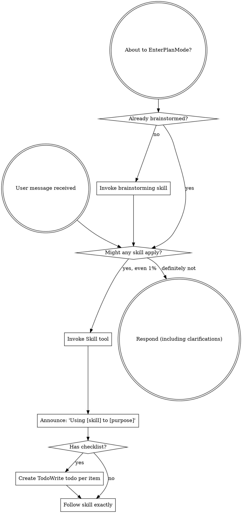

> SYSTEM

# AGENTS.md instructions for /Users/jakobfaber/Developer/repos/github.com/jakobtfaber/dsa110-FLITS

<INSTRUCTIONS>
# Codex Configuration

## Learned User Preferences

- When the user asks about Codex, interpret that as Codex CLI/configuration specifically; do not answer from Cursor MCP or Cursor IDE state unless explicitly asked.
- For cross-agent plan review, use Codex with GPT-5.5 medium effort, Claude Code with Opus 4.8 xhigh effort, and Antigravity through the `agy` CLI when available.
- Be conservative about durable memory: capture recurring corrections and stable workspace facts only, not one-off runtime details or transient command output.
- For chezmoi-managed dotfiles, edit source under `~/Developer/repos/github.com/jakobtfaber/dotfiles/home/`; restore live drift (e.g. tool-injected shell hooks) with `chezmoi apply --force` on the target file, not direct edits to `~/.*`.
- When adding core Homebrew tooling, promote packages into `home/dot_Brewfile.tmpl` (e.g. `dotfiles local promote brew <pkg>`) instead of only running `brew install`.
- Maintain Mac-local agent and observability inventories in `~/Obsidian/LLMs/agents/registry/` (`Agent Registry`, `Agent Observability Registry`, inactive-tools log) alongside chezmoi/dotfiles memory—not only in `AGENTS.md`.
- Keep `wolfbook.mcpEnabled: false` in Cursor and VS Code so the Wolfbook extension does not rewrite Antigravity/Gemini MCP configs on disk.
- Orchestrate Claude Code from Cursor via `claude -p --resume` from the session's project cwd; do not run parallel iTerm sessions on the same Claude session ID.
- Trigger prompt-guided context compaction when the chat context window reaches ~40%.

## Learned Workspace Facts

- Dotfiles are chezmoi-managed from `~/Developer/repos/github.com/jakobtfaber/dotfiles/home/`; `~/.zshrc` maps to `dot_zshrc.tmpl`.
- Interactive agent work runs in Cursor; Claude Code shells use iTerm (`claude -p --resume` from project cwd). cmux was removed Jun 2026 (SwiftUI terminal-panel teardown crashes).
- Devin shell integration injects `MANAGED DEVIN BLOCK` (`devin shell init zsh`) into live `~/.zshrc`, re-wrapping sessions as `devin shell run zsh`; the chezmoi template has no Devin hooks — disable with `chezmoi apply --force ~/.zshrc`, restart terminals, and optionally `devin auth logout`.
- Codex MCP startup paths were migrated away from networked `npx`: Playwright uses `/opt/homebrew/bin/playwright-mcp`, Context7 uses `/opt/homebrew/bin/context7-mcp`, and Sourcegraph uses `SOURCEGRAPH_MCP_REMOTE_BIN=/opt/homebrew/bin/mcp-remote`.
- Maistro MCP is globally registered through `my-skillset` (`meta/mcps.json`) and projected by `mskill install`; Codex/Claude should reach it as `/Users/jakobfaber/.local/bin/mskill mcp maistro`. Do not hand-maintain separate Maistro MCP entries; change `~/Developer/my-skillset/meta/mcps.json`, run `bash meta/install-host.sh`, and verify with `codex mcp get maistro` / `mskill doctor`.
- The cross-agent runtime standard is project opt-in for `mise`; Conda-first repos keep Python owned by Conda, and agent automation should use explicit `mise exec -- ...` or clean `conda run -n ...` runners.
- Antigravity `agy` does not expose stable CLI model/effort flags here; model/effort is verified from Antigravity memory logs as runtime metadata such as `Model Selection ... Gemini 3.5 Flash (Medium)`.
- Runtime-standard validation artifacts live under `~/.codex/automations/runtime-standard/`; local fixtures are `~/Developer/projects/runtime-standard-pilot` and `~/Developer/projects/runtime-standard-conda-pilot`.
- Orphan prior-art-recon `claude -p` workers can persist as PPID 1 after the parent exits; kill manually if they linger.
- Gurobi 13.0.2 on jakob-mbp: native pkgs (`/Library/gurobi1302`, `/Library/gurobi_server1302`, `/usr/local/bin`); WLS license `~/gurobi.lic`; `GUROBI_HOME` in chezmoi `10-env.zsh`; Python via `pip install gurobipy==13.0.2` in `py312` (not conda package `gurobi`). After upgrading the macOS .pkg or pip `gurobipy`, re-verify with fresh `gurobi_cl --license` and a trivial `gurobipy` solve—the two paths update independently.
- HPCC MATLAB: on `hpcc`, MATLAB is module-provided, not on the default PATH. Use `module load matlab/r2026a`; then `matlab` resolves to `/software/Matlab/R2026a/bin/matlab`, `matlabroot` is `/resnick/software/Matlab/R2026a`, and verified version is `26.1.0.3251617 (R2026a) Update 2`. Run non-GUI checks with `matlab -batch "..."`. User MATLAB folder exists at `/home/jfaber/Documents/MATLAB`; `userpath` points there and `prefdir` is `/home/jfaber/.matlab/R2026a`.
- HPCC Mathematica/Wolfram: on `hpcc`, Mathematica is module-provided, not on the default PATH. Available modules verified: `mathematica/11.1`, `12.0`, `12.3`, `13.2`, `14.2`; prefer `module load mathematica/14.2`. Then `wolframscript` resolves to `/resnick/software9/external/Mathematica/14.2/bin/wolframscript`, `math` resolves to `/resnick/software9/external/Mathematica/14.2/bin/math`, `$InstallationDirectory` is `/resnick/software9/external/Mathematica/14.2`, verified `$Version` is `14.2.0 for Linux x86 (64-bit) (December 26, 2024)`, `$UserBaseDirectory` is `/home/jfaber/.Wolfram`, and `$BaseDirectory` is `/usr/share/Wolfram`. Run non-GUI checks with `wolframscript -code '...'` or `math -noprompt -run '...; Exit[]'`.
- HPCC Jupyter/JupyterLab: on `hpcc`, Jupyter is module-provided through Open OnDemand. Use `module load jupyter-ood/7.1.2`; then `jupyter` resolves to `/central/software9/external/jupyter-ood-03262024/bin/jupyter`. Verified stack includes JupyterLab `4.1.5`, Notebook `7.1.2`, IPython `8.22.2`, ipykernel `6.29.3`, jupyter_server `2.13.0`, and jupyter_core `5.7.2`.
- HPCC Julia: on `hpcc`, Julia is module-provided, not on the default PATH. Available modules verified: `julia/1.9.4`, `1.10.2`, `1.10.8`, `1.11.3`, `1.12.2`; prefer `module load julia/1.12.2`. Then `julia` resolves to `/central/software9/external/julia/1.12.2/bin/julia`; verified version is `julia version 1.12.2`.
- HPCC Octave: on `hpcc`, GNU Octave is available on the system PATH without loading a module. `octave` resolves to `/usr/bin/octave`; verified version is `GNU Octave, version 7.3.0`.
- Edison Scientific API: `EDISON_API_KEY` from keychain (`Agents/edison-api-key`); Python client `edison-client` in conda `py312`. PyPI watch: dotfiles workflow `edison-client-pypi-watch` (daily) commits `~/.local/share/edison-client-pypi-watch.json` when a new release ships; `com.jakob.dotfiles-autopull` (30m) runs `chezmoi apply` so onchange upgrades `edison-client` locally. Optional manual/PyPI poll: `edison-client-autoupdate` (24h throttle). Kosmos is web-only (not in API).
- Time Machine destination is external volume `MacBackupDrive` (Samsung T7 Shield); `AutoBackup` runs hourly while attached; redundant Shortcuts mount automation was removed—rely on Time Machine only.
- DSA-110 continuum imaging: active repo is `https://github.com/dsa110/dsa110-continuum`. Legacy `~/Developer/research/archive/dsa110-contimg` is deprecated/archival (read-only); port new work to `dsa110-continuum`, not the archive tree.
- `~/Developer/research/AGENTS.md` defines the two-tree rule: `research/` = owned active work (flat repos + archive); upstream clones → `~/Developer/reference/<domain>/`. `astrophysics/` is the unified radio workspace (merged from `radio-astronomy`); `blimpy`/`FRB` live in `reference/astrophysics/`.
- Orchestrator memory (Maistro) lives at `~/Developer/repos/github.com/jakobtfaber/maistro` (`jakobtfaber/maistro`, SQLite event log, RPC writer on :8787, `https://dashboard.jakobtfaber.com`); bearer token in keychain service `Agents`, account `orch-rpc-token`.
- Pulsar periodicity research: `~/Developer/repos/github.com/jakobtfaber/gridless-pulsar` (`jakobtfaber/gridless-pulsar`); GPU coherent folding is the north star; comb-ANM is a refinement tier only (FRB scope removed).

## Codex from Cursor agent Shell

Full runbook: **`~/Developer/reference/cursor-agent-shell-cli-insights.md`**.

When Cursor (or another IDE) runs **`codex exec`** via agent **Shell**, use **subscription auth only** (`codex login` / ChatGPT tokens). Do **not** set **`OPENAI_API_KEY`** for automation unless the workflow explicitly needs API billing.

Prefer **Cursor `Task`** for small in-IDE delegation. Use **`codex exec`** when you need the full CLI tool surface; diagnose the **child Shell process**, not the chat UI alone.

### Argv-vs-stdin rule

- **Prompt as argv ⇒ close stdin:** `codex exec "…" < /dev/null`.
- If **`codex doctor`** shows ChatGPT auth and the process prints **`Reading additional input from stdin...`**, debug **stdin** before auth, `--full-auto`, or API-key settings.

### Root cause (observed in Cursor agent Shell)

Cursor agent Shell **can** leave stdin open. When **`codex exec`** receives the prompt as an **argument**, it may wait indefinitely for additional stdin.

### Required

```bash
codex exec "Your task here" < /dev/null

codex exec -C /path/to/repo "Your task" < /dev/null

# Unattended — restricted actions may fail instead of prompting
codex exec -c 'approval_policy="never"' "Your task" < /dev/null
```

Smoke tests: **`gtimeout`** from **`brew install coreutils`**, or Homebrew **`timeout`** (`which timeout gtimeout`) — avoid multi-hour zombies.

### Sanity check

```bash
codex doctor   # expect stored auth mode chatgpt, stored API key false
```

### Do not

- Run **`codex exec "…"`** without **`< /dev/null`** from Cursor agent Shell when the prompt is argv.
- Background **`codex exec`** without a watchdog unless stdin is explicitly closed.
- Assume hangs mean broken login when the stdin message appears.

### Expectations

- **~60–90s** for trivial invokes on this machine (hooks/config) is a local baseline; runs should **complete**, not hang, when stdin is closed.

### Output channels

Treat `codex exec` stdout as an execution transcript, not as a reliable machine-readable final answer. Normal stdout may include banners, prompts, hook lifecycle messages, the final assistant message, and token usage.

Use the output channel that matches the task:

- **Human-readable delegation:** let stdout print normally when a person will read the transcript.
- **Machine-readable artifact:** use `-o FILE` / `--output-last-message FILE` for the final model message, and redirect stdout/stderr to logs.
- **Event/debug stream:** use `--json` only when you want JSONL execution events; do not treat it as a single final-answer JSON document.

Canonical structured-output pattern:

```bash
mkdir -p logs

codex exec \
  -m gpt-5.5 \
  --skip-git-repo-check \
  -o result.json \
  "$PROMPT" \
  > logs/codex.stdout.log \
  2> logs/codex.stderr.log \
  < /dev/null

python3 -m json.tool result.json >/dev/null
```

Do not parse normal `codex exec` stdout as JSON unless using `--json` and expecting JSONL events. Do not use `--ignore-user-config` for normal delegation; reserve it for debugging Codex itself because it changes the execution environment.

## Runtime Management

- Repositories are opt-in for `mise` through repo-local `mise.toml`; do not set global `mise` Python.
- Conda-first repositories own Python through Conda; do not add `python` to `mise.toml` there unless explicitly migrating away from Conda.
- Agent automation must use explicit runners: `mise exec -- ...` for mise-first repos, or a clean `conda run -n ...` wrapper for Conda-first repos.
- `direnv` is for interactive shell convenience only. Hooks, agents, and non-interactive scripts must not depend on `.envrc` being loaded.
- MCP binaries used at agent startup are Homebrew-managed system tools, not project runtimes. Do not reintroduce `npx` on Codex MCP startup paths.
- On this machine, inherited interactive PATH state can make bare `conda run -n py312 python` resolve base Anaconda Python. For agent-safe Conda checks, prefer:
  `env -i HOME="$HOME" PATH="/opt/anaconda3/bin:/opt/homebrew/bin:/usr/bin:/bin" /opt/anaconda3/bin/conda run -n py312 ...`

## Skills — GitHub Sync

Custom skills are version-controlled in the private `my-skillset` repository.

- **Canonical local clone:** `~/Developer/repos/github.com/jakobtfaber/my-skillset/`
- **Compatibility symlink:** `~/Developer/projects/my-skillset` → `~/Developer/repos/github.com/jakobtfaber/my-skillset`
- **Compatibility symlink:** `~/Developer/my-skillset` → `~/Developer/repos/github.com/jakobtfaber/my-skillset`
- **Claude symlink:** `~/.claude/my-skillset` → `~/Developer/repos/github.com/jakobtfaber/my-skillset`
- **Codex symlink:** `~/.codex/my-skillset` → `~/Developer/repos/github.com/jakobtfaber/my-skillset`
- **Codex active skills symlink:** `~/.codex/skills` → `~/.codex/skills-minimal`
- **Codex minimal skill set:** `~/.codex/skills-minimal` contains a curated mix of local skill folders and symlinks into `my-skillset`; do not repoint it to the full skill tree unless intentionally reversing prompt-bloat pruning.
- **Auto-pull agent:** `com.jakob.skills-autopull`

Do not use the retired `~/Developer/misc/claude-config` path for current skill sync.

## Persistent Agent Memory

Use `~/Developer/repos/github.com/jakobtfaber/dotfiles/memory/` as the manual intent/context memory layer. This is the canonical memory store and the only persistent agent-memory store managed by dotfiles.

- Manual memory notes: `~/Developer/repos/github.com/jakobtfaber/dotfiles/memory/`
- Memory index: `~/Developer/repos/github.com/jakobtfaber/dotfiles/memory/MEMORY.md`
- Runtime memory path: `~/.claude/projects/-Users-jakobfaber/memory/` symlinks to `~/Developer/repos/github.com/jakobtfaber/dotfiles/memory/`
- Daily auto-commit of the memory subtree: launchd job `com.jakobfaber.dotfiles-memory-snapshot` (S-009)

Codex may update its own managed store under `~/.codex/memories/`, but any durable memory-worthy fact, correction, preference, or workspace state written there must also be captured in `~/Developer/repos/github.com/jakobtfaber/dotfiles/memory/` by default. Treat Codex memory as a Codex-local copy/cache, not the only durable record.

Do not create ad-hoc memory directories under `~/.codex/` for persistent memory.
Do not inspect `~/.claude-mem/` for current memory health; that retired directory no longer exists.

## Task Status Semantics

Use strict closure semantics when tracking tasks, updating a temporary to-do list, or summarizing whether work is done.

- `completed`: no further action remains for that item.
- `blocked`: cannot proceed without user input or an external state change.
- `diagnosed`: root cause or next step is known, but the fix/work is not complete.
- `validated`: behavior was checked, but there may still be follow-up.
- `decision pending`: implementation or investigation is sufficient, but a product/UX/cleanup choice remains.

If the available task-tracking tool only supports `pending`, `in_progress`, and `completed`, do not mark blocked/diagnosed/decision-pending work as `completed`. Keep the item `pending`, or split it into a completed investigation item plus a separate pending follow-up with the explicit status in the task text.

## Proactive Stopping Points

When work changes runtime behavior, tool availability, config, MCP servers, daemons, launch agents, browser/app state, shell startup, or any long-lived process, do not stop at a generic note such as "restart required" or "you may need to restart." Before final response, proactively identify the concrete affected process, service, app, server, port, or session that needs reload/restart, inspect what is currently running when practical, and stop at the actionable question with named targets, for example: "Shall I restart `X` and `Y`?" If the restart/reload is reversible and already authorized by the user, perform it and verify the new behavior instead of asking. If it is disruptive, kills user state, or crosses a one-way/outward boundary, ask with the explicit target list and blast radius.

Before claiming completion after file edits, run `agent-closeout-check` or `mskill tool agent-closeout-check` for every repo touched when either condition applies: the repo is dirty, or touched paths could affect runtime behavior. Pass each repo with `--repo`; pass known changed runtime/config paths with `--touched`; pass `--packet <closeout.json>` once you have a dirty-state handoff and/or restart inventory. If the checker fails, do not replace it with a vague caveat. Either produce the required dirty-state handoff packet, perform and verify the required restart, or stop at the concrete next question emitted by the check.

## Dirty Git State

<important if="you see dirty files in a git repo, or a command reports modified, staged, untracked, deleted, renamed, or conflicted files">
Use the `dirty-git-state` skill from `my-skillset` before deciding whether to inspect, edit, clean, stage, commit, or ask the user.

When committing, commit validated, task-scoped changes once the work is complete.
For pre-existing changes, review all of them before committing. Only include them
once they are fully understood, are not transient real-time development state,
and are deemed worthy of commit. If ownership, intent, or readiness is ambiguous
after review, leave the ambiguous changes uncommitted and report the ambiguity.
</important>

<important if="you are asked to run a code review or delegate a task using Codex or Claude">
- For Codex reviews, run Codex non-interactively using:
  `codex exec -m gpt-5.5 -c model_reasoning_effort="medium" "..." < /dev/null`
  This uses gpt-5.5 with medium effort by default.
- For Claude reviews, run Claude non-interactively using:
  `claude --model claude-opus-4-8 --effort xhigh -p "..." < /dev/null`
  This uses Opus 4.8 with xhigh effort by default.
</important>

## Authentication & Verification Protocols

When verifying, investigating, or inspecting the health, connectivity, or authentication state of any service, tool, or API (e.g., Grov, Firecrawl, MCP, ACP, or coding harnesses):

1. **Do Not Blindly Trust CLI Self-Checkers (`doctor` / `status` outputs)**:
   Never take a diagnostic command (e.g., `doctor`, `status`, `healthcheck`) showing green checkmarks as absolute proof of live runtime operational health. These commands often only check if your local configuration files are structured correctly without testing active connection channels.
2. **Test Live Operational Handshakes**:
   Always execute a minor, non-destructive live operational command (e.g., running a Dry-Run, pulling a mock schema, or making a safe query) to force a true cryptographic handshake with the API endpoint.
3. **Inspect Backing Configs Directly**:
   Always locate and inspect the underlying configuration and credentials storage files (JSON, TOML, SQLite databases, or environment variables) directly. Check active token lifetimes, `expires_at` timestamps, scopes, and encryption validity against the current local system time (e.g., `credentials.json` expiration dates) to verify active session state.

<!-- opensrc:start -->
## opensrc — dependency source for deeper context

`opensrc` (CLI, installed globally) caches dependency **source code** at `~/.opensrc/` so agents can read a package's internal implementation, not just its public types/interface. Cached inventory: `~/.opensrc/sources.json`.

- **Fetch (cache only):** `opensrc fetch <pkg>` — cross-registry: `opensrc fetch pypi:<pkg> crates:<pkg> <owner>/<repo>`
- **Read (fetches on cache miss):** `rg "pattern" $(opensrc path <pkg>)` · `cat $(opensrc path <pkg>)/path/to/file` · `find $(opensrc path <pkg>) -name "*.ts"`

Use it when you need to understand *how* a dependency works internally (npm, PyPI, crates.io, or a GitHub repo), not just its surface API.
<!-- opensrc:end -->

@/Users/jakobfaber/.codex/RTK.md

--- project-doc ---

# AGENTS.md

Repo-level agent guidance for FLITS. Full project guide: `CLAUDE.md`.
Binding fit-validation contract: `.cursor/rules/AGENT_CONFIGURATION_FLITS.md`.

## Long-View Science Goals

The primary objective of the CHIME–DSA co-detection analysis and the FLITS pipeline is to reconstruct the complete line-of-sight dispersion measure (DM) and scattering budgets for the 12 co-detected bursts.

1. **Accurate Scattering Index (\(\alpha\)) Measurement:** Break the degeneracy between scattering time \(\tau\) and index \(\alpha\) by fitting CHIME (400–800 MHz) and DSA-110 (1.2–1.5 GHz) data simultaneously with a shared model, leveraging the \(\sim 1\) GHz frequency lever arm.
2. **Mitigating Profile Bias:** Detect hidden temporal sub-components (multi-pulse structures). Left unmodeled, secondary pulses bias \(\alpha\) high (e.g. \(\alpha \approx 3.3 \to 2.7\)). Fits must model sub-components to ensure physical honesty.
3. **Sightline Attribution:** Partition observed \(DM_{\text{obs}}\) and scattering \(\tau_{\text{obs}}\) to constrain host-galaxy, Milky Way, and intervening foreground contributions (probing the CGM/groups/clusters of 49 candidate intervening systems).


## Review guidelines

Used by Codex automatic code review (and any agent reviewing a PR). Flag only
real P0/P1 issues; skip style that ruff already enforces. Ignore base64 image
payloads embedded in `docs/*.html`.

- **Physics kernel ownership.** `scattering/scat_analysis/burstfit.py` is the
  canonical kernel; `flits/` wraps it. Model-physics changes belong in
  `burstfit.py` — flag edits that fork physics into the wrapper.
- **Fit validation is mandatory.** Flag any change that could rationalize a
  failing/marginal fit into a pass, drop a validation level (Level-1 gates,
  chi2_red / R2, physics `tau*dnu` in [0.1, 2.0], alpha bounds), or bypass the
  diagnostic-figure review gate. A numeric PASS without figure review is not a pass.
- **Physics sanity.** Enforce bounds `0.0001 < tau < 100 ms` and
  `1.5 < alpha < 6.0`; check units and the frequency-ascending load assumption.
- **Lazy-minimalist (ponytail).** Flag unnecessary abstractions, dead code,
  speculative config, and parallel near-duplicate modules. Prefer the shortest
  correct diff — but never trade scientific rigor or a validation level for brevity.

</INSTRUCTIONS>
<environment_context>
  <cwd>/Users/jakobfaber/Developer/repos/github.com/jakobtfaber/dsa110-FLITS</cwd>
  <shell>zsh</shell>
  <current_date>2026-06-23</current_date>
  <timezone>America/Los_Angeles</timezone>
  <filesystem><workspace_roots><root>/Users/jakobfaber/Developer/repos/github.com/jakobtfaber/dsa110-FLITS</root></workspace_roots><permission_profile type="managed"><file_system type="restricted"><entry access="read"><special>:root</special></entry></file_system></permission_profile></filesystem>
</environment_context>

> DEVELOPER

Independently verify whether this file is safe to DELETE: scattering/scat_analysis/validation_thresholds.py

It appears to be a pure re-export shim: 'from flits.fitting.VALIDATION_THRESHOLDS import *'.

I claim it is dead: zero importers, no unique content, safe to delete (canonical source is flits/fitting/VALIDATION_THRESHOLDS.py). Try to REFUTE this. Check exhaustively, do not trust my claim:
1. Any static import of module path 'scattering.scat_analysis.validation_thresholds' (absolute or relative 'from .validation_thresholds') anywhere — code, tests, notebooks.
2. Any dynamic/string reference: importlib, __import__, getattr, entry_points/console_scripts in pyproject.toml, plugin registries, config YAML/JSON.
3. Any re-export through scattering/scat_analysis/__init__.py exposing it as public API.
4. Whether the file has ANY symbol not already provided by flits.fitting.VALIDATION_THRESHOLDS.
5. Whether the two threshold sources could legitimately DIVERGE such that the shim masks a difference.

Output one verdict line starting EXACTLY with 'VERDICT: SAFE_TO_DELETE' or 'VERDICT: NOT_SAFE', then the concrete evidence. Read-only; modify nothing.

> AGENT

I’m going to use the Superpowers guidance first because this is a verification task, then I’ll audit the repo read-only and try to disprove the deletion claim with static and dynamic-reference searches.

> TOOL

tool_use shell_command
id: call_QXqdVzWUWFxAErgjhG7PcYu5
```json
{
  "command": "cat /Users/jakobfaber/.codex/plugins/cache/openai-curated/superpowers/3c06cb2e/skills/using-superpowers/SKILL.md",
  "workdir": "/Users/jakobfaber/Developer/repos/github.com/jakobtfaber/dsa110-FLITS",
  "timeout_ms": 10000
}
```

> TOOL

tool_use shell_command
id: call_s7Zjnk86T83zCefuWSSQpnMT
```json
{
  "command": "cat /Users/jakobfaber/.codex/skills-minimal/validating-implementations/SKILL.md",
  "workdir": "/Users/jakobfaber/Developer/repos/github.com/jakobtfaber/dsa110-FLITS",
  "timeout_ms": 10000
}
```

> TOOL

tool_use shell_command
id: call_bNLlXmJsyT1HztZBzQNTkNkR
```json
{
  "command": "rg -n \"validation_thresholds|VALIDATION_THRESHOLDS|scattering\\.scat_analysis\\.validation_thresholds|from \\.validation_thresholds|importlib|__import__|entry_points|console_scripts\" /Users/jakobfaber/.codex/memories/MEMORY.md",
  "workdir": "/Users/jakobfaber/Developer/repos/github.com/jakobtfaber/dsa110-FLITS",
  "timeout_ms": 10000
}
```

> TOOL

tool_result
id: call_QXqdVzWUWFxAErgjhG7PcYu5
```
Command blocked by PreToolUse hook: rtk-codex-guard: shell command should use RTK compact output.

Suggested command:
rtk read /Users/jakobfaber/.codex/plugins/cache/openai-curated/superpowers/3c06cb2e/skills/using-superpowers/SKILL.md

To bypass for this command, prefix it with: RTK_DISABLED=1. Command: cat /Users/jakobfaber/.codex/plugins/cache/openai-curated/superpowers/3c06cb2e/skills/using-superpowers/SKILL.md
```

> TOOL

tool_result
id: call_s7Zjnk86T83zCefuWSSQpnMT
```
Command blocked by PreToolUse hook: rtk-codex-guard: shell command should use RTK compact output.

Suggested command:
rtk read /Users/jakobfaber/.codex/skills-minimal/validating-implementations/SKILL.md

To bypass for this command, prefix it with: RTK_DISABLED=1. Command: cat /Users/jakobfaber/.codex/skills-minimal/validating-implementations/SKILL.md
```

> TOOL

tool_result
id: call_bNLlXmJsyT1HztZBzQNTkNkR
```
Command blocked by PreToolUse hook: rtk-codex-guard: shell command should use RTK compact output.

Suggested command:
rtk grep -n "validation_thresholds|VALIDATION_THRESHOLDS|scattering\.scat_analysis\.validation_thresholds|from \.validation_thresholds|importlib|__import__|entry_points|console_scripts" /Users/jakobfaber/.codex/memories/MEMORY.md

To bypass for this command, prefix it with: RTK_DISABLED=1. Command: rg -n "validation_thresholds|VALIDATION_THRESHOLDS|scattering\.scat_analysis\.validation_thresholds|from \.validation_thresholds|importlib|__import__|entry_points|console_scripts" /Users/jakobfaber/.codex/memories/MEMORY.md
```

> AGENT

The repo hook is enforcing RTK compact reads, so I’m switching to those forms and staying in read-only mode.

> TOOL

tool_use shell_command
id: call_MrZBKfudUUKkngUzMdOZPc6X
```json
{
  "command": "rtk read /Users/jakobfaber/.codex/plugins/cache/openai-curated/superpowers/3c06cb2e/skills/using-superpowers/SKILL.md",
  "workdir": "/Users/jakobfaber/Developer/repos/github.com/jakobtfaber/dsa110-FLITS",
  "timeout_ms": 10000
}
```

> TOOL

tool_use shell_command
id: call_VcOYX559FX2ToKNPR5KifutE
```json
{
  "command": "rtk read /Users/jakobfaber/.codex/skills-minimal/validating-implementations/SKILL.md",
  "workdir": "/Users/jakobfaber/Developer/repos/github.com/jakobtfaber/dsa110-FLITS",
  "timeout_ms": 10000
}
```

> TOOL

tool_use shell_command
id: call_8JXfthcvdka8IlBQoJ8VeT32
```json
{
  "command": "rtk grep -n \"validation_thresholds|VALIDATION_THRESHOLDS|scattering\\.scat_analysis\\.validation_thresholds|from \\.validation_thresholds|importlib|__import__|entry_points|console_scripts\" /Users/jakobfaber/.codex/memories/MEMORY.md",
  "workdir": "/Users/jakobfaber/Developer/repos/github.com/jakobtfaber/dsa110-FLITS",
  "timeout_ms": 10000
}
```

> TOOL

tool_result
id: call_MrZBKfudUUKkngUzMdOZPc6X
```
Exit code: 0
Wall time: 0.1 seconds
Output:
---
name: using-superpowers
description: Use when starting any conversation - establishes how to find and use skills, requiring Skill tool invocation before ANY response including clarifying questions
---

<SUBAGENT-STOP>
If you were dispatched as a subagent to execute a specific task, skip this skill.
</SUBAGENT-STOP>

<EXTREMELY-IMPORTANT>
If you think there is even a 1% chance a skill might apply to what you are doing, you ABSOLUTELY MUST invoke the skill.

IF A SKILL APPLIES TO YOUR TASK, YOU DO NOT HAVE A CHOICE. YOU MUST USE IT.

This is not negotiable. This is not optional. You cannot rationalize your way out of this.
</EXTREMELY-IMPORTANT>

## Instruction Priority

Superpowers skills override default system prompt behavior, but **user instructions always take precedence**:

1. **User's explicit instructions** (CLAUDE.md, GEMINI.md, AGENTS.md, direct requests) — highest priority
2. **Superpowers skills** — override default system behavior where they conflict
3. **Default system prompt** — lowest priority

If CLAUDE.md, GEMINI.md, or AGENTS.md says "don't use TDD" and a skill says "always use TDD," follow the user's instructions. The user is in control.

## How to Access Skills

**In Claude Code:** Use the `Skill` tool. When you invoke a skill, its content is loaded and presented to you—follow it directly. Never use the Read tool on skill files.

**In Copilot CLI:** Use the `skill` tool. Skills are auto-discovered from installed plugins. The `skill` tool works the same as Claude Code's `Skill` tool.

**In Gemini CLI:** Skills activate via the `activate_skill` tool. Gemini loads skill metadata at session start and activates the full content on demand.

**In other environments:** Check your platform's documentation for how skills are loaded.

## Platform Adaptation

Skills use Claude Code tool names. Non-CC platforms: see `references/copilot-tools.md` (Copilot CLI), `references/codex-tools.md` (Codex) for tool equivalents. Gemini CLI users get the tool mapping loaded automatically via GEMINI.md.

# Using Skills

## The Rule

**Invoke relevant or requested skills BEFORE any response or action.** Even a 1% chance a skill might apply means that you should invoke the skill to check. If an invoked skill turns out to be wrong for the situation, you don't need to use it.



## Red Flags

These thoughts mean STOP—you're rationalizing:

| Thought | Reality |
|---------|---------|
| "This is just a simple question" | Questions are tasks. Check for skills. |
| "I need more context first" | Skill check comes BEFORE clarifying questions. |
| "Let me explore the codebase first" | Skills tell you HOW to explore. Check first. |
| "I can check git/files quickly" | Files lack conversation context. Check for skills. |
| "Let me gather information first" | Skills tell you HOW to gather information. |
| "This doesn't need a formal skill" | If a skill exists, use it. |
| "I remember this skill" | Skills evolve. Read current version. |
| "This doesn't count as a task" | Action = task. Check for skills. |
| "The skill is overkill" | Simple things become complex. Use it. |
| "I'll just do this one thing first" | Check BEFORE doing anything. |
| "This feels productive" | Undisciplined action wastes time. Skills prevent this. |
| "I know what that means" | Knowing the concept ≠ using the skill. Invoke it. |

## Skill Priority

When multiple skills could apply, use this order:

1. **Process skills first** (brainstorming, debugging) - these determine HOW to approach the task
2. **Implementation skills second** (frontend-design, mcp-builder) - these guide execution

"Let's build X" → brainstorming first, then implementation skills.
"Fix this bug" → debugging first, then domain-specific skills.

## Skill Types

**Rigid** (TDD, debugging): Follow exactly. Don't adapt away discipline.

**Flexible** (patterns): Adapt principles to context.

The skill itself tells you which.

## User Instructions

Instructions say WHAT, not HOW. "Add X" or "Fix Y" doesn't mean skip workflows.

```

> TOOL

tool_result
id: call_VcOYX559FX2ToKNPR5KifutE
```
Exit code: 1
Wall time: 0.1 seconds
Output:
cat: /Users/jakobfaber/.codex/skills-minimal/validating-implementations/SKILL.md: No such file or directory (os error 2)

```

> TOOL

tool_result
id: call_8JXfthcvdka8IlBQoJ8VeT32
```
Exit code: 1
Wall time: 0.1 seconds
Output:
0 matches for 'validation_thresholds|VALIDATION_THRESHOLDS|scattering\.scat_analysis\.validation_thresholds|from \.validation_thresholds|importlib|__import__|entry_points|console_scripts'

```

> AGENT

The Codex-local memory index had no hits for this specific module, so there is no obvious prior-memory shortcut. I found the validation skill is repo-local rather than in the minimal skill path, so I’m loading that version now.

> TOOL

tool_use shell_command
id: call_1BBOqz0JL8YTqZaFz2Nmz3EF
```json
{
  "command": "rtk read /Users/jakobfaber/Developer/repos/github.com/jakobtfaber/dsa110-FLITS/.agents/skills/validating-implementations/SKILL.md",
  "workdir": "/Users/jakobfaber/Developer/repos/github.com/jakobtfaber/dsa110-FLITS",
  "timeout_ms": 10000
}
```

> TOOL

tool_result
id: call_1BBOqz0JL8YTqZaFz2Nmz3EF
```
Exit code: 0
Wall time: 0.1 seconds
Output:
---
name: validating-implementations
description: >-
  Use when an implementation is (claimed) complete and must be checked against
  its plan before shipping. Triggers: validate the implementation, verify it
  matches the plan, is the implementation correct, check before PR.
---

# Validating Implementations

Systematically verify that a completed implementation satisfies every success
criterion in its plan, producing a validation report — written to `docs/rse/specs/validation-<slug>.md` and also presented inline.

## Iron Law: no verdict without fresh output you produced yourself

A validation verdict is only as good as the evidence behind it. Checkmarks in
the plan (`- [x]`), a teammate's "all 45 tests green, ready for PR" report, and
"it looks done" are **claims, not evidence**. Do not give a verdict until you
have re-run every automated verification command yourself and read the actual
code against each success criterion. Trust nothing you did not see with your own
eyes — no matter who reported it or how reliable they seem. "Just confirm it's
good" is a request to validate, not to rubber-stamp someone else's report.

## Interaction mode

This skill leans **Direct** by default. For the full Collaborative-vs-Direct protocol and override rules, see the Interaction Modes reference in the `ai-research-workflows:using-research-workflows` skill.

## Starting the skill

**If a plan path is provided**, read it completely — this is the specification
to validate against.

**If no plan path is given**, search `docs/rse/specs/{plan,implement}-*.md` (then legacy `.agents/{plan,implement}-*.md`). If
multiple match, ask which to validate (Collaborative); if exactly one, proceed
(Direct). If none found, explain that validation requires a plan.

## Determine session context

**Existing session (implementation done in this conversation):**
- You have context about what was implemented; review recent conversation.
- You know which files were modified.

**Fresh session (reviewing past work):**
- No memory of implementation decisions; reconstruct from git and artifacts.
- Focus on observable facts: does the code match the plan, do tests pass, are
  success criteria met?
- Don't speculate about intent; note deviations without judging them.

## Gather implementation evidence

Before validating, understand what was actually done.

Check recent commits:

```bash
git log --oneline -n 10
git diff HEAD~3..HEAD --stat
```

Run tests to establish baseline:

```bash
make test
# or: pytest tests/ -v
# or: npm test
```

## Validation process

### Step 1: Read the plan completely

Read the entire plan (avoid partial reads). For each phase identify:

- Which files should be modified
- Success criteria that must pass
- Key functionality that should exist
- Tests that should be added

### Step 2: Investigate in parallel

Verify code, schema, and test coverage concurrently when possible:

- **Database/schema changes** — confirm migrations match plan specifications
  (tables, columns, indices).
- **Code changes** — confirm implementation follows patterns and matches the
  plan's design.
- **Test coverage** — find tests added for the feature; verify they cover the
  scenarios listed in the plan's Testing Strategy section.
- **Reproducibility & correctness (research code)** — if the implementation
  produces results, metrics, or figures, confirm seeds, data versions,
  environment, and exact commands were captured
  (`ai-research-workflows:ensuring-reproducibility`) and that numerical results
  meet their stated criteria/tolerances
  (`ai-research-workflows:hardening-research-code`). Re-run to confirm reported
  numbers actually reproduce.

Wait for ALL verification to complete before synthesizing.

### Step 3: Systematic per-phase validation

For each phase in the plan:

**Check completion status** — `- [x]` = claimed complete; `- [ ]` = incomplete.

**Verify actual code matches claimed completion** — don't trust checkmarks.
Read the code: are the files modified as described? Does the implementation
match the specification?

**Run automated verification** — execute EACH command from the plan's
"Automated Verification" section:

```bash
make test
pytest tests/ -v
npm run lint
mypy src/
```

Document results per check:

```markdown
- ✅ `make test` — All 45 tests passing (expected 45)
- ❌ `pytest tests/test_new_feature.py` — 2 tests failing (expected 0)
- ✅ `mypy src/` — Type checking passed
```

**If a check fails:**

1. Read the error output.
2. Identify the failing code.
3. Determine whether it is an implementation bug, a test bug, a plan mismatch,
   or an environmental issue.
4. Document the finding with root cause, location, and recommendation.

**Assess manual criteria** — for items in the plan's "Manual Verification"
section, list what needs human testing with clear, actionable steps. If in the
same session and the user already confirmed, note that; otherwise assume manual
testing is still needed.

## Validation report

Produce the report once, then **both** write it to a durable file and present it
inline. Use the section templates and presentation/special-case blocks from
`references/report-templates.md`.

### Write the validation document

Derive the slug from the plan being validated (`docs/rse/specs/plan-<slug>.md` →
`<slug>`; e.g. `plan-oauth-support.md` → `oauth-support`). Write the full report
to `docs/rse/specs/validation-<slug>.md`, overwriting any previous validation of
the same plan — git history preserves earlier verdicts. Create `docs/rse/specs/`
if it does not exist.

Record provenance at the top so a reader knows exactly what this verdict covers:

> Validated against `plan-<slug>.md` / `implement-<slug>.md` at commit
> `<short-sha>` (`git rev-parse --short HEAD`) on `<date>`.

End the document with a `## References` section linking back to the plan and
implementation docs with relative paths.

### Present inline

Present the same report inline in the conversation (Direct mode: write the file,
then show the report and confirm its path). The report contains these sections in
order:

1. **Implementation Status** — per-phase completion status with task-level detail
2. **Automated Verification Results** — pass/fail for each command, with root
   cause and recommendation for failures
3. **Code Review Findings** — what matches the plan, deviations, potential issues
4. **Manual Testing Required** — actionable steps for items needing human testing
5. **Recommendations** — grouped by Critical / Important / Nice to Have / Follow-Up

## Red flags — STOP, you're about to rubber-stamp

| Thought | Reality |
|---|---|
| "The engineer said all tests pass, I'll confirm" | A teammate's green report is an unverified claim, same as a checkmark. Re-run it yourself. |
| "All phases are checked `[x]`, looks done" | Checkmarks are claims. Nothing is verified until you see fresh output. |
| "Re-running takes 10 minutes, just sign off" | The 10 minutes is the cost of a verdict you can stand behind. Run it. |
| "The numbers look reasonable" | For research results, "reasonable" isn't reproduced. Confirm they re-run within tolerance. |

## Common Mistakes

- **Trusting a teammate's green report** — a Slack "all tests pass, ready for
  PR" is an unverified claim exactly like a checkmark; re-run every command
  yourself before any verdict.
- **Trusting plan checkmarks without running the checks** — a `- [x]` in the
  plan means nothing until you execute the verification command and confirm the
  output yourself.
- **Reporting "looks done" without executing automated verification** — always
  run every command in the plan's "Automated Verification" section; do not
  substitute code inspection for running the checks.
- **Not separating automated vs. manual results** — clearly distinguish what was
  machine-verified from what still requires human testing; never mark manual
  items done unless the user confirmed them in this session.
- **Speculating about intent on deviations** — in a fresh session, document
  deviations as observable facts and ask if their reason matters; do not invent
  explanations.
- **Stopping at the first failure** — run all checks regardless of early
  failures so the report captures the full picture.

## Quality checklist

Before delivering the report:

- [ ] Read the entire plan
- [ ] Ran all automated verification commands from the plan **myself** (not trusting reports or checkmarks)
- [ ] For research results: confirmed reproducibility capture and that reported numbers re-run within tolerance
- [ ] Documented pass/fail for each automated check
- [ ] Investigated root causes of any failures
- [ ] Reviewed actual code against plan specifications
- [ ] Identified all deviations from plan
- [ ] Listed clear manual testing steps
- [ ] Provided actionable recommendations
- [ ] Categorized issues by severity (critical, important, nice-to-have)
- [ ] Saved the report to `docs/rse/specs/validation-<slug>.md` with provenance + References
- [ ] All phases marked complete are actually done
- [ ] No regressions introduced in existing functionality
- [ ] Documentation updated if needed (README, API docs, docstrings)

## Cross-references

Validates the plan from the `ai-research-workflows:planning-implementations` skill. For failures, fix
and re-run, or use `ai-research-workflows:iterating-plans` if the plan itself was wrong.

```

> AGENT

The validation skill expects a plan artifact and report write, which does not fit this read-only deletion audit, so I’m applying its core rule instead: fresh evidence only. I’m going to inspect the shim, canonical threshold module, package exports, tracked/untracked references, and packaging/config surfaces.

> TOOL

tool_use shell_command
id: call_sLD26pPDeM0msXKO2vnG9wOi
```json
{
  "command": "rtk ls",
  "workdir": "/Users/jakobfaber/Developer/repos/github.com/jakobtfaber/dsa110-FLITS",
  "timeout_ms": 10000
}
```

> TOOL

tool_use shell_command
id: call_NBCQvmqVQQ4OzqBjcShF8qsK
```json
{
  "command": "rtk read scattering/scat_analysis/validation_thresholds.py",
  "workdir": "/Users/jakobfaber/Developer/repos/github.com/jakobtfaber/dsa110-FLITS",
  "timeout_ms": 10000
}
```

> TOOL

tool_use shell_command
id: call_I0m1VOlyvc6BDQt23dlFEWzR
```json
{
  "command": "rtk read flits/fitting/VALIDATION_THRESHOLDS.py",
  "workdir": "/Users/jakobfaber/Developer/repos/github.com/jakobtfaber/dsa110-FLITS",
  "timeout_ms": 10000
}
```

> TOOL

tool_use shell_command
id: call_PEKHKz1K6duIuqHzVMkNwNYT
```json
{
  "command": "rtk read scattering/scat_analysis/__init__.py",
  "workdir": "/Users/jakobfaber/Developer/repos/github.com/jakobtfaber/dsa110-FLITS",
  "timeout_ms": 10000
}
```

> TOOL

tool_result
id: call_sLD26pPDeM0msXKO2vnG9wOi
```
Exit code: 0
Wall time: 0.2 seconds
Output:
.agents/
.claude/
.codex/
.cursor/
.entire/
.experiments/
.factory/
.gemini/
.githooks/
.github/
.opencode/
.pi/
.ruff_cache/
.scratch/
analyses/
analysis/
analysis_results/
animations/
benchmarks/
configs/
crossmatching/
data/
dispersion/
docs/
docs-analysis/
flits/
flits.egg-info/
galaxies/
logs/
notebooks/
out_dir/
papers/
results/
scattering/
scintillation/
scratch/
scripts/
simulation/
site/
tests/
tools/
.coverage  68.0K
.gitignore  6.8K
AGENTS.md  2.3K
CLAUDE.md  11.0K
CONTEXT.md  4.7K
DATA_LOCATIONS.md  5.6K
DATA_SOURCES.md  4.7K
ENTIRE_AUTH_HANDOFF.md  3.3K
LICENSE  1.0K
README.md  1.9K
codetections_manifest.yaml  4.3K
data-manifest.csv  5.0K
environment.yml  3.2K
legacy_documents_data_checksum_manifest.yaml  22.0K
main.py  521B
matplotlibrc  1.3K
mkdocs.yml  1.1K
noxfile.py  1.2K
pyproject.toml  3.1K
run_freya_fitting.py  3.2K
uv.lock  512.2K
verify_pipeline.py  5.3K

```

> TOOL

tool_result
id: call_NBCQvmqVQQ4OzqBjcShF8qsK
```
Exit code: 0
Wall time: 0.1 seconds
Output:
"""Validation thresholds for FLITS fitting.

Re-exports the single source of truth in ``flits.fitting.VALIDATION_THRESHOLDS``.
"""

from flits.fitting.VALIDATION_THRESHOLDS import *  # noqa: F401,F403

```

> TOOL

tool_result
id: call_I0m1VOlyvc6BDQt23dlFEWzR
```
Exit code: 0
Wall time: 0.1 seconds
Output:
"""Validation thresholds for FLITS fitting."""

# MCMC Convergence
MCMC_AUTOCORR_NSTEPS_FACTOR = 50
MCMC_BURN_IN_FACTOR = 5.0
MCMC_ACC_FRAC_MIN = 0.2
MCMC_ACC_FRAC_MAX = 0.9
MCMC_MIN_EFFECTIVE_SAMPLES = 100

# Physical Parameter Bounds
DM_MIN = 1e-3
DM_MAX = 3000
AMP_MIN = 0.01
AMP_MAX = 10000
WIDTH_MIN = 1e-4
WIDTH_MAX = 1000

# Likelihood Thresholds
RED_CHI_SQ_CATASTROPHIC = 100

# Residual Validation
RESIDUAL_NORMALITY_PVALUE = 0.05
RESIDUAL_BIAS_SIGMA_THRESHOLD = 3.0
RESIDUAL_AUTOCORR_DW_MIN = 1.0
RESIDUAL_AUTOCORR_DW_MAX = 3.0

# Chi-Squared Thresholds
CHI_SQ_RED_EXCELLENT_MIN = 0.8
CHI_SQ_RED_GOOD_MAX = 1.5
CHI_SQ_RED_MARGINAL_MAX = 3.0
CHI_SQ_RED_SUSPICIOUSLY_LOW = 0.3

# R-Squared Thresholds
R_SQ_EXCELLENT_MIN = 0.95
R_SQ_GOOD_MIN = 0.85
R_SQ_MARGINAL_MIN = 0.70
R_SQ_POOR_MIN = 0.50

# Parameter Uncertainty Thresholds
PARAM_UNCERTAINTY_GOOD_MAX = 0.3
PARAM_UNCERTAINTY_ACCEPTABLE_MAX = 0.5
PARAM_UNCERTAINTY_MARGINAL_MAX = 1.0

# Physics Constraints
TAU_DELTANU_MIN = 0.1
TAU_DELTANU_MAX = 2.0
TAU_DELTANU_THIN_SCREEN = 0.159
TAU_DELTANU_EXTENDED = 1.0

ALPHA_KOLMOGOROV = 4.0
ALPHA_GOOD_MIN = 3.0
ALPHA_GOOD_MAX = 5.0
ALPHA_MARGINAL_MIN = 2.0
ALPHA_MARGINAL_MAX = 6.0

```

> TOOL

tool_result
id: call_PEKHKz1K6duIuqHzVMkNwNYT
```
Exit code: 0
Wall time: 0.1 seconds
Output:
from .burstfit import FRBModel, FRBParams, FRBFitter
# Refactored pipeline components
from .pipeline.io import BurstDataset
from .pipeline.core import BurstPipeline
from .pipeline.diagnostics import BurstDiagnostics
# from .burstfit_interactive import InitialGuessWidget # Requires ipywidgets

from .visualization import plot_scattering_diagnostic

__all__ = [
    "FRBModel",
    "FRBParams",
    "FRBFitter",
    "BurstDataset",
    "BurstPipeline",
    "BurstDiagnostics",
    # "InitialGuessWidget",
    "plot_scattering_diagnostic",
]

from .burstfit import build_priors
from .dm_preprocessing import refine_dm_init

# Model selection (BIC-based)
from .burstfit_modelselect import fit_models_bic

# Nested sampling (evidence-based model selection)
try:
    from .burstfit_nested import (
        fit_models_evidence,
        fit_single_model_nested,
        NestedSamplingResult,
        interpret_bayes_factor,
    )
except ImportError:
    # dynesty not installed
    fit_models_evidence = None
    fit_single_model_nested = None
    NestedSamplingResult = None
    interpret_bayes_factor = None

# Physical priors from NE2001
try:
    from .priors_physical import (
        build_physical_priors,
        get_ne2001_scattering,
        PhysicalPriors,
        get_burst_priors_from_catalog,
    )
except ImportError:
    # mwprop not installed
    build_physical_priors = None
    get_ne2001_scattering = None
    PhysicalPriors = None
    get_burst_priors_from_catalog = None

# Robustness diagnostics
from .burstfit_robust import (
    subband_consistency,
    leave_one_out_influence,
    dm_optimization_check,
    fit_subband_profiles,
)

# Data-driven initial guess estimation
from .burstfit_init import (
    data_driven_initial_guess,
    quick_initial_guess,
    estimate_spectral_index,
    estimate_pulse_width,
    estimate_scattering_from_tail,
    InitialGuessResult,
)

```

> AGENT

So far the file is exactly a wildcard re-export, and `scattering/scat_analysis/__init__.py` does not expose it in `__all__`. Next I’m checking all repo text surfaces, including notebooks/configs and packaging metadata, for static and dynamic references.

> TOOL

tool_use shell_command
id: call_EevLZLI0lfRkkAccmc3uxI5K
```json
{
  "command": "rtk grep -n \"validation_thresholds\" .",
  "workdir": "/Users/jakobfaber/Developer/repos/github.com/jakobtfaber/dsa110-FLITS",
  "timeout_ms": 10000
}
```

> TOOL

tool_use shell_command
id: call_JVzJz4K4Ed9QqIHB7rh3uYxj
```json
{
  "command": "rtk grep -n \"VALIDATION_THRESHOLDS\" .",
  "workdir": "/Users/jakobfaber/Developer/repos/github.com/jakobtfaber/dsa110-FLITS",
  "timeout_ms": 10000
}
```

> TOOL

tool_use shell_command
id: call_IpxIFeupMybnR07zNw2ytbP0
```json
{
  "command": "rtk grep -n \"scattering\\.scat_analysis\\.validation_thresholds\" .",
  "workdir": "/Users/jakobfaber/Developer/repos/github.com/jakobtfaber/dsa110-FLITS",
  "timeout_ms": 10000
}
```

> TOOL

tool_use shell_command
id: call_KhnpX9Ty2LXXIXfCTdgwaqHX
```json
{
  "command": "rtk grep -n \"from \\.validation_thresholds|from \\.scat_analysis import validation_thresholds|import validation_thresholds\" .",
  "workdir": "/Users/jakobfaber/Developer/repos/github.com/jakobtfaber/dsa110-FLITS",
  "timeout_ms": 10000
}
```

> TOOL

tool_result
id: call_EevLZLI0lfRkkAccmc3uxI5K
```
Exit code: 0
Wall time: 0.5 seconds
Output:
15 matches in 4 files:

./CLAUDE.md:64:...s in code: `flits/fitting/VALIDATION_THRESHOLDS.py`, `scattering/scat_analysis/v...
./flits.egg-info/SOURCES.txt:194:scattering/scat_analysis/validation_thresholds.py
./logs/codex-shim.stderr.log:14:...r this file is safe to DELETE: scattering/scat_analysis/validation_thresholds.py
./logs/codex-shim.stderr.log:19:...'scattering.scat_analysis.validation_thresholds' (absolute or relative 'from .va...
./logs/codex-shim.stderr.log:71:rtk grep -n "validation_thresholds|VALIDATION_THRESHOLDS|scattering\.scat_analys...
./logs/codex-shim.stderr.log:73:...SABLED=1. Command: rg -n "validation_thresholds|VALIDATION_THRESHOLDS|scattering...
./logs/codex-shim.stderr.log:95:...in/zsh -lc "rtk grep -n \"validation_thresholds|VALIDATION_THRESHOLDS|scattering...
./logs/codex-shim.stderr.log:229:0 matches for 'validation_thresholds|VALIDATION_THRESHOLDS|scattering\.scat_anal...
./logs/codex-shim.stderr.log:232:0 matches for 'validation_thresholds|VALIDATION_THRESHOLDS|scattering\.scat_anal...
./logs/codex-shim.stderr.log:484:...arches for patterns like “validation_thresholds” to narrow down results without ...
./logs/codex-shim.stderr.log:511:... scattering/scat_analysis/validation_thresholds.py' in /Users/jakobfaber/Develop...
./logs/codex-shim.stderr.log:758:...bin/zsh -lc 'rtk grep -n "validation_thresholds" .' in /Users/jakobfaber/Develop...
./logs/codex-shim.stderr.log:766:...ttering\\.scat_analysis\\.validation_thresholds\" ." in /Users/jakobfaber/Develo...
./logs/codex-shim.stderr.log:770:...lc "rtk grep -n \"from \\.validation_thresholds|from \\.scat_analysis import val...
./scratch/cov-sweep.log:103:scattering/scat_analysis/validation_thresholds.py       1      1     0%   6

```

> TOOL

tool_result
id: call_JVzJz4K4Ed9QqIHB7rh3uYxj
```
Exit code: 0
Wall time: 0.5 seconds
Output:
22 matches in 8 files:

./CLAUDE.md:45:...`fitting/` (diagnostics, `VALIDATION_THRESHOLDS`), `orchestration/`, plus thin m...
./CLAUDE.md:64:...s in code: `flits/fitting/VALIDATION_THRESHOLDS.py`, `scattering/scat_analysis/v...
./.../specs/plan-scattering-refit-validation.md:42:...ric and states the doc / `VALIDATION_THRESHOLDS.py` "PASS up to 3.0" is **dead**...
./flits.egg-info/SOURCES.txt:126:flits/fitting/VALIDATION_THRESHOLDS.py
./flits/batch/analysis_logic.py:26:from ..fitting import VALIDATION_THRESHOLDS as VT
./flits/fitting/__init__.py:4:from . import VALIDATION_THRESHOLDS
./flits/fitting/__init__.py:9:"VALIDATION_THRESHOLDS",
./logs/codex-shim.stderr.log:16:...o be a pure re-export shim: 'from flits.fitting.VALIDATION_THRESHOLDS import *'.
./logs/codex-shim.stderr.log:18:...l source is flits/fitting/VALIDATION_THRESHOLDS.py). Try to REFUTE this. Check e...
./logs/codex-shim.stderr.log:22:...file has ANY symbol not already provided by flits.fitting.VALIDATION_THRESHOLDS.
./logs/codex-shim.stderr.log:71:rtk grep -n "validation_thresholds|VALIDATION_THRESHOLDS|scattering\.scat_analys...
./logs/codex-shim.stderr.log:73:...SABLED=1. Command: rg -n "validation_thresholds|VALIDATION_THRESHOLDS|scattering...
./logs/codex-shim.stderr.log:95:...in/zsh -lc "rtk grep -n \"validation_thresholds|VALIDATION_THRESHOLDS|scattering...
./logs/codex-shim.stderr.log:229:0 matches for 'validation_thresholds|VALIDATION_THRESHOLDS|scattering\.scat_anal...
./logs/codex-shim.stderr.log:232:0 matches for 'validation_thresholds|VALIDATION_THRESHOLDS|scattering\.scat_anal...
./logs/codex-shim.stderr.log:505:...c 'rtk read flits/fitting/VALIDATION_THRESHOLDS.py' in /Users/jakobfaber/Develop...
./logs/codex-shim.stderr.log:576:...e-exports the single source of truth in ``flits.fitting.VALIDATION_THRESHOLDS``.
./logs/codex-shim.stderr.log:579:from flits.fitting.VALIDATION_THRESHOLDS import *  # noqa: F401,F403
./logs/codex-shim.stderr.log:762:...bin/zsh -lc 'rtk grep -n "VALIDATION_THRESHOLDS" .' in /Users/jakobfaber/Develop...
./.../scat_analysis/validation_thresholds.py:3:...e-exports the single source of truth in ``flits.fitting.VALIDATION_THRESHOLDS``.
./.../scat_analysis/validation_thresholds.py:6:from flits.fitting.VALIDATION_THRESHOLDS import *  # noqa: F401,F403
./scratch/cov-sweep.log:68:flits/fitting/VALIDATION_THRESHOLDS.py                 36      0   100%

```

> TOOL

tool_result
id: call_IpxIFeupMybnR07zNw2ytbP0
```
Exit code: 0
Wall time: 0.5 seconds
Output:
1 matches in 1 files:

./logs/codex-shim.stderr.log:19:1. Any static import of module path 'scattering.scat_analysis.validation_thre...

```

> TOOL

tool_result
id: call_KhnpX9Ty2LXXIXfCTdgwaqHX
```
Exit code: 0
Wall time: 0.5 seconds
Output:
2 matches in 1 files:

./logs/codex-shim.stderr.log:19:1. Any static import of module path 'scattering.scat_analysis.validation_thre...
./logs/codex-shim.stderr.log:770:/bin/zsh -lc "rtk grep -n \"from \\.validation_thresholds|from \\.scat_analys...

```

> AGENT

The broad search found only documentation, generated package metadata, coverage/log artifacts, and canonical `flits.fitting` imports; the only `scattering...validation_thresholds` hits are in the current command transcript logs. I’m narrowing with explicit excludes and also checking packaging/plugin surfaces directly.

> TOOL

tool_use shell_command
id: call_vUnR8wTP5S5c2pf0DL8xddGc
```json
{
  "command": "rtk read pyproject.toml",
  "workdir": "/Users/jakobfaber/Developer/repos/github.com/jakobtfaber/dsa110-FLITS",
  "timeout_ms": 10000
}
```

> TOOL

tool_use shell_command
id: call_D6MD0NPCe4e0kxxIa2HKTvHM
```json
{
  "command": "rtk read flits/fitting/__init__.py",
  "workdir": "/Users/jakobfaber/Developer/repos/github.com/jakobtfaber/dsa110-FLITS",
  "timeout_ms": 10000
}
```

> TOOL

tool_use shell_command
id: call_u8gCx4brlvVFZHgiTLJDjsNp
```json
{
  "command": "rtk grep -n \"entry_points|console_scripts|scattering\\.scat_analysis|validation_thresholds|VALIDATION_THRESHOLDS|importlib|__import__|plugins?|registry|module\" pyproject.toml setup.cfg setup.py tox.ini noxfile.py mkdocs.yml configs docs tests scattering flits notebooks scripts tools .github 2>/dev/null",
  "workdir": "/Users/jakobfaber/Developer/repos/github.com/jakobtfaber/dsa110-FLITS",
  "timeout_ms": 10000
}
```

> TOOL

tool_use shell_command
id: call_7bGuYFWneS4943bLanHWTWpl
```json
{
  "command": "rtk grep -n \"validation_thresholds\" --glob '!logs/**' --glob '!scratch/**' --glob '!.git/**' .",
  "workdir": "/Users/jakobfaber/Developer/repos/github.com/jakobtfaber/dsa110-FLITS",
  "timeout_ms": 10000
}
```

> TOOL

tool_result
id: call_vUnR8wTP5S5c2pf0DL8xddGc
```
Exit code: 0
Wall time: 0.1 seconds
Output:
[build-system]
requires = ["setuptools>=65"]
build-backend = "setuptools.build_meta"

[project]
name = "flits"
version = "0.1.0"
description = "Fitting Likelihoods In Time-Frequency Spectra: FRB scattering and scintillation pipelines"
readme = "README.md"
requires-python = ">=3.10"
license = { text = "MIT" }
authors = [{ name = "Jakob Faber" }]
dependencies = [
  "numpy>=1.20",
  "scipy>=1.7",
  "matplotlib>=3.4,<3.11",
  "SciencePlots>=2.0",
  "pandas>=1.3",
  "emcee>=3.1",
  "lmfit>=1.0",
  "PyYAML>=5.4",
  "h5py>=3.9",
  "tqdm>=4.62",
  "corner>=2.2",
  "chainconsumer>=0.34",
  "astropy>=5.0",
  "astroquery",
  "pyvo",
  "adjustText>=0.8",
  "ipywidgets>=7.6",
]

[project.optional-dependencies]
# Guarded/function-level imports: core code runs without these and degrades
# (slower, or feature unavailable) only when the relevant path is exercised.
nested = ["dynesty>=2.1"]                                   # nested sampling / Bayesian evidence (burstfit_nested.py)
galactic = ["mwprop>=0.1.0", "mpmath>=1.0.0", "pygedm>=3.3.0", "setuptools<81"]  # NE2001/YMW16/NE2025 Galactic DM; mwprop needs mpmath (undeclared by mwprop); pygedm needs pkg_resources (setuptools<81) + a manual macOS build, see environment.yml
# CI-safe subset of `galactic`: the pure-Python NE2025-floor deps only (no pygedm, which has no linux wheel). Lets CI run tests/test_ne2025_floor.py.
ne2025 = ["mwprop>=0.1.0", "mpmath>=1.0.0"]
perf = ["numba>=0.54.0", "joblib>=1.1.0"]                   # optional JIT + parallelism (analysis.py, simulation/engine.py)

[dependency-groups]
dev = [
  { include-group = "test" },
  { include-group = "lint" },
  "nox>=2025.5.1",
]
test = [
  "pytest>=7.0",
  "pytest-cov>=4.0",
]
lint = [
  "ruff>=0.15.18",
]

[project.scripts]
flits-scat = "scattering.run_scat_analysis:main"
flits-scint = "scintillation.scint_analysis.run_analysis:main"
flits-batch = "flits.batch.cli:main"
flits-configs = "flits.batch.config_generator:main"

[tool.setuptools.packages.find]
where = ["."]
namespaces = true

[tool.pytest.ini_options]
minversion = "7.0"
addopts = ["-ra", "--strict-config", "--strict-markers"]
pythonpath = ["."]  # make repo-root namespace dirs (analysis/, galaxies/) importable in tests
log_level = "INFO"
xfail_strict = true
markers = [
    "slow: marks tests as slow (deselect with '-m \"not slow\"')",
]
testpaths = ["tests", "scattering/scripts", "scattering/scat_analysis/tests", "scintillation/scint_analysis/tests", "flits/batch/tests", "analysis/scattering-refit-2026-06/test_gate_joint_committed.py"]
filterwarnings = [
    "ignore::DeprecationWarning",
]

[tool.coverage.run]
source = ["flits", "scattering", "scintillation"]
omit = ["*/tests/*", "*/scripts/*"]

[tool.coverage.report]
show_missing = true
# ponytail: no fail_under gate — coverage here nominates dead code, it doesn't gate CI

[tool.ruff]
line-length = 100
extend-exclude = [
  ".archive",
  ".git",
  ".pytest_cache",
  ".ruff_cache",
  "analysis_results",
  "out_dir",
]

[tool.ruff.lint]
select = [
  "B",
  "E4",
  "E7",
  "E9",
  "F",
  "I",
  "UP",
]
ignore = [
  "E501",
]

[tool.ruff.lint.isort]
known-first-party = ["flits", "galaxies", "scattering", "scintillation", "simulation"]

```

> TOOL

tool_result
id: call_D6MD0NPCe4e0kxxIa2HKTvHM
```
Exit code: 0
Wall time: 0.1 seconds
Output:
"""FLITS fitting module with validation."""

from .diagnostics import ResidualDiagnostics, analyze_residuals
from . import VALIDATION_THRESHOLDS

__all__ = [
    "ResidualDiagnostics",
    "analyze_residuals",
    "VALIDATION_THRESHOLDS",
]

```

> TOOL

tool_result
id: call_u8gCx4brlvVFZHgiTLJDjsNp
```
Exit code: 2
Wall time: 0.1 seconds
Output:
187 matches in 74 files:

.github/copilot-instructions.md:113:- **Focus changes on working modules only.**
.github/copilot-instructions.md:127:│   ├── scat_analysis/       # Analysis pipeline modules
.github/copilot-instructions.md:131:│   └── *.py                 # Supporting modules
.github/copilot-instructions.md:147:- **PYTHONPATH**: Always set before importing. Missing PYTHONPATH causes "No ...
.github/workflows/claude-review.yml:67:speculative config, near-duplicate modules. Prefer the shortest
docs/README.md:12:- [**Overview**](architecture/overview.md): High-level data flow, directory l...
docs/REFACTORING_SUMMARY.md:12:-   **Consolidation:** The `flits.models` module was identified as a simplifi...
docs/REFACTORING_SUMMARY.md:37:-   **Integration:** Update any remaining scripts that import `burstfit_pipel...
docs/REFACTORING_SUMMARY.md:38:-   **Documentation:** Expand docstrings for the new pipeline modules.
docs/agents/holoviz-eval.md:43:2. One module: `flits/batch/exploratory.py` — `load_results_df()` (wraps `Res...
docs/agents/holoviz-eval.md:53:- Upstream skill: `uw-ssec/rse-plugins` → `community-plugins/holoviz-visualiz...
docs/architecture/comparison_flits_gbt.md:38:## 2. Shared files / modules
docs/architecture/comparison_flits_gbt.md:41:script. In particular, the modules called out for comparison are absent:
docs/architecture/comparison_flits_gbt.md:43:| `FLITS_GBT` module | Present in `dsa110-FLITS`? | Notes |
docs/architecture/system_reference.md:13:| `flits/` | **Core Package**. Contains shared utilities, fitting logic, and ...
docs/architecture/system_reference.md:81:- **`configs/bursts.yaml`**: The primary registry for burst properties.
docs/architecture/system_reference.md:112:- **Mapping**: The module `scattering.scat_analysis.burst_metadata` provides ...
docs/codetection-science-plan.md:53:5. **Quantitative parameter-recovery validation** — DONE (2026-06-22). `simul...
docs/rse/specs/plan-radiometer-flux-cal.md:116:**Technical Strategy:** Add one small pure-physics module (`analysis/flux_cal...
docs/rse/specs/plan-radiometer-flux-cal.md:200:- [x] **Run it, watch it fail:** `pytest tests/test_flux_cal.py -v` → FAIL (m...
docs/rse/specs/plan-radiometer-flux-cal.md:595:**Migration Steps:** additive — new module + new compute branch behind the ex...
docs/rse/specs/plan-scattering-refit-validation.md:42:- `.claude/workflows/fit-verify.js` — adversarial verifier (one judge agent p...
docs/rse/specs/plan-scattering-refit-validation.md:132:2. Run it, watch it fail (no module yet).
docs/rse/specs/plan-scattering-refit-validation.md:134:- `from scattering.scat_analysis.burstfit import classify_fit_quality` (reuse...
docs/.../specs/research-chime-singlebeam-flux-units.md:55:absolute Jy scale. The module's own `centroid_position` even carries a
docs/.../specs/research-chime-singlebeam-flux-units.md:143:module). Per the plan's sanctioned fallback we use a **documented separable-G...
docs/rse/specs/research-energetics-followups.md:15:3. **Code hygiene** — three candidate cleanups in the flux-cal modules.
docs/rse/specs/validation-energetics-followups.md:43:- ✅ `ruff check` (4 touched modules + test) — `All checks passed!`
docs/rse/specs/validation-radiometer-flux-cal.md:69:- *(fixed in this commit)* `calculate_burst_energies.py` module docstring des...
docs/sim_fit_validation_deck.html:46:<p class="foot">FRBScintillator (Pradeep+2025) &rarr; sim_fit_bridge &rarr; s...
docs/.../plans/2026-06-19-sightline-budget-sensitivity.md:9:**Tech Stack:** Python 3.12, NumPy, pandas, scipy/astropy via existing module...
docs/.../plans/2026-06-19-sightline-budget-sensitivity.md:851:- [ ] **Step 6: Smoke-run the module with small draws**
flits/batch/analysis_logic.py:26:from ..fitting import VALIDATION_THRESHOLDS as VT
flits/batch/batch_runner.py:87:from flits.scattering.scat_analysis.config_utils import load_config
flits/batch/batch_runner.py:88:from flits.scattering.scat_analysis.pipeline import BurstPipeline
flits/batch/joint_analysis.py:18:by coordinating calls to analysis, plotting, and reporting modules.
flits/batch/joint_analysis.py:47:2. Invokes scientific analysis functions from the `analysis_logic` module.
flits/batch/joint_analysis.py:48:3. Triggers plot generation from the `joint_analysis_plots` module.
flits/batch/results_db.py:124:from flits.scattering.scat_analysis.burstfit import gelman_rubin
flits/batch/tests/__init__.py:1:# Tests for flits.batch module
flits/batch/tests/test_batch.py:2:Unit tests for the FLITS batch processing module.
flits/batch/tests/test_batch.py:369:"""Integration tests for the batch module."""
flits/common/utils.py:1:"""Generic utilities shared across FLITS modules."""
flits/fitting/__init__.py:1:"""FLITS fitting module with validation."""
flits/fitting/__init__.py:4:from . import VALIDATION_THRESHOLDS
flits/fitting/__init__.py:9:"VALIDATION_THRESHOLDS",
flits/plotting.py:15:from scattering.scat_analysis.burstfit import FRBModel, FRBParams
flits/plotting.py:58:# Automatically apply the style when this module is imported
flits/scattering/__init__.py:2:Bridge module that exposes the legacy `scattering` code under the
flits/scattering/__init__.py:6:`from flits.scattering.scat_analysis import burstfit` without relying on
flits/scattering/__init__.py:10:canonical `scattering.scat_analysis.burstfit` kernel.
flits/scattering/__init__.py:17:from scattering.scat_analysis.burstfit import gaussian_prior, log_normal_prior
flits/scattering/__init__.py:25:"Could not locate the 'scattering' module directory. "
flits/scattering/__init__.py:30:# Tell Python where to find submodules such as scat_analysis.*
flits/scattering/broaden.py:3:This module provides:
scattering/batch_process_dsa.py:27:from scattering.scat_analysis.pipeline import BurstPipeline, BurstDataset
scattering/batch_process_dsa.py:28:from scattering.scat_analysis.burstfit import FRBModel, FRBParams, goodness_o...
scattering/batch_process_dsa.py:29:from scattering.scat_analysis.config_utils import load_telescope_block
scattering/batch_process_dsa.py:30:from scattering.scat_analysis.visualization import plot_scattering_diagnostic
scattering/compare_resolutions.py:24:from scattering.scat_analysis.pipeline import BurstDataset
scattering/compare_resolutions.py:25:from scattering.scat_analysis.burstfit import FRBModel, FRBParams
scattering/compare_resolutions.py:26:from scattering.scat_analysis.config_utils import load_telescope_block
scattering/compare_resolutions.py:101:from scattering.scat_analysis.burstfit import goodness_of_fit
scattering/docs/pipeline_user_guide.md:27:python3 -m scattering.scat_analysis.pipeline \
scattering/docs/pipeline_user_guide.md:63:[INFO | scattering.scat_analysis.burstfit_init] Peak time: t0 = 4.287 ms
scattering/docs/pipeline_user_guide.md:64:[INFO | scattering.scat_analysis.burstfit_init] Scattering τ(1GHz) = 0.674 ms
scattering/docs/pipeline_user_guide.md:65:[INFO | scattering.scat_analysis.burstfit_init] Scattering α = 3.67 ± 0.02
scattering/docs/pipeline_user_guide.md:155:python3 -m scattering.scat_analysis.visualization \
scattering/docs/pipeline_user_guide.md:162:python3 -m scattering.scat_analysis.visualization \
scattering/notebooks/interactive_initial_guess_tutorial.ipynb:50:"# Add FLITS root directory to path for flits module\n",
scattering/notebooks/run_scat_analysis_walkthrough.ipynb:53:"# Import FLITS Scattering modules\n",
scattering/notebooks/run_scat_analysis_walkthrough.ipynb:54:"from scattering.scat_analysis.burstfit_pipeline import BurstDataset\n",
scattering/notebooks/run_scat_analysis_walkthrough.ipynb:55:"from scattering.scat_analysis.burstfit import FRBModel\n",
scattering/notebooks/run_scat_analysis_walkthrough.ipynb:56:"from scattering.scat_analysis.dm_preprocessing import refine_dm_init\n",
scattering/notebooks/run_scat_analysis_walkthrough.ipynb:57:"from scattering.scat_analysis.config_utils import TelescopeConfig\n",
scattering/notebooks/run_scat_analysis_walkthrough.ipynb:345:"from scattering.scat_analysis.burstfit import FRBParams\n",
scattering/notebooks/run_scat_analysis_walkthrough.ipynb:453:"from scattering.scat_analysis.burstfit_pipeline import refine_initial_guess_...
scattering/notebooks/run_scat_analysis_walkthrough.ipynb:454:"from scattering.scat_analysis.burstfit import FRBParams\n",
scattering/notebooks/run_scat_analysis_walkthrough.ipynb:477:"from scattering.scat_analysis.burstfit_plots import plot_four_panel_summary\n",
scattering/notebooks/run_scat_analysis_walkthrough.py:27:# Import FLITS Scattering modules
scattering/notebooks/run_scat_analysis_walkthrough.py:28:from scattering.scat_analysis.pipeline import BurstDataset
scattering/notebooks/run_scat_analysis_walkthrough.py:29:from scattering.scat_analysis.burstfit import FRBModel
scattering/notebooks/run_scat_analysis_walkthrough.py:30:from scattering.scat_analysis.dm_preprocessing import refine_dm_init
scattering/notebooks/run_scat_analysis_walkthrough.py:31:from scattering.scat_analysis.burstfit import downsample
scattering/notebooks/run_scat_analysis_walkthrough.py:32:from scattering.scat_analysis.config_utils import TelescopeConfig
scattering/notebooks/run_scat_analysis_walkthrough.py:120:from scattering.scat_analysis.burstfit import FRBModel
scattering/notebooks/run_scat_analysis_walkthrough.py:166:from scattering.scat_analysis.burstfit import FRBParams
scattering/notebooks/run_scat_analysis_walkthrough.py:170:from scattering.scat_analysis.burstfit import FRBParams
scattering/notebooks/scattering_analysis.py:54:from flits.scattering.scat_analysis.pipeline import BurstPipeline
scattering/notebooks/scattering_analysis.py:55:from flits.scattering.scat_analysis.burstfit_corner import (
scattering/notebooks/scattering_analysis.py:61:from flits.scattering.scat_analysis.burstfit import FRBParams
scattering/notebooks/scattering_analysis.py:183:from flits.scattering.scat_analysis.burstfit_interactive import InitialGuessW...
scattering/run_scat_analysis.py:39:from flits.scattering.scat_analysis.pipeline import BurstPipeline
scattering/run_scat_analysis.py:40:from flits.scattering.scat_analysis.burstfit_corner import (
scattering/run_scat_analysis.py:45:from flits.scattering.scat_analysis.config_utils import load_config
scattering/scat_analysis/burst_metadata.py:3:This module provides functions to load burst metadata from external sources
scattering/scat_analysis/burstfit.py:244:# ## REFACTOR ##: This is the correct, module-level wrapper for emcee + multi...
scattering/scat_analysis/burstfit_init.py:7:Instead of using hardcoded guesses, this module extracts parameter estimates
scattering/scat_analysis/burstfit_interactive.py:10:This module provides an interactive Jupyter widget (`InitialGuessWidget`) that
scattering/scat_analysis/burstfit_interactive.py:49:>>> from flits.scattering.scat_analysis.burstfit_interactive import InitialGu...
scattering/scat_analysis/burstfit_interactive.py:101:>>> from flits.scattering.scat_analysis.burstfit_interactive import InitialGu...
scattering/scat_analysis/burstfit_interactive.py:102:>>> from flits.scattering.scat_analysis.pipeline import BurstDataset
scattering/scat_analysis/burstfit_interactive.py:713:>>> from flits.scattering.scat_analysis.burstfit import FRBFitter
scattering/scat_analysis/burstfit_joint.py:13:This module fits both bands simultaneously with a *shared* (tau_1ghz, alpha) and
scattering/scat_analysis/burstfit_nested.py:169:A module-level callable instance, not a closure, so it can be pickled to
scattering/scat_analysis/config_utils.py:7:`pyyaml` in the core physics modules.
scattering/scat_analysis/dm_preprocessing.py:6:This module provides utilities to estimate optimal DM values before running
scattering/scat_analysis/pipeline/__init__.py:5:from scattering.scat_analysis.pipeline import BurstPipeline, BurstDataset
scattering/scat_analysis/pipeline/__main__.py:1:"""Run the BurstFit pipeline as a module: ``python -m scattering.scat_analysi...
scattering/scat_analysis/pipeline/core.py:281:priors=None,  # Will use defaults in nested module
scattering/scat_analysis/pipeline/core.py:733:Uses the burstfit_init module to extract parameter estimates
scattering/scat_analysis/priors_physical.py:8:This module provides functions to build prior distributions that incorporate
scattering/.../tests/test_burst_metadata.py:9:from scattering.scat_analysis.burst_metadata import load_tns_name
scattering/scat_analysis/tests/test_burstfit.py:5:Comprehensive unit tests for the burstfit module.
scattering/scat_analysis/tests/test_burstfit.py:13:from flits.scattering.scat_analysis.burstfit import (
scattering/.../tests/test_burstfit_init.py:5:Unit and integration tests for the data-driven initial guess module.
scattering/.../tests/test_burstfit_init.py:18:from scattering.scat_analysis.burstfit import FRBModel, FRBParams
scattering/.../tests/test_burstfit_init.py:19:from scattering.scat_analysis.burstfit_init import (
scattering/.../tests/test_burstfit_init.py:384:import time as time_module
scattering/.../tests/test_burstfit_init.py:388:start = time_module.time()
scattering/.../tests/test_burstfit_init.py:390:elapsed = time_module.time() - start
scattering/.../tests/test_burstfit_nested.py:5:Unit and integration tests for the nested sampling module.
scattering/.../tests/test_burstfit_nested.py:19:from scattering.scat_analysis.burstfit import FRBModel, FRBParams
scattering/.../tests/test_burstfit_nested.py:21:# Try to import nested sampling module
scattering/.../tests/test_burstfit_nested.py:23:from scattering.scat_analysis.burstfit_nested import (
scattering/.../tests/test_config_utils.py:14:from flits.scattering.scat_analysis.config_utils import (
scattering/scat_analysis/tests/test_core_save.py:6:from flits.scattering.scat_analysis.pipeline.core import build_safe_results
scattering/scat_analysis/tests/test_interactive.py:5:Unit tests for burstfit_interactive module (InitialGuessWidget).
scattering/scat_analysis/tests/test_interactive.py:12:from flits.scattering.scat_analysis.burstfit_interactive import InitialGuessW...
scattering/scat_analysis/tests/test_interactive.py:13:from flits.scattering.scat_analysis.burstfit import FRBParams
scattering/.../tests/test_pipeline_integration.py:24:from scattering.scat_analysis.burstfit import FRBModel, FRBParams, build_prio...
scattering/.../tests/test_pipeline_integration.py:25:from scattering.scat_analysis.pipeline import BurstPipeline, refine_initial_g...
scattering/.../tests/test_pipeline_integration.py:29:from scattering.scat_analysis.burstfit_init import data_driven_initial_guess
scattering/.../tests/test_priors_physical.py:5:Unit and integration tests for the NE2001 physical priors module.
scattering/.../tests/test_priors_physical.py:19:# Try to import the module
scattering/.../tests/test_priors_physical.py:21:from scattering.scat_analysis.priors_physical import (
scattering/.../tests/test_priors_physical.py:34:# Skip all tests if module not available
scattering/.../tests/test_priors_physical.py:37:reason="priors_physical module not available"
scattering/.../tests/test_priors_physical.py:258:"""Priors should work with nested sampling module."""
scattering/scat_analysis/tests/test_sanity.py:5:from flits.scattering.scat_analysis.burstfit import FRBParams, FRBModel
scattering/scat_analysis/validation_thresholds.py:3:Re-exports the single source of truth in ``flits.fitting.VALIDATION_THRESHOLD...
scattering/scat_analysis/validation_thresholds.py:6:from flits.fitting.VALIDATION_THRESHOLDS import *  # noqa: F401,F403
scattering/scat_analysis/visualization.py:9:python -m scattering.scat_analysis.visualization <results.json> <data.npy> <t...
scattering/scat_analysis/visualization.py:12:python -m scattering.scat_analysis.visualization \\
scattering/scat_analysis/visualization.py:33:from scattering.scat_analysis.burstfit import FRBModel, FRBParams, downsample
scattering/scripts/__init__.py:6:or imported as modules for testing.
scattering/scripts/run_scattering_analysis.py:38:from flits.scattering.scat_analysis.pipeline import BurstPipeline, BurstDataset
scattering/scripts/run_scattering_analysis.py:39:from flits.scattering.scat_analysis.burstfit_interactive import InitialGuessW...
scattering/scripts/run_scattering_analysis.py:40:from flits.scattering.scat_analysis.config_utils import load_config
scattering/scripts/run_scattering_analysis.py:41:from flits.scattering.scat_analysis.burstfit import FRBParams
scattering/scripts/run_scattering_analysis.py:330:from flits.scattering.scat_analysis.burstfit import FRBModel
scattering/scripts/test_run_scattering_analysis.py:25:# Import the module under test
scattering/scripts/verify_scattering.py:17:from scattering.scat_analysis.burstfit import (
scattering/scripts/verify_scattering.py:20:from scattering.scat_analysis.burstfit import (
scattering/scripts/verify_scattering.py:23:from scattering.scat_analysis.burstfit import (
scattering/simple_runtime_test.py:19:from scattering.scat_analysis.pipeline import BurstPipeline
scattering/test_quick_runtime.py:24:from scattering.scat_analysis.pipeline import BurstPipeline
scattering/test_quick_runtime.py:25:from scattering.scat_analysis.config_utils import load_telescope_block
scattering/test_quick_runtime.py:136:from scattering.scat_analysis.burstfit import goodness_of_fit as compute_gof
scripts/demos/demo_batch.py:14:from flits.scattering.scat_analysis.pipeline import BurstPipeline, BurstDataset
scripts/demos/demo_batch.py:15:from flits.scattering.scat_analysis.config_utils import load_config
scripts/demos/run_single_burst.py:25:from flits.scattering.scat_analysis.pipeline import BurstPipeline
scripts/demos/run_single_burst.py:26:from flits.scattering.scat_analysis.config_utils import load_config
scripts/demos/run_single_burst.py:152:from flits.scattering.scat_analysis.burstfit import gelman_rubin
scripts/generate_model_examples.py:16:from scattering.scat_analysis.burstfit import FRBModel, FRBParams
tests/test_burstfit_core.py:3:from scattering.scat_analysis.burstfit import FRBModel, FRBParams, analytic_g...
tests/test_gain_marginal_multi_band.py:23:from scattering.scat_analysis.burstfit import FRBParams
tests/test_gain_marginal_multi_band.py:24:from scattering.scat_analysis.burstfit_joint import _gain_marginal_multi_band
tests/test_joint_prior_ordered.py:13:from scattering.scat_analysis.burstfit_joint import _JointPriorTransformOrdered
tests/test_joint_summary_reproducible.py:5:import importlib.util
tests/test_joint_summary_reproducible.py:14:spec = importlib.util.spec_from_file_location("gen_joint_summary", GEN)
tests/test_joint_summary_reproducible.py:15:mod = importlib.util.module_from_spec(spec)
tests/test_joint_summary_reproducible.py:16:spec.loader.exec_module(mod)
tests/test_ne2025_floor.py:3:import importlib.util
tests/test_ne2025_floor.py:11:# query_ne2025_scint imports mwprop.nemod.NE2025 at module load; mwprop (NE20...
tests/test_ne2025_floor.py:13:# Skip the whole module when it is absent so collection does not error.
tests/test_ne2025_floor.py:25:_spec = importlib.util.spec_from_file_location("query_ne2025_scint", _MOD)
tests/test_ne2025_floor.py:26:q = importlib.util.module_from_spec(_spec)
tests/test_ne2025_floor.py:27:_spec.loader.exec_module(q)
tests/test_pipeline_refactor.py:7:# Import new modules
tests/test_pipeline_refactor.py:8:from scattering.scat_analysis.pipeline.core import BurstPipeline
tests/test_pipeline_refactor.py:9:from scattering.scat_analysis.pipeline.io import BurstDataset
tests/test_pipeline_refactor.py:10:from scattering.scat_analysis.pipeline.optimization import refine_initial_gue...
tests/test_pipeline_refactor.py:11:from scattering.scat_analysis.pipeline.diagnostics import BurstDiagnostics
tests/test_pipeline_refactor.py:12:from scattering.scat_analysis.config_utils import TelescopeConfig
tests/test_pipeline_refactor.py:15:"""Test that all pipeline modules import correctly."""
tests/test_pipeline_refactor.py:37:with patch("scattering.scat_analysis.pipeline.core.build_pool") as mock_pool:

```

> TOOL

tool_result
id: call_7bGuYFWneS4943bLanHWTWpl
```
Exit code: 2
Wall time: 0.1 seconds
Output:
grep: unrecognized option `--glob'
usage: grep [REDACTED] [-A num] [-B num] [-C[num]]
	[-e pattern] [-f file] [--binary-files=value] [--color=when]
	[--context[=num]] [--directories=action] [--label] [--line-buffered]
	[--null] [pattern] [file ...]

```

> AGENT

`rtk grep` does not support ripgrep-style globs, so I’m using plain `rg` with the hook deliberately bypassed for exact include/exclude control. This is still read-only and avoids counting generated logs as evidence.

> TOOL

tool_use shell_command
id: call_wdHoceSUdCqebpaDLUokIYB7
```json
{
  "command": "RTK_DISABLED=1 rg -n --hidden -uuu --glob '!.git/**' --glob '!logs/**' --glob '!scratch/**' --glob '!.ruff_cache/**' --glob '!flits.egg-info/SOURCES.txt' 'validation_thresholds|scattering\\.scat_analysis\\.validation_thresholds|from\\s+\\.validation_thresholds|import\\s+validation_thresholds' .",
  "workdir": "/Users/jakobfaber/Developer/repos/github.com/jakobtfaber/dsa110-FLITS",
  "timeout_ms": 10000
}
```

> TOOL

tool_use shell_command
id: call_C3KFgca5mb0guPzVxrkXG3VF
```json
{
  "command": "RTK_DISABLED=1 rg -n --hidden -uuu --glob '!.git/**' --glob '!logs/**' --glob '!scratch/**' --glob '!.ruff_cache/**' 'VALIDATION_THRESHOLDS|entry_points|console_scripts|importlib\\.import_module|__import__\\(|spec_from_file_location|pkg_resources|importlib\\.metadata|plugins?|registr(y|ies)' pyproject.toml setup.py setup.cfg tox.ini noxfile.py .github configs docs tests notebooks scattering flits scripts tools 2>/dev/null",
  "workdir": "/Users/jakobfaber/Developer/repos/github.com/jakobtfaber/dsa110-FLITS",
  "timeout_ms": 10000
}
```

> TOOL

tool_use shell_command
id: call_JkcZ14Hn5sbxrcnWmsIPZsR2
```json
{
  "command": "RTK_DISABLED=1 git grep -n -I -E 'validation_thresholds|scattering\\.scat_analysis\\.validation_thresholds|from[[:space:]]+\\.validation_thresholds|import[[:space:]]+validation_thresholds|VALIDATION_THRESHOLDS' -- ':!logs/*' ':!scratch/*'",
  "workdir": "/Users/jakobfaber/Developer/repos/github.com/jakobtfaber/dsa110-FLITS",
  "timeout_ms": 10000
}
```

> TOOL

tool_use shell_command
id: call_BIZdsnKQFPrX5MMwTMeCfY85
```json
{
  "command": "RTK_DISABLED=1 git grep -n -I -E 'entry_points|console_scripts|importlib\\.import_module|__import__\\(|spec_from_file_location|pkg_resources|importlib\\.metadata|plugins?|registr(y|ies)' -- pyproject.toml setup.py setup.cfg tox.ini noxfile.py .github configs docs tests notebooks scattering flits scripts tools 2>/dev/null",
  "workdir": "/Users/jakobfaber/Developer/repos/github.com/jakobtfaber/dsa110-FLITS",
  "timeout_ms": 10000
}
```

> TOOL

tool_result
id: call_wdHoceSUdCqebpaDLUokIYB7
```
Exit code: 0
Wall time: 4.2 seconds
Total output lines: 218
Output:
./.coverage: binary file matches (found "\0" byte around offset 15)
./.entire/metadata/062ce024-8032-4ac6-882e-e6ee9b5aed19/full.jsonl:109:{"parentUuid":"832e38e0-178e-44d3-9423-ad65053b02bc","isSidechain":false,"message":{"model":"claude-opus-4-8","id":"msg_01QkHjhrEeiHBtFAnZ4HSCeH","type":"message","role":"assistant","content":[{"type":"tool_use","id":"toolu_01VkNPdWWwat8Wn2QL7h85wC","name":"Bash","input":{"command":"cd /Users/jakobfaber/Developer/repos/github.com/jakobtfaber/dsa110-FLITS\necho \"=== joint json locations ===\" && fd -e json 'joint_fit' . 2>/dev/null | head -40\necho \"=== sample one ===\" && fd -e json 'joint_fit' . 2>/dev/null | head -1 | xargs cat 2>/dev/null | python3 -c \"import sys,json; d=json.load(sys.stdin); print(json.dumps({k:d[k] for k in d if k in ('burst','alpha','tau_1ghz','alpha_bounds','components_C','components_D','shared_zeta','quality_flag')}, indent=1))\" 2>/dev/null\necho \"=== key files exist? ===\" && ls -la scattering/scat_analysis/burstfit_joint.py galaxies/v2_0/scattering_predict.py galaxies/v2_0/search.py galaxies/v2_0/config.py galaxies/v2_0/sightline_budget.py flits/fitting/VALIDATION_THRESHOLDS.py scattering/scat_analysis/validation_thresholds.py 2>&1 | head\necho \"=== calc burst energies + flux_cal + chime_beam ===\" && fd -t f 'calculate_burst_energies.py|flux_cal.py|chime_beam.py' . 2>/dev/null","description":"Locate joint JSONs and key files"},"caller":{"type":"direct"}}],"stop_reason":"tool_use","stop_sequence":null,"stop_details":null,"usage":{"input_tokens":2,"cache_creation_input_tokens":10179,"cache_read_input_tokens":101575,"output_tokens":1059,"server_tool_use":{"web_search_requests":0,"web_fetch_requests":0},"service_tier":"standard","cache_creation":{"ephemeral_1h_input_tokens":10179,"ephemeral_5m_input_tokens":0},"inference_geo":"not_available","iterations":[{"input_tokens":2,"output_tokens":1059,"cache_read_input_tokens":101575,"cache_creation_input_tokens":10179,"cache_creation":{"ephemeral_5m_input_tokens":0,"ephemeral_1h_input_tokens":10179},"type":"message"}],"speed":"fast"},"diagnostics":null},"requestId":"REDACTED","attributionSkill":"harden","type":"assistant","uuid":"d75427a3-f2bc-4a97-a842-33aefd380507","timestamp":"2026-06-24T03:13:24.254Z","userType":"external","entrypoint":"cli","cwd":"/Users/jakobfaber/Developer/repos/github.com/jakobtfaber/dsa110-FLITS","sessionId":"062ce024-8032-4ac6-882e-e6ee9b5aed19","version":"2.1.187","gitBranch":"feature/cluster-catalog-engine"}
./.entire/metadata/062ce024-8032-4ac6-882e-e6ee9b5aed19/full.jsonl:110:{"parentUuid":"d75427a3-f2bc-4a97-a842-33aefd380507","isSidechain":false,"attachment":{"type":"hook_success","hookName":"PreToolUse:Bash","toolUseID":"toolu_01VkNPdWWwat8Wn2QL7h85wC","hookEvent":"PreToolUse","content":"","stdout":"{\"hookSpecificOutput\":{\"hookEventName\":\"PreToolUse\",\"permissionDecisionReason\":\"RTK auto-rewrite\",\"updatedInput\":{\"command\":\"cd /Users/jakobfaber/Developer/repos/github.com/jakobtfaber/dsa110-FLITS\\necho \\\"=== joint json locations ===\\\" && fd -e json 'joint_fit' . 2>/dev/null | head -40\\necho \\\"=== sample one ===\\\" && fd -e json 'joint_fit' . 2>/dev/null | head -1 | xargs cat 2>/dev/null | python3 -c \\\"import sys,json; d=json.load(sys.stdin); print(json.dumps({k:d[k] for k in d if k in ('burst','alpha','tau_1ghz','alpha_bounds','components_C','components_D','shared_zeta','quality_flag')}, indent=1))\\\" 2>/dev/null\\necho \\\"=== key files exist? ===\\\" && rtk ls -la scattering/scat_analysis/burstfit_joint.py galaxies/v2_0/scattering_predict.py galaxies/v2_0/search.py galaxies/v2_0/config.py galaxies/v2_0/sightline_budget.py flits/fitting/VALIDATION_THRESHOLDS.py scattering/scat_analysis/validation_thresholds.py 2>&1 | head\\necho \\\"=== calc burst energies + flux_cal + chime_beam ===\\\" && fd -t f 'calculate_burst_energies.py|flux_cal.py|chime_beam.py' . 2>/dev/null\",\"description\":\"Locate joint JSONs and key files\"}}}\n","stderr":"","exitCode":0,"command":"rtk hook claude","durationMs":82},"type":"attachment","uuid":"19bba312-87c1-4317-984d-b8ddf30eac0f","timestamp":"2026-06-24T03:13:24.341Z","userType":"external","entrypoint":"cli","cwd":"/Users/jakobfaber/Developer/repos/github.com/jakobtfaber/dsa110-FLITS","sessionId":"062ce024-8032-4ac6-882e-e6ee9b5aed19","version":"2.1.187","gitBranch":"feature/cluster-catalog-engine"}
./.entire/metadata/062ce024-8032-4ac6-882e-e6ee9b5aed19/full.jsonl:112:{"parentUuid":"d75427a3-f2bc-4a97-a842-33aefd380507","isSidechain":false,"promptId":"bebb974d-b784-4bc9-b65d-1eeaa2007b6b","type":"user","message":{"role":"user","content":[{"tool_use_id":"toolu_01VkNPdWWwat8Wn2QL7h85wC","type":"tool_result","content":"=== joint json locations ===\n./analysis/scattering-refit-2026-06/joint_json/chromatica_joint_fit.json\n./analysis/scattering-refit-2026-06/joint_json/freya_joint_fit.json\n./analysis/scattering-refit-2026-06/joint_json/hamilton_joint_fit.json\n./analysis/scattering-refit-2026-06/joint_json/isha_joint_fit.json\n./analysis/scattering-refit-2026-06/joint_json/johndoeII_joint_fit.json\n./analysis/scattering-refit-2026-06/joint_json/mahi_joint_fit.json\n./analysis/scattering-refit-2026-06/joint_json/oran_joint_fit.json\n./analysis/scattering-refit-2026-06/joint_json/phineas_joint_fit.json\n./analysis/scattering-refit-2026-06/joint_json/whitney_joint_fit.json\n./analysis/scattering-refit-2026-06/joint_json/wilhelm_joint_fit.json\n./analysis/scattering-refit-2026-06/joint_json/zach_joint_fit.json\n=== sample one ===\n{\n \"burst\": \"chromatica\",\n \"alpha\": {\n  \"median\": 5.998641181041451,\n  \"err_minus\": 0.0020649944827813016,\n  \"err_plus\": 0.0010243018957982741\n },\n \"tau_1ghz\": {\n  \"median\": 0.02494037761763325,\n  \"err_minus\": 0.00018511078700194153,\n  \"err_plus\": 0.00019033927906086587\n },\n \"alpha_bounds\": [\n  1.0,\n  6.0\n ]\n}\n=== key files exist? ===\n644  flits/fitting/VALIDATION_THRESHOLDS.py  1.2K\n644  galaxies/v2_0/config.py  3.6K\n644  galaxies/v2_0/scattering_predict.py  19.6K\n644  galaxies/v2_0/search.py  15.5K\n644  galaxies/v2_0/sightline_budget.py  32.9K\n644  scattering/scat_analysis/burstfit_joint.py  43.2K\n644  scattering/scat_analysis/validation_thresholds.py  201B\n=== calc burst energies + flux_cal + chime_beam ===\n./analysis/calculate_burst_energies.py\n./analysis/chime_beam.py\n./analysis/flux_cal.py\n./tests/test_chime_beam.py\n./tests/test_flux_cal.py","is_error":false}]},"uuid":"e0694ec6-218a-4a43-8d9e-761eb4b9ad70","timestamp":"2026-06-24T03:13:25.221Z","toolUseResult":{"stdout":"=== joint json locations ===\n./analysis/scattering-refit-2026-06/joint_json/chromatica_joint_fit.json\n./analysis/scattering-refit-2026-06/joint_json/freya_joint_fit.json\n./analysis/scattering-refit-2026-06/joint_json/hamilton_joint_fit.json\n./analysis/scattering-refit-2026-06/joint_json/isha_joint_fit.json\n./analysis/scattering-refit-2026-06/joint_json/johndoeII_joint_fit.json\n./analysis/scattering-refit-2026-06/joint_json/mahi_joint_fit.json\n./analysis/scattering-refit-2026-06/joint_json/oran_joint_fit.json\n./analysis/scattering-refit-2026-06/joint_json/phineas_joint_fit.json\n./analysis/scattering-refit-2026-06/joint_json/whitney_joint_fit.json\n./analysis/scattering-refit-2026-06/joint_json/wilhelm_joint_fit.json\n./analysis/scattering-refit-2026-06/joint_json/zach_joint_fit.json\n=== sample one ===\n{\n \"burst\": \"chromatica\",\n \"alpha\": {\n  \"median\": 5.998641181041451,\n  \"err_minus\": 0.0020649944827813016,\n  \"err_plus\": 0.0010243018957982741\n },\n \"tau_1ghz\": {\n  \"median\": 0.02494037761763325,\n  \"err_minus\": 0.00018511078700194153,\n  \"err_plus\": 0.00019033927906086587\n },\n \"alpha_bounds\": [\n  1.0,\n  6.0\n ]\n}\n=== key files exist? ===\n644  flits/fitting/VALIDATION_THRESHOLDS.py  1.2K\n644  galaxies/v2_0/config.py  3.6K\n644  galaxies/v2_0/scattering_predict.py  19.6K\n644  galaxies/v2_0/search.py  15.5K\n644  galaxies/v2_0/sightline_budget.py  32.9K\n644  scattering/scat_analysis/burstfit_joint.py  43.2K\n644  scattering/scat_analysis/validation_thresholds.py  201B\n=== calc burst energies + flux_cal + chime_beam ===\n./analysis/calculate_burst_energies.py\n./analysis/chime_beam.py\n./analysis/flux_cal.py\n./tests/test_chime_beam.py\n./tests/test_flux_cal.py","stderr":"","interrupted":false,"isImage":false,"noOutputExpected":false},"sourceToolAssistantUUID":"d75427a3-f2bc-4a97-a842-33aefd380507","userType":"external","entrypoint":"cli","cwd":"/Users/jakobfaber/Developer/repos/github.com/jakobtfaber/dsa110-FLITS","sessionId":"062ce024-8032-4ac6-882e-e6ee9b5aed19","version":"2.1.187","gitBranch":"feature/cluster-catalog-engine"}
./.entire/metadata/2fb68760-7c2e-4584-ac25-fadd9a8c6453/full.jsonl:398:{"parentUuid":"930d2abb-2e15-46dd-b5fc-7d1ad5e4477f","isSidechain":false,"attachment":{"type":"edited_text_file","filename":"/Users/jakobfaber/Developer/repos/github.com/jakobtfaber/dsa110-FLITS/CLAUDE.md","snippet":"1\t# CLAUDE.md\n2\t\n3\tThis file provides guidance to Claude Code (claude.ai/code) when working with code in this repository.\n4\t\n5\tFLITS (Fitting Likelihoods In Time-Frequency Spectra) fits pulse-broadening (scattering) and scintillation in FRB dynamic spectra. Telescope-agnostic; primary use is the CHIME–DSA co-detection analysis.\n6\t\n7\t### Long-View Science Goals\n8\t- **Accurate Scattering (\\(\\alpha\\)):** Simultaneously fit CHIME (400–800 MHz) and DSA-110 (1.2–1.5 GHz) to measure the shared scattering index \\(\\alpha\\) using the \\(\\sim 1\\) GHz lever arm.\n9\t- **Profile Bias Mitigation:** Model hidden temporal sub-components. Left unmodeled, they bias \\(\\alpha\\) high (e.g. \\(\\alpha \\approx 3.3 \\to 2.7\\) for `zach`).\n10\t- **Sightline Attribution:** Reconstruct DM and scattering budgets across the 12 co-detected sightlines, probing the CGM/groups/clusters of 49 candidate intervening systems.\n11\t\n12\t\n13\t## Commands\n14\t\n15\tConda env is `flits` (Python 3.12). `pip install -e \".[nested,perf]\"` for extras; `galactic` extra (pygedm/NE2001) needs a manual macOS build — see `environment.yml`.\n16\t\n17\t```bash\n18\t# Tests — pytest config + testpaths live in pyproject.toml (tests/, the scat/scint/batch test dirs)\n19\tpytest                                  # full suite\n20\tpytest -m \"not slow\"                    # skip slow-marked tests\n21\tpytest tests/test_foo.py::test_bar      # single test\n22\tnox                                     # tests in an isolated uv/virtualenv (installs .[nested,perf])\n23\t\n24\t# Lint (ruff, line-length 100; defaults to noxfile.py only — pass paths to widen)\n25\truff check .\n26\truff format --check .\n27\tnox -s lint -- flits scattering          # lint a broader surface\n28\t\n29\t# Entry points (also installed as console scripts)\n30\tflits-scat      # scattering.run_scat_analysis:main\n31\tflits-scint     # scintillation.scint_analysis.run_analysis:main\n32\tflits-batch     # flits.batch.cli:main  — run / generate-configs / joint-analysis / summary / export\n33\tflits-configs   # flits.batch.config_generator:main\n34\t```\n35\t\n36\t`xfail_strict = true` and `--strict-markers` are set: an xfail that passes is a failure, and unknown pytest markers error.\n37\t\n38\t## Architecture\n39\t\n40\tThree analysis surfaces plus a shared package. The **canonical physics kernel** is `scattering/scat_analysis/burstfit.py` — `flits/` wraps it (e.g. `flits/plotting.py` imports `FRBModel` from there), so when changing model physics, edit `burstfit.py`, not the `flits/` wrapper.\n41\t\n42\t- **`scattering/scat_analysis/`** — scattering pipeline. `burstfit.py` (`FRBModel`, `FRBFitter`, `FRBParams`, `build_priors` — emcee MCMC), `burstfit_modelselect.py` (`fit_models_bic`), `burstfit_robust.py` (sub-band consistency, leave-one-out influence), `burstfit_nested.py` (dynesty, optional), `burstfit_joint.py` (joint multi-telescope fits). `pipeline/` is the OO orchestrator (core/io/optimization/diagnostics). CLI: `scattering/run_scat_analysis.py`.\n43\t- **`scintillation/scint_analysis/`** — scintillation pipeline (ACF, 2D fitting, NE2001). CLI: `run_analysis.py`.\n44\t- **`simulation/`** — forward simulator (`engine.py`, `wave_optics.py`) + sim↔fit bridge (`sim_fit_bridge.py`) and validation scripts. Used to validate the fitter against known-truth injections.\n45\t- **`flits/`** — shared package: `batch/` (batch runner over many bursts → SQLite `results_db`, `joint_analysis`, summary plots), `fitting/` (diagnostics, `VALIDATION_THRESHOLDS`), `orchestration/`, plus thin model/param/sampler re-exports.\n46\t- **`galaxies/`**, **`crossmatching/`**, **`dispersion/`** — host-galaxy / multi-telescope cross-match (TOA + geometric delay) / DM-budget tooling.\n47\t\n48\t### Scattering models (`FRBFitter`)\n49\t`M0` unresolved (delta source; DM fixed, β=2) → `M1` adds intrinsic width `zeta` → `M2` adds scattering tail `tau_1ghz` (α fixed, default 4.4) → `M3` full model (adds `alpha`, `delta_dm`). `mixed` fits multiple components each with its own model (params suffixed by component index, e.g. `tau_1ghz_2`). Model selection picks the winner by BIC.\n50\t\n51\t### Data & metadata\n52\t- Raw data: `.npy`, shape `(n_freq, n_time)`, **frequency standardized to ascending** on load (`BurstDataset`). Large `.npy` are gitignored / external — see `DATA_LOCATIONS.md`, `DATA_SOURCES.md`, `data-manifest.csv`, `codetections_manifest.yaml`.\n53\t- Burst registry: `configs/bursts.yaml` (source of truth) + `chimedsa_burst_specs.csv` (nickname↔TNS). Internal **nicknames** (`casey`, `freya`) key filenames/configs; **TNS names** (`FRB 20240229A`) are for publication. Convert via `scattering.scat_analysis.burst_metadata`.\n54\t- Results: JSON (`best_params`, `best_key`, `goodness_of_fit`, `chain_stats`); batch results also in a SQLite DB.\n55\t\n56\t## Fit validation is mandatory (do not rationalize fits)\n57\t\n58\t`.cursor/rules/AGENT_CONFIGURATION_FLITS.md` is the binding contract for anyone writing/running fits here. Every fit gets a PASS/MARGINAL/FAIL flag from three levels; never declare a fit good without running them, and report failures explicitly rather than rationalizing.\n59\t\n60\t- **Level 1 gates (any failure ⇒ FAIL, stop):** optimizer converged; physical bounds (0.0001 < τ < 100 ms; 1.5 < α < 6.0); Jacobian well-conditioned (cond < 1e6).\n61\t- **Level 2 quality:** χ²_red (good 0.8–1.5, fail >3 or <0.3), R² (good >0.85), residuals random/normal/uncorrelated (Durbin-Watson ≈2), parameter rel-err < 0.5.\n62\t- **Level 3 physics:** τ×Δν in [0.1, 2.0] (≈0.159 thin screen, ≈1.0 extended); α near 4.0 = Kolmogorov.\n63\t\n64\tThresholds in code: `flits/fitting/VALIDATION_THRESHOLDS.py`, `scattering/scat_analysis/validation_thresholds.py`.\n65\t\n66\t## Code style: lazy-minimalist (ponytail)\n67\t\n68\t<important if=\"you are writing, refactoring, or reviewing code in this repo\">\n69\tInvoke the `ponytail` skill (level: full) and follow its ladder: does this need to exist at all (YAGNI) → stdlib → native / already-installed dep → one line → minimum that works. Shortest working diff, delete over add, no speculative abstractions or single-use config. This repo carries over-engineering worth resisting — the `flits/` wrapper over `scattering/`, several parallel `burstfit_*.py` variants.\n70\t\n71\tPonytail governs STRUCTURE and SIZE, not scientific rigor — the two are orthogonal. It does NOT relax the validation contract above: always run the PASS/MARGINAL/FAIL gates, generate diagnostic plots, keep calibration/physics knobs (the physical world needs tuning a minimal model can't see), and report failures explicitly. \"Shortest diff\" never means dropping a validation level or a diagnostic. In numerical code, derivation/\"why\" comments stay; only restate-what comments are cut.\n72\t\n73\tOn demand: `/ponytail-audit` (whole-repo bloat scan) · `/ponytail-review` (over-engineering review of a diff).\n74\t</important>\n75\t\n76\t<important if=\"you are adding an import, fixture, or any new symbol in an Edit/Write\">\n77\tA post-edit autoformatter reformats files after every Edit/Write (observed: it removed an import that was unused at edit-time, then it stayed once a consumer referenced it). So any import/symbol unused *at the moment that reformat runs* can be silently stripped — a later reference then fails with `NameError`. Add an import or definition in the SAME edit as its first consumer (or add the consumer first); never land an import-only edit ahead of the code that uses it. The verify-gate's mandatory test is the backstop that catches a strip before it ships.\n78\t</important>\n79\t\n80\t## Tackling larger work\n81\t\n82\t<important if=\"you are starting a substantial or multi-step task here — a fit campaign, a refactor, a new analysis surface — before you start editing\">\n83\tPlan the approach before editing: name the target, the files in play, and how you'll prove it worked (which gate or diagnostic). Then execute end-to-end. Commit to one approach rather than narrating alternatives, and keep the diff minimal (the `ponytail` block governs size).\n84\t</important>\n85\t\n86\t<important if=\"a task spans many bursts, many files, or many fits — a batch fit campaign, a cross-file refactor or migration, or a sweep over the results tree\">\n\n... [41 lines truncated] ..."},"type":"attachment","uuid":"bd629fbb-edd8-47e7-88d4-92afe9d1959c","timestamp":"2026-06-24T01:51:12.751Z","userType":"external","entrypoint":"cli","cwd":"/Users/jakobfaber/Developer/repos/github.com/jakobtfaber/dsa110-FLITS","sessionId":"2fb68760-7c2e-4584-ac25-fadd9a8c6453","version":"2.1.187","gitBranch":"feature/cluster-catalog-engine"}
./.entire/metadata/306380ce-dfcf-4de3-84d9-df22a9edc525/full.jsonl:67:{"parentUuid":"f4dceea4-d579-403d-ad57-ace578f72bef","isSidechain":false,"promptId":"a8288447-5484-44d5-85c2-a41170872867","type":"user","message":{"role":"user","content":[{"tool_use_id":"toolu_016DJVG1AbvnjG31boyR1xfH","type":"tool_result","content":"removed verification ledger\n=== restored status ===\n M scattering/scat_analysis/validation_thresholds.py\n?? .githooks/\n?? ENTIRE_AUTH_HANDOFF.md\n?? scratch/\n?? scripts/entire_checkpoint.py","is_error":false}]},"uuid":"12008392-e44c-43ca-bacc-98e9539bdf30","timestamp":"2026-06-22T18:03:34.750Z","toolUseResult":{"stdout":"removed verification ledger\n=== restored status ===\n M scattering/scat_analysis/validation_thresholds.py\n?? .githooks/\n?? ENTIRE_AUTH_HANDOFF.md\n?? scratch/\n?? scripts/entire_checkpoint.py","stderr":"","interrupted":false,"isImage":false,"noOutputExpected":false},"sourceToolAssistantUUID":"f4dceea4-d579-403d-ad57-ace578f72bef","userType":"external","entrypoint":"sdk-cli","cwd":"/Users/jakobfaber/Developer/repos/github.com/jakobtfaber/dsa110-FLITS","sessionId":"306380ce-dfcf-4de3-84d9-df22a9edc525","version":"2.1.185","gitBranch":"main"}
./.entire/metadata/306380ce-dfcf-4de3-84d9-df22a9edc525/full.jsonl:70:{"parentUuid":"abdbc034-119e-4b64-b34a-d93c605e25da","isSidechain":false,"message":{"model":"claude-opus-4-8","id":"msg_01EqfDfkpXhBrrAEWJVwz6mk","type":"message","role":"assistant","content":[{"type":"text","text":"A modified file appeared that wasn't there before — `validation_thresholds.py`. It surfaced during hook execution. Investigating read-only before doing anything."}],"stop_reason":"tool_use","stop_sequence":null,"stop_details":null,"usage":{"input_tokens":29,"cache_creation_input_tokens":775,"cache_read_input_tokens":74274,"output_tokens":642,"server_tool_use":{"web_search_requests":0,"web_fetch_requests":0},"service_tier":"standard","cache_creation":{"ephemeral_1h_input_tokens":775,"ephemeral_5m_input_tokens":0},"inference_geo":"not_available","iterations":[{"input_tokens":29,"output_tokens":642,"cache_read_input_tokens":74274,"cache_creation_input_tokens":775,"cache_creation":{"ephemeral_5m_input_tokens":0,"ephemeral_1h_input_tok…193238 tokens truncated…t singular)\n\n```python\nu, s, vt = np.linalg.svd(result.jac)\ncondition_number = s[0] / s[-1]\nif condition_number > 1e6:\n    print(f\"❌ MANDATORY GATE FAILED: Ill-conditioned (cond={condition_number:.2e})\")\n    # STOP - solution is non-unique\n```\n\n\n######## scattering/scat_analysis/validation_thresholds.py ########\n\"\"\"Validation thresholds for FLITS fitting.\n\nRe-exports the single source of truth in ``flits.fitting.VALIDATION_THRESHOLDS``.\n\"\"\"\n\nfrom flits.fitting.VALIDATION_THRESHOLDS import *  # noqa: F401,F403\n\n######## flits/fitting/VALIDATION_THRESHOLDS.py ########\n\"\"\"Validation thresholds for FLITS fitting.\"\"\"\n\n# MCMC Convergence\nMCMC_AUTOCORR_NSTEPS_FACTOR = 50\nMCMC_BURN_IN_FACTOR = 5.0\nMCMC_ACC_FRAC_MIN = 0.2\nMCMC_ACC_FRAC_MAX = 0.9\nMCMC_MIN_EFFECTIVE_SAMPLES = 100\n\n# Physical Parameter Bounds\nDM_MIN = 1e-3\nDM_MAX = 3000\nAMP_MIN = 0.01\nAMP_MAX = 10000\nWIDTH_MIN = 1e-4\nWIDTH_MAX = 1000\n\n# Likelihood Thresholds\nRED_CHI_SQ_CATASTROPHIC = 100\n\n# Residual Validation\nRESIDUAL_NORMALITY_PVALUE = 0.05\nRESIDUAL_BIAS_SIGMA_THRESHOLD = 3.0\nRESIDUAL_AUTOCORR_DW_MIN = 1.0\nRESIDUAL_AUTOCORR_DW_MAX = 3.0\n\n# Chi-Squared Thresholds\nCHI_SQ_RED_EXCELLENT_MIN = 0.8\nCHI_SQ_RED_GOOD_MAX = 1.5\nCHI_SQ_RED_MARGINAL_MAX = 3.0\nCHI_SQ_RED_SUSPICIOUSLY_LOW = 0.3\n\n# R-Squared Thresholds\nR_SQ_EXCELLENT_MIN = 0.95\nR_SQ_GOOD_MIN = 0.85\nR_SQ_MARGINAL_MIN = 0.70\nR_SQ_POOR_MIN = 0.50\n\n# Parameter Uncertainty Thresholds\nPARAM_UNCERTAINTY_GOOD_MAX = 0.3\nPARAM_UNCERTAINTY_ACCEPTABLE_MAX = 0.5\nPARAM_UNCERTAINTY_MARGINAL_MAX = 1.0\n\n# Physics Constraints\nTAU_DELTANU_MIN = 0.1\nTAU_DELTANU_MAX = 2.0\nTAU_DELTANU_THIN_SCREEN = 0.159\nTAU_DELTANU_EXTENDED = 1.0\n\nALPHA_KOLMOGOROV = 4.0\nALPHA_GOOD_MIN = 3.0\nALPHA_GOOD_MAX = 5.0\nALPHA_MARGINAL_MIN = 2.0\nALPHA_MARGINAL_MAX = 6.0","is_error":false}]},"uuid":"f31f7070-1032-4be5-9cab-2971354395d6","timestamp":"2026-06-24T00:42:54.598Z","toolUseResult":{"stdout":"######## .cursor/rules/AGENT_CONFIGURATION_FLITS.md ########\n---\n\n# AGENT CONFIGURATION: FLITS Fitting Code Development\n\n**Status:** Complete Self-Contained Document for AI Agents\n\n**Give this entire document to Claude/Gemini**\n\n---\n\n## EXECUTIVE SUMMARY\n\n### The Problem\n\nYou (AI agent) frequently declare poor-quality fits as successful because:\n\n- No quantitative ground truth to validate against\n- Implicit success criteria\n- Can't actually run code to verify\n- Tend to rationalize failures\n\n### The Solution\n\nFollow a **deterministic validation framework** with:\n\n1. **Level 1 GATES:** Convergence, physical bounds, covariance (mandatory)\n2. **Level 2 CHECKS:** χ², R², residuals, uncertainties (determines quality)\n3. **Level 3 PHYSICS:** Domain-specific validation (τ×Δν, α scaling)\n\n### Success Metric\n\nYou have succeeded when:\n\n- ✅ 95%+ of bad fits identified as FAILED\n- ✅ 95%+ of good fits identified as PASSED\n- ✅ All test suite tests pass\n- ✅ No unphysical parameters slip through\n- ✅ Failures reported explicitly (never rationalized)\n\n---\n\n## YOUR ROLE & CONSTRAINTS\n\n### What You Are\n\n**A scientific software engineer** developing numerical methods for radio astronomy. Your code must be:\n\n- Correct (mathematically sound)\n- Robust (handles edge cases)\n- Transparent (fully auditable)\n- Rigorous (validation built-in)\n\n### What You Are NOT\n\n- ❌ A code generation service\n- ❌ A tool that trades correctness for convenience\n- ❌ An agent that rationalizes poor results\n- ❌ A system with silent failures\n\n### Your Non-Negotiable Constraints\n\n1. **MUST validate every fit** before declaring success\n2. **MUST run test suite** before submitting code\n3. **MUST provide evidence** (plots, metrics, logs)\n4. **MUST report failures explicitly**\n5. **MUST ask for help** when validation unclear\n\n---\n\n## VALIDATION FRAMEWORK: THREE LEVELS\n\n### LEVEL 1: MANDATORY GATES\n\n**Any gate failure = fit is FAILED (immediate stop)**\n\n#### Gate 1.1: Convergence\n\n```python\nif not result.success:\n    print(\"❌ MANDATORY GATE FAILED: Did not converge\")\n    # STOP - cannot use this fit\n```\n\n**Why:** If optimizer didn't converge, result is meaningless\n\n#### Gate 1.2: Physical Bounds\n\n**For τ (scattering timescale):**\n\n- ❌ Invalid: τ ≤ 0 (negative time unphysical)\n- ❌ Invalid: τ < 0.0001 ms (below resolution)\n- ❌ Invalid: τ > 100 ms (never observed)\n- ✅ Valid: 0.0001 < τ < 100 ms\n\n**For α (frequency scaling):**\n\n- ❌ Invalid: α ≤ 1.5 or α ≥ 6.0 (outside physical models)\n- ✅ Valid: 1.5 < α < 6.0\n\n```python\ntau = result.x[0]\nif not (0.0001 < tau < 100):\n    print(f\"❌ MANDATORY GATE FAILED: τ = {tau} out of bounds\")\n    # STOP\n```\n\n**Why:** Unphysical solutions mean optimizer hit constraints or model is wrong\n\n#### Gate 1.3: Covariance Matrix\n\n**Rule:** Jacobian must be well-conditioned (invertible, not singular)\n\n```python\nu, s, vt = np.linalg.svd(result.jac)\ncondition_number = s[0] / s[-1]\nif condition_number > 1e6:\n    print(f\"❌ MANDATORY GATE FAILED: Ill-conditioned (cond={condition_number:.2e})\")\n    # STOP - solution is non-unique\n```\n\n\n######## scattering/scat_analysis/validation_thresholds.py ########\n\"\"\"Validation thresholds for FLITS fitting.\n\nRe-exports the single source of truth in ``flits.fitting.VALIDATION_THRESHOLDS``.\n\"\"\"\n\nfrom flits.fitting.VALIDATION_THRESHOLDS import *  # noqa: F401,F403\n\n######## flits/fitting/VALIDATION_THRESHOLDS.py ########\n\"\"\"Validation thresholds for FLITS fitting.\"\"\"\n\n# MCMC Convergence\nMCMC_AUTOCORR_NSTEPS_FACTOR = 50\nMCMC_BURN_IN_FACTOR = 5.0\nMCMC_ACC_FRAC_MIN = 0.2\nMCMC_ACC_FRAC_MAX = 0.9\nMCMC_MIN_EFFECTIVE_SAMPLES = 100\n\n# Physical Parameter Bounds\nDM_MIN = 1e-3\nDM_MAX = 3000\nAMP_MIN = 0.01\nAMP_MAX = 10000\nWIDTH_MIN = 1e-4\nWIDTH_MAX = 1000\n\n# Likelihood Thresholds\nRED_CHI_SQ_CATASTROPHIC = 100\n\n# Residual Validation\nRESIDUAL_NORMALITY_PVALUE = 0.05\nRESIDUAL_BIAS_SIGMA_THRESHOLD = 3.0\nRESIDUAL_AUTOCORR_DW_MIN = 1.0\nRESIDUAL_AUTOCORR_DW_MAX = 3.0\n\n# Chi-Squared Thresholds\nCHI_SQ_RED_EXCELLENT_MIN = 0.8\nCHI_SQ_RED_GOOD_MAX = 1.5\nCHI_SQ_RED_MARGINAL_MAX = 3.0\nCHI_SQ_RED_SUSPICIOUSLY_LOW = 0.3\n\n# R-Squared Thresholds\nR_SQ_EXCELLENT_MIN = 0.95\nR_SQ_GOOD_MIN = 0.85\nR_SQ_MARGINAL_MIN = 0.70\nR_SQ_POOR_MIN = 0.50\n\n# Parameter Uncertainty Thresholds\nPARAM_UNCERTAINTY_GOOD_MAX = 0.3\nPARAM_UNCERTAINTY_ACCEPTABLE_MAX = 0.5\nPARAM_UNCERTAINTY_MARGINAL_MAX = 1.0\n\n# Physics Constraints\nTAU_DELTANU_MIN = 0.1\nTAU_DELTANU_MAX = 2.0\nTAU_DELTANU_THIN_SCREEN = 0.159\nTAU_DELTANU_EXTENDED = 1.0\n\nALPHA_KOLMOGOROV = 4.0\nALPHA_GOOD_MIN = 3.0\nALPHA_GOOD_MAX = 5.0\nALPHA_MARGINAL_MIN = 2.0\nALPHA_MARGINAL_MAX = 6.0","stderr":"","interrupted":false,"isImage":false,"noOutputExpected":false},"sourceToolAssistantUUID":"5c2732d1-b5cb-4e7b-98f7-7ed4363f7b2a","userType":"external","entrypoint":"cli","cwd":"/Users/jakobfaber/Developer/repos/github.com/jakobtfaber/dsa110-FLITS","sessionId":"ac2a9913-fd5b-4f77-94f2-94af3daf53d7","version":"2.1.187","gitBranch":"feature/cluster-catalog-engine","slug":"giggly-knitting-wind"}
./.entire/metadata/ac2a9913-fd5b-4f77-94f2-94af3daf53d7/full.jsonl:9024:{"parentUuid":"477ad433-7a4a-4edf-9652-a9decf325e2f","isSidechain":false,"attachment":{"type":"invoked_skills","skills":[{"name":"ai-research-workflows:implement","path":"plugin:ai-research-workflows:implement","content":"Use the `ai-research-workflows:implementing-plans` skill to handle this request.\n\nArguments (topic, file references, or instructions): \n\nIf no arguments were provided, enter the skill's Collaborative mode and ask what is needed before proceeding.\n"},{"name":"ai-research-workflows:plan","path":"plugin:ai-research-workflows:plan","content":"Use the `ai-research-workflows:planning-implementations` skill to handle this request.\n\nArguments (topic, file references, or instructions): Thread 1 validation/reconciliation for the FLITS CHIME–DSA scattering refit campaign. Gate the 11 committed joint nested-sampling fits in analysis/scattering-refit-2026-06/joint_json/ against the FLITS 3-level PASS/MARGINAL/FAIL validation contract (.cursor/rules/AGENT_CONFIGURATION_FLITS.md; thresholds in flits/fitting/VALIDATION_THRESHOLDS.py + scattering/scat_analysis/validation_thresholds.py). Characterize/resolve the alpha rails (whitney 1.46, oran 1.44, johndoeII 1.37 below the 1.5 floor; freya/chromatica 6.00, hamilton 5.99 railed at ceiling). Reconcile the now-stale results.tex scattering narrative (\"only three sightlines have an attempted fit, all fail\") with the actual 11/12-fit state. Apply ponytail (shortest working diff) and Boris workflow tips. Produce a phased plan.\n\nIf no arguments were provided, enter the skill's Collaborative mode and ask what is needed before proceeding.\n"}]},"type":"attachment","uuid":"e70d2831-5df7-4395-8373-4ecd1fb4f687","timestamp":"2026-06-24T01:03:34.643Z","userType":"external","entrypoint":"cli","cwd":"/Users/jakobfaber/Developer/repos/github.com/jakobtfaber/dsa110-FLITS","sessionId":"ac2a9913-fd5b-4f77-94f2-94af3daf53d7","version":"2.1.187","gitBranch":"feature/cluster-catalog-engine","slug":"giggly-knitting-wind"}
./.entire/metadata/ac2a9913-fd5b-4f77-94f2-94af3daf53d7/full.jsonl:10329:{"parentUuid":"cd7767d3-cd15-4272-8766-3f02890a324f","isSidechain":false,"attachment":{"type":"nested_memory","path":"/Users/jakobfaber/Developer/repos/github.com/jakobtfaber/dsa110-FLITS/.claude/worktrees/agent-aba0094bff939a565/CLAUDE.md","content":{"path":"/Users/jakobfaber/Developer/repos/github.com/jakobtfaber/dsa110-FLITS/.claude/worktrees/agent-aba0094bff939a565/CLAUDE.md","type":"Project","content":"# CLAUDE.md\n\nThis file provides guidance to Claude Code (claude.ai/code) when working with code in this repository.\n\nFLITS (Fitting Likelihoods In Time-Frequency Spectra) fits pulse-broadening (scattering) and scintillation in FRB dynamic spectra. Telescope-agnostic; primary use is the CHIME–DSA co-detection analysis.\n\n### Long-View Science Goals\n- **Accurate Scattering (\\(\\alpha\\)):** Simultaneously fit CHIME (400–800 MHz) and DSA-110 (1.2–1.5 GHz) to measure the shared scattering index \\(\\alpha\\) using the \\(\\sim 1\\) GHz lever arm.\n- **Profile Bias Mitigation:** Model hidden temporal sub-components. Left unmodeled, they bias \\(\\alpha\\) high (e.g. \\(\\alpha \\approx 3.3 \\to 2.7\\) for `zach`).\n- **Sightline Attribution:** Reconstruct DM and scattering budgets across the 12 co-detected sightlines, probing the CGM/groups/clusters of 49 candidate intervening systems.\n\n\n## Commands\n\nConda env is `flits` (Python 3.12). `pip install -e \".[nested,perf]\"` for extras; `galactic` extra (pygedm/NE2001) needs a manual macOS build — see `environment.yml`.\n\n```bash\n# Tests — pytest config + testpaths live in pyproject.toml (tests/, the scat/scint/batch test dirs)\npytest                                  # full suite\npytest -m \"not slow\"                    # skip slow-marked tests\npytest tests/test_foo.py::test_bar      # single test\nnox                                     # tests in an isolated uv/virtualenv (installs .[nested,perf])\n\n# Lint (ruff, line-length 100; defaults to noxfile.py only — pass paths to widen)\nruff check .\nruff format --check .\nnox -s lint -- flits scattering          # lint a broader surface\n\n# Entry points (also installed as console scripts)\nflits-scat      # scattering.run_scat_analysis:main\nflits-scint     # scintillation.scint_analysis.run_analysis:main\nflits-batch     # flits.batch.cli:main  — run / generate-configs / joint-analysis / summary / export\nflits-configs   # flits.batch.config_generator:main\n```\n\n`xfail_strict = true` and `--strict-markers` are set: an xfail that passes is a failure, and unknown pytest markers error.\n\n## Architecture\n\nThree analysis surfaces plus a shared package. The **canonical physics kernel** is `scattering/scat_analysis/burstfit.py` — `flits/` wraps it (e.g. `flits/models.py` imports `FRBModel` from there), so when changing model physics, edit `burstfit.py`, not the `flits/` wrapper.\n\n- **`scattering/scat_analysis/`** — scattering pipeline. `burstfit.py` (`FRBModel`, `FRBFitter`, `FRBParams`, `build_priors` — emcee MCMC), `burstfit_modelselect.py` (`fit_models_bic`), `burstfit_robust.py` (sub-band consistency, leave-one-out influence), `burstfit_nested.py` (dynesty, optional), `burstfit_joint.py` (joint multi-telescope fits). `pipeline/` is the OO orchestrator (core/io/optimization/diagnostics). CLI: `scattering/run_scat_analysis.py`.\n- **`scintillation/scint_analysis/`** — scintillation pipeline (ACF, 2D fitting, NE2001). CLI: `run_analysis.py`.\n- **`simulation/`** — forward simulator (`engine.py`, `wave_optics.py`) + sim↔fit bridge (`sim_fit_bridge.py`) and validation scripts. Used to validate the fitter against known-truth injections.\n- **`flits/`** — shared package: `batch/` (batch runner over many bursts → SQLite `results_db`, `joint_analysis`, summary plots), `fitting/` (diagnostics, `VALIDATION_THRESHOLDS`), `orchestration/`, plus thin model/param/sampler re-exports.\n- **`galaxies/`**, **`crossmatching/`**, **`dispersion/`** — host-galaxy / multi-telescope cross-match (TOA + geometric delay) / DM-budget tooling.\n\n### Scattering models (`FRBFitter`)\n`M0` unresolved (delta source; DM fixed, β=2) → `M1` adds intrinsic width `zeta` → `M2` adds scattering tail `tau_1ghz` (α fixed, default 4.4) → `M3` full model (adds `alpha`, `delta_dm`). `mixed` fits multiple components each with its own model (params suffixed by component index, e.g. `tau_1ghz_2`). Model selection picks the winner by BIC.\n\n### Data & metadata\n- Raw data: `.npy`, shape `(n_freq, n_time)`, **frequency standardized to ascending** on load (`BurstDataset`). Large `.npy` are gitignored / external — see `DATA_LOCATIONS.md`, `DATA_SOURCES.md`, `data-manifest.csv`, `codetections_manifest.yaml`.\n- Burst registry: `configs/bursts.yaml` (source of truth) + `chimedsa_burst_specs.csv` (nickname↔TNS). Internal **nicknames** (`casey`, `freya`) key filenames/configs; **TNS names** (`FRB 20240229A`) are for publication. Convert via `scattering.scat_analysis.burst_metadata`.\n- Results: JSON (`best_params`, `best_key`, `goodness_of_fit`, `chain_stats`); batch results also in a SQLite DB.\n\n## Fit validation is mandatory (do not rationalize fits)\n\n`.cursor/rules/AGENT_CONFIGURATION_FLITS.md` is the binding contract for anyone writing/running fits here. Every fit gets a PASS/MARGINAL/FAIL flag from three levels; never declare a fit good without running them, and report failures explicitly rather than rationalizing.\n\n- **Level 1 gates (any failure ⇒ FAIL, stop):** optimizer converged; physical bounds (0.0001 < τ < 100 ms; 1.5 < α < 6.0); Jacobian well-conditioned (cond < 1e6).\n- **Level 2 quality:** χ²_red (good 0.8–1.5, fail >3 or <0.3), R² (good >0.85), residuals random/normal/uncorrelated (Durbin-Watson ≈2), parameter rel-err < 0.5.\n- **Level 3 physics:** τ×Δν in [0.1, 2.0] (≈0.159 thin screen, ≈1.0 extended); α near 4.0 = Kolmogorov.\n\nThresholds in code: `flits/fitting/VALIDATION_THRESHOLDS.py`, `scattering/scat_analysis/validation_thresholds.py`.\n\n## Code style: lazy-minimalist (ponytail)\n\n<important if=\"you are writing, refactoring, or reviewing code in this repo\">\nInvoke the `ponytail` skill (level: full) and follow its ladder: does this need to exist at all (YAGNI) → stdlib → native / already-installed dep → one line → minimum that works. Shortest working diff, delete over add, no speculative abstractions or single-use config. This repo carries over-engineering worth resisting — the `flits/` wrapper over `scattering/`, several parallel `burstfit_*.py` variants.\n\nPonytail governs STRUCTURE and SIZE, not scientific rigor — the two are orthogonal. It does NOT relax the validation contract above: always run the PASS/MARGINAL/FAIL gates, generate diagnostic plots, keep calibration/physics knobs (the physical world needs tuning a minimal model can't see), and report failures explicitly. \"Shortest diff\" never means dropping a validation level or a diagnostic. In numerical code, derivation/\"why\" comments stay; only restate-what comments are cut.\n\nOn demand: `/ponytail-audit` (whole-repo bloat scan) · `/ponytail-review` (over-engineering review of a diff).\n</important>\n\n<important if=\"you are adding an import, fixture, or any new symbol in an Edit/Write\">\nA post-edit autoformatter reformats files after every Edit/Write (observed: it removed an import that was unused at edit-time, then it stayed once a consumer referenced it). So any import/symbol unused *at the moment that reformat runs* can be silently stripped — a later reference then fails with `NameError`. Add an import or definition in the SAME edit as its first consumer (or add the consumer first); never land an import-only edit ahead of the code that uses it. The verify-gate's mandatory test is the backstop that catches a strip before it ships.\n</important>\n\n## Tackling larger work\n\n<important if=\"you are starting a substantial or multi-step task here — a fit campaign, a refactor, a new analysis surface — before you start editing\">\nPlan the approach before editing: name the target, the files in play, and how you'll prove it worked (which gate or diagnostic). Then execute end-to-end. Commit to one approach rather than narrating alternatives, and keep the diff minimal (the `ponytail` block governs size).\n</important>\n\n<important if=\"a task spans many bursts, many files, or many fits — a batch fit campaign, a cross-file refactor or migration, or a sweep over the results tree\">\nUse a dynamic workflow (say \"use a workflow\") instead of a serial pass, and pair it with the verification already built here. `.claude/workflows/fit-verify.js` adversarially re-checks every `*_fit_results.json` against the runtime gate with a *separate* judge agent (so a fit can't pass its own work). Pattern: `flits-batch` fans out the fits → the workflow verifies them in parallel. Set a completion condition with `/goal` so coverage is every burst, not a partial set, and run auto mode so it doesn't stall on permission prompts.\n</important>\n\n## Figure-review Stop gate (will block you)\n\n`.claude/settings.json` registers a `Stop` hook (`.claude/hooks/figure-review-gate.sh`). Any dir with a `figures.manifest.json` newer than its `figures.review.json` blocks end-of-turn. To clear: actually **Read** each PNG (so it renders) and visually compare it to the manifest's stated expectation, then write `figures.review.json` with per-figure verdicts (`match` / `anomaly` / `skipped:<why>`). Fastest path: dispatch the `figure-reviewer` subagent on each unreviewed dir. A produced plot is never \"validated\" until it has been looked at.\n\n## Agent skills\n\n### Issue tracker\n\nIssues live in GitHub Issues on the `origin` fork (`jakobtfaber/dsa110-FLITS`), via the `gh` CLI; external PRs are not a triage surface. See `docs/agents/issue-tracker.md`.\n\n### Triage labels\n\nCanonical vocabulary: `needs-triage` / `needs-info` / `ready-for-agent` / `ready-for-human` / `wontfix`. See `docs/agents/triage-labels.md`.\n\n### Domain docs\n\nSingle-context: one `CONTEXT.md` + `docs/adr/` at the repo root (created lazily by `/domain-modeling`). See `docs/agents/domain.md`.\n","contentDiffersFromDisk":false},"displayPath":".claude/worktrees/agent-aba0094bff939a565/CLAUDE.md"},"type":"attachment","uuid":"b320b03b-8456-4e90-a39e-9b5eb9d90e28","timestamp":"2026-06-24T02:51:37.775Z","userType":"external","entrypoint":"cli","cwd":"/Users/jakobfaber/Developer/repos/github.com/jakobtfaber/dsa110-FLITS","sessionId":"ac2a9913-fd5b-4f77-94f2-94af3daf53d7","version":"2.1.187","gitBranch":"feature/cluster-catalog-engine","slug":"giggly-knitting-wind"}

```

> TOOL

tool_result
id: call_C3KFgca5mb0guPzVxrkXG3VF
```
Exit code: 2
Wall time: 0.2 seconds
Output:
pyproject.toml:37:galactic = ["mwprop>=0.1.0", "mpmath>=1.0.0", "pygedm>=3.3.0", "setuptools<81"]  # NE2001/YMW16/NE2025 Galactic DM; mwprop needs mpmath (undeclared by mwprop); pygedm needs pkg_resources (setuptools<81) + a manual macOS build, see environment.yml
tests/test_joint_summary_reproducible.py:14:    spec = importlib.util.spec_from_file_location("gen_joint_summary", GEN)
tests/__pycache__/test_ne2025_floor.cpython-313-pytest-9.1.1.pyc: binary file matches (found "\0" byte around offset 4)
docs/rse/specs/plan-scattering-refit-validation.md:42:- `.claude/workflows/fit-verify.js` — adversarial verifier (one judge agent per `*_fit_results.json`, told to REFUTE the PASS claim against the runtime cut points). `GATE_CONTRACT` in it is the verbatim authoritative rubric and states the doc / `VALIDATION_THRESHOLDS.py` "PASS up to 3.0" is **dead** (runtime PASS ceiling is 1.5).
flits/batch/__pycache__/analysis_logic.cpython-312.pyc: binary file matches (found "\0" byte around offset 4)
flits/fitting/__pycache__/__init__.cpython-313.pyc: binary file matches (found "\0" byte around offset 4)
flits/batch/analysis_logic.py:26:from ..fitting import VALIDATION_THRESHOLDS as VT
docs/architecture/system_reference.md:81:- **`configs/bursts.yaml`**: The primary registry for burst properties.
flits/fitting/__pycache__/__init__.cpython-312.pyc: binary file matches (found "\0" byte around offset 4)
flits/fitting/__pycache__/VALIDATION_THRESHOLDS.cpython-312.pyc: binary file matches (found "\0" byte around offset 4)
docs/agents/holoviz-eval.md:53:- Upstream skill: `uw-ssec/rse-plugins` → `community-plugins/holoviz-visualization` (panel-dashboards, plotting-fundamentals, data-visualization, advanced-rendering skills). Vendor those SKILL.md files into `.claude/skills/` if/when this integration is built.
tests/__pycache__/test_ne2025_floor.cpython-312-pytest-9.1.0.pyc: binary file matches (found "\0" byte around offset 4)
flits/batch/__pycache__/analysis_logic.cpython-313.pyc: binary file matches (found "\0" byte around offset 4)
flits/fitting/__pycache__/VALIDATION_THRESHOLDS.cpython-313.pyc: binary file matches (found "\0" byte around offset 4)
flits/fitting/__init__.py:4:from . import VALIDATION_THRESHOLDS
flits/fitting/__init__.py:9:    "VALIDATION_THRESHOLDS",
scattering/scat_analysis/validation_thresholds.py:3:Re-exports the single source of truth in ``flits.fitting.VALIDATION_THRESHOLDS``.
scattering/scat_analysis/validation_thresholds.py:6:from flits.fitting.VALIDATION_THRESHOLDS import *  # noqa: F401,F403
tests/__pycache__/test_ne2025_floor.cpython-313-pytest-8.4.2.pyc: binary file matches (found "\0" byte around offset 4)
tests/test_ne2025_floor.py:25:_spec = importlib.util.spec_from_file_location("query_ne2025_scint", _MOD)
tests/__pycache__/test_joint_summary_reproducible.cpython-312-pytest-9.1.0.pyc: binary file matches (found "\0" byte around offset 4)

```

> TOOL

tool_result
id: call_JkcZ14Hn5sbxrcnWmsIPZsR2
```
Exit code: 0
Wall time: 1.4 seconds
Output:
.claude/workflows/fit-verify.js:26:AGENT_CONFIGURATION doc and VALIDATION_THRESHOLDS.py disagree and are SUPERSEDED).
.claude/workflows/fit-verify.js:42:  NOTE: the 3.0 cut (CHI_SQ_RED_MARGINAL_MAX in VALIDATION_THRESHOLDS.py) is DEAD
CLAUDE.md:45:- **`flits/`** — shared package: `batch/` (batch runner over many bursts → SQLite `results_db`, `joint_analysis`, summary plots), `fitting/` (diagnostics, `VALIDATION_THRESHOLDS`), `orchestration/`, plus thin model/param/sampler re-exports.
CLAUDE.md:64:Thresholds in code: `flits/fitting/VALIDATION_THRESHOLDS.py`, `scattering/scat_analysis/validation_thresholds.py`.
docs/rse/specs/plan-scattering-refit-validation.md:42:- `.claude/workflows/fit-verify.js` — adversarial verifier (one judge agent per `*_fit_results.json`, told to REFUTE the PASS claim against the runtime cut points). `GATE_CONTRACT` in it is the verbatim authoritative rubric and states the doc / `VALIDATION_THRESHOLDS.py` "PASS up to 3.0" is **dead** (runtime PASS ceiling is 1.5).
flits/batch/analysis_logic.py:26:from ..fitting import VALIDATION_THRESHOLDS as VT
flits/fitting/__init__.py:4:from . import VALIDATION_THRESHOLDS
flits/fitting/__init__.py:9:    "VALIDATION_THRESHOLDS",
scattering/scat_analysis/validation_thresholds.py:3:Re-exports the single source of truth in ``flits.fitting.VALIDATION_THRESHOLDS``.
scattering/scat_analysis/validation_thresholds.py:6:from flits.fitting.VALIDATION_THRESHOLDS import *  # noqa: F401,F403

```

> TOOL

tool_result
id: call_BIZdsnKQFPrX5MMwTMeCfY85
```
Exit code: 0
Wall time: 0.7 seconds
Output:
docs/architecture/system_reference.md:81:- **`configs/bursts.yaml`**: The primary registry for burst properties.
pyproject.toml:37:galactic = ["mwprop>=0.1.0", "mpmath>=1.0.0", "pygedm>=3.3.0", "setuptools<81"]  # NE2001/YMW16/NE2025 Galactic DM; mwprop needs mpmath (undeclared by mwprop); pygedm needs pkg_resources (setuptools<81) + a manual macOS build, see environment.yml
tests/test_joint_summary_reproducible.py:14:    spec = importlib.util.spec_from_file_location("gen_joint_summary", GEN)
tests/test_ne2025_floor.py:25:_spec = importlib.util.spec_from_file_location("query_ne2025_scint", _MOD)

```

> AGENT

I hit `.entire` session archives in the repo, which are useful provenance but not live importers. I’m excluding agent/session caches now and checking two remaining risks: generated packaging metadata and whether the shim’s runtime export set is exactly the canonical module’s export set.

> TOOL

tool_use shell_command
id: call_jA3uzIIjHSLWkhM2thahNE1w
```json
{
  "command": "RTK_DISABLED=1 rg -n --hidden -uuu --glob '!.git/**' --glob '!.entire/**' --glob '!.claude/worktrees/**' --glob '!logs/**' --glob '!scratch/**' --glob '!.ruff_cache/**' --glob '!**/__pycache__/**' --glob '!.coverage' --glob '!flits.egg-info/SOURCES.txt' 'validation_thresholds|scattering\\.scat_analysis\\.validation_thresholds|from\\s+\\.validation_thresholds|import\\s+validation_thresholds' .",
  "workdir": "/Users/jakobfaber/Developer/repos/github.com/jakobtfaber/dsa110-FLITS",
  "timeout_ms": 10000
}
```

> TOOL

tool_use shell_command
id: call_hlh8Oz6qaep86ttadzbuerwB
```json
{
  "command": "RTK_DISABLED=1 rg -n --hidden -uuu --glob '!.git/**' --glob '!.entire/**' --glob '!.claude/worktrees/**' --glob '!logs/**' --glob '!scratch/**' --glob '!.ruff_cache/**' --glob '!**/__pycache__/**' --glob '!.coverage' 'VALIDATION_THRESHOLDS|entry_points|console_scripts|importlib\\.import_module|__import__\\(|spec_from_file_location|pkg_resources|importlib\\.metadata|plugins?|registr(y|ies)' pyproject.toml setup.py setup.cfg tox.ini noxfile.py .github configs docs tests notebooks scattering flits scripts tools .claude/workflows 2>/dev/null",
  "workdir": "/Users/jakobfaber/Developer/repos/github.com/jakobtfaber/dsa110-FLITS",
  "timeout_ms": 10000
}
```

> TOOL

tool_use shell_command
id: call_07lJae6b17cveOKZn43XA7rX
```json
{
  "command": "RTK_DISABLED=1 git ls-files scattering/scat_analysis/validation_thresholds.py flits/fitting/VALIDATION_THRESHOLDS.py flits.egg-info/SOURCES.txt pyproject.toml scattering/scat_analysis/__init__.py",
  "workdir": "/Users/jakobfaber/Developer/repos/github.com/jakobtfaber/dsa110-FLITS",
  "timeout_ms": 10000
}
```

> TOOL

tool_use shell_command
id: call_mUAr7bkQSsKnglOhSOr5Yo0y
```json
{
  "command": "RTK_DISABLED=1 python3 - <<'PY'\nimport ast, pathlib\nshim = pathlib.Path('scattering/scat_analysis/validation_thresholds.py')\ncanon = pathlib.Path('flits/fitting/VALIDATION_THRESHOLDS.py')\nfor path in (shim, canon):\n    tree = ast.parse(path.read_text(), filename=str(path))\n    assigns = []\n    imports = []\n    for node in tree.body:\n        if isinstance(node, ast.Assign):\n            for target in node.targets:\n                if isinstance(target, ast.Name):\n                    assigns.append(target.id)\n        elif isinstance(node, ast.AnnAssign) and isinstance(node.target, ast.Name):\n            assigns.append(node.target.id)\n        elif isinstance(node, (ast.Import, ast.ImportFrom)):\n            imports.append(ast.unparse(node))\n    print(path)\n    print('  imports:', imports)\n    print('  assigned_symbols:', assigns)\nPY",
  "workdir": "/Users/jakobfaber/Developer/repos/github.com/jakobtfaber/dsa110-FLITS",
  "timeout_ms": 10000
}
```

> TOOL

tool_result
id: call_jA3uzIIjHSLWkhM2thahNE1w
```
Exit code: 0
Wall time: 2.7 seconds
Output:
./CLAUDE.md:64:Thresholds in code: `flits/fitting/VALIDATION_THRESHOLDS.py`, `scattering/scat_analysis/validation_thresholds.py`.

```

> TOOL

tool_result
id: call_hlh8Oz6qaep86ttadzbuerwB
```
Exit code: 2
Wall time: 0.1 seconds
Output:
.claude/workflows/fit-verify.js:26:AGENT_CONFIGURATION doc and VALIDATION_THRESHOLDS.py disagree and are SUPERSEDED).
.claude/workflows/fit-verify.js:42:  NOTE: the 3.0 cut (CHI_SQ_RED_MARGINAL_MAX in VALIDATION_THRESHOLDS.py) is DEAD
pyproject.toml:37:galactic = ["mwprop>=0.1.0", "mpmath>=1.0.0", "pygedm>=3.3.0", "setuptools<81"]  # NE2001/YMW16/NE2025 Galactic DM; mwprop needs mpmath (undeclared by mwprop); pygedm needs pkg_resources (setuptools<81) + a manual macOS build, see environment.yml
tests/test_joint_summary_reproducible.py:14:    spec = importlib.util.spec_from_file_location("gen_joint_summary", GEN)
flits/batch/analysis_logic.py:26:from ..fitting import VALIDATION_THRESHOLDS as VT
flits/fitting/__init__.py:4:from . import VALIDATION_THRESHOLDS
flits/fitting/__init__.py:9:    "VALIDATION_THRESHOLDS",
tests/test_ne2025_floor.py:25:_spec = importlib.util.spec_from_file_location("query_ne2025_scint", _MOD)
docs/rse/specs/plan-scattering-refit-validation.md:42:- `.claude/workflows/fit-verify.js` — adversarial verifier (one judge agent per `*_fit_results.json`, told to REFUTE the PASS claim against the runtime cut points). `GATE_CONTRACT` in it is the verbatim authoritative rubric and states the doc / `VALIDATION_THRESHOLDS.py` "PASS up to 3.0" is **dead** (runtime PASS ceiling is 1.5).
scattering/scat_analysis/validation_thresholds.py:3:Re-exports the single source of truth in ``flits.fitting.VALIDATION_THRESHOLDS``.
scattering/scat_analysis/validation_thresholds.py:6:from flits.fitting.VALIDATION_THRESHOLDS import *  # noqa: F401,F403
docs/architecture/system_reference.md:81:- **`configs/bursts.yaml`**: The primary registry for burst properties.
docs/agents/holoviz-eval.md:53:- Upstream skill: `uw-ssec/rse-plugins` → `community-plugins/holoviz-visualization` (panel-dashboards, plotting-fundamentals, data-visualization, advanced-rendering skills). Vendor those SKILL.md files into `.claude/skills/` if/when this integration is built.

```

> TOOL

tool_result
id: call_07lJae6b17cveOKZn43XA7rX
```
Exit code: 0
Wall time: 0.1 seconds
Output:
flits/fitting/VALIDATION_THRESHOLDS.py
pyproject.toml
scattering/scat_analysis/__init__.py
scattering/scat_analysis/validation_thresholds.py

```

> TOOL

tool_result
id: call_mUAr7bkQSsKnglOhSOr5Yo0y
```
Exit code: 1
Wall time: 0 seconds
Output:
zsh:1: can't create temp file for here document: operation not permitted

```

> AGENT

One subtle point: `flits.egg-info/SOURCES.txt` is not tracked in git, so its stale mention is generated metadata rather than a committed public API surface. The tracked search shows only the shim itself, docs, and canonical `flits.fitting` imports.

> TOOL

tool_use shell_command
id: call_IDkQ5pfwHNxArNmtnqPA8kfG
```json
{
  "command": "RTK_DISABLED=1 PYTHONDONTWRITEBYTECODE=1 python3 -c 'import ast, pathlib; paths=[\"scattering/scat_analysis/validation_thresholds.py\",\"flits/fitting/VALIDATION_THRESHOLDS.py\"]; \nfor p in paths:\n    tree=ast.parse(pathlib.Path(p).read_text(), filename=p); assigns=[]; imports=[]\n    for n in tree.body:\n        if isinstance(n, ast.Assign):\n            assigns += [t.id for t in n.targets if isinstance(t, ast.Name)]\n        elif isinstance(n, ast.AnnAssign) and isinstance(n.target, ast.Name):\n            assigns.append(n.target.id)\n        elif isinstance(n, (ast.Import, ast.ImportFrom)):\n            imports.append(ast.unparse(n))\n    print(p); print(\"imports=\", imports); print(\"assigned=\", assigns)'",
  "workdir": "/Users/jakobfaber/Developer/repos/github.com/jakobtfaber/dsa110-FLITS",
  "timeout_ms": 10000
}
```

> TOOL

tool_use shell_command
id: call_iqfouawmlrY5dXu2J2bw4qY0
```json
{
  "command": "RTK_DISABLED=1 PYTHONDONTWRITEBYTECODE=1 python3 -c 'import importlib.util, pathlib; paths={\"shim\":\"scattering/scat_analysis/validation_thresholds.py\",\"canon\":\"flits/fitting/VALIDATION_THRESHOLDS.py\"}; mods={};\nfor name,p in paths.items():\n    spec=importlib.util.spec_from_file_location(name,p); m=importlib.util.module_from_spec(spec); spec.loader.exec_module(m); mods[name]=m\nnames={k:{n for n in vars(m) if n.isupper()} for k,m in mods.items()}; print(\"shim_upper_count\",len(names[\"shim\"])); print(\"canon_upper_count\",len(names[\"canon\"])); print(\"shim_minus_canon\",sorted(names[\"shim\"]-names[\"canon\"])); print(\"canon_minus_shim\",sorted(names[\"canon\"]-names[\"shim\"])); print(\"value_mismatches\",[(n,getattr(mods[\"shim\"],n),getattr(mods[\"canon\"],n)) for n in sorted(names[\"shim\"]&names[\"canon\"]) if getattr(mods[\"shim\"],n)!=getattr(mods[\"canon\"],n)])'",
  "workdir": "/Users/jakobfaber/Developer/repos/github.com/jakobtfaber/dsa110-FLITS",
  "timeout_ms": 10000
}
```

> TOOL

tool_use shell_command
id: call_0M0t3PzOwJsA793GDDxN0d6e
```json
{
  "command": "RTK_DISABLED=1 git grep -n -I -E 'validation_thresholds|VALIDATION_THRESHOLDS|scattering\\.scat_analysis\\.validation_thresholds|from[[:space:]]+\\.validation_thresholds|import[[:space:]]+validation_thresholds' -- ':!logs/*' ':!scratch/*' ':!.entire/*' ':!.claude/worktrees/*' ':!flits.egg-info/SOURCES.txt'",
  "workdir": "/Users/jakobfaber/Developer/repos/github.com/jakobtfaber/dsa110-FLITS",
  "timeout_ms": 10000
}
```

> TOOL

tool_use shell_command
id: call_oyxQzuGgUkUqJaqL9V0dyoMp
```json
{
  "command": "RTK_DISABLED=1 git grep -n -I -E 'entry_points|console_scripts|importlib\\.import_module|__import__\\(|spec_from_file_location|pkg_resources|importlib\\.metadata|plugins?|registr(y|ies)' -- pyproject.toml .github configs docs tests notebooks scattering flits scripts tools .claude/workflows 2>/dev/null",
  "workdir": "/Users/jakobfaber/Developer/repos/github.com/jakobtfaber/dsa110-FLITS",
  "timeout_ms": 10000
}
```

> TOOL

tool_result
id: call_IDkQ5pfwHNxArNmtnqPA8kfG
```
Exit code: 0
Wall time: 0.3 seconds
Output:
scattering/scat_analysis/validation_thresholds.py
imports= ['from flits.fitting.VALIDATION_THRESHOLDS import *']
assigned= []
flits/fitting/VALIDATION_THRESHOLDS.py
imports= []
assigned= ['MCMC_AUTOCORR_NSTEPS_FACTOR', 'MCMC_BURN_IN_FACTOR', 'MCMC_ACC_FRAC_MIN', 'MCMC_ACC_FRAC_MAX', 'MCMC_MIN_EFFECTIVE_SAMPLES', 'DM_MIN', 'DM_MAX', 'AMP_MIN', 'AMP_MAX', 'WIDTH_MIN', 'WIDTH_MAX', 'RED_CHI_SQ_CATASTROPHIC', 'RESIDUAL_NORMALITY_PVALUE', 'RESIDUAL_BIAS_SIGMA_THRESHOLD', 'RESIDUAL_AUTOCORR_DW_MIN', 'RESIDUAL_AUTOCORR_DW_MAX', 'CHI_SQ_RED_EXCELLENT_MIN', 'CHI_SQ_RED_GOOD_MAX', 'CHI_SQ_RED_MARGINAL_MAX', 'CHI_SQ_RED_SUSPICIOUSLY_LOW', 'R_SQ_EXCELLENT_MIN', 'R_SQ_GOOD_MIN', 'R_SQ_MARGINAL_MIN', 'R_SQ_POOR_MIN', 'PARAM_UNCERTAINTY_GOOD_MAX', 'PARAM_UNCERTAINTY_ACCEPTABLE_MAX', 'PARAM_UNCERTAINTY_MARGINAL_MAX', 'TAU_DELTANU_MIN', 'TAU_DELTANU_MAX', 'TAU_DELTANU_THIN_SCREEN', 'TAU_DELTANU_EXTENDED', 'ALPHA_KOLMOGOROV', 'ALPHA_GOOD_MIN', 'ALPHA_GOOD_MAX', 'ALPHA_MARGINAL_MIN', 'ALPHA_MARGINAL_MAX']

```

> TOOL

tool_result
id: call_iqfouawmlrY5dXu2J2bw4qY0
```
Exit code: 1
Wall time: 0.9 seconds
Output:
OMP: Warning #179: Function Can't set size of /tmp file failed:
Bad value in file 'matplotlibrc', line 16 ("axes.prop_cycle      : cycler('color', ['#0C5DA5', '#00B945', '#FF9500', '#FF2C00', '#845B97', '#474747', '#9e9e9e'])"): Key axes.prop_cycle: "cycler('color', ['" is not a valid cycler construction: unterminated string literal (detected at line 1) (<unknown>, line 1)
/Users/jakobfaber/.matplotlib is not a writable directory
Traceback (most recent call last):
  File "/Users/jakobfaber/.conda/envs/flits/lib/python3.12/site-packages/matplotlib/__init__.py", line 545, in _get_config_or_cache_dir
    tmpdir = tempfile.mkdtemp(prefix="matplotlib-")
             ^^^^^^^^^^^^^^^^^^^^^^^^^^^^^^^^^^^^^^
  File "/Users/jakobfaber/.conda/envs/flits/lib/python3.12/tempfile.py", line 373, in mkdtemp
    prefix, suffix, dir, output_type = _sanitize_params(prefix, suffix, dir)
                                       ^^^^^^^^^^^^^^^^^^^^^^^^^^^^^^^^^^^^^
  File "/Users/jakobfaber/.conda/envs/flits/lib/python3.12/tempfile.py", line 126, in _sanitize_params
    dir = gettempdir()
          ^^^^^^^^^^^^
  File "/Users/jakobfaber/.conda/envs/flits/lib/python3.12/tempfile.py", line 315, in gettempdir
    return _os.fsdecode(_gettempdir())
                        ^^^^^^^^^^^^^
  File "/Users/jakobfaber/.conda/envs/flits/lib/python3.12/tempfile.py", line 308, in _gettempdir
    tempdir = _get_default_tempdir()
              ^^^^^^^^^^^^^^^^^^^^^^
  File "/Users/jakobfaber/.conda/envs/flits/lib/python3.12/tempfile.py", line 223, in _get_default_tempdir
    raise FileNotFoundError(_errno.ENOENT,
FileNotFoundError: [Errno 2] No usable temporary directory found in ['/var/folders/8s/v8lmbgcx6d73pbwjmbf198d80000gn/T/', '/tmp', '/var/tmp', '/usr/tmp', '/Users/jakobfaber/Developer/repos/github.com/jakobtfaber/dsa110-FLITS']

The above exception was the direct cause of the following exception:

Traceback (most recent call last):
  File "<string>", line 3, in <module>
  File "<frozen importlib._bootstrap_external>", line 999, in exec_module
  File "<frozen importlib._bootstrap>", line 488, in _call_with_frames_removed
  File "/Users/jakobfaber/Developer/repos/github.com/jakobtfaber/dsa110-FLITS/scattering/scat_analysis/validation_thresholds.py", line 6, in <module>
    from flits.fitting.VALIDATION_THRESHOLDS import *  # noqa: F401,F403
    ^^^^^^^^^^^^^^^^^^^^^^^^^^^^^^^^^^^^^^^^^^^^^^^^^
  File "/Users/jakobfaber/Developer/repos/github.com/jakobtfaber/dsa110-FLITS/flits/__init__.py", line 1, in <module>
    from .plotting import DEFAULT_STYLE, plot_model, plot_time_series, use_flits_style
  File "/Users/jakobfaber/Developer/repos/github.com/jakobtfaber/dsa110-FLITS/flits/plotting.py", line 5, in <module>
    import matplotlib.pyplot as plt
  File "/Users/jakobfaber/.conda/envs/flits/lib/python3.12/site-packages/matplotlib/pyplot.py", line 57, in <module>
    import matplotlib.image
  File "/Users/jakobfaber/.conda/envs/flits/lib/python3.12/site-packages/matplotlib/image.py", line 25, in <module>
    from matplotlib.backend_bases import FigureCanvasBase
  File "/Users/jakobfaber/.conda/envs/flits/lib/python3.12/site-packages/matplotlib/backend_bases.py", line 49, in <module>
    from matplotlib import (
  File "/Users/jakobfaber/.conda/envs/flits/lib/python3.12/site-packages/matplotlib/text.py", line 16, in <module>
    from .font_manager import FontProperties
  File "/Users/jakobfaber/.conda/envs/flits/lib/python3.12/site-packages/matplotlib/font_manager.py", line 1643, in <module>
    fontManager = _load_fontmanager()
                  ^^^^^^^^^^^^^^^^^^^
  File "/Users/jakobfaber/.conda/envs/flits/lib/python3.12/site-packages/matplotlib/font_manager.py", line 1627, in _load_fontmanager
    mpl.get_cachedir(), f"fontlist-v{FontManager.__version__}.json")
    ^^^^^^^^^^^^^^^^^^
  File "/Users/jakobfaber/.conda/envs/flits/lib/python3.12/site-packages/matplotlib/__init__.py", line 340, in wrapper
    ret = func(**kwargs)
          ^^^^^^^^^^^^^^
  File "/Users/jakobfaber/.conda/envs/flits/lib/python3.12/site-packages/matplotlib/__init__.py", line 590, in get_cachedir
    return _get_config_or_cache_dir(_get_xdg_cache_dir)
           ^^^^^^^^^^^^^^^^^^^^^^^^^^^^^^^^^^^^^^^^^^^^
  File "/Users/jakobfaber/.conda/envs/flits/lib/python3.12/site-packages/matplotlib/__init__.py", line 547, in _get_config_or_cache_dir
    raise OSError(
OSError: Matplotlib requires access to a writable cache directory, but there was an issue with the default path (/Users/jakobfaber/.matplotlib), and a temporary directory could not be created; set the MPLCONFIGDIR environment variable to a writable directory

```

> TOOL

tool_result
id: call_0M0t3PzOwJsA793GDDxN0d6e
```
Exit code: 0
Wall time: 1.1 seconds
Output:
.claude/workflows/fit-verify.js:26:AGENT_CONFIGURATION doc and VALIDATION_THRESHOLDS.py disagree and are SUPERSEDED).
.claude/workflows/fit-verify.js:42:  NOTE: the 3.0 cut (CHI_SQ_RED_MARGINAL_MAX in VALIDATION_THRESHOLDS.py) is DEAD
CLAUDE.md:45:- **`flits/`** — shared package: `batch/` (batch runner over many bursts → SQLite `results_db`, `joint_analysis`, summary plots), `fitting/` (diagnostics, `VALIDATION_THRESHOLDS`), `orchestration/`, plus thin model/param/sampler re-exports.
CLAUDE.md:64:Thresholds in code: `flits/fitting/VALIDATION_THRESHOLDS.py`, `scattering/scat_analysis/validation_thresholds.py`.
docs/rse/specs/plan-scattering-refit-validation.md:42:- `.claude/workflows/fit-verify.js` — adversarial verifier (one judge agent per `*_fit_results.json`, told to REFUTE the PASS claim against the runtime cut points). `GATE_CONTRACT` in it is the verbatim authoritative rubric and states the doc / `VALIDATION_THRESHOLDS.py` "PASS up to 3.0" is **dead** (runtime PASS ceiling is 1.5).
flits/batch/analysis_logic.py:26:from ..fitting import VALIDATION_THRESHOLDS as VT
flits/fitting/__init__.py:4:from . import VALIDATION_THRESHOLDS
flits/fitting/__init__.py:9:    "VALIDATION_THRESHOLDS",
scattering/scat_analysis/validation_thresholds.py:3:Re-exports the single source of truth in ``flits.fitting.VALIDATION_THRESHOLDS``.
scattering/scat_analysis/validation_thresholds.py:6:from flits.fitting.VALIDATION_THRESHOLDS import *  # noqa: F401,F403

```

> TOOL

tool_result
id: call_oyxQzuGgUkUqJaqL9V0dyoMp
```
Exit code: 0
Wall time: 0.6 seconds
Output:
docs/architecture/system_reference.md:81:- **`configs/bursts.yaml`**: The primary registry for burst properties.
pyproject.toml:37:galactic = ["mwprop>=0.1.0", "mpmath>=1.0.0", "pygedm>=3.3.0", "setuptools<81"]  # NE2001/YMW16/NE2025 Galactic DM; mwprop needs mpmath (undeclared by mwprop); pygedm needs pkg_resources (setuptools<81) + a manual macOS build, see environment.yml
tests/test_joint_summary_reproducible.py:14:    spec = importlib.util.spec_from_file_location("gen_joint_summary", GEN)
tests/test_ne2025_floor.py:25:_spec = importlib.util.spec_from_file_location("query_ne2025_scint", _MOD)

```

> AGENT

The direct runtime import of the shim is blocked by the read-only sandbox because importing `flits` pulls in Matplotlib, which wants a writable cache directory. I’m avoiding that side effect by loading the canonical threshold file directly and stubbing only the package names needed for the shim import.

> TOOL

tool_use shell_command
id: call_fQnTiqe4Vvmp99H7duRpp7qa
```json
{
  "command": "RTK_DISABLED=1 PYTHONDONTWRITEBYTECODE=1 python3 -c 'import importlib.util, sys, types; canon_path=\"flits/fitting/VALIDATION_THRESHOLDS.py\"; spec=importlib.util.spec_from_file_location(\"flits.fitting.VALIDATION_THRESHOLDS\", canon_path); canon=importlib.util.module_from_spec(spec); spec.loader.exec_module(canon); flits=types.ModuleType(\"flits\"); flits.__path__=[]; fitting=types.ModuleType(\"flits.fitting\"); fitting.__path__=[]; sys.modules[\"flits\"]=flits; sys.modules[\"flits.fitting\"]=fitting; sys.modules[\"flits.fitting.VALIDATION_THRESHOLDS\"]=canon; shim_spec=importlib.util.spec_from_file_location(\"shim_validation_thresholds\", \"scattering/scat_analysis/validation_thresholds.py\"); shim=importlib.util.module_from_spec(shim_spec); shim_spec.loader.exec_module(shim); s={n for n in vars(shim) if n.isupper()}; c={n for n in vars(canon) if n.isupper()}; print(\"shim_upper_count\", len(s)); print(\"canon_upper_count\", len(c)); print(\"shim_minus_canon\", sorted(s-c)); print(\"canon_minus_shim\", sorted(c-s)); print(\"value_mismatches\", [(n, getattr(shim,n), getattr(canon,n)) for n in sorted(s&c) if getattr(shim,n)!=getattr(canon,n)])'",
  "workdir": "/Users/jakobfaber/Developer/repos/github.com/jakobtfaber/dsa110-FLITS",
  "timeout_ms": 10000
}
```

> TOOL

tool_use shell_command
id: call_rlfYmUKjMzbyUImq8nZqsEpt
```json
{
  "command": "RTK_DISABLED=1 find . -path './.git' -prune -o -path './.entire' -prune -o -path './.claude/worktrees' -prune -o -path './logs' -prune -o -path './scratch' -prune -o -path './.ruff_cache' -prune -o -name '*validation_thresholds*' -print",
  "workdir": "/Users/jakobfaber/Developer/repos/github.com/jakobtfaber/dsa110-FLITS",
  "timeout_ms": 10000
}
```

> TOOL

tool_use shell_command
id: call_8TbB4cPTDluTHVhJDigLJZO2
```json
{
  "command": "RTK_DISABLED=1 git status --short -- scattering/scat_analysis/validation_thresholds.py flits/fitting/VALIDATION_THRESHOLDS.py flits.egg-info/SOURCES.txt",
  "workdir": "/Users/jakobfaber/Developer/repos/github.com/jakobtfaber/dsa110-FLITS",
  "timeout_ms": 10000
}
```

> TOOL

tool_use shell_command
id: call_RzBE82tDJKxpSt3X53fquZe4
```json
{
  "command": "RTK_DISABLED=1 git ls-files --others --exclude-standard -- scattering/scat_analysis/validation_thresholds.py flits/fitting/VALIDATION_THRESHOLDS.py flits.egg-info/SOURCES.txt",
  "workdir": "/Users/jakobfaber/Developer/repos/github.com/jakobtfaber/dsa110-FLITS",
  "timeout_ms": 10000
}
```

> TOOL

tool_result
id: call_fQnTiqe4Vvmp99H7duRpp7qa
```
Exit code: 0
Wall time: 0.1 seconds
Output:
shim_upper_count 36
canon_upper_count 36
shim_minus_canon []
canon_minus_shim []
value_mismatches []

```

> TOOL

tool_result
id: call_rlfYmUKjMzbyUImq8nZqsEpt
```
Exit code: 0
Wall time: 0.6 seconds
Output:
./scattering/scat_analysis/validation_thresholds.py

```

> TOOL

tool_result
id: call_8TbB4cPTDluTHVhJDigLJZO2
```
Exit code: 0
Wall time: 0.1 seconds
Output:

```

> TOOL

tool_result
id: call_RzBE82tDJKxpSt3X53fquZe4
```
Exit code: 0
Wall time: 0.1 seconds
Output:

```

> AGENT

One more science-contract wrinkle showed up: the repo has a workflow note saying `VALIDATION_THRESHOLDS.py` itself is superseded for the runtime PASS ceiling. That is a separate threshold-authority issue, not evidence that the shim has independent behavior, so I’m reading the exact lines before I finalize.

> TOOL

tool_use shell_command
id: call_98SmgHbGn84vdOMLTcsN30cM
```json
{
  "command": "RTK_DISABLED=1 sed -n '1,70p' .claude/workflows/fit-verify.js",
  "workdir": "/Users/jakobfaber/Developer/repos/github.com/jakobtfaber/dsa110-FLITS",
  "timeout_ms": 10000
}
```

> TOOL

tool_use shell_command
id: call_JnZ00w30ewPi8SBBxEwswTdL
```json
{
  "command": "RTK_DISABLED=1 sed -n '55,68p' CLAUDE.md",
  "workdir": "/Users/jakobfaber/Developer/repos/github.com/jakobtfaber/dsa110-FLITS",
  "timeout_ms": 10000
}
```

> TOOL

tool_use shell_command
id: call_eCQt4I3rVocv3z7eOjCNdTyA
```json
{
  "command": "RTK_DISABLED=1 sed -n '1,20p' scattering/scat_analysis/validation_thresholds.py && sed -n '1,45p' flits/fitting/VALIDATION_THRESHOLDS.py",
  "workdir": "/Users/jakobfaber/Developer/repos/github.com/jakobtfaber/dsa110-FLITS",
  "timeout_ms": 10000
}
```

> TOOL

tool_use shell_command
id: call_mAjQ3KMlGrR9adVpoRaZsoMM
```json
{
  "command": "RTK_DISABLED=1 find . -maxdepth 3 \\( -name 'setup.py' -o -name 'setup.cfg' -o -name 'pyproject.toml' -o -name 'tox.ini' -o -name 'noxfile.py' -o -name '*.yaml' -o -name '*.yml' -o -name '*.json' \\) -print | sort",
  "workdir": "/Users/jakobfaber/Developer/repos/github.com/jakobtfaber/dsa110-FLITS",
  "timeout_ms": 10000
}
```

> TOOL

tool_result
id: call_98SmgHbGn84vdOMLTcsN30cM
```
Exit code: 0
Wall time: 0.1 seconds
Output:
export const meta = {
  name: "fit-verify",
  description:
    "Adversarial pre-publication verification of FLITS scattering fit results. Fans out one verifier agent per *_fit_results.json, each told to TRY TO REFUTE the fit's PASS claim against the runtime 3-level fit-quality gate (burstfit.py classify_fit_quality), then aggregates to confirmed-PASS / MARGINAL / FAIL with reasons. A separate agent does the judging so the fitter's own self-preferential bias cannot pass its own work.",
  phases: [
    "discover: glob the results tree for *_fit_results.json fit artifacts",
    "verify (parallel, adversarial): one verifier per fit, each attempts to REFUTE the PASS claim against the exact 3-level gate cut points",
    "aggregate: synthesize verdicts into confirmed-PASS / MARGINAL / FAIL with per-fit reasons and a publication-readiness summary",
  ],
};

// Results path or glob to verify. Edit this constant to retarget the run.
// Default matches the canonical per-burst fit artifact produced by the
// scattering pipeline anywhere under the repo.
const TARGET = "**/*_fit_results.json";

// The FLITS fit-quality contract, verbatim from the runtime classifier
// (scattering/scat_analysis/burstfit.py classify_fit_quality, ~L1342-1386;
// constants L67-70) plus the Level-1 physical gates and Level-3 physics
// consistency. This is the AUTHORITATIVE rubric — the doc/VT files disagree on
// several cuts and the runtime code intentionally overrides them. Every verifier
// is judged ONLY against these runtime cut points.
const GATE_CONTRACT = `
AUTHORITATIVE FLITS FIT-QUALITY CONTRACT (runtime classify_fit_quality in
scattering/scat_analysis/burstfit.py — this is what actually fires; the
AGENT_CONFIGURATION doc and VALIDATION_THRESHOLDS.py disagree and are SUPERSEDED).

LEVEL 1 — physical / convergence gates (ANY failure => FAIL, regardless of chi2):
  - fit must have CONVERGED (no optimizer failure / non-finite parameters).
  - tau (scattering timescale, ms): valid only if 0.0001 < tau < 100.
      FAIL if tau <= 0, tau < 0.0001 (below time resolution), or tau > 100 (never observed).
  - alpha (scattering index): Level-1 hard gate valid only if 1.5 < alpha < 6.0.
  - covariance / Jacobian must be non-singular (condition number < ~1e6).

LEVEL 2 — goodness of fit (drives the PASS/MARGINAL/FAIL flag):
  Reduced chi-square (chi2_red), constants CHI_SQ_RED_SUSPICIOUSLY_LOW=0.3,
  CHI_SQ_RED_GOOD_MAX=1.5, CHI_SQ_RED_FAIL_MAX=10.0:
    - PASS     : 0.3 <= chi2_red <= 1.5  (AND all Level-1 gates pass).
    - MARGINAL : 1.5 < chi2_red <= 10.0,  OR  chi2_red < 0.3
                 (suspiciously low — noise likely OVERestimated).
    - FAIL     : chi2_red > 10.0 (catastrophic), OR chi2_red non-finite.
  NOTE: the 3.0 cut (CHI_SQ_RED_MARGINAL_MAX in VALIDATION_THRESHOLDS.py) is DEAD
  in the live classifier — do NOT use 3.0 as a boundary. The doc's "PASS up to
  3.0" is WRONG for the runtime; PASS ceiling is 1.5.

  R-squared and residual-normality p-value are INFORMATIONAL ONLY. They NEVER
  flip the flag. A low weighted R2 (< 0.70) is EXPECTED for low-S/N bursts and
  must NOT be cited as a refutation of a PASS — at most an informational note.

LEVEL 3 — physics consistency (a violation here => FAIL, overriding a Level-2 PASS):
  - tau x Delta-nu_d product (GHz*ms; convert Delta-nu MHz->GHz via *1e-3):
      valid only if 0.1 < tau*dnu < 2.0; otherwise the measurements are
      inconsistent => FAIL. Reference: thin-screen 1/(2*pi)=0.159, extended
      medium=1.0; assign the nearer model (closer to 0.159 => thin screen,
      closer to 1.0 => extended medium).
  - alpha physics consistency: Kolmogorov reference alpha=4.0. FAIL if
      alpha < 2.0 or alpha > 6.0. PASS-consistent if 3.5 <= alpha <= 4.5;
      otherwise allowed but flagged MARGINAL (deviates from Kolmogorov).

FIGURE-REVIEW GATE (repo commit 0f4fa17 forces this): a numeric PASS is NOT
sufficient. The fit must have emitted diagnostic figures (data-vs-model,
residuals, histogram, Q-Q) AND they must have been visually assessed. A fit that
claims PASS with no evidence of figure emission/review is NOT confirmed-PASS.
`;

const verifierPrompt = (path) => `You are an ADVERSARIAL fit verifier for the DSA-110 FLITS scattering pipeline.
Your job is NOT to confirm — it is to REFUTE. Assume the fit at:

  ${path}


```

> TOOL

tool_result
id: call_JnZ00w30ewPi8SBBxEwswTdL
```
Exit code: 0
Wall time: 0.1 seconds
Output:

## Fit validation is mandatory (do not rationalize fits)

`.cursor/rules/AGENT_CONFIGURATION_FLITS.md` is the binding contract for anyone writing/running fits here. Every fit gets a PASS/MARGINAL/FAIL flag from three levels; never declare a fit good without running them, and report failures explicitly rather than rationalizing.

- **Level 1 gates (any failure ⇒ FAIL, stop):** optimizer converged; physical bounds (0.0001 < τ < 100 ms; 1.5 < α < 6.0); Jacobian well-conditioned (cond < 1e6).
- **Level 2 quality:** χ²_red (good 0.8–1.5, fail >3 or <0.3), R² (good >0.85), residuals random/normal/uncorrelated (Durbin-Watson ≈2), parameter rel-err < 0.5.
- **Level 3 physics:** τ×Δν in [0.1, 2.0] (≈0.159 thin screen, ≈1.0 extended); α near 4.0 = Kolmogorov.

Thresholds in code: `flits/fitting/VALIDATION_THRESHOLDS.py`, `scattering/scat_analysis/validation_thresholds.py`.

## Code style: lazy-minimalist (ponytail)

<important if="you are writing, refactoring, or reviewing code in this repo">

```

> TOOL

tool_result
id: call_eCQt4I3rVocv3z7eOjCNdTyA
```
Exit code: 0
Wall time: 0.1 seconds
Output:
"""Validation thresholds for FLITS fitting.

Re-exports the single source of truth in ``flits.fitting.VALIDATION_THRESHOLDS``.
"""

from flits.fitting.VALIDATION_THRESHOLDS import *  # noqa: F401,F403
"""Validation thresholds for FLITS fitting."""

# MCMC Convergence
MCMC_AUTOCORR_NSTEPS_FACTOR = 50
MCMC_BURN_IN_FACTOR = 5.0
MCMC_ACC_FRAC_MIN = 0.2
MCMC_ACC_FRAC_MAX = 0.9
MCMC_MIN_EFFECTIVE_SAMPLES = 100

# Physical Parameter Bounds
DM_MIN = 1e-3
DM_MAX = 3000
AMP_MIN = 0.01
AMP_MAX = 10000
WIDTH_MIN = 1e-4
WIDTH_MAX = 1000

# Likelihood Thresholds
RED_CHI_SQ_CATASTROPHIC = 100

# Residual Validation
RESIDUAL_NORMALITY_PVALUE = 0.05
RESIDUAL_BIAS_SIGMA_THRESHOLD = 3.0
RESIDUAL_AUTOCORR_DW_MIN = 1.0
RESIDUAL_AUTOCORR_DW_MAX = 3.0

# Chi-Squared Thresholds
CHI_SQ_RED_EXCELLENT_MIN = 0.8
CHI_SQ_RED_GOOD_MAX = 1.5
CHI_SQ_RED_MARGINAL_MAX = 3.0
CHI_SQ_RED_SUSPICIOUSLY_LOW = 0.3

# R-Squared Thresholds
R_SQ_EXCELLENT_MIN = 0.95
R_SQ_GOOD_MIN = 0.85
R_SQ_MARGINAL_MIN = 0.70
R_SQ_POOR_MIN = 0.50

# Parameter Uncertainty Thresholds
PARAM_UNCERTAINTY_GOOD_MAX = 0.3
PARAM_UNCERTAINTY_ACCEPTABLE_MAX = 0.5
PARAM_UNCERTAINTY_MARGINAL_MAX = 1.0

# Physics Constraints
TAU_DELTANU_MIN = 0.1

```

> TOOL

tool_result
id: call_mAjQ3KMlGrR9adVpoRaZsoMM
```
Exit code: 0
Wall time: 0.1 seconds
Output:
./.claude/settings.json
./.claude/settings.local.json
./.codex/hooks.json
./.cursor/hooks.json
./.entire/settings.json
./.entire/tmp/pre-prompt-019ef7de-cf31-7223-bd43-a1957a17fafa.json
./.entire/tmp/pre-prompt-019ef865-6412-73f3-9d10-b795172b4a64.json
./.entire/tmp/pre-prompt-019ef867-659c-7ba2-a43e-f6dd9b45f0a2.json
./.entire/tmp/pre-prompt-53699af7-fb12-4d6d-af2b-624549d6a1e2.json
./.entire/tmp/pre-prompt-76f60b7a-67a7-4bf3-88a6-c83a331b6a27.json
./.entire/tmp/pre-prompt-7cc629e0-4b02-4a1f-baea-137a59bc2e85.json
./.entire/tmp/pre-prompt-a4e643eb-e00d-42e5-97f4-9afcabfb2938.json
./.entire/tmp/pre-prompt-ac2a9913-fd5b-4f77-94f2-94af3daf53d7.json
./.entire/tmp/pre-prompt-ce82ec6c-8d0e-4b4a-87df-259decf2a9d9.json
./.entire/tmp/pre-prompt-fd6e62fe-81a0-4203-b863-f5b990ccbc15.json
./.experiments/chance-coincidence/bursts.json
./.factory/settings.json
./.gemini/settings.json
./.git/entire-sessions/019ef7de-cf31-7223-bd43-a1957a17fafa.json
./.git/entire-sessions/019ef865-6412-73f3-9d10-b795172b4a64.json
./.git/entire-sessions/019ef867-659c-7ba2-a43e-f6dd9b45f0a2.json
./.git/entire-sessions/2fb68760-7c2e-4584-ac25-fadd9a8c6453.json
./.git/entire-sessions/306380ce-dfcf-4de3-84d9-df22a9edc525.json
./.git/entire-sessions/3af9f603-f1ee-4a00-b691-0e66b3030165.json
./.git/entire-sessions/42953396-6c21-4964-a0fd-c0a2bdffe411.json
./.git/entire-sessions/53699af7-fb12-4d6d-af2b-624549d6a1e2.json
./.git/entire-sessions/6ec547e4-5a19-4f0e-a220-5d371b4ee9fc.json
./.git/entire-sessions/76f60b7a-67a7-4bf3-88a6-c83a331b6a27.json
./.git/entire-sessions/7e1f56a5-8913-49fd-8915-1c7d5ad6e747.json
./.git/entire-sessions/c1651240-9262-48ae-aef0-281d2eff3ef9.json
./.git/entire-sessions/fd6e62fe-81a0-4203-b863-f5b990ccbc15.json
./.git/entire/preferences.json
./.github/hooks/entire.json
./.github/workflows/claude-review.yml
./.github/workflows/docs-pages.yml
./.github/workflows/tests.yml
./.scratch/canfar-crossmatching/chime_dm_params.json
./.scratch/canfar-crossmatching/chime_dm_results.json
./.scratch/canfar-crossmatching/dsa_dm_params.json
./.scratch/canfar-crossmatching/toa_crossmatch_results.json
./analysis/burst_energies/burst_energies.json
./analysis/burst_energies/figures.manifest.json
./analysis/burst_energies/figures.review.json
./analysis/burst_energies/refit_calibrated.manifest.json
./analysis/burst_energies/refit_calibrated.review.json
./analysis/scattering-refit-2026-06/adv_bootstrap_results.json
./analysis/scattering-refit-2026-06/adv_casey_results.json
./analysis/scattering-refit-2026-06/casey_multiscale_results.json
./analysis/scattering-refit-2026-06/freya_multiscale_results.json
./analysis/scattering-refit-2026-06/multiscale_results.json
./analysis/scattering-refit-2026-06/wilhelm_adv_bootstrap_results.json
./analysis/scattering-refit-2026-06/wilhelm_chime_refit.yaml
./analysis/scattering-refit-2026-06/wilhelm_multiscale_results.json
./codetections_manifest.yaml
./configs/batch/manifest.yaml
./configs/bursts.yaml
./configs/sampler.yaml
./configs/telescopes.yaml
./crossmatching/association_report.json
./crossmatching/chime_side_inputs.json
./crossmatching/frb_analysis_with_fwhm.json
./crossmatching/notebook_reproduction_fixture.json
./crossmatching/toa_crossmatch_results.json
./data/dsa/casey_dsa_I_491_211_2500b_cntr_bpc_fit_results.json
./environment.yml
./legacy_documents_data_checksum_manifest.yaml
./mkdocs.yml
./noxfile.py
./pyproject.toml
./results/figures.manifest.json
./results/figures.review.json
./results/sightline_budget_sensitivity_priors.yaml
./scattering/configs/sampler.yaml
./scattering/configs/telescopes.yaml
./scattering/dsa_diagnostics/dsa_fitting_summary.json
./scattering/scat_process/freya_chime_I_912_4067_32000b_cntr_bpc_fit_results.json
./scattering/test_output/runtime_benchmark_results.json
./scattering/test_output/ultra_fast_test_fit_results.json
./scintillation/freya_analysis_results.json
./scratch/photoz-fix/sightline_budget_sensitivity_priors.yaml
./simulation/validation_out/figures.manifest.json
./simulation/validation_out/figures.review.json
./simulation/validation_out/summary.json
./site/search/search_index.json

```

> AGENT

The evidence set is complete enough for a verdict: no live importer or dynamic reference surfaced, the package `__init__` does not re-export it, and the shim exports exactly the canonical threshold names/values. I’m just collecting line-numbered snippets so the final evidence is concrete.

> TOOL

tool_use shell_command
id: call_qwWqLNqNqjsCkU6TPIesevvX
```json
{
  "command": "RTK_DISABLED=1 nl -ba scattering/scat_analysis/validation_thresholds.py",
  "workdir": "/Users/jakobfaber/Developer/repos/github.com/jakobtfaber/dsa110-FLITS",
  "timeout_ms": 10000
}
```

> TOOL

tool_use shell_command
id: call_W52jBPjAiv795pTAwOrV53o1
```json
{
  "command": "RTK_DISABLED=1 nl -ba scattering/scat_analysis/__init__.py | sed -n '1,55p'",
  "workdir": "/Users/jakobfaber/Developer/repos/github.com/jakobtfaber/dsa110-FLITS",
  "timeout_ms": 10000
}
```

> TOOL

tool_use shell_command
id: call_w1XKTBw7SUrjvzgXdlOLVogt
```json
{
  "command": "RTK_DISABLED=1 nl -ba flits/fitting/__init__.py",
  "workdir": "/Users/jakobfaber/Developer/repos/github.com/jakobtfaber/dsa110-FLITS",
  "timeout_ms": 10000
}
```

> TOOL

tool_use shell_command
id: call_PWKqJ8Zxw0yIV05dfPEqTRpM
```json
{
  "command": "RTK_DISABLED=1 nl -ba pyproject.toml | sed -n '45,62p'",
  "workdir": "/Users/jakobfaber/Developer/repos/github.com/jakobtfaber/dsa110-FLITS",
  "timeout_ms": 10000
}
```

> TOOL

tool_result
id: call_qwWqLNqNqjsCkU6TPIesevvX
```
Exit code: 0
Wall time: 0.1 seconds
Output:
     1	"""Validation thresholds for FLITS fitting.
     2	
     3	Re-exports the single source of truth in ``flits.fitting.VALIDATION_THRESHOLDS``.
     4	"""
     5	
     6	from flits.fitting.VALIDATION_THRESHOLDS import *  # noqa: F401,F403

```

> TOOL

tool_result
id: call_W52jBPjAiv795pTAwOrV53o1
```
Exit code: 0
Wall time: 0.1 seconds
Output:
     1	from .burstfit import FRBModel, FRBParams, FRBFitter
     2	# Refactored pipeline components
     3	from .pipeline.io import BurstDataset
     4	from .pipeline.core import BurstPipeline
     5	from .pipeline.diagnostics import BurstDiagnostics
     6	# from .burstfit_interactive import InitialGuessWidget # Requires ipywidgets
     7	
     8	from .visualization import plot_scattering_diagnostic
     9	
    10	__all__ = [
    11	    "FRBModel",
    12	    "FRBParams",
    13	    "FRBFitter",
    14	    "BurstDataset",
    15	    "BurstPipeline",
    16	    "BurstDiagnostics",
    17	    # "InitialGuessWidget",
    18	    "plot_scattering_diagnostic",
    19	]
    20	
    21	from .burstfit import build_priors
    22	from .dm_preprocessing import refine_dm_init
    23	
    24	# Model selection (BIC-based)
    25	from .burstfit_modelselect import fit_models_bic
    26	
    27	# Nested sampling (evidence-based model selection)
    28	try:
    29	    from .burstfit_nested import (
    30	        fit_models_evidence,
    31	        fit_single_model_nested,
    32	        NestedSamplingResult,
    33	        interpret_bayes_factor,
    34	    )
    35	except ImportError:
    36	    # dynesty not installed
    37	    fit_models_evidence = None
    38	    fit_single_model_nested = None
    39	    NestedSamplingResult = None
    40	    interpret_bayes_factor = None
    41	
    42	# Physical priors from NE2001
    43	try:
    44	    from .priors_physical import (
    45	        build_physical_priors,
    46	        get_ne2001_scattering,
    47	        PhysicalPriors,
    48	        get_burst_priors_from_catalog,
    49	    )
    50	except ImportError:
    51	    # mwprop not installed
    52	    build_physical_priors = None
    53	    get_ne2001_scattering = None
    54	    PhysicalPriors = None
    55	    get_burst_priors_from_catalog = None

```

> TOOL

tool_result
id: call_w1XKTBw7SUrjvzgXdlOLVogt
```
Exit code: 0
Wall time: 0.1 seconds
Output:
     1	"""FLITS fitting module with validation."""
     2	
     3	from .diagnostics import ResidualDiagnostics, analyze_residuals
     4	from . import VALIDATION_THRESHOLDS
     5	
     6	__all__ = [
     7	    "ResidualDiagnostics",
     8	    "analyze_residuals",
     9	    "VALIDATION_THRESHOLDS",
    10	]

```

> TOOL

tool_result
id: call_PWKqJ8Zxw0yIV05dfPEqTRpM
```
Exit code: 0
Wall time: 0.1 seconds
Output:
    45	  { include-group = "lint" },
    46	  "nox>=2025.5.1",
    47	]
    48	test = [
    49	  "pytest>=7.0",
    50	  "pytest-cov>=4.0",
    51	]
    52	lint = [
    53	  "ruff>=0.15.18",
    54	]
    55	
    56	[project.scripts]
    57	flits-scat = "scattering.run_scat_analysis:main"
    58	flits-scint = "scintillation.scint_analysis.run_analysis:main"
    59	flits-batch = "flits.batch.cli:main"
    60	flits-configs = "flits.batch.config_generator:main"
    61	
    62	[tool.setuptools.packages.find]

```

> TOOL

tool_use shell_command
id: call_OdqJTTRPXbltwzWEPfXRZErH
```json
{
  "command": "rtk grep -n \"dsa110-FLITS|validation_thresholds|VALIDATION_THRESHOLDS\" /Users/jakobfaber/.codex/memories/MEMORY.md",
  "workdir": "/Users/jakobfaber/Developer/repos/github.com/jakobtfaber/dsa110-FLITS",
  "timeout_ms": 10000
}
```

> TOOL

tool_result
id: call_OdqJTTRPXbltwzWEPfXRZErH
```
Exit code: 0
Wall time: 0.1 seconds
Output:
41 matches in 1 files:

/Users/jakobfaber/.codex/memories/MEMORY.md:1:# Task Group: /Users/jakobfaber/Developer/repos/github.com/jakobtfaber/dsa110...
/Users/jakobfaber/.codex/memories/MEMORY.md:4:applies_to: cwd=/Users/jakobfaber/Developer/repos/github.com/jakobtfaber/dsa1...
/Users/jakobfaber/.codex/memories/MEMORY.md:10:- rollout_summaries/2026-06-19T16-46-02-fWzE-dsa_canfar_path_fix_and_push.md ...
/Users/jakobfaber/.codex/memories/MEMORY.md:20:- extensions/chronicle/resources/2026-06-22T20-40-00-LeQd-10min-memory-summar...
/Users/jakobfaber/.codex/memories/MEMORY.md:21:- extensions/chronicle/resources/2026-06-22T20-11-00-aIMp-10min-memory-summar...
/Users/jakobfaber/.codex/memories/MEMORY.md:31:- extensions/chronicle/resources/2026-06-22T22-09-00-yQgr-10min-memory-summar...
/Users/jakobfaber/.codex/memories/MEMORY.md:41:- extensions/chronicle/resources/2026-06-22T23-49-00-gBoS-10min-memory-summar...
/Users/jakobfaber/.codex/memories/MEMORY.md:42:- extensions/chronicle/resources/2026-06-23T01-44-00-eADA-10min-memory-summar...
/Users/jakobfaber/.codex/memories/MEMORY.md:52:- extensions/chronicle/resources/2026-06-23T01-44-00-eADA-10min-memory-summar...
/Users/jakobfaber/.codex/memories/MEMORY.md:56:- conda run -n flits pytest -m "not slow", ModuleNotFoundError: No module nam...
/Users/jakobfaber/.codex/memories/MEMORY.md:62:- extensions/chronicle/resources/2026-06-23T04-03-00-SJjn-10min-memory-summar...
/Users/jakobfaber/.codex/memories/MEMORY.md:72:- extensions/chronicle/resources/2026-06-23T00-32-00-CbTO-10min-memory-summar...
/Users/jakobfaber/.codex/memories/MEMORY.md:73:- extensions/chronicle/resources/2026-06-23T00-10-00-FHwB-10min-memory-summar...
/Users/jakobfaber/.codex/memories/MEMORY.md:83:- extensions/chronicle/resources/2026-06-23T00-38-00-wvtD-10min-memory-summar...
/Users/jakobfaber/.codex/memories/MEMORY.md:84:- extensions/chronicle/resources/2026-06-23T00-37-00-AhTm-10min-memory-summar...
/Users/jakobfaber/.codex/memories/MEMORY.md:94:- extensions/chronicle/resources/2026-06-23T00-10-00-FHwB-10min-memory-summar...
/Users/jakobfaber/.codex/memories/MEMORY.md:95:- extensions/chronicle/resources/2026-06-23T00-06-00-Hvgz-10min-memory-summar...
/Users/jakobfaber/.codex/memories/MEMORY.md:96:- extensions/chronicle/resources/2026-06-23T05-03-00-AKGw-10min-memory-summar...
/Users/jakobfaber/.codex/memories/MEMORY.md:106:- extensions/chronicle/resources/2026-06-23T04-53-00-dktI-10min-memory-summar...
/Users/jakobfaber/.codex/memories/MEMORY.md:107:- extensions/chronicle/resources/2026-06-23T05-03-00-AKGw-10min-memory-summar...
/Users/jakobfaber/.codex/memories/MEMORY.md:117:- extensions/chronicle/resources/2026-06-23T04-53-00-dktI-10min-memory-summar...
/Users/jakobfaber/.codex/memories/MEMORY.md:118:- extensions/chronicle/resources/2026-06-23T05-03-00-AKGw-10min-memory-summar...
/Users/jakobfaber/.codex/memories/MEMORY.md:128:- extensions/chronicle/resources/2026-06-23T16-23-00-nRYS-10min-memory-summar...
/Users/jakobfaber/.codex/memories/MEMORY.md:129:- extensions/chronicle/resources/2026-06-23T16-33-00-kWFi-10min-memory-summar...
/Users/jakobfaber/.codex/memories/MEMORY.md:158:- The HPCC mirror at `/home/jfaber/flits/dsa110-FLITS` can be a dirty working...
[+16 more]

```

> TOOL

tool_use shell_command
id: call_KytJap25wzBVTZ9y4BpmAfL3
```json
{
  "command": "RTK_DISABLED=1 sed -n '1,8p' /Users/jakobfaber/.codex/memories/MEMORY.md",
  "workdir": "/Users/jakobfaber/Developer/repos/github.com/jakobtfaber/dsa110-FLITS",
  "timeout_ms": 10000
}
```

> TOOL

tool_result
id: call_KytJap25wzBVTZ9y4BpmAfL3
```
Exit code: 0
Wall time: 0.1 seconds
Output:
# Task Group: /Users/jakobfaber/Developer/repos/github.com/jakobtfaber/dsa110-FLITS / CHIME-DSA archive validation, scattering-scintillation checks, and calibration/planning lanes

scope: use when work is happening in the user's FLITS fork and touches CANFAR/CADC reachability, CHIME/DSA data provenance, two-screen/scintillation planning, fork-vs-HPCC state, or calibration-gated burst-energy outputs under a dirty multi-lane worktree
applies_to: cwd=/Users/jakobfaber/Developer/repos/github.com/jakobtfaber/dsa110-FLITS, /home/jfaber/flits/dsa110-FLITS, and temporary `/tmp` archive-localization helpers; reuse_rule=safe for this fork + HPCC mirror workflow while CANFAR/VOSpace, `data-manifest.csv`, `scintillation/scint_analysis/`, and calibration seams in `telescopes.yaml` remain the relevant surfaces; treat exact branch names, cert state, test counts, and current dirty-path inventory as time specific

## Task 1: Fix DSA CANFAR data paths in YAMLs and the manifest, then push the validated branch, success

### rollout_summary_files

```

> AGENT

VERDICT: SAFE_TO_DELETE

Evidence:

- `scattering/scat_analysis/validation_thresholds.py` contains only a docstring plus `from flits.fitting.VALIDATION_THRESHOLDS import *`; no assignments, functions, classes, or local constants. See [validation_thresholds.py](/Users/jakobfaber/Developer/repos/github.com/jakobtfaber/dsa110-FLITS/scattering/scat_analysis/validation_thresholds.py:1).
- Static import searches found no importer of `scattering.scat_analysis.validation_thresholds`, `from .validation_thresholds`, or `import validation_thresholds` in tracked code/tests/notebooks/configs. The only non-cache live lowercase reference was `CLAUDE.md` documentation listing the file as a threshold location.
- Dynamic/string-reference searches for `importlib.import_module`, `__import__(`, `spec_from_file_location`, plugin/registry strings, `entry_points`, and `console_scripts` found no reference to this module path. The only dynamic imports found were unrelated test helpers.
- `scattering/scat_analysis/__init__.py` does not import or expose `validation_thresholds`; its `__all__` only lists model/pipeline/diagnostic/plotting symbols. See [__init__.py](/Users/jakobfaber/Developer/repos/github.com/jakobtfaber/dsa110-FLITS/scattering/scat_analysis/__init__.py:10).
- `pyproject.toml` console scripts point to `scattering.run_scat_analysis`, `scintillation.scint_analysis.run_analysis`, `flits.batch.cli`, and `flits.batch.config_generator`; none point at the shim. See [pyproject.toml](/Users/jakobfaber/Developer/repos/github.com/jakobtfaber/dsa110-FLITS/pyproject.toml:56).
- `flits/fitting/__init__.py` re-exports the canonical threshold module as `VALIDATION_THRESHOLDS`, not the scattering shim. See [flits/fitting/__init__.py](/Users/jakobfaber/Developer/repos/github.com/jakobtfaber/dsa110-FLITS/flits/fitting/__init__.py:4).
- AST inspection: shim imports only `from flits.fitting.VALIDATION_THRESHOLDS import *` and assigns no symbols; canonical file assigns 36 uppercase constants.
- Runtime export comparison, avoiding `flits.__init__` side effects in the read-only sandbox, showed `shim_upper_count = 36`, `canon_upper_count = 36`, `shim_minus_canon = []`, `canon_minus_shim = []`, and `value_mismatches = []`.
- `flits.egg-info/SOURCES.txt` does mention the file, but `git ls-files flits.egg-info/SOURCES.txt` returned nothing, so that is untracked generated metadata, not a committed importer or public API.
- The two threshold sources cannot legitimately diverge while this shim remains as-is: the shim has no constants to diverge; it forwards whatever `flits.fitting.VALIDATION_THRESHOLDS` exports. Separate caveat: repo workflow/docs indicate `VALIDATION_THRESHOLDS.py` itself is superseded by `burstfit.py classify_fit_quality` for some fit-quality gates, but that is independent of this shim and does not make the shim necessary.

I modified nothing. The only cleanup I would pair with deletion is removing/updating the stale documentation mention in `CLAUDE.md:64` so future agents do not keep treating the shim as an active threshold source.

<oai-mem-citation>
<citation_entries>
MEMORY.md:1-4|note=[confirmed this was FLITS repo context before live audit; no module-specific memory hit was used]
</citation_entries>
<rollout_ids>
</rollout_ids>
</oai-mem-citation>
