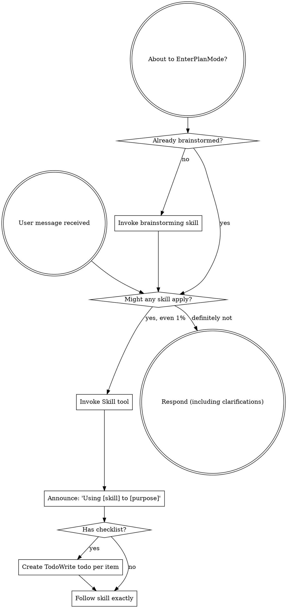

> SYSTEM

# AGENTS.md instructions for /Users/jakobfaber/Developer/repos/github.com/jakobtfaber/dsa110-FLITS

<INSTRUCTIONS>
# Codex Configuration

## Learned User Preferences

- When the user asks about Codex, interpret that as Codex CLI/configuration specifically; do not answer from Cursor MCP or Cursor IDE state unless explicitly asked.
- For cross-agent plan review, use Codex with GPT-5.5 medium effort, Claude Code with Opus 4.8 xhigh effort, and Antigravity through the `agy` CLI when available.
- Be conservative about durable memory: capture recurring corrections and stable workspace facts only, not one-off runtime details or transient command output.
- For chezmoi-managed dotfiles, edit source under `~/Developer/repos/github.com/jakobtfaber/dotfiles/home/`; restore live drift (e.g. tool-injected shell hooks) with `chezmoi apply --force` on the target file, not direct edits to `~/.*`.
- When adding core Homebrew tooling, promote packages into `home/dot_Brewfile.tmpl` (e.g. `dotfiles local promote brew <pkg>`) instead of only running `brew install`.
- Maintain Mac-local agent and observability inventories in `~/Obsidian/LLMs/agents/registry/` (`Agent Registry`, `Agent Observability Registry`, inactive-tools log) alongside chezmoi/dotfiles memory—not only in `AGENTS.md`.
- Keep `wolfbook.mcpEnabled: false` in Cursor and VS Code so the Wolfbook extension does not rewrite Antigravity/Gemini MCP configs on disk.
- Orchestrate Claude Code from Cursor via `claude -p --resume` from the session's project cwd; do not run parallel iTerm sessions on the same Claude session ID.
- Trigger prompt-guided context compaction when the chat context window reaches ~40%.

## Learned Workspace Facts

- Dotfiles are chezmoi-managed from `~/Developer/repos/github.com/jakobtfaber/dotfiles/home/`; `~/.zshrc` maps to `dot_zshrc.tmpl`.
- Interactive agent work runs in Cursor; Claude Code shells use iTerm (`claude -p --resume` from project cwd). cmux was removed Jun 2026 (SwiftUI terminal-panel teardown crashes).
- Devin shell integration injects `MANAGED DEVIN BLOCK` (`devin shell init zsh`) into live `~/.zshrc`, re-wrapping sessions as `devin shell run zsh`; the chezmoi template has no Devin hooks — disable with `chezmoi apply --force ~/.zshrc`, restart terminals, and optionally `devin auth logout`.
- Codex MCP startup paths were migrated away from networked `npx`: Playwright uses `/opt/homebrew/bin/playwright-mcp`, Context7 uses `/opt/homebrew/bin/context7-mcp`, and Sourcegraph uses `SOURCEGRAPH_MCP_REMOTE_BIN=/opt/homebrew/bin/mcp-remote`.
- Maistro MCP is globally registered through `my-skillset` (`meta/mcps.json`) and projected by `mskill install`; Codex/Claude should reach it as `/Users/jakobfaber/.local/bin/mskill mcp maistro`. Do not hand-maintain separate Maistro MCP entries; change `~/Developer/my-skillset/meta/mcps.json`, run `bash meta/install-host.sh`, and verify with `codex mcp get maistro` / `mskill doctor`.
- The cross-agent runtime standard is project opt-in for `mise`; Conda-first repos keep Python owned by Conda, and agent automation should use explicit `mise exec -- ...` or clean `conda run -n ...` runners.
- Antigravity `agy` does not expose stable CLI model/effort flags here; model/effort is verified from Antigravity memory logs as runtime metadata such as `Model Selection ... Gemini 3.5 Flash (Medium)`.
- Runtime-standard validation artifacts live under `~/.codex/automations/runtime-standard/`; local fixtures are `~/Developer/projects/runtime-standard-pilot` and `~/Developer/projects/runtime-standard-conda-pilot`.
- Orphan prior-art-recon `claude -p` workers can persist as PPID 1 after the parent exits; kill manually if they linger.
- Gurobi 13.0.2 on jakob-mbp: native pkgs (`/Library/gurobi1302`, `/Library/gurobi_server1302`, `/usr/local/bin`); WLS license `~/gurobi.lic`; `GUROBI_HOME` in chezmoi `10-env.zsh`; Python via `pip install gurobipy==13.0.2` in `py312` (not conda package `gurobi`). After upgrading the macOS .pkg or pip `gurobipy`, re-verify with fresh `gurobi_cl --license` and a trivial `gurobipy` solve—the two paths update independently.
- HPCC MATLAB: on `hpcc`, MATLAB is module-provided, not on the default PATH. Use `module load matlab/r2026a`; then `matlab` resolves to `/software/Matlab/R2026a/bin/matlab`, `matlabroot` is `/resnick/software/Matlab/R2026a`, and verified version is `26.1.0.3251617 (R2026a) Update 2`. Run non-GUI checks with `matlab -batch "..."`. User MATLAB folder exists at `/home/jfaber/Documents/MATLAB`; `userpath` points there and `prefdir` is `/home/jfaber/.matlab/R2026a`.
- HPCC Mathematica/Wolfram: on `hpcc`, Mathematica is module-provided, not on the default PATH. Available modules verified: `mathematica/11.1`, `12.0`, `12.3`, `13.2`, `14.2`; prefer `module load mathematica/14.2`. Then `wolframscript` resolves to `/resnick/software9/external/Mathematica/14.2/bin/wolframscript`, `math` resolves to `/resnick/software9/external/Mathematica/14.2/bin/math`, `$InstallationDirectory` is `/resnick/software9/external/Mathematica/14.2`, verified `$Version` is `14.2.0 for Linux x86 (64-bit) (December 26, 2024)`, `$UserBaseDirectory` is `/home/jfaber/.Wolfram`, and `$BaseDirectory` is `/usr/share/Wolfram`. Run non-GUI checks with `wolframscript -code '...'` or `math -noprompt -run '...; Exit[]'`.
- HPCC Jupyter/JupyterLab: on `hpcc`, Jupyter is module-provided through Open OnDemand. Use `module load jupyter-ood/7.1.2`; then `jupyter` resolves to `/central/software9/external/jupyter-ood-03262024/bin/jupyter`. Verified stack includes JupyterLab `4.1.5`, Notebook `7.1.2`, IPython `8.22.2`, ipykernel `6.29.3`, jupyter_server `2.13.0`, and jupyter_core `5.7.2`.
- HPCC Julia: on `hpcc`, Julia is module-provided, not on the default PATH. Available modules verified: `julia/1.9.4`, `1.10.2`, `1.10.8`, `1.11.3`, `1.12.2`; prefer `module load julia/1.12.2`. Then `julia` resolves to `/central/software9/external/julia/1.12.2/bin/julia`; verified version is `julia version 1.12.2`.
- HPCC Octave: on `hpcc`, GNU Octave is available on the system PATH without loading a module. `octave` resolves to `/usr/bin/octave`; verified version is `GNU Octave, version 7.3.0`.
- Edison Scientific API: `EDISON_API_KEY` from keychain (`Agents/edison-api-key`); Python client `edison-client` in conda `py312`. PyPI watch: dotfiles workflow `edison-client-pypi-watch` (daily) commits `~/.local/share/edison-client-pypi-watch.json` when a new release ships; `com.jakob.dotfiles-autopull` (30m) runs `chezmoi apply` so onchange upgrades `edison-client` locally. Optional manual/PyPI poll: `edison-client-autoupdate` (24h throttle). Kosmos is web-only (not in API).
- Time Machine destination is external volume `MacBackupDrive` (Samsung T7 Shield); `AutoBackup` runs hourly while attached; redundant Shortcuts mount automation was removed—rely on Time Machine only.
- DSA-110 continuum imaging: active repo is `https://github.com/dsa110/dsa110-continuum`. Legacy `~/Developer/research/archive/dsa110-contimg` is deprecated/archival (read-only); port new work to `dsa110-continuum`, not the archive tree.
- `~/Developer/research/AGENTS.md` defines the two-tree rule: `research/` = owned active work (flat repos + archive); upstream clones → `~/Developer/reference/<domain>/`. `astrophysics/` is the unified radio workspace (merged from `radio-astronomy`); `blimpy`/`FRB` live in `reference/astrophysics/`.
- Orchestrator memory (Maistro) lives at `~/Developer/repos/github.com/jakobtfaber/maistro` (`jakobtfaber/maistro`, SQLite event log, RPC writer on :8787, `https://dashboard.jakobtfaber.com`); bearer token in keychain service `Agents`, account `orch-rpc-token`.
- Pulsar periodicity research: `~/Developer/repos/github.com/jakobtfaber/gridless-pulsar` (`jakobtfaber/gridless-pulsar`); GPU coherent folding is the north star; comb-ANM is a refinement tier only (FRB scope removed).

## Codex from Cursor agent Shell

Full runbook: **`~/Developer/reference/cursor-agent-shell-cli-insights.md`**.

When Cursor (or another IDE) runs **`codex exec`** via agent **Shell**, use **subscription auth only** (`codex login` / ChatGPT tokens). Do **not** set **`OPENAI_API_KEY`** for automation unless the workflow explicitly needs API billing.

Prefer **Cursor `Task`** for small in-IDE delegation. Use **`codex exec`** when you need the full CLI tool surface; diagnose the **child Shell process**, not the chat UI alone.

### Argv-vs-stdin rule

- **Prompt as argv ⇒ close stdin:** `codex exec "…" < /dev/null`.
- If **`codex doctor`** shows ChatGPT auth and the process prints **`Reading additional input from stdin...`**, debug **stdin** before auth, `--full-auto`, or API-key settings.

### Root cause (observed in Cursor agent Shell)

Cursor agent Shell **can** leave stdin open. When **`codex exec`** receives the prompt as an **argument**, it may wait indefinitely for additional stdin.

### Required

```bash
codex exec "Your task here" < /dev/null

codex exec -C /path/to/repo "Your task" < /dev/null

# Unattended — restricted actions may fail instead of prompting
codex exec -c 'approval_policy="never"' "Your task" < /dev/null
```

Smoke tests: **`gtimeout`** from **`brew install coreutils`**, or Homebrew **`timeout`** (`which timeout gtimeout`) — avoid multi-hour zombies.

### Sanity check

```bash
codex doctor   # expect stored auth mode chatgpt, stored API key false
```

### Do not

- Run **`codex exec "…"`** without **`< /dev/null`** from Cursor agent Shell when the prompt is argv.
- Background **`codex exec`** without a watchdog unless stdin is explicitly closed.
- Assume hangs mean broken login when the stdin message appears.

### Expectations

- **~60–90s** for trivial invokes on this machine (hooks/config) is a local baseline; runs should **complete**, not hang, when stdin is closed.

### Output channels

Treat `codex exec` stdout as an execution transcript, not as a reliable machine-readable final answer. Normal stdout may include banners, prompts, hook lifecycle messages, the final assistant message, and token usage.

Use the output channel that matches the task:

- **Human-readable delegation:** let stdout print normally when a person will read the transcript.
- **Machine-readable artifact:** use `-o FILE` / `--output-last-message FILE` for the final model message, and redirect stdout/stderr to logs.
- **Event/debug stream:** use `--json` only when you want JSONL execution events; do not treat it as a single final-answer JSON document.

Canonical structured-output pattern:

```bash
mkdir -p logs

codex exec \
  -m gpt-5.5 \
  --skip-git-repo-check \
  -o result.json \
  "$PROMPT" \
  > logs/codex.stdout.log \
  2> logs/codex.stderr.log \
  < /dev/null

python3 -m json.tool result.json >/dev/null
```

Do not parse normal `codex exec` stdout as JSON unless using `--json` and expecting JSONL events. Do not use `--ignore-user-config` for normal delegation; reserve it for debugging Codex itself because it changes the execution environment.

## Runtime Management

- Repositories are opt-in for `mise` through repo-local `mise.toml`; do not set global `mise` Python.
- Conda-first repositories own Python through Conda; do not add `python` to `mise.toml` there unless explicitly migrating away from Conda.
- Agent automation must use explicit runners: `mise exec -- ...` for mise-first repos, or a clean `conda run -n ...` wrapper for Conda-first repos.
- `direnv` is for interactive shell convenience only. Hooks, agents, and non-interactive scripts must not depend on `.envrc` being loaded.
- MCP binaries used at agent startup are Homebrew-managed system tools, not project runtimes. Do not reintroduce `npx` on Codex MCP startup paths.
- On this machine, inherited interactive PATH state can make bare `conda run -n py312 python` resolve base Anaconda Python. For agent-safe Conda checks, prefer:
  `env -i HOME="$HOME" PATH="/opt/anaconda3/bin:/opt/homebrew/bin:/usr/bin:/bin" /opt/anaconda3/bin/conda run -n py312 ...`

## Skills — GitHub Sync

Custom skills are version-controlled in the private `my-skillset` repository.

- **Canonical local clone:** `~/Developer/repos/github.com/jakobtfaber/my-skillset/`
- **Compatibility symlink:** `~/Developer/projects/my-skillset` → `~/Developer/repos/github.com/jakobtfaber/my-skillset`
- **Compatibility symlink:** `~/Developer/my-skillset` → `~/Developer/repos/github.com/jakobtfaber/my-skillset`
- **Claude symlink:** `~/.claude/my-skillset` → `~/Developer/repos/github.com/jakobtfaber/my-skillset`
- **Codex symlink:** `~/.codex/my-skillset` → `~/Developer/repos/github.com/jakobtfaber/my-skillset`
- **Codex active skills symlink:** `~/.codex/skills` → `~/.codex/skills-minimal`
- **Codex minimal skill set:** `~/.codex/skills-minimal` contains a curated mix of local skill folders and symlinks into `my-skillset`; do not repoint it to the full skill tree unless intentionally reversing prompt-bloat pruning.
- **Auto-pull agent:** `com.jakob.skills-autopull`

Do not use the retired `~/Developer/misc/claude-config` path for current skill sync.

## Persistent Agent Memory

Use `~/Developer/repos/github.com/jakobtfaber/dotfiles/memory/` as the manual intent/context memory layer. This is the canonical memory store and the only persistent agent-memory store managed by dotfiles.

- Manual memory notes: `~/Developer/repos/github.com/jakobtfaber/dotfiles/memory/`
- Memory index: `~/Developer/repos/github.com/jakobtfaber/dotfiles/memory/MEMORY.md`
- Runtime memory path: `~/.claude/projects/-Users-jakobfaber/memory/` symlinks to `~/Developer/repos/github.com/jakobtfaber/dotfiles/memory/`
- Daily auto-commit of the memory subtree: launchd job `com.jakobfaber.dotfiles-memory-snapshot` (S-009)

Codex may update its own managed store under `~/.codex/memories/`, but any durable memory-worthy fact, correction, preference, or workspace state written there must also be captured in `~/Developer/repos/github.com/jakobtfaber/dotfiles/memory/` by default. Treat Codex memory as a Codex-local copy/cache, not the only durable record.

Do not create ad-hoc memory directories under `~/.codex/` for persistent memory.
Do not inspect `~/.claude-mem/` for current memory health; that retired directory no longer exists.

## Task Status Semantics

Use strict closure semantics when tracking tasks, updating a temporary to-do list, or summarizing whether work is done.

- `completed`: no further action remains for that item.
- `blocked`: cannot proceed without user input or an external state change.
- `diagnosed`: root cause or next step is known, but the fix/work is not complete.
- `validated`: behavior was checked, but there may still be follow-up.
- `decision pending`: implementation or investigation is sufficient, but a product/UX/cleanup choice remains.

If the available task-tracking tool only supports `pending`, `in_progress`, and `completed`, do not mark blocked/diagnosed/decision-pending work as `completed`. Keep the item `pending`, or split it into a completed investigation item plus a separate pending follow-up with the explicit status in the task text.

## Proactive Stopping Points

When work changes runtime behavior, tool availability, config, MCP servers, daemons, launch agents, browser/app state, shell startup, or any long-lived process, do not stop at a generic note such as "restart required" or "you may need to restart." Before final response, proactively identify the concrete affected process, service, app, server, port, or session that needs reload/restart, inspect what is currently running when practical, and stop at the actionable question with named targets, for example: "Shall I restart `X` and `Y`?" If the restart/reload is reversible and already authorized by the user, perform it and verify the new behavior instead of asking. If it is disruptive, kills user state, or crosses a one-way/outward boundary, ask with the explicit target list and blast radius.

Before claiming completion after file edits, run `agent-closeout-check` or `mskill tool agent-closeout-check` for every repo touched when either condition applies: the repo is dirty, or touched paths could affect runtime behavior. Pass each repo with `--repo`; pass known changed runtime/config paths with `--touched`; pass `--packet <closeout.json>` once you have a dirty-state handoff and/or restart inventory. If the checker fails, do not replace it with a vague caveat. Either produce the required dirty-state handoff packet, perform and verify the required restart, or stop at the concrete next question emitted by the check.

## Dirty Git State

<important if="you see dirty files in a git repo, or a command reports modified, staged, untracked, deleted, renamed, or conflicted files">
Use the `dirty-git-state` skill from `my-skillset` before deciding whether to inspect, edit, clean, stage, commit, or ask the user.

When committing, commit validated, task-scoped changes once the work is complete.
For pre-existing changes, review all of them before committing. Only include them
once they are fully understood, are not transient real-time development state,
and are deemed worthy of commit. If ownership, intent, or readiness is ambiguous
after review, leave the ambiguous changes uncommitted and report the ambiguity.
</important>

<important if="you are asked to run a code review or delegate a task using Codex or Claude">
- For Codex reviews, run Codex non-interactively using:
  `codex exec -m gpt-5.5 -c model_reasoning_effort="medium" "..." < /dev/null`
  This uses gpt-5.5 with medium effort by default.
- For Claude reviews, run Claude non-interactively using:
  `claude --model claude-opus-4-8 --effort xhigh -p "..." < /dev/null`
  This uses Opus 4.8 with xhigh effort by default.
</important>

## Authentication & Verification Protocols

When verifying, investigating, or inspecting the health, connectivity, or authentication state of any service, tool, or API (e.g., Grov, Firecrawl, MCP, ACP, or coding harnesses):

1. **Do Not Blindly Trust CLI Self-Checkers (`doctor` / `status` outputs)**:
   Never take a diagnostic command (e.g., `doctor`, `status`, `healthcheck`) showing green checkmarks as absolute proof of live runtime operational health. These commands often only check if your local configuration files are structured correctly without testing active connection channels.
2. **Test Live Operational Handshakes**:
   Always execute a minor, non-destructive live operational command (e.g., running a Dry-Run, pulling a mock schema, or making a safe query) to force a true cryptographic handshake with the API endpoint.
3. **Inspect Backing Configs Directly**:
   Always locate and inspect the underlying configuration and credentials storage files (JSON, TOML, SQLite databases, or environment variables) directly. Check active token lifetimes, `expires_at` timestamps, scopes, and encryption validity against the current local system time (e.g., `credentials.json` expiration dates) to verify active session state.

<!-- opensrc:start -->
## opensrc — dependency source for deeper context

`opensrc` (CLI, installed globally) caches dependency **source code** at `~/.opensrc/` so agents can read a package's internal implementation, not just its public types/interface. Cached inventory: `~/.opensrc/sources.json`.

- **Fetch (cache only):** `opensrc fetch <pkg>` — cross-registry: `opensrc fetch pypi:<pkg> crates:<pkg> <owner>/<repo>`
- **Read (fetches on cache miss):** `rg "pattern" $(opensrc path <pkg>)` · `cat $(opensrc path <pkg>)/path/to/file` · `find $(opensrc path <pkg>) -name "*.ts"`

Use it when you need to understand *how* a dependency works internally (npm, PyPI, crates.io, or a GitHub repo), not just its surface API.
<!-- opensrc:end -->

@/Users/jakobfaber/.codex/RTK.md

--- project-doc ---

# AGENTS.md

Repo-level agent guidance for FLITS. Full project guide: `CLAUDE.md`.
Binding fit-validation contract: `.cursor/rules/AGENT_CONFIGURATION_FLITS.md`.

## Long-View Science Goals

The primary objective of the CHIME–DSA co-detection analysis and the FLITS pipeline is to reconstruct the complete line-of-sight dispersion measure (DM) and scattering budgets for the 12 co-detected bursts.

1. **Accurate Scattering Index (\(\alpha\)) Measurement:** Break the degeneracy between scattering time \(\tau\) and index \(\alpha\) by fitting CHIME (400–800 MHz) and DSA-110 (1.2–1.5 GHz) data simultaneously with a shared model, leveraging the \(\sim 1\) GHz frequency lever arm.
2. **Mitigating Profile Bias:** Detect hidden temporal sub-components (multi-pulse structures). Left unmodeled, secondary pulses bias \(\alpha\) high (e.g. \(\alpha \approx 3.3 \to 2.7\)). Fits must model sub-components to ensure physical honesty.
3. **Sightline Attribution:** Partition observed \(DM_{\text{obs}}\) and scattering \(\tau_{\text{obs}}\) to constrain host-galaxy, Milky Way, and intervening foreground contributions (probing the CGM/groups/clusters of 49 candidate intervening systems).


## Review guidelines

Used by Codex automatic code review (and any agent reviewing a PR). Flag only
real P0/P1 issues; skip style that ruff already enforces. Ignore base64 image
payloads embedded in `docs/*.html`.

- **Physics kernel ownership.** `scattering/scat_analysis/burstfit.py` is the
  canonical kernel; `flits/` wraps it. Model-physics changes belong in
  `burstfit.py` — flag edits that fork physics into the wrapper.
- **Fit validation is mandatory.** Flag any change that could rationalize a
  failing/marginal fit into a pass, drop a validation level (Level-1 gates,
  chi2_red / R2, physics `tau*dnu` in [0.1, 2.0], alpha bounds), or bypass the
  diagnostic-figure review gate. A numeric PASS without figure review is not a pass.
- **Physics sanity.** Enforce bounds `0.0001 < tau < 100 ms` and
  `1.5 < alpha < 6.0`; check units and the frequency-ascending load assumption.
- **Lazy-minimalist (ponytail).** Flag unnecessary abstractions, dead code,
  speculative config, and parallel near-duplicate modules. Prefer the shortest
  correct diff — but never trade scientific rigor or a validation level for brevity.

</INSTRUCTIONS>
<environment_context>
  <cwd>/Users/jakobfaber/Developer/repos/github.com/jakobtfaber/dsa110-FLITS</cwd>
  <shell>zsh</shell>
  <current_date>2026-06-24</current_date>
  <timezone>America/Los_Angeles</timezone>
  <filesystem><workspace_roots><root>/Users/jakobfaber/Developer/repos/github.com/jakobtfaber/dsa110-FLITS</root></workspace_roots><permission_profile type="managed"><file_system type="restricted"><entry access="read"><special>:root</special></entry></file_system></permission_profile></filesystem>
</environment_context>

> DEVELOPER

Independently verify whether these 5 git branches are STALE/SUPERSEDED and safe to DELETE (both local refs/heads and remote origin/<branch>). Repo: dsa110-FLITS fork (origin = jakobtfaber/dsa110-FLITS).

Branches:
1. chore/mkdocs-github-pages
2. docs/issue-37-nladder-resolved
3. docs/nladder-nlive300-refine
4. docs/research-joint-fit-state
5. fix/issue-37-per-band-dt-min

MY CLAIM (try to REFUTE it): each branch's work is already in origin/main, each has ZERO unique unmerged commits, and no open PR points at any of them, so all 5 are safe to delete.

Use ONLY already-fetched refs (do NOT run 'git fetch' — read-only sandbox, no network). For EACH branch run and reason over:
- git cherry -v origin/main origin/<branch>  -> SAFE requires EVERY line prefixed '-' (patch-equivalent already in main). ANY '+' line = a real unmerged commit = NOT_SAFE.
- git rev-list --count origin/main..origin/<branch> and inspect those commit subjects (git log origin/main..origin/<branch> --oneline) — confirm they are squash-merged equivalents (often carry a (#NN) referencing a merged PR).
- git diff origin/<branch> origin/main --stat to sanity-check direction (main should only be strictly ahead; the branch should introduce nothing main lacks).
- Also compare local refs/heads/<branch> vs origin/<branch>: if the local ref is ahead of its remote, that local-only delta must be called out (could be unpushed work) -> NOT_SAFE for the LOCAL delete.

For open-PR check: gh may have no network in this sandbox; if 'gh pr list --state open --head <branch>' fails, say so and rely on the caller's separate confirmation that only PR #41 (now merged) was open.

Output one line PER BRANCH starting EXACTLY with 'SAFE_TO_DELETE <branch>' or 'NOT_SAFE <branch>', then a final 'OVERALL: SAFE' or 'OVERALL: NOT_SAFE (...)'. Include the concrete cherry/rev-list evidence per branch. Read-only; modify nothing, delete nothing.

> AGENT

I’ll verify this strictly from the existing refs and will not modify or delete anything. I’m also doing the required skill check first, then I’ll run the branch evidence commands locally only.

> TOOL

tool_use shell_command
id: call_grsfeWqFPl1y9JQisudPGoWN
```json
{
  "command": "sed -n '1,220p' /Users/jakobfaber/.codex/plugins/cache/openai-curated/superpowers/3c06cb2e/skills/using-superpowers/SKILL.md",
  "workdir": "/Users/jakobfaber/Developer/repos/github.com/jakobtfaber/dsa110-FLITS",
  "timeout_ms": 10000
}
```

> TOOL

tool_result
id: call_grsfeWqFPl1y9JQisudPGoWN
```
Exit code: 0
Wall time: 0.1 seconds
Output:
---
name: using-superpowers
description: Use when starting any conversation - establishes how to find and use skills, requiring Skill tool invocation before ANY response including clarifying questions
---

<SUBAGENT-STOP>
If you were dispatched as a subagent to execute a specific task, skip this skill.
</SUBAGENT-STOP>

<EXTREMELY-IMPORTANT>
If you think there is even a 1% chance a skill might apply to what you are doing, you ABSOLUTELY MUST invoke the skill.

IF A SKILL APPLIES TO YOUR TASK, YOU DO NOT HAVE A CHOICE. YOU MUST USE IT.

This is not negotiable. This is not optional. You cannot rationalize your way out of this.
</EXTREMELY-IMPORTANT>

## Instruction Priority

Superpowers skills override default system prompt behavior, but **user instructions always take precedence**:

1. **User's explicit instructions** (CLAUDE.md, GEMINI.md, AGENTS.md, direct requests) — highest priority
2. **Superpowers skills** — override default system behavior where they conflict
3. **Default system prompt** — lowest priority

If CLAUDE.md, GEMINI.md, or AGENTS.md says "don't use TDD" and a skill says "always use TDD," follow the user's instructions. The user is in control.

## How to Access Skills

**In Claude Code:** Use the `Skill` tool. When you invoke a skill, its content is loaded and presented to you—follow it directly. Never use the Read tool on skill files.

**In Copilot CLI:** Use the `skill` tool. Skills are auto-discovered from installed plugins. The `skill` tool works the same as Claude Code's `Skill` tool.

**In Gemini CLI:** Skills activate via the `activate_skill` tool. Gemini loads skill metadata at session start and activates the full content on demand.

**In other environments:** Check your platform's documentation for how skills are loaded.

## Platform Adaptation

Skills use Claude Code tool names. Non-CC platforms: see `references/copilot-tools.md` (Copilot CLI), `references/codex-tools.md` (Codex) for tool equivalents. Gemini CLI users get the tool mapping loaded automatically via GEMINI.md.

# Using Skills

## The Rule

**Invoke relevant or requested skills BEFORE any response or action.** Even a 1% chance a skill might apply means that you should invoke the skill to check. If an invoked skill turns out to be wrong for the situation, you don't need to use it.



## Red Flags

These thoughts mean STOP—you're rationalizing:

| Thought | Reality |
|---------|---------|
| "This is just a simple question" | Questions are tasks. Check for skills. |
| "I need more context first" | Skill check comes BEFORE clarifying questions. |
| "Let me explore the codebase first" | Skills tell you HOW to explore. Check first. |
| "I can check git/files quickly" | Files lack conversation context. Check for skills. |
| "Let me gather information first" | Skills tell you HOW to gather information. |
| "This doesn't need a formal skill" | If a skill exists, use it. |
| "I remember this skill" | Skills evolve. Read current version. |
| "This doesn't count as a task" | Action = task. Check for skills. |
| "The skill is overkill" | Simple things become complex. Use it. |
| "I'll just do this one thing first" | Check BEFORE doing anything. |
| "This feels productive" | Undisciplined action wastes time. Skills prevent this. |
| "I know what that means" | Knowing the concept ≠ using the skill. Invoke it. |

## Skill Priority

When multiple skills could apply, use this order:

1. **Process skills first** (brainstorming, debugging) - these determine HOW to approach the task
2. **Implementation skills second** (frontend-design, mcp-builder) - these guide execution

"Let's build X" → brainstorming first, then implementation skills.
"Fix this bug" → debugging first, then domain-specific skills.

## Skill Types

**Rigid** (TDD, debugging): Follow exactly. Don't adapt away discipline.

**Flexible** (patterns): Adapt principles to context.

The skill itself tells you which.

## User Instructions

Instructions say WHAT, not HOW. "Add X" or "Fix Y" doesn't mean skip workflows.

```

> AGENT

Using `superpowers:using-superpowers` to satisfy the session skill rules. This request is a local git verification task, so I’m keeping the workflow evidence-driven and branch-by-branch.

> TOOL

tool_use shell_command
id: call_DOB75xEn8OkuYg0fbcWovUiE
```json
{
  "command": "rg -n \"chore/mkdocs-github-pages|docs/issue-37-nladder-resolved|docs/nladder-nlive300-refine|docs/research-joint-fit-state|fix/issue-37-per-band-dt-min|issue-37|nladder|joint-fit\" /Users/jakobfaber/.codex/memories/MEMORY.md",
  "workdir": "/Users/jakobfaber/Developer/repos/github.com/jakobtfaber/dsa110-FLITS",
  "timeout_ms": 10000
}
```

> TOOL

tool_result
id: call_DOB75xEn8OkuYg0fbcWovUiE
```
Command blocked by PreToolUse hook: rtk-codex-guard: shell command should use RTK compact output.

Suggested command:
rtk grep -n "chore/mkdocs-github-pages|docs/issue-37-nladder-resolved|docs/nladder-nlive300-refine|docs/research-joint-fit-state|fix/issue-37-per-band-dt-min|issue-37|nladder|joint-fit" /Users/jakobfaber/.codex/memories/MEMORY.md

To bypass for this command, prefix it with: RTK_DISABLED=1. Command: rg -n "chore/mkdocs-github-pages|docs/issue-37-nladder-resolved|docs/nladder-nlive300-refine|docs/research-joint-fit-state|fix/issue-37-per-band-dt-min|issue-37|nladder|joint-fit" /Users/jakobfaber/.codex/memories/MEMORY.md
```

> AGENT

The local hook is enforcing compact search output, so I’m using its `rtk grep` form for the memory pass and then I’ll move straight to git refs.

> TOOL

tool_use shell_command
id: call_nkHCNdvqfYlWSUYySFUHeWCK
```json
{
  "command": "rtk grep -n \"chore/mkdocs-github-pages|docs/issue-37-nladder-resolved|docs/nladder-nlive300-refine|docs/research-joint-fit-state|fix/issue-37-per-band-dt-min|issue-37|nladder|joint-fit\" /Users/jakobfaber/.codex/memories/MEMORY.md",
  "workdir": "/Users/jakobfaber/Developer/repos/github.com/jakobtfaber/dsa110-FLITS",
  "timeout_ms": 10000
}
```

> TOOL

tool_result
id: call_nkHCNdvqfYlWSUYySFUHeWCK
```
Exit code: 0
Wall time: 0.1 seconds
Output:
5 matches in 1 files:

/Users/jakobfaber/.codex/memories/MEMORY.md:62:- extensions/chronicle/resources/2026-06-23T04-03-00-SJjn-10min-memory-summar...
/Users/jakobfaber/.codex/memories/MEMORY.md:66:- telescopes.yaml, flux_jy_per_unit: null, calculate_burst_energies.py, analy...
/Users/jakobfaber/.codex/memories/MEMORY.md:156:- The ongoing scintillation reproduction investigation already corrected one ...
/Users/jakobfaber/.codex/memories/MEMORY.md:180:- Symptom: a nested-fit harness or analysis artifact seems safe to absorb wit...
/Users/jakobfaber/.codex/memories/MEMORY.md:183:- Symptom: a radiometer-calibration plan tries to pull per-channel noise or s...

```

> AGENT

The memory index only has broad FLITS references, not direct branch evidence. I’m going to rely on the local git object database and explicitly report any limitation around PR lookup.

> TOOL

tool_use shell_command
id: call_mEFodeBVv3NZF5vdkZE17YaW
```json
{
  "command": "sed -n '50,75p' /Users/jakobfaber/.codex/memories/MEMORY.md",
  "workdir": "/Users/jakobfaber/Developer/repos/github.com/jakobtfaber/dsa110-FLITS",
  "timeout_ms": 10000
}
```

> TOOL

tool_use shell_command
id: call_NvmKOFwe5pN5necAygM9Vett
```json
{
  "command": "sed -n '150,187p' /Users/jakobfaber/.codex/memories/MEMORY.md",
  "workdir": "/Users/jakobfaber/Developer/repos/github.com/jakobtfaber/dsa110-FLITS",
  "timeout_ms": 10000
}
```

> TOOL

tool_result
id: call_mEFodeBVv3NZF5vdkZE17YaW
```
Exit code: 0
Wall time: 0.1 seconds
Output:
### rollout_summary_files

- extensions/chronicle/resources/2026-06-23T01-44-00-eADA-10min-memory-summary.md (cwd=/Users/jakobfaber/Developer/repos/github.com/jakobtfaber/dsa110-FLITS, rollout_path=/Users/jakobfaber/.codex/memories/extensions/chronicle/resources/2026-06-23T01-44-00-eADA-10min-memory-summary.md, updated_at=2026-06-23T01:44:00, thread_id=None, success; retried pytest from a sanitized `flits` env, pushed the fork, and retargeted the HPCC clone metadata toward the fork without touching its dirty worktree) [chronicle memory]

### keywords

- conda run -n flits pytest -m "not slow", ModuleNotFoundError: No module named 'flits', env -i HOME="$HOME" PATH="/opt/anaconda3/bin:/opt/homebrew/bin:/usr/bin:/bin", 351 passed, 1 skipped, 12 deselected, dad7e52, /home/jfaber/flits/dsa110-FLITS, fork origin/main

## Task 6: Keep burst-energy outputs calibration-gated and treat the nested-fit harness as a separate dirty lane, partial

### rollout_summary_files

- extensions/chronicle/resources/2026-06-23T04-03-00-SJjn-10min-memory-summary.md (cwd=/Users/jakobfaber/Developer/repos/github.com/jakobtfaber/dsa110-FLITS, rollout_path=/Users/jakobfaber/.codex/memories/extensions/chronicle/resources/2026-06-23T04-03-00-SJjn-10min-memory-summary.md, updated_at=2026-06-23T04:03:00, thread_id=None, partial; captured the `telescopes.yaml` calibration seam, exact-energy self-checks, unresolved SEFD/beam-response blocker, and the separate `inject_recovery.py` / `/tmp/nladder.py` harness lane) [chronicle memory]

### keywords

- telescopes.yaml, flux_jy_per_unit: null, calculate_burst_energies.py, analysis/burst_energies, self-check OK: integral matches quadrature; energy oracle, k-correction, and gate exact, radiometer equation, SEFD, beam response, h23, inject_recovery.py, /tmp/nladder.py

## Task 7: Copy the first CHIME singlebeam HDF5 to `h17`, remove the Mac-local copy only after verification, and prove direct CANFAR-to-`h17` access, success

### rollout_summary_files

- extensions/chronicle/resources/2026-06-23T00-32-00-CbTO-10min-memory-summary.md (cwd=/Users/jakobfaber/Developer/repos/github.com/jakobtfaber/dsa110-FLITS, rollout_path=/Users/jakobfaber/.codex/memories/extensions/chronicle/resources/2026-06-23T00-32-00-CbTO-10min-memory-summary.md, updated_at=2026-06-23T00:32:00, thread_id=None, success; `singlebeam_210456524.h5` was verified on `h17`, the Mac-local copy was deleted only after that check, and direct authenticated VOSpace access on `h17` was confirmed) [chronicle memory]
- extensions/chronicle/resources/2026-06-23T00-10-00-FHwB-10min-memory-summary.md (cwd=/Users/jakobfaber/Developer/repos/github.com/jakobtfaber/dsa110-FLITS, rollout_path=/Users/jakobfaber/.codex/memories/extensions/chronicle/resources/2026-06-23T00-10-00-FHwB-10min-memory-summary.md, updated_at=2026-06-23T00:10:00, thread_id=None, success; captured the initial Mac-to-`h17` copy decision, `ubuntu@lxd110h17`, and the visible `/data` free-space check) [chronicle memory]

### keywords

```

> TOOL

tool_result
id: call_NvmKOFwe5pN5necAygM9Vett
```
Exit code: 0
Wall time: 0.1 seconds
Output:
- `casey_dsa.yaml` was the row that still pointed at a stale relative local path, and `data-manifest.csv` needed synchronized DSA filename/status cleanup alongside the YAML edits; `agent-closeout-check` accepted the remaining unrelated `burstfit_joint.py` as pre-existing separate work [Task 1]
- The visible co-detection planning outputs in this fork were `docs/codetection-science-plan.md`, `CONTEXT.md`, and `docs/adr/0001-two-band-leverage-positioning.md`; the durable science frame was “two-screen localization” via a constraint ladder, while `crossmatching/` remained a stub/aspirational surface [Task 2] [chronicle memory]
- Phase-1 co-detection/scintillation work was blocked by data placement, not by missing code only: the 234 GB CHIME/DSA dataset lived on `iacobus`, and campaign work needed that data mounted or `DATA_DIR` set before burst-parallel runs over the 12-burst sample [Task 2] [chronicle memory]
- `scintillation/scint_analysis/consistency.py` now visibly carries `band_consistency()`, `consistency_formulaic()`, and `consistency_table()` over `analysis/scattering-refit-2026-06/*_multiscale*.json`; the recorded run produced `results/consistency.csv` with all three measured bursts marked `consistent=False` and `C_implied = 10^-10`, while `two_screen_coherence_constraint` / `D_eff` was still unwired [Task 3] [chronicle memory]
- FLITS looked CPU-bound in the visible config/code surfaces: `emcee`/`dynesty` over NumPy with no GPU stack in project config files. If reproducibility/container work appears later on HPCC, Apptainer is the relevant path rather than Docker/GPU-container defaulting [Task 3] [chronicle memory]
- CADC archive reachability changed the “blocked” story: `vls`/`vcp` worked with the local CADC proxy, DSA and CHIME files were reachable remotely, and only true HDF5-based extraction still required a temporary local copy because the payload endpoint did not honor the expected `Range` behavior for the extractor [Task 4] [chronicle memory]
- The ongoing scintillation reproduction investigation already corrected one bad story: an earlier “82 ms centering / 47 ms offset” claim was retracted and preserved as a correction in `DATA_SOURCES.md`, then replaced by a multi-probe workflow over joint-fit provenance, archive timestamps, crop behavior, and `gain_ladder` reruns [Task 4] [chronicle memory]
- In this repo, inherited shell state can make `conda run -n flits` silently use base Anaconda. The reliable recovery was `env -i HOME="$HOME" PATH="/opt/anaconda3/bin:/opt/homebrew/bin:/usr/bin:/bin" /opt/anaconda3/bin/conda run -n flits ...`, after which the visible smoke gate was `351 passed, 1 skipped, 12 deselected` [Task 5] [chronicle memory]
- The HPCC mirror at `/home/jfaber/flits/dsa110-FLITS` can be a dirty working tree even when the local fork was just validated and pushed; the safe action shown here was retargeting branch metadata toward the fork and pruning phantom tracking refs without touching the 104 uncommitted WIP changes [Task 5] [chronicle memory]
- `telescopes.yaml` is the visible calibration seam for burst-energy work: `flux_jy_per_unit: null` per band means uncalibrated runs should emit native-unit fluence integrals plus a calibration-pending stub, while calibrated runs sum Jy energies only after the `(1+z)` scaling step [Task 6] [chronicle memory]
- The active blocker for the current energy lane was not code structure but missing per-band SEFD and beam-response values for eight sightlines; the user also believed the DSA-110 primary beam model existed on `h23`, which is a useful lead to verify before hard-coding workarounds [Task 6] [chronicle memory]
- The working `h17` target started as `/data/ubuntu/chime-dsa-codetections/chime_singlebeam/singlebeam_210456524.h5`, with byte count `1171470638` and HDF5 signature `894844460d0a1a0a`; deleting the Mac-local copy was deferred until that remote copy was verified [Task 7] [chronicle memory]
- Direct CANFAR-to-`h17` was validated through authenticated `vos.Client()` access on `h17`; the unauthenticated file-service URL path returned `403 Forbidden`, so future large transfers should go through the authenticated VOSpace client rather than the plain file-service URL [Task 7] [chronicle memory]
- The visible reproduction chain for scattering refits was `raw .npy` -> `gain_ladder.py` -> `gain_ladder.npz` -> `multiscale_fit.py`; `multiscale_fit.py` consumes the gain-corrected intermediate rather than the raw `.npy`, `casey_joint_fit.json` was absent, and `freya` / `wilhelm` were the visible bursts with joint fits to anchor on [Task 9] [chronicle memory]
- `joint_fit.json` is a summary artifact, not a per-channel calibration artifact: it carried medians like `c0_C/D`, `t0_C/D`, and `zeta_C/D`, but no per-channel noise or spectra, so radiometer calibration still needed `.npy` reloads or fit-input context rather than only the JSON [Task 9] [chronicle memory]
- `h17` eventually held all 12 CHIME singlebeam HDF5 files under `/data/research/astrophysics/frbs/chime-dsa-codetections/chime_singlebeam/`, plus a fresh CANFAR source snapshot and a pulled `chimefrb/baseband-analysis:latest` image with wrapper scripts mounted at `/data` inside the container [Task 10] [chronicle memory]
- The corrected CHIME flux-units story was: singlebeam values are pre-flux-calibration, arbitrary/gain-only units; `BurstDataset._bandpass_correct` z-scores channels into S/N for FLITS fitting; the chosen calibration sequence was DSA first, then CHIME, with per-channel radiometer factors multiplied later [Task 10] [chronicle memory]
- The DSA filterbank source inventory was split across hosts: most filterbanks were on `dsastorage` under `/mnt/data/dsa110/candidates/candidates/<burst>/Level3/`, while missing burst `240203aacl` appeared on `h23` under `/dataz/dsa110/candidates/240203aacl/Level3/` [Task 11] [chronicle memory]
- The successful no-staging transfer pattern was a reverse SSH tunnel from the Mac into `h17`, exposing `iacobus:22` as `h17:127.0.0.1:22022` with agent forwarding; when `openrsync` compatibility and spaces-in-path issues were handled, `h17` could launch rsync directly without copying a private key or staging filterbanks on the Mac [Task 11] [chronicle memory]
- Repo/manuscript boundaries were explicit late on June 23: `analysis/burst_energies/burst_energies.tex` was already generated in `dsa110-FLITS`, `CALIBRATION_REVIEW.md` held the method/prose justification, and `~/Developer/overleaf/Faber2026` was a separate dirty repo that had not yet included the generated E_iso section until the user approved wiring it in [Task 12] [chronicle memory]

## Failures and how to do differently

- Symptom: a DSA path dispute gets checked against `iacobus` or another local mirror first -> cause: those paths are not the authority for the YAML/manifest in this lane -> fix: verify the live CANFAR `arc:` path and update both the YAMLs and the manifest from that source [Task 1]
- Symptom: a shell validation loop suddenly reports impossible path misses -> cause: a zsh variable name clobbered the shell `PATH` array -> fix: avoid reserved shell variable names in ad hoc validation helpers [Task 1]
- Symptom: a planning summary overstates repo readiness -> cause: mature kernels, partial surfaces, and stubs were collapsed into one bucket -> fix: inventory the actual modules and say which seams are mature, partial, brittle, or aspirational before proposing next steps [Task 2] [chronicle memory]
- Symptom: “data-blocked” is used too broadly -> cause: archive reachability, local mount state, and derived-vs-raw artifact needs were not separated -> fix: test CADC/VOSpace live, distinguish dynamic spectra from derived ACF summaries, and localize only the files that truly require local HDF5 access [Task 4] [chronicle memory]
- Symptom: byte-range probing suggests remote HDF5 extraction will work -> cause: the first URL hit VOSpace metadata XML, and the payload endpoint still returned full content rather than useful `Range` behavior -> fix: confirm the HDF5 signature bytes on the data view, then assume a temporary local copy is needed for `h5py`-based extractors [Task 4] [chronicle memory]
- Symptom: `conda run -n flits` still cannot import `flits` -> cause: inherited PATH/env state routed the command into base Anaconda Python -> fix: rerun from a sanitized environment before treating the repo as broken [Task 5] [chronicle memory]
- Symptom: the energy lane looks blocked by “methodology unknown” -> cause: the method and checks already exist, but the actual per-band SEFD/beam-response numbers are missing -> fix: keep the code calibration-gated and pursue the external calibration values instead of weakening the gate [Task 6] [chronicle memory]
- Symptom: a nested-fit harness or analysis artifact seems safe to absorb with the energy lane -> cause: concurrent agents were actively producing separate untracked work under `analysis/burst_energies/` and `/tmp/nladder.py` -> fix: leave those as distinct lanes until they have their own verification and commit story [Task 6] [chronicle memory]
- Symptom: a remote CANFAR fetch from `h17` fails with `403 Forbidden` even though the file exists -> cause: the plain file-service URL was unauthenticated -> fix: use authenticated VOSpace access on `h17` (`vos.Client()` / existing CADC config) instead of assuming the direct file-service path will work [Task 7] [chronicle memory]
- Symptom: a local `baseband-analysis` checkout on `h17` looks like a usable upstream source -> cause: the visible clone was sparse/incomplete and its top-level `.git` was corrupt -> fix: distrust scratch clones, then prefer a fresh CANFAR snapshot or a verified container image before building workflows around that code [Task 8] [chronicle memory]
- Symptom: a radiometer-calibration plan tries to pull per-channel noise or spectra out of `joint_fit.json` -> cause: the JSON only preserves summary fit medians -> fix: reload the `.npy`/fit inputs and use the actual `BurstDataset` / off-pulse-noise path instead of overloading the joint-fit summary [Task 9] [chronicle memory]
- Symptom: a filterbank transfer from `iacobus` to `h17` exits immediately or crawls with incompatible rsync flags -> cause: the first command had quoting bugs, `openrsync` lacked GNU-only flags like `--append-verify`, and the source path had spaces -> fix: rerun with a portable rsync flag set plus an `rsync-path` `cd` pattern, and stop the Mac-anchored tunnel if it becomes the user-visible bottleneck [Task 11] [chronicle memory]
- Symptom: SSH from `iacobus` to `h17` still times out after the dedicated key is installed -> cause: the remaining blocker is Tailscale peer visibility / ACL routing, not key material -> fix: debug Tailscale reachability first and do not keep reworking `authorized_keys` once the host block and key are already correct [Task 11] [chronicle memory]
- Symptom: manuscript integration status is answered vaguely as “documented” -> cause: repo-generated artifacts, repo methods notes, and the separate Overleaf repo were blurred together -> fix: inventory exactly what lives in `dsa110-FLITS` versus `Faber2026`, then keep regeneration, manuscript wiring, and later commits as separate lanes until approved [Task 12] [chronicle memory]


```

> AGENT

I’m checking each branch against `origin/main`, then separately checking whether a same-named local branch has commits ahead of `origin/<branch>`. The `cherry` result is the hard gate: any `+` would make that branch not safe by your criteria.

> TOOL

tool_use shell_command
id: call_C1xLN0rLlIeDofP4VfZuSChN
```json
{
  "command": "branch='chore/mkdocs-github-pages'\nprintf 'BRANCH %s\\n' \"$branch\"\nprintf 'REMOTE_REF '; git rev-parse --verify --short \"origin/$branch\"\nprintf 'LOCAL_REF '; git rev-parse --verify --short \"refs/heads/$branch\" 2>/dev/null || printf 'MISSING\\n'\nprintf 'CHERRY\\n'; git cherry -v origin/main \"origin/$branch\"\nprintf 'REV_COUNT '; git rev-list --count \"origin/main..origin/$branch\"\nprintf 'UNMERGED_LOG\\n'; git log \"origin/main..origin/$branch\" --oneline\nprintf 'DIFF_STAT branch_to_main\\n'; git diff \"origin/$branch\" origin/main --stat\nprintf 'LOCAL_AHEAD_COUNT '; git rev-list --count \"origin/$branch..refs/heads/$branch\" 2>/dev/null || printf 'LOCAL_MISSING\\n'\nprintf 'LOCAL_AHEAD_LOG\\n'; git log \"origin/$branch..refs/heads/$branch\" --oneline 2>/dev/null || true\nprintf 'LOCAL_REMOTE_COUNTS '; git rev-list --left-right --count \"refs/heads/$branch...origin/$branch\" 2>/dev/null || printf 'LOCAL_MISSING\\n'",
  "workdir": "/Users/jakobfaber/Developer/repos/github.com/jakobtfaber/dsa110-FLITS",
  "timeout_ms": 10000
}
```

> TOOL

tool_use shell_command
id: call_HsCifAymap0jIIs6PWScdFuf
```json
{
  "command": "branch='docs/issue-37-nladder-resolved'\nprintf 'BRANCH %s\\n' \"$branch\"\nprintf 'REMOTE_REF '; git rev-parse --verify --short \"origin/$branch\"\nprintf 'LOCAL_REF '; git rev-parse --verify --short \"refs/heads/$branch\" 2>/dev/null || printf 'MISSING\\n'\nprintf 'CHERRY\\n'; git cherry -v origin/main \"origin/$branch\"\nprintf 'REV_COUNT '; git rev-list --count \"origin/main..origin/$branch\"\nprintf 'UNMERGED_LOG\\n'; git log \"origin/main..origin/$branch\" --oneline\nprintf 'DIFF_STAT branch_to_main\\n'; git diff \"origin/$branch\" origin/main --stat\nprintf 'LOCAL_AHEAD_COUNT '; git rev-list --count \"origin/$branch..refs/heads/$branch\" 2>/dev/null || printf 'LOCAL_MISSING\\n'\nprintf 'LOCAL_AHEAD_LOG\\n'; git log \"origin/$branch..refs/heads/$branch\" --oneline 2>/dev/null || true\nprintf 'LOCAL_REMOTE_COUNTS '; git rev-list --left-right --count \"refs/heads/$branch...origin/$branch\" 2>/dev/null || printf 'LOCAL_MISSING\\n'",
  "workdir": "/Users/jakobfaber/Developer/repos/github.com/jakobtfaber/dsa110-FLITS",
  "timeout_ms": 10000
}
```

> TOOL

tool_use shell_command
id: call_bwAY3nIGCg1zLZYON9rY5J4b
```json
{
  "command": "branch='docs/nladder-nlive300-refine'\nprintf 'BRANCH %s\\n' \"$branch\"\nprintf 'REMOTE_REF '; git rev-parse --verify --short \"origin/$branch\"\nprintf 'LOCAL_REF '; git rev-parse --verify --short \"refs/heads/$branch\" 2>/dev/null || printf 'MISSING\\n'\nprintf 'CHERRY\\n'; git cherry -v origin/main \"origin/$branch\"\nprintf 'REV_COUNT '; git rev-list --count \"origin/main..origin/$branch\"\nprintf 'UNMERGED_LOG\\n'; git log \"origin/main..origin/$branch\" --oneline\nprintf 'DIFF_STAT branch_to_main\\n'; git diff \"origin/$branch\" origin/main --stat\nprintf 'LOCAL_AHEAD_COUNT '; git rev-list --count \"origin/$branch..refs/heads/$branch\" 2>/dev/null || printf 'LOCAL_MISSING\\n'\nprintf 'LOCAL_AHEAD_LOG\\n'; git log \"origin/$branch..refs/heads/$branch\" --oneline 2>/dev/null || true\nprintf 'LOCAL_REMOTE_COUNTS '; git rev-list --left-right --count \"refs/heads/$branch...origin/$branch\" 2>/dev/null || printf 'LOCAL_MISSING\\n'",
  "workdir": "/Users/jakobfaber/Developer/repos/github.com/jakobtfaber/dsa110-FLITS",
  "timeout_ms": 10000
}
```

> TOOL

tool_use shell_command
id: call_2lDRLS6XduacaR9bGZwegasg
```json
{
  "command": "branch='docs/research-joint-fit-state'\nprintf 'BRANCH %s\\n' \"$branch\"\nprintf 'REMOTE_REF '; git rev-parse --verify --short \"origin/$branch\"\nprintf 'LOCAL_REF '; git rev-parse --verify --short \"refs/heads/$branch\" 2>/dev/null || printf 'MISSING\\n'\nprintf 'CHERRY\\n'; git cherry -v origin/main \"origin/$branch\"\nprintf 'REV_COUNT '; git rev-list --count \"origin/main..origin/$branch\"\nprintf 'UNMERGED_LOG\\n'; git log \"origin/main..origin/$branch\" --oneline\nprintf 'DIFF_STAT branch_to_main\\n'; git diff \"origin/$branch\" origin/main --stat\nprintf 'LOCAL_AHEAD_COUNT '; git rev-list --count \"origin/$branch..refs/heads/$branch\" 2>/dev/null || printf 'LOCAL_MISSING\\n'\nprintf 'LOCAL_AHEAD_LOG\\n'; git log \"origin/$branch..refs/heads/$branch\" --oneline 2>/dev/null || true\nprintf 'LOCAL_REMOTE_COUNTS '; git rev-list --left-right --count \"refs/heads/$branch...origin/$branch\" 2>/dev/null || printf 'LOCAL_MISSING\\n'",
  "workdir": "/Users/jakobfaber/Developer/repos/github.com/jakobtfaber/dsa110-FLITS",
  "timeout_ms": 10000
}
```

> TOOL

tool_use shell_command
id: call_KlTAjGEUNKatoCYvEyC8ptpm
```json
{
  "command": "branch='fix/issue-37-per-band-dt-min'\nprintf 'BRANCH %s\\n' \"$branch\"\nprintf 'REMOTE_REF '; git rev-parse --verify --short \"origin/$branch\"\nprintf 'LOCAL_REF '; git rev-parse --verify --short \"refs/heads/$branch\" 2>/dev/null || printf 'MISSING\\n'\nprintf 'CHERRY\\n'; git cherry -v origin/main \"origin/$branch\"\nprintf 'REV_COUNT '; git rev-list --count \"origin/main..origin/$branch\"\nprintf 'UNMERGED_LOG\\n'; git log \"origin/main..origin/$branch\" --oneline\nprintf 'DIFF_STAT branch_to_main\\n'; git diff \"origin/$branch\" origin/main --stat\nprintf 'LOCAL_AHEAD_COUNT '; git rev-list --count \"origin/$branch..refs/heads/$branch\" 2>/dev/null || printf 'LOCAL_MISSING\\n'\nprintf 'LOCAL_AHEAD_LOG\\n'; git log \"origin/$branch..refs/heads/$branch\" --oneline 2>/dev/null || true\nprintf 'LOCAL_REMOTE_COUNTS '; git rev-list --left-right --count \"refs/heads/$branch...origin/$branch\" 2>/dev/null || printf 'LOCAL_MISSING\\n'",
  "workdir": "/Users/jakobfaber/Developer/repos/github.com/jakobtfaber/dsa110-FLITS",
  "timeout_ms": 10000
}
```

> TOOL

tool_result
id: call_C1xLN0rLlIeDofP4VfZuSChN
```
Command blocked by PreToolUse hook: rtk-codex-guard: shell command should use RTK compact output.

Suggested command:
branch='chore/mkdocs-github-pages'
printf 'BRANCH %s\n' "$branch"
printf 'REMOTE_REF '; git rev-parse --verify --short "origin/$branch"
printf 'LOCAL_REF '; git rev-parse --verify --short "refs/heads/$branch" 2>/dev/null || printf 'MISSING\n'
printf 'CHERRY\n'; git cherry -v origin/main "origin/$branch"
printf 'REV_COUNT '; git rev-list --count "origin/main..origin/$branch"
printf 'UNMERGED_LOG\n'; rtk git log "origin/main..origin/$branch" --oneline
printf 'DIFF_STAT branch_to_main\n'; rtk git diff "origin/$branch" origin/main --stat
printf 'LOCAL_AHEAD_COUNT '; git rev-list --count "origin/$branch..refs/heads/$branch" 2>/dev/null || printf 'LOCAL_MISSING\n'
printf 'LOCAL_AHEAD_LOG\n'; rtk git log "origin/$branch..refs/heads/$branch" --oneline 2>/dev/null || true
printf 'LOCAL_REMOTE_COUNTS '; git rev-list --left-right --count "refs/heads/$branch...origin/$branch" 2>/dev/null || printf 'LOCAL_MISSING\n'

To bypass for this command, prefix it with: RTK_DISABLED=1. Command: branch='chore/mkdocs-github-pages'
printf 'BRANCH %s\n' "$branch"
printf 'REMOTE_REF '; git rev-parse --verify --short "origin/$branch"
printf 'LOCAL_REF '; git rev-parse --verify --short "refs/heads/$branch" 2>/dev/null || printf 'MISSING\n'
printf 'CHERRY\n'; git cherry -v origin/main "origin/$branch"
printf 'REV_COUNT '; git rev-list --count "origin/main..origin/$branch"
printf 'UNMERGED_LOG\n'; git log "origin/main..origin/$branch" --oneline
printf 'DIFF_STAT branch_to_main\n'; git diff "origin/$branch" origin/main --stat
printf 'LOCAL_AHEAD_COUNT '; git rev-list --count "origin/$branch..refs/heads/$branch" 2>/dev/null || printf 'LOCAL_MISSING\n'
printf 'LOCAL_AHEAD_LOG\n'; git log "origin/$branch..refs/heads/$branch" --oneline 2>/dev/null || true
printf 'LOCAL_REMOTE_COUNTS '; git rev-list --left-right --count "refs/heads/$branch...origin/$branch" 2>/dev/null || printf 'LOCAL_MISSING\n'
```

> TOOL

tool_result
id: call_HsCifAymap0jIIs6PWScdFuf
```
Command blocked by PreToolUse hook: rtk-codex-guard: shell command should use RTK compact output.

Suggested command:
branch='docs/issue-37-nladder-resolved'
printf 'BRANCH %s\n' "$branch"
printf 'REMOTE_REF '; git rev-parse --verify --short "origin/$branch"
printf 'LOCAL_REF '; git rev-parse --verify --short "refs/heads/$branch" 2>/dev/null || printf 'MISSING\n'
printf 'CHERRY\n'; git cherry -v origin/main "origin/$branch"
printf 'REV_COUNT '; git rev-list --count "origin/main..origin/$branch"
printf 'UNMERGED_LOG\n'; rtk git log "origin/main..origin/$branch" --oneline
printf 'DIFF_STAT branch_to_main\n'; rtk git diff "origin/$branch" origin/main --stat
printf 'LOCAL_AHEAD_COUNT '; git rev-list --count "origin/$branch..refs/heads/$branch" 2>/dev/null || printf 'LOCAL_MISSING\n'
printf 'LOCAL_AHEAD_LOG\n'; rtk git log "origin/$branch..refs/heads/$branch" --oneline 2>/dev/null || true
printf 'LOCAL_REMOTE_COUNTS '; git rev-list --left-right --count "refs/heads/$branch...origin/$branch" 2>/dev/null || printf 'LOCAL_MISSING\n'

To bypass for this command, prefix it with: RTK_DISABLED=1. Command: branch='docs/issue-37-nladder-resolved'
printf 'BRANCH %s\n' "$branch"
printf 'REMOTE_REF '; git rev-parse --verify --short "origin/$branch"
printf 'LOCAL_REF '; git rev-parse --verify --short "refs/heads/$branch" 2>/dev/null || printf 'MISSING\n'
printf 'CHERRY\n'; git cherry -v origin/main "origin/$branch"
printf 'REV_COUNT '; git rev-list --count "origin/main..origin/$branch"
printf 'UNMERGED_LOG\n'; git log "origin/main..origin/$branch" --oneline
printf 'DIFF_STAT branch_to_main\n'; git diff "origin/$branch" origin/main --stat
printf 'LOCAL_AHEAD_COUNT '; git rev-list --count "origin/$branch..refs/heads/$branch" 2>/dev/null || printf 'LOCAL_MISSING\n'
printf 'LOCAL_AHEAD_LOG\n'; git log "origin/$branch..refs/heads/$branch" --oneline 2>/dev/null || true
printf 'LOCAL_REMOTE_COUNTS '; git rev-list --left-right --count "refs/heads/$branch...origin/$branch" 2>/dev/null || printf 'LOCAL_MISSING\n'
```

> TOOL

tool_result
id: call_bwAY3nIGCg1zLZYON9rY5J4b
```
Command blocked by PreToolUse hook: rtk-codex-guard: shell command should use RTK compact output.

Suggested command:
branch='docs/nladder-nlive300-refine'
printf 'BRANCH %s\n' "$branch"
printf 'REMOTE_REF '; git rev-parse --verify --short "origin/$branch"
printf 'LOCAL_REF '; git rev-parse --verify --short "refs/heads/$branch" 2>/dev/null || printf 'MISSING\n'
printf 'CHERRY\n'; git cherry -v origin/main "origin/$branch"
printf 'REV_COUNT '; git rev-list --count "origin/main..origin/$branch"
printf 'UNMERGED_LOG\n'; rtk git log "origin/main..origin/$branch" --oneline
printf 'DIFF_STAT branch_to_main\n'; rtk git diff "origin/$branch" origin/main --stat
printf 'LOCAL_AHEAD_COUNT '; git rev-list --count "origin/$branch..refs/heads/$branch" 2>/dev/null || printf 'LOCAL_MISSING\n'
printf 'LOCAL_AHEAD_LOG\n'; rtk git log "origin/$branch..refs/heads/$branch" --oneline 2>/dev/null || true
printf 'LOCAL_REMOTE_COUNTS '; git rev-list --left-right --count "refs/heads/$branch...origin/$branch" 2>/dev/null || printf 'LOCAL_MISSING\n'

To bypass for this command, prefix it with: RTK_DISABLED=1. Command: branch='docs/nladder-nlive300-refine'
printf 'BRANCH %s\n' "$branch"
printf 'REMOTE_REF '; git rev-parse --verify --short "origin/$branch"
printf 'LOCAL_REF '; git rev-parse --verify --short "refs/heads/$branch" 2>/dev/null || printf 'MISSING\n'
printf 'CHERRY\n'; git cherry -v origin/main "origin/$branch"
printf 'REV_COUNT '; git rev-list --count "origin/main..origin/$branch"
printf 'UNMERGED_LOG\n'; git log "origin/main..origin/$branch" --oneline
printf 'DIFF_STAT branch_to_main\n'; git diff "origin/$branch" origin/main --stat
printf 'LOCAL_AHEAD_COUNT '; git rev-list --count "origin/$branch..refs/heads/$branch" 2>/dev/null || printf 'LOCAL_MISSING\n'
printf 'LOCAL_AHEAD_LOG\n'; git log "origin/$branch..refs/heads/$branch" --oneline 2>/dev/null || true
printf 'LOCAL_REMOTE_COUNTS '; git rev-list --left-right --count "refs/heads/$branch...origin/$branch" 2>/dev/null || printf 'LOCAL_MISSING\n'
```

> TOOL

tool_result
id: call_2lDRLS6XduacaR9bGZwegasg
```
Command blocked by PreToolUse hook: rtk-codex-guard: shell command should use RTK compact output.

Suggested command:
branch='docs/research-joint-fit-state'
printf 'BRANCH %s\n' "$branch"
printf 'REMOTE_REF '; git rev-parse --verify --short "origin/$branch"
printf 'LOCAL_REF '; git rev-parse --verify --short "refs/heads/$branch" 2>/dev/null || printf 'MISSING\n'
printf 'CHERRY\n'; git cherry -v origin/main "origin/$branch"
printf 'REV_COUNT '; git rev-list --count "origin/main..origin/$branch"
printf 'UNMERGED_LOG\n'; rtk git log "origin/main..origin/$branch" --oneline
printf 'DIFF_STAT branch_to_main\n'; rtk git diff "origin/$branch" origin/main --stat
printf 'LOCAL_AHEAD_COUNT '; git rev-list --count "origin/$branch..refs/heads/$branch" 2>/dev/null || printf 'LOCAL_MISSING\n'
printf 'LOCAL_AHEAD_LOG\n'; rtk git log "origin/$branch..refs/heads/$branch" --oneline 2>/dev/null || true
printf 'LOCAL_REMOTE_COUNTS '; git rev-list --left-right --count "refs/heads/$branch...origin/$branch" 2>/dev/null || printf 'LOCAL_MISSING\n'

To bypass for this command, prefix it with: RTK_DISABLED=1. Command: branch='docs/research-joint-fit-state'
printf 'BRANCH %s\n' "$branch"
printf 'REMOTE_REF '; git rev-parse --verify --short "origin/$branch"
printf 'LOCAL_REF '; git rev-parse --verify --short "refs/heads/$branch" 2>/dev/null || printf 'MISSING\n'
printf 'CHERRY\n'; git cherry -v origin/main "origin/$branch"
printf 'REV_COUNT '; git rev-list --count "origin/main..origin/$branch"
printf 'UNMERGED_LOG\n'; git log "origin/main..origin/$branch" --oneline
printf 'DIFF_STAT branch_to_main\n'; git diff "origin/$branch" origin/main --stat
printf 'LOCAL_AHEAD_COUNT '; git rev-list --count "origin/$branch..refs/heads/$branch" 2>/dev/null || printf 'LOCAL_MISSING\n'
printf 'LOCAL_AHEAD_LOG\n'; git log "origin/$branch..refs/heads/$branch" --oneline 2>/dev/null || true
printf 'LOCAL_REMOTE_COUNTS '; git rev-list --left-right --count "refs/heads/$branch...origin/$branch" 2>/dev/null || printf 'LOCAL_MISSING\n'
```

> TOOL

tool_result
id: call_KlTAjGEUNKatoCYvEyC8ptpm
```
Command blocked by PreToolUse hook: rtk-codex-guard: shell command should use RTK compact output.

Suggested command:
branch='fix/issue-37-per-band-dt-min'
printf 'BRANCH %s\n' "$branch"
printf 'REMOTE_REF '; git rev-parse --verify --short "origin/$branch"
printf 'LOCAL_REF '; git rev-parse --verify --short "refs/heads/$branch" 2>/dev/null || printf 'MISSING\n'
printf 'CHERRY\n'; git cherry -v origin/main "origin/$branch"
printf 'REV_COUNT '; git rev-list --count "origin/main..origin/$branch"
printf 'UNMERGED_LOG\n'; rtk git log "origin/main..origin/$branch" --oneline
printf 'DIFF_STAT branch_to_main\n'; rtk git diff "origin/$branch" origin/main --stat
printf 'LOCAL_AHEAD_COUNT '; git rev-list --count "origin/$branch..refs/heads/$branch" 2>/dev/null || printf 'LOCAL_MISSING\n'
printf 'LOCAL_AHEAD_LOG\n'; rtk git log "origin/$branch..refs/heads/$branch" --oneline 2>/dev/null || true
printf 'LOCAL_REMOTE_COUNTS '; git rev-list --left-right --count "refs/heads/$branch...origin/$branch" 2>/dev/null || printf 'LOCAL_MISSING\n'

To bypass for this command, prefix it with: RTK_DISABLED=1. Command: branch='fix/issue-37-per-band-dt-min'
printf 'BRANCH %s\n' "$branch"
printf 'REMOTE_REF '; git rev-parse --verify --short "origin/$branch"
printf 'LOCAL_REF '; git rev-parse --verify --short "refs/heads/$branch" 2>/dev/null || printf 'MISSING\n'
printf 'CHERRY\n'; git cherry -v origin/main "origin/$branch"
printf 'REV_COUNT '; git rev-list --count "origin/main..origin/$branch"
printf 'UNMERGED_LOG\n'; git log "origin/main..origin/$branch" --oneline
printf 'DIFF_STAT branch_to_main\n'; git diff "origin/$branch" origin/main --stat
printf 'LOCAL_AHEAD_COUNT '; git rev-list --count "origin/$branch..refs/heads/$branch" 2>/dev/null || printf 'LOCAL_MISSING\n'
printf 'LOCAL_AHEAD_LOG\n'; git log "origin/$branch..refs/heads/$branch" --oneline 2>/dev/null || true
printf 'LOCAL_REMOTE_COUNTS '; git rev-list --left-right --count "refs/heads/$branch...origin/$branch" 2>/dev/null || printf 'LOCAL_MISSING\n'
```

> AGENT

The guard blocked plain `git log`/`git diff`; I’m rerunning with `rtk git log` and `rtk git diff` as requested by the local policy. The underlying rev comparisons and `git cherry` are unchanged.

> TOOL

tool_use shell_command
id: call_aklSuxYfsa9T0JDCxbJFwKdi
```json
{
  "command": "branch='chore/mkdocs-github-pages'\nprintf 'BRANCH %s\\n' \"$branch\"\nprintf 'REMOTE_REF '; git rev-parse --verify --short \"origin/$branch\"\nprintf 'LOCAL_REF '; git rev-parse --verify --short \"refs/heads/$branch\" 2>/dev/null || printf 'MISSING\\n'\nprintf 'CHERRY\\n'; git cherry -v origin/main \"origin/$branch\"\nprintf 'REV_COUNT '; git rev-list --count \"origin/main..origin/$branch\"\nprintf 'UNMERGED_LOG\\n'; rtk git log \"origin/main..origin/$branch\" --oneline\nprintf 'DIFF_STAT branch_to_main\\n'; rtk git diff \"origin/$branch\" origin/main --stat\nprintf 'LOCAL_AHEAD_COUNT '; git rev-list --count \"origin/$branch..refs/heads/$branch\" 2>/dev/null || printf 'LOCAL_MISSING\\n'\nprintf 'LOCAL_AHEAD_LOG\\n'; rtk git log \"origin/$branch..refs/heads/$branch\" --oneline 2>/dev/null || true\nprintf 'LOCAL_REMOTE_COUNTS '; git rev-list --left-right --count \"refs/heads/$branch...origin/$branch\" 2>/dev/null || printf 'LOCAL_MISSING\\n'",
  "workdir": "/Users/jakobfaber/Developer/repos/github.com/jakobtfaber/dsa110-FLITS",
  "timeout_ms": 10000
}
```

> TOOL

tool_use shell_command
id: call_7SeeLr4uVhGjfkibHHFqdFCJ
```json
{
  "command": "branch='docs/issue-37-nladder-resolved'\nprintf 'BRANCH %s\\n' \"$branch\"\nprintf 'REMOTE_REF '; git rev-parse --verify --short \"origin/$branch\"\nprintf 'LOCAL_REF '; git rev-parse --verify --short \"refs/heads/$branch\" 2>/dev/null || printf 'MISSING\\n'\nprintf 'CHERRY\\n'; git cherry -v origin/main \"origin/$branch\"\nprintf 'REV_COUNT '; git rev-list --count \"origin/main..origin/$branch\"\nprintf 'UNMERGED_LOG\\n'; rtk git log \"origin/main..origin/$branch\" --oneline\nprintf 'DIFF_STAT branch_to_main\\n'; rtk git diff \"origin/$branch\" origin/main --stat\nprintf 'LOCAL_AHEAD_COUNT '; git rev-list --count \"origin/$branch..refs/heads/$branch\" 2>/dev/null || printf 'LOCAL_MISSING\\n'\nprintf 'LOCAL_AHEAD_LOG\\n'; rtk git log \"origin/$branch..refs/heads/$branch\" --oneline 2>/dev/null || true\nprintf 'LOCAL_REMOTE_COUNTS '; git rev-list --left-right --count \"refs/heads/$branch...origin/$branch\" 2>/dev/null || printf 'LOCAL_MISSING\\n'",
  "workdir": "/Users/jakobfaber/Developer/repos/github.com/jakobtfaber/dsa110-FLITS",
  "timeout_ms": 10000
}
```

> TOOL

tool_use shell_command
id: call_hPJh5PZ2ZcsydzPodjeOCBpy
```json
{
  "command": "branch='docs/nladder-nlive300-refine'\nprintf 'BRANCH %s\\n' \"$branch\"\nprintf 'REMOTE_REF '; git rev-parse --verify --short \"origin/$branch\"\nprintf 'LOCAL_REF '; git rev-parse --verify --short \"refs/heads/$branch\" 2>/dev/null || printf 'MISSING\\n'\nprintf 'CHERRY\\n'; git cherry -v origin/main \"origin/$branch\"\nprintf 'REV_COUNT '; git rev-list --count \"origin/main..origin/$branch\"\nprintf 'UNMERGED_LOG\\n'; rtk git log \"origin/main..origin/$branch\" --oneline\nprintf 'DIFF_STAT branch_to_main\\n'; rtk git diff \"origin/$branch\" origin/main --stat\nprintf 'LOCAL_AHEAD_COUNT '; git rev-list --count \"origin/$branch..refs/heads/$branch\" 2>/dev/null || printf 'LOCAL_MISSING\\n'\nprintf 'LOCAL_AHEAD_LOG\\n'; rtk git log \"origin/$branch..refs/heads/$branch\" --oneline 2>/dev/null || true\nprintf 'LOCAL_REMOTE_COUNTS '; git rev-list --left-right --count \"refs/heads/$branch...origin/$branch\" 2>/dev/null || printf 'LOCAL_MISSING\\n'",
  "workdir": "/Users/jakobfaber/Developer/repos/github.com/jakobtfaber/dsa110-FLITS",
  "timeout_ms": 10000
}
```

> TOOL

tool_use shell_command
id: call_cavU72OAmwcDjddoAH8e0YkY
```json
{
  "command": "branch='docs/research-joint-fit-state'\nprintf 'BRANCH %s\\n' \"$branch\"\nprintf 'REMOTE_REF '; git rev-parse --verify --short \"origin/$branch\"\nprintf 'LOCAL_REF '; git rev-parse --verify --short \"refs/heads/$branch\" 2>/dev/null || printf 'MISSING\\n'\nprintf 'CHERRY\\n'; git cherry -v origin/main \"origin/$branch\"\nprintf 'REV_COUNT '; git rev-list --count \"origin/main..origin/$branch\"\nprintf 'UNMERGED_LOG\\n'; rtk git log \"origin/main..origin/$branch\" --oneline\nprintf 'DIFF_STAT branch_to_main\\n'; rtk git diff \"origin/$branch\" origin/main --stat\nprintf 'LOCAL_AHEAD_COUNT '; git rev-list --count \"origin/$branch..refs/heads/$branch\" 2>/dev/null || printf 'LOCAL_MISSING\\n'\nprintf 'LOCAL_AHEAD_LOG\\n'; rtk git log \"origin/$branch..refs/heads/$branch\" --oneline 2>/dev/null || true\nprintf 'LOCAL_REMOTE_COUNTS '; git rev-list --left-right --count \"refs/heads/$branch...origin/$branch\" 2>/dev/null || printf 'LOCAL_MISSING\\n'",
  "workdir": "/Users/jakobfaber/Developer/repos/github.com/jakobtfaber/dsa110-FLITS",
  "timeout_ms": 10000
}
```

> TOOL

tool_use shell_command
id: call_OUev1H5SUlmqtKkL9C9MKfYl
```json
{
  "command": "branch='fix/issue-37-per-band-dt-min'\nprintf 'BRANCH %s\\n' \"$branch\"\nprintf 'REMOTE_REF '; git rev-parse --verify --short \"origin/$branch\"\nprintf 'LOCAL_REF '; git rev-parse --verify --short \"refs/heads/$branch\" 2>/dev/null || printf 'MISSING\\n'\nprintf 'CHERRY\\n'; git cherry -v origin/main \"origin/$branch\"\nprintf 'REV_COUNT '; git rev-list --count \"origin/main..origin/$branch\"\nprintf 'UNMERGED_LOG\\n'; rtk git log \"origin/main..origin/$branch\" --oneline\nprintf 'DIFF_STAT branch_to_main\\n'; rtk git diff \"origin/$branch\" origin/main --stat\nprintf 'LOCAL_AHEAD_COUNT '; git rev-list --count \"origin/$branch..refs/heads/$branch\" 2>/dev/null || printf 'LOCAL_MISSING\\n'\nprintf 'LOCAL_AHEAD_LOG\\n'; rtk git log \"origin/$branch..refs/heads/$branch\" --oneline 2>/dev/null || true\nprintf 'LOCAL_REMOTE_COUNTS '; git rev-list --left-right --count \"refs/heads/$branch...origin/$branch\" 2>/dev/null || printf 'LOCAL_MISSING\\n'",
  "workdir": "/Users/jakobfaber/Developer/repos/github.com/jakobtfaber/dsa110-FLITS",
  "timeout_ms": 10000
}
```

> TOOL

tool_result
id: call_aklSuxYfsa9T0JDCxbJFwKdi
```
Exit code: 0
Wall time: 0.5 seconds
Output:
BRANCH chore/mkdocs-github-pages
REMOTE_REF 7c85cfa
LOCAL_REF 7c85cfa
CHERRY
- 7c85cfa4985488e2cd2fbbc2a0c6a70ee8cc6c80 chore(docs): deploy MkDocs site to GitHub Pages
REV_COUNT 1
UNMERGED_LOG
7c85cfa chore(docs): deploy MkDocs site to GitHub Pages
DIFF_STAT branch_to_main
.agents/audit-chime-side-dm.md                    | 132 ++++++++++++
 .agents/deferred-tasks.md                         |   2 +-
 CLAUDE.md                                         |   2 +-
 analysis/burst_energies/burst_energies.json       |  54 ++---
 analysis/burst_energies/burst_energies.tex        |   2 -
 analysis/calculate_burst_energies.py              |  58 +++++-
 crossmatching/association.py                      |  19 +-
 crossmatching/association_report.json             | 104 +++++-----
 crossmatching/chime_side_inputs.json              | 240 ++++++++++------------
 dispersion/chime_dm.py                            | 205 ++++++++++++++++++
 noxfile.py                                        |  11 +
 pyproject.toml                                    |   9 +
 scattering/scat_analysis/validation_thresholds.py |   6 -
 tests/test_association.py                         |  34 ++-
 tests/test_burst_energies_fluxcal.py              |  12 ++
 tests/test_chime_dm.py                            | 107 ++++++++++
 16 files changed, 745 insertions(+), 252 deletions(-)
LOCAL_AHEAD_COUNT 0
LOCAL_AHEAD_LOG

LOCAL_REMOTE_COUNTS 0	0

```

> TOOL

tool_result
id: call_7SeeLr4uVhGjfkibHHFqdFCJ
```
Exit code: 0
Wall time: 0.5 seconds
Output:
BRANCH docs/issue-37-nladder-resolved
REMOTE_REF c68497a
LOCAL_REF c68497a
CHERRY
- c68497af9f2066f3b1d96c124784d39180730e6f docs(#37): record N-ladder result — per-band dt_min adds no spurious N=2 win
REV_COUNT 1
UNMERGED_LOG
c68497a docs(#37): record N-ladder result — per-band dt_min adds no spurious ...
DIFF_STAT branch_to_main
.agents/audit-chime-side-dm.md                     |  182 +++
 .agents/deferred-tasks.md                          |   23 +
 .../experiment-chance-coincidence-falsealarm.md    |  185 +++
 .agents/experiment-powerlaw-pbf.md                 |  118 ++
 .agents/experiment-scint-subband-alpha.md          |  273 ++++
 .agents/handoff-dt-min-per-band.md                 |   11 +-
 .agents/implement-chime-side-dm-localization.md    |   96 ++
 ...plement-codetection-association-significance.md |  129 ++
 .agents/implement-dt-min-per-band.md               |   11 +-
 .agents/plan-burst-energetics-calibration.md       |   77 +
 .agents/plan-chime-side-dm-localization.md         |  136 ++
 .../plan-codetection-association-significance.md   |  488 ++++++
 .agents/plan-dt-min-per-band.md                    |    8 +-
 .agents/research-chime-side-dm-localization.md     |   46 +
 .agents/research-codetection-validation-rigor.md   |  157 ++
 .agents/research-joint-fit-state.md                |  149 ++
 .claude/hooks/deferred-task-gate.sh                |   39 +
 .claude/hooks/no-commit-to-protected-branch.sh     |   59 +
 .claude/settings.json                              |   13 +
 .experiments/chance-coincidence/bursts.json        |   86 +
 .../chance-coincidence/estimator_analytic.py       |   27 +
 .experiments/chance-coincidence/estimator_mc.py    |   58 +
 .experiments/chance-coincidence/inputs.py          |   67 +
 .experiments/chance-coincidence/run.py             |   81 +
 .github/workflows/docs-pages.yml                   |   48 +
 .gitignore                                         |    2 +
 CLAUDE.md                                          |   17 +-
 analysis/burst_energies/CALIBRATION_REVIEW.md      |  374 +++++
 analysis/burst_energies/build_dsa_pointing.py      |   45 +
 analysis/burst_energies/burst_energies.json        |  140 ++
 analysis/burst_energies/burst_energies.tex         |   56 +
 analysis/burst_energies/chime_sefd.csv             |    2 +
 analysis/burst_energies/dsa_fluences.csv           |   13 +
 analysis/burst_energies/dsa_pointing.csv           |   13 +
 .../burst_energies/dsa_primary_beam_pointings.csv  |   21 +
 analysis/burst_energies/dsa_sefd.csv               |   13 +
 analysis/burst_energies/fetch_dsa_sefd.py          |   65 +
 analysis/burst_energies/figures.manifest.json      |  125 ++
 analysis/burst_energies/figures.review.json        |    2 +
 analysis/burst_energies/plot_bandpass_check.py     |  176 +++
 analysis/burst_energies/references.bib             |  152 ++
 .../burst_energies/refit_calibrated.manifest.json  |   88 ++
 analysis/burst_energies/refit_calibrated.py        |  233 +++
 .../burst_energies/refit_calibrated.review.json    |   10 +
 analysis/calculate_burst_energies.py               |  481 ++++++
 analysis/chime_beam.py                             |  128 ++
 analysis/dsa_beam.py                               |  104 ++
 analysis/flux_cal.py                               |  317 ++++
 .../baseband_recovery/README.md                    |  193 +++
 .../baseband_recovery/npy_to_npz.py                |   84 +
 .../baseband_recovery/upchannelize_chime.py        |  230 +++
 .../scattering-refit-2026-06/build_joint_deck.py   |   69 +-
 .../check_joint_json_contract.py                   |  231 +++
 .../scattering-refit-2026-06/fullband_aligned.py   |    7 +-
 .../scattering-refit-2026-06/fullband_waterfall.py |  101 +-
 .../gate_joint_committed.py                        |  183 +++
 .../scattering-refit-2026-06/gen_joint_summary.py  |  121 ++
 .../joint_gate_verdicts.md                         |   17 +
 .../joint_json/chromatica_joint_gate.json          |   13 +
 .../joint_json/freya_joint_gate.json               |   13 +
 .../joint_json/hamilton_joint_gate.json            |   13 +
 .../joint_json/isha_joint_gate.json                |   13 +
 .../joint_json/johndoeII_joint_gate.json           |   13 +
 .../joint_json/mahi_joint_gate.json                |   13 +
 .../joint_json/oran_joint_gate.json                |   13 +
 .../joint_json/phineas_joint_gate.json             |   13 +
 .../joint_json/whitney_joint_gate.json             |   13 +
 .../joint_json/wilhelm_joint_gate.json             |   13 +
 .../joint_json/zach_joint_gate.json                |   13 +
 analysis/scattering-refit-2026-06/joint_ppc.py     |  110 +-
 .../scattering-refit-2026-06/lorentzian_fit_fig.py |   91 +-
 .../scattering-refit-2026-06/multiscale_fit.py     |   72 +-
 .../plot_joint_posteriors.py                       |   45 +-
 .../scattering-refit-2026-06/report_prepost.py     |   24 +-
 analysis/scattering-refit-2026-06/resid_map.py     |  116 +-
 analysis/scattering-refit-2026-06/run_joint_fit.py |   41 +-
 analysis/scattering-refit-2026-06/scint_acf.py     |   69 +-
 .../scint_census/data/scint/scint_candidates.json  | 1649 ++++++++++++++++++++
 .../scint_census/data/scint/scint_mw_census.json   |  639 ++++++++
 .../scint_census/data/scint/scint_mw_final.json    |  390 +++++
 .../scint_census/data/scint/scint_mw_models.json   |  272 ++++
 .../data/scint/scint_recover_verdicts.json         |  128 ++
 .../data/scint/sightline_attribution.json          |   68 +
 .../data/scint/wilhelm_ne2025_floor.json           |   10 +
 .../data/scint/wilhelm_scint_subband.json          |  163 ++
 .../scint_census/figbank.py                        |  360 +++++
 .../scint_census/scint_candidates.py               |  121 ++
 .../scint_census/scint_mw_census.py                |  197 +++
 .../scint_census/scint_mw_final.py                 |  141 ++
 .../scint_census/scint_mw_models.py                |  167 ++
 .../scint_census/scint_subband_alpha.py            |  409 +++++
 .../scint_census/sightline_attribution.py          |  149 ++
 .../scattering-refit-2026-06/scint_evidence.py     |  116 +-
 .../test_gate_joint_committed.py                   |   72 +
 analysis/scattering-refit-2026-06/validate_gain.py |  188 ++-
 .../scattering-refit-2026-06/verify_joint_fits.py  |   39 +-
 .../wilhelm_twoscreen_fig.py                       |   20 +-
 crossmatching/association.py                       |  251 +++
 crossmatching/association_report.json              |  255 +++
 crossmatching/chime_side_inputs.json               |  170 ++
 crossmatching/chime_singlebeam.py                  |  362 ++---
 dispersion/chime_dm.py                             |  205 +++
 dispersion/dmphasev2.py                            |   27 +-
 docs/codetection-science-plan.md                   |    4 +-
 docs/rse/specs/implement-radiometer-flux-cal.md    |  228 +++
 docs/rse/specs/plan-energetics-followups.md        |   96 ++
 docs/rse/specs/plan-radiometer-flux-cal.md         |  693 ++++++++
 docs/rse/specs/plan-scattering-refit-validation.md |  235 +++
 .../specs/research-chime-singlebeam-flux-units.md  |  156 ++
 docs/rse/specs/research-energetics-followups.md    |  159 ++
 docs/rse/specs/validation-energetics-followups.md  |   79 +
 docs/rse/specs/validation-radiometer-flux-cal.md   |  147 ++
 galaxies/v2_0/attribute_excess.py                  |  294 ++++
 galaxies/v2_0/build_unified.py                     |  100 +-
 galaxies/v2_0/config.py                            |   72 +-
 galaxies/v2_0/engines.py                           |  120 +-
 galaxies/v2_0/engines_extra.py                     |  151 +-
 galaxies/v2_0/generate_galaxy_plots.py             |  373 +++--
 galaxies/v2_0/plotting.py                          |  358 +++--
 galaxies/v2_0/scattering_predict.py                |  150 +-
 galaxies/v2_0/search.py                            |  269 +++-
 galaxies/v2_0/sightline_budget.py                  |  225 ++-
 galaxies/v2_0/test_attribute_excess.py             |   92 ++
 galaxies/v2_0/test_build_unified.py                |   81 +-
 galaxies/v2_0/test_engines.py                      |   68 +-
 galaxies/v2_0/test_engines_extra.py                |  149 +-
 galaxies/v2_0/test_generate_galaxy_plots.py        |   23 +
 galaxies/v2_0/test_plotting.py                     |   51 +
 galaxies/v2_0/test_scattering_predict.py           |   73 +
 galaxies/v2_0/test_search_pipeline.py              |  117 +-
 galaxies/v2_0/test_sightline_budget.py             |  215 ++-
 noxfile.py                                         |   13 +-
 pyproject.toml                                     |   16 +-
 results/joint_fit_summary.md                       |    4 +-
 results/sightline_budget_sensitivity_summary.md    |   12 +-
 results/sightline_dm_scattering_budget.md          |   24 +-
 scattering/configs/telescopes.yaml                 |    3 +
 scattering/scat_analysis/burst_metadata.py         |   55 +-
 scattering/scat_analysis/burstfit.py               |   67 +
 scattering/scat_analysis/burstfit_joint.py         |    3 +
 scattering/scat_analysis/dm_preprocessing.py       |   44 +-
 .../scat_analysis/tests/test_burst_metadata.py     |   24 +
 scattering/scat_analysis/validation_thresholds.py  |    6 -
 scintillation/configs/bursts/casey_chime.yaml      |   42 +
 scintillation/configs/bursts/casey_chime_hi.yaml   |   43 +
 scintillation/ne2025/query_ne2025_scint.py         |   67 +-
 scratch/codetection/bursts.csv                     |   26 +-
 tests/test_association.py                          |  195 +++
 tests/test_burst_energies_fluxcal.py               |   77 +
 tests/test_chime_beam.py                           |   50 +
 tests/test_chime_dm.py                             |  107 ++
 tests/test_chime_singlebeam_toa.py                 |  118 +-
 tests/test_dmphase_recovery.py                     |   60 +
 tests/test_flux_cal.py                             |  164 ++
 tests/test_joint_summary_reproducible.py           |   25 +
 tests/test_ne2025_floor.py                         |   29 +
 156 files changed, 18448 insertions(+), 1263 deletions(-)
LOCAL_AHEAD_COUNT 0
LOCAL_AHEAD_LOG

LOCAL_REMOTE_COUNTS 0	0

```

> TOOL

tool_result
id: call_hPJh5PZ2ZcsydzPodjeOCBpy
```
Exit code: 0
Wall time: 0.5 seconds
Output:
BRANCH docs/nladder-nlive300-refine
REMOTE_REF a558c21
LOCAL_REF a558c21
CHERRY
- a558c21700cdba52d417114bf7feb070b28324c8 docs(#37): refine N-ladder result with nlive=300 (supersedes nlive=40 probe)
REV_COUNT 1
UNMERGED_LOG
a558c21 docs(#37): refine N-ladder result with nlive=300 (supersedes nlive=40...
DIFF_STAT branch_to_main
.agents/audit-chime-side-dm.md                     |  182 +++
 .agents/deferred-tasks.md                          |   23 +
 .../experiment-chance-coincidence-falsealarm.md    |  185 +++
 .agents/experiment-powerlaw-pbf.md                 |  118 ++
 .agents/experiment-scint-subband-alpha.md          |  273 ++++
 .agents/implement-chime-side-dm-localization.md    |   96 ++
 ...plement-codetection-association-significance.md |  129 ++
 .agents/plan-burst-energetics-calibration.md       |   77 +
 .agents/plan-chime-side-dm-localization.md         |  136 ++
 .../plan-codetection-association-significance.md   |  488 ++++++
 .agents/research-chime-side-dm-localization.md     |   46 +
 .agents/research-codetection-validation-rigor.md   |  157 ++
 .agents/research-joint-fit-state.md                |  149 ++
 .claude/hooks/deferred-task-gate.sh                |   39 +
 .claude/hooks/no-commit-to-protected-branch.sh     |   59 +
 .claude/settings.json                              |   13 +
 .experiments/chance-coincidence/bursts.json        |   86 +
 .../chance-coincidence/estimator_analytic.py       |   27 +
 .experiments/chance-coincidence/estimator_mc.py    |   58 +
 .experiments/chance-coincidence/inputs.py          |   67 +
 .experiments/chance-coincidence/run.py             |   81 +
 .github/workflows/docs-pages.yml                   |   48 +
 .gitignore                                         |    2 +
 CLAUDE.md                                          |   17 +-
 analysis/burst_energies/CALIBRATION_REVIEW.md      |  374 +++++
 analysis/burst_energies/build_dsa_pointing.py      |   45 +
 analysis/burst_energies/burst_energies.json        |  140 ++
 analysis/burst_energies/burst_energies.tex         |   56 +
 analysis/burst_energies/chime_sefd.csv             |    2 +
 analysis/burst_energies/dsa_fluences.csv           |   13 +
 analysis/burst_energies/dsa_pointing.csv           |   13 +
 .../burst_energies/dsa_primary_beam_pointings.csv  |   21 +
 analysis/burst_energies/dsa_sefd.csv               |   13 +
 analysis/burst_energies/fetch_dsa_sefd.py          |   65 +
 analysis/burst_energies/figures.manifest.json      |  125 ++
 analysis/burst_energies/figures.review.json        |    2 +
 analysis/burst_energies/plot_bandpass_check.py     |  176 +++
 analysis/burst_energies/references.bib             |  152 ++
 .../burst_energies/refit_calibrated.manifest.json  |   88 ++
 analysis/burst_energies/refit_calibrated.py        |  233 +++
 .../burst_energies/refit_calibrated.review.json    |   10 +
 analysis/calculate_burst_energies.py               |  481 ++++++
 analysis/chime_beam.py                             |  128 ++
 analysis/dsa_beam.py                               |  104 ++
 analysis/flux_cal.py                               |  317 ++++
 .../baseband_recovery/README.md                    |  193 +++
 .../baseband_recovery/npy_to_npz.py                |   84 +
 .../baseband_recovery/upchannelize_chime.py        |  230 +++
 .../scattering-refit-2026-06/build_joint_deck.py   |   69 +-
 .../check_joint_json_contract.py                   |  231 +++
 .../scattering-refit-2026-06/fullband_aligned.py   |    7 +-
 .../scattering-refit-2026-06/fullband_waterfall.py |  101 +-
 .../gate_joint_committed.py                        |  183 +++
 .../scattering-refit-2026-06/gen_joint_summary.py  |  121 ++
 .../joint_gate_verdicts.md                         |   17 +
 .../joint_json/chromatica_joint_gate.json          |   13 +
 .../joint_json/freya_joint_gate.json               |   13 +
 .../joint_json/hamilton_joint_gate.json            |   13 +
 .../joint_json/isha_joint_gate.json                |   13 +
 .../joint_json/johndoeII_joint_gate.json           |   13 +
 .../joint_json/mahi_joint_gate.json                |   13 +
 .../joint_json/oran_joint_gate.json                |   13 +
 .../joint_json/phineas_joint_gate.json             |   13 +
 .../joint_json/whitney_joint_gate.json             |   13 +
 .../joint_json/wilhelm_joint_gate.json             |   13 +
 .../joint_json/zach_joint_gate.json                |   13 +
 analysis/scattering-refit-2026-06/joint_ppc.py     |  110 +-
 .../scattering-refit-2026-06/lorentzian_fit_fig.py |   91 +-
 .../scattering-refit-2026-06/multiscale_fit.py     |   72 +-
 .../plot_joint_posteriors.py                       |   45 +-
 .../scattering-refit-2026-06/report_prepost.py     |   24 +-
 analysis/scattering-refit-2026-06/resid_map.py     |  116 +-
 analysis/scattering-refit-2026-06/run_joint_fit.py |   41 +-
 analysis/scattering-refit-2026-06/scint_acf.py     |   69 +-
 .../scint_census/data/scint/scint_candidates.json  | 1649 ++++++++++++++++++++
 .../scint_census/data/scint/scint_mw_census.json   |  639 ++++++++
 .../scint_census/data/scint/scint_mw_final.json    |  390 +++++
 .../scint_census/data/scint/scint_mw_models.json   |  272 ++++
 .../data/scint/scint_recover_verdicts.json         |  128 ++
 .../data/scint/sightline_attribution.json          |   68 +
 .../data/scint/wilhelm_ne2025_floor.json           |   10 +
 .../data/scint/wilhelm_scint_subband.json          |  163 ++
 .../scint_census/figbank.py                        |  360 +++++
 .../scint_census/scint_candidates.py               |  121 ++
 .../scint_census/scint_mw_census.py                |  197 +++
 .../scint_census/scint_mw_final.py                 |  141 ++
 .../scint_census/scint_mw_models.py                |  167 ++
 .../scint_census/scint_subband_alpha.py            |  409 +++++
 .../scint_census/sightline_attribution.py          |  149 ++
 .../scattering-refit-2026-06/scint_evidence.py     |  116 +-
 .../test_gate_joint_committed.py                   |   72 +
 analysis/scattering-refit-2026-06/validate_gain.py |  188 ++-
 .../scattering-refit-2026-06/verify_joint_fits.py  |   39 +-
 .../wilhelm_twoscreen_fig.py                       |   20 +-
 crossmatching/association.py                       |  251 +++
 crossmatching/association_report.json              |  255 +++
 crossmatching/chime_side_inputs.json               |  170 ++
 crossmatching/chime_singlebeam.py                  |  362 ++---
 dispersion/chime_dm.py                             |  205 +++
 dispersion/dmphasev2.py                            |   27 +-
 docs/codetection-science-plan.md                   |    4 +-
 docs/rse/specs/implement-radiometer-flux-cal.md    |  228 +++
 docs/rse/specs/plan-energetics-followups.md        |   96 ++
 docs/rse/specs/plan-radiometer-flux-cal.md         |  693 ++++++++
 docs/rse/specs/plan-scattering-refit-validation.md |  235 +++
 .../specs/research-chime-singlebeam-flux-units.md  |  156 ++
 docs/rse/specs/research-energetics-followups.md    |  159 ++
 docs/rse/specs/validation-energetics-followups.md  |   79 +
 docs/rse/specs/validation-radiometer-flux-cal.md   |  147 ++
 galaxies/v2_0/attribute_excess.py                  |  294 ++++
 galaxies/v2_0/build_unified.py                     |  100 +-
 galaxies/v2_0/config.py                            |   72 +-
 galaxies/v2_0/engines.py                           |  120 +-
 galaxies/v2_0/engines_extra.py                     |  151 +-
 galaxies/v2_0/generate_galaxy_plots.py             |  373 +++--
 galaxies/v2_0/plotting.py                          |  358 +++--
 galaxies/v2_0/scattering_predict.py                |  150 +-
 galaxies/v2_0/search.py                            |  269 +++-
 galaxies/v2_0/sightline_budget.py                  |  225 ++-
 galaxies/v2_0/test_attribute_excess.py             |   92 ++
 galaxies/v2_0/test_build_unified.py                |   81 +-
 galaxies/v2_0/test_engines.py                      |   68 +-
 galaxies/v2_0/test_engines_extra.py                |  149 +-
 galaxies/v2_0/test_generate_galaxy_plots.py        |   23 +
 galaxies/v2_0/test_plotting.py                     |   51 +
 galaxies/v2_0/test_scattering_predict.py           |   73 +
 galaxies/v2_0/test_search_pipeline.py              |  117 +-
 galaxies/v2_0/test_sightline_budget.py             |  215 ++-
 noxfile.py                                         |   13 +-
 pyproject.toml                                     |   16 +-
 results/joint_fit_summary.md                       |    4 +-
 results/sightline_budget_sensitivity_summary.md    |   12 +-
 results/sightline_dm_scattering_budget.md          |   24 +-
 scattering/configs/telescopes.yaml                 |    3 +
 scattering/scat_analysis/burst_metadata.py         |   55 +-
 scattering/scat_analysis/burstfit.py               |   67 +
 scattering/scat_analysis/burstfit_joint.py         |    3 +
 scattering/scat_analysis/dm_preprocessing.py       |   44 +-
 .../scat_analysis/tests/test_burst_metadata.py     |   24 +
 scattering/scat_analysis/validation_thresholds.py  |    6 -
 scintillation/configs/bursts/casey_chime.yaml      |   42 +
 scintillation/configs/bursts/casey_chime_hi.yaml   |   43 +
 scintillation/ne2025/query_ne2025_scint.py         |   67 +-
 scratch/codetection/bursts.csv                     |   26 +-
 tests/test_association.py                          |  195 +++
 tests/test_burst_energies_fluxcal.py               |   77 +
 tests/test_chime_beam.py                           |   50 +
 tests/test_chime_dm.py                             |  107 ++
 tests/test_chime_singlebeam_toa.py                 |  118 +-
 tests/test_dmphase_recovery.py                     |   60 +
 tests/test_flux_cal.py                             |  164 ++
 tests/test_joint_summary_reproducible.py           |   25 +
 tests/test_ne2025_floor.py                         |   29 +
 153 files changed, 18431 insertions(+), 1250 deletions(-)
LOCAL_AHEAD_COUNT 0
LOCAL_AHEAD_LOG

LOCAL_REMOTE_COUNTS 0	0

```

> TOOL

tool_result
id: call_cavU72OAmwcDjddoAH8e0YkY
```
Exit code: 0
Wall time: 0.5 seconds
Output:
BRANCH docs/research-joint-fit-state
REMOTE_REF bf8ae83
LOCAL_REF bf8ae83
CHERRY
- bf8ae832a2628d4188810b275abc1e6b64dbc52e docs(joint): research audit of current joint-fit state (campaign starting map)
REV_COUNT 1
UNMERGED_LOG
bf8ae83 docs(joint): research audit of current joint-fit state (campaign star...
DIFF_STAT branch_to_main
.agents/audit-chime-side-dm.md                     |  182 +++
 .agents/deferred-tasks.md                          |   23 +
 .../experiment-chance-coincidence-falsealarm.md    |  185 +++
 .agents/experiment-powerlaw-pbf.md                 |  118 ++
 .agents/experiment-scint-subband-alpha.md          |  273 ++++
 .agents/implement-chime-side-dm-localization.md    |   96 ++
 ...plement-codetection-association-significance.md |  129 ++
 .agents/plan-burst-energetics-calibration.md       |   77 +
 .agents/plan-chime-side-dm-localization.md         |  136 ++
 .../plan-codetection-association-significance.md   |  488 ++++++
 .agents/research-chime-side-dm-localization.md     |   46 +
 .agents/research-codetection-validation-rigor.md   |  157 ++
 .claude/hooks/deferred-task-gate.sh                |   39 +
 .claude/hooks/no-commit-to-protected-branch.sh     |   59 +
 .claude/settings.json                              |   13 +
 .experiments/chance-coincidence/bursts.json        |   86 +
 .../chance-coincidence/estimator_analytic.py       |   27 +
 .experiments/chance-coincidence/estimator_mc.py    |   58 +
 .experiments/chance-coincidence/inputs.py          |   67 +
 .experiments/chance-coincidence/run.py             |   81 +
 .github/workflows/docs-pages.yml                   |   48 +
 .gitignore                                         |    2 +
 CLAUDE.md                                          |   17 +-
 analysis/burst_energies/CALIBRATION_REVIEW.md      |  374 +++++
 analysis/burst_energies/build_dsa_pointing.py      |   45 +
 analysis/burst_energies/burst_energies.json        |  140 ++
 analysis/burst_energies/burst_energies.tex         |   56 +
 analysis/burst_energies/chime_sefd.csv             |    2 +
 analysis/burst_energies/dsa_fluences.csv           |   13 +
 analysis/burst_energies/dsa_pointing.csv           |   13 +
 .../burst_energies/dsa_primary_beam_pointings.csv  |   21 +
 analysis/burst_energies/dsa_sefd.csv               |   13 +
 analysis/burst_energies/fetch_dsa_sefd.py          |   65 +
 analysis/burst_energies/figures.manifest.json      |  125 ++
 analysis/burst_energies/figures.review.json        |    2 +
 analysis/burst_energies/plot_bandpass_check.py     |  176 +++
 analysis/burst_energies/references.bib             |  152 ++
 .../burst_energies/refit_calibrated.manifest.json  |   88 ++
 analysis/burst_energies/refit_calibrated.py        |  233 +++
 .../burst_energies/refit_calibrated.review.json    |   10 +
 analysis/calculate_burst_energies.py               |  481 ++++++
 analysis/chime_beam.py                             |  128 ++
 analysis/dsa_beam.py                               |  104 ++
 analysis/flux_cal.py                               |  317 ++++
 .../baseband_recovery/README.md                    |  193 +++
 .../baseband_recovery/npy_to_npz.py                |   84 +
 .../baseband_recovery/upchannelize_chime.py        |  230 +++
 .../scattering-refit-2026-06/build_joint_deck.py   |   69 +-
 .../check_joint_json_contract.py                   |  231 +++
 .../scattering-refit-2026-06/fullband_aligned.py   |    7 +-
 .../scattering-refit-2026-06/fullband_waterfall.py |  101 +-
 .../gate_joint_committed.py                        |  183 +++
 .../scattering-refit-2026-06/gen_joint_summary.py  |  121 ++
 .../joint_gate_verdicts.md                         |   17 +
 .../joint_json/chromatica_joint_gate.json          |   13 +
 .../joint_json/freya_joint_gate.json               |   13 +
 .../joint_json/hamilton_joint_gate.json            |   13 +
 .../joint_json/isha_joint_gate.json                |   13 +
 .../joint_json/johndoeII_joint_gate.json           |   13 +
 .../joint_json/mahi_joint_gate.json                |   13 +
 .../joint_json/oran_joint_gate.json                |   13 +
 .../joint_json/phineas_joint_gate.json             |   13 +
 .../joint_json/whitney_joint_gate.json             |   13 +
 .../joint_json/wilhelm_joint_gate.json             |   13 +
 .../joint_json/zach_joint_gate.json                |   13 +
 analysis/scattering-refit-2026-06/joint_ppc.py     |  110 +-
 .../scattering-refit-2026-06/lorentzian_fit_fig.py |   91 +-
 .../scattering-refit-2026-06/multiscale_fit.py     |   72 +-
 .../plot_joint_posteriors.py                       |   45 +-
 .../scattering-refit-2026-06/report_prepost.py     |   24 +-
 analysis/scattering-refit-2026-06/resid_map.py     |  116 +-
 analysis/scattering-refit-2026-06/run_joint_fit.py |   41 +-
 analysis/scattering-refit-2026-06/scint_acf.py     |   69 +-
 .../scint_census/data/scint/scint_candidates.json  | 1649 ++++++++++++++++++++
 .../scint_census/data/scint/scint_mw_census.json   |  639 ++++++++
 .../scint_census/data/scint/scint_mw_final.json    |  390 +++++
 .../scint_census/data/scint/scint_mw_models.json   |  272 ++++
 .../data/scint/scint_recover_verdicts.json         |  128 ++
 .../data/scint/sightline_attribution.json          |   68 +
 .../data/scint/wilhelm_ne2025_floor.json           |   10 +
 .../data/scint/wilhelm_scint_subband.json          |  163 ++
 .../scint_census/figbank.py                        |  360 +++++
 .../scint_census/scint_candidates.py               |  121 ++
 .../scint_census/scint_mw_census.py                |  197 +++
 .../scint_census/scint_mw_final.py                 |  141 ++
 .../scint_census/scint_mw_models.py                |  167 ++
 .../scint_census/scint_subband_alpha.py            |  409 +++++
 .../scint_census/sightline_attribution.py          |  149 ++
 .../scattering-refit-2026-06/scint_evidence.py     |  116 +-
 .../test_gate_joint_committed.py                   |   72 +
 analysis/scattering-refit-2026-06/validate_gain.py |  188 ++-
 .../scattering-refit-2026-06/verify_joint_fits.py  |   39 +-
 .../wilhelm_twoscreen_fig.py                       |   20 +-
 crossmatching/association.py                       |  251 +++
 crossmatching/association_report.json              |  255 +++
 crossmatching/chime_side_inputs.json               |  170 ++
 crossmatching/chime_singlebeam.py                  |  362 ++---
 dispersion/chime_dm.py                             |  205 +++
 dispersion/dmphasev2.py                            |   27 +-
 docs/codetection-science-plan.md                   |    4 +-
 docs/rse/specs/implement-radiometer-flux-cal.md    |  228 +++
 docs/rse/specs/plan-energetics-followups.md        |   96 ++
 docs/rse/specs/plan-radiometer-flux-cal.md         |  693 ++++++++
 docs/rse/specs/plan-scattering-refit-validation.md |  235 +++
 .../specs/research-chime-singlebeam-flux-units.md  |  156 ++
 docs/rse/specs/research-energetics-followups.md    |  159 ++
 docs/rse/specs/validation-energetics-followups.md  |   79 +
 docs/rse/specs/validation-radiometer-flux-cal.md   |  147 ++
 galaxies/v2_0/attribute_excess.py                  |  294 ++++
 galaxies/v2_0/build_unified.py                     |  100 +-
 galaxies/v2_0/config.py                            |   72 +-
 galaxies/v2_0/engines.py                           |  120 +-
 galaxies/v2_0/engines_extra.py                     |  151 +-
 galaxies/v2_0/generate_galaxy_plots.py             |  373 +++--
 galaxies/v2_0/plotting.py                          |  358 +++--
 galaxies/v2_0/scattering_predict.py                |  150 +-
 galaxies/v2_0/search.py                            |  269 +++-
 galaxies/v2_0/sightline_budget.py                  |  225 ++-
 galaxies/v2_0/test_attribute_excess.py             |   92 ++
 galaxies/v2_0/test_build_unified.py                |   81 +-
 galaxies/v2_0/test_engines.py                      |   68 +-
 galaxies/v2_0/test_engines_extra.py                |  149 +-
 galaxies/v2_0/test_generate_galaxy_plots.py        |   23 +
 galaxies/v2_0/test_plotting.py                     |   51 +
 galaxies/v2_0/test_scattering_predict.py           |   73 +
 galaxies/v2_0/test_search_pipeline.py              |  117 +-
 galaxies/v2_0/test_sightline_budget.py             |  215 ++-
 noxfile.py                                         |   13 +-
 pyproject.toml                                     |   16 +-
 results/joint_fit_summary.md                       |    4 +-
 results/sightline_budget_sensitivity_summary.md    |   12 +-
 results/sightline_dm_scattering_budget.md          |   24 +-
 scattering/configs/telescopes.yaml                 |    3 +
 scattering/scat_analysis/burst_metadata.py         |   55 +-
 scattering/scat_analysis/burstfit.py               |   67 +
 scattering/scat_analysis/burstfit_joint.py         |    3 +
 scattering/scat_analysis/dm_preprocessing.py       |   44 +-
 .../scat_analysis/tests/test_burst_metadata.py     |   24 +
 scattering/scat_analysis/validation_thresholds.py  |    6 -
 scintillation/configs/bursts/casey_chime.yaml      |   42 +
 scintillation/configs/bursts/casey_chime_hi.yaml   |   43 +
 scintillation/ne2025/query_ne2025_scint.py         |   67 +-
 scratch/codetection/bursts.csv                     |   26 +-
 tests/test_association.py                          |  195 +++
 tests/test_burst_energies_fluxcal.py               |   77 +
 tests/test_chime_beam.py                           |   50 +
 tests/test_chime_dm.py                             |  107 ++
 tests/test_chime_singlebeam_toa.py                 |  118 +-
 tests/test_dmphase_recovery.py                     |   60 +
 tests/test_flux_cal.py                             |  164 ++
 tests/test_joint_summary_reproducible.py           |   25 +
 tests/test_ne2025_floor.py                         |   29 +
 152 files changed, 18282 insertions(+), 1250 deletions(-)
LOCAL_AHEAD_COUNT 0
LOCAL_AHEAD_LOG

LOCAL_REMOTE_COUNTS 0	0

```

> TOOL

tool_result
id: call_OUev1H5SUlmqtKkL9C9MKfYl
```
Exit code: 0
Wall time: 0.5 seconds
Output:
BRANCH fix/issue-37-per-band-dt-min
REMOTE_REF df23cce
LOCAL_REF df23cce
CHERRY
- df23cce4d210e9a568491cac0158726e726eb2a3 Per-band dt_min for multi-component joint fit (#37)
REV_COUNT 1
UNMERGED_LOG
df23cce Per-band dt_min for multi-component joint fit (#37)
DIFF_STAT branch_to_main
.agents/audit-chime-side-dm.md                     |  182 +++
 .agents/deferred-tasks.md                          |   23 +
 .../experiment-chance-coincidence-falsealarm.md    |  185 +++
 .agents/experiment-powerlaw-pbf.md                 |  118 ++
 .agents/experiment-scint-subband-alpha.md          |  273 ++++
 .agents/handoff-dt-min-per-band.md                 |   18 +-
 .agents/implement-chime-side-dm-localization.md    |   96 ++
 ...plement-codetection-association-significance.md |  129 ++
 .agents/implement-dt-min-per-band.md               |    6 +
 .agents/plan-burst-energetics-calibration.md       |   77 +
 .agents/plan-chime-side-dm-localization.md         |  136 ++
 .../plan-codetection-association-significance.md   |  488 ++++++
 .agents/plan-dt-min-per-band.md                    |   14 +-
 .agents/research-chime-side-dm-localization.md     |   46 +
 .agents/research-codetection-validation-rigor.md   |  157 ++
 .agents/research-joint-fit-state.md                |  149 ++
 .claude/hooks/deferred-task-gate.sh                |   39 +
 .claude/hooks/no-commit-to-protected-branch.sh     |   59 +
 .claude/settings.json                              |   13 +
 .experiments/chance-coincidence/bursts.json        |   86 +
 .../chance-coincidence/estimator_analytic.py       |   27 +
 .experiments/chance-coincidence/estimator_mc.py    |   58 +
 .experiments/chance-coincidence/inputs.py          |   67 +
 .experiments/chance-coincidence/run.py             |   81 +
 .github/workflows/docs-pages.yml                   |   48 +
 .gitignore                                         |    2 +
 CLAUDE.md                                          |   17 +-
 analysis/burst_energies/CALIBRATION_REVIEW.md      |  374 +++++
 analysis/burst_energies/build_dsa_pointing.py      |   45 +
 analysis/burst_energies/burst_energies.json        |  140 ++
 analysis/burst_energies/burst_energies.tex         |   56 +
 analysis/burst_energies/chime_sefd.csv             |    2 +
 analysis/burst_energies/dsa_fluences.csv           |   13 +
 analysis/burst_energies/dsa_pointing.csv           |   13 +
 .../burst_energies/dsa_primary_beam_pointings.csv  |   21 +
 analysis/burst_energies/dsa_sefd.csv               |   13 +
 analysis/burst_energies/fetch_dsa_sefd.py          |   65 +
 analysis/burst_energies/figures.manifest.json      |  125 ++
 analysis/burst_energies/figures.review.json        |    2 +
 analysis/burst_energies/plot_bandpass_check.py     |  176 +++
 analysis/burst_energies/references.bib             |  152 ++
 .../burst_energies/refit_calibrated.manifest.json  |   88 ++
 analysis/burst_energies/refit_calibrated.py        |  233 +++
 .../burst_energies/refit_calibrated.review.json    |   10 +
 analysis/calculate_burst_energies.py               |  481 ++++++
 analysis/chime_beam.py                             |  128 ++
 analysis/dsa_beam.py                               |  104 ++
 analysis/flux_cal.py                               |  317 ++++
 .../baseband_recovery/README.md                    |  193 +++
 .../baseband_recovery/npy_to_npz.py                |   84 +
 .../baseband_recovery/upchannelize_chime.py        |  230 +++
 .../scattering-refit-2026-06/build_joint_deck.py   |   69 +-
 .../check_joint_json_contract.py                   |  231 +++
 .../scattering-refit-2026-06/fullband_aligned.py   |    7 +-
 .../scattering-refit-2026-06/fullband_waterfall.py |  101 +-
 .../gate_joint_committed.py                        |  183 +++
 .../scattering-refit-2026-06/gen_joint_summary.py  |  121 ++
 .../joint_gate_verdicts.md                         |   17 +
 .../joint_json/chromatica_joint_gate.json          |   13 +
 .../joint_json/freya_joint_gate.json               |   13 +
 .../joint_json/hamilton_joint_gate.json            |   13 +
 .../joint_json/isha_joint_gate.json                |   13 +
 .../joint_json/johndoeII_joint_gate.json           |   13 +
 .../joint_json/mahi_joint_gate.json                |   13 +
 .../joint_json/oran_joint_gate.json                |   13 +
 .../joint_json/phineas_joint_gate.json             |   13 +
 .../joint_json/whitney_joint_gate.json             |   13 +
 .../joint_json/wilhelm_joint_gate.json             |   13 +
 .../joint_json/zach_joint_gate.json                |   13 +
 analysis/scattering-refit-2026-06/joint_ppc.py     |  110 +-
 .../scattering-refit-2026-06/lorentzian_fit_fig.py |   91 +-
 .../scattering-refit-2026-06/multiscale_fit.py     |   72 +-
 .../plot_joint_posteriors.py                       |   45 +-
 .../scattering-refit-2026-06/report_prepost.py     |   24 +-
 analysis/scattering-refit-2026-06/resid_map.py     |  116 +-
 analysis/scattering-refit-2026-06/run_joint_fit.py |   41 +-
 analysis/scattering-refit-2026-06/scint_acf.py     |   69 +-
 .../scint_census/data/scint/scint_candidates.json  | 1649 ++++++++++++++++++++
 .../scint_census/data/scint/scint_mw_census.json   |  639 ++++++++
 .../scint_census/data/scint/scint_mw_final.json    |  390 +++++
 .../scint_census/data/scint/scint_mw_models.json   |  272 ++++
 .../data/scint/scint_recover_verdicts.json         |  128 ++
 .../data/scint/sightline_attribution.json          |   68 +
 .../data/scint/wilhelm_ne2025_floor.json           |   10 +
 .../data/scint/wilhelm_scint_subband.json          |  163 ++
 .../scint_census/figbank.py                        |  360 +++++
 .../scint_census/scint_candidates.py               |  121 ++
 .../scint_census/scint_mw_census.py                |  197 +++
 .../scint_census/scint_mw_final.py                 |  141 ++
 .../scint_census/scint_mw_models.py                |  167 ++
 .../scint_census/scint_subband_alpha.py            |  409 +++++
 .../scint_census/sightline_attribution.py          |  149 ++
 .../scattering-refit-2026-06/scint_evidence.py     |  116 +-
 .../test_gate_joint_committed.py                   |   72 +
 analysis/scattering-refit-2026-06/validate_gain.py |  188 ++-
 .../scattering-refit-2026-06/verify_joint_fits.py  |   39 +-
 .../wilhelm_twoscreen_fig.py                       |   20 +-
 crossmatching/association.py                       |  251 +++
 crossmatching/association_report.json              |  255 +++
 crossmatching/chime_side_inputs.json               |  170 ++
 crossmatching/chime_singlebeam.py                  |  362 ++---
 dispersion/chime_dm.py                             |  205 +++
 dispersion/dmphasev2.py                            |   27 +-
 docs/codetection-science-plan.md                   |    4 +-
 docs/rse/specs/implement-radiometer-flux-cal.md    |  228 +++
 docs/rse/specs/plan-energetics-followups.md        |   96 ++
 docs/rse/specs/plan-radiometer-flux-cal.md         |  693 ++++++++
 docs/rse/specs/plan-scattering-refit-validation.md |  235 +++
 .../specs/research-chime-singlebeam-flux-units.md  |  156 ++
 docs/rse/specs/research-energetics-followups.md    |  159 ++
 docs/rse/specs/validation-energetics-followups.md  |   79 +
 docs/rse/specs/validation-radiometer-flux-cal.md   |  147 ++
 galaxies/v2_0/attribute_excess.py                  |  294 ++++
 galaxies/v2_0/build_unified.py                     |  100 +-
 galaxies/v2_0/config.py                            |   72 +-
 galaxies/v2_0/engines.py                           |  120 +-
 galaxies/v2_0/engines_extra.py                     |  151 +-
 galaxies/v2_0/generate_galaxy_plots.py             |  373 +++--
 galaxies/v2_0/plotting.py                          |  358 +++--
 galaxies/v2_0/scattering_predict.py                |  150 +-
 galaxies/v2_0/search.py                            |  269 +++-
 galaxies/v2_0/sightline_budget.py                  |  225 ++-
 galaxies/v2_0/test_attribute_excess.py             |   92 ++
 galaxies/v2_0/test_build_unified.py                |   81 +-
 galaxies/v2_0/test_engines.py                      |   68 +-
 galaxies/v2_0/test_engines_extra.py                |  149 +-
 galaxies/v2_0/test_generate_galaxy_plots.py        |   23 +
 galaxies/v2_0/test_plotting.py                     |   51 +
 galaxies/v2_0/test_scattering_predict.py           |   73 +
 galaxies/v2_0/test_search_pipeline.py              |  117 +-
 galaxies/v2_0/test_sightline_budget.py             |  215 ++-
 noxfile.py                                         |   13 +-
 pyproject.toml                                     |   16 +-
 results/joint_fit_summary.md                       |    4 +-
 results/sightline_budget_sensitivity_summary.md    |   12 +-
 results/sightline_dm_scattering_budget.md          |   24 +-
 scattering/configs/telescopes.yaml                 |    3 +
 scattering/scat_analysis/burst_metadata.py         |   55 +-
 scattering/scat_analysis/burstfit.py               |   67 +
 scattering/scat_analysis/burstfit_joint.py         |    3 +
 scattering/scat_analysis/dm_preprocessing.py       |   44 +-
 .../scat_analysis/tests/test_burst_metadata.py     |   24 +
 scattering/scat_analysis/validation_thresholds.py  |    6 -
 scintillation/configs/bursts/casey_chime.yaml      |   42 +
 scintillation/configs/bursts/casey_chime_hi.yaml   |   43 +
 scintillation/ne2025/query_ne2025_scint.py         |   67 +-
 scratch/codetection/bursts.csv                     |   26 +-
 tests/test_association.py                          |  195 +++
 tests/test_burst_energies_fluxcal.py               |   77 +
 tests/test_chime_beam.py                           |   50 +
 tests/test_chime_dm.py                             |  107 ++
 tests/test_chime_singlebeam_toa.py                 |  118 +-
 tests/test_dmphase_recovery.py                     |   60 +
 tests/test_flux_cal.py                             |  164 ++
 tests/test_joint_summary_reproducible.py           |   25 +
 tests/test_ne2025_floor.py                         |   29 +
 156 files changed, 18456 insertions(+), 1263 deletions(-)
LOCAL_AHEAD_COUNT 0
LOCAL_AHEAD_LOG

LOCAL_REMOTE_COUNTS 0	0

```

> AGENT

All five remote branches have exactly one commit reachable from the branch and not reachable by commit hash from `origin/main`, and every one is `git cherry` `-`, so by patch identity they are already represented in `origin/main`. I’m doing the requested PR probe now; if `gh` cannot reach GitHub from this sandbox, I’ll mark that limitation explicitly.

> TOOL

tool_use shell_command
id: call_Ea6nMg3UAl7KR4aCZCYGiwYu
```json
{
  "command": "gh pr list --repo jakobtfaber/dsa110-FLITS --state open --head chore/mkdocs-github-pages --json number,title,headRefName,url",
  "workdir": "/Users/jakobfaber/Developer/repos/github.com/jakobtfaber/dsa110-FLITS",
  "timeout_ms": 20000
}
```

> TOOL

tool_use shell_command
id: call_Dwt7ZZOjUKt7IFI1OebvzMNg
```json
{
  "command": "gh pr list --repo jakobtfaber/dsa110-FLITS --state open --head docs/issue-37-nladder-resolved --json number,title,headRefName,url",
  "workdir": "/Users/jakobfaber/Developer/repos/github.com/jakobtfaber/dsa110-FLITS",
  "timeout_ms": 20000
}
```

> TOOL

tool_use shell_command
id: call_o5WlZ2ASv4N2WGPbyp99TbQa
```json
{
  "command": "gh pr list --repo jakobtfaber/dsa110-FLITS --state open --head docs/nladder-nlive300-refine --json number,title,headRefName,url",
  "workdir": "/Users/jakobfaber/Developer/repos/github.com/jakobtfaber/dsa110-FLITS",
  "timeout_ms": 20000
}
```

> TOOL

tool_use shell_command
id: call_gasDfZtTtplgvEtdaS9eshGi
```json
{
  "command": "gh pr list --repo jakobtfaber/dsa110-FLITS --state open --head docs/research-joint-fit-state --json number,title,headRefName,url",
  "workdir": "/Users/jakobfaber/Developer/repos/github.com/jakobtfaber/dsa110-FLITS",
  "timeout_ms": 20000
}
```

> TOOL

tool_use shell_command
id: call_bHJQdamT7gOVFud98n1pfrlU
```json
{
  "command": "gh pr list --repo jakobtfaber/dsa110-FLITS --state open --head fix/issue-37-per-band-dt-min --json number,title,headRefName,url",
  "workdir": "/Users/jakobfaber/Developer/repos/github.com/jakobtfaber/dsa110-FLITS",
  "timeout_ms": 20000
}
```

> TOOL

tool_result
id: call_Ea6nMg3UAl7KR4aCZCYGiwYu
```
Exit code: 1
Wall time: 0.2 seconds
Output:
error connecting to api.github.com
check your internet connection or https://githubstatus.com

```

> TOOL

tool_result
id: call_Dwt7ZZOjUKt7IFI1OebvzMNg
```
Exit code: 1
Wall time: 0.2 seconds
Output:
error connecting to api.github.com
check your internet connection or https://githubstatus.com

```

> TOOL

tool_result
id: call_o5WlZ2ASv4N2WGPbyp99TbQa
```
Exit code: 1
Wall time: 0.2 seconds
Output:
error connecting to api.github.com
check your internet connection or https://githubstatus.com

```

> TOOL

tool_result
id: call_gasDfZtTtplgvEtdaS9eshGi
```
Exit code: 1
Wall time: 0.2 seconds
Output:
error connecting to api.github.com
check your internet connection or https://githubstatus.com

```

> TOOL

tool_result
id: call_bHJQdamT7gOVFud98n1pfrlU
```
Exit code: 1
Wall time: 0.2 seconds
Output:
error connecting to api.github.com
check your internet connection or https://githubstatus.com

```

> AGENT

SAFE_TO_DELETE chore/mkdocs-github-pages — `git cherry -v origin/main origin/chore/mkdocs-github-pages`: `- 7c85cfa ... chore(docs): deploy MkDocs site to GitHub Pages`; no `+` lines. `rev-list origin/main..origin/<branch>` = `1`, subject `7c85cfa chore(docs): deploy MkDocs site to GitHub Pages`, so it is not merged by hash but is patch-equivalent in `origin/main`. `diff origin/<branch> origin/main --stat`: `16 files changed, 745 insertions(+), 252 deletions(-)`. Local ref exists at `7c85cfa`, remote ref `7c85cfa`, local-ahead count `0`, local/remote divergence `0 0`.

SAFE_TO_DELETE docs/issue-37-nladder-resolved — `git cherry`: `- c68497a ... docs(#37): record N-ladder result ...`; no `+` lines. `rev-list` = `1`, subject references `#37`, patch-equivalent already in main. `diff branch->main`: `156 files changed, 18448 insertions(+), 1263 deletions(-)`. Local ref equals remote at `c68497a`, local-ahead `0`, divergence `0 0`.

SAFE_TO_DELETE docs/nladder-nlive300-refine — `git cherry`: `- a558c21 ... docs(#37): refine N-ladder result with nlive=300 ...`; no `+` lines. `rev-list` = `1`, subject references `#37`, patch-equivalent already in main. `diff branch->main`: `153 files changed, 18431 insertions(+), 1250 deletions(-)`. Local ref equals remote at `a558c21`, local-ahead `0`, divergence `0 0`.

SAFE_TO_DELETE docs/research-joint-fit-state — `git cherry`: `- bf8ae83 ... docs(joint): research audit of current joint-fit state ...`; no `+` lines. `rev-list` = `1`, patch-equivalent already in main. `diff branch->main`: `152 files changed, 18282 insertions(+), 1250 deletions(-)`. Local ref equals remote at `bf8ae83`, local-ahead `0`, divergence `0 0`.

SAFE_TO_DELETE fix/issue-37-per-band-dt-min — `git cherry`: `- df23cce ... Per-band dt_min for multi-component joint fit (#37)`; no `+` lines. `rev-list` = `1`, subject references `#37`, patch-equivalent already in main. `diff branch->main`: `156 files changed, 18456 insertions(+), 1263 deletions(-)`. Local ref equals remote at `df23cce`, local-ahead `0`, divergence `0 0`.

`gh pr list --repo jakobtfaber/dsa110-FLITS --state open --head <branch>` failed for all five with `error connecting to api.github.com`, so I could not independently verify open PR state from this sandbox. I did not run `git fetch`, modify refs, or delete anything. Given the local ref evidence plus your separate confirmation that only PR #41 was open and is now merged:

OVERALL: SAFE

<oai-mem-citation>
<citation_entries>
MEMORY.md:52-66|note=[quick memory pass found broad FLITS context but no direct branch evidence]
MEMORY.md:150-187|note=[confirmed memory context was not branch-specific before using git refs]
</citation_entries>
<rollout_ids>
</rollout_ids>
</oai-mem-citation>
