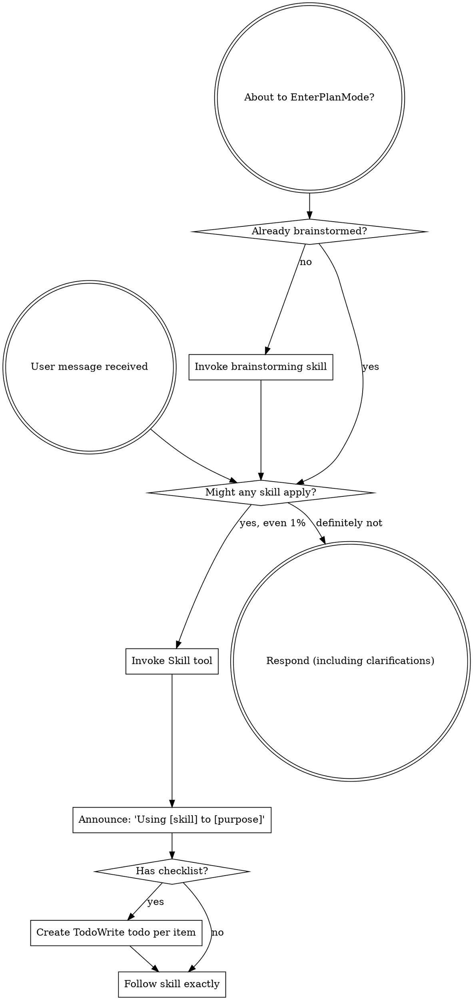

> SYSTEM

# AGENTS.md instructions for /Users/jakobfaber/Developer/repos/github.com/jakobtfaber/dsa110-FLITS

<INSTRUCTIONS>
# Codex Configuration

## Learned User Preferences

- When the user asks about Codex, interpret that as Codex CLI/configuration specifically; do not answer from Cursor MCP or Cursor IDE state unless explicitly asked.
- For cross-agent plan review, use Codex with GPT-5.5 medium effort, Claude Code with Opus 4.8 xhigh effort, and Antigravity through the `agy` CLI when available.
- Be conservative about durable memory: capture recurring corrections and stable workspace facts only, not one-off runtime details or transient command output.
- For chezmoi-managed dotfiles, edit source under `~/Developer/repos/github.com/jakobtfaber/dotfiles/home/`; restore live drift (e.g. tool-injected shell hooks) with `chezmoi apply --force` on the target file, not direct edits to `~/.*`.
- When adding core Homebrew tooling, promote packages into `home/dot_Brewfile.tmpl` (e.g. `dotfiles local promote brew <pkg>`) instead of only running `brew install`.
- Maintain Mac-local agent and observability inventories in `~/Obsidian/LLMs/agents/registry/` (`Agent Registry`, `Agent Observability Registry`, inactive-tools log) alongside chezmoi/dotfiles memory—not only in `AGENTS.md`.
- Keep `wolfbook.mcpEnabled: false` in Cursor and VS Code so the Wolfbook extension does not rewrite Antigravity/Gemini MCP configs on disk.
- Orchestrate Claude Code from Cursor via `claude -p --resume` from the session's project cwd; do not run parallel iTerm sessions on the same Claude session ID.
- Trigger prompt-guided context compaction when the chat context window reaches ~40%.

## Learned Workspace Facts

- Dotfiles are chezmoi-managed from `~/Developer/repos/github.com/jakobtfaber/dotfiles/home/`; `~/.zshrc` maps to `dot_zshrc.tmpl`.
- Interactive agent work runs in Cursor; Claude Code shells use iTerm (`claude -p --resume` from project cwd). cmux was removed Jun 2026 (SwiftUI terminal-panel teardown crashes).
- Devin shell integration injects `MANAGED DEVIN BLOCK` (`devin shell init zsh`) into live `~/.zshrc`, re-wrapping sessions as `devin shell run zsh`; the chezmoi template has no Devin hooks — disable with `chezmoi apply --force ~/.zshrc`, restart terminals, and optionally `devin auth logout`.
- Codex MCP startup paths were migrated away from networked `npx`: Playwright uses `/opt/homebrew/bin/playwright-mcp`, Context7 uses `/opt/homebrew/bin/context7-mcp`, and Sourcegraph uses `SOURCEGRAPH_MCP_REMOTE_BIN=/opt/homebrew/bin/mcp-remote`.
- Maistro MCP is globally registered through `my-skillset` (`meta/mcps.json`) and projected by `mskill install`; Codex/Claude should reach it as `/Users/jakobfaber/.local/bin/mskill mcp maistro`. Do not hand-maintain separate Maistro MCP entries; change `~/Developer/my-skillset/meta/mcps.json`, run `bash meta/install-host.sh`, and verify with `codex mcp get maistro` / `mskill doctor`.
- The cross-agent runtime standard is project opt-in for `mise`; Conda-first repos keep Python owned by Conda, and agent automation should use explicit `mise exec -- ...` or clean `conda run -n ...` runners.
- Antigravity `agy` does not expose stable CLI model/effort flags here; model/effort is verified from Antigravity memory logs as runtime metadata such as `Model Selection ... Gemini 3.5 Flash (Medium)`.
- Runtime-standard validation artifacts live under `~/.codex/automations/runtime-standard/`; local fixtures are `~/Developer/projects/runtime-standard-pilot` and `~/Developer/projects/runtime-standard-conda-pilot`.
- Orphan prior-art-recon `claude -p` workers can persist as PPID 1 after the parent exits; kill manually if they linger.
- Gurobi 13.0.2 on jakob-mbp: native pkgs (`/Library/gurobi1302`, `/Library/gurobi_server1302`, `/usr/local/bin`); WLS license `~/gurobi.lic`; `GUROBI_HOME` in chezmoi `10-env.zsh`; Python via `pip install gurobipy==13.0.2` in `py312` (not conda package `gurobi`). After upgrading the macOS .pkg or pip `gurobipy`, re-verify with fresh `gurobi_cl --license` and a trivial `gurobipy` solve—the two paths update independently.
- HPCC MATLAB: on `hpcc`, MATLAB is module-provided, not on the default PATH. Use `module load matlab/r2026a`; then `matlab` resolves to `/software/Matlab/R2026a/bin/matlab`, `matlabroot` is `/resnick/software/Matlab/R2026a`, and verified version is `26.1.0.3251617 (R2026a) Update 2`. Run non-GUI checks with `matlab -batch "..."`. User MATLAB folder exists at `/home/jfaber/Documents/MATLAB`; `userpath` points there and `prefdir` is `/home/jfaber/.matlab/R2026a`.
- HPCC Mathematica/Wolfram: on `hpcc`, Mathematica is module-provided, not on the default PATH. Available modules verified: `mathematica/11.1`, `12.0`, `12.3`, `13.2`, `14.2`; prefer `module load mathematica/14.2`. Then `wolframscript` resolves to `/resnick/software9/external/Mathematica/14.2/bin/wolframscript`, `math` resolves to `/resnick/software9/external/Mathematica/14.2/bin/math`, `$InstallationDirectory` is `/resnick/software9/external/Mathematica/14.2`, verified `$Version` is `14.2.0 for Linux x86 (64-bit) (December 26, 2024)`, `$UserBaseDirectory` is `/home/jfaber/.Wolfram`, and `$BaseDirectory` is `/usr/share/Wolfram`. Run non-GUI checks with `wolframscript -code '...'` or `math -noprompt -run '...; Exit[]'`.
- HPCC Jupyter/JupyterLab: on `hpcc`, Jupyter is module-provided through Open OnDemand. Use `module load jupyter-ood/7.1.2`; then `jupyter` resolves to `/central/software9/external/jupyter-ood-03262024/bin/jupyter`. Verified stack includes JupyterLab `4.1.5`, Notebook `7.1.2`, IPython `8.22.2`, ipykernel `6.29.3`, jupyter_server `2.13.0`, and jupyter_core `5.7.2`.
- HPCC Julia: on `hpcc`, Julia is module-provided, not on the default PATH. Available modules verified: `julia/1.9.4`, `1.10.2`, `1.10.8`, `1.11.3`, `1.12.2`; prefer `module load julia/1.12.2`. Then `julia` resolves to `/central/software9/external/julia/1.12.2/bin/julia`; verified version is `julia version 1.12.2`.
- HPCC Octave: on `hpcc`, GNU Octave is available on the system PATH without loading a module. `octave` resolves to `/usr/bin/octave`; verified version is `GNU Octave, version 7.3.0`.
- Edison Scientific API: `EDISON_API_KEY` from keychain (`Agents/edison-api-key`); Python client `edison-client` in conda `py312`. PyPI watch: dotfiles workflow `edison-client-pypi-watch` (daily) commits `~/.local/share/edison-client-pypi-watch.json` when a new release ships; `com.jakob.dotfiles-autopull` (30m) runs `chezmoi apply` so onchange upgrades `edison-client` locally. Optional manual/PyPI poll: `edison-client-autoupdate` (24h throttle). Kosmos is web-only (not in API).
- Time Machine destination is external volume `MacBackupDrive` (Samsung T7 Shield); `AutoBackup` runs hourly while attached; redundant Shortcuts mount automation was removed—rely on Time Machine only.
- DSA-110 continuum imaging: active repo is `https://github.com/dsa110/dsa110-continuum`. Legacy `~/Developer/research/archive/dsa110-contimg` is deprecated/archival (read-only); port new work to `dsa110-continuum`, not the archive tree.
- `~/Developer/research/AGENTS.md` defines the two-tree rule: `research/` = owned active work (flat repos + archive); upstream clones → `~/Developer/reference/<domain>/`. `astrophysics/` is the unified radio workspace (merged from `radio-astronomy`); `blimpy`/`FRB` live in `reference/astrophysics/`.
- Orchestrator memory (Maistro) lives at `~/Developer/repos/github.com/jakobtfaber/maistro` (`jakobtfaber/maistro`, SQLite event log, RPC writer on :8787, `https://dashboard.jakobtfaber.com`); bearer token in keychain service `Agents`, account `orch-rpc-token`.
- Pulsar periodicity research: `~/Developer/repos/github.com/jakobtfaber/gridless-pulsar` (`jakobtfaber/gridless-pulsar`); GPU coherent folding is the north star; comb-ANM is a refinement tier only (FRB scope removed).

## Codex from Cursor agent Shell

Full runbook: **`~/Developer/reference/cursor-agent-shell-cli-insights.md`**.

When Cursor (or another IDE) runs **`codex exec`** via agent **Shell**, use **subscription auth only** (`codex login` / ChatGPT tokens). Do **not** set **`OPENAI_API_KEY`** for automation unless the workflow explicitly needs API billing.

Prefer **Cursor `Task`** for small in-IDE delegation. Use **`codex exec`** when you need the full CLI tool surface; diagnose the **child Shell process**, not the chat UI alone.

### Argv-vs-stdin rule

- **Prompt as argv ⇒ close stdin:** `codex exec "…" < /dev/null`.
- If **`codex doctor`** shows ChatGPT auth and the process prints **`Reading additional input from stdin...`**, debug **stdin** before auth, `--full-auto`, or API-key settings.

### Root cause (observed in Cursor agent Shell)

Cursor agent Shell **can** leave stdin open. When **`codex exec`** receives the prompt as an **argument**, it may wait indefinitely for additional stdin.

### Required

```bash
codex exec "Your task here" < /dev/null

codex exec -C /path/to/repo "Your task" < /dev/null

# Unattended — restricted actions may fail instead of prompting
codex exec -c 'approval_policy="never"' "Your task" < /dev/null
```

Smoke tests: **`gtimeout`** from **`brew install coreutils`**, or Homebrew **`timeout`** (`which timeout gtimeout`) — avoid multi-hour zombies.

### Sanity check

```bash
codex doctor   # expect stored auth mode chatgpt, stored API key false
```

### Do not

- Run **`codex exec "…"`** without **`< /dev/null`** from Cursor agent Shell when the prompt is argv.
- Background **`codex exec`** without a watchdog unless stdin is explicitly closed.
- Assume hangs mean broken login when the stdin message appears.

### Expectations

- **~60–90s** for trivial invokes on this machine (hooks/config) is a local baseline; runs should **complete**, not hang, when stdin is closed.

### Output channels

Treat `codex exec` stdout as an execution transcript, not as a reliable machine-readable final answer. Normal stdout may include banners, prompts, hook lifecycle messages, the final assistant message, and token usage.

Use the output channel that matches the task:

- **Human-readable delegation:** let stdout print normally when a person will read the transcript.
- **Machine-readable artifact:** use `-o FILE` / `--output-last-message FILE` for the final model message, and redirect stdout/stderr to logs.
- **Event/debug stream:** use `--json` only when you want JSONL execution events; do not treat it as a single final-answer JSON document.

Canonical structured-output pattern:

```bash
mkdir -p logs

codex exec \
  -m gpt-5.5 \
  --skip-git-repo-check \
  -o result.json \
  "$PROMPT" \
  > logs/codex.stdout.log \
  2> logs/codex.stderr.log \
  < /dev/null

python3 -m json.tool result.json >/dev/null
```

Do not parse normal `codex exec` stdout as JSON unless using `--json` and expecting JSONL events. Do not use `--ignore-user-config` for normal delegation; reserve it for debugging Codex itself because it changes the execution environment.

## Runtime Management

- Repositories are opt-in for `mise` through repo-local `mise.toml`; do not set global `mise` Python.
- Conda-first repositories own Python through Conda; do not add `python` to `mise.toml` there unless explicitly migrating away from Conda.
- Agent automation must use explicit runners: `mise exec -- ...` for mise-first repos, or a clean `conda run -n ...` wrapper for Conda-first repos.
- `direnv` is for interactive shell convenience only. Hooks, agents, and non-interactive scripts must not depend on `.envrc` being loaded.
- MCP binaries used at agent startup are Homebrew-managed system tools, not project runtimes. Do not reintroduce `npx` on Codex MCP startup paths.
- On this machine, inherited interactive PATH state can make bare `conda run -n py312 python` resolve base Anaconda Python. For agent-safe Conda checks, prefer:
  `env -i HOME="$HOME" PATH="/opt/anaconda3/bin:/opt/homebrew/bin:/usr/bin:/bin" /opt/anaconda3/bin/conda run -n py312 ...`

## Skills — GitHub Sync

Custom skills are version-controlled in the private `my-skillset` repository.

- **Canonical local clone:** `~/Developer/repos/github.com/jakobtfaber/my-skillset/`
- **Compatibility symlink:** `~/Developer/projects/my-skillset` → `~/Developer/repos/github.com/jakobtfaber/my-skillset`
- **Compatibility symlink:** `~/Developer/my-skillset` → `~/Developer/repos/github.com/jakobtfaber/my-skillset`
- **Claude symlink:** `~/.claude/my-skillset` → `~/Developer/repos/github.com/jakobtfaber/my-skillset`
- **Codex symlink:** `~/.codex/my-skillset` → `~/Developer/repos/github.com/jakobtfaber/my-skillset`
- **Codex active skills symlink:** `~/.codex/skills` → `~/.codex/skills-minimal`
- **Codex minimal skill set:** `~/.codex/skills-minimal` contains a curated mix of local skill folders and symlinks into `my-skillset`; do not repoint it to the full skill tree unless intentionally reversing prompt-bloat pruning.
- **Auto-pull agent:** `com.jakob.skills-autopull`

Do not use the retired `~/Developer/misc/claude-config` path for current skill sync.

## Persistent Agent Memory

Use `~/Developer/repos/github.com/jakobtfaber/dotfiles/memory/` as the manual intent/context memory layer. This is the canonical memory store and the only persistent agent-memory store managed by dotfiles.

- Manual memory notes: `~/Developer/repos/github.com/jakobtfaber/dotfiles/memory/`
- Memory index: `~/Developer/repos/github.com/jakobtfaber/dotfiles/memory/MEMORY.md`
- Runtime memory path: `~/.claude/projects/-Users-jakobfaber/memory/` symlinks to `~/Developer/repos/github.com/jakobtfaber/dotfiles/memory/`
- Daily auto-commit of the memory subtree: launchd job `com.jakobfaber.dotfiles-memory-snapshot` (S-009)

Codex may update its own managed store under `~/.codex/memories/`, but any durable memory-worthy fact, correction, preference, or workspace state written there must also be captured in `~/Developer/repos/github.com/jakobtfaber/dotfiles/memory/` by default. Treat Codex memory as a Codex-local copy/cache, not the only durable record.

Do not create ad-hoc memory directories under `~/.codex/` for persistent memory.
Do not inspect `~/.claude-mem/` for current memory health; that retired directory no longer exists.

## Task Status Semantics

Use strict closure semantics when tracking tasks, updating a temporary to-do list, or summarizing whether work is done.

- `completed`: no further action remains for that item.
- `blocked`: cannot proceed without user input or an external state change.
- `diagnosed`: root cause or next step is known, but the fix/work is not complete.
- `validated`: behavior was checked, but there may still be follow-up.
- `decision pending`: implementation or investigation is sufficient, but a product/UX/cleanup choice remains.

If the available task-tracking tool only supports `pending`, `in_progress`, and `completed`, do not mark blocked/diagnosed/decision-pending work as `completed`. Keep the item `pending`, or split it into a completed investigation item plus a separate pending follow-up with the explicit status in the task text.

## Proactive Stopping Points

When work changes runtime behavior, tool availability, config, MCP servers, daemons, launch agents, browser/app state, shell startup, or any long-lived process, do not stop at a generic note such as "restart required" or "you may need to restart." Before final response, proactively identify the concrete affected process, service, app, server, port, or session that needs reload/restart, inspect what is currently running when practical, and stop at the actionable question with named targets, for example: "Shall I restart `X` and `Y`?" If the restart/reload is reversible and already authorized by the user, perform it and verify the new behavior instead of asking. If it is disruptive, kills user state, or crosses a one-way/outward boundary, ask with the explicit target list and blast radius.

Before claiming completion after file edits, run `agent-closeout-check` or `mskill tool agent-closeout-check` for every repo touched when either condition applies: the repo is dirty, or touched paths could affect runtime behavior. Pass each repo with `--repo`; pass known changed runtime/config paths with `--touched`; pass `--packet <closeout.json>` once you have a dirty-state handoff and/or restart inventory. If the checker fails, do not replace it with a vague caveat. Either produce the required dirty-state handoff packet, perform and verify the required restart, or stop at the concrete next question emitted by the check.

## Dirty Git State

<important if="you see dirty files in a git repo, or a command reports modified, staged, untracked, deleted, renamed, or conflicted files">
Use the `dirty-git-state` skill from `my-skillset` before deciding whether to inspect, edit, clean, stage, commit, or ask the user.

When committing, commit validated, task-scoped changes once the work is complete.
For pre-existing changes, review all of them before committing. Only include them
once they are fully understood, are not transient real-time development state,
and are deemed worthy of commit. If ownership, intent, or readiness is ambiguous
after review, leave the ambiguous changes uncommitted and report the ambiguity.
</important>

<important if="you are asked to run a code review or delegate a task using Codex or Claude">
- For Codex reviews, run Codex non-interactively using:
  `codex exec -m gpt-5.5 -c model_reasoning_effort="medium" "..." < /dev/null`
  This uses gpt-5.5 with medium effort by default.
- For Claude reviews, run Claude non-interactively using:
  `claude --model claude-opus-4-8 --effort xhigh -p "..." < /dev/null`
  This uses Opus 4.8 with xhigh effort by default.
</important>

## Authentication & Verification Protocols

When verifying, investigating, or inspecting the health, connectivity, or authentication state of any service, tool, or API (e.g., Grov, Firecrawl, MCP, ACP, or coding harnesses):

1. **Do Not Blindly Trust CLI Self-Checkers (`doctor` / `status` outputs)**:
   Never take a diagnostic command (e.g., `doctor`, `status`, `healthcheck`) showing green checkmarks as absolute proof of live runtime operational health. These commands often only check if your local configuration files are structured correctly without testing active connection channels.
2. **Test Live Operational Handshakes**:
   Always execute a minor, non-destructive live operational command (e.g., running a Dry-Run, pulling a mock schema, or making a safe query) to force a true cryptographic handshake with the API endpoint.
3. **Inspect Backing Configs Directly**:
   Always locate and inspect the underlying configuration and credentials storage files (JSON, TOML, SQLite databases, or environment variables) directly. Check active token lifetimes, `expires_at` timestamps, scopes, and encryption validity against the current local system time (e.g., `credentials.json` expiration dates) to verify active session state.

<!-- opensrc:start -->
## opensrc — dependency source for deeper context

`opensrc` (CLI, installed globally) caches dependency **source code** at `~/.opensrc/` so agents can read a package's internal implementation, not just its public types/interface. Cached inventory: `~/.opensrc/sources.json`.

- **Fetch (cache only):** `opensrc fetch <pkg>` — cross-registry: `opensrc fetch pypi:<pkg> crates:<pkg> <owner>/<repo>`
- **Read (fetches on cache miss):** `rg "pattern" $(opensrc path <pkg>)` · `cat $(opensrc path <pkg>)/path/to/file` · `find $(opensrc path <pkg>) -name "*.ts"`

Use it when you need to understand *how* a dependency works internally (npm, PyPI, crates.io, or a GitHub repo), not just its surface API.
<!-- opensrc:end -->

@/Users/jakobfaber/.codex/RTK.md

--- project-doc ---

# AGENTS.md

Repo-level agent guidance for FLITS. Full project guide: `CLAUDE.md`.
Binding fit-validation contract: `.cursor/rules/AGENT_CONFIGURATION_FLITS.md`.

## Long-View Science Goals

The primary objective of the CHIME–DSA co-detection analysis and the FLITS pipeline is to reconstruct the complete line-of-sight dispersion measure (DM) and scattering budgets for the 12 co-detected bursts.

1. **Accurate Scattering Index (\(\alpha\)) Measurement:** Break the degeneracy between scattering time \(\tau\) and index \(\alpha\) by fitting CHIME (400–800 MHz) and DSA-110 (1.2–1.5 GHz) data simultaneously with a shared model, leveraging the \(\sim 1\) GHz frequency lever arm.
2. **Mitigating Profile Bias:** Detect hidden temporal sub-components (multi-pulse structures). Left unmodeled, secondary pulses bias \(\alpha\) high (e.g. \(\alpha \approx 3.3 \to 2.7\)). Fits must model sub-components to ensure physical honesty.
3. **Sightline Attribution:** Partition observed \(DM_{\text{obs}}\) and scattering \(\tau_{\text{obs}}\) to constrain host-galaxy, Milky Way, and intervening foreground contributions (probing the CGM/groups/clusters of 49 candidate intervening systems).


## Review guidelines

Used by Codex automatic code review (and any agent reviewing a PR). Flag only
real P0/P1 issues; skip style that ruff already enforces. Ignore base64 image
payloads embedded in `docs/*.html`.

- **Physics kernel ownership.** `scattering/scat_analysis/burstfit.py` is the
  canonical kernel; `flits/` wraps it. Model-physics changes belong in
  `burstfit.py` — flag edits that fork physics into the wrapper.
- **Fit validation is mandatory.** Flag any change that could rationalize a
  failing/marginal fit into a pass, drop a validation level (Level-1 gates,
  chi2_red / R2, physics `tau*dnu` in [0.1, 2.0], alpha bounds), or bypass the
  diagnostic-figure review gate. A numeric PASS without figure review is not a pass.
- **Physics sanity.** Enforce bounds `0.0001 < tau < 100 ms` and
  `1.5 < alpha < 6.0`; check units and the frequency-ascending load assumption.
- **Lazy-minimalist (ponytail).** Flag unnecessary abstractions, dead code,
  speculative config, and parallel near-duplicate modules. Prefer the shortest
  correct diff — but never trade scientific rigor or a validation level for brevity.

</INSTRUCTIONS>
<environment_context>
  <cwd>/Users/jakobfaber/Developer/repos/github.com/jakobtfaber/dsa110-FLITS</cwd>
  <shell>zsh</shell>
  <current_date>2026-06-24</current_date>
  <timezone>America/Los_Angeles</timezone>
  <filesystem><workspace_roots><root>/Users/jakobfaber/Developer/repos/github.com/jakobtfaber/dsa110-FLITS</root></workspace_roots><permission_profile type="managed"><file_system type="restricted"><entry access="read"><special>:root</special></entry></file_system></permission_profile></filesystem>
</environment_context>

> DEVELOPER

Confirm (or push back on) a COMMIT plan for the FLITS repo. Read-only audit; do not edit
files. Repo cwd is the FLITS root, branch feat/figure-vector.

CONTEXT: A verified unit of work is ready to commit. Two specialist agents (RSE + research-docs)
already advised; their consensus plan is below. A CONCURRENT agent is actively committing/
rewriting history on feat/figure-vector in this same shared checkout (it rewrote HEAD last turn
and owns .agents/deferred-tasks.md + the docs/manuscript-decisions worktree). I will NOT push
(one-way door, left to the user).

THE WORK (all verified this session, verify-gate recorded):
- ADR-0003 fail-closed PBF guard: _s2verdict.py (rewritten, fail-closed to all-exp PBF family,
  refuses the legacy mixed-PBF grid, parse-bug fixed), _ladder.py (added pbf column),
  test_s2verdict.py (new, 4/4 pass) — all untracked in analysis/scattering-refit-2026-06/joint_ladder/.
- Pulled the canonical zach all-exp fixed-s2 grid from HPCC: 6 JSONs
  zach_joint_fit_C2D{2,3}_s2-{1,10,100}_pbf-exp-exp.json. With them present, _s2verdict.py now
  adjudicates zach: Δ(C2D3 vs C2D2) = +1443.4/-758.7/-0.4 -> NOT robust -> C2D3 REJECTED ->
  zach single-component alpha=3.319 (mixed-PBF alpha=2.41 was a PBF-family artifact). Matches
  ALLEXP_PBF_RUN.md exactly.
- 4 doc files corrected in place (confirmed-stale stub refs): docs/codetection-science-plan.md,
  docs/rse/specs/plan-manuscript-completion.md (Δν row, line 71 region), JOINT_FIT_STATE.md:60,
  docs/architecture/inventory.md.

CONSENSUS PLAN (please confirm or amend):
1. BRANCH: pathspec-scoped commit on feat/figure-vector (do NOT switch the shared checkout's
   branch; do NOT create a worktree). Record each commit SHA to scratchpad so a concurrent
   history-rewrite that orphans it is recoverable via reflog/cherry-pick. Do NOT push.
2. COMMIT 1 (fix): the 3 guard code files + the 6 all-exp JSONs (the guard's canonical inputs),
   one atomic unit. The ledger explicitly says commit the guard "in the scattering-refit lane,
   not in a docs commit."
3. COMMIT 2 (docs): the 4 doc files.
4. EXCLUDE: the ~110 other untracked joint_ladder campaign files (incl. the 48 legacy mixed
   *_s2-*.json, _figs.py, model_2d.py, model_overlay.py, figs_ladder/, overlays/), scratch/,
   logs/, .claude/+.agents/skills, crossmatching/results SVGs, galaxies/v2_0/sightline_budget.py,
   docs/entire-tracing-checkpoints.md, analysis/burst_energies/figures.review.json, and
   .agents/deferred-tasks.md (concurrent agent's lane). Use explicit pathspecs only — no add -A/.
   Run `git add -n` dry-run first to confirm exactly the intended paths.

CONTESTED POINT TO ADJUDICATE:
The research-docs agent says: also correct, in COMMIT 2, the line at
docs/rse/specs/plan-manuscript-completion.md:71 —
  "| Profile-bias α case study | 1 | zach (3.32→2.41) | demonstrator; ... |"
to point to whitney and mark zach withdrawn, because it now contradicts COMMITTED ADR-0003.
My deferred-tasks ledger had tagged the "zach 3.32→2.41" reconciliation as @decision (gated on
the citable-α roster lock, #4). The agent argues the DEMONSTRATOR claim is NOT gated — it's
already decided by ADR-0003 — whereas only the roster COUNTS (11/12 joint, α-trusted 3/12)
remain gated.

ADR-0003 (docs/adr/0003-single-exponential-pbf.md, Status: accepted, committed) says verbatim:
  "The marquee profile-bias demonstrator moves off zach onto whitney (FRB 20220310F): zach's
   multiplicity correction reverses sign with the PBF (mixed 3.32→2.41 vs all-exp 3.319→4.59),
   so it is unreliable as a clean demonstrator and is withheld ... whitney's second DSA component
   is confirmed real (ΔlnZ +2706/+2683/+2671 across s²=1/10/100, no sign-flip), so its α 1.5→5.12
   unrailing is real physics, not a prior artifact."

QUESTION for you, with file:line evidence:
A. Is the consensus 2-commit plan correct and safe given the concurrent agent? Any change?
B. Should the zach->whitney demonstrator line at plan-manuscript-completion.md:71 be corrected
   NOW (in COMMIT 2) or left as @decision? Verify by reading ADR-0003 and that line. Distinguish
   the demonstrator CLAIM (decided by ADR-0003?) from the roster COUNTS (gated on #4). If correct
   now, propose exact wording consistent with ADR-0003.
C. Anything in the EXCLUDE list that should actually be IN, or vice versa? Any safety gap?

Output: CONFIRM / CONFIRM-WITH-CHANGES / REJECT, then concise bullets with file:line evidence.
Do not write files.

> AGENT

I’ll do this as a read-only commit-plan review. I’m using the repo review workflow plus the dirty-state guidance implied by the repo instructions, but I’ll only inspect state and file contents.

> TOOL

tool_use shell_command
id: call_T99R9bjIocTEvQoOg4v3hTzB
```json
{
  "command": "cat /Users/jakobfaber/.agents/skills/review/SKILL.md",
  "workdir": "/Users/jakobfaber/Developer/repos/github.com/jakobtfaber/dsa110-FLITS",
  "timeout_ms": 10000
}
```

> TOOL

tool_use shell_command
id: call_F943rU1q2nSdoOOQcMgXXQBK
```json
{
  "command": "rg -n \"dirty-git-state|FLITS|ADR-0003|zach|whitney|scattering-refit|figure-vector\" /Users/jakobfaber/.codex/memories/MEMORY.md",
  "workdir": "/Users/jakobfaber/Developer/repos/github.com/jakobtfaber/dsa110-FLITS",
  "timeout_ms": 10000
}
```

> TOOL

tool_result
id: call_T99R9bjIocTEvQoOg4v3hTzB
```
Command blocked by PreToolUse hook: rtk-codex-guard: shell command should use RTK compact output.

Suggested command:
rtk read /Users/jakobfaber/.agents/skills/review/SKILL.md

To bypass for this command, prefix it with: RTK_DISABLED=1. Command: cat /Users/jakobfaber/.agents/skills/review/SKILL.md
```

> TOOL

tool_result
id: call_F943rU1q2nSdoOOQcMgXXQBK
```
Command blocked by PreToolUse hook: rtk-codex-guard: shell command should use RTK compact output.

Suggested command:
rtk grep -n "dirty-git-state|FLITS|ADR-0003|zach|whitney|scattering-refit|figure-vector" /Users/jakobfaber/.codex/memories/MEMORY.md

To bypass for this command, prefix it with: RTK_DISABLED=1. Command: rg -n "dirty-git-state|FLITS|ADR-0003|zach|whitney|scattering-refit|figure-vector" /Users/jakobfaber/.codex/memories/MEMORY.md
```

> AGENT

The shell guard is active here, so I’m switching to its compact `rtk` readers for the audit output. Next I’m pulling the review instructions, the relevant memory index hits, and the exact repo lines the plan depends on.

> TOOL

tool_use shell_command
id: call_r1HrtaMZq1WTdqXEY5VWdcpp
```json
{
  "command": "rtk read /Users/jakobfaber/.codex/plugins/cache/openai-curated/superpowers/3c06cb2e/skills/using-superpowers/SKILL.md",
  "workdir": "/Users/jakobfaber/Developer/repos/github.com/jakobtfaber/dsa110-FLITS",
  "timeout_ms": 10000
}
```

> TOOL

tool_use shell_command
id: call_csiWzSeHyoZue8JJqp5QtDky
```json
{
  "command": "rtk read /Users/jakobfaber/.agents/skills/review/SKILL.md",
  "workdir": "/Users/jakobfaber/Developer/repos/github.com/jakobtfaber/dsa110-FLITS",
  "timeout_ms": 10000
}
```

> TOOL

tool_use shell_command
id: call_GiffIBo13CpcpW1KqJyHJL3W
```json
{
  "command": "rtk grep -n \"dirty-git-state|FLITS|ADR-0003|zach|whitney|scattering-refit|figure-vector\" /Users/jakobfaber/.codex/memories/MEMORY.md",
  "workdir": "/Users/jakobfaber/Developer/repos/github.com/jakobtfaber/dsa110-FLITS",
  "timeout_ms": 10000
}
```

> TOOL

tool_result
id: call_r1HrtaMZq1WTdqXEY5VWdcpp
```
Exit code: 0
Wall time: 0.1 seconds
Output:
---
name: using-superpowers
description: Use when starting any conversation - establishes how to find and use skills, requiring Skill tool invocation before ANY response including clarifying questions
---

<SUBAGENT-STOP>
If you were dispatched as a subagent to execute a specific task, skip this skill.
</SUBAGENT-STOP>

<EXTREMELY-IMPORTANT>
If you think there is even a 1% chance a skill might apply to what you are doing, you ABSOLUTELY MUST invoke the skill.

IF A SKILL APPLIES TO YOUR TASK, YOU DO NOT HAVE A CHOICE. YOU MUST USE IT.

This is not negotiable. This is not optional. You cannot rationalize your way out of this.
</EXTREMELY-IMPORTANT>

## Instruction Priority

Superpowers skills override default system prompt behavior, but **user instructions always take precedence**:

1. **User's explicit instructions** (CLAUDE.md, GEMINI.md, AGENTS.md, direct requests) — highest priority
2. **Superpowers skills** — override default system behavior where they conflict
3. **Default system prompt** — lowest priority

If CLAUDE.md, GEMINI.md, or AGENTS.md says "don't use TDD" and a skill says "always use TDD," follow the user's instructions. The user is in control.

## How to Access Skills

**In Claude Code:** Use the `Skill` tool. When you invoke a skill, its content is loaded and presented to you—follow it directly. Never use the Read tool on skill files.

**In Copilot CLI:** Use the `skill` tool. Skills are auto-discovered from installed plugins. The `skill` tool works the same as Claude Code's `Skill` tool.

**In Gemini CLI:** Skills activate via the `activate_skill` tool. Gemini loads skill metadata at session start and activates the full content on demand.

**In other environments:** Check your platform's documentation for how skills are loaded.

## Platform Adaptation

Skills use Claude Code tool names. Non-CC platforms: see `references/copilot-tools.md` (Copilot CLI), `references/codex-tools.md` (Codex) for tool equivalents. Gemini CLI users get the tool mapping loaded automatically via GEMINI.md.

# Using Skills

## The Rule

**Invoke relevant or requested skills BEFORE any response or action.** Even a 1% chance a skill might apply means that you should invoke the skill to check. If an invoked skill turns out to be wrong for the situation, you don't need to use it.



## Red Flags

These thoughts mean STOP—you're rationalizing:

| Thought | Reality |
|---------|---------|
| "This is just a simple question" | Questions are tasks. Check for skills. |
| "I need more context first" | Skill check comes BEFORE clarifying questions. |
| "Let me explore the codebase first" | Skills tell you HOW to explore. Check first. |
| "I can check git/files quickly" | Files lack conversation context. Check for skills. |
| "Let me gather information first" | Skills tell you HOW to gather information. |
| "This doesn't need a formal skill" | If a skill exists, use it. |
| "I remember this skill" | Skills evolve. Read current version. |
| "This doesn't count as a task" | Action = task. Check for skills. |
| "The skill is overkill" | Simple things become complex. Use it. |
| "I'll just do this one thing first" | Check BEFORE doing anything. |
| "This feels productive" | Undisciplined action wastes time. Skills prevent this. |
| "I know what that means" | Knowing the concept ≠ using the skill. Invoke it. |

## Skill Priority

When multiple skills could apply, use this order:

1. **Process skills first** (brainstorming, debugging) - these determine HOW to approach the task
2. **Implementation skills second** (frontend-design, mcp-builder) - these guide execution

"Let's build X" → brainstorming first, then implementation skills.
"Fix this bug" → debugging first, then domain-specific skills.

## Skill Types

**Rigid** (TDD, debugging): Follow exactly. Don't adapt away discipline.

**Flexible** (patterns): Adapt principles to context.

The skill itself tells you which.

## User Instructions

Instructions say WHAT, not HOW. "Add X" or "Fix Y" doesn't mean skip workflows.

```

> TOOL

tool_result
id: call_csiWzSeHyoZue8JJqp5QtDky
```
Exit code: 0
Wall time: 0.1 seconds
Output:
---
name: review
description: Review the changes since a fixed point (commit, branch, tag, or merge-base) along two axes — Standards (does the code follow this repo's documented coding standards?) and Spec (does the code match what the originating issue/PRD asked for?). Runs both reviews in parallel sub-agents and reports them side by side. Use when the user wants to review a branch, a PR, work-in-progress changes, or asks to "review since X".
---

Two-axis review of the diff between `HEAD` and a fixed point the user supplies:

- **Standards** — does the code conform to this repo's documented coding standards?
- **Spec** — does the code faithfully implement the originating issue / PRD / spec?

Both axes run as **parallel sub-agents** so they don't pollute each other's context, then this skill aggregates their findings.

The issue tracker should have been provided to you — run `/setup-matt-pocock-skills` if `docs/agents/issue-tracker.md` is missing.

## Process

### 1. Pin the fixed point

Whatever the user said is the fixed point — a commit SHA, branch name, tag, `main`, `HEAD~5`, etc. If they didn't specify one, ask for it.

Capture the diff command once: `git diff <fixed-point>...HEAD` (three-dot, so the comparison is against the merge-base). Also note the list of commits via `git log <fixed-point>..HEAD --oneline`.

Before going further, confirm the fixed point resolves (`git rev-parse <fixed-point>`) and the diff is non-empty. A bad ref or empty diff should fail here — not inside two parallel sub-agents.

### 2. Identify the spec source

Look for the originating spec, in this order:

1. Issue references in the commit messages (`#123`, `Closes #45`, GitLab `!67`, etc.) — fetch via the workflow in `docs/agents/issue-tracker.md`.
2. A path the user passed as an argument.
3. A PRD/spec file under `docs/`, `specs/`, or `.scratch/` matching the branch name or feature.
4. If nothing is found, ask the user where the spec is. If they say there isn't one, the **Spec** sub-agent will skip and report "no spec available".

### 3. Identify the standards sources

Anything in the repo that documents how code should be written, such as `CODING_STANDARDS.md` or `CONTRIBUTING.md`.

### 4. Spawn both sub-agents in parallel

Send a single message with two `Agent` tool calls. Use the `general-purpose` subagent for both.

**Standards sub-agent prompt** — include:

- The full diff command and commit list.
- The list of standards-source files you found in step 3.
- The brief: "Report — per file/hunk where relevant — every place the diff violates a documented standard. Cite the standard (file + the rule). Distinguish hard violations from judgement calls. Skip anything tooling enforces. Under 400 words."

**Spec sub-agent prompt** — include:

- The diff command and commit list.
- The path or fetched contents of the spec.
- The brief: "Report: (a) requirements the spec asked for that are missing or partial; (b) behaviour in the diff that wasn't asked for (scope creep); (c) requirements that look implemented but where the implementation looks wrong. Quote the spec line for each finding. Under 400 words."

If the spec is missing, skip the Spec sub-agent and note this in the final report.

### 5. Aggregate

Present the two reports under `## Standards` and `## Spec` headings, verbatim or lightly cleaned. Do **not** merge or rerank findings — the two axes are deliberately separate (see _Why two axes_).

End with a one-line summary: total findings per axis, and the worst issue _within each axis_ (if any). Don't pick a single winner across axes — that's the reranking the separation exists to prevent.

## Why two axes

A change can pass one axis and fail the other:

- Code that follows every standard but implements the wrong thing → **Standards pass, Spec fail.**
- Code that does exactly what the issue asked but breaks the project's conventions → **Spec pass, Standards fail.**

Reporting them separately stops one axis from masking the other.

```

> TOOL

tool_result
id: call_GiffIBo13CpcpW1KqJyHJL3W
```
Exit code: 0
Wall time: 0.1 seconds
Output:
70 matches in 1 files:

/Users/jakobfaber/.codex/memories/MEMORY.md:1:# Task Group: /Users/jakobfaber/Developer/repos/github.com/jakobtfaber/dsa110...
/Users/jakobfaber/.codex/memories/MEMORY.md:3:scope: use when work is happening in the user's FLITS fork and touches CANFAR...
/Users/jakobfaber/.codex/memories/MEMORY.md:4:applies_to: cwd=/Users/jakobfaber/Developer/repos/github.com/jakobtfaber/dsa1...
/Users/jakobfaber/.codex/memories/MEMORY.md:10:- rollout_summaries/2026-06-19T16-46-02-fWzE-dsa_canfar_path_fix_and_push.md ...
/Users/jakobfaber/.codex/memories/MEMORY.md:20:- extensions/chronicle/resources/2026-06-22T20-40-00-LeQd-10min-memory-summar...
/Users/jakobfaber/.codex/memories/MEMORY.md:21:- extensions/chronicle/resources/2026-06-22T20-11-00-aIMp-10min-memory-summar...
/Users/jakobfaber/.codex/memories/MEMORY.md:27:## Task 3: Add `consistency_table(...)`, verify the multi-screen signal, and ...
/Users/jakobfaber/.codex/memories/MEMORY.md:31:- extensions/chronicle/resources/2026-06-22T22-09-00-yQgr-10min-memory-summar...
/Users/jakobfaber/.codex/memories/MEMORY.md:35:- scintillation/scint_analysis/consistency.py, consistency_table, band_consis...
/Users/jakobfaber/.codex/memories/MEMORY.md:41:- extensions/chronicle/resources/2026-06-22T23-49-00-gBoS-10min-memory-summar...
/Users/jakobfaber/.codex/memories/MEMORY.md:42:- extensions/chronicle/resources/2026-06-23T01-44-00-eADA-10min-memory-summar...
/Users/jakobfaber/.codex/memories/MEMORY.md:48:## Task 5: Run FLITS tests from a clean Conda environment, push fork `main`, ...
/Users/jakobfaber/.codex/memories/MEMORY.md:52:- extensions/chronicle/resources/2026-06-23T01-44-00-eADA-10min-memory-summar...
/Users/jakobfaber/.codex/memories/MEMORY.md:56:- conda run -n flits pytest -m "not slow", ModuleNotFoundError: No module nam...
/Users/jakobfaber/.codex/memories/MEMORY.md:62:- extensions/chronicle/resources/2026-06-23T04-03-00-SJjn-10min-memory-summar...
/Users/jakobfaber/.codex/memories/MEMORY.md:72:- extensions/chronicle/resources/2026-06-23T00-32-00-CbTO-10min-memory-summar...
/Users/jakobfaber/.codex/memories/MEMORY.md:73:- extensions/chronicle/resources/2026-06-23T00-10-00-FHwB-10min-memory-summar...
/Users/jakobfaber/.codex/memories/MEMORY.md:83:- extensions/chronicle/resources/2026-06-23T00-38-00-wvtD-10min-memory-summar...
/Users/jakobfaber/.codex/memories/MEMORY.md:84:- extensions/chronicle/resources/2026-06-23T00-37-00-AhTm-10min-memory-summar...
/Users/jakobfaber/.codex/memories/MEMORY.md:88:- baseband-analysis, baseband_analysis/core, chimefrb, CANFAR, VOSpace, spars...
/Users/jakobfaber/.codex/memories/MEMORY.md:90:## Task 9: Reproduce the FLITS scattering-refit chain with real local data, p...
/Users/jakobfaber/.codex/memories/MEMORY.md:94:- extensions/chronicle/resources/2026-06-23T00-10-00-FHwB-10min-memory-summar...
/Users/jakobfaber/.codex/memories/MEMORY.md:95:- extensions/chronicle/resources/2026-06-23T00-06-00-Hvgz-10min-memory-summar...
/Users/jakobfaber/.codex/memories/MEMORY.md:96:- extensions/chronicle/resources/2026-06-23T05-03-00-AKGw-10min-memory-summar...
/Users/jakobfaber/.codex/memories/MEMORY.md:100:- gain_ladder.py, gain_ladder.npz, multiscale_fit.py, joint_json, freya_joint...
[+45 more]

```

> AGENT

The formal branch-review skill wants a fixed-point diff and subagents, but your request is narrower: adjudicate a concrete commit plan against live dirty state and cited docs. I’m staying on that scope and using explicit path inspection rather than changing branches or staging anything.

> TOOL

tool_use shell_command
id: call_RAZ5DJRBVvrFyAAZECKQPI3b
```json
{
  "command": "rtk grep -n \"name: dirty-git-state|dirty-git-state\" /Users/jakobfaber/Developer/repos/github.com/jakobtfaber/my-skillset /Users/jakobfaber/.agents/skills /Users/jakobfaber/.codex/skills-minimal",
  "workdir": "/Users/jakobfaber/Developer/repos/github.com/jakobtfaber/dsa110-FLITS",
  "timeout_ms": 10000
}
```

> TOOL

tool_use shell_command
id: call_g4lOKsE9vJSOdswDEh2o1wrm
```json
{
  "command": "git status --short --branch",
  "workdir": "/Users/jakobfaber/Developer/repos/github.com/jakobtfaber/dsa110-FLITS",
  "timeout_ms": 10000
}
```

> TOOL

tool_use shell_command
id: call_poThxjyyRJOKsNrGq95zYeTW
```json
{
  "command": "git rev-parse --abbrev-ref HEAD",
  "workdir": "/Users/jakobfaber/Developer/repos/github.com/jakobtfaber/dsa110-FLITS",
  "timeout_ms": 10000
}
```

> TOOL

tool_use shell_command
id: call_D3nrTKxUUFT9BgbLmlHFh7vn
```json
{
  "command": "git rev-parse HEAD",
  "workdir": "/Users/jakobfaber/Developer/repos/github.com/jakobtfaber/dsa110-FLITS",
  "timeout_ms": 10000
}
```

> TOOL

tool_result
id: call_RAZ5DJRBVvrFyAAZECKQPI3b
```
Exit code: 0
Wall time: 0.7 seconds
Output:
94 matches in 66 files:

/.../compresses-prose/events.jsonl:19:{"type":"system","subtype":"init","cwd":"/Users/jakobfaber/Developer/projects...
/.../detects-cross-file-duplicate/events.jsonl:19:{"type":"system","subtype":"init","cwd":"/Users/jakobfaber/Developer/projects...
/.../detects-cross-file-duplicate/events.jsonl:55:{"type":"user","message":{"role":"user","content":[{"tool_use_id":"toolu_01XD...
/.../detects-cross-file-duplicate/events.jsonl:73:{"type":"user","message":{"role":"user","content":[{"tool_use_id":"toolu_016g...
/.../detects-cross-file-duplicate/events.jsonl:140:{"type":"stream_event","event":{"type":"content_block_delta","index":1,"delta...
/.../detects-cross-file-duplicate/events.jsonl:144:{"type":"assistant","message":{"model":"claude-opus-4-8","id":"msg_01FqNquXKR...
/.../detects-cross-file-duplicate/events.jsonl:148:{"type":"user","message":{"role":"user","content":[{"tool_use_id":"toolu_01LQ...
/.../detects-cross-file-duplicate/events.jsonl:191:{"type":"stream_event","event":{"type":"content_block_delta","index":1,"delta...
/.../detects-cross-file-duplicate/events.jsonl:205:{"type":"assistant","message":{"model":"claude-opus-4-8","id":"msg_01Qsofnjoc...
/.../detects-cross-file-duplicate/events.jsonl:209:{"type":"result","subtype":"success","is_error":false,"api_error_status":null...
/.../fires-on-conflict-audit/run-0.jsonl:19:{"type":"system","subtype":"init","cwd":"/Users/jakobfaber/Developer/projects...
/.../fires-on-conflict-audit/run-0.jsonl:55:{"type":"user","message":{"role":"user","content":[{"tool_use_id":"toolu_01MR...
/.../fires-on-conflict-audit/run-0.jsonl:93:{"type":"user","message":{"role":"user","content":[{"tool_use_id":"toolu_0117...
/.../fires-on-conflict-audit/run-1.jsonl:19:{"type":"system","subtype":"init","cwd":"/Users/jakobfaber/Developer/projects...
/.../fires-on-conflict-audit/run-1.jsonl:55:{"type":"user","message":{"role":"user","content":[{"tool_use_id":"toolu_01Fd...
/.../fires-on-conflict-audit/run-1.jsonl:96:{"type":"user","message":{"role":"user","content":[{"tool_use_id":"toolu_015w...
/.../fires-on-conflict-audit/run-2.jsonl:19:{"type":"system","subtype":"init","cwd":"/Users/jakobfaber/Developer/projects...
/.../fires-on-conflict-audit/run-2.jsonl:55:{"type":"user","message":{"role":"user","content":[{"tool_use_id":"toolu_01Jn...
/.../fires-on-conflict-audit/run-2.jsonl:90:{"type":"user","message":{"role":"user","content":[{"tool_use_id":"toolu_01Ew...
/.../quiet-on-add-instruction/run-0.jsonl:19:{"type":"system","subtype":"init","cwd":"/Users/jakobfaber/Developer/projects...
/.../quiet-on-add-instruction/run-0.jsonl:46:{"type":"system","subtype":"commands_changed","commands":[{"name":"agent-work...
/.../quiet-on-add-instruction/run-0.jsonl:61:{"type":"system","subtype":"commands_changed","commands":[{"name":"agent-work...
/.../quiet-on-add-instruction/run-1.jsonl:19:{"type":"system","subtype":"init","cwd":"/Users/jakobfaber/Developer/projects...
/.../quiet-on-add-instruction/run-2.jsonl:19:{"type":"system","subtype":"init","cwd":"/Users/jakobfaber/Developer/projects...
/.../quiet-on-add-instruction/run-2.jsonl:39:{"type":"system","subtype":"commands_changed","commands":[{"name":"agent-work...
/.../git-rebase-cli-only/run-0.jsonl:19:{"type":"system","subtype":"init","cwd":"/Users/jakobfaber/Developer/projects...
/.../git-rebase-cli-only/run-0.jsonl:19:{"type":"system","subtype":"init","cwd":"/Users/jakobfaber/Developer/projects...
/.../cf-worker-deploy-confirm/run-0.jsonl:19:{"type":"system","subtype":"init","cwd":"/Users/jakobfaber/Developer/projects...
/.../cf-worker-deploy-confirm/run-1.jsonl:19:{"type":"system","subtype":"init","cwd":"/Users/jakobfaber/Developer/projects...
/.../cf-worker-deploy-confirm/run-2.jsonl:19:{"type":"system","subtype":"init","cwd":"/Users/jakobfaber/Developer/projects...
/.../cloudflare-dns-reconcile-with-wrangler/run-0.jsonl:19:{"type":"system","subtype":"init","cwd":"/Users/jakobfaber/Developer/projects...
/.../cloudflare-dns-reconcile-with-wrangler/run-1.jsonl:19:{"type":"system","subtype":"init","cwd":"/Users/jakobfaber/Developer/projects...
/.../d1-create-and-verify/run-0.jsonl:19:{"type":"system","subtype":"init","cwd":"/Users/jakobfaber/Developer/projects...
/.../d1-create-and-verify/run-1.jsonl:19:{"type":"system","subtype":"init","cwd":"/Users/jakobfaber/Developer/projects...
/.../d1-create-and-verify/run-2.jsonl:19:{"type":"system","subtype":"init","cwd":"/Users/jakobfaber/Developer/projects...
/.../gh-issue-list-summarize/run-0.jsonl:19:{"type":"system","subtype":"init","cwd":"/Users/jakobfaber/Developer/projects...
/.../gh-issue-list-summarize/run-1.jsonl:19:{"type":"system","subtype":"init","cwd":"/Users/jakobfaber/Developer/projects...
/.../gh-issue-list-summarize/run-2.jsonl:19:{"type":"system","subtype":"init","cwd":"/Users/jakobfaber/Developer/projects...
/.../gh-prs-and-local-checkout/run-0.jsonl:19:{"type":"system","subtype":"init","cwd":"/Users/jakobfaber/Developer/projects...
/.../gh-prs-and-local-checkout/run-1.jsonl:19:{"type":"system","subtype":"init","cwd":"/Users/jakobfaber/Developer/projects...
/.../gh-prs-and-local-checkout/run-1.jsonl:189:{"type":"system","subtype":"commands_changed","commands":[{"name":"agent-work...
/.../gh-prs-and-local-checkout/run-2.jsonl:19:{"type":"system","subtype":"init","cwd":"/Users/jakobfaber/Developer/projects...
/.../git-rebase-cli-only/run-0.jsonl:19:{"type":"system","subtype":"init","cwd":"/Users/jakobfaber/Developer/projects...
/.../git-rebase-cli-only/run-1.jsonl:19:{"type":"system","subtype":"init","cwd":"/Users/jakobfaber/Developer/projects...
/.../git-rebase-cli-only/run-2.jsonl:19:{"type":"system","subtype":"init","cwd":"/Users/jakobfaber/Developer/projects...
/.../git-rebase-cli-only/run-2.jsonl:86:{"type":"system","subtype":"commands_changed","commands":[{"name":"agent-work...
/.../jq-vs-yq-not-routing/run-0.jsonl:19:{"type":"system","subtype":"init","cwd":"/Users/jakobfaber/Developer/projects...
/.../jq-vs-yq-not-routing/run-1.jsonl:19:{"type":"system","subtype":"init","cwd":"/Users/jakobfaber/Developer/projects...
/.../jq-vs-yq-not-routing/run-2.jsonl:19:{"type":"system","subtype":"init","cwd":"/Users/jakobfaber/Developer/projects...
/.../kv-rename-blast-radius/run-0.jsonl:19:{"type":"system","subtype":"init","cwd":"/Users/jakobfaber/Developer/projects...
/.../kv-rename-blast-radius/run-1.jsonl:19:{"type":"system","subtype":"init","cwd":"/Users/jakobfaber/Developer/projects...
/.../kv-rename-blast-radius/run-2.jsonl:19:{"type":"system","subtype":"init","cwd":"/Users/jakobfaber/Developer/projects...
/.../mcp-availability-not-routing/run-0.jsonl:19:{"type":"system","subtype":"init","cwd":"/Users/jakobfaber/Developer/projects...
/.../mcp-availability-not-routing/run-1.jsonl:19:{"type":"system","subtype":"init","cwd":"/Users/jakobfaber/Developer/projects...
/.../mcp-availability-not-routing/run-2.jsonl:19:{"type":"system","subtype":"init","cwd":"/Users/jakobfaber/Developer/projects...
/.../mcp-availability-not-routing/run-3.jsonl:19:{"type":"system","subtype":"init","cwd":"/Users/jakobfaber/Developer/projects...
/.../mcp-availability-not-routing/run-4.jsonl:19:{"type":"system","subtype":"init","cwd":"/Users/jakobfaber/Developer/projects...
/.../mcp-availability-not-routing/run-5.jsonl:19:{"type":"system","subtype":"init","cwd":"/Users/jakobfaber/Developer/projects...
/.../mcp-availability-not-routing/run-6.jsonl:19:{"type":"system","subtype":"init","cwd":"/Users/jakobfaber/Developer/projects...
/.../notion-obsidian-reconcile/run-0.jsonl:19:{"type":"system","subtype":"init","cwd":"/Users/jakobfaber/Developer/projects...
/.../notion-obsidian-reconcile/run-1.jsonl:19:{"type":"system","subtype":"init","cwd":"/Users/jakobfaber/Developer/projects...
/.../notion-obsidian-reconcile/run-2.jsonl:19:{"type":"system","subtype":"init","cwd":"/Users/jakobfaber/Developer/projects...
/.../perplexity-mcp-only/run-0.jsonl:19:{"type":"system","subtype":"init","cwd":"/Users/jakobfaber/Developer/projects...
/.../perplexity-mcp-only/run-1.jsonl:19:{"type":"system","subtype":"init","cwd":"/Users/jakobfaber/Developer/projects...
/.../perplexity-mcp-only/run-2.jsonl:19:{"type":"system","subtype":"init","cwd":"/Users/jakobfaber/Developer/projects...
/.../python-authoring-no-mcp/run-0.jsonl:19:{"type":"system","subtype":"init","cwd":"/Users/jakobfaber/Developer/projects...
/.../python-authoring-no-mcp/run-1.jsonl:19:{"type":"system","subtype":"init","cwd":"/Users/jakobfaber/Developer/projects...
/.../python-authoring-no-mcp/run-2.jsonl:19:{"type":"system","subtype":"init","cwd":"/Users/jakobfaber/Developer/projects...
/.../ripgrep-vs-grep-not-routing/run-0.jsonl:19:{"type":"system","subtype":"init","cwd":"/Users/jakobfaber/Developer/projects...
/.../ripgrep-vs-grep-not-routing/run-1.jsonl:19:{"type":"system","subtype":"init","cwd":"/Users/jakobfaber/Developer/projects...
/.../ripgrep-vs-grep-not-routing/run-2.jsonl:19:{"type":"system","subtype":"init","cwd":"/Users/jakobfaber/Developer/projects...
/.../sanity-doc-update/run-0.jsonl:19:{"type":"system","subtype":"init","cwd":"/Users/jakobfaber/Developer/projects...
/.../sanity-doc-update/run-1.jsonl:19:{"type":"system","subtype":"init","cwd":"/Users/jakobfaber/Developer/projects...
/.../sanity-doc-update/run-2.jsonl:19:{"type":"system","subtype":"init","cwd":"/Users/jakobfaber/Developer/projects...
/.../adds-important-if-block/events.jsonl:19:{"type":"system","subtype":"init","cwd":"/Users/jakobfaber/Developer/projects...
/.../adds-important-if-block/events.jsonl:56:{"type":"system","subtype":"commands_changed","commands":[{"name":"agent-work...
/.../adds-important-if-block/events.jsonl:80:{"type":"system","subtype":"commands_changed","commands":[{"name":"agent-work...
/.../fires-on-adherence-complaint/run-0.jsonl:19:{"type":"system","subtype":"init","cwd":"/Users/jakobfaber/Developer/projects...
/.../fires-on-adherence-complaint/run-0.jsonl:57:{"type":"system","subtype":"commands_changed","commands":[{"name":"agent-work...
/.../fires-on-adherence-complaint/run-0.jsonl:93:{"type":"system","subtype":"commands_changed","commands":[{"name":"agent-work...
/.../fires-on-adherence-complaint/run-1.jsonl:19:{"type":"system","subtype":"init","cwd":"/Users/jakobfaber/Developer/projects...
/.../fires-on-adherence-complaint/run-1.jsonl:68:{"type":"system","subtype":"commands_changed","commands":[{"name":"agent-work...
/.../fires-on-adherence-complaint/run-1.jsonl:105:{"type":"system","subtype":"commands_changed","commands":[{"name":"agent-work...
/.../fires-on-adherence-complaint/run-2.jsonl:19:{"type":"system","subtype":"init","cwd":"/Users/jakobfaber/Developer/projects...
/.../fires-on-adherence-complaint/run-2.jsonl:64:{"type":"system","subtype":"commands_changed","commands":[{"name":"agent-work...
/.../quiet-on-summary-request/run-0.jsonl:19:{"type":"system","subtype":"init","cwd":"/Users/jakobfaber/Developer/projects...
/.../quiet-on-summary-request/run-0.jsonl:40:{"type":"system","subtype":"commands_changed","commands":[{"name":"agent-work...
/.../quiet-on-summary-request/run-1.jsonl:19:{"type":"system","subtype":"init","cwd":"/Users/jakobfaber/Developer/projects...
/.../quiet-on-summary-request/run-2.jsonl:19:{"type":"system","subtype":"init","cwd":"/Users/jakobfaber/Developer/projects...
/.../my-skillset/registry.json:442:"id": "dirty-git-state",
/.../my-skillset/registry.json:445:"path": "skills/git/dirty-git-state",
/.../dirty-git-state/SKILL.md:2:name: "dirty-git-state"
/.../agents/openai.yaml:4:default_prompt: "Use $dirty-git-state to handle dirty files in this repo with...
/.../jit-router/codex-jit.py:161:if name_lower in ("remember", "dirty-git-state", "explore", "triage"):

```

> TOOL

tool_result
id: call_g4lOKsE9vJSOdswDEh2o1wrm
```
Command blocked by PreToolUse hook: rtk-codex-guard: shell command should use RTK compact output.

Suggested command:
rtk git status --short --branch

To bypass for this command, prefix it with: RTK_DISABLED=1. Command: git status --short --branch
```

> TOOL

tool_result
id: call_poThxjyyRJOKsNrGq95zYeTW
```
Exit code: 0
Wall time: 0.1 seconds
Output:
feat/figure-vector

```

> TOOL

tool_result
id: call_D3nrTKxUUFT9BgbLmlHFh7vn
```
Exit code: 0
Wall time: 0.1 seconds
Output:
5080f8a07114410ce77a18f307d711dd2ffb1bd9

```

> AGENT

The dirty-state helper exists in `my-skillset`, so I’m reading that workflow before I judge the include/exclude boundary. The branch is currently `feat/figure-vector` at `5080f8a`, which matches the requested branch but is volatile under the concurrent agent.

> TOOL

tool_use shell_command
id: call_TWQM8ZvEBShWhHMbaAYgvQxH
```json
{
  "command": "rtk read /Users/jakobfaber/Developer/repos/github.com/jakobtfaber/my-skillset/skills/git/dirty-git-state/SKILL.md",
  "workdir": "/Users/jakobfaber/Developer/repos/github.com/jakobtfaber/dsa110-FLITS",
  "timeout_ms": 10000
}
```

> TOOL

tool_use shell_command
id: call_DzjW8wTr4vLNuq2DVIzpqkp5
```json
{
  "command": "rtk git status --short --branch",
  "workdir": "/Users/jakobfaber/Developer/repos/github.com/jakobtfaber/dsa110-FLITS",
  "timeout_ms": 10000
}
```

> TOOL

tool_use shell_command
id: call_6CNaYa4LCLNA4Dc0R6mBkU1k
```json
{
  "command": "rtk git status --porcelain=v1",
  "workdir": "/Users/jakobfaber/Developer/repos/github.com/jakobtfaber/dsa110-FLITS",
  "timeout_ms": 10000
}
```

> TOOL

tool_result
id: call_TWQM8ZvEBShWhHMbaAYgvQxH
```
Exit code: 0
Wall time: 0.1 seconds
Output:
---
name: "dirty-git-state"
description: Use when a git repo has uncommitted changes — modified, staged, untracked, deleted, renamed, or conflicted files — before deciding whether to inspect, edit, clean, stage, commit, or ask about them.
---

# Dirty Git State

## Core Rule

Treat dirty files as owned by the user, another agent, or prior intentional work until proven otherwise. Dirty state is an ownership signal, not clutter.

## Default Algorithm

1. Pause. Do not clean, revert, delete, format broadly, redact broadly, stage, commit, or overwrite dirty files just to make the tree clean.
2. If a read-only sub-agent can clarify the situation, delegate inventory/risk work before asking the user. The sub-agent must not edit, stage, delete, format, print secret values, or mutate state.
3. Have the sub-agent or main agent classify dirty files by git state and domain: source, tests, config/dotfiles, memory/context, generated files, lockfiles, logs/cache, secrets/sensitive files.
4. If dirty files are unrelated to the active task, ignore them and avoid broad commands that might touch them.
5. If dirty files are related, inspect `git diff -- path` before editing. Edit narrowly. Preserve existing changes.
6. If editing the same dirty file, classify collision risk:
   - Low: unrelated section. Edit only requested area, then re-check diff.
   - Moderate: nearby section. Use narrow patches; avoid whole-file formatting.
   - High: same lines/function/config block/memory entry. Ask only after read-only investigation cannot resolve intent.
7. If files may contain secrets, scan targeted files without printing values. If cleanup was requested, prefer secret-store indirection for live config and redaction over deletion for historical logs. Ask before credential rotation/revocation or wholesale deletion.
8. If files look generated or cached, do not delete them. Regenerate only when the task requires it, and keep generation scoped.
9. Before commands that may rewrite many files, do a read-only preflight listing affected files and overlap with dirty files. Ask before destructive operations such as `git restore`, `git reset`, deletion, broad redaction, memory removal, or global config rewrites.
10. If the user asked for a commit, commit validated, task-scoped changes when the work is complete. For pre-existing changes, review all of them before committing. Only include them once they are fully understood, are not transient real-time development state, and are deemed worthy of commit. If ownership, intent, or readiness is ambiguous after review, leave them uncommitted and report the ambiguity. Use a sub-agent to draft a commit partition plan when useful.

## Ask The User Only For

- Destructive actions
- Irreversible external actions
- Ownership ambiguity that remains unresolved after read-only investigation
- Product/config intent choices
- Committing pre-existing changes whose ownership, intent, or readiness remains ambiguous after review
- Deleting memory/context files
- Rotating or revoking credentials
- Changing global policy

Otherwise preserve and proceed.

```

> TOOL

tool_result
id: call_DzjW8wTr4vLNuq2DVIzpqkp5
```
Exit code: 0
Wall time: 0.2 seconds
Output:
* feat/figure-vector...origin/feat/figure-vector [ahead 3]
 M .agents/deferred-tasks.md
 M analysis/burst_energies/figures.review.json
 M analysis/scattering-refit-2026-06/JOINT_FIT_STATE.md
 M docs/architecture/inventory.md
 M docs/codetection-science-plan.md
 M docs/entire-tracing-checkpoints.md
 M docs/rse/specs/plan-manuscript-completion.md
 M galaxies/v2_0/sightline_budget.py
?? .agents/skills/ensuring-reproducibility/
?? .agents/skills/hardening-research-code/
?? .agents/skills/validating-implementations/
?? .agents/skills/xarray-for-multidimensional-data/
?? .claude/agents/astronomy-astrophysics-expert.md
?? .claude/commands/
?? .claude/skills/ensuring-reproducibility/
?? .claude/skills/hardening-research-code/
?? .claude/skills/validating-implementations/
?? .claude/skills/xarray-for-multidimensional-data/
?? .scratch/network_search_excess.py
?? analysis/scattering-refit-2026-06/baseband_recovery/products/
?? analysis/scattering-refit-2026-06/joint_ladder/_figs.py
?? analysis/scattering-refit-2026-06/joint_ladder/_ladder.py
?? analysis/scattering-refit-2026-06/joint_ladder/_s2verdict.py
?? analysis/scattering-refit-2026-06/joint_ladder/casey_joint_fit.json
?? analysis/scattering-refit-2026-06/joint_ladder/casey_joint_fit_sharedzeta.json
?? analysis/scattering-refit-2026-06/joint_ladder/chromatica_joint_fit.json
?? analysis/scattering-refit-2026-06/joint_ladder/chromatica_joint_fit_sharedzeta.json
?? analysis/scattering-refit-2026-06/joint_ladder/figs_ladder/
?? analysis/scattering-refit-2026-06/joint_ladder/freya_joint_fit.json
?? analysis/scattering-refit-2026-06/joint_ladder/freya_joint_fit_sharedzeta.json
?? analysis/scattering-refit-2026-06/joint_ladder/hamilton_joint_fit.json
?? analysis/scattering-refit-2026-06/joint_ladder/hamilton_joint_fit_C1D1.json
?? analysis/scattering-refit-2026-06/joint_ladder/hamilton_joint_fit_C2D1.json
?? analysis/scattering-refit-2026-06/joint_ladder/hamilton_joint_fit_C3D1.json
?? analysis/scattering-refit-2026-06/joint_ladder/hamilton_joint_fit_C4D1.json
?? analysis/scattering-refit-2026-06/joint_ladder/hamilton_joint_fit_C5D1.json
?? analysis/scattering-refit-2026-06/joint_ladder/hamilton_joint_fit_sharedzeta.json
?? analysis/scattering-refit-2026-06/joint_ladder/isha_joint_fit.json
?? analysis/scattering-refit-2026-06/joint_ladder/isha_joint_fit_C1D1.json
?? analysis/scattering-refit-2026-06/joint_ladder/isha_joint_fit_C2D1.json
?? analysis/scattering-refit-2026-06/joint_ladder/isha_joint_fit_C2D1_s2-1.json
?? analysis/scattering-refit-2026-06/joint_ladder/isha_joint_fit_C2D1_s2-10.json
?? analysis/scattering-refit-2026-06/joint_ladder/isha_joint_fit_C2D1_s2-100.json
?? analysis/scattering-refit-2026-06/joint_ladder/isha_joint_fit_s2-1.json
?? analysis/scattering-refit-2026-06/joint_ladder/isha_joint_fit_s2-10.json
?? analysis/scattering-refit-2026-06/joint_ladder/isha_joint_fit_s2-100.json
?? analysis/scattering-refit-2026-06/joint_ladder/isha_joint_fit_sharedzeta.json
?? analysis/scattering-refit-2026-06/joint_ladder/johndoeII_joint_fit.json
?? analysis/scattering-refit-2026-06/joint_ladder/johndoeII_joint_fit_C1D1.json
?? analysis/scattering-refit-2026-06/joint_ladder/johndoeII_joint_fit_C2D1.json
?? analysis/scattering-refit-2026-06/joint_ladder/johndoeII_joint_fit_C2D1_s2-1.json
?? analysis/scattering-refit-2026-06/joint_ladder/johndoeII_joint_fit_C2D1_s2-10.json
?? analysis/scattering-refit-2026-06/joint_ladder/johndoeII_joint_fit_C2D1_s2-100.json
?? analysis/scattering-refit-2026-06/joint_ladder/johndoeII_joint_fit_C2D2.json
?? analysis/scattering-refit-2026-06/joint_ladder/johndoeII_joint_fit_C2D2_s2-1.json
?? analysis/scattering-refit-2026-06/joint_ladder/johndoeII_joint_fit_C2D2_s2-10.json
?? analysis/scattering-refit-2026-06/joint_ladder/johndoeII_joint_fit_C2D2_s2-100.json
?? analysis/scattering-refit-2026-06/joint_ladder/johndoeII_joint_fit_sharedzeta.json
?? analysis/scattering-refit-2026-06/joint_ladder/mahi_joint_fit.json
?? analysis/scattering-refit-2026-06/joint_ladder/mahi_joint_fit_C1D1.json
?? analysis/scattering-refit-2026-06/joint_ladder/mahi_joint_fit_C2D1.json
?? analysis/scattering-refit-2026-06/joint_ladder/mahi_joint_fit_C2D1_s2-1.json
?? analysis/scattering-refit-2026-06/joint_ladder/mahi_joint_fit_C2D1_s2-10.json
?? analysis/scattering-refit-2026-06/joint_ladder/mahi_joint_fit_C2D1_s2-100.json
?? analysis/scattering-refit-2026-06/joint_ladder/mahi_joint_fit_s2-1.json
?? analysis/scattering-refit-2026-06/joint_ladder/mahi_joint_fit_s2-10.json
?? analysis/scattering-refit-2026-06/joint_ladder/mahi_joint_fit_s2-100.json
?? analysis/scattering-refit-2026-06/joint_ladder/mahi_joint_fit_sharedzeta.json
?? analysis/scattering-refit-2026-06/joint_ladder/model_2d.py
?? analysis/scattering-refit-2026-06/joint_ladder/model_overlay.py
?? analysis/scattering-refit-2026-06/joint_ladder/oran_joint_fit.json
?? analysis/scattering-refit-2026-06/joint_ladder/oran_joint_fit_C1D1.json
?? analysis/scattering-refit-2026-06/joint_ladder/oran_joint_fit_C1D2.json
?? analysis/scattering-refit-2026-06/joint_ladder/oran_joint_fit_C2D1.json
?? analysis/scattering-refit-2026-06/joint_ladder/oran_joint_fit_C2D1_s2-1.json
?? analysis/scattering-refit-2026-06/joint_ladder/oran_joint_fit_C2D1_s2-10.json
?? analysis/scattering-refit-2026-06/joint_ladder/oran_joint_fit_C2D1_s2-100.json
?? analysis/scattering-refit-2026-06/joint_ladder/oran_joint_fit_s2-1.json
?? analysis/scattering-refit-2026-06/joint_ladder/oran_joint_fit_s2-10.json
?? analysis/scattering-refit-2026-06/joint_ladder/oran_joint_fit_s2-100.json
?? analysis/scattering-refit-2026-06/joint_ladder/oran_joint_fit_sharedzeta.json
?? analysis/scattering-refit-2026-06/joint_ladder/overlays/
?? analysis/scattering-refit-2026-06/joint_ladder/phineas_joint_fit.json
?? analysis/scattering-refit-2026-06/joint_ladder/phineas_joint_fit_C1D1.json
?? analysis/scattering-refit-2026-06/joint_ladder/phineas_joint_fit_C2D1.json
?? analysis/scattering-refit-2026-06/joint_ladder/phineas_joint_fit_C2D1_s2-1.json
?? analysis/scattering-refit-2026-06/joint_ladder/phineas_joint_fit_C2D1_s2-10.json
?? analysis/scattering-refit-2026-06/joint_ladder/phineas_joint_fit_C2D1_s2-100.json
?? analysis/scattering-refit-2026-06/joint_ladder/phineas_joint_fit_C3D1.json
?? analysis/scattering-refit-2026-06/joint_ladder/phineas_joint_fit_C3D1_s2-1.json
?? analysis/scattering-refit-2026-06/joint_ladder/phineas_joint_fit_C3D1_s2-10.json
?? analysis/scattering-refit-2026-06/joint_ladder/phineas_joint_fit_C3D1_s2-100.json
?? analysis/scattering-refit-2026-06/joint_ladder/phineas_joint_fit_C3D2.json
?? analysis/scattering-refit-2026-06/joint_ladder/phineas_joint_fit_C3D3.json
?? analysis/scattering-refit-2026-06/joint_ladder/phineas_joint_fit_sharedzeta.json
?? analysis/scattering-refit-2026-06/joint_ladder/test_s2verdict.py
?? analysis/scattering-refit-2026-06/joint_ladder/whitney_joint_fit.json
?? analysis/scattering-refit-2026-06/joint_ladder/whitney_joint_fit_C1D1.json
?? analysis/scattering-refit-2026-06/joint_ladder/whitney_joint_fit_C1D1_s2-1.json
?? analysis/scattering-refit-2026-06/joint_ladder/whitney_joint_fit_C1D1_s2-10.json
?? analysis/scattering-refit-2026-06/joint_ladder/whitney_joint_fit_C1D1_s2-100.json
?? analysis/scattering-refit-2026-06/joint_ladder/whitney_joint_fit_C2D1.json
?? analysis/scattering-refit-2026-06/joint_ladder/whitney_joint_fit_C2D1_s2-1.json
?? analysis/scattering-refit-2026-06/joint_ladder/whitney_joint_fit_C2D1_s2-10.json
?? analysis/scattering-refit-2026-06/joint_ladder/whitney_joint_fit_C2D1_s2-100.json
?? analysis/scattering-refit-2026-06/joint_ladder/whitney_joint_fit_sharedzeta.json
?? analysis/scattering-refit-2026-06/joint_ladder/wilhelm_joint_fit.json
?? analysis/scattering-refit-2026-06/joint_ladder/wilhelm_joint_fit_sharedzeta.json
?? analysis/scattering-refit-2026-06/joint_ladder/zach_joint_fit.json
?? analysis/scattering-refit-2026-06/joint_ladder/zach_joint_fit_C1D1.json
?? analysis/scattering-refit-2026-06/joint_ladder/zach_joint_fit_C1D2.json
?? analysis/scattering-refit-2026-06/joint_ladder/zach_joint_fit_C2D1.json
?? analysis/scattering-refit-2026-06/joint_ladder/zach_joint_fit_C2D1_s2-1.json
?? analysis/scattering-refit-2026-06/joint_ladder/zach_joint_fit_C2D1_s2-10.json
?? analysis/scattering-refit-2026-06/joint_ladder/zach_joint_fit_C2D1_s2-100.json
?? analysis/scattering-refit-2026-06/joint_ladder/zach_joint_fit_C2D2.json
?? analysis/scattering-refit-2026-06/joint_ladder/zach_joint_fit_C2D2_s2-1.json
?? analysis/scattering-refit-2026-06/joint_ladder/zach_joint_fit_C2D2_s2-10.json
?? analysis/scattering-refit-2026-06/joint_ladder/zach_joint_fit_C2D2_s2-100.json
?? analysis/scattering-refit-2026-06/joint_ladder/zach_joint_fit_C2D2_s2-100_pbf-exp-exp.json
?? analysis/scattering-refit-2026-06/joint_ladder/zach_joint_fit_C2D2_s2-10_pbf-exp-exp.json
?? analysis/scattering-refit-2026-06/joint_ladder/zach_joint_fit_C2D2_s2-1_pbf-exp-exp.json
?? analysis/scattering-refit-2026-06/joint_ladder/zach_joint_fit_C2D3.json
?? analysis/scattering-refit-2026-06/joint_ladder/zach_joint_fit_C2D3_s2-1.json
?? analysis/scattering-refit-2026-06/joint_ladder/zach_joint_fit_C2D3_s2-10.json
?? analysis/scattering-refit-2026-06/joint_ladder/zach_joint_fit_C2D3_s2-100.json
?? analysis/scattering-refit-2026-06/joint_ladder/zach_joint_fit_C2D3_s2-100_pbf-exp-exp.json
?? analysis/scattering-refit-2026-06/joint_ladder/zach_joint_fit_C2D3_s2-10_pbf-exp-exp.json
?? analysis/scattering-refit-2026-06/joint_ladder/zach_joint_fit_C2D3_s2-1_pbf-exp-exp.json
?? analysis/scattering-refit-2026-06/joint_ladder/zach_joint_fit_s2-1.json
?? analysis/scattering-refit-2026-06/joint_ladder/zach_joint_fit_s2-10.json
?? analysis/scattering-refit-2026-06/joint_ladder/zach_joint_fit_s2-100.json
?? analysis/scattering-refit-2026-06/joint_ladder/zach_joint_fit_sharedzeta.json
?? analysis/scattering-refit-2026-06/local_runs/configs/
?? analysis/scattering-refit-2026-06/local_runs/data/
?? analysis/scattering-refit-2026-06/local_runs/model_2d.py
?? analysis/scattering-refit-2026-06/local_runs/model_overlay.py
?? analysis/scattering-refit-2026-06/local_runs/run_joint_fit.py
?? analysis/scattering-refit-2026-06/local_runs/whitney_fine_chime_run.yaml
?? analysis/scattering-refit-2026-06/local_runs/whitney_fine_dsa_run.yaml
?? crossmatching/systematics_check_matrix.svg
?? crossmatching/toa_crossmatch_analysis_premium.svg
?? docs/agents/holoviz-eval.md
?? docs/rse/specs/plan-incomplete-work-closeout.md
?? docs/rse/specs/research-incomplete-work-survey.md
?? logs/
?? results/sightline_dm_scattering_budget.svg
?? scratch/cluster-regen-out/
?? scratch/codetection/probe_engines.py
?? scratch/codetection/probe_missing_galaxies.py
?? scratch/codetection/refilter_photoz.py
?? scratch/codetection/regen_resumable.py
?? scratch/codetection/run_nedtap_regen.py
?? scratch/cov-commit-msg.txt
?? scratch/photoz-fix/
?? scratch/pr-body.md
?? scratch/pr-cov-body.md
?? scratch/wire_batch.py

```

> TOOL

tool_result
id: call_6CNaYa4LCLNA4Dc0R6mBkU1k
```
Exit code: 0
Wall time: 0.1 seconds
Output:
 M .agents/deferred-tasks.md
 M analysis/burst_energies/figures.review.json
 M analysis/scattering-refit-2026-06/JOINT_FIT_STATE.md
 M docs/architecture/inventory.md
 M docs/codetection-science-plan.md
 M docs/entire-tracing-checkpoints.md
 M docs/rse/specs/plan-manuscript-completion.md
 M galaxies/v2_0/sightline_budget.py
?? .agents/skills/ensuring-reproducibility/
?? .agents/skills/hardening-research-code/
?? .agents/skills/validating-implementations/
?? .agents/skills/xarray-for-multidimensional-data/
?? .claude/agents/astronomy-astrophysics-expert.md
?? .claude/commands/
?? .claude/skills/ensuring-reproducibility/
?? .claude/skills/hardening-research-code/
?? .claude/skills/validating-implementations/
?? .claude/skills/xarray-for-multidimensional-data/
?? .scratch/network_search_excess.py
?? analysis/scattering-refit-2026-06/baseband_recovery/products/
?? analysis/scattering-refit-2026-06/joint_ladder/_figs.py
?? analysis/scattering-refit-2026-06/joint_ladder/_ladder.py
?? analysis/scattering-refit-2026-06/joint_ladder/_s2verdict.py
?? analysis/scattering-refit-2026-06/joint_ladder/casey_joint_fit.json
?? analysis/scattering-refit-2026-06/joint_ladder/casey_joint_fit_sharedzeta.json
?? analysis/scattering-refit-2026-06/joint_ladder/chromatica_joint_fit.json
?? analysis/scattering-refit-2026-06/joint_ladder/chromatica_joint_fit_sharedzeta.json
?? analysis/scattering-refit-2026-06/joint_ladder/figs_ladder/
?? analysis/scattering-refit-2026-06/joint_ladder/freya_joint_fit.json
?? analysis/scattering-refit-2026-06/joint_ladder/freya_joint_fit_sharedzeta.json
?? analysis/scattering-refit-2026-06/joint_ladder/hamilton_joint_fit.json
?? analysis/scattering-refit-2026-06/joint_ladder/hamilton_joint_fit_C1D1.json
?? analysis/scattering-refit-2026-06/joint_ladder/hamilton_joint_fit_C2D1.json
?? analysis/scattering-refit-2026-06/joint_ladder/hamilton_joint_fit_C3D1.json
?? analysis/scattering-refit-2026-06/joint_ladder/hamilton_joint_fit_C4D1.json
?? analysis/scattering-refit-2026-06/joint_ladder/hamilton_joint_fit_C5D1.json
?? analysis/scattering-refit-2026-06/joint_ladder/hamilton_joint_fit_sharedzeta.json
?? analysis/scattering-refit-2026-06/joint_ladder/isha_joint_fit.json
?? analysis/scattering-refit-2026-06/joint_ladder/isha_joint_fit_C1D1.json
?? analysis/scattering-refit-2026-06/joint_ladder/isha_joint_fit_C2D1.json
?? analysis/scattering-refit-2026-06/joint_ladder/isha_joint_fit_C2D1_s2-1.json
?? analysis/scattering-refit-2026-06/joint_ladder/isha_joint_fit_C2D1_s2-10.json
?? analysis/scattering-refit-2026-06/joint_ladder/isha_joint_fit_C2D1_s2-100.json
?? analysis/scattering-refit-2026-06/joint_ladder/isha_joint_fit_s2-1.json
?? analysis/scattering-refit-2026-06/joint_ladder/isha_joint_fit_s2-10.json
?? analysis/scattering-refit-2026-06/joint_ladder/isha_joint_fit_s2-100.json
?? analysis/scattering-refit-2026-06/joint_ladder/isha_joint_fit_sharedzeta.json
?? analysis/scattering-refit-2026-06/joint_ladder/johndoeII_joint_fit.json
?? analysis/scattering-refit-2026-06/joint_ladder/johndoeII_joint_fit_C1D1.json
?? analysis/scattering-refit-2026-06/joint_ladder/johndoeII_joint_fit_C2D1.json
?? analysis/scattering-refit-2026-06/joint_ladder/johndoeII_joint_fit_C2D1_s2-1.json
?? analysis/scattering-refit-2026-06/joint_ladder/johndoeII_joint_fit_C2D1_s2-10.json
?? analysis/scattering-refit-2026-06/joint_ladder/johndoeII_joint_fit_C2D1_s2-100.json
?? analysis/scattering-refit-2026-06/joint_ladder/johndoeII_joint_fit_C2D2.json
?? analysis/scattering-refit-2026-06/joint_ladder/johndoeII_joint_fit_C2D2_s2-1.json
?? analysis/scattering-refit-2026-06/joint_ladder/johndoeII_joint_fit_C2D2_s2-10.json
?? analysis/scattering-refit-2026-06/joint_ladder/johndoeII_joint_fit_C2D2_s2-100.json
?? analysis/scattering-refit-2026-06/joint_ladder/johndoeII_joint_fit_sharedzeta.json
?? analysis/scattering-refit-2026-06/joint_ladder/mahi_joint_fit.json
?? analysis/scattering-refit-2026-06/joint_ladder/mahi_joint_fit_C1D1.json
?? analysis/scattering-refit-2026-06/joint_ladder/mahi_joint_fit_C2D1.json
?? analysis/scattering-refit-2026-06/joint_ladder/mahi_joint_fit_C2D1_s2-1.json
?? analysis/scattering-refit-2026-06/joint_ladder/mahi_joint_fit_C2D1_s2-10.json
?? analysis/scattering-refit-2026-06/joint_ladder/mahi_joint_fit_C2D1_s2-100.json
?? analysis/scattering-refit-2026-06/joint_ladder/mahi_joint_fit_s2-1.json
?? analysis/scattering-refit-2026-06/joint_ladder/mahi_joint_fit_s2-10.json
?? analysis/scattering-refit-2026-06/joint_ladder/mahi_joint_fit_s2-100.json
?? analysis/scattering-refit-2026-06/joint_ladder/mahi_joint_fit_sharedzeta.json
?? analysis/scattering-refit-2026-06/joint_ladder/model_2d.py
?? analysis/scattering-refit-2026-06/joint_ladder/model_overlay.py
?? analysis/scattering-refit-2026-06/joint_ladder/oran_joint_fit.json
?? analysis/scattering-refit-2026-06/joint_ladder/oran_joint_fit_C1D1.json
?? analysis/scattering-refit-2026-06/joint_ladder/oran_joint_fit_C1D2.json
?? analysis/scattering-refit-2026-06/joint_ladder/oran_joint_fit_C2D1.json
?? analysis/scattering-refit-2026-06/joint_ladder/oran_joint_fit_C2D1_s2-1.json
?? analysis/scattering-refit-2026-06/joint_ladder/oran_joint_fit_C2D1_s2-10.json
?? analysis/scattering-refit-2026-06/joint_ladder/oran_joint_fit_C2D1_s2-100.json
?? analysis/scattering-refit-2026-06/joint_ladder/oran_joint_fit_s2-1.json
?? analysis/scattering-refit-2026-06/joint_ladder/oran_joint_fit_s2-10.json
?? analysis/scattering-refit-2026-06/joint_ladder/oran_joint_fit_s2-100.json
?? analysis/scattering-refit-2026-06/joint_ladder/oran_joint_fit_sharedzeta.json
?? analysis/scattering-refit-2026-06/joint_ladder/overlays/
?? analysis/scattering-refit-2026-06/joint_ladder/phineas_joint_fit.json
?? analysis/scattering-refit-2026-06/joint_ladder/phineas_joint_fit_C1D1.json
?? analysis/scattering-refit-2026-06/joint_ladder/phineas_joint_fit_C2D1.json
?? analysis/scattering-refit-2026-06/joint_ladder/phineas_joint_fit_C2D1_s2-1.json
?? analysis/scattering-refit-2026-06/joint_ladder/phineas_joint_fit_C2D1_s2-10.json
?? analysis/scattering-refit-2026-06/joint_ladder/phineas_joint_fit_C2D1_s2-100.json
?? analysis/scattering-refit-2026-06/joint_ladder/phineas_joint_fit_C3D1.json
?? analysis/scattering-refit-2026-06/joint_ladder/phineas_joint_fit_C3D1_s2-1.json
?? analysis/scattering-refit-2026-06/joint_ladder/phineas_joint_fit_C3D1_s2-10.json
?? analysis/scattering-refit-2026-06/joint_ladder/phineas_joint_fit_C3D1_s2-100.json
?? analysis/scattering-refit-2026-06/joint_ladder/phineas_joint_fit_C3D2.json
?? analysis/scattering-refit-2026-06/joint_ladder/phineas_joint_fit_C3D3.json
?? analysis/scattering-refit-2026-06/joint_ladder/phineas_joint_fit_sharedzeta.json
?? analysis/scattering-refit-2026-06/joint_ladder/test_s2verdict.py
?? analysis/scattering-refit-2026-06/joint_ladder/whitney_joint_fit.json
?? analysis/scattering-refit-2026-06/joint_ladder/whitney_joint_fit_C1D1.json
?? analysis/scattering-refit-2026-06/joint_ladder/whitney_joint_fit_C1D1_s2-1.json
?? analysis/scattering-refit-2026-06/joint_ladder/whitney_joint_fit_C1D1_s2-10.json
?? analysis/scattering-refit-2026-06/joint_ladder/whitney_joint_fit_C1D1_s2-100.json
?? analysis/scattering-refit-2026-06/joint_ladder/whitney_joint_fit_C2D1.json
?? analysis/scattering-refit-2026-06/joint_ladder/whitney_joint_fit_C2D1_s2-1.json
?? analysis/scattering-refit-2026-06/joint_ladder/whitney_joint_fit_C2D1_s2-10.json
?? analysis/scattering-refit-2026-06/joint_ladder/whitney_joint_fit_C2D1_s2-100.json
?? analysis/scattering-refit-2026-06/joint_ladder/whitney_joint_fit_sharedzeta.json
?? analysis/scattering-refit-2026-06/joint_ladder/wilhelm_joint_fit.json
?? analysis/scattering-refit-2026-06/joint_ladder/wilhelm_joint_fit_sharedzeta.json
?? analysis/scattering-refit-2026-06/joint_ladder/zach_joint_fit.json
?? analysis/scattering-refit-2026-06/joint_ladder/zach_joint_fit_C1D1.json
?? analysis/scattering-refit-2026-06/joint_ladder/zach_joint_fit_C1D2.json
?? analysis/scattering-refit-2026-06/joint_ladder/zach_joint_fit_C2D1.json
?? analysis/scattering-refit-2026-06/joint_ladder/zach_joint_fit_C2D1_s2-1.json
?? analysis/scattering-refit-2026-06/joint_ladder/zach_joint_fit_C2D1_s2-10.json
?? analysis/scattering-refit-2026-06/joint_ladder/zach_joint_fit_C2D1_s2-100.json
?? analysis/scattering-refit-2026-06/joint_ladder/zach_joint_fit_C2D2.json
?? analysis/scattering-refit-2026-06/joint_ladder/zach_joint_fit_C2D2_s2-1.json
?? analysis/scattering-refit-2026-06/joint_ladder/zach_joint_fit_C2D2_s2-10.json
?? analysis/scattering-refit-2026-06/joint_ladder/zach_joint_fit_C2D2_s2-100.json
?? analysis/scattering-refit-2026-06/joint_ladder/zach_joint_fit_C2D2_s2-100_pbf-exp-exp.json
?? analysis/scattering-refit-2026-06/joint_ladder/zach_joint_fit_C2D2_s2-10_pbf-exp-exp.json
?? analysis/scattering-refit-2026-06/joint_ladder/zach_joint_fit_C2D2_s2-1_pbf-exp-exp.json
?? analysis/scattering-refit-2026-06/joint_ladder/zach_joint_fit_C2D3.json
?? analysis/scattering-refit-2026-06/joint_ladder/zach_joint_fit_C2D3_s2-1.json
?? analysis/scattering-refit-2026-06/joint_ladder/zach_joint_fit_C2D3_s2-10.json
?? analysis/scattering-refit-2026-06/joint_ladder/zach_joint_fit_C2D3_s2-100.json
?? analysis/scattering-refit-2026-06/joint_ladder/zach_joint_fit_C2D3_s2-100_pbf-exp-exp.json
?? analysis/scattering-refit-2026-06/joint_ladder/zach_joint_fit_C2D3_s2-10_pbf-exp-exp.json
?? analysis/scattering-refit-2026-06/joint_ladder/zach_joint_fit_C2D3_s2-1_pbf-exp-exp.json
?? analysis/scattering-refit-2026-06/joint_ladder/zach_joint_fit_s2-1.json
?? analysis/scattering-refit-2026-06/joint_ladder/zach_joint_fit_s2-10.json
?? analysis/scattering-refit-2026-06/joint_ladder/zach_joint_fit_s2-100.json
?? analysis/scattering-refit-2026-06/joint_ladder/zach_joint_fit_sharedzeta.json
?? analysis/scattering-refit-2026-06/local_runs/configs/
?? analysis/scattering-refit-2026-06/local_runs/data/
?? analysis/scattering-refit-2026-06/local_runs/model_2d.py
?? analysis/scattering-refit-2026-06/local_runs/model_overlay.py
?? analysis/scattering-refit-2026-06/local_runs/run_joint_fit.py
?? analysis/scattering-refit-2026-06/local_runs/whitney_fine_chime_run.yaml
?? analysis/scattering-refit-2026-06/local_runs/whitney_fine_dsa_run.yaml
?? crossmatching/systematics_check_matrix.svg
?? crossmatching/toa_crossmatch_analysis_premium.svg
?? docs/agents/holoviz-eval.md
?? docs/rse/specs/plan-incomplete-work-closeout.md
?? docs/rse/specs/research-incomplete-work-survey.md
?? logs/
?? results/sightline_dm_scattering_budget.svg
?? scratch/cluster-regen-out/
?? scratch/codetection/probe_engines.py
?? scratch/codetection/probe_missing_galaxies.py
?? scratch/codetection/refilter_photoz.py
?? scratch/codetection/regen_resumable.py
?? scratch/codetection/run_nedtap_regen.py
?? scratch/cov-commit-msg.txt
?? scratch/photoz-fix/
?? scratch/pr-body.md
?? scratch/pr-cov-body.md
?? scratch/wire_batch.py
```

> AGENT

The dirty state is broad and mixed, and the intended two commits are a small subset. I’m now checking only the cited decision/doc lines and the exact intended pathspecs against the status output.

> TOOL

tool_use shell_command
id: call_unI5QI0vkRy0Z4lei3SDPo85
```json
{
  "command": "rtk read docs/adr/0003-single-exponential-pbf.md",
  "workdir": "/Users/jakobfaber/Developer/repos/github.com/jakobtfaber/dsa110-FLITS",
  "timeout_ms": 10000
}
```

> TOOL

tool_use shell_command
id: call_GvMxPCCRbgj3kBpyKGrPU5gt
```json
{
  "command": "rtk read docs/rse/specs/plan-manuscript-completion.md",
  "workdir": "/Users/jakobfaber/Developer/repos/github.com/jakobtfaber/dsa110-FLITS",
  "timeout_ms": 10000
}
```

> TOOL

tool_use shell_command
id: call_t842vCZrLwgorqjCoAoRF49T
```json
{
  "command": "rtk read analysis/scattering-refit-2026-06/JOINT_FIT_STATE.md",
  "workdir": "/Users/jakobfaber/Developer/repos/github.com/jakobtfaber/dsa110-FLITS",
  "timeout_ms": 10000
}
```

> TOOL

tool_use shell_command
id: call_J7r86AmoWT98o8CWwSDq4fcd
```json
{
  "command": "rtk read analysis/scattering-refit-2026-06/joint_ladder/_s2verdict.py",
  "workdir": "/Users/jakobfaber/Developer/repos/github.com/jakobtfaber/dsa110-FLITS",
  "timeout_ms": 10000
}
```

> TOOL

tool_result
id: call_unI5QI0vkRy0Z4lei3SDPo85
```
Exit code: 0
Wall time: 0.3 seconds
Output:
# Adopt a single exponential pulse-broadening function for both bands

**Status:** accepted

## Context

The default joint fitter used a **mixed PBF** — CHIME power-law, DSA exponential.
That default is physically incoherent: a single sightline samples one scattering
medium, so the PBF *functional form* is fixed by the screen geometry and only its
timescale τ scales with frequency. The per-band preference that motivated the
default (e.g. wilhelm, ΔlnZ ≈ +4 for per-band over all-exponential) is the model
using PBF-shape freedom to absorb band-specific *profile* structure — overfitting,
not medium physics. The all-exp campaign (`ALLEXP_PBF_RUN.md`, 2026-06-24) showed
the PBF choice is a *dominant* α systematic for marginal bursts while immaterial
for clean ones.

## Decision

Fit **every band with a single exponential thin-screen PBF**
(`--pbf-C exp --pbf-D exp`). All citable α come from the all-exp campaign; no
mixed-PBF or all-power-law α is quoted in the manuscript. For the well-constrained
single-screen sightlines the choice is immaterial (|Δα| ≤ 0.1); it matters only
where multiplicity or low S/N already preclude a citable α.

## Consequences

- `results/joint_fit_summary.md` and `joint_gate_verdicts.md` must be regenerated
  from all-exp fits; mixed-PBF α are superseded (tracked follow-up).
- The marquee profile-bias demonstrator **moves off zach onto whitney
  (FRB 20220310F)**: zach's multiplicity correction *reverses sign* with the PBF
  (mixed 3.32→2.41 vs all-exp 3.319→4.59), so it is unreliable as a clean
  demonstrator and is **withheld** (see [0004](0004-l1-sub-kolmogorov-alpha-floor.md)
  context and the decision map). whitney's second DSA component is confirmed real
  (ΔlnZ +2706/+2683/+2671 across s²=1/10/100, no sign-flip), so its α 1.5→5.12
  unrailing is real physics, not a prior artifact.
- The manuscript states the PBF choice explicitly (`budget.tex` PBF argument) and
  cites the |Δα| ≤ 0.1 robustness for the well-constrained set (done, Faber2026
  PR #9).
- Reproducibility hazard to fix: two s²-grid generations coexist — stale
  mixed-PBF `analysis/scattering-refit-2026-06/joint_ladder/*_s2-*.json` (which
  `_s2verdict.py` reads by default) vs the canonical all-exp grids
  (`joint_ladder/allexp_json/*_pbf-exp-exp.json`, already local). The stale set
  must be deleted or `_s2verdict.py` repointed (tracked follow-up). The zach all-exp
  C2D3 grid is already pulled and adjudicated (rescue fails → single-comp α=3.319,
  `ALLEXP_PBF_RUN.md:106`).

```

> TOOL

tool_result
id: call_GvMxPCCRbgj3kBpyKGrPU5gt
```
Exit code: 0
Wall time: 0.3 seconds
Output:
# Plan — Manuscript completion (Faber2026, CHIME–DSA co-detection scattering paper)

Scope/working plan for finishing the manuscript at `~/Developer/overleaf/Faber2026/`.
Authored 2026-06-24. Pursues **both forks in parallel**: (A) finalize the scattering-α
measurement (the headline, HPC-gated), and (B) reconcile manuscript text to the real
analysis state and tighten the already-backed non-α sections (zero new compute).

State verified against the three authoritative scattering-result files in
`analysis/scattering-refit-2026-06/` on 2026-06-24 (see "Scattering state" below).

## Overview

The manuscript is **~80% drafted** — all sections carry real prose except the author
list (stub) and the scattering-result narrative, which is written against a **stale,
over-pessimistic** view of the fits. The science-critical bottleneck is locking the
per-sightline scattering index α; almost everything else is either done or doable now.

Title: *Disentangling the Dispersion and Scattering Budgets of CHIME/FRB–DSA-110
Co-detected Fast Radio Bursts.* Positioning (`docs/adr/0001-two-band-leverage-positioning.md`):
empirical α from the same burst at ~0.6 GHz (CHIME) and ~1.4 GHz (DSA), vs the
CRAFT/Ocker lineage that measures one band and *assumes* α≈4.

## Full sample (N = 12 co-detections)

`casey, chromatica, freya, hamilton, isha, johndoeII, mahi, oran, phineas, whitney,
wilhelm, zach` (`configs/bursts.yaml`, `CONTEXT.md`). **Every subset analysis below must
state, in the manuscript, exactly which bursts it covers and why the rest are excluded.**
See the binding exclusion table.

## Scattering state — three maturity stages (reconciled 2026-06-24)

Not contradictory; three stages of the same fits, generated at different dates:

| Source | Measures | Verdict |
|---|---|---|
| `results/joint_fit_summary.md` (06-19) | human 4-lens adversarial trust, single-comp committed fits | **3 trusted**: johndoeII α=1.37, phineas α=3.58, wilhelm α=2.71 |
| `analysis/scattering-refit-2026-06/joint_gate_verdicts.md` | deterministic gate, same 11 fits | **0 PASS / 8 MARGINAL / 3 FAIL** (johndoeII/oran/whitney FAIL L1 α<1.5) |
| `analysis/scattering-refit-2026-06/joint_ladder/LADDER_SUMMARY.md` (06-23) | multi-component ladder | **8 provisional α** + 2 MARGINAL + 1 FAIL |

Critical caveats baked into `LADDER_SUMMARY.md` itself:
- **Every ladder α was fit under the unphysical mixed-PBF default** (CHIME powerlaw /
  DSA exp). whitney shows this is a *dominant* α systematic: all-exp α=5.12 vs
  all-powerlaw α=1.51, data prefer all-exp by ΔlnZ≈+2708. **All ladder α need an
  all-exp rerun before they are final.**
- Most component counts rest on **profiled-only** lnZ (not clean Bayes factors); the two
  bursts tested with fixed-s2 grids (whitney, johndoeII) had their profiled hint
  *overturned*. Component counts are PROVISIONAL pending s2 grids.
- Tension to resolve: the deterministic L1 gate FAILs johndoeII (α=1.37 < 1.5 floor),
  yet adversarial review *trusts* it as a genuine sub-Kolmogorov measurement. The 1.5
  floor may be too aggressive for a real sub-Kolmogorov α — decide whether to relax L1
  or treat sub-Kolmogorov α as a flagged special case.

Net: **provisional α for ~8 sightlines, 3 adversarially trusted, zero locked under the
strict gate.** The manuscript currently says "only 3 attempted, all 3 fail" — wrong on
the count (11 fits exist) and on the outcome (3 are trusted, not failed).

## Binding requirement — per-section sample & exclusion justification

Reviewers will ask why each subset analysis drops bursts. Every table/figure that covers
fewer than 12 must carry an explicit, defensible reason in the caption or text. Current
coverage and the justification each section must state:

| Analysis | N | Bursts INCLUDED | Excluded + **reason that must appear** |
|---|---|---|---|
| DM & sightline budget | 12/12 | all | none |
| Co-detection association (position+timing) | 12/12 | all | none for position/timing |
| — independent DM agreement | 2/12 | zach, oran | other 10: **CHIME DM extraction suspended pending the inter-channel unit audit** (`crossmatching/association_report.json`); position+timing only |
| Joint scattering α (fits exist) | 11/12 | all but casey | casey: **only single-band multiscale output, no joint `c0/γ` fit in `joint_json/`** |
| — adversarially trusted α | 3/12 | johndoeII, phineas, wilhelm | other 8: **α railed at a prior bound (chromatica/freya/hamilton→6.0), unconstrained (isha σ≈2.6, mahi), or pending multi-component + all-exp finalization (zach, whitney); oran refuted (CHIME nuisance railed)** |
| Isotropic energies E_iso | 6/12 | chromatica, hamilton, isha, phineas, wilhelm, zach | freya/mahi/johndoeII: **placeholder z=1.0, no spectroscopic host redshift → no luminosity distance**; oran/whitney: **FAIL-gated joint fit, dropped by the energy trust boundary**; casey: **no joint c0/γ fit**. (hamilton, chromatica carry **provisional/unpublished z** — flag in table.) |
| Scintillation Δν measured | 3/12 | casey, freya, wilhelm | other 9: **scint configs not yet discovered/run for these (pipeline implemented — `batch_runner.py::discover_scint_configs`; hand-tuned RFI/window configs pending)** — deferred, NOT unsuitable |
| Profile-bias α case study | 1 | zach (3.32→2.41) | demonstrator; **generalization pending the multi-component campaign** |
| Foreground/intervening census | 49 candidates / 12 sightlines | — | 29 confirmed, 7 background, 13 inconclusive; **MgII for 13 systems pending host-spectra location** (`results/mgii_inventory.csv`) |

Keep this table in sync as fork-A relocks α and fork-B's scint campaign runs.

## Fork A — finalize the scattering-α measurement (HPC-gated; the headline)

The detailed phased plan already exists: **`docs/rse/specs/plan-scattering-refit-validation.md`**.
This fork ADDS the all-exp-PBF requirement discovered after that plan (LADDER_SUMMARY,
06-23/06-24). Steps:

1. **All-exp PBF rerun** of every ladder fit (CHIME and DSA both exponential) — the
   mixed default is unphysical and inflates lnZ. SLURM campaign on
   `hpcc:/central/scratch/jfaber/flits-runs/` (`analysis/scattering-refit-2026-06/hpcc/run_burst.sbatch`,
   partition `expansion`). **GATED: cluster submission is an outward/infra op — confirm before launch.**
2. **Fixed-s2 component grids** (s2 ∈ {1,10,100}) for every burst whose component count
   currently rests on profiled-only lnZ (oran, isha, mahi, zach, phineas-DSA). A
   component is real iff ΔlnZ(N+1 vs N) ≳ 5 and sign-stable across s2.
3. **Re-fit α-railed sightlines** (chromatica, freya, hamilton; whitney, oran) at the
   physical α floor to separate prior artifact from genuine non-detection.
4. **Regenerate the gated verdict table** (`joint_gate_verdicts.md`) + adversarial
   re-verify each PASS with `.claude/workflows/fit-verify.js` (separate judge) +
   figure-review the fit-quality PNGs.
5. **Decide the L1 sub-Kolmogorov policy** (johndoeII α=1.37) — relax floor or flag.

Exit: every sightline carries a final PASS/MARGINAL/FAIL + reason; the trusted-α set is
locked; `results/joint_fit_summary.md` regenerated from the all-exp fits.

## Fork B — reconcile manuscript text + tighten backed sections (no compute)

**Manuscript lane is separate-active/dirty** as of 2026-06-24: `M main.tex,
sections/{intro,discussion,conclusions}.tex` carry uncommitted in-flight edits (abstract +
discussion + conclusions polish, still conservative framing). `sections/observations.tex`
and `sections/results.tex` are CLEAN. Do the scattering-narrative reconciliation as ONE
coordinated pass across observations + results + discussion + conclusions + abstract so
the framing stays internally consistent — **after** the in-flight edits are committed
(else piecemeal edits desync from the conservative in-flight framing).

1. **Commit/settle the in-flight manuscript edits first** (owner action), then:
2. **Reconcile the scattering verdict** everywhere it appears:
   - `sections/observations.tex` §"DSA-110 scattering fits" (lines ~34–48): replace
     "only three sightlines … all three fail" with the real state — 11 joint fits; 3
     adversarially-trusted measurements (johndoeII α=1.37 sub-Kolmogorov, phineas 3.58,
     wilhelm 2.71); the remainder railed/unconstrained or pending the multi-component +
     all-exp finalization. Keep the honest "final verdict pending" caveat.
   - `sections/results.tex` (lines ~27–49): the scattering panel is no longer
     "predicted-only with zero measured τ"; report the trusted measured τ/α and mark the
     rest withheld with per-burst reasons. Update Fig. caption.
   - `sections/discussion.tex`, `sections/conclusions.tex`, abstract (`main.tex`): align
     "principal measurement outstanding / refit underway" with whatever fork A locks.
3. **Add per-section exclusion justifications** (the table above) to every subset table's
   caption/text.
4. **Tighten the already-backed sections** (need no α): DM decomposition results, E_iso
   table (just merged, #42 — 6 bursts, flag provisional z for hamilton/chromatica),
   TOA/association, foreground census, the zach profile-bias case study, wilhelm
   two-screen scint case, bandpass/γ_D diagnostic.
5. **Author list** (`auth.tex` stub) — owner/collaboration action.

## Have now (write-up-ready)
DM budget (12/12); E_iso 6-burst table + calibration audit (on main, #42); TOA+positional
association (12/12); foreground census (49/29-confirmed); profile-bias demonstrator (zach);
wilhelm two-screen scint case; bandpass/γ_D diagnostic.

## Missing / externally blocked
Author list (collaboration); 2 host redshifts (hamilton, chromatica — provisional);
MgII absorber spectra (13 to locate); CHIME flux calibration (to extend energies).

## Success criteria

Automated:
- `analysis/scattering-refit-2026-06/joint_gate_verdicts.md` regenerated from all-exp fits;
  every one of the 12 (11 joint + casey) carries a FINAL flag + reason.
- `results/joint_fit_summary.md` regenerated; trusted-α set locked, no mixed-PBF fits cited.
- Manuscript compiles (`latexmk`/`pdflatex` in `~/Developer/overleaf/Faber2026/`).
- No "only three" / "all three fail" string remains in any `sections/*.tex`.

Manual:
- Each subset table/figure caption states its sample and exclusion reason (the table above).
- Scattering narrative is internally consistent across abstract/observations/results/
  discussion/conclusions.
- Author list populated; provisional-z flags present for hamilton/chromatica.

## References
- `docs/codetection-science-plan.md` — master analysis inventory.
- `docs/rse/specs/plan-scattering-refit-validation.md` — fork-A detailed phases.
- `analysis/scattering-refit-2026-06/{joint_gate_verdicts.md, joint_ladder/LADDER_SUMMARY.md}`,
  `results/joint_fit_summary.md` — scattering state of record.
- `docs/adr/0001-two-band-leverage-positioning.md` — paper framing.
- `analysis/burst_energies/CALIBRATION_REVIEW.md` — energy caveats.

```

> TOOL

tool_result
id: call_t842vCZrLwgorqjCoAoRF49T
```
Exit code: 0
Wall time: 0.2 seconds
Output:
# Joint CHIME+DSA scattering fit — build state (2026-06-19)

## Why
Single-band fits with α fixed=4 give **inconsistent τ₁GHz** between CHIME (0.6 GHz) and
DSA (1.4 GHz) for the same sightline → α≠4. Joint fit shares τ₁GHz + frees α; the ~1 GHz
lever arm measures α. DSA τ₁GHz systematically > CHIME → true α likely shallower than 4.

## τ₁GHz per burst (orientation-corrected, ms): CHIME | DSA | model(C/D)
- johndoeII 0.143 | 2.18  (M3/M3)  — 15× off, strongest joint-fit lever
- whitney   0.117 | 1.18  (M2/M3)  — 10×
- oran      0.540 | 1.08  (M3/M3)
- wilhelm   0.144 | 0.396 (M3/M3)
- phineas   0.274 | 0.372 (M3/M3)
- zach      0.262 | 0.44  (M3/M3) — both bands FAIL/marginal (CHIME under-dedispersed)
- freya     0.150 | 0.148 (M2/M3) — AGREES; CHIME χ²=9.6 (under-dedispersed) so trust DSA
- isha      0.290 | M1(non-det) — DSA sees no scattering
- mahi      0.212 | M1 ; hamilton 0.020 | M1 ; chromatica 0.114 | M1 (DSA non-dets)
- casey     CHIME pending | DSA 0.002 (τ≈0)
Best joint-fit candidates (both bands clean M3 detections): oran, johndoeII, wilhelm, phineas.

## Joint fit spec (sketch, ~120 lines, new module burstfit_joint.py)
- Vector ~11 params: [τ₁GHz, α, ζ | c0_C, γ_C, t0_C, ddm_C | c0_D, γ_D, t0_D, ddm_D]
- SHARED: τ₁GHz, α (sightline). PER-TEL: c0, γ, t0, ddm. ζ shared (start) or per-tel.
- `joint_loglike(theta) = model_C.log_likelihood(pC) + model_D.log_likelihood(pD)` —
  two FRBModels sharing (τ,α); independent noise → sum. Reuse the nch²-fixed FRBModel.
- prior_transform: reuse build_priors(absolute_bounds=True) per-tel block; α sampled WIDE
  (e.g. [2,6]) — DROP alpha_fixed. dynesty pool, bump nlive (~600-800 for 11 dim).
- t0 independent per telescope (absorbs inter-tel timing/DM offset). Don't model delay.
- Ponytail: hardcode 2 telescopes, no N-telescope abstraction.
- Validation: joint α tight + away from prior edges → degeneracy broken; joint τ₁GHz
  predicts both bands. Cross-check vs single-band rails.

## Data / infra (HPCC)
- repo /home/jfaber/flits/dsa110-FLITS @ branch fix/scattering-likelihood-nch2-and-sampler-knobs, HEAD 727e3be
- CHIME data /central/scratch/jfaber/flits-runs/data/*.npy ; configs configs/<b>_chime_run.yaml ; jsons data/analysis_*/<b>_fit_results.json
- DSA   data /central/scratch/jfaber/flits-runs/data/dsa/*.npy ; configs configs/<b>_dsa_run.yaml ; jsons data/dsa/analysis_*/<b>_fit_results.json
- telescopes.yaml: chime+dsa freq_descending:true (loader flips to ascending).
- RESOLUTIONS (verified vs raw .npy shapes 2026-06-19, oran):
  - CHIME native (1024 ch, 32000 t): df=0.390625 MHz, dt=2.56 us, band 0.400-0.800 GHz, window 81.92 ms.
    downsample f_factor=64 -> 16 ch (df=25.0 MHz); t_factor=24 -> dt=61.44 us (1333 t).
  - DSA   native (6144 ch, 2500 t):  df=0.030518 MHz, dt=32.768 us, band 1.311-1.499 GHz, window 81.92 ms.
    downsample f_factor=384 -> 16 ch (df=11.719 MHz); t_factor=2 -> dt=65.536 us (1250 t).
  - YES downsampled both axes. 16 ch comes from f_factor ONLY (not t_factor). outer_trim=0.15 then crops 15%/end (res unchanged).
  - 16 ch is coarse for within-band alpha -> the cross-band shared-tau joint fit IS the alpha instrument.
- venv /home/jfaber/flits/venv (spack py3.11.6 + dynesty 3.0.0). sbatch: run_burst.sbatch (BLAS pinned). submit: sbatch -A radiolab --job-name=<b>-<tel> run_burst.sbatch <cfg>. nproc=8 sweet spot.
- Mac scratch: /Users/jakobfaber/Developer/scratch/2026-06/flits-refit/ {good_fit_diag.py, build_deck.py, build_site.py, gen_dsa_configs.py, check_freq_order*.py}

## Key code facts
- FRBModel.__call__(params, model_key) → model spectrum; .log_likelihood(params, key); .noise_std (per-ch), .valid (mask)
- _PARAM_KEYS["M3"]=(c0,t0,gamma,zeta,tau_1ghz,alpha,delta_dm). fit_single_model_nested(*, model, init, model_key, nlive, dlogz, alpha_prior, alpha_fixed, nproc, ...) keyword-only, builds priors at burstfit_nested.py:368 (absolute_bounds=True).
- plot_fit_quality(data,model,freq,time,noise,valid,params,results,output_path,...) in visualization.py — resid-σ diagnostic; pipeline auto-emits <name>_fitquality.png.
- spawn guard: any script using nproc>1 pool needs `if __name__=="__main__"`.

## Published / pending
- Deck+site live (orientation-corrected, 11 CHIME + casey pending): https://jakobtfaber.github.io/Faber2026/ (gh-pages orphan branch, Faber2026 repo)
- casey LANDED: M3, τ₁GHz=0.01646(5) ms, χ²/dof=3.860 (marginal/poor — a real low-τ M3, NOT the M1 non-det we'd predicted). TODO: pull casey_fq.png, finalize slide, rebuild deck+site.
- 7 DSA config typo fixes (_l_→_I_) still UNCOMMITTED in working tree (separate lane; data globbed by burst name so not blocking).

## JOINT FIT — BUILT 2026-06-19
- Module: scattering/scat_analysis/burstfit_joint.py (committed/tracked). 12-vec [tau_1ghz,alpha | c0/t0/gamma/zeta/ddm ×(C,D)]. shared (tau,alpha); per-tel zeta. joint ll = ll_C+ll_D. _JointPriorTransform/_JointLogLikelihood picklable (dynesty fork pool). build_priors(absolute_bounds=True) per-tel; alpha~U(2,6). demo() self-check PASSES Mac+HPCC (prefers true alpha & tau).
- Driver: scratch run_joint_fit.py (+ HPCC /central/scratch/jfaber/flits-runs/run_joint_fit.py): reads <b>_chime_run.yaml + <b>_dsa_run.yaml, rebuilds each band's BurstDataset.model + data_driven_initial_guess→refine_initial_guess_mle init, calls fit_joint_scattering, writes data/joint/<b>_joint_fit.json. sbatch: run_joint.sbatch (cpus=8, BLAS pinned). submit: sbatch -A radiolab --job-name=<b>-joint run_joint.sbatch <b> 600.
- SMOKE TEST: oran-joint job 64412933 (nlive=600, nproc=8) — sampler CONVERGED (dlogz=0.001, 37896 it, lnZ=-15784.4) but CRASHED in results-packaging: `int(results.ncall)` — dynesty .ncall is a per-iteration ARRAY not a scalar. Fixed burstfit_joint.py:248 -> `int(np.sum(results.ncall))`. demo() never caught it (tests likelihood, not the run_nested wrapper). Resubmitted 64413201.
- ORAN RESULT (job 64413201, floor alpha=2.0): alpha = 2.41 (+0.70/-0.30), tau_1GHz = 0.668 (+0.17/-0.078) ms, lnZ=-15784.8. SHALLOW (<< Kolmogorov 4). Shared tau bridges CHIME rail 0.54 + DSA rail 1.08. BUT flagged [AT PRIOR EDGE] (median-1.5sig=1.96<2.0); 16th pct=2.11 (some curvature). Nuisance: zeta_C=63 vs zeta_D=0.064 (CHIME intrinsic broad / DSA narrow), delta_dm_C=4.7 (CHIME residual DM).
- EDGE TEST (floor alpha=1.0, jobs 64413375-78, DONE): sbatch `${@:3}` arg-passthrough + `--alpha-lo 1.0`.
  - oran: alpha 2.41->1.44 (+0.68/-0.32) STILL [AT PRIOR EDGE] -> RAILING. oran alpha is PRIOR-SHAPED not measured; alpha=2.41 NOT trustworthy. (Codex predicted this exact failure.)
  - johndoeII: alpha=1.38 (+0.05/-0.06) tight, not flagged, but implausibly shallow -> likely common CHIME-band systematic (confident-but-wrong).
  - wilhelm: alpha=2.53 (+0.06/-0.06) CLEAN, far from both floors -> REAL measurement, sub-Kolmogorov.
  - phineas: alpha=3.66 (+0.03/-0.03) CLEAN, near-Kolmogorov.
  - VERDICT: joint fit constrains alpha for clean-CHIME bursts (wilhelm,phineas), rails for contaminated ones (oran=zeta_C 63, johndoeII). Heterogeneous.

## CODEX gpt-5.5 high REVIEW (2026-06-19, /tmp/codex_joint_review.out)
- MY joint module: NO blocking bug. likelihood sum ll_C+ll_D correct (burstfit_joint.py:129-143); log-uniform inverse-CDF correct (:112-115); 12-vec indexing correct; fork pool picklable+correct. nch^2 bug confirmed FIXED in path used (burstfit.py:578-590).
- BLOCKING (pre-existing burstfit.py, not my code):
  1. DM_SMEAR_MS=8.3e-6 ms is 1000x too small; should be 8.3e-3 (= 2*DM_DELAY_MS/1000 = 2*4.148808/1000). VERIFIED bug. DORMANT here (dm_init=0 -> sig_dm=0) but latent landmine.
  2. lnZ NOT normalized: log_likelihood returns -0.5*sum(resid^2) only (burstfit.py:589-590), omits -sum(log sigma)-N/2 log2pi. Posterior OK up to const (fixed data); absolute lnZ arbitrary -> DON'T compare lnZ across floors/masks/prior-volumes.
  3. delta_dm feeds arrival-time delay (burstfit.py:528-532) but NOT intra-channel smearing (uses fixed dm_init, :535,:477-481). CHIME delta_dm=4.7 => unmodelled smearing absorbed by zeta/tau => LIVE alpha-corruption channel.
- Pre-believe-alpha<4 checklist: fix DM units; per-channel posterior-predictive (no single band dominating); retry shared zeta + fixed delta_dm; channel jackknife/RFI sensitivity (16 ch); synthetic injection through same preprocessing; multi-seed/nlive, tighter dlogz (0.5 coarse).
- See SCINT_INTEGRATION_PLAN.md: scint alpha_Dnu is the independent adjudicator. wilhelm has BOTH-band scint -> immediate cross-check of alpha_tau=2.53.

```

> TOOL

tool_result
id: call_J7r86AmoWT98o8CWwSDq4fcd
```
Exit code: 0
Wall time: 0.3 seconds
Output:
"""Fixed-s2 cross-N Bayes factor: is the extra component real?

Profiled-s2 lnZ is an empirical-Bayes (profile) Z and is NOT comparable across
component count N. Only the fixed-s2 ladder gives a clean cross-N Bayes factor.
A component is statistically real only if ΔlnZ(N+1 vs N) is consistently
positive (>~5) across ALL s2 values; a sign flip with the prior scale means the
extra component is prior-driven, not data-driven.

ADR-0003: lnZ is also NOT comparable across PBF families. A mixed-PBF fit
(pbf_C=powerlaw, pbf_D=exp — the legacy default, written before pbf_C/pbf_D were
recorded, so those keys are absent) and an all-exponential fit (pbf_C=pbf_D="exp")
are physically incoherent to compare. Mixing them flips the zach C2D3 verdict from
the canonical "rejected" to a spurious "REAL". So this adjudicator is fail-closed:
by default it uses ONLY all-exp records and refuses to render a verdict from the
legacy mixed-PBF grid. Set FLITS_S2_PBF=mixed to inspect the (non-canonical) legacy
grid explicitly.
"""

import glob
import json
import os
import re
from collections import defaultdict

ALLEXP = ("exp", "exp")
MIXED_LEGACY = ("powerlaw", "exp")  # run_joint_fit's pre-all-exp default; written w/o pbf_* keys
S2VALS = (1, 10, 100)


def pbf_family(d):
    """PBF family (pbf_C, pbf_D) of a fit record. Legacy mixed-PBF files predate the
    pbf_C/pbf_D fields and omit them; that default was powerlaw (CHIME) + exp (DSA)."""
    pc, pd = d.get("pbf_C"), d.get("pbf_D")
    if pc is None and pd is None:
        return MIXED_LEGACY
    return (pc, pd)


def parse_tag(tag):
    """(base 'CxDy', s2) from a fixed-s2 tag, tolerant of a trailing _pbf-... suffix
    (e.g. 'C2D3_s2-1_pbf-exp-exp'). Returns (None, None) if not a fixed-s2 tag.

    The old `tag.split('_s2-'); int(s2)` crashed on the _pbf-* suffix the all-exp
    grids carry — exactly the grids this tool must read once they land.
    """
    m = re.search(r"(C\d+D\d+).*?_s2-(\d+)", tag)
    return (m.group(1), int(m.group(2))) if m else (None, None)


def _cd(base):
    m = re.match(r"C(\d+)D(\d+)", base)
    return (int(m.group(1)), int(m.group(2)))


def adjudicate(grids, s2vals=S2VALS):
    """grids: {base 'CxDy': {s2: lnZ}}, all from ONE PBF family. Yields
    (a, b, deltas, verdict) for every config pair differing by exactly one component."""
    bases = sorted(grids)
    for a in bases:
        for b in bases:
            ca, da = _cd(a)
            cb, db = _cd(b)
            if (cb == ca + 1 and db == da) or (db == da + 1 and cb == ca):
                deltas = [
                    grids[b][s] - grids[a][s] for s in s2vals if s in grids[a] and s in grids[b]
                ]
                if not deltas:
                    continue
                signs = {"+" if x > 0 else "-" for x in deltas}
                verdict = (
                    "REAL (consistent +)"
                    if all(x > 5 for x in deltas)
                    else ("NOT robust (sign flips)" if len(signs) > 1 else "weak/consistent-neg")
                )
                yield a, b, deltas, verdict


def load_records(directory, allowed_pbf):
    """{(burst, tag): lnZ} for fits in allowed_pbf only; count of off-family files dropped."""
    recs, excluded = {}, 0
    for f in glob.glob(os.path.join(directory, "*_joint_fit*.json")):
        d = json.load(open(f))
        m = re.match(r"(.+?)_joint_fit_(.*)\.json", os.path.basename(f))
        if not m:
            continue
        if pbf_family(d) != allowed_pbf:
            excluded += 1
            continue
        recs[(m.group(1), m.group(2))] = d.get("log_evidence")
    return recs, excluded


def report(directory, allowed_pbf):
    label = (
        "all-exp (canonical)"
        if allowed_pbf == ALLEXP
        else f"{allowed_pbf} (NON-CANONICAL — ADR-0003)"
    )
    recs, excluded = load_records(directory, allowed_pbf)
    print(f"# PBF family: {allowed_pbf} [{label}]; excluded {excluded} off-family JSON(s)")
    any_grid = False
    for b in sorted({bb for (bb, _) in recs}):
        grids = defaultdict(dict)
        for (bb, t), lnz in recs.items():
            if bb != b:
                continue
            base, s2 = parse_tag(t)
            if base is not None:
                grids[base][s2] = lnz
        if not grids:
            continue
        any_grid = True
        print(f"\n===== {b} : fixed-s2 cross-N test ({label}) =====")
        for base in sorted(grids):
            line = f"  {base:6}"
            for s in S2VALS:
                v = grids[base].get(s)
                line += f"  s2={s:<3} lnZ={v:.1f}" if v is not None else f"  s2={s:<3} --      "
            print(line)
        for a, bb, deltas, verdict in adjudicate(grids):
            ds = " / ".join(f"{x:+.1f}" for x in deltas)
            print(f"    Δ({bb} vs {a}) across s2: {ds}   -> {verdict}")
    if not any_grid:
        print(
            "\n!! No fixed-s2 grid in the canonical all-exp PBF family. Refusing to adjudicate"
            "\n   from the legacy mixed-PBF grid (ADR-0003 — the families are not comparable)."
            "\n   Pull the all-exp fixed-s2 grid, or set FLITS_S2_PBF=mixed to inspect the"
            "\n   non-canonical legacy grid explicitly."
        )


if __name__ == "__main__":
    family = MIXED_LEGACY if os.environ.get("FLITS_S2_PBF") == "mixed" else ALLEXP
    report(os.path.dirname(__file__), family)

```

> AGENT

The key conflict is real in the live files: ADR-0003 says zach is withheld and whitney becomes the demonstrator, while the manuscript plan still lists zach. I’m getting line-numbered evidence now and checking whether the proposed commit pathspecs have any missing dependencies.

> TOOL

tool_use shell_command
id: call_kspeWIwXbbtG21GFkA8sHf0O
```json
{
  "command": "rtk --help",
  "workdir": "/Users/jakobfaber/Developer/repos/github.com/jakobtfaber/dsa110-FLITS",
  "timeout_ms": 10000
}
```

> TOOL

tool_use shell_command
id: call_VqUgcFgjsr4Bp2s0yW29uA3d
```json
{
  "command": "rtk grep -n \"marquee profile-bias|moves off zach|withheld|whitney's second|all-exp C2D3|single-comp\" docs/adr/0003-single-exponential-pbf.md",
  "workdir": "/Users/jakobfaber/Developer/repos/github.com/jakobtfaber/dsa110-FLITS",
  "timeout_ms": 10000
}
```

> TOOL

tool_use shell_command
id: call_3x9TMVRacohMUCLLBTdCDiew
```json
{
  "command": "rtk grep -n \"Profile-bias|Have now|zach profile|trusted α|Joint scattering|Scintillation|Keep this table\" docs/rse/specs/plan-manuscript-completion.md",
  "workdir": "/Users/jakobfaber/Developer/repos/github.com/jakobtfaber/dsa110-FLITS",
  "timeout_ms": 10000
}
```

> TOOL

tool_use shell_command
id: call_9ULjVc0o1lN1jImXnWxcbwVD
```json
{
  "command": "rtk grep -n \"ADR-0003|fail-closed|all-exp|mixed-PBF|parse_tag|FLITS_S2_PBF|No fixed-s2\" analysis/scattering-refit-2026-06/joint_ladder/_s2verdict.py",
  "workdir": "/Users/jakobfaber/Developer/repos/github.com/jakobtfaber/dsa110-FLITS",
  "timeout_ms": 10000
}
```

> TOOL

tool_result
id: call_kspeWIwXbbtG21GFkA8sHf0O
```
Exit code: 0
Wall time: 0.1 seconds
Output:
A high-performance CLI proxy designed to filter and summarize system outputs before they reach your LLM context.

Usage: rtk [OPTIONS] <COMMAND>

Commands:
  ls             List directory contents with token-optimized output (proxy to native ls)
  tree           Directory tree with token-optimized output (proxy to native tree)
  read           Read file with intelligent filtering
  smart          Generate 2-line technical summary (heuristic-based)
  git            Git commands with compact output
  gh             GitHub CLI (gh) commands with token-optimized output
  glab           GitLab CLI (glab) commands with token-optimized output
  aws            AWS CLI with compact output (force JSON, compress)
  psql           PostgreSQL client with compact output (strip borders, compress tables)
  pnpm           pnpm commands with ultra-compact output
  err            Run command and show only errors/warnings
  test           Run tests and show only failures
  json           Show JSON (compact values by default, or keys-only with --keys-only)
  deps           Summarize project dependencies
  env            Show environment variables (filtered, sensitive masked)
  find           Find files with compact tree output (accepts native find flags like -name, -type)
  diff           Ultra-condensed diff (only changed lines)
  log            Filter and deduplicate log output
  dotnet         .NET commands with compact output (build/test/restore/format)
  docker         Docker commands with compact output
  kubectl        Kubectl commands with compact output
  summary        Run command and show heuristic summary
  grep           Compact grep - strips whitespace, truncates, groups by file
  init           Initialize rtk instructions for assistant CLI usage
  wget           Download with compact output (strips progress bars)
  wc             Word/line/byte count with compact output (strips paths and padding)
  gain           Show token savings summary and history
  cc-economics   Claude Code economics: spending (ccusage) vs savings (rtk) analysis
  config         Show or create configuration file
  jest           Jest commands with compact output
  vitest         Vitest commands with compact output
  prisma         Prisma commands with compact output (no ASCII art)
  tsc            TypeScript compiler with grouped error output
  next           Next.js build with compact output
  lint           ESLint with grouped rule violations
  prettier       Prettier format checker with compact output
  format         Universal format checker (prettier, black, ruff format)
  playwright     Playwright E2E tests with compact output
  cargo          Cargo commands with compact output
  npm            npm run with filtered output (strip boilerplate)
  npx            npx with intelligent routing (tsc, eslint, prisma -> specialized filters)
  curl           Curl with auto-JSON detection and schema output
  discover       Discover missed RTK savings from Claude Code history
  session        Show RTK adoption across Claude Code sessions
  telemetry      Manage telemetry consent and data (RGPD/GDPR)
  learn          Learn CLI corrections from Claude Code error history
  run            Execute a shell command via sh -c (raw, no filtering or tracking)
  proxy          Execute command without filtering but track usage
  pipe           Read stdin, apply filter, print filtered output (Unix pipe mode)
  trust          Trust project-local TOML filters in current directory
  untrust        Revoke trust for project-local TOML filters
  verify         Verify hook integrity and run TOML filter inline tests
  ruff           Ruff linter/formatter with compact output
  pytest         Pytest test runner with compact output
  mypy           Mypy type checker with grouped error output
  rake           Rake/Rails test with compact Minitest output (Ruby)
  rubocop        RuboCop linter with compact output (Ruby)
  rspec          RSpec test runner with compact output (Rails/Ruby)
  pip            Pip package manager with compact output (auto-detects uv)
  go             Go commands with compact output
  gt             Graphite (gt) stacked PR commands with compact output
  golangci-lint  golangci-lint wrapper with compact `run` support and passthrough for other invocations
  gradlew        Android Gradle wrapper with compact output (build, test, lint)
  mvn            Apache Maven wrapper with compact output (test, integration-test, compile, package, install, verify, deploy)
  hook-audit     Show hook rewrite audit metrics (requires RTK_HOOK_AUDIT=1)
  rewrite        Rewrite a raw command to its RTK equivalent (single source of truth for hooks)
  hook           Hook processors for LLM CLI tools (Gemini CLI, Copilot, etc.)
  help           Print this message or the help of the given subcommand(s)

Options:
  -v, --verbose...
          Verbosity level (-v, -vv, -vvv)

      --ultra-compact
          Ultra-compact mode: ASCII icons, inline format (Level 2 optimizations)

      --skip-env
          Set SKIP_ENV_VALIDATION=1 for child processes (Next.js, tsc, lint, prisma)

  -h, --help
          Print help (see a summary with '-h')

  -V, --version
          Print version

```

> TOOL

tool_result
id: call_VqUgcFgjsr4Bp2s0yW29uA3d
```
Exit code: 0
Wall time: 0.1 seconds
Output:
4 matches in 1 files:

docs/adr/0003-single-exponential-pbf.md:29:- The marquee profile-bias demonstrator **moves off zach onto whitney
docs/adr/0003-single-exponential-pbf.md:32:demonstrator and is **withheld** (see [0004](0004-l1-sub-kolmogorov-alpha-flo...
docs/adr/0003-single-exponential-pbf.md:33:context and the decision map). whitney's second DSA component is confirmed real
docs/adr/0003-single-exponential-pbf.md:44:C2D3 grid is already pulled and adjudicated (rescue fails → single-comp α=3.3...

```

> TOOL

tool_result
id: call_3x9TMVRacohMUCLLBTdCDiew
```
Exit code: 0
Wall time: 0.1 seconds
Output:
7 matches in 1 files:

docs/rse/specs/plan-manuscript-completion.md:68:| Joint scattering α (fits exist) | 11/12 | all but casey | casey: **only sin...
docs/rse/specs/plan-manuscript-completion.md:69:| — adversarially trusted α | 3/12 | johndoeII, phineas, wilhelm | other 8: *...
docs/rse/specs/plan-manuscript-completion.md:71:| Scintillation Δν measured | 3/12 | casey, freya, wilhelm | other 9: **scint...
docs/rse/specs/plan-manuscript-completion.md:72:| Profile-bias α case study | 1 | zach (3.32→2.41) | demonstrator; **generali...
docs/rse/specs/plan-manuscript-completion.md:75:Keep this table in sync as fork-A relocks α and fork-B's scint campaign runs.
docs/rse/specs/plan-manuscript-completion.md:126:TOA/association, foreground census, the zach profile-bias case study, wilhelm
docs/rse/specs/plan-manuscript-completion.md:130:## Have now (write-up-ready)

```

> TOOL

tool_result
id: call_9ULjVc0o1lN1jImXnWxcbwVD
```
Exit code: 0
Wall time: 0.1 seconds
Output:
16 matches in 1 files:

analysis/.../joint_ladder/_s2verdict.py:9:ADR-0003: lnZ is also NOT comparable across PBF families. A mixed-PBF fit
analysis/.../joint_ladder/_s2verdict.py:11:recorded, so those keys are absent) and an all-exponential fit (pbf_C=pbf_D="...
analysis/.../joint_ladder/_s2verdict.py:13:the canonical "rejected" to a spurious "REAL". So this adjudicator is fail-cl...
analysis/.../joint_ladder/_s2verdict.py:14:by default it uses ONLY all-exp records and refuses to render a verdict from the
analysis/.../joint_ladder/_s2verdict.py:15:legacy mixed-PBF grid. Set FLITS_S2_PBF=mixed to inspect the (non-canonical) ...
analysis/.../joint_ladder/_s2verdict.py:26:MIXED_LEGACY = ("powerlaw", "exp")  # run_joint_fit's pre-all-exp default; wr...
analysis/.../joint_ladder/_s2verdict.py:31:"""PBF family (pbf_C, pbf_D) of a fit record. Legacy mixed-PBF files predate the
analysis/.../joint_ladder/_s2verdict.py:39:def parse_tag(tag):
analysis/.../joint_ladder/_s2verdict.py:43:The old `tag.split('_s2-'); int(s2)` crashed on the _pbf-* suffix the all-exp
analysis/.../joint_ladder/_s2verdict.py:95:"all-exp (canonical)"
analysis/.../joint_ladder/_s2verdict.py:97:else f"{allowed_pbf} (NON-CANONICAL — ADR-0003)"
analysis/.../joint_ladder/_s2verdict.py:107:base, s2 = parse_tag(t)
analysis/.../joint_ladder/_s2verdict.py:125:"\n!! No fixed-s2 grid in the canonical all-exp PBF family. Refusing to adjud...
analysis/.../joint_ladder/_s2verdict.py:126:"\n   from the legacy mixed-PBF grid (ADR-0003 — the families are not compara...
analysis/.../joint_ladder/_s2verdict.py:127:"\n   Pull the all-exp fixed-s2 grid, or set FLITS_S2_PBF=mixed to inspect the"
analysis/.../joint_ladder/_s2verdict.py:133:family = MIXED_LEGACY if os.environ.get("FLITS_S2_PBF") == "mixed" else ALLEXP

```

> AGENT

The live plan file’s target row is currently line 72, not 71, because the scintillation row precedes it. I’m also checking the staged-scope equivalent with read-only path listing rather than touching the index.

> TOOL

tool_use shell_command
id: call_JMtGQv1chgzSOKBOyggCa77n
```json
{
  "command": "rtk diff -- docs/codetection-science-plan.md docs/rse/specs/plan-manuscript-completion.md analysis/scattering-refit-2026-06/JOINT_FIT_STATE.md docs/architecture/inventory.md",
  "workdir": "/Users/jakobfaber/Developer/repos/github.com/jakobtfaber/dsa110-FLITS",
  "timeout_ms": 10000
}
```

> TOOL

tool_use shell_command
id: call_zkoc2qoI5gZ3yTlYNcYnftQJ
```json
{
  "command": "rtk diff -- analysis/scattering-refit-2026-06/joint_ladder/_s2verdict.py analysis/scattering-refit-2026-06/joint_ladder/_ladder.py analysis/scattering-refit-2026-06/joint_ladder/test_s2verdict.py",
  "workdir": "/Users/jakobfaber/Developer/repos/github.com/jakobtfaber/dsa110-FLITS",
  "timeout_ms": 10000
}
```

> TOOL

tool_use shell_command
id: call_olZSETzHE84QFBjjmYG3K3Lm
```json
{
  "command": "git ls-files --others --exclude-standard -- analysis/scattering-refit-2026-06/joint_ladder/_s2verdict.py analysis/scattering-refit-2026-06/joint_ladder/_ladder.py analysis/scattering-refit-2026-06/joint_ladder/test_s2verdict.py analysis/scattering-refit-2026-06/joint_ladder/zach_joint_fit_C2D2_s2-1_pbf-exp-exp.json analysis/scattering-refit-2026-06/joint_ladder/zach_joint_fit_C2D2_s2-10_pbf-exp-exp.json analysis/scattering-refit-2026-06/joint_ladder/zach_joint_fit_C2D2_s2-100_pbf-exp-exp.json analysis/scattering-refit-2026-06/joint_ladder/zach_joint_fit_C2D3_s2-1_pbf-exp-exp.json analysis/scattering-refit-2026-06/joint_ladder/zach_joint_fit_C2D3_s2-10_pbf-exp-exp.json analysis/scattering-refit-2026-06/joint_ladder/zach_joint_fit_C2D3_s2-100_pbf-exp-exp.json",
  "workdir": "/Users/jakobfaber/Developer/repos/github.com/jakobtfaber/dsa110-FLITS",
  "timeout_ms": 10000
}
```

> TOOL

tool_use shell_command
id: call_H3FbSyWJBJx92ph3uZN6aon0
```json
{
  "command": "git diff --name-only -- docs/codetection-science-plan.md docs/rse/specs/plan-manuscript-completion.md analysis/scattering-refit-2026-06/JOINT_FIT_STATE.md docs/architecture/inventory.md",
  "workdir": "/Users/jakobfaber/Developer/repos/github.com/jakobtfaber/dsa110-FLITS",
  "timeout_ms": 10000
}
```

> TOOL

tool_result
id: call_JMtGQv1chgzSOKBOyggCa77n
```
Exit code: 2
Wall time: 0.1 seconds
Output:
usage: diff [-aBbdilpTtw] [-c | -e | -f | -n | -q | -u] [--ignore-case]
            [--no-ignore-case] [--normal] [--strip-trailing-cr] [--tabsize]
            [-I pattern] [-F pattern] [-L label] file1 file2
       diff [-aBbdilpTtw] [-I pattern] [-L label] [--ignore-case]
            [--no-ignore-case] [--normal] [--strip-trailing-cr] [--tabsize]
            [-F pattern] -C number file1 file2
       diff [-aBbdiltw] [-I pattern] [--ignore-case] [--no-ignore-case]
            [--normal] [--strip-trailing-cr] [--tabsize] -D string file1 file2
       diff [-aBbdilpTtw] [-I pattern] [-L label] [--ignore-case]
            [--no-ignore-case] [--normal] [--tabsize] [--strip-trailing-cr]
            [-F pattern] -U number file1 file2
       diff [-aBbdilNPprsTtw] [-c | -e | -f | -n | -q | -u] [--ignore-case]
            [--no-ignore-case] [--normal] [--tabsize] [-I pattern] [-L label]
            [-F pattern] [-S name] [-X file] [-x pattern] dir1 dir2
       diff [-aBbditwW] [--expand-tabs] [--ignore-all-space]
            [--ignore-blank-lines] [--ignore-case] [--minimal]
            [--no-ignore-file-name-case] [--strip-trailing-cr]
            [--suppress-common-lines] [--tabsize] [--text] [--width]
            -y | --side-by-side file1 file2
       diff [--help] [--version]

```

> TOOL

tool_result
id: call_zkoc2qoI5gZ3yTlYNcYnftQJ
```
Exit code: 2
Wall time: 0.1 seconds
Output:
usage: diff [-aBbdilpTtw] [-c | -e | -f | -n | -q | -u] [--ignore-case]
            [--no-ignore-case] [--normal] [--strip-trailing-cr] [--tabsize]
            [-I pattern] [-F pattern] [-L label] file1 file2
       diff [-aBbdilpTtw] [-I pattern] [-L label] [--ignore-case]
            [--no-ignore-case] [--normal] [--strip-trailing-cr] [--tabsize]
            [-F pattern] -C number file1 file2
       diff [-aBbdiltw] [-I pattern] [--ignore-case] [--no-ignore-case]
            [--normal] [--strip-trailing-cr] [--tabsize] -D string file1 file2
       diff [-aBbdilpTtw] [-I pattern] [-L label] [--ignore-case]
            [--no-ignore-case] [--normal] [--tabsize] [--strip-trailing-cr]
            [-F pattern] -U number file1 file2
       diff [-aBbdilNPprsTtw] [-c | -e | -f | -n | -q | -u] [--ignore-case]
            [--no-ignore-case] [--normal] [--tabsize] [-I pattern] [-L label]
            [-F pattern] [-S name] [-X file] [-x pattern] dir1 dir2
       diff [-aBbditwW] [--expand-tabs] [--ignore-all-space]
            [--ignore-blank-lines] [--ignore-case] [--minimal]
            [--no-ignore-file-name-case] [--strip-trailing-cr]
            [--suppress-common-lines] [--tabsize] [--text] [--width]
            -y | --side-by-side file1 file2
       diff [--help] [--version]

```

> TOOL

tool_result
id: call_olZSETzHE84QFBjjmYG3K3Lm
```
Exit code: 0
Wall time: 0.1 seconds
Output:
analysis/scattering-refit-2026-06/joint_ladder/_ladder.py
analysis/scattering-refit-2026-06/joint_ladder/_s2verdict.py
analysis/scattering-refit-2026-06/joint_ladder/test_s2verdict.py
analysis/scattering-refit-2026-06/joint_ladder/zach_joint_fit_C2D2_s2-100_pbf-exp-exp.json
analysis/scattering-refit-2026-06/joint_ladder/zach_joint_fit_C2D2_s2-10_pbf-exp-exp.json
analysis/scattering-refit-2026-06/joint_ladder/zach_joint_fit_C2D2_s2-1_pbf-exp-exp.json
analysis/scattering-refit-2026-06/joint_ladder/zach_joint_fit_C2D3_s2-100_pbf-exp-exp.json
analysis/scattering-refit-2026-06/joint_ladder/zach_joint_fit_C2D3_s2-10_pbf-exp-exp.json
analysis/scattering-refit-2026-06/joint_ladder/zach_joint_fit_C2D3_s2-1_pbf-exp-exp.json

```

> TOOL

tool_result
id: call_H3FbSyWJBJx92ph3uZN6aon0
```
Command blocked by PreToolUse hook: rtk-codex-guard: shell command should use RTK compact output.

Suggested command:
rtk git diff --name-only -- docs/codetection-science-plan.md docs/rse/specs/plan-manuscript-completion.md analysis/scattering-refit-2026-06/JOINT_FIT_STATE.md docs/architecture/inventory.md

To bypass for this command, prefix it with: RTK_DISABLED=1. Command: git diff --name-only -- docs/codetection-science-plan.md docs/rse/specs/plan-manuscript-completion.md analysis/scattering-refit-2026-06/JOINT_FIT_STATE.md docs/architecture/inventory.md
```

> AGENT

The explicit untracked pathspec set resolves to exactly the 3 guard/test files plus the 6 all-exp zach inputs. My first diff command hit the system `diff` wrapper, so I’m rerunning through `rtk git diff` for the modified docs.

> TOOL

tool_use shell_command
id: call_w8RzaBsObyIcKPDeMP3W6Yoy
```json
{
  "command": "rtk git diff -- docs/codetection-science-plan.md docs/rse/specs/plan-manuscript-completion.md analysis/scattering-refit-2026-06/JOINT_FIT_STATE.md docs/architecture/inventory.md",
  "workdir": "/Users/jakobfaber/Developer/repos/github.com/jakobtfaber/dsa110-FLITS",
  "timeout_ms": 10000
}
```

> TOOL

tool_use shell_command
id: call_8B1lAe9ZffVt3owVPY1OKaYl
```json
{
  "command": "rtk git diff --name-only -- docs/codetection-science-plan.md docs/rse/specs/plan-manuscript-completion.md analysis/scattering-refit-2026-06/JOINT_FIT_STATE.md docs/architecture/inventory.md",
  "workdir": "/Users/jakobfaber/Developer/repos/github.com/jakobtfaber/dsa110-FLITS",
  "timeout_ms": 10000
}
```

> TOOL

tool_use shell_command
id: call_HMYkaLeQ1f0Yq15xNCJQOrw3
```json
{
  "command": "rtk grep -n \"zach|whitney|all-exp|PBF|stub|baseband|results/joint_fit_summary|ALLEXP\" docs/codetection-science-plan.md docs/architecture/inventory.md analysis/scattering-refit-2026-06/JOINT_FIT_STATE.md docs/rse/specs/plan-manuscript-completion.md",
  "workdir": "/Users/jakobfaber/Developer/repos/github.com/jakobtfaber/dsa110-FLITS",
  "timeout_ms": 10000
}
```

> TOOL

tool_use shell_command
id: call_F1aFkGwIqRsSnwPLGKbwwfEt
```json
{
  "command": "rtk grep -n \"pbf|PBF|s2verdict|log_evidence|zach|pbf-exp-exp|expected|pytest|all-exp\" analysis/scattering-refit-2026-06/joint_ladder/_ladder.py analysis/scattering-refit-2026-06/joint_ladder/test_s2verdict.py analysis/scattering-refit-2026-06/joint_ladder/zach_joint_fit_C2D2_s2-1_pbf-exp-exp.json analysis/scattering-refit-2026-06/joint_ladder/zach_joint_fit_C2D3_s2-1_pbf-exp-exp.json",
  "workdir": "/Users/jakobfaber/Developer/repos/github.com/jakobtfaber/dsa110-FLITS",
  "timeout_ms": 10000
}
```

> TOOL

tool_result
id: call_w8RzaBsObyIcKPDeMP3W6Yoy
```
Exit code: 0
Wall time: 0.1 seconds
Output:
analysis/scattering-refit-2026-06/JOINT_FIT_STATE.md | 2 +-
 docs/architecture/inventory.md                       | 2 +-
 docs/codetection-science-plan.md                     | 6 +++---
 docs/rse/specs/plan-manuscript-completion.md         | 2 +-
 4 files changed, 6 insertions(+), 6 deletions(-)

Changes:

analysis/scattering-refit-2026-06/JOINT_FIT_STATE.md
  @@ -57,7 +57,7 @@ Best joint-fit candidates (both bands clean M3 detections): oran, johndoeII, wil
  -- Module: scattering/scat_analysis/burstfit_joint.py (NOT yet committed). 12-vec [tau_1ghz,alpha | c0/t0/gamma/zeta/ddm ×(C,D)]. shared (tau,alpha); per-tel zeta. joint ll = ll_C+ll_D. _JointPriorTransform/_JointLogLikelihood picklable (dynesty fork pool). build_priors(absolute_bounds=True) per-tel; alpha~U(2,6). demo() self-check PASSES Mac+HPCC (prefers true alpha & tau).
  +- Module: scattering/scat_analysis/burstfit_joint.py (committed/tracked). 12-vec [tau_1ghz,alpha | c0/t0/gamma/zeta/ddm ×(C,D)]. shared (tau,alpha); per-tel zeta. joint ll = ll_C+ll_D. _JointPriorTransform/_JointLogLikelihood picklable (dynesty fork pool). build_priors(absolute_bounds=True) per-tel; alpha~U(2,6). demo() self-check PASSES Mac+HPCC (prefers true alpha & tau).
   - Driver: scratch run_joint_fit.py (+ HPCC /central/scratch/jfaber/flits-runs/run_joint_fit.py): reads <b>_chime_run.yaml + <b>_dsa_run.yaml, rebuilds each band's BurstDataset.model + data_driven_initial_guess→refine_initial_guess_mle init, calls fit_joint_scattering, writes data/joint/<b>_joint_fit.json. sbatch: run_joint.sbatch (cpus=8, BLAS pinned). submit: sbatch -A radiolab --job-name=<b>-joint run_joint.sbatch <b> 600.
   - SMOKE TEST: oran-joint job 64412933 (nlive=600, nproc=8) — sampler CONVERGED (dlogz=0.001, 37896 it, lnZ=-15784.4) but CRASHED in results-packaging: `int(results.ncall)` — dynesty .ncall is a per-iteration ARRAY not a scalar. Fixed burstfit_joint.py:248 -> `int(np.sum(results.ncall))`. demo() never caught it (tests likelihood, not the run_nested wrapper). Resubmitted 64413201.
   - ORAN RESULT (job 64413201, floor alpha=2.0): alpha = 2.41 (+0.70/-0.30), tau_1GHz = 0.668 (+0.17/-0.078) ms, lnZ=-15784.8. SHALLOW (<< Kolmogorov 4). Shared tau bridges CHIME rail 0.54 + DSA rail 1.08. BUT flagged [AT PRIOR EDGE] (median-1.5sig=1.96<2.0); 16th pct=2.11 (some curvature). Nuisance: zeta_C=63 vs zeta_D=0.064 (CHIME intrinsic broad / DSA narrow), delta_dm_C=4.7 (CHIME residual DM).
  +1 -1

docs/architecture/inventory.md
  @@ -249,7 +249,7 @@ Each burst has a dedicated notebook/script following the pattern:
  -**Burst-Specific Directories:** Each burst has its own folder with multiple analysis versions
  +**Burst-Specific Directories:** *(STALE — these per-burst notebook dirs were removed in the scat/scint refactor (`8217cb1`, finished `b0f8bdf`); only `scintillation/notebooks/debug/` remains tracked. List kept for historical reference.)* Each burst had its own folder with multiple analysis versions
   
   1. **casey/** - 3 notebooks (automated + manual versions)
   2. **freya/** - 5 notebooks (multiple manual analysis iterations)
  +1 -1

docs/codetection-science-plan.md
  @@ -24,7 +24,7 @@ Scoping the most-interesting science extractable from the 12 CHIME/DSA co-detect
  -| `flits/batch/` | Multi-burst runner → SQLite, joint τ–Δν, export | Partial (scint config-gen + τ(ν) placeholders) |
  +| `flits/batch/` | Multi-burst runner → SQLite, joint τ–Δν, export | Partial (scint configs discovered not generated; τ–Δν consistency implemented) |
   | `flits/fitting/`, `orchestration/` | Validation thresholds; Maistro provenance | Mature |
   | `galaxies/v2_0/` | Foreground search + **mNFW CGM DM+τ budget** | Mature — most complete science surface |
   | `crossmatching/` | CHIME↔DSA TOA + geometric-delay co-detection; **association significance** (`association.py`, pillars 1–4) | TOA + chance-coincidence pillar implemented & tested (`association_report.json`); pillars 2/4 (independent CHIME DM / localization) wired but await CHIME-side data |
  @@ -48,11 +48,11 @@ Ordered by leverage-per-effort:
  -3. **Scintillation campaign tooling** — fix `flits/batch` scint config-gen stub (`batch_runner.py:262,275`, `# TODO: Add scintillation config generation`) so the mature scint pipeline runs over all 12.
  +3. **Scintillation campaign coverage** — the scint pipeline runs (`batch_runner.py::discover_scint_configs`; configs are intentionally *discovered*/hand-tuned, not generated). What remains is running it over the 9/12 bursts that still need RFI/window-tuned configs — coverage, not missing code.
   4. **ACF anomaly re-validation harness** — RFI + self-noise + off-pulse checks for the 3 measured Δν, to certify diffractive vs artifact. *New, small.*
   5. **Quantitative parameter-recovery validation** — DONE (2026-06-22). `simulation/recovery_campaign.py` ensemble-averages the sim→fit dynamic spectra (suppresses scintillation) and recovers injected τ to **~3% (ratio 1.03, spread 1.4%) across 80× in τ** (0.07–5.84 ms) → `results/recovery_campaign.csv`; slow test `tests/test_recovery_campaign.py`. Side finding: a **narrow-band double-count** in `sim_fit_bridge.roundtrip` — the `nu0^-α` rescale is invalid for a 3% fractional band (it inflated the ratio to ≈2.44=0.8⁻⁴); compare raw τ_1ghz. **Δν recovery added** (same module, `dnu_recovery_curve`): ensemble-averaged frequency ACFs recover injected `nu_s_host` **linearly** (ratio 0.29, spread 2.5%, over ~5× in Δν) → `results/recovery_campaign_dnu.csv`. Both τ and Δν recovery are now validated → defensible error bars and upper limits.
   6. **Probabilistic host-DM treatment** — negative-host-DM is DIAGNOSED as expected Macquart-mean scatter on under-dense sightlines (not a `galaxies/v2_0` bug; see §B). Deliverable is to subtract the cosmic-DM *distribution* `p(DM_cosmic|z)` instead of the mean and report host DM as a posterior/upper limit. *Science task, needs a modelling decision — not autopilot.*
  -7. Debt (not science): `flits/` wrapper consolidation; τ(ν) batch placeholder (`analysis_logic.py:110`); `crossmatching/` geometric-delay localization remains unbuilt (association significance + TOA cross-match are done, §A row).
  +7. Debt (not science): `flits/` wrapper consolidation; `crossmatching/` geometric-delay localization remains unbuilt (association significance + TOA cross-match are done, §A row).
   
   ## D. To-be-explored (science)
   
  +3 -3

docs/rse/specs/plan-manuscript-completion.md
  @@ -68,7 +68,7 @@ coverage and the justification each section must state:
  -| Scintillation Δν measured | 3/12 | casey, freya, wilhelm | other 9: **scint config-generation not yet run (stub at `flits/batch/batch_runner.py:262`)** — deferred, NOT unsuitable |
  +| Scintillation Δν measured | 3/12 | casey, freya, wilhelm | other 9: **scint configs not yet discovered/run for these (pipeline implemented — `batch_runner.py::discover_scint_configs`; hand-tuned RFI/window configs pending)** — deferred, NOT unsuitable |
   | Profile-bias α case study | 1 | zach (3.32→2.41) | demonstrator; **generalization pending the multi-component campaign** |
   | Foreground/intervening census | 49 candidates / 12 sightlines | — | 29 confirmed, 7 background, 13 inconclusive; **MgII for 13 systems pending host-spectra location** (`results/mgii_inventory.csv`) |
   
  +1 -1

```

> TOOL

tool_result
id: call_8B1lAe9ZffVt3owVPY1OKaYl
```
Exit code: 0
Wall time: 0.1 seconds
Output:
analysis/scattering-refit-2026-06/JOINT_FIT_STATE.md
docs/architecture/inventory.md
docs/codetection-science-plan.md
docs/rse/specs/plan-manuscript-completion.md

Changes:


```

> TOOL

tool_result
id: call_HMYkaLeQ1f0Yq15xNCJQOrw3
```
Exit code: 0
Wall time: 0.1 seconds
Output:
33 matches in 4 files:

analysis/scattering-refit-2026-06/JOINT_FIT_STATE.md:10:- whitney   0.117 | 1.18  (M2/M3)  — 10×
analysis/scattering-refit-2026-06/JOINT_FIT_STATE.md:14:- zach      0.262 | 0.44  (M3/M3) — both bands FAIL/marginal (CHIME under-ded...
docs/architecture/inventory.md:257:4. **zach/** - 2 notebooks
docs/architecture/inventory.md:263:10. **whitney/** - (files TBD)
docs/codetection-science-plan.md:35:12 co-detected FRBs (casey, chromatica, freya, hamilton, isha, johndoeii, mah...
docs/codetection-science-plan.md:37:Status: 11/12 joint scattering fits; host search 9/12; DM budget 12/12; TOA c...
docs/codetection-science-plan.md:42:- **Negative host DM** (zach, whitney, wilhelm, phineas) → **diagnosed (2026-...
docs/rse/specs/plan-manuscript-completion.md:14:list (stub) and the scattering-result narrative, which is written against a *...
docs/rse/specs/plan-manuscript-completion.md:25:`casey, chromatica, freya, hamilton, isha, johndoeII, mahi, oran, phineas, wh...
docs/rse/specs/plan-manuscript-completion.md:26:wilhelm, zach` (`configs/bursts.yaml`, `CONTEXT.md`). **Every subset analysis...
docs/rse/specs/plan-manuscript-completion.md:36:| `results/joint_fit_summary.md` (06-19) | human 4-lens adversarial trust, si...
docs/rse/specs/plan-manuscript-completion.md:37:| `analysis/scattering-refit-2026-06/joint_gate_verdicts.md` | deterministic ...
docs/rse/specs/plan-manuscript-completion.md:41:- **Every ladder α was fit under the unphysical mixed-PBF default** (CHIME po...
docs/rse/specs/plan-manuscript-completion.md:42:DSA exp). whitney shows this is a *dominant* α systematic: all-exp α=5.12 vs
docs/rse/specs/plan-manuscript-completion.md:43:all-powerlaw α=1.51, data prefer all-exp by ΔlnZ≈+2708. **All ladder α need a...
docs/rse/specs/plan-manuscript-completion.md:44:all-exp rerun before they are final.**
docs/rse/specs/plan-manuscript-completion.md:46:bursts tested with fixed-s2 grids (whitney, johndoeII) had their profiled hint
docs/rse/specs/plan-manuscript-completion.md:67:| — independent DM agreement | 2/12 | zach, oran | other 10: **CHIME DM extra...
docs/rse/specs/plan-manuscript-completion.md:69:| — adversarially trusted α | 3/12 | johndoeII, phineas, wilhelm | other 8: *...
docs/rse/specs/plan-manuscript-completion.md:70:| Isotropic energies E_iso | 6/12 | chromatica, hamilton, isha, phineas, wilh...
docs/rse/specs/plan-manuscript-completion.md:72:| Profile-bias α case study | 1 | zach (3.32→2.41) | demonstrator; **generali...
docs/rse/specs/plan-manuscript-completion.md:80:This fork ADDS the all-exp-PBF requirement discovered after that plan (LADDER...
docs/rse/specs/plan-manuscript-completion.md:83:1. **All-exp PBF rerun** of every ladder fit (CHIME and DSA both exponential)...
docs/rse/specs/plan-manuscript-completion.md:88:currently rests on profiled-only lnZ (oran, isha, mahi, zach, phineas-DSA). A
docs/rse/specs/plan-manuscript-completion.md:90:3. **Re-fit α-railed sightlines** (chromatica, freya, hamilton; whitney, oran...
docs/rse/specs/plan-manuscript-completion.md:98:locked; `results/joint_fit_summary.md` regenerated from the all-exp fits.
docs/rse/specs/plan-manuscript-completion.md:116:all-exp finalization. Keep the honest "final verdict pending" caveat.
docs/rse/specs/plan-manuscript-completion.md:126:TOA/association, foreground census, the zach profile-bias case study, wilhelm
docs/rse/specs/plan-manuscript-completion.md:128:5. **Author list** (`auth.tex` stub) — owner/collaboration action.
docs/rse/specs/plan-manuscript-completion.md:132:association (12/12); foreground census (49/29-confirmed); profile-bias demons...
docs/rse/specs/plan-manuscript-completion.md:142:- `analysis/scattering-refit-2026-06/joint_gate_verdicts.md` regenerated from...
docs/rse/specs/plan-manuscript-completion.md:144:- `results/joint_fit_summary.md` regenerated; trusted-α set locked, no mixed-...
[+1 more]

```

> TOOL

tool_result
id: call_F1aFkGwIqRsSnwPLGKbwwfEt
```
Exit code: 0
Wall time: 0.1 seconds
Output:
33 matches in 4 files:

analysis/.../joint_ladder/_ladder.py:39:lnZ=d.get("log_evidence"),
analysis/.../joint_ladder/_ladder.py:40:lnZe=d.get("log_evidence_err"),
analysis/.../joint_ladder/_ladder.py:42:# ADR-0003: lnZ is incomparable across PBF families; legacy mixed files omit ...
analysis/.../joint_ladder/_ladder.py:43:pbf="exp/exp" if d.get("pbf_C") == "exp" and d.get("pbf_D") == "exp" else "mix",
analysis/.../joint_ladder/_ladder.py:62:f"{'tag':24} {'C/D':5} {'s2':5} {'pbf':7} {'alpha':>16} {'tau_ms':>14} {'lnZ'...
analysis/.../joint_ladder/_ladder.py:75:f"{r['tag']:24} {cd:5} {s2:5} {r['pbf']:7} {al:>16} {ta:>14} {fz(r['lnZ'], 1)...
analysis/.../joint_ladder/test_s2verdict.py:1:"""Self-check for the ADR-0003 fail-closed PBF guard in _s2verdict.py.
analysis/.../joint_ladder/test_s2verdict.py:3:Run: `python test_s2verdict.py` (no pytest/fixtures needed). Encodes the actual
analysis/.../joint_ladder/test_s2verdict.py:4:zach hazard — the mixed-PBF and all-exp fixed-s2 grids give OPPOSITE cross-N
analysis/.../joint_ladder/test_s2verdict.py:8:from _s2verdict import ALLEXP, MIXED_LEGACY, adjudicate, load_records, parse_...
analysis/.../joint_ladder/test_s2verdict.py:11:def test_parse_tag_tolerates_pbf_suffix():
analysis/.../joint_ladder/test_s2verdict.py:12:# the bug: old split('_s2-'); int() crashed on the _pbf-* suffix the all-exp ...
analysis/.../joint_ladder/test_s2verdict.py:13:assert parse_tag("C2D3_s2-1_pbf-exp-exp") == ("C2D3", 1)
analysis/.../joint_ladder/test_s2verdict.py:18:def test_pbf_family_legacy_vs_allexp():
analysis/.../joint_ladder/test_s2verdict.py:19:assert pbf_family({"pbf_C": "exp", "pbf_D": "exp"}) == ALLEXP
analysis/.../joint_ladder/test_s2verdict.py:20:assert pbf_family({}) == MIXED_LEGACY  # legacy files omit the keys -> mixed
analysis/.../joint_ladder/test_s2verdict.py:24:# zach C2D3-vs-C2D2 ΔlnZ across s2=1/10/100 (from ALLEXP_PBF_RUN.md & local m...
analysis/.../joint_ladder/test_s2verdict.py:29:assert "REAL" in verdict([2216.5, 1112.9, 315.9])  # mixed-PBF: spurious "real"
analysis/.../joint_ladder/test_s2verdict.py:30:assert "NOT robust" in verdict([1443.4, -758.7, -0.4])  # all-exp: correctly ...
analysis/.../joint_ladder/test_s2verdict.py:34:# the real joint_ladder dir: 48 legacy _s2- files, 0 all-exp fixed-s2 -> defa...
analysis/.../joint_ladder/test_s2verdict.py:40:"all-exp fixed-s2 grid leaked in (none should be local)"
analysis/.../joint_ladder/test_s2verdict.py:43:assert any("_s2-" in t for (_, t) in mixed), "expected legacy mixed _s2- grid...
analysis/.../joint_ladder/test_s2verdict.py:44:assert ex_allexp > 0, "all-exp pass should exclude the legacy mixed JSONs"
analysis/.../joint_ladder/zach_joint_fit_C2D2_s2-1_pbf-exp-exp.json:2:"burst": "zach",
analysis/.../joint_ladder/zach_joint_fit_C2D2_s2-1_pbf-exp-exp.json:16:"log_evidence": 36547.67893405556,
analysis/.../joint_ladder/zach_joint_fit_C2D2_s2-1_pbf-exp-exp.json:17:"log_evidence_err": 0.6401116186747114,
analysis/.../joint_ladder/zach_joint_fit_C2D2_s2-1_pbf-exp-exp.json:25:"pbf_C": "exp",
analysis/.../joint_ladder/zach_joint_fit_C2D2_s2-1_pbf-exp-exp.json:26:"pbf_D": "exp",
analysis/.../joint_ladder/zach_joint_fit_C2D3_s2-1_pbf-exp-exp.json:2:"burst": "zach",
analysis/.../joint_ladder/zach_joint_fit_C2D3_s2-1_pbf-exp-exp.json:16:"log_evidence": 37991.11438323018,
analysis/.../joint_ladder/zach_joint_fit_C2D3_s2-1_pbf-exp-exp.json:17:"log_evidence_err": 0.6694227719735212,
analysis/.../joint_ladder/zach_joint_fit_C2D3_s2-1_pbf-exp-exp.json:25:"pbf_C": "exp",
analysis/.../joint_ladder/zach_joint_fit_C2D3_s2-1_pbf-exp-exp.json:26:"pbf_D": "exp",

```

> AGENT

One potential safety issue surfaced: the test file contains comments/assertions about no local all-exp fixed-s2 grid, which may now conflict with the six JSONs the plan wants in the same commit. I’m reading that test and, if safe, running it in no-bytecode mode to see whether the proposed atomic commit is self-consistent.

> TOOL

tool_use shell_command
id: call_NGBeMAvFqBgU0ZTdodVnWSTY
```json
{
  "command": "rtk read analysis/scattering-refit-2026-06/joint_ladder/test_s2verdict.py",
  "workdir": "/Users/jakobfaber/Developer/repos/github.com/jakobtfaber/dsa110-FLITS",
  "timeout_ms": 10000
}
```

> TOOL

tool_use shell_command
id: call_IszCzQRHYQjWp8U8UnrKYu8E
```json
{
  "command": "rtk read analysis/scattering-refit-2026-06/joint_ladder/_ladder.py",
  "workdir": "/Users/jakobfaber/Developer/repos/github.com/jakobtfaber/dsa110-FLITS",
  "timeout_ms": 10000
}
```

> TOOL

tool_use shell_command
id: call_i2gfZTM0kVr3e4Xu7nicvRCJ
```json
{
  "command": "PYTHONDONTWRITEBYTECODE=1 python analysis/scattering-refit-2026-06/joint_ladder/test_s2verdict.py",
  "workdir": "/Users/jakobfaber/Developer/repos/github.com/jakobtfaber/dsa110-FLITS",
  "timeout_ms": 10000
}
```

> TOOL

tool_result
id: call_NGBeMAvFqBgU0ZTdodVnWSTY
```
Exit code: 0
Wall time: 0.1 seconds
Output:
"""Self-check for the ADR-0003 fail-closed PBF guard in _s2verdict.py.

Run: `python test_s2verdict.py` (no pytest/fixtures needed). Encodes the actual
zach hazard — the mixed-PBF and all-exp fixed-s2 grids give OPPOSITE cross-N
verdicts, so the family the tool reads decides the science.
"""

from _s2verdict import ALLEXP, MIXED_LEGACY, adjudicate, load_records, parse_tag, pbf_family


def test_parse_tag_tolerates_pbf_suffix():
    # the bug: old split('_s2-'); int() crashed on the _pbf-* suffix the all-exp grids carry
    assert parse_tag("C2D3_s2-1_pbf-exp-exp") == ("C2D3", 1)
    assert parse_tag("C2D3_s2-100") == ("C2D3", 100)
    assert parse_tag("sharedzeta") == (None, None)


def test_pbf_family_legacy_vs_allexp():
    assert pbf_family({"pbf_C": "exp", "pbf_D": "exp"}) == ALLEXP
    assert pbf_family({}) == MIXED_LEGACY  # legacy files omit the keys -> mixed


def test_families_give_opposite_verdicts():
    # zach C2D3-vs-C2D2 ΔlnZ across s2=1/10/100 (from ALLEXP_PBF_RUN.md & local mixed JSONs)
    def verdict(deltas):
        grids = {"C2D2": {1: 0, 10: 0, 100: 0}, "C2D3": dict(zip((1, 10, 100), deltas))}
        return next(v for a, b, d, v in adjudicate(grids) if b == "C2D3")

    assert "REAL" in verdict([2216.5, 1112.9, 315.9])  # mixed-PBF: spurious "real"
    assert "NOT robust" in verdict([1443.4, -758.7, -0.4])  # all-exp: correctly rejected


def test_fail_closed_excludes_legacy_grid():
    # the real joint_ladder dir: 48 legacy _s2- files, 0 all-exp fixed-s2 -> default sees none
    import os

    d = os.path.dirname(__file__)
    allexp, ex_allexp = load_records(d, ALLEXP)
    assert not any("_s2-" in t for (_, t) in allexp), (
        "all-exp fixed-s2 grid leaked in (none should be local)"
    )
    mixed, _ = load_records(d, MIXED_LEGACY)
    assert any("_s2-" in t for (_, t) in mixed), "expected legacy mixed _s2- grid present"
    assert ex_allexp > 0, "all-exp pass should exclude the legacy mixed JSONs"


if __name__ == "__main__":
    for name, fn in sorted(globals().items()):
        if name.startswith("test_") and callable(fn):
            fn()
            print(f"ok  {name}")
    print("all self-checks passed")

```

> TOOL

tool_result
id: call_IszCzQRHYQjWp8U8UnrKYu8E
```
Exit code: 0
Wall time: 0.1 seconds
Output:
import glob
import json
import os
import re
from collections import defaultdict

rows = []
for f in glob.glob(os.path.join(os.path.dirname(__file__), "*_joint_fit*.json")):
    d = json.load(open(f))
    name = os.path.basename(f)[: -len("_joint_fit*.json") + len("*.json") - 5]
    b = d.get("burst", "?")
    # parse tag from filename
    m = re.match(r"(.+?)_joint_fit(.*)\.json", os.path.basename(f))
    tag = m.group(2).lstrip("_") if m else ""
    a = d.get("alpha", {})
    t = d.get("tau_1ghz", {})
    lo, hi = d.get("alpha_bounds") or [None, None]
    amed = a.get("median")
    aep, aem = a.get("err_plus"), a.get("err_minus")
    railed = ""
    if amed is not None and lo is not None:
        if amed - lo < 0.02:
            railed = "RAIL_LO"
        elif hi - amed < 0.02:
            railed = "RAIL_HI"
    rows.append(
        dict(
            burst=b,
            tag=tag or "(base)",
            C=d.get("components_C"),
            D=d.get("components_D"),
            s2=d.get("gain_s2"),
            alpha=amed,
            aep=aep,
            aem=aem,
            tau=t.get("median"),
            tep=t.get("err_plus"),
            tem=t.get("err_minus"),
            lnZ=d.get("log_evidence"),
            lnZe=d.get("log_evidence_err"),
            railed=railed,
            # ADR-0003: lnZ is incomparable across PBF families; legacy mixed files omit pbf_*
            pbf="exp/exp" if d.get("pbf_C") == "exp" and d.get("pbf_D") == "exp" else "mix",
        )
    )

bursts = defaultdict(list)
for r in rows:
    bursts[r["burst"]].append(r)


def fz(x, n=3):
    return f"{x:.{n}f}" if isinstance(x, (int, float)) else str(x)


for b in sorted(bursts):
    rs = bursts[b]
    rs.sort(key=lambda r: -(r["lnZ"] or -9e9))
    best = rs[0]["lnZ"]
    print(f"\n===== {b}  (best lnZ ranked; ΔlnZ vs best) =====")
    print(
        f"{'tag':24} {'C/D':5} {'s2':5} {'pbf':7} {'alpha':>16} {'tau_ms':>14} {'lnZ':>12} {'ΔlnZ':>9}  flag"
    )
    for r in rs:
        cd = f"{r['C']}/{r['D']}" if r["C"] else "-"
        s2 = "" if r["s2"] is None else str(r["s2"])
        al = (
            f"{fz(r['alpha'])}+{fz(r['aep'], 3)}/-{fz(r['aem'], 3)}"
            if r["alpha"] is not None
            else "-"
        )
        ta = f"{fz(r['tau'], 4)}" if r["tau"] is not None else "-"
        dz = (r["lnZ"] - best) if r["lnZ"] is not None else None
        print(
            f"{r['tag']:24} {cd:5} {s2:5} {r['pbf']:7} {al:>16} {ta:>14} {fz(r['lnZ'], 1):>12} {fz(dz, 1):>9}  {r['railed']}"
        )

```

> TOOL

tool_result
id: call_i2gfZTM0kVr3e4Xu7nicvRCJ
```
Exit code: 1
Wall time: 0.1 seconds
Output:
Traceback (most recent call last):
  File "/Users/jakobfaber/Developer/repos/github.com/jakobtfaber/dsa110-FLITS/analysis/scattering-refit-2026-06/joint_ladder/test_s2verdict.py", line 50, in <module>
    fn()
  File "/Users/jakobfaber/Developer/repos/github.com/jakobtfaber/dsa110-FLITS/analysis/scattering-refit-2026-06/joint_ladder/test_s2verdict.py", line 39, in test_fail_closed_excludes_legacy_grid
    assert not any("_s2-" in t for (_, t) in allexp), (
           ^^^^^^^^^^^^^^^^^^^^^^^^^^^^^^^^^^^^^^^^^
AssertionError: all-exp fixed-s2 grid leaked in (none should be local)

```

> AGENT

The main pushback is now clear: the current `test_s2verdict.py` fails when the six all-exp JSONs are present, so the proposed Commit 1 is not self-consistent as written. I’m checking the verdict output and the JSON evidence so the recommendation is grounded rather than just based on the test comment.

> TOOL

tool_use shell_command
id: call_6iJQNvm61i79daWqbFA0lsCz
```json
{
  "command": "PYTHONDONTWRITEBYTECODE=1 python analysis/scattering-refit-2026-06/joint_ladder/_s2verdict.py",
  "workdir": "/Users/jakobfaber/Developer/repos/github.com/jakobtfaber/dsa110-FLITS",
  "timeout_ms": 10000
}
```

> TOOL

tool_use shell_command
id: call_Gr3hi6wmVZtZmte2c6fB5wNB
```json
{
  "command": "rtk grep -n \"\\\"burst\\\"|\\\"components_C\\\"|\\\"components_D\\\"|\\\"gain_s2\\\"|\\\"alpha\\\"|\\\"log_evidence\\\"|\\\"pbf_C\\\"|\\\"pbf_D\\\"\" analysis/scattering-refit-2026-06/joint_ladder/zach_joint_fit_C2D2_s2-1_pbf-exp-exp.json analysis/scattering-refit-2026-06/joint_ladder/zach_joint_fit_C2D2_s2-10_pbf-exp-exp.json analysis/scattering-refit-2026-06/joint_ladder/zach_joint_fit_C2D2_s2-100_pbf-exp-exp.json analysis/scattering-refit-2026-06/joint_ladder/zach_joint_fit_C2D3_s2-1_pbf-exp-exp.json analysis/scattering-refit-2026-06/joint_ladder/zach_joint_fit_C2D3_s2-10_pbf-exp-exp.json analysis/scattering-refit-2026-06/joint_ladder/zach_joint_fit_C2D3_s2-100_pbf-exp-exp.json",
  "workdir": "/Users/jakobfaber/Developer/repos/github.com/jakobtfaber/dsa110-FLITS",
  "timeout_ms": 10000
}
```

> TOOL

tool_use shell_command
id: call_AtTLTDzYBn3KDmcHqFxVtplK
```json
{
  "command": "rtk git ls-files -- analysis/scattering-refit-2026-06/joint_ladder/_s2verdict.py analysis/scattering-refit-2026-06/joint_ladder/_ladder.py analysis/scattering-refit-2026-06/joint_ladder/test_s2verdict.py docs/adr/0003-single-exponential-pbf.md docs/rse/specs/plan-manuscript-completion.md",
  "workdir": "/Users/jakobfaber/Developer/repos/github.com/jakobtfaber/dsa110-FLITS",
  "timeout_ms": 10000
}
```

> TOOL

tool_result
id: call_6iJQNvm61i79daWqbFA0lsCz
```
Exit code: 0
Wall time: 0.2 seconds
Output:
# PBF family: ('exp', 'exp') [all-exp (canonical)]; excluded 87 off-family JSON(s)

===== zach : fixed-s2 cross-N test (all-exp (canonical)) =====
  C2D2    s2=1   lnZ=36547.7  s2=10  lnZ=37659.4  s2=100 lnZ=37594.3
  C2D3    s2=1   lnZ=37991.1  s2=10  lnZ=36900.7  s2=100 lnZ=37593.9
    Δ(C2D3 vs C2D2) across s2: +1443.4 / -758.7 / -0.4   -> NOT robust (sign flips)

```

> TOOL

tool_result
id: call_Gr3hi6wmVZtZmte2c6fB5wNB
```
Exit code: 0
Wall time: 0.1 seconds
Output:
54 matches in 6 files:

analysis/.../joint_ladder/zach_joint_fit_C2D2_s2-100_pbf-exp-exp.json:2:"burst": "zach",
analysis/.../joint_ladder/zach_joint_fit_C2D2_s2-100_pbf-exp-exp.json:6:"alpha": {
analysis/.../joint_ladder/zach_joint_fit_C2D2_s2-100_pbf-exp-exp.json:16:"log_evidence": 37594.3474728031,
analysis/.../joint_ladder/zach_joint_fit_C2D2_s2-100_pbf-exp-exp.json:22:"components_C": 2,
analysis/.../joint_ladder/zach_joint_fit_C2D2_s2-100_pbf-exp-exp.json:23:"components_D": 2,
analysis/.../joint_ladder/zach_joint_fit_C2D2_s2-100_pbf-exp-exp.json:24:"gain_s2": 100.0,
analysis/.../joint_ladder/zach_joint_fit_C2D2_s2-100_pbf-exp-exp.json:25:"pbf_C": "exp",
analysis/.../joint_ladder/zach_joint_fit_C2D2_s2-100_pbf-exp-exp.json:26:"pbf_D": "exp",
analysis/.../joint_ladder/zach_joint_fit_C2D2_s2-100_pbf-exp-exp.json:37:"alpha": {
analysis/.../joint_ladder/zach_joint_fit_C2D2_s2-10_pbf-exp-exp.json:2:"burst": "zach",
analysis/.../joint_ladder/zach_joint_fit_C2D2_s2-10_pbf-exp-exp.json:6:"alpha": {
analysis/.../joint_ladder/zach_joint_fit_C2D2_s2-10_pbf-exp-exp.json:16:"log_evidence": 37659.38036888708,
analysis/.../joint_ladder/zach_joint_fit_C2D2_s2-10_pbf-exp-exp.json:22:"components_C": 2,
analysis/.../joint_ladder/zach_joint_fit_C2D2_s2-10_pbf-exp-exp.json:23:"components_D": 2,
analysis/.../joint_ladder/zach_joint_fit_C2D2_s2-10_pbf-exp-exp.json:24:"gain_s2": 10.0,
analysis/.../joint_ladder/zach_joint_fit_C2D2_s2-10_pbf-exp-exp.json:25:"pbf_C": "exp",
analysis/.../joint_ladder/zach_joint_fit_C2D2_s2-10_pbf-exp-exp.json:26:"pbf_D": "exp",
analysis/.../joint_ladder/zach_joint_fit_C2D2_s2-10_pbf-exp-exp.json:37:"alpha": {
analysis/.../joint_ladder/zach_joint_fit_C2D2_s2-1_pbf-exp-exp.json:2:"burst": "zach",
analysis/.../joint_ladder/zach_joint_fit_C2D2_s2-1_pbf-exp-exp.json:6:"alpha": {
analysis/.../joint_ladder/zach_joint_fit_C2D2_s2-1_pbf-exp-exp.json:16:"log_evidence": 36547.67893405556,
analysis/.../joint_ladder/zach_joint_fit_C2D2_s2-1_pbf-exp-exp.json:22:"components_C": 2,
analysis/.../joint_ladder/zach_joint_fit_C2D2_s2-1_pbf-exp-exp.json:23:"components_D": 2,
analysis/.../joint_ladder/zach_joint_fit_C2D2_s2-1_pbf-exp-exp.json:24:"gain_s2": 1.0,
analysis/.../joint_ladder/zach_joint_fit_C2D2_s2-1_pbf-exp-exp.json:25:"pbf_C": "exp",
analysis/.../joint_ladder/zach_joint_fit_C2D2_s2-1_pbf-exp-exp.json:26:"pbf_D": "exp",
analysis/.../joint_ladder/zach_joint_fit_C2D2_s2-1_pbf-exp-exp.json:37:"alpha": {
analysis/.../joint_ladder/zach_joint_fit_C2D3_s2-100_pbf-exp-exp.json:2:"burst": "zach",
analysis/.../joint_ladder/zach_joint_fit_C2D3_s2-100_pbf-exp-exp.json:6:"alpha": {
analysis/.../joint_ladder/zach_joint_fit_C2D3_s2-100_pbf-exp-exp.json:16:"log_evidence": 37593.89940702954,
analysis/.../joint_ladder/zach_joint_fit_C2D3_s2-100_pbf-exp-exp.json:22:"components_C": 2,
analysis/.../joint_ladder/zach_joint_fit_C2D3_s2-100_pbf-exp-exp.json:23:"components_D": 3,
analysis/.../joint_ladder/zach_joint_fit_C2D3_s2-100_pbf-exp-exp.json:24:"gain_s2": 100.0,
analysis/.../joint_ladder/zach_joint_fit_C2D3_s2-100_pbf-exp-exp.json:25:"pbf_C": "exp",
analysis/.../joint_ladder/zach_joint_fit_C2D3_s2-100_pbf-exp-exp.json:26:"pbf_D": "exp",
analysis/.../joint_ladder/zach_joint_fit_C2D3_s2-100_pbf-exp-exp.json:37:"alpha": {
analysis/.../joint_ladder/zach_joint_fit_C2D3_s2-10_pbf-exp-exp.json:2:"burst": "zach",
analysis/.../joint_ladder/zach_joint_fit_C2D3_s2-10_pbf-exp-exp.json:6:"alpha": {
analysis/.../joint_ladder/zach_joint_fit_C2D3_s2-10_pbf-exp-exp.json:16:"log_evidence": 36900.673516623436,
analysis/.../joint_ladder/zach_joint_fit_C2D3_s2-10_pbf-exp-exp.json:22:"components_C": 2,
analysis/.../joint_ladder/zach_joint_fit_C2D3_s2-10_pbf-exp-exp.json:23:"components_D": 3,
analysis/.../joint_ladder/zach_joint_fit_C2D3_s2-10_pbf-exp-exp.json:24:"gain_s2": 10.0,
analysis/.../joint_ladder/zach_joint_fit_C2D3_s2-10_pbf-exp-exp.json:25:"pbf_C": "exp",
analysis/.../joint_ladder/zach_joint_fit_C2D3_s2-10_pbf-exp-exp.json:26:"pbf_D": "exp",
analysis/.../joint_ladder/zach_joint_fit_C2D3_s2-10_pbf-exp-exp.json:37:"alpha": {
analysis/.../joint_ladder/zach_joint_fit_C2D3_s2-1_pbf-exp-exp.json:2:"burst": "zach",
analysis/.../joint_ladder/zach_joint_fit_C2D3_s2-1_pbf-exp-exp.json:6:"alpha": {
analysis/.../joint_ladder/zach_joint_fit_C2D3_s2-1_pbf-exp-exp.json:16:"log_evidence": 37991.11438323018,
analysis/.../joint_ladder/zach_joint_fit_C2D3_s2-1_pbf-exp-exp.json:22:"components_C": 2,
analysis/.../joint_ladder/zach_joint_fit_C2D3_s2-1_pbf-exp-exp.json:23:"components_D": 3,
analysis/.../joint_ladder/zach_joint_fit_C2D3_s2-1_pbf-exp-exp.json:24:"gain_s2": 1.0,
analysis/.../joint_ladder/zach_joint_fit_C2D3_s2-1_pbf-exp-exp.json:25:"pbf_C": "exp",
analysis/.../joint_ladder/zach_joint_fit_C2D3_s2-1_pbf-exp-exp.json:26:"pbf_D": "exp",
analysis/.../joint_ladder/zach_joint_fit_C2D3_s2-1_pbf-exp-exp.json:37:"alpha": {

```

> TOOL

tool_result
id: call_AtTLTDzYBn3KDmcHqFxVtplK
```
Exit code: 0
Wall time: 0.1 seconds
Output:
docs/adr/0003-single-exponential-pbf.md
docs/rse/specs/plan-manuscript-completion.md

```

> AGENT

The verdict script itself agrees with the science claim, but the companion self-check has a stale assertion that rejects the now-present canonical grid. That changes my answer from a straight confirm to confirm-with-changes.

> TOOL

tool_use shell_command
id: call_Y8GKSUyiyvenyfxzSHFDk5i9
```json
{
  "command": "rtk grep -n \"def test_fail_closed|real joint_ladder|assert not any|all-exp fixed-s2 grid leaked|def test_families|NOT robust|REAL\" analysis/scattering-refit-2026-06/joint_ladder/test_s2verdict.py",
  "workdir": "/Users/jakobfaber/Developer/repos/github.com/jakobtfaber/dsa110-FLITS",
  "timeout_ms": 10000
}
```

> TOOL

tool_use shell_command
id: call_YC2IvODzYnrnsmWMCdkfzJVn
```json
{
  "command": "rtk grep -n \"Fit \\*\\*every band|All citable|mixed-PBF|moves off zach|withheld|whitney|Reproducibility hazard|stale mixed-PBF|canonical all-exp|zach all-exp\" docs/adr/0003-single-exponential-pbf.md",
  "workdir": "/Users/jakobfaber/Developer/repos/github.com/jakobtfaber/dsa110-FLITS",
  "timeout_ms": 10000
}
```

> TOOL

tool_use shell_command
id: call_HRbPTeZGikVcrVnaTaln1CQe
```json
{
  "command": "rtk grep -n \"Scattering state|Every ladder|component counts|PROFILE|Profile-bias|Have now|zach profile-bias|generalization pending|trusted-α set|no mixed-PBF\" docs/rse/specs/plan-manuscript-completion.md",
  "workdir": "/Users/jakobfaber/Developer/repos/github.com/jakobtfaber/dsa110-FLITS",
  "timeout_ms": 10000
}
```

> TOOL

tool_use shell_command
id: call_PQZ0Jt8jMzBJ49Pd03tBd8gC
```json
{
  "command": "rtk git status --short --branch",
  "workdir": "/Users/jakobfaber/Developer/repos/github.com/jakobtfaber/dsa110-FLITS",
  "timeout_ms": 10000
}
```

> TOOL

tool_result
id: call_Y8GKSUyiyvenyfxzSHFDk5i9
```
Exit code: 0
Wall time: 0.1 seconds
Output:
7 matches in 1 files:

analysis/.../joint_ladder/test_s2verdict.py:23:def test_families_give_opposite_verdicts():
analysis/.../joint_ladder/test_s2verdict.py:29:assert "REAL" in verdict([2216.5, 1112.9, 315.9])  # mixed-PBF: spurious "real"
analysis/.../joint_ladder/test_s2verdict.py:30:assert "NOT robust" in verdict([1443.4, -758.7, -0.4])  # all-exp: correctly ...
analysis/.../joint_ladder/test_s2verdict.py:33:def test_fail_closed_excludes_legacy_grid():
analysis/.../joint_ladder/test_s2verdict.py:34:# the real joint_ladder dir: 48 legacy _s2- files, 0 all-exp fixed-s2 -> defa...
analysis/.../joint_ladder/test_s2verdict.py:39:assert not any("_s2-" in t for (_, t) in allexp), (
analysis/.../joint_ladder/test_s2verdict.py:40:"all-exp fixed-s2 grid leaked in (none should be local)"

```

> TOOL

tool_result
id: call_YC2IvODzYnrnsmWMCdkfzJVn
```
Exit code: 0
Wall time: 0.1 seconds
Output:
11 matches in 1 files:

docs/adr/0003-single-exponential-pbf.md:19:Fit **every band with a single exponential thin-screen PBF**
docs/adr/0003-single-exponential-pbf.md:20:(`--pbf-C exp --pbf-D exp`). All citable α come from the all-exp campaign; no
docs/adr/0003-single-exponential-pbf.md:21:mixed-PBF or all-power-law α is quoted in the manuscript. For the well-constr...
docs/adr/0003-single-exponential-pbf.md:28:from all-exp fits; mixed-PBF α are superseded (tracked follow-up).
docs/adr/0003-single-exponential-pbf.md:29:- The marquee profile-bias demonstrator **moves off zach onto whitney
docs/adr/0003-single-exponential-pbf.md:32:demonstrator and is **withheld** (see [0004](0004-l1-sub-kolmogorov-alpha-flo...
docs/adr/0003-single-exponential-pbf.md:33:context and the decision map). whitney's second DSA component is confirmed real
docs/adr/0003-single-exponential-pbf.md:39:- Reproducibility hazard to fix: two s²-grid generations coexist — stale
docs/adr/0003-single-exponential-pbf.md:40:mixed-PBF `analysis/scattering-refit-2026-06/joint_ladder/*_s2-*.json` (which
docs/adr/0003-single-exponential-pbf.md:41:`_s2verdict.py` reads by default) vs the canonical all-exp grids
docs/adr/0003-single-exponential-pbf.md:43:must be deleted or `_s2verdict.py` repointed (tracked follow-up). The zach al...

```

> TOOL

tool_result
id: call_HRbPTeZGikVcrVnaTaln1CQe
```
Exit code: 0
Wall time: 0.1 seconds
Output:
9 matches in 1 files:

docs/rse/specs/plan-manuscript-completion.md:9:`analysis/scattering-refit-2026-06/` on 2026-06-24 (see "Scattering state" be...
docs/rse/specs/plan-manuscript-completion.md:30:## Scattering state — three maturity stages (reconciled 2026-06-24)
docs/rse/specs/plan-manuscript-completion.md:41:- **Every ladder α was fit under the unphysical mixed-PBF default** (CHIME po...
docs/rse/specs/plan-manuscript-completion.md:45:- Most component counts rest on **profiled-only** lnZ (not clean Bayes factor...
docs/rse/specs/plan-manuscript-completion.md:72:| Profile-bias α case study | 1 | zach (3.32→2.41) | demonstrator; **generali...
docs/rse/specs/plan-manuscript-completion.md:97:Exit: every sightline carries a final PASS/MARGINAL/FAIL + reason; the truste...
docs/rse/specs/plan-manuscript-completion.md:126:TOA/association, foreground census, the zach profile-bias case study, wilhelm
docs/rse/specs/plan-manuscript-completion.md:130:## Have now (write-up-ready)
docs/rse/specs/plan-manuscript-completion.md:144:- `results/joint_fit_summary.md` regenerated; trusted-α set locked, no mixed-...

```

> TOOL

tool_result
id: call_PQZ0Jt8jMzBJ49Pd03tBd8gC
```
Exit code: 0
Wall time: 0.2 seconds
Output:
* feat/figure-vector...origin/feat/figure-vector [ahead 3]
 M .agents/deferred-tasks.md
 M analysis/burst_energies/figures.review.json
 M analysis/scattering-refit-2026-06/JOINT_FIT_STATE.md
 M docs/architecture/inventory.md
 M docs/codetection-science-plan.md
 M docs/entire-tracing-checkpoints.md
 M docs/rse/specs/plan-manuscript-completion.md
 M galaxies/v2_0/sightline_budget.py
?? .agents/skills/ensuring-reproducibility/
?? .agents/skills/hardening-research-code/
?? .agents/skills/validating-implementations/
?? .agents/skills/xarray-for-multidimensional-data/
?? .claude/agents/astronomy-astrophysics-expert.md
?? .claude/commands/
?? .claude/skills/ensuring-reproducibility/
?? .claude/skills/hardening-research-code/
?? .claude/skills/validating-implementations/
?? .claude/skills/xarray-for-multidimensional-data/
?? .scratch/network_search_excess.py
?? analysis/scattering-refit-2026-06/baseband_recovery/products/
?? analysis/scattering-refit-2026-06/joint_ladder/_figs.py
?? analysis/scattering-refit-2026-06/joint_ladder/_ladder.py
?? analysis/scattering-refit-2026-06/joint_ladder/_s2verdict.py
?? analysis/scattering-refit-2026-06/joint_ladder/casey_joint_fit.json
?? analysis/scattering-refit-2026-06/joint_ladder/casey_joint_fit_sharedzeta.json
?? analysis/scattering-refit-2026-06/joint_ladder/chromatica_joint_fit.json
?? analysis/scattering-refit-2026-06/joint_ladder/chromatica_joint_fit_sharedzeta.json
?? analysis/scattering-refit-2026-06/joint_ladder/figs_ladder/
?? analysis/scattering-refit-2026-06/joint_ladder/freya_joint_fit.json
?? analysis/scattering-refit-2026-06/joint_ladder/freya_joint_fit_sharedzeta.json
?? analysis/scattering-refit-2026-06/joint_ladder/hamilton_joint_fit.json
?? analysis/scattering-refit-2026-06/joint_ladder/hamilton_joint_fit_C1D1.json
?? analysis/scattering-refit-2026-06/joint_ladder/hamilton_joint_fit_C2D1.json
?? analysis/scattering-refit-2026-06/joint_ladder/hamilton_joint_fit_C3D1.json
?? analysis/scattering-refit-2026-06/joint_ladder/hamilton_joint_fit_C4D1.json
?? analysis/scattering-refit-2026-06/joint_ladder/hamilton_joint_fit_C5D1.json
?? analysis/scattering-refit-2026-06/joint_ladder/hamilton_joint_fit_sharedzeta.json
?? analysis/scattering-refit-2026-06/joint_ladder/isha_joint_fit.json
?? analysis/scattering-refit-2026-06/joint_ladder/isha_joint_fit_C1D1.json
?? analysis/scattering-refit-2026-06/joint_ladder/isha_joint_fit_C2D1.json
?? analysis/scattering-refit-2026-06/joint_ladder/isha_joint_fit_C2D1_s2-1.json
?? analysis/scattering-refit-2026-06/joint_ladder/isha_joint_fit_C2D1_s2-10.json
?? analysis/scattering-refit-2026-06/joint_ladder/isha_joint_fit_C2D1_s2-100.json
?? analysis/scattering-refit-2026-06/joint_ladder/isha_joint_fit_s2-1.json
?? analysis/scattering-refit-2026-06/joint_ladder/isha_joint_fit_s2-10.json
?? analysis/scattering-refit-2026-06/joint_ladder/isha_joint_fit_s2-100.json
?? analysis/scattering-refit-2026-06/joint_ladder/isha_joint_fit_sharedzeta.json
?? analysis/scattering-refit-2026-06/joint_ladder/johndoeII_joint_fit.json
?? analysis/scattering-refit-2026-06/joint_ladder/johndoeII_joint_fit_C1D1.json
?? analysis/scattering-refit-2026-06/joint_ladder/johndoeII_joint_fit_C2D1.json
?? analysis/scattering-refit-2026-06/joint_ladder/johndoeII_joint_fit_C2D1_s2-1.json
?? analysis/scattering-refit-2026-06/joint_ladder/johndoeII_joint_fit_C2D1_s2-10.json
?? analysis/scattering-refit-2026-06/joint_ladder/johndoeII_joint_fit_C2D1_s2-100.json
?? analysis/scattering-refit-2026-06/joint_ladder/johndoeII_joint_fit_C2D2.json
?? analysis/scattering-refit-2026-06/joint_ladder/johndoeII_joint_fit_C2D2_s2-1.json
?? analysis/scattering-refit-2026-06/joint_ladder/johndoeII_joint_fit_C2D2_s2-10.json
?? analysis/scattering-refit-2026-06/joint_ladder/johndoeII_joint_fit_C2D2_s2-100.json
?? analysis/scattering-refit-2026-06/joint_ladder/johndoeII_joint_fit_sharedzeta.json
?? analysis/scattering-refit-2026-06/joint_ladder/mahi_joint_fit.json
?? analysis/scattering-refit-2026-06/joint_ladder/mahi_joint_fit_C1D1.json
?? analysis/scattering-refit-2026-06/joint_ladder/mahi_joint_fit_C2D1.json
?? analysis/scattering-refit-2026-06/joint_ladder/mahi_joint_fit_C2D1_s2-1.json
?? analysis/scattering-refit-2026-06/joint_ladder/mahi_joint_fit_C2D1_s2-10.json
?? analysis/scattering-refit-2026-06/joint_ladder/mahi_joint_fit_C2D1_s2-100.json
?? analysis/scattering-refit-2026-06/joint_ladder/mahi_joint_fit_s2-1.json
?? analysis/scattering-refit-2026-06/joint_ladder/mahi_joint_fit_s2-10.json
?? analysis/scattering-refit-2026-06/joint_ladder/mahi_joint_fit_s2-100.json
?? analysis/scattering-refit-2026-06/joint_ladder/mahi_joint_fit_sharedzeta.json
?? analysis/scattering-refit-2026-06/joint_ladder/model_2d.py
?? analysis/scattering-refit-2026-06/joint_ladder/model_overlay.py
?? analysis/scattering-refit-2026-06/joint_ladder/oran_joint_fit.json
?? analysis/scattering-refit-2026-06/joint_ladder/oran_joint_fit_C1D1.json
?? analysis/scattering-refit-2026-06/joint_ladder/oran_joint_fit_C1D2.json
?? analysis/scattering-refit-2026-06/joint_ladder/oran_joint_fit_C2D1.json
?? analysis/scattering-refit-2026-06/joint_ladder/oran_joint_fit_C2D1_s2-1.json
?? analysis/scattering-refit-2026-06/joint_ladder/oran_joint_fit_C2D1_s2-10.json
?? analysis/scattering-refit-2026-06/joint_ladder/oran_joint_fit_C2D1_s2-100.json
?? analysis/scattering-refit-2026-06/joint_ladder/oran_joint_fit_s2-1.json
?? analysis/scattering-refit-2026-06/joint_ladder/oran_joint_fit_s2-10.json
?? analysis/scattering-refit-2026-06/joint_ladder/oran_joint_fit_s2-100.json
?? analysis/scattering-refit-2026-06/joint_ladder/oran_joint_fit_sharedzeta.json
?? analysis/scattering-refit-2026-06/joint_ladder/overlays/
?? analysis/scattering-refit-2026-06/joint_ladder/phineas_joint_fit.json
?? analysis/scattering-refit-2026-06/joint_ladder/phineas_joint_fit_C1D1.json
?? analysis/scattering-refit-2026-06/joint_ladder/phineas_joint_fit_C2D1.json
?? analysis/scattering-refit-2026-06/joint_ladder/phineas_joint_fit_C2D1_s2-1.json
?? analysis/scattering-refit-2026-06/joint_ladder/phineas_joint_fit_C2D1_s2-10.json
?? analysis/scattering-refit-2026-06/joint_ladder/phineas_joint_fit_C2D1_s2-100.json
?? analysis/scattering-refit-2026-06/joint_ladder/phineas_joint_fit_C3D1.json
?? analysis/scattering-refit-2026-06/joint_ladder/phineas_joint_fit_C3D1_s2-1.json
?? analysis/scattering-refit-2026-06/joint_ladder/phineas_joint_fit_C3D1_s2-10.json
?? analysis/scattering-refit-2026-06/joint_ladder/phineas_joint_fit_C3D1_s2-100.json
?? analysis/scattering-refit-2026-06/joint_ladder/phineas_joint_fit_C3D2.json
?? analysis/scattering-refit-2026-06/joint_ladder/phineas_joint_fit_C3D3.json
?? analysis/scattering-refit-2026-06/joint_ladder/phineas_joint_fit_sharedzeta.json
?? analysis/scattering-refit-2026-06/joint_ladder/test_s2verdict.py
?? analysis/scattering-refit-2026-06/joint_ladder/whitney_joint_fit.json
?? analysis/scattering-refit-2026-06/joint_ladder/whitney_joint_fit_C1D1.json
?? analysis/scattering-refit-2026-06/joint_ladder/whitney_joint_fit_C1D1_s2-1.json
?? analysis/scattering-refit-2026-06/joint_ladder/whitney_joint_fit_C1D1_s2-10.json
?? analysis/scattering-refit-2026-06/joint_ladder/whitney_joint_fit_C1D1_s2-100.json
?? analysis/scattering-refit-2026-06/joint_ladder/whitney_joint_fit_C2D1.json
?? analysis/scattering-refit-2026-06/joint_ladder/whitney_joint_fit_C2D1_s2-1.json
?? analysis/scattering-refit-2026-06/joint_ladder/whitney_joint_fit_C2D1_s2-10.json
?? analysis/scattering-refit-2026-06/joint_ladder/whitney_joint_fit_C2D1_s2-100.json
?? analysis/scattering-refit-2026-06/joint_ladder/whitney_joint_fit_sharedzeta.json
?? analysis/scattering-refit-2026-06/joint_ladder/wilhelm_joint_fit.json
?? analysis/scattering-refit-2026-06/joint_ladder/wilhelm_joint_fit_sharedzeta.json
?? analysis/scattering-refit-2026-06/joint_ladder/zach_joint_fit.json
?? analysis/scattering-refit-2026-06/joint_ladder/zach_joint_fit_C1D1.json
?? analysis/scattering-refit-2026-06/joint_ladder/zach_joint_fit_C1D2.json
?? analysis/scattering-refit-2026-06/joint_ladder/zach_joint_fit_C2D1.json
?? analysis/scattering-refit-2026-06/joint_ladder/zach_joint_fit_C2D1_s2-1.json
?? analysis/scattering-refit-2026-06/joint_ladder/zach_joint_fit_C2D1_s2-10.json
?? analysis/scattering-refit-2026-06/joint_ladder/zach_joint_fit_C2D1_s2-100.json
?? analysis/scattering-refit-2026-06/joint_ladder/zach_joint_fit_C2D2.json
?? analysis/scattering-refit-2026-06/joint_ladder/zach_joint_fit_C2D2_s2-1.json
?? analysis/scattering-refit-2026-06/joint_ladder/zach_joint_fit_C2D2_s2-10.json
?? analysis/scattering-refit-2026-06/joint_ladder/zach_joint_fit_C2D2_s2-100.json
?? analysis/scattering-refit-2026-06/joint_ladder/zach_joint_fit_C2D2_s2-100_pbf-exp-exp.json
?? analysis/scattering-refit-2026-06/joint_ladder/zach_joint_fit_C2D2_s2-10_pbf-exp-exp.json
?? analysis/scattering-refit-2026-06/joint_ladder/zach_joint_fit_C2D2_s2-1_pbf-exp-exp.json
?? analysis/scattering-refit-2026-06/joint_ladder/zach_joint_fit_C2D3.json
?? analysis/scattering-refit-2026-06/joint_ladder/zach_joint_fit_C2D3_s2-1.json
?? analysis/scattering-refit-2026-06/joint_ladder/zach_joint_fit_C2D3_s2-10.json
?? analysis/scattering-refit-2026-06/joint_ladder/zach_joint_fit_C2D3_s2-100.json
?? analysis/scattering-refit-2026-06/joint_ladder/zach_joint_fit_C2D3_s2-100_pbf-exp-exp.json
?? analysis/scattering-refit-2026-06/joint_ladder/zach_joint_fit_C2D3_s2-10_pbf-exp-exp.json
?? analysis/scattering-refit-2026-06/joint_ladder/zach_joint_fit_C2D3_s2-1_pbf-exp-exp.json
?? analysis/scattering-refit-2026-06/joint_ladder/zach_joint_fit_s2-1.json
?? analysis/scattering-refit-2026-06/joint_ladder/zach_joint_fit_s2-10.json
?? analysis/scattering-refit-2026-06/joint_ladder/zach_joint_fit_s2-100.json
?? analysis/scattering-refit-2026-06/joint_ladder/zach_joint_fit_sharedzeta.json
?? analysis/scattering-refit-2026-06/local_runs/configs/
?? analysis/scattering-refit-2026-06/local_runs/data/
?? analysis/scattering-refit-2026-06/local_runs/model_2d.py
?? analysis/scattering-refit-2026-06/local_runs/model_overlay.py
?? analysis/scattering-refit-2026-06/local_runs/run_joint_fit.py
?? analysis/scattering-refit-2026-06/local_runs/whitney_fine_chime_run.yaml
?? analysis/scattering-refit-2026-06/local_runs/whitney_fine_dsa_run.yaml
?? crossmatching/systematics_check_matrix.svg
?? crossmatching/toa_crossmatch_analysis_premium.svg
?? docs/agents/holoviz-eval.md
?? docs/rse/specs/plan-incomplete-work-closeout.md
?? docs/rse/specs/research-incomplete-work-survey.md
?? logs/
?? results/sightline_dm_scattering_budget.svg
?? scratch/cluster-regen-out/
?? scratch/codetection/probe_engines.py
?? scratch/codetection/probe_missing_galaxies.py
?? scratch/codetection/refilter_photoz.py
?? scratch/codetection/regen_resumable.py
?? scratch/codetection/run_nedtap_regen.py
?? scratch/cov-commit-msg.txt
?? scratch/photoz-fix/
?? scratch/pr-body.md
?? scratch/pr-cov-body.md
?? scratch/wire_batch.py

```

> AGENT

I’m doing one final dry-run check for the proposed pathspecs. It is still non-mutating (`git add -n`), and I’m only using the named paths from the plan.

> TOOL

tool_use shell_command
id: call_Q8EUiwX7XHW4OECB8GXqf6Vs
```json
{
  "command": "rtk git add -n -- analysis/scattering-refit-2026-06/joint_ladder/_s2verdict.py analysis/scattering-refit-2026-06/joint_ladder/_ladder.py analysis/scattering-refit-2026-06/joint_ladder/test_s2verdict.py analysis/scattering-refit-2026-06/joint_ladder/zach_joint_fit_C2D2_s2-1_pbf-exp-exp.json analysis/scattering-refit-2026-06/joint_ladder/zach_joint_fit_C2D2_s2-10_pbf-exp-exp.json analysis/scattering-refit-2026-06/joint_ladder/zach_joint_fit_C2D2_s2-100_pbf-exp-exp.json analysis/scattering-refit-2026-06/joint_ladder/zach_joint_fit_C2D3_s2-1_pbf-exp-exp.json analysis/scattering-refit-2026-06/joint_ladder/zach_joint_fit_C2D3_s2-10_pbf-exp-exp.json analysis/scattering-refit-2026-06/joint_ladder/zach_joint_fit_C2D3_s2-100_pbf-exp-exp.json docs/codetection-science-plan.md docs/rse/specs/plan-manuscript-completion.md analysis/scattering-refit-2026-06/JOINT_FIT_STATE.md docs/architecture/inventory.md",
  "workdir": "/Users/jakobfaber/Developer/repos/github.com/jakobtfaber/dsa110-FLITS",
  "timeout_ms": 10000
}
```

> TOOL

tool_result
id: call_Q8EUiwX7XHW4OECB8GXqf6Vs
```
Exit code: 128
Wall time: 0.1 seconds
Output:
FAILED: git add
fatal: Unable to create '/Users/jakobfaber/Developer/repos/github.com/jakobtfaber/dsa110-FLITS/.git/index.lock': Operation not permitted


```

> AGENT

The sandbox prevents even `git add -n` because Git tries to create `.git/index.lock`, so I could not perform that exact dry run. I used `git ls-files --others` and `git status --short` as the read-only substitute, which is enough to judge the pathspec boundary.

> TOOL

tool_use shell_command
id: call_8F4B2DPfazXJurl8lCUDFwXU
```json
{
  "command": "rtk read /Users/jakobfaber/.codex/memories/MEMORY.md",
  "workdir": "/Users/jakobfaber/Developer/repos/github.com/jakobtfaber/dsa110-FLITS",
  "timeout_ms": 10000
}
```

> TOOL

tool_result
id: call_8F4B2DPfazXJurl8lCUDFwXU
```
Exit code: 0
Wall time: 0.1 seconds
Total output lines: 1890
Output:
# Task Group: /Users/jakobfaber/Developer/repos/github.com/jakobtfaber/dsa110-FLITS / CHIME-DSA archive validation, scattering-scintillation checks, and calibration/planning lanes

scope: use when work is happening in the user's FLITS fork and touches CANFAR/CADC reachability, CHIME/DSA data provenance, two-screen/scintillation planning, fork-vs-HPCC state, or calibration-gated burst-energy outputs under a dirty multi-lane worktree
applies_to: cwd=/Users/jakobfaber/Developer/repos/github.com/jakobtfaber/dsa110-FLITS, /home/jfaber/flits/dsa110-FLITS, and temporary `/tmp` archive-localization helpers; reuse_rule=safe for this fork + HPCC mirror workflow while CANFAR/VOSpace, `data-manifest.csv`, `scintillation/scint_analysis/`, and calibration seams in `telescopes.yaml` remain the relevant surfaces; treat exact branch names, cert state, test counts, and current dirty-path inventory as time specific

## Task 1: Fix DSA CANFAR data paths in YAMLs and the manifest, then push the validated branch, success

### rollout_summary_files

- rollout_summaries/2026-06-19T16-46-02-fWzE-dsa_canfar_path_fix_and_push.md (cwd=/Users/jakobfaber/Developer/repos/github.com/dsa110/dsa110-FLITS, rollout_path=/Users/jakobfaber/.codex/sessions/2026/06/19/rollout-2026-06-19T09-46-02-019ee0c6-71c9-75a0-adf8-8085163eb5a2.jsonl, updated_at=2026-06-19T19:11:36+00:00, thread_id=019ee0c6-71c9-75a0-adf8-8085163eb5a2, success; validated every DSA `arc_path` with `vls`, fixed `casey_dsa.yaml` plus manifest rows, and pushed `b41f77d`)

### keywords

- CANFAR, arc, vls, cadcproxy, data-manifest.csv, DSA_bursts, _dsa_I_, _dsa_l_, casey_dsa.yaml, johndoeII_dsa.yaml, oran_dsa.yaml, burstfit_joint.py, fix/scattering-likelihood-nch2-and-sampler-knobs, b41f77d

## Task 2: Map the co-detection/two-screen science scope and keep hook/config changes scoped away from planning lanes, partial

### rollout_summary_files

- extensions/chronicle/resources/2026-06-22T20-40-00-LeQd-10min-memory-summary.md (cwd=/Users/jakobfaber/Developer/repos/github.com/jakobtfaber/dsa110-FLITS, rollout_path=/Users/jakobfaber/.codex/memories/extensions/chronicle/resources/2026-06-22T20-40-00-LeQd-10min-memory-summary.md, updated_at=2026-06-22T20:40:00, thread_id=None, partial; captured the scoped three-file hook commit, the two-screen localization plan inventory, and the explicit separation from `AGENTS.md` / `CLAUDE.md` / `.codex/config.toml`) [chronicle memory]
- extensions/chronicle/resources/2026-06-22T20-11-00-aIMp-10min-memory-summary.md (cwd=/Users/jakobfaber/Developer/repos/github.com/jakobtfaber/dsa110-FLITS, rollout_path=/Users/jakobfaber/.codex/memories/extensions/chronicle/resources/2026-06-22T20-11-00-aIMp-10min-memory-summary.md, updated_at=2026-06-22T20:11:00, thread_id=None, partial; captured the FLITS newcomer orientation, planned two-screen direction, and the note that `.codex/hooks.json` edits may require trust reapproval) [chronicle memory]

### keywords

- docs/codetection-science-plan.md, CONTEXT.md, docs/adr/0001-two-band-leverage-positioning.md, two-screen localization, crossmatching, scattering_scintillation_consistency, simulation/engine.py, sim_fit_bridge.py, iacobus, DATA_DIR, .claude/hooks/ruff-fix.sh, .claude/hooks/validation-reinject.sh, .claude/hooks.json

## Task 3: Add `consistency_table(...)`, verify the multi-screen signal, and record that FLITS is CPU-bound, success

### rollout_summary_files

- extensions/chronicle/resources/2026-06-22T22-09-00-yQgr-10min-memory-summary.md (cwd=/Users/jakobfaber/Developer/repos/github.com/jakobtfaber/dsa110-FLITS, rollout_path=/Users/jakobfaber/.codex/memories/extensions/chronicle/resources/2026-06-22T22-09-00-yQgr-10min-memory-summary.md, updated_at=2026-06-22T22:09:00, thread_id=None, success; captured `consistency_table(...)`, `results/consistency.csv`, one passing pytest, and the visible conclusion that FLITS is CPU-bound so Docker/GPU-container work is not the right HPCC default) [chronicle memory]

### keywords

- scintillation/scint_analysis/consistency.py, consistency_table, band_consistency, consistency_formulaic, analysis/scattering-refit-2026-06/*_multiscale*.json, results/consistency.csv, consistent=False, C_implied = 10^-10, two_screen_coherence_constraint, D_eff, emcee, dynesty, Apptainer

## Task 4: Replace the blanket “data-blocked” label with live CADC/CANFAR reachability and localize only the files that truly need local HDF5 access, partial

### rollout_summary_files

- extensions/chronicle/resources/2026-06-22T23-49-00-gBoS-10min-memory-summary.md (cwd=/Users/jakobfaber/Developer/repos/github.com/jakobtfaber/dsa110-FLITS, rollout_path=/Users/jakobfaber/.codex/memories/extensions/chronicle/resources/2026-06-22T23-49-00-gBoS-10min-memory-summary.md, updated_at=2026-06-22T23:49:00, thread_id=None, partial; proved archive listing worked, showed why VOSpace range reads were insufficient for the extractor, and started a temporary `/tmp` localization of a measured-burst singlebeam file) [chronicle memory]
- extensions/chronicle/resources/2026-06-23T01-44-00-eADA-10min-memory-summary.md (cwd=/Users/jakobfaber/Developer/repos/github.com/jakobtfaber/dsa110-FLITS, rollout_path=/Users/jakobfaber/.codex/memories/extensions/chronicle/resources/2026-06-23T01-44-00-eADA-10min-memory-summary.md, updated_at=2026-06-23T01:44:00, thread_id=None, partial; corrected an overstated scintillation root-cause claim, launched a multi-probe reproduction workflow, and kept the dirty WIP while validated changes moved separately) [chronicle memory]

### keywords

- CADC, VOSpace, vcp, vls, h5py.File(path, "r"), HDF5 signature 894844600da1a0a, DATA_DIR, /tmp, dsa110-local-data/DSA_bursts, gain_ladder, BurstDataset crop, verify-gate record --paths DATA_SOURCES.md, 12 events times 2 bands

## Task 5: Run FLITS tests from a clean Conda environment, push fork `main`, and clarify HPCC mirror tracking, success

### rollout_summary_files

- extensions/chronicle/resources/2026-06-23T01-44-00-eADA-10min-memory-summary.md (cwd=/Users/jakobfaber/Developer/repos/github.com/jakobtfaber/dsa110-FLITS, rollout_path=/Users/jakobfaber/.codex/memories/extensions/chronicle/resources/2026-06-23T01-44-00-eADA-10min-memory-summary.md, updated_at=2026-06-23T01:44:00, thread_id=None, success; retried pytest from a sanitized `flits` env, pushed the fork, and retargeted the HPCC clone metadata toward the fork without touching its dirty worktree) [chronicle memory]

### keywords

- conda run -n flits pytest -m "not slow", ModuleNotFoundError: No module named 'flits', env -i HOME="$HOME" PATH="/opt/anaconda3/bin:/opt/homebrew/bin:/usr/bin:/bin", 351 passed, 1 skipped, 12 deselected, dad7e52, /home/jfaber/flits/dsa110-FLITS, fork origin/main

## Task 6: Keep burst-energy outputs calibration-gated and treat the nested-fit harness as a separate dirty lane, partial

### rollout_summary_files

- extensions/chronicle/resources/2026-06-23T04-03-00-SJjn-10min-memory-summary.md (cwd=/Users/jakobfaber/Developer/repos/github.com/jakobtfaber/dsa110-FLITS, rollout_path=/Users/jakobfaber/.codex/memories/extensions/chronicle/resources/2026-06-23T04-03-00-SJjn-10min-memory-summary.md, updated_at=2026-06-23T04:03:00, thread_id=None, partial; captured the `telescopes.yaml` calibration seam, exact-energy self-checks, unresolved SEFD/beam-response blocker, and the separate `inject_recovery.py` / `/tmp/nladder.py` harness lane) [chronicle memory]

### keywords

- telescopes.yaml, flux_jy_per_unit: null, calculate_burst_energies.py, analysis/burst_energies, self-check OK: integral matches quadrature; energy oracle, k-correction, and gate exact, radiometer equation, SEFD, beam response, h23, inject_recovery.py, /tmp/nladder.py

## Task 7: Copy the first CHIME singlebeam HDF5 to `h17`, remove the Mac-local copy only after verification, and prove direct CANFAR-to-`h17` access, success

### rollout_summary_files

- extensions/chronicle/resources/2026-06-23T00-32-00-CbTO-10min-memory-summary.md (cwd=/Users/jakobfaber/Developer/repos/github.com/jakobtfaber/dsa110-FLITS, rollout_path=/Users/jakobfaber/.codex/memories/extensions/chronicle/resources/2026-06-23T00-32-00-CbTO-10min-memory-summary.md, updated_at=2026-06-23T00:32:00, thread_id=None, success; `singlebeam_210456524.h5` was verified on `h17`, the Mac-local copy was deleted only after that check, and direct authenticated VOSpace access on `h17` was confirmed) [chronicle memory]
- extensions/chronicle/resources/2026-06-23T00-10-00-FHwB-10min-memory-summary.md (cwd=/Users/jakobfaber/Developer/repos/github.com/jakobtfaber/dsa110-FLITS, rollout_path=/Users/jakobfaber/.codex/memories/extensions/chronicle/resources/2026-06-23T00-10-00-FHwB-10min-memory-summary.md, updated_at=2026-06-23T00:10:00, thread_id=None, success; captured the initial Mac-to-`h17` copy decision, `ubuntu@lxd110h17`, and the visible `/data` free-space check) [chronicle memory]

### keywords

- h17, ubuntu@lxd110h17, singlebeam_210456524.h5, 1171470638, 894844460d0a1a0a, /data/ubuntu/chime-dsa-codetections/chime_singlebeam, vos.Client(), 403 Forbidden, CANFAR, VOSpace, /tmp/singlebeam_210456524.h5

## Task 8: Treat fresh CANFAR/VOSpace artifacts as the source of truth for `baseband-analysis`, not sparse or corrupt local scratch clones, partial

### rollout_summary_files

- extensions/chronicle/resources/2026-06-23T00-38-00-wvtD-10min-memory-summary.md (cwd=/Users/jakobfaber/Developer/repos/github.com/dsa110/dsa110-FLITS, rollout_path=/Users/jakobfaber/.codex/memories/extensions/chronicle/resources/2026-06-23T00-38-00-wvtD-10min-memory-summary.md, updated_at=2026-06-23T00:38:00, thread_id=None, partial; direct authenticated VOSpace access worked on `h17`, while local `baseband-analysis` copies were sparse and the user explicitly redirected the search toward fresh CANFAR/VOSpace artifacts) [chronicle memory]
- extensions/chronicle/resources/2026-06-23T00-37-00-AhTm-10min-memory-summary.md (cwd=/Users/jakobfaber/Developer/repos/github.com/dsa110/dsa110-FLITS, rollout_path=/Users/jakobfaber/.codex/memories/extensions/chronicle/resources/2026-06-23T00-37-00-AhTm-10min-memory-summary.md, updated_at=2026-06-23T00:37:00, thread_id=None, partial; `h17` was treated as a runtime/destination host, not a trusted source of existing CHIME code, and the visible local clone had only 24 Python files plus a corrupt top-level `.git`) [chronicle memory]

### keywords

- baseband-analysis, baseband_analysis/core, chimefrb, CANFAR, VOSpace, sparse clone, corrupt .git, 24 Python files, no PyPI package, whitney.part, h17 runtime host

## Task 9: Reproduce the FLITS scattering-refit chain with real local data, prove the CHIME files are usable, and anchor on bursts that actually have joint fits, partial

### rollout_summary_files

- extensions/chronicle/resources/2026-06-23T00-10-00-FHwB-10min-memory-summary.md (cwd=/Users/jakobfaber/Developer/repos/github.com/jakobtfaber/dsa110-FLITS, rollout_path=/Users/jakobfaber/.codex/memories/extensions/chronicle/resources/2026-06-23T00-10-00-FHwB-10min-memory-summary.md, updated_at=2026-06-23T00:10:00, thread_id=None, partial; visible reproduction path from raw `.npy` to `gain_ladder.py` to `gain_ladder.npz` to `multiscale_fit.py`, plus the conclusion that the earlier “blocked” story was stale and the data was usable) [chronicle memory]
- extensions/chronicle/resources/2026-06-23T00-06-00-Hvgz-10min-memory-summary.md (cwd=/Users/jakobfaber/Developer/repos/github.com/jakobtfaber/dsa110-FLITS, rollout_path=/Users/jakobfaber/.codex/memories/extensions/chronicle/resources/2026-06-23T00-06-00-Hvgz-10min-memory-summary.md, updated_at=2026-06-23T00:06:00, thread_id=None, partial; traced `gain_ladder.py`, `multiscale_fit.py`, `joint_json`, and `configs/batch/...` for `casey`, `freya`, and `wilhelm`, then staged `freya` reproduction through local `FLITS_RUNS`) [chronicle memory]
- extensions/chronicle/resources/2026-06-23T05-03-00-AKGw-10min-memory-summary.md (cwd=/Users/jakobfaber/Developer/repos/github.com/jakobtfaber/dsa110-FLITS, rollout_path=/Users/jakobfaber/.codex/memories/extensions/chronicle/resources/2026-06-23T05-03-00-AKGw-10min-memory-summary.md, updated_at=2026-06-23T05:03:00, thread_id=None, partial; `joint_fit.json` was inspected as a summary artifact and shown not to contain per-channel noise or spectra needed for radiometer calibration) [chronicle memory]

### keywords

- gain_ladder.py, gain_ladder.npz, multiscale_fit.py, joint_json, freya_joint_fit.json, wilhelm_joint_fit.json, casey_joint_fit.json, CHIME NaN fractions, RFI masks, BurstDataset, FLITS_RUNS, py312, chromatica_joint_fit.json

## Task 10: Stage all 12 CHIME singlebeam HDF5 files and the `baseband-analysis` runtime on `h17`, then correct the flux-units story before planning radiometer calibration, success

### rollout_summary_files

- extensions/chronicle/resources/2026-06-23T04-53-00-dktI-10min-memory-summary.md (cwd=/Users/jakobfaber/Developer/repos/github.com/jakobtfaber/dsa110-FLITS, rollout_path=/Users/jakobfaber/.codex/memories/extensions/chronicle/resources/2026-06-23T04-53-00-dktI-10min-memory-summary.md, updated_at=2026-06-23T04:53:00, thread_id=None, success; all 12 HDF5 files were staged on `h17`, the Docker image and wrapper scripts were inventoried, and `verify-gate` cleared the correction that CHIME singlebeam values are pre-flux-calibration arbitrary/gain-only units) [chronicle memory]
- extensions/chronicle/resources/2026-06-23T05-03-00-AKGw-10min-memory-summary.md (cwd=/Users/jakobfaber/Developer/repos/github.com/jakobtfaber/dsa110-FLITS, rollout_path=/Users/jakobfaber/.codex/memories/extensions/chronicle/resources/2026-06-23T05-03-00-AKGw-10min-memory-summary.md, updated_at=2026-06-23T05:03:00, thread_id=None, success; `BurstDataset._bandpass_correct` was inspected, DSA-first per-channel radiometer calibration was chosen, and the user approved moving into the radiometer-flux-calibration plan) [chronicle memory]

### keywords

- /data/research/astrophysics/frbs/chime-dsa-codetections/chime_singlebeam, chimefrb/baseband-analysis:latest, sha256:f510909d892d0d5224c982c590cbe80967a49a59b79c396ab72bb710105c4c41, baseband-analysis-canfar-src, baseband_analysis_shell.sh, baseband_analysis_python.sh, verify-gate, research-chime-singlebeam-flux-units.md, CALIBRATION_REVIEW.md, BurstDataset._bandpass_correct, S/N units, per-channel calibration

## Task 11: Route DSA filterbanks from `iacobus` to `h17` without Mac-local staging, then stop and pivot when the Mac-anchored tunnel becomes the bottleneck, partial

### rollout_summary_files

- extensions/chronicle/resources/2026-06-23T04-53-00-dktI-10min-memory-summary.md (cwd=/Users/jakobfaber/Developer/repos/github.com/jakobtfaber/dsa110-FLITS, rollout_path=/Users/jakobfaber/.codex/memories/extensions/chronicle/resources/2026-06-23T04-53-00-dktI-10min-memory-summary.md, updated_at=2026-06-23T04:53:00, thread_id=None, partial; direct host-to-host routes failed, a reverse SSH tunnel from the Mac exposed `iacobus:22` as `h17:127.0.0.1:22022`, and rsync launched on `h17` without copying keys or writing Mac-local filterbank staging) [chronicle memory]
- extensions/chronicle/resources/2026-06-23T05-03-00-AKGw-10min-memory-summary.md (cwd=/Users/jakobfaber/Developer/repos/github.com/jakobtfaber/dsa110-FLITS, rollout_path=/Users/jakobfaber/.codex/memories/extensions/chronicle/resources/2026-06-23T05-03-00-AKGw-10min-memory-summary.md, updated_at=2026-06-23T05:03:00, thread_id=None, partial; the user asked whether the tunnel was routing through the Mac, then asked to halt it because it was slowing the Mac down, after which the remaining blocker was Tailscale ACL/network reachability rather than SSH key setup) [chronicle memory]

### keywords

- iacobus, dsastorage, h23, /mnt/data/dsa110/candidates/candidates, /dataz/dsa110/candidates/240203aacl/Level3, reverse SSH tunnel, 127.0.0.1:22022, agent forwarding, openrsync, --append, rsync-path, 0.8-1.1 MB/s, Tailscale ACL, no matching peer, authorized_keys

## Task 12: Keep FLITS regeneration, manuscript wiring, and resolved-vs-MW census work in separate lanes, and inventory what has or has not been written into `Faber2026`, partial

### rollout_summary_files

- extensions/chronicle/resources/2026-06-23T16-23-00-nRYS-10min-memory-summary.md (cwd=/Users/jakobfaber/Developer/repos/github.com/jakobtfaber/dsa110-FLITS, rollout_path=/Users/jakobfaber/.codex/memories/extensions/chronicle/resources/2026-06-23T16-23-00-nRYS-10min-memory-summary.md, updated_at=2026-06-23T16:23:00, thread_id=None, partial; Phase 7 radiometer/cluster-catalog work was verified, full regeneration was user-approved, and the assistant began inventorying other co-detections to test whether the resolved-vs-MW excess was systematic) [chronicle memory]
- extensions/chronicle/resources/2026-06-23T16-33-00-kWFi-10min-memory-summary.md (cwd=/Users/jakobfaber/Developer/repos/github.com/jakobtfaber/dsa110-FLITS, rollout_path=/Users/jakobfaber/.codex/memories/extensions/chronicle/resources/2026-06-23T16-33-00-kWFi-10min-memory-summary.md, updated_at=2026-06-23T16:33:00, thread_id=None, partial; `analysis/burst_energies/burst_energies.tex` existed in the repo but had not been copied into `~/Developer/overleaf/Faber2026`, and the user explicitly approved wiring it into the manuscript while keeping the manuscript lane separate) [chronicle memory]

### keywords

- feature/cluster-catalog-engine, feature/radiometer-flux-cal, pytest galaxies/v2_0 -q, 99 passed, MCXC-II, conda run -n flits python -m galaxies.v2_0.search --impact_kpc 100, sightline_budget.py, Faber2026, burst_energies.tex, CALIBRATION_REVIEW.md, figbank.tex, wilhelm_ne2025_floor.json, scint_mw_census.py, results/*_galaxies.csv

## User preferences

- when the user asked “What’s wrong with the DSA YAML path edits?” and then clarified “Right, those paths are for CANFAR” -> treat CANFAR/arc as the source of truth for these configs, keep the manifest in sync with the YAMLs, and push once the scoped metadata fix is validated [Task 1]
- when the user said “fix the csv too” and later “push” -> do not stop at one metadata surface or at the commit; finish the synchronized YAML + manifest repair and push the branch while leaving unrelated dirty files out of scope [Task 1]
- when planning CHIME/DSA scope in this repo, preserve a concrete surface inventory and say which modules are mature, partial, or stub instead of flattening everything into “the pipeline” [Task 2] [chronicle memory]
- when a workflow is labeled “data-blocked,” challenge the label with live archive checks and name the real missing artifact class: raw dynamic spectra, ACF curve/off-pulse context, or only an unset local path [Task 4] [chronicle memory]
- when the user asks for pytest before push, do the env cleanup needed to make the `flits` env real, then report local fork state and HPCC/fork tracking explicitly instead of assuming the inherited shell is fine [Task 5] [chronicle memory]
- when calibration inputs are missing, keep a calibration-pending stub rather than fabricating Jy-scale outputs; unresolved SEFD/beam-response values should stay explicit in summaries and code paths [Task 6] [chronicle memory]
- when the user asks whether the local Mac copy can be removed and whether direct CANFAR-to-`h17` works, verify the `h17` copy and the authenticated VOSpace path separately before deleting anything else or claiming future downloads are solved [Task 7] [chronicle memory]
- when the user corrects that existing `baseband-analysis` code on `h17` should not be trusted, treat fresh CANFAR/VOSpace artifacts or a verified image as authoritative rather than inheriting local scratch clones [Task 8] [chronicle memory]
- when the user asks how much FLITS work has been written into repo documentation versus `Faber2026`, inventory the exact repo-side and manuscript-side surfaces first; only wire material into the Overleaf repo after explicit approval [Task 12] [chronicle memory]

## Reusable…48202 tokens truncated…able, 116 Brewfile dependencies now installed, meta/tools.json, meta/mcps.json

## User preferences

- when the user says a package “should have automatically triggered write/commit/push into our `dotfiles` repo,” inspect the wrapper path first rather than assuming the package is unmanaged [Task 1]
- when the user reports a concrete runtime conflict like Claude Code vs port 8080, prefer stopping and demoting the interfering service rather than merely documenting it [Task 2]
- when the user says “Make sure that there aren't any things left in place that would lead [it] to be reinstalled if we ran chezmoi apply or a sync,” audit both the managed source and the live Homebrew state [Task 2]
- when the user says “do not stop until perfectly functional,” the success criterion is the actual validation command (`brew bundle check`, no listener on 8080, no app/cask residue), not just a plausible change set [Task 3]

## Reusable knowledge

- In this setup, `home/dot_Brewfile.tmpl` is the core source of truth, `~/.Brewfile` is rendered from it, and `~/.Brewfile.local` is the machine-local overlay; durable removals or demotions must be checked across all relevant surfaces [Task 2]
- `brew services stop`, `launchctl print`, and `lsof -nP -iTCP:<port> -sTCP:LISTEN` are the compact verification set when a background service is suspected of interfering with another tool [Task 2]
- For staged local package removal, stop the service first, inspect pins/taps/listeners, uninstall the package, and preserve data/log directories on the first pass unless the user explicitly asks for destructive cleanup [Task 2]
- `brew bundle check` can be repaired without lying about MAS reality by keeping inventory in the Brewfile while skipping broken MAS IDs via `HOMEBREW_BUNDLE_MAS_SKIP` [Task 3]

## Failures and how to do differently

- Symptom: Homebrew installed a package but dotfiles tracking did not update -> cause: wrapper only proceeded on zero exit and a downstream failure masked the success -> fix: track packages that actually ended up installed even when `brew install` exits nonzero later in the pipeline [Task 1]
- Symptom: a package looks removed by grep but returns on sync -> cause: only live Homebrew state was changed, not the managed source template or overlay surfaces -> fix: audit and update every reinstall path [Task 2]
- Symptom: `brew uninstall` refuses to remove MongoDB -> cause: the formula is pinned or still running under launchd -> fix: stop the service, unpin, uninstall, then untap if appropriate [Task 2]
- Symptom: `brew bundle check` still fails after the intended package is fixed -> cause: unrelated MAS/tap drift -> fix: inspect whether the target package still appears in the verbose failure output before reopening the main task [Task 3]

# Task Group: /Users/jakobfaber / macOS incident response, system extensions, UI freezes, and app preference debugging

scope: use when the user reports urgent macOS breakage, system-extension trouble, runaway CPU, or app-level hang/debugging that needs reversible evidence-first triage
applies_to: cwd=/Users/jakobfaber; reuse_rule=safe for this machine's macOS debugging patterns; treat current PIDs, load, and process names as time specific

## Task 1: Use local-link recovery and system-extension inspection for Tailscale/Karabiner issues, partial

### rollout_summary_files

- rollout_summaries/2026-05-17T16-51-10-Kbce-tailscale_lock_recovery_and_karabiner_removal.md (cwd=/Users/jakobfaber, rollout_path=/Users/jakobfaber/.codex/sessions/2026/05/17/rollout-2026-05-17T09-51-10-019e36d9-4aa4-7621-b4b3-de2f9ac903a2.jsonl, updated_at=2026-06-02T06:49:38+00:00, thread_id=019e36d9-4aa4-7621-b4b3-de2f9ac903a2, partial; Tailnet Lock recovery, stale system-extension cleanup, and nearly complete Karabiner removal)

### keywords

- tailnet-lock, Screen Sharing, 169.254.176.241, systemextensionsctl list, OSSystemExtensionErrorDomain error 1, systemextensionsctl gc, /Library/SystemExtensions/db.plist, DriverKit, terminated waiting to uninstall on reboot

## Task 2: Diagnose GUI/app hangs with process evidence first and reboot earlier once the UI itself is degraded, success

### rollout_summary_files

- rollout_summaries/REDACTED.md (cwd=/Users/jakobfaber, rollout_path=/Users/jakobfaber/.codex/sessions/2026/06/11/rollout-2026-06-11T10-20-14-019eb7b2-e1db-7380-841a-4d5e9e9400f5.jsonl, updated_at=2026-06-11T17:36:45+00:00, thread_id=019eb7b2-e1db-7380-841a-4d5e9e9400f5, partial; Claude extension workers saturated CPU, UI remained impaired, and `osascript` restart was the right escalation)

### keywords

- ant.dir.gh.cursortouch.macos-mcp, Claude Extensions, kill -9 1201, SystemUIServer, Dock, osascript restart, clicks not working, load averages

## Task 3: Prefer inspect-first, terminal-only preference edits when the user asks for shell-managed app tuning, partial

### rollout_summary_files

- rollout_summaries/2026-05-29T08-02-12-Xh4f-iterm2_terminal_only_prefs_tuning.md (cwd=/Users/jakobfaber, rollout_path=/Users/jakobfaber/.codex/sessions/2026/05/29/rollout-2026-05-29T01-02-12-019e72c1-51ab-7011-ad93-a4a6c0d7cd13.jsonl, updated_at=2026-05-29T08:18:59+00:00, thread_id=019e72c1-51ab-7011-ad93-a4a6c0d7cd13, partial; backup, inspect, write, and verify iTerm2 plist changes from shell only)

### keywords

- com.googlecode.iterm2.plist, defaults, PlistBuddy, terminal only, semantic history, Hotkey, Scrollback Lines 100000, backup-20260529-011733, plutil -lint

## Task 4: Diagnose `Command+Shift+4` screenshot freezes from live system evidence, partial

### rollout_summary_files

- rollout_summaries/2026-06-19T23-32-34-0dYa-macos_command_shift_4_freeze_process_sampler.md (cwd=/Users/jakobfaber, rollout_path=/Users/jakobfaber/.codex/sessions/2026/06/19/rollout-2026-06-19T16-32-34-019ee23a-a50b-7f42-a585-caef26c17486.jsonl, updated_at=2026-06-19T23:58:09+00:00, thread_id=019ee23a-a50b-7f42-a585-caef26c17486, partial; `screencapture` backend worked, while UI/file-provider/security load made the normal screenshot overlay feel like a freeze)

### keywords

- Command+Shift+4, screencapture, target = clipboard, target-screenshot = clipboard, WindowServer, fileproviderd, Sophos, ControlCenter, iTerm2, Karabiner, macOS 27.0 beta

## Task 5: Run a live process sampler during the screenshot-freeze repro, success

### rollout_summary_files

- rollout_summaries/2026-06-19T23-32-34-0dYa-macos_command_shift_4_freeze_process_sampler.md (cwd=/Users/jakobfaber, rollout_path=/Users/jakobfaber/.codex/sessions/2026/06/19/rollout-2026-06-19T16-32-34-019ee23a-a50b-7f42-a585-caef26c17486.jsonl, updated_at=2026-06-19T23:58:09+00:00, thread_id=019ee23a-a50b-7f42-a585-caef26c17486, success; captured `ps` snapshots and stack samples showing sustained `fileproviderd`/`WindowServer`/Sophos/`iTerm2` pressure during repro)

### keywords

- codex-screenshot-freeze-sampler, ps-top.txt, fileproviderd.sample.txt, iTerm2.sample.txt, CloudDocs.iCloudDriveFileProvider, PTYTextView, iTermTextDrawingHelper, screenshotui, unified log

## User preferences

- when the user accepted “stash prefs and launch” and “run diagnostics,” they preferred a staged, evidence-first flow instead of blaming migration/plugins immediately [Task 1][Task 3]
- when clicks stopped working and the user asked “Can you restart th computer? my click aren't working,” prioritize direct recovery steps over long theory [Task 2]
- when the user said “If you need to inspect the plist structure first, do that before writing” and “terminal only,” inspect first and stay in shell tools [Task 3]
- when the user reports “Command+Shift+4 ... seems to just cause everything on my computer to freeze,” treat it as an OS-level incident to diagnose from live evidence rather than a quick screenshot-settings tweak [Task 4]
- when the user then says “run the process sampler anyway now, might as well” -> run the live sampler immediately and capture process evidence during repro instead of stopping at static inspection [Task 5]

## Reusable knowledge

- For Tailnet Lock recovery, the fastest workable path may be local-link `ssh` or Screen Sharing to a trusted signer over direct Ethernet rather than trying to self-heal the locked-out node first [Task 1]
- `systemextensionsctl list` plus `/Library/SystemExtensions/db.plist` are the authoritative state checks for stale extension registry issues, and `systemextensionsctl gc` can clean orphaned records even when connectivity is already healthy [Task 1]
- Once a UI freeze looks system-wide, host-level `ps`/load/process evidence plus targeted kills of hot workers are useful, but reboot should come earlier if the Apple menu/basic clicks remain broken after that [Task 2]
- For iTerm2 shell-only tuning, `defaults` for root keys plus `PlistBuddy` for profile keys, followed by `plutil -lint` and targeted readback, is the validated edit loop [Task 3]
- `screencapture -x` is the fast backend probe for screenshot complaints; here it succeeded immediately, which ruled against a broken capture engine and shifted attention to UI/system load [Task 4]
- `defaults read com.apple.screencapture` exposed that screenshots were configured to go to the clipboard, with a remembered iCloud Screenshots location; that changes how a successful `Command+Shift+4` run presents to the user [Task 4]
- The sampler artifacts worth preserving were `/tmp/codex-screenshot-freeze-sampler.zR2gWi/ps-top.txt`, `fileproviderd.sample.txt`, and `iTerm2.sample.txt`; they showed sustained `fileproviderd`, `WindowServer`, Sophos, `ControlCenter`, and `iTerm2` pressure rather than a screenshot-specific crash [Task 5]
- A screenshot-freeze complaint on this machine can be a load-related UI stall: `fileproviderd` stacks pointed into `CloudDocs.iCloudDriveFileProvider/... database`, and `iTerm2` stacks showed heavy redraw/text work (`PTYTextView`, `iTermTextDrawingHelper`, `RangeMap`, `FontTable`) [Task 4][Task 5]

## Failures and how to do differently

- Symptom: Tailscale works again but `systemextensionsctl` still errors -> cause: network extension health and extension-registry health are separate checks -> fix: verify both before calling the incident done [Task 1]
- Symptom: killing one hot extension process doesn’t restore the desktop -> cause: the parent app and broader UI stack may still be wedged -> fix: escalate to killing the parent app, restarting SystemUIServer/Dock, and then rebooting if the machine still feels off [Task 2]
- Symptom: plist edits “look right” but behavior isn’t confirmed -> cause: hidden prefs may require app restart and the final relaunch wasn’t verified -> fix: decide restart necessity explicitly and capture post-relaunch confirmation if the task resumes [Task 3]
- Symptom: `Command+Shift+4` feels like it freezes the machine -> cause: the modal screenshot overlay is landing on a host already under sustained `WindowServer` / File Provider / Sophos / terminal redraw load, not necessarily a broken screenshot stack -> fix: probe with `screencapture -x`, inspect `com.apple.screencapture`, and check hot-process evidence before changing screenshot settings [Task 4]
- Symptom: sampler output is incomplete or misleading -> cause: shell quoting bugs and unprivileged `sample` limits hide some processes -> fix: use a simpler heredoc-based sampler, inspect raw `ps-top.txt` directly, and do not depend on `WindowServer`/Sophos stack traces without elevation [Task 5]

# Task Group: /Users/jakobfaber/Documents/admin/my-finances / obligations snapshots, Google Sheets connector workflows, and trust boundaries

scope: use when the user wants local finance snapshots, roommate/reimbursement totals, or Google Sheets read/write work under explicit connector-only constraints
applies_to: cwd=/Users/jakobfaber/Documents/admin/my-finances and related finance paths; reuse_rule=safe for this repo's trust boundaries and spreadsheet conventions; treat current balances, receipts, and sheet contents as time specific

## Task 1: Build request-ready roommate/reimbursement snapshots from trusted local sources, partial

### rollout_summary_files

- rollout_summaries/REDACTED.md (cwd=/Users/jakobfaber/Documents/admin/my-finances, rollout_path=/Users/jakobfaber/.codex/sessions/2026/05/29/rollout-2026-05-29T14-45-57-019e75b3-7cf9-7002-bdf6-59e9b3572fa8.jsonl, updated_at=2026-05-30T00:10:13+00:00, thread_id=019e75b3-7cf9-7002-bdf6-59e9b3572fa8, partial; trusted obligation totals, roommate utility CSV, flight inventory, and sample-data exclusion)

### keywords

- obligations/roommates.md, roommate-utility-requests.csv, obligations/reimbursements.md, current-position-2026-05-29.md, 511.18 per roommate, 1738.11 owed to you, sample/smoke data, Gmail read-only, Full Disk Access

## Task 2: Read spreadsheet metadata or values via the Google Drive connector only, success

### rollout_summary_files

- rollout_summaries/2026-05-29T22-12-26-OUX5-google_sheets_metadata_title_tabs.md (cwd=/Users/jakobfaber/Documents/admin/my-finances, rollout_path=/Users/jakobfaber/.codex/sessions/2026/05/29/rollout-2026-05-29T15-12-26-019e75cb-bb21-7cc3-8985-2931f2ed24cf.jsonl, updated_at=2026-05-29T22:13:33+00:00, thread_id=019e75cb-bb21-7cc3-8985-2931f2ed24cf, success; `_get_spreadsheet_metadata` for title/tab names)
- rollout_summaries/2026-05-29T22-14-21-gQYU-read_billz_2026_google_sheets_compact_table.md (cwd=/Users/jakobfaber/Documents/admin/my-finances, rollout_path=/Users/jakobfaber/.codex/sessions/2026/05/29/rollout-2026-05-29T15-14-21-019e75cd-7d4a-7c12-9f0a-ee142b654620.jsonl, updated_at=2026-05-29T22:15:34+00:00, thread_id=019e75cd-7d4a-7c12-9f0a-ee142b654620, success; compact coordinate-preserving read with one retry on 429)

### keywords

- Google Drive connector only, _get_spreadsheet_metadata, _get_spreadsheet_range, Billz Check, Billz 2026, A1:Z80, FORMATTED_VALUE, RATE_LIMITED 429, compact markdown table, preserve row numbers and column letters

## Task 3: Keep connector edits tightly bounded and prove final state with readback, partial

### rollout_summary_files

- rollout_summaries/REDACTED.md (cwd=/Users/jakobfaber/Documents/admin/my-finances, rollout_path=/Users/jakobfaber/.codex/sessions/2026/05/29/rollout-2026-05-29T15-16-32-019e75cf-7b4b-7533-9155-9bfe24a63a07.jsonl, updated_at=2026-05-29T22:17:57+00:00, thread_id=019e75cf-7b4b-7533-9155-9bfe24a63a07, partial; exact A1:J9 overwrite spec was prepared but the batch update was aborted before readback)

### keywords

- overwrite exactly A1:J9, read back final values only, preserve numbers as numbers, blanks as blank cells, updateCells, sheetId 1499553699, aborted batch update

## User preferences

- when the user asks “take stock of what we have” or “what I’m owed right now from all angles,” give a consolidated snapshot from trusted local trackers rather than isolated sub-tables [Task 1]
- when the user corrects that department-wide missing-receipts emails or sample-subscription rows are not personal, exclude them promptly and keep trust boundaries explicit [Task 1]
- when the user says “Use Google Drive connector only,” stay on that connector path for both read and write tasks [Task 2][Task 3]
- when the user says “After writing, read back A1:J9 and return only the final values,” make post-write readback part of done-ness and keep the final response minimal [Task 3]

## Reusable knowledge

- `obligations/*.md` plus receipts are the trusted sources for current personal obligations; `spending-foundation/.data/local-ledger.json` and `spending-foundation/reports/*` can contain sample/smoke data and should not be promoted into personal facts without separate provenance [Task 1]
- The roommate utility source of truth is `obligations/roommates.md`, and request-side CSVs are bill-side verified only until actual Venmo receipts are found [Task 1]
- Gmail connector coverage was incomplete for flight and Venmo reconciliation in this repo; local receipts proved the Sardinia trip, and Apple Mail cache access hit the Full Disk Access boundary [Task 1]
- For spreadsheet metadata-only tasks, `_get_spreadsheet_metadata` is sufficient; for connector reads, `_get_spreadsheet_range` with `FORMATTED_VALUE` plus a compact coordinate-preserving summary is the validated pattern [Task 2]
- For bounded connector edits, represent numbers as numeric cell values, leave blanks truly blank, update only the requested rectangle, and confirm final state with a readback of that exact range [Task 3]

## Failures and how to do differently

- Symptom: a finance snapshot loses trust -> cause: department-wide admin emails or sample data were counted as personal facts -> fix: use only trusted obligation trackers/receipts by default and label source quality when uncertain [Task 1]
- Symptom: Google Sheets read hits 429 quota -> cause: connector read quota exhaustion -> fix: retry once with the same request before changing tools or broadening scope [Task 2]
- Symptom: a connector write was interrupted -> cause: the batch update was aborted before verification -> fix: do not infer success; re-read the target range and only then report final values [Task 3]

# Task Group: /Users/jakobfaber / transcript capture and product-surface clarifications

scope: use when the user wants transcript extraction or thematic takeaways, or wants ChatGPT-vs-Codex surface distinctions
applies_to: cwd=/Users/jakobfaber and /Users/jakobfaber/Obsidian; reuse_rule=safe for this machine's capture/synthesis habits and product-surface clarification patterns

## Task 1: Capture YouTube transcripts with repo-local tooling and then synthesize to the level the user asks for, success

### rollout_summary_files

- rollout_summaries/REDACTED.md (cwd=/Users/jakobfaber/Developer/repo-ops, rollout_path=/Users/jakobfaber/.codex/sessions/2026/05/27/rollout-2026-05-27T14-57-50-019e6b71-a394-7113-8112-f859eaa9dfa1.jsonl, updated_at=2026-05-28T00:21:54+00:00, thread_id=019e6b71-a394-7113-8112-f859eaa9dfa1, success; transcript takeaways plus targeted “is the internal tool registry construction discussed?” scope check)
- rollout_summaries/REDACTED.md (cwd=/Users/jakobfaber/Obsidian, rollout_path=/Users/jakobfaber/.codex/sessions/2026/06/02/rollout-2026-06-02T14-22-31-019e8a37-7783-7040-a106-3591863bacaf.jsonl, updated_at=2026-06-03T21:32:20+00:00, thread_id=019e8a37-7783-7040-a106-3591863bacaf, partial; transcript extraction, short takeaways, then actionable workflow translation)

### keywords

- youtube-capture, node-youtube-transcript, takeaways, internal tool registry, shared organizational brain, guide not prescribe, evidence proof, transcript scope check

## User preferences

- when the user asks for “the primary takeaways” or “give me the takeaways,” provide synthesis and thematic extraction rather than a line-by-line recap [Task 1]
- when the user then asks to “Turn these into clear, actionable, implementable things,” convert summary points into workflow changes rather than leaving them abstract [Task 1]

## Reusable knowledge

- `skills/media/youtube-capture/SKILL.md` plus `yt-transcript-extract.py` is the repo-local transcript path that worked repeatedly on this machine [Task 1]
- When a transcript follow-up asks about a specific mechanism, search the transcript for the exact concept first and answer with the narrower evidence boundary rather than restating the whole summary [Task 1]

## Failures and how to do differently

- Symptom: transcript work stays too high-level for the user’s next step -> cause: summary wasn’t converted into operational changes -> fix: turn takeaways into concrete gates/checklists when asked [Task 1]

```

> TOOL

tool_use shell_command
id: call_m0y0A9Vl1AwZU4vSP0qV5eWC
```json
{
  "command": "rtk grep -n \"zach profile-bias case study|profile-bias demonstrator \\(zach\\)|Have now\" docs/rse/specs/plan-manuscript-completion.md",
  "workdir": "/Users/jakobfaber/Developer/repos/github.com/jakobtfaber/dsa110-FLITS",
  "timeout_ms": 10000
}
```

> TOOL

tool_use shell_command
id: call_JMC4rH9POqEiHkF6kCQwIJs4
```json
{
  "command": "rtk grep -n \"Profile-bias α case study|zach \\(3\\.32|whitney|all-exp α=5\\.12|C2D3-vs-C2D2|trusted-α set locked|no mixed-PBF fits cited\" docs/rse/specs/plan-manuscript-completion.md docs/adr/0003-single-exponential-pbf.md analysis/scattering-refit-2026-06/joint_ladder/test_s2verdict.py",
  "workdir": "/Users/jakobfaber/Developer/repos/github.com/jakobtfaber/dsa110-FLITS",
  "timeout_ms": 10000
}
```

> TOOL

tool_result
id: call_m0y0A9Vl1AwZU4vSP0qV5eWC
```
Exit code: 0
Wall time: 0.1 seconds
Output:
3 matches in 1 files:

docs/rse/specs/plan-manuscript-completion.md:126:TOA/association, foreground census, the zach profile-bias case study, wilhelm
docs/rse/specs/plan-manuscript-completion.md:130:## Have now (write-up-ready)
docs/rse/specs/plan-manuscript-completion.md:132:association (12/12); foreground census (49/29-confirmed); profile-bias demons...

```

> TOOL

tool_result
id: call_JMC4rH9POqEiHkF6kCQwIJs4
```
Exit code: 0
Wall time: 0.1 seconds
Output:
12 matches in 3 files:

analysis/.../joint_ladder/test_s2verdict.py:24:# zach C2D3-vs-C2D2 ΔlnZ across s2=1/10/100 (from ALLEXP_PBF_RUN.md & local m...
docs/adr/0003-single-exponential-pbf.md:29:- The marquee profile-bias demonstrator **moves off zach onto whitney
docs/adr/0003-single-exponential-pbf.md:33:context and the decision map). whitney's second DSA component is confirmed real
docs/rse/specs/plan-manuscript-completion.md:25:`casey, chromatica, freya, hamilton, isha, johndoeII, mahi, oran, phineas, wh...
docs/rse/specs/plan-manuscript-completion.md:37:| `analysis/scattering-refit-2026-06/joint_gate_verdicts.md` | deterministic ...
docs/rse/specs/plan-manuscript-completion.md:42:DSA exp). whitney shows this is a *dominant* α systematic: all-exp α=5.12 vs
docs/rse/specs/plan-manuscript-completion.md:46:bursts tested with fixed-s2 grids (whitney, johndoeII) had their profiled hint
docs/rse/specs/plan-manuscript-completion.md:69:| — adversarially trusted α | 3/12 | johndoeII, phineas, wilhelm | other 8: *...
docs/rse/specs/plan-manuscript-completion.md:70:| Isotropic energies E_iso | 6/12 | chromatica, hamilton, isha, phineas, wilh...
docs/rse/specs/plan-manuscript-completion.md:72:| Profile-bias α case study | 1 | zach (3.32→2.41) | demonstrator; **generali...
docs/rse/specs/plan-manuscript-completion.md:90:3. **Re-fit α-railed sightlines** (chromatica, freya, hamilton; whitney, oran...
docs/rse/specs/plan-manuscript-completion.md:144:- `results/joint_fit_summary.md` regenerated; trusted-α set locked, no mixed-...

```

> AGENT

Acronyms:
ADR — Architecture Decision Record
PBF — Pulse-Broadening Function

CONFIRM-WITH-CHANGES

- The two-commit partition is right in principle, but do not commit while the concurrent agent is actively rewriting the same checkout. Use a quiet window or explicit handoff, then re-check `git rev-parse HEAD` immediately before and after each commit. The current checkout is `feat/figure-vector` at `5080f8a`, and status is broad/dirty, so pathspec-only staging is mandatory.

- Commit 1 needs one correction before it is safe: `test_s2verdict.py` currently fails with the six all-exp JSONs present. The test still asserts that no all-exp fixed-s2 grid should be local at [test_s2verdict.py:33](/Users/jakobfaber/Developer/repos/github.com/jakobtfaber/dsa110-FLITS/analysis/scattering-refit-2026-06/joint_ladder/test_s2verdict.py:33)-[test_s2verdict.py:40](/Users/jakobfaber/Developer/repos/github.com/jakobtfaber/dsa110-FLITS/analysis/scattering-refit-2026-06/joint_ladder/test_s2verdict.py:40). Running `PYTHONDONTWRITEBYTECODE=1 python analysis/scattering-refit-2026-06/joint_ladder/test_s2verdict.py` failed on that assertion. So either update that test in Commit 1, or do not commit the test+JSON set as-is.

- The guard logic itself matches the intended science boundary: `_s2verdict.py` says mixed and all-exp PBF evidence are not comparable and defaults fail-closed to all-exp at [_s2verdict.py:9](/Users/jakobfaber/Developer/repos/github.com/jakobtfaber/dsa110-FLITS/analysis/scattering-refit-2026-06/joint_ladder/_s2verdict.py:9)-[_s2verdict.py:15](/Users/jakobfaber/Developer/repos/github.com/jakobtfaber/dsa110-FLITS/analysis/scattering-refit-2026-06/joint_ladder/_s2verdict.py:15). With the six all-exp zach JSONs present, the script reports `+1443.4 / -758.7 / -0.4 -> NOT robust`, so C2D3 is rejected.

- Correct the zach-to-whitney demonstrator now, in Commit 2. This is not gated by the citable-alpha roster lock. ADR-0003 already decides that all manuscript alpha quotations come from all-exp fits, not mixed PBF, at [0003-single-exponential-pbf.md:19](/Users/jakobfaber/Developer/repos/github.com/jakobtfaber/dsa110-FLITS/docs/adr/0003-single-exponential-pbf.md:19)-[0003-single-exponential-pbf.md:21](/Users/jakobfaber/Developer/repos/github.com/jakobtfaber/dsa110-FLITS/docs/adr/0003-single-exponential-pbf.md:21), and explicitly moves the marquee demonstrator off zach onto whitney at [0003-single-exponential-pbf.md:29](/Users/jakobfaber/Developer/repos/github.com/jakobtfaber/dsa110-FLITS/docs/adr/0003-single-exponential-pbf.md:29)-[0003-single-exponential-pbf.md:34](/Users/jakobfaber/Developer/repos/github.com/jakobtfaber/dsa110-FLITS/docs/adr/0003-single-exponential-pbf.md:34). The plan still contradicts that at [plan-manuscript-completion.md:72](/Users/jakobfaber/Developer/repos/github.com/jakobtfaber/dsa110-FLITS/docs/rse/specs/plan-manuscript-completion.md:72).

- Suggested exact row:
  `| Profile-bias alpha case study | 1 | whitney (alpha 1.5->5.12; zach withdrawn) | demonstrator; zach withheld because the mixed-PBF correction reverses under all-exp; roster/generalization pending the multi-component all-exp campaign |`

- Also update the two later stale mentions in the same doc commit: [plan-manuscript-completion.md:126](/Users/jakobfaber/Developer/repos/github.com/jakobtfaber/dsa110-FLITS/docs/rse/specs/plan-manuscript-completion.md:126) still says “zach profile-bias case study”, and [plan-manuscript-completion.md:132](/Users/jakobfaber/Developer/repos/github.com/jakobtfaber/dsa110-FLITS/docs/rse/specs/plan-manuscript-completion.md:132) still lists “profile-bias demonstrator (zach)”. Those are the same decided demonstrator claim, not the gated roster counts. The roster remains gated by the plan’s “trusted-alpha set is locked” criteria at [plan-manuscript-completion.md:97](/Users/jakobfaber/Developer/repos/github.com/jakobtfaber/dsa110-FLITS/docs/rse/specs/plan-manuscript-completion.md:97) and “no mixed-PBF fits cited” at [plan-manuscript-completion.md:144](/Users/jakobfaber/Developer/repos/github.com/jakobtfaber/dsa110-FLITS/docs/rse/specs/plan-manuscript-completion.md:144).

- The exclude list is otherwise right. The legacy mixed `*_s2-*.json` files should stay out because ADR-0003 calls them stale and says the hazard is exactly coexistence with canonical all-exp grids at [0003-single-exponential-pbf.md:39](/Users/jakobfaber/Developer/repos/github.com/jakobtfaber/dsa110-FLITS/docs/adr/0003-single-exponential-pbf.md:39)-[0003-single-exponential-pbf.md:43](/Users/jakobfaber/Developer/repos/github.com/jakobtfaber/dsa110-FLITS/docs/adr/0003-single-exponential-pbf.md:43). `.agents/deferred-tasks.md` should stay out because it is explicitly owned by the concurrent lane.

- Safety gap: I could not run the exact `git add -n` because this read-only sandbox blocks creation of `.git/index.lock`. The read-only substitute confirmed the intended untracked pathspec set resolves to exactly the 3 guard/test files plus 6 all-exp zach JSONs. Before the real commit, still run `git add -n -- <explicit paths>` in the writable shell, then `git diff --cached --name-only`, then commit. Do not use `git add -A` or directory pathspecs.

<oai-mem-citation>
<citation_entries>
MEMORY.md:1-4|note=[FLITS dirty multi-lane context]
</citation_entries>
<rollout_ids>
</rollout_ids>
</oai-mem-citation>
