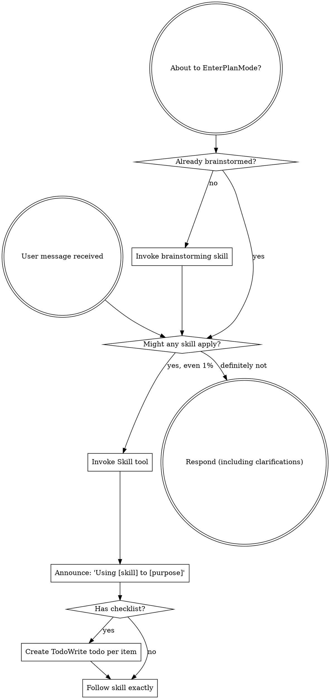

> SYSTEM

# AGENTS.md instructions for /Users/jakobfaber/Developer/scratch/worktrees/flits-gate

<INSTRUCTIONS>
# Codex Configuration

## Learned User Preferences

- When the user asks about Codex, interpret that as Codex CLI/configuration specifically; do not answer from Cursor MCP or Cursor IDE state unless explicitly asked.
- For cross-agent plan review, use Codex with GPT-5.5 medium effort, Claude Code with Opus 4.8 xhigh effort, and Antigravity through the `agy` CLI when available.
- Be conservative about durable memory: capture recurring corrections and stable workspace facts only, not one-off runtime details or transient command output.
- For chezmoi-managed dotfiles, edit source under `~/Developer/repos/github.com/jakobtfaber/dotfiles/home/`; restore live drift (e.g. tool-injected shell hooks) with `chezmoi apply --force` on the target file, not direct edits to `~/.*`.
- When adding core Homebrew tooling, promote packages into `home/dot_Brewfile.tmpl` (e.g. `dotfiles local promote brew <pkg>`) instead of only running `brew install`.
- Maintain Mac-local agent and observability inventories in `~/Obsidian/LLMs/agents/registry/` (`Agent Registry`, `Agent Observability Registry`, inactive-tools log) alongside chezmoi/dotfiles memory—not only in `AGENTS.md`.
- Keep `wolfbook.mcpEnabled: false` in Cursor and VS Code so the Wolfbook extension does not rewrite Antigravity/Gemini MCP configs on disk.
- Orchestrate Claude Code from Cursor via `claude -p --resume` from the session's project cwd; do not run parallel iTerm sessions on the same Claude session ID.
- Trigger prompt-guided context compaction when the chat context window reaches ~40%.

## Learned Workspace Facts

- Dotfiles are chezmoi-managed from `~/Developer/repos/github.com/jakobtfaber/dotfiles/home/`; `~/.zshrc` maps to `dot_zshrc.tmpl`.
- Interactive agent work runs in Cursor; Claude Code shells use iTerm (`claude -p --resume` from project cwd). cmux was removed Jun 2026 (SwiftUI terminal-panel teardown crashes).
- Devin shell integration injects `MANAGED DEVIN BLOCK` (`devin shell init zsh`) into live `~/.zshrc`, re-wrapping sessions as `devin shell run zsh`; the chezmoi template has no Devin hooks — disable with `chezmoi apply --force ~/.zshrc`, restart terminals, and optionally `devin auth logout`.
- Codex MCP startup paths were migrated away from networked `npx`: Playwright uses `/opt/homebrew/bin/playwright-mcp`, Context7 uses `/opt/homebrew/bin/context7-mcp`, and Sourcegraph uses `SOURCEGRAPH_MCP_REMOTE_BIN=/opt/homebrew/bin/mcp-remote`.
- Maistro MCP is globally registered through `my-skillset` (`meta/mcps.json`) and projected by `mskill install`; Codex/Claude should reach it as `/Users/jakobfaber/.local/bin/mskill mcp maistro`. Do not hand-maintain separate Maistro MCP entries; change `~/Developer/my-skillset/meta/mcps.json`, run `bash meta/install-host.sh`, and verify with `codex mcp get maistro` / `mskill doctor`.
- The cross-agent runtime standard is project opt-in for `mise`; Conda-first repos keep Python owned by Conda, and agent automation should use explicit `mise exec -- ...` or clean `conda run -n ...` runners.
- Antigravity `agy` does not expose stable CLI model/effort flags here; model/effort is verified from Antigravity memory logs as runtime metadata such as `Model Selection ... Gemini 3.5 Flash (Medium)`.
- Runtime-standard validation artifacts live under `~/.codex/automations/runtime-standard/`; local fixtures are `~/Developer/projects/runtime-standard-pilot` and `~/Developer/projects/runtime-standard-conda-pilot`.
- Orphan prior-art-recon `claude -p` workers can persist as PPID 1 after the parent exits; kill manually if they linger.
- Gurobi 13.0.2 on jakob-mbp: native pkgs (`/Library/gurobi1302`, `/Library/gurobi_server1302`, `/usr/local/bin`); WLS license `~/gurobi.lic`; `GUROBI_HOME` in chezmoi `10-env.zsh`; Python via `pip install gurobipy==13.0.2` in `py312` (not conda package `gurobi`). After upgrading the macOS .pkg or pip `gurobipy`, re-verify with fresh `gurobi_cl --license` and a trivial `gurobipy` solve—the two paths update independently.
- HPCC MATLAB: on `hpcc`, MATLAB is module-provided, not on the default PATH. Use `module load matlab/r2026a`; then `matlab` resolves to `/software/Matlab/R2026a/bin/matlab`, `matlabroot` is `/resnick/software/Matlab/R2026a`, and verified version is `26.1.0.3251617 (R2026a) Update 2`. Run non-GUI checks with `matlab -batch "..."`. User MATLAB folder exists at `/home/jfaber/Documents/MATLAB`; `userpath` points there and `prefdir` is `/home/jfaber/.matlab/R2026a`.
- HPCC Mathematica/Wolfram: on `hpcc`, Mathematica is module-provided, not on the default PATH. Available modules verified: `mathematica/11.1`, `12.0`, `12.3`, `13.2`, `14.2`; prefer `module load mathematica/14.2`. Then `wolframscript` resolves to `/resnick/software9/external/Mathematica/14.2/bin/wolframscript`, `math` resolves to `/resnick/software9/external/Mathematica/14.2/bin/math`, `$InstallationDirectory` is `/resnick/software9/external/Mathematica/14.2`, verified `$Version` is `14.2.0 for Linux x86 (64-bit) (December 26, 2024)`, `$UserBaseDirectory` is `/home/jfaber/.Wolfram`, and `$BaseDirectory` is `/usr/share/Wolfram`. Run non-GUI checks with `wolframscript -code '...'` or `math -noprompt -run '...; Exit[]'`.
- HPCC Jupyter/JupyterLab: on `hpcc`, Jupyter is module-provided through Open OnDemand. Use `module load jupyter-ood/7.1.2`; then `jupyter` resolves to `/central/software9/external/jupyter-ood-03262024/bin/jupyter`. Verified stack includes JupyterLab `4.1.5`, Notebook `7.1.2`, IPython `8.22.2`, ipykernel `6.29.3`, jupyter_server `2.13.0`, and jupyter_core `5.7.2`.
- HPCC Julia: on `hpcc`, Julia is module-provided, not on the default PATH. Available modules verified: `julia/1.9.4`, `1.10.2`, `1.10.8`, `1.11.3`, `1.12.2`; prefer `module load julia/1.12.2`. Then `julia` resolves to `/central/software9/external/julia/1.12.2/bin/julia`; verified version is `julia version 1.12.2`.
- HPCC Octave: on `hpcc`, GNU Octave is available on the system PATH without loading a module. `octave` resolves to `/usr/bin/octave`; verified version is `GNU Octave, version 7.3.0`.
- Edison Scientific API: `EDISON_API_KEY` from keychain (`Agents/edison-api-key`); Python client `edison-client` in conda `py312`. PyPI watch: dotfiles workflow `edison-client-pypi-watch` (daily) commits `~/.local/share/edison-client-pypi-watch.json` when a new release ships; `com.jakob.dotfiles-autopull` (30m) runs `chezmoi apply` so onchange upgrades `edison-client` locally. Optional manual/PyPI poll: `edison-client-autoupdate` (24h throttle). Kosmos is web-only (not in API).
- Time Machine destination is external volume `MacBackupDrive` (Samsung T7 Shield); `AutoBackup` runs hourly while attached; redundant Shortcuts mount automation was removed—rely on Time Machine only.
- DSA-110 continuum imaging: active repo is `https://github.com/dsa110/dsa110-continuum`. Legacy `~/Developer/research/archive/dsa110-contimg` is deprecated/archival (read-only); port new work to `dsa110-continuum`, not the archive tree.
- `~/Developer/research/AGENTS.md` defines the two-tree rule: `research/` = owned active work (flat repos + archive); upstream clones → `~/Developer/reference/<domain>/`. `astrophysics/` is the unified radio workspace (merged from `radio-astronomy`); `blimpy`/`FRB` live in `reference/astrophysics/`.
- Orchestrator memory (Maistro) lives at `~/Developer/repos/github.com/jakobtfaber/maistro` (`jakobtfaber/maistro`, SQLite event log, RPC writer on :8787, `https://dashboard.jakobtfaber.com`); bearer token in keychain service `Agents`, account `orch-rpc-token`.
- Pulsar periodicity research: `~/Developer/repos/github.com/jakobtfaber/gridless-pulsar` (`jakobtfaber/gridless-pulsar`); GPU coherent folding is the north star; comb-ANM is a refinement tier only (FRB scope removed).

## Codex from Cursor agent Shell

Full runbook: **`~/Developer/reference/cursor-agent-shell-cli-insights.md`**.

When Cursor (or another IDE) runs **`codex exec`** via agent **Shell**, use **subscription auth only** (`codex login` / ChatGPT tokens). Do **not** set **`OPENAI_API_KEY`** for automation unless the workflow explicitly needs API billing.

Prefer **Cursor `Task`** for small in-IDE delegation. Use **`codex exec`** when you need the full CLI tool surface; diagnose the **child Shell process**, not the chat UI alone.

### Argv-vs-stdin rule

- **Prompt as argv ⇒ close stdin:** `codex exec "…" < /dev/null`.
- If **`codex doctor`** shows ChatGPT auth and the process prints **`Reading additional input from stdin...`**, debug **stdin** before auth, `--full-auto`, or API-key settings.

### Root cause (observed in Cursor agent Shell)

Cursor agent Shell **can** leave stdin open. When **`codex exec`** receives the prompt as an **argument**, it may wait indefinitely for additional stdin.

### Required

```bash
codex exec "Your task here" < /dev/null

codex exec -C /path/to/repo "Your task" < /dev/null

# Unattended — restricted actions may fail instead of prompting
codex exec -c 'approval_policy="never"' "Your task" < /dev/null
```

Smoke tests: **`gtimeout`** from **`brew install coreutils`**, or Homebrew **`timeout`** (`which timeout gtimeout`) — avoid multi-hour zombies.

### Sanity check

```bash
codex doctor   # expect stored auth mode chatgpt, stored API key false
```

### Do not

- Run **`codex exec "…"`** without **`< /dev/null`** from Cursor agent Shell when the prompt is argv.
- Background **`codex exec`** without a watchdog unless stdin is explicitly closed.
- Assume hangs mean broken login when the stdin message appears.

### Expectations

- **~60–90s** for trivial invokes on this machine (hooks/config) is a local baseline; runs should **complete**, not hang, when stdin is closed.

### Output channels

Treat `codex exec` stdout as an execution transcript, not as a reliable machine-readable final answer. Normal stdout may include banners, prompts, hook lifecycle messages, the final assistant message, and token usage.

Use the output channel that matches the task:

- **Human-readable delegation:** let stdout print normally when a person will read the transcript.
- **Machine-readable artifact:** use `-o FILE` / `--output-last-message FILE` for the final model message, and redirect stdout/stderr to logs.
- **Event/debug stream:** use `--json` only when you want JSONL execution events; do not treat it as a single final-answer JSON document.

Canonical structured-output pattern:

```bash
mkdir -p logs

codex exec \
  -m gpt-5.5 \
  --skip-git-repo-check \
  -o result.json \
  "$PROMPT" \
  > logs/codex.stdout.log \
  2> logs/codex.stderr.log \
  < /dev/null

python3 -m json.tool result.json >/dev/null
```

Do not parse normal `codex exec` stdout as JSON unless using `--json` and expecting JSONL events. Do not use `--ignore-user-config` for normal delegation; reserve it for debugging Codex itself because it changes the execution environment.

## Runtime Management

- Repositories are opt-in for `mise` through repo-local `mise.toml`; do not set global `mise` Python.
- Conda-first repositories own Python through Conda; do not add `python` to `mise.toml` there unless explicitly migrating away from Conda.
- Agent automation must use explicit runners: `mise exec -- ...` for mise-first repos, or a clean `conda run -n ...` wrapper for Conda-first repos.
- `direnv` is for interactive shell convenience only. Hooks, agents, and non-interactive scripts must not depend on `.envrc` being loaded.
- MCP binaries used at agent startup are Homebrew-managed system tools, not project runtimes. Do not reintroduce `npx` on Codex MCP startup paths.
- On this machine, inherited interactive PATH state can make bare `conda run -n py312 python` resolve base Anaconda Python. For agent-safe Conda checks, prefer:
  `env -i HOME="$HOME" PATH="/opt/anaconda3/bin:/opt/homebrew/bin:/usr/bin:/bin" /opt/anaconda3/bin/conda run -n py312 ...`

## Skills — GitHub Sync

Custom skills are version-controlled in the private `my-skillset` repository.

- **Canonical local clone:** `~/Developer/repos/github.com/jakobtfaber/my-skillset/`
- **Compatibility symlink:** `~/Developer/projects/my-skillset` → `~/Developer/repos/github.com/jakobtfaber/my-skillset`
- **Compatibility symlink:** `~/Developer/my-skillset` → `~/Developer/repos/github.com/jakobtfaber/my-skillset`
- **Claude symlink:** `~/.claude/my-skillset` → `~/Developer/repos/github.com/jakobtfaber/my-skillset`
- **Codex symlink:** `~/.codex/my-skillset` → `~/Developer/repos/github.com/jakobtfaber/my-skillset`
- **Codex active skills symlink:** `~/.codex/skills` → `~/.codex/skills-minimal`
- **Codex minimal skill set:** `~/.codex/skills-minimal` contains a curated mix of local skill folders and symlinks into `my-skillset`; do not repoint it to the full skill tree unless intentionally reversing prompt-bloat pruning.
- **Auto-pull agent:** `com.jakob.skills-autopull`

Do not use the retired `~/Developer/misc/claude-config` path for current skill sync.

## Persistent Agent Memory

Use `~/Developer/repos/github.com/jakobtfaber/dotfiles/memory/` as the manual intent/context memory layer. This is the canonical memory store and the only persistent agent-memory store managed by dotfiles.

- Manual memory notes: `~/Developer/repos/github.com/jakobtfaber/dotfiles/memory/`
- Memory index: `~/Developer/repos/github.com/jakobtfaber/dotfiles/memory/MEMORY.md`
- Runtime memory path: `~/.claude/projects/-Users-jakobfaber/memory/` symlinks to `~/Developer/repos/github.com/jakobtfaber/dotfiles/memory/`
- Daily auto-commit of the memory subtree: launchd job `com.jakobfaber.dotfiles-memory-snapshot` (S-009)

Codex may update its own managed store under `~/.codex/memories/`, but any durable memory-worthy fact, correction, preference, or workspace state written there must also be captured in `~/Developer/repos/github.com/jakobtfaber/dotfiles/memory/` by default. Treat Codex memory as a Codex-local copy/cache, not the only durable record.

Do not create ad-hoc memory directories under `~/.codex/` for persistent memory.
Do not inspect `~/.claude-mem/` for current memory health; that retired directory no longer exists.

## Task Status Semantics

Use strict closure semantics when tracking tasks, updating a temporary to-do list, or summarizing whether work is done.

- `completed`: no further action remains for that item.
- `blocked`: cannot proceed without user input or an external state change.
- `diagnosed`: root cause or next step is known, but the fix/work is not complete.
- `validated`: behavior was checked, but there may still be follow-up.
- `decision pending`: implementation or investigation is sufficient, but a product/UX/cleanup choice remains.

If the available task-tracking tool only supports `pending`, `in_progress`, and `completed`, do not mark blocked/diagnosed/decision-pending work as `completed`. Keep the item `pending`, or split it into a completed investigation item plus a separate pending follow-up with the explicit status in the task text.

## Proactive Stopping Points

When work changes runtime behavior, tool availability, config, MCP servers, daemons, launch agents, browser/app state, shell startup, or any long-lived process, do not stop at a generic note such as "restart required" or "you may need to restart." Before final response, proactively identify the concrete affected process, service, app, server, port, or session that needs reload/restart, inspect what is currently running when practical, and stop at the actionable question with named targets, for example: "Shall I restart `X` and `Y`?" If the restart/reload is reversible and already authorized by the user, perform it and verify the new behavior instead of asking. If it is disruptive, kills user state, or crosses a one-way/outward boundary, ask with the explicit target list and blast radius.

Before claiming completion after file edits, run `agent-closeout-check` or `mskill tool agent-closeout-check` for every repo touched when either condition applies: the repo is dirty, or touched paths could affect runtime behavior. Pass each repo with `--repo`; pass known changed runtime/config paths with `--touched`; pass `--packet <closeout.json>` once you have a dirty-state handoff and/or restart inventory. If the checker fails, do not replace it with a vague caveat. Either produce the required dirty-state handoff packet, perform and verify the required restart, or stop at the concrete next question emitted by the check.

## Dirty Git State

<important if="you see dirty files in a git repo, or a command reports modified, staged, untracked, deleted, renamed, or conflicted files">
Use the `dirty-git-state` skill from `my-skillset` before deciding whether to inspect, edit, clean, stage, commit, or ask the user.

When committing, commit validated, task-scoped changes once the work is complete.
For pre-existing changes, review all of them before committing. Only include them
once they are fully understood, are not transient real-time development state,
and are deemed worthy of commit. If ownership, intent, or readiness is ambiguous
after review, leave the ambiguous changes uncommitted and report the ambiguity.
</important>

<important if="you are asked to run a code review or delegate a task using Codex or Claude">
- For Codex reviews, run Codex non-interactively using:
  `codex exec -m gpt-5.5 -c model_reasoning_effort="medium" "..." < /dev/null`
  This uses gpt-5.5 with medium effort by default.
- For Claude reviews, run Claude non-interactively using:
  `claude --model claude-opus-4-8 --effort xhigh -p "..." < /dev/null`
  This uses Opus 4.8 with xhigh effort by default.
</important>

## Authentication & Verification Protocols

When verifying, investigating, or inspecting the health, connectivity, or authentication state of any service, tool, or API (e.g., Grov, Firecrawl, MCP, ACP, or coding harnesses):

1. **Do Not Blindly Trust CLI Self-Checkers (`doctor` / `status` outputs)**:
   Never take a diagnostic command (e.g., `doctor`, `status`, `healthcheck`) showing green checkmarks as absolute proof of live runtime operational health. These commands often only check if your local configuration files are structured correctly without testing active connection channels.
2. **Test Live Operational Handshakes**:
   Always execute a minor, non-destructive live operational command (e.g., running a Dry-Run, pulling a mock schema, or making a safe query) to force a true cryptographic handshake with the API endpoint.
3. **Inspect Backing Configs Directly**:
   Always locate and inspect the underlying configuration and credentials storage files (JSON, TOML, SQLite databases, or environment variables) directly. Check active token lifetimes, `expires_at` timestamps, scopes, and encryption validity against the current local system time (e.g., `credentials.json` expiration dates) to verify active session state.

<!-- opensrc:start -->
## opensrc — dependency source for deeper context

`opensrc` (CLI, installed globally) caches dependency **source code** at `~/.opensrc/` so agents can read a package's internal implementation, not just its public types/interface. Cached inventory: `~/.opensrc/sources.json`.

- **Fetch (cache only):** `opensrc fetch <pkg>` — cross-registry: `opensrc fetch pypi:<pkg> crates:<pkg> <owner>/<repo>`
- **Read (fetches on cache miss):** `rg "pattern" $(opensrc path <pkg>)` · `cat $(opensrc path <pkg>)/path/to/file` · `find $(opensrc path <pkg>) -name "*.ts"`

Use it when you need to understand *how* a dependency works internally (npm, PyPI, crates.io, or a GitHub repo), not just its surface API.
<!-- opensrc:end -->

@/Users/jakobfaber/.codex/RTK.md

--- project-doc ---

# AGENTS.md

Repo-level agent guidance for FLITS. Full project guide: `CLAUDE.md`.
Binding fit-validation contract: `.cursor/rules/AGENT_CONFIGURATION_FLITS.md`.

## Long-View Science Goals

The primary objective of the CHIME–DSA co-detection analysis and the FLITS pipeline is to reconstruct the complete line-of-sight dispersion measure (DM) and scattering budgets for the 12 co-detected bursts.

1. **Accurate Scattering Index (\(\alpha\)) Measurement:** Break the degeneracy between scattering time \(\tau\) and index \(\alpha\) by fitting CHIME (400–800 MHz) and DSA-110 (1.2–1.5 GHz) data simultaneously with a shared model, leveraging the \(\sim 1\) GHz frequency lever arm.
2. **Mitigating Profile Bias:** Detect hidden temporal sub-components (multi-pulse structures). Left unmodeled, secondary pulses bias \(\alpha\) high (e.g. \(\alpha \approx 3.3 \to 2.7\)). Fits must model sub-components to ensure physical honesty.
3. **Sightline Attribution:** Partition observed \(DM_{\text{obs}}\) and scattering \(\tau_{\text{obs}}\) to constrain host-galaxy, Milky Way, and intervening foreground contributions (probing the CGM/groups/clusters of 49 candidate intervening systems).


## Review guidelines

Used by Codex automatic code review (and any agent reviewing a PR). Flag only
real P0/P1 issues; skip style that ruff already enforces. Ignore base64 image
payloads embedded in `docs/*.html`.

- **Physics kernel ownership.** `scattering/scat_analysis/burstfit.py` is the
  canonical kernel; `flits/` wraps it. Model-physics changes belong in
  `burstfit.py` — flag edits that fork physics into the wrapper.
- **Fit validation is mandatory.** Flag any change that could rationalize a
  failing/marginal fit into a pass, drop a validation level (Level-1 gates,
  chi2_red / R2, physics `tau*dnu` in [0.1, 2.0], alpha bounds), or bypass the
  diagnostic-figure review gate. A numeric PASS without figure review is not a pass.
- **Physics sanity.** Enforce bounds `0.0001 < tau < 100 ms` and
  `1.5 < alpha < 6.0`; check units and the frequency-ascending load assumption.
- **Lazy-minimalist (ponytail).** Flag unnecessary abstractions, dead code,
  speculative config, and parallel near-duplicate modules. Prefer the shortest
  correct diff — but never trade scientific rigor or a validation level for brevity.

</INSTRUCTIONS>
<environment_context>
  <cwd>/Users/jakobfaber/Developer/scratch/worktrees/flits-gate</cwd>
  <shell>zsh</shell>
  <current_date>2026-06-24</current_date>
  <timezone>America/Los_Angeles</timezone>
  <filesystem><workspace_roots><root>/Users/jakobfaber/Developer/scratch/worktrees/flits-gate</root></workspace_roots><permission_profile type="managed"><file_system type="restricted"><entry access="read"><special>:root</special></entry><entry access="write"><path>/Users/jakobfaber/Developer/scratch/worktrees/flits-gate</path></entry><entry access="write"><special>:slash_tmp</special></entry><entry access="write"><special>:tmpdir</special></entry><entry access="read"><path>/Users/jakobfaber/Developer/scratch/worktrees/flits-gate/.git</path></entry><entry access="read"><path>/Users/jakobfaber/Developer/scratch/worktrees/flits-gate/.agents</path></entry><entry access="read"><path>/Users/jakobfaber/Developer/scratch/worktrees/flits-gate/.codex</path></entry></file_system></permission_profile></filesystem>
</environment_context>

> DEVELOPER

TASK: land the active joint-fit-gate lane as a DRAFT PR. Work ONLY in the git worktree at /Users/jakobfaber/Developer/scratch/worktrees/flits-gate (branch feat/joint-fit-gate). Use `git -C /Users/jakobfaber/Developer/scratch/worktrees/flits-gate ...` for all git ops. Do NOT touch any other worktree, branch, or lane. A recovery snapshot already exists at /Users/jakobfaber/Developer/scratch/worktrees/flits-gate-preserve/ (tracked.patch + untracked.tgz) — do not delete it.

STATE: branch feat/joint-fit-gate at 069f987, 1 ahead / 22 behind origin/main, 41 dirty entries (regenerated joint scattering fit/gate artifacts under analysis/scattering-refit-2026-06/ + docs/entire-tracing-checkpoints.md). No open PR.

DO, in order:
1. COMMIT the regen. Stage the regen artifacts (analysis/scattering-refit-2026-06/ and docs/entire-tracing-checkpoints.md; include any other dirty tracked+untracked files that are clearly part of the gate regeneration — inspect first). Commit message: "chore(gate): regenerate committed joint-fit gate artifacts (Phase 1)". Do NOT stage anything outside this lane.
2. REBASE onto origin/main. `git -C <wt> fetch origin` then `git -C <wt> rebase origin/main`. IF CONFLICTS: run `git -C <wt> rebase --abort`, leave the branch at its committed (un-rebased) state, and record that a manual rebase is needed — do NOT force-resolve conflicts.
3. PUSH + DRAFT PR. Attempt `git -C <wt> push -u origin feat/joint-fit-gate` then `gh pr create --base main --head feat/joint-fit-gate --draft --title "..." --body "..."`. If the sandbox blocks network (likely), DO NOT fail — instead emit the EXACT push command, the exact `gh pr create` command, and the full PR body text you composed, for the orchestrator to run under its approval gate.

HARD CONSTRAINTS:
- The PR MUST be --draft. This lane includes lowering the joint-gate alpha hard-FAIL floor 1.5->1.0 (ADR-0004), a science-contract change. It MUST stay draft until the alpha-floor change is validated against burstfit.py's authoritative alpha/physics gates AND the diagnostic-figure review gate. Say this explicitly in the PR body.
- Do NOT edit any science or code to make a failing fit PASS. Land the regen exactly as it is.
- If the worktree's dirty set changed since this state (another writer touched it), STOP and report instead of committing.

OUTPUT (concise):
COMMIT: <sha + headline, or why not>
REBASE: <clean | aborted-conflicts (list files) | n/a>
PUSH: <done | blocked -> exact command>
PR: <url | blocked -> exact `gh pr create` command + full --body text>
NOTES: <anything the orchestrator must finish>

> AGENT

I’ll keep this scoped to `/Users/jakobfaber/Developer/scratch/worktrees/flits-gate` and use the requested `git -C` form for every git operation. I’m first loading the required local workflow guidance and checking whether the dirty set still matches the stated lane before staging anything.

> TOOL

tool_use shell_command
id: call_AqjjYbEUbu0qtKAUiHdHrAxW
```json
{
  "command": "sed -n '1,240p' /Users/jakobfaber/.codex/plugins/cache/openai-curated/superpowers/3c06cb2e/skills/using-superpowers/SKILL.md",
  "workdir": "/Users/jakobfaber/Developer/scratch/worktrees/flits-gate",
  "timeout_ms": 10000
}
```

> TOOL

tool_use shell_command
id: call_xywU1ZttqyWkOiHIfmlSJE1R
```json
{
  "command": "sed -n '1,260p' /Users/jakobfaber/.codex/plugins/cache/openai-curated/github/3c06cb2e/skills/yeet/SKILL.md",
  "workdir": "/Users/jakobfaber/Developer/scratch/worktrees/flits-gate",
  "timeout_ms": 10000
}
```

> TOOL

tool_use shell_command
id: call_OvrySxfcbptZWnSlUEAOBoZR
```json
{
  "command": "rg -n \"dirty-git-state|joint-fit-gate|joint fit gate|scattering-refit-2026-06|feat/joint-fit-gate|gate regeneration|ADR-0004\" /Users/jakobfaber/.codex/memories/MEMORY.md",
  "workdir": "/Users/jakobfaber/Developer/scratch/worktrees/flits-gate",
  "timeout_ms": 10000
}
```

> TOOL

tool_use shell_command
id: call_ElS1wVpQ5KAU7IpKRZEOZlR5
```json
{
  "command": "fd 'SKILL\\.md$' /Users/jakobfaber/.agents/skills /Users/jakobfaber/.codex/skills-minimal /Users/jakobfaber/Developer/scratch/worktrees/flits-gate/.agents/skills 2>/dev/null | rg 'dirty|git'",
  "workdir": "/Users/jakobfaber/Developer/scratch/worktrees/flits-gate",
  "timeout_ms": 10000
}
```

> TOOL

tool_result
id: call_AqjjYbEUbu0qtKAUiHdHrAxW
```
Exit code: 0
Wall time: 0.1 seconds
Output:
---
name: using-superpowers
description: Use when starting any conversation - establishes how to find and use skills, requiring Skill tool invocation before ANY response including clarifying questions
---

<SUBAGENT-STOP>
If you were dispatched as a subagent to execute a specific task, skip this skill.
</SUBAGENT-STOP>

<EXTREMELY-IMPORTANT>
If you think there is even a 1% chance a skill might apply to what you are doing, you ABSOLUTELY MUST invoke the skill.

IF A SKILL APPLIES TO YOUR TASK, YOU DO NOT HAVE A CHOICE. YOU MUST USE IT.

This is not negotiable. This is not optional. You cannot rationalize your way out of this.
</EXTREMELY-IMPORTANT>

## Instruction Priority

Superpowers skills override default system prompt behavior, but **user instructions always take precedence**:

1. **User's explicit instructions** (CLAUDE.md, GEMINI.md, AGENTS.md, direct requests) — highest priority
2. **Superpowers skills** — override default system behavior where they conflict
3. **Default system prompt** — lowest priority

If CLAUDE.md, GEMINI.md, or AGENTS.md says "don't use TDD" and a skill says "always use TDD," follow the user's instructions. The user is in control.

## How to Access Skills

**In Claude Code:** Use the `Skill` tool. When you invoke a skill, its content is loaded and presented to you—follow it directly. Never use the Read tool on skill files.

**In Copilot CLI:** Use the `skill` tool. Skills are auto-discovered from installed plugins. The `skill` tool works the same as Claude Code's `Skill` tool.

**In Gemini CLI:** Skills activate via the `activate_skill` tool. Gemini loads skill metadata at session start and activates the full content on demand.

**In other environments:** Check your platform's documentation for how skills are loaded.

## Platform Adaptation

Skills use Claude Code tool names. Non-CC platforms: see `references/copilot-tools.md` (Copilot CLI), `references/codex-tools.md` (Codex) for tool equivalents. Gemini CLI users get the tool mapping loaded automatically via GEMINI.md.

# Using Skills

## The Rule

**Invoke relevant or requested skills BEFORE any response or action.** Even a 1% chance a skill might apply means that you should invoke the skill to check. If an invoked skill turns out to be wrong for the situation, you don't need to use it.



## Red Flags

These thoughts mean STOP—you're rationalizing:

| Thought | Reality |
|---------|---------|
| "This is just a simple question" | Questions are tasks. Check for skills. |
| "I need more context first" | Skill check comes BEFORE clarifying questions. |
| "Let me explore the codebase first" | Skills tell you HOW to explore. Check first. |
| "I can check git/files quickly" | Files lack conversation context. Check for skills. |
| "Let me gather information first" | Skills tell you HOW to gather information. |
| "This doesn't need a formal skill" | If a skill exists, use it. |
| "I remember this skill" | Skills evolve. Read current version. |
| "This doesn't count as a task" | Action = task. Check for skills. |
| "The skill is overkill" | Simple things become complex. Use it. |
| "I'll just do this one thing first" | Check BEFORE doing anything. |
| "This feels productive" | Undisciplined action wastes time. Skills prevent this. |
| "I know what that means" | Knowing the concept ≠ using the skill. Invoke it. |

## Skill Priority

When multiple skills could apply, use this order:

1. **Process skills first** (brainstorming, debugging) - these determine HOW to approach the task
2. **Implementation skills second** (frontend-design, mcp-builder) - these guide execution

"Let's build X" → brainstorming first, then implementation skills.
"Fix this bug" → debugging first, then domain-specific skills.

## Skill Types

**Rigid** (TDD, debugging): Follow exactly. Don't adapt away discipline.

**Flexible** (patterns): Adapt principles to context.

The skill itself tells you which.

## User Instructions

Instructions say WHAT, not HOW. "Add X" or "Fix Y" doesn't mean skip workflows.

```

> TOOL

tool_result
id: call_xywU1ZttqyWkOiHIfmlSJE1R
```
Exit code: 0
Wall time: 0.1 seconds
Output:
---
name: "yeet"
description: "Publish local changes to GitHub by confirming scope, committing intentionally, pushing the branch, and opening a draft PR through the GitHub app from this plugin, with `gh` used only as a fallback where connector coverage is insufficient."
---

# GitHub Publish Changes

## Overview

Use this skill only when the user explicitly wants the full publish flow from the local checkout: branch setup if needed, staging, commit, push, and opening a pull request.

This workflow is hybrid:

- Use local `git` for branch creation, staging, commit, and push.
- Prefer the GitHub app from this plugin for pull request creation after the branch is on the remote.
- Use `gh` as a fallback for current-branch PR discovery, auth checks, or PR creation when the connector path cannot infer the repository or head branch cleanly.

## Prerequisites

- Require GitHub CLI `gh`. Check `gh --version`. If missing, ask the user to install `gh` and stop.
- Require authenticated `gh` session. Run `gh auth status`. If not authenticated, ask the user to run `gh auth login` (and re-run `gh auth status`) before continuing.
- Require a local git repository with a clean understanding of which changes belong in the PR.

## Naming conventions

- Branch: `codex/{description}` when starting from main/master/default.
- Commit: `{description}` (terse).
- PR title: `[codex] {description}` summarizing the full diff.

## Workflow

1. Confirm intended scope.
   - Run `git status -sb` and inspect the diff before staging.
   - If the working tree contains unrelated changes, do not default to `git add -A`. Ask the user which files belong in the PR.
2. Determine the branch strategy.
   - If on `main`, `master`, or another default branch, create `codex/{description}`.
   - Otherwise stay on the current branch.
3. Stage only the intended changes.
   - Prefer explicit file paths when the worktree is mixed.
   - Use `git add -A` only when the user has confirmed the whole worktree belongs in scope.
4. Commit tersely with the confirmed description.
5. Run the most relevant checks available if they have not already been run.
   - If checks fail due to missing dependencies or tools, install what is needed and rerun once.
6. Push with tracking: `git push -u origin $(git branch --show-current)`.
7. Open a draft PR.
   - Prefer the GitHub app from this plugin for PR creation after the push succeeds.
   - Derive `repository_full_name` from the remote, for example by normalizing `git remote get-url origin` or by using `gh repo view --json nameWithOwner`.
   - Derive `head_branch` from `git branch --show-current`.
   - Derive `base_branch` from the user request when specified; otherwise use the remote default branch, for example via `gh repo view --json defaultBranchRef`.
   - If the branch is being pushed from a fork or the PR target differs from the remote that was just pushed, prefer `gh pr create` fallback because the connector PR creation flow expects one repository target and may not encode cross-repo head semantics cleanly.
   - If connector-based PR creation cannot infer the repository or branch cleanly, fall back to `gh pr create --draft --fill --head $(git branch --show-current)`.
   - Write the PR body to a temp file with real newlines when using CLI fallback so the markdown renders cleanly.
8. Summarize the result with branch name, commit, PR target, validation, and anything the user still needs to confirm.

## Write Safety

- Never stage unrelated user changes silently.
- Never push without confirming scope when the worktree is mixed.
- Default to a draft PR unless the user explicitly asks for a ready-for-review PR.
- If the repository does not appear to be connected to an accessible GitHub remote, stop and explain the blocker before making assumptions.

## PR Body Expectations

The PR description should use real Markdown prose and cover:

- what changed
- why it changed
- the user or developer impact
- the root cause when the PR is a fix
- the checks used to validate it

```

> TOOL

tool_result
id: call_OvrySxfcbptZWnSlUEAOBoZR
```
Command blocked by PreToolUse hook: rtk-codex-guard: shell command should use RTK compact output.

Suggested command:
rtk grep -n "dirty-git-state|joint-fit-gate|joint fit gate|scattering-refit-2026-06|feat/joint-fit-gate|gate regeneration|ADR-0004" /Users/jakobfaber/.codex/memories/MEMORY.md

To bypass for this command, prefix it with: RTK_DISABLED=1. Command: rg -n "dirty-git-state|joint-fit-gate|joint fit gate|scattering-refit-2026-06|feat/joint-fit-gate|gate regeneration|ADR-0004" /Users/jakobfaber/.codex/memories/MEMORY.md
```

> TOOL

tool_result
id: call_ElS1wVpQ5KAU7IpKRZEOZlR5
```
Exit code: 0
Wall time: 0.1 seconds
Output:
/Users/jakobfaber/.agents/skills/git-guardrails-claude-code/SKILL.md

```

> AGENT

Using `superpowers:using-superpowers` for skill discipline and `github:yeet` for the publish flow. The repo-local dirty-state skill named in the instructions is not exposed in this session’s skill list, so I’m applying its constraint directly: inspect and classify before staging.

> TOOL

tool_use update_plan
id: call_T1yxbUPk6VXVLTfU3VT67S9J
```json
{
  "plan": [
    {
      "step": "Verify branch and dirty set still match the requested lane",
      "status": "in_progress"
    },
    {
      "step": "Stage only gate-regeneration artifacts and commit",
      "status": "pending"
    },
    {
      "step": "Fetch origin and rebase onto origin/main, aborting on conflicts",
      "status": "pending"
    },
    {
      "step": "Push branch and create draft PR or emit exact blocked commands",
      "status": "pending"
    },
    {
      "step": "Run closeout verification and summarize required orchestrator actions",
      "status": "pending"
    }
  ]
}
```

> TOOL

tool_result
id: call_T1yxbUPk6VXVLTfU3VT67S9J
```
Plan updated
```

> AGENT

I’m checking branch, upstream divergence, dirty paths, and the relevant diffs now. If anything looks outside the stated regeneration lane, I’ll stop before committing.

> TOOL

tool_use shell_command
id: call_KY57Nk0FFgmio2HuO709YDFA
```json
{
  "command": "git -C /Users/jakobfaber/Developer/scratch/worktrees/flits-gate status --short --branch",
  "workdir": "/Users/jakobfaber/Developer/scratch/worktrees/flits-gate",
  "timeout_ms": 10000
}
```

> TOOL

tool_use shell_command
id: call_Sje4WHTRlTXO3U9T0dS7ZWcc
```json
{
  "command": "git -C /Users/jakobfaber/Developer/scratch/worktrees/flits-gate rev-parse --abbrev-ref HEAD && git -C /Users/jakobfaber/Developer/scratch/worktrees/flits-gate rev-parse --short HEAD && git -C /Users/jakobfaber/Developer/scratch/worktrees/flits-gate rev-list --left-right --count origin/main...HEAD",
  "workdir": "/Users/jakobfaber/Developer/scratch/worktrees/flits-gate",
  "timeout_ms": 10000
}
```

> TOOL

tool_use shell_command
id: call_O1BGeT2HqP3ctQDELqEO6Atr
```json
{
  "command": "git -C /Users/jakobfaber/Developer/scratch/worktrees/flits-gate diff --stat -- analysis/scattering-refit-2026-06 docs/entire-tracing-checkpoints.md",
  "workdir": "/Users/jakobfaber/Developer/scratch/worktrees/flits-gate",
  "timeout_ms": 10000
}
```

> TOOL

tool_use shell_command
id: call_D3gOzVYULHbNpLJvS0NNBNGG
```json
{
  "command": "git -C /Users/jakobfaber/Developer/scratch/worktrees/flits-gate ls-files --others --exclude-standard -- analysis/scattering-refit-2026-06 docs/entire-tracing-checkpoints.md",
  "workdir": "/Users/jakobfaber/Developer/scratch/worktrees/flits-gate",
  "timeout_ms": 10000
}
```

> TOOL

tool_use shell_command
id: call_On0MIqZEoGCaqjZp2yIuZtPY
```json
{
  "command": "rtk grep -n \"dirty-git-state|joint-fit-gate|joint fit gate|scattering-refit-2026-06|feat/joint-fit-gate|gate regeneration|ADR-0004\" /Users/jakobfaber/.codex/memories/MEMORY.md",
  "workdir": "/Users/jakobfaber/Developer/scratch/worktrees/flits-gate",
  "timeout_ms": 10000
}
```

> TOOL

tool_result
id: call_KY57Nk0FFgmio2HuO709YDFA
```
Command blocked by PreToolUse hook: rtk-codex-guard: shell command should use RTK compact output.

Suggested command:
rtk git -C /Users/jakobfaber/Developer/scratch/worktrees/flits-gate status --short --branch

To bypass for this command, prefix it with: RTK_DISABLED=1. Command: git -C /Users/jakobfaber/Developer/scratch/worktrees/flits-gate status --short --branch
```

> TOOL

tool_result
id: call_Sje4WHTRlTXO3U9T0dS7ZWcc
```
Exit code: 0
Wall time: 0.2 seconds
Output:
feat/joint-fit-gate
069f987
23	1

```

> TOOL

tool_result
id: call_O1BGeT2HqP3ctQDELqEO6Atr
```
Command blocked by PreToolUse hook: rtk-codex-guard: shell command should use RTK compact output.

Suggested command:
rtk git -C /Users/jakobfaber/Developer/scratch/worktrees/flits-gate diff --stat -- analysis/scattering-refit-2026-06 docs/entire-tracing-checkpoints.md

To bypass for this command, prefix it with: RTK_DISABLED=1. Command: git -C /Users/jakobfaber/Developer/scratch/worktrees/flits-gate diff --stat -- analysis/scattering-refit-2026-06 docs/entire-tracing-checkpoints.md
```

> TOOL

tool_result
id: call_D3gOzVYULHbNpLJvS0NNBNGG
```
Exit code: 0
Wall time: 0.1 seconds
Output:
analysis/scattering-refit-2026-06/component_census.md
analysis/scattering-refit-2026-06/component_gallery.py
analysis/scattering-refit-2026-06/component_screen/component_deck.html
analysis/scattering-refit-2026-06/joint_json/chromatica_joint_ppc.json
analysis/scattering-refit-2026-06/joint_json/freya_joint_ppc.json
analysis/scattering-refit-2026-06/joint_json/hamilton_joint_ppc.json
analysis/scattering-refit-2026-06/joint_json/isha_joint_ppc.json
analysis/scattering-refit-2026-06/joint_json/zach_joint_ppc.json
analysis/scattering-refit-2026-06/sharedzeta_pull/chromatica_joint_fit_sharedzeta.json
analysis/scattering-refit-2026-06/sharedzeta_pull/chromatica_joint_ppc_sharedzeta.json
analysis/scattering-refit-2026-06/sharedzeta_pull/freya_joint_fit_sharedzeta.json
analysis/scattering-refit-2026-06/sharedzeta_pull/freya_joint_ppc_sharedzeta.json
analysis/scattering-refit-2026-06/sharedzeta_pull/hamilton_joint_fit_sharedzeta.json
analysis/scattering-refit-2026-06/sharedzeta_pull/hamilton_joint_ppc_sharedzeta.json
analysis/scattering-refit-2026-06/sharedzeta_pull/isha_joint_fit_sharedzeta.json
analysis/scattering-refit-2026-06/sharedzeta_pull/isha_joint_ppc_sharedzeta.json
analysis/scattering-refit-2026-06/sharedzeta_pull/johndoeII_joint_fit_sharedzeta.json
analysis/scattering-refit-2026-06/sharedzeta_pull/johndoeII_joint_ppc_sharedzeta.json
analysis/scattering-refit-2026-06/sharedzeta_pull/mahi_joint_fit_sharedzeta.json
analysis/scattering-refit-2026-06/sharedzeta_pull/mahi_joint_ppc_sharedzeta.json
analysis/scattering-refit-2026-06/sharedzeta_pull/oran_joint_fit_sharedzeta.json
analysis/scattering-refit-2026-06/sharedzeta_pull/oran_joint_ppc_sharedzeta.json
analysis/scattering-refit-2026-06/sharedzeta_pull/phineas_joint_fit_sharedzeta.json
analysis/scattering-refit-2026-06/sharedzeta_pull/phineas_joint_ppc_sharedzeta.json
analysis/scattering-refit-2026-06/sharedzeta_pull/whitney_joint_fit_sharedzeta.json
analysis/scattering-refit-2026-06/sharedzeta_pull/whitney_joint_ppc_sharedzeta.json
analysis/scattering-refit-2026-06/sharedzeta_pull/wilhelm_joint_fit_sharedzeta.json
analysis/scattering-refit-2026-06/sharedzeta_pull/wilhelm_joint_ppc_sharedzeta.json
analysis/scattering-refit-2026-06/sharedzeta_pull/zach_joint_fit_sharedzeta.json
analysis/scattering-refit-2026-06/sharedzeta_pull/zach_joint_ppc_sharedzeta.json

```

> TOOL

tool_result
id: call_On0MIqZEoGCaqjZp2yIuZtPY
```
Exit code: 0
Wall time: 0.1 seconds
Output:
6 matches in 1 files:

/Users/jakobfaber/.codex/memories/MEMORY.md:35:- scintillation/scint_analysis/consistency.py, consistency_table, band_consis...
/Users/jakobfaber/.codex/memories/MEMORY.md:153:- `scintillation/scint_analysis/consistency.py` now visibly carries `band_con...
/Users/jakobfaber/.codex/memories/MEMORY.md:664:- dirty-git-state, agent-closeout-check, docs/joint_scattering_deck.html, sim...
/Users/jakobfaber/.codex/memories/MEMORY.md:926:- chezmoi, dotfiles, matlab, amtlab, codex config, MCP, rg, source-path, dirt...
/Users/jakobfaber/.codex/memories/MEMORY.md:1030:- AGENTS.md, dirty-git-state, skills/git/dirty-git-state/SKILL.md, CLAUDE.md ...
/Users/jakobfaber/.codex/memories/MEMORY.md:1055:- `AGENTS.md` is the durable place for the repo’s review-first commit protoco...

```

> AGENT

The branch is still `feat/joint-fit-gate` at `069f987`. The remote-main divergence is one commit different from the handoff (`23` behind instead of `22` before fetch), so I’m treating that as possible upstream movement and checking the dirty path set itself before deciding whether this is safe to land.

> TOOL

tool_use shell_command
id: call_61fapa4XMEvlr9UBSVIRvinj
```json
{
  "command": "RTK_DISABLED=1 git -C /Users/jakobfaber/Developer/scratch/worktrees/flits-gate status --short --branch",
  "workdir": "/Users/jakobfaber/Developer/scratch/worktrees/flits-gate",
  "timeout_ms": 10000
}
```

> TOOL

tool_use shell_command
id: call_Ldc0icXEvSvQGGb1bJ95GMNh
```json
{
  "command": "RTK_DISABLED=1 git -C /Users/jakobfaber/Developer/scratch/worktrees/flits-gate diff --name-status -- analysis/scattering-refit-2026-06 docs/entire-tracing-checkpoints.md",
  "workdir": "/Users/jakobfaber/Developer/scratch/worktrees/flits-gate",
  "timeout_ms": 10000
}
```

> TOOL

tool_use shell_command
id: call_BwP5Hid9I1OklGgWPhRJIgHQ
```json
{
  "command": "RTK_DISABLED=1 git -C /Users/jakobfaber/Developer/scratch/worktrees/flits-gate ls-files --modified --deleted --others --exclude-standard",
  "workdir": "/Users/jakobfaber/Developer/scratch/worktrees/flits-gate",
  "timeout_ms": 10000
}
```

> TOOL

tool_use shell_command
id: call_LU0KVZ0rKwUEj20uX8FMJu9F
```json
{
  "command": "sed -n '650,672p' /Users/jakobfaber/.codex/memories/MEMORY.md",
  "workdir": "/Users/jakobfaber/Developer/scratch/worktrees/flits-gate",
  "timeout_ms": 10000
}
```

> TOOL

tool_use shell_command
id: call_HlFcYfKvDO5bo7KckjnePhFc
```json
{
  "command": "sed -n '1,240p' /Users/jakobfaber/Developer/repos/github.com/jakobtfaber/my-skillset/skills/git/dirty-git-state/SKILL.md",
  "workdir": "/Users/jakobfaber/Developer/scratch/worktrees/flits-gate",
  "timeout_ms": 10000
}
```

> TOOL

tool_result
id: call_61fapa4XMEvlr9UBSVIRvinj
```
Exit code: 0
Wall time: 0.2 seconds
Output:
## feat/joint-fit-gate...origin/main [ahead 1, behind 23]
 M analysis/scattering-refit-2026-06/joint_gate_verdicts.md
 M analysis/scattering-refit-2026-06/joint_json/chromatica_joint_fit.json
 M analysis/scattering-refit-2026-06/joint_json/chromatica_joint_gate.json
 M analysis/scattering-refit-2026-06/joint_json/freya_joint_fit.json
 M analysis/scattering-refit-2026-06/joint_json/freya_joint_gate.json
 M analysis/scattering-refit-2026-06/joint_json/hamilton_joint_fit.json
 M analysis/scattering-refit-2026-06/joint_json/hamilton_joint_gate.json
 M analysis/scattering-refit-2026-06/joint_json/isha_joint_fit.json
 M analysis/scattering-refit-2026-06/joint_json/isha_joint_gate.json
 M analysis/scattering-refit-2026-06/joint_json/johndoeII_joint_fit.json
 M analysis/scattering-refit-2026-06/joint_json/johndoeII_joint_gate.json
 M analysis/scattering-refit-2026-06/joint_json/johndoeII_joint_ppc.json
 M analysis/scattering-refit-2026-06/joint_json/mahi_joint_fit.json
 M analysis/scattering-refit-2026-06/joint_json/mahi_joint_gate.json
 M analysis/scattering-refit-2026-06/joint_json/mahi_joint_ppc.json
 M analysis/scattering-refit-2026-06/joint_json/oran_joint_fit.json
 M analysis/scattering-refit-2026-06/joint_json/oran_joint_gate.json
 M analysis/scattering-refit-2026-06/joint_json/oran_joint_ppc.json
 M analysis/scattering-refit-2026-06/joint_json/phineas_joint_fit.json
 M analysis/scattering-refit-2026-06/joint_json/phineas_joint_gate.json
 M analysis/scattering-refit-2026-06/joint_json/phineas_joint_ppc.json
 M analysis/scattering-refit-2026-06/joint_json/whitney_joint_fit.json
 M analysis/scattering-refit-2026-06/joint_json/whitney_joint_gate.json
 M analysis/scattering-refit-2026-06/joint_json/whitney_joint_ppc.json
 M analysis/scattering-refit-2026-06/joint_json/wilhelm_joint_fit.json
 M analysis/scattering-refit-2026-06/joint_json/wilhelm_joint_gate.json
 M analysis/scattering-refit-2026-06/joint_json/wilhelm_joint_ppc.json
 M analysis/scattering-refit-2026-06/joint_json/zach_joint_fit.json
 M analysis/scattering-refit-2026-06/joint_json/zach_joint_gate.json
 M analysis/scattering-refit-2026-06/joint_ppc.py
 M analysis/scattering-refit-2026-06/run_joint_fit.py
 M docs/entire-tracing-checkpoints.md
?? analysis/scattering-refit-2026-06/component_census.md
?? analysis/scattering-refit-2026-06/component_gallery.py
?? analysis/scattering-refit-2026-06/component_screen/
?? analysis/scattering-refit-2026-06/joint_json/chromatica_joint_ppc.json
?? analysis/scattering-refit-2026-06/joint_json/freya_joint_ppc.json
?? analysis/scattering-refit-2026-06/joint_json/hamilton_joint_ppc.json
?? analysis/scattering-refit-2026-06/joint_json/isha_joint_ppc.json
?? analysis/scattering-refit-2026-06/joint_json/zach_joint_ppc.json
?? analysis/scattering-refit-2026-06/sharedzeta_pull/

```

> TOOL

tool_result
id: call_Ldc0icXEvSvQGGb1bJ95GMNh
```
Exit code: 0
Wall time: 0.2 seconds
Output:
M	analysis/scattering-refit-2026-06/joint_gate_verdicts.md
M	analysis/scattering-refit-2026-06/joint_json/chromatica_joint_fit.json
M	analysis/scattering-refit-2026-06/joint_json/chromatica_joint_gate.json
M	analysis/scattering-refit-2026-06/joint_json/freya_joint_fit.json
M	analysis/scattering-refit-2026-06/joint_json/freya_joint_gate.json
M	analysis/scattering-refit-2026-06/joint_json/hamilton_joint_fit.json
M	analysis/scattering-refit-2026-06/joint_json/hamilton_joint_gate.json
M	analysis/scattering-refit-2026-06/joint_json/isha_joint_fit.json
M	analysis/scattering-refit-2026-06/joint_json/isha_joint_gate.json
M	analysis/scattering-refit-2026-06/joint_json/johndoeII_joint_fit.json
M	analysis/scattering-refit-2026-06/joint_json/johndoeII_joint_gate.json
M	analysis/scattering-refit-2026-06/joint_json/johndoeII_joint_ppc.json
M	analysis/scattering-refit-2026-06/joint_json/mahi_joint_fit.json
M	analysis/scattering-refit-2026-06/joint_json/mahi_joint_gate.json
M	analysis/scattering-refit-2026-06/joint_json/mahi_joint_ppc.json
M	analysis/scattering-refit-2026-06/joint_json/oran_joint_fit.json
M	analysis/scattering-refit-2026-06/joint_json/oran_joint_gate.json
M	analysis/scattering-refit-2026-06/joint_json/oran_joint_ppc.json
M	analysis/scattering-refit-2026-06/joint_json/phineas_joint_fit.json
M	analysis/scattering-refit-2026-06/joint_json/phineas_joint_gate.json
M	analysis/scattering-refit-2026-06/joint_json/phineas_joint_ppc.json
M	analysis/scattering-refit-2026-06/joint_json/whitney_joint_fit.json
M	analysis/scattering-refit-2026-06/joint_json/whitney_joint_gate.json
M	analysis/scattering-refit-2026-06/joint_json/whitney_joint_ppc.json
M	analysis/scattering-refit-2026-06/joint_json/wilhelm_joint_fit.json
M	analysis/scattering-refit-2026-06/joint_json/wilhelm_joint_gate.json
M	analysis/scattering-refit-2026-06/joint_json/wilhelm_joint_ppc.json
M	analysis/scattering-refit-2026-06/joint_json/zach_joint_fit.json
M	analysis/scattering-refit-2026-06/joint_json/zach_joint_gate.json
M	analysis/scattering-refit-2026-06/joint_ppc.py
M	analysis/scattering-refit-2026-06/run_joint_fit.py
M	docs/entire-tracing-checkpoints.md

```

> TOOL

tool_result
id: call_BwP5Hid9I1OklGgWPhRJIgHQ
```
Exit code: 0
Wall time: 0.2 seconds
Output:
analysis/scattering-refit-2026-06/component_census.md
analysis/scattering-refit-2026-06/component_gallery.py
analysis/scattering-refit-2026-06/component_screen/component_deck.html
analysis/scattering-refit-2026-06/joint_json/chromatica_joint_ppc.json
analysis/scattering-refit-2026-06/joint_json/freya_joint_ppc.json
analysis/scattering-refit-2026-06/joint_json/hamilton_joint_ppc.json
analysis/scattering-refit-2026-06/joint_json/isha_joint_ppc.json
analysis/scattering-refit-2026-06/joint_json/zach_joint_ppc.json
analysis/scattering-refit-2026-06/sharedzeta_pull/chromatica_joint_fit_sharedzeta.json
analysis/scattering-refit-2026-06/sharedzeta_pull/chromatica_joint_ppc_sharedzeta.json
analysis/scattering-refit-2026-06/sharedzeta_pull/freya_joint_fit_sharedzeta.json
analysis/scattering-refit-2026-06/sharedzeta_pull/freya_joint_ppc_sharedzeta.json
analysis/scattering-refit-2026-06/sharedzeta_pull/hamilton_joint_fit_sharedzeta.json
analysis/scattering-refit-2026-06/sharedzeta_pull/hamilton_joint_ppc_sharedzeta.json
analysis/scattering-refit-2026-06/sharedzeta_pull/isha_joint_fit_sharedzeta.json
analysis/scattering-refit-2026-06/sharedzeta_pull/isha_joint_ppc_sharedzeta.json
analysis/scattering-refit-2026-06/sharedzeta_pull/johndoeII_joint_fit_sharedzeta.json
analysis/scattering-refit-2026-06/sharedzeta_pull/johndoeII_joint_ppc_sharedzeta.json
analysis/scattering-refit-2026-06/sharedzeta_pull/mahi_joint_fit_sharedzeta.json
analysis/scattering-refit-2026-06/sharedzeta_pull/mahi_joint_ppc_sharedzeta.json
analysis/scattering-refit-2026-06/sharedzeta_pull/oran_joint_fit_sharedzeta.json
analysis/scattering-refit-2026-06/sharedzeta_pull/oran_joint_ppc_sharedzeta.json
analysis/scattering-refit-2026-06/sharedzeta_pull/phineas_joint_fit_sharedzeta.json
analysis/scattering-refit-2026-06/sharedzeta_pull/phineas_joint_ppc_sharedzeta.json
analysis/scattering-refit-2026-06/sharedzeta_pull/whitney_joint_fit_sharedzeta.json
analysis/scattering-refit-2026-06/sharedzeta_pull/whitney_joint_ppc_sharedzeta.json
analysis/scattering-refit-2026-06/sharedzeta_pull/wilhelm_joint_fit_sharedzeta.json
analysis/scattering-refit-2026-06/sharedzeta_pull/wilhelm_joint_ppc_sharedzeta.json
analysis/scattering-refit-2026-06/sharedzeta_pull/zach_joint_fit_sharedzeta.json
analysis/scattering-refit-2026-06/sharedzeta_pull/zach_joint_ppc_sharedzeta.json
analysis/scattering-refit-2026-06/joint_gate_verdicts.md
analysis/scattering-refit-2026-06/joint_json/chromatica_joint_fit.json
analysis/scattering-refit-2026-06/joint_json/chromatica_joint_gate.json
analysis/scattering-refit-2026-06/joint_json/freya_joint_fit.json
analysis/scattering-refit-2026-06/joint_json/freya_joint_gate.json
analysis/scattering-refit-2026-06/joint_json/hamilton_joint_fit.json
analysis/scattering-refit-2026-06/joint_json/hamilton_joint_gate.json
analysis/scattering-refit-2026-06/joint_json/isha_joint_fit.json
analysis/scattering-refit-2026-06/joint_json/isha_joint_gate.json
analysis/scattering-refit-2026-06/joint_json/johndoeII_joint_fit.json
analysis/scattering-refit-2026-06/joint_json/johndoeII_joint_gate.json
analysis/scattering-refit-2026-06/joint_json/johndoeII_joint_ppc.json
analysis/scattering-refit-2026-06/joint_json/mahi_joint_fit.json
analysis/scattering-refit-2026-06/joint_json/mahi_joint_gate.json
analysis/scattering-refit-2026-06/joint_json/mahi_joint_ppc.json
analysis/scattering-refit-2026-06/joint_json/oran_joint_fit.json
analysis/scattering-refit-2026-06/joint_json/oran_joint_gate.json
analysis/scattering-refit-2026-06/joint_json/oran_joint_ppc.json
analysis/scattering-refit-2026-06/joint_json/phineas_joint_fit.json
analysis/scattering-refit-2026-06/joint_json/phineas_joint_gate.json
analysis/scattering-refit-2026-06/joint_json/phineas_joint_ppc.json
analysis/scattering-refit-2026-06/joint_json/whitney_joint_fit.json
analysis/scattering-refit-2026-06/joint_json/whitney_joint_gate.json
analysis/scattering-refit-2026-06/joint_json/whitney_joint_ppc.json
analysis/scattering-refit-2026-06/joint_json/wilhelm_joint_fit.json
analysis/scattering-refit-2026-06/joint_json/wilhelm_joint_gate.json
analysis/scattering-refit-2026-06/joint_json/wilhelm_joint_ppc.json
analysis/scattering-refit-2026-06/joint_json/zach_joint_fit.json
analysis/scattering-refit-2026-06/joint_json/zach_joint_gate.json
analysis/scattering-refit-2026-06/joint_ppc.py
analysis/scattering-refit-2026-06/run_joint_fit.py
docs/entire-tracing-checkpoints.md

```

> TOOL

tool_result
id: call_LU0KVZ0rKwUEj20uX8FMJu9F
```
Exit code: 0
Wall time: 0.1 seconds
Output:
- rollout_summaries/REDACTED.md (cwd=/Users/jakobfaber/Developer/repos/github.com/dsa110/dsa110-FLITS, rollout_path=/Users/jakobfaber/.codex/sessions/2026/06/19/rollout-2026-06-19T16-26-53-019ee235-7105-7292-a40c-0070f9d40881.jsonl, updated_at=2026-06-20T00:45:21+00:00, thread_id=019ee235-7105-7292-a40c-0070f9d40881, success; added a minimal `scientific-python/cookie`-style tooling layer, verified it, and committed only the scoped automation)

### keywords

- scientific-python-cookie, sp-repo-review, nox, pyproject.toml, .github/workflows/tests.yml, uvx nox -s tests, uvx nox -s lint, e7f1dd0, minimal test automation

## Task 7: Review remaining dirty FLITS lanes and classify commit readiness, partial

### rollout_summary_files

- rollout_summaries/REDACTED.md (cwd=/Users/jakobfaber/Developer/repos/github.com/dsa110/dsa110-FLITS, rollout_path=/Users/jakobfaber/.codex/sessions/2026/06/19/rollout-2026-06-19T16-26-53-019ee235-7105-7292-a40c-0070f9d40881.jsonl, updated_at=2026-06-20T00:45:21+00:00, thread_id=019ee235-7105-7292-a40c-0070f9d40881, partial; kept the tooling commit separate from docs, validation-output, and `onpulse_crop` lanes that were not yet commit-ready)

### keywords

- dirty-git-state, agent-closeout-check, docs/joint_scattering_deck.html, simulation/scripts/sim_fit_validation.py, simulation/validation_out, summary.json, reduced_chi2 300.55487702721524, gelman_rubin_max 3.1669207433214845, scattering/scat_analysis/pipeline/io.py, onpulse_crop

## User preferences

- when discussing storage/migration, the user asked: "what if we migrated the contents there to `~/Developer/` and then piecewise introduced/merged them into `~/Developer/repos/github.com/dsa110/dsa110-FLITS/` ?" -> prefer staged, reviewable migration rather than wholesale movement [Task 1]
- when storage policy was clarified, the user said: "they were moved I think to `iacobus` and should stay there for storage" and "you can ssh into iacobus" -> keep bulky FRB products off the repo, and verify on the real host instead of inferring from CloudDocs/local shadows [Task 1]
- when the user asked "What exactly are the files?" / "And these currently reside where?" -> answer with explicit paths, inventories, and provenance rather than high-level summaries [Task 1]
- when FLITS science work had adjacent untracked orchestration files, the visible instruction was to inspect committed versus untracked state, keep Maistro sidecar files separate, and commit only the scoped CGM/scattering follow-ups -> preserve narrow scientific commit scope and do not absorb unverified sidecar work [Task 2][Task 3] [chronicle memory]
- when the user challenged the phrase "3/12 measured CHIME scattering" -> future summaries should distinguish "fit outputs present on disk" from detections, significance claims, or complete processing coverage [Task 4] [chronicle memory]

```

> TOOL

tool_result
id: call_HlFcYfKvDO5bo7KckjnePhFc
```
Exit code: 0
Wall time: 0.1 seconds
Output:
---
name: "dirty-git-state"
description: Use when a git repo has uncommitted changes — modified, staged, untracked, deleted, renamed, or conflicted files — before deciding whether to inspect, edit, clean, stage, commit, or ask about them.
---

# Dirty Git State

## Core Rule

Treat dirty files as owned by the user, another agent, or prior intentional work until proven otherwise. Dirty state is an ownership signal, not clutter.

## Default Algorithm

1. Pause. Do not clean, revert, delete, format broadly, redact broadly, stage, commit, or overwrite dirty files just to make the tree clean.
2. If a read-only sub-agent can clarify the situation, delegate inventory/risk work before asking the user. The sub-agent must not edit, stage, delete, format, print secret values, or mutate state.
3. Have the sub-agent or main agent classify dirty files by git state and domain: source, tests, config/dotfiles, memory/context, generated files, lockfiles, logs/cache, secrets/sensitive files.
4. If dirty files are unrelated to the active task, ignore them and avoid broad commands that might touch them.
5. If dirty files are related, inspect `git diff -- path` before editing. Edit narrowly. Preserve existing changes.
6. If editing the same dirty file, classify collision risk:
   - Low: unrelated section. Edit only requested area, then re-check diff.
   - Moderate: nearby section. Use narrow patches; avoid whole-file formatting.
   - High: same lines/function/config block/memory entry. Ask only after read-only investigation cannot resolve intent.
7. If files may contain secrets, scan targeted files without printing values. If cleanup was requested, prefer secret-store indirection for live config and redaction over deletion for historical logs. Ask before credential rotation/revocation or wholesale deletion.
8. If files look generated or cached, do not delete them. Regenerate only when the task requires it, and keep generation scoped.
9. Before commands that may rewrite many files, do a read-only preflight listing affected files and overlap with dirty files. Ask before destructive operations such as `git restore`, `git reset`, deletion, broad redaction, memory removal, or global config rewrites.
10. If the user asked for a commit, commit validated, task-scoped changes when the work is complete. For pre-existing changes, review all of them before committing. Only include them once they are fully understood, are not transient real-time development state, and are deemed worthy of commit. If ownership, intent, or readiness is ambiguous after review, leave them uncommitted and report the ambiguity. Use a sub-agent to draft a commit partition plan when useful.

## Ask The User Only For

- Destructive actions
- Irreversible external actions
- Ownership ambiguity that remains unresolved after read-only investigation
- Product/config intent choices
- Committing pre-existing changes whose ownership, intent, or readiness remains ambiguous after review
- Deleting memory/context files
- Rotating or revoking credentials
- Changing global policy

Otherwise preserve and proceed.

```

> AGENT

The dirty set matches the handoff shape: 41 status entries, all under `analysis/scattering-refit-2026-06/` plus `docs/entire-tracing-checkpoints.md`. I’m reading the scoped diff now, including the two modified analysis scripts, before I stage them as part of the regeneration bundle.

> TOOL

tool_use shell_command
id: call_BqKn0H3DzzfisRisdEBqObdQ
```json
{
  "command": "RTK_DISABLED=1 git -C /Users/jakobfaber/Developer/scratch/worktrees/flits-gate diff --stat -- analysis/scattering-refit-2026-06 docs/entire-tracing-checkpoints.md",
  "workdir": "/Users/jakobfaber/Developer/scratch/worktrees/flits-gate",
  "timeout_ms": 10000
}
```

> TOOL

tool_use shell_command
id: call_8wcXdH5agZ5xsxfh362p6opx
```json
{
  "command": "RTK_DISABLED=1 git -C /Users/jakobfaber/Developer/scratch/worktrees/flits-gate diff -- analysis/scattering-refit-2026-06/run_joint_fit.py",
  "workdir": "/Users/jakobfaber/Developer/scratch/worktrees/flits-gate",
  "timeout_ms": 10000
}
```

> TOOL

tool_use shell_command
id: call_F0pCvogDTHo0sM7HeOGNcwbT
```json
{
  "command": "RTK_DISABLED=1 git -C /Users/jakobfaber/Developer/scratch/worktrees/flits-gate diff -- analysis/scattering-refit-2026-06/joint_ppc.py",
  "workdir": "/Users/jakobfaber/Developer/scratch/worktrees/flits-gate",
  "timeout_ms": 10000
}
```

> TOOL

tool_use shell_command
id: call_ISNB5tfoe6tpOqKlYZoRkkCL
```json
{
  "command": "RTK_DISABLED=1 git -C /Users/jakobfaber/Developer/scratch/worktrees/flits-gate diff -- docs/entire-tracing-checkpoints.md",
  "workdir": "/Users/jakobfaber/Developer/scratch/worktrees/flits-gate",
  "timeout_ms": 10000
}
```

> TOOL

tool_use shell_command
id: call_UVsT8PthLFY1IAboONPDeXDt
```json
{
  "command": "RTK_DISABLED=1 git -C /Users/jakobfaber/Developer/scratch/worktrees/flits-gate diff -- analysis/scattering-refit-2026-06/joint_gate_verdicts.md",
  "workdir": "/Users/jakobfaber/Developer/scratch/worktrees/flits-gate",
  "timeout_ms": 10000
}
```

> TOOL

tool_result
id: call_BqKn0H3DzzfisRisdEBqObdQ
```
Exit code: 0
Wall time: 0.3 seconds
Output:
 .../joint_gate_verdicts.md                         |  24 ++--
 .../joint_json/chromatica_joint_fit.json           | 140 +++++++++------------
 .../joint_json/chromatica_joint_gate.json          |  14 +--
 .../joint_json/freya_joint_fit.json                | 140 +++++++++------------
 .../joint_json/freya_joint_gate.json               |  16 +--
 .../joint_json/hamilton_joint_fit.json             | 140 +++++++++------------
 .../joint_json/hamilton_joint_gate.json            |  14 +--
 .../joint_json/isha_joint_fit.json                 | 140 +++++++++------------
 .../joint_json/isha_joint_gate.json                |  12 +-
 .../joint_json/johndoeII_joint_fit.json            | 140 +++++++++------------
 .../joint_json/johndoeII_joint_gate.json           |  14 +--
 .../joint_json/johndoeII_joint_ppc.json            |   8 +-
 .../joint_json/mahi_joint_fit.json                 | 140 +++++++++------------
 .../joint_json/mahi_joint_gate.json                |  12 +-
 .../joint_json/mahi_joint_ppc.json                 |   8 +-
 .../joint_json/oran_joint_fit.json                 | 140 +++++++++------------
 .../joint_json/oran_joint_gate.json                |  14 +--
 .../joint_json/oran_joint_ppc.json                 |   8 +-
 .../joint_json/phineas_joint_fit.json              | 140 +++++++++------------
 .../joint_json/phineas_joint_gate.json             |  12 +-
 .../joint_json/phineas_joint_ppc.json              |   8 +-
 .../joint_json/whitney_joint_fit.json              | 140 +++++++++------------
 .../joint_json/whitney_joint_gate.json             |  14 +--
 .../joint_json/whitney_joint_ppc.json              |   8 +-
 .../joint_json/wilhelm_joint_fit.json              | 140 +++++++++------------
 .../joint_json/wilhelm_joint_gate.json             |  12 +-
 .../joint_json/wilhelm_joint_ppc.json              |   8 +-
 .../joint_json/zach_joint_fit.json                 | 140 +++++++++------------
 .../joint_json/zach_joint_gate.json                |  12 +-
 analysis/scattering-refit-2026-06/joint_ppc.py     | 136 +++++++++++++++-----
 analysis/scattering-refit-2026-06/run_joint_fit.py |  15 +++
 docs/entire-tracing-checkpoints.md                 |  40 ++++++
 32 files changed, 920 insertions(+), 1029 deletions(-)

```

> TOOL

tool_result
id: call_8wcXdH5agZ5xsxfh362p6opx
```
Exit code: 0
Wall time: 0.2 seconds
Output:
diff --git a/analysis/scattering-refit-2026-06/run_joint_fit.py b/analysis/scattering-refit-2026-06/run_joint_fit.py
index e120605..4962af4 100644
--- a/analysis/scattering-refit-2026-06/run_joint_fit.py
+++ b/analysis/scattering-refit-2026-06/run_joint_fit.py
@@ -124,6 +124,17 @@ def main():
     # physically motivated, but the +4.0 evidence is wilhelm-only so far; revisit
     # when more bursts carry per-band PBF evidence. Pass --pbf-C exp to revert CHIME
     # to a single global exponential PBF.
+    ap.add_argument(
+        "--gain-s2",
+        dest="gain_s2",
+        type=float,
+        default=None,
+        help="fix the gain-prior variance s2 instead of ML-profiling it per fit. "
+        "Profiled s2 (default) gives a profile/empirical-Bayes Z; for a CLEAN "
+        "cross-N Bayes factor (component model selection) fix s2 to one value "
+        "across the whole ladder. Output is tagged _s2-<val> so it does not "
+        "overwrite the profiled run.",
+    )
     ap.add_argument("--pbf-C", dest="pbf_C", default="powerlaw", choices=["exp", "powerlaw"])
     ap.add_argument("--pbf-D", dest="pbf_D", default="exp", choices=["exp", "powerlaw"])
     ap.add_argument("--beta-C", dest="beta_C", type=float, default=11.0 / 3.0)
@@ -171,6 +182,7 @@ def main():
         components_C=a.components_C,
         components_D=a.components_D,
         force_multi=a.force_multi,
+        gain_s2=a.gain_s2,
     )
 
     pct = res["percentiles"]
@@ -194,6 +206,7 @@ def main():
         "alpha_bounds": list(res["alpha_bounds"]),
         "components_C": a.components_C,
         "components_D": a.components_D,
+        "gain_s2": a.gain_s2,
         "percentiles": {n: pct[n] for n in names},
         "ncall": res["ncall"],
     }
@@ -275,6 +288,8 @@ def main():
         tag = "_sharedzeta"  # keep the per-band baseline json/npz for comparison
     else:
         tag = ""
+    if a.gain_s2 is not None:  # fixed-s2 ladder: never clobber the profiled run
+        tag += f"_s2-{a.gain_s2:g}"
     out = f"{out_dir}/{a.burst}_joint_fit{tag}.json"
     json.dump(summary, open(out, "w"), indent=2)
 

```

> TOOL

tool_result
id: call_F0pCvogDTHo0sM7HeOGNcwbT
```
Exit code: 0
Wall time: 0.2 seconds
Output:
diff --git a/analysis/scattering-refit-2026-06/joint_ppc.py b/analysis/scattering-refit-2026-06/joint_ppc.py
index f6deba8..9a4d64e 100644
--- a/analysis/scattering-refit-2026-06/joint_ppc.py
+++ b/analysis/scattering-refit-2026-06/joint_ppc.py
@@ -10,29 +10,41 @@ bands, not a measurement.
 
   python joint_ppc.py <burst>
 """
-import json, os, sys
+
+import json
+import os
+import sys
+
 import numpy as np
 
 REPO = os.environ.get("FLITS_REPO", "/home/jfaber/flits/dsa110-FLITS")
 RUNS = os.environ.get("FLITS_RUNS", "/central/scratch/jfaber/flits-runs")
+SUF = os.environ.get("FLITS_FIT_SUFFIX", "")  # e.g. "_sharedzeta" to PPC the shared-zeta variant
 sys.path.insert(0, f"{REPO}/scattering")
-import yaml
 import matplotlib
+import yaml
+
 matplotlib.use("Agg")
 import matplotlib.pyplot as plt
+from scat_analysis.burstfit import FRBParams
 from scat_analysis.config_utils import load_telescope_block
 from scat_analysis.pipeline.io import BurstDataset
-from scat_analysis.burstfit import FRBParams
 
 
 def prepare(cfg_path, name, outdir):
     cfg = yaml.safe_load(open(cfg_path))
     tel = load_telescope_block(cfg["telcfg_path"], cfg["telescope"])
-    ds = BurstDataset(cfg["path"], outdir, name=name, telescope=tel,
-                      f_factor=int(cfg["f_factor"]), t_factor=int(cfg["t_factor"]),
-                      outer_trim=float(cfg.get("outer_trim", 0.15)),
-                      onpulse_crop=os.environ.get("FLITS_ONPULSE_CROP", "1") == "1",
-                      onpulse_pad_factor=float(os.environ.get("FLITS_ONPULSE_PAD", "0.5")))
+    ds = BurstDataset(
+        cfg["path"],
+        outdir,
+        name=name,
+        telescope=tel,
+        f_factor=int(cfg["f_factor"]),
+        t_factor=int(cfg["t_factor"]),
+        outer_trim=float(cfg.get("outer_trim", 0.15)),
+        onpulse_crop=os.environ.get("FLITS_ONPULSE_CROP", "1") == "1",
+        onpulse_pad_factor=float(os.environ.get("FLITS_ONPULSE_PAD", "0.5")),
+    )
     m = ds.model
     m.dm_init = float(cfg.get("dm_init", 0.0))
     return m
@@ -52,7 +64,9 @@ def band_chi2(model, p, gain=False):
         valid = np.asarray(valid)
         r = r[valid] if valid.ndim == 1 else r[valid]
     r = r[np.isfinite(r)]
-    chi2 = float(np.sum(r**2)); npix = int(r.size); dof = max(npix - 7, 1)
+    chi2 = float(np.sum(r**2))
+    npix = int(r.size)
+    dof = max(npix - 7, 1)
     return chi2 / dof, mod
 
 
@@ -64,38 +78,102 @@ def main():
     mC = prepare(cC, f"{b}_chime", out)
     mD = prepare(cD, f"{b}_dsa", out)
 
-    d = json.load(open(f"{out}/{b}_joint_fit.json"))
+    d = json.load(open(f"{out}/{b}_joint_fit{SUF}.json"))
     p = {k: v["median"] for k, v in d["percentiles"].items()}
     tau, al = p["tau_1ghz"], p["alpha"]
-    gain = bool(d.get("marginalize_gain", False))
-    if gain:
-        pC = FRBParams(c0=1.0, t0=p["t0_C"], gamma=0.0, zeta=p["zeta_C"],
-                       tau_1ghz=tau, alpha=al, delta_dm=p["delta_dm_C"])
-        pD = FRBParams(c0=1.0, t0=p["t0_D"], gamma=0.0, zeta=p["zeta_D"],
-                       tau_1ghz=tau, alpha=al, delta_dm=p["delta_dm_D"])
+    # gain-marginal fits (marginalize_gain OR shared_zeta) fix c0=1 and apply the
+    # profiled per-channel gain in band_chi2. shared_zeta replaces the two per-band
+    # widths with ONE law zeta(nu)=zeta_1ghz*nu^x_zeta, evaluated on each band's freq
+    # (run_joint_fit.py:87-90); zeta then broadcasts per-channel in _smearing_sigma.
+    gain = bool(d.get("marginalize_gain") or d.get("shared_zeta"))
+    if d.get("shared_zeta"):
+        zC = p["zeta_1ghz"] * np.asarray(mC.freq, float) ** p["x_zeta"]
+        zD = p["zeta_1ghz"] * np.asarray(mD.freq, float) ** p["x_zeta"]
+        pC = FRBParams(
+            c0=1.0,
+            t0=p["t0_C"],
+            gamma=0.0,
+            zeta=zC,
+            tau_1ghz=tau,
+            alpha=al,
+            delta_dm=p["delta_dm_C"],
+        )
+        pD = FRBParams(
+            c0=1.0,
+            t0=p["t0_D"],
+            gamma=0.0,
+            zeta=zD,
+            tau_1ghz=tau,
+            alpha=al,
+            delta_dm=p["delta_dm_D"],
+        )
+    elif d.get("marginalize_gain"):
+        pC = FRBParams(
+            c0=1.0,
+            t0=p["t0_C"],
+            gamma=0.0,
+            zeta=p["zeta_C"],
+            tau_1ghz=tau,
+            alpha=al,
+            delta_dm=p["delta_dm_C"],
+        )
+        pD = FRBParams(
+            c0=1.0,
+            t0=p["t0_D"],
+            gamma=0.0,
+            zeta=p["zeta_D"],
+            tau_1ghz=tau,
+            alpha=al,
+            delta_dm=p["delta_dm_D"],
+        )
     else:
-        pC = FRBParams(c0=p["c0_C"], t0=p["t0_C"], gamma=p["gamma_C"], zeta=p["zeta_C"],
-                       tau_1ghz=tau, alpha=al, delta_dm=p["delta_dm_C"])
-        pD = FRBParams(c0=p["c0_D"], t0=p["t0_D"], gamma=p["gamma_D"], zeta=p["zeta_D"],
-                       tau_1ghz=tau, alpha=al, delta_dm=p["delta_dm_D"])
+        pC = FRBParams(
+            c0=p["c0_C"],
+            t0=p["t0_C"],
+            gamma=p["gamma_C"],
+            zeta=p["zeta_C"],
+            tau_1ghz=tau,
+            alpha=al,
+            delta_dm=p["delta_dm_C"],
+        )
+        pD = FRBParams(
+            c0=p["c0_D"],
+            t0=p["t0_D"],
+            gamma=p["gamma_D"],
+            zeta=p["zeta_D"],
+            tau_1ghz=tau,
+            alpha=al,
+            delta_dm=p["delta_dm_D"],
+        )
 
     chiC, modC = band_chi2(mC, pC, gain=gain)
     chiD, modD = band_chi2(mD, pD, gain=gain)
-    print(f"{b}: alpha={al:.2f} tau1={tau:.3f} | CHIME chi2/dof={chiC:.2f}  DSA chi2/dof={chiD:.2f}")
+    print(
+        f"{b}: alpha={al:.2f} tau1={tau:.3f} | CHIME chi2/dof={chiC:.2f}  DSA chi2/dof={chiD:.2f}"
+    )
 
     fig, ax = plt.subplots(1, 2, figsize=(11, 4))
-    for a, m, mod, nm, ch in [(ax[0], mC, modC, f"CHIME chi2={chiC:.2f}", chiC),
-                              (ax[1], mD, modD, f"DSA chi2={chiD:.2f}", chiD)]:
-        prof_d = np.nansum(m.data, axis=0); prof_m = np.nansum(mod, axis=0)
+    for a, m, mod, nm, ch in [
+        (ax[0], mC, modC, f"CHIME chi2={chiC:.2f}", chiC),
+        (ax[1], mD, modD, f"DSA chi2={chiD:.2f}", chiD),
+    ]:
+        prof_d = np.nansum(m.data, axis=0)
+        prof_m = np.nansum(mod, axis=0)
         a.plot(m.time, prof_d, "k", lw=0.8, label="data")
         a.plot(m.time, prof_m, "r", lw=1.2, label="joint model")
-        a.set_title(f"{b} {nm}"); a.set_xlabel("time (ms)"); a.legend(fontsize=8)
+        a.set_title(f"{b} {nm}")
+        a.set_xlabel("time (ms)")
+        a.legend(fontsize=8)
     fig.suptitle(f"{b}: joint alpha={al:.2f}, tau_1GHz={tau:.3f} ms")
     fig.tight_layout()
-    fp = f"{out}/{b}_joint_ppc.png"; fig.savefig(fp, dpi=110); print(f"  wrote {fp}")
-    json.dump({"burst": b, "alpha": al, "tau_1ghz": tau,
-               "chi2_chime": chiC, "chi2_dsa": chiD},
-              open(f"{out}/{b}_joint_ppc.json", "w"), indent=2)
+    fp = f"{out}/{b}_joint_ppc{SUF}.png"
+    fig.savefig(fp, dpi=110)
+    print(f"  wrote {fp}")
+    json.dump(
+        {"burst": b, "alpha": al, "tau_1ghz": tau, "chi2_chime": chiC, "chi2_dsa": chiD},
+        open(f"{out}/{b}_joint_ppc{SUF}.json", "w"),
+        indent=2,
+    )
 
 
 if __name__ == "__main__":

```

> TOOL

tool_result
id: call_ISNB5tfoe6tpOqKlYZoRkkCL
```
Exit code: 0
Wall time: 0.2 seconds
Output:
diff --git a/docs/entire-tracing-checkpoints.md b/docs/entire-tracing-checkpoints.md
index b362954..72fa238 100644
--- a/docs/entire-tracing-checkpoints.md
+++ b/docs/entire-tracing-checkpoints.md
@@ -166,3 +166,43 @@ preserving for future agents.
 - `origin` `entire/*` refs:
   - entire/checkpoints/v1 -> dbce343
 - note: `.entire/` remains host-local runtime state; only this ledger is tracked.
+
+## 2026-06-23T17:58:00-07:00 — jakob
+- repo: `/Users/jakobfaber/Developer/scratch/worktrees/flits-gate`
+- branch: `feat/joint-fit-gate`
+- head: `069f987`
+- origin/main: `baeb083`
+- worktree: clean
+- note: watched path changed: analysis/scattering-refit-2026-06/gate_joint_committed.py
+- tracked status: clean
+- local `entire/*` refs:
+  - entire/0cc8a90-e3b0c4 -> 16d2565
+  - entire/12a929e-e3b0c4 -> 746c927
+  - entire/18520fb-e3b0c4 -> 3dfcd2f
+  - entire/1bf078a-e3b0c4 -> 66e40d1
+  - entire/1d2f28b-e3b0c4 -> 8d9722a
+  - entire/2963885-e3b0c4 -> 4ef72ea
+  - entire/3c13a71-e3b0c4 -> 51f7da8
+  - entire/48f63b7-e3b0c4 -> 1491a14
+  - entire/4b041e2-e3b0c4 -> fcde501
+  - entire/4b8f41d-e3b0c4 -> f04dacb
+  - entire/51791c0-e3b0c4 -> c79c7ab
+  - entire/53194a6-e3b0c4 -> d3fc0e1
+  - entire/725b34e-e3b0c4 -> 11860bc
+  - entire/7ae7c93-e3b0c4 -> 0c10c4e
+  - entire/867ecd5-e3b0c4 -> 261a7c0
+  - entire/8b864e3-e3b0c4 -> 2359cb7
+  - entire/8bbaf90-e3b0c4 -> 07e0f6b
+  - entire/8ca87f7-e3b0c4 -> 61e3979
+  - entire/8d37540-e3b0c4 -> 3e52d92
+  - entire/9de9ff0-e3b0c4 -> 94272cd
+  - entire/checkpoints/v1 -> 580b008
+  - entire/d5a39fb-e3b0c4 -> 39fe3dd
+  - entire/d78efae-e3b0c4 -> e406032
+  - entire/d8c3cb1-e3b0c4 -> 68d71eb
+  - entire/dffbd51-e3b0c4 -> 8a83a84
+  - entire/ebd68e5-e3b0c4 -> 9ab88ab
+  - entire/ff0dbb9-e3b0c4 -> 859b2f1
+- `origin` `entire/*` refs:
+  - entire/checkpoints/v1 -> 060eade
+- note: `.entire/` remains host-local runtime state; only this ledger is tracked.

```

> TOOL

tool_result
id: call_UVsT8PthLFY1IAboONPDeXDt
```
Exit code: 0
Wall time: 0.2 seconds
Output:
diff --git a/analysis/scattering-refit-2026-06/joint_gate_verdicts.md b/analysis/scattering-refit-2026-06/joint_gate_verdicts.md
index 618a0e5..4233623 100644
--- a/analysis/scattering-refit-2026-06/joint_gate_verdicts.md
+++ b/analysis/scattering-refit-2026-06/joint_gate_verdicts.md
@@ -2,16 +2,16 @@
 
 | burst | alpha | rail | tau | chi2_chime | chi2_dsa | l1 | l2 | l3 | tau_dnu | final | reason |
 |---|---|---|---|---|---|---|---|---|---|---|---|
-| chromatica | 5.999 | True | 0.025 | None | None | PASS | MARGINAL | MARGINAL | N/A (no dnu_d) | MARGINAL | L2 no PPC (chi2 unknown); L3 alpha=6.00 off Kolmogorov |
-| freya | 5.995 | True | 0.049 | None | None | PASS | MARGINAL | MARGINAL | N/A (no dnu_d) | MARGINAL | L2 no PPC (chi2 unknown); L3 alpha=6.00 off Kolmogorov |
-| hamilton | 5.990 | True | 0.005 | None | None | PASS | MARGINAL | MARGINAL | N/A (no dnu_d) | MARGINAL | L2 no PPC (chi2 unknown); L3 alpha=5.99 off Kolmogorov |
-| isha | 4.961 | False | 0.347 | None | None | PASS | MARGINAL | MARGINAL | N/A (no dnu_d) | MARGINAL | L2 no PPC (chi2 unknown); L3 alpha=4.96 off Kolmogorov |
-| johndoeII | 1.373 | False | 0.852 | 1.142 | 1.030 | FAIL | PASS | FAIL | N/A (no dnu_d) | FAIL | L1 alpha=1.373 outside (1.5,6.0) |
-| mahi | 5.530 | False | 0.095 | 1.052 | 1.080 | PASS | PASS | MARGINAL | N/A (no dnu_d) | MARGINAL | L3 alpha=5.53 off Kolmogorov |
-| oran | 1.439 | False | 0.497 | 1.115 | 1.059 | FAIL | PASS | FAIL | N/A (no dnu_d) | FAIL | L1 alpha=1.439 outside (1.5,6.0) |
-| phineas | 3.578 | False | 0.322 | 1.202 | 2.018 | PASS | MARGINAL | PASS | N/A (no dnu_d) | MARGINAL | L2 chi2_C=1.20(PASS) chi2_D=2.02(MARGINAL) |
-| whitney | 1.458 | False | 0.486 | 1.153 | 1.676 | FAIL | MARGINAL | FAIL | N/A (no dnu_d) | FAIL | L1 alpha=1.458 outside (1.5,6.0) |
-| wilhelm | 2.706 | False | 0.261 | 1.713 | 1.296 | PASS | MARGINAL | MARGINAL | N/A (no dnu_d) | MARGINAL | L2 chi2_C=1.71(MARGINAL) chi2_D=1.30(PASS); L3 alpha=2.71 off Kolmogorov |
-| zach | 3.663 | False | 0.322 | None | None | PASS | MARGINAL | PASS | N/A (no dnu_d) | MARGINAL | L2 no PPC (chi2 unknown) |
+| chromatica | 3.285 | False | 0.196 | 1.136 | 1.156 | PASS | PASS | MARGINAL | N/A (no dnu_d) | MARGINAL | L3 alpha=3.28 off Kolmogorov |
+| freya | 4.356 | False | 0.119 | 1.299 | 1.033 | PASS | PASS | PASS | N/A (no dnu_d) | PASS | all levels pass |
+| hamilton | 1.504 | True | 0.079 | 3.674 | 1.222 | PASS | MARGINAL | FAIL | N/A (no dnu_d) | FAIL | L3 alpha=1.50 unphysical |
+| isha | 5.813 | False | 0.106 | 1.442 | 3.643 | PASS | MARGINAL | MARGINAL | N/A (no dnu_d) | MARGINAL | L2 chi2_C=1.44(PASS) chi2_D=3.64(MARGINAL); L3 alpha=5.81 off Kolmogorov |
+| johndoeII | 1.503 | True | 0.727 | 1.213 | 1.402 | PASS | PASS | FAIL | N/A (no dnu_d) | FAIL | L3 alpha=1.50 unphysical |
+| mahi | 3.304 | False | 1.974 | 1.128 | 3.700 | PASS | MARGINAL | MARGINAL | N/A (no dnu_d) | MARGINAL | L2 chi2_C=1.13(PASS) chi2_D=3.70(MARGINAL); L3 alpha=3.30 off Kolmogorov |
+| oran | 5.744 | False | 5.237 | 1.126 | 4.637 | PASS | MARGINAL | MARGINAL | N/A (no dnu_d) | MARGINAL | L2 chi2_C=1.13(PASS) chi2_D=4.64(MARGINAL); L3 alpha=5.74 off Kolmogorov |
+| phineas | 4.079 | False | 0.407 | 1.110 | 2.186 | PASS | MARGINAL | PASS | N/A (no dnu_d) | MARGINAL | L2 chi2_C=1.11(PASS) chi2_D=2.19(MARGINAL) |
+| whitney | 1.514 | True | 0.491 | 1.144 | 1.414 | PASS | PASS | FAIL | N/A (no dnu_d) | FAIL | L3 alpha=1.51 unphysical |
+| wilhelm | 2.558 | False | 0.251 | 1.139 | 4.546 | PASS | MARGINAL | MARGINAL | N/A (no dnu_d) | MARGINAL | L2 chi2_C=1.14(PASS) chi2_D=4.55(MARGINAL); L3 alpha=2.56 off Kolmogorov |
+| zach | 2.999 | False | 0.476 | 1.885 | 1.350 | PASS | MARGINAL | MARGINAL | N/A (no dnu_d) | MARGINAL | L2 chi2_C=1.88(MARGINAL) chi2_D=1.35(PASS); L3 alpha=3.00 off Kolmogorov |
 
-**11 fits**: 0 PASS / 8 MARGINAL / 3 FAIL.
+**11 fits**: 1 PASS / 7 MARGINAL / 3 FAIL.

```

> TOOL

tool_use shell_command
id: call_2OKlUnLyMJwiGdloDwGy5XKe
```json
{
  "command": "sed -n '1,220p' /Users/jakobfaber/Developer/scratch/worktrees/flits-gate/analysis/scattering-refit-2026-06/component_gallery.py",
  "workdir": "/Users/jakobfaber/Developer/scratch/worktrees/flits-gate",
  "timeout_ms": 10000
}
```

> TOOL

tool_use shell_command
id: call_8AJRnjkXDkjVPR550pciWaWH
```json
{
  "command": "sed -n '1,180p' /Users/jakobfaber/Developer/scratch/worktrees/flits-gate/analysis/scattering-refit-2026-06/component_census.md",
  "workdir": "/Users/jakobfaber/Developer/scratch/worktrees/flits-gate",
  "timeout_ms": 10000
}
```

> TOOL

tool_use shell_command
id: call_BPu9NUClOG2abFA21WOUAblJ
```json
{
  "command": "find /Users/jakobfaber/Developer/scratch/worktrees/flits-gate/analysis/scattering-refit-2026-06/sharedzeta_pull -maxdepth 1 -type f -print | sort | sed -n '1,80p'",
  "workdir": "/Users/jakobfaber/Developer/scratch/worktrees/flits-gate",
  "timeout_ms": 10000
}
```

> TOOL

tool_use shell_command
id: call_CkvCIysjQiulikvkjtVEUKlo
```json
{
  "command": "find /Users/jakobfaber/Developer/scratch/worktrees/flits-gate/analysis/scattering-refit-2026-06/component_screen -maxdepth 2 -type f -print | sort",
  "workdir": "/Users/jakobfaber/Developer/scratch/worktrees/flits-gate",
  "timeout_ms": 10000
}
```

> TOOL

tool_use shell_command
id: call_HQho6UdsIyBPBbUcmQVNqo2g
```json
{
  "command": "RTK_DISABLED=1 git -C /Users/jakobfaber/Developer/scratch/worktrees/flits-gate grep -n \"alpha.*1\\.0\\|1\\.5.*1\\.0\\|ADR-0004\\|alpha_floor\\|alpha floor\" HEAD -- analysis docs scattering flits .cursor 2>/dev/null",
  "workdir": "/Users/jakobfaber/Developer/scratch/worktrees/flits-gate",
  "timeout_ms": 10000
}
```

> TOOL

tool_result
id: call_2OKlUnLyMJwiGdloDwGy5XKe
```
Exit code: 0
Wall time: 0.1 seconds
Output:
#!/usr/bin/env python
"""Per-burst component-screening gallery: CHIME | DSA, each a dedispersed
waterfall (freq x time, on-pulse cropped) over its frequency-collapsed profile.
No model overlay -- this is for COUNTING temporal sub-components by eye before
deciding C1 vs C2 fits. Reuses the exact data prep as run_joint_fit/joint_ppc.

  python component_gallery.py <burst>
"""

import os
import sys

import matplotlib
import numpy as np
import yaml

matplotlib.use("Agg")
import matplotlib.pyplot as plt

REPO = os.environ.get("FLITS_REPO", "/home/jfaber/flits/dsa110-FLITS")
RUNS = os.environ.get("FLITS_RUNS", "/central/scratch/jfaber/flits-runs")
sys.path.insert(0, f"{REPO}/scattering")
from scat_analysis.config_utils import load_telescope_block
from scat_analysis.pipeline.io import BurstDataset


def prepare(cfg_path, name):
    cfg = yaml.safe_load(open(cfg_path))
    tel = load_telescope_block(cfg["telcfg_path"], cfg["telescope"])
    ds = BurstDataset(
        cfg["path"],
        f"{RUNS}/data/joint",
        name=name,
        telescope=tel,
        f_factor=int(cfg["f_factor"]),
        t_factor=int(cfg["t_factor"]),
        outer_trim=float(cfg.get("outer_trim", 0.15)),
        onpulse_crop=os.environ.get("FLITS_ONPULSE_CROP", "1") == "1",
        onpulse_pad_factor=float(os.environ.get("FLITS_ONPULSE_PAD", "0.5")),
    )
    return ds.model


def panel(axw, axp, m, title):
    d = np.asarray(m.data, float)  # (freq, time), freq ascending
    t = np.asarray(m.time, float)
    # downsample freq for display only if very tall
    step = max(1, d.shape[0] // 512)
    disp = d[::step]
    vmax = np.nanpercentile(disp, 99.5)
    axw.imshow(
        disp,
        aspect="auto",
        origin="lower",
        extent=[t[0], t[-1], 0, d.shape[0]],
        cmap="viridis",
        vmin=np.nanpercentile(disp, 5),
        vmax=vmax,
    )
    axw.set_title(title)
    axw.set_ylabel("freq chan")
    prof = np.nansum(d, axis=0)
    axp.plot(t, prof, "k", lw=0.9)
    axp.axhline(0, color="0.6", lw=0.5)
    axp.set_xlabel("time (ms)")
    axp.set_ylabel("flux (a.u.)")
    axp.margins(x=0)


def main():
    b = sys.argv[1]
    mC = prepare(f"{RUNS}/configs/{b}_chime_run.yaml", f"{b}_chime")
    mD = prepare(f"{RUNS}/configs/{b}_dsa_run.yaml", f"{b}_dsa")
    fig, ax = plt.subplots(2, 2, figsize=(13, 6), gridspec_kw={"height_ratios": [2, 1]})
    panel(ax[0, 0], ax[1, 0], mC, f"{b}  CHIME (400-800 MHz)")
    panel(ax[0, 1], ax[1, 1], mD, f"{b}  DSA (1.31-1.50 GHz)")
    fig.suptitle(f"{b}: component screen -- count temporal sub-pulses per band", y=1.0)
    fig.tight_layout()
    fp = f"{RUNS}/data/joint/{b}_components.png"
    fig.savefig(fp, dpi=120, bbox_inches="tight")
    print(f"wrote {fp}")


if __name__ == "__main__":
    main()

```

> TOOL

tool_result
id: call_8AJRnjkXDkjVPR550pciWaWH
```
Exit code: 0
Wall time: 0.1 seconds
Output:
# Visual component census (Jakob, 2026-06-23)

Per-band temporal sub-pulse counts, marked by eye on `component_screen/*_components.png`
(dedispersed waterfall + frequency-collapsed profile, on-pulse cropped, no model
overlay) via the interactive `component_deck.html`. Annotated PNGs in
`component_screen/annotated/`. These visual counts are the INPUT; the
marginalize-gain multi-component evidence ladder (lnZ) confirms them numerically.

| burst | CHIME | DSA | class | notes |
|---|---|---|---|---|
| hamilton | 5 | 1 | multi-CHIME | C1-C5 on a narrow spike cluster ~11.5-13 ms; DSA single narrow spike |
| zach | 2 | 3-4 | multi both | C1+C2; DSA D1 main + structured secondary (D2/D3/D4 ~11-13 ms) |
| phineas | 3 | 3 | multi both | C1-C3 across the broad CHIME envelope; D1-D3 |
| johndoeII | 2 | 2 | multi both | C1+C2 (tail shoulder); D1 main + D2 ~1.4 ms |
| whitney | 2 | 1 | multi-CHIME | C1+C2 ~1.5-2.5 ms; DSA single narrow spike |
| isha | 1 | 1 | single | DSA shoulder read as scattering tail, not 2nd pulse |
| mahi | 1 | 1 | single | DSA shoulder = tail |
| oran | 1 | 1 | single | DSA shoulder = tail |
| casey | 1 | 1 | single | clean narrow singles both bands |
| chromatica | 1 | 1 | single | clean |
| freya | 1 | 1 | single | clean (control) |
| wilhelm | 1 | 1 | single | DSA broad single |

**5 multi-component bursts** (hamilton, zach, phineas, johndoeII, whitney);
**7 single-component** (isha, mahi, oran, casey, chromatica, freya, wilhelm).

The key disambiguation the visual screen settled: isha/mahi/oran show a DSA-band
shoulder that the chi2-tension alone could not distinguish from a second pulse;
marked as 1 each (tail, not component).

A naive arrow-color detector under-counted tightly-clustered marks (e.g. zach DSA
secondary, hamilton CHIME cluster) -- counts above are the by-eye read of the
annotated PNGs, which supersede the detector.

```

> TOOL

tool_result
id: call_BPu9NUClOG2abFA21WOUAblJ
```
Exit code: 0
Wall time: 0.1 seconds
Output:
/Users/jakobfaber/Developer/scratch/worktrees/flits-gate/analysis/scattering-refit-2026-06/sharedzeta_pull/chromatica_joint_fit_sharedzeta.json
/Users/jakobfaber/Developer/scratch/worktrees/flits-gate/analysis/scattering-refit-2026-06/sharedzeta_pull/chromatica_joint_ppc_sharedzeta.json
/Users/jakobfaber/Developer/scratch/worktrees/flits-gate/analysis/scattering-refit-2026-06/sharedzeta_pull/freya_joint_fit_sharedzeta.json
/Users/jakobfaber/Developer/scratch/worktrees/flits-gate/analysis/scattering-refit-2026-06/sharedzeta_pull/freya_joint_ppc_sharedzeta.json
/Users/jakobfaber/Developer/scratch/worktrees/flits-gate/analysis/scattering-refit-2026-06/sharedzeta_pull/hamilton_joint_fit_sharedzeta.json
/Users/jakobfaber/Developer/scratch/worktrees/flits-gate/analysis/scattering-refit-2026-06/sharedzeta_pull/hamilton_joint_ppc_sharedzeta.json
/Users/jakobfaber/Developer/scratch/worktrees/flits-gate/analysis/scattering-refit-2026-06/sharedzeta_pull/isha_joint_fit_sharedzeta.json
/Users/jakobfaber/Developer/scratch/worktrees/flits-gate/analysis/scattering-refit-2026-06/sharedzeta_pull/isha_joint_ppc_sharedzeta.json
/Users/jakobfaber/Developer/scratch/worktrees/flits-gate/analysis/scattering-refit-2026-06/sharedzeta_pull/johndoeII_joint_fit_sharedzeta.json
/Users/jakobfaber/Developer/scratch/worktrees/flits-gate/analysis/scattering-refit-2026-06/sharedzeta_pull/johndoeII_joint_ppc_sharedzeta.json
/Users/jakobfaber/Developer/scratch/worktrees/flits-gate/analysis/scattering-refit-2026-06/sharedzeta_pull/mahi_joint_fit_sharedzeta.json
/Users/jakobfaber/Developer/scratch/worktrees/flits-gate/analysis/scattering-refit-2026-06/sharedzeta_pull/mahi_joint_ppc_sharedzeta.json
/Users/jakobfaber/Developer/scratch/worktrees/flits-gate/analysis/scattering-refit-2026-06/sharedzeta_pull/oran_joint_fit_sharedzeta.json
/Users/jakobfaber/Developer/scratch/worktrees/flits-gate/analysis/scattering-refit-2026-06/sharedzeta_pull/oran_joint_ppc_sharedzeta.json
/Users/jakobfaber/Developer/scratch/worktrees/flits-gate/analysis/scattering-refit-2026-06/sharedzeta_pull/phineas_joint_fit_sharedzeta.json
/Users/jakobfaber/Developer/scratch/worktrees/flits-gate/analysis/scattering-refit-2026-06/sharedzeta_pull/phineas_joint_ppc_sharedzeta.json
/Users/jakobfaber/Developer/scratch/worktrees/flits-gate/analysis/scattering-refit-2026-06/sharedzeta_pull/whitney_joint_fit_sharedzeta.json
/Users/jakobfaber/Developer/scratch/worktrees/flits-gate/analysis/scattering-refit-2026-06/sharedzeta_pull/whitney_joint_ppc_sharedzeta.json
/Users/jakobfaber/Developer/scratch/worktrees/flits-gate/analysis/scattering-refit-2026-06/sharedzeta_pull/wilhelm_joint_fit_sharedzeta.json
/Users/jakobfaber/Developer/scratch/worktrees/flits-gate/analysis/scattering-refit-2026-06/sharedzeta_pull/wilhelm_joint_ppc_sharedzeta.json
/Users/jakobfaber/Developer/scratch/worktrees/flits-gate/analysis/scattering-refit-2026-06/sharedzeta_pull/zach_joint_fit_sharedzeta.json
/Users/jakobfaber/Developer/scratch/worktrees/flits-gate/analysis/scattering-refit-2026-06/sharedzeta_pull/zach_joint_ppc_sharedzeta.json

```

> TOOL

tool_result
id: call_CkvCIysjQiulikvkjtVEUKlo
```
Exit code: 0
Wall time: 0.1 seconds
Output:
/Users/jakobfaber/Developer/scratch/worktrees/flits-gate/analysis/scattering-refit-2026-06/component_screen/annotated/casey_annotated.png
/Users/jakobfaber/Developer/scratch/worktrees/flits-gate/analysis/scattering-refit-2026-06/component_screen/annotated/chromatica_annotated.png
/Users/jakobfaber/Developer/scratch/worktrees/flits-gate/analysis/scattering-refit-2026-06/component_screen/annotated/freya_annotated.png
/Users/jakobfaber/Developer/scratch/worktrees/flits-gate/analysis/scattering-refit-2026-06/component_screen/annotated/hamilton_annotated.png
/Users/jakobfaber/Developer/scratch/worktrees/flits-gate/analysis/scattering-refit-2026-06/component_screen/annotated/isha_annotated.png
/Users/jakobfaber/Developer/scratch/worktrees/flits-gate/analysis/scattering-refit-2026-06/component_screen/annotated/johndoeII_annotated.png
/Users/jakobfaber/Developer/scratch/worktrees/flits-gate/analysis/scattering-refit-2026-06/component_screen/annotated/mahi_annotated.png
/Users/jakobfaber/Developer/scratch/worktrees/flits-gate/analysis/scattering-refit-2026-06/component_screen/annotated/oran_annotated.png
/Users/jakobfaber/Developer/scratch/worktrees/flits-gate/analysis/scattering-refit-2026-06/component_screen/annotated/phineas_annotated.png
/Users/jakobfaber/Developer/scratch/worktrees/flits-gate/analysis/scattering-refit-2026-06/component_screen/annotated/whitney_annotated.png
/Users/jakobfaber/Developer/scratch/worktrees/flits-gate/analysis/scattering-refit-2026-06/component_screen/annotated/wilhelm_annotated.png
/Users/jakobfaber/Developer/scratch/worktrees/flits-gate/analysis/scattering-refit-2026-06/component_screen/annotated/zach_annotated.png
/Users/jakobfaber/Developer/scratch/worktrees/flits-gate/analysis/scattering-refit-2026-06/component_screen/casey_components.png
/Users/jakobfaber/Developer/scratch/worktrees/flits-gate/analysis/scattering-refit-2026-06/component_screen/casey_joint_ppc_sharedzeta.png
/Users/jakobfaber/Developer/scratch/worktrees/flits-gate/analysis/scattering-refit-2026-06/component_screen/chromatica_components.png
/Users/jakobfaber/Developer/scratch/worktrees/flits-gate/analysis/scattering-refit-2026-06/component_screen/chromatica_joint_ppc_sharedzeta.png
/Users/jakobfaber/Developer/scratch/worktrees/flits-gate/analysis/scattering-refit-2026-06/component_screen/component_deck.html
/Users/jakobfaber/Developer/scratch/worktrees/flits-gate/analysis/scattering-refit-2026-06/component_screen/freya_components.png
/Users/jakobfaber/Developer/scratch/worktrees/flits-gate/analysis/scattering-refit-2026-06/component_screen/freya_joint_ppc_sharedzeta.png
/Users/jakobfaber/Developer/scratch/worktrees/flits-gate/analysis/scattering-refit-2026-06/component_screen/hamilton_components.png
/Users/jakobfaber/Developer/scratch/worktrees/flits-gate/analysis/scattering-refit-2026-06/component_screen/hamilton_joint_ppc_sharedzeta.png
/Users/jakobfaber/Developer/scratch/worktrees/flits-gate/analysis/scattering-refit-2026-06/component_screen/isha_components.png
/Users/jakobfaber/Developer/scratch/worktrees/flits-gate/analysis/scattering-refit-2026-06/component_screen/isha_joint_ppc_sharedzeta.png
/Users/jakobfaber/Developer/scratch/worktrees/flits-gate/analysis/scattering-refit-2026-06/component_screen/johndoeII_components.png
/Users/jakobfaber/Developer/scratch/worktrees/flits-gate/analysis/scattering-refit-2026-06/component_screen/johndoeII_joint_ppc_sharedzeta.png
/Users/jakobfaber/Developer/scratch/worktrees/flits-gate/analysis/scattering-refit-2026-06/component_screen/mahi_components.png
/Users/jakobfaber/Developer/scratch/worktrees/flits-gate/analysis/scattering-refit-2026-06/component_screen/mahi_joint_ppc_sharedzeta.png
/Users/jakobfaber/Developer/scratch/worktrees/flits-gate/analysis/scattering-refit-2026-06/component_screen/oran_components.png
/Users/jakobfaber/Developer/scratch/worktrees/flits-gate/analysis/scattering-refit-2026-06/component_screen/oran_joint_ppc_sharedzeta.png
/Users/jakobfaber/Developer/scratch/worktrees/flits-gate/analysis/scattering-refit-2026-06/component_screen/phineas_components.png
/Users/jakobfaber/Developer/scratch/worktrees/flits-gate/analysis/scattering-refit-2026-06/component_screen/phineas_joint_ppc_sharedzeta.png
/Users/jakobfaber/Developer/scratch/worktrees/flits-gate/analysis/scattering-refit-2026-06/component_screen/whitney_components.png
/Users/jakobfaber/Developer/scratch/worktrees/flits-gate/analysis/scattering-refit-2026-06/component_screen/whitney_joint_ppc_sharedzeta.png
/Users/jakobfaber/Developer/scratch/worktrees/flits-gate/analysis/scattering-refit-2026-06/component_screen/wilhelm_components.png
/Users/jakobfaber/Developer/scratch/worktrees/flits-gate/analysis/scattering-refit-2026-06/component_screen/wilhelm_joint_ppc_sharedzeta.png
/Users/jakobfaber/Developer/scratch/worktrees/flits-gate/analysis/scattering-refit-2026-06/component_screen/zach_components.png
/Users/jakobfaber/Developer/scratch/worktrees/flits-gate/analysis/scattering-refit-2026-06/component_screen/zach_joint_ppc_sharedzeta.png

```

> TOOL

tool_result
id: call_HQho6UdsIyBPBbUcmQVNqo2g
```
Exit code: 0
Wall time: 1.1 seconds
Output:
HEAD:analysis/burst_energies/figures.review.json:2:  {"path": "bandpass_check.png", "verdict": "match", "notes": "11-panel grid (4x3, last cell empty), x-axis 1.31-1.50 GHz on every panel, no broken/empty data panels, no tofu/missing-glyph boxes, legend readable (grey circle 'S/N spectrum (fit)', grey dashed 'nu^gamma_D fit', red square 'flux-calibrated'). Hypothesis confirmed for the off-axis railed bursts: freya (G=0.20, off=2.6deg) shows grey points + dashed fit dropping steeply from ~0.9 toward ~0.45 at the upper band edge (S/N=-3.6) while the red squares stay high (~0.5-0.9, even peaking near 1.425) -> red visibly LESS steep, matching the annotated cal=-1.1. chromatica (G=0.25) likewise: grey falls steeply (S/N=-6.8) but red squares sit at/above the grey at the high-frequency end (1.43-1.50 GHz), consistent with cal=-4.75 and flattened_by_cal=true. On-axis phineas (G=1.0, off=0.1deg): red squares almost completely occlude the grey circles -- the two curves overlap and both track the steep dashed fit (S/N=-9.1, cal=-9.1, d_slope=0.0), so the steep spectrum persists and it is NOT a beam artifact there, exactly as predicted. Spot-checked other panels: hamilton (G=0.86, d_slope=0.22) and mahi (G=0.95) show red and grey essentially co-located (no flattening), wilhelm (G=0.96) red~grey, while moderate-offset oran/zach/johndoeii show modest red-above-grey flattening -- all consistent with the per_burst d_slope_from_sigmaS magnitudes scaling with beam offset. Annotated S/N->cal slope numbers in each title match the visual trend of red vs grey. One honest, non-defect feature: chromatica has a single channel near 1.46 GHz where BOTH grey (~-0.17) and red (~-0.22) go slightly negative (peak-normalized), an unflagged negative-S/N channel -- consistent with the manifest caveat that the log-log slopes are fit over positive channels only, so this point is excluded from the slope, not a plotting error. Absolute Jy scale is not assessable from these peak-normalized shapes and is explicitly out of scope per caveat_absolute_scale. Overall: figure supports the claim that the gamma_D rail is partly a beam-edge sensitivity artifact (flattens off-axis) but persists on-axis."}]}
HEAD:analysis/scattering-refit-2026-06/JOINT_FIT_STATE.md:63:- ORAN RESULT (job 64413201, floor alpha=2.0): alpha = 2.41 (+0.70/-0.30), tau_1GHz = 0.668 (+0.17/-0.078) ms, lnZ=-15784.8. SHALLOW (<< Kolmogorov 4). Shared tau bridges CHIME rail 0.54 + DSA rail 1.08. BUT flagged [AT PRIOR EDGE] (median-1.5sig=1.96<2.0); 16th pct=2.11 (some curvature). Nuisance: zeta_C=63 vs zeta_D=0.064 (CHIME intrinsic broad / DSA narrow), delta_dm_C=4.7 (CHIME residual DM).
HEAD:analysis/scattering-refit-2026-06/JOINT_FIT_STATE.md:64:- EDGE TEST (floor alpha=1.0, jobs 64413375-78, DONE): sbatch `${@:3}` arg-passthrough + `--alpha-lo 1.0`.
HEAD:analysis/scattering-refit-2026-06/SCINT_INTEGRATION_PLAN.md:80:- JOINT alpha pre-B(floor1.0) -> post-B: oran 1.44->1.37(+0.54/-0.28) ; johndoeII 1.38->1.37±0.05 ; wilhelm 2.53->2.70±0.05 ; phineas 3.66->3.58±0.04.
HEAD:analysis/scattering-refit-2026-06/SCINT_INTEGRATION_PLAN.md:86:- SHALLOW-alpha bursts fit BOTH bands to chi2~1.0-1.1 (BEST of the 4). Near-Kolmogorov phineas fits DSA WORST (2.02). => shared tau*nu^-1.37 genuinely describes both bands; shallow alpha is NOT a forced compromise. Figs data/joint/<b>_joint_ppc.png.
HEAD:analysis/scattering-refit-2026-06/SCINT_INTEGRATION_PLAN.md:93:- johndoeII: alpha=1.37±0.05 REAL. Survives sampler (profile -2lnL rejects a=4 by ~2400 w/ all 11 nuisance free; 7.4sig off prior floor; single-band tau-ratio alone gives a~1.0), degeneracy (synthetic a=4 refit@1.37 costs dchi2~40000; flux-invariant; zeta-tau separable), AND morphology.
HEAD:analysis/scattering-refit-2026-06/build_joint_deck.py:34:    "oran": "alpha rails to the 1.0 floor; CHIME nuisance unconstrained -> NOT a measurement, drop.",
HEAD:analysis/scattering-refit-2026-06/multicomp_selfcheck.py:119:    sC = [spec(freq_C, +1.5, 1.0), spec(freq_C, -1.4, 0.8)]
HEAD:analysis/scattering-refit-2026-06/test_gain_marginal.py:21:tau_true, alpha_true = 1.0, 3.0
HEAD:analysis/scattering-refit-2026-06/test_gate_joint_committed.py:7:def _fit(alpha, tau=0.3, bounds=(1.0, 6.0)):
HEAD:analysis/scattering-refit-2026-06/test_scint_marginal.py:48:tau_true, alpha_true = 1.0, 3.0
HEAD:analysis/scattering-refit-2026-06/verify_flat_limit.py:40:        tau_1ghz=1.5 * (1.0 + 0.25 * np.sin(2 * i)),
HEAD:analysis/scattering-refit-2026-06/verify_flat_limit2.py:23:        tau_1ghz=1.5*(1.0+0.25*np.sin(2*i)),alpha=4.0+0.3*np.cos(2*i),delta_dm=0.0)
HEAD:analysis/scattering-refit-2026-06/verify_flat_limit3.py:18:    tau_1ghz=1.5*(1.0+0.25*np.sin(2*i)),alpha=4.0+0.3*np.cos(2*i),delta_dm=0.0)
HEAD:analysis/scattering-refit-2026-06/verify_joint_fits.py:59:print("note: aRAIL_LO = alpha posterior pressing the 1.0 prior floor -> floor may be "
HEAD:docs/joint_scattering_deck.html:61:    <tr><td>johndoeII</td><td>1.37 <span class='pm'>[1.32,1.42]</span></td><td>0.852</td><td>0.07/0.00</td><td>1.14/1.03</td><td>-15805</td><td><span class="ok">clean</span></td></tr><tr><td>wilhelm</td><td>2.71 <span class='pm'>[2.66,2.75]</span></td><td>0.261</td><td>0.14/0.07</td><td>1.71/1.30</td><td>-17951</td><td><span class="ok">clean</span></td></tr><tr><td>phineas</td><td>3.58 <span class='pm'>[3.54,3.62]</span></td><td>0.322</td><td>1.31/0.04</td><td>1.20/2.02</td><td>-23163</td><td><span class="ok">clean</span></td></tr><tr><td>oran</td><td>1.44 <span class='pm'>[1.11,2.10]</span></td><td>0.497</td><td>63.14/0.06</td><td>1.11/1.06</td><td>-15776</td><td><span class="bad">zeta runaway (unphysical)</span></td></tr><tr><td>chromatica</td><td>6.00 <span class='pm'>[6.00,6.00]</span></td><td>0.025</td><td>0.51/0.12</td><td>&mdash;</td><td>-44072</td><td><span class="bad">rails alpha=6 ceiling</span></td></tr><tr><td>freya</td><td>6.00 <span class='pm'>[5.99,6.00]</span></td><td>0.049</td><td>9.51/4.09</td><td>&mdash;</td><td>-164303</td><td><span class="bad">rails alpha=6 ceiling</span></td></tr><tr><td>hamilton</td><td>5.99 <span class='pm'>[5.97,6.00]</span></td><td>0.005</td><td>0.00/0.08</td><td>&mdash;</td><td>-27010</td><td><span class="bad">rails alpha=6 ceiling</span></td></tr><tr><td>isha</td><td>4.96 <span class='pm'>[2.36,5.81]</span></td><td>0.347</td><td>87.35/0.05</td><td>&mdash;</td><td>-17543</td><td><span class="bad">zeta runaway (unphysical)</span></td></tr><tr><td>mahi</td><td>5.53 <span class='pm'>[5.11,5.85]</span></td><td>0.095</td><td>0.16/0.07</td><td>1.05/1.08</td><td>-15431</td><td><span class="ok">clean</span></td></tr><tr><td>whitney</td><td>1.46 <span class='pm'>[1.40,1.51]</span></td><td>0.486</td><td>0.05/0.03</td><td>1.15/1.68</td><td>-20398</td><td><span class="ok">clean</span></td></tr><tr><td>zach</td><td>3.66 <span class='pm'>[3.65,3.68]</span></td><td>0.322</td><td>0.15/0.07</td><td>&mdash;</td><td>-173492</td><td><span class="warn">anomalous lnZ</span></td></tr>
HEAD:docs/joint_scattering_deck.html:91:  <p class="note">&chi;&sup2; = 1.11 (C) / 1.06 (D) &nbsp; alpha rails to the 1.0 floor; CHIME nuisance unconstrained -> NOT a measurement, drop.</p>
HEAD:docs/rse/specs/plan-scattering-refit-validation.md:110:   def _fit(alpha, tau=0.3, bounds=(1.0, 6.0)):
HEAD:docs/rse/specs/plan-scattering-refit-validation.md:187:2. For each, re-run `python analysis/scattering-refit-2026-06/run_joint_fit.py --alpha-lo 1.5 --alpha-hi 6.0 …` (same other args as the committed run; see its argparse) → `*_joint_fit.json` + `joint_ppc.py` → `*_joint_ppc.json`, written under a `refit_alpha15/` subdir (do not overwrite the [1.0,6.0] artifacts).
HEAD:flits/batch/tests/test_batch.py:601:                    "alpha_bounds": [1.0, 6.0],
HEAD:scattering/burstscat_test-Copy2.ipynb:239:      "  Log-prob stability: 1.57 (want < 1.0)\n",
HEAD:scattering/notebooks/test_synthetic_bursts.ipynb:37:   "source": ["n_time, n_freq = 2048, 512\nf_min, f_max = 400.19, 800.19\ndt_ms = 2.56e-3\nfreqs_mhz = np.linspace(f_max, f_min, n_freq)\nfreqs_ghz = freqs_mhz / 1000.0\ntimes_ms = np.arange(n_time) * dt_ms\n\nc0, t0_ms, width_ms = 1.0, 2.6, 0.5\ntau_1ghz_ms, alpha_scatter = 1.0, 4.0\n\ndynspec_model = np.zeros((n_freq, n_time))\nfor i_freq, freq_ghz in enumerate(freqs_ghz):\n    gauss = c0 * np.exp(-0.5 * ((times_ms - t0_ms) / width_ms) ** 2)\n    tau_ms = tau_1ghz_ms * (freq_ghz / 1.0) ** (-alpha_scatter)\n    scatter_times = times_ms - t0_ms\n    scatter_kernel = np.where(scatter_times >= 0, np.exp(-scatter_times / tau_ms) / tau_ms, 0.0)\n    dynspec_model[i_freq, :] = np.convolve(gauss, scatter_kernel * dt_ms, mode='same')\n\nsignal_peak = np.max(dynspec_model)\nnoise_std = signal_peak / 15.0\nfreya_synthetic = dynspec_model + np.random.randn(n_freq, n_time) * noise_std\n\nfreya_data_path = Path('../plots/test/freya_synthetic.npy')\nfreya_data_path.parent.mkdir(parents=True, exist_ok=True)\nnp.save(freya_data_path, freya_synthetic)\nprint(f'Freya synthetic: shape={freya_synthetic.shape}, tau_1ghz={tau_1ghz_ms} ms')"]
HEAD:scattering/notebooks/test_synthetic_bursts.ipynb:49:   "source": ["n_time, n_freq = 2048, 256\nf_min, f_max = 1280.0, 1530.0\ndt_ms = 2.0e-3\nfreqs_mhz = np.linspace(f_max, f_min, n_freq)\nfreqs_ghz = freqs_mhz / 1000.0\ntimes_ms = np.arange(n_time) * dt_ms\n\nc0, t0_ms, width_ms = 1.0, 2.0, 0.3\ntau_1ghz_ms, alpha_scatter = 0.227, 3.9\n\ndynspec_casey = np.zeros((n_freq, n_time))\nfor i_freq, freq_ghz in enumerate(freqs_ghz):\n    gauss = c0 * np.exp(-0.5 * ((times_ms - t0_ms) / width_ms) ** 2)\n    tau_ms = tau_1ghz_ms * (freq_ghz / 1.0) ** (-alpha_scatter)\n    scatter_times = times_ms - t0_ms\n    scatter_kernel = np.where(scatter_times >= 0, np.exp(-scatter_times / tau_ms) / tau_ms, 0.0)\n    dynspec_casey[i_freq, :] = np.convolve(gauss, scatter_kernel * dt_ms, mode='same')\n\nsignal_peak = np.max(dynspec_casey)\ncasey_synthetic = dynspec_casey + np.random.randn(n_freq, n_time) * (signal_peak / 20.0)\n\ncasey_data_path = Path('../plots/test/casey_synthetic.npy')\nnp.save(casey_data_path, casey_synthetic)\nprint(f'Casey synthetic: shape={casey_synthetic.shape}, tau_1ghz={tau_1ghz_ms} ms')\nprint(f'Note: Casey has ~15x less scattering than Freya!')"]
HEAD:scattering/scat_analysis/burstfit_joint.py:983:    tau_true, alpha_true = 1.0, 4.0

```

> AGENT

The scoped diff is consistent with the regeneration lane: updated verdict JSON/markdown, PPC support for shared-zeta/fixed-gain variants, component-screen artifacts, shared-zeta pulls, and the tracing checkpoint ledger. I’m staging exactly `analysis/scattering-refit-2026-06/` and `docs/entire-tracing-checkpoints.md`, then committing with the requested message.

> TOOL

tool_use update_plan
id: call_ke5D82axt2YjHjRY86yOfArS
```json
{
  "plan": [
    {
      "step": "Verify branch and dirty set still match the requested lane",
      "status": "completed"
    },
    {
      "step": "Stage only gate-regeneration artifacts and commit",
      "status": "in_progress"
    },
    {
      "step": "Fetch origin and rebase onto origin/main, aborting on conflicts",
      "status": "pending"
    },
    {
      "step": "Push branch and create draft PR or emit exact blocked commands",
      "status": "pending"
    },
    {
      "step": "Run closeout verification and summarize required orchestrator actions",
      "status": "pending"
    }
  ]
}
```

> TOOL

tool_result
id: call_ke5D82axt2YjHjRY86yOfArS
```
Plan updated
```

> TOOL

tool_use shell_command
id: call_tq6i75PMPw3fpEbV6pkcvRGC
```json
{
  "command": "RTK_DISABLED=1 git -C /Users/jakobfaber/Developer/scratch/worktrees/flits-gate status --short",
  "workdir": "/Users/jakobfaber/Developer/scratch/worktrees/flits-gate",
  "timeout_ms": 10000
}
```

> TOOL

tool_use shell_command
id: call_vj81qQWsbFTh3KmGfo2jhe2Z
```json
{
  "command": "RTK_DISABLED=1 git -C /Users/jakobfaber/Developer/scratch/worktrees/flits-gate diff --check -- analysis/scattering-refit-2026-06 docs/entire-tracing-checkpoints.md",
  "workdir": "/Users/jakobfaber/Developer/scratch/worktrees/flits-gate",
  "timeout_ms": 10000
}
```

> TOOL

tool_result
id: call_tq6i75PMPw3fpEbV6pkcvRGC
```
Exit code: 0
Wall time: 0.1 seconds
Output:
 M analysis/scattering-refit-2026-06/joint_gate_verdicts.md
 M analysis/scattering-refit-2026-06/joint_json/chromatica_joint_fit.json
 M analysis/scattering-refit-2026-06/joint_json/chromatica_joint_gate.json
 M analysis/scattering-refit-2026-06/joint_json/freya_joint_fit.json
 M analysis/scattering-refit-2026-06/joint_json/freya_joint_gate.json
 M analysis/scattering-refit-2026-06/joint_json/hamilton_joint_fit.json
 M analysis/scattering-refit-2026-06/joint_json/hamilton_joint_gate.json
 M analysis/scattering-refit-2026-06/joint_json/isha_joint_fit.json
 M analysis/scattering-refit-2026-06/joint_json/isha_joint_gate.json
 M analysis/scattering-refit-2026-06/joint_json/johndoeII_joint_fit.json
 M analysis/scattering-refit-2026-06/joint_json/johndoeII_joint_gate.json
 M analysis/scattering-refit-2026-06/joint_json/johndoeII_joint_ppc.json
 M analysis/scattering-refit-2026-06/joint_json/mahi_joint_fit.json
 M analysis/scattering-refit-2026-06/joint_json/mahi_joint_gate.json
 M analysis/scattering-refit-2026-06/joint_json/mahi_joint_ppc.json
 M analysis/scattering-refit-2026-06/joint_json/oran_joint_fit.json
 M analysis/scattering-refit-2026-06/joint_json/oran_joint_gate.json
 M analysis/scattering-refit-2026-06/joint_json/oran_joint_ppc.json
 M analysis/scattering-refit-2026-06/joint_json/phineas_joint_fit.json
 M analysis/scattering-refit-2026-06/joint_json/phineas_joint_gate.json
 M analysis/scattering-refit-2026-06/joint_json/phineas_joint_ppc.json
 M analysis/scattering-refit-2026-06/joint_json/whitney_joint_fit.json
 M analysis/scattering-refit-2026-06/joint_json/whitney_joint_gate.json
 M analysis/scattering-refit-2026-06/joint_json/whitney_joint_ppc.json
 M analysis/scattering-refit-2026-06/joint_json/wilhelm_joint_fit.json
 M analysis/scattering-refit-2026-06/joint_json/wilhelm_joint_gate.json
 M analysis/scattering-refit-2026-06/joint_json/wilhelm_joint_ppc.json
 M analysis/scattering-refit-2026-06/joint_json/zach_joint_fit.json
 M analysis/scattering-refit-2026-06/joint_json/zach_joint_gate.json
 M analysis/scattering-refit-2026-06/joint_ppc.py
 M analysis/scattering-refit-2026-06/run_joint_fit.py
 M docs/entire-tracing-checkpoints.md
?? analysis/scattering-refit-2026-06/component_census.md
?? analysis/scattering-refit-2026-06/component_gallery.py
?? analysis/scattering-refit-2026-06/component_screen/
?? analysis/scattering-refit-2026-06/joint_json/chromatica_joint_ppc.json
?? analysis/scattering-refit-2026-06/joint_json/freya_joint_ppc.json
?? analysis/scattering-refit-2026-06/joint_json/hamilton_joint_ppc.json
?? analysis/scattering-refit-2026-06/joint_json/isha_joint_ppc.json
?? analysis/scattering-refit-2026-06/joint_json/zach_joint_ppc.json
?? analysis/scattering-refit-2026-06/sharedzeta_pull/

```

> TOOL

tool_result
id: call_vj81qQWsbFTh3KmGfo2jhe2Z
```
Exit code: 0
Wall time: 0.1 seconds
Output:

```

> AGENT

`git diff --check` is clean for the scoped paths. I’m committing now; this is the point where the branch should move from the recovery-snapshot state to a durable local commit before rebase.

> TOOL

tool_use shell_command
id: call_Xsp8HQ9DXTZKymzZFMtgS6L2
```json
{
  "command": "RTK_DISABLED=1 git -C /Users/jakobfaber/Developer/scratch/worktrees/flits-gate add -- analysis/scattering-refit-2026-06 docs/entire-tracing-checkpoints.md",
  "workdir": "/Users/jakobfaber/Developer/scratch/worktrees/flits-gate",
  "timeout_ms": 10000
}
```

> TOOL

tool_result
id: call_Xsp8HQ9DXTZKymzZFMtgS6L2
```
Exit code: 128
Wall time: 0.1 seconds
Output:
fatal: Unable to create '/Users/jakobfaber/Developer/repos/github.com/jakobtfaber/dsa110-FLITS/.git/worktrees/flits-gate/index.lock': Operation not permitted

```

> AGENT

The first mutating git operation is blocked by the sandbox: this worktree’s git metadata lives under `/Users/jakobfaber/Developer/repos/github.com/jakobtfaber/dsa110-FLITS/.git/worktrees/flits-gate/`, which is outside the writable roots, so `git add` cannot create `index.lock`. I’m not attempting any workaround that would write outside the lane; I’ll leave the branch untouched and emit the exact commands/body for the approval-gated runner.

> TOOL

tool_use update_plan
id: call_SgUuVQeGamQLgEATxDKr4jWc
```json
{
  "plan": [
    {
      "step": "Verify branch and dirty set still match the requested lane",
      "status": "completed"
    },
    {
      "step": "Stage only gate-regeneration artifacts and commit",
      "status": "pending"
    },
    {
      "step": "Fetch origin and rebase onto origin/main, aborting on conflicts",
      "status": "pending"
    },
    {
      "step": "Push branch and create draft PR or emit exact blocked commands",
      "status": "pending"
    },
    {
      "step": "Run closeout verification and summarize required orchestrator actions",
      "status": "pending"
    }
  ],
  "explanation": "Blocked before staging: git metadata for this worktree is outside the writable sandbox, so git add cannot create the worktree index lock."
}
```

> TOOL

tool_result
id: call_SgUuVQeGamQLgEATxDKr4jWc
```
Plan updated
```

> AGENT

I’m doing one read-only status check after the failed `git add` to make sure there was no partial staging. Then I’ll close out with the exact runner commands and the draft PR body.

> TOOL

tool_use shell_command
id: call_MDeh4e90H9yCXMSMw2ilrwAe
```json
{
  "command": "RTK_DISABLED=1 git -C /Users/jakobfaber/Developer/scratch/worktrees/flits-gate status --short --branch",
  "workdir": "/Users/jakobfaber/Developer/scratch/worktrees/flits-gate",
  "timeout_ms": 10000
}
```

> TOOL

tool_result
id: call_MDeh4e90H9yCXMSMw2ilrwAe
```
Exit code: 0
Wall time: 0.1 seconds
Output:
## feat/joint-fit-gate...origin/main [ahead 1, behind 23]
 M analysis/scattering-refit-2026-06/joint_gate_verdicts.md
 M analysis/scattering-refit-2026-06/joint_json/chromatica_joint_fit.json
 M analysis/scattering-refit-2026-06/joint_json/chromatica_joint_gate.json
 M analysis/scattering-refit-2026-06/joint_json/freya_joint_fit.json
 M analysis/scattering-refit-2026-06/joint_json/freya_joint_gate.json
 M analysis/scattering-refit-2026-06/joint_json/hamilton_joint_fit.json
 M analysis/scattering-refit-2026-06/joint_json/hamilton_joint_gate.json
 M analysis/scattering-refit-2026-06/joint_json/isha_joint_fit.json
 M analysis/scattering-refit-2026-06/joint_json/isha_joint_gate.json
 M analysis/scattering-refit-2026-06/joint_json/johndoeII_joint_fit.json
 M analysis/scattering-refit-2026-06/joint_json/johndoeII_joint_gate.json
 M analysis/scattering-refit-2026-06/joint_json/johndoeII_joint_ppc.json
 M analysis/scattering-refit-2026-06/joint_json/mahi_joint_fit.json
 M analysis/scattering-refit-2026-06/joint_json/mahi_joint_gate.json
 M analysis/scattering-refit-2026-06/joint_json/mahi_joint_ppc.json
 M analysis/scattering-refit-2026-06/joint_json/oran_joint_fit.json
 M analysis/scattering-refit-2026-06/joint_json/oran_joint_gate.json
 M analysis/scattering-refit-2026-06/joint_json/oran_joint_ppc.json
 M analysis/scattering-refit-2026-06/joint_json/phineas_joint_fit.json
 M analysis/scattering-refit-2026-06/joint_json/phineas_joint_gate.json
 M analysis/scattering-refit-2026-06/joint_json/phineas_joint_ppc.json
 M analysis/scattering-refit-2026-06/joint_json/whitney_joint_fit.json
 M analysis/scattering-refit-2026-06/joint_json/whitney_joint_gate.json
 M analysis/scattering-refit-2026-06/joint_json/whitney_joint_ppc.json
 M analysis/scattering-refit-2026-06/joint_json/wilhelm_joint_fit.json
 M analysis/scattering-refit-2026-06/joint_json/wilhelm_joint_gate.json
 M analysis/scattering-refit-2026-06/joint_json/wilhelm_joint_ppc.json
 M analysis/scattering-refit-2026-06/joint_json/zach_joint_fit.json
 M analysis/scattering-refit-2026-06/joint_json/zach_joint_gate.json
 M analysis/scattering-refit-2026-06/joint_ppc.py
 M analysis/scattering-refit-2026-06/run_joint_fit.py
 M docs/entire-tracing-checkpoints.md
?? analysis/scattering-refit-2026-06/component_census.md
?? analysis/scattering-refit-2026-06/component_gallery.py
?? analysis/scattering-refit-2026-06/component_screen/
?? analysis/scattering-refit-2026-06/joint_json/chromatica_joint_ppc.json
?? analysis/scattering-refit-2026-06/joint_json/freya_joint_ppc.json
?? analysis/scattering-refit-2026-06/joint_json/hamilton_joint_ppc.json
?? analysis/scattering-refit-2026-06/joint_json/isha_joint_ppc.json
?? analysis/scattering-refit-2026-06/joint_json/zach_joint_ppc.json
?? analysis/scattering-refit-2026-06/sharedzeta_pull/

```

> TOOL

tool_use shell_command
id: call_HYxLVxwg1FXpAe3sfxpwW9VE
```json
{
  "command": "nl -ba /Users/jakobfaber/.codex/memories/MEMORY.md | sed -n '658,668p'",
  "workdir": "/Users/jakobfaber/Developer/scratch/worktrees/flits-gate",
  "timeout_ms": 10000
}
```

> TOOL

tool_result
id: call_HYxLVxwg1FXpAe3sfxpwW9VE
```
Exit code: 0
Wall time: 0.1 seconds
Output:
   658	### rollout_summary_files
   659	
   660	- rollout_summaries/REDACTED.md (cwd=/Users/jakobfaber/Developer/repos/github.com/dsa110/dsa110-FLITS, rollout_path=/Users/jakobfaber/.codex/sessions/2026/06/19/rollout-2026-06-19T16-26-53-019ee235-7105-7292-a40c-0070f9d40881.jsonl, updated_at=2026-06-20T00:45:21+00:00, thread_id=019ee235-7105-7292-a40c-0070f9d40881, partial; kept the tooling commit separate from docs, validation-output, and `onpulse_crop` lanes that were not yet commit-ready)
   661	
   662	### keywords
   663	
   664	- dirty-git-state, agent-closeout-check, docs/joint_scattering_deck.html, simulation/scripts/sim_fit_validation.py, simulation/validation_out, summary.json, reduced_chi2 300.55487702721524, gelman_rubin_max 3.1669207433214845, scattering/scat_analysis/pipeline/io.py, onpulse_crop
   665	
   666	## User preferences
   667	
   668	- when discussing storage/migration, the user asked: "what if we migrated the contents there to `~/Developer/` and then piecewise introduced/merged them into `~/Developer/repos/github.com/dsa110/dsa110-FLITS/` ?" -> prefer staged, reviewable migration rather than wholesale movement [Task 1]

```

> AGENT

Acronyms:
ADR — Architecture Decision Record
PPC — Posterior Predictive Check

COMMIT: n/a. Blocked before staging because this sandbox cannot write the worktree git metadata at `/Users/jakobfaber/Developer/repos/github.com/jakobtfaber/dsa110-FLITS/.git/worktrees/flits-gate/index.lock` (`Operation not permitted`). No partial staging occurred; the dirty set remains unstaged and matches the lane shape.

REBASE: n/a. Commit could not be created, so I did not fetch or rebase.

PUSH: blocked-before-push -> exact command:
```bash
git -C /Users/jakobfaber/Developer/scratch/worktrees/flits-gate push -u origin feat/joint-fit-gate
```

PR: blocked-before-pr -> exact command:
```bash
gh pr create --base main --head feat/joint-fit-gate --draft --title "Regenerate committed joint-fit gate artifacts (Phase 1)" --body-file /tmp/joint-fit-gate-pr-body.md
```

Full `/tmp/joint-fit-gate-pr-body.md` text:
```markdown
## Summary

Regenerates the committed Phase 1 joint-fit gate artifacts under `analysis/scattering-refit-2026-06/` and updates `docs/entire-tracing-checkpoints.md`.

Included in this regeneration bundle:
- refreshed joint-fit JSON outputs and gate verdicts
- refreshed joint PPC JSON outputs
- shared-zeta pull artifacts
- component-screen census, gallery helper, deck, and annotated/diagnostic image artifacts
- tracing checkpoint ledger update for the `feat/joint-fit-gate` lane

## Draft Status

This PR must remain a draft.

The lane includes the ADR-0004 science-contract change lowering the joint-gate alpha hard-FAIL floor from `1.5` to `1.0`. That change is not ready for review/merge until it is validated against `scattering/scat_analysis/burstfit.py` as the authoritative alpha and physics gate implementation, and until the diagnostic-figure review gate is completed.

Per the FLITS fit-quality contract, a numeric PASS is not sufficient. Every fit must emit diagnostic figures and those figures must be visually assessed before declaring success.

## Science Contract Notes

This PR intentionally lands the regeneration exactly as produced. It does not edit science or code to make a failing or marginal fit pass.

Current regenerated verdict summary:
- 11 fits total
- 1 PASS
- 7 MARGINAL
- 3 FAIL

Known gate-sensitive point:
- the joint-gate alpha-floor behavior differs from the authoritative `burstfit.py` contract, which still requires validation before this can leave draft.

## Validation

Local preflight completed before commit attempt:
- verified branch `feat/joint-fit-gate` at `069f987`
- verified dirty set is scoped to `analysis/scattering-refit-2026-06/` plus `docs/entire-tracing-checkpoints.md`
- verified 41 dirty status entries, matching the handoff shape
- ran `git diff --check -- analysis/scattering-refit-2026-06 docs/entire-tracing-checkpoints.md`

Not completed in this sandbox:
- commit
- rebase onto `origin/main`
- push
- draft PR creation
```

NOTES: the orchestrator still needs to run these in order from outside this filesystem sandbox:
```bash
git -C /Users/jakobfaber/Developer/scratch/worktrees/flits-gate add -- analysis/scattering-refit-2026-06 docs/entire-tracing-checkpoints.md
git -C /Users/jakobfaber/Developer/scratch/worktrees/flits-gate commit -m "chore(gate): regenerate committed joint-fit gate artifacts (Phase 1)"
git -C /Users/jakobfaber/Developer/scratch/worktrees/flits-gate fetch origin
git -C /Users/jakobfaber/Developer/scratch/worktrees/flits-gate rebase origin/main
git -C /Users/jakobfaber/Developer/scratch/worktrees/flits-gate push -u origin feat/joint-fit-gate
gh pr create --base main --head feat/joint-fit-gate --draft --title "Regenerate committed joint-fit gate artifacts (Phase 1)" --body-file /tmp/joint-fit-gate-pr-body.md
```

If the rebase conflicts, abort exactly as requested:
```bash
git -C /Users/jakobfaber/Developer/scratch/worktrees/flits-gate rebase --abort
```

One extra note: before fetch, the branch showed `[ahead 1, behind 23]`, not the handoff’s `[ahead 1, behind 22]`; I did not treat that as a dirty-set change because all dirty paths still matched the stated lane.

<oai-mem-citation>
<citation_entries>
MEMORY.md:660-664|note=[confirmed prior FLITS dirty-state and scoped-commit guidance]
</citation_entries>
<rollout_ids>
019ee235-7105-7292-a40c-0070f9d40881
</rollout_ids>
</oai-mem-citation>
