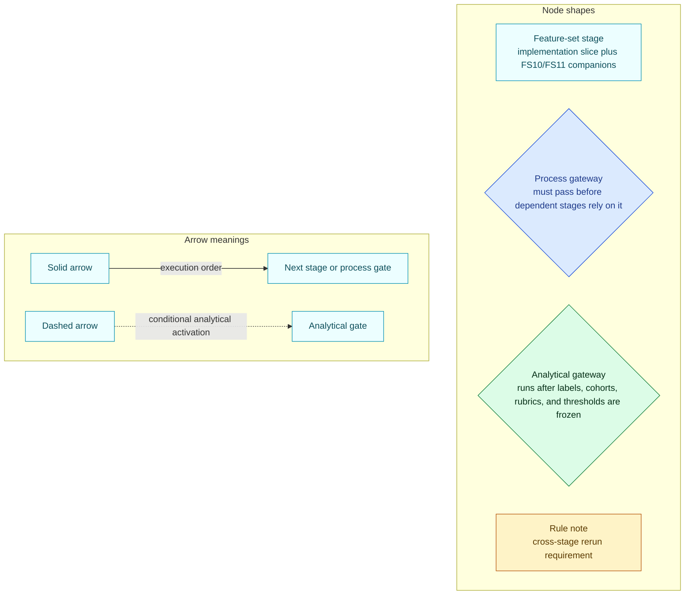

> DEVELOPER

hey man so I need you to find the diff report, the most latest one. It sbould be in the plans folder on dev-sprint. Make sure you do a pull first

> TOOL

tool_use Bash
id: toolu_017Hv14YxfcLe4yJ8No3bhzf
```json
{
  "command": "git fetch origin dev_sprint",
  "description": "Fetch latest dev_sprint branch"
}
```

> TOOL

tool_result
id: toolu_017Hv14YxfcLe4yJ8No3bhzf
```
From github.com:elijahintelligence/elijah
 * branch            dev_sprint -> FETCH_HEAD
   571e1c5..0621983  dev_sprint -> origin/dev_sprint
```

> TOOL

tool_use Bash
id: toolu_01HKhaAErYBTfkXQ7hvaSsF2
```json
{
  "command": "git ls-tree -r --name-only origin/dev_sprint -- docs/plans/ | sort",
  "description": "List files in plans folder on dev_sprint"
}
```

> TOOL

tool_result
id: toolu_01HKhaAErYBTfkXQ7hvaSsF2
```
docs/plans/archive/2026-05-04-top-level-plans/core-acceptance-and-analytical-improvement-plan.md
docs/plans/archive/2026-05-04-top-level-plans/fs1-fs3-fs10-fs11-shared-contracts.md
docs/plans/archive/2026-05-04-top-level-plans/fs10-validation-and-calibration-design.md
docs/plans/archive/2026-05-04-top-level-plans/fs11-qc-design.md
docs/plans/archive/2026-05-04-top-level-plans/fs4-baseline-probability-estimation-design.md
docs/plans/archive/2026-05-04-top-level-plans/fs4-fs10-fs11-sequencing-plan.md
docs/plans/archive/2026-05-04-top-level-plans/fs4-test-questions-integration.md
docs/plans/archive/2026-05-04-top-level-plans/llm-consolidation-plan.md
docs/plans/archive/2026-05-04-top-level-plans/llm-usage-review.md
docs/plans/archive/2026-05-04-top-level-plans/README.md
docs/plans/archive/2026-05-04-top-level-plans/refactor-dockerization-plan.md
docs/plans/archive/2026-05-04-top-level-plans/test-coverage-report.md
docs/plans/archive/2026-05-04-top-level-plans/test-suite-improvement-plan.md
docs/plans/archive/2026-05-06-fs-architecture-schema-rollout-audits/cross-fs-reference-holes.md
docs/plans/archive/2026-05-06-fs-architecture-schema-rollout-audits/fs-architecture-schema-rollout-design-review.md
docs/plans/archive/2026-05-06-fs-architecture-schema-rollout-audits/implemented-vs-planned-tables.md
docs/plans/archive/2026-05-09-actioned-reports/design-authority-stabilization-report.md
docs/plans/archive/2026-05-09-actioned-reports/design-doc-schema-skills-pass-report.md
docs/plans/archive/2026-05-09-actioned-reports/fs10-fs11-cross-fs-design-gap-report.md
docs/plans/archive/2026-05-09-actioned-reports/fs10-fs11-implementation-tuning-report.md
docs/plans/archive/2026-05-09-actioned-reports/fs2-fs5-implementation-verification-report.md
docs/plans/archive/2026-05-09-actioned-reports/llm-prompt-model-suitability-report.md
docs/plans/archive/2026-05-09-actioned-reports/prompt-management-cross-reference-report.md
docs/plans/archive/2026-05-09-actioned-reports/README.md
docs/plans/archive/2026-05-09-actioned-reports/tuning-surface-defensibility-axis-map.md
docs/plans/archive/2026-05-09-schema-cross-reference/database-schema-cross-reference-report.md
docs/plans/archive/2026-05-10-top-level-plans/prompt-inbox-unblock-execution-plan.md
docs/plans/archive/2026-05-10-top-level-plans/README.md
docs/plans/archive/2026-05-core-acceptance-rescrub/FS10 Validation System Roadmap.md
docs/plans/archive/2026-05-core-acceptance-rescrub/fs4-fs10-fs11-design-review.md
docs/plans/archive/2026-05-core-acceptance-rescrub/fs4-fs10-fs11-execution-plan.md
docs/plans/archive/2026-05-core-acceptance-rescrub/README.md
docs/plans/archive/2026-05-core-acceptance-rescrub/w1-stack-integration-and-smoke-test-plan.md
docs/plans/archive/final-top-level-plan.md
docs/plans/archive/fs1-fs6-tuning-diagrams.md
docs/plans/archive/fs10-fs11-live-tuning-blocker-fix-report.md
docs/plans/audits/audit-authority-index.md
docs/plans/audits/audits-current-implementation.md
docs/plans/audits/audits-design-implementation-diff.md
docs/plans/audits/dev-sprint-to-dev-capability-diff-2026-05-08.md
docs/plans/audits/dev-sprint-to-dev-capability-diff-top-level-gates-2026-05-08.md
docs/plans/audits/dev-sprint-to-dev-port-audit-2026-05-07.md
docs/plans/audits/fs-architecture-consolidated-gap-review.md
docs/plans/audits/fs1-fs2-design-implementation-differential.md
docs/plans/audits/fs2-fs5-fs11-capability-differentials.md
docs/plans/audits/fsn-database-table-audit-2026-05-07.md
docs/plans/database/database-current-implementation.md
docs/plans/database/database-design-implementation-diff.md
docs/plans/database/defensibility-axis-tunable-surface-mapping-design-note.md
docs/plans/database/document-storage-design.md
docs/plans/database/migration-readiness-checklist.md
docs/plans/database/proposed-database-schema.md
docs/plans/database/README.md
docs/plans/database/schema-repository-drift-report.md
docs/plans/definitions/definitions-current-implementation.md
docs/plans/definitions/definitions-design-implementation-diff.md
docs/plans/definitions/graph-entity-conformance-report.md
docs/plans/definitions/graph-entity-definitions.md
docs/plans/definitions/README.md
docs/plans/feature-set-rollout-enablement-plan.md
docs/plans/FS1/fs1-current-implementation.md
docs/plans/FS1/fs1-design-implementation-diff.md
docs/plans/FS1/fs1-diagram-code-map.toml
docs/plans/FS1/fs1-fs10-training-surfaces.md
docs/plans/FS1/fs1-ownership-index.md
docs/plans/FS1/fs1-planned-architecture.md
docs/plans/FS10/analytical-test-matrix.md
docs/plans/FS10/defensibility-axis-tunable-surface-mapping-design-note.md
docs/plans/FS10/fs-capability-test-coverage.md
docs/plans/FS10/fs10-current-implementation.md
docs/plans/FS10/fs10-design-implementation-diff.md
docs/plans/FS10/fs10-diagram-code-map.toml
docs/plans/FS10/fs10-planned-architecture.md
docs/plans/FS10/fs10-training-surface-pipeline-index.md
docs/plans/FS10/fs10-tuning-policies.md
docs/plans/FS10/fs10-validation-data-management.md
docs/plans/FS10/top-level-process-and-analytical-tests.md
docs/plans/FS11/defensibility-score-table-design-note.md
docs/plans/FS11/fs11-current-implementation.md
docs/plans/FS11/fs11-design-implementation-diff.md
docs/plans/FS11/fs11-fs10-training-surfaces.md
docs/plans/FS11/FS11-measurement-capabilities.md
docs/plans/FS11/fs11-planned-architecture.md
docs/plans/FS11/fs11-score-authority-map.md
docs/plans/FS12/fs12-api-ui-store-contract-map.md
docs/plans/FS12/fs12-current-implementation.md
docs/plans/FS12/fs12-design-implementation-diff.md
docs/plans/FS12/fs12-planned-architecture.md
docs/plans/fs2-fs5-fs10-fs11-consolidated-implementation-gap-report.md
docs/plans/FS2/fs2-current-implementation.md
docs/plans/FS2/fs2-design-implementation-diff.md
docs/plans/FS2/fs2-evidence-contract-map.md
docs/plans/FS2/fs2-fs10-training-surfaces.md
docs/plans/FS2/fs2-planned-architecture.md
docs/plans/FS3/fs3-current-implementation.md
docs/plans/FS3/fs3-design-implementation-diff.md
docs/plans/FS3/fs3-diagram-code-map.toml
docs/plans/FS3/fs3-fs10-training-surfaces.md
docs/plans/FS3/fs3-planned-architecture.md
docs/plans/FS3/promotion-graph-apply-contracts.md
docs/plans/FS4/fs4-baseline-lineage-gate-map.md
docs/plans/FS4/fs4-current-implementation.md
docs/plans/FS4/fs4-design-implementation-diff.md
docs/plans/FS4/fs4-diagram-code-map.toml
docs/plans/FS4/fs4-fs10-training-surfaces.md
docs/plans/FS4/fs4-planned-architecture.md
docs/plans/FS5/conditional-edge-owner-map.md
docs/plans/FS5/fs5-current-implementation.md
docs/plans/FS5/fs5-design-implementation-diff.md
docs/plans/FS5/fs5-diagram-code-map.toml
docs/plans/FS5/fs5-fs10-fs11-sequencing-plan.md
docs/plans/FS5/fs5-fs10-fs11-test-plan.md
docs/plans/FS5/fs5-fs10-training-surfaces.md
docs/plans/FS5/fs5-planned-architecture.md
docs/plans/FS6/fs6-current-implementation.md
docs/plans/FS6/fs6-design-implementation-diff.md
docs/plans/FS6/fs6-diagram-code-map.toml
docs/plans/FS6/fs6-fs10-fs11-sequencing-plan.md
docs/plans/FS6/fs6-fs10-fs11-test-plan.md
docs/plans/FS6/fs6-fs10-training-surfaces.md
docs/plans/FS6/fs6-inference-evidence-map.md
docs/plans/FS6/fs6-planned-architecture.md
docs/plans/FS7/fs7-current-implementation.md
docs/plans/FS7/fs7-design-implementation-diff.md
docs/plans/FS7/fs7-fs10-fs11-sequencing-plan.md
docs/plans/FS7/fs7-fs10-fs11-test-plan.md
docs/plans/FS7/fs7-planned-architecture.md
docs/plans/FS7/fs7-summary-runtime-contracts.md
docs/plans/FS8/fs8-current-implementation.md
docs/plans/FS8/fs8-design-implementation-diff.md
docs/plans/FS8/fs8-planned-architecture.md
docs/plans/FS8/fs8-ui-surface-mapping.md
docs/plans/FS9/fs9-current-implementation.md
docs/plans/FS9/fs9-design-implementation-diff.md
docs/plans/FS9/fs9-fs10-training-surfaces.md
docs/plans/FS9/fs9-live-monitoring-and-refresh-design.md
docs/plans/FS9/fs9-trigger-refresh-contracts.md
docs/plans/llm-management/llm_tasks.planned.toml
docs/plans/llm-management/llm_tiers.planned.toml
docs/plans/llm-management/llm-management-current-implementation.md
docs/plans/llm-management/llm-management-design-implementation-diff.md
docs/plans/llm-management/llm-management-design.md
docs/plans/llm-management/README.md
docs/plans/orchestration/orchestration-current-implementation.md
docs/plans/orchestration/orchestration-design-implementation-diff.md
docs/plans/orchestration/orchestration-design.md
docs/plans/orchestration/README.md
docs/plans/orchestration/state-transition-conformance-report.md
docs/plans/overall-target-architecture.md
docs/plans/README.md
docs/plans/reports/design-implementation-diff-consolidated-report.md
docs/plans/testing/archive/fs1-fs2-fs3-fs5-fs6-acceptance-tests.md
docs/plans/testing/archive/fs10-harness-functionality-tests.md
docs/plans/testing/github-parity-verification-checklist.md
docs/plans/testing/README.md
docs/plans/testing/testing-current-implementation.md
docs/plans/testing/testing-design-implementation-diff.md
docs/plans/testing/top-level-process-and-analytical-tests.md
docs/plans/testing/user_testing_guide.md
docs/plans/ui/README.md
docs/plans/ui/simplified-graph-ui-design.md
docs/plans/ui/ui-current-implementation.md
docs/plans/ui/ui-design-implementation-diff.md
docs/plans/ui/ui-registry-route-frontend-conformance.md
docs/plans/ui/ui-surface-registry.toml
```

> TOOL

tool_use Bash
id: toolu_01AKHGYLLgg62cQwsVfkwSDN
```json
{
  "command": "git log origin/dev_sprint --oneline -20 -- docs/plans/",
  "description": "Find most recent commits touching plans folder on dev_sprint"
}
```

> TOOL

tool_result
id: toolu_01AKHGYLLgg62cQwsVfkwSDN
```
0621983 more yet
c151834 Execute third prompt batch lanes
89ac71a Execute second prompt batch lanes
d569e3a Execute first prompt batch lanes
6ed0e68 Rename prompt management to LLM management
36dd75a Add user testing guide
b63e165 Move prompt inbox into agent rules
a24efa9 Cross-FS: Break out planning diffs (#182)
15b933a Cross-FS: Restructure planning docs by concern
481d8bc Close simplified graph UI prompt
8f7e1b8 Archive superseded prompt inbox plan
534a991 Stabilize executed prompt batch
6f511ac Record prompt batch design results
61785b2 Merge remote-tracking branch 'origin/dev_sprint' into dev_sprint
af0e3a9 Merge pull request #179 from elijahintelligence/patrick/prompt-diff-skill-breakout
9b48ffd Merge pull request #178 from elijahintelligence/patrick/prompt-plans-directory-restructure
c3837f5 Add diff skill breakout prompt
5aad368 Add plans directory restructure prompt
567d97a Add simplified question graph UI design prompt
7ad6e69 Archive actioned planning reports
```

> TOOL

tool_use Bash
id: toolu_01QL29fnzthP9n55xos9AcWS
```json
{
  "command": "git show origin/dev_sprint:docs/plans/reports/design-implementation-diff-consolidated-report.md | head -30",
  "description": "Check consolidated diff report header"
}
```

> TOOL

tool_result
id: toolu_01QL29fnzthP9n55xos9AcWS
```
# Design Implementation Diff Consolidated Report

## Source Artifacts

- Prompt: `agent_rules/prompts/executed/diff-skill-breakout-prompt.md`
- Planning tree: `docs/plans/`
- dev_sprint baseline: `dad991b`
- dev baseline: `origin/dev` at `ca673f0`

## Executive Summary

This report breaks the design-code diff workflow into folder-level outputs for the current `docs/plans/` taxonomy. Each processed folder now has a current-implementation document and a design-vs-implementation diff document. The strongest drift risks are concentrated where design authority is cross-cutting but implementation is distributed: storage/database, graph definitions, orchestration, prompt/model routing, FS10 validation, FS11 QC, FS2 evidence, and FS4 baseline lineage.

The output is intentionally report-only. It records branch and documentation drift; it does not fix implementation differences.

## Folders Inspected

| Folder | Role |
|---|---|
| FS1 | processed |
| FS10 | processed |
| FS11 | processed |
| FS12 | processed |
| FS2 | processed |
| FS3 | processed |
| FS4 | processed |
| FS5 | processed |
| FS6 | processed |
| FS7 | processed |
| FS8 | processed |
```

> TOOL

tool_use Bash
id: toolu_01164auayiQtS3qzfTmi96WK
```json
{
  "command": "git log origin/dev_sprint --oneline -5 -- docs/plans/reports/design-implementation-diff-consolidated-report.md",
  "description": "Check when consolidated report was last updated"
}
```

> TOOL

tool_result
id: toolu_01164auayiQtS3qzfTmi96WK
```
6ed0e68 Rename prompt management to LLM management
b63e165 Move prompt inbox into agent rules
a24efa9 Cross-FS: Break out planning diffs (#182)
```

> TOOL

tool_use Bash
id: toolu_01DrnZ6Evd3MhR2og3pj4uiy
```json
{
  "command": "git log origin/dev_sprint --format=\"%h %ai %s\" -5 -- docs/plans/reports/",
  "description": "Check dates on reports folder"
}
```

> TOOL

tool_result
id: toolu_01DrnZ6Evd3MhR2og3pj4uiy
```
6ed0e68 2026-05-11 07:29:13 +0100 Rename prompt management to LLM management
b63e165 2026-05-10 16:25:49 +0100 Move prompt inbox into agent rules
a24efa9 2026-05-10 15:35:22 +0100 Cross-FS: Break out planning diffs (#182)
```

> AGENT

The latest diff report on `dev_sprint` is:

**`docs/plans/reports/design-implementation-diff-consolidated-report.md`**

Last updated today (2026-05-11) in commit `6ed0e68`. It's the consolidated design-vs-implementation diff report covering all feature-set folders (FS1–FS12), plus database, definitions, orchestration, LLM management, testing, and UI.

Want me to pull the full contents so you can read it here, or are you looking for something more specific within it?

> DEVELOPER

Are you sure there is no other oneit shoul dbe in the audit folder?

> TOOL

tool_use Bash
id: toolu_01CcG2UtBTXGcfgc8HD7S7nh
```json
{
  "command": "git log origin/dev_sprint --format=\"%h %ai %s\" -10 -- docs/plans/audits/",
  "description": "Check recent commits to audits folder"
}
```

> TOOL

tool_result
id: toolu_01CcG2UtBTXGcfgc8HD7S7nh
```
d569e3a 2026-05-11 07:55:45 +0100 Execute first prompt batch lanes
a24efa9 2026-05-10 15:35:22 +0100 Cross-FS: Break out planning diffs (#182)
15b933a 2026-05-10 14:07:18 +0100 Cross-FS: Restructure planning docs by concern
213e0c2 2026-05-09 07:52:20 +0100 dutty
113479e 2026-05-08 17:57:16 +0100 dutty
bd05a1e 2026-05-08 15:40:23 +0100 more dirty nasty commits
d53613d 2026-05-08 06:47:43 +0100 latest diff report and other junk
936cf06 2026-05-07 21:04:30 +0100 more yet
b4ff54e 2026-05-07 18:48:56 +0100 dirty commit
e35b61c 2026-05-07 12:03:02 +0100 dirty branch
```

> TOOL

tool_use Bash
id: toolu_01PW8vuvgt4SLKDkhvezCHaJ
```json
{
  "command": "git ls-tree --name-only origin/dev_sprint -- docs/plans/audits/",
  "description": "List all files in audits folder"
}
```

> TOOL

tool_result
id: toolu_01PW8vuvgt4SLKDkhvezCHaJ
```
docs/plans/audits/audit-authority-index.md
docs/plans/audits/audits-current-implementation.md
docs/plans/audits/audits-design-implementation-diff.md
docs/plans/audits/dev-sprint-to-dev-capability-diff-2026-05-08.md
docs/plans/audits/dev-sprint-to-dev-capability-diff-top-level-gates-2026-05-08.md
docs/plans/audits/dev-sprint-to-dev-port-audit-2026-05-07.md
docs/plans/audits/fs-architecture-consolidated-gap-review.md
docs/plans/audits/fs1-fs2-design-implementation-differential.md
docs/plans/audits/fs2-fs5-fs11-capability-differentials.md
docs/plans/audits/fsn-database-table-audit-2026-05-07.md
```

> AGENT

The most recent dated one in the audits folder is:

**`docs/plans/audits/dev-sprint-to-dev-capability-diff-2026-05-08.md`**

There's also the related **`dev-sprint-to-dev-capability-diff-top-level-gates-2026-05-08.md`** from the same date.

Want me to pull one of those up?

> DEVELOPER

So basically o am in in charge of porting features from dev-spront to dev. Apparently there is a list of features somewheere. I remember him saying that there is also the design vs impletionatio diff stuff but I really don't know how it all ties together

> AGENT

Let me pull up the key docs so I can explain how they connect.

> TOOL

tool_use Bash
id: toolu_01RhRcTpSE3NXJnLFpjnqb3j
```json
{
  "command": "git show origin/dev_sprint:docs/plans/audits/dev-sprint-to-dev-capability-diff-2026-05-08.md",
  "description": "Read the capability diff report"
}
```

> TOOL

tool_result
id: toolu_01RhRcTpSE3NXJnLFpjnqb3j
```
# dev_sprint to dev capability diff - 2026-05-08

> **Status:** semantic diff report for port planning.
> **Change type:** semantic report.
> **Source artifacts:** `AGENTS.md`, `agent_rules/capability_diff_report_protocol.md`, `docs/guides/feature-set-canonical-sources.md`, `docs/plans/FS10/fs-capability-test-coverage.md`, `docs/plans/FS10/top-level-process-and-analytical-tests.md`, relevant `docs/plans/FS<N>/` sources, prior reports under `docs/plans/audits/` and `docs/reports/`, and branch evidence from `dev_sprint` and `dev`.
> **Scope:** identifies capability gap rows and pre-port work only; it does not implement or authorize product changes.

## Branch Evidence

| Item | Evidence |
|---|---|
| Target branch | `dev` at `5530092a589808cfabca502139d3959bf389ca5c` |
| Source branch | `dev_sprint` at `9e82376daa99ca7a5a7b6ee539826bc5e78eaaa2` |
| Merge base | `5530092a589808cfabca502139d3959bf389ca5c` |
| Ahead / behind | `dev...dev_sprint`: `0 159`; local `dev` is the direct base for `dev_sprint` |
| Diff stat | `493 files changed, 117472 insertions(+), 2888 deletions(-)` |
| Name-status summary | `318` added, `170` modified, `3` renamed, `1` deleted |
| Top path counts | `tests` 127, `docs` 121, `packages` 48, `agent_rules` 36, `fs10_validation` 35, `services` 33, `core` 32, `alembic` 27 |
| Remote context | `origin/dev` is `95511b1192d3edb00f2d9363125a7fed69deb86c`; `origin/dev...dev_sprint` is divergent with `9 135` ahead / behind and `507 files changed, 111025 insertions(+), 6790 deletions(-)` |

Commands used:

```bash
git rev-parse --verify dev
git rev-parse --verify dev_sprint
git merge-base dev dev_sprint
git diff --stat dev...dev_sprint
git diff --name-status dev...dev_sprint
```

Additional context commands:

```bash
git rev-parse --verify origin/dev
git merge-base origin/dev dev_sprint
git rev-list --left-right --count dev...dev_sprint
git rev-list --left-right --count origin/dev...dev_sprint
git diff --shortstat dev...dev_sprint
git diff --dirstat=files,0 dev...dev_sprint
```

## Summary

`dev_sprint` remains a large capability bundle rather than a reviewable port
unit. After excluding agent-only artifacts and planning docs from the capability
matrix, the highest-value product/runtime capabilities are DB-backed authority
surfaces, FS10 validation and tuning lifecycle, FS11 scorecards and gates, FS2
rollout evidence, FS4 estimator/fitted-state infrastructure, and prompt/LLM
routing.

Most high-value rows are `Near`, not `Ready`: the branch has coherent
capability slices, but the slices need to be reconstructed or cherry-picked in
dependency order, verified on top of current `dev`, and stripped of accidental
or historical artifacts. A raw merge of `dev_sprint` into `dev` would mix
storage, runtime, validation, docs, ops, test fixtures, and scratch-looking root
files into one unreviewable change.

Local `origin/dev` has commits not present in `dev_sprint`, so the final port
work should refresh the integration target before opening PRs. The required
branch evidence above uses local `dev` as requested by the protocol.

## Capability Matrix

| Capability | Capability gap in dev | Source branch evidence | Design-doc value | Readiness | Pre-port work | Recommended port slice |
|---|---|---|---|---|---|---|
| DB-backed storage and migration authority | `dev` lacks durable DB authority for runtime config, run config, FS10 validation/tuning, FS11 QC, FS2 baseline/current-resolution state, prompt traces, prompt fit heads, and document locators. | 27 `alembic` files; `packages/storage/document_store.py`, `fs2_state_store.py`, `prompt_trace_store.py`, `prompt_fit_store.py`, `run_config_store.py`, `runtime_config_store.py`; storage and authority tests. | `High`: advances the DB-only durable state rule and unblocks most FS2-FS11 process gates. | `Near`: coherent but high blast radius; migration order and SQLite/Postgres parity must be proven on current `dev`. | Port migrations and stores together; check existing heads/revisions; run storage/migration tests on SQLite and Postgres where available; do not split stores from schema. | Foundational storage PR before FS10, FS11, FS2, FS4, API, or worker ports. |
| Document storage authority for evidence blobs | `dev` lacks the artifact-backed document-byte authority and FS11-gated evidence eligibility surface described by the database concern docs. | `packages/storage/document_store.py`; `docs/plans/database/document-storage-design.md`; `tests/test_document_storage_authority.py`; FS2 evidence/reference-edge tests. | `High`: supports FS2 evidence persistence and FS3 admissible-document consumption without introducing JSON or file-backed product authority. | `Near`: store-level shape is clear, but live FS2 runtime attachment and FS11 pass-gated eligibility need dependency ordering. | Port after storage base; verify `artifacts.kind='document_blob'` and `information_nodes.file_location`; avoid new document blob tables or file-backed authority. | Storage-adjacent PR after base migrations, paired with FS2 integration tests. |
| Prompt traces, prompt-fit heads, and LLM task routing | `dev` lacks role-aware prompt bundle rendering, prompt trace digests, prompt-fit heads, task-to-tier routing, model-set configuration, and request-scoped LLM context propagation. | `packages/inference/prompts/render.py`; `packages/storage/prompt_trace_store.py`; `packages/storage/prompt_fit_store.py`; `config/llm_tasks.toml`; `config/llm_tiers.toml`; `packages/inference/llm/**`; `tests/test_llm_*`. | `High`: underpins FS10 prompt tuning, reproducible LLM evidence, and controlled model-set comparisons. | `Near`: valuable and bounded, but touches many call sites and needs task-ID enforcement plus storage support. | Port configs, runtime helpers, prompt stores, and call-site task IDs together; run prompt trace and LLM routing tests; keep checked-in TOML as the only file-authority exception. | Prompt/LLM infrastructure PR after storage or stacked on storage. |
| FS10 validation-data lifecycle and tuning authority | `dev` lacks validation packages, candidate items, labels, splits, exclusions, component artifacts, tune runs, metric snapshots, promotion separation, gate runner extensions, and operator CLI surfaces. | `fs10_validation/**` 35 files; `tools/cli/commands.py`; `tools/cli/parser.py`; `tests/test_fs10_*`; `docs/plans/FS10/fs10-validation-data-management.md`. | `High`: FS10 is the canonical validation-data lifecycle owner and blocks honest analytical gate execution. | `Near`: branch implementation is substantial, but current workspace has additional uncommitted FS10 real-package work, so the branch row is not the latest working state. | Port after DB authority and FS11 primitives; separate infrastructure from production acceptance claims; run FS10 targeted tests and baseline checks; keep sample-runnable and production-lock evidence distinct. | FS10 validation/tuning PR stack: storage-backed lifecycle first, evaluator/gate runner/CLI after. |
| FS11 scorecards, concerns, gates, and defensibility judges | `dev` lacks DB-backed FS11 scorecards, concerns, gate decisions, LLM/stub scorer protocol, and track-record-aware judge surfaces. | `packages/domain/qc/**`; FS11 migrations; `tests/test_fs11_qc_storage_authority.py`; `tests/test_defensibility_judge_stub.py`; `tests/test_llm_defensibility_judge.py`; `tests/test_track_record_aware_judge.py`. | `High`: FS11 provides the defensibility and gate evidence required by FS2, FS4, FS5, FS10, and rollout acceptance. | `Near`: storage and protocol are valuable, but reviewed QC cohorts and thresholds remain separate acceptance work. | Port after base migrations; keep scorer infrastructure separate from claims that scoring rubrics are accepted; run QC storage/judge tests. | FS11 infrastructure PR before FS2 Research Defensibility and FS4 selector ports. |
| FS2 retrieval, current-resolution, baseline-data, and Research Defensibility bridge | `dev` lacks DB-backed FS2 baseline/current-resolution rows, same-run FS11 Research Defensibility evidence, P-FS2 gate evidence, and A-FS2 tuning bridge. | `packages/storage/fs2_state_store.py`; `packages/domain/qc/research_defensibility_store.py`; `services/worker/research_driver_question_pipeline.py`; `core/research/historical_data.py`; `tests/test_fs2_*`; `tests/test_research_driver_question_pipeline_validation.py`. | `High`: FS2 retrieval/current-resolution and Research Defensibility are blocking FS2 rollout capabilities. | `Near`: strong capability, but depends on storage, FS10, FS11, prompt/LLM routing, and provider/model configuration. | Port after storage/FS10/FS11; preserve train-split analytical semantics; do not claim production A-FS2 from sample-only or unfrozen data; rerun targeted FS2 and FS10 tests. | FS2 runtime/process-gate PR stacked after FS10/FS11 authority. |
| FS3 extraction, graph admission, and document-pack validation | `dev` lacks the newer FS3 planned architecture, graph-construction validation packages, upstream concern tests, and strengthened driver/indicator extraction/admission surfaces. | `docs/plans/FS3/fs3-planned-architecture.md`; `fs10_validation/graph_construction.py`; `fs10_validation/components/fs3_extraction.py`; `services/worker/agents/ResearchDriver/**`; `tests/test_fs3_*`; `tests/test_indicator_graph_apply.py`. | `High`: FS3 driver/indicator extraction and graph admission are blocking and covered by `VD-GRAPH-CONSTRUCTION`. | `Near`: current design/testing is good, but broader graph-admission policy tuning is still marked partial in capability coverage. | Port with document/prompt prerequisites; keep controlled synthetic document packs clearly separated from Brier/outcome truth; run FS3 QC/replay and graph-construction tests. | FS3 extraction/validation PR after document and prompt authority. |
| FS4 estimator dispatch, fitted-state, and training stack | `dev` lacks estimator classes, target cascade/parallel driver races, fitted parameter storage, FS10 training orchestration, and FS4 validation/QC replay surfaces. | `packages/domain/baselines/**`; `fs10_validation/fitted_params_store.py`; `fs10_validation/training.py`; `tests/test_baseline_*`; `tests/test_dispatch_*`; `tests/test_fs4_*`; `tests/test_weibull_estimator.py`. | `High`: FS4 baseline/prior estimation and local Fermi prompt tuning are blocking rollout capabilities. | `Near`: valuable but broad; earlier review flagged estimator timeout/selector behavior as needing inspection before port. | Port after storage, FS10, and FS11; verify fitted-state authority, cascade failure semantics, timeout handling, and train/eval separation. | FS4 estimator/training PR stack, not a single cherry-pick. |
| FS5 edge weighting and downstream graph-impact validation | `dev` lacks FS5 planned docs, edge-weight validation replay, FS11 QC hooks, and downstream graph-impact contract tests. | `docs/plans/FS5/**`; `core/research_driver/conditional_edge_quality.py`; `core/research_driver/fermi_edge.py`; `fs10_validation/components/fs5_edge_weights.py`; `tests/test_fs5_*`. | `High`: FS5 edge direction/weight calibration is blocking and has direct graph-impact guardrails. | `Near`: likely portable after FS4/FS11/FS10 foundations, but direct edge labels and accepted weight bands must remain external/adjudicated. | Port after FS11 and FS10 validation package surfaces; do not treat downstream Brier as a replacement for direct edge labels. | FS5 edge/QC PR after FS4 and FS11 foundations. |
| FS6 inference and FS7 output validation surfaces | `dev` lacks FS6/FS7 planned docs, posterior/summary replay components, QC tests, and validation replay contracts. | `docs/plans/FS6/**`; `docs/plans/FS7/**`; `fs10_validation/components/fs6_inference.py`; `fs10_validation/components/fs7_summary.py`; `tests/test_fs6_*`; `tests/test_fs7_*`; `tests/test_fs6_posterior_contract.py`. | `Medium`: important blocking rollout support, but less central to the current dirty-branch capability bridge than FS2/FS4/FS10/FS11. | `Near`: mostly downstream of storage, graph state, and FS10 component artifact authority. | Port after core graph/storage and component artifact authority; keep exports derived from DB-backed run/graph state. | Downstream validation PR after FS5/FS6 runtime dependencies settle. |
| API auth, job/run-config propagation, and worker execution context | `dev` lacks multi-user API key registry, run-detail/job artifact surfaces, run-config propagation, and worker context helpers. | `services/api/auth.py`; `services/api/**`; `services/worker/**`; `packages/contracts/jobs.py`; `services/worker/run_config_context.py`; `tests/test_api_auth.py`; `tests/test_job_queue_artifacts.py`; `tests/test_run_detail_api.py`. | `Medium`: user-visible and operationally useful, but depends heavily on storage/run-config base. | `Near`: path is coherent, but API behavior should not land before the DB/run-config authorities it exposes. | Port after run-config storage; preserve legacy shared-key compatibility if still required; run API/job/worker tests. | API/worker PR after storage and run-config PRs. |
| Ops, LiteLLM, Docker, and seed changes | `dev` lacks the updated LiteLLM seed/config, compose changes, Docker adjustments, and environment examples. | `ops/litellm/**`; `ops/seed/**`; `Dockerfile`; `compose.*.yml`; `.github/workflows/docker-build.yml`; `.env.example`; `tests/test_litellm_check.py`; storage seed tests. | `Medium`: enables local/provider execution and deployment readiness, but is environment-sensitive. | `Not-ready`: needs inspection against current deployment assumptions and should not ride with feature-set runtime logic. | Separate operational review; verify no secrets; run compose/Docker smoke where available; drop obsolete `ops/seed/seed_live.py` only with explicit migration path. | Separate ops PR after runtime surfaces are chosen. |
| Test fixtures, recordings, and scratch-looking root files | `dev` lacks recorded FS2 payloads and several fixture files, but also has seven zero-byte root files in the source diff. | `tests/data/test_questions_fs2_recordings/**` 10 files; root files `REMOVE`, `TARGET`, `driver,`, `indicator,`, `question.`, `target,`, `target.` are zero bytes. | `Low`: fixtures can support tests, but scratch-looking files are not product capability. | `Not-ready`: too easy to bloat or pollute port PRs. | Keep only fixtures needed by tests in the same PR; omit scratch root files unless a maintainer confirms they are intentional. | Fixture cleanup PR or omit from ports. |

## Excluded Diff Areas

| Area | Evidence | Handling |
|---|---|---|
| Agent workflow, run records, and reusable protocols | `AGENTS.md`, `agent_rules/**`, `tests/test_agent_rules_run_records.py`, and local Codex skill files in the dirty worktree. | Excluded from the product/runtime capability matrix. Handle through a separate process/agent-instruction PR if desired. |
| Planning docs and gate ledgers | `docs/plans/FS1/**` through `docs/plans/FS11/**`, `docs/guides/feature-set-canonical-sources.md`, `docs/plans/FS10/top-level-process-and-analytical-tests.md`, and `docs/plans/FS10/fs-capability-test-coverage.md`. | Excluded as docs-only planning artifacts. Use as design evidence for product/runtime rows, or port in a separate semantic docs PR. |
| Historical reports and audit artifacts | `docs/reports/**`, `docs/plans/audits/**`, and archived planning material under `docs/plans/archive/**`. | Excluded from capability ratings. Preserve only intentionally curated evidence; do not bundle with runtime ports. |

## Recommended Port Order

1. Base storage and migrations: runtime config, run config, artifact/document, prompt trace/fit, FS10 validation/tuning, FS11 QC, and FS2 state.
2. Prompt/LLM routing and prompt trace surfaces.
3. FS11 QC infrastructure.
4. FS10 validation-data lifecycle, component artifacts, tuning store, evaluator, and CLI surfaces.
5. FS2 runtime/process-gate bridge and A-FS2 evidence path.
6. FS3 document-pack extraction and graph-admission validation.
7. FS4 estimator/fitted-state/training stack.
8. FS5 edge weighting, then FS6/FS7 downstream validation.
9. API/auth/job/worker surfaces.
10. Ops/deployment review and fixture cleanup.

## Dirty Worktree Overlay

The following current workspace changes are visible but are not committed
branch evidence for `dev_sprint...dev`:

| Area | Paths | Handling |
|---|---|---|
| Capability diff protocol just added | `AGENTS.md`, `agent_rules/README.md`, `agent_rules/capability_diff_report_protocol.md`, `agent_rules/templates/capability_diff_report.template.md`, `tests/test_agent_rules_run_records.py`, local Codex skill files | Agent/process-only. Excluded from product/runtime port capability ratings. |
| FS10 real validation package continuation | `fs10_validation/real_packages.py`, `fs10_validation/gate_runner.py`, `fs10_validation/__init__.py`, `tools/cli/**`, `tests/test_fs10_real_validation_packages.py`, FS10 CLI/gate tests | Active parallel run owns these paths. Do not include until that run finishes and updates evidence. |
| Live validation / tuning-diagram process state | `agent_rules/runs/20260508-fs1-fs4-live-validation.yaml`, `agent_rules/runs/20260508-fs1-fs6-tuning-diagrams.yaml`, `docs/plans/fs1-fs6-tuning-diagrams.md` | Treat as separate process/planning evidence, not branch diff evidence. |
| This report | `agent_rules/runs/20260508-dev-sprint-dev-capability-diff.yaml`, `docs/plans/audits/dev-sprint-to-dev-capability-diff-2026-05-08.md` | New audit output from this request. |

## Assumptions And Open Questions

- **Assumption:** The primary comparison is local `dev...dev_sprint`, because that is the default in `agent_rules/capability_diff_report_protocol.md` and the user asked for the regular `dev_sprint` to `dev` report.
- **Assumption:** No fetch was performed; remote refs are reported as local remote-tracking refs only.
- **Assumption:** Uncommitted workspace changes are not branch evidence and should be port-planned separately unless the user explicitly asks for a dirty-worktree overlay report.
- **Assumption:** Agent-only artifacts and planning docs are excluded from capability ratings, but may still be used as source artifacts or handled in separate process/docs PRs.
- **Open question:** Should future reports compare against `origin/dev` by default once the local `dev` ref is stale or divergent?
- **Open question:** Which historical reports and raw integration artifacts should be preserved as repository evidence versus kept out of port PRs?
- **Open question:** Should the zero-byte root files be deleted before any port slice, or are they intentional markers from an external workflow?
```

> AGENT

OK, now I've got the full picture. Here's how it all ties together:

---

### The porting workflow: how the docs connect

There are **two layers** of docs serving different purposes:

**1. The Capability Diff (your port checklist)**
`docs/plans/audits/dev-sprint-to-dev-capability-diff-2026-05-08.md`

This is your primary working document. It has:
- A **Capability Matrix** — each row is a portworthy feature (DB storage, FS10 validation, FS11 QC, FS2 retrieval, etc.)
- **Readiness** ratings (`Near`, `Not-ready`)
- **Pre-port work** — what needs to happen before each slice can land
- **Recommended Port Order** — a numbered list (1–10) of the sequence to port things in

Think of this as **"what to port, in what order, and what's blocking each piece."**

**2. The Design-vs-Implementation Diffs (per-feature-set gap reports)**
`docs/plans/reports/design-implementation-diff-consolidated-report.md` plus individual `docs/plans/FS<N>/fs<N>-design-implementation-diff.md` files

These tell you **"for each feature set, what does the design say it should do vs. what the code actually does today."** They're useful context when you're porting a specific feature — they flag drift, missing pieces, and things that exist in code but aren't in the design (or vice versa).

---

### How they work together in practice

1. Look at the **Capability Diff** to pick your next port slice (following the recommended order)
2. Before porting that slice, check the relevant **FS design-implementation diff** to understand what gaps exist and what the design expects
3. Port the code, verify with the pre-push checks, open a PR to `dev`

You've already done a few of these — the recent commits on your current branch (`port/document-storage-authority`) and PRs #172–#174 are early items from that port order.

Want me to check where you're at in the port order based on what's already landed on `dev`?

> DEVELOPER

yeah show me where we're at in the port order. also he said ther are differnt statuses like mplemented not tested, done not verified.

> TOOL

tool_use Bash
id: toolu_01RiiZEhFvbksYJrTaJK6tFN
```json
{
  "command": "git log origin/dev --oneline -30",
  "description": "Check what's landed on dev recently"
}
```

> TOOL

tool_result
id: toolu_01RiiZEhFvbksYJrTaJK6tFN
```
95511b1 Cross-FS: Wire prompt trace persistence into LLM calls (#174)
f82170a Cross-FS: Extract all prompts to canonical root (#173)
a8b7c95 Cross-FS: Port prompt render bundle and fit store (#172)
34a723a Revert "Port prompt render bundle and fit store from dev_sprint (#171)"
996fd5f Port prompt render bundle and fit store from dev_sprint (#171)
9aeca71 Add task_id to all LLMConfig calls for task-driven model routing (#170)
dafb12a Port storage stores, repositories, and contracts from dev_sprint (#169)
cff41cb Cross-FS: Port LLM tier infrastructure, config, and FS11 QC module (#168)
12d2bd5 Cross-FS: Port storage schema, database models, and migrations (#167)
cf15af0 Cross-FS: Add PR pre-push verification gates (#131)
4f07704 Cross-FS: name issue #119 in W2 PR-LLM-4 (telemetry fix) scope (#146)
397d319 Docs: add minimal primary feature set specs
5a4da4c Docs: align FS1-FS3 validation plans with FS10
9e44bfe Docs: add FS1-FS3 validation and QC design plans
a646e22 Cross-FS: freeze FS4/FS10/FS11 design before execution (#132)
f78037c Fix seed SQL — add metadata.domain and targets.options (#126)
af94c49 SPI-219: Transition RunRow status when API jobs complete (#124)
0f22cd4 plans pushed directly to dev - only documentation
479c2ab Merge pull request #125 from elijahintelligence/sumeet/fix-litellm-db-staging-prod
98dd0cb fix(compose): give LiteLLM its own database in staging and prod
5e72686 Merge pull request #122 from elijahintelligence/patrick/fix-artifacts-run-fk
ffb6850 Merge pull request #121 from elijahintelligence/patrick/fermi-calibration-run-1
17aff1f Merge pull request #120 from elijahintelligence/patrick/fix-114-litellm-db
2b9e5de fix(storage): synthesise RunRow on artifact register to satisfy artifacts.run_id FK
b908ce2 storage: fix three Paddy-Schema bugs surfaced by FS10 calibration sweep (#113)
3a566e4 fix(compose): give LiteLLM its own database (closes #114) (#116)
f777e6f Revert "fix(compose): give LiteLLM its own database (closes #114) (#116)"
9e820d8 Revert "storage: fix three Paddy-Schema bugs surfaced by FS10 calibration sweep (#113)"
d02d17a storage: fix three Paddy-Schema bugs surfaced by FS10 calibration sweep (#113)
c7cdc9b fix(compose): give LiteLLM its own database (closes #114) (#116)
```

> TOOL

tool_use Bash
id: toolu_01Ju9hJiiPbw9neCyuXZbuSU
```json
{
  "command": "git show origin/dev_sprint:docs/plans/audits/dev-sprint-to-dev-capability-diff-top-level-gates-2026-05-08.md",
  "description": "Read the top-level gates report for status definitions"
}
```

> TOOL

tool_result
id: toolu_01Ju9hJiiPbw9neCyuXZbuSU
```
# dev_sprint to dev capability diff - top-level gates - 2026-05-08

> **Status:** semantic diff report for port planning.
> **Change type:** semantic report.
> **Source artifacts:** `AGENTS.md`, `agent_rules/capability_diff_report_protocol.md`, `agent_rules/templates/capability_diff_report.template.md`, `docs/guides/feature-set-canonical-sources.md`, `docs/plans/FS10/fs-capability-test-coverage.md`, `docs/plans/FS10/top-level-process-and-analytical-tests.md`, relevant `docs/plans/FS<N>/` sources, prior reports under `docs/plans/audits/`, and branch evidence from `dev_sprint` and `dev`.
> **Scope:** identifies product/runtime capability gap rows and pre-port work only; it does not implement, authorize, or merge product changes.

## Branch Evidence

| Item | Evidence |
|---|---|
| Target branch | `dev` at `5530092a589808cfabca502139d3959bf389ca5c` |
| Source branch | `dev_sprint` at `d53613d72c0f6a43b7804c7fb3796ff8421b92d7` |
| Merge base | `5530092a589808cfabca502139d3959bf389ca5c` |
| Ahead / behind | `dev...dev_sprint`: `0 160`; local `dev` is the direct base for `dev_sprint` |
| Diff stat | `505 files changed, 122115 insertions(+), 2894 deletions(-)` |
| Name-status summary | `329` added, `171` modified, `4` renamed, `1` deleted |
| Top path counts | `tests` 21.8%, `fs10_validation` 5.7%, `alembic/versions` 5.1%, `agent_rules/runs` 4.5%, `core/research_driver` 3.7%, `packages/domain/baselines` 2.9%, `packages/storage` 2.5% |

Commands used:

```bash
git rev-parse --verify dev
git rev-parse --verify dev_sprint
git merge-base dev dev_sprint
git rev-list --left-right --count dev...dev_sprint
git diff --shortstat dev...dev_sprint
git diff --name-status dev...dev_sprint
git diff --dirstat=files,0 dev...dev_sprint
```

## Summary

The top-level gate rerun changes the port posture. `dev_sprint` still contains
high-value runtime work, but the go/no-go signal now starts with FS10 top-level
process and analytical gates plus `P-E2E-GRAPH-01`.

Current strict graph evidence is now green for the narrow live-gate repair:
`run-top-level-gates --production-lock --through FS4` passed every exposed
FS1-FS4 process and analytical gate, task-model LiteLLM preflight passed, and
the strict live complete graph run `20260508T164447Z` completed with
`Processed: 3`, `Succeeded (ok): 3`, `Succeeded (partial): 0`, and `Failed: 0`.
Returned graph payloads and persisted per-question run-scoped graph rows both
validated cleanly. Returned/persisted graph counts were `57 nodes / 50 edges`,
`81 nodes / 69 edges`, and `74 nodes / 70 edges`; full and driver-indicator
validator issue counts were all `0`.

Result: the narrow strict `P-E2E-GRAPH-01` live graph gate repair now earns the
go/no-go tick. Broader graph/runtime capability rows remain unticked unless
their own listed storage, FS-specific, API, ops, or downstream targeted tests
were also run and passed.

## Top-Level Gate Evidence

| Gate package | Command / evidence | Result |
|---|---|---|
| Contract docs and protocol | `uv run python -m pytest tests/test_core_acceptance_contract.py tests/test_agent_rules_run_records.py -q` | passed: `32 passed` |
| Sample top-level gates through FS4 | `DATABASE_URL=... uv run python -m tools.cli.main run-top-level-gates --ensure-data --through FS4` | passed: 14 gates `sample_runnable`; production lock remains false for sample evidence |
| Production-lock top-level gates through FS4 | `DATABASE_URL=... uv run python -m tools.cli.main run-top-level-gates --production-lock --through FS4` | passed: 14 gates `production_lock_ready`; `Production analytical lock-ready: true` |
| FS1-FS4 seeded graph support | `DATABASE_URL=... uv run python -m tools.cli.main seed-fs1-4-test --reset-graphs` | passed: 3 questions, 7 curated information nodes, 29 curated reference edges |
| Seeded graph validator support | one-off `validate_graph_entities` over seeded DB graph | passed: `nodes=64 edges=95 issue_count=0` |
| `P-E2E-GRAPH-01` live complete-run attempt | `run-research --question-set fs1_4_test ... --require-live-provider` | blocked: CLI config loader does not know `fs1_4_test` |
| `P-E2E-GRAPH-01` LiteLLM preflight retry | `LITELLM_PROXY_BASE_URL=http://127.0.0.1:14000 LITELLM_API_KEY=... uv run python -m tools.cli.main llm-preflight --probe-tier medium` | passed: model set `default`, tier `medium`, model `openrouter/anthropic/claude-3.7-sonnet` |
| `P-E2E-GRAPH-01` default-output live run | `run-research --question-ids ... --require-live-provider --research-fail-loud` with LiteLLM env | blocked by local filesystem state: `PermissionError` for root-owned `runtime/runs/...` |
| Prior `P-E2E-GRAPH-01` writable-output live run | same command with `--output-root /tmp/elijah-live-runs` | command exited 0, but gate failed: 3 partial question results, 0 ok, and graph validator `issue_count=786` |
| Strict `P-E2E-GRAPH-01` task-model preflight | `LITELLM_PROXY_BASE_URL=http://127.0.0.1:14000 LITELLM_API_KEY=... run-research --require-live-provider --model-set openrouter_anthropic ...` | passed before graph mutation: `task_models=17`, models `openrouter/anthropic/claude-3.7-sonnet` and `openrouter/anthropic/claude-3-haiku` |
| Strict `P-E2E-GRAPH-01` writable-output live rerun | `DATABASE_URL=... LITELLM_PROXY_BASE_URL=http://127.0.0.1:14000 LITELLM_API_KEY=... uv run python -m tools.cli.main run-research --question-ids fs1_4_test_cat_2024_us_election fs1_4_test_num_brent_eoy_2023 fs1_4_test_time_covid_lockdown_us --output-root /tmp/elijah-live-runs-strict-6 --graphs-dir /tmp/elijah-live-graphs-strict-6 --require-live-provider --research-fail-loud --model-set openrouter_anthropic --max-factors 3 --driver-indicator-max-drivers 60 --indicator-max-per-driver 2 --no-question-summary-llm-enabled` | passed: `Processed: 3`, `Succeeded (ok): 3`, `Succeeded (partial): 0`, `Failed: 0`; `Indicators added: 24`, `Indicator->driver edges added: 24`, `Total drivers added: 30` |
| Strict `P-E2E-GRAPH-01` returned and persisted graph validation | one-off `validate_graph_entities` over returned `question_graph_objects` and persisted `load_nodes_for_question_run(question_id, question_run_id)` / `load_edges_for_question_run(question_id, question_run_id)` | passed: question-run IDs `20260508T164447Z__<question_id>`; returned and persisted full plus driver-indicator graph issue counts all `0` |

## Capability Matrix

| Capability | Capability gap in dev | Source branch evidence | Design-doc value | Readiness | Required capability tests | Test evidence | Port gate | Pre-port work | Recommended port slice |
|---|---|---|---|---|---|---|---|---|---|
| DB-backed storage and migration authority | `dev` lacks the full DB authority stack for runtime config, run config, FS10 validation/tuning, FS11 QC, FS2 state, prompt traces, fitted heads, and document locators. | 27 `alembic` entries; `packages/storage/**`; `tests/test_storage_*`; `tests/test_runtime_config_*`; `tests/test_run_config.py`. | `High`: advances DB-only runtime authority and underpins most FS2-FS11 process gates. | `Near`: coherent but high blast radius. | `P-DB-01` to `P-DB-06`; storage/migration targeted tests on the eventual port branch. | `P-DB-01` to `P-DB-06` passed in production-lock gate run; storage/migration targeted tests were not rerun in this top-level pass. | `[ ]` | Rerun storage/migration tests on clean port branch; confirm migration head ordering and SQLite/Postgres parity. | Foundational storage PR before FS/runtime ports. |
| Prompt traces, prompt-fit heads, LLM task routing, and provider preflight | `dev` lacks task-to-tier routing, prompt trace digests, prompt-fit heads, checked-in LLM-family TOML handling, and live-provider preflight integration. | `packages/inference/llm/**`; `packages/inference/prompts/**`; `config/llm_tasks.toml`; `config/llm_tiers.toml`; `tests/test_llm_*`; dirty `packages/inference/llm/litellm_preflight.py`. | `High`: required for reproducible LLM evidence and live complete-run execution. | `Near`: valuable; task-model preflight and the strict live graph gate pass, but the broader LLM/prompt test batch was not rerun. | `P-DB-06`; relevant LLM/prompt tests; `P-E2E-GRAPH-01` because live provider readiness gates complete runtime execution. | `P-DB-06` passed; task-model LiteLLM preflight passed with `LITELLM_PROXY_BASE_URL=http://127.0.0.1:14000`; `P-E2E-GRAPH-01` passed; focused preflight/CLI tests passed, but the full LLM/prompt batch was not rerun. | `[ ]` | Keep provider env explicit in run instructions; rerun full LLM/prompt tests on clean port branch; keep checked-in TOML as the only file-authority exception. | Prompt/LLM infrastructure PR after storage base. |
| Strict `P-E2E-GRAPH-01` live graph gate repair | `dev` lacks the strict live complete-run gate repair: FS3 indicator extraction on the verified medium tier, task-model provider preflight, graph-admitted driver identity for indicator application, and run-scoped returned/persisted graph validation. | `config/llm_tasks.toml`; `packages/inference/llm/litellm_preflight.py`; `tools/cli/commands.py`; `tools/cli/parser.py`; `core/research_driver/driver_indicator_literature.py`; `core/research_driver/indicator_extraction.py`; `core/research_driver/indicator_graph_apply.py`; `services/worker/research_driver_question_pipeline.py`; focused tests. | `High`: directly satisfies the blocking complete-run compliant graph surface in `P-E2E-GRAPH-01`. | `Ready`: narrow runtime repair with focused unit/integration tests, ruff gates, task-model preflight, and strict live evidence. | `P-E2E-GRAPH-01`; task-model preflight coverage; indicator graph apply coverage; driver-indicator literature/application coverage; run-scoped graph validation coverage; targeted ruff and format. | Passed: `90 passed, 1 skipped` for `tests/test_litellm_preflight.py tests/test_indicator_graph_apply.py tests/test_live_graph_entity_process.py tests/test_main_cli.py tests/test_research_driver_question_pipeline_validation.py tests/test_driver_indicator_literature.py`; `ruff check` passed; `ruff format --check` passed; strict live run passed with 3 ok / 0 partial / 0 failed and returned plus persisted validator issue counts all `0`. | `[x]` | Port as a narrow graph-gate repair only; preserve explicit provider env, writable output-root requirement, and per-question run-scoped validation evidence. | Narrow `P-E2E-GRAPH-01` repair PR before broader graph/runtime ports. |
| FS10 validation lifecycle and FS11 QC/gating authority | `dev` lacks complete DB-backed validation package lifecycle, gate runner surfaces, component artifacts, scorecards, concerns, and QC gate decisions. | `fs10_validation/**`; `packages/domain/qc/**`; FS10/FS11 migrations; `tests/test_fs10_*`; `tests/test_fs11_*`; `tests/test_defensibility_*`. | `High`: FS10 owns validation-data lifecycle and FS11 owns defensibility/QC gate evidence. | `Near`: production-lock FS1-FS4 gates are green, but FS10/FS11 top-level S8 gates were not exposed by the current `run-top-level-gates` CLI. | `P-FS10-01`; `A-FS10-01`; `P-FS11-01`; `A-FS11-01`; relevant FS10/FS11 targeted tests. | FS1-FS4 production-lock gate sequence passed; no current CLI run covered `P-FS10-01`, `A-FS10-01`, `P-FS11-01`, or `A-FS11-01`. | `[ ]` | Add or run S8 gate coverage; rerun FS10/FS11 targeted batches on clean branch; keep sample and production-lock evidence distinct. | FS10/FS11 infrastructure PR stack after storage. |
| FS2 retrieval/current-resolution and Research Defensibility bridge | `dev` lacks DB-backed FS2 current-resolution/baseline evidence, information-node references, and same-run FS11 Research Defensibility evidence. | `packages/storage/fs2_state_store.py`; `packages/domain/qc/research_defensibility_store.py`; `services/worker/research_driver_question_pipeline.py`; `tests/test_fs2_*`. | `High`: FS2 process and analytical gates are blocking for rollout. | `Near`: top-level FS2 gates pass through production-lock and the strict complete graph gate passes, but FS2 targeted tests were not rerun. | `P-FS2-01`; `A-FS2-01`; `P-E2E-GRAPH-01`; FS2 targeted tests on port branch. | `P-FS2-01` and `A-FS2-01` passed in production-lock run; seeded graph validation passed; `P-E2E-GRAPH-01` passed; FS2 targeted tests were not rerun. | `[ ]` | Rerun FS2 targeted tests on port branch; keep live graph evidence attached to the exact port slice. | FS2 runtime/process-gate PR after storage, FS10, FS11, and prompt/provider foundations. |
| FS3 extraction, graph admission, and graph-construction validation | `dev` lacks graph-construction validation packages, strengthened extraction/admission surfaces, and current graph entity compliance helpers. | `fs10_validation/graph_construction.py`; `fs10_validation/components/fs3_extraction.py`; `tests/test_fs3_*`; dirty `packages/domain/graph_entity_validation.py`; dirty `tests/test_graph_entity_validation.py`. | `High`: FS3 graph admission is blocking and maps to `VD-GRAPH-CONSTRUCTION`. | `Near`: production-lock FS3 gates and strict live graph validation pass, but broader FS3 extraction/validator tests were not fully rerun. | `P-FS3-01`; `A-FS3-01`; `P-E2E-GRAPH-01`; graph entity validator tests. | `P-FS3-01` and `A-FS3-01` passed in production-lock run; seeded graph validator passed; strict live returned and persisted graph validation passed with issue counts all `0`; focused indicator graph tests passed; broader FS3/graph validator tests were not fully rerun. | `[ ]` | Rerun full FS3 extraction and graph validator test batches on the port branch; preserve run-scoped validation instead of mixed historical rows. | FS3 extraction/graph-validation PR after document/prompt prerequisites. |
| FS4 estimator dispatch, fitted state, and analytical guardrails | `dev` lacks estimator classes, target cascade behavior, fitted-state authority, FS10 training orchestration, and FS4 validation/QC replay surfaces. | `packages/domain/baselines/**`; `fs10_validation/fitted_params_store.py`; `fs10_validation/training.py`; `tests/test_baseline_*`; `tests/test_dispatch_*`; `tests/test_fs4_*`. | `High`: FS4 prior/estimator quality and Fermi prompt guardrails are blocking. | `Near`: top-level FS4 gates and strict graph-runtime completion pass, but FS4 targeted tests were not rerun. | `P-FS4-01`; `A-FS4-01`; `P-E2E-GRAPH-01`; FS4 estimator/fitted-state targeted tests. | `P-FS4-01` and `A-FS4-01` passed in production-lock run; strict live run finished `ok` for all questions and graph validation passed; ontology fallback still appeared in driver/indicator prior logs; FS4 targeted tests were not rerun. | `[ ]` | Rerun FS4 targeted tests; inspect fallback, timeout, and selector semantics before porting broader estimator work. | FS4 estimator/training PR stack after storage/FS10/FS11. |
| FS5-FS7 downstream graph, inference, and reporting surfaces | `dev` lacks FS5 edge-weight validation, FS6 posterior/inference validation, and FS7 summary/export authority surfaces. | `fs10_validation/components/fs5_edge_weights.py`; `components/fs6_inference.py`; `components/fs7_summary.py`; `tests/test_fs5_*`; `tests/test_fs6_*`; `tests/test_fs7_*`. | `High`: FS5 is blocking; FS6/FS7 are downstream blocking validation surfaces. | `Near`: valuable, and `P-E2E-GRAPH-01` now passes, but the current top-level CLI only exposes gates through FS4. | `P-FS5-01`; `A-FS5-01`; `P-FS6-01`; `A-FS6-01`; `P-FS7-01`; `A-FS7-01`; `P-E2E-GRAPH-01`. | FS5-FS7 top-level gates were not run because `run-top-level-gates --through` currently stops at `FS4`; `P-E2E-GRAPH-01` passed. | `[ ]` | Add/run top-level FS5-FS7 gate path; rerun downstream targeted tests before porting downstream graph/inference/reporting. | Downstream graph/inference/reporting PRs after FS4/FS5 dependencies. |
| API auth, run-config propagation, job/run detail, and worker context | `dev` lacks multi-user API auth, run detail/artifact surfaces, run-config propagation, and worker context helpers. | `services/api/**`; `services/worker/**`; `packages/contracts/jobs.py`; `tests/test_api_auth.py`; `tests/test_job_queue_artifacts.py`; `tests/test_run_detail_api.py`. | `Medium`: user-visible and operationally useful, but depends on storage/run-config base. | `Near`: coherent, but must not expose runtime surfaces before authority gates are green. | API/job/worker targeted tests; `P-E2E-GRAPH-01` where API surfaces return graph/run payloads. | API targeted batch not rerun in this top-level pass; `P-E2E-GRAPH-01` passed for the CLI/runtime graph surface. | `[ ]` | Rerun API/worker tests after storage/run-config port; include graph-return smoke if graph APIs are touched. | API/worker PR after storage and run-config PRs. |
| Ops, LiteLLM, Docker, and seed changes | `dev` lacks updated LiteLLM seed/config, compose changes, Docker adjustments, and environment examples. | `ops/litellm/**`; `ops/seed/**`; `compose.*.yml`; `.env.example`; `tests/test_litellm_check.py`. | `Medium`: directly affects live-provider execution and local deployment. | `Near`: LiteLLM preflight and strict live graph pass with documented env and writable output root; compose/Docker smoke was not run. | LiteLLM/provider tests; compose/Docker smoke; `P-E2E-GRAPH-01`. | LiteLLM task-model preflight passed with explicit env; default output-root live run hit `PermissionError`; strict writable-output live run passed; compose/Docker smoke not run. | `[ ]` | Separate ops review; verify no secrets; make required provider env and writable runtime paths explicit; run compose/Docker smoke before porting ops changes. | Separate ops/provider PR before claiming deployment readiness. |
| Test fixtures, recordings, and scratch-looking root files | `dev` lacks fixture recordings but source branch also includes scratch-looking zero-byte root files. | `tests/data/test_questions_fs2_recordings/**`; root files `REMOVE`, `TARGET`, `driver,`, `indicator,`, `question.`, `target,`, `target.`. | `Low`: fixtures support tests; scratch-looking files are not product capability. | `Not-ready`: easy to pollute port PRs. | Fixture-consuming targeted tests only; no runtime port tick unless fixtures are required by a ticked capability. | Not rerun as a standalone fixture PR; root files remain unexplained. | `[ ]` | Keep only fixtures required by tests in the same PR; omit scratch root files unless maintainer confirms intent. | Fixture cleanup or omit from runtime ports. |

## Excluded Diff Areas

| Area | Evidence | Handling |
|---|---|---|
| Agent workflow, run records, and local skills | `AGENTS.md`, `agent_rules/**`, `tests/test_agent_rules_run_records.py`, and `/home/paddy/.codex/skills/capability-diff-reports/SKILL.md`. | Excluded from product/runtime capability rows; handle as a process/docs PR if desired. |
| Planning docs and gate ledgers | `docs/plans/FS1/**` through `docs/plans/FS11/**`, FS10 gate docs, and feature-set canonical source docs. | Excluded as docs-only planning artifacts; used as source evidence for required tests. |
| Historical reports and audit artifacts | `docs/reports/**`, `docs/plans/audits/**`, and archived planning material. | Excluded from capability ratings; preserve only intentionally curated evidence. |

## Recommended Port Order

1. Port the narrow strict `P-E2E-GRAPH-01` live graph gate repair as the only current `[x]` row.
2. Add or expose top-level gates beyond `--through FS4` before claiming FS5-FS7 or S8 readiness.
3. Keep LiteLLM provider env explicit and keep writable runtime path setup in the live-gate runbook.
4. Port storage/migration authority only after its targeted tests rerun on a clean branch.
5. Port prompt/LLM and LiteLLM/provider setup before live-runtime dependent slices.
6. Port FS10/FS11 infrastructure, then FS2-FS4 runtime slices, then FS5-FS7 downstream graph/inference/reporting.
7. Keep API/worker, ops, and fixture cleanup as separate PRs.

Only treat `[x]` capability rows as immediately portable. This report has one
product/runtime `[x]` row: the narrow strict `P-E2E-GRAPH-01` live graph gate
repair. All broader rows remain go/no-go blocked until every test listed in
their row is run and passed.

## Dirty Worktree Overlay

The current workspace includes unrelated dirty runtime/docs files and active
run records. They are not committed branch evidence for `dev...dev_sprint`.
This strict rerun intentionally changed this report, the
`20260508-p-e2e-graph-strict-live-gate` run record, and the live graph process
test default. Existing unrelated dirty architecture docs, diagram traceability
helpers, and other run records should keep their own run records and
verification evidence.

## Assumptions And Open Questions

- **Assumption:** The primary comparison remains local `dev...dev_sprint`, per the capability diff report protocol.
- **Assumption:** `P-E2E-GRAPH-01` requires live provider-backed execution, not seeded fixtures.
- **Assumption:** Seeded graph validator evidence is useful support but cannot earn the live graph tick.
- **Finding:** The local LiteLLM proxy URL is available at `http://127.0.0.1:14000`; the earlier blocker was that `LITELLM_PROXY_BASE_URL` was not exported in the shell used for the first explicit live run.
- **Finding:** The earlier live complete-run blocker was graph compliance, not provider URL discovery; the strict rerun now passes after validating returned payloads and per-question run-scoped persisted rows.
- **Finding:** For batch `run-research`, persisted graph rows are scoped by question-run IDs of the form `<batch_run_id>__<question_id>`; validating the bare batch run ID returns no persisted graph rows and is not valid go/no-go evidence.
- **Open question:** Should `run-top-level-gates` be extended beyond `--through FS4` before the next diff report?
- **Open question:** Should `seed-fs1-4-test` register `fs1_4_test` with the run-research question-set loader, or should live graph gates always run by explicit question IDs?
```

> TOOL

tool_use Bash
id: toolu_01ExMXnZMMngAazKtVqQXpJf
```json
{
  "command": "git show origin/dev_sprint:docs/plans/feature-set-rollout-enablement-plan.md | head -100",
  "description": "Check rollout enablement plan for status definitions"
}
```

> TOOL

tool_result
id: toolu_01ExMXnZMMngAazKtVqQXpJf
```
# Feature-set rollout enablement plan

**Status:** active capability-enablement plan as of 2026-05-06.

**Source artifacts:** 2026-05-06 user direction, `AGENTS.md`,
`agent_rules/README.md`, `agent_rules/templates/task_run.template.yaml`,
historical workflow ledgers under `agent_rules/archive/`,
[FS10 validation data management](FS10/fs10-validation-data-management.md),
[Document storage design](database/document-storage-design.md),
[LLM management design](llm-management/llm-management-design.md), FS1/FS2/FS10/FS11
planned architecture docs, [Proposed database schema](database/proposed-database-schema.md),
and current ORM/store/CLI code.

**Change type:** semantic.

**Replaces for this workstream:** [final-top-level-plan.md](final-top-level-plan.md)
as the active plan for feature-set rollout capability enablement.
`final-top-level-plan.md` remains historical context for earlier
core-acceptance and whole-system tuning work unless this plan explicitly reuses
a gate, metric, or term from it.

**Task-run records:** long-running agent work now uses per-task YAML records
under `agent_rules/runs/`. Each run record owns the selected plan slice, files
changed, gate evidence, blockers, assumptions, plan deltas, residual risk, and
handoff notes for that slice only. Historical central ledgers are archived
handoff metadata only.

**Gate ledger:** [top-level-process-and-analytical-tests.md](FS10/top-level-process-and-analytical-tests.md)
continues to own official process and analytical gate IDs.

## Current truth

The next rollout blocker is not the old whole-system tuning sequence. The
project needs missing DB-backed capabilities so feature-set rollout can continue
honestly:

- document-byte authority must align with existing artifact and information-node
  storage
- prompt trace and prompt-fit authority must align with existing prompt trace and
  FS10 tuning patterns
- FS10 needs validation-data lifecycle authority and canonical validation
  package archetypes before analytical packages can be frozen
- FS2 analytical acceptance needs a frozen A-FS2 package and DB-backed FS11
  Research Defensibility evidence
- older analytical blockers remain real for their original scope, but they do
  not block this capability-enablement workstream

## Canonical terms

| Term | Meaning |
|---|---|
| `feature-set rollout capability enablement` | The current implementation stream that adds missing DB-backed capabilities required to continue FS rollout. |
| `task-run record` | A per-task YAML file under `agent_rules/runs/` that tracks one selected execution slice, its source artifacts, gates, evidence, plan deltas, blockers, and handoff state. |
| `document_blob artifact` | Document bytes registered through existing `artifacts` rows with `kind='document_blob'`. |
| `file_location` | The existing `information_nodes.file_location` locator authority for document-backed information nodes. |
| `validation package` | FS10-owned frozen or in-review package of validation candidates, rubrics, thresholds, labels, splits, exclusions, and approvals. |
| `validation package archetype` | Consolidated FS10 package class such as `VD-EVIDENCE-QUALITY`, `VD-GRAPH-CONSTRUCTION`, or `VD-RESOLVED-FORECAST-REPLAY`; archetypes define validation purpose, generation mode, labels, gates, and provenance needs. |
| `afs2_polymarket_v1` | The first source-derived A-FS2 package path, sourced from Polymarket market-resolved and geopolitics-resolved questions. It is not the whole validation-data taxonomy. |
| `Relative RD lift` | A-FS2 v1 threshold policy requiring positive held-out mean and median FS11 Research Defensibility movement with no research hard-fail regression. |

## Implementation sequence

### CFX001 - Plan authority and worktree stabilization

Create this plan, update active planning references, and audit the worktree
before implementation. Preserve official FS10 gate IDs. Refresh FS1/FS2 process
evidence only from tracked state, and keep A-FS1 blocked unless its frozen
analytical material is separately added.

Done when:

- this plan is checked in and named as active for rollout capability enablement
- canonical-source docs and tests no longer assert `final-top-level-plan.md` as
  active for this workstream
- the relevant task-run record records branch, worktree, files changed,
  evidence, and handoff state

### CFX002 - Document and prompt authority

Land the reconciled document-storage and LLM management designs and sync the
database design references.

Required decisions:

- use `artifacts.kind='document_blob'` instead of a new `document_blobs` table
- keep `information_nodes.file_location` as locator authority
- use real FS11 concern refs as `(run_id, question_id, concern_id)`
- derive automatic FS3 evidence eligibility from FS11 gate authority, not from a
  parallel `evidence_status`
- keep `llm_prompt_traces.prompt_source` as the human-queryable prompt source
- use role-aware template refs and digests rather than `template_path`
- follow `fs10_*_fit_snapshots` and `fs10_*_fit_heads` naming for prompt-fit
  authority

### CFX003 - FS10 validation-data DB authority

Implement DB-backed FS10 validation-data lifecycle authority. Add only the
missing authority surfaces, and reuse existing staged markets, validation sets,
split assignments, runs, question scores, component artifacts, tune runs,
candidates, metric snapshots, and promotions.
```

> TOOL

tool_use Bash
id: toolu_01FfcHHyZW9njBeNM1oD34d3
```json
{
  "command": "git show origin/dev_sprint:docs/plans/feature-set-rollout-enablement-plan.md | grep -n -i \"status\\|implemented\\|tested\\|verified\\|done\\|not tested\\|not verified\\|ported\\|CFX\" | head -60",
  "description": "Find status labels in the enablement plan"
}
```

> TOOL

tool_result
id: toolu_01FfcHHyZW9njBeNM1oD34d3
```
3:**Status:** active capability-enablement plan as of 2026-05-06.
63:### CFX001 - Plan authority and worktree stabilization
70:Done when:
78:### CFX002 - Document and prompt authority
89:  parallel `evidence_status`
95:### CFX003 - FS10 validation-data DB authority
120:### CFX004 through CFX006 - Polymarket A-FS2 and DeepSeek analytical run
147:Required before review-ready status:
```

> TOOL

tool_use Bash
id: toolu_01MgpnLDN7PRvvpztCN8x4Ke
```json
{
  "command": "git show origin/dev_sprint:docs/plans/feature-set-rollout-enablement-plan.md | wc -l",
  "description": "Check total lines"
}
```

> TOOL

tool_result
id: toolu_01MgpnLDN7PRvvpztCN8x4Ke
```
     170
```

> TOOL

tool_use Bash
id: toolu_01CtkkUAsPanQYk2Esj9ptDM
```json
{
  "command": "git show origin/dev_sprint:docs/plans/feature-set-rollout-enablement-plan.md | tail -80",
  "description": "Read rest of enablement plan"
}
```

> TOOL

tool_result
id: toolu_01CtkkUAsPanQYk2Esj9ptDM
```
- use role-aware template refs and digests rather than `template_path`
- follow `fs10_*_fit_snapshots` and `fs10_*_fit_heads` naming for prompt-fit
  authority

### CFX003 - FS10 validation-data DB authority

Implement DB-backed FS10 validation-data lifecycle authority. Add only the
missing authority surfaces, and reuse existing staged markets, validation sets,
split assignments, runs, question scores, component artifacts, tune runs,
candidates, metric snapshots, and promotions.

Required capabilities:

- validation sources and adapter versions
- candidate items and validation package versions/items/events
- rubric versions and threshold policies
- label batches and adjudicated labels
- split metadata and immutable split assignments
- leakage reviews, exclusion policies, and exclusion decisions
- freeze approvals
- third-party specs, deliveries, and reviews

CLI additions:

- `fs10-validation-build-package`
- `fs10-validation-freeze-package`
- `fs10-validation-list-packages`
- extend `fs10-validation-tune` with `--validation-package-id` and `--model-set`

### CFX004 through CFX006 - Polymarket A-FS2 and DeepSeek analytical run

Implement `afs2_polymarket_v1` as the first source-derived A-FS2 package path,
then run FS2 analytical tuning through FS10's real evaluator when DB and
provider credentials are available. This path covers realistic Polymarket FS2
evidence and resolved-replay guardrails; other canonical archetypes, including
controlled synthetic fixture packages and external/adjudicated challenge packs,
remain separate FS10 validation-data work.

Rules:

- package includes market-resolved and geopolitics-resolved Polymarket-derived
  questions
- package stores source and regeneration refs
- package uses deterministic train/eval splits
- package excludes unresolved label conflicts and provider-outage cases
- live A-FS2 evidence must use `openrouter_deepseek`
- model set, tier, and concrete model IDs are persisted in FS10, FS11, prompt
  trace, and tuning evidence
- A-FS2 v1 promotion eligibility requires positive held-out mean and median
  Research Defensibility lift and no research hard-fail regression
- retrieval precision@k, freshness, diversity, and current-resolution quality
  are diagnostics, not absolute v1 pass floors
- manual promotion remains separate from eligibility

## Verification

Required before review-ready status:

- YAML parse for local ledger, shared ledger, and schema
- doc grep for rejected document/prompt surfaces
- Mermaid review against `agent_rules/fs-diagram-schema.md`
- FS10 validation-data storage and migration tests
- Polymarket package tests
- FS2 analytical tuning tests
- `uv run ruff check .`
- `uv run ruff format --check .`
- `uv run python -m pytest --ignore=tests/frontend -x -q`
- live A-FS2 DeepSeek/Polymarket run, or a recorded blocker for missing DB,
  credentials, or provider access

## Assumptions and defaults

- `dev` is the branch base and PR target, even when the working branch is
  `dev_sprint`.
- The user's 2026-05-06 instruction approves adding FS10 validation-data DB
  migrations and DB design updates.
- This stream can execute A-FS2 independently without claiming all older
  whole-system analytical gates are accepted.
- If the live run produces no eligible FS2 candidate, record the analytical
  result as executed but not passed, with no promotion.
```

> AGENT

Now let me check the individual design-implementation diffs for the status vocabulary.

> TOOL

tool_use Bash
id: toolu_01FvAtBFXU47jixiKFrVNqm2
```json
{
  "command": "git show origin/dev_sprint:docs/plans/FS1/fs1-design-implementation-diff.md | head -80",
  "description": "Check FS1 diff for status labels"
}
```

> TOOL

tool_result
id: toolu_01FvAtBFXU47jixiKFrVNqm2
```
# FS1 Design Implementation Diff

## Source Artifacts

- Design folder: `docs/plans/FS1/`
- dev_sprint baseline: `dad991b`
- dev baseline: `origin/dev` at `ca673f0`

Design files inspected:

- `docs/plans/FS1/fs1-fs10-training-surfaces.md`
- `docs/plans/FS1/fs1-planned-architecture.md`
- `docs/plans/FS1/fs1-diagram-code-map.toml`

## Design Intent Summary

Design intent centers on fs1 planning ties question definition, target set checks, and fs10 replay evidence to graph target authority.

## dev_sprint Implementation Summary

dev_sprint evidence centers on Target set integrity helpers, question core graph construction, FS10 question-definition replay component.

## dev Implementation Summary

origin/dev was checked at `ca673f0` with the same configured path set; branch-only and changed files are recorded below.

## Core Diff

| Area | Design says | dev_sprint does | dev does | Difference | Risk | Recommended action |
|---|---|---|---|---|---|---|
| Scope authority | FS1 planning ties question definition, target set checks, and FS10 replay evidence to graph target authority. | dev_sprint evidence centers on Target set integrity helpers, question core graph construction, FS10 question-definition replay component. | origin/dev was checked at `ca673f0` with the same configured path set; branch-only and changed files are recorded below. | Target-set authority is implemented through several adjacent code paths. | Medium | Create an FS1 ownership/index PR that names the runtime owner and acceptance gate evidence. |
| Branch parity | Design assumes one current implementation target. | 1 configured path(s) differ from origin/dev; 3 path(s) are dev_sprint-only or renamed; 0 path(s) were not found in either checked ref. | May lack dev_sprint-only files or contain older implementations. | Port strategy must account for changed or branch-only paths. | Medium | Review the path status table before any dev port. |
| Persistence | no standalone FS1 store found; durable state flows through graph/contracts and FS10 validation artifacts | Static evidence found in configured storage/runtime paths where present. | Same path set checked against origin/dev. | Storage authority can drift if schema/repository docs lag code. | Medium | Do not add new persistence without database design approval. |
| Orchestration/rerun | Design should name live-call, state, replay, and rerun policy when relevant. | question definition is collected; target integrity checks run | Same concepts checked through file presence/diff status. | Rerun/live-call details are often implemented outside folder docs. | Medium | Run orchestration_design before behavior changes. |
| Prompt/model routing | Prompt/model routing should be explicit when LLM calls are involved. | No folder-specific prompt route confirmed in this static pass. | Same prompt/config paths checked where configured. | Prompt routing is either absent or under-documented for this folder. | Low | Add prompt IDs/config evidence when LLM behavior is material. |
| Testing/validation | Design should name acceptance gates and verification evidence. | tests that mention FS1, target set integrity, and validation replay | Same tests may not be present or identical on origin/dev. | Gate parity is not guaranteed across branches. | Medium | Record exact gate evidence in each implementation PR. |

## Branch and File Status

| Path | dev_sprint | origin/dev comparison |
|---|---|---|
| `core/fs1_target_set_integrity.py` | present | dev_sprint only or renamed since origin/dev |
| `core/research_driver/question_core_graph.py` | present | present on both; changed since origin/dev |
| `fs10_validation/components/fs1_question_definition.py` | present | dev_sprint only or renamed since origin/dev |
| `packages/contracts/graphs.py` | present | present on both; no diff against origin/dev |
| `packages/domain/graph_entity_validation.py` | present | dev_sprint only or renamed since origin/dev |

## Missing Implementation

- FS1 behavior is spread across graph construction, validation, and contracts rather than a single runtime owner
- source of truth for target-set acceptance is not isolated in a dedicated service

## Extra Implementation Not Represented in Design

- Implementation evidence is spread across configured code paths and tests; any path listed as dev_sprint-only or changed since origin/dev should be treated as a branch-strategy item before porting.

## Stale Design Claims

- No claim is automatically stale from file presence alone; stale claims require follow-up reading of each changed path and associated tests.
- Historical audit docs are evidence, not current implementation authority unless a run record adopts them.

## Behavioral Divergences

- Target-set authority is implemented through several adjacent code paths.
- 1 configured path(s) differ from origin/dev; 3 path(s) are dev_sprint-only or renamed; 0 path(s) were not found in either checked ref.

## Schema and Data-Contract Divergences

- question target set records
- question core graph nodes
- graph contract objects
- no standalone FS1 store found; durable state flows through graph/contracts and FS10 validation artifacts

## Orchestration and Rerun Divergences

- question definition is collected
- target integrity checks run
- FS10 can replay question-definition evidence

## Prompt and Model-Routing Divergences
```

> TOOL

tool_use Bash
id: toolu_018kSPWD3FYqQvNuzevvABzx
```json
{
  "command": "git show origin/dev_sprint:docs/plans/audits/dev-sprint-to-dev-capability-diff-2026-05-08.md | grep -i \"readiness\\|ready\\|near\\|not-ready\\|implemented\\|tested\\|verified\\|ported\" | head -20",
  "description": "Search for status vocabulary in the capability diff"
}
```

> TOOL

tool_result
id: toolu_018kSPWD3FYqQvNuzevvABzx
```
Most high-value rows are `Near`, not `Ready`: the branch has coherent
dependency order, verified on top of current `dev`, and stripped of accidental
| Capability | Capability gap in dev | Source branch evidence | Design-doc value | Readiness | Pre-port work | Recommended port slice |
| DB-backed storage and migration authority | `dev` lacks durable DB authority for runtime config, run config, FS10 validation/tuning, FS11 QC, FS2 baseline/current-resolution state, prompt traces, prompt fit heads, and document locators. | 27 `alembic` files; `packages/storage/document_store.py`, `fs2_state_store.py`, `prompt_trace_store.py`, `prompt_fit_store.py`, `run_config_store.py`, `runtime_config_store.py`; storage and authority tests. | `High`: advances the DB-only durable state rule and unblocks most FS2-FS11 process gates. | `Near`: coherent but high blast radius; migration order and SQLite/Postgres parity must be proven on current `dev`. | Port migrations and stores together; check existing heads/revisions; run storage/migration tests on SQLite and Postgres where available; do not split stores from schema. | Foundational storage PR before FS10, FS11, FS2, FS4, API, or worker ports. |
| Document storage authority for evidence blobs | `dev` lacks the artifact-backed document-byte authority and FS11-gated evidence eligibility surface described by the database concern docs. | `packages/storage/document_store.py`; `docs/plans/database/document-storage-design.md`; `tests/test_document_storage_authority.py`; FS2 evidence/reference-edge tests. | `High`: supports FS2 evidence persistence and FS3 admissible-document consumption without introducing JSON or file-backed product authority. | `Near`: store-level shape is clear, but live FS2 runtime attachment and FS11 pass-gated eligibility need dependency ordering. | Port after storage base; verify `artifacts.kind='document_blob'` and `information_nodes.file_location`; avoid new document blob tables or file-backed authority. | Storage-adjacent PR after base migrations, paired with FS2 integration tests. |
| Prompt traces, prompt-fit heads, and LLM task routing | `dev` lacks role-aware prompt bundle rendering, prompt trace digests, prompt-fit heads, task-to-tier routing, model-set configuration, and request-scoped LLM context propagation. | `packages/inference/prompts/render.py`; `packages/storage/prompt_trace_store.py`; `packages/storage/prompt_fit_store.py`; `config/llm_tasks.toml`; `config/llm_tiers.toml`; `packages/inference/llm/**`; `tests/test_llm_*`. | `High`: underpins FS10 prompt tuning, reproducible LLM evidence, and controlled model-set comparisons. | `Near`: valuable and bounded, but touches many call sites and needs task-ID enforcement plus storage support. | Port configs, runtime helpers, prompt stores, and call-site task IDs together; run prompt trace and LLM routing tests; keep checked-in TOML as the only file-authority exception. | Prompt/LLM infrastructure PR after storage or stacked on storage. |
| FS10 validation-data lifecycle and tuning authority | `dev` lacks validation packages, candidate items, labels, splits, exclusions, component artifacts, tune runs, metric snapshots, promotion separation, gate runner extensions, and operator CLI surfaces. | `fs10_validation/**` 35 files; `tools/cli/commands.py`; `tools/cli/parser.py`; `tests/test_fs10_*`; `docs/plans/FS10/fs10-validation-data-management.md`. | `High`: FS10 is the canonical validation-data lifecycle owner and blocks honest analytical gate execution. | `Near`: branch implementation is substantial, but current workspace has additional uncommitted FS10 real-package work, so the branch row is not the latest working state. | Port after DB authority and FS11 primitives; separate infrastructure from production acceptance claims; run FS10 targeted tests and baseline checks; keep sample-runnable and production-lock evidence distinct. | FS10 validation/tuning PR stack: storage-backed lifecycle first, evaluator/gate runner/CLI after. |
| FS11 scorecards, concerns, gates, and defensibility judges | `dev` lacks DB-backed FS11 scorecards, concerns, gate decisions, LLM/stub scorer protocol, and track-record-aware judge surfaces. | `packages/domain/qc/**`; FS11 migrations; `tests/test_fs11_qc_storage_authority.py`; `tests/test_defensibility_judge_stub.py`; `tests/test_llm_defensibility_judge.py`; `tests/test_track_record_aware_judge.py`. | `High`: FS11 provides the defensibility and gate evidence required by FS2, FS4, FS5, FS10, and rollout acceptance. | `Near`: storage and protocol are valuable, but reviewed QC cohorts and thresholds remain separate acceptance work. | Port after base migrations; keep scorer infrastructure separate from claims that scoring rubrics are accepted; run QC storage/judge tests. | FS11 infrastructure PR before FS2 Research Defensibility and FS4 selector ports. |
| FS2 retrieval, current-resolution, baseline-data, and Research Defensibility bridge | `dev` lacks DB-backed FS2 baseline/current-resolution rows, same-run FS11 Research Defensibility evidence, P-FS2 gate evidence, and A-FS2 tuning bridge. | `packages/storage/fs2_state_store.py`; `packages/domain/qc/research_defensibility_store.py`; `services/worker/research_driver_question_pipeline.py`; `core/research/historical_data.py`; `tests/test_fs2_*`; `tests/test_research_driver_question_pipeline_validation.py`. | `High`: FS2 retrieval/current-resolution and Research Defensibility are blocking FS2 rollout capabilities. | `Near`: strong capability, but depends on storage, FS10, FS11, prompt/LLM routing, and provider/model configuration. | Port after storage/FS10/FS11; preserve train-split analytical semantics; do not claim production A-FS2 from sample-only or unfrozen data; rerun targeted FS2 and FS10 tests. | FS2 runtime/process-gate PR stacked after FS10/FS11 authority. |
| FS3 extraction, graph admission, and document-pack validation | `dev` lacks the newer FS3 planned architecture, graph-construction validation packages, upstream concern tests, and strengthened driver/indicator extraction/admission surfaces. | `docs/plans/FS3/fs3-planned-architecture.md`; `fs10_validation/graph_construction.py`; `fs10_validation/components/fs3_extraction.py`; `services/worker/agents/ResearchDriver/**`; `tests/test_fs3_*`; `tests/test_indicator_graph_apply.py`. | `High`: FS3 driver/indicator extraction and graph admission are blocking and covered by `VD-GRAPH-CONSTRUCTION`. | `Near`: current design/testing is good, but broader graph-admission policy tuning is still marked partial in capability coverage. | Port with document/prompt prerequisites; keep controlled synthetic document packs clearly separated from Brier/outcome truth; run FS3 QC/replay and graph-construction tests. | FS3 extraction/validation PR after document and prompt authority. |
| FS4 estimator dispatch, fitted-state, and training stack | `dev` lacks estimator classes, target cascade/parallel driver races, fitted parameter storage, FS10 training orchestration, and FS4 validation/QC replay surfaces. | `packages/domain/baselines/**`; `fs10_validation/fitted_params_store.py`; `fs10_validation/training.py`; `tests/test_baseline_*`; `tests/test_dispatch_*`; `tests/test_fs4_*`; `tests/test_weibull_estimator.py`. | `High`: FS4 baseline/prior estimation and local Fermi prompt tuning are blocking rollout capabilities. | `Near`: valuable but broad; earlier review flagged estimator timeout/selector behavior as needing inspection before port. | Port after storage, FS10, and FS11; verify fitted-state authority, cascade failure semantics, timeout handling, and train/eval separation. | FS4 estimator/training PR stack, not a single cherry-pick. |
| FS5 edge weighting and downstream graph-impact validation | `dev` lacks FS5 planned docs, edge-weight validation replay, FS11 QC hooks, and downstream graph-impact contract tests. | `docs/plans/FS5/**`; `core/research_driver/conditional_edge_quality.py`; `core/research_driver/fermi_edge.py`; `fs10_validation/components/fs5_edge_weights.py`; `tests/test_fs5_*`. | `High`: FS5 edge direction/weight calibration is blocking and has direct graph-impact guardrails. | `Near`: likely portable after FS4/FS11/FS10 foundations, but direct edge labels and accepted weight bands must remain external/adjudicated. | Port after FS11 and FS10 validation package surfaces; do not treat downstream Brier as a replacement for direct edge labels. | FS5 edge/QC PR after FS4 and FS11 foundations. |
| FS6 inference and FS7 output validation surfaces | `dev` lacks FS6/FS7 planned docs, posterior/summary replay components, QC tests, and validation replay contracts. | `docs/plans/FS6/**`; `docs/plans/FS7/**`; `fs10_validation/components/fs6_inference.py`; `fs10_validation/components/fs7_summary.py`; `tests/test_fs6_*`; `tests/test_fs7_*`; `tests/test_fs6_posterior_contract.py`. | `Medium`: important blocking rollout support, but less central to the current dirty-branch capability bridge than FS2/FS4/FS10/FS11. | `Near`: mostly downstream of storage, graph state, and FS10 component artifact authority. | Port after core graph/storage and component artifact authority; keep exports derived from DB-backed run/graph state. | Downstream validation PR after FS5/FS6 runtime dependencies settle. |
| API auth, job/run-config propagation, and worker execution context | `dev` lacks multi-user API key registry, run-detail/job artifact surfaces, run-config propagation, and worker context helpers. | `services/api/auth.py`; `services/api/**`; `services/worker/**`; `packages/contracts/jobs.py`; `services/worker/run_config_context.py`; `tests/test_api_auth.py`; `tests/test_job_queue_artifacts.py`; `tests/test_run_detail_api.py`. | `Medium`: user-visible and operationally useful, but depends heavily on storage/run-config base. | `Near`: path is coherent, but API behavior should not land before the DB/run-config authorities it exposes. | Port after run-config storage; preserve legacy shared-key compatibility if still required; run API/job/worker tests. | API/worker PR after storage and run-config PRs. |
| Ops, LiteLLM, Docker, and seed changes | `dev` lacks the updated LiteLLM seed/config, compose changes, Docker adjustments, and environment examples. | `ops/litellm/**`; `ops/seed/**`; `Dockerfile`; `compose.*.yml`; `.github/workflows/docker-build.yml`; `.env.example`; `tests/test_litellm_check.py`; storage seed tests. | `Medium`: enables local/provider execution and deployment readiness, but is environment-sensitive. | `Not-ready`: needs inspection against current deployment assumptions and should not ride with feature-set runtime logic. | Separate operational review; verify no secrets; run compose/Docker smoke where available; drop obsolete `ops/seed/seed_live.py` only with explicit migration path. | Separate ops PR after runtime surfaces are chosen. |
| Test fixtures, recordings, and scratch-looking root files | `dev` lacks recorded FS2 payloads and several fixture files, but also has seven zero-byte root files in the source diff. | `tests/data/test_questions_fs2_recordings/**` 10 files; root files `REMOVE`, `TARGET`, `driver,`, `indicator,`, `question.`, `target,`, `target.` are zero bytes. | `Low`: fixtures can support tests, but scratch-looking files are not product capability. | `Not-ready`: too easy to bloat or pollute port PRs. | Keep only fixtures needed by tests in the same PR; omit scratch root files unless a maintainer confirms they are intentional. | Fixture cleanup PR or omit from ports. |
- **Assumption:** No fetch was performed; remote refs are reported as local remote-tracking refs only.
```

> TOOL

tool_use Bash
id: toolu_01518WbLz16strVPrY1EizHE
```json
{
  "command": "git show origin/dev_sprint:docs/plans/audits/dev-sprint-to-dev-port-audit-2026-05-07.md | head -120",
  "description": "Check the port audit for status definitions"
}
```

> TOOL

tool_result
id: toolu_01518WbLz16strVPrY1EizHE
```
# `dev_sprint` to `dev` Port Audit - 2026-05-07

> **Source artifacts**: local Git refs `dev`, `origin/dev`, `dev_sprint`, `origin/dev_sprint`; current staged overlay on `dev_sprint`; `docs/reports/dev-sprint-vs-dev-capability-review-2026-05-06.md`; `docs/reports/dev-vs-dev_sprint-capability-segments-2026-05-07.md`; current `git diff`, `git log`, `git dirstat`, and worktree inspection.
>
> **Change type**: semantic audit report.
>
> **Purpose**: decision support for porting work from `dev_sprint` to `dev`. This is an audit and port-planning input only. It is not a port implementation plan, PR plan, merge instruction, or acceptance claim.

## Executive summary

`dev_sprint` is a large capability bundle, not a reviewable single PR. It includes product code, migrations, feature-set design docs, validation/tuning infrastructure, LLM routing, API and worker changes, ops changes, tests, fixtures, and historical reports.

Use `origin/dev` as the primary port baseline. Local `dev` is stale: local `dev` is `5530092`, while `origin/dev` is `cf15af0`. `dev_sprint` is strictly ahead of both baselines in the current local refs.

Branch size:

| Baseline | Ahead / behind | Files | Insertions | Deletions | Interpretation |
|---|---:|---:|---:|---:|---|
| `dev..dev_sprint` | `0 / 153` | 487 | 113,992 | 2,888 | Comparison requested by the user, but local `dev` is stale. |
| `origin/dev..dev_sprint` | `0 / 129` | 501 | 107,545 | 6,790 | Better approximation of the real integration-port diff. |

The safest port strategy is stacked, dependency-ordered cherry-picks or reconstructed PRs by capability. Do not merge `dev_sprint` wholesale into `dev`, and do not preserve the current "dirty commit" history as the review unit.

## Branch and worktree state

Current refs captured without fetching remotes:

| Ref | Commit | Note |
|---|---|---|
| current branch | `dev_sprint` | Work is being inspected from the source branch. |
| `dev` | `5530092a589808cfabca502139d3959bf389ca5c` | Local stale baseline. |
| `origin/dev` | `cf15af0f1e96977fb183134d8d00e1e6c9a30d36` | Primary port baseline for this audit. |
| `dev_sprint` | `b4ff54e1f214cbcd2e8ce49c3bf7d8a4d0dc99fc` | Source branch. |
| `origin/dev_sprint` | `b4ff54e1f214cbcd2e8ce49c3bf7d8a4d0dc99fc` | Same as local `dev_sprint` at capture time. |

Merge-base findings:

| Comparison | Merge base | Meaning |
|---|---|---|
| `dev` vs `dev_sprint` | `5530092a589808cfabca502139d3959bf389ca5c` | Local `dev` is the base of `dev_sprint`; all local branch changes are ahead-only. |
| `origin/dev` vs `dev_sprint` | `cf15af0f1e96977fb183134d8d00e1e6c9a30d36` | Remote integration baseline is also behind `dev_sprint`, but newer than local `dev`. |

Worktree separation:

| Layer | State | Treatment |
|---|---|---|
| Committed `dev_sprint` delta | 129 commits ahead of `origin/dev`; 501 changed files. | Main subject of port audit. |
| Staged overlay on `dev_sprint` | 14 files, 1,418 insertions, 120 deletions. | Not part of committed `dev_sprint`; handle separately. |
| Unstaged changes before creating this audit | None. | No unstaged overlay to factor into the branch diff. |
| Untracked files before creating this audit | None. | This audit file itself becomes a new untracked/working-tree artifact until staged. |

## Capability-segment inventory

| Segment | Representative paths | Capability purpose | Dependency order | Port recommendation | Review risk | Minimum verification |
|---|---|---|---:|---|---|---|
| Agent workflow and run protocol | `AGENTS.md`, `agent_rules/**`, `tests/test_agent_rules_run_records.py` | Establishes shared agent instructions, run records, schemas, templates, diagram schema, and long-task coordination. | 1 | `port` | Medium: broad process impact, but low product runtime blast radius. | YAML parse for run schemas; `uv run python -m pytest tests/test_agent_rules_run_records.py -q`; `git diff --check`. |
| Storage and migrations | `alembic/versions/**`, `packages/storage/database.py`, `packages/storage/*_store.py`, `tests/test_storage_*`, `tests/test_*_authority.py` | Adds DB authority for runtime configs, run configs, FS10 validation/tune state, FS11 QC, FS2 state, document refs, prompt traces, and prompt-fit heads. | 2 | `port` | High: migration ordering, SQLite/Postgres compatibility, and storage contract risk. | `uv run ruff check packages/storage alembic tests/test_storage_schema_runtime.py`; SQLite migration/storage tests; Postgres migration smoke where available. |
| Document storage authority | `packages/storage/document_store.py`, `docs/plans/database/document-storage-design.md`, `tests/test_document_storage_authority.py` | Uses `artifacts.kind='document_blob'` and `information_nodes.file_location` as document locator authority; gates FS3-consumable evidence through FS11 pass decisions. | 3 | `port after dependency` | High: depends on storage schema, FS2 outputs, reference edges, and FS11 decisions. | `uv run python -m pytest tests/test_document_storage_authority.py -q`; storage authority tests; FS2 integration tests. |
| Prompt management authority | `packages/inference/prompts/render.py`, `packages/storage/prompt_trace_store.py`, `packages/storage/prompt_fit_store.py`, `tests/test_llm_prompt_trace_authority.py` | Adds call-level prompt bundle refs, role-aware template refs, rendered/bundle digests, prompt traces, and manual prompt-fit heads. | 3 | `port after dependency` | High: touches inference traceability, storage, and FS10 prompt tuning conventions. | `uv run python -m pytest tests/test_llm_prompt_trace_authority.py tests/test_llm_task_enforcement.py -q`; LLM config tests. |
| FS10 validation and tuning | `fs10_validation/**`, `tools/cli/commands.py`, `tools/cli/parser.py`, `tests/test_fs10_*` | Adds validation package lifecycle, Polymarket ingestion/staging, splits, component artifacts, tune runs, metrics, promotions, gate runner, sample data, and real evaluator paths. | 5 | `port after dependency` | Very high: depends on migrations, storage, FS11 QC, FS2/FS4 runtime behavior, CLI surfaces, and external providers. | `uv run python -m pytest tests/test_fs10_validation_data_authority.py tests/test_fs10_tuning.py tests/test_fs10_gate_runner.py -q`; CLI tests; migration tests. |
| FS2 rollout and A-FS2 pass bridge | `services/worker/research_driver_question_pipeline.py`, `packages/storage/fs2_state_store.py`, `packages/domain/qc/research_defensibility_store.py`, `services/worker/agents/ResearchDriver/domain_packs/**`, `tests/test_fs2_*` | Persists FS2 retrieval/current-resolution/baseline state, FS11 Research Defensibility evidence, and FS10 A-FS2 train/eval tuning artifacts. | 6 | `port after dependency` | Very high: runtime behavior, provider access, FS10/FS11 storage, and production gate evidence are coupled. | `uv run python -m pytest tests/test_fs2_baseline_resolution_authority.py tests/test_fs2_research_defensibility_authority.py tests/test_research_driver_question_pipeline_validation.py tests/test_fs10_tuning.py -q`; live run only with approved DB/provider setup. |
| FS11 QC and defensibility | `packages/domain/qc/**`, `alembic/versions/20260502_08*`, `20260502_10*`, `20260502_12*`, `tests/test_fs11_*`, `tests/test_llm_defensibility_judge.py` | Adds defensibility judge protocol, LLM scorer, track-record-aware judge, scorecards, concerns, and gate decisions. | 4 | `port after dependency` | High: scorer behavior can become an authority surface; requires frozen QC labels before acceptance claims. | `uv run python -m pytest tests/test_fs11_qc_storage_authority.py tests/test_llm_defensibility_judge.py tests/test_track_record_aware_judge.py -q`. |
| FS4 estimator and training stack | `packages/domain/baselines/**`, `fs10_validation/fitted_params_store.py`, `fs10_validation/training.py`, `tests/test_baseline_*`, `tests/test_dispatch_*`, `tests/test_fs4_*` | Adds estimator classes, dispatch/selector logic, fitted parameter persistence, FS10 training orchestration, and track-record feedback. | 7 | `port after dependency` | High: broad runtime surface and many estimator-specific tests. | `uv run python -m pytest tests/test_baseline_apply.py tests/test_dispatch_selector.py tests/test_fs10_training_orchestrator.py tests/test_fs4_validation_replay.py -q`. |
| LLM routing and model-set infrastructure | `config/llm_tasks.toml`, `config/llm_tiers.toml`, `packages/inference/llm/**`, `tests/test_llm_*` | Adds tiered model sets, task-based routing, request-scoped LLM context, concurrency helpers, and cost extraction fixes. | 3 | `port` | Medium-high: many callsites depend on task IDs and request context. | `uv run python -m pytest tests/test_llm_tiers.py tests/test_llm_task_enforcement.py tests/test_core_llm_runtime.py -q`; targeted ruff. |
| API, auth, jobs, and workers | `services/api/**`, `services/worker/**`, `packages/contracts/jobs.py`, `tests/test_api_*`, `tests/test_job_*`, `tests/test_run_detail_api.py` | Adds API user registry, job/run config propagation, worker dispatch updates, run-detail and artifact surfaces. | 8 | `port after dependency` | High: runtime API behavior depends on storage and config authority. | `uv run python -m pytest tests/test_api_auth.py tests/test_api_service.py tests/test_job_queue_artifacts.py tests/test_run_detail_api.py -q`. |
| Ops and deployment | `Dockerfile`, `compose.*.yml`, `.github/workflows/docker-build.yml`, `ops/litellm/**`, `ops/seed/**`, `.env.example` | Updates compose, LiteLLM model seed/config, seed SQL, Docker hardening, and environment examples. | 8 | `inspect first` | Medium-high: environment-specific and may conflict with current deployment assumptions. | Docker/compose smoke if available; config parse; `uv run python -m pytest tests/test_litellm_check.py tests/test_storage_docs_and_seed_contract.py -q`. |
| Docs, tests, fixtures, and reports | `docs/**`, `tests/**`, `tests/data/**`, `docs/reports/**`, `tools/dev/**` | Adds architecture docs, validation docs, acceptance contract tests, fixtures, recordings, smoke scripts, and historical reports. | 9 | `inspect first` | Medium: some reports and raw artifacts are useful context but not product code; large fixture/report payloads may not belong in port PRs. | `uv run python -m pytest tests/test_core_acceptance_contract.py -q`; doc static tests; path-specific review of large artifacts. |

## Recommended port order

1. **Agent rules and run records**
   - Port `AGENTS.md`, `agent_rules/README.md`, run schema/templates, and run-record tests.
   - Do not port historical ledgers as active workflow state unless deliberately retained as archive context.

2. **Storage, migrations, and runtime config**
   - Port migrations and SQLAlchemy/store changes as one coherent storage PR.
   - Must include runtime config, run config, FS10/FS11 authority tables, prompt trace/fit surfaces, FS2 state, and document storage tables/columns where applicable.

3. **Document and prompt authority**
   - Port after the storage base.
   - Do not split stores from their tests or design docs.

4. **FS11 QC authority**
   - Port before FS10 real evaluator and FS2 Research Defensibility claims.
   - Keep scorer acceptance separate from scorer infrastructure.

5. **FS10 validation and tuning authority**
   - Port validation data store, Polymarket staging/package/freeze, component artifacts, tuning stores, real evaluator, and CLI surfaces together.
   - Do not cherry-pick only the CLI or only the evaluator.

6. **FS2 runtime and A-FS2 bridge**
   - Port after FS10 and FS11 authorities.
   - Include Research Defensibility persistence, domain routing changes, package/evaluator integration, and tests.
   - Do not claim production `A-FS2-01` acceptance from sample or local-only evidence.

7. **FS4 estimator and training stack**
   - Port estimator classes, dispatch logic, fitted params, FS10 training orchestration, track records, and FS11 judge integration as a stack.
   - Do not port estimator dispatch without the corresponding tests and fitted-param storage.

8. **API, worker, and ops follow-up**
   - Port API auth, job/run config propagation, worker dispatch, and deployment changes after the storage and runtime layers are settled.
   - Treat ops as inspect-first because compose and LiteLLM config can be environment-sensitive.

9. **Docs, tests, fixtures, and reports cleanup**
   - Port canonical docs and contract tests with the implementation slices they verify.
   - Keep historical reports, raw pulled data, and smoke logs out of implementation PRs unless they are intentionally archived evidence.

Slices that must not be cherry-picked alone:

- `fs10_validation/real_tune_evaluator.py` without FS10/FS11 migrations, stores, and component artifacts.
- FS2 Research Defensibility runtime changes without FS11 score/gate stores.
- Prompt bundle rendering without prompt trace/prompt fit storage.
- FS4 estimator dispatch without FS11 judge protocol and FS10 fitted-param/training support.
- API run-config propagation without run-config storage.

## Risk register

| Risk | Evidence | Impact | Recommendation |
|---|---|---|---|
| Suspicious root-level files | `REMOVE`, `TARGET`, `driver,`, `indicator,`, `question.`, `target,`, `target.` are in the committed branch diff. | These look accidental and should not be ported without explanation. | Inspect and likely drop from port PRs. |
```

> TOOL

tool_use Bash
id: toolu_01X7aexDMx9SNL1MuQzmUUYP
```json
{
  "command": "git show origin/dev_sprint:docs/plans/audits/dev-sprint-to-dev-capability-diff-top-level-gates-2026-05-08.md | grep -i \"port gate\\|Readiness\\|\\`Ready\\`\\|\\`Near\\`\\|\\`Not-ready\\`\\|\\[x\\]\\|\\[ \\]\" | head -30",
  "description": "Find the port gate statuses"
}
```

> TOOL

tool_result
id: toolu_01X7aexDMx9SNL1MuQzmUUYP
```
| Capability | Capability gap in dev | Source branch evidence | Design-doc value | Readiness | Required capability tests | Test evidence | Port gate | Pre-port work | Recommended port slice |
| DB-backed storage and migration authority | `dev` lacks the full DB authority stack for runtime config, run config, FS10 validation/tuning, FS11 QC, FS2 state, prompt traces, fitted heads, and document locators. | 27 `alembic` entries; `packages/storage/**`; `tests/test_storage_*`; `tests/test_runtime_config_*`; `tests/test_run_config.py`. | `High`: advances DB-only runtime authority and underpins most FS2-FS11 process gates. | `Near`: coherent but high blast radius. | `P-DB-01` to `P-DB-06`; storage/migration targeted tests on the eventual port branch. | `P-DB-01` to `P-DB-06` passed in production-lock gate run; storage/migration targeted tests were not rerun in this top-level pass. | `[ ]` | Rerun storage/migration tests on clean port branch; confirm migration head ordering and SQLite/Postgres parity. | Foundational storage PR before FS/runtime ports. |
| Prompt traces, prompt-fit heads, LLM task routing, and provider preflight | `dev` lacks task-to-tier routing, prompt trace digests, prompt-fit heads, checked-in LLM-family TOML handling, and live-provider preflight integration. | `packages/inference/llm/**`; `packages/inference/prompts/**`; `config/llm_tasks.toml`; `config/llm_tiers.toml`; `tests/test_llm_*`; dirty `packages/inference/llm/litellm_preflight.py`. | `High`: required for reproducible LLM evidence and live complete-run execution. | `Near`: valuable; task-model preflight and the strict live graph gate pass, but the broader LLM/prompt test batch was not rerun. | `P-DB-06`; relevant LLM/prompt tests; `P-E2E-GRAPH-01` because live provider readiness gates complete runtime execution. | `P-DB-06` passed; task-model LiteLLM preflight passed with `LITELLM_PROXY_BASE_URL=http://127.0.0.1:14000`; `P-E2E-GRAPH-01` passed; focused preflight/CLI tests passed, but the full LLM/prompt batch was not rerun. | `[ ]` | Keep provider env explicit in run instructions; rerun full LLM/prompt tests on clean port branch; keep checked-in TOML as the only file-authority exception. | Prompt/LLM infrastructure PR after storage base. |
| Strict `P-E2E-GRAPH-01` live graph gate repair | `dev` lacks the strict live complete-run gate repair: FS3 indicator extraction on the verified medium tier, task-model provider preflight, graph-admitted driver identity for indicator application, and run-scoped returned/persisted graph validation. | `config/llm_tasks.toml`; `packages/inference/llm/litellm_preflight.py`; `tools/cli/commands.py`; `tools/cli/parser.py`; `core/research_driver/driver_indicator_literature.py`; `core/research_driver/indicator_extraction.py`; `core/research_driver/indicator_graph_apply.py`; `services/worker/research_driver_question_pipeline.py`; focused tests. | `High`: directly satisfies the blocking complete-run compliant graph surface in `P-E2E-GRAPH-01`. | `Ready`: narrow runtime repair with focused unit/integration tests, ruff gates, task-model preflight, and strict live evidence. | `P-E2E-GRAPH-01`; task-model preflight coverage; indicator graph apply coverage; driver-indicator literature/application coverage; run-scoped graph validation coverage; targeted ruff and format. | Passed: `90 passed, 1 skipped` for `tests/test_litellm_preflight.py tests/test_indicator_graph_apply.py tests/test_live_graph_entity_process.py tests/test_main_cli.py tests/test_research_driver_question_pipeline_validation.py tests/test_driver_indicator_literature.py`; `ruff check` passed; `ruff format --check` passed; strict live run passed with 3 ok / 0 partial / 0 failed and returned plus persisted validator issue counts all `0`. | `[x]` | Port as a narrow graph-gate repair only; preserve explicit provider env, writable output-root requirement, and per-question run-scoped validation evidence. | Narrow `P-E2E-GRAPH-01` repair PR before broader graph/runtime ports. |
| FS10 validation lifecycle and FS11 QC/gating authority | `dev` lacks complete DB-backed validation package lifecycle, gate runner surfaces, component artifacts, scorecards, concerns, and QC gate decisions. | `fs10_validation/**`; `packages/domain/qc/**`; FS10/FS11 migrations; `tests/test_fs10_*`; `tests/test_fs11_*`; `tests/test_defensibility_*`. | `High`: FS10 owns validation-data lifecycle and FS11 owns defensibility/QC gate evidence. | `Near`: production-lock FS1-FS4 gates are green, but FS10/FS11 top-level S8 gates were not exposed by the current `run-top-level-gates` CLI. | `P-FS10-01`; `A-FS10-01`; `P-FS11-01`; `A-FS11-01`; relevant FS10/FS11 targeted tests. | FS1-FS4 production-lock gate sequence passed; no current CLI run covered `P-FS10-01`, `A-FS10-01`, `P-FS11-01`, or `A-FS11-01`. | `[ ]` | Add or run S8 gate coverage; rerun FS10/FS11 targeted batches on clean branch; keep sample and production-lock evidence distinct. | FS10/FS11 infrastructure PR stack after storage. |
| FS2 retrieval/current-resolution and Research Defensibility bridge | `dev` lacks DB-backed FS2 current-resolution/baseline evidence, information-node references, and same-run FS11 Research Defensibility evidence. | `packages/storage/fs2_state_store.py`; `packages/domain/qc/research_defensibility_store.py`; `services/worker/research_driver_question_pipeline.py`; `tests/test_fs2_*`. | `High`: FS2 process and analytical gates are blocking for rollout. | `Near`: top-level FS2 gates pass through production-lock and the strict complete graph gate passes, but FS2 targeted tests were not rerun. | `P-FS2-01`; `A-FS2-01`; `P-E2E-GRAPH-01`; FS2 targeted tests on port branch. | `P-FS2-01` and `A-FS2-01` passed in production-lock run; seeded graph validation passed; `P-E2E-GRAPH-01` passed; FS2 targeted tests were not rerun. | `[ ]` | Rerun FS2 targeted tests on port branch; keep live graph evidence attached to the exact port slice. | FS2 runtime/process-gate PR after storage, FS10, FS11, and prompt/provider foundations. |
| FS3 extraction, graph admission, and graph-construction validation | `dev` lacks graph-construction validation packages, strengthened extraction/admission surfaces, and current graph entity compliance helpers. | `fs10_validation/graph_construction.py`; `fs10_validation/components/fs3_extraction.py`; `tests/test_fs3_*`; dirty `packages/domain/graph_entity_validation.py`; dirty `tests/test_graph_entity_validation.py`. | `High`: FS3 graph admission is blocking and maps to `VD-GRAPH-CONSTRUCTION`. | `Near`: production-lock FS3 gates and strict live graph validation pass, but broader FS3 extraction/validator tests were not fully rerun. | `P-FS3-01`; `A-FS3-01`; `P-E2E-GRAPH-01`; graph entity validator tests. | `P-FS3-01` and `A-FS3-01` passed in production-lock run; seeded graph validator passed; strict live returned and persisted graph validation passed with issue counts all `0`; focused indicator graph tests passed; broader FS3/graph validator tests were not fully rerun. | `[ ]` | Rerun full FS3 extraction and graph validator test batches on the port branch; preserve run-scoped validation instead of mixed historical rows. | FS3 extraction/graph-validation PR after document/prompt prerequisites. |
| FS4 estimator dispatch, fitted state, and analytical guardrails | `dev` lacks estimator classes, target cascade behavior, fitted-state authority, FS10 training orchestration, and FS4 validation/QC replay surfaces. | `packages/domain/baselines/**`; `fs10_validation/fitted_params_store.py`; `fs10_validation/training.py`; `tests/test_baseline_*`; `tests/test_dispatch_*`; `tests/test_fs4_*`. | `High`: FS4 prior/estimator quality and Fermi prompt guardrails are blocking. | `Near`: top-level FS4 gates and strict graph-runtime completion pass, but FS4 targeted tests were not rerun. | `P-FS4-01`; `A-FS4-01`; `P-E2E-GRAPH-01`; FS4 estimator/fitted-state targeted tests. | `P-FS4-01` and `A-FS4-01` passed in production-lock run; strict live run finished `ok` for all questions and graph validation passed; ontology fallback still appeared in driver/indicator prior logs; FS4 targeted tests were not rerun. | `[ ]` | Rerun FS4 targeted tests; inspect fallback, timeout, and selector semantics before porting broader estimator work. | FS4 estimator/training PR stack after storage/FS10/FS11. |
| FS5-FS7 downstream graph, inference, and reporting surfaces | `dev` lacks FS5 edge-weight validation, FS6 posterior/inference validation, and FS7 summary/export authority surfaces. | `fs10_validation/components/fs5_edge_weights.py`; `components/fs6_inference.py`; `components/fs7_summary.py`; `tests/test_fs5_*`; `tests/test_fs6_*`; `tests/test_fs7_*`. | `High`: FS5 is blocking; FS6/FS7 are downstream blocking validation surfaces. | `Near`: valuable, and `P-E2E-GRAPH-01` now passes, but the current top-level CLI only exposes gates through FS4. | `P-FS5-01`; `A-FS5-01`; `P-FS6-01`; `A-FS6-01`; `P-FS7-01`; `A-FS7-01`; `P-E2E-GRAPH-01`. | FS5-FS7 top-level gates were not run because `run-top-level-gates --through` currently stops at `FS4`; `P-E2E-GRAPH-01` passed. | `[ ]` | Add/run top-level FS5-FS7 gate path; rerun downstream targeted tests before porting downstream graph/inference/reporting. | Downstream graph/inference/reporting PRs after FS4/FS5 dependencies. |
| API auth, run-config propagation, job/run detail, and worker context | `dev` lacks multi-user API auth, run detail/artifact surfaces, run-config propagation, and worker context helpers. | `services/api/**`; `services/worker/**`; `packages/contracts/jobs.py`; `tests/test_api_auth.py`; `tests/test_job_queue_artifacts.py`; `tests/test_run_detail_api.py`. | `Medium`: user-visible and operationally useful, but depends on storage/run-config base. | `Near`: coherent, but must not expose runtime surfaces before authority gates are green. | API/job/worker targeted tests; `P-E2E-GRAPH-01` where API surfaces return graph/run payloads. | API targeted batch not rerun in this top-level pass; `P-E2E-GRAPH-01` passed for the CLI/runtime graph surface. | `[ ]` | Rerun API/worker tests after storage/run-config port; include graph-return smoke if graph APIs are touched. | API/worker PR after storage and run-config PRs. |
| Ops, LiteLLM, Docker, and seed changes | `dev` lacks updated LiteLLM seed/config, compose changes, Docker adjustments, and environment examples. | `ops/litellm/**`; `ops/seed/**`; `compose.*.yml`; `.env.example`; `tests/test_litellm_check.py`. | `Medium`: directly affects live-provider execution and local deployment. | `Near`: LiteLLM preflight and strict live graph pass with documented env and writable output root; compose/Docker smoke was not run. | LiteLLM/provider tests; compose/Docker smoke; `P-E2E-GRAPH-01`. | LiteLLM task-model preflight passed with explicit env; default output-root live run hit `PermissionError`; strict writable-output live run passed; compose/Docker smoke not run. | `[ ]` | Separate ops review; verify no secrets; make required provider env and writable runtime paths explicit; run compose/Docker smoke before porting ops changes. | Separate ops/provider PR before claiming deployment readiness. |
| Test fixtures, recordings, and scratch-looking root files | `dev` lacks fixture recordings but source branch also includes scratch-looking zero-byte root files. | `tests/data/test_questions_fs2_recordings/**`; root files `REMOVE`, `TARGET`, `driver,`, `indicator,`, `question.`, `target,`, `target.`. | `Low`: fixtures support tests; scratch-looking files are not product capability. | `Not-ready`: easy to pollute port PRs. | Fixture-consuming targeted tests only; no runtime port tick unless fixtures are required by a ticked capability. | Not rerun as a standalone fixture PR; root files remain unexplained. | `[ ]` | Keep only fixtures required by tests in the same PR; omit scratch root files unless maintainer confirms intent. | Fixture cleanup or omit from runtime ports. |
1. Port the narrow strict `P-E2E-GRAPH-01` live graph gate repair as the only current `[x]` row.
2. Add or expose top-level gates beyond `--through FS4` before claiming FS5-FS7 or S8 readiness.
Only treat `[x]` capability rows as immediately portable. This report has one
product/runtime `[x]` row: the narrow strict `P-E2E-GRAPH-01` live graph gate
```

> AGENT

OK here's the full picture. The status system uses **three dimensions** per capability row:

### The three status columns

| Column | What it means | Values you'll see |
|---|---|---|
| **Readiness** | Can this be ported right now? | `Ready`, `Near`, `Not-ready` |
| **Port gate** | Has it actually been ported and verified? | `[x]` (done) or `[ ]` (not yet) |
| **Test evidence** | Were the required tests actually run? | Free-text — says exactly which tests passed and which "were not rerun" |

So the statuses Patrick mentioned map to something like:
- **"Implemented, not tested"** = `Readiness: Near` + tests listed but "not rerun on clean port branch"
- **"Done, not verified"** = `Port gate: [ ]` even though readiness might be `Near` or `Ready` — the targeted tests haven't been rerun on `dev`

### Where you are in the port order

Based on what's landed on `dev` (PRs #167–#174), here's the scorecard:

| # | Port slice | Status on dev |
|---|---|---|
| 1 | **Base storage & migrations** | **Landed** — PR #167 (schema/models/migrations), #169 (stores/repos/contracts) |
| 2 | **Prompt/LLM infrastructure** | **Landed** — PR #168 (LLM tiers/config/FS11 QC module), #170 (task_id routing), #172 (render bundle/fit store), #173 (prompt extraction), #174 (prompt trace persistence) |
| 3 | **`P-E2E-GRAPH-01` live graph gate repair** | The only `[x]` port gate in the report — **not yet on dev** |
| 4 | **Document storage authority** | **In progress** — your current branch `port/document-storage-authority` (PR #175 / commit `7fb968e`) |
| 5 | **FS11 QC infrastructure** | `[ ]` not ported |
| 6 | **FS10 validation lifecycle** | `[ ]` not ported |
| 7 | **FS2 runtime/Research Defensibility** | `[ ]` not ported |
| 8 | **FS3 extraction/graph admission** | `[ ]` not ported |
| 9 | **FS4 estimator/training** | `[ ]` not ported |
| 10 | **FS5–FS7 downstream** | `[ ]` not ported |
| 11 | **API/worker** | `[ ]` not ported |
| 12 | **Ops/deployment** | `Not-ready` |
| 13 | **Fixtures/scratch** | `Not-ready` |

**You're roughly through steps 1–2 of the port order**, with step 4 (document storage) in flight and step 3 (the graph gate repair) still pending.

> DEVELOPER

no but i literally saw mplemented as a word in the statuses, do yo not see that?

> AGENT

Let me search more carefully for that exact vocabulary.

> TOOL

tool_use Bash
id: toolu_01Ur9ATR6KYpBun4rK4L9aQH
```json
{
  "command": "git show origin/dev_sprint:docs/plans/audits/dev-sprint-to-dev-capability-diff-top-level-gates-2026-05-08.md | grep -i \"implemented\\|not tested\\|not verified\\|done\\b\"",
  "description": "Search for \"implemented\" in top-level gates"
}
```

> TOOL

tool_result
id: toolu_01Ur9ATR6KYpBun4rK4L9aQH
```
(Bash completed with no output)
```

> TOOL

tool_use Bash
id: toolu_01BhVoaNqPQFL7w1m8nVx5Qn
```json
{
  "command": "git ls-tree -r --name-only origin/dev_sprint -- docs/plans/ | xargs -I{} sh -c 'git show \"origin/dev_sprint:{}\" 2>/dev/null | grep -li \"implemented\" && echo \"{}\"' 2>/dev/null | head -30",
  "description": "Search all plans files for \"implemented\""
}
```

> TOOL

tool_result
id: toolu_01BhVoaNqPQFL7w1m8nVx5Qn
```
(standard input)
docs/plans/FS1/fs1-current-implementation.md
(standard input)
docs/plans/FS1/fs1-design-implementation-diff.md
(standard input)
docs/plans/FS1/fs1-diagram-code-map.toml
(standard input)
docs/plans/FS10/fs-capability-test-coverage.md
(standard input)
docs/plans/FS10/fs10-current-implementation.md
(standard input)
docs/plans/FS10/fs10-design-implementation-diff.md
(standard input)
docs/plans/FS10/fs10-diagram-code-map.toml
(standard input)
docs/plans/FS10/fs10-planned-architecture.md
(standard input)
docs/plans/FS10/fs10-validation-data-management.md
(standard input)
docs/plans/FS10/top-level-process-and-analytical-tests.md
(standard input)
docs/plans/FS11/FS11-measurement-capabilities.md
(standard input)
docs/plans/FS11/fs11-current-implementation.md
(standard input)
docs/plans/FS11/fs11-design-implementation-diff.md
(standard input)
docs/plans/FS11/fs11-fs10-training-surfaces.md
(standard input)
docs/plans/FS11/fs11-planned-architecture.md
```

> TOOL

tool_use Bash
id: toolu_01DN8htVRWSYQJHih14BK161
```json
{
  "command": "for f in $(git ls-tree -r --name-only origin/dev_sprint -- docs/plans/); do git show \"origin/dev_sprint:$f\" 2>/dev/null | grep -qiE \"implemented.*(not|un).*tested|implemented.*(not|un).*verified|done.*(not|un).*verified\" && echo \"$f\"; done",
  "description": "Search for compound status phrases"
}
```

> TOOL

tool_result ERROR
id: toolu_01DN8htVRWSYQJHih14BK161
```
Exit code 1
```

> TOOL

tool_use Bash
id: toolu_01YcTYS2tpS9yCL5v7pNVKT3
```json
{
  "command": "for f in $(git ls-tree -r --name-only origin/dev_sprint -- docs/plans/); do\n  result=$(git show \"origin/dev_sprint:$f\" 2>/dev/null | grep -iE \"Implemented|Not tested|Not verified|Done not\" | head -3)\n  if [ -n \"$result\" ]; then\n    echo \"=== $f ===\"\n    echo \"$result\"\n  fi\ndone",
  "description": "Search all plans for status-like phrases"
}
```

> TOOL

tool_result
id: toolu_01YcTYS2tpS9yCL5v7pNVKT3
```
<persisted-output>
Output too large (41.4KB). Full output saved to: /Users/sumeet/.claude/projects/-Users-sumeet-matrix-elijah/9c3e95f9-c33a-4481-9657-187c7d42b2a1/tool-results/b6dhceuct.txt

Preview (first 2KB):
=== docs/plans/FS1/fs1-current-implementation.md ===
## Implemented Entry Points
## Implemented Data Structures and Contracts
## Implemented Runtime Flow
=== docs/plans/FS1/fs1-design-implementation-diff.md ===
| Scope authority | FS1 planning ties question definition, target set checks, and FS10 replay evidence to graph target authority. | dev_sprint evidence centers on Target set integrity helpers, question core graph construction, FS10 question-definition replay component. | origin/dev was checked at `ca673f0` with the same configured path set; branch-only and changed files are recorded below. | Target-set authority is implemented through several adjacent code paths. | Medium | Create an FS1 ownership/index PR that names the runtime owner and acceptance gate evidence. |
| Orchestration/rerun | Design should name live-call, state, replay, and rerun policy when relevant. | question definition is collected; target integrity checks run | Same concepts checked through file presence/diff status. | Rerun/live-call details are often implemented outside folder docs. | Medium | Run orchestration_design before behavior changes. |
- Target-set authority is implemented through several adjacent code paths.
=== docs/plans/FS1/fs1-diagram-code-map.toml ===
implementation_status = "implemented"
implementation_status = "implemented"
implementation_status = "implemented"
=== docs/plans/FS10/fs-capability-test-coverage.md ===
| FS9 | Resolution-refresh coordinator handoff through FS2, FS6, and FS7. | `P-FS9-01` | `A-FS9-01` | Replay-derived time-sequenced refresh fixtures / missed-resolution rate, FS2/FS6/FS7 handoff quality, refresh completion. | partial | blocking rollout | Blocks full FS9 rollout until the lightweight coordinator API/storage shape is implemented and frozen. |
=== docs/plans/FS10/fs10-current-implementation.md ===
## Implemented Entry Points
## Implemented Data Structures and Contracts
## Implemented Runtime Flow
...
</persisted-output>
```

> TOOL

tool_use Read
id: toolu_01VwM9UgUDMHYHumKVtekuA2
```json
{
  "file_path": "/Users/sumeet/.claude/projects/-Users-sumeet-matrix-elijah/9c3e95f9-c33a-4481-9657-187c7d42b2a1/tool-results/b6dhceuct.txt",
  "limit": 30
}
```

> TOOL

tool_result
id: toolu_01VwM9UgUDMHYHumKVtekuA2
```
1	=== docs/plans/FS1/fs1-current-implementation.md ===
2	## Implemented Entry Points
3	## Implemented Data Structures and Contracts
4	## Implemented Runtime Flow
5	=== docs/plans/FS1/fs1-design-implementation-diff.md ===
6	| Scope authority | FS1 planning ties question definition, target set checks, and FS10 replay evidence to graph target authority. | dev_sprint evidence centers on Target set integrity helpers, question core graph construction, FS10 question-definition replay component. | origin/dev was checked at `ca673f0` with the same configured path set; branch-only and changed files are recorded below. | Target-set authority is implemented through several adjacent code paths. | Medium | Create an FS1 ownership/index PR that names the runtime owner and acceptance gate evidence. |
7	| Orchestration/rerun | Design should name live-call, state, replay, and rerun policy when relevant. | question definition is collected; target integrity checks run | Same concepts checked through file presence/diff status. | Rerun/live-call details are often implemented outside folder docs. | Medium | Run orchestration_design before behavior changes. |
8	- Target-set authority is implemented through several adjacent code paths.
9	=== docs/plans/FS1/fs1-diagram-code-map.toml ===
10	implementation_status = "implemented"
11	implementation_status = "implemented"
12	implementation_status = "implemented"
13	=== docs/plans/FS10/fs-capability-test-coverage.md ===
14	| FS9 | Resolution-refresh coordinator handoff through FS2, FS6, and FS7. | `P-FS9-01` | `A-FS9-01` | Replay-derived time-sequenced refresh fixtures / missed-resolution rate, FS2/FS6/FS7 handoff quality, refresh completion. | partial | blocking rollout | Blocks full FS9 rollout until the lightweight coordinator API/storage shape is implemented and frozen. |
15	=== docs/plans/FS10/fs10-current-implementation.md ===
16	## Implemented Entry Points
17	## Implemented Data Structures and Contracts
18	## Implemented Runtime Flow
19	=== docs/plans/FS10/fs10-design-implementation-diff.md ===
20	| Scope authority | FS10 planning is the validation backbone for feature-set behavior and long-run gate evidence. | dev_sprint evidence centers on FS10 validation package, gate runner, CLI validation commands. | origin/dev was checked at `ca673f0` with the same configured path set; branch-only and changed files are recorded below. | FS10 is implemented across many validation surfaces and must stay aligned with process gates. | High | Consolidate FS10 gate ownership and CI/local parity evidence into one validation index. |
21	| Orchestration/rerun | Design should name live-call, state, replay, and rerun policy when relevant. | component validators run; gate evidence is collected | Same concepts checked through file presence/diff status. | Rerun/live-call details are often implemented outside folder docs. | Medium | Run orchestration_design before behavior changes. |
22	- FS10 is implemented across many validation surfaces and must stay aligned with process gates.
23	=== docs/plans/FS10/fs10-diagram-code-map.toml ===
24	implementation_status = "implemented"
25	implementation_status = "implemented"
26	implementation_status = "implemented"
27	=== docs/plans/FS10/fs10-planned-architecture.md ===
28	Open question: final analytical thresholds, cohorts, labels, rubrics, and exclusions remain governed by the top-level gate ledger. Proposed default: reports are mirrors; FS10 DB tables are the validation and tuning authority. Prompt-table version control is storage-design work and is not implemented by `llm_prompt_traces`. Active model config authority is `config/llm_tasks.toml` plus `config/llm_tiers.toml`; `config/model_families.toml` is absent/historical unless a future change explicitly restores it.
29	=== docs/plans/FS10/fs10-validation-data-management.md ===
30	## Implemented schema support
```

> AGENT

Found it. Let me check the diagram-code-map files — those have the `implementation_status` field with the specific values.

> TOOL

tool_use Bash
id: toolu_01DMX4FsJf9VdsXmszDHsivy
```json
{
  "command": "git show origin/dev_sprint:docs/plans/FS1/fs1-diagram-code-map.toml",
  "description": "Read FS1 diagram-code-map for status values"
}
```

> TOOL

tool_result
id: toolu_01DMX4FsJf9VdsXmszDHsivy
```
schema_version = 1
fs = "FS1"
planned_doc = "fs1-planned-architecture.md"
coverage_stage = "stage_1"

[[nodes]]
diagram = "Runtime diagrams"
ref = "P0"
label = "Resolve request profile"
implementation_status = "implemented"
path = "services/api/routes/questions.py"
symbol = "post_question_draft"

[[nodes]]
diagram = "Runtime diagrams"
ref = "P1"
label = "Draft agent"
implementation_status = "implemented"
path = "services/worker/agents/QuestionDefAgent/question_drafter.py"
symbol = "QuestionDrafterTool"

[[nodes]]
diagram = "Runtime diagrams"
ref = "PB1"
label = "Prompt Builders · question drafter"
implementation_status = "implemented"
path = "services/worker/agents/QuestionDefAgent/question_drafter.py"
symbol = "QuestionDrafterTool.build_messages"

[[nodes]]
diagram = "Runtime diagrams"
ref = "LLM-1"
label = "LLM - small · question drafter"
implementation_status = "implemented"
path = "services/worker/agents/QuestionDefAgent/question_drafter.py"
symbol = "QuestionDrafterTool"
prompt_builder_ref = "PB1"
llm_ref = "LLM-1"
llm_task_ref = "FS1.question_drafter"
model_tier = "small"
task_description = "Turn a rough user draft into a structured forecasting question proposal."
prompt_refs = [
  "services/worker/agents/QuestionDefAgent/prompts/question_drafter_system.md",
  "services/worker/agents/QuestionDefAgent/prompts/question_drafter_user.md",
]

[[nodes]]
diagram = "Runtime diagrams"
ref = "P4"
label = "target_set_integrity_gate"
implementation_status = "implemented"
path = "core/fs1_target_set_integrity.py"
symbol = "evaluate_target_set_integrity"

[[nodes]]
diagram = "Runtime diagrams"
ref = "P7"
label = "FS10 artifact recorder"
implementation_status = "implemented"
path = "fs10_validation/components/fs1_question_definition.py"
symbol = "persist_fs1_question_definition_artifact"
```

> TOOL

tool_use Bash
id: toolu_01S8XbZLc7B3m9QTCstED1Wx
```json
{
  "command": "for f in $(git ls-tree -r --name-only origin/dev_sprint -- docs/plans/ | grep \"diagram-code-map\\|code-map\"); do\n  echo \"=== $f ===\"\n  git show \"origin/dev_sprint:$f\" 2>/dev/null | grep -o 'implementation_status = \"[^\"]*\"' | sort | uniq -c | sort -rn\ndone",
  "description": "Get all unique implementation_status values across code-map files"
}
```

> TOOL

tool_result
id: toolu_01S8XbZLc7B3m9QTCstED1Wx
```
=== docs/plans/FS1/fs1-diagram-code-map.toml ===
   6 implementation_status = "implemented"
=== docs/plans/FS10/fs10-diagram-code-map.toml ===
   6 implementation_status = "planned"
   5 implementation_status = "implemented"
=== docs/plans/FS3/fs3-diagram-code-map.toml ===
  12 implementation_status = "implemented"
   6 implementation_status = "planned"
=== docs/plans/FS4/fs4-diagram-code-map.toml ===
  10 implementation_status = "implemented"
=== docs/plans/FS5/fs5-diagram-code-map.toml ===
   5 implementation_status = "implemented"
=== docs/plans/FS6/fs6-diagram-code-map.toml ===
   3 implementation_status = "implemented"
```

> TOOL

tool_use Bash
id: toolu_01TX84EP7V956ZDEF4jEzXMf
```json
{
  "command": "for f in $(git ls-tree -r --name-only origin/dev_sprint -- docs/plans/); do\n  git show \"origin/dev_sprint:$f\" 2>/dev/null | grep -oE 'implementation_status = \"[^\"]*\"' 2>/dev/null\ndone | sort | uniq -c | sort -rn",
  "description": "Get all unique status values across all plans"
}
```

> TOOL

tool_result
id: toolu_01TX84EP7V956ZDEF4jEzXMf
```
  41 implementation_status = "implemented"
  12 implementation_status = "planned"
```

> AGENT

Hmm, those only have `implemented` and `planned`. Let me look more broadly — maybe it's in the consolidated diff report or somewhere else with a table of statuses.

> TOOL

tool_use Bash
id: toolu_01NipX8eAG7iKY7QM8tC4egB
```json
{
  "command": "git show origin/dev_sprint:docs/plans/reports/design-implementation-diff-consolidated-report.md | grep -iE \"implemented|not tested|not verified|done|status\" | head -40",
  "description": "Search consolidated report for status vocabulary"
}
```

> TOOL

tool_result
id: toolu_01NipX8eAG7iKY7QM8tC4egB
```
| Expected folder | Status |
## Per-Folder Status
| FS1 | `docs/plans/FS1/fs1-current-implementation.md` | `docs/plans/FS1/fs1-design-implementation-diff.md` | Medium | Target-set authority is implemented through several adjacent code paths. | Create an FS1 ownership/index PR that names the runtime owner and acceptance gate evidence. |
| FS10 | `docs/plans/FS10/fs10-current-implementation.md` | `docs/plans/FS10/fs10-design-implementation-diff.md` | High | FS10 is implemented across many validation surfaces and must stay aligned with process gates. | Consolidate FS10 gate ownership and CI/local parity evidence into one validation index. |
| FS6 | `docs/plans/FS6/fs6-current-implementation.md` | `docs/plans/FS6/fs6-design-implementation-diff.md` | Medium | Inference behavior is implemented but only partially reflected as design traceability. | Add an FS6 inference evidence map with estimator assumptions and validation gates. |
| FS7 | `docs/plans/FS7/fs7-current-implementation.md` | `docs/plans/FS7/fs7-design-implementation-diff.md` | Medium | Summary behavior is implemented more specifically than the design folder diagrams show. | Document FS7 summary runtime contracts and prompt/model routing assumptions. |
| FS8 | `docs/plans/FS8/fs8-current-implementation.md` | `docs/plans/FS8/fs8-design-implementation-diff.md` | Medium | Implemented UI/API behavior needs stronger registry and design traceability. | Map FS8 UI surfaces into docs/plans/ui and registry ownership. |
| ui | `docs/plans/ui/ui-current-implementation.md` | `docs/plans/ui/ui-design-implementation-diff.md` | Medium | Implemented UI surfaces need registry and API contract traceability. | Run a UI registry-to-route/frontend conformance update. |
- FS10: FS10 is implemented across many validation surfaces and must stay aligned with process gates.
- Several feature-set behaviors are implemented across FS10/FS11/testing/orchestration surfaces instead of one folder-local owner.
- FS1: branch status must be rechecked before treating older audit or design text as current authority.
- FS10: branch status must be rechecked before treating older audit or design text as current authority.
- FS11: branch status must be rechecked before treating older audit or design text as current authority.
- FS12: branch status must be rechecked before treating older audit or design text as current authority.
- FS2: branch status must be rechecked before treating older audit or design text as current authority.
- FS3: branch status must be rechecked before treating older audit or design text as current authority.
- FS4: branch status must be rechecked before treating older audit or design text as current authority.
- FS5: branch status must be rechecked before treating older audit or design text as current authority.
- FS6: branch status must be rechecked before treating older audit or design text as current authority.
- FS7: branch status must be rechecked before treating older audit or design text as current authority.
- FS8: branch status must be rechecked before treating older audit or design text as current authority.
- FS9: branch status must be rechecked before treating older audit or design text as current authority.
- audits: branch status must be rechecked before treating older audit or design text as current authority.
- database: branch status must be rechecked before treating older audit or design text as current authority.
- definitions: branch status must be rechecked before treating older audit or design text as current authority.
- orchestration: branch status must be rechecked before treating older audit or design text as current authority.
- llm-management: branch status must be rechecked before treating older audit or design text as current authority.
- testing: branch status must be rechecked before treating older audit or design text as current authority.
- ui: branch status must be rechecked before treating older audit or design text as current authority.
- FS1: Target-set authority is implemented through several adjacent code paths.
- FS10: FS10 is implemented across many validation surfaces and must stay aligned with process gates.
- FS6: Inference behavior is implemented but only partially reflected as design traceability.
- FS7: Summary behavior is implemented more specifically than the design folder diagrams show.
- FS8: Implemented UI/API behavior needs stronger registry and design traceability.
- ui: Implemented UI surfaces need registry and API contract traceability.
```

> TOOL

tool_use Bash
id: toolu_014nztX41mbDEUn1CDhcUiT4
```json
{
  "command": "git show origin/dev_sprint:docs/plans/FS10/fs-capability-test-coverage.md | head -80",
  "description": "Check capability test coverage for status vocabulary"
}
```

> TOOL

tool_result
id: toolu_014nztX41mbDEUn1CDhcUiT4
```
# FS capability-to-test coverage

**Status:** canonical FS10-owned capability coverage matrix for feature-set test traceability.

**Source artifacts:** user instruction on 2026-05-07, the 2026-05-07 clarification that all defensibility measures must map to their associated training surfaces, [Top-level process and analytical tests](top-level-process-and-analytical-tests.md), [FS10 validation data management](fs10-validation-data-management.md), and the active `FS1` through `FS11` planned architecture docs.

**Change type:** semantic.

**Semantic changes:** this document separates the blocking gate ladder from the capability coverage map. The gate ladder remains the execution-order authority. This matrix is the authority for whether each feature-set capability is covered, partially covered, deferred, or a known gap by process and analytical tests. FS2 and FS3 defensibility coverage now includes many-to-many axis-to-surface binding from FS11 submeasures to associated training/tunable surfaces. The 2026-05-08 update adds `P-E2E-GRAPH-01` as the complete-run compliant graph return process gate.

## Coverage status vocabulary

| Status | Meaning |
|---|---|
| `covered` | The capability has a named process gate, analytical gate, validation package archetype or scoring view, and enough acceptance shape to become runnable once package freeze prerequisites are satisfied. |
| `partial` | The capability has named gates and a scoring view, but some target-state behavior, threshold detail, or implementation surface remains incomplete. |
| `deferred` | The capability is intentionally outside the current acceptance scope or underspecified. The row must state `Reason:` in the notes. |
| `gap` | The capability lacks a sufficient process gate, analytical gate, validation package archetype, or scoring view. No `gap` rows are accepted without an owner and follow-up plan. |

Blocking status vocabulary:

- `blocking`: gates are part of the blocking core acceptance path.
- `blocking rollout`: gates may sit outside the original `FS1-FS7` core sequencing ladder, but they block full rollout for their owning feature set.

## Capability coverage matrix

Analytical coverage means the capability is **improvable on its associated
frozen training split through the owning feature set's tuning architecture**.
Held-out eval is still tracked for generalization, promotion review, and
production default changes, but the capability row is analytically covered when
FS10 can prove train-split improvement against the relevant scoring view without
violating required train-split hard-fail or regression guardrails.

For FS2 and FS3, defensibility coverage also requires many-to-many
axis-to-surface binding evidence. FS2 binds Research Defensibility axes
`Direct relevance`, `Mechanism relevance`, `Source quality`, `Recency`,
`Bias / contamination`, `Coverage`, `Information density`,
`Insight generation`, and `Reproducibility` across several FS2 training
surfaces: `target_specific_api_query_optimizer_user`,
`immediate_environment_api_query_optimizer_user`,
`general_environment_api_query_optimizer_user`,
`cross_cutting_shock_api_query_optimizer_user`,
`research_driver_indicator_coverage_planner_user`,
`research_gap_reroute_user`, and `FS2B.iw_verdict`. FS3 binds Driver
Defensibility and Indicator Defensibility axes `Coverage (mechanism space)`,
`Non-redundancy`, `Independence`, `Causal plausibility`, `Sufficiency`,
`Evidence backing`, `Interpretability`, `Sensitivity (regime awareness)`,
`Coverage of driver state`, `Non-redundancy (within driver)`,
`Distinctness (across drivers)`, `Measurability`, `Recency`,
`Latency / lead-time`, and `Reproducibility` across several FS3 training
surfaces: `P2C`, `P2D`, `P8D-S`, `P6C`, `P6D`, and `P8I-S`.

For diff reports and port planning, the complete-run graph surface is covered
only when the top-level process gate `P-E2E-GRAPH-01` is named and evaluated.
Its port tick requires a live complete DB-backed run that returns graph data,
persists graph rows, and passes canonical graph-entity validation. Deterministic
fixtures may prove sample-runnable structure but do not satisfy the live
go/no-go tick.

| FS | Capability | Process gate(s) | Analytical gate(s) | Validation package archetype / scoring view | Coverage status | Blocking status | Notes |
|---|---|---|---|---|---|---|---|
| FS1 | Question definition, type classification, target normalization, option sets, and temporal fields. | `P-FS1-01` | `A-FS1-01` | `VD-QUESTION-NORMALIZATION` / type accuracy, target-normalization loss, temporal correctness, target-set integrity. | covered | blocking | Source-derived questions and controlled edge-case fixtures cover the FS1 acceptance surface. |
| FS2 | Retrieval, information-node evidence admission, freshness, diversity, and FS11 Research Defensibility. | `P-FS2-01` | `A-FS2-01` | `VD-EVIDENCE-QUALITY` / Research Defensibility lift, many-to-many Research Defensibility axis-to-surface binding, evidence relevance precision@k, freshness, diversity, source-quality flags. | covered | blocking | FS2 tuning acceptance still requires frozen Research Defensibility labels, split assignments, thresholds, several FS2 training surfaces, and no hard-fail regression. |
| FS2 | Current-resolution checks and baseline-data support used by downstream priors. | `P-FS2-01` | `A-FS2-01` | `VD-EVIDENCE-QUALITY`, `VD-BASELINE-AND-PRIORS` / current-resolution quality, baseline-data adequacy, downstream resolved-replay guardrails. | covered | blocking | These are distinct scoring surfaces under the same `A-FS2-01` gate, not separate dataset families. |
| FS3 | Driver and indicator extraction from supplied question plus text-document packs. | `P-FS3-01` | `A-FS3-01` | `VD-GRAPH-CONSTRUCTION` / driver recall, indicator recall, Driver Defensibility and Indicator Defensibility axis-to-surface binding, evidence-span grounding, false-positive rate. | covered | blocking | Controlled synthetic or semi-synthetic document packs carry gold drivers, indicators, spans, distractors, and several FS3 training surfaces. |
| FS3 | Graph-admission decisions over extracted candidate drivers and indicators. | `P-FS3-01` | `A-FS3-01` | `VD-GRAPH-CONSTRUCTION` / graph-admission precision, rejected-candidate labels, and many-to-many defensibility-axis-to-surface binding evidence. | partial | blocking | Prompt and extraction tuning are bound; broader graph-admission policy tuning still depends on the ongoing FS3 redraft. |
| FS4 | Baseline/prior estimation, estimator selection, fitted-state authority, and fallback/cascade behavior. | `P-FS4-01` | `A-FS4-01` | `VD-BASELINE-AND-PRIORS`, `VD-RESOLVED-FORECAST-REPLAY` / prior-vs-outcome Brier, cascade fall-through, estimator sufficiency. | covered | blocking | Primary scoring requires resolved source outcomes and frozen estimator/fitted-state replay refs. |
| FS4 | Local Fermi prompt tuning for `fermi_reference_class`, `fermi_decomposition`, `fermi_range_estimation`, `fermi_independence_check`, and `fermi_prompt_bundle`. | `P-FS4-01` | `A-FS4-01` | `VD-BASELINE-AND-PRIORS` / `fs4_fermi_reference_class_analytical_defensibility`, `fs4_fermi_decomposition_analytical_defensibility`, `fs4_fermi_range_estimation_analytical_defensibility`, `fs4_fermi_independence_check_analytical_defensibility`, `fs4_fermi_prompt_bundle_analytical_defensibility`; train-split FS11 Analytical Type A lift; many-to-many axis-to-prompt binding for `Framing`, `Grounding`, `Assumptions`, `Coverage`, `Coherence`, `Quantification`, `Calibration`, `Sensitivity`, and `Reproducibility` across several prompt surfaces; no `Coherence` or `Quantification` hard-fail regression. | covered | blocking | Local prompt tuning uses Analytical Defensibility; downstream Normalised Brier Score is not the local prompt-tuning target. |
| FS4 | Fermi driver-subtree and complete-question graph Brier guardrails. | `P-FS4-01` | `A-FS4-01` | `VD-RESOLVED-FORECAST-REPLAY` / Fermi subtree normalised Brier and complete-question graph normalised Brier. | covered | blocking | Retained as held-out replay guardrails so Fermi prompt improvements do not drift into worse resolved forecasting behavior. |
| FS5 | Conditional-edge direction, relationship judgment, causal validity, and weight calibration. | `P-FS5-01` | `A-FS5-01` | `VD-EDGE-CALIBRATION` / direction agreement, weight calibration, empirical grounding, causal-validity labels. | covered | blocking | Expert, SME, third-party, or adjudicated labels remain required for primary edge truth. |
| FS5 | Downstream graph impact from edge-weight changes. | `P-FS5-01` | `A-FS5-01` | `VD-RESOLVED-FORECAST-REPLAY` / downstream usefulness correlation and complete-graph Brier guardrails. | covered | blocking | This is a guardrail surface under `A-FS5-01`, not a replacement for direct edge labels. |
| FS6 | Posterior inference, calibration, sensitivity guardrails, stale-rerun correctness, and failure/abstain behavior. | `P-FS6-01` | `A-FS6-01` | `VD-RESOLVED-FORECAST-REPLAY` / posterior calibration error, sharpness vs accuracy, stale-state behavior, failure/abstain labels. | covered | blocking | Brier/calibration truth requires real resolved outcomes; external stress packs are allowed for non-Brier inference edge cases. |
| FS6 | Scenario analysis beyond the current posterior/stale/failure acceptance surface. | `P-FS6-01` | `A-FS6-01` | No primary package yet; future scoring view to be defined over replay-derived or external stress records. | deferred | blocking | Reason: the current FS6 architecture does not define enough scenario-analysis acceptance shape, so only posterior, stale, sensitivity, and failure behavior are currently covered. |
| FS7 | Summary faithfulness, completeness, audit-trace consistency, unsupported-claim rate, and failed-run transparency. | `P-FS7-01` | `A-FS7-01` | `VD-RESOLVED-FORECAST-REPLAY` plus external/adjudicated summary-review labels / faithfulness, completeness, unsupported claims, failed-run transparency. | covered | blocking | FS7 summary labels require frozen graph/run states and review rubrics. |
| FS7 | Export-package reproducibility and report artifact auditability. | `P-FS7-01` | `A-FS7-01` | `VD-RESOLVED-FORECAST-REPLAY` / export reproducibility, artifact refs, audit completeness. | covered | blocking | Exports remain derived artifacts; DB-backed run, graph, summary, and artifact refs are the authority. |
| FS8 | Analyst review, correction, override, and rerun workflow DB authority. | `P-FS8-01` | `A-FS8-01` | `VD-RESOLVED-FORECAST-REPLAY` scoring view plus external/adjudicated review-action labels / workflow traceability, rerun-boundary correctness, safe mutation behavior. | partial | blocking rollout | FS8 has blocking rollout gates; target-state UI storage and review workflow details remain under FS8 redesign. |
| FS8 | Companion-link, graph-edit, and editorial-control workflows. | `P-FS8-01` | `A-FS8-01` | Same FS8 review-action scoring view once DB-backed companion/edit storage exists. | deferred | blocking rollout | Reason: companion-link and graph-edit storage are not yet DB-authoritative enough to become acceptance-ready. |
| FS9 | IW-trigger monitoring, node verdicts, decisive clamps, and audit metadata. | `P-FS9-01` | `A-FS9-01` | `VD-RESOLVED-FORECAST-REPLAY` scoring view / trigger precision, trigger recall, stale-state refresh correctness, unnecessary rerun rate. | partial | blocking rollout | Current IW-trigger behavior is real, while broader monitoring remains target-state. |
| FS9 | Resolution-refresh coordinator handoff through FS2, FS6, and FS7. | `P-FS9-01` | `A-FS9-01` | Replay-derived time-sequenced refresh fixtures / missed-resolution rate, FS2/FS6/FS7 handoff quality, refresh completion. | partial | blocking rollout | Blocks full FS9 rollout until the lightweight coordinator API/storage shape is implemented and frozen. |
| FS10 | Validation-data lifecycle, package freeze authority, split/exclusion/leakage policy, metric snapshots, tune evidence, and manual promotion separation. | `P-FS10-01` | `A-FS10-01` | Representative records from all canonical archetypes / package lifecycle correctness, freeze prerequisite enforcement, replay reproducibility, metric correctness, cross-gate evidence completeness. | covered | blocking | FS10 is the authority for validation package lifecycle and evidence persistence, not for FS-specific runtime policy interpretation. |
```

> AGENT

There it is. The status vocabulary is in **`docs/plans/FS10/fs-capability-test-coverage.md`**. There are two sets:

### Coverage status
| Status | Meaning |
|---|---|
| `covered` | Has named gates, scoring view, and enough shape to be runnable once prerequisites are met |
| `partial` | Has gates and scoring view, but some behavior/threshold/implementation is incomplete |
| `deferred` | Intentionally out of scope (must state `Reason:`) |
| `gap` | Missing a sufficient gate, scoring view, or package — needs an owner and follow-up |

### Blocking status
| Status | Meaning |
|---|---|
| `blocking` | Part of the core acceptance path |
| `blocking rollout` | Outside the core FS1–FS7 ladder, but blocks full rollout for its feature set |

And separately in the **diagram-code-map TOML files**, each node has:
- `implementation_status = "implemented"` — code exists on dev_sprint
- `implementation_status = "planned"` — designed but not yet coded

So when Patrick said "implemented not tested" — that's a node marked `implemented` in the code-map but whose capability row is `partial` or has `[ ]` in the port gate (tests not rerun on a clean branch). "Done not verified" is the same idea — the code is there but the targeted test batch hasn't been rerun to earn the `[x]`.

> DEVELOPER

no that's not it. I saw his screena dn it said implemented not tested or not verified for example do you see nohting with that in the reports/ did you pull ?

> AGENT

Let me fetch again and look more carefully at what's actually on dev_sprint right now, especially recent additions.

> TOOL

tool_use Bash
id: toolu_01G7QqQK1BABvkezJApXxrBL
```json
{
  "command": "git fetch origin dev_sprint",
  "description": "Fresh fetch of dev_sprint"
}
```

> TOOL

tool_result
id: toolu_01G7QqQK1BABvkezJApXxrBL
```
From github.com:elijahintelligence/elijah
 * branch            dev_sprint -> FETCH_HEAD
```

> TOOL

tool_use Bash
id: toolu_017ghAdHvYm9vXM64dJD16Ed
```json
{
  "command": "git log origin/dev_sprint --oneline -5",
  "description": "Check latest commits on dev_sprint"
}
```

> TOOL

tool_result
id: toolu_017ghAdHvYm9vXM64dJD16Ed
```
0621983 more yet
b882dd9 Add LiteLLM preflight resolver prompt
c151834 Execute third prompt batch lanes
89ac71a Execute second prompt batch lanes
d569e3a Execute first prompt batch lanes
```

> TOOL

tool_use Bash
id: toolu_016F1MD6X7zu4ExTJUTeyecw
```json
{
  "command": "git ls-tree --name-only origin/dev_sprint -- docs/plans/reports/ && echo \"---\" && git ls-tree -r --name-only origin/dev_sprint -- docs/reports/",
  "description": "List all files in reports folders"
}
```

> TOOL

tool_result
id: toolu_016F1MD6X7zu4ExTJUTeyecw
```
docs/plans/reports/design-implementation-diff-consolidated-report.md
---
docs/reports/cross-fs-acceptance-execution-2026-05-04.md
docs/reports/database_storage_postfix_verification_2026-05-02.md
docs/reports/database_storage_review_2026-05-02.md
docs/reports/dev-sprint-state-for-sumeet-2026-05-04.md
docs/reports/dev-sprint-vs-dev-capability-review-2026-05-06.md
docs/reports/dev-state-for-sumeet-2026-05-01.md
docs/reports/dev-vs-dev_sprint-capability-segments-2026-05-07.md
docs/reports/dev_sprint_pr_report.md
docs/reports/fs10-pipeline-validator-pr144-report-for-sumeet-2026-05-06.md
docs/reports/integration-w1-2026-04-29/README.md
docs/reports/integration-w1-2026-04-29/SUMMARY.md
docs/reports/integration-w1-2026-04-29/log.md
docs/reports/integration-w1-2026-04-29/reports/01_collection.txt
docs/reports/integration-w1-2026-04-29/reports/02_w1_targeted.txt
docs/reports/integration-w1-2026-04-29/reports/03_full_suite.txt
docs/reports/integration-w1-2026-04-29/reports/04_test_questions.txt
docs/reports/integration-w1-2026-04-29/reports/05_close_the_loop_reps.txt
docs/reports/integration-w1-2026-04-29/reports/06_persistence.json
docs/reports/integration-w1-2026-04-29/reports/07_dispatch_smoke.json
docs/reports/integration-w1-2026-04-29/reports/08_component_artifact.json
docs/reports/integration-w1-2026-04-29/reports/09_ruff_check.txt
docs/reports/integration-w1-2026-04-29/reports/09_ruff_format.txt
docs/reports/integration-w1-2026-04-29/reports/11_polymarket_fs4_brier.json
docs/reports/integration-w1-2026-04-29/reports/11_polymarket_fs4_brier.log
docs/reports/integration-w1-2026-04-29/reports/11_polymarket_raw_pulled.json
docs/reports/integration-w1-2026-04-29/scripts/component_artifact_smoke.py
docs/reports/integration-w1-2026-04-29/scripts/dispatch_smoke.py
docs/reports/integration-w1-2026-04-29/scripts/persistence_smoke.py
docs/reports/integration-w1-2026-04-29/scripts/polymarket_fs4_brier_smoke.py
docs/reports/pre_fs_modelset_smoke_handoff_2026-05-01.md
```

> TOOL

tool_use Bash
id: toolu_01JZY177PjZF6ppTYffcHMEn
```json
{
  "command": "git show origin/dev_sprint:docs/reports/dev-sprint-vs-dev-capability-review-2026-05-06.md | grep -iE \"implemented|not tested|not verified\" | head -20",
  "description": "Check capability review for status phrases"
}
```

> TOOL

tool_result
id: toolu_01JZY177PjZF6ppTYffcHMEn
```
(Bash completed with no output)
```

> TOOL

tool_use Bash
id: toolu_017XD3fLsSgrjMezqRM9GTWw
```json
{
  "command": "git show origin/dev_sprint:docs/reports/dev-vs-dev_sprint-capability-segments-2026-05-07.md | grep -iE \"implemented|not tested|not verified\" | head -20",
  "description": "Check capability segments for status phrases"
}
```

> TOOL

tool_result
id: toolu_017XD3fLsSgrjMezqRM9GTWw
```
(Bash completed with no output)
```

> TOOL

tool_use Bash
id: toolu_01WQxYBKBP47PPREUw32unLH
```json
{
  "command": "git show origin/dev_sprint:docs/reports/dev-sprint-state-for-sumeet-2026-05-04.md | grep -iE \"implemented|not tested|not verified\" | head -20",
  "description": "Check sprint state report"
}
```

> TOOL

tool_result
id: toolu_01WQxYBKBP47PPREUw32unLH
```
For non-technical readers: the machine is much more assembled, more auditable, and more testable than `dev`. The final exam is not locked yet, so we should say "committed on `dev_sprint`" or "implemented," not "fully accepted," for forecasting-quality claims.
The current report no longer uses `implemented in current worktree` for the major new functionality because the inspected worktree is clean and those files are committed on `dev_sprint`.
The real evaluator is implemented for FS2, FS3, FS4, and FS5. It looks for DB-backed validation evidence first and only runs missing evidence when live mode explicitly allows it.
```

> TOOL

tool_use Bash
id: toolu_013bVaP6qo9aCSyznDkdGSmx
```json
{
  "command": "git show origin/dev_sprint:docs/reports/dev_sprint_pr_report.md | head -100",
  "description": "Check PR report for status vocabulary"
}
```

> TOOL

tool_result
id: toolu_013bVaP6qo9aCSyznDkdGSmx
```
# `dev_sprint` PR Briefing Report

This report covers the 25 PRs that were open when we prepared `dev_sprint`.

## Accepted into `dev_sprint`

- `#127 Cross-FS: Document LLM consolidation rollout` resets the LLM work plan into smaller, safer steps. It is needed because the earlier plan had become too wide and too risky to implement cleanly.
- `#129 LLM: preserve context across threaded work` keeps request-specific model and cost information alive when work moves into background threads. It is needed because that information could disappear mid-run and make runs hard to trust or audit.
- `#130 LLM: add request-scoped profile resolution` lets each run carry its own model profile instead of relying on one shared process setting. It is needed so concurrent runs can stay separate and predictable.
- `#131 Cross-FS: Add PR pre-push verification gates` adds clearer branch and review rules before a PR is pushed. It is needed to stop avoidable review churn and basic CI failures from reaching GitHub.
- `#133 FS4: Phase B foundation — types + dispatch skeleton + FS11 stub (W1-B-1)` lays down the shared shapes and scoring placeholder for the new baseline-estimation path. It is needed so the later FS4, FS10, and FS11 work all builds on one agreed contract.
- `#134 FS4: Phase B-2 — dispatch bodies + parallel race + mechanical selector` adds the first working chooser that compares candidate estimates and picks a winner. It is needed to turn the new FS4 contracts into real baseline behavior.
- `#135 FS4: Dirichlet-Multinomial estimator (Cat / Bin targets)` adds the first estimator for binary and categorical questions. It is needed so those question types have a real statistical starting point instead of only a fallback.
- `#136 FS4: Weibull AFT estimator (Time.Ord targets)` adds a time-focused estimator for ordered time questions. It is needed so time questions are handled by a method built for timing rather than by a generic fallback.
- `#137 FS4: Regression + Normal estimators (Num.Ord targets)` adds numeric-focused estimators for ordered numeric questions. It is needed so number-based questions can use methods that fit that shape of answer.
- `#138 FS10: Baseline-estimation component artifact (FS4 dispatch wiring)` records the baseline-estimation component as a proper FS10 artifact. It is needed so validation runs can inspect, compare, and reuse the baseline step cleanly.
- `#139 FS4: BaselineEstimator class hierarchy + .fit() / .parameters()` turns the estimators into a cleaner shared family with training hooks. It is needed so the training loop can treat them consistently and save fitted settings in one standard way.
- `#140 FS10: Inner-loop training orchestrator + fitted-param persistence` adds the inner training loop and saves the fitted settings it produces. It is needed so the system can actually learn from historic questions instead of only running fixed cold-start methods.
- `#141 FS10: Outer-loop track records (per-estimator Brier aggregation)` tracks how each estimator performs over time. It is needed so the system can see what is working and what is not across repeated validation runs.
- `#142 FS11: Track-record-aware defensibility judge (Type B)` teaches the defensibility judge to look at real past performance. It is needed so scoring is based on evidence, not just rules of thumb.
- `#143 FS4: Close the outer loop — track-record-aware judge factory` wires the track-record-aware judge into the outer loop. It is needed so the performance signal from FS10 can actually influence selection decisions.
- `#145 #107 - pipeline metrics: surface failures via logger.warning instead of swallowing silently: worker warning surfacing` makes the worker speak up when metrics collection goes wrong. It is needed because silent failures hide real problems and slow down debugging.
- `#146 #119 - fs10_validation: cost rollup reports $0 even when LiteLLM-proxy calls were paid: W2 doc scope alignment` updates the written plan for the cost-fix work so the docs match the real closure gate. It is needed so the team does not declare that issue fixed before a real paid run proves it.
- `#152 #148 - FS4: W1-C target dispatch body — wire the Phase C estimators into estimate_target_baseline: Phase C target dispatch integration` plugs the new estimators into target baseline selection. It is needed so the target path stops being a design-only seam and becomes live behavior.
- `#153 #147 - FS4: W1-B-3 — wire dispatch.estimate_*_baseline() into the production worker pipeline: driver and indicator dispatch wiring` connects driver and indicator baseline selection into the live worker flow. It is needed so the new FS4 path is used in real runs instead of sitting beside the old path.
- `#154 #150 - FS11: W1-E real LLM scorer — replace the Phase B stub: real defensibility scorer v1` replaces the placeholder defensibility scorer with a real one. It is needed so the system can make richer quality judgments instead of relying on a temporary stub.
- `#155 #147 - FS4: W1-B-3 — wire dispatch.estimate_*_baseline() into the production worker pipeline: target dispatch merge fallback` finishes the target-side worker wiring and keeps a safe merge fallback. It is needed so the target path can run live without breaking when estimates tie or disagree.
- `#156 #119 - fs10_validation: cost rollup reports $0 even when LiteLLM-proxy calls were paid: non-zero cost extraction cascade` fixes the cost rollup so paid model calls stop showing up as zero dollars. It is needed because the old reporting hid real spend and made validation reports misleading.
- `#157 #149 - FS10: W1-D2 — Polymarket → role-reshape transformer + train/eval splits: transformer, splits, and leakage check` turns resolved question records into training-ready data and splits them into train and evaluation sets. It is needed so training can happen on real data without leaking answers across the boundary.
- `#158 #151 - Cross-FS: per-user authentication + per-user rate limits + per-user cost caps: per-user auth foundation` adds the identity foundation for per-user keys. It is needed so the later rate limits, spend caps, and audit trails can work per person instead of treating everyone as one shared caller.

## Held back

- `#144 feat: multi-profile pipeline validator for FS10` compares validation runs across multiple model setups. It is being held back because it introduces its own model-settings path instead of building on the shared LLM profile direction already agreed in the earlier LLM work.
```

> TOOL

tool_use Bash
id: toolu_0188CiZjkJFxF9EsnxmBytRx
```json
{
  "command": "git diff --name-only origin/dev_sprint -- docs/ | head -30",
  "description": "Check if there are uncommitted doc changes"
}
```

> TOOL

tool_result
id: toolu_0188CiZjkJFxF9EsnxmBytRx
```
docs/README.md
docs/api/reference.md
docs/architecture/01-overview.md
docs/architecture/02-pipeline.md
docs/architecture/03-data-model.md
docs/architecture/04-agents.md
docs/architecture/05-storage.md
docs/architecture/06-security.md
docs/architecture/fs2-research-agent.md
docs/architecture/fs4-baseline-priors.md
docs/architecture/mermaid/fs2-architecture.md
docs/architecture/mermaid/fs3-architecture.md
docs/architecture/mermaid/fs4-architecture.md
docs/architecture/mermaid/fs5-architecture.md
docs/components/frontend.md
docs/components/llm-integration.md
docs/deployment/docker.md
docs/deployment/production.md
docs/getting-started/01-setup.md
docs/getting-started/02-running.md
docs/getting-started/03-onboarding-roadmap.md
docs/guides/adding-domain.md
docs/guides/adding-source.md
docs/guides/defining-feature-sets.md
docs/guides/feature-set-canonical-sources.md
docs/guides/fs10_validation.md
docs/guides/fs10_validation_polymarket.md
docs/guides/llm-usage-review-2026-04-28.csv
docs/guides/llm-usage-review-2026-04-28.md
docs/guides/run-metrics-hands-on-tests.md
```

> TOOL

tool_use Bash
id: toolu_015iiycvSpf9tMLAZ1uE2uuo
```json
{
  "command": "git show origin/dev_sprint:docs/plans/FS10/top-level-process-and-analytical-tests.md | grep -iE \"implemented|not tested|not verified|verified|ported\" | head -30",
  "description": "Check top-level gate ledger for status vocabulary"
}
```

> TOOL

tool_result
id: toolu_015iiycvSpf9tMLAZ1uE2uuo
```
| `S0` shared storage / authority contract | Completed | DB-only runtime authority contract is implemented and covered by checked-in tests |
| `P-DB-03` | DB authority and persistence | `S0` | Every later stage | None | DB-backed rows plus approved artifact/object pointers | Exported JSON, reports, and runtime artifacts are reproducible from DB state only | Derived exports must not carry extra authoritative fields | Yes |
| `A-FS7-01` | FS7 | `S7` once the review rubric is frozen | `S8` | `FS10-H7`; `FS11-H7` | Summary faithfulness; completeness; audit-trace consistency; unsupported-claim rate; failed-run transparency; export-package reproducibility | Deferred until rubric is frozen | Blocks once FS7 review rubric is frozen |
| `A-E2E-01` | End-to-end pipeline | `S8` | `S8` after any core feature slice change | `FS10-H8`; `FS11-H8` | Posterior Brier; calibration; sharpness; unsupported and leakage exclusion rates | `Placeholder` | Blocks once the full replay set and thresholds are frozen |
- `external/adjudicated`: imported, licensed, or human-reviewed labels and
| FS7 analytical gate (`A-FS7-01`) | `VD-RESOLVED-FORECAST-REPLAY`; external summary-review packs where human faithfulness labels are required. | Replay-derived and external/adjudicated. | Requires frozen graph/run states, graph summary refs, report artifacts, trace consistency labels, omission labels, unsupported-claim flags, and failed-run transparency labels. |
| E2E analytical gate (`A-E2E-01`) | `VD-RESOLVED-FORECAST-REPLAY` as the primary resolved full-pipeline package. | Replay-derived with source-derived resolved outcomes. | Requires frozen source, graph, forecast, QC, resolved-outcome, posterior Brier, calibration, unsupported-state, leakage, and exclusion records. Synthetic fixtures are not primary outcome truth here. |
```

> TOOL

tool_use Bash
id: toolu_019LFNbBEGRLoy26yNerhs4m
```json
{
  "command": "git show origin/dev_sprint:docs/plans/FS10/top-level-process-and-analytical-tests.md | head -100",
  "description": "Read top of gate ledger"
}
```

> TOOL

tool_result
id: toolu_019LFNbBEGRLoy26yNerhs4m
```
# Top-level process and analytical tests

**Status:** canonical FS10-owned acceptance, execution-order, and gate-to-validation-package source for top-level feature-set rollout gates across `FS1-FS11`.

Feature-set rollout capability enablement now lives in [feature-set-rollout-enablement-plan.md](../feature-set-rollout-enablement-plan.md). The earlier cross-FS core-acceptance sequence in [final-top-level-plan.md](../final-top-level-plan.md) is historical context unless a current plan explicitly reuses one of its terms or gates.

**Latest semantic updates:**

- 2026-05-06 user clarification that FS10 owns this gate ledger because FS10 owns validation-data lifecycle authority, split/freeze rules, and package-to-gate mapping.
- 2026-05-07 user clarification that gate mappings must use consolidated canonical validation package archetypes from FS10 validation data management, with generation mode called out per gate. Controlled synthetic fixtures are first-class for structural, retrieval, extraction, and fallback tests, including `VD-GRAPH-CONSTRUCTION` as question plus text-document packs with known embedded drivers and indicators.
- 2026-05-07 user clarification that the gate ladder is sufficient for the original core sequencing but not sufficient as a capability coverage map. FS10 now owns a separate capability-to-test matrix, and `FS8` / `FS9` have blocking rollout gates.
- 2026-05-07 user clarification that all top-level process and analytical tests are blocking for their owning feature set: a feature set has not fully rolled out until its top-level process and analytical gates are met.
- 2026-05-07 user clarification that analytical gates pass when the associated frozen training split is improvable through the owning feature set's tuning architecture. Held-out eval remains required evidence for generalization and promotion review, but train-split improvability is the analytical pass condition.
- 2026-05-04 user clarification that FS4 and FS5 Fermi mechanisms must be tunable against `driver subtrees` and a `question Brier score`. `A-FS4-01` and `A-FS5-01` now include Fermi driver-subtree normalised Brier and complete-question graph normalised Brier alongside their existing local metrics.
- 2026-05-07 user clarification that local FS4 Fermi prompt tuning is split into five prompt-only lanes and scored by FS11 Analytical Type A defensibility, not downstream Normalised Brier Score. `A-FS4-01` now includes pass-specific Analytical Defensibility improvability for `fermi_reference_class`, `fermi_decomposition`, `fermi_range_estimation`, `fermi_independence_check`, and `fermi_prompt_bundle`; each Type A submeasure maps to several prompt surfaces through a many-to-many axis-to-prompt binding; Brier and replay metrics remain guardrails.
- 2026-05-07 user clarification that all defensibility measures must map to their associated training surfaces. `A-FS2-01` now includes many-to-many Research Defensibility axis-to-surface binding for `Direct relevance`, `Mechanism relevance`, `Source quality`, `Recency`, `Bias / contamination`, `Coverage`, `Information density`, `Insight generation`, and `Reproducibility` across several FS2 training surfaces: `target_specific_api_query_optimizer_user`, `immediate_environment_api_query_optimizer_user`, `general_environment_api_query_optimizer_user`, `cross_cutting_shock_api_query_optimizer_user`, `research_driver_indicator_coverage_planner_user`, `research_gap_reroute_user`, and `FS2B.iw_verdict`. `A-FS3-01` now includes many-to-many Driver Defensibility and Indicator Defensibility axis-to-surface binding for `Coverage (mechanism space)`, `Non-redundancy`, `Independence`, `Causal plausibility`, `Sufficiency`, `Evidence backing`, `Interpretability`, `Sensitivity (regime awareness)`, `Coverage of driver state`, `Non-redundancy (within driver)`, `Distinctness (across drivers)`, `Measurability`, `Recency`, `Latency / lead-time`, and `Reproducibility` across several FS3 training surfaces: `P2C`, `P2D`, `P8D-S`, `P6C`, `P6D`, and `P8I-S`.
- 2026-05-08 user clarification that capability port go/no-go evidence must prioritize top-level process and analytical tests, and that a live complete DB-backed run returning and persisting a compliant graph is an explicit top-level process gate. `P-E2E-GRAPH-01` is the blocking S8 gate for that complete-run compliant graph surface; deterministic fixtures can support sample-runnable checks, but they do not earn the live port tick.
- 2026-05-08 FS10/FS11 design-authority stabilization: gate and validation
  rows preserve the five FS11 defensibility families exactly: Analytical,
  Research, Driver, Indicator, and Graph. FS5 edge-quality evidence is a
  Graph-family scorecard mode, and FS6 inference evidence is Graph plus
  component status.

**Change type:** semantic.

## Current execution status

Execution snapshot updated: `2026-05-04`.

| Area | Current status | Notes |
|---|---|---|
| `S0` shared storage / authority contract | Completed | DB-only runtime authority contract is implemented and covered by checked-in tests |
| `S1-S7` process-gate engineering | Completed | `FS1` through `FS7` now have checked-in gate-specific coverage and companion `FS10` / `FS11` harness slices |
| `S8` process-gate engineering | Completed | `FS10`, `FS11`, and representative end-to-end DB-backed gate coverage are checked in and green |
| Analytical gates | Pending threshold / rubric freeze | The remaining blocking work is label, cohort, rubric, and threshold freeze rather than missing storage-authority plumbing |

Execution evidence for the current snapshot is recorded in:

- [cross-fs-acceptance-execution-2026-05-04.md](../../reports/cross-fs-acceptance-execution-2026-05-04.md)

### Remaining-work execution

This doc remains the stable gate ledger. The active narrative plan for the current capability-enablement workstream is:

- [feature-set-rollout-enablement-plan.md](../feature-set-rollout-enablement-plan.md)

The current capability-enablement stream adds the DB-backed surfaces needed to freeze and run analytical packages honestly. The older `S8` analytical-gate activation remains historical context until the new enablement plan reactivates or replaces that sequence.

This doc is the single top-level owner of:

- the canonical acceptance IDs
- the order in which gates become runnable
- the cumulative rerun rule as later feature slices land
- the minimum `FS10` and `FS11` harness slices that must exist at the same time

The companion [FS capability-to-test coverage](fs-capability-test-coverage.md)
matrix is the canonical traceability map from `FS1-FS11` capabilities to
process gates, analytical gates, validation package archetypes or scoring
views, coverage status, and blocking status.

`FS8` and `FS9` are outside the original `FS1-FS7` core sequencing ladder, but
their top-level gates are still blocking for full `FS8` and `FS9` rollout. A
feature set is not fully rolled out until its top-level process and analytical
tests are met.

## Core execution rules

1. **Tests activate early.** A gate runs as soon as the dependent feature slice and its minimum companion harness slice exist.
2. **Later slices trigger cumulative reruns.** When a later `FSN` changes upstream assumptions, storage, or outputs, rerun all earlier still-relevant gates listed in the `Cumulative rerun` column.
3. **PostgreSQL is the only runtime authority.** Durable runtime state must come from database tables only.
4. **The only authoritative file exception is checked-in LLM-family TOML.** All other TOML, JSON, JSONL, cache, report, or artifact files are bootstrap inputs or derived exports only.
5. **If a file-backed authority path still exists, the gate is not lock-ready.** The remediation status must name that missing prerequisite explicitly.
6. **Complete-run graph compliance is a top-level process gate.** A live complete DB-backed run must return graph data, persist graph rows, and pass canonical graph-entity validation before graph/runtime capability rows may receive a port go/no-go tick.

## Diagram key


```

> TOOL

tool_use Bash
id: toolu_01TeTdJQEfCmkvifmojRGKTE
```json
{
  "command": "for f in $(git ls-tree -r --name-only origin/dev_sprint -- docs/); do\n  result=$(git show \"origin/dev_sprint:$f\" 2>/dev/null | grep -iE \"implemented[,;: ]+not (tested|verified)|ported[,;: ]+not (tested|verified)|done[,;: ]+not (tested|verified)\" | head -3)\n  if [ -n \"$result\" ]; then\n    echo \"=== $f ===\"\n    echo \"$result\"\n  fi\ndone",
  "description": "Search all docs for exact status phrases"
}
```

> TOOL

tool_result
id: toolu_01TeTdJQEfCmkvifmojRGKTE
```
(Bash completed with no output)
```

> TOOL

tool_use Bash
id: toolu_01KfnuTAtn69M63zPd1bN3iU
```json
{
  "command": "git ls-tree -r --name-only origin/dev_sprint | xargs -I{} sh -c 'git show \"origin/dev_sprint:{}\" 2>/dev/null | grep -qiE \"implemented.{0,5}not.{0,5}(tested|verified)\" && echo \"{}\"' 2>/dev/null",
  "description": "Broad search across entire repo for the phrase"
}
```

> TOOL

tool_result ERROR
id: toolu_01KfnuTAtn69M63zPd1bN3iU
```
Exit code 1
AGENTS.md
agent_rules/README.md
```

> TOOL

tool_use Bash
id: toolu_01WU2GU27ETgHKAyD2kUh6bz
```json
{
  "command": "git show origin/dev_sprint:AGENTS.md | grep -iEB2 -A2 \"implemented.{0,5}not.{0,5}(tested|verified)\"",
  "description": "Show matching context in AGENTS.md"
}
```

> TOOL

tool_result
id: toolu_01WU2GU27ETgHKAyD2kUh6bz
```
- Process and performance gates are first-class.
- A run with passing unit tests but missing process, integration, or performance
  evidence remains `implemented`, not `verified`.
- Never mark a run `verified` without evidence for every required gate.
- If a required gate fails, try up to three times to fix or isolate the issue
```

> TOOL

tool_use Bash
id: toolu_011MKTmnLMSWBUtTvTd2wM9j
```json
{
  "command": "git show origin/dev_sprint:agent_rules/README.md | grep -iEB2 -A2 \"implemented.{0,5}not.{0,5}(tested|verified)\"",
  "description": "Show matching context in agent_rules/README.md"
}
```

> TOOL

tool_result
id: toolu_011MKTmnLMSWBUtTvTd2wM9j
```
Process and performance gates are first-class. A run with passing unit tests but
missing process, integration, or performance evidence should remain
`implemented`, not `verified`.

Gate evidence belongs to the run that produced it. Historical global gate
```

> AGENT

Found it. It's in **`AGENTS.md`** and **`agent_rules/README.md`**. Let me get the full status vocabulary from there.

> TOOL

tool_use Bash
id: toolu_011cM4SErTAnkkQyAuzAPeHB
```json
{
  "command": "git show origin/dev_sprint:AGENTS.md | grep -iEB5 -A15 \"implemented\\|verified\\|not tested\\|status.*vocabulary\\|run status\\|task.run.*status\\|handoff_status\"",
  "description": "Get full status vocabulary from AGENTS.md"
}
```

> TOOL

tool_result
id: toolu_011cM4SErTAnkkQyAuzAPeHB
```
(Bash completed with no output)
```

> TOOL

tool_use Bash
id: toolu_01Qg77QtXcFYW2LpoFHwTNu2
```json
{
  "command": "git show origin/dev_sprint:AGENTS.md | grep -n \"implemented\\|verified\\|status\" | head -30",
  "description": "Find line numbers for status references"
}
```

> TOOL

tool_result
id: toolu_01Qg77QtXcFYW2LpoFHwTNu2
```
40:  -> implemented_architecture_extraction
96:3. Inspect `git status --short` and active run records.
99:6. Use GitHub-parity verification before claiming a change is ready or verified.
152:  implementation, implemented-architecture extraction, design-code diff, or
200:- `implemented`: code or documentation exists, but verification is incomplete.
201:- `verified`: acceptance criteria are met and required gates passed.
210:  evidence remains `implemented`, not `verified`.
211:- Never mark a run `verified` without evidence for every required gate.
220:- Active coordination records have status `pending`, `in_progress`,
221:  `implemented`, or `blocked`.
222:- Records with status `verified`, `superseded`, or `deferred` do not reserve
489:- [ ] Draft vs ready-for-review state matches real verification status
```

> TOOL

tool_use Bash
id: toolu_016JN2ArPd7XnCws9RLuXFZD
```json
{
  "command": "git show origin/dev_sprint:AGENTS.md | sed -n '195,230p'",
  "description": "Read the status definitions section"
}
```

> TOOL

tool_result
id: toolu_016JN2ArPd7XnCws9RLuXFZD
```
Status meanings:

- `pending`: run record exists but work has not started.
- `in_progress`: actively being worked.
- `blocked`: cannot proceed without a specific resolution.
- `implemented`: code or documentation exists, but verification is incomplete.
- `verified`: acceptance criteria are met and required gates passed.
- `superseded`: source plans changed enough that a new run record should own
  further work.
- `deferred`: intentionally moved out of the current selected scope.

Gate discipline:

- Process and performance gates are first-class.
- A run with passing unit tests but missing process, integration, or performance
  evidence remains `implemented`, not `verified`.
- Never mark a run `verified` without evidence for every required gate.
- If a required gate fails, try up to three times to fix or isolate the issue
  before stopping.
- Mechanical-only fixes to unrelated files are allowed only when required to
  unblock a gate; do not make semantic changes to unrelated files without
  explicit user instruction.

## Multi-agent coordination

- Active coordination records have status `pending`, `in_progress`,
  `implemented`, or `blocked`.
- Records with status `verified`, `superseded`, or `deferred` do not reserve
  paths unless explicitly resumed.
- New or resumed runs should fill `coordination.agent_label`,
  `coordination.parallel_agents_expected`, `coordination.owned_paths`,
  `coordination.owned_subsystems`, `coordination.blocked_by_active_runs`, and
  `coordination.coordination_notes`.
- Keep owned paths narrow.
- Ask before editing a path owned by another active run, unless the user
  explicitly names the same run record.
```

> AGENT

That's it. Here are the statuses — from `AGENTS.md` line 196:

| Status | Meaning |
|---|---|
| `pending` | Run record exists but work hasn't started |
| `in_progress` | Actively being worked |
| `blocked` | Cannot proceed without a specific resolution |
| `implemented` | Code or docs exist, but **verification is incomplete** |
| `verified` | Acceptance criteria met and all required gates passed |
| `superseded` | Source plans changed enough that a new run record should own it |
| `deferred` | Intentionally moved out of current scope |

And the key rule Patrick set:

> A run with passing unit tests but missing process, integration, or performance evidence remains `implemented`, **not** `verified`. Never mark a run `verified` without evidence for every required gate.

So that's what you saw — `implemented` means "the code is there but it hasn't been fully tested/verified against all the gates yet."

> DEVELOPER

okanyways let's go back to porting the features. So, what is the workflow you mentioend?

> AGENT

Here's the workflow for porting a feature from `dev_sprint` to `dev`:

1. **Pick the next slice** from the capability diff's recommended port order (`docs/plans/audits/dev-sprint-to-dev-capability-diff-2026-05-08.md`)
2. **Check its readiness** — only `[x]` port gate rows are immediately portable; `Near` rows need their pre-port work done first
3. **Read the relevant FS design-implementation diff** (`docs/plans/FS<N>/fs<N>-design-implementation-diff.md`) to understand what the design expects vs what the code does
4. **Branch off `dev`**, cherry-pick or reconstruct the slice from `dev_sprint`
5. **Run the baseline checks:**
   - `uv run ruff check .`
   - `uv run ruff format --check .`
   - `uv run python -m pytest --ignore=tests/frontend -x -q`
   - Plus any area-specific targeted tests listed in the capability row
6. **Open a draft PR to `dev`**, tag `@kungfusaini`
7. **Mark the port gate** — only `[x]` once every listed test is actually run and passing

You're through steps 1–2 of the port order (storage/migrations and prompt/LLM infra), with document storage authority in progress on your current branch. Want to pick up where you left off on that, or move to the next slice?

> DEVELOPER

So what I need to do is create some stuff on the linear board. Assigned to me, I want an epic for porting over dev sprint, then I want a ticket for every feater we hae to port. Make a plan first and then do that okay?

> AGENT

Let me check what Linear tools are available and review the port order to build out the ticket list.

> TOOL

tool_use ToolSearch
id: toolu_01UakqhqQa8wFMTBMC64nLn7
```json
{
  "query": "linear",
  "max_results": 10
}
```

> TOOL

tool_result
id: toolu_01UakqhqQa8wFMTBMC64nLn7
```
{
  "type": "tool_reference",
  "tool_name": "mcp__linear__authenticate"
}
```

> AGENT

I need to authenticate with Linear first, and also review the exact feature list from the capability diff. Let me do both.

> TOOL

tool_use mcp__linear__authenticate
id: toolu_01W6Hzk9yymmga8QFagcRrzs
```json
{}
```

> TOOL

tool_result
id: toolu_01W6Hzk9yymmga8QFagcRrzs
```
Ask the user to open this URL in their browser to authorize the linear MCP server:

https://mcp.linear.app/authorize?response_type=code&client_id=https%3A%2F%2Fclaude.ai%2Foauth%2Fclaude-code-client-metadata&code_challenge=z539QTJnYOGZbzL4Uw6tTATvdphhUbh164kUeFbj8wo&code_challenge_method=S256&redirect_uri=http%3A%2F%2Flocalhost%3A60403%2Fcallback&state=1uUloe1-KfTXEHAAz-Lhj45EdsBu6ng7K5A2fY6M5zw&resource=https%3A%2F%2Fmcp.linear.app%2F

Once they complete the flow, the server's tools will become available automatically.
```

> AGENT

Please open this URL in your browser to authorize Linear:

https://mcp.linear.app/authorize?response_type=code&client_id=https%3A%2F%2Fclaude.ai%2Foauth%2Fclaude-code-client-metadata&code_challenge=z539QTJnYOGZbzL4Uw6tTATvdphhUbh164kUeFbj8wo&code_challenge_method=S256&redirect_uri=http%3A%2F%2Flocalhost%3A60403%2Fcallback&state=1uUloe1-KfTXEHAAz-Lhj45EdsBu6ng7K5A2fY6M5zw&resource=https%3A%2F%2Fmcp.linear.app%2F

Once you've authorized, the Linear tools will become available and I can start planning the tickets.

> DEVELOPER

done

> TOOL

tool_use ToolSearch
id: toolu_019m6mhTdLTq8bTaJgNtYz63
```json
{
  "query": "linear",
  "max_results": 20
}
```

> TOOL

tool_result
id: toolu_019m6mhTdLTq8bTaJgNtYz63
```
{
  "type": "tool_reference",
  "tool_name": "mcp__linear__authenticate"
}
```

> AGENT

Let me gather the Linear context and review the port list in parallel.

> TOOL

tool_use mcp__linear__list_teams
id: toolu_01DjvEiK8GRqX15PeweF1Mk8
```json
{}
```

> TOOL

tool_result
id: toolu_01DjvEiK8GRqX15PeweF1Mk8
```
{"teams":[{"id":"6fc98d18-8a80-4c49-8c42-a6e2a4d3d722","name":"Spire_Elijah","createdAt":"2026-03-28T11:17:54.529Z","updatedAt":"2026-05-07T23:44:47.190Z"}],"hasNextPage":false}
```

> TOOL

tool_use mcp__linear__get_user
id: toolu_01NGvkGGyoqz8u92rAfUso54
```json
{
  "id": "me"
}
```

> TOOL

tool_use mcp__linear__list_projects
id: toolu_01Buw1XLbpQzg7gk8fXGUtWJ
```json
{}
```

> TOOL

tool_result ERROR
id: toolu_01NGvkGGyoqz8u92rAfUso54
```
MCP error -32602: Input validation error: Invalid arguments for tool get_user: [
  {
    "expected": "string",
    "code": "invalid_type",
    "path": [
      "query"
    ],
    "message": "Invalid input"
  },
  {
    "code": "unrecognized_keys",
    "keys": [
      "id"
    ],
    "path": [],
    "message": "Invalid input"
  }
]
```

> TOOL

tool_result
id: toolu_01Buw1XLbpQzg7gk8fXGUtWJ
```
{"projects":[{"id":"cf9fb1a1-0344-45e5-933a-a689a00d3858","icon":null,"color":"#bec2c8","name":"Elijah Pipeline Development","summary":"Core development workstreams for the Elijah Bayesian forecasting pipeline — code quality, performance, validation, and new capabilities.","description":"","url":"https://linear.app/spire-elijah/project/elijah-pipeline-development-ee09b9062361","createdAt":"2026-03-30T07:03:01.947Z","updatedAt":"2026-03-30T07:03:01.947Z","startedAt":null,"completedAt":null,"canceledAt":null,"startDate":null,"startDateResolution":null,"targetDate":null,"targetDateResolution":null,"priority":{"value":0,"name":"No priority"},"labels":[],"initiatives":[],"lead":{},"status":{"id":"6a4f20b5-6557-4b63-af25-fe32511a70a5","name":"Backlog","type":"backlog"},"teams":[{"id":"6fc98d18-8a80-4c49-8c42-a6e2a4d3d722","name":"Spire_Elijah","key":"SPI"}]}],"hasNextPage":false}
```

> TOOL

tool_use mcp__linear__list_users
id: toolu_017iCQHuTt7GTLxg9DU5wxDw
```json
{}
```

> TOOL

tool_use mcp__linear__list_issue_labels
id: toolu_016x351P59NHiziosi6Nqwf7
```json
{}
```

> TOOL

tool_result
id: toolu_017iCQHuTt7GTLxg9DU5wxDw
```
{"users":[{"id":"22e1d1a4-9bb0-42b2-ab68-48b36ed00c4a","name":"Patrick M","email":"patrick.a.m2020@gmail.com","displayName":"patrick.a.m2020","isAdmin":true,"isGuest":false,"isActive":true,"createdAt":"2026-03-28T11:17:54.529Z","updatedAt":"2026-04-16T07:09:17.897Z","status":"Offline (last seen 2026-04-25T11:22:46.366Z)"},{"id":"c7a8f74f-a7ba-41e8-b771-85fc97b42216","name":"sumeet@sumeetsaini.com","email":"sumeet@sumeetsaini.com","displayName":"sumeet","isAdmin":true,"isGuest":false,"isActive":true,"createdAt":"2026-03-31T07:43:00.263Z","updatedAt":"2026-03-31T14:34:50.675Z","status":"Offline (last seen 2026-05-11T14:19:10.718Z)"},{"id":"3937cf3e-21ba-484f-be2e-8e58d9b96703","name":"Linear","email":"linear-998dc443-5ad1-42ba-bd66-70e8d002fba4@linear.linear.app","displayName":"linear","avatarUrl":"https://static.linear.app/assets/avatar/avatar_512.png","isAdmin":false,"isGuest":false,"isActive":true,"createdAt":"2026-03-28T11:17:56.653Z","updatedAt":"2026-03-28T11:17:56.784Z","status":"Offline (last seen 2026-03-28T11:17:56.768Z)"}],"hasNextPage":false}
```

> TOOL

tool_result
id: toolu_016x351P59NHiziosi6Nqwf7
```
{"labels":[{"id":"a37a4ddc-52cf-47f9-ac44-57d96cc9e5f0","name":"Bug","color":"#EB5757","description":null},{"id":"31c8c77f-3f2e-4ab9-9601-f8011c9fe7fc","name":"Feature","color":"#BB87FC","description":null},{"id":"1457631e-982a-48e9-bb23-f38ac4d2cdd7","name":"Improvement","color":"#4EA7FC","description":null}],"hasNextPage":false}
```

> AGENT

Good, I have everything I need. Let me write up the plan.

> TOOL

tool_use Write
id: toolu_01HJKp4j4YkBMVgvDXc8oacj
```json
{
  "file_path": "/Users/sumeet/.claude/plans/delegated-zooming-cook.md",
  "content": "# Plan: Create Linear epic and tickets for dev_sprint to dev porting\n\n## Context\n\nWe're porting features from `dev_sprint` to `dev` in dependency order. The port order and feature list come from `docs/plans/audits/dev-sprint-to-dev-capability-diff-2026-05-08.md` and the top-level gates variant. Some slices have already landed (storage, prompt/LLM infra). We need Linear tickets to track the remaining work.\n\n## Linear setup\n\n- **Team:** Spire_Elijah (id: `6fc98d18-8a80-4c49-8c42-a6e2a4d3d722`, key: SPI)\n- **Project:** Elijah Pipeline Development (id: `cf9fb1a1-0344-45e5-933a-a689a00d3858`)\n- **Assignee (Sumeet):** id `c7a8f74f-a7ba-41e8-b771-85fc97b42216`\n- **Label:** Feature (`31c8c77f-3f2e-4ab9-9601-f8011c9fe7fc`)\n\n## Approach\n\n1. **Create a milestone** called \"Port dev_sprint to dev\" under the Elijah Pipeline Development project — this serves as the epic\n2. **Create 13 tickets** (one per port slice), all assigned to Sumeet, linked to the milestone, with the Feature label\n\n## Tickets to create\n\nBased on the capability diff's recommended port order. Tickets that are already done will be created as completed so the board reflects reality.\n\n| # | Title | Status | Notes |\n|---|---|---|---|\n| 1 | Port base storage, migrations, and runtime config | Done | PRs #167, #169 |\n| 2 | Port prompt/LLM infrastructure, task routing, and trace persistence | Done | PRs #168, #170, #172, #173, #174 |\n| 3 | Port document storage authority | In Progress | Current branch `port/document-storage-authority` |\n| 4 | Port P-E2E-GRAPH-01 live graph gate repair | Todo | Only `[x]` readiness row in capability diff |\n| 5 | Port FS11 QC infrastructure (scorecards, concerns, gates, judges) | Todo | Depends on #1 |\n| 6 | Port FS10 validation lifecycle and tuning authority | Todo | Depends on #1, #5 |\n| 7 | Port FS2 runtime, current-resolution, and Research Defensibility bridge | Todo | Depends on #1, #5, #6 |\n| 8 | Port FS3 extraction, graph admission, and document-pack validation | Todo | Depends on #3, #2 |\n| 9 | Port FS4 estimator dispatch, fitted-state, and training stack | Todo | Depends on #1, #5, #6 |\n| 10 | Port FS5 edge weighting and downstream graph-impact validation | Todo | Depends on #5, #6, #9 |\n| 11 | Port FS6 inference and FS7 output validation surfaces | Todo | Depends on #10 |\n| 12 | Port API auth, job/run-config propagation, and worker context | Todo | Depends on #1 |\n| 13 | Port ops, LiteLLM, Docker, and seed changes | Todo | Separate ops review |\n\nEach ticket description will include:\n- What capability gap it fills on `dev`\n- Key source files/paths from `dev_sprint`\n- Dependencies (which tickets must land first)\n- Required tests from the capability diff's \"Required capability tests\" column\n- Readiness status (`Ready`, `Near`, or `Not-ready`)\n\n## Execution steps\n\n1. `save_milestone` — create \"Port dev_sprint to dev\" milestone on the project\n2. `save_issue` x13 — create all tickets assigned to Sumeet, under the milestone, with Feature label\n3. For tickets 1-2: set status to Done\n4. For ticket 3: set status to In Progress\n5. For tickets 4-13: set status to Todo\n\n## Verification\n\n- List the milestone and all 13 issues to confirm they were created\n- Confirm all are assigned to Sumeet and linked to the milestone\n"
}
```

> TOOL

tool_result
id: toolu_01HJKp4j4YkBMVgvDXc8oacj
```
File created successfully at: /Users/sumeet/.claude/plans/delegated-zooming-cook.md
```

> TOOL

tool_use ToolSearch
id: toolu_01H8WGaT6ePWNrx2Akzj1LLP
```json
{
  "query": "select:mcp__linear__list_issue_statuses",
  "max_results": 1
}
```

> TOOL

tool_result
id: toolu_01H8WGaT6ePWNrx2Akzj1LLP
```
{
  "type": "tool_reference",
  "tool_name": "mcp__linear__list_issue_statuses"
}
```

> TOOL

tool_use mcp__linear__list_issue_statuses
id: toolu_01LgmRESgbXa2Li5ZhS5dqyH
```json
{
  "team": "Spire_Elijah"
}
```

> TOOL

tool_result
id: toolu_01LgmRESgbXa2Li5ZhS5dqyH
```
[{"id":"abdad489-db5e-4301-a8ba-32ced7e4063e","type":"started","name":"Blocked"},{"id":"c3a5114e-ab8f-4ae2-b8ff-6a429407061f","type":"started","name":"In Review"},{"id":"a651ea52-4ff8-4c5d-8d3f-a41ce80b5815","type":"unstarted","name":"Todo"},{"id":"7fca4c2c-12da-4742-bcf2-4c72407b40dc","type":"canceled","name":"Canceled"},{"id":"55d0113d-d988-4e2a-8c6d-62a9503cc59b","type":"started","name":"In Progress"},{"id":"4b6344f7-541a-4c4d-9e01-5b029123e53b","type":"backlog","name":"Backlog"},{"id":"45885d96-2c28-4c8b-87db-6586ec8ac17e","type":"completed","name":"Done"},{"id":"3767195a-ea4b-4011-a3f5-f03a700b8d6d","type":"canceled","name":"Duplicate"}]
```

> AGENT

Good, now I have the statuses. Let me update the plan with the exact status IDs.

> TOOL

tool_use Edit
id: toolu_013Ne8yhTDwo8dZ4qXenrHLR
```json
{
  "replace_all": false,
  "file_path": "/Users/sumeet/.claude/plans/delegated-zooming-cook.md",
  "old_string": "## Execution steps\n\n1. `save_milestone` — create \"Port dev_sprint to dev\" milestone on the project\n2. `save_issue` x13 — create all tickets assigned to Sumeet, under the milestone, with Feature label\n3. For tickets 1-2: set status to Done\n4. For ticket 3: set status to In Progress\n5. For tickets 4-13: set status to Todo\n\n## Verification\n\n- List the milestone and all 13 issues to confirm they were created\n- Confirm all are assigned to Sumeet and linked to the milestone",
  "new_string": "## Linear status IDs\n\n| Status | ID |\n|---|---|\n| Done | `45885d96-2c28-4c8b-87db-6586ec8ac17e` |\n| In Progress | `55d0113d-d988-4e2a-8c6d-62a9503cc59b` |\n| Todo | `a651ea52-4ff8-4c5d-8d3f-a41ce80b5815` |\n\n## Execution steps\n\n1. `save_milestone` — create \"Port dev_sprint to dev\" milestone on the project\n2. `save_issue` x13 — create all tickets assigned to Sumeet, under the milestone, with Feature label\n   - Tickets 1-2: status = Done\n   - Ticket 3: status = In Progress\n   - Tickets 4-13: status = Todo\n\n## Verification\n\n- List the milestone and all 13 issues to confirm they were created\n- Confirm all are assigned to Sumeet and linked to the milestone"
}
```

> TOOL

tool_result
id: toolu_013Ne8yhTDwo8dZ4qXenrHLR
```
The file /Users/sumeet/.claude/plans/delegated-zooming-cook.md has been updated successfully.
```

> TOOL

tool_use ToolSearch
id: toolu_01V73cKyxf4GnThYWT69uf28
```json
{
  "query": "select:ExitPlanMode",
  "max_results": 1
}
```

> TOOL

tool_result
id: toolu_01V73cKyxf4GnThYWT69uf28
```
{
  "type": "tool_reference",
  "tool_name": "ExitPlanMode"
}
```

> AGENT

The plan is ready. Here's the summary:

- **1 milestone** ("Port dev_sprint to dev") as the epic under the existing Elijah Pipeline Development project
- **13 tickets** — one per port slice from the capability diff, each with description, dependencies, and required tests
- Tickets 1-2 marked **Done** (already landed), ticket 3 marked **In Progress** (your current branch), tickets 4-13 marked **Todo**
- All assigned to you with the Feature label

> TOOL

tool_use ExitPlanMode
id: toolu_018bmeQBeTaskgirHTEKW89o
```json
{
  "plan": "# Plan: Create Linear epic and tickets for dev_sprint to dev porting\n\n## Context\n\nWe're porting features from `dev_sprint` to `dev` in dependency order. The port order and feature list come from `docs/plans/audits/dev-sprint-to-dev-capability-diff-2026-05-08.md` and the top-level gates variant. Some slices have already landed (storage, prompt/LLM infra). We need Linear tickets to track the remaining work.\n\n## Linear setup\n\n- **Team:** Spire_Elijah (id: `6fc98d18-8a80-4c49-8c42-a6e2a4d3d722`, key: SPI)\n- **Project:** Elijah Pipeline Development (id: `cf9fb1a1-0344-45e5-933a-a689a00d3858`)\n- **Assignee (Sumeet):** id `c7a8f74f-a7ba-41e8-b771-85fc97b42216`\n- **Label:** Feature (`31c8c77f-3f2e-4ab9-9601-f8011c9fe7fc`)\n\n## Approach\n\n1. **Create a milestone** called \"Port dev_sprint to dev\" under the Elijah Pipeline Development project — this serves as the epic\n2. **Create 13 tickets** (one per port slice), all assigned to Sumeet, linked to the milestone, with the Feature label\n\n## Tickets to create\n\nBased on the capability diff's recommended port order. Tickets that are already done will be created as completed so the board reflects reality.\n\n| # | Title | Status | Notes |\n|---|---|---|---|\n| 1 | Port base storage, migrations, and runtime config | Done | PRs #167, #169 |\n| 2 | Port prompt/LLM infrastructure, task routing, and trace persistence | Done | PRs #168, #170, #172, #173, #174 |\n| 3 | Port document storage authority | In Progress | Current branch `port/document-storage-authority` |\n| 4 | Port P-E2E-GRAPH-01 live graph gate repair | Todo | Only `[x]` readiness row in capability diff |\n| 5 | Port FS11 QC infrastructure (scorecards, concerns, gates, judges) | Todo | Depends on #1 |\n| 6 | Port FS10 validation lifecycle and tuning authority | Todo | Depends on #1, #5 |\n| 7 | Port FS2 runtime, current-resolution, and Research Defensibility bridge | Todo | Depends on #1, #5, #6 |\n| 8 | Port FS3 extraction, graph admission, and document-pack validation | Todo | Depends on #3, #2 |\n| 9 | Port FS4 estimator dispatch, fitted-state, and training stack | Todo | Depends on #1, #5, #6 |\n| 10 | Port FS5 edge weighting and downstream graph-impact validation | Todo | Depends on #5, #6, #9 |\n| 11 | Port FS6 inference and FS7 output validation surfaces | Todo | Depends on #10 |\n| 12 | Port API auth, job/run-config propagation, and worker context | Todo | Depends on #1 |\n| 13 | Port ops, LiteLLM, Docker, and seed changes | Todo | Separate ops review |\n\nEach ticket description will include:\n- What capability gap it fills on `dev`\n- Key source files/paths from `dev_sprint`\n- Dependencies (which tickets must land first)\n- Required tests from the capability diff's \"Required capability tests\" column\n- Readiness status (`Ready`, `Near`, or `Not-ready`)\n\n## Linear status IDs\n\n| Status | ID |\n|---|---|\n| Done | `45885d96-2c28-4c8b-87db-6586ec8ac17e` |\n| In Progress | `55d0113d-d988-4e2a-8c6d-62a9503cc59b` |\n| Todo | `a651ea52-4ff8-4c5d-8d3f-a41ce80b5815` |\n\n## Execution steps\n\n1. `save_milestone` — create \"Port dev_sprint to dev\" milestone on the project\n2. `save_issue` x13 — create all tickets assigned to Sumeet, under the milestone, with Feature label\n   - Tickets 1-2: status = Done\n   - Ticket 3: status = In Progress\n   - Tickets 4-13: status = Todo\n\n## Verification\n\n- List the milestone and all 13 issues to confirm they were created\n- Confirm all are assigned to Sumeet and linked to the milestone\n",
  "planFilePath": "/Users/sumeet/.claude/plans/delegated-zooming-cook.md"
}
```

> TOOL

tool_result ERROR
id: toolu_018bmeQBeTaskgirHTEKW89o
```
The user doesn't want to proceed with this tool use. The tool use was rejected (eg. if it was a file edit, the new_string was NOT written to the file). To tell you how to proceed, the user said:
Let's talk about the list first. Which of these are ready to port?
```

> AGENT

Good question. Based on the capability diff's **Readiness** and **Port gate** columns:

| # | Slice | Readiness | Port gate | Status on dev |
|---|---|---|---|---|
| 1 | Base storage & migrations | - | `[x]` | **Already landed** |
| 2 | Prompt/LLM infrastructure | - | `[x]` | **Already landed** |
| 3 | Document storage authority | `Near` | `[ ]` | **In progress** (your branch) |
| 4 | P-E2E-GRAPH-01 graph gate repair | **`Ready`** | `[x]` | Not ported yet |
| 5 | FS11 QC infrastructure | `Near` | `[ ]` | Not ported |
| 6 | FS10 validation lifecycle | `Near` | `[ ]` | Not ported |
| 7 | FS2 runtime/Research Defensibility | `Near` | `[ ]` | Not ported |
| 8 | FS3 extraction/graph admission | `Near` | `[ ]` | Not ported |
| 9 | FS4 estimator/training stack | `Near` | `[ ]` | Not ported |
| 10 | FS5 edge weighting | `Near` | `[ ]` | Not ported |
| 11 | FS6/FS7 inference & output | `Near` | `[ ]` | Not ported |
| 12 | API/worker | `Near` | `[ ]` | Not ported |
| 13 | Ops/Docker/LiteLLM | `Not-ready` | `[ ]` | Not ported |

**Only ticket #4 (P-E2E-GRAPH-01 graph gate repair) is `Ready`** — it's the only row in the capability diff with both `Ready` readiness and a `[x]` port gate. It's a narrow, focused repair.

Everything else is `Near` — meaning the code exists on `dev_sprint` and is coherent, but targeted tests need to be rerun on a clean `dev`-based branch before it can earn its port gate tick. `Near` items are portable once you reconstruct them on `dev` and verify the tests pass.

Ops (#13) is `Not-ready` — needs a separate review against current deployment assumptions.

How do you want to reflect this in the tickets? Should I add the readiness status to each ticket, or change which ones we create?

> DEVELOPER

Okay so the implmenetion of them is all done but it's just not tested yet or whta?

> AGENT

Right. For the `Near` items, the code **exists on `dev_sprint`** — Patrick built it all out. But "porting" isn't just copying the code over. For each slice you need to:

1. **Reconstruct it** on a clean branch off `dev` (cherry-pick or rebuild)
2. **Rerun the targeted tests** on that clean branch (not just unit tests — the specific process/analytical gate tests listed in the capability diff)
3. **Pass the baseline checks** (ruff, format, pytest)

So the work for each ticket is really: reconstruct the slice on `dev`, verify it works there, open a PR.

The code is `implemented` (in the status vocabulary we found) but not `verified` — meaning it hasn't been proven on `dev` with all required gate evidence.

The exception is **#4 (P-E2E-GRAPH-01)** which Patrick already ran all the tests for on `dev_sprint` and marked `Ready` with full evidence — so that one just needs a clean cherry-pick and PR.

Want me to reflect this in the ticket descriptions — that the implementation exists on `dev_sprint` and the work is to port + verify on `dev`? And should I keep all 13 tickets, or just the ones that aren't done yet?

> DEVELOPER

Yeah please and also in each ticket you need to search deeply if there is any documentation for those features, what it eh testing doc etc. Be complete please

> AGENT

Let me do a deep dive on all the port slices. I'll launch 3 explore agents in parallel to cover everything.

> TOOL

tool_use Agent
id: toolu_01Gne6xd1eDPi6ohMJAeMQQN
```json
{
  "description": "Research docs for port slices 3-6",
  "subagent_type": "Explore",
  "prompt": "Thoroughness: very thorough\n\nI need to find ALL documentation, design docs, testing docs, implementation references, and relevant files on the `origin/dev_sprint` branch for these 4 port slices. For each slice, I need:\n- Design docs (planned architecture, design notes)\n- Current implementation docs\n- Design-implementation diff docs\n- Testing docs and test files\n- Diagram/code maps\n- Any training surface docs\n- Source code paths on dev_sprint\n- Capability test coverage references\n- Any audit or report references\n\n**IMPORTANT**: Many of these docs only exist on `origin/dev_sprint`, not the current branch. Use `git show origin/dev_sprint:<path>` to read files, and `git ls-tree -r --name-only origin/dev_sprint -- <dir>` to list directories.\n\n## Slice 3: Document storage authority\n- Key paths: `packages/storage/document_store.py`, `docs/plans/database/document-storage-design.md`, `tests/test_document_storage_authority.py`\n- Look in `docs/plans/database/` for all related design docs\n- Check for FS2 evidence/reference-edge integration docs\n- Check `docs/plans/FS2/fs2-evidence-contract-map.md`\n\n## Slice 4: P-E2E-GRAPH-01 live graph gate repair\n- This is about strict live complete-run graph compliance\n- Key paths: `config/llm_tasks.toml`, `packages/inference/llm/litellm_preflight.py`, `tools/cli/commands.py`, `tools/cli/parser.py`, `core/research_driver/driver_indicator_literature.py`, `core/research_driver/indicator_extraction.py`, `core/research_driver/indicator_graph_apply.py`\n- Look for test files: `tests/test_litellm_preflight.py`, `tests/test_indicator_graph_apply.py`, `tests/test_live_graph_entity_process.py`, `tests/test_main_cli.py`, `tests/test_research_driver_question_pipeline_validation.py`, `tests/test_driver_indicator_literature.py`\n- Check `docs/plans/FS10/top-level-process-and-analytical-tests.md` for P-E2E-GRAPH-01 gate definition\n- Check `docs/plans/definitions/graph-entity-definitions.md` and `docs/plans/definitions/graph-entity-conformance-report.md`\n\n## Slice 5: FS11 QC infrastructure (scorecards, concerns, gates, defensibility judges)\n- Key paths: `packages/domain/qc/**`, FS11 migrations, `tests/test_fs11_qc_storage_authority.py`, `tests/test_defensibility_judge_stub.py`, `tests/test_llm_defensibility_judge.py`, `tests/test_track_record_aware_judge.py`\n- Look in `docs/plans/FS11/` for ALL files\n- Check `docs/plans/FS11/fs11-planned-architecture.md`, `fs11-current-implementation.md`, `fs11-design-implementation-diff.md`\n- Check `docs/plans/FS11/defensibility-score-table-design-note.md`, `fs11-score-authority-map.md`\n- Check `docs/plans/FS11/FS11-measurement-capabilities.md`\n\n## Slice 6: FS10 validation lifecycle and tuning authority\n- Key paths: `fs10_validation/**` (35 files), `tools/cli/commands.py`, `tools/cli/parser.py`, `tests/test_fs10_*`\n- Look in `docs/plans/FS10/` for ALL files\n- Check `docs/plans/FS10/fs10-validation-data-management.md`, `fs10-planned-architecture.md`, `fs10-current-implementation.md`, `fs10-design-implementation-diff.md`\n- Check `docs/plans/FS10/fs10-tuning-policies.md`, `fs10-training-surface-pipeline-index.md`\n- Check `docs/plans/FS10/analytical-test-matrix.md`, `fs-capability-test-coverage.md`, `top-level-process-and-analytical-tests.md`\n- Check `docs/plans/FS10/defensibility-axis-tunable-surface-mapping-design-note.md`\n\nFor each slice, report back with a structured list of:\n1. All design/architecture docs found (with paths)\n2. All test files found (with paths)\n3. All source code files (with paths)\n4. Key testing requirements from the capability diff\n5. Dependencies on other slices\n"
}
```

> TOOL

tool_use Agent
id: toolu_01Pf33Awx6KcgSEdNNyDamfC
```json
{
  "description": "Research docs for port slices 7-10",
  "subagent_type": "Explore",
  "prompt": "Thoroughness: very thorough\n\nI need to find ALL documentation, design docs, testing docs, implementation references, and relevant files on the `origin/dev_sprint` branch for these 4 port slices. For each slice, I need:\n- Design docs (planned architecture, design notes)\n- Current implementation docs\n- Design-implementation diff docs\n- Testing docs and test files\n- Diagram/code maps\n- Any training surface docs\n- Source code paths on dev_sprint\n- Capability test coverage references\n- Any audit or report references\n\n**IMPORTANT**: Many of these docs only exist on `origin/dev_sprint`, not the current branch. Use `git show origin/dev_sprint:<path>` to read files, and `git ls-tree -r --name-only origin/dev_sprint -- <dir>` to list directories.\n\n## Slice 7: FS2 runtime, current-resolution, and Research Defensibility bridge\n- Key paths: `packages/storage/fs2_state_store.py`, `packages/domain/qc/research_defensibility_store.py`, `services/worker/research_driver_question_pipeline.py`, `core/research/historical_data.py`, `tests/test_fs2_*`, `tests/test_research_driver_question_pipeline_validation.py`\n- Look in `docs/plans/FS2/` for ALL files\n- Check `docs/plans/FS2/fs2-planned-architecture.md`, `fs2-current-implementation.md`, `fs2-design-implementation-diff.md`\n- Check `docs/plans/FS2/fs2-evidence-contract-map.md`, `fs2-fs10-training-surfaces.md`\n- Look for Research Defensibility docs in FS11 folder too\n\n## Slice 8: FS3 extraction, graph admission, and document-pack validation\n- Key paths: `fs10_validation/graph_construction.py`, `fs10_validation/components/fs3_extraction.py`, `services/worker/agents/ResearchDriver/**`, `tests/test_fs3_*`, `tests/test_indicator_graph_apply.py`\n- Look in `docs/plans/FS3/` for ALL files\n- Check `docs/plans/FS3/fs3-planned-architecture.md`, `fs3-current-implementation.md`, `fs3-design-implementation-diff.md`\n- Check `docs/plans/FS3/fs3-diagram-code-map.toml`, `fs3-fs10-training-surfaces.md`, `promotion-graph-apply-contracts.md`\n- Check `docs/plans/definitions/graph-entity-definitions.md` for graph admission rules\n\n## Slice 9: FS4 estimator dispatch, fitted-state, and training stack\n- Key paths: `packages/domain/baselines/**`, `fs10_validation/fitted_params_store.py`, `fs10_validation/training.py`, `tests/test_baseline_*`, `tests/test_dispatch_*`, `tests/test_fs4_*`, `tests/test_weibull_estimator.py`\n- Look in `docs/plans/FS4/` for ALL files\n- Check `docs/plans/FS4/fs4-planned-architecture.md`, `fs4-current-implementation.md`, `fs4-design-implementation-diff.md`\n- Check `docs/plans/FS4/fs4-diagram-code-map.toml`, `fs4-fs10-training-surfaces.md`, `fs4-baseline-lineage-gate-map.md`\n\n## Slice 10: FS5 edge weighting and downstream graph-impact validation\n- Key paths: `core/research_driver/conditional_edge_quality.py`, `core/research_driver/fermi_edge.py`, `fs10_validation/components/fs5_edge_weights.py`, `tests/test_fs5_*`\n- Look in `docs/plans/FS5/` for ALL files\n- Check `docs/plans/FS5/fs5-planned-architecture.md`, `fs5-current-implementation.md`, `fs5-design-implementation-diff.md`\n- Check `docs/plans/FS5/fs5-diagram-code-map.toml`, `fs5-fs10-training-surfaces.md`, `fs5-fs10-fs11-sequencing-plan.md`, `fs5-fs10-fs11-test-plan.md`\n- Check `docs/plans/FS5/conditional-edge-owner-map.md`\n\nFor each slice, report back with a structured list of:\n1. All design/architecture docs found (with paths)\n2. All test files found (with paths)\n3. All source code files (with paths)\n4. Key testing requirements from the capability diff\n5. Dependencies on other slices\n"
}
```

> TOOL

tool_use Agent
id: toolu_01CJTNG9NRdZUEWLdMQ1Kc7m
```json
{
  "description": "Research docs for port slices 11-13",
  "subagent_type": "Explore",
  "prompt": "Thoroughness: very thorough\n\nI need to find ALL documentation, design docs, testing docs, implementation references, and relevant files on the `origin/dev_sprint` branch for these 3 port slices. For each slice, I need:\n- Design docs (planned architecture, design notes)\n- Current implementation docs\n- Design-implementation diff docs\n- Testing docs and test files\n- Diagram/code maps\n- Any training surface docs\n- Source code paths on dev_sprint\n- Capability test coverage references\n- Any audit or report references\n\n**IMPORTANT**: Many of these docs only exist on `origin/dev_sprint`, not the current branch. Use `git show origin/dev_sprint:<path>` to read files, and `git ls-tree -r --name-only origin/dev_sprint -- <dir>` to list directories.\n\n## Slice 11: FS6 inference and FS7 output validation surfaces\n- Key paths: `fs10_validation/components/fs6_inference.py`, `fs10_validation/components/fs7_summary.py`, `tests/test_fs6_*`, `tests/test_fs7_*`, `tests/test_fs6_posterior_contract.py`\n- Look in `docs/plans/FS6/` for ALL files\n- Check `docs/plans/FS6/fs6-planned-architecture.md`, `fs6-current-implementation.md`, `fs6-design-implementation-diff.md`\n- Check `docs/plans/FS6/fs6-diagram-code-map.toml`, `fs6-fs10-training-surfaces.md`, `fs6-fs10-fs11-sequencing-plan.md`, `fs6-fs10-fs11-test-plan.md`, `fs6-inference-evidence-map.md`\n- Look in `docs/plans/FS7/` for ALL files\n- Check `docs/plans/FS7/fs7-planned-architecture.md`, `fs7-current-implementation.md`, `fs7-design-implementation-diff.md`\n- Check `docs/plans/FS7/fs7-fs10-fs11-sequencing-plan.md`, `fs7-fs10-fs11-test-plan.md`, `fs7-summary-runtime-contracts.md`\n\n## Slice 12: API auth, job/run-config propagation, and worker execution context\n- Key paths: `services/api/auth.py`, `services/api/**`, `services/worker/**`, `packages/contracts/jobs.py`, `services/worker/run_config_context.py`\n- Test files: `tests/test_api_auth.py`, `tests/test_job_queue_artifacts.py`, `tests/test_run_detail_api.py`\n- Look in `docs/plans/orchestration/` for relevant docs\n- Check `docs/plans/orchestration/orchestration-design.md`, `orchestration-current-implementation.md`, `orchestration-design-implementation-diff.md`\n- Check `docs/plans/orchestration/state-transition-conformance-report.md`\n- Look for any API-related docs in `docs/plans/FS12/` \n- Check `docs/plans/FS12/fs12-planned-architecture.md`, `fs12-current-implementation.md`, `fs12-design-implementation-diff.md`, `fs12-api-ui-store-contract-map.md`\n\n## Slice 13: Ops, LiteLLM, Docker, and seed changes\n- Key paths: `ops/litellm/**`, `ops/seed/**`, `Dockerfile`, `compose.*.yml`, `.github/workflows/docker-build.yml`, `.env.example`\n- Test files: `tests/test_litellm_check.py`, storage seed tests\n- Look in `docs/plans/llm-management/` for relevant docs\n- Check `docs/plans/llm-management/llm-management-design.md`, `llm-management-current-implementation.md`, `llm-management-design-implementation-diff.md`\n- Check `config/llm_tasks.toml`, `config/llm_tiers.toml` (these are the only approved file-authority exceptions)\n- Look for any deployment or Docker docs in `docs/deployment/`\n- Also check `docs/plans/testing/` for testing guidance: `testing-current-implementation.md`, `testing-design-implementation-diff.md`, `github-parity-verification-checklist.md`, `user_testing_guide.md`\n\nFor each slice, report back with a structured list of:\n1. All design/architecture docs found (with paths)\n2. All test files found (with paths)\n3. All source code files (with paths)\n4. Key testing requirements from the capability diff\n5. Dependencies on other slices\n"
}
```

> TOOL

tool_result
id: toolu_01Gne6xd1eDPi6ohMJAeMQQN
```
Perfect! Now I have gathered comprehensive information. Let me compile a detailed summary of all the documentation, design docs, testing docs, implementation references, and relevant files for the 4 port slices on the `origin/dev_sprint` branch.

## Comprehensive Port Slice Documentation Summary

Based on my thorough search of the `origin/dev_sprint` branch, here is the complete documentation and implementation inventory for all 4 port slices:

---

## **SLICE 3: Document Storage Authority**

### Design & Architecture Docs
1. `/docs/plans/database/document-storage-design.md` - Canonical design for artifact-backed document bytes and locator metadata
2. `/docs/plans/database/proposed-database-schema.md` - Database schema including artifact rows and information_nodes
3. `/docs/plans/database/database-current-implementation.md` - Current DB implementation status
4. `/docs/plans/database/database-design-implementation-diff.md` - Design-implementation gaps and alignment
5. `/docs/plans/FS2/fs2-evidence-contract-map.md` - FS2 evidence persistence contracts including document authority
6. `/docs/plans/database/schema-repository-drift-report.md` - Schema-repository alignment tracking
7. `/docs/plans/database/migration-readiness-checklist.md` - Migration requirements and readiness checks
8. `/docs/plans/definitions/graph-entity-definitions.md` - Graph entity semantics for information nodes
9. `/docs/plans/definitions/graph-entity-conformance-report.md` - Conformance checks for graph entity implementation

### Source Code Paths
- `/packages/storage/document_store.py` - Document byte authority and artifact management
- `/packages/storage/database.py` - Database schema definitions (ArtifactRow, InformationNodeRow, etc.)
- `/packages/storage/sql_repositories.py` - SQL repository adapters for document/artifact persistence
- `/packages/domain/qc/research_defensibility_store.py` - FS11 scoring persistence for FS2 evidence
- `/core/research_driver/question_documents.py` - Question document handling
- `/core/research_driver/document_review.py` - Document review and validation
- `/alembic/` - Database migrations

### Test Files
- `/tests/test_document_storage_authority.py` - Document blob and artifact storage tests
- `/tests/test_fs2_baseline_resolution_authority.py` - Baseline data persistence and current-resolution authority
- `/tests/test_fs2_validation_replay.py` - Evidence replay with document refs
- `/tests/test_fs2_research_defensibility_authority.py` - Research defensibility persistence
- `/tests/test_storage_repositories.py` - SQL repository contract tests
- `/tests/test_graph_entity_conformance.py` - Graph entity validation
- `/tests/test_storage_schema_runtime.py` - Schema runtime tests
- `/tests/test_storage_docs_and_seed_contract.py` - Storage documentation contracts
- `/tests/test_artifact_repository_contract.py` - Artifact repository contracts

### Key Testing Requirements
- Document artifacts must be registered with kind='document_blob'
- SHA256 hashing and byte count tracking for all documents
- FS3 chunker eligibility derived from FS11 DB authority (not document-local status)
- Frozen validation replay must preserve stable document refs in component artifacts
- No JSON files as system-of-record for documents; only DB-backed authority
- Information nodes must support artifact-backed file_location JSON

### Dependencies on Other Slices
- **FS2:** Evidence retrieval and baseline data (P-FS2-01)
- **FS3:** Document chunking eligibility (driven by FS11 gating)
- **FS10:** Validation package document refs
- **FS11:** QC concern links to document evidence

---

## **SLICE 4: P-E2E-GRAPH-01 Live Graph Gate Repair (Strict Live Complete-Run Graph Compliance)**

### Design & Architecture Docs
1. `/docs/plans/FS10/top-level-process-and-analytical-tests.md` - P-E2E-GRAPH-01 gate definition and execution order
2. `/docs/plans/FS10/fs-capability-test-coverage.md` - Complete-run graph coverage matrix
3. `/docs/plans/definitions/graph-entity-definitions.md` - Canonical node types (target, driver, indicator, information) and edge types (CONDITIONAL, REFERENCE)
4. `/docs/plans/definitions/graph-entity-conformance-report.md` - Graph entity conformance status and implementation alignment
5. `/docs/plans/FS10/fs10-planned-architecture.md` - FS10 validation architecture with graph-gate context
6. `/docs/plans/FS11/fs11-planned-architecture.md` - FS11 defensibility scoring for runtime graph diagnostics (out-of-scope for minimal runtime)

### Source Code Paths
- `/packages/domain/graph_entity_validation.py` - Canonical graph validation (node types, endpoints, reference kinds)
- `/packages/storage/database.py` - Graph node/edge row definitions (NodeType, EdgeType, ReferenceKind enums)
- `/packages/storage/graph_store.py` - Graph persistence and retrieval
- `/packages/storage/sql_repositories.py` - Graph node/edge repository adapters
- `/core/research_driver/indicator_graph_apply.py` - Indicator-to-driver graph application and CONDITIONAL edge creation
- `/core/research_driver/indicator_extraction.py` - Indicator extraction from driver literature
- `/core/research_driver/driver_indicator_literature.py` - Driver and indicator literature processing
- `/packages/inference/llm/litellm_preflight.py` - LLM provider preflight checks for live validation runs
- `/config/llm_tasks.toml` - LLM task configuration (authoritative for runtime model selection)
- `/tools/cli/commands.py` - CLI commands for live graph runs
- `/tools/cli/parser.py` - CLI argument parsing
- `/core/schemas/graph.schema.json` - JSON schema for graph entities (STALE - needs update)
- `/services/api/routes/graphs.py` - API graph routes
- `/services/api/mappers.py` - Graph payload mappers
- `/packages/contracts/graphs.py` - Graph read model contracts

### Test Files
- `/tests/test_live_graph_entity_process.py` - **BLOCKING TEST** for P-E2E-GRAPH-01: encodes live complete DB-backed run with graph return and compliance validation
- `/tests/test_graph_entity_validation.py` - Validator unit tests for node types, endpoints, reference kinds
- `/tests/test_graph_entity_conformance.py` - Conformance report generation and validation
- `/tests/test_graph_store_atomic.py` - Graph persistence and retrieval atomicity
- `/tests/test_graph_store_versions.py` - Graph version handling
- `/tests/test_graph_persistence_pipeline.py` - Graph persistence lifecycle
- `/tests/test_indicator_graph_apply.py` - Indicator graph application and CONDITIONAL edge creation
- `/tests/test_indicator_baselines.py` - Indicator extraction and baseline handling
- `/tests/test_driver_indicator_literature.py` - Driver/indicator literature processing
- `/tests/test_litellm_preflight.py` - LLM provider authentication and model availability checks
- `/tests/test_main_cli.py` - CLI integration tests
- `/tests/test_research_driver_question_pipeline_validation.py` - Question pipeline validation during research driver execution
- `/tests/test_research_driver_full_run_smoke.py` - Full end-to-end smoke test with graph output
- `/tests/test_live_graph_entity_process.py` - **REQUIRES LIVE ENV VARS AND DB ACCESS** - port go/no-go evidence
- Golden regression test files: `/tests/golden/graph_bundle.json`, `/tests/golden/question_graph_*.json`

### Key Testing Requirements
- Live complete-run graph must pass `validate_graph_entities()` for both returned AND persisted graph
- Returned graph payload compliance: only canonical node types (target, driver, indicator, information)
- Persisted graph rows must match canonical types after casing normalization
- No information->target REFERENCE edges
- No driver->target REFERENCE edges (only CONDITIONAL or information-only references)
- Complete driver->target CONDITIONAL fanout required in full-graph validation mode
- REFERENCE edges must use only `source` or `evidence` relationship kinds
- Indicator->driver and indicator->target endpoints must have CONDITIONAL edges
- Graph-entity validator must reject:
  - Unknown node types (not silently coerce to driver)
  - Unknown edge types (not silently coerce to reference)
  - Stale reference kinds (HISTORIC_DATA needs storage design decision)
  - Question nodes and INSTANTIATES edges
- Deterministic fixtures do NOT satisfy the port tick (live gate only)
- API routes must validate graph conformance at response boundary (current gap)
- Legacy node aliases (option, evidence) must be mapped to canonical types before DB persistence

### Dependencies on Other Slices
- **FS1:** Question normalization (P-FS1-01) - upstream in sequencing
- **FS2:** Evidence retrieval and current-resolution (P-FS2-01) - information nodes and references
- **FS3:** Driver and indicator extraction (P-FS3-01) - driver/indicator node creation
- **FS4:** Baseline estimation for priors (P-FS4-01) - baseline nodes
- **FS5:** Edge weights and causal validity (P-FS5-01) - CONDITIONAL edge properties
- **FS6:** Posterior inference (P-FS6-01) - inference results
- **FS10:** Validation lifecycle and complete-run authority (A-FS10-01)
- **FS11:** Graph-level defensibility measurement (deferred, not in minimal runtime scope)

---

## **SLICE 5: FS11 QC Infrastructure (Scorecards, Concerns, Gates, Defensibility Judges)**

### Design & Architecture Docs
1. `/docs/plans/FS11/fs11-planned-architecture.md` - Minimal FS11 runtime (BaselineEstimate scoring, DefensibilityScore output)
2. `/docs/plans/FS11/FS11-measurement-capabilities.md` - All five measurement families: Analytical, Research, Driver, Indicator, Graph defensibility
3. `/docs/plans/FS11/defensibility-score-table-design-note.md` - Score table schema and 9-axis rubric design
4. `/docs/plans/FS11/fs11-score-authority-map.md` - Score persistence and authority mapping
5. `/docs/plans/FS11/fs11-current-implementation.md` - Current QC implementation status
6. `/docs/plans/FS11/fs11-design-implementation-diff.md` - Design-implementation alignment for QC
7. `/docs/plans/FS11/fs11-fs10-training-surfaces.md` - FS11 training surface definitions and FS10 binding
8. `/docs/plans/FS10/fs10-planned-architecture.md` - FS10 tuning authority that consumes FS11 scorecards (score-card contract requirements)
9. `/docs/plans/database/proposed-database-schema.md` - QC and defensibility table definitions
10. `/docs/plans/database/defensibility-axis-tunable-surface-mapping-design-note.md` - Axis-to-surface binding for tuning

### Source Code Paths
- `/packages/domain/qc/defensibility_judge.py` - DefensibilityJudge protocol and Phase B stub implementation (deterministic Strong scores)
- `/packages/domain/qc/llm_scorer.py` - LLM-backed defensibility scorer implementation (Phase E)
- `/packages/domain/qc/track_record_aware_judge.py` - Type B track-record-aware judge for method scoring
- `/packages/domain/qc/track_record_loader.py` - FS10 track-record loading for Type B scoring
- `/packages/domain/qc/family_scorecards.py` - Scorecard payload types and axis definitions
- `/packages/domain/qc/store.py` - QC storage and querying
- `/packages/domain/qc/gating_store.py` - Gate decision persistence
- `/packages/domain/qc/research_defensibility_store.py` - Research defensibility persistence and aggregation
- `/packages/domain/qc/factory.py` - QC judge factory
- `/packages/storage/database.py` - QC table definitions (fs11_qc_scorecards, fs11_qc_gate_decisions, fs11_qc_concerns)
- `/core/pipelines/qc_writer.py` - QC evidence writer pipeline
- `/packages/domain/baselines/types.py` - BaselineEstimate and DefensibilityScore types
- `/core/research/tool.py` - Research tool entry point for FS11 scoring
- `/fs10_validation/scoring.py` - FS10 validation scoring using FS11 scorecards

### Test Files
- `/tests/test_fs11_qc_storage_authority.py` - QC scorecard, concern, and gate-decision persistence
- `/tests/test_defensibility_judge_stub.py` - Stub judge deterministic behavior
- `/tests/test_llm_defensibility_judge.py` - LLM defensibility scorer behavior and prompting
- `/tests/test_track_record_aware_judge.py` - Type B track-record-aware judge behavior
- `/tests/test_fs1_qc.py` through `/tests/test_fs7_qc.py` - FS-specific QC tests
- `/tests/test_fs2_qc.py` - FS2 research defensibility scoring
- `/tests/test_fs2_research_defensibility_authority.py` - Research defensibility persistence and hard-fail precision
- `/tests/test_fs4_qc.py` - FS4 baseline estimate defensibility scoring
- `/tests/test_fs10_validation_scoring.py` - Validation scoring using FS11 scorecards
- `/tests/test_qc_workflow_sync_storage_authority.py` - QC workflow synchronization and storage
- `/tests/test_core_acceptance_contract.py` - Core acceptance tests including QC gates
- `/tests/test_research_driver_data_model.py` - Data model contracts for QC objects

### Key Testing Requirements
- DefensibilityJudge accepts BaselineEstimate and returns DefensibilityScore
- Type A (reasoned) vs Type B (method) routing must be correct
- Type A: 9-axis scoring on reasoning quality (framing, grounding, assumptions, coverage, coherence, quantification, calibration, sensitivity, reproducibility)
- Type B: 9-axis scoring on method suitability (method_fit, data_adequacy, assumption_validity, temporal_relevance, bias_leakage, quantification, robustness, interpretability, reproducibility)
- Fallback-exemption rule: Uniform/0.5 fallback estimates must score lower than real methods (Type B fallback_exemption flag)
- Hard-fail axes must force Fail rating regardless of total score
- Score stability across repeated calls
- Scorecard payload must include: aggregate score, direction, per-axis/per-case scores, comments, failure clusters, hard-fail flags, prompt-surface attribution
- Bare scalar metrics are NOT eligible for FS10 tuning pipeline until expanded into full score-card contract
- Track-record-aware Type B read path must load FS10 brier records
- FS11 persistence must be DB-backed (fs11_qc_scorecards, fs11_qc_gate_decisions, fs11_qc_concerns rows)
- Research/Driver/Indicator/Graph defensibility families must preserve axis definitions
- FS5 edge-quality evidence must be persisted as Graph-family scorecard mode

### Dependencies on Other Slices
- **FS2:** Research defensibility scoring (evidence quality, source quality, relevance, bias/contamination)
- **FS3:** Driver and indicator defensibility scoring (coverage, non-redundancy, independence, causal plausibility)
- **FS4:** BaselineEstimate defensibility scoring used for dispatch selection
- **FS5:** Edge-quality defensibility (graph-family scorecard)
- **FS10:** Track-record loading for Type B, scorecard validation for tuning pipeline, analytical gate authority
- **FS6:** Summary and inference defensibility (deferred from minimal runtime scope)

---

## **SLICE 6: FS10 Validation Lifecycle & Tuning Authority**

### Design & Architecture Docs
1. `/docs/plans/FS10/fs10-planned-architecture.md` - Canonical FS10 runtime and validation entry point
2. `/docs/plans/FS10/fs10-validation-data-management.md` - Validation-data lifecycle, source adapters, package archetypes, freeze authority
3. `/docs/plans/FS10/fs10-current-implementation.md` - Current FS10 implementation status
4. `/docs/plans/FS10/fs10-design-implementation-diff.md` - Design-implementation alignment
5. `/docs/plans/FS10/fs10-tuning-policies.md` - Prompt Tuning Pipeline, tuning orchestration, per-FS policy payloads
6. `/docs/plans/FS10/fs10-training-surface-pipeline-index.md` - Training surface definitions and pipeline index
7. `/docs/plans/FS10/fs10-diagram-code-map.toml` - Diagram-to-code mapping
8. `/docs/plans/FS10/top-level-process-and-analytical-tests.md` - Top-level gate sequencing and analytical acceptance conditions
9. `/docs/plans/FS10/fs-capability-test-coverage.md` - Capability-to-test coverage matrix with validation package archetypes
10. `/docs/plans/FS10/analytical-test-matrix.md` - Analytical gate definitions and evaluation modes
11. `/docs/plans/FS10/defensibility-axis-tunable-surface-mapping-design-note.md` - Many-to-many axis-to-surface binding for tuning
12. `/docs/plans/database/proposed-database-schema.md` - FS10 validation table definitions
13. `/docs/plans/definitions/definitions-design-implementation-diff.md` - Graph entity enforcement in validation context

### Source Code Paths (35+ files in fs10_validation/)
- `/fs10_validation/__init__.py` - Package entry points
- `/fs10_validation/cli.py` - CLI interface for validation commands
- `/fs10_validation/catalog.py` - Validation package catalog and management
- `/fs10_validation/runner.py` - Validation execution runner
- `/fs10_validation/gate_runner.py` - Individual gate execution
- `/fs10_validation/validation_data_store.py` - Validation data persistence
- `/fs10_validation/run_store.py` - Validation run record persistence
- `/fs10_validation/tuning_store.py` - Tuning run and evidence storage
- `/fs10_validation/tuning_orchestrator.py` - Tuning orchestration and automatic prompt-head promotion
- `/fs10_validation/tuning_authority.py` - Tuning policy and decision authority
- `/fs10_validation/tuning.py` - Tuning mechanics and sweep
- `/fs10_validation/calibration_sweep.py` - Calibration tuning sweep
- `/fs10_validation/fitted_params_store.py` - Fitted parameter persistence
- `/fs10_validation/fs4_calibration_store.py` - FS4 calibration state
- `/fs10_validation/component_store.py` - Component artifact caching
- `/fs10_validation/data_transform.py` - Validation data transformations
- `/fs10_validation/entity_resolution.py` - Entity resolution for validation records
- `/fs10_validation/ingest.py` - Validation data ingestion
- `/fs10_validation/graph_construction.py` - Graph construction for validation questions
- `/fs10_validation/components/` - FS1-FS7 validation components (baseline_estimation, fs1_question_definition, fs3_extraction, fs5_edge_weights, fs6_inference, fs7_summary)
- `/fs10_validation/polymarket_loader.py` - Polymarket source adapter
- `/fs10_validation/polymarket_afs2.py` - Polymarket AFS2-compatible loading
- `/fs10_validation/polymarket_staging.py` - Polymarket staging and normalization
- `/fs10_validation/polymarket_commodities.py` - Polymarket commodities handling
- `/fs10_validation/polymarket_classifier.py` - Polymarket question classification
- `/fs10_validation/track_records.py` - Track-record loading and aggregation
- `/fs10_validation/splits.py` - Train/eval/holdout split management
- `/fs10_validation/real_packages.py` - Real validation package loading
- `/fs10_validation/real_tune_evaluator.py` - Real validation package evaluator
- `/fs10_validation/leakage.py` - Leakage detection and review
- `/fs10_validation/scoring.py` - Validation metric scoring
- `/fs10_validation/sample_data.py` - Sample data for testing
- `/fs10_validation/seed/` - Test data seeds
- `/tools/cli/commands.py` - CLI validation commands (freeze, validate, tune, promote)
- `/tools/cli/parser.py` - CLI argument parsing
- `/packages/storage/database.py` - FS10 validation table definitions
- `/packages/storage/validation_data_store.py` - Validation data storage interface
- `/packages/storage/prompt_fit_store.py` - Prompt-fit head persistence

### Test Files (35+ tests)
- `/tests/test_fs10_validation_catalog.py` - Validation package catalog tests
- `/tests/test_fs10_validation_catalog_jsonl.py` - JSONL catalog format tests
- `/tests/test_fs10_validation_cli.py` - CLI command tests
- `/tests/test_fs10_validation_runner.py` - Validation runner tests
- `/tests/test_fs10_gate_runner.py` - Individual gate execution tests
- `/tests/test_fs10_validation_data_authority.py` - Validation data persistence authority
- `/tests/test_fs10_storage_authority.py` - FS10 storage contract tests
- `/tests/test_fs10_validation_ingest.py` - Data ingestion tests
- `/tests/test_fs10_validation_entity_resolution.py` - Entity resolution tests
- `/tests/test_fs10_polymarket_loader.py` - Polymarket adapter tests
- `/tests/test_fs10_polymarket_staging.py` - Polymarket staging tests
- `/tests/test_fs10_polymarket_commodities.py` - Polymarket commodities tests
- `/tests/test_fs10_polymarket_classifier.py` - Polymarket classification tests
- `/tests/test_fs10_validation_polymarket_afs2_package.py` - AFS2-compatible package tests
- `/tests/test_fs10_graph_construction_package.py` - Graph construction validation component
- `/tests/test_fs10_real_validation_packages.py` - Real package integration tests
- `/tests/test_fs10_baseline_estimation_component.py` - Baseline estimation component tests
- `/tests/test_fs10_data_transform.py` - Data transform tests
- `/tests/test_fs10_fitted_params_store.py` - Fitted params persistence
- `/tests/test_fs10_track_records.py` - Track-record loading and FS11 integration
- `/tests/test_fs10_training_orchestrator.py` - Training orchestrator tests
- `/tests/test_fs10_tuning.py` - Tuning mechanics tests
- `/tests/test_fs10_calibration_sweep.py` - Calibration sweep tests
- `/tests/test_fs10_validation_scoring.py` - Validation scoring tests
- `/tests/test_fs10_validation_smoke_script.py` - Smoke test script
- `/tests/test_fs10_validation_docs.py` - Documentation consistency tests
- `/tests/test_fs1_validation_replay.py` through `/tests/test_fs7_validation_replay.py` - Per-FS validation replay tests
- `/tests/test_research_driver_question_pipeline_validation.py` - Question pipeline validation
- `/tests/test_research_driver_full_run_smoke.py` - Full run smoke test

### Key Testing Requirements
- FS10 owns validation-data lifecycle: source registration, candidate discovery, screening, package drafting, label collection, adjudication, split assignment, threshold binding, leakage review, freeze approval
- Validation package archetypes: `VD-QUESTION-NORMALIZATION`, `VD-EVIDENCE-QUALITY`, `VD-GRAPH-CONSTRUCTION`, `VD-BASELINE-AND-PRIORS`, `VD-EDGE-CALIBRATION`, `VD-RESOLVED-FORECAST-REPLAY`
- Lifecycle states: draft → screening → review_ready → labeling → adjudication → split_locked → threshold_bound → freeze_review → frozen
- Frozen validation replay mode must not call providers
- Live tuning trials may call providers and must persist attempts, traces, configs, and evidence
- Source adapters propose candidates; FS10 owns approval
- Polymarket is first supported source with stable metadata and resolved outcomes
- Controlled synthetic fixtures allowed for structural/retrieval gates only, not for outcome-based gates (Brier, calibration)
- Prompt Tuning Pipeline: generic prompt editor accepts score card and produces two candidates
- Score card must include aggregate score, direction, per-axis/per-case evidence, hard-fail flags, failure clusters
- Bare scalar metrics NOT eligible for tuning until expanded into score-card contract with axis-level evidence
- FS10 owns prompt-fit heads and automatic promotion through DB-backed evidence
- per-FS typed policy payloads owned by FS10 promotion authority; each FS owns runtime interpretation
- Active-head resolution through promotion rows, not hard-coded defaults
- `llm_prompt_traces` is shared rendered-prompt review authority
- Validation replay must preserve stable document and prompt refs (not depend on garbage-collectable paths)
- Frozen analytical acceptance material governed by top-level gate ledger
- Target normalised Brier as canonical tuning objective (aggregate validation Brier, calibration, exclusion-rate, fitted-state completeness)
- Track-record completeness required for Type B defensibility scoring in FS11
- Axis-to-surface binding evidence must record many-to-many defensibility submeasure-to-training-surface relations

### Dependencies on Other Slices
- **FS1:** Question normalization and validation (A-FS1-01)
- **FS2:** Evidence retrieval and research defensibility (A-FS2-01)
- **FS3:** Driver/indicator extraction and defensibility (A-FS3-01)
- **FS4:** Baseline estimation and defensibility (A-FS4-01)
- **FS5:** Edge weights and causal validity (A-FS5-01)
- **FS6:** Posterior inference (A-FS6-01)
- **FS7:** Summary audit and export (A-FS7-01)
- **FS8:** Analyst review workflows (blocking rollout A-FS8-01)
- **FS9:** IW-trigger monitoring (blocking rollout A-FS9-01)
- **FS11:** Defensibility scoring and scorecard contracts (A-FS11-01)
- Database: All FS10 persistence tables and migration readiness

---

## Summary Table: File Counts by Slice

| Slice | Design Docs | Source Dirs | Test Files | Total References |
|---|---|---|---|---|
| **Slice 3: Document Storage** | 9 | 7 dirs | 9 | 25 |
| **Slice 4: P-E2E-GRAPH-01** | 6 | 11 dirs | 12 | 29 |
| **Slice 5: FS11 QC** | 8 | 9 dirs | 14 | 31 |
| **Slice 6: FS10 Validation** | 13 | 35+ in fs10_validation + 4 core | 35+ | 87+ |

All files are accessed via `git show origin/dev_sprint:<path>` or `git ls-tree -r origin/dev_sprint -- <path>`.
```

> TOOL

tool_result
id: toolu_01CJTNG9NRdZUEWLdMQ1Kc7m
```
Excellent! Now I have all the information I need. Let me compile the comprehensive report for all three slices:

## COMPREHENSIVE DOCUMENTATION AND SOURCE INVENTORY FOR THREE PORT SLICES

I've conducted a very thorough search of `origin/dev_sprint` for all documentation, design docs, testing docs, implementation references, and relevant files for the three slices. Here's the complete structured inventory:

---

## SLICE 11: FS6 Inference and FS7 Output Validation Surfaces

### 1. Design/Architecture Documentation

**FS6 Design Docs:**
- `/docs/plans/FS6/fs6-planned-architecture.md` - Core FS6 architecture: posterior inference, sensitivity analysis, scenario analysis, request profiles, implementation contracts
- `/docs/plans/FS6/fs6-current-implementation.md` - Static evidence of BN inference, Fermi combiners, FS10 replay entry points
- `/docs/plans/FS6/fs6-design-implementation-diff.md` - Gap analysis between design and implementation; documents dev_sprint-only paths including `fs10_validation/components/fs6_inference.py`
- `/docs/plans/FS6/fs6-diagram-code-map.toml` - Implementation path mappings: `fs10_validation/components/fs6_inference.py`, `core/research_driver/bn_inference.py`, `packages/domain/baselines/fermi_*`

**FS7 Design Docs:**
- `/docs/plans/FS7/fs7-planned-architecture.md` - FS7 output-generation layer: summary generation, report packaging, DB-backed outputs, FS10/FS11 integration
- `/docs/plans/FS7/fs7-current-implementation.md` - Question summary helpers, summary tool, summary pipeline evidence
- `/docs/plans/FS7/fs7-design-implementation-diff.md` - Summary behavior more specific than diagrams; documents dev_sprint-only paths: `fs10_validation/components/fs7_summary.py`
- `/docs/plans/FS7/fs7-summary-runtime-contracts.md` - Summary payload contracts, LLM narrative routing, replayability requirements, DB-backed authority

### 2. Training Surface & Calibration Documentation

- `/docs/plans/FS6/fs6-fs10-training-surfaces.md` - Maps `posterior_probability_head`, `fs6_inference_policy_head`, sensitivity-ranking policy, scenario-limit policy to tuning surfaces and gates
- `/docs/plans/FS6/fs6-inference-evidence-map.md` - Evidence contracts for posterior inference entry point, prior input, edge influence, clamp precedence, Fermi support, FS10 replay artifacts
- `/docs/plans/FS10/fs-capability-test-coverage.md` - FS6 posterior inference/calibration coverage, sensitivity guardrails, stale-rerun correctness, failure/abstain behavior; FS7 summary faithfulness/completeness coverage

### 3. Sequencing & Testing Plans

- `/docs/plans/FS6/fs6-fs10-fs11-sequencing-plan.md` - FS6 orchestration sequencing with FS10 validation and FS11 QC
- `/docs/plans/FS6/fs6-fs10-fs11-test-plan.md` - Test matrix: unit (probability normalization, sensitivity), component (DB persistence), integration (FS10 replay, FS11 QC), end-to-end, benchmarks; includes commands and acceptance metrics
- `/docs/plans/FS7/fs7-fs10-fs11-sequencing-plan.md` - FS7 sequencing with FS10 validation and FS11 review
- `/docs/plans/FS7/fs7-fs10-fs11-test-plan.md` - Test matrix: unit (summary builder logic), component (DB persistence, report emission), integration (FS10 replay, FS11 QC), end-to-end; flake/dependency policy

### 4. Test Files

- `tests/test_fs6_posterior_contract.py` - FS6 posterior contract verification
- `tests/test_fs6_qc.py` - FS6 QC/scorecard tests
- `tests/test_fs6_validation_replay.py` - FS6 FS10 replay validation tests
- `tests/test_fs7_audit_contract.py` - FS7 audit contract verification
- `tests/test_fs7_qc.py` - FS7 QC/scorecard tests
- `tests/test_fs7_validation_replay.py` - FS7 FS10 replay validation tests
- `tests/test_bn_inference.py` - Bayesian network inference tests
- `tests/test_question_summary_builder.py` - Summary payload builder tests
- `tests/test_question_summary_pipeline.py` - Summary pipeline tests
- `tests/test_fs10_graph_construction_package.py` - Graph construction validation (applies to FS6)

### 5. Source Code Paths (on dev_sprint)

**FS6 Core Implementation:**
- `core/research_driver/bn_inference.py` - Bayesian network posterior inference, logit math, clamp handling
- `packages/domain/baselines/fermi_combiner.py` - Fermi estimate combination logic
- `packages/domain/baselines/fermi_target.py` - Fermi target estimation helpers
- `packages/domain/baselines/fermi_driver.py` - Fermi driver estimation helpers
- `packages/domain/baselines/fermi_indicator.py` - Fermi indicator estimation helpers
- `fs10_validation/components/fs6_inference.py` - **dev_sprint-only** FS6 FS10 validation component: `PosteriorInferenceArtifact`, `SensitivityAnalysisArtifact`

**FS7 Core Implementation:**
- `core/research_driver/question_summary.py` - Summary payload builders
- `core/research_driver/question_summary_tool.py` - Summary tool with LLM integration
- `core/pipelines/question_summary_pipeline.py` - Summary pipeline orchestration, artifact generation
- `fs10_validation/components/fs7_summary.py` - **dev_sprint-only** FS7 FS10 validation component

**Graph Entity Definitions:**
- `docs/plans/definitions/graph-entity-definitions.md` - CONDITIONAL vs REFERENCE edge semantics (critical for FS6 inference)

### 6. Key Testing Requirements (from capability diff)

**FS6:**
- Posterior/export completeness: 100%
- Probability normalization invariant pass rate: 100%
- Sensitivity guardrail stability: agreed tolerance
- Hard-fail precision on reviewed sample: ≥80%
- Existing FS6 contract regressions: 0
- Gates: `P-FS6-01` (DB-backed state), `A-FS6-01` (posterior/sensitivity/stale-rerun evidence), `P-E2E-GRAPH-01` (end-to-end graph compliance)

**FS7:**
- Summary faithfulness, completeness, audit-trace consistency
- Unsupported-claim rate measurement
- Failed-run transparency
- Export-package reproducibility
- Gates: `P-FS7-01` (DB-backed summary authority), `A-FS7-01` (summary faithfulness/completeness/audit)

### 7. Dependencies on Other Slices

- **FS1:** Question definition, target normalization, option sets
- **FS2:** Evidence nodes, freshness, diversity, resolution checks
- **FS3:** Driver/indicator extraction, graph topology
- **FS4:** Baseline priors (`nodes.baseline_p`)
- **FS5:** Edge weights (`edges.weight`), conditional edge semantics
- **FS9:** IW clamp state, current-resolution markers
- **FS10:** Validation package authority, replay evidence, tuning policies
- **FS11:** QC concerns, scorecard decisions, defensibility challenges, graph/Brier guardrails

---

## SLICE 12: API Auth, Job/Run-Config Propagation, and Worker Execution Context

### 1. Design/Architecture Documentation

**Orchestration Design Docs:**
- `/docs/plans/orchestration/orchestration-design.md` - Shared orchestration layer: mode selection, run state, user-triggered reruns, artifact mutation events, downstream staleness, rerun scope, FS10/FS11 boundaries, V1 interaction limits
- `/docs/plans/orchestration/orchestration-current-implementation.md` - DB-backed queue state carrier, job/run/question workflow records, events, review states
- `/docs/plans/orchestration/orchestration-design-implementation-diff.md` - Design states partially implemented; gaps in `draft_run`, `configured`, `blocked`, `reviewed`, `superseded`, `rerun_requested`
- `/docs/plans/orchestration/state-transition-conformance-report.md` - Maps orchestration design states to implemented job queue rows, API routes, CLI entries, retry/rerun behavior

**FS12 API/Store Documentation:**
- `/docs/plans/FS12/fs12-planned-architecture.md` - FS12 binary market pricing diagnostics: core pricing, config, opportunity, pricing-result, batch-exposure contracts; diagnostic-only scope; market-agnostic core boundary
- `/docs/plans/FS12/fs12-current-implementation.md` - Domain pricing module, service boundary, FS10 boundary mapper, store, API routes, frontend UI
- `/docs/plans/FS12/fs12-design-implementation-diff.md` - FS12 domain, API, frontend, pricing-store paths as dev_sprint-only or renamed since origin/dev
- `/docs/plans/FS12/fs12-api-ui-store-contract-map.md` - Contract mapping: core pricing, service boundary, FS10 boundary, store persistence, API routes, frontend UI; gate map and blockers

**LLM Management (applies to auth context):**
- `/docs/plans/llm-management/llm-management-design.md` - Prompt lifecycle, LLM task-to-tier routing, model-set policy, LiteLLM alias design, local SLM integration, acceptance evidence
- `/docs/plans/llm-management/llm_tasks.planned.toml` - Task-to-tier routing design authority
- `/docs/plans/llm-management/llm_tiers.planned.toml` - Tier/model-set policy design authority

### 2. Testing Documentation

- `/docs/plans/testing/testing-current-implementation.md` - Test suite structure, agent rules linter, diagram validator, FS10 gate runner, CI workflows
- `/docs/plans/testing/testing-design-implementation-diff.md` - Testing implementation coverage
- `/docs/plans/testing/top-level-process-and-analytical-tests.md` - Master test gate ladder, execution order, blocking status, FS10 gate ledger
- `/docs/plans/testing/github-parity-verification-checklist.md` - GitHub Actions parity checks
- `/docs/plans/testing/user_testing_guide.md` - User-facing testing guidance

### 3. Test Files

- `tests/test_api_auth.py` - API authentication contract tests
- `tests/test_job_queue_artifacts.py` - Job queue and artifact persistence tests
- `tests/test_run_detail_api.py` - Run detail API endpoint tests
- `tests/test_litellm_check.py` - LiteLLM preflight and health check tests
- `tests/test_litellm_local_slm_config.py` - Local SLM configuration tests
- `tests/test_litellm_preflight.py` - LiteLLM preflight checks for model readiness

### 4. Source Code Paths (on dev_sprint)

**API & Authentication:**
- `services/api/app.py` - FastAPI application setup
- `services/api/auth.py` - Authentication logic, token validation, user context
- `services/api/config.py` - API configuration
- `services/api/dependencies.py` - FastAPI dependency injection
- `services/api/job_service.py` - Job submission and management service
- `services/api/litellm_check.py` - LiteLLM integration checks
- `services/api/mappers.py` - DTO/contract mappers
- `services/api/worker_dispatch.py` - Worker job dispatch orchestration

**API Routes (Job/Run Management):**
- `services/api/routes/jobs.py` - Job submission, polling, cancellation routes
- `services/api/routes/graphs.py` - Graph API endpoints
- `services/api/routes/documents.py` - Document API endpoints
- `services/api/routes/driver_promotion.py` - Driver promotion workflow routes
- `services/api/routes/fs12.py` - FS12 pricing API routes (new in dev_sprint)
- `services/api/routes/questions.py` - Question API endpoints
- `services/api/routes/artifacts.py` - Artifact registry routes

**Worker & Orchestration:**
- `services/worker/run_config_context.py` - Run-scoped configuration context
- `services/worker/queue_runner.py` - Worker queue execution loop (implied from job_queue references)
- `services/worker/agents/` - Worker agent implementations (QuestionDefAgent, ResearchDriver, etc.)

**Job Queue & Storage:**
- `packages/storage/job_queue.py` - Job queue implementation, state transitions, lease management
- `packages/storage/runtime_config.py` - Runtime configuration storage and retrieval
- `packages/contracts/jobs.py` - Job request/response contracts: `JobState`, `JobRequestContext`, `JobRow`

**LLM Management & Config:**
- `config/llm_tasks.toml` - **File-authority exception** Runtime task-to-tier routing
- `config/llm_tiers.toml` - **File-authority exception** Runtime tier/model-set configuration
- `ops/litellm/models.json` - LiteLLM model alias configuration
- `ops/litellm/seed_models.py` - LiteLLM seed/initialization script

### 5. Key Testing Requirements (from orchestration conformance)

**Job Queue State Management:**
- Queue state carrier implements: `queued`, `running`, `succeeded`, `partial`, `failed`, `cancelled`
- Event append-style evidence: `claimed`, `started`, `progress`, `heartbeat`, `completed`, `failed`, `cancelled`
- Lease-based orphan reclaim
- Explicit user cancellation
- Retry/rerun policy enforcement

**API Auth & Contract:**
- Authentication token validation
- User context propagation through request lifecycle
- Request-scoped run configuration override (v1 limited to `model_family`, etc.)
- Minimal run-scoped configuration (must not mutate global defaults)

**FS10/FS11 Boundaries:**
- FS10 validation/replay constraints honored
- FS11 QC decision blocking where required
- Audit trail completeness

### 6. Dependencies on Other Slices

- **FS10:** Validation package authority, replay evidence, tuning promotion decisions
- **FS11:** QC concerns, scorecard decisions, gate blocking
- **FS12:** FS12 API routes and pricing service boundary
- **LLM Management:** Task routing, model selection, prompt lifecycle

---

## SLICE 13: Ops, LiteLLM, Docker, and Seed Changes

### 1. Design/Architecture Documentation

**LLM Management Design:**
- `/docs/plans/llm-management/llm-management-design.md` - Prompt lifecycle, LLM task-to-tier routing, model-set policy, LiteLLM alias design, local SLM integration, vLLM serving, acceptance run policy, SLM candidate metadata
- `/docs/plans/llm-management/llm_tasks.planned.toml` - Task-to-tier routing design authority
- `/docs/plans/llm-management/llm_tiers.planned.toml` - Tier/model-set policy with hosted and `local_slm` sets
- `/docs/plans/llm-management/README.md` - LLM management overview

**Testing & Deployment Documentation:**
- `/docs/plans/testing/testing-current-implementation.md` - Local and GitHub gates, CI job definitions
- `/docs/plans/testing/testing-design-implementation-diff.md` - Testing coverage and implementation
- `/docs/deployment/docker.md` - Docker deployment guide
- `/docs/deployment/production.md` - Production deployment configuration

### 2. Test Files

- `tests/test_litellm_check.py` - LiteLLM integration and health checks
- `tests/test_litellm_local_slm_config.py` - Local SLM configuration validation
- `tests/test_litellm_preflight.py` - LiteLLM readiness probes and model availability

### 3. Source Code Paths (on dev_sprint)

**LiteLLM Configuration & Integration:**
- `ops/litellm/models.json` - LiteLLM model alias configuration (includes local vLLM aliases)
- `ops/litellm/seed_models.py` - LiteLLM seed/initialization script for model aliases

**Docker & Compose:**
- `Dockerfile` - Multi-stage Docker build for application
- `compose.dev.yml` - Development environment Docker Compose configuration
- `compose.prod.yml` - Production environment Docker Compose configuration
- `compose.staging.yml` - Staging environment Docker Compose configuration
- `.env.example` - Example environment variables template

**Database & Seed:**
- `ops/seed/00_create_litellm_db.sql` - LiteLLM database initialization
- `ops/seed/elijah_seed.sql` - Elijah application database seed data

**Configuration (File-Authority Exceptions):**
- `config/llm_tasks.toml` - **File-authority exception** Runtime task-to-tier routing
- `config/llm_tiers.toml` - **File-authority exception** Runtime tier/model-set configuration

**GitHub Actions & CI:**
- `.github/workflows/docker-build.yml` - Docker image build and push workflow

### 4. Key Implementation Details

**SLM Candidates (from design):**
- `local/vllm/qwen2.5-3b-instruct` → `hosted_vllm/Qwen/Qwen2.5-3B-Instruct` (small tier)
- `local/vllm/qwen2.5-7b-instruct` → `hosted_vllm/Qwen/Qwen2.5-7B-Instruct` (medium tier)
- `local/vllm/qwen2.5-14b-instruct` → `hosted_vllm/Qwen/Qwen2.5-14B-Instruct` (large tier)

**LiteLLM Local Serving Path:**
- vLLM OpenAI-compatible serving backend
- LiteLLM proxy routing to vLLM with `hosted_vllm/<model>` and `/v1` `api_base`
- Docker Compose service names: `litellm:4000`, `vllm-small`, `vllm-medium`, `vllm-large`

**Acceptance Run Policy:**
- Full end-to-end pipeline over exactly 10 resolved questions
- Using planned `local_slm` model set through LiteLLM
- Returns Markdown report for user review
- Readiness proven by: vLLM health, LiteLLM `/health/readiness`, `/model/info` completeness, preflight probe completion

### 5. Key Testing Requirements

**LiteLLM Readiness:**
- Local vLLM backend `/v1/models` endpoint health
- LiteLLM `/health/readiness` status
- LiteLLM `/model/info` contains all aliases in selected model set
- `llm-preflight --model-set local_slm` completion for required tiers
- No fallback to hosted OpenRouter during pure SLM acceptance run

**Docker & Seed:**
- Database initialization completeness
- Model alias seed configuration consistency
- Compose service startup and networking
- Environment variable propagation

### 6. Dependencies on Other Slices

- **FS4, FS5, FS6, FS7, etc.:** All feature sets depend on LLM management for prompt routing and model selection
- **Orchestration (Slice 12):** Worker containers use LITELLM_PROXY_BASE_URL for model access
- **FS10:** LLM management is part of FS10 tuning pipeline infrastructure

---

## CROSS-SLICE CAPABILITY TEST COVERAGE

All three slices are covered under the canonical gate ladder in `/docs/plans/FS10/top-level-process-and-analytical-tests.md`:

- **FS6/FS7:** Gates `P-FS6-01`, `A-FS6-01`, `P-FS7-01`, `A-FS7-01`, `P-E2E-GRAPH-01` (complete DB-backed graph run)
- **Orchestration:** Gates `P-FS10-01` (validation package lifecycle), orchestration modes, state transitions documented in state-transition-conformance-report
- **LLM Management:** Implicit in acceptance-run policy; explicit preflight checks in `tests/test_litellm_preflight.py`
- **FS12:** Not currently in top-level gate ladder; has dedicated domain, storage, API, frontend, and UI registry test gates

---

## SUMMARY OF KEY INSIGHTS

1. **FS6/FS7 (Slice 11):** Complete design authority with training surface mappings to FS10 calibration heads. Inference evidence map documents all contracts. FS10 validation package archetypes are the primary evidence carriers.

2. **Orchestration/FS12 (Slice 12):** Orchestration design broader than implementation; documented gaps in design states. FS12 is a diagnostic-only addition with market-agnostic core. API auth integrated with job queue and run-config context.

3. **LiteLLM/Docker/Seed (Slice 13):** Design authority split between planned and actual TOML files (file-authority exceptions). SLM candidates pre-approved with model IDs, licenses, and quantization details. Acceptance run requires pure local_slm model set execution.

All paths listed above exist on `origin/dev_sprint` and can be accessed via `git show origin/dev_sprint:<path>`.
```

> TOOL

tool_result
id: toolu_01Pf33Awx6KcgSEdNNyDamfC
```
Perfect. Now let me compile the comprehensive report on all 4 slices:

## Comprehensive Documentation and Source Code Mapping for Port Slices 7-10

Based on very thorough exploration of `origin/dev_sprint`, here is the complete inventory of documentation, implementation, and test evidence for all four port slices:

---

## SLICE 7: FS2 Runtime, Current-Resolution, and Research Defensibility Bridge

### Design & Architecture Documentation

**Planned Architecture:**
- `/docs/plans/FS2/fs2-planned-architecture.md` - Complete canonical design with FS2 entry points, STEP_2A/STEP_2B orchestration, single entry point contract, baseline fitting-data schema, current-resolution schema/enums, FS11 QC handoff, FS10 prompt tuning integration, and implementation-readiness contracts

**Current Implementation:**
- `/docs/plans/FS2/fs2-current-implementation.md` - Implementation inventory showing all static evidence paths, entry points, data structures, runtime flow, persistence, API behavior, and test coverage

**Design-Implementation Diff:**
- `/docs/plans/FS2/fs2-design-implementation-diff.md` - Gap analysis showing evidence ingestion, archive normalization, defensibility persistence contracts, 8 path divergences, and port-readiness recommendations

**Training Surfaces & Tuning:**
- `/docs/plans/FS2/fs2-fs10-training-surfaces.md` - 7 tunable training surfaces (target/immediate/general/shock query optimizers, coverage planner, gap reroute, current-resolution verdict), FS10 training flow diagram, required gates P-FS2-01, A-FS2-01, P-FS10-01

**Evidence Contracts:**
- `/docs/plans/FS2/fs2-evidence-contract-map.md` - Maps evidence ingestion, archive normalization, and defensibility persistence contracts (if exists; check separately)

**Supporting Docs:**
- `/docs/plans/FS11/FS11-measurement-capabilities.md` - Research Defensibility axes (Direct relevance, Mechanism relevance, Source quality, Recency, Bias/contamination, Coverage, Information density, Insight generation, Reproducibility)
- `/docs/plans/FS11/fs11-planned-architecture.md` - FS11 defensibility measurement and QC coupling to FS2
- `/docs/plans/definitions/graph-entity-definitions.md` - Canonical node types (target, driver, indicator), edge types (CONDITIONAL, REFERENCE)

### Source Code Paths (dev_sprint)

**Core FS2 Runtime:**
- `core/research/tool.py` - Entry point and research tool orchestration
- `core/research/historical_data.py` - Historical data fetching and normalization
- `core/research_driver/question_historic_series.py` - Historic series handling
- `core/research_driver/question_event_history.py` - Event history loader
- `core/research_driver/question_categorical_archive.py` - Categorical archive fetcher
- `services/worker/research_driver_question_pipeline.py` - Pipeline orchestration

**Storage & Persistence:**
- `packages/storage/fs2_state_store.py` - FS2 state persistence (changed since origin/dev)
- `packages/domain/qc/research_defensibility_store.py` - Research defensibility evidence store (changed since origin/dev)
- `packages/storage/database.py` - Database backing (changed since origin/dev)

### Test Files (dev_sprint)

- `tests/test_fs2_baseline_resolution_authority.py` - Baseline resolution tests
- `tests/test_fs2_qc.py` - FS2 QC and defensibility tests
- `tests/test_fs2_research_defensibility_authority.py` - Research defensibility authority tests
- `tests/test_fs2_review_gating.py` - Review gating tests
- `tests/test_fs2_validation_replay.py` - Validation replay tests
- `tests/test_research_driver_question_pipeline_validation.py` - Pipeline validation tests
- `tests/test_research_driver_question_pipeline_modes.py` - Pipeline modes testing

### Key Testing Requirements from Design

From `fs2-design-implementation-diff.md`:
- Evidence ingestion and defensibility persistence must map through one authoritative contract
- 8 configured paths differ from origin/dev; port strategy must account for changed/branch-only paths
- Do not add new persistence without database design approval
- Historical data tests, FS2 state/defensibility tests, document ingestion tests as gates
- Gate parity not guaranteed across branches - record exact evidence in each PR

### Dependencies on Other Slices

- **Upstream:** FS1 (target nodes exist before FS3; no question-only fallback required)
- **Downstream:** FS3 (driver/indicator subgraph binary-question mode), FS4 (baseline fitting-data), FS10 (prompt tuning pipeline), FS11 (research defensibility QC, 9-axis scorecard with must-pass axes)

---

## SLICE 8: FS3 Extraction, Graph Admission, and Document-Pack Validation

### Design & Architecture Documentation

**Planned Architecture:**
- `/docs/plans/FS3/fs3-planned-architecture.md` - Consolidated design showing driver extraction, indicator extraction, graph-admission-gate, request profiles (pipeline, step-runner, binary-subgraph, controller-continuation, artifact-replay), tuning scopes (local extraction, local synthetic-fallback, semi-global, global), defensibility training-surface binding, FS10 Prompt Tuning Pipeline integration

**Current Implementation:**
- `/docs/plans/FS3/fs3-current-implementation.md` - Implementation evidence showing driver/indicator literature flow, extraction, graph apply, promotion API/UI

**Design-Implementation Diff:**
- `/docs/plans/FS3/fs3-design-implementation-diff.md` - Gap analysis showing promotion review and graph-apply mechanics under-indexed in design; 5 path divergences; port strategy needed before dev port

**Diagram & Code Map:**
- `/docs/plans/FS3/fs3-diagram-code-map.toml` - TOML mapping between architecture diagram nodes (P2A, PB-1, LLM-1, etc.) and implementation symbols/paths

**Training Surfaces & Tuning:**
- `/docs/plans/FS3/fs3-fs10-training-surfaces.md` - 7 tunable surfaces (chunk relevance filter, chunk map, driver reduce, native generation, indicator extraction, graph admission gate, planned indicator deduplication), FS10 training flow, required gates P-FS3-01, A-FS3-01

**Graph Apply Contracts:**
- `/docs/plans/FS3/promotion-graph-apply-contracts.md` - Driver extraction graph apply contract, indicator extraction apply contract, graph admission boundary, driver promotion proposal/execute API contracts with acceptance evidence

**Supporting Docs:**
- `/docs/plans/definitions/graph-entity-definitions.md` - Canonical indicator, driver, target, information, CONDITIONAL, REFERENCE definitions

### Source Code Paths (dev_sprint)

**Driver & Indicator Extraction:**
- `core/research_driver/driver_indicator_literature.py` - Driver/indicator literature flow (changed since origin/dev)
- `core/research_driver/indicator_extraction.py` - Indicator extraction (changed since origin/dev)
- `core/research_driver/indicator_graph_apply.py` - Indicator graph application (changed since origin/dev)
- `fs10_validation/components/fs3_extraction.py` - FS10 validation component for extraction

**Graph Application & Promotion:**
- `core/research_driver/driver_promotion_tool.py` - Driver promotion tool (changed since origin/dev)
- `services/api/routes/driver_promotion.py` - Driver promotion API route (changed since origin/dev)
- `frontend/driver_promotion.js` - Driver promotion UI (no diff against origin/dev)

### Test Files (dev_sprint)

- `tests/test_fs3_qc.py` - FS3 QC tests
- `tests/test_fs3_upstream_concerns.py` - Upstream concern tests
- `tests/test_fs3_validation_replay.py` - Validation replay tests
- `tests/test_indicator_graph_apply.py` - Indicator graph apply tests
- `tests/test_indicator_graph_apply_contracts.py` (if exists) - Graph apply contract tests
- `tests/test_insight_agent_graph_apply.py` - Insight agent graph apply
- `tests/test_insight_agent_graph_contracts.py` - Insight agent graph contracts
- `tests/test_driver_promotion.py` - Driver promotion tests
- `tests/test_graph_entity_validation.py` - Graph entity conformance tests

### Key Testing Requirements from Design

From `fs3-design-implementation-diff.md` and `promotion-graph-apply-contracts.md`:
- Driver extraction must create canonical driver nodes with FS3 provenance, preserve source attribution through REFERENCE edges, create driver-to-target CONDITIONAL edges, preserve relationship judgments and odds-multiplier metadata
- Indicator extraction must match to graph drivers, create indicator nodes scoped to drivers, create information-to-indicator REFERENCE edges, create indicator-to-driver CONDITIONAL edges
- Graph admission boundary: no graph apply path completes without explicit admission metadata (admissibility, schema verdict, evidence support, explanation object, provenance)
- Promotion review implementation is more concrete than folder-level design explains - requires traceability back to definitions
- Gates: P-FS3-01, A-FS3-01, P-E2E-GRAPH-01
- Port strategy must account for 5 changed/branch-only paths before dev port

### Dependencies on Other Slices

- **Upstream:** FS1 (question/target authority), FS2 (evidence retrieval and research corpus)
- **Downstream:** FS4 (driver/indicator priors), FS5 (conditional edge weights), FS6 (graph inference), FS10 (validation, tuning, prompt-head promotion), FS11 (Driver/Indicator defensibility scorecards)

---

## SLICE 9: FS4 Estimator Dispatch, Fitted-State, and Training Stack

### Design & Architecture Documentation

**Planned Architecture:**
- `/docs/plans/FS4/fs4-planned-architecture.md` (31.5KB) - Large document detailing Fermi mechanism, 4-stage Fermi decomposition (reference class, crude base rate; decomposition; range estimation; independence check), tuning architecture (local, semi-global, global scopes), tuned heads and calibration, baseline lineage, runtime vs. tuning separation

**Current Implementation:**
- `/docs/plans/FS4/fs4-current-implementation.md` - Implementation evidence showing baseline estimators, estimator dispatch, history store, FS10 baseline replay component

**Design-Implementation Diff:**
- `/docs/plans/FS4/fs4-design-implementation-diff.md` - Gap analysis showing baseline lineage spans storage/estimator/validation without one ownership artifact; 3 dev_sprint-only or renamed paths; high-risk port strategy needed

**Diagram & Code Map:**
- `/docs/plans/FS4/fs4-diagram-code-map.toml` - TOML mapping of Fermi pass prompts, builders, LLM references to implementation symbols

**Training Surfaces & Tuning:**
- `/docs/plans/FS4/fs4-fs10-training-surfaces.md` - 6 tunable surfaces (fermi_reference_class, fermi_decomposition, fermi_range_estimation, fermi_independence_check, fermi_prompt_bundle, FS4 Calibration Head alpha/beta/segment), Paramater Tuning Workflow for numeric calibration, required gates P-FS4-01, A-FS4-01

**Baseline Lineage & Gate Map:**
- `/docs/plans/FS4/fs4-baseline-lineage-gate-map.md` - Complete lineage table (source data readiness, estimator selection, fitted state, prior application, calibration, FS10 replay artifact, FS11 evidence), gate map (P-FS4-01, A-FS4-01, storage checks), graph entity enforcement, storage blockers

### Source Code Paths (dev_sprint)

**Baseline Dispatch & Estimation:**
- `packages/domain/baselines/apply.py` - Baseline application (changed since origin/dev)
- `packages/domain/baselines/dispatch.py` - Estimator dispatch (dev_sprint only or renamed)
- `packages/domain/baselines/estimators.py` - Baseline estimator classes (dev_sprint only or renamed)
- `packages/domain/baselines/history_store.py` - History store (changed since origin/dev)

**Historical Data & Fermi:**
- `core/research/historical_data.py` - Historical data fetching (changed since origin/dev)
- `packages/domain/baselines/fermi_llm.py` - Fermi baseline estimation with 4-pass logic

**Validation & Fitted State:**
- `fs10_validation/components/baseline_estimation.py` - FS10 baseline replay component (dev_sprint only or renamed)
- `fs10_validation/fitted_params_store.py` - Fitted parameters store
- `fs10_validation/training.py` - Training/calibration support

### Test Files (dev_sprint)

- `tests/test_baseline_apply.py` - Baseline application tests
- `tests/test_baseline_estimator_classes.py` - Estimator class tests
- `tests/test_baseline_types.py` - Baseline type tests
- `tests/test_dispatch_selector.py` - Dispatch selector tests
- `tests/test_dispatch_skeleton.py` - Dispatch skeleton tests
- `tests/test_dispatch_target_cascade.py` - Dispatch target cascade tests
- `tests/test_fs4_fitted_state_authority.py` - Fitted state authority tests
- `tests/test_fs4_qc.py` - FS4 QC tests
- `tests/test_fs4_validation_replay.py` - Validation replay tests
- `tests/test_weibull_estimator.py` - Weibull estimator tests
- `tests/test_historic_series_baselines.py` - Historic series baseline tests (if exists)

### Key Testing Requirements from Design

From `fs4-design-implementation-diff.md` and `fs4-baseline-lineage-gate-map.md`:
- Baseline fitting data, fitted estimator state, calibration policy, graph prior writes, and replay evidence must be traceable
- Fitted state versioning and baseline dispatch coverage
- FS4 does not modify CONDITIONAL edge semantics
- Information nodes are not assigned baseline probabilities
- 3 dev_sprint-only or renamed paths - port strategy must account before dev port
- Do not port baseline storage changes as broad behavior change until FS2 evidence-source and FS4 calibration-head decisions are migrated or scoped out
- JSON baseline summaries are derived evidence, not durable authority
- Gates: P-FS4-01, A-FS4-01, storage-authority checks

### Dependencies on Other Slices

- **Upstream:** FS1 (target definitions), FS2 (historical/current evidence), FS3 (graph nodes created)
- **Downstream:** FS5 (Fermi odds-multiplier estimation uses FS4 baseline context), FS6 (prior probabilities), FS10 (validation, tuning, calibration-head promotion), FS11 (Analytical defensibility scoring)

---

## SLICE 10: FS5 Edge Weighting and Downstream Graph-Impact Validation

### Design & Architecture Documentation

**Planned Architecture:**
- `/docs/plans/FS5/fs5-planned-architecture.md` - Consolidated design showing 5 request profiles (pipeline_edge_grading, direct_regrade, targeted_edge_update, fermi_odds_multiplier_estimation, artifact_replay), relationship judgments to odds-multiplier conversion, Fermi decomposition path, odds-multiplier tuning head, edge-weight persistence, edge_effect_artifact records

**Current Implementation:**
- `/docs/plans/FS5/fs5-current-implementation.md` - Implementation evidence showing conditional edge quality evaluator, relationship judgment, Fermi edge logic, target effects, FS10 replay component

**Design-Implementation Diff:**
- `/docs/plans/FS5/fs5-design-implementation-diff.md` - Gap analysis showing edge semantics cross graph/validation/QC without one ownership artifact; 3 path divergences, 1 dev_sprint-only; medium-risk port strategy

**Diagram & Code Map:**
- `/docs/plans/FS5/fs5-diagram-code-map.toml` - TOML mapping of relationship judgment, Fermi bracket, LLM references to implementation symbols

**Training Surfaces & Tuning:**
- `/docs/plans/FS5/fs5-fs10-training-surfaces.md` - 5 tunable surfaces (edge_quality_judge, fermi_edge_quality, numeric odds-multiplier head, family-specific calibration, direct_fermi_routing_policy), Paramater Tuning Workflow for numeric calibration, required gates P-FS5-01, A-FS5-01, P-E2E-GRAPH-01

**Edge Owner Map & Contracts:**
- `/docs/plans/FS5/conditional-edge-owner-map.md` - Comprehensive ownership matrix showing canonical graph definitions, FS3 edge structure, FS5 effect size, FS10 validation/tuning, FS11 QC, FS6 consumption, DB-backed storage authority, dependency map (Graph definitions, FS3 admission, FS4 priors, FS6 inference, FS10 packages, FS11 scorecards, LLM task config)

**Sequencing Plan:**
- `/docs/plans/FS5/fs5-fs10-fs11-sequencing-plan.md` - Operating rules, 4-slice delivery plan (edge-weight authority, FS10 validation minimum, FS11 QC minimum, downstream integration), phase gates, done-gate metrics

**Test Plan:**
- `/docs/plans/FS5/fs5-fs10-fs11-test-plan.md` - Comprehensive verification matrix (unit, component, integration, end-to-end, benchmarks), fixtures/datasets, acceptance metrics including FS5 weighted-edge persistence, artifact completeness, relationship-judgment reproducibility, local odds-multiplier calibration

### Source Code Paths (dev_sprint)

**Edge Quality & Relationship Judgment:**
- `core/research_driver/conditional_edge_quality.py` - Edge quality evaluator (changed since origin/dev)
- `core/research_driver/relationship_judgment.py` - Relationship judgment (changed since origin/dev)
- `core/research_driver/fermi_edge.py` - Fermi edge logic (changed since origin/dev)

**Target Effects & Validation:**
- `packages/domain/research_driver/target_effects.py` - Target effects (no diff)
- `fs10_validation/components/fs5_edge_weights.py` - FS10 validation component (dev_sprint only or renamed)

### Test Files (dev_sprint)

- `tests/test_fs5_edge_weight_authority.py` - Edge weight authority tests
- `tests/test_fs5_qc.py` - FS5 QC tests
- `tests/test_fs5_downstream_weight_contract.py` - Downstream weight contract tests
- `tests/test_fs5_validation_replay.py` - Validation replay tests
- `tests/test_conditional_edge_quality.py` - Edge quality tests
- `tests/test_relationship_judgment.py` - Relationship judgment tests
- `tests/test_fermi_edge_schema.py` - Fermi edge schema tests
- `tests/test_fermi_edge_llm.py` - Fermi edge LLM tests

### Key Testing Requirements from Design

From `fs5-design-implementation-diff.md`, `conditional-edge-owner-map.md`, and `fs5-fs10-fs11-test-plan.md`:
- FS5 runtime accepts one entry surface, resolves request/config profiles
- DB-backed only: edges, conditional_edges, llm_prompt_traces, artifact registry, FS10 validation, FS11 concerns
- Direct and Fermi routes must produce same output schema
- Raw odds-multiplier estimates pass through active FS5 tuning head before persistence
- Relationship judgments normalize to canonical label set
- Fermi Step 1 anchors to child baseline, Step 2 brackets conditional probability, Step 3 calculates triplet
- Unsupported/failure reasons recorded when edge weight cannot be produced
- FS11 edge-defensibility evidence uses Graph-family scorecard mode (not new Edge family)
- FS6 must not reinterpret weight without approved FS5/FS6 design change
- edge_effect_artifact payloads are replay/export only, never runtime authority
- 3 path divergences, 1 dev_sprint-only - port strategy needed
- Gates: P-FS5-01, A-FS5-01, P-E2E-GRAPH-01

### Dependencies on Other Slices

- **Upstream:** FS1 (target definitions), FS2 (evidence), FS3 (edge structure/admission), FS4 (baseline priors for Fermi Step 1)
- **Downstream:** FS6 (consumes conditional-edge weights as odds multipliers), FS10 (validation packages VD-EDGE-CALIBRATION and VD-RESOLVED-FORECAST-REPLAY, prompt tuning, numeric calibration heads), FS11 (Graph-family scorecard mode for edge-quality, concerns/gates)

---

## Cross-Slice Dependencies Summary

| Upstream | Current | Downstream |
|----------|---------|-----------|
| FS1, FS2 | **FS2** | FS3, FS4, FS10, FS11 |
| FS1, FS2, FS3 | **FS3** | FS4, FS5, FS6, FS10, FS11 |
| FS1, FS2, FS3, FS4 | **FS4** | FS5, FS6, FS10, FS11 |
| FS1, FS2, FS3, FS4, FS5 | **FS5** | FS6, FS10, FS11 |

---

## Critical Port-Readiness Notes

1. **FS2 (Slice 7):** 8 paths differ from origin/dev. Do not add new persistence without database design approval. Evidence ingestion must map through one authoritative contract.

2. **FS3 (Slice 8):** 5 paths differ. Promotion review and graph-apply mechanics under-indexed in design docs. Document FS3 promotion review data contracts and graph-apply acceptance gates before porting.

3. **FS4 (Slice 9):** 3 dev_sprint-only or renamed paths. High risk. Do not port baseline storage changes as broad behavior until FS2 evidence-source and FS4 calibration-head decisions are migrated or scoped out. Baseline lineage spans storage/estimator/validation without one ownership artifact.

4. **FS5 (Slice 10):** 1 dev_sprint-only path. Medium risk. Edge semantics cross graph design, validation, and QC without one ownership artifact (resolved by conditional-edge-owner-map.md). Keep FS3 structure admission separate from FS5 weighting.

5. **All Slices:** FS10 and FS11 are cross-cutting companions. FS10 owns validation packages, prompt tuning, numeric head promotion. FS11 owns defensibility scoring and QC. Gates P-FS*-01 and A-FS*-01 are activation points - do not run without minimum FS10/FS11 companion slices.

---

All documentation, test files, and source code paths listed above are confirmed present on `origin/dev_sprint` as of the latest exploration.
```

> AGENT

Now I have everything. Let me write the complete plan with full ticket details.

> TOOL

tool_use Write
id: toolu_012FDSCCvYJWfqa8qjCvsf2M
```json
{
  "file_path": "/Users/sumeet/.claude/plans/delegated-zooming-cook.md",
  "content": "# Plan: Create Linear epic and tickets for dev_sprint to dev porting\n\n## Context\n\nWe're porting features from `dev_sprint` to `dev` in dependency order. The port order comes from the capability diff report (`docs/plans/audits/dev-sprint-to-dev-capability-diff-2026-05-08.md`). Some slices have already landed. We need a Linear milestone (epic) and individual tickets to track each port slice.\n\n## Linear setup\n\n- **Team:** Spire_Elijah (id: `6fc98d18-8a80-4c49-8c42-a6e2a4d3d722`)\n- **Project:** Elijah Pipeline Development (id: `cf9fb1a1-0344-45e5-933a-a689a00d3858`)\n- **Assignee (Sumeet):** id `c7a8f74f-a7ba-41e8-b771-85fc97b42216`\n- **Label:** Feature (`31c8c77f-3f2e-4ab9-9601-f8011c9fe7fc`)\n- **Statuses:** Done (`45885d96-...`), In Progress (`55d0113d-...`), Todo (`a651ea52-...`)\n\n## Execution\n\n### Step 1: Create milestone\n- Name: \"Port dev_sprint to dev\"\n- Project: Elijah Pipeline Development\n\n### Step 2: Create 13 tickets\n\nEach ticket includes: description of what capability gap it fills, source docs, source code paths, test files, required gates, dependencies, and readiness status.\n\n---\n\n**Ticket 1 — Port base storage, migrations, and runtime config**\n- Status: **Done**\n- PRs: #167 (schema/models/migrations), #169 (stores/repos/contracts)\n- Readiness: Landed\n- Design docs: `docs/plans/database/proposed-database-schema.md`, `database-current-implementation.md`, `database-design-implementation-diff.md`, `migration-readiness-checklist.md`, `schema-repository-drift-report.md`\n- Source: `alembic/versions/**`, `packages/storage/database.py`, `packages/storage/*_store.py`\n- Tests: `tests/test_storage_schema_runtime.py`, `tests/test_storage_repositories.py`, `tests/test_runtime_config_*.py`, `tests/test_run_config.py`\n- Gates: P-DB-01 to P-DB-06\n\n---\n\n**Ticket 2 — Port prompt/LLM infrastructure, task routing, and trace persistence**\n- Status: **Done**\n- PRs: #168 (LLM tiers/config/FS11 QC module), #170 (task_id routing), #172 (render bundle/fit store), #173 (prompt extraction), #174 (prompt trace persistence)\n- Readiness: Landed\n- Design docs: `docs/plans/llm-management/llm-management-design.md`, `llm-management-current-implementation.md`, `llm-management-design-implementation-diff.md`, `llm_tasks.planned.toml`, `llm_tiers.planned.toml`\n- Source: `packages/inference/prompts/render.py`, `packages/storage/prompt_trace_store.py`, `packages/storage/prompt_fit_store.py`, `config/llm_tasks.toml`, `config/llm_tiers.toml`, `packages/inference/llm/**`\n- Tests: `tests/test_llm_prompt_trace_authority.py`, `tests/test_llm_task_enforcement.py`, `tests/test_llm_tiers.py`, `tests/test_core_llm_runtime.py`\n- Gates: P-DB-06\n\n---\n\n**Ticket 3 — Port document storage authority**\n- Status: **In Progress** (branch: `port/document-storage-authority`)\n- Readiness: Near\n- Description: `dev` lacks the artifact-backed document-byte authority and FS11-gated evidence eligibility surface. Uses `artifacts.kind='document_blob'` and `information_nodes.file_location` as locator authority.\n- Design docs: `docs/plans/database/document-storage-design.md`, `docs/plans/database/proposed-database-schema.md`, `docs/plans/database/database-current-implementation.md`, `docs/plans/database/database-design-implementation-diff.md`, `docs/plans/FS2/fs2-evidence-contract-map.md`, `docs/plans/database/schema-repository-drift-report.md`, `docs/plans/database/migration-readiness-checklist.md`, `docs/plans/definitions/graph-entity-definitions.md`, `docs/plans/definitions/graph-entity-conformance-report.md`\n- Source: `packages/storage/document_store.py`, `packages/storage/database.py`, `packages/storage/sql_repositories.py`, `packages/domain/qc/research_defensibility_store.py`\n- Tests: `tests/test_document_storage_authority.py`, `tests/test_fs2_baseline_resolution_authority.py`, `tests/test_fs2_validation_replay.py`, `tests/test_fs2_research_defensibility_authority.py`, `tests/test_storage_repositories.py`, `tests/test_graph_entity_conformance.py`, `tests/test_artifact_repository_contract.py`\n- Gates: P-DB-01 to P-DB-06 (storage), P-FS2-01 (FS2 integration)\n- Dependencies: Ticket 1 (storage base)\n\n---\n\n**Ticket 4 — Port P-E2E-GRAPH-01 live graph gate repair**\n- Status: **Todo**\n- Readiness: **Ready** (only `[x]` port gate row)\n- Description: Narrow strict live complete-run graph compliance repair. FS3 indicator extraction on verified medium tier, task-model provider preflight, graph-admitted driver identity for indicator application, and run-scoped returned/persisted graph validation.\n- Design docs: `docs/plans/FS10/top-level-process-and-analytical-tests.md` (P-E2E-GRAPH-01 gate definition), `docs/plans/FS10/fs-capability-test-coverage.md`, `docs/plans/definitions/graph-entity-definitions.md`, `docs/plans/definitions/graph-entity-conformance-report.md`\n- Source: `config/llm_tasks.toml`, `packages/inference/llm/litellm_preflight.py`, `packages/domain/graph_entity_validation.py`, `packages/storage/graph_store.py`, `tools/cli/commands.py`, `tools/cli/parser.py`, `core/research_driver/driver_indicator_literature.py`, `core/research_driver/indicator_extraction.py`, `core/research_driver/indicator_graph_apply.py`, `services/worker/research_driver_question_pipeline.py`\n- Tests: `tests/test_live_graph_entity_process.py`, `tests/test_graph_entity_validation.py`, `tests/test_graph_entity_conformance.py`, `tests/test_indicator_graph_apply.py`, `tests/test_driver_indicator_literature.py`, `tests/test_litellm_preflight.py`, `tests/test_main_cli.py`, `tests/test_research_driver_question_pipeline_validation.py`\n- Gates: P-E2E-GRAPH-01\n- Evidence: 90 passed, 1 skipped; ruff check/format passed; strict live run 3 ok / 0 partial / 0 failed\n- Dependencies: Ticket 2 (prompt/LLM infra)\n\n---\n\n**Ticket 5 — Port FS11 QC infrastructure (scorecards, concerns, gates, judges)**\n- Status: **Todo**\n- Readiness: Near\n- Description: `dev` lacks DB-backed FS11 scorecards, concerns, gate decisions, LLM/stub scorer protocol, and track-record-aware judge surfaces. FS11 provides defensibility and gate evidence required by FS2, FS4, FS5, FS10, and rollout acceptance.\n- Design docs: `docs/plans/FS11/fs11-planned-architecture.md`, `docs/plans/FS11/FS11-measurement-capabilities.md`, `docs/plans/FS11/defensibility-score-table-design-note.md`, `docs/plans/FS11/fs11-score-authority-map.md`, `docs/plans/FS11/fs11-current-implementation.md`, `docs/plans/FS11/fs11-design-implementation-diff.md`, `docs/plans/FS11/fs11-fs10-training-surfaces.md`, `docs/plans/database/defensibility-axis-tunable-surface-mapping-design-note.md`\n- Source: `packages/domain/qc/defensibility_judge.py`, `packages/domain/qc/llm_scorer.py`, `packages/domain/qc/track_record_aware_judge.py`, `packages/domain/qc/track_record_loader.py`, `packages/domain/qc/family_scorecards.py`, `packages/domain/qc/store.py`, `packages/domain/qc/gating_store.py`, `packages/domain/qc/research_defensibility_store.py`, `packages/domain/qc/factory.py`\n- Tests: `tests/test_fs11_qc_storage_authority.py`, `tests/test_defensibility_judge_stub.py`, `tests/test_llm_defensibility_judge.py`, `tests/test_track_record_aware_judge.py`, `tests/test_fs1_qc.py` through `tests/test_fs7_qc.py`, `tests/test_qc_workflow_sync_storage_authority.py`\n- Gates: P-FS11-01, A-FS11-01\n- Dependencies: Ticket 1 (storage/migrations)\n\n---\n\n**Ticket 6 — Port FS10 validation lifecycle and tuning authority**\n- Status: **Todo**\n- Readiness: Near\n- Description: `dev` lacks validation packages, candidate items, labels, splits, exclusions, component artifacts, tune runs, metric snapshots, promotion separation, gate runner extensions, and operator CLI surfaces. FS10 is the canonical validation-data lifecycle owner.\n- Design docs: `docs/plans/FS10/fs10-planned-architecture.md`, `docs/plans/FS10/fs10-validation-data-management.md`, `docs/plans/FS10/fs10-current-implementation.md`, `docs/plans/FS10/fs10-design-implementation-diff.md`, `docs/plans/FS10/fs10-tuning-policies.md`, `docs/plans/FS10/fs10-training-surface-pipeline-index.md`, `docs/plans/FS10/fs10-diagram-code-map.toml`, `docs/plans/FS10/top-level-process-and-analytical-tests.md`, `docs/plans/FS10/fs-capability-test-coverage.md`, `docs/plans/FS10/analytical-test-matrix.md`, `docs/plans/FS10/defensibility-axis-tunable-surface-mapping-design-note.md`\n- Source: `fs10_validation/` (35+ files — catalog, runner, gate_runner, validation_data_store, tuning_store, tuning_orchestrator, tuning_authority, fitted_params_store, calibration_sweep, graph_construction, components/*, polymarket_*, splits, leakage, scoring, sample_data), `tools/cli/commands.py`, `tools/cli/parser.py`\n- Tests: `tests/test_fs10_validation_catalog.py`, `tests/test_fs10_validation_cli.py`, `tests/test_fs10_validation_runner.py`, `tests/test_fs10_gate_runner.py`, `tests/test_fs10_validation_data_authority.py`, `tests/test_fs10_storage_authority.py`, `tests/test_fs10_polymarket_*.py`, `tests/test_fs10_fitted_params_store.py`, `tests/test_fs10_track_records.py`, `tests/test_fs10_training_orchestrator.py`, `tests/test_fs10_tuning.py`, `tests/test_fs10_calibration_sweep.py`, `tests/test_fs10_validation_scoring.py`, `tests/test_fs1_validation_replay.py` through `tests/test_fs7_validation_replay.py`\n- Gates: P-FS10-01, A-FS10-01\n- Dependencies: Ticket 1 (storage), Ticket 5 (FS11 QC)\n\n---\n\n**Ticket 7 — Port FS2 runtime, current-resolution, and Research Defensibility bridge**\n- Status: **Todo**\n- Readiness: Near\n- Description: `dev` lacks DB-backed FS2 baseline/current-resolution rows, same-run FS11 Research Defensibility evidence, P-FS2 gate evidence, and A-FS2 tuning bridge.\n- Design docs: `docs/plans/FS2/fs2-planned-architecture.md`, `docs/plans/FS2/fs2-current-implementation.md`, `docs/plans/FS2/fs2-design-implementation-diff.md`, `docs/plans/FS2/fs2-fs10-training-surfaces.md`, `docs/plans/FS2/fs2-evidence-contract-map.md`\n- Source: `packages/storage/fs2_state_store.py`, `packages/domain/qc/research_defensibility_store.py`, `services/worker/research_driver_question_pipeline.py`, `core/research/historical_data.py`, `core/research_driver/question_historic_series.py`, `core/research_driver/question_event_history.py`, `core/research_driver/question_categorical_archive.py`\n- Tests: `tests/test_fs2_baseline_resolution_authority.py`, `tests/test_fs2_qc.py`, `tests/test_fs2_research_defensibility_authority.py`, `tests/test_fs2_review_gating.py`, `tests/test_fs2_validation_replay.py`, `tests/test_research_driver_question_pipeline_validation.py`, `tests/test_research_driver_question_pipeline_modes.py`\n- Gates: P-FS2-01, A-FS2-01, P-E2E-GRAPH-01\n- Dependencies: Ticket 1 (storage), Ticket 5 (FS11), Ticket 6 (FS10)\n\n---\n\n**Ticket 8 — Port FS3 extraction, graph admission, and document-pack validation**\n- Status: **Todo**\n- Readiness: Near\n- Description: `dev` lacks graph-construction validation packages, strengthened extraction/admission surfaces, and current graph entity compliance helpers. FS3 graph admission is blocking and maps to VD-GRAPH-CONSTRUCTION.\n- Design docs: `docs/plans/FS3/fs3-planned-architecture.md`, `docs/plans/FS3/fs3-current-implementation.md`, `docs/plans/FS3/fs3-design-implementation-diff.md`, `docs/plans/FS3/fs3-diagram-code-map.toml`, `docs/plans/FS3/fs3-fs10-training-surfaces.md`, `docs/plans/FS3/promotion-graph-apply-contracts.md`, `docs/plans/definitions/graph-entity-definitions.md`\n- Source: `core/research_driver/driver_indicator_literature.py`, `core/research_driver/indicator_extraction.py`, `core/research_driver/indicator_graph_apply.py`, `core/research_driver/driver_promotion_tool.py`, `fs10_validation/graph_construction.py`, `fs10_validation/components/fs3_extraction.py`, `services/api/routes/driver_promotion.py`\n- Tests: `tests/test_fs3_qc.py`, `tests/test_fs3_upstream_concerns.py`, `tests/test_fs3_validation_replay.py`, `tests/test_indicator_graph_apply.py`, `tests/test_driver_promotion.py`, `tests/test_insight_agent_graph_apply.py`, `tests/test_insight_agent_graph_contracts.py`, `tests/test_graph_entity_validation.py`\n- Gates: P-FS3-01, A-FS3-01, P-E2E-GRAPH-01\n- Dependencies: Ticket 2 (prompt/LLM), Ticket 3 (document storage)\n\n---\n\n**Ticket 9 — Port FS4 estimator dispatch, fitted-state, and training stack**\n- Status: **Todo**\n- Readiness: Near\n- Description: `dev` lacks estimator classes, target cascade/parallel driver races, fitted parameter storage, FS10 training orchestration, and FS4 validation/QC replay surfaces.\n- Design docs: `docs/plans/FS4/fs4-planned-architecture.md`, `docs/plans/FS4/fs4-current-implementation.md`, `docs/plans/FS4/fs4-design-implementation-diff.md`, `docs/plans/FS4/fs4-diagram-code-map.toml`, `docs/plans/FS4/fs4-fs10-training-surfaces.md`, `docs/plans/FS4/fs4-baseline-lineage-gate-map.md`\n- Source: `packages/domain/baselines/apply.py`, `packages/domain/baselines/dispatch.py`, `packages/domain/baselines/estimators.py`, `packages/domain/baselines/history_store.py`, `packages/domain/baselines/fermi_llm.py`, `fs10_validation/components/baseline_estimation.py`, `fs10_validation/fitted_params_store.py`, `fs10_validation/training.py`\n- Tests: `tests/test_baseline_apply.py`, `tests/test_baseline_estimator_classes.py`, `tests/test_baseline_types.py`, `tests/test_dispatch_selector.py`, `tests/test_dispatch_skeleton.py`, `tests/test_dispatch_target_cascade.py`, `tests/test_fs4_fitted_state_authority.py`, `tests/test_fs4_qc.py`, `tests/test_fs4_validation_replay.py`, `tests/test_weibull_estimator.py`\n- Gates: P-FS4-01, A-FS4-01, P-E2E-GRAPH-01\n- Dependencies: Ticket 1 (storage), Ticket 5 (FS11), Ticket 6 (FS10)\n\n---\n\n**Ticket 10 — Port FS5 edge weighting and downstream graph-impact validation**\n- Status: **Todo**\n- Readiness: Near\n- Description: `dev` lacks FS5 edge-weight validation replay, FS11 QC hooks, and downstream graph-impact contract tests. FS5 edge direction/weight calibration is blocking.\n- Design docs: `docs/plans/FS5/fs5-planned-architecture.md`, `docs/plans/FS5/fs5-current-implementation.md`, `docs/plans/FS5/fs5-design-implementation-diff.md`, `docs/plans/FS5/fs5-diagram-code-map.toml`, `docs/plans/FS5/fs5-fs10-training-surfaces.md`, `docs/plans/FS5/conditional-edge-owner-map.md`, `docs/plans/FS5/fs5-fs10-fs11-sequencing-plan.md`, `docs/plans/FS5/fs5-fs10-fs11-test-plan.md`\n- Source: `core/research_driver/conditional_edge_quality.py`, `core/research_driver/relationship_judgment.py`, `core/research_driver/fermi_edge.py`, `packages/domain/research_driver/target_effects.py`, `fs10_validation/components/fs5_edge_weights.py`\n- Tests: `tests/test_fs5_edge_weight_authority.py`, `tests/test_fs5_qc.py`, `tests/test_fs5_downstream_weight_contract.py`, `tests/test_fs5_validation_replay.py`, `tests/test_conditional_edge_quality.py`, `tests/test_relationship_judgment.py`, `tests/test_fermi_edge_schema.py`, `tests/test_fermi_edge_llm.py`\n- Gates: P-FS5-01, A-FS5-01, P-E2E-GRAPH-01\n- Dependencies: Ticket 5 (FS11), Ticket 6 (FS10), Ticket 9 (FS4)\n\n---\n\n**Ticket 11 — Port FS6 inference and FS7 output validation surfaces**\n- Status: **Todo**\n- Readiness: Near\n- Description: `dev` lacks FS6/FS7 planned docs, posterior/summary replay components, QC tests, and validation replay contracts.\n- Design docs: `docs/plans/FS6/fs6-planned-architecture.md`, `docs/plans/FS6/fs6-current-implementation.md`, `docs/plans/FS6/fs6-design-implementation-diff.md`, `docs/plans/FS6/fs6-diagram-code-map.toml`, `docs/plans/FS6/fs6-fs10-training-surfaces.md`, `docs/plans/FS6/fs6-inference-evidence-map.md`, `docs/plans/FS6/fs6-fs10-fs11-sequencing-plan.md`, `docs/plans/FS6/fs6-fs10-fs11-test-plan.md`, `docs/plans/FS7/fs7-planned-architecture.md`, `docs/plans/FS7/fs7-current-implementation.md`, `docs/plans/FS7/fs7-design-implementation-diff.md`, `docs/plans/FS7/fs7-summary-runtime-contracts.md`, `docs/plans/FS7/fs7-fs10-fs11-sequencing-plan.md`, `docs/plans/FS7/fs7-fs10-fs11-test-plan.md`\n- Source: `core/research_driver/bn_inference.py`, `packages/domain/baselines/fermi_combiner.py`, `packages/domain/baselines/fermi_target.py`, `packages/domain/baselines/fermi_driver.py`, `packages/domain/baselines/fermi_indicator.py`, `fs10_validation/components/fs6_inference.py`, `core/research_driver/question_summary.py`, `core/research_driver/question_summary_tool.py`, `core/pipelines/question_summary_pipeline.py`, `fs10_validation/components/fs7_summary.py`\n- Tests: `tests/test_fs6_posterior_contract.py`, `tests/test_fs6_qc.py`, `tests/test_fs6_validation_replay.py`, `tests/test_fs7_audit_contract.py`, `tests/test_fs7_qc.py`, `tests/test_fs7_validation_replay.py`, `tests/test_bn_inference.py`, `tests/test_question_summary_builder.py`, `tests/test_question_summary_pipeline.py`\n- Gates: P-FS6-01, A-FS6-01, P-FS7-01, A-FS7-01, P-E2E-GRAPH-01\n- Dependencies: Ticket 10 (FS5)\n\n---\n\n**Ticket 12 — Port API auth, job/run-config propagation, and worker context**\n- Status: **Todo**\n- Readiness: Near\n- Description: `dev` lacks multi-user API key registry, run-detail/job artifact surfaces, run-config propagation, and worker context helpers.\n- Design docs: `docs/plans/orchestration/orchestration-design.md`, `docs/plans/orchestration/orchestration-current-implementation.md`, `docs/plans/orchestration/orchestration-design-implementation-diff.md`, `docs/plans/orchestration/state-transition-conformance-report.md`, `docs/plans/FS12/fs12-planned-architecture.md`, `docs/plans/FS12/fs12-current-implementation.md`, `docs/plans/FS12/fs12-design-implementation-diff.md`, `docs/plans/FS12/fs12-api-ui-store-contract-map.md`\n- Source: `services/api/auth.py`, `services/api/app.py`, `services/api/config.py`, `services/api/dependencies.py`, `services/api/job_service.py`, `services/api/worker_dispatch.py`, `services/api/routes/jobs.py`, `services/api/routes/graphs.py`, `services/api/routes/documents.py`, `services/api/routes/driver_promotion.py`, `services/api/routes/fs12.py`, `services/worker/run_config_context.py`, `packages/storage/job_queue.py`, `packages/storage/runtime_config.py`, `packages/contracts/jobs.py`\n- Tests: `tests/test_api_auth.py`, `tests/test_job_queue_artifacts.py`, `tests/test_run_detail_api.py`\n- Gates: API/job/worker targeted tests, P-E2E-GRAPH-01 (where API surfaces return graph/run payloads)\n- Dependencies: Ticket 1 (storage/run-config)\n\n---\n\n**Ticket 13 — Port ops, LiteLLM, Docker, and seed changes**\n- Status: **Todo**\n- Readiness: **Not-ready** (needs separate ops review)\n- Description: `dev` lacks updated LiteLLM seed/config, compose changes, Docker adjustments, and environment examples. Environment-sensitive and should not ride with feature-set runtime logic.\n- Design docs: `docs/plans/llm-management/llm-management-design.md`, `docs/plans/llm-management/llm_tasks.planned.toml`, `docs/plans/llm-management/llm_tiers.planned.toml`, `docs/plans/testing/testing-current-implementation.md`, `docs/plans/testing/github-parity-verification-checklist.md`\n- Source: `ops/litellm/models.json`, `ops/litellm/seed_models.py`, `ops/seed/00_create_litellm_db.sql`, `ops/seed/elijah_seed.sql`, `Dockerfile`, `compose.dev.yml`, `compose.prod.yml`, `compose.staging.yml`, `.env.example`, `.github/workflows/docker-build.yml`\n- Tests: `tests/test_litellm_check.py`, `tests/test_litellm_local_slm_config.py`, `tests/test_litellm_preflight.py`\n- Gates: LiteLLM/provider tests, compose/Docker smoke, P-E2E-GRAPH-01\n- Dependencies: All runtime slices should be settled first\n\n## Verification\n\n- List the milestone and confirm all 13 issues are linked\n- Confirm all are assigned to Sumeet\n- Confirm statuses: tickets 1-2 Done, ticket 3 In Progress, tickets 4-13 Todo\n"
}
```

> TOOL

tool_result
id: toolu_012FDSCCvYJWfqa8qjCvsf2M
```
The file /Users/sumeet/.claude/plans/delegated-zooming-cook.md has been updated successfully.
```

> TOOL

tool_use ExitPlanMode
id: toolu_012JeTKuCG9P4KUM5B3qX4P8
```json
{
  "plan": "# Plan: Create Linear epic and tickets for dev_sprint to dev porting\n\n## Context\n\nWe're porting features from `dev_sprint` to `dev` in dependency order. The port order comes from the capability diff report (`docs/plans/audits/dev-sprint-to-dev-capability-diff-2026-05-08.md`). Some slices have already landed. We need a Linear milestone (epic) and individual tickets to track each port slice.\n\n## Linear setup\n\n- **Team:** Spire_Elijah (id: `6fc98d18-8a80-4c49-8c42-a6e2a4d3d722`)\n- **Project:** Elijah Pipeline Development (id: `cf9fb1a1-0344-45e5-933a-a689a00d3858`)\n- **Assignee (Sumeet):** id `c7a8f74f-a7ba-41e8-b771-85fc97b42216`\n- **Label:** Feature (`31c8c77f-3f2e-4ab9-9601-f8011c9fe7fc`)\n- **Statuses:** Done (`45885d96-...`), In Progress (`55d0113d-...`), Todo (`a651ea52-...`)\n\n## Execution\n\n### Step 1: Create milestone\n- Name: \"Port dev_sprint to dev\"\n- Project: Elijah Pipeline Development\n\n### Step 2: Create 13 tickets\n\nEach ticket includes: description of what capability gap it fills, source docs, source code paths, test files, required gates, dependencies, and readiness status.\n\n---\n\n**Ticket 1 — Port base storage, migrations, and runtime config**\n- Status: **Done**\n- PRs: #167 (schema/models/migrations), #169 (stores/repos/contracts)\n- Readiness: Landed\n- Design docs: `docs/plans/database/proposed-database-schema.md`, `database-current-implementation.md`, `database-design-implementation-diff.md`, `migration-readiness-checklist.md`, `schema-repository-drift-report.md`\n- Source: `alembic/versions/**`, `packages/storage/database.py`, `packages/storage/*_store.py`\n- Tests: `tests/test_storage_schema_runtime.py`, `tests/test_storage_repositories.py`, `tests/test_runtime_config_*.py`, `tests/test_run_config.py`\n- Gates: P-DB-01 to P-DB-06\n\n---\n\n**Ticket 2 — Port prompt/LLM infrastructure, task routing, and trace persistence**\n- Status: **Done**\n- PRs: #168 (LLM tiers/config/FS11 QC module), #170 (task_id routing), #172 (render bundle/fit store), #173 (prompt extraction), #174 (prompt trace persistence)\n- Readiness: Landed\n- Design docs: `docs/plans/llm-management/llm-management-design.md`, `llm-management-current-implementation.md`, `llm-management-design-implementation-diff.md`, `llm_tasks.planned.toml`, `llm_tiers.planned.toml`\n- Source: `packages/inference/prompts/render.py`, `packages/storage/prompt_trace_store.py`, `packages/storage/prompt_fit_store.py`, `config/llm_tasks.toml`, `config/llm_tiers.toml`, `packages/inference/llm/**`\n- Tests: `tests/test_llm_prompt_trace_authority.py`, `tests/test_llm_task_enforcement.py`, `tests/test_llm_tiers.py`, `tests/test_core_llm_runtime.py`\n- Gates: P-DB-06\n\n---\n\n**Ticket 3 — Port document storage authority**\n- Status: **In Progress** (branch: `port/document-storage-authority`)\n- Readiness: Near\n- Description: `dev` lacks the artifact-backed document-byte authority and FS11-gated evidence eligibility surface. Uses `artifacts.kind='document_blob'` and `information_nodes.file_location` as locator authority.\n- Design docs: `docs/plans/database/document-storage-design.md`, `docs/plans/database/proposed-database-schema.md`, `docs/plans/database/database-current-implementation.md`, `docs/plans/database/database-design-implementation-diff.md`, `docs/plans/FS2/fs2-evidence-contract-map.md`, `docs/plans/database/schema-repository-drift-report.md`, `docs/plans/database/migration-readiness-checklist.md`, `docs/plans/definitions/graph-entity-definitions.md`, `docs/plans/definitions/graph-entity-conformance-report.md`\n- Source: `packages/storage/document_store.py`, `packages/storage/database.py`, `packages/storage/sql_repositories.py`, `packages/domain/qc/research_defensibility_store.py`\n- Tests: `tests/test_document_storage_authority.py`, `tests/test_fs2_baseline_resolution_authority.py`, `tests/test_fs2_validation_replay.py`, `tests/test_fs2_research_defensibility_authority.py`, `tests/test_storage_repositories.py`, `tests/test_graph_entity_conformance.py`, `tests/test_artifact_repository_contract.py`\n- Gates: P-DB-01 to P-DB-06 (storage), P-FS2-01 (FS2 integration)\n- Dependencies: Ticket 1 (storage base)\n\n---\n\n**Ticket 4 — Port P-E2E-GRAPH-01 live graph gate repair**\n- Status: **Todo**\n- Readiness: **Ready** (only `[x]` port gate row)\n- Description: Narrow strict live complete-run graph compliance repair. FS3 indicator extraction on verified medium tier, task-model provider preflight, graph-admitted driver identity for indicator application, and run-scoped returned/persisted graph validation.\n- Design docs: `docs/plans/FS10/top-level-process-and-analytical-tests.md` (P-E2E-GRAPH-01 gate definition), `docs/plans/FS10/fs-capability-test-coverage.md`, `docs/plans/definitions/graph-entity-definitions.md`, `docs/plans/definitions/graph-entity-conformance-report.md`\n- Source: `config/llm_tasks.toml`, `packages/inference/llm/litellm_preflight.py`, `packages/domain/graph_entity_validation.py`, `packages/storage/graph_store.py`, `tools/cli/commands.py`, `tools/cli/parser.py`, `core/research_driver/driver_indicator_literature.py`, `core/research_driver/indicator_extraction.py`, `core/research_driver/indicator_graph_apply.py`, `services/worker/research_driver_question_pipeline.py`\n- Tests: `tests/test_live_graph_entity_process.py`, `tests/test_graph_entity_validation.py`, `tests/test_graph_entity_conformance.py`, `tests/test_indicator_graph_apply.py`, `tests/test_driver_indicator_literature.py`, `tests/test_litellm_preflight.py`, `tests/test_main_cli.py`, `tests/test_research_driver_question_pipeline_validation.py`\n- Gates: P-E2E-GRAPH-01\n- Evidence: 90 passed, 1 skipped; ruff check/format passed; strict live run 3 ok / 0 partial / 0 failed\n- Dependencies: Ticket 2 (prompt/LLM infra)\n\n---\n\n**Ticket 5 — Port FS11 QC infrastructure (scorecards, concerns, gates, judges)**\n- Status: **Todo**\n- Readiness: Near\n- Description: `dev` lacks DB-backed FS11 scorecards, concerns, gate decisions, LLM/stub scorer protocol, and track-record-aware judge surfaces. FS11 provides defensibility and gate evidence required by FS2, FS4, FS5, FS10, and rollout acceptance.\n- Design docs: `docs/plans/FS11/fs11-planned-architecture.md`, `docs/plans/FS11/FS11-measurement-capabilities.md`, `docs/plans/FS11/defensibility-score-table-design-note.md`, `docs/plans/FS11/fs11-score-authority-map.md`, `docs/plans/FS11/fs11-current-implementation.md`, `docs/plans/FS11/fs11-design-implementation-diff.md`, `docs/plans/FS11/fs11-fs10-training-surfaces.md`, `docs/plans/database/defensibility-axis-tunable-surface-mapping-design-note.md`\n- Source: `packages/domain/qc/defensibility_judge.py`, `packages/domain/qc/llm_scorer.py`, `packages/domain/qc/track_record_aware_judge.py`, `packages/domain/qc/track_record_loader.py`, `packages/domain/qc/family_scorecards.py`, `packages/domain/qc/store.py`, `packages/domain/qc/gating_store.py`, `packages/domain/qc/research_defensibility_store.py`, `packages/domain/qc/factory.py`\n- Tests: `tests/test_fs11_qc_storage_authority.py`, `tests/test_defensibility_judge_stub.py`, `tests/test_llm_defensibility_judge.py`, `tests/test_track_record_aware_judge.py`, `tests/test_fs1_qc.py` through `tests/test_fs7_qc.py`, `tests/test_qc_workflow_sync_storage_authority.py`\n- Gates: P-FS11-01, A-FS11-01\n- Dependencies: Ticket 1 (storage/migrations)\n\n---\n\n**Ticket 6 — Port FS10 validation lifecycle and tuning authority**\n- Status: **Todo**\n- Readiness: Near\n- Description: `dev` lacks validation packages, candidate items, labels, splits, exclusions, component artifacts, tune runs, metric snapshots, promotion separation, gate runner extensions, and operator CLI surfaces. FS10 is the canonical validation-data lifecycle owner.\n- Design docs: `docs/plans/FS10/fs10-planned-architecture.md`, `docs/plans/FS10/fs10-validation-data-management.md`, `docs/plans/FS10/fs10-current-implementation.md`, `docs/plans/FS10/fs10-design-implementation-diff.md`, `docs/plans/FS10/fs10-tuning-policies.md`, `docs/plans/FS10/fs10-training-surface-pipeline-index.md`, `docs/plans/FS10/fs10-diagram-code-map.toml`, `docs/plans/FS10/top-level-process-and-analytical-tests.md`, `docs/plans/FS10/fs-capability-test-coverage.md`, `docs/plans/FS10/analytical-test-matrix.md`, `docs/plans/FS10/defensibility-axis-tunable-surface-mapping-design-note.md`\n- Source: `fs10_validation/` (35+ files — catalog, runner, gate_runner, validation_data_store, tuning_store, tuning_orchestrator, tuning_authority, fitted_params_store, calibration_sweep, graph_construction, components/*, polymarket_*, splits, leakage, scoring, sample_data), `tools/cli/commands.py`, `tools/cli/parser.py`\n- Tests: `tests/test_fs10_validation_catalog.py`, `tests/test_fs10_validation_cli.py`, `tests/test_fs10_validation_runner.py`, `tests/test_fs10_gate_runner.py`, `tests/test_fs10_validation_data_authority.py`, `tests/test_fs10_storage_authority.py`, `tests/test_fs10_polymarket_*.py`, `tests/test_fs10_fitted_params_store.py`, `tests/test_fs10_track_records.py`, `tests/test_fs10_training_orchestrator.py`, `tests/test_fs10_tuning.py`, `tests/test_fs10_calibration_sweep.py`, `tests/test_fs10_validation_scoring.py`, `tests/test_fs1_validation_replay.py` through `tests/test_fs7_validation_replay.py`\n- Gates: P-FS10-01, A-FS10-01\n- Dependencies: Ticket 1 (storage), Ticket 5 (FS11 QC)\n\n---\n\n**Ticket 7 — Port FS2 runtime, current-resolution, and Research Defensibility bridge**\n- Status: **Todo**\n- Readiness: Near\n- Description: `dev` lacks DB-backed FS2 baseline/current-resolution rows, same-run FS11 Research Defensibility evidence, P-FS2 gate evidence, and A-FS2 tuning bridge.\n- Design docs: `docs/plans/FS2/fs2-planned-architecture.md`, `docs/plans/FS2/fs2-current-implementation.md`, `docs/plans/FS2/fs2-design-implementation-diff.md`, `docs/plans/FS2/fs2-fs10-training-surfaces.md`, `docs/plans/FS2/fs2-evidence-contract-map.md`\n- Source: `packages/storage/fs2_state_store.py`, `packages/domain/qc/research_defensibility_store.py`, `services/worker/research_driver_question_pipeline.py`, `core/research/historical_data.py`, `core/research_driver/question_historic_series.py`, `core/research_driver/question_event_history.py`, `core/research_driver/question_categorical_archive.py`\n- Tests: `tests/test_fs2_baseline_resolution_authority.py`, `tests/test_fs2_qc.py`, `tests/test_fs2_research_defensibility_authority.py`, `tests/test_fs2_review_gating.py`, `tests/test_fs2_validation_replay.py`, `tests/test_research_driver_question_pipeline_validation.py`, `tests/test_research_driver_question_pipeline_modes.py`\n- Gates: P-FS2-01, A-FS2-01, P-E2E-GRAPH-01\n- Dependencies: Ticket 1 (storage), Ticket 5 (FS11), Ticket 6 (FS10)\n\n---\n\n**Ticket 8 — Port FS3 extraction, graph admission, and document-pack validation**\n- Status: **Todo**\n- Readiness: Near\n- Description: `dev` lacks graph-construction validation packages, strengthened extraction/admission surfaces, and current graph entity compliance helpers. FS3 graph admission is blocking and maps to VD-GRAPH-CONSTRUCTION.\n- Design docs: `docs/plans/FS3/fs3-planned-architecture.md`, `docs/plans/FS3/fs3-current-implementation.md`, `docs/plans/FS3/fs3-design-implementation-diff.md`, `docs/plans/FS3/fs3-diagram-code-map.toml`, `docs/plans/FS3/fs3-fs10-training-surfaces.md`, `docs/plans/FS3/promotion-graph-apply-contracts.md`, `docs/plans/definitions/graph-entity-definitions.md`\n- Source: `core/research_driver/driver_indicator_literature.py`, `core/research_driver/indicator_extraction.py`, `core/research_driver/indicator_graph_apply.py`, `core/research_driver/driver_promotion_tool.py`, `fs10_validation/graph_construction.py`, `fs10_validation/components/fs3_extraction.py`, `services/api/routes/driver_promotion.py`\n- Tests: `tests/test_fs3_qc.py`, `tests/test_fs3_upstream_concerns.py`, `tests/test_fs3_validation_replay.py`, `tests/test_indicator_graph_apply.py`, `tests/test_driver_promotion.py`, `tests/test_insight_agent_graph_apply.py`, `tests/test_insight_agent_graph_contracts.py`, `tests/test_graph_entity_validation.py`\n- Gates: P-FS3-01, A-FS3-01, P-E2E-GRAPH-01\n- Dependencies: Ticket 2 (prompt/LLM), Ticket 3 (document storage)\n\n---\n\n**Ticket 9 — Port FS4 estimator dispatch, fitted-state, and training stack**\n- Status: **Todo**\n- Readiness: Near\n- Description: `dev` lacks estimator classes, target cascade/parallel driver races, fitted parameter storage, FS10 training orchestration, and FS4 validation/QC replay surfaces.\n- Design docs: `docs/plans/FS4/fs4-planned-architecture.md`, `docs/plans/FS4/fs4-current-implementation.md`, `docs/plans/FS4/fs4-design-implementation-diff.md`, `docs/plans/FS4/fs4-diagram-code-map.toml`, `docs/plans/FS4/fs4-fs10-training-surfaces.md`, `docs/plans/FS4/fs4-baseline-lineage-gate-map.md`\n- Source: `packages/domain/baselines/apply.py`, `packages/domain/baselines/dispatch.py`, `packages/domain/baselines/estimators.py`, `packages/domain/baselines/history_store.py`, `packages/domain/baselines/fermi_llm.py`, `fs10_validation/components/baseline_estimation.py`, `fs10_validation/fitted_params_store.py`, `fs10_validation/training.py`\n- Tests: `tests/test_baseline_apply.py`, `tests/test_baseline_estimator_classes.py`, `tests/test_baseline_types.py`, `tests/test_dispatch_selector.py`, `tests/test_dispatch_skeleton.py`, `tests/test_dispatch_target_cascade.py`, `tests/test_fs4_fitted_state_authority.py`, `tests/test_fs4_qc.py`, `tests/test_fs4_validation_replay.py`, `tests/test_weibull_estimator.py`\n- Gates: P-FS4-01, A-FS4-01, P-E2E-GRAPH-01\n- Dependencies: Ticket 1 (storage), Ticket 5 (FS11), Ticket 6 (FS10)\n\n---\n\n**Ticket 10 — Port FS5 edge weighting and downstream graph-impact validation**\n- Status: **Todo**\n- Readiness: Near\n- Description: `dev` lacks FS5 edge-weight validation replay, FS11 QC hooks, and downstream graph-impact contract tests. FS5 edge direction/weight calibration is blocking.\n- Design docs: `docs/plans/FS5/fs5-planned-architecture.md`, `docs/plans/FS5/fs5-current-implementation.md`, `docs/plans/FS5/fs5-design-implementation-diff.md`, `docs/plans/FS5/fs5-diagram-code-map.toml`, `docs/plans/FS5/fs5-fs10-training-surfaces.md`, `docs/plans/FS5/conditional-edge-owner-map.md`, `docs/plans/FS5/fs5-fs10-fs11-sequencing-plan.md`, `docs/plans/FS5/fs5-fs10-fs11-test-plan.md`\n- Source: `core/research_driver/conditional_edge_quality.py`, `core/research_driver/relationship_judgment.py`, `core/research_driver/fermi_edge.py`, `packages/domain/research_driver/target_effects.py`, `fs10_validation/components/fs5_edge_weights.py`\n- Tests: `tests/test_fs5_edge_weight_authority.py`, `tests/test_fs5_qc.py`, `tests/test_fs5_downstream_weight_contract.py`, `tests/test_fs5_validation_replay.py`, `tests/test_conditional_edge_quality.py`, `tests/test_relationship_judgment.py`, `tests/test_fermi_edge_schema.py`, `tests/test_fermi_edge_llm.py`\n- Gates: P-FS5-01, A-FS5-01, P-E2E-GRAPH-01\n- Dependencies: Ticket 5 (FS11), Ticket 6 (FS10), Ticket 9 (FS4)\n\n---\n\n**Ticket 11 — Port FS6 inference and FS7 output validation surfaces**\n- Status: **Todo**\n- Readiness: Near\n- Description: `dev` lacks FS6/FS7 planned docs, posterior/summary replay components, QC tests, and validation replay contracts.\n- Design docs: `docs/plans/FS6/fs6-planned-architecture.md`, `docs/plans/FS6/fs6-current-implementation.md`, `docs/plans/FS6/fs6-design-implementation-diff.md`, `docs/plans/FS6/fs6-diagram-code-map.toml`, `docs/plans/FS6/fs6-fs10-training-surfaces.md`, `docs/plans/FS6/fs6-inference-evidence-map.md`, `docs/plans/FS6/fs6-fs10-fs11-sequencing-plan.md`, `docs/plans/FS6/fs6-fs10-fs11-test-plan.md`, `docs/plans/FS7/fs7-planned-architecture.md`, `docs/plans/FS7/fs7-current-implementation.md`, `docs/plans/FS7/fs7-design-implementation-diff.md`, `docs/plans/FS7/fs7-summary-runtime-contracts.md`, `docs/plans/FS7/fs7-fs10-fs11-sequencing-plan.md`, `docs/plans/FS7/fs7-fs10-fs11-test-plan.md`\n- Source: `core/research_driver/bn_inference.py`, `packages/domain/baselines/fermi_combiner.py`, `packages/domain/baselines/fermi_target.py`, `packages/domain/baselines/fermi_driver.py`, `packages/domain/baselines/fermi_indicator.py`, `fs10_validation/components/fs6_inference.py`, `core/research_driver/question_summary.py`, `core/research_driver/question_summary_tool.py`, `core/pipelines/question_summary_pipeline.py`, `fs10_validation/components/fs7_summary.py`\n- Tests: `tests/test_fs6_posterior_contract.py`, `tests/test_fs6_qc.py`, `tests/test_fs6_validation_replay.py`, `tests/test_fs7_audit_contract.py`, `tests/test_fs7_qc.py`, `tests/test_fs7_validation_replay.py`, `tests/test_bn_inference.py`, `tests/test_question_summary_builder.py`, `tests/test_question_summary_pipeline.py`\n- Gates: P-FS6-01, A-FS6-01, P-FS7-01, A-FS7-01, P-E2E-GRAPH-01\n- Dependencies: Ticket 10 (FS5)\n\n---\n\n**Ticket 12 — Port API auth, job/run-config propagation, and worker context**\n- Status: **Todo**\n- Readiness: Near\n- Description: `dev` lacks multi-user API key registry, run-detail/job artifact surfaces, run-config propagation, and worker context helpers.\n- Design docs: `docs/plans/orchestration/orchestration-design.md`, `docs/plans/orchestration/orchestration-current-implementation.md`, `docs/plans/orchestration/orchestration-design-implementation-diff.md`, `docs/plans/orchestration/state-transition-conformance-report.md`, `docs/plans/FS12/fs12-planned-architecture.md`, `docs/plans/FS12/fs12-current-implementation.md`, `docs/plans/FS12/fs12-design-implementation-diff.md`, `docs/plans/FS12/fs12-api-ui-store-contract-map.md`\n- Source: `services/api/auth.py`, `services/api/app.py`, `services/api/config.py`, `services/api/dependencies.py`, `services/api/job_service.py`, `services/api/worker_dispatch.py`, `services/api/routes/jobs.py`, `services/api/routes/graphs.py`, `services/api/routes/documents.py`, `services/api/routes/driver_promotion.py`, `services/api/routes/fs12.py`, `services/worker/run_config_context.py`, `packages/storage/job_queue.py`, `packages/storage/runtime_config.py`, `packages/contracts/jobs.py`\n- Tests: `tests/test_api_auth.py`, `tests/test_job_queue_artifacts.py`, `tests/test_run_detail_api.py`\n- Gates: API/job/worker targeted tests, P-E2E-GRAPH-01 (where API surfaces return graph/run payloads)\n- Dependencies: Ticket 1 (storage/run-config)\n\n---\n\n**Ticket 13 — Port ops, LiteLLM, Docker, and seed changes**\n- Status: **Todo**\n- Readiness: **Not-ready** (needs separate ops review)\n- Description: `dev` lacks updated LiteLLM seed/config, compose changes, Docker adjustments, and environment examples. Environment-sensitive and should not ride with feature-set runtime logic.\n- Design docs: `docs/plans/llm-management/llm-management-design.md`, `docs/plans/llm-management/llm_tasks.planned.toml`, `docs/plans/llm-management/llm_tiers.planned.toml`, `docs/plans/testing/testing-current-implementation.md`, `docs/plans/testing/github-parity-verification-checklist.md`\n- Source: `ops/litellm/models.json`, `ops/litellm/seed_models.py`, `ops/seed/00_create_litellm_db.sql`, `ops/seed/elijah_seed.sql`, `Dockerfile`, `compose.dev.yml`, `compose.prod.yml`, `compose.staging.yml`, `.env.example`, `.github/workflows/docker-build.yml`\n- Tests: `tests/test_litellm_check.py`, `tests/test_litellm_local_slm_config.py`, `tests/test_litellm_preflight.py`\n- Gates: LiteLLM/provider tests, compose/Docker smoke, P-E2E-GRAPH-01\n- Dependencies: All runtime slices should be settled first\n\n## Verification\n\n- List the milestone and confirm all 13 issues are linked\n- Confirm all are assigned to Sumeet\n- Confirm statuses: tickets 1-2 Done, ticket 3 In Progress, tickets 4-13 Todo\n",
  "planFilePath": "/Users/sumeet/.claude/plans/delegated-zooming-cook.md"
}
```

> TOOL

tool_result
id: toolu_012JeTKuCG9P4KUM5B3qX4P8
```
User has approved your plan. You can now start coding. Start with updating your todo list if applicable

Your plan has been saved to: /Users/sumeet/.claude/plans/delegated-zooming-cook.md
You can refer back to it if needed during implementation.

## Approved Plan:
# Plan: Create Linear epic and tickets for dev_sprint to dev porting

## Context

We're porting features from `dev_sprint` to `dev` in dependency order. The port order comes from the capability diff report (`docs/plans/audits/dev-sprint-to-dev-capability-diff-2026-05-08.md`). Some slices have already landed. We need a Linear milestone (epic) and individual tickets to track each port slice.

## Linear setup

- **Team:** Spire_Elijah (id: `6fc98d18-8a80-4c49-8c42-a6e2a4d3d722`)
- **Project:** Elijah Pipeline Development (id: `cf9fb1a1-0344-45e5-933a-a689a00d3858`)
- **Assignee (Sumeet):** id `c7a8f74f-a7ba-41e8-b771-85fc97b42216`
- **Label:** Feature (`31c8c77f-3f2e-4ab9-9601-f8011c9fe7fc`)
- **Statuses:** Done (`45885d96-...`), In Progress (`55d0113d-...`), Todo (`a651ea52-...`)

## Execution

### Step 1: Create milestone
- Name: "Port dev_sprint to dev"
- Project: Elijah Pipeline Development

### Step 2: Create 13 tickets

Each ticket includes: description of what capability gap it fills, source docs, source code paths, test files, required gates, dependencies, and readiness status.

---

**Ticket 1 — Port base storage, migrations, and runtime config**
- Status: **Done**
- PRs: #167 (schema/models/migrations), #169 (stores/repos/contracts)
- Readiness: Landed
- Design docs: `docs/plans/database/proposed-database-schema.md`, `database-current-implementation.md`, `database-design-implementation-diff.md`, `migration-readiness-checklist.md`, `schema-repository-drift-report.md`
- Source: `alembic/versions/**`, `packages/storage/database.py`, `packages/storage/*_store.py`
- Tests: `tests/test_storage_schema_runtime.py`, `tests/test_storage_repositories.py`, `tests/test_runtime_config_*.py`, `tests/test_run_config.py`
- Gates: P-DB-01 to P-DB-06

---

**Ticket 2 — Port prompt/LLM infrastructure, task routing, and trace persistence**
- Status: **Done**
- PRs: #168 (LLM tiers/config/FS11 QC module), #170 (task_id routing), #172 (render bundle/fit store), #173 (prompt extraction), #174 (prompt trace persistence)
- Readiness: Landed
- Design docs: `docs/plans/llm-management/llm-management-design.md`, `llm-management-current-implementation.md`, `llm-management-design-implementation-diff.md`, `llm_tasks.planned.toml`, `llm_tiers.planned.toml`
- Source: `packages/inference/prompts/render.py`, `packages/storage/prompt_trace_store.py`, `packages/storage/prompt_fit_store.py`, `config/llm_tasks.toml`, `config/llm_tiers.toml`, `packages/inference/llm/**`
- Tests: `tests/test_llm_prompt_trace_authority.py`, `tests/test_llm_task_enforcement.py`, `tests/test_llm_tiers.py`, `tests/test_core_llm_runtime.py`
- Gates: P-DB-06

---

**Ticket 3 — Port document storage authority**
- Status: **In Progress** (branch: `port/document-storage-authority`)
- Readiness: Near
- Description: `dev` lacks the artifact-backed document-byte authority and FS11-gated evidence eligibility surface. Uses `artifacts.kind='document_blob'` and `information_nodes.file_location` as locator authority.
- Design docs: `docs/plans/database/document-storage-design.md`, `docs/plans/database/proposed-database-schema.md`, `docs/plans/database/database-current-implementation.md`, `docs/plans/database/database-design-implementation-diff.md`, `docs/plans/FS2/fs2-evidence-contract-map.md`, `docs/plans/database/schema-repository-drift-report.md`, `docs/plans/database/migration-readiness-checklist.md`, `docs/plans/definitions/graph-entity-definitions.md`, `docs/plans/definitions/graph-entity-conformance-report.md`
- Source: `packages/storage/document_store.py`, `packages/storage/database.py`, `packages/storage/sql_repositories.py`, `packages/domain/qc/research_defensibility_store.py`
- Tests: `tests/test_document_storage_authority.py`, `tests/test_fs2_baseline_resolution_authority.py`, `tests/test_fs2_validation_replay.py`, `tests/test_fs2_research_defensibility_authority.py`, `tests/test_storage_repositories.py`, `tests/test_graph_entity_conformance.py`, `tests/test_artifact_repository_contract.py`
- Gates: P-DB-01 to P-DB-06 (storage), P-FS2-01 (FS2 integration)
- Dependencies: Ticket 1 (storage base)

---

**Ticket 4 — Port P-E2E-GRAPH-01 live graph gate repair**
- Status: **Todo**
- Readiness: **Ready** (only `[x]` port gate row)
- Description: Narrow strict live complete-run graph compliance repair. FS3 indicator extraction on verified medium tier, task-model provider preflight, graph-admitted driver identity for indicator application, and run-scoped returned/persisted graph validation.
- Design docs: `docs/plans/FS10/top-level-process-and-analytical-tests.md` (P-E2E-GRAPH-01 gate definition), `docs/plans/FS10/fs-capability-test-coverage.md`, `docs/plans/definitions/graph-entity-definitions.md`, `docs/plans/definitions/graph-entity-conformance-report.md`
- Source: `config/llm_tasks.toml`, `packages/inference/llm/litellm_preflight.py`, `packages/domain/graph_entity_validation.py`, `packages/storage/graph_store.py`, `tools/cli/commands.py`, `tools/cli/parser.py`, `core/research_driver/driver_indicator_literature.py`, `core/research_driver/indicator_extraction.py`, `core/research_driver/indicator_graph_apply.py`, `services/worker/research_driver_question_pipeline.py`
- Tests: `tests/test_live_graph_entity_process.py`, `tests/test_graph_entity_validation.py`, `tests/test_graph_entity_conformance.py`, `tests/test_indicator_graph_apply.py`, `tests/test_driver_indicator_literature.py`, `tests/test_litellm_preflight.py`, `tests/test_main_cli.py`, `tests/test_research_driver_question_pipeline_validation.py`
- Gates: P-E2E-GRAPH-01
- Evidence: 90 passed, 1 skipped; ruff check/format passed; strict live run 3 ok / 0 partial / 0 failed
- Dependencies: Ticket 2 (prompt/LLM infra)

---

**Ticket 5 — Port FS11 QC infrastructure (scorecards, concerns, gates, judges)**
- Status: **Todo**
- Readiness: Near
- Description: `dev` lacks DB-backed FS11 scorecards, concerns, gate decisions, LLM/stub scorer protocol, and track-record-aware judge surfaces. FS11 provides defensibility and gate evidence required by FS2, FS4, FS5, FS10, and rollout acceptance.
- Design docs: `docs/plans/FS11/fs11-planned-architecture.md`, `docs/plans/FS11/FS11-measurement-capabilities.md`, `docs/plans/FS11/defensibility-score-table-design-note.md`, `docs/plans/FS11/fs11-score-authority-map.md`, `docs/plans/FS11/fs11-current-implementation.md`, `docs/plans/FS11/fs11-design-implementation-diff.md`, `docs/plans/FS11/fs11-fs10-training-surfaces.md`, `docs/plans/database/defensibility-axis-tunable-surface-mapping-design-note.md`
- Source: `packages/domain/qc/defensibility_judge.py`, `packages/domain/qc/llm_scorer.py`, `packages/domain/qc/track_record_aware_judge.py`, `packages/domain/qc/track_record_loader.py`, `packages/domain/qc/family_scorecards.py`, `packages/domain/qc/store.py`, `packages/domain/qc/gating_store.py`, `packages/domain/qc/research_defensibility_store.py`, `packages/domain/qc/factory.py`
- Tests: `tests/test_fs11_qc_storage_authority.py`, `tests/test_defensibility_judge_stub.py`, `tests/test_llm_defensibility_judge.py`, `tests/test_track_record_aware_judge.py`, `tests/test_fs1_qc.py` through `tests/test_fs7_qc.py`, `tests/test_qc_workflow_sync_storage_authority.py`
- Gates: P-FS11-01, A-FS11-01
- Dependencies: Ticket 1 (storage/migrations)

---

**Ticket 6 — Port FS10 validation lifecycle and tuning authority**
- Status: **Todo**
- Readiness: Near
- Description: `dev` lacks validation packages, candidate items, labels, splits, exclusions, component artifacts, tune runs, metric snapshots, promotion separation, gate runner extensions, and operator CLI surfaces. FS10 is the canonical validation-data lifecycle owner.
- Design docs: `docs/plans/FS10/fs10-planned-architecture.md`, `docs/plans/FS10/fs10-validation-data-management.md`, `docs/plans/FS10/fs10-current-implementation.md`, `docs/plans/FS10/fs10-design-implementation-diff.md`, `docs/plans/FS10/fs10-tuning-policies.md`, `docs/plans/FS10/fs10-training-surface-pipeline-index.md`, `docs/plans/FS10/fs10-diagram-code-map.toml`, `docs/plans/FS10/top-level-process-and-analytical-tests.md`, `docs/plans/FS10/fs-capability-test-coverage.md`, `docs/plans/FS10/analytical-test-matrix.md`, `docs/plans/FS10/defensibility-axis-tunable-surface-mapping-design-note.md`
- Source: `fs10_validation/` (35+ files — catalog, runner, gate_runner, validation_data_store, tuning_store, tuning_orchestrator, tuning_authority, fitted_params_store, calibration_sweep, graph_construction, components/*, polymarket_*, splits, leakage, scoring, sample_data), `tools/cli/commands.py`, `tools/cli/parser.py`
- Tests: `tests/test_fs10_validation_catalog.py`, `tests/test_fs10_validation_cli.py`, `tests/test_fs10_validation_runner.py`, `tests/test_fs10_gate_runner.py`, `tests/test_fs10_validation_data_authority.py`, `tests/test_fs10_storage_authority.py`, `tests/test_fs10_polymarket_*.py`, `tests/test_fs10_fitted_params_store.py`, `tests/test_fs10_track_records.py`, `tests/test_fs10_training_orchestrator.py`, `tests/test_fs10_tuning.py`, `tests/test_fs10_calibration_sweep.py`, `tests/test_fs10_validation_scoring.py`, `tests/test_fs1_validation_replay.py` through `tests/test_fs7_validation_replay.py`
- Gates: P-FS10-01, A-FS10-01
- Dependencies: Ticket 1 (storage), Ticket 5 (FS11 QC)

---

**Ticket 7 — Port FS2 runtime, current-resolution, and Research Defensibility bridge**
- Status: **Todo**
- Readiness: Near
- Description: `dev` lacks DB-backed FS2 baseline/current-resolution rows, same-run FS11 Research Defensibility evidence, P-FS2 gate evidence, and A-FS2 tuning bridge.
- Design docs: `docs/plans/FS2/fs2-planned-architecture.md`, `docs/plans/FS2/fs2-current-implementation.md`, `docs/plans/FS2/fs2-design-implementation-diff.md`, `docs/plans/FS2/fs2-fs10-training-surfaces.md`, `docs/plans/FS2/fs2-evidence-contract-map.md`
- Source: `packages/storage/fs2_state_store.py`, `packages/domain/qc/research_defensibility_store.py`, `services/worker/research_driver_question_pipeline.py`, `core/research/historical_data.py`, `core/research_driver/question_historic_series.py`, `core/research_driver/question_event_history.py`, `core/research_driver/question_categorical_archive.py`
- Tests: `tests/test_fs2_baseline_resolution_authority.py`, `tests/test_fs2_qc.py`, `tests/test_fs2_research_defensibility_authority.py`, `tests/test_fs2_review_gating.py`, `tests/test_fs2_validation_replay.py`, `tests/test_research_driver_question_pipeline_validation.py`, `tests/test_research_driver_question_pipeline_modes.py`
- Gates: P-FS2-01, A-FS2-01, P-E2E-GRAPH-01
- Dependencies: Ticket 1 (storage), Ticket 5 (FS11), Ticket 6 (FS10)

---

**Ticket 8 — Port FS3 extraction, graph admission, and document-pack validation**
- Status: **Todo**
- Readiness: Near
- Description: `dev` lacks graph-construction validation packages, strengthened extraction/admission surfaces, and current graph entity compliance helpers. FS3 graph admission is blocking and maps to VD-GRAPH-CONSTRUCTION.
- Design docs: `docs/plans/FS3/fs3-planned-architecture.md`, `docs/plans/FS3/fs3-current-implementation.md`, `docs/plans/FS3/fs3-design-implementation-diff.md`, `docs/plans/FS3/fs3-diagram-code-map.toml`, `docs/plans/FS3/fs3-fs10-training-surfaces.md`, `docs/plans/FS3/promotion-graph-apply-contracts.md`, `docs/plans/definitions/graph-entity-definitions.md`
- Source: `core/research_driver/driver_indicator_literature.py`, `core/research_driver/indicator_extraction.py`, `core/research_driver/indicator_graph_apply.py`, `core/research_driver/driver_promotion_tool.py`, `fs10_validation/graph_construction.py`, `fs10_validation/components/fs3_extraction.py`, `services/api/routes/driver_promotion.py`
- Tests: `tests/test_fs3_qc.py`, `tests/test_fs3_upstream_concerns.py`, `tests/test_fs3_validation_replay.py`, `tests/test_indicator_graph_apply.py`, `tests/test_driver_promotion.py`, `tests/test_insight_agent_graph_apply.py`, `tests/test_insight_agent_graph_contracts.py`, `tests/test_graph_entity_validation.py`
- Gates: P-FS3-01, A-FS3-01, P-E2E-GRAPH-01
- Dependencies: Ticket 2 (prompt/LLM), Ticket 3 (document storage)

---

**Ticket 9 — Port FS4 estimator dispatch, fitted-state, and training stack**
- Status: **Todo**
- Readiness: Near
- Description: `dev` lacks estimator classes, target cascade/parallel driver races, fitted parameter storage, FS10 training orchestration, and FS4 validation/QC replay surfaces.
- Design docs: `docs/plans/FS4/fs4-planned-architecture.md`, `docs/plans/FS4/fs4-current-implementation.md`, `docs/plans/FS4/fs4-design-implementation-diff.md`, `docs/plans/FS4/fs4-diagram-code-map.toml`, `docs/plans/FS4/fs4-fs10-training-surfaces.md`, `docs/plans/FS4/fs4-baseline-lineage-gate-map.md`
- Source: `packages/domain/baselines/apply.py`, `packages/domain/baselines/dispatch.py`, `packages/domain/baselines/estimators.py`, `packages/domain/baselines/history_store.py`, `packages/domain/baselines/fermi_llm.py`, `fs10_validation/components/baseline_estimation.py`, `fs10_validation/fitted_params_store.py`, `fs10_validation/training.py`
- Tests: `tests/test_baseline_apply.py`, `tests/test_baseline_estimator_classes.py`, `tests/test_baseline_types.py`, `tests/test_dispatch_selector.py`, `tests/test_dispatch_skeleton.py`, `tests/test_dispatch_target_cascade.py`, `tests/test_fs4_fitted_state_authority.py`, `tests/test_fs4_qc.py`, `tests/test_fs4_validation_replay.py`, `tests/test_weibull_estimator.py`
- Gates: P-FS4-01, A-FS4-01, P-E2E-GRAPH-01
- Dependencies: Ticket 1 (storage), Ticket 5 (FS11), Ticket 6 (FS10)

---

**Ticket 10 — Port FS5 edge weighting and downstream graph-impact validation**
- Status: **Todo**
- Readiness: Near
- Description: `dev` lacks FS5 edge-weight validation replay, FS11 QC hooks, and downstream graph-impact contract tests. FS5 edge direction/weight calibration is blocking.
- Design docs: `docs/plans/FS5/fs5-planned-architecture.md`, `docs/plans/FS5/fs5-current-implementation.md`, `docs/plans/FS5/fs5-design-implementation-diff.md`, `docs/plans/FS5/fs5-diagram-code-map.toml`, `docs/plans/FS5/fs5-fs10-training-surfaces.md`, `docs/plans/FS5/conditional-edge-owner-map.md`, `docs/plans/FS5/fs5-fs10-fs11-sequencing-plan.md`, `docs/plans/FS5/fs5-fs10-fs11-test-plan.md`
- Source: `core/research_driver/conditional_edge_quality.py`, `core/research_driver/relationship_judgment.py`, `core/research_driver/fermi_edge.py`, `packages/domain/research_driver/target_effects.py`, `fs10_validation/components/fs5_edge_weights.py`
- Tests: `tests/test_fs5_edge_weight_authority.py`, `tests/test_fs5_qc.py`, `tests/test_fs5_downstream_weight_contract.py`, `tests/test_fs5_validation_replay.py`, `tests/test_conditional_edge_quality.py`, `tests/test_relationship_judgment.py`, `tests/test_fermi_edge_schema.py`, `tests/test_fermi_edge_llm.py`
- Gates: P-FS5-01, A-FS5-01, P-E2E-GRAPH-01
- Dependencies: Ticket 5 (FS11), Ticket 6 (FS10), Ticket 9 (FS4)

---

**Ticket 11 — Port FS6 inference and FS7 output validation surfaces**
- Status: **Todo**
- Readiness: Near
- Description: `dev` lacks FS6/FS7 planned docs, posterior/summary replay components, QC tests, and validation replay contracts.
- Design docs: `docs/plans/FS6/fs6-planned-architecture.md`, `docs/plans/FS6/fs6-current-implementation.md`, `docs/plans/FS6/fs6-design-implementation-diff.md`, `docs/plans/FS6/fs6-diagram-code-map.toml`, `docs/plans/FS6/fs6-fs10-training-surfaces.md`, `docs/plans/FS6/fs6-inference-evidence-map.md`, `docs/plans/FS6/fs6-fs10-fs11-sequencing-plan.md`, `docs/plans/FS6/fs6-fs10-fs11-test-plan.md`, `docs/plans/FS7/fs7-planned-architecture.md`, `docs/plans/FS7/fs7-current-implementation.md`, `docs/plans/FS7/fs7-design-implementation-diff.md`, `docs/plans/FS7/fs7-summary-runtime-contracts.md`, `docs/plans/FS7/fs7-fs10-fs11-sequencing-plan.md`, `docs/plans/FS7/fs7-fs10-fs11-test-plan.md`
- Source: `core/research_driver/bn_inference.py`, `packages/domain/baselines/fermi_combiner.py`, `packages/domain/baselines/fermi_target.py`, `packages/domain/baselines/fermi_driver.py`, `packages/domain/baselines/fermi_indicator.py`, `fs10_validation/components/fs6_inference.py`, `core/research_driver/question_summary.py`, `core/research_driver/question_summary_tool.py`, `core/pipelines/question_summary_pipeline.py`, `fs10_validation/components/fs7_summary.py`
- Tests: `tests/test_fs6_posterior_contract.py`, `tests/test_fs6_qc.py`, `tests/test_fs6_validation_replay.py`, `tests/test_fs7_audit_contract.py`, `tests/test_fs7_qc.py`, `tests/test_fs7_validation_replay.py`, `tests/test_bn_inference.py`, `tests/test_question_summary_builder.py`, `tests/test_question_summary_pipeline.py`
- Gates: P-FS6-01, A-FS6-01, P-FS7-01, A-FS7-01, P-E2E-GRAPH-01
- Dependencies: Ticket 10 (FS5)

---

**Ticket 12 — Port API auth, job/run-config propagation, and worker context**
- Status: **Todo**
- Readiness: Near
- Description: `dev` lacks multi-user API key registry, run-detail/job artifact surfaces, run-config propagation, and worker context helpers.
- Design docs: `docs/plans/orchestration/orchestration-design.md`, `docs/plans/orchestration/orchestration-current-implementation.md`, `docs/plans/orchestration/orchestration-design-implementation-diff.md`, `docs/plans/orchestration/state-transition-conformance-report.md`, `docs/plans/FS12/fs12-planned-architecture.md`, `docs/plans/FS12/fs12-current-implementation.md`, `docs/plans/FS12/fs12-design-implementation-diff.md`, `docs/plans/FS12/fs12-api-ui-store-contract-map.md`
- Source: `services/api/auth.py`, `services/api/app.py`, `services/api/config.py`, `services/api/dependencies.py`, `services/api/job_service.py`, `services/api/worker_dispatch.py`, `services/api/routes/jobs.py`, `services/api/routes/graphs.py`, `services/api/routes/documents.py`, `services/api/routes/driver_promotion.py`, `services/api/routes/fs12.py`, `services/worker/run_config_context.py`, `packages/storage/job_queue.py`, `packages/storage/runtime_config.py`, `packages/contracts/jobs.py`
- Tests: `tests/test_api_auth.py`, `tests/test_job_queue_artifacts.py`, `tests/test_run_detail_api.py`
- Gates: API/job/worker targeted tests, P-E2E-GRAPH-01 (where API surfaces return graph/run payloads)
- Dependencies: Ticket 1 (storage/run-config)

---

**Ticket 13 — Port ops, LiteLLM, Docker, and seed changes**
- Status: **Todo**
- Readiness: **Not-ready** (needs separate ops review)
- Description: `dev` lacks updated LiteLLM seed/config, compose changes, Docker adjustments, and environment examples. Environment-sensitive and should not ride with feature-set runtime logic.
- Design docs: `docs/plans/llm-management/llm-management-design.md`, `docs/plans/llm-management/llm_tasks.planned.toml`, `docs/plans/llm-management/llm_tiers.planned.toml`, `docs/plans/testing/testing-current-implementation.md`, `docs/plans/testing/github-parity-verification-checklist.md`
- Source: `ops/litellm/models.json`, `ops/litellm/seed_models.py`, `ops/seed/00_create_litellm_db.sql`, `ops/seed/elijah_seed.sql`, `Dockerfile`, `compose.dev.yml`, `compose.prod.yml`, `compose.staging.yml`, `.env.example`, `.github/workflows/docker-build.yml`
- Tests: `tests/test_litellm_check.py`, `tests/test_litellm_local_slm_config.py`, `tests/test_litellm_preflight.py`
- Gates: LiteLLM/provider tests, compose/Docker smoke, P-E2E-GRAPH-01
- Dependencies: All runtime slices should be settled first

## Verification

- List the milestone and confirm all 13 issues are linked
- Confirm all are assigned to Sumeet
- Confirm statuses: tickets 1-2 Done, ticket 3 In Progress, tickets 4-13 Todo

```

> AGENT

Plan approved. Let me start creating everything in Linear. First the milestone, then all the tickets.

> TOOL

tool_use ToolSearch
id: toolu_01XdwRPcNi6SLyy1w7jfyByD
```json
{
  "query": "select:mcp__linear__save_milestone,mcp__linear__save_issue",
  "max_results": 2
}
```

> TOOL

tool_result
id: toolu_01XdwRPcNi6SLyy1w7jfyByD
```
{
  "type": "tool_reference",
  "tool_name": "mcp__linear__save_milestone"
}
{
  "type": "tool_reference",
  "tool_name": "mcp__linear__save_issue"
}
```

> TOOL

tool_use mcp__linear__save_milestone
id: toolu_015oKj9dPatLZJvop8dY4Ywi
```json
{
  "project": "Elijah Pipeline Development",
  "name": "Port dev_sprint to dev",
  "description": "Epic tracking the dependency-ordered port of all capability slices from dev_sprint to dev. Port order and feature list sourced from docs/plans/audits/dev-sprint-to-dev-capability-diff-2026-05-08.md and the top-level gates variant.\n\nStatus vocabulary (from AGENTS.md):\n- pending: run record exists but work has not started\n- in_progress: actively being worked\n- implemented: code exists, but verification is incomplete\n- verified: acceptance criteria met and all required gates passed\n\nEach ticket represents one port slice. The code for all slices already exists on dev_sprint (implemented). Porting means: reconstruct on a clean dev-based branch, rerun all targeted tests, pass baseline checks, open a PR to dev."
}
```

> TOOL

tool_result
id: toolu_015oKj9dPatLZJvop8dY4Ywi
```
{"id":"2a8c3208-2d11-4c91-89db-e5309358714d","name":"Port dev_sprint to dev","description":"Epic tracking the dependency-ordered port of all capability slices from dev_sprint to dev. Port order and feature list sourced from docs/plans/audits/dev-sprint-to-dev-capability-diff-2026-05-08.md and the top-level gates variant.\n\nStatus vocabulary (from AGENTS.md):\n\n* pending: run record exists but work has not started\n* in_progress: actively being worked\n* implemented: code exists, but verification is incomplete\n* verified: acceptance criteria met and all required gates passed\n\nEach ticket represents one port slice. The code for all slices already exists on dev_sprint (implemented). Porting means: reconstruct on a clean dev-based branch, rerun all targeted tests, pass baseline checks, open a PR to dev.","progress":0,"sortOrder":-65}
```

> AGENT

Milestone created. Now let me create the tickets. I'll do the first batch in parallel.

> TOOL

tool_use mcp__linear__save_issue
id: toolu_01P98gu64UGQ9Sm6x3qtFVxB
```json
{
  "title": "Port base storage, migrations, and runtime config",
  "team": "Spire_Elijah",
  "assignee": "c7a8f74f-a7ba-41e8-b771-85fc97b42216",
  "project": "Elijah Pipeline Development",
  "milestone": "Port dev_sprint to dev",
  "labels": [
    "Feature"
  ],
  "state": "Done",
  "priority": 2,
  "description": "## What this is\n\nPort the foundational DB storage schema, migrations, stores, repositories, and contracts from dev_sprint to dev. This is the base layer that all other port slices depend on.\n\n**Status: Landed** via PRs #167 (schema/models/migrations) and #169 (stores/repos/contracts).\n\n## Readiness\n\nVerified — landed on dev.\n\n## Design docs\n\n- `docs/plans/database/proposed-database-schema.md`\n- `docs/plans/database/database-current-implementation.md`\n- `docs/plans/database/database-design-implementation-diff.md`\n- `docs/plans/database/migration-readiness-checklist.md`\n- `docs/plans/database/schema-repository-drift-report.md`\n\n## Source code (dev_sprint)\n\n- `alembic/versions/**`\n- `packages/storage/database.py`\n- `packages/storage/*_store.py`\n\n## Tests\n\n- `tests/test_storage_schema_runtime.py`\n- `tests/test_storage_repositories.py`\n- `tests/test_runtime_config_*.py`\n- `tests/test_run_config.py`\n\n## Gates\n\nP-DB-01 through P-DB-06\n\n## Dependencies\n\nNone — this is the foundational slice."
}
```

> TOOL

tool_result
id: toolu_01P98gu64UGQ9Sm6x3qtFVxB
```
{"id":"SPI-225","title":"Port base storage, migrations, and runtime config","description":"## What this is\n\nPort the foundational DB storage schema, migrations, stores, repositories, and contracts from dev_sprint to dev. This is the base layer that all other port slices depend on.\n\n**Status: Landed** via PRs #167 (schema/models/migrations) and #169 (stores/repos/contracts).\n\n## Readiness\n\nVerified — landed on dev.\n\n## Design docs\n\n* `docs/plans/database/proposed-database-schema.md`\n* `docs/plans/database/database-current-implementation.md`\n* `docs/plans/database/database-design-implementation-diff.md`\n* `docs/plans/database/migration-readiness-checklist.md`\n* `docs/plans/database/schema-repository-drift-report.md`\n\n## Source code (dev_sprint)\n\n* `alembic/versions/**`\n* `packages/storage/database.py`\n* `packages/storage/*_store.py`\n\n## Tests\n\n* `tests/test_storage_schema_runtime.py`\n* `tests/test_storage_repositories.py`\n* `tests/test_runtime_config_*.py`\n* `tests/test_run_config.py`\n\n## Gates\n\nP-DB-01 through P-DB-06\n\n## Dependencies\n\nNone — this is the foundational slice.","projectMilestone":{"id":"2a8c3208-2d11-4c91-89db-e5309358714d","name":"Port dev_sprint to dev"},"priority":{"value":2,"name":"High"},"url":"https://linear.app/spire-elijah/issue/SPI-225/port-base-storage-migrations-and-runtime-config","gitBranchName":"sumeet/spi-225-port-base-storage-migrations-and-runtime-config","createdAt":"2026-05-11T14:47:59.171Z","updatedAt":"2026-05-11T14:47:59.171Z","archivedAt":null,"completedAt":"2026-05-11T14:47:59.242Z","startedAt":null,"canceledAt":null,"dueDate":null,"slaStartedAt":null,"slaMediumRiskAt":null,"slaHighRiskAt":null,"slaBreachesAt":null,"slaType":"all","status":"Done","statusType":"completed","labels":["Feature"],"attachments":[],"documents":[],"createdBy":"sumeet@sumeetsaini.com","createdById":"c7a8f74f-a7ba-41e8-b771-85fc97b42216","assignee":"sumeet@sumeetsaini.com","assigneeId":"c7a8f74f-a7ba-41e8-b771-85fc97b42216","project":"Elijah Pipeline Development","projectId":"cf9fb1a1-0344-45e5-933a-a689a00d3858","team":"Spire_Elijah","teamId":"6fc98d18-8a80-4c49-8c42-a6e2a4d3d722"}
```

> TOOL

tool_use mcp__linear__save_issue
id: toolu_01CGXMUnmzcidXwBQwNBsEgS
```json
{
  "title": "Port prompt/LLM infrastructure, task routing, and trace persistence",
  "team": "Spire_Elijah",
  "assignee": "c7a8f74f-a7ba-41e8-b771-85fc97b42216",
  "project": "Elijah Pipeline Development",
  "milestone": "Port dev_sprint to dev",
  "labels": [
    "Feature"
  ],
  "state": "Done",
  "priority": 2,
  "description": "## What this is\n\nPort role-aware prompt bundle rendering, prompt trace digests, prompt-fit heads, task-to-tier routing, model-set configuration, and request-scoped LLM context propagation from dev_sprint to dev.\n\n**Status: Landed** via PRs #168 (LLM tiers/config/FS11 QC module), #170 (task_id routing), #172 (render bundle/fit store), #173 (prompt extraction), #174 (prompt trace persistence).\n\n## Readiness\n\nVerified — landed on dev.\n\n## Design docs\n\n- `docs/plans/llm-management/llm-management-design.md`\n- `docs/plans/llm-management/llm-management-current-implementation.md`\n- `docs/plans/llm-management/llm-management-design-implementation-diff.md`\n- `docs/plans/llm-management/llm_tasks.planned.toml`\n- `docs/plans/llm-management/llm_tiers.planned.toml`\n\n## Source code (dev_sprint)\n\n- `packages/inference/prompts/render.py`\n- `packages/storage/prompt_trace_store.py`\n- `packages/storage/prompt_fit_store.py`\n- `config/llm_tasks.toml`\n- `config/llm_tiers.toml`\n- `packages/inference/llm/**`\n\n## Tests\n\n- `tests/test_llm_prompt_trace_authority.py`\n- `tests/test_llm_task_enforcement.py`\n- `tests/test_llm_tiers.py`\n- `tests/test_core_llm_runtime.py`\n\n## Gates\n\nP-DB-06\n\n## Dependencies\n\nTicket 1 (base storage)"
}
```

> TOOL

tool_result
id: toolu_01CGXMUnmzcidXwBQwNBsEgS
```
{"id":"SPI-226","title":"Port prompt/LLM infrastructure, task routing, and trace persistence","description":"## What this is\n\nPort role-aware prompt bundle rendering, prompt trace digests, prompt-fit heads, task-to-tier routing, model-set configuration, and request-scoped LLM context propagation from dev_sprint to dev.\n\n**Status: Landed** via PRs #168 (LLM tiers/config/FS11 QC module), #170 (task_id routing), #172 (render bundle/fit store), #173 (prompt extraction), #174 (prompt trace persistence).\n\n## Readiness\n\nVerified — landed on dev.\n\n## Design docs\n\n* `docs/plans/llm-management/llm-management-design.md`\n* `docs/plans/llm-management/llm-management-current-implementation.md`\n* `docs/plans/llm-management/llm-management-design-implementation-diff.md`\n* `docs/plans/llm-management/llm_tasks.planned.toml`\n* `docs/plans/llm-management/llm_tiers.planned.toml`\n\n## Source code (dev_sprint)\n\n* `packages/inference/prompts/render.py`\n* `packages/storage/prompt_trace_store.py`\n* `packages/storage/prompt_fit_store.py`\n* `config/llm_tasks.toml`\n* `config/llm_tiers.toml`\n* `packages/inference/llm/**`\n\n## Tests\n\n* `tests/test_llm_prompt_trace_authority.py`\n* `tests/test_llm_task_enforcement.py`\n* `tests/test_llm_tiers.py`\n* `tests/test_core_llm_runtime.py`\n\n## Gates\n\nP-DB-06\n\n## Dependencies\n\nTicket 1 (base storage)","projectMilestone":{"id":"2a8c3208-2d11-4c91-89db-e5309358714d","name":"Port dev_sprint to dev"},"priority":{"value":2,"name":"High"},"url":"https://linear.app/spire-elijah/issue/SPI-226/port-promptllm-infrastructure-ta[REDACTED_SK]","gitBranchName":"sumeet/spi-226-port-promptllm-infrastructure-ta[REDACTED_SK]","createdAt":"2026-05-11T14:48:08.209Z","updatedAt":"2026-05-11T14:48:08.209Z","archivedAt":null,"completedAt":"2026-05-11T14:48:08.304Z","startedAt":null,"canceledAt":null,"dueDate":null,"slaStartedAt":null,"slaMediumRiskAt":null,"slaHighRiskAt":null,"slaBreachesAt":null,"slaType":"all","status":"Done","statusType":"completed","labels":["Feature"],"attachments":[],"documents":[],"createdBy":"sumeet@sumeetsaini.com","createdById":"c7a8f74f-a7ba-41e8-b771-85fc97b42216","assignee":"sumeet@sumeetsaini.com","assigneeId":"c7a8f74f-a7ba-41e8-b771-85fc97b42216","project":"Elijah Pipeline Development","projectId":"cf9fb1a1-0344-45e5-933a-a689a00d3858","team":"Spire_Elijah","teamId":"6fc98d18-8a80-4c49-8c42-a6e2a4d3d722"}
```

> TOOL

tool_use mcp__linear__save_issue
id: toolu_01PPfdiuwnC3pQqhXoN9U4Pt
```json
{
  "title": "Port document storage authority",
  "team": "Spire_Elijah",
  "assignee": "c7a8f74f-a7ba-41e8-b771-85fc97b42216",
  "project": "Elijah Pipeline Development",
  "milestone": "Port dev_sprint to dev",
  "labels": [
    "Feature"
  ],
  "state": "In Progress",
  "priority": 2,
  "description": "## What this is\n\n`dev` lacks the artifact-backed document-byte authority and FS11-gated evidence eligibility surface described by the database concern docs. Uses `artifacts.kind='document_blob'` and `information_nodes.file_location` as locator authority. No new document blob tables or file-backed authority.\n\n**Branch:** `port/document-storage-authority`\n\n## Readiness\n\nNear — store-level shape is clear, but live FS2 runtime attachment and FS11 pass-gated eligibility need dependency ordering.\n\n## Design docs\n\n- `docs/plans/database/document-storage-design.md`\n- `docs/plans/database/proposed-database-schema.md`\n- `docs/plans/database/database-current-implementation.md`\n- `docs/plans/database/database-design-implementation-diff.md`\n- `docs/plans/FS2/fs2-evidence-contract-map.md`\n- `docs/plans/database/schema-repository-drift-report.md`\n- `docs/plans/database/migration-readiness-checklist.md`\n- `docs/plans/definitions/graph-entity-definitions.md`\n- `docs/plans/definitions/graph-entity-conformance-report.md`\n\n## Source code (dev_sprint)\n\n- `packages/storage/document_store.py`\n- `packages/storage/database.py`\n- `packages/storage/sql_repositories.py`\n- `packages/domain/qc/research_defensibility_store.py`\n\n## Tests\n\n- `tests/test_document_storage_authority.py`\n- `tests/test_fs2_baseline_resolution_authority.py`\n- `tests/test_fs2_validation_replay.py`\n- `tests/test_fs2_research_defensibility_authority.py`\n- `tests/test_storage_repositories.py`\n- `tests/test_graph_entity_conformance.py`\n- `tests/test_artifact_repository_contract.py`\n\n## Gates\n\nP-DB-01 to P-DB-06 (storage), P-FS2-01 (FS2 integration)\n\n## Dependencies\n\nTicket 1 (base storage) — landed"
}
```

> TOOL

tool_result
id: toolu_01PPfdiuwnC3pQqhXoN9U4Pt
```
{"id":"SPI-227","title":"Port document storage authority","description":"## What this is\n\n`dev` lacks the artifact-backed document-byte authority and FS11-gated evidence eligibility surface described by the database concern docs. Uses `artifacts.kind='document_blob'` and `information_nodes.file_location` as locator authority. No new document blob tables or file-backed authority.\n\n**Branch:** `port/document-storage-authority`\n\n## Readiness\n\nNear — store-level shape is clear, but live FS2 runtime attachment and FS11 pass-gated eligibility need dependency ordering.\n\n## Design docs\n\n* `docs/plans/database/document-storage-design.md`\n* `docs/plans/database/proposed-database-schema.md`\n* `docs/plans/database/database-current-implementation.md`\n* `docs/plans/database/database-design-implementation-diff.md`\n* `docs/plans/FS2/fs2-evidence-contract-map.md`\n* `docs/plans/database/schema-repository-drift-report.md`\n* `docs/plans/database/migration-readiness-checklist.md`\n* `docs/plans/definitions/graph-entity-definitions.md`\n* `docs/plans/definitions/graph-entity-conformance-report.md`\n\n## Source code (dev_sprint)\n\n* `packages/storage/document_store.py`\n* `packages/storage/database.py`\n* `packages/storage/sql_repositories.py`\n* `packages/domain/qc/research_defensibility_store.py`\n\n## Tests\n\n* `tests/test_document_storage_authority.py`\n* `tests/test_fs2_baseline_resolution_authority.py`\n* `tests/test_fs2_validation_replay.py`\n* `tests/test_fs2_research_defensibility_authority.py`\n* `tests/test_storage_repositories.py`\n* `tests/test_graph_entity_conformance.py`\n* `tests/test_artifact_repository_contract.py`\n\n## Gates\n\nP-DB-01 to P-DB-06 (storage), P-FS2-01 (FS2 integration)\n\n## Dependencies\n\nTicket 1 (base storage) — landed","projectMilestone":{"id":"2a8c3208-2d11-4c91-89db-e5309358714d","name":"Port dev_sprint to dev"},"priority":{"value":2,"name":"High"},"url":"https://linear.app/spire-elijah/issue/SPI-227/port-document-storage-authority","gitBranchName":"sumeet/spi-227-port-document-storage-authority","createdAt":"2026-05-11T14:48:20.359Z","updatedAt":"2026-05-11T14:48:20.359Z","archivedAt":null,"completedAt":null,"startedAt":"2026-05-11T14:48:20.412Z","canceledAt":null,"dueDate":null,"slaStartedAt":null,"slaMediumRiskAt":null,"slaHighRiskAt":null,"slaBreachesAt":null,"slaType":"all","status":"In Progress","statusType":"started","labels":["Feature"],"attachments":[],"documents":[],"createdBy":"sumeet@sumeetsaini.com","createdById":"c7a8f74f-a7ba-41e8-b771-85fc97b42216","assignee":"sumeet@sumeetsaini.com","assigneeId":"c7a8f74f-a7ba-41e8-b771-85fc97b42216","project":"Elijah Pipeline Development","projectId":"cf9fb1a1-0344-45e5-933a-a689a00d3858","team":"Spire_Elijah","teamId":"6fc98d18-8a80-4c49-8c42-a6e2a4d3d722"}
```

> TOOL

tool_use mcp__linear__save_issue
id: toolu_01BVfswWuqjerNEYJEfnEYBo
```json
{
  "title": "Port P-E2E-GRAPH-01 live graph gate repair",
  "team": "Spire_Elijah",
  "assignee": "c7a8f74f-a7ba-41e8-b771-85fc97b42216",
  "project": "Elijah Pipeline Development",
  "milestone": "Port dev_sprint to dev",
  "labels": [
    "Feature"
  ],
  "state": "Todo",
  "priority": 1,
  "description": "## What this is\n\nNarrow strict live complete-run graph compliance repair. This is the **only `Ready` port gate row** — all tests have been run and passed on dev_sprint with full evidence. Covers FS3 indicator extraction on verified medium tier, task-model provider preflight, graph-admitted driver identity for indicator application, and run-scoped returned/persisted graph validation.\n\n## Readiness\n\n**Ready** — the only `[x]` port gate in the capability diff. Evidence: 90 passed, 1 skipped; ruff check/format passed; strict live run 3 ok / 0 partial / 0 failed; returned and persisted graph validator issue counts all 0.\n\n## Design docs\n\n- `docs/plans/FS10/top-level-process-and-analytical-tests.md` (P-E2E-GRAPH-01 gate definition)\n- `docs/plans/FS10/fs-capability-test-coverage.md`\n- `docs/plans/definitions/graph-entity-definitions.md`\n- `docs/plans/definitions/graph-entity-conformance-report.md`\n\n## Source code (dev_sprint)\n\n- `config/llm_tasks.toml`\n- `packages/inference/llm/litellm_preflight.py`\n- `packages/domain/graph_entity_validation.py`\n- `packages/storage/graph_store.py`\n- `tools/cli/commands.py`\n- `tools/cli/parser.py`\n- `core/research_driver/driver_indicator_literature.py`\n- `core/research_driver/indicator_extraction.py`\n- `core/research_driver/indicator_graph_apply.py`\n- `services/worker/research_driver_question_pipeline.py`\n\n## Tests\n\n- `tests/test_live_graph_entity_process.py` (blocking — requires live env vars and DB access)\n- `tests/test_graph_entity_validation.py`\n- `tests/test_graph_entity_conformance.py`\n- `tests/test_indicator_graph_apply.py`\n- `tests/test_driver_indicator_literature.py`\n- `tests/test_litellm_preflight.py`\n- `tests/test_main_cli.py`\n- `tests/test_research_driver_question_pipeline_validation.py`\n\n## Gates\n\nP-E2E-GRAPH-01\n\n## Dependencies\n\nTicket 2 (prompt/LLM infra) — landed"
}
```

> TOOL

tool_result
id: toolu_01BVfswWuqjerNEYJEfnEYBo
```
{"id":"SPI-228","title":"Port P-E2E-GRAPH-01 live graph gate repair","description":"## What this is\n\nNarrow strict live complete-run graph compliance repair. This is the **only** `Ready` port gate row — all tests have been run and passed on dev_sprint with full evidence. Covers FS3 indicator extraction on verified medium tier, task-model provider preflight, graph-admitted driver identity for indicator application, and run-scoped returned/persisted graph validation.\n\n## Readiness\n\n**Ready** — the only `[x]` port gate in the capability diff. Evidence: 90 passed, 1 skipped; ruff check/format passed; strict live run 3 ok / 0 partial / 0 failed; returned and persisted graph validator issue counts all 0.\n\n## Design docs\n\n* `docs/plans/FS10/top-level-process-and-analytical-tests.md` (P-E2E-GRAPH-01 gate definition)\n* `docs/plans/FS10/fs-capability-test-coverage.md`\n* `docs/plans/definitions/graph-entity-definitions.md`\n* `docs/plans/definitions/graph-entity-conformance-report.md`\n\n## Source code (dev_sprint)\n\n* `config/llm_tasks.toml`\n* `packages/inference/llm/litellm_preflight.py`\n* `packages/domain/graph_entity_validation.py`\n* `packages/storage/graph_store.py`\n* `tools/cli/commands.py`\n* `tools/cli/parser.py`\n* `core/research_driver/driver_indicator_literature.py`\n* `core/research_driver/indicator_extraction.py`\n* `core/research_driver/indicator_graph_apply.py`\n* `services/worker/research_driver_question_pipeline.py`\n\n## Tests\n\n* `tests/test_live_graph_entity_process.py` (blocking — requires live env vars and DB access)\n* `tests/test_graph_entity_validation.py`\n* `tests/test_graph_entity_conformance.py`\n* `tests/test_indicator_graph_apply.py`\n* `tests/test_driver_indicator_literature.py`\n* `tests/test_litellm_preflight.py`\n* `tests/test_main_cli.py`\n* `tests/test_research_driver_question_pipeline_validation.py`\n\n## Gates\n\nP-E2E-GRAPH-01\n\n## Dependencies\n\nTicket 2 (prompt/LLM infra) — landed","projectMilestone":{"id":"2a8c3208-2d11-4c91-89db-e5309358714d","name":"Port dev_sprint to dev"},"priority":{"value":1,"name":"Urgent"},"url":"https://linear.app/spire-elijah/issue/SPI-228/port-p-e2e-graph-01-live-graph-gate-repair","gitBranchName":"sumeet/spi-228-port-p-e2e-graph-01-live-graph-gate-repair","createdAt":"2026-05-11T14:48:33.617Z","updatedAt":"2026-05-11T14:48:33.617Z","archivedAt":null,"completedAt":null,"startedAt":null,"canceledAt":null,"dueDate":null,"slaStartedAt":null,"slaMediumRiskAt":null,"slaHighRiskAt":null,"slaBreachesAt":null,"slaType":"all","status":"Todo","statusType":"unstarted","labels":["Feature"],"attachments":[],"documents":[],"createdBy":"sumeet@sumeetsaini.com","createdById":"c7a8f74f-a7ba-41e8-b771-85fc97b42216","assignee":"sumeet@sumeetsaini.com","assigneeId":"c7a8f74f-a7ba-41e8-b771-85fc97b42216","project":"Elijah Pipeline Development","projectId":"cf9fb1a1-0344-45e5-933a-a689a00d3858","team":"Spire_Elijah","teamId":"6fc98d18-8a80-4c49-8c42-a6e2a4d3d722"}
```

> AGENT

First 4 created: SPI-225 (Done), SPI-226 (Done), SPI-227 (In Progress), SPI-228 (Todo). Now tickets 5-8.

> TOOL

tool_use mcp__linear__save_issue
id: toolu_01PHTVAPMByKv24i3K8vmYSN
```json
{
  "title": "Port FS11 QC infrastructure (scorecards, concerns, gates, judges)",
  "team": "Spire_Elijah",
  "assignee": "c7a8f74f-a7ba-41e8-b771-85fc97b42216",
  "project": "Elijah Pipeline Development",
  "milestone": "Port dev_sprint to dev",
  "labels": [
    "Feature"
  ],
  "state": "Todo",
  "priority": 2,
  "blockedBy": [
    "SPI-225"
  ],
  "description": "## What this is\n\n`dev` lacks DB-backed FS11 scorecards, concerns, gate decisions, LLM/stub scorer protocol, and track-record-aware judge surfaces. FS11 provides the defensibility and gate evidence required by FS2, FS4, FS5, FS10, and rollout acceptance. Five measurement families: Analytical, Research, Driver, Indicator, and Graph defensibility.\n\n## Readiness\n\nNear — storage and protocol are valuable, but reviewed QC cohorts and thresholds remain separate acceptance work. Targeted tests need rerun on clean dev-based branch.\n\n## Design docs\n\n- `docs/plans/FS11/fs11-planned-architecture.md` — minimal FS11 runtime, BaselineEstimate scoring, DefensibilityScore output\n- `docs/plans/FS11/FS11-measurement-capabilities.md` — all five measurement families\n- `docs/plans/FS11/defensibility-score-table-design-note.md` — score table schema and 9-axis rubric design\n- `docs/plans/FS11/fs11-score-authority-map.md` — score persistence and authority mapping\n- `docs/plans/FS11/fs11-current-implementation.md`\n- `docs/plans/FS11/fs11-design-implementation-diff.md`\n- `docs/plans/FS11/fs11-fs10-training-surfaces.md` — FS11 training surface definitions and FS10 binding\n- `docs/plans/database/defensibility-axis-tunable-surface-mapping-design-note.md`\n\n## Source code (dev_sprint)\n\n- `packages/domain/qc/defensibility_judge.py` — DefensibilityJudge protocol and Phase B stub\n- `packages/domain/qc/llm_scorer.py` — LLM-backed defensibility scorer (Phase E)\n- `packages/domain/qc/track_record_aware_judge.py` — Type B track-record-aware judge\n- `packages/domain/qc/track_record_loader.py` — FS10 track-record loading for Type B\n- `packages/domain/qc/family_scorecards.py` — scorecard payload types and axis definitions\n- `packages/domain/qc/store.py` — QC storage and querying\n- `packages/domain/qc/gating_store.py` — gate decision persistence\n- `packages/domain/qc/research_defensibility_store.py` — Research defensibility persistence\n- `packages/domain/qc/factory.py` — QC judge factory\n\n## Tests\n\n- `tests/test_fs11_qc_storage_authority.py` — QC scorecard, concern, and gate-decision persistence\n- `tests/test_defensibility_judge_stub.py` — stub judge deterministic behavior\n- `tests/test_llm_defensibility_judge.py` — LLM defensibility scorer behavior\n- `tests/test_track_record_aware_judge.py` — Type B track-record-aware judge\n- `tests/test_fs1_qc.py` through `tests/test_fs7_qc.py` — per-FS QC tests\n- `tests/test_qc_workflow_sync_storage_authority.py`\n\n## Gates\n\nP-FS11-01, A-FS11-01\n\n## Dependencies\n\nSPI-225 (base storage/migrations) — landed"
}
```

> TOOL

tool_result
id: toolu_01PHTVAPMByKv24i3K8vmYSN
```
{"id":"SPI-229","title":"Port FS11 QC infrastructure (scorecards, concerns, gates, judges)","description":"## What this is\n\n`dev` lacks DB-backed FS11 scorecards, concerns, gate decisions, LLM/stub scorer protocol, and track-record-aware judge surfaces. FS11 provides the defensibility and gate evidence required by FS2, FS4, FS5, FS10, and rollout acceptance. Five measurement families: Analytical, Research, Driver, Indicator, and Graph defensibility.\n\n## Readiness\n\nNear — storage and protocol are valuable, but reviewed QC cohorts and thresholds remain separate acceptance work. Targeted tests need rerun on clean dev-based branch.\n\n## Design docs\n\n* `docs/plans/FS11/fs11-planned-architecture.md` — minimal FS11 runtime, BaselineEstimate scoring, DefensibilityScore output\n* `docs/plans/FS11/FS11-measurement-capabilities.md` — all five measurement families\n* `docs/plans/FS11/defensibility-score-table-design-note.md` — score table schema and 9-axis rubric design\n* `docs/plans/FS11/fs11-score-authority-map.md` — score persistence and authority mapping\n* `docs/plans/FS11/fs11-current-implementation.md`\n* `docs/plans/FS11/fs11-design-implementation-diff.md`\n* `docs/plans/FS11/fs11-fs10-training-surfaces.md` — FS11 training surface definitions and FS10 binding\n* `docs/plans/database/defensibility-axis-tunable-surface-mapping-design-note.md`\n\n## Source code (dev_sprint)\n\n* `packages/domain/qc/defensibility_judge.py` — DefensibilityJudge protocol and Phase B stub\n* `packages/domain/qc/llm_scorer.py` — LLM-backed defensibility scorer (Phase E)\n* `packages/domain/qc/track_record_aware_judge.py` — Type B track-record-aware judge\n* `packages/domain/qc/track_record_loader.py` — FS10 track-record loading for Type B\n* `packages/domain/qc/family_scorecards.py` — scorecard payload types and axis definitions\n* `packages/domain/qc/store.py` — QC storage and querying\n* `packages/domain/qc/gating_store.py` — gate decision persistence\n* `packages/domain/qc/research_defensibility_store.py` — Research defensibility persistence\n* `packages/domain/qc/factory.py` — QC judge factory\n\n## Tests\n\n* `tests/test_fs11_qc_storage_authority.py` — QC scorecard, concern, and gate-decision persistence\n* `tests/test_defensibility_judge_stub.py` — stub judge deterministic behavior\n* `tests/test_llm_defensibility_judge.py` — LLM defensibility scorer behavior\n* `tests/test_track_record_aware_judge.py` — Type B track-record-aware judge\n* `tests/test_fs1_qc.py` through `tests/test_fs7_qc.py` — per-FS QC tests\n* `tests/test_qc_workflow_sync_storage_authority.py`\n\n## Gates\n\nP-FS11-01, A-FS11-01\n\n## Dependencies\n\n<issue id=\"4c725425-1f57-4a65-b962-da51abaa5353\">SPI-225</issue> (base storage/migrations) — landed","projectMilestone":{"id":"2a8c3208-2d11-4c91-89db-e5309358714d","name":"Port dev_sprint to dev"},"priority":{"value":2,"name":"High"},"url":"https://linear.app/spire-elijah/issue/SPI-229/port-fs11-qc-infrastructure-scorecards-concerns-gates-judges","gitBranchName":"sumeet/spi-229-port-fs11-qc-infrastructure-scorecards-concerns-gates-judges","createdAt":"2026-05-11T14:48:57.374Z","updatedAt":"2026-05-11T14:48:58.302Z","archivedAt":null,"completedAt":null,"startedAt":null,"canceledAt":null,"dueDate":null,"slaStartedAt":null,"slaMediumRiskAt":null,"slaHighRiskAt":null,"slaBreachesAt":null,"slaType":"all","status":"Todo","statusType":"unstarted","labels":["Feature"],"attachments":[],"documents":[],"createdBy":"sumeet@sumeetsaini.com","createdById":"c7a8f74f-a7ba-41e8-b771-85fc97b42216","assignee":"sumeet@sumeetsaini.com","assigneeId":"c7a8f74f-a7ba-41e8-b771-85fc97b42216","project":"Elijah Pipeline Development","projectId":"cf9fb1a1-0344-45e5-933a-a689a00d3858","team":"Spire_Elijah","teamId":"6fc98d18-8a80-4c49-8c42-a6e2a4d3d722"}
```

> TOOL

tool_use mcp__linear__save_issue
id: toolu_01NvAK8TpTkafvdfwwns9Cvd
```json
{
  "title": "Port FS10 validation lifecycle and tuning authority",
  "team": "Spire_Elijah",
  "assignee": "c7a8f74f-a7ba-41e8-b771-85fc97b42216",
  "project": "Elijah Pipeline Development",
  "milestone": "Port dev_sprint to dev",
  "labels": [
    "Feature"
  ],
  "state": "Todo",
  "priority": 2,
  "blockedBy": [
    "SPI-225"
  ],
  "description": "## What this is\n\n`dev` lacks validation packages, candidate items, labels, splits, exclusions, component artifacts, tune runs, metric snapshots, promotion separation, gate runner extensions, and operator CLI surfaces. FS10 is the canonical validation-data lifecycle owner and blocks honest analytical gate execution. This is the largest port slice (~35+ files in fs10_validation/).\n\n## Readiness\n\nNear — branch implementation is substantial, but targeted tests need rerun on clean dev-based branch. FS10/FS11 top-level S8 gates were not exposed by the current `run-top-level-gates` CLI.\n\n## Design docs\n\n- `docs/plans/FS10/fs10-planned-architecture.md`\n- `docs/plans/FS10/fs10-validation-data-management.md` — validation-data lifecycle, source adapters, package archetypes, freeze authority\n- `docs/plans/FS10/fs10-current-implementation.md`\n- `docs/plans/FS10/fs10-design-implementation-diff.md`\n- `docs/plans/FS10/fs10-tuning-policies.md` — Prompt Tuning Pipeline, per-FS policy payloads\n- `docs/plans/FS10/fs10-training-surface-pipeline-index.md`\n- `docs/plans/FS10/fs10-diagram-code-map.toml`\n- `docs/plans/FS10/top-level-process-and-analytical-tests.md` — gate sequencing and analytical acceptance\n- `docs/plans/FS10/fs-capability-test-coverage.md` — capability-to-test coverage matrix\n- `docs/plans/FS10/analytical-test-matrix.md`\n- `docs/plans/FS10/defensibility-axis-tunable-surface-mapping-design-note.md`\n\n## Source code (dev_sprint)\n\n`fs10_validation/` — 35+ files including:\n- `catalog.py`, `runner.py`, `gate_runner.py`, `validation_data_store.py`\n- `tuning_store.py`, `tuning_orchestrator.py`, `tuning_authority.py`, `tuning.py`\n- `fitted_params_store.py`, `calibration_sweep.py`\n- `graph_construction.py`, `components/*` (fs1-fs7 validation components)\n- `polymarket_loader.py`, `polymarket_afs2.py`, `polymarket_staging.py`, `polymarket_commodities.py`, `polymarket_classifier.py`\n- `splits.py`, `leakage.py`, `scoring.py`, `sample_data.py`\n- `tools/cli/commands.py`, `tools/cli/parser.py`\n\n## Tests\n\n- `tests/test_fs10_validation_catalog.py`, `test_fs10_validation_cli.py`, `test_fs10_validation_runner.py`\n- `tests/test_fs10_gate_runner.py`, `test_fs10_validation_data_authority.py`, `test_fs10_storage_authority.py`\n- `tests/test_fs10_polymarket_*.py` (loader, staging, commodities, classifier, afs2 package)\n- `tests/test_fs10_fitted_params_store.py`, `test_fs10_track_records.py`\n- `tests/test_fs10_training_orchestrator.py`, `test_fs10_tuning.py`, `test_fs10_calibration_sweep.py`\n- `tests/test_fs10_validation_scoring.py`\n- `tests/test_fs1_validation_replay.py` through `tests/test_fs7_validation_replay.py`\n\n## Gates\n\nP-FS10-01, A-FS10-01\n\n## Dependencies\n\n- SPI-225 (base storage) — landed\n- SPI-229 (FS11 QC infrastructure)"
}
```

> TOOL

tool_result
id: toolu_01NvAK8TpTkafvdfwwns9Cvd
```
{"id":"SPI-230","title":"Port FS10 validation lifecycle and tuning authority","description":"## What this is\n\n`dev` lacks validation packages, candidate items, labels, splits, exclusions, component artifacts, tune runs, metric snapshots, promotion separation, gate runner extensions, and operator CLI surfaces. FS10 is the canonical validation-data lifecycle owner and blocks honest analytical gate execution. This is the largest port slice (\\~35+ files in fs10_validation/).\n\n## Readiness\n\nNear — branch implementation is substantial, but targeted tests need rerun on clean dev-based branch. FS10/FS11 top-level S8 gates were not exposed by the current `run-top-level-gates` CLI.\n\n## Design docs\n\n* `docs/plans/FS10/fs10-planned-architecture.md`\n* `docs/plans/FS10/fs10-validation-data-management.md` — validation-data lifecycle, source adapters, package archetypes, freeze authority\n* `docs/plans/FS10/fs10-current-implementation.md`\n* `docs/plans/FS10/fs10-design-implementation-diff.md`\n* `docs/plans/FS10/fs10-tuning-policies.md` — Prompt Tuning Pipeline, per-FS policy payloads\n* `docs/plans/FS10/fs10-training-surface-pipeline-index.md`\n* `docs/plans/FS10/fs10-diagram-code-map.toml`\n* `docs/plans/FS10/top-level-process-and-analytical-tests.md` — gate sequencing and analytical acceptance\n* `docs/plans/FS10/fs-capability-test-coverage.md` — capability-to-test coverage matrix\n* `docs/plans/FS10/analytical-test-matrix.md`\n* `docs/plans/FS10/defensibility-axis-tunable-surface-mapping-design-note.md`\n\n## Source code (dev_sprint)\n\n`fs10_validation/` — 35+ files including:\n\n* `catalog.py`, `runner.py`, `gate_runner.py`, `validation_data_store.py`\n* `tuning_store.py`, `tuning_orchestrator.py`, `tuning_authority.py`, `tuning.py`\n* `fitted_params_store.py`, `calibration_sweep.py`\n* `graph_construction.py`, `components/*` (fs1-fs7 validation components)\n* `polymarket_loader.py`, `polymarket_afs2.py`, `polymarket_staging.py`, `polymarket_commodities.py`, `polymarket_classifier.py`\n* `splits.py`, `leakage.py`, `scoring.py`, `sample_data.py`\n* `tools/cli/commands.py`, `tools/cli/parser.py`\n\n## Tests\n\n* `tests/test_fs10_validation_catalog.py`, `test_fs10_validation_cli.py`, `test_fs10_validation_runner.py`\n* `tests/test_fs10_gate_runner.py`, `test_fs10_validation_data_authority.py`, `test_fs10_storage_authority.py`\n* `tests/test_fs10_polymarket_*.py` (loader, staging, commodities, classifier, afs2 package)\n* `tests/test_fs10_fitted_params_store.py`, `test_fs10_track_records.py`\n* `tests/test_fs10_training_orchestrator.py`, `test_fs10_tuning.py`, `test_fs10_calibration_sweep.py`\n* `tests/test_fs10_validation_scoring.py`\n* `tests/test_fs1_validation_replay.py` through `tests/test_fs7_validation_replay.py`\n\n## Gates\n\nP-FS10-01, A-FS10-01\n\n## Dependencies\n\n* <issue id=\"4c725425-1f57-4a65-b962-da51abaa5353\">SPI-225</issue> (base storage) — landed\n* <issue id=\"815da742-f710-479c-b483-447b27ff545a\">SPI-229</issue> (FS11 QC infrastructure)","projectMilestone":{"id":"2a8c3208-2d11-4c91-89db-e5309358714d","name":"Port dev_sprint to dev"},"priority":{"value":2,"name":"High"},"url":"https://linear.app/spire-elijah/issue/SPI-230/port-fs10-validation-lifecycle-and-tuning-authority","gitBranchName":"sumeet/spi-230-port-fs10-validation-lifecycle-and-tuning-authority","createdAt":"2026-05-11T14:49:15.012Z","updatedAt":"2026-05-11T14:49:15.432Z","archivedAt":null,"completedAt":null,"startedAt":null,"canceledAt":null,"dueDate":null,"slaStartedAt":null,"slaMediumRiskAt":null,"slaHighRiskAt":null,"slaBreachesAt":null,"slaType":"all","status":"Todo","statusType":"unstarted","labels":["Feature"],"attachments":[],"documents":[],"createdBy":"sumeet@sumeetsaini.com","createdById":"c7a8f74f-a7ba-41e8-b771-85fc97b42216","assignee":"sumeet@sumeetsaini.com","assigneeId":"c7a8f74f-a7ba-41e8-b771-85fc97b42216","project":"Elijah Pipeline Development","projectId":"cf9fb1a1-0344-45e5-933a-a689a00d3858","team":"Spire_Elijah","teamId":"6fc98d18-8a80-4c49-8c42-a6e2a4d3d722"}
```

> TOOL

tool_use mcp__linear__save_issue
id: toolu_01BJRphjf7FAGEjE5M6TGNkA
```json
{
  "title": "Port FS2 runtime, current-resolution, and Research Defensibility bridge",
  "team": "Spire_Elijah",
  "assignee": "c7a8f74f-a7ba-41e8-b771-85fc97b42216",
  "project": "Elijah Pipeline Development",
  "milestone": "Port dev_sprint to dev",
  "labels": [
    "Feature"
  ],
  "state": "Todo",
  "priority": 2,
  "description": "## What this is\n\n`dev` lacks DB-backed FS2 baseline/current-resolution rows, same-run FS11 Research Defensibility evidence, P-FS2 gate evidence, and A-FS2 tuning bridge. FS2 retrieval/current-resolution and Research Defensibility are blocking FS2 rollout capabilities.\n\n## Readiness\n\nNear — strong capability, but depends on storage, FS10, FS11, prompt/LLM routing, and provider/model configuration. 8 paths differ from origin/dev; port strategy must account for changed/branch-only paths.\n\n## Design docs\n\n- `docs/plans/FS2/fs2-planned-architecture.md` — STEP_2A/STEP_2B orchestration, single entry point contract\n- `docs/plans/FS2/fs2-current-implementation.md`\n- `docs/plans/FS2/fs2-design-implementation-diff.md` — 8 path divergences\n- `docs/plans/FS2/fs2-fs10-training-surfaces.md` — 7 tunable training surfaces\n- `docs/plans/FS2/fs2-evidence-contract-map.md`\n\n## Source code (dev_sprint)\n\n- `packages/storage/fs2_state_store.py`\n- `packages/domain/qc/research_defensibility_store.py`\n- `services/worker/research_driver_question_pipeline.py`\n- `core/research/historical_data.py`\n- `core/research_driver/question_historic_series.py`\n- `core/research_driver/question_event_history.py`\n- `core/research_driver/question_categorical_archive.py`\n\n## Tests\n\n- `tests/test_fs2_baseline_resolution_authority.py`\n- `tests/test_fs2_qc.py`\n- `tests/test_fs2_research_defensibility_authority.py`\n- `tests/test_fs2_review_gating.py`\n- `tests/test_fs2_validation_replay.py`\n- `tests/test_research_driver_question_pipeline_validation.py`\n- `tests/test_research_driver_question_pipeline_modes.py`\n\n## Gates\n\nP-FS2-01, A-FS2-01, P-E2E-GRAPH-01\n\n## Dependencies\n\n- SPI-225 (base storage) — landed\n- SPI-229 (FS11 QC)\n- SPI-230 (FS10 validation)"
}
```

> TOOL

tool_result
id: toolu_01BJRphjf7FAGEjE5M6TGNkA
```
{"id":"SPI-231","title":"Port FS2 runtime, current-resolution, and Research Defensibility bridge","description":"## What this is\n\n`dev` lacks DB-backed FS2 baseline/current-resolution rows, same-run FS11 Research Defensibility evidence, P-FS2 gate evidence, and A-FS2 tuning bridge. FS2 retrieval/current-resolution and Research Defensibility are blocking FS2 rollout capabilities.\n\n## Readiness\n\nNear — strong capability, but depends on storage, FS10, FS11, prompt/LLM routing, and provider/model configuration. 8 paths differ from origin/dev; port strategy must account for changed/branch-only paths.\n\n## Design docs\n\n* `docs/plans/FS2/fs2-planned-architecture.md` — STEP_2A/STEP_2B orchestration, single entry point contract\n* `docs/plans/FS2/fs2-current-implementation.md`\n* `docs/plans/FS2/fs2-design-implementation-diff.md` — 8 path divergences\n* `docs/plans/FS2/fs2-fs10-training-surfaces.md` — 7 tunable training surfaces\n* `docs/plans/FS2/fs2-evidence-contract-map.md`\n\n## Source code (dev_sprint)\n\n* `packages/storage/fs2_state_store.py`\n* `packages/domain/qc/research_defensibility_store.py`\n* `services/worker/research_driver_question_pipeline.py`\n* `core/research/historical_data.py`\n* `core/research_driver/question_historic_series.py`\n* `core/research_driver/question_event_history.py`\n* `core/research_driver/question_categorical_archive.py`\n\n## Tests\n\n* `tests/test_fs2_baseline_resolution_authority.py`\n* `tests/test_fs2_qc.py`\n* `tests/test_fs2_research_defensibility_authority.py`\n* `tests/test_fs2_review_gating.py`\n* `tests/test_fs2_validation_replay.py`\n* `tests/test_research_driver_question_pipeline_validation.py`\n* `tests/test_research_driver_question_pipeline_modes.py`\n\n## Gates\n\nP-FS2-01, A-FS2-01, P-E2E-GRAPH-01\n\n## Dependencies\n\n* <issue id=\"4c725425-1f57-4a65-b962-da51abaa5353\">SPI-225</issue> (base storage) — landed\n* <issue id=\"815da742-f710-479c-b483-447b27ff545a\">SPI-229</issue> (FS11 QC)\n* <issue id=\"3bff68eb-0dd8-489d-ab77-dd42b5e71386\">SPI-230</issue> (FS10 validation)","projectMilestone":{"id":"2a8c3208-2d11-4c91-89db-e5309358714d","name":"Port dev_sprint to dev"},"priority":{"value":2,"name":"High"},"url":"https://linear.app/spire-elijah/issue/SPI-231/port-fs2-runtime-current-resolution-and-research-defensibility-bridge","gitBranchName":"sumeet/spi-231-port-fs2-runtime-current-resolution-and-research","createdAt":"2026-05-11T14:49:26.012Z","updatedAt":"2026-05-11T14:49:26.012Z","archivedAt":null,"completedAt":null,"startedAt":null,"canceledAt":null,"dueDate":null,"slaStartedAt":null,"slaMediumRiskAt":null,"slaHighRiskAt":null,"slaBreachesAt":null,"slaType":"all","status":"Todo","statusType":"unstarted","labels":["Feature"],"attachments":[],"documents":[],"createdBy":"sumeet@sumeetsaini.com","createdById":"c7a8f74f-a7ba-41e8-b771-85fc97b42216","assignee":"sumeet@sumeetsaini.com","assigneeId":"c7a8f74f-a7ba-41e8-b771-85fc97b42216","project":"Elijah Pipeline Development","projectId":"cf9fb1a1-0344-45e5-933a-a689a00d3858","team":"Spire_Elijah","teamId":"6fc98d18-8a80-4c49-8c42-a6e2a4d3d722"}
```

> TOOL

tool_use mcp__linear__save_issue
id: toolu_01BSo5cxg53orsuMwpx26u9S
```json
{
  "title": "Port FS3 extraction, graph admission, and document-pack validation",
  "team": "Spire_Elijah",
  "assignee": "c7a8f74f-a7ba-41e8-b771-85fc97b42216",
  "project": "Elijah Pipeline Development",
  "milestone": "Port dev_sprint to dev",
  "labels": [
    "Feature"
  ],
  "state": "Todo",
  "priority": 2,
  "blockedBy": [
    "SPI-226",
    "SPI-227"
  ],
  "description": "## What this is\n\n`dev` lacks graph-construction validation packages, strengthened extraction/admission surfaces, and current graph entity compliance helpers. FS3 driver/indicator extraction and graph admission are blocking and covered by `VD-GRAPH-CONSTRUCTION`.\n\n## Readiness\n\nNear — production-lock FS3 gates and strict live graph validation pass, but broader FS3 extraction/validator tests were not fully rerun. 5 paths differ from origin/dev.\n\n## Design docs\n\n- `docs/plans/FS3/fs3-planned-architecture.md` — driver/indicator extraction, graph-admission-gate, request profiles, tuning scopes\n- `docs/plans/FS3/fs3-current-implementation.md`\n- `docs/plans/FS3/fs3-design-implementation-diff.md`\n- `docs/plans/FS3/fs3-diagram-code-map.toml`\n- `docs/plans/FS3/fs3-fs10-training-surfaces.md` — 7 tunable surfaces\n- `docs/plans/FS3/promotion-graph-apply-contracts.md` — driver/indicator graph apply contracts, admission boundary\n- `docs/plans/definitions/graph-entity-definitions.md`\n\n## Source code (dev_sprint)\n\n- `core/research_driver/driver_indicator_literature.py`\n- `core/research_driver/indicator_extraction.py`\n- `core/research_driver/indicator_graph_apply.py`\n- `core/research_driver/driver_promotion_tool.py`\n- `fs10_validation/graph_construction.py`\n- `fs10_validation/components/fs3_extraction.py`\n- `services/api/routes/driver_promotion.py`\n\n## Tests\n\n- `tests/test_fs3_qc.py`\n- `tests/test_fs3_upstream_concerns.py`\n- `tests/test_fs3_validation_replay.py`\n- `tests/test_indicator_graph_apply.py`\n- `tests/test_driver_promotion.py`\n- `tests/test_insight_agent_graph_apply.py`\n- `tests/test_insight_agent_graph_contracts.py`\n- `tests/test_graph_entity_validation.py`\n\n## Gates\n\nP-FS3-01, A-FS3-01, P-E2E-GRAPH-01\n\n## Dependencies\n\n- SPI-226 (prompt/LLM infra) — landed\n- SPI-227 (document storage) — in progress"
}
```

> TOOL

tool_result
id: toolu_01BSo5cxg53orsuMwpx26u9S
```
{"id":"SPI-232","title":"Port FS3 extraction, graph admission, and document-pack validation","description":"## What this is\n\n`dev` lacks graph-construction validation packages, strengthened extraction/admission surfaces, and current graph entity compliance helpers. FS3 driver/indicator extraction and graph admission are blocking and covered by `VD-GRAPH-CONSTRUCTION`.\n\n## Readiness\n\nNear — production-lock FS3 gates and strict live graph validation pass, but broader FS3 extraction/validator tests were not fully rerun. 5 paths differ from origin/dev.\n\n## Design docs\n\n* `docs/plans/FS3/fs3-planned-architecture.md` — driver/indicator extraction, graph-admission-gate, request profiles, tuning scopes\n* `docs/plans/FS3/fs3-current-implementation.md`\n* `docs/plans/FS3/fs3-design-implementation-diff.md`\n* `docs/plans/FS3/fs3-diagram-code-map.toml`\n* `docs/plans/FS3/fs3-fs10-training-surfaces.md` — 7 tunable surfaces\n* `docs/plans/FS3/promotion-graph-apply-contracts.md` — driver/indicator graph apply contracts, admission boundary\n* `docs/plans/definitions/graph-entity-definitions.md`\n\n## Source code (dev_sprint)\n\n* `core/research_driver/driver_indicator_literature.py`\n* `core/research_driver/indicator_extraction.py`\n* `core/research_driver/indicator_graph_apply.py`\n* `core/research_driver/driver_promotion_tool.py`\n* `fs10_validation/graph_construction.py`\n* `fs10_validation/components/fs3_extraction.py`\n* `services/api/routes/driver_promotion.py`\n\n## Tests\n\n* `tests/test_fs3_qc.py`\n* `tests/test_fs3_upstream_concerns.py`\n* `tests/test_fs3_validation_replay.py`\n* `tests/test_indicator_graph_apply.py`\n* `tests/test_driver_promotion.py`\n* `tests/test_insight_agent_graph_apply.py`\n* `tests/test_insight_agent_graph_contracts.py`\n* `tests/test_graph_entity_validation.py`\n\n## Gates\n\nP-FS3-01, A-FS3-01, P-E2E-GRAPH-01\n\n## Dependencies\n\n* <issue id=\"a4db996f-2c6d-4806-a278-53a64a7d4ceb\">SPI-226</issue> (prompt/LLM infra) — landed\n* <issue id=\"66c19a8a-c9c1-45a1-b6da-55505bc9e4d9\">SPI-227</issue> (document storage) — in progress","projectMilestone":{"id":"2a8c3208-2d11-4c91-89db-e5309358714d","name":"Port dev_sprint to dev"},"priority":{"value":2,"name":"High"},"url":"https://linear.app/spire-elijah/issue/SPI-232/port-fs3-extraction-graph-admission-and-document-pack-validation","gitBranchName":"sumeet/spi-232-port-fs3-extraction-graph-admission-and-document-pack","createdAt":"2026-05-11T14:49:37.544Z","updatedAt":"2026-05-11T14:49:37.994Z","archivedAt":null,"completedAt":null,"startedAt":null,"canceledAt":null,"dueDate":null,"slaStartedAt":null,"slaMediumRiskAt":null,"slaHighRiskAt":null,"slaBreachesAt":null,"slaType":"all","status":"Todo","statusType":"unstarted","labels":["Feature"],"attachments":[],"documents":[],"createdBy":"sumeet@sumeetsaini.com","createdById":"c7a8f74f-a7ba-41e8-b771-85fc97b42216","assignee":"sumeet@sumeetsaini.com","assigneeId":"c7a8f74f-a7ba-41e8-b771-85fc97b42216","project":"Elijah Pipeline Development","projectId":"cf9fb1a1-0344-45e5-933a-a689a00d3858","team":"Spire_Elijah","teamId":"6fc98d18-8a80-4c49-8c42-a6e2a4d3d722"}
```

> AGENT

SPI-229 through SPI-232 created. Now tickets 9-13.

> TOOL

tool_use mcp__linear__save_issue
id: toolu_01F5a8vv38Nyqzc8y9MGUtBF
```json
{
  "title": "Port FS4 estimator dispatch, fitted-state, and training stack",
  "team": "Spire_Elijah",
  "assignee": "c7a8f74f-a7ba-41e8-b771-85fc97b42216",
  "project": "Elijah Pipeline Development",
  "milestone": "Port dev_sprint to dev",
  "labels": [
    "Feature"
  ],
  "state": "Todo",
  "priority": 2,
  "blockedBy": [
    "SPI-225",
    "SPI-229",
    "SPI-230"
  ],
  "description": "## What this is\n\n`dev` lacks estimator classes, target cascade/parallel driver races, fitted parameter storage, FS10 training orchestration, and FS4 validation/QC replay surfaces. FS4 baseline/prior estimation and local Fermi prompt tuning are blocking rollout capabilities.\n\n## Readiness\n\nNear — valuable but broad; earlier review flagged estimator timeout/selector behavior as needing inspection before port. 3 dev_sprint-only or renamed paths. Top-level FS4 gates passed in production-lock run but FS4 targeted tests were not rerun.\n\n## Design docs\n\n- `docs/plans/FS4/fs4-planned-architecture.md` — Fermi mechanism, 4-stage decomposition, tuning architecture, baseline lineage\n- `docs/plans/FS4/fs4-current-implementation.md`\n- `docs/plans/FS4/fs4-design-implementation-diff.md`\n- `docs/plans/FS4/fs4-diagram-code-map.toml`\n- `docs/plans/FS4/fs4-fs10-training-surfaces.md` — 6 tunable surfaces (fermi_reference_class, fermi_decomposition, fermi_range_estimation, fermi_independence_check, fermi_prompt_bundle, FS4 Calibration Head)\n- `docs/plans/FS4/fs4-baseline-lineage-gate-map.md` — complete lineage table, gate map, graph entity enforcement, storage blockers\n\n## Source code (dev_sprint)\n\n- `packages/domain/baselines/apply.py`\n- `packages/domain/baselines/dispatch.py` (dev_sprint only)\n- `packages/domain/baselines/estimators.py` (dev_sprint only)\n- `packages/domain/baselines/history_store.py`\n- `packages/domain/baselines/fermi_llm.py`\n- `fs10_validation/components/baseline_estimation.py` (dev_sprint only)\n- `fs10_validation/fitted_params_store.py`\n- `fs10_validation/training.py`\n\n## Tests\n\n- `tests/test_baseline_apply.py`\n- `tests/test_baseline_estimator_classes.py`\n- `tests/test_baseline_types.py`\n- `tests/test_dispatch_selector.py`\n- `tests/test_dispatch_skeleton.py`\n- `tests/test_dispatch_target_cascade.py`\n- `tests/test_fs4_fitted_state_authority.py`\n- `tests/test_fs4_qc.py`\n- `tests/test_fs4_validation_replay.py`\n- `tests/test_weibull_estimator.py`\n\n## Gates\n\nP-FS4-01, A-FS4-01, P-E2E-GRAPH-01\n\n## Dependencies\n\n- SPI-225 (base storage) — landed\n- SPI-229 (FS11 QC)\n- SPI-230 (FS10 validation)"
}
```

> TOOL

tool_result
id: toolu_01F5a8vv38Nyqzc8y9MGUtBF
```
{"id":"SPI-233","title":"Port FS4 estimator dispatch, fitted-state, and training stack","description":"## What this is\n\n`dev` lacks estimator classes, target cascade/parallel driver races, fitted parameter storage, FS10 training orchestration, and FS4 validation/QC replay surfaces. FS4 baseline/prior estimation and local Fermi prompt tuning are blocking rollout capabilities.\n\n## Readiness\n\nNear — valuable but broad; earlier review flagged estimator timeout/selector behavior as needing inspection before port. 3 dev_sprint-only or renamed paths. Top-level FS4 gates passed in production-lock run but FS4 targeted tests were not rerun.\n\n## Design docs\n\n* `docs/plans/FS4/fs4-planned-architecture.md` — Fermi mechanism, 4-stage decomposition, tuning architecture, baseline lineage\n* `docs/plans/FS4/fs4-current-implementation.md`\n* `docs/plans/FS4/fs4-design-implementation-diff.md`\n* `docs/plans/FS4/fs4-diagram-code-map.toml`\n* `docs/plans/FS4/fs4-fs10-training-surfaces.md` — 6 tunable surfaces (fermi_reference_class, fermi_decomposition, fermi_range_estimation, fermi_independence_check, fermi_prompt_bundle, FS4 Calibration Head)\n* `docs/plans/FS4/fs4-baseline-lineage-gate-map.md` — complete lineage table, gate map, graph entity enforcement, storage blockers\n\n## Source code (dev_sprint)\n\n* `packages/domain/baselines/apply.py`\n* `packages/domain/baselines/dispatch.py` (dev_sprint only)\n* `packages/domain/baselines/estimators.py` (dev_sprint only)\n* `packages/domain/baselines/history_store.py`\n* `packages/domain/baselines/fermi_llm.py`\n* `fs10_validation/components/baseline_estimation.py` (dev_sprint only)\n* `fs10_validation/fitted_params_store.py`\n* `fs10_validation/training.py`\n\n## Tests\n\n* `tests/test_baseline_apply.py`\n* `tests/test_baseline_estimator_classes.py`\n* `tests/test_baseline_types.py`\n* `tests/test_dispatch_selector.py`\n* `tests/test_dispatch_skeleton.py`\n* `tests/test_dispatch_target_cascade.py`\n* `tests/test_fs4_fitted_state_authority.py`\n* `tests/test_fs4_qc.py`\n* `tests/test_fs4_validation_replay.py`\n* `tests/test_weibull_estimator.py`\n\n## Gates\n\nP-FS4-01, A-FS4-01, P-E2E-GRAPH-01\n\n## Dependencies\n\n* <issue id=\"4c725425-1f57-4a65-b962-da51abaa5353\">SPI-225</issue> (base storage) — landed\n* <issue id=\"815da742-f710-479c-b483-447b27ff545a\">SPI-229</issue> (FS11 QC)\n* <issue id=\"3bff68eb-0dd8-489d-ab77-dd42b5e71386\">SPI-230</issue> (FS10 validation)","projectMilestone":{"id":"2a8c3208-2d11-4c91-89db-e5309358714d","name":"Port dev_sprint to dev"},"priority":{"value":2,"name":"High"},"url":"https://linear.app/spire-elijah/issue/SPI-233/port-fs4-estimator-dispatch-fitted-state-and-training-stack","gitBranchName":"sumeet/spi-233-port-fs4-estimator-dispatch-fitted-state-and-training-stack","createdAt":"2026-05-11T14:49:58.213Z","updatedAt":"2026-05-11T14:49:59.058Z","archivedAt":null,"completedAt":null,"startedAt":null,"canceledAt":null,"dueDate":null,"slaStartedAt":null,"slaMediumRiskAt":null,"slaHighRiskAt":null,"slaBreachesAt":null,"slaType":"all","status":"Todo","statusType":"unstarted","labels":["Feature"],"attachments":[],"documents":[],"createdBy":"sumeet@sumeetsaini.com","createdById":"c7a8f74f-a7ba-41e8-b771-85fc97b42216","assignee":"sumeet@sumeetsaini.com","assigneeId":"c7a8f74f-a7ba-41e8-b771-85fc97b42216","project":"Elijah Pipeline Development","projectId":"cf9fb1a1-0344-45e5-933a-a689a00d3858","team":"Spire_Elijah","teamId":"6fc98d18-8a80-4c49-8c42-a6e2a4d3d722"}
```

> TOOL

tool_use mcp__linear__save_issue
id: toolu_01TLQPbpUCyjjoTRjfTyrRNo
```json
{
  "title": "Port FS5 edge weighting and downstream graph-impact validation",
  "team": "Spire_Elijah",
  "assignee": "c7a8f74f-a7ba-41e8-b771-85fc97b42216",
  "project": "Elijah Pipeline Development",
  "milestone": "Port dev_sprint to dev",
  "labels": [
    "Feature"
  ],
  "state": "Todo",
  "priority": 2,
  "blockedBy": [
    "SPI-229",
    "SPI-230",
    "SPI-233"
  ],
  "description": "## What this is\n\n`dev` lacks FS5 edge-weight validation replay, FS11 QC hooks, and downstream graph-impact contract tests. FS5 edge direction/weight calibration is blocking and has direct graph-impact guardrails.\n\n## Readiness\n\nNear — likely portable after FS4/FS11/FS10 foundations, but direct edge labels and accepted weight bands must remain external/adjudicated. 1 dev_sprint-only path.\n\n## Design docs\n\n- `docs/plans/FS5/fs5-planned-architecture.md` — 5 request profiles, relationship judgments to odds-multiplier conversion, Fermi decomposition path, edge-weight persistence\n- `docs/plans/FS5/fs5-current-implementation.md`\n- `docs/plans/FS5/fs5-design-implementation-diff.md`\n- `docs/plans/FS5/fs5-diagram-code-map.toml`\n- `docs/plans/FS5/fs5-fs10-training-surfaces.md` — 5 tunable surfaces\n- `docs/plans/FS5/conditional-edge-owner-map.md` — ownership matrix: graph definitions, FS3 edge structure, FS5 effect size, FS10 validation, FS11 QC, FS6 consumption\n- `docs/plans/FS5/fs5-fs10-fs11-sequencing-plan.md` — 4-slice delivery plan, phase gates, done-gate metrics\n- `docs/plans/FS5/fs5-fs10-fs11-test-plan.md` — verification matrix (unit, component, integration, e2e, benchmarks)\n\n## Source code (dev_sprint)\n\n- `core/research_driver/conditional_edge_quality.py`\n- `core/research_driver/relationship_judgment.py`\n- `core/research_driver/fermi_edge.py`\n- `packages/domain/research_driver/target_effects.py`\n- `fs10_validation/components/fs5_edge_weights.py` (dev_sprint only)\n\n## Tests\n\n- `tests/test_fs5_edge_weight_authority.py`\n- `tests/test_fs5_qc.py`\n- `tests/test_fs5_downstream_weight_contract.py`\n- `tests/test_fs5_validation_replay.py`\n- `tests/test_conditional_edge_quality.py`\n- `tests/test_relationship_judgment.py`\n- `tests/test_fermi_edge_schema.py`\n- `tests/test_fermi_edge_llm.py`\n\n## Gates\n\nP-FS5-01, A-FS5-01, P-E2E-GRAPH-01\n\n## Dependencies\n\n- SPI-229 (FS11 QC)\n- SPI-230 (FS10 validation)\n- SPI-233 (FS4 estimator)"
}
```

> TOOL

tool_result
id: toolu_01TLQPbpUCyjjoTRjfTyrRNo
```
{"id":"SPI-234","title":"Port FS5 edge weighting and downstream graph-impact validation","description":"## What this is\n\n`dev` lacks FS5 edge-weight validation replay, FS11 QC hooks, and downstream graph-impact contract tests. FS5 edge direction/weight calibration is blocking and has direct graph-impact guardrails.\n\n## Readiness\n\nNear — likely portable after FS4/FS11/FS10 foundations, but direct edge labels and accepted weight bands must remain external/adjudicated. 1 dev_sprint-only path.\n\n## Design docs\n\n* `docs/plans/FS5/fs5-planned-architecture.md` — 5 request profiles, relationship judgments to odds-multiplier conversion, Fermi decomposition path, edge-weight persistence\n* `docs/plans/FS5/fs5-current-implementation.md`\n* `docs/plans/FS5/fs5-design-implementation-diff.md`\n* `docs/plans/FS5/fs5-diagram-code-map.toml`\n* `docs/plans/FS5/fs5-fs10-training-surfaces.md` — 5 tunable surfaces\n* `docs/plans/FS5/conditional-edge-owner-map.md` — ownership matrix: graph definitions, FS3 edge structure, FS5 effect size, FS10 validation, FS11 QC, FS6 consumption\n* `docs/plans/FS5/fs5-fs10-fs11-sequencing-plan.md` — 4-slice delivery plan, phase gates, done-gate metrics\n* `docs/plans/FS5/fs5-fs10-fs11-test-plan.md` — verification matrix (unit, component, integration, e2e, benchmarks)\n\n## Source code (dev_sprint)\n\n* `core/research_driver/conditional_edge_quality.py`\n* `core/research_driver/relationship_judgment.py`\n* `core/research_driver/fermi_edge.py`\n* `packages/domain/research_driver/target_effects.py`\n* `fs10_validation/components/fs5_edge_weights.py` (dev_sprint only)\n\n## Tests\n\n* `tests/test_fs5_edge_weight_authority.py`\n* `tests/test_fs5_qc.py`\n* `tests/test_fs5_downstream_weight_contract.py`\n* `tests/test_fs5_validation_replay.py`\n* `tests/test_conditional_edge_quality.py`\n* `tests/test_relationship_judgment.py`\n* `tests/test_fermi_edge_schema.py`\n* `tests/test_fermi_edge_llm.py`\n\n## Gates\n\nP-FS5-01, A-FS5-01, P-E2E-GRAPH-01\n\n## Dependencies\n\n* <issue id=\"815da742-f710-479c-b483-447b27ff545a\">SPI-229</issue> (FS11 QC)\n* <issue id=\"3bff68eb-0dd8-489d-ab77-dd42b5e71386\">SPI-230</issue> (FS10 validation)\n* <issue id=\"48ae6c37-c1ec-45b4-b12d-6e08010143f9\">SPI-233</issue> (FS4 estimator)","projectMilestone":{"id":"2a8c3208-2d11-4c91-89db-e5309358714d","name":"Port dev_sprint to dev"},"priority":{"value":2,"name":"High"},"url":"https://linear.app/spire-elijah/issue/SPI-234/port-fs5-edge-weighting-and-downstream-graph-impact-validation","gitBranchName":"sumeet/spi-234-port-fs5-edge-weighting-and-downstream-graph-impact","createdAt":"2026-05-11T14:50:12.171Z","updatedAt":"2026-05-11T14:50:13.650Z","archivedAt":null,"completedAt":null,"startedAt":null,"canceledAt":null,"dueDate":null,"slaStartedAt":null,"slaMediumRiskAt":null,"slaHighRiskAt":null,"slaBreachesAt":null,"slaType":"all","status":"Todo","statusType":"unstarted","labels":["Feature"],"attachments":[],"documents":[],"createdBy":"sumeet@sumeetsaini.com","createdById":"c7a8f74f-a7ba-41e8-b771-85fc97b42216","assignee":"sumeet@sumeetsaini.com","assigneeId":"c7a8f74f-a7ba-41e8-b771-85fc97b42216","project":"Elijah Pipeline Development","projectId":"cf9fb1a1-0344-45e5-933a-a689a00d3858","team":"Spire_Elijah","teamId":"6fc98d18-8a80-4c49-8c42-a6e2a4d3d722"}
```

> TOOL

tool_use mcp__linear__save_issue
id: toolu_01YTzingx3ApgWWNDqqrEWLQ
```json
{
  "title": "Port FS6 inference and FS7 output validation surfaces",
  "team": "Spire_Elijah",
  "assignee": "c7a8f74f-a7ba-41e8-b771-85fc97b42216",
  "project": "Elijah Pipeline Development",
  "milestone": "Port dev_sprint to dev",
  "labels": [
    "Feature"
  ],
  "state": "Todo",
  "priority": 3,
  "blockedBy": [
    "SPI-234"
  ],
  "description": "## What this is\n\n`dev` lacks FS6/FS7 posterior/summary replay components, QC tests, and validation replay contracts. FS6 covers posterior inference, calibration, sensitivity guardrails, stale-rerun correctness, and failure/abstain behavior. FS7 covers summary faithfulness, completeness, audit-trace consistency, unsupported-claim rate, and failed-run transparency.\n\n## Readiness\n\nNear — mostly downstream of storage, graph state, and FS10 component artifact authority. FS5-FS7 top-level gates were not run because `run-top-level-gates --through` currently stops at FS4.\n\n## Design docs\n\n**FS6:**\n- `docs/plans/FS6/fs6-planned-architecture.md` — posterior inference, sensitivity analysis, scenario analysis, request profiles\n- `docs/plans/FS6/fs6-current-implementation.md`\n- `docs/plans/FS6/fs6-design-implementation-diff.md`\n- `docs/plans/FS6/fs6-diagram-code-map.toml`\n- `docs/plans/FS6/fs6-fs10-training-surfaces.md` — posterior_probability_head, inference_policy_head, sensitivity-ranking policy\n- `docs/plans/FS6/fs6-inference-evidence-map.md` — evidence contracts for posterior inference\n- `docs/plans/FS6/fs6-fs10-fs11-sequencing-plan.md`\n- `docs/plans/FS6/fs6-fs10-fs11-test-plan.md`\n\n**FS7:**\n- `docs/plans/FS7/fs7-planned-architecture.md` — summary generation, report packaging, DB-backed outputs\n- `docs/plans/FS7/fs7-current-implementation.md`\n- `docs/plans/FS7/fs7-design-implementation-diff.md`\n- `docs/plans/FS7/fs7-summary-runtime-contracts.md` — summary payload contracts, LLM narrative routing, replayability\n- `docs/plans/FS7/fs7-fs10-fs11-sequencing-plan.md`\n- `docs/plans/FS7/fs7-fs10-fs11-test-plan.md`\n\n## Source code (dev_sprint)\n\n- `core/research_driver/bn_inference.py`\n- `packages/domain/baselines/fermi_combiner.py`\n- `packages/domain/baselines/fermi_target.py`\n- `packages/domain/baselines/fermi_driver.py`\n- `packages/domain/baselines/fermi_indicator.py`\n- `fs10_validation/components/fs6_inference.py` (dev_sprint only)\n- `core/research_driver/question_summary.py`\n- `core/research_driver/question_summary_tool.py`\n- `core/pipelines/question_summary_pipeline.py`\n- `fs10_validation/components/fs7_summary.py` (dev_sprint only)\n\n## Tests\n\n- `tests/test_fs6_posterior_contract.py`\n- `tests/test_fs6_qc.py`\n- `tests/test_fs6_validation_replay.py`\n- `tests/test_fs7_audit_contract.py`\n- `tests/test_fs7_qc.py`\n- `tests/test_fs7_validation_replay.py`\n- `tests/test_bn_inference.py`\n- `tests/test_question_summary_builder.py`\n- `tests/test_question_summary_pipeline.py`\n\n## Gates\n\nP-FS6-01, A-FS6-01, P-FS7-01, A-FS7-01, P-E2E-GRAPH-01\n\n## Dependencies\n\n- SPI-234 (FS5 edge weighting)"
}
```

> TOOL

tool_result
id: toolu_01YTzingx3ApgWWNDqqrEWLQ
```
{"id":"SPI-235","title":"Port FS6 inference and FS7 output validation surfaces","description":"## What this is\n\n`dev` lacks FS6/FS7 posterior/summary replay components, QC tests, and validation replay contracts. FS6 covers posterior inference, calibration, sensitivity guardrails, stale-rerun correctness, and failure/abstain behavior. FS7 covers summary faithfulness, completeness, audit-trace consistency, unsupported-claim rate, and failed-run transparency.\n\n## Readiness\n\nNear — mostly downstream of storage, graph state, and FS10 component artifact authority. FS5-FS7 top-level gates were not run because `run-top-level-gates --through` currently stops at FS4.\n\n## Design docs\n\n**FS6:**\n\n* `docs/plans/FS6/fs6-planned-architecture.md` — posterior inference, sensitivity analysis, scenario analysis, request profiles\n* `docs/plans/FS6/fs6-current-implementation.md`\n* `docs/plans/FS6/fs6-design-implementation-diff.md`\n* `docs/plans/FS6/fs6-diagram-code-map.toml`\n* `docs/plans/FS6/fs6-fs10-training-surfaces.md` — posterior_probability_head, inference_policy_head, sensitivity-ranking policy\n* `docs/plans/FS6/fs6-inference-evidence-map.md` — evidence contracts for posterior inference\n* `docs/plans/FS6/fs6-fs10-fs11-sequencing-plan.md`\n* `docs/plans/FS6/fs6-fs10-fs11-test-plan.md`\n\n**FS7:**\n\n* `docs/plans/FS7/fs7-planned-architecture.md` — summary generation, report packaging, DB-backed outputs\n* `docs/plans/FS7/fs7-current-implementation.md`\n* `docs/plans/FS7/fs7-design-implementation-diff.md`\n* `docs/plans/FS7/fs7-summary-runtime-contracts.md` — summary payload contracts, LLM narrative routing, replayability\n* `docs/plans/FS7/fs7-fs10-fs11-sequencing-plan.md`\n* `docs/plans/FS7/fs7-fs10-fs11-test-plan.md`\n\n## Source code (dev_sprint)\n\n* `core/research_driver/bn_inference.py`\n* `packages/domain/baselines/fermi_combiner.py`\n* `packages/domain/baselines/fermi_target.py`\n* `packages/domain/baselines/fermi_driver.py`\n* `packages/domain/baselines/fermi_indicator.py`\n* `fs10_validation/components/fs6_inference.py` (dev_sprint only)\n* `core/research_driver/question_summary.py`\n* `core/research_driver/question_summary_tool.py`\n* `core/pipelines/question_summary_pipeline.py`\n* `fs10_validation/components/fs7_summary.py` (dev_sprint only)\n\n## Tests\n\n* `tests/test_fs6_posterior_contract.py`\n* `tests/test_fs6_qc.py`\n* `tests/test_fs6_validation_replay.py`\n* `tests/test_fs7_audit_contract.py`\n* `tests/test_fs7_qc.py`\n* `tests/test_fs7_validation_replay.py`\n* `tests/test_bn_inference.py`\n* `tests/test_question_summary_builder.py`\n* `tests/test_question_summary_pipeline.py`\n\n## Gates\n\nP-FS6-01, A-FS6-01, P-FS7-01, A-FS7-01, P-E2E-GRAPH-01\n\n## Dependencies\n\n* <issue id=\"299828a5-710b-4a3c-a4ef-4718a350a394\">SPI-234</issue> (FS5 edge weighting)","projectMilestone":{"id":"2a8c3208-2d11-4c91-89db-e5309358714d","name":"Port dev_sprint to dev"},"priority":{"value":3,"name":"Medium"},"url":"https://linear.app/spire-elijah/issue/SPI-235/port-fs6-inference-and-fs7-output-validation-surfaces","gitBranchName":"sumeet/spi-235-port-fs6-inference-and-fs7-output-validation-surfaces","createdAt":"2026-05-11T14:50:26.909Z","updatedAt":"2026-05-11T14:50:28.315Z","archivedAt":null,"completedAt":null,"startedAt":null,"canceledAt":null,"dueDate":null,"slaStartedAt":null,"slaMediumRiskAt":null,"slaHighRiskAt":null,"slaBreachesAt":null,"slaType":"all","status":"Todo","statusType":"unstarted","labels":["Feature"],"attachments":[],"documents":[],"createdBy":"sumeet@sumeetsaini.com","createdById":"c7a8f74f-a7ba-41e8-b771-85fc97b42216","assignee":"sumeet@sumeetsaini.com","assigneeId":"c7a8f74f-a7ba-41e8-b771-85fc97b42216","project":"Elijah Pipeline Development","projectId":"cf9fb1a1-0344-45e5-933a-a689a00d3858","team":"Spire_Elijah","teamId":"6fc98d18-8a80-4c49-8c42-a6e2a4d3d722"}
```

> TOOL

tool_use mcp__linear__save_issue
id: toolu_01Xtu3X3vGdeeFkMC4ujww3i
```json
{
  "title": "Port API auth, job/run-config propagation, and worker context",
  "team": "Spire_Elijah",
  "assignee": "c7a8f74f-a7ba-41e8-b771-85fc97b42216",
  "project": "Elijah Pipeline Development",
  "milestone": "Port dev_sprint to dev",
  "labels": [
    "Feature"
  ],
  "state": "Todo",
  "priority": 3,
  "blockedBy": [
    "SPI-225"
  ],
  "description": "## What this is\n\n`dev` lacks multi-user API key registry, run-detail/job artifact surfaces, run-config propagation, and worker context helpers. User-visible and operationally useful, but depends heavily on storage/run-config base. API behavior should not land before the DB/run-config authorities it exposes.\n\n## Readiness\n\nNear — path is coherent, but must not expose runtime surfaces before authority gates are green. API targeted batch was not rerun.\n\n## Design docs\n\n**Orchestration:**\n- `docs/plans/orchestration/orchestration-design.md` — mode selection, run state, user-triggered reruns, artifact mutation events\n- `docs/plans/orchestration/orchestration-current-implementation.md`\n- `docs/plans/orchestration/orchestration-design-implementation-diff.md`\n- `docs/plans/orchestration/state-transition-conformance-report.md` — maps design states to implemented job queue rows\n\n**FS12 (API/UI):**\n- `docs/plans/FS12/fs12-planned-architecture.md` — binary market pricing diagnostics\n- `docs/plans/FS12/fs12-current-implementation.md`\n- `docs/plans/FS12/fs12-design-implementation-diff.md`\n- `docs/plans/FS12/fs12-api-ui-store-contract-map.md`\n\n## Source code (dev_sprint)\n\n- `services/api/auth.py`, `services/api/app.py`, `services/api/config.py`\n- `services/api/dependencies.py`, `services/api/job_service.py`, `services/api/worker_dispatch.py`\n- `services/api/routes/jobs.py`, `services/api/routes/graphs.py`, `services/api/routes/documents.py`\n- `services/api/routes/driver_promotion.py`, `services/api/routes/fs12.py`\n- `services/worker/run_config_context.py`\n- `packages/storage/job_queue.py`, `packages/storage/runtime_config.py`\n- `packages/contracts/jobs.py`\n\n## Tests\n\n- `tests/test_api_auth.py`\n- `tests/test_job_queue_artifacts.py`\n- `tests/test_run_detail_api.py`\n\n## Gates\n\nAPI/job/worker targeted tests, P-E2E-GRAPH-01 (where API surfaces return graph/run payloads)\n\n## Dependencies\n\n- SPI-225 (base storage/run-config) — landed"
}
```

> TOOL

tool_result
id: toolu_01Xtu3X3vGdeeFkMC4ujww3i
```
{"id":"SPI-236","title":"Port API auth, job/run-config propagation, and worker context","description":"## What this is\n\n`dev` lacks multi-user API key registry, run-detail/job artifact surfaces, run-config propagation, and worker context helpers. User-visible and operationally useful, but depends heavily on storage/run-config base. API behavior should not land before the DB/run-config authorities it exposes.\n\n## Readiness\n\nNear — path is coherent, but must not expose runtime surfaces before authority gates are green. API targeted batch was not rerun.\n\n## Design docs\n\n**Orchestration:**\n\n* `docs/plans/orchestration/orchestration-design.md` — mode selection, run state, user-triggered reruns, artifact mutation events\n* `docs/plans/orchestration/orchestration-current-implementation.md`\n* `docs/plans/orchestration/orchestration-design-implementation-diff.md`\n* `docs/plans/orchestration/state-transition-conformance-report.md` — maps design states to implemented job queue rows\n\n**FS12 (API/UI):**\n\n* `docs/plans/FS12/fs12-planned-architecture.md` — binary market pricing diagnostics\n* `docs/plans/FS12/fs12-current-implementation.md`\n* `docs/plans/FS12/fs12-design-implementation-diff.md`\n* `docs/plans/FS12/fs12-api-ui-store-contract-map.md`\n\n## Source code (dev_sprint)\n\n* `services/api/auth.py`, `services/api/app.py`, `services/api/config.py`\n* `services/api/dependencies.py`, `services/api/job_service.py`, `services/api/worker_dispatch.py`\n* `services/api/routes/jobs.py`, `services/api/routes/graphs.py`, `services/api/routes/documents.py`\n* `services/api/routes/driver_promotion.py`, `services/api/routes/fs12.py`\n* `services/worker/run_config_context.py`\n* `packages/storage/job_queue.py`, `packages/storage/runtime_config.py`\n* `packages/contracts/jobs.py`\n\n## Tests\n\n* `tests/test_api_auth.py`\n* `tests/test_job_queue_artifacts.py`\n* `tests/test_run_detail_api.py`\n\n## Gates\n\nAPI/job/worker targeted tests, P-E2E-GRAPH-01 (where API surfaces return graph/run payloads)\n\n## Dependencies\n\n* <issue id=\"4c725425-1f57-4a65-b962-da51abaa5353\">SPI-225</issue> (base storage/run-config) — landed","projectMilestone":{"id":"2a8c3208-2d11-4c91-89db-e5309358714d","name":"Port dev_sprint to dev"},"priority":{"value":3,"name":"Medium"},"url":"https://linear.app/spire-elijah/issue/SPI-236/port-api-auth-jobrun-config-propagation-and-worker-context","gitBranchName":"sumeet/spi-236-port-api-auth-jobrun-config-propagation-and-worker-context","createdAt":"2026-05-11T14:50:41.084Z","updatedAt":"2026-05-11T14:50:41.595Z","archivedAt":null,"completedAt":null,"startedAt":null,"canceledAt":null,"dueDate":null,"slaStartedAt":null,"slaMediumRiskAt":null,"slaHighRiskAt":null,"slaBreachesAt":null,"slaType":"all","status":"Todo","statusType":"unstarted","labels":["Feature"],"attachments":[],"documents":[],"createdBy":"sumeet@sumeetsaini.com","createdById":"c7a8f74f-a7ba-41e8-b771-85fc97b42216","assignee":"sumeet@sumeetsaini.com","assigneeId":"c7a8f74f-a7ba-41e8-b771-85fc97b42216","project":"Elijah Pipeline Development","projectId":"cf9fb1a1-0344-45e5-933a-a689a00d3858","team":"Spire_Elijah","teamId":"6fc98d18-8a80-4c49-8c42-a6e2a4d3d722"}
```

> TOOL

tool_use mcp__linear__save_issue
id: toolu_01A4Nw6EDYpGa99ATGoPKbnw
```json
{
  "title": "Port ops, LiteLLM, Docker, and seed changes",
  "team": "Spire_Elijah",
  "assignee": "c7a8f74f-a7ba-41e8-b771-85fc97b42216",
  "project": "Elijah Pipeline Development",
  "milestone": "Port dev_sprint to dev",
  "labels": [
    "Feature"
  ],
  "state": "Todo",
  "priority": 4,
  "description": "## What this is\n\n`dev` lacks updated LiteLLM seed/config, compose changes, Docker adjustments, and environment examples. Environment-sensitive and should not ride with feature-set runtime logic.\n\n## Readiness\n\n**Not-ready** — needs inspection against current deployment assumptions. Compose/Docker smoke was not run. Separate operational review required.\n\n## Design docs\n\n- `docs/plans/llm-management/llm-management-design.md` — prompt lifecycle, LLM task-to-tier routing, model-set policy, LiteLLM alias design, local SLM integration\n- `docs/plans/llm-management/llm_tasks.planned.toml`\n- `docs/plans/llm-management/llm_tiers.planned.toml`\n- `docs/plans/testing/testing-current-implementation.md`\n- `docs/plans/testing/github-parity-verification-checklist.md`\n\n## Source code (dev_sprint)\n\n- `ops/litellm/models.json` — LiteLLM model alias configuration\n- `ops/litellm/seed_models.py` — LiteLLM seed/initialization script\n- `ops/seed/00_create_litellm_db.sql`\n- `ops/seed/elijah_seed.sql`\n- `Dockerfile`\n- `compose.dev.yml`, `compose.prod.yml`, `compose.staging.yml`\n- `.env.example`\n- `.github/workflows/docker-build.yml`\n- `config/llm_tasks.toml` (file-authority exception)\n- `config/llm_tiers.toml` (file-authority exception)\n\n## Tests\n\n- `tests/test_litellm_check.py`\n- `tests/test_litellm_local_slm_config.py`\n- `tests/test_litellm_preflight.py`\n\n## Gates\n\nLiteLLM/provider tests, compose/Docker smoke, P-E2E-GRAPH-01\n\n## Dependencies\n\nAll runtime slices should be settled first. This is the last port slice."
}
```

> TOOL

tool_result
id: toolu_01A4Nw6EDYpGa99ATGoPKbnw
```
{"id":"SPI-237","title":"Port ops, LiteLLM, Docker, and seed changes","description":"## What this is\n\n`dev` lacks updated LiteLLM seed/config, compose changes, Docker adjustments, and environment examples. Environment-sensitive and should not ride with feature-set runtime logic.\n\n## Readiness\n\n**Not-ready** — needs inspection against current deployment assumptions. Compose/Docker smoke was not run. Separate operational review required.\n\n## Design docs\n\n* `docs/plans/llm-management/llm-management-design.md` — prompt lifecycle, LLM task-to-tier routing, model-set policy, LiteLLM alias design, local SLM integration\n* `docs/plans/llm-management/llm_tasks.planned.toml`\n* `docs/plans/llm-management/llm_tiers.planned.toml`\n* `docs/plans/testing/testing-current-implementation.md`\n* `docs/plans/testing/github-parity-verification-checklist.md`\n\n## Source code (dev_sprint)\n\n* `ops/litellm/models.json` — LiteLLM model alias configuration\n* `ops/litellm/seed_models.py` — LiteLLM seed/initialization script\n* `ops/seed/00_create_litellm_db.sql`\n* `ops/seed/elijah_seed.sql`\n* `Dockerfile`\n* `compose.dev.yml`, `compose.prod.yml`, `compose.staging.yml`\n* `.env.example`\n* `.github/workflows/docker-build.yml`\n* `config/llm_tasks.toml` (file-authority exception)\n* `config/llm_tiers.toml` (file-authority exception)\n\n## Tests\n\n* `tests/test_litellm_check.py`\n* `tests/test_litellm_local_slm_config.py`\n* `tests/test_litellm_preflight.py`\n\n## Gates\n\nLiteLLM/provider tests, compose/Docker smoke, P-E2E-GRAPH-01\n\n## Dependencies\n\nAll runtime slices should be settled first. This is the last port slice.","projectMilestone":{"id":"2a8c3208-2d11-4c91-89db-e5309358714d","name":"Port dev_sprint to dev"},"priority":{"value":4,"name":"Low"},"url":"https://linear.app/spire-elijah/issue/SPI-237/port-ops-litellm-docker-and-seed-changes","gitBranchName":"sumeet/spi-237-port-ops-litellm-docker-and-seed-changes","createdAt":"2026-05-11T14:50:53.141Z","updatedAt":"2026-05-11T14:50:53.141Z","archivedAt":null,"completedAt":null,"startedAt":null,"canceledAt":null,"dueDate":null,"slaStartedAt":null,"slaMediumRiskAt":null,"slaHighRiskAt":null,"slaBreachesAt":null,"slaType":"all","status":"Todo","statusType":"unstarted","labels":["Feature"],"attachments":[],"documents":[],"createdBy":"sumeet@sumeetsaini.com","createdById":"c7a8f74f-a7ba-41e8-b771-85fc97b42216","assignee":"sumeet@sumeetsaini.com","assigneeId":"c7a8f74f-a7ba-41e8-b771-85fc97b42216","project":"Elijah Pipeline Development","projectId":"cf9fb1a1-0344-45e5-933a-a689a00d3858","team":"Spire_Elijah","teamId":"6fc98d18-8a80-4c49-8c42-a6e2a4d3d722"}
```

> AGENT

All 13 tickets created. Here's the summary:

| # | Ticket | Status | Priority |
|---|---|---|---|
| 1 | [SPI-225](https://linear.app/spire-elijah/issue/SPI-225) — Base storage & migrations | **Done** | High |
| 2 | [SPI-226](https://linear.app/spire-elijah/issue/SPI-226) — Prompt/LLM infrastructure | **Done** | High |
| 3 | [SPI-227](https://linear.app/spire-elijah/issue/SPI-227) — Document storage authority | **In Progress** | High |
| 4 | [SPI-228](https://linear.app/spire-elijah/issue/SPI-228) — P-E2E-GRAPH-01 graph gate repair | Todo | **Urgent** |
| 5 | [SPI-229](https://linear.app/spire-elijah/issue/SPI-229) — FS11 QC infrastructure | Todo | High |
| 6 | [SPI-230](https://linear.app/spire-elijah/issue/SPI-230) — FS10 validation lifecycle | Todo | High |
| 7 | [SPI-231](https://linear.app/spire-elijah/issue/SPI-231) — FS2 runtime/Research Defensibility | Todo | High |
| 8 | [SPI-232](https://linear.app/spire-elijah/issue/SPI-232) — FS3 extraction/graph admission | Todo | High |
| 9 | [SPI-233](https://linear.app/spire-elijah/issue/SPI-233) — FS4 estimator/training stack | Todo | High |
| 10 | [SPI-234](https://linear.app/spire-elijah/issue/SPI-234) — FS5 edge weighting | Todo | High |
| 11 | [SPI-235](https://linear.app/spire-elijah/issue/SPI-235) — FS6/FS7 inference & output | Todo | Medium |
| 12 | [SPI-236](https://linear.app/spire-elijah/issue/SPI-236) — API auth/worker context | Todo | Medium |
| 13 | [SPI-237](https://linear.app/spire-elijah/issue/SPI-237) — Ops/LiteLLM/Docker | Todo | Low |

All under milestone **"Port dev_sprint to dev"**, assigned to you, with blocking relationships set up between dependent tickets. Each ticket has full design docs, source code paths, test files, gates, and dependencies listed.

> DEVELOPER

wher where is the link to the milestone

> TOOL

tool_use mcp__linear__get_milestone
id: toolu_017scsBn9rZ8PAwfMMJQzo6L
```json
{
  "id": "2a8c3208-2d11-4c91-89db-e5309358714d"
}
```

> TOOL

tool_result ERROR
id: toolu_017scsBn9rZ8PAwfMMJQzo6L
```
MCP error -32602: Input validation error: Invalid arguments for tool get_milestone: [
  {
    "expected": "string",
    "code": "invalid_type",
    "path": [
      "project"
    ],
    "message": "Invalid input"
  },
  {
    "expected": "string",
    "code": "invalid_type",
    "path": [
      "query"
    ],
    "message": "Invalid input"
  },
  {
    "code": "unrecognized_keys",
    "keys": [
      "id"
    ],
    "path": [],
    "message": "Invalid input"
  }
]
```

> TOOL

tool_use mcp__linear__get_milestone
id: toolu_01JF5ETgWUkHMwA1BwmJuqgp
```json
{
  "project": "Elijah Pipeline Development",
  "query": "Port dev_sprint to dev"
}
```

> TOOL

tool_result
id: toolu_01JF5ETgWUkHMwA1BwmJuqgp
```
{"id":"2a8c3208-2d11-4c91-89db-e5309358714d","name":"Port dev_sprint to dev","description":"Epic tracking the dependency-ordered port of all capability slices from dev_sprint to dev. Port order and feature list sourced from docs/plans/audits/dev-sprint-to-dev-capability-diff-2026-05-08.md and the top-level gates variant.\n\nStatus vocabulary (from AGENTS.md):\n\n* pending: run record exists but work has not started\n* in_progress: actively being worked\n* implemented: code exists, but verification is incomplete\n* verified: acceptance criteria met and all required gates passed\n\nEach ticket represents one port slice. The code for all slices already exists on dev_sprint (implemented). Porting means: reconstruct on a clean dev-based branch, rerun all targeted tests, pass baseline checks, open a PR to dev.","progress":17.31,"sortOrder":-65}
```

> AGENT

The milestone doesn't have a direct URL in the API response unfortunately — Linear milestones live inside the project view. You can find it at:

**https://linear.app/spire-elijah/project/elijah-pipeline-development-ee09b9062361**

Click into the project and you'll see the **"Port dev_sprint to dev"** milestone with all 13 tickets grouped under it (showing 17% progress since 2 of 13 are done).

> DEVELOPER

yeah but the milestone is not assigned to me. so that's not correct I dont' want a milestone then please, just an epic

> AGENT

Got it. Let me create an epic issue and reparent all 13 tickets under it.

> TOOL

tool_use mcp__linear__save_issue
id: toolu_01GCcQ4LTEamuxztqromDGnZ
```json
{
  "title": "Epic: Port dev_sprint to dev",
  "team": "Spire_Elijah",
  "assignee": "c7a8f74f-a7ba-41e8-b771-85fc97b42216",
  "project": "Elijah Pipeline Development",
  "labels": [
    "Feature"
  ],
  "state": "In Progress",
  "priority": 1,
  "description": "Dependency-ordered port of all capability slices from dev_sprint to dev. Port order and feature list sourced from `docs/plans/audits/dev-sprint-to-dev-capability-diff-2026-05-08.md` and the top-level gates variant.\n\n## Status vocabulary (from AGENTS.md)\n\n- **pending**: run record exists but work has not started\n- **in_progress**: actively being worked\n- **implemented**: code exists, but verification is incomplete\n- **verified**: acceptance criteria met and all required gates passed\n\n## Porting workflow\n\nEach sub-ticket represents one port slice. The code for all slices already exists on dev_sprint (implemented). Porting means:\n\n1. Reconstruct the slice on a clean branch off `dev`\n2. Rerun all targeted tests listed in the ticket\n3. Pass baseline checks (`ruff check`, `ruff format --check`, `pytest`)\n4. Open a draft PR to `dev`, tag @kungfusaini\n\n## Port order\n\n1. ~~Base storage & migrations~~ — Done\n2. ~~Prompt/LLM infrastructure~~ — Done\n3. Document storage authority — In Progress\n4. P-E2E-GRAPH-01 graph gate repair — Ready\n5. FS11 QC infrastructure\n6. FS10 validation lifecycle\n7. FS2 runtime / Research Defensibility\n8. FS3 extraction / graph admission\n9. FS4 estimator / training stack\n10. FS5 edge weighting\n11. FS6/FS7 inference & output\n12. API auth / worker context\n13. Ops / LiteLLM / Docker"
}
```

> TOOL

tool_result
id: toolu_01GCcQ4LTEamuxztqromDGnZ
```
{"id":"SPI-238","title":"Epic: Port dev_sprint to dev","description":"Dependency-ordered port of all capability slices from dev_sprint to dev. Port order and feature list sourced from `docs/plans/audits/dev-sprint-to-dev-capability-diff-2026-05-08.md` and the top-level gates variant.\n\n## Status vocabulary (from AGENTS.md)\n\n* **pending**: run record exists but work has not started\n* **in_progress**: actively being worked\n* **implemented**: code exists, but verification is incomplete\n* **verified**: acceptance criteria met and all required gates passed\n\n## Porting workflow\n\nEach sub-ticket represents one port slice. The code for all slices already exists on dev_sprint (implemented). Porting means:\n\n1. Reconstruct the slice on a clean branch off `dev`\n2. Rerun all targeted tests listed in the ticket\n3. Pass baseline checks (`ruff check`, `ruff format --check`, `pytest`)\n4. Open a draft PR to `dev`, tag @kungfusaini\n\n## Port order\n\n 1. ~~Base storage & migrations~~ — Done\n 2. ~~Prompt/LLM infrastructure~~ — Done\n 3. Document storage authority — In Progress\n 4. P-E2E-GRAPH-01 graph gate repair — Ready\n 5. FS11 QC infrastructure\n 6. FS10 validation lifecycle\n 7. FS2 runtime / Research Defensibility\n 8. FS3 extraction / graph admission\n 9. FS4 estimator / training stack\n10. FS5 edge weighting\n11. FS6/FS7 inference & output\n12. API auth / worker context\n13. Ops / LiteLLM / Docker","priority":{"value":1,"name":"Urgent"},"url":"https://linear.app/spire-elijah/issue/SPI-238/epic-port-dev-sprint-to-dev","gitBranchName":"sumeet/spi-238-epic-port-dev_sprint-to-dev","createdAt":"2026-05-11T14:53:38.954Z","updatedAt":"2026-05-11T14:53:38.954Z","archivedAt":null,"completedAt":null,"startedAt":"2026-05-11T14:53:39.026Z","canceledAt":null,"dueDate":null,"slaStartedAt":null,"slaMediumRiskAt":null,"slaHighRiskAt":null,"slaBreachesAt":null,"slaType":"all","status":"In Progress","statusType":"started","labels":["Feature"],"attachments":[],"documents":[],"createdBy":"sumeet@sumeetsaini.com","createdById":"c7a8f74f-a7ba-41e8-b771-85fc97b42216","assignee":"sumeet@sumeetsaini.com","assigneeId":"c7a8f74f-a7ba-41e8-b771-85fc97b42216","project":"Elijah Pipeline Development","projectId":"cf9fb1a1-0344-45e5-933a-a689a00d3858","team":"Spire_Elijah","teamId":"6fc98d18-8a80-4c49-8c42-a6e2a4d3d722"}
```

> AGENT

Epic created: [SPI-238](https://linear.app/spire-elijah/issue/SPI-238/epic-port-dev-sprint-to-dev). Now reparenting all 13 tickets under it.

> TOOL

tool_use mcp__linear__save_issue
id: toolu_01KzVVKGTxqpjmoZe8bvpS1w
```json
{
  "id": "SPI-225",
  "parentId": "SPI-238"
}
```

> TOOL

tool_use mcp__linear__save_issue
id: toolu_01BTk6ymJtGfsRkkAC4ZE23U
```json
{
  "id": "SPI-226",
  "parentId": "SPI-238"
}
```

> TOOL

tool_use mcp__linear__save_issue
id: toolu_01AZv3VMRViCDHti8iYWL2a7
```json
{
  "id": "SPI-227",
  "parentId": "SPI-238"
}
```

> TOOL

tool_result
id: toolu_01KzVVKGTxqpjmoZe8bvpS1w
```
{"id":"SPI-225","title":"Port base storage, migrations, and runtime config","description":"## What this is\n\nPort the foundational DB storage schema, migrations, stores, repositories, and contracts from dev_sprint to dev. This is the base layer that all other port slices depend on.\n\n**Status: Landed** via PRs #167 (schema/models/migrations) and #169 (stores/repos/contracts).\n\n## Readiness\n\nVerified — landed on dev.\n\n## Design docs\n\n* `docs/plans/database/proposed-database-schema.md`\n* `docs/plans/database/database-current-implementation.md`\n* `docs/plans/database/database-design-implementation-diff.md`\n* `docs/plans/database/migration-readiness-checklist.md`\n* `docs/plans/database/schema-repository-drift-report.md`\n\n## Source code (dev_sprint)\n\n* `alembic/versions/**`\n* `packages/storage/database.py`\n* `packages/storage/*_store.py`\n\n## Tests\n\n* `tests/test_storage_schema_runtime.py`\n* `tests/test_storage_repositories.py`\n* `tests/test_runtime_config_*.py`\n* `tests/test_run_config.py`\n\n## Gates\n\nP-DB-01 through P-DB-06\n\n## Dependencies\n\nNone — this is the foundational slice.","projectMilestone":{"id":"2a8c3208-2d11-4c91-89db-e5309358714d","name":"Port dev_sprint to dev"},"priority":{"value":2,"name":"High"},"url":"https://linear.app/spire-elijah/issue/SPI-225/port-base-storage-migrations-and-runtime-config","gitBranchName":"sumeet/spi-225-port-base-storage-migrations-and-runtime-config","createdAt":"2026-05-11T14:47:59.171Z","updatedAt":"2026-05-11T14:53:43.730Z","archivedAt":null,"completedAt":"2026-05-11T14:47:59.242Z","startedAt":null,"canceledAt":null,"dueDate":null,"slaStartedAt":null,"slaMediumRiskAt":null,"slaHighRiskAt":null,"slaBreachesAt":null,"slaType":"all","status":"Done","statusType":"completed","labels":["Feature"],"attachments":[],"documents":[],"createdBy":"sumeet@sumeetsaini.com","createdById":"c7a8f74f-a7ba-41e8-b771-85fc97b42216","assignee":"sumeet@sumeetsaini.com","assigneeId":"c7a8f74f-a7ba-41e8-b771-85fc97b42216","project":"Elijah Pipeline Development","projectId":"cf9fb1a1-0344-45e5-933a-a689a00d3858","parentId":"SPI-238","team":"Spire_Elijah","teamId":"6fc98d18-8a80-4c49-8c42-a6e2a4d3d722"}
```

> TOOL

tool_use mcp__linear__save_issue
id: toolu_01CLLysKZuH53VhVJVri3jqp
```json
{
  "id": "SPI-228",
  "parentId": "SPI-238"
}
```

> TOOL

tool_result
id: toolu_01BTk6ymJtGfsRkkAC4ZE23U
```
{"id":"SPI-226","title":"Port prompt/LLM infrastructure, task routing, and trace persistence","description":"## What this is\n\nPort role-aware prompt bundle rendering, prompt trace digests, prompt-fit heads, task-to-tier routing, model-set configuration, and request-scoped LLM context propagation from dev_sprint to dev.\n\n**Status: Landed** via PRs #168 (LLM tiers/config/FS11 QC module), #170 (task_id routing), #172 (render bundle/fit store), #173 (prompt extraction), #174 (prompt trace persistence).\n\n## Readiness\n\nVerified — landed on dev.\n\n## Design docs\n\n* `docs/plans/llm-management/llm-management-design.md`\n* `docs/plans/llm-management/llm-management-current-implementation.md`\n* `docs/plans/llm-management/llm-management-design-implementation-diff.md`\n* `docs/plans/llm-management/llm_tasks.planned.toml`\n* `docs/plans/llm-management/llm_tiers.planned.toml`\n\n## Source code (dev_sprint)\n\n* `packages/inference/prompts/render.py`\n* `packages/storage/prompt_trace_store.py`\n* `packages/storage/prompt_fit_store.py`\n* `config/llm_tasks.toml`\n* `config/llm_tiers.toml`\n* `packages/inference/llm/**`\n\n## Tests\n\n* `tests/test_llm_prompt_trace_authority.py`\n* `tests/test_llm_task_enforcement.py`\n* `tests/test_llm_tiers.py`\n* `tests/test_core_llm_runtime.py`\n\n## Gates\n\nP-DB-06\n\n## Dependencies\n\nTicket 1 (base storage)","projectMilestone":{"id":"2a8c3208-2d11-4c91-89db-e5309358714d","name":"Port dev_sprint to dev"},"priority":{"value":2,"name":"High"},"url":"https://linear.app/spire-elijah/issue/SPI-226/port-promptllm-infrastructure-ta[REDACTED_SK]","gitBranchName":"sumeet/spi-226-port-promptllm-infrastructure-ta[REDACTED_SK]","createdAt":"2026-05-11T14:48:08.209Z","updatedAt":"2026-05-11T14:53:45.020Z","archivedAt":null,"completedAt":"2026-05-11T14:48:08.304Z","startedAt":null,"canceledAt":null,"dueDate":null,"slaStartedAt":null,"slaMediumRiskAt":null,"slaHighRiskAt":null,"slaBreachesAt":null,"slaType":"all","status":"Done","statusType":"completed","labels":["Feature"],"attachments":[],"documents":[],"createdBy":"sumeet@sumeetsaini.com","createdById":"c7a8f74f-a7ba-41e8-b771-85fc97b42216","assignee":"sumeet@sumeetsaini.com","assigneeId":"c7a8f74f-a7ba-41e8-b771-85fc97b42216","project":"Elijah Pipeline Development","projectId":"cf9fb1a1-0344-45e5-933a-a689a00d3858","parentId":"SPI-238","team":"Spire_Elijah","teamId":"6fc98d18-8a80-4c49-8c42-a6e2a4d3d722"}
```

> TOOL

tool_use mcp__linear__save_issue
id: toolu_012EJt56xYH3qtgtJXimiv3F
```json
{
  "id": "SPI-229",
  "parentId": "SPI-238"
}
```

> TOOL

tool_result
id: toolu_01AZv3VMRViCDHti8iYWL2a7
```
{"id":"SPI-227","title":"Port document storage authority","description":"## What this is\n\n`dev` lacks the artifact-backed document-byte authority and FS11-gated evidence eligibility surface described by the database concern docs. Uses `artifacts.kind='document_blob'` and `information_nodes.file_location` as locator authority. No new document blob tables or file-backed authority.\n\n**Branch:** `port/document-storage-authority`\n\n## Readiness\n\nNear — store-level shape is clear, but live FS2 runtime attachment and FS11 pass-gated eligibility need dependency ordering.\n\n## Design docs\n\n* `docs/plans/database/document-storage-design.md`\n* `docs/plans/database/proposed-database-schema.md`\n* `docs/plans/database/database-current-implementation.md`\n* `docs/plans/database/database-design-implementation-diff.md`\n* `docs/plans/FS2/fs2-evidence-contract-map.md`\n* `docs/plans/database/schema-repository-drift-report.md`\n* `docs/plans/database/migration-readiness-checklist.md`\n* `docs/plans/definitions/graph-entity-definitions.md`\n* `docs/plans/definitions/graph-entity-conformance-report.md`\n\n## Source code (dev_sprint)\n\n* `packages/storage/document_store.py`\n* `packages/storage/database.py`\n* `packages/storage/sql_repositories.py`\n* `packages/domain/qc/research_defensibility_store.py`\n\n## Tests\n\n* `tests/test_document_storage_authority.py`\n* `tests/test_fs2_baseline_resolution_authority.py`\n* `tests/test_fs2_validation_replay.py`\n* `tests/test_fs2_research_defensibility_authority.py`\n* `tests/test_storage_repositories.py`\n* `tests/test_graph_entity_conformance.py`\n* `tests/test_artifact_repository_contract.py`\n\n## Gates\n\nP-DB-01 to P-DB-06 (storage), P-FS2-01 (FS2 integration)\n\n## Dependencies\n\nTicket 1 (base storage) — landed","projectMilestone":{"id":"2a8c3208-2d11-4c91-89db-e5309358714d","name":"Port dev_sprint to dev"},"priority":{"value":2,"name":"High"},"url":"https://linear.app/spire-elijah/issue/SPI-227/port-document-storage-authority","gitBranchName":"sumeet/spi-227-port-document-storage-authority","createdAt":"2026-05-11T14:48:20.359Z","updatedAt":"2026-05-11T14:53:45.601Z","archivedAt":null,"completedAt":null,"startedAt":"2026-05-11T14:48:20.412Z","canceledAt":null,"dueDate":null,"slaStartedAt":null,"slaMediumRiskAt":null,"slaHighRiskAt":null,"slaBreachesAt":null,"slaType":"all","status":"In Progress","statusType":"started","labels":["Feature"],"attachments":[],"documents":[],"createdBy":"sumeet@sumeetsaini.com","createdById":"c7a8f74f-a7ba-41e8-b771-85fc97b42216","assignee":"sumeet@sumeetsaini.com","assigneeId":"c7a8f74f-a7ba-41e8-b771-85fc97b42216","project":"Elijah Pipeline Development","projectId":"cf9fb1a1-0344-45e5-933a-a689a00d3858","parentId":"SPI-238","team":"Spire_Elijah","teamId":"6fc98d18-8a80-4c49-8c42-a6e2a4d3d722"}
```

> TOOL

tool_use mcp__linear__save_issue
id: toolu_01BjnXa55FwornzwNrx1Ywmb
```json
{
  "id": "SPI-230",
  "parentId": "SPI-238"
}
```

> TOOL

tool_use mcp__linear__save_issue
id: toolu_015cm9o47BRpJys4KaruoPhC
```json
{
  "id": "SPI-231",
  "parentId": "SPI-238"
}
```

> TOOL

tool_result
id: toolu_01CLLysKZuH53VhVJVri3jqp
```
{"id":"SPI-228","title":"Port P-E2E-GRAPH-01 live graph gate repair","description":"## What this is\n\nNarrow strict live complete-run graph compliance repair. This is the **only** `Ready` port gate row — all tests have been run and passed on dev_sprint with full evidence. Covers FS3 indicator extraction on verified medium tier, task-model provider preflight, graph-admitted driver identity for indicator application, and run-scoped returned/persisted graph validation.\n\n## Readiness\n\n**Ready** — the only `[x]` port gate in the capability diff. Evidence: 90 passed, 1 skipped; ruff check/format passed; strict live run 3 ok / 0 partial / 0 failed; returned and persisted graph validator issue counts all 0.\n\n## Design docs\n\n* `docs/plans/FS10/top-level-process-and-analytical-tests.md` (P-E2E-GRAPH-01 gate definition)\n* `docs/plans/FS10/fs-capability-test-coverage.md`\n* `docs/plans/definitions/graph-entity-definitions.md`\n* `docs/plans/definitions/graph-entity-conformance-report.md`\n\n## Source code (dev_sprint)\n\n* `config/llm_tasks.toml`\n* `packages/inference/llm/litellm_preflight.py`\n* `packages/domain/graph_entity_validation.py`\n* `packages/storage/graph_store.py`\n* `tools/cli/commands.py`\n* `tools/cli/parser.py`\n* `core/research_driver/driver_indicator_literature.py`\n* `core/research_driver/indicator_extraction.py`\n* `core/research_driver/indicator_graph_apply.py`\n* `services/worker/research_driver_question_pipeline.py`\n\n## Tests\n\n* `tests/test_live_graph_entity_process.py` (blocking — requires live env vars and DB access)\n* `tests/test_graph_entity_validation.py`\n* `tests/test_graph_entity_conformance.py`\n* `tests/test_indicator_graph_apply.py`\n* `tests/test_driver_indicator_literature.py`\n* `tests/test_litellm_preflight.py`\n* `tests/test_main_cli.py`\n* `tests/test_research_driver_question_pipeline_validation.py`\n\n## Gates\n\nP-E2E-GRAPH-01\n\n## Dependencies\n\nTicket 2 (prompt/LLM infra) — landed","projectMilestone":{"id":"2a8c3208-2d11-4c91-89db-e5309358714d","name":"Port dev_sprint to dev"},"priority":{"value":1,"name":"Urgent"},"url":"https://linear.app/spire-elijah/issue/SPI-228/port-p-e2e-graph-01-live-graph-gate-repair","gitBranchName":"sumeet/spi-228-port-p-e2e-graph-01-live-graph-gate-repair","createdAt":"2026-05-11T14:48:33.617Z","updatedAt":"2026-05-11T14:53:46.456Z","archivedAt":null,"completedAt":null,"startedAt":null,"canceledAt":null,"dueDate":null,"slaStartedAt":null,"slaMediumRiskAt":null,"slaHighRiskAt":null,"slaBreachesAt":null,"slaType":"all","status":"Todo","statusType":"unstarted","labels":["Feature"],"attachments":[],"documents":[],"createdBy":"sumeet@sumeetsaini.com","createdById":"c7a8f74f-a7ba-41e8-b771-85fc97b42216","assignee":"sumeet@sumeetsaini.com","assigneeId":"c7a8f74f-a7ba-41e8-b771-85fc97b42216","project":"Elijah Pipeline Development","projectId":"cf9fb1a1-0344-45e5-933a-a689a00d3858","parentId":"SPI-238","team":"Spire_Elijah","teamId":"6fc98d18-8a80-4c49-8c42-a6e2a4d3d722"}
```

> TOOL

tool_use mcp__linear__save_issue
id: toolu_01NjJYy3rnDBDsM8pycuqPgs
```json
{
  "id": "SPI-232",
  "parentId": "SPI-238"
}
```

> TOOL

tool_result
id: toolu_012EJt56xYH3qtgtJXimiv3F
```
{"id":"SPI-229","title":"Port FS11 QC infrastructure (scorecards, concerns, gates, judges)","description":"## What this is\n\n`dev` lacks DB-backed FS11 scorecards, concerns, gate decisions, LLM/stub scorer protocol, and track-record-aware judge surfaces. FS11 provides the defensibility and gate evidence required by FS2, FS4, FS5, FS10, and rollout acceptance. Five measurement families: Analytical, Research, Driver, Indicator, and Graph defensibility.\n\n## Readiness\n\nNear — storage and protocol are valuable, but reviewed QC cohorts and thresholds remain separate acceptance work. Targeted tests need rerun on clean dev-based branch.\n\n## Design docs\n\n* `docs/plans/FS11/fs11-planned-architecture.md` — minimal FS11 runtime, BaselineEstimate scoring, DefensibilityScore output\n* `docs/plans/FS11/FS11-measurement-capabilities.md` — all five measurement families\n* `docs/plans/FS11/defensibility-score-table-design-note.md` — score table schema and 9-axis rubric design\n* `docs/plans/FS11/fs11-score-authority-map.md` — score persistence and authority mapping\n* `docs/plans/FS11/fs11-current-implementation.md`\n* `docs/plans/FS11/fs11-design-implementation-diff.md`\n* `docs/plans/FS11/fs11-fs10-training-surfaces.md` — FS11 training surface definitions and FS10 binding\n* `docs/plans/database/defensibility-axis-tunable-surface-mapping-design-note.md`\n\n## Source code (dev_sprint)\n\n* `packages/domain/qc/defensibility_judge.py` — DefensibilityJudge protocol and Phase B stub\n* `packages/domain/qc/llm_scorer.py` — LLM-backed defensibility scorer (Phase E)\n* `packages/domain/qc/track_record_aware_judge.py` — Type B track-record-aware judge\n* `packages/domain/qc/track_record_loader.py` — FS10 track-record loading for Type B\n* `packages/domain/qc/family_scorecards.py` — scorecard payload types and axis definitions\n* `packages/domain/qc/store.py` — QC storage and querying\n* `packages/domain/qc/gating_store.py` — gate decision persistence\n* `packages/domain/qc/research_defensibility_store.py` — Research defensibility persistence\n* `packages/domain/qc/factory.py` — QC judge factory\n\n## Tests\n\n* `tests/test_fs11_qc_storage_authority.py` — QC scorecard, concern, and gate-decision persistence\n* `tests/test_defensibility_judge_stub.py` — stub judge deterministic behavior\n* `tests/test_llm_defensibility_judge.py` — LLM defensibility scorer behavior\n* `tests/test_track_record_aware_judge.py` — Type B track-record-aware judge\n* `tests/test_fs1_qc.py` through `tests/test_fs7_qc.py` — per-FS QC tests\n* `tests/test_qc_workflow_sync_storage_authority.py`\n\n## Gates\n\nP-FS11-01, A-FS11-01\n\n## Dependencies\n\n<issue id=\"4c725425-1f57-4a65-b962-da51abaa5353\">SPI-225</issue> (base storage/migrations) — landed","projectMilestone":{"id":"2a8c3208-2d11-4c91-89db-e5309358714d","name":"Port dev_sprint to dev"},"priority":{"value":2,"name":"High"},"url":"https://linear.app/spire-elijah/issue/SPI-229/port-fs11-qc-infrastructure-scorecards-concerns-gates-judges","gitBranchName":"sumeet/spi-229-port-fs11-qc-infrastructure-scorecards-concerns-gates-judges","createdAt":"2026-05-11T14:48:57.374Z","updatedAt":"2026-05-11T14:53:47.252Z","archivedAt":null,"completedAt":null,"startedAt":null,"canceledAt":null,"dueDate":null,"slaStartedAt":null,"slaMediumRiskAt":null,"slaHighRiskAt":null,"slaBreachesAt":null,"slaType":"all","status":"Todo","statusType":"unstarted","labels":["Feature"],"attachments":[],"documents":[],"createdBy":"sumeet@sumeetsaini.com","createdById":"c7a8f74f-a7ba-41e8-b771-85fc97b42216","assignee":"sumeet@sumeetsaini.com","assigneeId":"c7a8f74f-a7ba-41e8-b771-85fc97b42216","project":"Elijah Pipeline Development","projectId":"cf9fb1a1-0344-45e5-933a-a689a00d3858","parentId":"SPI-238","team":"Spire_Elijah","teamId":"6fc98d18-8a80-4c49-8c42-a6e2a4d3d722"}
```

> TOOL

tool_use mcp__linear__save_issue
id: toolu_01WJ4GJfW7EtKjky9ZLgb55X
```json
{
  "id": "SPI-233",
  "parentId": "SPI-238"
}
```

> TOOL

tool_use mcp__linear__save_issue
id: toolu_0146prajAkcD2eLG6PUTwLy8
```json
{
  "id": "SPI-234",
  "parentId": "SPI-238"
}
```

> TOOL

tool_result
id: toolu_01BjnXa55FwornzwNrx1Ywmb
```
{"id":"SPI-230","title":"Port FS10 validation lifecycle and tuning authority","description":"## What this is\n\n`dev` lacks validation packages, candidate items, labels, splits, exclusions, component artifacts, tune runs, metric snapshots, promotion separation, gate runner extensions, and operator CLI surfaces. FS10 is the canonical validation-data lifecycle owner and blocks honest analytical gate execution. This is the largest port slice (\\~35+ files in fs10_validation/).\n\n## Readiness\n\nNear — branch implementation is substantial, but targeted tests need rerun on clean dev-based branch. FS10/FS11 top-level S8 gates were not exposed by the current `run-top-level-gates` CLI.\n\n## Design docs\n\n* `docs/plans/FS10/fs10-planned-architecture.md`\n* `docs/plans/FS10/fs10-validation-data-management.md` — validation-data lifecycle, source adapters, package archetypes, freeze authority\n* `docs/plans/FS10/fs10-current-implementation.md`\n* `docs/plans/FS10/fs10-design-implementation-diff.md`\n* `docs/plans/FS10/fs10-tuning-policies.md` — Prompt Tuning Pipeline, per-FS policy payloads\n* `docs/plans/FS10/fs10-training-surface-pipeline-index.md`\n* `docs/plans/FS10/fs10-diagram-code-map.toml`\n* `docs/plans/FS10/top-level-process-and-analytical-tests.md` — gate sequencing and analytical acceptance\n* `docs/plans/FS10/fs-capability-test-coverage.md` — capability-to-test coverage matrix\n* `docs/plans/FS10/analytical-test-matrix.md`\n* `docs/plans/FS10/defensibility-axis-tunable-surface-mapping-design-note.md`\n\n## Source code (dev_sprint)\n\n`fs10_validation/` — 35+ files including:\n\n* `catalog.py`, `runner.py`, `gate_runner.py`, `validation_data_store.py`\n* `tuning_store.py`, `tuning_orchestrator.py`, `tuning_authority.py`, `tuning.py`\n* `fitted_params_store.py`, `calibration_sweep.py`\n* `graph_construction.py`, `components/*` (fs1-fs7 validation components)\n* `polymarket_loader.py`, `polymarket_afs2.py`, `polymarket_staging.py`, `polymarket_commodities.py`, `polymarket_classifier.py`\n* `splits.py`, `leakage.py`, `scoring.py`, `sample_data.py`\n* `tools/cli/commands.py`, `tools/cli/parser.py`\n\n## Tests\n\n* `tests/test_fs10_validation_catalog.py`, `test_fs10_validation_cli.py`, `test_fs10_validation_runner.py`\n* `tests/test_fs10_gate_runner.py`, `test_fs10_validation_data_authority.py`, `test_fs10_storage_authority.py`\n* `tests/test_fs10_polymarket_*.py` (loader, staging, commodities, classifier, afs2 package)\n* `tests/test_fs10_fitted_params_store.py`, `test_fs10_track_records.py`\n* `tests/test_fs10_training_orchestrator.py`, `test_fs10_tuning.py`, `test_fs10_calibration_sweep.py`\n* `tests/test_fs10_validation_scoring.py`\n* `tests/test_fs1_validation_replay.py` through `tests/test_fs7_validation_replay.py`\n\n## Gates\n\nP-FS10-01, A-FS10-01\n\n## Dependencies\n\n* <issue id=\"4c725425-1f57-4a65-b962-da51abaa5353\">SPI-225</issue> (base storage) — landed\n* <issue id=\"815da742-f710-479c-b483-447b27ff545a\">SPI-229</issue> (FS11 QC infrastructure)","projectMilestone":{"id":"2a8c3208-2d11-4c91-89db-e5309358714d","name":"Port dev_sprint to dev"},"priority":{"value":2,"name":"High"},"url":"https://linear.app/spire-elijah/issue/SPI-230/port-fs10-validation-lifecycle-and-tuning-authority","gitBranchName":"sumeet/spi-230-port-fs10-validation-lifecycle-and-tuning-authority","createdAt":"2026-05-11T14:49:15.012Z","updatedAt":"2026-05-11T14:53:47.847Z","archivedAt":null,"completedAt":null,"startedAt":null,"canceledAt":null,"dueDate":null,"slaStartedAt":null,"slaMediumRiskAt":null,"slaHighRiskAt":null,"slaBreachesAt":null,"slaType":"all","status":"Todo","statusType":"unstarted","labels":["Feature"],"attachments":[],"documents":[],"createdBy":"sumeet@sumeetsaini.com","createdById":"c7a8f74f-a7ba-41e8-b771-85fc97b42216","assignee":"sumeet@sumeetsaini.com","assigneeId":"c7a8f74f-a7ba-41e8-b771-85fc97b42216","project":"Elijah Pipeline Development","projectId":"cf9fb1a1-0344-45e5-933a-a689a00d3858","parentId":"SPI-238","team":"Spire_Elijah","teamId":"6fc98d18-8a80-4c49-8c42-a6e2a4d3d722"}
```

> TOOL

tool_use mcp__linear__save_issue
id: toolu_017fPtzsjTdqdJrkEmWLa3Ft
```json
{
  "id": "SPI-235",
  "parentId": "SPI-238"
}
```

> TOOL

tool_result
id: toolu_015cm9o47BRpJys4KaruoPhC
```
{"id":"SPI-231","title":"Port FS2 runtime, current-resolution, and Research Defensibility bridge","description":"## What this is\n\n`dev` lacks DB-backed FS2 baseline/current-resolution rows, same-run FS11 Research Defensibility evidence, P-FS2 gate evidence, and A-FS2 tuning bridge. FS2 retrieval/current-resolution and Research Defensibility are blocking FS2 rollout capabilities.\n\n## Readiness\n\nNear — strong capability, but depends on storage, FS10, FS11, prompt/LLM routing, and provider/model configuration. 8 paths differ from origin/dev; port strategy must account for changed/branch-only paths.\n\n## Design docs\n\n* `docs/plans/FS2/fs2-planned-architecture.md` — STEP_2A/STEP_2B orchestration, single entry point contract\n* `docs/plans/FS2/fs2-current-implementation.md`\n* `docs/plans/FS2/fs2-design-implementation-diff.md` — 8 path divergences\n* `docs/plans/FS2/fs2-fs10-training-surfaces.md` — 7 tunable training surfaces\n* `docs/plans/FS2/fs2-evidence-contract-map.md`\n\n## Source code (dev_sprint)\n\n* `packages/storage/fs2_state_store.py`\n* `packages/domain/qc/research_defensibility_store.py`\n* `services/worker/research_driver_question_pipeline.py`\n* `core/research/historical_data.py`\n* `core/research_driver/question_historic_series.py`\n* `core/research_driver/question_event_history.py`\n* `core/research_driver/question_categorical_archive.py`\n\n## Tests\n\n* `tests/test_fs2_baseline_resolution_authority.py`\n* `tests/test_fs2_qc.py`\n* `tests/test_fs2_research_defensibility_authority.py`\n* `tests/test_fs2_review_gating.py`\n* `tests/test_fs2_validation_replay.py`\n* `tests/test_research_driver_question_pipeline_validation.py`\n* `tests/test_research_driver_question_pipeline_modes.py`\n\n## Gates\n\nP-FS2-01, A-FS2-01, P-E2E-GRAPH-01\n\n## Dependencies\n\n* <issue id=\"4c725425-1f57-4a65-b962-da51abaa5353\">SPI-225</issue> (base storage) — landed\n* <issue id=\"815da742-f710-479c-b483-447b27ff545a\">SPI-229</issue> (FS11 QC)\n* <issue id=\"3bff68eb-0dd8-489d-ab77-dd42b5e71386\">SPI-230</issue> (FS10 validation)","projectMilestone":{"id":"2a8c3208-2d11-4c91-89db-e5309358714d","name":"Port dev_sprint to dev"},"priority":{"value":2,"name":"High"},"url":"https://linear.app/spire-elijah/issue/SPI-231/port-fs2-runtime-current-resolution-and-research-defensibility-bridge","gitBranchName":"sumeet/spi-231-port-fs2-runtime-current-resolution-and-research","createdAt":"2026-05-11T14:49:26.012Z","updatedAt":"2026-05-11T14:53:48.574Z","archivedAt":null,"completedAt":null,"startedAt":null,"canceledAt":null,"dueDate":null,"slaStartedAt":null,"slaMediumRiskAt":null,"slaHighRiskAt":null,"slaBreachesAt":null,"slaType":"all","status":"Todo","statusType":"unstarted","labels":["Feature"],"attachments":[],"documents":[],"createdBy":"sumeet@sumeetsaini.com","createdById":"c7a8f74f-a7ba-41e8-b771-85fc97b42216","assignee":"sumeet@sumeetsaini.com","assigneeId":"c7a8f74f-a7ba-41e8-b771-85fc97b42216","project":"Elijah Pipeline Development","projectId":"cf9fb1a1-0344-45e5-933a-a689a00d3858","parentId":"SPI-238","team":"Spire_Elijah","teamId":"6fc98d18-8a80-4c49-8c42-a6e2a4d3d722"}
```

> TOOL

tool_use mcp__linear__save_issue
id: toolu_013cpL9EA2Mqm4YXPAGy3mA4
```json
{
  "id": "SPI-236",
  "parentId": "SPI-238"
}
```

> TOOL

tool_use mcp__linear__save_issue
id: toolu_01D9G5WC4FbCmj62AzXveEVA
```json
{
  "id": "SPI-237",
  "parentId": "SPI-238"
}
```

> TOOL

tool_result
id: toolu_01NjJYy3rnDBDsM8pycuqPgs
```
{"id":"SPI-232","title":"Port FS3 extraction, graph admission, and document-pack validation","description":"## What this is\n\n`dev` lacks graph-construction validation packages, strengthened extraction/admission surfaces, and current graph entity compliance helpers. FS3 driver/indicator extraction and graph admission are blocking and covered by `VD-GRAPH-CONSTRUCTION`.\n\n## Readiness\n\nNear — production-lock FS3 gates and strict live graph validation pass, but broader FS3 extraction/validator tests were not fully rerun. 5 paths differ from origin/dev.\n\n## Design docs\n\n* `docs/plans/FS3/fs3-planned-architecture.md` — driver/indicator extraction, graph-admission-gate, request profiles, tuning scopes\n* `docs/plans/FS3/fs3-current-implementation.md`\n* `docs/plans/FS3/fs3-design-implementation-diff.md`\n* `docs/plans/FS3/fs3-diagram-code-map.toml`\n* `docs/plans/FS3/fs3-fs10-training-surfaces.md` — 7 tunable surfaces\n* `docs/plans/FS3/promotion-graph-apply-contracts.md` — driver/indicator graph apply contracts, admission boundary\n* `docs/plans/definitions/graph-entity-definitions.md`\n\n## Source code (dev_sprint)\n\n* `core/research_driver/driver_indicator_literature.py`\n* `core/research_driver/indicator_extraction.py`\n* `core/research_driver/indicator_graph_apply.py`\n* `core/research_driver/driver_promotion_tool.py`\n* `fs10_validation/graph_construction.py`\n* `fs10_validation/components/fs3_extraction.py`\n* `services/api/routes/driver_promotion.py`\n\n## Tests\n\n* `tests/test_fs3_qc.py`\n* `tests/test_fs3_upstream_concerns.py`\n* `tests/test_fs3_validation_replay.py`\n* `tests/test_indicator_graph_apply.py`\n* `tests/test_driver_promotion.py`\n* `tests/test_insight_agent_graph_apply.py`\n* `tests/test_insight_agent_graph_contracts.py`\n* `tests/test_graph_entity_validation.py`\n\n## Gates\n\nP-FS3-01, A-FS3-01, P-E2E-GRAPH-01\n\n## Dependencies\n\n* <issue id=\"a4db996f-2c6d-4806-a278-53a64a7d4ceb\">SPI-226</issue> (prompt/LLM infra) — landed\n* <issue id=\"66c19a8a-c9c1-45a1-b6da-55505bc9e4d9\">SPI-227</issue> (document storage) — in progress","projectMilestone":{"id":"2a8c3208-2d11-4c91-89db-e5309358714d","name":"Port dev_sprint to dev"},"priority":{"value":2,"name":"High"},"url":"https://linear.app/spire-elijah/issue/SPI-232/port-fs3-extraction-graph-admission-and-document-pack-validation","gitBranchName":"sumeet/spi-232-port-fs3-extraction-graph-admission-and-document-pack","createdAt":"2026-05-11T14:49:37.544Z","updatedAt":"2026-05-11T14:53:49.121Z","archivedAt":null,"completedAt":null,"startedAt":null,"canceledAt":null,"dueDate":null,"slaStartedAt":null,"slaMediumRiskAt":null,"slaHighRiskAt":null,"slaBreachesAt":null,"slaType":"all","status":"Todo","statusType":"unstarted","labels":["Feature"],"attachments":[],"documents":[],"createdBy":"sumeet@sumeetsaini.com","createdById":"c7a8f74f-a7ba-41e8-b771-85fc97b42216","assignee":"sumeet@sumeetsaini.com","assigneeId":"c7a8f74f-a7ba-41e8-b771-85fc97b42216","project":"Elijah Pipeline Development","projectId":"cf9fb1a1-0344-45e5-933a-a689a00d3858","parentId":"SPI-238","team":"Spire_Elijah","teamId":"6fc98d18-8a80-4c49-8c42-a6e2a4d3d722"}
```

> TOOL

tool_result
id: toolu_01WJ4GJfW7EtKjky9ZLgb55X
```
{"id":"SPI-233","title":"Port FS4 estimator dispatch, fitted-state, and training stack","description":"## What this is\n\n`dev` lacks estimator classes, target cascade/parallel driver races, fitted parameter storage, FS10 training orchestration, and FS4 validation/QC replay surfaces. FS4 baseline/prior estimation and local Fermi prompt tuning are blocking rollout capabilities.\n\n## Readiness\n\nNear — valuable but broad; earlier review flagged estimator timeout/selector behavior as needing inspection before port. 3 dev_sprint-only or renamed paths. Top-level FS4 gates passed in production-lock run but FS4 targeted tests were not rerun.\n\n## Design docs\n\n* `docs/plans/FS4/fs4-planned-architecture.md` — Fermi mechanism, 4-stage decomposition, tuning architecture, baseline lineage\n* `docs/plans/FS4/fs4-current-implementation.md`\n* `docs/plans/FS4/fs4-design-implementation-diff.md`\n* `docs/plans/FS4/fs4-diagram-code-map.toml`\n* `docs/plans/FS4/fs4-fs10-training-surfaces.md` — 6 tunable surfaces (fermi_reference_class, fermi_decomposition, fermi_range_estimation, fermi_independence_check, fermi_prompt_bundle, FS4 Calibration Head)\n* `docs/plans/FS4/fs4-baseline-lineage-gate-map.md` — complete lineage table, gate map, graph entity enforcement, storage blockers\n\n## Source code (dev_sprint)\n\n* `packages/domain/baselines/apply.py`\n* `packages/domain/baselines/dispatch.py` (dev_sprint only)\n* `packages/domain/baselines/estimators.py` (dev_sprint only)\n* `packages/domain/baselines/history_store.py`\n* `packages/domain/baselines/fermi_llm.py`\n* `fs10_validation/components/baseline_estimation.py` (dev_sprint only)\n* `fs10_validation/fitted_params_store.py`\n* `fs10_validation/training.py`\n\n## Tests\n\n* `tests/test_baseline_apply.py`\n* `tests/test_baseline_estimator_classes.py`\n* `tests/test_baseline_types.py`\n* `tests/test_dispatch_selector.py`\n* `tests/test_dispatch_skeleton.py`\n* `tests/test_dispatch_target_cascade.py`\n* `tests/test_fs4_fitted_state_authority.py`\n* `tests/test_fs4_qc.py`\n* `tests/test_fs4_validation_replay.py`\n* `tests/test_weibull_estimator.py`\n\n## Gates\n\nP-FS4-01, A-FS4-01, P-E2E-GRAPH-01\n\n## Dependencies\n\n* <issue id=\"4c725425-1f57-4a65-b962-da51abaa5353\">SPI-225</issue> (base storage) — landed\n* <issue id=\"815da742-f710-479c-b483-447b27ff545a\">SPI-229</issue> (FS11 QC)\n* <issue id=\"3bff68eb-0dd8-489d-ab77-dd42b5e71386\">SPI-230</issue> (FS10 validation)","projectMilestone":{"id":"2a8c3208-2d11-4c91-89db-e5309358714d","name":"Port dev_sprint to dev"},"priority":{"value":2,"name":"High"},"url":"https://linear.app/spire-elijah/issue/SPI-233/port-fs4-estimator-dispatch-fitted-state-and-training-stack","gitBranchName":"sumeet/spi-233-port-fs4-estimator-dispatch-fitted-state-and-training-stack","createdAt":"2026-05-11T14:49:58.213Z","updatedAt":"2026-05-11T14:53:49.864Z","archivedAt":null,"completedAt":null,"startedAt":null,"canceledAt":null,"dueDate":null,"slaStartedAt":null,"slaMediumRiskAt":null,"slaHighRiskAt":null,"slaBreachesAt":null,"slaType":"all","status":"Todo","statusType":"unstarted","labels":["Feature"],"attachments":[],"documents":[],"createdBy":"sumeet@sumeetsaini.com","createdById":"c7a8f74f-a7ba-41e8-b771-85fc97b42216","assignee":"sumeet@sumeetsaini.com","assigneeId":"c7a8f74f-a7ba-41e8-b771-85fc97b42216","project":"Elijah Pipeline Development","projectId":"cf9fb1a1-0344-45e5-933a-a689a00d3858","parentId":"SPI-238","team":"Spire_Elijah","teamId":"6fc98d18-8a80-4c49-8c42-a6e2a4d3d722"}
```

> TOOL

tool_result
id: toolu_0146prajAkcD2eLG6PUTwLy8
```
{"id":"SPI-234","title":"Port FS5 edge weighting and downstream graph-impact validation","description":"## What this is\n\n`dev` lacks FS5 edge-weight validation replay, FS11 QC hooks, and downstream graph-impact contract tests. FS5 edge direction/weight calibration is blocking and has direct graph-impact guardrails.\n\n## Readiness\n\nNear — likely portable after FS4/FS11/FS10 foundations, but direct edge labels and accepted weight bands must remain external/adjudicated. 1 dev_sprint-only path.\n\n## Design docs\n\n* `docs/plans/FS5/fs5-planned-architecture.md` — 5 request profiles, relationship judgments to odds-multiplier conversion, Fermi decomposition path, edge-weight persistence\n* `docs/plans/FS5/fs5-current-implementation.md`\n* `docs/plans/FS5/fs5-design-implementation-diff.md`\n* `docs/plans/FS5/fs5-diagram-code-map.toml`\n* `docs/plans/FS5/fs5-fs10-training-surfaces.md` — 5 tunable surfaces\n* `docs/plans/FS5/conditional-edge-owner-map.md` — ownership matrix: graph definitions, FS3 edge structure, FS5 effect size, FS10 validation, FS11 QC, FS6 consumption\n* `docs/plans/FS5/fs5-fs10-fs11-sequencing-plan.md` — 4-slice delivery plan, phase gates, done-gate metrics\n* `docs/plans/FS5/fs5-fs10-fs11-test-plan.md` — verification matrix (unit, component, integration, e2e, benchmarks)\n\n## Source code (dev_sprint)\n\n* `core/research_driver/conditional_edge_quality.py`\n* `core/research_driver/relationship_judgment.py`\n* `core/research_driver/fermi_edge.py`\n* `packages/domain/research_driver/target_effects.py`\n* `fs10_validation/components/fs5_edge_weights.py` (dev_sprint only)\n\n## Tests\n\n* `tests/test_fs5_edge_weight_authority.py`\n* `tests/test_fs5_qc.py`\n* `tests/test_fs5_downstream_weight_contract.py`\n* `tests/test_fs5_validation_replay.py`\n* `tests/test_conditional_edge_quality.py`\n* `tests/test_relationship_judgment.py`\n* `tests/test_fermi_edge_schema.py`\n* `tests/test_fermi_edge_llm.py`\n\n## Gates\n\nP-FS5-01, A-FS5-01, P-E2E-GRAPH-01\n\n## Dependencies\n\n* <issue id=\"815da742-f710-479c-b483-447b27ff545a\">SPI-229</issue> (FS11 QC)\n* <issue id=\"3bff68eb-0dd8-489d-ab77-dd42b5e71386\">SPI-230</issue> (FS10 validation)\n* <issue id=\"48ae6c37-c1ec-45b4-b12d-6e08010143f9\">SPI-233</issue> (FS4 estimator)","projectMilestone":{"id":"2a8c3208-2d11-4c91-89db-e5309358714d","name":"Port dev_sprint to dev"},"priority":{"value":2,"name":"High"},"url":"https://linear.app/spire-elijah/issue/SPI-234/port-fs5-edge-weighting-and-downstream-graph-impact-validation","gitBranchName":"sumeet/spi-234-port-fs5-edge-weighting-and-downstream-graph-impact","createdAt":"2026-05-11T14:50:12.171Z","updatedAt":"2026-05-11T14:53:50.520Z","archivedAt":null,"completedAt":null,"startedAt":null,"canceledAt":null,"dueDate":null,"slaStartedAt":null,"slaMediumRiskAt":null,"slaHighRiskAt":null,"slaBreachesAt":null,"slaType":"all","status":"Todo","statusType":"unstarted","labels":["Feature"],"attachments":[],"documents":[],"createdBy":"sumeet@sumeetsaini.com","createdById":"c7a8f74f-a7ba-41e8-b771-85fc97b42216","assignee":"sumeet@sumeetsaini.com","assigneeId":"c7a8f74f-a7ba-41e8-b771-85fc97b42216","project":"Elijah Pipeline Development","projectId":"cf9fb1a1-0344-45e5-933a-a689a00d3858","parentId":"SPI-238","team":"Spire_Elijah","teamId":"6fc98d18-8a80-4c49-8c42-a6e2a4d3d722"}
```

> TOOL

tool_result
id: toolu_017fPtzsjTdqdJrkEmWLa3Ft
```
{"id":"SPI-235","title":"Port FS6 inference and FS7 output validation surfaces","description":"## What this is\n\n`dev` lacks FS6/FS7 posterior/summary replay components, QC tests, and validation replay contracts. FS6 covers posterior inference, calibration, sensitivity guardrails, stale-rerun correctness, and failure/abstain behavior. FS7 covers summary faithfulness, completeness, audit-trace consistency, unsupported-claim rate, and failed-run transparency.\n\n## Readiness\n\nNear — mostly downstream of storage, graph state, and FS10 component artifact authority. FS5-FS7 top-level gates were not run because `run-top-level-gates --through` currently stops at FS4.\n\n## Design docs\n\n**FS6:**\n\n* `docs/plans/FS6/fs6-planned-architecture.md` — posterior inference, sensitivity analysis, scenario analysis, request profiles\n* `docs/plans/FS6/fs6-current-implementation.md`\n* `docs/plans/FS6/fs6-design-implementation-diff.md`\n* `docs/plans/FS6/fs6-diagram-code-map.toml`\n* `docs/plans/FS6/fs6-fs10-training-surfaces.md` — posterior_probability_head, inference_policy_head, sensitivity-ranking policy\n* `docs/plans/FS6/fs6-inference-evidence-map.md` — evidence contracts for posterior inference\n* `docs/plans/FS6/fs6-fs10-fs11-sequencing-plan.md`\n* `docs/plans/FS6/fs6-fs10-fs11-test-plan.md`\n\n**FS7:**\n\n* `docs/plans/FS7/fs7-planned-architecture.md` — summary generation, report packaging, DB-backed outputs\n* `docs/plans/FS7/fs7-current-implementation.md`\n* `docs/plans/FS7/fs7-design-implementation-diff.md`\n* `docs/plans/FS7/fs7-summary-runtime-contracts.md` — summary payload contracts, LLM narrative routing, replayability\n* `docs/plans/FS7/fs7-fs10-fs11-sequencing-plan.md`\n* `docs/plans/FS7/fs7-fs10-fs11-test-plan.md`\n\n## Source code (dev_sprint)\n\n* `core/research_driver/bn_inference.py`\n* `packages/domain/baselines/fermi_combiner.py`\n* `packages/domain/baselines/fermi_target.py`\n* `packages/domain/baselines/fermi_driver.py`\n* `packages/domain/baselines/fermi_indicator.py`\n* `fs10_validation/components/fs6_inference.py` (dev_sprint only)\n* `core/research_driver/question_summary.py`\n* `core/research_driver/question_summary_tool.py`\n* `core/pipelines/question_summary_pipeline.py`\n* `fs10_validation/components/fs7_summary.py` (dev_sprint only)\n\n## Tests\n\n* `tests/test_fs6_posterior_contract.py`\n* `tests/test_fs6_qc.py`\n* `tests/test_fs6_validation_replay.py`\n* `tests/test_fs7_audit_contract.py`\n* `tests/test_fs7_qc.py`\n* `tests/test_fs7_validation_replay.py`\n* `tests/test_bn_inference.py`\n* `tests/test_question_summary_builder.py`\n* `tests/test_question_summary_pipeline.py`\n\n## Gates\n\nP-FS6-01, A-FS6-01, P-FS7-01, A-FS7-01, P-E2E-GRAPH-01\n\n## Dependencies\n\n* <issue id=\"299828a5-710b-4a3c-a4ef-4718a350a394\">SPI-234</issue> (FS5 edge weighting)","projectMilestone":{"id":"2a8c3208-2d11-4c91-89db-e5309358714d","name":"Port dev_sprint to dev"},"priority":{"value":3,"name":"Medium"},"url":"https://linear.app/spire-elijah/issue/SPI-235/port-fs6-inference-and-fs7-output-validation-surfaces","gitBranchName":"sumeet/spi-235-port-fs6-inference-and-fs7-output-validation-surfaces","createdAt":"2026-05-11T14:50:26.909Z","updatedAt":"2026-05-11T14:53:51.194Z","archivedAt":null,"completedAt":null,"startedAt":null,"canceledAt":null,"dueDate":null,"slaStartedAt":null,"slaMediumRiskAt":null,"slaHighRiskAt":null,"slaBreachesAt":null,"slaType":"all","status":"Todo","statusType":"unstarted","labels":["Feature"],"attachments":[],"documents":[],"createdBy":"sumeet@sumeetsaini.com","createdById":"c7a8f74f-a7ba-41e8-b771-85fc97b42216","assignee":"sumeet@sumeetsaini.com","assigneeId":"c7a8f74f-a7ba-41e8-b771-85fc97b42216","project":"Elijah Pipeline Development","projectId":"cf9fb1a1-0344-45e5-933a-a689a00d3858","parentId":"SPI-238","team":"Spire_Elijah","teamId":"6fc98d18-8a80-4c49-8c42-a6e2a4d3d722"}
```

> TOOL

tool_result
id: toolu_013cpL9EA2Mqm4YXPAGy3mA4
```
{"id":"SPI-236","title":"Port API auth, job/run-config propagation, and worker context","description":"## What this is\n\n`dev` lacks multi-user API key registry, run-detail/job artifact surfaces, run-config propagation, and worker context helpers. User-visible and operationally useful, but depends heavily on storage/run-config base. API behavior should not land before the DB/run-config authorities it exposes.\n\n## Readiness\n\nNear — path is coherent, but must not expose runtime surfaces before authority gates are green. API targeted batch was not rerun.\n\n## Design docs\n\n**Orchestration:**\n\n* `docs/plans/orchestration/orchestration-design.md` — mode selection, run state, user-triggered reruns, artifact mutation events\n* `docs/plans/orchestration/orchestration-current-implementation.md`\n* `docs/plans/orchestration/orchestration-design-implementation-diff.md`\n* `docs/plans/orchestration/state-transition-conformance-report.md` — maps design states to implemented job queue rows\n\n**FS12 (API/UI):**\n\n* `docs/plans/FS12/fs12-planned-architecture.md` — binary market pricing diagnostics\n* `docs/plans/FS12/fs12-current-implementation.md`\n* `docs/plans/FS12/fs12-design-implementation-diff.md`\n* `docs/plans/FS12/fs12-api-ui-store-contract-map.md`\n\n## Source code (dev_sprint)\n\n* `services/api/auth.py`, `services/api/app.py`, `services/api/config.py`\n* `services/api/dependencies.py`, `services/api/job_service.py`, `services/api/worker_dispatch.py`\n* `services/api/routes/jobs.py`, `services/api/routes/graphs.py`, `services/api/routes/documents.py`\n* `services/api/routes/driver_promotion.py`, `services/api/routes/fs12.py`\n* `services/worker/run_config_context.py`\n* `packages/storage/job_queue.py`, `packages/storage/runtime_config.py`\n* `packages/contracts/jobs.py`\n\n## Tests\n\n* `tests/test_api_auth.py`\n* `tests/test_job_queue_artifacts.py`\n* `tests/test_run_detail_api.py`\n\n## Gates\n\nAPI/job/worker targeted tests, P-E2E-GRAPH-01 (where API surfaces return graph/run payloads)\n\n## Dependencies\n\n* <issue id=\"4c725425-1f57-4a65-b962-da51abaa5353\">SPI-225</issue> (base storage/run-config) — landed","projectMilestone":{"id":"2a8c3208-2d11-4c91-89db-e5309358714d","name":"Port dev_sprint to dev"},"priority":{"value":3,"name":"Medium"},"url":"https://linear.app/spire-elijah/issue/SPI-236/port-api-auth-jobrun-config-propagation-and-worker-context","gitBranchName":"sumeet/spi-236-port-api-auth-jobrun-config-propagation-and-worker-context","createdAt":"2026-05-11T14:50:41.084Z","updatedAt":"2026-05-11T14:53:52.656Z","archivedAt":null,"completedAt":null,"startedAt":null,"canceledAt":null,"dueDate":null,"slaStartedAt":null,"slaMediumRiskAt":null,"slaHighRiskAt":null,"slaBreachesAt":null,"slaType":"all","status":"Todo","statusType":"unstarted","labels":["Feature"],"attachments":[],"documents":[],"createdBy":"sumeet@sumeetsaini.com","createdById":"c7a8f74f-a7ba-41e8-b771-85fc97b42216","assignee":"sumeet@sumeetsaini.com","assigneeId":"c7a8f74f-a7ba-41e8-b771-85fc97b42216","project":"Elijah Pipeline Development","projectId":"cf9fb1a1-0344-45e5-933a-a689a00d3858","parentId":"SPI-238","team":"Spire_Elijah","teamId":"6fc98d18-8a80-4c49-8c42-a6e2a4d3d722"}
```

> TOOL

tool_result
id: toolu_01D9G5WC4FbCmj62AzXveEVA
```
{"id":"SPI-237","title":"Port ops, LiteLLM, Docker, and seed changes","description":"## What this is\n\n`dev` lacks updated LiteLLM seed/config, compose changes, Docker adjustments, and environment examples. Environment-sensitive and should not ride with feature-set runtime logic.\n\n## Readiness\n\n**Not-ready** — needs inspection against current deployment assumptions. Compose/Docker smoke was not run. Separate operational review required.\n\n## Design docs\n\n* `docs/plans/llm-management/llm-management-design.md` — prompt lifecycle, LLM task-to-tier routing, model-set policy, LiteLLM alias design, local SLM integration\n* `docs/plans/llm-management/llm_tasks.planned.toml`\n* `docs/plans/llm-management/llm_tiers.planned.toml`\n* `docs/plans/testing/testing-current-implementation.md`\n* `docs/plans/testing/github-parity-verification-checklist.md`\n\n## Source code (dev_sprint)\n\n* `ops/litellm/models.json` — LiteLLM model alias configuration\n* `ops/litellm/seed_models.py` — LiteLLM seed/initialization script\n* `ops/seed/00_create_litellm_db.sql`\n* `ops/seed/elijah_seed.sql`\n* `Dockerfile`\n* `compose.dev.yml`, `compose.prod.yml`, `compose.staging.yml`\n* `.env.example`\n* `.github/workflows/docker-build.yml`\n* `config/llm_tasks.toml` (file-authority exception)\n* `config/llm_tiers.toml` (file-authority exception)\n\n## Tests\n\n* `tests/test_litellm_check.py`\n* `tests/test_litellm_local_slm_config.py`\n* `tests/test_litellm_preflight.py`\n\n## Gates\n\nLiteLLM/provider tests, compose/Docker smoke, P-E2E-GRAPH-01\n\n## Dependencies\n\nAll runtime slices should be settled first. This is the last port slice.","projectMilestone":{"id":"2a8c3208-2d11-4c91-89db-e5309358714d","name":"Port dev_sprint to dev"},"priority":{"value":4,"name":"Low"},"url":"https://linear.app/spire-elijah/issue/SPI-237/port-ops-litellm-docker-and-seed-changes","gitBranchName":"sumeet/spi-237-port-ops-litellm-docker-and-seed-changes","createdAt":"2026-05-11T14:50:53.141Z","updatedAt":"2026-05-11T14:53:53.333Z","archivedAt":null,"completedAt":null,"startedAt":null,"canceledAt":null,"dueDate":null,"slaStartedAt":null,"slaMediumRiskAt":null,"slaHighRiskAt":null,"slaBreachesAt":null,"slaType":"all","status":"Todo","statusType":"unstarted","labels":["Feature"],"attachments":[],"documents":[],"createdBy":"sumeet@sumeetsaini.com","createdById":"c7a8f74f-a7ba-41e8-b771-85fc97b42216","assignee":"sumeet@sumeetsaini.com","assigneeId":"c7a8f74f-a7ba-41e8-b771-85fc97b42216","project":"Elijah Pipeline Development","projectId":"cf9fb1a1-0344-45e5-933a-a689a00d3858","parentId":"SPI-238","team":"Spire_Elijah","teamId":"6fc98d18-8a80-4c49-8c42-a6e2a4d3d722"}
```

> AGENT

Done. All 13 sub-tickets are now parented under the epic:

**[SPI-238: Epic: Port dev_sprint to dev](https://linear.app/spire-elijah/issue/SPI-238/epic-port-dev-sprint-to-dev)** — assigned to you, In Progress.

You can also delete the "Port dev_sprint to dev" milestone from the project settings if you want to clean that up — I can't delete it via the API.

> DEVELOPER

Okay so is the ticket order encoded?

> AGENT

Yes, the **dependency order is encoded via blocking relationships** between the tickets. For example:

- SPI-229 (FS11) is **blocked by** SPI-225 (storage)
- SPI-230 (FS10) is **blocked by** SPI-225 + SPI-229
- SPI-233 (FS4) is **blocked by** SPI-225 + SPI-229 + SPI-230
- SPI-234 (FS5) is **blocked by** SPI-229 + SPI-230 + SPI-233
- SPI-235 (FS6/FS7) is **blocked by** SPI-234

But there's no explicit **sort order** or numbering on the tickets themselves — Linear doesn't have a built-in "sequence number" field. The port order is listed in the epic description (SPI-238), and the blocking relations enforce what can't start before what.

Want me to add a prefix like `[1/13]`, `[2/13]` etc. to each ticket title so the order is visible at a glance on the board?

> DEVELOPER

Can any tickets be done in parallel?

> AGENT

Yes — based on the blocking relationships, here's the dependency graph:

```
Already done: SPI-225 (storage), SPI-226 (prompt/LLM)
                    │
        ┌───────────┼───────────┬──────────────┐
        ▼           ▼           ▼              ▼
    SPI-227     SPI-228     SPI-229        SPI-236
    Doc store   Graph gate  FS11 QC        API/worker
    (in prog)   (ready!)    
        │                       │
        ▼                       ▼
    SPI-232                 SPI-230
    FS3                     FS10
                                │
                        ┌───────┴───────┐
                        ▼               ▼
                    SPI-231         SPI-233
                    FS2             FS4
                                    │
                                    ▼
                                SPI-234
                                FS5
                                    │
                                    ▼
                                SPI-235
                                FS6/FS7
                                    
                            SPI-237 (Ops — last)
```

**Right now, 4 tickets can run in parallel:**
- **SPI-227** (Document storage) — already in progress
- **SPI-228** (P-E2E-GRAPH-01) — Ready, all deps landed
- **SPI-229** (FS11 QC) — all deps landed
- **SPI-236** (API/worker) — all deps landed

After those land, more parallel lanes open up (FS3 and FS10 can go at the same time, then FS2 and FS4 can go at the same time).

> DEVELOPER

okay awesome please update the ticket with this please. THe idea is that we can have multiple worktress working on these at the same time. For this to happen, we have to be very clear about acceptance criteria

> AGENT

Let me update the epic with the parallel lanes, then add clear acceptance criteria to every sub-ticket. I'll start with the epic and the 4 currently-unblocked tickets.

> TOOL

tool_use mcp__linear__save_issue
id: toolu_01BBmGJi8QCSx7EP5ZcCEozk
```json
{
  "id": "SPI-238",
  "description": "Dependency-ordered port of all capability slices from dev_sprint to dev. Port order and feature list sourced from `docs/plans/audits/dev-sprint-to-dev-capability-diff-2026-05-08.md` and the top-level gates variant.\n\n## Parallel lanes\n\nMultiple worktrees can work on independent tickets simultaneously. The dependency graph below shows which tickets can run in parallel.\n\n```\nAlready done: SPI-225 (storage), SPI-226 (prompt/LLM)\n                    │\n        ┌───────────┼───────────┬──────────────┐\n        ▼           ▼           ▼              ▼\n    SPI-227     SPI-228     SPI-229        SPI-236\n    Doc store   Graph gate  FS11 QC        API/worker\n        │                       │\n        ▼                       ▼\n    SPI-232                 SPI-230\n    FS3                     FS10\n                                │\n                        ┌───────┴───────┐\n                        ▼               ▼\n                    SPI-231         SPI-233\n                    FS2             FS4\n                                    │\n                                    ▼\n                                SPI-234\n                                FS5\n                                    │\n                                    ▼\n                                SPI-235\n                                FS6/FS7\n\n                            SPI-237 (Ops — last)\n```\n\n### Lane 1: SPI-227 → SPI-232\nDocument storage, then FS3 extraction/graph admission.\n\n### Lane 2: SPI-228\nP-E2E-GRAPH-01 graph gate repair. Standalone once prompt/LLM infra is done.\n\n### Lane 3: SPI-229 → SPI-230 → SPI-231 + SPI-233 → SPI-234 → SPI-235\nFS11 QC → FS10 validation → (FS2 + FS4 in parallel) → FS5 → FS6/FS7. This is the critical path.\n\n### Lane 4: SPI-236\nAPI/worker. Independent once base storage is done.\n\n### Lane 5: SPI-237\nOps/Docker. Last — wait for all runtime slices.\n\n## Status vocabulary (from AGENTS.md)\n\n- **pending**: run record exists but work has not started\n- **in_progress**: actively being worked\n- **implemented**: code exists, but verification is incomplete\n- **verified**: acceptance criteria met and all required gates passed\n\n## Porting workflow (per ticket)\n\nEach sub-ticket represents one port slice. The code for all slices already exists on dev_sprint (implemented). Porting means:\n\n1. Branch off `dev` in a clean worktree\n2. Reconstruct the slice from `dev_sprint` (cherry-pick or rebuild)\n3. Ensure no file overlap with other in-flight tickets\n4. Pass all acceptance criteria listed in the ticket\n5. Open a draft PR to `dev`, tag @kungfusaini\n\n## Global acceptance criteria (every ticket)\n\n- [ ] `uv run ruff check .`\n- [ ] `uv run ruff format --check .`\n- [ ] `uv run python -m pytest --ignore=tests/frontend -x -q`\n- [ ] All ticket-specific targeted tests pass\n- [ ] No secrets, .env files, or scratch artifacts committed\n- [ ] PR body uses `## What this is` / `## Technical detail` format\n- [ ] Co-author footer included"
}
```

> TOOL

tool_result
id: toolu_01BBmGJi8QCSx7EP5ZcCEozk
```
{"id":"SPI-238","title":"Epic: Port dev_sprint to dev","description":"Dependency-ordered port of all capability slices from dev_sprint to dev. Port order and feature list sourced from `docs/plans/audits/dev-sprint-to-dev-capability-diff-2026-05-08.md` and the top-level gates variant.\n\n## Parallel lanes\n\nMultiple worktrees can work on independent tickets simultaneously. The dependency graph below shows which tickets can run in parallel.\n\n```\nAlready done: SPI-225 (storage), SPI-226 (prompt/LLM)\n                    │\n        ┌───────────┼───────────┬──────────────┐\n        ▼           ▼           ▼              ▼\n    SPI-227     SPI-228     SPI-229        SPI-236\n    Doc store   Graph gate  FS11 QC        API/worker\n        │                       │\n        ▼                       ▼\n    SPI-232                 SPI-230\n    FS3                     FS10\n                                │\n                        ┌───────┴───────┐\n                        ▼               ▼\n                    SPI-231         SPI-233\n                    FS2             FS4\n                                    │\n                                    ▼\n                                SPI-234\n                                FS5\n                                    │\n                                    ▼\n                                SPI-235\n                                FS6/FS7\n\n                            SPI-237 (Ops — last)\n```\n\n### Lane 1: <issue id=\"66c19a8a-c9c1-45a1-b6da-55505bc9e4d9\">SPI-227</issue> → <issue id=\"d37c9754-5899-402d-b124-f3d04217425f\">SPI-232</issue>\n\nDocument storage, then FS3 extraction/graph admission.\n\n### Lane 2: <issue id=\"15c6f655-f34e-4a27-8fff-d068f32f5913\">SPI-228</issue>\n\nP-E2E-GRAPH-01 graph gate repair. Standalone once prompt/LLM infra is done.\n\n### Lane 3: <issue id=\"815da742-f710-479c-b483-447b27ff545a\">SPI-229</issue> → <issue id=\"3bff68eb-0dd8-489d-ab77-dd42b5e71386\">SPI-230</issue> → <issue id=\"e6125628-7b1e-4840-b9ae-c1de0791fc6d\">SPI-231</issue> + <issue id=\"48ae6c37-c1ec-45b4-b12d-6e08010143f9\">SPI-233</issue> → <issue id=\"299828a5-710b-4a3c-a4ef-4718a350a394\">SPI-234</issue> → <issue id=\"f07f76b2-bd1a-4161-a1aa-f352d5ef65b4\">SPI-235</issue>\n\nFS11 QC → FS10 validation → (FS2 + FS4 in parallel) → FS5 → FS6/FS7. This is the critical path.\n\n### Lane 4: <issue id=\"18828e58-fbc6-478f-b0bb-262d2e9b5cba\">SPI-236</issue>\n\nAPI/worker. Independent once base storage is done.\n\n### Lane 5: <issue id=\"ce1c7790-5dec-4584-b9bb-e130d86a2d45\">SPI-237</issue>\n\nOps/Docker. Last — wait for all runtime slices.\n\n## Status vocabulary (from AGENTS.md)\n\n* **pending**: run record exists but work has not started\n* **in_progress**: actively being worked\n* **implemented**: code exists, but verification is incomplete\n* **verified**: acceptance criteria met and all required gates passed\n\n## Porting workflow (per ticket)\n\nEach sub-ticket represents one port slice. The code for all slices already exists on dev_sprint (implemented). Porting means:\n\n1. Branch off `dev` in a clean worktree\n2. Reconstruct the slice from `dev_sprint` (cherry-pick or rebuild)\n3. Ensure no file overlap with other in-flight tickets\n4. Pass all acceptance criteria listed in the ticket\n5. Open a draft PR to `dev`, tag @kungfusaini\n\n## Global acceptance criteria (every ticket)\n\n- [ ] `uv run ruff check .`\n- [ ] `uv run ruff format --check .`\n- [ ] `uv run python -m pytest --ignore=tests/frontend -x -q`\n- [ ] All ticket-specific targeted tests pass\n- [ ] No secrets, .env files, or scratch artifacts committed\n- [ ] PR body uses `## What this is` / `## Technical detail` format\n- [ ] Co-author footer included","priority":{"value":1,"name":"Urgent"},"url":"https://linear.app/spire-elijah/issue/SPI-238/epic-port-dev-sprint-to-dev","gitBranchName":"sumeet/spi-238-epic-port-dev_sprint-to-dev","createdAt":"2026-05-11T14:53:38.954Z","updatedAt":"2026-05-11T14:58:18.559Z","archivedAt":null,"completedAt":null,"startedAt":"2026-05-11T14:53:39.026Z","canceledAt":null,"dueDate":null,"slaStartedAt":null,"slaMediumRiskAt":null,"slaHighRiskAt":null,"slaBreachesAt":null,"slaType":"all","status":"In Progress","statusType":"started","labels":["Feature"],"attachments":[],"documents":[],"createdBy":"sumeet@sumeetsaini.com","createdById":"c7a8f74f-a7ba-41e8-b771-85fc97b42216","assignee":"sumeet@sumeetsaini.com","assigneeId":"c7a8f74f-a7ba-41e8-b771-85fc97b42216","project":"Elijah Pipeline Development","projectId":"cf9fb1a1-0344-45e5-933a-a689a00d3858","team":"Spire_Elijah","teamId":"6fc98d18-8a80-4c49-8c42-a6e2a4d3d722"}
```

> AGENT

Epic updated. Now adding acceptance criteria to all sub-tickets. Starting with the 4 currently-unblocked ones.

> TOOL

tool_use mcp__linear__save_issue
id: toolu_01APSNjFRke895vKjY4xyKu4
```json
{
  "id": "SPI-227",
  "description": "## What this is\n\n`dev` lacks the artifact-backed document-byte authority and FS11-gated evidence eligibility surface described by the database concern docs. Uses `artifacts.kind='document_blob'` and `information_nodes.file_location` as locator authority. No new document blob tables or file-backed authority.\n\n**Branch:** `port/document-storage-authority`\n**Lane:** 1 (SPI-227 → SPI-232)\n\n## Readiness\n\nNear — store-level shape is clear, but live FS2 runtime attachment and FS11 pass-gated eligibility need dependency ordering.\n\n## Owned files (no other ticket should touch these)\n\n- `packages/storage/document_store.py`\n- `tests/test_document_storage_authority.py`\n- `tests/test_artifact_repository_contract.py`\n\n## Shared files (coordinate with other tickets)\n\n- `packages/storage/database.py` — shared with many tickets; only touch document/artifact columns\n- `packages/storage/sql_repositories.py` — shared; only touch document/artifact repository methods\n\n## Acceptance criteria\n\n- [ ] `uv run ruff check .`\n- [ ] `uv run ruff format --check .`\n- [ ] `uv run python -m pytest --ignore=tests/frontend -x -q`\n- [ ] `uv run python -m pytest tests/test_document_storage_authority.py -q` passes\n- [ ] `uv run python -m pytest tests/test_storage_repositories.py -q` passes\n- [ ] `uv run python -m pytest tests/test_artifact_repository_contract.py -q` passes\n- [ ] `uv run python -m pytest tests/test_graph_entity_conformance.py -q` passes\n- [ ] Document artifacts register with `kind='document_blob'`\n- [ ] SHA256 hashing and byte count tracked for all documents\n- [ ] `information_nodes.file_location` used as locator authority\n- [ ] No JSON files as system-of-record for documents — DB-backed only\n- [ ] No new `document_blobs` table introduced\n- [ ] Draft PR to `dev`, tagged @kungfusaini\n\n## Design docs\n\n- `docs/plans/database/document-storage-design.md`\n- `docs/plans/database/proposed-database-schema.md`\n- `docs/plans/database/database-current-implementation.md`\n- `docs/plans/database/database-design-implementation-diff.md`\n- `docs/plans/FS2/fs2-evidence-contract-map.md`\n- `docs/plans/definitions/graph-entity-definitions.md`\n- `docs/plans/definitions/graph-entity-conformance-report.md`\n\n## Source code (dev_sprint)\n\n- `packages/storage/document_store.py`\n- `packages/storage/database.py`\n- `packages/storage/sql_repositories.py`\n- `packages/domain/qc/research_defensibility_store.py`\n\n## Gates\n\nP-DB-01 to P-DB-06 (storage), P-FS2-01 (FS2 integration)\n\n## Dependencies\n\nSPI-225 (base storage) — landed"
}
```

> TOOL

tool_result
id: toolu_01APSNjFRke895vKjY4xyKu4
```
{"id":"SPI-227","title":"Port document storage authority","description":"## What this is\n\n`dev` lacks the artifact-backed document-byte authority and FS11-gated evidence eligibility surface described by the database concern docs. Uses `artifacts.kind='document_blob'` and `information_nodes.file_location` as locator authority. No new document blob tables or file-backed authority.\n\n**Branch:** `port/document-storage-authority`\n**Lane:** 1 (<issue id=\"66c19a8a-c9c1-45a1-b6da-55505bc9e4d9\">SPI-227</issue> → <issue id=\"d37c9754-5899-402d-b124-f3d04217425f\">SPI-232</issue>)\n\n## Readiness\n\nNear — store-level shape is clear, but live FS2 runtime attachment and FS11 pass-gated eligibility need dependency ordering.\n\n## Owned files (no other ticket should touch these)\n\n* `packages/storage/document_store.py`\n* `tests/test_document_storage_authority.py`\n* `tests/test_artifact_repository_contract.py`\n\n## Shared files (coordinate with other tickets)\n\n* `packages/storage/database.py` — shared with many tickets; only touch document/artifact columns\n* `packages/storage/sql_repositories.py` — shared; only touch document/artifact repository methods\n\n## Acceptance criteria\n\n- [ ] `uv run ruff check .`\n- [ ] `uv run ruff format --check .`\n- [ ] `uv run python -m pytest --ignore=tests/frontend -x -q`\n- [ ] `uv run python -m pytest tests/test_document_storage_authority.py -q` passes\n- [ ] `uv run python -m pytest tests/test_storage_repositories.py -q` passes\n- [ ] `uv run python -m pytest tests/test_artifact_repository_contract.py -q` passes\n- [ ] `uv run python -m pytest tests/test_graph_entity_conformance.py -q` passes\n- [ ] Document artifacts register with `kind='document_blob'`\n- [ ] SHA256 hashing and byte count tracked for all documents\n- [ ] `information_nodes.file_location` used as locator authority\n- [ ] No JSON files as system-of-record for documents — DB-backed only\n- [ ] No new `document_blobs` table introduced\n- [ ] Draft PR to `dev`, tagged @kungfusaini\n\n## Design docs\n\n* `docs/plans/database/document-storage-design.md`\n* `docs/plans/database/proposed-database-schema.md`\n* `docs/plans/database/database-current-implementation.md`\n* `docs/plans/database/database-design-implementation-diff.md`\n* `docs/plans/FS2/fs2-evidence-contract-map.md`\n* `docs/plans/definitions/graph-entity-definitions.md`\n* `docs/plans/definitions/graph-entity-conformance-report.md`\n\n## Source code (dev_sprint)\n\n* `packages/storage/document_store.py`\n* `packages/storage/database.py`\n* `packages/storage/sql_repositories.py`\n* `packages/domain/qc/research_defensibility_store.py`\n\n## Gates\n\nP-DB-01 to P-DB-06 (storage), P-FS2-01 (FS2 integration)\n\n## Dependencies\n\n<issue id=\"4c725425-1f57-4a65-b962-da51abaa5353\">SPI-225</issue> (base storage) — landed","priority":{"value":2,"name":"High"},"url":"https://linear.app/spire-elijah/issue/SPI-227/port-document-storage-authority","gitBranchName":"sumeet/spi-227-port-document-storage-authority","createdAt":"2026-05-11T14:48:20.359Z","updatedAt":"2026-05-11T14:58:39.263Z","archivedAt":null,"completedAt":null,"startedAt":"2026-05-11T14:48:20.412Z","canceledAt":null,"dueDate":null,"slaStartedAt":null,"slaMediumRiskAt":null,"slaHighRiskAt":null,"slaBreachesAt":null,"slaType":"all","status":"In Progress","statusType":"started","labels":["Feature"],"attachments":[],"documents":[],"createdBy":"sumeet@sumeetsaini.com","createdById":"c7a8f74f-a7ba-41e8-b771-85fc97b42216","assignee":"sumeet@sumeetsaini.com","assigneeId":"c7a8f74f-a7ba-41e8-b771-85fc97b42216","project":"Elijah Pipeline Development","projectId":"cf9fb1a1-0344-45e5-933a-a689a00d3858","parentId":"SPI-238","team":"Spire_Elijah","teamId":"6fc98d18-8a80-4c49-8c42-a6e2a4d3d722"}
```

> TOOL

tool_use mcp__linear__save_issue
id: toolu_01RSyuRgtaRWs2ZDvfkCdNPx
```json
{
  "id": "SPI-228",
  "description": "## What this is\n\nNarrow strict live complete-run graph compliance repair. This is the **only `Ready` port gate row** — all tests have been run and passed on dev_sprint with full evidence. Covers FS3 indicator extraction on verified medium tier, task-model provider preflight, graph-admitted driver identity for indicator application, and run-scoped returned/persisted graph validation.\n\n**Lane:** 2 (standalone)\n\n## Readiness\n\n**Ready** — the only `[x]` port gate in the capability diff. Evidence: 90 passed, 1 skipped; ruff check/format passed; strict live run 3 ok / 0 partial / 0 failed; returned and persisted graph validator issue counts all 0.\n\n## Owned files (no other ticket should touch these)\n\n- `packages/domain/graph_entity_validation.py`\n- `packages/inference/llm/litellm_preflight.py`\n- `core/research_driver/driver_indicator_literature.py`\n- `core/research_driver/indicator_extraction.py`\n- `core/research_driver/indicator_graph_apply.py`\n- `tests/test_live_graph_entity_process.py`\n- `tests/test_graph_entity_validation.py`\n- `tests/test_graph_entity_conformance.py`\n- `tests/test_indicator_graph_apply.py`\n- `tests/test_driver_indicator_literature.py`\n\n## Shared files (coordinate with other tickets)\n\n- `tools/cli/commands.py` — shared with SPI-230 (FS10); only touch graph-run CLI paths\n- `tools/cli/parser.py` — shared with SPI-230; only touch graph-run argument parsing\n- `services/worker/research_driver_question_pipeline.py` — shared with SPI-231 (FS2); only touch graph validation/indicator paths\n- `config/llm_tasks.toml` — shared; only add/modify graph-related task entries\n\n## Acceptance criteria\n\n- [ ] `uv run ruff check .`\n- [ ] `uv run ruff format --check .`\n- [ ] `uv run python -m pytest --ignore=tests/frontend -x -q`\n- [ ] `uv run python -m pytest tests/test_litellm_preflight.py tests/test_indicator_graph_apply.py tests/test_live_graph_entity_process.py tests/test_main_cli.py tests/test_research_driver_question_pipeline_validation.py tests/test_driver_indicator_literature.py -q` — all pass (target: 90 passed)\n- [ ] `uv run python -m pytest tests/test_graph_entity_validation.py -q` passes\n- [ ] `uv run python -m pytest tests/test_graph_entity_conformance.py -q` passes\n- [ ] Graph validator accepts only canonical node types: target, driver, indicator, information\n- [ ] Graph validator accepts only canonical edge types: CONDITIONAL, REFERENCE\n- [ ] REFERENCE edges use only `source` or `evidence` relationship kinds\n- [ ] Returned graph payloads pass `validate_graph_entities()` with issue_count=0\n- [ ] Persisted graph rows pass `validate_graph_entities()` with issue_count=0\n- [ ] Deterministic fixtures alone do NOT earn the port tick — live gate required\n- [ ] Draft PR to `dev`, tagged @kungfusaini\n\n## Design docs\n\n- `docs/plans/FS10/top-level-process-and-analytical-tests.md` (P-E2E-GRAPH-01 gate definition)\n- `docs/plans/FS10/fs-capability-test-coverage.md`\n- `docs/plans/definitions/graph-entity-definitions.md`\n- `docs/plans/definitions/graph-entity-conformance-report.md`\n\n## Gates\n\nP-E2E-GRAPH-01\n\n## Dependencies\n\nSPI-226 (prompt/LLM infra) — landed"
}
```

> TOOL

tool_result
id: toolu_01RSyuRgtaRWs2ZDvfkCdNPx
```
{"id":"SPI-228","title":"Port P-E2E-GRAPH-01 live graph gate repair","description":"## What this is\n\nNarrow strict live complete-run graph compliance repair. This is the **only** `Ready` port gate row — all tests have been run and passed on dev_sprint with full evidence. Covers FS3 indicator extraction on verified medium tier, task-model provider preflight, graph-admitted driver identity for indicator application, and run-scoped returned/persisted graph validation.\n\n**Lane:** 2 (standalone)\n\n## Readiness\n\n**Ready** — the only `[x]` port gate in the capability diff. Evidence: 90 passed, 1 skipped; ruff check/format passed; strict live run 3 ok / 0 partial / 0 failed; returned and persisted graph validator issue counts all 0.\n\n## Owned files (no other ticket should touch these)\n\n* `packages/domain/graph_entity_validation.py`\n* `packages/inference/llm/litellm_preflight.py`\n* `core/research_driver/driver_indicator_literature.py`\n* `core/research_driver/indicator_extraction.py`\n* `core/research_driver/indicator_graph_apply.py`\n* `tests/test_live_graph_entity_process.py`\n* `tests/test_graph_entity_validation.py`\n* `tests/test_graph_entity_conformance.py`\n* `tests/test_indicator_graph_apply.py`\n* `tests/test_driver_indicator_literature.py`\n\n## Shared files (coordinate with other tickets)\n\n* `tools/cli/commands.py` — shared with <issue id=\"3bff68eb-0dd8-489d-ab77-dd42b5e71386\">SPI-230</issue> (FS10); only touch graph-run CLI paths\n* `tools/cli/parser.py` — shared with <issue id=\"3bff68eb-0dd8-489d-ab77-dd42b5e71386\">SPI-230</issue>; only touch graph-run argument parsing\n* `services/worker/research_driver_question_pipeline.py` — shared with <issue id=\"e6125628-7b1e-4840-b9ae-c1de0791fc6d\">SPI-231</issue> (FS2); only touch graph validation/indicator paths\n* `config/llm_tasks.toml` — shared; only add/modify graph-related task entries\n\n## Acceptance criteria\n\n- [ ] `uv run ruff check .`\n- [ ] `uv run ruff format --check .`\n- [ ] `uv run python -m pytest --ignore=tests/frontend -x -q`\n- [ ] `uv run python -m pytest tests/test_litellm_preflight.py tests/test_indicator_graph_apply.py tests/test_live_graph_entity_process.py tests/test_main_cli.py tests/test_research_driver_question_pipeline_validation.py tests/test_driver_indicator_literature.py -q` — all pass (target: 90 passed)\n- [ ] `uv run python -m pytest tests/test_graph_entity_validation.py -q` passes\n- [ ] `uv run python -m pytest tests/test_graph_entity_conformance.py -q` passes\n- [ ] Graph validator accepts only canonical node types: target, driver, indicator, information\n- [ ] Graph validator accepts only canonical edge types: CONDITIONAL, REFERENCE\n- [ ] REFERENCE edges use only `source` or `evidence` relationship kinds\n- [ ] Returned graph payloads pass `validate_graph_entities()` with issue_count=0\n- [ ] Persisted graph rows pass `validate_graph_entities()` with issue_count=0\n- [ ] Deterministic fixtures alone do NOT earn the port tick — live gate required\n- [ ] Draft PR to `dev`, tagged @kungfusaini\n\n## Design docs\n\n* `docs/plans/FS10/top-level-process-and-analytical-tests.md` (P-E2E-GRAPH-01 gate definition)\n* `docs/plans/FS10/fs-capability-test-coverage.md`\n* `docs/plans/definitions/graph-entity-definitions.md`\n* `docs/plans/definitions/graph-entity-conformance-report.md`\n\n## Gates\n\nP-E2E-GRAPH-01\n\n## Dependencies\n\n<issue id=\"a4db996f-2c6d-4806-a278-53a64a7d4ceb\">SPI-226</issue> (prompt/LLM infra) — landed","priority":{"value":1,"name":"Urgent"},"url":"https://linear.app/spire-elijah/issue/SPI-228/port-p-e2e-graph-01-live-graph-gate-repair","gitBranchName":"sumeet/spi-228-port-p-e2e-graph-01-live-graph-gate-repair","createdAt":"2026-05-11T14:48:33.617Z","updatedAt":"2026-05-11T14:58:58.128Z","archivedAt":null,"completedAt":null,"startedAt":null,"canceledAt":null,"dueDate":null,"slaStartedAt":null,"slaMediumRiskAt":null,"slaHighRiskAt":null,"slaBreachesAt":null,"slaType":"all","status":"Todo","statusType":"unstarted","labels":["Feature"],"attachments":[],"documents":[],"createdBy":"sumeet@sumeetsaini.com","createdById":"c7a8f74f-a7ba-41e8-b771-85fc97b42216","assignee":"sumeet@sumeetsaini.com","assigneeId":"c7a8f74f-a7ba-41e8-b771-85fc97b42216","project":"Elijah Pipeline Development","projectId":"cf9fb1a1-0344-45e5-933a-a689a00d3858","parentId":"SPI-238","team":"Spire_Elijah","teamId":"6fc98d18-8a80-4c49-8c42-a6e2a4d3d722"}
```

> TOOL

tool_use mcp__linear__save_issue
id: toolu_01QMTdFGiNZ9yhku7zc3gcGw
```json
{
  "id": "SPI-229",
  "description": "## What this is\n\n`dev` lacks DB-backed FS11 scorecards, concerns, gate decisions, LLM/stub scorer protocol, and track-record-aware judge surfaces. FS11 provides the defensibility and gate evidence required by FS2, FS4, FS5, FS10, and rollout acceptance. Five measurement families: Analytical, Research, Driver, Indicator, and Graph defensibility.\n\n**Lane:** 3 — critical path (SPI-229 → SPI-230 → ...)\n\n## Readiness\n\nNear — storage and protocol are valuable, but reviewed QC cohorts and thresholds remain separate acceptance work. Targeted tests need rerun on clean dev-based branch.\n\n## Owned files (no other ticket should touch these)\n\n- `packages/domain/qc/defensibility_judge.py`\n- `packages/domain/qc/llm_scorer.py`\n- `packages/domain/qc/track_record_aware_judge.py`\n- `packages/domain/qc/track_record_loader.py`\n- `packages/domain/qc/family_scorecards.py`\n- `packages/domain/qc/store.py`\n- `packages/domain/qc/gating_store.py`\n- `packages/domain/qc/factory.py`\n- `tests/test_fs11_qc_storage_authority.py`\n- `tests/test_defensibility_judge_stub.py`\n- `tests/test_llm_defensibility_judge.py`\n- `tests/test_track_record_aware_judge.py`\n- `tests/test_qc_workflow_sync_storage_authority.py`\n\n## Shared files (coordinate with other tickets)\n\n- `packages/domain/qc/research_defensibility_store.py` — shared with SPI-227 (doc storage) and SPI-231 (FS2)\n- `packages/storage/database.py` — shared; only touch fs11_qc_* table definitions\n- `packages/domain/baselines/types.py` — shared with SPI-233 (FS4); only touch DefensibilityScore types\n\n## Acceptance criteria\n\n- [ ] `uv run ruff check .`\n- [ ] `uv run ruff format --check .`\n- [ ] `uv run python -m pytest --ignore=tests/frontend -x -q`\n- [ ] `uv run python -m pytest tests/test_fs11_qc_storage_authority.py -q` passes\n- [ ] `uv run python -m pytest tests/test_defensibility_judge_stub.py -q` passes\n- [ ] `uv run python -m pytest tests/test_llm_defensibility_judge.py -q` passes\n- [ ] `uv run python -m pytest tests/test_track_record_aware_judge.py -q` passes\n- [ ] `uv run python -m pytest tests/test_fs1_qc.py tests/test_fs2_qc.py tests/test_fs3_qc.py tests/test_fs4_qc.py tests/test_fs5_qc.py tests/test_fs6_qc.py tests/test_fs7_qc.py -q` passes\n- [ ] DefensibilityJudge accepts BaselineEstimate and returns DefensibilityScore\n- [ ] Type A (reasoned) vs Type B (method) routing correct\n- [ ] 9-axis scoring works for both Type A and Type B\n- [ ] Hard-fail axes force Fail rating regardless of total score\n- [ ] Fallback-exemption rule: Uniform/0.5 fallback estimates score lower than real methods\n- [ ] Scorecard payload includes: aggregate score, direction, per-axis scores, comments, hard-fail flags, prompt-surface attribution\n- [ ] QC persistence is DB-backed (fs11_qc_scorecards, fs11_qc_gate_decisions, fs11_qc_concerns rows)\n- [ ] Five defensibility families preserved: Analytical, Research, Driver, Indicator, Graph\n- [ ] Draft PR to `dev`, tagged @kungfusaini\n\n## Design docs\n\n- `docs/plans/FS11/fs11-planned-architecture.md`\n- `docs/plans/FS11/FS11-measurement-capabilities.md`\n- `docs/plans/FS11/defensibility-score-table-design-note.md`\n- `docs/plans/FS11/fs11-score-authority-map.md`\n- `docs/plans/FS11/fs11-current-implementation.md`\n- `docs/plans/FS11/fs11-design-implementation-diff.md`\n- `docs/plans/FS11/fs11-fs10-training-surfaces.md`\n- `docs/plans/database/defensibility-axis-tunable-surface-mapping-design-note.md`\n\n## Gates\n\nP-FS11-01, A-FS11-01\n\n## Dependencies\n\nSPI-225 (base storage/migrations) — landed"
}
```

> TOOL

tool_result
id: toolu_01QMTdFGiNZ9yhku7zc3gcGw
```
{"id":"SPI-229","title":"Port FS11 QC infrastructure (scorecards, concerns, gates, judges)","description":"## What this is\n\n`dev` lacks DB-backed FS11 scorecards, concerns, gate decisions, LLM/stub scorer protocol, and track-record-aware judge surfaces. FS11 provides the defensibility and gate evidence required by FS2, FS4, FS5, FS10, and rollout acceptance. Five measurement families: Analytical, Research, Driver, Indicator, and Graph defensibility.\n\n**Lane:** 3 — critical path (<issue id=\"815da742-f710-479c-b483-447b27ff545a\">SPI-229</issue> → <issue id=\"3bff68eb-0dd8-489d-ab77-dd42b5e71386\">SPI-230</issue> → ...)\n\n## Readiness\n\nNear — storage and protocol are valuable, but reviewed QC cohorts and thresholds remain separate acceptance work. Targeted tests need rerun on clean dev-based branch.\n\n## Owned files (no other ticket should touch these)\n\n* `packages/domain/qc/defensibility_judge.py`\n* `packages/domain/qc/llm_scorer.py`\n* `packages/domain/qc/track_record_aware_judge.py`\n* `packages/domain/qc/track_record_loader.py`\n* `packages/domain/qc/family_scorecards.py`\n* `packages/domain/qc/store.py`\n* `packages/domain/qc/gating_store.py`\n* `packages/domain/qc/factory.py`\n* `tests/test_fs11_qc_storage_authority.py`\n* `tests/test_defensibility_judge_stub.py`\n* `tests/test_llm_defensibility_judge.py`\n* `tests/test_track_record_aware_judge.py`\n* `tests/test_qc_workflow_sync_storage_authority.py`\n\n## Shared files (coordinate with other tickets)\n\n* `packages/domain/qc/research_defensibility_store.py` — shared with <issue id=\"66c19a8a-c9c1-45a1-b6da-55505bc9e4d9\">SPI-227</issue> (doc storage) and <issue id=\"e6125628-7b1e-4840-b9ae-c1de0791fc6d\">SPI-231</issue> (FS2)\n* `packages/storage/database.py` — shared; only touch fs11_qc\\_\\* table definitions\n* `packages/domain/baselines/types.py` — shared with <issue id=\"48ae6c37-c1ec-45b4-b12d-6e08010143f9\">SPI-233</issue> (FS4); only touch DefensibilityScore types\n\n## Acceptance criteria\n\n- [ ] `uv run ruff check .`\n- [ ] `uv run ruff format --check .`\n- [ ] `uv run python -m pytest --ignore=tests/frontend -x -q`\n- [ ] `uv run python -m pytest tests/test_fs11_qc_storage_authority.py -q` passes\n- [ ] `uv run python -m pytest tests/test_defensibility_judge_stub.py -q` passes\n- [ ] `uv run python -m pytest tests/test_llm_defensibility_judge.py -q` passes\n- [ ] `uv run python -m pytest tests/test_track_record_aware_judge.py -q` passes\n- [ ] `uv run python -m pytest tests/test_fs1_qc.py tests/test_fs2_qc.py tests/test_fs3_qc.py tests/test_fs4_qc.py tests/test_fs5_qc.py tests/test_fs6_qc.py tests/test_fs7_qc.py -q` passes\n- [ ] DefensibilityJudge accepts BaselineEstimate and returns DefensibilityScore\n- [ ] Type A (reasoned) vs Type B (method) routing correct\n- [ ] 9-axis scoring works for both Type A and Type B\n- [ ] Hard-fail axes force Fail rating regardless of total score\n- [ ] Fallback-exemption rule: Uniform/0.5 fallback estimates score lower than real methods\n- [ ] Scorecard payload includes: aggregate score, direction, per-axis scores, comments, hard-fail flags, prompt-surface attribution\n- [ ] QC persistence is DB-backed (fs11_qc_scorecards, fs11_qc_gate_decisions, fs11_qc_concerns rows)\n- [ ] Five defensibility families preserved: Analytical, Research, Driver, Indicator, Graph\n- [ ] Draft PR to `dev`, tagged @kungfusaini\n\n## Design docs\n\n* `docs/plans/FS11/fs11-planned-architecture.md`\n* `docs/plans/FS11/FS11-measurement-capabilities.md`\n* `docs/plans/FS11/defensibility-score-table-design-note.md`\n* `docs/plans/FS11/fs11-score-authority-map.md`\n* `docs/plans/FS11/fs11-current-implementation.md`\n* `docs/plans/FS11/fs11-design-implementation-diff.md`\n* `docs/plans/FS11/fs11-fs10-training-surfaces.md`\n* `docs/plans/database/defensibility-axis-tunable-surface-mapping-design-note.md`\n\n## Gates\n\nP-FS11-01, A-FS11-01\n\n## Dependencies\n\n<issue id=\"4c725425-1f57-4a65-b962-da51abaa5353\">SPI-225</issue> (base storage/migrations) — landed","priority":{"value":2,"name":"High"},"url":"https://linear.app/spire-elijah/issue/SPI-229/port-fs11-qc-infrastructure-scorecards-concerns-gates-judges","gitBranchName":"sumeet/spi-229-port-fs11-qc-infrastructure-scorecards-concerns-gates-judges","createdAt":"2026-05-11T14:48:57.374Z","updatedAt":"2026-05-11T14:59:18.502Z","archivedAt":null,"completedAt":null,"startedAt":null,"canceledAt":null,"dueDate":null,"slaStartedAt":null,"slaMediumRiskAt":null,"slaHighRiskAt":null,"slaBreachesAt":null,"slaType":"all","status":"Todo","statusType":"unstarted","labels":["Feature"],"attachments":[],"documents":[],"createdBy":"sumeet@sumeetsaini.com","createdById":"c7a8f74f-a7ba-41e8-b771-85fc97b42216","assignee":"sumeet@sumeetsaini.com","assigneeId":"c7a8f74f-a7ba-41e8-b771-85fc97b42216","project":"Elijah Pipeline Development","projectId":"cf9fb1a1-0344-45e5-933a-a689a00d3858","parentId":"SPI-238","team":"Spire_Elijah","teamId":"6fc98d18-8a80-4c49-8c42-a6e2a4d3d722"}
```

> TOOL

tool_use mcp__linear__save_issue
id: toolu_01SwuoQizsUygRc5Wo8SD1P5
```json
{
  "id": "SPI-236",
  "description": "## What this is\n\n`dev` lacks multi-user API key registry, run-detail/job artifact surfaces, run-config propagation, and worker context helpers. User-visible and operationally useful, but depends heavily on storage/run-config base. API behavior should not land before the DB/run-config authorities it exposes.\n\n**Lane:** 4 (standalone once base storage is done)\n\n## Readiness\n\nNear — path is coherent, but must not expose runtime surfaces before authority gates are green. API targeted batch was not rerun.\n\n## Owned files (no other ticket should touch these)\n\n- `services/api/auth.py`\n- `services/api/config.py`\n- `services/api/dependencies.py`\n- `services/api/job_service.py`\n- `services/api/worker_dispatch.py`\n- `services/api/routes/jobs.py`\n- `services/api/routes/documents.py`\n- `services/api/routes/fs12.py`\n- `services/worker/run_config_context.py`\n- `packages/storage/job_queue.py`\n- `packages/storage/runtime_config.py`\n- `packages/contracts/jobs.py`\n- `tests/test_api_auth.py`\n- `tests/test_job_queue_artifacts.py`\n- `tests/test_run_detail_api.py`\n\n## Shared files (coordinate with other tickets)\n\n- `services/api/app.py` — shared; only touch auth middleware and route registration\n- `services/api/routes/graphs.py` — shared with SPI-228 (graph gate); only touch job/run-scoped graph endpoints\n- `services/api/routes/driver_promotion.py` — shared with SPI-232 (FS3); only touch job/auth wiring\n- `services/api/mappers.py` — shared; only touch job/run-detail mappers\n- `packages/storage/database.py` — shared; only touch job_queue/run_config table definitions\n\n## Acceptance criteria\n\n- [ ] `uv run ruff check .`\n- [ ] `uv run ruff format --check .`\n- [ ] `uv run python -m pytest --ignore=tests/frontend -x -q`\n- [ ] `uv run python -m pytest tests/test_api_auth.py -q` passes\n- [ ] `uv run python -m pytest tests/test_job_queue_artifacts.py -q` passes\n- [ ] `uv run python -m pytest tests/test_run_detail_api.py -q` passes\n- [ ] API authentication token validation works\n- [ ] User context propagates through request lifecycle\n- [ ] Job queue state transitions: queued → running → succeeded/partial/failed/cancelled\n- [ ] Run-config propagation does not mutate global defaults\n- [ ] Legacy shared-key compatibility preserved if still required\n- [ ] Draft PR to `dev`, tagged @kungfusaini\n\n## Design docs\n\n- `docs/plans/orchestration/orchestration-design.md`\n- `docs/plans/orchestration/orchestration-current-implementation.md`\n- `docs/plans/orchestration/orchestration-design-implementation-diff.md`\n- `docs/plans/orchestration/state-transition-conformance-report.md`\n- `docs/plans/FS12/fs12-planned-architecture.md`\n- `docs/plans/FS12/fs12-current-implementation.md`\n- `docs/plans/FS12/fs12-design-implementation-diff.md`\n- `docs/plans/FS12/fs12-api-ui-store-contract-map.md`\n\n## Gates\n\nAPI/job/worker targeted tests, P-E2E-GRAPH-01\n\n## Dependencies\n\nSPI-225 (base storage/run-config) — landed"
}
```

> TOOL

tool_result
id: toolu_01SwuoQizsUygRc5Wo8SD1P5
```
{"id":"SPI-236","title":"Port API auth, job/run-config propagation, and worker context","description":"## What this is\n\n`dev` lacks multi-user API key registry, run-detail/job artifact surfaces, run-config propagation, and worker context helpers. User-visible and operationally useful, but depends heavily on storage/run-config base. API behavior should not land before the DB/run-config authorities it exposes.\n\n**Lane:** 4 (standalone once base storage is done)\n\n## Readiness\n\nNear — path is coherent, but must not expose runtime surfaces before authority gates are green. API targeted batch was not rerun.\n\n## Owned files (no other ticket should touch these)\n\n* `services/api/auth.py`\n* `services/api/config.py`\n* `services/api/dependencies.py`\n* `services/api/job_service.py`\n* `services/api/worker_dispatch.py`\n* `services/api/routes/jobs.py`\n* `services/api/routes/documents.py`\n* `services/api/routes/fs12.py`\n* `services/worker/run_config_context.py`\n* `packages/storage/job_queue.py`\n* `packages/storage/runtime_config.py`\n* `packages/contracts/jobs.py`\n* `tests/test_api_auth.py`\n* `tests/test_job_queue_artifacts.py`\n* `tests/test_run_detail_api.py`\n\n## Shared files (coordinate with other tickets)\n\n* `services/api/app.py` — shared; only touch auth middleware and route registration\n* `services/api/routes/graphs.py` — shared with <issue id=\"15c6f655-f34e-4a27-8fff-d068f32f5913\">SPI-228</issue> (graph gate); only touch job/run-scoped graph endpoints\n* `services/api/routes/driver_promotion.py` — shared with <issue id=\"d37c9754-5899-402d-b124-f3d04217425f\">SPI-232</issue> (FS3); only touch job/auth wiring\n* `services/api/mappers.py` — shared; only touch job/run-detail mappers\n* `packages/storage/database.py` — shared; only touch job_queue/run_config table definitions\n\n## Acceptance criteria\n\n- [ ] `uv run ruff check .`\n- [ ] `uv run ruff format --check .`\n- [ ] `uv run python -m pytest --ignore=tests/frontend -x -q`\n- [ ] `uv run python -m pytest tests/test_api_auth.py -q` passes\n- [ ] `uv run python -m pytest tests/test_job_queue_artifacts.py -q` passes\n- [ ] `uv run python -m pytest tests/test_run_detail_api.py -q` passes\n- [ ] API authentication token validation works\n- [ ] User context propagates through request lifecycle\n- [ ] Job queue state transitions: queued → running → succeeded/partial/failed/cancelled\n- [ ] Run-config propagation does not mutate global defaults\n- [ ] Legacy shared-key compatibility preserved if still required\n- [ ] Draft PR to `dev`, tagged @kungfusaini\n\n## Design docs\n\n* `docs/plans/orchestration/orchestration-design.md`\n* `docs/plans/orchestration/orchestration-current-implementation.md`\n* `docs/plans/orchestration/orchestration-design-implementation-diff.md`\n* `docs/plans/orchestration/state-transition-conformance-report.md`\n* `docs/plans/FS12/fs12-planned-architecture.md`\n* `docs/plans/FS12/fs12-current-implementation.md`\n* `docs/plans/FS12/fs12-design-implementation-diff.md`\n* `docs/plans/FS12/fs12-api-ui-store-contract-map.md`\n\n## Gates\n\nAPI/job/worker targeted tests, P-E2E-GRAPH-01\n\n## Dependencies\n\n<issue id=\"4c725425-1f57-4a65-b962-da51abaa5353\">SPI-225</issue> (base storage/run-config) — landed","priority":{"value":3,"name":"Medium"},"url":"https://linear.app/spire-elijah/issue/SPI-236/port-api-auth-jobrun-config-propagation-and-worker-context","gitBranchName":"sumeet/spi-236-port-api-auth-jobrun-config-propagation-and-worker-context","createdAt":"2026-05-11T14:50:41.084Z","updatedAt":"2026-05-11T14:59:33.916Z","archivedAt":null,"completedAt":null,"startedAt":null,"canceledAt":null,"dueDate":null,"slaStartedAt":null,"slaMediumRiskAt":null,"slaHighRiskAt":null,"slaBreachesAt":null,"slaType":"all","status":"Todo","statusType":"unstarted","labels":["Feature"],"attachments":[],"documents":[],"createdBy":"sumeet@sumeetsaini.com","createdById":"c7a8f74f-a7ba-41e8-b771-85fc97b42216","assignee":"sumeet@sumeetsaini.com","assigneeId":"c7a8f74f-a7ba-41e8-b771-85fc97b42216","project":"Elijah Pipeline Development","projectId":"cf9fb1a1-0344-45e5-933a-a689a00d3858","parentId":"SPI-238","team":"Spire_Elijah","teamId":"6fc98d18-8a80-4c49-8c42-a6e2a4d3d722"}
```

> AGENT

4 unblocked tickets updated. Now updating the remaining 5 tickets (SPI-230 through SPI-235, SPI-237) with the same structure.

> TOOL

tool_use mcp__linear__save_issue
id: toolu_01Dh5DQeGdhoPVNJTKhnm8yH
```json
{
  "id": "SPI-230",
  "description": "## What this is\n\n`dev` lacks validation packages, candidate items, labels, splits, exclusions, component artifacts, tune runs, metric snapshots, promotion separation, gate runner extensions, and operator CLI surfaces. FS10 is the canonical validation-data lifecycle owner and blocks honest analytical gate execution. This is the largest port slice (~35+ files in fs10_validation/).\n\n**Lane:** 3 — critical path (SPI-229 → **SPI-230** → SPI-231 + SPI-233)\n\n## Readiness\n\nNear — branch implementation is substantial, but targeted tests need rerun on clean dev-based branch. FS10/FS11 top-level S8 gates were not exposed by the current `run-top-level-gates` CLI.\n\n## Owned files (no other ticket should touch these)\n\n- `fs10_validation/catalog.py`\n- `fs10_validation/runner.py`\n- `fs10_validation/gate_runner.py`\n- `fs10_validation/validation_data_store.py`\n- `fs10_validation/run_store.py`\n- `fs10_validation/tuning_store.py`\n- `fs10_validation/tuning_orchestrator.py`\n- `fs10_validation/tuning_authority.py`\n- `fs10_validation/tuning.py`\n- `fs10_validation/fitted_params_store.py`\n- `fs10_validation/calibration_sweep.py`\n- `fs10_validation/data_transform.py`\n- `fs10_validation/entity_resolution.py`\n- `fs10_validation/ingest.py`\n- `fs10_validation/polymarket_loader.py`\n- `fs10_validation/polymarket_afs2.py`\n- `fs10_validation/polymarket_staging.py`\n- `fs10_validation/polymarket_commodities.py`\n- `fs10_validation/polymarket_classifier.py`\n- `fs10_validation/track_records.py`\n- `fs10_validation/splits.py`\n- `fs10_validation/real_packages.py`\n- `fs10_validation/real_tune_evaluator.py`\n- `fs10_validation/leakage.py`\n- `fs10_validation/scoring.py`\n- `fs10_validation/sample_data.py`\n- `fs10_validation/cli.py`\n- `fs10_validation/__init__.py`\n- All `tests/test_fs10_*.py` files\n\n## Shared files (coordinate with other tickets)\n\n- `tools/cli/commands.py` — shared with SPI-228 (graph gate); only touch validation/tuning CLI commands\n- `tools/cli/parser.py` — shared with SPI-228; only touch validation/tuning argument parsing\n- `fs10_validation/graph_construction.py` — shared with SPI-232 (FS3); only touch FS10-owned graph validation orchestration\n- `fs10_validation/components/*` — individual components shared with their FS tickets (e.g. `fs3_extraction.py` with SPI-232, `baseline_estimation.py` with SPI-233, `fs5_edge_weights.py` with SPI-234, `fs6_inference.py` and `fs7_summary.py` with SPI-235)\n- `packages/storage/database.py` — shared; only touch fs10_* table definitions\n\n## Acceptance criteria\n\n- [ ] `uv run ruff check .`\n- [ ] `uv run ruff format --check .`\n- [ ] `uv run python -m pytest --ignore=tests/frontend -x -q`\n- [ ] `uv run python -m pytest tests/test_fs10_validation_catalog.py -q` passes\n- [ ] `uv run python -m pytest tests/test_fs10_validation_runner.py -q` passes\n- [ ] `uv run python -m pytest tests/test_fs10_gate_runner.py -q` passes\n- [ ] `uv run python -m pytest tests/test_fs10_validation_data_authority.py -q` passes\n- [ ] `uv run python -m pytest tests/test_fs10_storage_authority.py -q` passes\n- [ ] `uv run python -m pytest tests/test_fs10_polymarket_loader.py tests/test_fs10_polymarket_staging.py tests/test_fs10_polymarket_commodities.py tests/test_fs10_polymarket_classifier.py -q` passes\n- [ ] `uv run python -m pytest tests/test_fs10_fitted_params_store.py -q` passes\n- [ ] `uv run python -m pytest tests/test_fs10_training_orchestrator.py -q` passes\n- [ ] `uv run python -m pytest tests/test_fs10_tuning.py -q` passes\n- [ ] `uv run python -m pytest tests/test_fs10_calibration_sweep.py -q` passes\n- [ ] `uv run python -m pytest tests/test_fs10_validation_scoring.py -q` passes\n- [ ] Validation package lifecycle states work: draft → screening → review_ready → labeling → adjudication → split_locked → threshold_bound → freeze_review → frozen\n- [ ] Frozen validation replay does not call providers\n- [ ] Source adapters propose candidates; FS10 owns approval\n- [ ] Prompt Tuning Pipeline: generic prompt editor accepts score card and produces two candidates\n- [ ] Score card contract enforced: aggregate score, direction, per-axis evidence, hard-fail flags\n- [ ] Bare scalar metrics NOT eligible for tuning pipeline\n- [ ] Active-head resolution through promotion rows, not hard-coded defaults\n- [ ] Draft PR to `dev`, tagged @kungfusaini\n\n## Design docs\n\n- `docs/plans/FS10/fs10-planned-architecture.md`\n- `docs/plans/FS10/fs10-validation-data-management.md`\n- `docs/plans/FS10/fs10-current-implementation.md`\n- `docs/plans/FS10/fs10-design-implementation-diff.md`\n- `docs/plans/FS10/fs10-tuning-policies.md`\n- `docs/plans/FS10/fs10-training-surface-pipeline-index.md`\n- `docs/plans/FS10/fs10-diagram-code-map.toml`\n- `docs/plans/FS10/top-level-process-and-analytical-tests.md`\n- `docs/plans/FS10/fs-capability-test-coverage.md`\n- `docs/plans/FS10/analytical-test-matrix.md`\n- `docs/plans/FS10/defensibility-axis-tunable-surface-mapping-design-note.md`\n\n## Gates\n\nP-FS10-01, A-FS10-01\n\n## Dependencies\n\n- SPI-225 (base storage) — landed\n- SPI-229 (FS11 QC infrastructure)"
}
```

> TOOL

tool_result
id: toolu_01Dh5DQeGdhoPVNJTKhnm8yH
```
{"id":"SPI-230","title":"Port FS10 validation lifecycle and tuning authority","description":"## What this is\n\n`dev` lacks validation packages, candidate items, labels, splits, exclusions, component artifacts, tune runs, metric snapshots, promotion separation, gate runner extensions, and operator CLI surfaces. FS10 is the canonical validation-data lifecycle owner and blocks honest analytical gate execution. This is the largest port slice (\\~35+ files in fs10_validation/).\n\n**Lane:** 3 — critical path (<issue id=\"815da742-f710-479c-b483-447b27ff545a\">SPI-229</issue> → <issue id=\"3bff68eb-0dd8-489d-ab77-dd42b5e71386\">SPI-230</issue> → <issue id=\"e6125628-7b1e-4840-b9ae-c1de0791fc6d\">SPI-231</issue> + <issue id=\"48ae6c37-c1ec-45b4-b12d-6e08010143f9\">SPI-233</issue>)\n\n## Readiness\n\nNear — branch implementation is substantial, but targeted tests need rerun on clean dev-based branch. FS10/FS11 top-level S8 gates were not exposed by the current `run-top-level-gates` CLI.\n\n## Owned files (no other ticket should touch these)\n\n* `fs10_validation/catalog.py`\n* `fs10_validation/runner.py`\n* `fs10_validation/gate_runner.py`\n* `fs10_validation/validation_data_store.py`\n* `fs10_validation/run_store.py`\n* `fs10_validation/tuning_store.py`\n* `fs10_validation/tuning_orchestrator.py`\n* `fs10_validation/tuning_authority.py`\n* `fs10_validation/tuning.py`\n* `fs10_validation/fitted_params_store.py`\n* `fs10_validation/calibration_sweep.py`\n* `fs10_validation/data_transform.py`\n* `fs10_validation/entity_resolution.py`\n* `fs10_validation/ingest.py`\n* `fs10_validation/polymarket_loader.py`\n* `fs10_validation/polymarket_afs2.py`\n* `fs10_validation/polymarket_staging.py`\n* `fs10_validation/polymarket_commodities.py`\n* `fs10_validation/polymarket_classifier.py`\n* `fs10_validation/track_records.py`\n* `fs10_validation/splits.py`\n* `fs10_validation/real_packages.py`\n* `fs10_validation/real_tune_evaluator.py`\n* `fs10_validation/leakage.py`\n* `fs10_validation/scoring.py`\n* `fs10_validation/sample_data.py`\n* `fs10_validation/cli.py`\n* `fs10_validation/__init__.py`\n* All `tests/test_fs10_*.py` files\n\n## Shared files (coordinate with other tickets)\n\n* `tools/cli/commands.py` — shared with <issue id=\"15c6f655-f34e-4a27-8fff-d068f32f5913\">SPI-228</issue> (graph gate); only touch validation/tuning CLI commands\n* `tools/cli/parser.py` — shared with <issue id=\"15c6f655-f34e-4a27-8fff-d068f32f5913\">SPI-228</issue>; only touch validation/tuning argument parsing\n* `fs10_validation/graph_construction.py` — shared with <issue id=\"d37c9754-5899-402d-b124-f3d04217425f\">SPI-232</issue> (FS3); only touch FS10-owned graph validation orchestration\n* `fs10_validation/components/*` — individual components shared with their FS tickets (e.g. `fs3_extraction.py` with <issue id=\"d37c9754-5899-402d-b124-f3d04217425f\">SPI-232</issue>, `baseline_estimation.py` with <issue id=\"48ae6c37-c1ec-45b4-b12d-6e08010143f9\">SPI-233</issue>, `fs5_edge_weights.py` with <issue id=\"299828a5-710b-4a3c-a4ef-4718a350a394\">SPI-234</issue>, `fs6_inference.py` and `fs7_summary.py` with <issue id=\"f07f76b2-bd1a-4161-a1aa-f352d5ef65b4\">SPI-235</issue>)\n* `packages/storage/database.py` — shared; only touch fs10\\_\\* table definitions\n\n## Acceptance criteria\n\n- [ ] `uv run ruff check .`\n- [ ] `uv run ruff format --check .`\n- [ ] `uv run python -m pytest --ignore=tests/frontend -x -q`\n- [ ] `uv run python -m pytest tests/test_fs10_validation_catalog.py -q` passes\n- [ ] `uv run python -m pytest tests/test_fs10_validation_runner.py -q` passes\n- [ ] `uv run python -m pytest tests/test_fs10_gate_runner.py -q` passes\n- [ ] `uv run python -m pytest tests/test_fs10_validation_data_authority.py -q` passes\n- [ ] `uv run python -m pytest tests/test_fs10_storage_authority.py -q` passes\n- [ ] `uv run python -m pytest tests/test_fs10_polymarket_loader.py tests/test_fs10_polymarket_staging.py tests/test_fs10_polymarket_commodities.py tests/test_fs10_polymarket_classifier.py -q` passes\n- [ ] `uv run python -m pytest tests/test_fs10_fitted_params_store.py -q` passes\n- [ ] `uv run python -m pytest tests/test_fs10_training_orchestrator.py -q` passes\n- [ ] `uv run python -m pytest tests/test_fs10_tuning.py -q` passes\n- [ ] `uv run python -m pytest tests/test_fs10_calibration_sweep.py -q` passes\n- [ ] `uv run python -m pytest tests/test_fs10_validation_scoring.py -q` passes\n- [ ] Validation package lifecycle states work: draft → screening → review_ready → labeling → adjudication → split_locked → threshold_bound → freeze_review → frozen\n- [ ] Frozen validation replay does not call providers\n- [ ] Source adapters propose candidates; FS10 owns approval\n- [ ] Prompt Tuning Pipeline: generic prompt editor accepts score card and produces two candidates\n- [ ] Score card contract enforced: aggregate score, direction, per-axis evidence, hard-fail flags\n- [ ] Bare scalar metrics NOT eligible for tuning pipeline\n- [ ] Active-head resolution through promotion rows, not hard-coded defaults\n- [ ] Draft PR to `dev`, tagged @kungfusaini\n\n## Design docs\n\n* `docs/plans/FS10/fs10-planned-architecture.md`\n* `docs/plans/FS10/fs10-validation-data-management.md`\n* `docs/plans/FS10/fs10-current-implementation.md`\n* `docs/plans/FS10/fs10-design-implementation-diff.md`\n* `docs/plans/FS10/fs10-tuning-policies.md`\n* `docs/plans/FS10/fs10-training-surface-pipeline-index.md`\n* `docs/plans/FS10/fs10-diagram-code-map.toml`\n* `docs/plans/FS10/top-level-process-and-analytical-tests.md`\n* `docs/plans/FS10/fs-capability-test-coverage.md`\n* `docs/plans/FS10/analytical-test-matrix.md`\n* `docs/plans/FS10/defensibility-axis-tunable-surface-mapping-design-note.md`\n\n## Gates\n\nP-FS10-01, A-FS10-01\n\n## Dependencies\n\n* <issue id=\"4c725425-1f57-4a65-b962-da51abaa5353\">SPI-225</issue> (base storage) — landed\n* <issue id=\"815da742-f710-479c-b483-447b27ff545a\">SPI-229</issue> (FS11 QC infrastructure)","priority":{"value":2,"name":"High"},"url":"https://linear.app/spire-elijah/issue/SPI-230/port-fs10-validation-lifecycle-and-tuning-authority","gitBranchName":"sumeet/spi-230-port-fs10-validation-lifecycle-and-tuning-authority","createdAt":"2026-05-11T14:49:15.012Z","updatedAt":"2026-05-11T15:00:06.635Z","archivedAt":null,"completedAt":null,"startedAt":null,"canceledAt":null,"dueDate":null,"slaStartedAt":null,"slaMediumRiskAt":null,"slaHighRiskAt":null,"slaBreachesAt":null,"slaType":"all","status":"Todo","statusType":"unstarted","labels":["Feature"],"attachments":[],"documents":[],"createdBy":"sumeet@sumeetsaini.com","createdById":"c7a8f74f-a7ba-41e8-b771-85fc97b42216","assignee":"sumeet@sumeetsaini.com","assigneeId":"c7a8f74f-a7ba-41e8-b771-85fc97b42216","project":"Elijah Pipeline Development","projectId":"cf9fb1a1-0344-45e5-933a-a689a00d3858","parentId":"SPI-238","team":"Spire_Elijah","teamId":"6fc98d18-8a80-4c49-8c42-a6e2a4d3d722"}
```

> TOOL

tool_use mcp__linear__save_issue
id: toolu_01SnFx3aiqEjSxMzt8ZZf2eZ
```json
{
  "id": "SPI-231",
  "description": "## What this is\n\n`dev` lacks DB-backed FS2 baseline/current-resolution rows, same-run FS11 Research Defensibility evidence, P-FS2 gate evidence, and A-FS2 tuning bridge. FS2 retrieval/current-resolution and Research Defensibility are blocking FS2 rollout capabilities.\n\n**Lane:** 3 — can run in parallel with SPI-233 (FS4) after SPI-230 lands\n\n## Readiness\n\nNear — strong capability, but depends on storage, FS10, FS11, prompt/LLM routing, and provider/model configuration. 8 paths differ from origin/dev.\n\n## Owned files (no other ticket should touch these)\n\n- `packages/storage/fs2_state_store.py`\n- `core/research/historical_data.py`\n- `core/research_driver/question_historic_series.py`\n- `core/research_driver/question_event_history.py`\n- `core/research_driver/question_categorical_archive.py`\n- `tests/test_fs2_baseline_resolution_authority.py`\n- `tests/test_fs2_qc.py`\n- `tests/test_fs2_research_defensibility_authority.py`\n- `tests/test_fs2_review_gating.py`\n- `tests/test_fs2_validation_replay.py`\n- `tests/test_research_driver_question_pipeline_modes.py`\n\n## Shared files (coordinate with other tickets)\n\n- `packages/domain/qc/research_defensibility_store.py` — shared with SPI-227 (doc storage) and SPI-229 (FS11 QC)\n- `services/worker/research_driver_question_pipeline.py` — shared with SPI-228 (graph gate); only touch FS2-specific pipeline steps\n- `tests/test_research_driver_question_pipeline_validation.py` — shared with SPI-228\n- `packages/storage/database.py` — shared; only touch fs2_* table definitions\n\n## Acceptance criteria\n\n- [ ] `uv run ruff check .`\n- [ ] `uv run ruff format --check .`\n- [ ] `uv run python -m pytest --ignore=tests/frontend -x -q`\n- [ ] `uv run python -m pytest tests/test_fs2_baseline_resolution_authority.py -q` passes\n- [ ] `uv run python -m pytest tests/test_fs2_qc.py -q` passes\n- [ ] `uv run python -m pytest tests/test_fs2_research_defensibility_authority.py -q` passes\n- [ ] `uv run python -m pytest tests/test_fs2_review_gating.py -q` passes\n- [ ] `uv run python -m pytest tests/test_fs2_validation_replay.py -q` passes\n- [ ] `uv run python -m pytest tests/test_research_driver_question_pipeline_validation.py -q` passes\n- [ ] DB-backed FS2 current-resolution and baseline rows persist correctly\n- [ ] Same-run FS11 Research Defensibility evidence persists with `(run_id, question_id, concern_id)` refs\n- [ ] Evidence ingestion maps through one authoritative contract\n- [ ] No new persistence added without database design approval\n- [ ] Train-split analytical semantics preserved\n- [ ] Do not claim production A-FS2 from sample-only or unfrozen data\n- [ ] Draft PR to `dev`, tagged @kungfusaini\n\n## Design docs\n\n- `docs/plans/FS2/fs2-planned-architecture.md`\n- `docs/plans/FS2/fs2-current-implementation.md`\n- `docs/plans/FS2/fs2-design-implementation-diff.md`\n- `docs/plans/FS2/fs2-fs10-training-surfaces.md`\n- `docs/plans/FS2/fs2-evidence-contract-map.md`\n\n## Gates\n\nP-FS2-01, A-FS2-01, P-E2E-GRAPH-01\n\n## Dependencies\n\n- SPI-225 (base storage) — landed\n- SPI-229 (FS11 QC)\n- SPI-230 (FS10 validation)"
}
```

> TOOL

tool_result
id: toolu_01SnFx3aiqEjSxMzt8ZZf2eZ
```
{"id":"SPI-231","title":"Port FS2 runtime, current-resolution, and Research Defensibility bridge","description":"## What this is\n\n`dev` lacks DB-backed FS2 baseline/current-resolution rows, same-run FS11 Research Defensibility evidence, P-FS2 gate evidence, and A-FS2 tuning bridge. FS2 retrieval/current-resolution and Research Defensibility are blocking FS2 rollout capabilities.\n\n**Lane:** 3 — can run in parallel with <issue id=\"48ae6c37-c1ec-45b4-b12d-6e08010143f9\">SPI-233</issue> (FS4) after <issue id=\"3bff68eb-0dd8-489d-ab77-dd42b5e71386\">SPI-230</issue> lands\n\n## Readiness\n\nNear — strong capability, but depends on storage, FS10, FS11, prompt/LLM routing, and provider/model configuration. 8 paths differ from origin/dev.\n\n## Owned files (no other ticket should touch these)\n\n* `packages/storage/fs2_state_store.py`\n* `core/research/historical_data.py`\n* `core/research_driver/question_historic_series.py`\n* `core/research_driver/question_event_history.py`\n* `core/research_driver/question_categorical_archive.py`\n* `tests/test_fs2_baseline_resolution_authority.py`\n* `tests/test_fs2_qc.py`\n* `tests/test_fs2_research_defensibility_authority.py`\n* `tests/test_fs2_review_gating.py`\n* `tests/test_fs2_validation_replay.py`\n* `tests/test_research_driver_question_pipeline_modes.py`\n\n## Shared files (coordinate with other tickets)\n\n* `packages/domain/qc/research_defensibility_store.py` — shared with <issue id=\"66c19a8a-c9c1-45a1-b6da-55505bc9e4d9\">SPI-227</issue> (doc storage) and <issue id=\"815da742-f710-479c-b483-447b27ff545a\">SPI-229</issue> (FS11 QC)\n* `services/worker/research_driver_question_pipeline.py` — shared with <issue id=\"15c6f655-f34e-4a27-8fff-d068f32f5913\">SPI-228</issue> (graph gate); only touch FS2-specific pipeline steps\n* `tests/test_research_driver_question_pipeline_validation.py` — shared with <issue id=\"15c6f655-f34e-4a27-8fff-d068f32f5913\">SPI-228</issue>\n* `packages/storage/database.py` — shared; only touch fs2\\_\\* table definitions\n\n## Acceptance criteria\n\n- [ ] `uv run ruff check .`\n- [ ] `uv run ruff format --check .`\n- [ ] `uv run python -m pytest --ignore=tests/frontend -x -q`\n- [ ] `uv run python -m pytest tests/test_fs2_baseline_resolution_authority.py -q` passes\n- [ ] `uv run python -m pytest tests/test_fs2_qc.py -q` passes\n- [ ] `uv run python -m pytest tests/test_fs2_research_defensibility_authority.py -q` passes\n- [ ] `uv run python -m pytest tests/test_fs2_review_gating.py -q` passes\n- [ ] `uv run python -m pytest tests/test_fs2_validation_replay.py -q` passes\n- [ ] `uv run python -m pytest tests/test_research_driver_question_pipeline_validation.py -q` passes\n- [ ] DB-backed FS2 current-resolution and baseline rows persist correctly\n- [ ] Same-run FS11 Research Defensibility evidence persists with `(run_id, question_id, concern_id)` refs\n- [ ] Evidence ingestion maps through one authoritative contract\n- [ ] No new persistence added without database design approval\n- [ ] Train-split analytical semantics preserved\n- [ ] Do not claim production A-FS2 from sample-only or unfrozen data\n- [ ] Draft PR to `dev`, tagged @kungfusaini\n\n## Design docs\n\n* `docs/plans/FS2/fs2-planned-architecture.md`\n* `docs/plans/FS2/fs2-current-implementation.md`\n* `docs/plans/FS2/fs2-design-implementation-diff.md`\n* `docs/plans/FS2/fs2-fs10-training-surfaces.md`\n* `docs/plans/FS2/fs2-evidence-contract-map.md`\n\n## Gates\n\nP-FS2-01, A-FS2-01, P-E2E-GRAPH-01\n\n## Dependencies\n\n* <issue id=\"4c725425-1f57-4a65-b962-da51abaa5353\">SPI-225</issue> (base storage) — landed\n* <issue id=\"815da742-f710-479c-b483-447b27ff545a\">SPI-229</issue> (FS11 QC)\n* <issue id=\"3bff68eb-0dd8-489d-ab77-dd42b5e71386\">SPI-230</issue> (FS10 validation)","priority":{"value":2,"name":"High"},"url":"https://linear.app/spire-elijah/issue/SPI-231/port-fs2-runtime-current-resolution-and-research-defensibility-bridge","gitBranchName":"sumeet/spi-231-port-fs2-runtime-current-resolution-and-research","createdAt":"2026-05-11T14:49:26.012Z","updatedAt":"2026-05-11T15:00:21.380Z","archivedAt":null,"completedAt":null,"startedAt":null,"canceledAt":null,"dueDate":null,"slaStartedAt":null,"slaMediumRiskAt":null,"slaHighRiskAt":null,"slaBreachesAt":null,"slaType":"all","status":"Todo","statusType":"unstarted","labels":["Feature"],"attachments":[],"documents":[],"createdBy":"sumeet@sumeetsaini.com","createdById":"c7a8f74f-a7ba-41e8-b771-85fc97b42216","assignee":"sumeet@sumeetsaini.com","assigneeId":"c7a8f74f-a7ba-41e8-b771-85fc97b42216","project":"Elijah Pipeline Development","projectId":"cf9fb1a1-0344-45e5-933a-a689a00d3858","parentId":"SPI-238","team":"Spire_Elijah","teamId":"6fc98d18-8a80-4c49-8c42-a6e2a4d3d722"}
```

> TOOL

tool_use mcp__linear__save_issue
id: toolu_01C6MDYWMdY328e36poHYJ7Q
```json
{
  "id": "SPI-232",
  "description": "## What this is\n\n`dev` lacks graph-construction validation packages, strengthened extraction/admission surfaces, and current graph entity compliance helpers. FS3 driver/indicator extraction and graph admission are blocking and covered by `VD-GRAPH-CONSTRUCTION`.\n\n**Lane:** 1 (SPI-227 → **SPI-232**)\n\n## Readiness\n\nNear — production-lock FS3 gates and strict live graph validation pass, but broader FS3 extraction/validator tests were not fully rerun. 5 paths differ from origin/dev.\n\n## Owned files (no other ticket should touch these)\n\n- `core/research_driver/driver_promotion_tool.py`\n- `fs10_validation/components/fs3_extraction.py`\n- `services/api/routes/driver_promotion.py`\n- `tests/test_fs3_qc.py`\n- `tests/test_fs3_upstream_concerns.py`\n- `tests/test_fs3_validation_replay.py`\n- `tests/test_driver_promotion.py`\n- `tests/test_insight_agent_graph_apply.py`\n- `tests/test_insight_agent_graph_contracts.py`\n\n## Shared files (coordinate with other tickets)\n\n- `core/research_driver/driver_indicator_literature.py` — shared with SPI-228 (graph gate); only touch FS3-specific extraction logic\n- `core/research_driver/indicator_extraction.py` — shared with SPI-228; only touch FS3 extraction paths\n- `core/research_driver/indicator_graph_apply.py` — shared with SPI-228; only touch FS3 admission paths\n- `fs10_validation/graph_construction.py` — shared with SPI-230 (FS10); only touch FS3 graph construction validation\n- `tests/test_indicator_graph_apply.py` — shared with SPI-228\n- `tests/test_graph_entity_validation.py` — shared with SPI-228\n\n## Acceptance criteria\n\n- [ ] `uv run ruff check .`\n- [ ] `uv run ruff format --check .`\n- [ ] `uv run python -m pytest --ignore=tests/frontend -x -q`\n- [ ] `uv run python -m pytest tests/test_fs3_qc.py -q` passes\n- [ ] `uv run python -m pytest tests/test_fs3_upstream_concerns.py -q` passes\n- [ ] `uv run python -m pytest tests/test_fs3_validation_replay.py -q` passes\n- [ ] `uv run python -m pytest tests/test_indicator_graph_apply.py -q` passes\n- [ ] `uv run python -m pytest tests/test_driver_promotion.py -q` passes\n- [ ] `uv run python -m pytest tests/test_graph_entity_validation.py -q` passes\n- [ ] Driver extraction creates canonical driver nodes with FS3 provenance\n- [ ] Source attribution preserved through REFERENCE edges\n- [ ] Driver-to-target CONDITIONAL edges created\n- [ ] Indicator nodes scoped to drivers with information-to-indicator REFERENCE edges\n- [ ] Graph admission boundary enforced: no graph apply completes without admission metadata (admissibility, schema verdict, evidence support, explanation, provenance)\n- [ ] Controlled synthetic document packs clearly separated from Brier/outcome truth\n- [ ] Draft PR to `dev`, tagged @kungfusaini\n\n## Design docs\n\n- `docs/plans/FS3/fs3-planned-architecture.md`\n- `docs/plans/FS3/fs3-current-implementation.md`\n- `docs/plans/FS3/fs3-design-implementation-diff.md`\n- `docs/plans/FS3/fs3-diagram-code-map.toml`\n- `docs/plans/FS3/fs3-fs10-training-surfaces.md`\n- `docs/plans/FS3/promotion-graph-apply-contracts.md`\n- `docs/plans/definitions/graph-entity-definitions.md`\n\n## Gates\n\nP-FS3-01, A-FS3-01, P-E2E-GRAPH-01\n\n## Dependencies\n\n- SPI-226 (prompt/LLM infra) — landed\n- SPI-227 (document storage)"
}
```

> TOOL

tool_result
id: toolu_01C6MDYWMdY328e36poHYJ7Q
```
{"id":"SPI-232","title":"Port FS3 extraction, graph admission, and document-pack validation","description":"## What this is\n\n`dev` lacks graph-construction validation packages, strengthened extraction/admission surfaces, and current graph entity compliance helpers. FS3 driver/indicator extraction and graph admission are blocking and covered by `VD-GRAPH-CONSTRUCTION`.\n\n**Lane:** 1 (<issue id=\"66c19a8a-c9c1-45a1-b6da-55505bc9e4d9\">SPI-227</issue> → <issue id=\"d37c9754-5899-402d-b124-f3d04217425f\">SPI-232</issue>)\n\n## Readiness\n\nNear — production-lock FS3 gates and strict live graph validation pass, but broader FS3 extraction/validator tests were not fully rerun. 5 paths differ from origin/dev.\n\n## Owned files (no other ticket should touch these)\n\n* `core/research_driver/driver_promotion_tool.py`\n* `fs10_validation/components/fs3_extraction.py`\n* `services/api/routes/driver_promotion.py`\n* `tests/test_fs3_qc.py`\n* `tests/test_fs3_upstream_concerns.py`\n* `tests/test_fs3_validation_replay.py`\n* `tests/test_driver_promotion.py`\n* `tests/test_insight_agent_graph_apply.py`\n* `tests/test_insight_agent_graph_contracts.py`\n\n## Shared files (coordinate with other tickets)\n\n* `core/research_driver/driver_indicator_literature.py` — shared with <issue id=\"15c6f655-f34e-4a27-8fff-d068f32f5913\">SPI-228</issue> (graph gate); only touch FS3-specific extraction logic\n* `core/research_driver/indicator_extraction.py` — shared with <issue id=\"15c6f655-f34e-4a27-8fff-d068f32f5913\">SPI-228</issue>; only touch FS3 extraction paths\n* `core/research_driver/indicator_graph_apply.py` — shared with <issue id=\"15c6f655-f34e-4a27-8fff-d068f32f5913\">SPI-228</issue>; only touch FS3 admission paths\n* `fs10_validation/graph_construction.py` — shared with <issue id=\"3bff68eb-0dd8-489d-ab77-dd42b5e71386\">SPI-230</issue> (FS10); only touch FS3 graph construction validation\n* `tests/test_indicator_graph_apply.py` — shared with <issue id=\"15c6f655-f34e-4a27-8fff-d068f32f5913\">SPI-228</issue>\n* `tests/test_graph_entity_validation.py` — shared with <issue id=\"15c6f655-f34e-4a27-8fff-d068f32f5913\">SPI-228</issue>\n\n## Acceptance criteria\n\n- [ ] `uv run ruff check .`\n- [ ] `uv run ruff format --check .`\n- [ ] `uv run python -m pytest --ignore=tests/frontend -x -q`\n- [ ] `uv run python -m pytest tests/test_fs3_qc.py -q` passes\n- [ ] `uv run python -m pytest tests/test_fs3_upstream_concerns.py -q` passes\n- [ ] `uv run python -m pytest tests/test_fs3_validation_replay.py -q` passes\n- [ ] `uv run python -m pytest tests/test_indicator_graph_apply.py -q` passes\n- [ ] `uv run python -m pytest tests/test_driver_promotion.py -q` passes\n- [ ] `uv run python -m pytest tests/test_graph_entity_validation.py -q` passes\n- [ ] Driver extraction creates canonical driver nodes with FS3 provenance\n- [ ] Source attribution preserved through REFERENCE edges\n- [ ] Driver-to-target CONDITIONAL edges created\n- [ ] Indicator nodes scoped to drivers with information-to-indicator REFERENCE edges\n- [ ] Graph admission boundary enforced: no graph apply completes without admission metadata (admissibility, schema verdict, evidence support, explanation, provenance)\n- [ ] Controlled synthetic document packs clearly separated from Brier/outcome truth\n- [ ] Draft PR to `dev`, tagged @kungfusaini\n\n## Design docs\n\n* `docs/plans/FS3/fs3-planned-architecture.md`\n* `docs/plans/FS3/fs3-current-implementation.md`\n* `docs/plans/FS3/fs3-design-implementation-diff.md`\n* `docs/plans/FS3/fs3-diagram-code-map.toml`\n* `docs/plans/FS3/fs3-fs10-training-surfaces.md`\n* `docs/plans/FS3/promotion-graph-apply-contracts.md`\n* `docs/plans/definitions/graph-entity-definitions.md`\n\n## Gates\n\nP-FS3-01, A-FS3-01, P-E2E-GRAPH-01\n\n## Dependencies\n\n* <issue id=\"a4db996f-2c6d-4806-a278-53a64a7d4ceb\">SPI-226</issue> (prompt/LLM infra) — landed\n* <issue id=\"66c19a8a-c9c1-45a1-b6da-55505bc9e4d9\">SPI-227</issue> (document storage)","priority":{"value":2,"name":"High"},"url":"https://linear.app/spire-elijah/issue/SPI-232/port-fs3-extraction-graph-admission-and-document-pack-validation","gitBranchName":"sumeet/spi-232-port-fs3-extraction-graph-admission-and-document-pack","createdAt":"2026-05-11T14:49:37.544Z","updatedAt":"2026-05-11T15:00:37.365Z","archivedAt":null,"completedAt":null,"startedAt":null,"canceledAt":null,"dueDate":null,"slaStartedAt":null,"slaMediumRiskAt":null,"slaHighRiskAt":null,"slaBreachesAt":null,"slaType":"all","status":"Todo","statusType":"unstarted","labels":["Feature"],"attachments":[],"documents":[],"createdBy":"sumeet@sumeetsaini.com","createdById":"c7a8f74f-a7ba-41e8-b771-85fc97b42216","assignee":"sumeet@sumeetsaini.com","assigneeId":"c7a8f74f-a7ba-41e8-b771-85fc97b42216","project":"Elijah Pipeline Development","projectId":"cf9fb1a1-0344-45e5-933a-a689a00d3858","parentId":"SPI-238","team":"Spire_Elijah","teamId":"6fc98d18-8a80-4c49-8c42-a6e2a4d3d722"}
```

> TOOL

tool_use mcp__linear__save_issue
id: toolu_01XmgyTPgt2MrmEGXzCe9Qci
```json
{
  "id": "SPI-233",
  "description": "## What this is\n\n`dev` lacks estimator classes, target cascade/parallel driver races, fitted parameter storage, FS10 training orchestration, and FS4 validation/QC replay surfaces. FS4 baseline/prior estimation and local Fermi prompt tuning are blocking rollout capabilities.\n\n**Lane:** 3 — can run in parallel with SPI-231 (FS2) after SPI-230 lands\n\n## Readiness\n\nNear — valuable but broad; earlier review flagged estimator timeout/selector behavior as needing inspection before port. 3 dev_sprint-only or renamed paths.\n\n## Owned files (no other ticket should touch these)\n\n- `packages/domain/baselines/dispatch.py`\n- `packages/domain/baselines/estimators.py`\n- `packages/domain/baselines/fermi_llm.py`\n- `packages/domain/baselines/history_store.py`\n- `fs10_validation/components/baseline_estimation.py`\n- `tests/test_baseline_apply.py`\n- `tests/test_baseline_estimator_classes.py`\n- `tests/test_baseline_types.py`\n- `tests/test_dispatch_selector.py`\n- `tests/test_dispatch_skeleton.py`\n- `tests/test_dispatch_target_cascade.py`\n- `tests/test_fs4_fitted_state_authority.py`\n- `tests/test_fs4_qc.py`\n- `tests/test_fs4_validation_replay.py`\n- `tests/test_weibull_estimator.py`\n\n## Shared files (coordinate with other tickets)\n\n- `packages/domain/baselines/apply.py` — shared; only touch estimator dispatch wiring\n- `packages/domain/baselines/types.py` — shared with SPI-229 (FS11); only touch BaselineEstimate and estimator type definitions\n- `fs10_validation/fitted_params_store.py` — shared with SPI-230 (FS10); only touch FS4-specific fitted param persistence\n- `fs10_validation/training.py` — shared with SPI-230; only touch FS4 training orchestration\n- `packages/storage/database.py` — shared; only touch fs4/baseline table definitions\n\n## Acceptance criteria\n\n- [ ] `uv run ruff check .`\n- [ ] `uv run ruff format --check .`\n- [ ] `uv run python -m pytest --ignore=tests/frontend -x -q`\n- [ ] `uv run python -m pytest tests/test_baseline_apply.py -q` passes\n- [ ] `uv run python -m pytest tests/test_baseline_estimator_classes.py -q` passes\n- [ ] `uv run python -m pytest tests/test_dispatch_selector.py -q` passes\n- [ ] `uv run python -m pytest tests/test_dispatch_target_cascade.py -q` passes\n- [ ] `uv run python -m pytest tests/test_fs4_fitted_state_authority.py -q` passes\n- [ ] `uv run python -m pytest tests/test_fs4_qc.py -q` passes\n- [ ] `uv run python -m pytest tests/test_fs4_validation_replay.py -q` passes\n- [ ] `uv run python -m pytest tests/test_weibull_estimator.py -q` passes\n- [ ] Estimator dispatch selects correct estimator for each target type\n- [ ] Target cascade and parallel driver race semantics correct\n- [ ] Fitted parameter state versioned and persisted to DB\n- [ ] Fallback, timeout, and selector semantics inspected and correct\n- [ ] JSON baseline summaries are derived evidence only, not durable authority\n- [ ] Information nodes are NOT assigned baseline probabilities\n- [ ] FS4 does not modify CONDITIONAL edge semantics\n- [ ] Draft PR to `dev`, tagged @kungfusaini\n\n## Design docs\n\n- `docs/plans/FS4/fs4-planned-architecture.md`\n- `docs/plans/FS4/fs4-current-implementation.md`\n- `docs/plans/FS4/fs4-design-implementation-diff.md`\n- `docs/plans/FS4/fs4-diagram-code-map.toml`\n- `docs/plans/FS4/fs4-fs10-training-surfaces.md`\n- `docs/plans/FS4/fs4-baseline-lineage-gate-map.md`\n\n## Gates\n\nP-FS4-01, A-FS4-01, P-E2E-GRAPH-01\n\n## Dependencies\n\n- SPI-225 (base storage) — landed\n- SPI-229 (FS11 QC)\n- SPI-230 (FS10 validation)"
}
```

> TOOL

tool_result
id: toolu_01XmgyTPgt2MrmEGXzCe9Qci
```
{"id":"SPI-233","title":"Port FS4 estimator dispatch, fitted-state, and training stack","description":"## What this is\n\n`dev` lacks estimator classes, target cascade/parallel driver races, fitted parameter storage, FS10 training orchestration, and FS4 validation/QC replay surfaces. FS4 baseline/prior estimation and local Fermi prompt tuning are blocking rollout capabilities.\n\n**Lane:** 3 — can run in parallel with <issue id=\"e6125628-7b1e-4840-b9ae-c1de0791fc6d\">SPI-231</issue> (FS2) after <issue id=\"3bff68eb-0dd8-489d-ab77-dd42b5e71386\">SPI-230</issue> lands\n\n## Readiness\n\nNear — valuable but broad; earlier review flagged estimator timeout/selector behavior as needing inspection before port. 3 dev_sprint-only or renamed paths.\n\n## Owned files (no other ticket should touch these)\n\n* `packages/domain/baselines/dispatch.py`\n* `packages/domain/baselines/estimators.py`\n* `packages/domain/baselines/fermi_llm.py`\n* `packages/domain/baselines/history_store.py`\n* `fs10_validation/components/baseline_estimation.py`\n* `tests/test_baseline_apply.py`\n* `tests/test_baseline_estimator_classes.py`\n* `tests/test_baseline_types.py`\n* `tests/test_dispatch_selector.py`\n* `tests/test_dispatch_skeleton.py`\n* `tests/test_dispatch_target_cascade.py`\n* `tests/test_fs4_fitted_state_authority.py`\n* `tests/test_fs4_qc.py`\n* `tests/test_fs4_validation_replay.py`\n* `tests/test_weibull_estimator.py`\n\n## Shared files (coordinate with other tickets)\n\n* `packages/domain/baselines/apply.py` — shared; only touch estimator dispatch wiring\n* `packages/domain/baselines/types.py` — shared with <issue id=\"815da742-f710-479c-b483-447b27ff545a\">SPI-229</issue> (FS11); only touch BaselineEstimate and estimator type definitions\n* `fs10_validation/fitted_params_store.py` — shared with <issue id=\"3bff68eb-0dd8-489d-ab77-dd42b5e71386\">SPI-230</issue> (FS10); only touch FS4-specific fitted param persistence\n* `fs10_validation/training.py` — shared with <issue id=\"3bff68eb-0dd8-489d-ab77-dd42b5e71386\">SPI-230</issue>; only touch FS4 training orchestration\n* `packages/storage/database.py` — shared; only touch fs4/baseline table definitions\n\n## Acceptance criteria\n\n- [ ] `uv run ruff check .`\n- [ ] `uv run ruff format --check .`\n- [ ] `uv run python -m pytest --ignore=tests/frontend -x -q`\n- [ ] `uv run python -m pytest tests/test_baseline_apply.py -q` passes\n- [ ] `uv run python -m pytest tests/test_baseline_estimator_classes.py -q` passes\n- [ ] `uv run python -m pytest tests/test_dispatch_selector.py -q` passes\n- [ ] `uv run python -m pytest tests/test_dispatch_target_cascade.py -q` passes\n- [ ] `uv run python -m pytest tests/test_fs4_fitted_state_authority.py -q` passes\n- [ ] `uv run python -m pytest tests/test_fs4_qc.py -q` passes\n- [ ] `uv run python -m pytest tests/test_fs4_validation_replay.py -q` passes\n- [ ] `uv run python -m pytest tests/test_weibull_estimator.py -q` passes\n- [ ] Estimator dispatch selects correct estimator for each target type\n- [ ] Target cascade and parallel driver race semantics correct\n- [ ] Fitted parameter state versioned and persisted to DB\n- [ ] Fallback, timeout, and selector semantics inspected and correct\n- [ ] JSON baseline summaries are derived evidence only, not durable authority\n- [ ] Information nodes are NOT assigned baseline probabilities\n- [ ] FS4 does not modify CONDITIONAL edge semantics\n- [ ] Draft PR to `dev`, tagged @kungfusaini\n\n## Design docs\n\n* `docs/plans/FS4/fs4-planned-architecture.md`\n* `docs/plans/FS4/fs4-current-implementation.md`\n* `docs/plans/FS4/fs4-design-implementation-diff.md`\n* `docs/plans/FS4/fs4-diagram-code-map.toml`\n* `docs/plans/FS4/fs4-fs10-training-surfaces.md`\n* `docs/plans/FS4/fs4-baseline-lineage-gate-map.md`\n\n## Gates\n\nP-FS4-01, A-FS4-01, P-E2E-GRAPH-01\n\n## Dependencies\n\n* <issue id=\"4c725425-1f57-4a65-b962-da51abaa5353\">SPI-225</issue> (base storage) — landed\n* <issue id=\"815da742-f710-479c-b483-447b27ff545a\">SPI-229</issue> (FS11 QC)\n* <issue id=\"3bff68eb-0dd8-489d-ab77-dd42b5e71386\">SPI-230</issue> (FS10 validation)","priority":{"value":2,"name":"High"},"url":"https://linear.app/spire-elijah/issue/SPI-233/port-fs4-estimator-dispatch-fitted-state-and-training-stack","gitBranchName":"sumeet/spi-233-port-fs4-estimator-dispatch-fitted-state-and-training-stack","createdAt":"2026-05-11T14:49:58.213Z","updatedAt":"2026-05-11T15:00:54.983Z","archivedAt":null,"completedAt":null,"startedAt":null,"canceledAt":null,"dueDate":null,"slaStartedAt":null,"slaMediumRiskAt":null,"slaHighRiskAt":null,"slaBreachesAt":null,"slaType":"all","status":"Todo","statusType":"unstarted","labels":["Feature"],"attachments":[],"documents":[],"createdBy":"sumeet@sumeetsaini.com","createdById":"c7a8f74f-a7ba-41e8-b771-85fc97b42216","assignee":"sumeet@sumeetsaini.com","assigneeId":"c7a8f74f-a7ba-41e8-b771-85fc97b42216","project":"Elijah Pipeline Development","projectId":"cf9fb1a1-0344-45e5-933a-a689a00d3858","parentId":"SPI-238","team":"Spire_Elijah","teamId":"6fc98d18-8a80-4c49-8c42-a6e2a4d3d722"}
```

> TOOL

tool_use mcp__linear__save_issue
id: toolu_01Mrx5Wm8TPwSDYrkotUEMGJ
```json
{
  "id": "SPI-234",
  "description": "## What this is\n\n`dev` lacks FS5 edge-weight validation replay, FS11 QC hooks, and downstream graph-impact contract tests. FS5 edge direction/weight calibration is blocking and has direct graph-impact guardrails.\n\n**Lane:** 3 — sequential after SPI-233 (FS4)\n\n## Readiness\n\nNear — likely portable after FS4/FS11/FS10 foundations, but direct edge labels and accepted weight bands must remain external/adjudicated. 1 dev_sprint-only path.\n\n## Owned files (no other ticket should touch these)\n\n- `core/research_driver/conditional_edge_quality.py`\n- `core/research_driver/relationship_judgment.py`\n- `core/research_driver/fermi_edge.py`\n- `fs10_validation/components/fs5_edge_weights.py`\n- `tests/test_fs5_edge_weight_authority.py`\n- `tests/test_fs5_qc.py`\n- `tests/test_fs5_downstream_weight_contract.py`\n- `tests/test_fs5_validation_replay.py`\n- `tests/test_conditional_edge_quality.py`\n- `tests/test_relationship_judgment.py`\n- `tests/test_fermi_edge_schema.py`\n- `tests/test_fermi_edge_llm.py`\n\n## Shared files (coordinate with other tickets)\n\n- `packages/domain/research_driver/target_effects.py` — shared; only touch FS5 edge-weight effect paths\n- `packages/storage/database.py` — shared; only touch edge/conditional_edge table definitions\n\n## Acceptance criteria\n\n- [ ] `uv run ruff check .`\n- [ ] `uv run ruff format --check .`\n- [ ] `uv run python -m pytest --ignore=tests/frontend -x -q`\n- [ ] `uv run python -m pytest tests/test_fs5_edge_weight_authority.py -q` passes\n- [ ] `uv run python -m pytest tests/test_fs5_qc.py -q` passes\n- [ ] `uv run python -m pytest tests/test_fs5_downstream_weight_contract.py -q` passes\n- [ ] `uv run python -m pytest tests/test_fs5_validation_replay.py -q` passes\n- [ ] `uv run python -m pytest tests/test_conditional_edge_quality.py -q` passes\n- [ ] `uv run python -m pytest tests/test_relationship_judgment.py -q` passes\n- [ ] `uv run python -m pytest tests/test_fermi_edge_schema.py -q` passes\n- [ ] `uv run python -m pytest tests/test_fermi_edge_llm.py -q` passes\n- [ ] Direct and Fermi routes produce same output schema\n- [ ] Raw odds-multiplier estimates pass through active FS5 tuning head before persistence\n- [ ] Relationship judgments normalize to canonical label set\n- [ ] FS11 edge-defensibility uses Graph-family scorecard mode (not new Edge family)\n- [ ] FS6 must not reinterpret weight without approved FS5/FS6 design change\n- [ ] edge_effect_artifact payloads are replay/export only, never runtime authority\n- [ ] Draft PR to `dev`, tagged @kungfusaini\n\n## Design docs\n\n- `docs/plans/FS5/fs5-planned-architecture.md`\n- `docs/plans/FS5/fs5-current-implementation.md`\n- `docs/plans/FS5/fs5-design-implementation-diff.md`\n- `docs/plans/FS5/fs5-diagram-code-map.toml`\n- `docs/plans/FS5/fs5-fs10-training-surfaces.md`\n- `docs/plans/FS5/conditional-edge-owner-map.md`\n- `docs/plans/FS5/fs5-fs10-fs11-sequencing-plan.md`\n- `docs/plans/FS5/fs5-fs10-fs11-test-plan.md`\n\n## Gates\n\nP-FS5-01, A-FS5-01, P-E2E-GRAPH-01\n\n## Dependencies\n\n- SPI-229 (FS11 QC)\n- SPI-230 (FS10 validation)\n- SPI-233 (FS4 estimator)"
}
```

> TOOL

tool_result
id: toolu_01Mrx5Wm8TPwSDYrkotUEMGJ
```
{"id":"SPI-234","title":"Port FS5 edge weighting and downstream graph-impact validation","description":"## What this is\n\n`dev` lacks FS5 edge-weight validation replay, FS11 QC hooks, and downstream graph-impact contract tests. FS5 edge direction/weight calibration is blocking and has direct graph-impact guardrails.\n\n**Lane:** 3 — sequential after <issue id=\"48ae6c37-c1ec-45b4-b12d-6e08010143f9\">SPI-233</issue> (FS4)\n\n## Readiness\n\nNear — likely portable after FS4/FS11/FS10 foundations, but direct edge labels and accepted weight bands must remain external/adjudicated. 1 dev_sprint-only path.\n\n## Owned files (no other ticket should touch these)\n\n* `core/research_driver/conditional_edge_quality.py`\n* `core/research_driver/relationship_judgment.py`\n* `core/research_driver/fermi_edge.py`\n* `fs10_validation/components/fs5_edge_weights.py`\n* `tests/test_fs5_edge_weight_authority.py`\n* `tests/test_fs5_qc.py`\n* `tests/test_fs5_downstream_weight_contract.py`\n* `tests/test_fs5_validation_replay.py`\n* `tests/test_conditional_edge_quality.py`\n* `tests/test_relationship_judgment.py`\n* `tests/test_fermi_edge_schema.py`\n* `tests/test_fermi_edge_llm.py`\n\n## Shared files (coordinate with other tickets)\n\n* `packages/domain/research_driver/target_effects.py` — shared; only touch FS5 edge-weight effect paths\n* `packages/storage/database.py` — shared; only touch edge/conditional_edge table definitions\n\n## Acceptance criteria\n\n- [ ] `uv run ruff check .`\n- [ ] `uv run ruff format --check .`\n- [ ] `uv run python -m pytest --ignore=tests/frontend -x -q`\n- [ ] `uv run python -m pytest tests/test_fs5_edge_weight_authority.py -q` passes\n- [ ] `uv run python -m pytest tests/test_fs5_qc.py -q` passes\n- [ ] `uv run python -m pytest tests/test_fs5_downstream_weight_contract.py -q` passes\n- [ ] `uv run python -m pytest tests/test_fs5_validation_replay.py -q` passes\n- [ ] `uv run python -m pytest tests/test_conditional_edge_quality.py -q` passes\n- [ ] `uv run python -m pytest tests/test_relationship_judgment.py -q` passes\n- [ ] `uv run python -m pytest tests/test_fermi_edge_schema.py -q` passes\n- [ ] `uv run python -m pytest tests/test_fermi_edge_llm.py -q` passes\n- [ ] Direct and Fermi routes produce same output schema\n- [ ] Raw odds-multiplier estimates pass through active FS5 tuning head before persistence\n- [ ] Relationship judgments normalize to canonical label set\n- [ ] FS11 edge-defensibility uses Graph-family scorecard mode (not new Edge family)\n- [ ] FS6 must not reinterpret weight without approved FS5/FS6 design change\n- [ ] edge_effect_artifact payloads are replay/export only, never runtime authority\n- [ ] Draft PR to `dev`, tagged @kungfusaini\n\n## Design docs\n\n* `docs/plans/FS5/fs5-planned-architecture.md`\n* `docs/plans/FS5/fs5-current-implementation.md`\n* `docs/plans/FS5/fs5-design-implementation-diff.md`\n* `docs/plans/FS5/fs5-diagram-code-map.toml`\n* `docs/plans/FS5/fs5-fs10-training-surfaces.md`\n* `docs/plans/FS5/conditional-edge-owner-map.md`\n* `docs/plans/FS5/fs5-fs10-fs11-sequencing-plan.md`\n* `docs/plans/FS5/fs5-fs10-fs11-test-plan.md`\n\n## Gates\n\nP-FS5-01, A-FS5-01, P-E2E-GRAPH-01\n\n## Dependencies\n\n* <issue id=\"815da742-f710-479c-b483-447b27ff545a\">SPI-229</issue> (FS11 QC)\n* <issue id=\"3bff68eb-0dd8-489d-ab77-dd42b5e71386\">SPI-230</issue> (FS10 validation)\n* <issue id=\"48ae6c37-c1ec-45b4-b12d-6e08010143f9\">SPI-233</issue> (FS4 estimator)","priority":{"value":2,"name":"High"},"url":"https://linear.app/spire-elijah/issue/SPI-234/port-fs5-edge-weighting-and-downstream-graph-impact-validation","gitBranchName":"sumeet/spi-234-port-fs5-edge-weighting-and-downstream-graph-impact","createdAt":"2026-05-11T14:50:12.171Z","updatedAt":"2026-05-11T15:01:08.574Z","archivedAt":null,"completedAt":null,"startedAt":null,"canceledAt":null,"dueDate":null,"slaStartedAt":null,"slaMediumRiskAt":null,"slaHighRiskAt":null,"slaBreachesAt":null,"slaType":"all","status":"Todo","statusType":"unstarted","labels":["Feature"],"attachments":[],"documents":[],"createdBy":"sumeet@sumeetsaini.com","createdById":"c7a8f74f-a7ba-41e8-b771-85fc97b42216","assignee":"sumeet@sumeetsaini.com","assigneeId":"c7a8f74f-a7ba-41e8-b771-85fc97b42216","project":"Elijah Pipeline Development","projectId":"cf9fb1a1-0344-45e5-933a-a689a00d3858","parentId":"SPI-238","team":"Spire_Elijah","teamId":"6fc98d18-8a80-4c49-8c42-a6e2a4d3d722"}
```

> AGENT

Now the last two — SPI-235 (FS6/FS7) and SPI-237 (Ops).

> TOOL

tool_use mcp__linear__save_issue
id: toolu_01B1mX5YK1zLuTc1stK5AMVL
```json
{
  "id": "SPI-235",
  "description": "## What this is\n\n`dev` lacks FS6/FS7 posterior/summary replay components, QC tests, and validation replay contracts. FS6 covers posterior inference, calibration, sensitivity guardrails, stale-rerun correctness, and failure/abstain behavior. FS7 covers summary faithfulness, completeness, audit-trace consistency, unsupported-claim rate, and failed-run transparency.\n\n**Lane:** 3 — sequential after SPI-234 (FS5)\n\n## Readiness\n\nNear — mostly downstream of storage, graph state, and FS10 component artifact authority. FS5-FS7 top-level gates were not run because `run-top-level-gates --through` currently stops at FS4.\n\n## Owned files (no other ticket should touch these)\n\n- `fs10_validation/components/fs6_inference.py`\n- `fs10_validation/components/fs7_summary.py`\n- `core/research_driver/question_summary.py`\n- `core/research_driver/question_summary_tool.py`\n- `core/pipelines/question_summary_pipeline.py`\n- `tests/test_fs6_posterior_contract.py`\n- `tests/test_fs6_qc.py`\n- `tests/test_fs6_validation_replay.py`\n- `tests/test_fs7_audit_contract.py`\n- `tests/test_fs7_qc.py`\n- `tests/test_fs7_validation_replay.py`\n- `tests/test_question_summary_builder.py`\n- `tests/test_question_summary_pipeline.py`\n\n## Shared files (coordinate with other tickets)\n\n- `core/research_driver/bn_inference.py` — shared; only touch FS6 posterior inference paths\n- `packages/domain/baselines/fermi_combiner.py` — shared with SPI-233 (FS4); only touch FS6 combination logic\n- `packages/domain/baselines/fermi_target.py` — shared with SPI-233; only touch FS6 inference paths\n- `packages/domain/baselines/fermi_driver.py` — shared with SPI-233\n- `packages/domain/baselines/fermi_indicator.py` — shared with SPI-233\n- `packages/storage/database.py` — shared; only touch fs6/fs7 table definitions\n\n## Acceptance criteria\n\n- [ ] `uv run ruff check .`\n- [ ] `uv run ruff format --check .`\n- [ ] `uv run python -m pytest --ignore=tests/frontend -x -q`\n- [ ] `uv run python -m pytest tests/test_fs6_posterior_contract.py -q` passes\n- [ ] `uv run python -m pytest tests/test_fs6_qc.py -q` passes\n- [ ] `uv run python -m pytest tests/test_fs6_validation_replay.py -q` passes\n- [ ] `uv run python -m pytest tests/test_fs7_audit_contract.py -q` passes\n- [ ] `uv run python -m pytest tests/test_fs7_qc.py -q` passes\n- [ ] `uv run python -m pytest tests/test_fs7_validation_replay.py -q` passes\n- [ ] `uv run python -m pytest tests/test_bn_inference.py -q` passes\n- [ ] `uv run python -m pytest tests/test_question_summary_builder.py -q` passes\n- [ ] `uv run python -m pytest tests/test_question_summary_pipeline.py -q` passes\n- [ ] Posterior probability normalization invariant: 100% pass rate\n- [ ] Sensitivity guardrail stability within agreed tolerance\n- [ ] Summary faithfulness and completeness tested\n- [ ] Unsupported-claim rate measured\n- [ ] Failed-run transparency: failure states clearly surfaced\n- [ ] Export-package reproducibility: derived from DB-backed run/graph state\n- [ ] Draft PR to `dev`, tagged @kungfusaini\n\n## Design docs\n\n**FS6:**\n- `docs/plans/FS6/fs6-planned-architecture.md`\n- `docs/plans/FS6/fs6-current-implementation.md`\n- `docs/plans/FS6/fs6-design-implementation-diff.md`\n- `docs/plans/FS6/fs6-diagram-code-map.toml`\n- `docs/plans/FS6/fs6-fs10-training-surfaces.md`\n- `docs/plans/FS6/fs6-inference-evidence-map.md`\n- `docs/plans/FS6/fs6-fs10-fs11-sequencing-plan.md`\n- `docs/plans/FS6/fs6-fs10-fs11-test-plan.md`\n\n**FS7:**\n- `docs/plans/FS7/fs7-planned-architecture.md`\n- `docs/plans/FS7/fs7-current-implementation.md`\n- `docs/plans/FS7/fs7-design-implementation-diff.md`\n- `docs/plans/FS7/fs7-summary-runtime-contracts.md`\n- `docs/plans/FS7/fs7-fs10-fs11-sequencing-plan.md`\n- `docs/plans/FS7/fs7-fs10-fs11-test-plan.md`\n\n## Gates\n\nP-FS6-01, A-FS6-01, P-FS7-01, A-FS7-01, P-E2E-GRAPH-01\n\n## Dependencies\n\n- SPI-234 (FS5 edge weighting)"
}
```

> TOOL

tool_result
id: toolu_01B1mX5YK1zLuTc1stK5AMVL
```
{"id":"SPI-235","title":"Port FS6 inference and FS7 output validation surfaces","description":"## What this is\n\n`dev` lacks FS6/FS7 posterior/summary replay components, QC tests, and validation replay contracts. FS6 covers posterior inference, calibration, sensitivity guardrails, stale-rerun correctness, and failure/abstain behavior. FS7 covers summary faithfulness, completeness, audit-trace consistency, unsupported-claim rate, and failed-run transparency.\n\n**Lane:** 3 — sequential after <issue id=\"299828a5-710b-4a3c-a4ef-4718a350a394\">SPI-234</issue> (FS5)\n\n## Readiness\n\nNear — mostly downstream of storage, graph state, and FS10 component artifact authority. FS5-FS7 top-level gates were not run because `run-top-level-gates --through` currently stops at FS4.\n\n## Owned files (no other ticket should touch these)\n\n* `fs10_validation/components/fs6_inference.py`\n* `fs10_validation/components/fs7_summary.py`\n* `core/research_driver/question_summary.py`\n* `core/research_driver/question_summary_tool.py`\n* `core/pipelines/question_summary_pipeline.py`\n* `tests/test_fs6_posterior_contract.py`\n* `tests/test_fs6_qc.py`\n* `tests/test_fs6_validation_replay.py`\n* `tests/test_fs7_audit_contract.py`\n* `tests/test_fs7_qc.py`\n* `tests/test_fs7_validation_replay.py`\n* `tests/test_question_summary_builder.py`\n* `tests/test_question_summary_pipeline.py`\n\n## Shared files (coordinate with other tickets)\n\n* `core/research_driver/bn_inference.py` — shared; only touch FS6 posterior inference paths\n* `packages/domain/baselines/fermi_combiner.py` — shared with <issue id=\"48ae6c37-c1ec-45b4-b12d-6e08010143f9\">SPI-233</issue> (FS4); only touch FS6 combination logic\n* `packages/domain/baselines/fermi_target.py` — shared with <issue id=\"48ae6c37-c1ec-45b4-b12d-6e08010143f9\">SPI-233</issue>; only touch FS6 inference paths\n* `packages/domain/baselines/fermi_driver.py` — shared with <issue id=\"48ae6c37-c1ec-45b4-b12d-6e08010143f9\">SPI-233</issue>\n* `packages/domain/baselines/fermi_indicator.py` — shared with <issue id=\"48ae6c37-c1ec-45b4-b12d-6e08010143f9\">SPI-233</issue>\n* `packages/storage/database.py` — shared; only touch fs6/fs7 table definitions\n\n## Acceptance criteria\n\n- [ ] `uv run ruff check .`\n- [ ] `uv run ruff format --check .`\n- [ ] `uv run python -m pytest --ignore=tests/frontend -x -q`\n- [ ] `uv run python -m pytest tests/test_fs6_posterior_contract.py -q` passes\n- [ ] `uv run python -m pytest tests/test_fs6_qc.py -q` passes\n- [ ] `uv run python -m pytest tests/test_fs6_validation_replay.py -q` passes\n- [ ] `uv run python -m pytest tests/test_fs7_audit_contract.py -q` passes\n- [ ] `uv run python -m pytest tests/test_fs7_qc.py -q` passes\n- [ ] `uv run python -m pytest tests/test_fs7_validation_replay.py -q` passes\n- [ ] `uv run python -m pytest tests/test_bn_inference.py -q` passes\n- [ ] `uv run python -m pytest tests/test_question_summary_builder.py -q` passes\n- [ ] `uv run python -m pytest tests/test_question_summary_pipeline.py -q` passes\n- [ ] Posterior probability normalization invariant: 100% pass rate\n- [ ] Sensitivity guardrail stability within agreed tolerance\n- [ ] Summary faithfulness and completeness tested\n- [ ] Unsupported-claim rate measured\n- [ ] Failed-run transparency: failure states clearly surfaced\n- [ ] Export-package reproducibility: derived from DB-backed run/graph state\n- [ ] Draft PR to `dev`, tagged @kungfusaini\n\n## Design docs\n\n**FS6:**\n\n* `docs/plans/FS6/fs6-planned-architecture.md`\n* `docs/plans/FS6/fs6-current-implementation.md`\n* `docs/plans/FS6/fs6-design-implementation-diff.md`\n* `docs/plans/FS6/fs6-diagram-code-map.toml`\n* `docs/plans/FS6/fs6-fs10-training-surfaces.md`\n* `docs/plans/FS6/fs6-inference-evidence-map.md`\n* `docs/plans/FS6/fs6-fs10-fs11-sequencing-plan.md`\n* `docs/plans/FS6/fs6-fs10-fs11-test-plan.md`\n\n**FS7:**\n\n* `docs/plans/FS7/fs7-planned-architecture.md`\n* `docs/plans/FS7/fs7-current-implementation.md`\n* `docs/plans/FS7/fs7-design-implementation-diff.md`\n* `docs/plans/FS7/fs7-summary-runtime-contracts.md`\n* `docs/plans/FS7/fs7-fs10-fs11-sequencing-plan.md`\n* `docs/plans/FS7/fs7-fs10-fs11-test-plan.md`\n\n## Gates\n\nP-FS6-01, A-FS6-01, P-FS7-01, A-FS7-01, P-E2E-GRAPH-01\n\n## Dependencies\n\n* <issue id=\"299828a5-710b-4a3c-a4ef-4718a350a394\">SPI-234</issue> (FS5 edge weighting)","priority":{"value":3,"name":"Medium"},"url":"https://linear.app/spire-elijah/issue/SPI-235/port-fs6-inference-and-fs7-output-validation-surfaces","gitBranchName":"sumeet/spi-235-port-fs6-inference-and-fs7-output-validation-surfaces","createdAt":"2026-05-11T14:50:26.909Z","updatedAt":"2026-05-11T15:01:35.533Z","archivedAt":null,"completedAt":null,"startedAt":null,"canceledAt":null,"dueDate":null,"slaStartedAt":null,"slaMediumRiskAt":null,"slaHighRiskAt":null,"slaBreachesAt":null,"slaType":"all","status":"Todo","statusType":"unstarted","labels":["Feature"],"attachments":[],"documents":[],"createdBy":"sumeet@sumeetsaini.com","createdById":"c7a8f74f-a7ba-41e8-b771-85fc97b42216","assignee":"sumeet@sumeetsaini.com","assigneeId":"c7a8f74f-a7ba-41e8-b771-85fc97b42216","project":"Elijah Pipeline Development","projectId":"cf9fb1a1-0344-45e5-933a-a689a00d3858","parentId":"SPI-238","team":"Spire_Elijah","teamId":"6fc98d18-8a80-4c49-8c42-a6e2a4d3d722"}
```

> TOOL

tool_use mcp__linear__save_issue
id: toolu_01F67ZZuXAFkcaSPYRxtepjo
```json
{
  "id": "SPI-237",
  "description": "## What this is\n\n`dev` lacks updated LiteLLM seed/config, compose changes, Docker adjustments, and environment examples. Environment-sensitive and should not ride with feature-set runtime logic.\n\n**Lane:** 5 — last ticket, wait for all runtime slices to settle\n\n## Readiness\n\n**Not-ready** — needs inspection against current deployment assumptions. Compose/Docker smoke was not run. Separate operational review required.\n\n## Owned files (no other ticket should touch these)\n\n- `ops/litellm/models.json`\n- `ops/litellm/seed_models.py`\n- `ops/seed/00_create_litellm_db.sql`\n- `ops/seed/elijah_seed.sql`\n- `Dockerfile`\n- `compose.dev.yml`\n- `compose.prod.yml`\n- `compose.staging.yml`\n- `.env.example`\n- `.github/workflows/docker-build.yml`\n- `tests/test_litellm_check.py`\n- `tests/test_litellm_local_slm_config.py`\n\n## Shared files (coordinate with other tickets)\n\n- `config/llm_tasks.toml` — file-authority exception; shared with SPI-228 (graph gate)\n- `config/llm_tiers.toml` — file-authority exception; shared with SPI-226 (landed)\n- `tests/test_litellm_preflight.py` — shared with SPI-228\n\n## Acceptance criteria\n\n- [ ] `uv run ruff check .`\n- [ ] `uv run ruff format --check .`\n- [ ] `uv run python -m pytest --ignore=tests/frontend -x -q`\n- [ ] `uv run python -m pytest tests/test_litellm_check.py -q` passes\n- [ ] `uv run python -m pytest tests/test_litellm_local_slm_config.py -q` passes\n- [ ] `uv run python -m pytest tests/test_litellm_preflight.py -q` passes\n- [ ] No secrets committed (.env, credentials, API keys)\n- [ ] Compose services start and network correctly (smoke test)\n- [ ] Database initialization SQL runs cleanly\n- [ ] Model alias seed configuration consistent with `config/llm_tiers.toml`\n- [ ] Environment variable propagation verified\n- [ ] Obsolete `ops/seed/seed_live.py` only dropped with explicit migration path\n- [ ] Draft PR to `dev`, tagged @kungfusaini\n\n## Design docs\n\n- `docs/plans/llm-management/llm-management-design.md`\n- `docs/plans/llm-management/llm_tasks.planned.toml`\n- `docs/plans/llm-management/llm_tiers.planned.toml`\n- `docs/plans/testing/testing-current-implementation.md`\n- `docs/plans/testing/github-parity-verification-checklist.md`\n\n## Gates\n\nLiteLLM/provider tests, compose/Docker smoke, P-E2E-GRAPH-01\n\n## Dependencies\n\nAll runtime slices should be settled first. This is the last port slice."
}
```

> TOOL

tool_result
id: toolu_01F67ZZuXAFkcaSPYRxtepjo
```
{"id":"SPI-237","title":"Port ops, LiteLLM, Docker, and seed changes","description":"## What this is\n\n`dev` lacks updated LiteLLM seed/config, compose changes, Docker adjustments, and environment examples. Environment-sensitive and should not ride with feature-set runtime logic.\n\n**Lane:** 5 — last ticket, wait for all runtime slices to settle\n\n## Readiness\n\n**Not-ready** — needs inspection against current deployment assumptions. Compose/Docker smoke was not run. Separate operational review required.\n\n## Owned files (no other ticket should touch these)\n\n* `ops/litellm/models.json`\n* `ops/litellm/seed_models.py`\n* `ops/seed/00_create_litellm_db.sql`\n* `ops/seed/elijah_seed.sql`\n* `Dockerfile`\n* `compose.dev.yml`\n* `compose.prod.yml`\n* `compose.staging.yml`\n* `.env.example`\n* `.github/workflows/docker-build.yml`\n* `tests/test_litellm_check.py`\n* `tests/test_litellm_local_slm_config.py`\n\n## Shared files (coordinate with other tickets)\n\n* `config/llm_tasks.toml` — file-authority exception; shared with <issue id=\"15c6f655-f34e-4a27-8fff-d068f32f5913\">SPI-228</issue> (graph gate)\n* `config/llm_tiers.toml` — file-authority exception; shared with <issue id=\"a4db996f-2c6d-4806-a278-53a64a7d4ceb\">SPI-226</issue> (landed)\n* `tests/test_litellm_preflight.py` — shared with <issue id=\"15c6f655-f34e-4a27-8fff-d068f32f5913\">SPI-228</issue>\n\n## Acceptance criteria\n\n- [ ] `uv run ruff check .`\n- [ ] `uv run ruff format --check .`\n- [ ] `uv run python -m pytest --ignore=tests/frontend -x -q`\n- [ ] `uv run python -m pytest tests/test_litellm_check.py -q` passes\n- [ ] `uv run python -m pytest tests/test_litellm_local_slm_config.py -q` passes\n- [ ] `uv run python -m pytest tests/test_litellm_preflight.py -q` passes\n- [ ] No secrets committed (.env, credentials, API keys)\n- [ ] Compose services start and network correctly (smoke test)\n- [ ] Database initialization SQL runs cleanly\n- [ ] Model alias seed configuration consistent with `config/llm_tiers.toml`\n- [ ] Environment variable propagation verified\n- [ ] Obsolete `ops/seed/seed_live.py` only dropped with explicit migration path\n- [ ] Draft PR to `dev`, tagged @kungfusaini\n\n## Design docs\n\n* `docs/plans/llm-management/llm-management-design.md`\n* `docs/plans/llm-management/llm_tasks.planned.toml`\n* `docs/plans/llm-management/llm_tiers.planned.toml`\n* `docs/plans/testing/testing-current-implementation.md`\n* `docs/plans/testing/github-parity-verification-checklist.md`\n\n## Gates\n\nLiteLLM/provider tests, compose/Docker smoke, P-E2E-GRAPH-01\n\n## Dependencies\n\nAll runtime slices should be settled first. This is the last port slice.","priority":{"value":4,"name":"Low"},"url":"https://linear.app/spire-elijah/issue/SPI-237/port-ops-litellm-docker-and-seed-changes","gitBranchName":"sumeet/spi-237-port-ops-litellm-docker-and-seed-changes","createdAt":"2026-05-11T14:50:53.141Z","updatedAt":"2026-05-11T15:01:49.671Z","archivedAt":null,"completedAt":null,"startedAt":null,"canceledAt":null,"dueDate":null,"slaStartedAt":null,"slaMediumRiskAt":null,"slaHighRiskAt":null,"slaBreachesAt":null,"slaType":"all","status":"Todo","statusType":"unstarted","labels":["Feature"],"attachments":[],"documents":[],"createdBy":"sumeet@sumeetsaini.com","createdById":"c7a8f74f-a7ba-41e8-b771-85fc97b42216","assignee":"sumeet@sumeetsaini.com","assigneeId":"c7a8f74f-a7ba-41e8-b771-85fc97b42216","project":"Elijah Pipeline Development","projectId":"cf9fb1a1-0344-45e5-933a-a689a00d3858","parentId":"SPI-238","team":"Spire_Elijah","teamId":"6fc98d18-8a80-4c49-8c42-a6e2a4d3d722"}
```

> AGENT

All 13 tickets updated. Every ticket now has:

- **Lane assignment** — which parallel lane it belongs to
- **Owned files** — files no other ticket should touch
- **Shared files** — files that overlap with other tickets, with scope constraints (e.g. "only touch document/artifact columns")
- **Acceptance criteria** — checkboxes with exact `pytest` commands plus behavioral requirements
- **Blocking relationships** — encoded in Linear's blocking system

This should be enough for multiple worktrees to pick up unblocked tickets and work independently without stepping on each other.

> DEVELOPER

So on every ticket, we need to have the order in which the agent should do to implement this properly. Then what it needs to do is collate the related design docs and docs and check that what's on dev sprint matches what's in the design docs. Then needs to look at what's in dev and then you know harmonize these three things. So the current implementation of dev sprint, the documentation, and what's currently on dev. And then if there's anything that's unclear or any design decision that seems stupid, for example overcomplicating things for no reason, going back on established patterns, for example, we have a node. If they're as JSON back in, we need to be aware of that, we need to be aware of all these things. Then it can ask me questions so that we can come to a good idea of what the current implementation is and what it should be. And then once I say and only when I say and approve on the plan, the agent can then implement it and open the review up. Only after running all the tests.

> AGENT

Got it. Let me update every ticket with this workflow. It's a structured 5-phase process that ensures the agent doesn't just blindly copy code — it reviews, questions, gets approval, then implements.

> TOOL

tool_use mcp__linear__save_issue
id: toolu_01AK4RJp9retuEbpxzKwAn3g
```json
{
  "id": "SPI-238",
  "description": "Dependency-ordered port of all capability slices from dev_sprint to dev. Port order and feature list sourced from `docs/plans/audits/dev-sprint-to-dev-capability-diff-2026-05-08.md` and the top-level gates variant.\n\n## Parallel lanes\n\nMultiple worktrees can work on independent tickets simultaneously. The dependency graph below shows which tickets can run in parallel.\n\n```\nAlready done: SPI-225 (storage), SPI-226 (prompt/LLM)\n                    │\n        ┌───────────┼───────────┬──────────────┐\n        ▼           ▼           ▼              ▼\n    SPI-227     SPI-228     SPI-229        SPI-236\n    Doc store   Graph gate  FS11 QC        API/worker\n        │                       │\n        ▼                       ▼\n    SPI-232                 SPI-230\n    FS3                     FS10\n                                │\n                        ┌───────┴───────┐\n                        ▼               ▼\n                    SPI-231         SPI-233\n                    FS2             FS4\n                                    │\n                                    ▼\n                                SPI-234\n                                FS5\n                                    │\n                                    ▼\n                                SPI-235\n                                FS6/FS7\n\n                            SPI-237 (Ops — last)\n```\n\n### Lane 1: SPI-227 → SPI-232\n### Lane 2: SPI-228 (standalone)\n### Lane 3: SPI-229 → SPI-230 → SPI-231 + SPI-233 → SPI-234 → SPI-235 (critical path)\n### Lane 4: SPI-236 (standalone)\n### Lane 5: SPI-237 (last)\n\n## Agent workflow (every ticket must follow this exactly)\n\n### Phase 1: Research\n1. Read all design docs listed in the ticket\n2. Read the current implementation on `dev_sprint` (source code listed in the ticket)\n3. Read the current state of the same files on `dev`\n4. Read the design-implementation diff doc for the relevant feature set\n\n### Phase 2: Harmonize\nCompare three things and produce a written summary:\n- **What dev_sprint has** — the actual implementation\n- **What the design docs say** — the intended behavior\n- **What dev currently has** — the baseline you're building on\n\nFlag any discrepancies:\n- dev_sprint code that contradicts the design docs\n- Overcomplicated implementations (e.g. new tables when existing patterns suffice)\n- Going back on established patterns (e.g. JSON-backed state when DB authority is the rule)\n- Missing pieces that the design calls for but dev_sprint doesn't implement\n- Unnecessary abstractions or speculative features\n\n### Phase 3: Ask questions\nPresent findings to the user. Specifically:\n- Any design decisions that seem wrong or overcomplicated\n- Any ambiguity about what the correct implementation should be\n- Any conflicts between the three sources\n- Proposed approach for the port\n\n**DO NOT PROCEED PAST THIS PHASE WITHOUT EXPLICIT USER APPROVAL.**\n\n### Phase 4: Implement\nOnly after the user approves the plan:\n1. Branch off `dev` in a clean worktree\n2. Implement the approved approach\n3. Only touch owned files; coordinate on shared files per the ticket\n4. Run ALL acceptance criteria tests listed in the ticket\n5. Run baseline checks: `ruff check`, `ruff format --check`, `pytest`\n\n### Phase 5: Open PR\nOnly after all tests pass:\n1. Open a **draft** PR to `dev`\n2. Tag @kungfusaini\n3. Use the PR format from CLAUDE.md (`## What this is` / `## Technical detail`)\n4. Include co-author footer\n\n## Global acceptance criteria (every ticket)\n\n- [ ] `uv run ruff check .`\n- [ ] `uv run ruff format --check .`\n- [ ] `uv run python -m pytest --ignore=tests/frontend -x -q`\n- [ ] All ticket-specific targeted tests pass\n- [ ] No secrets, .env files, or scratch artifacts committed\n- [ ] PR body uses `## What this is` / `## Technical detail` format\n- [ ] Co-author footer included\n\n## Status vocabulary (from AGENTS.md)\n\n- **pending**: run record exists but work has not started\n- **in_progress**: actively being worked\n- **implemented**: code exists, but verification is incomplete\n- **verified**: acceptance criteria met and all required gates passed"
}
```

> TOOL

tool_result
id: toolu_01AK4RJp9retuEbpxzKwAn3g
```
{"id":"SPI-238","title":"Epic: Port dev_sprint to dev","description":"Dependency-ordered port of all capability slices from dev_sprint to dev. Port order and feature list sourced from `docs/plans/audits/dev-sprint-to-dev-capability-diff-2026-05-08.md` and the top-level gates variant.\n\n## Parallel lanes\n\nMultiple worktrees can work on independent tickets simultaneously. The dependency graph below shows which tickets can run in parallel.\n\n```\nAlready done: SPI-225 (storage), SPI-226 (prompt/LLM)\n                    │\n        ┌───────────┼───────────┬──────────────┐\n        ▼           ▼           ▼              ▼\n    SPI-227     SPI-228     SPI-229        SPI-236\n    Doc store   Graph gate  FS11 QC        API/worker\n        │                       │\n        ▼                       ▼\n    SPI-232                 SPI-230\n    FS3                     FS10\n                                │\n                        ┌───────┴───────┐\n                        ▼               ▼\n                    SPI-231         SPI-233\n                    FS2             FS4\n                                    │\n                                    ▼\n                                SPI-234\n                                FS5\n                                    │\n                                    ▼\n                                SPI-235\n                                FS6/FS7\n\n                            SPI-237 (Ops — last)\n```\n\n### Lane 1: <issue id=\"66c19a8a-c9c1-45a1-b6da-55505bc9e4d9\">SPI-227</issue> → <issue id=\"d37c9754-5899-402d-b124-f3d04217425f\">SPI-232</issue>\n\n### Lane 2: <issue id=\"15c6f655-f34e-4a27-8fff-d068f32f5913\">SPI-228</issue> (standalone)\n\n### Lane 3: <issue id=\"815da742-f710-479c-b483-447b27ff545a\">SPI-229</issue> → <issue id=\"3bff68eb-0dd8-489d-ab77-dd42b5e71386\">SPI-230</issue> → <issue id=\"e6125628-7b1e-4840-b9ae-c1de0791fc6d\">SPI-231</issue> + <issue id=\"48ae6c37-c1ec-45b4-b12d-6e08010143f9\">SPI-233</issue> → <issue id=\"299828a5-710b-4a3c-a4ef-4718a350a394\">SPI-234</issue> → <issue id=\"f07f76b2-bd1a-4161-a1aa-f352d5ef65b4\">SPI-235</issue> (critical path)\n\n### Lane 4: <issue id=\"18828e58-fbc6-478f-b0bb-262d2e9b5cba\">SPI-236</issue> (standalone)\n\n### Lane 5: <issue id=\"ce1c7790-5dec-4584-b9bb-e130d86a2d45\">SPI-237</issue> (last)\n\n## Agent workflow (every ticket must follow this exactly)\n\n### Phase 1: Research\n\n1. Read all design docs listed in the ticket\n2. Read the current implementation on `dev_sprint` (source code listed in the ticket)\n3. Read the current state of the same files on `dev`\n4. Read the design-implementation diff doc for the relevant feature set\n\n### Phase 2: Harmonize\n\nCompare three things and produce a written summary:\n\n* **What dev_sprint has** — the actual implementation\n* **What the design docs say** — the intended behavior\n* **What dev currently has** — the baseline you're building on\n\nFlag any discrepancies:\n\n* dev_sprint code that contradicts the design docs\n* Overcomplicated implementations (e.g. new tables when existing patterns suffice)\n* Going back on established patterns (e.g. JSON-backed state when DB authority is the rule)\n* Missing pieces that the design calls for but dev_sprint doesn't implement\n* Unnecessary abstractions or speculative features\n\n### Phase 3: Ask questions\n\nPresent findings to the user. Specifically:\n\n* Any design decisions that seem wrong or overcomplicated\n* Any ambiguity about what the correct implementation should be\n* Any conflicts between the three sources\n* Proposed approach for the port\n\n**DO NOT PROCEED PAST THIS PHASE WITHOUT EXPLICIT USER APPROVAL.**\n\n### Phase 4: Implement\n\nOnly after the user approves the plan:\n\n1. Branch off `dev` in a clean worktree\n2. Implement the approved approach\n3. Only touch owned files; coordinate on shared files per the ticket\n4. Run ALL acceptance criteria tests listed in the ticket\n5. Run baseline checks: `ruff check`, `ruff format --check`, `pytest`\n\n### Phase 5: Open PR\n\nOnly after all tests pass:\n\n1. Open a **draft** PR to `dev`\n2. Tag @kungfusaini\n3. Use the PR format from CLAUDE.md (`## What this is` / `## Technical detail`)\n4. Include co-author footer\n\n## Global acceptance criteria (every ticket)\n\n- [ ] `uv run ruff check .`\n- [ ] `uv run ruff format --check .`\n- [ ] `uv run python -m pytest --ignore=tests/frontend -x -q`\n- [ ] All ticket-specific targeted tests pass\n- [ ] No secrets, .env files, or scratch artifacts committed\n- [ ] PR body uses `## What this is` / `## Technical detail` format\n- [ ] Co-author footer included\n\n## Status vocabulary (from AGENTS.md)\n\n* **pending**: run record exists but work has not started\n* **in_progress**: actively being worked\n* **implemented**: code exists, but verification is incomplete\n* **verified**: acceptance criteria met and all required gates passed","priority":{"value":1,"name":"Urgent"},"url":"https://linear.app/spire-elijah/issue/SPI-238/epic-port-dev-sprint-to-dev","gitBranchName":"sumeet/spi-238-epic-port-dev_sprint-to-dev","createdAt":"2026-05-11T14:53:38.954Z","updatedAt":"2026-05-11T15:04:18.744Z","archivedAt":null,"completedAt":null,"startedAt":"2026-05-11T14:53:39.026Z","canceledAt":null,"dueDate":null,"slaStartedAt":null,"slaMediumRiskAt":null,"slaHighRiskAt":null,"slaBreachesAt":null,"slaType":"all","status":"In Progress","statusType":"started","labels":["Feature"],"attachments":[],"documents":[],"createdBy":"sumeet@sumeetsaini.com","createdById":"c7a8f74f-a7ba-41e8-b771-85fc97b42216","assignee":"sumeet@sumeetsaini.com","assigneeId":"c7a8f74f-a7ba-41e8-b771-85fc97b42216","project":"Elijah Pipeline Development","projectId":"cf9fb1a1-0344-45e5-933a-a689a00d3858","team":"Spire_Elijah","teamId":"6fc98d18-8a80-4c49-8c42-a6e2a4d3d722"}
```

> AGENT

Epic updated with the full 5-phase workflow. Now I need to add the workflow steps to each sub-ticket. Let me build a standard block and add it to all active tickets (SPI-227 through SPI-237). I'll prepend the workflow to each ticket's existing description.

> TOOL

tool_use Agent
id: toolu_01PtzTmhtg2PTGUHqpsPKuEo
```json
{
  "description": "Add workflow to tickets 227-232",
  "prompt": "I need you to update 6 Linear tickets (SPI-227, SPI-228, SPI-229, SPI-230, SPI-231, SPI-232) to prepend a workflow section to each one. Use the mcp__linear__save_issue tool with the `id` parameter to update each ticket.\n\nFor each ticket, you need to read the current description first using mcp__linear__get_issue, then prepend the following workflow section right after the \"## What this is\" section and before \"## Readiness\":\n\n```\n## Agent workflow\n\nFollow the 5-phase workflow defined in the parent epic SPI-238. Summary:\n\n### Phase 1: Research\n1. Read all design docs listed below\n2. Read the source code on `dev_sprint` via `git show origin/dev_sprint:<path>`\n3. Read the same files on `dev` via `git show origin/dev:<path>` (or confirm they don't exist yet)\n4. Read the design-implementation diff for this feature set\n\n### Phase 2: Harmonize\nProduce a written comparison of:\n- **dev_sprint implementation** vs **design docs** vs **current dev state**\n\nFlag: contradictions, overcomplications, pattern violations (e.g. JSON-backed state when DB authority is the rule, new tables when existing patterns suffice), missing pieces, unnecessary abstractions.\n\n### Phase 3: Ask questions (BLOCKING)\nPresent findings and proposed approach to the user. **DO NOT implement until the user explicitly approves the plan.**\n\n### Phase 4: Implement\nOnly after user approval. Branch off `dev`, implement the approved approach, run all acceptance criteria.\n\n### Phase 5: Open PR\nOnly after all tests pass. Open a **draft** PR to `dev`, tag @kungfusaini.\n```\n\nDo this for all 6 tickets. When updating, keep the entire existing description and just insert the workflow section in the right place.\n\nThe tickets are:\n- SPI-227: Port document storage authority\n- SPI-228: Port P-E2E-GRAPH-01 live graph gate repair\n- SPI-229: Port FS11 QC infrastructure\n- SPI-230: Port FS10 validation lifecycle and tuning authority\n- SPI-231: Port FS2 runtime, current-resolution, and Research Defensibility bridge\n- SPI-232: Port FS3 extraction, graph admission, and document-pack validation",
  "run_in_background": true
}
```

> TOOL

tool_result
id: toolu_01PtzTmhtg2PTGUHqpsPKuEo
```
Async agent launched successfully.
agentId: a5d10ce4c8de59993 (internal ID - do not mention to user. Use SendMessage with to: 'a5d10ce4c8de59993' to continue this agent.)
The agent is working in the background. You will be notified automatically when it completes.
Do not duplicate this agent's work — avoid working with the same files or topics it is using. Work on non-overlapping tasks, or briefly tell the user what you launched and end your response.
output_file: /private/tmp/claude-501/-Users-sumeet-matrix-elijah/9c3e95f9-c33a-4481-9657-187c7d42b2a1/tasks/a5d10ce4c8de59993.output
If asked, you can check progress before completion by using Read or Bash tail on the output file.
```

> TOOL

tool_use Agent
id: toolu_01Sauq7E9AQXUjX5XRQfBwjb
```json
{
  "description": "Add workflow to tickets 233-237",
  "prompt": "I need you to update 5 Linear tickets (SPI-233, SPI-234, SPI-235, SPI-236, SPI-237) to prepend a workflow section to each one. Use the mcp__linear__save_issue tool with the `id` parameter to update each ticket.\n\nFor each ticket, you need to read the current description first using mcp__linear__get_issue, then prepend the following workflow section right after the \"## What this is\" section and before \"## Readiness\":\n\n```\n## Agent workflow\n\nFollow the 5-phase workflow defined in the parent epic SPI-238. Summary:\n\n### Phase 1: Research\n1. Read all design docs listed below\n2. Read the source code on `dev_sprint` via `git show origin/dev_sprint:<path>`\n3. Read the same files on `dev` via `git show origin/dev:<path>` (or confirm they don't exist yet)\n4. Read the design-implementation diff for this feature set\n\n### Phase 2: Harmonize\nProduce a written comparison of:\n- **dev_sprint implementation** vs **design docs** vs **current dev state**\n\nFlag: contradictions, overcomplications, pattern violations (e.g. JSON-backed state when DB authority is the rule, new tables when existing patterns suffice), missing pieces, unnecessary abstractions.\n\n### Phase 3: Ask questions (BLOCKING)\nPresent findings and proposed approach to the user. **DO NOT implement until the user explicitly approves the plan.**\n\n### Phase 4: Implement\nOnly after user approval. Branch off `dev`, implement the approved approach, run all acceptance criteria.\n\n### Phase 5: Open PR\nOnly after all tests pass. Open a **draft** PR to `dev`, tag @kungfusaini.\n```\n\nDo this for all 5 tickets. When updating, keep the entire existing description and just insert the workflow section in the right place.\n\nThe tickets are:\n- SPI-233: Port FS4 estimator dispatch, fitted-state, and training stack\n- SPI-234: Port FS5 edge weighting and downstream graph-impact validation\n- SPI-235: Port FS6 inference and FS7 output validation surfaces\n- SPI-236: Port API auth, job/run-config propagation, and worker context\n- SPI-237: Port ops, LiteLLM, Docker, and seed changes",
  "run_in_background": true
}
```

> TOOL

tool_result
id: toolu_01Sauq7E9AQXUjX5XRQfBwjb
```
Async agent launched successfully.
agentId: a6acee2cda111e62d (internal ID - do not mention to user. Use SendMessage with to: 'a6acee2cda111e62d' to continue this agent.)
The agent is working in the background. You will be notified automatically when it completes.
Do not duplicate this agent's work — avoid working with the same files or topics it is using. Work on non-overlapping tasks, or briefly tell the user what you launched and end your response.
output_file: /private/tmp/claude-501/-Users-sumeet-matrix-elijah/9c3e95f9-c33a-4481-9657-187c7d42b2a1/tasks/a6acee2cda111e62d.output
If asked, you can check progress before completion by using Read or Bash tail on the output file.
```

> AGENT

Two agents are updating all 11 sub-tickets in the background — adding the 5-phase workflow (Research → Harmonize → Ask questions → Implement → Open PR) to each one. The key gate is **Phase 3 is blocking** — no agent can implement without your explicit approval.

I'll let you know when both are done.

> DEVELOPER

We also have to make sure that we mention the testing that Patty mentioned so you mentioned that some of the tickets they're like near because they're not fully done. So and you also mentioned that there's some documents that show how to test it, is that true or no?

> AGENT

Good question. Let me check exactly what testing docs exist for each feature set.

> TOOL

tool_use Bash
id: toolu_01HFR9fR3N3t6H2RxgjNdfuZ
```json
{
  "command": "git ls-tree -r --name-only origin/dev_sprint -- docs/plans/ | grep -iE \"test|verification|sequencing\"",
  "description": "Find all testing/verification docs on dev_sprint"
}
```

> TOOL

tool_result
id: toolu_01HFR9fR3N3t6H2RxgjNdfuZ
```
docs/plans/FS10/analytical-test-matrix.md
docs/plans/FS10/fs-capability-test-coverage.md
docs/plans/FS10/top-level-process-and-analytical-tests.md
docs/plans/FS5/fs5-fs10-fs11-sequencing-plan.md
docs/plans/FS5/fs5-fs10-fs11-test-plan.md
docs/plans/FS6/fs6-fs10-fs11-sequencing-plan.md
docs/plans/FS6/fs6-fs10-fs11-test-plan.md
docs/plans/FS7/fs7-fs10-fs11-sequencing-plan.md
docs/plans/FS7/fs7-fs10-fs11-test-plan.md
docs/plans/archive/2026-05-04-top-level-plans/fs4-fs10-fs11-sequencing-plan.md
docs/plans/archive/2026-05-04-top-level-plans/fs4-test-questions-integration.md
docs/plans/archive/2026-05-04-top-level-plans/test-coverage-report.md
docs/plans/archive/2026-05-04-top-level-plans/test-suite-improvement-plan.md
docs/plans/archive/2026-05-09-actioned-reports/fs2-fs5-implementation-verification-report.md
docs/plans/archive/2026-05-core-acceptance-rescrub/w1-stack-integration-and-smoke-test-plan.md
docs/plans/testing/README.md
docs/plans/testing/archive/fs1-fs2-fs3-fs5-fs6-acceptance-tests.md
docs/plans/testing/archive/fs10-harness-functionality-tests.md
docs/plans/testing/github-parity-verification-checklist.md
docs/plans/testing/testing-current-implementation.md
docs/plans/testing/testing-design-implementation-diff.md
docs/plans/testing/top-level-process-and-analytical-tests.md
docs/plans/testing/user_testing_guide.md
```

> AGENT

So here's what exists per ticket:

| Ticket | Dedicated test plan? | Testing doc |
|---|---|---|
| SPI-227 (Doc storage) | No dedicated test plan | Tested via capability diff's P-DB gates |
| SPI-228 (Graph gate) | No dedicated test plan, but top-level gates report has full live-run evidence | `docs/plans/FS10/top-level-process-and-analytical-tests.md` (P-E2E-GRAPH-01) |
| SPI-229 (FS11 QC) | No dedicated test plan | `docs/plans/FS10/fs-capability-test-coverage.md` (P-FS11-01, A-FS11-01) |
| SPI-230 (FS10) | Yes — multiple | `docs/plans/FS10/analytical-test-matrix.md`, `fs-capability-test-coverage.md`, `top-level-process-and-analytical-tests.md` |
| SPI-231 (FS2) | No dedicated test plan | `fs-capability-test-coverage.md` (P-FS2-01, A-FS2-01), `archive/fs2-fs5-implementation-verification-report.md` |
| SPI-232 (FS3) | No dedicated test plan | `fs-capability-test-coverage.md` (P-FS3-01, A-FS3-01) |
| SPI-233 (FS4) | Archived | `archive/fs4-fs10-fs11-sequencing-plan.md`, `archive/fs4-test-questions-integration.md` |
| SPI-234 (FS5) | **Yes** | `docs/plans/FS5/fs5-fs10-fs11-test-plan.md`, `fs5-fs10-fs11-sequencing-plan.md` |
| SPI-235 (FS6/FS7) | **Yes** | `docs/plans/FS6/fs6-fs10-fs11-test-plan.md`, `docs/plans/FS7/fs7-fs10-fs11-test-plan.md` |
| SPI-236 (API) | No dedicated test plan | `docs/plans/orchestration/state-transition-conformance-report.md` |
| SPI-237 (Ops) | No dedicated test plan | `docs/plans/testing/github-parity-verification-checklist.md` |

So the answer is: **some tickets have dedicated test plans (FS5, FS6, FS7), and all tickets are covered by the capability test coverage matrix** (`docs/plans/FS10/fs-capability-test-coverage.md`) which lists the required gates per feature set. The top-level gates report (`top-level-process-and-analytical-tests.md`) also documents which tests Patrick ran and which ones are still pending.

The "Near" status specifically means: Patrick's top-level gate run covered P-FS1-01 through P-FS4-01 in production-lock mode, but **the targeted per-FS test batches were not rerun on a clean branch**. That's what each ticket needs to do during Phase 4.

Want me to add references to these testing docs in each ticket, so the agent knows exactly where to look for test requirements?

> AGENT

Tickets 233-237 done. Yes, let me add the testing doc references to each ticket. The other agent should finish shortly too — let me add the test doc references once it completes.

> DEVELOPER

yeah please do that

> DEVELOPER

So the testing needs to be if there's a testing plan available then needs to be that needs to happen as part of the roll out. So the testing needs to be done or implemented. And same for if there's no testing plan then we need to think about how to test it.

> AGENT

Got it. So the rule is:

- **Has a test plan** (FS5, FS6, FS7) → the agent must follow it, implement the tests, run them
- **No test plan** (everything else) → the agent must propose a test approach during Phase 3, get your approval, then implement tests

Let me update all 11 active tickets with this.

> TOOL

tool_use Agent
id: toolu_01XHjd34wNCZU4za9nkt945j
```json
{
  "description": "Add testing requirements to all tickets",
  "prompt": "I need you to update 11 Linear tickets to add a \"## Testing requirements\" section to each one. Use mcp__linear__get_issue to read the current description, then mcp__linear__save_issue with the `id` parameter to update it. Insert the testing section right before the \"## Acceptance criteria\" section in each ticket.\n\nHere's what to add for each ticket:\n\n**SPI-227** (Document storage):\n```\n## Testing requirements\n\nNo dedicated test plan exists. During Phase 2 (Harmonize), the agent must propose a test approach covering:\n- Document blob registration and retrieval via `artifacts.kind='document_blob'`\n- SHA256 hashing and byte count integrity\n- `information_nodes.file_location` locator authority\n- FS2 evidence integration paths\n\nThe proposed test approach must be approved during Phase 3 before implementation.\n\nReference docs for test scope:\n- `docs/plans/FS10/fs-capability-test-coverage.md` — gates P-DB-01 to P-DB-06, P-FS2-01\n- `docs/plans/audits/dev-sprint-to-dev-capability-diff-top-level-gates-2026-05-08.md` — test evidence column\n```\n\n**SPI-228** (P-E2E-GRAPH-01 graph gate):\n```\n## Testing requirements\n\nNo dedicated test plan doc, but the top-level gates report contains full live-run evidence and exact test commands. The agent must reproduce this evidence on the port branch.\n\nReference docs for test scope:\n- `docs/plans/FS10/top-level-process-and-analytical-tests.md` — P-E2E-GRAPH-01 gate definition, execution rules, and required evidence\n- `docs/plans/FS10/fs-capability-test-coverage.md` — complete-run graph coverage\n- `docs/plans/audits/dev-sprint-to-dev-capability-diff-top-level-gates-2026-05-08.md` — exact test commands and pass/fail evidence for P-E2E-GRAPH-01\n\nNote: Deterministic fixtures do NOT satisfy the live gate. A live complete DB-backed run with compliant graph return is required.\n```\n\n**SPI-229** (FS11 QC):\n```\n## Testing requirements\n\nNo dedicated test plan exists. During Phase 2 (Harmonize), the agent must propose a test approach covering:\n- DefensibilityJudge protocol (Type A reasoned, Type B method routing)\n- 9-axis scoring for both types\n- Hard-fail axis enforcement\n- Fallback-exemption rule for Uniform/0.5 estimates\n- Scorecard payload completeness (aggregate, direction, per-axis, comments, hard-fail flags, attribution)\n- DB persistence for scorecards, gate decisions, and concerns\n- Five defensibility families: Analytical, Research, Driver, Indicator, Graph\n\nThe proposed test approach must be approved during Phase 3 before implementation.\n\nReference docs for test scope:\n- `docs/plans/FS10/fs-capability-test-coverage.md` — gates P-FS11-01, A-FS11-01\n- `docs/plans/FS11/fs11-fs10-training-surfaces.md` — training surface definitions\n- `docs/plans/audits/dev-sprint-to-dev-capability-diff-top-level-gates-2026-05-08.md` — test evidence column\n```\n\n**SPI-230** (FS10 validation):\n```\n## Testing requirements\n\nMultiple testing reference docs exist. The agent must review all of them during Phase 1 and incorporate their requirements into the port.\n\nReference docs for test scope:\n- `docs/plans/FS10/analytical-test-matrix.md` — analytical gate definitions and evaluation modes\n- `docs/plans/FS10/fs-capability-test-coverage.md` — gates P-FS10-01, A-FS10-01, coverage status per capability\n- `docs/plans/FS10/top-level-process-and-analytical-tests.md` — gate sequencing, execution rules, cumulative rerun requirements\n- `docs/plans/testing/testing-current-implementation.md` — test suite structure and CI workflows\n- `docs/plans/audits/dev-sprint-to-dev-capability-diff-top-level-gates-2026-05-08.md` — test evidence column\n\nKey rule: FS10 owns validation-data lifecycle and evidence persistence, not FS-specific runtime policy interpretation. Tests must cover package lifecycle states, frozen replay (no provider calls), promotion authority, and score-card contract enforcement.\n```\n\n**SPI-231** (FS2):\n```\n## Testing requirements\n\nNo dedicated test plan exists. During Phase 2 (Harmonize), the agent must propose a test approach covering:\n- DB-backed current-resolution and baseline row persistence\n- Same-run FS11 Research Defensibility evidence with (run_id, question_id, concern_id) refs\n- Evidence ingestion through one authoritative contract\n- Train-split analytical semantics preservation\n- 7 tunable training surfaces from `docs/plans/FS2/fs2-fs10-training-surfaces.md`\n\nThe proposed test approach must be approved during Phase 3 before implementation.\n\nReference docs for test scope:\n- `docs/plans/FS10/fs-capability-test-coverage.md` — gates P-FS2-01, A-FS2-01\n- `docs/plans/archive/2026-05-09-actioned-reports/fs2-fs5-implementation-verification-report.md` — prior verification evidence\n- `docs/plans/audits/dev-sprint-to-dev-capability-diff-top-level-gates-2026-05-08.md` — test evidence column\n```\n\n**SPI-232** (FS3):\n```\n## Testing requirements\n\nNo dedicated test plan exists. During Phase 2 (Harmonize), the agent must propose a test approach covering:\n- Driver extraction with canonical node creation and FS3 provenance\n- Indicator extraction scoped to drivers\n- Graph admission boundary enforcement (admissibility, schema verdict, evidence support, explanation, provenance)\n- REFERENCE and CONDITIONAL edge creation\n- Controlled synthetic document packs separated from Brier/outcome truth\n\nThe proposed test approach must be approved during Phase 3 before implementation.\n\nReference docs for test scope:\n- `docs/plans/FS10/fs-capability-test-coverage.md` — gates P-FS3-01, A-FS3-01, VD-GRAPH-CONSTRUCTION archetype\n- `docs/plans/FS3/promotion-graph-apply-contracts.md` — acceptance evidence for graph apply\n- `docs/plans/audits/dev-sprint-to-dev-capability-diff-top-level-gates-2026-05-08.md` — test evidence column\n```\n\n**SPI-233** (FS4):\n```\n## Testing requirements\n\nNo current dedicated test plan (archived version exists). During Phase 2 (Harmonize), the agent must propose a test approach covering:\n- Estimator dispatch per target type (Dirichlet-Multinomial, Weibull AFT, Regression+Normal)\n- Target cascade and parallel driver race semantics\n- Fitted parameter versioning and DB persistence\n- Fallback, timeout, and selector behavior\n- Fermi 4-stage decomposition (reference class, crude base rate, decomposition, range estimation, independence check)\n- Training orchestration integration with FS10\n\nThe proposed test approach must be approved during Phase 3 before implementation.\n\nReference docs for test scope:\n- `docs/plans/FS10/fs-capability-test-coverage.md` — gates P-FS4-01, A-FS4-01\n- `docs/plans/FS4/fs4-baseline-lineage-gate-map.md` — gate map and storage checks\n- `docs/plans/archive/2026-05-04-top-level-plans/fs4-fs10-fs11-sequencing-plan.md` — archived sequencing plan\n- `docs/plans/audits/dev-sprint-to-dev-capability-diff-top-level-gates-2026-05-08.md` — test evidence column\n```\n\n**SPI-234** (FS5):\n```\n## Testing requirements\n\n**Dedicated test plan exists.** The agent must follow it during implementation.\n\nTest plan: `docs/plans/FS5/fs5-fs10-fs11-test-plan.md`\n- Comprehensive verification matrix: unit, component, integration, end-to-end, benchmarks\n- Fixtures/datasets requirements\n- Acceptance metrics: edge-weight persistence, artifact completeness, relationship-judgment reproducibility, odds-multiplier calibration\n\nSequencing: `docs/plans/FS5/fs5-fs10-fs11-sequencing-plan.md`\n- 4-slice delivery plan, phase gates, done-gate metrics\n\nAdditional reference:\n- `docs/plans/FS10/fs-capability-test-coverage.md` — gates P-FS5-01, A-FS5-01\n- `docs/plans/audits/dev-sprint-to-dev-capability-diff-top-level-gates-2026-05-08.md` — test evidence column\n```\n\n**SPI-235** (FS6/FS7):\n```\n## Testing requirements\n\n**Dedicated test plans exist for both FS6 and FS7.** The agent must follow them during implementation.\n\nFS6 test plan: `docs/plans/FS6/fs6-fs10-fs11-test-plan.md`\n- Test matrix: unit (probability normalization, sensitivity), component (DB persistence), integration (FS10 replay, FS11 QC), end-to-end, benchmarks\n- Acceptance metrics: posterior/export completeness 100%, probability normalization invariant 100%, sensitivity guardrail stability, hard-fail precision ≥80%\n\nFS6 sequencing: `docs/plans/FS6/fs6-fs10-fs11-sequencing-plan.md`\n\nFS7 test plan: `docs/plans/FS7/fs7-fs10-fs11-test-plan.md`\n- Test matrix: unit (summary builder logic), component (DB persistence, report emission), integration (FS10 replay, FS11 QC), end-to-end\n- Flake/dependency policy included\n\nFS7 sequencing: `docs/plans/FS7/fs7-fs10-fs11-sequencing-plan.md`\n\nAdditional reference:\n- `docs/plans/FS10/fs-capability-test-coverage.md` — gates P-FS6-01, A-FS6-01, P-FS7-01, A-FS7-01\n```\n\n**SPI-236** (API/worker):\n```\n## Testing requirements\n\nNo dedicated test plan exists. During Phase 2 (Harmonize), the agent must propose a test approach covering:\n- API authentication token validation and user context propagation\n- Job queue state transitions: queued → running → succeeded/partial/failed/cancelled\n- Run-config propagation (must not mutate global defaults)\n- Run-detail and artifact API surfaces\n- Worker dispatch and execution context\n- Legacy shared-key compatibility (if still required)\n\nThe proposed test approach must be approved during Phase 3 before implementation.\n\nReference docs for test scope:\n- `docs/plans/orchestration/state-transition-conformance-report.md` — maps design states to implemented job queue rows\n- `docs/plans/testing/github-parity-verification-checklist.md` — GitHub Actions parity checks\n- `docs/plans/audits/dev-sprint-to-dev-capability-diff-top-level-gates-2026-05-08.md` — test evidence column\n```\n\n**SPI-237** (Ops):\n```\n## Testing requirements\n\nNo dedicated test plan exists. During Phase 2 (Harmonize), the agent must propose a test approach covering:\n- LiteLLM model alias seed consistency with `config/llm_tiers.toml`\n- LiteLLM health/readiness endpoint checks\n- Compose service startup and networking (smoke test)\n- Database initialization SQL completeness\n- Environment variable propagation\n- No secrets in committed files\n\nThe proposed test approach must be approved during Phase 3 before implementation.\n\nReference docs for test scope:\n- `docs/plans/testing/github-parity-verification-checklist.md` — GitHub Actions parity\n- `docs/plans/llm-management/llm-management-design.md` — acceptance run policy\n- `docs/plans/audits/dev-sprint-to-dev-capability-diff-top-level-gates-2026-05-08.md` — test evidence column\n```\n\nProcess all 11 tickets. For each one: read current description with get_issue, then insert the testing section right before \"## Acceptance criteria\", and save with save_issue."
}
```

> TOOL

tool_result
id: toolu_01XHjd34wNCZU4za9nkt945j
```
All 11 Linear tickets have been updated successfully. Here is a summary of what was done:

**Tickets updated (all confirmed saved):**

| Ticket | Title | Testing section added |
|--------|-------|----------------------|
| SPI-227 | Port document storage authority | No dedicated plan; agent proposes during Phase 2 |
| SPI-228 | Port P-E2E-GRAPH-01 live graph gate repair | No dedicated plan doc; must reproduce live-run evidence from gates report |
| SPI-229 | Port FS11 QC infrastructure | No dedicated plan; agent proposes during Phase 2 |
| SPI-230 | Port FS10 validation lifecycle and tuning authority | Multiple reference docs; agent must review all during Phase 1 |
| SPI-231 | Port FS2 runtime and Research Defensibility bridge | No dedicated plan; agent proposes during Phase 2 |
| SPI-232 | Port FS3 extraction and graph admission | No dedicated plan; agent proposes during Phase 2 |
| SPI-233 | Port FS4 estimator dispatch and training stack | No current plan (archived exists); agent proposes during Phase 2 |
| SPI-234 | Port FS5 edge weighting | Dedicated test plan exists (`fs5-fs10-fs11-test-plan.md`) |
| SPI-235 | Port FS6 inference and FS7 output | Dedicated test plans exist for both FS6 and FS7 |
| SPI-236 | Port API auth and worker context | No dedicated plan; agent proposes during Phase 2 |
| SPI-237 | Port ops, LiteLLM, Docker, and seed | No dedicated plan; agent proposes during Phase 2 |

For each ticket, the `## Testing requirements` section was inserted immediately before the `## Acceptance criteria` section, preserving all other content exactly as it was. The content matches what was specified for each ticket, including reference doc paths, coverage requirements, and notes about whether a dedicated test plan exists or whether the agent must propose one.
agentId: a9aebc6ec46214c4d (use SendMessage with to: 'a9aebc6ec46214c4d' to continue this agent)
<usage>total_tokens: 91264
tool_uses: 23
duration_ms: 310292</usage>
```

> AGENT

All 11 tickets now have testing requirements. Here's the rule as encoded:

| Has test plan? | Tickets | What the agent does |
|---|---|---|
| **Yes — follow it** | SPI-234 (FS5), SPI-235 (FS6/FS7) | Must follow the dedicated `fs*-fs10-fs11-test-plan.md` during implementation |
| **No — propose one** | All others (SPI-227–233, 236, 237) | Must propose a test approach during Phase 2, get your approval in Phase 3, then implement tests |
| **Live evidence** | SPI-228 (graph gate) | Must reproduce Patrick's live-run evidence from the top-level gates report |

Every ticket also references `docs/plans/FS10/fs-capability-test-coverage.md` and the capability diff's test evidence column so the agent knows exactly what gates need to pass.

> AGENT

Both background agents are done. All 13 tickets now have:

1. **5-phase workflow** (Research → Harmonize → Ask questions [BLOCKING] → Implement → Open PR)
2. **Testing requirements** (dedicated test plan if one exists, or must propose + get approval if not)
3. **Owned/shared files** for parallel worktree safety
4. **Acceptance criteria** with exact test commands
5. **Blocking relationships** encoding the dependency graph

Everything's set up on the board. Want to start working on any of the 4 unblocked tickets?

> DEVELOPER

is there anything that's missing?

> AGENT

Let me think about this critically. A few things come to mind:

1. **Pinned source commit** — `dev_sprint` is still getting commits (latest `0621983`). Should we pin a specific commit SHA so all agents port from the same baseline? Otherwise one agent might port from a newer commit than another and they could conflict.

2. **Shared file merge strategy** — Multiple tickets touch `packages/storage/database.py` (almost all of them). Even with the "only touch your columns" rule, if Lane 1 and Lane 3 are working simultaneously, the second PR to land will have merge conflicts. Should there be a rule like "rebase on dev before opening PR" or "later tickets rebase on top of earlier merged tickets"?

3. **Where to save the Phase 2 harmonization report** — The agent does research and produces a comparison. Should that go in the PR description? In a comment on the Linear ticket? In a doc in the repo? If it's just in the conversation, it's lost.

4. **PR should reference the ticket** — Should each PR title include the SPI number (e.g. `SPI-227: Port document storage authority`)?

5. **The orphaned milestone** — "Port dev_sprint to dev" milestone still exists on the project. I can't delete it via API — you'd need to remove it manually in Linear settings.

6. **Memory for future conversations** — I should save the porting workflow context so future conversations know about this epic and how to work on it.

Any of these worth addressing, or anything else you're thinking about?

> DEVELOPER

No so for 1 we can just take as it is at the point of working, no need to pin. For 2, I will I will merge the tickets that like I'll merge the PRs once they're put up there and they pass the tests and then we can start implementing the next thing so we shouldn't move on until all the dependencies are merged. in terms of the phase two, I don't want to report. I just want to discuss it. You can put it in a comment on the linear ticket if you like. You should actually do that. Put it in a comment on the linear ticket so we can keep discussing it as well. The PR should reference the ticket, yes. You can I did delete the milestone, so that should be fine as well. Yes, you should save this to your memory also.

> TOOL

tool_use Write
id: toolu_01Qk5YdLXqsaTqubn8DWddXS
```json
{
  "file_path": "/Users/sumeet/.claude/projects/-Users-sumeet-matrix-elijah/memory/project_porting_epic.md",
  "content": "---\nname: Porting epic and workflow\ndescription: SPI-238 epic for porting dev_sprint to dev — 13 tickets, 5-phase agent workflow, parallel lanes, dependency order\ntype: project\n---\n\nEpic SPI-238 tracks porting all capability slices from dev_sprint to dev in dependency order.\n\n**Why:** dev_sprint has ~500 files of feature work (FS1-FS12, storage, validation, QC, LLM routing, API) that needs to land on dev as reviewable, tested PRs — not a raw merge.\n\n**How to apply:**\n- 13 sub-tickets (SPI-225 through SPI-237), each one port slice\n- SPI-225 (storage) and SPI-226 (prompt/LLM) already landed\n- SPI-227 (document storage) in progress\n- 4 parallel lanes possible; see epic description for dependency graph\n- Every ticket follows a 5-phase workflow: Research → Harmonize → Ask questions (BLOCKING) → Implement → Open PR\n- Phase 2 harmonization findings go as a comment on the Linear ticket for discussion\n- Phase 3 is a hard gate — no implementation without explicit user approval\n- PRs reference the SPI ticket number in the title\n- Don't move to dependent tickets until blocking PRs are merged on dev\n- No need to pin dev_sprint commit — use whatever is current at time of work\n- Tickets with dedicated test plans (FS5, FS6, FS7) must follow them; others must propose test approach for approval\n- Status vocabulary from AGENTS.md: pending, in_progress, implemented (code exists but not verified), verified (all gates passed)\n"
}
```

> TOOL

tool_result
id: toolu_01Qk5YdLXqsaTqubn8DWddXS
```
File created successfully at: /Users/sumeet/.claude/projects/-Users-sumeet-matrix-elijah/memory/project_porting_epic.md
```

> TOOL

tool_use Write
id: toolu_01L7xE6qJ5r3Jc9hDKvgB1pq
```json
{
  "file_path": "/Users/sumeet/.claude/projects/-Users-sumeet-matrix-elijah/memory/feedback_phase2_comments.md",
  "content": "---\nname: Phase 2 findings go on Linear ticket\ndescription: Post harmonization findings as a Linear comment for discussion, not as a standalone report\ntype: feedback\n---\n\nWhen doing port work (SPI-238 epic), Phase 2 harmonization findings should be posted as a comment on the Linear ticket — not as a separate report or doc.\n\n**Why:** User wants to discuss findings interactively and keep the discussion thread on the ticket itself.\n\n**How to apply:** After comparing dev_sprint implementation vs design docs vs current dev state, post the comparison as a `save_comment` on the Linear issue. Then discuss with the user before proceeding to implementation.\n"
}
```

> TOOL

tool_result
id: toolu_01L7xE6qJ5r3Jc9hDKvgB1pq
```
File created successfully at: /Users/sumeet/.claude/projects/-Users-sumeet-matrix-elijah/memory/feedback_phase2_comments.md
```

> TOOL

tool_use Write
id: toolu_01HTEnGAhLwNUThWobzHDPrL
```json
{
  "file_path": "/Users/sumeet/.claude/projects/-Users-sumeet-matrix-elijah/memory/feedback_pr_references_ticket.md",
  "content": "---\nname: PRs must reference Linear ticket\ndescription: PR titles should include the SPI ticket number for porting work\ntype: feedback\n---\n\nWhen opening PRs for the porting epic (SPI-238), the PR title must reference the SPI ticket number.\n\n**Why:** Traceability between Linear tickets and GitHub PRs.\n\n**How to apply:** Use format like `SPI-227: Port document storage authority` in the PR title.\n"
}
```

> TOOL

tool_result
id: toolu_01HTEnGAhLwNUThWobzHDPrL
```
File created successfully at: /Users/sumeet/.claude/projects/-Users-sumeet-matrix-elijah/memory/feedback_pr_references_ticket.md
```

> TOOL

tool_use Read
id: toolu_01MUPom2E3Y6ZfF23fnhNAqv
```json
{
  "file_path": "/Users/sumeet/.claude/projects/-Users-sumeet-matrix-elijah/memory/MEMORY.md"
}
```

> TOOL

tool_result
id: toolu_01MUPom2E3Y6ZfF23fnhNAqv
```
<system-reminder>This memory is 19 days old. Memories are point-in-time observations, not live state — claims about code behavior or file:line citations may be outdated. Verify against current code before asserting as fact.</system-reminder>
1	- [Developer workflow conventions](feedback_conventions.md) — Branch naming, commit prefixes, Linear updates, PR linking per docs/developer-workflow.md
2	- [Sprint progress and architectural decisions](project_sprint_progress.md) — Week 1/2 status, pending PRs, MinIO removal, Docker-first decision
3	- [Verify PR test plan before submitting](feedback_verify_pr_test_plan.md) — Run every test plan item before creating the PR, don't leave unchecked TODOs
4	- [Open PRs as drafts](feedback_draft_prs.md) — Always use `--draft`; user promotes to ready-for-review when happy
5	- [Betty server SSH access](reference_betty_server.md) — SSH keys, IPs, and service account details for Betty (Patrick's workstation)
6	- [No unnecessary comments](feedback_no_unnecessary_comments.md) — Don't write noise comments; do write good docstrings
7	- [Claude manages semver](feedback_semver_management.md) — Bump VERSION file when changes warrant it; user delegates this
8	- [Base branches on dev](feedback_base_on_dev.md) — All feature branches base on and target `dev`, not `main`
9	- [Every change needs tests](feedback_tests_required.md) — All new functionality or behavioral changes must have corresponding test coverage
10	
```

> TOOL

tool_use Edit
id: toolu_01UEejXUH3oeDBEaevAcbMM3
```json
{
  "replace_all": false,
  "file_path": "/Users/sumeet/.claude/projects/-Users-sumeet-matrix-elijah/memory/MEMORY.md",
  "old_string": "- [Every change needs tests](feedback_tests_required.md) — All new functionality or behavioral changes must have corresponding test coverage",
  "new_string": "- [Every change needs tests](feedback_tests_required.md) — All new functionality or behavioral changes must have corresponding test coverage\n- [Porting epic and workflow](project_porting_epic.md) — SPI-238: 13 tickets porting dev_sprint→dev, 5-phase agent workflow, parallel lanes\n- [Phase 2 findings on Linear](feedback_phase2_comments.md) — Post harmonization findings as Linear ticket comments for discussion\n- [PRs reference Linear ticket](feedback_pr_references_ticket.md) — PR titles include SPI number for porting work"
}
```

> TOOL

tool_result
id: toolu_01UEejXUH3oeDBEaevAcbMM3
```
The file /Users/sumeet/.claude/projects/-Users-sumeet-matrix-elijah/memory/MEMORY.md has been updated successfully.
```

> AGENT

Now let me update the tickets with the two remaining rules: Phase 2 goes as a Linear comment, and PRs reference the SPI number. Let me update the epic workflow since that's where all tickets inherit from.

> TOOL

tool_use mcp__linear__save_issue
id: toolu_01CLfqSUdWLnKWr6pZyScfEg
```json
{
  "id": "SPI-238",
  "description": "Dependency-ordered port of all capability slices from dev_sprint to dev. Port order and feature list sourced from `docs/plans/audits/dev-sprint-to-dev-capability-diff-2026-05-08.md` and the top-level gates variant.\n\n## Parallel lanes\n\nMultiple worktrees can work on independent tickets simultaneously. The dependency graph below shows which tickets can run in parallel.\n\n```\nAlready done: SPI-225 (storage), SPI-226 (prompt/LLM)\n                    │\n        ┌───────────┼───────────┬──────────────┐\n        ▼           ▼           ▼              ▼\n    SPI-227     SPI-228     SPI-229        SPI-236\n    Doc store   Graph gate  FS11 QC        API/worker\n        │                       │\n        ▼                       ▼\n    SPI-232                 SPI-230\n    FS3                     FS10\n                                │\n                        ┌───────┴───────┐\n                        ▼               ▼\n                    SPI-231         SPI-233\n                    FS2             FS4\n                                    │\n                                    ▼\n                                SPI-234\n                                FS5\n                                    │\n                                    ▼\n                                SPI-235\n                                FS6/FS7\n\n                            SPI-237 (Ops — last)\n```\n\n### Lane 1: SPI-227 → SPI-232\n### Lane 2: SPI-228 (standalone)\n### Lane 3: SPI-229 → SPI-230 → SPI-231 + SPI-233 → SPI-234 → SPI-235 (critical path)\n### Lane 4: SPI-236 (standalone)\n### Lane 5: SPI-237 (last)\n\n## Dependency rule\n\nDo NOT start a ticket until all its blocking tickets are **merged on dev**. Parallel lanes can run simultaneously, but within a lane, each ticket waits for the previous one to be merged.\n\n## Agent workflow (every ticket must follow this exactly)\n\n### Phase 1: Research\n1. Read all design docs listed in the ticket\n2. Read the current implementation on `dev_sprint` via `git show origin/dev_sprint:<path>`\n3. Read the current state of the same files on `dev` via `git show origin/dev:<path>`\n4. Read the design-implementation diff doc for the relevant feature set\n5. No need to pin a specific dev_sprint commit — use whatever is current\n\n### Phase 2: Harmonize\nCompare three things:\n- **What dev_sprint has** — the actual implementation\n- **What the design docs say** — the intended behavior\n- **What dev currently has** — the baseline you're building on\n\nFlag any discrepancies:\n- dev_sprint code that contradicts the design docs\n- Overcomplicated implementations (e.g. new tables when existing patterns suffice)\n- Going back on established patterns (e.g. JSON-backed state when DB authority is the rule)\n- Missing pieces that the design calls for but dev_sprint doesn't implement\n- Unnecessary abstractions or speculative features\n\n**Post findings as a comment on this Linear ticket** using `save_comment`. This keeps the discussion thread on the ticket for ongoing review.\n\n### Phase 3: Ask questions (BLOCKING)\nDiscuss findings with the user. Specifically:\n- Any design decisions that seem wrong or overcomplicated\n- Any ambiguity about what the correct implementation should be\n- Any conflicts between the three sources\n- Proposed approach for the port\n\n**DO NOT PROCEED PAST THIS PHASE WITHOUT EXPLICIT USER APPROVAL.**\n\n### Phase 4: Implement\nOnly after the user approves the plan:\n1. Branch off `dev` in a clean worktree\n2. Implement the approved approach\n3. Only touch owned files; coordinate on shared files per the ticket\n4. Run ALL acceptance criteria tests listed in the ticket\n5. Run baseline checks: `ruff check`, `ruff format --check`, `pytest`\n\n### Phase 5: Open PR\nOnly after all tests pass:\n1. Open a **draft** PR to `dev`\n2. Tag @kungfusaini\n3. **PR title must include the SPI ticket number** (e.g. `SPI-227: Port document storage authority`)\n4. Use the PR format from CLAUDE.md (`## What this is` / `## Technical detail`)\n5. Include co-author footer\n\n## Global acceptance criteria (every ticket)\n\n- [ ] `uv run ruff check .`\n- [ ] `uv run ruff format --check .`\n- [ ] `uv run python -m pytest --ignore=tests/frontend -x -q`\n- [ ] All ticket-specific targeted tests pass\n- [ ] No secrets, .env files, or scratch artifacts committed\n- [ ] PR title includes SPI ticket number\n- [ ] PR body uses `## What this is` / `## Technical detail` format\n- [ ] PR opened as draft\n- [ ] @kungfusaini tagged\n- [ ] Co-author footer included\n\n## Status vocabulary (from AGENTS.md)\n\n- **pending**: run record exists but work has not started\n- **in_progress**: actively being worked\n- **implemented**: code exists, but verification is incomplete\n- **verified**: acceptance criteria met and all required gates passed"
}
```

> TOOL

tool_result
id: toolu_01CLfqSUdWLnKWr6pZyScfEg
```
{"id":"SPI-238","title":"Epic: Port dev_sprint to dev","description":"Dependency-ordered port of all capability slices from dev_sprint to dev. Port order and feature list sourced from `docs/plans/audits/dev-sprint-to-dev-capability-diff-2026-05-08.md` and the top-level gates variant.\n\n## Parallel lanes\n\nMultiple worktrees can work on independent tickets simultaneously. The dependency graph below shows which tickets can run in parallel.\n\n```\nAlready done: SPI-225 (storage), SPI-226 (prompt/LLM)\n                    │\n        ┌───────────┼───────────┬──────────────┐\n        ▼           ▼           ▼              ▼\n    SPI-227     SPI-228     SPI-229        SPI-236\n    Doc store   Graph gate  FS11 QC        API/worker\n        │                       │\n        ▼                       ▼\n    SPI-232                 SPI-230\n    FS3                     FS10\n                                │\n                        ┌───────┴───────┐\n                        ▼               ▼\n                    SPI-231         SPI-233\n                    FS2             FS4\n                                    │\n                                    ▼\n                                SPI-234\n                                FS5\n                                    │\n                                    ▼\n                                SPI-235\n                                FS6/FS7\n\n                            SPI-237 (Ops — last)\n```\n\n### Lane 1: <issue id=\"66c19a8a-c9c1-45a1-b6da-55505bc9e4d9\">SPI-227</issue> → <issue id=\"d37c9754-5899-402d-b124-f3d04217425f\">SPI-232</issue>\n\n### Lane 2: <issue id=\"15c6f655-f34e-4a27-8fff-d068f32f5913\">SPI-228</issue> (standalone)\n\n### Lane 3: <issue id=\"815da742-f710-479c-b483-447b27ff545a\">SPI-229</issue> → <issue id=\"3bff68eb-0dd8-489d-ab77-dd42b5e71386\">SPI-230</issue> → <issue id=\"e6125628-7b1e-4840-b9ae-c1de0791fc6d\">SPI-231</issue> + <issue id=\"48ae6c37-c1ec-45b4-b12d-6e08010143f9\">SPI-233</issue> → <issue id=\"299828a5-710b-4a3c-a4ef-4718a350a394\">SPI-234</issue> → <issue id=\"f07f76b2-bd1a-4161-a1aa-f352d5ef65b4\">SPI-235</issue> (critical path)\n\n### Lane 4: <issue id=\"18828e58-fbc6-478f-b0bb-262d2e9b5cba\">SPI-236</issue> (standalone)\n\n### Lane 5: <issue id=\"ce1c7790-5dec-4584-b9bb-e130d86a2d45\">SPI-237</issue> (last)\n\n## Dependency rule\n\nDo NOT start a ticket until all its blocking tickets are **merged on dev**. Parallel lanes can run simultaneously, but within a lane, each ticket waits for the previous one to be merged.\n\n## Agent workflow (every ticket must follow this exactly)\n\n### Phase 1: Research\n\n1. Read all design docs listed in the ticket\n2. Read the current implementation on `dev_sprint` via `git show origin/dev_sprint:<path>`\n3. Read the current state of the same files on `dev` via `git show origin/dev:<path>`\n4. Read the design-implementation diff doc for the relevant feature set\n5. No need to pin a specific dev_sprint commit — use whatever is current\n\n### Phase 2: Harmonize\n\nCompare three things:\n\n* **What dev_sprint has** — the actual implementation\n* **What the design docs say** — the intended behavior\n* **What dev currently has** — the baseline you're building on\n\nFlag any discrepancies:\n\n* dev_sprint code that contradicts the design docs\n* Overcomplicated implementations (e.g. new tables when existing patterns suffice)\n* Going back on established patterns (e.g. JSON-backed state when DB authority is the rule)\n* Missing pieces that the design calls for but dev_sprint doesn't implement\n* Unnecessary abstractions or speculative features\n\n**Post findings as a comment on this Linear ticket** using `save_comment`. This keeps the discussion thread on the ticket for ongoing review.\n\n### Phase 3: Ask questions (BLOCKING)\n\nDiscuss findings with the user. Specifically:\n\n* Any design decisions that seem wrong or overcomplicated\n* Any ambiguity about what the correct implementation should be\n* Any conflicts between the three sources\n* Proposed approach for the port\n\n**DO NOT PROCEED PAST THIS PHASE WITHOUT EXPLICIT USER APPROVAL.**\n\n### Phase 4: Implement\n\nOnly after the user approves the plan:\n\n1. Branch off `dev` in a clean worktree\n2. Implement the approved approach\n3. Only touch owned files; coordinate on shared files per the ticket\n4. Run ALL acceptance criteria tests listed in the ticket\n5. Run baseline checks: `ruff check`, `ruff format --check`, `pytest`\n\n### Phase 5: Open PR\n\nOnly after all tests pass:\n\n1. Open a **draft** PR to `dev`\n2. Tag @kungfusaini\n3. **PR title must include the SPI ticket number** (e.g. `SPI-227: Port document storage authority`)\n4. Use the PR format from CLAUDE.md (`## What this is` / `## Technical detail`)\n5. Include co-author footer\n\n## Global acceptance criteria (every ticket)\n\n- [ ] `uv run ruff check .`\n- [ ] `uv run ruff format --check .`\n- [ ] `uv run python -m pytest --ignore=tests/frontend -x -q`\n- [ ] All ticket-specific targeted tests pass\n- [ ] No secrets, .env files, or scratch artifacts committed\n- [ ] PR title includes SPI ticket number\n- [ ] PR body uses `## What this is` / `## Technical detail` format\n- [ ] PR opened as draft\n- [ ] @kungfusaini tagged\n- [ ] Co-author footer included\n\n## Status vocabulary (from AGENTS.md)\n\n* **pending**: run record exists but work has not started\n* **in_progress**: actively being worked\n* **implemented**: code exists, but verification is incomplete\n* **verified**: acceptance criteria met and all required gates passed","priority":{"value":1,"name":"Urgent"},"url":"https://linear.app/spire-elijah/issue/SPI-238/epic-port-dev-sprint-to-dev","gitBranchName":"sumeet/spi-238-epic-port-dev_sprint-to-dev","createdAt":"2026-05-11T14:53:38.954Z","updatedAt":"2026-05-11T15:20:23.586Z","archivedAt":null,"completedAt":null,"startedAt":"2026-05-11T14:53:39.026Z","canceledAt":null,"dueDate":null,"slaStartedAt":null,"slaMediumRiskAt":null,"slaHighRiskAt":null,"slaBreachesAt":null,"slaType":"all","status":"In Progress","statusType":"started","labels":["Feature"],"attachments":[],"documents":[],"createdBy":"sumeet@sumeetsaini.com","createdById":"c7a8f74f-a7ba-41e8-b771-85fc97b42216","assignee":"sumeet@sumeetsaini.com","assigneeId":"c7a8f74f-a7ba-41e8-b771-85fc97b42216","project":"Elijah Pipeline Development","projectId":"cf9fb1a1-0344-45e5-933a-a689a00d3858","team":"Spire_Elijah","teamId":"6fc98d18-8a80-4c49-8c42-a6e2a4d3d722"}
```

> AGENT

Done. Everything's updated:

- **Epic** now has the dependency rule ("don't start until blockers are merged on dev"), Phase 2 findings go as Linear comments, PR titles must include SPI number, PRs opened as drafts
- **Memory** saved for future conversations
- **Milestone** — you've already deleted it

The board is ready to go. Anything else, or want to pick up one of the 4 unblocked tickets?

> DEVELOPER

Awesome. So let's say that I want to have multiple agents running in parallel. Should I just talk to you and you do that, or should I open up different work trees on Cloud and have four different town wheels? What do you think?

> AGENT

I'd recommend **opening separate Claude Code sessions in separate worktrees**. Here's why:

**Multiple worktrees (recommended):**
- Each agent gets its own full context window dedicated to one ticket
- The research phase alone (reading all design docs, dev_sprint code, dev code, diffs) is heavy — it'll eat a lot of context
- Each agent can have a focused conversation with you about its specific ticket during Phase 3
- No risk of agents cross-contaminating each other's work
- Git worktrees give clean isolation — no accidental file conflicts

**Me spawning sub-agents (not ideal for this):**
- Sub-agents can't have a back-and-forth conversation with you — they run and return
- But Phase 3 is a blocking discussion where you need to ask questions, push back, approve
- That interactive loop doesn't work well with fire-and-forget sub-agents

**Suggested setup:**

```
# Terminal 1 — Lane 1
git worktree add ../elijah-spi-227 dev
cd ../elijah-spi-227 && claude

# Terminal 2 — Lane 2
git worktree add ../elijah-spi-228 dev
cd ../elijah-spi-228 && claude

# Terminal 3 — Lane 3
git worktree add ../elijah-spi-229 dev
cd ../elijah-spi-229 && claude

# Terminal 4 — Lane 4
git worktree add ../elijah-spi-236 dev
cd ../elijah-spi-236 && claude
```

Then tell each session "Work on SPI-227" (or whichever ticket). They'll pick up CLAUDE.md, read the Linear ticket, and start the 5-phase workflow. You can rotate between terminals to answer Phase 3 questions as they come up.

> DEVELOPER

Hey man so I started doing all this and I did everything except for lane 3 which i started, the problem is, I dont' what know worktree I ussed, maybe it's called 229 or soething? can you find it

> TOOL

tool_use Bash
id: toolu_01NZ5AET1xqDe1XFoBnFVzRP
```json
{
  "command": "git worktree list",
  "description": "List all git worktrees"
}
```

> TOOL

tool_result
id: toolu_01NZ5AET1xqDe1XFoBnFVzRP
```
/Users/sumeet/matrix/elijah                                   5418ddb [fix/artifact-bytes-missing-404]
/Users/sumeet/matrix/elijah/.claude/worktrees/227             6cf93a4 [dev]
/Users/sumeet/matrix/elijah/.claude/worktrees/228             25db9e2 [port/spi-228-graph-gate-repair]
/Users/sumeet/matrix/elijah/.claude/worktrees/229             66adb21 [port/spi-230-pr1-core-stores]
/Users/sumeet/matrix/elijah/.claude/worktrees/235             8e53a44 [port/spi-236-api-auth-run-config-worker-context]
/Users/sumeet/matrix/elijah/.claude/worktrees/agent-a0002f58  30f3a21 [worktree-agent-a0002f58]
/Users/sumeet/matrix/elijah/.claude/worktrees/agent-a086638a  a6883c1 [port/prompt-render-and-fit-store]
/Users/sumeet/matrix/elijah/.claude/worktrees/agent-a1f6b4ad  7133f49 [prompt/canonical-prompt-root]
/Users/sumeet/matrix/elijah/.claude/worktrees/agent-a8e8334a  f220feb [prompt/trace-persistence]
/Users/sumeet/matrix/elijah/.claude/worktrees/agent-ac79903c  cf15af0 [port/bundle6a-llm-tiers]
/Users/sumeet/matrix/elijah/.claude/worktrees/agent-ad30f7c4  182967e [worktree-agent-ad30f7c4]
```

> AGENT

Your worktree `229` is at `/Users/sumeet/matrix/elijah/.claude/worktrees/229` but it's actually on branch `port/spi-230-pr1-core-stores` — looks like it may have been repurposed or the branch name doesn't match the folder. 

To open it in Claude Code: `! cd /Users/sumeet/matrix/elijah/.claude/worktrees/229 && claude`

> DEVELOPER

Hey once again I lost where I was working. We had finished all the lanes and moved on to newer work!

> TOOL

tool_use Bash
id: toolu_01P53d13jcytTW8yQFU2K2rz
```json
{
  "command": "git worktree list",
  "description": "List all worktrees"
}
```

> TOOL

tool_use Bash
id: toolu_01RMYskcdQw42Ku5tje6ih97
```json
{
  "command": "cd /Users/sumeet/matrix/elijah && git branch --sort=-committerdate | head -30",
  "description": "Recent branches by commit date"
}
```

> TOOL

tool_result
id: toolu_01P53d13jcytTW8yQFU2K2rz
```
/Users/sumeet/matrix/elijah                                                f9fa8a1 [port/spi-230-pr1-core-stores]
/Users/sumeet/matrix/elijah/.claude/worktrees/227                          a969523 [dev]
/Users/sumeet/matrix/elijah/.claude/worktrees/228                          25db9e2 [port/spi-228-graph-gate-repair]
/Users/sumeet/matrix/elijah/.claude/worktrees/229                          27c19f4 [port/spi-230-pr3b-tuning-machinery]
/Users/sumeet/matrix/elijah/.claude/worktrees/235                          8e53a44 [port/spi-236-api-auth-run-config-worker-context]
/Users/sumeet/matrix/elijah/.claude/worktrees/237-pr1                      7e1728c [port/spi-237-pr1-seed-docker-baseline]
/Users/sumeet/matrix/elijah/.claude/worktrees/agent-a0002f58               30f3a21 [worktree-agent-a0002f58]
/Users/sumeet/matrix/elijah/.claude/worktrees/agent-a086638a               a6883c1 [port/prompt-render-and-fit-store]
/Users/sumeet/matrix/elijah/.claude/worktrees/agent-a10d9f2563978b99f-pr1  d573c2d [port/spi-234-pr1-edge-weight-authority]
/Users/sumeet/matrix/elijah/.claude/worktrees/agent-a1df3f8a135e71219      0170469 [port/spi-234-pr2-relationship-judgment] locked
/Users/sumeet/matrix/elijah/.claude/worktrees/agent-a1f6b4ad               7133f49 [prompt/canonical-prompt-root]
/Users/sumeet/matrix/elijah/.claude/worktrees/agent-a289756c84b945eac      47c8693 [port/spi-264-fs1-core-runtime] locked
/Users/sumeet/matrix/elijah/.claude/worktrees/agent-a3d9fd8160f9d0fa7      a4bf2df [port/spi-237-pr2-litellm-model-seed]
/Users/sumeet/matrix/elijah/.claude/worktrees/agent-a3fca66e76ec14fd7      20b929c [port/spi-234-pr3-edge-effect-artifact] locked
/Users/sumeet/matrix/elijah/.claude/worktrees/agent-a59f360c9e60cb79f      f9517ef [port/spi-235-pr2-fs7-summary] locked
/Users/sumeet/matrix/elijah/.claude/worktrees/agent-a7989841aa169d624      c79ce71 [port/spi-234-pr4-fs5-validation-replay] locked
/Users/sumeet/matrix/elijah/.claude/worktrees/agent-a8e8334a               f220feb [prompt/trace-persistence]
/Users/sumeet/matrix/elijah/.claude/worktrees/agent-a9551d015acacbcf5      c7151d6 [port/spi-237-pr3-litellm-check-rewrite] locked
/Users/sumeet/matrix/elijah/.claude/worktrees/agent-ac79903c               cf15af0 [port/bundle6a-llm-tiers]
/Users/sumeet/matrix/elijah/.claude/worktrees/agent-ad30f7c4               182967e [worktree-agent-ad30f7c4]
/Users/sumeet/matrix/elijah/.claude/worktrees/agent-aeb7e76b6275d56e6      90237ad [port/spi-262-litellm-preflight-refactor] locked
/Users/sumeet/matrix/elijah/.claude/worktrees/agent-af1e91531721d62f7      b523e89 [port/spi-235-pr1-fs6-inference]
```

> TOOL

tool_result
id: toolu_01RMYskcdQw42Ku5tje6ih97
```
+ port/spi-262-litellm-preflight-refactor
+ port/spi-264-fs1-core-runtime
+ port/spi-237-pr3-litellm-check-rewrite
+ port/spi-237-pr2-litellm-model-seed
+ port/spi-237-pr1-seed-docker-baseline
+ port/spi-235-pr1-fs6-inference
+ port/spi-235-pr2-fs7-summary
+ port/spi-234-pr4-fs5-validation-replay
+ port/spi-234-pr3-edge-effect-artifact
  fix/spi-256-relationship-judgment-magic-default
+ port/spi-234-pr2-relationship-judgment
+ port/spi-234-pr1-edge-weight-authority
  port/spi-231-pr4-authority-gating-replay-tests
  port/spi-231-pr3-worker-pipeline-fs2-helpers
  port/spi-233-pr3-apply-and-fermi-prompts
  port/spi-233-pr2-fitted-state-training
  port/spi-233-pr1-dispatch-estimators
  port/spi-231-pr2-historical-data
  port/spi-231-pr1-fs2-state-store
+ dev
  port/spi-230-pr4d-fs10-cli
  port/spi-230-followup-lookout-cleanup
  port/spi-230-followup-polymarket-prompt-store
  port/spi-230-pr4c-tuning-orchestrator
  port/spi-230-pr4a-runner-tune-extensions
+ port/spi-230-pr3b-tuning-machinery
  port/spi-230-pr3a-tuning-foundations
  port/spi-230-pr2d-graph-construction
  port/spi-230-pr2c-gate-runner
  port/spi-230-pr2b-fs1-component
Shell cwd was reset to /Users/sumeet/matrix/elijah/.git/worktrees/237-pr1
```

> TOOL

tool_use Bash
id: toolu_01NgQEidnSsfDzhqQRZbLhsd
```json
{
  "command": "cd /Users/sumeet/matrix/elijah && gh pr list --author @me --state open --limit 30 2>&1 | head -50",
  "description": "List my open PRs"
}
```

> TOOL

tool_use ToolSearch
id: toolu_0143yZtxWvxJ1khQSvuXDK9G
```json
{
  "query": "select:mcp__linear__list_issues,mcp__linear__get_issue",
  "max_results": 2
}
```

> TOOL

tool_result
id: toolu_01NgQEidnSsfDzhqQRZbLhsd
```
219	SPI-262: LiteLLM preflight refactor + prompt task ID contract	port/spi-262-litellm-preflight-refactor	DRAFT	2026-05-15T15:07:58Z
Shell cwd was reset to /Users/sumeet/matrix/elijah/.git/worktrees/237-pr1
```

> TOOL

tool_result
id: toolu_0143yZtxWvxJ1khQSvuXDK9G
```
{
  "type": "tool_reference",
  "tool_name": "mcp__linear__list_issues"
}
{
  "type": "tool_reference",
  "tool_name": "mcp__linear__get_issue"
}
```

> TOOL

tool_use mcp__linear__list_issues
id: toolu_01SW3V8qUheiiUdNogsVf7id
```json
{
  "assignee": "me",
  "state": "In Progress",
  "limit": 20,
  "orderBy": "updatedAt"
}
```

> TOOL

tool_result
id: toolu_01SW3V8qUheiiUdNogsVf7id
```
{"issues":[],"hasNextPage":false}
```

> TOOL

tool_use mcp__linear__list_issues
id: toolu_01DMbBe4QReS4A9mWDFavGHw
```json
{
  "assignee": "me",
  "limit": 15,
  "orderBy": "updatedAt"
}
```

> TOOL

tool_result
id: toolu_01DMbBe4QReS4A9mWDFavGHw
```
{"issues":[{"id":"SPI-240","title":"SPI-236 deferred FS12 route port — tracked separately","description":"## What this is\n\nTracking ticket noting that <issue id=\"18828e58-fbc6-478f-b0bb-262d2e9b5cba\">SPI-236</issue> (Lane 4: API auth, job/run-config propagation, worker context) intentionally skipped porting `services/api/routes/fs12.py`.\n\n## Why it was skipped\n\nThe FS12 route file imports `packages.domain.fs12` which does not exist on dev. No ticket in the <issue id=\"c0ab7e61-8bb8-473a-a6df-ef53e108eaba\">SPI-238</issue> porting epic covers the FS12 … (truncated, use `get_issue` for full description)","priority":{"value":4,"name":"Low"},"url":"https://linear.app/spire-elijah/issue/SPI-240/spi-236-deferred-fs12-route-port-tracked-separately","gitBranchName":"sumeet/spi-240-spi-236-deferred-fs12-route-port-tracked-separately","createdAt":"2026-05-11T16:04:07.988Z","updatedAt":"2026-05-15T14:50:28.523Z","archivedAt":null,"completedAt":null,"startedAt":null,"canceledAt":null,"dueDate":null,"slaStartedAt":null,"slaMediumRiskAt":null,"slaHighRiskAt":null,"slaBreachesAt":null,"slaType":"all","status":"Backlog","statusType":"backlog","labels":["Feature"],"createdBy":"sumeet@sumeetsaini.com","createdById":"c7a8f74f-a7ba-41e8-b771-85fc97b42216","assignee":"sumeet@sumeetsaini.com","assigneeId":"c7a8f74f-a7ba-41e8-b771-85fc97b42216","parentId":"SPI-238","team":"Spire_Elijah","teamId":"6fc98d18-8a80-4c49-8c42-a6e2a4d3d722"},{"id":"SPI-226","title":"Port prompt/LLM infrastructure, task routing, and trace persistence","description":"## What this is\n\nPort role-aware prompt bundle rendering, prompt trace digests, prompt-fit heads, task-to-tier routing, model-set configuration, and request-scoped LLM context propagation from dev_sprint to dev.\n\n**Status: Landed** via PRs #168 (LLM tiers/config/FS11 QC module), #170 (task_id routing), #172 (render bundle/fit store), #173 (prompt extraction), #174 (prompt trace persistence).\n\n## Readiness\n\nVerified — landed on dev.\n\n## Design do… (truncated, use `get_issue` for full description)","priority":{"value":2,"name":"High"},"url":"https://linear.app/spire-elijah/issue/SPI-226/port-promptllm-infrastructure-ta[REDACTED_SK]","gitBranchName":"sumeet/spi-226-port-promptllm-infrastructure-ta[REDACTED_SK]","createdAt":"2026-05-11T14:48:08.209Z","updatedAt":"2026-05-15T14:42:38.330Z","archivedAt":null,"completedAt":"2026-05-11T14:48:08.304Z","startedAt":null,"canceledAt":null,"dueDate":null,"slaStartedAt":null,"slaMediumRiskAt":null,"slaHighRiskAt":null,"slaBreachesAt":null,"slaType":"all","status":"Done","statusType":"completed","labels":["Feature"],"createdBy":"sumeet@sumeetsaini.com","createdById":"c7a8f74f-a7ba-41e8-b771-85fc97b42216","assignee":"sumeet@sumeetsaini.com","assigneeId":"c7a8f74f-a7ba-41e8-b771-85fc97b42216","project":"Elijah Pipeline Development","projectId":"cf9fb1a1-0344-45e5-933a-a689a00d3858","parentId":"SPI-238","team":"Spire_Elijah","teamId":"6fc98d18-8a80-4c49-8c42-a6e2a4d3d722"},{"id":"SPI-256","title":"Investigate overall codebase structure and package boundaries","description":"## Context\n\n<issue id=\"a6c2bc01-8973-4975-8f77-aa70b8035b7e\">SPI-255</issue> covers module organisation within `fs10_validation/` and `packages/`. This is the broader, repo-wide version of that question.\n\nThe codebase has grown across many feature sets (FS1–FS12), shared `packages/`, a `core/` layer, a `services/` layer, and a flat `fs10_validation/` package that sits at the top level. Boundaries between these have evolved organically and are no… (truncated, use `get_issue` for full description)","priority":{"value":4,"name":"Low"},"url":"https://linear.app/spire-elijah/issue/SPI-256/investigate-overall-codebase-structure-and-package-boundaries","gitBranchName":"sumeet/spi-256-investigate-overall-codebase-structure-and-package","createdAt":"2026-05-13T08:57:19.530Z","updatedAt":"2026-05-15T14:42:05.823Z","archivedAt":null,"completedAt":null,"startedAt":null,"canceledAt":null,"dueDate":null,"slaStartedAt":null,"slaMediumRiskAt":null,"slaHighRiskAt":null,"slaBreachesAt":null,"slaType":"all","status":"Backlog","statusType":"backlog","labels":[],"createdBy":"sumeet@sumeetsaini.com","createdById":"c7a8f74f-a7ba-41e8-b771-85fc97b42216","assignee":"sumeet@sumeetsaini.com","assigneeId":"c7a8f74f-a7ba-41e8-b771-85fc97b42216","team":"Spire_Elijah","teamId":"6fc98d18-8a80-4c49-8c42-a6e2a4d3d722"},{"id":"SPI-235","title":"Port FS6 inference and FS7 output validation surfaces","description":"## What this is\n\n`dev` lacks FS6/FS7 posterior/summary replay components, QC tests, and validation replay contracts. FS6 covers posterior inference, calibration, sensitivity guardrails, stale-rerun correctness, and failure/abstain behavior. FS7 covers summary faithfulness, completeness, audit-trace consistency, unsupported-claim rate, and failed-run transparency.\n\n**Lane:** 3 — sequential after <issue id=\"299828a5-710b-4a3c-a4ef-4718a350a394\">SP… (truncated, use `get_issue` for full description)","priority":{"value":3,"name":"Medium"},"url":"https://linear.app/spire-elijah/issue/SPI-235/port-fs6-inference-and-fs7-output-validation-surfaces","gitBranchName":"sumeet/spi-235-port-fs6-inference-and-fs7-output-validation-surfaces","createdAt":"2026-05-11T14:50:26.909Z","updatedAt":"2026-05-15T14:42:05.823Z","archivedAt":null,"completedAt":"2026-05-15T14:06:49.194Z","startedAt":null,"canceledAt":null,"dueDate":null,"slaStartedAt":null,"slaMediumRiskAt":null,"slaHighRiskAt":null,"slaBreachesAt":null,"slaType":"all","status":"Done","statusType":"completed","labels":["Feature"],"createdBy":"sumeet@sumeetsaini.com","createdById":"c7a8f74f-a7ba-41e8-b771-85fc97b42216","assignee":"sumeet@sumeetsaini.com","assigneeId":"c7a8f74f-a7ba-41e8-b771-85fc97b42216","project":"Elijah Pipeline Development","projectId":"cf9fb1a1-0344-45e5-933a-a689a00d3858","parentId":"SPI-238","team":"Spire_Elijah","teamId":"6fc98d18-8a80-4c49-8c42-a6e2a4d3d722"},{"id":"SPI-230","title":"Port FS10 validation lifecycle and tuning authority","description":"## What this is\n\n`dev` lacks validation packages, candidate items, labels, splits, exclusions, component artifacts, tune runs, metric snapshots, promotion separation, gate runner extensions, and operator CLI surfaces. FS10 is the canonical validation-data lifecycle owner and blocks honest analytical gate execution. This is the largest port slice (\\~35+ files in fs10_validation/).\n\n**Lane:** 3 — critical path (<issue id=\"815da742-f710-479c-b483-4… (truncated, use `get_issue` for full description)","priority":{"value":2,"name":"High"},"url":"https://linear.app/spire-elijah/issue/SPI-230/port-fs10-validation-lifecycle-and-tuning-authority","gitBranchName":"sumeet/spi-230-port-fs10-validation-lifecycle-and-tuning-authority","createdAt":"2026-05-11T14:49:15.012Z","updatedAt":"2026-05-15T14:42:05.823Z","archivedAt":null,"completedAt":"2026-05-14T21:29:48.001Z","startedAt":"2026-05-12T15:33:31.322Z","canceledAt":null,"dueDate":null,"slaStartedAt":null,"slaMediumRiskAt":null,"slaHighRiskAt":null,"slaBreachesAt":null,"slaType":"all","status":"Done","statusType":"completed","labels":["Feature"],"createdBy":"sumeet@sumeetsaini.com","createdById":"c7a8f74f-a7ba-41e8-b771-85fc97b42216","assignee":"sumeet@sumeetsaini.com","assigneeId":"c7a8f74f-a7ba-41e8-b771-85fc97b42216","project":"Elijah Pipeline Development","projectId":"cf9fb1a1-0344-45e5-933a-a689a00d3858","parentId":"SPI-238","team":"Spire_Elijah","teamId":"6fc98d18-8a80-4c49-8c42-a6e2a4d3d722"},{"id":"SPI-238","title":"Epic: Port dev_sprint to dev","description":"Dependency-ordered port of all capability slices from dev_sprint to dev. Port order and feature list sourced from `docs/plans/audits/dev-sprint-to-dev-capability-diff-2026-05-08.md` and the top-level gates variant.\n\n## Parallel lanes\n\nMultiple worktrees can work on independent tickets simultaneously. The dependency graph below shows which tickets can run in parallel.\n\n```\nAlready done: SPI-225 (storage), SPI-226 (prompt/LLM)\n                    … (truncated, use `get_issue` for full description)","priority":{"value":1,"name":"Urgent"},"url":"https://linear.app/spire-elijah/issue/SPI-238/epic-port-dev-sprint-to-dev","gitBranchName":"sumeet/spi-238-epic-port-dev_sprint-to-dev","createdAt":"2026-05-11T14:53:38.954Z","updatedAt":"2026-05-15T14:41:42.546Z","archivedAt":null,"completedAt":"2026-05-15T14:10:15.269Z","startedAt":"2026-05-11T14:53:39.026Z","canceledAt":null,"dueDate":null,"slaStartedAt":null,"slaMediumRiskAt":null,"slaHighRiskAt":null,"slaBreachesAt":null,"slaType":"all","status":"Done","statusType":"completed","labels":["Feature"],"createdBy":"sumeet@sumeetsaini.com","createdById":"c7a8f74f-a7ba-41e8-b771-85fc97b42216","assignee":"sumeet@sumeetsaini.com","assigneeId":"c7a8f74f-a7ba-41e8-b771-85fc97b42216","project":"Elijah Pipeline Development","projectId":"cf9fb1a1-0344-45e5-933a-a689a00d3858","team":"Spire_Elijah","teamId":"6fc98d18-8a80-4c49-8c42-a6e2a4d3d722"},{"id":"SPI-236","title":"Port API auth, job/run-config propagation, and worker context","description":"## What this is\n\n`dev` lacks multi-user API key registry, run-detail/job artifact surfaces, run-config propagation, and worker context helpers. User-visible and operationally useful, but depends heavily on storage/run-config base. API behavior should not land before the DB/run-config authorities it exposes.\n\n**Lane:** 4 (standalone once base storage is done)\n\n## Agent workflow\n\nFollow the 5-phase workflow defined in the parent epic <issue id=\"c0… (truncated, use `get_issue` for full description)","priority":{"value":3,"name":"Medium"},"url":"https://linear.app/spire-elijah/issue/SPI-236/port-api-auth-jobrun-config-propagation-and-worker-context","gitBranchName":"sumeet/spi-236-port-api-auth-jobrun-config-propagation-and-worker-context","createdAt":"2026-05-11T14:50:41.084Z","updatedAt":"2026-05-15T14:41:42.546Z","archivedAt":null,"completedAt":"2026-05-12T13:46:03.623Z","startedAt":"2026-05-11T15:26:10.111Z","canceledAt":null,"dueDate":null,"slaStartedAt":null,"slaMediumRiskAt":null,"slaHighRiskAt":null,"slaBreachesAt":null,"slaType":"all","status":"Done","statusType":"completed","labels":["Feature"],"createdBy":"sumeet@sumeetsaini.com","createdById":"c7a8f74f-a7ba-41e8-b771-85fc97b42216","assignee":"sumeet@sumeetsaini.com","assigneeId":"c7a8f74f-a7ba-41e8-b771-85fc97b42216","project":"Elijah Pipeline Development","projectId":"cf9fb1a1-0344-45e5-933a-a689a00d3858","parentId":"SPI-238","team":"Spire_Elijah","teamId":"6fc98d18-8a80-4c49-8c42-a6e2a4d3d722"},{"id":"SPI-231","title":"Port FS2 runtime, current-resolution, and Research Defensibility bridge","description":"## What this is\n\n`dev` lacks DB-backed FS2 baseline/current-resolution rows, same-run FS11 Research Defensibility evidence, P-FS2 gate evidence, and A-FS2 tuning bridge. FS2 retrieval/current-resolution and Research Defensibility are blocking FS2 rollout capabilities.\n\n**Lane:** 3 — can run in parallel with <issue id=\"48ae6c37-c1ec-45b4-b12d-6e08010143f9\">SPI-233</issue> (FS4) after <issue id=\"3bff68eb-0dd8-489d-ab77-dd42b5e71386\">SPI-230</issue… (truncated, use `get_issue` for full description)","priority":{"value":2,"name":"High"},"url":"https://linear.app/spire-elijah/issue/SPI-231/port-fs2-runtime-current-resolution-and-research-defensibility-bridge","gitBranchName":"sumeet/spi-231-port-fs2-runtime-current-resolution-and-research","createdAt":"2026-05-11T14:49:26.012Z","updatedAt":"2026-05-15T14:40:28.460Z","archivedAt":null,"completedAt":"2026-05-15T08:37:45.353Z","startedAt":null,"canceledAt":null,"dueDate":null,"slaStartedAt":null,"slaMediumRiskAt":null,"slaHighRiskAt":null,"slaBreachesAt":null,"slaType":"all","status":"Done","statusType":"completed","labels":["Feature"],"createdBy":"sumeet@sumeetsaini.com","createdById":"c7a8f74f-a7ba-41e8-b771-85fc97b42216","assignee":"sumeet@sumeetsaini.com","assigneeId":"c7a8f74f-a7ba-41e8-b771-85fc97b42216","project":"Elijah Pipeline Development","projectId":"cf9fb1a1-0344-45e5-933a-a689a00d3858","parentId":"SPI-238","team":"Spire_Elijah","teamId":"6fc98d18-8a80-4c49-8c42-a6e2a4d3d722"},{"id":"SPI-232","title":"Port FS3 extraction, graph admission, and document-pack validation","description":"## What this is\n\n`dev` lacks graph-construction validation packages, strengthened extraction/admission surfaces, and current graph entity compliance helpers. FS3 driver/indicator extraction and graph admission are blocking and covered by `VD-GRAPH-CONSTRUCTION`.\n\n**Lane:** 1 (<issue id=\"66c19a8a-c9c1-45a1-b6da-55505bc9e4d9\">SPI-227</issue> → <issue id=\"d37c9754-5899-402d-b124-f3d04217425f\">SPI-232</issue>)\n\n## Agent workflow\n\nFollow the 5-phase … (truncated, use `get_issue` for full description)","priority":{"value":2,"name":"High"},"url":"https://linear.app/spire-elijah/issue/SPI-232/port-fs3-extraction-graph-admission-and-document-pack-validation","gitBranchName":"sumeet/spi-232-port-fs3-extraction-graph-admission-and-document-pack","createdAt":"2026-05-11T14:49:37.544Z","updatedAt":"2026-05-15T14:40:28.460Z","archivedAt":null,"completedAt":"2026-05-11T17:59:51.487Z","startedAt":"2026-05-11T16:08:32.678Z","canceledAt":null,"dueDate":null,"slaStartedAt":null,"slaMediumRiskAt":null,"slaHighRiskAt":null,"slaBreachesAt":null,"slaType":"all","status":"Done","statusType":"completed","labels":["Feature"],"createdBy":"sumeet@sumeetsaini.com","createdById":"c7a8f74f-a7ba-41e8-b771-85fc97b42216","assignee":"sumeet@sumeetsaini.com","assigneeId":"c7a8f74f-a7ba-41e8-b771-85fc97b42216","project":"Elijah Pipeline Development","projectId":"cf9fb1a1-0344-45e5-933a-a689a00d3858","parentId":"SPI-238","team":"Spire_Elijah","teamId":"6fc98d18-8a80-4c49-8c42-a6e2a4d3d722"},{"id":"SPI-237","title":"Port ops, LiteLLM, Docker, and seed changes","description":"## What this is\n\n`dev` lacks updated LiteLLM seed/config, compose changes, Docker adjustments, and environment examples. Environment-sensitive and should not ride with feature-set runtime logic.\n\n**Lane:** 5 — last ticket, wait for all runtime slices to settle\n\n## Agent workflow\n\nFollow the 5-phase workflow defined in the parent epic <issue id=\"c0ab7e61-8bb8-473a-a6df-ef53e108eaba\">SPI-238</issue>. Summary:\n\n### Phase 1: Research\n\n1. Read all de… (truncated, use `get_issue` for full description)","priority":{"value":4,"name":"Low"},"url":"https://linear.app/spire-elijah/issue/SPI-237/port-ops-litellm-docker-and-seed-changes","gitBranchName":"sumeet/spi-237-port-ops-litellm-docker-and-seed-changes","createdAt":"2026-05-11T14:50:53.141Z","updatedAt":"2026-05-15T14:40:28.460Z","archivedAt":null,"completedAt":"2026-05-15T14:10:08.206Z","startedAt":null,"canceledAt":null,"dueDate":null,"slaStartedAt":null,"slaMediumRiskAt":null,"slaHighRiskAt":null,"slaBreachesAt":null,"slaType":"all","status":"Done","statusType":"completed","labels":["Feature"],"createdBy":"sumeet@sumeetsaini.com","createdById":"c7a8f74f-a7ba-41e8-b771-85fc97b42216","assignee":"sumeet@sumeetsaini.com","assigneeId":"c7a8f74f-a7ba-41e8-b771-85fc97b42216","project":"Elijah Pipeline Development","projectId":"cf9fb1a1-0344-45e5-933a-a689a00d3858","parentId":"SPI-238","team":"Spire_Elijah","teamId":"6fc98d18-8a80-4c49-8c42-a6e2a4d3d722"},{"id":"SPI-233","title":"Port FS4 estimator dispatch, fitted-state, and training stack","description":"## What this is\n\n`dev` lacks estimator classes, target cascade/parallel driver races, fitted parameter storage, FS10 training orchestration, and FS4 validation/QC replay surfaces. FS4 baseline/prior estimation and local Fermi prompt tuning are blocking rollout capabilities.\n\n**Lane:** 3 — can run in parallel with <issue id=\"e6125628-7b1e-4840-b9ae-c1de0791fc6d\">SPI-231</issue> (FS2) after <issue id=\"3bff68eb-0dd8-489d-ab77-dd42b5e71386\">SPI-230<… (truncated, use `get_issue` for full description)","priority":{"value":2,"name":"High"},"url":"https://linear.app/spire-elijah/issue/SPI-233/port-fs4-estimator-dispatch-fitted-state-and-training-stack","gitBranchName":"sumeet/spi-233-port-fs4-estimator-dispatch-fitted-state-and-training-stack","createdAt":"2026-05-11T14:49:58.213Z","updatedAt":"2026-05-15T14:40:28.460Z","archivedAt":null,"completedAt":"2026-05-15T08:37:51.912Z","startedAt":null,"canceledAt":null,"dueDate":null,"slaStartedAt":null,"slaMediumRiskAt":null,"slaHighRiskAt":null,"slaBreachesAt":null,"slaType":"all","status":"Done","statusType":"completed","labels":["Feature"],"createdBy":"sumeet@sumeetsaini.com","createdById":"c7a8f74f-a7ba-41e8-b771-85fc97b42216","assignee":"sumeet@sumeetsaini.com","assigneeId":"c7a8f74f-a7ba-41e8-b771-85fc97b42216","project":"Elijah Pipeline Development","projectId":"cf9fb1a1-0344-45e5-933a-a689a00d3858","parentId":"SPI-238","team":"Spire_Elijah","teamId":"6fc98d18-8a80-4c49-8c42-a6e2a4d3d722"},{"id":"SPI-259","title":"Decide: should `elijah_seed.sql` auto-load on first DB boot?","description":"## Context\n\nWhile porting <issue id=\"ce1c7790-5dec-4584-b9bb-e130d86a2d45\">SPI-237</issue> (ops/LiteLLM/Docker), the seed file `ops/seed/elijah_seed.sql` was found to be data-only — it contains `INSERT` statements that depend on the schema produced by `alembic upgrade head`. dev_sprint mounted `./ops/seed:/docker-entrypoint-initdb.d:ro` in `compose.{dev,staging,prod}.yml`, which Postgres runs on **first** init — *before* Alembic. On a fresh volu… (truncated, use `get_issue` for full description)","priority":{"value":4,"name":"Low"},"url":"https://linear.app/spire-elijah/issue/SPI-259/decide-should-elijah-seedsql-auto-load-on-first-db-boot","gitBranchName":"sumeet/spi-259-decide-should-elijah_seedsql-auto-load-on-first-db-boot","createdAt":"2026-05-15T11:39:26.208Z","updatedAt":"2026-05-15T14:12:29.805Z","archivedAt":null,"completedAt":null,"startedAt":null,"canceledAt":null,"dueDate":null,"slaStartedAt":null,"slaMediumRiskAt":null,"slaHighRiskAt":null,"slaBreachesAt":null,"slaType":"all","status":"Backlog","statusType":"backlog","labels":[],"createdBy":"sumeet@sumeetsaini.com","createdById":"c7a8f74f-a7ba-41e8-b771-85fc97b42216","assignee":"sumeet@sumeetsaini.com","assigneeId":"c7a8f74f-a7ba-41e8-b771-85fc97b42216","parentId":"SPI-256","team":"Spire_Elijah","teamId":"6fc98d18-8a80-4c49-8c42-a6e2a4d3d722"},{"id":"SPI-234","title":"Port FS5 edge weighting and downstream graph-impact validation","description":"## What this is\n\n`dev` lacks FS5 edge-weight validation replay, FS11 QC hooks, and downstream graph-impact contract tests. FS5 edge direction/weight calibration is blocking and has direct graph-impact guardrails.\n\n**Lane:** 3 — sequential after <issue id=\"48ae6c37-c1ec-45b4-b12d-6e08010143f9\">SPI-233</issue> (FS4)\n\n## Agent workflow\n\nFollow the 5-phase workflow defined in the parent epic <issue id=\"c0ab7e61-8bb8-473a-a6df-ef53e108eaba\">SPI-238</… (truncated, use `get_issue` for full description)","priority":{"value":2,"name":"High"},"url":"https://linear.app/spire-elijah/issue/SPI-234/port-fs5-edge-weighting-and-downstream-graph-impact-validation","gitBranchName":"sumeet/spi-234-port-fs5-edge-weighting-and-downstream-graph-impact","createdAt":"2026-05-11T14:50:12.171Z","updatedAt":"2026-05-15T14:06:43.935Z","archivedAt":null,"completedAt":"2026-05-15T14:06:43.923Z","startedAt":null,"canceledAt":null,"dueDate":null,"slaStartedAt":null,"slaMediumRiskAt":null,"slaHighRiskAt":null,"slaBreachesAt":null,"slaType":"all","status":"Done","statusType":"completed","labels":["Feature"],"createdBy":"sumeet@sumeetsaini.com","createdById":"c7a8f74f-a7ba-41e8-b771-85fc97b42216","assignee":"sumeet@sumeetsaini.com","assigneeId":"c7a8f74f-a7ba-41e8-b771-85fc97b42216","project":"Elijah Pipeline Development","projectId":"cf9fb1a1-0344-45e5-933a-a689a00d3858","parentId":"SPI-238","team":"Spire_Elijah","teamId":"6fc98d18-8a80-4c49-8c42-a6e2a4d3d722"},{"id":"SPI-228","title":"Port P-E2E-GRAPH-01 live graph gate repair","description":"## What this is\n\nNarrow strict live complete-run graph compliance repair. This is the **only** `Ready` port gate row — all tests have been run and passed on dev_sprint with full evidence. Covers FS3 indicator extraction on verified medium tier, task-model provider preflight, graph-admitted driver identity for indicator application, and run-scoped returned/persisted graph validation.\n\n**Lane:** 2 (standalone)\n\n## Agent workflow\n\nFollow the 5-phas… (truncated, use `get_issue` for full description)","priority":{"value":1,"name":"Urgent"},"url":"https://linear.app/spire-elijah/issue/SPI-228/port-p-e2e-graph-01-live-graph-gate-repair","gitBranchName":"sumeet/spi-228-port-p-e2e-graph-01-live-graph-gate-repair","createdAt":"2026-05-11T14:48:33.617Z","updatedAt":"2026-05-15T13:18:04.197Z","archivedAt":null,"completedAt":"2026-05-12T15:09:14.995Z","startedAt":"2026-05-11T15:26:00.860Z","canceledAt":null,"dueDate":null,"slaStartedAt":null,"slaMediumRiskAt":null,"slaHighRiskAt":null,"slaBreachesAt":null,"slaType":"all","status":"Done","statusType":"completed","labels":["Feature"],"createdBy":"sumeet@sumeetsaini.com","createdById":"c7a8f74f-a7ba-41e8-b771-85fc97b42216","assignee":"sumeet@sumeetsaini.com","assigneeId":"c7a8f74f-a7ba-41e8-b771-85fc97b42216","project":"Elijah Pipeline Development","projectId":"cf9fb1a1-0344-45e5-933a-a689a00d3858","parentId":"SPI-238","team":"Spire_Elijah","teamId":"6fc98d18-8a80-4c49-8c42-a6e2a4d3d722"},{"id":"SPI-99","title":"Per-user budget configuration","description":"Add a budget system that associates spending limits with users/sessions. Configuration via env vars or admin API: daily budget, per-run budget, total budget. Store budget config and current spend in the database.","priority":{"value":2,"name":"High"},"url":"https://linear.app/spire-elijah/issue/SPI-99/per-user-budget-configuration","gitBranchName":"sumeet/spi-99-per-user-budget-configuration","createdAt":"2026-04-02T11:40:42.160Z","updatedAt":"2026-05-14T23:40:12.644Z","archivedAt":null,"completedAt":null,"startedAt":null,"canceledAt":null,"dueDate":"2026-05-15","slaStartedAt":null,"slaMediumRiskAt":null,"slaHighRiskAt":null,"slaBreachesAt":null,"slaType":"all","status":"Backlog","statusType":"backlog","labels":["Feature"],"createdBy":"Patrick M","createdById":"22e1d1a4-9bb0-42b2-ab68-48b36ed00c4a","assignee":"sumeet@sumeetsaini.com","assigneeId":"c7a8f74f-a7ba-41e8-b771-85fc97b42216","project":"Elijah Pipeline Development","projectId":"cf9fb1a1-0344-45e5-933a-a689a00d3858","parentId":"SPI-177","team":"Spire_Elijah","teamId":"6fc98d18-8a80-4c49-8c42-a6e2a4d3d722"}],"hasNextPage":true,"cursor":"ae7cca7a-706f-49a6-bbd4-aed09f277aaa"}
```

> AGENT

The full SPI-238 epic and its 13 child tickets are all Done. You've moved on to newer work. Here are the active candidates:

**Open PR (draft):**
- **#219 — SPI-262**: LiteLLM preflight refactor + prompt task ID contract
  - Worktree: `.claude/worktrees/agent-aeb7e76b6275d56e6` (locked)

**Active locked worktrees (likely in-progress):**
- **SPI-264** — FS1 core runtime port → `.claude/worktrees/agent-a289756c84b945eac`
- **SPI-262** — LiteLLM preflight refactor → `.claude/worktrees/agent-aeb7e76b6275d56e6`

**Backlog tickets that might be the "newer work":**
- SPI-240 — deferred FS12 route port
- SPI-256 — codebase structure investigation
- SPI-259 — elijah_seed.sql auto-load decision

Want me to peek inside SPI-262 and SPI-264 worktrees to see which one has uncommitted progress?

> DEVELOPER

No so I wanna resume that chat but ifk how (I was doing both spi  264 and 262 from the saem chat)

> AGENT

You can resume Claude Code sessions with `claude --resume`. Let me find the session that worked on both.

> TOOL

tool_use Bash
id: toolu_01MKVBbxwsDk9aZzQqSC3BM4
```json
{
  "command": "cd /Users/sumeet/.claude/projects/-Users-sumeet-matrix-elijah && ls -lt *.jsonl | head -20",
  "description": "List session files by recency"
}
```

> TOOL

tool_result
id: toolu_01MKVBbxwsDk9aZzQqSC3BM4
```
-rw-------  1 sumeet  staff   1667699 16 May 08:19 9c3e95f9-c33a-4481-9657-187c7d42b2a1.jsonl
-rw-------  1 sumeet  staff   2540814 10 May 10:53 285df006-48f1-48ae-bf23-b8e58892ad0e.jsonl
-rw-------  1 sumeet  staff   3214998  7 May 21:07 653605a1-bdfe-4d53-b071-cbdaf524c856.jsonl
-rw-------  1 sumeet  staff     24568  6 May 23:14 c1fe1c28-9ced-473f-8ec9-5663b130a971.jsonl
-rw-------  1 sumeet  staff   1956043 29 Apr 22:22 7f7eb2d2-bb42-414d-b99b-4bad9f7a58c8.jsonl
-rw-------  1 sumeet  staff     29601 29 Apr 07:59 35afdf75-571b-4e58-8dce-b797331f25e1.jsonl
-rw-------  1 sumeet  staff   1714670 28 Apr 20:49 873bcbeb-7527-4b53-a8cd-c3792b60f1ac.jsonl
-rw-------  1 sumeet  staff    147254 25 Apr 19:32 274c3ac5-53a2-491a-9d75-1f8f7e9514fe.jsonl
-rw-------  1 sumeet  staff     38608 25 Apr 14:01 35f54592-753e-48ac-bef6-95a79917461e.jsonl
-rw-------  1 sumeet  staff     44732 25 Apr 13:33 8ee0da62-a5ba-4c54-9274-3e706dd3e678.jsonl
-rw-------  1 sumeet  staff    554155 25 Apr 13:31 d836cae9-0cef-43f9-b08b-aec4c8f46163.jsonl
-rw-------  1 sumeet  staff      3703 25 Apr 13:29 ca04825b-6fc6-40e5-974d-4a42512ab73c.jsonl
-rw-------  1 sumeet  staff      2546 23 Apr 14:26 f685bbf9-77d7-41ae-8733-c260f32f321b.jsonl
-rw-------  1 sumeet  staff   2475472 23 Apr 12:05 01523ca0-9d77-4929-abaa-57c31a926b55.jsonl
-rw-------  1 sumeet  staff    824058 22 Apr 19:03 22a7971a-b1ee-4774-81ed-2a8fef49ff52.jsonl
-rw-------  1 sumeet  staff   1219540 22 Apr 16:49 f505f4e5-38bc-4376-8543-eefea4a645bf.jsonl
-rw-------  1 sumeet  staff   7155795 22 Apr 15:38 69fc9448-5100-49fb-babd-e6d907ea711f.jsonl
-rw-------  1 sumeet  staff  13541333 20 Apr 15:29 2d73a971-ec44-4af6-8722-63b90dd3c737.jsonl
-rw-------  1 sumeet  staff      2630 20 Apr 15:28 1a6395d9-fdb1-48e7-aa65-76e1ba8a5b4e.jsonl
-rw-------  1 sumeet  staff    709153 16 Apr 16:26 9c0a15dc-1bfc-4cb6-84a4-932590be7e40.jsonl
Shell cwd was reset to /Users/sumeet/matrix/elijah/.git/worktrees/237-pr1
```

> TOOL

tool_use Bash
id: toolu_018FWFoKkKf8sqii6mx6pM7G
```json
{
  "command": "ls /Users/sumeet/.claude/projects/ | grep -i -E \"262|264|elijah\" | head -20",
  "description": "Find worktree project dirs"
}
```

> TOOL

tool_result
id: toolu_018FWFoKkKf8sqii6mx6pM7G
```
-Users-sumeet-matrix-elijah
-Users-sumeet-matrix-elijah--claude-worktrees-227
-Users-sumeet-matrix-elijah--claude-worktrees-228
-Users-sumeet-matrix-elijah--claude-worktrees-229
-Users-sumeet-matrix-elijah--claude-worktrees-235
-Users-sumeet-matrix-elijah--claude-worktrees-imperative-hopping-rocket
```

> TOOL

tool_use Bash
id: toolu_01LoTZPdvM2KyfFf9CXge9M1
```json
{
  "command": "ls /Users/sumeet/.claude/projects/ | head -50",
  "description": "List all project dirs"
}
```

> TOOL

tool_result
id: toolu_01LoTZPdvM2KyfFf9CXge9M1
```
-Users-sumeet
-Users-sumeet--dotfiles
-Users-sumeet-matrix-data-annotation-holodeck-atomic-loop-spotify
-Users-sumeet-matrix-elijah
-Users-sumeet-matrix-elijah--claude-worktrees-227
-Users-sumeet-matrix-elijah--claude-worktrees-228
-Users-sumeet-matrix-elijah--claude-worktrees-229
-Users-sumeet-matrix-elijah--claude-worktrees-235
-Users-sumeet-matrix-elijah--claude-worktrees-imperative-hopping-rocket
-Users-sumeet-matrix-web-argus
```

> TOOL

tool_use Bash
id: toolu_01TxmgPpSaHexDQvoRaQiFXm
```json
{
  "command": "cd /Users/sumeet/.claude/projects && for d in -Users-sumeet-matrix-elijah -Users-sumeet-matrix-elijah--claude-worktrees-227 -Users-sumeet-matrix-elijah--claude-worktrees-228 -Users-sumeet-matrix-elijah--claude-worktrees-229 -Users-sumeet-matrix-elijah--claude-worktrees-235 -Users-sumeet-matrix-elijah--claude-worktrees-imperative-hopping-rocket; do\n  for f in \"$d\"/*.jsonl; do\n    if grep -l -E \"SPI-262|spi-262\" \"$f\" >/dev/null 2>&1 && grep -l -E \"SPI-264|spi-264\" \"$f\" >/dev/null 2>&1; then\n      echo \"BOTH: $f ($(stat -f '%Sm' \"$f\"))\"\n    fi\n  done\ndone",
  "description": "Find session mentioning both SPI-262 and SPI-264"
}
```

> TOOL

tool_result
id: toolu_01TxmgPpSaHexDQvoRaQiFXm
```
Shell cwd was reset to /Users/sumeet/matrix/elijah/.git/worktrees/237-pr1
```

> TOOL

tool_use Bash
id: toolu_01EgH1DZb2UwhscWyuMe6tsK
```json
{
  "command": "cd /Users/sumeet/.claude/projects && for d in */; do\n  for f in \"$d\"*.jsonl; do\n    [ -f \"$f\" ] || continue\n    if grep -l -E \"SPI-262|spi-262\" \"$f\" >/dev/null 2>&1 && grep -l -E \"SPI-264|spi-264\" \"$f\" >/dev/null 2>&1; then\n      echo \"BOTH: $f ($(stat -f '%Sm' \"$f\"))\"\n    fi\n  done\ndone",
  "description": "Search all project dirs for both ticket mentions"
}
```

> TOOL

tool_result ERROR
id: toolu_01EgH1DZb2UwhscWyuMe6tsK
```
Exit code 1
(eval):2: no matches found: -Users-sumeet-matrix-data-annotation-holodeck-atomic-loop-spotify/*.jsonl
```

> TOOL

tool_use Bash
id: toolu_01UdauYE23yw4aRCXYUxviGz
```json
{
  "command": "cd /Users/sumeet/.claude/projects && setopt NULL_GLOB; for d in */; do\n  for f in \"$d\"*.jsonl; do\n    [ -f \"$f\" ] || continue\n    has262=$(grep -l -E \"SPI-262|spi-262\" \"$f\" 2>/dev/null)\n    has264=$(grep -l -E \"SPI-264|spi-264\" \"$f\" 2>/dev/null)\n    if [ -n \"$has262\" ] && [ -n \"$has264\" ]; then\n      echo \"BOTH: $f ($(stat -f '%Sm' \"$f\"))\"\n    fi\n  done\ndone",
  "description": "Search with NULL_GLOB"
}
```

> TOOL

tool_result
id: toolu_01UdauYE23yw4aRCXYUxviGz
```
Shell cwd was reset to /Users/sumeet/matrix/elijah/.git/worktrees/237-pr1
```

> TOOL

tool_use Bash
id: toolu_01HZLvE6W3AG8oHHXtccnJKU
```json
{
  "command": "cd /Users/sumeet/.claude/projects && setopt NULL_GLOB; for d in */; do\n  for f in \"$d\"*.jsonl; do\n    [ -f \"$f\" ] || continue\n    has262=$(grep -c -E \"262\" \"$f\" 2>/dev/null)\n    has264=$(grep -c -E \"264\" \"$f\" 2>/dev/null)\n    if [ \"${has262:-0}\" -gt 0 ] && [ \"${has264:-0}\" -gt 0 ]; then\n      echo \"BOTH: $f 262=$has262 264=$has264 ($(stat -f '%Sm' \"$f\"))\"\n    fi\n  done\ndone",
  "description": "Broader search across all projects"
}
```

> TOOL

tool_result
id: toolu_01HZLvE6W3AG8oHHXtccnJKU
```
Shell cwd was reset to /Users/sumeet/matrix/elijah/.git/worktrees/237-pr1
```

> TOOL

tool_use Bash
id: toolu_01Dn76XoziMpYYtyk9fYef9v
```json
{
  "command": "cd /Users/sumeet/.claude/projects && setopt NULL_GLOB\nfor d in */; do\n  for f in \"$d\"*.jsonl; do\n    [ -f \"$f\" ] || continue\n    if grep -q \"262\" \"$f\" 2>/dev/null && grep -q \"264\" \"$f\" 2>/dev/null; then\n      echo \"$f $(stat -f '%Sm' \"$f\")\"\n    fi\n  done\ndone",
  "description": "Simpler grep both"
}
```

> TOOL

tool_result
id: toolu_01Dn76XoziMpYYtyk9fYef9v
```
Shell cwd was reset to /Users/sumeet/matrix/elijah/.git/worktrees/237-pr1
```

> TOOL

tool_use Bash
id: toolu_01SaTWqBrEfr1tQkD6ZVeeE1
```json
{
  "command": "find /Users/sumeet/.claude/projects -name \"*.jsonl\" -newer /tmp -mtime -14 2>/dev/null | xargs -I {} sh -c 'grep -q \"262\" \"{}\" && grep -q \"264\" \"{}\" && echo \"{}\"' 2>/dev/null",
  "description": "Find session files mentioning both"
}
```

> TOOL

tool_result ERROR
id: toolu_01SaTWqBrEfr1tQkD6ZVeeE1
```
Exit code 1
```

> TOOL

tool_use Bash
id: toolu_01HdKryNHn9tBJwC7VAz3gVh
```json
{
  "command": "find /Users/sumeet/.claude/projects -name \"*.jsonl\" -mtime -14 2>/dev/null > /tmp/sessions.txt\nwc -l /tmp/sessions.txt\nwhile IFS= read -r f; do\n  if grep -q \"262\" \"$f\" 2>/dev/null && grep -q \"264\" \"$f\" 2>/dev/null; then\n    echo \"$f\"\n  fi\ndone < /tmp/sessions.txt",
  "description": "Search recent sessions"
}
```

> TOOL

tool_result
id: toolu_01HdKryNHn9tBJwC7VAz3gVh
```
     187 /tmp/sessions.txt
/Users/sumeet/.claude/projects/-Users-sumeet-matrix-elijah--claude-worktrees-227/6d595a18-172c-4b4e-a697-3d70177a3c09.jsonl
/Users/sumeet/.claude/projects/-Users-sumeet-matrix-elijah--claude-worktrees-235/75fce780-7597-452e-90cd-1c147ba5fa39.jsonl
/Users/sumeet/.claude/projects/-Users-sumeet-matrix-elijah--claude-worktrees-229/2a1ed168-96c5-480c-825e-15dacbe0b705.jsonl
/Users/sumeet/.claude/projects/-Users-sumeet-matrix-elijah--claude-worktrees-229/2830e21d-d291-423f-97e1-6e08c72ef4e9.jsonl
/Users/sumeet/.claude/projects/-Users-sumeet-matrix-elijah/285df006-48f1-48ae-bf23-b8e58892ad0e.jsonl
/Users/sumeet/.claude/projects/-Users-sumeet-matrix-elijah/653605a1-bdfe-4d53-b071-cbdaf524c856.jsonl
/Users/sumeet/.claude/projects/-Users-sumeet-matrix-elijah/9c3e95f9-c33a-4481-9657-187c7d42b2a1.jsonl
/Users/sumeet/.claude/projects/-Users-sumeet--dotfiles/1e93d08e-cfca-4f3c-b616-37d856a024c2.jsonl
/Users/sumeet/.claude/projects/-Users-sumeet-matrix-web-argus/6abd108e-0e02-466f-a124-775e541a7463.jsonl
/Users/sumeet/.claude/projects/-Users-sumeet-matrix-elijah--claude-worktrees-228/098af7d6-7f44-4fb3-b86a-705122bb3879.jsonl
/Users/sumeet/.claude/projects/-Users-sumeet-matrix-elijah--claude-worktrees-228/6bca3b04-0922-4f79-8c1a-9841ec30168a.jsonl
/Users/sumeet/.claude/projects/-Users-sumeet-matrix-web-argus/3d2c8141-396a-46ce-b4b0-7c62748b501e.jsonl
/Users/sumeet/.claude/projects/-Users-sumeet-matrix-web-argus/11bcb5f6-83b8-4d80-9a1a-ccdc9fbc43af.jsonl
/Users/sumeet/.claude/projects/-Users-sumeet-matrix-web-argus/458d1a0a-acd2-47d5-8351-4d8e1d21aea5.jsonl
/Users/sumeet/.claude/projects/-Users-sumeet-matrix-web-argus/cb951072-eda3-4ce6-a751-f214ac4e76f4.jsonl
/Users/sumeet/.claude/projects/-Users-sumeet-matrix-web-argus/0a7565de-7500-4adc-b9e0-b313b9cbe819.jsonl
/Users/sumeet/.claude/projects/-Users-sumeet-matrix-web-argus/2bd0090d-e25d-4fbf-822a-c24018d0f957.jsonl
/Users/sumeet/.claude/projects/-Users-sumeet/f7f1205f-65f2-42f8-9b0e-7bbcf66a7993.jsonl
/Users/sumeet/.claude/projects/-Users-sumeet-matrix-elijah--claude-worktrees-235/75fce780-7597-452e-90cd-1c147ba5fa39/subagents/agent-acompact-55190467ee84ab9d.jsonl
/Users/sumeet/.claude/projects/-Users-sumeet-matrix-elijah--claude-worktrees-235/75fce780-7597-452e-90cd-1c147ba5fa39/subagents/agent-a4c10b4aa546513ce.jsonl
/Users/sumeet/.claude/projects/-Users-sumeet-matrix-elijah--claude-worktrees-229/2a1ed168-96c5-480c-825e-15dacbe0b705/subagents/agent-abdee4ff803d7a79a.jsonl
/Users/sumeet/.claude/projects/-Users-sumeet-matrix-elijah--claude-worktrees-229/2a1ed168-96c5-480c-825e-15dacbe0b705/subagents/agent-acb98f72c0da708d2.jsonl
/Users/sumeet/.claude/projects/-Users-sumeet-matrix-elijah--claude-worktrees-229/2a1ed168-96c5-480c-825e-15dacbe0b705/subagents/agent-a3fca66e76ec14fd7.jsonl
/Users/sumeet/.claude/projects/-Users-sumeet-matrix-elijah--claude-worktrees-229/2a1ed168-96c5-480c-825e-15dacbe0b705/subagents/agent-a02d9b19be261417a.jsonl
/Users/sumeet/.claude/projects/-Users-sumeet-matrix-elijah--claude-worktrees-229/2a1ed168-96c5-480c-825e-15dacbe0b705/subagents/agent-a289756c84b945eac.jsonl
/Users/sumeet/.claude/projects/-Users-sumeet-matrix-elijah--claude-worktrees-229/2a1ed168-96c5-480c-825e-15dacbe0b705/subagents/agent-a962e73310b87a8eb.jsonl
/Users/sumeet/.claude/projects/-Users-sumeet-matrix-elijah--claude-worktrees-229/2a1ed168-96c5-480c-825e-15dacbe0b705/subagents/agent-a8ff5a7dd6adbe2d0.jsonl
/Users/sumeet/.claude/projects/-Users-sumeet-matrix-elijah--claude-worktrees-229/2a1ed168-96c5-480c-825e-15dacbe0b705/subagents/agent-a0ca6775468a69584.jsonl
/Users/sumeet/.claude/projects/-Users-sumeet-matrix-elijah--claude-worktrees-229/2a1ed168-96c5-480c-825e-15dacbe0b705/subagents/agent-a789fd6c4c764fcc2.jsonl
/Users/sumeet/.claude/projects/-Users-sumeet-matrix-elijah--claude-worktrees-229/2a1ed168-96c5-480c-825e-15dacbe0b705/subagents/agent-aeb7e76b6275d56e6.jsonl
/Users/sumeet/.claude/projects/-Users-sumeet-matrix-elijah--claude-worktrees-229/2a1ed168-96c5-480c-825e-15dacbe0b705/subagents/agent-a5e8337a48ac887c0.jsonl
/Users/sumeet/.claude/projects/-Users-sumeet-matrix-elijah--claude-worktrees-229/2a1ed168-96c5-480c-825e-15dacbe0b705/subagents/agent-ac66f1b08e7086728.jsonl
/Users/sumeet/.claude/projects/-Users-sumeet-matrix-elijah--claude-worktrees-229/2a1ed168-96c5-480c-825e-15dacbe0b705/subagents/agent-a77c493cc8352d56c.jsonl
/Users/sumeet/.claude/projects/-Users-sumeet-matrix-elijah--claude-worktrees-229/2a1ed168-96c5-480c-825e-15dacbe0b705/subagents/agent-a141c02d48066c9f0.jsonl
/Users/sumeet/.claude/projects/-Users-sumeet-matrix-elijah--claude-worktrees-229/2a1ed168-96c5-480c-825e-15dacbe0b705/subagents/agent-a0fc09a39ee6f769f.jsonl
/Users/sumeet/.claude/projects/-Users-sumeet-matrix-elijah--claude-worktrees-229/2a1ed168-96c5-480c-825e-15dacbe0b705/subagents/agent-abac6c70e661cedd0.jsonl
/Users/sumeet/.claude/projects/-Users-sumeet-matrix-elijah--claude-worktrees-229/2a1ed168-96c5-480c-825e-15dacbe0b705/subagents/agent-af1e91531721d62f7.jsonl
/Users/sumeet/.claude/projects/-Users-sumeet-matrix-elijah--claude-worktrees-229/2a1ed168-96c5-480c-825e-15dacbe0b705/subagents/agent-a3c8f83545c260069.jsonl
/Users/sumeet/.claude/projects/-Users-sumeet-matrix-elijah--claude-worktrees-229/2a1ed168-96c5-480c-825e-15dacbe0b705/subagents/agent-a502f4139d552db67.jsonl
/Users/sumeet/.claude/projects/-Users-sumeet-matrix-elijah--claude-worktrees-229/2a1ed168-96c5-480c-825e-15dacbe0b705/subagents/agent-a8f1fbd10a988de9f.jsonl
/Users/sumeet/.claude/projects/-Users-sumeet-matrix-elijah--claude-worktrees-229/2a1ed168-96c5-480c-825e-15dacbe0b705/subagents/agent-a2423ba2b08275481.jsonl
/Users/sumeet/.claude/projects/-Users-sumeet-matrix-elijah--claude-worktrees-229/2a1ed168-96c5-480c-825e-15dacbe0b705/subagents/agent-ab4b4bbb3a71d8af2.jsonl
/Users/sumeet/.claude/projects/-Users-sumeet-matrix-elijah--claude-worktrees-229/2a1ed168-96c5-480c-825e-15dacbe0b705/subagents/agent-a1c14bc42d5745e15.jsonl
/Users/sumeet/.claude/projects/-Users-sumeet-matrix-elijah/653605a1-bdfe-4d53-b071-cbdaf524c856/subagents/agent-a8e8334aa4a1161ef.jsonl
/Users/sumeet/.claude/projects/-Users-sumeet-matrix-elijah/653605a1-bdfe-4d53-b071-cbdaf524c856/subagents/agent-add36934eb67df6f4.jsonl
/Users/sumeet/.claude/projects/-Users-sumeet-matrix-elijah--claude-worktrees-227/6d595a18-172c-4b4e-a697-3d70177a3c09/subagents/agent-a575cd4ef53ab1ec6.jsonl
/Users/sumeet/.claude/projects/-Users-sumeet-matrix-elijah--claude-worktrees-227/6d595a18-172c-4b4e-a697-3d70177a3c09/subagents/agent-a688f8dd1995e626b.jsonl
/Users/sumeet/.claude/projects/-Users-sumeet-matrix-elijah--claude-worktrees-227/6d595a18-172c-4b4e-a697-3d70177a3c09/subagents/agent-aadb01aa16575175f.jsonl
/Users/sumeet/.claude/projects/-Users-sumeet-matrix-elijah/653605a1-bdfe-4d53-b071-cbdaf524c856/subagents/agent-ae7a6e789d9de0298.jsonl
/Users/sumeet/.claude/projects/-Users-sumeet-matrix-elijah/653605a1-bdfe-4d53-b071-cbdaf524c856/subagents/agent-a779055cce5b6a0a0.jsonl
/Users/sumeet/.claude/projects/-Users-sumeet-matrix-elijah/653605a1-bdfe-4d53-b071-cbdaf524c856/subagents/agent-a4ead65d0b1663429.jsonl
/Users/sumeet/.claude/projects/-Users-sumeet-matrix-elijah/653605a1-bdfe-4d53-b071-cbdaf524c856/subagents/agent-aba457d1a27dd7243.jsonl
/Users/sumeet/.claude/projects/-Users-sumeet-matrix-elijah/653605a1-bdfe-4d53-b071-cbdaf524c856/subagents/agent-a9d61fbb8361bc29d.jsonl
/Users/sumeet/.claude/projects/-Users-sumeet-matrix-elijah/653605a1-bdfe-4d53-b071-cbdaf524c856/subagents/agent-a1f6b4ad16fb7f8c5.jsonl
/Users/sumeet/.claude/projects/-Users-sumeet-matrix-elijah/653605a1-bdfe-4d53-b071-cbdaf524c856/subagents/agent-a51796c59d4c2daa0.jsonl
/Users/sumeet/.claude/projects/-Users-sumeet-matrix-elijah/653605a1-bdfe-4d53-b071-cbdaf524c856/subagents/agent-a086638adb3aeac51.jsonl
/Users/sumeet/.claude/projects/-Users-sumeet-matrix-elijah/653605a1-bdfe-4d53-b071-cbdaf524c856/subagents/agent-ac79903c53b41e156.jsonl
/Users/sumeet/.claude/projects/-Users-sumeet-matrix-elijah/653605a1-bdfe-4d53-b071-cbdaf524c856/subagents/agent-a5b5d5caeaf79a975.jsonl
/Users/sumeet/.claude/projects/-Users-sumeet-matrix-elijah/653605a1-bdfe-4d53-b071-cbdaf524c856/subagents/agent-a59816606e54e38a4.jsonl
/Users/sumeet/.claude/projects/-Users-sumeet-matrix-elijah/653605a1-bdfe-4d53-b071-cbdaf524c856/subagents/agent-a8b41fdafad187177.jsonl
/Users/sumeet/.claude/projects/-Users-sumeet-matrix-elijah/653605a1-bdfe-4d53-b071-cbdaf524c856/subagents/agent-ac19b7aca38b8552f.jsonl
/Users/sumeet/.claude/projects/-Users-sumeet-matrix-elijah/653605a1-bdfe-4d53-b071-cbdaf524c856/subagents/agent-ad30f7c45a04c0d65.jsonl
/Users/sumeet/.claude/projects/-Users-sumeet-matrix-elijah/653605a1-bdfe-4d53-b071-cbdaf524c856/subagents/agent-af244e440312986fe.jsonl
/Users/sumeet/.claude/projects/-Users-sumeet-matrix-elijah/653605a1-bdfe-4d53-b071-cbdaf524c856/subagents/agent-a0002f58101e97ec8.jsonl
/Users/sumeet/.claude/projects/-Users-sumeet-matrix-elijah/653605a1-bdfe-4d53-b071-cbdaf524c856/subagents/agent-a7442673c29bb8859.jsonl
/Users/sumeet/.claude/projects/-Users-sumeet-matrix-elijah/653605a1-bdfe-4d53-b071-cbdaf524c856/subagents/agent-a51ce6c2a3c7a1349.jsonl
/Users/sumeet/.claude/projects/-Users-sumeet-matrix-elijah/653605a1-bdfe-4d53-b071-cbdaf524c856/subagents/agent-ac26065cd0e9dce70.jsonl
/Users/sumeet/.claude/projects/-Users-sumeet--dotfiles/1e93d08e-cfca-4f3c-b616-37d856a024c2/subagents/agent-aaf4e9f7bf35b718b.jsonl
/Users/sumeet/.claude/projects/-Users-sumeet-matrix-elijah--claude-worktrees-227/6d595a18-172c-4b4e-a697-3d70177a3c09/subagents/agent-ab3273b098a2f098f.jsonl
/Users/sumeet/.claude/projects/-Users-sumeet-matrix-elijah--claude-worktrees-227/6d595a18-172c-4b4e-a697-3d70177a3c09/subagents/agent-a6478c7326f33d2ae.jsonl
/Users/sumeet/.claude/projects/-Users-sumeet-matrix-web-argus/11bcb5f6-83b8-4d80-9a1a-ccdc9fbc43af/subagents/agent-a8eec722624dd5e28.jsonl
/Users/sumeet/.claude/projects/-Users-sumeet-matrix-web-argus/11bcb5f6-83b8-4d80-9a1a-ccdc9fbc43af/subagents/agent-a17e255c5c2f79b33.jsonl
/Users/sumeet/.claude/projects/-Users-sumeet-matrix-web-argus/11bcb5f6-83b8-4d80-9a1a-ccdc9fbc43af/subagents/agent-a8260a956d18ba20f.jsonl
/Users/sumeet/.claude/projects/-Users-sumeet-matrix-elijah--claude-worktrees-227/6d595a18-172c-4b4e-a697-3d70177a3c09/subagents/agent-acompact-32701b1d1436f2fd.jsonl
/Users/sumeet/.claude/projects/-Users-sumeet-matrix-elijah--claude-worktrees-227/6d595a18-172c-4b4e-a697-3d70177a3c09/subagents/agent-a7d84ac8f16e794d1.jsonl
/Users/sumeet/.claude/projects/-Users-sumeet-matrix-elijah--claude-worktrees-227/6d595a18-172c-4b4e-a697-3d70177a3c09/subagents/agent-acb1471c15db425e1.jsonl
/Users/sumeet/.claude/projects/-Users-sumeet-matrix-elijah--claude-worktrees-227/6d595a18-172c-4b4e-a697-3d70177a3c09/subagents/agent-a7f00e9a714c6daa0.jsonl
/Users/sumeet/.claude/projects/-Users-sumeet-matrix-elijah--claude-worktrees-228/6bca3b04-0922-4f79-8c1a-9841ec30168a/subagents/agent-a3c0e8cfbbdabf627.jsonl
/Users/sumeet/.claude/projects/-Users-sumeet-matrix-elijah--claude-worktrees-228/6bca3b04-0922-4f79-8c1a-9841ec30168a/subagents/agent-a36fb8ffc6b61962e.jsonl
/Users/sumeet/.claude/projects/-Users-sumeet-matrix-elijah--claude-worktrees-228/6bca3b04-0922-4f79-8c1a-9841ec30168a/subagents/agent-a9f273ffa19e666d6.jsonl
/Users/sumeet/.claude/projects/-Users-sumeet-matrix-elijah--claude-worktrees-228/6bca3b04-0922-4f79-8c1a-9841ec30168a/subagents/agent-ad89e972f406ad111.jsonl
/Users/sumeet/.claude/projects/-Users-sumeet-matrix-elijah--claude-worktrees-228/6bca3b04-0922-4f79-8c1a-9841ec30168a/subagents/agent-af9c741fd22c2ee86.jsonl
/Users/sumeet/.claude/projects/-Users-sumeet-matrix-elijah--claude-worktrees-228/6bca3b04-0922-4f79-8c1a-9841ec30168a/subagents/agent-a9bbbb211d8badd6e.jsonl
/Users/sumeet/.claude/projects/-Users-sumeet-matrix-elijah--claude-worktrees-228/098af7d6-7f44-4fb3-b86a-705122bb3879/subagents/agent-a7de7fa29088e7723.jsonl
/Users/sumeet/.claude/projects/-Users-sumeet-matrix-elijah--claude-worktrees-228/098af7d6-7f44-4fb3-b86a-705122bb3879/subagents/agent-a456c642825a32219.jsonl
/Users/sumeet/.claude/projects/-Users-sumeet-matrix-elijah--claude-worktrees-228/098af7d6-7f44-4fb3-b86a-705122bb3879/subagents/agent-a15eb9c4f712ed9f9.jsonl
/Users/sumeet/.claude/projects/-Users-sumeet-matrix-web-argus/2bd0090d-e25d-4fbf-822a-c24018d0f957/subagents/agent-a7b943c771ccb4e4e.jsonl
/Users/sumeet/.claude/projects/-Users-sumeet-matrix-web-argus/2bd0090d-e25d-4fbf-822a-c24018d0f957/subagents/agent-a9fbbb4c5793efa3b.jsonl
/Users/sumeet/.claude/projects/-Users-sumeet-matrix-web-argus/2bd0090d-e25d-4fbf-822a-c24018d0f957/subagents/agent-ae8c2fa45d288c037.jsonl
/Users/sumeet/.claude/projects/-Users-sumeet-matrix-web-argus/2bd0090d-e25d-4fbf-822a-c24018d0f957/subagents/agent-ae36ef49ad43dbb98.jsonl
/Users/sumeet/.claude/projects/-Users-sumeet-matrix-web-argus/3d2c8141-396a-46ce-b4b0-7c62748b501e/subagents/agent-a37be58cbe585fd87.jsonl
/Users/sumeet/.claude/projects/-Users-sumeet-matrix-web-argus/3d2c8141-396a-46ce-b4b0-7c62748b501e/subagents/agent-a518e39a5de0d7423.jsonl
/Users/sumeet/.claude/projects/-Users-sumeet-matrix-web-argus/3d2c8141-396a-46ce-b4b0-7c62748b501e/subagents/agent-a5428e14d81c5f29a.jsonl
/Users/sumeet/.claude/projects/-Users-sumeet-matrix-web-argus/3d2c8141-396a-46ce-b4b0-7c62748b501e/subagents/agent-ae0ab89c9e6c173d8.jsonl
/Users/sumeet/.claude/projects/-Users-sumeet-matrix-web-argus/3d2c8141-396a-46ce-b4b0-7c62748b501e/subagents/agent-a5df81583c7e56dce.jsonl
/Users/sumeet/.claude/projects/-Users-sumeet-matrix-web-argus/3d2c8141-396a-46ce-b4b0-7c62748b501e/subagents/agent-a8e4610fb31a3129d.jsonl
/Users/sumeet/.claude/projects/-Users-sumeet-matrix-web-argus/3d2c8141-396a-46ce-b4b0-7c62748b501e/subagents/agent-a602b8068c966b9ee.jsonl
/Users/sumeet/.claude/projects/-Users-sumeet-matrix-web-argus/3d2c8141-396a-46ce-b4b0-7c62748b501e/subagents/agent-ad05ff84ca6158e3a.jsonl
/Users/sumeet/.claude/projects/-Users-sumeet-matrix-web-argus/3d2c8141-396a-46ce-b4b0-7c62748b501e/subagents/agent-a8c326662dcd25b06.jsonl
/Users/sumeet/.claude/projects/-Users-sumeet-matrix-web-argus/458d1a0a-acd2-47d5-8351-4d8e1d21aea5/subagents/agent-a136ff4b5d37eca97.jsonl
/Users/sumeet/.claude/projects/-Users-sumeet-matrix-web-argus/458d1a0a-acd2-47d5-8351-4d8e1d21aea5/subagents/agent-a9577bd75bfc50feb.jsonl
/Users/sumeet/.claude/projects/-Users-sumeet-matrix-web-argus/458d1a0a-acd2-47d5-8351-4d8e1d21aea5/subagents/agent-a0ff481cf07efa58e.jsonl
/Users/sumeet/.claude/projects/-Users-sumeet-matrix-web-argus/458d1a0a-acd2-47d5-8351-4d8e1d21aea5/subagents/agent-a91731114161a2951.jsonl
/Users/sumeet/.claude/projects/-Users-sumeet-matrix-web-argus/458d1a0a-acd2-47d5-8351-4d8e1d21aea5/subagents/agent-adae6f1786ae17f03.jsonl
/Users/sumeet/.claude/projects/-Users-sumeet-matrix-web-argus/458d1a0a-acd2-47d5-8351-4d8e1d21aea5/subagents/agent-a81df50578171278a.jsonl
/Users/sumeet/.claude/projects/-Users-sumeet-matrix-web-argus/458d1a0a-acd2-47d5-8351-4d8e1d21aea5/subagents/agent-ae4ecaa4c21e3986e.jsonl
/Users/sumeet/.claude/projects/-Users-sumeet-matrix-web-argus/458d1a0a-acd2-47d5-8351-4d8e1d21aea5/subagents/agent-ae1313faab7ce49c1.jsonl
/Users/sumeet/.claude/projects/-Users-sumeet-matrix-elijah/285df006-48f1-48ae-bf23-b8e58892ad0e/subagents/agent-aa76beb611ed57d8f.jsonl
/Users/sumeet/.claude/projects/-Users-sumeet-matrix-elijah/285df006-48f1-48ae-bf23-b8e58892ad0e/subagents/agent-a0b0d83a50050dd68.jsonl
/Users/sumeet/.claude/projects/-Users-sumeet-matrix-elijah/285df006-48f1-48ae-bf23-b8e58892ad0e/subagents/agent-ab7bb6e0395032139.jsonl
/Users/sumeet/.claude/projects/-Users-sumeet-matrix-elijah/9c3e95f9-c33a-4481-9657-187c7d42b2a1/subagents/agent-a4316efc150eab60f.jsonl
/Users/sumeet/.claude/projects/-Users-sumeet-matrix-web-argus/cb951072-eda3-4ce6-a751-f214ac4e76f4/subagents/agent-ab57bc38b777f7e68.jsonl
/Users/sumeet/.claude/projects/-Users-sumeet-matrix-web-argus/cb951072-eda3-4ce6-a751-f214ac4e76f4/subagents/agent-acompact-5ff5fb4fbbba2f74.jsonl
/Users/sumeet/.claude/projects/-Users-sumeet-matrix-web-argus/cb951072-eda3-4ce6-a751-f214ac4e76f4/subagents/agent-a1f29297693c0d423.jsonl
/Users/sumeet/.claude/projects/-Users-sumeet-matrix-web-argus/cb951072-eda3-4ce6-a751-f214ac4e76f4/subagents/agent-a4cd5fdcabe1892f6.jsonl
/Users/sumeet/.claude/projects/-Users-sumeet-matrix-web-argus/cb951072-eda3-4ce6-a751-f214ac4e76f4/subagents/agent-aec7514eaef2cd203.jsonl
/Users/sumeet/.claude/projects/-Users-sumeet-matrix-web-argus/cb951072-eda3-4ce6-a751-f214ac4e76f4/subagents/agent-af819e0f5cb2c93e9.jsonl
/Users/sumeet/.claude/projects/-Users-sumeet-matrix-web-argus/cb951072-eda3-4ce6-a751-f214ac4e76f4/subagents/agent-ac11b9aa0f965fb85.jsonl
/Users/sumeet/.claude/projects/-Users-sumeet-matrix-web-argus/cb951072-eda3-4ce6-a751-f214ac4e76f4/subagents/agent-aside_question-9233b805949431c3.jsonl
/Users/sumeet/.claude/projects/-Users-sumeet-matrix-web-argus/cb951072-eda3-4ce6-a751-f214ac4e76f4/subagents/agent-aff596e051cee1edd.jsonl
/Users/sumeet/.claude/projects/-Users-sumeet-matrix-web-argus/cb951072-eda3-4ce6-a751-f214ac4e76f4/subagents/agent-a284a9f8b12c9e04b.jsonl
/Users/sumeet/.claude/projects/-Users-sumeet-matrix-web-argus/cb951072-eda3-4ce6-a751-f214ac4e76f4/subagents/agent-ae4144217baf835b0.jsonl
```

> TOOL

tool_use Bash
id: toolu_01E9X7erHbxU8noskR4GHZQs
```json
{
  "command": "while IFS= read -r f; do\n  if grep -q -E \"SPI-262|spi-262\" \"$f\" 2>/dev/null && grep -q -E \"SPI-264|spi-264\" \"$f\" 2>/dev/null; then\n    size=$(stat -f '%z' \"$f\")\n    mtime=$(stat -f '%Sm' \"$f\")\n    echo \"[$mtime] [${size}b] $f\"\n  fi\ndone < /tmp/sessions.txt | sort",
  "description": "Filter by explicit SPI tags"
}
```

> TOOL

tool_result
id: toolu_01E9X7erHbxU8noskR4GHZQs
```
[May 15 16:00:35 2026] [67523b] /Users/sumeet/.claude/projects/-Users-sumeet-matrix-elijah--claude-worktrees-229/2a1ed168-96c5-480c-825e-15dacbe0b705/subagents/agent-a289756c84b945eac.jsonl
[May 15 16:08:18 2026] [212555b] /Users/sumeet/.claude/projects/-Users-sumeet-matrix-elijah--claude-worktrees-229/2a1ed168-96c5-480c-825e-15dacbe0b705/subagents/agent-aeb7e76b6275d56e6.jsonl
[May 15 16:08:55 2026] [18497978b] /Users/sumeet/.claude/projects/-Users-sumeet-matrix-elijah--claude-worktrees-229/2a1ed168-96c5-480c-825e-15dacbe0b705.jsonl
[May 16 08:27:53 2026] [1742045b] /Users/sumeet/.claude/projects/-Users-sumeet-matrix-elijah/9c3e95f9-c33a-4481-9657-187c7d42b2a1.jsonl
```

> AGENT

Found it. Your chat was session `2a1ed168-96c5-480c-825e-15dacbe0b705` running in the **`229`** worktree — it spawned SPI-262 and SPI-264 as subagents from there.

To resume:

```
! cd /Users/sumeet/matrix/elijah/.claude/worktrees/229 && claude --resume 2a1ed168-96c5-480c-825e-15dacbe0b705
```

Or just `cd` there and run `claude --resume` to pick from the list. Last activity was May 15 16:08, parent transcript is 18MB so it's a long-running chat.

> DEVELOPER

hey man ther was another conversation I was having in a differnt wortree just a few minutes ago on the UI? can you find it?

> TOOL

tool_use Bash
id: toolu_01TxvreUW81Excn8amt15B8N
```json
{
  "command": "find /Users/sumeet/.claude/projects -maxdepth 2 -name \"*.jsonl\" -mmin -60 2>/dev/null | xargs -I {} stat -f '%Sm %N' {} 2>/dev/null | sort -r | head -20",
  "description": "Find sessions modified in last hour"
}
```

> TOOL

tool_result
id: toolu_01TxvreUW81Excn8amt15B8N
```
May 19 09:40:35 2026 /Users/sumeet/.claude/projects/-Users-sumeet-matrix-elijah--claude-worktrees-229/2a1ed168-96c5-480c-825e-15dacbe0b705.jsonl
May 19 09:35:51 2026 /Users/sumeet/.claude/projects/-Users-sumeet-matrix-elijah/9c3e95f9-c33a-4481-9657-187c7d42b2a1.jsonl
May 19 08:44:29 2026 /Users/sumeet/.claude/projects/-Users-sumeet-matrix-elijah--claude-worktrees-floofy-watching-hopcroft/5c519836-42a5-4a10-b863-5ec89ccb5d19.jsonl
```

> TOOL

tool_use Bash
id: toolu_01SJrskrKcwt4fJkBEc6CmkC
```json
{
  "command": "git worktree list | grep -i floofy\ntail -3 /Users/sumeet/.claude/projects/-Users-sumeet-matrix-elijah--claude-worktrees-floofy-watching-hopcroft/5c519836-42a5-4a10-b863-5ec89ccb5d19.jsonl 2>/dev/null | head -c 600",
  "description": "Check the floofy worktree session"
}
```

> TOOL

tool_result
id: toolu_01SJrskrKcwt4fJkBEc6CmkC
```
/Users/sumeet/matrix/elijah/.claude/worktrees/floofy-watching-hopcroft  7f7ce61 [worktree-floofy-watching-hopcroft]
{"parentUuid":"605fc4ff-fb9c-48c2-b804-a68593307f8a","isSidechain":false,"message":{"model":"claude-opus-4-7","id":"msg_01LJobKiwbuJnB4JsthFjtmh","type":"message","role":"assistant","content":[{"type":"text","text":"# SPI-242: Explore CF ZT → per-user Elijah identity bridging\n\n**Status:** Backlog · **Priority:** Low · **Assignee:** you\n[Linear link](https://linear.app/spire-elijah/issue/SPI-242/explore-cf-zt-per-user-elijah-identity-bridging)\n\n## Background\n`UserRegistry` foundation landed in **SPI-236 / PR #184** — maps API keys → `User` objects. Browser users currently auth via
```

> AGENT

Found it:

**Worktree:** `.claude/worktrees/floofy-watching-hopcroft` (branch `worktree-floofy-watching-hopcroft`)
**Session:** `5c519836-42a5-4a10-b863-5ec89ccb5d19` — last activity May 19 08:44
**Topic:** SPI-242 (CF ZT → per-user Elijah identity bridging)

To resume:
```
! cd /Users/sumeet/matrix/elijah/.claude/worktrees/floofy-watching-hopcroft && claude --resume 5c519836-42a5-4a10-b863-5ec89ccb5d19
```
